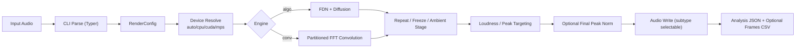
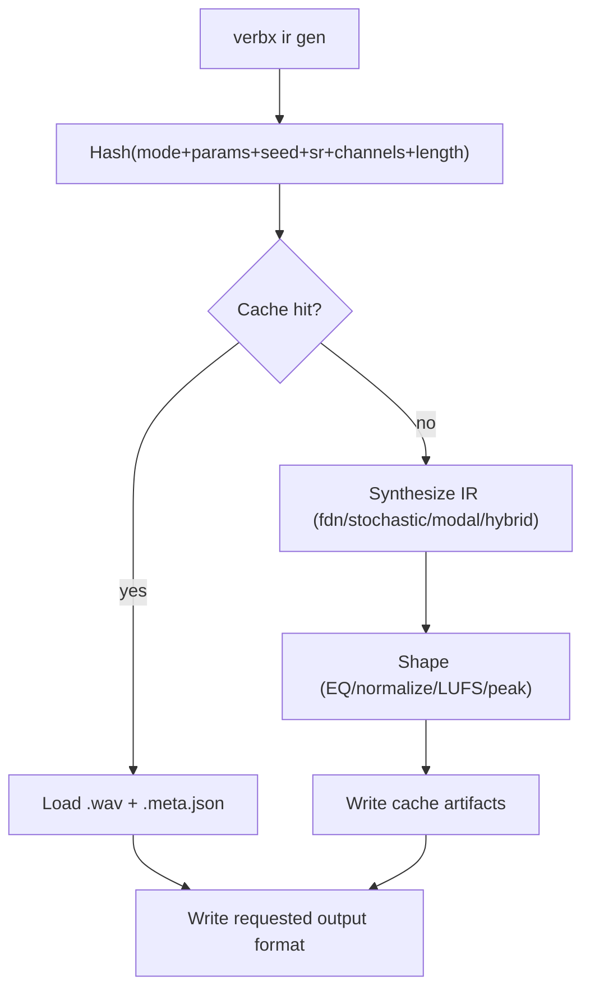

# verbx

`verbx` is a production-grade Python command-line tool for creating spacious,
cinematic, and experimental reverb effects from audio files. It is designed for
both beginners and advanced users: you can start with simple one-line commands,
then gradually use deeper controls as your workflow grows.

Under the hood, `verbx` supports two main reverb approaches:
algorithmic reverb (including FDN, or *Feedback Delay Network*, for very long,
stable tails) and convolution reverb (using impulse responses). It also includes
freeze/repeat processing, loudness and peak targeting, multichannel/surround
routing, and synthetic IR generation with deterministic caching for reproducible
results.

## Status

Current implementation level: **v0.4**

- Prompt 1: scaffolding and architecture
- Prompt 2: functional DSP render path
- Prompt 3: loudness/peak + shimmer/ambient controls
- Prompt 4: IR factory, cache, batch, tempo sync, framewise analysis
- v0.4 additions: framewise modulation analysis, advanced IR fitting heuristics, parallel batch scheduler

## Can I Use `verbx` Without Hatch?

Yes.

Hatch is convenient, but optional. You can use `verbx` with plain `pip`, a virtualenv,
`pipx`, or directly via `python -m verbx.cli`.
## Features

- CLI-only architecture (Typer + Rich)
- Algorithmic reverb (FDN + diffusion topology)
- Partitioned FFT convolution (long IR friendly)
- Native multichannel/surround processing and matrix IR routing (M input × N output)
- Freeze segment looping + repeat chaining
- Loudness/peak controls (LUFS, sample peak, true-peak approximation)
- Ambient controls (shimmer, ducking, bloom, tilt EQ)
- Synthetic IR generation (`fdn`, `stochastic`, `modal`, `hybrid`)
- Deterministic IR cache with metadata sidecars
- Batch rendering manifests
- Tempo-synced note parsing (`--pre-delay 1/8D --bpm 120`)
- Framewise CSV analysis exports

## Requirements

- Python 3.11+
- `libsndfile` available on system (required by `soundfile`)
- Optional acceleration packages:
  - `numba` (faster CPU algorithmic FDN path)
  - `cupy` / `cupy-cuda12x` (CUDA convolution backend)

## Installation and Quick Start

### Option A: Hatch (recommended for contributors)

```bash
hatch env create
hatch run verbx --help
```

### Option B: Plain virtualenv + pip (no Hatch)

```bash
python3 -m venv .venv
source .venv/bin/activate
python -m pip install --upgrade pip
python -m pip install -e ".[dev]"
verbx --help
```

### Option C: pipx (isolated app install)

```bash
pipx install .
verbx --help
```

### Option D: Run module directly (no console-script install)

```bash
python -m pip install typer rich numpy scipy soundfile librosa pyloudnorm
PYTHONPATH=src python -m verbx.cli --help
```

## Choosing How To Run `verbx`

### Hatch

Pros:

- Best match for this repository's contributor workflow (`hatch run lint`, `typecheck`, `test`)
- Reproducible project environment defined in `pyproject.toml`
- No need to manually remember command variants for QA checks

Cons:

- Requires installing Hatch
- Dependency resolution/install is usually slower than `uv`

Best for:

- Contributors working on `verbx` itself
- CI/local parity with documented project scripts

### `uv`

Pros:

- Very fast environment creation and dependency install
- Supports project run flows (`uv run ...`) and pip-compatible flows (`uv pip ...`)
- Good for users who already standardize on `uv` across projects

Cons:

- Repo scripts are authored under Hatch env scripts, so command names differ
- Team docs and CI in this repo are Hatch-first

Best for:

- Power users prioritizing speed
- Local dev where you prefer `uv` tooling conventions

Example (`uv`-native):

```bash
uv sync --extra dev
uv run verbx --help
```

Example (pip-compatible with `uv`):

```bash
uv venv
source .venv/bin/activate
uv pip install -e ".[dev]"
verbx --help
```

### Plain `venv` + `pip`

Pros:

- Universal, standard Python workflow
- No extra package manager required

Cons:

- More manual steps
- Slower installs than `uv`

Best for:

- Environments where only standard Python tooling is allowed

### `pipx`

Pros:

- Isolated app install without polluting global Python packages
- Simple for command-line usage only

Cons:

- Less convenient for editing/testing local source changes
- Not ideal for contributor QA loops

Best for:

- End users who only want to run `verbx` commands

### Direct `python -m verbx.cli`

Pros:

- Quickest way to run source without creating a console script entry point
- Useful for debugging local module execution

Cons:

- Requires setting `PYTHONPATH=src` (or equivalent path setup)
- Easier to drift from normal installed usage
- Not ideal as a primary workflow

Best for:

- Fast local checks and debugging
- Situations where you intentionally avoid install steps

Recommendation:

- Use Hatch for contributing to this repo.
- Use `uv` if you want the same result with faster dependency operations.
- Use `venv` + `pip` for maximal portability.
- Use `python -m verbx.cli` for quick local debugging only.

## Quick Start Recipes

### 1) First render (algorithmic)

```bash
verbx render input.wav output.wav --engine algo --rt60 80 --wet 0.85 --dry 0.15
```

### 2) Convolution render with external IR

```bash
verbx render input.wav output.wav --engine conv --ir hall_ir.wav --partition-size 16384
```

### 2b) Surround matrix convolution (true cross-channel routing)

```bash
# 5.1 input with matrix-packed IR channels
verbx render in_5p1.wav out_5p1.wav \
  --engine conv \
  --ir ir_matrix_5p1.wav \
  --ir-matrix-layout output-major
```

### 3) Freeze + repeat chain

```bash
verbx render input.wav output.wav --freeze --start 2.0 --end 4.0 --repeat 3
```

### 4) Loudness and peak-targeted render

```bash
verbx render input.wav output.wav \
  --target-lufs -18 \
  --target-peak-dbfs -1 \
  --true-peak \
  --normalize-stage post
```

### 5) Shimmer + ambient controls

```bash
verbx render input.wav output.wav \
  --shimmer --shimmer-semitones 12 --shimmer-mix 0.35 \
  --duck --duck-attack 15 --duck-release 250 \
  --bloom 2.0 --tilt 1.5
```

### 6) Tempo-synced pre-delay

```bash
verbx render input.wav output.wav --pre-delay 1/8D --bpm 120
```

### 7) Framewise analysis CSV during render

```bash
verbx render input.wav output.wav --frames-out reports/output_frames.csv
```

`frames.csv` now includes modulation-oriented columns:

- `amp_mod_depth`, `amp_mod_rate_hz`
- `centroid_mod_depth`, `centroid_mod_rate_hz`

### 8) Auto-generate cached IR during render

```bash
verbx render input.wav output.wav \
  --ir-gen --ir-gen-mode hybrid --ir-gen-length 120 --ir-gen-seed 7
```

### 9) Force 32-bit float output + final peak normalization

```bash
# write WAV as 32-bit float
verbx render input.wav output.wav --out-subtype float32

# match final output peak to input peak
verbx render input.wav output.wav --output-peak-norm input

# normalize final output peak to full scale (0 dBFS)
verbx render input.wav output.wav --output-peak-norm full-scale

# normalize final output peak to a specified target
verbx render input.wav output.wav --output-peak-norm target --output-peak-target-dbfs -3
```

### 10) Acceleration (CUDA / Apple Silicon)

```bash
# auto-select compute device
verbx render input.wav output.wav --device auto

# force CUDA convolution path (falls back safely if unavailable)
verbx render input.wav output.wav --engine conv --ir hall.wav --device cuda

# Apple Silicon: prefer MPS profile + tune CPU thread count
verbx render input.wav output.wav --device mps --threads 8
```

Notes:

- CUDA path uses optional CuPy acceleration for partitioned FFT convolution.
- Algorithmic FDN path uses CPU backend (optional Numba JIT when installed).
- If requested acceleration is unavailable, `verbx` falls back to CPU and reports the effective backend.

### 11) Batch throughput

```bash
# run batch jobs concurrently
verbx batch render manifest.json --jobs 8

# policy scheduler (v0.4): prioritize longest jobs first (default)
verbx batch render manifest.json --jobs 8 --schedule longest-first

# shortest-first with retries and continue-on-error
verbx batch render manifest.json --jobs 8 --schedule shortest-first --retries 1 --continue-on-error
```

## New User Guide

### Start Here (5-minute setup)

1. Install dependencies (`uv` or `venv + pip`).
2. Confirm CLI is available:
   ```bash
   verbx --help
   ```
3. Run a first render:
   ```bash
   verbx render input.wav output.wav --engine auto
   ```
4. Inspect generated analysis JSON:
   - `output.wav.analysis.json`
5. Iterate with one variable at a time:
   - reverb time: `--rt60`
   - wet/dry balance: `--wet`, `--dry`
   - tonal shape: `--lowcut`, `--highcut`, `--tilt`

### Processing Architecture



### IR Generation + Cache Flow



## DSP Math Notes

### RT60 to Feedback Gain (FDN)

For each delay line with delay $d$ seconds and target RT60 $T_{60}$:

$$
g \approx 10^{-3d/T_{60}}
$$

This maps exponential energy decay to delay-line feedback gain.  
`verbx` applies this per-line, then applies damping filters for faster HF decay.

### FDN State Update

At each sample:

$$
\mathbf{y}[n] = \mathbf{D}\left(\mathbf{x}_{fb}[n]\right), \quad
\mathbf{x}_{fb}[n+1] = \mathbf{G}\mathbf{M}\mathbf{y}[n] + \mathbf{u}[n]
$$

- $\mathbf{M}$: mixing matrix (Hadamard-style orthogonal mix)
- $\mathbf{G}$: diagonal feedback gains (RT60-calibrated)
- $\mathbf{D}$: damping / DC filtering
- $\mathbf{u}[n]$: injected input (after pre-delay and diffusion)

### Partitioned FFT Convolution

Convolution in frequency domain:

$$
Y_k(\omega) = \sum_{p=0}^{P-1} X_{k-p}(\omega)\,H_p(\omega)
$$

- $H_p$: FFT of IR partition $p$
- $X_{k-p}$: FFT history of recent input partitions
- $P$: number of IR partitions

This reduces long-IR convolution cost and supports streaming block processing.

### Multichannel Matrix Convolution

For $M$ input channels and $N$ output channels:

$$
y_o[n] = \sum_{i=0}^{M-1} (x_i * h_{i,o})[n]
$$

- $h_{i,o}$ is the IR from input channel $i$ to output channel $o$
- `verbx` supports matrix-packed IR files where channel count is `M * N`
- packing order is controlled by `--ir-matrix-layout`:
  - `output-major`: channel index = `o*M + i`
  - `input-major`: channel index = `i*N + o`

### Freeze Crossfade (Equal Power)

For loop boundary crossfade parameter $\theta \in [0, \pi/2]$:

$$
w_{out} = \cos(\theta), \quad w_{in} = \sin(\theta)
$$

$$
y = w_{out}\,x_{tail} + w_{in}\,x_{head}
$$

This reduces clicks at loop boundaries.

### Loudness / Peak Stages

- Integrated LUFS normalization (EBU R128 via `pyloudnorm`)
- True-peak approximation via oversampling
- Optional limiter + sample-peak ceiling
- Optional final peak norm:
  - `input` (match input peak)
  - `target` (specified dBFS)
  - `full-scale` (0 dBFS)

## Performance Tuning

### Device Selection

- `--device auto`: choose best available platform (`cuda` > `mps` > `cpu`)
- `--device cuda`: enables CuPy backend for convolution if available
- `--device mps`: optimized Apple Silicon profile (CPU backend + thread tuning)
- `--device cpu`: deterministic CPU-only execution

### Threading

- `--threads N` sets CPU threading hints for FFT/BLAS stacks.
- Useful on Apple Silicon and multi-core x86 for convolution workloads.

### Streaming Convolution Mode

`verbx render` automatically uses file-streaming convolution (low peak RAM) when compatible.

Current streaming-compatible constraints:

- `--engine conv`
- `--repeat 1`
- no freeze
- `--normalize-stage none`
- no LUFS/peak target stages
- no duck/bloom/tilt/lowcut/highcut post stages
- `--output-peak-norm none`

When incompatible options are requested, `verbx` falls back to full-buffer processing.

## Surround / Multichannel IR Rules

- Input audio: arbitrary channel count (`M`).
- IR file channel interpretation:
  - `1` channel IR: diagonal routing, same IR applied per channel.
  - `M` channel IR: diagonal routing with per-channel IR.
  - `M*N` channel IR (where channel count divisible by `M`): full matrix routing from `M` input to `N` output.
- Non-divisible IR channel counts now raise explicit CLI errors.
- Render summary + analysis JSON report effective routing/backend details.

### Parallel Batch Rendering

`verbx batch render manifest.json --jobs N` now executes jobs concurrently.

- Use `--jobs` near CPU core count for throughput.
- Use `--dry-run` to validate manifests before rendering.

## CLI Command Cookbook

### Global help

```bash
verbx --help
```

### Core commands

```bash
verbx render INFILE OUTFILE [options]
verbx analyze INFILE [--lufs] [--json-out report.json] [--frames-out frames.csv]
verbx suggest INFILE
verbx presets
```

### `render` examples

```bash
# high-density algorithmic tail
verbx render in.wav out.wav --engine algo --rt60 120 --damping 0.5 --width 1.2

# convolution with IR normalization and tail cap
verbx render in.wav out.wav --engine conv --ir plate.wav --ir-normalize peak --tail-limit 45

# cross-channel matrix routing (packed IR channels)
verbx render in_7p1.wav out_7p1.wav --engine conv --ir matrix_7p1.wav --ir-matrix-layout output-major

# per-pass normalization strategy
verbx render in.wav out.wav --repeat 4 --normalize-stage per-pass --repeat-target-lufs -20

# output sample-peak strategy
verbx render in.wav out.wav --target-peak-dbfs -2 --sample-peak

# force float32 output container subtype
verbx render in.wav out.wav --out-subtype float32

# final peak normalization options
verbx render in.wav out.wav --output-peak-norm input
verbx render in.wav out.wav --output-peak-norm full-scale
verbx render in.wav out.wav --output-peak-norm target --output-peak-target-dbfs -6

# disable limiter
verbx render in.wav out.wav --no-limiter
```

### `analyze` examples

```bash
verbx analyze in.wav
verbx analyze in.wav --lufs
verbx analyze in.wav --json-out reports/in_analysis.json
verbx analyze in.wav --frames-out reports/in_frames.csv
```

### `ir` command group

```bash
verbx ir gen OUT_IR.wav [options]
verbx ir analyze IR.wav
verbx ir process IN_IR.wav OUT_IR.wav [options]
verbx ir fit INPUT.wav OUT_IR.wav --top-k 5
```

#### Generate IR examples

```bash
# hybrid, long tail
verbx ir gen IRs/hybrid_120.wav --mode hybrid --length 120 --seed 42

# format switch (overrides extension)
verbx ir gen IRs/custom_ir --mode hybrid --length 120 --format flac

# explicit harmonic anchor
verbx ir gen IRs/modal_64hz.wav --mode modal --f0 "64 Hz"

# auto-tune using source audio fundamentals/harmonics
verbx ir gen IRs/tuned_from_source.wav --mode hybrid --analyze-input source.wav

# extended control example
verbx ir gen IRs/cinematic.wav \
  --mode hybrid --length 180 --rt60 95 --damping 0.45 \
  --er-count 32 --er-max-delay-ms 120 --er-room 1.3 \
  --diffusion 0.7 --density 1.2 --tilt 1.5 --lowcut 80 --highcut 12000
```

#### Analyze/process/fit IR examples

```bash
verbx ir analyze IRs/hybrid_120.wav --json-out reports/hybrid_120_analysis.json

verbx ir process IRs/hybrid_120.wav IRs/hybrid_120_dark.wav \
  --lowcut 120 --highcut 7000 --tilt -1.0 --normalize peak

verbx ir fit input.wav IRs/fitted.wav --top-k 3 --candidate-pool 12 --fit-workers 4
```

### Cache command group

```bash
verbx cache info
verbx cache clear
```

### Batch command group

```bash
verbx batch template > manifest.json
verbx batch render manifest.json --jobs 4   # parallel workers
verbx batch render manifest.json --jobs 0 --schedule longest-first --retries 1
verbx batch render manifest.json --jobs 4 --dry-run
```

## Pregenerated IRs and Audio Examples

### Pregenerated long IRs (60s–360s)

- Folder: [IRs](IRs/)
- Details: [IRs/README.md](IRs/README.md)

Included examples:

- `ir_hybrid_60s.flac`
- `ir_fdn_90s.flac`
- `ir_stochastic_120s.flac`
- `ir_modal_180s.flac`
- `ir_hybrid_240s.flac`
- `ir_modal_360s.flac`

Each IR includes a sidecar metadata file:

- `<name>.ir.meta.json`

### Short audio demos

- [Dry click](examples/audio/dry_click.wav)
- [Hybrid IR (short)](examples/audio/hybrid_ir_short.wav)
- [Dry click reverbed](examples/audio/dry_click_reverbed.wav)

## Generate 25 IRs With Varying Parameters

### Python script

```bash
./scripts/generate_ir_bank.py \
  --out IRs/generated_25 \
  --count 25 \
  --sr 12000 \
  --channels 2 \
  --format flac
```

### Bash script (CLI-driven)

```bash
./scripts/generate_ir_bank.sh IRs/generated_25_cli 25 flac
```

Scripts:

- [scripts/generate_ir_bank.py](scripts/generate_ir_bank.py)
- [scripts/generate_ir_bank.sh](scripts/generate_ir_bank.sh)

## Development

### Lint / type-check / tests

With Hatch:

```bash
hatch run lint
hatch run typecheck
hatch run test
```

Without Hatch:

```bash
ruff check .
pyright
pytest
```

## Project Layout

- `src/verbx/cli.py`: command routing and UX
- `src/verbx/core/`: DSP engines, pipeline, loudness, shimmer, ambient, tempo
- `src/verbx/analysis/`: global + framewise feature extraction
- `src/verbx/io/`: audio I/O and progress utilities
- `src/verbx/ir/`: synthetic IR generation modes, shaping, metrics, tuning
- `tests/`: automated tests
- `docs/`: deeper guides

## Additional Docs

- [IR synthesis guide](docs/IR_SYNTHESIS.md)

## Roadmap

- v0.5: adaptive render quality presets, richer framewise modulation summaries, distributed batch execution
