<p align="center">
  
</p>

# verbx

**Colossal 64-bit spatial audio reverberator, accelerated with CUDA and Metal.**

> **Start with the book:** [Read the complete illustrated verbx User Guide (PDF)](USERGUIDE.pdf)
> for CLI workflows, plug-in operation, DSP explanations, musical examples,
> educational projects, figures, and the research bibliography.

`verbx` is a research-grade Python CLI for creating reverb effects that range from subtle room placement to cathedral-scale tails 3600 seconds long. It handles the complete reverb workflow: ingesting and generating impulse responses, processing audio through two independent engines, controlling every parameter with time-varying automation, delivering loudness-targeted multichannel output, reducing late-room smear with deterministic dereverberation, producing reproducible analysis artifacts at every step, and now previewing spaces in realtime from CLI-selectable audio devices.

You can batch reverberate a directory of audio files to create lush Dolby Atmos beds. Or use it as part of your corpus-augmentation workflow for audio AI projects.

Under the hood, everything runs in 64-bit floating point. The algorithmic engine is built around a configurable Feedback Delay Network with eight matrix families, multiband decay, optional pre-FDN comb-cloud coloration, and optional time-varying behavior. The convolution engine uses partitioned FFT with optional CUDA acceleration and full M-input-to-N-output matrix routing. Both engines share the same diffusion, shimmer, ducking, freeze, loudness, and spatial controls.

The latest `v0.7.7` work also starts to bridge pure parametric design with
explicit acoustics. There is now a reusable room-geometry model for dimensions,
materials, source/listener placement, Bolt-style proportion warnings, and RT60
to rectangular-room inversion via `verbx room-model`.

This is not a "set RT60 and go" tool. The parameter surface is wide by design. Most users start with three flags and expand from there.

For AI workflows, `verbx` is also a strong command-line tool for deterministic audio data augmentation and voice-model robustness testing. You can generate reproducible reverberant variants for ASR/TTS/speaker pipelines, keep split-safe metadata, and batch large render sets from manifests.

```bash
# A room that no physical building has ever had. RT60 = 120 seconds.
verbx render voice.wav out.wav \
  --engine algo --rt60 120 --wet 0.99 --dry 0.01 \
  --fdn-lines 32 --fdn-matrix tv_unitary --fdn-tv-rate-hz 0.30 \
  --shimmer --shimmer-semitones 12 --shimmer-mix 0.45 \
  --bloom 2.8 --tilt 2.0
```

## AUv3 / VST3 Plug-in Track

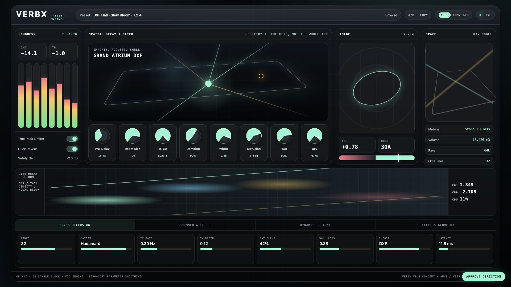

The image above is the approved `1920x1080` visual direction for the full-screen
spatial console.

The capture below is the currently compiled JUCE editor. It now implements the
same spatial-console composition: loudness bank, DXF geometry theater, image
and ray-model panels, nine live parameter cards, horizontal decay analyzer,
quality/mode controls, and lower expert sections. The host has muted its input,
so the live analyzer trace correctly rests at its floor.

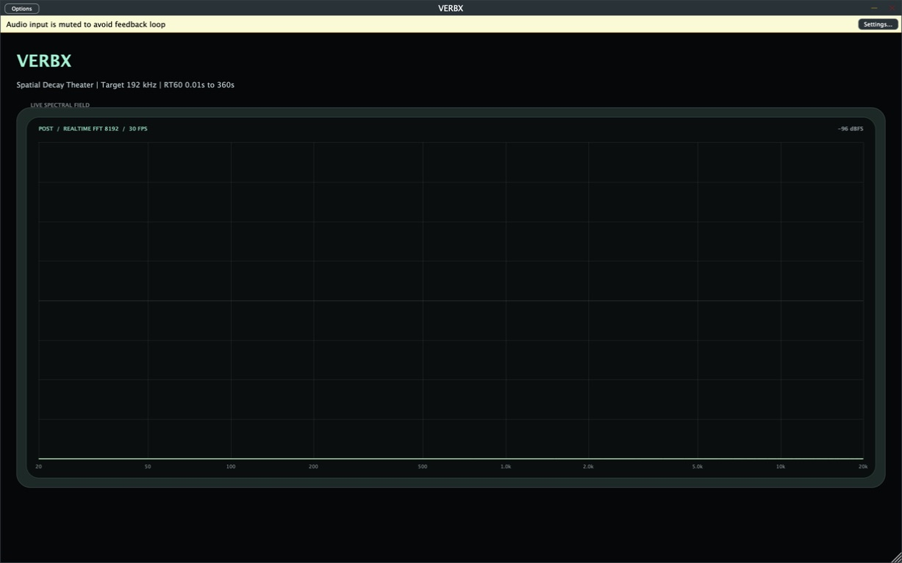

The compiled **Expert** page mirrors all nine continuous parameters as both
rotary controls and high-resolution faders, keeps the realtime spectrum in
view, and adds twenty native selector buttons. Its five macro banks write the
same host-automatable state for quality, width, logarithmic decay, dry/wet
routing, and paired damping/diffusion character settings.

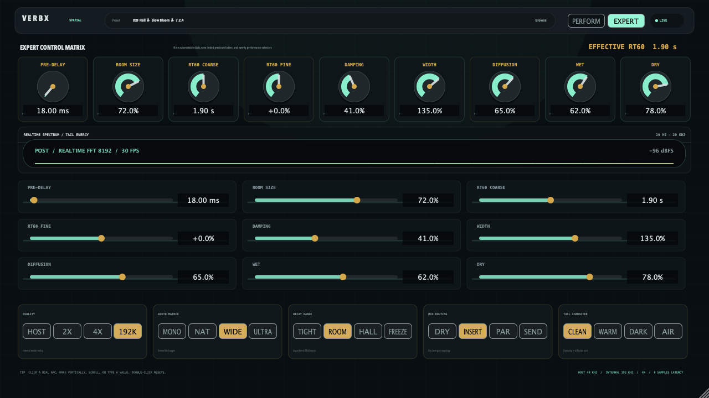

The first native plug-in foundation is implemented under
[`native/verbx_plugin`](native/verbx_plugin/README.md):

- C++17/JUCE host shell for AU, AUv3, VST3, and standalone targets
- shared C11 parameter manifest and realtime processing boundary
- logarithmic RT60 mapping from `0.01s` to `360s` with coarse and fine controls
- explicit Freeze and Reverse parameters
- real allocation-free wet-path oversampling for Host, 2x, 4x, and Target
  192 kHz quality modes, with a 32-bit-float callback contract
- cached lock-free parameter reads on the audio callback
- overlaid realtime post-DSP spectrum analyzer with an 8192-point Hann FFT,
  logarithmic frequency grid, smoothed response, and peak trace
- allocation-free mono/stereo Schroeder realtime core with pre-delay, room
  scaling, RT60, damping, diffusion, width, wet/dry, Freeze, and a zero-lookahead
  reverse-style swell
- 20 ms realtime parameter smoothing for host automation without zipper noise
- responsive Perform/Expert pages with 18 linked continuous controls and 20
  selector buttons; no Expert control is decorative or stored outside host state
- full-screen 16:9 spatial-console editor with the complete initial
  12-parameter control surface and effective-RT60 readout

Target mode chooses the smallest integer factor that reaches or exceeds 192
kHz without downsampling. It therefore runs at 4x/192 kHz in a 48 kHz project,
2x/192 kHz at 96 kHz, and 5x/220.5 kHz at 44.1 kHz. The status strip shows the
actual host rate, internal rate, factor, block size, and reported latency.
Quality changes rebuild the prepared wet-path state off the audio callback.

The complete installer builds and installs the CLI, native executable, man
pages, runtime extras, VST3, Audio Unit on macOS, and the standalone app:

```bash
./install.sh
```

If JUCE is not already available, the installer downloads the pinned JUCE
`8.0.6` source release into `build/deps/JUCE`. For an offline installation or
an existing checkout, use:

```bash
./install.sh --juce-source /path/to/JUCE
```

The default macOS plug-in destinations are
`~/Library/Audio/Plug-Ins/Components/VERBX.component` and
`~/Library/Audio/Plug-Ins/VST3/VERBX.vst3`; the standalone app is installed as
`~/Applications/VERBX.app`. That app contains and registers the true AUv3
extension at `Contents/PlugIns/VERBX.appex`. Linux installs VST3 to `~/.vst3` and the standalone
binary to `~/.local/bin/verbx-plugin`. Restart or rescan the audio host after
installation. Run `./install.sh --help` for component skips, custom destination
directories, offline operation, and build controls.

Repository builds do not require JUCE unless the plug-in target is enabled
manually:

```bash
# Verify the guarded scaffold without JUCE.
cmake -S native/verbx_plugin -B build/native/verbx_plugin

# Configure the real AU/AUv3/VST3/Standalone targets when JUCE is installed.
cmake -S native/verbx_plugin -B build/native/verbx_plugin-juce \
  -DVERBX_ENABLE_JUCE_PLUGIN=ON
cmake --build build/native/verbx_plugin-juce --config Release
```

Use `-DVERBX_JUCE_SOURCE_DIR=/path/to/JUCE` when building from a JUCE source
checkout instead of an installed CMake package.

---

## Instant Sonic Gratification

If you want immediate results with minimal decision-making, run this:

```bash
git clone https://github.com/TheColby/verbx.git && cd verbx && \
./install.sh --prefix "$HOME/.local" && \
verbx render ../in.wav out.wav --engine algo --rt60 120 --wet 0.99 --dry 0.01
```

That gives you an absurd long-tail render immediately. If `verbx` is not on PATH after install, run:

```bash
export PATH="$HOME/.local/bin:$PATH"
```

## Quick Start

If `verbx` is already installed, this is the fastest way to start:

```bash
verbx render input.wav output.wav --engine algo --rt60 2.5 --wet 0.3 --dry 0.7
```

This applies a natural-sounding 2.5-second algorithmic reverb. Output is written to `output.wav`, with analysis at `output.wav.analysis.json`.

Need a live preview instead of an offline bounce?

```bash
verbx realtime --engine algo --input-device "Built-in Microphone" \
  --output-device "Headphones" --rt60 20 --freeze --shimmer \
  --fdn-matrix tv-unitary --fdn-tv-rate-hz 0.35 --fdn-tv-depth 0.12 \
  --lowcut 120 --highcut 9000 --tilt 1.5 --duration 10
```

Initial realtime mode runs either direct convolution from `--ir` or an
algorithmic proxy IR rendered once and monitored through the streaming
convolver. It is meant for auditioning spaces and tails, not yet for the full
automation/batch feature set. Realtime `--freeze` is an honest approximation:
it renders a long self-sustaining proxy tail for live auditioning rather than
reusing the offline segment-freeze operator.

Need live cleanup instead of added space?

```bash
verbx realtime --live-mode dereverb \
  --input-device "Built-in Microphone" \
  --output-device "Headphones" \
  --sample-rate 48000 --block-size 384 \
  --dereverb-mode wiener --dereverb-strength 0.85 \
  --dereverb-window-ms 12 --dereverb-hop-ms 4 --dereverb-tail-ms 90 \
  --dereverb-pre-emphasis 0.2 --dereverb-max-atten-db 18 \
  --duration 10
```

If you need to install first on macOS:

```bash
brew tap thecolby/verbx
brew install thecolby/verbx/verbx
verbx quickstart
```

Need starting settings for your file?

```bash
verbx suggest input.wav
verbx quickstart
```

Need the long-form manual?

```bash
python3 scripts_generate_docs_pdf.py
```

That writes [`docs/USERGUIDE.md`](docs/USERGUIDE.md) and `USERGUIDE.pdf`, combining this README with the user-facing guides and tip-heavy docs in `docs/`.

### Five Runnable Examples

```bash
# 1. Natural room — voice or piano in a medium hall
verbx render in.wav hall.wav --engine algo --rt60 2.0 --wet 0.25 --dry 0.8 --pre-delay-ms 18

# 2. Convolution with a real IR — character follows the space you measured
verbx render in.wav conv.wav --engine conv --ir hall_ir.wav --partition-size 16384

# 3. Shimmer pad — pitch-shifted ambient wash, good for synths
verbx render in.wav shimmer.wav --engine algo --rt60 12 --wet 0.85 \
  --shimmer --shimmer-semitones 12 --shimmer-mix 0.35 --bloom 2.0

# 4. Broadcast loudness target — –23 LUFS, –1 dBTP true peak
verbx render in.wav broadcast.wav --target-lufs -23 --true-peak --target-peak-dbfs -1

# 5. Extreme ambient — 90-second tail, slow evolution, near-frozen
verbx render in.wav ambient.wav --engine algo --rt60 90 --wet 0.92 \
  --fdn-matrix tv_unitary --fdn-tv-rate-hz 0.08 --bloom 2.0 --tilt 0.8

# 6. Comb-cloud texture — dense metallic haze before the late field
verbx render in.wav combcloud.wav --engine algo --rt60 6 --wet 0.78 --dry 0.35 \
  --comb-cloud --comb-cloud-count 32 --comb-cloud-feedback 0.42 --comb-cloud-mix 0.30 \
  --fdn-lines 12 --fdn-matrix hadamard
```

```bash
# Output-definition presets (default is HD)
verbx render in.wav out_hd.wav --engine conv --ir hall_ir.wav
verbx render in.wav out_md.wav --engine conv --ir hall_ir.wav --quality-preset md
verbx render in.wav out_sd.wav --engine conv --ir hall_ir.wav --quality-preset sd
```

## Full Installation Instructions

**With uv (fastest):**

```bash
git clone https://github.com/TheColby/verbx.git && cd verbx
uv sync && uv run verbx --help
```

For realtime audio device support:

```bash
uv sync --extra realtime
```

**With pip + venv:**

```bash
python3 -m venv .venv && source .venv/bin/activate
pip install -e . && verbx --help
```

For realtime audio device support:

```bash
pip install -e ".[realtime]"
```

**Complete installation, including native CLI and plug-ins:**

```bash
./install.sh
verbx --help && man verbx-render
man verbx-dereverb
```

This installs the Python package with realtime and SOFA runtime extras by
default. Use `--minimal-python`, `--skip-native`, `--skip-plugins`, `--no-man`,
or custom `--au-dir`, `--vst3-dir`, and `--app-dir` destinations when a smaller
or system-managed installation is preferable. Inspect the complete plan without
changing the machine using `./install.sh --dry-run`.

If VERBX does not appear after fully quitting and reopening the DAW, force a
signed reinstall and Audio Unit cache rebuild on macOS:

```bash
./install.sh --reset-plugin-cache
```

VERBX appears under the plug-in vendor **Colby Leider**. Logic and GarageBand
can use the AUv2 component or the AUv3 app extension; VST3 hosts use
`VERBX.vst3`. The editor opens at a host-safe 1280x720 and remains fully
resizable down to 800x450 while preserving the full console layout. The
installer now signs the nested AUv3 extension before its
containing app, registers it with PlugInKit, and seals
and strictly verifies every installed macOS bundle, touches the plug-in paths,
and restarts the Audio Component Registrar. The explicit cache-reset option
backs up existing Apple Audio Unit cache files beneath
`~/.local/share/verbx/cache-backups/` before clearing them. DAW-specific VST3
caches may still require the host's “rescan all plug-ins” command.

An ad-hoc-signed AUv3 can validate but still fail when Logic launches its app
extension. To avoid shadowing the reliable AUv2 component, `./install.sh`
installs but unregisters ad-hoc AUv3 hosting by default. Use an Apple signing
identity for production AUv3 hosting:

```bash
./install.sh --codesign-identity "Apple Development: Your Name (TEAMID)"
```

`--enable-adhoc-auv3` is available only for local extension debugging.

macOS plug-ins build as universal `arm64+x86_64` binaries by default so they
remain visible to native Apple Silicon DAWs and hosts running under Rosetta.
The default deployment floor is macOS 12. Override these release defaults only
when intentionally producing a narrower local build:

```bash
./install.sh --macos-architectures arm64 --macos-deployment-target 14.0
```

**With Homebrew (macOS):**

```bash
brew tap thecolby/verbx
brew install thecolby/verbx/verbx
verbx version
```

Official tap repository: `TheColby/homebrew-verbx`.

For local maintainer testing, you can also install from the in-repo formula:

```bash
brew install --build-from-source ./packaging/homebrew/verbx.rb
```

**Requirements:** Python 3.11+, `libsndfile` on system path. Optional: `numba` (faster algorithmic path), `cupy` (CUDA convolution), `h5py` (SOFA import/extract via `verbx ir sofa-*`), `sounddevice` (realtime input/output via `verbx realtime`).

Homebrew maintainer details: [`docs/HOMEBREW.md`](docs/HOMEBREW.md)

If `verbx` is not found after install, add `~/.local/bin` to your PATH:

```bash
export PATH="$HOME/.local/bin:$PATH"   # add to ~/.zshrc or ~/.bashrc
```

## Python API (Research Workflows)

Use `verbx` as a library when you need notebook/pipeline integration:

```python
from verbx.api import analyze_file, generate_ir, render_file
from verbx.config import RenderConfig
from verbx.ir import IRGenConfig

report = render_file("dry.wav", "wet.wav", RenderConfig(engine="algo", rt60=2.5, wet=0.7))
ir_audio, ir_sr, ir_meta = generate_ir(IRGenConfig(mode="fdn", duration=3.0, sr=48000))
metrics = analyze_file("wet.wav", include_loudness=True)
```

## Audio Examples

Rendered examples are included in [`examples/audio/`](examples/audio/). The pack is now delivered at 48 kHz, PCM24. Most examples are stereo; the utility click and short hybrid IR files are mono. The shimmer-heavy examples were re-rendered at this higher rate specifically to remove the grit from the older 24 kHz / PCM16 pack.

GitHub repository README pages do not provide reliable inline audio controls. The `Play`
links below open each asset directly in the browser's native media player with one click.

### Utility and verification files

| File | Play | Description |
|------|------|-------------|
| [`dry_click.wav`](examples/audio/dry_click.wav) | [Play](https://cdn.jsdelivr.net/gh/TheColby/verbx@main/examples/audio/dry_click.wav) | One-shot dry click reference for sanity checks |
| [`dry_click_reverbed.wav`](examples/audio/dry_click_reverbed.wav) | [Play](https://cdn.jsdelivr.net/gh/TheColby/verbx@main/examples/audio/dry_click_reverbed.wav) | Reverberated click for immediate A/B verification |
| [`hybrid_ir_short.wav`](examples/audio/hybrid_ir_short.wav) | [Play](https://cdn.jsdelivr.net/gh/TheColby/verbx@main/examples/audio/hybrid_ir_short.wav) | Short hybrid IR asset used in quick convolution demos |

### Realistic dry/wet example pairs

| File | Play | Description |
|------|------|-------------|
| [`realistic_speech_dry.wav`](examples/audio/realistic_speech_dry.wav) | [Play](https://cdn.jsdelivr.net/gh/TheColby/verbx@main/examples/audio/realistic_speech_dry.wav) | Dry speech source used for room and plate examples |
| [`realistic_speech_room.wav`](examples/audio/realistic_speech_room.wav) | [Play](https://cdn.jsdelivr.net/gh/TheColby/verbx@main/examples/audio/realistic_speech_room.wav) | Natural speech room render |
| [`realistic_music_dry.wav`](examples/audio/realistic_music_dry.wav) | [Play](https://cdn.jsdelivr.net/gh/TheColby/verbx@main/examples/audio/realistic_music_dry.wav) | Dry music source used for ambient and shimmer examples |
| [`realistic_music_hall.wav`](examples/audio/realistic_music_hall.wav) | [Play](https://cdn.jsdelivr.net/gh/TheColby/verbx@main/examples/audio/realistic_music_hall.wav) | Natural concert-hall style music render, re-tuned for a cleaner less congested tail |
| [`realistic_drums_dry.wav`](examples/audio/realistic_drums_dry.wav) | [Play](https://cdn.jsdelivr.net/gh/TheColby/verbx@main/examples/audio/realistic_drums_dry.wav) | Dry drum source used for room and cathedral examples |
| [`realistic_drums_room.wav`](examples/audio/realistic_drums_room.wav) | [Play](https://cdn.jsdelivr.net/gh/TheColby/verbx@main/examples/audio/realistic_drums_room.wav) | Natural drum room render |

### Extreme range demos

| File | Play | Description | Key settings |
|------|------|-------------|--------------|
| [`extreme_cathedral_drums.wav`](examples/audio/extreme_cathedral_drums.wav) | [Play](https://cdn.jsdelivr.net/gh/TheColby/verbx@main/examples/audio/extreme_cathedral_drums.wav) | Drums → 8s Hadamard FDN cathedral | `--rt60 8.0 --fdn-lines 16 --fdn-matrix hadamard` |
| [`extreme_shimmer_music.wav`](examples/audio/extreme_shimmer_music.wav) | [Play](https://cdn.jsdelivr.net/gh/TheColby/verbx@main/examples/audio/extreme_shimmer_music.wav) | Music → 6s reverb with octave shimmer | `--shimmer --shimmer-semitones 12 --shimmer-feedback 0.65` |
| [`extreme_plate_speech.wav`](examples/audio/extreme_plate_speech.wav) | [Play](https://cdn.jsdelivr.net/gh/TheColby/verbx@main/examples/audio/extreme_plate_speech.wav) | Speech → circulant FDN plate simulation | `--rt60 1.8 --fdn-matrix circulant --lowcut 200 --highcut 6000` |
| [`extreme_frozen_music.wav`](examples/audio/extreme_frozen_music.wav) | [Play](https://cdn.jsdelivr.net/gh/TheColby/verbx@main/examples/audio/extreme_frozen_music.wav) | Music → 30s near-infinite tail (32-line FDN) | `--rt60 30.0 --fdn-lines 32 --wet 0.95` |

### Experimental music tradition demos

Eight examples drawn from the experimental and avant-garde music tradition, each isolating a
different reverb behavior or aesthetic.

| File | Play | Inspiration | What to listen for |
|------|------|-------------|-------------------|
| [`lucier_sitting_room.wav`](examples/audio/lucier_sitting_room.wav) | [Play](https://cdn.jsdelivr.net/gh/TheColby/verbx@main/examples/audio/lucier_sitting_room.wav) | Alvin Lucier — *I Am Sitting in a Room* | Speech run through the room 7× until only resonant frequencies survive |
| [`eno_discreet_music.wav`](examples/audio/eno_discreet_music.wav) | [Play](https://cdn.jsdelivr.net/gh/TheColby/verbx@main/examples/audio/eno_discreet_music.wav) | Brian Eno — *Discreet Music* / Ambient series | 12s tail swallowing the source into a continuous wash |
| [`oliveros_deep_listening.wav`](examples/audio/oliveros_deep_listening.wav) | [Play](https://cdn.jsdelivr.net/gh/TheColby/verbx@main/examples/audio/oliveros_deep_listening.wav) | Pauline Oliveros — *Deep Listening* | 18s cave-scale resonance, very low damping, 32-line FDN |
| [`fripp_frippertronics.wav`](examples/audio/fripp_frippertronics.wav) | [Play](https://cdn.jsdelivr.net/gh/TheColby/verbx@main/examples/audio/fripp_frippertronics.wav) | Robert Fripp — Frippertronics tape-loop | Octave shimmer with 0.78 feedback accumulating over 8s |
| [`mbv_shoegaze.wav`](examples/audio/mbv_shoegaze.wav) | [Play](https://cdn.jsdelivr.net/gh/TheColby/verbx@main/examples/audio/mbv_shoegaze.wav) | My Bloody Valentine — *Loveless* wall of sound | Dense shimmer wash (mix 0.55) through circulant FDN |
| [`reich_phase_drums.wav`](examples/audio/reich_phase_drums.wav) | [Play](https://cdn.jsdelivr.net/gh/TheColby/verbx@main/examples/audio/reich_phase_drums.wav) | Steve Reich — phase minimalism | Tight 0.7s room on percussion, circulant diffusion |
| [`radigue_drone.wav`](examples/audio/radigue_drone.wav) | [Play](https://cdn.jsdelivr.net/gh/TheColby/verbx@main/examples/audio/radigue_drone.wav) | Eliane Radigue — *ADNOS* / drone electronics | 45s near-infinite sustain, 32-line Hadamard, wet 0.97 |
| [`feldman_sparse_room.wav`](examples/audio/feldman_sparse_room.wav) | [Play](https://cdn.jsdelivr.net/gh/TheColby/verbx@main/examples/audio/feldman_sparse_room.wav) | Morton Feldman — late period | 3.8s room, low wet (0.52), allpass diffusion, contemplative space |

Dry source files are in the same directory. See [`examples/audio/README.md`](examples/audio/README.md) for the full render commands.

---

## Public Alpha Launch Notes

Current public alpha release: **v0.7.7**.

Current stabilization status:

- Python `0.7.x` render/realtime behavior is stabilized for the current cycle:
  realtime device failures are clearer, render long-tail flows have fail-fast
  safeguards or early status output, and render/realtime/dereverb emit
  machine-readable reports where applicable.
- CLI/docs/test consolidation is complete for Weeks 1-3 of the short-horizon
  plan: shared validators are extracted, generated docs/PDF are in sync, and
  focused regression coverage covers realtime, dereverb, limiter, and long-tail
  behaviors.
- Current native-track decision: `v0.8` is a hybrid transition release, with
  `verbx-c` shipped as an opt-in native render/doctor binary while the Python
  CLI remains the public alpha default. See
  [`docs/ROADMAP_NEXT_4_WEEKS.md`](docs/ROADMAP_NEXT_4_WEEKS.md).

- `verbx` is currently research-grade software (public alpha), not production-certified.
- Confirm your environment with `verbx quickstart --verify --strict` and `verbx doctor`.
- Verify one algorithmic render and one convolution render before batch usage.
- For live monitoring, verify `verbx realtime --list-devices` before relying on realtime auditioning.
- For reproducible reports and bug submissions, attach `--repro-bundle` outputs and `verbx doctor --json-out doctor.json`.
- For demo-ready outputs, keep `--true-peak --target-peak-dbfs -1` enabled when files will be transcoded.
- Public alpha scope, known limitations, and support paths:
  [`docs/PUBLIC_ALPHA_NOTES.md`](docs/PUBLIC_ALPHA_NOTES.md)
- Launch-week pinned demo commands and expected SHA256 outputs:
  [`docs/LAUNCH_WEEK_DEMO_PINS.md`](docs/LAUNCH_WEEK_DEMO_PINS.md)
- Canonical launch-example parity check:
  `python scripts/check_launch_examples.py --check`
- PyPI publish auth setup for maintainers:
  [`docs/PYPI_PUBLISH_SETUP.md`](docs/PYPI_PUBLISH_SETUP.md)

---

## v0.8 Native Track

`v0.8` is the planned native C executable line. The released tool remains the
Python implementation in `v0.7.x`, but the native rewrite has now started with
an executable scaffold under [`native/verbx_c/README.md`](native/verbx_c/README.md).
The live feature/gap table is tracked in
[`docs/NATIVE_PARITY.md`](docs/NATIVE_PARITY.md).

Chosen `v0.8` release shape: **hybrid wrapper phase before full replacement**.
`verbx-c` is the opt-in native executable for deterministic offline render,
doctor diagnostics, and machine-readable native support bundles. The Python
`verbx` CLI remains the default for realtime, dereverb, convolution, IR tools,
batch workflows, immersive utilities, and the full FDN feature surface until
native parity is proven by the checked-in contract fixtures.

Current native status:

- standalone `verbx-c` executable target
- portable C11 build path via `scripts/build_verbx_c.sh`
- implemented commands: `help`, `version`, `doctor`, `render`
- mono/stereo WAV input: PCM16/24/32 and float32/float64
- mono/stereo WAV output: `pcm16`, `float32`, `float64`
- deterministic offline render lifecycle in C: read -> process -> tail-finalize -> write
- explicit native process/error contract surfaced in `verbx-c doctor`
- native tail-stop metric selection: `--tail-metric peak|rms`
- native peak-safe output: `--peak-safe --peak-ceiling-db DB`
- native JSON reports: `doctor --json-out` and `render --json-out`
- foundational native algorithmic reverb core with float64 internal processing
- reusable `verbx_c_core` library with a tested plug-in parameter manifest
- realtime context API with persistent mono/stereo reverb state, quality-target
  status, zero-latency reporting, Freeze, and reverse-style swell behavior
- guarded C++/JUCE AU, AUv3, VST3, and standalone shell with the complete
  initial control dock and realtime spectrum overlay
- plug-in RT60 coarse/fine mapping and native render floor aligned at `0.01s`

`v0.8` in scope:

- `verbx-c doctor` and `verbx-c render`
- deterministic mono/stereo WAV offline render
- `pcm16`, `float32`, and `float64` output
- render/doctor JSON reports for support bundles
- parity comparison against `tests/fixtures/native_render_parity_contract.json`

Deferred beyond the first `v0.8` slice:

- replacing Python `verbx` as the default command
- full native realtime reverb DSP and device/DAW production validation
- convolution, dereverb, IR synthesis/morphing, batch, immersive, and AI helpers
- full Python FDN parity, automation lanes, shimmer/freeze/repeat, and broad preset coverage

Example native smoke test:

```bash
./scripts/build_verbx_c.sh --doctor
scripts/install_verbx_c.sh --prefix "$HOME/.local" --doctor
./build/native/verbx_c/verbx-c render in.wav out.wav \
  --rt60 3.5 \
  --peak-safe \
  --out-format float32 \
  --json-out native-render.json
```

---

## Experimental DXF Room Tracing

`verbx ir trace` is the first bounded physical-acoustics prototype: it reads a
simple room-like DXF outline, generates a stereo IR, and writes a
`trace-report-v1` support bundle.

```bash
verbx ir trace room.dxf room_ir.wav \
  --source 2,3,1.5 \
  --listener 6,4,1.5 \
  --height 3 \
  --material studio \
  --rays 50000 \
  --length 4 \
  --target-sr 48000 \
  --json-out room_trace.json

verbx render dry.wav in_room.wav --engine conv --ir room_ir.wav
```

This MVP supports ASCII DXF `LINE`/`LWPOLYLINE` 2D room outlines and derives an
axis-aligned room box with direct path, first-order reflections, and a
stochastic late tail. `--material` now validates against octave-band material
profiles such as `studio`, `drywall`, `glass`, `concrete`, `carpet`,
`acoustic-panel`, and `diffuser`; `trace-report-v1` records those absorption
bands plus scattering metadata. See [`docs/DXF_TRACE_MVP.md`](docs/DXF_TRACE_MVP.md).

---

## Announcement Channels

- Release announcements: [github.com/TheColby/verbx/releases](https://github.com/TheColby/verbx/releases)
- Homebrew tap updates: [github.com/TheColby/homebrew-verbx](https://github.com/TheColby/homebrew-verbx)
- Homebrew project news/blog: [brew.sh/blog](https://brew.sh/blog/)

Note: Homebrew blog posts cover Homebrew project releases and ecosystem updates; third-party tap formula launches are announced by the tap/project maintainers.

---

## What Is Reverb? (and Why Does verbx Sound Different)

Reverberation is sound continuing after its cause. A bow leaves a string, a singer
closes a consonant, or a snare head stops moving, yet acoustic energy remains in the
room. That energy has taken paths longer than the direct route from source to listener.
It has reflected from floors, walls, ceilings, seats, bodies, scenery, and architectural
details; each encounter has changed its level, spectrum, direction, and arrival time.
The sum of those arrivals is not merely an effect placed behind the source. It is part
of how a listener estimates distance, scale, material, orientation, and even the social
character of a performance space.

This chapter treats reverb as three things at once: an acoustic event, a perceptual
cue, and a compositional material. It begins with the path from a physical source to a
listener, moves through practical musical examples, and then opens the DSP structures
that produce the result. The final sections explain why verbx can resemble a room at
short settings yet become an instrument of very long musical time at extreme settings.

### The Acoustic Event: Direct Sound, Early Reflections, and Late Field

When sound leaves a source, the first arrival is usually the direct path. It carries the
clearest localization information and the sharpest transient. Reflections arriving in
the next several tens of milliseconds form the early-reflection pattern. Their timing
and direction tell the ear whether boundaries are close or far, symmetrical or
irregular, hard or absorptive. After enough reflections, individual paths become too
dense to follow. The listener hears a late field whose statistical behavior matters
more than the identity of any one echo.

The figure below separates those three time regions before they combine at the ear.
It is deliberately a perceptual diagram rather than a floor plan: the same room can
produce different direct-to-reverberant balances when the source or listener moves.


```mermaid
%% verbx-static: docs/assets/reverb_primer/01_acoustic_event_anatomy.png
flowchart LR
    S["Sound source"] --> D["Direct path"]
    S --> E["Early reflections<br/>10-80 ms"]
    S --> L["Late diffuse field"]
    D --> R["Listener or microphone"]
    E --> R
    L --> R
    R --> P["Perceived distance,<br/>size, and material"]
```

**Figure: Anatomy of a reverberant event from source to perception.**

**How to read this figure.** The upper path preserves source identity and position.
The middle path supplies discrete boundary information: a strong floor reflection may
add weight, while a lateral reflection may add width. The lower path carries the room's
integrated memory. A production can alter each path separately with pre-delay,
early/late balance, diffusion, damping, and wet/dry mix. “More reverb” is therefore not
one operation. It may mean more early energy, a longer late decay, a darker tail, a
wider return, or a lower direct-to-reverberant ratio.

The boundaries are not absolute. A reflection at 45 ms may be heard as part of the
source on a legato cello phrase and as a distinct slap after a rimshot. Tempo,
articulation, register, masking, and playback level all change the perceptual threshold.
The useful engineering question is not simply “How many milliseconds is early?” but
“What musical role does this arrival play?”

#### Four Time Scales in One Sound

Reverb becomes easier to design when heard at four nested time scales. The first is the
waveform cycle, measured in fractions of a millisecond; phase and comb filtering live
here. The second is the onset window, roughly the first 80 ms; localization,
pre-delay, and early reflections live here. The third is the phrase window, from a few
hundred milliseconds to several seconds; note overlap, clarity, and cadence live here.
The fourth is formal time, from tens of seconds to minutes; freeze, recirculation, and
extreme RT60 settings live here.

A 20 ms pre-delay is tiny compared with a symphonic phrase but large compared with the
period of a 1 kHz tone. A two-second tail is long compared with a sixteenth note at 120
BPM but short compared with the pause after a cathedral cadence. A 120-second tail no
longer describes an ordinary enclosure: it becomes a layer of form. verbx sounds
different partly because its controls remain meaningful across all four scales.

#### RT60 Is Important, but It Is Not the Sound

RT60 is the time required for reverberant energy to decay by 60 dB. It is a useful
summary because it turns a complex response into a number that can be compared across
rooms and algorithms. It is not a complete description. Two reverbs can share an RT60
and differ radically in onset, echo density, modal coloration, high-frequency loss,
stereo behavior, and how smoothly they reach the noise floor.

For a nearly exponential decay, relative level follows

$$
L(t) \approx -60\frac{t}{T_{60}} \ \text{dB}.
$$

At half the RT60, the idealized tail is 30 dB below its starting level. At one quarter,
it is 15 dB down. Music complicates this simple line: the source may continue exciting
the room, different frequency bands may decay at different rates, and a time-varying
network may exchange energy between modes. The number is still valuable, but the ear
hears the complete energy distribution.

The Schroeder frequency gives a second useful boundary:

$$
f_s \approx 2000\sqrt{\frac{T_{60}}{V}},
$$

where $f_s$ is in hertz, $T_{60}$ is in seconds, and $V$ is room volume in cubic
meters. Below this approximate transition, individual modes tend to be perceptually
important; above it, a statistical diffuse-field model becomes more plausible. In a
virtual reverb, delay lengths and feedback topology create an analogous modal region.
Long RT60 values make weakly damped modes easier to hear, so a stable gain formula is
not enough: delay distribution, matrix structure, modulation, and spectral correction
must also be designed well.

#### Space, Distance, and the Direct-to-Reverberant Ratio

Listeners often interpret reverb level as distance. A close source normally has a high
direct-to-reverberant ratio; a distant source has a lower one. But level alone is
ambiguous. A close singer in a highly reflective chamber may have more reverberant
energy than a distant singer outdoors. High-frequency attenuation, early-reflection
timing, and the ratio of frontal to lateral energy help resolve the scene.

In a mix, preserve these relationships deliberately. Raising only the wet return can
move a source backward, but excessive high-frequency content may make the return feel
unnaturally close. Increasing pre-delay can preserve a close, intelligible dry onset
while retaining a large room. Rolling low frequencies out of the return can reduce
masking without making the room seem smaller. The art is to decide which distance cues
the music needs and which it can contradict for expressive reasons.

### Musical Examples

The musical examples in this section use synthetic study recordings shipped in
`examples/audio/`. They are not excerpts from the named historical works discussed in
the listening appendix. Each sonogram plots time in seconds along the horizontal axis,
frequency in hertz on a logarithmic vertical axis, and level in decibels relative to
the loudest time-frequency cell. Light gold marks stronger energy; dark green marks
weaker energy. A sonogram cannot replace listening, but it makes note overlap, spectral
decay, and sustained resonances visible.

#### Listening Method: Compare Dry, Wet-Only, and Context

For every example, make three passes. First hear the dry source and mark attacks,
releases, rests, and registral changes. Then hear the wet-only return and ask what the
space is doing as an independent musical layer. Finally hear the mix and decide whether
the return supports or contradicts the source. A tail can be beautiful alone and still
damage a phrase by masking its next attack.

Monitor at a stable level. Long tails invite level creep because their peaks are often
lower than the dry source while their integrated energy is high. Compare at matched
loudness, leave headroom, and listen through the final decay rather than stopping at
the last written note. The end of the tail is part of the example.

#### Example 1: The Click Reveals the Room

An impulse is the most analytical source because it contains no phrase to hide the
response. The dry click below occupies a narrow time slice across a broad frequency
range. Its reverberated version reveals pre-delay, early clusters, the transition to a
dense field, and the final frequency-dependent decay. Listen to the shipped
[`dry_click.wav`](examples/audio/dry_click.wav) and
[`dry_click_reverbed.wav`](examples/audio/dry_click_reverbed.wav) before studying the
figure.

The sonogram below makes the room's temporal spreading visible. The dry event is nearly
vertical; the wet event extends horizontally as reflected energy persists.

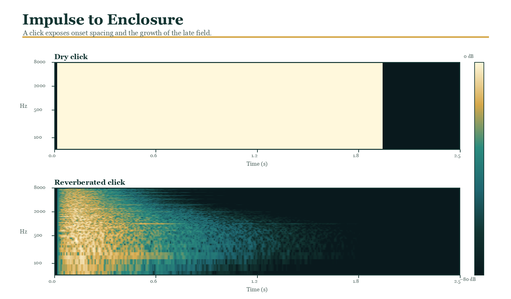

**Figure: Dry click compared with its reverberated response.**

**How to read this figure.** The click's broadband stripe is an excitation, not a
musical pitch. In the reverberated panel, later vertical traces indicate discrete
reflections; the smoother horizontal fade is the late field. If the late field shows
isolated horizontal ridges, the algorithm is emphasizing modes. If the entire panel
stays uniformly bright, the return may be too dense or too compressed. A good design
need not look perfectly smooth, but visible structures should correspond to an intended
sonic character rather than accidental ringing.

Use the click when changing matrix family, allpass count, or delay distribution. It is
less forgiving than music and quickly exposes flutter, repeated periods, and abrupt
gates. Then return to music: a technically smooth click response is only useful if the
result serves phrasing.

#### Example 2: Piano or Harmonic Phrase in a Hall

A chordal phrase tests harmonic continuity. Short room settings add body around each
attack; hall settings connect notes across releases and rests. The direct signal must
remain intelligible enough that the harmony changes when the player changes it, not one
beat later. This tension is central to piano, harp, mallet percussion, and plucked
strings.

The paired sonograms below compare the shipped dry musical phrase with its hall render.
The same harmonic ridges appear in both panels, but the hall connects them and extends
the final cadence beyond the source.

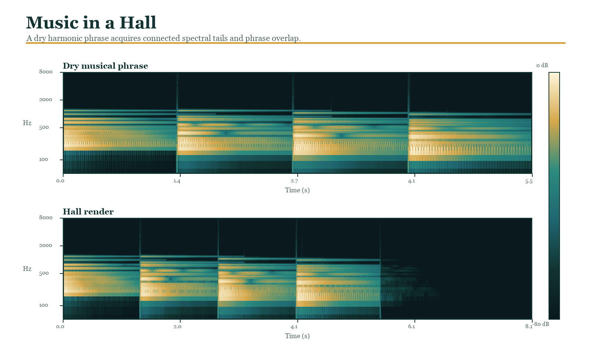

**Figure: Harmonic phrase before and after hall reverberation.**

**How to read this figure.** In the dry panel, each chord has a clear left edge and a
visible release. In the hall panel, the ridges continue between attacks, especially in
the low-middle register. That continuation is musical glue until it obscures harmonic
rhythm. The darker high-frequency area near the end shows damping: upper partials leave
before lower energy. If every band decayed equally, the hall would tend to sound bright
and synthetic; if lows persisted far longer, cadences could become muddy.

Reproduce a controlled version with:

```bash
verbx render examples/audio/realistic_music_dry.wav /tmp/music_hall.wav \
  --engine algo --rt60 2.4 --pre-delay-ms 24 \
  --wet 0.38 --dry 0.78 --fdn-lines 16 --fdn-matrix hadamard \
  --lowcut 90 --highcut 11000 --target-peak-dbfs -1
```

For a Romantic cadence, increase RT60 before increasing wet level. For a contrapuntal
passage, reduce wet level and length, or use ducking so each attack remains legible.
Treat pre-delay as phrasing space: 20-35 ms can separate the hammer or pluck from the
room without making the response feel like a discrete echo.

#### Example 3: Drums, Early Reflections, and Groove

Percussion makes the difference between early reflections and late decay obvious. Early
energy changes apparent drum size and room boundary; late energy determines how long
the groove occupies the mix. A short, bright room can make a snare feel larger without
smearing the kick pattern. A cathedral tail can turn the same rhythm into overlapping
waves whose accents are defined by the return rather than the source.

The following sonograms compare a dry drum pattern and a room render. The attacks remain
vertical and separately readable, while low-level energy fills the gaps.

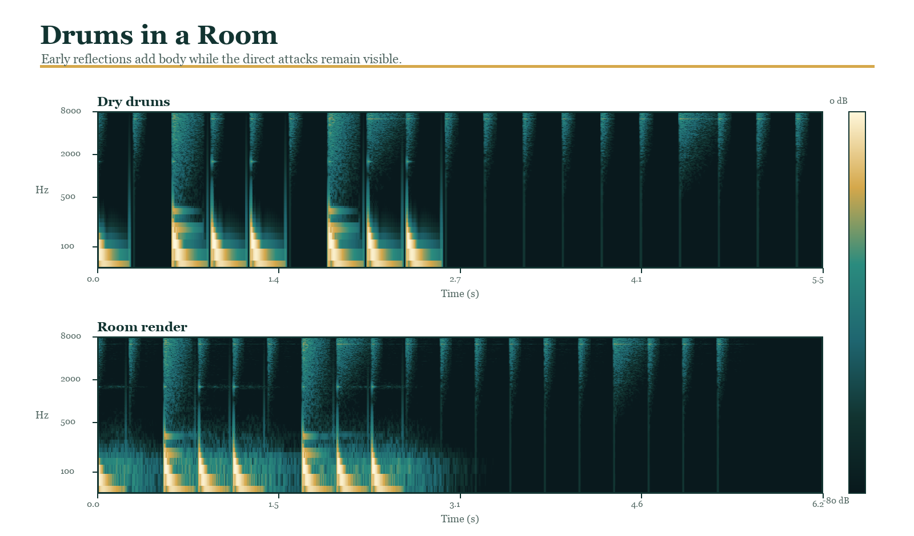

**Figure: Drum transients before and after a short room response.**

**How to read this figure.** The dry panel has dark space between attacks. The room
panel retains vertical transients but adds short horizontal fans after them. Those fans
are long enough to supply body and short enough to preserve subdivision. Watch the
low-frequency region: excessive persistence there can make a kick drum appear longer
without sounding more spacious. A return high-pass filter often improves groove more
effectively than shortening the entire RT60.

Try a compact room and a tempo-related pre-delay:

```bash
verbx render examples/audio/realistic_drums_dry.wav /tmp/drums_room.wav \
  --engine algo --rt60 0.85 --pre-delay 1/64 --bpm 120 \
  --wet 0.26 --dry 0.88 --fdn-lines 8 --fdn-matrix circulant \
  --lowcut 140 --highcut 9000
```

The note-value pre-delay makes the experiment repeatable at a new tempo. Do not assume
that synchronizing always sounds better: a slightly non-metric onset can keep the room
from reinforcing every beat in the same way.

#### Example 4: Cathedral-Scale Percussion

Very long percussion reverb changes the hierarchy of events. The first strike excites
a field that is still active when later strikes arrive. Each new attack is therefore
both a source event and a modulation of an existing texture. In a physical cathedral,
architectural asymmetry and air absorption prevent perfect repetition. In an algorithm,
matrix choice and time variation must perform some of that work.

The sonogram below shows the shipped cathedral drum study. Broad attacks enter a field
whose low and middle bands remain active for many seconds.

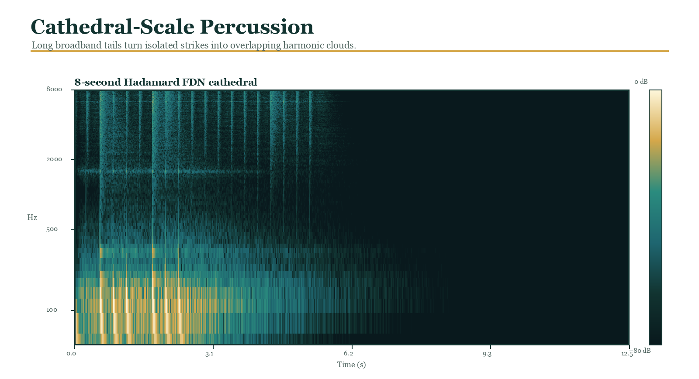

**Figure: Percussion rendered through an eight-second Hadamard FDN cathedral.**

**How to read this figure.** Vertical energy identifies new strikes; horizontal clouds
show accumulated room memory. Notice that successive attacks do not reset the field.
They add energy to frequencies already decaying. The result can create a slow harmonic
rhythm unrelated to the written drum rhythm. This is why long percussion reverbs often
benefit from lower wet level, greater high-frequency damping, and automation that
allows selected accents to enter the long return.

This listening problem appears dramatically in Berlioz's *Grande Messe des morts* and
in antiphonal repertory designed for large architecture: distance and decay become
orchestration. A production need not imitate a specific church to learn the lesson.
Send only structural attacks to the longest return and let smaller notes articulate the
foreground.

#### Example 5: Voice, Consonants, and Vowels

Voice contains two different reverb tests. Consonants are short, often broadband, and
carry intelligibility. Vowels are sustained, harmonic, and carry pitch and identity.
A return that flatters vowels can mask consonants; a setting optimized for speech
clarity may feel too dry for lyric singing.

The paired sonograms below show dry speech and a room render. Read the short upper-band
bursts as consonant activity and the horizontal harmonic stacks as vowels.

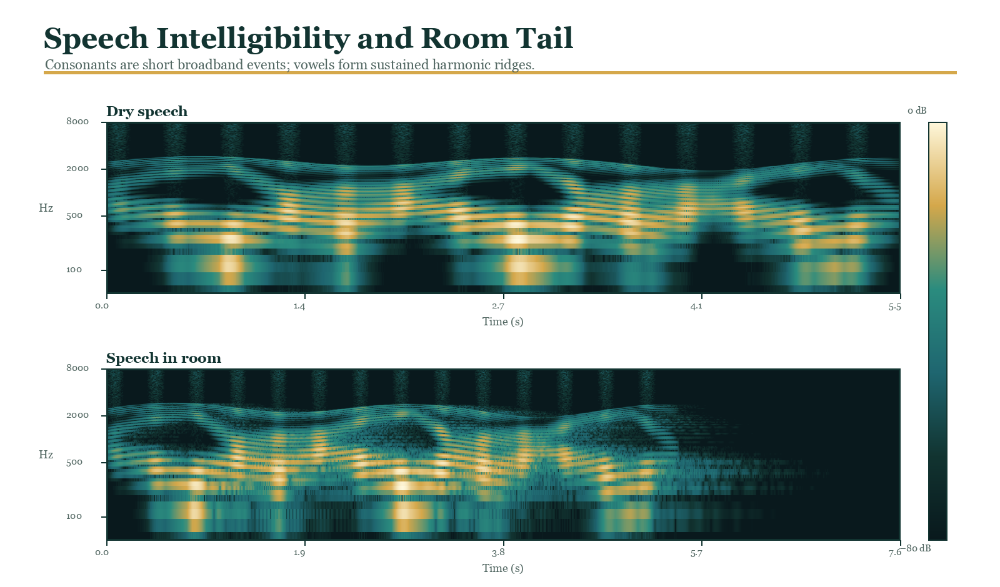

**Figure: Speech articulation before and after room reverberation.**

**How to read this figure.** The room extends vowel bands and places a low-level veil
after consonant bursts. Intelligibility decreases when that veil is still strong at the
next consonant. Pre-delay can protect the initial consonant; ducking can protect every
active syllable; high-frequency damping can prevent sibilance from turning into a
persistent hiss. None of those changes requires abandoning a long lyrical tail.

For a vocal send, start with:

```bash
verbx render vocal.wav /tmp/vocal_space.wav \
  --engine algo --rt60 2.8 --pre-delay-ms 32 \
  --wet 0.42 --dry 0.78 --duck --duck-attack 12 --duck-release 260 \
  --duck-strength 0.72 --duck-floor 0.20 --lowcut 160 --highcut 9500
```

The release time is a musical control. A short release lets the tail rise between
syllables; a longer release waits for the end of a line. Automate return level at phrase
ends rather than forcing one static setting to solve every word.

#### Example 6: Plate-Like Brightness on Speech and Singing

A plate-like reverb is dense early, smooth, and often bright. It does not need to
convince the listener that the singer occupies a literal metal plate. Its musical role
is to extend the voice without introducing obvious room geometry. Circulant and other
regular FDN matrices can approach this character when delay distribution, diffusion,
and damping are carefully controlled.

The single sonogram below shows the shipped plate speech study. Sibilant energy spreads
into a fine upper-band tail while vowels remain stronger lower in the spectrum.

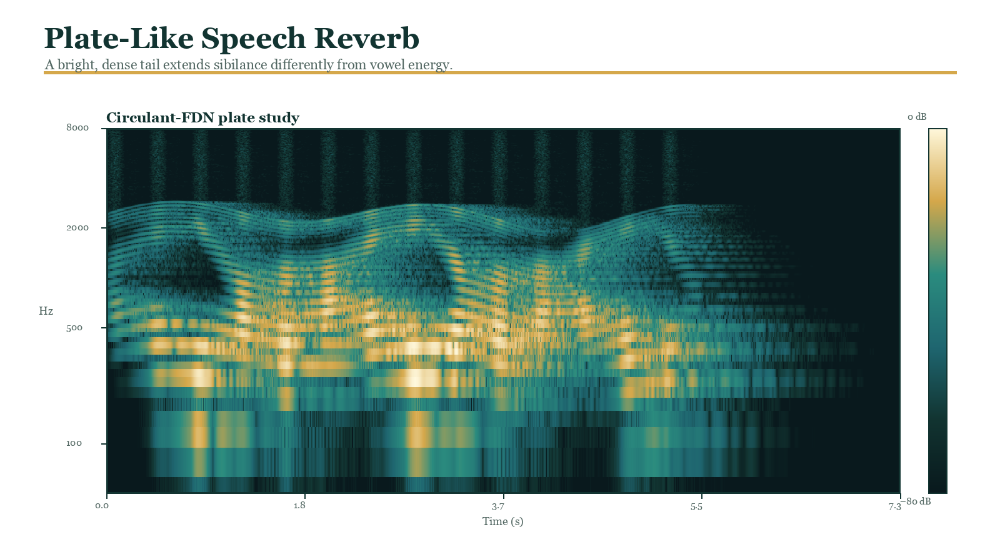

**Figure: Speech rendered through a bright circulant-FDN plate study.**

**How to read this figure.** The upper spectrum remains active after several consonants,
but it does not dominate the complete tail. A bright return feels polished when that
energy is diffuse; it feels brittle when isolated high-frequency modes ring. Compare
the visual smoothness with what you hear. A sonogram may show continuous energy while
the ear still detects a metallic repetition, especially on headphones.

Plate-like returns work well as a second vocal layer. Keep a darker room or chamber for
depth, then add the bright plate at lower level for sustain. The two returns should have
different onset and decay profiles; duplicating the same timing merely raises level.

#### Example 7: Sparse Music and the Composition of Silence

Sparse music reveals the full envelope of every return. A single note is followed by a
field, then by the field's disappearance. The listener can hear modulation, modal
beating, noise-floor behavior, and the exact moment the processor closes or truncates.
In dense music these details hide under new events; in sparse music they become form.

The upper panel below is a sparse-note room study, while the lower panel is a phase-drum
study. Together they show how the same idea of “space” must behave differently when
silence is structural versus when pulse is continuous.

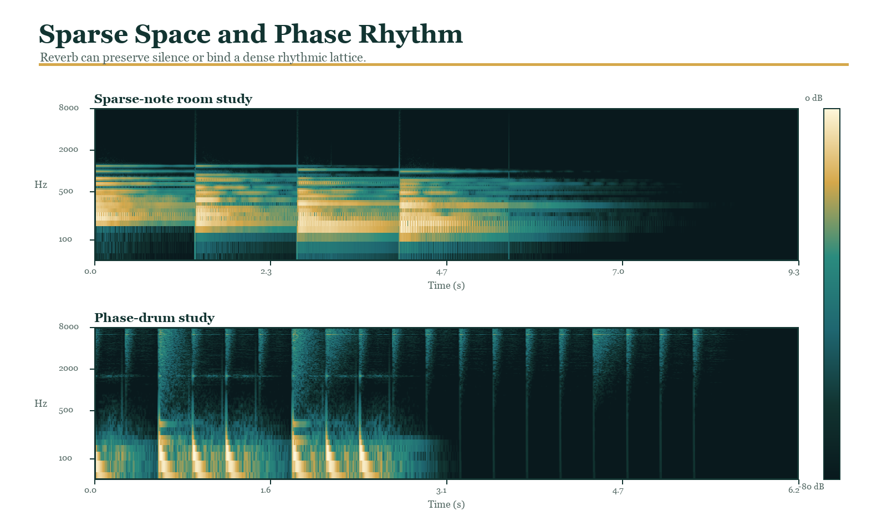

**Figure: Sparse-note room behavior compared with a dense phase-rhythm field.**

**How to read this figure.** In the sparse panel, each note owns a visible decay region;
the dark gaps are compositional material. An abrupt cutoff would be obvious. In the
rhythmic panel, repeated attacks create nearly continuous energy, so the return is judged
by groove, masking, and spectral accumulation instead. The same RT60 number has
different consequences because the excitation density differs.

The practical lesson is to set reverb while hearing the actual event density. A preset
auditioned on sustained pads says little about its behavior on isolated piano harmonics.
For music in the orbit of Morton Feldman's spacious pacing, let the tail complete its
gesture. For repeating-process textures, decide whether the room should reveal the
process or fuse it into a single surface.

#### Example 8: Antiphony, Choir, and Architectural Counterpoint

Thomas Tallis's *Spem in alium* and Giovanni Gabrieli's *In ecclesiis* demonstrate that
space can participate in counterpoint. Groups answer across distance; reflections bind
the ensemble while directional differences preserve identity. A stereo reverb can
suggest some of this behavior, but an immersive or multichannel design can make
direction and decay independent compositional parameters.

Begin by separating source groups before adding reverb. Give each group a distinct send
level, pre-delay, or early-reflection pattern while sharing a coherent late field. If
every group receives an unrelated complete room, the image may become wide but cease to
feel like one architecture. If every group receives an identical mono return, the
counterpoint may collapse toward the center.

A useful exercise is to route four phrase groups into one long FDN, vary only their
input projections or channel positions, and keep the late feedback network common. The
shared tail supplies architectural identity; the distinct injections preserve
antiphonal placement. At cadences, automate the longest return upward only after the
last consonant so the room completes the formal punctuation.

#### Example 9: Drone, Organ Pedal, and Slow Harmonic Time

Sustained sources do not reveal RT60 directly because they keep feeding the room. They
reveal spectral equilibrium: which bands accumulate, which modes beat, and whether the
network remains stationary or slowly evolves. Organ pedals, bowed tones, feedback
guitar, and electronic drones can expose a one-decibel imbalance that short sources
never reveal.

The paired sonograms below compare a layered ambient study and a long-form drone study.
The horizontal bands make slow changes visible; the important information is not only
how long energy lasts, but how its distribution changes while the source continues.

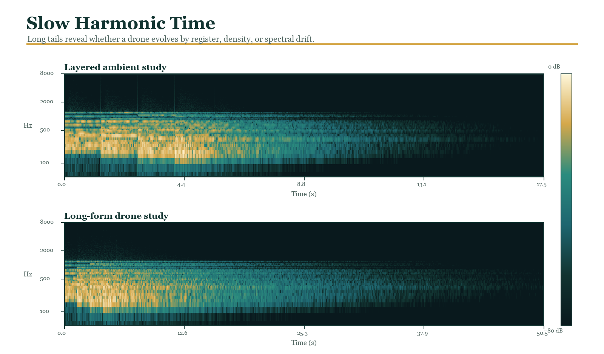

**Figure: Two sustained musical textures viewed across slow harmonic time.**

**How to read this figure.** Persistent horizontal ridges represent stable harmonic or
modal energy. Changes in brightness reveal entries, exits, or spectral drift. A reverb
on this material should avoid pinning the entire texture to a few accidental resonances.
Time-varying matrices, slight modulation, or tonal correction can distribute energy
without turning the return into an obvious chorus.

In repertoire such as Ligeti's *Lux Aeterna* or Messiaen's *Et exspecto resurrectionem
mortuorum*, spectral mass, register, and architectural decay shape the listener's sense
of time. For an electronic analogue, automate matrix motion more slowly than the phrase
rate. Fast motion reads as modulation; slow motion reads as a changing room.

#### Example 10: Recirculation as Musical Form

Repeatedly feeding a recording back through a room or a reverb gradually replaces the
source's detailed spectrum with the resonances of the system. Alvin Lucier's *I Am
Sitting in a Room* makes this transformation the complete form. Tape-loop and delay
practices create related processes: the return is not decoration but a memory that
re-enters the next generation.

The sonograms below compare a tape-loop-style study and a room-recirculation study. Both
show source detail consolidating into longer spectral bands.

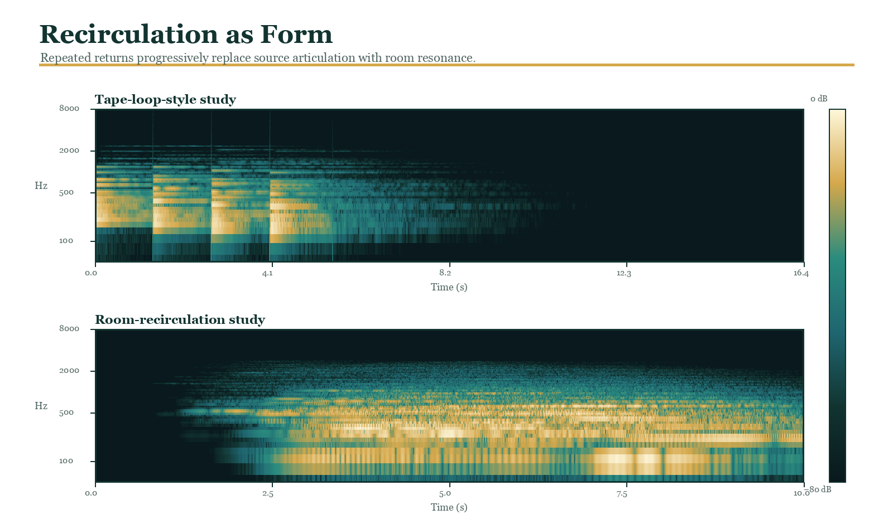

**Figure: Recirculation processes that turn a source into a resonant field.**

**How to read this figure.** Early in each panel, attacks and pitch changes remain
distinct. Later, selected bands become dominant because every pass reinforces the same
system. A perfectly neutral loop would preserve the source indefinitely, but musical
recirculation depends on selective memory. The engineering task is to make that
selection intentional and bounded.

With verbx, `--repeat` performs sequential reprocessing. Start conservatively, render
to floating point, and measure every generation:

```bash
verbx render source.wav /tmp/room_generation.wav \
  --engine algo --rt60 3.5 --repeat 5 --wet 0.86 --dry 0.14 \
  --fdn-lines 16 --fdn-matrix hadamard --lowcut 80 \
  --out-format float32 --json-out /tmp/room_generation.json
```

The JSON sidecar is part of the composition record. It lets another listener reproduce
the transformation rather than relying on a screenshot of controls.

#### Example 11: Dense Guitar and Deep-Listening Fields

Dense broadband material and slowly unfolding spatial material can both fill a
sonogram, but they challenge reverb differently. A dense guitar field may already
contain distortion, modulation, and layered delays; a new long return can reduce depth
by filling every remaining gap. A deep-listening texture may leave more room for the
reverb to reveal low-level spatial changes.

The paired sonograms below show these contrasting fields. The upper panel is dense and
continuous; the lower panel contains more visible internal movement and open regions.

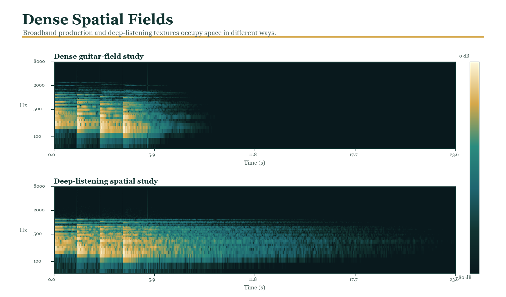

**Figure: Dense production field compared with a spacious deep-listening study.**

**How to read this figure.** In the dense panel, added reverb changes envelope and width
more readily than it reveals a new room; there is little unoccupied spectrum. In the
lower panel, the return can articulate trajectories and decays. Use this comparison to
decide whether a source needs more duration or merely a different spatial envelope.

For dense material, automate narrow throws, filter the return aggressively, or place
only selected stems in the longest space. For sparse spatial material, preserve dynamic
range and inspect the noise floor: the quietest part of the tail may be where motion is
most audible.

#### Example 12: Shimmer as Register, Not Glitter

Shimmer pitch-shifts part of the wet field and feeds or blends it back into the return.
The obvious octave-up setting can sound decorative when used continuously, but it
becomes compositional when treated as register. A low source can seed a high sustained
line; an upper melody can generate a halo that changes harmony at phrase boundaries.

The sonogram below shows the shipped shimmer study. New energy appears above the source
bands and persists through the tail.

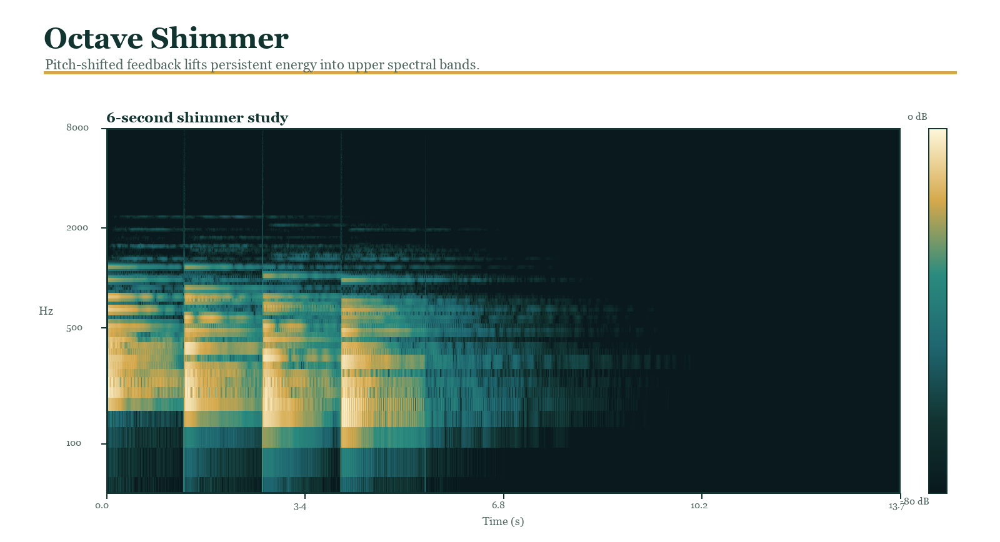

**Figure: Octave-shifted feedback extending a musical phrase into the upper register.**

**How to read this figure.** Compare the bright upper ridges with the lower source
energy that excites them. Shimmer is not a broadband treble boost: it creates new
frequency relationships. Excess feedback makes these upper bands accumulate and can
change the harmony. A low-cut before the pitch shifter prevents bass energy from
producing a crowded octave layer; a high-cut after it can soften alias-like brightness.

```bash
verbx render music.wav /tmp/music_shimmer.wav \
  --engine algo --rt60 10 --wet 0.78 --dry 0.34 \
  --shimmer --shimmer-semitones 12 --shimmer-mix 0.34 \
  --shimmer-feedback 0.68 --shimmer-lowcut 280 --shimmer-highcut 12000 \
  --target-peak-dbfs -2
```

Write the shimmer entry into the arrangement. Bring it in for one cadence, a bridge,
or the final resonance rather than leaving it at one level for the entire piece.

#### Example 13: Freeze and the Harmonic Field

Freeze captures a segment and sustains it through a near-static or very long loop. The
source segment becomes the “instrument body” of the frozen field. A capture containing
one clean interval tends to remain legible; a capture spanning a chord change can
create beating or harmonic ambiguity. The best capture point is therefore a musical
decision, not just a technical one.

The following sonogram shows the shipped frozen-music study. It extends for more than
half a minute, making the gradual loss and redistribution of energy easy to see.

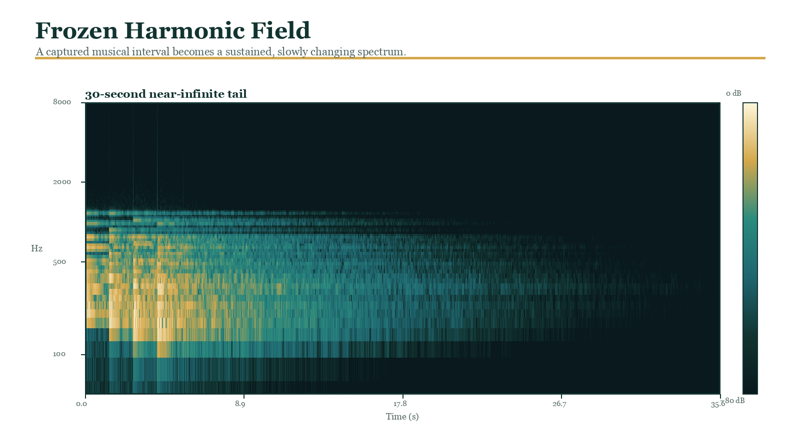

**Figure: A captured musical interval sustained as a near-infinite reverberant field.**

**How to read this figure.** The strongest initial excitation sits at the left, but
stable harmonic bands continue across much of the panel. Their slow decline distinguishes
this bounded freeze from a perfectly lossless loop. A truly infinite mode must still
manage DC, denormals, modulation, and output level; “infinite” describes sustain intent,
not permission for uncontrolled numerical growth.

Compose a transition by freezing the last harmony of one section, changing the dry
material underneath it, and releasing the field only after the new harmony has become
stable. The listener hears the previous section as literal acoustic memory.

#### Example 14: Send/Return Reverb as Counterpoint

Insert reverb and send/return reverb encourage different musical thinking. An insert
asks how a processor transforms one track. A send asks what independent spatial layer
several sources contribute to. The return can have its own dynamics, automation,
equalization, and formal entrances.

The Mermaid signal-flow figure below shows the dry and wet paths as parallel musical
voices. The return is intentionally labeled as counterpoint rather than residue.

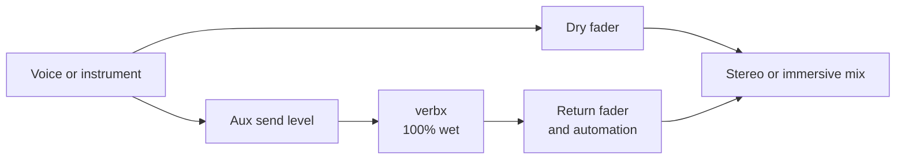
```mermaid
%% verbx-static: docs/assets/reverb_primer/10_musical_send_return.png
flowchart LR
    S["Voice or instrument"] --> D["Dry fader"]
    S --> A["Aux send level"]
    A --> V["verbx<br/>100% wet"]
    V --> R["Return fader<br/>and automation"]
    D --> M["Stereo or immersive mix"]
    R --> M
```

**Figure: Musical send and return treated as parallel articulation and spatial counterpoint.**

**How to read this figure.** The dry fader controls foreground articulation. The aux
send controls how much each source excites the shared space. The return fader controls
the room as a layer after all excitations have combined. Automating the send changes
what enters memory; automating the return changes how much of that memory is heard.
Those gestures are not equivalent. A post-phrase send throw produces a different tail
than raising a return that has been accumulating all along.

### DSP Overview

Digital reverberation begins with an impulse response $h[n]$: the output produced by a
unit impulse. For a linear time-invariant system, any input $x[n]$ produces

$$
y[n] = x[n] * h[n] = \sum_{k=-\infty}^{\infty} x[k]h[n-k].
$$

Convolution reverb stores or synthesizes $h[n]$ and evaluates that sum efficiently.
Algorithmic reverb builds a recursive system whose impulse response emerges from delay,
filter, and feedback operations. Both approaches can produce excellent results. Their
differences concern control, memory, latency, time variation, and the kinds of spaces
they make easy to design.

The detailed diagrams in this section use the implementation-level graph grammar found
in Julius O. Smith's [Schroeder Reverberators](https://ccrma.stanford.edu/~jos/pasp/Schroeder_Reverberators.html):
rectangular transfer blocks, named branch signals, explicit gains and delays, summing
junctions, and output matrices. The figures are original verbx diagrams with independent
example values. Read arrows as signal paths, $z^{-M}$ as a delay of $M$ samples, circles
as sums, and a returning path as state that will affect a future output sample.

#### Feedback Comb Filters: Duration and Modes

A feedback comb filter delays its output, scales it, and adds it back to the input. Its
transfer function is

$$
H_{\mathrm{comb}}(z) = \frac{1}{1-gz^{-M}},
$$

where $M$ is delay in samples and $g$ is feedback gain. An impulse produces repetitions
every $M$ samples with amplitudes $1, g, g^2, \ldots$. In frequency, those repetitions
form a regularly spaced modal pattern. One comb therefore sounds colored; several combs
with carefully chosen delays can create a richer decay.

The diagram below exposes the feedback path that creates both duration and coloration.

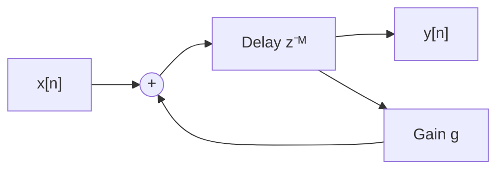
```mermaid
%% verbx-static: docs/assets/reverb_primer/03_feedback_comb_filter.png
flowchart LR
    X["x[n]"] --> S(("+"))
    S --> D["Delay z⁻ᴹ"]
    D --> Y["y[n]"]
    D --> G["Gain g"]
    G --> S
```

**Figure: Feedback comb filter with delay length M and loop gain g.**

**How to read this figure.** Every trip around the loop adds $M$ samples of time and a
factor of $g$. If $|g|<1$, the loop decays; if $|g|=1$, it is theoretically lossless;
if $|g|>1$, it grows. Real implementations also require damping, DC control, and
protection against finite-precision problems. The spacing $f_s/M$ between modes is as
important as nominal RT60. Several delay lengths should avoid obvious common periods
unless a pitched or resonant effect is intended.

The expanded flowgraph below labels the internal write signal and places the transfer
function beside the loop. It is the form to use when translating the structure into a
sample-by-sample difference equation or checking which sample is multiplied by $g$.

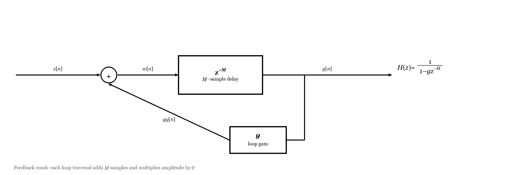

**Figure: Implementation-level feedback comb flowgraph with an explicit internal state, M-sample delay, loop gain, and transfer function.**

**How to read this flowgraph.** The summing junction forms $w[n]$ from the new input and
the attenuated delayed output. The delay emits $y[n]=w[n-M]$; that value branches to the
external output and to gain $g$ before returning to the sum. Following one impulse around
the lower return path explains the sequence at $0,M,2M,\ldots$ samples. The drawing also
distinguishes the signal stored in memory, $w[n]$, from the signal currently leaving the
delay, $y[n]$, a distinction that prevents common indexing mistakes in implementations.

For a target $T_{60}$ and a delay duration $d=M/f_s$ seconds, the loop gain is

$$
g = 10^{-3d/T_{60}}.
$$

At extreme RT60 values, $g$ approaches one. Small numerical or spectral errors then
circulate for a long time, which is why internal precision and loop conditioning matter
more at 360 seconds than at 1.2 seconds.

#### Schroeder Allpass Filters: Density Without Magnitude Coloration

An allpass filter changes phase while maintaining a flat ideal magnitude response. A
common Schroeder form is

$$
H_{\mathrm{AP}}(z) = \frac{-g + z^{-M}}{1-gz^{-M}}.
$$

Its direct and delayed paths cancel the comb-like magnitude coloration that the feedback
loop would otherwise introduce. In time, however, an impulse becomes a pattern of
decaying echoes. Serial allpasses can therefore increase echo density before the signal
enters a longer late-field network.

The Mermaid diagram below separates feedforward and feedback paths. The signs matter:
the topology is not simply a comb with a dry mix.

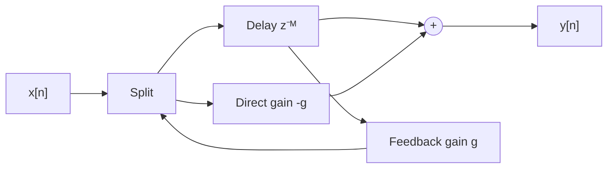
```mermaid
%% verbx-static: docs/assets/reverb_primer/04_schroeder_allpass.png
flowchart LR
    X["x[n]"] --> P["Split"]
    P --> D["Delay z⁻ᴹ"]
    P --> N["Direct gain -g"]
    D --> S(("+"))
    N --> S
    D --> G["Feedback gain g"]
    G --> P
    S --> Y["y[n]"]
```

**Figure: Schroeder allpass diffuser with matched feedforward and feedback coefficients.**

**How to read this figure.** The delay and feedback create a decaying echo sequence;
the direct coefficient corrects the magnitude response. “Flat magnitude” does not mean
“inaudible.” Phase structure, transient spreading, delay length, and coefficient still
change timbre and spatial impression. Very large $g$ values produce long diffusion
patterns that may sound metallic; small values scatter less energy. The allpass chain
must be judged as an onset-design tool, not merely by its frequency response.

The implementation graph below separates the allpass's two sums. This makes the signs
and the shared delayed state visible, which is essential when comparing the transfer
function with code or tracing an impulse by hand.

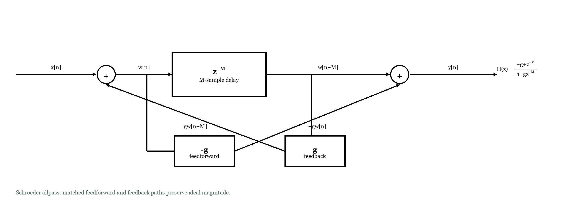

**Figure: Implementation-level Schroeder allpass flowgraph with explicit feedforward and feedback coefficient paths.**

**How to read this flowgraph.** The left sum creates the delay-line write value
$w[n]=x[n]+g\,w[n-M]$. The right sum combines the delayed state with the negative direct
branch, producing $y[n]=w[n-M]-g\,w[n]$. The same coefficient magnitude therefore appears
in two different roles: positive feedback sustains the echo sequence, while negative
feedforward corrects its magnitude response. Swapping a sign changes the topology and can
turn a diffuser into a colored or unstable structure even though every block still looks
plausible in isolation.

#### Allpass Networks: From Echoes to a Diffuse Excitation

One allpass creates a recognizable pattern. Several allpasses with mutually awkward
delay lengths multiply the number of arrivals. If the stages are too similar, the
patterns line up and produce periodicity. If there are too many stages or too much
feedback, the attack loses definition before the late field begins.

The serial network below shows the conceptual progression from one impulse to a dense
excitation. Each stage is short compared with the final RT60.

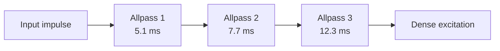
```mermaid
%% verbx-static: docs/assets/reverb_primer/05_allpass_diffusion_network.png
flowchart LR
    X["Input impulse"] --> A1["Allpass 1<br/>5.1 ms"]
    A1 --> A2["Allpass 2<br/>7.7 ms"]
    A2 --> A3["Allpass 3<br/>12.3 ms"]
    A3 --> U["Dense excitation"]
```

**Figure: Serial allpass network used to build early echo density.**

**How to read this figure.** Every box expands the number of time-domain arrivals while
approximately preserving spectral magnitude. The listed delays are illustrative, not
universal defaults. Percussion may need fewer stages so the attack remains crisp; a
synthetic pad can tolerate more diffusion. In verbx, allpass diffusion is a front-end
stage. It prepares energy for the FDN rather than carrying the complete decay alone.

#### The Schroeder Reverberator

The classic Schroeder architecture places several feedback comb filters in parallel,
sums them, and follows the sum with serial allpasses. The combs supply a long response;
the allpasses increase density. This structure established the vocabulary of digital
reverb and remains useful because it is efficient, understandable, and musical.

The signal flow below shows the canonical division of labor. It is a family of designs,
not one immutable set of delay values.

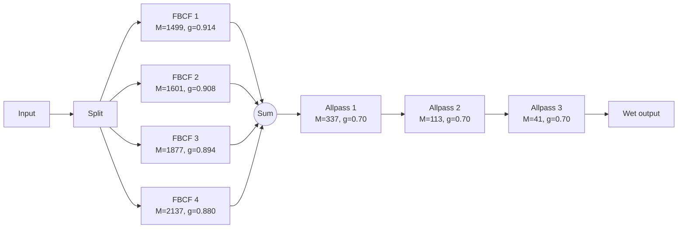
```mermaid
%% verbx-static: docs/assets/reverb_primer/02_schroeder_reverberator.png
flowchart LR
    X["Input"] --> S["Split"]
    S --> C1["FBCF 1<br/>M=1499, g=0.914"]
    S --> C2["FBCF 2<br/>M=1601, g=0.908"]
    S --> C3["FBCF 3<br/>M=1877, g=0.894"]
    S --> C4["FBCF 4<br/>M=2137, g=0.880"]
    C1 --> M(("Sum"))
    C2 --> M
    C3 --> M
    C4 --> M
    M --> A1["Allpass 1<br/>M=337, g=0.70"]
    A1 --> A2["Allpass 2<br/>M=113, g=0.70"]
    A2 --> A3["Allpass 3<br/>M=41, g=0.70"]
    A3 --> Y["Wet output"]
```

**Figure: Classic Schroeder reverberator with parallel combs and serial allpasses.**

**How to read this figure.** The explicit branch labels show one illustrative 48 kHz,
2.4-second design, not verbx defaults. Each comb delay $M$ establishes a different modal
spacing, while its loop gain $g$ calibrates how quickly that branch decays. The summing
bus recombines all four independent tails. Three short serial allpasses then increase
echo density without intentionally changing magnitude response. Coloration remains
possible because each comb has a regular modal series and because the branches do not
exchange energy. Moorer-style extensions add early reflections and frequency-dependent
damping. Modern FDNs generalize the feedback relationship so every delay line can
exchange energy with every other line.

The parameterized flowgraph below expands the canonical blocks into a traceable example.
Its delays and gains demonstrate the notation rather than prescribe verbx defaults; the
four output rows also show how one reverberator state can feed a multichannel matrix.

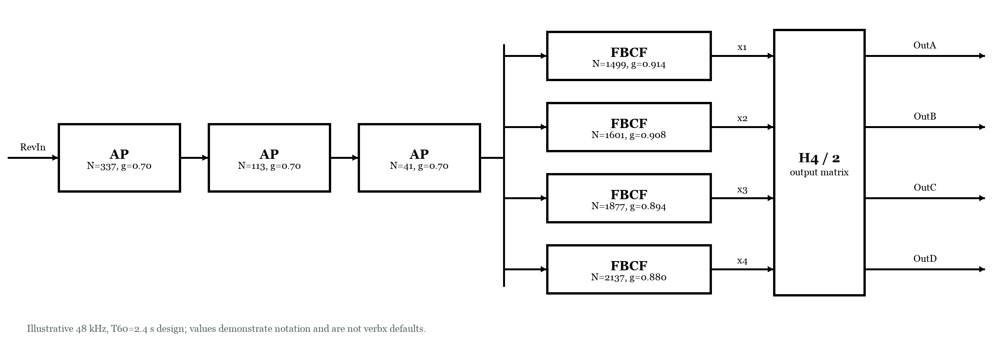

**Figure: Parameterized Schroeder-style reverberator with serial allpasses, four parallel feedback combs, named branch signals, and a four-channel output matrix.**

**How to read this flowgraph.** Start at `RevIn` and move through three short allpasses,
whose unequal sample delays progressively scatter the onset. The vertical bus then sends
the same diffuse excitation to four feedback comb filters. Each comb lists a delay $N$
and a gain calculated for the illustrated 2.4-second target at 48 kHz. Their named outputs
$x_1$ through $x_4$ enter a normalized Hadamard matrix, whose signed combinations produce
four related but decorrelated outputs. The graph therefore exposes three distinct design
layers: onset diffusion, late modal duration, and spatial projection.

The Schroeder design remains an excellent teaching instrument. Bypass its allpasses and
hear the comb modes. Restore one stage at a time and hear density increase. Change one
delay until it shares a common divisor with another and hear periodicity emerge. These
experiments turn abstract topology into an audible vocabulary.

#### Feedback Delay Networks: Coupled Modal Systems

An $N$-line Feedback Delay Network replaces independent comb feedback with a vector
loop. Each delay line produces one state component. A matrix mixes those components
before they are written back, allowing energy to move throughout the network. Input and
output projections determine how the source excites modes and how the listener receives
them.

A simplified state description is

$$
\mathbf{s}[n+1] = \mathbf{G}\mathbf{M}\mathbf{D}(z)\mathbf{s}[n]
                  + \mathbf{B}x[n],
$$

$$
y[n] = \mathbf{C}^{\mathsf T}\mathbf{D}(z)\mathbf{s}[n] + d\,x[n],
$$

where $\mathbf{D}(z)$ is the bank of unequal delays, $\mathbf{M}$ is the feedback
matrix, $\mathbf{G}$ contains decay gains or filters, $\mathbf{B}$ injects the source,
and $\mathbf{C}$ projects the state to output channels.

The Mermaid diagram below makes the vector feedback loop explicit.

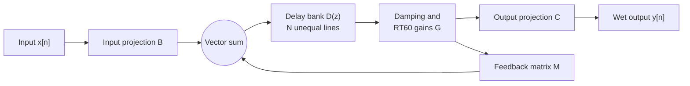
```mermaid
%% verbx-static: docs/assets/reverb_primer/06_fdn_signal_flow.png
flowchart LR
    X["Input x[n]"] --> B["Input projection B"]
    B --> S(("Vector sum"))
    S --> D["Delay bank D(z)<br/>N unequal lines"]
    D --> F["Damping and<br/>RT60 gains G"]
    F --> C["Output projection C"]
    C --> Y["Wet output y[n]"]
    F --> M["Feedback matrix M"]
    M --> S
```

**Figure: Feedback Delay Network with vector delay state and matrix feedback.**

**How to read this figure.** The delay bank defines modal timing; the gain and damping
stage defines loss; the matrix defines how energy exchanges among lines. Those roles
interact but are independently designable. An orthonormal matrix preserves vector
energy before damping, making RT60 calibration tractable. A poor input projection may
leave some modes weakly excited; a poor output projection may overemphasize others.
High line count alone does not guarantee a smooth reverb.

The expanded FDN flowgraph below opens the vector blocks into four representative delay
rows and shows both the recirculating state and the separate output tap. The four rows
stand for an arbitrary $N$-line network, not a four-line limit.

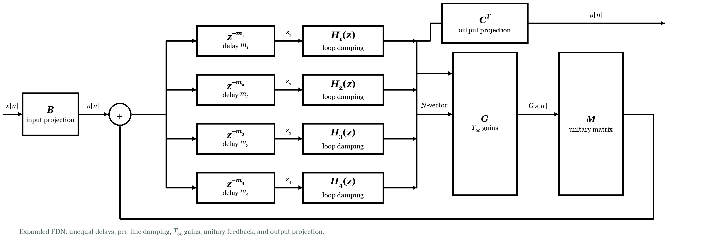

**Figure: Expanded FDN flowgraph with input projection, unequal delay lines, per-line damping, RT60 gains, unitary feedback matrix, and output projection.**

**How to read this flowgraph.** Projection $\mathbf{B}$ distributes the scalar input into
the vector sum. Each row delays one state component by $m_i$ samples and filters it with
$H_i(z)$. The gain block $\mathbf{G}$ calibrates loss, after which unitary matrix
$\mathbf{M}$ redistributes energy before the vector returns to the input sum. Output
projection $\mathbf{C}^{\mathsf T}$ observes the delayed state without replacing the
feedback path. That separation lets a designer change stereo or immersive presentation
without changing the poles that govern the late decay.

verbx exposes several matrix families because they create different exchange patterns.
Hadamard mixing is dense and uniform. Householder mixing is efficient and structured.
Circulant and elliptic families have interpretable eigenstructure. Random orthogonal
matrices reduce obvious regularity. Graph-derived matrices make connectivity a design
parameter. Time-varying unitary matrices alter the modal basis slowly while retaining
controlled loop energy.

#### Frequency-Dependent Decay in an FDN

Real materials absorb frequency bands differently, and air attenuates high frequencies
more strongly over long paths. A convincing room therefore rarely has one RT60 at every
frequency. In an FDN, loop filters can approximate a desired decay curve. The challenge
is to shape loss without compromising stability or creating obvious filter resonances
inside the feedback loop.

The multiband signal flow below shows low, middle, and high losses before energy returns
to the feedback matrix.

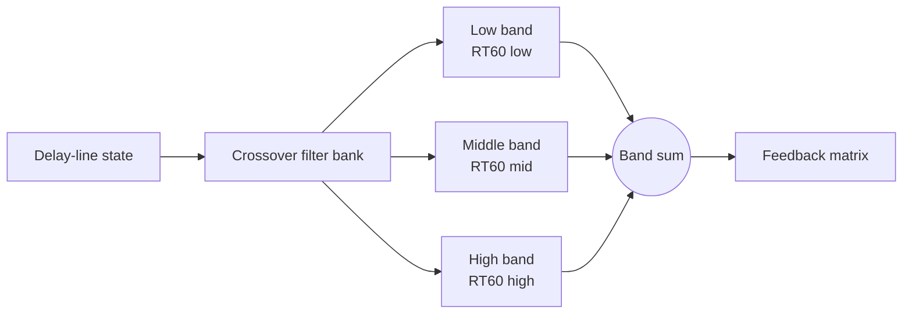
```mermaid
%% verbx-static: docs/assets/reverb_primer/07_multiband_fdn.png
flowchart LR
    S["Delay-line state"] --> X["Crossover filter bank"]
    X --> L["Low band<br/>RT60 low"]
    X --> M["Middle band<br/>RT60 mid"]
    X --> H["High band<br/>RT60 high"]
    L --> A(("Band sum"))
    M --> A
    H --> A
    A --> F["Feedback matrix"]
```

**Figure: Frequency-dependent FDN loop with independent low, middle, and high decay targets.**

**How to read this figure.** Every band travels around the same spatial topology but
loses a different amount of energy. A longer low-band RT60 adds warmth and weight; too
much produces mud or a persistent pitched floor. A short high-band RT60 suggests soft
materials or long air paths; too short makes the room dull and detached. Crossovers
must be smooth because their errors recirculate.

The line-level graph below zooms into one FDN damping block. It makes the decay-gain
calculation explicit for each band before the three paths are recombined.

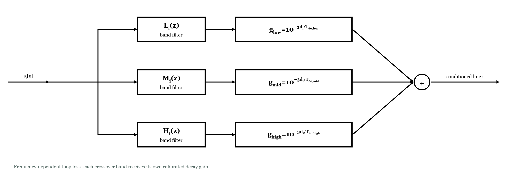

**Figure: One multiband FDN loop-filter row with low-, middle-, and high-band filters and independently calibrated decay gains.**

**How to read this flowgraph.** State component $s_i[n]$ is split among three complementary
filters. Each branch receives a gain of the form $10^{-3d_i/T_{60,b}}$, where $d_i$ is the
delay-line duration and $T_{60,b}$ is the target for band $b$. The sum reconstructs one
conditioned state component before matrix mixing. Calibrating gain from each line's own
duration is important: applying one coefficient to unequal delays gives those lines
different decay times and distorts the intended spectral envelope.

```bash
verbx render music.wav /tmp/multiband_hall.wav \
  --engine algo --rt60 3.0 --fdn-rt60-low 4.2 \
  --fdn-rt60-mid 3.0 --fdn-rt60-high 1.7 \
  --fdn-xover-low-hz 260 --fdn-xover-high-hz 4200 \
  --fdn-lines 24 --fdn-matrix random_orthogonal --wet 0.45 --dry 0.72
```

Listen after the source stops. During the phrase, masking may hide a low-frequency
problem that becomes obvious only in the final decay.

#### Convolution and Partitioned FFT Processing

Convolution reverb uses an impulse response measured in a real room or designed by a
synthesis process. Direct time-domain convolution costs more as the IR grows. FFT
convolution turns long convolution into blockwise multiplication in the frequency
domain. Partitioning the IR lets a processor use small early blocks for latency and
larger later blocks for efficiency.

The Mermaid diagram below shows uniformly or nonuniformly partitioned overlap-save at a
conceptual level. Exact scheduling varies by implementation.

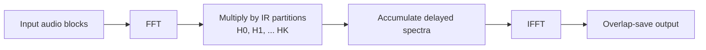
```mermaid
%% verbx-static: docs/assets/reverb_primer/08_partitioned_convolution.png
flowchart LR
    X["Input audio blocks"] --> F["FFT"]
    F --> P["Multiply by IR partitions<br/>H0, H1, ... HK"]
    P --> S["Accumulate delayed spectra"]
    S --> I["IFFT"]
    I --> O["Overlap-save output"]
```

**Figure: Partitioned FFT convolution path for a long impulse response.**

**How to read this figure.** The input is transformed once per block. Each IR partition
multiplies a correspondingly delayed input spectrum; the products are accumulated and
transformed back. The first partition determines a large part of algorithmic latency.
Longer partitions improve efficiency but increase buffering. Convolution reproduces the
captured linear response exactly within numerical and routing limits, but ordinary
convolution cannot continuously change that response without interpolation or a new IR.

Choose convolution when the identity of a measured space matters. Choose algorithmic
FDN processing when RT60, matrix motion, modulation, or extreme duration must change
during the sound. Hybrid workflows often use a short measured early response followed
by an algorithmic late field.

#### The Complete verbx Algorithmic Path

verbx separates onset design, diffusion, late-field recursion, creative transformation,
and output safety. That separation is one reason the processor remains controllable at
extreme settings. Pre-delay does not need to be hidden inside FDN delays; shimmer does
not need to destabilize the core matrix; loudness and limiting can remain outside the
reverberation state.

The complete Mermaid overview below shows the major stages. Optional blocks can be
bypassed, but their order is intentional.

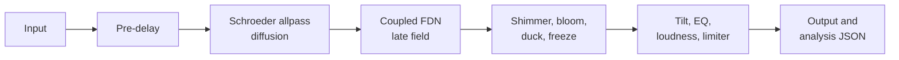
```mermaid
%% verbx-static: docs/assets/reverb_primer/09_verbx_hybrid_path.png
flowchart LR
    X["Input"] --> P["Pre-delay"]
    P --> A["Schroeder allpass<br/>diffusion"]
    A --> F["Coupled FDN<br/>late field"]
    F --> C["Shimmer, bloom,<br/>duck, freeze"]
    C --> T["Tilt, EQ,<br/>loudness, limiter"]
    T --> Y["Output and<br/>analysis JSON"]
```

**Figure: Complete verbx algorithmic path from source onset to analyzed output.**

**How to read this figure.** The first two stages control when and how the room begins.
The FDN controls long-term energy exchange. Creative blocks reinterpret the wet field.
Post-processing controls presentation and delivery without changing the internal decay
calibration. The analysis sidecar records what happened. Because the stages are
separate, a user can design a natural two-second room and a 120-second harmonic cloud
with the same conceptual vocabulary.

### Why verbx Sounds Different

No single feature explains a reverb's sound. What matters is how precision, topology,
delay distribution, diffusion, spectral loss, time variation, dynamics, and routing
interact. verbx is designed to keep those dimensions explicit rather than compressing
them into one “size” macro.

#### Exact Long-Tail Gain Calibration

For delay line $i$ with duration $d_i$ seconds and target $T_{60}$, verbx computes

$$
g_i = 10^{-3d_i/T_{60}}.
$$

Every line receives a gain appropriate to its own delay. A single shared gain would make
longer lines decay differently from shorter lines and would distort the modal envelope.
At short RT60 values the error may pass unnoticed. At 120 or 360 seconds, it becomes a
slow drift in balance that the ear hears as coloration.

The algorithmic path uses 64-bit internal precision for the long-lived state. When loop
gains approach one, rounding error persists for many circulations. Double precision does
not make an unstable design stable, but it preserves the intended loss and reduces the
chance that the tail becomes a numerical artifact before it becomes silence.

#### Matrix Family as a Musical Texture Control

The feedback matrix is not a cosmetic option. It determines how state components
exchange energy. A dense uniform matrix can make the field smooth and neutral; a sparse
or graph-derived matrix can preserve more audible pathways; a slowly time-varying matrix
can reduce stationary ringing and create subtle motion.

Audition matrix families with a click, then with a sparse chord, then with a dense mix.
The click reveals periodicity. The chord reveals modal coloration. The dense mix reveals
whether motion becomes blur. Keep RT60, delay count, damping, and wet level fixed so the
comparison isolates topology.

```bash
for matrix in hadamard householder circulant random_orthogonal tv_unitary; do
  verbx render examples/audio/dry_click.wav "/tmp/click_${matrix}.wav" \
    --engine algo --rt60 8 --wet 1 --dry 0 \
    --fdn-lines 16 --fdn-matrix "$matrix" --no-progress
done
```

The best matrix is source-dependent. Uniformity is valuable for exposed classical
material; controlled irregularity can be expressive on electronic percussion; slow
motion can keep a minute-long tail alive without obvious pitch modulation.

#### Diffusion Is an Envelope, Not a Quality Score

“More diffusion” is often treated as “better reverb,” but diffusion changes the attack
of the wet field. A dense immediate onset can support vocals and pads while softening
percussion. A slower buildup can preserve transients and imply a larger volume. The
correct density is the one that makes the room speak at the right moment in the phrase.

Use allpass stages and bloom deliberately. Allpasses scatter the excitation before it
enters the late field. Bloom shapes how the wet envelope rises. They can create related
perceptions through different mechanisms. If an attack feels detached, reduce pre-delay
or accelerate buildup. If it loses definition, reduce front-end diffusion before
shortening the entire tail.

#### Time Variation Without Obvious Chorus

Stationary delay networks have stationary modes. On a sustained source, those modes can
emerge as metallic pitches. Modulation and time-varying unitary matrices distribute
energy across changing modal bases. The design goal is often to move slowly enough that
the listener hears a living space rather than a pitch effect.

`--fdn-tv-rate-hz` controls update rate and `--fdn-tv-depth` controls how far the matrix
moves from its base state. At 0.05-0.3 Hz, motion unfolds over several seconds. That is
appropriate for long ambient tails. Faster rates can become audible animation and may
be exactly right for sound design.

```bash
verbx render drone.wav /tmp/drone_moving_room.wav \
  --engine algo --rt60 45 --fdn-lines 32 --fdn-matrix tv_unitary \
  --fdn-tv-rate-hz 0.12 --fdn-tv-depth 0.08 \
  --wet 0.88 --dry 0.18 --target-peak-dbfs -2
```

#### Extreme RT60 as a New Compositional Dimension

At 0.4 seconds, reverb behaves like surface and room size. At four seconds, it becomes
phrase overlap and architectural scale. At forty seconds, it becomes harmonic memory.
At 360 seconds, it becomes a slow layer whose beginning and end may belong to different
sections of a piece. At 3600 seconds, “room simulation” is no longer the useful metaphor.
The processor is a bounded recursive instrument.

Long duration changes orchestration. Low notes occupy more future time because their
energy often decays slowly. Dense chords accumulate until the field approaches a
spectral average. Silence becomes the only way to hear internal evolution. A composer
must decide what is allowed to enter the field, not merely how much of it is returned.

Start extreme experiments with floating-point output and conservative wet gain:

```bash
verbx render source.wav /tmp/extreme_field.wav \
  --engine algo --rt60 120 --wet 0.82 --dry 0.12 \
  --fdn-lines 32 --fdn-matrix tv_unitary \
  --fdn-tv-rate-hz 0.08 --fdn-tv-depth 0.06 \
  --lowcut 70 --target-peak-dbfs -3 --out-format float32 \
  --json-out /tmp/extreme_field.json
```

Do not judge the result after ten seconds. Render enough silence to hear the tail's
middle and end. Long-tail quality includes how the field leaves, not only how it begins.

#### Damping, Air, and the Meaning of Warmth

Warmth is not simply a low-pass filter after the reverb. Post-EQ changes what the
listener hears; in-loop damping changes what continues to circulate. A high-frequency
component removed inside the loop cannot return on the next pass. Over time, this
creates a changing spectrum similar to repeated interaction with absorptive surfaces.

Use post-EQ for mix placement and loop damping for decay design. If the return is bright
at the onset but should darken naturally, loop filtering is appropriate. If the decay
is correct but conflicts with a vocal, post-EQ may solve the mix without changing room
behavior. Multiband RT60 targets make this distinction explicit.

#### Ducking and the Separation of Space from Articulation

Ducking attenuates the wet field while the source is active and releases it into gaps.
It allows a long decay to coexist with clear foreground articulation. This is not merely
a corrective technique. The release envelope can become rhythmic counterpoint: the
room inhales after each phrase.

Set attack fast enough to protect the transient but not so fast that the return clicks
or pumps unnaturally. Set release in relation to syllable, beat, or phrase. A 120 ms
release may create a rhythmic pulse on drums; 400 ms may wait for a vocal line to open.
The floor parameter leaves a minimum ambience so the source does not appear to jump
between dry and wet rooms.

#### Shimmer, Bloom, Freeze, and Reverse as Re-Compositions of the Tail

Shimmer changes register. Bloom changes onset envelope. Freeze changes finite decay into
sustain. Reverse changes the direction of the energy envelope so the room anticipates
an event rather than remembering it. These modes are most convincing when written into
the musical form.

Use shimmer at a harmonic pivot, bloom before an orchestral entrance, freeze across a
section boundary, or reverse reverb as an anacrusis into one important word. When every
event receives every transformation, the special behavior becomes a static texture.
When selected events receive it, reverb becomes orchestration.

#### Multichannel Routing and the Shape of the Late Field

Stereo width is only one spatial dimension. In multichannel work, early energy can
localize toward the source while late energy expands to sides, rear, or height. A true
$M\times N$ convolution matrix can preserve measured cross-channel relationships. An
algorithmic FDN can project one internal state into several output channels with
decorrelated but coherent returns.

Avoid creating width by independent random reverbs on every channel. The result may be
decorrelated yet lack one shared acoustic identity. Prefer a common feedback state with
carefully designed input and output projections. Verify fold-down behavior, channel
correlation, and level after decoding.

The stereo projection flowgraph below shows a shared eight-component FDN state feeding
two different signed projection vectors. It also keeps dry/wet summing outside the
recursive state so mix automation cannot alter decay stability.

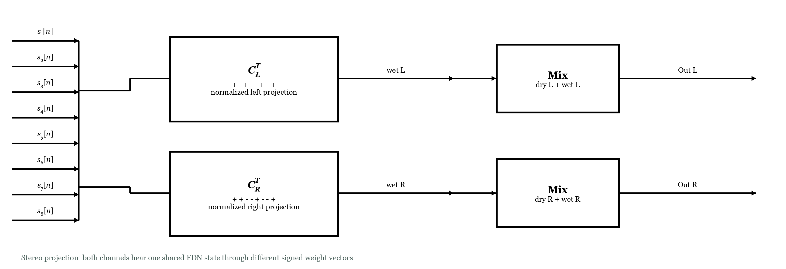

**Figure: Stereo output projection from a shared eight-line FDN state through normalized signed vectors and independent dry-wet output mixers.**

**How to read this flowgraph.** Every state component contributes to both wet channels,
but the signs in $\mathbf{C}_L^{\mathsf T}$ and $\mathbf{C}_R^{\mathsf T}$ differ. The
channels therefore share one decay history while emphasizing different modal
combinations. Normalization prevents channel count or coefficient choice from creating
an unintended level jump. The final mixers add the projected wet signals to their dry
counterparts after recursion, preserving one acoustic identity and predictable fold-down
behavior.

### A Thirty-Minute Reverb Laboratory

The following laboratory turns the chapter into an audible sequence. Use headphones
and loudspeakers if possible; keep output level fixed; preserve every render and JSON
sidecar.

#### Minute 0-5: Identify the Three Regions

Render the dry click through a one-second room at 100 percent wet. Mark direct onset,
the first visible reflections, and the point where individual arrivals become a dense
tail. Change only pre-delay and repeat. The late decay should remain similar while the
relationship between source and room changes.

#### Minute 5-10: Isolate Diffusion

Render a rimshot or click with zero, two, four, and eight allpass stages. Keep RT60 and
matrix fixed. Listen for loss of attack definition, flutter reduction, and buildup
speed. Choose the lowest stage count that supplies the density the source needs.

#### Minute 10-15: Compare Matrix Families

Use a sparse major seventh chord and an eight-second tail. Compare Hadamard, circulant,
random orthogonal, and time-varying unitary matrices. Write three adjectives for each
without looking at the option name. Then inspect sonograms and ask whether visible
modal ridges agree with what you heard.

#### Minute 15-20: Design Frequency-Dependent Decay

Set low, middle, and high RT60 values equal. Then shorten only the high band; next,
lengthen only the low band. Listen through the complete final tail. The point is not to
find a universal curve but to learn how decay spectrum changes perceived material and
scale.

#### Minute 20-25: Make the Return a Musical Voice

Put verbx on a 100 percent wet auxiliary return. Send only the final note of every
four-bar phrase. Then leave the send constant and automate the return instead. Compare
the two gestures. One controls what the room remembers; the other controls when the
memory is revealed.

#### Minute 25-30: Enter Extreme Time Safely

Render one stable chord into a 60-second time-varying FDN. Leave at least 90 seconds of
silence after the source. Write floating-point audio and a JSON report. Inspect peak,
integrated loudness, DC offset, and the final 20 seconds. Increase RT60 only after the
tail is spectrally and numerically controlled.

### Practical Listening Checklist

- **Onset:** Does the room begin with the source, behind it, or as a separate echo?
- **Density:** Can individual repetitions be heard after they should have fused?
- **Color:** Which bands survive longest, and is that survival musically useful?
- **Modes:** Do stable pitches emerge that were not structurally important in the source?
- **Width:** Does the return enlarge the image without weakening the center or fold-down?
- **Dynamics:** Does the tail mask attacks, words, or harmonic changes?
- **Motion:** Does time variation feel architectural, chorused, or unstable?
- **Ending:** Does the tail reach silence gracefully, gate abruptly, or expose noise and DC?
- **Form:** Is reverb supporting a phrase, connecting sections, or functioning as its own layer?
- **Evidence:** Can the render be reproduced from its command, preset, seed, and JSON report?

### Summary: Reverb as Memory

Reverb is the memory of an acoustic or synthetic system. Direct sound tells the listener
what happened; early reflections tell where it happened; the late field tells how the
space continues to respond. In music, that memory can reinforce articulation, connect
harmony, enlarge orchestration, preserve a past section, or become a new sustained
instrument.

verbx sounds different because it does not reduce this behavior to one size control. It
exposes the topology and timing that create density, the matrix that exchanges energy,
the filters that shape decay, the projections that create spatial output, and the
creative processes that reinterpret the field. At ordinary settings, those controls
design rooms, chambers, halls, and plates. At extreme settings, they design musical
time.

---

## Core Concepts

### Algorithmic vs. Convolution

**For beginners:** Algorithmic reverb synthesizes the space from scratch using delay networks and filters. It does not need an external file, responds instantly to parameter changes, and can produce decay times no physical room could sustain. Convolution reverb applies a pre-recorded impulse response — a measurement of what a specific room does to a click — to your audio. The result sounds like the space where the IR was recorded.

**For experts:** The algorithmic engine in verbx uses a Schroeder allpass diffusion stage feeding a fully coupled N-line FDN with configurable feedback matrix. Convolution uses uniformly-partitioned overlap-save FFT with optional CUDA acceleration via CuPy. The two engines share the same pre-delay, shimmer, freeze, ducking, bloom, tilt, loudness, and spatial stages. Use `--engine auto` and verbx selects based on whether an IR is present.

Choose algorithmic when you want extreme lengths, animated or time-varying decay, spaces that do not exist, low storage overhead. Choose convolution when you want: the character of a specific real or designed space, exact linear reproduction of an IR, or multichannel matrix routing from a measured space.

### RT60

**For beginners:** RT60 is roughly how long the reverb tail takes to fade away — specifically, how many seconds until the level drops by 60 dB (about a factor of 1000 in amplitude). A small bathroom is around 0.5 seconds. A bedroom is 0.3–0.8 seconds. A concert hall is 1.5–2.5 seconds. A cathedral reaches 5–12 seconds. verbx handles up to 3600 seconds. If the tail sounds too long and washes over everything, reduce RT60. If it sounds too dry and cut-off, increase it.

**For experts:** RT60 drives per-line gain calibration in the FDN:

$$
g_i = 10^{-\frac{3d_i}{T_{60}}}
$$

where $d_i$ is delay-line $i$ duration in seconds and $T_{60}$ is the target decay time. Shorter delays require gains closer to $1.0$ for the same RT60 target. Multiband RT60 (`--fdn-rt60-low`, `--fdn-rt60-mid`, `--fdn-rt60-high`) applies this formula per band with crossovers at `--fdn-xover-low-hz` and `--fdn-xover-high-hz`. The `--fdn-rt60-tilt` parameter applies a Jot-style frequency-dependent decay skew around the broadband target without requiring explicit per-band values. For analysis, use `verbx analyze --edr` to compute frequency-dependent RT estimates via backward Schroeder integration of the output.

### Impulse Responses

**For beginners:** An impulse response (IR) is a recording of what a space does to a single perfect click. When you convolve your audio with an IR, your audio sounds like it was played in that space. verbx can use IR files from external libraries, or generate its own synthetic IRs in four modes. You do not need an IR to use verbx — the algorithmic engine works without one.

**For experts:** verbx IR synthesis runs in four modes. `fdn` constructs a tail from the same FDN core used in algorithmic rendering, with configurable matrix family and decay parameters. `stochastic` generates exponentially-decayed filtered noise, shaped to match an RT60 curve. `modal` synthesizes a bank of tuned resonators — useful for musically-pitched spaces or physically-inspired objects. `hybrid` combines FDN late field with stochastic early reflections and optional modal resonator coloration. All modes use deterministic content-hash caching so repeated generation with the same parameters retrieves from cache rather than recomputing. The cache is keyed on mode, all synthesis parameters, seed, sample rate, channels, and length.

### Wet/Dry Mix

**For beginners:** `--wet` controls how much reverb you hear; `--dry` controls how much of the original unprocessed signal you keep. Most reverb uses are parallel — you blend the two. Start with `--wet 0.2 --dry 0.8` for subtle room feel and increase wet for more spaciousness. A setting of `--wet 1.0 --dry 0.0` is fully wet with no dry signal — often used in freeze or ambient texture work where you want the reverb itself as the sound.

**For experts:** verbx allows wet values above 1.0 for deliberate creative overdriving of the wet bus prior to the final mix. This is intentional and distinct from a gain error — it allows the reverb field to dominate with headroom for the loudness and limiter stages downstream to manage levels. Both `--wet` and `--dry` are valid automation targets: you can write time-varying lanes that sweep wet depth over the duration of a render, useful for automating reverb throws or level-responsive gating.

---

## The Engines

### Algorithmic Engine (`--engine algo`)

The algorithmic engine synthesizes reverb without an impulse response file. It is well suited for extreme tail lengths, evolving or modulated spaces, and creative applications where physical accuracy is not the goal.

**What it sounds like:** Smooth, dense, fully controllable. At short RT60 values (under 3 seconds) it behaves like a believable room. As RT60 increases past 20–30 seconds, it transitions into something entirely non-physical — a sustained shimmer of harmonic energy that can evolve slowly over minutes. The matrix family is the main texture control: Hadamard produces a more uniform, neutral tail; `tv_unitary` adds slow decorrelation motion; `graph` with ring topology sounds regular and periodic; `random` sounds unpredictable.

**Signal flow:**

```
input
  └─ pre-delay (z⁻ᴺᵖʳᵉ)
       └─ allpass diffusion (K stages)
            └─ FDN feedback loop
                 ├─ delay bank (N lines, z⁻ᴺⁱ)
                 ├─ per-line conditioning D_i(z)  [damping + DC block]
                 ├─ RT60 gain G  [diagonal, per-line]
                 ├─ feedback matrix M  [orthonormal family]
                 ├─ optional DFM micro-delays
                 └─ optional link filter
            └─ wet projection
  └─ dry signal
       └─ wet/dry mix → shimmer → bloom/tilt/EQ → loudness → output
```

Delay notation: $z^{-N}$ means an integer-sample delay of $N$ samples.

**FDN mechanics:** At each sample, the FDN reads from $N$ delay lines, applies per-line damping and DC blocking, multiplies by the gain diagonal $\mathbf{G}$, multiplies by the feedback matrix $\mathbf{M}$, adds the injected excitation from the diffusion stage, and writes back to the delays. The matrix $\mathbf{M}$ must be orthonormal (or nearly so) to preserve energy over long tails; verbx orthonormalizes all matrix families before use. The state update is:

$$
\mathbf{y}[n] = \mathbf{D}\!\left(\mathbf{x}_{\mathrm{fb}}[n]\right)
$$

$$
\mathbf{x}_{\mathrm{fb}}[n+1] = \mathbf{G}\mathbf{M}\mathbf{y}[n] + \mathbf{u}[n]
$$

where:

- $n$ is the discrete-time sample index.
- $\mathbf{x}_{\mathrm{fb}}[n]$ is the feedback-state vector before loop conditioning.
- $\mathbf{y}[n]$ is the conditioned state after $\mathbf{D}(\cdot)$.
- $\mathbf{D}(\cdot)$ is per-line loop conditioning (damping + DC blocking).
- $\mathbf{G}$ is the diagonal RT60 gain matrix with entries $g_i$.
- $\mathbf{M}$ is the orthonormal feedback mixing matrix.
- $\mathbf{u}[n]$ is the post-diffusion excitation injected into the loop.

**FDN gain calibration:** For delay line $i$ with period $d_i$ seconds and target decay $T_{60}$:

$$
g_i = 10^{-\frac{3d_i}{T_{60}}}
$$

Shorter delay lines require gains closer to 1.0. This is computed per line so different delay lengths in the same network all decay toward the same target RT60.

**Matrix families:**

| Matrix | Sound character | Math note |
|---|---|---|
| `hadamard` | Even, neutral density | `N x N` Walsh-Hadamard; valid for power-of-2 line counts |
| `householder` | Similar to Hadamard, slightly more uniform | Householder reflection matrix |
| `random_orthogonal` | Unpredictable coloration | QR decomposition of random normal matrix |
| `circulant` | Periodic, regular resonance | Diagonalized by DFT; controlled frequency-domain structure |
| `elliptic` | Weighted energy distribution | Elliptic rotation-based coupling |
| `tv_unitary` | Slowly evolving, reduced metallic ringing | Time-varying orthonormal update at `--fdn-tv-rate-hz` Hz |
| `graph` | Topology-controlled pair mixing | Staged edge interactions over ring/path/star/random graph |
| `sdn_hybrid` | Geometry-inspired directional scatter | Scattering delay network coupling approach |

**Key parameters:**

| Parameter | Range | What it does | Expert note |
|---|---|---|---|
| `--rt60` | 0.1–3600 | Decay time target (seconds) | Drives per-line gain via $g_i = 10^{-3d_i/T_{60}}$ |
| `--fdn-lines` | 2–64 | Number of delay lines | Higher line counts increase tail density; above 32 the returns diminish |
| `--fdn-matrix` | see above | Feedback mixing topology | Controls tail texture and energy diffusion pattern |
| `--allpass-stages` | 0–16 | Early diffusion stages | 4–10 is typical; 0 disables diffusion entirely |
| `--allpass-gain` | ±0.99 | Allpass coefficient | Per-stage or broadcast; must stay inside unit circle |
| `--comb-cloud` | flag | Optional pre-FDN comb bank | Adds metallic/dense coloration before the late field |
| `--comb-cloud-mix` | 0–1 | Comb-cloud blend amount | Start around `0.2` before increasing line count/feedback |
| `--damping` | 0–1 | HF rolloff in feedback loop | Higher values darken the tail faster |
| `--fdn-rt60-tilt` | –1 to 1 | Low/high decay skew | Positive = longer lows, shorter highs |
| `--fdn-link-filter` | none/lowpass/highpass | In-loop spectral shaping | Shapes the spectral flow on feedback edges |
| `--fdn-tv-rate-hz` | 0–5 | Time-varying matrix update rate | Active only with `tv_unitary`; slow rates reduce ringing |
| `--mod-depth-ms` | 0–10 | Delay modulation depth | Small values suppress metallic resonances |
| `--width` | 0–2 | Stereo spread | Increases decorrelation between channels |
| `--fdn-sparse` | flag | Sparse pair-mixing topology | Higher apparent order at lower compute cost |
| `--fdn-cascade` | flag | Nested FDN injection | Secondary network feeds early density into primary |
| `--unsafe-self-oscillate` | flag | UNSAFE above-unity feedback mode | Algorithmic engine only; for intentional self-oscillation |
| `--unsafe-loop-gain` | 0.01–1.25 | UNSAFE feedback gain scale | Use `>1.0` to drive oscillation |

---

### Convolution Engine (`--engine conv`)

The convolution engine filters audio through an impulse response. Use it when you want the character of a specific space — measured or synthesized — applied exactly.

**What it sounds like:** The output has the exact spectral and temporal character of the IR. A measured cathedral IR makes everything sound like it was played in that cathedral. A verbx-generated hybrid IR sounds like a designed space tuned to your specifications. Self-convolution (`--self-convolve`) smears a sound with its own spectral envelope — a different kind of effect.

**Partitioned convolution:** For long IRs, direct time-domain convolution is impractical. verbx uses uniformly-partitioned overlap-save convolution in the frequency domain:

$$
Y_k(\omega) = \sum_{p=0}^{P-1} X_{k-p}(\omega)\,H_p(\omega)
$$

where:

- $k$ is the current processing frame index.
- $\omega$ is frequency-bin index in the FFT domain.
- $P$ is the number of IR partitions.
- $X_{k-p}(\omega)$ is the stored input spectrum for frame $k-p$.
- $H_p(\omega)$ is the precomputed spectrum of IR partition $p$.
- $Y_k(\omega)$ is the accumulated output spectrum for frame $k$.

`--partition-size` controls the partition length: larger partitions reduce per-block FFT overhead but increase latency and peak memory. 16384–65536 samples is a practical range for offline rendering. With CuPy installed and `--device cuda`, the FFT multiply accumulation runs on GPU.

**Streaming vs. in-memory:** verbx automatically uses streaming convolution (low peak RAM) when the render is simple: engine conv, no repeat, no freeze, no normalization stages, no post-processing effects. All other combinations fall back to full-buffer processing. If RAM is a concern for very long IRs, keep the render chain minimal.

**Multichannel routing:** For $M$ input channels and $N$ output channels:

$$
y_o[n] = \sum_{i=0}^{M-1} \left(x_i * h_{i,o}\right)[n]
$$

where:

- $M$ is input-channel count and $N$ is output-channel count.
- $x_i[n]$ is input channel $i$.
- $h_{i,o}[n]$ is the IR from input channel $i$ to output channel $o$.
- $y_o[n]$ is output channel $o$.
- $*$ denotes linear convolution.

The IR file must contain $M \times N$ channels packed in output-major order (channel index $oM + i$) or input-major order ($iN + o$). Set `--ir-matrix-layout output-major` or `input-major` accordingly. Wrong packing order produces valid audio but semantically incorrect routing; verify with `verbx analyze` on the output.

**Key parameters:**

| Parameter | Range/values | What it does | Expert note |
|---|---|---|---|
| `--ir` | file path | Impulse response to apply | WAV, FLAC, AIFF, OGG, CAF all supported |
| `--partition-size` | 1024–131072 | FFT block size | Larger = more throughput, higher latency |
| `--tail-limit` | seconds | Cap IR tail at this length | Useful to bound compute on long IRs in batch |
| `--ir-normalize` | peak/rms/none | IR level normalization | `peak` is safest for predictable headroom |
| `--ir-matrix-layout` | output-major/input-major | Multichannel channel packing | Must match how the IR was created |
| `--ir-blend` | file path | Second IR for render-time blending | Repeatable; blend alpha automatable |
| `--ir-blend-mode` | linear/equal-power/spectral/envelope-aware | Blend algorithm | `envelope-aware` preserves early reflection character independently from late tail |
| `--self-convolve` | flag | Input file is its own IR | Spectral smearing / texture effect |
| `--device` | auto/cpu/cuda/mps | Compute backend | CUDA requires CuPy; MPS uses Apple Silicon profile |

---

## Impulse Response Synthesis

verbx generates its own IRs in four synthesis modes. The complete parameter reference is in [docs/IR_SYNTHESIS.md](docs/IR_SYNTHESIS.md). The IR toolchain is accessible via `verbx ir gen`, or triggered inline during render with `--ir-gen`.

A larger curated IR set is available in [`IRs/library/`](IRs/library/) with
folder-sorted buckets by length (`tiny`, `short`, `medium`, `long`) and mode
(`fdn`, `stochastic`, `modal`, `hybrid`), plus deterministic metadata in
`IRs/library/manifest.json`.

**Synthesis modes:**

| Mode | Character | Best for |
|---|---|---|
| `fdn` | Smooth, configurable, FDN-consistent | Spaces that match your algorithmic render topology |
| `stochastic` | Diffuse, noise-shaped, natural-sounding | Neutral halls, rooms, generic reverbs |
| `modal` | Resonant, tonal, pitched | Metal objects, tuned rooms, experimental textures |
| `hybrid` | Stochastic early + FDN late + optional modal resonator | Most general use; strong default |

**Common use case table:**

| Goal | Mode | Key flags |
|---|---|---|
| Neutral hall, natural decay | `stochastic` | `--rt60 3.0 --damping 0.4` |
| Match your FDN render topology | `fdn` | Same `--fdn-lines`, `--fdn-matrix` as render |
| Musical, pitched resonances | `modal` | `--f0 "64 Hz" --modal-count 40` |
| General cinematic space | `hybrid` | `--length 120 --seed 42` |
| Analyze and match audio source | `hybrid` | `--analyze-input source.wav` |

Generated IRs are cached by content hash + parameters. Repeated calls with the same settings return from cache instantly.

```bash
verbx ir gen my_space.wav --mode hybrid --length 120 --rt60 8.0 --seed 42
verbx ir analyze my_space.wav --json-out my_space_analysis.json
verbx ir morph space_A.wav space_B.wav blended.wav --mode equal-power --alpha 0.5
```

---

## Effects and Post-Processing

### Shimmer

Shimmer pitch-shifts the reverb tail (typically up an octave) and blends it back into the wet signal. The result is a bright, harmonically rich coloration that works well on pads, sustained notes, and ambient textures. The `--shimmer-feedback` parameter is the one most people get wrong: above around 0.85, the feedback loop builds exponentially. This is not a bug — it is the intended mechanism for extreme infinite-rise textures — but it requires either a tail limit, loudness targeting, or deliberate management to avoid runaway gain.

Safe mode clamps `--shimmer-feedback` to `0.98`. For intentional self-oscillation in the algorithmic path, enable `--unsafe-self-oscillate` and use `--unsafe-loop-gain > 1.0` (for example `1.03`).

```bash
--shimmer --shimmer-semitones 12 --shimmer-mix 0.35 --shimmer-feedback 0.70
--shimmer-lowcut 300 --shimmer-highcut 12000    # control frequency range of shimmer layer
```

### Comb Cloud

`--comb-cloud` inserts a separate bank of decorrelated feedback comb filters between the diffusion stage and the main FDN late field. It is an optional color mode for when you want extra density, metallic haze, or exaggerated spatial smear without redefining the core FDN topology. The point is texture, not neutrality.

Use it when the base algorithmic tail feels too smooth or too well-behaved:

- plates and metallic chambers
- sci-fi interiors and synthetic spaces
- frozen, haunted, or intentionally "wrong" ambience
- pre-shimmer thickening before harmonic coloration

Start conservatively. `--comb-cloud-mix 0.15-0.35` is usually enough. Higher `--comb-cloud-feedback` values push the sound toward ringing and resonant buildup.

```bash
--comb-cloud --comb-cloud-count 24 --comb-cloud-feedback 0.35 --comb-cloud-mix 0.25
--comb-cloud-delays-ms 6,9,13,17,23,29,37,49   # optional custom cloud spacing
```

Practical tip: comb cloud and shimmer solve different problems. Comb cloud thickens and roughens the time structure; shimmer adds pitched harmonic content. If the reverb feels sterile, try comb cloud first. If it feels emotionally flat, try shimmer.

### Freeze / Repeat

`--freeze` locks onto a segment of audio (defined by `--start` and `--end` in seconds) and loops it through the reverb engine with an equal-power crossfade at loop boundaries. This produces sustained, near-static textures. `--repeat N` runs the full render chain N times sequentially, each pass using the output of the previous as input — an iterative reprocessing that progressively imprints the room resonance on the source. Classic application: Alvin Lucier's *I Am Sitting in a Room* technique.

Use `--output-peak-norm input` with repeat chains to keep levels stable across passes.

### Ducking

`--duck` is the reverb effect most mix engineers do not use until they hear it. It attenuates the reverb output while the source signal is active, then lets the tail bloom in the gaps. The effect keeps the dry signal clean and articulate while the reverb is still long and spacious. Especially effective on drums, vocals, and anything with rhythmic transients.

```bash
--duck --duck-attack 15 --duck-release 250 --duck-strength 0.9 --duck-floor 0.18
```

Attack controls how quickly the reverb ducks when signal appears; release controls how quickly it recovers. Shorter release times give a punchier, more gated feel. `--duck-strength` controls how deep the wet attenuation goes, while `--duck-floor` keeps some reverb present even at the deepest point of the pump.

### Bloom

`--bloom N` emphasizes the slow build-up phase of the wet field, creating a cinematic swell effect where the reverb tail rises rather than immediately decaying. Values between 1.5 and 3.0 are perceptible as a rise before the decay plateau. Higher values push into dramatic orchestral-swell territory. It operates on the spectral envelope of the wet output and is distinct from simple gain automation.

Use `--bloom-mix` when you want the bloom time constant from `--bloom` but a more restrained or more exaggerated blend than the automatic scaling would choose.

### Tilt EQ

`--tilt N` applies a broadband spectral tilt to the wet field. Positive values (try 1.0–3.0) brighten the reverb tail; negative values darken it. This is a post-wet control, so it does not affect the dry signal or the decay mathematics — it only shapes the perceptual tone of the reverb output. Combine with `--lowcut` and `--highcut` for more specific frequency management.

`--tilt-pivot-hz` moves the tonal fulcrum of that tilt, while `--lowcut-order` and `--highcut-order` let you choose gentler or steeper post-wet filter slopes.

---

## Spatial and Surround

For most uses, stereo output is all you need. Multichannel processing becomes relevant when you are delivering to a surround format, working in Ambisonics, or routing reverb through a spatial bus.

For a complete treatment of channel beds, height layers, Ambisonics, Dolby Atmos beds and objects, binaural monitoring, DAW handoff, deliverables, and immersive QC, read [Immersive Reverb, Surround Sound, and Dolby Atmos](docs/IMMERSIVE_AUDIO.md). The chapter includes signal-flow diagrams, routing recipes, and a precise account of what verbx can and cannot author today.

**Channel layouts:**

| Layout | Channels | Use case |
|---|---|---|
| `mono` | 1 | Mono sources or mono IR processing |
| `stereo` | 2 | Standard stereo output |
| `LCR` | 3 | Left/Center/Right film format |
| `5.1` | 6 | Standard surround |
| `7.1` | 8 | Expanded surround |
| `7.1.2` | 10 | Standard Atmos bed or fixed-channel immersive bus |
| `7.1.4` | 12 | Common Atmos monitoring/render layout; not the default Atmos bed |
| `7.2.4` | 13 | 7-bed + dual-LFE + 4-top layout |
| `8.0` | 8 | 8-channel bed without dedicated LFE |
| `16.0` | 16 | Large-format discrete bed |
| `64.4` | 68 | High-density immersive bed + top layer |

Use `--input-layout` and `--output-layout` to declare channel semantics explicitly. Without them, verbx uses channel count alone, which can produce ambiguous routing for formats above stereo.

**Atmos boundary:** verbx writes channel-based WAVE files, Ambisonic material, matrix-routed convolution outputs, JSON analysis, and handoff manifests. It does not currently author Dolby object trajectories, per-object binaural metadata, or a native ADM BWF/DAMF master. Prepare bed and object stems in verbx, then perform object assignment, metadata authoring, endpoint rendering, and master export in an Atmos-capable DAW and the Dolby Atmos Renderer.

The distinction between a bed and a monitoring layout matters. Dolby’s standard bed is 7.1.2, while 7.1.4 commonly describes a loudspeaker render with four independently fed height speakers. verbx currently labels channels 9–10 of its symbolic `7.1.2` layout `Ltf/Rtf`; a Dolby bed expects `Ltm/Rtm` in those positions. Verify and explicitly map those channels at handoff rather than relying on channel count.

For large immersive outputs (`16.0`, `64.4`), set `--ir-route-map` explicitly when the IR is mono or channel-matched to the input. Recommended defaults:

- `--ir-route-map broadcast` for mono/channel-matched IRs
- `--ir-route-map full` for matrix-packed `M x N` IRs

Other formats are also easy to support: the routing and DSP paths already operate on arbitrary channel counts, and new symbolic layout names are straightforward to add when you need explicit semantics.

**Ambisonics:** verbx supports First-Order Ambisonics (FOA) with ACN channel ordering and SN3D/N3D/FuMa normalization. Use `--ambi-order 1` to declare FOA mode. `--ambi-encode-from stereo` encodes a stereo input into FOA before processing; `--ambi-decode-to stereo` decodes back out after. `--ambi-rotate-yaw-deg` applies rotation in the Ambisonics domain — useful for spatial orientation of the reverb field relative to a listener position. FUMA is FOA-only; ACN with SN3D is the standard workflow for most Ambisonics toolchains.

**IR matrix routing for surround:** If your IR file contains `M x N` channels (for $M$ input and $N$ output channels), declare the packing order with `--ir-matrix-layout`. Output-major packing stores all inputs for output 0 first, then all inputs for output 1, etc. (channel index $oM + i$). Input-major stores all outputs for input 0 first (channel index $iN + o$). A 5.1 input to 5.1 output full-matrix IR has 36 channels; a diagonal (same IR per channel) has 6. The routing is explicit: verbx does not guess.

---

## Loudness and Metering

Most audio delivered for broadcast, streaming, or film needs to hit a loudness target. EBU R128 / ITU-R BS.1770 defines integrated loudness in LUFS (Loudness Units relative to Full Scale). The practical difference between targeting –23 LUFS for broadcast and –14 LUFS for streaming can be over 9 dB of apparent level — enough to sound completely wrong in one context if mastered for the other.

verbx has a full loudness pipeline:

- **`--target-lufs N`** measures integrated loudness and scales to the target. Applies after the reverb processing stage.
- **`--target-peak-dbfs N`** enforces a peak ceiling. Use with `--true-peak` for inter-sample peak checking (required for formats that will be transcoded, as codec interpolation can raise peaks above the stored sample values). Sample peak (`--sample-peak`) is sufficient for archival.
- **`--output-peak-norm [input|target|full-scale]`** is a final-stage peak fit applied after all other processing: `input` matches the input file's peak, `target` uses an explicit dBFS value, `full-scale` normalizes to near 0 dBFS.
- **Soft limiter:** enabled by default as a final safety stage. Disable with `--no-limiter` when you want to pass raw dynamics to a downstream limiter in your chain.

The loudness and peak stages are intentionally separate because they serve different goals. Loudness targeting is about program-level normalization. Peak ceiling is about short-term safety. Do not conflate them.

True-peak detection uses oversampled measurement (ITU-R BS.1770). The difference between a sample peak of –0.1 dBFS and a true peak of +0.4 dBFS is invisible in sample-domain inspection but will cause clipping in AAC, MP3, and most streaming codecs. Use `--true-peak --target-peak-dbfs -1` for any output that will be transcoded.

Week 3 delivery sanity checks now fail fast when an explicit limiter threshold is above the limiter ceiling, because that silently collapses the useful gain-reduction range. Explicit container choices also need matching extensions: use `.w64` with `--output-container w64`, `.rf64` with `--output-container rf64`, or leave `--output-container auto` on when you want verbx to infer the container.

Ready-to-run delivery examples:

```bash
# Broadcast/streaming-safe limiter and peak-normalized output
verbx render in.wav out_limited.wav --preset limiter-broadcast-safe \
  --output-peak-norm target --output-peak-target-dbfs -1

# Bounded long-tail delivery with an explicit W64 container
verbx render in.wav out_long.w64 --preset delivery-long-tail-safe \
  --output-container w64 --tail-limit 12
```

---

## Automation and Modulation

The automation system lets you change reverb parameters over the duration of a render — wet depth, RT60, room size, decay tilt, IR blend position, and more — without editing the audio manually. This is useful for: reverb throws (sudden wet increase on a vocal), automated room size sweeps during a sound design cue, feature-reactive ducking where loudness in the source drives reverb depth, and batch augmentation where different parameter curves are applied to each variant.

**Automation lanes via file or inline points:**
```bash
# Sweep RT60 from 0.8s to 10s over 15 seconds
verbx render in.wav out.wav --engine algo \
  --automation-point "rt60:0.0:0.8:linear" \
  --automation-point "rt60:15.0:10.0:linear"

# From a JSON automation file
verbx render in.wav out.wav --automation-file automation.json
```

**Automation targets include:** `wet`, `dry`, `gain-db`, `rt60`, `damping`, `room-size`, `room-size-macro`, `clarity-macro`, `warmth-macro`, `envelopment-macro`, `fdn-rt60-tilt`, `fdn-tonal-correction-strength`, `ir-blend-alpha` (requires `--ir-blend`).

**Feature vector lanes** drive automation from frame-level audio analysis of the source signal. A "feature vector" is a time-series of per-frame descriptors extracted from audio: loudness, transient strength, spectral centroid, spectral flatness, harmonic ratio, MFCCs, formant spread, rhythm pulse, and more. You map these onto render targets with weight, curve shape (linear, smoothstep, power), and hysteresis:

```bash
# Wet depth tracks loudness and transients in the source
verbx render in.wav out.wav --engine conv --ir hall.wav \
  --feature-vector-lane "target=wet,source=loudness_norm,weight=0.70,curve=smoothstep,combine=replace" \
  --feature-vector-lane "target=wet,source=transient_strength,weight=0.30,curve=power,curve_amount=1.4,combine=add" \
  --feature-vector-trace-out trace.csv
```

Use `--feature-guide GUIDE.wav` to drive feature extraction from a separate audio file rather than the render input — a sidechain-style workflow.

**Modulation bus** provides LFO and envelope sources for simple periodic or input-reactive variation without needing a full automation file:
```bash
--mod-target mix --mod-min 0.1 --mod-max 0.9 \
  --mod-source "lfo:sine:0.07:1.0*0.7" \
  --mod-source "env:20:350*0.4"
```

Source syntax: `lfo:<shape>:<rate_hz>[:depth[:phase_deg]][*weight]` | `env[:attack_ms[:release_ms]][*weight]` | `audio-env:<path>[:attack_ms[:release_ms]][*weight]` | `const:<value>[*weight]`

---

## CLI Reference

Canonical, autogenerated help snapshots live in
[`docs/CLI_REFERENCE.md`](docs/CLI_REFERENCE.md). This README section is a
curated quick-reference for common switches.

### verbx render

`verbx render INFILE OUTFILE [options]`

#### Engine and Room Behavior

| Switch | Range | What it does | Expert note |
|---|---|---|---|
| `--engine` | algo/conv/auto | Reverb engine | `auto` picks `conv` if IR present, else `algo` |
| `--rt60` | 0.1–3600 | Decay time (seconds) | Per-line gain via $g_i = 10^{-3d_i/T_{60}}$ |
| `--wet` | 0–∞ | Wet signal level | Values >1.0 overdrive wet bus intentionally |
| `--dry` | 0–1 | Dry signal level | |
| `--pre-delay-ms` | 0–500 | Reverb onset delay (ms) | |
| `--pre-delay` | e.g. `1/8D` | Musical note-value pre-delay | Requires `--bpm` |
| `--bpm` | float | Tempo for note-based pre-delay | |
| `--damping` | 0–1 | HF decay rate in feedback | Higher = darker tail |
| `--width` | 0–2 | Stereo decorrelation | |
| `--allpass-stages` | 0–16 | Diffusion stage count | |
| `--allpass-gain` | ±0.99 | Per-stage allpass coefficient | Comma-separated per-stage list accepted |
| `--comb-cloud` | flag | Enable optional pre-FDN comb-cloud coloration | Separate color stage; default off |
| `--comb-cloud-count` | 1–128 | Generated comb-cloud line count | Higher = denser, more colored |
| `--comb-cloud-feedback` | 0–0.95 | Comb-cloud feedback amount | Higher = more ringing / metallicity |
| `--comb-cloud-mix` | 0–1 | Blend between diffusion output and comb-cloud output | 0.15–0.35 is a strong starting range |
| `--comb-cloud-delays-ms` | comma list | Custom comb-cloud delay list in ms | Auto-enables comb cloud |
| `--comb-cloud-seed` | int | Deterministic comb-cloud seed | Changes generated spacing/decorrelation |
| `--fdn-lines` | 2–64 | Delay line count | |
| `--fdn-matrix` | see table above | Feedback matrix family | |
| `--fdn-tv-rate-hz` | 0–5 | TV-unitary update rate | `tv_unitary` only |
| `--fdn-tv-depth` | 0–1 | TV-unitary blend depth | `tv_unitary` only |
| `--fdn-matrix-morph-to` | matrix family | Target matrix for gradual morphing | Morphs from `--fdn-matrix` to target |
| `--fdn-matrix-morph-seconds` | seconds | Matrix morph duration | Requires `--fdn-matrix-morph-to` |
| `--fdn-dfm-delays-ms` | float | DFM micro-delay size | One value or one per line |
| `--fdn-sparse` | flag | Sparse pair-mixing topology | Exclusive with `tv_unitary` and `graph` |
| `--fdn-sparse-degree` | 1–8 | Pair-mixing stages | |
| `--fdn-link-filter` | none/lowpass/highpass | In-loop spectral shaping | |
| `--fdn-link-filter-hz` | Hz | Link filter cutoff | |
| `--fdn-rt60-tilt` | –1 to 1 | Low/high RT skew | Positive = longer lows |
| `--fdn-tonal-correction-strength` | 0–1 | Decay-color equalization | Track C control |
| `--fdn-cascade` | flag | Nested FDN injection | |
| `--fdn-graph-topology` | ring/path/star/random | Graph topology | `graph` matrix only |
| `--fdn-spatial-coupling-mode` | none/adjacent/front_rear/bed_top/all_to_all | Channel wet-bus coupling | |
| `--fdn-nonlinearity` | none/tanh/softclip | In-loop saturation | Keep blend low: 0.05–0.25 |
| `--beast-mode` | 1–100 | Parameter multiplier | 2–5 for heavier ambience, 10+ for extreme |

#### RT60 and Multiband Decay

| Switch | Range | What it does |
|---|---|---|
| `--fdn-rt60-low` | seconds | Low-band RT60 target |
| `--fdn-rt60-mid` | seconds | Mid-band RT60 target |
| `--fdn-rt60-high` | seconds | High-band RT60 target |
| `--fdn-xover-low-hz` | Hz | Low/mid crossover |
| `--fdn-xover-high-hz` | Hz | Mid/high crossover |

#### Convolution and IR Routing

| Switch | Values | What it does |
|---|---|---|
| `--ir` | file path | External IR for convolution |
| `--ir-normalize` | peak/rms/none | IR normalization before convolution |
| `--ir-matrix-layout` | output-major/input-major | Multichannel IR channel packing |
| `--ir-route-map` | auto/diagonal/broadcast/full | Channel routing strategy |
| `--partition-size` | int | FFT partition size |
| `--tail-limit` | seconds | Cap convolution tail |
| `--self-convolve` | flag | Use input as its own IR |
| `--ir-blend` | file path | Blend a second IR at render time (repeatable) |
| `--ir-blend-mix` | 0–1 | Blend coefficient(s) |
| `--ir-blend-mode` | linear/equal-power/spectral/envelope-aware | Blend algorithm |
| `--ir-gen` | flag | Auto-generate IR before render |
| `--ir-gen-mode` | fdn/stochastic/modal/hybrid | IR synthesis mode |
| `--ir-gen-length` | seconds | Generated IR duration |
| `--ir-gen-seed` | int | Deterministic seed |

#### Spatial

| Switch | Values | What it does |
|---|---|---|
| `--input-layout` | auto/mono/stereo/LCR/5.1/7.1/7.1.2/7.1.4/7.2.4/8.0/16.0/64.4 | Input channel semantics |
| `--output-layout` | auto/mono/stereo/LCR/5.1/7.1/7.1.2/7.1.4/7.2.4/8.0/16.0/64.4 | Output channel semantics |
| `--ambi-order` | 0–7 | Ambisonics order (1 = FOA) |
| `--ambi-normalization` | auto/sn3d/n3d/fuma | Normalization convention |
| `--channel-order` | auto/acn/fuma | Channel ordering convention |
| `--ambi-encode-from` | none/mono/stereo | Encode to FOA before render |
| `--ambi-decode-to` | none/stereo | Decode from Ambisonics after render |
| `--ambi-rotate-yaw-deg` | degrees | Yaw rotation in Ambisonics domain |

#### Effects

| Switch | Values | What it does |
|---|---|---|
| `--shimmer` | flag | Enable shimmer (pitch-shifted reverb coloration) |
| `--shimmer-semitones` | semitones | Pitch shift amount |
| `--shimmer-mix` | 0–1 | Shimmer blend |
| `--shimmer-feedback` | 0–1.25 | Shimmer feedback (>0.85 = rising; >0.98 requires unsafe mode) |
| `--unsafe-self-oscillate` | flag | UNSAFE: allow above-unity feedback in algorithmic mode |
| `--unsafe-loop-gain` | 0.01–1.25 | UNSAFE algorithmic loop-gain scale (`>1.0` for self-oscillation) |
| `--shimmer-spatial` | flag | Enable multichannel shimmer decorrelation | Useful for immersive beds |
| `--shimmer-spread-cents` | cents | Per-channel shimmer detune spread | Used with `--shimmer-spatial` |
| `--shimmer-decorrelation-ms` | ms | Per-channel shimmer delay spread | Used with `--shimmer-spatial` |
| `--duck` | flag | Enable sidechain ducking |
| `--duck-attack` | ms | Ducking attack time |
| `--duck-release` | ms | Ducking release time |
| `--duck-strength` | 0–1 | Ducking depth | Higher values carve more space for the dry signal |
| `--duck-floor` | 0–1 | Minimum wet gain during ducking | Keeps ambience present while pumping |
| `--bloom` | 0–5 | Wet field build-up emphasis |
| `--bloom-mix` | 0–1 | Bloom blend override | Auto-derived from `--bloom` when omitted |
| `--lowcut` | Hz | Post-wet high-pass filter |
| `--lowcut-order` | 1–8 | High-pass slope order | Higher = steeper low-frequency cleanup |
| `--highcut` | Hz | Post-wet low-pass filter |
| `--highcut-order` | 1–8 | Low-pass slope order | Higher = steeper top-end damping |
| `--tilt` | dB/oct | Post-wet spectral tilt |
| `--tilt-pivot-hz` | Hz | Tilt pivot frequency | Moves the tonal hinge point of the tilt EQ |
| `--freeze` | flag | Loop a segment through the engine |
| `--start` | seconds | Freeze segment start |
| `--end` | seconds | Freeze segment end |
| `--repeat` | int | Repeat render passes |

#### Loudness and Output

| Switch | Values | What it does |
|---|---|---|
| `--target-lufs` | LUFS | Integrated loudness target |
| `--target-peak-dbfs` | dBFS | Peak ceiling |
| `--true-peak` / `--sample-peak` | flag | Peak detection mode |
| `--limiter` / `--no-limiter` | flag | Final safety limiter |
| `--normalize-stage` | none/post/per-pass | When normalization applies |
| `--output-peak-norm` | none/input/target/full-scale | Final peak fit |
| `--quality-preset` | sd/md/hd | Output-definition preset (`sd`=44.1 kHz PCM16, `md`=48 kHz PCM24, `hd`=192 kHz float32 default) |
| `--out-subtype` | auto/float32/float64/pcm16/pcm24/pcm32 | Output file bit depth (overrides preset subtype) |
| `--target-sr` | Hz | Render/output sample-rate conversion (overrides preset sample rate) |
| `--output-container` | auto/wav/w64/rf64 | Output container selection | `auto` upgrades long WAV renders to W64 |
| `--tail-stop-threshold-db` | dBFS | Tail detector threshold for write completion | Lower = longer retained tail |
| `--tail-stop-hold-ms` | ms | Explicit final zero-hold duration | Click-safe fade-out plus hard-zero ending |
| `--tail-stop-metric` | peak/rms | Tail detector metric | RMS is smoother, peak is stricter |

When `--target-sr` differs from the input file rate, `verbx render` performs
deterministic internal resampling and writes the output at the requested rate.

#### Execution and Reporting

| Switch | Values | What it does |
|---|---|---|
| `--device` | auto/cpu/cuda/mps | Compute backend |
| `--threads` | int | CPU thread count hint |
| `--algo-stream` | flag | Algorithmic proxy-IR streaming mode | Memory-friendly for very long renders |
| `--algo-proxy-ir-max-seconds` | seconds | Maximum proxy-IR duration | Used with `--algo-stream` |
| `--algo-gpu-proxy` | flag | Route algo proxy through CUDA convolution | Requires `--algo-stream --device cuda` |
| `--dry-run` | flag | Validate config without writing audio |
| `--auto-fit` | none/speech/music/drums/ambient | Apply profile-derived starting values | Respects explicit CLI overrides |
| `--preset` | name or `room:WxDxH/material` | Apply named preset or geometry-derived room baseline |
| `--lucky N` | int | Generate N randomized variants |
| `--frames-out` | path | Per-frame metrics CSV |
| `--analysis-out` | path | JSON analysis report path |
| `--repro-bundle` | flag | Write reproducibility bundle |
| `--quiet` | flag | Suppress console summary |
| `--silent` | flag | Suppress all output including analysis JSON |

---

### Early Reflection Geometry (Render)

| Switch | Values | What it does |
|---|---|---|
| `--er-geometry` | flag | Enable first-order image-source early reflections before main engine |
| `--er-room-dims-m` | `L,W,H` | Room dimensions (meters) |
| `--er-source-pos-m` | `x,y,z` | Source position (meters) |
| `--er-listener-pos-m` | `x,y,z` | Listener position (meters) |
| `--er-absorption` | 0.0–0.99 | Wall absorption coefficient |
| `--er-material` | anechoic/dead/studio/hall/stone | Preset absorption profile |

---

### verbx ir

```bash
verbx ir gen OUT_IR.wav [options]          # synthesize an IR
verbx ir analyze IR_FILE.wav              # measure RT60, EDT, spectral decay
verbx ir process IN_IR.wav OUT_IR.wav     # shape existing IR (EQ, normalize, tilt)
verbx ir morph IR_A.wav IR_B.wav OUT.wav  # blend two IRs
verbx ir morph-sweep IR_A.wav IR_B.wav OUT_DIR  # alpha-timeline sweep with QA artifacts
verbx ir fit INFILE.wav OUT_IR.wav        # fit an IR to match source audio
verbx ir sofa-info FILE.sofa              # inspect SOFA conventions/dimensions
verbx ir sofa-extract FILE.sofa OUT.wav   # extract FIR matrix for convolution renders
```

**`ir gen` key flags:** `--mode [fdn|stochastic|modal|hybrid]`, `--length`, `--rt60`, `--damping`, `--seed`, `--sr`, `--channels`, `--er-count`, `--diffusion`, `--fdn-lines`, `--fdn-matrix`, `--resonator`, `--resonator-mix`, `--analyze-input`, `--harmonic-align-strength`, `--f0`

**`ir morph` key flags:** `--mode [linear|equal-power|spectral|envelope-aware]`, `--alpha`, `--early-ms`, `--early-alpha`, `--late-alpha`, `--align-decay`, `--phase-coherence`, `--mismatch-policy [coerce|strict]`

**`ir morph-sweep` key flags:** Same as morph plus `--alpha-start`, `--alpha-end`, `--alpha-steps`, `--workers`, `--retries`, `--checkpoint-file`, `--resume`, `--qa-json-out`, `--qa-csv-out`

**`ir sofa-extract` key flags:** `--measurement-index`, `--emitter-index`, `--target-sr`, `--normalize [none|peak|rms]`, `--strict`

---

### verbx realtime

`verbx realtime [options]`

Realtime mode is currently a preview/audition path. `--engine conv` streams a
real IR directly; `--engine algo` renders a static proxy IR once, then runs the
live monitor through the streaming convolution engine. That means you get live
device routing and stable tails today, without pretending the full offline
automation surface is callback-safe yet. In other words: convolution settings
act live, while algorithmic settings shape the startup proxy IR that the live
convolver uses for the session. It now also supports a dedicated low-latency
live dereverb path, either standalone or chained in front of the reverb engine.

**Transport and device routing**

| Switch | Values | What it does |
|---|---|---|
| `--live-mode` | reverb/dereverb/dereverb-reverb | Choose reverb only, dereverb only, or dereverb feeding the live reverb path |
| `--engine` | auto/conv/algo | Live engine mode. `auto` chooses convolution when `--ir` is present, else algorithmic proxy |
| `--ir` | file path | IR source for realtime convolution |
| `--input-device` | index or substring | Select live input device |
| `--output-device` | index or substring | Select live output device |
| `--list-devices` | flag | Print available realtime devices and exit |
| `--sample-rate` | Hz | Live stream sample rate |
| `--block-size` | samples | Driver callback block size |
| `--partition-size` | samples | Convolution partition size used in the live processor |
| `--input-channels` | int | Processor input width. Defaults to mono/stereo, or to the length of `--input-channel-map` |
| `--input-channel-map` | comma-separated 1-based ints | Select and reorder hardware input channels, for example `1,3` or `1,3,5,7` |
| `--output-channels` | int | Processor output width. Defaults to processor width, or to the length of `--output-channel-map` |
| `--output-channel-map` | comma-separated 1-based ints | Select and reorder hardware output channels that receive processor outputs |
| `--duration` | seconds | Stop automatically after N seconds; omit for Ctrl-C run |
| `--quiet` | flag | Reduce console output |

**Low-latency live dereverb**

| Switch | Values | What it does |
|---|---|---|
| `--dereverb-mode` | wiener/spectral_sub | Realtime dereverb kernel |
| `--dereverb-strength` | 0–2 | How aggressively late energy is suppressed |
| `--dereverb-floor` | 0–1 | Minimum residual gain floor |
| `--dereverb-window-ms` / `--dereverb-hop-ms` | ms / ms | Short STFT analysis window and hop for the live dereverb path |
| `--dereverb-tail-ms` | ms | Exponential late-tail tracking horizon |
| `--dereverb-pre-emphasis` | 0–0.98 | Optional pre-emphasis before spectral processing |
| `--dereverb-mix` | 0–1 | Blend between dereverbed and latency-aligned dry signal |
| `--dereverb-max-atten-db` | dB | Clamp the maximum spectral attenuation |
| `--dereverb-stereo-link` | flag | Link stereo gain decisions to reduce image wobble |
| `--dereverb-input-gain-db` / `--dereverb-output-gain-db` | dB / dB | Trim into and out of the live dereverb processor |

**Realtime mix and proxy-room controls**

| Switch | Values | What it does |
|---|---|---|
| `--wet` / `--dry` | 0–1 | Live wet/dry mix in the convolver |
| `--rt60` | seconds | Algorithmic proxy decay time |
| `--pre-delay-ms` | ms | Algorithmic proxy pre-delay |
| `--damping` | 0–1 | Algorithmic proxy damping |
| `--width` | 0–2 | Algorithmic proxy stereo width |
| `--mod-depth-ms` / `--mod-rate-hz` | ms / Hz | Proxy delay modulation depth and rate |
| `--freeze` | flag | Realtime algo only: approximate infinite sustain via a long self-sustaining proxy tail |
| `--algo-proxy-ir-max-seconds` | seconds | Upper bound on startup proxy IR render length |
| `--lowcut` / `--highcut` / `--tilt` | Hz / dB tilt | Shape the startup proxy IR spectrum before live convolution |

**FDN topology and feedback options**

| Switch | Values | What it does |
|---|---|---|
| `--fdn-lines` | 1–64 | Proxy FDN line count |
| `--fdn-matrix` | hadamard/householder/random_orthogonal/circulant/elliptic/tv_unitary/graph/sdn_hybrid | Proxy matrix family |
| `--fdn-tv-rate-hz` / `--fdn-tv-depth` | Hz / amount | Time-varying matrix motion for supported FDNs |
| `--fdn-dfm-delays-ms` | comma-separated ms | Delay-feedback modulation taps |
| `--fdn-sparse` / `--fdn-sparse-degree` | flag / int | Sparse feedback wiring and degree |
| `--fdn-cascade` and friends | flag / scalars | Enable cascaded/nested FDN behavior |
| `--fdn-rt60-low` / `--mid` / `--high` | seconds | Multiband RT60 targets |
| `--fdn-rt60-tilt` | –1 to 1 | Tilt the decay profile across bands |
| `--fdn-link-filter*` | mode / Hz / mix | Filter energy in the feedback links |
| `--fdn-graph-topology` / `--fdn-graph-degree` / `--fdn-graph-seed` | topology / int / int | Graph-based FDN layout controls |
| `--fdn-matrix-morph-to` / `--fdn-matrix-morph-seconds` | matrix / seconds | Morph between matrix families during proxy synthesis |
| `--fdn-spatial-coupling-mode` / `--strength` | mode / 0–1 | Immersive cross-cluster coupling |
| `--fdn-nonlinearity*` | mode / amount / drive | Nonlinear feedback coloration |

**Diffusion, shimmer, and perceptual macros**

| Switch | Values | What it does |
|---|---|---|
| `--allpass-stages` | 0–64 | Diffusion depth |
| `--allpass-gain` | float or comma-separated list | Shared or per-stage diffusion coefficient(s) |
| `--allpass-delays-ms` | comma-separated ms | Custom allpass delay times |
| `--comb-delays-ms` | comma-separated ms | Custom FDN/comb delay times |
| `--shimmer` and `--shimmer-*` | flag / scalars | Startup proxy shimmer block with pitch, mix, feedback, filters, spatial spread |
| `--room-size-macro` / `--clarity-macro` / `--warmth-macro` / `--envelopment-macro` | –1 to 1 | Jot-inspired perceptual macro controls |
| `--algo-decorrelation-front` / `--rear` / `--top` | 0–1 | Extra proxy decorrelation for immersive layouts |
| `--unsafe-self-oscillate` / `--unsafe-loop-gain` | flag / scalar | Deliberately allow runaway feedback behavior when you really mean it |

Notes:

- `--live-mode dereverb` ignores reverb-engine startup options and runs only the low-latency dereverb processor.
- `--live-mode dereverb-reverb` runs the same dereverb front-end first, then feeds the selected live reverb engine.
- Live dereverb currently supports mono or stereo processor widths.
- `--block-size` must be divisible by the resolved dereverb hop size. At 48 kHz with `--dereverb-hop-ms 4`, safe values include `192`, `384`, and `576`.
- When `--engine conv` is used with `--ir`, algorithmic proxy flags are rejected instead of being silently ignored.
- Realtime `--freeze` is not the offline segment-freeze processor. It is a live-preview approximation built on a long self-sustaining proxy IR.
- Channel maps are 1-based hardware channel numbers. If you pass `--input-channel-map 1,3`, processor input 1 comes from hardware input 1 and processor input 2 comes from hardware input 3.
- Channel-count switches must match the length of the corresponding channel map when both are provided.
- The autogenerated exhaustive help for every switch lives in [`docs/CLI_REFERENCE.md`](docs/CLI_REFERENCE.md).

Examples:

```bash
verbx realtime --engine algo \
  --input-device "Built-in Microphone" \
  --output-device "Headphones" \
  --sample-rate 48000 --block-size 256 \
  --input-channel-map 1,3 --output-channel-map 1,2,5,6 \
  --rt60 24 --freeze --shimmer \
  --fdn-matrix tv-unitary --fdn-tv-rate-hz 0.35 --fdn-tv-depth 0.12 \
  --fdn-graph-topology star --fdn-sparse --fdn-cascade \
  --lowcut 120 --highcut 9000 --tilt 1.5
```

```bash
verbx realtime --live-mode dereverb \
  --input-device "Built-in Microphone" \
  --output-device "Headphones" \
  --sample-rate 48000 --block-size 384 \
  --dereverb-mode wiener \
  --dereverb-strength 0.85 --dereverb-floor 0.05 \
  --dereverb-window-ms 12 --dereverb-hop-ms 4 --dereverb-tail-ms 90 \
  --dereverb-pre-emphasis 0.2 --dereverb-mix 1.0 \
  --dereverb-max-atten-db 18 --dereverb-stereo-link
```

```bash
verbx realtime --live-mode dereverb-reverb --engine algo \
  --input-device "Built-in Microphone" \
  --output-device "Headphones" \
  --sample-rate 48000 --block-size 384 \
  --dereverb-mode spectral_sub --dereverb-strength 0.9 \
  --dereverb-window-ms 12 --dereverb-hop-ms 4 \
  --rt60 12 --wet 0.55 --dry 0.45 \
  --fdn-matrix tv-unitary --fdn-tv-rate-hz 0.25 --fdn-tv-depth 0.08
```

---

### verbx analyze

`verbx analyze INFILE [options]`

Outputs loudness, peak, spectral, and decay metrics. Key flags:

| Switch | What it produces |
|---|---|
| `--lufs` | Integrated LUFS, true peak, LRA |
| `--edr` | Frequency-dependent RT60 estimates via Schroeder backward integration |
| `--frames-out path` | Per-frame CSV with time-varying descriptors |
| `--json-out path` | Full metric payload in JSON |
| `--ambi-order N` | Ambisonics spatial metrics for HOA assets |

---

### verbx room-model

```bash
verbx room-model --dims-m 6,8,3
verbx room-model --rt60 1.6 --material hall --json-out room.json
```

Use this when you want a physically grounded sanity check before rendering.
`verbx room-model` either inspects an explicit rectangular room geometry or
infers one from RT60 plus an absorption/material assumption. It reports volume,
surface area, direct-path pre-delay, aspect ratios, Bolt-style proportion
warnings, and writes JSON when requested.

If you already know the dimensions and want to jump straight to a render, you
can skip the inspection step and use the matching render shorthand:

```bash
verbx render in.wav out.wav --preset room:6x8x3/hall
```

| Switch | Values | What it does |
|---|---|---|
| `--dims-m` | `width,depth,height` | Inspect an explicit rectangular room |
| `--rt60` | seconds | Infer room dimensions from RT60 plus absorption |
| `--absorption` | 0.01–0.99 | Override the mean absorption used for RT60 inversion |
| `--material` | preset name | Use a wall material preset when `--absorption` is omitted |
| `--source-pos-m` | `x,y,z` meters | Source position inside the room |
| `--listener-pos-m` | `x,y,z` meters | Listener position inside the room |
| `--json-out` | path | Write the full geometry payload as JSON |

---

### verbx dereverb

`verbx dereverb INFILE OUTFILE [options]`

Deterministic spectral late-tail suppression for existing recordings.

| Switch | Values | What it does |
|---|---|---|
| `--mode` | wiener/spectral_sub | Suppression algorithm |
| `--strength` | 0–2 | Reverberant suppression amount |
| `--floor` | 0–1 | Residual floor to reduce musical-noise artifacts |
| `--window-ms` | ms | STFT analysis window |
| `--hop-ms` | ms | STFT hop size (must be smaller than window) |
| `--tail-ms` | ms | Late-field smoothing horizon |
| `--pre-emphasis` | 0–0.98 | Optional HF emphasis before suppression |
| `--mix` | 0–1 | Blend of processed output |
| `--out-subtype` | auto/float32/float64/pcm16/pcm24/pcm32 | Output encoding |
| `--json-out` | path | Write structured dereverb report |

---

### verbx batch

```bash
verbx batch template > manifest.json           # generate manifest skeleton
verbx batch render manifest.json --jobs 8      # parallel render
verbx batch augment-template > augment.json    # generate augmentation manifest
verbx batch augment-profiles                   # list built-in profiles
verbx batch augment augment.json --jobs 8      # generate training dataset
```

**Batch render flags:** `--jobs`, `--schedule [fifo|shortest-first|longest-first]`, `--retries`, `--continue-on-error`, `--checkpoint-file`, `--resume`, `--dry-run`

**Batch augment flags:** Built-in profiles `asr-reverb-v1`, `music-reverb-v1`, `drums-room-v1`. Key flags: `--copy-dry`, `--dataset-card-out`, `--metrics-csv-out`, `--qa-bundle-out`, `--provenance-hash`, `--verify-split-isolation`

---

### Other Commands

```bash
verbx suggest INFILE      # analysis-driven starter settings for your specific audio
verbx realtime --list-devices   # list selectable live audio devices
verbx realtime --engine algo --input-device 0 --output-device 3   # live preview
verbx realtime --live-mode dereverb --input-device 0 --output-device 3   # live low-latency dereverb
verbx render in.wav out.wav --preset room:6x8x3/hall   # geometry-derived room baseline
verbx render in.wav out_warm.wav --preset warm-chamber   # one of 280 generated style/space presets
verbx render in.wav out_shimmer.wav --preset shimmer-cathedral   # expansive shimmer preset
verbx render in.wav out_limited.wav --preset limiter-broadcast-safe   # limiter-safe delivery preset
verbx render in.wav out_long.w64 --preset delivery-long-tail-safe --output-container w64   # bounded long-tail W64 delivery
verbx room-model --rt60 1.8 --material hall   # infer a plausible room geometry
verbx dereverb in.wav out_dry.wav --mode wiener --strength 0.85 --json-out dereverb.json   # suppress late reverberation from an existing recording
verbx presets             # list built-in presets
verbx presets --show cathedral_extreme   # inspect preset parameters
verbx presets --show warm-chamber   # inspect generated style/space presets
verbx presets --show limiter-broadcast-safe   # inspect limiter/output delivery defaults
verbx quickstart          # copy-paste workflows for first-run scenarios
verbx quickstart --verify --strict       # startup readiness check (useful before demos)
verbx doctor              # platform/acceleration diagnostics
verbx doctor --json-out doctor.json      # machine-readable diagnostics for issue reports
verbx version             # package version string
verbx cache info          # inspect IR cache
verbx cache clear         # clear IR cache
```

---

## Recipes

### Beginner Recipes

**Subtle room glue — keeps everything sounding like it was recorded together:**
```bash
verbx render mix_bus.wav glued.wav --engine algo --rt60 0.8 --wet 0.15 --dry 0.9 --pre-delay-ms 12
```

**Natural vocal hall — spacious without washing the lyrics:**
```bash
verbx render vocals.wav vocals_hall.wav --engine algo \
  --rt60 2.2 --wet 0.28 --dry 0.78 --pre-delay-ms 22 --lowcut 200 --highcut 10000
```

**Drums with ducking — tail blooms between hits, never clutters transients:**
```bash
verbx render drums.wav drums_room.wav --engine algo \
  --rt60 1.4 --wet 0.55 --dry 0.6 --duck --duck-attack 10 --duck-release 180
```

**Convolution from a free IR library — real space character:**
```bash
verbx render piano.wav piano_conv.wav --engine conv --ir hall_ir.wav --ir-normalize peak --wet 0.5 --dry 0.7
```

**Tempo-synced pre-delay — reverb onset lines up with the beat:**
```bash
verbx render snare.wav snare_delay.wav --engine algo --pre-delay 1/8D --bpm 128 --rt60 1.8 --wet 0.45
```

**Loudness-safe delivery — hits –16 LUFS with –1 dBTP ceiling:**
```bash
verbx render master.wav delivered.wav --engine algo --rt60 2.0 --wet 0.2 \
  --target-lufs -16 --true-peak --target-peak-dbfs -1
```

---

### Production Recipes

**Broadcast dialogue room — natural placement, EBU R128 compliant:**
```bash
verbx render dialogue.wav dialogue_room.wav --engine conv \
  --ir small_room_ir.wav --wet 0.25 --dry 0.85 --pre-delay-ms 8 \
  --lowcut 150 --highcut 9000 --target-lufs -23 --true-peak --target-peak-dbfs -1
```

**Film score hall — wide, clear, cinematic:**
```bash
verbx render strings.wav strings_hall.wav \
  --engine conv --ir large_hall_ir.wav \
  --wet 0.65 --dry 0.55 --pre-delay 1/16 --bpm 72 \
  --width 1.2 --bloom 1.8 --tilt 1.0 \
  --lowcut 80 --target-lufs -20 --target-peak-dbfs -1.5
```

**Gated drum space — 1980s aesthetic, punchy tail that cuts off:**
```bash
verbx render drums.wav drums_gated.wav --engine conv \
  --ir plate_short.wav --ir-normalize peak --tail-limit 1.2 \
  --wet 0.75 --dry 0.4 --highcut 9000 --target-peak-dbfs -1
```

**Dub chamber send — high-wet parallel texture, bandwidth controlled:**
```bash
verbx render snare_send.wav dub_chamber.wav --engine conv \
  --ir spring_ir.wav --repeat 2 --wet 0.95 --dry 0.05 \
  --lowcut 180 --highcut 4500 --tilt -2.0 --output-peak-norm input
```

**Sparse hall for piano or choir — depth without obscuring articulation:**
```bash
verbx render piano.wav piano_hall.wav --engine conv --ir hall_ir.wav \
  --pre-delay 1/16 --bpm 60 --wet 0.55 --dry 0.7 \
  --lowcut 120 --highcut 11000 --target-lufs -20 --target-peak-dbfs -1
```

**Cathedral vocal/organ — long, immersive, cinematic:**
```bash
verbx render choir.wav choir_cathedral.wav --engine conv \
  --ir cathedral_ir.wav --wet 0.82 --dry 0.35 --rt60 90 \
  --lowcut 70 --highcut 10000 --target-lufs -21 --true-peak --target-peak-dbfs -1
```

**Track D IR blend — morphing between two hall characters during render:**
```bash
verbx render in.wav morphed.wav --engine conv --ir hall_A.wav \
  --ir-blend hall_B.wav --ir-blend-mix 0.6 --ir-blend-mode envelope-aware \
  --ir-blend-early-ms 60 --automation-point "ir-blend-alpha:0.0:0.0" \
  --automation-point "ir-blend-alpha:30.0:1.0"
```

**AI dataset batch — augmentation with split isolation and metrics:**
```bash
verbx batch augment augment_manifest.json --profile asr-reverb-v1 \
  --jobs 8 --copy-dry --verify-split-isolation \
  --metrics-csv-out out/metrics.csv --dataset-card-out out/DATASET_CARD.md \
  --qa-bundle-out out/qa_bundle.json --provenance-hash
```

---

### Experimental Recipes

Eight approaches from the experimental music tradition. Rendered demos for all of these are
in [`examples/audio/`](examples/audio/).

---

**Alvin Lucier — *I Am Sitting in a Room*** (iterative room resonance accumulation)

Each pass imprints the room's modal resonances more deeply. After 12–20 passes, only the
resonant frequencies of the virtual room survive — the original speech is gone.

```bash
mkdir passes && cp voice.wav passes/pass_00.wav && current="passes/pass_00.wav"
for i in $(seq 1 20); do
  next=$(printf "passes/pass_%02d.wav" "$i")
  verbx render "$current" "$next" --engine algo --rt60 4.5 \
    --wet 1.0 --dry 0.0 --fdn-lines 16 --fdn-matrix hadamard \
    --lowcut 60 --no-progress
  current="$next"
done
# Quick single-command version (7 passes baked in):
verbx render voice.wav lucier_7pass.wav --engine algo --rt60 4.5 \
  --wet 1.0 --dry 0.0 --repeat 7 --fdn-lines 16 --fdn-matrix hadamard --lowcut 60
```

---

**Brian Eno — *Discreet Music* / Ambient series** (endless ambient tail)

Decay so long the source dissolves. The wet signal becomes the room's breath.

```bash
verbx render input.wav eno_ambient.wav --engine algo --rt60 12.0 \
  --wet 0.92 --dry 0.08 --damping 0.25 --pre-delay-ms 35 \
  --fdn-lines 16 --fdn-matrix hadamard --lowcut 50 \
  --target-lufs -22 --target-peak-dbfs -2
```

---

**Pauline Oliveros — *Deep Listening*** (cave-scale resonance)

Inspired by Oliveros's work in underground cisterns. Very low damping lets every frequency
sustain; 32-line FDN produces the lateral complexity of stone architecture.

```bash
verbx render drone.wav deep_listening.wav --engine algo --rt60 18.0 \
  --wet 0.95 --dry 0.10 --fdn-lines 32 --fdn-matrix hadamard \
  --pre-delay-ms 55 --damping 0.15 --lowcut 30 \
  --target-lufs -24 --target-peak-dbfs -2
# For a 240-second synthesized IR version:
verbx render drone.wav deep_ir.wav --ir-gen --ir-gen-mode hybrid \
  --ir-gen-length 240 --ir-gen-seed 108 --engine conv \
  --wet 0.9 --dry 0.15 --target-lufs -24 --target-peak-dbfs -2
```

---

**Robert Fripp / Eno — Frippertronics tape-loop accumulation**

Shimmer feedback builds over each block. At 0.78, the octave layer accumulates like a tape
recirculation loop growing denser with each pass.

```bash
verbx render guitar.wav frippertronics.wav --engine algo --rt60 8.0 \
  --wet 0.82 --dry 0.28 --fdn-lines 16 --fdn-matrix hadamard \
  --shimmer --shimmer-semitones 12 --shimmer-mix 0.45 --shimmer-feedback 0.78 \
  --pre-delay-ms 25 --target-peak-dbfs -2
# Iterative version — 12 passes with gradual timbral drift:
mkdir fripp && cp guitar.wav fripp/pass_00.wav && current="fripp/pass_00.wav"
for i in $(seq 1 12); do
  next=$(printf "fripp/pass_%02d.wav" "$i")
  verbx render "$current" "$next" --engine algo --rt60 8.0 \
    --wet 0.82 --dry 0.12 --shimmer --shimmer-semitones 12 \
    --shimmer-feedback 0.78 --no-progress
  current="$next"
done
```

---

**Shoegaze / My Bloody Valentine — wall of sound** (dense shimmer wash)

Freeze a guitar sustain, then bury it in octave shimmer and a circulant FDN. The circulant
matrix produces the smeared, tonally undifferentiated density that defines the genre.

```bash
verbx render guitar.wav shoegaze.wav --engine algo \
  --freeze --start 1.0 --end 2.4 \
  --shimmer --shimmer-semitones 12 --shimmer-mix 0.55 --shimmer-feedback 0.72 \
  --rt60 5.0 --wet 0.88 --dry 0.22 --fdn-matrix circulant --lowcut 80 \
  --width 1.4 --target-peak-dbfs -2
```

---

**Steve Reich — phase minimalism** (tight rhythmic room)

Short RT60 with a circulant diffusion matrix keeps individual hits distinct while adding
spatial depth. The circulant matrix's circular delay structure creates subtle comb filtering
that complements phase-shifted rhythmic material.

```bash
verbx render percussion.wav reich_room.wav --engine algo --rt60 0.7 \
  --wet 0.55 --dry 0.50 --fdn-lines 8 --fdn-matrix circulant \
  --pre-delay-ms 18 --damping 0.6 --lowcut 60
```

---

**Eliane Radigue — *ADNOS* / drone electronics** (near-infinite sustain)

At RT60=45s with wet=0.97, the dry signal is almost entirely subsumed. Radigue's aesthetic
is about sound that has been in the room so long it has become the room.

```bash
verbx render drone.wav radigue.wav --engine algo --rt60 45.0 \
  --wet 0.97 --dry 0.05 --fdn-lines 32 --fdn-matrix hadamard \
  --damping 0.10 --lowcut 20 --target-lufs -28 --target-peak-dbfs -2
```

---

**Morton Feldman — late period** (contemplative sparse space)

Feldman's late works often feature long silences and isolated events in large, reflective
spaces. Medium RT60, restrained wet level, allpass diffusion, no shimmer.

```bash
verbx render piano.wav feldman.wav --engine algo --rt60 3.8 \
  --wet 0.52 --dry 0.52 --fdn-lines 8 --fdn-matrix circulant \
  --pre-delay-ms 30 --damping 0.50 --allpass-stages 4 \
  --target-lufs -26 --target-peak-dbfs -2
```

---

**Self-convolution texture smear** — signal convolved with itself:
```bash
verbx render input.wav self_convolved.wav --self-convolve \
  --beast-mode 12 --partition-size 16384 --normalize-stage none
```

**Feature-reactive reverb depth** — wet depth tracks source loudness in real time:
```bash
verbx render in.wav reactive.wav --engine conv --ir hall.wav \
  --feature-vector-lane "target=wet,source=loudness_norm,weight=0.70,curve=smoothstep,combine=replace" \
  --feature-vector-lane "target=wet,source=transient_strength,weight=0.30,combine=add" \
  --feature-vector-frame-ms 40 --feature-vector-trace-out trace.csv
```

**Lucky mode exploration** — 12 randomized wild variants from one source:
```bash
verbx render in.wav out/lucky.wav --lucky 12 --lucky-out-dir out/lucky_set --lucky-seed 2026 --no-progress
```

---

### Workflow Recipes

**Batch parallel render from a manifest:**
```bash
verbx batch template > manifest.json      # edit manifest.json with your jobs
verbx batch render manifest.json --jobs 8 --schedule longest-first --retries 1 \
  --checkpoint-file manifest.checkpoint.json
# interrupted? resume from where it stopped:
verbx batch render manifest.json --jobs 8 --resume --checkpoint-file manifest.checkpoint.json
```

**IR sweep QA — morph between two IRs with quality metrics:**
```bash
verbx ir morph-sweep ir_a.wav ir_b.wav out/sweep \
  --alpha-start 0.0 --alpha-end 1.0 --alpha-steps 9 \
  --workers 4 --retries 1 --mismatch-policy strict \
  --checkpoint-file out/sweep.checkpoint.json \
  --qa-json-out out/sweep_summary.json --qa-csv-out out/sweep_metrics.csv
```

**Generate a bank of 25 varied IRs:**
```bash
./scripts/generate_ir_bank.sh IRs/bank_25 25 flac
# or with explicit Python control:
./scripts/generate_ir_bank.py --out IRs/bank_25 --count 25 --sr 48000 --channels 2 --format flac
```

**Generate a large folder-sorted IR library (varying lengths):**
```bash
uv run python scripts/generate_ir_library.py \
  --out IRs/library --sr 12000 --channels 2 --format flac --seeds-per-shape 1
```

**Pre-render validation — catch config errors before a long job:**
```bash
verbx render long_input.wav output.wav --engine algo --rt60 180 --fdn-lines 32 --dry-run
# prints resolved config, estimated output duration, device selection — no audio written
```

---

## Performance and Acceleration

**CPU (default):** All processing. Algorithmic FDN path benefits from `numba` when installed — install with `pip install numba` and verbx uses JIT-compiled inner loops automatically. Check with `verbx doctor`.

**Apple Silicon (MPS):** `--device mps` uses the MPS profile for the algorithmic path. The convolution FFT runs on CPU (NumPy/SciPy). Threading helps: `--threads 8` is a good starting point for M-series chips. Apple Silicon is well-suited for the algorithmic engine; the memory bandwidth advantage shows on high line count FDN renders.

**CUDA:** `--device cuda` enables GPU-accelerated partitioned FFT convolution via CuPy. Install with `pip install cupy-cuda12x` (match your CUDA version). The algorithmic engine does not benefit from CUDA — it runs on CPU regardless. CUDA acceleration is most valuable for long-IR convolution with large files. If CuPy is unavailable, verbx falls back to CPU silently.

**Block size and partition size:** `--block-size` controls the algorithmic engine's internal block size — larger blocks can improve throughput at the cost of responsiveness per block. `--partition-size` controls convolution FFT partition length — the main tuning knob for convolution throughput. Larger partitions reduce per-block overhead but increase peak memory. For offline rendering, 16384–65536 is a good range. For very long IRs (120s+), larger partition sizes (65536) often give better throughput.

**Streaming convolution** engages automatically for simple conv renders (no normalization, no post-effects, no freeze, `--repeat 1`). Peak RAM use scales with partition size rather than IR length in this mode.

**Numba:** When installed, verbx automatically JIT-compiles the FDN inner loop for the algorithmic engine. First render with a new configuration takes a few extra seconds to compile; subsequent renders at the same parameters are significantly faster. To verify it is active: `verbx doctor --json-out doctor.json` and check `numba_available`.

---

## DSP Architecture

For contributors and people who want to understand the signal chain in code.

**Module map:**

| Path | Contents |
|---|---|
| `src/verbx/commands/` | Public command modules and Typer registration surfaces |
| `src/verbx/cli.py` | Shared CLI validation, config assembly, and helper/report logic |
| `src/verbx/core/algo_reverb.py` | Algorithmic FDN engine |
| `src/verbx/core/conv_reverb.py` | Partitioned FFT convolution engine |
| `src/verbx/core/pipeline.py` | Render orchestration, stage ordering |
| `src/verbx/core/loudness.py` | LUFS targeting, true-peak, limiter |
| `src/verbx/core/shimmer.py` | Shimmer, bloom, ducking, tilt |
| `src/verbx/core/tempo.py` | Note-value pre-delay parsing |
| `src/verbx/analysis/` | Frame extraction, EDR, Ambisonics metrics |
| `src/verbx/ir/` | IR synthesis modes, shaping, morphing, fitting, cache |
| `src/verbx/io/` | Audio I/O, progress reporting |

**Signal chain (algorithmic engine):**

```
input audio
  │
  ├─ [dry path] ──────────────────────────────────────────┐
  │                                                        │
  └─ pre-delay (z⁻ᴺ)                                       │
       └─ allpass diffusion (stages 1..K)                  │
            └─ [optional] comb cloud                        │
                 └─ FDN core                                │
                      ├─ delay bank (lines 1..N)           │
                      ├─ loop conditioning D(z)            │
                      ├─ RT60 gain matrix G                │
                      ├─ feedback matrix M [orthonormal]   │
                      ├─ [optional] DFM micro-delays       │
                      ├─ [optional] link filter            │
                      └─ [optional] in-loop nonlinearity   │
            └─ wet projection                              │
                 └─ shimmer / bloom / duck / tilt / EQ ───┤
                                                           │
  wet/dry mix ◄──────────────────────────────────────────┘
       └─ loudness stage (LUFS / peak / limiter)
            └─ final peak normalization
                 └─ audio write
                      └─ analysis JSON + frames CSV
```

Notation: $z^{-N}$ denotes an integer-sample delay of $N$ samples, $K$ is
allpass-stage count, and $N$ (in `lines 1..N`) is FDN delay-line count.

**Precision:** All DSP — FDN state updates, FFT operations, allpass filters, automation curves, feature vectors, analysis metrics — runs in `float64` internally. Output is downcast at write time according to `--out-subtype`. `verbx render` defaults to HD output (`192000 Hz`, `float32`) unless overridden by `--quality-preset`, `--target-sr`, or `--out-subtype`.

**Key design decisions:**
- Per-line gain calibration (not global feedback gain) lets all delay lines, regardless of length, track the same RT60 target. This is essential for stable long tails.
- Orthonormalization of all matrix families before use prevents energy accumulation in high-feedback topologies.
- Automation evaluation uses a slew limiter and deadband guard in addition to smoothing to prevent abrupt control jumps and high-frequency control chatter in block-mode evaluation.
- The IR cache uses a content hash (audio samples + metadata) rather than file path, so the same IR content at a different path still hits cache.

---

## Contributors

- Colby Leider (creator and maintainer)
- Full contributors graph: [github.com/TheColby/verbx/graphs/contributors](https://github.com/TheColby/verbx/graphs/contributors)

---

## Contributing

See [CONTRIBUTING.md](CONTRIBUTING.md) for the full guide. Quick start:

```bash
hatch env create
hatch run lint      # ruff check
hatch run typecheck # pyright strict
hatch run test      # pytest
```

`uv` alternative:
```bash
uv sync --extra dev
uv run ruff check . && uv run pyright && uv run pytest
```

Report security issues via [SECURITY.md](SECURITY.md). See [CODE_OF_CONDUCT.md](CODE_OF_CONDUCT.md).

---

## References and Further Reading

Full bibliography: [docs/REFERENCES.md](docs/REFERENCES.md)

Key papers:


- **Gardner (1998)** — "Reverberation algorithms." Practical implementation guide covering partitioned convolution, early reflections, and late field design.
- **Jot (1992)** — "An analysis/synthesis approach to real-time artificial reverberation." Extends FDN theory to frequency-dependent decay, the basis for multiband RT60 control.
- **Jot & Chaigne (1991)** — "Digital delay networks for designing artificial reverberators." Introduced the Feedback Delay Network in its modern form; directly informs the gain calibration formula used in verbx.
- **Schroeder (1962)** — "Natural sounding artificial reverberation." The foundational work on allpass and comb filter reverb structures that forms the basis for most algorithmic reverb design.
- **Smith (1985)** — "A new approach to digital reverberation using closed waveguide networks." Scattering Delay Networks — a physical wave propagation model distinct from the FDN approach; informs the `sdn_hybrid` matrix family.
- **Valimaki et al. (2012)** — "Fifty years of artificial reverberation." Survey paper; an accessible overview of the full history of algorithmic reverb from Schroeder to modern approaches.


Additional guides in `docs/`:
- [Consolidated user guide](docs/USERGUIDE.md) and `USERGUIDE.pdf` — README plus user-facing docs/tips in one manual
- [Autogenerated CLI reference](docs/CLI_REFERENCE.md) — machine-generated `--help` snapshots for all command groups
- [IR synthesis guide](docs/IR_SYNTHESIS.md) — complete parameter reference for all synthesis modes
- [AI augmentation guide](docs/AI_AUGMENTATION.md) — dataset generation workflow documentation
- [Schema reference](docs/SCHEMA_REFERENCE.md) — JSON/CSV formats for manifests and automation
- [Dataset augmentation notebook](examples/dataset_augmentation.ipynb) — Python API workflow for ML pipelines
- [IR morph QA guide](docs/IR_MORPH_QA.md) — morph-sweep QA artifacts and CI integration
- [Benchmark baseline guide](docs/benchmarks/README.md) — CI/runtime comparison workflow
- [Extreme cookbook](docs/EXTREME_COOKBOOK.md) — 100 additional workflow examples
- [SOFA interoperability note](docs/SOFA_FEASIBILITY.md) — shipped `sofa-info` / `sofa-extract` workflow and current constraints
- [Launch example parity checker](scripts/check_launch_examples.py) — verifies canonical launch commands stay mirrored across docs/man pages

---

## License

See [LICENSE](LICENSE).

v0.7.7 — current release (public alpha). See [CHANGELOG.md](CHANGELOG.md) for version history.
