<p align="center">
  
</p>

# verbx

**Colossal 64-bit audio reverberator.**

`verbx` is a production-grade Python command-line tool for creating spacious,
cinematic, and experimental reverb effects from audio files. It is designed for
both beginners and advanced users: you can start with simple one-line commands,
then gradually use deeper controls as your workflow grows.

Under the hood, `verbx` supports two main reverb approaches:
**algorithmic reverb** (including FDN, or *Feedback Delay Network*, for very long,
stable tails) and **convolution reverb** (using impulse responses). It also includes
freeze/repeat processing, loudness and peak targeting, multichannel/surround
routing, and synthetic IR generation with deterministic caching for reproducible
results.

All internal DSP and control processing runs in **64-bit floating point (`f64`)**
precision. You can still choose output container subtype/bit depth (`float32`,
`float64`, PCM variants) at export time without changing internal precision.

For computationally intensive processing, `verbx` supports both Apple Silicon and
CUDA acceleration when available and selected, and is well suited for unattended
batch workflows.

## 1.0 Table of Contents

### 1.1 Choose Your Path

- New users:
  [4.0 Installation and Quick Start](#40-installation-and-quick-start) ->
  [7.0 Quick Start Recipes](#70-quick-start-recipes) ->
  [8.0 New User Guide](#80-new-user-guide) ->
  [12.2 `verbx render` switches](#122-verbx-render-switches)
- Experienced DSP users:
  [9.0 DSP Math Notes](#90-dsp-math-notes) ->
  [12.0 CLI Switch Reference](#120-cli-switch-reference) ->
  [12.6 `verbx ir gen OUT_IR` switches](#126-verbx-ir-gen-out_ir-switches) ->
  [20.0 Roadmap](#200-roadmap)

### 1.2 Full Outline

<details>
<summary>Expand full outline</summary>

- [2.0 Features](#20-features)
  - [2.1 CLI Surface and Platform](#21-cli-surface-and-platform)
  - [2.2 Reverb DSP and Tail Design](#22-reverb-dsp-and-tail-design)
  - [2.3 Spatial, Surround, and Immersive Workflows](#23-spatial-surround-and-immersive-workflows)
  - [2.4 Time-Varying Control Architecture](#24-time-varying-control-architecture)
  - [2.5 IR Toolchain](#25-ir-toolchain)
  - [2.6 Analysis, QA, and Production Operations](#26-analysis-qa-and-production-operations)
  - [2.7 Performance and Determinism](#27-performance-and-determinism)
- [3.0 Requirements](#30-requirements)
- [4.0 Installation and Quick Start](#40-installation-and-quick-start)
  - [4.1 Installer Script and Man Pages](#41-installer-script-and-man-pages)
  - [4.2 Installation methods and run workflows](#42-installation-methods-and-run-workflows)
    - [4.2.1 Hatch workflow (recommended for contributors)](#421-hatch-workflow-recommended-for-contributors)
    - [4.2.2 `uv` workflow](#422-uv-workflow)
    - [4.2.3 Virtualenv + pip workflow](#423-virtualenv-pip-workflow)
    - [4.2.4 `pipx` workflow](#424-pipx-workflow)
    - [4.2.5 Direct `python -m verbx.cli` workflow](#425-direct-python-m-verbxcli-workflow)
    - [4.2.6 PATH and MANPATH quick fixes](#426-path-and-manpath-quick-fixes)
- [5.0 What is Reverberation (a/k/a Reverb)?](#50-what-is-reverberation-aka-reverb)
  - [5.1 Quick Reference Summary (from Wikipedia)](#51-quick-reference-summary-from-wikipedia)
  - [5.2 Reverb Timeline (Single Hit)](#52-reverb-timeline-single-hit)
    - [5.2.1 Labeled Envelope Graph (Amplitude vs Time)](#521-labeled-envelope-graph-amplitude-vs-time)
  - [5.3 Dry/Wet and Tail Flow](#53-drywet-and-tail-flow)
  - [5.4 Reverb vs Echo vs Delay](#54-reverb-vs-echo-vs-delay)
  - [5.5 Physical Building Blocks of Reverb](#55-physical-building-blocks-of-reverb)
  - [5.6 How Humans Perceive Reverb](#56-how-humans-perceive-reverb)
  - [5.7 Why Frequency-Dependent Decay Matters](#57-why-frequency-dependent-decay-matters)
  - [5.8 Core Reverb Metrics (RT60, EDT, DRR, EDR, and more)](#58-core-reverb-metrics-rt60-edt-drr-edr-and-more)
  - [5.9 Main Reverb Methods in Practice](#59-main-reverb-methods-in-practice)
  - [5.10 How `verbx` Controls Map to Reverb Physics](#510-how-verbx-controls-map-to-reverb-physics)
  - [5.11 How to Listen Critically to Reverb](#511-how-to-listen-critically-to-reverb)
  - [5.12 Beginner Workflow: Choosing Reverb on Purpose](#512-beginner-workflow-choosing-reverb-on-purpose)
- [6.0 Project Status](#60-status)
- [7.0 Quick Start Recipes](#70-quick-start-recipes)
  - [7.1 First render (algorithmic)](#71-first-render-algorithmic)
  - [7.2 Convolution render with external IR](#72-convolution-render-with-external-ir)
  - [7.3 Surround matrix convolution (true cross-channel routing)](#73-surround-matrix-convolution-true-cross-channel-routing)
  - [7.4 Freeze + repeat chain](#74-freeze-repeat-chain)
  - [7.5 Loudness and peak-targeted render](#75-loudness-and-peak-targeted-render)
  - [7.6 Shimmer + ambient controls](#76-shimmer-ambient-controls)
  - [7.7 Tempo-synced pre-delay](#77-tempo-synced-pre-delay)
  - [7.8 Framewise analysis CSV during render](#78-framewise-analysis-csv-during-render)
  - [7.9 Auto-generate cached IR during render](#79-auto-generate-cached-ir-during-render)
  - [7.10 Force 32-bit float output + final peak normalization](#710-force-32-bit-float-output-final-peak-normalization)
  - [7.11 Acceleration (CUDA / Apple Silicon)](#711-acceleration-cuda-apple-silicon)
  - [7.12 Batch throughput](#712-batch-throughput)
  - [7.13 Iterative room-resonance chain (inspired by Alvin Lucier's *I Am Sitting in a Room*)](#713-iterative-room-resonance-chain-inspired-by-alvin-luciers-i-am-sitting-in-a-room)
  - [7.14 Ambient loopbed (inspired by Brian Eno's *Discreet Music*)](#714-ambient-loopbed-inspired-by-brian-enos-discreet-music)
  - [7.15 Tape-loop evolution (inspired by Frippertronics)](#715-tape-loop-evolution-inspired-by-frippertronics)
  - [7.16 Gated drum-space style (inspired by 1980s gated reverb aesthetics)](#716-gated-drum-space-style-inspired-by-1980s-gated-reverb-aesthetics)
  - [7.17 Dub chamber send chain (inspired by King Tubby / Lee Perry workflows)](#717-dub-chamber-send-chain-inspired-by-king-tubby-lee-perry-workflows)
  - [7.18 Reverse-wash texture stack (inspired by shoegaze wash techniques)](#718-reverse-wash-texture-stack-inspired-by-shoegaze-wash-techniques)
  - [7.19 Sparse hall clarity (inspired by Arvo Pärt-style acoustic spaciousness)](#719-sparse-hall-clarity-inspired-by-arvo-part-style-acoustic-spaciousness)
  - [7.20 Deep-resonance long-space (inspired by Deep Listening aesthetics)](#720-deep-resonance-long-space-inspired-by-deep-listening-aesthetics)
  - [7.21 Cathedral vocal/organ simulation](#721-cathedral-vocalorgan-simulation)
  - [7.22 Cinematic synth hall (inspired by classic analog-film synth spaces)](#722-cinematic-synth-hall-inspired-by-classic-analog-film-synth-spaces)
  - [7.23 Fast self-convolution (input as its own IR)](#723-fast-self-convolution-input-as-its-own-ir)
  - [7.24 Rapid convolution of `A.wav` with `B.wav`](#724-rapid-convolution-of-awav-with-bwav)
  - [7.25 Lucky mode (`--lucky N`) for wild random batches](#725-lucky-mode---lucky-n-for-wild-random-batches)
  - [7.26 Feature-vector-driven reverb automation](#726-feature-vector-driven-reverb-automation)
- [8.0 New User Guide](#80-new-user-guide)
  - [8.1 Start Here (5-minute setup)](#81-start-here-5-minute-setup)
  - [8.2 Processing Architecture](#82-processing-architecture)
  - [8.3 IR Generation + Cache Flow](#83-ir-generation-cache-flow)
- [9.0 DSP Math Notes](#90-dsp-math-notes)
  - [9.1 RT60 to Feedback Gain (FDN)](#91-rt60-to-feedback-gain-fdn)
  - [9.2 FDN State Update](#92-fdn-state-update)
    - [9.2.1 Supported FDN Topologies (Graphs)](#921-supported-fdn-topologies-graphs)
      - [9.2.1.1 Algorithmic Render Topology](#9211-algorithmic-render-topology)
      - [9.2.1.2 FDN Matrix Family Graph](#9212-fdn-matrix-family-graph)
      - [9.2.1.3 TV-Unitary + DFM Feedback Graph](#9213-tv-unitary-dfm-feedback-graph)
      - [9.2.1.4 IR FDN Path Parity Graph](#9214-ir-fdn-path-parity-graph)
      - [9.2.1.5 Sparse High-Order Pair-Mixing Graph](#9215-sparse-high-order-pair-mixing-graph)
      - [9.2.1.6 Nested/Cascaded FDN Graph](#9216-nestedcascaded-fdn-graph)
      - [9.2.1.7 Multiband + Filter-Feedback Graph](#9217-multiband--filter-feedback-graph)
      - [9.2.1.8 Graph-Structured FDN Graph](#9218-graph-structured-fdn-graph)
  - [9.3 Partitioned FFT Convolution](#93-partitioned-fft-convolution)
  - [9.4 Multichannel Matrix Convolution](#94-multichannel-matrix-convolution)
  - [9.5 Freeze Crossfade (Equal Power)](#95-freeze-crossfade-equal-power)
  - [9.6 Loudness / Peak Stages](#96-loudness-peak-stages)
  - [9.7 Reference Room-Acoustics Equations (Beginner-Friendly)](#97-reference-room-acoustics-equations-beginner-friendly)
    - [9.7.1 Sabine RT60 (classic approximation)](#971-sabine-rt60-classic-approximation)
    - [9.7.2 Norris-Eyring RT60 (better at higher absorption)](#972-norris-eyring-rt60-better-at-higher-absorption)
    - [9.7.3 Schroeder Energy Decay (from an impulse response)](#973-schroeder-energy-decay-from-an-impulse-response)
    - [9.7.4 Slope-based RT estimates (EDT, T20, T30)](#974-slope-based-rt-estimates-edt-t20-t30)
- [10.0 Performance Tuning](#100-performance-tuning)
  - [10.1 Device Selection](#101-device-selection)
  - [10.2 Threading](#102-threading)
  - [10.3 Streaming Convolution Mode](#103-streaming-convolution-mode)
- [11.0 Surround / Multichannel IR Rules](#110-surround-multichannel-ir-rules)
  - [11.1 Parallel Batch Rendering](#111-parallel-batch-rendering)
- [12.0 CLI Switch Reference](#120-cli-switch-reference)
  - [12.1 Top-level commands](#121-top-level-commands)
  - [12.2 `verbx render` switches](#122-verbx-render-switches)
    - [12.2.1 Core engine and room behavior](#1221-core-engine-and-room-behavior)
    - [12.2.2 Temporal structuring, repeats, and freeze](#1222-temporal-structuring-repeats-and-freeze)
    - [12.2.3 Convolution and IR routing](#1223-convolution-and-ir-routing)
    - [12.2.4 Runtime-generated IR path](#1224-runtime-generated-ir-path)
    - [12.2.5 Loudness, peak targeting, and limiting](#1225-loudness-peak-targeting-and-limiting)
    - [12.2.6 Ambient enhancement controls](#1226-ambient-enhancement-controls)
    - [12.2.7 Execution, resources, and reporting](#1227-execution-resources-and-reporting)
  - [12.3 `verbx analyze` switches](#123-verbx-analyze-switches)
  - [12.4 `verbx suggest` switches](#124-verbx-suggest-switches)
  - [12.5 `verbx presets` switches](#125-verbx-presets-switches)
  - [12.6 `verbx ir gen OUT_IR` switches](#126-verbx-ir-gen-out_ir-switches)
    - [12.6.1 Base output and synthesis mode](#1261-base-output-and-synthesis-mode)
    - [12.6.2 Decay shape and broadband tone controls](#1262-decay-shape-and-broadband-tone-controls)
    - [12.6.3 Early reflections and late-field density controls](#1263-early-reflections-and-late-field-density-controls)
    - [12.6.4 Modal and tuning controls](#1264-modal-and-tuning-controls)
    - [12.6.5 FDN-specific and harmonic alignment controls](#1265-fdn-specific-and-harmonic-alignment-controls)
    - [12.6.6 Modalys-inspired resonator layer controls](#1266-modalys-inspired-resonator-layer-controls)
    - [12.6.7 Cache and output behavior](#1267-cache-and-output-behavior)
  - [12.7 `verbx ir analyze IR_FILE` switches](#127-verbx-ir-analyze-ir_file-switches)
  - [12.8 `verbx ir process IN_IR OUT_IR` switches](#128-verbx-ir-process-in_ir-out_ir-switches)
  - [12.9 `verbx ir fit INFILE OUT_IR` switches](#129-verbx-ir-fit-infile-out_ir-switches)
  - [12.10 `verbx ir morph IR_A IR_B OUT_IR` switches](#1210-verbx-ir-morph-ir_a-ir_b-out_ir-switches)
  - [12.11 `verbx cache info` switches](#1211-verbx-cache-info-switches)
  - [12.12 `verbx cache clear` switches](#1212-verbx-cache-clear-switches)
  - [12.13 `verbx batch template` switches](#1213-verbx-batch-template-switches)
  - [12.14 `verbx batch render MANIFEST` switches](#1214-verbx-batch-render-manifest-switches)
  - [12.15 `verbx immersive template` switches](#1215-verbx-immersive-template-switches)
  - [12.16 `verbx immersive handoff SCENE_FILE OUT_DIR` switches](#1216-verbx-immersive-handoff-scene_file-out_dir-switches)
  - [12.17 `verbx immersive qc INFILE` switches](#1217-verbx-immersive-qc-infile-switches)
  - [12.18 `verbx immersive queue` switches](#1218-verbx-immersive-queue-switches)
- [13.0 CLI Command Cookbook](#130-cli-command-cookbook)
  - [13.1 Global help](#131-global-help)
  - [13.2 Core commands](#132-core-commands)
  - [13.3 `render` examples](#133-render-examples)
  - [13.4 `analyze` examples](#134-analyze-examples)
  - [13.5 `ir` command group](#135-ir-command-group)
    - [13.5.1 Generate IR examples](#1351-generate-ir-examples)
    - [13.5.2 Analyze/morph/process/fit IR examples](#1352-analyzemorphprocessfit-ir-examples)
  - [13.6 Cache command group](#136-cache-command-group)
  - [13.7 Batch command group](#137-batch-command-group)
- [14.0 Pregenerated IRs and Audio Examples](#140-pregenerated-irs-and-audio-examples)
  - [14.1 Pregenerated long IRs (60s–360s)](#141-pregenerated-long-irs-60s360s)
  - [14.2 Short audio demos](#142-short-audio-demos)
- [15.0 Where to Obtain New Impulse Responses (IRs)](#150-where-to-obtain-new-impulse-responses-irs)
  - [15.1 Free and open libraries](#151-free-and-open-libraries)
  - [15.2 Commercial plugin ecosystems](#152-commercial-plugin-ecosystems)
  - [15.3 Capture your own IRs](#153-capture-your-own-irs)
  - [15.4 Import workflow in `verbx`](#154-import-workflow-in-verbx)
- [16.0 Generate 25 IRs With Varying Parameters](#160-generate-25-irs-with-varying-parameters)
  - [16.1 Python script](#161-python-script)
  - [16.2 Bash script (CLI-driven)](#162-bash-script-cli-driven)
- [17.0 Development](#170-development)
  - [17.1 Lint / type-check / tests](#171-lint-type-check-tests)
- [18.0 Project Layout](#180-project-layout)
- [19.0 Additional Docs](#190-additional-docs)
- [20.0 Roadmap](#200-roadmap)
  - [20.1 Development History](#201-development-history)
    - [20.1.1 v0.1.0 Foundation](#2011-v010-foundation)
    - [20.1.2 v0.2.0 IR workflow expansion](#2012-v020-ir-workflow-expansion)
    - [20.1.3 v0.3.0 Creative and production controls](#2013-v030-creative-and-production-controls)
    - [20.1.4 v0.4.0 Analysis and batch scale-up](#2014-v040-analysis-and-batch-scale-up)
    - [20.1.5 v0.5.0 Surround and operational hardening](#2015-v050-surround-and-operational-hardening)
    - [20.1.6 v0.6.0 Advanced FDN and Ambisonics](#2016-v060-advanced-fdn-and-ambisonics)
    - [20.1.7 v0.7.0 Reactive control and immersive interoperability](#2017-v070-reactive-control-and-immersive-interoperability)
  - [20.2 Open Roadmap (v0.7 Completion Program)](#202-open-roadmap-v07-completion-program)
    - [20.2.1 Architecture objective function](#2021-architecture-objective-function)
    - [20.2.2 Release streams and milestones](#2022-release-streams-and-milestones)
    - [20.2.3 Stream R1: Control-plane reliability and reactive hardening (Track B/A)](#2023-stream-r1-control-plane-reliability-and-reactive-hardening-track-ba)
    - [20.2.4 Stream R2: Perceptual parameter integrity (Track C)](#2024-stream-r2-perceptual-parameter-integrity-track-c)
    - [20.2.5 Stream R3: IR morph productionization (Track D)](#2025-stream-r3-ir-morph-productionization-track-d)
    - [20.2.6 Stream R4: Next-generation FDN topology expansion](#2026-stream-r4-next-generation-fdn-topology-expansion)
    - [20.2.7 Verification matrix and release SLOs](#2027-verification-matrix-and-release-slos)
    - [20.2.8 Risk register and mitigations](#2028-risk-register-and-mitigations)
    - [20.2.9 Execution cadence and ownership model](#2029-execution-cadence-and-ownership-model)
  - [20.3 Sources for Open Roadmap Items](#203-sources-for-open-roadmap-items)
- [21.0 License](#210-license)
- [22.0 Attribution](#220-attribution)

</details>

## 2.0 Features

### 2.1 CLI Surface and Platform

- Typer + Rich command-line architecture.
- Command groups: `render`, `analyze`, `suggest`, `presets`, `ir`, `cache`, `batch`, `immersive`.
- Strong option/path validation and typed command interfaces.
- Output controls for container format and subtype/bit depth.

### 2.2 Reverb DSP and Tail Design

- Dual engines: algorithmic and partitioned-FFT convolution.
- Algorithmic chain with pre-delay, Schroeder diffusion, and FDN late field.
- FDN matrix families: `hadamard`, `householder`, `random_orthogonal`, `circulant`, `elliptic`, `tv_unitary`, `graph`.
- Advanced FDN structures: DFM delays, sparse pair-mixing, cascaded FDN, graph topology/degree/seed controls.
- Multiband/tilted RT60 control and tonal-correction equalization.
- Perceptual macros: room size, clarity, warmth, envelopment.
- Feedback-link filter modes (`none`/`lowpass`/`highpass`) with cutoff/mix controls.
- Convolution route-map and trajectory interpolation controls.
- Freeze segment looping, repeat-pass chaining, and beast-mode scaling.
- Loudness/peak normalization pipeline, limiter staging, and output peak targeting.
- Ambient/tone controls: shimmer, ducking, bloom, tilt, lowcut/highcut.
- Tempo-synced note-value pre-delay parsing (`--pre-delay 1/8D --bpm 120`).

### 2.3 Spatial, Surround, and Immersive Workflows

- Native multichannel processing and matrix IR routing (M input x N output).
- Semantic channel layouts (`mono`, `stereo`, `lcr`, `5.1`, `7.1`, `7.1.2`, `7.1.4`).
- Ambisonics conventions (`SN3D`/`N3D`/`FuMa`, `ACN`/`FuMa`) with FOA encode/decode and yaw rotation.
- Ambisonics-aware analysis metrics.
- Immersive handoff packaging: ADM/BWF-style sidecar, object-stem manifest, QA bundle, and deliverables manifest.
- Immersive bed/object policy checks and strict/warn-only gating.
- Immersive QC gates: LUFS, true-peak, fold-down delta, and channel occupancy.
- Handoff validation reporting, including scene/asset sample-rate consistency checks.

### 2.4 Time-Varying Control Architecture

- Modulation source/route framework for dynamic parameter control.
- Automation from JSON/CSV lanes (`--automation-file`) and inline points (`--automation-point`).
- Block and sample evaluation, smoothing, and clamp overrides.
- Automation trace export for reproducible QA.
- Feature-vector-driven control lanes (`--feature-vector-lane`) with frame-aligned
  loudness/transient/spectral/harmonic streams.
- Weighted, curved, and hysteretic feature mapping with multi-feature fusion to
  one render target.
- Feature-plus-parameter trace export (`--feature-vector-trace-out`) for
  deterministic explainability.
- Track C automation targets including `fdn-rt60-tilt` and `fdn-tonal-correction-strength`.

### 2.5 IR Toolchain

- IR generation modes: `fdn`, `stochastic`, `modal`, `hybrid`.
- IR analysis with machine-readable JSON export.
- IR processing for damping/filtering/normalization/loudness shaping.
- IR morphing modes: `linear`, `equal-power`, `spectral`, `envelope-aware`.
- Early/late morph controls with decay alignment and phase-coherence safeguards.
- Render-time IR blending with repeatable `--ir-blend` paths.
- IR fitting pipeline with candidate scoring and optional tuning analysis.
- Deterministic IR cache with metadata sidecars plus cache inspect/clear commands.
- Lucky-mode randomized variants for render and IR workflows.

### 2.6 Analysis, QA, and Production Operations

- `analyze` metrics including loudness and EDR summaries.
- Framewise CSV exports (including modulation/spatial metrics).
- `suggest` command for analysis-driven starter settings.
- Built-in preset listing command for fast starting points.
- JSON template commands for batch and immersive workflows.
- Batch manifests with scheduling policies, retries, dry-run, fail-fast/continue modes.
- Batch checkpoint/resume support for long render queues.
- Immersive distributed file queue (`template`, `status`, `worker`) with heartbeats and reclaim/retry semantics.
- Queue manifest ID uniqueness enforcement for safe distributed execution.

### 2.7 Performance and Determinism

- Internal render/control math runs in `f64` precision end-to-end.
- Device targeting (`cpu`, `mps`, `cuda`, `auto`).
- Optional acceleration backends (`numba`, `cupy`).
- Threading, block-size, partition-size, and streaming-convolution controls.
- Deterministic seed and cache semantics across render/IR workflows.
- Repeatable JSON sidecars/reports for CI and regression checks.

## 3.0 Requirements

- Python 3.11+
- `libsndfile` available on system (required by `soundfile`)
- Optional acceleration packages:
  - `numba` (faster CPU algorithmic FDN path)
  - `cupy` / `cupy-cuda12x` (CUDA convolution backend)

## 4.0 Installation and Quick Start

### 4.1 Installer Script and Man Pages

Start from a fresh clone (or skip if you already have the repo):

```bash
git clone https://github.com/TheColby/verbx.git
cd verbx
```

`verbx` ships installable man pages and an install helper script:

- `scripts/install.sh`
- `man/man1/verbx.1`
- `man/man1/verbx-render.1`
- `man/man1/verbx-analyze.1`
- `man/man1/verbx-ir.1`
- `man/man1/verbx-batch.1`

Install package + man pages:

```bash
./scripts/install.sh --prefix "$HOME/.local"
```

Install with dev dependencies:

```bash
./scripts/install.sh --dev --prefix "$HOME/.local"
```

Install only man pages (skip pip package installation):

```bash
./scripts/install.sh --skip-python-install --prefix "$HOME/.local"
```

After install, verify:

```bash
verbx --help
man verbx
man verbx-render
```

If your shell cannot find the man pages, see Section `4.2.6` for MANPATH setup.

### 4.2 Installation methods and run workflows

#### 4.2.1 Hatch workflow (recommended for contributors)

```bash
hatch env create
hatch run verbx --help
```

Pros:

- Best match for this repository's contributor workflow (`hatch run lint`, `typecheck`, `test`)
- Reproducible project environment defined in `pyproject.toml`
- No need to manually remember command variants for QA checks

Cons:

- Requires installing Hatch
- Dependency resolution/install is usually slower than `uv`

Best for:

- Contributors working on `verbx` itself
- CI/local parity with documented project scripts

#### 4.2.2 `uv` workflow

`uv`-native:

```bash
uv sync --extra dev
uv run verbx --help
```

Pip-compatible `uv` flow:

```bash
uv venv
source .venv/bin/activate
uv pip install -e ".[dev]"
verbx --help
```

Pros:

- Very fast environment creation and dependency install
- Supports both project-run (`uv run ...`) and pip-compatible (`uv pip ...`) flows
- Good for users who already standardize on `uv` across projects

Cons:

- Repo scripts are authored under Hatch env scripts, so command names differ
- Team docs and CI in this repo are Hatch-first

Best for:

- Power users prioritizing speed
- Local development with `uv` conventions

#### 4.2.3 Virtualenv + pip workflow

```bash
python3 -m venv .venv
source .venv/bin/activate
python -m pip install --upgrade pip
python -m pip install -e ".[dev]"
verbx --help
```

Optional auto-activation in this project folder:

```bash
echo 'source .venv/bin/activate' >> .envrc
direnv allow
```

If you see `zsh: command not found: direnv`:

```bash
brew install direnv
echo 'eval "$(direnv hook zsh)"' >> ~/.zshrc
source ~/.zshrc
direnv allow
```

Pros:

- Universal, standard Python workflow
- No extra package manager required

Cons:

- More manual steps
- Usually slower dependency installs than `uv`

Best for:

- Environments where only standard Python tooling is allowed

#### 4.2.4 `pipx` workflow

```bash
pipx install .
pipx ensurepath
verbx --help
```

Pros:

- Isolated app install without polluting global Python packages
- Simple for command-line usage

Cons:

- Less convenient for editing/testing local source changes
- Not ideal for contributor QA loops

Best for:

- End users who only want to run `verbx` commands

#### 4.2.5 Direct `python -m verbx.cli` workflow

```bash
python -m pip install typer rich numpy scipy soundfile librosa pyloudnorm
PYTHONPATH=src python -m verbx.cli --help
```

Pros:

- Quickest way to run source without creating a console-script entry point
- Useful for debugging local module execution

Cons:

- Requires `PYTHONPATH=src` (or equivalent path setup)
- Easier to drift from normal installed usage
- Not ideal as a primary workflow

Best for:

- Fast local checks and debugging
- Situations where you intentionally avoid install steps

#### 4.2.6 PATH and MANPATH quick fixes

If `verbx --help` says `command not found`, your shell likely cannot see the
install location yet.

For user-site installs (`pip install --user`) on zsh:

```bash
echo 'export PATH="$HOME/.local/bin:$PATH"' >> ~/.zshrc
echo 'export PATH="$HOME/Library/Python/3.11/bin:$PATH"' >> ~/.zshrc
source ~/.zshrc
verbx --help
```

For bash:

```bash
echo 'export PATH="$HOME/.local/bin:$PATH"' >> ~/.bashrc
echo 'export PATH="$HOME/Library/Python/3.11/bin:$PATH"' >> ~/.bashrc
source ~/.bashrc
verbx --help
```

For fish:

```fish
fish_add_path $HOME/.local/bin
fish_add_path $HOME/Library/Python/3.11/bin
exec fish
verbx --help
```

If `man verbx` is not found after install:

```bash
export MANPATH="$HOME/.local/share/man:$MANPATH"
```

Recommendation:

- Use Hatch for contributing to this repo.
- Use `uv` if you want faster dependency operations.
- Use `venv` + `pip` for maximum portability.
- Use direct `python -m verbx.cli` for quick debugging only.

## 5.0 What is Reverberation?

Reverberation is the persistence of sound in a space after the direct source
arrives. In plain terms, if you clap in a room, you first hear the clap itself,
then many reflections arriving from walls/ceiling/floor/objects, and finally a
smoothly decaying tail.

That behavior is one of the main cues your brain uses to infer:

- room size
- distance to walls
- surface hardness/softness
- source distance from listener
- whether a sound feels "close and dry" or "far and spacious"

In practical audio production, a reverb impression usually contains:

- a **dry peak** (direct sound)
- a **pre-delay window** (optional gap before reverb onset)
- **early reflections** (directional first bounces)
- a dense **late field / wash** (tail)

### 5.1 Quick Reference Summary (from Wikipedia)

- Reverberation is the cumulative result of many reflections whose energy
  decays over time due to absorption and scattering.
- The perception boundary between "echo" and "reverb" is largely temporal and
  density-related: isolated delayed arrivals are heard as echoes, while dense
  arrivals fuse into reverberation.
- Decay is frequency dependent: low and high bands usually decay differently.
- `RT60` is the classic headline metric: time to decay by 60 dB.
- The "best" amount of reverb depends on context: speech intelligibility often
  benefits from shorter decay, while music can benefit from longer tails.
- Excess reverberation reduces clarity and can negatively affect speech
  communication and machine recognition tasks.
- Artificial reverbs emulate room behavior using physical systems (chamber,
  plate, spring) or digital DSP (algorithmic / convolution / hybrid).

Source: [Wikipedia - Reverberation](https://en.wikipedia.org/wiki/Reverberation)

### 5.2 Reverb Timeline (Single Hit)


#### 5.2.1 Labeled Envelope Graph (Amplitude vs Time)


Plain-English explanation of the graph:

- The **horizontal axis** is time. Left is the source hit; right is later in the decay.
- The **vertical axis is logarithmic in decibels (dB)**, not linear amplitude.
- `0 dB` is the peak reference in this diagram (the dry/direct peak).
- Every step downward on the y-axis is a fixed dB drop (`-10, -20, ..., -70 dB`), which represents multiplicative energy decay.
- The first tall spike (**Dry Peak**) is the direct sound arriving immediately.
- The short region after it (**Pre-delay window**) is the intentional delay before the reverb field builds.
- The small vertical pulses (**Early Reflections**) are the first discrete room returns.
- The blue curve is the **reverb envelope in dB space** and shows how level decays over time.
- The **RT60 point** is explicitly where the envelope reaches **`peak - 60 dB`** (at the `-60 dB` reference line).
- After RT60, the tail continues toward the noise floor (`-70 dB` in this visualization).

### 5.3 Dry/Wet and Tail Flow

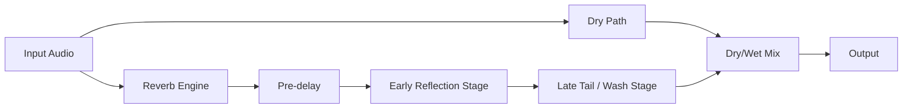

In `verbx`, controls map directly to this anatomy:

- `--pre-delay-ms` / `--pre-delay`: shifts the reverb onset
- `--wet` and `--dry`: set balance between direct sound and reverb field
- `--rt60`: sets how long the wash/tail decays
- `--damping`, `--lowcut`, `--highcut`, `--tilt`: shape the tonal decay

### 5.4 Reverb vs Echo vs Delay

These terms are related but not identical:

- **Delay**: intentional discrete repeats (for example, quarter-note repeats).
- **Echo**: physically or digitally delayed reflections that are still perceived
  as separate events.
- **Reverb**: dense reflection field that fuses into a spatial decay texture.

Rule-of-thumb timing:

- Below roughly `50-100 ms`, repeated energy often fuses perceptually.
- Above that range, repeats are more likely to be heard as discrete echoes.

In practice, mix decisions rely on density and masking as much as raw delay
time. Two signals with the same delay can feel like either "echo" or "reverb"
depending on spectrum, transient content, and level.

### 5.5 Physical Building Blocks of Reverb

At a high level, real-room reverberation is determined by:

- **Geometry**: room dimensions and shape
- **Materials**: absorption coefficients by frequency
- **Scattering/Diffusion**: how much energy is redirected vs mirrored
- **Source/listener position**: changing relative paths alters arrival times
- **Air losses**: especially relevant for high frequencies over long paths

Conceptually, a room response is:

1. direct path
2. early reflections (small count, high directional information)
3. late diffuse field (large reflection count, lower directional specificity)

That is exactly why modern digital reverbs split processing into early/late
behavior, even when implemented differently.

### 5.6 How Humans Perceive Reverb

Reverb perception is not just "how long the tail is." Important psychoacoustic
effects include:

- **Precedence effect**: early direct sound dominates localization.
- **Distance cueing**: more reverberant energy relative to direct energy
  generally implies greater perceived distance.
- **Envelopment**: decorrelated late energy increases spaciousness.
- **Clarity vs blur tradeoff**: longer or brighter tails can mask transients and
  consonants.
- **Temporal fusion**: dense reflection fields become one perceptual texture.

For production, this means the same RT60 can feel very different depending on:

- pre-delay
- early-reflection density
- spectral tilt/damping
- modulation/decorrelation

### 5.7 Why Frequency-Dependent Decay Matters

Most spaces do not decay uniformly across frequency.

- High frequencies often decay faster due to air/material absorption.
- Low frequencies can ring longer due to room modes and weaker absorption.
- Mid-band behavior often dominates perceived "body" of the room.

So a single scalar RT60 is useful but incomplete. Good reverb design often
requires separate low/mid/high control, or at least tonal shaping (`damping`,
filters, tilt) so the decay profile matches artistic intent.

### 5.8 Core Reverb Metrics (RT60, EDT, DRR, EDR, and more)

| Metric | What it means | Why it matters |
|---|---|---|
| `RT60` | Time for level to drop by 60 dB | Overall decay length |
| `EDT` | Early decay estimate (first 10 dB, scaled) | Perceived initial decay speed |
| `T20` / `T30` | Slope-based decay estimates over 20/30 dB windows | More robust RT estimation in noisy data |
| `DRR` | Direct-to-reverberant ratio | Distance and intelligibility cue |
| `C50` / `C80` | Clarity ratios (early vs late energy windows) | Speech/music definition |
| `D50` | Definition ratio (early energy fraction) | Speech-focused readability |
| `LRA` | Loudness range | Perceived dynamic spread |
| `EDR` | Energy Decay Relief (time-frequency decay behavior) | Frequency-dependent decay diagnosis, ringing detection |

In `verbx`:

- use `verbx analyze --lufs` for loudness-related metrics,
- use `verbx analyze --edr` for EDR summary metrics (`edr_rt60_*`,
  `edr_valid_bins`),
- use framewise CSV exports for time-evolving behavior checks.

### 5.9 Main Reverb Methods in Practice

`verbx` supports the two dominant modern approaches:

1. **Algorithmic reverb**:
   - synthetic DSP topology (diffusion + feedback network)
   - efficient and highly controllable
   - good for very long, stylized, evolving tails
2. **Convolution reverb**:
   - filter audio by an impulse response (IR)
   - reproduces measured or synthetic spaces
   - strong realism and capture reproducibility

Under the hood, algorithmic reverbs commonly use structures inspired by
Schroeder/comb/allpass ideas and modern FDN designs. Convolution reverbs rely
on partitioned FFT methods for long IR efficiency.

### 5.10 How `verbx` Controls Map to Reverb Physics

| `verbx` control | Physical/perceptual concept | Typical outcome |
|---|---|---|
| `--pre-delay-ms`, `--pre-delay` | Direct-to-room onset gap | Keeps transients clear before tail |
| `--rt60` | Decay target | Longer/shorter room persistence |
| `--allpass-stages`, `--allpass-gain` | Diffusion density/smearing | Smoother or grainier early-to-late transition |
| `--comb-delays-ms`, `--fdn-lines` | Resonant path structure / modal spacing | Tail density and coloration |
| `--damping` | HF decay emphasis | Darker or brighter long tail |
| `--wet`, `--dry` | Direct vs reverberant balance | Near/far impression and clarity |
| `--width` | Stereo decorrelation/spread | Wider or narrower space |
| `--freeze`, `--repeat` | Extreme temporal extension | Sustained or recursively thickened textures |
| `--lowcut`, `--highcut`, `--tilt` | Post-wet tonal shaping | Controls mud/brightness/warmth |

### 5.11 How to Listen Critically to Reverb

When evaluating settings, listen for:

- **onset clarity**: does the dry attack remain readable?
- **tail smoothness**: is decay smooth or metallic/ringing?
- **low-end control**: is there modal buildup or mud?
- **speech intelligibility**: consonants and syllable boundaries still clear?
- **stereo/spatial stability**: does the image collapse or wander?
- **mix interaction**: does reverb mask key musical elements?

A practical method is A/B comparison at matched loudness:

1. bypass vs enabled
2. short/medium/long RT60 presets
3. bright vs dark damping
4. different diffusion/topology settings

### 5.12 Beginner Workflow: Choosing Reverb on Purpose

If you are new, use this sequence:

1. Choose one primary target role from this table.

These names are shorthand for intent:

- `glue` = subtle cohesion
- `space` = natural room placement
- `special effect` = obvious creative coloration
- `infinite texture` = long ambient sustain / near-frozen tail

| Role | Goal | Typical starting range |
|---|---|---|
| `glue` (subtle cohesion) | Add cohesion without sounding obviously reverberant. | `--rt60 0.4-1.2`, `--wet 0.08-0.25`, `--pre-delay-ms 0-20` |
| `space` (natural room) | Make the source feel naturally placed in a room/hall. | `--rt60 1.2-3.5`, `--wet 0.2-0.45`, `--pre-delay-ms 10-40` |
| `special effect` (obvious effect) | Make reverb clearly audible and stylistic. | `--rt60 3-12`, `--wet 0.45-0.9`, `--pre-delay-ms 20-120` |
| `infinite texture` (ambient sustain) | Create long, immersive, almost static ambience. | `--rt60 20+`, `--wet 0.7-1.0`, consider `--freeze` and/or `--repeat 2+` |

Use one role as your initial anchor, then refine from there.
2. Start conservatively:
   - `--pre-delay-ms 20`
   - `--rt60 1.5` to `3.0` for subtle spaces, much longer for ambient
   - `--wet 0.2` to `0.4`, keep some dry signal
3. Increase only one dimension at a time:
   - time (`rt60`)
   - tone (`damping`, EQ)
   - density (`allpass`/`fdn` parameters)
4. For realism, try convolution with a measured IR.
5. For extreme design, use algorithmic + repeat/freeze + modulation.
6. Analyze output to verify intent:
   - `verbx analyze OUT.wav --lufs --edr`

Beginner-safe starting command:

```bash
verbx render in.wav out.wav --engine algo --pre-delay-ms 20 --rt60 2.5 --wet 0.3 --dry 0.7
```

## 6.0 Status

Current implementation level: **v0.7.0**

- scaffolding and architecture
- functional DSP render path
- loudness/peak + shimmer/ambient controls
- IR factory, cache, batch, tempo sync, framewise analysis
- v0.4 additions: framewise modulation analysis, advanced IR fitting heuristics, parallel batch scheduler
- v0.5 additions: surround route maps/trajectories, algorithmic surround decorrelation, and batch checkpoint/resume hardening
- v0.6 additions: graph-structured FDN topology mode and expanded FDN topology controls
- v0.6 spatial additions: Ambisonics convention validation (`--ambi-order`, `--ambi-normalization`, `--channel-order`), FOA encode/decode transforms, yaw rotation, and Ambisonics spatial metrics in analysis mode
- v0.7 Track A/C additions: JSON/CSV automation lanes (`--automation-file`), inline CLI points (`--automation-point`), block/sample evaluation, smoothing, clamp overrides, automation trace export, deterministic automation signatures, lane-level validation diagnostics, convolution-path automation target `ir-blend-alpha` for IR blend timeline control, and Track C automation targets for `fdn-rt60-tilt` and `fdn-tonal-correction-strength`
- v0.7 Track B additions: frame-aligned feature bus (loudness/transient/spectral/harmonic), feature-vector lanes (`--feature-vector-lane`), weighted/curved/hysteretic mapping with multi-feature fusion, deterministic signatures for feature-driven automation, and feature-plus-parameter trace export (`--feature-vector-trace-out`)
- v0.7 Track D additions: cache-backed `ir morph` command (`linear`, `equal-power`, `spectral`, `envelope-aware`), render-time IR blending via `--ir-blend`/`--ir-blend-mix`, and morph quality metadata (RT drift, spectral distance, coherence deltas)
- v0.7 immersive interoperability additions: `immersive handoff` sidecar/deliverable packaging, object/bed policy checks, `immersive qc` gates, and distributed `immersive queue` worker heartbeats/retry semantics
- v0.7 immersive hardening additions: strict handoff now fails on policy violations, scene validation errors, or any QC gate failure; scene sample-rate mismatches are surfaced in validation payloads; queue manifests now require unique job IDs

## 7.0 Quick Start Recipes

### 7.1 First render (algorithmic)

Use this as the baseline no-IR workflow to create a long algorithmic tail quickly.

```bash
verbx render input.wav output.wav --engine algo --rt60 80 --wet 0.85 --dry 0.15
```

### 7.2 Convolution render with external IR

Use this when you want the output character to follow a specific captured or designed impulse response.

```bash
verbx render input.wav output.wav --engine conv --ir hall_ir.wav --partition-size 16384
```

### 7.3 Surround matrix convolution (true cross-channel routing)

Use this for explicit multichannel bus mapping where each output channel receives contributions from multiple input channels through an IR matrix.

```bash
# 5.1 input with matrix-packed IR channels
verbx render in_5p1.wav out_5p1.wav \
  --engine conv \
  --ir ir_matrix_5p1.wav \
  --ir-matrix-layout output-major
```

### 7.4 Freeze + repeat chain

Use this to lock onto a time region, then repeatedly reprocess it to build a sustained evolving texture.

```bash
verbx render input.wav output.wav --freeze --start 2.0 --end 4.0 --repeat 3
```

### 7.5 Loudness and peak-targeted render

Use this for deliverables that need consistent loudness and strict peak ceilings.

```bash
verbx render input.wav output.wav \
  --target-lufs -18 \
  --target-peak-dbfs -1 \
  --true-peak \
  --normalize-stage post
```

### 7.6 Shimmer + ambient controls

Use this to create bright, cinematic ambience with pitch-shifted bloom plus ducking and tonal tilt control.

```bash
verbx render input.wav output.wav \
  --shimmer --shimmer-semitones 12 --shimmer-mix 0.35 \
  --duck --duck-attack 15 --duck-release 250 \
  --bloom 2.0 --tilt 1.5
```

### 7.7 Tempo-synced pre-delay

Use this when pre-delay should line up rhythmically with the musical tempo.

```bash
verbx render input.wav output.wav --pre-delay 1/8D --bpm 120
```

### 7.8 Framewise analysis CSV during render

Use this to export time-varying descriptors for plotting, QA, or feature-driven downstream workflows.

```bash
verbx render input.wav output.wav --frames-out reports/output_frames.csv
```

`frames.csv` now includes modulation-oriented columns:

- `amp_mod_depth`, `amp_mod_rate_hz`
- `centroid_mod_depth`, `centroid_mod_rate_hz`

### 7.9 Auto-generate cached IR during render

Use this when you want convolution color but do not want to manage a separate IR file manually.

```bash
verbx render input.wav output.wav \
  --ir-gen --ir-gen-mode hybrid --ir-gen-length 120 --ir-gen-seed 7
```

### 7.10 Output subtype selection + final peak normalization

Use this to control output file subtype/bit depth while keeping internal
processing in `f64`.

```bash
# write WAV as 32-bit float
verbx render input.wav output.wav --out-subtype float32

# write WAV as 64-bit float
verbx render input.wav output.wav --out-subtype float64

# match final output peak to input peak
verbx render input.wav output.wav --output-peak-norm input

# normalize final output peak to full scale (0 dBFS)
verbx render input.wav output.wav --output-peak-norm full-scale

# normalize final output peak to a specified target
verbx render input.wav output.wav --output-peak-norm target --output-peak-target-dbfs -3
```

By default, `verbx render` prints a completion summary plus output-audio
features/statistics in the console. Use `--quiet` (or `--verbosity 0`) to
reduce that reporting detail.

### 7.11 Acceleration (CUDA / Apple Silicon)

Use this to select compute backends and improve throughput on supported hardware.

```bash
# auto-select compute device
verbx render input.wav output.wav --device auto

# force CUDA convolution path (falls back safely if unavailable)
verbx render input.wav output.wav --engine conv --ir hall.wav --device cuda

# Apple Silicon: prefer MPS profile + tune CPU thread count
verbx render input.wav output.wav --device mps --threads 8
```

Notes:

- `--device auto` is engine-aware:
  - convolution (`--engine conv`, or `--engine auto` with `--ir`) prefers `cuda`, then `mps`, then `cpu`
  - algorithmic (`--engine algo`, or `--engine auto` without `--ir`) prefers `mps` on Apple Silicon, otherwise `cpu`
- CUDA acceleration is optional and applies to partitioned FFT convolution through CuPy.
- Algorithmic FDN path uses CPU backend (optional Numba JIT when installed), with Apple Silicon profile support via `mps`.
- If requested acceleration is unavailable, `verbx` falls back safely and reports both effective engine device and platform-resolved device in analysis JSON.

### 7.12 Batch throughput

Use this for many renders at once, with scheduling and retry policies for large jobs.

```bash
# run batch jobs concurrently
verbx batch render manifest.json --jobs 8

# policy scheduler (v0.4): prioritize longest jobs first (default)
verbx batch render manifest.json --jobs 8 --schedule longest-first

# shortest-first with retries and continue-on-error
verbx batch render manifest.json --jobs 8 --schedule shortest-first --retries 1 --continue-on-error
```

### 7.13 Iterative room-resonance chain (inspired by Alvin Lucier's *I Am Sitting in a Room*)

Use this to repeatedly feed each output back into the next pass and preserve every generation for listening or composition.

```bash
# Start with a dry voice recording.
mkdir -p passes
cp input_voice.wav passes/pass_00.wav

current="passes/pass_00.wav"

# Render each pass from the previous pass, saving every generation.
for i in $(seq 1 20); do
  next=$(printf "passes/pass_%02d.wav" "$i")
  verbx render "$current" "$next" \
    --engine algo \
    --rt60 35 \
    --wet 1.0 \
    --dry 0.0 \
    --repeat 1 \
    --target-peak-dbfs -2 \
    --true-peak \
    --output-peak-norm input \
    --no-progress
  current="$next"
done
```

Tips:

- Keep `--wet 1.0 --dry 0.0` so each pass is fully reprocessed.
- Keep normalization enabled (as above) so levels stay controlled across many passes.
- Use fewer passes (`8-12`) for subtle evolution, or more (`20+`) for stronger resonance imprint.
- The `passes/` folder preserves every intermediate file for listening, editing, or montage.

### 7.14 Ambient loopbed (inspired by Brian Eno's *Discreet Music*)

Use this to create a gentle, slowly evolving long-tail ambient bed with controlled level and tone.

```bash
verbx render input.wav output_eno.wav \
  --engine algo \
  --rt60 95 \
  --wet 0.92 \
  --dry 0.08 \
  --damping 0.35 \
  --width 1.25 \
  --bloom 2.0 \
  --tilt 0.8 \
  --target-lufs -22 \
  --target-peak-dbfs -2
```

### 7.15 Tape-loop evolution (inspired by Frippertronics)

Use this for iterative loop-style processing with moderate tail and gradual timbral drift.

```bash
mkdir -p fripp_passes
cp guitar_phrase.wav fripp_passes/pass_00.wav
current="fripp_passes/pass_00.wav"

for i in $(seq 1 12); do
  next=$(printf "fripp_passes/pass_%02d.wav" "$i")
  verbx render "$current" "$next" \
    --engine algo \
    --rt60 28 \
    --wet 0.88 \
    --dry 0.12 \
    --repeat 1 \
    --output-peak-norm input \
    --no-progress
  current="$next"
done
```

### 7.16 Gated drum-space style (inspired by 1980s gated reverb aesthetics)

Use this to get a punchy short-tail drum space by combining convolution tone with a constrained tail limit.

```bash
verbx render drums.wav drums_gated_style.wav \
  --engine conv \
  --ir plate_short.wav \
  --ir-normalize peak \
  --tail-limit 1.2 \
  --wet 0.75 \
  --dry 0.4 \
  --highcut 9000 \
  --target-peak-dbfs -1
```

### 7.17 Dub chamber send chain (inspired by King Tubby / Lee Perry workflows)

Use this as a high-send parallel chamber treatment with repeats and bandwidth shaping.

```bash
verbx render snare_send.wav dub_chamber.wav \
  --engine conv \
  --ir spring_or_room_ir.wav \
  --repeat 2 \
  --wet 0.95 \
  --dry 0.05 \
  --lowcut 180 \
  --highcut 4500 \
  --tilt -2.0 \
  --output-peak-norm input
```

### 7.18 Reverse-wash texture stack (inspired by shoegaze wash techniques)

Use this to build dense frozen/shimmered guitar pads with very long apparent sustain.

```bash
verbx render guitar_pad.wav shoegaze_wash.wav \
  --engine algo \
  --freeze --start 1.0 --end 2.4 \
  --shimmer --shimmer-semitones 12 --shimmer-mix 0.4 \
  --rt60 80 \
  --wet 0.95 \
  --dry 0.08 \
  --width 1.4 \
  --target-peak-dbfs -2
```

### 7.19 Sparse hall clarity (inspired by Arvo Pärt-style acoustic spaciousness)

Use this when you want depth and hall size while preserving articulation and intelligibility.

```bash
verbx render piano_sparse.wav piano_hall_clear.wav \
  --engine conv \
  --ir hall_ir.wav \
  --pre-delay 1/16 --bpm 60 \
  --wet 0.55 \
  --dry 0.7 \
  --lowcut 120 \
  --highcut 11000 \
  --target-lufs -20 \
  --target-peak-dbfs -1
```

### 7.20 Deep-resonance long-space (inspired by Pauline Oliveros' Deep Listening aesthetics)

Use this for very long drone-oriented spaces via generated hybrid IRs and extended tail limits.

```bash
verbx render drone_input.wav drone_deep_space.wav \
  --ir-gen \
  --ir-gen-mode hybrid \
  --ir-gen-length 240 \
  --ir-gen-seed 108 \
  --engine conv \
  --wet 0.9 \
  --dry 0.15 \
  --tail-limit 180 \
  --target-lufs -24 \
  --target-peak-dbfs -2
```

### 7.21 Cathedral vocal/organ simulation

Use this to emulate a large worship-space response for chant, choir, or organ sources.

```bash
verbx render chant_or_organ.wav cathedral_render.wav \
  --engine conv \
  --ir cathedral_ir.wav \
  --wet 0.82 \
  --dry 0.35 \
  --rt60 90 \
  --lowcut 70 \
  --highcut 10000 \
  --target-lufs -21 \
  --true-peak --target-peak-dbfs -1
```

### 7.22 Cinematic synth hall (inspired by classic analog-film synth spaces)

Use this for wide, polished synth leads with generated-hall depth and controlled bloom.

```bash
verbx render synth_lead.wav synth_cinematic_hall.wav \
  --ir-gen \
  --ir-gen-mode hybrid \
  --ir-gen-length 120 \
  --ir-gen-seed 77 \
  --engine conv \
  --wet 0.78 \
  --dry 0.4 \
  --width 1.3 \
  --bloom 1.8 \
  --tilt 1.2 \
  --target-peak-dbfs -1.5
```

### 7.23 Fast self-convolution (input as its own IR)

Use this to smear and fuse a sound with its own spectral/time envelope; increase `--beast-mode` for extreme frozen-time behavior.

```bash
verbx render input.wav self_convolved.wav \
  --self-convolve \
  --engine auto \
  --ir-normalize peak \
  --partition-size 16384 \
  --normalize-stage none \
  --output-peak-norm input

# beast-mode self-convolution (extreme frozen-time texture)
verbx render input.wav self_convolved_beast.wav \
  --self-convolve \
  --beast-mode 12 \
  --partition-size 16384 \
  --normalize-stage none
```

### 7.24 Rapid convolution of `A.wav` with `B.wav`

Use this when `A.wav` is your source signal and `B.wav` is the impulse response you want to apply.

```bash
# fast partitioned FFT convolution: A.wav convolved with B.wav
verbx render A.wav AB_convolved.wav \
  --engine conv \
  --ir B.wav \
  --partition-size 32768 \
  --repeat 1 \
  --normalize-stage none \
  --output-peak-norm none
```

Performance notes:

- Use `--device cuda` on NVIDIA systems for fastest convolution throughput when CuPy is installed.
- Use `--device mps` on Apple Silicon for optimized local execution.
- Leave `--tail-limit` unset to keep full convolution length.
- Set `--tail-limit <seconds>` only when you intentionally want to cap the tail.
- Add `--out-subtype float64` for archival/high-headroom interchange, or `float32` for smaller files.

### 7.25 Lucky mode (`--lucky N`) for wild random batches

Use this to generate multiple completely wild randomized outputs from one base command.

```bash
verbx render in.wav out/lucky.wav \
  --lucky 12 \
  --lucky-out-dir out/lucky_set \
  --lucky-seed 2026 \
  --no-progress
```

Notes:

- `--lucky N` controls how many output files are created.
- Output files are written to `--lucky-out-dir` (or the command's output parent folder if omitted).
- Each run randomizes engine choice and many processing parameters for extreme variation.
- Use `--lucky-seed` for deterministic/repeatable random sets.
- Supported processing workflows: `render`, `ir gen`, `ir process`, and `batch render`.

### 7.26 Feature-vector-driven reverb automation

Use this to drive one render target from multiple frame-aligned source features
with deterministic mapping and explainable traces.

```bash
verbx render in.wav out.wav \
  --engine conv \
  --ir hall_ir.wav \
  --normalize-stage none \
  --feature-vector-lane "target=wet,source=loudness_norm,weight=0.70,curve=smoothstep,combine=replace" \
  --feature-vector-lane "target=wet,source=transient_strength,weight=0.30,curve=power,curve_amount=1.4,hysteresis_up=0.02,hysteresis_down=0.01,combine=add" \
  --feature-vector-frame-ms 40 \
  --feature-vector-hop-ms 20 \
  --feature-vector-trace-out feature_trace.csv
```

Notes:

- Supported feature sources include `loudness_db`, `loudness_norm`,
  `transient_strength`, `spectral_flux`, `spectral_centroid_hz`,
  `spectral_centroid_norm`, `spectral_flatness`, and `harmonic_ratio`.
- Feature lanes can be provided inline (`--feature-vector-lane`) or inside
  `--automation-file` lanes with `type: feature-vector`.
- The output analysis JSON includes a deterministic feature-vector signature
  under `effective.automation.feature_vector.signature`.

## 8.0 New User Guide

### 8.1 Start Here (5-minute setup)

1. Install dependencies (`uv` or `venv + pip`).
2. Confirm CLI is available:
   ```bash
   verbx --help
   ```
3. Run a first render:
   ```bash
   verbx render input.wav output.wav --engine auto
   ```
4. Inspect generated analysis JSON:
   - `output.wav.analysis.json`
5. Iterate with one variable at a time:
   - reverb time: `--rt60`
   - wet/dry balance: `--wet`, `--dry`
   - tonal shape: `--lowcut`, `--highcut`, `--tilt`

### 8.2 Processing Architecture

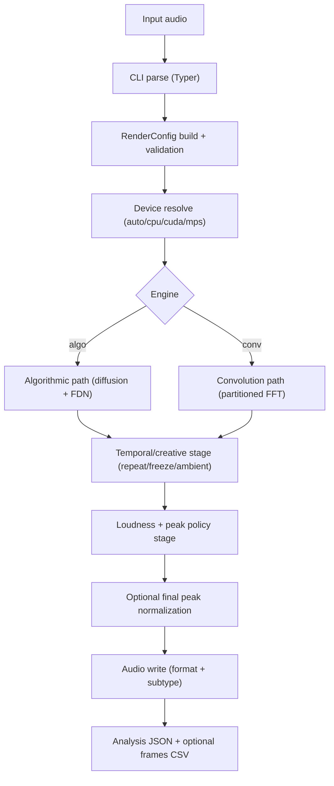

### 8.3 IR Generation + Cache Flow

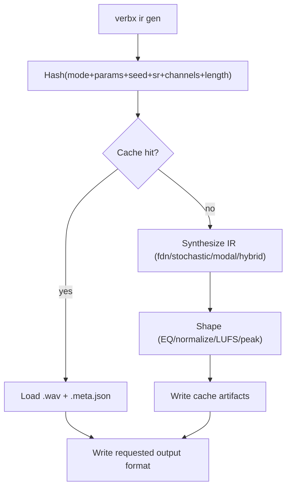

## 9.0 DSP Math Notes

This section maps the major `verbx` controls to the DSP they drive.  
The intent is practical: when you change a switch, you should be able to
predict which part of the signal path changes and why the result sounds
different.

Notation used in this section:

- `n`: discrete-time sample index.
- `k`: frame or block index in STFT/partitioned-convolution context.
- `i`, `o`: input and output channel indices.
- Bold lower-case symbols (for example `\mathbf{y}`): vectors across FDN lines.
- Bold upper-case symbols (for example `\mathbf{M}`): matrices/operators.
- `*`: linear convolution.

### 9.1 RT60 to Feedback Gain (FDN)

For each delay line with delay $d$ seconds and target RT60 $T_{60}$:

$$
g \approx 10^{-3d/T_{60}}
$$

Variable definitions:

- $g$: per-loop amplitude feedback gain for one delay line.
- $d$: delay-line period in seconds.
- $T_{60}$: target decay time (seconds) for a 60 dB level drop.

Why this form is used:

- A 60 dB decay in amplitude corresponds to a factor of $10^{-3}$.
- Each delay line feeds back once per delay period $d$, so the per-trip gain
  must produce that total drop over $T_{60}$ seconds.
- Shorter delays require gains closer to 1.0 than longer delays for the same
  perceived RT60.

Practical interpretation in `verbx`:

- RT60 is converted per line, not globally, so multi-delay networks remain
  consistent even when line lengths vary.
- This gain calibration sets the broadband decay envelope.
- Damping and optional in-loop filtering then shape how different frequencies
  decay around that envelope (typically faster HF decay).

### 9.2 FDN State Update

At each sample:

$$
\mathbf{y}[n] = \mathbf{D}\left(\mathbf{x}_{fb}[n]\right), \quad
\mathbf{x}_{fb}[n+1] = \mathbf{G}\mathbf{M}\mathbf{y}[n] + \mathbf{u}[n]
$$

- $\mathbf{x}_{fb}[n]$: feedback-line state vector read from delays at sample $n$.
- $\mathbf{y}[n]$: loop-conditioned vector after damping/DC-block processing.
- $\mathbf{M}$: feedback mixing matrix (orthonormal family; optionally time-varying).
- $\mathbf{G}$: diagonal gain matrix from RT60 calibration.
- $\mathbf{D}(\cdot)$: per-line loop conditioning operator (damping + DC control).
- $\mathbf{u}[n]$: injected excitation vector (post pre-delay + diffusion).

How to read this in signal-flow terms:

- `delay read -> loop conditioning -> matrix mix -> gain scale -> injection sum -> delay write`
- The matrix handles energy redistribution across lines (texture/density).
- The gain term controls decay duration.
- The damping term controls spectral decay profile and loop stability behavior.

Implementation note:

- `verbx` processes this topology in blocks for throughput, but the state update
  semantics are equivalent to the sample-domain equations above.

#### 9.2.1 Supported FDN Topologies (Graphs)

These graphs reflect the current implementation in:

- `src/verbx/core/algo_reverb.py`
- `src/verbx/ir/modes_fdn.py`

##### 9.2.1.1 Algorithmic Render Topology

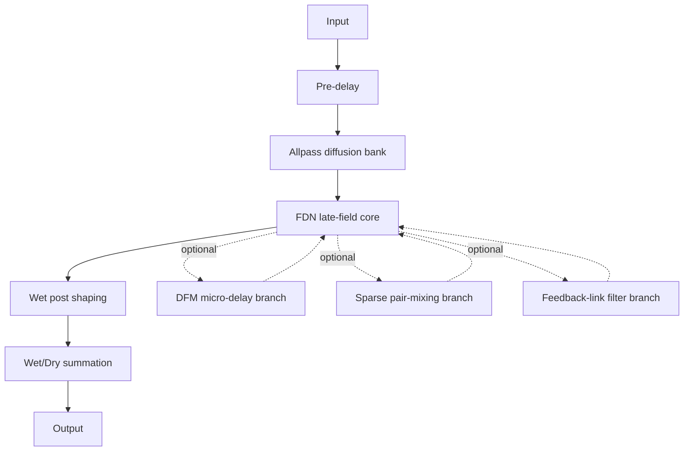

This is the canonical per-channel algorithmic render path.
It shows where early diffusion ends and late-field feedback begins, and where
post-wet coloration and wet/dry summation occur.

Implementation notes:

- Per-channel signal path is:
  `input -> pre-delay -> allpass diffusion -> FDN feedback loop -> wet post -> wet/dry mix`.
- Defaults are 6 allpass stages and 8 FDN lines; both are configurable.
- Optional DFM branch is inserted in the feedback path when `--fdn-dfm-delays-ms` is provided.
- Optional sparse high-order pair-mixing path is enabled with `--fdn-sparse`.
- Optional feedback-link spectral shaping is enabled with `--fdn-link-filter`.
- Separate user-exposed Schroeder comb-bank modules are not present; each FDN delay line behaves as a comb-like resonant path inside the coupled feedback network.

##### 9.2.1.2 FDN Matrix Family Graph

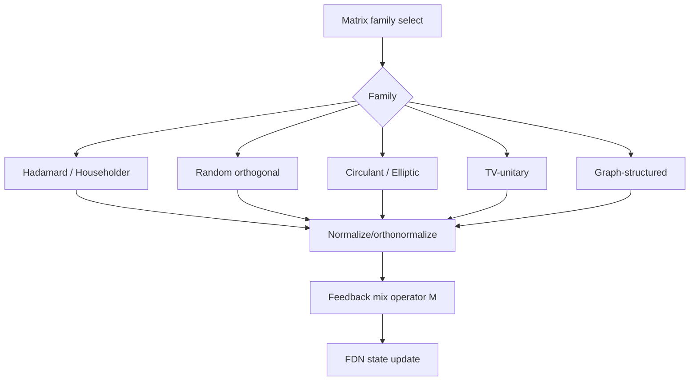

Matrix selection changes feedback coupling character more than decay time.
In practice, this is a texture/diffusion control: same RT60 can sound denser,
grainier, or more uniform depending on matrix family.

Implementation notes:

- Supported matrix families:
  `hadamard`, `householder`, `random_orthogonal`, `circulant`, `elliptic`, `tv_unitary`, `graph`.
- `tv-unitary` and `tv_unitary` are equivalent aliases.
- All matrix families are orthonormalized before use in feedback mixing.

##### 9.2.1.3 TV-Unitary + DFM Feedback Graph

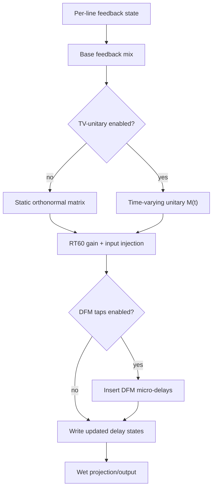

This graph isolates two advanced feedback enrichments:

- time-varying unitary mixing (decorrelation over time), and
- DFM delay taps inside feedback (micro-structure smoothing/densification).

Implementation notes:

- `tv_unitary` requires `--fdn-tv-rate-hz > 0`.
- `tv_unitary` requires `--fdn-tv-depth > 0`.
- DFM is enabled with `--fdn-dfm-delays-ms`:
  one value broadcasts to all lines, or provide one value per resolved FDN line.
- Sparse high-order mode is enabled with `--fdn-sparse` and `--fdn-sparse-degree` (mutually exclusive with `tv_unitary`).

##### 9.2.1.4 IR FDN Path Parity Graph

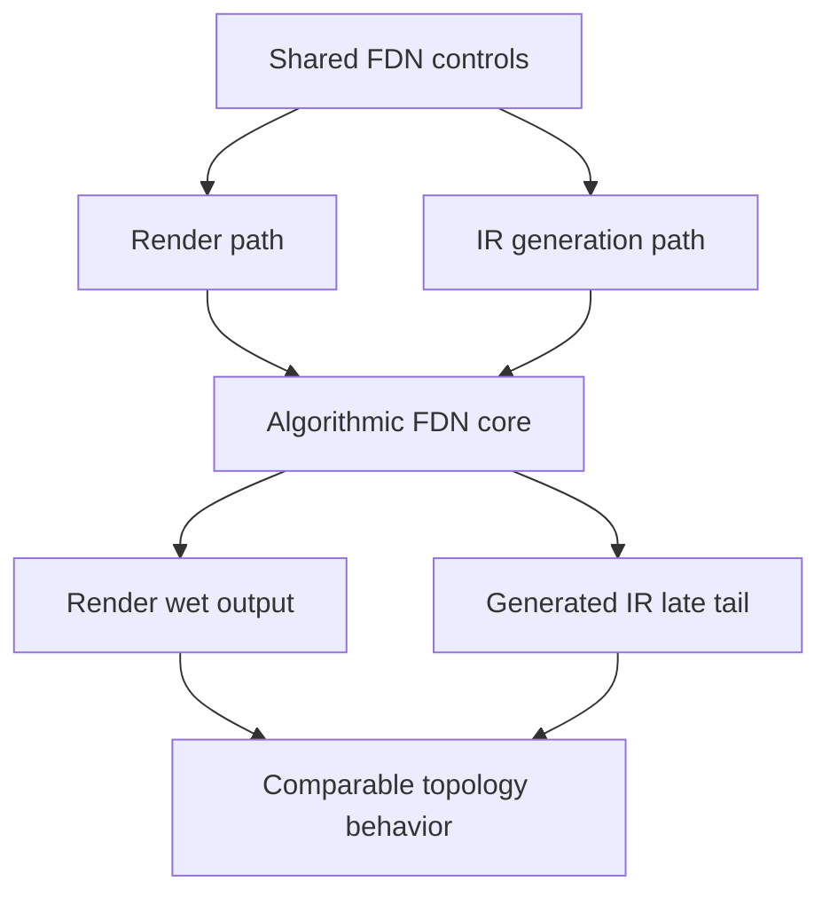

Parity matters for workflow transfer:
you can tune FDN behavior in render mode and carry the same structure into IR
generation with comparable late-field behavior.

Implementation notes:

- `ir gen --mode fdn` and `ir gen --mode hybrid` use the same configurable algorithmic FDN core as render mode.
- `--fdn-lines` is active in IR generation (no longer reserved).
- Matrix, TV-unitary, and DFM options are portable between render and IR workflows.

##### 9.2.1.5 Sparse High-Order Pair-Mixing Graph

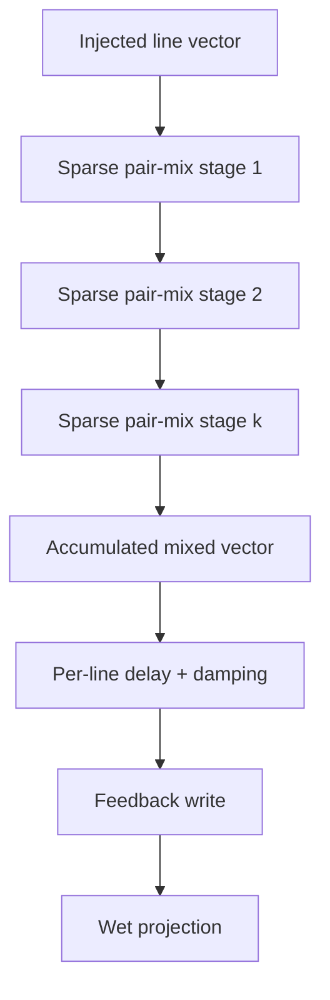

Sparse mode targets higher apparent order without the full cost of dense
all-to-all mixing. Pair-mixing stages gradually spread energy while controlling
compute growth.

Implementation notes:

- Sparse mode is enabled with `--fdn-sparse`; pair-mixing stage count is set by `--fdn-sparse-degree`.
- Sparse pairing schedules are deterministic per seed/stage to keep renders reproducible.
- Current implementation treats sparse mode as exclusive with `--fdn-matrix tv_unitary` and `--fdn-matrix graph`.

##### 9.2.1.6 Nested/Cascaded FDN Graph

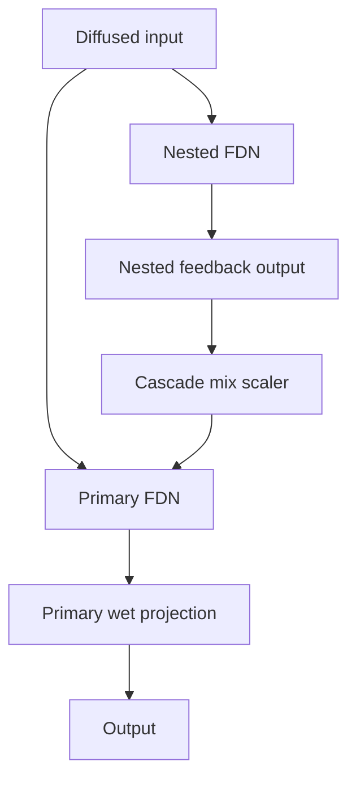

Cascaded mode uses a fast nested network to inject additional structure into a
larger primary network. This helps early density build faster while preserving
long-tail control in the primary loop.

Implementation notes:

- Cascade mode is enabled with `--fdn-cascade` and injects nested-network feedback into the primary late FDN path.
- `--fdn-cascade-mix` controls injection strength into the primary mixed feedback vector.
- `--fdn-cascade-delay-scale` and `--fdn-cascade-rt60-ratio` shape nested-network timing/decay relative to the primary FDN.

##### 9.2.1.7 Multiband + Filter-Feedback Graph

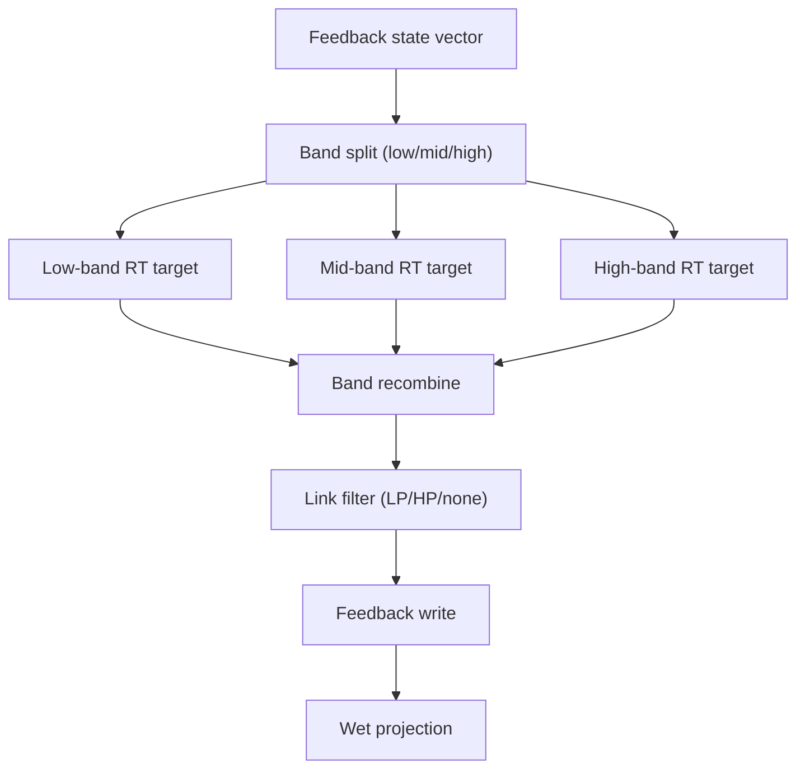

This stage separates two orthogonal controls:

- multiband decay targeting (low/mid/high RT behavior), and
- in-loop link filtering (spectral flow through feedback edges).

Together they allow precise tail-color control without changing only one global
damping knob.

Implementation notes:

- Multiband decay is enabled by providing all of `--fdn-rt60-low`, `--fdn-rt60-mid`, and `--fdn-rt60-high`.
- Multiband crossovers are controlled by `--fdn-xover-low-hz` and `--fdn-xover-high-hz`.
- In-loop feedback-link filtering is enabled with `--fdn-link-filter`, `--fdn-link-filter-hz`, and `--fdn-link-filter-mix`.

##### 9.2.1.8 Graph-Structured FDN Graph

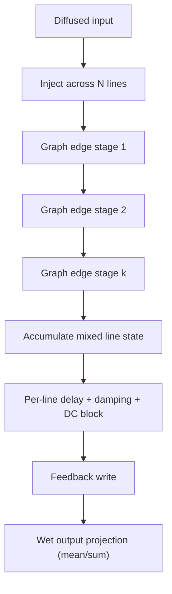

Graph mode treats mixing as staged edge interactions over an explicit graph
instead of a fixed dense matrix. That makes topology itself a design parameter.

Implementation notes:

- Graph mode is enabled with `--fdn-matrix graph`.
- Topology is controlled via `--fdn-graph-topology` (`ring`, `path`, `star`, `random`).
- Connectivity/stage density is controlled by `--fdn-graph-degree`.
- Pairing schedules are deterministic with `--fdn-graph-seed` for reproducible renders.
- Graph mode is mutually exclusive with sparse mode (`--fdn-sparse`).

### 9.3 Partitioned FFT Convolution

Convolution in frequency domain:

$$
Y_k(\omega) = \sum_{p=0}^{P-1} X_{k-p}(\omega)\,H_p(\omega)
$$

Variable definitions:

- $Y_k(\omega)$: output spectrum for frame $k$ at angular frequency $\omega$.
- $X_{k-p}(\omega)$: stored input spectrum from frame $(k-p)$.
- $H_p(\omega)$: transfer function of IR partition $p$.
- $P$: total number of IR partitions.

Why this is used:

- Direct long-IR time-domain convolution is expensive.
- Partitioning converts one very large convolution into repeated smaller FFT
  multiplies and overlap-add/overlap-save accumulation.
- Work scales better for long IRs and supports chunked streaming.

Practical tradeoff:

- Larger partition sizes can improve throughput.
- Larger partition sizes can increase latency and block-memory pressure.
- `--partition-size` is therefore a latency/throughput tuning knob.

### 9.4 Multichannel Matrix Convolution

For $M$ input channels and $N$ output channels:

$$
y_o[n] = \sum_{i=0}^{M-1} (x_i * h_{i,o})[n]
$$

Variable definitions:

- $x_i[n]$: input signal for channel $i$.
- $h_{i,o}[n]$: IR mapping input channel $i$ to output channel $o$.
- $y_o[n]$: output signal for channel $o$.
- $M$: number of input channels.
- $N$: number of output channels.

- `verbx` supports matrix-packed IR files where channel count is `M * N`
- packing order is controlled by `--ir-matrix-layout`:
  `output-major`: channel index = `o*M + i`; `input-major`: channel index = `i*N + o`.

Operationally:

- This is a true bus-matrix model, not just per-channel convolution.
- It supports diagonal, broadcast, and full cross-feed style routing patterns.
- Correct layout interpretation is critical; wrong packing order yields valid
  but semantically incorrect spatial routing.

### 9.5 Freeze Crossfade (Equal Power)

For loop boundary crossfade parameter $\theta \in [0, \pi/2]$:

$$
w_{out} = \cos(\theta), \quad w_{in} = \sin(\theta)
$$

$$
y = w_{out}\,x_{tail} + w_{in}\,x_{head}
$$

Variable definitions:

- $\theta$: crossfade phase parameter over the boundary ramp.
- $w_{out}$: fade-out weight for outgoing tail segment.
- $w_{in}$: fade-in weight for incoming head segment.
- $x_{tail}$: tail segment at loop end.
- $x_{head}$: head segment at loop start.
- $y$: blended output sample/block over the crossfade window.

Why equal-power is used:

- Linear crossfades often produce audible dip/boost around loop points.
- Cosine/sine pairing keeps total perceived energy more uniform through the
  transition region.
- In freeze workflows, this is key to avoiding loop seam clicks and pumping.

### 9.6 Loudness / Peak Stages

These stages are intentionally separate because they serve different goals:

- Integrated LUFS normalization for program loudness targeting.
- True-peak approximation (oversampled) for inter-sample safety checks.
- Optional limiter/sample-peak ceiling for hard safety bounds.
- Optional final peak-normalization modes:
  `input` (match source peak), `target` (explicit dBFS), `full-scale` (0 dBFS).

Practical guidance:

- Loudness targeting is about average program level.
- Peak targeting/limiting is about short-term safety/headroom.
- Final peak normalization is a post-policy output fit stage.

### 9.7 Reference Room-Acoustics Equations (Beginner-Friendly)

These equations come from room-acoustics literature. They are useful for
building intuition about reverb time, decay behavior, and measurement.

In plain terms:

1. More room volume usually means longer decay.
2. More absorption usually means shorter decay.
3. IR analysis methods estimate decay from measured energy slope.

`verbx` uses DSP methods internally, but these references help you choose
reasonable targets.

#### 9.7.1 Sabine RT60 (classic approximation)

$$
T_{60} \approx 0.161\,\frac{V}{A}
$$

Where:

- $T_{60}$ is decay time in seconds.
- $V$ is room volume in cubic meters.
- $A$ is total equivalent absorption area in sabins.

Use-case note:

- Sabine is most reliable for diffuse fields and moderate absorption.
- It is commonly used for first-pass sizing and sanity checks.

Beginner takeaway: if absorption $A$ increases, RT60 decreases.

#### 9.7.2 Norris-Eyring RT60 (better at higher absorption)

$$
T_{60} \approx 0.161\,\frac{V}{-S\ln(1-\bar{\alpha})}
$$

Where:

- $T_{60}$ is decay time in seconds.
- $V$ is room volume in cubic meters.
- $S$ is total surface area.
- $\bar{\alpha}$ is average absorption coefficient.

Beginner takeaway: Sabine can overestimate decay in highly absorbent rooms;
Norris-Eyring usually behaves better there.

#### 9.7.3 Schroeder Energy Decay (from an impulse response)

Given impulse response $h(t)$:

$$
E(t)=\int_t^{\infty} h^2(\tau)\,d\tau
$$

Normalized decay curve in dB:

$$
L(t)=10\log_{10}\left(\frac{E(t)}{E(0)}\right)
$$

Variable definitions:

- $h(t)$: measured impulse-response amplitude over time.
- $E(t)$: backward-integrated residual energy from time $t$ onward.
- $L(t)$: normalized energy-decay curve in dB.
- $\tau$: integration dummy variable for time.

Implementation perspective:

- Real IR data are noisy, so practical pipelines smooth and choose fit windows.
- The integrated tail form is robust because it averages local fluctuations.

Beginner takeaway: this turns a raw IR into a smooth decay curve you can fit
for RT estimates.

#### 9.7.4 Slope-based RT estimates (EDT, T20, T30)

If the fitted decay slope is $m$ dB/s, then:

$$
T_{60} \approx -\frac{60}{m}
$$

Variable definitions:

- $m$: fitted decay slope in dB/s over the selected fit window.
- $T_{60}$: extrapolated 60 dB decay time in seconds.

Common fit ranges:

- EDT: around 0 dB to -10 dB (early impression of decay).
- T20: around -5 dB to -25 dB (scaled to RT60).
- T30: around -5 dB to -35 dB (scaled to RT60).

Interpretation note:

- EDT reflects perceived early decay impression.
- T20/T30 are typically more stable for late-tail estimation.
- Different windows disagree on real material; that spread is useful diagnostic
  information, not automatically an error.

Beginner takeaway: different fit windows can produce different RT numbers;
that is normal and expected.

## 10.0 Performance Tuning

### 10.1 Device Selection

- `--device auto`: engine-aware resolution
  - convolution path: `cuda` > `mps` > `cpu`
  - algorithmic path: `mps` on Apple Silicon, otherwise `cpu`
- `--device cuda`: optional override for convolution CUDA backend (falls back if unavailable or unsupported by selected engine)
- `--device mps`: Apple Silicon profile (algorithmic CPU/Numba path; convolution CPU FFT path)
- `--device cpu`: deterministic CPU-only execution

### 10.2 Threading

- `--threads N` sets CPU threading hints for FFT/BLAS stacks.
- Useful on Apple Silicon and multi-core x86 for convolution workloads.

### 10.3 Streaming Convolution Mode

`verbx render` automatically uses file-streaming convolution (low peak RAM) when compatible.

Current streaming-compatible constraints:

- `--engine conv`
- `--repeat 1`
- no freeze
- `--normalize-stage none`
- no LUFS/peak target stages
- no duck/bloom/tilt/lowcut/highcut post stages
- `--output-peak-norm none`

When incompatible options are requested, `verbx` falls back to full-buffer processing.

## 11.0 Surround / Multichannel IR Rules

- Input audio: arbitrary channel count (`M`).
- IR file channel interpretation:
  - `1` channel IR: diagonal routing, same IR applied per channel.
  - `M` channel IR: diagonal routing with per-channel IR.
  - `M*N` channel IR (where channel count divisible by `M`): full matrix routing from `M` input to `N` output.
- Non-divisible IR channel counts now raise explicit CLI errors.
- Render summary + analysis JSON report effective routing/backend details.

### 11.1 Parallel Batch Rendering

`verbx batch render manifest.json --jobs N` now executes jobs concurrently.

- Use `--jobs` near CPU core count for throughput.
- Use `--dry-run` to validate manifests before rendering.

## 12.0 CLI Switch Reference

This section lists all CLI switches available in the current
`v0.6.0 + v0.7 Track A/B/C/D + immersive interoperability` interface.
For full descriptions and defaults, run `verbx <command> --help`.
It is intended to be the canonical switch inventory for every `verbx` command.

### 12.1 Top-level commands

- `verbx render INFILE OUTFILE`
- `verbx analyze INFILE`
- `verbx suggest INFILE`
- `verbx presets`
- `verbx ir ...`
- `verbx cache ...`
- `verbx batch ...`
- `verbx immersive ...`

### 12.2 `verbx render` switches

Use this as a methodical guide for `verbx render INFILE OUTFILE`.

#### 12.2.1 Core engine and room behavior

| Switch | What it controls | Practical guidance |
|---|---|---|
| `--engine [conv\|algo\|auto]` | Selects convolution, algorithmic FDN, or automatic selection. | Use `conv` when you have an IR (`--ir`). Use `algo` for generated tails. `auto` picks `conv` if IR is present, otherwise `algo`. |
| `--rt60` | Target decay time in seconds for algorithmic or generated-IR style behavior. | Higher values produce longer tails (e.g., ambient washes). Lower values keep mixes tighter and more intelligible. |
| `--wet` | Amount of processed (reverberated) signal in the output mix. | Increase for stronger ambience. |
| `--dry` | Amount of original (unprocessed) signal in the output mix. | Keep some dry for clarity and source definition. |
| `--damping` | High-frequency damping in the decay network. | Higher damping darkens tails faster; lower damping keeps brighter highs longer. |
| `--width` | Stereo/spatial spread behavior in the algorithmic path. | Increase for wider image; reduce for narrower/centered ambience. |
| `--algo-front-variance` | Front-channel decorrelation strength in algorithmic surround mode. | Use low-to-moderate values to reduce front-stage channel collapse. |
| `--algo-rear-variance` | Rear-channel decorrelation strength in algorithmic surround mode. | Increase when rear channels need more independent late-field motion. |
| `--algo-top-variance` | Top-channel decorrelation strength in algorithmic surround mode. | Useful for immersive height-bed decorrelation without over-widening fronts/rears. |
| `--mod-depth-ms` | Delay modulation depth (ms) in the algorithmic late field. | Small depth reduces metallic ringing; too high can sound chorus-like. |
| `--mod-rate-hz` | Delay modulation speed. | Very slow rates are subtle; faster rates make modulation more audible. |
| `--allpass-stages` | Number of Schroeder allpass diffusion stages in the algorithmic path. | `0` disables diffusion; `4-10` is a practical range for most material. |
| `--allpass-gain` | Allpass gain control. Accepts one value (applied to all stages) or a comma-separated per-stage list. | If you provide a list, it must contain exactly `--allpass-stages` values; each value must be in `[-0.99, 0.99]`. |
| `--allpass-delays-ms` | Optional comma-separated allpass delay list (milliseconds). | Use to tune diffusion timing explicitly; list length can be shorter/longer than `--allpass-stages`. |
| `--comb-delays-ms` | Optional comma-separated FDN comb-like delay list (milliseconds). | Overrides default FDN line timing and effectively sets line count from the list length. |
| `--fdn-lines` | FDN line count when `--comb-delays-ms` is not supplied. | More lines can increase density/smoothness but raise CPU usage. |
| `--fdn-matrix` | FDN matrix family (`hadamard`, `householder`, `random_orthogonal`, `circulant`, `elliptic`, `tv_unitary`, `graph`). | Use `circulant`/`elliptic` for alternative diffusion color; use `tv_unitary` for evolving orthonormal mixing; use `graph` for adjacency-structured pair mixing. |
| `--fdn-tv-rate-hz` | Update rate for time-varying unitary mode. | Active only with `--fdn-matrix tv_unitary`; start with low rates. |
| `--fdn-tv-depth` | Blend depth for time-varying unitary mode. | Active only with `--fdn-matrix tv_unitary`; keep moderate for stability/color balance. |
| `--fdn-dfm-delays-ms` | Delay-feedback-matrix (DFM) delays (one value broadcast or one per line). | Very short delays can increase late-tail density and smoothness. |
| `--fdn-sparse / --no-fdn-sparse` | Enables/disables sparse high-order FDN pair-mixing topology. | Enable for larger line-count workflows when you want denser tails with practical CPU behavior. |
| `--fdn-sparse-degree` | Number of sparse pair-mixing stages. | Higher values increase mixing density; start around `2-4`. |
| `--fdn-link-filter` | FDN feedback-link filter mode (`none`, `lowpass`, `highpass`). | Use to shape spectral flow inside the feedback matrix path. |
| `--fdn-link-filter-hz` | Cutoff frequency for `--fdn-link-filter`. | Start around `1200-4000 Hz` and tune for desired tail color. |
| `--fdn-link-filter-mix` | Wet mix of feedback-link filtering (`0..1`). | Lower values blend filtered and unfiltered feedback for subtler coloration. |
| `--fdn-rt60-tilt` | Jot-style low/high RT skew around mid-band decay (`-1..1`). | Positive values extend low-band decay and shorten highs; negative values do the opposite. |
| `--fdn-tonal-correction-strength` | Track C tonal-correction strength (`0..1`) for multiband/tilted FDN decay equalization. | Start in `0.2-0.6`; higher values more strongly rebalance low/high decay coloration. |
| `--fdn-graph-topology` | Graph topology used by `--fdn-matrix graph` (`ring`, `path`, `star`, `random`). | `ring` is a balanced default; `star` produces hub-heavy energy routing; `random` increases variation. |
| `--fdn-graph-degree` | Graph connectivity/stage degree for graph mode. | Increase gradually (`2-6`) to raise feedback mixing density. |
| `--fdn-graph-seed` | Deterministic seed for graph pairing schedule generation. | Use fixed values for reproducible renders and A/B comparisons. |
| `--room-size-macro` | Perceptual room-size macro (`-1..1`) mapped to timing/decay behavior. | Use positive values for larger-room behavior and longer spacing; negative values tighten response. |
| `--clarity-macro` | Perceptual clarity macro (`-1..1`) mapped to damping/decay balance. | Positive values increase intelligibility; negative values bias toward thicker tails. |
| `--warmth-macro` | Perceptual warmth macro (`-1..1`) mapped to spectral/decay coloration. | Positive values bias toward warmer, bass-heavier tails; negative values sound drier/brighter. |
| `--envelopment-macro` | Perceptual envelopment macro (`-1..1`) mapped to width/decorrelation emphasis. | Positive values increase wrap-around field and spaciousness; negative values narrow the field. |
| `--beast-mode [1..100]` | Multiplies key reverb parameters (RT60, wet balance, modulation depth/rate, repeat intensity, and relevant tail controls). | Use `2-5` for heavier ambience and `10+` for extreme freeze-like density. |

#### 12.2.2 Temporal structuring, repeats, and freeze

| Switch | What it controls | Practical guidance |
|---|---|---|
| `--repeat` | Number of sequential render passes through the selected engine. | Use values `>1` for extreme chaining; monitor levels and normalization behavior. |
| `--freeze` | Enables freeze mode. | Requires `--start` and `--end`; creates sustained texture from a selected segment. |
| `--start` | Freeze segment start time (seconds). | Valid only with `--freeze`. |
| `--end` | Freeze segment end time (seconds). | Must be greater than `--start`; valid only with `--freeze`. |
| `--pre-delay-ms` | Numeric pre-delay (milliseconds). | Sets gap between dry hit and onset of reverb field. |
| `--pre-delay` | Musical pre-delay notation (example: `1/8D`). | Useful for tempo-synced spaces; can override raw milliseconds. |
| `--bpm` | Tempo used to resolve note-based pre-delay values. | Use with `--pre-delay` notation for rhythmic alignment. |

#### 12.2.3 Convolution and IR routing

| Switch | What it controls | Practical guidance |
|---|---|---|
| `--ir` | Path to external impulse response. | Required for explicit convolution engine runs (`--engine conv`) unless `--ir-gen` is used. |
| `--ir-blend` | Repeatable additional IR path used for Track D render-time blending. | Use with `--ir` (or `--ir-gen`/`--self-convolve`) to audition hybrid spaces without pre-baking an IR file manually. |
| `--ir-blend-mix` | Blend coefficient(s) for `--ir-blend` inputs (`0..1`, repeatable or broadcast). | Provide one value to apply the same coefficient to all blend IRs, or one per `--ir-blend` path. |
| `--ir-blend-mode [linear\|equal-power\|spectral\|envelope-aware]` | Blend/morph mode used when combining convolution IRs. | Start with `equal-power` for safe musical transitions; use `spectral`/`envelope-aware` for stronger timbral interpolation. |
| `--ir-blend-early-ms` | Early/late split time used by envelope-aware and split blending behavior. | Tune around `40-120 ms` depending on how much transient localization you want to preserve. |
| `--ir-blend-early-alpha` | Optional alpha override for early-reflection region. | Keep low (`0.1-0.4`) to retain source localization while morphing late tail more aggressively. |
| `--ir-blend-late-alpha` | Optional alpha override for late-tail region. | Higher values (`0.5-0.9`) push stronger tail-character transfer from blend IRs. |
| `--ir-blend-align-decay / --no-ir-blend-align-decay` | Enables/disables RT-alignment before blending. | Keep enabled for stable trajectories; disable only for intentionally raw/asymmetric decay transitions. |
| `--ir-blend-phase-coherence` | Spectral phase-coherence safeguard strength (`0..1`). | Increase when spectral morphing sounds combed/phasier; lower for more aggressive phase movement. |
| `--ir-blend-spectral-smooth-bins` | Frequency smoothing radius used by spectral blend modes (FFT bins). | Small values preserve detail; larger values reduce narrow-band artifacts. |
| `--ir-blend-cache-dir` | Cache location for Track D morphed/blended IR artifacts. | Reuse this directory to make repeated blend renders deterministic and fast. |
| `--self-convolve` | Uses the input file as its own IR for fast partitioned FFT self-convolution. | Useful for iterative texture/smear experiments without preparing a separate IR file. Equivalent to `--engine conv --ir INFILE`. |
| `--ir-route-map [auto\|diagonal\|broadcast\|full]` | Route-map strategy for multichannel convolution. | Use `full` for explicit MxN routing, `diagonal` for one-to-one, `broadcast` for mono-style sends, or `auto` for default behavior. |
| `--input-layout [auto\|mono\|stereo\|LCR\|5.1\|7.1\|7.1.2\|7.1.4]` | Semantic layout for input channel interpretation. | Set explicitly when working with surround/immersive buses to avoid ambiguous index-only routing. |
| `--output-layout [auto\|mono\|stereo\|LCR\|5.1\|7.1\|7.1.2\|7.1.4]` | Semantic layout for output channel rendering. | Use explicit layout for deterministic multichannel routing and safer matrix IR validation. |
| `--conv-route-start` | Start position for convolution route trajectory. | Pair with `--conv-route-end` to pan trajectory across output buses during one render. |
| `--conv-route-end` | End position for convolution route trajectory. | Pair with `--conv-route-start` to define trajectory endpoints. |
| `--conv-route-curve [linear\|equal-power]` | Interpolation curve for convolution route trajectory. | `equal-power` gives smoother perceived energy during movement; `linear` is more literal gain interpolation. |
| `--ambi-order [0..7]` | Ambisonics processing order (`0` disables Ambisonics mode). | Use `1` for FOA and higher values for HOA buses; channel count must match `(N+1)^2` unless `--ambi-encode-from` is used. |
| `--ambi-normalization [auto\|sn3d\|n3d\|fuma]` | Ambisonics normalization convention metadata. | `auto` defaults to SN3D unless FUMA is explicitly selected; FUMA is FOA-only. |
| `--channel-order [auto\|acn\|fuma]` | Ambisonics channel-order convention metadata. | `auto` defaults to ACN unless FUMA is explicitly selected; FUMA is FOA-only. |
| `--ambi-encode-from [none\|mono\|stereo]` | Encode mono/stereo bus into FOA before render. | Useful when source is not already Ambisonic; currently FOA-only workflow (`--ambi-order 1`). |
| `--ambi-decode-to [none\|stereo]` | Decode Ambisonics output after render. | Use `stereo` to monitor/print Ambisonic renders without leaving HOA domain assets in your pipeline. |
| `--ambi-rotate-yaw-deg` | Listener yaw rotation applied in Ambisonic domain. | Use for orientation-aware rendering; FOA rotation is fully supported and HOA uses FOA subset rotation. |
| `--ir-normalize [peak\|rms\|none]` | How IR amplitude is normalized before convolution. | `peak` is typical for predictable headroom; `none` preserves original IR level exactly. |
| `--ir-matrix-layout [output-major\|input-major]` | Mapping for matrix-packed multichannel IRs. | Use this for true cross-channel routing (M-in × N-out IR channel packing). |
| `--partition-size` | FFT partition size for convolution processing. | Larger partitions reduce FFT overhead but raise latency/memory per block; tune for workload. |
| `--tail-limit` | Optional maximum rendered convolution tail (seconds). | Useful to cap very long IR tails in production batches. |
| `--block-size` | Internal block size for block-based processing. | Relevant for algorithmic path and some processing stages; larger blocks can improve throughput. |

#### 12.2.4 Runtime-generated IR path

| Switch | What it controls | Practical guidance |
|---|---|---|
| `--ir-gen` | Enables automatic IR generation before render. | Use when you want convolution character without manually preparing an IR file. |
| `--ir-gen-mode [fdn\|stochastic\|modal\|hybrid]` | Synthetic IR synthesis mode. | `hybrid` is versatile; `modal` is more resonant/tonal; `stochastic` is diffuse/noise-shaped. |
| `--ir-gen-length` | Generated IR duration in seconds. | Longer values create longer convolution tails and larger processing cost. |
| `--ir-gen-seed` | Deterministic random seed for generated IRs. | Keep fixed for reproducibility across renders. |
| `--ir-gen-cache-dir` | Cache location for generated IR artifacts. | Reusing cache speeds repeated renders with identical IR-gen settings. |

#### 12.2.5 Loudness, peak targeting, and limiting

| Switch | What it controls | Practical guidance |
|---|---|---|
| `--target-lufs` | Integrated loudness target for normalization. | Use when delivering to a specific loudness standard. |
| `--target-peak-dbfs` | Output peak ceiling target. | Useful to enforce headroom constraints and prevent clipping. |
| `--true-peak / --sample-peak` | Peak mode used when applying peak ceilings. | `true-peak` is safer for codec/resampling headroom; `sample-peak` is faster and simpler. |
| `--limiter / --no-limiter` | Enables/disables final safety limiting stage (where applicable). | Keep limiter on for robust output safety unless intentionally preserving raw dynamics. |
| `--normalize-stage [none\|post\|per-pass]` | When normalization/targeting is applied. | `post` applies after full chain; `per-pass` applies after each repeat pass; `none` disables target normalization stage. |
| `--repeat-target-lufs` | Loudness target specifically for each repeat pass. | Only meaningful with `--normalize-stage per-pass`. |
| `--repeat-target-peak-dbfs` | Peak target specifically for each repeat pass. | Only meaningful with `--normalize-stage per-pass`. |
| `--output-peak-norm [none\|input\|target\|full-scale]` | Final peak normalization strategy after processing. | `input` matches input peak, `target` uses explicit dBFS value, `full-scale` normalizes near 0 dBFS. |
| `--output-peak-target-dbfs` | Target value for `--output-peak-norm target`. | Required when using target mode. |
| `--out-subtype [auto\|float32\|float64\|pcm16\|pcm24\|pcm32]` | Output file subtype/bit depth. Internal DSP remains `f64` regardless. | Use `float64` for highest-precision interchange/archival, `float32` for smaller high-headroom files, PCM for delivery targets. |

#### 12.2.6 Ambient enhancement controls

| Switch | What it controls | Practical guidance |
|---|---|---|
| `--shimmer` | Enables shimmer path (pitch-shifted reverb coloration). | Good for ambient/synth textures. |
| `--shimmer-semitones` | Pitch offset used by shimmer effect. | `+12` is a common octave-up shimmer baseline. |
| `--shimmer-mix` | Blend amount of shimmer component. | Lower values are subtle; higher values are obvious and synthetic. |
| `--shimmer-feedback` | Feedback amount in shimmer path. | High values create long evolving tails but can get dense quickly. |
| `--shimmer-highcut` | High-cut filter for shimmer contribution. | Use to smooth harsh top-end artifacts. |
| `--shimmer-lowcut` | Low-cut filter for shimmer contribution. | Removes low buildup from shimmer layer. |
| `--duck` | Enables ducking behavior (reverb pulls down while source is active). | Helps keep dry source intelligible in dense mixes. |
| `--duck-attack` | Attack time for ducking envelope (ms). | Lower attack reacts faster to incoming transients. |
| `--duck-release` | Release time for ducking envelope (ms). | Higher release gives smoother recovery; lower release recovers quickly. |
| `--bloom` | Slow build-up emphasis in the wet field. | Useful for cinematic rise and tail growth. |
| `--lowcut` | Post-wet high-pass cutoff (Hz). | Removes low-frequency mud from reverb field. |
| `--highcut` | Post-wet low-pass cutoff (Hz). | Tames bright/hissy reverb highs. |
| `--tilt` | Broadband tilt EQ over wet field. | Positive tilt brightens; negative tilt darkens. |

#### 12.2.7 Execution, resources, and reporting

| Switch | What it controls | Practical guidance |
|---|---|---|
| `--device [auto\|cpu\|cuda\|mps]` | Compute platform preference. | `auto` is engine-aware (`conv`: `cuda` > `mps` > `cpu`; `algo`: `mps` on Apple Silicon else `cpu`). Use `cuda` for optional CuPy convolution acceleration, `mps` for Apple Silicon profile behavior. |
| `--threads` | CPU thread hint for processing/FFT stacks. | Tune for throughput on multi-core systems. |
| `--mod-target [none\|mix\|wet\|gain-db]` | Time-varying parameter target driven by modulation sources. | Start with `mix` (or `wet`) for musically intuitive animated reverb depth. |
| `--mod-source` | Repeatable modulation source spec. | Use multiple `--mod-source` switches to layer LFO + envelope + external sidechain control. |
| `--mod-min` | Minimum mapped value for the selected modulation target. | For `mix/wet`, keep in `[0, 1]`; for `gain-db`, use a dB range like `-12` to `+3`. |
| `--mod-max` | Maximum mapped value for the selected modulation target. | Must be greater than `--mod-min`; wider ranges produce stronger motion. |
| `--mod-combine [sum\|avg\|max]` | Source-combination policy for multi-source modulation. | `sum` is most energetic, `avg` is smoother, `max` follows the strongest source instant-by-instant. |
| `--mod-smooth-ms` | Smoothing time constant for control-signal de-zippering. | Increase when modulation sounds too stepped or twitchy. |
| `--mod-route` | Repeatable advanced route for per-parameter modulation with independent source sets. | Use this when one LFO/source group should control one parameter and another group should control a different parameter. |
| `--automation-file` | JSON/CSV timeline automation source for render-time control. | Supports post-render targets (`wet`, `dry`, `gain-db`), algorithmic engine targets (`rt60`, `damping`, `room-size`, `room-size-macro`, `clarity-macro`, `warmth-macro`, `envelopment-macro`, `fdn-rt60-tilt`, `fdn-tonal-correction-strength`), and convolution IR-blend control target (`ir-blend-alpha`, requires `--ir-blend`). |
| `--automation-point` | Repeatable inline control point (`target:time_s:value[:interp]`). | Useful for quick breakpoint authoring directly from CLI without creating a file first. |
| `--automation-mode [auto\|sample\|block]` | Automation evaluation mode. | `sample` is highest precision; `block` is efficient for long renders. |
| `--automation-block-ms` | Control block size for block-mode automation. | Smaller values increase precision; larger values reduce control-rate overhead. |
| `--automation-smoothing-ms` | Default lane smoothing time constant. | Increase to reduce zipper artifacts on aggressive ramps/LFOs. |
| `--automation-clamp` | Per-target clamp override (`target:min:max`, repeatable). | Use to enforce safe control ranges per target for deterministic batch behavior. |
| `--automation-trace-out` | CSV path for resolved sample-level automation curves. | Use for QA, reproducibility, and perceptual tuning audits. |
| `--feature-vector-lane` | Repeatable feature-mapping lane in key-value format. | Format: `target=<target>,source=<feature>[,weight=<w>][,bias=<b>][,curve=<...>][,curve_amount=<a>][,hysteresis_up=<u>][,hysteresis_down=<d>][,combine=<replace\|add\|multiply>][,smoothing_ms=<ms>]`. |
| `--feature-vector-frame-ms` | Frame size for feature extraction. | Larger values smooth and stabilize control vectors; smaller values are more reactive. |
| `--feature-vector-hop-ms` | Hop size for feature extraction. | Smaller hops increase temporal precision with higher control-rate overhead. |
| `--feature-vector-trace-out` | CSV path for feature-plus-target trace export. | Emits `feature_*` and `target_*` columns for deterministic Track B QA and replay audits. |
| `--frames-out` | Path for framewise CSV metrics output. | Exports per-frame analysis including modulation metrics. |
| `--analysis-out` | Path for JSON analysis report. | If omitted, report is written to `<OUTFILE>.analysis.json` unless `--silent`; when perceptual macros are used, resolved mapping details are included under `effective.perceptual_macros`. |
| `--lucky` | Generates N randomized "wild" render variants from one input. | Best for exploration and sound-design discovery; pair with `--lucky-out-dir`. |
| `--lucky-out-dir` | Output directory used by lucky mode. | Use a dedicated folder so variant sets are easy to browse and compare. |
| `--lucky-seed` | Deterministic seed for lucky mode randomization. | Keep fixed when you want reproducible variant batches. |
| `--quiet` | Suppresses console summary tables after render completion. | Keeps render + analysis artifacts on disk while reducing console output. |
| `--verbosity [0\|1\|2]` | Console detail level for render completion reporting. | `1` (default) prints render summary plus output audio features/statistics; `0` prints only minimal summary; `2` also prints input features/statistics. |
| `--silent` | Suppresses analysis/report output and all console summaries. | Use for minimal-output automation contexts where no analysis JSON should be written. |
| `--progress / --no-progress` | Enables or disables progress UI. | Disable for non-interactive logs or CI environments. |

`--mod-source` syntax reference:

- `lfo:<shape>:<rate_hz>[:depth[:phase_deg]][*weight]`
- `env[:attack_ms[:release_ms]][*weight]`
- `audio-env:<path>[:attack_ms[:release_ms]][*weight]`
- `const:<value>[*weight]`
- `--mod-route` format: `<target>:<min>:<max>:<combine>:<smooth_ms>:<src1>,<src2>,...`
- `--automation-point` format: `<target>:<time_s>:<value>[:interp]`

Examples:

- `--mod-source "lfo:sine:0.08:1.0*0.7"`
- `--mod-source "env:20:350*0.5"`
- `--mod-source "audio-env:sidechain.wav:10:200*0.6"`
- `--mod-route "wet:0.1:0.95:avg:20:lfo:sine:0.12:1.0*1.0"`
- `--automation-point "rt60:0.0:0.6:linear" --automation-point "rt60:12.0:8.0:linear"`
- `--automation-point "room-size:0.0:0.8" --automation-point "room-size:12.0:1.8"`
- `--automation-point "rt60-tilt:0.0:0.0" --automation-point "rt60-tilt:12.0:0.6" --automation-point "tonal-correction:0.0:0.2" --automation-point "tonal-correction:12.0:0.8"`
- `--automation-point "ir-blend-alpha:0.0:0.0" --automation-point "ir-blend-alpha:18.0:1.0"` (with `--engine conv --ir ... --ir-blend ...`)
- `--feature-vector-lane "target=wet,source=loudness_norm,weight=0.70,curve=smoothstep,combine=replace"`
- `--feature-vector-lane "target=wet,source=transient_strength,weight=0.30,curve=power,curve_amount=1.4,hysteresis_up=0.02,hysteresis_down=0.01,combine=add"`

Automation reproducibility note:

- Analysis JSON includes `effective.automation.signature`, a stable digest of resolved automation curves for deterministic replay checks in batch/repeat workflows.
- Analysis JSON includes `effective.automation.feature_vector.signature` when Track B feature lanes are active.

### 12.3 `verbx analyze` switches

| Switch | What it controls | Practical guidance |
|---|---|---|
| `--json-out` | Writes full analysis payload to a JSON file. | Use for reproducible reports, automation, or comparing files over time. |
| `--lufs` | Enables loudness-specific metrics (`integrated_lufs`, `true_peak_dbfs`, `lra`). | Turn on when targeting delivery specs or validating loudness normalization behavior. |
| `--edr` | Enables EDR summary metrics (`edr_rt60_*`, `edr_valid_bins`). | Use for quick frequency-dependent decay analysis from a single source file. |
| `--frames-out` | Writes framewise CSV metrics for temporal inspection. | Useful for debugging dynamics, modulation, and section-by-section behavior. |
| `--ambi-order [0..7]` | Enables Ambisonics spatial metrics for the declared HOA order. | Use when analyzing FOA/HOA assets; channel count must match `(N+1)^2`. |
| `--ambi-normalization [auto\|sn3d\|n3d\|fuma]` | Ambisonics normalization convention metadata for analysis. | Set explicitly when files are not ACN/SN3D-native. |
| `--channel-order [auto\|acn\|fuma]` | Ambisonics channel-order convention metadata for analysis. | Use `fuma` only for FOA assets; ACN is the default workflow. |

### 12.4 `verbx suggest` switches

No command-specific switches (other than `--help`).

### 12.5 `verbx presets` switches

No command-specific switches (other than `--help`).

### 12.6 `verbx ir gen OUT_IR` switches

#### 12.6.1 Base output and synthesis mode

| Switch | What it controls | Practical guidance |
|---|---|---|
| `--format` | Output container format override (`auto`, `wav`, `flac`, `aiff`, `aif`, `ogg`, `caf`). | Use when extension and desired format differ or when standardizing archive format. |
| `--mode` | IR synthesis model (`fdn`, `stochastic`, `modal`, `hybrid`). | `hybrid` is a strong default; choose `modal` for resonant tones and `stochastic` for diffuse spaces. |
| `--length` | IR duration in seconds. | Longer IRs produce longer convolution tails and higher compute/storage cost. |
| `--sr` | IR sample rate. | Match target render sample rate to avoid resampling overhead. |
| `--channels` | Number of channels in generated IR. | Match your intended render bus (stereo, surround, etc.). |
| `--seed` | Deterministic seed for random elements. | Keep fixed for reproducibility; change for controlled variation. |

#### 12.6.2 Decay shape and broadband tone controls

| Switch | What it controls | Practical guidance |
|---|---|---|
| `--rt60` | Single RT60 target for the whole IR. | Use for straightforward decay design. |
| `--rt60-low` | Low-band RT60 target (when using band range mode). | Pair with `--rt60-high` for frequency-dependent decay shaping. |
| `--rt60-high` | High-band RT60 target (when using band range mode). | Shorter high-band decay often sounds more natural. |
| `--damping` | High-frequency damping amount. | Higher damping darkens tails faster. |
| `--lowcut` | High-pass cutoff applied in shaping stage. | Removes sub/low rumble in generated IRs. |
| `--highcut` | Low-pass cutoff applied in shaping stage. | Tames harsh brightness in tails. |
| `--tilt` | Broadband tilt EQ during shaping. | Positive tilt brightens, negative tilt darkens. |
| `--normalize [none\|peak\|rms]` | IR normalization mode. | `peak` is common for predictable headroom; `none` preserves raw generator output level. |
| `--peak-dbfs` | Target peak used with peak normalization. | Set slightly below 0 dBFS for safety margin. |
| `--target-lufs` | Loudness target for generated IR output. | Optional; useful when normalizing IR libraries consistently. |
| `--true-peak / --sample-peak` | Peak evaluation method when enforcing peak targeting. | `true-peak` is safer for distribution/interpolation contexts. |

#### 12.6.3 Early reflections and late-field density controls

| Switch | What it controls | Practical guidance |
|---|---|---|
| `--er-count` | Number of synthetic early reflections. | More reflections increase early spatial complexity. |
| `--er-max-delay-ms` | Maximum delay span for early reflections. | Larger values spread early reflections further in time. |
| `--er-decay-shape` | Early reflection decay profile identifier. | Use default unless deliberately tuning reflection envelope behavior. |
| `--er-stereo-width` | Stereo spread of early reflections. | Increase for wider perceived room edges. |
| `--er-room` | Coarse room-size scaling factor for ER timing/energy behavior. | Higher values generally imply larger perceived room impression. |
| `--diffusion` | Late-field diffusion amount. | Higher diffusion smooths and densifies the tail. |
| `--mod-depth-ms` | Modulation depth for time-varying late response. | Subtle values reduce static ringing artifacts. |
| `--mod-rate-hz` | Modulation rate for late response movement. | Slow values keep motion natural and less chorus-like. |
| `--density` | Overall event/energy density in tail generation. | Higher density creates thicker ambient wash. |

#### 12.6.4 Modal and tuning controls

| Switch | What it controls | Practical guidance |
|---|---|---|
| `--tuning` | Base tuning system string (example: `A4=440`). | Use to align modal resonances with project tuning conventions. |
| `--modal-count` | Number of modal components. | More modes increase complexity but can raise ringing density. |
| `--modal-q-min` | Lower bound for modal Q factor. | Lower Q broadens resonances and shortens modal ringing. |
| `--modal-q-max` | Upper bound for modal Q factor. | Higher Q gives sharper, longer resonances. |
| `--modal-spread-cents` | Randomized detune spread between modes. | Adds richness and avoids overly static harmonic stacks. |
| `--modal-low-hz` | Lowest modal frequency region. | Raise to avoid excessive low-frequency modal buildup. |
| `--modal-high-hz` | Highest modal frequency region. | Lower to keep modal content darker/less brittle. |

#### 12.6.5 FDN-specific and harmonic alignment controls

| Switch | What it controls | Practical guidance |
|---|---|---|
| `--fdn-lines` | Number of FDN delay lines. | More lines can increase smoothness and complexity. |
| `--fdn-matrix` | FDN feedback matrix type identifier (`hadamard`, `householder`, `random_orthogonal`, `circulant`, `elliptic`, `tv_unitary`, `graph`). | Matrix choice affects coloration and energy diffusion style. |
| `--fdn-tv-rate-hz` | Block-rate update frequency for `tv_unitary` matrix evolution. | Start slow (`0.05-0.30 Hz`) to reduce metallic ringing without audible modulation. |
| `--fdn-tv-depth` | Blend depth for `tv_unitary` matrix evolution. | Start moderate (`0.2-0.6`) for stable decorrelation. |
| `--fdn-dfm-delays-ms` | Delay-feedback-matrix (DFM) delays (one value broadcast or one per line). | Use very short values (`0.1-3.0 ms`) to increase late-tail density. |
| `--fdn-sparse / --no-fdn-sparse` | Enables/disables sparse high-order FDN pair-mixing topology. | Use with higher `--fdn-lines` for practical-cost high-order tail generation. |
| `--fdn-sparse-degree` | Number of sparse pair-mixing stages. | Start around `2-4`; increase for stronger diffusion at higher line counts. |
| `--fdn-link-filter` | FDN feedback-link filter mode (`none`, `lowpass`, `highpass`). | Enables in-loop spectral shaping on matrix links. |
| `--fdn-link-filter-hz` | Cutoff frequency for feedback-link filtering. | Practical starting range is `1200-4000 Hz` depending on source brightness. |
| `--fdn-link-filter-mix` | Wet mix of feedback-link filtering (`0..1`). | Lower values keep more unfiltered energy for less coloration. |
| `--fdn-rt60-tilt` | Jot-style low/high RT skew around mid-band decay (`-1..1`). | Positive values bias to longer low-band decay and shorter highs. |
| `--fdn-tonal-correction-strength` | Track C tonal-correction strength (`0..1`) for multiband/tilted FDN decay equalization. | Use moderate values to reduce decay-color skew without over-flattening the tail. |
| `--fdn-graph-topology` | Graph topology used by `--fdn-matrix graph` (`ring`, `path`, `star`, `random`). | Choose based on desired coupling shape and tail texture. |
| `--fdn-graph-degree` | Graph connectivity/stage degree for graph mode. | Increase to thicken graph-mixed tail diffusion. |
| `--fdn-graph-seed` | Deterministic seed for graph pairing schedule generation. | Keep fixed for reproducible IR generation workflows. |
| `--fdn-stereo-inject` | Stereo cross-injection factor for FDN excitation. | Increase for stronger channel interaction in stereo fields. |
| `--room-size-macro` | Perceptual room-size macro (`-1..1`) mapped to FDN timing/decay behavior. | Positive values emulate larger spaces; negative values tighten response. |
| `--clarity-macro` | Perceptual clarity macro (`-1..1`) mapped to damping/decay balance. | Positive values push clearer response; negative values emphasize heavier tails. |
| `--warmth-macro` | Perceptual warmth macro (`-1..1`) mapped to tonal decay coloration. | Positive values produce warmer tail coloration; negative values trend brighter. |
| `--envelopment-macro` | Perceptual envelopment macro (`-1..1`) mapped to width/decorrelation emphasis. | Positive values increase immersion and wrap-around perception. |
| `--f0` | Explicit fundamental anchor frequency. | Useful when generating musically tuned IRs (example: `64 Hz`). |
| `--analyze-input` | Source audio used to estimate tuning/harmonic targets. | Lets generator align IR resonance to real material. |
| `--harmonic-align-strength` | Strength of harmonic alignment process. | Lower values are subtle; higher values enforce tuning more strongly. |

#### 12.6.6 Modalys-inspired resonator layer controls

| Switch | What it controls | Practical guidance |
|---|---|---|
| `--resonator / --no-resonator` | Enables/disables a physical-model-style modal resonator layer for late-tail coloration. | Enable when you want richer, object-like resonances blended into the IR tail. |
| `--resonator-mix` | Blend amount of resonator layer into the generated IR. | Start around `0.25-0.45`; higher values can become intentionally resonant/tonal. |
| `--resonator-modes` | Number of resonator modes in the modal bank. | Higher mode counts increase complexity and render time. |
| `--resonator-q-min` | Lower Q bound for resonator modes. | Lower values broaden resonances and reduce ringing sharpness. |
| `--resonator-q-max` | Upper Q bound for resonator modes. | Higher values produce tighter, longer ringing modes. |
| `--resonator-low-hz` | Lowest resonator frequency. | Raise to avoid sub-heavy modal buildup. |
| `--resonator-high-hz` | Highest resonator frequency. | Lower to keep the resonator bed darker and smoother. |
| `--resonator-late-start-ms` | Time offset before resonator layer fades in. | Keep this after early reflections so coloration emphasizes the late field. |

#### 12.6.7 Cache and output behavior

| Switch | What it controls | Practical guidance |
|---|---|---|
| `--cache-dir` | Directory for deterministic IR cache artifacts. | Keep stable across sessions to maximize cache hits. |
| `--lucky` | Generates N randomized IR files from one base IR-generation setup. | Use with `--lucky-out-dir` to build audition sets quickly. |
| `--lucky-out-dir` | Output directory for lucky IR-generation batches. | Keep batch outputs grouped for easy listening/review. |
| `--lucky-seed` | Deterministic seed for lucky IR-generation randomization. | Fix seed to reproduce a previous lucky batch exactly. |
| `--silent` | Suppresses metadata sidecar emission and command output details. | Use in scripted generation runs where only IR file output is needed. |

### 12.7 `verbx ir analyze IR_FILE` switches

| Switch | What it controls | Practical guidance |
|---|---|---|
| `--json-out` | Writes IR analysis metrics to JSON. | Useful for IR cataloging, QA checks, and fit/ranking workflows. |

### 12.8 `verbx ir process IN_IR OUT_IR` switches

| Switch | What it controls | Practical guidance |
|---|---|---|
| `--damping` | High-frequency damping in process/shaping stage. | Increase to darken and soften existing IR tails. |
| `--lowcut` | High-pass cutoff applied to input IR. | Remove low-end buildup and rumble from old IR captures. |
| `--highcut` | Low-pass cutoff applied to input IR. | Reduce bright hash and metallic highs. |
| `--tilt` | Broadband tilt EQ during IR processing. | Positive tilt brightens; negative tilt darkens. |
| `--normalize [none\|peak\|rms]` | Output level normalization mode. | `peak` is safest for reusable library assets. |
| `--peak-dbfs` | Target peak value used by peak normalization. | Keep below 0 dBFS to preserve headroom. |
| `--target-lufs` | Optional loudness target for processed IR. | Use when standardizing IR set loudness characteristics. |
| `--true-peak / --sample-peak` | Peak measurement method for limiting/targeting. | `true-peak` is preferred for conservative peak control. |
| `--lucky` | Generates N randomized processed IR files from one input IR. | Great for fast sound-design sweeps from a single source IR. |
| `--lucky-out-dir` | Output directory for lucky IR-processing batches. | Route to a dedicated folder for iterative comparison. |
| `--lucky-seed` | Deterministic seed for lucky IR-processing randomization. | Reuse seed values when you need reproducible wild sets. |
| `--silent` | Suppresses sidecar metadata and command summary output. | Good for quiet pipeline execution. |

### 12.9 `verbx ir fit INFILE OUT_IR` switches

| Switch | What it controls | Practical guidance |
|---|---|---|
| `--top-k` | Number of top-ranked fitted IR outputs to write. | Use larger values for auditioning multiple candidates. |
| `--base-mode` | Preferred synthesis mode seed for candidate generation. | Use this to bias fit search toward a family of IR behaviors. |
| `--length` | Length of generated candidate IRs. | Keep consistent with intended render tail duration. |
| `--seed` | Base seed for deterministic candidate generation. | Same seed reproduces candidate search order and results. |
| `--candidate-pool` | Size of scored candidate pool before selecting top-K. | Larger pools improve search quality but cost more compute. |
| `--fit-workers` | Parallel workers for fit-scoring stage (`0` = auto). | Increase on multi-core systems to speed candidate scoring. |
| `--analyze-tuning / --no-analyze-tuning` | Enables/disables source tuning analysis during fit. | Enable for musically aligned IRs; disable for faster neutral fitting. |
| `--cache-dir` | Cache directory for generated/loaded candidates. | Reuse across runs to avoid recomputing identical candidates. |

### 12.10 `verbx ir morph IR_A IR_B OUT_IR` switches

| Switch | What it controls | Practical guidance |
|---|---|---|
| `--mode [linear\|equal-power\|spectral\|envelope-aware]` | Track D IR morph mode. | Start with `equal-power`; use `spectral`/`envelope-aware` for stronger timbral interpolation. |
| `--alpha` | Global morph coefficient (`0..1`). | `0.0` favors `IR_A`; `1.0` favors `IR_B`; use `0.3-0.7` for practical hybrids. |
| `--early-ms` | Early/late split time for split-aware modes. | Tune around `40-120 ms` to preserve transient localization while morphing late tail. |
| `--early-alpha` | Optional early-region alpha override. | Keep lower than late alpha when preserving localization is important. |
| `--late-alpha` | Optional late-tail alpha override. | Increase to transfer more late-field character from `IR_B`. |
| `--align-decay / --no-align-decay` | Enable/disable decay-shape alignment before morphing. | Keep enabled for stable RT behavior and fewer collapse/stretch artifacts. |
| `--phase-coherence` | Spectral phase-coherence safeguard strength (`0..1`). | Increase when spectral morphing sounds phasey/comb-filtered. |
| `--spectral-smooth-bins` | Spectral smoothing radius (FFT bins). | Higher values smooth narrow resonances; lower values preserve fine detail. |
| `--target-sr` | Optional target sample rate for morph processing/output. | Set when normalizing a mixed IR library to one sample rate. |
| `--cache-dir` | Cache directory for morphed IR artifacts and sidecars. | Reuse for deterministic reruns and fast iterative auditioning. |

### 12.11 `verbx cache info` switches

| Switch | What it controls | Practical guidance |
|---|---|---|
| `--cache-dir` | Cache directory to inspect. | Point to alternate cache roots when managing multiple environments. |

### 12.12 `verbx cache clear` switches

| Switch | What it controls | Practical guidance |
|---|---|---|
| `--cache-dir` | Cache directory to clear. | Use carefully; this removes reusable IR artifacts for that cache root. |

### 12.13 `verbx batch template` switches

No command-specific switches (other than `--help`).

### 12.14 `verbx batch render MANIFEST` switches

| Switch | What it controls | Practical guidance |
|---|---|---|
| `--jobs` | Number of concurrent workers (`0` = auto). | Set near available cores for throughput; reduce if system is memory-constrained. |
| `--schedule [fifo\|shortest-first\|longest-first]` | Batch job ordering policy. | `longest-first` helps keep workers busy; `fifo` preserves manifest order semantics. |
| `--retries` | Retry count per failed job. | Use `1-2` for transient I/O or resource hiccups. |
| `--continue-on-error / --fail-fast` | Whether to continue processing after a failure. | Use fail-fast for strict pipelines; continue-on-error for large best-effort batches. |
| `--checkpoint-file` | Optional checkpoint file path for persisting per-job completion state. | Use for long-running batches where resumability matters. |
| `--resume` | Resume mode that skips outputs already marked successful in `--checkpoint-file`. | Use with `--checkpoint-file` after interrupted runs. |
| `--dry-run` | Validates and prints plan without rendering audio. | Recommended before long multi-job runs. |
| `--lucky` | For each manifest job, generates N randomized render variants. | Use when exploring wide parameter spaces from a fixed manifest set. |
| `--lucky-out-dir` | Shared output directory for batch lucky renders. | Helpful for collecting all randomized outputs in one place. |
| `--lucky-seed` | Deterministic seed for batch lucky randomization. | Keep fixed to regenerate the same lucky batch expansion. |

### 12.15 `verbx immersive template` switches

No command-specific switches (other than `--help`).

### 12.16 `verbx immersive handoff SCENE_FILE OUT_DIR` switches

| Switch | What it controls | Practical guidance |
|---|---|---|
| `--strict / --warn-only` | Whether policy errors, validation errors, or any QC gate failure stop generation. | Use `--strict` in CI delivery gates; use `--warn-only` when iterating scene metadata and inspecting validation payloads. |

### 12.17 `verbx immersive qc INFILE` switches

| Switch | What it controls | Practical guidance |
|---|---|---|
| `--layout` | Layout hint used for fold-down/QC interpretation. | Set explicit layout for beds (`5.1`, `7.1`, `7.1.2`, `7.1.4`) to avoid ambiguous routing assumptions. |
| `--target-lufs` | LUFS target for gate checking. | Match delivery target used by downstream spec/toolchain. |
| `--lufs-tolerance` | Allowed LUFS error window. | Tighten for final QC, widen for exploratory tuning. |
| `--max-true-peak-dbfs` | Maximum allowed true-peak level. | Keep conservative (for example `-1 dBFS`) for robust downstream encoding headroom. |
| `--max-fold-down-delta-db` | Max allowed stereo fold-down delta versus channel peak reference. | Use lower values to catch downmix-risk scenes earlier. |
| `--min-channel-occupancy` | Minimum active-channel ratio threshold. | Helps detect under-utilized immersive beds (for example silence in surround/top channels). |
| `--occupancy-threshold-dbfs` | Per-channel activity threshold used for occupancy scoring. | Raise toward `-40` dBFS for stricter activity requirements, lower for sparse scenes. |
| `--json-out` | Optional QC report output path. | Use for CI artifacts and machine-readable QA dashboards. |
| `--fail-on-violation` | Exit non-zero when any gate fails. | Turn on in CI to enforce QC policy as a hard gate. |

### 12.18 `verbx immersive queue` switches

`verbx immersive queue` provides file-backed distributed orchestration commands:

- `template`
- `status QUEUE_FILE`
- `worker QUEUE_FILE`

Manifest contract notes:

- each job `id` must be unique within `jobs`
- duplicate IDs fail fast during `status` and `worker` normalization

`worker` switches:

| Switch | What it controls | Practical guidance |
|---|---|---|
| `--worker-id` | Worker identity written to heartbeat/result state. | Set explicitly in multi-host fleets so ownership is easy to trace. |
| `--heartbeat-dir` | Heartbeat JSON output directory. | Point to a shared location for distributed monitoring. |
| `--poll-ms` | Queue polling interval. | Lower values reduce latency; higher values reduce metadata churn. |
| `--max-jobs` | Optional cap for jobs processed by this worker (`0` = drain queue). | Use small values for rolling worker restarts or controlled canary runs. |
| `--stale-claim-seconds` | Claim lock timeout for reclaiming orphaned jobs. | Increase on slow renders; decrease for aggressive failover. |
| `--continue-on-error / --fail-fast` | Retry/continue behavior when job execution fails. | Use fail-fast for strict pipelines; continue for best-effort large queues. |
| `--fail-if-any-failed` | Exit non-zero if any jobs end in failed state. | Useful for CI and scheduler health checks. |

## 13.0 CLI Command Cookbook

### 13.1 Global help

```bash
verbx --help
```

### 13.2 Core commands

```bash
verbx render INFILE OUTFILE [options]
verbx analyze INFILE [--lufs] [--json-out report.json] [--frames-out frames.csv]
verbx suggest INFILE
verbx presets
verbx immersive template
verbx immersive handoff scene.json out_dir
verbx immersive qc mix.wav --layout 7.1.2 --fail-on-violation
```

### 13.3 `render` examples

```bash
# high-density algorithmic tail
verbx render in.wav out.wav --engine algo --rt60 120 --damping 0.5 --width 1.2

# convolution with IR normalization and tail cap
verbx render in.wav out.wav --engine conv --ir plate.wav --ir-normalize peak --tail-limit 45

# Track D render-time IR blending
verbx render in.wav out_blend.wav --engine conv --ir hall_A.wav \
  --ir-blend hall_B.wav --ir-blend-mix 0.6 --ir-blend-mode envelope-aware

# rapid A.wav * B.wav convolution (B.wav used as IR)
verbx render A.wav AB_convolved.wav --engine conv --ir B.wav --partition-size 32768 --normalize-stage none --output-peak-norm none

# lucky mode: generate 20 wild variants into one folder
verbx render in.wav out/lucky.wav --lucky 20 --lucky-out-dir out/lucky_set --lucky-seed 2026

# fast self-convolution (input as its own IR)
verbx render in.wav out_self.wav --self-convolve --partition-size 16384 --normalize-stage none

# beast-mode multiplier for freeze-like tails
verbx render in.wav out_beast.wav --engine algo --rt60 12 --beast-mode 8

# tune diffusion/allpass and comb-like FDN delay topology directly
verbx render in.wav out_tuned.wav --engine algo \
  --allpass-stages 8 --allpass-gain 0.72,0.70,0.68,0.66,0.64,0.62,0.60,0.58 --allpass-delays-ms 4,6,9,13,18,24,31,39 \
  --fdn-lines 10 --comb-delays-ms 29,33,37,41,43,47,53,59,67,73

# cross-channel matrix routing (packed IR channels)
verbx render in_7p1.wav out_7p1.wav --engine conv --ir matrix_7p1.wav --ir-matrix-layout output-major

# per-pass normalization strategy
verbx render in.wav out.wav --repeat 4 --normalize-stage per-pass --repeat-target-lufs -20

# output sample-peak strategy
verbx render in.wav out.wav --target-peak-dbfs -2 --sample-peak

# force float64 output container subtype (internal DSP is already f64)
verbx render in.wav out.wav --out-subtype float64

# multi-source modulation: LFO + input-envelope + external sidechain envelope
verbx render in.wav out_mod.wav \
  --engine algo \
  --mod-target mix \
  --mod-min 0.10 \
  --mod-max 0.95 \
  --mod-source "lfo:sine:0.07:1.0*0.7" \
  --mod-source "env:20:350*0.4" \
  --mod-source "audio-env:sidechain.wav:10:200*0.6" \
  --mod-combine avg \
  --mod-smooth-ms 35

# independent modulation routes: one LFO controls wet mix, another controls gain
verbx render in.wav out_dual_mod.wav \
  --engine algo \
  --mod-route "wet:0.10:0.95:avg:20:lfo:sine:0.12:1.0*1.0" \
  --mod-route "gain-db:-9.0:3.0:sum:15:lfo:triangle:0.04:1.0*0.9"

# inline automation control points (no JSON/CSV file required)
verbx render in.wav out_room_sweep.wav \
  --engine algo \
  --automation-point "rt60:0.0:0.8:linear" \
  --automation-point "rt60:15.0:10.0:linear" \
  --automation-point "room-size:0.0:0.75" \
  --automation-point "room-size:15.0:1.9"

# final peak normalization options
verbx render in.wav out.wav --output-peak-norm input
verbx render in.wav out.wav --output-peak-norm full-scale
verbx render in.wav out.wav --output-peak-norm target --output-peak-target-dbfs -6

# disable limiter
verbx render in.wav out.wav --no-limiter
```

### 13.4 `analyze` examples

```bash
verbx analyze in.wav
verbx analyze in.wav --lufs
verbx analyze in.wav --edr
verbx analyze in.wav --lufs --edr
verbx analyze in.wav --json-out reports/in_analysis.json
verbx analyze in.wav --frames-out reports/in_frames.csv
```

### 13.5 `ir` command group

```bash
verbx ir gen OUT_IR.wav [options]
verbx ir analyze IR.wav
verbx ir morph IR_A.wav IR_B.wav OUT_IR.wav [options]
verbx ir process IN_IR.wav OUT_IR.wav [options]
verbx ir fit INPUT.wav OUT_IR.wav --top-k 5
```

#### 13.5.1 Generate IR examples

```bash
# hybrid, long tail
verbx ir gen IRs/hybrid_120.wav --mode hybrid --length 120 --seed 42

# format switch (overrides extension)
verbx ir gen IRs/custom_ir --mode hybrid --length 120 --format flac

# explicit harmonic anchor
verbx ir gen IRs/modal_64hz.wav --mode modal --f0 "64 Hz"

# auto-tune using source audio fundamentals/harmonics
verbx ir gen IRs/tuned_from_source.wav --mode hybrid --analyze-input source.wav

# Modalys-inspired resonator coloration on late tail
verbx ir gen IRs/resonated_120.wav --mode hybrid --length 120 \
  --resonator --resonator-mix 0.4 --resonator-modes 28 \
  --resonator-low-hz 70 --resonator-high-hz 8000

# extended control example
verbx ir gen IRs/cinematic.wav \
  --mode hybrid --length 180 --rt60 95 --damping 0.45 \
  --er-count 32 --er-max-delay-ms 120 --er-room 1.3 \
  --diffusion 0.7 --density 1.2 --tilt 1.5 --lowcut 80 --highcut 12000
```

#### 13.5.2 Analyze/morph/process/fit IR examples

```bash
verbx ir analyze IRs/hybrid_120.wav --json-out reports/hybrid_120_analysis.json

verbx ir morph IRs/hall_A.wav IRs/hall_B.wav IRs/hall_AB.wav \
  --mode envelope-aware --alpha 0.45 --early-ms 70 --phase-coherence 0.8

verbx ir process IRs/hybrid_120.wav IRs/hybrid_120_dark.wav \
  --lowcut 120 --highcut 7000 --tilt -1.0 --normalize peak

verbx ir fit input.wav IRs/fitted.wav --top-k 3 --candidate-pool 12 --fit-workers 4
```

### 13.6 Cache command group

```bash
verbx cache info
verbx cache clear
```

### 13.7 Batch command group

```bash
verbx batch template > manifest.json
verbx batch render manifest.json --jobs 4   # parallel workers
verbx batch render manifest.json --jobs 0 --schedule longest-first --retries 1
verbx batch render manifest.json --jobs 4 --dry-run
```

## 14.0 Pregenerated IRs and Audio Examples

### 14.1 Pregenerated long IRs (60s–360s)

- Folder: [IRs](IRs/)
- Details: [IRs/README.md](IRs/README.md)

Included examples:

- `ir_hybrid_60s.flac`
- `ir_fdn_90s.flac`
- `ir_stochastic_120s.flac`
- `ir_modal_180s.flac`
- `ir_hybrid_240s.flac`
- `ir_modal_360s.flac`

Each IR includes a sidecar metadata file:

- `<name>.ir.meta.json`

### 14.2 Short audio demos

- [Dry click](examples/audio/dry_click.wav)
- [Hybrid IR (short)](examples/audio/hybrid_ir_short.wav)
- [Dry click reverbed](examples/audio/dry_click_reverbed.wav)

## 15.0 Where to Obtain New Impulse Responses (IRs)

This section lists practical sources for acquiring new impulse responses and
getting them into `verbx` quickly.

### 15.1 Free and open libraries

- [OpenAIR (University of York)](https://www.openairlib.net/)
  - Research/project context: [Open Acoustic Impulse Response Library](https://www.york.ac.uk/physics-engineering-technology/research/communication-technologies/projects/open-acoustic-impulse-response-library/)
  - Includes many real-world spaces; useful baseline library for convolution work.
- [EchoThief](https://www.echothief.com/downloads/)
  - Creative spaces (caves, stairwells, tunnels, industrial spaces).
- [Voxengo Impulses](https://www.voxengo.com/impulses/)
  - Free WAV IR set with clear distribution context.
- [Samplicity Bricasti M7 IR files](https://samplicity.com/bricasti-m7-impulse-response-files/)
  - Widely used sampled hardware reverb captures.
- [Airwindows Impulses](https://www.airwindows.com/airwindows-impulses/)
  - Additional free IR material for experimentation.

### 15.2 Commercial plugin ecosystems

- [Altiverb library browser](https://www.audioease.com/altiverb/browse.php)
  - Extensive curated IR collection inside the Altiverb ecosystem.
- [Waves IR library install docs](https://www.waves.com/support/how-to-install-ir-reverb-preset-library)
  - Additional IR content for Waves convolution workflows.

### 15.3 Capture your own IRs

- [Logic Pro impulse response workflow](https://support.apple.com/guide/logicpro/use-impulse-responses-lgcef2af4d05/mac)
  - Practical for in-the-box IR capture/utility usage.
- [Room EQ Wizard (REW) file/export docs](https://www.roomeqwizard.com/help/help_en-GB/html/file.html)
  - Useful for measurement-derived impulse responses and export workflows.

### 15.4 Import workflow in `verbx`

```bash
# Use an external IR directly
verbx render in.wav out.wav --engine conv --ir your_ir.wav

# Try self-convolution fast (input used as IR)
verbx render in.wav out_self.wav --self-convolve
```

Practical guidance:

- Prefer `WAV` initially for maximum compatibility during testing.
- Use `--ir-normalize peak` when comparing different libraries at roughly similar levels.
- Keep track of source licenses and attribution terms when redistributing IR packs.

## 16.0 Generate 25 IRs With Varying Parameters

### 16.1 Python script

```bash
./scripts/generate_ir_bank.py \
  --out IRs/generated_25 \
  --count 25 \
  --sr 12000 \
  --channels 2 \
  --format flac
```

### 16.2 Bash script (CLI-driven)

```bash
./scripts/generate_ir_bank.sh IRs/generated_25_cli 25 flac
```

Scripts:

- [scripts/generate_ir_bank.py](scripts/generate_ir_bank.py)
- [scripts/generate_ir_bank.sh](scripts/generate_ir_bank.sh)

## 17.0 Development

### 17.1 Lint / type-check / tests

With Hatch:

```bash
hatch run lint
hatch run typecheck
hatch run test
```

Without Hatch:

```bash
ruff check .
pyright
pytest
```

## 18.0 Project Layout

- `src/verbx/cli.py`: command routing and UX
- `src/verbx/core/`: DSP engines, pipeline, loudness, shimmer, ambient, tempo
- `src/verbx/analysis/`: global + framewise feature extraction
- `src/verbx/io/`: audio I/O and progress utilities
- `src/verbx/ir/`: synthetic IR generation modes, shaping, metrics, tuning
- `tests/`: automated tests
- `docs/`: deeper guides

## 19.0 Additional Docs

- [IR synthesis guide](docs/IR_SYNTHESIS.md)
- [Extreme cookbook (100 workflows)](docs/EXTREME_COOKBOOK.md)
- [Academic references](docs/REFERENCES.md)

## 20.0 Roadmap

Section 20 includes both development history (completed version milestones) and
the remaining open roadmap items.

### 20.1 Development History

#### 20.1.1 v0.1.0 Foundation

`verbx` started as a practical command-line reverberation engine with clear DSP
defaults, stable file I/O, and reproducible analysis/reporting artifacts.

- Introduced core CLI command surface (`render`, `analyze`, `suggest`, `presets`).
- Added dual render engines: algorithmic and convolution.
- Established typed config + validation flow for safe command execution.
- Added analysis JSON outputs for render introspection.

#### 20.1.2 v0.2.0 IR workflow expansion

The project expanded from render-only workflows into a full IR lifecycle so
users could generate, inspect, and shape IRs directly in one toolchain.

- Added `ir gen`, `ir analyze`, and `ir process` command workflows.
- Added synthetic IR modes (`fdn`, `stochastic`, `modal`, `hybrid`).
- Added IR shaping controls (damping, lowcut/highcut, tilt, normalization).
- Added deterministic IR cache tooling (`cache info`, `cache clear`).

#### 20.1.3 v0.3.0 Creative and production controls

The focus shifted to practical creative workflows and delivery-safe output
controls for both exploratory and production renders.

- Added freeze/repeat chaining for long evolving textures.
- Added shimmer, duck, bloom, and tonal ambient post controls.
- Added loudness/peak control path with limiter + true-peak options.
- Added tempo-synced pre-delay parsing.
- Added output subtype/peak-normalization options and lucky-mode batch variants.

#### 20.1.4 v0.4.0 Analysis and batch scale-up

This version improved observability and throughput so larger rendering programs
could be diagnosed and executed more reliably.

- Added framewise modulation analysis and CSV export workflows.
- Added advanced IR fitting heuristics and candidate scoring support.
- Added parallel batch scheduler behavior for higher throughput execution.

#### 20.1.5 v0.5.0 Surround and operational hardening

The codebase advanced from stereo-centric assumptions to more robust surround
operations with stronger batch recovery semantics.

- Added convolution route maps and trajectory interpolation controls.
- Added algorithmic surround decorrelation controls (front/rear/top variance).
- Added batch checkpoint/resume hardening for long runs.

#### 20.1.6 v0.6.0 Advanced FDN and Ambisonics

This milestone deepened algorithmic reverb topology control while expanding
spatial interoperability into Ambisonics-aware workflows.

- Added graph-structured FDN topology mode and expanded topology controls.
- Expanded FDN structures (TV-unitary, DFM delays, sparse/cascade options).
- Added Ambisonics convention validation and FOA encode/decode transforms.
- Added Ambisonics yaw rotation and spatial analysis metrics.

#### 20.1.7 v0.7.0 Reactive control and immersive interoperability

v0.7 turned `verbx` into a deterministic time-varying control system with
immersive production interoperability and traceable automation behavior.

- Track A/C: added JSON/CSV automation lanes, inline control points, block/sample
  evaluation, smoothing/clamping controls, deterministic automation signatures,
  and Track C targets (`fdn-rt60-tilt`, `fdn-tonal-correction-strength`).
- Track B: added frame-aligned feature-vector control lanes with weighted/curved/
  hysteretic mapping, multi-feature fusion, deterministic feature signatures, and
  feature-plus-target trace export.
- Track D: added cache-backed IR morph workflows and render-time IR blending with
  morph quality metadata.
- Added immersive interoperability workflows (`immersive handoff`, `immersive qc`,
  queue worker/heartbeat/retry semantics) with stricter policy/QC gating.

### 20.2 Open Roadmap (v0.7 Completion Program)

This roadmap is a v0.7 completion program optimized for reliability, perceptual
trust, and creative headroom. It is intentionally constrained to shipping-grade
outcomes rather than broad command-surface expansion.

### 20.2.1 Architecture objective function

The remaining roadmap is evaluated against five architecture objectives:

- `Deterministic control`: identical inputs, seeds, and options produce repeatable
  automation traces, signatures, and render outputs within defined tolerance.
- `Numerical resilience`: long-tail and high-feedback runs remain stable (no
  NaN/Inf/unchecked gain growth).
- `Perceptual monotonicity`: macro controls (size, clarity, warmth, envelopment)
  move in predictable audible/measurable directions.
- `Operational interoperability`: immersive handoff/QC, IR cache behavior, and
  mixed-format workflows remain explicit and failure-safe.
- `Explainability`: analysis outputs expose enough metrics to diagnose why an
  automation, topology, or morph result behaved the way it did.

### 20.2.2 Release streams and milestones

The program is split into four execution streams, each with a release milestone.

- `M1 (foundation gates)`: finalize deterministic, numerical, and interoperability
  gates with fixtures and CI coverage.
- `M2 (reactive hardening)`: close Stream R1.
- `M3 (perceptual integrity)`: close Stream R2.
- `M4 (IR morph productionization)`: close Stream R3.
- `M5 (topology expansion + release candidate)`: close Stream R4 and pass full
  release SLO matrix.

### 20.2.3 Stream R1: Control-plane reliability and reactive hardening (Track B/A)

Goal: make time-varying and feature-driven control deterministic and production-safe.

- Add external feature-guide ingest with deterministic alignment policy for
  sample-rate, duration, and channel-layout mismatch.
- Expand descriptor families (for example MFCC/formant/rhythm) with locked
  normalization domains and versioned schema metadata.
- Promote lane mappings to composable, acyclic mapping graphs with explicit
  evaluation order and deterministic signatures.
- Add golden fixtures covering feature extraction, lane fusion, and mapped target
  trajectories across speech/music/percussive content classes.
- Exit criteria: replay parity, schema-validated traces, and stable regression
  fixtures for every supported descriptor family.

### 20.2.4 Stream R2: Perceptual parameter integrity (Track C)

Goal: keep Jot-inspired and perceptual controls musically useful, measurable,
and safe under automation.

- Calibrate macro-to-parameter transforms against measured outcomes (banded RT,
  spectral tilt drift, clarity proxies, and decay-shape error).
- Add safety guards for abrupt, unstable, or inaudibly granular automation
  movement (slew limits, floor/ceiling clamps, perceptual deadbands).
- Emit calibration diagnostics in analysis/report outputs for acceptance testing.
- Add corpus-based perceptual regression presets spanning small room to extreme
  long-tail scenarios.
- Exit criteria: calibration error envelopes documented and enforced; safety
  guards active in runtime and covered by tests.

### 20.2.5 Stream R3: IR morph productionization (Track D)

Goal: make IR morphing and render-time blending reliable at scale.

- Harden cache-key canonicalization for channel/layout/sample-rate variants and
  ensure reproducible cache hits.
- Add batch QA artifact bundles (summary tables + diagnostic CSV/JSON) for morph
  sweeps and blend timelines.
- Strengthen failure/retry/resume semantics for long batch pipelines.
- Define and enforce explicit mismatch policy behavior for unsupported format
  combinations before render execution.
- Exit criteria: reproducible cache behavior, deterministic QA artifacts, and
  robust batch recovery under mixed-format stress tests.

### 20.2.6 Stream R4: Next-generation FDN topology expansion

Goal: increase topology expressiveness without sacrificing stability.

- Add directional/spatial coupling modes for immersive bed/object workflows.
- Implement SDN-hybrid topology path for geometry-inspired late-field behavior.
- Add safety-bounded optional nonlinear in-loop behavior for controlled density
  and color enhancement experiments.
- Add topology fitting assistance from analysis targets (for example decay/EDR
  curves and spectral constraints).
- Exit criteria: per-topology validation reports, deterministic render signatures,
  and stable long-tail stress behavior.

### 20.2.7 Verification matrix and release SLOs

Every stream must pass the same release SLO matrix:

- `SLO-D1 deterministic replay`: fixed-seed/fixed-input reruns produce matching
  control signatures and bounded sample-delta output.
- `SLO-N1 numerical stability`: stress runs complete without NaN/Inf and without
  runaway envelopes.
- `SLO-I1 interoperability`: channel/sample-rate/layout mismatches fail early or
  auto-resolve according to documented policy.
- `SLO-Q1 quality evidence`: feature/automation traces and analysis artifacts are
  sufficient to reproduce and audit results.
- `SLO-T1 test gate`: stream-targeted regression tests and full-suite tests pass.

### 20.2.8 Risk register and mitigations

- `Risk`: feature-space overfitting can make mappings brittle across material.
  `Mitigation`: enforce corpus diversity in fixture sets and track per-class error.
- `Risk`: topology growth can introduce subtle instability at high feedback.
  `Mitigation`: mandatory long-tail soak tests and stability certificates per mode.
- `Risk`: cache semantics drift can silently corrupt IR morph reproducibility.
  `Mitigation`: versioned cache metadata and strict compatibility checks.
- `Risk`: perceptual macros can become non-monotonic after tuning changes.
  `Mitigation`: lock calibration curves with regression thresholds and fallback
  safe-mode clamping.

### 20.2.9 Execution cadence and ownership model

Execution order remains reliability-first, with explicit ownership boundaries.

1. Complete M1 reliability gates and fixture infrastructure.
2. Ship Stream R1 (reactive/control-plane hardening).
3. Ship Stream R2 (perceptual integrity and safety).
4. Ship Stream R3 (IR morph productionization).
5. Ship Stream R4 (topology expansion) and cut v0.7 release candidate.

### 20.3 Sources for Open Roadmap Items

Canonical reference index: [docs/REFERENCES.md](docs/REFERENCES.md)

- [Schlecht and Habets (2015) - time-varying FDN matrices](docs/REFERENCES.md#ref-fdn-tv-matrix-2015)
- [Rocchesso and Smith (1997) - circulant/elliptic FDN families](docs/REFERENCES.md#ref-fdn-circulant-elliptic-1997)
- [Schlecht and Habets (2019) - delay feedback matrices](docs/REFERENCES.md#ref-fdn-delay-feedback-2019)
- [Valimaki et al. (2012) - fifty years of artificial reverberation](docs/REFERENCES.md#ref-reverb-survey-2012)

Completed roadmap snapshots were intentionally removed from this section to
keep roadmap scope strictly open-item only.

## 21.0 License

This project is licensed under the MIT License.

- Full text: [LICENSE](LICENSE)

## 22.0 Attribution

`verbx` builds on the Python audio and DSP ecosystem, including:

- [Typer](https://github.com/fastapi/typer) (CLI framework)
- [Rich](https://github.com/Textualize/rich) (console UI/logging)
- [NumPy](https://numpy.org/) and [SciPy](https://scipy.org/) (DSP/numerical core)
- [SoundFile](https://github.com/bastibe/python-soundfile) / libsndfile (audio I/O)
- [librosa](https://librosa.org/) (feature analysis and pitch utilities)
- [pyloudnorm](https://github.com/csteinmetz1/pyloudnorm) (EBU R128 loudness)

Reverb design in `verbx` is informed by established FDN, Schroeder, and partitioned-convolution techniques commonly used in digital audio DSP literature and practice.
