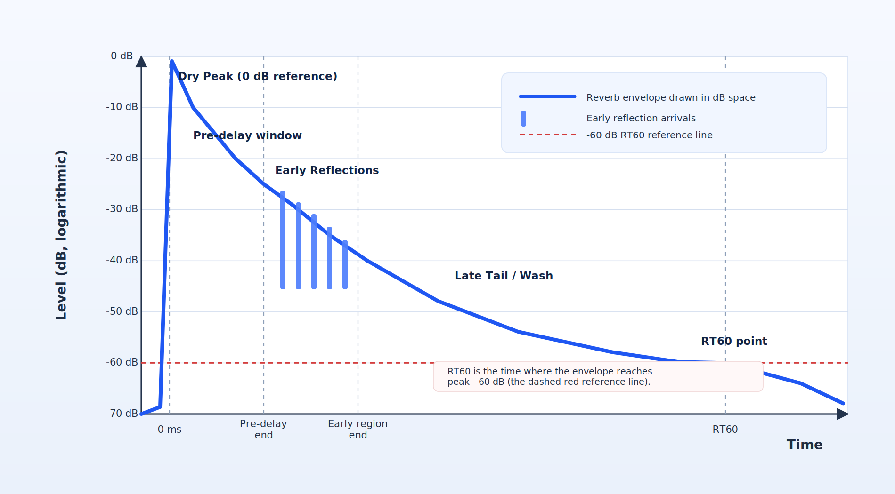
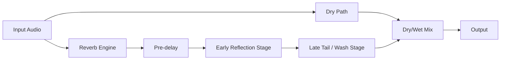
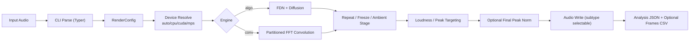
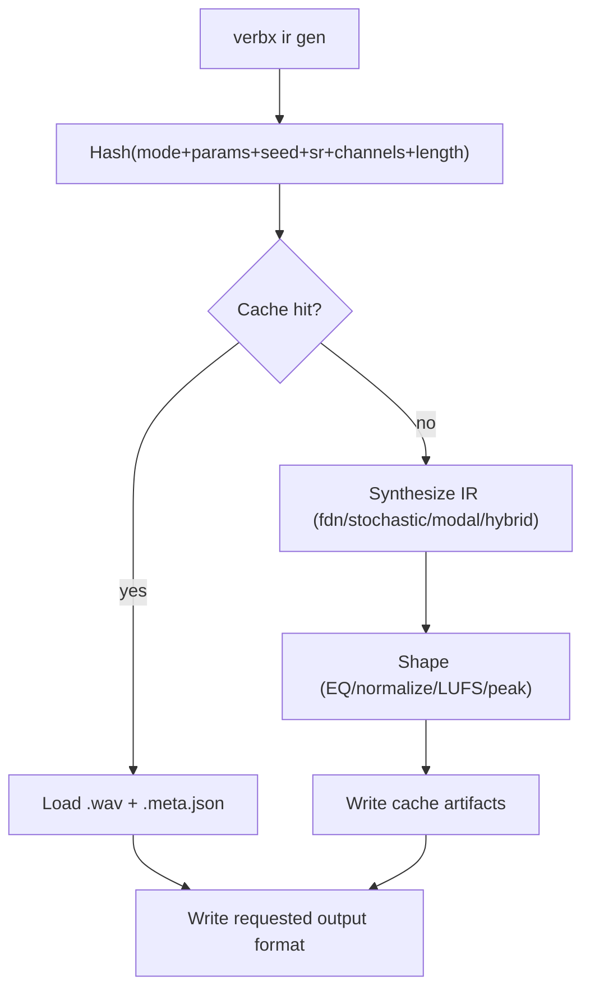

<p align="center">
  
</p>

# verbx

`verbx` is a production-grade Python command-line tool for creating spacious,
cinematic, and experimental reverb effects from audio files. It is designed for
both beginners and advanced users: you can start with simple one-line commands,
then gradually use deeper controls as your workflow grows.

Under the hood, `verbx` supports two main reverb approaches:
algorithmic reverb (including FDN, or *Feedback Delay Network*, for very long,
stable tails) and convolution reverb (using impulse responses). It also includes
freeze/repeat processing, loudness and peak targeting, multichannel/surround
routing, and synthetic IR generation with deterministic caching for reproducible
results.

## 1.0 Table of Contents

- [2.0 What is Reverberation? (a/k/a Reverb)?](#20-what-is-reverberation-aka-reverb)
  - [2.1 Quick Reference Summary (from Wikipedia)](#21-quick-reference-summary-from-wikipedia)
  - [2.2 Reverb Timeline (Single Hit)](#22-reverb-timeline-single-hit)
    - [2.2.1 Labeled Envelope Graph (Amplitude vs Time)](#221-labeled-envelope-graph-amplitude-vs-time)
  - [2.3 Dry/Wet and Tail Flow](#23-drywet-and-tail-flow)
- [3.0 Status](#30-status)
- [4.0 Features](#40-features)
- [5.0 Requirements](#50-requirements)
- [6.0 Installation and Quick Start](#60-installation-and-quick-start)
  - [6.1 Install options](#61-install-options)
    - [6.1.1 Option A: Hatch (recommended for contributors)](#611-option-a-hatch-recommended-for-contributors)
    - [6.1.2 Option B: Plain virtualenv + pip (no Hatch)](#612-option-b-plain-virtualenv-pip-no-hatch)
    - [6.1.3 Option C: pipx (isolated app install)](#613-option-c-pipx-isolated-app-install)
    - [6.1.4 Option D: Run module directly (no console-script install)](#614-option-d-run-module-directly-no-console-script-install)
  - [6.2 Add `verbx` to Your `PATH`](#62-add-verbx-to-your-path)
    - [6.2.1 Virtualenv install (`.venv`)](#621-virtualenv-install-venv)
    - [6.2.2 `pipx` install](#622-pipx-install)
    - [6.2.3 User-site `pip install --user`](#623-user-site-pip-install-user)
  - [6.3 Choosing How To Run `verbx`](#63-choosing-how-to-run-verbx)
    - [6.3.1 Hatch](#631-hatch)
    - [6.3.2 `uv`](#632-uv)
    - [6.3.3 Plain `venv` + `pip`](#633-plain-venv-pip)
    - [6.3.4 `pipx`](#634-pipx)
    - [6.3.5 Direct `python -m verbx.cli`](#635-direct-python-m-verbxcli)
- [7.0 Quick Start Recipes](#70-quick-start-recipes)
  - [7.1 First render (algorithmic)](#71-first-render-algorithmic)
  - [7.2 Convolution render with external IR](#72-convolution-render-with-external-ir)
  - [7.3 Surround matrix convolution (true cross-channel routing)](#73-surround-matrix-convolution-true-cross-channel-routing)
  - [7.4 Freeze + repeat chain](#74-freeze-repeat-chain)
  - [7.5 Loudness and peak-targeted render](#75-loudness-and-peak-targeted-render)
  - [7.6 Shimmer + ambient controls](#76-shimmer-ambient-controls)
  - [7.7 Tempo-synced pre-delay](#77-tempo-synced-pre-delay)
  - [7.8 Framewise analysis CSV during render](#78-framewise-analysis-csv-during-render)
  - [7.9 Auto-generate cached IR during render](#79-auto-generate-cached-ir-during-render)
  - [7.10 Force 32-bit float output + final peak normalization](#710-force-32-bit-float-output-final-peak-normalization)
  - [7.11 Acceleration (CUDA / Apple Silicon)](#711-acceleration-cuda-apple-silicon)
  - [7.12 Batch throughput](#712-batch-throughput)
  - [7.13 Iterative room-resonance chain (inspired by Alvin Lucier's *I Am Sitting in a Room*)](#713-iterative-room-resonance-chain-inspired-by-alvin-luciers-i-am-sitting-in-a-room)
  - [7.14 Ambient loopbed (inspired by Brian Eno's *Discreet Music*)](#714-ambient-loopbed-inspired-by-brian-enos-discreet-music)
  - [7.15 Tape-loop evolution (inspired by Frippertronics)](#715-tape-loop-evolution-inspired-by-frippertronics)
  - [7.16 Gated drum-space style (inspired by 1980s gated reverb aesthetics)](#716-gated-drum-space-style-inspired-by-1980s-gated-reverb-aesthetics)
  - [7.17 Dub chamber send chain (inspired by King Tubby / Lee Perry workflows)](#717-dub-chamber-send-chain-inspired-by-king-tubby-lee-perry-workflows)
  - [7.18 Reverse-wash texture stack (inspired by shoegaze wash techniques)](#718-reverse-wash-texture-stack-inspired-by-shoegaze-wash-techniques)
  - [7.19 Sparse hall clarity (inspired by Arvo Part-style acoustic spaciousness)](#719-sparse-hall-clarity-inspired-by-arvo-part-style-acoustic-spaciousness)
  - [7.20 Deep-resonance long-space (inspired by Deep Listening aesthetics)](#720-deep-resonance-long-space-inspired-by-deep-listening-aesthetics)
  - [7.21 Cathedral vocal/organ simulation](#721-cathedral-vocalorgan-simulation)
  - [7.22 Cinematic synth hall (inspired by classic analog-film synth spaces)](#722-cinematic-synth-hall-inspired-by-classic-analog-film-synth-spaces)
  - [7.23 Fast self-convolution (input as its own IR)](#723-fast-self-convolution-input-as-its-own-ir)
- [8.0 New User Guide](#80-new-user-guide)
  - [8.1 Start Here (5-minute setup)](#81-start-here-5-minute-setup)
  - [8.2 Processing Architecture](#82-processing-architecture)
  - [8.3 IR Generation + Cache Flow](#83-ir-generation-cache-flow)
- [9.0 DSP Math Notes](#90-dsp-math-notes)
  - [9.1 RT60 to Feedback Gain (FDN)](#91-rt60-to-feedback-gain-fdn)
  - [9.2 FDN State Update](#92-fdn-state-update)
  - [9.3 Partitioned FFT Convolution](#93-partitioned-fft-convolution)
  - [9.4 Multichannel Matrix Convolution](#94-multichannel-matrix-convolution)
  - [9.5 Freeze Crossfade (Equal Power)](#95-freeze-crossfade-equal-power)
  - [9.6 Loudness / Peak Stages](#96-loudness-peak-stages)
- [10.0 Performance Tuning](#100-performance-tuning)
  - [10.1 Device Selection](#101-device-selection)
  - [10.2 Threading](#102-threading)
  - [10.3 Streaming Convolution Mode](#103-streaming-convolution-mode)
- [11.0 Surround / Multichannel IR Rules](#110-surround-multichannel-ir-rules)
  - [11.1 Parallel Batch Rendering](#111-parallel-batch-rendering)
- [12.0 CLI Switch Reference](#120-cli-switch-reference)
  - [12.1 Top-level commands](#121-top-level-commands)
  - [12.2 `verbx render` switches](#122-verbx-render-switches)
    - [12.2.1 Core engine and room behavior](#1221-core-engine-and-room-behavior)
    - [12.2.2 Temporal structuring, repeats, and freeze](#1222-temporal-structuring-repeats-and-freeze)
    - [12.2.3 Convolution and IR routing](#1223-convolution-and-ir-routing)
    - [12.2.4 Runtime-generated IR path](#1224-runtime-generated-ir-path)
    - [12.2.5 Loudness, peak targeting, and limiting](#1225-loudness-peak-targeting-and-limiting)
    - [12.2.6 Ambient enhancement controls](#1226-ambient-enhancement-controls)
    - [12.2.7 Execution, resources, and reporting](#1227-execution-resources-and-reporting)
  - [12.3 `verbx analyze` switches](#123-verbx-analyze-switches)
  - [12.4 `verbx suggest` switches](#124-verbx-suggest-switches)
  - [12.5 `verbx presets` switches](#125-verbx-presets-switches)
  - [12.6 `verbx ir gen OUT_IR` switches](#126-verbx-ir-gen-out_ir-switches)
    - [12.6.1 Base output and synthesis mode](#1261-base-output-and-synthesis-mode)
    - [12.6.2 Decay shape and broadband tone controls](#1262-decay-shape-and-broadband-tone-controls)
    - [12.6.3 Early reflections and late-field density controls](#1263-early-reflections-and-late-field-density-controls)
    - [12.6.4 Modal and tuning controls](#1264-modal-and-tuning-controls)
    - [12.6.5 FDN-specific and harmonic alignment controls](#1265-fdn-specific-and-harmonic-alignment-controls)
    - [12.6.6 Modalys-inspired resonator layer controls](#1266-modalys-inspired-resonator-layer-controls)
    - [12.6.7 Cache and output behavior](#1267-cache-and-output-behavior)
  - [12.7 `verbx ir analyze IR_FILE` switches](#127-verbx-ir-analyze-ir_file-switches)
  - [12.8 `verbx ir process IN_IR OUT_IR` switches](#128-verbx-ir-process-in_ir-out_ir-switches)
  - [12.9 `verbx ir fit INFILE OUT_IR` switches](#129-verbx-ir-fit-infile-out_ir-switches)
  - [12.10 `verbx cache info` switches](#1210-verbx-cache-info-switches)
  - [12.11 `verbx cache clear` switches](#1211-verbx-cache-clear-switches)
  - [12.12 `verbx batch template` switches](#1212-verbx-batch-template-switches)
  - [12.13 `verbx batch render MANIFEST` switches](#1213-verbx-batch-render-manifest-switches)
- [13.0 CLI Command Cookbook](#130-cli-command-cookbook)
  - [13.1 Global help](#131-global-help)
  - [13.2 Core commands](#132-core-commands)
  - [13.3 `render` examples](#133-render-examples)
  - [13.4 `analyze` examples](#134-analyze-examples)
  - [13.5 `ir` command group](#135-ir-command-group)
    - [13.5.1 Generate IR examples](#1351-generate-ir-examples)
    - [13.5.2 Analyze/process/fit IR examples](#1352-analyzeprocessfit-ir-examples)
  - [13.6 Cache command group](#136-cache-command-group)
  - [13.7 Batch command group](#137-batch-command-group)
- [14.0 Pregenerated IRs and Audio Examples](#140-pregenerated-irs-and-audio-examples)
  - [14.1 Pregenerated long IRs (60s–360s)](#141-pregenerated-long-irs-60s360s)
  - [14.2 Short audio demos](#142-short-audio-demos)
- [15.0 Where to Obtain New Impulse Responses (IRs)](#150-where-to-obtain-new-impulse-responses-irs)
  - [15.1 Free and open libraries](#151-free-and-open-libraries)
  - [15.2 Commercial plugin ecosystems](#152-commercial-plugin-ecosystems)
  - [15.3 Capture your own IRs](#153-capture-your-own-irs)
  - [15.4 Import workflow in `verbx`](#154-import-workflow-in-verbx)
- [16.0 Generate 25 IRs With Varying Parameters](#160-generate-25-irs-with-varying-parameters)
  - [16.1 Python script](#161-python-script)
  - [16.2 Bash script (CLI-driven)](#162-bash-script-cli-driven)
- [17.0 Development](#170-development)
  - [17.1 Lint / type-check / tests](#171-lint-type-check-tests)
- [18.0 Project Layout](#180-project-layout)
- [19.0 Additional Docs](#190-additional-docs)
- [20.0 Roadmap](#200-roadmap)
  - [20.1 v0.5 - Surround-first workflow hardening](#201-v05-surround-first-workflow-hardening)
  - [20.2 v0.6 - Ambisonics and scene-domain spatial processing](#202-v06-ambisonics-and-scene-domain-spatial-processing)
  - [20.3 v0.7 - Immersive production interoperability (Atmos and large-scale delivery)](#203-v07-immersive-production-interoperability-atmos-and-large-scale-delivery)
  - [20.4 v0.8 - Time-varying parameter automation for reverb engines](#204-v08-time-varying-parameter-automation-for-reverb-engines)
  - [20.5 v0.9 - Feature-vector-driven reverb control (audio-reactive DSP)](#205-v09-feature-vector-driven-reverb-control-audio-reactive-dsp)
  - [20.6 v1.0 - Jot-inspired FDN control and perceptual parameterization](#206-v10-jot-inspired-fdn-control-and-perceptual-parameterization)
  - [20.7 v1.1 - IR morphing and blending framework](#207-v11-ir-morphing-and-blending-framework)
- [21.0 License](#210-license)
- [22.0 Attribution](#220-attribution)

## 2.0 What is Reverberation? (a/k/a Reverb)?

Reverberation is the persistence of sound in a space after the original sound
is made. In practical mixing terms, a reverb sound usually contains:

- A **dry peak** (direct sound reaching your ears first)
- A **pre-delay** gap (optional short delay before reverb starts)
- **Early reflections** (first few room bounces that create space cues)
- A dense **wash / late tail** (the smooth decaying ambience)

### 2.1 Quick Reference Summary (from Wikipedia)

- Reverberation comes from many closely spaced reflections that build up and then decay as energy is absorbed by surfaces, air, and objects in a space.
- A common practical distinction is timing: discrete echoes are typically heard when reflections are delayed enough (around 50-100 ms), while denser arrivals below that range are perceived as reverberation.
- Reverb decay is frequency dependent, which is why low and high bands can ring for different lengths of time.
- `RT60` is the standard decay metric: how long it takes for level to fall by 60 dB after the source stops.
- The best decay time depends on use case: speech-focused rooms usually need shorter decay for intelligibility, while music spaces can benefit from longer decay.
- Too much reverberation can hurt clarity for speech, hearing-aid users, and automatic speech recognition.
- Artificial reverb systems simulate these behaviors using chambers, springs/plates, or digital DSP.

Source: [Wikipedia - Reverberation](https://en.wikipedia.org/wiki/Reverberation)

### 2.2 Reverb Timeline (Single Hit)


#### 2.2.1 Labeled Envelope Graph (Amplitude vs Time)



Plain-English explanation of the graph:

- The **horizontal axis** is time. Left is the source hit; right is later in the decay.
- The **vertical axis is logarithmic in decibels (dB)**, not linear amplitude.
- `0 dB` is the peak reference in this diagram (the dry/direct peak).
- Every step downward on the y-axis is a fixed dB drop (`-10, -20, ..., -70 dB`), which represents multiplicative energy decay.
- The first tall spike (**Dry Peak**) is the direct sound arriving immediately.
- The short region after it (**Pre-delay window**) is the intentional delay before the reverb field builds.
- The small vertical pulses (**Early Reflections**) are the first discrete room returns.
- The blue curve is the **reverb envelope in dB space** and shows how level decays over time.
- The **RT60 point** is explicitly where the envelope reaches **`peak - 60 dB`** (at the `-60 dB` reference line).
- After RT60, the tail continues toward the noise floor (`-70 dB` in this visualization).

### 2.3 Dry/Wet and Tail Flow



In `verbx`, controls map directly to this anatomy:

- `--pre-delay-ms` / `--pre-delay`: shifts the reverb onset
- `--wet` and `--dry`: set balance between direct sound and reverb field
- `--rt60`: sets how long the wash/tail decays
- `--damping`, `--lowcut`, `--highcut`, `--tilt`: shape the tonal decay

## 3.0 Status

Current implementation level: **v0.4**

- Prompt 1: scaffolding and architecture
- Prompt 2: functional DSP render path
- Prompt 3: loudness/peak + shimmer/ambient controls
- Prompt 4: IR factory, cache, batch, tempo sync, framewise analysis
- v0.4 additions: framewise modulation analysis, advanced IR fitting heuristics, parallel batch scheduler

## 4.0 Features

- CLI-only architecture (Typer + Rich)
- Algorithmic reverb (FDN + diffusion topology)
- Partitioned FFT convolution (long IR friendly)
- Native multichannel/surround processing and matrix IR routing (M input × N output)
- Freeze segment looping + repeat chaining
- Loudness/peak controls (LUFS, sample peak, true-peak approximation)
- Ambient controls (shimmer, ducking, bloom, tilt EQ)
- Synthetic IR generation (`fdn`, `stochastic`, `modal`, `hybrid`)
- Deterministic IR cache with metadata sidecars
- Batch rendering manifests
- Tempo-synced note parsing (`--pre-delay 1/8D --bpm 120`)
- Framewise CSV analysis exports

## 5.0 Requirements

- Python 3.11+
- `libsndfile` available on system (required by `soundfile`)
- Optional acceleration packages:
  - `numba` (faster CPU algorithmic FDN path)
  - `cupy` / `cupy-cuda12x` (CUDA convolution backend)

## 6.0 Installation and Quick Start

### 6.1 Install options

#### 6.1.1 Option A: Hatch (recommended for contributors)

```bash
hatch env create
hatch run verbx --help
```

#### 6.1.2 Option B: Plain virtualenv + pip (no Hatch)

```bash
python3 -m venv .venv
source .venv/bin/activate
python -m pip install --upgrade pip
python -m pip install -e ".[dev]"
verbx --help
```

#### 6.1.3 Option C: pipx (isolated app install)

```bash
pipx install .
verbx --help
```

#### 6.1.4 Option D: Run module directly (no console-script install)

```bash
python -m pip install typer rich numpy scipy soundfile librosa pyloudnorm
PYTHONPATH=src python -m verbx.cli --help
```

### 6.2 Add `verbx` to Your `PATH`

If `verbx --help` says `command not found`, your shell likely cannot see the
install location yet.

#### 6.2.1 Virtualenv install (`.venv`)

Activate the environment before running `verbx`:

```bash
source .venv/bin/activate
verbx --help
```

To auto-activate in this project folder:

```bash
echo 'source .venv/bin/activate' >> .envrc
direnv allow
```

If you see `zsh: command not found: direnv`, either skip this step and activate
manually (`source .venv/bin/activate`) or install direnv:

```bash
brew install direnv
echo 'eval "$(direnv hook zsh)"' >> ~/.zshrc
source ~/.zshrc
direnv allow
```

#### 6.2.2 `pipx` install

Make sure pipx paths are configured:

```bash
pipx ensurepath
```

Then open a new terminal and run:

```bash
verbx --help
```

#### 6.2.3 User-site `pip install --user`

Add Python's user bin directory to `PATH` (zsh on macOS/Linux):

```bash
echo 'export PATH="$HOME/.local/bin:$PATH"' >> ~/.zshrc
echo 'export PATH="$HOME/Library/Python/3.11/bin:$PATH"' >> ~/.zshrc
source ~/.zshrc
verbx --help
```

For bash:

```bash
echo 'export PATH="$HOME/.local/bin:$PATH"' >> ~/.bashrc
echo 'export PATH="$HOME/Library/Python/3.11/bin:$PATH"' >> ~/.bashrc
source ~/.bashrc
verbx --help
```

For fish:

```fish
fish_add_path $HOME/.local/bin
fish_add_path $HOME/Library/Python/3.11/bin
exec fish
verbx --help
```

### 6.3 Choosing How To Run `verbx`

#### 6.3.1 Hatch

Pros:

- Best match for this repository's contributor workflow (`hatch run lint`, `typecheck`, `test`)
- Reproducible project environment defined in `pyproject.toml`
- No need to manually remember command variants for QA checks

Cons:

- Requires installing Hatch
- Dependency resolution/install is usually slower than `uv`

Best for:

- Contributors working on `verbx` itself
- CI/local parity with documented project scripts

#### 6.3.2 `uv`

Pros:

- Very fast environment creation and dependency install
- Supports project run flows (`uv run ...`) and pip-compatible flows (`uv pip ...`)
- Good for users who already standardize on `uv` across projects

Cons:

- Repo scripts are authored under Hatch env scripts, so command names differ
- Team docs and CI in this repo are Hatch-first

Best for:

- Power users prioritizing speed
- Local dev where you prefer `uv` tooling conventions

Example (`uv`-native):

```bash
uv sync --extra dev
uv run verbx --help
```

Example (pip-compatible with `uv`):

```bash
uv venv
source .venv/bin/activate
uv pip install -e ".[dev]"
verbx --help
```

#### 6.3.3 Plain `venv` + `pip`

Pros:

- Universal, standard Python workflow
- No extra package manager required

Cons:

- More manual steps
- Slower installs than `uv`

Best for:

- Environments where only standard Python tooling is allowed

#### 6.3.4 `pipx`

Pros:

- Isolated app install without polluting global Python packages
- Simple for command-line usage only

Cons:

- Less convenient for editing/testing local source changes
- Not ideal for contributor QA loops

Best for:

- End users who only want to run `verbx` commands

#### 6.3.5 Direct `python -m verbx.cli`

Pros:

- Quickest way to run source without creating a console script entry point
- Useful for debugging local module execution

Cons:

- Requires setting `PYTHONPATH=src` (or equivalent path setup)
- Easier to drift from normal installed usage
- Not ideal as a primary workflow

Best for:

- Fast local checks and debugging
- Situations where you intentionally avoid install steps

Recommendation:

- Use Hatch for contributing to this repo.
- Use `uv` if you want the same result with faster dependency operations.
- Use `venv` + `pip` for maximal portability.
- Use `python -m verbx.cli` for quick local debugging only.

## 7.0 Quick Start Recipes

### 7.1 First render (algorithmic)

```bash
verbx render input.wav output.wav --engine algo --rt60 80 --wet 0.85 --dry 0.15
```

### 7.2 Convolution render with external IR

```bash
verbx render input.wav output.wav --engine conv --ir hall_ir.wav --partition-size 16384
```

### 7.3 Surround matrix convolution (true cross-channel routing)

```bash
# 5.1 input with matrix-packed IR channels
verbx render in_5p1.wav out_5p1.wav \
  --engine conv \
  --ir ir_matrix_5p1.wav \
  --ir-matrix-layout output-major
```

### 7.4 Freeze + repeat chain

```bash
verbx render input.wav output.wav --freeze --start 2.0 --end 4.0 --repeat 3
```

### 7.5 Loudness and peak-targeted render

```bash
verbx render input.wav output.wav \
  --target-lufs -18 \
  --target-peak-dbfs -1 \
  --true-peak \
  --normalize-stage post
```

### 7.6 Shimmer + ambient controls

```bash
verbx render input.wav output.wav \
  --shimmer --shimmer-semitones 12 --shimmer-mix 0.35 \
  --duck --duck-attack 15 --duck-release 250 \
  --bloom 2.0 --tilt 1.5
```

### 7.7 Tempo-synced pre-delay

```bash
verbx render input.wav output.wav --pre-delay 1/8D --bpm 120
```

### 7.8 Framewise analysis CSV during render

```bash
verbx render input.wav output.wav --frames-out reports/output_frames.csv
```

`frames.csv` now includes modulation-oriented columns:

- `amp_mod_depth`, `amp_mod_rate_hz`
- `centroid_mod_depth`, `centroid_mod_rate_hz`

### 7.9 Auto-generate cached IR during render

```bash
verbx render input.wav output.wav \
  --ir-gen --ir-gen-mode hybrid --ir-gen-length 120 --ir-gen-seed 7
```

### 7.10 Force 32-bit float output + final peak normalization

```bash
# write WAV as 32-bit float
verbx render input.wav output.wav --out-subtype float32

# match final output peak to input peak
verbx render input.wav output.wav --output-peak-norm input

# normalize final output peak to full scale (0 dBFS)
verbx render input.wav output.wav --output-peak-norm full-scale

# normalize final output peak to a specified target
verbx render input.wav output.wav --output-peak-norm target --output-peak-target-dbfs -3
```

### 7.11 Acceleration (CUDA / Apple Silicon)

```bash
# auto-select compute device
verbx render input.wav output.wav --device auto

# force CUDA convolution path (falls back safely if unavailable)
verbx render input.wav output.wav --engine conv --ir hall.wav --device cuda

# Apple Silicon: prefer MPS profile + tune CPU thread count
verbx render input.wav output.wav --device mps --threads 8
```

Notes:

- CUDA path uses optional CuPy acceleration for partitioned FFT convolution.
- Algorithmic FDN path uses CPU backend (optional Numba JIT when installed).
- If requested acceleration is unavailable, `verbx` falls back to CPU and reports the effective backend.

### 7.12 Batch throughput

```bash
# run batch jobs concurrently
verbx batch render manifest.json --jobs 8

# policy scheduler (v0.4): prioritize longest jobs first (default)
verbx batch render manifest.json --jobs 8 --schedule longest-first

# shortest-first with retries and continue-on-error
verbx batch render manifest.json --jobs 8 --schedule shortest-first --retries 1 --continue-on-error
```

### 7.13 Iterative room-resonance chain (inspired by Alvin Lucier's *I Am Sitting in a Room*)

```bash
# Start with a dry voice recording.
mkdir -p passes
cp input_voice.wav passes/pass_00.wav

current="passes/pass_00.wav"

# Render each pass from the previous pass, saving every generation.
for i in $(seq 1 20); do
  next=$(printf "passes/pass_%02d.wav" "$i")
  verbx render "$current" "$next" \
    --engine algo \
    --rt60 35 \
    --wet 1.0 \
    --dry 0.0 \
    --repeat 1 \
    --target-peak-dbfs -2 \
    --true-peak \
    --output-peak-norm input \
    --no-progress
  current="$next"
done
```

Tips:

- Keep `--wet 1.0 --dry 0.0` so each pass is fully reprocessed.
- Keep normalization enabled (as above) so levels stay controlled across many passes.
- Use fewer passes (`8-12`) for subtle evolution, or more (`20+`) for stronger resonance imprint.
- The `passes/` folder preserves every intermediate file for listening, editing, or montage.

### 7.14 Ambient loopbed (inspired by Brian Eno's *Discreet Music*)

```bash
verbx render input.wav output_eno.wav \
  --engine algo \
  --rt60 95 \
  --wet 0.92 \
  --dry 0.08 \
  --damping 0.35 \
  --width 1.25 \
  --bloom 2.0 \
  --tilt 0.8 \
  --target-lufs -22 \
  --target-peak-dbfs -2
```

### 7.15 Tape-loop evolution (inspired by Frippertronics)

```bash
mkdir -p fripp_passes
cp guitar_phrase.wav fripp_passes/pass_00.wav
current="fripp_passes/pass_00.wav"

for i in $(seq 1 12); do
  next=$(printf "fripp_passes/pass_%02d.wav" "$i")
  verbx render "$current" "$next" \
    --engine algo \
    --rt60 28 \
    --wet 0.88 \
    --dry 0.12 \
    --repeat 1 \
    --output-peak-norm input \
    --no-progress
  current="$next"
done
```

### 7.16 Gated drum-space style (inspired by 1980s gated reverb aesthetics)

```bash
verbx render drums.wav drums_gated_style.wav \
  --engine conv \
  --ir plate_short.wav \
  --ir-normalize peak \
  --tail-limit 1.2 \
  --wet 0.75 \
  --dry 0.4 \
  --highcut 9000 \
  --target-peak-dbfs -1
```

### 7.17 Dub chamber send chain (inspired by King Tubby / Lee Perry workflows)

```bash
verbx render snare_send.wav dub_chamber.wav \
  --engine conv \
  --ir spring_or_room_ir.wav \
  --repeat 2 \
  --wet 0.95 \
  --dry 0.05 \
  --lowcut 180 \
  --highcut 4500 \
  --tilt -2.0 \
  --output-peak-norm input
```

### 7.18 Reverse-wash texture stack (inspired by shoegaze wash techniques)

```bash
verbx render guitar_pad.wav shoegaze_wash.wav \
  --engine algo \
  --freeze --start 1.0 --end 2.4 \
  --shimmer --shimmer-semitones 12 --shimmer-mix 0.4 \
  --rt60 80 \
  --wet 0.95 \
  --dry 0.08 \
  --width 1.4 \
  --target-peak-dbfs -2
```

### 7.19 Sparse hall clarity (inspired by Arvo Part-style acoustic spaciousness)

```bash
verbx render piano_sparse.wav piano_hall_clear.wav \
  --engine conv \
  --ir hall_ir.wav \
  --pre-delay 1/16 --bpm 60 \
  --wet 0.55 \
  --dry 0.7 \
  --lowcut 120 \
  --highcut 11000 \
  --target-lufs -20 \
  --target-peak-dbfs -1
```

### 7.20 Deep-resonance long-space (inspired by Deep Listening aesthetics)

```bash
verbx render drone_input.wav drone_deep_space.wav \
  --ir-gen \
  --ir-gen-mode hybrid \
  --ir-gen-length 240 \
  --ir-gen-seed 108 \
  --engine conv \
  --wet 0.9 \
  --dry 0.15 \
  --tail-limit 180 \
  --target-lufs -24 \
  --target-peak-dbfs -2
```

### 7.21 Cathedral vocal/organ simulation

```bash
verbx render chant_or_organ.wav cathedral_render.wav \
  --engine conv \
  --ir cathedral_ir.wav \
  --wet 0.82 \
  --dry 0.35 \
  --rt60 90 \
  --lowcut 70 \
  --highcut 10000 \
  --target-lufs -21 \
  --true-peak --target-peak-dbfs -1
```

### 7.22 Cinematic synth hall (inspired by classic analog-film synth spaces)

```bash
verbx render synth_lead.wav synth_cinematic_hall.wav \
  --ir-gen \
  --ir-gen-mode hybrid \
  --ir-gen-length 120 \
  --ir-gen-seed 77 \
  --engine conv \
  --wet 0.78 \
  --dry 0.4 \
  --width 1.3 \
  --bloom 1.8 \
  --tilt 1.2 \
  --target-peak-dbfs -1.5
```

### 7.23 Fast self-convolution (input as its own IR)

```bash
verbx render input.wav self_convolved.wav \
  --self-convolve \
  --engine auto \
  --ir-normalize peak \
  --partition-size 16384 \
  --normalize-stage none \
  --output-peak-norm input
```

## 8.0 New User Guide

### 8.1 Start Here (5-minute setup)

1. Install dependencies (`uv` or `venv + pip`).
2. Confirm CLI is available:
   ```bash
   verbx --help
   ```
3. Run a first render:
   ```bash
   verbx render input.wav output.wav --engine auto
   ```
4. Inspect generated analysis JSON:
   - `output.wav.analysis.json`
5. Iterate with one variable at a time:
   - reverb time: `--rt60`
   - wet/dry balance: `--wet`, `--dry`
   - tonal shape: `--lowcut`, `--highcut`, `--tilt`

### 8.2 Processing Architecture



### 8.3 IR Generation + Cache Flow



## 9.0 DSP Math Notes

### 9.1 RT60 to Feedback Gain (FDN)

For each delay line with delay $d$ seconds and target RT60 $T_{60}$:

$$
g \approx 10^{-3d/T_{60}}
$$

This maps exponential energy decay to delay-line feedback gain.  
`verbx` applies this per-line, then applies damping filters for faster HF decay.

### 9.2 FDN State Update

At each sample:

$$
\mathbf{y}[n] = \mathbf{D}\left(\mathbf{x}_{fb}[n]\right), \quad
\mathbf{x}_{fb}[n+1] = \mathbf{G}\mathbf{M}\mathbf{y}[n] + \mathbf{u}[n]
$$

- $\mathbf{M}$: mixing matrix (Hadamard-style orthogonal mix)
- $\mathbf{G}$: diagonal feedback gains (RT60-calibrated)
- $\mathbf{D}$: damping / DC filtering
- $\mathbf{u}[n]$: injected input (after pre-delay and diffusion)

### 9.3 Partitioned FFT Convolution

Convolution in frequency domain:

$$
Y_k(\omega) = \sum_{p=0}^{P-1} X_{k-p}(\omega)\,H_p(\omega)
$$

- $H_p$: FFT of IR partition $p$
- $X_{k-p}$: FFT history of recent input partitions
- $P$: number of IR partitions

This reduces long-IR convolution cost and supports streaming block processing.

### 9.4 Multichannel Matrix Convolution

For $M$ input channels and $N$ output channels:

$$
y_o[n] = \sum_{i=0}^{M-1} (x_i * h_{i,o})[n]
$$

- $h_{i,o}$ is the IR from input channel $i$ to output channel $o$
- `verbx` supports matrix-packed IR files where channel count is `M * N`
- packing order is controlled by `--ir-matrix-layout`:
  - `output-major`: channel index = `o*M + i`
  - `input-major`: channel index = `i*N + o`

### 9.5 Freeze Crossfade (Equal Power)

For loop boundary crossfade parameter $\theta \in [0, \pi/2]$:

$$
w_{out} = \cos(\theta), \quad w_{in} = \sin(\theta)
$$

$$
y = w_{out}\,x_{tail} + w_{in}\,x_{head}
$$

This reduces clicks at loop boundaries.

### 9.6 Loudness / Peak Stages

- Integrated LUFS normalization (EBU R128 via `pyloudnorm`)
- True-peak approximation via oversampling
- Optional limiter + sample-peak ceiling
- Optional final peak norm:
  - `input` (match input peak)
  - `target` (specified dBFS)
  - `full-scale` (0 dBFS)

## 10.0 Performance Tuning

### 10.1 Device Selection

- `--device auto`: choose best available platform (`cuda` > `mps` > `cpu`)
- `--device cuda`: enables CuPy backend for convolution if available
- `--device mps`: optimized Apple Silicon profile (CPU backend + thread tuning)
- `--device cpu`: deterministic CPU-only execution

### 10.2 Threading

- `--threads N` sets CPU threading hints for FFT/BLAS stacks.
- Useful on Apple Silicon and multi-core x86 for convolution workloads.

### 10.3 Streaming Convolution Mode

`verbx render` automatically uses file-streaming convolution (low peak RAM) when compatible.

Current streaming-compatible constraints:

- `--engine conv`
- `--repeat 1`
- no freeze
- `--normalize-stage none`
- no LUFS/peak target stages
- no duck/bloom/tilt/lowcut/highcut post stages
- `--output-peak-norm none`

When incompatible options are requested, `verbx` falls back to full-buffer processing.

## 11.0 Surround / Multichannel IR Rules

- Input audio: arbitrary channel count (`M`).
- IR file channel interpretation:
  - `1` channel IR: diagonal routing, same IR applied per channel.
  - `M` channel IR: diagonal routing with per-channel IR.
  - `M*N` channel IR (where channel count divisible by `M`): full matrix routing from `M` input to `N` output.
- Non-divisible IR channel counts now raise explicit CLI errors.
- Render summary + analysis JSON report effective routing/backend details.

### 11.1 Parallel Batch Rendering

`verbx batch render manifest.json --jobs N` now executes jobs concurrently.

- Use `--jobs` near CPU core count for throughput.
- Use `--dry-run` to validate manifests before rendering.

## 12.0 CLI Switch Reference

This section lists all CLI switches available in the current `v0.4` interface.
For full descriptions and defaults, run `verbx <command> --help`.

### 12.1 Top-level commands

- `verbx render INFILE OUTFILE`
- `verbx analyze INFILE`
- `verbx suggest INFILE`
- `verbx presets`
- `verbx ir ...`
- `verbx cache ...`
- `verbx batch ...`

### 12.2 `verbx render` switches

Use this as a methodical guide for `verbx render INFILE OUTFILE`.

#### 12.2.1 Core engine and room behavior

| Switch | What it controls | Practical guidance |
|---|---|---|
| `--engine [conv\|algo\|auto]` | Selects convolution, algorithmic FDN, or automatic selection. | Use `conv` when you have an IR (`--ir`). Use `algo` for generated tails. `auto` picks `conv` if IR is present, otherwise `algo`. |
| `--rt60` | Target decay time in seconds for algorithmic or generated-IR style behavior. | Higher values produce longer tails (e.g., ambient washes). Lower values keep mixes tighter and more intelligible. |
| `--wet` | Amount of processed (reverberated) signal in the output mix. | Increase for stronger ambience. |
| `--dry` | Amount of original (unprocessed) signal in the output mix. | Keep some dry for clarity and source definition. |
| `--damping` | High-frequency damping in the decay network. | Higher damping darkens tails faster; lower damping keeps brighter highs longer. |
| `--width` | Stereo/spatial spread behavior in the algorithmic path. | Increase for wider image; reduce for narrower/centered ambience. |
| `--mod-depth-ms` | Delay modulation depth (ms) in the algorithmic late field. | Small depth reduces metallic ringing; too high can sound chorus-like. |
| `--mod-rate-hz` | Delay modulation speed. | Very slow rates are subtle; faster rates make modulation more audible. |

#### 12.2.2 Temporal structuring, repeats, and freeze

| Switch | What it controls | Practical guidance |
|---|---|---|
| `--repeat` | Number of sequential render passes through the selected engine. | Use values `>1` for extreme chaining; monitor levels and normalization behavior. |
| `--freeze` | Enables freeze mode. | Requires `--start` and `--end`; creates sustained texture from a selected segment. |
| `--start` | Freeze segment start time (seconds). | Valid only with `--freeze`. |
| `--end` | Freeze segment end time (seconds). | Must be greater than `--start`; valid only with `--freeze`. |
| `--pre-delay-ms` | Numeric pre-delay (milliseconds). | Sets gap between dry hit and onset of reverb field. |
| `--pre-delay` | Musical pre-delay notation (example: `1/8D`). | Useful for tempo-synced spaces; can override raw milliseconds. |
| `--bpm` | Tempo used to resolve note-based pre-delay values. | Use with `--pre-delay` notation for rhythmic alignment. |

#### 12.2.3 Convolution and IR routing

| Switch | What it controls | Practical guidance |
|---|---|---|
| `--ir` | Path to external impulse response. | Required for explicit convolution engine runs (`--engine conv`) unless `--ir-gen` is used. |
| `--self-convolve` | Uses the input file as its own IR for fast partitioned FFT self-convolution. | Useful for iterative texture/smear experiments without preparing a separate IR file. Equivalent to `--engine conv --ir INFILE`. |
| `--ir-normalize [peak\|rms\|none]` | How IR amplitude is normalized before convolution. | `peak` is typical for predictable headroom; `none` preserves original IR level exactly. |
| `--ir-matrix-layout [output-major\|input-major]` | Mapping for matrix-packed multichannel IRs. | Use this for true cross-channel routing (M-in × N-out IR channel packing). |
| `--partition-size` | FFT partition size for convolution processing. | Larger partitions reduce FFT overhead but raise latency/memory per block; tune for workload. |
| `--tail-limit` | Optional maximum rendered convolution tail (seconds). | Useful to cap very long IR tails in production batches. |
| `--block-size` | Internal block size for block-based processing. | Relevant for algorithmic path and some processing stages; larger blocks can improve throughput. |

#### 12.2.4 Runtime-generated IR path

| Switch | What it controls | Practical guidance |
|---|---|---|
| `--ir-gen` | Enables automatic IR generation before render. | Use when you want convolution character without manually preparing an IR file. |
| `--ir-gen-mode [fdn\|stochastic\|modal\|hybrid]` | Synthetic IR synthesis mode. | `hybrid` is versatile; `modal` is more resonant/tonal; `stochastic` is diffuse/noise-shaped. |
| `--ir-gen-length` | Generated IR duration in seconds. | Longer values create longer convolution tails and larger processing cost. |
| `--ir-gen-seed` | Deterministic random seed for generated IRs. | Keep fixed for reproducibility across renders. |
| `--ir-gen-cache-dir` | Cache location for generated IR artifacts. | Reusing cache speeds repeated renders with identical IR-gen settings. |

#### 12.2.5 Loudness, peak targeting, and limiting

| Switch | What it controls | Practical guidance |
|---|---|---|
| `--target-lufs` | Integrated loudness target for normalization. | Use when delivering to a specific loudness standard. |
| `--target-peak-dbfs` | Output peak ceiling target. | Useful to enforce headroom constraints and prevent clipping. |
| `--true-peak / --sample-peak` | Peak mode used when applying peak ceilings. | `true-peak` is safer for codec/resampling headroom; `sample-peak` is faster and simpler. |
| `--limiter / --no-limiter` | Enables/disables final safety limiting stage (where applicable). | Keep limiter on for robust output safety unless intentionally preserving raw dynamics. |
| `--normalize-stage [none\|post\|per-pass]` | When normalization/targeting is applied. | `post` applies after full chain; `per-pass` applies after each repeat pass; `none` disables target normalization stage. |
| `--repeat-target-lufs` | Loudness target specifically for each repeat pass. | Only meaningful with `--normalize-stage per-pass`. |
| `--repeat-target-peak-dbfs` | Peak target specifically for each repeat pass. | Only meaningful with `--normalize-stage per-pass`. |
| `--output-peak-norm [none\|input\|target\|full-scale]` | Final peak normalization strategy after processing. | `input` matches input peak, `target` uses explicit dBFS value, `full-scale` normalizes near 0 dBFS. |
| `--output-peak-target-dbfs` | Target value for `--output-peak-norm target`. | Required when using target mode. |
| `--out-subtype [auto\|float32\|float64\|pcm16\|pcm24\|pcm32]` | Output file subtype/bit depth. | Use `float32` for headroom-friendly exports and DSP interchange. |

#### 12.2.6 Ambient enhancement controls

| Switch | What it controls | Practical guidance |
|---|---|---|
| `--shimmer` | Enables shimmer path (pitch-shifted reverb coloration). | Good for ambient/synth textures. |
| `--shimmer-semitones` | Pitch offset used by shimmer effect. | `+12` is a common octave-up shimmer baseline. |
| `--shimmer-mix` | Blend amount of shimmer component. | Lower values are subtle; higher values are obvious and synthetic. |
| `--shimmer-feedback` | Feedback amount in shimmer path. | High values create long evolving tails but can get dense quickly. |
| `--shimmer-highcut` | High-cut filter for shimmer contribution. | Use to smooth harsh top-end artifacts. |
| `--shimmer-lowcut` | Low-cut filter for shimmer contribution. | Removes low buildup from shimmer layer. |
| `--duck` | Enables ducking behavior (reverb pulls down while source is active). | Helps keep dry source intelligible in dense mixes. |
| `--duck-attack` | Attack time for ducking envelope (ms). | Lower attack reacts faster to incoming transients. |
| `--duck-release` | Release time for ducking envelope (ms). | Higher release gives smoother recovery; lower release recovers quickly. |
| `--bloom` | Slow build-up emphasis in the wet field. | Useful for cinematic rise and tail growth. |
| `--lowcut` | Post-wet high-pass cutoff (Hz). | Removes low-frequency mud from reverb field. |
| `--highcut` | Post-wet low-pass cutoff (Hz). | Tames bright/hissy reverb highs. |
| `--tilt` | Broadband tilt EQ over wet field. | Positive tilt brightens; negative tilt darkens. |

#### 12.2.7 Execution, resources, and reporting

| Switch | What it controls | Practical guidance |
|---|---|---|
| `--device [auto\|cpu\|cuda\|mps]` | Compute platform preference. | `auto` picks best available backend; force `cuda`/`mps` when validating platform-specific behavior. |
| `--threads` | CPU thread hint for processing/FFT stacks. | Tune for throughput on multi-core systems. |
| `--frames-out` | Path for framewise CSV metrics output. | Exports per-frame analysis including modulation metrics. |
| `--analysis-out` | Path for JSON analysis report. | If omitted, report is written to `<OUTFILE>.analysis.json` unless `--silent`. |
| `--silent` | Suppresses analysis/report output and console summaries. | Use for minimal-output automation contexts. |
| `--progress / --no-progress` | Enables or disables progress UI. | Disable for non-interactive logs or CI environments. |

### 12.3 `verbx analyze` switches

| Switch | What it controls | Practical guidance |
|---|---|---|
| `--json-out` | Writes full analysis payload to a JSON file. | Use for reproducible reports, automation, or comparing files over time. |
| `--lufs` | Enables loudness-specific metrics (`integrated_lufs`, `true_peak_dbfs`, `lra`). | Turn on when targeting delivery specs or validating loudness normalization behavior. |
| `--frames-out` | Writes framewise CSV metrics for temporal inspection. | Useful for debugging dynamics, modulation, and section-by-section behavior. |

### 12.4 `verbx suggest` switches

No command-specific switches (other than `--help`).

### 12.5 `verbx presets` switches

No command-specific switches (other than `--help`).

### 12.6 `verbx ir gen OUT_IR` switches

#### 12.6.1 Base output and synthesis mode

| Switch | What it controls | Practical guidance |
|---|---|---|
| `--format` | Output container format override (`auto`, `wav`, `flac`, `aiff`, `aif`, `ogg`, `caf`). | Use when extension and desired format differ or when standardizing archive format. |
| `--mode` | IR synthesis model (`fdn`, `stochastic`, `modal`, `hybrid`). | `hybrid` is a strong default; choose `modal` for resonant tones and `stochastic` for diffuse spaces. |
| `--length` | IR duration in seconds. | Longer IRs produce longer convolution tails and higher compute/storage cost. |
| `--sr` | IR sample rate. | Match target render sample rate to avoid resampling overhead. |
| `--channels` | Number of channels in generated IR. | Match your intended render bus (stereo, surround, etc.). |
| `--seed` | Deterministic seed for random elements. | Keep fixed for reproducibility; change for controlled variation. |

#### 12.6.2 Decay shape and broadband tone controls

| Switch | What it controls | Practical guidance |
|---|---|---|
| `--rt60` | Single RT60 target for the whole IR. | Use for straightforward decay design. |
| `--rt60-low` | Low-band RT60 target (when using band range mode). | Pair with `--rt60-high` for frequency-dependent decay shaping. |
| `--rt60-high` | High-band RT60 target (when using band range mode). | Shorter high-band decay often sounds more natural. |
| `--damping` | High-frequency damping amount. | Higher damping darkens tails faster. |
| `--lowcut` | High-pass cutoff applied in shaping stage. | Removes sub/low rumble in generated IRs. |
| `--highcut` | Low-pass cutoff applied in shaping stage. | Tames harsh brightness in tails. |
| `--tilt` | Broadband tilt EQ during shaping. | Positive tilt brightens, negative tilt darkens. |
| `--normalize [none\|peak\|rms]` | IR normalization mode. | `peak` is common for predictable headroom; `none` preserves raw generator output level. |
| `--peak-dbfs` | Target peak used with peak normalization. | Set slightly below 0 dBFS for safety margin. |
| `--target-lufs` | Loudness target for generated IR output. | Optional; useful when normalizing IR libraries consistently. |
| `--true-peak / --sample-peak` | Peak evaluation method when enforcing peak targeting. | `true-peak` is safer for distribution/interpolation contexts. |

#### 12.6.3 Early reflections and late-field density controls

| Switch | What it controls | Practical guidance |
|---|---|---|
| `--er-count` | Number of synthetic early reflections. | More reflections increase early spatial complexity. |
| `--er-max-delay-ms` | Maximum delay span for early reflections. | Larger values spread early reflections further in time. |
| `--er-decay-shape` | Early reflection decay profile identifier. | Use default unless deliberately tuning reflection envelope behavior. |
| `--er-stereo-width` | Stereo spread of early reflections. | Increase for wider perceived room edges. |
| `--er-room` | Coarse room-size scaling factor for ER timing/energy behavior. | Higher values generally imply larger perceived room impression. |
| `--diffusion` | Late-field diffusion amount. | Higher diffusion smooths and densifies the tail. |
| `--mod-depth-ms` | Modulation depth for time-varying late response. | Subtle values reduce static ringing artifacts. |
| `--mod-rate-hz` | Modulation rate for late response movement. | Slow values keep motion natural and less chorus-like. |
| `--density` | Overall event/energy density in tail generation. | Higher density creates thicker ambient wash. |

#### 12.6.4 Modal and tuning controls

| Switch | What it controls | Practical guidance |
|---|---|---|
| `--tuning` | Base tuning system string (example: `A4=440`). | Use to align modal resonances with project tuning conventions. |
| `--modal-count` | Number of modal components. | More modes increase complexity but can raise ringing density. |
| `--modal-q-min` | Lower bound for modal Q factor. | Lower Q broadens resonances and shortens modal ringing. |
| `--modal-q-max` | Upper bound for modal Q factor. | Higher Q gives sharper, longer resonances. |
| `--modal-spread-cents` | Randomized detune spread between modes. | Adds richness and avoids overly static harmonic stacks. |
| `--modal-low-hz` | Lowest modal frequency region. | Raise to avoid excessive low-frequency modal buildup. |
| `--modal-high-hz` | Highest modal frequency region. | Lower to keep modal content darker/less brittle. |

#### 12.6.5 FDN-specific and harmonic alignment controls

| Switch | What it controls | Practical guidance |
|---|---|---|
| `--fdn-lines` | Number of FDN delay lines. | More lines can increase smoothness and complexity. |
| `--fdn-matrix` | FDN feedback matrix type identifier. | Matrix choice affects coloration and energy diffusion style. |
| `--fdn-stereo-inject` | Stereo cross-injection factor for FDN excitation. | Increase for stronger channel interaction in stereo fields. |
| `--f0` | Explicit fundamental anchor frequency. | Useful when generating musically tuned IRs (example: `64 Hz`). |
| `--analyze-input` | Source audio used to estimate tuning/harmonic targets. | Lets generator align IR resonance to real material. |
| `--harmonic-align-strength` | Strength of harmonic alignment process. | Lower values are subtle; higher values enforce tuning more strongly. |

#### 12.6.6 Modalys-inspired resonator layer controls

| Switch | What it controls | Practical guidance |
|---|---|---|
| `--resonator / --no-resonator` | Enables/disables a physical-model-style modal resonator layer for late-tail coloration. | Enable when you want richer, object-like resonances blended into the IR tail. |
| `--resonator-mix` | Blend amount of resonator layer into the generated IR. | Start around `0.25-0.45`; higher values can become intentionally resonant/tonal. |
| `--resonator-modes` | Number of resonator modes in the modal bank. | Higher mode counts increase complexity and render time. |
| `--resonator-q-min` | Lower Q bound for resonator modes. | Lower values broaden resonances and reduce ringing sharpness. |
| `--resonator-q-max` | Upper Q bound for resonator modes. | Higher values produce tighter, longer ringing modes. |
| `--resonator-low-hz` | Lowest resonator frequency. | Raise to avoid sub-heavy modal buildup. |
| `--resonator-high-hz` | Highest resonator frequency. | Lower to keep the resonator bed darker and smoother. |
| `--resonator-late-start-ms` | Time offset before resonator layer fades in. | Keep this after early reflections so coloration emphasizes the late field. |

#### 12.6.7 Cache and output behavior

| Switch | What it controls | Practical guidance |
|---|---|---|
| `--cache-dir` | Directory for deterministic IR cache artifacts. | Keep stable across sessions to maximize cache hits. |
| `--silent` | Suppresses metadata sidecar emission and command output details. | Use in scripted generation runs where only IR file output is needed. |

### 12.7 `verbx ir analyze IR_FILE` switches

| Switch | What it controls | Practical guidance |
|---|---|---|
| `--json-out` | Writes IR analysis metrics to JSON. | Useful for IR cataloging, QA checks, and fit/ranking workflows. |

### 12.8 `verbx ir process IN_IR OUT_IR` switches

| Switch | What it controls | Practical guidance |
|---|---|---|
| `--damping` | High-frequency damping in process/shaping stage. | Increase to darken and soften existing IR tails. |
| `--lowcut` | High-pass cutoff applied to input IR. | Remove low-end buildup and rumble from old IR captures. |
| `--highcut` | Low-pass cutoff applied to input IR. | Reduce bright hash and metallic highs. |
| `--tilt` | Broadband tilt EQ during IR processing. | Positive tilt brightens; negative tilt darkens. |
| `--normalize [none\|peak\|rms]` | Output level normalization mode. | `peak` is safest for reusable library assets. |
| `--peak-dbfs` | Target peak value used by peak normalization. | Keep below 0 dBFS to preserve headroom. |
| `--target-lufs` | Optional loudness target for processed IR. | Use when standardizing IR set loudness characteristics. |
| `--true-peak / --sample-peak` | Peak measurement method for limiting/targeting. | `true-peak` is preferred for conservative peak control. |
| `--silent` | Suppresses sidecar metadata and command summary output. | Good for quiet pipeline execution. |

### 12.9 `verbx ir fit INFILE OUT_IR` switches

| Switch | What it controls | Practical guidance |
|---|---|---|
| `--top-k` | Number of top-ranked fitted IR outputs to write. | Use larger values for auditioning multiple candidates. |
| `--base-mode` | Preferred synthesis mode seed for candidate generation. | Use this to bias fit search toward a family of IR behaviors. |
| `--length` | Length of generated candidate IRs. | Keep consistent with intended render tail duration. |
| `--seed` | Base seed for deterministic candidate generation. | Same seed reproduces candidate search order and results. |
| `--candidate-pool` | Size of scored candidate pool before selecting top-K. | Larger pools improve search quality but cost more compute. |
| `--fit-workers` | Parallel workers for fit-scoring stage (`0` = auto). | Increase on multi-core systems to speed candidate scoring. |
| `--analyze-tuning / --no-analyze-tuning` | Enables/disables source tuning analysis during fit. | Enable for musically aligned IRs; disable for faster neutral fitting. |
| `--cache-dir` | Cache directory for generated/loaded candidates. | Reuse across runs to avoid recomputing identical candidates. |

### 12.10 `verbx cache info` switches

| Switch | What it controls | Practical guidance |
|---|---|---|
| `--cache-dir` | Cache directory to inspect. | Point to alternate cache roots when managing multiple environments. |

### 12.11 `verbx cache clear` switches

| Switch | What it controls | Practical guidance |
|---|---|---|
| `--cache-dir` | Cache directory to clear. | Use carefully; this removes reusable IR artifacts for that cache root. |

### 12.12 `verbx batch template` switches

No command-specific switches (other than `--help`).

### 12.13 `verbx batch render MANIFEST` switches

| Switch | What it controls | Practical guidance |
|---|---|---|
| `--jobs` | Number of concurrent workers (`0` = auto). | Set near available cores for throughput; reduce if system is memory-constrained. |
| `--schedule [fifo\|shortest-first\|longest-first]` | Batch job ordering policy. | `longest-first` helps keep workers busy; `fifo` preserves manifest order semantics. |
| `--retries` | Retry count per failed job. | Use `1-2` for transient I/O or resource hiccups. |
| `--continue-on-error / --fail-fast` | Whether to continue processing after a failure. | Use fail-fast for strict pipelines; continue-on-error for large best-effort batches. |
| `--dry-run` | Validates and prints plan without rendering audio. | Recommended before long multi-job runs. |

## 13.0 CLI Command Cookbook

### 13.1 Global help

```bash
verbx --help
```

### 13.2 Core commands

```bash
verbx render INFILE OUTFILE [options]
verbx analyze INFILE [--lufs] [--json-out report.json] [--frames-out frames.csv]
verbx suggest INFILE
verbx presets
```

### 13.3 `render` examples

```bash
# high-density algorithmic tail
verbx render in.wav out.wav --engine algo --rt60 120 --damping 0.5 --width 1.2

# convolution with IR normalization and tail cap
verbx render in.wav out.wav --engine conv --ir plate.wav --ir-normalize peak --tail-limit 45

# fast self-convolution (input as its own IR)
verbx render in.wav out_self.wav --self-convolve --partition-size 16384 --normalize-stage none

# cross-channel matrix routing (packed IR channels)
verbx render in_7p1.wav out_7p1.wav --engine conv --ir matrix_7p1.wav --ir-matrix-layout output-major

# per-pass normalization strategy
verbx render in.wav out.wav --repeat 4 --normalize-stage per-pass --repeat-target-lufs -20

# output sample-peak strategy
verbx render in.wav out.wav --target-peak-dbfs -2 --sample-peak

# force float32 output container subtype
verbx render in.wav out.wav --out-subtype float32

# final peak normalization options
verbx render in.wav out.wav --output-peak-norm input
verbx render in.wav out.wav --output-peak-norm full-scale
verbx render in.wav out.wav --output-peak-norm target --output-peak-target-dbfs -6

# disable limiter
verbx render in.wav out.wav --no-limiter
```

### 13.4 `analyze` examples

```bash
verbx analyze in.wav
verbx analyze in.wav --lufs
verbx analyze in.wav --json-out reports/in_analysis.json
verbx analyze in.wav --frames-out reports/in_frames.csv
```

### 13.5 `ir` command group

```bash
verbx ir gen OUT_IR.wav [options]
verbx ir analyze IR.wav
verbx ir process IN_IR.wav OUT_IR.wav [options]
verbx ir fit INPUT.wav OUT_IR.wav --top-k 5
```

#### 13.5.1 Generate IR examples

```bash
# hybrid, long tail
verbx ir gen IRs/hybrid_120.wav --mode hybrid --length 120 --seed 42

# format switch (overrides extension)
verbx ir gen IRs/custom_ir --mode hybrid --length 120 --format flac

# explicit harmonic anchor
verbx ir gen IRs/modal_64hz.wav --mode modal --f0 "64 Hz"

# auto-tune using source audio fundamentals/harmonics
verbx ir gen IRs/tuned_from_source.wav --mode hybrid --analyze-input source.wav

# Modalys-inspired resonator coloration on late tail
verbx ir gen IRs/resonated_120.wav --mode hybrid --length 120 \
  --resonator --resonator-mix 0.4 --resonator-modes 28 \
  --resonator-low-hz 70 --resonator-high-hz 8000

# extended control example
verbx ir gen IRs/cinematic.wav \
  --mode hybrid --length 180 --rt60 95 --damping 0.45 \
  --er-count 32 --er-max-delay-ms 120 --er-room 1.3 \
  --diffusion 0.7 --density 1.2 --tilt 1.5 --lowcut 80 --highcut 12000
```

#### 13.5.2 Analyze/process/fit IR examples

```bash
verbx ir analyze IRs/hybrid_120.wav --json-out reports/hybrid_120_analysis.json

verbx ir process IRs/hybrid_120.wav IRs/hybrid_120_dark.wav \
  --lowcut 120 --highcut 7000 --tilt -1.0 --normalize peak

verbx ir fit input.wav IRs/fitted.wav --top-k 3 --candidate-pool 12 --fit-workers 4
```

### 13.6 Cache command group

```bash
verbx cache info
verbx cache clear
```

### 13.7 Batch command group

```bash
verbx batch template > manifest.json
verbx batch render manifest.json --jobs 4   # parallel workers
verbx batch render manifest.json --jobs 0 --schedule longest-first --retries 1
verbx batch render manifest.json --jobs 4 --dry-run
```

## 14.0 Pregenerated IRs and Audio Examples

### 14.1 Pregenerated long IRs (60s–360s)

- Folder: [IRs](IRs/)
- Details: [IRs/README.md](IRs/README.md)

Included examples:

- `ir_hybrid_60s.flac`
- `ir_fdn_90s.flac`
- `ir_stochastic_120s.flac`
- `ir_modal_180s.flac`
- `ir_hybrid_240s.flac`
- `ir_modal_360s.flac`

Each IR includes a sidecar metadata file:

- `<name>.ir.meta.json`

### 14.2 Short audio demos

- [Dry click](examples/audio/dry_click.wav)
- [Hybrid IR (short)](examples/audio/hybrid_ir_short.wav)
- [Dry click reverbed](examples/audio/dry_click_reverbed.wav)

## 15.0 Where to Obtain New Impulse Responses (IRs)

This section lists practical sources for acquiring new impulse responses and
getting them into `verbx` quickly.

### 15.1 Free and open libraries

- [OpenAIR (University of York)](https://www.openairlib.net/)
  - Research/project context: [Open Acoustic Impulse Response Library](https://www.york.ac.uk/physics-engineering-technology/research/communication-technologies/projects/open-acoustic-impulse-response-library/)
  - Includes many real-world spaces; useful baseline library for convolution work.
- [EchoThief](https://www.echothief.com/downloads/)
  - Creative spaces (caves, stairwells, tunnels, industrial spaces).
- [Voxengo Impulses](https://www.voxengo.com/impulses/)
  - Free WAV IR set with clear distribution context.
- [Samplicity Bricasti M7 IR files](https://samplicity.com/bricasti-m7-impulse-response-files/)
  - Widely used sampled hardware reverb captures.
- [Airwindows Impulses](https://www.airwindows.com/airwindows-impulses/)
  - Additional free IR material for experimentation.

### 15.2 Commercial plugin ecosystems

- [Altiverb library browser](https://www.audioease.com/altiverb/browse.php)
  - Extensive curated IR collection inside the Altiverb ecosystem.
- [Waves IR library install docs](https://www.waves.com/support/how-to-install-ir-reverb-preset-library)
  - Additional IR content for Waves convolution workflows.

### 15.3 Capture your own IRs

- [Logic Pro impulse response workflow](https://support.apple.com/guide/logicpro/use-impulse-responses-lgcef2af4d05/mac)
  - Practical for in-the-box IR capture/utility usage.
- [Room EQ Wizard (REW) file/export docs](https://www.roomeqwizard.com/help/help_en-GB/html/file.html)
  - Useful for measurement-derived impulse responses and export workflows.

### 15.4 Import workflow in `verbx`

```bash
# Use an external IR directly
verbx render in.wav out.wav --engine conv --ir your_ir.wav

# Try self-convolution fast (input used as IR)
verbx render in.wav out_self.wav --self-convolve
```

Practical guidance:

- Prefer `WAV` initially for maximum compatibility during testing.
- Use `--ir-normalize peak` when comparing different libraries at roughly similar levels.
- Keep track of source licenses and attribution terms when redistributing IR packs.

## 16.0 Generate 25 IRs With Varying Parameters

### 16.1 Python script

```bash
./scripts/generate_ir_bank.py \
  --out IRs/generated_25 \
  --count 25 \
  --sr 12000 \
  --channels 2 \
  --format flac
```

### 16.2 Bash script (CLI-driven)

```bash
./scripts/generate_ir_bank.sh IRs/generated_25_cli 25 flac
```

Scripts:

- [scripts/generate_ir_bank.py](scripts/generate_ir_bank.py)
- [scripts/generate_ir_bank.sh](scripts/generate_ir_bank.sh)

## 17.0 Development

### 17.1 Lint / type-check / tests

With Hatch:

```bash
hatch run lint
hatch run typecheck
hatch run test
```

Without Hatch:

```bash
ruff check .
pyright
pytest
```

## 18.0 Project Layout

- `src/verbx/cli.py`: command routing and UX
- `src/verbx/core/`: DSP engines, pipeline, loudness, shimmer, ambient, tempo
- `src/verbx/analysis/`: global + framewise feature extraction
- `src/verbx/io/`: audio I/O and progress utilities
- `src/verbx/ir/`: synthetic IR generation modes, shaping, metrics, tuning
- `tests/`: automated tests
- `docs/`: deeper guides

## 19.0 Additional Docs

- [IR synthesis guide](docs/IR_SYNTHESIS.md)

## 20.0 Roadmap

### 20.1 v0.5 - Surround-first workflow hardening

- `Render architecture`: add channel-layout-aware routing profiles (`mono`, `stereo`, `LCR`, `5.1`, `7.1`, `7.1.2`, `7.1.4`) so matrix mapping is no longer only index-based and becomes bus-semantic.
- `Convolution engine`: add optional explicit route-map inputs (named channel maps) and validation that rejects ambiguous multichannel IR packs with clear diagnostics.
- `Algorithmic reverb`: add multichannel decorrelation presets (front/rear/top variance controls) so surround tails remain enveloping without collapsing or combing.
- `Framewise analysis`: expand modulation summaries with confidence metrics and per-channel coherence drift over time (not just global frame descriptors).
- `Batch`: improve parallel scheduler with checkpoint/resume manifests and deterministic recovery after worker interruption.
- `Testing`: add golden multichannel vectors (5.1/7.1) and routing regression tests for diagonal, broadcast, and full matrix convolution.

### 20.2 v0.6 - Ambisonics and scene-domain spatial processing

- `Ambisonics I/O`: support first-order and higher-order Ambisonics (ACN/SN3D as baseline), including metadata checks and channel-order normalization.
- `Spatial transforms`: add encode/decode transforms between channel buses and Ambisonic domain for reverb-field processing workflows.
- `IR handling`: support Ambisonic IR generation/processing paths and rotation-aware convolution for listener-orientation-aware rendering.
- `Analysis`: add spherical energy distribution metrics and directionality stability features for HOA validation.
- `UX`: add explicit CLI switches for spatial conventions (`--ambi-order`, `--ambi-normalization`, `--channel-order`) with strict validation and fail-fast mismatch messages.
- `Interoperability`: provide practical export guidance for DAW pipelines (Nuendo/Reaper/Pro Tools Atmos bed pre-production via intermediate formats).

### 20.3 v0.7 - Immersive production interoperability (Atmos and large-scale delivery)

- `Dolby Atmos interoperability`: add structured bed/object prep workflows and ADM BWF metadata-sidecar generation for downstream authoring tools.
- `Important scope boundary`: keep official Dolby encoding/rendering delegated to licensed external toolchains; `verbx` focuses on pre-processing, validation, and automation around those toolchains.
- `Object-aware processing`: add bus/object split processing policies (bed-safe reverb, object-safe tail controls, downmix-safe checks).
- `Scene export pipeline`: add configurable deliverables (`stems`, `beds`, `object-stem manifests`, `analysis QA bundles`) for post-production handoff.
- `Distributed execution`: introduce multi-host batch orchestration with queue backends, worker heartbeats, and idempotent job retries for large immersive catalogs.
- `Quality assurance`: implement immersive QC gates (bed/object loudness compliance, true-peak ceilings, fold-down deltas, and channel occupancy checks) as reusable CI steps.

### 20.4 v0.8 - Time-varying parameter automation for reverb engines

- `Automation timeline`: add sample-accurate and block-rate automation lanes so any render parameter can vary over time (for example `wet`, `rt60`, `damping`, shimmer controls, ducking, IR blend controls).
- `Control data model`: introduce a unified automation format (breakpoints, ramps, curves, LFO envelopes, and segment clips) that can be loaded from JSON/CSV and applied consistently across engines.
- `Runtime integration`: make both algorithmic and convolution paths automation-aware with smoothing and anti-zipper interpolation to avoid clicks and unstable transitions.
- `CLI workflow`: add automation inputs (`--automation-file`, optional per-parameter overrides) plus validation to catch out-of-range events before rendering.
- `Performance`: support sparse-event scheduling and cached interpolation so long renders with dense automation remain efficient.
- `Safety`: enforce stability guards when automating sensitive parameters (feedback/decay/modulation) and provide deterministic behavior in repeat/batch modes.

### 20.5 v0.9 - Feature-vector-driven reverb control (audio-reactive DSP)

- `Feature control bus`: allow one or more input feature vectors to drive any reverb parameter via a flexible modulation graph.
- `Feature extraction set`: provide built-in time-domain, spectral, onset/transient, loudness, and harmonic feature streams with configurable frame rates and smoothing.
- `Mapping engine`: add parameter mapping layers (linear/nonlinear curves, weighted sums, min/max clamps, hysteresis, attack/release followers) so multiple features can co-control a single target parameter.
- `Cross-feature fusion`: support multi-feature policies (for example, transients driving pre-delay while spectral centroid drives damping and side energy drives width).
- `Offline and realtime-style modes`: render deterministically offline while preserving architecture compatibility for potential future low-latency/streaming reactive workflows.
- `Explainability and QA`: emit control-trace reports (feature values + mapped parameter values) for debugging, reproducibility, and perceptual tuning.

### 20.6 v1.0 - Jot-inspired FDN control and perceptual parameterization

- `Multiband RT control`: add Jot-style decay-shaping filters inside FDN feedback loops so low/mid/high T60 targets can be tuned independently while preserving stability.
- `Energy-preserving feedback families`: expand matrix options with orthogonal/unitary constructions and expose perceptual controls that map to diffusion, echo density, and coloration.
- `Tonal correction stage`: add post-FDN tonal balancing inspired by energy-decay equalization practices so long tails stay smooth rather than frequency-skewed.
- `Perceptual macro controls`: map low-level FDN coefficients to high-level room descriptors (size, clarity, warmth, envelopment) for faster design workflows.
- `Validation tooling`: add decay-vs-target verification plots and spectral error summaries to verify calibration of FDN behavior against requested perceptual outcomes.

### 20.7 v1.1 - IR morphing and blending framework

- `IR morph CLI`: add `verbx ir morph A.wav B.wav OUT.wav` with morph modes (`linear`, `equal-power`, `spectral`, `envelope-aware`) and mix control (`--alpha`).
- `Render-time IR blending`: allow `verbx render` to accept multiple IRs with weighted blending (`--ir-blend`, `--ir-blend-mix`) so users can audition hybrid spaces without pre-baking files.
- `Early/late independent morphing`: split IRs into early-reflection and late-tail zones and support separate blend curves for each zone to preserve transient localization while morphing tail character.
- `Decay-shape alignment`: time-normalize and RT-align source IRs before blending so morph trajectories remain stable and do not collapse or over-extend tails.
- `Spectral-phase safeguards`: add frequency-dependent smoothing and phase-coherence constraints to reduce combing/phasiness in spectral morph modes.
- `Multichannel-safe morphing`: preserve channel topology and cross-channel energy relationships during morphing for surround, Atmos bed, and Ambisonics-adjacent workflows.
- `Automation-ready morph control`: expose morph coefficient timelines so IR blending can evolve over time (bridging with v0.8 automation lanes).
- `Caching and reproducibility`: cache morphed IR artifacts by source-hash + mode + parameters, with metadata sidecars documenting source IRs, weights, and normalization choices.
- `QA metrics`: add morph quality reports (RT60 drift, early/late ratio drift, spectral distance, inter-channel coherence deltas) for objective validation in batch/CI workflows.

## 21.0 License

This project is licensed under the MIT License.

- Full text: [LICENSE](LICENSE)

## 22.0 Attribution

`verbx` builds on the Python audio and DSP ecosystem, including:

- [Typer](https://github.com/fastapi/typer) (CLI framework)
- [Rich](https://github.com/Textualize/rich) (console UI/logging)
- [NumPy](https://numpy.org/) and [SciPy](https://scipy.org/) (DSP/numerical core)
- [SoundFile](https://github.com/bastibe/python-soundfile) / libsndfile (audio I/O)
- [librosa](https://librosa.org/) (feature analysis and pitch utilities)
- [pyloudnorm](https://github.com/csteinmetz1/pyloudnorm) (EBU R128 loudness)

Reverb design in `verbx` is informed by established FDN, Schroeder, and partitioned-convolution techniques commonly used in digital audio DSP literature and practice.
