<p align="center">
  
</p>

# verbx

<!-- verbx-pdf-exclude-start -->
> **Start with the book:** [Read the complete illustrated verbx User Guide (PDF)](USERGUIDE.pdf)
> for CLI workflows, plug-in operation, DSP explanations, musical examples,
> educational projects, figures, and the research bibliography.
<!-- verbx-pdf-exclude-end -->

`verbx` is a research-grade Python CLI for creating reverb effects that range from subtle room placement to cathedral-scale tails 3600 seconds long. It handles the complete reverb workflow: ingesting and generating impulse responses, processing audio through two independent engines, controlling every parameter with time-varying automation, delivering loudness-targeted multichannel output, reducing late-room smear with deterministic dereverberation, producing reproducible analysis artifacts at every step, and now previewing spaces in realtime from CLI-selectable audio devices.

You can batch reverberate a directory of audio files to create lush Dolby Atmos beds. Or use it as part of your corpus-augmentation workflow for audio AI projects.

Under the hood, everything runs in 64-bit floating point. The algorithmic engine is built around a configurable Feedback Delay Network with eight matrix families, multiband decay, optional pre-FDN comb-cloud coloration, and optional time-varying behavior. The convolution engine uses partitioned FFT with optional CUDA acceleration and full $M$-input-to-$N$-output matrix routing. Both engines share the same diffusion, shimmer, ducking, freeze, loudness, and spatial controls.

The latest `v0.9.0` work adds selectable algorithmic spring and plate models,
while continuing to bridge pure parametric design with
explicit acoustics. There is now a reusable room-geometry model for dimensions,
materials, source/listener placement, Bolt-style proportion warnings, and RT60
to rectangular-room inversion via `verbx room-model`.

This is not a "set RT60 and go" tool. The parameter surface is wide by design. Most users start with three flags and expand from there.

For classic electro-mechanical colors on the algorithmic path, choose a model
directly or begin with a named preset:

```bash
verbx render guitar.wav guitar_spring.wav --engine algo --algo-model spring --rt60 1.8
verbx render vocal.wav vocal_plate.wav --preset bright_plate
```

`spring` and `plate` are deterministic algorithmic models, not measured-device
captures. They retain the normal RT60, damping, width, modulation, automation,
and report workflow.

## Finite-Element Spring Tanks and Plates

For offline electro-mechanical reverb design, `spring` and `plate` also support
`--electromechanical-solver modal-fe`. This is not the fast FDN proxy voice:
it is a bounded structural model that solves normal modes of a finite-element
mass and stiffness system, synthesizes a stable damped impulse response, and
then convolves that response with the input. The result is deterministic and
auditable rather than a claim to have measured or cloned a particular hardware
tank.

The following figure makes that last operation concrete. The synthesized
structural impulse response $h[k]$ is shifted across the source $x[k]$. At each
output sample $n$, verbx multiplies the overlapping sample pairs and sums those
products to obtain

$$
y[n] = (x * h)[n] = \sum_{k=-\infty}^{\infty} x[k]h[n-k].
$$

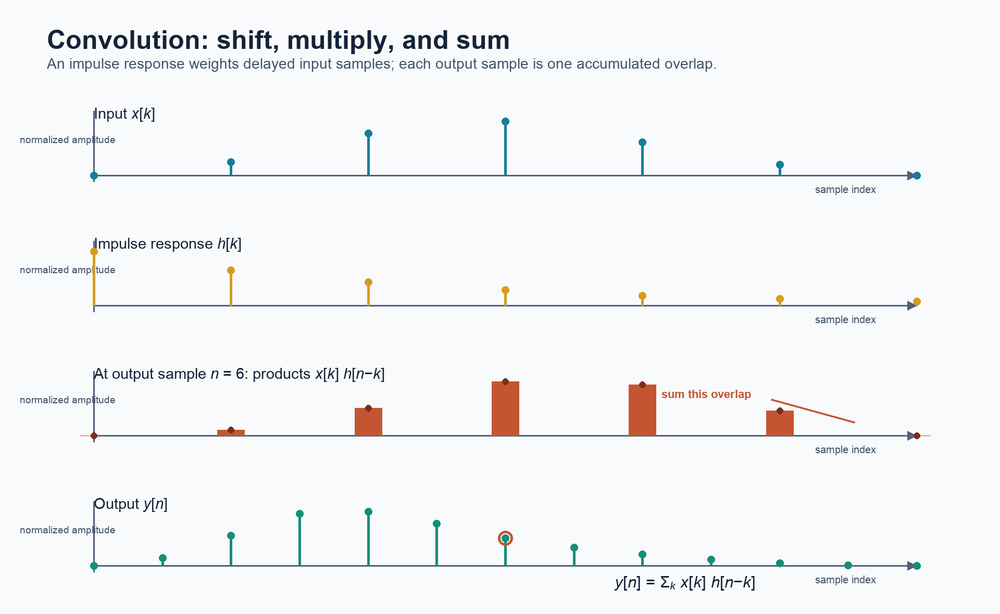

**Figure: Discrete convolution of an input with a synthesized structural impulse response.**

**How to read this figure.** The first two panels show the source and the
decaying impulse response. The third panel freezes one output position,
$n=6$, and displays the pointwise products created by their overlap. Summing
those bars produces the highlighted sample in the final output. Repeating the
same shift-and-sum operation for every $n$ produces the complete wet signal.

The spring tank is a set of lumped mass-spring-damper chains. Its continuous
reference equation is:

$$
\begin{aligned}
\mathbf{M}\ddot{\boldsymbol{x}}(t)
  &+ \mathbf{C}\dot{\boldsymbol{x}}(t)
  + \mathbf{K}\boldsymbol{x}(t) \\
  &= \boldsymbol{e}\,u(t).
\end{aligned}
$$

For $J$ structural degrees of freedom,
$\mathbf{M},\mathbf{C},\mathbf{K}\in\mathbb{R}^{J\times J}$ are the mass,
damping, and stiffness matrices; $\boldsymbol{x}(t),\boldsymbol{e}\in
\mathbb{R}^{J}$ are the displacement and drive-location vectors; and $u(t)$
is the scalar excitation. The matrix $\mathbf{M}$ distributes spring mass to
nodes, $\mathbf{K}$ assembles segment compliance, tension, end constraints,
and optional tank-to-tank coupling, and $\mathbf{C}$ represents loss. verbx
solves the associated generalized eigenproblem

$$
\begin{aligned}
\mathbf{K}\boldsymbol{q}_r
  &= \lambda_r\mathbf{M}\boldsymbol{q}_r,\\
\omega_r &= \sqrt{\lambda_r}.
\end{aligned}
$$

where $\boldsymbol{q}_r$ is mode shape $r$, $\lambda_r$ is its generalized
eigenvalue, and $\omega_r$ is its undamped natural angular frequency in radians
per second. verbx then sums the driven/pickup modal responses with
$T_{60}$-calibrated decay. The
plate path uses the corresponding structured, mass-lumped clamped grid, where

$$
\mathbf{K} = D\mathbf{L}^{\mathsf{T}}\mathbf{L} + T\mathbf{L}
$$

combines thin-plate bending rigidity $D$, the discrete positive Laplacian
$\mathbf{L}$, and optional membrane tension $T$.

```bash
verbx render guitar.wav tank.wav --engine algo --algo-model spring \
  --electromechanical-solver modal-fe --spring-count 3 \
  --spring-fe-nodes 36 --spring-fe-modes 48 --spring-fe-coupling 0.14

verbx render vocal.wav plate.wav --engine algo --algo-model plate \
  --electromechanical-solver modal-fe --plate-fe-nx 20 --plate-fe-ny 14 \
  --plate-fe-modes 72 --plate-pickup-x 0.18 --plate-pickup-y 0.76
```

The full treatment, including the coupled tank and clamped-grid figures,
parameter mapping, damping law, and numerical bounds, is in the
[Modal Finite-Element Solver](#modal-finite-element-solver) section below.

`v0.9.0` also introduces a physically grounded `ism-fdn` path: a bounded
image-source early field from explicit room geometry and material absorption,
followed by the established FDN late field.

```bash
verbx render voice.wav roomed.wav --engine ism-fdn --ism-order 3 \
  --er-room-dims-m 6,8,3 --er-source-pos-m 1,2,1.5 \
  --er-listener-pos-m 4,5,1.5 --er-material hall --rt60 1.4
```

The following terminal transcript shows the strict environment check on the
author's Apple Silicon development machine. It is useful before a long render
because it verifies the runtime, audio dependencies, CLI entry point,
accelerator discovery, and writable output path in one operation.


**Figure: A successful `verbx doctor --strict` run on the author's Apple Silicon workstation, with all five checks passing.**

The next transcript shows a non-destructive render rehearsal. `--dry-run`
resolves the preset, computes the effective decay and mix, estimates duration
and file size, and writes no audio. This is the preferred way to inspect a
potentially expensive or unexpectedly long operation before committing storage
and processing time.


**Figure: A dry-run render using `warm_small_hall`, including resolved FDN settings, estimated output duration, and estimated file size.**

For AI workflows, `verbx` is also a strong command-line tool for deterministic audio data augmentation and voice-model robustness testing. You can generate reproducible reverberant variants for ASR/TTS/speaker pipelines, keep split-safe metadata, and batch large render sets from manifests.

```bash
# A room that no physical building has ever had. RT60 = 120 seconds.
verbx render voice.wav out.wav \
  --engine algo --rt60 120 --wet 0.99 --dry 0.01 \
  --fdn-lines 32 --fdn-matrix tv_unitary --fdn-tv-rate-hz 0.30 \
  --shimmer --shimmer-semitones 12 --shimmer-mix 0.45 \
  --bloom 2.8 --tilt 2.0
```

## Two Production Paths: Command Line and DAW Plug-ins

verbx is **primarily intended for command-line use**. The CLI is the reference
workflow and exposes the broadest processing, analysis, automation, batch,
multichannel, impulse-response, dereverberation, reporting, and quality-control
surface. It is designed for work in which an input file, a fully specified
operation, and a verifiable output artifact are the natural units of thought.

AU, AUv3, and VST3 plug-in versions are also provided for music-production work
inside a digital audio workstation (DAW). The plug-ins are not command lines
placed behind knobs, and the CLI is not a DAW running in a terminal. They are
different approaches to the same family of reverb problems. The CLI emphasizes
explicit configuration and reproducible rendering; the plug-ins emphasize
immediate listening, host automation, low-latency interaction, and session
recall. A project can use either path alone, but many serious productions benefit
from using both at different stages.

### The CLI path: files, experiments, and reproducible renders

Choose the CLI when the task begins with files or data and should end with files,
reports, or a repeatable command. A CLI render names its input, output, engine,
parameters, channel layout, numerical format, and optional analysis products.
That explicitness is valuable when a result must be recreated next week, on
another workstation, across hundreds of files, or as part of a research or
machine-learning pipeline.

The CLI is the strongest path for:

- offline rendering where sound quality and complete tail calculation matter
  more than meeting a realtime callback deadline;
- very long or extreme decays whose output duration should be estimated,
  validated, reported, and written deliberately;
- deterministic batch jobs driven by shell scripts, manifests, seeds, and
  version-controlled configuration;
- impulse-response synthesis, inspection, conversion, morphing, matrix routing,
  and convolution across unusual input and output layouts;
- dereverberation, room analysis, loudness measurement, quality control, and
  machine-readable JSON or CSV evidence;
- corpus augmentation for Audio AI, where split integrity, labels, provenance,
  and exact repeatability matter;
- rendering wet stems, surround beds, Ambisonic intermediates, and other assets
  that will be imported into a DAW or renderer later;
- testing parameter sweeps and controlled comparisons without relying on manual
  knob positions or host-specific session state.

The appropriate CLI habit is **specify, inspect, render, verify**. Begin by
making the operation explicit. Use a preset only as a starting point, then record
important overrides in the command, config file, or manifest. Inspect the
resolved configuration and estimated duration when the output could be large.
Render to a new path rather than destructively replacing the source. Finally,
analyze the result and retain the command or report alongside the audio.

For example, an offline wet stem can be rendered and documented as one operation:

```bash
verbx render vocal.wav vocal_hall_wet.wav \
  --engine algo --rt60 3.4 --predelay 32 \
  --wet 1.0 --dry 0.0 --output-subtype FLOAT \
  --json-out vocal_hall_wet.analysis.json
```

The output is an asset rather than a live processor. It can be auditioned,
archived, delivered, imported into a DAW, or compared with another render. If a
parameter sweep is required, commands can generate ten controlled variants
without asking an engineer to move the same plug-in knob ten times and remember
the exact states.

CLI automation is similarly explicit. It can be expressed through arguments,
automation files, manifests, or generated commands. That is ideal for repeatable
experiments and long-form transformations. It is less immediate than drawing a
curve against a musical timeline, but it is easier to audit and reproduce.

The CLI's `realtime` command is useful for device testing, low-latency audition,
and live command-line workflows. It does not change the product's primary
offline and artifact-oriented design. A terminal realtime stream does not know
the DAW's bar grid, track routing, region edits, plug-in delay compensation,
offline-bounce policy, or project automation. When those relationships are the
center of the work, use the plug-in.

### The plug-in path: performance, automation, and mix context

Choose AU, AUv3, or VST3 when the reverb must live inside a musical session and
respond while the arrangement plays. The host supplies audio buses, project
sample rate, block size, transport, tempo, automation, preset and state recall,
latency compensation, and final bounce behavior. The plug-in processes the
buffers it receives and returns audio before each callback deadline.

The plug-in path is strongest for:

- placing a reverb directly on a track, auxiliary return, subgroup, object, or
  spatial bus while hearing the complete arrangement;
- adjusting decay, pre-delay, damping, diffusion, width, mix, Freeze, Reverse,
  and quality controls by ear without rendering a new file after every change;
- writing and editing host automation against bars, beats, regions, markers,
  picture, or performance gestures;
- changing space at a section boundary, throwing selected words into a tail, or
  freezing one harmony beneath the next;
- saving processor state inside the DAW session so collaborators can reopen the
  musical context rather than reconstruct a shell command;
- using the realtime spectrum analyzer and effective-decay display while
  balancing sources and returns;
- performing the reverb from the full-screen Perform and Expert pages with
  controls designed for continuous musical interaction.

The appropriate plug-in habit is **insert, route, automate, audition, commit**.
First decide whether the processor belongs on an insert or a send. An insert
changes one track's complete signal path and may use both dry and wet output. A
send normally feeds a 100-percent-wet plug-in return that several tracks can
share. Next establish safe gain staging and a useful static sound. Only then add
automation, because automation cannot rescue a return whose basic density,
bandwidth, or routing is wrong. Audition the result in context and through the
required fold-down or binaural path. Commit it through the DAW's freeze, bounce,
or export system when the mix is approved.

The DAW, not the plug-in, owns the output audio file. Project sample rate and
callback format are host decisions; final PCM subtype, metadata, channel export,
and loudness delivery are normally selected in the DAW's bounce dialog. The
plug-in may oversample its wet path internally, but it cannot turn a 48 kHz host
session into a 192 kHz delivered master by itself. Likewise, an analyzer display
inside the editor is immediate feedback, not a substitute for a retained CLI
analysis report when formal evidence is required.

Realtime processing also imposes constraints that offline rendering does not.
The audio callback cannot wait for a long analysis, allocate unpredictably, open
files casually, or calculate an unbounded future tail. A plug-in must honor host
buffer deadlines and report latency correctly. The CLI can spend more than one
second processing one second of audio when a costly algorithm or large
convolution matrix justifies it. The plug-in must either finish on time, use a
prepared lower-cost structure, or expose a quality choice with a clear latency
and CPU tradeoff.

### The surfaces are related, not identical

Do not assume one-to-one parameter or preset parity between the CLI and plug-in.
The CLI includes commands and options that do not belong on a realtime effect
panel, including file-format selection, batch manifests, report destinations,
failure artifacts, offline dereverberation, IR utilities, and corpus tooling.
The plug-in includes host-facing state, automation, bus negotiation, callback
quality modes, and visual interaction that do not have the same meaning in an
offline command.

Even controls with similar names can operate inside different constraints. The
plug-in's RT60 range is `0.01` to `360` seconds and is designed for logarithmic
coarse and fine adjustment during playback. The CLI can address longer bounded
renders and can fail fast when a requested tail would create a surprising output
duration. Plug-in Reverse is a realtime reverse-style swell; an offline reverse
workflow can use future samples and render noncausal structures unavailable to a
live callback. Freeze inside a running host sustains prepared network state;
offline processing can inspect, extend, or transform segments without a realtime
deadline.

The safest interchange is therefore through documented audio and impulse-response
assets, not an assumption that every preset file is portable. If the CLI creates
an IR, wet stem, surround bed, or analyzed variant, import that asset into the
DAW with its report. If the plug-in creates an important automated effect, print
the return and analyze the resulting audio with the CLI. When recreating a sound
across paths, transfer the audible design goals and shared parameter values, then
verify by listening and analysis rather than assuming numerical identity.

### Productive hybrid workflows

Several combined workflows are especially effective:

1. **Design offline, mix interactively.** Use the CLI to synthesize or curate an
   impulse response, validate it, and save provenance. Load or route the resulting
   asset in the DAW, then automate level and musical placement with the plug-in or
   host tools.
2. **Audition interactively, render systematically.** Find the decay family,
   damping, width, and source treatment in the plug-in. Translate the approved
   design into explicit CLI renders for batches, alternate versions, datasets, or
   unusually long tails, verifying differences rather than claiming preset parity.
3. **Render wet stems, retain mix freedom.** Create 100-percent-wet mono, stereo,
   surround, or Ambisonic stems with the CLI. Import them into the DAW so the mix
   can edit, automate, compress, and spatialize the return independently of the dry
   source.
4. **Perform first, document afterward.** Record or bounce plug-in automation in
   the DAW, then run `verbx analyze` on the printed return or final mix to produce
   retained decay, loudness, peak, spectral, and room evidence.
5. **Use the DAW for form and the CLI for scale.** Let the DAW determine which
   phrases, stems, and transitions excite a space. Export those selections, run
   large matrix, extreme-tail, or corpus-scale operations through the CLI, and
   return the rendered assets to the musical timeline.

### Choosing quickly

Use the **CLI** when you need repeatability, batch scale, complete files, unusual
formats, reports, analysis, dereverberation, IR engineering, extreme offline
quality, or a command that another person or machine can rerun. Use the **plug-in**
when you need to hear the effect against the arrangement, perform controls,
automate against the DAW timeline, share a live return among tracks, or preserve
state inside a music-production session. Use **both** when the project needs the
CLI's rigor and scale together with the DAW's musical context and immediacy.

Neither path is a lesser edition of the other. The CLI is the primary verbx
interface because it can express the complete processing system explicitly. The
plug-ins are purpose-built production instruments because a DAW requires a
different contract: bounded realtime work, host-owned routing, automatable
parameters, visual feedback, and reliable session state.

## AUv3 / VST3 Plug-in Track


The image above is the approved `1920x1080` visual direction for the full-screen
spatial console.

The capture below is the currently compiled JUCE editor. It now implements the
same spatial-console composition: loudness bank, DXF geometry theater, image
and ray-model panels, nine live parameter cards, horizontal decay analyzer,
quality/mode controls, and lower expert sections. The host has muted its input,
so the live analyzer trace correctly rests at its floor.


The compiled **Expert** page mirrors all nine continuous parameters as both
rotary controls and high-resolution faders, keeps the realtime spectrum in
view, and adds twenty native selector buttons. Its five macro banks write the
same host-automatable state for quality, width, logarithmic decay, dry/wet
routing, and paired damping/diffusion character settings.


The first native plug-in foundation is implemented under
[`native/verbx_plugin`](native/verbx_plugin/README.md):

- C++17/JUCE host shell for AU, AUv3, VST3, and standalone targets
- shared C11 parameter manifest and realtime processing boundary
- logarithmic RT60 mapping from `0.01s` to `360s` with coarse and fine controls
- explicit Freeze and Reverse parameters
- real allocation-free wet-path oversampling for Host, 2x, 4x, and Target
  192 kHz quality modes, with a 32-bit-float callback contract
- cached lock-free parameter reads on the audio callback
- overlaid realtime post-DSP spectrum analyzer with an 8192-point Hann FFT,
  logarithmic frequency grid, smoothed response, and peak trace
- allocation-free mono/stereo Schroeder realtime core with pre-delay, room
  scaling, RT60, damping, diffusion, width, wet/dry, Freeze, and a zero-lookahead
  reverse-style swell
- 20 ms realtime parameter smoothing for host automation without zipper noise
- responsive Perform/Expert pages with 18 linked continuous controls and 20
  selector buttons; no Expert control is decorative or stored outside host state
- full-screen 16:9 spatial-console editor with the complete initial
  12-parameter control surface and effective-RT60 readout

Target mode chooses the smallest integer factor that reaches or exceeds 192
kHz without downsampling. It therefore runs at 4x/192 kHz in a 48 kHz project,
2x/192 kHz at 96 kHz, and 5x/220.5 kHz at 44.1 kHz. The status strip shows the
actual host rate, internal rate, factor, block size, and reported latency.
Quality changes rebuild the prepared wet-path state off the audio callback.

The complete installer builds and installs the CLI, native executable, man
pages, runtime extras, VST3, Audio Unit on macOS, and the standalone app:

```bash
./install.sh
```

If JUCE is not already available, the installer downloads the pinned JUCE
`8.0.6` source release into `build/deps/JUCE`. For an offline installation or
an existing checkout, use:

```bash
./install.sh --juce-source /path/to/JUCE
```

The default macOS plug-in destinations are
`~/Library/Audio/Plug-Ins/Components/VERBX.component` and
`~/Library/Audio/Plug-Ins/VST3/VERBX.vst3`; the standalone app is installed as
`~/Applications/VERBX.app`. That app contains and registers the true AUv3
extension at `Contents/PlugIns/VERBX.appex`. Linux installs VST3 to `~/.vst3` and the standalone
binary to `~/.local/bin/verbx-plugin`. Restart or rescan the audio host after
installation. Run `./install.sh --help` for component skips, custom destination
directories, offline operation, and build controls.

Repository builds do not require JUCE unless the plug-in target is enabled
manually:

```bash
# Verify the guarded scaffold without JUCE.
cmake -S native/verbx_plugin -B build/native/verbx_plugin

# Configure the real AU/AUv3/VST3/Standalone targets when JUCE is installed.
cmake -S native/verbx_plugin -B build/native/verbx_plugin-juce \
  -DVERBX_ENABLE_JUCE_PLUGIN=ON
cmake --build build/native/verbx_plugin-juce --config Release
```

Use `-DVERBX_JUCE_SOURCE_DIR=/path/to/JUCE` when building from a JUCE source
checkout instead of an installed CMake package.

---

## Instant Sonic Gratification

If you want immediate results with minimal decision-making, run this:

```bash
git clone https://github.com/TheColby/verbx.git && cd verbx && \
./install.sh --prefix "$HOME/.local" && \
verbx render ../in.wav out.wav --engine algo --rt60 120 --wet 0.99 --dry 0.01
```

That gives you an absurd long-tail render immediately. If `verbx` is not on PATH after install, run:

```bash
export PATH="$HOME/.local/bin:$PATH"
```

## Quick Start

If `verbx` is already installed, this is the fastest way to start:

```bash
verbx render input.wav output.wav --engine algo --rt60 2.5 --wet 0.3 --dry 0.7
```

This applies a natural-sounding 2.5-second algorithmic reverb. Output is written to `output.wav`, with analysis at `output.wav.analysis.json`.

Need a live preview instead of an offline bounce?

```bash
verbx realtime --engine algo --input-device "Built-in Microphone" \
  --output-device "Headphones" --rt60 20 --freeze --shimmer \
  --fdn-matrix tv-unitary --fdn-tv-rate-hz 0.35 --fdn-tv-depth 0.12 \
  --lowcut 120 --highcut 9000 --tilt 1.5 --duration 10
```

Initial realtime mode runs either direct convolution from `--ir` or an
algorithmic proxy IR rendered once and monitored through the streaming
convolver. It is meant for auditioning spaces and tails, not yet for the full
automation/batch feature set. Realtime `--freeze` is an honest approximation:
it renders a long self-sustaining proxy tail for live auditioning rather than
reusing the offline segment-freeze operator.

Need live cleanup instead of added space?

```bash
verbx realtime --live-mode dereverb \
  --input-device "Built-in Microphone" \
  --output-device "Headphones" \
  --sample-rate 48000 --block-size 384 \
  --dereverb-mode wiener --dereverb-strength 0.85 \
  --dereverb-window-ms 12 --dereverb-hop-ms 4 --dereverb-tail-ms 90 \
  --dereverb-pre-emphasis 0.2 --dereverb-max-atten-db 18 \
  --duration 10
```

If you need to install first on macOS:

```bash
brew tap thecolby/verbx
brew install thecolby/verbx/verbx
verbx quickstart
```

Need starting settings for your file?

```bash
verbx suggest input.wav
verbx quickstart
```

Need the long-form manual?

```bash
python3 scripts_generate_docs_pdf.py
```

That writes [`docs/USERGUIDE.md`](docs/USERGUIDE.md) and `USERGUIDE.pdf`, combining this README with the user-facing guides and tip-heavy docs in `docs/`.

### Five Runnable Examples

```bash
# 1. Natural room – voice or piano in a medium hall
verbx render in.wav hall.wav --engine algo --rt60 2.0 --wet 0.25 --dry 0.8 --pre-delay-ms 18

# 2. Convolution with a real IR – character follows the space you measured
verbx render in.wav conv.wav --engine conv --ir hall_ir.wav --partition-size 16384

# 3. Shimmer pad – pitch-shifted ambient wash, good for synths
verbx render in.wav shimmer.wav --engine algo --rt60 12 --wet 0.85 \
  --shimmer --shimmer-semitones 12 --shimmer-mix 0.35 --bloom 2.0

# 4. Broadcast loudness target – –23 LUFS, –1 dBTP true peak
verbx render in.wav broadcast.wav --target-lufs -23 --true-peak --target-peak-dbfs -1

# 5. Extreme ambient – 90-second tail, slow evolution, near-frozen
verbx render in.wav ambient.wav --engine algo --rt60 90 --wet 0.92 \
  --fdn-matrix tv_unitary --fdn-tv-rate-hz 0.08 --bloom 2.0 --tilt 0.8

# 6. Comb-cloud texture – dense metallic haze before the late field
verbx render in.wav combcloud.wav --engine algo --rt60 6 --wet 0.78 --dry 0.35 \
  --comb-cloud --comb-cloud-count 32 --comb-cloud-feedback 0.42 --comb-cloud-mix 0.30 \
  --fdn-lines 12 --fdn-matrix hadamard
```

```bash
# Output-definition presets (default is HD)
verbx render in.wav out_hd.wav --engine conv --ir hall_ir.wav
verbx render in.wav out_md.wav --engine conv --ir hall_ir.wav --quality-preset md
verbx render in.wav out_sd.wav --engine conv --ir hall_ir.wav --quality-preset sd
```

## Full Installation Instructions

**With uv (fastest):**

```bash
git clone https://github.com/TheColby/verbx.git && cd verbx
uv sync && uv run verbx --help
```

For realtime audio device support:

```bash
uv sync --extra realtime
```

**With pip + venv:**

```bash
python3 -m venv .venv && source .venv/bin/activate
pip install -e . && verbx --help
```

For realtime audio device support:

```bash
pip install -e ".[realtime]"
```

**Complete installation, including native CLI and plug-ins:**

```bash
./install.sh
verbx --help && man verbx-render
man verbx-dereverb
```

This installs the Python package with realtime and SOFA runtime extras by
default. Use `--minimal-python`, `--skip-native`, `--skip-plugins`, `--no-man`,
or custom `--au-dir`, `--vst3-dir`, and `--app-dir` destinations when a smaller
or system-managed installation is preferable. Inspect the complete plan without
changing the machine using `./install.sh --dry-run`.

If VERBX does not appear after fully quitting and reopening the DAW, force a
signed reinstall and Audio Unit cache rebuild on macOS:

```bash
./install.sh --reset-plugin-cache
```

VERBX appears under the plug-in vendor **Colby Leider**. Logic and GarageBand
can use the AUv2 component or the AUv3 app extension; VST3 hosts use
`VERBX.vst3`. The editor opens at a host-safe 1280x720 and remains fully
resizable down to 800x450 while preserving the full console layout. The
installer now signs the nested AUv3 extension before its
containing app, registers it with PlugInKit, and seals
and strictly verifies every installed macOS bundle, touches the plug-in paths,
and restarts the Audio Component Registrar. The explicit cache-reset option
backs up existing Apple Audio Unit cache files beneath
`~/.local/share/verbx/cache-backups/` before clearing them. DAW-specific VST3
caches may still require the host's “rescan all plug-ins” command.

An ad-hoc-signed AUv3 can validate but still fail when Logic launches its app
extension. To avoid shadowing the reliable AUv2 component, `./install.sh`
installs but unregisters ad-hoc AUv3 hosting by default. Use an Apple signing
identity for production AUv3 hosting:

```bash
./install.sh --codesign-identity "Apple Development: Your Name (TEAMID)"
```

`--enable-adhoc-auv3` is available only for local extension debugging.

macOS plug-ins build as universal `arm64+x86_64` binaries by default so they
remain visible to native Apple Silicon DAWs and hosts running under Rosetta.
The default deployment floor is macOS 12. Override these release defaults only
when intentionally producing a narrower local build:

```bash
./install.sh --macos-architectures arm64 --macos-deployment-target 14.0
```

**With Homebrew (macOS):**

```bash
brew tap thecolby/verbx
brew install thecolby/verbx/verbx
verbx version
```

Official tap repository: `TheColby/homebrew-verbx`.

For local maintainer testing, you can also install from the in-repo formula:

```bash
brew install --build-from-source ./packaging/homebrew/verbx.rb
```

**Requirements:** Python 3.11+, `libsndfile` on system path. Optional: `numba` (faster algorithmic path), `cupy` (CUDA convolution), `h5py` (SOFA import/extract via `verbx ir sofa-*`), `sounddevice` (realtime input/output via `verbx realtime`).

Homebrew maintainer details: [`docs/HOMEBREW.md`](docs/HOMEBREW.md)

If `verbx` is not found after install, add `~/.local/bin` to your PATH:

```bash
export PATH="$HOME/.local/bin:$PATH"   # add to ~/.zshrc or ~/.bashrc
```

## Python API (Research Workflows)

Use `verbx` as a library when you need notebook/pipeline integration:

```python
from verbx.api import analyze_file, generate_ir, render_file
from verbx.config import RenderConfig
from verbx.ir import IRGenConfig

report = render_file("dry.wav", "wet.wav", RenderConfig(engine="algo", rt60=2.5, wet=0.7))
ir_audio, ir_sr, ir_meta = generate_ir(IRGenConfig(mode="fdn", duration=3.0, sr=48000))
metrics = analyze_file("wet.wav", include_loudness=True)
```

## Audio Examples

Rendered examples are included in [`examples/audio/`](examples/audio/). The pack is now delivered at 48 kHz, PCM24. Most examples are stereo; the utility click and short hybrid IR files are mono. The shimmer-heavy examples were re-rendered at this higher rate specifically to remove the grit from the older 24 kHz / PCM16 pack.

GitHub repository README pages do not provide reliable inline audio controls. The `Play`
links below open each asset directly in the browser's native media player with one click.

### Utility and verification files

| File | Play | Description |
|------|------|-------------|
| [`dry_click.wav`](examples/audio/dry_click.wav) | [Play](https://cdn.jsdelivr.net/gh/TheColby/verbx@main/examples/audio/dry_click.wav) | One-shot dry click reference for sanity checks |
| [`dry_click_reverbed.wav`](examples/audio/dry_click_reverbed.wav) | [Play](https://cdn.jsdelivr.net/gh/TheColby/verbx@main/examples/audio/dry_click_reverbed.wav) | Reverberated click for immediate A/B verification |
| [`hybrid_ir_short.wav`](examples/audio/hybrid_ir_short.wav) | [Play](https://cdn.jsdelivr.net/gh/TheColby/verbx@main/examples/audio/hybrid_ir_short.wav) | Short hybrid IR asset used in quick convolution demos |

### Realistic dry/wet example pairs

| File | Play | Description |
|------|------|-------------|
| [`realistic_speech_dry.wav`](examples/audio/realistic_speech_dry.wav) | [Play](https://cdn.jsdelivr.net/gh/TheColby/verbx@main/examples/audio/realistic_speech_dry.wav) | Dry speech source used for room and plate examples |
| [`realistic_speech_room.wav`](examples/audio/realistic_speech_room.wav) | [Play](https://cdn.jsdelivr.net/gh/TheColby/verbx@main/examples/audio/realistic_speech_room.wav) | Natural speech room render |
| [`realistic_music_dry.wav`](examples/audio/realistic_music_dry.wav) | [Play](https://cdn.jsdelivr.net/gh/TheColby/verbx@main/examples/audio/realistic_music_dry.wav) | Dry music source used for ambient and shimmer examples |
| [`realistic_music_hall.wav`](examples/audio/realistic_music_hall.wav) | [Play](https://cdn.jsdelivr.net/gh/TheColby/verbx@main/examples/audio/realistic_music_hall.wav) | Natural concert-hall style music render, re-tuned for a cleaner less congested tail |
| [`realistic_drums_dry.wav`](examples/audio/realistic_drums_dry.wav) | [Play](https://cdn.jsdelivr.net/gh/TheColby/verbx@main/examples/audio/realistic_drums_dry.wav) | Dry drum source used for room and cathedral examples |
| [`realistic_drums_room.wav`](examples/audio/realistic_drums_room.wav) | [Play](https://cdn.jsdelivr.net/gh/TheColby/verbx@main/examples/audio/realistic_drums_room.wav) | Natural drum room render |

### Extreme range demos

| File | Play | Description | Key settings |
|------|------|-------------|--------------|
| [`extreme_cathedral_drums.wav`](examples/audio/extreme_cathedral_drums.wav) | [Play](https://cdn.jsdelivr.net/gh/TheColby/verbx@main/examples/audio/extreme_cathedral_drums.wav) | Drums → 8s Hadamard FDN cathedral | `--rt60 8.0 --fdn-lines 16 --fdn-matrix hadamard` |
| [`extreme_shimmer_music.wav`](examples/audio/extreme_shimmer_music.wav) | [Play](https://cdn.jsdelivr.net/gh/TheColby/verbx@main/examples/audio/extreme_shimmer_music.wav) | Music → 6s reverb with octave shimmer | `--shimmer --shimmer-semitones 12 --shimmer-feedback 0.65` |
| [`extreme_plate_speech.wav`](examples/audio/extreme_plate_speech.wav) | [Play](https://cdn.jsdelivr.net/gh/TheColby/verbx@main/examples/audio/extreme_plate_speech.wav) | Speech → circulant FDN plate simulation | `--rt60 1.8 --fdn-matrix circulant --lowcut 200 --highcut 6000` |
| [`extreme_frozen_music.wav`](examples/audio/extreme_frozen_music.wav) | [Play](https://cdn.jsdelivr.net/gh/TheColby/verbx@main/examples/audio/extreme_frozen_music.wav) | Music → 30s near-infinite tail (32-line FDN) | `--rt60 30.0 --fdn-lines 32 --wet 0.95` |

### Experimental music tradition demos

Eight examples drawn from the experimental and avant-garde music tradition, each isolating a
different reverb behavior or aesthetic.

| File | Play | Inspiration | What to listen for |
|------|------|-------------|-------------------|
| [`lucier_sitting_room.wav`](examples/audio/lucier_sitting_room.wav) | [Play](https://cdn.jsdelivr.net/gh/TheColby/verbx@main/examples/audio/lucier_sitting_room.wav) | Alvin Lucier – *I Am Sitting in a Room* (1969) | Speech run through the room 7× until only resonant frequencies survive |
| [`eno_discreet_music.wav`](examples/audio/eno_discreet_music.wav) | [Play](https://cdn.jsdelivr.net/gh/TheColby/verbx@main/examples/audio/eno_discreet_music.wav) | Brian Eno – *Discreet Music* (1975) / Ambient series | 12s tail swallowing the source into a continuous wash |
| [`oliveros_deep_listening.wav`](examples/audio/oliveros_deep_listening.wav) | [Play](https://cdn.jsdelivr.net/gh/TheColby/verbx@main/examples/audio/oliveros_deep_listening.wav) | Pauline Oliveros – *Deep Listening* (1989) | 18s cave-scale resonance, very low damping, 32-line FDN |
| [`fripp_frippertronics.wav`](examples/audio/fripp_frippertronics.wav) | [Play](https://cdn.jsdelivr.net/gh/TheColby/verbx@main/examples/audio/fripp_frippertronics.wav) | Robert Fripp – Frippertronics tape-loop | Octave shimmer with 0.78 feedback accumulating over 8s |
| [`mbv_shoegaze.wav`](examples/audio/mbv_shoegaze.wav) | [Play](https://cdn.jsdelivr.net/gh/TheColby/verbx@main/examples/audio/mbv_shoegaze.wav) | My Bloody Valentine – *Loveless* (1991) wall of sound | Dense shimmer wash (mix 0.55) through circulant FDN |
| [`reich_phase_drums.wav`](examples/audio/reich_phase_drums.wav) | [Play](https://cdn.jsdelivr.net/gh/TheColby/verbx@main/examples/audio/reich_phase_drums.wav) | Steve Reich – phase minimalism | Tight 0.7s room on percussion, circulant diffusion |
| [`radigue_drone.wav`](examples/audio/radigue_drone.wav) | [Play](https://cdn.jsdelivr.net/gh/TheColby/verbx@main/examples/audio/radigue_drone.wav) | Eliane Radigue – *ADNOS* (1973–1974) / drone electronics | 45s near-infinite sustain, 32-line Hadamard, wet 0.97 |
| [`feldman_sparse_room.wav`](examples/audio/feldman_sparse_room.wav) | [Play](https://cdn.jsdelivr.net/gh/TheColby/verbx@main/examples/audio/feldman_sparse_room.wav) | Morton Feldman – late period | 3.8s room, low wet (0.52), allpass diffusion, contemplative space |

Dry source files are in the same directory. See [`examples/audio/README.md`](examples/audio/README.md) for the full render commands.

---

## Public Alpha Launch Notes

Current public alpha release: **v0.9.0**.

Current stabilization status:

- Python `0.7.x` render/realtime behavior is stabilized for the current cycle:
  realtime device failures are clearer, render long-tail flows have fail-fast
  safeguards or early status output, and render/realtime/dereverb emit
  machine-readable reports where applicable.
- CLI/docs/test consolidation is complete for Weeks 1–3 of the short-horizon
  plan: shared validators are extracted, generated docs/PDF are in sync, and
  focused regression coverage covers realtime, dereverb, limiter, and long-tail
  behaviors.
- Current native-track decision: `v0.8` is a hybrid transition release, with
  `verbx-c` shipped as an opt-in native render/doctor binary while the Python
  CLI remains the public alpha default. See
  [`docs/ROADMAP_NEXT_4_WEEKS.md`](docs/ROADMAP_NEXT_4_WEEKS.md).

- `verbx` is currently research-grade software (public alpha), not production-certified.
- Confirm your environment with `verbx quickstart --verify --strict` and `verbx doctor`.
- Verify one algorithmic render and one convolution render before batch usage.
- For live monitoring, verify `verbx realtime --list-devices` before relying on realtime auditioning.
- For reproducible reports and bug submissions, attach `--repro-bundle` outputs and `verbx doctor --json-out doctor.json`.
- For demo-ready outputs, keep `--true-peak --target-peak-dbfs -1` enabled when files will be transcoded.
- Public alpha scope, known limitations, and support paths:
  [`docs/PUBLIC_ALPHA_NOTES.md`](docs/PUBLIC_ALPHA_NOTES.md)
- Launch-week pinned demo commands and expected SHA256 outputs:
  [`docs/LAUNCH_WEEK_DEMO_PINS.md`](docs/LAUNCH_WEEK_DEMO_PINS.md)
- Canonical launch-example parity check:
  `python scripts/check_launch_examples.py --check`
- PyPI publish auth setup for maintainers:
  [`docs/PYPI_PUBLISH_SETUP.md`](docs/PYPI_PUBLISH_SETUP.md)

---

## v0.8 Native Track

`v0.8` is the planned native C executable line. The released tool remains the
Python implementation in `v0.7.x`, but the native rewrite has now started with
an executable scaffold under [`native/verbx_c/README.md`](native/verbx_c/README.md).
The live feature/gap table is tracked in
[`docs/NATIVE_PARITY.md`](docs/NATIVE_PARITY.md).

Chosen `v0.8` release shape: **hybrid wrapper phase before full replacement**.
`verbx-c` is the opt-in native executable for deterministic offline render,
doctor diagnostics, and machine-readable native support bundles. The Python
`verbx` CLI remains the default for realtime, dereverb, convolution, IR tools,
batch workflows, immersive utilities, and the full FDN feature surface until
native parity is proven by the checked-in contract fixtures.

Current native status:

- standalone `verbx-c` executable target
- portable C11 build path via `scripts/build_verbx_c.sh`
- implemented commands: `help`, `version`, `doctor`, `render`
- mono/stereo WAV input: PCM16/24/32 and float32/float64
- mono/stereo WAV output: `pcm16`, `float32`, `float64`
- deterministic offline render lifecycle in C: read -> process -> tail-finalize -> write
- explicit native process/error contract surfaced in `verbx-c doctor`
- native tail-stop metric selection: `--tail-metric peak|rms`
- native peak-safe output: `--peak-safe --peak-ceiling-db DB`
- native JSON reports: `doctor --json-out` and `render --json-out`
- foundational native algorithmic reverb core with float64 internal processing
- reusable `verbx_c_core` library with a tested plug-in parameter manifest
- realtime context API with persistent mono/stereo reverb state, quality-target
  status, zero-latency reporting, Freeze, and reverse-style swell behavior
- guarded C++/JUCE AU, AUv3, VST3, and standalone shell with the complete
  initial control dock and realtime spectrum overlay
- plug-in RT60 coarse/fine mapping and native render floor aligned at `0.01s`

`v0.8` in scope:

- `verbx-c doctor` and `verbx-c render`
- deterministic mono/stereo WAV offline render
- `pcm16`, `float32`, and `float64` output
- render/doctor JSON reports for support bundles
- parity comparison against `tests/fixtures/native_render_parity_contract.json`

Deferred beyond the first `v0.8` slice:

- replacing Python `verbx` as the default command
- full native realtime reverb DSP and device/DAW production validation
- convolution, dereverb, IR synthesis/morphing, batch, immersive, and AI helpers
- full Python FDN parity, automation lanes, shimmer/freeze/repeat, and broad preset coverage

Example native smoke test:

```bash
./scripts/build_verbx_c.sh --doctor
scripts/install_verbx_c.sh --prefix "$HOME/.local" --doctor
./build/native/verbx_c/verbx-c render in.wav out.wav \
  --rt60 3.5 \
  --peak-safe \
  --out-format float32 \
  --json-out native-render.json
```

---

## Experimental DXF Room Tracing

`verbx ir trace` is the first bounded physical-acoustics prototype: it reads a
simple room-like DXF outline, generates a stereo IR, and writes a
`trace-report-v1` support bundle.

```bash
verbx ir trace room.dxf room_ir.wav \
  --source 2,3,1.5 \
  --listener 6,4,1.5 \
  --height 3 \
  --material studio \
  --rays 50000 \
  --length 4 \
  --target-sr 48000 \
  --json-out room_trace.json

verbx render dry.wav in_room.wav --engine conv --ir room_ir.wav
```

This MVP supports ASCII DXF `LINE`/`LWPOLYLINE` 2D room outlines and derives an
axis-aligned room box with direct path, first-order reflections, and a
stochastic late tail. `--material` now validates against octave-band material
profiles such as `studio`, `drywall`, `glass`, `concrete`, `carpet`,
`acoustic-panel`, and `diffuser`; `trace-report-v1` records those absorption
bands plus scattering metadata. See [`docs/DXF_TRACE_MVP.md`](docs/DXF_TRACE_MVP.md).

---

## Announcement Channels

- Release announcements: [github.com/TheColby/verbx/releases](https://github.com/TheColby/verbx/releases)
- Homebrew tap updates: [github.com/TheColby/homebrew-verbx](https://github.com/TheColby/homebrew-verbx)
- Homebrew project news/blog: [brew.sh/blog](https://brew.sh/blog/)

Note: Homebrew blog posts cover Homebrew project releases and ecosystem updates; third-party tap formula launches are announced by the tap/project maintainers.

---

## What Is Reverb? (and why verbx sounds different)

Reverb begins when a sound should be over but the room keeps it alive. A violinist
lifts the bow, a singer closes a consonant, or a drummer strikes a snare. The source
may stop almost at once, but the sound does not. It reaches the floor, walls, ceiling,
seats, bodies, scenery, and every irregular surface nearby, then returns by paths of
different lengths. Each trip changes its level, color, direction, and timing.

We hear those returns as part of the place. Even with our eyes closed, they tell us
whether a room feels intimate or immense, bright or muffled, empty or crowded. They
help us judge distance and direction, but they also shape the mood of a performance.
A dry voice can feel private and immediate. The same voice in a long stone decay can
feel ceremonial, remote, or larger than the person who made it.

That is why reverb is more than an effect placed behind a track. It is an acoustic
event, a listening cue, and a musical material. We will begin with what happens between
the source and the ear, listen to examples, and then take apart the DSP that recreates
or deliberately bends that experience. At ordinary settings, verbx can suggest a
recognizable room. At extreme settings, the room gives way to something else: a way of
composing with memory and time.

### The Acoustic Event: Direct Sound, Early Reflections, and Late Field

When sound leaves a source, the first arrival is usually the direct path. It carries the
clearest localization information and the sharpest transient. Reflections arriving in
the next several tens of milliseconds form the early-reflection pattern. Their timing
and direction tell the ear whether boundaries are close or far, symmetrical or
irregular, hard or absorptive. After enough reflections, individual paths become too
dense to follow. The listener hears a late field whose statistical behavior matters
more than the identity of any one echo.

The figure below separates those three time regions before they combine at the ear.
It is deliberately a perceptual diagram rather than a floor plan: the same room can
produce different direct-to-reverberant balances when the source or listener moves.

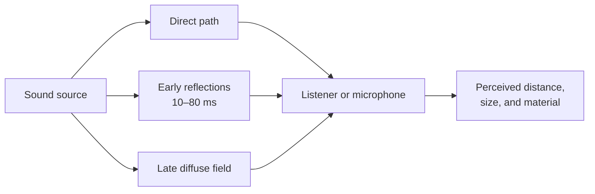
```mermaid
%% verbx-static: docs/assets/reverb_primer/01_acoustic_event_anatomy.png
flowchart LR
    S["Sound source"] --> D["Direct path"]
    S --> E["Early reflections<br/>10–80 ms"]
    S --> L["Late diffuse field"]
    D --> R["Listener or microphone"]
    E --> R
    L --> R
    R --> P["Perceived distance,<br/>size, and material"]
```

**Figure: Anatomy of a reverberant event from source to perception.**

**How to read this figure.** The upper path preserves source identity and position.
The middle path supplies discrete boundary information: a strong floor reflection may
add weight, while a lateral reflection may add width. The lower path carries the room's
integrated memory. A production can alter each path separately with pre-delay,
early/late balance, diffusion, damping, and wet/dry mix. “More reverb” is therefore not
one operation. It may mean more early energy, a longer late decay, a darker tail, a
wider return, or a lower direct-to-reverberant ratio.

The boundaries are not absolute. A reflection at 45 ms may be heard as part of the
source on a legato cello phrase and as a distinct slap after a rimshot. Tempo,
articulation, register, masking, and playback level all change the perceptual threshold.
The useful engineering question is not simply “How many milliseconds is early?” but
“What musical role does this arrival play?”

#### Four Time Scales in One Sound

Reverb becomes easier to design when heard at four nested time scales. The first is the
waveform cycle, measured in fractions of a millisecond; phase and comb filtering live
here. The second is the onset window, roughly the first 80 ms; localization,
pre-delay, and early reflections live here. The third is the phrase window, from a few
hundred milliseconds to several seconds; note overlap, clarity, and cadence live here.
The fourth is formal time, from tens of seconds to minutes; freeze, recirculation, and
extreme RT60 settings live here.

A 20 ms pre-delay is tiny compared with a symphonic phrase but large compared with the
period of a 1 kHz tone. A two-second tail is long compared with a sixteenth note at 120
BPM but short compared with the pause after a cathedral cadence. A 120-second tail no
longer describes an ordinary enclosure: it becomes a layer of form. verbx sounds
different partly because its controls remain meaningful across all four scales.

#### A Staircase That Answers Like a Bird: Chichén Itzá and Archaeoacoustics

At El Castillo, the stepped Pyramid of Kukulcán at Chichén Itzá, a handclap made
in front of the principal stairway does not return as a neutral copy of the clap.
Listeners hear a brief, pitched sweep whose falling contour has often been compared
with the call of the resplendent quetzal, *Pharomachrus mocinno*. The surprising
point is not that a bird naturally sounds reverberant. It is that architecture can
filter and reorganize an impulsive human sound until the returning echo acquires a
birdlike gesture. Garza and colleagues describe this effect as *la cola del quetzal*,
or the quetzal's tail, and note that the bird was culturally important to the Maya
even though it was not native to the northern Yucatán region.

This is a particularly vivid case of **archaeoacoustics**, the interdisciplinary
study of sound and listening in archaeological places. Archaeoacoustics combines
acoustic measurement, signal analysis, architectural reconstruction, archaeology,
anthropology, and the study of performance or ritual. Its question is not only
"What transfer function does this structure have today?" It also asks how audibility,
echo, speech projection, musical instruments, movement, and spatial separation may
have shaped past human activity. A rigorous study must therefore keep three levels
distinct: the physical sound field, its physiological and cognitive perception, and
the cultural meanings that people may have attached to it.

The Chichén Itzá effect begins with a broadband transient. A handclap sends energy
toward a large, approximately periodic array of stone treads and risers. Contributions
scattered from different portions of the staircase travel different path lengths and
return at different times. At some frequencies those contributions reinforce one
another; at others they partially cancel. The stairway consequently behaves less like
a single wall and more like a distributed acoustic filter. The returning energy is
both delayed and spectrally reorganized.

In impulse-response language, the received signal is still

$$
y(t) = x(t) * h(t),
$$

but $h(t)$ is highly structured. It contains a sequence of weighted, frequency-shaped
returns associated with the stair geometry rather than a featureless exponential
tail. If adjacent scattering paths differed by one fixed delay $\Delta\tau$, their
interference would produce an approximate repetition spacing of
$f_r \approx 1/\Delta\tau$. The real staircase presents a changing set of path lengths,
angles, and amplitudes, so its strongest spectral emphasis moves through time. That
motion is heard as a chirp rather than as a stationary comb-filter pitch.

[Declercq, Degrieck, Briers, and Leroy (2004)](https://doi.org/10.1121/1.1764833)
compared diffraction simulations with field recordings and found that the result
depends strongly on the excitation. A mathematical impulse and a real handclap do not
produce identical echoes because their spectra and temporal envelopes differ. Their
model also found that adding the ground reflection changed the calculated effect much
less than changing the incident sound. This source dependence is an important reverb
lesson: a room response may be linear, yet the part of that response we hear most
clearly depends on what the source supplies for the architecture to filter.

The chirp should not be confused with an ordinary diffuse late reverberant field. It
is closer to a colored early reflection or a short sequence of coherent echoes. A
concert hall tail tends toward dense statistical overlap, while the El Castillo
staircase preserves enough periodic structure for the ear to follow a frequency glide.
Both phenomena nevertheless belong in the same conceptual chapter. They demonstrate
that geometry converts propagation time into timbre and that an impulse response is a
record of architecture, source position, receiver position, and boundary structure.

The bird comparison also requires care. The similarity between the chirped echo and a
quetzal call is a perceptual and spectrographic comparison, not proof that the monument
was designed as a mechanical bird voice. The present structure has a construction,
weathering, excavation, and restoration history; modern listeners and handclaps are
not direct recordings of ancient practice. The existence of the acoustic effect is
measurable. Its intentionality and original cultural function require independent
archaeological evidence.

[Garza, Medina, Padilla, Ramos, and Zalaquett (2008)](https://www.scielo.org.mx/scielo.php?pid=S0185-25742008000200003&script=sci_arttext)
therefore argue for systematic Maya archaeoacoustics rather than isolated marvels.
Their framework joins calibrated measurements and mathematical models with evidence
about architecture, instruments, public events, ritual, and social organization. It
also treats hypotheses as testable: researchers should document source and receiver
coordinates, excitation type, weather, crowd conditions, surface state, and uncertainty;
compare multiple monuments; and ask whether a proposed effect survives plausible
reconstructions of the earlier building.

For a reverb designer, Chichén Itzá offers a useful reversal of the usual goal. Instead
of hiding individual delays until they fuse into a smooth room, preserve a controlled
periodicity long enough for the reflection pattern to become a recognizable gesture.
A short nonuniform multitap network, a bank of dispersive comb filters, or a measured
impulse response can produce birdlike sweeps without a long RT60. The musical result
is part echo, part filter, and part spatial sign. It reminds us that reverberation can
carry identity before it carries duration.

#### RT60 Is Important, but It Is Not the Sound

RT60 is the time required for reverberant energy to decay by 60 dB. It is a useful
summary because it turns a complex response into a number that can be compared across
rooms and algorithms. It is not a complete description. Two reverbs can share an RT60
and differ radically in onset, echo density, modal coloration, high-frequency loss,
stereo behavior, and how smoothly they reach the noise floor.

For a nearly exponential decay, relative level follows

$$
L(t) \approx -60\frac{t}{T_{60}} \ \text{dB}.
$$

At half the RT60, the idealized tail is 30 dB below its starting level. At one quarter,
it is 15 dB down. Music complicates this simple line: the source may continue exciting
the room, different frequency bands may decay at different rates, and a time-varying
network may exchange energy between modes. The number is still valuable, but the ear
hears the complete energy distribution.

The Schroeder frequency gives a second useful boundary:

$$
f_s \approx 2000\sqrt{\frac{T_{60}}{V}},
$$

where $f_s$ is in hertz, $T_{60}$ is in seconds, and $V$ is room volume in cubic
meters. Below this approximate transition, individual modes tend to be perceptually
important; above it, a statistical diffuse-field model becomes more plausible. In a
virtual reverb, delay lengths and feedback topology create an analogous modal region.
Long RT60 values make weakly damped modes easier to hear, so a stable gain formula is
not enough: delay distribution, matrix structure, modulation, and spectral correction
must also be designed well.

#### Space, Distance, and the Direct-to-Reverberant Ratio

Listeners often interpret reverb level as distance. A close source normally has a high
direct-to-reverberant ratio; a distant source has a lower one. But level alone is
ambiguous. A close singer in a highly reflective chamber may have more reverberant
energy than a distant singer outdoors. High-frequency attenuation, early-reflection
timing, and the ratio of frontal to lateral energy help resolve the scene.

In a mix, preserve these relationships deliberately. Raising only the wet return can
move a source backward, but excessive high-frequency content may make the return feel
unnaturally close. Increasing pre-delay can preserve a close, intelligible dry onset
while retaining a large room. Rolling low frequencies out of the return can reduce
masking without making the room seem smaller. The art is to decide which distance cues
the music needs and which it can contradict for expressive reasons.

### Musical Examples

The musical examples in this section use synthetic study recordings shipped in
`examples/audio/`. They are not excerpts from the named historical works discussed in
the listening appendix. Each sonogram plots time in seconds along the horizontal axis,
frequency in hertz on a logarithmic vertical axis, and level in decibels relative to
the loudest time-frequency cell. Light gold marks stronger energy; dark green marks
weaker energy. A sonogram cannot replace listening, but it makes note overlap, spectral
decay, and sustained resonances visible. Every paired figure uses one shared time scale
from zero to the longer recording's endpoint. When the shorter recording ends, its panel
continues at the –80 dB floor instead of stretching the source to fill the plot.

#### Listening Method: Compare Dry, Wet-Only, and Context

For every example, make three passes. First hear the dry source and mark attacks,
releases, rests, and registral changes. Then hear the wet-only return and ask what the
space is doing as an independent musical layer. Finally hear the mix and decide whether
the return supports or contradicts the source. A tail can be beautiful alone and still
damage a phrase by masking its next attack.

Monitor at a stable level. Long tails invite level creep because their peaks are often
lower than the dry source while their integrated energy is high. Compare at matched
loudness, leave headroom, and listen through the final decay rather than stopping at
the last written note. The end of the tail is part of the example.

#### Example 1: The Click Reveals the Room

An impulse is the most analytical source because it contains no phrase to hide the
response. The dry click below occupies a narrow time slice across a broad frequency
range. Its reverberated version reveals pre-delay, early clusters, the transition to a
dense field, and the final frequency-dependent decay. Listen to the shipped
[`dry_click.wav`](examples/audio/dry_click.wav) and
[`dry_click_reverbed.wav`](examples/audio/dry_click_reverbed.wav) before studying the
figure.

The sonogram below makes the room's temporal spreading visible. The dry event is nearly
vertical; the wet event extends horizontally as reflected energy persists.


**Figure: Dry click compared with its reverberated response.**

**How to read this figure.** The click's broadband stripe is an excitation, not a
musical pitch. In the reverberated panel, later vertical traces indicate discrete
reflections; the smoother horizontal fade is the late field. If the late field shows
isolated horizontal ridges, the algorithm is emphasizing modes. If the entire panel
stays uniformly bright, the return may be too dense or too compressed. A good design
need not look perfectly smooth, but visible structures should correspond to an intended
sonic character rather than accidental ringing.

Use the click when changing matrix family, allpass count, or delay distribution. It is
less forgiving than music and quickly exposes flutter, repeated periods, and abrupt
gates. Then return to music: a technically smooth click response is only useful if the
result serves phrasing.

#### Example 2: Piano or Harmonic Phrase in a Hall

A chordal phrase tests harmonic continuity. Short room settings add body around each
attack; hall settings connect notes across releases and rests. The direct signal must
remain intelligible enough that the harmony changes when the player changes it, not one
beat later. This tension is central to piano, harp, mallet percussion, and plucked
strings.

The paired sonograms below compare the shipped dry musical phrase with its hall render.
The same harmonic ridges appear in both panels, but the hall connects them and extends
the final cadence beyond the source.


**Figure: Harmonic phrase before and after hall reverberation.**

**How to read this figure.** In the dry panel, each chord has a clear left edge and a
visible release. In the hall panel, the ridges continue between attacks, especially in
the low-middle register. That continuation is musical glue until it obscures harmonic
rhythm. The darker high-frequency area near the end shows damping: upper partials leave
before lower energy. If every band decayed equally, the hall would tend to sound bright
and synthetic; if lows persisted far longer, cadences could become muddy.

Reproduce a controlled version with:

```bash
verbx render examples/audio/realistic_music_dry.wav /tmp/music_hall.wav \
  --engine algo --rt60 2.4 --pre-delay-ms 24 \
  --wet 0.38 --dry 0.78 --fdn-lines 16 --fdn-matrix hadamard \
  --lowcut 90 --highcut 11000 --target-peak-dbfs -1
```

For a Romantic cadence, increase RT60 before increasing wet level. For a contrapuntal
passage, reduce wet level and length, or use ducking so each attack remains legible.
Treat pre-delay as phrasing space: 20–35 ms can separate the hammer or pluck from the
room without making the response feel like a discrete echo.

#### Example 3: Drums, Early Reflections, and Groove

Percussion makes the difference between early reflections and late decay obvious. Early
energy changes apparent drum size and room boundary; late energy determines how long
the groove occupies the mix. A short, bright room can make a snare feel larger without
smearing the kick pattern. A cathedral tail can turn the same rhythm into overlapping
waves whose accents are defined by the return rather than the source.

The following sonograms compare a dry drum pattern and a room render. The attacks remain
vertical and separately readable, while low-level energy fills the gaps.


**Figure: Drum transients before and after a short room response.**

**How to read this figure.** The dry panel has dark space between attacks. The room
panel retains vertical transients but adds short horizontal fans after them. Those fans
are long enough to supply body and short enough to preserve subdivision. Watch the
low-frequency region: excessive persistence there can make a kick drum appear longer
without sounding more spacious. A return high-pass filter often improves groove more
effectively than shortening the entire RT60.

Try a compact room and a tempo-related pre-delay:

```bash
verbx render examples/audio/realistic_drums_dry.wav /tmp/drums_room.wav \
  --engine algo --rt60 0.85 --pre-delay 1/64 --bpm 120 \
  --wet 0.26 --dry 0.88 --fdn-lines 8 --fdn-matrix circulant \
  --lowcut 140 --highcut 9000
```

The note-value pre-delay makes the experiment repeatable at a new tempo. Do not assume
that synchronizing always sounds better: a slightly non-metric onset can keep the room
from reinforcing every beat in the same way.

#### Example 4: Cathedral-Scale Percussion

Very long percussion reverb changes the hierarchy of events. The first strike excites
a field that is still active when later strikes arrive. Each new attack is therefore
both a source event and a modulation of an existing texture. In a physical cathedral,
architectural asymmetry and air absorption prevent perfect repetition. In an algorithm,
matrix choice and time variation must perform some of that work.

The sonogram below shows the shipped cathedral drum study. Broad attacks enter a field
whose low and middle bands remain active for many seconds.


**Figure: Percussion rendered through an eight-second Hadamard FDN cathedral.**

**How to read this figure.** Vertical energy identifies new strikes; horizontal clouds
show accumulated room memory. Notice that successive attacks do not reset the field.
They add energy to frequencies already decaying. The result can create a slow harmonic
rhythm unrelated to the written drum rhythm. This is why long percussion reverbs often
benefit from lower wet level, greater high-frequency damping, and automation that
allows selected accents to enter the long return.

This listening problem appears dramatically in Berlioz's *Grande Messe des morts* (1837) and
in antiphonal repertory designed for large architecture: distance and decay become
orchestration. A production need not imitate a specific church to learn the lesson.
Send only structural attacks to the longest return and let smaller notes articulate the
foreground.

#### Example 5: Voice, Consonants, and Vowels

Voice contains two different reverb tests. Consonants are short, often broadband, and
carry intelligibility. Vowels are sustained, harmonic, and carry pitch and identity.
A return that flatters vowels can mask consonants; a setting optimized for speech
clarity may feel too dry for lyric singing.

The paired sonograms below show dry speech and a room render. Read the short upper-band
bursts as consonant activity and the horizontal harmonic stacks as vowels.


**Figure: Speech articulation before and after room reverberation.**

**How to read this figure.** The room extends vowel bands and places a low-level veil
after consonant bursts. Intelligibility decreases when that veil is still strong at the
next consonant. Pre-delay can protect the initial consonant; ducking can protect every
active syllable; high-frequency damping can prevent sibilance from turning into a
persistent hiss. None of those changes requires abandoning a long lyrical tail.

For a vocal send, start with:

```bash
verbx render vocal.wav /tmp/vocal_space.wav \
  --engine algo --rt60 2.8 --pre-delay-ms 32 \
  --wet 0.42 --dry 0.78 --duck --duck-attack 12 --duck-release 260 \
  --duck-strength 0.72 --duck-floor 0.20 --lowcut 160 --highcut 9500
```

The release time is a musical control. A short release lets the tail rise between
syllables; a longer release waits for the end of a line. Automate return level at phrase
ends rather than forcing one static setting to solve every word.

#### Example 6: Plate-Like Brightness on Speech and Singing

A plate-like reverb is dense early, smooth, and often bright. It does not need to
convince the listener that the singer occupies a literal metal plate. Its musical role
is to extend the voice without introducing obvious room geometry. Circulant and other
regular FDN matrices can approach this character when delay distribution, diffusion,
and damping are carefully controlled.

The single sonogram below shows the shipped plate speech study. Sibilant energy spreads
into a fine upper-band tail while vowels remain stronger lower in the spectrum.


**Figure: Speech rendered through a bright circulant-FDN plate study.**

**How to read this figure.** The upper spectrum remains active after several consonants,
but it does not dominate the complete tail. A bright return feels polished when that
energy is diffuse; it feels brittle when isolated high-frequency modes ring. Compare
the visual smoothness with what you hear. A sonogram may show continuous energy while
the ear still detects a metallic repetition, especially on headphones.

Plate-like returns work well as a second vocal layer. Keep a darker room or chamber for
depth, then add the bright plate at lower level for sustain. The two returns should have
different onset and decay profiles; duplicating the same timing merely raises level.

#### Example 7: Sparse Music and the Composition of Silence

Sparse music reveals the full envelope of every return. A single note is followed by a
field, then by the field's disappearance. The listener can hear modulation, modal
beating, noise-floor behavior, and the exact moment the processor closes or truncates.
In dense music these details hide under new events; in sparse music they become form.

The upper panel below is a sparse-note room study, while the lower panel is a phase-drum
study. Together they show how the same idea of “space” must behave differently when
silence is structural versus when pulse is continuous.


**Figure: Sparse-note room behavior compared with a dense phase-rhythm field.**

**How to read this figure.** In the sparse panel, each note owns a visible decay region;
the dark gaps are compositional material. An abrupt cutoff would be obvious. In the
rhythmic panel, repeated attacks create nearly continuous energy, so the return is judged
by groove, masking, and spectral accumulation instead. The same RT60 number has
different consequences because the excitation density differs.

The practical lesson is to set reverb while hearing the actual event density. A preset
auditioned on sustained pads says little about its behavior on isolated piano harmonics.
For music in the orbit of Morton Feldman's spacious pacing, let the tail complete its
gesture. For repeating-process textures, decide whether the room should reveal the
process or fuse it into a single surface.

#### Example 8: Antiphony, Choir, and Architectural Counterpoint

Thomas Tallis's *Spem in alium* (c. 1570) and Giovanni Gabrieli's *In ecclesiis* (c. 1615) demonstrate that
space can participate in counterpoint. Groups answer across distance; reflections bind
the ensemble while directional differences preserve identity. A stereo reverb can
suggest some of this behavior, but an immersive or multichannel design can make
direction and decay independent compositional parameters.

Begin by separating source groups before adding reverb. Give each group a distinct send
level, pre-delay, or early-reflection pattern while sharing a coherent late field. If
every group receives an unrelated complete room, the image may become wide but cease to
feel like one architecture. If every group receives an identical mono return, the
counterpoint may collapse toward the center.

A useful exercise is to route four phrase groups into one long FDN, vary only their
input projections or channel positions, and keep the late feedback network common. The
shared tail supplies architectural identity; the distinct injections preserve
antiphonal placement. At cadences, automate the longest return upward only after the
last consonant so the room completes the formal punctuation.

#### Example 9: Drone, Organ Pedal, and Slow Harmonic Time

Sustained sources do not reveal RT60 directly because they keep feeding the room. They
reveal spectral equilibrium: which bands accumulate, which modes beat, and whether the
network remains stationary or slowly evolves. Organ pedals, bowed tones, feedback
guitar, and electronic drones can expose a one-decibel imbalance that short sources
never reveal.

The paired sonograms below compare a layered ambient study and a long-form drone study.
The horizontal bands make slow changes visible; the important information is not only
how long energy lasts, but how its distribution changes while the source continues.


**Figure: Two sustained musical textures viewed across slow harmonic time.**

**How to read this figure.** Persistent horizontal ridges represent stable harmonic or
modal energy. Changes in brightness reveal entries, exits, or spectral drift. A reverb
on this material should avoid pinning the entire texture to a few accidental resonances.
Time-varying matrices, slight modulation, or tonal correction can distribute energy
without turning the return into an obvious chorus.

In repertoire such as Ligeti's *Lux Aeterna* (1966) or Messiaen's *Et exspecto resurrectionem
mortuorum*, spectral mass, register, and architectural decay shape the listener's sense
of time. For an electronic analogue, automate matrix motion more slowly than the phrase
rate. Fast motion reads as modulation; slow motion reads as a changing room.

#### Example 10: Recirculation as Musical Form

Repeatedly feeding a recording back through a room or a reverb gradually replaces the
source's detailed spectrum with the resonances of the system. Alvin Lucier's *I Am
Sitting in a Room* makes this transformation the complete form. Tape-loop and delay
practices create related processes: the return is not decoration but a memory that
re-enters the next generation.

The sonograms below compare a tape-loop-style study and a room-recirculation study. Both
show source detail consolidating into longer spectral bands.


**Figure: Recirculation processes that turn a source into a resonant field.**

**How to read this figure.** Early in each panel, attacks and pitch changes remain
distinct. Later, selected bands become dominant because every pass reinforces the same
system. A perfectly neutral loop would preserve the source indefinitely, but musical
recirculation depends on selective memory. The engineering task is to make that
selection intentional and bounded.

With verbx, `--repeat` performs sequential reprocessing. Start conservatively, render
to floating point, and measure every generation:

```bash
verbx render source.wav /tmp/room_generation.wav \
  --engine algo --rt60 3.5 --repeat 5 --wet 0.86 --dry 0.14 \
  --fdn-lines 16 --fdn-matrix hadamard --lowcut 80 \
  --out-format float32 --json-out /tmp/room_generation.json
```

The JSON sidecar is part of the composition record. It lets another listener reproduce
the transformation rather than relying on a screenshot of controls.

#### Example 11: Dense Guitar and Deep-Listening Fields

Dense broadband material and slowly unfolding spatial material can both fill a
sonogram, but they challenge reverb differently. A dense guitar field may already
contain distortion, modulation, and layered delays; a new long return can reduce depth
by filling every remaining gap. A deep-listening texture may leave more room for the
reverb to reveal low-level spatial changes.

The paired sonograms below show these contrasting fields. The upper panel is dense and
continuous; the lower panel contains more visible internal movement and open regions.


**Figure: Dense production field compared with a spacious deep-listening study.**

**How to read this figure.** In the dense panel, added reverb changes envelope and width
more readily than it reveals a new room; there is little unoccupied spectrum. In the
lower panel, the return can articulate trajectories and decays. Use this comparison to
decide whether a source needs more duration or merely a different spatial envelope.

For dense material, automate narrow throws, filter the return aggressively, or place
only selected stems in the longest space. For sparse spatial material, preserve dynamic
range and inspect the noise floor: the quietest part of the tail may be where motion is
most audible.

#### Example 12: Shimmer as Register, Not Glitter

Shimmer pitch-shifts part of the wet field and feeds or blends it back into the return.
The obvious octave-up setting can sound decorative when used continuously, but it
becomes compositional when treated as register. A low source can seed a high sustained
line; an upper melody can generate a halo that changes harmony at phrase boundaries.

The sonogram below shows the shipped shimmer study. New energy appears above the source
bands and persists through the tail.


**Figure: Octave-shifted feedback extending a musical phrase into the upper register.**

**How to read this figure.** Compare the bright upper ridges with the lower source
energy that excites them. Shimmer is not a broadband treble boost: it creates new
frequency relationships. Excess feedback makes these upper bands accumulate and can
change the harmony. A low-cut before the pitch shifter prevents bass energy from
producing a crowded octave layer; a high-cut after it can soften alias-like brightness.

```bash
verbx render music.wav /tmp/music_shimmer.wav \
  --engine algo --rt60 10 --wet 0.78 --dry 0.34 \
  --shimmer --shimmer-semitones 12 --shimmer-mix 0.34 \
  --shimmer-feedback 0.68 --shimmer-lowcut 280 --shimmer-highcut 12000 \
  --target-peak-dbfs -2
```

Write the shimmer entry into the arrangement. Bring it in for one cadence, a bridge,
or the final resonance rather than leaving it at one level for the entire piece.

#### Example 13: Freeze and the Harmonic Field

Freeze captures a segment and sustains it through a near-static or very long loop. The
source segment becomes the “instrument body” of the frozen field. A capture containing
one clean interval tends to remain legible; a capture spanning a chord change can
create beating or harmonic ambiguity. The best capture point is therefore a musical
decision, not just a technical one.

The following sonogram shows the shipped frozen-music study. It extends for more than
half a minute, making the gradual loss and redistribution of energy easy to see.


**Figure: A captured musical interval sustained as a near-infinite reverberant field.**

**How to read this figure.** The strongest initial excitation sits at the left, but
stable harmonic bands continue across much of the panel. Their slow decline distinguishes
this bounded freeze from a perfectly lossless loop. A truly infinite mode must still
manage DC, denormals, modulation, and output level; “infinite” describes sustain intent,
not permission for uncontrolled numerical growth.

Compose a transition by freezing the last harmony of one section, changing the dry
material underneath it, and releasing the field only after the new harmony has become
stable. The listener hears the previous section as literal acoustic memory.

#### Example 14: Send/Return Reverb as Counterpoint

Insert reverb and send/return reverb encourage different musical thinking. An insert
asks how a processor transforms one track. A send asks what independent spatial layer
several sources contribute to. The return can have its own dynamics, automation,
equalization, and formal entrances.

The Mermaid signal-flow figure below shows the dry and wet paths as parallel musical
voices. The return is intentionally labeled as counterpoint rather than residue.

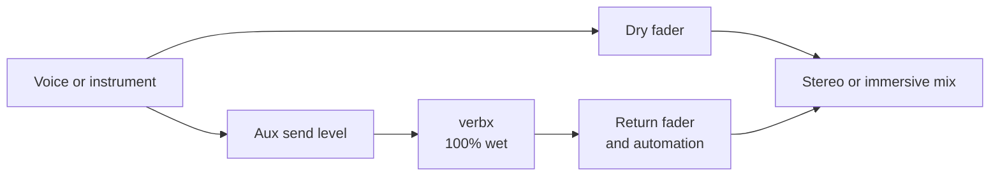
```mermaid
%% verbx-static: docs/assets/reverb_primer/10_musical_send_return.png
flowchart LR
    S["Voice or instrument"] --> D["Dry fader"]
    S --> A["Aux send level"]
    A --> V["verbx<br/>100% wet"]
    V --> R["Return fader<br/>and automation"]
    D --> M["Stereo or immersive mix"]
    R --> M
```

**Figure: Musical send and return treated as parallel articulation and spatial counterpoint.**

**How to read this figure.** The dry fader controls foreground articulation. The aux
send controls how much each source excites the shared space. The return fader controls
the room as a layer after all excitations have combined. Automating the send changes
what enters memory; automating the return changes how much of that memory is heard.
Those gestures are not equivalent. A post-phrase send throw produces a different tail
than raising a return that has been accumulating all along.

### DSP Overview

Digital reverberation begins with an impulse response $h[n]$: the output produced by a
unit impulse. For a linear time-invariant system, any input $x[n]$ produces

$$
y[n] = x[n] * h[n] = \sum_{k=-\infty}^{\infty} x[k]h[n-k].
$$

Convolution reverb stores or synthesizes $h[n]$ and evaluates that sum efficiently.
Algorithmic reverb builds a recursive system whose impulse response emerges from delay,
filter, and feedback operations. Both approaches can produce excellent results. Their
differences concern control, memory, latency, time variation, and the kinds of spaces
they make easy to design.

The detailed diagrams in this section use the implementation-level graph grammar found
in Julius O. Smith's [Schroeder Reverberators](https://ccrma.stanford.edu/~jos/pasp/Schroeder_Reverberators.html):
rectangular transfer blocks, named branch signals, explicit gains and delays, summing
junctions, and output matrices. The figures are original verbx diagrams with independent
example values. Read arrows as signal paths, $z^{-M}$ as a delay of $M$ samples, circles
as sums, and a returning path as state that will affect a future output sample.

#### Discrete-Time Foundations: Samples, Delays, and State

A digital reverberator does not manipulate a continuous acoustic field directly. It
updates a finite collection of numbers at the sample rate. If the sample rate is $f_s$
hertz, sample $n$ occurs at time

$$
t_n = \frac{n}{f_s}.
$$

One sample therefore represents $1/f_s$ seconds. At 48 kHz, a 1 ms delay contains 48
samples; at 192 kHz, the same physical delay contains 192 samples. The acoustic time is
unchanged, but memory use and the number of arithmetic operations both increase. This
distinction matters when a preset is moved between sample rates: delays expressed in
samples must be recalculated from their intended duration rather than copied unchanged.

The elementary delay operator is

$$
D_M(z)=z^{-M},
$$

which means “return the sample written $M$ updates earlier.” In code, that operation is
usually a circular buffer with one write pointer and one or more read pointers. The
buffer is state: its contents summarize enough of the past to determine future output.
Recursive reverberators contain many such state variables, so a parameter change can
affect audio written before the change as well as audio arriving afterward.

Three implementation scales should remain conceptually separate:

| Scale | Typical unit | What it controls |
|---|---:|---|
| Sample | samples or microseconds | Delay indexing, interpolation, phase, and causality |
| Block | frames or milliseconds | Host scheduling, FFT partitions, automation updates, and latency |
| Musical event | beats or seconds | Pre-delay, buildup, phrase overlap, and audible decay |

A robust design converts user-facing time values into sample-domain state once per
block or parameter event, then performs the inner audio loop without allocations. It
also records which quantities are sample-rate dependent. A 2.4-second RT60 is a physical
target; a 1,499-sample comb delay is a topology choice tied to one sample rate.

#### Difference Equations, Transfer Functions, and Impulse Responses

A digital filter is a rule that maps an input sample sequence to an output sample
sequence. A finite impulse response (FIR) filter uses a finite weighted history of the
input. An infinite impulse response (IIR) filter also uses previous outputs, so energy
can recirculate indefinitely in the mathematical model. Causality requires the present
output to depend only on present and past information. Linearity permits superposition,
and time invariance means that delaying an input delays its response without changing
the response's shape. Those properties make convolution, transfer functions, and
pole-zero analysis available as mutually consistent descriptions.

The general scalar, causal, linear difference equation is

$$
y[n]=\sum_{k=0}^{P} b_k x[n-k]-\sum_{k=1}^{Q}a_k y[n-k],
$$

with feedforward coefficients $b_k$ and feedback coefficients $a_k$. Its transfer
function is the rational polynomial

$$
H(z)=\frac{\sum_{k=0}^{P}b_kz^{-k}}
           {1+\sum_{k=1}^{Q}a_kz^{-k}}
     =\frac{B(z)}{A(z)}.
$$

Zeros are roots of $B(z)$; poles are roots of $A(z)$. A zero suppresses a complex
sinusoidal component at its angle and radius, while a pole describes a natural mode
that the system can sustain after excitation. For real-valued coefficients, non-real
roots occur in complex-conjugate pairs. Repeated roots have multiplicity, which changes
the envelope multiplying the corresponding exponential mode.

A block diagram, a difference equation, and a transfer function describe the same
linear time-invariant system from different viewpoints. Consider

$$
y[n]=x[n]+g\,y[n-M].
$$

The difference equation is closest to code: read one delayed value, multiply by $g$,
add the current input, and write the result. Taking the $z$ transform gives

$$
Y(z)=X(z)+g z^{-M}Y(z),
$$

and therefore

$$
H(z)=\frac{Y(z)}{X(z)}=\frac{1}{1-gz^{-M}}.
$$

Expanding the denominator as a geometric series gives

$$
H(z)=1+gz^{-M}+g^2z^{-2M}+g^3z^{-3M}+\cdots,
$$

which is the $z$-domain statement of the audible echo train. This three-way translation
is a useful debugging method. If a diagram suggests one sign, the equation another, and
the impulse response a third, the implementation is not merely “voiced differently”;
one representation is wrong.

#### Solving Higher-Order Characteristic Equations

Finding the poles of a high-order reverberator is an algebra problem with numerical
consequences. Multiplying a denominator expressed in $z^{-1}$ by a sufficient power of
$z$ produces an ordinary polynomial. Equivalently, substitute $u=z^{-1}$, solve for
$u$, and invert each nonzero root. Closed-form quadratic formulas remain useful for
second-order sections, but production reverberators routinely create orders for which
closed forms are unwieldy or do not exist in radicals.

For a monic polynomial

$$
p(z)=z^Q+c_{Q-1}z^{Q-1}+\cdots+c_1z+c_0,
$$

the roots are the eigenvalues of its companion matrix

$$
\boldsymbol{K}=
\begin{bmatrix}
0&0&\cdots&0&-c_0\\
1&0&\cdots&0&-c_1\\
0&1&\cdots&0&-c_2\\
\vdots&\vdots&\ddots&\vdots&\vdots\\
0&0&\cdots&1&-c_{Q-1}
\end{bmatrix},
\qquad
p(z)=\det(z\boldsymbol{I}-\boldsymbol{K}).
$$

This linear-algebra formulation connects filter analysis to robust eigenvalue
algorithms. It also explains why polynomial roots can be ill conditioned: a small
coefficient perturbation can move a cluster of nearly repeated roots substantially.
Implement long filters as cascaded first- and second-order sections when possible,
compute roots in double precision, pair conjugates explicitly, and verify the frequency
response after reconstruction. In a feedback network, inspect eigenvalues of the state
transition or a suitable polynomial eigenvalue linearization rather than multiplying
large sparse delay polynomials by hand.

#### Poles, Stability, and Decay

The poles of a recursive filter describe the modes that can continue after the input
stops. For the feedback comb, the pole condition is

$$
z^M=g.
$$

There are $M$ roots distributed around the complex plane. Their angles determine modal
frequencies, while their common radius is $|g|^{1/M}$. Poles near the unit circle decay
slowly; poles outside it grow. The practical stability requirement $|g|<1$ is therefore
not an arbitrary range check but a statement that every circulation must lose energy.

An FDN replaces one scalar pole family with the roots of a matrix-delay characteristic
equation. The same geometric intuition survives: delay lengths distribute modal angles,
the feedback matrix couples modes, and loop filters pull pole radii inward by
frequency-dependent amounts. RT60 is a perceptual summary of those radii, not a complete
description of the pole pattern. Two networks can share the same fitted RT60 while one
rings at several exposed frequencies and the other decays smoothly.

For extreme decay times, stability margin becomes an audible design parameter. A target
of 360 seconds places loop gains extraordinarily close to unity. Parameter interpolation,
filter normalization, matrix orthogonality, denormal handling, and limiter placement all
matter because a tiny systematic gain error can persist through thousands of loops.

#### Echo Density, Modal Density, and Mixing Time

Echo density asks how many distinguishable arrivals occur in a time interval. Modal
density asks how many resonant modes occupy a frequency interval. They are related but
not interchangeable. A signal can have many temporal arrivals yet retain colored modes,
or have many modes but a conspicuously sparse onset.

The early response is usually nonstationary: arrivals become more frequent as reflection
order increases. After a mixing time, individual paths are no longer the useful mental
model and the response behaves statistically. A digital design recreates this transition
with tapped delays, nested diffusers, scattering, or an FDN whose recirculations rapidly
multiply path combinations. The goal is not maximum density at sample zero. The goal is
the right density trajectory for the apparent source distance and enclosure size.

Use a click to hear temporal sparsity and a sustained chord to hear modal sparsity. On
the click, listen for flutter and repeated gaps. On the chord, listen for stable tones
that outlive neighboring partials. Increasing allpass depth may solve the first problem
without solving the second; changing delays or feedback topology may solve the second
without producing a convincing onset.

#### Feedback Comb Filters: Duration and Modes

A feedback comb filter delays its output, scales it, and adds it back to the input. Its
transfer function is

$$
H_{\mathrm{comb}}(z) = \frac{1}{1-gz^{-M}},
$$

where $M$ is delay in samples and $g$ is feedback gain. An impulse produces repetitions
every $M$ samples with amplitudes $1, g, g^2, \ldots$. In frequency, those repetitions
form a regularly spaced modal pattern. One comb therefore sounds colored; several combs
with carefully chosen delays can create a richer decay.

The diagram below exposes the feedback path that creates both duration and coloration.

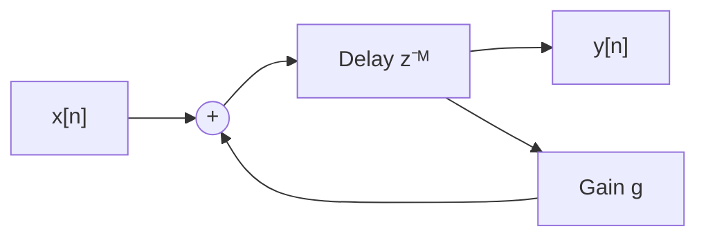
```mermaid
%% verbx-static: docs/assets/reverb_primer/03_feedback_comb_filter.png
flowchart LR
    X["x[n]"] --> S(("+"))
    S --> D["Delay z⁻ᴹ"]
    D --> Y["y[n]"]
    D --> G["Gain g"]
    G --> S
```

**Figure: Feedback comb filter with delay length $M$ and loop gain $g$.**

**How to read this figure.** Every trip around the loop adds $M$ samples of time and a
factor of $g$. If $|g|<1$, the loop decays; if $|g|=1$, it is theoretically lossless;
if $|g|>1$, it grows. Real implementations also require damping, DC control, and
protection against finite-precision problems. The spacing $f_s/M$ between modes is as
important as nominal RT60. Several delay lengths should avoid obvious common periods
unless a pitched or resonant effect is intended.

The expanded flowgraph below labels the internal write signal and places the transfer
function beside the loop. It is the form to use when translating the structure into a
sample-by-sample difference equation or checking which sample is multiplied by $g$.


**Figure: Implementation-level feedback comb flowgraph with an explicit internal state, $M$-sample delay, loop gain, and transfer function.**

**How to read this flowgraph.** The summing junction forms $w[n]$ from the new input and
the attenuated delayed output. The delay emits $y[n]=w[n-M]$; that value branches to the
external output and to gain $g$ before returning to the sum. Following one impulse around
the lower return path explains the sequence at $0,M,2M,\ldots$ samples. The drawing also
distinguishes the signal stored in memory, $w[n]$, from the signal currently leaving the
delay, $y[n]$, a distinction that prevents common indexing mistakes in implementations.

The following pole-zero diagram turns the comb equation into geometry. The drawing uses
$M=12$ only to keep individual modes legible; a practical delay contains many more
samples and therefore many more poles. The same rule survives at every order.


**Figure: Unit-circle pole-zero map for a representative feedback comb, showing twelve equal-radius poles and twelve coincident zeros at the origin.**

Each solution of $z^M=g$ contributes one pole. The angular spacing is $2\pi/M$, while
the radius is $|g|^{1/M}$. Raising $g$ moves every cross toward the unit circle and
lengthens all modal decays together. A negative $g$ rotates the pole family by
$\pi/M$. The zeros at the origin appear after polynomializing the causal transfer
function; they do not cancel the resonant pole ring.

For a target $T_{60}$ and a delay duration $d=M/f_s$ seconds, the loop gain is

$$
g = 10^{-3d/T_{60}}.
$$

At extreme RT60 values, $g$ approaches one. Small numerical or spectral errors then
circulate for a long time, which is why internal precision and loop conditioning matter
more at 360 seconds than at 1.2 seconds.

The companion magnitude plot turns the pole ring into an audible spectral prediction.
Each regular resonance corresponds to one of the equally spaced modal angles above.

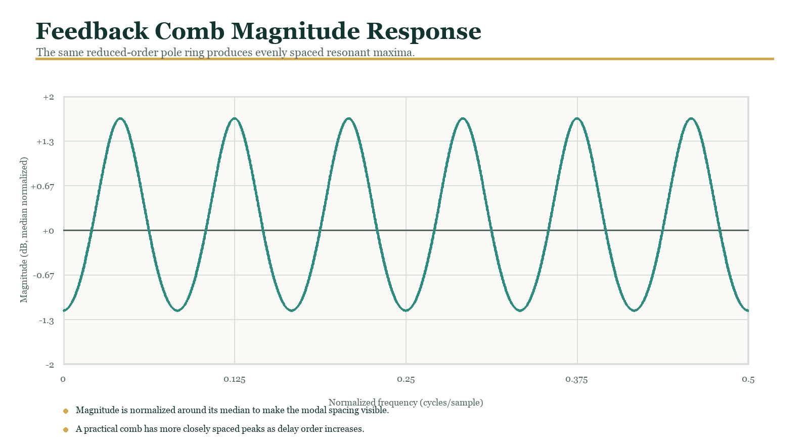

**Figure: Normalized magnitude response of the representative feedback comb, with frequency in cycles per sample and magnitude in decibels.**

#### Schroeder Allpass Filters: Density Without Magnitude Coloration

An allpass filter changes phase while maintaining a flat ideal magnitude response. A
common Schroeder form is

$$
H_{\mathrm{AP}}(z) = \frac{-g + z^{-M}}{1-gz^{-M}}.
$$

Its direct and delayed paths cancel the comb-like magnitude coloration that the feedback
loop would otherwise introduce. In time, however, an impulse becomes a pattern of
decaying echoes. Serial allpasses can therefore increase echo density before the signal
enters a longer late-field network.

The Mermaid diagram below separates feedforward and feedback paths. The signs matter:
the topology is not simply a comb with a dry mix.

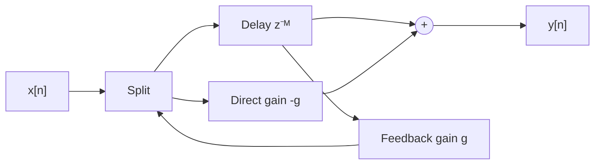
```mermaid
%% verbx-static: docs/assets/reverb_primer/04_schroeder_allpass.png
flowchart LR
    X["x[n]"] --> P["Split"]
    P --> D["Delay z⁻ᴹ"]
    P --> N["Direct gain -g"]
    D --> S(("+"))
    N --> S
    D --> G["Feedback gain g"]
    G --> P
    S --> Y["y[n]"]
```

**Figure: Schroeder allpass diffuser with matched feedforward and feedback coefficients.**

**How to read this figure.** The delay and feedback create a decaying echo sequence;
the direct coefficient corrects the magnitude response. “Flat magnitude” does not mean
“inaudible.” Phase structure, transient spreading, delay length, and coefficient still
change timbre and spatial impression. Very large $g$ values produce long diffusion
patterns that may sound metallic; small values scatter less energy. The allpass chain
must be judged as an onset-design tool, not merely by its frequency response.

The implementation graph below separates the allpass's two sums. This makes the signs
and the shared delayed state visible, which is essential when comparing the transfer
function with code or tracing an impulse by hand.


**Figure: Implementation-level Schroeder allpass flowgraph with explicit feedforward and feedback coefficient paths.**

**How to read this flowgraph.** The left sum creates the delay-line write value
$w[n]=x[n]+g\,w[n-M]$. The right sum combines the delayed state with the negative direct
branch, producing $y[n]=w[n-M]-g\,w[n]$. The same coefficient magnitude therefore appears
in two different roles: positive feedback sustains the echo sequence, while negative
feedforward corrects its magnitude response. Swapping a sign changes the topology and can
turn a diffuser into a colored or unstable structure even though every block still looks
plausible in isolation.

The reciprocal structure is easiest to see in the following unit-circle plot. It uses a
reduced delay order so the individual reciprocal pairs can be inspected rather than
merging into a continuous ring.


**Figure: Unit-circle pole-zero map for a Schroeder allpass, with stable interior poles and reciprocal exterior zeros.**

For every pole $p_k$, the corresponding allpass zero lies at $1/p_k^*$. On the unit
circle, numerator and denominator magnitudes therefore match even though their phases
do not. The exterior zeros do not make the causal filter unstable because stability is
governed by poles. They do make the system non-minimum-phase, which is precisely how the
network can redistribute transient energy in time while preserving ideal magnitude.

The following magnitude plot is deliberately flat. It is the essential check on the
allpass claim: a non-flat curve would mean the reciprocal-root or gain relationship had
been implemented incorrectly.

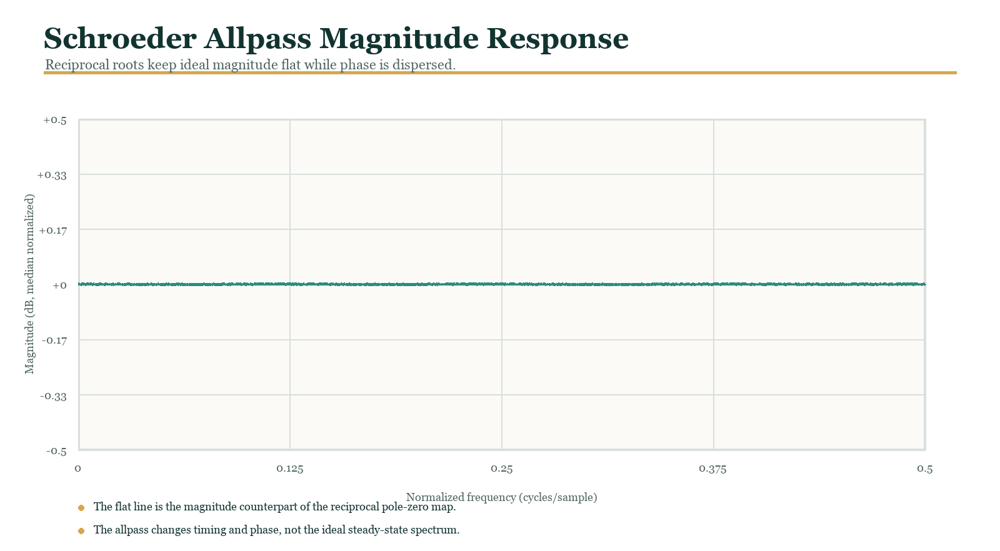

**Figure: Normalized magnitude response of the representative Schroeder allpass, with frequency in cycles per sample and magnitude in decibels.**

#### Allpass Networks: From Echoes to a Diffuse Excitation

One allpass creates a recognizable pattern. Several allpasses with mutually awkward
delay lengths multiply the number of arrivals. If the stages are too similar, the
patterns line up and produce periodicity. If there are too many stages or too much
feedback, the attack loses definition before the late field begins.

The serial network below shows the conceptual progression from one impulse to a dense
excitation. Each stage is short compared with the final RT60.

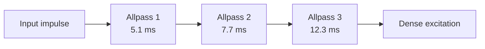
```mermaid
%% verbx-static: docs/assets/reverb_primer/05_allpass_diffusion_network.png
flowchart LR
    X["Input impulse"] --> A1["Allpass 1<br/>5.1 ms"]
    A1 --> A2["Allpass 2<br/>7.7 ms"]
    A2 --> A3["Allpass 3<br/>12.3 ms"]
    A3 --> U["Dense excitation"]
```

**Figure: Serial allpass network used to build early echo density.**

**How to read this figure.** Every box expands the number of time-domain arrivals while
approximately preserving spectral magnitude. The listed delays are illustrative, not
universal defaults. Percussion may need fewer stages so the attack remains crisp; a
synthetic pad can tolerate more diffusion. In verbx, allpass diffusion is a front-end
stage. It prepares energy for the FDN rather than carrying the complete decay alone.

#### The Schroeder Reverberator

The classic Schroeder architecture places several feedback comb filters in parallel,
sums them, and follows the sum with serial allpasses. The combs supply a long response;
the allpasses increase density. This structure established the vocabulary of digital
reverb and remains useful because it is efficient, understandable, and musical.

The signal flow below shows the canonical division of labor. It is a family of designs,
not one immutable set of delay values.

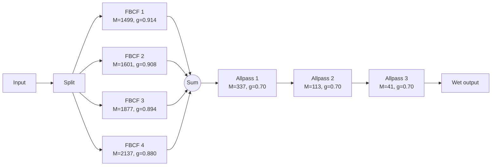
```mermaid
%% verbx-static: docs/assets/reverb_primer/02_schroeder_reverberator.png
flowchart LR
    X["Input"] --> S["Split"]
    S --> C1["FBCF 1<br/>M=1499, g=0.914"]
    S --> C2["FBCF 2<br/>M=1601, g=0.908"]
    S --> C3["FBCF 3<br/>M=1877, g=0.894"]
    S --> C4["FBCF 4<br/>M=2137, g=0.880"]
    C1 --> M(("Sum"))
    C2 --> M
    C3 --> M
    C4 --> M
    M --> A1["Allpass 1<br/>M=337, g=0.70"]
    A1 --> A2["Allpass 2<br/>M=113, g=0.70"]
    A2 --> A3["Allpass 3<br/>M=41, g=0.70"]
    A3 --> Y["Wet output"]
```

**Figure: Classic Schroeder reverberator with parallel combs and serial allpasses.**

**How to read this figure.** The explicit branch labels show one illustrative 48 kHz,
2.4-second design, not verbx defaults. Each comb delay $M$ establishes a different modal
spacing, while its loop gain $g$ calibrates how quickly that branch decays. The summing
bus recombines all four independent tails. Three short serial allpasses then increase
echo density without intentionally changing magnitude response. Coloration remains
possible because each comb has a regular modal series and because the branches do not
exchange energy. Moorer-style extensions add early reflections and frequency-dependent
damping. Modern FDNs generalize the feedback relationship so every delay line can
exchange energy with every other line.

The parameterized flowgraph below expands the canonical blocks into a traceable example.
Its delays and gains demonstrate the notation rather than prescribe verbx defaults; the
four output rows also show how one reverberator state can feed a multichannel matrix.


**Figure: Parameterized Schroeder-style reverberator with serial allpasses, four parallel feedback combs, named branch signals, and a four-channel output matrix.**

**How to read this flowgraph.** Start at `RevIn` and move through three short allpasses,
whose unequal sample delays progressively scatter the onset. The vertical bus then sends
the same diffuse excitation to four feedback comb filters. Each comb lists a delay $N$
and a gain calculated for the illustrated 2.4-second target at 48 kHz. Their named outputs
$x_1$ through $x_4$ enter a normalized Hadamard matrix, whose signed combinations produce
four related but decorrelated outputs. The graph therefore exposes three distinct design
layers: onset diffusion, late modal duration, and spatial projection.

The following reduced-order modal map combines several unequal comb rings and an
illustrative allpass zero family. It is not a root plot of the exact printed delays,
whose thousands of points would obscure the structure at book scale.


**Figure: Reduced-order unit-circle map of a parameterized Schroeder reverberator, showing interleaved comb-pole rings and reciprocal allpass zeros.**

Each comb contributes a regular ring, but unequal orders and radii interleave those
rings. The allpasses add pole-zero pairs whose magnitude effects cancel ideally while
their phase effects accumulate. Coincident or nearly coincident poles predict exposed
ringing; a more even angular distribution predicts smoother modal coverage. Because
parallel branch transfer functions add, the final transmission zeros also depend on
branch gains and summation, not only on the zeros drawn for individual stages.

The Schroeder design remains an excellent teaching instrument. Bypass its allpasses and
hear the comb modes. Restore one stage at a time and hear density increase. Change one
delay until it shares a common divisor with another and hear periodicity emerge. These
experiments turn abstract topology into an audible vocabulary.

The following response emphasizes how unequal comb sections populate the spectrum with
many nearby resonances even before the allpass stages redistribute the transient energy.

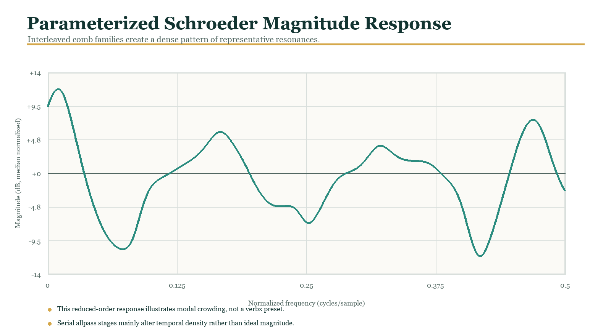

**Figure: Normalized magnitude response for the reduced-order parameterized Schroeder example, with frequency in cycles per sample and magnitude in decibels.**

#### Feedback Delay Networks: Coupled Modal Systems

An $N$-line Feedback Delay Network replaces independent comb feedback with a vector
loop. Each delay line produces one state component. A matrix mixes those components
before they are written back, allowing energy to move throughout the network. Input and
output projections determine how the source excites modes and how the listener receives
them.

A simplified state description is

$$
\boldsymbol{s}[n+1] = \boldsymbol{G}\boldsymbol{M}\boldsymbol{D}(z)\boldsymbol{s}[n]
                  + \boldsymbol{B}x[n],
$$

$$
y[n] = \boldsymbol{C}^{\mathsf T}\boldsymbol{D}(z)\boldsymbol{s}[n] + d\,x[n],
$$

where $\boldsymbol{D}(z)$ is the bank of unequal delays, $\boldsymbol{M}$ is the feedback
matrix, $\boldsymbol{G}$ contains decay gains or filters, $\boldsymbol{B}$ injects the source,
and $\boldsymbol{C}$ projects the state to output channels.

The Mermaid diagram below makes the vector feedback loop explicit.

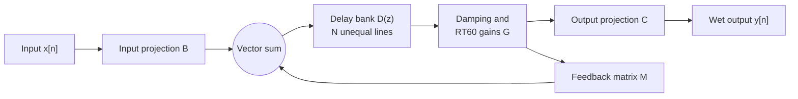
```mermaid
%% verbx-static: docs/assets/reverb_primer/06_fdn_signal_flow.png
flowchart LR
    X["Input x[n]"] --> B["Input projection B"]
    B --> S(("Vector sum"))
    S --> D["Delay bank D(z)<br/>N unequal lines"]
    D --> F["Damping and<br/>RT60 gains G"]
    F --> C["Output projection C"]
    C --> Y["Wet output y[n]"]
    F --> M["Feedback matrix M"]
    M --> S
```

**Figure: Feedback Delay Network with vector delay state and matrix feedback.**

**How to read this figure.** The delay bank defines modal timing; the gain and damping
stage defines loss; the matrix defines how energy exchanges among lines. Those roles
interact but are independently designable. An orthonormal matrix preserves vector
energy before damping, making RT60 calibration tractable. A poor input projection may
leave some modes weakly excited; a poor output projection may overemphasize others.
High line count alone does not guarantee a smooth reverb.

The expanded FDN flowgraph below opens the vector blocks into four representative delay
rows and shows both the recirculating state and the separate output tap. The four rows
stand for an arbitrary $N$-line network, not a four-line limit.


**Figure: Expanded FDN flowgraph with input projection, unequal delay lines, per-line damping, RT60 gains, unitary feedback matrix, and output projection.**

**How to read this flowgraph.** Projection $\boldsymbol{B}$ distributes the scalar input into
the vector sum. Each row delays one state component by $m_i$ samples and filters it with
$H_i(z)$. The gain block $\boldsymbol{G}$ calibrates loss, after which unitary matrix
$\boldsymbol{M}$ redistributes energy before the vector returns to the input sum. Output
projection $\boldsymbol{C}^{\mathsf T}$ observes the delayed state without replacing the
feedback path. That separation lets a designer change stereo or immersive presentation
without changing the poles that govern the late decay.

The following pole-zero figure presents a reduced-order FDN modal projection. Unlike a
single comb, an FDN does not generally decompose into one obvious ring per delay line;
its coupled characteristic equation mixes delay, matrix, and loop-filter terms.


**Figure: Illustrative unit-circle modal projection of an expanded FDN, with coupled poles and projection-dependent transmission zeros.**

The crosses represent eigenmodes of a stable, damped coupled state. Their unequal radii
stand for frequency-dependent and line-dependent loss. The circles are transmission
zeros for one illustrative input-output projection. Replacing $\boldsymbol{B}$ or
$\boldsymbol{C}$ changes those zeros and the observed color, while leaving the internal
state poles unchanged. Replacing $\boldsymbol{M}$ or a loop filter can move the poles
themselves, so those changes require renewed stability analysis.

verbx exposes several matrix families because they create different exchange patterns.
Hadamard mixing is dense and uniform. Householder mixing is efficient and structured.
Circulant and elliptic families have interpretable eigenstructure. Random orthogonal
matrices reduce obvious regularity. Graph-derived matrices make connectivity a design
parameter. Time-varying unitary matrices alter the modal basis slowly while retaining
controlled loop energy.

The matching magnitude response shows one projected observation of the same coupled
modal system. Its fine structure is not a universal FDN fingerprint: changing the input
or output projection changes which modes are emphasized or cancelled.

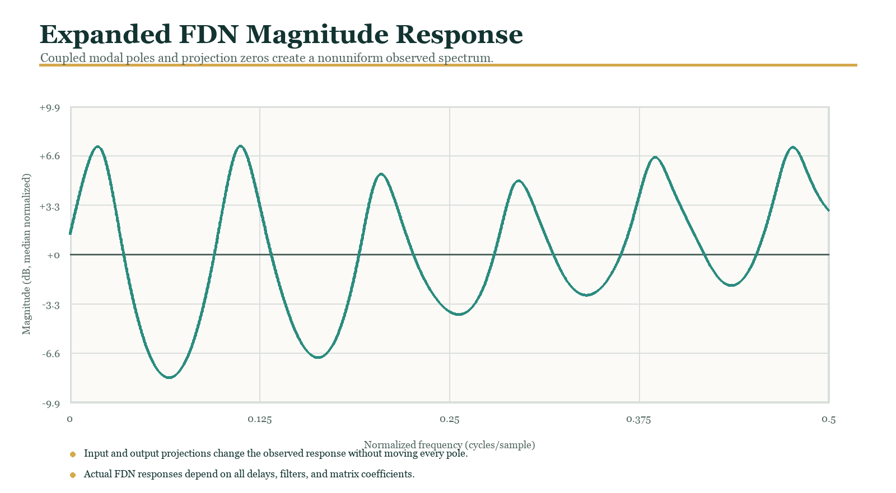

**Figure: Normalized magnitude response for the illustrative expanded FDN projection, with frequency in cycles per sample and magnitude in decibels.**

#### The Five Independent Design Coordinates of an FDN

It is tempting to identify an FDN by line count alone, but five coordinate systems act
together: delay timing, feedback coupling, loop loss, input excitation, and output
observation. Figure below places those choices around the recursive state. Changing any
one can alter the result even when the other four are held fixed.

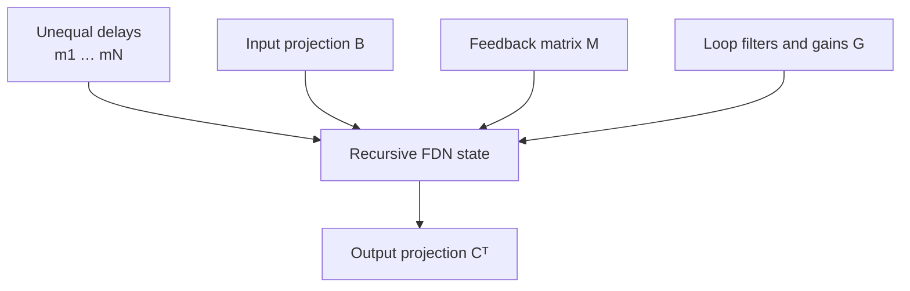
```mermaid
%% verbx-static: docs/assets/reverb_primer/30_fdn_design_coordinates.png
flowchart TB
    D["Unequal delays<br/>m1 … mN"] --> S["Recursive FDN state"]
    B["Input projection B"] --> S
    M["Feedback matrix M"] --> S
    G["Loop filters and gains G"] --> S
    S --> C["Output projection Cᵀ"]
```

**Figure: Five design coordinates that jointly determine an FDN late field.**

**How to read this figure.** The central state is not itself a sound-quality control.
The delay set gives the state its temporal memory; the matrix redistributes that memory;
the loop filters decide what survives; the input vector decides which modal combinations
are excited; and the output vector decides which combinations are observed. This is why
changing only $\boldsymbol{C}$ can alter stereo width without moving the network's poles,
whereas changing $\boldsymbol{M}$ can alter both modal structure and energy exchange.

The five coordinates suggest a disciplined design order:

1. Choose delay durations for the desired scale and modal distribution.
2. Choose a feedback matrix with known energy behavior.
3. Calibrate broadband or multiband loop loss from the target decay.
4. Choose an input projection that excites the state without privileged lines.
5. Choose output projections that create the required channel image and fold-down.

Randomizing all five at once may produce an interesting preset, but it makes a failure
difficult to diagnose. A controlled listening comparison changes one coordinate at a
time and uses the same impulse, chord, level, and output projection.

#### Delay-Set Design and Number-Theoretic Structure

Each delay line contributes a recurrence period and a family of modes. Equal or simply
related delays cause recirculating paths to coincide; the network then reveals a common
period as flutter, pitched ringing, or cyclic stereo motion. Pairwise coprime lengths
are a useful starting heuristic, but primality alone does not guarantee a good network.
The complete coupled pole pattern also depends on the matrix, gains, and projections.

For a line of $m_i$ samples, the uncoupled comb spacing is approximately

$$
\Delta f_i=\frac{f_s}{m_i}.
$$

Longer delays create closer modes and slower recurrence. Shorter delays create wider
spacing and faster buildup. A practical set spans a modest range around a size target
rather than clustering at one length. Excessive spread can make branches decay with
perceptibly different granularity even when their RT60 gains are calibrated correctly.

Delay selection should satisfy several constraints at once:

| Constraint | Purpose | Failure symptom |
|---|---|---|
| No zero or sub-sample line | Preserve causality and valid memory access | Instability or duplicated direct sound |
| Few shared factors | Reduce coincident recurrences | Flutter or rhythmic ringing |
| Bounded minimum delay | Limit high modal spacing | Audible isolated modes |
| Bounded maximum delay | Control buildup and memory | Late, disconnected tail onset |
| Sample-rate rescaling | Preserve physical durations | Preset changes size with sample rate |

When a sample-rate conversion rounds several durations to nearby integers, recheck the
set rather than assuming its number-theoretic relationships survived. Deterministic
rounding and a stored seed make the resulting topology reproducible.

#### Feedback Matrices, Energy, and Eigenstructure

If the matrix is orthonormal,

$$
\boldsymbol{M}^{\mathsf T}\boldsymbol{M}=\boldsymbol{I},
$$

then it preserves Euclidean vector energy before loop loss. This separation is valuable:
the matrix controls redistribution while $\boldsymbol{G}$ controls decay. A matrix need not
be dense to be lossless, and a dense matrix is not automatically well conditioned.

The spectral radius

$$
\rho(\boldsymbol{A})=\max_k |\lambda_k(\boldsymbol{A})|
$$

provides one stability check for a frequency-independent state transition
$\boldsymbol{A}$. With delays and loop filters, the complete condition is frequency
dependent, but the intuition remains: no recirculating eigenmode may receive net gain
at any frequency. Numerical verification should therefore sweep the loop filters as
well as checking the nominal matrix.

| Matrix family | Coupling character | Useful reason to choose it |
|---|---|---|
| Hadamard | Dense, balanced signed mixing | Predictable diffusion and efficient transforms |
| Householder | Structured global reflection | Low arithmetic cost with full-state interaction |
| Circulant | Translation-invariant row structure | Controlled eigenstructure and repeatable color |
| Random orthogonal | Irregular dense coupling | Reduced visible symmetry with energy preservation |
| Sparse graph-derived | Local or clustered exchange | Deliberate pathways and unusual spatial textures |
| Time-varying unitary | Slowly changing modal basis | Reduced stationary ringing in long exposed tails |

Orthonormality is a starting condition, not a listening verdict. A lossless matrix can
still align poorly with a delay set or projection vector. Conversely, a deliberately
structured matrix may be musically useful precisely because it does not erase every
pathway at once.

#### Input and Output Projections

The input projection $\boldsymbol{B}$ distributes source energy among delay lines. A vector
with one nonzero entry excites the network from one point; a dense balanced vector begins
with broader excitation. Multiple input channels use a matrix whose columns describe
distinct injection patterns. Those columns should be normalized so adding channels does
not silently increase loop energy.

The output projection $\boldsymbol{C}^{\mathsf T}$ observes the state. It can be changed
without changing the internal recurrence, which makes projection a powerful spatial
design layer. Left and right vectors should share the same late history while weighting
components differently enough to avoid mono duplication. Immersive outputs extend the
same principle to side, rear, and height channels.

Projection quality is measured as well as heard. Inspect channel RMS balance,
cross-correlation, interchannel coherence by frequency, and mono fold-down. A return can
sound impressively wide in isolation yet collapse unevenly or lose low-frequency energy
when summed. Normalized signed projections usually provide a safer starting point than
independent random reverbs per channel.

#### Frequency-Dependent Decay in an FDN

Real materials absorb frequency bands differently, and air attenuates high frequencies
more strongly over long paths. A convincing room therefore rarely has one RT60 at every
frequency. In an FDN, loop filters can approximate a desired decay curve. The challenge
is to shape loss without compromising stability or creating obvious filter resonances
inside the feedback loop.

The multiband signal flow below shows low, middle, and high losses before energy returns
to the feedback matrix.

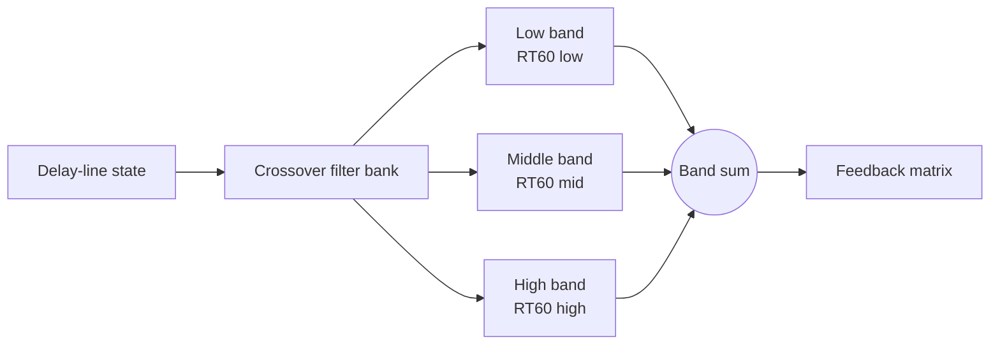
```mermaid
%% verbx-static: docs/assets/reverb_primer/07_multiband_fdn.png
flowchart LR
    S["Delay-line state"] --> X["Crossover filter bank"]
    X --> L["Low band<br/>RT60 low"]
    X --> M["Middle band<br/>RT60 mid"]
    X --> H["High band<br/>RT60 high"]
    L --> A(("Band sum"))
    M --> A
    H --> A
    A --> F["Feedback matrix"]
```

**Figure: Frequency-dependent FDN loop with independent low, middle, and high decay targets.**

**How to read this figure.** Every band travels around the same spatial topology but
loses a different amount of energy. A longer low-band RT60 adds warmth and weight; too
much produces mud or a persistent pitched floor. A short high-band RT60 suggests soft
materials or long air paths; too short makes the room dull and detached. Crossovers
must be smooth because their errors recirculate.

The line-level graph below zooms into one FDN damping block. It makes the decay-gain
calculation explicit for each band before the three paths are recombined.


**Figure: One multiband FDN loop-filter row with low-, middle-, and high-band filters and independently calibrated decay gains.**

**How to read this flowgraph.** State component $s_i[n]$ is split among three complementary
filters. Each branch receives a gain of the form $10^{-3d_i/T_{60,b}}$, where $d_i$ is the
delay-line duration and $T_{60,b}$ is the target for band $b$. The sum reconstructs one
conditioned state component before matrix mixing. Calibrating gain from each line's own
duration is important: applying one coefficient to unequal delays gives those lines
different decay times and distorts the intended spectral envelope.

The following modal plot shows how three decay targets become families of pole radii.
The outer family represents the slowest band and the inner family the fastest.


**Figure: Unit-circle pole-zero map for multiband feedback damping, with separate low-, middle-, and high-band pole-radius families.**

Band filters contribute their own poles and zeros, and the surrounding delay network
replicates their influence across many modes. Stability must therefore be checked on the
complete loop, not inferred from three scalar gains alone. A smooth target decay curve
should produce a smooth radial transition with frequency; abrupt radial clusters can
become audible as bands that detach from one another during the tail.

The separate magnitude plot gives that radial family a spectral interpretation. It is a
representative loop-filter view, not the transfer function of every possible FDN matrix
and delay set that uses these three decay targets.

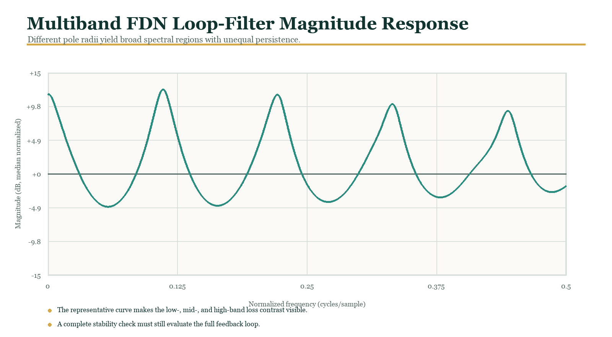

**Figure: Normalized magnitude response of the representative multiband FDN loop filter, with frequency in cycles per sample and magnitude in decibels.**

```bash
verbx render music.wav /tmp/multiband_hall.wav \
  --engine algo --rt60 3.0 --fdn-rt60-low 4.2 \
  --fdn-rt60-mid 3.0 --fdn-rt60-high 1.7 \
  --fdn-xover-low-hz 260 --fdn-xover-high-hz 4200 \
  --fdn-lines 24 --fdn-matrix random_orthogonal --wet 0.45 --dry 0.72
```

Listen after the source stops. During the phrase, masking may hide a low-frequency
problem that becomes obvious only in the final decay.

#### Moving Delays, Fractional Reads, and Interpolation

A delay specified in milliseconds rarely lands on an integer sample, and a modulated
delay changes continuously. If its desired length is $d[n]$ samples, the processor reads
the circular buffer at a fractional position. Writing

$$
d[n]=M[n]+\mu[n], \qquad 0\leq\mu[n]<1,
$$

separates the integer offset $M[n]$ from fractional part $\mu[n]$. Linear interpolation
uses the two neighboring samples:

$$
y[n]=(1-\mu[n])x[n-M[n]]+\mu[n]x[n-M[n]-1].
$$

It is inexpensive and continuous, but its magnitude response changes with fractional
position. Higher-order Lagrange interpolation improves high-frequency magnitude
accuracy. A Thiran allpass interpolator prioritizes phase and delay accuracy while
maintaining unit magnitude. The right choice depends on whether the moving read is a
creative chorus-like voice, a subtle anti-ringing modulation, or a precision physical
delay.

Figure below separates the audio-rate memory path from the slower control path. They
meet only at the interpolated read head.

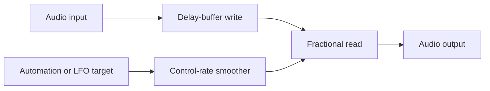
```mermaid
%% verbx-static: docs/assets/reverb_primer/29_modulated_delay_control.png
flowchart LR
    X["Audio input"] --> W["Delay-buffer write"]
    W --> R["Fractional read"]
    R --> Y["Audio output"]
    P["Automation or LFO target"] --> S["Control-rate smoother"]
    S --> R
```

**Figure: Separate audio and control paths for a smoothly modulated fractional delay.**

**How to read this figure.** Audio is written into circular memory at the sample rate.
The target delay arrives from automation or an oscillator, passes through a smoother,
and controls the read position. The smoother prevents a discontinuous pointer jump;
the interpolator reconstructs a continuous value between stored samples. Neither block
is optional when the delay moves during audible output.

A changing delay introduces pitch shift because the read head moves relative to the
write head. Slow shallow motion can decorrelate modes without calling attention to
itself. Fast or deep motion becomes chorus, vibrato, or Doppler-like sweep. In an FDN,
different lines should not move in lockstep unless coherent pitch motion is intended.
The total modulation must also respect minimum and maximum delay bounds so the read head
never crosses invalid memory or overtakes the write head.

#### Parameter Smoothing and Host Automation

Hosts can deliver a new parameter target once per block, at sample offsets within a
block, or at irregular GUI rates. Applying a discontinuous target directly to a gain,
delay, filter coefficient, or matrix can create clicks or temporarily invalidate a
stable design. A one-pole smoother is

$$
p[n]=a\,p[n-1]+(1-a)p_{\mathrm{target}}[n],
$$

with

$$
a=e^{-1/(\tau f_s)},
$$

where $\tau$ is a smoothing time constant. Linear ramps are also useful when an exact
arrival time matters. Gains may be smoothed in decibels or amplitude depending on the
desired perceptual trajectory; frequencies are often smoother in logarithmic space;
RT60 is best mapped through a bounded logarithmic parameter before loop gains are
recalculated.

Recursive parameters need special care. Interpolating directly between two unrelated
orthogonal matrices does not generally remain orthogonal. Safer strategies interpolate
a constrained rotation, crossfade between complete networks, or update through a
factorization whose intermediate states preserve the required energy property. Similar
care applies to loop-filter coefficients: every intermediate filter must remain stable,
not only the endpoints.

Smoothing has a musical cost. A 500 ms ramp is click-free but can miss a sixteenth-note
gesture; a 1 ms ramp may preserve timing but reveal zippering on a 360-second tail.
Document smoothing times as part of the DSP contract and test automation at different
host block sizes.

#### Early Reflections and the Early-to-Late Transition

Early reflections carry geometry. Their delays and directions communicate source
distance, nearby boundaries, and room shape before the late field becomes statistically
dense. A tapped delay line can render a designed pattern; an image-source or ray-tracing
model can derive paths from geometry; a measured IR can supply the complete onset.

Each early tap can be represented as

$$
y_q[n]=a_q\,F_q(z)x[n-m_q],
$$

where $m_q$ is path delay, $a_q$ is spreading and reflection loss, and $F_q(z)$ models
frequency-dependent boundary absorption. Multichannel rendering adds a directional
projection for each path. The tap list should not merely be randomized: arrival order,
level decay, spectral darkening, and lateral distribution jointly establish a plausible
enclosure.

The handoff to the late field is a crossfade in statistical description, not necessarily
one literal splice sample. If the FDN begins too early and too densely, the source seems
embedded in an abstract wash. If it begins too late, the early response sounds like a
cluster of echoes followed by a separate effect. Match energy, spectrum, spatial width,
and density across a transition region.

#### Convolution and Partitioned FFT Processing

Convolution reverb uses an impulse response measured in a real room or designed by a
synthesis process. Direct time-domain convolution costs more as the IR grows. FFT
convolution turns long convolution into blockwise multiplication in the frequency
domain. Partitioning the IR lets a processor use small early blocks for latency and
larger later blocks for efficiency.

The Mermaid diagram below shows uniformly or nonuniformly partitioned overlap-save at a
conceptual level. Exact scheduling varies by implementation.

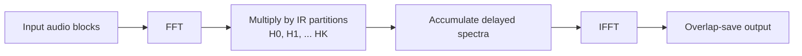
```mermaid
%% verbx-static: docs/assets/reverb_primer/08_partitioned_convolution.png
flowchart LR
    X["Input audio blocks"] --> F["FFT"]
    F --> P["Multiply by IR partitions<br/>H0, H1, ... HK"]
    P --> S["Accumulate delayed spectra"]
    S --> I["IFFT"]
    I --> O["Overlap-save output"]
```

**Figure: Partitioned FFT convolution path for a long impulse response.**

**How to read this figure.** The input is transformed once per block. Each IR partition
multiplies a correspondingly delayed input spectrum; the products are accumulated and
transformed back. The first partition determines a large part of algorithmic latency.
Longer partitions improve efficiency but increase buffering. Convolution reproduces the
captured linear response exactly within numerical and routing limits, but ordinary
convolution cannot continuously change that response without interpolation or a new IR.

For an FIR of length $L$, direct convolution evaluates

$$
y[n]=\sum_{k=0}^{L-1}h[k]x[n-k],
$$

which costs $L$ multiply-accumulates per output sample. A two-second mono IR at 192 kHz
contains 384,000 taps; direct evaluation is therefore wasteful even before multichannel
routing. FFT convolution groups samples into blocks and uses the convolution theorem,

$$
Y_r[k]=X_r[k]H[k],
$$

where $r$ identifies a processing block and $k$ an FFT bin. The apparent simplicity of
that multiplication hides the scheduler that aligns past input spectra with every IR
partition.

In overlap-save processing, the FFT length must include enough historical samples to
avoid circular-convolution contamination. The invalid prefix is discarded and only the
new valid samples are emitted. The implementation must define whether reported latency
includes host buffering, input accumulation, FFT scheduling, and output staging; “zero
latency convolution” usually means that an initial direct or very small partition is
processed before larger tail partitions, not that no buffering exists anywhere.

Uniform and nonuniform partitioning trade simplicity against efficiency:

| Partition plan | Latency behavior | Computational behavior |
|---|---|---|
| Uniform small blocks | Low and constant | Many FFTs for the complete tail |
| Uniform large blocks | Higher and constant | Better throughput for long IRs |
| Direct head plus FFT tail | Very low onset latency | More scheduler complexity |
| Geometrically growing blocks | Small early, efficient late | Multiple FFT sizes and deadlines |

A practical nonuniform design might process the first few milliseconds directly, the
next region in 64- or 128-sample partitions, and the distant tail in progressively
larger blocks. Late partitions have more wall-clock time before their contribution is
needed, so they can be computed less frequently without delaying the direct onset.

#### Matrix Convolution and Immersive Routing

A multichannel IR is a matrix of filters. For $M$ inputs and $N$ outputs,

$$
Y_j(z)=\sum_{i=1}^{M}H_{ji}(z)X_i(z), \qquad j=1,\ldots,N.
$$

The off-diagonal filters are not optional decoration: they encode cross-channel energy
that helps a measured room feel coherent. A stereo-to-Atmos bed renderer may require
many simultaneous convolution paths, so partition spectra should be shared and batched
rather than invoking an unrelated mono convolver for every route.

Channel metadata is part of the DSP. A mathematically correct matrix with incorrect
ordering can send left energy to a height channel or swap ambisonic components. Tests
should use labeled impulses, one active input at a time, and verify arrival time, level,
and polarity at every output. Fold-down and binaural decode tests reveal errors that may
be hard to identify while monitoring the full array.

#### Impulse-Response Conditioning

An IR often needs preparation before it becomes a production filter. Remove unintended
leading silence while preserving true propagation delay. Remove DC, but do not erase a
legitimate very-low-frequency room mode. Apply fades only where measurement noise or a
truncation edge would otherwise circulate. Normalize according to the intended contract:
peak normalization preserves headroom, energy normalization supports comparable wet
levels, and neither reproduces an absolute acoustic calibration by itself.

Sample-rate conversion must use sufficient stop-band attenuation because any resampling
artifact becomes part of every processed signal. Channel lengths should be aligned, and
metadata should record sample rate, channel order, direct-arrival position, normalization
policy, and provenance. An IR library without these facts may sound useful but is not a
reproducible measurement collection.

Choose convolution when the identity of a measured space matters. Choose algorithmic
FDN processing when RT60, matrix motion, modulation, or extreme duration must change
during the sound. Hybrid workflows often use a short measured early response followed
by an algorithmic late field.

#### Measuring and Capturing an Acoustic Impulse Response

An acoustic impulse response is not simply a recording made in a reverberant room. It is
an estimate of the transfer path from a specified source position to a specified receiver
position under documented conditions. Move the loudspeaker, microphone, furniture, doors,
audience, or temperature and the measured system changes. A useful capture therefore
records geometry and calibration alongside audio: room and session identifier, date,
source and microphone coordinates, orientation, height, transducers, interface, gain,
sample rate, atmosphere, occupancy, and every processing step.

Several excitation methods are practical:

| Excitation | Strength | Principal limitation |
|---|---|---|
| Acoustic impulse, such as a balloon or starter pistol | Fast, intuitive, portable | Limited repeatability, spectrum, and signal-to-noise ratio |
| Loudspeaker-driven electrical pulse | Known timing and polarity | High peak demand and possible loudspeaker nonlinearity |
| Maximum-length sequence or other pseudorandom noise | Efficient averaging for an LTI system | Nonlinear distortion folds into the estimate |
| Linear sine sweep | Controlled spectrum and level | Harmonic distortion is not separated as cleanly in time |
| Exponential sine sweep | High energy across the band and nonlinear separation | Requires careful inverse filtering and clock discipline |
| Program material or ambient excitation | Measures the occupied operating condition | Usually underdetermined and difficult to reproduce |

A balloon pop can be excellent for scouting positions, but a calibrated exponential sine
sweep is usually the stronger archival measurement because it distributes energy over
seconds instead of demanding one extreme peak. Repeat each source-receiver pair at least
twice. If the recovered responses disagree, diagnose motion, clipping, clock drift, noise,
or time variance before averaging them. Measure the background noise separately and leave
headroom in the playback, microphone, preamplifier, and converter stages.

#### Practical Impulse Sources: Pops, Clappers, and Purpose-Built Devices

An impulsive source is useful because its energy arrives in a short interval, making the
first arrival, early reflection pattern, and decay visible directly in the recording. It is
also easy to misuse. No hand-held source is perfectly omnidirectional, spectrally flat, or
repeatable. Treat a pop or strike as a field observation unless the source has been
characterized, repeated, and documented. Record several takes without moving the source or
microphone, retain every take, and compare them before selecting a representative response.

| Source or device | What it is good for | What can mislead you |
|---|---|---|
| Handclap or hand snap | Fast location scouting and audience-perspective listening | Strong performer-to-performer variation; limited bass energy; directional radiation |
| Balloon pop | Cheap broadband transient for large spaces | Burst position, balloon material, and pop direction vary; latex debris and venue restrictions may apply |
| Two-by-four clapper or paired hardwood boards | Repeatable mechanical strike with useful midrange energy | It is not an ideal impulse; wood resonances and the operator's geometry color the result |
| Slate clapper, castanets, or a purpose-built impulse clapper | Compact controlled transient with a recognizable onset | Limited low-frequency output and a characteristic source spectrum |
| Pistol-style starter device | Very high peak level and a clear onset in a suitable, permitted outdoor or industrial setting | Legal, facility, hearing-safety, fire-safety, and microphone-overload risks; never use it casually or where a firearm-like report is inappropriate |
| Small loudspeaker playing a needle pulse | Known digital timing and repeatable routing | Loudspeaker bandwidth, excursion, and nonlinear distortion limit the usable impulse |
| Omnidirectional loudspeaker playing an exponential sweep | Best general-purpose choice for archival room IR work | Requires playback hardware, a matched inverse filter, and time for setup and deconvolution |

The two-by-four clapper is worth distinguishing from a random board strike. Two straight,
dry hardwood boards with handles can make a practical reusable clapper: bring the broad
faces together sharply, keep the operator out of the direct path from source to microphone,
and repeat the same stance and height. It provides a more consistent onset than a handclap
and avoids the disposal and surprise of balloons. It still produces a device-specific
signature, so do not divide a recorded room response by an imaginary flat spectrum. Use it
to compare locations, identify obvious flutter or long echoes, and make musically useful
rough captures, not to claim laboratory calibration.

A balloon is often the quickest first visit tool. Use one size and material for a session,
inflate each balloon similarly, position it at the intended source coordinate, and pop it
remotely or with the operator well away from the microphone. A close microphone can clip
even when the distant tail looks quiet, so leave generous preamp headroom. Do not use
balloons where fragments, noise, accessibility concerns, animals, or fire regulations make
them inappropriate. A handclap, wooden clapper, or low-level sweep is usually a better
choice for a public venue.

Starter-pistol-style sources appear in older room-acoustics practice because they can
provide a high-level, abrupt event outdoors or in large empty structures. Their practical
drawbacks are serious: local law and venue rules may treat them as weapons; the report can
injure hearing, alarm people, trigger safety systems, overload microphones and converters,
and invalidate an otherwise quiet session. Use such a source only under explicit facility
authorization, with trained operators and an approved safety plan. In most music-production
and research captures, a calibrated loudspeaker sweep is safer, more repeatable, and more
informative.

Other useful inventions include a calibrated dodecahedral loudspeaker, an omni source with
known response, a small battery-powered clapper for difficult access, and a synchronized
electrical loopback box. The loopback does not excite the room; it records a copy of the
playback signal beside the microphone capture so later processing can identify latency and
clock behavior. For a matrix measurement, label every physical source, microphone, and
take before recording. A beautiful IR with uncertain coordinates is not a reusable spatial
measurement.

#### Capturing an IR in Apple Logic Pro

Logic Pro is a capable playback-and-recording environment for an impulse-response session,
but it is not a complete measurement application. Its [Test Oscillator](https://support.apple.com/en-asia/guide/logicpro/lgcef2d8c9eb/mac)
can generate a user-defined sine sweep, and ordinary audio tracks can record microphone
inputs. The missing step is matched deconvolution: export the sweep and capture, then use a
validated measurement tool or scientific workflow to apply the inverse sweep and recover the
IR. Do not mistake a recorded sweep WAV for an impulse response.

1. **Prepare the project.** Set a documented sample rate and 24-bit recording depth, choose
   WAV or AIFF, and disable processing on the measurement path. Logic supports common
   PCM formats and sample rates through 192 kHz; choose a rate that matches the interface,
   microphone system, and intended IR library rather than changing it mid-session.
2. **Create separate source and capture tracks.** Put the Test Oscillator on a dedicated
   source track or auxiliary routed only to the measurement loudspeaker. Create a mono audio
   track for the measurement microphone, select the correct interface input, and record-enable
   it. If the interface has a spare input, record a loopback from the playback chain on a
   second mono track.
3. **Set safe routing and levels.** Mute every effect, limiter, automatic gain stage, and
   spatializer that is not part of the system being measured. Use direct hardware monitoring
   where appropriate; do not let software-monitoring latency confuse the measurement path.
   Set the microphone preamp so the direct sound has headroom, then confirm the loudest part
   of the sweep or impulsive source never clips.
4. **Generate and record.** In the Test Oscillator, select Sine Sweep mode, set the desired
   start and end frequencies and a duration long enough for the venue and noise floor, then
   trigger it while recording the microphone and loopback tracks. Start recording before the
   sweep, allow the full decay to finish, and leave several seconds of post-tail noise for a
   defensible noise-floor decision. For balloon or clapper work, record the same pre-roll and
   post-roll, then make at least three takes at each geometry.
5. **Export without alteration.** Keep the raw regions, note source and microphone coordinates
   in Logic's project or track notes, and bounce or export the raw microphone and loopback
   files with normalization off. Logic's [audio-recording guide](https://support.apple.com/guide/logicpro/record-sound-a-microphone-electric-instrument-lgcpb19e49e4/10.7/mac/11.0)
   covers input assignment and record enable; its [bounce documentation](https://support.apple.com/en-gb/guide/logicpro/lgcp785a41c3/mac)
   explains how output format and tail length affect exported files.
6. **Deconvolve externally, then return to verbx.** Use the exact inverse for the sweep that
   was played, inspect the recovered direct arrival and harmonic-distortion regions, and save
   the raw sweep, raw capture, inverse filter, recovered IR, and geometry notes together.
   Then run `verbx ir analyze`, `verbx ir process`, and a convolution audition as shown below.

For Logic sessions using a physical impulse rather than a sweep, the microphone track is
already a rough IR candidate. Trim only after preserving an untouched original; identify the
direct arrival, retain meaningful propagation delay if the capture will represent the real
source distance, and apply a gentle terminal fade only after the tail reaches the noise
floor. Compare takes before choosing one. A single dramatic pop can be musically compelling
but is weak evidence of a room's repeatable transfer function.

The measurement chain is

$$
s(t)\longrightarrow\text{D/A}\longrightarrow\text{loudspeaker and room}
\longrightarrow\text{microphone}\longrightarrow\text{A/D}\longrightarrow r(t).
$$

For an approximately linear, time-invariant room and measurement chain,

$$
r(t)=s(t)*h(t)+v(t),
$$

where $s(t)$ is the known excitation, $h(t)$ is the desired impulse response, and $v(t)$
contains background and electronic noise. A loopback channel recorded beside the
microphone channel reveals playback latency and clock behavior. Calibrated absolute sound
pressure is valuable for research, but a production IR may instead retain relative level
and document its later normalization.

#### Deconvolving a Sine Sweep

Deconvolution removes the known excitation from the recorded response. In the frequency
domain, the noise-free ideal would be $H(f)=R(f)/S(f)$. Direct division is fragile wherever
$S(f)$ is small, so a regularized estimate is safer:

$$
\widehat{H}(f)=\frac{R(f)S^*(f)}{|S(f)|^2+\lambda(f)}.
$$

Here $S^*(f)$ is the complex conjugate and $\lambda(f)$ limits noise amplification. The
regularizer can follow a measured noise spectrum rather than remaining constant. Transform
$\widehat{H}(f)$ back to time, identify the direct arrival, and inspect the pre-arrival
region: substantial energy before the causal response often indicates synchronization,
windowing, or inverse-filter error.

An exponential sweep from $f_1$ to $f_2$ over duration $T$ can be written

$$
s(t)=\sin\!\left[
2\pi f_1\frac{T}{\ln(f_2/f_1)}
\left(e^{t\ln(f_2/f_1)/T}-1\right)
\right],\qquad 0\leq t\leq T.
$$

Apply short fades at both ends to avoid discontinuities, play the sweep through the source,
and record enough silence afterward to contain the complete room tail. The inverse filter
is a time-reversed sweep with the amplitude correction required by the logarithmic time-to-
frequency mapping. Convolving the recording with that inverse compresses the swept energy
into the linear room response. Frequency-domain regularization and the time-domain inverse
filter are two views of the same system-identification operation.

#### The Farina Exponential-Sweep Method

Angelo Farina's exponential-sweep method is especially valuable because a weakly nonlinear
playback and capture chain does not place every distortion product on top of the linear IR.
After deconvolution, the $k$th harmonic response is displaced from the main linear response
by

$$
\Delta t_k=T\frac{\ln k}{\ln(f_2/f_1)}.
$$

With the usual inverse-filter convention, higher-order harmonic responses appear earlier
than the principal linear response. They can be windowed and inspected separately instead
of contaminating the room estimate as they do in many pseudorandom measurements. This does
not make the room perfectly time invariant or the transducers perfectly separable; it
makes nonlinear contamination visible and measurable. Use a sweep long enough for adequate
low-frequency energy, but not so long that audience movement, ventilation cycles, wind, or
temperature drift violates the stationary-system assumption.

A disciplined Farina session follows this sequence:

1. Calibrate playback level and verify that the complete chain remains below clipping.
2. Record the microphone and electrical loopback channels at one unchanged sample clock.
3. Play an exponentially swept sine with onset and endpoint fades.
4. Continue recording through the required decay and noise-floor interval.
5. Deconvolve with the matched inverse sweep or a regularized frequency-domain equivalent.
6. Separate the earlier harmonic responses from the later linear response before trimming.
7. Repeat the measurement and compare direct arrival, polarity, spectrum, decay, and noise.
8. Preserve the raw sweep, raw capture, inverse filter, recovered IR, and metadata together.

Farina's AES paper provides the canonical derivation and nonlinear-separation framework;
the complete citation appears as reference CV6 in Appendix C.

#### Preparing the Recovered IR for verbx

verbx does not presently control a measurement loudspeaker or record and deconvolve a sweep
inside the CLI. Capture and deconvolution should be performed in a measurement application,
DAW, or validated scientific script. The recovered WAV can then enter the reproducible
verbx inspection and production path:

```bash
verbx ir analyze measured_room_raw.wav --json-out measured_room_raw.analysis.json

verbx ir process measured_room_raw.wav measured_room_ready.wav \
  --lowcut 20 --highcut 22000 --normalize peak --peak-dbfs -1

verbx render source.wav source_in_measured_room.wav \
  --engine conv --ir measured_room_ready.wav \
  --json-out source_in_measured_room.analysis.json
```

Do not normalize away information before deciding what the library promises. An absolute,
calibrated IR and a peak-normalized production IR serve different purposes. Preserve the
raw direct-arrival delay if source distance must remain authentic; remove or shorten it if
the IR will be placed behind an independent pre-delay control. Retain enough tail to reach
the measured noise floor, then use a gentle terminal fade rather than a hard truncation.
For arrays and immersive captures, measure and label every source-receiver route, preserve
one common time origin, and test the matrix with one active input channel at a time.

#### Hybrid Reverberation: Geometry First, Statistics Later

A hybrid processor uses the representation best suited to each time region. A measured,
image-source, or ray-traced response supplies direct and early paths. A recursive network
supplies the late field at a fraction of the storage cost and remains continuously
controllable. Figure below shows both branches rejoining before one spatial projection.

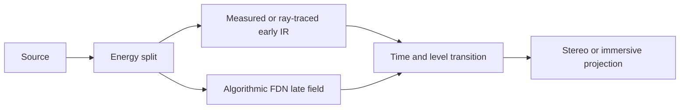
```mermaid
%% verbx-static: docs/assets/reverb_primer/32_hybrid_early_late_reverb.png
flowchart LR
    X["Source"] --> S["Energy split"]
    S --> E["Measured or ray-traced early IR"]
    S --> L["Algorithmic FDN late field"]
    E --> J["Time and level transition"]
    L --> J
    J --> D["Stereo or immersive projection"]
```

**Figure: Hybrid reverberator combining geometrical early energy with an algorithmic late field.**

**How to read this figure.** The upper branch preserves identifiable paths and directional
cues. The lower branch turns diffuse energy into a controllable recursive tail. The join
is responsible for matching arrival density, spectrum, energy, and spatial character;
the final decoder presents one coherent room rather than two stacked effects.

Hybrid calibration begins by selecting a transition interval, then matching the late
network to the measured energy-decay slope and spectrum around that interval. Excite the
FDN with a decorrelated version of the final early energy rather than an unrelated dry
copy when continuity matters. Preserve deterministic seeds so a rebuilt hybrid IR does
not change every time documentation, tests, or presets are regenerated.

#### Measuring Decay with Backward Integration

RT60 should be measured from the response, not assumed from a parameter label. Schroeder
backward integration estimates the energy remaining after time index $n$:

$$
E[n]=\sum_{k=n}^{L-1}h^2[k].
$$

The normalized energy-decay curve is

$$
L_E[n]=10\log_{10}\!\left(\frac{E[n]}{E[0]}\right).
$$

A straight line is fitted over a valid decay interval and extrapolated to –60 dB. EDT
typically fits 0 to –10 dB; $T_{20}$ uses –5 to –25 dB; $T_{30}$ uses –5 to –35 dB. Those labels
describe fitting windows, not the amount of audio that must literally reach –60 dB.
Agreement among estimates suggests a reasonably exponential decay. Large disagreement
may reveal multiple slopes, a noisy tail, gating, or a source that was not impulsive.

Figure below traces the complete analysis path from response samples to reported
metrics. Every transformation should preserve enough metadata to explain a failed fit.

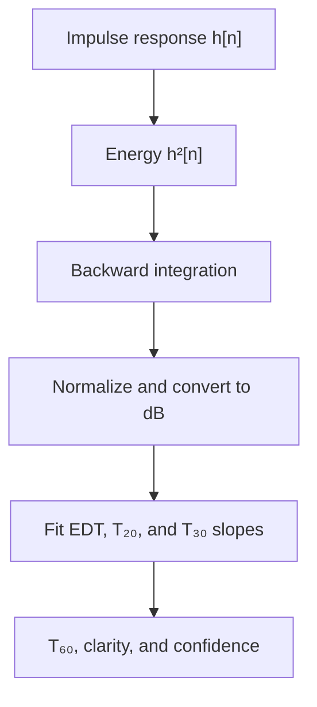
```mermaid
%% verbx-static: docs/assets/reverb_primer/31_energy_decay_measurement.png
flowchart TB
    H["Impulse response h[n]"] --> Q["Energy h²[n]"]
    Q --> I["Backward integration"]
    I --> D["Normalize and convert to dB"]
    D --> F["Fit EDT, T₂₀, and T₃₀ slopes"]
    F --> R["T₆₀, clarity, and confidence"]
```

**Figure: Measurement pipeline from an impulse response to fitted reverberation metrics.**

**How to read this figure.** Squaring removes polarity and produces instantaneous energy.
Backward integration accumulates all future energy at each time. Decibel normalization
turns exponential decay into an approximately straight line. The fitter selects only
valid dynamic ranges and reports both estimates and confidence instead of forcing one
number from an inadequate tail.

Noise-floor handling is essential. Once integrated room energy approaches integrated
background noise, the curve bends and a naive regression overestimates decay. A robust
analyzer estimates the noise floor, limits the fitting range, reports the achieved
dynamic range, and refuses a $T_{30}$ estimate when 30 reliable decibels are unavailable.
Band-limited measurements should also report filter center frequencies and bandwidths.

Decay time is only one descriptor. Clarity compares early and late energy:

$$
C_t=10\log_{10}\!\left(
\frac{\sum_{n=0}^{n_t}h^2[n]}
{\sum_{n=n_t+1}^{L-1}h^2[n]}
\right),
$$

where $t$ is commonly 50 ms for speech or 80 ms for music. Definition $D_{50}$ expresses
the first 50 ms as a fraction of total energy, and center time $T_s$ measures the energy-
weighted temporal centroid. These metrics can disagree productively: a room may have a
long RT60 yet retain useful clarity because its direct and early energy is strong.

#### Numerical Precision, Denormals, and State Safety

Recursive reverberators magnify small implementation choices because state circulates.
Double precision reduces accumulated coefficient and summation error, especially when
loop gains approach one, but it does not excuse unstable filters or an energy-increasing
matrix. Every processing format still needs explicit bounds and failure behavior.

Subnormal floating-point values can appear near the end of a long decay. Some processors
handle them slowly; others flush them to zero. A reverb can avoid pathological tails by
using supported flush-to-zero modes, adding an inaudible terminating rule below a defined
threshold, or proving that the target platform handles denormals efficiently. The policy
must not create a visible gate at normal listening levels.

State safety includes:

- finite-value checks at control boundaries rather than expensive checks on every sample;
- bounded delay indices and validated circular-buffer lengths;
- stable intermediate coefficients throughout automation ramps;
- deterministic reset behavior for transport starts, sample-rate changes, and preset loads;
- explicit handling of NaN and infinity before they enter recursive memory;
- limiter and loudness stages outside the FDN loop unless nonlinear feedback is intentional.

A limiter inside the recursive loop changes the system into a nonlinear reverberator.
That may be a creative instrument, but its RT60 formula and superposition assumptions no
longer apply. A safety limiter after wet/dry mixing controls delivery level without
rewriting the late-field poles.

#### Realtime Scheduling and End-to-End Latency

The audio callback has a deadline: one host block must finish before the device needs the
next block. If the block contains $B$ samples at sample rate $f_s$, its wall-clock budget
is

$$
T_{\mathrm{block}}=\frac{B}{f_s}.
$$

At 192 kHz, a 64-sample block allows only 0.333 ms. CPU averages are insufficient; the
worst callback matters. File I/O, memory allocation, locks, console output, JSON writing,
and device discovery do not belong in that deadline.

End-to-end monitoring latency includes input conversion and safety buffers, host input
buffering, plug-in delay, host output buffering, and output conversion. An algorithmic
FDN can add zero samples of lookahead while the complete system still has several blocks
of latency. Partitioned convolution may add one partition or use a direct head to reduce
its reported delay. A limiter with lookahead adds its own explicit samples. Report these
components separately so users can distinguish DSP latency from device configuration.

Block-size invariance is a release requirement. Rendering the same deterministic input
with 32-, 64-, 256-, and 1,024-sample blocks should not change steady parameters, decay
calibration, or automation timing beyond documented interpolation rules. Differences
often reveal state reset errors, block-rate smoothing, or FFT partition misalignment.

#### Verification: Close the Loop Between Math and Listening

No single test establishes reverb quality. An impulse exposes topology, a burst exposes
buildup, a sine sweep exposes linear response, a sustained chord exposes modes, speech
exposes masking, percussion exposes density, and a long silence exposes numerical decay.
Figure below organizes these probes into a repeatable engineering loop.

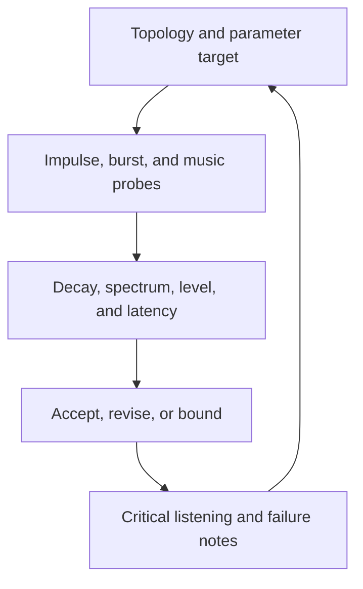
```mermaid
%% verbx-static: docs/assets/reverb_primer/33_dsp_validation_loop.png
flowchart TB
    D["Topology and parameter target"] --> P["Impulse, burst, and music probes"]
    P --> M["Decay, spectrum, level, and latency"]
    M --> A["Accept, revise, or bound"]
    A --> L["Critical listening and failure notes"]
    L --> D
```

**Figure: Closed DSP validation loop connecting deterministic probes, measurements, and listening.**

**How to read this figure.** A design target creates deterministic renders. Analysis
compares those renders with numerical bounds. Listening identifies perceptual failures
that one metric cannot summarize. The decision either accepts the design, constrains its
valid range, or feeds a specific failure back into topology and parameter choices.

A minimal verification matrix includes:

| Probe | Measure | Listen for |
|---|---|---|
| Unit impulse | Peak, first arrival, RT60, decay linearity | Flutter, isolated echoes, abrupt ending |
| Log sweep | Magnitude and phase response | Narrow resonances and spectral tilt |
| Sustained sine or chord | Mode balance and stationarity | Ringing, beating, unintended chorus |
| Percussion | Echo-density growth and peak headroom | Attack loss, groove smear, pumping |
| Speech | C50, intelligibility, wet envelope | Consonant masking and sibilant tails |
| Silence after excitation | DC, denormals, final energy | Noise growth, gate, failure to terminate |
| Multichannel impulses | Route matrix and correlation | Swaps, polarity errors, weak fold-down |

The JSON report is evidence, not decoration. Store sample rate, block size, seed,
topology, matrix family, delay set, smoothing policy, output format, measured latency,
decay estimates, and warnings. A listening observation becomes actionable when another
developer can recreate the exact state that produced it.

#### The Complete verbx Algorithmic Path

verbx separates onset design, diffusion, late-field recursion, creative transformation,
and output safety. That separation is one reason the processor remains controllable at
extreme settings. Pre-delay does not need to be hidden inside FDN delays; shimmer does
not need to destabilize the core matrix; loudness and limiting can remain outside the
reverberation state.

The complete Mermaid overview below shows the major stages. Optional blocks can be
bypassed, but their order is intentional.


```mermaid
%% verbx-static: docs/assets/reverb_primer/09_verbx_hybrid_path.png
flowchart LR
    X["Input"] --> P["Pre-delay"]
    P --> A["Schroeder allpass<br/>diffusion"]
    A --> F["Coupled FDN<br/>late field"]
    F --> C["Shimmer, bloom,<br/>duck, freeze"]
    C --> T["Tilt, EQ,<br/>loudness, limiter"]
    T --> Y["Output and<br/>analysis JSON"]
```

**Figure: Complete verbx algorithmic path from source onset to analyzed output.**

**How to read this figure.** The first two stages control when and how the room begins.
The FDN controls long-term energy exchange. Creative blocks reinterpret the wet field.
Post-processing controls presentation and delivery without changing the internal decay
calibration. The analysis sidecar records what happened. Because the stages are
separate, a user can design a natural two-second room and a 120-second harmonic cloud
with the same conceptual vocabulary.

### Why verbx Sounds Different

No single feature explains a reverb's sound. What matters is how precision, topology,
delay distribution, diffusion, spectral loss, time variation, dynamics, and routing
interact. verbx is designed to keep those dimensions explicit rather than compressing
them into one “size” macro.

#### Exact Long-Tail Gain Calibration

For delay line $i$ with duration $d_i$ seconds and target $T_{60}$, verbx computes

$$
g_i = 10^{-3d_i/T_{60}}.
$$

Every line receives a gain appropriate to its own delay. A single shared gain would make
longer lines decay differently from shorter lines and would distort the modal envelope.
At short RT60 values the error may pass unnoticed. At 120 or 360 seconds, it becomes a
slow drift in balance that the ear hears as coloration.

The algorithmic path uses 64-bit internal precision for the long-lived state. When loop
gains approach one, rounding error persists for many circulations. Double precision does
not make an unstable design stable, but it preserves the intended loss and reduces the
chance that the tail becomes a numerical artifact before it becomes silence.

#### Matrix Family as a Musical Texture Control

The feedback matrix is not a cosmetic option. It determines how state components
exchange energy. A dense uniform matrix can make the field smooth and neutral; a sparse
or graph-derived matrix can preserve more audible pathways; a slowly time-varying matrix
can reduce stationary ringing and create subtle motion.

Audition matrix families with a click, then with a sparse chord, then with a dense mix.
The click reveals periodicity. The chord reveals modal coloration. The dense mix reveals
whether motion becomes blur. Keep RT60, delay count, damping, and wet level fixed so the
comparison isolates topology.

```bash
for matrix in hadamard householder circulant random_orthogonal tv_unitary; do
  verbx render examples/audio/dry_click.wav "/tmp/click_${matrix}.wav" \
    --engine algo --rt60 8 --wet 1 --dry 0 \
    --fdn-lines 16 --fdn-matrix "$matrix" --no-progress
done
```

The best matrix is source-dependent. Uniformity is valuable for exposed classical
material; controlled irregularity can be expressive on electronic percussion; slow
motion can keep a minute-long tail alive without obvious pitch modulation.

#### Diffusion Is an Envelope, Not a Quality Score

“More diffusion” is often treated as “better reverb,” but diffusion changes the attack
of the wet field. A dense immediate onset can support vocals and pads while softening
percussion. A slower buildup can preserve transients and imply a larger volume. The
correct density is the one that makes the room speak at the right moment in the phrase.

Use allpass stages and bloom deliberately. Allpasses scatter the excitation before it
enters the late field. Bloom shapes how the wet envelope rises. They can create related
perceptions through different mechanisms. If an attack feels detached, reduce pre-delay
or accelerate buildup. If it loses definition, reduce front-end diffusion before
shortening the entire tail.

#### Time Variation Without Obvious Chorus

Stationary delay networks have stationary modes. On a sustained source, those modes can
emerge as metallic pitches. Modulation and time-varying unitary matrices distribute
energy across changing modal bases. The design goal is often to move slowly enough that
the listener hears a living space rather than a pitch effect.

`--fdn-tv-rate-hz` controls update rate and `--fdn-tv-depth` controls how far the matrix
moves from its base state. At 0.05–0.3 Hz, motion unfolds over several seconds. That is
appropriate for long ambient tails. Faster rates can become audible animation and may
be exactly right for sound design.

```bash
verbx render drone.wav /tmp/drone_moving_room.wav \
  --engine algo --rt60 45 --fdn-lines 32 --fdn-matrix tv_unitary \
  --fdn-tv-rate-hz 0.12 --fdn-tv-depth 0.08 \
  --wet 0.88 --dry 0.18 --target-peak-dbfs -2
```

#### Extreme RT60 as a New Compositional Dimension

At 0.4 seconds, reverb behaves like surface and room size. At four seconds, it becomes
phrase overlap and architectural scale. At forty seconds, it becomes harmonic memory.
At 360 seconds, it becomes a slow layer whose beginning and end may belong to different
sections of a piece. At 3600 seconds, “room simulation” is no longer the useful metaphor.
The processor is a bounded recursive instrument.

Long duration changes orchestration. Low notes occupy more future time because their
energy often decays slowly. Dense chords accumulate until the field approaches a
spectral average. Silence becomes the only way to hear internal evolution. A composer
must decide what is allowed to enter the field, not merely how much of it is returned.

Start extreme experiments with floating-point output and conservative wet gain:

```bash
verbx render source.wav /tmp/extreme_field.wav \
  --engine algo --rt60 120 --wet 0.82 --dry 0.12 \
  --fdn-lines 32 --fdn-matrix tv_unitary \
  --fdn-tv-rate-hz 0.08 --fdn-tv-depth 0.06 \
  --lowcut 70 --target-peak-dbfs -3 --out-format float32 \
  --json-out /tmp/extreme_field.json
```

Do not judge the result after ten seconds. Render enough silence to hear the tail's
middle and end. Long-tail quality includes how the field leaves, not only how it begins.

#### Damping, Air, and the Meaning of Warmth

Warmth is not simply a low-pass filter after the reverb. Post-EQ changes what the
listener hears; in-loop damping changes what continues to circulate. A high-frequency
component removed inside the loop cannot return on the next pass. Over time, this
creates a changing spectrum similar to repeated interaction with absorptive surfaces.

Use post-EQ for mix placement and loop damping for decay design. If the return is bright
at the onset but should darken naturally, loop filtering is appropriate. If the decay
is correct but conflicts with a vocal, post-EQ may solve the mix without changing room
behavior. Multiband RT60 targets make this distinction explicit.

#### Ducking and the Separation of Space from Articulation

Ducking attenuates the wet field while the source is active and releases it into gaps.
It allows a long decay to coexist with clear foreground articulation. This is not merely
a corrective technique. The release envelope can become rhythmic counterpoint: the
room inhales after each phrase.

Set attack fast enough to protect the transient but not so fast that the return clicks
or pumps unnaturally. Set release in relation to syllable, beat, or phrase. A 120 ms
release may create a rhythmic pulse on drums; 400 ms may wait for a vocal line to open.
The floor parameter leaves a minimum ambience so the source does not appear to jump
between dry and wet rooms.

#### Shimmer, Bloom, Freeze, and Reverse as Re-Compositions of the Tail

Shimmer changes register. Bloom changes onset envelope. Freeze changes finite decay into
sustain. Reverse changes the direction of the energy envelope so the room anticipates
an event rather than remembering it. These modes are most convincing when written into
the musical form.

Use shimmer at a harmonic pivot, bloom before an orchestral entrance, freeze across a
section boundary, or reverse reverb as an anacrusis into one important word. When every
event receives every transformation, the special behavior becomes a static texture.
When selected events receive it, reverb becomes orchestration.

#### Gated Reverse Reverb: A Room That Arrives, Then Vanishes

Gated reverse reverb combines two envelope operations. Reverse reverb makes wet energy
rise toward a destination transient; a gate or explicitly drawn gain window limits that
rise to a deliberate interval and closes it at, just before, or just after the transient.
The result is not simply a backward tail. It is a bounded anticipatory gesture with a
composed beginning, trajectory, and ending. Silence around the gesture is part of the
effect.

Three related processes should not be confused:

- **Forward gated reverb** begins after the dry event and truncates the normal decay.
- **Ungated reverse reverb** swells into the event but may expose a long, noisy, or
  harmonically indiscriminate lead-in.
- **Gated reverse reverb** swells toward the event only inside a controlled pre-event
  window, then closes decisively enough to articulate the arrival.

Gate placement determines the result. A gate before the reverb controls which dry events
excite the processor, but the accepted events can still generate complete tails. A gate
after the wet processor shapes the audible reverberant field itself and creates the
characteristic abrupt boundary. For the canonical effect, key the detector from the dry
source while applying gain reduction only to a 100-percent-wet return. Keep the dry
transient on a separate path.

For a true offline construction, isolate the destination event, reverse it, render a wet
tail, reverse the wet render, trim it to the desired lead time, and align its maximum or
chosen cutoff with the original event. Then shape the printed return with clip gain or a
linked gate. This two-reversal method has access to future context and can create a
genuinely noncausal anticipation. It is the reference against which realtime
approximations should be judged.

The current verbx plug-in Reverse button is intentionally different: it is a
zero-lookahead, transient-triggered reverse-style swell. It cannot emit sound before a
transient that the host has not delivered. To create a true gated anticipation with the
current plug-in, print the wet Reverse return, move that stem earlier, and gate or draw
its envelope in the DAW. A future bounded-capture implementation could automate this
operation by buffering a fixed window, but its latency would be at least the active
capture duration and would have to be reported to the host.

Tempo provides a useful first estimate for the reverse window. For tempo $B$ in beats per
minute and a lead spanning $N$ beats,

$$
T_{\mathrm{lead}}=\frac{60N}{B}\ \text{seconds}.
$$

At 120 BPM, an eighth-note lead is 250 ms, a quarter-note lead is 500 ms, and a half-note
lead is 1 second. These values establish metrical intent rather than final sound. Start
the wet window 5 to 30 ms late or early relative to the grid when consonants, bow noise,
or drum attacks require a more convincing perceptual landing.

A practical vocal setup uses a 500 to 1,500 ms wet print, high-pass filtering near 120 to
250 Hz, and a gate that closes between 10 ms before and 30 ms after the dry consonant.
Drums usually tolerate shorter windows, stronger low-mid energy, and a harder close.
Pads, cymbals, and orchestral transitions can use several beats, but the gate should
still reveal a clear formal boundary rather than merely hiding the beginning of a long
wash. A 5 to 20 ms terminal fade prevents a digital click while retaining the sensation
of an abrupt cutoff.

Threshold alone is rarely sufficient. Expose or automate lead duration, detector source,
attack, hold, release, hysteresis, range, wet bandwidth, and endpoint offset. Hysteresis
prevents a noisy reverse tail from chattering around threshold. Range lets a small room
residue survive instead of forcing absolute silence. A sidechain high-pass filter keeps
plosives and kick energy from opening the gate prematurely, while a low-pass filter can
make the approach dark and leave the destination transient spectrally unobstructed.

For stereo and immersive work, derive one gate envelope from a linked detector and apply
it coherently to all wet channels. Independent channel gates can make the image twitch,
collapse, or arrive from the wrong direction as thresholds are crossed at different
times. The reverse field may widen or move during its approach, but its endpoint should
remain stable under stereo fold-down and binaural rendering. Keep LFE empty unless the
gesture specifically requires low-frequency impact, and inspect bass-managed monitoring
before assuming low-frequency wet energy was written into LFE.

Common failures are diagnostic. If the arrival sounds late, align the envelope endpoint
rather than the file boundary. If the dry attack loses force, close the wet gate earlier,
shorten the terminal fade, or reduce energy between 2 and 6 kHz. If the swell chatters,
increase hysteresis or replace level detection with a drawn window. If every phrase feels
predicted, reserve the effect for structural entrances, withheld downbeats, cadences, and
selected words. Gated reverse reverb is strongest when it changes musical causality for
one event, then returns silence to the foreground.

#### Multichannel Routing and the Shape of the Late Field

Stereo width is only one spatial dimension. In multichannel work, early energy can
localize toward the source while late energy expands to sides, rear, or height. A true
$M\times N$ convolution matrix can preserve measured cross-channel relationships. An
algorithmic FDN can project one internal state into several output channels with
decorrelated but coherent returns.

Avoid creating width by independent random reverbs on every channel. The result may be
decorrelated yet lack one shared acoustic identity. Prefer a common feedback state with
carefully designed input and output projections. Verify fold-down behavior, channel
correlation, and level after decoding.

The stereo projection flowgraph below shows a shared eight-component FDN state feeding
two different signed projection vectors. It also keeps dry/wet summing outside the
recursive state so mix automation cannot alter decay stability.


**Figure: Stereo output projection from a shared eight-line FDN state through normalized signed vectors and independent dry-wet output mixers.**

**How to read this flowgraph.** Every state component contributes to both wet channels,
but the signs in $\boldsymbol{C}_L^{\mathsf T}$ and $\boldsymbol{C}_R^{\mathsf T}$ differ. The
channels therefore share one decay history while emphasizing different modal
combinations. Normalization prevents channel count or coefficient choice from creating
an unintended level jump. The final mixers add the projected wet signals to their dry
counterparts after recursion, preserving one acoustic identity and predictable fold-down
behavior.

The following unit-circle map separates what is shared from what is channel-specific.
The internal pole ring belongs to the common FDN state, while the plotted zeros represent
one output projection; the other channel generally has a different zero pattern.


**Figure: Unit-circle map for stereo FDN projection, with shared modal poles and output-dependent transmission zeros.**

Changing $\boldsymbol{C}_L$ and $\boldsymbol{C}_R$ alters which modes cancel at each
output without constructing two unrelated acoustic systems. This is the linear-systems
reason signed projections can create width while preserving a coherent room. Mono
fold-down combines the two transfer numerators, so it must be checked explicitly: a
left-right zero that sounds spacious in stereo can become a broad cancellation after
summation.

The final companion plot makes the projection dependency concrete. It is one channel's
response; a different signed output vector retains the shared poles while changing the
locations and depths of transmission cancellations.

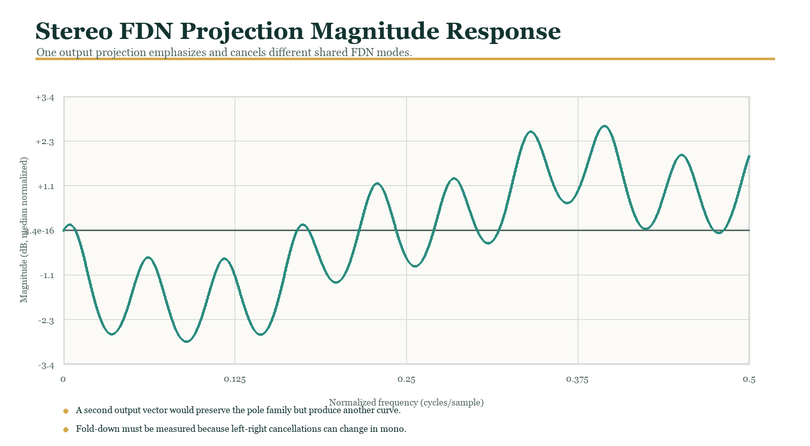

**Figure: Normalized magnitude response of one stereo FDN output projection, with frequency in cycles per sample and magnitude in decibels.**

### The Science and DSP of Dereverberation

Dereverberation asks a harder question than reverberation synthesis. A reverb processor
starts with a comparatively clean signal and a known algorithm or impulse response;
dereverberation starts with only the mixture that reached a microphone and tries to infer
which part belonged to the source before the room prolonged it. The dry performance, room
response, source position, microphone response, background noise, and often even the number
of active sources are unknown. Many different combinations of those latent quantities can
produce nearly the same recording. Dereverberation is therefore an **ill-posed inverse
problem**, not a literal undo button.

That distinction sets the standard for honest use. A successful processor can reduce late
energy, restore temporal contrast, improve speech intelligibility, and make a close source
feel less distant. It cannot generally recover the exact pressure waveform that would have
been recorded in an anechoic chamber. The most useful scientific question is consequently
not “Did all reverb disappear?” but “Which acoustic component was estimated, under which
assumptions, at what cost in distortion, spatial fidelity, and latency?”

#### The Forward Acoustic Model

For one stationary source and one microphone, the standard discrete-time model is

$$
y[n] = \sum_{q=0}^{L_h-1} h[q]x[n-q] + v[n]
     = (h*x)[n] + v[n],
$$

where $x[n]$ is the unknown dry source, $h[n]$ is the room impulse response, $v[n]$ is
additive noise, and $y[n]$ is the observed microphone signal. The convolution is long:
a 1.5 s response at 48 kHz contains 72,000 samples before accounting for an even longer
noise floor. With $S$ sources and $M$ microphones, the model becomes

$$
y_m[n] = \sum_{s=1}^{S}(h_{m,s}*x_s)[n] + v_m[n],
\qquad m = 1,\ldots,M.
$$

Every source-to-microphone path has its own response $h_{m,s}[n]$. If a talker moves, a
door opens, or a handheld microphone rotates, that response is time varying rather than a
fixed convolution. The familiar linear time-invariant model remains valuable, but its
limits should be visible whenever a method is evaluated on real capture.

For dereverberation, the room response is commonly partitioned at an early/late boundary
$n_e$:

$$
h[n] = h_{\mathrm{early}}[n] + h_{\mathrm{late}}[n],
$$

$$
y[n] = x_{\mathrm{early}}[n] + r_{\mathrm{late}}[n] + v[n].
$$

Here $x_{\mathrm{early}}[n]=(h_{\mathrm{early}}*x)[n]$ is usually the desired signal,
not merely the mathematically dry source. It retains the direct arrival and a short early
window because those components support loudness, localization, source width, and
naturalness. The interference term $r_{\mathrm{late}}[n]$ contains delayed replicas that
smear later phonemes, notes, and transients. The boundary is task dependent: speech
systems often preserve tens of milliseconds, while music restoration may preserve more
of a room's early signature.

The following figure places the unknown quantities around the one observation actually
available to a blind estimator. Its non-linear layout is important: neither the room nor
the source lies in a simple known processing chain at restoration time.

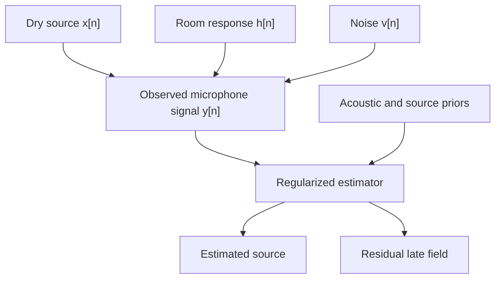
```mermaid
%% verbx-static: docs/assets/reverb_primer/34_dereverb_inverse_problem.png
flowchart TB
    X["Dry source x[n]"] --> Y["Observed microphone signal y[n]"]
    H["Room response h[n]"] --> Y
    V["Noise v[n]"] --> Y
    Y --> E["Regularized estimator"]
    P["Acoustic and source priors"] --> E
    E --> XH["Estimated source"]
    E --> R["Residual late field"]
```

**Figure: Dereverberation formulated as inference of a dry or early source from a reverberant, noisy observation using acoustic assumptions and regularization.**

**How to read this figure.** The upper paths describe physical capture; the lower paths
describe inference. Only $y[n]$ is observed. A processor must supply assumptions about
decay, source statistics, sparsity, spatial covariance, or training data before it can
separate an estimate from the residual. Stronger assumptions can produce stronger
suppression, but they also create stronger failure modes when the recording violates them.

#### Why Exact Inverse Filtering Usually Fails

If $h[n]$ were perfectly known, one might propose the inverse filter
$G(z)=1/H(z)$ so that $G(z)H(z)=1$. Three problems make that expression a poor general
solution. First, measured room responses contain deep spectral notches. Dividing by a
small $|H(e^{j\omega})|$ gives enormous gain and amplifies microphone noise, quantization,
and response-estimation error. Second, a room response is commonly nonminimum phase. Its
inverse may be unstable if zeros lie outside the unit circle, or noncausal if a stable
inverse is constructed by moving energy before the direct arrival. Third, a room response
is position specific. A filter that inverts one source/receiver pair can worsen a signal
captured a few centimeters away.

A regularized frequency-domain inverse makes the compromise explicit:

$$
G_{\lambda}(e^{j\omega}) =
\frac{H^*(e^{j\omega})}
{|H(e^{j\omega})|^2 + \lambda(\omega)}.
$$

When $|H|^2$ is large relative to $\lambda$, the expression approaches an inverse. Near
a notch, the regularizer prevents explosive gain. The function $\lambda(\omega)$ may
encode expected noise, uncertainty, perceptual weighting, or a hard robustness floor.
This is closely related to Wiener deconvolution, where the regularizer is a ratio of noise
and source power spectra. It also exposes the unavoidable bias/variance tradeoff: more
regularization leaves more room coloration; less regularization may reduce coloration on
one measurement while producing noise and instability elsewhere.

Multichannel inverse filtering can be better conditioned because several microphone paths
need not share the same zeros. The multiple-input/output inverse theorem method seeks FIR
filters whose combined channel response approximates a delayed impulse. Miyoshi and
Kaneda's formulation is foundational here. Yet it still needs measured or estimated room
responses, accurate channel synchronization, and a sufficiently stationary geometry.
It is best understood as **room-response equalization or shortening with known transfer
functions**, not as a universal blind dereverberator.

Blind methods avoid claiming that $h[n]$ is known. They estimate only a useful component:
late-reverberant power, a delayed linear prediction, a time-frequency mask, a spatial
filter, or a learned mapping. This narrower goal is why practical dereverberation can work
despite the impossibility of exact blind inversion.

#### Statistical Science of the Late Field

After sufficient mixing time, a room's late field is often approximated as diffuse,
noise-like, and exponentially decaying. If $T_{60}$ is the reverberation time, an idealized
amplitude envelope is

$$
a(t)=10^{-3t/T_{60}},
$$

and its energy envelope is

$$
a^2(t)=10^{-6t/T_{60}}=e^{-t/\tau_E},
\qquad
\tau_E=\frac{T_{60}}{6\ln 10}.
$$

This does not say that every late sample follows a smooth exponential. Individual samples
remain stochastic and interference produces fluctuations. The claim is about expected
energy over an ensemble or local time-frequency region. Real rooms also decay at different
rates by frequency, and low-frequency modes may violate diffuse-field assumptions
entirely. Erkelens and Heusdens model this frequency dependence explicitly; Habets develops
the statistical framework into practical late-reverberation estimators.

In an STFT indexed by frequency bin $k$ and frame $l$, write

$$
Y_{k,l}=X_{k,l}+R_{k,l}+V_{k,l}.
$$

A simple late-power tracker uses delayed observations as evidence for energy that may still
be arriving from earlier source frames:

$$
\widehat{\lambda}_{r,k,l}
=\alpha_k\widehat{\lambda}_{r,k,l-1}
+(1-\alpha_k)c_k|Y_{k,l-D}|^2.
$$

The delay $D$ protects the direct and early portion; the coefficient $\alpha_k$ smooths
the estimate; $c_k$ maps delayed energy to an expected residual according to decay rate.
A longer $T_{60}$ implies slower forgetting. Frequency-dependent $\alpha_k$ or $c_k$
allows a bright room, dark room, or strongly modal low end to be represented more honestly
than one broadband constant.

This model fails predictably. A sustained organ tone looks like persistent source energy
and persistent late energy at once. A noise burst can be mistaken for a diffuse tail. A
new note arriving while the old note decays violates the simple delayed-cause narrative.
Nonstationary background noise biases the tail estimate upward. These are not merely tuning
problems; they are ambiguities in the evidence. A robust implementation therefore bounds
gain, smooths estimates, preserves a residual floor, and reports its assumptions.

#### Spectral Suppression and Wiener Estimation

Once desired and late-reverberant power estimates are available, a Wiener-style gain can
be formed as

$$
G_{k,l}^{\mathrm W}
=\frac{\widehat{\lambda}_{x,k,l}}
{\widehat{\lambda}_{x,k,l}+\widehat{\lambda}_{r,k,l}
+\widehat{\lambda}_{v,k,l}}
=\frac{\xi_{k,l}}{1+\xi_{k,l}},
$$

where $\xi_{k,l}$ is an a priori desired-to-interference ratio. The estimate is
$\widehat{X}_{k,l}=G_{k,l}^{\mathrm W}Y_{k,l}$. A spectral-subtraction alternative uses

$$
|\widehat{X}_{k,l}|^p
=\max\!\left(
|Y_{k,l}|^p-\beta\widehat{\lambda}_{r,k,l},
G_{\min}^{p}|Y_{k,l}|^p
\right),
$$

with $p=1$ for magnitude subtraction or $p=2$ for power subtraction. The oversubtraction
factor $\beta$ controls aggressiveness and $G_{\min}$ prevents complete spectral holes.
Both families normally reuse the observed phase because estimating clean phase is much
harder. That phase reuse is one reason a strongly processed signal can remain smeared or
phaselike even after its magnitude envelope looks cleaner.

The following figure shows the estimator as two evidence paths meeting at a bounded gain,
rather than as a magical “remove room” block.

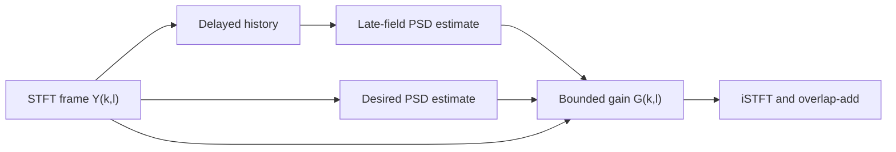
```mermaid
%% verbx-static: docs/assets/reverb_primer/35_statistical_dereverb_estimator.png
flowchart LR
    Y["STFT frame Y(k,l)"] --> D["Delayed history"]
    D --> R["Late-field PSD estimate"]
    Y --> X["Desired PSD estimate"]
    R --> G["Bounded gain G(k,l)"]
    X --> G
    Y --> G
    G --> O["iSTFT and overlap-add"]
```

**Figure: Statistical late-reverberation suppression using delayed spectral evidence, desired-signal evidence, a bounded time-frequency gain, and overlap-add resynthesis.**

**How to read this figure.** The upper branch estimates interference from past frames;
the lower branch estimates what should survive now. Their ratio drives the gain. The
unprocessed STFT also reaches the gain because suppression scales observed complex bins
rather than synthesizing an unrelated waveform. Resynthesis must use a compatible window
and hop so the overlap-add sum remains level and free of modulation.

The engineering details determine whether the equations sound acceptable. Frequency-only
smoothing reduces isolated “musical noise” tones but can blur narrow harmonics. Time
smoothing reduces pumping but lets late energy leak through attacks. A gain floor protects
room tone and consonant texture but limits maximum reduction. Attack/release asymmetry can
open quickly for new direct sound while closing slowly on the estimated tail. Stereo-linked
gains protect the image; independent gains can remove more channel-specific energy but make
a centered source wander.

This is the family implemented by the current `verbx dereverb` command and the live
dereverb front end. It is a deterministic STFT late-tail suppressor with `wiener` and
`spectral_sub` gain laws. It is **not** currently a WPE solver, measured-RIR inverse, source
separator, or neural dry-signal generator. The distinction matters when interpreting its
controls:

| verbx control | Estimation role | Audible risk when pushed |
|---|---|---|
| `--strength` | Scales estimated late-field removal | Hollow tone, transient thinning, modulation |
| `--floor` | Sets $G_{\min}$, the minimum residual gain | Higher values leave tail; lower values expose musical noise |
| `--window-ms` | Sets time/frequency analysis resolution | Long windows smear attacks; short windows weaken bass resolution |
| `--hop-ms` | Sets estimator update and overlap cadence | Large hops make gains coarse; incompatible hops fail validation |
| `--tail-ms` | Sets the late-energy tracking horizon | Too long mistakes sustain for room; too short misses slow decay |
| `--pre-emphasis` | Changes weighting before estimation | Excess values exaggerate sibilance and sensor noise |
| `--max-atten-db` | Caps maximum suppression | A high cap increases artifacts; a low cap limits clarity gain |
| `--stereo-link` | Couples channel gain decisions | Linking preserves image but may retain asymmetric room energy |
| `--mix` | Blends processed and latency-aligned original | Partial mix restores naturalness and some reverberation |

The safest strategy is to begin with moderate strength, a nonzero floor, and a partial
mix. Increase reduction while listening to sibilants, cymbal decays, piano attacks, and
stereo ambience, not only to steady vowels. A setting that improves a spectrogram may
still damage musical phrasing.

#### Delayed Linear Prediction and WPE

Weighted prediction error (WPE) approaches late reverberation from a different direction.
Instead of estimating a scalar late-power spectrum and attenuating bins, it models late
reverberation as a delayed linear prediction from prior STFT frames. The key insight is that
the direct and early components belong close to the current source event, while the late
field remains correlated with older microphone observations.

For $M$ microphones, stack the current observations into
$\boldsymbol{y}_{t,f}\in\mathbb{C}^{M}$. Construct a delayed history vector
$\overline{\boldsymbol{y}}_{t-\Delta,f}$ from $K$ prediction taps beginning $\Delta$
frames in the past. A selected output channel can then be modeled as

$$
Y_{t,f}=X_{t,f}+
\boldsymbol{g}_f^{\mathsf H}
\overline{\boldsymbol{y}}_{t-\Delta,f},
$$

so the dereverberated estimate is the prediction error

$$
\widehat{X}_{t,f}=Y_{t,f}-
\boldsymbol{g}_f^{\mathsf H}
\overline{\boldsymbol{y}}_{t-\Delta,f}.
$$

The prediction delay $\Delta$ is not an implementation nuisance. It defines what the
algorithm protects. If $\Delta$ is too small, the predictor explains and subtracts direct
or useful early energy. Attacks become dull and source color changes. If $\Delta$ is too
large, a portion of harmful late energy lies outside the model and survives. Prediction
order $K$ similarly trades model capacity against computation, adaptation speed, and
overfitting.

Ordinary least squares is biased toward high-energy frames. WPE assumes that the desired
speech or source coefficient is a zero-mean complex Gaussian with time-varying variance
$\lambda_{t,f}$ and minimizes

$$
J_f(\boldsymbol{g}_f)=
\sum_t
\frac{
\left|Y_{t,f}-\boldsymbol{g}_f^{\mathsf H}
\overline{\boldsymbol{y}}_{t-\Delta,f}\right|^2
}{\lambda_{t,f}}.
$$

For fixed variances this is weighted least squares. For fixed predictor coefficients, the
residual supplies an updated variance estimate. Batch WPE alternates those steps, usually
for several iterations. The inverse-variance weighting prevents high-power source frames
from dominating the filter and arises naturally from maximum-likelihood estimation under
the time-varying Gaussian model described by Nakatani and colleagues.

Define the weighted covariance and cross-correlation

$$
\boldsymbol{R}_f=
\sum_t\frac{
\overline{\boldsymbol{y}}_{t-\Delta,f}
\overline{\boldsymbol{y}}_{t-\Delta,f}^{\mathsf H}}
{\lambda_{t,f}},
\qquad
\boldsymbol{p}_f=
\sum_t\frac{
\overline{\boldsymbol{y}}_{t-\Delta,f}Y_{t,f}^*}
{\lambda_{t,f}}.
$$

Then $\boldsymbol{g}_f=\boldsymbol{R}_f^{-1}\boldsymbol{p}_f$, although a numerical
implementation should solve the linear system rather than form an explicit inverse.
Diagonal loading, condition-number checks, and finite-value guards are essential when the
history is poorly excited or channels are nearly redundant.

The following figure separates WPE's undelayed reference, delayed predictor, and iterative
variance path. That feedback relation is the reason WPE is more than a fixed comb-cancellation
filter.

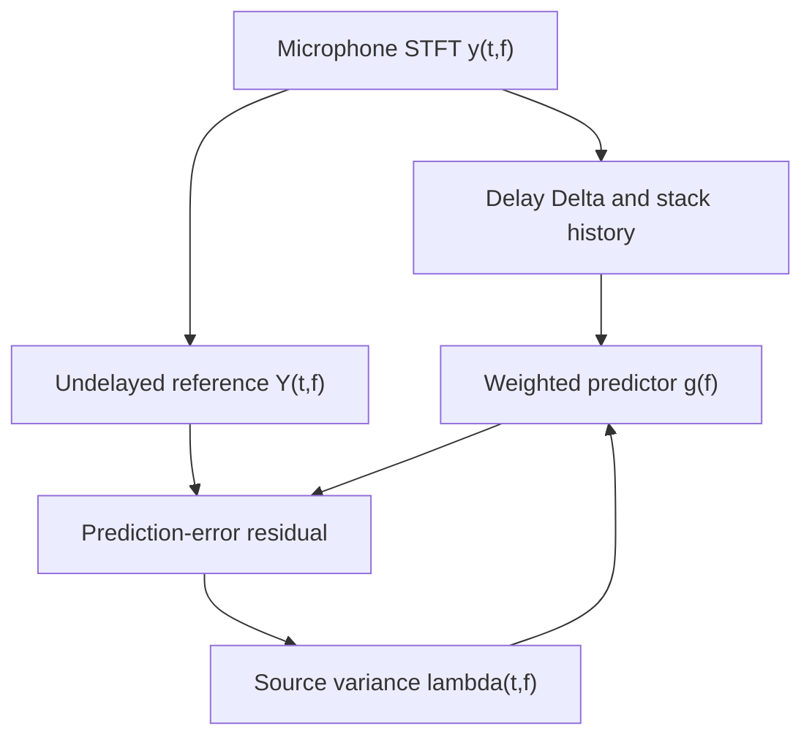
```mermaid
%% verbx-static: docs/assets/reverb_primer/36_wpe_prediction_loop.png
flowchart TB
    Y["Microphone STFT y(t,f)"] --> H["Delay Delta and stack history"]
    H --> P["Weighted predictor g(f)"]
    Y --> U["Undelayed reference Y(t,f)"]
    U --> E["Prediction-error residual"]
    P --> E
    E --> L["Source variance lambda(t,f)"]
    L --> P
```

**Figure: WPE delayed-prediction topology in which past multichannel frames estimate the late field, the current reference supplies the desired event, and residual variance reweights the predictor.**

**How to read this figure.** The middle horizontal route predicts late energy from frames
older than $\Delta$; the upper route protects the undelayed observation; the lower route
closes the statistical iteration. Subtraction occurs only after delayed prediction, so
the topology explicitly distinguishes a current onset from its older reverberant history.

Single-channel WPE can work because one channel still contains temporal predictability,
but multichannel WPE has a richer basis and can exploit spatial diversity. Batch WPE sees
the whole utterance and can iterate toward a strong estimate; online WPE must update
statistics recursively and accept an adaptation lag. Recursive least squares, recursive
covariance updates, or Kalman formulations reduce memory and delay but introduce forgetting
factors and tracking tradeoffs. Caroselli and colleagues demonstrate adaptive WPE for
large-scale recognition, while Nakatani and Kinoshita formulate frame-by-frame low-latency
joint processing.

WPE also has characteristic failure modes. A predictor can suppress sustained harmonic
material because periodic music is itself predictable. Rapid movement invalidates its
filter before adaptation catches up. Background noise corrupts covariance and variance
estimates. Very long filters become computationally expensive: for each frequency, the
history dimension grows with $MK$, and a dense solve scales steeply with that dimension.
Practical systems therefore regularize, limit order, update less frequently than every
sample, and sometimes estimate source variance with a neural network.

#### Multichannel Spatial Dereverberation

Multiple microphones do more than provide more samples. They observe different mixtures
of the same direct source and reflected field. Direct sound from a compact source has a
structured steering vector; a sufficiently diffuse late field has a different spatial
covariance; directional interferers differ again. Spatial filtering can exploit those
differences even when their spectra overlap.

For STFT observation vector $\boldsymbol{y}_{t,f}$, the spatial covariance is

$$
\boldsymbol{R}_{yy,f}=
\mathbb{E}\{\boldsymbol{y}_{t,f}\boldsymbol{y}_{t,f}^{\mathsf H}\}.
$$

If a desired steering vector $\boldsymbol{d}_f$ and interference covariance
$\boldsymbol{R}_{vv,f}$ are available, an MVDR beamformer uses

$$
\boldsymbol{w}_{\mathrm{MVDR},f}=
\frac{\boldsymbol{R}_{vv,f}^{-1}\boldsymbol{d}_f}
{\boldsymbol{d}_f^{\mathsf H}\boldsymbol{R}_{vv,f}^{-1}\boldsymbol{d}_f}.
$$

The denominator enforces unity response in the desired direction while minimizing output
power attributed to interference. A multichannel Wiener filter relaxes the distortionless
constraint to minimize mean-square error. Weighted power minimization distortionless
response (WPD) convolutional beamforming unifies delayed dereverberation and spatial
filtering in one spatio-temporal objective.

These methods are complementary rather than interchangeable. WPE attacks temporal
predictability in the late tail. Beamforming attacks spatial directions and covariance
structure. Applying WPE before a spatial filter can shorten the effective response and
improve covariance estimates; joint formulations can avoid a suboptimal fixed cascade.
Drude and colleagues report that integrating WPE with neural beamforming outperforms the
standalone components in their far-field recognition experiments. That result is evidence
for the tested conditions, not a promise that every musical array recording benefits from
the same ordering.

The following figure shows the two evidence streams that a serious multichannel system
must maintain: calibrated geometry and spatial statistics above, delayed temporal
prediction below.

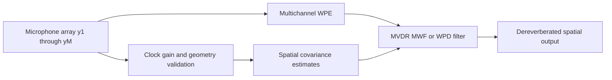
```mermaid
%% verbx-static: docs/assets/reverb_primer/37_multichannel_dereverb_stack.png
flowchart LR
    A["Microphone array y1 through yM"] --> C["Clock gain and geometry validation"]
    A --> W["Multichannel WPE"]
    C --> R["Spatial covariance estimates"]
    W --> B["MVDR MWF or WPD filter"]
    R --> B
    B --> O["Dereverberated spatial output"]
```

**Figure: A multichannel dereverberation stack combining array calibration, delayed late-tail prediction, spatial covariance estimation, and distortion-controlled beamforming.**

**How to read this figure.** The lower path shortens temporal reverberation; the upper path
describes array geometry and spatial energy. The spatial filter needs both. A channel-count
increase is not automatically useful: unsynchronized clocks, mismatched gains, unknown
microphone positions, or poor aperture can make the additional covariance unreliable.

For music and immersive production, the target output also needs definition. Collapsing a
concert recording to one beamformed channel may improve speechlike clarity while destroying
ensemble width and hall envelopment. A stereo or Ambisonic dereverberator should preserve
interchannel level, time, phase, and diffuseness cues intentionally. Gains may be linked,
estimated in a mid/side basis, or constrained by a multichannel target covariance. Every
choice decides which part of “the room” is unwanted and which part is artistic evidence.

#### Neural and Hybrid Methods

Neural dereverberation learns a mapping from reverberant observations to a chosen target.
The model may estimate a complex ratio mask, desired magnitude, clean waveform, room
response, source variance for WPE, or spatial covariance for beamforming. Architectures
include convolutional and recurrent networks, temporal convolutional networks,
transformers, complex-valued mask estimators, and waveform-domain encoder/decoders.

Supervision makes the target question unavoidable. An anechoic target asks the model to
remove both early and late room energy. An “early” target preserves the response up to a
chosen boundary. A close-microphone target includes that microphone's coloration and
bleed. A studio stem may contain processing absent from the distant observation. These are
different inverse problems. Training labels that silently mix them teach inconsistent
behavior.

Neural systems can use source regularities unavailable to blind statistical estimators.
A speech model learns phonetic and harmonic structure; a music model can learn attacks,
sustain, and instrument spectra. That prior can reconstruct plausible detail after severe
smearing. It can also hallucinate plausible but incorrect consonants, suppress unfamiliar
instruments, or imprint the training corpus's room and microphone biases. For archival,
forensic, scientific, and classical-music work, plausibility is not equivalent to fidelity.

Hybrid systems keep an interpretable acoustic core and learn the hard statistics around it.
A network may estimate $\lambda_{t,f}$ for WPE, generate masks for covariance estimation,
predict $T_{60}$ and direct-to-reverberant ratio, or synthesize a virtual second channel for
multichannel WPE. Yang and Chang's virtual acoustic channel expansion is one example;
neural-network-assisted Kalman WPE is another. These designs can retain a known prediction
topology while improving source/noise discrimination.

Real-time neural deployment adds constraints beyond model accuracy. Look-ahead, receptive
field, frame accumulation, accelerator transfer, dynamic allocation, denormal handling,
and worst-case execution time all affect audio safety. A model reporting a small arithmetic
cost can still miss a callback deadline because of memory traffic or runtime scheduling.
Any future neural `verbx` mode should publish model identity, target definition, causal
context, algorithmic delay, hardware, confidence, and deterministic fallback behavior in
its JSON report.

#### Psychoacoustics: What Should Be Removed?

The ear does not classify all reflections as damage. Early lateral reflections can increase
apparent source width and support intelligibility; a moderate room response can make speech
or music sound natural. Late energy is more likely to fill temporal gaps, reduce modulation
depth, mask following consonants, and fuse successive notes. But listeners also adapt to a
room, and context changes perceived reverberance. The perceptually optimal estimate is often
an early response, not an anechoic signal.

Speech illustrates temporal masking clearly. Energy from a vowel extends into the weaker
consonant that follows it. The consonant may still exist physically, yet its contrast is
reduced by the vowel's late field. Dereverberation restores modulation depth by attenuating
that older energy. Music complicates the rule: the same overlap may be legato, resonance,
or orchestration rather than interference. A piano pedal and a cathedral tail both prolong
energy, but only one is a room response. An estimator driven only by predictability can
damage both.

Direct-to-reverberant ratio (DRR), early-to-late ratio, clarity $C_{50}$ or $C_{80}$, and
modulation transfer describe different perceptual axes from $T_{60}$. Two recordings can
share one decay time while one has a strong direct onset and the other sounds distant.
Reducing $T_{60}$ alone does not guarantee restored presence. Conversely, increasing the
early-to-late ratio by suppressing only late energy may improve clarity without changing
the fitted slope of the residual decay very much.

Tsilfidis and Mourjopoulos explicitly connect late suppression to perceptual reverberation
modeling. Their work supports a product principle: the goal should be selective reduction
of harmful audible late energy, not maximizing numerical attenuation. The best setting is
often the lowest strength that reveals articulation without advertising the processor.

#### Artifacts and the Quality Frontier

Dereverberation sits on a Pareto frontier. More late-tail reduction normally increases at
least one cost: coloration, transient damage, background-noise modulation, spatial change,
or latency. There is no single strength value that optimizes every source and task.

| Artifact | DSP cause | Diagnostic source | Conservative remedy |
|---|---|---|---|
| Musical noise | Isolated time-frequency gains fluctuate around estimation errors | Sustained noise, cymbal tail, breath | Raise floor; smooth gains; reduce strength |
| Phasiness | Observed phase is retained while magnitude changes rapidly | Solo voice, strings, stereo room tone | Increase time smoothing; use partial mix |
| Transient erosion | Predictor or long window treats onset energy as late field | Castanets, piano, consonants | Shorten window; protect delay; reduce order or strength |
| Spectral holes | Oversubtraction drives narrow bins near zero | Harmonic sweep, pink noise | Cap attenuation; use Wiener gain; raise floor |
| Pumping | Tail estimate follows source envelope too directly | Speech pauses, kick pattern | Lengthen release/tracker; reduce strength |
| Image wobble | Channels receive unrelated gain trajectories | Centered mono source in stereo ambience | Link gains or constrain spatial covariance |
| Noise breathing | Noise is classified as source in one frame and late field in another | HVAC, preamp hiss, location bed | Estimate noise separately; retain stable floor |
| Comb coloration | Inaccurate inverse or prediction cancels correlated direct energy | Sweeps, sustained vowels | Increase regularization or prediction delay |
| Over-dry isolation | Useful early room cues are removed with the tail | Chamber music, location dialogue | Preserve early target; lower mix or strength |

Listening tests should include bypass matched for loudness. Dereverberated output often
sounds “better” simply because transients become louder or average level changes. Match
integrated loudness and peak headroom before judging clarity. Also audition the residual
$y[n]-\widehat{x}[n]$. A good residual should sound predominantly like diffuse late energy;
recognizable dry words, melody, or attacks reveal source cancellation.

#### Causality, Adaptation, and End-to-End Latency

Offline algorithms may inspect future samples, estimate statistics over a complete file,
iterate until convergence, and use zero-phase filtering. A real-time processor must commit
to output before that future exists. “Real-time” only means processing keeps pace; it does
not mean zero latency. The end-to-end monitoring delay is approximately

$$
L_{\mathrm{total}}=
L_{\mathrm{ADC}}+L_{\mathrm{input\ buffer}}+L_{\mathrm{analysis}}
+L_{\mathrm{algorithm}}+L_{\mathrm{output\ buffer}}+L_{\mathrm{DAC}},
$$

plus any operating-system safety offsets, resampling, aggregate-device buffering, plugin
host compensation, and wireless transport. A dereverberator can control only part of this
sum.

For an STFT processor, a causal window of $N$ samples must be filled before its complete
spectrum is available. A centered STFT adds future look-ahead and is unsuitable for strict
live monitoring unless that delay is accepted. Overlap-add emits updates every hop $H$,
while driver callbacks arrive in blocks of $B$ samples. If $B$ is not compatible with $H$,
the implementation needs an internal adapter or must reject the configuration. `verbx`
currently chooses fail-fast validation for the live dereverb path: the block size must be
divisible by the resolved hop size.

At 48 kHz, a 12 ms window is approximately 576 samples and a 4 ms hop is approximately
192 samples. A 384-sample callback block contains two complete hops. This does **not** imply
that total acoustic round-trip latency is exactly 12 ms or 8 ms. Driver input/output
buffers and converter safety offsets remain device dependent, and the analysis/resynthesis
implementation can add a window-related delay. The trustworthy measurement is a physical
loopback: feed a pulse through the complete input, processor, host, and output chain; record
both the reference and return; find their sample offset; repeat under realistic load; and
report median plus worst case.

WPE introduces a second time scale: statistical adaptation. A causal WPE output may have a
small signal-path delay while its covariance and source variance need many frames to become
reliable. After a source moves or speech begins, quality ramps toward steady state. That
adaptation lag is not always counted as algorithmic latency, but it affects perceived
responsiveness and should be reported. Neural methods similarly separate look-ahead from
state warm-up and accelerator scheduling.

Low latency and deep suppression conflict. Short windows react quickly but have broad
frequency bins, making low-frequency decay harder to distinguish. Short predictors adapt
quickly but model less of the tail. Small smoothers preserve attacks but allow estimate
variance to modulate the output. A live preset should be judged under deadline pressure and
dropout monitoring, not only by processing a file faster than its duration.

#### Evaluating Dereverberation Scientifically

No one metric establishes success. Evaluation should combine acoustic quantities,
signal-reconstruction metrics, downstream task performance, artifact measures, and
controlled listening. Each answers a different question.

**Paired intrusive evaluation** is possible when a dry or early target is known and aligned.
Synthetic tests convolve a clean source with measured or simulated room responses, then
compare the estimate with the original target. Scale-invariant signal-to-distortion ratio
(SI-SDR) measures reconstruction after removing a scalar gain ambiguity, but it can punish
benign spatial or equalization differences and reward solutions that do not sound natural.
Short-time objective intelligibility (STOI) and perceptual evaluation of speech quality
(PESQ) are speech oriented; neither should be treated as a music-quality score.

**Non-intrusive evaluation** is needed for ordinary recordings with no dry reference. The
speech-to-reverberation modulation energy ratio (SRMR) uses modulation spectra to estimate
reverberation-related smearing. Blind $T_{60}$, DRR, or early-to-late estimators can compare
before and after, but processing may violate the statistical model used by the estimator.
An algorithm can “game” a proxy by reshaping modulation or spectral energy without restoring
the source. Non-intrusive values are evidence, not ground truth.

**Room-acoustic evaluation** is strongest when an impulse response is available. Backward
Schroeder integration yields an energy-decay curve from which EDT, $T_{20}$, and $T_{30}$
can be fitted. Clarity indices compare early and late energy:

$$
C_{t_e}=10\log_{10}
\frac{\int_0^{t_e}h^2(t)\,dt}
{\int_{t_e}^{\infty}h^2(t)\,dt},
$$

with $t_e=50$ ms commonly used for speech and $t_e=80$ ms for music. A dereverberator aimed
at late suppression should normally increase early-to-late clarity, though its output is
not itself a pristine room impulse response if the method is nonlinear or signal dependent.

**Task evaluation** asks whether the processing helps the intended system. For distant
speech recognition, report word error rate across rooms, distances, speakers, and noise
conditions. The REVERB Challenge established paired simulated and real-room test conditions
and made clear that enhancement scores and recognition outcomes need not rank systems in
the same order. For dialogue editing, test transcription and listener effort. For source
separation, test leakage and source fidelity. For music, use trained listeners and include
transient, sustained, sparse, dense, mono, stereo, and immersive material.

**Listening evaluation** should be randomized, loudness matched, and preferably hidden.
A MUSHRA-style panel can include reverberant input, one or more estimates, the known early
target when available, and an intentionally poor anchor. Ask separate questions for
reverberation reduction, speech clarity, timbral fidelity, spatial stability, transient
quality, and overall preference. A single “quality” score hides the tradeoff the experiment
is meant to expose.

Every report should preserve the input hash, sample rate, channel layout, algorithm and
version, complete parameters, random seed if any, processing mode, machine, wall-clock
speed, algorithmic delay, measured loopback delay when relevant, and metric definitions.
Without that provenance, small score differences are not reproducible science.

#### A Reproducible verbx Workflow

Start by preserving the original and measuring what can be measured honestly. For program
audio, label blind room estimates as estimates rather than treating them like measured IR
parameters:

```bash
verbx analyze location_dialogue.wav --input-kind program --edr --room \
  --json-out reports/location_dialogue.before.json
```

Render a conservative Wiener pass to 32-bit floating-point WAV and preserve a structured
processing report:

```bash
verbx dereverb location_dialogue.wav location_dialogue.dereverb.wav \
  --mode wiener --strength 0.75 --floor 0.08 \
  --window-ms 20 --hop-ms 5 --tail-ms 120 \
  --pre-emphasis 0.15 --mix 0.9 --out-subtype float32 \
  --json-out reports/location_dialogue.dereverb.json
```

Analyze the result separately so processing metadata and measured output evidence remain
distinct records:

```bash
verbx analyze location_dialogue.dereverb.wav --input-kind program --edr --room \
  --json-out reports/location_dialogue.after.json
```

Then make at least three loudness-matched auditions: bypass, conservative processing, and
a deliberately stronger setting. The stronger setting identifies the artifact boundary;
it is not automatically the deliverable. Listen to the residual as well as the output.
For stereo material, compare linked and unlinked behavior while watching a phase-correlation
or vectorscope display.

For live monitoring, begin with a device list and use wired input/output paths:

```bash
verbx realtime --list-devices
```

```bash
verbx realtime --live-mode dereverb \
  --input-device "Built-in Microphone" --output-device "Headphones" \
  --sample-rate 48000 --block-size 384 \
  --dereverb-mode wiener --dereverb-strength 0.75 \
  --dereverb-floor 0.08 --dereverb-window-ms 12 \
  --dereverb-hop-ms 4 --dereverb-tail-ms 90 \
  --dereverb-max-atten-db 15 --dereverb-stereo-link
```

Measure physical round-trip delay before performance use. Bluetooth devices can add far
more latency than the DSP and should not be used to characterize the processor. If a DAW
hosts the plugin path, measure that host and buffer configuration rather than transferring
a standalone CLI number to it.

The experiment matrix below is more informative than searching for one universal preset:

| Dimension | Minimum useful conditions | What it reveals |
|---|---|---|
| Source | Speech, percussion, piano, sustained strings, dense mix | Source-prior and transient failures |
| Room | Short dry room, medium room, long diffuse hall, modal small room | Model mismatch and decay tracking |
| Distance | Near, medium, far | DRR dependence |
| Noise | Quiet, stationary noise, changing noise | Tail/noise confusion |
| Channels | Mono, stereo linked, stereo independent | Spatial stability |
| Strength | Bypass, conservative, nominal, stress | Artifact frontier |
| Mode | Wiener, spectral subtraction | Gain-law dependence |
| Metric | Clarity, blind decay, residual, listening, task score | Agreement and disagreement between evidence |

#### Limits, Safety, and Claims

Dereverberation cannot separate every process that prolongs sound. Instrument resonance,
sustain pedal, chorus, delay, compression release, distortion, audience noise, and the
room may overlap. A single microphone provides no label saying which decay is artistic.
Aggressive processing of a mastered recording can remove intentional production ambience
and expose edits or noise that the ambience masked.

The processor also cannot repair clipping, recover bandwidth removed before capture, or
infer a unique dry waveform from a fully smeared mixture. It may improve intelligibility
without making audio studio-dry, or make audio sound drier while decreasing fidelity. Those
outcomes are not contradictions because “reverberation amount,” “clarity,” and
“reconstruction accuracy” are different dimensions.

For forensic or evidentiary use, retain the original, process only a copy, preserve hashes
and parameters, and describe the method as enhancement rather than recovery of fact. For
machine-learning datasets, keep dry/reverberant pairing and train/validation/test room
separation intact; otherwise room leakage can make a model appear to generalize. For
archival music, prefer reversible conservative passes and document the artistic decision.

The current `verbx` implementation should therefore be described precisely as deterministic
spectral late-tail suppression. Its controls are designed to expose the reduction/artifact
tradeoff and produce machine-readable reports. WPE, multichannel convolutional beamforming,
measured inverse filtering, and neural restoration are discussed here because they define
the scientific field and roadmap, not because the CLI silently substitutes those methods.

#### Selected Primary Literature

The following works are ordered alphabetically by first author. Appendix C contains the
guide's larger annotated bibliography and cross-references [PE3], [PE4], [PE9], [SR1], and
related room-acoustic sources.

Allen, J. B.; Berkley, D. A. “Image method for efficiently simulating small-room
acoustics.” *The Journal of the Acoustical Society of America* 65(4): 943–950. DOI:
[10.1121/1.382599](https://doi.org/10.1121/1.382599), 1979.

Caroselli, J.; Shafran, I.; Narayanan, A.; Rose, R. “Adaptive multichannel
dereverberation for automatic speech recognition.” *Proceedings of Interspeech 2017*:
3877–3881. DOI:
[10.21437/Interspeech.2017-1791](https://doi.org/10.21437/Interspeech.2017-1791), 2017.

Drude, L.; Boeddeker, C.; Heymann, J.; Haeb-Umbach, R.; Kinoshita, K.; Delcroix, M.;
Nakatani, T. “Integrating neural network based beamforming and weighted prediction error
dereverberation.” *Proceedings of Interspeech 2018*: 3043–3047. DOI:
[10.21437/Interspeech.2018-2196](https://doi.org/10.21437/Interspeech.2018-2196), 2018.

Erkelens, J. S.; Heusdens, R. “A statistical room impulse response model with frequency
dependent reverberation time for single-microphone late reverberation suppression.”
*Proceedings of Interspeech 2011*: 2273–2276. DOI:
[10.21437/Interspeech.2011-82](https://doi.org/10.21437/Interspeech.2011-82), 2011.

Falk, T. H.; Zheng, C.; Chan, W.-Y. “A non-intrusive quality and intelligibility measure
of reverberant and dereverberated speech.” *IEEE Transactions on Audio, Speech, and
Language Processing* 18(7): 1766–1774. DOI:
[10.1109/TASL.2010.2052247](https://doi.org/10.1109/TASL.2010.2052247), 2010.

Habets, E. A. P. “Speech dereverberation using statistical reverberation models.” In
Naylor, P. A.; Gaubitch, N. D., eds., *Speech Dereverberation*: 57–93. DOI:
[10.1007/978-1-84996-056-4_3](https://doi.org/10.1007/978-1-84996-056-4_3), 2010.

Habets, E. A. P.; Gannot, S.; Cohen, I. “Late reverberant spectral variance estimation
based on a statistical model.” *IEEE Signal Processing Letters* 16(9): 770–773. DOI:
[10.1109/LSP.2009.2024796](https://doi.org/10.1109/LSP.2009.2024796), 2009.

Kinoshita, K.; Delcroix, M.; Gannot, S.; Habets, E. A. P.; Haeb-Umbach, R.; Kellermann,
W.; Leutnant, V.; Maas, R.; Nakatani, T.; Raj, B.; Sehr, A.; Yoshioka, T. “A summary of
the REVERB challenge: state-of-the-art and remaining challenges in reverberant speech
processing research.” *EURASIP Journal on Advances in Signal Processing* 2016: 7. DOI:
[10.1186/s13634-016-0306-6](https://doi.org/10.1186/s13634-016-0306-6), 2016.

Miyoshi, M.; Kaneda, Y. “Inverse filtering of room acoustics.” *IEEE Transactions on
Acoustics, Speech, and Signal Processing* 36(2): 145–152. DOI:
[10.1109/29.1509](https://doi.org/10.1109/29.1509), 1988.

Nakatani, T.; Kinoshita, K. “Simultaneous denoising and dereverberation for low-latency
applications using frame-by-frame online unified convolutional beamformer.” *Proceedings
of Interspeech 2019*: 111–115. DOI:
[10.21437/Interspeech.2019-1286](https://doi.org/10.21437/Interspeech.2019-1286), 2019.

Nakatani, T.; Yoshioka, T.; Kinoshita, K.; Miyoshi, M.; Juang, B.-H. “Speech
dereverberation based on variance-normalized delayed linear prediction.” *IEEE
Transactions on Audio, Speech, and Language Processing* 18(7): 1717–1731. DOI:
[10.1109/TASL.2010.2052251](https://doi.org/10.1109/TASL.2010.2052251), 2010.

Naylor, P. A.; Gaubitch, N. D., eds. *Speech Dereverberation*. London: Springer. DOI:
[10.1007/978-1-84996-056-4](https://doi.org/10.1007/978-1-84996-056-4), 2010.

Tsilfidis, A.; Mourjopoulos, J. “Blind single-channel suppression of late reverberation
based on perceptual reverberation modeling.” *The Journal of the Acoustical Society of
America* 129(3): 1439–1451. DOI:
[10.1121/1.3533690](https://doi.org/10.1121/1.3533690), 2011.

Yang, J.-Y.; Chang, J.-H. “Virtual acoustic channel expansion based on neural networks
for weighted prediction error-based speech dereverberation.” *Proceedings of Interspeech
2020*: 3930–3934. DOI:
[10.21437/Interspeech.2020-1553](https://doi.org/10.21437/Interspeech.2020-1553), 2020.

Yoshioka, T.; Nakatani, T. “Generalization of multi-channel linear prediction methods for
blind MIMO impulse response shortening.” *IEEE Transactions on Audio, Speech, and Language
Processing* 20(10): 2707–2720. DOI:
[10.1109/TASL.2012.2210879](https://doi.org/10.1109/TASL.2012.2210879), 2012.

### A Thirty-Minute Reverb Laboratory

The following laboratory turns the chapter into an audible sequence. Use headphones
and loudspeakers if possible; keep output level fixed; preserve every render and JSON
sidecar.

#### Minute 0–5: Identify the Three Regions

Render the dry click through a one-second room at 100 percent wet. Mark direct onset,
the first visible reflections, and the point where individual arrivals become a dense
tail. Change only pre-delay and repeat. The late decay should remain similar while the
relationship between source and room changes.

#### Minute 5–10: Isolate Diffusion

Render a rimshot or click with zero, two, four, and eight allpass stages. Keep RT60 and
matrix fixed. Listen for loss of attack definition, flutter reduction, and buildup
speed. Choose the lowest stage count that supplies the density the source needs.

#### Minute 10–15: Compare Matrix Families

Use a sparse major seventh chord and an eight-second tail. Compare Hadamard, circulant,
random orthogonal, and time-varying unitary matrices. Write three adjectives for each
without looking at the option name. Then inspect sonograms and ask whether visible
modal ridges agree with what you heard.

#### Minute 15–20: Design Frequency-Dependent Decay

Set low, middle, and high RT60 values equal. Then shorten only the high band; next,
lengthen only the low band. Listen through the complete final tail. The point is not to
find a universal curve but to learn how decay spectrum changes perceived material and
scale.

#### Minute 20–25: Make the Return a Musical Voice

Put verbx on a 100 percent wet auxiliary return. Send only the final note of every
four-bar phrase. Then leave the send constant and automate the return instead. Compare
the two gestures. One controls what the room remembers; the other controls when the
memory is revealed.

#### Minute 25–30: Enter Extreme Time Safely

Render one stable chord into a 60-second time-varying FDN. Leave at least 90 seconds of
silence after the source. Write floating-point audio and a JSON report. Inspect peak,
integrated loudness, DC offset, and the final 20 seconds. Increase RT60 only after the
tail is spectrally and numerically controlled.

### Practical Listening Checklist

- **Onset:** Does the room begin with the source, behind it, or as a separate echo?
- **Density:** Can individual repetitions be heard after they should have fused?
- **Color:** Which bands survive longest, and is that survival musically useful?
- **Modes:** Do stable pitches emerge that were not structurally important in the source?
- **Width:** Does the return enlarge the image without weakening the center or fold-down?
- **Dynamics:** Does the tail mask attacks, words, or harmonic changes?
- **Motion:** Does time variation feel architectural, chorused, or unstable?
- **Ending:** Does the tail reach silence gracefully, gate abruptly, or expose noise and DC?
- **Form:** Is reverb supporting a phrase, connecting sections, or functioning as its own layer?
- **Evidence:** Can the render be reproduced from its command, preset, seed, and JSON report?

### Summary: Reverb as Memory

Reverb is the memory of an acoustic or synthetic system. Direct sound tells the listener
what happened; early reflections tell where it happened; the late field tells how the
space continues to respond. In music, that memory can reinforce articulation, connect
harmony, enlarge orchestration, preserve a past section, or become a new sustained
instrument.

verbx sounds different because it does not reduce this behavior to one size control. It
exposes the topology and timing that create density, the matrix that exchanges energy,
the filters that shape decay, the projections that create spatial output, and the
creative processes that reinterpret the field. At ordinary settings, those controls
design rooms, chambers, halls, and plates. At extreme settings, they design musical
time.

---

## Core Concepts

### Algorithmic vs. Convolution

**For beginners:** Algorithmic reverb synthesizes the space from scratch using delay networks and filters. It does not need an external file, responds instantly to parameter changes, and can produce decay times no physical room could sustain. Convolution reverb applies a pre-recorded impulse response – a measurement of what a specific room does to a click – to your audio. The result sounds like the space where the IR was recorded.

**For experts:** The algorithmic engine in verbx uses a Schroeder allpass diffusion stage feeding a fully coupled $N$-line FDN with configurable feedback matrix. Convolution uses uniformly-partitioned overlap-save FFT with optional CUDA acceleration via CuPy. The two engines share the same pre-delay, shimmer, freeze, ducking, bloom, tilt, loudness, and spatial stages. Use `--engine auto` and verbx selects based on whether an IR is present.

Choose algorithmic when you want extreme lengths, animated or time-varying decay, spaces that do not exist, low storage overhead. Choose convolution when you want: the character of a specific real or designed space, exact linear reproduction of an IR, or multichannel matrix routing from a measured space.

### RT60

**For beginners:** RT60 is the time required for reverberant sound energy to fall by
60 dB after the source stops. That is a decrease to one millionth of the starting energy,
or one thousandth of the starting pressure amplitude. A short RT60 makes events separate
quickly and usually improves articulation. A long RT60 joins events into a continuous
field and can enlarge, soften, or obscure musical detail. RT60 describes the slope of a
decay; it does not by itself describe how loud the reverb is, how soon it begins, whether
it is bright or dark, or how wide the return sounds.

A small treated room may have an RT60 below 0.4 s. Many production rooms occupy roughly
0.3–0.8 s, concert halls often lie near 1.5–2.5 s at mid frequencies, and very large stone
spaces can sustain substantially longer decays. These are orientation ranges rather than
presets or universal targets. Occupancy, frequency, source/receiver position, geometry,
and measurement method all matter. The verbx analyzer can represent estimates from 0.01 s
to 3600 s; the current render and IR-synthesis controls accept targets from 0.1 s to 3600 s.
That span moves continuously from tight acoustic control to deliberately nonphysical musical
sustain without pretending that every extreme is a plausible architectural room.

#### Decibels, Energy, and the Meaning of “60”

The decibel is logarithmic. For pressure or sample amplitude $p(t)$ relative to reference
$p_0$, level is

$$
L_p(t)=20\log_{10}\!\left(\frac{|p(t)|}{|p_0|}\right)\ \mathrm{dB}.
$$

For energy $E(t)$ relative to $E_0$, level is

$$
L_E(t)=10\log_{10}\!\left(\frac{E(t)}{E_0}\right)\ \mathrm{dB}.
$$

An amplitude ratio of $10^{-3}$ and an energy ratio of $10^{-6}$ therefore both represent
–60 dB. This is why RT60 is sometimes described as a thousandfold pressure reduction and
sometimes as a millionfold energy reduction. The statements are equivalent, provided the
reader knows which physical quantity is being discussed.

An ideal exponential amplitude envelope can be written

$$
p_{\mathrm{env}}(t)=p_0e^{-t/\tau_A},
$$

where $\tau_A$ is an amplitude time constant. Requiring a –60 dB amplitude change at
$t=T_{60}$ gives

$$
\tau_A=\frac{T_{60}}{3\ln 10}.
$$

The corresponding energy time constant is half as long:

$$
\tau_E=\frac{T_{60}}{6\ln 10}.
$$

On a decibel-versus-time graph, an ideal exponential is a straight line with slope

$$
s=-\frac{60}{T_{60}}\ \mathrm{dB/s}.
$$

Thus a 2 s decay falls at –30 dB/s, while an 8 s decay falls at –7.5 dB/s. Doubling RT60
halves the magnitude of the decay slope; it does not merely append a fixed amount of audio
to the tail.

Figure 3-1 compares four ideal decay families on one time axis. It provides the visual
reference for interpreting RT60 as a slope rather than as a cutoff point.

#### From Room Physics to Reverberation Time

In a statistical diffuse-field model, Sabine's relation estimates reverberation time from
room volume and equivalent absorption area:

$$
T_{60}\approx 0.161\frac{V}{A},
\qquad
A=\sum_j\alpha_jS_j,
$$

where $V$ is volume in cubic meters, $S_j$ is surface area in square meters, and
$\alpha_j$ is the dimensionless absorption coefficient of surface $j$. The constant
0.161 has units that make the result seconds under ordinary SI assumptions. More volume
stores more acoustic energy; more absorption removes a larger fraction at each encounter.

Sabine's approximation is strongest when absorption is modest and distributed, the field
is sufficiently diffuse, and source/receiver positions sample the room representatively.
For larger average absorption, Eyring's form accounts for the finite fractional loss more
directly:

$$
T_{60}\approx
0.161\frac{V}{-S\ln(1-\overline{\alpha})},
$$

where $S$ is total surface area and $\overline{\alpha}$ is area-weighted mean absorption.
Neither equation predicts every seat, low-frequency mode, coupled chamber, or strongly
directional geometry. They are statistical models of ensemble energy, not substitutes for
a measured impulse response or wave simulation.

Absorption is frequency dependent. Carpet, curtains, occupied seating, air, porous panels,
wood, and masonry do not remove all frequencies equally. A room consequently has an RT60
curve $T_{60}(f)$ rather than one complete scalar. Published room values should identify
octave or one-third-octave bands, occupancy, excitation, microphone arrangement, and the
estimator used. A single broadband number is useful only when its compression of that
curve is acknowledged.


**Figure: Ideal RT60 decay families showing relative decay level in decibels against time after excitation in seconds.**

**How to read Figure 3-1.** Every curve begins at the same normalized level. The 1.2 s
curve reaches –60 dB first and then remains at the displayed floor; the 8 s curve is still
decaying at the right edge. A real response does not become exactly silent at $T_{60}$.
The –60 dB crossing is a reference on an extrapolated or measured slope, while audibility
depends on source level, spectrum, masking, and the playback noise floor.

#### RT60 Inside a Feedback Delay Network

For experts, RT60 drives per-line gain calibration in a unitary or approximately
energy-preserving feedback delay network. If line $i$ has delay $d_i$ seconds and scalar
feedback magnitude $g_i$, it circulates approximately $T_{60}/d_i$ times during one target
decay. Requiring the accumulated amplitude to reach $10^{-3}$ gives

$$
g_i = 10^{-\frac{3d_i}{T_{60}}}
$$

or, for a line of $m_i$ samples at sample rate $F_s$,

$$
g_i=10^{-\frac{3m_i}{F_sT_{60}}}.
$$

Shorter delays traverse their loop more often and therefore require gains closer to one for
the same total decay. Using one identical gain on unequal delays creates unequal modal
decay rates. Calibrating each line by its duration is what turns a set of dissimilar delays
into one approximate broadband RT60 target.

This derivation assumes that the feedback matrix preserves energy. For an exactly unitary
matrix $\boldsymbol{M}$, $\boldsymbol{M}^{\mathsf H}\boldsymbol{M}=\boldsymbol{I}$, so
loss can be assigned primarily by diagonal gains or filters. A nonunitary matrix can contain
growing or shrinking eigenmodes even when every individual $g_i$ looks reasonable. Stability
depends on the complete loop operator: its spectral radius must remain below one for a
strictly decaying linear system.

At very long RT60 values, $g_i$ approaches one. Numerical precision, denormals, DC leakage,
nonlinear stages, modulation interpolation, and tiny matrix-normalization errors become
audible over time. A network that survives a five-second impulse test may drift during a
ten-minute tail. Extreme values therefore require floating-point headroom, DC blocking,
bounded modulation, long-duration stress renders, and analysis of the final segment rather
than only the onset.

#### Measuring RT60 from an Impulse Response

An acoustician rarely waits for a recorded decay to become exactly 60 dB quieter and then
reads a stopwatch. The bottom of a measured response may already be masked by ventilation,
electrical noise, audience movement, quantization, or microphone self-noise. Instead, the
usual procedure estimates the slope over a clean part of an energy decay curve and
extrapolates that line to –60 dB. The reported RT60 is therefore often a model fitted to a
smaller observed range, not a literal uninterrupted observation of all 60 dB.

Let $h(t)$ be a measured room impulse response. Schroeder backward integration forms the
remaining energy after time $t$:

$$
E(t)=\int_t^{\infty}h^2(\tau)\,d\tau.
$$

For sampled audio with final sample $N-1$, the corresponding cumulative sum is

$$
E[n]=\sum_{k=n}^{N-1}h^2[k].
$$

Normalizing by the value at the direct arrival and converting to decibels gives the energy
decay curve, or EDC:

$$
L_E[n]=10\log_{10}\!\left(\frac{E[n]}{E[n_0]}\right)\ \mathrm{dB},
$$

where $n_0$ marks the chosen decay onset. Backward integration smooths individual peaks and
turns a noisy-looking impulse response into a generally descending energy trajectory. It
does not eliminate measurement noise; because the integral includes every later sample, a
stationary noise floor eventually bends the curve away from its true room-decay slope.

Three conventional estimators use different portions of the EDC:

| Estimator | Fitted decay interval | Extrapolation to $T_{60}$ |
|---|---:|---:|
| EDT | $0$ to $-10$ dB | fitted time multiplied by $6$ |
| $T_{20}$ | $-5$ to $-25$ dB | fitted time multiplied by $3$ |
| $T_{30}$ | $-5$ to $-35$ dB | fitted time multiplied by $2$ |

Early decay time, or EDT, emphasizes the first audible release after excitation and often
tracks perceived reverberance more closely than a deep late-tail fit. T20 gives a robust
estimate when only about 20 dB of clean decay is available. T30 uses more of the response
and is preferable when the measurement has sufficient dynamic range. All three become RT60
estimates by extending the fitted straight line, so a value called “T20” is not a 20-second
quantity and does not mean that the room fell by 60 dB during the measured 20 dB interval.

Figure 3-2 places the three regression windows on one idealized EDC. The shared axis makes
clear that changing estimators changes the evidence used for the fit, not the definition of
the final 60 dB decay target.

A trustworthy implementation must make several decisions before fitting a line:

1. **Locate the onset.** Leading silence must not become part of the decay. For an impulse
   response, the strongest plausible direct event is a useful anchor; for program audio,
   peak alignment is only a diagnostic approximation because later source energy may still
   be arriving.
2. **Estimate the noise floor.** The final portion of the capture provides a noise estimate,
   but it can also contain a genuine long tail. Automatic methods must distinguish a stable
   noise plateau from slowly decaying acoustic energy and report uncertainty when they
   cannot.
3. **Choose a usable range.** A regression boundary below the noise-intersection point makes
   the EDC look artificially shallow. A boundary too near the onset may instead fit early
   geometry rather than late statistical decay.
4. **Assess linearity.** A high coefficient of determination, $R^2$, supports a single-slope
   model. A low value may indicate poor signal-to-noise ratio, multiple slopes, flutter,
   source contamination, or a genuinely nonexponential room.
5. **Preserve alternatives.** EDT, T20, T30, fit range, $R^2$, and noise floor should be
   retained together. Reporting only the selected RT60 hides the evidence needed to judge
   whether that selection is acoustically meaningful.

Uncertainty is not an optional footnote to this process. Small changes in onset, filter
bandwidth, or noise compensation can move a fitted boundary and therefore change the
extrapolated result by more than the visible difference in the measured interval. Repeated
captures reveal this sensitivity better than extra decimal places. For a venue survey,
report the estimator and spread across positions; for a synthesized IR, hold the random seed,
sample rate, output length, and analysis settings constant. For either case, interpret a
reported value such as 2.37 s as an estimate produced by a stated procedure, not proof that
the underlying acoustic field has one perfectly uniform decay constant.

verbx follows this evidence-preserving approach. `verbx analyze` aligns the strongest event,
constructs the backward-integrated EDC, computes EDT, T20, and T30 where their fit windows
are usable, and selects the deepest reliable fit as the broadband estimate. Its JSON report
also carries fit quality, usable decay range, noise-floor information, input classification,
and confidence. This is especially important for machine-learning datasets: a scalar label
without its estimator, confidence, and measurement context can turn a physically ambiguous
capture into falsely precise training data.


**Figure: Schroeder energy decay curve with the EDT, T20, and T30 regression windows marked against time after excitation in seconds.**

**How to read Figure 3-2.** The horizontal axis is elapsed time after the direct event, and
the vertical axis is normalized remaining energy in decibels. EDT begins at the top of the
decay and is therefore sensitive to early reflections and the transition into the late
field. T20 and T30 exclude the first 5 dB so the direct event and the earliest reflection
pattern have less leverage. T30 reaches deepest and can be the most representative late
estimate, but only if its –35 dB boundary remains safely above the noise-contaminated bend.

#### Energy Decay Relief

A broadband energy decay curve collapses the spectrum before integration. That is useful
for one decay estimate, but it can hide a narrow room mode, a plate resonance, or a high
band that dies much sooner than the rest of the response. An **energy decay relief** (EDR)
retains both time and frequency. It is a time-frequency generalization of the EDC: every
frequency bin receives its own backward-integrated decay curve.

Let $H(m,k)$ be STFT bin $k$ in frame $m$, and let $M$ be the final frame. Following
Julius O. Smith III's definition, the remaining energy at frame $n$ and frequency bin $k$
is

$$
\operatorname{EDR}(t_n,f_k)
=\sum_{m=n}^{M}\left|H(m,k)\right|^2,
$$

with

$$
t_n=\frac{nR}{F_s},
\qquad
f_k=\frac{kF_s}{N},
$$

where $R$ is the STFT hop size in samples, $F_s$ is sample rate in hertz, and $N$ is FFT
length. Normalizing each frequency bin at the selected onset gives a decibel surface:

$$
L_{\mathrm{EDR}}(n,k)
=10\log_{10}\!\left(
\frac{\operatorname{EDR}(t_n,f_k)}
{\operatorname{EDR}(t_0,f_k)}
\right)\ \mathrm{dB}.
$$

Figure 3-3 shows this surface as a heatmap. Horizontal position is elapsed time, vertical
position is logarithmic frequency, and color is normalized remaining energy in decibels.
A horizontal ridge indicates a frequency region that stores energy longer than its
neighbors. A nearly vertical change shared by all bands is more likely a broadband event,
edit, gate, or noise-floor transition. Curved or interrupted ridges can reveal multiple
decay regimes that disappear inside one scalar RT60.

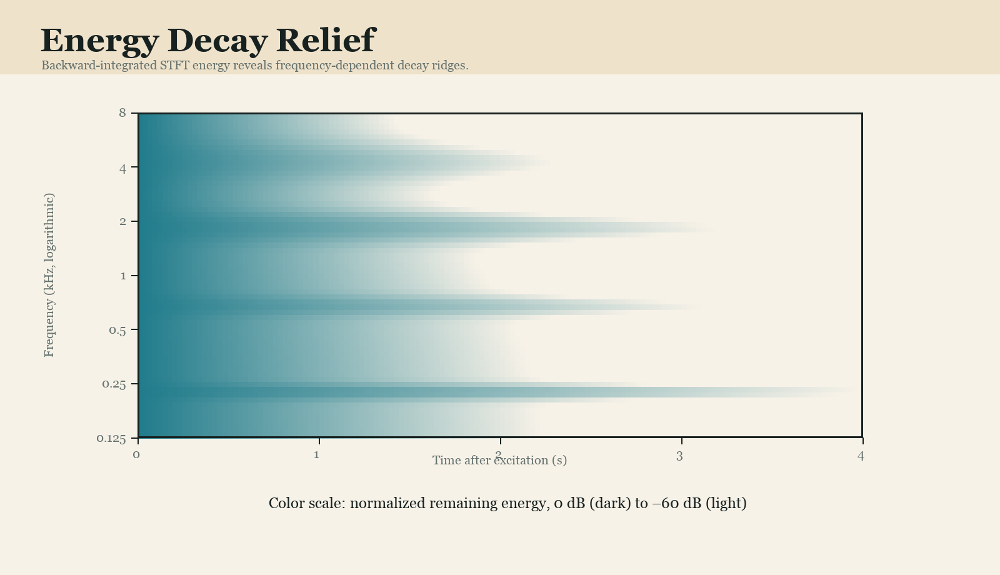

**Figure: Energy decay relief with elapsed time in seconds, logarithmic frequency in kilohertz, and normalized remaining energy in decibels.**

**How to read Figure 3-3.** Darker cells contain more remaining energy. Most frequencies
fade from left to right, but narrow ridges near 0.22, 0.66, 1.8, and 4.2 kHz persist at
different rates. Those ridges model the kind of resonant structure that a broadband EDC
averages away. The plotted data are synthetic and explanatory; they are not a measurement
of a named room or instrument.

Time-frequency resolution is a design choice. A longer window separates close modes but
smears their start and end in time. A shorter window tracks abrupt changes more closely but
spreads energy across frequency bins. Smith describes Hann windows around 30–40 ms as a
typical starting range. verbx currently uses a 2,048-sample Hann window and a one-quarter
window hop for `--edr`; at 48 kHz those values are approximately 42.7 ms and 10.7 ms.
Analysis settings therefore belong beside the result whenever EDR values are compared
across files, sample rates, or software.

`verbx analyze --edr` computes this reverse cumulative STFT-energy surface internally,
fits a decay slope in each usable frequency bin, and then returns a compact summary:
`edr_rt60_median_s`, `edr_rt60_low_s`, `edr_rt60_mid_s`,
`edr_rt60_high_s`, and `edr_valid_bins`. The current JSON report stores those summaries,
not the complete matrix. This distinction matters: the summary is appropriate for batch
comparison and room-size inference, while the full relief is the better diagnostic for
isolated modes, plate resonances, coupled slopes, and frequency-selective dereverberation.

Use EDR most confidently on a measured or synthesized impulse response. On music or speech,
later source events are included in the backward sum and can resemble stored room energy.
The result remains useful as a descriptive recording diagnostic, but it is not a
standards-style room measurement. Preserve the input classification, window, hop, sample
rate, fit range, valid-bin count, and noise context before interpreting differences as
changes in the acoustic system.

The primary derivation is Julius O. Smith III's
[Energy Decay Relief](https://ccrma.stanford.edu/~jos/pasp/Energy_Decay_Relief.html)
chapter in *Physical Audio Signal Processing* (2010).

#### Frequency-Dependent and Multiband Decay

A room does not have one decay envelope shared perfectly by every frequency. Air absorption
increases toward high frequencies; porous treatment may act mainly above a transition band;
panel and membrane absorbers can shorten selected low-frequency resonances; and walls,
seating, scenery, people, and openings all have frequency-dependent losses. For that reason,
room-acoustic reports commonly estimate $T_{60}(f)$ in octave or one-third-octave bands.

The same idea applies to artificial reverberation. If the desired decay at angular frequency
$\omega$ is $T_{60}(\omega)$, then a delay line of duration $d_i$ needs an approximate loop
filter magnitude

$$
\left|G_i\!\left(e^{j\omega}\right)\right|
=10^{-\frac{3d_i}{T_{60}(\omega)}}.
$$

This relation converts a decay-time curve into a loss-per-circulation curve. The loop filter
is not merely an equalizer placed after the reverb. A post-EQ changes the level of a band at
every instant by the same proportion; a feedback-loop filter changes that band's slope over
time. A bright onset followed by a progressively dark tail therefore requires frequency-
dependent loop loss, not just a dark output filter.

In practice, a small set of bands is easier to control and often more musically legible than
an unrestricted curve. verbx exposes low-, mid-, and high-band decay targets with two
crossovers. The broadband `--rt60` remains the central reference, while
`--fdn-rt60-low`, `--fdn-rt60-mid`, and `--fdn-rt60-high` explicitly shape the bands.
`--fdn-xover-low-hz` and `--fdn-xover-high-hz` locate their transitions. A compact
`--fdn-rt60-tilt` control skews low and high decay around the middle when a three-number
specification would interrupt a production workflow.

Figure 3-4 compares three bandwise decays that share a direct event but diverge as loop loss
accumulates. It is the visual distinction between warmth caused by persistent low-frequency
energy and simple bass boost.

Different spectral profiles imply different musical spaces. A low band that lasts modestly
longer than the middle can suggest occupied halls, timber, or massive architecture. An
excessively long low band can mask bass articulation and expose sparse FDN modes as pitched
ringing. A short high band usually sounds natural because air and soft materials absorb high
frequencies efficiently; an unusually long high band creates gloss, shimmer, or a synthetic
metallic halo. The crossover locations matter because they decide whether a decay change
affects fundamental weight, vocal presence, consonant detail, or only air.

Multiband estimates require care. Bandpass filters have finite temporal support and can
lengthen an apparent decay, especially in narrow low-frequency bands. Very low bands may
contain only a few room modes, violating the diffuse-field assumption behind a straight EDC.
A credible report should therefore list band centers, bandwidths, filter design, fit windows,
and confidence rather than presenting a smooth colored curve as exact ground truth.


**Figure: Low-, mid-, and high-frequency reverberation decay levels in decibels against time after excitation in seconds.**

**How to read Figure 3-4.** At the left edge, all bands are normalized to the same level.
The high band then falls fastest, the mid band defines the nominal body of the tail, and the
low band persists longest. Their vertical separation grows with time because their slopes,
not merely their initial gains, differ. If the high curve were shifted downward but remained
parallel to the low curve, the result would be equalization rather than frequency-dependent
RT60.

#### Non-Diffuse Rooms, Modes, and Coupled Slopes

The ideal RT60 line assumes a sufficiently mixed field with approximately exponential energy
loss. Real spaces can depart from that model in instructive ways. Below a room's transition
region, individual modes dominate. Each mode has its own frequency, spatial pattern, and
damping rate, so moving a microphone by a fraction of a wavelength can change the apparent
low-frequency decay. A broadband average can look acceptable while one note rings for much
longer than neighboring notes.

Flutter echo is another departure. Repeated reflections between nearly parallel surfaces
create identifiable arrivals rather than a smooth statistical tail. The total energy may
decline, but a line fitted through the average does not describe the audible periodicity.
Strong focusing, galleries, under-balcony regions, directional sources, and highly localized
absorption likewise make decay depend on position and direction.

Coupled rooms can produce a double-slope EDC. Energy in the primary volume falls quickly at
first; energy stored in a secondary chamber then leaks back and supports a slower late tail.
In such a response, EDT may be short, T20 intermediate, and T30 long. That disagreement is
not necessarily a software defect. It can be evidence that one exponential is an inadequate
description of the space. The same behavior is musically useful in artificial reverb: a
clear initial release followed by a quiet, persistent halo can preserve articulation while
still enlarging phrase endings.

For synthesis, modal density and decay time must be designed together. Raising RT60 does not
create more modes; it only lets existing modes remain audible longer. A sparse network with
a long target can expose its delay-line frequencies. Increasing line count, choosing
incommensurate delays, using an energy-preserving mixing matrix, adding diffusion, and
applying subtle modulation all help distribute energy. These operations should not be used
to conceal instability. The late field must remain bounded before coloration or motion is
judged artistically.

#### RT60 Is Not Wetness, Distance, or Clarity

Several controls can all make a reverb seem “more,” but they answer different questions:

| Quantity | Question it answers | Principal audible consequence |
|---|---|---|
| RT60 | How steeply does late energy decay? | persistence and phrase overlap |
| Wet level | How loud is the processed return? | effect prominence |
| Pre-delay | How long before the late field begins? | source separation and apparent scale |
| DRR | How strong is direct sound relative to reverb? | apparent distance |
| $C_{50}$ or $C_{80}$ | How much energy arrives early versus late? | speech or musical clarity |
| EDT | How quickly does the first part release? | perceived immediate reverberance |
| Spectral RT60 | Which frequency bands persist? | warmth, brightness, and masking |

A 6 s tail at –30 dB wet level can be subtler than a 1 s room mixed loudly. A long pre-delay
can keep a vocal intelligible even when the late field is extensive. Conversely, a short
RT60 with dense early reflections and low DRR can push a source far behind the loudspeakers.
This is why preset names such as “large,” “distant,” or “lush” cannot be reduced to one
decay-time value.

Clarity metrics also depend on an impulse response's time origin. $C_{80}$ compares energy
before and after 80 ms, while $C_{50}$ uses a 50 ms boundary more closely associated with
speech. If the direct arrival is misidentified, both ratios become misleading. On complete
music rather than an isolated impulse response, ongoing source energy crosses those windows,
so verbx labels such results as program-audio estimates rather than room measurements.

#### Extreme RT60, Freeze, and Infinite-Style Behavior

Finite RT60 and freeze are related but not identical. A finite 3600 s target still specifies
a negative slope of –0.0167 dB/s. In exact arithmetic it eventually decays. A freeze mode
instead aims for a loop magnitude of one, or introduces recirculation that replaces lost
energy, so the state can persist without the usual exponential release. The former is a very
long decay; the latter changes the system's operating condition.

As $T_{60}$ grows, the difference between stable and marginal becomes numerically tiny. For
a 50 ms delay, the scalar gain is about 0.944 at $T_{60}=6$ s, but about 0.999904 at
$T_{60}=3600$ s. A normalization error, nonlinear makeup gain, or interpolation overshoot
on the order of that remaining margin can change a slow decay into growth. Extreme settings
therefore deserve peak monitoring, output limiting, DC rejection, and long-horizon tests.

Offline rendering introduces a second issue: the requested decay can be much longer than the
source. Writing an hour-scale tail for a short test impulse is usually not what a user means,
and constructing an equally long proxy impulse response can look like a hung process. Use
`--dry-run` to inspect estimated work before an extreme render, choose output duration
deliberately, and treat freeze as a performance mode or bounded sound-design operation rather
than as permission to allocate an unbounded file.

Figure 3-5 contrasts a normal stable decay, an extremely slow finite decay, an idealized
freeze, and an unstable trajectory. The distinction is central to safe long-tail design.


**Figure: Stable, near-infinite, frozen, and unstable reverberation-state levels against elapsed time in seconds.**

**How to read Figure 3-5.** The ordinary stable curve slopes visibly downward. The
near-infinite curve also descends, but so slowly that a short display can make it look flat.
The freeze trajectory remains approximately constant after capture and is intentionally
marginal. The unstable trajectory rises; even slow growth is unacceptable because repeated
feedback eventually exhausts headroom. The plot should be read as a stability taxonomy, not
as a claim that finite-precision freeze can remain mathematically constant forever.

#### Musical Time and RT60

Reverberation time is measured in seconds, but composers and producers hear its interaction
with beats, gestures, rests, and harmonic rhythm. At tempo $B$ beats per minute, one beat
lasts

$$
T_{\mathrm{beat}}=\frac{60}{B}\ \mathrm{s}.
$$

In 4/4 meter, a four-beat bar lasts

$$
T_{\mathrm{bar}}=\frac{240}{B}\ \mathrm{s}.
$$

These equations do not imply that RT60 must equal a note value. They provide a grid for
asking where the tail should sit when the next attack, harmony, or rest arrives. At 120 BPM,
a beat is 0.5 s and a bar is 2 s. An RT60 of 2 s reaches –60 dB at the next bar line under
the ideal model, but it is already down –15 dB after one beat. Whether that feels connected
depends on wet level, spectrum, source density, and masking.

For an ideal decay, the level change after interval $t$ is

$$
\Delta L(t)=-60\frac{t}{T_{60}}\ \mathrm{dB}.
$$

Rearranging gives a useful compositional design equation. If the tail should be $D$ decibels
below its onset when the next event arrives after $t$ seconds, choose

$$
T_{60}=\frac{60t}{D}.
$$

For example, placing the tail about –20 dB below onset at a 1.5 s phrase boundary suggests
$T_{60}=4.5$ s. This is a starting point, not a loudness guarantee, because the source may
continue feeding the reverb and frequency bands may decay at different rates.

Short RT60 values can articulate rhythm by giving each transient a compact acoustic frame.
Long values can bind separate attacks into a sustained harmonic field, making rests active
rather than empty. A long low-frequency decay can retain harmonic roots across chord changes;
a long high-frequency decay can carry attacks and noise into the next phrase. Pre-delay can
preserve the edge of a note before that field arrives, while ducking can let the tail expand
only after the source leaves space.

The most reliable musical method is comparative listening at matched wet loudness. Render
three adjacent RT60 values, normalize only for monitoring, and compare the release at exact
phrase boundaries. Listen once for articulation, once for harmonic contamination, once for
stereo or immersive envelopment, and once at low playback level. A tail that sounds
spectacular in solo may occupy every rest in an arrangement; a tail that seems too quiet in
solo may be correct in context.

#### Practical verbx Workflows

Begin with a single broadband target and preserve enough dry signal to hear how attacks
separate from the room:

```bash
verbx render in.wav out.wav --engine algo --rt60 2.4 --wet 0.30 --dry 0.80
```

Then shape spectral persistence inside the feedback network rather than relying only on
output equalization:

```bash
verbx render in.wav out_multiband.wav --engine algo --rt60 3.3 \
  --fdn-rt60-low 5.5 --fdn-rt60-mid 3.3 --fdn-rt60-high 1.7 \
  --fdn-xover-low-hz 250 --fdn-xover-high-hz 4000 \
  --wet 0.36 --dry 0.78
```

Generate a deterministic impulse response when the decay itself is the research object.
The output length is explicit, so repeated runs remain bounded and comparable:

```bash
verbx ir gen study_hall.wav --mode fdn --length 8 --rt60 2.4 --seed 42
```

Measure that response and retain both the human-readable summary and machine-readable
evidence:

```bash
verbx analyze study_hall.wav --input-kind ir --edr --room \
  --json-out reports/study_hall.analysis.json
```

For a complete music recording, identify it as program audio so clarity and decay results
are not mistaken for standards-style room measurements:

```bash
verbx analyze wet_mix.wav --input-kind program --lufs \
  --json-out reports/wet_mix.analysis.json
```

A useful validation sequence is to synthesize an 8 s IR with a 2.4 s target, analyze it,
and compare EDT, T20, T30, and bandwise estimates. Do not require every value to equal 2.4 s
to many decimal places. The early-reflection region, finite file length, frequency shaping,
filter transients, stochastic variation, and regression windows all affect measured values.
Instead, specify tolerances, hold the seed and sample rate constant, and investigate systematic
bias separately from random variation.

When analyzing a physical room, capture multiple source/receiver positions and repeat the
measurement. Report the median and spread in each band. One beautifully smooth response can
be less representative than several imperfect responses that reveal seat-to-seat variation.
For production preset matching, preserve the original IR, its analysis JSON, the verbx
version, and the exact command alongside the derived preset.

#### Common Interpretation Failures

**“The meter says 2 s, so the room is completely described.”** A scalar RT60 omits spectral
shape, early reflections, direct-to-reverberant ratio, spatial distribution, modulation, and
nonexponential behavior. Treat it as one coordinate in a larger acoustic description.

**“T30 is always better than T20.”** T30 uses a deeper range only when that range is clean.
If the noise floor intrudes before –35 dB, the apparently more comprehensive estimator can
be less trustworthy than T20.

**“A longer RT60 should sound louder.”** RT60 controls slope. Wet gain controls return level.
Compare decays at matched loudness before attributing prominence to persistence.

**“Post-EQ creates multiband decay.”** Post-EQ changes spectral balance; loop filtering
changes spectral decay slope. Both can be useful, but they are not interchangeable.

**“A straight fit proves a diffuse room.”** A limited window can be straight even when the
full response contains modes, double slopes, or directional behavior. Inspect the EDC, the
fit interval, bandwise results, and multiple positions.

**“A one-hour RT60 is the same as infinite reverb.”** One has a very small negative slope;
the other attempts persistent state. Their stability, rendering, automation, and safety
requirements differ.

#### Selected Primary Literature

The following sources provide a compact path from physical reverberation theory through
measurement and digital synthesis. Entries are alphabetical by first author.

Eyring, C. F. “Reverberation Time in ‘Dead’ Rooms.” *The Journal of the Acoustical Society
of America* 1(2A): 217–241. DOI:
[10.1121/1.1915175](https://doi.org/10.1121/1.1915175), 1930.

Jot, J.-M. “An Analysis/Synthesis Approach to Real-Time Artificial Reverberation.”
*Proceedings of the IEEE International Conference on Acoustics, Speech, and Signal
Processing*: II-221–II-224. DOI:
[10.1109/ICASSP.1992.226080](https://doi.org/10.1109/ICASSP.1992.226080), 1992.

Jot, J.-M.; Chaigne, A. “Maximally Diffusive Yet Efficient Feedback Delay Networks for
Artificial Reverberation.” *IEEE Signal Processing Letters* 4(9): 260–263. DOI:
[10.1109/97.623041](https://doi.org/10.1109/97.623041), 1997.

Lundeby, A.; Vigran, T. E.; Bietz, H.; Vorländer, M. “Uncertainties of Measurements in Room
Acoustics.” *Acustica* 81: 344–355, 1995.

Schroeder, M. R. “New Method of Measuring Reverberation Time.” *The Journal of the
Acoustical Society of America* 37(3): 409–412. DOI:
[10.1121/1.1909343](https://doi.org/10.1121/1.1909343), 1965.

Xiang, N. “Generalization of Sabine's Reverberation Theory.” *The Journal of the Acoustical
Society of America* 148(2): R5–R6. DOI:
[10.1121/10.0001806](https://doi.org/10.1121/10.0001806), 2020.


### Impulse Responses

**For beginners:** An impulse response (IR) is a recording of what a space does to a single perfect click. When you convolve your audio with an IR, your audio sounds like it was played in that space. verbx can use IR files from external libraries, or generate its own synthetic IRs in four modes. You do not need an IR to use verbx – the algorithmic engine works without one.

**For experts:** verbx IR synthesis runs in four modes. `fdn` constructs a tail from the same FDN core used in algorithmic rendering, with configurable matrix family and decay parameters. `stochastic` generates exponentially-decayed filtered noise, shaped to match an RT60 curve. `modal` synthesizes a bank of tuned resonators – useful for musically-pitched spaces or physically-inspired objects. `hybrid` combines FDN late field with stochastic early reflections and optional modal resonator coloration. All modes use deterministic content-hash caching so repeated generation with the same parameters retrieves from cache rather than recomputing. The cache is keyed on mode, all synthesis parameters, seed, sample rate, channels, and length.

### Wet/Dry Mix

**For beginners:** `--wet` controls how much reverb you hear; `--dry` controls how much of the original unprocessed signal you keep. Most reverb uses are parallel – you blend the two. Start with `--wet 0.2 --dry 0.8` for subtle room feel and increase wet for more spaciousness. A setting of `--wet 1.0 --dry 0.0` is fully wet with no dry signal – often used in freeze or ambient texture work where you want the reverb itself as the sound.

**For experts:** verbx allows wet values above 1.0 for deliberate creative overdriving of the wet bus prior to the final mix. This is intentional and distinct from a gain error – it allows the reverb field to dominate with headroom for the loudness and limiter stages downstream to manage levels. Both `--wet` and `--dry` are valid automation targets: you can write time-varying lanes that sweep wet depth over the duration of a render, useful for automating reverb throws or level-responsive gating.

---

## The Engines

### Algorithmic Engine (`--engine algo`)

The algorithmic engine synthesizes reverb without an impulse response file. It is well suited for extreme tail lengths, evolving or modulated spaces, and creative applications where physical accuracy is not the goal.

**What it sounds like:** Smooth, dense, fully controllable. At short RT60 values (under 3 seconds) it behaves like a believable room. As RT60 increases past 20–30 seconds, it transitions into something entirely non-physical – a sustained shimmer of harmonic energy that can evolve slowly over minutes. The matrix family is the main texture control: Hadamard produces a more uniform, neutral tail; `tv_unitary` adds slow decorrelation motion; `graph` with ring topology sounds regular and periodic; `random` sounds unpredictable.

**Signal flow:**

```
input
  └─ pre-delay (z⁻ᴺᵖʳᵉ)
       └─ allpass diffusion (K stages)
            └─ FDN feedback loop
                 ├─ delay bank (N lines, z⁻ᴺⁱ)
                 ├─ per-line conditioning D_i(z)  [damping + DC block]
                 ├─ RT60 gain G  [diagonal, per-line]
                 ├─ feedback matrix M  [orthonormal family]
                 ├─ optional DFM micro-delays
                 └─ optional link filter
            └─ wet projection
  └─ dry signal
       └─ wet/dry mix → shimmer → bloom/tilt/EQ → loudness → output
```

Delay notation: $z^{-N}$ means an integer-sample delay of $N$ samples.

**FDN mechanics:** At each sample, the FDN reads from $N$ delay lines, applies per-line damping and DC blocking, multiplies by the gain diagonal $\boldsymbol{G}$, multiplies by the feedback matrix $\boldsymbol{M}$, adds the injected excitation from the diffusion stage, and writes back to the delays. The matrix $\boldsymbol{M}$ must be orthonormal (or nearly so) to preserve energy over long tails; verbx orthonormalizes all matrix families before use. The state update is:

$$
\boldsymbol{y}[n] = \boldsymbol{D}\!\left(\boldsymbol{x}_{\mathrm{fb}}[n]\right)
$$

$$
\boldsymbol{x}_{\mathrm{fb}}[n+1] = \boldsymbol{G}\boldsymbol{M}\boldsymbol{y}[n] + \boldsymbol{u}[n]
$$

where:

- $n$ is the discrete-time sample index.
- $\boldsymbol{x}_{\mathrm{fb}}[n]$ is the feedback-state vector before loop conditioning.
- $\boldsymbol{y}[n]$ is the conditioned state after $\boldsymbol{D}(\cdot)$.
- $\boldsymbol{D}(\cdot)$ is per-line loop conditioning (damping + DC blocking).
- $\boldsymbol{G}$ is the diagonal RT60 gain matrix with entries $g_i$.
- $\boldsymbol{M}$ is the orthonormal feedback mixing matrix.
- $\boldsymbol{u}[n]$ is the post-diffusion excitation injected into the loop.

**FDN gain calibration:** For delay line $i$ with period $d_i$ seconds and target decay $T_{60}$:

$$
g_i = 10^{-\frac{3d_i}{T_{60}}}
$$

Shorter delay lines require gains closer to 1.0. This is computed per line so different delay lengths in the same network all decay toward the same target RT60.

**Matrix families:**

| Matrix | Sound character | Math note |
|---|---|---|
| `hadamard` | Even, neutral density | $N \times N$ Walsh-Hadamard; valid for power-of-2 line counts |
| `householder` | Similar to Hadamard, slightly more uniform | Householder reflection matrix |
| `random_orthogonal` | Unpredictable coloration | QR decomposition of random normal matrix |
| `circulant` | Periodic, regular resonance | Diagonalized by DFT; controlled frequency-domain structure |
| `elliptic` | Weighted energy distribution | Elliptic rotation-based coupling |
| `tv_unitary` | Slowly evolving, reduced metallic ringing | Time-varying orthonormal update at `--fdn-tv-rate-hz` Hz |
| `graph` | Topology-controlled pair mixing | Staged edge interactions over ring/path/star/random graph |
| `sdn_hybrid` | Geometry-inspired directional scatter | Scattering delay network coupling approach |

**Key parameters:**

| Parameter | Range | What it does | Expert note |
|---|---|---|---|
| `--rt60` | 0.1–3600 | Decay time target (seconds) | Drives per-line gain via $g_i = 10^{-3d_i/T_{60}}$ |
| `--fdn-lines` | 2–64 | Number of delay lines | Higher line counts increase tail density; above 32 the returns diminish |
| `--fdn-matrix` | see above | Feedback mixing topology | Controls tail texture and energy diffusion pattern |
| `--allpass-stages` | 0–16 | Early diffusion stages | 4–10 is typical; 0 disables diffusion entirely |
| `--allpass-gain` | ±0.99 | Allpass coefficient | Per-stage or broadcast; must stay inside unit circle |
| `--comb-cloud` | flag | Optional pre-FDN comb bank | Adds metallic/dense coloration before the late field |
| `--comb-cloud-mix` | 0–1 | Comb-cloud blend amount | Start around `0.2` before increasing line count/feedback |
| `--damping` | 0–1 | HF rolloff in feedback loop | Higher values darken the tail faster |
| `--fdn-rt60-tilt` | –1 to 1 | Low/high decay skew | Positive = longer lows, shorter highs |
| `--fdn-link-filter` | none/lowpass/highpass | In-loop spectral shaping | Shapes the spectral flow on feedback edges |
| `--fdn-tv-rate-hz` | 0–5 | Time-varying matrix update rate | Active only with `tv_unitary`; slow rates reduce ringing |
| `--mod-depth-ms` | 0–10 | Delay modulation depth | Small values suppress metallic resonances |
| `--width` | 0–2 | Stereo spread | Increases decorrelation between channels |
| `--fdn-sparse` | flag | Sparse pair-mixing topology | Higher apparent order at lower compute cost |
| `--fdn-cascade` | flag | Nested FDN injection | Secondary network feeds early density into primary |
| `--unsafe-self-oscillate` | flag | UNSAFE above-unity feedback mode | Algorithmic engine only; for intentional self-oscillation |
| `--unsafe-loop-gain` | 0.01–1.25 | UNSAFE feedback gain scale | Use `>1.0` to drive oscillation |

---

### Spring and Plate Models (`--algo-model`)

`--algo-model spring` and `--algo-model plate` are two constrained voices of
the algorithmic engine. They are useful when the musical reference is an
electro-mechanical reverb rather than a literal room: guitar tanks, compact
combo-amp springs, vocal plates, snare plates, and bright dense returns. They
are deterministic signal-processing models by default, not sampled devices.
`--electromechanical-solver modal-fe` additionally provides a bounded offline
modal finite-element approximation. Neither mode is a calibration of a
particular spring pan or metal plate. That distinction matters. A physical device has transducer nonlinearity, mechanical
coupling, mounting loss, noise, pickup placement, and unit-to-unit variation;
verbx deliberately keeps the render reproducible and exposes an auditable
parameter set instead.

Select a model explicitly:

```bash
# Short, splashy guitar-style return.
verbx render guitar.wav guitar_spring.wav \
  --engine algo --algo-model spring --rt60 1.8 \
  --pre-delay-ms 8 --damping 0.70 --wet 0.45 --dry 0.80

# Dense vocal plate. Use dry=0 when this is an auxiliary/send return.
verbx render vocal.wav vocal_plate.wav \
  --engine algo --algo-model plate --rt60 3.2 \
  --pre-delay-ms 14 --damping 0.28 --width 1.35 --wet 1 --dry 0
```

The presets `classic_spring` and `bright_plate` provide conservative starting
points. Explicit command-line values still document the intended musical
choice, but the model also protects its identity by applying topology bounds.
For example, spring keeps short delays, a four-line circulant late field,
limited allpass gain, and a minimum amount of motion and damping. Plate uses a
larger, denser, brighter diffusion configuration. They should not be treated
as arbitrary FDN presets with every underlying topology switch exposed.

#### The Physical Reference

An ideal stretched spring supports longitudinal and torsional wave families.
Unlike the ideal string equation, their propagation is visibly dispersive: the
group delay depends on frequency, so a transient turns into a succession of
frequency-dependent arrivals. A useful conceptual model writes the phase as

$$
\phi(\omega) = \omega\tau_0 + \alpha\omega^2,
$$

where $\tau_0$ is a nominal transit time and $\alpha$ is a dispersion term.
The group delay is the derivative of phase,

$$
\tau_g(\omega) = \frac{d\phi}{d\omega} = \tau_0 + 2\alpha\omega.
$$

Higher frequencies therefore arrive at a different time from lower
frequencies. Real tanks also contain repeated reflections, coupling between
multiple springs, and losses at the input/output transducers. A modal view of
the response is

$$
H_{\mathrm{spring}}(\omega) =
\sum_{m=1}^{M}\frac{b_m}{\omega_m^2 - \omega^2 + j\,2\zeta_m\omega_m\omega},
$$

with modal frequencies $\omega_m$, damping ratios $\zeta_m$, and pickup/input
weights $b_m$. The irregular mode spacing and frequency-dependent decay are
why physical springs can sound "boingy," splashy, or metallic rather than like
a small room.

A plate is a thin two-dimensional elastic structure. In an ideal isotropic
plate, flexural-wave angular frequency has approximately quadratic dependence
on wavenumber:

$$
\omega = \sqrt{\frac{D}{\rho h}}\,k^2,
\qquad
D = \frac{E h^3}{12(1-\nu^2)},
$$

where $E$ is Young's modulus, $\rho$ density, $h$ thickness, $\nu$ Poisson's
ratio, and $D$ flexural rigidity. A rectangular plate has a mode family often
approximated by

$$
f_{mn} \propto
\left(\frac{m^2}{L_x^2} + \frac{n^2}{L_y^2}\right),
$$

for integer mode indices $(m,n)$ and plate dimensions $L_x,L_y$. Many closely
spaced modes, distributed damping, and multiple pickup paths create the
characteristically dense, bright, smooth plate tail. The equations describe
the physical reference, not an assertion that verbx solves a plate boundary
value problem sample by sample.

#### What verbx Actually Computes

Both models remain inside the stable algorithmic framework. Each delay line
uses the same RT60-calibrated feedback gain

$$
g_i = 10^{-3d_i/T_{60}},
$$

where $d_i$ is the line delay in seconds and $T_{60}$ is `--rt60`. This keeps
the decay target interpretable even when the timbre is deliberately
electro-mechanical. The feedback network mixes delay states with a matrix
$\boldsymbol{M}$ and applies damping inside the loop:

$$
\boldsymbol{x}[n+1] = \boldsymbol{G}\boldsymbol{M}
\boldsymbol{D}(z)\boldsymbol{x}[n] + \boldsymbol{u}[n].
$$

Here $\boldsymbol{D}(z)$ is the frequency-shaping loop filter and
$\boldsymbol{u}[n]$ is the diffused input. Because damping is in the feedback
path, it changes the decay spectrum rather than merely equalizing the output.

Allpass diffusion supplies echo-density growth without changing the magnitude
response of an ideal section. A representative delay-allpass form is

$$
A(z) = \frac{a + z^{-N}}{1 + a z^{-N}},
\qquad |a| < 1,
$$

where $N$ is a delay in samples and $a$ controls the phase/echo pattern. In
practice a cascade of sections and short feedback delays creates a dense
colored onset before the late field takes over. Small delay modulation changes
the effective delay according to

$$
d_i[n] = d_i + \Delta d_i\sin(2\pi f_m n/f_s),
$$

where $\Delta d_i$ is `--mod-depth-ms`, $f_m$ is `--mod-rate-hz`, and $f_s$ is
sample rate. It is a controlled decorrelation device, not a mechanical model
of spring tension changing in real time.

The resulting parameter maps are intentionally practical:

| Model | Fixed character | Main controls to use | Controls deliberately constrained |
|---|---|---|---|
| `spring` | Short, irregular, darkened and moving return | `--rt60`, `--pre-delay-ms`, `--damping`, `--wet`, `--dry`, `--width` | Four-line circulant field; short delay set; allpass stages limited to 3-5; allpass gain no higher than 0.58; modulation no lower than 1.8 ms / 0.35 Hz; damping no lower than 0.58 |
| `plate` | Dense, bright, smooth late field | `--rt60`, `--pre-delay-ms`, `--damping`, `--width`, `--wet`, `--dry` | At least eight FDN lines; Hadamard mixing; at least eight allpass stages; allpass gain at least 0.72; modulation no lower than 0.7 ms / 0.12 Hz; damping no higher than 0.38 |

`--fdn-lines`, `--fdn-matrix`, and `--comb-delays-ms` are intentionally poor
spring/plate controls because the selected model establishes those topology
choices. Use `--engine algo --algo-model fdn` when manual FDN topology design
is the actual goal.

#### Physical-Proxy CLI Controls

Spring is a multi-element model. `--spring-count` selects how many elements
are active (1 to 8); each repeatable `--spring` option describes one element.
The specification is a comma-separated list of `key=value` pairs:

```bash
verbx render guitar.wav multi_spring.wav --engine algo --algo-model spring \
  --spring-count 3 \
  --spring length_m=0.32,mass_g=20,diameter_mm=0.85,compliance_mm_n=0.45,tension_n=8,damping=0.60 \
  --spring length_m=0.46,mass_g=31,diameter_mm=1.15,compliance_mm_n=0.70,tension_n=5,damping=0.67 \
  --spring length_m=0.64,mass_g=50,diameter_mm=1.55,compliance_mm_n=1.10,tension_n=3,damping=0.76 \
  --rt60 2.1 --wet 0.48 --dry 0.78
```

Each spring accepts `length_m`, `mass_g`, `diameter_mm`, `compliance_mm_n`,
`tension_n`, and `damping`. If fewer specifications than `--spring-count` are
provided, the remaining elements use the documented defaults. The parser
rejects unknown keys, non-positive physical values, and damping outside 0 to 1.
Changing length, mass, compliance, or tension changes the derived transit
delays; diameter and compliance also influence the bounded decorrelation
profile. These values are proxies used to establish a reproducible synthetic
topology, not a calibration of a particular commercial spring tank.

Plate controls expose the dimensions and material proxies used to derive its
delay-density scale:

```bash
verbx render vocal.wav large_plate.wav --engine algo --algo-model plate \
  --plate-width-m 2.7 --plate-height-m 1.7 --plate-thickness-mm 0.8 \
  --plate-density-kg-m3 7850 --plate-youngs-gpa 200 \
  --plate-poisson-ratio 0.29 --plate-tension-n 600 \
  --plate-pickup-x 0.18 --plate-pickup-y 0.76 \
  --rt60 3.8 --wet 1 --dry 0
```

`--plate-width-m`, `--plate-height-m`, `--plate-thickness-mm`,
`--plate-density-kg-m3`, `--plate-youngs-gpa`, and `--plate-poisson-ratio`
form the flexural-rigidity proxy. `--plate-tension-n` adds a bounded tension
term. `--plate-pickup-x` and `--plate-pickup-y` are normalized coordinates
between 0 and 1 that influence pickup asymmetry. These options are valid for
every render for stable configuration files, but they only affect the selected
spring or plate model.

#### Modal Finite-Element Solver

For an explicit offline structural response, set
`--electromechanical-solver modal-fe`. This replaces the FDN proxy return with
a synthesized modal impulse response. It is bounded for repeatable renders:
spring chains allow 4 through 128 lumped nodes and plate grids allow 4 through
32 nodes per axis. `--spring-fe-modes` and `--plate-fe-modes` retain up to 128 modes; the
render report records the active post-Nyquist mode range.

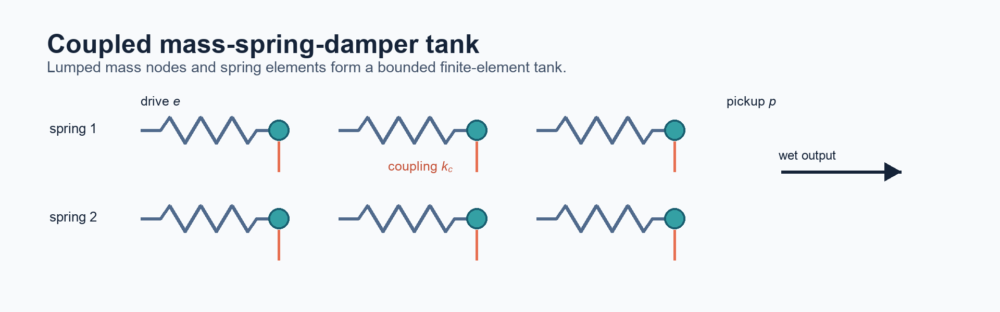

```bash
verbx render guitar.wav guitar_tank_fe.wav --engine algo --algo-model spring \
  --electromechanical-solver modal-fe --spring-count 3 \
  --spring-fe-nodes 36 --spring-fe-modes 48 --spring-fe-coupling 0.14 \
  --spring-fe-loss 0.42 --rt60 2.0 --wet 0.55 --dry 0.75

verbx render vocal.wav plate_fe.wav --engine algo --algo-model plate \
  --electromechanical-solver modal-fe --plate-fe-nx 20 --plate-fe-ny 14 \
  --plate-fe-modes 72 --plate-fe-loss 0.18 \
  --plate-pickup-x 0.18 --plate-pickup-y 0.76 --rt60 3.4 --wet 1 --dry 0
```

For a spring, verbx assembles a block mass matrix `M` and a tridiagonal chain
stiffness matrix `K`. Multi-spring tanks add a small coupling stiffness between
adjacent chains. Normal modes solve:

```text
K q[r] = lambda[r] M q[r]
omega[r] = sqrt(lambda[r])
```

The driven/pickup impulse response is a causal sum of damped modes,

```text
h(t) = sum over r of [ pickup(r) * drive(r) / omega_d(r) ]
       * exp(-sigma(r) * t) * sin(omega_d(r) * t)
```

`drive` is the input-transducer weighting and `pickup` is the output weighting.
RT60 sets the base decay rate; `--spring-fe-loss` increases high-mode loss and
`--spring-fe-coupling` controls adjacent-spring coupling.

At element level, the spring displacement vector follows the familiar
mass-spring-damper equation

```text
M x'' + C x' + K x = e u(t)
```

For a chain with $N$ nodes, verbx assigns node mass
$m_i = m_{\mathrm{total}}/N$ and segment stiffness
$k_s = (N-1)/C_{\mathrm{total}}$, where $C_{\mathrm{total}}$ is the requested
metres-per-newton compliance. The tridiagonal stiffness block is assembled from
the element contribution

$$
k_s
\begin{bmatrix}
1 & -1\\
-1 & 1
\end{bmatrix}
$$

plus a driven-end clamp.
The solver does not time-step a stiff system sample by sample: it projects the
system into normal modes and applies stable exponential modal decay.
That retains a mass-spring-damper resonance structure without making the
offline render sensitive to an integration step size.

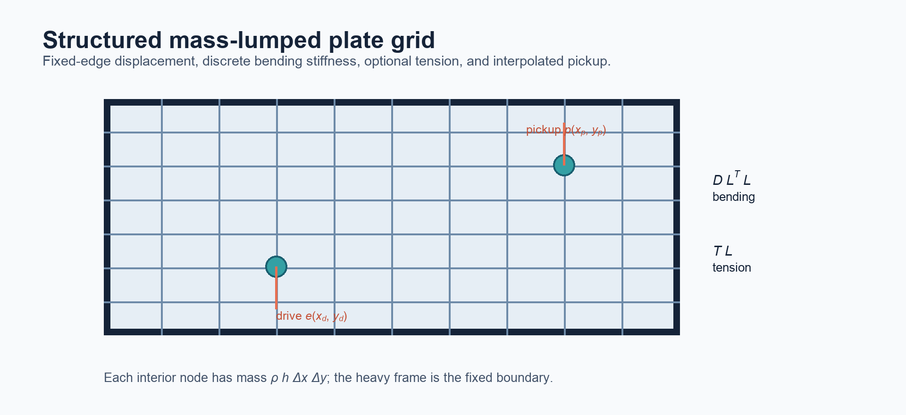

The plate solver uses a structured, mass-lumped clamped grid. Its stiffness is
the discrete thin-plate bending term plus optional membrane tension:

$$
\begin{aligned}
K &= D L^{\mathsf{T}}L + T L,\\
M_{ii} &= \rho h\,\Delta x\,\Delta y,\\
D &= \frac{E h^3}{12\left(1-\nu^2\right)}.
\end{aligned}
$$

Here `L` is the positive finite-difference Laplacian. `--plate-fe-nx`, `--plate-fe-ny`, and
`--plate-fe-modes` trade computation for detail; `--plate-fe-loss` gives
higher modes stronger decay. The input is fixed off-centre while
`--plate-pickup-x/y` select a bilinearly interpolated pickup. This is a
deterministic research/sound-design solver, not a fixture, transducer, or
hardware-nonlinearity calibration.

For the governing acoustic and structural equations, weak-form discretization,
mesh-resolution limits, boundary conditions, modal reduction, room-IR export,
hybrid FE/statistical modeling, and validation practice, see the dedicated
[Finite-Element Modeling chapter](docs/FINITE_ELEMENT_MODELING.md).

#### Practical Design and Measurement

For an insert, retain dry signal and keep wet level modest. For a send/return,
render 100 percent wet and blend in the DAW or later command stage. Spring
usually benefits from a short RT60 and darker damping; plate usually benefits
from a longer RT60, low damping, and a pre-delay that lets consonants or drum
attacks survive.

```bash
# Parallel guitar spring: leave the attack clear.
verbx render guitar.wav guitar_spring_parallel.wav \
  --engine algo --algo-model spring --rt60 1.4 --wet 0.32 --dry 0.90 \
  --pre-delay-ms 5 --damping 0.76

# Fully wet snare plate for later bus processing.
verbx render snare.wav snare_plate_return.wav \
  --engine algo --algo-model plate --rt60 1.6 --wet 1 --dry 0 \
  --pre-delay-ms 10 --damping 0.22 --width 1.5
```

Use `verbx analyze` on a rendered wet return to compare EDT, T20/T30, spectral
centroid, and clarity across parameter variations. Those measurements describe
the generated signal, not a certification that it matches a particular hardware
unit. Preserve the command, verbx version, and JSON report when a sound becomes
part of a production or a dataset.

---

### Convolution Engine (`--engine conv`)

The convolution engine filters audio through an impulse response. Use it when you want the character of a specific space – measured or synthesized – applied exactly.

**What it sounds like:** The output has the exact spectral and temporal character of the IR. A measured cathedral IR makes everything sound like it was played in that cathedral. A verbx-generated hybrid IR sounds like a designed space tuned to your specifications. Self-convolution (`--self-convolve`) smears a sound with its own spectral envelope – a different kind of effect.

**Partitioned convolution:** For long IRs, direct time-domain convolution is impractical. verbx uses uniformly-partitioned overlap-save convolution in the frequency domain:

$$
Y_k(\omega) = \sum_{p=0}^{P-1} X_{k-p}(\omega)\,H_p(\omega)
$$

where:

- $k$ is the current processing frame index.
- $\omega$ is frequency-bin index in the FFT domain.
- $P$ is the number of IR partitions.
- $X_{k-p}(\omega)$ is the stored input spectrum for frame $k-p$.
- $H_p(\omega)$ is the precomputed spectrum of IR partition $p$.
- $Y_k(\omega)$ is the accumulated output spectrum for frame $k$.

`--partition-size` controls the partition length: larger partitions reduce per-block FFT overhead but increase latency and peak memory. 16384–65536 samples is a practical range for offline rendering. With CuPy installed and `--device cuda`, the FFT multiply accumulation runs on GPU.

**Streaming vs. in-memory:** verbx automatically uses streaming convolution (low peak RAM) when the render is simple: engine conv, no repeat, no freeze, no normalization stages, no post-processing effects. All other combinations fall back to full-buffer processing. If RAM is a concern for very long IRs, keep the render chain minimal.

**Multichannel routing:** For $M$ input channels and $N$ output channels:

$$
y_o[n] = \sum_{i=0}^{M-1} \left(x_i * h_{i,o}\right)[n]
$$

where:

- $M$ is input-channel count and $N$ is output-channel count.
- $x_i[n]$ is input channel $i$.
- $h_{i,o}[n]$ is the IR from input channel $i$ to output channel $o$.
- $y_o[n]$ is output channel $o$.
- $*$ denotes linear convolution.

The IR file must contain $M \times N$ channels packed in output-major order (channel index $oM + i$) or input-major order ($iN + o$). Set `--ir-matrix-layout output-major` or `input-major` accordingly. Wrong packing order produces valid audio but semantically incorrect routing; verify with `verbx analyze` on the output.

**Key parameters:**

| Parameter | Range/values | What it does | Expert note |
|---|---|---|---|
| `--ir` | file path | Impulse response to apply | WAV, FLAC, AIFF, OGG, CAF all supported |
| `--partition-size` | 1024–131072 | FFT block size | Larger = more throughput, higher latency |
| `--tail-limit` | seconds | Cap IR tail at this length | Useful to bound compute on long IRs in batch |
| `--ir-normalize` | peak/rms/none | IR level normalization | `peak` is safest for predictable headroom |
| `--ir-matrix-layout` | output-major/input-major | Multichannel channel packing | Must match how the IR was created |
| `--ir-blend` | file path | Second IR for render-time blending | Repeatable; blend alpha automatable |
| `--ir-blend-mode` | linear/equal-power/spectral/envelope-aware | Blend algorithm | `envelope-aware` preserves early reflection character independently from late tail |
| `--self-convolve` | flag | Input file is its own IR | Spectral smearing / texture effect |
| `--device` | auto/cpu/cuda/mps | Compute backend | CUDA requires CuPy; MPS uses Apple Silicon profile |

---

## Impulse Response Synthesis

verbx generates its own IRs in four synthesis modes. The complete parameter reference is in [docs/IR_SYNTHESIS.md](docs/IR_SYNTHESIS.md). The IR toolchain is accessible via `verbx ir gen`, or triggered inline during render with `--ir-gen`.

A larger curated IR set is available in [`IRs/library/`](IRs/library/) with
folder-sorted buckets by length (`tiny`, `short`, `medium`, `long`) and mode
(`fdn`, `stochastic`, `modal`, `hybrid`), plus deterministic metadata in
`IRs/library/manifest.json`.

**Synthesis modes:**

| Mode | Character | Best for |
|---|---|---|
| `fdn` | Smooth, configurable, FDN-consistent | Spaces that match your algorithmic render topology |
| `stochastic` | Diffuse, noise-shaped, natural-sounding | Neutral halls, rooms, generic reverbs |
| `modal` | Resonant, tonal, pitched | Metal objects, tuned rooms, experimental textures |
| `hybrid` | Stochastic early + FDN late + optional modal resonator | Most general use; strong default |

**Common use case table:**

| Goal | Mode | Key flags |
|---|---|---|
| Neutral hall, natural decay | `stochastic` | `--rt60 3.0 --damping 0.4` |
| Match your FDN render topology | `fdn` | Same `--fdn-lines`, `--fdn-matrix` as render |
| Musical, pitched resonances | `modal` | `--f0 "64 Hz" --modal-count 40` |
| Microtonal or alternate-tuning resonance | any mode | `--scala-file scale.scl --scala-root-hz 220` |
| General cinematic space | `hybrid` | `--length 120 --seed 42` |
| Analyze and match audio source | `hybrid` | `--analyze-input source.wav` |

### Scala and microtonal resonance tuning

`verbx ir gen` can read a standard Scala `.scl` file and emphasize its pitch
classes across a bounded frequency range. Scala cents, integer ratios,
fractional ratios, comments, non-octave repeat intervals, and a selectable root
degree are supported. The same target set tunes modal frequencies and adds a
bounded constant-Q emphasis layer to `fdn`, `stochastic`, `modal`, and `hybrid`
IRs, so the result can reinforce a scale without turning every tail into a set
of isolated sine tones.

```bash
verbx ir gen irs/19edo_room.wav \
  --mode hybrid --length 12 --rt60 5.5 \
  --scala-file examples/scales/19edo.scl \
  --scala-root-hz 220 --scala-root-degree 0 \
  --scala-low-hz 100 --scala-high-hz 8000 \
  --scala-strength 0.7 --scala-bandwidth-cents 24 --scala-gain-db 5

verbx render in.wav out.wav --engine conv --ir irs/19edo_room.wav
verbx realtime --engine conv --ir irs/19edo_room.wav --block-size 128
```

Scala processing happens while the IR is generated, not inside the realtime
callback. This keeps realtime latency unchanged and makes one tuned IR usable
from the CLI, a DAW convolution host, or an ML data pipeline. The metadata
sidecar records the scale description, SHA-256 content hash, root mapping,
resolved target frequencies, strength, bandwidth, gain, and target budget.
`--scala-file` is intentionally exclusive with `--analyze-input` and `--f0`;
use `--scala-root-hz` when a scale is active.

Generated IRs are cached by content hash plus parameters. Repeated calls with
the same settings return from cache immediately; changing the `.scl` contents
changes its hash and cache identity even when the filename stays the same.

The complete [Microtonal Workflows and Scala Import chapter](docs/MICROTONAL_SCALA_WORKFLOWS.md)
develops this into a production and composition method. It covers Scala syntax,
root mapping, non-octave periods, transposition, tuned-IR libraries, changing
harmony, spatial deployment, ML dataset design, and the musical implications of
letting a scale remain audible in the decay field.

```bash
verbx ir gen my_space.wav --mode hybrid --length 120 --rt60 8.0 --seed 42
verbx ir analyze my_space.wav --json-out my_space_analysis.json
verbx ir morph space_A.wav space_B.wav blended.wav --mode equal-power --alpha 0.5
```

---

## Effects and Post-Processing

### Shimmer

Shimmer pitch-shifts the reverb tail (typically up an octave) and blends it back into the wet signal. The result is a bright, harmonically rich coloration that works well on pads, sustained notes, and ambient textures. The `--shimmer-feedback` parameter is the one most people get wrong: above around 0.85, the feedback loop builds exponentially. This is not a bug – it is the intended mechanism for extreme infinite-rise textures – but it requires either a tail limit, loudness targeting, or deliberate management to avoid runaway gain.

Safe mode clamps `--shimmer-feedback` to `0.98`. For intentional self-oscillation in the algorithmic path, enable `--unsafe-self-oscillate` and use `--unsafe-loop-gain > 1.0` (for example `1.03`).

```bash
--shimmer --shimmer-semitones 12 --shimmer-mix 0.35 --shimmer-feedback 0.70
--shimmer-lowcut 300 --shimmer-highcut 12000    # control frequency range of shimmer layer
```

### Comb Cloud

`--comb-cloud` inserts a separate bank of decorrelated feedback comb filters between the diffusion stage and the main FDN late field. It is an optional color mode for when you want extra density, metallic haze, or exaggerated spatial smear without redefining the core FDN topology. The point is texture, not neutrality.

Use it when the base algorithmic tail feels too smooth or too well-behaved:

- plates and metallic chambers
- sci-fi interiors and synthetic spaces
- frozen, haunted, or intentionally "wrong" ambience
- pre-shimmer thickening before harmonic coloration

Start conservatively. `--comb-cloud-mix 0.15–0.35` is usually enough. Higher `--comb-cloud-feedback` values push the sound toward ringing and resonant buildup.

```bash
--comb-cloud --comb-cloud-count 24 --comb-cloud-feedback 0.35 --comb-cloud-mix 0.25
--comb-cloud-delays-ms 6,9,13,17,23,29,37,49   # optional custom cloud spacing
```

Practical tip: comb cloud and shimmer solve different problems. Comb cloud thickens and roughens the time structure; shimmer adds pitched harmonic content. If the reverb feels sterile, try comb cloud first. If it feels emotionally flat, try shimmer.

### Freeze / Repeat

`--freeze` locks onto a segment of audio (defined by `--start` and `--end` in seconds) and loops it through the reverb engine with an equal-power crossfade at loop boundaries. This produces sustained, near-static textures. `--repeat N` runs the full render chain N times sequentially, each pass using the output of the previous as input – an iterative reprocessing that progressively imprints the room resonance on the source. Classic application: Alvin Lucier's *I Am Sitting in a Room* (1969) technique.

Use `--output-peak-norm input` with repeat chains to keep levels stable across passes.

### Ducking

`--duck` is the reverb effect most mix engineers do not use until they hear it. It attenuates the reverb output while the source signal is active, then lets the tail bloom in the gaps. The effect keeps the dry signal clean and articulate while the reverb is still long and spacious. Especially effective on drums, vocals, and anything with rhythmic transients.

```bash
--duck --duck-attack 15 --duck-release 250 --duck-strength 0.9 --duck-floor 0.18
```

Attack controls how quickly the reverb ducks when signal appears; release controls how quickly it recovers. Shorter release times give a punchier, more gated feel. `--duck-strength` controls how deep the wet attenuation goes, while `--duck-floor` keeps some reverb present even at the deepest point of the pump.

### Bloom

`--bloom N` emphasizes the slow build-up phase of the wet field, creating a cinematic swell effect where the reverb tail rises rather than immediately decaying. Values between 1.5 and 3.0 are perceptible as a rise before the decay plateau. Higher values push into dramatic orchestral-swell territory. It operates on the spectral envelope of the wet output and is distinct from simple gain automation.

Use `--bloom-mix` when you want the bloom time constant from `--bloom` but a more restrained or more exaggerated blend than the automatic scaling would choose.

### Tilt EQ

`--tilt N` applies a broadband spectral tilt to the wet field. Positive values (try 1.0–3.0) brighten the reverb tail; negative values darken it. This is a post-wet control, so it does not affect the dry signal or the decay mathematics – it only shapes the perceptual tone of the reverb output. Combine with `--lowcut` and `--highcut` for more specific frequency management.

`--tilt-pivot-hz` moves the tonal fulcrum of that tilt, while `--lowcut-order` and `--highcut-order` let you choose gentler or steeper post-wet filter slopes.

---

## Spatial and Surround

For most uses, stereo output is all you need. Multichannel processing becomes relevant when you are delivering to a surround format, working in Ambisonics, or routing reverb through a spatial bus.

For a complete treatment of channel beds, height layers, Ambisonics, Dolby Atmos beds and objects, binaural monitoring, DAW handoff, deliverables, and immersive QC, read [Immersive Reverb, Surround Sound, and Dolby Atmos](docs/IMMERSIVE_AUDIO.md). The chapter includes signal-flow diagrams, routing recipes, and a precise account of what verbx can and cannot author today.

**Wave field synthesis (WFS):** verbx can prepare deterministic dry, early-return, and late-return stems plus analysis reports for a WFS installation, but it does not calculate array driving functions, import loudspeaker coordinates, or replace the calibrated WFS renderer. Keep direct source, early images, and late field as separate assets; let the WFS system assign virtual sources and array channels. See [Wave Field Synthesis: Virtual Sources, Real Arrays, and verbx Stems](docs/IMMERSIVE_AUDIO.md#46-wave-field-synthesis-virtual-sources-real-arrays-and-verbx-stems) for the full workflow.

**Channel layouts:**

| Layout | Channels | Use case |
|---|---|---|
| `mono` | 1 | Mono sources or mono IR processing |
| `stereo` | 2 | Standard stereo output |
| `LCR` | 3 | Left/Center/Right film format |
| `5.1` | 6 | Standard surround |
| `7.1` | 8 | Expanded surround |
| `7.1.2` | 10 | Standard Atmos bed or fixed-channel immersive bus |
| `7.1.4` | 12 | Common Atmos monitoring/render layout; not the default Atmos bed |
| `7.2.4` | 13 | 7-bed + dual-LFE + 4-top layout |
| `8.0` | 8 | 8-channel bed without dedicated LFE |
| `16.0` | 16 | Large-format discrete bed |
| `64.4` | 68 | High-density immersive bed + top layer |

Use `--input-layout` and `--output-layout` to declare channel semantics explicitly. Without them, verbx uses channel count alone, which can produce ambiguous routing for formats above stereo.

**Atmos boundary:** verbx writes channel-based WAVE files, Ambisonic material, matrix-routed convolution outputs, JSON analysis, and handoff manifests. It does not currently author Dolby object trajectories, per-object binaural metadata, or a native ADM BWF/DAMF master. Prepare bed and object stems in verbx, then perform object assignment, metadata authoring, endpoint rendering, and master export in an Atmos-capable DAW and the Dolby Atmos Renderer.

The distinction between a bed and a monitoring layout matters. Dolby’s standard bed is 7.1.2, while 7.1.4 commonly describes a loudspeaker render with four independently fed height speakers. verbx currently labels channels 9–10 of its symbolic `7.1.2` layout `Ltf/Rtf`; a Dolby bed expects `Ltm/Rtm` in those positions. Verify and explicitly map those channels at handoff rather than relying on channel count.

For large immersive outputs (`16.0`, `64.4`), set `--ir-route-map` explicitly when the IR is mono or channel-matched to the input. Recommended defaults:

- `--ir-route-map broadcast` for mono/channel-matched IRs
- `--ir-route-map full` for matrix-packed $M \times N$ IRs

Other formats are also easy to support: the routing and DSP paths already operate on arbitrary channel counts, and new symbolic layout names are straightforward to add when you need explicit semantics.

**Ambisonics:** verbx supports First-Order Ambisonics (FOA) with ACN channel ordering and SN3D/N3D/FuMa normalization. Use `--ambi-order 1` to declare FOA mode. `--ambi-encode-from stereo` encodes a stereo input into FOA before processing; `--ambi-decode-to stereo` decodes back out after. `--ambi-rotate-yaw-deg` applies rotation in the Ambisonics domain – useful for spatial orientation of the reverb field relative to a listener position. FUMA is FOA-only; ACN with SN3D is the standard workflow for most Ambisonics toolchains.

**IR matrix routing for surround:** If your IR file contains $M \times N$ channels (for $M$ input and $N$ output channels), declare the packing order with `--ir-matrix-layout`. Output-major packing stores all inputs for output 0 first, then all inputs for output 1, etc. (channel index $oM + i$). Input-major stores all outputs for input 0 first (channel index $iN + o$). A 5.1 input to 5.1 output full-matrix IR has 36 channels; a diagonal (same IR per channel) has 6. The routing is explicit: verbx does not guess.

---

## Loudness and Metering

Most audio delivered for broadcast, streaming, or film needs to hit a loudness target. EBU R128 / ITU-R BS.1770 defines integrated loudness in LUFS (Loudness Units relative to Full Scale). The practical difference between targeting –23 LUFS for broadcast and –14 LUFS for streaming can be over 9 dB of apparent level – enough to sound completely wrong in one context if mastered for the other.

verbx has a full loudness pipeline:

- **`--target-lufs N`** measures integrated loudness and scales to the target. Applies after the reverb processing stage.
- **`--target-peak-dbfs N`** enforces a peak ceiling. Use with `--true-peak` for inter-sample peak checking (required for formats that will be transcoded, as codec interpolation can raise peaks above the stored sample values). Sample peak (`--sample-peak`) is sufficient for archival.
- **`--output-peak-norm [input|target|full-scale]`** is a final-stage peak fit applied after all other processing: `input` matches the input file's peak, `target` uses an explicit dBFS value, `full-scale` normalizes to near 0 dBFS.
- **Soft limiter:** enabled by default as a final safety stage. Disable with `--no-limiter` when you want to pass raw dynamics to a downstream limiter in your chain.

The loudness and peak stages are intentionally separate because they serve different goals. Loudness targeting is about program-level normalization. Peak ceiling is about short-term safety. Do not conflate them.

True-peak detection uses oversampled measurement (ITU-R BS.1770). The difference between a sample peak of –0.1 dBFS and a true peak of +0.4 dBFS is invisible in sample-domain inspection but will cause clipping in AAC, MP3, and most streaming codecs. Use `--true-peak --target-peak-dbfs -1` for any output that will be transcoded.

Week 3 delivery sanity checks now fail fast when an explicit limiter threshold is above the limiter ceiling, because that silently collapses the useful gain-reduction range. Explicit container choices also need matching extensions: use `.w64` with `--output-container w64`, `.rf64` with `--output-container rf64`, or leave `--output-container auto` on when you want verbx to infer the container.

Ready-to-run delivery examples:

```bash
# Broadcast/streaming-safe limiter and peak-normalized output
verbx render in.wav out_limited.wav --preset limiter-broadcast-safe \
  --output-peak-norm target --output-peak-target-dbfs -1

# Bounded long-tail delivery with an explicit W64 container
verbx render in.wav out_long.w64 --preset delivery-long-tail-safe \
  --output-container w64 --tail-limit 12
```

---

## Automation and Modulation

The automation system lets you change reverb parameters over the duration of a render – wet depth, RT60, room size, decay tilt, IR blend position, and more – without editing the audio manually. This is useful for: reverb throws (sudden wet increase on a vocal), automated room size sweeps during a sound design cue, feature-reactive ducking where loudness in the source drives reverb depth, and batch augmentation where different parameter curves are applied to each variant.

**Automation lanes via file or inline points:**
```bash
# Sweep RT60 from 0.8s to 10s over 15 seconds
verbx render in.wav out.wav --engine algo \
  --automation-point "rt60:0.0:0.8:linear" \
  --automation-point "rt60:15.0:10.0:linear"

# From a JSON automation file
verbx render in.wav out.wav --automation-file automation.json
```

**Automation targets include:** `wet`, `dry`, `gain-db`, `rt60`, `damping`, `room-size`, `room-size-macro`, `clarity-macro`, `warmth-macro`, `envelopment-macro`, `fdn-rt60-tilt`, `fdn-tonal-correction-strength`, `ir-blend-alpha` (requires `--ir-blend`).

**Feature vector lanes** drive automation from frame-level audio analysis of the source signal. A "feature vector" is a time-series of per-frame descriptors extracted from audio: loudness, transient strength, spectral centroid, spectral flatness, harmonic ratio, MFCCs, formant spread, rhythm pulse, and more. You map these onto render targets with weight, curve shape (linear, smoothstep, power), and hysteresis:

```bash
# Wet depth tracks loudness and transients in the source
verbx render in.wav out.wav --engine conv --ir hall.wav \
  --feature-vector-lane "target=wet,source=loudness_norm,weight=0.70,curve=smoothstep,combine=replace" \
  --feature-vector-lane "target=wet,source=transient_strength,weight=0.30,curve=power,curve_amount=1.4,combine=add" \
  --feature-vector-trace-out trace.csv
```

Use `--feature-guide GUIDE.wav` to drive feature extraction from a separate audio file rather than the render input – a sidechain-style workflow.

**Modulation bus** provides LFO and envelope sources for simple periodic or input-reactive variation without needing a full automation file:
```bash
--mod-target mix --mod-min 0.1 --mod-max 0.9 \
  --mod-source "lfo:sine:0.07:1.0*0.7" \
  --mod-source "env:20:350*0.4"
```

Source syntax: `lfo:<shape>:<rate_hz>[:depth[:phase_deg]][*weight]` | `env[:attack_ms[:release_ms]][*weight]` | `audio-env:<path>[:attack_ms[:release_ms]][*weight]` | `const:<value>[*weight]`

---

## CLI Reference

Canonical help snapshots live in
[`docs/CLI_REFERENCE.md`](docs/CLI_REFERENCE.md). This README section is a
curated quick-reference for common switches.

### verbx render

`verbx render INFILE OUTFILE [options]`

#### Engine and Room Behavior

| Switch | Range | What it does | Expert note |
|---|---|---|---|
| `--engine` | algo/conv/auto | Reverb engine | `auto` picks `conv` if IR present, else `algo` |
| `--rt60` | 0.1–3600 | Decay time (seconds) | Per-line gain via $g_i = 10^{-3d_i/T_{60}}$ |
| `--wet` | 0–∞ | Wet signal level | Values >1.0 overdrive wet bus intentionally |
| `--dry` | 0–1 | Dry signal level | |
| `--pre-delay-ms` | 0–500 | Reverb onset delay (ms) | |
| `--pre-delay` | e.g. `1/8D` | Musical note-value pre-delay | Requires `--bpm` |
| `--bpm` | float | Tempo for note-based pre-delay | |
| `--damping` | 0–1 | HF decay rate in feedback | Higher = darker tail |
| `--width` | 0–2 | Stereo decorrelation | |
| `--allpass-stages` | 0–16 | Diffusion stage count | |
| `--allpass-gain` | ±0.99 | Per-stage allpass coefficient | Comma-separated per-stage list accepted |
| `--comb-cloud` | flag | Enable optional pre-FDN comb-cloud coloration | Separate color stage; default off |
| `--comb-cloud-count` | 1–128 | Generated comb-cloud line count | Higher = denser, more colored |
| `--comb-cloud-feedback` | 0–0.95 | Comb-cloud feedback amount | Higher = more ringing / metallicity |
| `--comb-cloud-mix` | 0–1 | Blend between diffusion output and comb-cloud output | 0.15–0.35 is a strong starting range |
| `--comb-cloud-delays-ms` | comma list | Custom comb-cloud delay list in ms | Auto-enables comb cloud |
| `--comb-cloud-seed` | int | Deterministic comb-cloud seed | Changes generated spacing/decorrelation |
| `--fdn-lines` | 2–64 | Delay line count | |
| `--fdn-matrix` | see table above | Feedback matrix family | |
| `--fdn-tv-rate-hz` | 0–5 | TV-unitary update rate | `tv_unitary` only |
| `--fdn-tv-depth` | 0–1 | TV-unitary blend depth | `tv_unitary` only |
| `--fdn-matrix-morph-to` | matrix family | Target matrix for gradual morphing | Morphs from `--fdn-matrix` to target |
| `--fdn-matrix-morph-seconds` | seconds | Matrix morph duration | Requires `--fdn-matrix-morph-to` |
| `--fdn-dfm-delays-ms` | float | DFM micro-delay size | One value or one per line |
| `--fdn-sparse` | flag | Sparse pair-mixing topology | Exclusive with `tv_unitary` and `graph` |
| `--fdn-sparse-degree` | 1–8 | Pair-mixing stages | |
| `--fdn-link-filter` | none/lowpass/highpass | In-loop spectral shaping | |
| `--fdn-link-filter-hz` | Hz | Link filter cutoff | |
| `--fdn-rt60-tilt` | –1 to 1 | Low/high RT skew | Positive = longer lows |
| `--fdn-tonal-correction-strength` | 0–1 | Decay-color equalization | Track C control |
| `--fdn-cascade` | flag | Nested FDN injection | |
| `--fdn-graph-topology` | ring/path/star/random | Graph topology | `graph` matrix only |
| `--fdn-spatial-coupling-mode` | none/adjacent/front_rear/bed_top/all_to_all | Channel wet-bus coupling | |
| `--fdn-nonlinearity` | none/tanh/softclip | In-loop saturation | Keep blend low: 0.05–0.25 |
| `--beast-mode` | 1–100 | Parameter multiplier | 2–5 for heavier ambience, 10+ for extreme |

#### RT60 and Multiband Decay

| Switch | Range | What it does |
|---|---|---|
| `--fdn-rt60-low` | seconds | Low-band RT60 target |
| `--fdn-rt60-mid` | seconds | Mid-band RT60 target |
| `--fdn-rt60-high` | seconds | High-band RT60 target |
| `--fdn-xover-low-hz` | Hz | Low/mid crossover |
| `--fdn-xover-high-hz` | Hz | Mid/high crossover |

#### Convolution and IR Routing

| Switch | Values | What it does |
|---|---|---|
| `--ir` | file path | External IR for convolution |
| `--ir-normalize` | peak/rms/none | IR normalization before convolution |
| `--ir-matrix-layout` | output-major/input-major | Multichannel IR channel packing |
| `--ir-route-map` | auto/diagonal/broadcast/full | Channel routing strategy |
| `--partition-size` | int | FFT partition size |
| `--tail-limit` | seconds | Cap convolution tail |
| `--self-convolve` | flag | Use input as its own IR |
| `--ir-blend` | file path | Blend a second IR at render time (repeatable) |
| `--ir-blend-mix` | 0–1 | Blend coefficient(s) |
| `--ir-blend-mode` | linear/equal-power/spectral/envelope-aware | Blend algorithm |
| `--ir-gen` | flag | Auto-generate IR before render |
| `--ir-gen-mode` | fdn/stochastic/modal/hybrid | IR synthesis mode |
| `--ir-gen-length` | seconds | Generated IR duration |
| `--ir-gen-seed` | int | Deterministic seed |

#### Spatial

| Switch | Values | What it does |
|---|---|---|
| `--input-layout` | auto/mono/stereo/LCR/5.1/7.1/7.1.2/7.1.4/7.2.4/8.0/16.0/64.4 | Input channel semantics |
| `--output-layout` | auto/mono/stereo/LCR/5.1/7.1/7.1.2/7.1.4/7.2.4/8.0/16.0/64.4 | Output channel semantics |
| `--ambi-order` | 0–7 | Ambisonics order (1 = FOA) |
| `--ambi-normalization` | auto/sn3d/n3d/fuma | Normalization convention |
| `--channel-order` | auto/acn/fuma | Channel ordering convention |
| `--ambi-encode-from` | none/mono/stereo | Encode to FOA before render |
| `--ambi-decode-to` | none/stereo | Decode from Ambisonics after render |
| `--ambi-rotate-yaw-deg` | degrees | Yaw rotation in Ambisonics domain |

#### Effects

| Switch | Values | What it does |
|---|---|---|
| `--shimmer` | flag | Enable shimmer (pitch-shifted reverb coloration) |
| `--shimmer-semitones` | semitones | Pitch shift amount |
| `--shimmer-mix` | 0–1 | Shimmer blend |
| `--shimmer-feedback` | 0–1.25 | Shimmer feedback (>0.85 = rising; >0.98 requires unsafe mode) |
| `--unsafe-self-oscillate` | flag | UNSAFE: allow above-unity feedback in algorithmic mode |
| `--unsafe-loop-gain` | 0.01–1.25 | UNSAFE algorithmic loop-gain scale (`>1.0` for self-oscillation) |
| `--shimmer-spatial` | flag | Enable multichannel shimmer decorrelation | Useful for immersive beds |
| `--shimmer-spread-cents` | cents | Per-channel shimmer detune spread | Used with `--shimmer-spatial` |
| `--shimmer-decorrelation-ms` | ms | Per-channel shimmer delay spread | Used with `--shimmer-spatial` |
| `--duck` | flag | Enable sidechain ducking |
| `--duck-attack` | ms | Ducking attack time |
| `--duck-release` | ms | Ducking release time |
| `--duck-strength` | 0–1 | Ducking depth | Higher values carve more space for the dry signal |
| `--duck-floor` | 0–1 | Minimum wet gain during ducking | Keeps ambience present while pumping |
| `--bloom` | 0–5 | Wet field build-up emphasis |
| `--bloom-mix` | 0–1 | Bloom blend override | Auto-derived from `--bloom` when omitted |
| `--lowcut` | Hz | Post-wet high-pass filter |
| `--lowcut-order` | 1–8 | High-pass slope order | Higher = steeper low-frequency cleanup |
| `--highcut` | Hz | Post-wet low-pass filter |
| `--highcut-order` | 1–8 | Low-pass slope order | Higher = steeper top-end damping |
| `--tilt` | dB/oct | Post-wet spectral tilt |
| `--tilt-pivot-hz` | Hz | Tilt pivot frequency | Moves the tonal hinge point of the tilt EQ |
| `--freeze` | flag | Loop a segment through the engine |
| `--start` | seconds | Freeze segment start |
| `--end` | seconds | Freeze segment end |
| `--repeat` | int | Repeat render passes |

#### Loudness and Output

| Switch | Values | What it does |
|---|---|---|
| `--target-lufs` | LUFS | Integrated loudness target |
| `--target-peak-dbfs` | dBFS | Peak ceiling |
| `--true-peak` / `--sample-peak` | flag | Peak detection mode |
| `--limiter` / `--no-limiter` | flag | Final safety limiter |
| `--normalize-stage` | none/post/per-pass | When normalization applies |
| `--output-peak-norm` | none/input/target/full-scale | Final peak fit |
| `--quality-preset` | sd/md/hd | Output-definition preset (`sd`=44.1 kHz PCM16, `md`=48 kHz PCM24, `hd`=192 kHz float32 default) |
| `--out-subtype` | auto/float32/float64/pcm16/pcm24/pcm32 | Output file bit depth (overrides preset subtype) |
| `--target-sr` | Hz | Render/output sample-rate conversion (overrides preset sample rate) |
| `--output-container` | auto/wav/w64/rf64 | Output container selection | `auto` upgrades long WAV renders to W64 |
| `--tail-stop-threshold-db` | dBFS | Tail detector threshold for write completion | Lower = longer retained tail |
| `--tail-stop-hold-ms` | ms | Explicit final zero-hold duration | Click-safe fade-out plus hard-zero ending |
| `--tail-stop-metric` | peak/rms | Tail detector metric | RMS is smoother, peak is stricter |

When `--target-sr` differs from the input file rate, `verbx render` performs
deterministic internal resampling and writes the output at the requested rate.

#### Execution and Reporting

| Switch | Values | What it does |
|---|---|---|
| `--device` | auto/cpu/cuda/mps | Compute backend |
| `--threads` | int | CPU thread count hint |
| `--algo-stream` | flag | Algorithmic proxy-IR streaming mode | Memory-friendly for very long renders |
| `--algo-proxy-ir-max-seconds` | seconds | Maximum proxy-IR duration | Used with `--algo-stream` |
| `--algo-gpu-proxy` | flag | Route algo proxy through CUDA convolution | Requires `--algo-stream --device cuda` |
| `--dry-run` | flag | Validate config without writing audio |
| `--auto-fit` | none/speech/music/drums/ambient | Apply profile-derived starting values | Respects explicit CLI overrides |
| `--preset` | name or `room:WxDxH/material` | Apply named preset or geometry-derived room baseline |
| `--lucky N` | int | Generate N randomized variants |
| `--frames-out` | path | Per-frame metrics CSV |
| `--analysis-out` | path | JSON analysis report path |
| `--repro-bundle` | flag | Write reproducibility bundle |
| `--quiet` | flag | Suppress console summary |
| `--silent` | flag | Suppress all output including analysis JSON |

---

### Early Reflection Geometry (Render)

| Switch | Values | What it does |
|---|---|---|
| `--er-geometry` | flag | Enable first-order image-source early reflections before main engine |
| `--er-room-dims-m` | `L,W,H` | Room dimensions (meters) |
| `--er-source-pos-m` | `x,y,z` | Source position (meters) |
| `--er-listener-pos-m` | `x,y,z` | Listener position (meters) |
| `--er-absorption` | 0.0–0.99 | Wall absorption coefficient |
| `--er-material` | anechoic/dead/studio/hall/stone | Preset absorption profile |

---

### verbx ir

```bash
verbx ir gen OUT_IR.wav [options]          # synthesize an IR
verbx ir analyze IR_FILE.wav              # measure RT60, EDT, spectral decay
verbx ir process IN_IR.wav OUT_IR.wav     # shape existing IR (EQ, normalize, tilt)
verbx ir morph IR_A.wav IR_B.wav OUT.wav  # blend two IRs
verbx ir morph-sweep IR_A.wav IR_B.wav OUT_DIR  # alpha-timeline sweep with QA artifacts
verbx ir fit INFILE.wav OUT_IR.wav        # fit an IR to match source audio
verbx ir sofa-info FILE.sofa              # inspect SOFA conventions/dimensions
verbx ir sofa-extract FILE.sofa OUT.wav   # extract FIR matrix for convolution renders
```

**`ir gen` key flags:** `--mode [fdn|stochastic|modal|hybrid]`, `--length`, `--rt60`, `--damping`, `--seed`, `--sr`, `--channels`, `--er-count`, `--diffusion`, `--fdn-lines`, `--fdn-matrix`, `--resonator`, `--resonator-mix`, `--analyze-input`, `--harmonic-align-strength`, `--f0`, `--scala-file`, `--scala-root-hz`, `--scala-root-degree`, `--scala-low-hz`, `--scala-high-hz`, `--scala-strength`, `--scala-bandwidth-cents`, `--scala-gain-db`, `--scala-max-targets`

**`ir morph` key flags:** `--mode [linear|equal-power|spectral|envelope-aware]`, `--alpha`, `--early-ms`, `--early-alpha`, `--late-alpha`, `--align-decay`, `--phase-coherence`, `--mismatch-policy [coerce|strict]`

**`ir morph-sweep` key flags:** Same as morph plus `--alpha-start`, `--alpha-end`, `--alpha-steps`, `--workers`, `--retries`, `--checkpoint-file`, `--resume`, `--qa-json-out`, `--qa-csv-out`

**`ir sofa-extract` key flags:** `--measurement-index`, `--emitter-index`, `--target-sr`, `--normalize [none|peak|rms]`, `--strict`

---

### verbx realtime

`verbx realtime [options]`

Realtime mode is currently a preview/audition path. `--engine conv` streams a
real IR directly; `--engine algo` renders a static proxy IR once, then runs the
live monitor through the streaming convolution engine. That means you get live
device routing and stable tails today, without pretending the full offline
automation surface is callback-safe yet. In other words: convolution settings
act live, while algorithmic settings shape the startup proxy IR that the live
convolver uses for the session. It now also supports a dedicated low-latency
live dereverb path, either standalone or chained in front of the reverb engine.

**Transport and device routing**

| Switch | Values | What it does |
|---|---|---|
| `--live-mode` | reverb/dereverb/dereverb-reverb | Choose reverb only, dereverb only, or dereverb feeding the live reverb path |
| `--engine` | auto/conv/algo | Live engine mode. `auto` chooses convolution when `--ir` is present, else algorithmic proxy |
| `--ir` | file path | IR source for realtime convolution |
| `--input-device` | index or substring | Select live input device |
| `--output-device` | index or substring | Select live output device |
| `--list-devices` | flag | Print available realtime devices and exit |
| `--sample-rate` | Hz | Live stream sample rate |
| `--block-size` | samples | Driver callback block size |
| `--partition-size` | samples | Convolution partition size used in the live processor |
| `--input-channels` | int | Processor input width. Defaults to mono/stereo, or to the length of `--input-channel-map` |
| `--input-channel-map` | comma-separated 1-based ints | Select and reorder hardware input channels, for example `1,3` or `1,3,5,7` |
| `--output-channels` | int | Processor output width. Defaults to processor width, or to the length of `--output-channel-map` |
| `--output-channel-map` | comma-separated 1-based ints | Select and reorder hardware output channels that receive processor outputs |
| `--duration` | seconds | Stop automatically after N seconds; omit for Ctrl-C run |
| `--quiet` | flag | Reduce console output |

**Low-latency live dereverb**

| Switch | Values | What it does |
|---|---|---|
| `--dereverb-mode` | wiener/spectral_sub | Realtime dereverb kernel |
| `--dereverb-strength` | 0–2 | How aggressively late energy is suppressed |
| `--dereverb-floor` | 0–1 | Minimum residual gain floor |
| `--dereverb-window-ms` / `--dereverb-hop-ms` | ms / ms | Short STFT analysis window and hop for the live dereverb path |
| `--dereverb-tail-ms` | ms | Exponential late-tail tracking horizon |
| `--dereverb-pre-emphasis` | 0–0.98 | Optional pre-emphasis before spectral processing |
| `--dereverb-mix` | 0–1 | Blend between dereverbed and latency-aligned dry signal |
| `--dereverb-max-atten-db` | dB | Clamp the maximum spectral attenuation |
| `--dereverb-stereo-link` | flag | Link stereo gain decisions to reduce image wobble |
| `--dereverb-input-gain-db` / `--dereverb-output-gain-db` | dB / dB | Trim into and out of the live dereverb processor |

**Realtime mix and proxy-room controls**

| Switch | Values | What it does |
|---|---|---|
| `--wet` / `--dry` | 0–1 | Live wet/dry mix in the convolver |
| `--rt60` | seconds | Algorithmic proxy decay time |
| `--pre-delay-ms` | ms | Algorithmic proxy pre-delay |
| `--damping` | 0–1 | Algorithmic proxy damping |
| `--width` | 0–2 | Algorithmic proxy stereo width |
| `--mod-depth-ms` / `--mod-rate-hz` | ms / Hz | Proxy delay modulation depth and rate |
| `--freeze` | flag | Realtime algo only: approximate infinite sustain via a long self-sustaining proxy tail |
| `--algo-proxy-ir-max-seconds` | seconds | Upper bound on startup proxy IR render length |
| `--lowcut` / `--highcut` / `--tilt` | Hz / dB tilt | Shape the startup proxy IR spectrum before live convolution |

**FDN topology and feedback options**

| Switch | Values | What it does |
|---|---|---|
| `--fdn-lines` | 1–64 | Proxy FDN line count |
| `--fdn-matrix` | hadamard/householder/random_orthogonal/circulant/elliptic/tv_unitary/graph/sdn_hybrid | Proxy matrix family |
| `--fdn-tv-rate-hz` / `--fdn-tv-depth` | Hz / amount | Time-varying matrix motion for supported FDNs |
| `--fdn-dfm-delays-ms` | comma-separated ms | Delay-feedback modulation taps |
| `--fdn-sparse` / `--fdn-sparse-degree` | flag / int | Sparse feedback wiring and degree |
| `--fdn-cascade` and friends | flag / scalars | Enable cascaded/nested FDN behavior |
| `--fdn-rt60-low` / `--mid` / `--high` | seconds | Multiband RT60 targets |
| `--fdn-rt60-tilt` | –1 to 1 | Tilt the decay profile across bands |
| `--fdn-link-filter*` | mode / Hz / mix | Filter energy in the feedback links |
| `--fdn-graph-topology` / `--fdn-graph-degree` / `--fdn-graph-seed` | topology / int / int | Graph-based FDN layout controls |
| `--fdn-matrix-morph-to` / `--fdn-matrix-morph-seconds` | matrix / seconds | Morph between matrix families during proxy synthesis |
| `--fdn-spatial-coupling-mode` / `--strength` | mode / 0–1 | Immersive cross-cluster coupling |
| `--fdn-nonlinearity*` | mode / amount / drive | Nonlinear feedback coloration |

**Diffusion, shimmer, and perceptual macros**

| Switch | Values | What it does |
|---|---|---|
| `--allpass-stages` | 0–64 | Diffusion depth |
| `--allpass-gain` | float or comma-separated list | Shared or per-stage diffusion coefficient(s) |
| `--allpass-delays-ms` | comma-separated ms | Custom allpass delay times |
| `--comb-delays-ms` | comma-separated ms | Custom FDN/comb delay times |
| `--shimmer` and `--shimmer-*` | flag / scalars | Startup proxy shimmer block with pitch, mix, feedback, filters, spatial spread |
| `--room-size-macro` / `--clarity-macro` / `--warmth-macro` / `--envelopment-macro` | –1 to 1 | Jot-inspired perceptual macro controls |
| `--algo-decorrelation-front` / `--rear` / `--top` | 0–1 | Extra proxy decorrelation for immersive layouts |
| `--unsafe-self-oscillate` / `--unsafe-loop-gain` | flag / scalar | Deliberately allow runaway feedback behavior when you really mean it |

Notes:

- `--live-mode dereverb` ignores reverb-engine startup options and runs only the low-latency dereverb processor.
- `--live-mode dereverb-reverb` runs the same dereverb front-end first, then feeds the selected live reverb engine.
- Live dereverb currently supports mono or stereo processor widths.
- `--block-size` must be divisible by the resolved dereverb hop size. At 48 kHz with `--dereverb-hop-ms 4`, safe values include `192`, `384`, and `576`.
- When `--engine conv` is used with `--ir`, algorithmic proxy flags are rejected instead of being silently ignored.
- Realtime `--freeze` is not the offline segment-freeze processor. It is a live-preview approximation built on a long self-sustaining proxy IR.
- Channel maps are 1-based hardware channel numbers. If you pass `--input-channel-map 1,3`, processor input 1 comes from hardware input 1 and processor input 2 comes from hardware input 3.
- Channel-count switches must match the length of the corresponding channel map when both are provided.
- The exhaustive help for every switch lives in [`docs/CLI_REFERENCE.md`](docs/CLI_REFERENCE.md).

Examples:

```bash
verbx realtime --engine algo \
  --input-device "Built-in Microphone" \
  --output-device "Headphones" \
  --sample-rate 48000 --block-size 256 \
  --input-channel-map 1,3 --output-channel-map 1,2,5,6 \
  --rt60 24 --freeze --shimmer \
  --fdn-matrix tv-unitary --fdn-tv-rate-hz 0.35 --fdn-tv-depth 0.12 \
  --fdn-graph-topology star --fdn-sparse --fdn-cascade \
  --lowcut 120 --highcut 9000 --tilt 1.5
```

```bash
verbx realtime --live-mode dereverb \
  --input-device "Built-in Microphone" \
  --output-device "Headphones" \
  --sample-rate 48000 --block-size 384 \
  --dereverb-mode wiener \
  --dereverb-strength 0.85 --dereverb-floor 0.05 \
  --dereverb-window-ms 12 --dereverb-hop-ms 4 --dereverb-tail-ms 90 \
  --dereverb-pre-emphasis 0.2 --dereverb-mix 1.0 \
  --dereverb-max-atten-db 18 --dereverb-stereo-link
```

```bash
verbx realtime --live-mode dereverb-reverb --engine algo \
  --input-device "Built-in Microphone" \
  --output-device "Headphones" \
  --sample-rate 48000 --block-size 384 \
  --dereverb-mode spectral_sub --dereverb-strength 0.9 \
  --dereverb-window-ms 12 --dereverb-hop-ms 4 \
  --rt60 12 --wet 0.55 --dry 0.45 \
  --fdn-matrix tv-unitary --fdn-tv-rate-hz 0.25 --fdn-tv-depth 0.08
```

---

### verbx analyze

`verbx analyze INFILE [options]`

Extracts reverb and general audio metrics directly from WAV, FLAC, AIFF, OGG,
CAF, and other libsndfile-supported files. Reverb analysis is enabled by
default. The analyzer aligns the strongest event, builds a backward-integrated
Schroeder energy-decay curve, fits EDT/T20/T30 slopes, and selects the deepest
reliable fit as its broadband RT60 estimate.

Analyze a captured impulse response and write a machine-readable report:

```bash
verbx analyze hall_ir.wav --input-kind ir --edr --room \
  --json-out reports/hall_ir.analysis.json
```

Analyze a reverberant music or field recording while explicitly qualifying the
result as a program-audio estimate:

```bash
verbx analyze wet_mix.wav --input-kind program --lufs \
  --direct-window-ms 3.0 --json-out reports/wet_mix.analysis.json
```

The default reverb block reports selected RT60 plus EDT, T20, T30, decay-fit
$R^2$, usable decay range, noise floor, $C_{50}$, $C_{80}$, $D_{50}$, center
time, direct-to-reverberant ratio, early IACC, input classification, and a
confidence score. `--input-kind auto` distinguishes IR-like signals from
program audio; use `ir` or `program` when you know the source type. Clarity,
definition, and DRR are conventional room-acoustic quantities for an impulse
response. On program audio they are peak-aligned diagnostic estimates, not a
standards-compliant room measurement.

Key flags:

- `--reverb` / `--no-reverb`: enable or suppress the default broadband reverb-metric block.
- `--input-kind auto, ir, program`: select automatic classification, an impulse response, or program audio.
- `--direct-window-ms N`: set the direct-sound window used for the DRR estimate; default `2.5` ms.
- `--lufs`: add integrated LUFS, true peak, and LRA.
- `--edr`: add frequency-dependent RT60 estimates via Schroeder backward integration.
- `--room`: add estimated dimensions, volume, absorption, critical distance, class, and confidence.
- `--frames-out path`: write per-frame CSV with time-varying descriptors.
- `--json-out path`: atomically write an `analyze-report-v1` JSON report with source metadata, settings, and all metrics.
- `--ambi-order N`: add Ambisonics spatial metrics for HOA assets.

For a compact legacy feature-only run, use `verbx analyze in.wav --no-reverb`.

---

### verbx room-model

```bash
verbx room-model --dims-m 6,8,3
verbx room-model --rt60 1.6 --material hall --json-out room.json
```

Use this when you want a physically grounded sanity check before rendering.
`verbx room-model` either inspects an explicit rectangular room geometry or
infers one from RT60 plus an absorption/material assumption. It reports volume,
surface area, direct-path pre-delay, aspect ratios, Bolt-style proportion
warnings, and writes JSON when requested.

If you already know the dimensions and want to jump straight to a render, you
can skip the inspection step and use the matching render shorthand:

```bash
verbx render in.wav out.wav --preset room:6x8x3/hall
```

| Switch | Values | What it does |
|---|---|---|
| `--dims-m` | `width,depth,height` | Inspect an explicit rectangular room |
| `--rt60` | seconds | Infer room dimensions from RT60 plus absorption |
| `--absorption` | 0.01–0.99 | Override the mean absorption used for RT60 inversion |
| `--material` | preset name | Use a wall material preset when `--absorption` is omitted |
| `--source-pos-m` | `x,y,z` meters | Source position inside the room |
| `--listener-pos-m` | `x,y,z` meters | Listener position inside the room |
| `--json-out` | path | Write the full geometry payload as JSON |

---

### verbx dereverb

`verbx dereverb INFILE OUTFILE [options]`

Deterministic spectral late-tail suppression for existing recordings.

| Switch | Values | What it does |
|---|---|---|
| `--mode` | wiener/spectral_sub | Suppression algorithm |
| `--strength` | 0–2 | Reverberant suppression amount |
| `--floor` | 0–1 | Residual floor to reduce musical-noise artifacts |
| `--window-ms` | ms | STFT analysis window |
| `--hop-ms` | ms | STFT hop size (must be smaller than window) |
| `--tail-ms` | ms | Late-field smoothing horizon |
| `--pre-emphasis` | 0–0.98 | Optional HF emphasis before suppression |
| `--mix` | 0–1 | Blend of processed output |
| `--out-subtype` | auto/float32/float64/pcm16/pcm24/pcm32 | Output encoding |
| `--json-out` | path | Write structured dereverb report |

---

### verbx batch

```bash
verbx batch template > manifest.json           # generate manifest skeleton
verbx batch render manifest.json --jobs 8      # parallel render
verbx batch augment-template > augment.json    # generate augmentation manifest
verbx batch augment-profiles                   # list built-in profiles
verbx batch augment augment.json --jobs 8      # generate training dataset
```

**Batch render flags:** `--jobs`, `--schedule [fifo|shortest-first|longest-first]`, `--retries`, `--continue-on-error`, `--checkpoint-file`, `--resume`, `--dry-run`

**Batch augment flags:** Built-in profiles `asr-reverb-v1`, `music-reverb-v1`, `drums-room-v1`. Key flags: `--copy-dry`, `--dataset-card-out`, `--metrics-csv-out`, `--qa-bundle-out`, `--provenance-hash`, `--verify-split-isolation`

---

### Other Commands

```bash
verbx suggest INFILE      # analysis-driven starter settings for your specific audio
verbx realtime --list-devices   # list selectable live audio devices
verbx realtime --engine algo --input-device 0 --output-device 3   # live preview
verbx realtime --live-mode dereverb --input-device 0 --output-device 3   # live low-latency dereverb
verbx render in.wav out.wav --preset room:6x8x3/hall   # geometry-derived room baseline
verbx render in.wav out_warm.wav --preset warm-chamber   # one of 280 generated style/space presets
verbx render in.wav out_shimmer.wav --preset shimmer-cathedral   # expansive shimmer preset
verbx render in.wav out_limited.wav --preset limiter-broadcast-safe   # limiter-safe delivery preset
verbx render in.wav out_long.w64 --preset delivery-long-tail-safe --output-container w64   # bounded long-tail W64 delivery
verbx room-model --rt60 1.8 --material hall   # infer a plausible room geometry
verbx dereverb in.wav out_dry.wav --mode wiener --strength 0.85 --json-out dereverb.json   # suppress late reverberation from an existing recording
verbx presets             # list built-in presets
verbx presets --show cathedral_extreme   # inspect preset parameters
verbx presets --show warm-chamber   # inspect generated style/space presets
verbx presets --show limiter-broadcast-safe   # inspect limiter/output delivery defaults
verbx quickstart          # copy-paste workflows for first-run scenarios
verbx quickstart --verify --strict       # startup readiness check (useful before demos)
verbx doctor              # platform/acceleration diagnostics
verbx doctor --json-out doctor.json      # machine-readable diagnostics for issue reports
verbx version             # package version string
verbx cache info          # inspect IR cache
verbx cache clear         # clear IR cache
```

---

## Recipes

### Beginner Recipes

**Subtle room glue – keeps everything sounding like it was recorded together:**
```bash
verbx render mix_bus.wav glued.wav --engine algo --rt60 0.8 --wet 0.15 --dry 0.9 --pre-delay-ms 12
```

**Natural vocal hall – spacious without washing the lyrics:**
```bash
verbx render vocals.wav vocals_hall.wav --engine algo \
  --rt60 2.2 --wet 0.28 --dry 0.78 --pre-delay-ms 22 --lowcut 200 --highcut 10000
```

**Drums with ducking – tail blooms between hits, never clutters transients:**
```bash
verbx render drums.wav drums_room.wav --engine algo \
  --rt60 1.4 --wet 0.55 --dry 0.6 --duck --duck-attack 10 --duck-release 180
```

**Convolution from a free IR library – real space character:**
```bash
verbx render piano.wav piano_conv.wav --engine conv --ir hall_ir.wav --ir-normalize peak --wet 0.5 --dry 0.7
```

**Tempo-synced pre-delay – reverb onset lines up with the beat:**
```bash
verbx render snare.wav snare_delay.wav --engine algo --pre-delay 1/8D --bpm 128 --rt60 1.8 --wet 0.45
```

**Loudness-safe delivery – hits –16 LUFS with –1 dBTP ceiling:**
```bash
verbx render master.wav delivered.wav --engine algo --rt60 2.0 --wet 0.2 \
  --target-lufs -16 --true-peak --target-peak-dbfs -1
```

---

### Production Recipes

**Broadcast dialogue room – natural placement, EBU R128 compliant:**
```bash
verbx render dialogue.wav dialogue_room.wav --engine conv \
  --ir small_room_ir.wav --wet 0.25 --dry 0.85 --pre-delay-ms 8 \
  --lowcut 150 --highcut 9000 --target-lufs -23 --true-peak --target-peak-dbfs -1
```

**Film score hall – wide, clear, cinematic:**
```bash
verbx render strings.wav strings_hall.wav \
  --engine conv --ir large_hall_ir.wav \
  --wet 0.65 --dry 0.55 --pre-delay 1/16 --bpm 72 \
  --width 1.2 --bloom 1.8 --tilt 1.0 \
  --lowcut 80 --target-lufs -20 --target-peak-dbfs -1.5
```

**Gated drum space – 1980s aesthetic, punchy tail that cuts off:**
```bash
verbx render drums.wav drums_gated.wav --engine conv \
  --ir plate_short.wav --ir-normalize peak --tail-limit 1.2 \
  --wet 0.75 --dry 0.4 --highcut 9000 --target-peak-dbfs -1
```

**Dub chamber send – high-wet parallel texture, bandwidth controlled:**
```bash
verbx render snare_send.wav dub_chamber.wav --engine conv \
  --ir spring_ir.wav --repeat 2 --wet 0.95 --dry 0.05 \
  --lowcut 180 --highcut 4500 --tilt -2.0 --output-peak-norm input
```

**Sparse hall for piano or choir – depth without obscuring articulation:**
```bash
verbx render piano.wav piano_hall.wav --engine conv --ir hall_ir.wav \
  --pre-delay 1/16 --bpm 60 --wet 0.55 --dry 0.7 \
  --lowcut 120 --highcut 11000 --target-lufs -20 --target-peak-dbfs -1
```

**Cathedral vocal/organ – long, immersive, cinematic:**
```bash
verbx render choir.wav choir_cathedral.wav --engine conv \
  --ir cathedral_ir.wav --wet 0.82 --dry 0.35 --rt60 90 \
  --lowcut 70 --highcut 10000 --target-lufs -21 --true-peak --target-peak-dbfs -1
```

**Track D IR blend – morphing between two hall characters during render:**
```bash
verbx render in.wav morphed.wav --engine conv --ir hall_A.wav \
  --ir-blend hall_B.wav --ir-blend-mix 0.6 --ir-blend-mode envelope-aware \
  --ir-blend-early-ms 60 --automation-point "ir-blend-alpha:0.0:0.0" \
  --automation-point "ir-blend-alpha:30.0:1.0"
```

**AI dataset batch – augmentation with split isolation and metrics:**
```bash
verbx batch augment augment_manifest.json --profile asr-reverb-v1 \
  --jobs 8 --copy-dry --verify-split-isolation \
  --metrics-csv-out out/metrics.csv --dataset-card-out out/DATASET_CARD.md \
  --qa-bundle-out out/qa_bundle.json --provenance-hash
```

---

### Experimental Recipes

Eight approaches from the experimental music tradition. Rendered demos for all of these are
in [`examples/audio/`](examples/audio/).

---

**Alvin Lucier – *I Am Sitting in a Room* (1969)** (iterative room resonance accumulation)

Each pass imprints the room's modal resonances more deeply. After 12–20 passes, only the
resonant frequencies of the virtual room survive – the original speech is gone.

```bash
mkdir passes && cp voice.wav passes/pass_00.wav && current="passes/pass_00.wav"
for i in $(seq 1 20); do
  next=$(printf "passes/pass_%02d.wav" "$i")
  verbx render "$current" "$next" --engine algo --rt60 4.5 \
    --wet 1.0 --dry 0.0 --fdn-lines 16 --fdn-matrix hadamard \
    --lowcut 60 --no-progress
  current="$next"
done
# Quick single-command version (7 passes baked in):
verbx render voice.wav lucier_7pass.wav --engine algo --rt60 4.5 \
  --wet 1.0 --dry 0.0 --repeat 7 --fdn-lines 16 --fdn-matrix hadamard --lowcut 60
```

---

**Brian Eno – *Discreet Music* (1975) / Ambient series** (endless ambient tail)

Decay so long the source dissolves. The wet signal becomes the room's breath.

```bash
verbx render input.wav eno_ambient.wav --engine algo --rt60 12.0 \
  --wet 0.92 --dry 0.08 --damping 0.25 --pre-delay-ms 35 \
  --fdn-lines 16 --fdn-matrix hadamard --lowcut 50 \
  --target-lufs -22 --target-peak-dbfs -2
```

---

**Pauline Oliveros – *Deep Listening* (1989)** (cave-scale resonance)

Inspired by Oliveros's work in underground cisterns. Very low damping lets every frequency
sustain; 32-line FDN produces the lateral complexity of stone architecture.

```bash
verbx render drone.wav deep_listening.wav --engine algo --rt60 18.0 \
  --wet 0.95 --dry 0.10 --fdn-lines 32 --fdn-matrix hadamard \
  --pre-delay-ms 55 --damping 0.15 --lowcut 30 \
  --target-lufs -24 --target-peak-dbfs -2
# For a 240-second synthesized IR version:
verbx render drone.wav deep_ir.wav --ir-gen --ir-gen-mode hybrid \
  --ir-gen-length 240 --ir-gen-seed 108 --engine conv \
  --wet 0.9 --dry 0.15 --target-lufs -24 --target-peak-dbfs -2
```

---

**Robert Fripp / Eno – Frippertronics tape-loop accumulation**

Shimmer feedback builds over each block. At 0.78, the octave layer accumulates like a tape
recirculation loop growing denser with each pass.

```bash
verbx render guitar.wav frippertronics.wav --engine algo --rt60 8.0 \
  --wet 0.82 --dry 0.28 --fdn-lines 16 --fdn-matrix hadamard \
  --shimmer --shimmer-semitones 12 --shimmer-mix 0.45 --shimmer-feedback 0.78 \
  --pre-delay-ms 25 --target-peak-dbfs -2
# Iterative version – 12 passes with gradual timbral drift:
mkdir fripp && cp guitar.wav fripp/pass_00.wav && current="fripp/pass_00.wav"
for i in $(seq 1 12); do
  next=$(printf "fripp/pass_%02d.wav" "$i")
  verbx render "$current" "$next" --engine algo --rt60 8.0 \
    --wet 0.82 --dry 0.12 --shimmer --shimmer-semitones 12 \
    --shimmer-feedback 0.78 --no-progress
  current="$next"
done
```

---

**Shoegaze / My Bloody Valentine – wall of sound** (dense shimmer wash)

Freeze a guitar sustain, then bury it in octave shimmer and a circulant FDN. The circulant
matrix produces the smeared, tonally undifferentiated density that defines the genre.

```bash
verbx render guitar.wav shoegaze.wav --engine algo \
  --freeze --start 1.0 --end 2.4 \
  --shimmer --shimmer-semitones 12 --shimmer-mix 0.55 --shimmer-feedback 0.72 \
  --rt60 5.0 --wet 0.88 --dry 0.22 --fdn-matrix circulant --lowcut 80 \
  --width 1.4 --target-peak-dbfs -2
```

---

**Steve Reich – phase minimalism** (tight rhythmic room)

Short RT60 with a circulant diffusion matrix keeps individual hits distinct while adding
spatial depth. The circulant matrix's circular delay structure creates subtle comb filtering
that complements phase-shifted rhythmic material.

```bash
verbx render percussion.wav reich_room.wav --engine algo --rt60 0.7 \
  --wet 0.55 --dry 0.50 --fdn-lines 8 --fdn-matrix circulant \
  --pre-delay-ms 18 --damping 0.6 --lowcut 60
```

---

**Eliane Radigue – *ADNOS* (1973–1974) / drone electronics** (near-infinite sustain)

At RT60=45s with wet=0.97, the dry signal is almost entirely subsumed. Radigue's aesthetic
is about sound that has been in the room so long it has become the room.

```bash
verbx render drone.wav radigue.wav --engine algo --rt60 45.0 \
  --wet 0.97 --dry 0.05 --fdn-lines 32 --fdn-matrix hadamard \
  --damping 0.10 --lowcut 20 --target-lufs -28 --target-peak-dbfs -2
```

---

**Morton Feldman – late period** (contemplative sparse space)

Feldman's late works often feature long silences and isolated events in large, reflective
spaces. Medium RT60, restrained wet level, allpass diffusion, no shimmer.

```bash
verbx render piano.wav feldman.wav --engine algo --rt60 3.8 \
  --wet 0.52 --dry 0.52 --fdn-lines 8 --fdn-matrix circulant \
  --pre-delay-ms 30 --damping 0.50 --allpass-stages 4 \
  --target-lufs -26 --target-peak-dbfs -2
```

---

**Self-convolution texture smear** – signal convolved with itself:
```bash
verbx render input.wav self_convolved.wav --self-convolve \
  --beast-mode 12 --partition-size 16384 --normalize-stage none
```

**Feature-reactive reverb depth** – wet depth tracks source loudness in real time:
```bash
verbx render in.wav reactive.wav --engine conv --ir hall.wav \
  --feature-vector-lane "target=wet,source=loudness_norm,weight=0.70,curve=smoothstep,combine=replace" \
  --feature-vector-lane "target=wet,source=transient_strength,weight=0.30,combine=add" \
  --feature-vector-frame-ms 40 --feature-vector-trace-out trace.csv
```

**Lucky mode exploration** – 12 randomized wild variants from one source:
```bash
verbx render in.wav out/lucky.wav --lucky 12 --lucky-out-dir out/lucky_set --lucky-seed 2026 --no-progress
```

---

### Workflow Recipes

**Batch parallel render from a manifest:**
```bash
verbx batch template > manifest.json      # edit manifest.json with your jobs
verbx batch render manifest.json --jobs 8 --schedule longest-first --retries 1 \
  --checkpoint-file manifest.checkpoint.json
# interrupted? resume from where it stopped:
verbx batch render manifest.json --jobs 8 --resume --checkpoint-file manifest.checkpoint.json
```

**IR sweep QA – morph between two IRs with quality metrics:**
```bash
verbx ir morph-sweep ir_a.wav ir_b.wav out/sweep \
  --alpha-start 0.0 --alpha-end 1.0 --alpha-steps 9 \
  --workers 4 --retries 1 --mismatch-policy strict \
  --checkpoint-file out/sweep.checkpoint.json \
  --qa-json-out out/sweep_summary.json --qa-csv-out out/sweep_metrics.csv
```

**Generate a bank of 25 varied IRs:**
```bash
./scripts/generate_ir_bank.sh IRs/bank_25 25 flac
# or with explicit Python control:
./scripts/generate_ir_bank.py --out IRs/bank_25 --count 25 --sr 48000 --channels 2 --format flac
```

**Generate a large folder-sorted IR library (varying lengths):**
```bash
uv run python scripts/generate_ir_library.py \
  --out IRs/library --sr 12000 --channels 2 --format flac --seeds-per-shape 1
```

**Pre-render validation – catch config errors before a long job:**
```bash
verbx render long_input.wav output.wav --engine algo --rt60 180 --fdn-lines 32 --dry-run
# prints resolved config, estimated output duration, device selection – no audio written
```

---

## Performance and Acceleration

Performance in a reverberation system is not one number. A renderer can finish an hour of
audio quickly yet still be unsuitable for live use; a plug-in can meet every callback
deadline while taking longer than an offline batch renderer to export the same program;
and a GPU can increase total throughput while adding enough transfer and scheduling delay
to make a small realtime job worse. Before selecting a device, thread count, block size,
or partition size, define which constraint actually matters.

Four budgets govern most verbx workloads. **Throughput** asks how much audio can be
processed per unit of wall time. **Deadline safety** asks whether every realtime block
finishes before the device or host needs it. **Latency** asks how long a signal takes to
travel from input to audible output. **Memory** asks whether state, impulse responses,
FFT partitions, temporary buffers, and output can remain resident without paging or
exhausting the machine. These budgets interact, but they are not interchangeable.
Increasing a convolution partition can improve throughput while increasing buffering;
adding worker threads can shorten a batch while making callback timing less predictable;
and moving an operation to a GPU can reduce arithmetic time while increasing transfer
latency and peak memory.

The first useful offline measure is the realtime factor

$$
R_{\mathrm{tf}}=\frac{t_{\mathrm{process}}}{t_{\mathrm{audio}}},
$$

where $t_{\mathrm{process}}$ is elapsed processing time and $t_{\mathrm{audio}}$ is the
duration of the input plus any deliberately rendered tail. A value below $1$ means the
job ran faster than realtime; $0.25$ means four seconds of audio were produced per second
of wall time. This ratio is meaningful only when the test states engine, sample rate,
channel count, output duration, precision, IR length, device, and enabled stages. A short
mono file at 48 kHz and a twelve-channel file at 192 kHz are not comparable workloads.

Realtime processing requires a stricter measure. For block size $B$ samples and sample
rate $F_s$, the nominal callback interval is

$$
T_{\mathrm{block}}=\frac{B}{F_s}.
$$

At 48 kHz, a 256-sample block provides about 5.33 ms; at 192 kHz the same block provides
about 1.33 ms. The processor must complete every block within that interval after allowing
for host work, driver overhead, competing plug-ins, display updates, and operating-system
jitter. Average callback time is therefore inadequate evidence. Measure high percentiles
and the maximum, count deadline misses, and retain safety headroom. One 8 ms callback in
an otherwise fast performance can still produce an audible dropout.

### A Cost Model for Algorithmic Reverb

An algorithmic reverberator pays for work per sample. Delay reads and writes, damping
filters, allpass stages, modulation, interpolation, and wet projections scale roughly with
the number of delay lines and output channels. A dense $L\times L$ feedback matrix has a
naive multiplication cost proportional to $L^2$ per sample, while Hadamard,
Householder, circulant, sparse, or otherwise structured transforms can reduce that cost or
improve memory locality. Increasing FDN line count usually raises echo density and modal
complexity, but it also enlarges state, matrix work, and cache pressure.

RT60 by itself does not make an FDN callback proportionally more expensive. A 3-second and
a 300-second decay can use the same delay topology and number of operations per sample;
the feedback gains differ. Long RT60 does, however, affect the amount of audio an offline
render must write when the requested tail is allowed to continue. It also raises the cost
of validation because stability, noise growth, limiting, and end behavior must be observed
over a longer duration. Distinguish **cost per sample** from **number of samples emitted**.

Sample rate and channel layout are direct multipliers. Moving from 48 kHz to 192 kHz
quadruples the number of sample updates for the same duration before accounting for any
larger delay storage, resampling, or oversampling filters. Moving from stereo to 7.1.4 can
increase input and output projection work, file bandwidth, analysis cost, and memory even
when the internal feedback state remains shared. High sample rate and high channel count
should therefore be justified by delivery, measurement, or processing requirements rather
than treated as cost-free quality switches.

### A Cost Model for Convolution

Direct convolution of an input with an impulse response of $M$ samples requires work
proportional to $M$ for every output sample and becomes impractical for long rooms. FFT
convolution changes the dominant operation into transforms and complex products over
blocks. Partitioned convolution divides the IR into bounded segments so processing can
begin before the entire response has been evaluated and so repeated transforms can be
reused.

Partition size controls a three-way trade. Small partitions reduce the amount of audio
that must be buffered before the first result, but they perform transforms more often and
increase scheduling overhead. Large partitions amortize FFT work and often improve
offline throughput, but they require larger temporary arrays, produce coarser progress
increments, and are unsuitable when low algorithmic latency is required. Hybrid
partitioning can use short early partitions and progressively larger late partitions,
matching computational effort to the perceptual importance and timing of the response.

Matrix convolution multiplies this problem by routing density. A full $M\times N$ IR
bank contains one response for each input-output pair. Diagonal, sparse, symmetric, or
shared-tail structures can reduce computation and storage, but only when the omitted
cross-channel paths are acoustically and artistically acceptable. “Use the GPU” does not
solve an unnecessarily dense routing model; representation remains the first
optimization.

### Realtime Deadlines and Offline Throughput

Offline rendering can batch work, reorder jobs, use large buffers, wait for JIT
compilation, and allow temporary load spikes as long as the final artifact is correct.
Realtime processing cannot. Its callback must avoid filesystem access, unbounded
allocation, locks, device synchronization, compilation, and any operation whose duration
depends unpredictably on external state. Preparation belongs before playback; bounded DSP
belongs inside the callback.

This distinction explains why the fastest offline setting is not automatically the best
realtime setting. A 65,536-sample FFT partition may process a long IR efficiently in a
batch but would imply an unacceptable buffering interval in a live monitor path. Eight
workers may saturate a workstation during corpus generation but compete destructively
with an audio host. A progress display or spectrum analyzer can be cheap on average yet
cause jitter if it performs transforms or allocations on the callback thread.

End-to-end monitored latency includes more than verbx DSP. Input conversion, device
buffers, host safety buffers, block adaptation, resampling, lookahead, convolution
partitioning, output conversion, and acoustic propagation all contribute. Performance
optimization should report which component changed. Reducing render wall time does not
necessarily reduce monitored latency, and lowering one internal buffer may expose the
system to underruns elsewhere.

### Memory Traffic, Locality, and Precision

Modern audio workloads are often limited by movement of data rather than arithmetic.
Delay states, FFT arrays, channel matrices, analysis frames, and output buffers compete for
cache and memory bandwidth. Contiguous arrays, predictable access, reused workspaces, and
structured transforms can matter more than reducing a small number of scalar operations.
An algorithm that allocates a fresh array per block may benchmark adequately on a short
file and collapse under a long multichannel render because allocation and cache churn
dominate.

verbx performs its principal Python DSP in `float64` internally and converts at the output
boundary. That choice provides numerical margin for long feedback paths, analysis fits,
and repeated transformations, but doubles sample storage relative to `float32` and can
reduce SIMD width or GPU occupancy. Output subtype does not retroactively change the cost
of internal processing. Writing `float32` instead of `float64` reduces file bandwidth and
storage, while the internal engine retains its declared precision.

Peak memory matters as much as final file size. A long IR may be modest on disk yet expand
into multiple complex spectra, channel-route copies, overlap buffers, and temporary
results. Streaming is the preferred response when stages permit it: process bounded audio
chunks, retain only necessary state, and write incrementally. Stages requiring global
normalization, complete-file analysis, reversal, or nonlocal transformation may force an
additional pass or larger retained state. The pipeline should state that consequence
rather than silently abandoning streaming.

### Acceleration Is a Hierarchy

Optimization should proceed from semantics outward. First remove unnecessary work: avoid
unused channels, redundant resampling, duplicate analysis, excessive tail duration, and
dense routes that do not contribute to the deliverable. Next select an algorithm whose
complexity matches the task. Then improve data layout and reuse. Only after those steps
should implementation accelerators such as vectorized kernels, JIT compilation,
multithreading, MPS profiles, or CUDA be evaluated.

CPU vectorization and JIT compilation are especially effective for persistent inner loops
with predictable array shapes. Their startup cost can be visible on the first job, so
benchmarks should separate cold and warm runs. Multithreading helps when independent
channels, files, variants, or partitions provide enough work to amortize scheduling. It
hurts when jobs are too small, memory bandwidth is already saturated, or nested libraries
create more threads than physical cores can execute efficiently.

GPU acceleration has a break-even point. Data must be transferred, kernels dispatched,
and results synchronized. Long convolution, large channel matrices, and repeated batches
can provide enough arithmetic intensity to repay that overhead. A small FDN block usually
cannot. Keep data resident across multiple operations when possible, avoid transfers per
audio block, and benchmark the complete pipeline rather than an isolated kernel. A fast
GPU FFT followed by repeated host-device copies may be slower than a well-localized CPU
path.

Fallback behavior is part of performance correctness. A requested accelerator that is
unavailable should produce a visible status and machine-readable report field. Silent
fallback can invalidate a benchmark, surprise a batch deadline, or conceal that a
deployment is running a different path than the development workstation. Record resolved
device, library availability, thread count, and effective processing mode with every
serious measurement.

### Benchmarking as Reproducible Evidence

A useful benchmark controls the variables that materially change cost. Record verbx
version and commit, operating system, processor and accelerator, memory, Python and
library versions, engine, sample rate, channel layout, input duration, rendered-tail
duration, IR duration and route count, block or partition size, thread count, precision,
and every enabled post-process. Use the same input assets and warm-up policy across runs.
Report median and dispersion over repeated trials rather than selecting the fastest run.

For offline work, retain elapsed time, realtime factor, peak resident memory, output size,
and if relevant energy consumption. For realtime work, retain callback mean, high
percentiles, maximum, deadline misses, host block size, reported algorithmic latency, and
the amount of unused deadline headroom. For batch work, retain total makespan, per-job
distribution, retry count, checkpoint overhead, and the degree to which short jobs leave
workers idle near the end.

Do not optimize against silence or a single impulse alone. Those signals are valuable for
correctness but can bypass content-dependent detectors, limiters, modulation, sparse
paths, or denormal behavior. Include transient material, sustained low-frequency energy,
dense program audio, silence after excitation, and multichannel cases. Confirm output
equivalence or declared tolerance after every optimization; a faster render with changed
decay, gain, routing, or numerical stability is a different algorithm, not a free speedup.

### Musical Quality and Engineering Tradeoffs

Performance settings are audible when they alter topology, partition timing, modulation,
precision, channel routing, or the amount of tail rendered. The correct goal is not the
highest accelerator utilization. It is the least expensive configuration that preserves
the required musical behavior and delivery evidence. A preview may use fewer FDN lines or
a shorter IR while composition decisions are fluid; the final render can restore the
approved topology. A live performer may prefer moderate quality with large callback
headroom over a nominally superior mode that risks interruption.

Treat quality reduction as an authored choice. State which dimension changes: echo
density, bandwidth, modulation smoothness, spatial order, IR length, oversampling, or
analysis depth. Level-match comparisons and listen to exposed tails, sparse transients,
fold-downs, and section boundaries. Some reductions disappear in a dense mix while others
damage exactly the silence or sustained decay that gives the music its form.

The practical sequence is therefore: define the delivery and latency requirement,
measure a representative baseline, identify the dominant cost, change one layer at a
time, verify sonic and numerical equivalence, and retain the benchmark report. Device
selection comes near the end of that sequence, not at the beginning.

### Current Acceleration Paths

**CPU (default):** All processing. Algorithmic FDN path benefits from `numba` when installed – install with `pip install numba` and verbx uses JIT-compiled inner loops automatically. Check with `verbx doctor`.

**Apple Silicon (MPS):** `--device mps` uses the MPS profile for the algorithmic path. The convolution FFT runs on CPU (NumPy/SciPy). Threading helps: `--threads 8` is a good starting point for M-series chips. Apple Silicon is well-suited for the algorithmic engine; the memory bandwidth advantage shows on high line count FDN renders.

**CUDA:** `--device cuda` enables GPU-accelerated partitioned FFT convolution via CuPy. Install with `pip install cupy-cuda12x` (match your CUDA version). The algorithmic engine does not benefit from CUDA – it runs on CPU regardless. CUDA acceleration is most valuable for long-IR convolution with large files. If CuPy is unavailable, verbx falls back to CPU silently.

**Block size and partition size:** `--block-size` controls the algorithmic engine's internal block size – larger blocks can improve throughput at the cost of responsiveness per block. `--partition-size` controls convolution FFT partition length – the main tuning knob for convolution throughput. Larger partitions reduce per-block overhead but increase peak memory. For offline rendering, 16384–65536 is a good range. For very long IRs (120s+), larger partition sizes (65536) often give better throughput.

**Streaming convolution** engages automatically for simple conv renders (no normalization, no post-effects, no freeze, `--repeat 1`). Peak RAM use scales with partition size rather than IR length in this mode.

**Numba:** When installed, verbx automatically JIT-compiles the FDN inner loop for the algorithmic engine. First render with a new configuration takes a few extra seconds to compile; subsequent renders at the same parameters are significantly faster. To verify it is active: `verbx doctor --json-out doctor.json` and check `numba_available`.

---

## DSP Architecture

For contributors and people who want to understand the signal chain in code.

**Module map:**

| Path | Contents |
|---|---|
| `src/verbx/commands/` | Public command modules and Typer registration surfaces |
| `src/verbx/cli.py` | Shared CLI validation, config assembly, and helper/report logic |
| `src/verbx/core/algo_reverb.py` | Algorithmic FDN engine |
| `src/verbx/core/conv_reverb.py` | Partitioned FFT convolution engine |
| `src/verbx/core/pipeline.py` | Render orchestration, stage ordering |
| `src/verbx/core/loudness.py` | LUFS targeting, true-peak, limiter |
| `src/verbx/core/shimmer.py` | Shimmer, bloom, ducking, tilt |
| `src/verbx/core/tempo.py` | Note-value pre-delay parsing |
| `src/verbx/analysis/` | Frame extraction, EDR, Ambisonics metrics |
| `src/verbx/ir/` | IR synthesis modes, shaping, morphing, fitting, cache |
| `src/verbx/io/` | Audio I/O, progress reporting |

**Signal chain (algorithmic engine):**

```
input audio
  │
  ├─ [dry path] ──────────────────────────────────────────┐
  │                                                        │
  └─ pre-delay (z⁻ᴺ)                                       │
       └─ allpass diffusion (stages 1..K)                  │
            └─ [optional] comb cloud                        │
                 └─ FDN core                                │
                      ├─ delay bank (lines 1..N)           │
                      ├─ loop conditioning D(z)            │
                      ├─ RT60 gain matrix G                │
                      ├─ feedback matrix M [orthonormal]   │
                      ├─ [optional] DFM micro-delays       │
                      ├─ [optional] link filter            │
                      └─ [optional] in-loop nonlinearity   │
            └─ wet projection                              │
                 └─ shimmer / bloom / duck / tilt / EQ ───┤
                                                           │
  wet/dry mix ◄──────────────────────────────────────────┘
       └─ loudness stage (LUFS / peak / limiter)
            └─ final peak normalization
                 └─ audio write
                      └─ analysis JSON + frames CSV
```

Notation: $z^{-N}$ denotes an integer-sample delay of $N$ samples, $K$ is
allpass-stage count, and $N$ (in `lines 1..N`) is FDN delay-line count.

**Precision:** All DSP – FDN state updates, FFT operations, allpass filters, automation curves, feature vectors, analysis metrics – runs in `float64` internally. Output is downcast at write time according to `--out-subtype`. `verbx render` defaults to HD output (`192000 Hz`, `float32`) unless overridden by `--quality-preset`, `--target-sr`, or `--out-subtype`.

**Key design decisions:**
- Per-line gain calibration (not global feedback gain) lets all delay lines, regardless of length, track the same RT60 target. This is essential for stable long tails.
- Orthonormalization of all matrix families before use prevents energy accumulation in high-feedback topologies.
- Automation evaluation uses a slew limiter and deadband guard in addition to smoothing to prevent abrupt control jumps and high-frequency control chatter in block-mode evaluation.
- The IR cache uses a content hash (audio samples + metadata) rather than file path, so the same IR content at a different path still hits cache.

---

## Contributors

- Colby Leider, PhD (creator and maintainer)
- Full contributors graph: [github.com/TheColby/verbx/graphs/contributors](https://github.com/TheColby/verbx/graphs/contributors)

---

## Contributing

See [CONTRIBUTING.md](CONTRIBUTING.md) for the full guide. Quick start:

```bash
hatch env create
hatch run lint      # ruff check
hatch run typecheck # pyright strict
hatch run test      # pytest
```

`uv` alternative:
```bash
uv sync --extra dev
uv run ruff check . && uv run pyright && uv run pytest
```

Report security issues via [SECURITY.md](SECURITY.md). See [CODE_OF_CONDUCT.md](CODE_OF_CONDUCT.md).

---

## References and Further Reading

Full bibliography: [docs/REFERENCES.md](docs/REFERENCES.md)

Key book:

- **Pirkle (2019)** – *[Designing Audio Effect Plugins in C++: For AAX, AU, and VST3 with DSP Theory](https://www.routledge.com/Designing-Audio-Effect-Plugins-in-C-For-AAX-AU-and-VST3-with-DSP-Theory/Pirkle/p/book/9781138591899)*, 2nd ed., Routledge. Recommended companion reading for plug-in anatomy, API-independent DSP cores, host integration, parameter handling, GUI design, and the implementation of delay, reverb, and dynamics processors.

Key papers:


- **Gardner (1998)** – "Reverberation algorithms." Practical implementation guide covering partitioned convolution, early reflections, and late field design.
- **Jot (1992)** – "An analysis/synthesis approach to real-time artificial reverberation." Extends FDN theory to frequency-dependent decay, the basis for multiband RT60 control.
- **Jot & Chaigne (1991)** – "Digital delay networks for designing artificial reverberators." Introduced the Feedback Delay Network in its modern form; directly informs the gain calibration formula used in verbx.
- **Schroeder (1962)** – "Natural sounding artificial reverberation." The foundational work on allpass and comb filter reverb structures that forms the basis for most algorithmic reverb design.
- **Smith (1985)** – "A new approach to digital reverberation using closed waveguide networks." Scattering Delay Networks – a physical wave propagation model distinct from the FDN approach; informs the `sdn_hybrid` matrix family.
- **Valimaki et al. (2012)** – "Fifty years of artificial reverberation." Survey paper; an accessible overview of the full history of algorithmic reverb from Schroeder to modern approaches.


Additional guides in `docs/`:
- [Consolidated user guide](docs/USERGUIDE.md) and `USERGUIDE.pdf` – README plus user-facing docs/tips in one manual
- [CLI reference](docs/CLI_REFERENCE.md) – machine-generated `--help` snapshots for all command groups
- [IR synthesis guide](docs/IR_SYNTHESIS.md) – complete parameter reference for all synthesis modes
- [AI augmentation guide](docs/AI_AUGMENTATION.md) – dataset generation workflow documentation
- [Schema reference](docs/SCHEMA_REFERENCE.md) – JSON/CSV formats for manifests and automation
- [Dataset augmentation notebook](examples/dataset_augmentation.ipynb) – Python API workflow for ML pipelines
- [Scala tuning examples](examples/scales/README.md) – microtonal `.scl` input and convolution workflow
- [IR morph QA guide](docs/IR_MORPH_QA.md) – morph-sweep QA artifacts and CI integration
- [Benchmark baseline guide](docs/benchmarks/README.md) – CI/runtime comparison workflow
- [Extreme cookbook](docs/EXTREME_COOKBOOK.md) – 100 additional workflow examples
- [SOFA interoperability note](docs/SOFA_FEASIBILITY.md) – shipped `sofa-info` / `sofa-extract` workflow and current constraints
- [Launch example parity checker](scripts/check_launch_examples.py) – verifies canonical launch commands stay mirrored across docs/man pages

---

## License

See [LICENSE](LICENSE).

v0.9.0 - current release (public alpha). See [CHANGELOG.md](CHANGELOG.md) for version history.
