# Illustrated Guide

This chapter collects the visual reference material used throughout the guide: signal-flow diagrams, graphs of key DSP tradeoffs, analysis dashboards, and topology sketches. Every quantitative axis is labeled with a unit; conceptual scales are explicitly marked as normalized or categorical. The figures are generated with `python3 scripts/generate_userguide_figures.py`, and this chapter is generated with `python3 scripts/generate_figure_guide.py`, so the PDF can be rebuilt reproducibly.

## System Flow

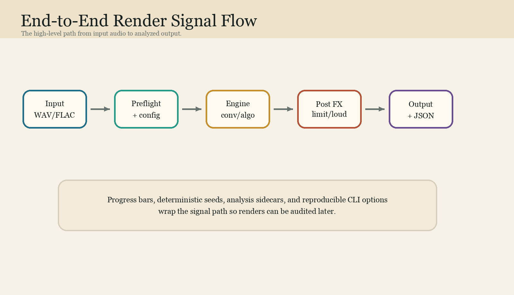

**Figure 1: End-to-end render signal flow.** The complete render path from source file through validation, DSP, post-processing, and report output. Boxes, arrows, and spatial placement communicate topology and sequence; their dimensions are schematic and not measurements. It has no numeric axes because it is a structural diagram rather than a measurement plot.

Read the figure from the labeled input or independent dimension toward the reported response, then compare color, slope, area, or stage order as appropriate. Its practical purpose is to make the relevant verbx control or engineering tradeoff easier to predict before listening: abrupt changes suggest sensitive settings, broad regions suggest forgiving settings, and converging traces suggest conditions that should sound or measure similarly. Unless the figure explicitly prints measured values, the geometry is an explanatory model rather than a benchmark from a specific audio file. Use `verbx analyze` and its JSON report when exact values are needed for a render, device, room, or regression test.

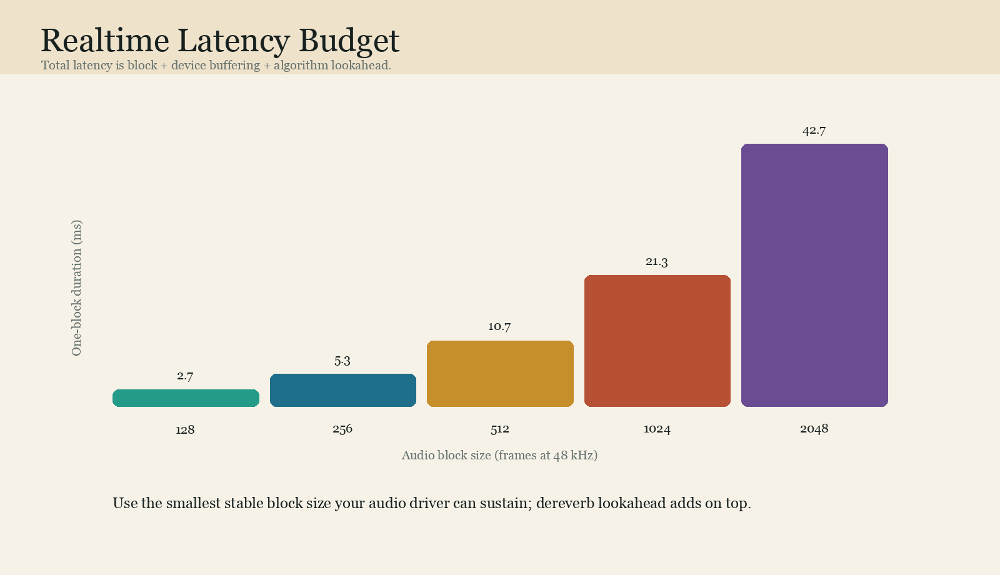

**Figure 2: Realtime latency budget by block size.** The duration contributed by one audio block at 48 kHz, before driver and algorithmic buffering are added. Bar height encodes the quantity on the vertical axis, while each horizontal category identifies a tested or illustrative condition. The horizontal axis is **Audio block size (frames at 48 kHz)** and the vertical axis is **One-block duration (ms)**.

Read the figure from the labeled input or independent dimension toward the reported response, then compare color, slope, area, or stage order as appropriate. Its practical purpose is to make the relevant verbx control or engineering tradeoff easier to predict before listening: abrupt changes suggest sensitive settings, broad regions suggest forgiving settings, and converging traces suggest conditions that should sound or measure similarly. Unless the figure explicitly prints measured values, the geometry is an explanatory model rather than a benchmark from a specific audio file. Use `verbx analyze` and its JSON report when exact values are needed for a render, device, room, or regression test.

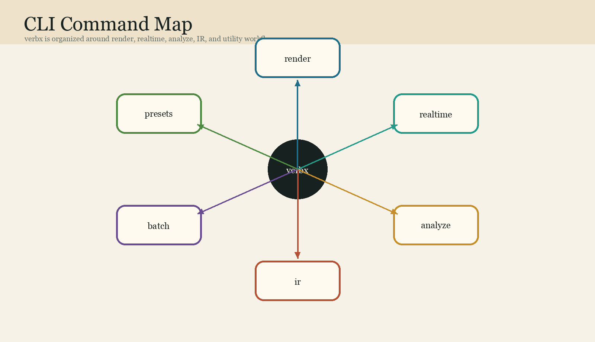

**Figure 18: CLI command map.** The primary command families arranged around the verbx executable. Boxes, arrows, and spatial placement communicate topology and sequence; their dimensions are schematic and not measurements. It has no numeric axes because it is a structural diagram rather than a measurement plot.

Read the figure from the labeled input or independent dimension toward the reported response, then compare color, slope, area, or stage order as appropriate. Its practical purpose is to make the relevant verbx control or engineering tradeoff easier to predict before listening: abrupt changes suggest sensitive settings, broad regions suggest forgiving settings, and converging traces suggest conditions that should sound or measure similarly. Unless the figure explicitly prints measured values, the geometry is an explanatory model rather than a benchmark from a specific audio file. Use `verbx analyze` and its JSON report when exact values are needed for a render, device, room, or regression test.

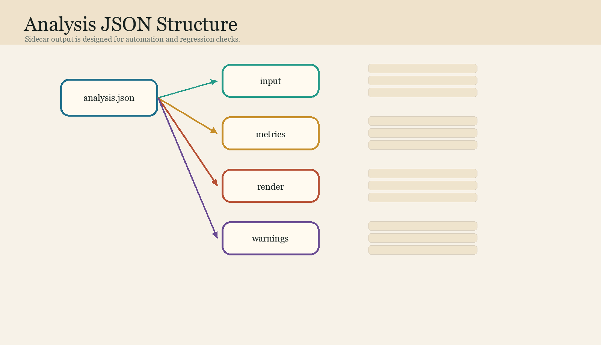

**Figure 22: Analysis JSON structure.** The top-level input, metrics, render, and warning groups in a machine-readable sidecar. Boxes, arrows, and spatial placement communicate topology and sequence; their dimensions are schematic and not measurements. It has no numeric axes because it is a structural diagram rather than a measurement plot.

Read the figure from the labeled input or independent dimension toward the reported response, then compare color, slope, area, or stage order as appropriate. Its practical purpose is to make the relevant verbx control or engineering tradeoff easier to predict before listening: abrupt changes suggest sensitive settings, broad regions suggest forgiving settings, and converging traces suggest conditions that should sound or measure similarly. Unless the figure explicitly prints measured values, the geometry is an explanatory model rather than a benchmark from a specific audio file. Use `verbx analyze` and its JSON report when exact values are needed for a render, device, room, or regression test.

## Reverb Physics and Analysis

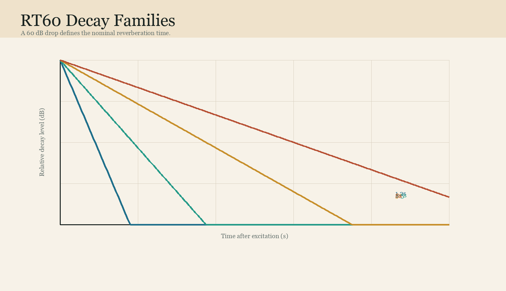

**Figure 3: RT60 decay families.** Idealized decay slopes for several nominal reverberation times, each reaching a 60 dB loss at its labeled RT60. The colored traces share one coordinate system so their slopes, crossings, and endpoints can be compared directly. The horizontal axis is **Time after excitation (s)** and the vertical axis is **Relative decay level (dB)**.

Read the figure from the labeled input or independent dimension toward the reported response, then compare color, slope, area, or stage order as appropriate. Its practical purpose is to make the relevant verbx control or engineering tradeoff easier to predict before listening: abrupt changes suggest sensitive settings, broad regions suggest forgiving settings, and converging traces suggest conditions that should sound or measure similarly. Unless the figure explicitly prints measured values, the geometry is an explanatory model rather than a benchmark from a specific audio file. Use `verbx analyze` and its JSON report when exact values are needed for a render, device, room, or regression test.

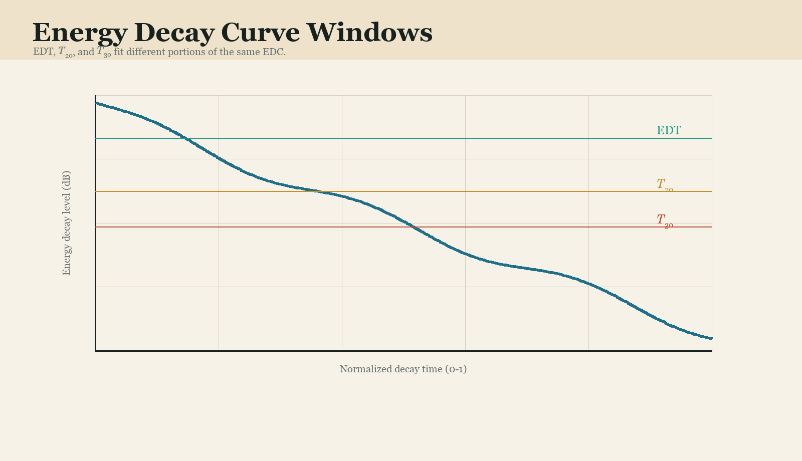

**Figure 4: Energy decay curve fitting windows.** The EDT, T20, and T30 regression regions used to estimate decay from different portions of an energy decay curve. The colored traces share one coordinate system so their slopes, crossings, and endpoints can be compared directly. The horizontal axis is **Normalized decay time (0-1)** and the vertical axis is **Energy decay level (dB)**.

Read the figure from the labeled input or independent dimension toward the reported response, then compare color, slope, area, or stage order as appropriate. Its practical purpose is to make the relevant verbx control or engineering tradeoff easier to predict before listening: abrupt changes suggest sensitive settings, broad regions suggest forgiving settings, and converging traces suggest conditions that should sound or measure similarly. Unless the figure explicitly prints measured values, the geometry is an explanatory model rather than a benchmark from a specific audio file. Use `verbx analyze` and its JSON report when exact values are needed for a render, device, room, or regression test.

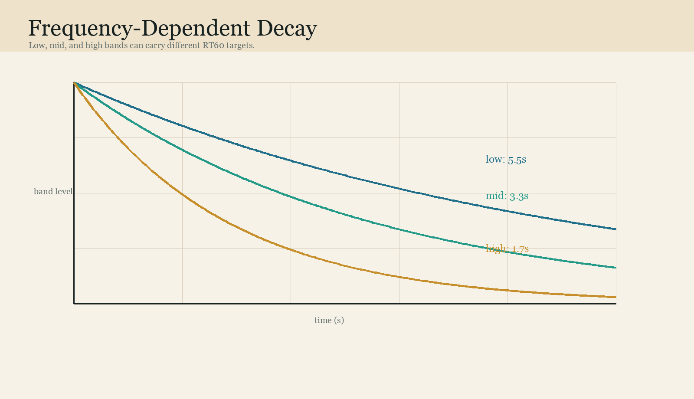

**Figure 9: Frequency-dependent decay bands.** Low-, mid-, and high-frequency tails with different nominal decay constants. The colored traces share one coordinate system so their slopes, crossings, and endpoints can be compared directly. The horizontal axis is **Time after excitation (s)** and the vertical axis is **Relative band level (linear, 0-1)**.

Read the figure from the labeled input or independent dimension toward the reported response, then compare color, slope, area, or stage order as appropriate. Its practical purpose is to make the relevant verbx control or engineering tradeoff easier to predict before listening: abrupt changes suggest sensitive settings, broad regions suggest forgiving settings, and converging traces suggest conditions that should sound or measure similarly. Unless the figure explicitly prints measured values, the geometry is an explanatory model rather than a benchmark from a specific audio file. Use `verbx analyze` and its JSON report when exact values are needed for a render, device, room, or regression test.

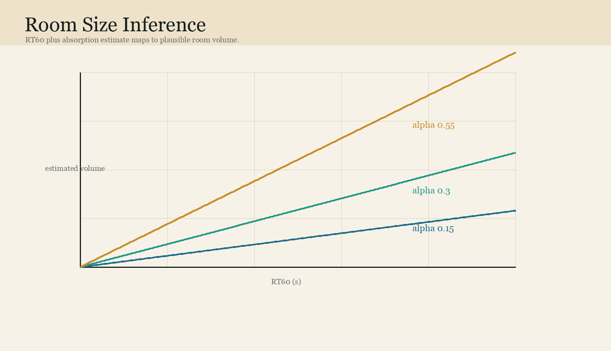

**Figure 16: Room size inference curves.** Sabine-style volume estimates across RT60 for three assumed mean absorption coefficients. The colored traces share one coordinate system so their slopes, crossings, and endpoints can be compared directly. The horizontal axis is **Measured RT60 (s)** and the vertical axis is **Estimated room volume (m³)**.

Read the figure from the labeled input or independent dimension toward the reported response, then compare color, slope, area, or stage order as appropriate. Its practical purpose is to make the relevant verbx control or engineering tradeoff easier to predict before listening: abrupt changes suggest sensitive settings, broad regions suggest forgiving settings, and converging traces suggest conditions that should sound or measure similarly. Unless the figure explicitly prints measured values, the geometry is an explanatory model rather than a benchmark from a specific audio file. Use `verbx analyze` and its JSON report when exact values are needed for a render, device, room, or regression test.

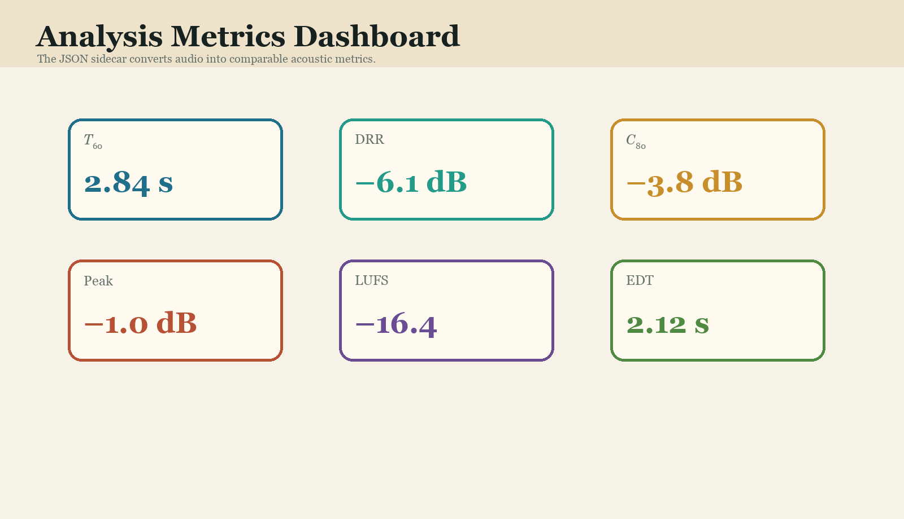

**Figure 17: Analysis metrics dashboard.** A compact view of representative RT60, DRR, C80, peak, LUFS, and EDT fields emitted to JSON. Each card reports a separate metric with its own printed unit, so card size and position do not encode magnitude. It has no numeric axes because it is a structural diagram rather than a measurement plot.

Read the figure from the labeled input or independent dimension toward the reported response, then compare color, slope, area, or stage order as appropriate. Its practical purpose is to make the relevant verbx control or engineering tradeoff easier to predict before listening: abrupt changes suggest sensitive settings, broad regions suggest forgiving settings, and converging traces suggest conditions that should sound or measure similarly. Unless the figure explicitly prints measured values, the geometry is an explanatory model rather than a benchmark from a specific audio file. Use `verbx analyze` and its JSON report when exact values are needed for a render, device, room, or regression test.

## Algorithms and Processing

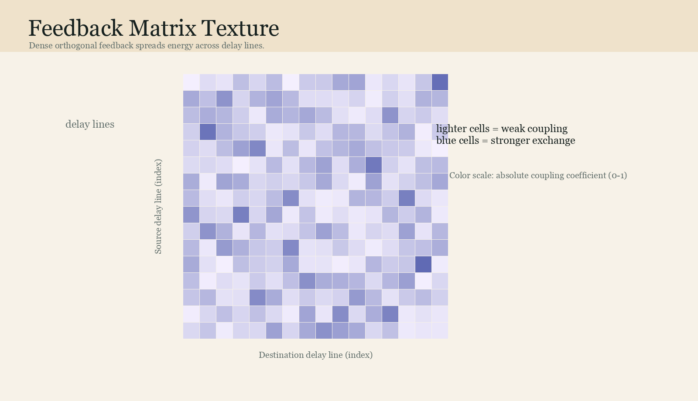

**Figure 5: Feedback matrix texture heatmap.** A 16 by 16 orthogonal feedback matrix illustrating weak and strong coupling among FDN delay lines. Each cell combines one horizontal and one vertical condition; color encodes the third quantity named in the scale label. The horizontal axis is **Destination delay line (index)** and the vertical axis is **Source delay line (index)**. The color or radial scale reports **Absolute coupling coefficient (0-1)**.

Read the figure from the labeled input or independent dimension toward the reported response, then compare color, slope, area, or stage order as appropriate. Its practical purpose is to make the relevant verbx control or engineering tradeoff easier to predict before listening: abrupt changes suggest sensitive settings, broad regions suggest forgiving settings, and converging traces suggest conditions that should sound or measure similarly. Unless the figure explicitly prints measured values, the geometry is an explanatory model rather than a benchmark from a specific audio file. Use `verbx analyze` and its JSON report when exact values are needed for a render, device, room, or regression test.

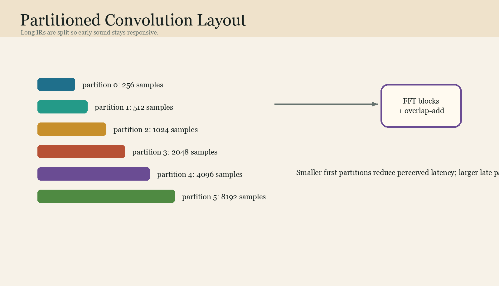

**Figure 11: Partitioned convolution layout.** An impulse response divided into progressively larger FFT partitions to balance latency and throughput. Boxes, arrows, and spatial placement communicate topology and sequence; their dimensions are schematic and not measurements. It has no numeric axes because it is a structural diagram rather than a measurement plot.

Read the figure from the labeled input or independent dimension toward the reported response, then compare color, slope, area, or stage order as appropriate. Its practical purpose is to make the relevant verbx control or engineering tradeoff easier to predict before listening: abrupt changes suggest sensitive settings, broad regions suggest forgiving settings, and converging traces suggest conditions that should sound or measure similarly. Unless the figure explicitly prints measured values, the geometry is an explanatory model rather than a benchmark from a specific audio file. Use `verbx analyze` and its JSON report when exact values are needed for a render, device, room, or regression test.

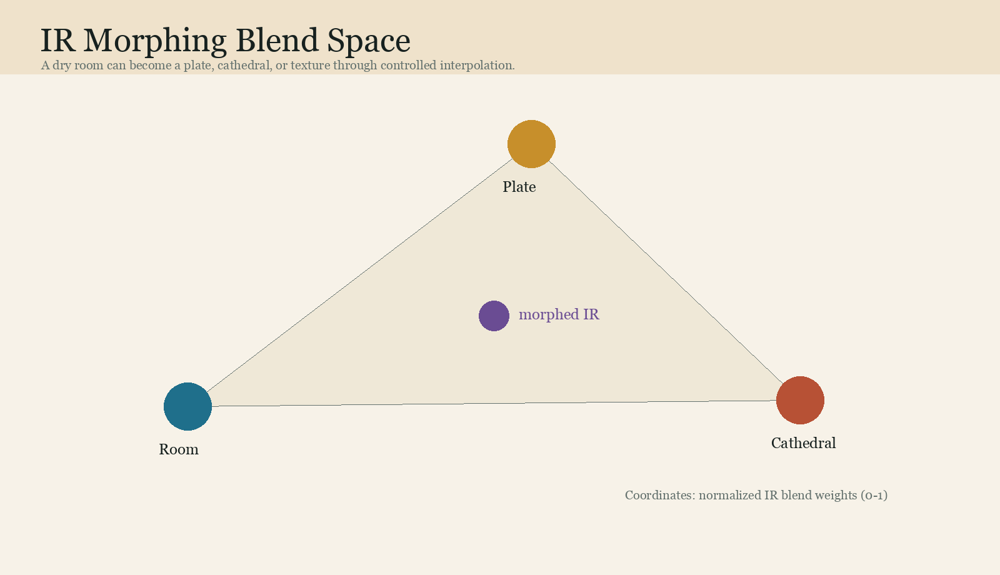

**Figure 12: IR morphing blend space.** A conceptual interpolation triangle connecting room, plate, and cathedral impulse-response families. Points and paths occupy a two-dimensional design space; proximity indicates similar states, not physical distance. The horizontal axis is **Blend coordinate A (normalized, 0-1)** and the vertical axis is **Blend coordinate B (normalized, 0-1)**.

Read the figure from the labeled input or independent dimension toward the reported response, then compare color, slope, area, or stage order as appropriate. Its practical purpose is to make the relevant verbx control or engineering tradeoff easier to predict before listening: abrupt changes suggest sensitive settings, broad regions suggest forgiving settings, and converging traces suggest conditions that should sound or measure similarly. Unless the figure explicitly prints measured values, the geometry is an explanatory model rather than a benchmark from a specific audio file. Use `verbx analyze` and its JSON report when exact values are needed for a render, device, room, or regression test.

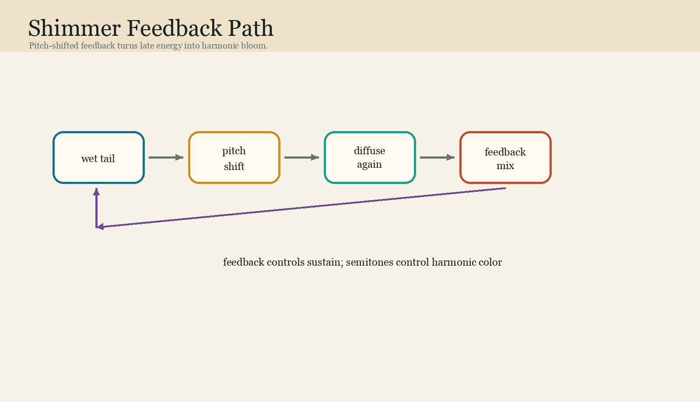

**Figure 15: Shimmer feedback path.** The pitch-shift, diffusion, and feedback loop that turns late energy into a sustained harmonic layer. Boxes, arrows, and spatial placement communicate topology and sequence; their dimensions are schematic and not measurements. It has no numeric axes because it is a structural diagram rather than a measurement plot.

Read the figure from the labeled input or independent dimension toward the reported response, then compare color, slope, area, or stage order as appropriate. Its practical purpose is to make the relevant verbx control or engineering tradeoff easier to predict before listening: abrupt changes suggest sensitive settings, broad regions suggest forgiving settings, and converging traces suggest conditions that should sound or measure similarly. Unless the figure explicitly prints measured values, the geometry is an explanatory model rather than a benchmark from a specific audio file. Use `verbx analyze` and its JSON report when exact values are needed for a render, device, room, or regression test.

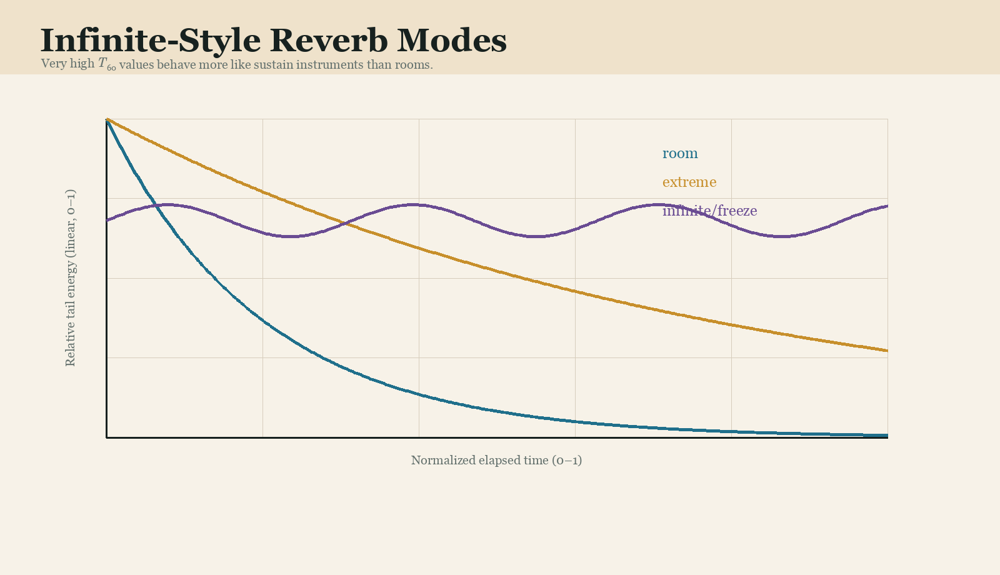

**Figure 24: Infinite-style reverb tail behavior.** Ordinary, extreme, and freeze-like tail energy compared over normalized time. The colored traces share one coordinate system so their slopes, crossings, and endpoints can be compared directly. The horizontal axis is **Normalized elapsed time (0-1)** and the vertical axis is **Relative tail energy (linear, 0-1)**.

Read the figure from the labeled input or independent dimension toward the reported response, then compare color, slope, area, or stage order as appropriate. Its practical purpose is to make the relevant verbx control or engineering tradeoff easier to predict before listening: abrupt changes suggest sensitive settings, broad regions suggest forgiving settings, and converging traces suggest conditions that should sound or measure similarly. Unless the figure explicitly prints measured values, the geometry is an explanatory model rather than a benchmark from a specific audio file. Use `verbx analyze` and its JSON report when exact values are needed for a render, device, room, or regression test.

## Controls and Tradeoffs

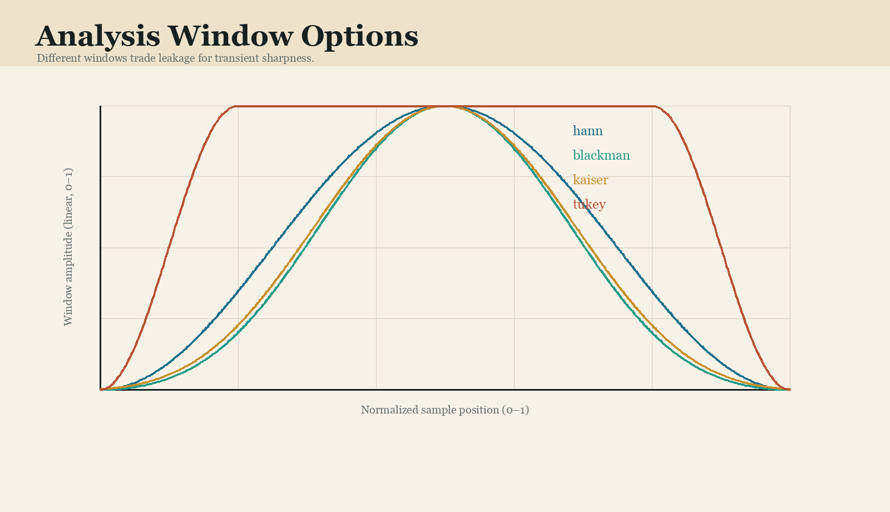

**Figure 6: Analysis window function shapes.** Hann, Blackman, Kaiser, and Tukey tapers plotted over a common normalized frame. The colored traces share one coordinate system so their slopes, crossings, and endpoints can be compared directly. The horizontal axis is **Normalized sample position (0-1)** and the vertical axis is **Window amplitude (linear, 0-1)**.

Read the figure from the labeled input or independent dimension toward the reported response, then compare color, slope, area, or stage order as appropriate. Its practical purpose is to make the relevant verbx control or engineering tradeoff easier to predict before listening: abrupt changes suggest sensitive settings, broad regions suggest forgiving settings, and converging traces suggest conditions that should sound or measure similarly. Unless the figure explicitly prints measured values, the geometry is an explanatory model rather than a benchmark from a specific audio file. Use `verbx analyze` and its JSON report when exact values are needed for a render, device, room, or regression test.

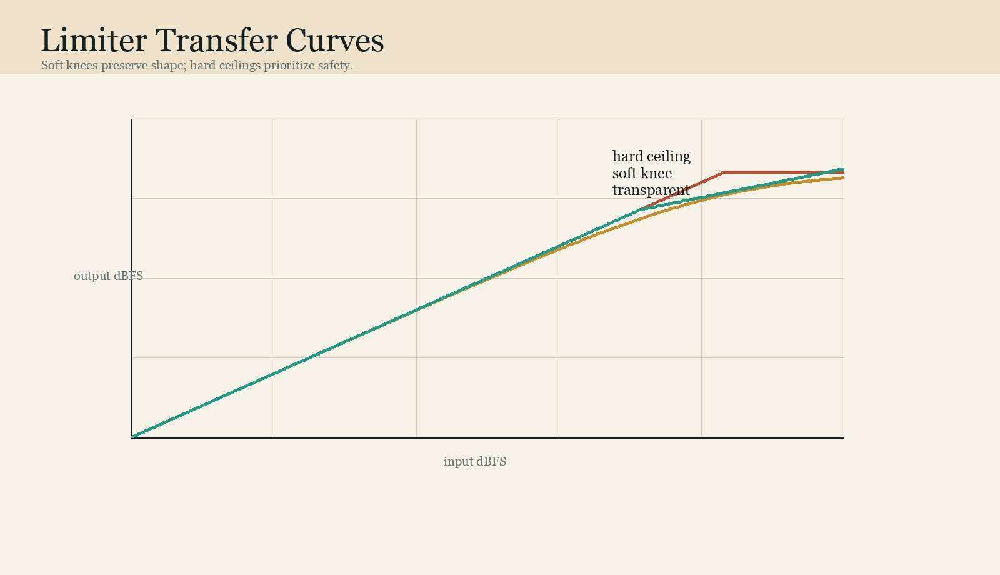

**Figure 7: Limiter transfer curves.** Hard, soft-knee, and transparent limiting laws compared around the ceiling region. The colored traces share one coordinate system so their slopes, crossings, and endpoints can be compared directly. The horizontal axis is **Input level (dBFS)** and the vertical axis is **Output level (dBFS)**.

Read the figure from the labeled input or independent dimension toward the reported response, then compare color, slope, area, or stage order as appropriate. Its practical purpose is to make the relevant verbx control or engineering tradeoff easier to predict before listening: abrupt changes suggest sensitive settings, broad regions suggest forgiving settings, and converging traces suggest conditions that should sound or measure similarly. Unless the figure explicitly prints measured values, the geometry is an explanatory model rather than a benchmark from a specific audio file. Use `verbx analyze` and its JSON report when exact values are needed for a render, device, room, or regression test.

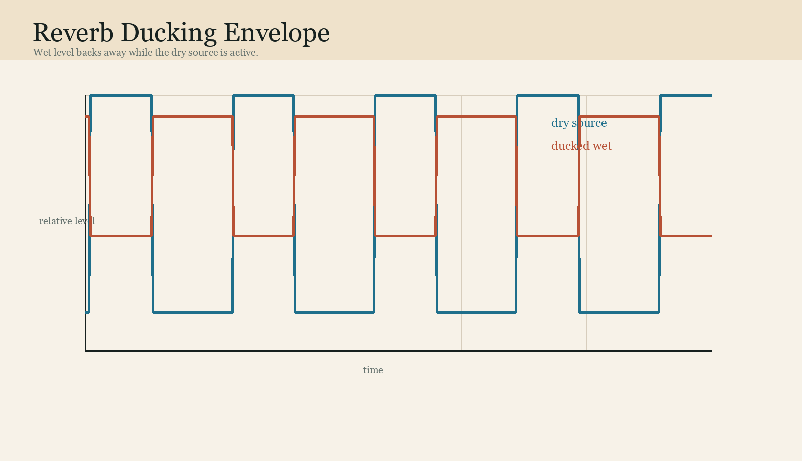

**Figure 8: Reverb ducking envelope.** Dry-source activity and the resulting attenuation of the wet return over an eight-second example. The colored traces share one coordinate system so their slopes, crossings, and endpoints can be compared directly. The horizontal axis is **Time (s)** and the vertical axis is **Relative signal level (linear, 0-1)**.

Read the figure from the labeled input or independent dimension toward the reported response, then compare color, slope, area, or stage order as appropriate. Its practical purpose is to make the relevant verbx control or engineering tradeoff easier to predict before listening: abrupt changes suggest sensitive settings, broad regions suggest forgiving settings, and converging traces suggest conditions that should sound or measure similarly. Unless the figure explicitly prints measured values, the geometry is an explanatory model rather than a benchmark from a specific audio file. Use `verbx analyze` and its JSON report when exact values are needed for a render, device, room, or regression test.

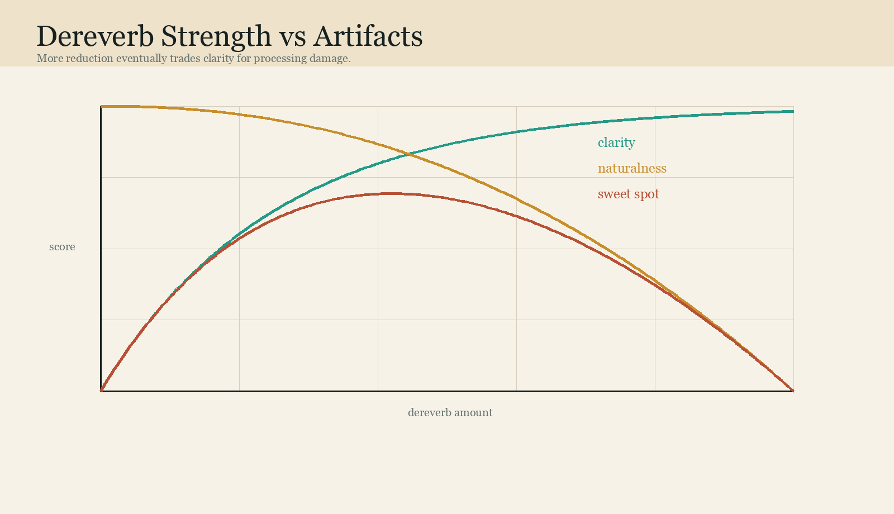

**Figure 10: Dereverb strength versus artifact tradeoff.** The competing trends of clarity, naturalness, and aggregate usefulness as reduction strength increases. The colored traces share one coordinate system so their slopes, crossings, and endpoints can be compared directly. The horizontal axis is **Dereverb amount (%)** and the vertical axis is **Perceptual score (normalized, 0-1)**.

Read the figure from the labeled input or independent dimension toward the reported response, then compare color, slope, area, or stage order as appropriate. Its practical purpose is to make the relevant verbx control or engineering tradeoff easier to predict before listening: abrupt changes suggest sensitive settings, broad regions suggest forgiving settings, and converging traces suggest conditions that should sound or measure similarly. Unless the figure explicitly prints measured values, the geometry is an explanatory model rather than a benchmark from a specific audio file. Use `verbx analyze` and its JSON report when exact values are needed for a render, device, room, or regression test.

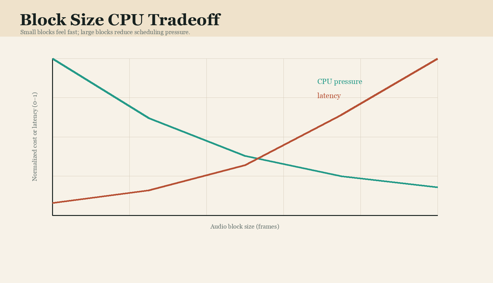

**Figure 21: Block size CPU and latency tradeoff.** Normalized scheduling pressure and block latency plotted against common audio buffer sizes. The colored traces share one coordinate system so their slopes, crossings, and endpoints can be compared directly. The horizontal axis is **Audio block size (frames)** and the vertical axis is **Normalized cost or latency (0-1)**.

Read the figure from the labeled input or independent dimension toward the reported response, then compare color, slope, area, or stage order as appropriate. Its practical purpose is to make the relevant verbx control or engineering tradeoff easier to predict before listening: abrupt changes suggest sensitive settings, broad regions suggest forgiving settings, and converging traces suggest conditions that should sound or measure similarly. Unless the figure explicitly prints measured values, the geometry is an explanatory model rather than a benchmark from a specific audio file. Use `verbx analyze` and its JSON report when exact values are needed for a render, device, room, or regression test.

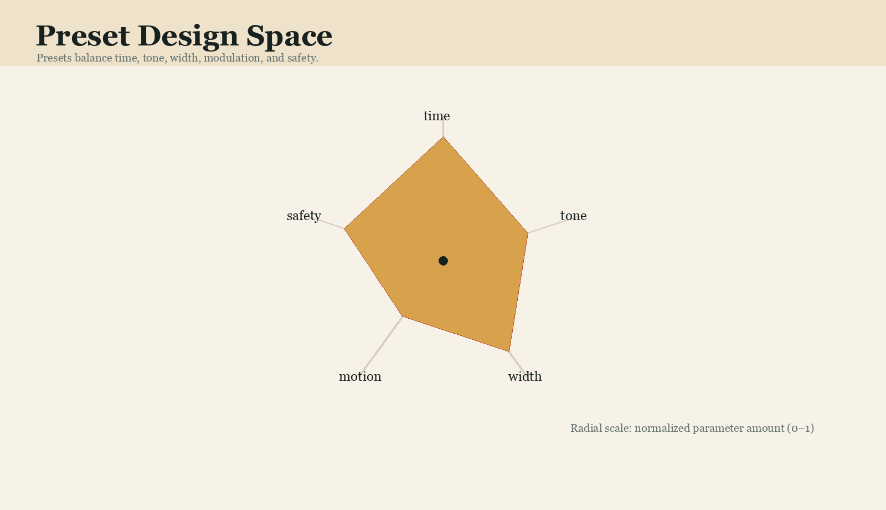

**Figure 23: Preset design radar.** A five-axis profile for time, tone, width, motion, and safety. Each spoke is a named category and distance from the center is the normalized radial score. The color or radial scale reports **Normalized parameter amount (0-1)**.

Read the figure from the labeled input or independent dimension toward the reported response, then compare color, slope, area, or stage order as appropriate. Its practical purpose is to make the relevant verbx control or engineering tradeoff easier to predict before listening: abrupt changes suggest sensitive settings, broad regions suggest forgiving settings, and converging traces suggest conditions that should sound or measure similarly. Unless the figure explicitly prints measured values, the geometry is an explanatory model rather than a benchmark from a specific audio file. Use `verbx analyze` and its JSON report when exact values are needed for a render, device, room, or regression test.

## Spatial and Library Views

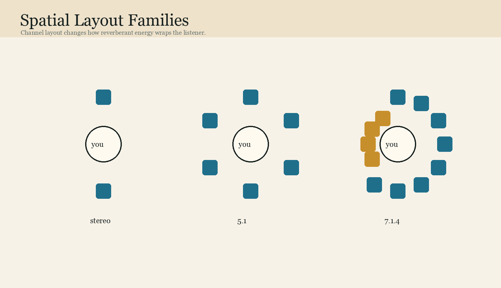

**Figure 13: Spatial layout families.** Listener-centered stereo, 5.1, and 7.1.4 speaker arrangements. Boxes, arrows, and spatial placement communicate topology and sequence; their dimensions are schematic and not measurements. It has no numeric axes because it is a structural diagram rather than a measurement plot.

Read the figure from the labeled input or independent dimension toward the reported response, then compare color, slope, area, or stage order as appropriate. Its practical purpose is to make the relevant verbx control or engineering tradeoff easier to predict before listening: abrupt changes suggest sensitive settings, broad regions suggest forgiving settings, and converging traces suggest conditions that should sound or measure similarly. Unless the figure explicitly prints measured values, the geometry is an explanatory model rather than a benchmark from a specific audio file. Use `verbx analyze` and its JSON report when exact values are needed for a render, device, room, or regression test.

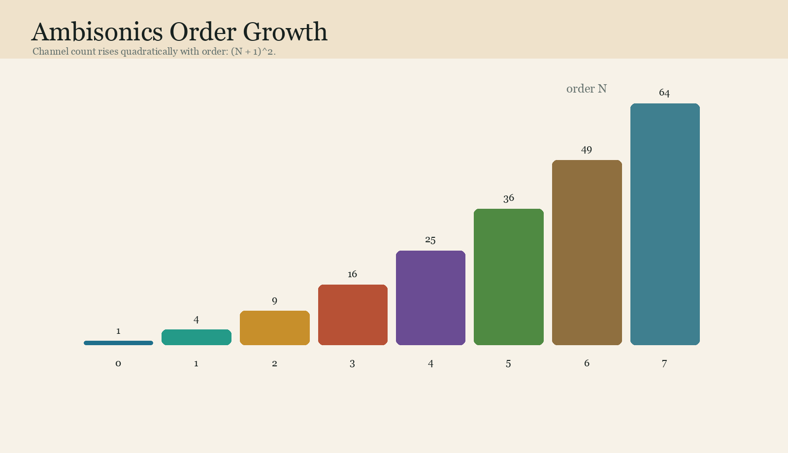

**Figure 14: Ambisonics order channel growth.** The quadratic channel-count growth produced by the three-dimensional Ambisonics relation (N + 1)^2. Bar height encodes the quantity on the vertical axis, while each horizontal category identifies a tested or illustrative condition. The horizontal axis is **Ambisonics order N (integer)** and the vertical axis is **Channel count (channels)**.

Read the figure from the labeled input or independent dimension toward the reported response, then compare color, slope, area, or stage order as appropriate. Its practical purpose is to make the relevant verbx control or engineering tradeoff easier to predict before listening: abrupt changes suggest sensitive settings, broad regions suggest forgiving settings, and converging traces suggest conditions that should sound or measure similarly. Unless the figure explicitly prints measured values, the geometry is an explanatory model rather than a benchmark from a specific audio file. Use `verbx analyze` and its JSON report when exact values are needed for a render, device, room, or regression test.

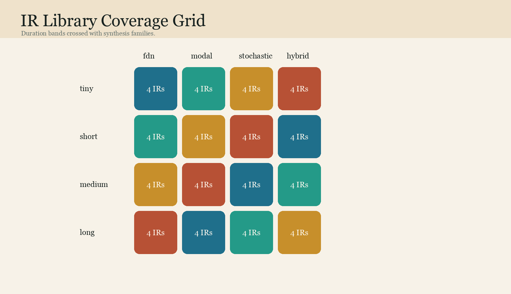

**Figure 20: IR library coverage grid.** Duration families crossed with synthesis methods, with four impulse responses represented per cell. Each cell combines one horizontal and one vertical condition; color encodes the third quantity named in the scale label. The horizontal axis is **Synthesis family (category)** and the vertical axis is **Duration family (category)**. The color or radial scale reports **Impulse responses (count/cell)**.

Read the figure from the labeled input or independent dimension toward the reported response, then compare color, slope, area, or stage order as appropriate. Its practical purpose is to make the relevant verbx control or engineering tradeoff easier to predict before listening: abrupt changes suggest sensitive settings, broad regions suggest forgiving settings, and converging traces suggest conditions that should sound or measure similarly. Unless the figure explicitly prints measured values, the geometry is an explanatory model rather than a benchmark from a specific audio file. Use `verbx analyze` and its JSON report when exact values are needed for a render, device, room, or regression test.

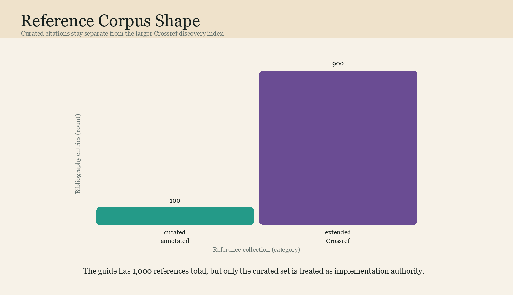

**Figure 19: Reference corpus shape.** The relative sizes of the curated implementation bibliography and extended discovery index. Bar height encodes the quantity on the vertical axis, while each horizontal category identifies a tested or illustrative condition. The horizontal axis is **Reference collection (category)** and the vertical axis is **Bibliography entries (count)**.

Read the figure from the labeled input or independent dimension toward the reported response, then compare color, slope, area, or stage order as appropriate. Its practical purpose is to make the relevant verbx control or engineering tradeoff easier to predict before listening: abrupt changes suggest sensitive settings, broad regions suggest forgiving settings, and converging traces suggest conditions that should sound or measure similarly. Unless the figure explicitly prints measured values, the geometry is an explanatory model rather than a benchmark from a specific audio file. Use `verbx analyze` and its JSON report when exact values are needed for a render, device, room, or regression test.

## Additional Diagnostics and Design Graphs

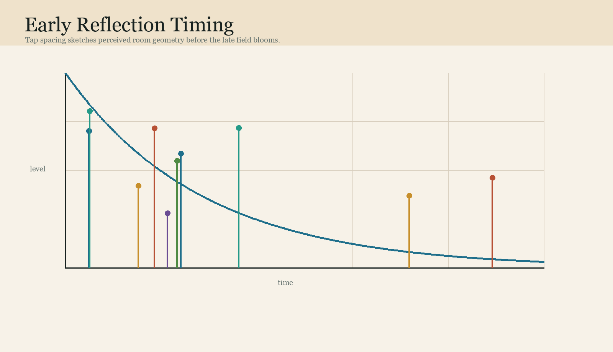

**Figure 25: Early Reflection Timing.** Tap spacing sketches perceived room geometry before the late field blooms. Vertical events and the envelope are positioned against a common time base, making onset, hold, and decay relationships visible. The horizontal axis is **Time after direct sound (ms)** and the vertical axis is **Reflection amplitude (dBFS)**.

Read the figure from the labeled input or independent dimension toward the reported response, then compare color, slope, area, or stage order as appropriate. Its practical purpose is to make the relevant verbx control or engineering tradeoff easier to predict before listening: abrupt changes suggest sensitive settings, broad regions suggest forgiving settings, and converging traces suggest conditions that should sound or measure similarly. Unless the figure explicitly prints measured values, the geometry is an explanatory model rather than a benchmark from a specific audio file. Use `verbx analyze` and its JSON report when exact values are needed for a render, device, room, or regression test.

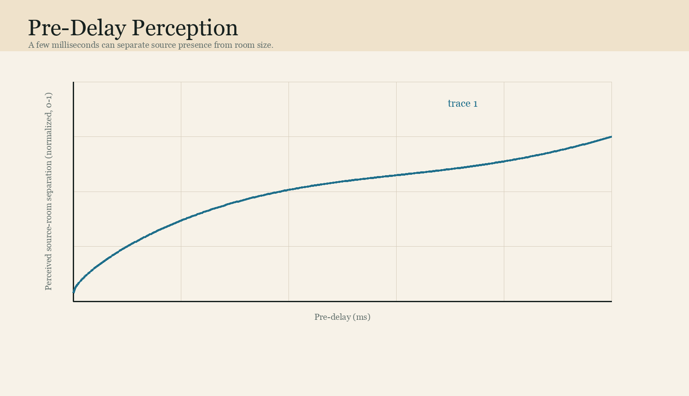

**Figure 26: Pre-Delay Perception.** A few milliseconds can separate source presence from room size. The trace shows how the vertical response changes as the horizontal control or measurement advances. The horizontal axis is **Pre-delay (ms)** and the vertical axis is **Perceived source-room separation (normalized, 0-1)**.

Read the figure from the labeled input or independent dimension toward the reported response, then compare color, slope, area, or stage order as appropriate. Its practical purpose is to make the relevant verbx control or engineering tradeoff easier to predict before listening: abrupt changes suggest sensitive settings, broad regions suggest forgiving settings, and converging traces suggest conditions that should sound or measure similarly. Unless the figure explicitly prints measured values, the geometry is an explanatory model rather than a benchmark from a specific audio file. Use `verbx analyze` and its JSON report when exact values are needed for a render, device, room, or regression test.

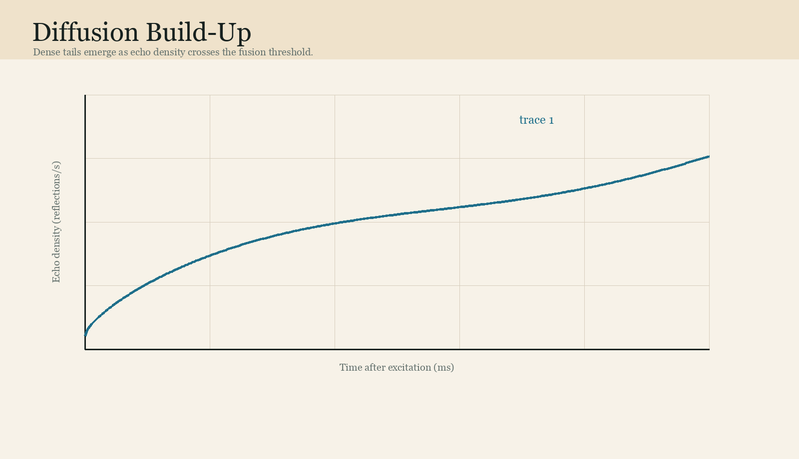

**Figure 27: Diffusion Build-Up.** Dense tails emerge as echo density crosses the fusion threshold. The trace shows how the vertical response changes as the horizontal control or measurement advances. The horizontal axis is **Time after excitation (ms)** and the vertical axis is **Echo density (reflections/s)**.

Read the figure from the labeled input or independent dimension toward the reported response, then compare color, slope, area, or stage order as appropriate. Its practical purpose is to make the relevant verbx control or engineering tradeoff easier to predict before listening: abrupt changes suggest sensitive settings, broad regions suggest forgiving settings, and converging traces suggest conditions that should sound or measure similarly. Unless the figure explicitly prints measured values, the geometry is an explanatory model rather than a benchmark from a specific audio file. Use `verbx analyze` and its JSON report when exact values are needed for a render, device, room, or regression test.

**Figure 28: Damping EQ Targets.** Low, mid, and high shelves shape the perceived material of a room. The colored traces share one coordinate system so their slopes, crossings, and endpoints can be compared directly. The horizontal axis is **Frequency (Hz)** and the vertical axis is **Relative damping gain (dB)**.

Read the figure from the labeled input or independent dimension toward the reported response, then compare color, slope, area, or stage order as appropriate. Its practical purpose is to make the relevant verbx control or engineering tradeoff easier to predict before listening: abrupt changes suggest sensitive settings, broad regions suggest forgiving settings, and converging traces suggest conditions that should sound or measure similarly. Unless the figure explicitly prints measured values, the geometry is an explanatory model rather than a benchmark from a specific audio file. Use `verbx analyze` and its JSON report when exact values are needed for a render, device, room, or regression test.

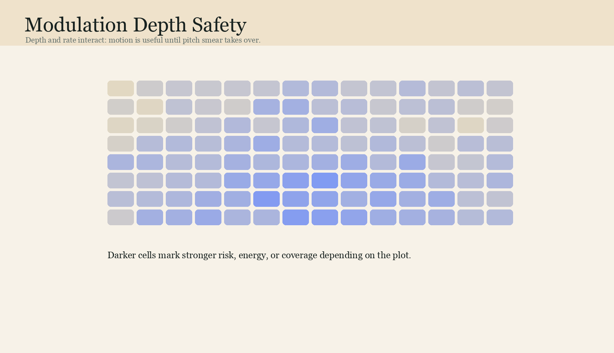

**Figure 29: Modulation Depth Safety.** Depth and rate interact: motion is useful until pitch smear takes over. Each cell combines one horizontal and one vertical condition; color encodes the third quantity named in the scale label. The horizontal axis is **Modulation rate (Hz)** and the vertical axis is **Modulation depth (ms)**. The color or radial scale reports **Artifact risk (normalized, 0-1)**.

Read the figure from the labeled input or independent dimension toward the reported response, then compare color, slope, area, or stage order as appropriate. Its practical purpose is to make the relevant verbx control or engineering tradeoff easier to predict before listening: abrupt changes suggest sensitive settings, broad regions suggest forgiving settings, and converging traces suggest conditions that should sound or measure similarly. Unless the figure explicitly prints measured values, the geometry is an explanatory model rather than a benchmark from a specific audio file. Use `verbx analyze` and its JSON report when exact values are needed for a render, device, room, or regression test.

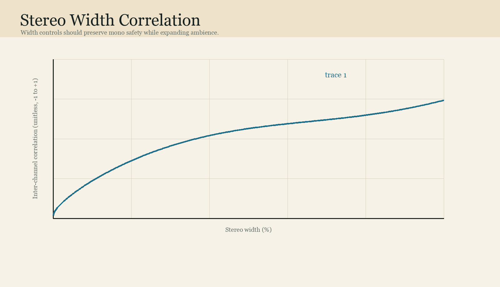

**Figure 30: Stereo Width Correlation.** Width controls should preserve mono safety while expanding ambience. The trace shows how the vertical response changes as the horizontal control or measurement advances. The horizontal axis is **Stereo width (%)** and the vertical axis is **Inter-channel correlation (unitless, -1 to +1)**.

Read the figure from the labeled input or independent dimension toward the reported response, then compare color, slope, area, or stage order as appropriate. Its practical purpose is to make the relevant verbx control or engineering tradeoff easier to predict before listening: abrupt changes suggest sensitive settings, broad regions suggest forgiving settings, and converging traces suggest conditions that should sound or measure similarly. Unless the figure explicitly prints measured values, the geometry is an explanatory model rather than a benchmark from a specific audio file. Use `verbx analyze` and its JSON report when exact values are needed for a render, device, room, or regression test.

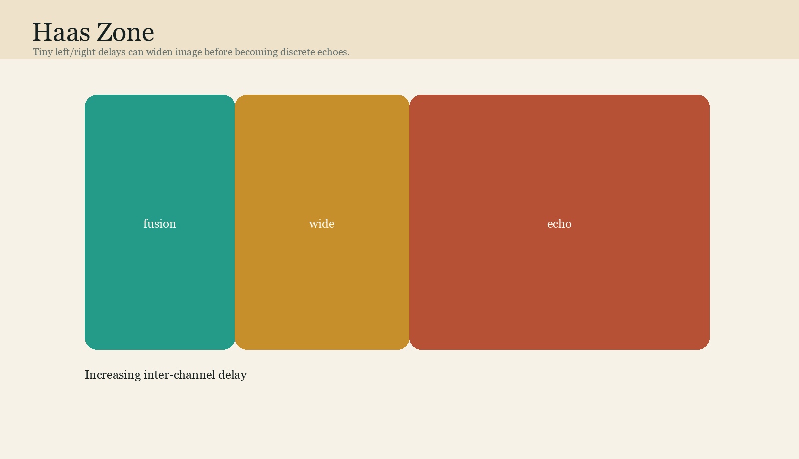

**Figure 31: Haas Zone.** Tiny left/right delays can widen image before becoming discrete echoes. Colored regions divide the horizontal quantity into operational or perceptual regimes rather than implying a continuous measured response. The horizontal axis is **Inter-channel delay (ms)** and the vertical axis is **Perceptual region (category)**.

Read the figure from the labeled input or independent dimension toward the reported response, then compare color, slope, area, or stage order as appropriate. Its practical purpose is to make the relevant verbx control or engineering tradeoff easier to predict before listening: abrupt changes suggest sensitive settings, broad regions suggest forgiving settings, and converging traces suggest conditions that should sound or measure similarly. Unless the figure explicitly prints measured values, the geometry is an explanatory model rather than a benchmark from a specific audio file. Use `verbx analyze` and its JSON report when exact values are needed for a render, device, room, or regression test.

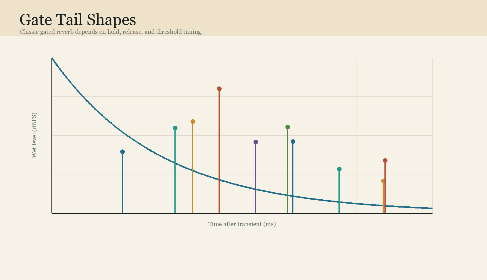

**Figure 32: Gate Tail Shapes.** Classic gated reverb depends on hold, release, and threshold timing. Vertical events and the envelope are positioned against a common time base, making onset, hold, and decay relationships visible. The horizontal axis is **Time after transient (ms)** and the vertical axis is **Wet level (dBFS)**.

Read the figure from the labeled input or independent dimension toward the reported response, then compare color, slope, area, or stage order as appropriate. Its practical purpose is to make the relevant verbx control or engineering tradeoff easier to predict before listening: abrupt changes suggest sensitive settings, broad regions suggest forgiving settings, and converging traces suggest conditions that should sound or measure similarly. Unless the figure explicitly prints measured values, the geometry is an explanatory model rather than a benchmark from a specific audio file. Use `verbx analyze` and its JSON report when exact values are needed for a render, device, room, or regression test.

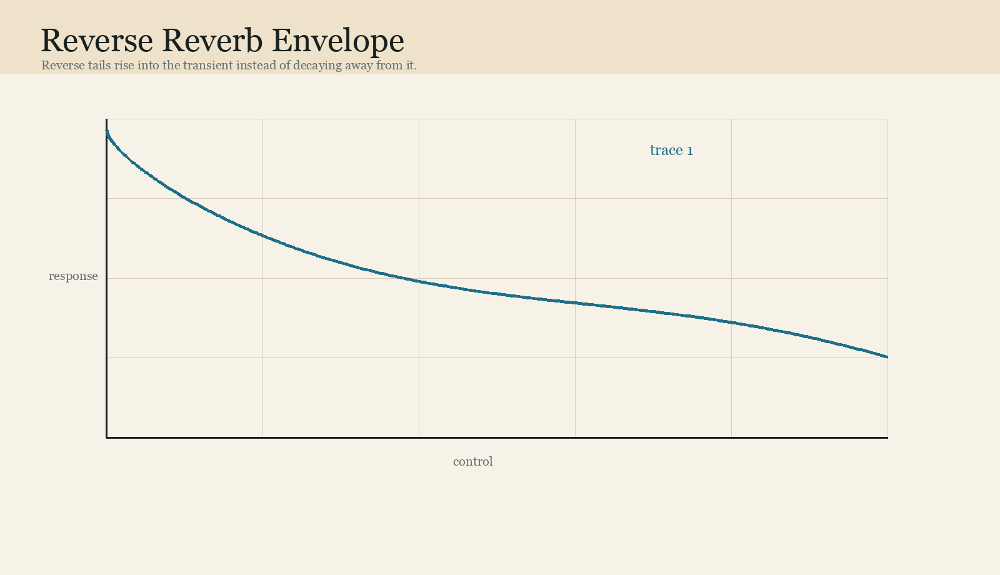

**Figure 33: Reverse Reverb Envelope.** Reverse tails rise into the transient instead of decaying away from it. The trace shows how the vertical response changes as the horizontal control or measurement advances. The horizontal axis is **Time before transient (ms)** and the vertical axis is **Wet envelope level (linear, 0-1)**.

Read the figure from the labeled input or independent dimension toward the reported response, then compare color, slope, area, or stage order as appropriate. Its practical purpose is to make the relevant verbx control or engineering tradeoff easier to predict before listening: abrupt changes suggest sensitive settings, broad regions suggest forgiving settings, and converging traces suggest conditions that should sound or measure similarly. Unless the figure explicitly prints measured values, the geometry is an explanatory model rather than a benchmark from a specific audio file. Use `verbx analyze` and its JSON report when exact values are needed for a render, device, room, or regression test.

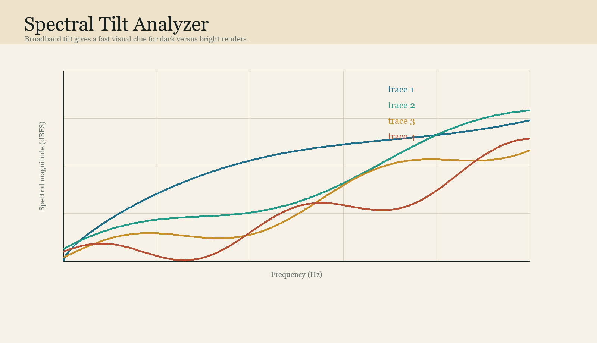

**Figure 34: Spectral Tilt Analyzer.** Broadband tilt gives a fast visual clue for dark versus bright renders. The colored traces share one coordinate system so their slopes, crossings, and endpoints can be compared directly. The horizontal axis is **Frequency (Hz)** and the vertical axis is **Spectral magnitude (dBFS)**.

Read the figure from the labeled input or independent dimension toward the reported response, then compare color, slope, area, or stage order as appropriate. Its practical purpose is to make the relevant verbx control or engineering tradeoff easier to predict before listening: abrupt changes suggest sensitive settings, broad regions suggest forgiving settings, and converging traces suggest conditions that should sound or measure similarly. Unless the figure explicitly prints measured values, the geometry is an explanatory model rather than a benchmark from a specific audio file. Use `verbx analyze` and its JSON report when exact values are needed for a render, device, room, or regression test.

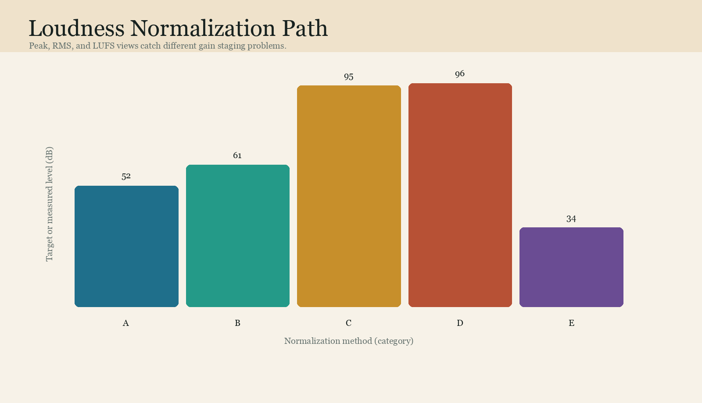

**Figure 35: Loudness Normalization Path.** Peak, RMS, and LUFS views catch different gain staging problems. Bar height encodes the quantity on the vertical axis, while each horizontal category identifies a tested or illustrative condition. The horizontal axis is **Normalization method (category)** and the vertical axis is **Target or measured level (dB)**.

Read the figure from the labeled input or independent dimension toward the reported response, then compare color, slope, area, or stage order as appropriate. Its practical purpose is to make the relevant verbx control or engineering tradeoff easier to predict before listening: abrupt changes suggest sensitive settings, broad regions suggest forgiving settings, and converging traces suggest conditions that should sound or measure similarly. Unless the figure explicitly prints measured values, the geometry is an explanatory model rather than a benchmark from a specific audio file. Use `verbx analyze` and its JSON report when exact values are needed for a render, device, room, or regression test.

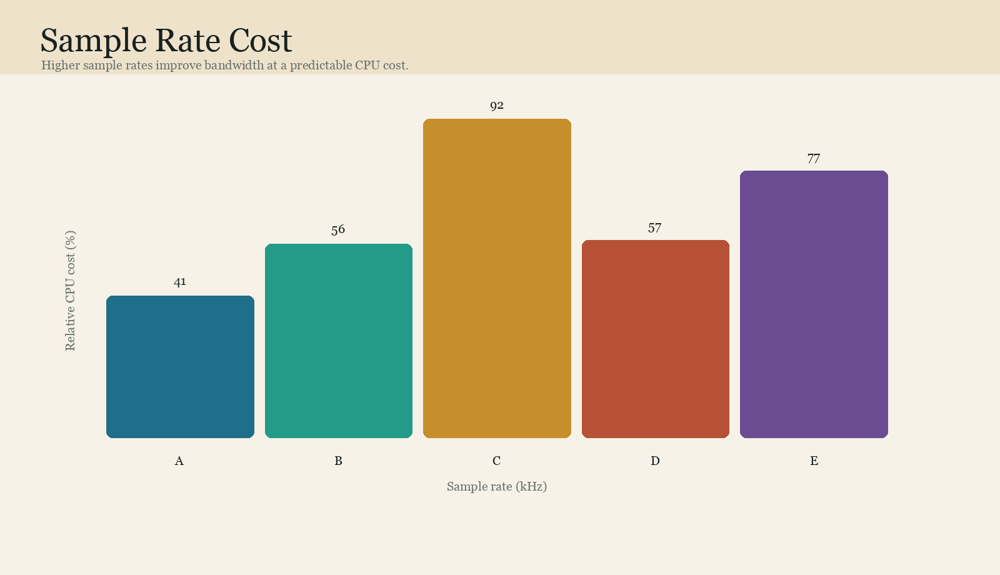

**Figure 36: Sample Rate Cost.** Higher sample rates improve bandwidth at a predictable CPU cost. Bar height encodes the quantity on the vertical axis, while each horizontal category identifies a tested or illustrative condition. The horizontal axis is **Sample rate (kHz)** and the vertical axis is **Relative CPU cost (%)**.

Read the figure from the labeled input or independent dimension toward the reported response, then compare color, slope, area, or stage order as appropriate. Its practical purpose is to make the relevant verbx control or engineering tradeoff easier to predict before listening: abrupt changes suggest sensitive settings, broad regions suggest forgiving settings, and converging traces suggest conditions that should sound or measure similarly. Unless the figure explicitly prints measured values, the geometry is an explanatory model rather than a benchmark from a specific audio file. Use `verbx analyze` and its JSON report when exact values are needed for a render, device, room, or regression test.

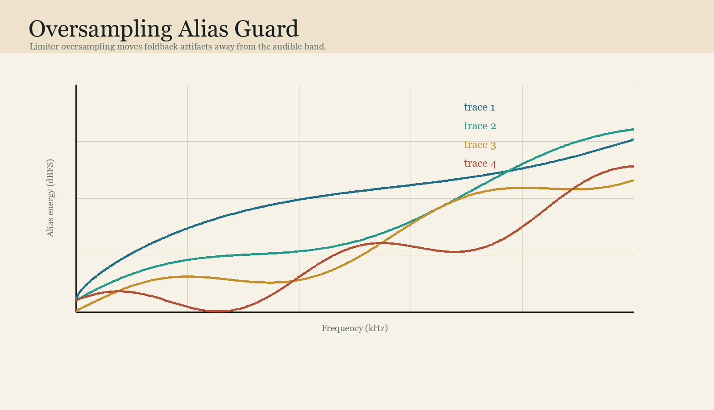

**Figure 37: Oversampling Alias Guard.** Limiter oversampling moves foldback artifacts away from the audible band. The colored traces share one coordinate system so their slopes, crossings, and endpoints can be compared directly. The horizontal axis is **Frequency (kHz)** and the vertical axis is **Alias energy (dBFS)**.

Read the figure from the labeled input or independent dimension toward the reported response, then compare color, slope, area, or stage order as appropriate. Its practical purpose is to make the relevant verbx control or engineering tradeoff easier to predict before listening: abrupt changes suggest sensitive settings, broad regions suggest forgiving settings, and converging traces suggest conditions that should sound or measure similarly. Unless the figure explicitly prints measured values, the geometry is an explanatory model rather than a benchmark from a specific audio file. Use `verbx analyze` and its JSON report when exact values are needed for a render, device, room, or regression test.

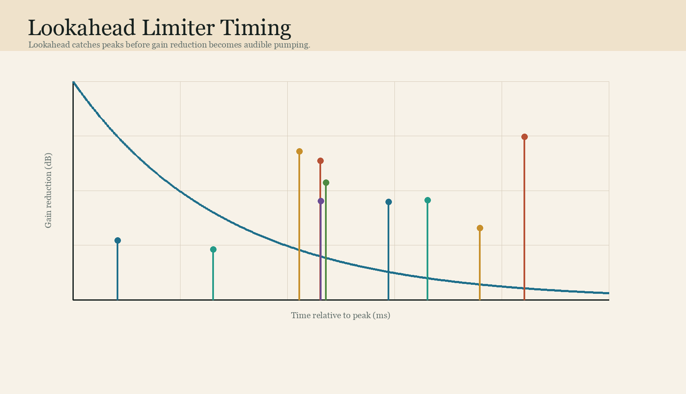

**Figure 38: Lookahead Limiter Timing.** Lookahead catches peaks before gain reduction becomes audible pumping. Vertical events and the envelope are positioned against a common time base, making onset, hold, and decay relationships visible. The horizontal axis is **Time relative to peak (ms)** and the vertical axis is **Gain reduction (dB)**.

Read the figure from the labeled input or independent dimension toward the reported response, then compare color, slope, area, or stage order as appropriate. Its practical purpose is to make the relevant verbx control or engineering tradeoff easier to predict before listening: abrupt changes suggest sensitive settings, broad regions suggest forgiving settings, and converging traces suggest conditions that should sound or measure similarly. Unless the figure explicitly prints measured values, the geometry is an explanatory model rather than a benchmark from a specific audio file. Use `verbx analyze` and its JSON report when exact values are needed for a render, device, room, or regression test.

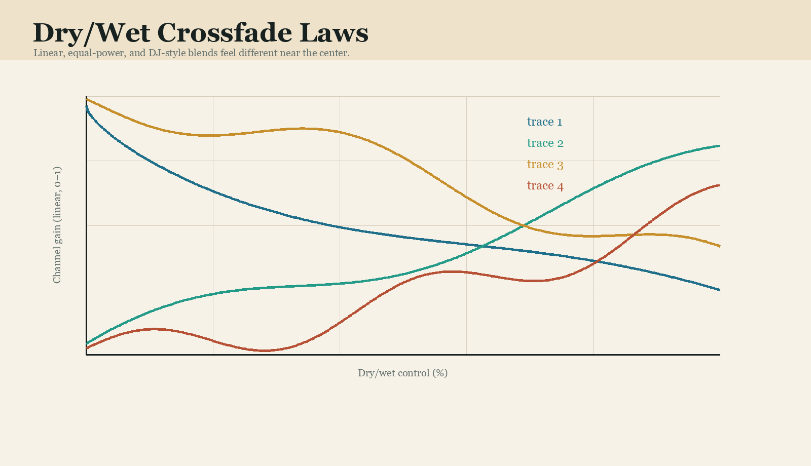

**Figure 39: Dry/Wet Crossfade Laws.** Linear, equal-power, and DJ-style blends feel different near the center. The colored traces share one coordinate system so their slopes, crossings, and endpoints can be compared directly. The horizontal axis is **Dry/wet control (%)** and the vertical axis is **Channel gain (linear, 0-1)**.

Read the figure from the labeled input or independent dimension toward the reported response, then compare color, slope, area, or stage order as appropriate. Its practical purpose is to make the relevant verbx control or engineering tradeoff easier to predict before listening: abrupt changes suggest sensitive settings, broad regions suggest forgiving settings, and converging traces suggest conditions that should sound or measure similarly. Unless the figure explicitly prints measured values, the geometry is an explanatory model rather than a benchmark from a specific audio file. Use `verbx analyze` and its JSON report when exact values are needed for a render, device, room, or regression test.

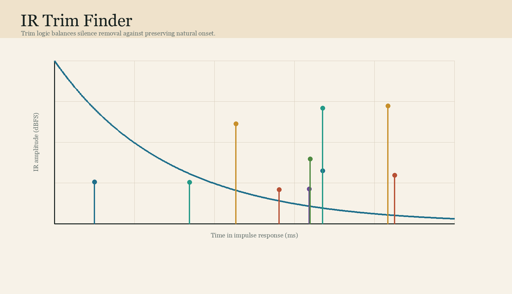

**Figure 40: IR Trim Finder.** Trim logic balances silence removal against preserving natural onset. Vertical events and the envelope are positioned against a common time base, making onset, hold, and decay relationships visible. The horizontal axis is **Time in impulse response (ms)** and the vertical axis is **IR amplitude (dBFS)**.

Read the figure from the labeled input or independent dimension toward the reported response, then compare color, slope, area, or stage order as appropriate. Its practical purpose is to make the relevant verbx control or engineering tradeoff easier to predict before listening: abrupt changes suggest sensitive settings, broad regions suggest forgiving settings, and converging traces suggest conditions that should sound or measure similarly. Unless the figure explicitly prints measured values, the geometry is an explanatory model rather than a benchmark from a specific audio file. Use `verbx analyze` and its JSON report when exact values are needed for a render, device, room, or regression test.

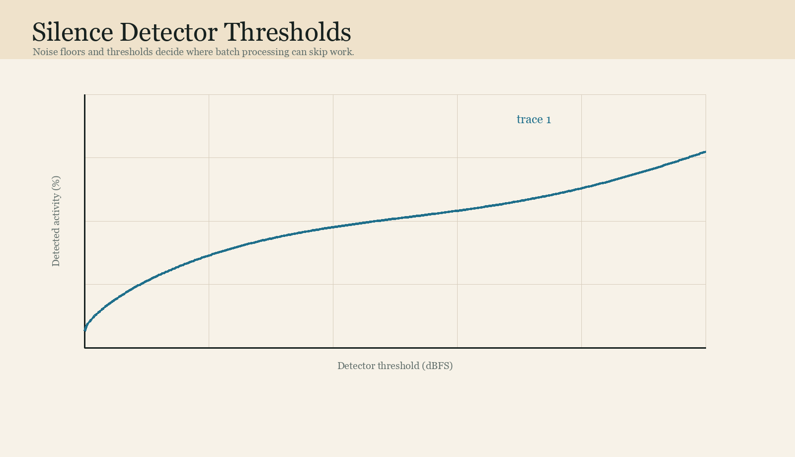

**Figure 41: Silence Detector Thresholds.** Noise floors and thresholds decide where batch processing can skip work. The trace shows how the vertical response changes as the horizontal control or measurement advances. The horizontal axis is **Detector threshold (dBFS)** and the vertical axis is **Detected activity (%)**.

Read the figure from the labeled input or independent dimension toward the reported response, then compare color, slope, area, or stage order as appropriate. Its practical purpose is to make the relevant verbx control or engineering tradeoff easier to predict before listening: abrupt changes suggest sensitive settings, broad regions suggest forgiving settings, and converging traces suggest conditions that should sound or measure similarly. Unless the figure explicitly prints measured values, the geometry is an explanatory model rather than a benchmark from a specific audio file. Use `verbx analyze` and its JSON report when exact values are needed for a render, device, room, or regression test.

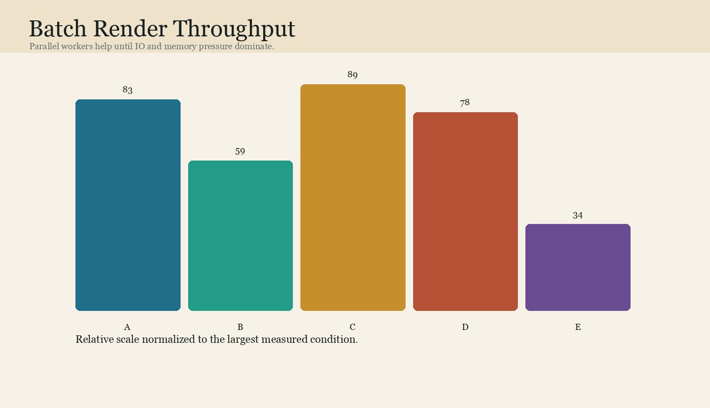

**Figure 42: Batch Render Throughput.** Parallel workers help until IO and memory pressure dominate. Bar height encodes the quantity on the vertical axis, while each horizontal category identifies a tested or illustrative condition. The horizontal axis is **Parallel workers (count)** and the vertical axis is **Render throughput (files/min)**.

Read the figure from the labeled input or independent dimension toward the reported response, then compare color, slope, area, or stage order as appropriate. Its practical purpose is to make the relevant verbx control or engineering tradeoff easier to predict before listening: abrupt changes suggest sensitive settings, broad regions suggest forgiving settings, and converging traces suggest conditions that should sound or measure similarly. Unless the figure explicitly prints measured values, the geometry is an explanatory model rather than a benchmark from a specific audio file. Use `verbx analyze` and its JSON report when exact values are needed for a render, device, room, or regression test.

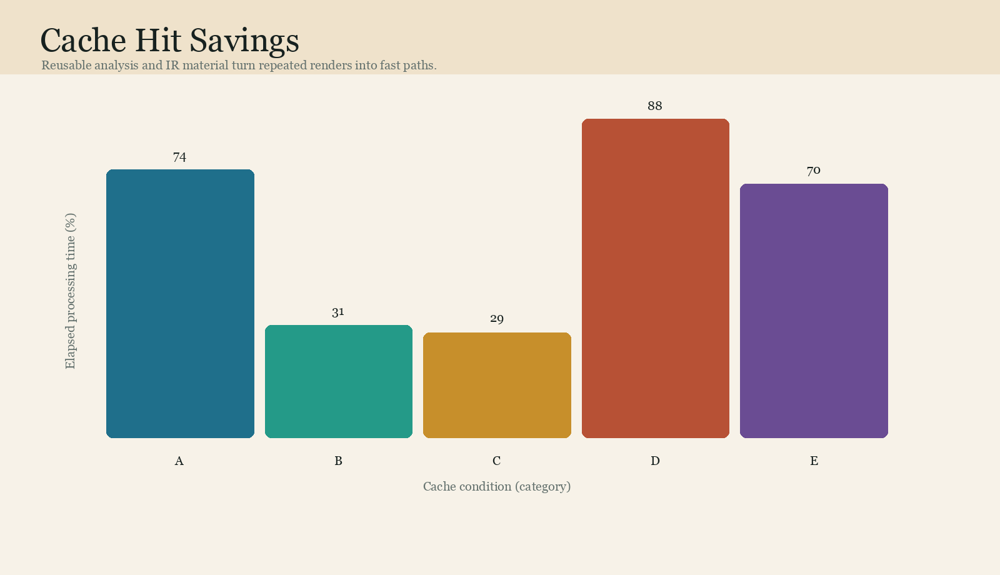

**Figure 43: Cache Hit Savings.** Reusable analysis and IR material turn repeated renders into fast paths. Bar height encodes the quantity on the vertical axis, while each horizontal category identifies a tested or illustrative condition. The horizontal axis is **Cache condition (category)** and the vertical axis is **Elapsed processing time (%)**.

Read the figure from the labeled input or independent dimension toward the reported response, then compare color, slope, area, or stage order as appropriate. Its practical purpose is to make the relevant verbx control or engineering tradeoff easier to predict before listening: abrupt changes suggest sensitive settings, broad regions suggest forgiving settings, and converging traces suggest conditions that should sound or measure similarly. Unless the figure explicitly prints measured values, the geometry is an explanatory model rather than a benchmark from a specific audio file. Use `verbx analyze` and its JSON report when exact values are needed for a render, device, room, or regression test.

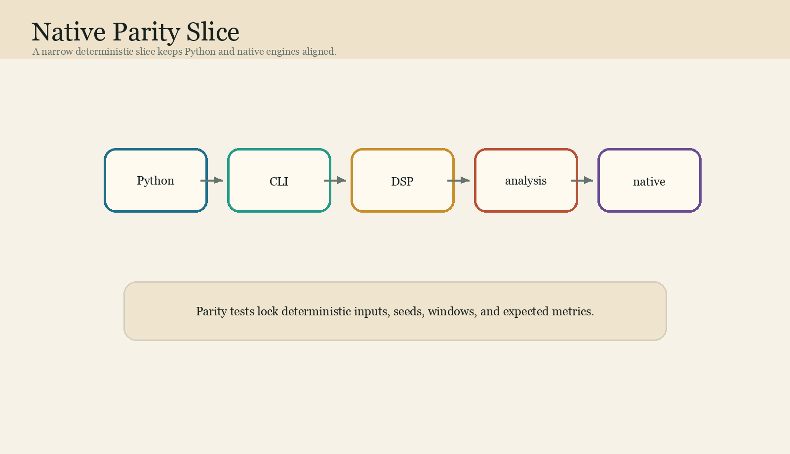

**Figure 44: Native Parity Slice.** A narrow deterministic slice keeps Python and native engines aligned. Boxes and arrows show order and dependency. Their position and size are schematic and carry no numeric scale. It has no numeric axes because it is a structural diagram rather than a measurement plot.

Read the figure from the labeled input or independent dimension toward the reported response, then compare color, slope, area, or stage order as appropriate. Its practical purpose is to make the relevant verbx control or engineering tradeoff easier to predict before listening: abrupt changes suggest sensitive settings, broad regions suggest forgiving settings, and converging traces suggest conditions that should sound or measure similarly. Unless the figure explicitly prints measured values, the geometry is an explanatory model rather than a benchmark from a specific audio file. Use `verbx analyze` and its JSON report when exact values are needed for a render, device, room, or regression test.

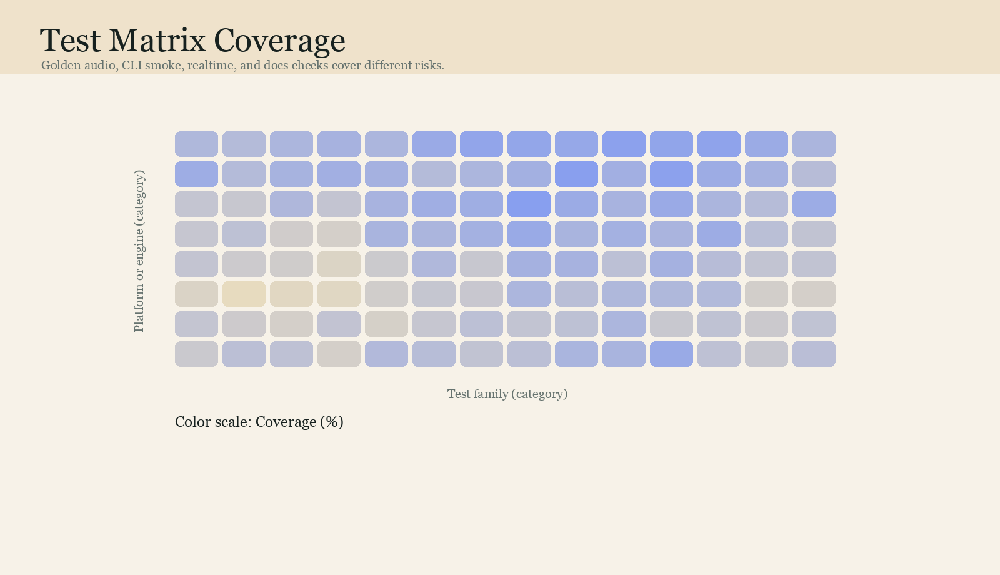

**Figure 45: Test Matrix Coverage.** Golden audio, CLI smoke, realtime, and docs checks cover different risks. Each cell combines one horizontal and one vertical condition; color encodes the third quantity named in the scale label. The horizontal axis is **Test family (category)** and the vertical axis is **Platform or engine (category)**. The color or radial scale reports **Coverage (%)**.

Read the figure from the labeled input or independent dimension toward the reported response, then compare color, slope, area, or stage order as appropriate. Its practical purpose is to make the relevant verbx control or engineering tradeoff easier to predict before listening: abrupt changes suggest sensitive settings, broad regions suggest forgiving settings, and converging traces suggest conditions that should sound or measure similarly. Unless the figure explicitly prints measured values, the geometry is an explanatory model rather than a benchmark from a specific audio file. Use `verbx analyze` and its JSON report when exact values are needed for a render, device, room, or regression test.

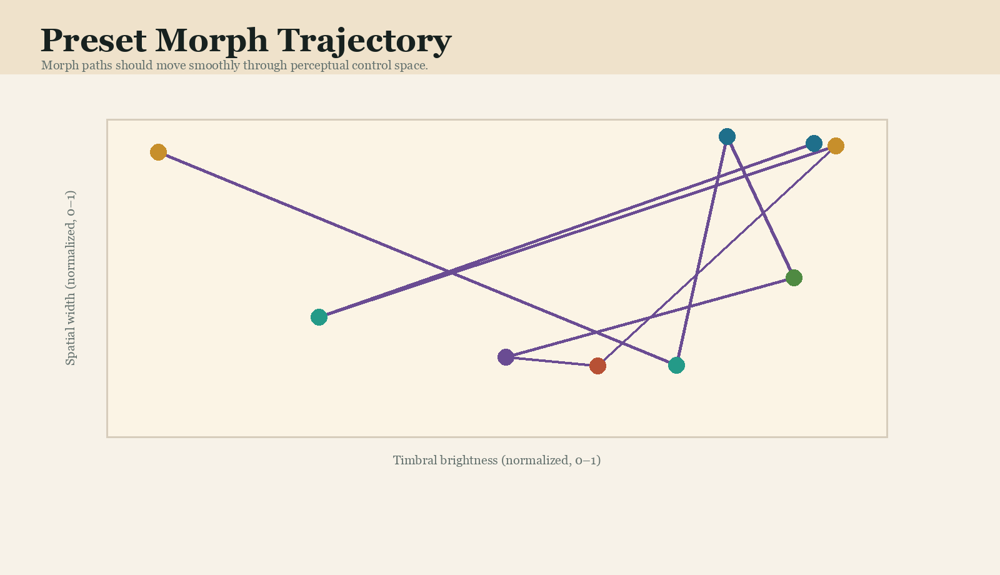

**Figure 46: Preset Morph Trajectory.** Morph paths should move smoothly through perceptual control space. Points and paths occupy a two-dimensional design space; proximity indicates similar states, not physical distance. The horizontal axis is **Timbral brightness (normalized, 0-1)** and the vertical axis is **Spatial width (normalized, 0-1)**.

Read the figure from the labeled input or independent dimension toward the reported response, then compare color, slope, area, or stage order as appropriate. Its practical purpose is to make the relevant verbx control or engineering tradeoff easier to predict before listening: abrupt changes suggest sensitive settings, broad regions suggest forgiving settings, and converging traces suggest conditions that should sound or measure similarly. Unless the figure explicitly prints measured values, the geometry is an explanatory model rather than a benchmark from a specific audio file. Use `verbx analyze` and its JSON report when exact values are needed for a render, device, room, or regression test.

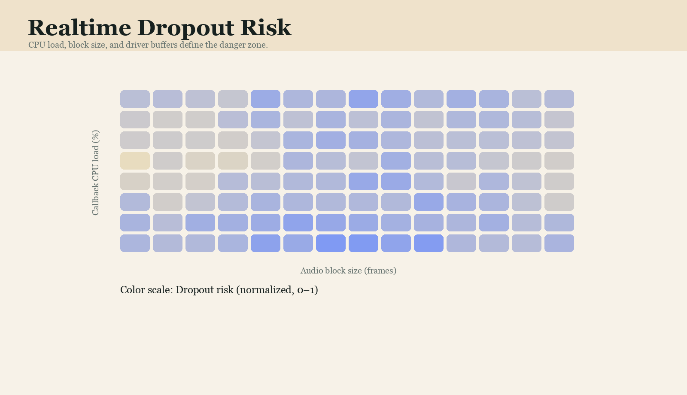

**Figure 47: Realtime Dropout Risk.** CPU load, block size, and driver buffers define the danger zone. Each cell combines one horizontal and one vertical condition; color encodes the third quantity named in the scale label. The horizontal axis is **Audio block size (frames)** and the vertical axis is **Callback CPU load (%)**. The color or radial scale reports **Dropout risk (normalized, 0-1)**.

Read the figure from the labeled input or independent dimension toward the reported response, then compare color, slope, area, or stage order as appropriate. Its practical purpose is to make the relevant verbx control or engineering tradeoff easier to predict before listening: abrupt changes suggest sensitive settings, broad regions suggest forgiving settings, and converging traces suggest conditions that should sound or measure similarly. Unless the figure explicitly prints measured values, the geometry is an explanatory model rather than a benchmark from a specific audio file. Use `verbx analyze` and its JSON report when exact values are needed for a render, device, room, or regression test.

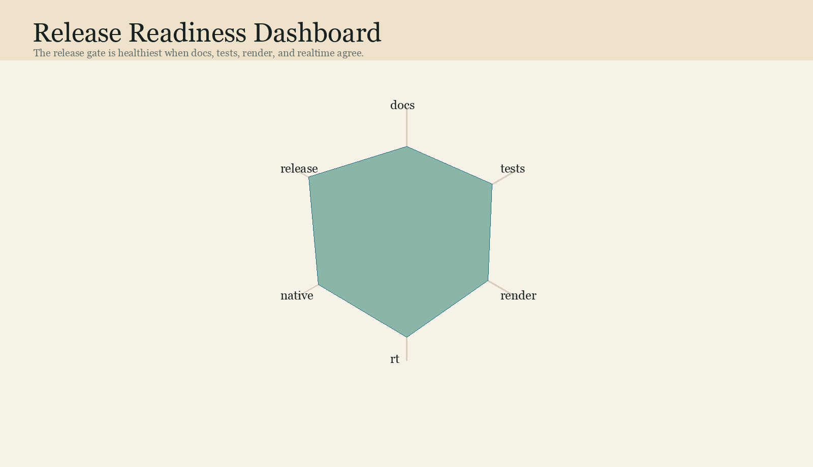

**Figure 48: Release Readiness Dashboard.** The release gate is healthiest when docs, tests, render, and realtime agree. Each spoke is a named category and distance from the center is the normalized radial score. The color or radial scale reports **Completion score (normalized, 0-1)**.

Read the figure from the labeled input or independent dimension toward the reported response, then compare color, slope, area, or stage order as appropriate. Its practical purpose is to make the relevant verbx control or engineering tradeoff easier to predict before listening: abrupt changes suggest sensitive settings, broad regions suggest forgiving settings, and converging traces suggest conditions that should sound or measure similarly. Unless the figure explicitly prints measured values, the geometry is an explanatory model rather than a benchmark from a specific audio file. Use `verbx analyze` and its JSON report when exact values are needed for a render, device, room, or regression test.

## Extended Figure Atlas

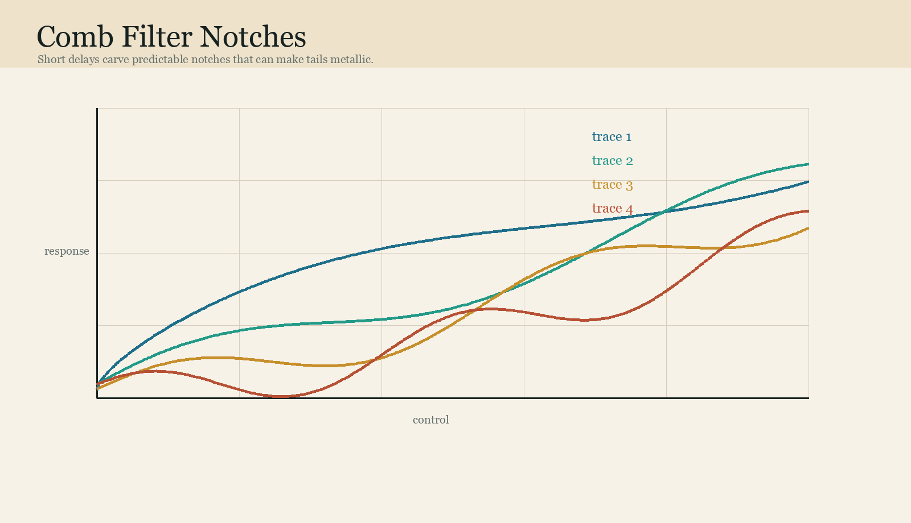

**Figure 49: Comb Filter Notches.** Short delays carve predictable notches that can make tails metallic. The colored traces share one coordinate system so their slopes, crossings, and endpoints can be compared directly. The horizontal axis is **Frequency (Hz)** and the vertical axis is **Magnitude response (dB)**.

Read the figure from the labeled input or independent dimension toward the reported response, then compare color, slope, area, or stage order as appropriate. Its practical purpose is to make the relevant verbx control or engineering tradeoff easier to predict before listening: abrupt changes suggest sensitive settings, broad regions suggest forgiving settings, and converging traces suggest conditions that should sound or measure similarly. Unless the figure explicitly prints measured values, the geometry is an explanatory model rather than a benchmark from a specific audio file. Use `verbx analyze` and its JSON report when exact values are needed for a render, device, room, or regression test.

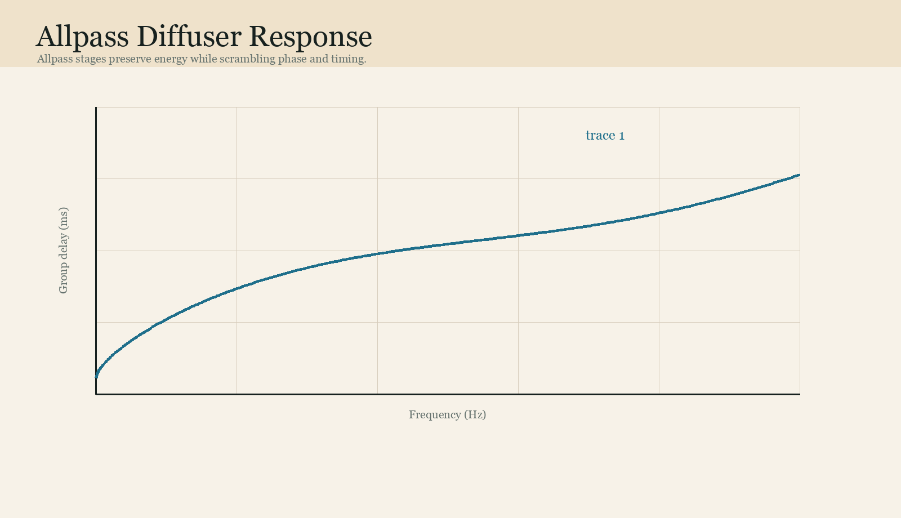

**Figure 50: Allpass Diffuser Response.** Allpass stages preserve energy while scrambling phase and timing. The trace shows how the vertical response changes as the horizontal control or measurement advances. The horizontal axis is **Frequency (Hz)** and the vertical axis is **Group delay (ms)**.

Read the figure from the labeled input or independent dimension toward the reported response, then compare color, slope, area, or stage order as appropriate. Its practical purpose is to make the relevant verbx control or engineering tradeoff easier to predict before listening: abrupt changes suggest sensitive settings, broad regions suggest forgiving settings, and converging traces suggest conditions that should sound or measure similarly. Unless the figure explicitly prints measured values, the geometry is an explanatory model rather than a benchmark from a specific audio file. Use `verbx analyze` and its JSON report when exact values are needed for a render, device, room, or regression test.

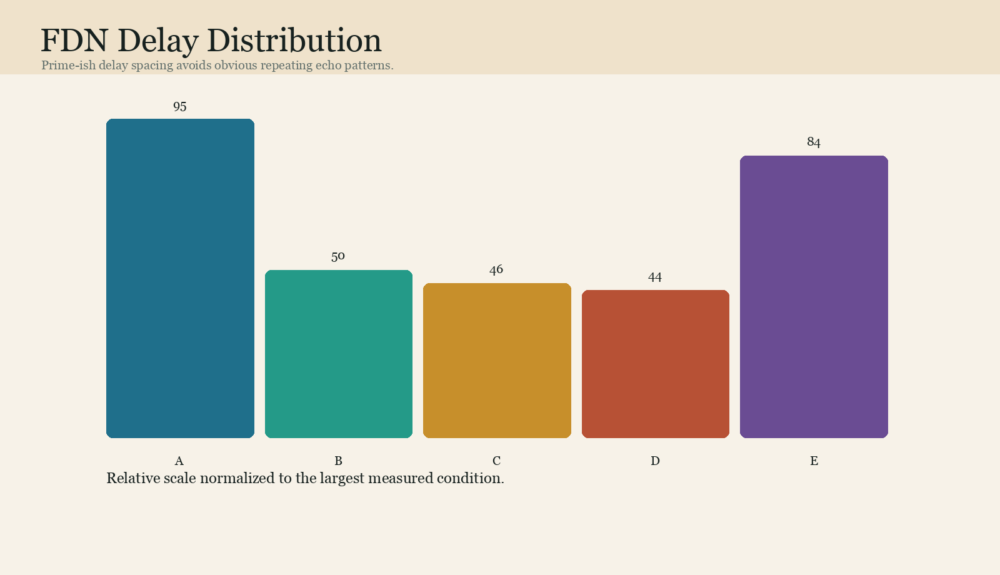

**Figure 51: FDN Delay Distribution.** Prime-ish delay spacing avoids obvious repeating echo patterns. Bar height encodes the quantity on the vertical axis, while each horizontal category identifies a tested or illustrative condition. The horizontal axis is **FDN delay line (index)** and the vertical axis is **Delay length (samples)**.

Read the figure from the labeled input or independent dimension toward the reported response, then compare color, slope, area, or stage order as appropriate. Its practical purpose is to make the relevant verbx control or engineering tradeoff easier to predict before listening: abrupt changes suggest sensitive settings, broad regions suggest forgiving settings, and converging traces suggest conditions that should sound or measure similarly. Unless the figure explicitly prints measured values, the geometry is an explanatory model rather than a benchmark from a specific audio file. Use `verbx analyze` and its JSON report when exact values are needed for a render, device, room, or regression test.

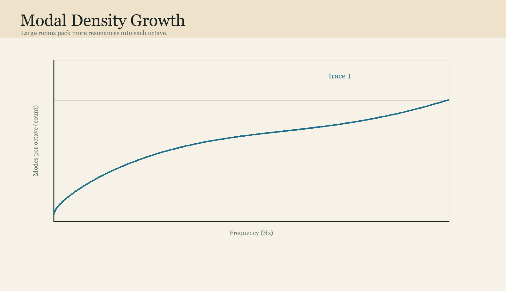

**Figure 52: Modal Density Growth.** Large rooms pack more resonances into each octave. The trace shows how the vertical response changes as the horizontal control or measurement advances. The horizontal axis is **Frequency (Hz)** and the vertical axis is **Modes per octave (count)**.

Read the figure from the labeled input or independent dimension toward the reported response, then compare color, slope, area, or stage order as appropriate. Its practical purpose is to make the relevant verbx control or engineering tradeoff easier to predict before listening: abrupt changes suggest sensitive settings, broad regions suggest forgiving settings, and converging traces suggest conditions that should sound or measure similarly. Unless the figure explicitly prints measured values, the geometry is an explanatory model rather than a benchmark from a specific audio file. Use `verbx analyze` and its JSON report when exact values are needed for a render, device, room, or regression test.

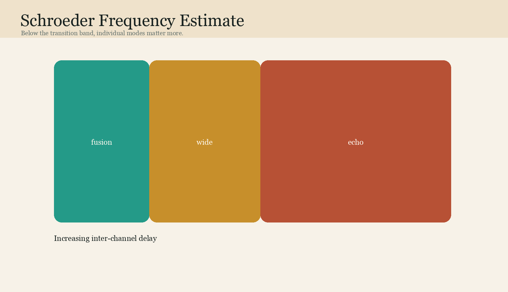

**Figure 53: Schroeder Frequency Estimate.** Below the transition band, individual modes matter more. Colored regions divide the horizontal quantity into operational or perceptual regimes rather than implying a continuous measured response. The horizontal axis is **Frequency (Hz)** and the vertical axis is **Acoustic behavior (category)**.

Read the figure from the labeled input or independent dimension toward the reported response, then compare color, slope, area, or stage order as appropriate. Its practical purpose is to make the relevant verbx control or engineering tradeoff easier to predict before listening: abrupt changes suggest sensitive settings, broad regions suggest forgiving settings, and converging traces suggest conditions that should sound or measure similarly. Unless the figure explicitly prints measured values, the geometry is an explanatory model rather than a benchmark from a specific audio file. Use `verbx analyze` and its JSON report when exact values are needed for a render, device, room, or regression test.

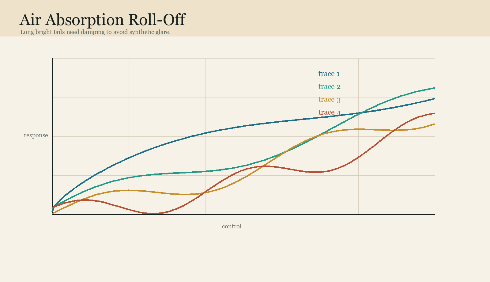

**Figure 54: Air Absorption Roll-Off.** Long bright tails need damping to avoid synthetic glare. The colored traces share one coordinate system so their slopes, crossings, and endpoints can be compared directly. The horizontal axis is **Frequency (Hz)** and the vertical axis is **Air attenuation (dB/m)**.

Read the figure from the labeled input or independent dimension toward the reported response, then compare color, slope, area, or stage order as appropriate. Its practical purpose is to make the relevant verbx control or engineering tradeoff easier to predict before listening: abrupt changes suggest sensitive settings, broad regions suggest forgiving settings, and converging traces suggest conditions that should sound or measure similarly. Unless the figure explicitly prints measured values, the geometry is an explanatory model rather than a benchmark from a specific audio file. Use `verbx analyze` and its JSON report when exact values are needed for a render, device, room, or regression test.

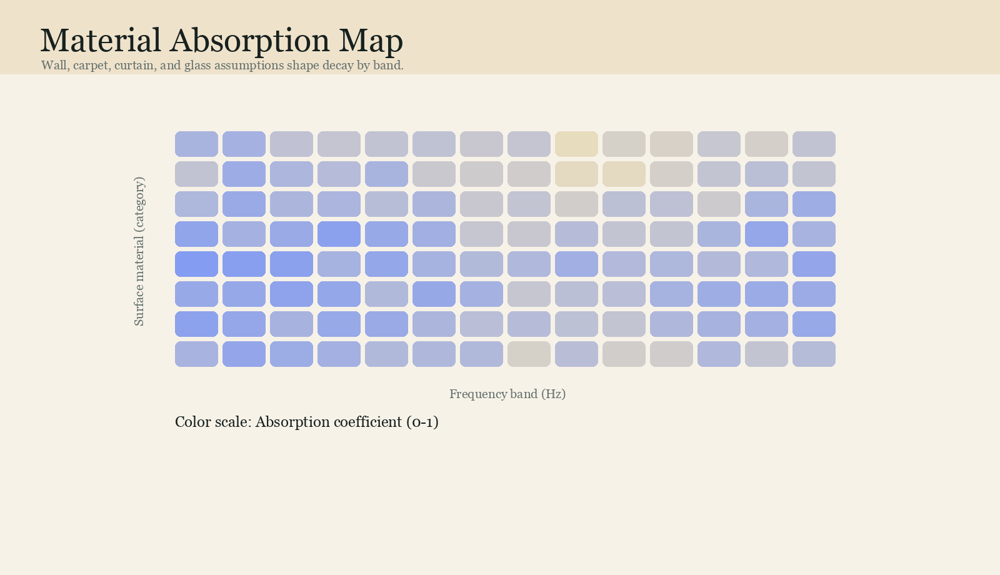

**Figure 55: Material Absorption Map.** Wall, carpet, curtain, and glass assumptions shape decay by band. Each cell combines one horizontal and one vertical condition; color encodes the third quantity named in the scale label. The horizontal axis is **Frequency band (Hz)** and the vertical axis is **Surface material (category)**. The color or radial scale reports **Absorption coefficient (0-1)**.

Read the figure from the labeled input or independent dimension toward the reported response, then compare color, slope, area, or stage order as appropriate. Its practical purpose is to make the relevant verbx control or engineering tradeoff easier to predict before listening: abrupt changes suggest sensitive settings, broad regions suggest forgiving settings, and converging traces suggest conditions that should sound or measure similarly. Unless the figure explicitly prints measured values, the geometry is an explanatory model rather than a benchmark from a specific audio file. Use `verbx analyze` and its JSON report when exact values are needed for a render, device, room, or regression test.

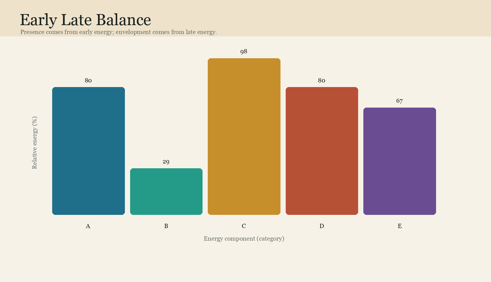

**Figure 56: Early Late Balance.** Presence comes from early energy; envelopment comes from late energy. Bar height encodes the quantity on the vertical axis, while each horizontal category identifies a tested or illustrative condition. The horizontal axis is **Energy component (category)** and the vertical axis is **Relative energy (%)**.

Read the figure from the labeled input or independent dimension toward the reported response, then compare color, slope, area, or stage order as appropriate. Its practical purpose is to make the relevant verbx control or engineering tradeoff easier to predict before listening: abrupt changes suggest sensitive settings, broad regions suggest forgiving settings, and converging traces suggest conditions that should sound or measure similarly. Unless the figure explicitly prints measured values, the geometry is an explanatory model rather than a benchmark from a specific audio file. Use `verbx analyze` and its JSON report when exact values are needed for a render, device, room, or regression test.

**Figure 57: Source Distance Cue.** Distance changes direct-to-reverberant balance before it changes tone. The trace shows how the vertical response changes as the horizontal control or measurement advances. The horizontal axis is **Source distance (m)** and the vertical axis is **Direct-to-reverberant ratio (dB)**.

Read the figure from the labeled input or independent dimension toward the reported response, then compare color, slope, area, or stage order as appropriate. Its practical purpose is to make the relevant verbx control or engineering tradeoff easier to predict before listening: abrupt changes suggest sensitive settings, broad regions suggest forgiving settings, and converging traces suggest conditions that should sound or measure similarly. Unless the figure explicitly prints measured values, the geometry is an explanatory model rather than a benchmark from a specific audio file. Use `verbx analyze` and its JSON report when exact values are needed for a render, device, room, or regression test.

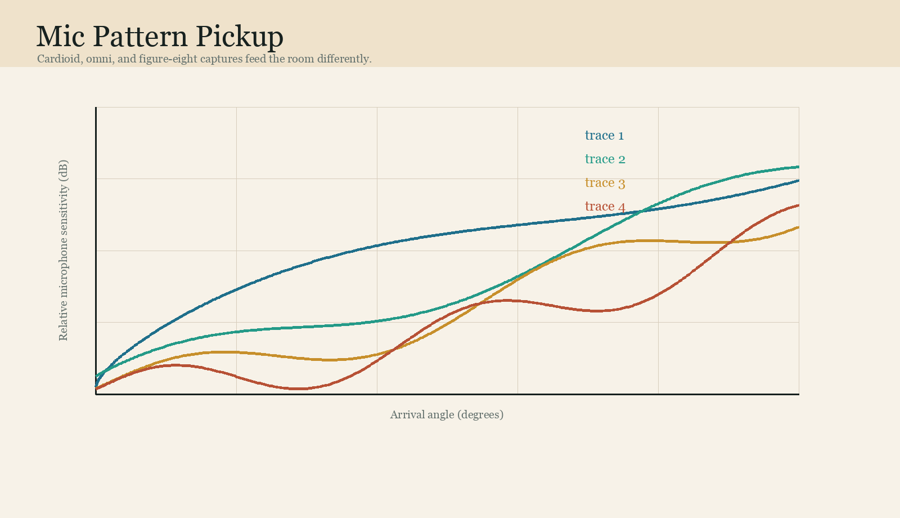

**Figure 58: Mic Pattern Pickup.** Cardioid, omni, and figure-eight captures feed the room differently. The colored traces share one coordinate system so their slopes, crossings, and endpoints can be compared directly. The horizontal axis is **Arrival angle (degrees)** and the vertical axis is **Relative microphone sensitivity (dB)**.

Read the figure from the labeled input or independent dimension toward the reported response, then compare color, slope, area, or stage order as appropriate. Its practical purpose is to make the relevant verbx control or engineering tradeoff easier to predict before listening: abrupt changes suggest sensitive settings, broad regions suggest forgiving settings, and converging traces suggest conditions that should sound or measure similarly. Unless the figure explicitly prints measured values, the geometry is an explanatory model rather than a benchmark from a specific audio file. Use `verbx analyze` and its JSON report when exact values are needed for a render, device, room, or regression test.

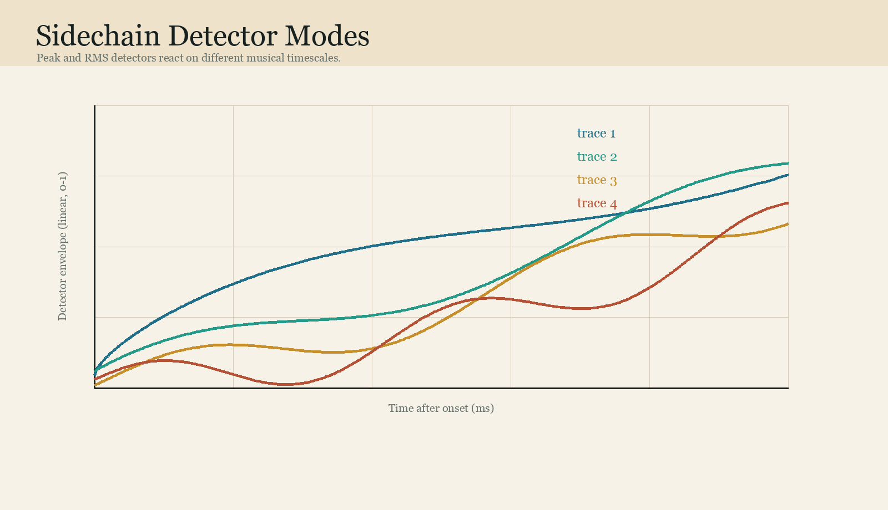

**Figure 59: Sidechain Detector Modes.** Peak and RMS detectors react on different musical timescales. The colored traces share one coordinate system so their slopes, crossings, and endpoints can be compared directly. The horizontal axis is **Time after onset (ms)** and the vertical axis is **Detector envelope (linear, 0-1)**.

Read the figure from the labeled input or independent dimension toward the reported response, then compare color, slope, area, or stage order as appropriate. Its practical purpose is to make the relevant verbx control or engineering tradeoff easier to predict before listening: abrupt changes suggest sensitive settings, broad regions suggest forgiving settings, and converging traces suggest conditions that should sound or measure similarly. Unless the figure explicitly prints measured values, the geometry is an explanatory model rather than a benchmark from a specific audio file. Use `verbx analyze` and its JSON report when exact values are needed for a render, device, room, or regression test.

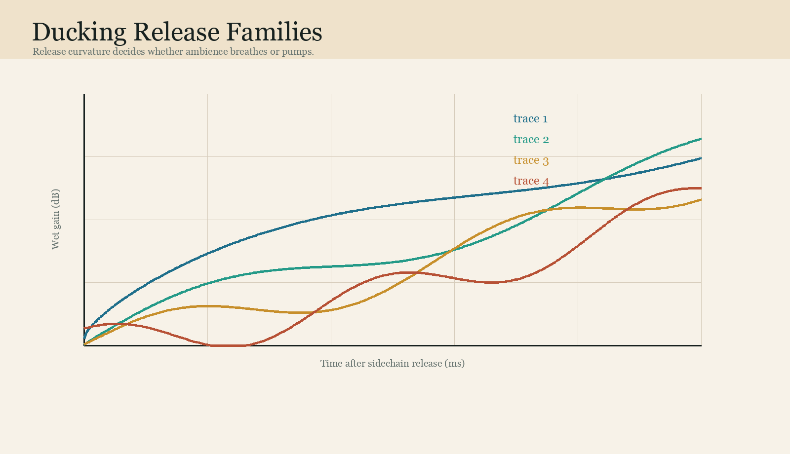

**Figure 60: Ducking Release Families.** Release curvature decides whether ambience breathes or pumps. The colored traces share one coordinate system so their slopes, crossings, and endpoints can be compared directly. The horizontal axis is **Time after sidechain release (ms)** and the vertical axis is **Wet gain (dB)**.

Read the figure from the labeled input or independent dimension toward the reported response, then compare color, slope, area, or stage order as appropriate. Its practical purpose is to make the relevant verbx control or engineering tradeoff easier to predict before listening: abrupt changes suggest sensitive settings, broad regions suggest forgiving settings, and converging traces suggest conditions that should sound or measure similarly. Unless the figure explicitly prints measured values, the geometry is an explanatory model rather than a benchmark from a specific audio file. Use `verbx analyze` and its JSON report when exact values are needed for a render, device, room, or regression test.

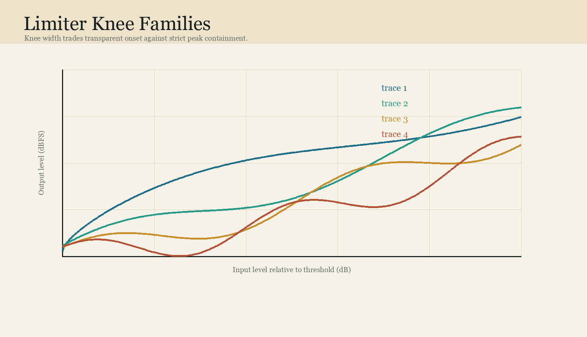

**Figure 61: Limiter Knee Families.** Knee width trades transparent onset against strict peak containment. The colored traces share one coordinate system so their slopes, crossings, and endpoints can be compared directly. The horizontal axis is **Input level relative to threshold (dB)** and the vertical axis is **Output level (dBFS)**.

Read the figure from the labeled input or independent dimension toward the reported response, then compare color, slope, area, or stage order as appropriate. Its practical purpose is to make the relevant verbx control or engineering tradeoff easier to predict before listening: abrupt changes suggest sensitive settings, broad regions suggest forgiving settings, and converging traces suggest conditions that should sound or measure similarly. Unless the figure explicitly prints measured values, the geometry is an explanatory model rather than a benchmark from a specific audio file. Use `verbx analyze` and its JSON report when exact values are needed for a render, device, room, or regression test.

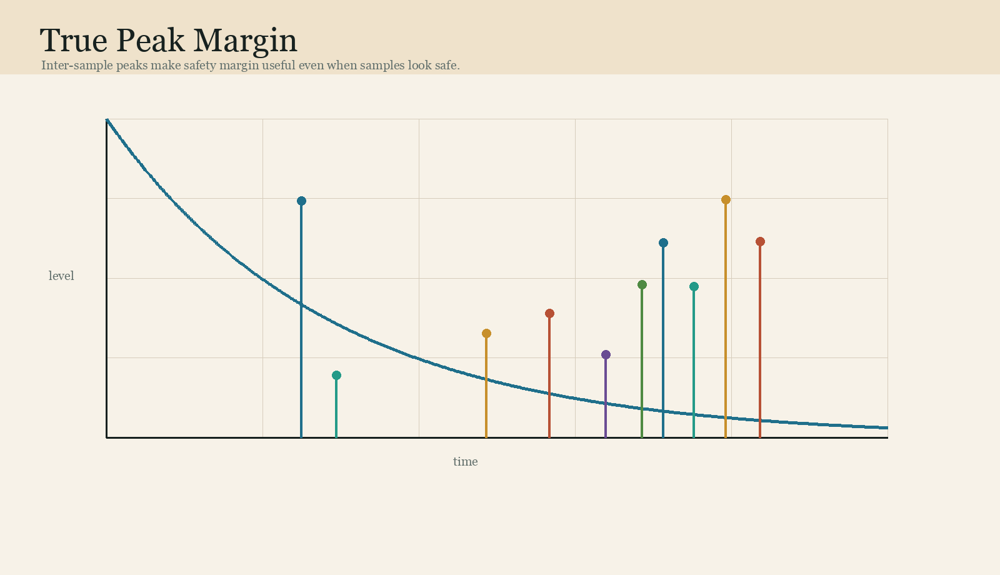

**Figure 62: True Peak Margin.** Inter-sample peaks make safety margin useful even when samples look safe. Vertical events and the envelope are positioned against a common time base, making onset, hold, and decay relationships visible. The horizontal axis is **Time around sample peak (µs)** and the vertical axis is **Signal level (dBFS)**.

Read the figure from the labeled input or independent dimension toward the reported response, then compare color, slope, area, or stage order as appropriate. Its practical purpose is to make the relevant verbx control or engineering tradeoff easier to predict before listening: abrupt changes suggest sensitive settings, broad regions suggest forgiving settings, and converging traces suggest conditions that should sound or measure similarly. Unless the figure explicitly prints measured values, the geometry is an explanatory model rather than a benchmark from a specific audio file. Use `verbx analyze` and its JSON report when exact values are needed for a render, device, room, or regression test.

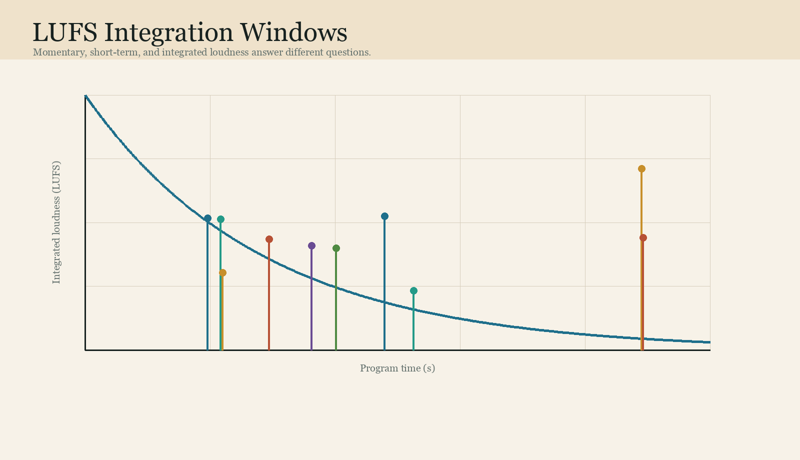

**Figure 63: LUFS Integration Windows.** Momentary, short-term, and integrated loudness answer different questions. Vertical events and the envelope are positioned against a common time base, making onset, hold, and decay relationships visible. The horizontal axis is **Program time (s)** and the vertical axis is **Integrated loudness (LUFS)**.

Read the figure from the labeled input or independent dimension toward the reported response, then compare color, slope, area, or stage order as appropriate. Its practical purpose is to make the relevant verbx control or engineering tradeoff easier to predict before listening: abrupt changes suggest sensitive settings, broad regions suggest forgiving settings, and converging traces suggest conditions that should sound or measure similarly. Unless the figure explicitly prints measured values, the geometry is an explanatory model rather than a benchmark from a specific audio file. Use `verbx analyze` and its JSON report when exact values are needed for a render, device, room, or regression test.

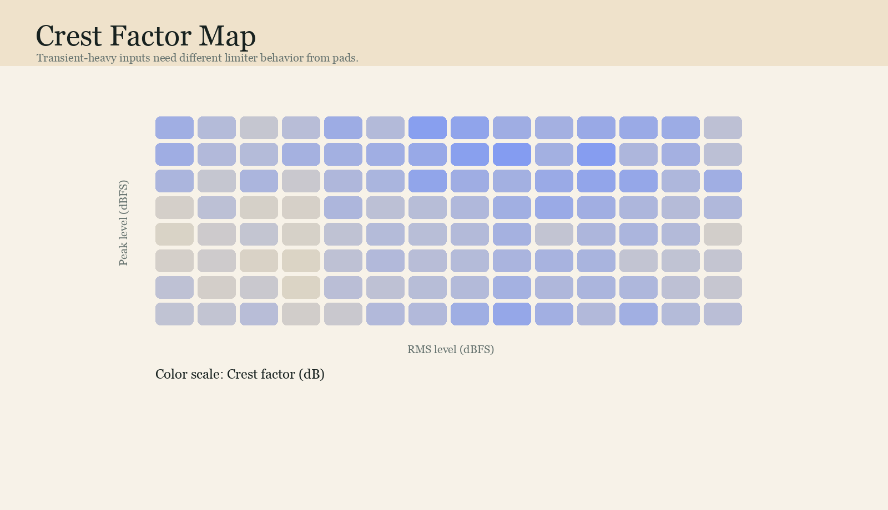

**Figure 64: Crest Factor Map.** Transient-heavy inputs need different limiter behavior from pads. Each cell combines one horizontal and one vertical condition; color encodes the third quantity named in the scale label. The horizontal axis is **RMS level (dBFS)** and the vertical axis is **Peak level (dBFS)**. The color or radial scale reports **Crest factor (dB)**.

Read the figure from the labeled input or independent dimension toward the reported response, then compare color, slope, area, or stage order as appropriate. Its practical purpose is to make the relevant verbx control or engineering tradeoff easier to predict before listening: abrupt changes suggest sensitive settings, broad regions suggest forgiving settings, and converging traces suggest conditions that should sound or measure similarly. Unless the figure explicitly prints measured values, the geometry is an explanatory model rather than a benchmark from a specific audio file. Use `verbx analyze` and its JSON report when exact values are needed for a render, device, room, or regression test.

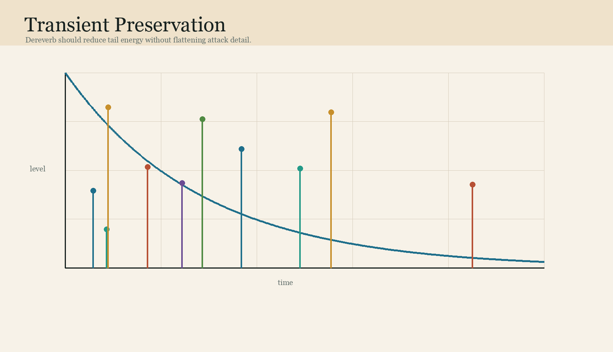

**Figure 65: Transient Preservation.** Dereverb should reduce tail energy without flattening attack detail. Vertical events and the envelope are positioned against a common time base, making onset, hold, and decay relationships visible. The horizontal axis is **Time around transient (ms)** and the vertical axis is **Signal amplitude (linear, -1 to +1)**.

Read the figure from the labeled input or independent dimension toward the reported response, then compare color, slope, area, or stage order as appropriate. Its practical purpose is to make the relevant verbx control or engineering tradeoff easier to predict before listening: abrupt changes suggest sensitive settings, broad regions suggest forgiving settings, and converging traces suggest conditions that should sound or measure similarly. Unless the figure explicitly prints measured values, the geometry is an explanatory model rather than a benchmark from a specific audio file. Use `verbx analyze` and its JSON report when exact values are needed for a render, device, room, or regression test.

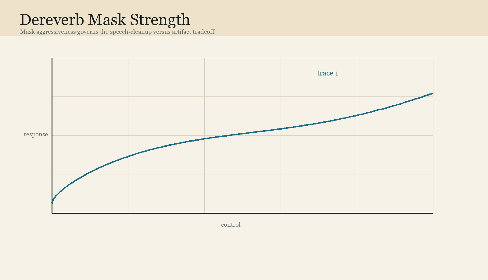

**Figure 66: Dereverb Mask Strength.** Mask aggressiveness governs the speech-cleanup versus artifact tradeoff. The trace shows how the vertical response changes as the horizontal control or measurement advances. The horizontal axis is **Dereverb mask strength (%)** and the vertical axis is **Artifact or suppression score (normalized, 0-1)**.

Read the figure from the labeled input or independent dimension toward the reported response, then compare color, slope, area, or stage order as appropriate. Its practical purpose is to make the relevant verbx control or engineering tradeoff easier to predict before listening: abrupt changes suggest sensitive settings, broad regions suggest forgiving settings, and converging traces suggest conditions that should sound or measure similarly. Unless the figure explicitly prints measured values, the geometry is an explanatory model rather than a benchmark from a specific audio file. Use `verbx analyze` and its JSON report when exact values are needed for a render, device, room, or regression test.

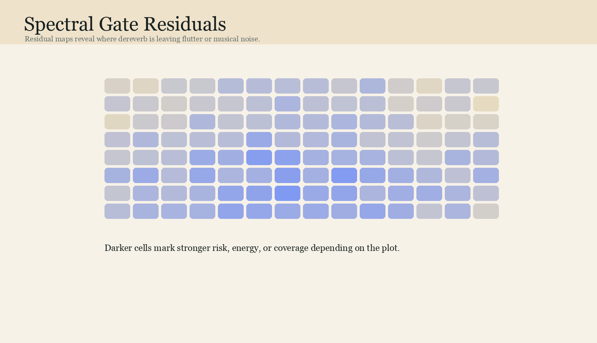

**Figure 67: Spectral Gate Residuals.** Residual maps reveal where dereverb is leaving flutter or musical noise. Each cell combines one horizontal and one vertical condition; color encodes the third quantity named in the scale label. The horizontal axis is **Time (s)** and the vertical axis is **Frequency (Hz)**. The color or radial scale reports **Residual magnitude (dBFS)**.

Read the figure from the labeled input or independent dimension toward the reported response, then compare color, slope, area, or stage order as appropriate. Its practical purpose is to make the relevant verbx control or engineering tradeoff easier to predict before listening: abrupt changes suggest sensitive settings, broad regions suggest forgiving settings, and converging traces suggest conditions that should sound or measure similarly. Unless the figure explicitly prints measured values, the geometry is an explanatory model rather than a benchmark from a specific audio file. Use `verbx analyze` and its JSON report when exact values are needed for a render, device, room, or regression test.

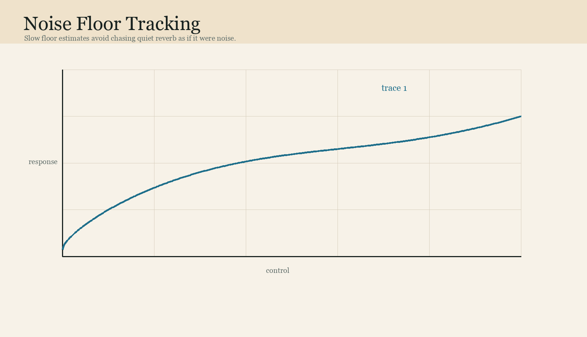

**Figure 68: Noise Floor Tracking.** Slow floor estimates avoid chasing quiet reverb as if it were noise. The trace shows how the vertical response changes as the horizontal control or measurement advances. The horizontal axis is **Program time (s)** and the vertical axis is **Estimated noise floor (dBFS)**.

Read the figure from the labeled input or independent dimension toward the reported response, then compare color, slope, area, or stage order as appropriate. Its practical purpose is to make the relevant verbx control or engineering tradeoff easier to predict before listening: abrupt changes suggest sensitive settings, broad regions suggest forgiving settings, and converging traces suggest conditions that should sound or measure similarly. Unless the figure explicitly prints measured values, the geometry is an explanatory model rather than a benchmark from a specific audio file. Use `verbx analyze` and its JSON report when exact values are needed for a render, device, room, or regression test.

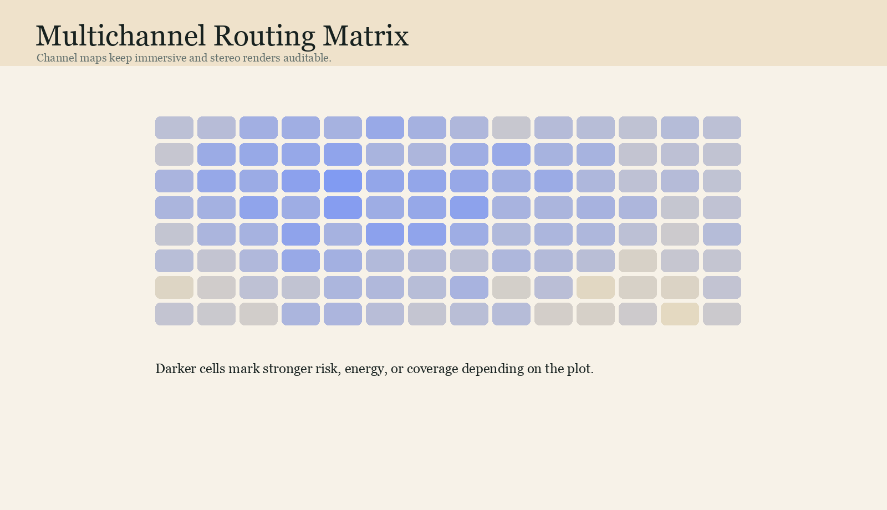

**Figure 69: Multichannel Routing Matrix.** Channel maps keep immersive and stereo renders auditable. Each cell combines one horizontal and one vertical condition; color encodes the third quantity named in the scale label. The horizontal axis is **Input channel (index)** and the vertical axis is **Output channel (index)**. The color or radial scale reports **Routing gain (dB)**.

Read the figure from the labeled input or independent dimension toward the reported response, then compare color, slope, area, or stage order as appropriate. Its practical purpose is to make the relevant verbx control or engineering tradeoff easier to predict before listening: abrupt changes suggest sensitive settings, broad regions suggest forgiving settings, and converging traces suggest conditions that should sound or measure similarly. Unless the figure explicitly prints measured values, the geometry is an explanatory model rather than a benchmark from a specific audio file. Use `verbx analyze` and its JSON report when exact values are needed for a render, device, room, or regression test.

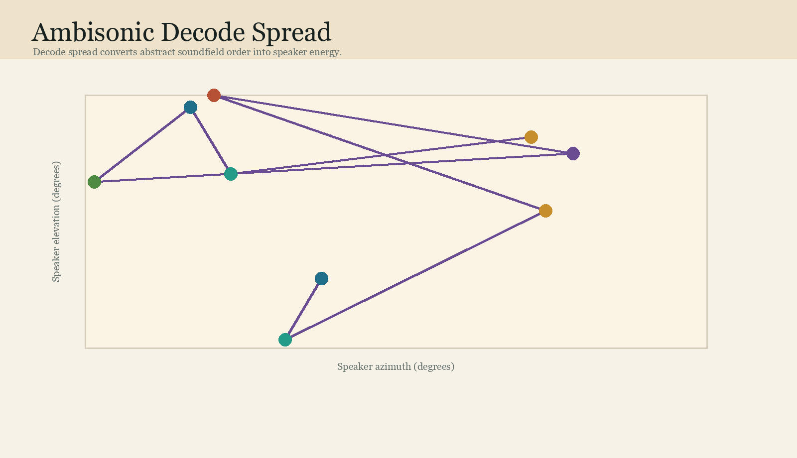

**Figure 70: Ambisonic Decode Spread.** Decode spread converts abstract soundfield order into speaker energy. Points and paths occupy a two-dimensional design space; proximity indicates similar states, not physical distance. The horizontal axis is **Speaker azimuth (degrees)** and the vertical axis is **Speaker elevation (degrees)**. The color or radial scale reports **Relative decode energy (0-1)**.

Read the figure from the labeled input or independent dimension toward the reported response, then compare color, slope, area, or stage order as appropriate. Its practical purpose is to make the relevant verbx control or engineering tradeoff easier to predict before listening: abrupt changes suggest sensitive settings, broad regions suggest forgiving settings, and converging traces suggest conditions that should sound or measure similarly. Unless the figure explicitly prints measured values, the geometry is an explanatory model rather than a benchmark from a specific audio file. Use `verbx analyze` and its JSON report when exact values are needed for a render, device, room, or regression test.

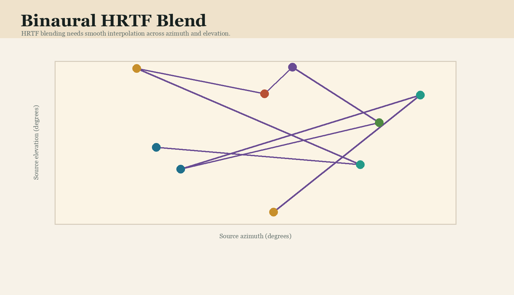

**Figure 71: Binaural HRTF Blend.** HRTF blending needs smooth interpolation across azimuth and elevation. Points and paths occupy a two-dimensional design space; proximity indicates similar states, not physical distance. The horizontal axis is **Source azimuth (degrees)** and the vertical axis is **Source elevation (degrees)**. The color or radial scale reports **HRTF blend weight (0-1)**.

Read the figure from the labeled input or independent dimension toward the reported response, then compare color, slope, area, or stage order as appropriate. Its practical purpose is to make the relevant verbx control or engineering tradeoff easier to predict before listening: abrupt changes suggest sensitive settings, broad regions suggest forgiving settings, and converging traces suggest conditions that should sound or measure similarly. Unless the figure explicitly prints measured values, the geometry is an explanatory model rather than a benchmark from a specific audio file. Use `verbx analyze` and its JSON report when exact values are needed for a render, device, room, or regression test.

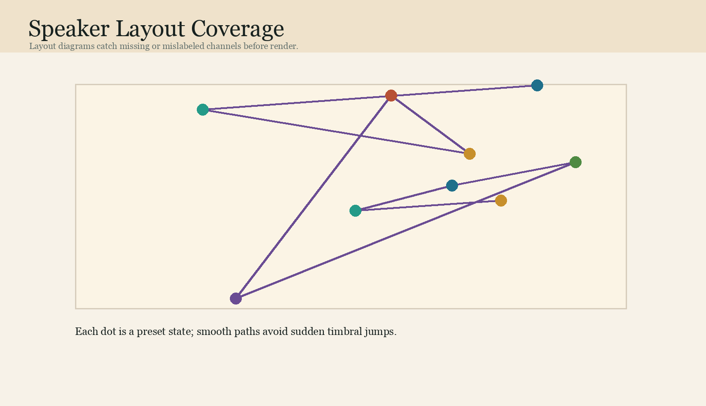

**Figure 72: Speaker Layout Coverage.** Layout diagrams catch missing or mislabeled channels before render. Points and paths occupy a two-dimensional design space; proximity indicates similar states, not physical distance. The horizontal axis is **Speaker azimuth (degrees)** and the vertical axis is **Speaker elevation (degrees)**. The color or radial scale reports **Coverage state (category)**.

Read the figure from the labeled input or independent dimension toward the reported response, then compare color, slope, area, or stage order as appropriate. Its practical purpose is to make the relevant verbx control or engineering tradeoff easier to predict before listening: abrupt changes suggest sensitive settings, broad regions suggest forgiving settings, and converging traces suggest conditions that should sound or measure similarly. Unless the figure explicitly prints measured values, the geometry is an explanatory model rather than a benchmark from a specific audio file. Use `verbx analyze` and its JSON report when exact values are needed for a render, device, room, or regression test.

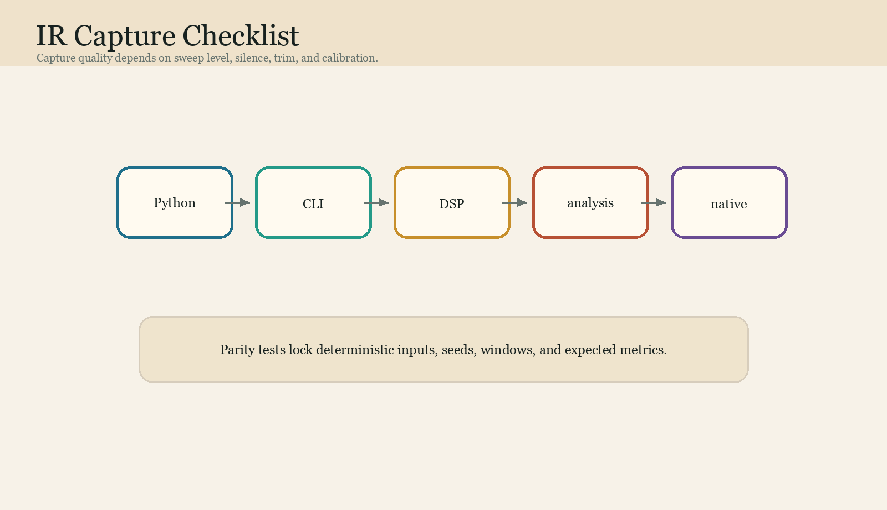

**Figure 73: IR Capture Checklist.** Capture quality depends on sweep level, silence, trim, and calibration. Boxes and arrows show order and dependency. Their position and size are schematic and carry no numeric scale. It has no numeric axes because it is a structural diagram rather than a measurement plot.

Read the figure from the labeled input or independent dimension toward the reported response, then compare color, slope, area, or stage order as appropriate. Its practical purpose is to make the relevant verbx control or engineering tradeoff easier to predict before listening: abrupt changes suggest sensitive settings, broad regions suggest forgiving settings, and converging traces suggest conditions that should sound or measure similarly. Unless the figure explicitly prints measured values, the geometry is an explanatory model rather than a benchmark from a specific audio file. Use `verbx analyze` and its JSON report when exact values are needed for a render, device, room, or regression test.

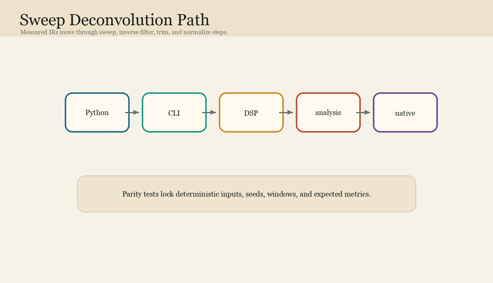

**Figure 74: Sweep Deconvolution Path.** Measured IRs move through sweep, inverse filter, trim, and normalize steps. Boxes and arrows show order and dependency. Their position and size are schematic and carry no numeric scale. It has no numeric axes because it is a structural diagram rather than a measurement plot.

Read the figure from the labeled input or independent dimension toward the reported response, then compare color, slope, area, or stage order as appropriate. Its practical purpose is to make the relevant verbx control or engineering tradeoff easier to predict before listening: abrupt changes suggest sensitive settings, broad regions suggest forgiving settings, and converging traces suggest conditions that should sound or measure similarly. Unless the figure explicitly prints measured values, the geometry is an explanatory model rather than a benchmark from a specific audio file. Use `verbx analyze` and its JSON report when exact values are needed for a render, device, room, or regression test.

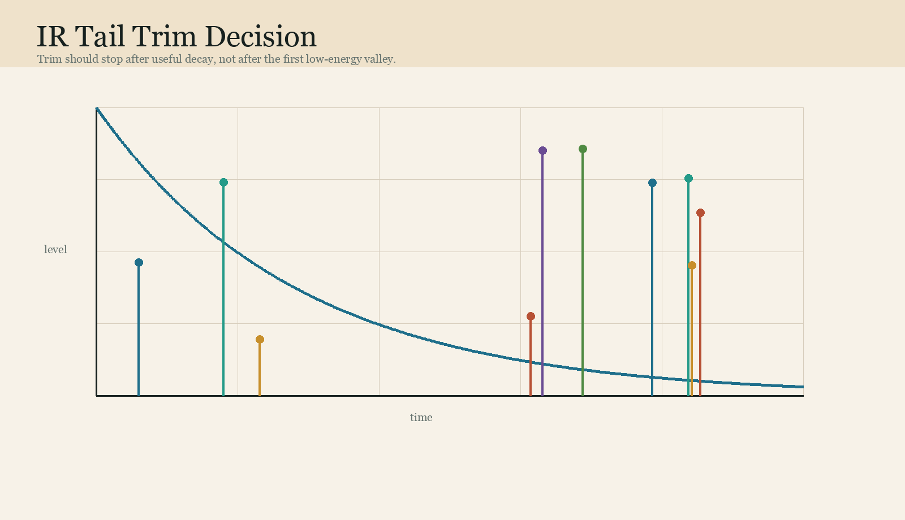

**Figure 75: IR Tail Trim Decision.** Trim should stop after useful decay, not after the first low-energy valley. Vertical events and the envelope are positioned against a common time base, making onset, hold, and decay relationships visible. The horizontal axis is **Time in impulse response (s)** and the vertical axis is **IR decay level (dBFS)**.

Read the figure from the labeled input or independent dimension toward the reported response, then compare color, slope, area, or stage order as appropriate. Its practical purpose is to make the relevant verbx control or engineering tradeoff easier to predict before listening: abrupt changes suggest sensitive settings, broad regions suggest forgiving settings, and converging traces suggest conditions that should sound or measure similarly. Unless the figure explicitly prints measured values, the geometry is an explanatory model rather than a benchmark from a specific audio file. Use `verbx analyze` and its JSON report when exact values are needed for a render, device, room, or regression test.

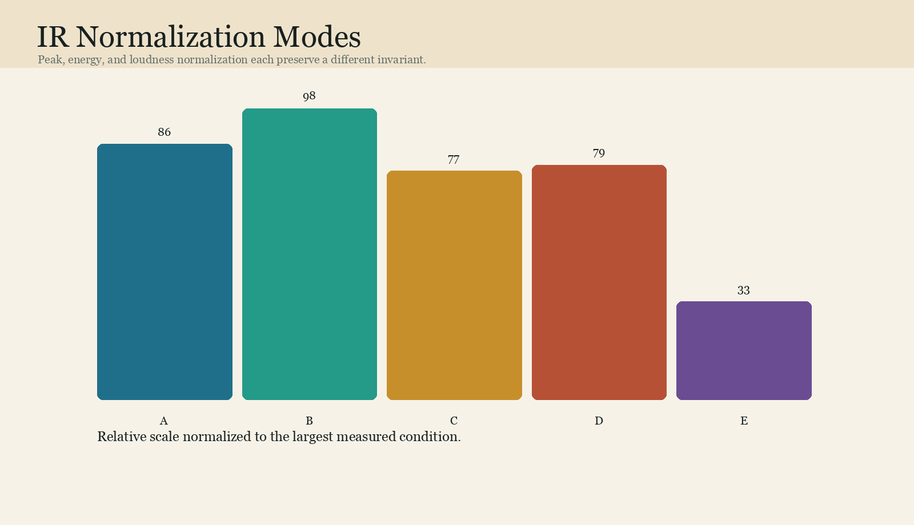

**Figure 76: IR Normalization Modes.** Peak, energy, and loudness normalization each preserve a different invariant. Bar height encodes the quantity on the vertical axis, while each horizontal category identifies a tested or illustrative condition. The horizontal axis is **Normalization mode (category)** and the vertical axis is **Resulting reference level (dB)**.

Read the figure from the labeled input or independent dimension toward the reported response, then compare color, slope, area, or stage order as appropriate. Its practical purpose is to make the relevant verbx control or engineering tradeoff easier to predict before listening: abrupt changes suggest sensitive settings, broad regions suggest forgiving settings, and converging traces suggest conditions that should sound or measure similarly. Unless the figure explicitly prints measured values, the geometry is an explanatory model rather than a benchmark from a specific audio file. Use `verbx analyze` and its JSON report when exact values are needed for a render, device, room, or regression test.

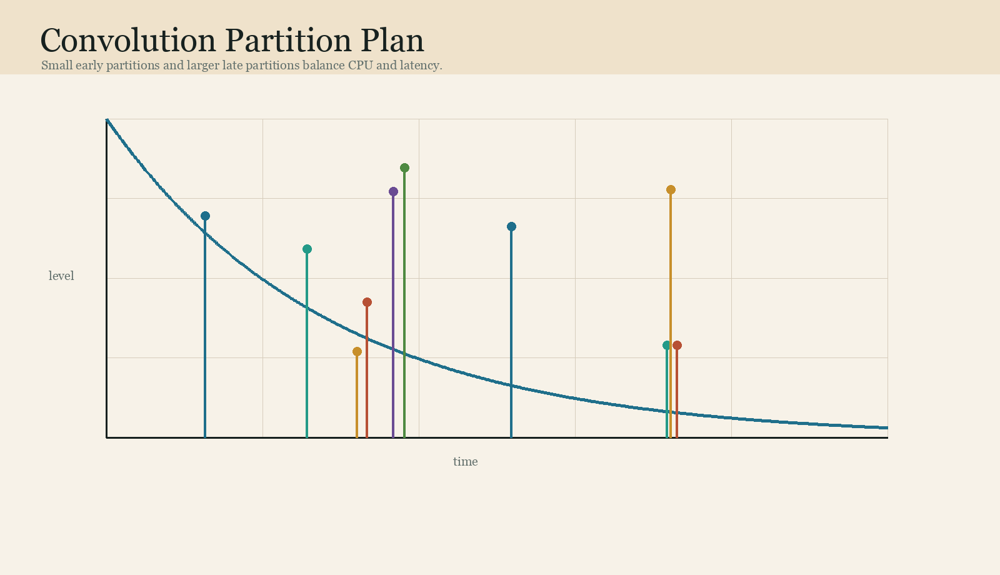

**Figure 77: Convolution Partition Plan.** Small early partitions and larger late partitions balance CPU and latency. Vertical events and the envelope are positioned against a common time base, making onset, hold, and decay relationships visible. The horizontal axis is **IR time offset (samples)** and the vertical axis is **Partition size (samples)**.

Read the figure from the labeled input or independent dimension toward the reported response, then compare color, slope, area, or stage order as appropriate. Its practical purpose is to make the relevant verbx control or engineering tradeoff easier to predict before listening: abrupt changes suggest sensitive settings, broad regions suggest forgiving settings, and converging traces suggest conditions that should sound or measure similarly. Unless the figure explicitly prints measured values, the geometry is an explanatory model rather than a benchmark from a specific audio file. Use `verbx analyze` and its JSON report when exact values are needed for a render, device, room, or regression test.

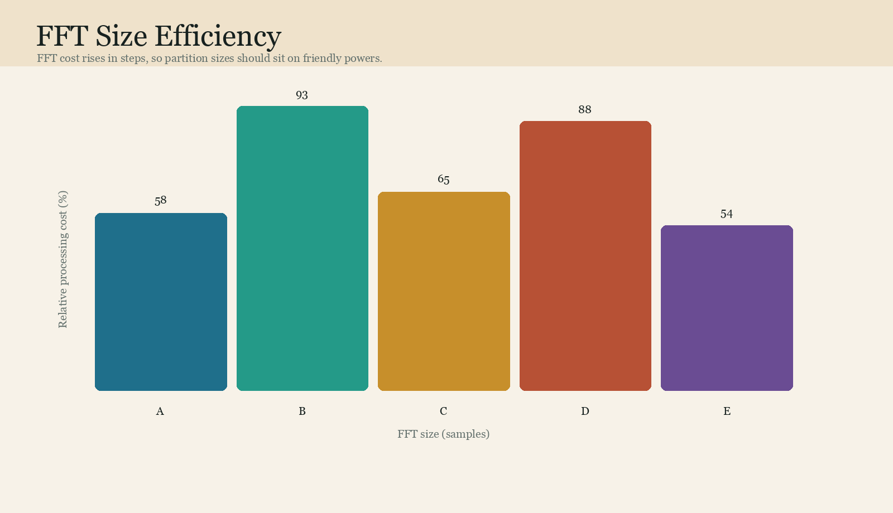

**Figure 78: FFT Size Efficiency.** FFT cost rises in steps, so partition sizes should sit on friendly powers. Bar height encodes the quantity on the vertical axis, while each horizontal category identifies a tested or illustrative condition. The horizontal axis is **FFT size (samples)** and the vertical axis is **Relative processing cost (%)**.

Read the figure from the labeled input or independent dimension toward the reported response, then compare color, slope, area, or stage order as appropriate. Its practical purpose is to make the relevant verbx control or engineering tradeoff easier to predict before listening: abrupt changes suggest sensitive settings, broad regions suggest forgiving settings, and converging traces suggest conditions that should sound or measure similarly. Unless the figure explicitly prints measured values, the geometry is an explanatory model rather than a benchmark from a specific audio file. Use `verbx analyze` and its JSON report when exact values are needed for a render, device, room, or regression test.

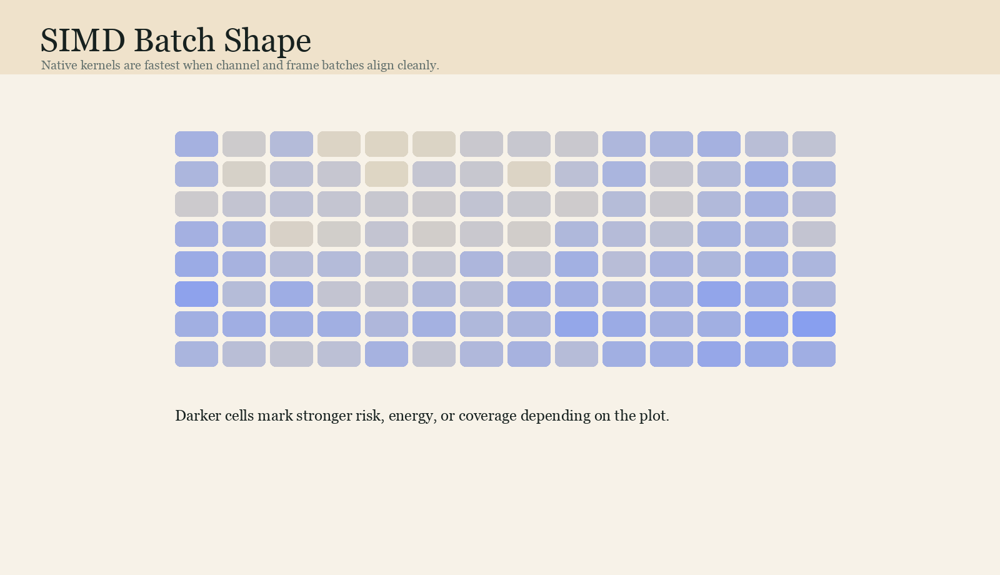

**Figure 79: SIMD Batch Shape.** Native kernels are fastest when channel and frame batches align cleanly. Each cell combines one horizontal and one vertical condition; color encodes the third quantity named in the scale label. The horizontal axis is **Frame batch size (frames)** and the vertical axis is **Channel batch size (channels)**. The color or radial scale reports **SIMD utilization (%)**.

Read the figure from the labeled input or independent dimension toward the reported response, then compare color, slope, area, or stage order as appropriate. Its practical purpose is to make the relevant verbx control or engineering tradeoff easier to predict before listening: abrupt changes suggest sensitive settings, broad regions suggest forgiving settings, and converging traces suggest conditions that should sound or measure similarly. Unless the figure explicitly prints measured values, the geometry is an explanatory model rather than a benchmark from a specific audio file. Use `verbx analyze` and its JSON report when exact values are needed for a render, device, room, or regression test.

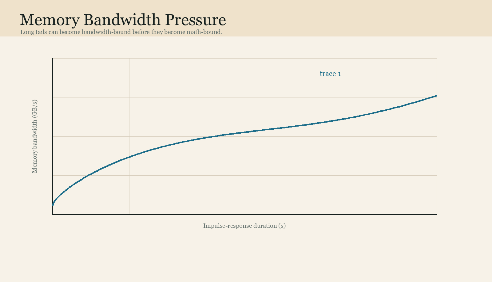

**Figure 80: Memory Bandwidth Pressure.** Long tails can become bandwidth-bound before they become math-bound. The trace shows how the vertical response changes as the horizontal control or measurement advances. The horizontal axis is **Impulse-response duration (s)** and the vertical axis is **Memory bandwidth (GB/s)**.

Read the figure from the labeled input or independent dimension toward the reported response, then compare color, slope, area, or stage order as appropriate. Its practical purpose is to make the relevant verbx control or engineering tradeoff easier to predict before listening: abrupt changes suggest sensitive settings, broad regions suggest forgiving settings, and converging traces suggest conditions that should sound or measure similarly. Unless the figure explicitly prints measured values, the geometry is an explanatory model rather than a benchmark from a specific audio file. Use `verbx analyze` and its JSON report when exact values are needed for a render, device, room, or regression test.

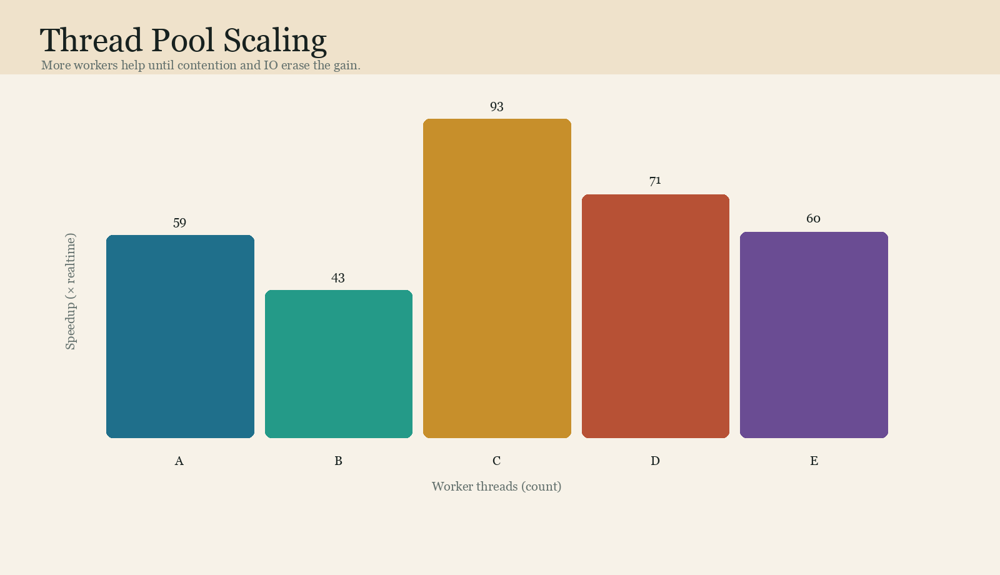

**Figure 81: Thread Pool Scaling.** More workers help until contention and IO erase the gain. Bar height encodes the quantity on the vertical axis, while each horizontal category identifies a tested or illustrative condition. The horizontal axis is **Worker threads (count)** and the vertical axis is **Speedup (× realtime)**.

Read the figure from the labeled input or independent dimension toward the reported response, then compare color, slope, area, or stage order as appropriate. Its practical purpose is to make the relevant verbx control or engineering tradeoff easier to predict before listening: abrupt changes suggest sensitive settings, broad regions suggest forgiving settings, and converging traces suggest conditions that should sound or measure similarly. Unless the figure explicitly prints measured values, the geometry is an explanatory model rather than a benchmark from a specific audio file. Use `verbx analyze` and its JSON report when exact values are needed for a render, device, room, or regression test.

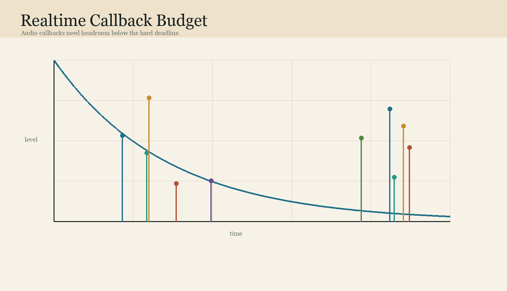

**Figure 82: Realtime Callback Budget.** Audio callbacks need headroom below the hard deadline. Vertical events and the envelope are positioned against a common time base, making onset, hold, and decay relationships visible. The horizontal axis is **Callback time (ms)** and the vertical axis is **Budget use (%)**.

Read the figure from the labeled input or independent dimension toward the reported response, then compare color, slope, area, or stage order as appropriate. Its practical purpose is to make the relevant verbx control or engineering tradeoff easier to predict before listening: abrupt changes suggest sensitive settings, broad regions suggest forgiving settings, and converging traces suggest conditions that should sound or measure similarly. Unless the figure explicitly prints measured values, the geometry is an explanatory model rather than a benchmark from a specific audio file. Use `verbx analyze` and its JSON report when exact values are needed for a render, device, room, or regression test.

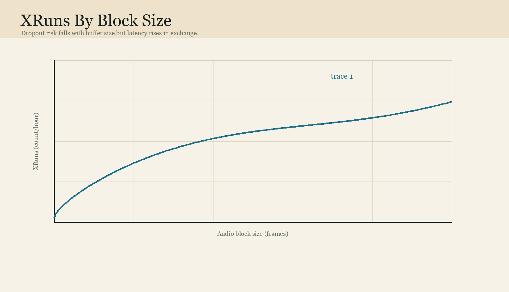

**Figure 83: XRuns By Block Size.** Dropout risk falls with buffer size but latency rises in exchange. The trace shows how the vertical response changes as the horizontal control or measurement advances. The horizontal axis is **Audio block size (frames)** and the vertical axis is **XRuns (count/hour)**.

Read the figure from the labeled input or independent dimension toward the reported response, then compare color, slope, area, or stage order as appropriate. Its practical purpose is to make the relevant verbx control or engineering tradeoff easier to predict before listening: abrupt changes suggest sensitive settings, broad regions suggest forgiving settings, and converging traces suggest conditions that should sound or measure similarly. Unless the figure explicitly prints measured values, the geometry is an explanatory model rather than a benchmark from a specific audio file. Use `verbx analyze` and its JSON report when exact values are needed for a render, device, room, or regression test.

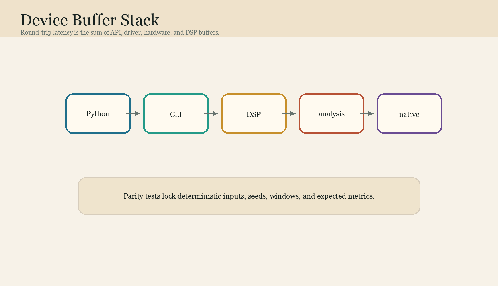

**Figure 84: Device Buffer Stack.** Round-trip latency is the sum of API, driver, hardware, and DSP buffers. Boxes and arrows show order and dependency. Their position and size are schematic and carry no numeric scale. It has no numeric axes because it is a structural diagram rather than a measurement plot.

Read the figure from the labeled input or independent dimension toward the reported response, then compare color, slope, area, or stage order as appropriate. Its practical purpose is to make the relevant verbx control or engineering tradeoff easier to predict before listening: abrupt changes suggest sensitive settings, broad regions suggest forgiving settings, and converging traces suggest conditions that should sound or measure similarly. Unless the figure explicitly prints measured values, the geometry is an explanatory model rather than a benchmark from a specific audio file. Use `verbx analyze` and its JSON report when exact values are needed for a render, device, room, or regression test.

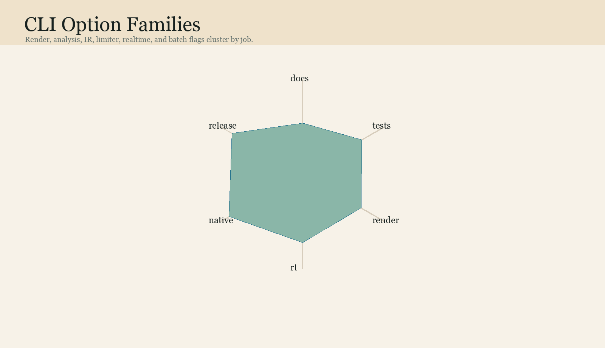

**Figure 85: CLI Option Families.** Render, analysis, IR, limiter, realtime, and batch flags cluster by job. Each spoke is a named category and distance from the center is the normalized radial score. The color or radial scale reports **Option coverage (normalized, 0-1)**.

Read the figure from the labeled input or independent dimension toward the reported response, then compare color, slope, area, or stage order as appropriate. Its practical purpose is to make the relevant verbx control or engineering tradeoff easier to predict before listening: abrupt changes suggest sensitive settings, broad regions suggest forgiving settings, and converging traces suggest conditions that should sound or measure similarly. Unless the figure explicitly prints measured values, the geometry is an explanatory model rather than a benchmark from a specific audio file. Use `verbx analyze` and its JSON report when exact values are needed for a render, device, room, or regression test.

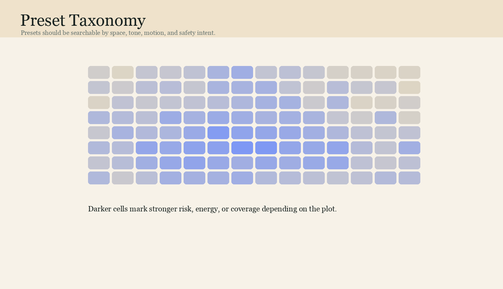

**Figure 86: Preset Taxonomy.** Presets should be searchable by space, tone, motion, and safety intent. Each cell combines one horizontal and one vertical condition; color encodes the third quantity named in the scale label. The horizontal axis is **Preset attribute (category)** and the vertical axis is **Preset family (category)**. The color or radial scale reports **Library density (presets/cell)**.

Read the figure from the labeled input or independent dimension toward the reported response, then compare color, slope, area, or stage order as appropriate. Its practical purpose is to make the relevant verbx control or engineering tradeoff easier to predict before listening: abrupt changes suggest sensitive settings, broad regions suggest forgiving settings, and converging traces suggest conditions that should sound or measure similarly. Unless the figure explicitly prints measured values, the geometry is an explanatory model rather than a benchmark from a specific audio file. Use `verbx analyze` and its JSON report when exact values are needed for a render, device, room, or regression test.

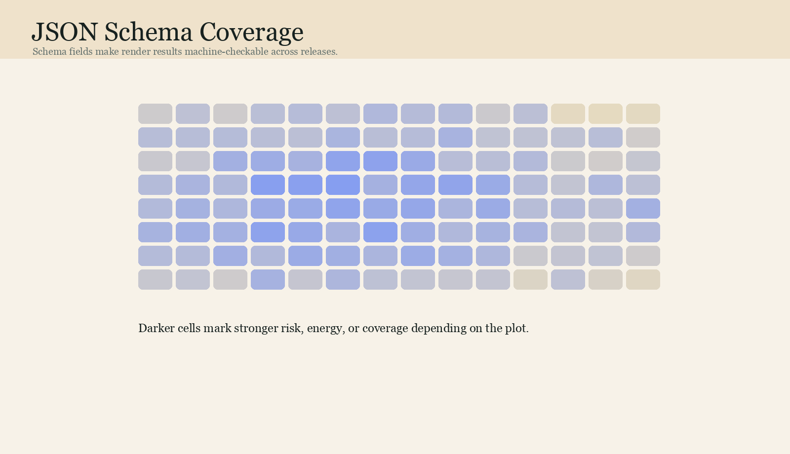

**Figure 87: JSON Schema Coverage.** Schema fields make render results machine-checkable across releases. Each cell combines one horizontal and one vertical condition; color encodes the third quantity named in the scale label. The horizontal axis is **Schema field group (category)** and the vertical axis is **Command (category)**. The color or radial scale reports **Fields implemented (%)**.

Read the figure from the labeled input or independent dimension toward the reported response, then compare color, slope, area, or stage order as appropriate. Its practical purpose is to make the relevant verbx control or engineering tradeoff easier to predict before listening: abrupt changes suggest sensitive settings, broad regions suggest forgiving settings, and converging traces suggest conditions that should sound or measure similarly. Unless the figure explicitly prints measured values, the geometry is an explanatory model rather than a benchmark from a specific audio file. Use `verbx analyze` and its JSON report when exact values are needed for a render, device, room, or regression test.

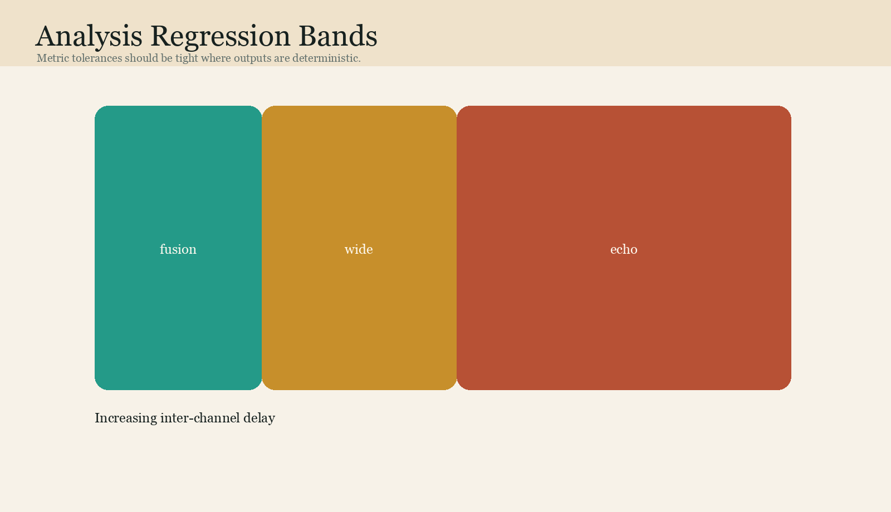

**Figure 88: Analysis Regression Bands.** Metric tolerances should be tight where outputs are deterministic. Colored regions divide the horizontal quantity into operational or perceptual regimes rather than implying a continuous measured response. The horizontal axis is **Regression metric (category)** and the vertical axis is **Allowed deviation (%)**.

Read the figure from the labeled input or independent dimension toward the reported response, then compare color, slope, area, or stage order as appropriate. Its practical purpose is to make the relevant verbx control or engineering tradeoff easier to predict before listening: abrupt changes suggest sensitive settings, broad regions suggest forgiving settings, and converging traces suggest conditions that should sound or measure similarly. Unless the figure explicitly prints measured values, the geometry is an explanatory model rather than a benchmark from a specific audio file. Use `verbx analyze` and its JSON report when exact values are needed for a render, device, room, or regression test.

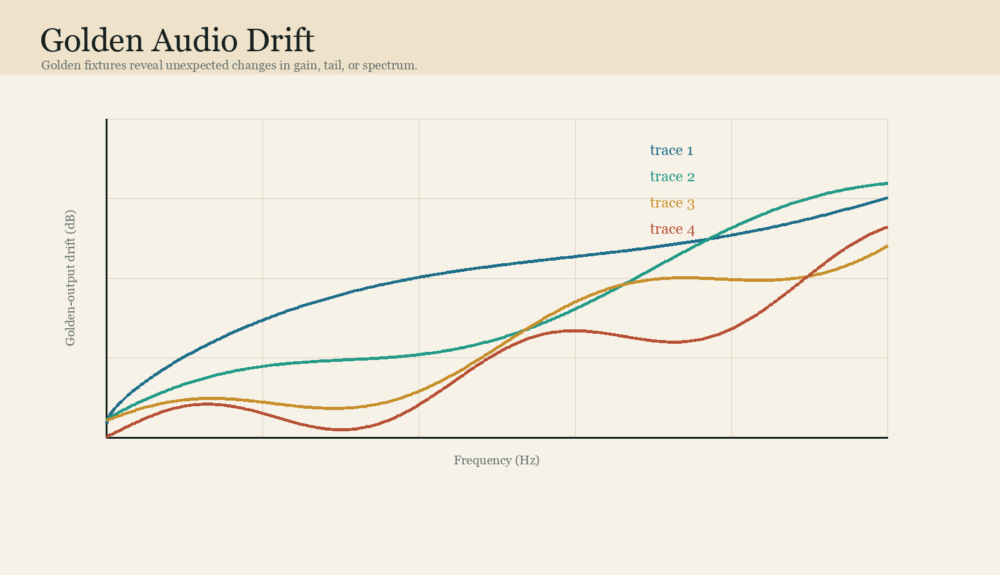

**Figure 89: Golden Audio Drift.** Golden fixtures reveal unexpected changes in gain, tail, or spectrum. The colored traces share one coordinate system so their slopes, crossings, and endpoints can be compared directly. The horizontal axis is **Frequency (Hz)** and the vertical axis is **Golden-output drift (dB)**.

Read the figure from the labeled input or independent dimension toward the reported response, then compare color, slope, area, or stage order as appropriate. Its practical purpose is to make the relevant verbx control or engineering tradeoff easier to predict before listening: abrupt changes suggest sensitive settings, broad regions suggest forgiving settings, and converging traces suggest conditions that should sound or measure similarly. Unless the figure explicitly prints measured values, the geometry is an explanatory model rather than a benchmark from a specific audio file. Use `verbx analyze` and its JSON report when exact values are needed for a render, device, room, or regression test.

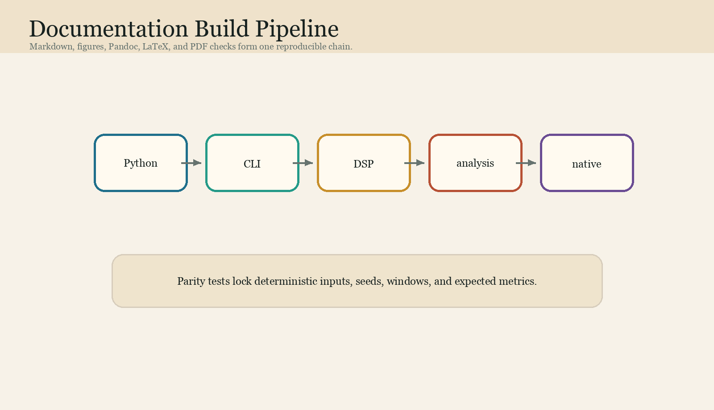

**Figure 90: Documentation Build Pipeline.** Markdown, figures, Pandoc, LaTeX, and PDF checks form one reproducible chain. Boxes and arrows show order and dependency. Their position and size are schematic and carry no numeric scale. It has no numeric axes because it is a structural diagram rather than a measurement plot.

Read the figure from the labeled input or independent dimension toward the reported response, then compare color, slope, area, or stage order as appropriate. Its practical purpose is to make the relevant verbx control or engineering tradeoff easier to predict before listening: abrupt changes suggest sensitive settings, broad regions suggest forgiving settings, and converging traces suggest conditions that should sound or measure similarly. Unless the figure explicitly prints measured values, the geometry is an explanatory model rather than a benchmark from a specific audio file. Use `verbx analyze` and its JSON report when exact values are needed for a render, device, room, or regression test.

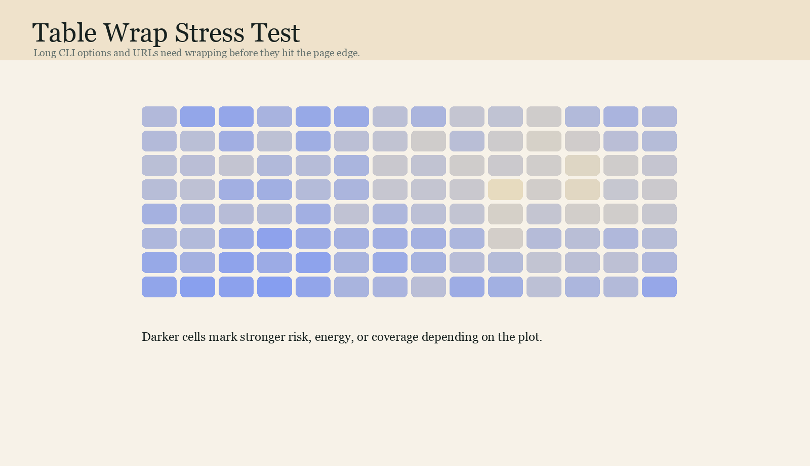

**Figure 91: Table Wrap Stress Test.** Long CLI options and URLs need wrapping before they hit the page edge. Each cell combines one horizontal and one vertical condition; color encodes the third quantity named in the scale label. The horizontal axis is **Table column width (characters)** and the vertical axis is **Content length (characters)**. The color or radial scale reports **Overflow risk (normalized, 0-1)**.

Read the figure from the labeled input or independent dimension toward the reported response, then compare color, slope, area, or stage order as appropriate. Its practical purpose is to make the relevant verbx control or engineering tradeoff easier to predict before listening: abrupt changes suggest sensitive settings, broad regions suggest forgiving settings, and converging traces suggest conditions that should sound or measure similarly. Unless the figure explicitly prints measured values, the geometry is an explanatory model rather than a benchmark from a specific audio file. Use `verbx analyze` and its JSON report when exact values are needed for a render, device, room, or regression test.

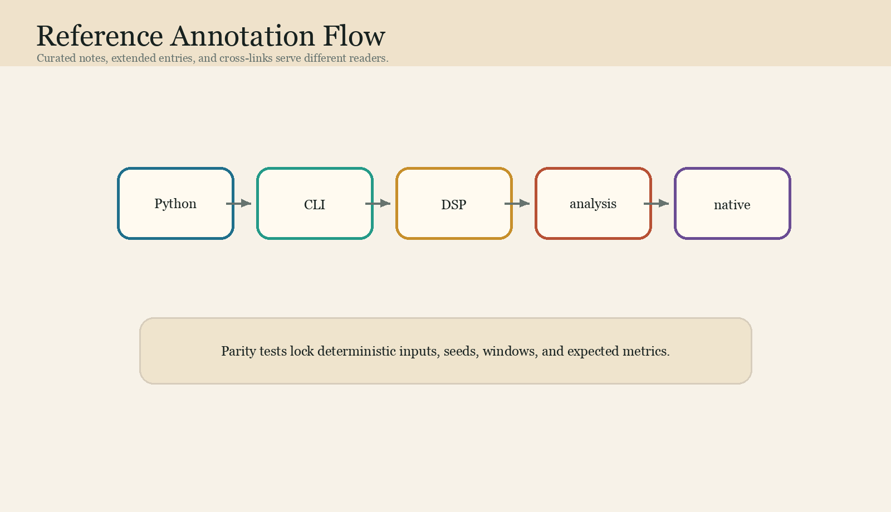

**Figure 92: Reference Annotation Flow.** Curated notes, extended entries, and cross-links serve different readers. Boxes and arrows show order and dependency. Their position and size are schematic and carry no numeric scale. It has no numeric axes because it is a structural diagram rather than a measurement plot.

Read the figure from the labeled input or independent dimension toward the reported response, then compare color, slope, area, or stage order as appropriate. Its practical purpose is to make the relevant verbx control or engineering tradeoff easier to predict before listening: abrupt changes suggest sensitive settings, broad regions suggest forgiving settings, and converging traces suggest conditions that should sound or measure similarly. Unless the figure explicitly prints measured values, the geometry is an explanatory model rather than a benchmark from a specific audio file. Use `verbx analyze` and its JSON report when exact values are needed for a render, device, room, or regression test.

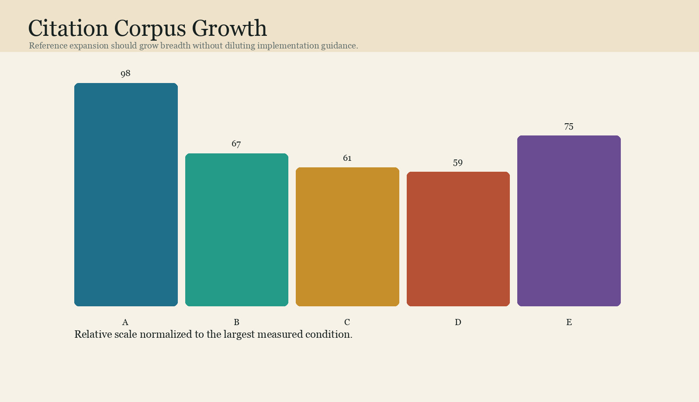

**Figure 93: Citation Corpus Growth.** Reference expansion should grow breadth without diluting implementation guidance. Bar height encodes the quantity on the vertical axis, while each horizontal category identifies a tested or illustrative condition. The horizontal axis is **Documentation release (version index)** and the vertical axis is **References (count)**.

Read the figure from the labeled input or independent dimension toward the reported response, then compare color, slope, area, or stage order as appropriate. Its practical purpose is to make the relevant verbx control or engineering tradeoff easier to predict before listening: abrupt changes suggest sensitive settings, broad regions suggest forgiving settings, and converging traces suggest conditions that should sound or measure similarly. Unless the figure explicitly prints measured values, the geometry is an explanatory model rather than a benchmark from a specific audio file. Use `verbx analyze` and its JSON report when exact values are needed for a render, device, room, or regression test.

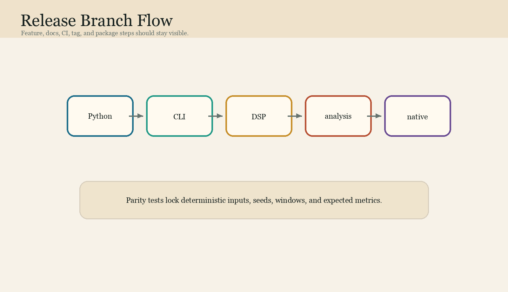

**Figure 94: Release Branch Flow.** Feature, docs, CI, tag, and package steps should stay visible. Boxes and arrows show order and dependency. Their position and size are schematic and carry no numeric scale. It has no numeric axes because it is a structural diagram rather than a measurement plot.

Read the figure from the labeled input or independent dimension toward the reported response, then compare color, slope, area, or stage order as appropriate. Its practical purpose is to make the relevant verbx control or engineering tradeoff easier to predict before listening: abrupt changes suggest sensitive settings, broad regions suggest forgiving settings, and converging traces suggest conditions that should sound or measure similarly. Unless the figure explicitly prints measured values, the geometry is an explanatory model rather than a benchmark from a specific audio file. Use `verbx analyze` and its JSON report when exact values are needed for a render, device, room, or regression test.

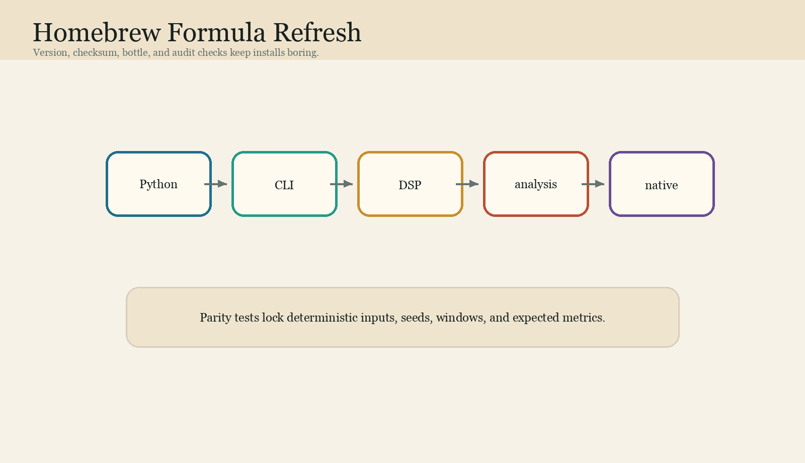

**Figure 95: Homebrew Formula Refresh.** Version, checksum, bottle, and audit checks keep installs boring. Boxes and arrows show order and dependency. Their position and size are schematic and carry no numeric scale. It has no numeric axes because it is a structural diagram rather than a measurement plot.

Read the figure from the labeled input or independent dimension toward the reported response, then compare color, slope, area, or stage order as appropriate. Its practical purpose is to make the relevant verbx control or engineering tradeoff easier to predict before listening: abrupt changes suggest sensitive settings, broad regions suggest forgiving settings, and converging traces suggest conditions that should sound or measure similarly. Unless the figure explicitly prints measured values, the geometry is an explanatory model rather than a benchmark from a specific audio file. Use `verbx analyze` and its JSON report when exact values are needed for a render, device, room, or regression test.

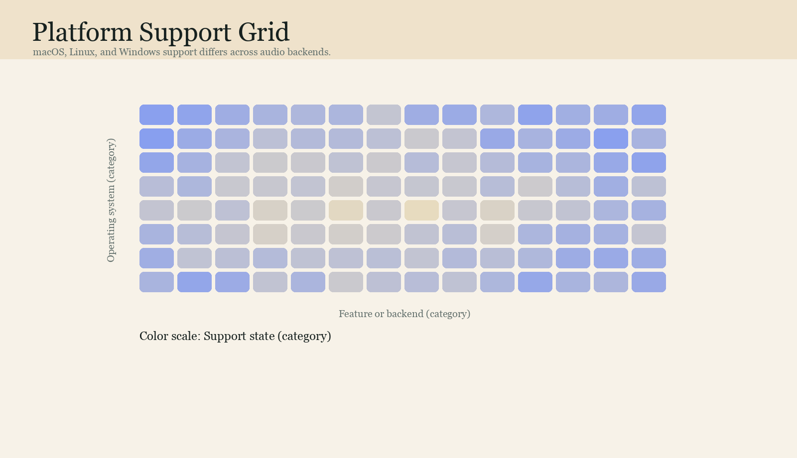

**Figure 96: Platform Support Grid.** macOS, Linux, and Windows support differs across audio backends. Each cell combines one horizontal and one vertical condition; color encodes the third quantity named in the scale label. The horizontal axis is **Feature or backend (category)** and the vertical axis is **Operating system (category)**. The color or radial scale reports **Support state (category)**.

Read the figure from the labeled input or independent dimension toward the reported response, then compare color, slope, area, or stage order as appropriate. Its practical purpose is to make the relevant verbx control or engineering tradeoff easier to predict before listening: abrupt changes suggest sensitive settings, broad regions suggest forgiving settings, and converging traces suggest conditions that should sound or measure similarly. Unless the figure explicitly prints measured values, the geometry is an explanatory model rather than a benchmark from a specific audio file. Use `verbx analyze` and its JSON report when exact values are needed for a render, device, room, or regression test.

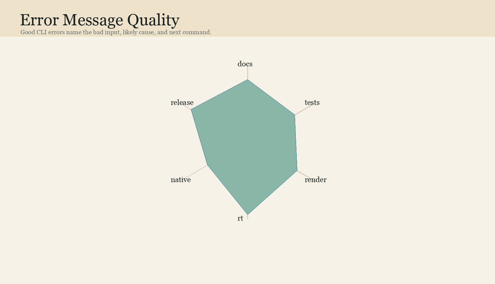

**Figure 97: Error Message Quality.** Good CLI errors name the bad input, likely cause, and next command. Each spoke is a named category and distance from the center is the normalized radial score. The color or radial scale reports **Quality score (normalized, 0-1)**.

Read the figure from the labeled input or independent dimension toward the reported response, then compare color, slope, area, or stage order as appropriate. Its practical purpose is to make the relevant verbx control or engineering tradeoff easier to predict before listening: abrupt changes suggest sensitive settings, broad regions suggest forgiving settings, and converging traces suggest conditions that should sound or measure similarly. Unless the figure explicitly prints measured values, the geometry is an explanatory model rather than a benchmark from a specific audio file. Use `verbx analyze` and its JSON report when exact values are needed for a render, device, room, or regression test.

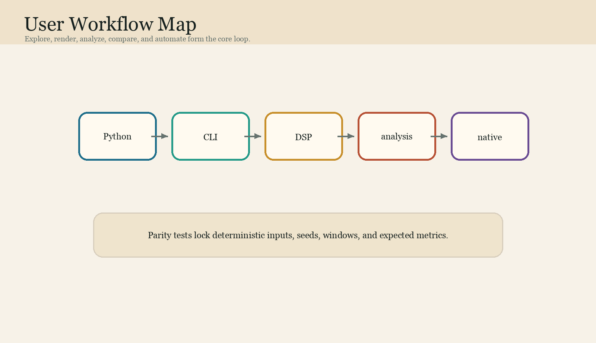

**Figure 98: User Workflow Map.** Explore, render, analyze, compare, and automate form the core loop. Boxes and arrows show order and dependency. Their position and size are schematic and carry no numeric scale. It has no numeric axes because it is a structural diagram rather than a measurement plot.

Read the figure from the labeled input or independent dimension toward the reported response, then compare color, slope, area, or stage order as appropriate. Its practical purpose is to make the relevant verbx control or engineering tradeoff easier to predict before listening: abrupt changes suggest sensitive settings, broad regions suggest forgiving settings, and converging traces suggest conditions that should sound or measure similarly. Unless the figure explicitly prints measured values, the geometry is an explanatory model rather than a benchmark from a specific audio file. Use `verbx analyze` and its JSON report when exact values are needed for a render, device, room, or regression test.

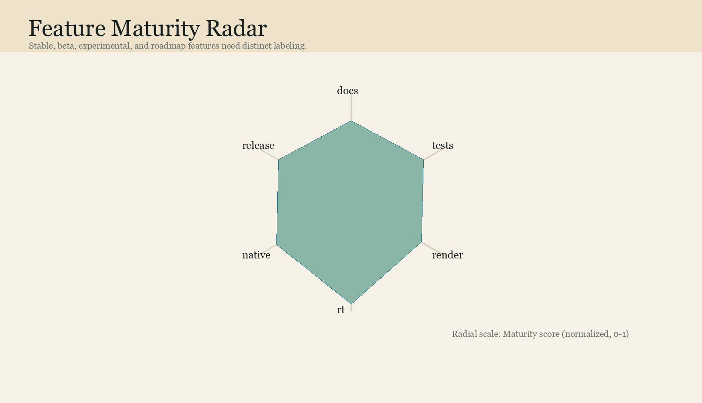

**Figure 99: Feature Maturity Radar.** Stable, beta, experimental, and roadmap features need distinct labeling. Each spoke is a named category and distance from the center is the normalized radial score. The color or radial scale reports **Maturity score (normalized, 0-1)**.

Read the figure from the labeled input or independent dimension toward the reported response, then compare color, slope, area, or stage order as appropriate. Its practical purpose is to make the relevant verbx control or engineering tradeoff easier to predict before listening: abrupt changes suggest sensitive settings, broad regions suggest forgiving settings, and converging traces suggest conditions that should sound or measure similarly. Unless the figure explicitly prints measured values, the geometry is an explanatory model rather than a benchmark from a specific audio file. Use `verbx analyze` and its JSON report when exact values are needed for a render, device, room, or regression test.

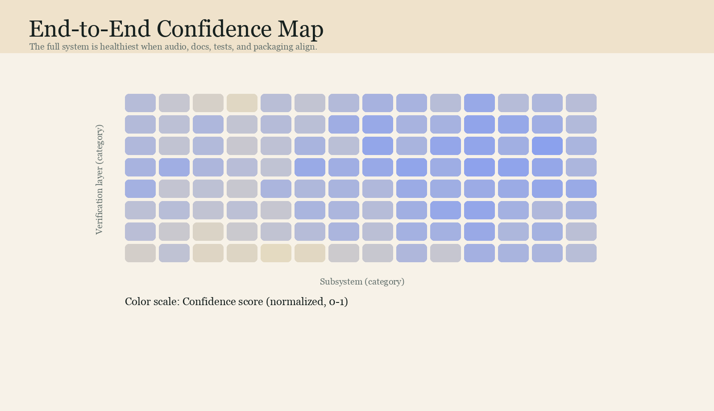

**Figure 100: End-to-End Confidence Map.** The full system is healthiest when audio, docs, tests, and packaging align. Each cell combines one horizontal and one vertical condition; color encodes the third quantity named in the scale label. The horizontal axis is **Subsystem (category)** and the vertical axis is **Verification layer (category)**. The color or radial scale reports **Confidence score (normalized, 0-1)**.

Read the figure from the labeled input or independent dimension toward the reported response, then compare color, slope, area, or stage order as appropriate. Its practical purpose is to make the relevant verbx control or engineering tradeoff easier to predict before listening: abrupt changes suggest sensitive settings, broad regions suggest forgiving settings, and converging traces suggest conditions that should sound or measure similarly. Unless the figure explicitly prints measured values, the geometry is an explanatory model rather than a benchmark from a specific audio file. Use `verbx analyze` and its JSON report when exact values are needed for a render, device, room, or regression test.
