# System Orientation Through Block Diagrams

This chapter is a visual map of the signal paths, state boundaries, and evidence loops used throughout verbx. Read each diagram from left to right, then use the paragraph beneath it to identify what may happen in realtime, what must be prepared off-thread, and what should be preserved in a report.

## The complete verbx workflow

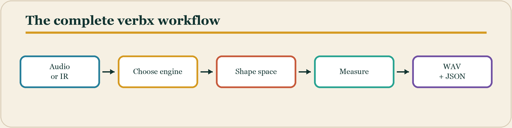

**Block diagram 1.** Every workflow begins with an identified source and ends with both an audible artifact and machine-readable evidence. The arrows indicate processing or evidence flow, not elapsed-time scale. Every box names a boundary at which parameters, latency, channel identity, or provenance should be checked.

## Algorithmic render path

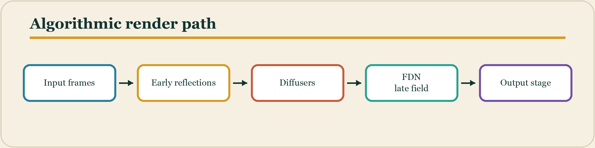

**Block diagram 2.** The algorithmic engine separates arrival cues, density growth, sustained decay, and delivery processing. The arrows indicate processing or evidence flow, not elapsed-time scale. Every box names a boundary at which parameters, latency, channel identity, or provenance should be checked.

## Convolution render path

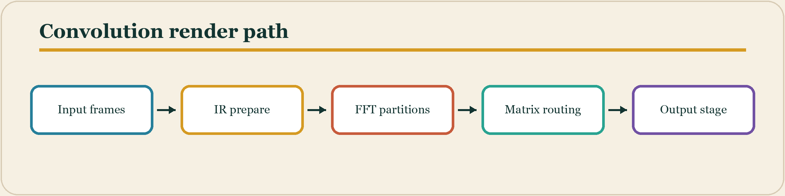

**Block diagram 3.** Partitioned convolution trades a small fixed scheduling delay for efficient processing of long and multichannel impulse responses. The arrows indicate processing or evidence flow, not elapsed-time scale. Every box names a boundary at which parameters, latency, channel identity, or provenance should be checked.

## Realtime callback boundary

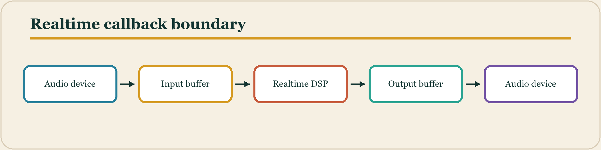

**Block diagram 4.** The callback path must remain bounded and allocation-free; preparation, file access, and reporting belong outside it. The arrows indicate processing or evidence flow, not elapsed-time scale. Every box names a boundary at which parameters, latency, channel identity, or provenance should be checked.

## End-to-end latency stack

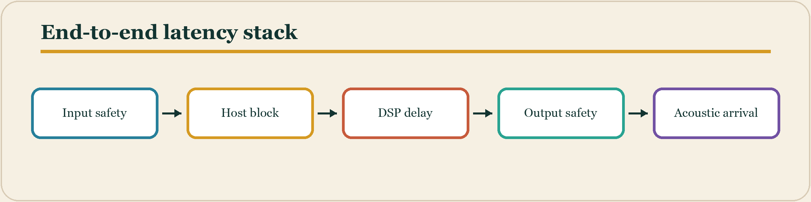

**Block diagram 5.** Perceived realtime latency is the sum of device buffers, host scheduling, algorithmic lookahead, and physical propagation. The arrows indicate processing or evidence flow, not elapsed-time scale. Every box names a boundary at which parameters, latency, channel identity, or provenance should be checked.

## Reverb event anatomy

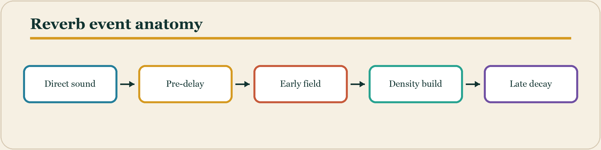

**Block diagram 6.** A useful listening model treats reverberation as an ordered event rather than a single wet signal. The arrows indicate processing or evidence flow, not elapsed-time scale. Every box names a boundary at which parameters, latency, channel identity, or provenance should be checked.

## RT60 control hierarchy

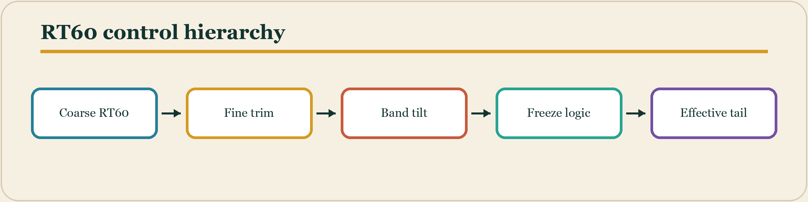

**Block diagram 7.** Coarse and fine controls establish time scale while frequency-dependent decay and freeze determine how energy persists. The arrows indicate processing or evidence flow, not elapsed-time scale. Every box names a boundary at which parameters, latency, channel identity, or provenance should be checked.

## FDN feedback loop

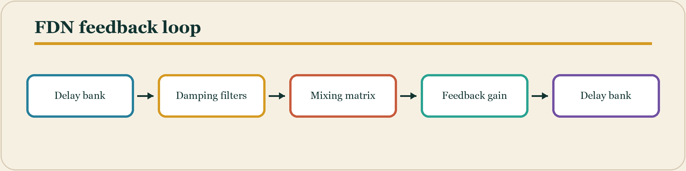

**Block diagram 8.** Delay lengths create modes; filters set color; the matrix disperses energy; calibrated gain establishes decay. The arrows indicate processing or evidence flow, not elapsed-time scale. Every box names a boundary at which parameters, latency, channel identity, or provenance should be checked.

## Impulse-response lifecycle

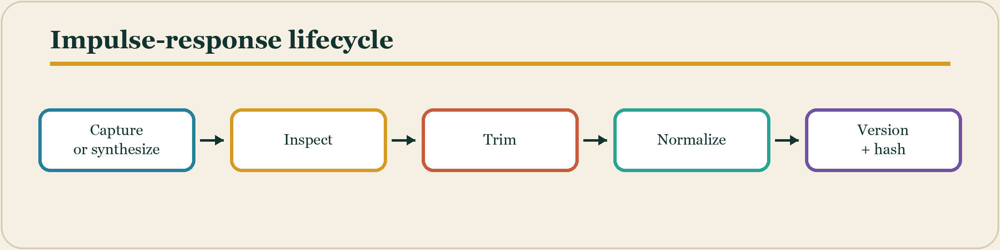

**Block diagram 9.** An impulse response is an auditable asset whose provenance and preparation affect every convolution result. The arrows indicate processing or evidence flow, not elapsed-time scale. Every box names a boundary at which parameters, latency, channel identity, or provenance should be checked.

## Dereverberation path

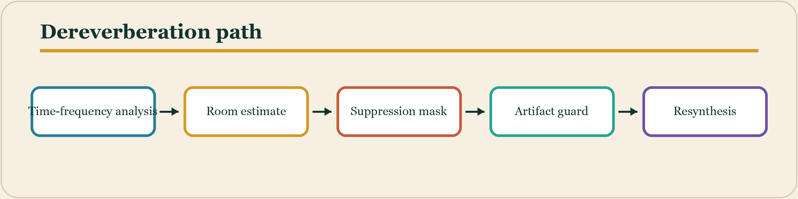

**Block diagram 10.** Dereverberation balances late-energy reduction against speech, transient, and ambience preservation. The arrows indicate processing or evidence flow, not elapsed-time scale. Every box names a boundary at which parameters, latency, channel identity, or provenance should be checked.

## Dynamics around reverb

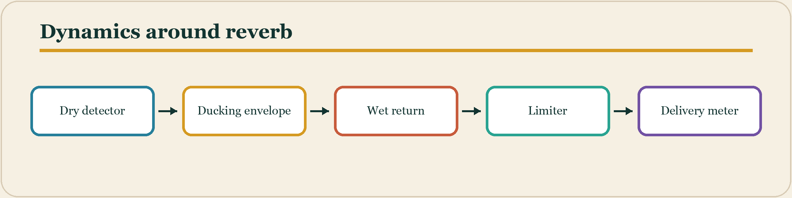

**Block diagram 11.** Ducking creates foreground space before a limiter protects the combined output and meters verify the result. The arrows indicate processing or evidence flow, not elapsed-time scale. Every box names a boundary at which parameters, latency, channel identity, or provenance should be checked.

## Spatial routing

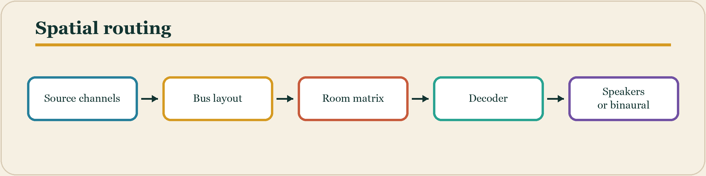

**Block diagram 12.** Channel identity must remain explicit from source through room processing and final reproduction. The arrows indicate processing or evidence flow, not elapsed-time scale. Every box names a boundary at which parameters, latency, channel identity, or provenance should be checked.

## Automation contract

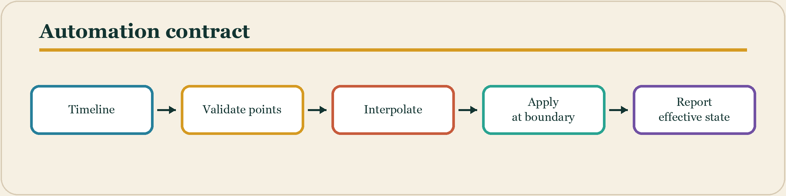

**Block diagram 13.** Automation is safest when parsed and validated off-thread, then applied deterministically at block boundaries. The arrows indicate processing or evidence flow, not elapsed-time scale. Every box names a boundary at which parameters, latency, channel identity, or provenance should be checked.

## Analysis evidence chain

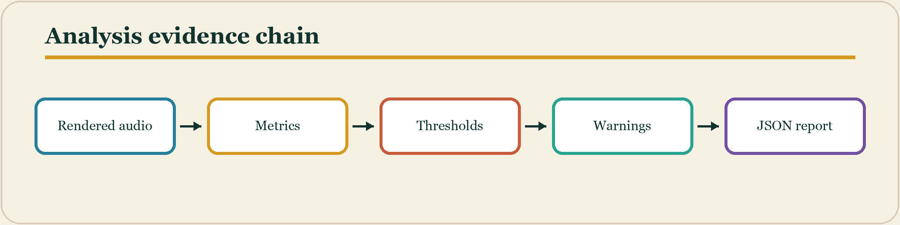

**Block diagram 14.** Analysis becomes operational evidence when measurements, policy thresholds, warnings, and provenance share one report. The arrows indicate processing or evidence flow, not elapsed-time scale. Every box names a boundary at which parameters, latency, channel identity, or provenance should be checked.

## Preset lifecycle

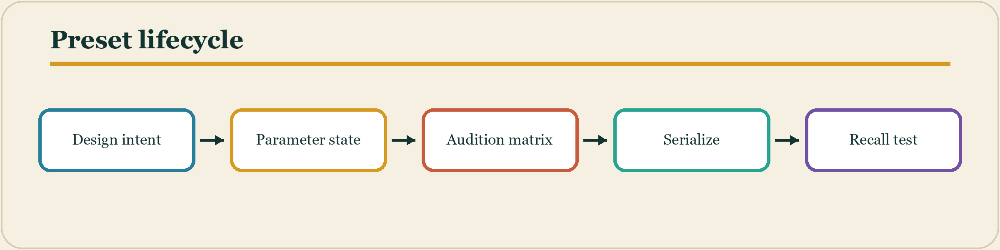

**Block diagram 15.** A preset is more than values: it needs intent, compatibility metadata, calibrated auditioning, and deterministic recall. The arrows indicate processing or evidence flow, not elapsed-time scale. Every box names a boundary at which parameters, latency, channel identity, or provenance should be checked.

## Plug-in host contract

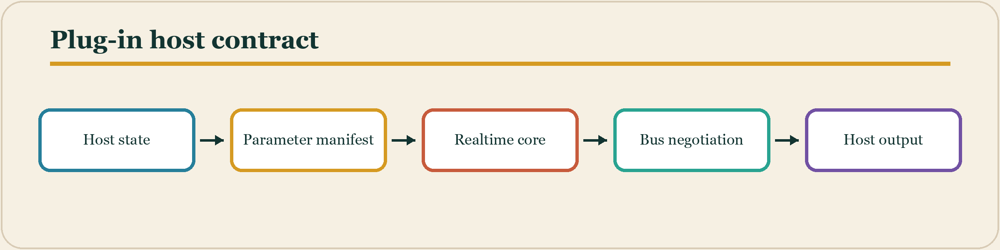

**Block diagram 16.** AUv3 and VST3 integration wrap the same DSP in host-specific state, layout, and lifecycle contracts. The arrows indicate processing or evidence flow, not elapsed-time scale. Every box names a boundary at which parameters, latency, channel identity, or provenance should be checked.

## Regression workflow

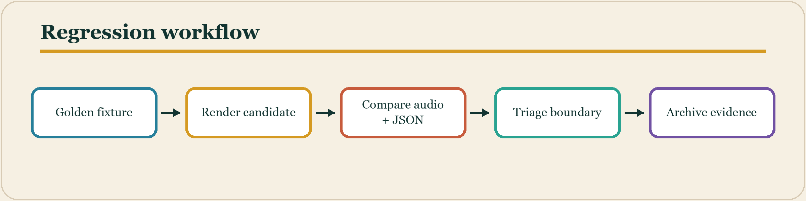

**Block diagram 17.** Deterministic fixtures make audible and numerical drift discoverable before release. The arrows indicate processing or evidence flow, not elapsed-time scale. Every box names a boundary at which parameters, latency, channel identity, or provenance should be checked.

## Learning loop

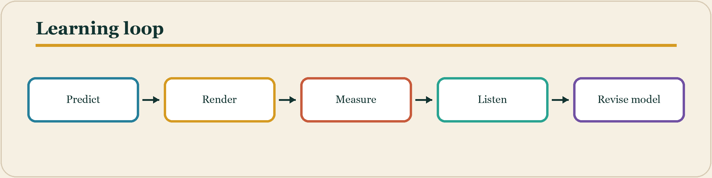

**Block diagram 18.** The textbook exercises use repeated prediction, experiment, measurement, and critical listening to connect controls with perception. The arrows indicate processing or evidence flow, not elapsed-time scale. Every box names a boundary at which parameters, latency, channel identity, or provenance should be checked.
