# VERBX AUv3/VST3 Plug-in Handbook

This handbook describes the VERBX plug-in direction, the native foundation that
already exists, and the operational practices required to turn that foundation
into a dependable AU, AUv3, VST3, and standalone product. It is deliberately
honest about maturity. The repository contains a tested parameter manifest, a
realtime context boundary, a guarded C++17/JUCE shell, state serialization, and
a realtime spectrum-overlay component, a complete initial control dock, and an
allocation-free mono/stereo Schroeder reverb with real wet-path oversampling.
It is a usable native engine, but not yet the final multichannel architecture.
The full-screen
image below is the approved visual target and a live design-prototype capture,
not a screenshot of a shipping binary.

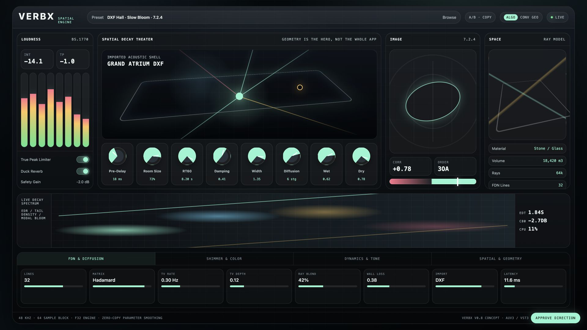

The next image is an actual capture of the compiled JUCE standalone editor.
Its input is muted by the host, so the post-DSP trace sits at the analyzer floor;
the logarithmic frequency grid and overlaid display are production C++ rather
than browser-prototype artwork.

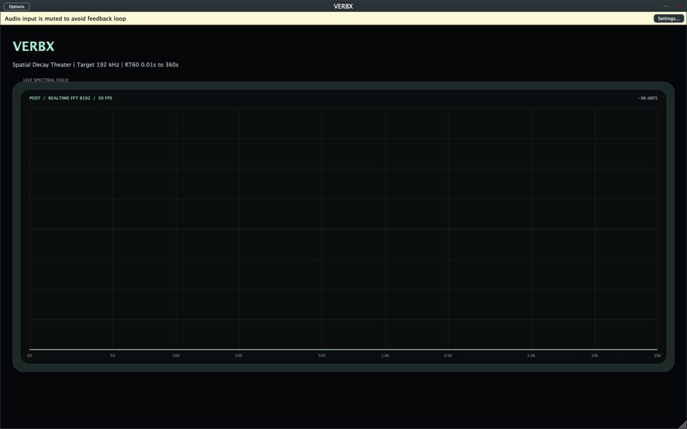

The next image is generated directly from the compiled editor interaction
smoke test. Expert mode keeps every continuous parameter available as both a
dial and a precision fader, retains the realtime analyzer, and adds five
four-way selector banks. These selectors write existing host state rather than
creating hidden or decorative settings.

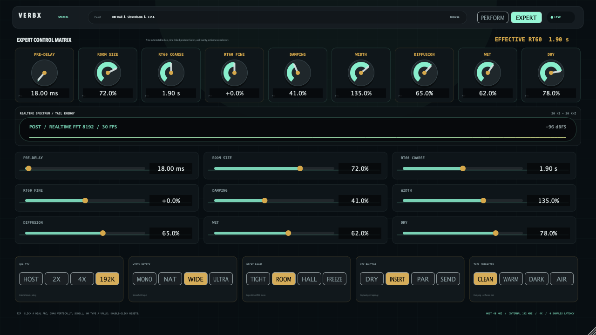

## 1. Product Intent

VERBX is designed as a spatial architecture instrument rather than a generic
reverb with a decorative room picture. Geometry, decay, imaging, dynamics, and
quality status should be readable at a glance. The front panel must remain
playable even though the underlying engine has a deep parameter surface. That
leads to three control layers:

- A performance layer for the controls a musician or mixer reaches for during
  playback: pre-delay, room size, RT60 coarse and fine, damping, width,
  diffusion, wet, dry, Freeze, Reverse, and quality.
- An expert layer that currently provides linked precision control and safe
  macros for quality, width, decay, mix routing, and tail character; future FDN
  topology, modulation, dynamics, and geometry controls land only after those
  behaviors are realtime-safe and stable.
- An automation layer for parameters that a host can recall and automate even
  when they are not continuously visible on the main page.

The plug-in must never imply that visual complexity is equivalent to acoustic
accuracy. A geometry display is useful only when it corresponds to validated
room metadata, an early-reflection model, or a deterministic imported asset.
The display should state whether it is showing a parametric room, a DXF-derived
profile, a measured impulse response, or an illustrative preview.

### Recommended Companion Text

Will C. Pirkle's *[Designing Audio Effect Plugins in C++: For AAX, AU, and VST3
with DSP Theory](https://www.routledge.com/Designing-Audio-Effect-Plugins-in-C-For-AAX-AU-and-VST3-with-DSP-Theory/Pirkle/p/book/9781138591899)*,
2nd edition (Routledge, 2019), is the recommended companion text for this
handbook. Its treatment of plug-in anatomy, an API-independent processing core,
host wrappers, parameters, GUI design, delay structures, reverberation, and
dynamics provides a useful engineering vocabulary for the boundaries described
here. VERBX does not adopt Pirkle's example framework wholesale: its C realtime
contract, JUCE adapter, parameter manifest, state format, analyzer telemetry,
and validation matrix remain repository-specific designs. Readers should use
the book for the broader implementation discipline and this handbook for the
exact VERBX contracts.

## 2. What Exists In The Repository

The first foundation slice is intentionally narrow and testable:

- `verbx_c_core` is a reusable C11 static library target.
- `plugin_params.h` defines twelve stable initial parameters and the quality
  choices.
- `plugin_params.c` implements deterministic clamping and logarithmic RT60
  coarse/fine mapping from 0.01 seconds to 360 seconds.
- `plugin_realtime.h` defines host configuration, realtime parameters, status,
  context lifecycle, latency accessors, and processing entry points.
- `plugin_realtime.c` validates host configuration, allocates persistent state
  only during preparation, and provides bounded mono/stereo Schroeder processing
  with pre-delay, room scale, RT60, damping, diffusion, width, wet/dry, Freeze,
  and a zero-lookahead reverse-style swell. Continuous controls use 20 ms
  smoothing inside the native state so host automation does not zipper. Host,
  2x, 4x, and Target quality modes execute that wet network at the reported
  internal rate without callback allocation.
- `native/verbx_plugin` contains the guarded JUCE shell for AU, AUv3, VST3, and
  standalone targets.
- The processor caches atomic parameter pointers during construction so the
  callback reads values without rebuilding strings or searching parameter maps.
- The resizable editor includes a post-DSP spectrum overlay. A fixed SPSC ring
  carries mono output snapshots off the callback; the message thread performs
  an 8192-point Hann FFT at 30 visual frames per second, with logarithmic
  frequency spacing, release smoothing, and a decaying peak trace.
- Perform and Expert are native JUCE pages. Expert contains nine linked rotary
  controls, nine precision faders, the live analyzer, and twenty selector
  buttons; all write the existing APVTS host state.
- The complete initial twelve-parameter surface is attached to host automation,
  with compact musical units and a live effective-RT60 readout.

This boundary is valuable even before the reverb DSP is connected. Host code,
parameter identity, state recall, bus negotiation, callback constraints, and
latency reporting can be stabilized independently of the sound engine.

## 3. Building The Plug-in Foundation

Default repository configuration does not require JUCE:

```bash
cmake -S native/verbx_plugin -B build/native/verbx_plugin
```

The configure output should say that `VERBX_ENABLE_JUCE_PLUGIN` is off. This is
the supported path for contributors who only need the C core or Python CLI.

When JUCE is installed as a discoverable CMake package, enable the actual host
targets:

```bash
cmake -S native/verbx_plugin -B build/native/verbx_plugin-juce \
  -DVERBX_ENABLE_JUCE_PLUGIN=ON
cmake --build build/native/verbx_plugin-juce --config Release
```

For a JUCE source checkout, add
`-DVERBX_JUCE_SOURCE_DIR=/path/to/JUCE` to the configure command.

The enabled target requests AU, AUv3, VST3, and Standalone formats. A successful
compile is only the beginning of validation. The resulting formats must be
scanned, instantiated, automated, saved, reopened, and stress-tested in their
actual hosts before compatibility is claimed.

## 4. Signal And Ownership Boundaries

The plug-in has three architectural layers. The host shell owns format-specific
lifecycle, buses, state, parameters, editor creation, and host latency
notification. The adapter maps host blocks and normalized automation into the
native realtime contract. The DSP core owns audio behavior and must remain
testable without a DAW.

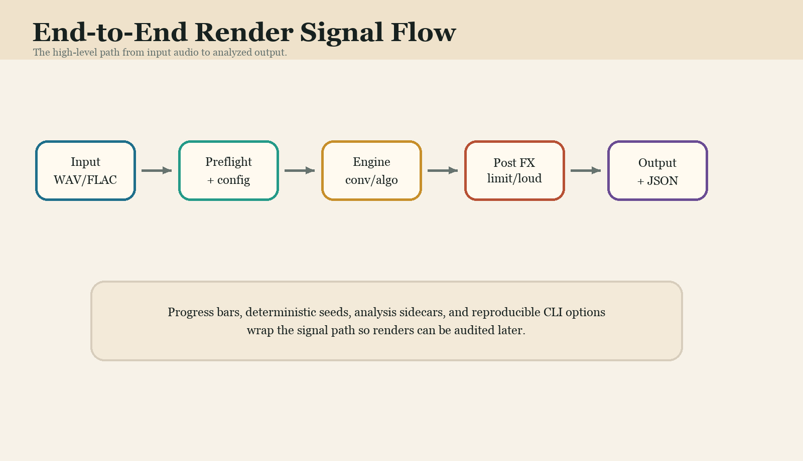

The audio callback is a hard boundary. It must not parse DXF, open files, update
the preset browser, allocate variable-sized containers, rebuild parameter IDs,
take UI locks, or wait for background work. Large assets are prepared away from
the callback and swapped through bounded, versioned handles. Telemetry flows in
the opposite direction through compact snapshots that the editor may poll.

## 5. Precision And Sample Rate

The DAW controls project sample rate. VERBX cannot force a host session to 192
kHz. The default quality choice, Target 192 kHz, selects the smallest integer
factor whose internal rate reaches or exceeds 192 kHz. At a 48 kHz host rate
this is 4x/192 kHz; at 96 kHz it is 2x/192 kHz; at 44.1 kHz it is 5x/220.5 kHz;
and at 192 kHz or above it does not increase the rate. Host, 2x, and 4x select
their exact factors. The wet network uses causal linear interpolation and
box-filter decimation, while the dry path retains the original host samples.
Quality changes allocate and prepare away from the callback, then cross the
processor boundary through a nonblocking atomic guard.

The initial callback contract uses 32-bit float because that is the common
native exchange type for AU/VST processing and keeps bandwidth bounded. This
does not forbid double-precision accumulators, offline float64 rendering, or a
future double-precision host path. Precision claims should always distinguish
host buffer format, internal state precision, oversampled processing rate, and
file-render output format.

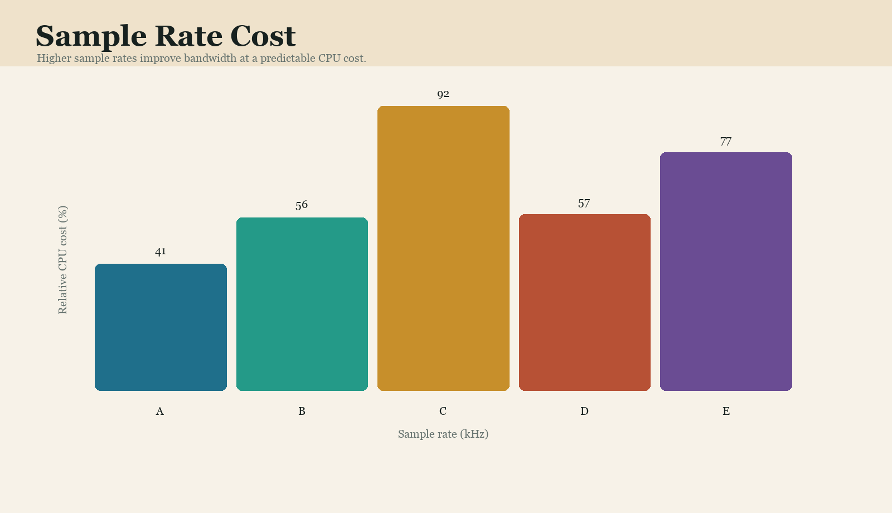

## 6. RT60 Coarse And Fine

One linear knob cannot offer useful control from 0.01 seconds to 360 seconds.
The coarse control therefore maps normalized automation logarithmically:

```text
coarse = exp(log(0.01) + normalized * (log(360.0) - log(0.01)))
fine_ratio = exp(log(1.20) * bipolar_fine)
effective = clamp(coarse * fine_ratio, 0.01, 360.0)
```

The fine control provides a plus-or-minus 20 percent log-space trim. It remains
musically useful around a short booth, a medium hall, and an enormous ambient
tail. The effective value shown by the editor is authoritative; the coarse knob
position alone is not.

Freeze is separate from maximum RT60. Freeze changes the energy behavior of the
network and needs its own smoothing and safety semantics. Reverse is also a
separate mode because it introduces a fundamentally different envelope and may
require buffering and reported latency.

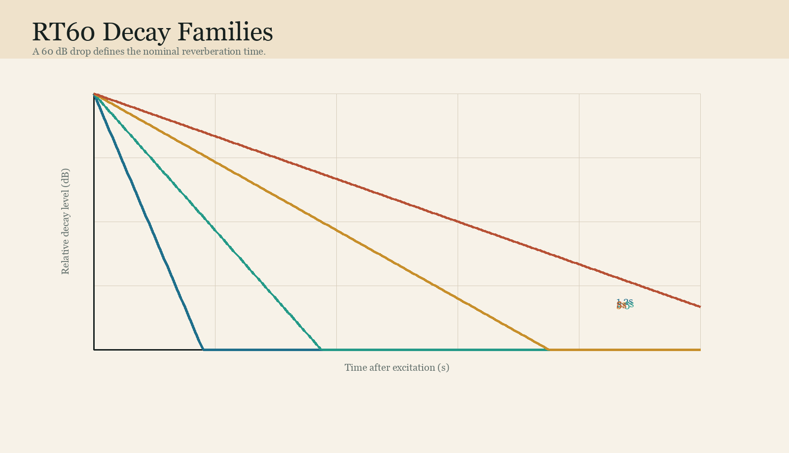

## 7. Initial Parameter Reference

The first manifest contains twelve parameters. Their IDs are intended to remain
stable once released because DAW automation and saved sessions depend on them.

| Parameter ID | User meaning | Initial range | Default | Realtime note |
| --- | --- | --- | --- | --- |
| `pre_delay_ms` | Gap before the reverberant field | 0 to 1000 ms | 18 ms | Delay changes require smoothing or crossfade |
| `room_size` | Macro geometry/scale control | 0 to 1 | 0.72 | Must not resize unbounded memory in callback |
| `rt60_coarse` | Logarithmic decay position | 0 to 1 | 0.50 | Maps to 0.01 to 360 seconds |
| `rt60_fine` | Bipolar log trim | –1 to 1 | 0 | Applies about plus/minus 20 percent |
| `damping` | High-frequency decay loss | 0 to 0.98 | 0.41 | Coefficients need stable interpolation |
| `width` | Stereo/spatial spread | 0 to 2 | 1.35 | Check mono and correlation behavior |
| `diffusion` | Echo-density macro | 0 to 1 | 0.65 | Structural changes may need a safe transition |
| `wet` | Processed contribution | 0 to 1 | 0.62 | Use a deliberate mix law |
| `dry` | Direct contribution | 0 to 1 | 0.78 | Preserve gain staging and bypass behavior |
| `freeze` | Infinite/sustaining mode | off/on | off | Separate energy-state transition |
| `reverse` | Reverse-envelope mode | off/on | off | Buffering and latency must be explicit |
| `quality_mode` | Internal rate policy | Host/2x/4x/Target | Target | Reprepare outside callback when needed |

## 8. State, Presets, And Session Recall

The JUCE shell serializes its parameter tree into host state. A production
version also needs an explicit schema version, migration rules, asset identity,
and diagnostics for partial restoration. A preset should not silently become a
different sound because a geometry file moved or an IR cache was regenerated.

Small deterministic data belongs in host state. Large DXF files, measured IRs,
and generated spatial assets should normally be referenced by a stable identity
plus a content hash. The state can embed a compact fallback profile when that is
small enough. Missing assets should produce a visible warning and a safe known
sound, not silence, noise, or an unexplained default room.

## 9. Geometry And DXF

DXF import is an offline preparation workflow. Parsing, topology repair, ray
generation, acceleration-structure construction, and IR synthesis must not run
inside the audio callback. The realtime side consumes a validated bounded
profile: room dimensions, material identifiers, source/listener transforms,
early-reflection taps, spatial metadata, and optional prepared IR partitions.

The visual theater should show provenance. Labels such as `Parametric Room`,
`Imported DXF Profile`, `Measured IR`, or `Illustrative View` prevent the user
from confusing a decorative image with a physical simulation. Geometry edits
can be staged in the editor and committed through a background preparation job;
the audio thread receives the finished immutable result only after the preparation job completes.

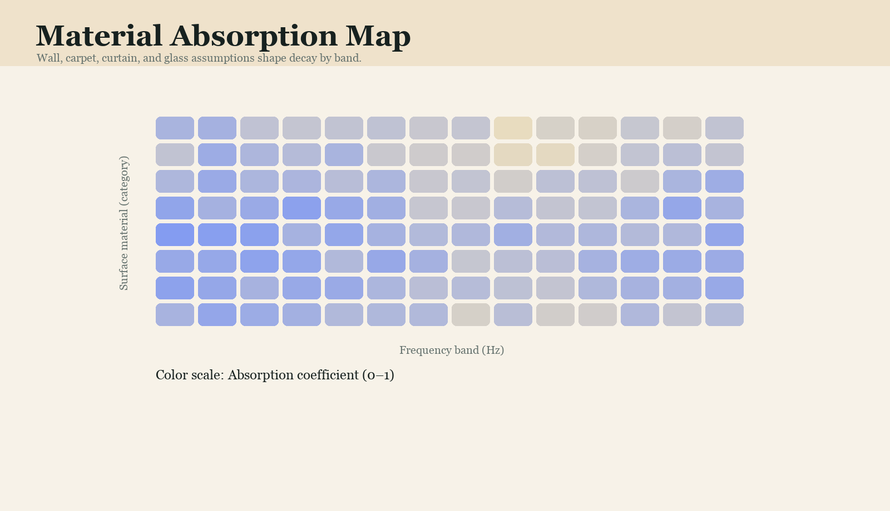

## 10. Latency

Total plug-in latency may include block adaptation, oversampling filters,
lookahead dynamics, convolution partitions, and reverse-reverb buffering. The
processor must report the exact stable value to the host whenever a mode changes
the processing graph. If latency cannot change safely during playback, the UI
should state that the change will apply on transport stop or reprepare.

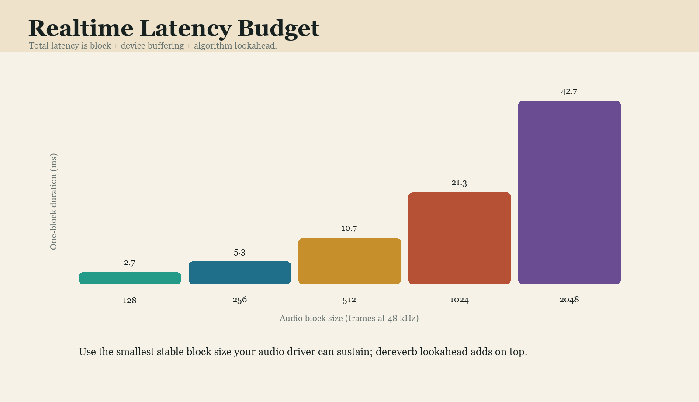

The current realtime reverb and causal oversampling path report zero frames:
they do not buffer future host samples. That value must change when a
latency-producing filter, convolution partition, or bounded reverse-lookahead
stage lands. The live status display distinguishes host and internal rates,
factor, block size, and algorithmic latency. Device I/O and end-to-end monitored
latency remain separate measurements.

## 11. Realtime Safety

The callback should perform bounded arithmetic, pointer traversal, atomic loads,
and DSP over memory prepared in advance. It should avoid filesystem access,
logging, UI calls, mutex acquisition, heap allocation, and operations whose
runtime grows unpredictably with external assets. Denormal handling, NaN/Inf
containment, and explicit channel/block bounds are part of the audio contract.

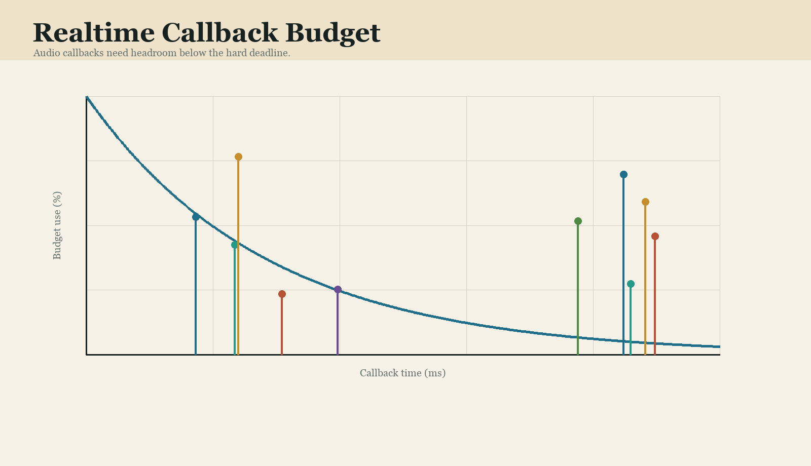

Parameter smoothing is not cosmetic. Abrupt pre-delay, damping, mix, and matrix
changes can click or destabilize feedback. Each parameter needs a declared
transition strategy: sample ramp, coefficient interpolation, dual-engine
crossfade, transport-gated reprepare, or intentionally discrete switch.

## 12. Freeze And Reverse

Freeze should enter and leave with controlled energy. The production algorithm
must define whether input injection stops, decay gains approach unity, damping
continues, modulation remains active, and limiter protection stays engaged. A
freeze button is not permission for unbounded gain.

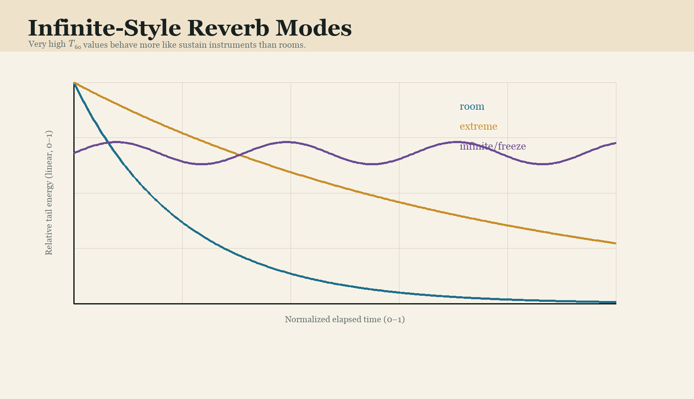

Reverse needs an explicit latency model. A true reverse response requires future
context, pre-rendered material, or a bounded capture window. The UI should show
the active window and reported latency. If a low-latency approximation is
offered, it must be named as an approximation rather than presented as identical
to offline reverse rendering.

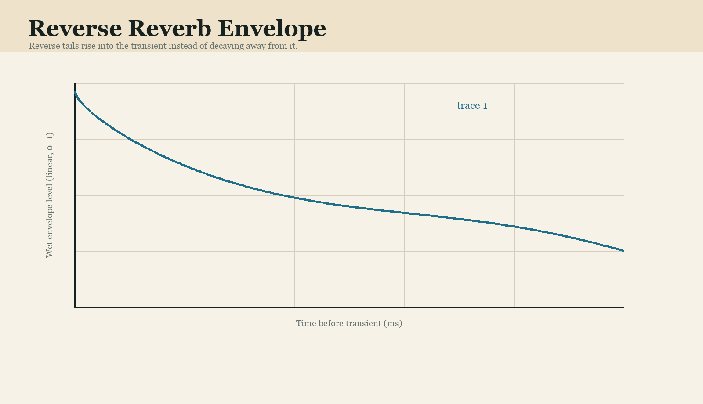

### Gated Reverse Reverb

Gated reverse reverb is a reverse or reverse-style wet field constrained by a
gate or authored gain window. The gate belongs after the wet processor when the
goal is to shape the audible tail. Placing it before the reverb only decides
which dry events excite the network; it does not truncate the resulting field.
Key the post-wet gate from the dry source, keep the plug-in return 100 percent
wet, and leave the destination transient on its uncompromised dry path.

The current Reverse parameter is a zero-lookahead musical approximation. It
detects a transient and raises the wet envelope after that event; it cannot
anticipate audio that has not reached the callback. For a true pre-event gated
reverse effect, print the wet return, move it earlier so its endpoint meets the
destination transient, then apply a host gate or clip-gain window. A future
capture-window mode must report at least the window duration as algorithmic
latency and must never allocate, seek, or resize its buffer in the callback.

Useful controls for a production gated mode include lead duration, endpoint
offset, detector source, detector filtering, threshold, hysteresis, attack,
hold, release, range, and channel linking. A 5 to 20 ms terminal fade prevents a
click without erasing the abrupt boundary. Tempo synchronization should derive
the lead duration from $T_{\mathrm{lead}}=60N/B$, where $N$ is the selected beat
span and $B$ is tempo in beats per minute.

Stereo and multichannel gates should normally share one detector and one gain
envelope. Independent thresholds can make the image jump as channels close at
different samples. Verify endpoint localization, stereo fold-down, binaural
rendering, and host delay compensation. The UI must label the current
zero-lookahead behavior separately from any future buffered or offline mode so
users never mistake a bloom for a physically reversed response.

## 13. Loudness, Ducking, And Limiting

The limiter is a safety layer, not a substitute for stable feedback design.
Meters should distinguish input, wet return, output, gain reduction, true peak,
and any safety attenuation. Ducking should expose detector source, attack,
release, range, and whether the dry path participates.

Host bypass semantics matter. A hard host bypass may skip internal tails, while
an effect bypass parameter can preserve or drain them. The product must define
both behaviors and test them in every supported format.

## 14. Bus Layouts And Spatial Formats

The foundation accepts matched mono or stereo main buses. Production expansion
should proceed through explicit layouts rather than accepting arbitrary channel
counts. Stereo, 5.1, 7.1, 7.1.4, and ambisonic modes have different routing,
normalization, and host metadata requirements. A layout is supported only after
processing, state recall, metering, and host scanning have been validated.

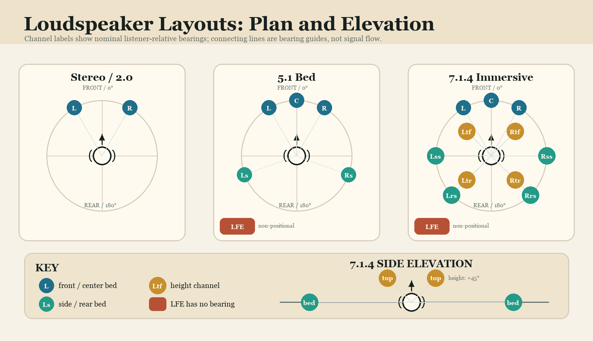

## 15. Editor And Accessibility

The full-screen design is dense, so hierarchy is essential. Keyboard focus,
screen-reader labels, scalable text, high-contrast status colors, and a compact
window mode should be designed alongside custom drawing. A parameter remains
usable when its decorative visualization is disabled.

Telemetry should be rate-limited and decoupled from audio. The editor reads
snapshots; it does not interrogate mutable DSP structures. Closing the editor
must not change the sound or CPU behavior of the processor.

The implemented spectrum overlay follows that rule: the callback only writes
post-DSP mono samples into a fixed lock-free ring and drops new analyzer samples
if the display falls behind. The editor drains that ring, windows and transforms
8192 samples, smooths the dB response, and paints the fill and peak paths at 30
Hz. No FFT, path allocation, repaint, or UI lock occurs on the audio thread.

### Expert Control Matrix

Select **Expert** in the editor header to replace the visual performance
console with a dense precision workspace. The top row contains nine rotary
controls and the center matrix contains nine linked horizontal faders. Each
dial/fader pair is attached to the same APVTS parameter, so moving either
control updates host automation, the other control, saved state, and the DSP.
The spectrum analyzer remains visible while editing.

The five selector banks each provide four native buttons:

- **Quality** writes Host, 2x, 4x, or Target 192 kHz policy.
- **Width Matrix** writes calibrated Mono, Natural, Wide, or Ultra width.
- **Decay Range** writes logarithmic Tight, Room, or Hall RT60 values; Freeze
  also writes the separate Freeze state.
- **Mix Routing** writes matched Dry, Insert, Parallel, or Send dry/wet pairs.
- **Tail Character** writes matched damping/diffusion pairs for Clean, Warm,
  Dark, or Air behavior.

Selector highlighting follows current host parameter values. If automation or
manual editing creates a value that does not exactly match a macro, the bank
clears its highlight rather than claiming a preset that is no longer active.
This makes the selector state descriptive, not authoritative.

Numeric entry uses the units shown by the control. Enter pre-delay in
milliseconds, RT60 directly in seconds, and Room Size, RT60 Fine, Damping,
Width, Diffusion, Wet, and Dry as percentages. RT60 seconds are inverted through
the logarithmic 0.01-to-360-second mapping; for example, typing `4.8 s` produces
an effective 4.8-second decay rather than treating 4.8 as a normalized value.
RT60 Fine uses its displayed plus-or-minus 20 percent scale. Click a dial arc
for immediate positioning, drag vertically for precision, use the mouse wheel
for increments, or double-click to restore the declared parameter default.

## 16. Compatibility Claims

The repository currently provides build scaffolding, not a published host
compatibility matrix. A format name in CMake means that JUCE can generate that
target when dependencies and platform tools are available. It does not mean the
binary has passed scanning and session-recall tests in every DAW.

Compatibility statements should name plug-in format, CPU architecture,
operating-system version, host/version, sample rate, block size, bus layout,
and validation date. Results from a standalone build do not substitute for an
AUv3 sandbox test or VST3 host scan.

## 17. Validation Commands

The native foundation can be checked without JUCE:

```bash
cmake -S native/verbx_c -B build/native/verbx_c-plan
cmake --build build/native/verbx_c-plan
ctest --test-dir build/native/verbx_c-plan --output-on-failure
uv run pytest tests/test_native_scaffold.py -q
./scripts/build_verbx_c.sh --clean --doctor
cmake -S native/verbx_plugin -B build/native/verbx_plugin-plan
```

These checks verify the C boundary, direct-build alignment, native render
regressions, and JUCE-disabled configure path. They do not compile or validate a
JUCE-enabled plug-in when JUCE is absent.

## 18. Reading The Operational Cards

The remainder of this handbook is organized as one-page cards. They are not
compatibility certifications or fixed presets. They are repeatable starting
points, automation studies, validation procedures, and troubleshooting drills.
Record the plug-in build, host, sample rate, block size, channel layout, and
asset hashes whenever a card is used for a formal test.

## 19. Production Starting-Point Cards

These cards are coordinates for listening, not finished presets. Calibrate the dry source first, raise the return at matched loudness, and distinguish the direct onset, early reflections, and late field before changing several controls together. Read effective RT60 from the status display rather than estimating it from the coarse knob.

For every candidate, compare stereo and mono, reopen the session, and record host rate, quality mode, block size, layout, latency, peak reduction, and any asset hash. Save a preset only after its parameters, modes, and external assets recall identically.

### 19.1 Lead vocal

**Production card: Lead vocal in Tight room**

For lead vocal in tight room, aim to preserve consonants and front-of-mix intelligibility; watch sibilance and center stability. The intended room contribution is dense early cues and a controlled short tail.

Record these card-specific values:

- Intent: preserve consonants and front-of-mix intelligibility.
- Space character: dense early cues and a controlled short tail.
- Starting macros: room size 0.28, damping 0.20, diffusion 0.52, wet 0.28.
- Pre-delay working range: 18 to 45 ms.
- Modes: Reverse off; Freeze off.


\newpage

**Production card: Lead vocal in Studio chamber**

For lead vocal in studio chamber, aim to preserve consonants and front-of-mix intelligibility; watch sibilance and center stability. The intended room contribution is a smooth useful chamber with moderate width.

Record these card-specific values:

- Intent: preserve consonants and front-of-mix intelligibility.
- Space character: a smooth useful chamber with moderate width.
- Starting macros: room size 0.42, damping 0.34, diffusion 0.64, wet 0.38.
- Pre-delay working range: 18 to 45 ms.
- Modes: Reverse off; Freeze off.


\newpage

**Production card: Lead vocal in Scoring stage**

For lead vocal in scoring stage, aim to preserve consonants and front-of-mix intelligibility; watch sibilance and center stability. The intended room contribution is clear source distance and a broad late field.

Record these card-specific values:

- Intent: preserve consonants and front-of-mix intelligibility.
- Space character: clear source distance and a broad late field.
- Starting macros: room size 0.58, damping 0.46, diffusion 0.72, wet 0.44.
- Pre-delay working range: 18 to 45 ms.
- Modes: Reverse off; Freeze off.


\newpage

**Production card: Lead vocal in Concert hall**

For lead vocal in concert hall, aim to preserve consonants and front-of-mix intelligibility; watch sibilance and center stability. The intended room contribution is a long integrated decay with stable imaging.

Record these card-specific values:

- Intent: preserve consonants and front-of-mix intelligibility.
- Space character: a long integrated decay with stable imaging.
- Starting macros: room size 0.68, damping 0.52, diffusion 0.78, wet 0.50.
- Pre-delay working range: 18 to 45 ms.
- Modes: Reverse off; Freeze off.


\newpage

**Production card: Lead vocal in Stone cathedral**

For lead vocal in stone cathedral, aim to preserve consonants and front-of-mix intelligibility; watch sibilance and center stability. The intended room contribution is slow spectral decay and monumental scale.

Record these card-specific values:

- Intent: preserve consonants and front-of-mix intelligibility.
- Space character: slow spectral decay and monumental scale.
- Starting macros: room size 0.78, damping 0.38, diffusion 0.84, wet 0.58.
- Pre-delay working range: 18 to 45 ms.
- Modes: Reverse off; Freeze off.


\newpage

**Production card: Lead vocal in Plate-like field**

For lead vocal in plate-like field, aim to preserve consonants and front-of-mix intelligibility; watch sibilance and center stability. The intended room contribution is fast diffusion with less geometric localization.

Record these card-specific values:

- Intent: preserve consonants and front-of-mix intelligibility.
- Space character: fast diffusion with less geometric localization.
- Starting macros: room size 0.48, damping 0.62, diffusion 0.88, wet 0.46.
- Pre-delay working range: 18 to 45 ms.
- Modes: Reverse off; Freeze off.


\newpage

**Production card: Lead vocal in Reverse chamber**

For lead vocal in reverse chamber, aim to preserve consonants and front-of-mix intelligibility; watch sibilance and center stability. The intended room contribution is a bounded reverse envelope with explicit latency.

Record these card-specific values:

- Intent: preserve consonants and front-of-mix intelligibility.
- Space character: a bounded reverse envelope with explicit latency.
- Starting macros: room size 0.50, damping 0.45, diffusion 0.70, wet 0.52.
- Pre-delay working range: 18 to 45 ms.
- Modes: Reverse on; Freeze off.


\newpage

**Production card: Lead vocal in Frozen architecture**

For lead vocal in frozen architecture, aim to preserve consonants and front-of-mix intelligibility; watch sibilance and center stability. The intended room contribution is a sustained field entered and exited safely.

Record these card-specific values:

- Intent: preserve consonants and front-of-mix intelligibility.
- Space character: a sustained field entered and exited safely.
- Starting macros: room size 0.72, damping 0.44, diffusion 0.82, wet 0.66.
- Pre-delay working range: 18 to 45 ms.
- Modes: Reverse off; Freeze prepared/on.


\newpage

### 19.2 Spoken word

**Production card: Spoken word in Tight room**

For spoken word in tight room, aim to add believable room cues without masking language; check breaths, plosives, and noise-floor lift. The intended room contribution is dense early cues and a controlled short tail.

Record these card-specific values:

- Intent: add believable room cues without masking language.
- Space character: dense early cues and a controlled short tail.
- Starting macros: room size 0.28, damping 0.20, diffusion 0.52, wet 0.28.
- Pre-delay working range: 8 to 28 ms.
- Modes: Reverse off; Freeze off.


\newpage

**Production card: Spoken word in Studio chamber**

For spoken word in studio chamber, aim to add believable room cues without masking language; check breaths, plosives, and noise-floor lift. The intended room contribution is a smooth useful chamber with moderate width.

Record these card-specific values:

- Intent: add believable room cues without masking language.
- Space character: a smooth useful chamber with moderate width.
- Starting macros: room size 0.42, damping 0.34, diffusion 0.64, wet 0.38.
- Pre-delay working range: 8 to 28 ms.
- Modes: Reverse off; Freeze off.


\newpage

**Production card: Spoken word in Scoring stage**

For spoken word in scoring stage, aim to add believable room cues without masking language; check breaths, plosives, and noise-floor lift. The intended room contribution is clear source distance and a broad late field.

Record these card-specific values:

- Intent: add believable room cues without masking language.
- Space character: clear source distance and a broad late field.
- Starting macros: room size 0.58, damping 0.46, diffusion 0.72, wet 0.44.
- Pre-delay working range: 8 to 28 ms.
- Modes: Reverse off; Freeze off.


\newpage

**Production card: Spoken word in Concert hall**

For spoken word in concert hall, aim to add believable room cues without masking language; check breaths, plosives, and noise-floor lift. The intended room contribution is a long integrated decay with stable imaging.

Record these card-specific values:

- Intent: add believable room cues without masking language.
- Space character: a long integrated decay with stable imaging.
- Starting macros: room size 0.68, damping 0.52, diffusion 0.78, wet 0.50.
- Pre-delay working range: 8 to 28 ms.
- Modes: Reverse off; Freeze off.


\newpage

**Production card: Spoken word in Stone cathedral**

For spoken word in stone cathedral, aim to add believable room cues without masking language; check breaths, plosives, and noise-floor lift. The intended room contribution is slow spectral decay and monumental scale.

Record these card-specific values:

- Intent: add believable room cues without masking language.
- Space character: slow spectral decay and monumental scale.
- Starting macros: room size 0.78, damping 0.38, diffusion 0.84, wet 0.58.
- Pre-delay working range: 8 to 28 ms.
- Modes: Reverse off; Freeze off.


\newpage

**Production card: Spoken word in Plate-like field**

For spoken word in plate-like field, aim to add believable room cues without masking language; check breaths, plosives, and noise-floor lift. The intended room contribution is fast diffusion with less geometric localization.

Record these card-specific values:

- Intent: add believable room cues without masking language.
- Space character: fast diffusion with less geometric localization.
- Starting macros: room size 0.48, damping 0.62, diffusion 0.88, wet 0.46.
- Pre-delay working range: 8 to 28 ms.
- Modes: Reverse off; Freeze off.


\newpage

**Production card: Spoken word in Reverse chamber**

For spoken word in reverse chamber, aim to add believable room cues without masking language; check breaths, plosives, and noise-floor lift. The intended room contribution is a bounded reverse envelope with explicit latency.

Record these card-specific values:

- Intent: add believable room cues without masking language.
- Space character: a bounded reverse envelope with explicit latency.
- Starting macros: room size 0.50, damping 0.45, diffusion 0.70, wet 0.52.
- Pre-delay working range: 8 to 28 ms.
- Modes: Reverse on; Freeze off.


\newpage

**Production card: Spoken word in Frozen architecture**

For spoken word in frozen architecture, aim to add believable room cues without masking language; check breaths, plosives, and noise-floor lift. The intended room contribution is a sustained field entered and exited safely.

Record these card-specific values:

- Intent: add believable room cues without masking language.
- Space character: a sustained field entered and exited safely.
- Starting macros: room size 0.72, damping 0.44, diffusion 0.82, wet 0.66.
- Pre-delay working range: 8 to 28 ms.
- Modes: Reverse off; Freeze prepared/on.


\newpage

### 19.3 Drum kit

**Production card: Drum kit in Tight room**

For drum kit in tight room, aim to build size while preserving transient geometry; check kick definition and snare tail density. The intended room contribution is dense early cues and a controlled short tail.

Record these card-specific values:

- Intent: build size while preserving transient geometry.
- Space character: dense early cues and a controlled short tail.
- Starting macros: room size 0.28, damping 0.20, diffusion 0.52, wet 0.28.
- Pre-delay working range: 4 to 24 ms.
- Modes: Reverse off; Freeze off.


\newpage

**Production card: Drum kit in Studio chamber**

For drum kit in studio chamber, aim to build size while preserving transient geometry; check kick definition and snare tail density. The intended room contribution is a smooth useful chamber with moderate width.

Record these card-specific values:

- Intent: build size while preserving transient geometry.
- Space character: a smooth useful chamber with moderate width.
- Starting macros: room size 0.42, damping 0.34, diffusion 0.64, wet 0.38.
- Pre-delay working range: 4 to 24 ms.
- Modes: Reverse off; Freeze off.


\newpage

**Production card: Drum kit in Scoring stage**

For drum kit in scoring stage, aim to build size while preserving transient geometry; check kick definition and snare tail density. The intended room contribution is clear source distance and a broad late field.

Record these card-specific values:

- Intent: build size while preserving transient geometry.
- Space character: clear source distance and a broad late field.
- Starting macros: room size 0.58, damping 0.46, diffusion 0.72, wet 0.44.
- Pre-delay working range: 4 to 24 ms.
- Modes: Reverse off; Freeze off.


\newpage

**Production card: Drum kit in Concert hall**

For drum kit in concert hall, aim to build size while preserving transient geometry; check kick definition and snare tail density. The intended room contribution is a long integrated decay with stable imaging.

Record these card-specific values:

- Intent: build size while preserving transient geometry.
- Space character: a long integrated decay with stable imaging.
- Starting macros: room size 0.68, damping 0.52, diffusion 0.78, wet 0.50.
- Pre-delay working range: 4 to 24 ms.
- Modes: Reverse off; Freeze off.


\newpage

**Production card: Drum kit in Stone cathedral**

For drum kit in stone cathedral, aim to build size while preserving transient geometry; check kick definition and snare tail density. The intended room contribution is slow spectral decay and monumental scale.

Record these card-specific values:

- Intent: build size while preserving transient geometry.
- Space character: slow spectral decay and monumental scale.
- Starting macros: room size 0.78, damping 0.38, diffusion 0.84, wet 0.58.
- Pre-delay working range: 4 to 24 ms.
- Modes: Reverse off; Freeze off.


\newpage

**Production card: Drum kit in Plate-like field**

For drum kit in plate-like field, aim to build size while preserving transient geometry; check kick definition and snare tail density. The intended room contribution is fast diffusion with less geometric localization.

Record these card-specific values:

- Intent: build size while preserving transient geometry.
- Space character: fast diffusion with less geometric localization.
- Starting macros: room size 0.48, damping 0.62, diffusion 0.88, wet 0.46.
- Pre-delay working range: 4 to 24 ms.
- Modes: Reverse off; Freeze off.


\newpage

**Production card: Drum kit in Reverse chamber**

For drum kit in reverse chamber, aim to build size while preserving transient geometry; check kick definition and snare tail density. The intended room contribution is a bounded reverse envelope with explicit latency.

Record these card-specific values:

- Intent: build size while preserving transient geometry.
- Space character: a bounded reverse envelope with explicit latency.
- Starting macros: room size 0.50, damping 0.45, diffusion 0.70, wet 0.52.
- Pre-delay working range: 4 to 24 ms.
- Modes: Reverse on; Freeze off.


\newpage

**Production card: Drum kit in Frozen architecture**

For drum kit in frozen architecture, aim to build size while preserving transient geometry; check kick definition and snare tail density. The intended room contribution is a sustained field entered and exited safely.

Record these card-specific values:

- Intent: build size while preserving transient geometry.
- Space character: a sustained field entered and exited safely.
- Starting macros: room size 0.72, damping 0.44, diffusion 0.82, wet 0.66.
- Pre-delay working range: 4 to 24 ms.
- Modes: Reverse off; Freeze prepared/on.


\newpage

### 19.4 Piano

**Production card: Piano in Tight room**

For piano in tight room, aim to support sustain without blurring note attacks; listen for low-mid modal buildup. The intended room contribution is dense early cues and a controlled short tail.

Record these card-specific values:

- Intent: support sustain without blurring note attacks.
- Space character: dense early cues and a controlled short tail.
- Starting macros: room size 0.28, damping 0.20, diffusion 0.52, wet 0.28.
- Pre-delay working range: 12 to 40 ms.
- Modes: Reverse off; Freeze off.


\newpage

**Production card: Piano in Studio chamber**

For piano in studio chamber, aim to support sustain without blurring note attacks; listen for low-mid modal buildup. The intended room contribution is a smooth useful chamber with moderate width.

Record these card-specific values:

- Intent: support sustain without blurring note attacks.
- Space character: a smooth useful chamber with moderate width.
- Starting macros: room size 0.42, damping 0.34, diffusion 0.64, wet 0.38.
- Pre-delay working range: 12 to 40 ms.
- Modes: Reverse off; Freeze off.


\newpage

**Production card: Piano in Scoring stage**

For piano in scoring stage, aim to support sustain without blurring note attacks; listen for low-mid modal buildup. The intended room contribution is clear source distance and a broad late field.

Record these card-specific values:

- Intent: support sustain without blurring note attacks.
- Space character: clear source distance and a broad late field.
- Starting macros: room size 0.58, damping 0.46, diffusion 0.72, wet 0.44.
- Pre-delay working range: 12 to 40 ms.
- Modes: Reverse off; Freeze off.


\newpage

**Production card: Piano in Concert hall**

For piano in concert hall, aim to support sustain without blurring note attacks; listen for low-mid modal buildup. The intended room contribution is a long integrated decay with stable imaging.

Record these card-specific values:

- Intent: support sustain without blurring note attacks.
- Space character: a long integrated decay with stable imaging.
- Starting macros: room size 0.68, damping 0.52, diffusion 0.78, wet 0.50.
- Pre-delay working range: 12 to 40 ms.
- Modes: Reverse off; Freeze off.


\newpage

**Production card: Piano in Stone cathedral**

For piano in stone cathedral, aim to support sustain without blurring note attacks; listen for low-mid modal buildup. The intended room contribution is slow spectral decay and monumental scale.

Record these card-specific values:

- Intent: support sustain without blurring note attacks.
- Space character: slow spectral decay and monumental scale.
- Starting macros: room size 0.78, damping 0.38, diffusion 0.84, wet 0.58.
- Pre-delay working range: 12 to 40 ms.
- Modes: Reverse off; Freeze off.


\newpage

**Production card: Piano in Plate-like field**

For piano in plate-like field, aim to support sustain without blurring note attacks; listen for low-mid modal buildup. The intended room contribution is fast diffusion with less geometric localization.

Record these card-specific values:

- Intent: support sustain without blurring note attacks.
- Space character: fast diffusion with less geometric localization.
- Starting macros: room size 0.48, damping 0.62, diffusion 0.88, wet 0.46.
- Pre-delay working range: 12 to 40 ms.
- Modes: Reverse off; Freeze off.


\newpage

**Production card: Piano in Reverse chamber**

For piano in reverse chamber, aim to support sustain without blurring note attacks; listen for low-mid modal buildup. The intended room contribution is a bounded reverse envelope with explicit latency.

Record these card-specific values:

- Intent: support sustain without blurring note attacks.
- Space character: a bounded reverse envelope with explicit latency.
- Starting macros: room size 0.50, damping 0.45, diffusion 0.70, wet 0.52.
- Pre-delay working range: 12 to 40 ms.
- Modes: Reverse on; Freeze off.


\newpage

**Production card: Piano in Frozen architecture**

For piano in frozen architecture, aim to support sustain without blurring note attacks; listen for low-mid modal buildup. The intended room contribution is a sustained field entered and exited safely.

Record these card-specific values:

- Intent: support sustain without blurring note attacks.
- Space character: a sustained field entered and exited safely.
- Starting macros: room size 0.72, damping 0.44, diffusion 0.82, wet 0.66.
- Pre-delay working range: 12 to 40 ms.
- Modes: Reverse off; Freeze prepared/on.


\newpage

### 19.5 Acoustic guitar

**Production card: Acoustic guitar in Tight room**

For acoustic guitar in tight room, aim to add depth without combing the direct image; check pick articulation and mono fold-down. The intended room contribution is dense early cues and a controlled short tail.

Record these card-specific values:

- Intent: add depth without combing the direct image.
- Space character: dense early cues and a controlled short tail.
- Starting macros: room size 0.28, damping 0.20, diffusion 0.52, wet 0.28.
- Pre-delay working range: 10 to 32 ms.
- Modes: Reverse off; Freeze off.


\newpage

**Production card: Acoustic guitar in Studio chamber**

For acoustic guitar in studio chamber, aim to add depth without combing the direct image; check pick articulation and mono fold-down. The intended room contribution is a smooth useful chamber with moderate width.

Record these card-specific values:

- Intent: add depth without combing the direct image.
- Space character: a smooth useful chamber with moderate width.
- Starting macros: room size 0.42, damping 0.34, diffusion 0.64, wet 0.38.
- Pre-delay working range: 10 to 32 ms.
- Modes: Reverse off; Freeze off.


\newpage

**Production card: Acoustic guitar in Scoring stage**

For acoustic guitar in scoring stage, aim to add depth without combing the direct image; check pick articulation and mono fold-down. The intended room contribution is clear source distance and a broad late field.

Record these card-specific values:

- Intent: add depth without combing the direct image.
- Space character: clear source distance and a broad late field.
- Starting macros: room size 0.58, damping 0.46, diffusion 0.72, wet 0.44.
- Pre-delay working range: 10 to 32 ms.
- Modes: Reverse off; Freeze off.


\newpage

**Production card: Acoustic guitar in Concert hall**

For acoustic guitar in concert hall, aim to add depth without combing the direct image; check pick articulation and mono fold-down. The intended room contribution is a long integrated decay with stable imaging.

Record these card-specific values:

- Intent: add depth without combing the direct image.
- Space character: a long integrated decay with stable imaging.
- Starting macros: room size 0.68, damping 0.52, diffusion 0.78, wet 0.50.
- Pre-delay working range: 10 to 32 ms.
- Modes: Reverse off; Freeze off.


\newpage

**Production card: Acoustic guitar in Stone cathedral**

For acoustic guitar in stone cathedral, aim to add depth without combing the direct image; check pick articulation and mono fold-down. The intended room contribution is slow spectral decay and monumental scale.

Record these card-specific values:

- Intent: add depth without combing the direct image.
- Space character: slow spectral decay and monumental scale.
- Starting macros: room size 0.78, damping 0.38, diffusion 0.84, wet 0.58.
- Pre-delay working range: 10 to 32 ms.
- Modes: Reverse off; Freeze off.


\newpage

**Production card: Acoustic guitar in Plate-like field**

For acoustic guitar in plate-like field, aim to add depth without combing the direct image; check pick articulation and mono fold-down. The intended room contribution is fast diffusion with less geometric localization.

Record these card-specific values:

- Intent: add depth without combing the direct image.
- Space character: fast diffusion with less geometric localization.
- Starting macros: room size 0.48, damping 0.62, diffusion 0.88, wet 0.46.
- Pre-delay working range: 10 to 32 ms.
- Modes: Reverse off; Freeze off.


\newpage

**Production card: Acoustic guitar in Reverse chamber**

For acoustic guitar in reverse chamber, aim to add depth without combing the direct image; check pick articulation and mono fold-down. The intended room contribution is a bounded reverse envelope with explicit latency.

Record these card-specific values:

- Intent: add depth without combing the direct image.
- Space character: a bounded reverse envelope with explicit latency.
- Starting macros: room size 0.50, damping 0.45, diffusion 0.70, wet 0.52.
- Pre-delay working range: 10 to 32 ms.
- Modes: Reverse on; Freeze off.


\newpage

**Production card: Acoustic guitar in Frozen architecture**

For acoustic guitar in frozen architecture, aim to add depth without combing the direct image; check pick articulation and mono fold-down. The intended room contribution is a sustained field entered and exited safely.

Record these card-specific values:

- Intent: add depth without combing the direct image.
- Space character: a sustained field entered and exited safely.
- Starting macros: room size 0.72, damping 0.44, diffusion 0.82, wet 0.66.
- Pre-delay working range: 10 to 32 ms.
- Modes: Reverse off; Freeze prepared/on.


\newpage

### 19.6 Electric guitar

**Production card: Electric guitar in Tight room**

For electric guitar in tight room, aim to place the cabinet in a designed environment; watch upper-mid glare in the return. The intended room contribution is dense early cues and a controlled short tail.

Record these card-specific values:

- Intent: place the cabinet in a designed environment.
- Space character: dense early cues and a controlled short tail.
- Starting macros: room size 0.28, damping 0.20, diffusion 0.52, wet 0.28.
- Pre-delay working range: 6 to 30 ms.
- Modes: Reverse off; Freeze off.


\newpage

**Production card: Electric guitar in Studio chamber**

For electric guitar in studio chamber, aim to place the cabinet in a designed environment; watch upper-mid glare in the return. The intended room contribution is a smooth useful chamber with moderate width.

Record these card-specific values:

- Intent: place the cabinet in a designed environment.
- Space character: a smooth useful chamber with moderate width.
- Starting macros: room size 0.42, damping 0.34, diffusion 0.64, wet 0.38.
- Pre-delay working range: 6 to 30 ms.
- Modes: Reverse off; Freeze off.


\newpage

**Production card: Electric guitar in Scoring stage**

For electric guitar in scoring stage, aim to place the cabinet in a designed environment; watch upper-mid glare in the return. The intended room contribution is clear source distance and a broad late field.

Record these card-specific values:

- Intent: place the cabinet in a designed environment.
- Space character: clear source distance and a broad late field.
- Starting macros: room size 0.58, damping 0.46, diffusion 0.72, wet 0.44.
- Pre-delay working range: 6 to 30 ms.
- Modes: Reverse off; Freeze off.


\newpage

**Production card: Electric guitar in Concert hall**

For electric guitar in concert hall, aim to place the cabinet in a designed environment; watch upper-mid glare in the return. The intended room contribution is a long integrated decay with stable imaging.

Record these card-specific values:

- Intent: place the cabinet in a designed environment.
- Space character: a long integrated decay with stable imaging.
- Starting macros: room size 0.68, damping 0.52, diffusion 0.78, wet 0.50.
- Pre-delay working range: 6 to 30 ms.
- Modes: Reverse off; Freeze off.


\newpage

**Production card: Electric guitar in Stone cathedral**

For electric guitar in stone cathedral, aim to place the cabinet in a designed environment; watch upper-mid glare in the return. The intended room contribution is slow spectral decay and monumental scale.

Record these card-specific values:

- Intent: place the cabinet in a designed environment.
- Space character: slow spectral decay and monumental scale.
- Starting macros: room size 0.78, damping 0.38, diffusion 0.84, wet 0.58.
- Pre-delay working range: 6 to 30 ms.
- Modes: Reverse off; Freeze off.


\newpage

**Production card: Electric guitar in Plate-like field**

For electric guitar in plate-like field, aim to place the cabinet in a designed environment; watch upper-mid glare in the return. The intended room contribution is fast diffusion with less geometric localization.

Record these card-specific values:

- Intent: place the cabinet in a designed environment.
- Space character: fast diffusion with less geometric localization.
- Starting macros: room size 0.48, damping 0.62, diffusion 0.88, wet 0.46.
- Pre-delay working range: 6 to 30 ms.
- Modes: Reverse off; Freeze off.


\newpage

**Production card: Electric guitar in Reverse chamber**

For electric guitar in reverse chamber, aim to place the cabinet in a designed environment; watch upper-mid glare in the return. The intended room contribution is a bounded reverse envelope with explicit latency.

Record these card-specific values:

- Intent: place the cabinet in a designed environment.
- Space character: a bounded reverse envelope with explicit latency.
- Starting macros: room size 0.50, damping 0.45, diffusion 0.70, wet 0.52.
- Pre-delay working range: 6 to 30 ms.
- Modes: Reverse on; Freeze off.


\newpage

**Production card: Electric guitar in Frozen architecture**

For electric guitar in frozen architecture, aim to place the cabinet in a designed environment; watch upper-mid glare in the return. The intended room contribution is a sustained field entered and exited safely.

Record these card-specific values:

- Intent: place the cabinet in a designed environment.
- Space character: a sustained field entered and exited safely.
- Starting macros: room size 0.72, damping 0.44, diffusion 0.82, wet 0.66.
- Pre-delay working range: 6 to 30 ms.
- Modes: Reverse off; Freeze prepared/on.


\newpage

### 19.7 Strings

**Production card: Strings in Tight room**

For strings in tight room, aim to extend bow sustain and ensemble width; check section localization and high decay. The intended room contribution is dense early cues and a controlled short tail.

Record these card-specific values:

- Intent: extend bow sustain and ensemble width.
- Space character: dense early cues and a controlled short tail.
- Starting macros: room size 0.28, damping 0.20, diffusion 0.52, wet 0.28.
- Pre-delay working range: 16 to 55 ms.
- Modes: Reverse off; Freeze off.


\newpage

**Production card: Strings in Studio chamber**

For strings in studio chamber, aim to extend bow sustain and ensemble width; check section localization and high decay. The intended room contribution is a smooth useful chamber with moderate width.

Record these card-specific values:

- Intent: extend bow sustain and ensemble width.
- Space character: a smooth useful chamber with moderate width.
- Starting macros: room size 0.42, damping 0.34, diffusion 0.64, wet 0.38.
- Pre-delay working range: 16 to 55 ms.
- Modes: Reverse off; Freeze off.


\newpage

**Production card: Strings in Scoring stage**

For strings in scoring stage, aim to extend bow sustain and ensemble width; check section localization and high decay. The intended room contribution is clear source distance and a broad late field.

Record these card-specific values:

- Intent: extend bow sustain and ensemble width.
- Space character: clear source distance and a broad late field.
- Starting macros: room size 0.58, damping 0.46, diffusion 0.72, wet 0.44.
- Pre-delay working range: 16 to 55 ms.
- Modes: Reverse off; Freeze off.


\newpage

**Production card: Strings in Concert hall**

For strings in concert hall, aim to extend bow sustain and ensemble width; check section localization and high decay. The intended room contribution is a long integrated decay with stable imaging.

Record these card-specific values:

- Intent: extend bow sustain and ensemble width.
- Space character: a long integrated decay with stable imaging.
- Starting macros: room size 0.68, damping 0.52, diffusion 0.78, wet 0.50.
- Pre-delay working range: 16 to 55 ms.
- Modes: Reverse off; Freeze off.


\newpage

**Production card: Strings in Stone cathedral**

For strings in stone cathedral, aim to extend bow sustain and ensemble width; check section localization and high decay. The intended room contribution is slow spectral decay and monumental scale.

Record these card-specific values:

- Intent: extend bow sustain and ensemble width.
- Space character: slow spectral decay and monumental scale.
- Starting macros: room size 0.78, damping 0.38, diffusion 0.84, wet 0.58.
- Pre-delay working range: 16 to 55 ms.
- Modes: Reverse off; Freeze off.


\newpage

**Production card: Strings in Plate-like field**

For strings in plate-like field, aim to extend bow sustain and ensemble width; check section localization and high decay. The intended room contribution is fast diffusion with less geometric localization.

Record these card-specific values:

- Intent: extend bow sustain and ensemble width.
- Space character: fast diffusion with less geometric localization.
- Starting macros: room size 0.48, damping 0.62, diffusion 0.88, wet 0.46.
- Pre-delay working range: 16 to 55 ms.
- Modes: Reverse off; Freeze off.


\newpage

**Production card: Strings in Reverse chamber**

For strings in reverse chamber, aim to extend bow sustain and ensemble width; check section localization and high decay. The intended room contribution is a bounded reverse envelope with explicit latency.

Record these card-specific values:

- Intent: extend bow sustain and ensemble width.
- Space character: a bounded reverse envelope with explicit latency.
- Starting macros: room size 0.50, damping 0.45, diffusion 0.70, wet 0.52.
- Pre-delay working range: 16 to 55 ms.
- Modes: Reverse on; Freeze off.


\newpage

**Production card: Strings in Frozen architecture**

For strings in frozen architecture, aim to extend bow sustain and ensemble width; check section localization and high decay. The intended room contribution is a sustained field entered and exited safely.

Record these card-specific values:

- Intent: extend bow sustain and ensemble width.
- Space character: a sustained field entered and exited safely.
- Starting macros: room size 0.72, damping 0.44, diffusion 0.82, wet 0.66.
- Pre-delay working range: 16 to 55 ms.
- Modes: Reverse off; Freeze prepared/on.


\newpage

### 19.8 Synth pad

**Production card: Synth pad in Tight room**

For synth pad in tight room, aim to turn sustained harmony into an evolving field; watch feedback energy and stereo correlation. The intended room contribution is dense early cues and a controlled short tail.

Record these card-specific values:

- Intent: turn sustained harmony into an evolving field.
- Space character: dense early cues and a controlled short tail.
- Starting macros: room size 0.28, damping 0.20, diffusion 0.52, wet 0.28.
- Pre-delay working range: 0 to 40 ms.
- Modes: Reverse off; Freeze off.


\newpage

**Production card: Synth pad in Studio chamber**

For synth pad in studio chamber, aim to turn sustained harmony into an evolving field; watch feedback energy and stereo correlation. The intended room contribution is a smooth useful chamber with moderate width.

Record these card-specific values:

- Intent: turn sustained harmony into an evolving field.
- Space character: a smooth useful chamber with moderate width.
- Starting macros: room size 0.42, damping 0.34, diffusion 0.64, wet 0.38.
- Pre-delay working range: 0 to 40 ms.
- Modes: Reverse off; Freeze off.


\newpage

**Production card: Synth pad in Scoring stage**

For synth pad in scoring stage, aim to turn sustained harmony into an evolving field; watch feedback energy and stereo correlation. The intended room contribution is clear source distance and a broad late field.

Record these card-specific values:

- Intent: turn sustained harmony into an evolving field.
- Space character: clear source distance and a broad late field.
- Starting macros: room size 0.58, damping 0.46, diffusion 0.72, wet 0.44.
- Pre-delay working range: 0 to 40 ms.
- Modes: Reverse off; Freeze off.


\newpage

**Production card: Synth pad in Concert hall**

For synth pad in concert hall, aim to turn sustained harmony into an evolving field; watch feedback energy and stereo correlation. The intended room contribution is a long integrated decay with stable imaging.

Record these card-specific values:

- Intent: turn sustained harmony into an evolving field.
- Space character: a long integrated decay with stable imaging.
- Starting macros: room size 0.68, damping 0.52, diffusion 0.78, wet 0.50.
- Pre-delay working range: 0 to 40 ms.
- Modes: Reverse off; Freeze off.


\newpage

**Production card: Synth pad in Stone cathedral**

For synth pad in stone cathedral, aim to turn sustained harmony into an evolving field; watch feedback energy and stereo correlation. The intended room contribution is slow spectral decay and monumental scale.

Record these card-specific values:

- Intent: turn sustained harmony into an evolving field.
- Space character: slow spectral decay and monumental scale.
- Starting macros: room size 0.78, damping 0.38, diffusion 0.84, wet 0.58.
- Pre-delay working range: 0 to 40 ms.
- Modes: Reverse off; Freeze off.


\newpage

**Production card: Synth pad in Plate-like field**

For synth pad in plate-like field, aim to turn sustained harmony into an evolving field; watch feedback energy and stereo correlation. The intended room contribution is fast diffusion with less geometric localization.

Record these card-specific values:

- Intent: turn sustained harmony into an evolving field.
- Space character: fast diffusion with less geometric localization.
- Starting macros: room size 0.48, damping 0.62, diffusion 0.88, wet 0.46.
- Pre-delay working range: 0 to 40 ms.
- Modes: Reverse off; Freeze off.


\newpage

**Production card: Synth pad in Reverse chamber**

For synth pad in reverse chamber, aim to turn sustained harmony into an evolving field; watch feedback energy and stereo correlation. The intended room contribution is a bounded reverse envelope with explicit latency.

Record these card-specific values:

- Intent: turn sustained harmony into an evolving field.
- Space character: a bounded reverse envelope with explicit latency.
- Starting macros: room size 0.50, damping 0.45, diffusion 0.70, wet 0.52.
- Pre-delay working range: 0 to 40 ms.
- Modes: Reverse on; Freeze off.


\newpage

**Production card: Synth pad in Frozen architecture**

For synth pad in frozen architecture, aim to turn sustained harmony into an evolving field; watch feedback energy and stereo correlation. The intended room contribution is a sustained field entered and exited safely.

Record these card-specific values:

- Intent: turn sustained harmony into an evolving field.
- Space character: a sustained field entered and exited safely.
- Starting macros: room size 0.72, damping 0.44, diffusion 0.82, wet 0.66.
- Pre-delay working range: 0 to 40 ms.
- Modes: Reverse off; Freeze prepared/on.


\newpage

### 19.9 Percussion

**Production card: Percussion in Tight room**

For percussion in tight room, aim to create rhythmic depth around short impulses; check early reflections against tempo. The intended room contribution is dense early cues and a controlled short tail.

Record these card-specific values:

- Intent: create rhythmic depth around short impulses.
- Space character: dense early cues and a controlled short tail.
- Starting macros: room size 0.28, damping 0.20, diffusion 0.52, wet 0.28.
- Pre-delay working range: 2 to 22 ms.
- Modes: Reverse off; Freeze off.


\newpage

**Production card: Percussion in Studio chamber**

For percussion in studio chamber, aim to create rhythmic depth around short impulses; check early reflections against tempo. The intended room contribution is a smooth useful chamber with moderate width.

Record these card-specific values:

- Intent: create rhythmic depth around short impulses.
- Space character: a smooth useful chamber with moderate width.
- Starting macros: room size 0.42, damping 0.34, diffusion 0.64, wet 0.38.
- Pre-delay working range: 2 to 22 ms.
- Modes: Reverse off; Freeze off.


\newpage

**Production card: Percussion in Scoring stage**

For percussion in scoring stage, aim to create rhythmic depth around short impulses; check early reflections against tempo. The intended room contribution is clear source distance and a broad late field.

Record these card-specific values:

- Intent: create rhythmic depth around short impulses.
- Space character: clear source distance and a broad late field.
- Starting macros: room size 0.58, damping 0.46, diffusion 0.72, wet 0.44.
- Pre-delay working range: 2 to 22 ms.
- Modes: Reverse off; Freeze off.


\newpage

**Production card: Percussion in Concert hall**

For percussion in concert hall, aim to create rhythmic depth around short impulses; check early reflections against tempo. The intended room contribution is a long integrated decay with stable imaging.

Record these card-specific values:

- Intent: create rhythmic depth around short impulses.
- Space character: a long integrated decay with stable imaging.
- Starting macros: room size 0.68, damping 0.52, diffusion 0.78, wet 0.50.
- Pre-delay working range: 2 to 22 ms.
- Modes: Reverse off; Freeze off.


\newpage

**Production card: Percussion in Stone cathedral**

For percussion in stone cathedral, aim to create rhythmic depth around short impulses; check early reflections against tempo. The intended room contribution is slow spectral decay and monumental scale.

Record these card-specific values:

- Intent: create rhythmic depth around short impulses.
- Space character: slow spectral decay and monumental scale.
- Starting macros: room size 0.78, damping 0.38, diffusion 0.84, wet 0.58.
- Pre-delay working range: 2 to 22 ms.
- Modes: Reverse off; Freeze off.


\newpage

**Production card: Percussion in Plate-like field**

For percussion in plate-like field, aim to create rhythmic depth around short impulses; check early reflections against tempo. The intended room contribution is fast diffusion with less geometric localization.

Record these card-specific values:

- Intent: create rhythmic depth around short impulses.
- Space character: fast diffusion with less geometric localization.
- Starting macros: room size 0.48, damping 0.62, diffusion 0.88, wet 0.46.
- Pre-delay working range: 2 to 22 ms.
- Modes: Reverse off; Freeze off.


\newpage

**Production card: Percussion in Reverse chamber**

For percussion in reverse chamber, aim to create rhythmic depth around short impulses; check early reflections against tempo. The intended room contribution is a bounded reverse envelope with explicit latency.

Record these card-specific values:

- Intent: create rhythmic depth around short impulses.
- Space character: a bounded reverse envelope with explicit latency.
- Starting macros: room size 0.50, damping 0.45, diffusion 0.70, wet 0.52.
- Pre-delay working range: 2 to 22 ms.
- Modes: Reverse on; Freeze off.


\newpage

**Production card: Percussion in Frozen architecture**

For percussion in frozen architecture, aim to create rhythmic depth around short impulses; check early reflections against tempo. The intended room contribution is a sustained field entered and exited safely.

Record these card-specific values:

- Intent: create rhythmic depth around short impulses.
- Space character: a sustained field entered and exited safely.
- Starting macros: room size 0.72, damping 0.44, diffusion 0.82, wet 0.66.
- Pre-delay working range: 2 to 22 ms.
- Modes: Reverse off; Freeze prepared/on.


\newpage

### 19.10 Field recording

**Production card: Field recording in Tight room**

For field recording in tight room, aim to recontextualize a scene without losing its anchors; compare spectral floor and spatial plausibility. The intended room contribution is dense early cues and a controlled short tail.

Record these card-specific values:

- Intent: recontextualize a scene without losing its anchors.
- Space character: dense early cues and a controlled short tail.
- Starting macros: room size 0.28, damping 0.20, diffusion 0.52, wet 0.28.
- Pre-delay working range: 0 to 60 ms.
- Modes: Reverse off; Freeze off.


\newpage

**Production card: Field recording in Studio chamber**

For field recording in studio chamber, aim to recontextualize a scene without losing its anchors; compare spectral floor and spatial plausibility. The intended room contribution is a smooth useful chamber with moderate width.

Record these card-specific values:

- Intent: recontextualize a scene without losing its anchors.
- Space character: a smooth useful chamber with moderate width.
- Starting macros: room size 0.42, damping 0.34, diffusion 0.64, wet 0.38.
- Pre-delay working range: 0 to 60 ms.
- Modes: Reverse off; Freeze off.


\newpage

**Production card: Field recording in Scoring stage**

For field recording in scoring stage, aim to recontextualize a scene without losing its anchors; compare spectral floor and spatial plausibility. The intended room contribution is clear source distance and a broad late field.

Record these card-specific values:

- Intent: recontextualize a scene without losing its anchors.
- Space character: clear source distance and a broad late field.
- Starting macros: room size 0.58, damping 0.46, diffusion 0.72, wet 0.44.
- Pre-delay working range: 0 to 60 ms.
- Modes: Reverse off; Freeze off.


\newpage

**Production card: Field recording in Concert hall**

For field recording in concert hall, aim to recontextualize a scene without losing its anchors; compare spectral floor and spatial plausibility. The intended room contribution is a long integrated decay with stable imaging.

Record these card-specific values:

- Intent: recontextualize a scene without losing its anchors.
- Space character: a long integrated decay with stable imaging.
- Starting macros: room size 0.68, damping 0.52, diffusion 0.78, wet 0.50.
- Pre-delay working range: 0 to 60 ms.
- Modes: Reverse off; Freeze off.


\newpage

**Production card: Field recording in Stone cathedral**

For field recording in stone cathedral, aim to recontextualize a scene without losing its anchors; compare spectral floor and spatial plausibility. The intended room contribution is slow spectral decay and monumental scale.

Record these card-specific values:

- Intent: recontextualize a scene without losing its anchors.
- Space character: slow spectral decay and monumental scale.
- Starting macros: room size 0.78, damping 0.38, diffusion 0.84, wet 0.58.
- Pre-delay working range: 0 to 60 ms.
- Modes: Reverse off; Freeze off.


\newpage

**Production card: Field recording in Plate-like field**

For field recording in plate-like field, aim to recontextualize a scene without losing its anchors; compare spectral floor and spatial plausibility. The intended room contribution is fast diffusion with less geometric localization.

Record these card-specific values:

- Intent: recontextualize a scene without losing its anchors.
- Space character: fast diffusion with less geometric localization.
- Starting macros: room size 0.48, damping 0.62, diffusion 0.88, wet 0.46.
- Pre-delay working range: 0 to 60 ms.
- Modes: Reverse off; Freeze off.


\newpage

**Production card: Field recording in Reverse chamber**

For field recording in reverse chamber, aim to recontextualize a scene without losing its anchors; compare spectral floor and spatial plausibility. The intended room contribution is a bounded reverse envelope with explicit latency.

Record these card-specific values:

- Intent: recontextualize a scene without losing its anchors.
- Space character: a bounded reverse envelope with explicit latency.
- Starting macros: room size 0.50, damping 0.45, diffusion 0.70, wet 0.52.
- Pre-delay working range: 0 to 60 ms.
- Modes: Reverse on; Freeze off.


\newpage

**Production card: Field recording in Frozen architecture**

For field recording in frozen architecture, aim to recontextualize a scene without losing its anchors; compare spectral floor and spatial plausibility. The intended room contribution is a sustained field entered and exited safely.

Record these card-specific values:

- Intent: recontextualize a scene without losing its anchors.
- Space character: a sustained field entered and exited safely.
- Starting macros: room size 0.72, damping 0.44, diffusion 0.82, wet 0.66.
- Pre-delay working range: 0 to 60 ms.
- Modes: Reverse off; Freeze prepared/on.


\newpage

## 20. Automation Study Cards

Write each move in the host and audition it with the editor closed before checking whether the control display follows correctly. Repeat the pass after reopening the project. An automation result belongs to the processor, not to the visible editor state.

Use an impulse, a sustained tone, and representative music. Inspect the transition for clicks, non-finite samples, gain jumps, channel asymmetry, and undeclared latency changes. Record whether the implementation smooths, crossfades, switches discretely, or waits for a preparation boundary.

### 20.1 Slow rise

**Motion grammar:** Move from the lower setting to the upper setting over eight or more bars.
**Primary listening question:** This pattern reveals zipper noise and coefficient discontinuities.

**Automation card: Pre-Delay: Slow rise**

This slow rise study asks how pre-delay changes separates the direct event from the room onset; the principal risk is that it reveals zipper noise and coefficient discontinuities. Expected handling: use a ramp or delay-line crossfade.

Record these card-specific values:

- Host parameter: `pre_delay_ms`.
- Motion: move from the lower setting to the upper setting over eight or more bars.
- Primary observation: separates the direct event from the room onset.
- Transition requirement: use a ramp or delay-line crossfade.


\newpage

**Automation card: Room Size: Slow rise**

This slow rise study asks how room size changes changes perceived scale and reflection spacing; the principal risk is that it reveals zipper noise and coefficient discontinuities. Expected handling: stage structural changes outside the callback.

Record these card-specific values:

- Host parameter: `room_size`.
- Motion: move from the lower setting to the upper setting over eight or more bars.
- Primary observation: changes perceived scale and reflection spacing.
- Transition requirement: stage structural changes outside the callback.


\newpage

**Automation card: RT60 Coarse: Slow rise**

This slow rise study asks how rt60 coarse changes moves through the full logarithmic decay range; the principal risk is that it reveals zipper noise and coefficient discontinuities. Expected handling: display the effective seconds value.

Record these card-specific values:

- Host parameter: `rt60_coarse`.
- Motion: move from the lower setting to the upper setting over eight or more bars.
- Primary observation: moves through the full logarithmic decay range.
- Transition requirement: display the effective seconds value.


\newpage

**Automation card: RT60 Fine: Slow rise**

This slow rise study asks how rt60 fine changes trims decay proportionally around the coarse value; the principal risk is that it reveals zipper noise and coefficient discontinuities. Expected handling: keep zero as the exact neutral point.

Record these card-specific values:

- Host parameter: `rt60_fine`.
- Motion: move from the lower setting to the upper setting over eight or more bars.
- Primary observation: trims decay proportionally around the coarse value.
- Transition requirement: keep zero as the exact neutral point.


\newpage

**Automation card: Damping: Slow rise**

This slow rise study asks how damping changes changes high-frequency persistence; the principal risk is that it reveals zipper noise and coefficient discontinuities. Expected handling: interpolate stable filter coefficients.

Record these card-specific values:

- Host parameter: `damping`.
- Motion: move from the lower setting to the upper setting over eight or more bars.
- Primary observation: changes high-frequency persistence.
- Transition requirement: interpolate stable filter coefficients.


\newpage

**Automation card: Width: Slow rise**

This slow rise study asks how width changes changes lateral energy and correlation; the principal risk is that it reveals zipper noise and coefficient discontinuities. Expected handling: monitor mono compatibility during movement.

Record these card-specific values:

- Host parameter: `width`.
- Motion: move from the lower setting to the upper setting over eight or more bars.
- Primary observation: changes lateral energy and correlation.
- Transition requirement: monitor mono compatibility during movement.


\newpage

**Automation card: Diffusion: Slow rise**

This slow rise study asks how diffusion changes changes echo-density buildup; the principal risk is that it reveals zipper noise and coefficient discontinuities. Expected handling: crossfade when topology must change.

Record these card-specific values:

- Host parameter: `diffusion`.
- Motion: move from the lower setting to the upper setting over eight or more bars.
- Primary observation: changes echo-density buildup.
- Transition requirement: crossfade when topology must change.


\newpage

**Automation card: Wet: Slow rise**

This slow rise study asks how wet changes sets processed contribution; the principal risk is that it reveals zipper noise and coefficient discontinuities. Expected handling: choose and document the mix law.

Record these card-specific values:

- Host parameter: `wet`.
- Motion: move from the lower setting to the upper setting over eight or more bars.
- Primary observation: sets processed contribution.
- Transition requirement: choose and document the mix law.


\newpage

**Automation card: Dry: Slow rise**

This slow rise study asks how dry changes sets direct contribution; the principal risk is that it reveals zipper noise and coefficient discontinuities. Expected handling: preserve bypass and gain staging.

Record these card-specific values:

- Host parameter: `dry`.
- Motion: move from the lower setting to the upper setting over eight or more bars.
- Primary observation: sets direct contribution.
- Transition requirement: preserve bypass and gain staging.


\newpage

**Automation card: Freeze: Slow rise**

This slow rise study asks how freeze changes changes network energy behavior; the principal risk is that it reveals zipper noise and coefficient discontinuities. Expected handling: use a debounced, smoothed mode transition.

Record these card-specific values:

- Host parameter: `freeze`.
- Motion: move from the lower setting to the upper setting over eight or more bars.
- Primary observation: changes network energy behavior.
- Transition requirement: use a debounced, smoothed mode transition.


\newpage

**Automation card: Reverse: Slow rise**

This slow rise study asks how reverse changes changes the envelope and buffering model; the principal risk is that it reveals zipper noise and coefficient discontinuities. Expected handling: report added latency before activation.

Record these card-specific values:

- Host parameter: `reverse`.
- Motion: move from the lower setting to the upper setting over eight or more bars.
- Primary observation: changes the envelope and buffering model.
- Transition requirement: report added latency before activation.


\newpage

**Automation card: Quality: Slow rise**

This slow rise study asks how quality changes selects the internal rate policy; the principal risk is that it reveals zipper noise and coefficient discontinuities. Expected handling: apply through a safe reprepare boundary.

Record these card-specific values:

- Host parameter: `quality_mode`.
- Motion: move from the lower setting to the upper setting over eight or more bars.
- Primary observation: selects the internal rate policy.
- Transition requirement: apply through a safe reprepare boundary.


\newpage

### 20.2 Slow fall

**Motion grammar:** Return gradually toward the dry or compact state.
**Primary listening question:** This pattern tests whether stored energy decays naturally.

**Automation card: Pre-Delay: Slow fall**

This slow fall study asks how pre-delay changes separates the direct event from the room onset; the principal risk is that it tests whether stored energy decays naturally. Expected handling: use a ramp or delay-line crossfade.

Record these card-specific values:

- Host parameter: `pre_delay_ms`.
- Motion: return gradually toward the dry or compact state.
- Primary observation: separates the direct event from the room onset.
- Transition requirement: use a ramp or delay-line crossfade.


\newpage

**Automation card: Room Size: Slow fall**

This slow fall study asks how room size changes changes perceived scale and reflection spacing; the principal risk is that it tests whether stored energy decays naturally. Expected handling: stage structural changes outside the callback.

Record these card-specific values:

- Host parameter: `room_size`.
- Motion: return gradually toward the dry or compact state.
- Primary observation: changes perceived scale and reflection spacing.
- Transition requirement: stage structural changes outside the callback.


\newpage

**Automation card: RT60 Coarse: Slow fall**

This slow fall study asks how rt60 coarse changes moves through the full logarithmic decay range; the principal risk is that it tests whether stored energy decays naturally. Expected handling: display the effective seconds value.

Record these card-specific values:

- Host parameter: `rt60_coarse`.
- Motion: return gradually toward the dry or compact state.
- Primary observation: moves through the full logarithmic decay range.
- Transition requirement: display the effective seconds value.


\newpage

**Automation card: RT60 Fine: Slow fall**

This slow fall study asks how rt60 fine changes trims decay proportionally around the coarse value; the principal risk is that it tests whether stored energy decays naturally. Expected handling: keep zero as the exact neutral point.

Record these card-specific values:

- Host parameter: `rt60_fine`.
- Motion: return gradually toward the dry or compact state.
- Primary observation: trims decay proportionally around the coarse value.
- Transition requirement: keep zero as the exact neutral point.


\newpage

**Automation card: Damping: Slow fall**

This slow fall study asks how damping changes changes high-frequency persistence; the principal risk is that it tests whether stored energy decays naturally. Expected handling: interpolate stable filter coefficients.

Record these card-specific values:

- Host parameter: `damping`.
- Motion: return gradually toward the dry or compact state.
- Primary observation: changes high-frequency persistence.
- Transition requirement: interpolate stable filter coefficients.


\newpage

**Automation card: Width: Slow fall**

This slow fall study asks how width changes changes lateral energy and correlation; the principal risk is that it tests whether stored energy decays naturally. Expected handling: monitor mono compatibility during movement.

Record these card-specific values:

- Host parameter: `width`.
- Motion: return gradually toward the dry or compact state.
- Primary observation: changes lateral energy and correlation.
- Transition requirement: monitor mono compatibility during movement.


\newpage

**Automation card: Diffusion: Slow fall**

This slow fall study asks how diffusion changes changes echo-density buildup; the principal risk is that it tests whether stored energy decays naturally. Expected handling: crossfade when topology must change.

Record these card-specific values:

- Host parameter: `diffusion`.
- Motion: return gradually toward the dry or compact state.
- Primary observation: changes echo-density buildup.
- Transition requirement: crossfade when topology must change.


\newpage

**Automation card: Wet: Slow fall**

This slow fall study asks how wet changes sets processed contribution; the principal risk is that it tests whether stored energy decays naturally. Expected handling: choose and document the mix law.

Record these card-specific values:

- Host parameter: `wet`.
- Motion: return gradually toward the dry or compact state.
- Primary observation: sets processed contribution.
- Transition requirement: choose and document the mix law.


\newpage

**Automation card: Dry: Slow fall**

This slow fall study asks how dry changes sets direct contribution; the principal risk is that it tests whether stored energy decays naturally. Expected handling: preserve bypass and gain staging.

Record these card-specific values:

- Host parameter: `dry`.
- Motion: return gradually toward the dry or compact state.
- Primary observation: sets direct contribution.
- Transition requirement: preserve bypass and gain staging.


\newpage

**Automation card: Freeze: Slow fall**

This slow fall study asks how freeze changes changes network energy behavior; the principal risk is that it tests whether stored energy decays naturally. Expected handling: use a debounced, smoothed mode transition.

Record these card-specific values:

- Host parameter: `freeze`.
- Motion: return gradually toward the dry or compact state.
- Primary observation: changes network energy behavior.
- Transition requirement: use a debounced, smoothed mode transition.


\newpage

**Automation card: Reverse: Slow fall**

This slow fall study asks how reverse changes changes the envelope and buffering model; the principal risk is that it tests whether stored energy decays naturally. Expected handling: report added latency before activation.

Record these card-specific values:

- Host parameter: `reverse`.
- Motion: return gradually toward the dry or compact state.
- Primary observation: changes the envelope and buffering model.
- Transition requirement: report added latency before activation.


\newpage

**Automation card: Quality: Slow fall**

This slow fall study asks how quality changes selects the internal rate policy; the principal risk is that it tests whether stored energy decays naturally. Expected handling: apply through a safe reprepare boundary.

Record these card-specific values:

- Host parameter: `quality_mode`.
- Motion: return gradually toward the dry or compact state.
- Primary observation: selects the internal rate policy.
- Transition requirement: apply through a safe reprepare boundary.


\newpage

### 20.3 Tempo pulse

**Motion grammar:** Alternate two musically useful values on a bar or phrase boundary.
**Primary listening question:** This pattern tests repeatability and transition timing.

**Automation card: Pre-Delay: Tempo pulse**

This tempo pulse study asks how pre-delay changes separates the direct event from the room onset; the principal risk is that it tests repeatability and transition timing. Expected handling: use a ramp or delay-line crossfade.

Record these card-specific values:

- Host parameter: `pre_delay_ms`.
- Motion: alternate two musically useful values on a bar or phrase boundary.
- Primary observation: separates the direct event from the room onset.
- Transition requirement: use a ramp or delay-line crossfade.


\newpage

**Automation card: Room Size: Tempo pulse**

This tempo pulse study asks how room size changes changes perceived scale and reflection spacing; the principal risk is that it tests repeatability and transition timing. Expected handling: stage structural changes outside the callback.

Record these card-specific values:

- Host parameter: `room_size`.
- Motion: alternate two musically useful values on a bar or phrase boundary.
- Primary observation: changes perceived scale and reflection spacing.
- Transition requirement: stage structural changes outside the callback.


\newpage

**Automation card: RT60 Coarse: Tempo pulse**

This tempo pulse study asks how rt60 coarse changes moves through the full logarithmic decay range; the principal risk is that it tests repeatability and transition timing. Expected handling: display the effective seconds value.

Record these card-specific values:

- Host parameter: `rt60_coarse`.
- Motion: alternate two musically useful values on a bar or phrase boundary.
- Primary observation: moves through the full logarithmic decay range.
- Transition requirement: display the effective seconds value.


\newpage

**Automation card: RT60 Fine: Tempo pulse**

This tempo pulse study asks how rt60 fine changes trims decay proportionally around the coarse value; the principal risk is that it tests repeatability and transition timing. Expected handling: keep zero as the exact neutral point.

Record these card-specific values:

- Host parameter: `rt60_fine`.
- Motion: alternate two musically useful values on a bar or phrase boundary.
- Primary observation: trims decay proportionally around the coarse value.
- Transition requirement: keep zero as the exact neutral point.


\newpage

**Automation card: Damping: Tempo pulse**

This tempo pulse study asks how damping changes changes high-frequency persistence; the principal risk is that it tests repeatability and transition timing. Expected handling: interpolate stable filter coefficients.

Record these card-specific values:

- Host parameter: `damping`.
- Motion: alternate two musically useful values on a bar or phrase boundary.
- Primary observation: changes high-frequency persistence.
- Transition requirement: interpolate stable filter coefficients.


\newpage

**Automation card: Width: Tempo pulse**

This tempo pulse study asks how width changes changes lateral energy and correlation; the principal risk is that it tests repeatability and transition timing. Expected handling: monitor mono compatibility during movement.

Record these card-specific values:

- Host parameter: `width`.
- Motion: alternate two musically useful values on a bar or phrase boundary.
- Primary observation: changes lateral energy and correlation.
- Transition requirement: monitor mono compatibility during movement.


\newpage

**Automation card: Diffusion: Tempo pulse**

This tempo pulse study asks how diffusion changes changes echo-density buildup; the principal risk is that it tests repeatability and transition timing. Expected handling: crossfade when topology must change.

Record these card-specific values:

- Host parameter: `diffusion`.
- Motion: alternate two musically useful values on a bar or phrase boundary.
- Primary observation: changes echo-density buildup.
- Transition requirement: crossfade when topology must change.


\newpage

**Automation card: Wet: Tempo pulse**

This tempo pulse study asks how wet changes sets processed contribution; the principal risk is that it tests repeatability and transition timing. Expected handling: choose and document the mix law.

Record these card-specific values:

- Host parameter: `wet`.
- Motion: alternate two musically useful values on a bar or phrase boundary.
- Primary observation: sets processed contribution.
- Transition requirement: choose and document the mix law.


\newpage

**Automation card: Dry: Tempo pulse**

This tempo pulse study asks how dry changes sets direct contribution; the principal risk is that it tests repeatability and transition timing. Expected handling: preserve bypass and gain staging.

Record these card-specific values:

- Host parameter: `dry`.
- Motion: alternate two musically useful values on a bar or phrase boundary.
- Primary observation: sets direct contribution.
- Transition requirement: preserve bypass and gain staging.


\newpage

**Automation card: Freeze: Tempo pulse**

This tempo pulse study asks how freeze changes changes network energy behavior; the principal risk is that it tests repeatability and transition timing. Expected handling: use a debounced, smoothed mode transition.

Record these card-specific values:

- Host parameter: `freeze`.
- Motion: alternate two musically useful values on a bar or phrase boundary.
- Primary observation: changes network energy behavior.
- Transition requirement: use a debounced, smoothed mode transition.


\newpage

**Automation card: Reverse: Tempo pulse**

This tempo pulse study asks how reverse changes changes the envelope and buffering model; the principal risk is that it tests repeatability and transition timing. Expected handling: report added latency before activation.

Record these card-specific values:

- Host parameter: `reverse`.
- Motion: alternate two musically useful values on a bar or phrase boundary.
- Primary observation: changes the envelope and buffering model.
- Transition requirement: report added latency before activation.


\newpage

**Automation card: Quality: Tempo pulse**

This tempo pulse study asks how quality changes selects the internal rate policy; the principal risk is that it tests repeatability and transition timing. Expected handling: apply through a safe reprepare boundary.

Record these card-specific values:

- Host parameter: `quality_mode`.
- Motion: alternate two musically useful values on a bar or phrase boundary.
- Primary observation: selects the internal rate policy.
- Transition requirement: apply through a safe reprepare boundary.


\newpage

### 20.4 Scene switch

**Motion grammar:** Change once at an arrangement boundary and hold.
**Primary listening question:** This pattern tests state recall and discrete transition behavior.

**Automation card: Pre-Delay: Scene switch**

This scene switch study asks how pre-delay changes separates the direct event from the room onset; the principal risk is that it tests state recall and discrete transition behavior. Expected handling: use a ramp or delay-line crossfade.

Record these card-specific values:

- Host parameter: `pre_delay_ms`.
- Motion: change once at an arrangement boundary and hold.
- Primary observation: separates the direct event from the room onset.
- Transition requirement: use a ramp or delay-line crossfade.


\newpage

**Automation card: Room Size: Scene switch**

This scene switch study asks how room size changes changes perceived scale and reflection spacing; the principal risk is that it tests state recall and discrete transition behavior. Expected handling: stage structural changes outside the callback.

Record these card-specific values:

- Host parameter: `room_size`.
- Motion: change once at an arrangement boundary and hold.
- Primary observation: changes perceived scale and reflection spacing.
- Transition requirement: stage structural changes outside the callback.


\newpage

**Automation card: RT60 Coarse: Scene switch**

This scene switch study asks how rt60 coarse changes moves through the full logarithmic decay range; the principal risk is that it tests state recall and discrete transition behavior. Expected handling: display the effective seconds value.

Record these card-specific values:

- Host parameter: `rt60_coarse`.
- Motion: change once at an arrangement boundary and hold.
- Primary observation: moves through the full logarithmic decay range.
- Transition requirement: display the effective seconds value.


\newpage

**Automation card: RT60 Fine: Scene switch**

This scene switch study asks how rt60 fine changes trims decay proportionally around the coarse value; the principal risk is that it tests state recall and discrete transition behavior. Expected handling: keep zero as the exact neutral point.

Record these card-specific values:

- Host parameter: `rt60_fine`.
- Motion: change once at an arrangement boundary and hold.
- Primary observation: trims decay proportionally around the coarse value.
- Transition requirement: keep zero as the exact neutral point.


\newpage

**Automation card: Damping: Scene switch**

This scene switch study asks how damping changes changes high-frequency persistence; the principal risk is that it tests state recall and discrete transition behavior. Expected handling: interpolate stable filter coefficients.

Record these card-specific values:

- Host parameter: `damping`.
- Motion: change once at an arrangement boundary and hold.
- Primary observation: changes high-frequency persistence.
- Transition requirement: interpolate stable filter coefficients.


\newpage

**Automation card: Width: Scene switch**

This scene switch study asks how width changes changes lateral energy and correlation; the principal risk is that it tests state recall and discrete transition behavior. Expected handling: monitor mono compatibility during movement.

Record these card-specific values:

- Host parameter: `width`.
- Motion: change once at an arrangement boundary and hold.
- Primary observation: changes lateral energy and correlation.
- Transition requirement: monitor mono compatibility during movement.


\newpage

**Automation card: Diffusion: Scene switch**

This scene switch study asks how diffusion changes changes echo-density buildup; the principal risk is that it tests state recall and discrete transition behavior. Expected handling: crossfade when topology must change.

Record these card-specific values:

- Host parameter: `diffusion`.
- Motion: change once at an arrangement boundary and hold.
- Primary observation: changes echo-density buildup.
- Transition requirement: crossfade when topology must change.


\newpage

**Automation card: Wet: Scene switch**

This scene switch study asks how wet changes sets processed contribution; the principal risk is that it tests state recall and discrete transition behavior. Expected handling: choose and document the mix law.

Record these card-specific values:

- Host parameter: `wet`.
- Motion: change once at an arrangement boundary and hold.
- Primary observation: sets processed contribution.
- Transition requirement: choose and document the mix law.


\newpage

**Automation card: Dry: Scene switch**

This scene switch study asks how dry changes sets direct contribution; the principal risk is that it tests state recall and discrete transition behavior. Expected handling: preserve bypass and gain staging.

Record these card-specific values:

- Host parameter: `dry`.
- Motion: change once at an arrangement boundary and hold.
- Primary observation: sets direct contribution.
- Transition requirement: preserve bypass and gain staging.


\newpage

**Automation card: Freeze: Scene switch**

This scene switch study asks how freeze changes changes network energy behavior; the principal risk is that it tests state recall and discrete transition behavior. Expected handling: use a debounced, smoothed mode transition.

Record these card-specific values:

- Host parameter: `freeze`.
- Motion: change once at an arrangement boundary and hold.
- Primary observation: changes network energy behavior.
- Transition requirement: use a debounced, smoothed mode transition.


\newpage

**Automation card: Reverse: Scene switch**

This scene switch study asks how reverse changes changes the envelope and buffering model; the principal risk is that it tests state recall and discrete transition behavior. Expected handling: report added latency before activation.

Record these card-specific values:

- Host parameter: `reverse`.
- Motion: change once at an arrangement boundary and hold.
- Primary observation: changes the envelope and buffering model.
- Transition requirement: report added latency before activation.


\newpage

**Automation card: Quality: Scene switch**

This scene switch study asks how quality changes selects the internal rate policy; the principal risk is that it tests state recall and discrete transition behavior. Expected handling: apply through a safe reprepare boundary.

Record these card-specific values:

- Host parameter: `quality_mode`.
- Motion: change once at an arrangement boundary and hold.
- Primary observation: selects the internal rate policy.
- Transition requirement: apply through a safe reprepare boundary.


\newpage

## 21. Quality And Latency Cards

Prepare each configuration at the declared rate and maximum block size, then process zero, one, nominal, maximum, and irregular final blocks. Verify the internal-rate accessor, measure CPU with the editor open and closed, and distinguish resampling cost from DSP and drawing cost.

Measure algorithmic latency with an impulse and compare it with the value reported to the host. Device and safety-buffer latency belongs in a separate end-to-end estimate. Retain architecture, operating system, host version, build commit, and warning state with every result.

**Quality card 1: 44100 Hz, Host, 64 frames**

This case combines a 1.451 ms host block with a 44100 Hz internal-rate contract. Confirm that the displayed policy and measured behavior agree.

Record these card-specific values:

- Host rate: 44100 Hz.
- Quality policy: Host: no intentional internal rate multiplication.
- Expected internal-rate contract: 44100 Hz.
- Host block duration: 1.451 ms before device and plug-in latency.


\newpage

**Quality card 2: 44100 Hz, Host, 512 frames**

This case combines a 11.610 ms host block with a 44100 Hz internal-rate contract. Confirm that the displayed policy and measured behavior agree.

Record these card-specific values:

- Host rate: 44100 Hz.
- Quality policy: Host: no intentional internal rate multiplication.
- Expected internal-rate contract: 44100 Hz.
- Host block duration: 11.610 ms before device and plug-in latency.


\newpage

**Quality card 3: 44100 Hz, 2x, 64 frames**

This case combines a 1.451 ms host block with a 88200 Hz internal-rate contract. Confirm that the displayed policy and measured behavior agree.

Record these card-specific values:

- Host rate: 44100 Hz.
- Quality policy: 2x: twice the host rate.
- Expected internal-rate contract: 88200 Hz.
- Host block duration: 1.451 ms before device and plug-in latency.


\newpage

**Quality card 4: 44100 Hz, 2x, 512 frames**

This case combines a 11.610 ms host block with a 88200 Hz internal-rate contract. Confirm that the displayed policy and measured behavior agree.

Record these card-specific values:

- Host rate: 44100 Hz.
- Quality policy: 2x: twice the host rate.
- Expected internal-rate contract: 88200 Hz.
- Host block duration: 11.610 ms before device and plug-in latency.


\newpage

**Quality card 5: 44100 Hz, 4x, 64 frames**

This case combines a 1.451 ms host block with a 176400 Hz internal-rate contract. Confirm that the displayed policy and measured behavior agree.

Record these card-specific values:

- Host rate: 44100 Hz.
- Quality policy: 4x: four times the host rate.
- Expected internal-rate contract: 176400 Hz.
- Host block duration: 1.451 ms before device and plug-in latency.


\newpage

**Quality card 6: 44100 Hz, 4x, 512 frames**

This case combines a 11.610 ms host block with a 176400 Hz internal-rate contract. Confirm that the displayed policy and measured behavior agree.

Record these card-specific values:

- Host rate: 44100 Hz.
- Quality policy: 4x: four times the host rate.
- Expected internal-rate contract: 176400 Hz.
- Host block duration: 11.610 ms before device and plug-in latency.


\newpage

**Quality card 7: 44100 Hz, Target 192 kHz, 64 frames**

This case combines a 1.451 ms host block with a 220500 Hz internal-rate contract. Confirm that the displayed policy and measured behavior agree.

Record these card-specific values:

- Host rate: 44100 Hz.
- Quality policy: Target 192 kHz: the smallest integer factor reaching at least 192 kHz.
- Expected internal-rate contract: 220500 Hz.
- Host block duration: 1.451 ms before device and plug-in latency.


\newpage

**Quality card 8: 44100 Hz, Target 192 kHz, 512 frames**

This case combines a 11.610 ms host block with a 220500 Hz internal-rate contract. Confirm that the displayed policy and measured behavior agree.

Record these card-specific values:

- Host rate: 44100 Hz.
- Quality policy: Target 192 kHz: the smallest integer factor reaching at least 192 kHz.
- Expected internal-rate contract: 220500 Hz.
- Host block duration: 11.610 ms before device and plug-in latency.


\newpage

**Quality card 9: 48000 Hz, Host, 64 frames**

This case combines a 1.333 ms host block with a 48000 Hz internal-rate contract. Confirm that the displayed policy and measured behavior agree.

Record these card-specific values:

- Host rate: 48000 Hz.
- Quality policy: Host: no intentional internal rate multiplication.
- Expected internal-rate contract: 48000 Hz.
- Host block duration: 1.333 ms before device and plug-in latency.


\newpage

**Quality card 10: 48000 Hz, Host, 512 frames**

This case combines a 10.667 ms host block with a 48000 Hz internal-rate contract. Confirm that the displayed policy and measured behavior agree.

Record these card-specific values:

- Host rate: 48000 Hz.
- Quality policy: Host: no intentional internal rate multiplication.
- Expected internal-rate contract: 48000 Hz.
- Host block duration: 10.667 ms before device and plug-in latency.


\newpage

**Quality card 11: 48000 Hz, 2x, 64 frames**

This case combines a 1.333 ms host block with a 96000 Hz internal-rate contract. Confirm that the displayed policy and measured behavior agree.

Record these card-specific values:

- Host rate: 48000 Hz.
- Quality policy: 2x: twice the host rate.
- Expected internal-rate contract: 96000 Hz.
- Host block duration: 1.333 ms before device and plug-in latency.


\newpage

**Quality card 12: 48000 Hz, 2x, 512 frames**

This case combines a 10.667 ms host block with a 96000 Hz internal-rate contract. Confirm that the displayed policy and measured behavior agree.

Record these card-specific values:

- Host rate: 48000 Hz.
- Quality policy: 2x: twice the host rate.
- Expected internal-rate contract: 96000 Hz.
- Host block duration: 10.667 ms before device and plug-in latency.


\newpage

**Quality card 13: 48000 Hz, 4x, 64 frames**

This case combines a 1.333 ms host block with a 192000 Hz internal-rate contract. Confirm that the displayed policy and measured behavior agree.

Record these card-specific values:

- Host rate: 48000 Hz.
- Quality policy: 4x: four times the host rate.
- Expected internal-rate contract: 192000 Hz.
- Host block duration: 1.333 ms before device and plug-in latency.


\newpage

**Quality card 14: 48000 Hz, 4x, 512 frames**

This case combines a 10.667 ms host block with a 192000 Hz internal-rate contract. Confirm that the displayed policy and measured behavior agree.

Record these card-specific values:

- Host rate: 48000 Hz.
- Quality policy: 4x: four times the host rate.
- Expected internal-rate contract: 192000 Hz.
- Host block duration: 10.667 ms before device and plug-in latency.


\newpage

**Quality card 15: 48000 Hz, Target 192 kHz, 64 frames**

This case combines a 1.333 ms host block with a 192000 Hz internal-rate contract. Confirm that the displayed policy and measured behavior agree.

Record these card-specific values:

- Host rate: 48000 Hz.
- Quality policy: Target 192 kHz: the smallest integer factor reaching at least 192 kHz.
- Expected internal-rate contract: 192000 Hz.
- Host block duration: 1.333 ms before device and plug-in latency.


\newpage

**Quality card 16: 48000 Hz, Target 192 kHz, 512 frames**

This case combines a 10.667 ms host block with a 192000 Hz internal-rate contract. Confirm that the displayed policy and measured behavior agree.

Record these card-specific values:

- Host rate: 48000 Hz.
- Quality policy: Target 192 kHz: the smallest integer factor reaching at least 192 kHz.
- Expected internal-rate contract: 192000 Hz.
- Host block duration: 10.667 ms before device and plug-in latency.


\newpage

**Quality card 17: 96000 Hz, Host, 64 frames**

This case combines a 0.667 ms host block with a 96000 Hz internal-rate contract. Confirm that the displayed policy and measured behavior agree.

Record these card-specific values:

- Host rate: 96000 Hz.
- Quality policy: Host: no intentional internal rate multiplication.
- Expected internal-rate contract: 96000 Hz.
- Host block duration: 0.667 ms before device and plug-in latency.


\newpage

**Quality card 18: 96000 Hz, Host, 512 frames**

This case combines a 5.333 ms host block with a 96000 Hz internal-rate contract. Confirm that the displayed policy and measured behavior agree.

Record these card-specific values:

- Host rate: 96000 Hz.
- Quality policy: Host: no intentional internal rate multiplication.
- Expected internal-rate contract: 96000 Hz.
- Host block duration: 5.333 ms before device and plug-in latency.


\newpage

**Quality card 19: 96000 Hz, 2x, 64 frames**

This case combines a 0.667 ms host block with a 192000 Hz internal-rate contract. Confirm that the displayed policy and measured behavior agree.

Record these card-specific values:

- Host rate: 96000 Hz.
- Quality policy: 2x: twice the host rate.
- Expected internal-rate contract: 192000 Hz.
- Host block duration: 0.667 ms before device and plug-in latency.


\newpage

**Quality card 20: 96000 Hz, 2x, 512 frames**

This case combines a 5.333 ms host block with a 192000 Hz internal-rate contract. Confirm that the displayed policy and measured behavior agree.

Record these card-specific values:

- Host rate: 96000 Hz.
- Quality policy: 2x: twice the host rate.
- Expected internal-rate contract: 192000 Hz.
- Host block duration: 5.333 ms before device and plug-in latency.


\newpage

**Quality card 21: 96000 Hz, 4x, 64 frames**

This case combines a 0.667 ms host block with a 384000 Hz internal-rate contract. Confirm that the displayed policy and measured behavior agree.

Record these card-specific values:

- Host rate: 96000 Hz.
- Quality policy: 4x: four times the host rate.
- Expected internal-rate contract: 384000 Hz.
- Host block duration: 0.667 ms before device and plug-in latency.


\newpage

**Quality card 22: 96000 Hz, 4x, 512 frames**

This case combines a 5.333 ms host block with a 384000 Hz internal-rate contract. Confirm that the displayed policy and measured behavior agree.

Record these card-specific values:

- Host rate: 96000 Hz.
- Quality policy: 4x: four times the host rate.
- Expected internal-rate contract: 384000 Hz.
- Host block duration: 5.333 ms before device and plug-in latency.


\newpage

**Quality card 23: 96000 Hz, Target 192 kHz, 64 frames**

This case combines a 0.667 ms host block with a 192000 Hz internal-rate contract. Confirm that the displayed policy and measured behavior agree.

Record these card-specific values:

- Host rate: 96000 Hz.
- Quality policy: Target 192 kHz: the smallest integer factor reaching at least 192 kHz.
- Expected internal-rate contract: 192000 Hz.
- Host block duration: 0.667 ms before device and plug-in latency.


\newpage

**Quality card 24: 96000 Hz, Target 192 kHz, 512 frames**

This case combines a 5.333 ms host block with a 192000 Hz internal-rate contract. Confirm that the displayed policy and measured behavior agree.

Record these card-specific values:

- Host rate: 96000 Hz.
- Quality policy: Target 192 kHz: the smallest integer factor reaching at least 192 kHz.
- Expected internal-rate contract: 192000 Hz.
- Host block duration: 5.333 ms before device and plug-in latency.


\newpage

**Quality card 25: 192000 Hz, Host, 64 frames**

This case combines a 0.333 ms host block with a 192000 Hz internal-rate contract. Confirm that the displayed policy and measured behavior agree.

Record these card-specific values:

- Host rate: 192000 Hz.
- Quality policy: Host: no intentional internal rate multiplication.
- Expected internal-rate contract: 192000 Hz.
- Host block duration: 0.333 ms before device and plug-in latency.


\newpage

**Quality card 26: 192000 Hz, Host, 512 frames**

This case combines a 2.667 ms host block with a 192000 Hz internal-rate contract. Confirm that the displayed policy and measured behavior agree.

Record these card-specific values:

- Host rate: 192000 Hz.
- Quality policy: Host: no intentional internal rate multiplication.
- Expected internal-rate contract: 192000 Hz.
- Host block duration: 2.667 ms before device and plug-in latency.


\newpage

**Quality card 27: 192000 Hz, 2x, 64 frames**

This case combines a 0.333 ms host block with a 384000 Hz internal-rate contract. Confirm that the displayed policy and measured behavior agree.

Record these card-specific values:

- Host rate: 192000 Hz.
- Quality policy: 2x: twice the host rate.
- Expected internal-rate contract: 384000 Hz.
- Host block duration: 0.333 ms before device and plug-in latency.


\newpage

**Quality card 28: 192000 Hz, 2x, 512 frames**

This case combines a 2.667 ms host block with a 384000 Hz internal-rate contract. Confirm that the displayed policy and measured behavior agree.

Record these card-specific values:

- Host rate: 192000 Hz.
- Quality policy: 2x: twice the host rate.
- Expected internal-rate contract: 384000 Hz.
- Host block duration: 2.667 ms before device and plug-in latency.


\newpage

**Quality card 29: 192000 Hz, 4x, 64 frames**

This case combines a 0.333 ms host block with a 768000 Hz internal-rate contract. Confirm that the displayed policy and measured behavior agree.

Record these card-specific values:

- Host rate: 192000 Hz.
- Quality policy: 4x: four times the host rate.
- Expected internal-rate contract: 768000 Hz.
- Host block duration: 0.333 ms before device and plug-in latency.


\newpage

**Quality card 30: 192000 Hz, 4x, 512 frames**

This case combines a 2.667 ms host block with a 768000 Hz internal-rate contract. Confirm that the displayed policy and measured behavior agree.

Record these card-specific values:

- Host rate: 192000 Hz.
- Quality policy: 4x: four times the host rate.
- Expected internal-rate contract: 768000 Hz.
- Host block duration: 2.667 ms before device and plug-in latency.


\newpage

**Quality card 31: 192000 Hz, Target 192 kHz, 64 frames**

This case combines a 0.333 ms host block with a 192000 Hz internal-rate contract. Confirm that the displayed policy and measured behavior agree.

Record these card-specific values:

- Host rate: 192000 Hz.
- Quality policy: Target 192 kHz: the smallest integer factor reaching at least 192 kHz.
- Expected internal-rate contract: 192000 Hz.
- Host block duration: 0.333 ms before device and plug-in latency.


\newpage

**Quality card 32: 192000 Hz, Target 192 kHz, 512 frames**

This case combines a 2.667 ms host block with a 192000 Hz internal-rate contract. Confirm that the displayed policy and measured behavior agree.

Record these card-specific values:

- Host rate: 192000 Hz.
- Quality policy: Target 192 kHz: the smallest integer factor reaching at least 192 kHz.
- Expected internal-rate contract: 192000 Hz.
- Host block duration: 2.667 ms before device and plug-in latency.


\newpage

## 22. Host Validation Cards

Begin from a clean release build and a new host project. Record the binary path, architecture, signature state, format, host version, and commit; test first at 48 kHz, then at the lowest-latency and highest-quality supported settings.

Use deterministic audio, save and reopen the project in a fresh process, and compare state, buses, latency, and assets. Mark the result pass, fail, or blocked. A pass names the dated environment; a failure includes the smallest reproduction and observed fallback; a blocked result names the missing tool or entitlement.

### 22.1 Scan and instantiate

**Validation card: Standalone: Scan and instantiate**

In Standalone, test scan and instantiate with particular attention to device setup and callback behavior without DAW compensation. The criterion is confirm the format scans, loads, and creates a stable processor/editor pair.

Record these card-specific values:

- Surface: the JUCE standalone wrapper.
- Goal: confirm the format scans, loads, and creates a stable processor/editor pair.
- Context emphasis: device setup and callback behavior without DAW compensation.
- Status: protocol only until a dated result is recorded.


\newpage

**Validation card: Desktop AU: Scan and instantiate**

In Desktop AU, test scan and instantiate with particular attention to Apple scanning, state, buses, and latency notification. The criterion is confirm the format scans, loads, and creates a stable processor/editor pair.

Record these card-specific values:

- Surface: an Audio Unit host.
- Goal: confirm the format scans, loads, and creates a stable processor/editor pair.
- Context emphasis: Apple scanning, state, buses, and latency notification.
- Status: protocol only until a dated result is recorded.


\newpage

**Validation card: AUv3: Scan and instantiate**

In AUv3, test scan and instantiate with particular attention to sandbox lifecycle, resources, and compact-window behavior. The criterion is confirm the format scans, loads, and creates a stable processor/editor pair.

Record these card-specific values:

- Surface: an AUv3-capable sandboxed host.
- Goal: confirm the format scans, loads, and creates a stable processor/editor pair.
- Context emphasis: sandbox lifecycle, resources, and compact-window behavior.
- Status: protocol only until a dated result is recorded.


\newpage

**Validation card: VST3: Scan and instantiate**

In VST3, test scan and instantiate with particular attention to component/controller state, scanning, and automation identity. The criterion is confirm the format scans, loads, and creates a stable processor/editor pair.

Record these card-specific values:

- Surface: a VST3 host.
- Goal: confirm the format scans, loads, and creates a stable processor/editor pair.
- Context emphasis: component/controller state, scanning, and automation identity.
- Status: protocol only until a dated result is recorded.


\newpage

### 22.2 Parameter automation

**Validation card: Standalone: Parameter automation**

In Standalone, test parameter automation with particular attention to device setup and callback behavior without DAW compensation. The criterion is write, read, trim, suspend, and replay every exposed parameter.

Record these card-specific values:

- Surface: the JUCE standalone wrapper.
- Goal: write, read, trim, suspend, and replay every exposed parameter.
- Context emphasis: device setup and callback behavior without DAW compensation.
- Status: protocol only until a dated result is recorded.


\newpage

**Validation card: Desktop AU: Parameter automation**

In Desktop AU, test parameter automation with particular attention to Apple scanning, state, buses, and latency notification. The criterion is write, read, trim, suspend, and replay every exposed parameter.

Record these card-specific values:

- Surface: an Audio Unit host.
- Goal: write, read, trim, suspend, and replay every exposed parameter.
- Context emphasis: Apple scanning, state, buses, and latency notification.
- Status: protocol only until a dated result is recorded.


\newpage

**Validation card: AUv3: Parameter automation**

In AUv3, test parameter automation with particular attention to sandbox lifecycle, resources, and compact-window behavior. The criterion is write, read, trim, suspend, and replay every exposed parameter.

Record these card-specific values:

- Surface: an AUv3-capable sandboxed host.
- Goal: write, read, trim, suspend, and replay every exposed parameter.
- Context emphasis: sandbox lifecycle, resources, and compact-window behavior.
- Status: protocol only until a dated result is recorded.


\newpage

**Validation card: VST3: Parameter automation**

In VST3, test parameter automation with particular attention to component/controller state, scanning, and automation identity. The criterion is write, read, trim, suspend, and replay every exposed parameter.

Record these card-specific values:

- Surface: a VST3 host.
- Goal: write, read, trim, suspend, and replay every exposed parameter.
- Context emphasis: component/controller state, scanning, and automation identity.
- Status: protocol only until a dated result is recorded.


\newpage

### 22.3 State recall

**Validation card: Standalone: State recall**

In Standalone, test state recall with particular attention to device setup and callback behavior without DAW compensation. The criterion is save, close, reopen, and compare all parameters and asset identities.

Record these card-specific values:

- Surface: the JUCE standalone wrapper.
- Goal: save, close, reopen, and compare all parameters and asset identities.
- Context emphasis: device setup and callback behavior without DAW compensation.
- Status: protocol only until a dated result is recorded.


\newpage

**Validation card: Desktop AU: State recall**

In Desktop AU, test state recall with particular attention to Apple scanning, state, buses, and latency notification. The criterion is save, close, reopen, and compare all parameters and asset identities.

Record these card-specific values:

- Surface: an Audio Unit host.
- Goal: save, close, reopen, and compare all parameters and asset identities.
- Context emphasis: Apple scanning, state, buses, and latency notification.
- Status: protocol only until a dated result is recorded.


\newpage

**Validation card: AUv3: State recall**

In AUv3, test state recall with particular attention to sandbox lifecycle, resources, and compact-window behavior. The criterion is save, close, reopen, and compare all parameters and asset identities.

Record these card-specific values:

- Surface: an AUv3-capable sandboxed host.
- Goal: save, close, reopen, and compare all parameters and asset identities.
- Context emphasis: sandbox lifecycle, resources, and compact-window behavior.
- Status: protocol only until a dated result is recorded.


\newpage

**Validation card: VST3: State recall**

In VST3, test state recall with particular attention to component/controller state, scanning, and automation identity. The criterion is save, close, reopen, and compare all parameters and asset identities.

Record these card-specific values:

- Surface: a VST3 host.
- Goal: save, close, reopen, and compare all parameters and asset identities.
- Context emphasis: component/controller state, scanning, and automation identity.
- Status: protocol only until a dated result is recorded.


\newpage

### 22.4 Latency compensation

**Validation card: Standalone: Latency compensation**

In Standalone, test latency compensation with particular attention to device setup and callback behavior without DAW compensation. The criterion is measure impulse alignment and compare it with the reported frame count.

Record these card-specific values:

- Surface: the JUCE standalone wrapper.
- Goal: measure impulse alignment and compare it with the reported frame count.
- Context emphasis: device setup and callback behavior without DAW compensation.
- Status: protocol only until a dated result is recorded.


\newpage

**Validation card: Desktop AU: Latency compensation**

In Desktop AU, test latency compensation with particular attention to Apple scanning, state, buses, and latency notification. The criterion is measure impulse alignment and compare it with the reported frame count.

Record these card-specific values:

- Surface: an Audio Unit host.
- Goal: measure impulse alignment and compare it with the reported frame count.
- Context emphasis: Apple scanning, state, buses, and latency notification.
- Status: protocol only until a dated result is recorded.


\newpage

**Validation card: AUv3: Latency compensation**

In AUv3, test latency compensation with particular attention to sandbox lifecycle, resources, and compact-window behavior. The criterion is measure impulse alignment and compare it with the reported frame count.

Record these card-specific values:

- Surface: an AUv3-capable sandboxed host.
- Goal: measure impulse alignment and compare it with the reported frame count.
- Context emphasis: sandbox lifecycle, resources, and compact-window behavior.
- Status: protocol only until a dated result is recorded.


\newpage

**Validation card: VST3: Latency compensation**

In VST3, test latency compensation with particular attention to component/controller state, scanning, and automation identity. The criterion is measure impulse alignment and compare it with the reported frame count.

Record these card-specific values:

- Surface: a VST3 host.
- Goal: measure impulse alignment and compare it with the reported frame count.
- Context emphasis: component/controller state, scanning, and automation identity.
- Status: protocol only until a dated result is recorded.


\newpage

### 22.5 Bus negotiation

**Validation card: Standalone: Bus negotiation**

In Standalone, test bus negotiation with particular attention to device setup and callback behavior without DAW compensation. The criterion is exercise supported mono/stereo layouts and reject unsupported layouts clearly.

Record these card-specific values:

- Surface: the JUCE standalone wrapper.
- Goal: exercise supported mono/stereo layouts and reject unsupported layouts clearly.
- Context emphasis: device setup and callback behavior without DAW compensation.
- Status: protocol only until a dated result is recorded.


\newpage

**Validation card: Desktop AU: Bus negotiation**

In Desktop AU, test bus negotiation with particular attention to Apple scanning, state, buses, and latency notification. The criterion is exercise supported mono/stereo layouts and reject unsupported layouts clearly.

Record these card-specific values:

- Surface: an Audio Unit host.
- Goal: exercise supported mono/stereo layouts and reject unsupported layouts clearly.
- Context emphasis: Apple scanning, state, buses, and latency notification.
- Status: protocol only until a dated result is recorded.


\newpage

**Validation card: AUv3: Bus negotiation**

In AUv3, test bus negotiation with particular attention to sandbox lifecycle, resources, and compact-window behavior. The criterion is exercise supported mono/stereo layouts and reject unsupported layouts clearly.

Record these card-specific values:

- Surface: an AUv3-capable sandboxed host.
- Goal: exercise supported mono/stereo layouts and reject unsupported layouts clearly.
- Context emphasis: sandbox lifecycle, resources, and compact-window behavior.
- Status: protocol only until a dated result is recorded.


\newpage

**Validation card: VST3: Bus negotiation**

In VST3, test bus negotiation with particular attention to component/controller state, scanning, and automation identity. The criterion is exercise supported mono/stereo layouts and reject unsupported layouts clearly.

Record these card-specific values:

- Surface: a VST3 host.
- Goal: exercise supported mono/stereo layouts and reject unsupported layouts clearly.
- Context emphasis: component/controller state, scanning, and automation identity.
- Status: protocol only until a dated result is recorded.


\newpage

### 22.6 Transport changes

**Validation card: Standalone: Transport changes**

In Standalone, test transport changes with particular attention to device setup and callback behavior without DAW compensation. The criterion is start, stop, loop, seek, and change tempo without corrupting the tail.

Record these card-specific values:

- Surface: the JUCE standalone wrapper.
- Goal: start, stop, loop, seek, and change tempo without corrupting the tail.
- Context emphasis: device setup and callback behavior without DAW compensation.
- Status: protocol only until a dated result is recorded.


\newpage

**Validation card: Desktop AU: Transport changes**

In Desktop AU, test transport changes with particular attention to Apple scanning, state, buses, and latency notification. The criterion is start, stop, loop, seek, and change tempo without corrupting the tail.

Record these card-specific values:

- Surface: an Audio Unit host.
- Goal: start, stop, loop, seek, and change tempo without corrupting the tail.
- Context emphasis: Apple scanning, state, buses, and latency notification.
- Status: protocol only until a dated result is recorded.


\newpage

**Validation card: AUv3: Transport changes**

In AUv3, test transport changes with particular attention to sandbox lifecycle, resources, and compact-window behavior. The criterion is start, stop, loop, seek, and change tempo without corrupting the tail.

Record these card-specific values:

- Surface: an AUv3-capable sandboxed host.
- Goal: start, stop, loop, seek, and change tempo without corrupting the tail.
- Context emphasis: sandbox lifecycle, resources, and compact-window behavior.
- Status: protocol only until a dated result is recorded.


\newpage

**Validation card: VST3: Transport changes**

In VST3, test transport changes with particular attention to component/controller state, scanning, and automation identity. The criterion is start, stop, loop, seek, and change tempo without corrupting the tail.

Record these card-specific values:

- Surface: a VST3 host.
- Goal: start, stop, loop, seek, and change tempo without corrupting the tail.
- Context emphasis: component/controller state, scanning, and automation identity.
- Status: protocol only until a dated result is recorded.


\newpage

### 22.7 Sample-rate changes

**Validation card: Standalone: Sample-rate changes**

In Standalone, test sample-rate changes with particular attention to device setup and callback behavior without DAW compensation. The criterion is reprepare at each supported host rate without stale buffers or status.

Record these card-specific values:

- Surface: the JUCE standalone wrapper.
- Goal: reprepare at each supported host rate without stale buffers or status.
- Context emphasis: device setup and callback behavior without DAW compensation.
- Status: protocol only until a dated result is recorded.


\newpage

**Validation card: Desktop AU: Sample-rate changes**

In Desktop AU, test sample-rate changes with particular attention to Apple scanning, state, buses, and latency notification. The criterion is reprepare at each supported host rate without stale buffers or status.

Record these card-specific values:

- Surface: an Audio Unit host.
- Goal: reprepare at each supported host rate without stale buffers or status.
- Context emphasis: Apple scanning, state, buses, and latency notification.
- Status: protocol only until a dated result is recorded.


\newpage

**Validation card: AUv3: Sample-rate changes**

In AUv3, test sample-rate changes with particular attention to sandbox lifecycle, resources, and compact-window behavior. The criterion is reprepare at each supported host rate without stale buffers or status.

Record these card-specific values:

- Surface: an AUv3-capable sandboxed host.
- Goal: reprepare at each supported host rate without stale buffers or status.
- Context emphasis: sandbox lifecycle, resources, and compact-window behavior.
- Status: protocol only until a dated result is recorded.


\newpage

**Validation card: VST3: Sample-rate changes**

In VST3, test sample-rate changes with particular attention to component/controller state, scanning, and automation identity. The criterion is reprepare at each supported host rate without stale buffers or status.

Record these card-specific values:

- Surface: a VST3 host.
- Goal: reprepare at each supported host rate without stale buffers or status.
- Context emphasis: component/controller state, scanning, and automation identity.
- Status: protocol only until a dated result is recorded.


\newpage

### 22.8 Editor lifecycle

**Validation card: Standalone: Editor lifecycle**

In Standalone, test editor lifecycle with particular attention to device setup and callback behavior without DAW compensation. The criterion is open, resize, close, and reopen the editor while audio remains unchanged.

Record these card-specific values:

- Surface: the JUCE standalone wrapper.
- Goal: open, resize, close, and reopen the editor while audio remains unchanged.
- Context emphasis: device setup and callback behavior without DAW compensation.
- Status: protocol only until a dated result is recorded.


\newpage

**Validation card: Desktop AU: Editor lifecycle**

In Desktop AU, test editor lifecycle with particular attention to Apple scanning, state, buses, and latency notification. The criterion is open, resize, close, and reopen the editor while audio remains unchanged.

Record these card-specific values:

- Surface: an Audio Unit host.
- Goal: open, resize, close, and reopen the editor while audio remains unchanged.
- Context emphasis: Apple scanning, state, buses, and latency notification.
- Status: protocol only until a dated result is recorded.


\newpage

**Validation card: AUv3: Editor lifecycle**

In AUv3, test editor lifecycle with particular attention to sandbox lifecycle, resources, and compact-window behavior. The criterion is open, resize, close, and reopen the editor while audio remains unchanged.

Record these card-specific values:

- Surface: an AUv3-capable sandboxed host.
- Goal: open, resize, close, and reopen the editor while audio remains unchanged.
- Context emphasis: sandbox lifecycle, resources, and compact-window behavior.
- Status: protocol only until a dated result is recorded.


\newpage

**Validation card: VST3: Editor lifecycle**

In VST3, test editor lifecycle with particular attention to component/controller state, scanning, and automation identity. The criterion is open, resize, close, and reopen the editor while audio remains unchanged.

Record these card-specific values:

- Surface: a VST3 host.
- Goal: open, resize, close, and reopen the editor while audio remains unchanged.
- Context emphasis: component/controller state, scanning, and automation identity.
- Status: protocol only until a dated result is recorded.


\newpage

## 23. Troubleshooting Cards

Preserve evidence before changing the system: build, format, host, rate, block size, layout, quality, effective RT60, asset hashes, logs, and the triggering action. Reduce one condition at a time, beginning with static mono or stereo, Host quality, short decay, conservative gain, and no imported assets.

After correction, add the smallest native regression available and retain the host project as a format smoke test. Improve the visible diagnostic when the same failure would otherwise require a debugger.

**Troubleshooting card 1: The plug-in does not appear after scanning**

Begin with this recovery: inspect the host scan log, confirm architecture and format, then rescan a clean build. The evidence should distinguish the binary is in the wrong format location, failed validation, or was built for the wrong architecture before broader DSP changes are attempted.

Record these card-specific values:

- Symptom: The plug-in does not appear after scanning.
- Likely causes: the binary is in the wrong format location, failed validation, or was built for the wrong architecture.
- First recovery: inspect the host scan log, confirm architecture and format, then rescan a clean build.


\newpage

**Troubleshooting card 2: The editor opens but audio is dry**

Begin with this recovery: confirm Wet/Dry values, live internal-rate status, and host logs before treating this as a scanner fault. The evidence should distinguish wet gain is down, routing state is stale, or the prepared DSP context failed before broader DSP changes are attempted.

Record these card-specific values:

- Symptom: The editor opens but audio is dry.
- Likely causes: wet gain is down, routing state is stale, or the prepared DSP context failed.
- First recovery: confirm Wet/Dry values, live internal-rate status, and host logs before treating this as a scanner fault.


\newpage

**Troubleshooting card 3: Automation recalls the wrong control**

Begin with this recovery: compare manifest IDs and restore stable identifiers; never repair this by reordering blindly. The evidence should distinguish a parameter ID or version changed after a session was saved before broader DSP changes are attempted.

Record these card-specific values:

- Symptom: Automation recalls the wrong control.
- Likely causes: a parameter ID or version changed after a session was saved.
- First recovery: compare manifest IDs and restore stable identifiers; never repair this by reordering blindly.


\newpage

**Troubleshooting card 4: A preset opens with missing geometry**

Begin with this recovery: locate the exact asset, verify its hash, or use the stored bounded fallback profile. The evidence should distinguish the referenced DXF/profile asset moved or its hash changed before broader DSP changes are attempted.

Record these card-specific values:

- Symptom: A preset opens with missing geometry.
- Likely causes: the referenced DXF/profile asset moved or its hash changed.
- First recovery: locate the exact asset, verify its hash, or use the stored bounded fallback profile.


\newpage

**Troubleshooting card 5: CPU rises sharply at 48 kHz**

Begin with this recovery: compare Host and 2x modes, increase block size, and record the quality tradeoff. The evidence should distinguish Target 192 kHz implies a 4x internal-rate goal before broader DSP changes are attempted.

Record these card-specific values:

- Symptom: CPU rises sharply at 48 kHz.
- Likely causes: Target 192 kHz implies a 4x internal-rate goal.
- First recovery: compare Host and 2x modes, increase block size, and record the quality tradeoff.


\newpage

**Troubleshooting card 6: CPU rises at 192 kHz**

Begin with this recovery: use Host mode and reduce expensive topology before changing musical controls. The evidence should distinguish the host is already processing a very high sample rate before broader DSP changes are attempted.

Record these card-specific values:

- Symptom: CPU rises at 192 kHz.
- Likely causes: the host is already processing a very high sample rate.
- First recovery: use Host mode and reduce expensive topology before changing musical controls.


\newpage

**Troubleshooting card 7: The host reports no latency**

Begin with this recovery: measure with an impulse and compare the result with the status accessor. The evidence should distinguish the current causal reverb/oversampling graph is intentionally zero-lookahead or a later buffering graph did not notify the host before broader DSP changes are attempted.

Record these card-specific values:

- Symptom: The host reports no latency.
- Likely causes: the current causal reverb/oversampling graph is intentionally zero-lookahead or a later buffering graph did not notify the host.
- First recovery: measure with an impulse and compare the result with the status accessor.


\newpage

**Troubleshooting card 8: Reverse feels late**

Begin with this recovery: verify the declared reverse window and host delay compensation. The evidence should distinguish reverse processing requires a capture or lookahead window before broader DSP changes are attempted.

Record these card-specific values:

- Symptom: Reverse feels late.
- Likely causes: reverse processing requires a capture or lookahead window.
- First recovery: verify the declared reverse window and host delay compensation.


\newpage

**Troubleshooting card 9: Freeze gets louder over time**

Begin with this recovery: disengage safely, lower the stored energy, and inspect freeze gain and limiter reduction. The evidence should distinguish feedback energy is above a stable bound or input injection remains active before broader DSP changes are attempted.

Record these card-specific values:

- Symptom: Freeze gets louder over time.
- Likely causes: feedback energy is above a stable bound or input injection remains active.
- First recovery: disengage safely, lower the stored energy, and inspect freeze gain and limiter reduction.


\newpage

**Troubleshooting card 10: Freeze clicks when toggled**

Begin with this recovery: add a state transition ramp or dual-path crossfade and retest at full-scale impulses. The evidence should distinguish the mode changes coefficients or injection abruptly before broader DSP changes are attempted.

Record these card-specific values:

- Symptom: Freeze clicks when toggled.
- Likely causes: the mode changes coefficients or injection abruptly.
- First recovery: add a state transition ramp or dual-path crossfade and retest at full-scale impulses.


\newpage

**Troubleshooting card 11: The tail disappears on bypass**

Begin with this recovery: offer a tail-preserving effect bypass parameter and document the host bypass behavior. The evidence should distinguish the host uses hard bypass and skips processing before broader DSP changes are attempted.

Record these card-specific values:

- Symptom: The tail disappears on bypass.
- Likely causes: the host uses hard bypass and skips processing.
- First recovery: offer a tail-preserving effect bypass parameter and document the host bypass behavior.


\newpage

**Troubleshooting card 12: The image collapses in mono**

Begin with this recovery: reduce width, check early/late balance, and validate the mono sum. The evidence should distinguish width or decorrelation has produced excessive anti-correlation before broader DSP changes are attempted.

Record these card-specific values:

- Symptom: The image collapses in mono.
- Likely causes: width or decorrelation has produced excessive anti-correlation.
- First recovery: reduce width, check early/late balance, and validate the mono sum.


\newpage

**Troubleshooting card 13: The output contains denormal CPU spikes**

Begin with this recovery: enable denormal protection and test long decays into digital silence. The evidence should distinguish very small feedback values are entering slow floating-point paths before broader DSP changes are attempted.

Record these card-specific values:

- Symptom: The output contains denormal CPU spikes.
- Likely causes: very small feedback values are entering slow floating-point paths.
- First recovery: enable denormal protection and test long decays into digital silence.


\newpage

**Troubleshooting card 14: The output contains NaN or Inf**

Begin with this recovery: mute safely, capture diagnostics, clamp inputs, and fix the originating invariant. The evidence should distinguish unstable feedback, invalid coefficients, or corrupted state reached the DSP before broader DSP changes are attempted.

Record these card-specific values:

- Symptom: The output contains NaN or Inf.
- Likely causes: unstable feedback, invalid coefficients, or corrupted state reached the DSP.
- First recovery: mute safely, capture diagnostics, clamp inputs, and fix the originating invariant.


\newpage

**Troubleshooting card 15: Changing room size causes a click**

Begin with this recovery: prepare the new network off-thread and crossfade bounded states. The evidence should distinguish delay topology changed without a transition before broader DSP changes are attempted.

Record these card-specific values:

- Symptom: Changing room size causes a click.
- Likely causes: delay topology changed without a transition.
- First recovery: prepare the new network off-thread and crossfade bounded states.


\newpage

**Troubleshooting card 16: Changing quality interrupts playback**

Begin with this recovery: apply quality changes at a declared safe boundary and show pending status. The evidence should distinguish the internal processing graph requires reprepare before broader DSP changes are attempted.

Record these card-specific values:

- Symptom: Changing quality interrupts playback.
- Likely causes: the internal processing graph requires reprepare.
- First recovery: apply quality changes at a declared safe boundary and show pending status.


\newpage

**Troubleshooting card 17: Meters freeze when the editor closes**

Begin with this recovery: keep DSP telemetry independent and let the editor subscribe only while visible. The evidence should distinguish telemetry ownership is incorrectly coupled to the editor before broader DSP changes are attempted.

Record these card-specific values:

- Symptom: Meters freeze when the editor closes.
- Likely causes: telemetry ownership is incorrectly coupled to the editor.
- First recovery: keep DSP telemetry independent and let the editor subscribe only while visible.


\newpage

**Troubleshooting card 18: Closing the editor changes CPU**

Begin with this recovery: separate processor state from the editor and repeat the lifecycle test. The evidence should distinguish visualization work or DSP ownership is attached to editor lifetime before broader DSP changes are attempted.

Record these card-specific values:

- Symptom: Closing the editor changes CPU.
- Likely causes: visualization work or DSP ownership is attached to editor lifetime.
- First recovery: separate processor state from the editor and repeat the lifecycle test.


\newpage

**Troubleshooting card 19: A DAW project reopens silently**

Begin with this recovery: load a safe default audibly, show a blocking status, and preserve diagnostic metadata. The evidence should distinguish state restoration failed or a required asset was unavailable before broader DSP changes are attempted.

Record these card-specific values:

- Symptom: A DAW project reopens silently.
- Likely causes: state restoration failed or a required asset was unavailable.
- First recovery: load a safe default audibly, show a blocking status, and preserve diagnostic metadata.


\newpage

**Troubleshooting card 20: Wet and dry at unity clip**

Begin with this recovery: choose equal-power or gain-compensated behavior and expose output safety metering. The evidence should distinguish the mix law sums correlated paths above full scale before broader DSP changes are attempted.

Record these card-specific values:

- Symptom: Wet and dry at unity clip.
- Likely causes: the mix law sums correlated paths above full scale.
- First recovery: choose equal-power or gain-compensated behavior and expose output safety metering.


\newpage

**Troubleshooting card 21: Pre-delay automation flanges**

Begin with this recovery: crossfade read heads or constrain automation to safe transitions. The evidence should distinguish a moving delay is being read without an intentional interpolation strategy before broader DSP changes are attempted.

Record these card-specific values:

- Symptom: Pre-delay automation flanges.
- Likely causes: a moving delay is being read without an intentional interpolation strategy.
- First recovery: crossfade read heads or constrain automation to safe transitions.


\newpage

**Troubleshooting card 22: High damping sounds unstable**

Begin with this recovery: bound the coefficient domain and test every quality mode. The evidence should distinguish filter coefficients approach an unsafe limit at the active internal rate before broader DSP changes are attempted.

Record these card-specific values:

- Symptom: High damping sounds unstable.
- Likely causes: filter coefficients approach an unsafe limit at the active internal rate.
- First recovery: bound the coefficient domain and test every quality mode.


\newpage

**Troubleshooting card 23: The host rejects the channel layout**

Begin with this recovery: request matched mono/stereo for the foundation and log the rejected layout clearly. The evidence should distinguish input and output buses are mismatched or unsupported before broader DSP changes are attempted.

Record these card-specific values:

- Symptom: The host rejects the channel layout.
- Likely causes: input and output buses are mismatched or unsupported.
- First recovery: request matched mono/stereo for the foundation and log the rejected layout clearly.


\newpage

**Troubleshooting card 24: The screenshot and editor differ**

Begin with this recovery: use the maturity statement and track UI implementation separately from DSP readiness. The evidence should distinguish the screenshot is the visual design target while the JUCE editor remains a scaffold before broader DSP changes are attempted.

Record these card-specific values:

- Symptom: The screenshot and editor differ.
- Likely causes: the screenshot is the visual design target while the JUCE editor remains a scaffold.
- First recovery: use the maturity statement and track UI implementation separately from DSP readiness.


\newpage

## 24. Preset Design Cards

Design every preset against speech, drums, harmonic music, and an impulse at matched loudness. Set family scale with coarse RT60 and place the decay with fine RT60. Decide explicitly whether quality mode, Freeze, Reverse, geometry, and IR identity belong to the preset.

Reload in standalone and each supported format, verify stable parameter IDs, and document schema, build, author, purpose, tags, layout, CPU implications, assets, and fallback behavior. Publish only claims supported by that metadata and the listening tests.

### 24.1 Rooms

**Preset card: Rooms / Intimate**

The intimate member should preserve the rooms identity, natural early cues and controlled short decay, while moving the sound toward keep pre-delay and width restrained; prioritize direct connection.

Record these card-specific values:

- Family identity: natural early cues and controlled short decay.
- Variant direction: keep pre-delay and width restrained; prioritize direct connection.
- Macro anchors: room size 0.20, damping 0.40, diffusion 0.55.
- Required metadata: schema, build, author, description, tags, quality policy, layout, and asset identity.


\newpage

**Preset card: Rooms / Open**

The open member should preserve the rooms identity, natural early cues and controlled short decay, while moving the sound toward increase width and early/late separation while preserving center focus.

Record these card-specific values:

- Family identity: natural early cues and controlled short decay.
- Variant direction: increase width and early/late separation while preserving center focus.
- Macro anchors: room size 0.20, damping 0.40, diffusion 0.55.
- Required metadata: schema, build, author, description, tags, quality policy, layout, and asset identity.


\newpage

**Preset card: Rooms / Dark**

The dark member should preserve the rooms identity, natural early cues and controlled short decay, while moving the sound toward increase damping and reduce high-frequency persistence.

Record these card-specific values:

- Family identity: natural early cues and controlled short decay.
- Variant direction: increase damping and reduce high-frequency persistence.
- Macro anchors: room size 0.20, damping 0.40, diffusion 0.55.
- Required metadata: schema, build, author, description, tags, quality policy, layout, and asset identity.


\newpage

**Preset card: Rooms / Infinite**

The infinite member should preserve the rooms identity, natural early cues and controlled short decay, while moving the sound toward prepare a safe Freeze transition and conservative output protection.

Record these card-specific values:

- Family identity: natural early cues and controlled short decay.
- Variant direction: prepare a safe Freeze transition and conservative output protection.
- Macro anchors: room size 0.20, damping 0.40, diffusion 0.55.
- Required metadata: schema, build, author, description, tags, quality policy, layout, and asset identity.


\newpage

### 24.2 Chambers

**Preset card: Chambers / Intimate**

The intimate member should preserve the chambers identity, dense useful depth around voices and instruments, while moving the sound toward keep pre-delay and width restrained; prioritize direct connection.

Record these card-specific values:

- Family identity: dense useful depth around voices and instruments.
- Variant direction: keep pre-delay and width restrained; prioritize direct connection.
- Macro anchors: room size 0.38, damping 0.52, diffusion 0.68.
- Required metadata: schema, build, author, description, tags, quality policy, layout, and asset identity.


\newpage

**Preset card: Chambers / Open**

The open member should preserve the chambers identity, dense useful depth around voices and instruments, while moving the sound toward increase width and early/late separation while preserving center focus.

Record these card-specific values:

- Family identity: dense useful depth around voices and instruments.
- Variant direction: increase width and early/late separation while preserving center focus.
- Macro anchors: room size 0.38, damping 0.52, diffusion 0.68.
- Required metadata: schema, build, author, description, tags, quality policy, layout, and asset identity.


\newpage

**Preset card: Chambers / Dark**

The dark member should preserve the chambers identity, dense useful depth around voices and instruments, while moving the sound toward increase damping and reduce high-frequency persistence.

Record these card-specific values:

- Family identity: dense useful depth around voices and instruments.
- Variant direction: increase damping and reduce high-frequency persistence.
- Macro anchors: room size 0.38, damping 0.52, diffusion 0.68.
- Required metadata: schema, build, author, description, tags, quality policy, layout, and asset identity.


\newpage

**Preset card: Chambers / Infinite**

The infinite member should preserve the chambers identity, dense useful depth around voices and instruments, while moving the sound toward prepare a safe Freeze transition and conservative output protection.

Record these card-specific values:

- Family identity: dense useful depth around voices and instruments.
- Variant direction: prepare a safe Freeze transition and conservative output protection.
- Macro anchors: room size 0.38, damping 0.52, diffusion 0.68.
- Required metadata: schema, build, author, description, tags, quality policy, layout, and asset identity.


\newpage

### 24.3 Halls

**Preset card: Halls / Intimate**

The intimate member should preserve the halls identity, integrated long decay with stable source localization, while moving the sound toward keep pre-delay and width restrained; prioritize direct connection.

Record these card-specific values:

- Family identity: integrated long decay with stable source localization.
- Variant direction: keep pre-delay and width restrained; prioritize direct connection.
- Macro anchors: room size 0.58, damping 0.64, diffusion 0.76.
- Required metadata: schema, build, author, description, tags, quality policy, layout, and asset identity.


\newpage

**Preset card: Halls / Open**

The open member should preserve the halls identity, integrated long decay with stable source localization, while moving the sound toward increase width and early/late separation while preserving center focus.

Record these card-specific values:

- Family identity: integrated long decay with stable source localization.
- Variant direction: increase width and early/late separation while preserving center focus.
- Macro anchors: room size 0.58, damping 0.64, diffusion 0.76.
- Required metadata: schema, build, author, description, tags, quality policy, layout, and asset identity.


\newpage

**Preset card: Halls / Dark**

The dark member should preserve the halls identity, integrated long decay with stable source localization, while moving the sound toward increase damping and reduce high-frequency persistence.

Record these card-specific values:

- Family identity: integrated long decay with stable source localization.
- Variant direction: increase damping and reduce high-frequency persistence.
- Macro anchors: room size 0.58, damping 0.64, diffusion 0.76.
- Required metadata: schema, build, author, description, tags, quality policy, layout, and asset identity.


\newpage

**Preset card: Halls / Infinite**

The infinite member should preserve the halls identity, integrated long decay with stable source localization, while moving the sound toward prepare a safe Freeze transition and conservative output protection.

Record these card-specific values:

- Family identity: integrated long decay with stable source localization.
- Variant direction: prepare a safe Freeze transition and conservative output protection.
- Macro anchors: room size 0.58, damping 0.64, diffusion 0.76.
- Required metadata: schema, build, author, description, tags, quality policy, layout, and asset identity.


\newpage

### 24.4 Plates

**Preset card: Plates / Intimate**

The intimate member should preserve the plates identity, fast diffusion and bright sustained density, while moving the sound toward keep pre-delay and width restrained; prioritize direct connection.

Record these card-specific values:

- Family identity: fast diffusion and bright sustained density.
- Variant direction: keep pre-delay and width restrained; prioritize direct connection.
- Macro anchors: room size 0.44, damping 0.72, diffusion 0.86.
- Required metadata: schema, build, author, description, tags, quality policy, layout, and asset identity.


\newpage

**Preset card: Plates / Open**

The open member should preserve the plates identity, fast diffusion and bright sustained density, while moving the sound toward increase width and early/late separation while preserving center focus.

Record these card-specific values:

- Family identity: fast diffusion and bright sustained density.
- Variant direction: increase width and early/late separation while preserving center focus.
- Macro anchors: room size 0.44, damping 0.72, diffusion 0.86.
- Required metadata: schema, build, author, description, tags, quality policy, layout, and asset identity.


\newpage

**Preset card: Plates / Dark**

The dark member should preserve the plates identity, fast diffusion and bright sustained density, while moving the sound toward increase damping and reduce high-frequency persistence.

Record these card-specific values:

- Family identity: fast diffusion and bright sustained density.
- Variant direction: increase damping and reduce high-frequency persistence.
- Macro anchors: room size 0.44, damping 0.72, diffusion 0.86.
- Required metadata: schema, build, author, description, tags, quality policy, layout, and asset identity.


\newpage

**Preset card: Plates / Infinite**

The infinite member should preserve the plates identity, fast diffusion and bright sustained density, while moving the sound toward prepare a safe Freeze transition and conservative output protection.

Record these card-specific values:

- Family identity: fast diffusion and bright sustained density.
- Variant direction: prepare a safe Freeze transition and conservative output protection.
- Macro anchors: room size 0.44, damping 0.72, diffusion 0.86.
- Required metadata: schema, build, author, description, tags, quality policy, layout, and asset identity.


\newpage

### 24.5 Architectures

**Preset card: Architectures / Intimate**

The intimate member should preserve the architectures identity, geometry-led spaces with explicit source/listener context, while moving the sound toward keep pre-delay and width restrained; prioritize direct connection.

Record these card-specific values:

- Family identity: geometry-led spaces with explicit source/listener context.
- Variant direction: keep pre-delay and width restrained; prioritize direct connection.
- Macro anchors: room size 0.66, damping 0.56, diffusion 0.78.
- Required metadata: schema, build, author, description, tags, quality policy, layout, and asset identity.


\newpage

**Preset card: Architectures / Open**

The open member should preserve the architectures identity, geometry-led spaces with explicit source/listener context, while moving the sound toward increase width and early/late separation while preserving center focus.

Record these card-specific values:

- Family identity: geometry-led spaces with explicit source/listener context.
- Variant direction: increase width and early/late separation while preserving center focus.
- Macro anchors: room size 0.66, damping 0.56, diffusion 0.78.
- Required metadata: schema, build, author, description, tags, quality policy, layout, and asset identity.


\newpage

**Preset card: Architectures / Dark**

The dark member should preserve the architectures identity, geometry-led spaces with explicit source/listener context, while moving the sound toward increase damping and reduce high-frequency persistence.

Record these card-specific values:

- Family identity: geometry-led spaces with explicit source/listener context.
- Variant direction: increase damping and reduce high-frequency persistence.
- Macro anchors: room size 0.66, damping 0.56, diffusion 0.78.
- Required metadata: schema, build, author, description, tags, quality policy, layout, and asset identity.


\newpage

**Preset card: Architectures / Infinite**

The infinite member should preserve the architectures identity, geometry-led spaces with explicit source/listener context, while moving the sound toward prepare a safe Freeze transition and conservative output protection.

Record these card-specific values:

- Family identity: geometry-led spaces with explicit source/listener context.
- Variant direction: prepare a safe Freeze transition and conservative output protection.
- Macro anchors: room size 0.66, damping 0.56, diffusion 0.78.
- Required metadata: schema, build, author, description, tags, quality policy, layout, and asset identity.


\newpage

### 24.6 Experimental

**Preset card: Experimental / Intimate**

The intimate member should preserve the experimental identity, reverse, freeze, and exaggerated spatial behavior, while moving the sound toward keep pre-delay and width restrained; prioritize direct connection.

Record these card-specific values:

- Family identity: reverse, freeze, and exaggerated spatial behavior.
- Variant direction: keep pre-delay and width restrained; prioritize direct connection.
- Macro anchors: room size 0.76, damping 0.48, diffusion 0.82.
- Required metadata: schema, build, author, description, tags, quality policy, layout, and asset identity.


\newpage

**Preset card: Experimental / Open**

The open member should preserve the experimental identity, reverse, freeze, and exaggerated spatial behavior, while moving the sound toward increase width and early/late separation while preserving center focus.

Record these card-specific values:

- Family identity: reverse, freeze, and exaggerated spatial behavior.
- Variant direction: increase width and early/late separation while preserving center focus.
- Macro anchors: room size 0.76, damping 0.48, diffusion 0.82.
- Required metadata: schema, build, author, description, tags, quality policy, layout, and asset identity.


\newpage

**Preset card: Experimental / Dark**

The dark member should preserve the experimental identity, reverse, freeze, and exaggerated spatial behavior, while moving the sound toward increase damping and reduce high-frequency persistence.

Record these card-specific values:

- Family identity: reverse, freeze, and exaggerated spatial behavior.
- Variant direction: increase damping and reduce high-frequency persistence.
- Macro anchors: room size 0.76, damping 0.48, diffusion 0.82.
- Required metadata: schema, build, author, description, tags, quality policy, layout, and asset identity.


\newpage

**Preset card: Experimental / Infinite**

The infinite member should preserve the experimental identity, reverse, freeze, and exaggerated spatial behavior, while moving the sound toward prepare a safe Freeze transition and conservative output protection.

Record these card-specific values:

- Family identity: reverse, freeze, and exaggerated spatial behavior.
- Variant direction: prepare a safe Freeze transition and conservative output protection.
- Macro anchors: room size 0.76, damping 0.48, diffusion 0.82.
- Required metadata: schema, build, author, description, tags, quality policy, layout, and asset identity.


\newpage

## 25. Parameter Interaction Cards

For each pair, hold one control at default while sweeping the other, reverse the roles, then test parallel and opposing moves. Use an impulse, sustained noise, speech, and music at matched loudness; observe correlation, peak, limiter reduction, effective RT60, latency, CPU, and any structural preparation.

Save the four corners and center as host states. Reopen them in a fresh process, verify stable parameter identity, and make discrete or pending behavior explicit in value text and status rather than implying smooth intermediate states that do not exist.

**Interaction card 1: Pre-Delay with Room Size**

This pair combines pre-delay, which separates the direct event from the room onset, with room size, which changes perceived scale and reflection spacing. Expected transitions are use a ramp or delay-line crossfade and stage structural changes outside the callback.

Record these card-specific values:

- Parameters: `pre_delay_ms` and `room_size`.
- First role: separates the direct event from the room onset.
- Second role: changes perceived scale and reflection spacing.
- Transition rules: use a ramp or delay-line crossfade; stage structural changes outside the callback.


\newpage

**Interaction card 2: Pre-Delay with RT60 Coarse**

This pair combines pre-delay, which separates the direct event from the room onset, with rt60 coarse, which moves through the full logarithmic decay range. Expected transitions are use a ramp or delay-line crossfade and display the effective seconds value.

Record these card-specific values:

- Parameters: `pre_delay_ms` and `rt60_coarse`.
- First role: separates the direct event from the room onset.
- Second role: moves through the full logarithmic decay range.
- Transition rules: use a ramp or delay-line crossfade; display the effective seconds value.


\newpage

**Interaction card 3: Pre-Delay with RT60 Fine**

This pair combines pre-delay, which separates the direct event from the room onset, with rt60 fine, which trims decay proportionally around the coarse value. Expected transitions are use a ramp or delay-line crossfade and keep zero as the exact neutral point.

Record these card-specific values:

- Parameters: `pre_delay_ms` and `rt60_fine`.
- First role: separates the direct event from the room onset.
- Second role: trims decay proportionally around the coarse value.
- Transition rules: use a ramp or delay-line crossfade; keep zero as the exact neutral point.


\newpage

**Interaction card 4: Pre-Delay with Damping**

This pair combines pre-delay, which separates the direct event from the room onset, with damping, which changes high-frequency persistence. Expected transitions are use a ramp or delay-line crossfade and interpolate stable filter coefficients.

Record these card-specific values:

- Parameters: `pre_delay_ms` and `damping`.
- First role: separates the direct event from the room onset.
- Second role: changes high-frequency persistence.
- Transition rules: use a ramp or delay-line crossfade; interpolate stable filter coefficients.


\newpage

**Interaction card 5: Pre-Delay with Width**

This pair combines pre-delay, which separates the direct event from the room onset, with width, which changes lateral energy and correlation. Expected transitions are use a ramp or delay-line crossfade and monitor mono compatibility during movement.

Record these card-specific values:

- Parameters: `pre_delay_ms` and `width`.
- First role: separates the direct event from the room onset.
- Second role: changes lateral energy and correlation.
- Transition rules: use a ramp or delay-line crossfade; monitor mono compatibility during movement.


\newpage

**Interaction card 6: Pre-Delay with Diffusion**

This pair combines pre-delay, which separates the direct event from the room onset, with diffusion, which changes echo-density buildup. Expected transitions are use a ramp or delay-line crossfade and crossfade when topology must change.

Record these card-specific values:

- Parameters: `pre_delay_ms` and `diffusion`.
- First role: separates the direct event from the room onset.
- Second role: changes echo-density buildup.
- Transition rules: use a ramp or delay-line crossfade; crossfade when topology must change.


\newpage

**Interaction card 7: Pre-Delay with Wet**

This pair combines pre-delay, which separates the direct event from the room onset, with wet, which sets processed contribution. Expected transitions are use a ramp or delay-line crossfade and choose and document the mix law.

Record these card-specific values:

- Parameters: `pre_delay_ms` and `wet`.
- First role: separates the direct event from the room onset.
- Second role: sets processed contribution.
- Transition rules: use a ramp or delay-line crossfade; choose and document the mix law.


\newpage

**Interaction card 8: Pre-Delay with Dry**

This pair combines pre-delay, which separates the direct event from the room onset, with dry, which sets direct contribution. Expected transitions are use a ramp or delay-line crossfade and preserve bypass and gain staging.

Record these card-specific values:

- Parameters: `pre_delay_ms` and `dry`.
- First role: separates the direct event from the room onset.
- Second role: sets direct contribution.
- Transition rules: use a ramp or delay-line crossfade; preserve bypass and gain staging.


\newpage

**Interaction card 9: Pre-Delay with Freeze**

This pair combines pre-delay, which separates the direct event from the room onset, with freeze, which changes network energy behavior. Expected transitions are use a ramp or delay-line crossfade and use a debounced, smoothed mode transition.

Record these card-specific values:

- Parameters: `pre_delay_ms` and `freeze`.
- First role: separates the direct event from the room onset.
- Second role: changes network energy behavior.
- Transition rules: use a ramp or delay-line crossfade; use a debounced, smoothed mode transition.


\newpage

**Interaction card 10: Pre-Delay with Reverse**

This pair combines pre-delay, which separates the direct event from the room onset, with reverse, which changes the envelope and buffering model. Expected transitions are use a ramp or delay-line crossfade and report added latency before activation.

Record these card-specific values:

- Parameters: `pre_delay_ms` and `reverse`.
- First role: separates the direct event from the room onset.
- Second role: changes the envelope and buffering model.
- Transition rules: use a ramp or delay-line crossfade; report added latency before activation.


\newpage

**Interaction card 11: Pre-Delay with Quality**

This pair combines pre-delay, which separates the direct event from the room onset, with quality, which selects the internal rate policy. Expected transitions are use a ramp or delay-line crossfade and apply through a safe reprepare boundary.

Record these card-specific values:

- Parameters: `pre_delay_ms` and `quality_mode`.
- First role: separates the direct event from the room onset.
- Second role: selects the internal rate policy.
- Transition rules: use a ramp or delay-line crossfade; apply through a safe reprepare boundary.


\newpage

**Interaction card 12: Room Size with RT60 Coarse**

This pair combines room size, which changes perceived scale and reflection spacing, with rt60 coarse, which moves through the full logarithmic decay range. Expected transitions are stage structural changes outside the callback and display the effective seconds value.

Record these card-specific values:

- Parameters: `room_size` and `rt60_coarse`.
- First role: changes perceived scale and reflection spacing.
- Second role: moves through the full logarithmic decay range.
- Transition rules: stage structural changes outside the callback; display the effective seconds value.


\newpage

**Interaction card 13: Room Size with RT60 Fine**

This pair combines room size, which changes perceived scale and reflection spacing, with rt60 fine, which trims decay proportionally around the coarse value. Expected transitions are stage structural changes outside the callback and keep zero as the exact neutral point.

Record these card-specific values:

- Parameters: `room_size` and `rt60_fine`.
- First role: changes perceived scale and reflection spacing.
- Second role: trims decay proportionally around the coarse value.
- Transition rules: stage structural changes outside the callback; keep zero as the exact neutral point.


\newpage

**Interaction card 14: Room Size with Damping**

This pair combines room size, which changes perceived scale and reflection spacing, with damping, which changes high-frequency persistence. Expected transitions are stage structural changes outside the callback and interpolate stable filter coefficients.

Record these card-specific values:

- Parameters: `room_size` and `damping`.
- First role: changes perceived scale and reflection spacing.
- Second role: changes high-frequency persistence.
- Transition rules: stage structural changes outside the callback; interpolate stable filter coefficients.


\newpage

**Interaction card 15: Room Size with Width**

This pair combines room size, which changes perceived scale and reflection spacing, with width, which changes lateral energy and correlation. Expected transitions are stage structural changes outside the callback and monitor mono compatibility during movement.

Record these card-specific values:

- Parameters: `room_size` and `width`.
- First role: changes perceived scale and reflection spacing.
- Second role: changes lateral energy and correlation.
- Transition rules: stage structural changes outside the callback; monitor mono compatibility during movement.


\newpage

**Interaction card 16: Room Size with Diffusion**

This pair combines room size, which changes perceived scale and reflection spacing, with diffusion, which changes echo-density buildup. Expected transitions are stage structural changes outside the callback and crossfade when topology must change.

Record these card-specific values:

- Parameters: `room_size` and `diffusion`.
- First role: changes perceived scale and reflection spacing.
- Second role: changes echo-density buildup.
- Transition rules: stage structural changes outside the callback; crossfade when topology must change.


\newpage

**Interaction card 17: Room Size with Wet**

This pair combines room size, which changes perceived scale and reflection spacing, with wet, which sets processed contribution. Expected transitions are stage structural changes outside the callback and choose and document the mix law.

Record these card-specific values:

- Parameters: `room_size` and `wet`.
- First role: changes perceived scale and reflection spacing.
- Second role: sets processed contribution.
- Transition rules: stage structural changes outside the callback; choose and document the mix law.


\newpage

**Interaction card 18: Room Size with Dry**

This pair combines room size, which changes perceived scale and reflection spacing, with dry, which sets direct contribution. Expected transitions are stage structural changes outside the callback and preserve bypass and gain staging.

Record these card-specific values:

- Parameters: `room_size` and `dry`.
- First role: changes perceived scale and reflection spacing.
- Second role: sets direct contribution.
- Transition rules: stage structural changes outside the callback; preserve bypass and gain staging.


\newpage

**Interaction card 19: Room Size with Freeze**

This pair combines room size, which changes perceived scale and reflection spacing, with freeze, which changes network energy behavior. Expected transitions are stage structural changes outside the callback and use a debounced, smoothed mode transition.

Record these card-specific values:

- Parameters: `room_size` and `freeze`.
- First role: changes perceived scale and reflection spacing.
- Second role: changes network energy behavior.
- Transition rules: stage structural changes outside the callback; use a debounced, smoothed mode transition.


\newpage

**Interaction card 20: Room Size with Reverse**

This pair combines room size, which changes perceived scale and reflection spacing, with reverse, which changes the envelope and buffering model. Expected transitions are stage structural changes outside the callback and report added latency before activation.

Record these card-specific values:

- Parameters: `room_size` and `reverse`.
- First role: changes perceived scale and reflection spacing.
- Second role: changes the envelope and buffering model.
- Transition rules: stage structural changes outside the callback; report added latency before activation.


\newpage

**Interaction card 21: Room Size with Quality**

This pair combines room size, which changes perceived scale and reflection spacing, with quality, which selects the internal rate policy. Expected transitions are stage structural changes outside the callback and apply through a safe reprepare boundary.

Record these card-specific values:

- Parameters: `room_size` and `quality_mode`.
- First role: changes perceived scale and reflection spacing.
- Second role: selects the internal rate policy.
- Transition rules: stage structural changes outside the callback; apply through a safe reprepare boundary.


\newpage

**Interaction card 22: RT60 Coarse with RT60 Fine**

This pair combines rt60 coarse, which moves through the full logarithmic decay range, with rt60 fine, which trims decay proportionally around the coarse value. Expected transitions are display the effective seconds value and keep zero as the exact neutral point.

Record these card-specific values:

- Parameters: `rt60_coarse` and `rt60_fine`.
- First role: moves through the full logarithmic decay range.
- Second role: trims decay proportionally around the coarse value.
- Transition rules: display the effective seconds value; keep zero as the exact neutral point.


\newpage

**Interaction card 23: RT60 Coarse with Damping**

This pair combines rt60 coarse, which moves through the full logarithmic decay range, with damping, which changes high-frequency persistence. Expected transitions are display the effective seconds value and interpolate stable filter coefficients.

Record these card-specific values:

- Parameters: `rt60_coarse` and `damping`.
- First role: moves through the full logarithmic decay range.
- Second role: changes high-frequency persistence.
- Transition rules: display the effective seconds value; interpolate stable filter coefficients.


\newpage

**Interaction card 24: RT60 Coarse with Width**

This pair combines rt60 coarse, which moves through the full logarithmic decay range, with width, which changes lateral energy and correlation. Expected transitions are display the effective seconds value and monitor mono compatibility during movement.

Record these card-specific values:

- Parameters: `rt60_coarse` and `width`.
- First role: moves through the full logarithmic decay range.
- Second role: changes lateral energy and correlation.
- Transition rules: display the effective seconds value; monitor mono compatibility during movement.


\newpage

**Interaction card 25: RT60 Coarse with Diffusion**

This pair combines rt60 coarse, which moves through the full logarithmic decay range, with diffusion, which changes echo-density buildup. Expected transitions are display the effective seconds value and crossfade when topology must change.

Record these card-specific values:

- Parameters: `rt60_coarse` and `diffusion`.
- First role: moves through the full logarithmic decay range.
- Second role: changes echo-density buildup.
- Transition rules: display the effective seconds value; crossfade when topology must change.


\newpage

**Interaction card 26: RT60 Coarse with Wet**

This pair combines rt60 coarse, which moves through the full logarithmic decay range, with wet, which sets processed contribution. Expected transitions are display the effective seconds value and choose and document the mix law.

Record these card-specific values:

- Parameters: `rt60_coarse` and `wet`.
- First role: moves through the full logarithmic decay range.
- Second role: sets processed contribution.
- Transition rules: display the effective seconds value; choose and document the mix law.


\newpage

**Interaction card 27: RT60 Coarse with Dry**

This pair combines rt60 coarse, which moves through the full logarithmic decay range, with dry, which sets direct contribution. Expected transitions are display the effective seconds value and preserve bypass and gain staging.

Record these card-specific values:

- Parameters: `rt60_coarse` and `dry`.
- First role: moves through the full logarithmic decay range.
- Second role: sets direct contribution.
- Transition rules: display the effective seconds value; preserve bypass and gain staging.


\newpage

**Interaction card 28: RT60 Coarse with Freeze**

This pair combines rt60 coarse, which moves through the full logarithmic decay range, with freeze, which changes network energy behavior. Expected transitions are display the effective seconds value and use a debounced, smoothed mode transition.

Record these card-specific values:

- Parameters: `rt60_coarse` and `freeze`.
- First role: moves through the full logarithmic decay range.
- Second role: changes network energy behavior.
- Transition rules: display the effective seconds value; use a debounced, smoothed mode transition.


\newpage

**Interaction card 29: RT60 Coarse with Reverse**

This pair combines rt60 coarse, which moves through the full logarithmic decay range, with reverse, which changes the envelope and buffering model. Expected transitions are display the effective seconds value and report added latency before activation.

Record these card-specific values:

- Parameters: `rt60_coarse` and `reverse`.
- First role: moves through the full logarithmic decay range.
- Second role: changes the envelope and buffering model.
- Transition rules: display the effective seconds value; report added latency before activation.


\newpage

**Interaction card 30: RT60 Coarse with Quality**

This pair combines rt60 coarse, which moves through the full logarithmic decay range, with quality, which selects the internal rate policy. Expected transitions are display the effective seconds value and apply through a safe reprepare boundary.

Record these card-specific values:

- Parameters: `rt60_coarse` and `quality_mode`.
- First role: moves through the full logarithmic decay range.
- Second role: selects the internal rate policy.
- Transition rules: display the effective seconds value; apply through a safe reprepare boundary.


\newpage

**Interaction card 31: RT60 Fine with Damping**

This pair combines rt60 fine, which trims decay proportionally around the coarse value, with damping, which changes high-frequency persistence. Expected transitions are keep zero as the exact neutral point and interpolate stable filter coefficients.

Record these card-specific values:

- Parameters: `rt60_fine` and `damping`.
- First role: trims decay proportionally around the coarse value.
- Second role: changes high-frequency persistence.
- Transition rules: keep zero as the exact neutral point; interpolate stable filter coefficients.


\newpage

**Interaction card 32: RT60 Fine with Width**

This pair combines rt60 fine, which trims decay proportionally around the coarse value, with width, which changes lateral energy and correlation. Expected transitions are keep zero as the exact neutral point and monitor mono compatibility during movement.

Record these card-specific values:

- Parameters: `rt60_fine` and `width`.
- First role: trims decay proportionally around the coarse value.
- Second role: changes lateral energy and correlation.
- Transition rules: keep zero as the exact neutral point; monitor mono compatibility during movement.


\newpage

**Interaction card 33: RT60 Fine with Diffusion**

This pair combines rt60 fine, which trims decay proportionally around the coarse value, with diffusion, which changes echo-density buildup. Expected transitions are keep zero as the exact neutral point and crossfade when topology must change.

Record these card-specific values:

- Parameters: `rt60_fine` and `diffusion`.
- First role: trims decay proportionally around the coarse value.
- Second role: changes echo-density buildup.
- Transition rules: keep zero as the exact neutral point; crossfade when topology must change.


\newpage

**Interaction card 34: RT60 Fine with Wet**

This pair combines rt60 fine, which trims decay proportionally around the coarse value, with wet, which sets processed contribution. Expected transitions are keep zero as the exact neutral point and choose and document the mix law.

Record these card-specific values:

- Parameters: `rt60_fine` and `wet`.
- First role: trims decay proportionally around the coarse value.
- Second role: sets processed contribution.
- Transition rules: keep zero as the exact neutral point; choose and document the mix law.


\newpage

**Interaction card 35: RT60 Fine with Dry**

This pair combines rt60 fine, which trims decay proportionally around the coarse value, with dry, which sets direct contribution. Expected transitions are keep zero as the exact neutral point and preserve bypass and gain staging.

Record these card-specific values:

- Parameters: `rt60_fine` and `dry`.
- First role: trims decay proportionally around the coarse value.
- Second role: sets direct contribution.
- Transition rules: keep zero as the exact neutral point; preserve bypass and gain staging.


\newpage

**Interaction card 36: RT60 Fine with Freeze**

This pair combines rt60 fine, which trims decay proportionally around the coarse value, with freeze, which changes network energy behavior. Expected transitions are keep zero as the exact neutral point and use a debounced, smoothed mode transition.

Record these card-specific values:

- Parameters: `rt60_fine` and `freeze`.
- First role: trims decay proportionally around the coarse value.
- Second role: changes network energy behavior.
- Transition rules: keep zero as the exact neutral point; use a debounced, smoothed mode transition.


\newpage

**Interaction card 37: RT60 Fine with Reverse**

This pair combines rt60 fine, which trims decay proportionally around the coarse value, with reverse, which changes the envelope and buffering model. Expected transitions are keep zero as the exact neutral point and report added latency before activation.

Record these card-specific values:

- Parameters: `rt60_fine` and `reverse`.
- First role: trims decay proportionally around the coarse value.
- Second role: changes the envelope and buffering model.
- Transition rules: keep zero as the exact neutral point; report added latency before activation.


\newpage

**Interaction card 38: RT60 Fine with Quality**

This pair combines rt60 fine, which trims decay proportionally around the coarse value, with quality, which selects the internal rate policy. Expected transitions are keep zero as the exact neutral point and apply through a safe reprepare boundary.

Record these card-specific values:

- Parameters: `rt60_fine` and `quality_mode`.
- First role: trims decay proportionally around the coarse value.
- Second role: selects the internal rate policy.
- Transition rules: keep zero as the exact neutral point; apply through a safe reprepare boundary.


\newpage

**Interaction card 39: Damping with Width**

This pair combines damping, which changes high-frequency persistence, with width, which changes lateral energy and correlation. Expected transitions are interpolate stable filter coefficients and monitor mono compatibility during movement.

Record these card-specific values:

- Parameters: `damping` and `width`.
- First role: changes high-frequency persistence.
- Second role: changes lateral energy and correlation.
- Transition rules: interpolate stable filter coefficients; monitor mono compatibility during movement.


\newpage

**Interaction card 40: Damping with Diffusion**

This pair combines damping, which changes high-frequency persistence, with diffusion, which changes echo-density buildup. Expected transitions are interpolate stable filter coefficients and crossfade when topology must change.

Record these card-specific values:

- Parameters: `damping` and `diffusion`.
- First role: changes high-frequency persistence.
- Second role: changes echo-density buildup.
- Transition rules: interpolate stable filter coefficients; crossfade when topology must change.


\newpage

**Interaction card 41: Damping with Wet**

This pair combines damping, which changes high-frequency persistence, with wet, which sets processed contribution. Expected transitions are interpolate stable filter coefficients and choose and document the mix law.

Record these card-specific values:

- Parameters: `damping` and `wet`.
- First role: changes high-frequency persistence.
- Second role: sets processed contribution.
- Transition rules: interpolate stable filter coefficients; choose and document the mix law.


\newpage

**Interaction card 42: Damping with Dry**

This pair combines damping, which changes high-frequency persistence, with dry, which sets direct contribution. Expected transitions are interpolate stable filter coefficients and preserve bypass and gain staging.

Record these card-specific values:

- Parameters: `damping` and `dry`.
- First role: changes high-frequency persistence.
- Second role: sets direct contribution.
- Transition rules: interpolate stable filter coefficients; preserve bypass and gain staging.


\newpage

**Interaction card 43: Damping with Freeze**

This pair combines damping, which changes high-frequency persistence, with freeze, which changes network energy behavior. Expected transitions are interpolate stable filter coefficients and use a debounced, smoothed mode transition.

Record these card-specific values:

- Parameters: `damping` and `freeze`.
- First role: changes high-frequency persistence.
- Second role: changes network energy behavior.
- Transition rules: interpolate stable filter coefficients; use a debounced, smoothed mode transition.


\newpage

**Interaction card 44: Damping with Reverse**

This pair combines damping, which changes high-frequency persistence, with reverse, which changes the envelope and buffering model. Expected transitions are interpolate stable filter coefficients and report added latency before activation.

Record these card-specific values:

- Parameters: `damping` and `reverse`.
- First role: changes high-frequency persistence.
- Second role: changes the envelope and buffering model.
- Transition rules: interpolate stable filter coefficients; report added latency before activation.


\newpage

**Interaction card 45: Damping with Quality**

This pair combines damping, which changes high-frequency persistence, with quality, which selects the internal rate policy. Expected transitions are interpolate stable filter coefficients and apply through a safe reprepare boundary.

Record these card-specific values:

- Parameters: `damping` and `quality_mode`.
- First role: changes high-frequency persistence.
- Second role: selects the internal rate policy.
- Transition rules: interpolate stable filter coefficients; apply through a safe reprepare boundary.


\newpage

**Interaction card 46: Width with Diffusion**

This pair combines width, which changes lateral energy and correlation, with diffusion, which changes echo-density buildup. Expected transitions are monitor mono compatibility during movement and crossfade when topology must change.

Record these card-specific values:

- Parameters: `width` and `diffusion`.
- First role: changes lateral energy and correlation.
- Second role: changes echo-density buildup.
- Transition rules: monitor mono compatibility during movement; crossfade when topology must change.


\newpage

**Interaction card 47: Width with Wet**

This pair combines width, which changes lateral energy and correlation, with wet, which sets processed contribution. Expected transitions are monitor mono compatibility during movement and choose and document the mix law.

Record these card-specific values:

- Parameters: `width` and `wet`.
- First role: changes lateral energy and correlation.
- Second role: sets processed contribution.
- Transition rules: monitor mono compatibility during movement; choose and document the mix law.


\newpage

**Interaction card 48: Width with Dry**

This pair combines width, which changes lateral energy and correlation, with dry, which sets direct contribution. Expected transitions are monitor mono compatibility during movement and preserve bypass and gain staging.

Record these card-specific values:

- Parameters: `width` and `dry`.
- First role: changes lateral energy and correlation.
- Second role: sets direct contribution.
- Transition rules: monitor mono compatibility during movement; preserve bypass and gain staging.


\newpage

**Interaction card 49: Width with Freeze**

This pair combines width, which changes lateral energy and correlation, with freeze, which changes network energy behavior. Expected transitions are monitor mono compatibility during movement and use a debounced, smoothed mode transition.

Record these card-specific values:

- Parameters: `width` and `freeze`.
- First role: changes lateral energy and correlation.
- Second role: changes network energy behavior.
- Transition rules: monitor mono compatibility during movement; use a debounced, smoothed mode transition.


\newpage

**Interaction card 50: Width with Reverse**

This pair combines width, which changes lateral energy and correlation, with reverse, which changes the envelope and buffering model. Expected transitions are monitor mono compatibility during movement and report added latency before activation.

Record these card-specific values:

- Parameters: `width` and `reverse`.
- First role: changes lateral energy and correlation.
- Second role: changes the envelope and buffering model.
- Transition rules: monitor mono compatibility during movement; report added latency before activation.


\newpage

**Interaction card 51: Width with Quality**

This pair combines width, which changes lateral energy and correlation, with quality, which selects the internal rate policy. Expected transitions are monitor mono compatibility during movement and apply through a safe reprepare boundary.

Record these card-specific values:

- Parameters: `width` and `quality_mode`.
- First role: changes lateral energy and correlation.
- Second role: selects the internal rate policy.
- Transition rules: monitor mono compatibility during movement; apply through a safe reprepare boundary.


\newpage

**Interaction card 52: Diffusion with Wet**

This pair combines diffusion, which changes echo-density buildup, with wet, which sets processed contribution. Expected transitions are crossfade when topology must change and choose and document the mix law.

Record these card-specific values:

- Parameters: `diffusion` and `wet`.
- First role: changes echo-density buildup.
- Second role: sets processed contribution.
- Transition rules: crossfade when topology must change; choose and document the mix law.


\newpage

**Interaction card 53: Diffusion with Dry**

This pair combines diffusion, which changes echo-density buildup, with dry, which sets direct contribution. Expected transitions are crossfade when topology must change and preserve bypass and gain staging.

Record these card-specific values:

- Parameters: `diffusion` and `dry`.
- First role: changes echo-density buildup.
- Second role: sets direct contribution.
- Transition rules: crossfade when topology must change; preserve bypass and gain staging.


\newpage

**Interaction card 54: Diffusion with Freeze**

This pair combines diffusion, which changes echo-density buildup, with freeze, which changes network energy behavior. Expected transitions are crossfade when topology must change and use a debounced, smoothed mode transition.

Record these card-specific values:

- Parameters: `diffusion` and `freeze`.
- First role: changes echo-density buildup.
- Second role: changes network energy behavior.
- Transition rules: crossfade when topology must change; use a debounced, smoothed mode transition.


\newpage

**Interaction card 55: Diffusion with Reverse**

This pair combines diffusion, which changes echo-density buildup, with reverse, which changes the envelope and buffering model. Expected transitions are crossfade when topology must change and report added latency before activation.

Record these card-specific values:

- Parameters: `diffusion` and `reverse`.
- First role: changes echo-density buildup.
- Second role: changes the envelope and buffering model.
- Transition rules: crossfade when topology must change; report added latency before activation.


\newpage

**Interaction card 56: Diffusion with Quality**

This pair combines diffusion, which changes echo-density buildup, with quality, which selects the internal rate policy. Expected transitions are crossfade when topology must change and apply through a safe reprepare boundary.

Record these card-specific values:

- Parameters: `diffusion` and `quality_mode`.
- First role: changes echo-density buildup.
- Second role: selects the internal rate policy.
- Transition rules: crossfade when topology must change; apply through a safe reprepare boundary.


\newpage

**Interaction card 57: Wet with Dry**

This pair combines wet, which sets processed contribution, with dry, which sets direct contribution. Expected transitions are choose and document the mix law and preserve bypass and gain staging.

Record these card-specific values:

- Parameters: `wet` and `dry`.
- First role: sets processed contribution.
- Second role: sets direct contribution.
- Transition rules: choose and document the mix law; preserve bypass and gain staging.


\newpage

**Interaction card 58: Wet with Freeze**

This pair combines wet, which sets processed contribution, with freeze, which changes network energy behavior. Expected transitions are choose and document the mix law and use a debounced, smoothed mode transition.

Record these card-specific values:

- Parameters: `wet` and `freeze`.
- First role: sets processed contribution.
- Second role: changes network energy behavior.
- Transition rules: choose and document the mix law; use a debounced, smoothed mode transition.


\newpage

**Interaction card 59: Wet with Reverse**

This pair combines wet, which sets processed contribution, with reverse, which changes the envelope and buffering model. Expected transitions are choose and document the mix law and report added latency before activation.

Record these card-specific values:

- Parameters: `wet` and `reverse`.
- First role: sets processed contribution.
- Second role: changes the envelope and buffering model.
- Transition rules: choose and document the mix law; report added latency before activation.


\newpage

**Interaction card 60: Wet with Quality**

This pair combines wet, which sets processed contribution, with quality, which selects the internal rate policy. Expected transitions are choose and document the mix law and apply through a safe reprepare boundary.

Record these card-specific values:

- Parameters: `wet` and `quality_mode`.
- First role: sets processed contribution.
- Second role: selects the internal rate policy.
- Transition rules: choose and document the mix law; apply through a safe reprepare boundary.


\newpage

**Interaction card 61: Dry with Freeze**

This pair combines dry, which sets direct contribution, with freeze, which changes network energy behavior. Expected transitions are preserve bypass and gain staging and use a debounced, smoothed mode transition.

Record these card-specific values:

- Parameters: `dry` and `freeze`.
- First role: sets direct contribution.
- Second role: changes network energy behavior.
- Transition rules: preserve bypass and gain staging; use a debounced, smoothed mode transition.


\newpage

**Interaction card 62: Dry with Reverse**

This pair combines dry, which sets direct contribution, with reverse, which changes the envelope and buffering model. Expected transitions are preserve bypass and gain staging and report added latency before activation.

Record these card-specific values:

- Parameters: `dry` and `reverse`.
- First role: sets direct contribution.
- Second role: changes the envelope and buffering model.
- Transition rules: preserve bypass and gain staging; report added latency before activation.


\newpage

**Interaction card 63: Dry with Quality**

This pair combines dry, which sets direct contribution, with quality, which selects the internal rate policy. Expected transitions are preserve bypass and gain staging and apply through a safe reprepare boundary.

Record these card-specific values:

- Parameters: `dry` and `quality_mode`.
- First role: sets direct contribution.
- Second role: selects the internal rate policy.
- Transition rules: preserve bypass and gain staging; apply through a safe reprepare boundary.


\newpage

**Interaction card 64: Freeze with Reverse**

This pair combines freeze, which changes network energy behavior, with reverse, which changes the envelope and buffering model. Expected transitions are use a debounced, smoothed mode transition and report added latency before activation.

Record these card-specific values:

- Parameters: `freeze` and `reverse`.
- First role: changes network energy behavior.
- Second role: changes the envelope and buffering model.
- Transition rules: use a debounced, smoothed mode transition; report added latency before activation.


\newpage

**Interaction card 65: Freeze with Quality**

This pair combines freeze, which changes network energy behavior, with quality, which selects the internal rate policy. Expected transitions are use a debounced, smoothed mode transition and apply through a safe reprepare boundary.

Record these card-specific values:

- Parameters: `freeze` and `quality_mode`.
- First role: changes network energy behavior.
- Second role: selects the internal rate policy.
- Transition rules: use a debounced, smoothed mode transition; apply through a safe reprepare boundary.


\newpage

**Interaction card 66: Reverse with Quality**

This pair combines reverse, which changes the envelope and buffering model, with quality, which selects the internal rate policy. Expected transitions are report added latency before activation and apply through a safe reprepare boundary.

Record these card-specific values:

- Parameters: `reverse` and `quality_mode`.
- First role: changes the envelope and buffering model.
- Second role: selects the internal rate policy.
- Transition rules: report added latency before activation; apply through a safe reprepare boundary.


\newpage

## 26. Monitoring And Audition Cards

Choose a loop with sparse and dense moments, calibrate the dry path, and compare at unity host gain with enough time for the tail to complete. Judge onset, early reflections, modal buildup, late decay, and noise floor separately, and repeat with the editor closed.

Record the monitor chain, playback level, correction, host rate, block size, quality, layout, and effective RT60. No single context proves translation: pair headphones with speakers, stereo with mono, and channel checks with the intended immersive renderer.

### 26.1 Lead vocal

**Audition card: Lead vocal on Nearfield monitors**

Use nearfield monitors to judge center focus, depth layers, and low-mid buildup at a calibrated position. For lead vocal, the artistic aim is to preserve consonants and front-of-mix intelligibility; watch sibilance and center stability.

Record these card-specific values:

- Source: Lead vocal.
- Monitoring context: Nearfield monitors.
- Judgment goal: judge center focus, depth layers, and low-mid buildup at a calibrated position.
- Useful pre-delay range: 18 to 45 ms.


\newpage

**Audition card: Lead vocal on Headphones**

Use headphones to inspect modulation, tail texture, and left/right discontinuities without room masking. For lead vocal, the artistic aim is to preserve consonants and front-of-mix intelligibility; watch sibilance and center stability.

Record these card-specific values:

- Source: Lead vocal.
- Monitoring context: Headphones.
- Judgment goal: inspect modulation, tail texture, and left/right discontinuities without room masking.
- Useful pre-delay range: 18 to 45 ms.


\newpage

**Audition card: Lead vocal on Mono sum**

Use mono sum to expose anti-correlation, combing, and source loss caused by excessive width. For lead vocal, the artistic aim is to preserve consonants and front-of-mix intelligibility; watch sibilance and center stability.

Record these card-specific values:

- Source: Lead vocal.
- Monitoring context: Mono sum.
- Judgment goal: expose anti-correlation, combing, and source loss caused by excessive width.
- Useful pre-delay range: 18 to 45 ms.


\newpage

**Audition card: Lead vocal on Low-level playback**

Use low-level playback to test whether the space remains legible without relying on loudness. For lead vocal, the artistic aim is to preserve consonants and front-of-mix intelligibility; watch sibilance and center stability.

Record these card-specific values:

- Source: Lead vocal.
- Monitoring context: Low-level playback.
- Judgment goal: test whether the space remains legible without relying on loudness.
- Useful pre-delay range: 18 to 45 ms.


\newpage

### 26.2 Spoken word

**Audition card: Spoken word on Nearfield monitors**

Use nearfield monitors to judge center focus, depth layers, and low-mid buildup at a calibrated position. For spoken word, the artistic aim is to add believable room cues without masking language; check breaths, plosives, and noise-floor lift.

Record these card-specific values:

- Source: Spoken word.
- Monitoring context: Nearfield monitors.
- Judgment goal: judge center focus, depth layers, and low-mid buildup at a calibrated position.
- Useful pre-delay range: 8 to 28 ms.


\newpage

**Audition card: Spoken word on Headphones**

Use headphones to inspect modulation, tail texture, and left/right discontinuities without room masking. For spoken word, the artistic aim is to add believable room cues without masking language; check breaths, plosives, and noise-floor lift.

Record these card-specific values:

- Source: Spoken word.
- Monitoring context: Headphones.
- Judgment goal: inspect modulation, tail texture, and left/right discontinuities without room masking.
- Useful pre-delay range: 8 to 28 ms.


\newpage

**Audition card: Spoken word on Mono sum**

Use mono sum to expose anti-correlation, combing, and source loss caused by excessive width. For spoken word, the artistic aim is to add believable room cues without masking language; check breaths, plosives, and noise-floor lift.

Record these card-specific values:

- Source: Spoken word.
- Monitoring context: Mono sum.
- Judgment goal: expose anti-correlation, combing, and source loss caused by excessive width.
- Useful pre-delay range: 8 to 28 ms.


\newpage

**Audition card: Spoken word on Low-level playback**

Use low-level playback to test whether the space remains legible without relying on loudness. For spoken word, the artistic aim is to add believable room cues without masking language; check breaths, plosives, and noise-floor lift.

Record these card-specific values:

- Source: Spoken word.
- Monitoring context: Low-level playback.
- Judgment goal: test whether the space remains legible without relying on loudness.
- Useful pre-delay range: 8 to 28 ms.


\newpage

### 26.3 Drum kit

**Audition card: Drum kit on Nearfield monitors**

Use nearfield monitors to judge center focus, depth layers, and low-mid buildup at a calibrated position. For drum kit, the artistic aim is to build size while preserving transient geometry; check kick definition and snare tail density.

Record these card-specific values:

- Source: Drum kit.
- Monitoring context: Nearfield monitors.
- Judgment goal: judge center focus, depth layers, and low-mid buildup at a calibrated position.
- Useful pre-delay range: 4 to 24 ms.


\newpage

**Audition card: Drum kit on Headphones**

Use headphones to inspect modulation, tail texture, and left/right discontinuities without room masking. For drum kit, the artistic aim is to build size while preserving transient geometry; check kick definition and snare tail density.

Record these card-specific values:

- Source: Drum kit.
- Monitoring context: Headphones.
- Judgment goal: inspect modulation, tail texture, and left/right discontinuities without room masking.
- Useful pre-delay range: 4 to 24 ms.


\newpage

**Audition card: Drum kit on Mono sum**

Use mono sum to expose anti-correlation, combing, and source loss caused by excessive width. For drum kit, the artistic aim is to build size while preserving transient geometry; check kick definition and snare tail density.

Record these card-specific values:

- Source: Drum kit.
- Monitoring context: Mono sum.
- Judgment goal: expose anti-correlation, combing, and source loss caused by excessive width.
- Useful pre-delay range: 4 to 24 ms.


\newpage

**Audition card: Drum kit on Low-level playback**

Use low-level playback to test whether the space remains legible without relying on loudness. For drum kit, the artistic aim is to build size while preserving transient geometry; check kick definition and snare tail density.

Record these card-specific values:

- Source: Drum kit.
- Monitoring context: Low-level playback.
- Judgment goal: test whether the space remains legible without relying on loudness.
- Useful pre-delay range: 4 to 24 ms.


\newpage

### 26.4 Piano

**Audition card: Piano on Nearfield monitors**

Use nearfield monitors to judge center focus, depth layers, and low-mid buildup at a calibrated position. For piano, the artistic aim is to support sustain without blurring note attacks; listen for low-mid modal buildup.

Record these card-specific values:

- Source: Piano.
- Monitoring context: Nearfield monitors.
- Judgment goal: judge center focus, depth layers, and low-mid buildup at a calibrated position.
- Useful pre-delay range: 12 to 40 ms.


\newpage

**Audition card: Piano on Headphones**

Use headphones to inspect modulation, tail texture, and left/right discontinuities without room masking. For piano, the artistic aim is to support sustain without blurring note attacks; listen for low-mid modal buildup.

Record these card-specific values:

- Source: Piano.
- Monitoring context: Headphones.
- Judgment goal: inspect modulation, tail texture, and left/right discontinuities without room masking.
- Useful pre-delay range: 12 to 40 ms.


\newpage

**Audition card: Piano on Mono sum**

Use mono sum to expose anti-correlation, combing, and source loss caused by excessive width. For piano, the artistic aim is to support sustain without blurring note attacks; listen for low-mid modal buildup.

Record these card-specific values:

- Source: Piano.
- Monitoring context: Mono sum.
- Judgment goal: expose anti-correlation, combing, and source loss caused by excessive width.
- Useful pre-delay range: 12 to 40 ms.


\newpage

**Audition card: Piano on Low-level playback**

Use low-level playback to test whether the space remains legible without relying on loudness. For piano, the artistic aim is to support sustain without blurring note attacks; listen for low-mid modal buildup.

Record these card-specific values:

- Source: Piano.
- Monitoring context: Low-level playback.
- Judgment goal: test whether the space remains legible without relying on loudness.
- Useful pre-delay range: 12 to 40 ms.


\newpage

### 26.5 Acoustic guitar

**Audition card: Acoustic guitar on Nearfield monitors**

Use nearfield monitors to judge center focus, depth layers, and low-mid buildup at a calibrated position. For acoustic guitar, the artistic aim is to add depth without combing the direct image; check pick articulation and mono fold-down.

Record these card-specific values:

- Source: Acoustic guitar.
- Monitoring context: Nearfield monitors.
- Judgment goal: judge center focus, depth layers, and low-mid buildup at a calibrated position.
- Useful pre-delay range: 10 to 32 ms.


\newpage

**Audition card: Acoustic guitar on Headphones**

Use headphones to inspect modulation, tail texture, and left/right discontinuities without room masking. For acoustic guitar, the artistic aim is to add depth without combing the direct image; check pick articulation and mono fold-down.

Record these card-specific values:

- Source: Acoustic guitar.
- Monitoring context: Headphones.
- Judgment goal: inspect modulation, tail texture, and left/right discontinuities without room masking.
- Useful pre-delay range: 10 to 32 ms.


\newpage

**Audition card: Acoustic guitar on Mono sum**

Use mono sum to expose anti-correlation, combing, and source loss caused by excessive width. For acoustic guitar, the artistic aim is to add depth without combing the direct image; check pick articulation and mono fold-down.

Record these card-specific values:

- Source: Acoustic guitar.
- Monitoring context: Mono sum.
- Judgment goal: expose anti-correlation, combing, and source loss caused by excessive width.
- Useful pre-delay range: 10 to 32 ms.


\newpage

**Audition card: Acoustic guitar on Low-level playback**

Use low-level playback to test whether the space remains legible without relying on loudness. For acoustic guitar, the artistic aim is to add depth without combing the direct image; check pick articulation and mono fold-down.

Record these card-specific values:

- Source: Acoustic guitar.
- Monitoring context: Low-level playback.
- Judgment goal: test whether the space remains legible without relying on loudness.
- Useful pre-delay range: 10 to 32 ms.


\newpage

### 26.6 Electric guitar

**Audition card: Electric guitar on Nearfield monitors**

Use nearfield monitors to judge center focus, depth layers, and low-mid buildup at a calibrated position. For electric guitar, the artistic aim is to place the cabinet in a designed environment; watch upper-mid glare in the return.

Record these card-specific values:

- Source: Electric guitar.
- Monitoring context: Nearfield monitors.
- Judgment goal: judge center focus, depth layers, and low-mid buildup at a calibrated position.
- Useful pre-delay range: 6 to 30 ms.


\newpage

**Audition card: Electric guitar on Headphones**

Use headphones to inspect modulation, tail texture, and left/right discontinuities without room masking. For electric guitar, the artistic aim is to place the cabinet in a designed environment; watch upper-mid glare in the return.

Record these card-specific values:

- Source: Electric guitar.
- Monitoring context: Headphones.
- Judgment goal: inspect modulation, tail texture, and left/right discontinuities without room masking.
- Useful pre-delay range: 6 to 30 ms.


\newpage

**Audition card: Electric guitar on Mono sum**

Use mono sum to expose anti-correlation, combing, and source loss caused by excessive width. For electric guitar, the artistic aim is to place the cabinet in a designed environment; watch upper-mid glare in the return.

Record these card-specific values:

- Source: Electric guitar.
- Monitoring context: Mono sum.
- Judgment goal: expose anti-correlation, combing, and source loss caused by excessive width.
- Useful pre-delay range: 6 to 30 ms.


\newpage

**Audition card: Electric guitar on Low-level playback**

Use low-level playback to test whether the space remains legible without relying on loudness. For electric guitar, the artistic aim is to place the cabinet in a designed environment; watch upper-mid glare in the return.

Record these card-specific values:

- Source: Electric guitar.
- Monitoring context: Low-level playback.
- Judgment goal: test whether the space remains legible without relying on loudness.
- Useful pre-delay range: 6 to 30 ms.


\newpage

### 26.7 Strings

**Audition card: Strings on Nearfield monitors**

Use nearfield monitors to judge center focus, depth layers, and low-mid buildup at a calibrated position. For strings, the artistic aim is to extend bow sustain and ensemble width; check section localization and high decay.

Record these card-specific values:

- Source: Strings.
- Monitoring context: Nearfield monitors.
- Judgment goal: judge center focus, depth layers, and low-mid buildup at a calibrated position.
- Useful pre-delay range: 16 to 55 ms.


\newpage

**Audition card: Strings on Headphones**

Use headphones to inspect modulation, tail texture, and left/right discontinuities without room masking. For strings, the artistic aim is to extend bow sustain and ensemble width; check section localization and high decay.

Record these card-specific values:

- Source: Strings.
- Monitoring context: Headphones.
- Judgment goal: inspect modulation, tail texture, and left/right discontinuities without room masking.
- Useful pre-delay range: 16 to 55 ms.


\newpage

**Audition card: Strings on Mono sum**

Use mono sum to expose anti-correlation, combing, and source loss caused by excessive width. For strings, the artistic aim is to extend bow sustain and ensemble width; check section localization and high decay.

Record these card-specific values:

- Source: Strings.
- Monitoring context: Mono sum.
- Judgment goal: expose anti-correlation, combing, and source loss caused by excessive width.
- Useful pre-delay range: 16 to 55 ms.


\newpage

**Audition card: Strings on Low-level playback**

Use low-level playback to test whether the space remains legible without relying on loudness. For strings, the artistic aim is to extend bow sustain and ensemble width; check section localization and high decay.

Record these card-specific values:

- Source: Strings.
- Monitoring context: Low-level playback.
- Judgment goal: test whether the space remains legible without relying on loudness.
- Useful pre-delay range: 16 to 55 ms.


\newpage

### 26.8 Synth pad

**Audition card: Synth pad on Nearfield monitors**

Use nearfield monitors to judge center focus, depth layers, and low-mid buildup at a calibrated position. For synth pad, the artistic aim is to turn sustained harmony into an evolving field; watch feedback energy and stereo correlation.

Record these card-specific values:

- Source: Synth pad.
- Monitoring context: Nearfield monitors.
- Judgment goal: judge center focus, depth layers, and low-mid buildup at a calibrated position.
- Useful pre-delay range: 0 to 40 ms.


\newpage

**Audition card: Synth pad on Headphones**

Use headphones to inspect modulation, tail texture, and left/right discontinuities without room masking. For synth pad, the artistic aim is to turn sustained harmony into an evolving field; watch feedback energy and stereo correlation.

Record these card-specific values:

- Source: Synth pad.
- Monitoring context: Headphones.
- Judgment goal: inspect modulation, tail texture, and left/right discontinuities without room masking.
- Useful pre-delay range: 0 to 40 ms.


\newpage

**Audition card: Synth pad on Mono sum**

Use mono sum to expose anti-correlation, combing, and source loss caused by excessive width. For synth pad, the artistic aim is to turn sustained harmony into an evolving field; watch feedback energy and stereo correlation.

Record these card-specific values:

- Source: Synth pad.
- Monitoring context: Mono sum.
- Judgment goal: expose anti-correlation, combing, and source loss caused by excessive width.
- Useful pre-delay range: 0 to 40 ms.


\newpage

**Audition card: Synth pad on Low-level playback**

Use low-level playback to test whether the space remains legible without relying on loudness. For synth pad, the artistic aim is to turn sustained harmony into an evolving field; watch feedback energy and stereo correlation.

Record these card-specific values:

- Source: Synth pad.
- Monitoring context: Low-level playback.
- Judgment goal: test whether the space remains legible without relying on loudness.
- Useful pre-delay range: 0 to 40 ms.


\newpage

### 26.9 Percussion

**Audition card: Percussion on Nearfield monitors**

Use nearfield monitors to judge center focus, depth layers, and low-mid buildup at a calibrated position. For percussion, the artistic aim is to create rhythmic depth around short impulses; check early reflections against tempo.

Record these card-specific values:

- Source: Percussion.
- Monitoring context: Nearfield monitors.
- Judgment goal: judge center focus, depth layers, and low-mid buildup at a calibrated position.
- Useful pre-delay range: 2 to 22 ms.


\newpage

**Audition card: Percussion on Headphones**

Use headphones to inspect modulation, tail texture, and left/right discontinuities without room masking. For percussion, the artistic aim is to create rhythmic depth around short impulses; check early reflections against tempo.

Record these card-specific values:

- Source: Percussion.
- Monitoring context: Headphones.
- Judgment goal: inspect modulation, tail texture, and left/right discontinuities without room masking.
- Useful pre-delay range: 2 to 22 ms.


\newpage

**Audition card: Percussion on Mono sum**

Use mono sum to expose anti-correlation, combing, and source loss caused by excessive width. For percussion, the artistic aim is to create rhythmic depth around short impulses; check early reflections against tempo.

Record these card-specific values:

- Source: Percussion.
- Monitoring context: Mono sum.
- Judgment goal: expose anti-correlation, combing, and source loss caused by excessive width.
- Useful pre-delay range: 2 to 22 ms.


\newpage

**Audition card: Percussion on Low-level playback**

Use low-level playback to test whether the space remains legible without relying on loudness. For percussion, the artistic aim is to create rhythmic depth around short impulses; check early reflections against tempo.

Record these card-specific values:

- Source: Percussion.
- Monitoring context: Low-level playback.
- Judgment goal: test whether the space remains legible without relying on loudness.
- Useful pre-delay range: 2 to 22 ms.


\newpage

### 26.10 Field recording

**Audition card: Field recording on Nearfield monitors**

Use nearfield monitors to judge center focus, depth layers, and low-mid buildup at a calibrated position. For field recording, the artistic aim is to recontextualize a scene without losing its anchors; compare spectral floor and spatial plausibility.

Record these card-specific values:

- Source: Field recording.
- Monitoring context: Nearfield monitors.
- Judgment goal: judge center focus, depth layers, and low-mid buildup at a calibrated position.
- Useful pre-delay range: 0 to 60 ms.


\newpage

**Audition card: Field recording on Headphones**

Use headphones to inspect modulation, tail texture, and left/right discontinuities without room masking. For field recording, the artistic aim is to recontextualize a scene without losing its anchors; compare spectral floor and spatial plausibility.

Record these card-specific values:

- Source: Field recording.
- Monitoring context: Headphones.
- Judgment goal: inspect modulation, tail texture, and left/right discontinuities without room masking.
- Useful pre-delay range: 0 to 60 ms.


\newpage

**Audition card: Field recording on Mono sum**

Use mono sum to expose anti-correlation, combing, and source loss caused by excessive width. For field recording, the artistic aim is to recontextualize a scene without losing its anchors; compare spectral floor and spatial plausibility.

Record these card-specific values:

- Source: Field recording.
- Monitoring context: Mono sum.
- Judgment goal: expose anti-correlation, combing, and source loss caused by excessive width.
- Useful pre-delay range: 0 to 60 ms.


\newpage

**Audition card: Field recording on Low-level playback**

Use low-level playback to test whether the space remains legible without relying on loudness. For field recording, the artistic aim is to recontextualize a scene without losing its anchors; compare spectral floor and spatial plausibility.

Record these card-specific values:

- Source: Field recording.
- Monitoring context: Low-level playback.
- Judgment goal: test whether the space remains legible without relying on loudness.
- Useful pre-delay range: 0 to 60 ms.


\newpage

## 27. Asset Lifecycle Cards

Perform parsing, validation, preparation, caching, and retirement outside the realtime callback. Bound size, count, channels, duration, and memory before allocation; retain provenance while normalizing paths and units; and report the precise invalid field.

Hash canonical content with a schema identifier and every output-affecting input. Test missing, moved, corrupt, oversized, unsupported, and version-mismatched assets. Host state must remain loadable and must disclose any embedded fallback or substituted default.

### 27.1 DXF room shell

**Asset card: DXF room shell: Import**

For the dxf room shell import stage, the objective is to read and normalize the external representation away from the audio callback. Identity depends on geometry topology, units, transforms, and source/listener coordinates.

Record these card-specific values:

- Asset: DXF room shell.
- Lifecycle stage: Import.
- Stage objective: read and normalize the external representation away from the audio callback.
- Identity fields: geometry topology, units, transforms, and source/listener coordinates.


\newpage

**Asset card: DXF room shell: Validate**

For the dxf room shell validate stage, the objective is to reject malformed, unbounded, unsupported, or ambiguous content with field-specific errors. Identity depends on geometry topology, units, transforms, and source/listener coordinates.

Record these card-specific values:

- Asset: DXF room shell.
- Lifecycle stage: Validate.
- Stage objective: reject malformed, unbounded, unsupported, or ambiguous content with field-specific errors.
- Identity fields: geometry topology, units, transforms, and source/listener coordinates.


\newpage

**Asset card: DXF room shell: Prepare and cache**

For the dxf room shell prepare and cache stage, the objective is to produce an immutable realtime-ready representation with a deterministic key. Identity depends on geometry topology, units, transforms, and source/listener coordinates.

Record these card-specific values:

- Asset: DXF room shell.
- Lifecycle stage: Prepare and cache.
- Stage objective: produce an immutable realtime-ready representation with a deterministic key.
- Identity fields: geometry topology, units, transforms, and source/listener coordinates.


\newpage

**Asset card: DXF room shell: Recall**

For the dxf room shell recall stage, the objective is to resolve the exact asset by identity and degrade safely when it is unavailable. Identity depends on geometry topology, units, transforms, and source/listener coordinates.

Record these card-specific values:

- Asset: DXF room shell.
- Lifecycle stage: Recall.
- Stage objective: resolve the exact asset by identity and degrade safely when it is unavailable.
- Identity fields: geometry topology, units, transforms, and source/listener coordinates.


\newpage

### 27.2 Early-reflection profile

**Asset card: Early-reflection profile: Import**

For the early-reflection profile import stage, the objective is to read and normalize the external representation away from the audio callback. Identity depends on bounded tap times, gains, directions, and profile version.

Record these card-specific values:

- Asset: Early-reflection profile.
- Lifecycle stage: Import.
- Stage objective: read and normalize the external representation away from the audio callback.
- Identity fields: bounded tap times, gains, directions, and profile version.


\newpage

**Asset card: Early-reflection profile: Validate**

For the early-reflection profile validate stage, the objective is to reject malformed, unbounded, unsupported, or ambiguous content with field-specific errors. Identity depends on bounded tap times, gains, directions, and profile version.

Record these card-specific values:

- Asset: Early-reflection profile.
- Lifecycle stage: Validate.
- Stage objective: reject malformed, unbounded, unsupported, or ambiguous content with field-specific errors.
- Identity fields: bounded tap times, gains, directions, and profile version.


\newpage

**Asset card: Early-reflection profile: Prepare and cache**

For the early-reflection profile prepare and cache stage, the objective is to produce an immutable realtime-ready representation with a deterministic key. Identity depends on bounded tap times, gains, directions, and profile version.

Record these card-specific values:

- Asset: Early-reflection profile.
- Lifecycle stage: Prepare and cache.
- Stage objective: produce an immutable realtime-ready representation with a deterministic key.
- Identity fields: bounded tap times, gains, directions, and profile version.


\newpage

**Asset card: Early-reflection profile: Recall**

For the early-reflection profile recall stage, the objective is to resolve the exact asset by identity and degrade safely when it is unavailable. Identity depends on bounded tap times, gains, directions, and profile version.

Record these card-specific values:

- Asset: Early-reflection profile.
- Lifecycle stage: Recall.
- Stage objective: resolve the exact asset by identity and degrade safely when it is unavailable.
- Identity fields: bounded tap times, gains, directions, and profile version.


\newpage

### 27.3 Measured impulse response

**Asset card: Measured impulse response: Import**

For the measured impulse response import stage, the objective is to read and normalize the external representation away from the audio callback. Identity depends on sample rate, channels, trim, normalization, provenance, and checksum.

Record these card-specific values:

- Asset: Measured impulse response.
- Lifecycle stage: Import.
- Stage objective: read and normalize the external representation away from the audio callback.
- Identity fields: sample rate, channels, trim, normalization, provenance, and checksum.


\newpage

**Asset card: Measured impulse response: Validate**

For the measured impulse response validate stage, the objective is to reject malformed, unbounded, unsupported, or ambiguous content with field-specific errors. Identity depends on sample rate, channels, trim, normalization, provenance, and checksum.

Record these card-specific values:

- Asset: Measured impulse response.
- Lifecycle stage: Validate.
- Stage objective: reject malformed, unbounded, unsupported, or ambiguous content with field-specific errors.
- Identity fields: sample rate, channels, trim, normalization, provenance, and checksum.


\newpage

**Asset card: Measured impulse response: Prepare and cache**

For the measured impulse response prepare and cache stage, the objective is to produce an immutable realtime-ready representation with a deterministic key. Identity depends on sample rate, channels, trim, normalization, provenance, and checksum.

Record these card-specific values:

- Asset: Measured impulse response.
- Lifecycle stage: Prepare and cache.
- Stage objective: produce an immutable realtime-ready representation with a deterministic key.
- Identity fields: sample rate, channels, trim, normalization, provenance, and checksum.


\newpage

**Asset card: Measured impulse response: Recall**

For the measured impulse response recall stage, the objective is to resolve the exact asset by identity and degrade safely when it is unavailable. Identity depends on sample rate, channels, trim, normalization, provenance, and checksum.

Record these card-specific values:

- Asset: Measured impulse response.
- Lifecycle stage: Recall.
- Stage objective: resolve the exact asset by identity and degrade safely when it is unavailable.
- Identity fields: sample rate, channels, trim, normalization, provenance, and checksum.


\newpage

### 27.4 Generated impulse response

**Asset card: Generated impulse response: Import**

For the generated impulse response import stage, the objective is to read and normalize the external representation away from the audio callback. Identity depends on generator version, seed, parameters, output format, and checksum.

Record these card-specific values:

- Asset: Generated impulse response.
- Lifecycle stage: Import.
- Stage objective: read and normalize the external representation away from the audio callback.
- Identity fields: generator version, seed, parameters, output format, and checksum.


\newpage

**Asset card: Generated impulse response: Validate**

For the generated impulse response validate stage, the objective is to reject malformed, unbounded, unsupported, or ambiguous content with field-specific errors. Identity depends on generator version, seed, parameters, output format, and checksum.

Record these card-specific values:

- Asset: Generated impulse response.
- Lifecycle stage: Validate.
- Stage objective: reject malformed, unbounded, unsupported, or ambiguous content with field-specific errors.
- Identity fields: generator version, seed, parameters, output format, and checksum.


\newpage

**Asset card: Generated impulse response: Prepare and cache**

For the generated impulse response prepare and cache stage, the objective is to produce an immutable realtime-ready representation with a deterministic key. Identity depends on generator version, seed, parameters, output format, and checksum.

Record these card-specific values:

- Asset: Generated impulse response.
- Lifecycle stage: Prepare and cache.
- Stage objective: produce an immutable realtime-ready representation with a deterministic key.
- Identity fields: generator version, seed, parameters, output format, and checksum.


\newpage

**Asset card: Generated impulse response: Recall**

For the generated impulse response recall stage, the objective is to resolve the exact asset by identity and degrade safely when it is unavailable. Identity depends on generator version, seed, parameters, output format, and checksum.

Record these card-specific values:

- Asset: Generated impulse response.
- Lifecycle stage: Recall.
- Stage objective: resolve the exact asset by identity and degrade safely when it is unavailable.
- Identity fields: generator version, seed, parameters, output format, and checksum.


\newpage

### 27.5 Material library

**Asset card: Material library: Import**

For the material library import stage, the objective is to read and normalize the external representation away from the audio callback. Identity depends on stable material IDs, absorption bands, scattering values, and revision.

Record these card-specific values:

- Asset: Material library.
- Lifecycle stage: Import.
- Stage objective: read and normalize the external representation away from the audio callback.
- Identity fields: stable material IDs, absorption bands, scattering values, and revision.


\newpage

**Asset card: Material library: Validate**

For the material library validate stage, the objective is to reject malformed, unbounded, unsupported, or ambiguous content with field-specific errors. Identity depends on stable material IDs, absorption bands, scattering values, and revision.

Record these card-specific values:

- Asset: Material library.
- Lifecycle stage: Validate.
- Stage objective: reject malformed, unbounded, unsupported, or ambiguous content with field-specific errors.
- Identity fields: stable material IDs, absorption bands, scattering values, and revision.


\newpage

**Asset card: Material library: Prepare and cache**

For the material library prepare and cache stage, the objective is to produce an immutable realtime-ready representation with a deterministic key. Identity depends on stable material IDs, absorption bands, scattering values, and revision.

Record these card-specific values:

- Asset: Material library.
- Lifecycle stage: Prepare and cache.
- Stage objective: produce an immutable realtime-ready representation with a deterministic key.
- Identity fields: stable material IDs, absorption bands, scattering values, and revision.


\newpage

**Asset card: Material library: Recall**

For the material library recall stage, the objective is to resolve the exact asset by identity and degrade safely when it is unavailable. Identity depends on stable material IDs, absorption bands, scattering values, and revision.

Record these card-specific values:

- Asset: Material library.
- Lifecycle stage: Recall.
- Stage objective: resolve the exact asset by identity and degrade safely when it is unavailable.
- Identity fields: stable material IDs, absorption bands, scattering values, and revision.


\newpage

### 27.6 Preset bank

**Asset card: Preset bank: Import**

For the preset bank import stage, the objective is to read and normalize the external representation away from the audio callback. Identity depends on parameter schema, author metadata, tags, asset references, and migration version.

Record these card-specific values:

- Asset: Preset bank.
- Lifecycle stage: Import.
- Stage objective: read and normalize the external representation away from the audio callback.
- Identity fields: parameter schema, author metadata, tags, asset references, and migration version.


\newpage

**Asset card: Preset bank: Validate**

For the preset bank validate stage, the objective is to reject malformed, unbounded, unsupported, or ambiguous content with field-specific errors. Identity depends on parameter schema, author metadata, tags, asset references, and migration version.

Record these card-specific values:

- Asset: Preset bank.
- Lifecycle stage: Validate.
- Stage objective: reject malformed, unbounded, unsupported, or ambiguous content with field-specific errors.
- Identity fields: parameter schema, author metadata, tags, asset references, and migration version.


\newpage

**Asset card: Preset bank: Prepare and cache**

For the preset bank prepare and cache stage, the objective is to produce an immutable realtime-ready representation with a deterministic key. Identity depends on parameter schema, author metadata, tags, asset references, and migration version.

Record these card-specific values:

- Asset: Preset bank.
- Lifecycle stage: Prepare and cache.
- Stage objective: produce an immutable realtime-ready representation with a deterministic key.
- Identity fields: parameter schema, author metadata, tags, asset references, and migration version.


\newpage

**Asset card: Preset bank: Recall**

For the preset bank recall stage, the objective is to resolve the exact asset by identity and degrade safely when it is unavailable. Identity depends on parameter schema, author metadata, tags, asset references, and migration version.

Record these card-specific values:

- Asset: Preset bank.
- Lifecycle stage: Recall.
- Stage objective: resolve the exact asset by identity and degrade safely when it is unavailable.
- Identity fields: parameter schema, author metadata, tags, asset references, and migration version.


\newpage

### 27.7 Telemetry configuration

**Asset card: Telemetry configuration: Import**

For the telemetry configuration import stage, the objective is to read and normalize the external representation away from the audio callback. Identity depends on meter rates, history lengths, visualization channels, and safety bounds.

Record these card-specific values:

- Asset: Telemetry configuration.
- Lifecycle stage: Import.
- Stage objective: read and normalize the external representation away from the audio callback.
- Identity fields: meter rates, history lengths, visualization channels, and safety bounds.


\newpage

**Asset card: Telemetry configuration: Validate**

For the telemetry configuration validate stage, the objective is to reject malformed, unbounded, unsupported, or ambiguous content with field-specific errors. Identity depends on meter rates, history lengths, visualization channels, and safety bounds.

Record these card-specific values:

- Asset: Telemetry configuration.
- Lifecycle stage: Validate.
- Stage objective: reject malformed, unbounded, unsupported, or ambiguous content with field-specific errors.
- Identity fields: meter rates, history lengths, visualization channels, and safety bounds.


\newpage

**Asset card: Telemetry configuration: Prepare and cache**

For the telemetry configuration prepare and cache stage, the objective is to produce an immutable realtime-ready representation with a deterministic key. Identity depends on meter rates, history lengths, visualization channels, and safety bounds.

Record these card-specific values:

- Asset: Telemetry configuration.
- Lifecycle stage: Prepare and cache.
- Stage objective: produce an immutable realtime-ready representation with a deterministic key.
- Identity fields: meter rates, history lengths, visualization channels, and safety bounds.


\newpage

**Asset card: Telemetry configuration: Recall**

For the telemetry configuration recall stage, the objective is to resolve the exact asset by identity and degrade safely when it is unavailable. Identity depends on meter rates, history lengths, visualization channels, and safety bounds.

Record these card-specific values:

- Asset: Telemetry configuration.
- Lifecycle stage: Recall.
- Stage objective: resolve the exact asset by identity and degrade safely when it is unavailable.
- Identity fields: meter rates, history lengths, visualization channels, and safety bounds.


\newpage

### 27.8 HRTF or SOFA set

**Asset card: HRTF or SOFA set: Import**

For the hrtf or sofa set import stage, the objective is to read and normalize the external representation away from the audio callback. Identity depends on convention, receiver/emitter indices, coordinate system, sample rate, and license.

Record these card-specific values:

- Asset: HRTF or SOFA set.
- Lifecycle stage: Import.
- Stage objective: read and normalize the external representation away from the audio callback.
- Identity fields: convention, receiver/emitter indices, coordinate system, sample rate, and license.


\newpage

**Asset card: HRTF or SOFA set: Validate**

For the hrtf or sofa set validate stage, the objective is to reject malformed, unbounded, unsupported, or ambiguous content with field-specific errors. Identity depends on convention, receiver/emitter indices, coordinate system, sample rate, and license.

Record these card-specific values:

- Asset: HRTF or SOFA set.
- Lifecycle stage: Validate.
- Stage objective: reject malformed, unbounded, unsupported, or ambiguous content with field-specific errors.
- Identity fields: convention, receiver/emitter indices, coordinate system, sample rate, and license.


\newpage

**Asset card: HRTF or SOFA set: Prepare and cache**

For the hrtf or sofa set prepare and cache stage, the objective is to produce an immutable realtime-ready representation with a deterministic key. Identity depends on convention, receiver/emitter indices, coordinate system, sample rate, and license.

Record these card-specific values:

- Asset: HRTF or SOFA set.
- Lifecycle stage: Prepare and cache.
- Stage objective: produce an immutable realtime-ready representation with a deterministic key.
- Identity fields: convention, receiver/emitter indices, coordinate system, sample rate, and license.


\newpage

**Asset card: HRTF or SOFA set: Recall**

For the hrtf or sofa set recall stage, the objective is to resolve the exact asset by identity and degrade safely when it is unavailable. Identity depends on convention, receiver/emitter indices, coordinate system, sample rate, and license.

Record these card-specific values:

- Asset: HRTF or SOFA set.
- Lifecycle stage: Recall.
- Stage objective: resolve the exact asset by identity and degrade safely when it is unavailable.
- Identity fields: convention, receiver/emitter indices, coordinate system, sample rate, and license.


\newpage

## 28. Release Readiness Cards

Run every gate from a clean release candidate. Confirm architecture, optimization, symbols, identity, version, parameter schema, a new host project, and a reopened representative project. Evidence may be a scanner log, render comparison, state round trip, latency measurement, performance trace, accessibility result, installer receipt, or documentation review.

A warning counts only when explicitly accepted and documented. After a fix, repeat the focused reproduction and neighboring gates, archive the dated matrix with the release tag, and publish only the environments actually tested.

### 28.1 Scanning

**Release card: macOS AU: Scanning**

For macOS AU, apply the scanning gate to desktop Audio Unit hosts and Apple validation tooling; the evidence must cover clean install, discovery, validation logs, duplicate IDs, and rescan behavior.

Record these card-specific values:

- Target: macOS AU.
- Target scope: desktop Audio Unit hosts and Apple validation tooling.
- Readiness area: clean install, discovery, validation logs, duplicate IDs, and rescan behavior.
- Evidence required: dated environment, build commit, result, and retained logs/artifacts.


\newpage

**Release card: macOS AUv3: Scanning**

For macOS AUv3, apply the scanning gate to sandboxed extension lifecycle and AUv3-capable hosts; the evidence must cover clean install, discovery, validation logs, duplicate IDs, and rescan behavior.

Record these card-specific values:

- Target: macOS AUv3.
- Target scope: sandboxed extension lifecycle and AUv3-capable hosts.
- Readiness area: clean install, discovery, validation logs, duplicate IDs, and rescan behavior.
- Evidence required: dated environment, build commit, result, and retained logs/artifacts.


\newpage

**Release card: VST3: Scanning**

For VST3, apply the scanning gate to VST3 scanning, component/controller state, and supported desktop hosts; the evidence must cover clean install, discovery, validation logs, duplicate IDs, and rescan behavior.

Record these card-specific values:

- Target: VST3.
- Target scope: VST3 scanning, component/controller state, and supported desktop hosts.
- Readiness area: clean install, discovery, validation logs, duplicate IDs, and rescan behavior.
- Evidence required: dated environment, build commit, result, and retained logs/artifacts.


\newpage

### 28.2 State

**Release card: macOS AU: State**

For macOS AU, apply the state gate to desktop Audio Unit hosts and Apple validation tooling; the evidence must cover project recall, preset migration, asset identity, defaults, and corrupted-state recovery.

Record these card-specific values:

- Target: macOS AU.
- Target scope: desktop Audio Unit hosts and Apple validation tooling.
- Readiness area: project recall, preset migration, asset identity, defaults, and corrupted-state recovery.
- Evidence required: dated environment, build commit, result, and retained logs/artifacts.


\newpage

**Release card: macOS AUv3: State**

For macOS AUv3, apply the state gate to sandboxed extension lifecycle and AUv3-capable hosts; the evidence must cover project recall, preset migration, asset identity, defaults, and corrupted-state recovery.

Record these card-specific values:

- Target: macOS AUv3.
- Target scope: sandboxed extension lifecycle and AUv3-capable hosts.
- Readiness area: project recall, preset migration, asset identity, defaults, and corrupted-state recovery.
- Evidence required: dated environment, build commit, result, and retained logs/artifacts.


\newpage

**Release card: VST3: State**

For VST3, apply the state gate to VST3 scanning, component/controller state, and supported desktop hosts; the evidence must cover project recall, preset migration, asset identity, defaults, and corrupted-state recovery.

Record these card-specific values:

- Target: VST3.
- Target scope: VST3 scanning, component/controller state, and supported desktop hosts.
- Readiness area: project recall, preset migration, asset identity, defaults, and corrupted-state recovery.
- Evidence required: dated environment, build commit, result, and retained logs/artifacts.


\newpage

### 28.3 Audio

**Release card: macOS AU: Audio**

For macOS AU, apply the audio gate to desktop Audio Unit hosts and Apple validation tooling; the evidence must cover silence, impulses, full-scale signals, long tails, NaN/Inf containment, and channel integrity.

Record these card-specific values:

- Target: macOS AU.
- Target scope: desktop Audio Unit hosts and Apple validation tooling.
- Readiness area: silence, impulses, full-scale signals, long tails, NaN/Inf containment, and channel integrity.
- Evidence required: dated environment, build commit, result, and retained logs/artifacts.


\newpage

**Release card: macOS AUv3: Audio**

For macOS AUv3, apply the audio gate to sandboxed extension lifecycle and AUv3-capable hosts; the evidence must cover silence, impulses, full-scale signals, long tails, NaN/Inf containment, and channel integrity.

Record these card-specific values:

- Target: macOS AUv3.
- Target scope: sandboxed extension lifecycle and AUv3-capable hosts.
- Readiness area: silence, impulses, full-scale signals, long tails, NaN/Inf containment, and channel integrity.
- Evidence required: dated environment, build commit, result, and retained logs/artifacts.


\newpage

**Release card: VST3: Audio**

For VST3, apply the audio gate to VST3 scanning, component/controller state, and supported desktop hosts; the evidence must cover silence, impulses, full-scale signals, long tails, NaN/Inf containment, and channel integrity.

Record these card-specific values:

- Target: VST3.
- Target scope: VST3 scanning, component/controller state, and supported desktop hosts.
- Readiness area: silence, impulses, full-scale signals, long tails, NaN/Inf containment, and channel integrity.
- Evidence required: dated environment, build commit, result, and retained logs/artifacts.


\newpage

### 28.4 Automation

**Release card: macOS AU: Automation**

For macOS AU, apply the automation gate to desktop Audio Unit hosts and Apple validation tooling; the evidence must cover all write/read modes, undo, copy, parameter identity, and editor synchronization.

Record these card-specific values:

- Target: macOS AU.
- Target scope: desktop Audio Unit hosts and Apple validation tooling.
- Readiness area: all write/read modes, undo, copy, parameter identity, and editor synchronization.
- Evidence required: dated environment, build commit, result, and retained logs/artifacts.


\newpage

**Release card: macOS AUv3: Automation**

For macOS AUv3, apply the automation gate to sandboxed extension lifecycle and AUv3-capable hosts; the evidence must cover all write/read modes, undo, copy, parameter identity, and editor synchronization.

Record these card-specific values:

- Target: macOS AUv3.
- Target scope: sandboxed extension lifecycle and AUv3-capable hosts.
- Readiness area: all write/read modes, undo, copy, parameter identity, and editor synchronization.
- Evidence required: dated environment, build commit, result, and retained logs/artifacts.


\newpage

**Release card: VST3: Automation**

For VST3, apply the automation gate to VST3 scanning, component/controller state, and supported desktop hosts; the evidence must cover all write/read modes, undo, copy, parameter identity, and editor synchronization.

Record these card-specific values:

- Target: VST3.
- Target scope: VST3 scanning, component/controller state, and supported desktop hosts.
- Readiness area: all write/read modes, undo, copy, parameter identity, and editor synchronization.
- Evidence required: dated environment, build commit, result, and retained logs/artifacts.


\newpage

### 28.5 Latency

**Release card: macOS AU: Latency**

For macOS AU, apply the latency gate to desktop Audio Unit hosts and Apple validation tooling; the evidence must cover reported frames, impulse measurement, mode changes, compensation, and transport boundaries.

Record these card-specific values:

- Target: macOS AU.
- Target scope: desktop Audio Unit hosts and Apple validation tooling.
- Readiness area: reported frames, impulse measurement, mode changes, compensation, and transport boundaries.
- Evidence required: dated environment, build commit, result, and retained logs/artifacts.


\newpage

**Release card: macOS AUv3: Latency**

For macOS AUv3, apply the latency gate to sandboxed extension lifecycle and AUv3-capable hosts; the evidence must cover reported frames, impulse measurement, mode changes, compensation, and transport boundaries.

Record these card-specific values:

- Target: macOS AUv3.
- Target scope: sandboxed extension lifecycle and AUv3-capable hosts.
- Readiness area: reported frames, impulse measurement, mode changes, compensation, and transport boundaries.
- Evidence required: dated environment, build commit, result, and retained logs/artifacts.


\newpage

**Release card: VST3: Latency**

For VST3, apply the latency gate to VST3 scanning, component/controller state, and supported desktop hosts; the evidence must cover reported frames, impulse measurement, mode changes, compensation, and transport boundaries.

Record these card-specific values:

- Target: VST3.
- Target scope: VST3 scanning, component/controller state, and supported desktop hosts.
- Readiness area: reported frames, impulse measurement, mode changes, compensation, and transport boundaries.
- Evidence required: dated environment, build commit, result, and retained logs/artifacts.


\newpage

### 28.6 Performance

**Release card: macOS AU: Performance**

For macOS AU, apply the performance gate to desktop Audio Unit hosts and Apple validation tooling; the evidence must cover CPU, memory, denormals, editor cost, quality modes, and long-session stability.

Record these card-specific values:

- Target: macOS AU.
- Target scope: desktop Audio Unit hosts and Apple validation tooling.
- Readiness area: CPU, memory, denormals, editor cost, quality modes, and long-session stability.
- Evidence required: dated environment, build commit, result, and retained logs/artifacts.


\newpage

**Release card: macOS AUv3: Performance**

For macOS AUv3, apply the performance gate to sandboxed extension lifecycle and AUv3-capable hosts; the evidence must cover CPU, memory, denormals, editor cost, quality modes, and long-session stability.

Record these card-specific values:

- Target: macOS AUv3.
- Target scope: sandboxed extension lifecycle and AUv3-capable hosts.
- Readiness area: CPU, memory, denormals, editor cost, quality modes, and long-session stability.
- Evidence required: dated environment, build commit, result, and retained logs/artifacts.


\newpage

**Release card: VST3: Performance**

For VST3, apply the performance gate to VST3 scanning, component/controller state, and supported desktop hosts; the evidence must cover CPU, memory, denormals, editor cost, quality modes, and long-session stability.

Record these card-specific values:

- Target: VST3.
- Target scope: VST3 scanning, component/controller state, and supported desktop hosts.
- Readiness area: CPU, memory, denormals, editor cost, quality modes, and long-session stability.
- Evidence required: dated environment, build commit, result, and retained logs/artifacts.


\newpage

### 28.7 Editor

**Release card: macOS AU: Editor**

For macOS AU, apply the editor gate to desktop Audio Unit hosts and Apple validation tooling; the evidence must cover resize, scale, accessibility, keyboard focus, reopen, telemetry, and headless processing.

Record these card-specific values:

- Target: macOS AU.
- Target scope: desktop Audio Unit hosts and Apple validation tooling.
- Readiness area: resize, scale, accessibility, keyboard focus, reopen, telemetry, and headless processing.
- Evidence required: dated environment, build commit, result, and retained logs/artifacts.


\newpage

**Release card: macOS AUv3: Editor**

For macOS AUv3, apply the editor gate to sandboxed extension lifecycle and AUv3-capable hosts; the evidence must cover resize, scale, accessibility, keyboard focus, reopen, telemetry, and headless processing.

Record these card-specific values:

- Target: macOS AUv3.
- Target scope: sandboxed extension lifecycle and AUv3-capable hosts.
- Readiness area: resize, scale, accessibility, keyboard focus, reopen, telemetry, and headless processing.
- Evidence required: dated environment, build commit, result, and retained logs/artifacts.


\newpage

**Release card: VST3: Editor**

For VST3, apply the editor gate to VST3 scanning, component/controller state, and supported desktop hosts; the evidence must cover resize, scale, accessibility, keyboard focus, reopen, telemetry, and headless processing.

Record these card-specific values:

- Target: VST3.
- Target scope: VST3 scanning, component/controller state, and supported desktop hosts.
- Readiness area: resize, scale, accessibility, keyboard focus, reopen, telemetry, and headless processing.
- Evidence required: dated environment, build commit, result, and retained logs/artifacts.


\newpage

### 28.8 Distribution

**Release card: macOS AU: Distribution**

For macOS AU, apply the distribution gate to desktop Audio Unit hosts and Apple validation tooling; the evidence must cover bundle contents, architecture slices, signing, notarization, installer, and uninstall.

Record these card-specific values:

- Target: macOS AU.
- Target scope: desktop Audio Unit hosts and Apple validation tooling.
- Readiness area: bundle contents, architecture slices, signing, notarization, installer, and uninstall.
- Evidence required: dated environment, build commit, result, and retained logs/artifacts.


\newpage

**Release card: macOS AUv3: Distribution**

For macOS AUv3, apply the distribution gate to sandboxed extension lifecycle and AUv3-capable hosts; the evidence must cover bundle contents, architecture slices, signing, notarization, installer, and uninstall.

Record these card-specific values:

- Target: macOS AUv3.
- Target scope: sandboxed extension lifecycle and AUv3-capable hosts.
- Readiness area: bundle contents, architecture slices, signing, notarization, installer, and uninstall.
- Evidence required: dated environment, build commit, result, and retained logs/artifacts.


\newpage

**Release card: VST3: Distribution**

For VST3, apply the distribution gate to VST3 scanning, component/controller state, and supported desktop hosts; the evidence must cover bundle contents, architecture slices, signing, notarization, installer, and uninstall.

Record these card-specific values:

- Target: VST3.
- Target scope: VST3 scanning, component/controller state, and supported desktop hosts.
- Readiness area: bundle contents, architecture slices, signing, notarization, installer, and uninstall.
- Evidence required: dated environment, build commit, result, and retained logs/artifacts.


\newpage

### 28.9 Diagnostics

**Release card: macOS AU: Diagnostics**

For macOS AU, apply the diagnostics gate to desktop Audio Unit hosts and Apple validation tooling; the evidence must cover status messages, support bundle, crash context, asset hashes, and privacy review.

Record these card-specific values:

- Target: macOS AU.
- Target scope: desktop Audio Unit hosts and Apple validation tooling.
- Readiness area: status messages, support bundle, crash context, asset hashes, and privacy review.
- Evidence required: dated environment, build commit, result, and retained logs/artifacts.


\newpage

**Release card: macOS AUv3: Diagnostics**

For macOS AUv3, apply the diagnostics gate to sandboxed extension lifecycle and AUv3-capable hosts; the evidence must cover status messages, support bundle, crash context, asset hashes, and privacy review.

Record these card-specific values:

- Target: macOS AUv3.
- Target scope: sandboxed extension lifecycle and AUv3-capable hosts.
- Readiness area: status messages, support bundle, crash context, asset hashes, and privacy review.
- Evidence required: dated environment, build commit, result, and retained logs/artifacts.


\newpage

**Release card: VST3: Diagnostics**

For VST3, apply the diagnostics gate to VST3 scanning, component/controller state, and supported desktop hosts; the evidence must cover status messages, support bundle, crash context, asset hashes, and privacy review.

Record these card-specific values:

- Target: VST3.
- Target scope: VST3 scanning, component/controller state, and supported desktop hosts.
- Readiness area: status messages, support bundle, crash context, asset hashes, and privacy review.
- Evidence required: dated environment, build commit, result, and retained logs/artifacts.


\newpage

### 28.10 Documentation

**Release card: macOS AU: Documentation**

For macOS AU, apply the documentation gate to desktop Audio Unit hosts and Apple validation tooling; the evidence must cover build status, supported hosts, limitations, examples, screenshots, and release notes.

Record these card-specific values:

- Target: macOS AU.
- Target scope: desktop Audio Unit hosts and Apple validation tooling.
- Readiness area: build status, supported hosts, limitations, examples, screenshots, and release notes.
- Evidence required: dated environment, build commit, result, and retained logs/artifacts.


\newpage

**Release card: macOS AUv3: Documentation**

For macOS AUv3, apply the documentation gate to sandboxed extension lifecycle and AUv3-capable hosts; the evidence must cover build status, supported hosts, limitations, examples, screenshots, and release notes.

Record these card-specific values:

- Target: macOS AUv3.
- Target scope: sandboxed extension lifecycle and AUv3-capable hosts.
- Readiness area: build status, supported hosts, limitations, examples, screenshots, and release notes.
- Evidence required: dated environment, build commit, result, and retained logs/artifacts.


\newpage

**Release card: VST3: Documentation**

For VST3, apply the documentation gate to VST3 scanning, component/controller state, and supported desktop hosts; the evidence must cover build status, supported hosts, limitations, examples, screenshots, and release notes.

Record these card-specific values:

- Target: VST3.
- Target scope: VST3 scanning, component/controller state, and supported desktop hosts.
- Readiness area: build status, supported hosts, limitations, examples, screenshots, and release notes.
- Evidence required: dated environment, build commit, result, and retained logs/artifacts.


\newpage

## 29. Spatial Bus Validation Cards

Negotiate the exact layout before processing, then probe each input with a labeled impulse and inspect every output, meter, channel label, gain, and latency. Test wet/dry, bypass, Freeze, Reverse, limiting, and telemetry against a declared routing policy rather than inherited stereo assumptions.

Save and reopen the project, change to another supported layout, and return. Channel-dependent preparation occurs outside the callback. Fold-downs are translation checks, not substitutes for correct native routing; LFE, height decorrelation, and Ambisonic normalization each require an explicit contract.

### 29.1 Mono

**Bus card: Mono: Algorithmic**

This card checks Mono under algorithmic processing: one matched input and output channel with no hidden stereo assumptions; the core FDN/diffuser path with matched input/output layout.

Record these card-specific values:

- Layout: Mono: one matched input and output channel with no hidden stereo assumptions.
- Processing mode: Algorithmic: the core FDN/diffuser path with matched input/output layout.
- Foundation status: mono/stereo only; larger layouts are future validation protocols.
- Required probes: per-channel impulses, correlated program, decorrelated program, silence, and full-scale safety input.


\newpage

**Bus card: Mono: Reverse**

This card checks Mono under reverse processing: one matched input and output channel with no hidden stereo assumptions; the bounded reverse window, channel alignment, and reported latency.

Record these card-specific values:

- Layout: Mono: one matched input and output channel with no hidden stereo assumptions.
- Processing mode: Reverse: the bounded reverse window, channel alignment, and reported latency.
- Foundation status: mono/stereo only; larger layouts are future validation protocols.
- Required probes: per-channel impulses, correlated program, decorrelated program, silence, and full-scale safety input.


\newpage

**Bus card: Mono: Freeze**

This card checks Mono under freeze processing: one matched input and output channel with no hidden stereo assumptions; sustained energy, channel stability, exit behavior, and safety limiting.

Record these card-specific values:

- Layout: Mono: one matched input and output channel with no hidden stereo assumptions.
- Processing mode: Freeze: sustained energy, channel stability, exit behavior, and safety limiting.
- Foundation status: mono/stereo only; larger layouts are future validation protocols.
- Required probes: per-channel impulses, correlated program, decorrelated program, silence, and full-scale safety input.


\newpage

**Bus card: Mono: Geometry or IR**

This card checks Mono under geometry or ir processing: one matched input and output channel with no hidden stereo assumptions; prepared spatial assets, channel metadata, and deterministic fallback.

Record these card-specific values:

- Layout: Mono: one matched input and output channel with no hidden stereo assumptions.
- Processing mode: Geometry or IR: prepared spatial assets, channel metadata, and deterministic fallback.
- Foundation status: mono/stereo only; larger layouts are future validation protocols.
- Required probes: per-channel impulses, correlated program, decorrelated program, silence, and full-scale safety input.


\newpage

### 29.2 Stereo

**Bus card: Stereo: Algorithmic**

This card checks Stereo under algorithmic processing: matched left/right buses, stable center, width, correlation, and mono fold-down; the core FDN/diffuser path with matched input/output layout.

Record these card-specific values:

- Layout: Stereo: matched left/right buses, stable center, width, correlation, and mono fold-down.
- Processing mode: Algorithmic: the core FDN/diffuser path with matched input/output layout.
- Foundation status: mono/stereo only; larger layouts are future validation protocols.
- Required probes: per-channel impulses, correlated program, decorrelated program, silence, and full-scale safety input.


\newpage

**Bus card: Stereo: Reverse**

This card checks Stereo under reverse processing: matched left/right buses, stable center, width, correlation, and mono fold-down; the bounded reverse window, channel alignment, and reported latency.

Record these card-specific values:

- Layout: Stereo: matched left/right buses, stable center, width, correlation, and mono fold-down.
- Processing mode: Reverse: the bounded reverse window, channel alignment, and reported latency.
- Foundation status: mono/stereo only; larger layouts are future validation protocols.
- Required probes: per-channel impulses, correlated program, decorrelated program, silence, and full-scale safety input.


\newpage

**Bus card: Stereo: Freeze**

This card checks Stereo under freeze processing: matched left/right buses, stable center, width, correlation, and mono fold-down; sustained energy, channel stability, exit behavior, and safety limiting.

Record these card-specific values:

- Layout: Stereo: matched left/right buses, stable center, width, correlation, and mono fold-down.
- Processing mode: Freeze: sustained energy, channel stability, exit behavior, and safety limiting.
- Foundation status: mono/stereo only; larger layouts are future validation protocols.
- Required probes: per-channel impulses, correlated program, decorrelated program, silence, and full-scale safety input.


\newpage

**Bus card: Stereo: Geometry or IR**

This card checks Stereo under geometry or ir processing: matched left/right buses, stable center, width, correlation, and mono fold-down; prepared spatial assets, channel metadata, and deterministic fallback.

Record these card-specific values:

- Layout: Stereo: matched left/right buses, stable center, width, correlation, and mono fold-down.
- Processing mode: Geometry or IR: prepared spatial assets, channel metadata, and deterministic fallback.
- Foundation status: mono/stereo only; larger layouts are future validation protocols.
- Required probes: per-channel impulses, correlated program, decorrelated program, silence, and full-scale safety input.


\newpage

### 29.3 5.1

**Bus card: 5.1: Algorithmic**

This card checks 5.1 under algorithmic processing: explicit L/R/C/LFE/Ls/Rs routing and a declared LFE policy; the core FDN/diffuser path with matched input/output layout.

Record these card-specific values:

- Layout: 5.1: explicit L/R/C/LFE/Ls/Rs routing and a declared LFE policy.
- Processing mode: Algorithmic: the core FDN/diffuser path with matched input/output layout.
- Foundation status: mono/stereo only; larger layouts are future validation protocols.
- Required probes: per-channel impulses, correlated program, decorrelated program, silence, and full-scale safety input.


\newpage

**Bus card: 5.1: Reverse**

This card checks 5.1 under reverse processing: explicit L/R/C/LFE/Ls/Rs routing and a declared LFE policy; the bounded reverse window, channel alignment, and reported latency.

Record these card-specific values:

- Layout: 5.1: explicit L/R/C/LFE/Ls/Rs routing and a declared LFE policy.
- Processing mode: Reverse: the bounded reverse window, channel alignment, and reported latency.
- Foundation status: mono/stereo only; larger layouts are future validation protocols.
- Required probes: per-channel impulses, correlated program, decorrelated program, silence, and full-scale safety input.


\newpage

**Bus card: 5.1: Freeze**

This card checks 5.1 under freeze processing: explicit L/R/C/LFE/Ls/Rs routing and a declared LFE policy; sustained energy, channel stability, exit behavior, and safety limiting.

Record these card-specific values:

- Layout: 5.1: explicit L/R/C/LFE/Ls/Rs routing and a declared LFE policy.
- Processing mode: Freeze: sustained energy, channel stability, exit behavior, and safety limiting.
- Foundation status: mono/stereo only; larger layouts are future validation protocols.
- Required probes: per-channel impulses, correlated program, decorrelated program, silence, and full-scale safety input.


\newpage

**Bus card: 5.1: Geometry or IR**

This card checks 5.1 under geometry or ir processing: explicit L/R/C/LFE/Ls/Rs routing and a declared LFE policy; prepared spatial assets, channel metadata, and deterministic fallback.

Record these card-specific values:

- Layout: 5.1: explicit L/R/C/LFE/Ls/Rs routing and a declared LFE policy.
- Processing mode: Geometry or IR: prepared spatial assets, channel metadata, and deterministic fallback.
- Foundation status: mono/stereo only; larger layouts are future validation protocols.
- Required probes: per-channel impulses, correlated program, decorrelated program, silence, and full-scale safety input.


\newpage

### 29.4 7.1

**Bus card: 7.1: Algorithmic**

This card checks 7.1 under algorithmic processing: side/rear separation, normalization, and host channel-order verification; the core FDN/diffuser path with matched input/output layout.

Record these card-specific values:

- Layout: 7.1: side/rear separation, normalization, and host channel-order verification.
- Processing mode: Algorithmic: the core FDN/diffuser path with matched input/output layout.
- Foundation status: mono/stereo only; larger layouts are future validation protocols.
- Required probes: per-channel impulses, correlated program, decorrelated program, silence, and full-scale safety input.


\newpage

**Bus card: 7.1: Reverse**

This card checks 7.1 under reverse processing: side/rear separation, normalization, and host channel-order verification; the bounded reverse window, channel alignment, and reported latency.

Record these card-specific values:

- Layout: 7.1: side/rear separation, normalization, and host channel-order verification.
- Processing mode: Reverse: the bounded reverse window, channel alignment, and reported latency.
- Foundation status: mono/stereo only; larger layouts are future validation protocols.
- Required probes: per-channel impulses, correlated program, decorrelated program, silence, and full-scale safety input.


\newpage

**Bus card: 7.1: Freeze**

This card checks 7.1 under freeze processing: side/rear separation, normalization, and host channel-order verification; sustained energy, channel stability, exit behavior, and safety limiting.

Record these card-specific values:

- Layout: 7.1: side/rear separation, normalization, and host channel-order verification.
- Processing mode: Freeze: sustained energy, channel stability, exit behavior, and safety limiting.
- Foundation status: mono/stereo only; larger layouts are future validation protocols.
- Required probes: per-channel impulses, correlated program, decorrelated program, silence, and full-scale safety input.


\newpage

**Bus card: 7.1: Geometry or IR**

This card checks 7.1 under geometry or ir processing: side/rear separation, normalization, and host channel-order verification; prepared spatial assets, channel metadata, and deterministic fallback.

Record these card-specific values:

- Layout: 7.1: side/rear separation, normalization, and host channel-order verification.
- Processing mode: Geometry or IR: prepared spatial assets, channel metadata, and deterministic fallback.
- Foundation status: mono/stereo only; larger layouts are future validation protocols.
- Required probes: per-channel impulses, correlated program, decorrelated program, silence, and full-scale safety input.


\newpage

### 29.5 7.1.4

**Bus card: 7.1.4: Algorithmic**

This card checks 7.1.4 under algorithmic processing: bed plus height routing, elevation behavior, and immersive meter coverage; the core FDN/diffuser path with matched input/output layout.

Record these card-specific values:

- Layout: 7.1.4: bed plus height routing, elevation behavior, and immersive meter coverage.
- Processing mode: Algorithmic: the core FDN/diffuser path with matched input/output layout.
- Foundation status: mono/stereo only; larger layouts are future validation protocols.
- Required probes: per-channel impulses, correlated program, decorrelated program, silence, and full-scale safety input.


\newpage

**Bus card: 7.1.4: Reverse**

This card checks 7.1.4 under reverse processing: bed plus height routing, elevation behavior, and immersive meter coverage; the bounded reverse window, channel alignment, and reported latency.

Record these card-specific values:

- Layout: 7.1.4: bed plus height routing, elevation behavior, and immersive meter coverage.
- Processing mode: Reverse: the bounded reverse window, channel alignment, and reported latency.
- Foundation status: mono/stereo only; larger layouts are future validation protocols.
- Required probes: per-channel impulses, correlated program, decorrelated program, silence, and full-scale safety input.


\newpage

**Bus card: 7.1.4: Freeze**

This card checks 7.1.4 under freeze processing: bed plus height routing, elevation behavior, and immersive meter coverage; sustained energy, channel stability, exit behavior, and safety limiting.

Record these card-specific values:

- Layout: 7.1.4: bed plus height routing, elevation behavior, and immersive meter coverage.
- Processing mode: Freeze: sustained energy, channel stability, exit behavior, and safety limiting.
- Foundation status: mono/stereo only; larger layouts are future validation protocols.
- Required probes: per-channel impulses, correlated program, decorrelated program, silence, and full-scale safety input.


\newpage

**Bus card: 7.1.4: Geometry or IR**

This card checks 7.1.4 under geometry or ir processing: bed plus height routing, elevation behavior, and immersive meter coverage; prepared spatial assets, channel metadata, and deterministic fallback.

Record these card-specific values:

- Layout: 7.1.4: bed plus height routing, elevation behavior, and immersive meter coverage.
- Processing mode: Geometry or IR: prepared spatial assets, channel metadata, and deterministic fallback.
- Foundation status: mono/stereo only; larger layouts are future validation protocols.
- Required probes: per-channel impulses, correlated program, decorrelated program, silence, and full-scale safety input.


\newpage

### 29.6 First-order ambisonics

**Bus card: First-order ambisonics: Algorithmic**

This card checks First-order ambisonics under algorithmic processing: ACN/SN3D ordering, rotation behavior, and decoder-independent energy; the core FDN/diffuser path with matched input/output layout.

Record these card-specific values:

- Layout: First-order ambisonics: ACN/SN3D ordering, rotation behavior, and decoder-independent energy.
- Processing mode: Algorithmic: the core FDN/diffuser path with matched input/output layout.
- Foundation status: mono/stereo only; larger layouts are future validation protocols.
- Required probes: per-channel impulses, correlated program, decorrelated program, silence, and full-scale safety input.


\newpage

**Bus card: First-order ambisonics: Reverse**

This card checks First-order ambisonics under reverse processing: ACN/SN3D ordering, rotation behavior, and decoder-independent energy; the bounded reverse window, channel alignment, and reported latency.

Record these card-specific values:

- Layout: First-order ambisonics: ACN/SN3D ordering, rotation behavior, and decoder-independent energy.
- Processing mode: Reverse: the bounded reverse window, channel alignment, and reported latency.
- Foundation status: mono/stereo only; larger layouts are future validation protocols.
- Required probes: per-channel impulses, correlated program, decorrelated program, silence, and full-scale safety input.


\newpage

**Bus card: First-order ambisonics: Freeze**

This card checks First-order ambisonics under freeze processing: ACN/SN3D ordering, rotation behavior, and decoder-independent energy; sustained energy, channel stability, exit behavior, and safety limiting.

Record these card-specific values:

- Layout: First-order ambisonics: ACN/SN3D ordering, rotation behavior, and decoder-independent energy.
- Processing mode: Freeze: sustained energy, channel stability, exit behavior, and safety limiting.
- Foundation status: mono/stereo only; larger layouts are future validation protocols.
- Required probes: per-channel impulses, correlated program, decorrelated program, silence, and full-scale safety input.


\newpage

**Bus card: First-order ambisonics: Geometry or IR**

This card checks First-order ambisonics under geometry or ir processing: ACN/SN3D ordering, rotation behavior, and decoder-independent energy; prepared spatial assets, channel metadata, and deterministic fallback.

Record these card-specific values:

- Layout: First-order ambisonics: ACN/SN3D ordering, rotation behavior, and decoder-independent energy.
- Processing mode: Geometry or IR: prepared spatial assets, channel metadata, and deterministic fallback.
- Foundation status: mono/stereo only; larger layouts are future validation protocols.
- Required probes: per-channel impulses, correlated program, decorrelated program, silence, and full-scale safety input.


\newpage

## 30. Parameter Signal-Test Cards

Prepare matched mono and stereo contexts at 48 kHz, then repeat failures at 44.1, 96, and 192 kHz. Capture default, endpoints, midpoint or discrete choices, a slow move, and an abrupt host change together with output, state, latency, peak, and channel count.

The same input and state must reproduce within the declared tolerance. A click, non-finite sample, unexplained latency jump, channel mismatch, or value-dependent allocation is a defect. Stabilize the native result before comparing formats; keep small golden fixtures or metrics and hashes for long renders.

### 30.1 Pre-Delay

**Signal-test card: Pre-Delay with Digital silence**

With digital silence, vary Pre-Delay to detect denormals, stale buffers, uninitialized state, and noise-floor growth. The required transition behavior is use a ramp or delay-line crossfade.

Record these card-specific values:

- Parameter: `pre_delay_ms`: separates the direct event from the room onset.
- Signal: Digital silence.
- Observation goal: detect denormals, stale buffers, uninitialized state, and noise-floor growth.
- Required transition behavior: use a ramp or delay-line crossfade.


\newpage

**Signal-test card: Pre-Delay with Single-sample impulse**

With single-sample impulse, vary Pre-Delay to reveal latency, early reflections, channel routing, and deterministic tail shape. The required transition behavior is use a ramp or delay-line crossfade.

Record these card-specific values:

- Parameter: `pre_delay_ms`: separates the direct event from the room onset.
- Signal: Single-sample impulse.
- Observation goal: reveal latency, early reflections, channel routing, and deterministic tail shape.
- Required transition behavior: use a ramp or delay-line crossfade.


\newpage

**Signal-test card: Pre-Delay with Full-scale alternating impulses**

With full-scale alternating impulses, vary Pre-Delay to stress headroom, limiter response, mode transitions, and sign symmetry. The required transition behavior is use a ramp or delay-line crossfade.

Record these card-specific values:

- Parameter: `pre_delay_ms`: separates the direct event from the room onset.
- Signal: Full-scale alternating impulses.
- Observation goal: stress headroom, limiter response, mode transitions, and sign symmetry.
- Required transition behavior: use a ramp or delay-line crossfade.


\newpage

**Signal-test card: Pre-Delay with 80 Hz sine**

With 80 hz sine, vary Pre-Delay to expose low-frequency decay, modulation, modal buildup, and channel phase differences. The required transition behavior is use a ramp or delay-line crossfade.

Record these card-specific values:

- Parameter: `pre_delay_ms`: separates the direct event from the room onset.
- Signal: 80 Hz sine.
- Observation goal: expose low-frequency decay, modulation, modal buildup, and channel phase differences.
- Required transition behavior: use a ramp or delay-line crossfade.


\newpage

**Signal-test card: Pre-Delay with 8 kHz sine**

With 8 khz sine, vary Pre-Delay to expose damping, interpolation, aliasing, and high-frequency stability. The required transition behavior is use a ramp or delay-line crossfade.

Record these card-specific values:

- Parameter: `pre_delay_ms`: separates the direct event from the room onset.
- Signal: 8 kHz sine.
- Observation goal: expose damping, interpolation, aliasing, and high-frequency stability.
- Required transition behavior: use a ramp or delay-line crossfade.


\newpage

**Signal-test card: Pre-Delay with Pink noise burst**

With pink noise burst, vary Pre-Delay to show broadband spectral decay, gain behavior, and early/late balance. The required transition behavior is use a ramp or delay-line crossfade.

Record these card-specific values:

- Parameter: `pre_delay_ms`: separates the direct event from the room onset.
- Signal: Pink noise burst.
- Observation goal: show broadband spectral decay, gain behavior, and early/late balance.
- Required transition behavior: use a ramp or delay-line crossfade.


\newpage

**Signal-test card: Pre-Delay with Dry speech phrase**

With dry speech phrase, vary Pre-Delay to test intelligibility, sibilance, plosives, pre-delay, and ducking behavior. The required transition behavior is use a ramp or delay-line crossfade.

Record these card-specific values:

- Parameter: `pre_delay_ms`: separates the direct event from the room onset.
- Signal: Dry speech phrase.
- Observation goal: test intelligibility, sibilance, plosives, pre-delay, and ducking behavior.
- Required transition behavior: use a ramp or delay-line crossfade.


\newpage

**Signal-test card: Pre-Delay with Transient drum loop**

With transient drum loop, vary Pre-Delay to test attack preservation, density buildup, tempo interaction, and peak safety. The required transition behavior is use a ramp or delay-line crossfade.

Record these card-specific values:

- Parameter: `pre_delay_ms`: separates the direct event from the room onset.
- Signal: Transient drum loop.
- Observation goal: test attack preservation, density buildup, tempo interaction, and peak safety.
- Required transition behavior: use a ramp or delay-line crossfade.


\newpage

**Signal-test card: Pre-Delay with Sustained harmonic pad**

With sustained harmonic pad, vary Pre-Delay to test modulation smoothness, correlation, freeze energy, and long-term stability. The required transition behavior is use a ramp or delay-line crossfade.

Record these card-specific values:

- Parameter: `pre_delay_ms`: separates the direct event from the room onset.
- Signal: Sustained harmonic pad.
- Observation goal: test modulation smoothness, correlation, freeze energy, and long-term stability.
- Required transition behavior: use a ramp or delay-line crossfade.


\newpage

**Signal-test card: Pre-Delay with Sixty-second tail capture**

With sixty-second tail capture, vary Pre-Delay to test memory stability, decay completion, noise floor, and repeatability. The required transition behavior is use a ramp or delay-line crossfade.

Record these card-specific values:

- Parameter: `pre_delay_ms`: separates the direct event from the room onset.
- Signal: Sixty-second tail capture.
- Observation goal: test memory stability, decay completion, noise floor, and repeatability.
- Required transition behavior: use a ramp or delay-line crossfade.


\newpage

### 30.2 Room Size

**Signal-test card: Room Size with Digital silence**

With digital silence, vary Room Size to detect denormals, stale buffers, uninitialized state, and noise-floor growth. The required transition behavior is stage structural changes outside the callback.

Record these card-specific values:

- Parameter: `room_size`: changes perceived scale and reflection spacing.
- Signal: Digital silence.
- Observation goal: detect denormals, stale buffers, uninitialized state, and noise-floor growth.
- Required transition behavior: stage structural changes outside the callback.


\newpage

**Signal-test card: Room Size with Single-sample impulse**

With single-sample impulse, vary Room Size to reveal latency, early reflections, channel routing, and deterministic tail shape. The required transition behavior is stage structural changes outside the callback.

Record these card-specific values:

- Parameter: `room_size`: changes perceived scale and reflection spacing.
- Signal: Single-sample impulse.
- Observation goal: reveal latency, early reflections, channel routing, and deterministic tail shape.
- Required transition behavior: stage structural changes outside the callback.


\newpage

**Signal-test card: Room Size with Full-scale alternating impulses**

With full-scale alternating impulses, vary Room Size to stress headroom, limiter response, mode transitions, and sign symmetry. The required transition behavior is stage structural changes outside the callback.

Record these card-specific values:

- Parameter: `room_size`: changes perceived scale and reflection spacing.
- Signal: Full-scale alternating impulses.
- Observation goal: stress headroom, limiter response, mode transitions, and sign symmetry.
- Required transition behavior: stage structural changes outside the callback.


\newpage

**Signal-test card: Room Size with 80 Hz sine**

With 80 hz sine, vary Room Size to expose low-frequency decay, modulation, modal buildup, and channel phase differences. The required transition behavior is stage structural changes outside the callback.

Record these card-specific values:

- Parameter: `room_size`: changes perceived scale and reflection spacing.
- Signal: 80 Hz sine.
- Observation goal: expose low-frequency decay, modulation, modal buildup, and channel phase differences.
- Required transition behavior: stage structural changes outside the callback.


\newpage

**Signal-test card: Room Size with 8 kHz sine**

With 8 khz sine, vary Room Size to expose damping, interpolation, aliasing, and high-frequency stability. The required transition behavior is stage structural changes outside the callback.

Record these card-specific values:

- Parameter: `room_size`: changes perceived scale and reflection spacing.
- Signal: 8 kHz sine.
- Observation goal: expose damping, interpolation, aliasing, and high-frequency stability.
- Required transition behavior: stage structural changes outside the callback.


\newpage

**Signal-test card: Room Size with Pink noise burst**

With pink noise burst, vary Room Size to show broadband spectral decay, gain behavior, and early/late balance. The required transition behavior is stage structural changes outside the callback.

Record these card-specific values:

- Parameter: `room_size`: changes perceived scale and reflection spacing.
- Signal: Pink noise burst.
- Observation goal: show broadband spectral decay, gain behavior, and early/late balance.
- Required transition behavior: stage structural changes outside the callback.


\newpage

**Signal-test card: Room Size with Dry speech phrase**

With dry speech phrase, vary Room Size to test intelligibility, sibilance, plosives, pre-delay, and ducking behavior. The required transition behavior is stage structural changes outside the callback.

Record these card-specific values:

- Parameter: `room_size`: changes perceived scale and reflection spacing.
- Signal: Dry speech phrase.
- Observation goal: test intelligibility, sibilance, plosives, pre-delay, and ducking behavior.
- Required transition behavior: stage structural changes outside the callback.


\newpage

**Signal-test card: Room Size with Transient drum loop**

With transient drum loop, vary Room Size to test attack preservation, density buildup, tempo interaction, and peak safety. The required transition behavior is stage structural changes outside the callback.

Record these card-specific values:

- Parameter: `room_size`: changes perceived scale and reflection spacing.
- Signal: Transient drum loop.
- Observation goal: test attack preservation, density buildup, tempo interaction, and peak safety.
- Required transition behavior: stage structural changes outside the callback.


\newpage

**Signal-test card: Room Size with Sustained harmonic pad**

With sustained harmonic pad, vary Room Size to test modulation smoothness, correlation, freeze energy, and long-term stability. The required transition behavior is stage structural changes outside the callback.

Record these card-specific values:

- Parameter: `room_size`: changes perceived scale and reflection spacing.
- Signal: Sustained harmonic pad.
- Observation goal: test modulation smoothness, correlation, freeze energy, and long-term stability.
- Required transition behavior: stage structural changes outside the callback.


\newpage

**Signal-test card: Room Size with Sixty-second tail capture**

With sixty-second tail capture, vary Room Size to test memory stability, decay completion, noise floor, and repeatability. The required transition behavior is stage structural changes outside the callback.

Record these card-specific values:

- Parameter: `room_size`: changes perceived scale and reflection spacing.
- Signal: Sixty-second tail capture.
- Observation goal: test memory stability, decay completion, noise floor, and repeatability.
- Required transition behavior: stage structural changes outside the callback.


\newpage

### 30.3 RT60 Coarse

**Signal-test card: RT60 Coarse with Digital silence**

With digital silence, vary RT60 Coarse to detect denormals, stale buffers, uninitialized state, and noise-floor growth. The required transition behavior is display the effective seconds value.

Record these card-specific values:

- Parameter: `rt60_coarse`: moves through the full logarithmic decay range.
- Signal: Digital silence.
- Observation goal: detect denormals, stale buffers, uninitialized state, and noise-floor growth.
- Required transition behavior: display the effective seconds value.


\newpage

**Signal-test card: RT60 Coarse with Single-sample impulse**

With single-sample impulse, vary RT60 Coarse to reveal latency, early reflections, channel routing, and deterministic tail shape. The required transition behavior is display the effective seconds value.

Record these card-specific values:

- Parameter: `rt60_coarse`: moves through the full logarithmic decay range.
- Signal: Single-sample impulse.
- Observation goal: reveal latency, early reflections, channel routing, and deterministic tail shape.
- Required transition behavior: display the effective seconds value.


\newpage

**Signal-test card: RT60 Coarse with Full-scale alternating impulses**

With full-scale alternating impulses, vary RT60 Coarse to stress headroom, limiter response, mode transitions, and sign symmetry. The required transition behavior is display the effective seconds value.

Record these card-specific values:

- Parameter: `rt60_coarse`: moves through the full logarithmic decay range.
- Signal: Full-scale alternating impulses.
- Observation goal: stress headroom, limiter response, mode transitions, and sign symmetry.
- Required transition behavior: display the effective seconds value.


\newpage

**Signal-test card: RT60 Coarse with 80 Hz sine**

With 80 hz sine, vary RT60 Coarse to expose low-frequency decay, modulation, modal buildup, and channel phase differences. The required transition behavior is display the effective seconds value.

Record these card-specific values:

- Parameter: `rt60_coarse`: moves through the full logarithmic decay range.
- Signal: 80 Hz sine.
- Observation goal: expose low-frequency decay, modulation, modal buildup, and channel phase differences.
- Required transition behavior: display the effective seconds value.


\newpage

**Signal-test card: RT60 Coarse with 8 kHz sine**

With 8 khz sine, vary RT60 Coarse to expose damping, interpolation, aliasing, and high-frequency stability. The required transition behavior is display the effective seconds value.

Record these card-specific values:

- Parameter: `rt60_coarse`: moves through the full logarithmic decay range.
- Signal: 8 kHz sine.
- Observation goal: expose damping, interpolation, aliasing, and high-frequency stability.
- Required transition behavior: display the effective seconds value.


\newpage

**Signal-test card: RT60 Coarse with Pink noise burst**

With pink noise burst, vary RT60 Coarse to show broadband spectral decay, gain behavior, and early/late balance. The required transition behavior is display the effective seconds value.

Record these card-specific values:

- Parameter: `rt60_coarse`: moves through the full logarithmic decay range.
- Signal: Pink noise burst.
- Observation goal: show broadband spectral decay, gain behavior, and early/late balance.
- Required transition behavior: display the effective seconds value.


\newpage

**Signal-test card: RT60 Coarse with Dry speech phrase**

With dry speech phrase, vary RT60 Coarse to test intelligibility, sibilance, plosives, pre-delay, and ducking behavior. The required transition behavior is display the effective seconds value.

Record these card-specific values:

- Parameter: `rt60_coarse`: moves through the full logarithmic decay range.
- Signal: Dry speech phrase.
- Observation goal: test intelligibility, sibilance, plosives, pre-delay, and ducking behavior.
- Required transition behavior: display the effective seconds value.


\newpage

**Signal-test card: RT60 Coarse with Transient drum loop**

With transient drum loop, vary RT60 Coarse to test attack preservation, density buildup, tempo interaction, and peak safety. The required transition behavior is display the effective seconds value.

Record these card-specific values:

- Parameter: `rt60_coarse`: moves through the full logarithmic decay range.
- Signal: Transient drum loop.
- Observation goal: test attack preservation, density buildup, tempo interaction, and peak safety.
- Required transition behavior: display the effective seconds value.


\newpage

**Signal-test card: RT60 Coarse with Sustained harmonic pad**

With sustained harmonic pad, vary RT60 Coarse to test modulation smoothness, correlation, freeze energy, and long-term stability. The required transition behavior is display the effective seconds value.

Record these card-specific values:

- Parameter: `rt60_coarse`: moves through the full logarithmic decay range.
- Signal: Sustained harmonic pad.
- Observation goal: test modulation smoothness, correlation, freeze energy, and long-term stability.
- Required transition behavior: display the effective seconds value.


\newpage

**Signal-test card: RT60 Coarse with Sixty-second tail capture**

With sixty-second tail capture, vary RT60 Coarse to test memory stability, decay completion, noise floor, and repeatability. The required transition behavior is display the effective seconds value.

Record these card-specific values:

- Parameter: `rt60_coarse`: moves through the full logarithmic decay range.
- Signal: Sixty-second tail capture.
- Observation goal: test memory stability, decay completion, noise floor, and repeatability.
- Required transition behavior: display the effective seconds value.


\newpage

### 30.4 RT60 Fine

**Signal-test card: RT60 Fine with Digital silence**

With digital silence, vary RT60 Fine to detect denormals, stale buffers, uninitialized state, and noise-floor growth. The required transition behavior is keep zero as the exact neutral point.

Record these card-specific values:

- Parameter: `rt60_fine`: trims decay proportionally around the coarse value.
- Signal: Digital silence.
- Observation goal: detect denormals, stale buffers, uninitialized state, and noise-floor growth.
- Required transition behavior: keep zero as the exact neutral point.


\newpage

**Signal-test card: RT60 Fine with Single-sample impulse**

With single-sample impulse, vary RT60 Fine to reveal latency, early reflections, channel routing, and deterministic tail shape. The required transition behavior is keep zero as the exact neutral point.

Record these card-specific values:

- Parameter: `rt60_fine`: trims decay proportionally around the coarse value.
- Signal: Single-sample impulse.
- Observation goal: reveal latency, early reflections, channel routing, and deterministic tail shape.
- Required transition behavior: keep zero as the exact neutral point.


\newpage

**Signal-test card: RT60 Fine with Full-scale alternating impulses**

With full-scale alternating impulses, vary RT60 Fine to stress headroom, limiter response, mode transitions, and sign symmetry. The required transition behavior is keep zero as the exact neutral point.

Record these card-specific values:

- Parameter: `rt60_fine`: trims decay proportionally around the coarse value.
- Signal: Full-scale alternating impulses.
- Observation goal: stress headroom, limiter response, mode transitions, and sign symmetry.
- Required transition behavior: keep zero as the exact neutral point.


\newpage

**Signal-test card: RT60 Fine with 80 Hz sine**

With 80 hz sine, vary RT60 Fine to expose low-frequency decay, modulation, modal buildup, and channel phase differences. The required transition behavior is keep zero as the exact neutral point.

Record these card-specific values:

- Parameter: `rt60_fine`: trims decay proportionally around the coarse value.
- Signal: 80 Hz sine.
- Observation goal: expose low-frequency decay, modulation, modal buildup, and channel phase differences.
- Required transition behavior: keep zero as the exact neutral point.


\newpage

**Signal-test card: RT60 Fine with 8 kHz sine**

With 8 khz sine, vary RT60 Fine to expose damping, interpolation, aliasing, and high-frequency stability. The required transition behavior is keep zero as the exact neutral point.

Record these card-specific values:

- Parameter: `rt60_fine`: trims decay proportionally around the coarse value.
- Signal: 8 kHz sine.
- Observation goal: expose damping, interpolation, aliasing, and high-frequency stability.
- Required transition behavior: keep zero as the exact neutral point.


\newpage

**Signal-test card: RT60 Fine with Pink noise burst**

With pink noise burst, vary RT60 Fine to show broadband spectral decay, gain behavior, and early/late balance. The required transition behavior is keep zero as the exact neutral point.

Record these card-specific values:

- Parameter: `rt60_fine`: trims decay proportionally around the coarse value.
- Signal: Pink noise burst.
- Observation goal: show broadband spectral decay, gain behavior, and early/late balance.
- Required transition behavior: keep zero as the exact neutral point.


\newpage

**Signal-test card: RT60 Fine with Dry speech phrase**

With dry speech phrase, vary RT60 Fine to test intelligibility, sibilance, plosives, pre-delay, and ducking behavior. The required transition behavior is keep zero as the exact neutral point.

Record these card-specific values:

- Parameter: `rt60_fine`: trims decay proportionally around the coarse value.
- Signal: Dry speech phrase.
- Observation goal: test intelligibility, sibilance, plosives, pre-delay, and ducking behavior.
- Required transition behavior: keep zero as the exact neutral point.


\newpage

**Signal-test card: RT60 Fine with Transient drum loop**

With transient drum loop, vary RT60 Fine to test attack preservation, density buildup, tempo interaction, and peak safety. The required transition behavior is keep zero as the exact neutral point.

Record these card-specific values:

- Parameter: `rt60_fine`: trims decay proportionally around the coarse value.
- Signal: Transient drum loop.
- Observation goal: test attack preservation, density buildup, tempo interaction, and peak safety.
- Required transition behavior: keep zero as the exact neutral point.


\newpage

**Signal-test card: RT60 Fine with Sustained harmonic pad**

With sustained harmonic pad, vary RT60 Fine to test modulation smoothness, correlation, freeze energy, and long-term stability. The required transition behavior is keep zero as the exact neutral point.

Record these card-specific values:

- Parameter: `rt60_fine`: trims decay proportionally around the coarse value.
- Signal: Sustained harmonic pad.
- Observation goal: test modulation smoothness, correlation, freeze energy, and long-term stability.
- Required transition behavior: keep zero as the exact neutral point.


\newpage

**Signal-test card: RT60 Fine with Sixty-second tail capture**

With sixty-second tail capture, vary RT60 Fine to test memory stability, decay completion, noise floor, and repeatability. The required transition behavior is keep zero as the exact neutral point.

Record these card-specific values:

- Parameter: `rt60_fine`: trims decay proportionally around the coarse value.
- Signal: Sixty-second tail capture.
- Observation goal: test memory stability, decay completion, noise floor, and repeatability.
- Required transition behavior: keep zero as the exact neutral point.


\newpage

### 30.5 Damping

**Signal-test card: Damping with Digital silence**

With digital silence, vary Damping to detect denormals, stale buffers, uninitialized state, and noise-floor growth. The required transition behavior is interpolate stable filter coefficients.

Record these card-specific values:

- Parameter: `damping`: changes high-frequency persistence.
- Signal: Digital silence.
- Observation goal: detect denormals, stale buffers, uninitialized state, and noise-floor growth.
- Required transition behavior: interpolate stable filter coefficients.


\newpage

**Signal-test card: Damping with Single-sample impulse**

With single-sample impulse, vary Damping to reveal latency, early reflections, channel routing, and deterministic tail shape. The required transition behavior is interpolate stable filter coefficients.

Record these card-specific values:

- Parameter: `damping`: changes high-frequency persistence.
- Signal: Single-sample impulse.
- Observation goal: reveal latency, early reflections, channel routing, and deterministic tail shape.
- Required transition behavior: interpolate stable filter coefficients.


\newpage

**Signal-test card: Damping with Full-scale alternating impulses**

With full-scale alternating impulses, vary Damping to stress headroom, limiter response, mode transitions, and sign symmetry. The required transition behavior is interpolate stable filter coefficients.

Record these card-specific values:

- Parameter: `damping`: changes high-frequency persistence.
- Signal: Full-scale alternating impulses.
- Observation goal: stress headroom, limiter response, mode transitions, and sign symmetry.
- Required transition behavior: interpolate stable filter coefficients.


\newpage

**Signal-test card: Damping with 80 Hz sine**

With 80 hz sine, vary Damping to expose low-frequency decay, modulation, modal buildup, and channel phase differences. The required transition behavior is interpolate stable filter coefficients.

Record these card-specific values:

- Parameter: `damping`: changes high-frequency persistence.
- Signal: 80 Hz sine.
- Observation goal: expose low-frequency decay, modulation, modal buildup, and channel phase differences.
- Required transition behavior: interpolate stable filter coefficients.


\newpage

**Signal-test card: Damping with 8 kHz sine**

With 8 khz sine, vary Damping to expose damping, interpolation, aliasing, and high-frequency stability. The required transition behavior is interpolate stable filter coefficients.

Record these card-specific values:

- Parameter: `damping`: changes high-frequency persistence.
- Signal: 8 kHz sine.
- Observation goal: expose damping, interpolation, aliasing, and high-frequency stability.
- Required transition behavior: interpolate stable filter coefficients.


\newpage

**Signal-test card: Damping with Pink noise burst**

With pink noise burst, vary Damping to show broadband spectral decay, gain behavior, and early/late balance. The required transition behavior is interpolate stable filter coefficients.

Record these card-specific values:

- Parameter: `damping`: changes high-frequency persistence.
- Signal: Pink noise burst.
- Observation goal: show broadband spectral decay, gain behavior, and early/late balance.
- Required transition behavior: interpolate stable filter coefficients.


\newpage

**Signal-test card: Damping with Dry speech phrase**

With dry speech phrase, vary Damping to test intelligibility, sibilance, plosives, pre-delay, and ducking behavior. The required transition behavior is interpolate stable filter coefficients.

Record these card-specific values:

- Parameter: `damping`: changes high-frequency persistence.
- Signal: Dry speech phrase.
- Observation goal: test intelligibility, sibilance, plosives, pre-delay, and ducking behavior.
- Required transition behavior: interpolate stable filter coefficients.


\newpage

**Signal-test card: Damping with Transient drum loop**

With transient drum loop, vary Damping to test attack preservation, density buildup, tempo interaction, and peak safety. The required transition behavior is interpolate stable filter coefficients.

Record these card-specific values:

- Parameter: `damping`: changes high-frequency persistence.
- Signal: Transient drum loop.
- Observation goal: test attack preservation, density buildup, tempo interaction, and peak safety.
- Required transition behavior: interpolate stable filter coefficients.


\newpage

**Signal-test card: Damping with Sustained harmonic pad**

With sustained harmonic pad, vary Damping to test modulation smoothness, correlation, freeze energy, and long-term stability. The required transition behavior is interpolate stable filter coefficients.

Record these card-specific values:

- Parameter: `damping`: changes high-frequency persistence.
- Signal: Sustained harmonic pad.
- Observation goal: test modulation smoothness, correlation, freeze energy, and long-term stability.
- Required transition behavior: interpolate stable filter coefficients.


\newpage

**Signal-test card: Damping with Sixty-second tail capture**

With sixty-second tail capture, vary Damping to test memory stability, decay completion, noise floor, and repeatability. The required transition behavior is interpolate stable filter coefficients.

Record these card-specific values:

- Parameter: `damping`: changes high-frequency persistence.
- Signal: Sixty-second tail capture.
- Observation goal: test memory stability, decay completion, noise floor, and repeatability.
- Required transition behavior: interpolate stable filter coefficients.


\newpage

### 30.6 Width

**Signal-test card: Width with Digital silence**

With digital silence, vary Width to detect denormals, stale buffers, uninitialized state, and noise-floor growth. The required transition behavior is monitor mono compatibility during movement.

Record these card-specific values:

- Parameter: `width`: changes lateral energy and correlation.
- Signal: Digital silence.
- Observation goal: detect denormals, stale buffers, uninitialized state, and noise-floor growth.
- Required transition behavior: monitor mono compatibility during movement.


\newpage

**Signal-test card: Width with Single-sample impulse**

With single-sample impulse, vary Width to reveal latency, early reflections, channel routing, and deterministic tail shape. The required transition behavior is monitor mono compatibility during movement.

Record these card-specific values:

- Parameter: `width`: changes lateral energy and correlation.
- Signal: Single-sample impulse.
- Observation goal: reveal latency, early reflections, channel routing, and deterministic tail shape.
- Required transition behavior: monitor mono compatibility during movement.


\newpage

**Signal-test card: Width with Full-scale alternating impulses**

With full-scale alternating impulses, vary Width to stress headroom, limiter response, mode transitions, and sign symmetry. The required transition behavior is monitor mono compatibility during movement.

Record these card-specific values:

- Parameter: `width`: changes lateral energy and correlation.
- Signal: Full-scale alternating impulses.
- Observation goal: stress headroom, limiter response, mode transitions, and sign symmetry.
- Required transition behavior: monitor mono compatibility during movement.


\newpage

**Signal-test card: Width with 80 Hz sine**

With 80 hz sine, vary Width to expose low-frequency decay, modulation, modal buildup, and channel phase differences. The required transition behavior is monitor mono compatibility during movement.

Record these card-specific values:

- Parameter: `width`: changes lateral energy and correlation.
- Signal: 80 Hz sine.
- Observation goal: expose low-frequency decay, modulation, modal buildup, and channel phase differences.
- Required transition behavior: monitor mono compatibility during movement.


\newpage

**Signal-test card: Width with 8 kHz sine**

With 8 khz sine, vary Width to expose damping, interpolation, aliasing, and high-frequency stability. The required transition behavior is monitor mono compatibility during movement.

Record these card-specific values:

- Parameter: `width`: changes lateral energy and correlation.
- Signal: 8 kHz sine.
- Observation goal: expose damping, interpolation, aliasing, and high-frequency stability.
- Required transition behavior: monitor mono compatibility during movement.


\newpage

**Signal-test card: Width with Pink noise burst**

With pink noise burst, vary Width to show broadband spectral decay, gain behavior, and early/late balance. The required transition behavior is monitor mono compatibility during movement.

Record these card-specific values:

- Parameter: `width`: changes lateral energy and correlation.
- Signal: Pink noise burst.
- Observation goal: show broadband spectral decay, gain behavior, and early/late balance.
- Required transition behavior: monitor mono compatibility during movement.


\newpage

**Signal-test card: Width with Dry speech phrase**

With dry speech phrase, vary Width to test intelligibility, sibilance, plosives, pre-delay, and ducking behavior. The required transition behavior is monitor mono compatibility during movement.

Record these card-specific values:

- Parameter: `width`: changes lateral energy and correlation.
- Signal: Dry speech phrase.
- Observation goal: test intelligibility, sibilance, plosives, pre-delay, and ducking behavior.
- Required transition behavior: monitor mono compatibility during movement.


\newpage

**Signal-test card: Width with Transient drum loop**

With transient drum loop, vary Width to test attack preservation, density buildup, tempo interaction, and peak safety. The required transition behavior is monitor mono compatibility during movement.

Record these card-specific values:

- Parameter: `width`: changes lateral energy and correlation.
- Signal: Transient drum loop.
- Observation goal: test attack preservation, density buildup, tempo interaction, and peak safety.
- Required transition behavior: monitor mono compatibility during movement.


\newpage

**Signal-test card: Width with Sustained harmonic pad**

With sustained harmonic pad, vary Width to test modulation smoothness, correlation, freeze energy, and long-term stability. The required transition behavior is monitor mono compatibility during movement.

Record these card-specific values:

- Parameter: `width`: changes lateral energy and correlation.
- Signal: Sustained harmonic pad.
- Observation goal: test modulation smoothness, correlation, freeze energy, and long-term stability.
- Required transition behavior: monitor mono compatibility during movement.


\newpage

**Signal-test card: Width with Sixty-second tail capture**

With sixty-second tail capture, vary Width to test memory stability, decay completion, noise floor, and repeatability. The required transition behavior is monitor mono compatibility during movement.

Record these card-specific values:

- Parameter: `width`: changes lateral energy and correlation.
- Signal: Sixty-second tail capture.
- Observation goal: test memory stability, decay completion, noise floor, and repeatability.
- Required transition behavior: monitor mono compatibility during movement.


\newpage

### 30.7 Diffusion

**Signal-test card: Diffusion with Digital silence**

With digital silence, vary Diffusion to detect denormals, stale buffers, uninitialized state, and noise-floor growth. The required transition behavior is crossfade when topology must change.

Record these card-specific values:

- Parameter: `diffusion`: changes echo-density buildup.
- Signal: Digital silence.
- Observation goal: detect denormals, stale buffers, uninitialized state, and noise-floor growth.
- Required transition behavior: crossfade when topology must change.


\newpage

**Signal-test card: Diffusion with Single-sample impulse**

With single-sample impulse, vary Diffusion to reveal latency, early reflections, channel routing, and deterministic tail shape. The required transition behavior is crossfade when topology must change.

Record these card-specific values:

- Parameter: `diffusion`: changes echo-density buildup.
- Signal: Single-sample impulse.
- Observation goal: reveal latency, early reflections, channel routing, and deterministic tail shape.
- Required transition behavior: crossfade when topology must change.


\newpage

**Signal-test card: Diffusion with Full-scale alternating impulses**

With full-scale alternating impulses, vary Diffusion to stress headroom, limiter response, mode transitions, and sign symmetry. The required transition behavior is crossfade when topology must change.

Record these card-specific values:

- Parameter: `diffusion`: changes echo-density buildup.
- Signal: Full-scale alternating impulses.
- Observation goal: stress headroom, limiter response, mode transitions, and sign symmetry.
- Required transition behavior: crossfade when topology must change.


\newpage

**Signal-test card: Diffusion with 80 Hz sine**

With 80 hz sine, vary Diffusion to expose low-frequency decay, modulation, modal buildup, and channel phase differences. The required transition behavior is crossfade when topology must change.

Record these card-specific values:

- Parameter: `diffusion`: changes echo-density buildup.
- Signal: 80 Hz sine.
- Observation goal: expose low-frequency decay, modulation, modal buildup, and channel phase differences.
- Required transition behavior: crossfade when topology must change.


\newpage

**Signal-test card: Diffusion with 8 kHz sine**

With 8 khz sine, vary Diffusion to expose damping, interpolation, aliasing, and high-frequency stability. The required transition behavior is crossfade when topology must change.

Record these card-specific values:

- Parameter: `diffusion`: changes echo-density buildup.
- Signal: 8 kHz sine.
- Observation goal: expose damping, interpolation, aliasing, and high-frequency stability.
- Required transition behavior: crossfade when topology must change.


\newpage

**Signal-test card: Diffusion with Pink noise burst**

With pink noise burst, vary Diffusion to show broadband spectral decay, gain behavior, and early/late balance. The required transition behavior is crossfade when topology must change.

Record these card-specific values:

- Parameter: `diffusion`: changes echo-density buildup.
- Signal: Pink noise burst.
- Observation goal: show broadband spectral decay, gain behavior, and early/late balance.
- Required transition behavior: crossfade when topology must change.


\newpage

**Signal-test card: Diffusion with Dry speech phrase**

With dry speech phrase, vary Diffusion to test intelligibility, sibilance, plosives, pre-delay, and ducking behavior. The required transition behavior is crossfade when topology must change.

Record these card-specific values:

- Parameter: `diffusion`: changes echo-density buildup.
- Signal: Dry speech phrase.
- Observation goal: test intelligibility, sibilance, plosives, pre-delay, and ducking behavior.
- Required transition behavior: crossfade when topology must change.


\newpage

**Signal-test card: Diffusion with Transient drum loop**

With transient drum loop, vary Diffusion to test attack preservation, density buildup, tempo interaction, and peak safety. The required transition behavior is crossfade when topology must change.

Record these card-specific values:

- Parameter: `diffusion`: changes echo-density buildup.
- Signal: Transient drum loop.
- Observation goal: test attack preservation, density buildup, tempo interaction, and peak safety.
- Required transition behavior: crossfade when topology must change.


\newpage

**Signal-test card: Diffusion with Sustained harmonic pad**

With sustained harmonic pad, vary Diffusion to test modulation smoothness, correlation, freeze energy, and long-term stability. The required transition behavior is crossfade when topology must change.

Record these card-specific values:

- Parameter: `diffusion`: changes echo-density buildup.
- Signal: Sustained harmonic pad.
- Observation goal: test modulation smoothness, correlation, freeze energy, and long-term stability.
- Required transition behavior: crossfade when topology must change.


\newpage

**Signal-test card: Diffusion with Sixty-second tail capture**

With sixty-second tail capture, vary Diffusion to test memory stability, decay completion, noise floor, and repeatability. The required transition behavior is crossfade when topology must change.

Record these card-specific values:

- Parameter: `diffusion`: changes echo-density buildup.
- Signal: Sixty-second tail capture.
- Observation goal: test memory stability, decay completion, noise floor, and repeatability.
- Required transition behavior: crossfade when topology must change.


\newpage

### 30.8 Wet

**Signal-test card: Wet with Digital silence**

With digital silence, vary Wet to detect denormals, stale buffers, uninitialized state, and noise-floor growth. The required transition behavior is choose and document the mix law.

Record these card-specific values:

- Parameter: `wet`: sets processed contribution.
- Signal: Digital silence.
- Observation goal: detect denormals, stale buffers, uninitialized state, and noise-floor growth.
- Required transition behavior: choose and document the mix law.


\newpage

**Signal-test card: Wet with Single-sample impulse**

With single-sample impulse, vary Wet to reveal latency, early reflections, channel routing, and deterministic tail shape. The required transition behavior is choose and document the mix law.

Record these card-specific values:

- Parameter: `wet`: sets processed contribution.
- Signal: Single-sample impulse.
- Observation goal: reveal latency, early reflections, channel routing, and deterministic tail shape.
- Required transition behavior: choose and document the mix law.


\newpage

**Signal-test card: Wet with Full-scale alternating impulses**

With full-scale alternating impulses, vary Wet to stress headroom, limiter response, mode transitions, and sign symmetry. The required transition behavior is choose and document the mix law.

Record these card-specific values:

- Parameter: `wet`: sets processed contribution.
- Signal: Full-scale alternating impulses.
- Observation goal: stress headroom, limiter response, mode transitions, and sign symmetry.
- Required transition behavior: choose and document the mix law.


\newpage

**Signal-test card: Wet with 80 Hz sine**

With 80 hz sine, vary Wet to expose low-frequency decay, modulation, modal buildup, and channel phase differences. The required transition behavior is choose and document the mix law.

Record these card-specific values:

- Parameter: `wet`: sets processed contribution.
- Signal: 80 Hz sine.
- Observation goal: expose low-frequency decay, modulation, modal buildup, and channel phase differences.
- Required transition behavior: choose and document the mix law.


\newpage

**Signal-test card: Wet with 8 kHz sine**

With 8 khz sine, vary Wet to expose damping, interpolation, aliasing, and high-frequency stability. The required transition behavior is choose and document the mix law.

Record these card-specific values:

- Parameter: `wet`: sets processed contribution.
- Signal: 8 kHz sine.
- Observation goal: expose damping, interpolation, aliasing, and high-frequency stability.
- Required transition behavior: choose and document the mix law.


\newpage

**Signal-test card: Wet with Pink noise burst**

With pink noise burst, vary Wet to show broadband spectral decay, gain behavior, and early/late balance. The required transition behavior is choose and document the mix law.

Record these card-specific values:

- Parameter: `wet`: sets processed contribution.
- Signal: Pink noise burst.
- Observation goal: show broadband spectral decay, gain behavior, and early/late balance.
- Required transition behavior: choose and document the mix law.


\newpage

**Signal-test card: Wet with Dry speech phrase**

With dry speech phrase, vary Wet to test intelligibility, sibilance, plosives, pre-delay, and ducking behavior. The required transition behavior is choose and document the mix law.

Record these card-specific values:

- Parameter: `wet`: sets processed contribution.
- Signal: Dry speech phrase.
- Observation goal: test intelligibility, sibilance, plosives, pre-delay, and ducking behavior.
- Required transition behavior: choose and document the mix law.


\newpage

**Signal-test card: Wet with Transient drum loop**

With transient drum loop, vary Wet to test attack preservation, density buildup, tempo interaction, and peak safety. The required transition behavior is choose and document the mix law.

Record these card-specific values:

- Parameter: `wet`: sets processed contribution.
- Signal: Transient drum loop.
- Observation goal: test attack preservation, density buildup, tempo interaction, and peak safety.
- Required transition behavior: choose and document the mix law.


\newpage

**Signal-test card: Wet with Sustained harmonic pad**

With sustained harmonic pad, vary Wet to test modulation smoothness, correlation, freeze energy, and long-term stability. The required transition behavior is choose and document the mix law.

Record these card-specific values:

- Parameter: `wet`: sets processed contribution.
- Signal: Sustained harmonic pad.
- Observation goal: test modulation smoothness, correlation, freeze energy, and long-term stability.
- Required transition behavior: choose and document the mix law.


\newpage

**Signal-test card: Wet with Sixty-second tail capture**

With sixty-second tail capture, vary Wet to test memory stability, decay completion, noise floor, and repeatability. The required transition behavior is choose and document the mix law.

Record these card-specific values:

- Parameter: `wet`: sets processed contribution.
- Signal: Sixty-second tail capture.
- Observation goal: test memory stability, decay completion, noise floor, and repeatability.
- Required transition behavior: choose and document the mix law.


\newpage

### 30.9 Dry

**Signal-test card: Dry with Digital silence**

With digital silence, vary Dry to detect denormals, stale buffers, uninitialized state, and noise-floor growth. The required transition behavior is preserve bypass and gain staging.

Record these card-specific values:

- Parameter: `dry`: sets direct contribution.
- Signal: Digital silence.
- Observation goal: detect denormals, stale buffers, uninitialized state, and noise-floor growth.
- Required transition behavior: preserve bypass and gain staging.


\newpage

**Signal-test card: Dry with Single-sample impulse**

With single-sample impulse, vary Dry to reveal latency, early reflections, channel routing, and deterministic tail shape. The required transition behavior is preserve bypass and gain staging.

Record these card-specific values:

- Parameter: `dry`: sets direct contribution.
- Signal: Single-sample impulse.
- Observation goal: reveal latency, early reflections, channel routing, and deterministic tail shape.
- Required transition behavior: preserve bypass and gain staging.


\newpage

**Signal-test card: Dry with Full-scale alternating impulses**

With full-scale alternating impulses, vary Dry to stress headroom, limiter response, mode transitions, and sign symmetry. The required transition behavior is preserve bypass and gain staging.

Record these card-specific values:

- Parameter: `dry`: sets direct contribution.
- Signal: Full-scale alternating impulses.
- Observation goal: stress headroom, limiter response, mode transitions, and sign symmetry.
- Required transition behavior: preserve bypass and gain staging.


\newpage

**Signal-test card: Dry with 80 Hz sine**

With 80 hz sine, vary Dry to expose low-frequency decay, modulation, modal buildup, and channel phase differences. The required transition behavior is preserve bypass and gain staging.

Record these card-specific values:

- Parameter: `dry`: sets direct contribution.
- Signal: 80 Hz sine.
- Observation goal: expose low-frequency decay, modulation, modal buildup, and channel phase differences.
- Required transition behavior: preserve bypass and gain staging.


\newpage

**Signal-test card: Dry with 8 kHz sine**

With 8 khz sine, vary Dry to expose damping, interpolation, aliasing, and high-frequency stability. The required transition behavior is preserve bypass and gain staging.

Record these card-specific values:

- Parameter: `dry`: sets direct contribution.
- Signal: 8 kHz sine.
- Observation goal: expose damping, interpolation, aliasing, and high-frequency stability.
- Required transition behavior: preserve bypass and gain staging.


\newpage

**Signal-test card: Dry with Pink noise burst**

With pink noise burst, vary Dry to show broadband spectral decay, gain behavior, and early/late balance. The required transition behavior is preserve bypass and gain staging.

Record these card-specific values:

- Parameter: `dry`: sets direct contribution.
- Signal: Pink noise burst.
- Observation goal: show broadband spectral decay, gain behavior, and early/late balance.
- Required transition behavior: preserve bypass and gain staging.


\newpage

**Signal-test card: Dry with Dry speech phrase**

With dry speech phrase, vary Dry to test intelligibility, sibilance, plosives, pre-delay, and ducking behavior. The required transition behavior is preserve bypass and gain staging.

Record these card-specific values:

- Parameter: `dry`: sets direct contribution.
- Signal: Dry speech phrase.
- Observation goal: test intelligibility, sibilance, plosives, pre-delay, and ducking behavior.
- Required transition behavior: preserve bypass and gain staging.


\newpage

**Signal-test card: Dry with Transient drum loop**

With transient drum loop, vary Dry to test attack preservation, density buildup, tempo interaction, and peak safety. The required transition behavior is preserve bypass and gain staging.

Record these card-specific values:

- Parameter: `dry`: sets direct contribution.
- Signal: Transient drum loop.
- Observation goal: test attack preservation, density buildup, tempo interaction, and peak safety.
- Required transition behavior: preserve bypass and gain staging.


\newpage

**Signal-test card: Dry with Sustained harmonic pad**

With sustained harmonic pad, vary Dry to test modulation smoothness, correlation, freeze energy, and long-term stability. The required transition behavior is preserve bypass and gain staging.

Record these card-specific values:

- Parameter: `dry`: sets direct contribution.
- Signal: Sustained harmonic pad.
- Observation goal: test modulation smoothness, correlation, freeze energy, and long-term stability.
- Required transition behavior: preserve bypass and gain staging.


\newpage

**Signal-test card: Dry with Sixty-second tail capture**

With sixty-second tail capture, vary Dry to test memory stability, decay completion, noise floor, and repeatability. The required transition behavior is preserve bypass and gain staging.

Record these card-specific values:

- Parameter: `dry`: sets direct contribution.
- Signal: Sixty-second tail capture.
- Observation goal: test memory stability, decay completion, noise floor, and repeatability.
- Required transition behavior: preserve bypass and gain staging.


\newpage

### 30.10 Freeze

**Signal-test card: Freeze with Digital silence**

With digital silence, vary Freeze to detect denormals, stale buffers, uninitialized state, and noise-floor growth. The required transition behavior is use a debounced, smoothed mode transition.

Record these card-specific values:

- Parameter: `freeze`: changes network energy behavior.
- Signal: Digital silence.
- Observation goal: detect denormals, stale buffers, uninitialized state, and noise-floor growth.
- Required transition behavior: use a debounced, smoothed mode transition.


\newpage

**Signal-test card: Freeze with Single-sample impulse**

With single-sample impulse, vary Freeze to reveal latency, early reflections, channel routing, and deterministic tail shape. The required transition behavior is use a debounced, smoothed mode transition.

Record these card-specific values:

- Parameter: `freeze`: changes network energy behavior.
- Signal: Single-sample impulse.
- Observation goal: reveal latency, early reflections, channel routing, and deterministic tail shape.
- Required transition behavior: use a debounced, smoothed mode transition.


\newpage

**Signal-test card: Freeze with Full-scale alternating impulses**

With full-scale alternating impulses, vary Freeze to stress headroom, limiter response, mode transitions, and sign symmetry. The required transition behavior is use a debounced, smoothed mode transition.

Record these card-specific values:

- Parameter: `freeze`: changes network energy behavior.
- Signal: Full-scale alternating impulses.
- Observation goal: stress headroom, limiter response, mode transitions, and sign symmetry.
- Required transition behavior: use a debounced, smoothed mode transition.


\newpage

**Signal-test card: Freeze with 80 Hz sine**

With 80 hz sine, vary Freeze to expose low-frequency decay, modulation, modal buildup, and channel phase differences. The required transition behavior is use a debounced, smoothed mode transition.

Record these card-specific values:

- Parameter: `freeze`: changes network energy behavior.
- Signal: 80 Hz sine.
- Observation goal: expose low-frequency decay, modulation, modal buildup, and channel phase differences.
- Required transition behavior: use a debounced, smoothed mode transition.


\newpage

**Signal-test card: Freeze with 8 kHz sine**

With 8 khz sine, vary Freeze to expose damping, interpolation, aliasing, and high-frequency stability. The required transition behavior is use a debounced, smoothed mode transition.

Record these card-specific values:

- Parameter: `freeze`: changes network energy behavior.
- Signal: 8 kHz sine.
- Observation goal: expose damping, interpolation, aliasing, and high-frequency stability.
- Required transition behavior: use a debounced, smoothed mode transition.


\newpage

**Signal-test card: Freeze with Pink noise burst**

With pink noise burst, vary Freeze to show broadband spectral decay, gain behavior, and early/late balance. The required transition behavior is use a debounced, smoothed mode transition.

Record these card-specific values:

- Parameter: `freeze`: changes network energy behavior.
- Signal: Pink noise burst.
- Observation goal: show broadband spectral decay, gain behavior, and early/late balance.
- Required transition behavior: use a debounced, smoothed mode transition.


\newpage

**Signal-test card: Freeze with Dry speech phrase**

With dry speech phrase, vary Freeze to test intelligibility, sibilance, plosives, pre-delay, and ducking behavior. The required transition behavior is use a debounced, smoothed mode transition.

Record these card-specific values:

- Parameter: `freeze`: changes network energy behavior.
- Signal: Dry speech phrase.
- Observation goal: test intelligibility, sibilance, plosives, pre-delay, and ducking behavior.
- Required transition behavior: use a debounced, smoothed mode transition.


\newpage

**Signal-test card: Freeze with Transient drum loop**

With transient drum loop, vary Freeze to test attack preservation, density buildup, tempo interaction, and peak safety. The required transition behavior is use a debounced, smoothed mode transition.

Record these card-specific values:

- Parameter: `freeze`: changes network energy behavior.
- Signal: Transient drum loop.
- Observation goal: test attack preservation, density buildup, tempo interaction, and peak safety.
- Required transition behavior: use a debounced, smoothed mode transition.


\newpage

**Signal-test card: Freeze with Sustained harmonic pad**

With sustained harmonic pad, vary Freeze to test modulation smoothness, correlation, freeze energy, and long-term stability. The required transition behavior is use a debounced, smoothed mode transition.

Record these card-specific values:

- Parameter: `freeze`: changes network energy behavior.
- Signal: Sustained harmonic pad.
- Observation goal: test modulation smoothness, correlation, freeze energy, and long-term stability.
- Required transition behavior: use a debounced, smoothed mode transition.


\newpage

**Signal-test card: Freeze with Sixty-second tail capture**

With sixty-second tail capture, vary Freeze to test memory stability, decay completion, noise floor, and repeatability. The required transition behavior is use a debounced, smoothed mode transition.

Record these card-specific values:

- Parameter: `freeze`: changes network energy behavior.
- Signal: Sixty-second tail capture.
- Observation goal: test memory stability, decay completion, noise floor, and repeatability.
- Required transition behavior: use a debounced, smoothed mode transition.


\newpage

### 30.11 Reverse

**Signal-test card: Reverse with Digital silence**

With digital silence, vary Reverse to detect denormals, stale buffers, uninitialized state, and noise-floor growth. The required transition behavior is report added latency before activation.

Record these card-specific values:

- Parameter: `reverse`: changes the envelope and buffering model.
- Signal: Digital silence.
- Observation goal: detect denormals, stale buffers, uninitialized state, and noise-floor growth.
- Required transition behavior: report added latency before activation.


\newpage

**Signal-test card: Reverse with Single-sample impulse**

With single-sample impulse, vary Reverse to reveal latency, early reflections, channel routing, and deterministic tail shape. The required transition behavior is report added latency before activation.

Record these card-specific values:

- Parameter: `reverse`: changes the envelope and buffering model.
- Signal: Single-sample impulse.
- Observation goal: reveal latency, early reflections, channel routing, and deterministic tail shape.
- Required transition behavior: report added latency before activation.


\newpage

**Signal-test card: Reverse with Full-scale alternating impulses**

With full-scale alternating impulses, vary Reverse to stress headroom, limiter response, mode transitions, and sign symmetry. The required transition behavior is report added latency before activation.

Record these card-specific values:

- Parameter: `reverse`: changes the envelope and buffering model.
- Signal: Full-scale alternating impulses.
- Observation goal: stress headroom, limiter response, mode transitions, and sign symmetry.
- Required transition behavior: report added latency before activation.


\newpage

**Signal-test card: Reverse with 80 Hz sine**

With 80 hz sine, vary Reverse to expose low-frequency decay, modulation, modal buildup, and channel phase differences. The required transition behavior is report added latency before activation.

Record these card-specific values:

- Parameter: `reverse`: changes the envelope and buffering model.
- Signal: 80 Hz sine.
- Observation goal: expose low-frequency decay, modulation, modal buildup, and channel phase differences.
- Required transition behavior: report added latency before activation.


\newpage

**Signal-test card: Reverse with 8 kHz sine**

With 8 khz sine, vary Reverse to expose damping, interpolation, aliasing, and high-frequency stability. The required transition behavior is report added latency before activation.

Record these card-specific values:

- Parameter: `reverse`: changes the envelope and buffering model.
- Signal: 8 kHz sine.
- Observation goal: expose damping, interpolation, aliasing, and high-frequency stability.
- Required transition behavior: report added latency before activation.


\newpage

**Signal-test card: Reverse with Pink noise burst**

With pink noise burst, vary Reverse to show broadband spectral decay, gain behavior, and early/late balance. The required transition behavior is report added latency before activation.

Record these card-specific values:

- Parameter: `reverse`: changes the envelope and buffering model.
- Signal: Pink noise burst.
- Observation goal: show broadband spectral decay, gain behavior, and early/late balance.
- Required transition behavior: report added latency before activation.


\newpage

**Signal-test card: Reverse with Dry speech phrase**

With dry speech phrase, vary Reverse to test intelligibility, sibilance, plosives, pre-delay, and ducking behavior. The required transition behavior is report added latency before activation.

Record these card-specific values:

- Parameter: `reverse`: changes the envelope and buffering model.
- Signal: Dry speech phrase.
- Observation goal: test intelligibility, sibilance, plosives, pre-delay, and ducking behavior.
- Required transition behavior: report added latency before activation.


\newpage

**Signal-test card: Reverse with Transient drum loop**

With transient drum loop, vary Reverse to test attack preservation, density buildup, tempo interaction, and peak safety. The required transition behavior is report added latency before activation.

Record these card-specific values:

- Parameter: `reverse`: changes the envelope and buffering model.
- Signal: Transient drum loop.
- Observation goal: test attack preservation, density buildup, tempo interaction, and peak safety.
- Required transition behavior: report added latency before activation.


\newpage

**Signal-test card: Reverse with Sustained harmonic pad**

With sustained harmonic pad, vary Reverse to test modulation smoothness, correlation, freeze energy, and long-term stability. The required transition behavior is report added latency before activation.

Record these card-specific values:

- Parameter: `reverse`: changes the envelope and buffering model.
- Signal: Sustained harmonic pad.
- Observation goal: test modulation smoothness, correlation, freeze energy, and long-term stability.
- Required transition behavior: report added latency before activation.


\newpage

**Signal-test card: Reverse with Sixty-second tail capture**

With sixty-second tail capture, vary Reverse to test memory stability, decay completion, noise floor, and repeatability. The required transition behavior is report added latency before activation.

Record these card-specific values:

- Parameter: `reverse`: changes the envelope and buffering model.
- Signal: Sixty-second tail capture.
- Observation goal: test memory stability, decay completion, noise floor, and repeatability.
- Required transition behavior: report added latency before activation.


\newpage

### 30.12 Quality

**Signal-test card: Quality with Digital silence**

With digital silence, vary Quality to detect denormals, stale buffers, uninitialized state, and noise-floor growth. The required transition behavior is apply through a safe reprepare boundary.

Record these card-specific values:

- Parameter: `quality_mode`: selects the internal rate policy.
- Signal: Digital silence.
- Observation goal: detect denormals, stale buffers, uninitialized state, and noise-floor growth.
- Required transition behavior: apply through a safe reprepare boundary.


\newpage

**Signal-test card: Quality with Single-sample impulse**

With single-sample impulse, vary Quality to reveal latency, early reflections, channel routing, and deterministic tail shape. The required transition behavior is apply through a safe reprepare boundary.

Record these card-specific values:

- Parameter: `quality_mode`: selects the internal rate policy.
- Signal: Single-sample impulse.
- Observation goal: reveal latency, early reflections, channel routing, and deterministic tail shape.
- Required transition behavior: apply through a safe reprepare boundary.


\newpage

**Signal-test card: Quality with Full-scale alternating impulses**

With full-scale alternating impulses, vary Quality to stress headroom, limiter response, mode transitions, and sign symmetry. The required transition behavior is apply through a safe reprepare boundary.

Record these card-specific values:

- Parameter: `quality_mode`: selects the internal rate policy.
- Signal: Full-scale alternating impulses.
- Observation goal: stress headroom, limiter response, mode transitions, and sign symmetry.
- Required transition behavior: apply through a safe reprepare boundary.


\newpage

**Signal-test card: Quality with 80 Hz sine**

With 80 hz sine, vary Quality to expose low-frequency decay, modulation, modal buildup, and channel phase differences. The required transition behavior is apply through a safe reprepare boundary.

Record these card-specific values:

- Parameter: `quality_mode`: selects the internal rate policy.
- Signal: 80 Hz sine.
- Observation goal: expose low-frequency decay, modulation, modal buildup, and channel phase differences.
- Required transition behavior: apply through a safe reprepare boundary.


\newpage

**Signal-test card: Quality with 8 kHz sine**

With 8 khz sine, vary Quality to expose damping, interpolation, aliasing, and high-frequency stability. The required transition behavior is apply through a safe reprepare boundary.

Record these card-specific values:

- Parameter: `quality_mode`: selects the internal rate policy.
- Signal: 8 kHz sine.
- Observation goal: expose damping, interpolation, aliasing, and high-frequency stability.
- Required transition behavior: apply through a safe reprepare boundary.


\newpage

**Signal-test card: Quality with Pink noise burst**

With pink noise burst, vary Quality to show broadband spectral decay, gain behavior, and early/late balance. The required transition behavior is apply through a safe reprepare boundary.

Record these card-specific values:

- Parameter: `quality_mode`: selects the internal rate policy.
- Signal: Pink noise burst.
- Observation goal: show broadband spectral decay, gain behavior, and early/late balance.
- Required transition behavior: apply through a safe reprepare boundary.


\newpage

**Signal-test card: Quality with Dry speech phrase**

With dry speech phrase, vary Quality to test intelligibility, sibilance, plosives, pre-delay, and ducking behavior. The required transition behavior is apply through a safe reprepare boundary.

Record these card-specific values:

- Parameter: `quality_mode`: selects the internal rate policy.
- Signal: Dry speech phrase.
- Observation goal: test intelligibility, sibilance, plosives, pre-delay, and ducking behavior.
- Required transition behavior: apply through a safe reprepare boundary.


\newpage

**Signal-test card: Quality with Transient drum loop**

With transient drum loop, vary Quality to test attack preservation, density buildup, tempo interaction, and peak safety. The required transition behavior is apply through a safe reprepare boundary.

Record these card-specific values:

- Parameter: `quality_mode`: selects the internal rate policy.
- Signal: Transient drum loop.
- Observation goal: test attack preservation, density buildup, tempo interaction, and peak safety.
- Required transition behavior: apply through a safe reprepare boundary.


\newpage

**Signal-test card: Quality with Sustained harmonic pad**

With sustained harmonic pad, vary Quality to test modulation smoothness, correlation, freeze energy, and long-term stability. The required transition behavior is apply through a safe reprepare boundary.

Record these card-specific values:

- Parameter: `quality_mode`: selects the internal rate policy.
- Signal: Sustained harmonic pad.
- Observation goal: test modulation smoothness, correlation, freeze energy, and long-term stability.
- Required transition behavior: apply through a safe reprepare boundary.


\newpage

**Signal-test card: Quality with Sixty-second tail capture**

With sixty-second tail capture, vary Quality to test memory stability, decay completion, noise floor, and repeatability. The required transition behavior is apply through a safe reprepare boundary.

Record these card-specific values:

- Parameter: `quality_mode`: selects the internal rate policy.
- Signal: Sixty-second tail capture.
- Observation goal: test memory stability, decay completion, noise floor, and repeatability.
- Required transition behavior: apply through a safe reprepare boundary.


\newpage

## 31. Parameter Regression-Triage Cards

Freeze the failing build and preserve the smallest audio fixture, state blob, automation lane, or screenshot that reproduces the outcome. Record format, host, architecture, rate, block size, layout, quality, parameter values, transport, latency, and editor state.

Classify severity by user consequence, find the first contract boundary that diverges, and fix the lowest shared owner. Add a native regression, then repeat format smoke tests and the original recovery. Close triage only when the project is recovered or a tested migration path is documented.

### 31.1 Pre-Delay

**Triage card: Pre-Delay: Audio safety**

For Pre-Delay, classify audio safety against clicks, instability, non-finite output, runaway gain, channel corruption, or unreported latency. The expected transition is use a ramp or delay-line crossfade; trace `pre_delay_ms` from manifest through state, processor, and displayed value.

Record these card-specific values:

- Parameter: `pre_delay_ms`: separates the direct event from the room onset.
- Failure class: Audio safety.
- Scope: clicks, instability, non-finite output, runaway gain, channel corruption, or unreported latency.
- Expected transition: use a ramp or delay-line crossfade.


\newpage

**Triage card: Pre-Delay: State and automation**

For Pre-Delay, classify state and automation against wrong recall, parameter-ID drift, host-write mismatch, migration loss, or format disagreement. The expected transition is use a ramp or delay-line crossfade; trace `pre_delay_ms` from manifest through state, processor, and displayed value.

Record these card-specific values:

- Parameter: `pre_delay_ms`: separates the direct event from the room onset.
- Failure class: State and automation.
- Scope: wrong recall, parameter-ID drift, host-write mismatch, migration loss, or format disagreement.
- Expected transition: use a ramp or delay-line crossfade.


\newpage

**Triage card: Pre-Delay: User-facing behavior**

For Pre-Delay, classify user-facing behavior against misleading value text, stale UI, unclear status, inaccessible control, or undocumented transition. The expected transition is use a ramp or delay-line crossfade; trace `pre_delay_ms` from manifest through state, processor, and displayed value.

Record these card-specific values:

- Parameter: `pre_delay_ms`: separates the direct event from the room onset.
- Failure class: User-facing behavior.
- Scope: misleading value text, stale UI, unclear status, inaccessible control, or undocumented transition.
- Expected transition: use a ramp or delay-line crossfade.


\newpage

### 31.2 Room Size

**Triage card: Room Size: Audio safety**

For Room Size, classify audio safety against clicks, instability, non-finite output, runaway gain, channel corruption, or unreported latency. The expected transition is stage structural changes outside the callback; trace `room_size` from manifest through state, processor, and displayed value.

Record these card-specific values:

- Parameter: `room_size`: changes perceived scale and reflection spacing.
- Failure class: Audio safety.
- Scope: clicks, instability, non-finite output, runaway gain, channel corruption, or unreported latency.
- Expected transition: stage structural changes outside the callback.


\newpage

**Triage card: Room Size: State and automation**

For Room Size, classify state and automation against wrong recall, parameter-ID drift, host-write mismatch, migration loss, or format disagreement. The expected transition is stage structural changes outside the callback; trace `room_size` from manifest through state, processor, and displayed value.

Record these card-specific values:

- Parameter: `room_size`: changes perceived scale and reflection spacing.
- Failure class: State and automation.
- Scope: wrong recall, parameter-ID drift, host-write mismatch, migration loss, or format disagreement.
- Expected transition: stage structural changes outside the callback.


\newpage

**Triage card: Room Size: User-facing behavior**

For Room Size, classify user-facing behavior against misleading value text, stale UI, unclear status, inaccessible control, or undocumented transition. The expected transition is stage structural changes outside the callback; trace `room_size` from manifest through state, processor, and displayed value.

Record these card-specific values:

- Parameter: `room_size`: changes perceived scale and reflection spacing.
- Failure class: User-facing behavior.
- Scope: misleading value text, stale UI, unclear status, inaccessible control, or undocumented transition.
- Expected transition: stage structural changes outside the callback.


\newpage

### 31.3 RT60 Coarse

**Triage card: RT60 Coarse: Audio safety**

For RT60 Coarse, classify audio safety against clicks, instability, non-finite output, runaway gain, channel corruption, or unreported latency. The expected transition is display the effective seconds value; trace `rt60_coarse` from manifest through state, processor, and displayed value.

Record these card-specific values:

- Parameter: `rt60_coarse`: moves through the full logarithmic decay range.
- Failure class: Audio safety.
- Scope: clicks, instability, non-finite output, runaway gain, channel corruption, or unreported latency.
- Expected transition: display the effective seconds value.


\newpage

**Triage card: RT60 Coarse: State and automation**

For RT60 Coarse, classify state and automation against wrong recall, parameter-ID drift, host-write mismatch, migration loss, or format disagreement. The expected transition is display the effective seconds value; trace `rt60_coarse` from manifest through state, processor, and displayed value.

Record these card-specific values:

- Parameter: `rt60_coarse`: moves through the full logarithmic decay range.
- Failure class: State and automation.
- Scope: wrong recall, parameter-ID drift, host-write mismatch, migration loss, or format disagreement.
- Expected transition: display the effective seconds value.


\newpage

**Triage card: RT60 Coarse: User-facing behavior**

For RT60 Coarse, classify user-facing behavior against misleading value text, stale UI, unclear status, inaccessible control, or undocumented transition. The expected transition is display the effective seconds value; trace `rt60_coarse` from manifest through state, processor, and displayed value.

Record these card-specific values:

- Parameter: `rt60_coarse`: moves through the full logarithmic decay range.
- Failure class: User-facing behavior.
- Scope: misleading value text, stale UI, unclear status, inaccessible control, or undocumented transition.
- Expected transition: display the effective seconds value.


\newpage

### 31.4 RT60 Fine

**Triage card: RT60 Fine: Audio safety**

For RT60 Fine, classify audio safety against clicks, instability, non-finite output, runaway gain, channel corruption, or unreported latency. The expected transition is keep zero as the exact neutral point; trace `rt60_fine` from manifest through state, processor, and displayed value.

Record these card-specific values:

- Parameter: `rt60_fine`: trims decay proportionally around the coarse value.
- Failure class: Audio safety.
- Scope: clicks, instability, non-finite output, runaway gain, channel corruption, or unreported latency.
- Expected transition: keep zero as the exact neutral point.


\newpage

**Triage card: RT60 Fine: State and automation**

For RT60 Fine, classify state and automation against wrong recall, parameter-ID drift, host-write mismatch, migration loss, or format disagreement. The expected transition is keep zero as the exact neutral point; trace `rt60_fine` from manifest through state, processor, and displayed value.

Record these card-specific values:

- Parameter: `rt60_fine`: trims decay proportionally around the coarse value.
- Failure class: State and automation.
- Scope: wrong recall, parameter-ID drift, host-write mismatch, migration loss, or format disagreement.
- Expected transition: keep zero as the exact neutral point.


\newpage

**Triage card: RT60 Fine: User-facing behavior**

For RT60 Fine, classify user-facing behavior against misleading value text, stale UI, unclear status, inaccessible control, or undocumented transition. The expected transition is keep zero as the exact neutral point; trace `rt60_fine` from manifest through state, processor, and displayed value.

Record these card-specific values:

- Parameter: `rt60_fine`: trims decay proportionally around the coarse value.
- Failure class: User-facing behavior.
- Scope: misleading value text, stale UI, unclear status, inaccessible control, or undocumented transition.
- Expected transition: keep zero as the exact neutral point.


\newpage

### 31.5 Damping

**Triage card: Damping: Audio safety**

For Damping, classify audio safety against clicks, instability, non-finite output, runaway gain, channel corruption, or unreported latency. The expected transition is interpolate stable filter coefficients; trace `damping` from manifest through state, processor, and displayed value.

Record these card-specific values:

- Parameter: `damping`: changes high-frequency persistence.
- Failure class: Audio safety.
- Scope: clicks, instability, non-finite output, runaway gain, channel corruption, or unreported latency.
- Expected transition: interpolate stable filter coefficients.


\newpage

**Triage card: Damping: State and automation**

For Damping, classify state and automation against wrong recall, parameter-ID drift, host-write mismatch, migration loss, or format disagreement. The expected transition is interpolate stable filter coefficients; trace `damping` from manifest through state, processor, and displayed value.

Record these card-specific values:

- Parameter: `damping`: changes high-frequency persistence.
- Failure class: State and automation.
- Scope: wrong recall, parameter-ID drift, host-write mismatch, migration loss, or format disagreement.
- Expected transition: interpolate stable filter coefficients.


\newpage

**Triage card: Damping: User-facing behavior**

For Damping, classify user-facing behavior against misleading value text, stale UI, unclear status, inaccessible control, or undocumented transition. The expected transition is interpolate stable filter coefficients; trace `damping` from manifest through state, processor, and displayed value.

Record these card-specific values:

- Parameter: `damping`: changes high-frequency persistence.
- Failure class: User-facing behavior.
- Scope: misleading value text, stale UI, unclear status, inaccessible control, or undocumented transition.
- Expected transition: interpolate stable filter coefficients.


\newpage

### 31.6 Width

**Triage card: Width: Audio safety**

For Width, classify audio safety against clicks, instability, non-finite output, runaway gain, channel corruption, or unreported latency. The expected transition is monitor mono compatibility during movement; trace `width` from manifest through state, processor, and displayed value.

Record these card-specific values:

- Parameter: `width`: changes lateral energy and correlation.
- Failure class: Audio safety.
- Scope: clicks, instability, non-finite output, runaway gain, channel corruption, or unreported latency.
- Expected transition: monitor mono compatibility during movement.


\newpage

**Triage card: Width: State and automation**

For Width, classify state and automation against wrong recall, parameter-ID drift, host-write mismatch, migration loss, or format disagreement. The expected transition is monitor mono compatibility during movement; trace `width` from manifest through state, processor, and displayed value.

Record these card-specific values:

- Parameter: `width`: changes lateral energy and correlation.
- Failure class: State and automation.
- Scope: wrong recall, parameter-ID drift, host-write mismatch, migration loss, or format disagreement.
- Expected transition: monitor mono compatibility during movement.


\newpage

**Triage card: Width: User-facing behavior**

For Width, classify user-facing behavior against misleading value text, stale UI, unclear status, inaccessible control, or undocumented transition. The expected transition is monitor mono compatibility during movement; trace `width` from manifest through state, processor, and displayed value.

Record these card-specific values:

- Parameter: `width`: changes lateral energy and correlation.
- Failure class: User-facing behavior.
- Scope: misleading value text, stale UI, unclear status, inaccessible control, or undocumented transition.
- Expected transition: monitor mono compatibility during movement.


\newpage

### 31.7 Diffusion

**Triage card: Diffusion: Audio safety**

For Diffusion, classify audio safety against clicks, instability, non-finite output, runaway gain, channel corruption, or unreported latency. The expected transition is crossfade when topology must change; trace `diffusion` from manifest through state, processor, and displayed value.

Record these card-specific values:

- Parameter: `diffusion`: changes echo-density buildup.
- Failure class: Audio safety.
- Scope: clicks, instability, non-finite output, runaway gain, channel corruption, or unreported latency.
- Expected transition: crossfade when topology must change.


\newpage

**Triage card: Diffusion: State and automation**

For Diffusion, classify state and automation against wrong recall, parameter-ID drift, host-write mismatch, migration loss, or format disagreement. The expected transition is crossfade when topology must change; trace `diffusion` from manifest through state, processor, and displayed value.

Record these card-specific values:

- Parameter: `diffusion`: changes echo-density buildup.
- Failure class: State and automation.
- Scope: wrong recall, parameter-ID drift, host-write mismatch, migration loss, or format disagreement.
- Expected transition: crossfade when topology must change.


\newpage

**Triage card: Diffusion: User-facing behavior**

For Diffusion, classify user-facing behavior against misleading value text, stale UI, unclear status, inaccessible control, or undocumented transition. The expected transition is crossfade when topology must change; trace `diffusion` from manifest through state, processor, and displayed value.

Record these card-specific values:

- Parameter: `diffusion`: changes echo-density buildup.
- Failure class: User-facing behavior.
- Scope: misleading value text, stale UI, unclear status, inaccessible control, or undocumented transition.
- Expected transition: crossfade when topology must change.


\newpage

### 31.8 Wet

**Triage card: Wet: Audio safety**

For Wet, classify audio safety against clicks, instability, non-finite output, runaway gain, channel corruption, or unreported latency. The expected transition is choose and document the mix law; trace `wet` from manifest through state, processor, and displayed value.

Record these card-specific values:

- Parameter: `wet`: sets processed contribution.
- Failure class: Audio safety.
- Scope: clicks, instability, non-finite output, runaway gain, channel corruption, or unreported latency.
- Expected transition: choose and document the mix law.


\newpage

**Triage card: Wet: State and automation**

For Wet, classify state and automation against wrong recall, parameter-ID drift, host-write mismatch, migration loss, or format disagreement. The expected transition is choose and document the mix law; trace `wet` from manifest through state, processor, and displayed value.

Record these card-specific values:

- Parameter: `wet`: sets processed contribution.
- Failure class: State and automation.
- Scope: wrong recall, parameter-ID drift, host-write mismatch, migration loss, or format disagreement.
- Expected transition: choose and document the mix law.


\newpage

**Triage card: Wet: User-facing behavior**

For Wet, classify user-facing behavior against misleading value text, stale UI, unclear status, inaccessible control, or undocumented transition. The expected transition is choose and document the mix law; trace `wet` from manifest through state, processor, and displayed value.

Record these card-specific values:

- Parameter: `wet`: sets processed contribution.
- Failure class: User-facing behavior.
- Scope: misleading value text, stale UI, unclear status, inaccessible control, or undocumented transition.
- Expected transition: choose and document the mix law.


\newpage

### 31.9 Dry

**Triage card: Dry: Audio safety**

For Dry, classify audio safety against clicks, instability, non-finite output, runaway gain, channel corruption, or unreported latency. The expected transition is preserve bypass and gain staging; trace `dry` from manifest through state, processor, and displayed value.

Record these card-specific values:

- Parameter: `dry`: sets direct contribution.
- Failure class: Audio safety.
- Scope: clicks, instability, non-finite output, runaway gain, channel corruption, or unreported latency.
- Expected transition: preserve bypass and gain staging.


\newpage

**Triage card: Dry: State and automation**

For Dry, classify state and automation against wrong recall, parameter-ID drift, host-write mismatch, migration loss, or format disagreement. The expected transition is preserve bypass and gain staging; trace `dry` from manifest through state, processor, and displayed value.

Record these card-specific values:

- Parameter: `dry`: sets direct contribution.
- Failure class: State and automation.
- Scope: wrong recall, parameter-ID drift, host-write mismatch, migration loss, or format disagreement.
- Expected transition: preserve bypass and gain staging.


\newpage

**Triage card: Dry: User-facing behavior**

For Dry, classify user-facing behavior against misleading value text, stale UI, unclear status, inaccessible control, or undocumented transition. The expected transition is preserve bypass and gain staging; trace `dry` from manifest through state, processor, and displayed value.

Record these card-specific values:

- Parameter: `dry`: sets direct contribution.
- Failure class: User-facing behavior.
- Scope: misleading value text, stale UI, unclear status, inaccessible control, or undocumented transition.
- Expected transition: preserve bypass and gain staging.


\newpage

### 31.10 Freeze

**Triage card: Freeze: Audio safety**

For Freeze, classify audio safety against clicks, instability, non-finite output, runaway gain, channel corruption, or unreported latency. The expected transition is use a debounced, smoothed mode transition; trace `freeze` from manifest through state, processor, and displayed value.

Record these card-specific values:

- Parameter: `freeze`: changes network energy behavior.
- Failure class: Audio safety.
- Scope: clicks, instability, non-finite output, runaway gain, channel corruption, or unreported latency.
- Expected transition: use a debounced, smoothed mode transition.


\newpage

**Triage card: Freeze: State and automation**

For Freeze, classify state and automation against wrong recall, parameter-ID drift, host-write mismatch, migration loss, or format disagreement. The expected transition is use a debounced, smoothed mode transition; trace `freeze` from manifest through state, processor, and displayed value.

Record these card-specific values:

- Parameter: `freeze`: changes network energy behavior.
- Failure class: State and automation.
- Scope: wrong recall, parameter-ID drift, host-write mismatch, migration loss, or format disagreement.
- Expected transition: use a debounced, smoothed mode transition.


\newpage

**Triage card: Freeze: User-facing behavior**

For Freeze, classify user-facing behavior against misleading value text, stale UI, unclear status, inaccessible control, or undocumented transition. The expected transition is use a debounced, smoothed mode transition; trace `freeze` from manifest through state, processor, and displayed value.

Record these card-specific values:

- Parameter: `freeze`: changes network energy behavior.
- Failure class: User-facing behavior.
- Scope: misleading value text, stale UI, unclear status, inaccessible control, or undocumented transition.
- Expected transition: use a debounced, smoothed mode transition.


\newpage

### 31.11 Reverse

**Triage card: Reverse: Audio safety**

For Reverse, classify audio safety against clicks, instability, non-finite output, runaway gain, channel corruption, or unreported latency. The expected transition is report added latency before activation; trace `reverse` from manifest through state, processor, and displayed value.

Record these card-specific values:

- Parameter: `reverse`: changes the envelope and buffering model.
- Failure class: Audio safety.
- Scope: clicks, instability, non-finite output, runaway gain, channel corruption, or unreported latency.
- Expected transition: report added latency before activation.


\newpage

**Triage card: Reverse: State and automation**

For Reverse, classify state and automation against wrong recall, parameter-ID drift, host-write mismatch, migration loss, or format disagreement. The expected transition is report added latency before activation; trace `reverse` from manifest through state, processor, and displayed value.

Record these card-specific values:

- Parameter: `reverse`: changes the envelope and buffering model.
- Failure class: State and automation.
- Scope: wrong recall, parameter-ID drift, host-write mismatch, migration loss, or format disagreement.
- Expected transition: report added latency before activation.


\newpage

**Triage card: Reverse: User-facing behavior**

For Reverse, classify user-facing behavior against misleading value text, stale UI, unclear status, inaccessible control, or undocumented transition. The expected transition is report added latency before activation; trace `reverse` from manifest through state, processor, and displayed value.

Record these card-specific values:

- Parameter: `reverse`: changes the envelope and buffering model.
- Failure class: User-facing behavior.
- Scope: misleading value text, stale UI, unclear status, inaccessible control, or undocumented transition.
- Expected transition: report added latency before activation.


\newpage

### 31.12 Quality

**Triage card: Quality: Audio safety**

For Quality, classify audio safety against clicks, instability, non-finite output, runaway gain, channel corruption, or unreported latency. The expected transition is apply through a safe reprepare boundary; trace `quality_mode` from manifest through state, processor, and displayed value.

Record these card-specific values:

- Parameter: `quality_mode`: selects the internal rate policy.
- Failure class: Audio safety.
- Scope: clicks, instability, non-finite output, runaway gain, channel corruption, or unreported latency.
- Expected transition: apply through a safe reprepare boundary.


\newpage

**Triage card: Quality: State and automation**

For Quality, classify state and automation against wrong recall, parameter-ID drift, host-write mismatch, migration loss, or format disagreement. The expected transition is apply through a safe reprepare boundary; trace `quality_mode` from manifest through state, processor, and displayed value.

Record these card-specific values:

- Parameter: `quality_mode`: selects the internal rate policy.
- Failure class: State and automation.
- Scope: wrong recall, parameter-ID drift, host-write mismatch, migration loss, or format disagreement.
- Expected transition: apply through a safe reprepare boundary.


\newpage

**Triage card: Quality: User-facing behavior**

For Quality, classify user-facing behavior against misleading value text, stale UI, unclear status, inaccessible control, or undocumented transition. The expected transition is apply through a safe reprepare boundary; trace `quality_mode` from manifest through state, processor, and displayed value.

Record these card-specific values:

- Parameter: `quality_mode`: selects the internal rate policy.
- Failure class: User-facing behavior.
- Scope: misleading value text, stale UI, unclear status, inaccessible control, or undocumented transition.
- Expected transition: apply through a safe reprepare boundary.


\newpage

## 32. Closing Checklist

Before calling a VERBX plug-in build production-ready, confirm:

- the JUCE-enabled targets compile for every claimed architecture and format;
- parameter IDs and state migrations are frozen and tested;
- the realtime DSP replaces pass-through and has deterministic golden tests;
- callback code is allocation-free, lock-free, bounded, and NaN-safe;
- latency is measured and reported for every processing mode;
- sample-rate, block-size, layout, bypass, and transport changes are tested;
- Freeze and Reverse have explicit energy, transition, and latency semantics;
- geometry and IR assets are prepared outside the callback and recalled by hash;
- the production editor implements the visual target accessibly and without affecting sound;
- every host compatibility claim names a dated tested environment; and
- installers, signatures, notarization, scanning, crash recovery, and support bundles are complete.

The current stateful oversampled reverb makes these obligations visible and testable. The next major milestone is bounded-lookahead reverse processing with exact host latency notification, followed by multichannel layouts and a dated compatibility matrix.
