# verbx User Guide

_Colby Leider, PhD, July 26, 2026_

_Generated by `python3 scripts_generate_docs_pdf.py`._

This manual consolidates the README plus the user-facing guides,
reference material, and practical tips shipped in `docs/`.

## Included Sources

- `README.md`
- `docs/HOMEBREW.md`
- `docs/HISTORY_OF_ARTIFICIAL_REVERBERATION.md`
- `docs/OPEN_SOURCE_IMAGE_PORTFOLIO.md`
- `docs/benchmarks/README.md`
- `docs/IMMERSIVE_AUDIO.md`
- `docs/INTRODUCTORY_BLOCK_DIAGRAMS.md`
- `docs/CLI_REFERENCE.md`
- `docs/EXTREME_COOKBOOK.md`
- `docs/PLUGIN_GUIDE.md`
- `docs/IR_SYNTHESIS.md`
- `docs/AI_AUGMENTATION.md`
- `docs/SCHEMA_REFERENCE.md`
- `docs/IR_MORPH_QA.md`
- `docs/SOFA_FEASIBILITY.md`
- `docs/FIGURES.md`
- `docs/MUSICAL_PIECES_APPENDIX.md`
- `docs/MUSICAL_PIECES_EXPANSION.md`
- `docs/HOMEWORK_ASSIGNMENTS.md`
- `docs/REFERENCES.md`
- `docs/FAQ.md`
- `docs/PUBLIC_ALPHA_NOTES.md`
- `docs/GLOSSARY.md`

---

<p align="center">
  
</p>

# verbx

<!-- verbx-pdf-exclude-start -->
> **Start with the book:** [Read the complete illustrated verbx User Guide (PDF)](USERGUIDE.pdf)
> for CLI workflows, plug-in operation, DSP explanations, musical examples,
> educational projects, figures, and the research bibliography.
<!-- verbx-pdf-exclude-end -->

`verbx` is a research-grade Python CLI for creating reverb effects that range from subtle room placement to cathedral-scale tails 3600 seconds long. It handles the complete reverb workflow: ingesting and generating impulse responses, processing audio through two independent engines, controlling every parameter with time-varying automation, delivering loudness-targeted multichannel output, reducing late-room smear with deterministic dereverberation, producing reproducible analysis artifacts at every step, and now previewing spaces in realtime from CLI-selectable audio devices.

You can batch reverberate a directory of audio files to create lush Dolby Atmos beds. Or use it as part of your corpus-augmentation workflow for audio AI projects.

Under the hood, everything runs in 64-bit floating point. The algorithmic engine is built around a configurable Feedback Delay Network with eight matrix families, multiband decay, optional pre-FDN comb-cloud coloration, and optional time-varying behavior. The convolution engine uses partitioned FFT with optional CUDA acceleration and full $M$-input-to-$N$-output matrix routing. Both engines share the same diffusion, shimmer, ducking, freeze, loudness, and spatial controls.

The latest `v0.9.0` work adds selectable algorithmic spring and plate models,
while continuing to bridge pure parametric design with
explicit acoustics. There is now a reusable room-geometry model for dimensions,
materials, source/listener placement, Bolt-style proportion warnings, and RT60
to rectangular-room inversion via `verbx room-model`.

This is not a "set RT60 and go" tool. The parameter surface is wide by design. Most users start with three flags and expand from there.

For classic electro-mechanical colors on the algorithmic path, choose a model
directly or begin with a named preset:

```bash
verbx render guitar.wav guitar_spring.wav --engine algo --algo-model spring --rt60 1.8
verbx render vocal.wav vocal_plate.wav --preset bright_plate
```

`spring` and `plate` are deterministic algorithmic models, not measured-device
captures. They retain the normal RT60, damping, width, modulation, automation,
and report workflow.

## Finite-Element Spring Tanks and Plates

For offline electro-mechanical reverb design, `spring` and `plate` also support
`--electromechanical-solver modal-fe`. This is not the fast FDN proxy voice:
it is a bounded structural model that solves normal modes of a finite-element
mass and stiffness system, synthesizes a stable damped impulse response, and
then convolves that response with the input. The result is deterministic and
auditable rather than a claim to have measured or cloned a particular hardware
tank.

The spring tank is a set of lumped mass-spring-damper chains. Its continuous
reference equation is

$$
\boldsymbol{M}\ddot{\boldsymbol{x}}
+ \boldsymbol{C}\dot{\boldsymbol{x}}
+ \boldsymbol{K}\boldsymbol{x}
= \boldsymbol{e}u(t),
$$

where $\boldsymbol{M}$ distributes spring mass to nodes,
$\boldsymbol{K}$ assembles segment compliance, tension, end constraints, and
optional tank-to-tank coupling, and $\boldsymbol{C}$ represents loss. verbx
solves the associated generalized eigenproblem

$$
\boldsymbol{K}\boldsymbol{q}_r = \lambda_r\boldsymbol{M}\boldsymbol{q}_r,
\qquad \omega_r=\sqrt{\lambda_r},
$$

then sums the driven/pickup modal responses with RT60-calibrated decay. The
plate path uses the corresponding structured, mass-lumped clamped grid, where
$\boldsymbol{K}=D\boldsymbol{L}^{T}\boldsymbol{L}+T\boldsymbol{L}$ combines
thin-plate bending rigidity $D$ with optional tension $T$.

```bash
verbx render guitar.wav tank.wav --engine algo --algo-model spring \
  --electromechanical-solver modal-fe --spring-count 3 \
  --spring-fe-nodes 36 --spring-fe-modes 48 --spring-fe-coupling 0.14

verbx render vocal.wav plate.wav --engine algo --algo-model plate \
  --electromechanical-solver modal-fe --plate-fe-nx 20 --plate-fe-ny 14 \
  --plate-fe-modes 72 --plate-pickup-x 0.18 --plate-pickup-y 0.76
```

The full treatment, including the coupled tank and clamped-grid figures,
parameter mapping, damping law, and numerical bounds, is in the
[Modal Finite-Element Solver](#modal-finite-element-solver) section below.

`v0.9.0` also introduces a physically grounded `ism-fdn` path: a bounded
image-source early field from explicit room geometry and material absorption,
followed by the established FDN late field.

```bash
verbx render voice.wav roomed.wav --engine ism-fdn --ism-order 3 \
  --er-room-dims-m 6,8,3 --er-source-pos-m 1,2,1.5 \
  --er-listener-pos-m 4,5,1.5 --er-material hall --rt60 1.4
```

The following terminal transcript shows the strict environment check on the
author's Apple Silicon development machine. It is useful before a long render
because it verifies the runtime, audio dependencies, CLI entry point,
accelerator discovery, and writable output path in one operation.

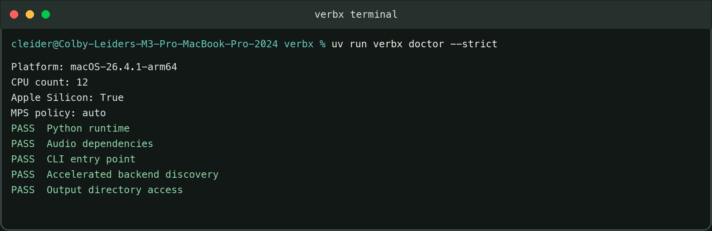

**Figure: A successful `verbx doctor --strict` run on the author's Apple Silicon workstation, with all five checks passing.**

The next transcript shows a non-destructive render rehearsal. `--dry-run`
resolves the preset, computes the effective decay and mix, estimates duration
and file size, and writes no audio. This is the preferred way to inspect a
potentially expensive or unexpectedly long operation before committing storage
and processing time.

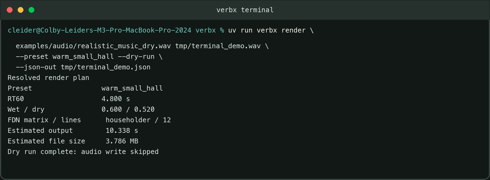

**Figure: A dry-run render using `warm_small_hall`, including resolved FDN settings, estimated output duration, and estimated file size.**

For AI workflows, `verbx` is also a strong command-line tool for deterministic audio data augmentation and voice-model robustness testing. You can generate reproducible reverberant variants for ASR/TTS/speaker pipelines, keep split-safe metadata, and batch large render sets from manifests.

```bash
# A room that no physical building has ever had. RT60 = 120 seconds.
verbx render voice.wav out.wav \
  --engine algo --rt60 120 --wet 0.99 --dry 0.01 \
  --fdn-lines 32 --fdn-matrix tv_unitary --fdn-tv-rate-hz 0.30 \
  --shimmer --shimmer-semitones 12 --shimmer-mix 0.45 \
  --bloom 2.8 --tilt 2.0
```

## Two Production Paths: Command Line and DAW Plug-ins

verbx is **primarily intended for command-line use**. The CLI is the reference
workflow and exposes the broadest processing, analysis, automation, batch,
multichannel, impulse-response, dereverberation, reporting, and quality-control
surface. It is designed for work in which an input file, a fully specified
operation, and a verifiable output artifact are the natural units of thought.

AU, AUv3, and VST3 plug-in versions are also provided for music-production work
inside a digital audio workstation (DAW). The plug-ins are not command lines
placed behind knobs, and the CLI is not a DAW running in a terminal. They are
different approaches to the same family of reverb problems. The CLI emphasizes
explicit configuration and reproducible rendering; the plug-ins emphasize
immediate listening, host automation, low-latency interaction, and session
recall. A project can use either path alone, but many serious productions benefit
from using both at different stages.

### The CLI path: files, experiments, and reproducible renders

Choose the CLI when the task begins with files or data and should end with files,
reports, or a repeatable command. A CLI render names its input, output, engine,
parameters, channel layout, numerical format, and optional analysis products.
That explicitness is valuable when a result must be recreated next week, on
another workstation, across hundreds of files, or as part of a research or
machine-learning pipeline.

The CLI is the strongest path for:

- offline rendering where sound quality and complete tail calculation matter
  more than meeting a realtime callback deadline;
- very long or extreme decays whose output duration should be estimated,
  validated, reported, and written deliberately;
- deterministic batch jobs driven by shell scripts, manifests, seeds, and
  version-controlled configuration;
- impulse-response synthesis, inspection, conversion, morphing, matrix routing,
  and convolution across unusual input and output layouts;
- dereverberation, room analysis, loudness measurement, quality control, and
  machine-readable JSON or CSV evidence;
- corpus augmentation for Audio AI, where split integrity, labels, provenance,
  and exact repeatability matter;
- rendering wet stems, surround beds, Ambisonic intermediates, and other assets
  that will be imported into a DAW or renderer later;
- testing parameter sweeps and controlled comparisons without relying on manual
  knob positions or host-specific session state.

The appropriate CLI habit is **specify, inspect, render, verify**. Begin by
making the operation explicit. Use a preset only as a starting point, then record
important overrides in the command, config file, or manifest. Inspect the
resolved configuration and estimated duration when the output could be large.
Render to a new path rather than destructively replacing the source. Finally,
analyze the result and retain the command or report alongside the audio.

For example, an offline wet stem can be rendered and documented as one operation:

```bash
verbx render vocal.wav vocal_hall_wet.wav \
  --engine algo --rt60 3.4 --predelay 32 \
  --wet 1.0 --dry 0.0 --output-subtype FLOAT \
  --json-out vocal_hall_wet.analysis.json
```

The output is an asset rather than a live processor. It can be auditioned,
archived, delivered, imported into a DAW, or compared with another render. If a
parameter sweep is required, commands can generate ten controlled variants
without asking an engineer to move the same plug-in knob ten times and remember
the exact states.

CLI automation is similarly explicit. It can be expressed through arguments,
automation files, manifests, or generated commands. That is ideal for repeatable
experiments and long-form transformations. It is less immediate than drawing a
curve against a musical timeline, but it is easier to audit and reproduce.

The CLI's `realtime` command is useful for device testing, low-latency audition,
and live command-line workflows. It does not change the product's primary
offline and artifact-oriented design. A terminal realtime stream does not know
the DAW's bar grid, track routing, region edits, plug-in delay compensation,
offline-bounce policy, or project automation. When those relationships are the
center of the work, use the plug-in.

### The plug-in path: performance, automation, and mix context

Choose AU, AUv3, or VST3 when the reverb must live inside a musical session and
respond while the arrangement plays. The host supplies audio buses, project
sample rate, block size, transport, tempo, automation, preset and state recall,
latency compensation, and final bounce behavior. The plug-in processes the
buffers it receives and returns audio before each callback deadline.

The plug-in path is strongest for:

- placing a reverb directly on a track, auxiliary return, subgroup, object, or
  spatial bus while hearing the complete arrangement;
- adjusting decay, pre-delay, damping, diffusion, width, mix, Freeze, Reverse,
  and quality controls by ear without rendering a new file after every change;
- writing and editing host automation against bars, beats, regions, markers,
  picture, or performance gestures;
- changing space at a section boundary, throwing selected words into a tail, or
  freezing one harmony beneath the next;
- saving processor state inside the DAW session so collaborators can reopen the
  musical context rather than reconstruct a shell command;
- using the realtime spectrum analyzer and effective-decay display while
  balancing sources and returns;
- performing the reverb from the full-screen Perform and Expert pages with
  controls designed for continuous musical interaction.

The appropriate plug-in habit is **insert, route, automate, audition, commit**.
First decide whether the processor belongs on an insert or a send. An insert
changes one track's complete signal path and may use both dry and wet output. A
send normally feeds a 100-percent-wet plug-in return that several tracks can
share. Next establish safe gain staging and a useful static sound. Only then add
automation, because automation cannot rescue a return whose basic density,
bandwidth, or routing is wrong. Audition the result in context and through the
required fold-down or binaural path. Commit it through the DAW's freeze, bounce,
or export system when the mix is approved.

The DAW, not the plug-in, owns the output audio file. Project sample rate and
callback format are host decisions; final PCM subtype, metadata, channel export,
and loudness delivery are normally selected in the DAW's bounce dialog. The
plug-in may oversample its wet path internally, but it cannot turn a 48 kHz host
session into a 192 kHz delivered master by itself. Likewise, an analyzer display
inside the editor is immediate feedback, not a substitute for a retained CLI
analysis report when formal evidence is required.

Realtime processing also imposes constraints that offline rendering does not.
The audio callback cannot wait for a long analysis, allocate unpredictably, open
files casually, or calculate an unbounded future tail. A plug-in must honor host
buffer deadlines and report latency correctly. The CLI can spend more than one
second processing one second of audio when a costly algorithm or large
convolution matrix justifies it. The plug-in must either finish on time, use a
prepared lower-cost structure, or expose a quality choice with a clear latency
and CPU tradeoff.

### The surfaces are related, not identical

Do not assume one-to-one parameter or preset parity between the CLI and plug-in.
The CLI includes commands and options that do not belong on a realtime effect
panel, including file-format selection, batch manifests, report destinations,
failure artifacts, offline dereverberation, IR utilities, and corpus tooling.
The plug-in includes host-facing state, automation, bus negotiation, callback
quality modes, and visual interaction that do not have the same meaning in an
offline command.

Even controls with similar names can operate inside different constraints. The
plug-in's RT60 range is `0.01` to `360` seconds and is designed for logarithmic
coarse and fine adjustment during playback. The CLI can address longer bounded
renders and can fail fast when a requested tail would create a surprising output
duration. Plug-in Reverse is a realtime reverse-style swell; an offline reverse
workflow can use future samples and render noncausal structures unavailable to a
live callback. Freeze inside a running host sustains prepared network state;
offline processing can inspect, extend, or transform segments without a realtime
deadline.

The safest interchange is therefore through documented audio and impulse-response
assets, not an assumption that every preset file is portable. If the CLI creates
an IR, wet stem, surround bed, or analyzed variant, import that asset into the
DAW with its report. If the plug-in creates an important automated effect, print
the return and analyze the resulting audio with the CLI. When recreating a sound
across paths, transfer the audible design goals and shared parameter values, then
verify by listening and analysis rather than assuming numerical identity.

### Productive hybrid workflows

Several combined workflows are especially effective:

1. **Design offline, mix interactively.** Use the CLI to synthesize or curate an
   impulse response, validate it, and save provenance. Load or route the resulting
   asset in the DAW, then automate level and musical placement with the plug-in or
   host tools.
2. **Audition interactively, render systematically.** Find the decay family,
   damping, width, and source treatment in the plug-in. Translate the approved
   design into explicit CLI renders for batches, alternate versions, datasets, or
   unusually long tails, verifying differences rather than claiming preset parity.
3. **Render wet stems, retain mix freedom.** Create 100-percent-wet mono, stereo,
   surround, or Ambisonic stems with the CLI. Import them into the DAW so the mix
   can edit, automate, compress, and spatialize the return independently of the dry
   source.
4. **Perform first, document afterward.** Record or bounce plug-in automation in
   the DAW, then run `verbx analyze` on the printed return or final mix to produce
   retained decay, loudness, peak, spectral, and room evidence.
5. **Use the DAW for form and the CLI for scale.** Let the DAW determine which
   phrases, stems, and transitions excite a space. Export those selections, run
   large matrix, extreme-tail, or corpus-scale operations through the CLI, and
   return the rendered assets to the musical timeline.

### Choosing quickly

Use the **CLI** when you need repeatability, batch scale, complete files, unusual
formats, reports, analysis, dereverberation, IR engineering, extreme offline
quality, or a command that another person or machine can rerun. Use the **plug-in**
when you need to hear the effect against the arrangement, perform controls,
automate against the DAW timeline, share a live return among tracks, or preserve
state inside a music-production session. Use **both** when the project needs the
CLI's rigor and scale together with the DAW's musical context and immediacy.

Neither path is a lesser edition of the other. The CLI is the primary verbx
interface because it can express the complete processing system explicitly. The
plug-ins are purpose-built production instruments because a DAW requires a
different contract: bounded realtime work, host-owned routing, automatable
parameters, visual feedback, and reliable session state.

## AUv3 / VST3 Plug-in Track


The image above is the approved `1920x1080` visual direction for the full-screen
spatial console.

The capture below is the currently compiled JUCE editor. It now implements the
same spatial-console composition: loudness bank, DXF geometry theater, image
and ray-model panels, nine live parameter cards, horizontal decay analyzer,
quality/mode controls, and lower expert sections. The host has muted its input,
so the live analyzer trace correctly rests at its floor.


The compiled **Expert** page mirrors all nine continuous parameters as both
rotary controls and high-resolution faders, keeps the realtime spectrum in
view, and adds twenty native selector buttons. Its five macro banks write the
same host-automatable state for quality, width, logarithmic decay, dry/wet
routing, and paired damping/diffusion character settings.


The first native plug-in foundation is implemented under
[`native/verbx_plugin`](native/verbx_plugin/README.md):

- C++17/JUCE host shell for AU, AUv3, VST3, and standalone targets
- shared C11 parameter manifest and realtime processing boundary
- logarithmic RT60 mapping from `0.01s` to `360s` with coarse and fine controls
- explicit Freeze and Reverse parameters
- real allocation-free wet-path oversampling for Host, 2x, 4x, and Target
  192 kHz quality modes, with a 32-bit-float callback contract
- cached lock-free parameter reads on the audio callback
- overlaid realtime post-DSP spectrum analyzer with an 8192-point Hann FFT,
  logarithmic frequency grid, smoothed response, and peak trace
- allocation-free mono/stereo Schroeder realtime core with pre-delay, room
  scaling, RT60, damping, diffusion, width, wet/dry, Freeze, and a zero-lookahead
  reverse-style swell
- 20 ms realtime parameter smoothing for host automation without zipper noise
- responsive Perform/Expert pages with 18 linked continuous controls and 20
  selector buttons; no Expert control is decorative or stored outside host state
- full-screen 16:9 spatial-console editor with the complete initial
  12-parameter control surface and effective-RT60 readout

Target mode chooses the smallest integer factor that reaches or exceeds 192
kHz without downsampling. It therefore runs at 4x/192 kHz in a 48 kHz project,
2x/192 kHz at 96 kHz, and 5x/220.5 kHz at 44.1 kHz. The status strip shows the
actual host rate, internal rate, factor, block size, and reported latency.
Quality changes rebuild the prepared wet-path state off the audio callback.

The complete installer builds and installs the CLI, native executable, man
pages, runtime extras, VST3, Audio Unit on macOS, and the standalone app:

```bash
./install.sh
```

If JUCE is not already available, the installer downloads the pinned JUCE
`8.0.6` source release into `build/deps/JUCE`. For an offline installation or
an existing checkout, use:

```bash
./install.sh --juce-source /path/to/JUCE
```

The default macOS plug-in destinations are
`~/Library/Audio/Plug-Ins/Components/VERBX.component` and
`~/Library/Audio/Plug-Ins/VST3/VERBX.vst3`; the standalone app is installed as
`~/Applications/VERBX.app`. That app contains and registers the true AUv3
extension at `Contents/PlugIns/VERBX.appex`. Linux installs VST3 to `~/.vst3` and the standalone
binary to `~/.local/bin/verbx-plugin`. Restart or rescan the audio host after
installation. Run `./install.sh --help` for component skips, custom destination
directories, offline operation, and build controls.

Repository builds do not require JUCE unless the plug-in target is enabled
manually:

```bash
# Verify the guarded scaffold without JUCE.
cmake -S native/verbx_plugin -B build/native/verbx_plugin

# Configure the real AU/AUv3/VST3/Standalone targets when JUCE is installed.
cmake -S native/verbx_plugin -B build/native/verbx_plugin-juce \
  -DVERBX_ENABLE_JUCE_PLUGIN=ON
cmake --build build/native/verbx_plugin-juce --config Release
```

Use `-DVERBX_JUCE_SOURCE_DIR=/path/to/JUCE` when building from a JUCE source
checkout instead of an installed CMake package.

---

## Instant Sonic Gratification

If you want immediate results with minimal decision-making, run this:

```bash
git clone https://github.com/TheColby/verbx.git && cd verbx && \
./install.sh --prefix "$HOME/.local" && \
verbx render ../in.wav out.wav --engine algo --rt60 120 --wet 0.99 --dry 0.01
```

That gives you an absurd long-tail render immediately. If `verbx` is not on PATH after install, run:

```bash
export PATH="$HOME/.local/bin:$PATH"
```

## Quick Start

If `verbx` is already installed, this is the fastest way to start:

```bash
verbx render input.wav output.wav --engine algo --rt60 2.5 --wet 0.3 --dry 0.7
```

This applies a natural-sounding 2.5-second algorithmic reverb. Output is written to `output.wav`, with analysis at `output.wav.analysis.json`.

Need a live preview instead of an offline bounce?

```bash
verbx realtime --engine algo --input-device "Built-in Microphone" \
  --output-device "Headphones" --rt60 20 --freeze --shimmer \
  --fdn-matrix tv-unitary --fdn-tv-rate-hz 0.35 --fdn-tv-depth 0.12 \
  --lowcut 120 --highcut 9000 --tilt 1.5 --duration 10
```

Initial realtime mode runs either direct convolution from `--ir` or an
algorithmic proxy IR rendered once and monitored through the streaming
convolver. It is meant for auditioning spaces and tails, not yet for the full
automation/batch feature set. Realtime `--freeze` is an honest approximation:
it renders a long self-sustaining proxy tail for live auditioning rather than
reusing the offline segment-freeze operator.

Need live cleanup instead of added space?

```bash
verbx realtime --live-mode dereverb \
  --input-device "Built-in Microphone" \
  --output-device "Headphones" \
  --sample-rate 48000 --block-size 384 \
  --dereverb-mode wiener --dereverb-strength 0.85 \
  --dereverb-window-ms 12 --dereverb-hop-ms 4 --dereverb-tail-ms 90 \
  --dereverb-pre-emphasis 0.2 --dereverb-max-atten-db 18 \
  --duration 10
```

If you need to install first on macOS:

```bash
brew tap thecolby/verbx
brew install thecolby/verbx/verbx
verbx quickstart
```

Need starting settings for your file?

```bash
verbx suggest input.wav
verbx quickstart
```

Need the long-form manual?

```bash
python3 scripts_generate_docs_pdf.py
```

That writes [`docs/USERGUIDE.md`](docs/USERGUIDE.md) and `USERGUIDE.pdf`, combining this README with the user-facing guides and tip-heavy docs in `docs/`.

### Five Runnable Examples

```bash
# 1. Natural room – voice or piano in a medium hall
verbx render in.wav hall.wav --engine algo --rt60 2.0 --wet 0.25 --dry 0.8 --pre-delay-ms 18

# 2. Convolution with a real IR – character follows the space you measured
verbx render in.wav conv.wav --engine conv --ir hall_ir.wav --partition-size 16384

# 3. Shimmer pad – pitch-shifted ambient wash, good for synths
verbx render in.wav shimmer.wav --engine algo --rt60 12 --wet 0.85 \
  --shimmer --shimmer-semitones 12 --shimmer-mix 0.35 --bloom 2.0

# 4. Broadcast loudness target – –23 LUFS, –1 dBTP true peak
verbx render in.wav broadcast.wav --target-lufs -23 --true-peak --target-peak-dbfs -1

# 5. Extreme ambient – 90-second tail, slow evolution, near-frozen
verbx render in.wav ambient.wav --engine algo --rt60 90 --wet 0.92 \
  --fdn-matrix tv_unitary --fdn-tv-rate-hz 0.08 --bloom 2.0 --tilt 0.8

# 6. Comb-cloud texture – dense metallic haze before the late field
verbx render in.wav combcloud.wav --engine algo --rt60 6 --wet 0.78 --dry 0.35 \
  --comb-cloud --comb-cloud-count 32 --comb-cloud-feedback 0.42 --comb-cloud-mix 0.30 \
  --fdn-lines 12 --fdn-matrix hadamard
```

```bash
# Output-definition presets (default is HD)
verbx render in.wav out_hd.wav --engine conv --ir hall_ir.wav
verbx render in.wav out_md.wav --engine conv --ir hall_ir.wav --quality-preset md
verbx render in.wav out_sd.wav --engine conv --ir hall_ir.wav --quality-preset sd
```

## Full Installation Instructions

**With uv (fastest):**

```bash
git clone https://github.com/TheColby/verbx.git && cd verbx
uv sync && uv run verbx --help
```

For realtime audio device support:

```bash
uv sync --extra realtime
```

**With pip + venv:**

```bash
python3 -m venv .venv && source .venv/bin/activate
pip install -e . && verbx --help
```

For realtime audio device support:

```bash
pip install -e ".[realtime]"
```

**Complete installation, including native CLI and plug-ins:**

```bash
./install.sh
verbx --help && man verbx-render
man verbx-dereverb
```

This installs the Python package with realtime and SOFA runtime extras by
default. Use `--minimal-python`, `--skip-native`, `--skip-plugins`, `--no-man`,
or custom `--au-dir`, `--vst3-dir`, and `--app-dir` destinations when a smaller
or system-managed installation is preferable. Inspect the complete plan without
changing the machine using `./install.sh --dry-run`.

If VERBX does not appear after fully quitting and reopening the DAW, force a
signed reinstall and Audio Unit cache rebuild on macOS:

```bash
./install.sh --reset-plugin-cache
```

VERBX appears under the plug-in vendor **Colby Leider**. Logic and GarageBand
can use the AUv2 component or the AUv3 app extension; VST3 hosts use
`VERBX.vst3`. The editor opens at a host-safe 1280x720 and remains fully
resizable down to 800x450 while preserving the full console layout. The
installer now signs the nested AUv3 extension before its
containing app, registers it with PlugInKit, and seals
and strictly verifies every installed macOS bundle, touches the plug-in paths,
and restarts the Audio Component Registrar. The explicit cache-reset option
backs up existing Apple Audio Unit cache files beneath
`~/.local/share/verbx/cache-backups/` before clearing them. DAW-specific VST3
caches may still require the host's “rescan all plug-ins” command.

An ad-hoc-signed AUv3 can validate but still fail when Logic launches its app
extension. To avoid shadowing the reliable AUv2 component, `./install.sh`
installs but unregisters ad-hoc AUv3 hosting by default. Use an Apple signing
identity for production AUv3 hosting:

```bash
./install.sh --codesign-identity "Apple Development: Your Name (TEAMID)"
```

`--enable-adhoc-auv3` is available only for local extension debugging.

macOS plug-ins build as universal `arm64+x86_64` binaries by default so they
remain visible to native Apple Silicon DAWs and hosts running under Rosetta.
The default deployment floor is macOS 12. Override these release defaults only
when intentionally producing a narrower local build:

```bash
./install.sh --macos-architectures arm64 --macos-deployment-target 14.0
```

**With Homebrew (macOS):**

```bash
brew tap thecolby/verbx
brew install thecolby/verbx/verbx
verbx version
```

Official tap repository: `TheColby/homebrew-verbx`.

For local maintainer testing, you can also install from the in-repo formula:

```bash
brew install --build-from-source ./packaging/homebrew/verbx.rb
```

**Requirements:** Python 3.11+, `libsndfile` on system path. Optional: `numba` (faster algorithmic path), `cupy` (CUDA convolution), `h5py` (SOFA import/extract via `verbx ir sofa-*`), `sounddevice` (realtime input/output via `verbx realtime`).

Homebrew maintainer and release details are consolidated below.

## Homebrew Distribution and Release Maintenance

The installation commands above cover the user path. The tap's release, automation, and compatibility details follow for maintainers and packagers. The published tap formula lives at `Formula/verbx.rb` in `TheColby/homebrew-verbx`.

### Maintainer Workflow

1. Refresh formula pins for a new release tag:

```bash
./scripts/refresh_homebrew_formula.sh 0.7.7
```

2. Commit formula changes in this repo:

```bash
git add packaging/homebrew/verbx.rb scripts/refresh_homebrew_formula.sh docs/HOMEBREW.md
git commit -m "chore(homebrew): refresh formula for v0.7.7"
```

3. Ensure tap repo formula is updated and pushed.

### Release Automation

`.github/workflows/release.yml` includes gated tap sync:

- Trigger: tag push (`v*`)
- Job: `sync-homebrew-tap`
- Requires secret: `HOMEBREW_TAP_TOKEN` (when sync required)
- Optional variable: `HOMEBREW_TAP_REPO` (default `TheColby/homebrew-verbx`)
- Policy variable: `RELEASE_REQUIRE_HOMEBREW` (`true` by default)

Behavior:

- `RELEASE_REQUIRE_HOMEBREW=true` (default): release fails if token is missing.
- `RELEASE_REQUIRE_HOMEBREW=false`: sync is skipped when token is missing.

### Compatibility Notes

- Formula pins Python resources using `brew update-python-resources`.
- `numba`/`llvmlite`/`scikit-learn` are intentionally excluded from Homebrew
  resources to avoid fragile compiler-bound builds in common macOS
  environments.
- Core DSP paths are unaffected; shimmer remains available with librosa and
  falls back gracefully when acceleration dependencies are absent.

If `verbx` is not found after install, add `~/.local/bin` to your PATH:

```bash
export PATH="$HOME/.local/bin:$PATH"   # add to ~/.zshrc or ~/.bashrc
```

## Python API (Research Workflows)

Use `verbx` as a library when you need notebook/pipeline integration:

```python
from verbx.api import analyze_file, generate_ir, render_file
from verbx.config import RenderConfig
from verbx.ir import IRGenConfig

report = render_file("dry.wav", "wet.wav", RenderConfig(engine="algo", rt60=2.5, wet=0.7))
ir_audio, ir_sr, ir_meta = generate_ir(IRGenConfig(mode="fdn", duration=3.0, sr=48000))
metrics = analyze_file("wet.wav", include_loudness=True)
```

## Audio Examples

Rendered examples are included in [`examples/audio/`](examples/audio/). The pack is now delivered at 48 kHz, PCM24. Most examples are stereo; the utility click and short hybrid IR files are mono. The shimmer-heavy examples were re-rendered at this higher rate specifically to remove the grit from the older 24 kHz / PCM16 pack.

GitHub repository README pages do not provide reliable inline audio controls. The `Play`
links below open each asset directly in the browser's native media player with one click.

### Utility and verification files

| File | Play | Description |
|------|------|-------------|
| [`dry_click.wav`](examples/audio/dry_click.wav) | [Play](https://cdn.jsdelivr.net/gh/TheColby/verbx@main/examples/audio/dry_click.wav) | One-shot dry click reference for sanity checks |
| [`dry_click_reverbed.wav`](examples/audio/dry_click_reverbed.wav) | [Play](https://cdn.jsdelivr.net/gh/TheColby/verbx@main/examples/audio/dry_click_reverbed.wav) | Reverberated click for immediate A/B verification |
| [`hybrid_ir_short.wav`](examples/audio/hybrid_ir_short.wav) | [Play](https://cdn.jsdelivr.net/gh/TheColby/verbx@main/examples/audio/hybrid_ir_short.wav) | Short hybrid IR asset used in quick convolution demos |

### Realistic dry/wet example pairs

| File | Play | Description |
|------|------|-------------|
| [`realistic_speech_dry.wav`](examples/audio/realistic_speech_dry.wav) | [Play](https://cdn.jsdelivr.net/gh/TheColby/verbx@main/examples/audio/realistic_speech_dry.wav) | Dry speech source used for room and plate examples |
| [`realistic_speech_room.wav`](examples/audio/realistic_speech_room.wav) | [Play](https://cdn.jsdelivr.net/gh/TheColby/verbx@main/examples/audio/realistic_speech_room.wav) | Natural speech room render |
| [`realistic_music_dry.wav`](examples/audio/realistic_music_dry.wav) | [Play](https://cdn.jsdelivr.net/gh/TheColby/verbx@main/examples/audio/realistic_music_dry.wav) | Dry music source used for ambient and shimmer examples |
| [`realistic_music_hall.wav`](examples/audio/realistic_music_hall.wav) | [Play](https://cdn.jsdelivr.net/gh/TheColby/verbx@main/examples/audio/realistic_music_hall.wav) | Natural concert-hall style music render, re-tuned for a cleaner less congested tail |
| [`realistic_drums_dry.wav`](examples/audio/realistic_drums_dry.wav) | [Play](https://cdn.jsdelivr.net/gh/TheColby/verbx@main/examples/audio/realistic_drums_dry.wav) | Dry drum source used for room and cathedral examples |
| [`realistic_drums_room.wav`](examples/audio/realistic_drums_room.wav) | [Play](https://cdn.jsdelivr.net/gh/TheColby/verbx@main/examples/audio/realistic_drums_room.wav) | Natural drum room render |

### Extreme range demos

| File | Play | Description | Key settings |
|------|------|-------------|--------------|
| [`extreme_cathedral_drums.wav`](examples/audio/extreme_cathedral_drums.wav) | [Play](https://cdn.jsdelivr.net/gh/TheColby/verbx@main/examples/audio/extreme_cathedral_drums.wav) | Drums → 8s Hadamard FDN cathedral | `--rt60 8.0 --fdn-lines 16 --fdn-matrix hadamard` |
| [`extreme_shimmer_music.wav`](examples/audio/extreme_shimmer_music.wav) | [Play](https://cdn.jsdelivr.net/gh/TheColby/verbx@main/examples/audio/extreme_shimmer_music.wav) | Music → 6s reverb with octave shimmer | `--shimmer --shimmer-semitones 12 --shimmer-feedback 0.65` |
| [`extreme_plate_speech.wav`](examples/audio/extreme_plate_speech.wav) | [Play](https://cdn.jsdelivr.net/gh/TheColby/verbx@main/examples/audio/extreme_plate_speech.wav) | Speech → circulant FDN plate simulation | `--rt60 1.8 --fdn-matrix circulant --lowcut 200 --highcut 6000` |
| [`extreme_frozen_music.wav`](examples/audio/extreme_frozen_music.wav) | [Play](https://cdn.jsdelivr.net/gh/TheColby/verbx@main/examples/audio/extreme_frozen_music.wav) | Music → 30s near-infinite tail (32-line FDN) | `--rt60 30.0 --fdn-lines 32 --wet 0.95` |

### Experimental music tradition demos

Eight examples drawn from the experimental and avant-garde music tradition, each isolating a
different reverb behavior or aesthetic.

| File | Play | Inspiration | What to listen for |
|------|------|-------------|-------------------|
| [`lucier_sitting_room.wav`](examples/audio/lucier_sitting_room.wav) | [Play](https://cdn.jsdelivr.net/gh/TheColby/verbx@main/examples/audio/lucier_sitting_room.wav) | Alvin Lucier – *I Am Sitting in a Room* (1969) | Speech run through the room 7× until only resonant frequencies survive |
| [`eno_discreet_music.wav`](examples/audio/eno_discreet_music.wav) | [Play](https://cdn.jsdelivr.net/gh/TheColby/verbx@main/examples/audio/eno_discreet_music.wav) | Brian Eno – *Discreet Music* (1975) / Ambient series | 12s tail swallowing the source into a continuous wash |
| [`oliveros_deep_listening.wav`](examples/audio/oliveros_deep_listening.wav) | [Play](https://cdn.jsdelivr.net/gh/TheColby/verbx@main/examples/audio/oliveros_deep_listening.wav) | Pauline Oliveros – *Deep Listening* (1989) | 18s cave-scale resonance, very low damping, 32-line FDN |
| [`fripp_frippertronics.wav`](examples/audio/fripp_frippertronics.wav) | [Play](https://cdn.jsdelivr.net/gh/TheColby/verbx@main/examples/audio/fripp_frippertronics.wav) | Robert Fripp – Frippertronics tape-loop | Octave shimmer with 0.78 feedback accumulating over 8s |
| [`mbv_shoegaze.wav`](examples/audio/mbv_shoegaze.wav) | [Play](https://cdn.jsdelivr.net/gh/TheColby/verbx@main/examples/audio/mbv_shoegaze.wav) | My Bloody Valentine – *Loveless* (1991) wall of sound | Dense shimmer wash (mix 0.55) through circulant FDN |
| [`reich_phase_drums.wav`](examples/audio/reich_phase_drums.wav) | [Play](https://cdn.jsdelivr.net/gh/TheColby/verbx@main/examples/audio/reich_phase_drums.wav) | Steve Reich – phase minimalism | Tight 0.7s room on percussion, circulant diffusion |
| [`radigue_drone.wav`](examples/audio/radigue_drone.wav) | [Play](https://cdn.jsdelivr.net/gh/TheColby/verbx@main/examples/audio/radigue_drone.wav) | Eliane Radigue – *ADNOS* (1973–1974) / drone electronics | 45s near-infinite sustain, 32-line Hadamard, wet 0.97 |
| [`feldman_sparse_room.wav`](examples/audio/feldman_sparse_room.wav) | [Play](https://cdn.jsdelivr.net/gh/TheColby/verbx@main/examples/audio/feldman_sparse_room.wav) | Morton Feldman – late period | 3.8s room, low wet (0.52), allpass diffusion, contemplative space |

Dry source files are in the same directory. See [`examples/audio/README.md`](examples/audio/README.md) for the full render commands.

---

## Public Alpha Launch Notes

Current public alpha release: **v0.9.0**.

Current stabilization status:

- Python `0.7.x` render/realtime behavior is stabilized for the current cycle:
  realtime device failures are clearer, render long-tail flows have fail-fast
  safeguards or early status output, and render/realtime/dereverb emit
  machine-readable reports where applicable.
- CLI/docs/test consolidation is complete for Weeks 1–3 of the short-horizon
  plan: shared validators are extracted, generated docs/PDF are in sync, and
  focused regression coverage covers realtime, dereverb, limiter, and long-tail
  behaviors.
- Current native-track decision: `v0.8` is a hybrid transition release, with
  `verbx-c` shipped as an opt-in native render/doctor binary while the Python
  CLI remains the public alpha default. See
  [`docs/ROADMAP_NEXT_4_WEEKS.md`](docs/ROADMAP_NEXT_4_WEEKS.md).

- `verbx` is currently research-grade software (public alpha), not production-certified.
- Confirm your environment with `verbx quickstart --verify --strict` and `verbx doctor`.
- Verify one algorithmic render and one convolution render before batch usage.
- For live monitoring, verify `verbx realtime --list-devices` before relying on realtime auditioning.
- For reproducible reports and bug submissions, attach `--repro-bundle` outputs and `verbx doctor --json-out doctor.json`.
- For demo-ready outputs, keep `--true-peak --target-peak-dbfs -1` enabled when files will be transcoded.
- Public alpha scope, known limitations, and support paths:
  [`docs/PUBLIC_ALPHA_NOTES.md`](docs/PUBLIC_ALPHA_NOTES.md)
- Launch-week pinned demo commands and expected SHA256 outputs:
  [`docs/LAUNCH_WEEK_DEMO_PINS.md`](docs/LAUNCH_WEEK_DEMO_PINS.md)
- Canonical launch-example parity check:
  `python scripts/check_launch_examples.py --check`
- PyPI publish auth setup for maintainers:
  [`docs/PYPI_PUBLISH_SETUP.md`](docs/PYPI_PUBLISH_SETUP.md)

---

## v0.8 Native Track

`v0.8` is the planned native C executable line. The released tool remains the
Python implementation in `v0.7.x`, but the native rewrite has now started with
an executable scaffold under [`native/verbx_c/README.md`](native/verbx_c/README.md).
The live feature/gap table is tracked in
[`docs/NATIVE_PARITY.md`](docs/NATIVE_PARITY.md).

Chosen `v0.8` release shape: **hybrid wrapper phase before full replacement**.
`verbx-c` is the opt-in native executable for deterministic offline render,
doctor diagnostics, and machine-readable native support bundles. The Python
`verbx` CLI remains the default for realtime, dereverb, convolution, IR tools,
batch workflows, immersive utilities, and the full FDN feature surface until
native parity is proven by the checked-in contract fixtures.

Current native status:

- standalone `verbx-c` executable target
- portable C11 build path via `scripts/build_verbx_c.sh`
- implemented commands: `help`, `version`, `doctor`, `render`
- mono/stereo WAV input: PCM16/24/32 and float32/float64
- mono/stereo WAV output: `pcm16`, `float32`, `float64`
- deterministic offline render lifecycle in C: read -> process -> tail-finalize -> write
- explicit native process/error contract surfaced in `verbx-c doctor`
- native tail-stop metric selection: `--tail-metric peak|rms`
- native peak-safe output: `--peak-safe --peak-ceiling-db DB`
- native JSON reports: `doctor --json-out` and `render --json-out`
- foundational native algorithmic reverb core with float64 internal processing
- reusable `verbx_c_core` library with a tested plug-in parameter manifest
- realtime context API with persistent mono/stereo reverb state, quality-target
  status, zero-latency reporting, Freeze, and reverse-style swell behavior
- guarded C++/JUCE AU, AUv3, VST3, and standalone shell with the complete
  initial control dock and realtime spectrum overlay
- plug-in RT60 coarse/fine mapping and native render floor aligned at `0.01s`

`v0.8` in scope:

- `verbx-c doctor` and `verbx-c render`
- deterministic mono/stereo WAV offline render
- `pcm16`, `float32`, and `float64` output
- render/doctor JSON reports for support bundles
- parity comparison against `tests/fixtures/native_render_parity_contract.json`

Deferred beyond the first `v0.8` slice:

- replacing Python `verbx` as the default command
- full native realtime reverb DSP and device/DAW production validation
- convolution, dereverb, IR synthesis/morphing, batch, immersive, and AI helpers
- full Python FDN parity, automation lanes, shimmer/freeze/repeat, and broad preset coverage

Example native smoke test:

```bash
./scripts/build_verbx_c.sh --doctor
scripts/install_verbx_c.sh --prefix "$HOME/.local" --doctor
./build/native/verbx_c/verbx-c render in.wav out.wav \
  --rt60 3.5 \
  --peak-safe \
  --out-format float32 \
  --json-out native-render.json
```

---

## Experimental DXF Room Tracing

`verbx ir trace` is the first bounded physical-acoustics prototype: it reads a
simple room-like DXF outline, generates a stereo IR, and writes a
`trace-report-v1` support bundle.

```bash
verbx ir trace room.dxf room_ir.wav \
  --source 2,3,1.5 \
  --listener 6,4,1.5 \
  --height 3 \
  --material studio \
  --rays 50000 \
  --length 4 \
  --target-sr 48000 \
  --json-out room_trace.json

verbx render dry.wav in_room.wav --engine conv --ir room_ir.wav
```

This MVP supports ASCII DXF `LINE`/`LWPOLYLINE` 2D room outlines and derives an
axis-aligned room box with direct path, first-order reflections, and a
stochastic late tail. `--material` now validates against octave-band material
profiles such as `studio`, `drywall`, `glass`, `concrete`, `carpet`,
`acoustic-panel`, and `diffuser`; `trace-report-v1` records those absorption
bands plus scattering metadata. See [`docs/DXF_TRACE_MVP.md`](docs/DXF_TRACE_MVP.md).

---

## Announcement Channels

- Release announcements: [github.com/TheColby/verbx/releases](https://github.com/TheColby/verbx/releases)
- Homebrew tap updates: [github.com/TheColby/homebrew-verbx](https://github.com/TheColby/homebrew-verbx)
- Homebrew project news/blog: [brew.sh/blog](https://brew.sh/blog/)

Note: Homebrew blog posts cover Homebrew project releases and ecosystem updates; third-party tap formula launches are announced by the tap/project maintainers.

---

## What Is Reverb? (and why verbx sounds different)

Reverb begins when a sound should be over but the room keeps it alive. A violinist
lifts the bow, a singer closes a consonant, or a drummer strikes a snare. The source
may stop almost at once, but the sound does not. It reaches the floor, walls, ceiling,
seats, bodies, scenery, and every irregular surface nearby, then returns by paths of
different lengths. Each trip changes its level, color, direction, and timing.

We hear those returns as part of the place. Even with our eyes closed, they tell us
whether a room feels intimate or immense, bright or muffled, empty or crowded. They
help us judge distance and direction, but they also shape the mood of a performance.
A dry voice can feel private and immediate. The same voice in a long stone decay can
feel ceremonial, remote, or larger than the person who made it.

That is why reverb is more than an effect placed behind a track. It is an acoustic
event, a listening cue, and a musical material. We will begin with what happens between
the source and the ear, listen to examples, and then take apart the DSP that recreates
or deliberately bends that experience. At ordinary settings, verbx can suggest a
recognizable room. At extreme settings, the room gives way to something else: a way of
composing with memory and time.

### The Acoustic Event: Direct Sound, Early Reflections, and Late Field

When sound leaves a source, the first arrival is usually the direct path. It carries the
clearest localization information and the sharpest transient. Reflections arriving in
the next several tens of milliseconds form the early-reflection pattern. Their timing
and direction tell the ear whether boundaries are close or far, symmetrical or
irregular, hard or absorptive. After enough reflections, individual paths become too
dense to follow. The listener hears a late field whose statistical behavior matters
more than the identity of any one echo.

The figure below separates those three time regions before they combine at the ear.
It is deliberately a perceptual diagram rather than a floor plan: the same room can
produce different direct-to-reverberant balances when the source or listener moves.

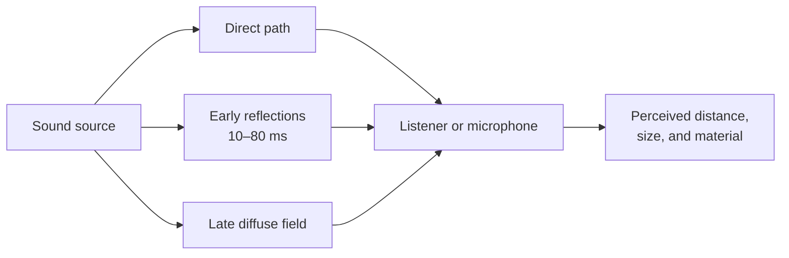
```mermaid
%% verbx-static: docs/assets/reverb_primer/01_acoustic_event_anatomy.png
flowchart LR
    S["Sound source"] --> D["Direct path"]
    S --> E["Early reflections<br/>10–80 ms"]
    S --> L["Late diffuse field"]
    D --> R["Listener or microphone"]
    E --> R
    L --> R
    R --> P["Perceived distance,<br/>size, and material"]
```

**Figure: Anatomy of a reverberant event from source to perception.**

**How to read this figure.** The upper path preserves source identity and position.
The middle path supplies discrete boundary information: a strong floor reflection may
add weight, while a lateral reflection may add width. The lower path carries the room's
integrated memory. A production can alter each path separately with pre-delay,
early/late balance, diffusion, damping, and wet/dry mix. “More reverb” is therefore not
one operation. It may mean more early energy, a longer late decay, a darker tail, a
wider return, or a lower direct-to-reverberant ratio.

The boundaries are not absolute. A reflection at 45 ms may be heard as part of the
source on a legato cello phrase and as a distinct slap after a rimshot. Tempo,
articulation, register, masking, and playback level all change the perceptual threshold.
The useful engineering question is not simply “How many milliseconds is early?” but
“What musical role does this arrival play?”

#### Four Time Scales in One Sound

Reverb becomes easier to design when heard at four nested time scales. The first is the
waveform cycle, measured in fractions of a millisecond; phase and comb filtering live
here. The second is the onset window, roughly the first 80 ms; localization,
pre-delay, and early reflections live here. The third is the phrase window, from a few
hundred milliseconds to several seconds; note overlap, clarity, and cadence live here.
The fourth is formal time, from tens of seconds to minutes; freeze, recirculation, and
extreme RT60 settings live here.

A 20 ms pre-delay is tiny compared with a symphonic phrase but large compared with the
period of a 1 kHz tone. A two-second tail is long compared with a sixteenth note at 120
BPM but short compared with the pause after a cathedral cadence. A 120-second tail no
longer describes an ordinary enclosure: it becomes a layer of form. verbx sounds
different partly because its controls remain meaningful across all four scales.

#### A Staircase That Answers Like a Bird: Chichén Itzá and Archaeoacoustics

At El Castillo, the stepped Pyramid of Kukulcán at Chichén Itzá, a handclap made
in front of the principal stairway does not return as a neutral copy of the clap.
Listeners hear a brief, pitched sweep whose falling contour has often been compared
with the call of the resplendent quetzal, *Pharomachrus mocinno*. The surprising
point is not that a bird naturally sounds reverberant. It is that architecture can
filter and reorganize an impulsive human sound until the returning echo acquires a
birdlike gesture. Garza and colleagues describe this effect as *la cola del quetzal*,
or the quetzal's tail, and note that the bird was culturally important to the Maya
even though it was not native to the northern Yucatán region.

This is a particularly vivid case of **archaeoacoustics**, the interdisciplinary
study of sound and listening in archaeological places. Archaeoacoustics combines
acoustic measurement, signal analysis, architectural reconstruction, archaeology,
anthropology, and the study of performance or ritual. Its question is not only
"What transfer function does this structure have today?" It also asks how audibility,
echo, speech projection, musical instruments, movement, and spatial separation may
have shaped past human activity. A rigorous study must therefore keep three levels
distinct: the physical sound field, its physiological and cognitive perception, and
the cultural meanings that people may have attached to it.

The Chichén Itzá effect begins with a broadband transient. A handclap sends energy
toward a large, approximately periodic array of stone treads and risers. Contributions
scattered from different portions of the staircase travel different path lengths and
return at different times. At some frequencies those contributions reinforce one
another; at others they partially cancel. The stairway consequently behaves less like
a single wall and more like a distributed acoustic filter. The returning energy is
both delayed and spectrally reorganized.

In impulse-response language, the received signal is still

$$
y(t) = x(t) * h(t),
$$

but $h(t)$ is highly structured. It contains a sequence of weighted, frequency-shaped
returns associated with the stair geometry rather than a featureless exponential
tail. If adjacent scattering paths differed by one fixed delay $\Delta\tau$, their
interference would produce an approximate repetition spacing of
$f_r \approx 1/\Delta\tau$. The real staircase presents a changing set of path lengths,
angles, and amplitudes, so its strongest spectral emphasis moves through time. That
motion is heard as a chirp rather than as a stationary comb-filter pitch.

[Declercq, Degrieck, Briers, and Leroy (2004)](https://doi.org/10.1121/1.1764833)
compared diffraction simulations with field recordings and found that the result
depends strongly on the excitation. A mathematical impulse and a real handclap do not
produce identical echoes because their spectra and temporal envelopes differ. Their
model also found that adding the ground reflection changed the calculated effect much
less than changing the incident sound. This source dependence is an important reverb
lesson: a room response may be linear, yet the part of that response we hear most
clearly depends on what the source supplies for the architecture to filter.

The chirp should not be confused with an ordinary diffuse late reverberant field. It
is closer to a colored early reflection or a short sequence of coherent echoes. A
concert hall tail tends toward dense statistical overlap, while the El Castillo
staircase preserves enough periodic structure for the ear to follow a frequency glide.
Both phenomena nevertheless belong in the same conceptual chapter. They demonstrate
that geometry converts propagation time into timbre and that an impulse response is a
record of architecture, source position, receiver position, and boundary structure.

The bird comparison also requires care. The similarity between the chirped echo and a
quetzal call is a perceptual and spectrographic comparison, not proof that the monument
was designed as a mechanical bird voice. The present structure has a construction,
weathering, excavation, and restoration history; modern listeners and handclaps are
not direct recordings of ancient practice. The existence of the acoustic effect is
measurable. Its intentionality and original cultural function require independent
archaeological evidence.

[Garza, Medina, Padilla, Ramos, and Zalaquett (2008)](https://www.scielo.org.mx/scielo.php?pid=S0185-25742008000200003&script=sci_arttext)
therefore argue for systematic Maya archaeoacoustics rather than isolated marvels.
Their framework joins calibrated measurements and mathematical models with evidence
about architecture, instruments, public events, ritual, and social organization. It
also treats hypotheses as testable: researchers should document source and receiver
coordinates, excitation type, weather, crowd conditions, surface state, and uncertainty;
compare multiple monuments; and ask whether a proposed effect survives plausible
reconstructions of the earlier building.

For a reverb designer, Chichén Itzá offers a useful reversal of the usual goal. Instead
of hiding individual delays until they fuse into a smooth room, preserve a controlled
periodicity long enough for the reflection pattern to become a recognizable gesture.
A short nonuniform multitap network, a bank of dispersive comb filters, or a measured
impulse response can produce birdlike sweeps without a long RT60. The musical result
is part echo, part filter, and part spatial sign. It reminds us that reverberation can
carry identity before it carries duration.

#### RT60 Is Important, but It Is Not the Sound

RT60 is the time required for reverberant energy to decay by 60 dB. It is a useful
summary because it turns a complex response into a number that can be compared across
rooms and algorithms. It is not a complete description. Two reverbs can share an RT60
and differ radically in onset, echo density, modal coloration, high-frequency loss,
stereo behavior, and how smoothly they reach the noise floor.

For a nearly exponential decay, relative level follows

$$
L(t) \approx -60\frac{t}{T_{60}} \ \text{dB}.
$$

At half the RT60, the idealized tail is 30 dB below its starting level. At one quarter,
it is 15 dB down. Music complicates this simple line: the source may continue exciting
the room, different frequency bands may decay at different rates, and a time-varying
network may exchange energy between modes. The number is still valuable, but the ear
hears the complete energy distribution.

The Schroeder frequency gives a second useful boundary:

$$
f_s \approx 2000\sqrt{\frac{T_{60}}{V}},
$$

where $f_s$ is in hertz, $T_{60}$ is in seconds, and $V$ is room volume in cubic
meters. Below this approximate transition, individual modes tend to be perceptually
important; above it, a statistical diffuse-field model becomes more plausible. In a
virtual reverb, delay lengths and feedback topology create an analogous modal region.
Long RT60 values make weakly damped modes easier to hear, so a stable gain formula is
not enough: delay distribution, matrix structure, modulation, and spectral correction
must also be designed well.

#### Space, Distance, and the Direct-to-Reverberant Ratio

Listeners often interpret reverb level as distance. A close source normally has a high
direct-to-reverberant ratio; a distant source has a lower one. But level alone is
ambiguous. A close singer in a highly reflective chamber may have more reverberant
energy than a distant singer outdoors. High-frequency attenuation, early-reflection
timing, and the ratio of frontal to lateral energy help resolve the scene.

In a mix, preserve these relationships deliberately. Raising only the wet return can
move a source backward, but excessive high-frequency content may make the return feel
unnaturally close. Increasing pre-delay can preserve a close, intelligible dry onset
while retaining a large room. Rolling low frequencies out of the return can reduce
masking without making the room seem smaller. The art is to decide which distance cues
the music needs and which it can contradict for expressive reasons.

### Open-Source Acoustic Image Portfolio

Reverberation is heard, but it is also designed, built, notated, photographed, and remembered. This chapter gathers twenty-five rights-cleared score pages, manuscript leaves, architectural photographs, and images of physical reverberation devices. Together they connect musical texture to the spaces and mechanisms that prolong it. Every image is stored locally so that the guide remains reproducible offline, every figure has a source and license directly beneath its caption, and the complete provenance ledger follows in [`assets/open_source_portfolio/ATTRIBUTIONS.md`](assets/open_source_portfolio/ATTRIBUTIONS.md).

Two requested twentieth-century examples require a firm rights boundary. Aaron Copland's *Fanfare for the Common Man* (1942) and Olivier Messiaen's *Apparition de l'église éternelle* (1932) remain protected works in relevant jurisdictions, and no permissively licensed opening-score reproductions were located. They are therefore discussed elsewhere in this guide but are not reproduced here. The Dukas figure uses the public-domain fanfare from *La Péri* (1911) as a legally reusable orchestral analogue; the Franck figure uses the public-domain *Choral No. 3* (1890) as an organ-writing analogue. This substitution preserves the listening and production lesson without treating online availability as permission.

The portfolio is arranged in three sequences. The first reads notation as a spatial plan: entrances, rests, registral layers, and antiphonal groups imply an acoustic before a note sounds. The second reads buildings as filters whose volume, materials, and geometry govern early reflections and decay. The third opens the machinery of artificial reverberation, from vibrating metal to folded acoustic paths and deliberately reflective test rooms.

##### Historical timeline and extended viewing guide

The dates below distinguish the age of a composition, building, or device from the date
of its particular photograph or edition. They also prevent an attractive image from
standing in for history: each figure represents a specific technology, institution, or
musical practice whose acoustic meaning changed over time.

1. Tallis's *Spem in alium* (c. 1570) belongs to the late Tudor Renaissance; the pictured Philip Legge full-score edition dates from 2010 and exposes the forty-part tutti in modern engraving.
2. Machaut's *Messe de Nostre Dame* (c. 1365) belongs to fourteenth-century Ars Nova practice, long before modern concert-hall listening separated musical work from liturgical enclosure.
3. The Waseda chant leaf transmits a medieval notational tradition in which text, breath, ritual pace, and resonant architecture jointly organized time.
4. The Spanish chant manuscript is a hand-produced historical object whose inks, ruling, wear, and irregular script locate music in material culture rather than abstract data.
5. *Ave verum* (traditional; date unknown) uses square notation inherited from medieval chant transmission, making phrase shape more visible than modern bar-based meter.
6. Palestrina's *Missa Papae Marcelli* (c. 1562) is a late-Renaissance polyphonic monument whose sustained contrapuntal entries are highly sensitive to low-mid reverberant buildup.
7. Dukas's *Fanfare pour précéder La Péri* (1912) comes from the early twentieth century and tests whether synchronized brass attacks remain monumental without losing edge definition.
8. Franck's *Choral No. 3* (1890), from the late Romantic organ repertory, treats instrument and church as a coupled sustained-tone system.
9. Gabrieli's *In ecclesiis* (c. 1615) stands at the late-Renaissance and early-Baroque boundary, where separated ensembles and Venetian architecture made placement compositional.
10. The present St. Mark's Basilica was begun in the eleventh century and developed over subsequent centuries; its domes, galleries, and hard ornamented surfaces embody a long-lived coupled-volume acoustic.
11. Notre-Dame de Paris was built principally from the twelfth through fourteenth centuries; its repeated Gothic bays create sequential lateral and overhead reflection zones rather than one simple cavity.
12. Laon Cathedral was built chiefly during the second half of the twelfth and early thirteenth centuries; its nave supplies a clear longitudinal axis with side-aisle and vault paths.
13. Hagia Sophia was completed in 537 during the Byzantine period; its dome and semidomes demonstrate why a visually centralized enclosure can produce acoustically distributed energy.
14. Hamilton Mausoleum was constructed in the mid-nineteenth century; its hard circular interior became known for persistent discrete echoes as well as long decay.
15. The Inchindown oil tanks were built during the Second World War; their vast hard-walled industrial volumes became accidental laboratories for extraordinary reverberation.
16. Cockatoo Island's convict grain silos belong to nineteenth-century colonial industrial infrastructure, where excavation and hard masonry created a resonant space never designed as a musical room.
17. York Minster's present Gothic fabric developed from the thirteenth through fifteenth centuries, combining a long nave, transepts, tower volume, furnishings, and changing occupancy.
18. The EMT 140, introduced in 1957, converted an electromechanically driven steel plate into a compact studio decay whose density did not depend on a room-sized air volume.
19. Spring reverberators developed through twentieth-century communications, organ, guitar-amplifier, and studio practice; the exposed tank makes wave propagation and transducer coupling physically visible.
20. The Doepfer A-199 belongs to contemporary modular-synthesizer culture, where an external spring tank turns historical electromechanics into a voltage-controlled performance material.
21. The O. C. Electronics folded-line exterior represents a mid-twentieth-century attempt to package a long acoustic propagation path into practical equipment dimensions.
22. The corresponding interior reveals that the folded line was literal geometry: repeated path turns traded compact size against bandwidth, loss, and audible resonant character.
23. The TU Dresden echo chamber photograph dates from 2009, but the room continues the twentieth-century laboratory tradition of deliberately reflective spaces for repeatable acoustic testing.
24. NASA's Reverberant Acoustic Test Facility is a modern aerospace chamber whose horn array and hard enclosure create extreme diffuse acoustic loading for spacecraft qualification, not musical ambience.
25. The IETR chamber is a modern electromagnetic reverberation facility rather than an acoustic room; it is included as a caution that identical terminology can name physically different wave domains.

#### Scores, Manuscripts, and Spatial Notation

Thomas Tallis's *Spem in alium* (c. 1570) is an ideal threshold because its forty independent parts make space structurally audible. The following figure replaces the sparse opening with a later climactic page on which all eight five-part choirs are active. Read downward to compare the simultaneous choirs; read horizontally to see sustained tones, imitative entries, and cadential motion overlap in time. In performance, choir placement turns that polyphonic density into motion around the listener. The full-page reproduction deliberately preserves all forty staves because the disposition of active voices is itself a spatial score.

Composed in the late Tudor period, probably around 1570, the motet belongs to a Renaissance culture of large ceremonial vocal polyphony while exceeding ordinary ensemble scale. The page is especially instructive for reverberation design because every new attack enters a field already carrying many decays. A successful long-room treatment must unite the mass without erasing consonants or reducing forty lines to one broadband pad. Compare the page at the direct sound, early-reflection, and late-tail levels: the notation asks each layer to support a different part of the musical argument.

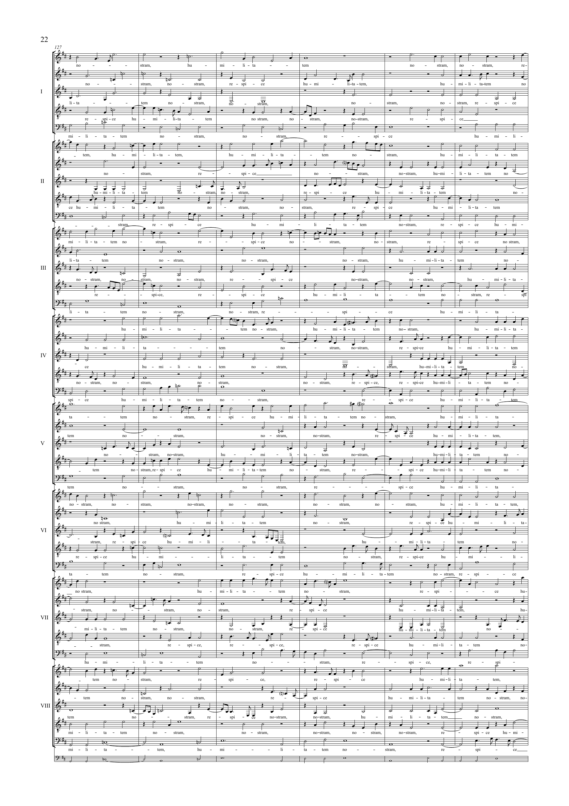

**Figure: Later tutti score page of Thomas Tallis's *Spem in alium* (c. 1570), with all eight five-part choirs active on one page.**

*Source and license:* Philip Legge, editor, [IMSLP score record](https://imslp.org/wiki/Spem_in_alium_nunquam_habui_%28Tallis%2C_Thomas%29), [CC BY-SA 2.5 Australia](https://creativecommons.org/licenses/by-sa/2.5/au/). PDF page 22 rendered without alteration except scaling. The user's supplied [IMSLP parts edition](https://s9.imslp.org/files/imglnks/usimg/3/3f/IMSLP868003-PMLP66937-Spem_in_alium_%28parts%29.pdf) remains a useful performer-oriented companion, but the full score is used here so all choirs can be seen together.

Guillaume de Machaut's *Messe de Nostre Dame* (c. 1365) represents a different relationship between line and room. the following figure is a modern public-domain score rather than a manuscript facsimile, making the contrapuntal layers immediately legible. Long values, staggered syllables, and voice crossings leave acoustic room between attacks while allowing sustained energy to overlap. When auditioning this repertoire through verbx, begin with moderate early-reflection density and a long but frequency-shaped tail; excessive broadband sustain can erase the rhythmic distinction between the voices that the notation works so carefully to preserve.

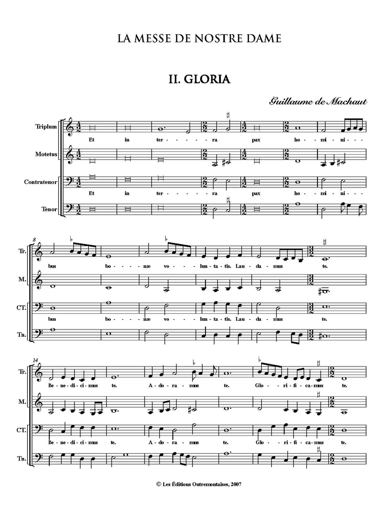

**Figure: Opening score page from Guillaume de Machaut's *Messe de Nostre Dame* (c. 1365), showing layered late-medieval polyphony in modern notation.**

*Source and license:* Guillaume de Machaut, [Wikimedia Commons scan record](https://commons.wikimedia.org/wiki/File:La_messe_de_Nostre_Dame_%28IA_imslp-messe-de-nostre-dame-machaut-guillaume-de%29.pdf), [Public Domain Mark 1.0](https://creativecommons.org/publicdomain/mark/1.0/). PDF page 1 rendered without alteration except scaling.

Gregorian chant is often described as a single melodic line, but the physical page and the performance space supply additional dimensions. the following figure shows a chant leaf preserved by Waseda University Library. The compact notation block sits within a broad field of page material, reminding the reader that pacing is carried by breath, text, liturgy, and architecture rather than by a modern metrical grid. For reverb design, chant is a stringent test: the tail should connect phrases and magnify the contour without smearing consonants into an undifferentiated wash.

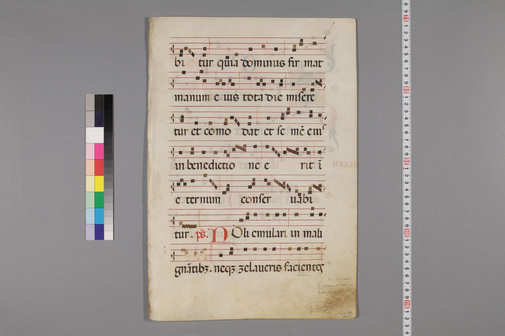

**Figure: Gregorian chant leaf with staff notation and a wide manuscript field, preserved by Waseda University Library.**

*Source and license:* Waseda University Library, [Wikimedia Commons file record](https://commons.wikimedia.org/wiki/File:WUL-bunko33_00247_Gregorian_chant.pdf), [Public Domain Mark 1.0](https://creativecommons.org/publicdomain/mark/1.0/). PDF page 1 rendered without alteration except scaling.

The manuscript leaf in the following figure brings material history closer. Red and black inks separate structural and textual functions, while the irregular surface and hand-shaped characters resist the visual uniformity of typesetting. A reverberant realization should retain that human-scale articulation. In practical terms, use enough pre-delay to keep each new phrase distinct, attenuate excessive low-mid accumulation, and compare the dry and wet versions at matched loudness. The goal is not to manufacture an imaginary universal cathedral but to hear how a line acquires dimensionality when reflections remain intelligible.


**Figure: Spanish chant manuscript leaf, photographed with a color target and scale for archival reference.**

*Source and license:* UBC Library Digitization Centre, [Wikimedia Commons file record](https://commons.wikimedia.org/wiki/File:Spanish_Chant_Manuscript_page_057_%2814151911070%29.jpg), [no known copyright restrictions](https://www.flickr.com/commons/usage/). Reproduced without alteration except scaling.

The following figure presents *Ave verum* (traditional; date unknown) in square-note notation. The visual grouping of neumes encourages the performer to think in gestures rather than isolated pitches, an idea that transfers directly to reverb listening. Evaluate whether the acoustic preserves the beginning, trajectory, and release of each gesture. If only the release remains audible, the wet path is too dominant; if no connection survives between groups, the decay or early field may be too short. This page is particularly useful for testing a small chapel preset against a large basilica preset while holding performance and loudness constant.

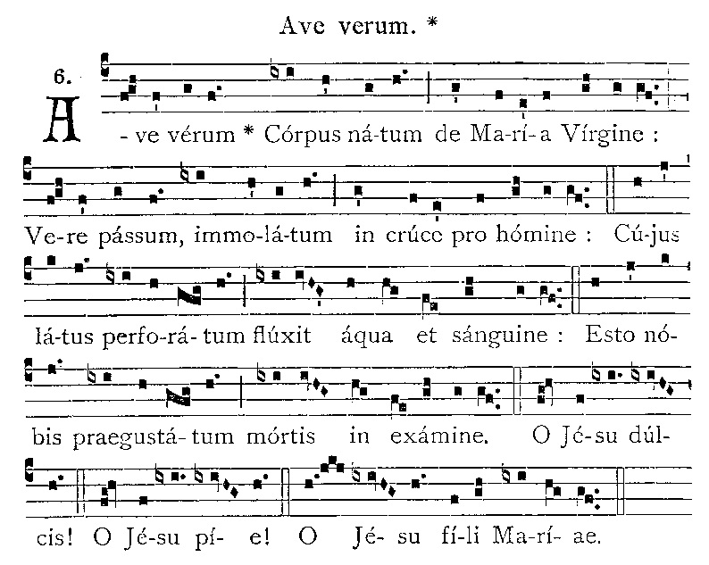

**Figure: Gregorian *Ave verum* (traditional; date unknown) in square-note notation, with grouped neumes that invite phrase-based acoustic listening.**

*Source and license:* unknown notator, [Wikimedia Commons file record](https://commons.wikimedia.org/wiki/File:Ave_verum.jpg), public domain under the file's [rights statement](https://commons.wikimedia.org/wiki/File:Ave_verum.jpg#Licensing). Reproduced without alteration except scaling.

The opening of Giovanni Pierluigi da Palestrina's *Missa Papae Marcelli* (c. 1562) in the following figure makes imitative density visible. Each voice enters into an already resonating contrapuntal field, so room decay changes not only apparent distance but also the perceived independence of lines. Use this page as a mixing exercise: increase decay until the imitation becomes difficult to follow, then recover clarity with high-frequency damping, low-frequency decay control, and a modest pre-delay rather than simply reducing the wet level. That process separates spectral congestion from reverberant envelopment.

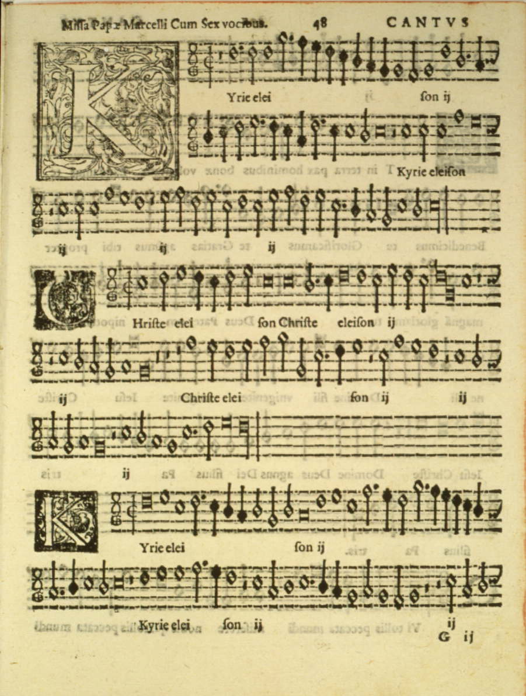

**Figure: Mensural opening of Palestrina's *Missa Papae Marcelli* (c. 1562), showing successive polyphonic entries and decorated initials.**

*Source and license:* unknown historical engraver, [Wikimedia Commons file record](https://commons.wikimedia.org/wiki/File:Mensuralnotation-Missa_papae_marcelli.jpg), [public domain](https://creativecommons.org/publicdomain/mark/1.0/). Reproduced without alteration except scaling.

Paul Dukas's *Fanfare pour précéder La Péri* (1912) supplies the brass-fanfare comparison in the following figure. The compact excerpt shows brilliant, synchronized attacks followed by held sonorities: exactly the combination that exposes a reverb's transient handling and buildup. A convincing large-space preset should let the attacks remain decisive while the sustained harmony blooms behind them. This rights-cleared excerpt is not a stand-in compositionally for Copland's *Fanfare for the Common Man* (1942); it is a reusable test stimulus for the same production questions of brass onset, low-frequency support, and monumental apparent scale.

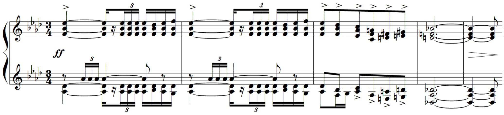

**Figure: Opening measures of Paul Dukas's *Fanfare pour précéder La Péri* (1912), arranged as a compact brass-attack and sustain test.**

*Source and license:* Flopinot2012, [Wikimedia Commons file record](https://commons.wikimedia.org/wiki/File:Dukas_-_Fanfare_pour_preceder_La_Peri_mes.1-4.png), [CC BY 4.0](https://creativecommons.org/licenses/by/4.0/). Reproduced without alteration except scaling.

César Franck's *Choral No. 3* (1890) offers a public-domain organ analogue for studying the acoustic questions raised by Messiaen's *Apparition de l'église éternelle* (1932). the following figure shows dense chordal writing, registral breadth, and pedal-supported mass. Organ and room form a coupled system: held tones continuously feed the acoustic, while release reveals the decay uncontaminated by a new attack. Compare the score against a render and listen specifically at chord changes. If the previous harmony masks the new one, shorten low-band decay or increase modulation decorrelation before reducing the total RT60.

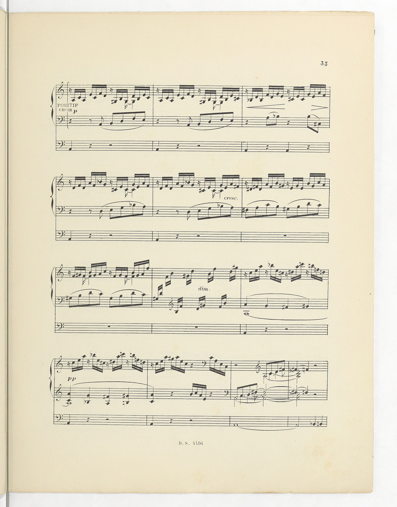

**Figure: Opening region of César Franck's *Choral No. 3* (1890) from *Trois chorals pour grand orgue* (1890), a public-domain organ-acoustics study.**

*Source and license:* Bibliotheque nationale de France, [Wikimedia Commons file record](https://commons.wikimedia.org/wiki/File:Trois_chorals_pour_grand_orgue_-_avec_pedale_obligee_-_par_Cesar_Franck_-_bpt6k326324v_%2837_of_48%29.jpg), [Public Domain Mark 1.0](https://creativecommons.org/publicdomain/mark/1.0/). Reproduced without alteration except scaling.

Giovanni Gabrieli's *In ecclesiis* (c. 1615) closes the notation sequence because its antiphonal conception points directly toward architectural placement. the following figure separates vocal and instrumental groups across the page, making alternation, overlap, and tutti arrival visually explicit. A spatial render can honor that design by giving groups distinguishable early-reflection signatures while allowing the late field to unify them. Do not confuse separation with dryness: the most persuasive result often combines localized direct sound, different short reflection patterns, and one shared enveloping decay.

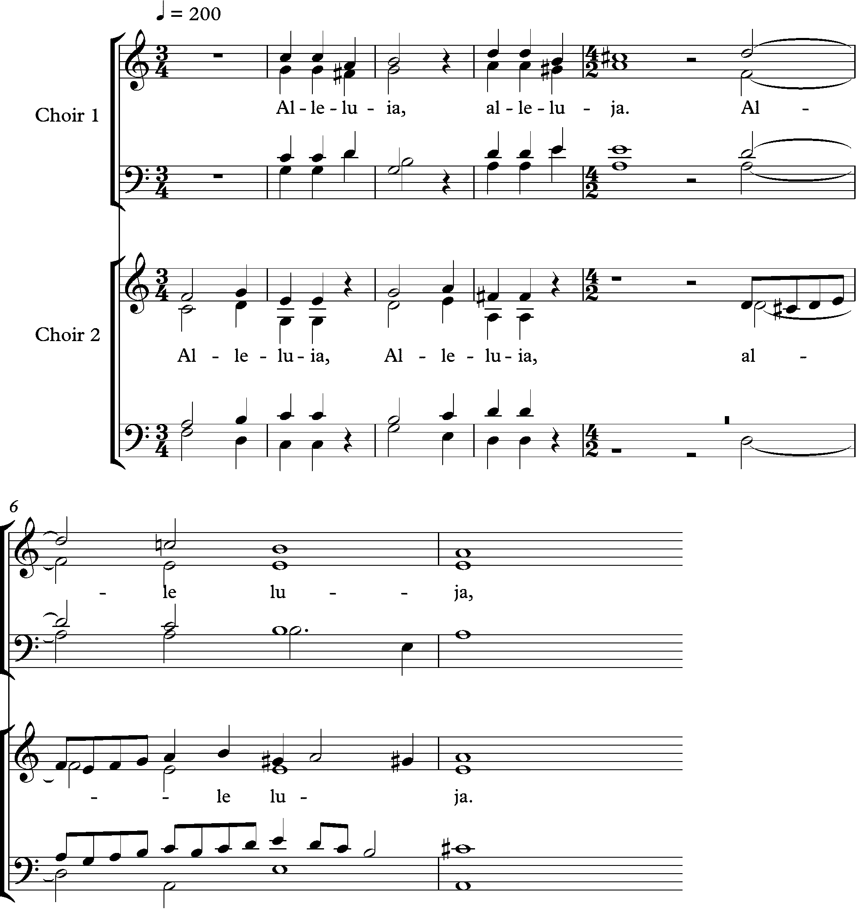

**Figure: Score excerpt from Giovanni Gabrieli's *In ecclesiis* (c. 1615), with antiphonal groups organized as a spatial dialogue.**

*Source and license:* Giovanni Gabrieli, [Wikimedia Commons file record](https://commons.wikimedia.org/wiki/File:Giovanni_Gabrieli_in_Ecclesiis.png), [public domain](https://creativecommons.org/publicdomain/mark/1.0/). Reproduced without alteration except scaling.

#### Resonant Architecture

The interior of St. Mark's Basilica in the following figure supplies an architectural counterpart to Gabrieli's notation. Galleries, domes, stone surfaces, and separated performance positions create multiple paths between source and listener. The photograph should not be read as a complete acoustic model, but it identifies the geometry a model must explain: strong local reflections, coupled volumes, long paths, and a diffuse late field. When building a St. Mark's-inspired preset, avoid representing the entire space with RT60 alone; combine pre-delay, reflection clusters, frequency-dependent decay, and multichannel placement.


**Figure: Interior of St. Mark's Basilica in Venice, showing galleries, arches, and coupled domed volumes associated with antiphonal practice.**

*Source and license:* Andrek02, [Wikimedia Commons file record](https://commons.wikimedia.org/wiki/File:Interni_basilica_san_Marco_01.jpg), [CC0 1.0](https://creativecommons.org/publicdomain/zero/1.0/). Reproduced without alteration except scaling.

The following figure looks upward through the ribbed vaults of Notre-Dame de Paris. Repeated bays establish a sequence of reflection zones rather than one undifferentiated cavity. Stone boundaries support long decay, but pillars, ribs, furnishings, and occupied surfaces scatter and absorb energy unevenly. This is why a cathedral preset benefits from temporal texture: perfectly smooth exponential decay can sound less plausible than a tail with evolving density and gentle modal variation. The photograph also encourages vertical thinking for immersive mixes, where height returns can carry vault energy without pulling the direct source upward.


**Figure: Ribbed vaults and repeated bays inside Notre-Dame de Paris, viewed as a sequence of high reflection zones.**

*Source and license:* Uoaei1, [Wikimedia Commons file record](https://commons.wikimedia.org/wiki/File:Paris_Notre-Dame_Vaults_01.JPG), [CC BY-SA 4.0](https://creativecommons.org/licenses/by-sa/4.0/). Reproduced without alteration except scaling.

Laon Cathedral's nave in the following figure makes source-listener distance easy to imagine. The central aisle supplies a long direct axis, side aisles create lateral paths, and the high vault supports delayed overhead energy. In a stereo simulation, lateral reflections often contribute more apparent width than an indiscriminate increase in wet level. In surround or Atmos-oriented production, route early energy according to plausible directions, then let the late field broaden across sides, rears, and heights. The visual symmetry is useful, but the acoustic result should still include small asymmetries that prevent a sterile mirror image.


**Figure: Nave of Laon Cathedral, with a long central axis, lateral aisles, and a high vaulted reflection field.**

*Source and license:* David Iliff, [Wikimedia Commons file record](https://commons.wikimedia.org/wiki/File:Laon_Cathedral_Nave_2,_Picardie,_France_-_Diliff.jpg), [CC BY-SA 3.0](https://creativecommons.org/licenses/by-sa/3.0/). Reproduced without alteration except scaling.

The dome of Hagia Sophia in the following figure demonstrates a radically different visual organization: a vast central volume surrounded by layered surfaces and openings. Domes can focus, redistribute, and prolong sound in ways that a rectangular-room model cannot reproduce literally. For creative reverb, the lesson is not to imitate one measured impulse response from appearance alone. Instead, use geometry-informed reflection timing, a dense late network, and restrained modulation to evoke scale while preserving musical control. Compare mono, stereo, and immersive versions to hear how overhead energy changes perceived enclosure.

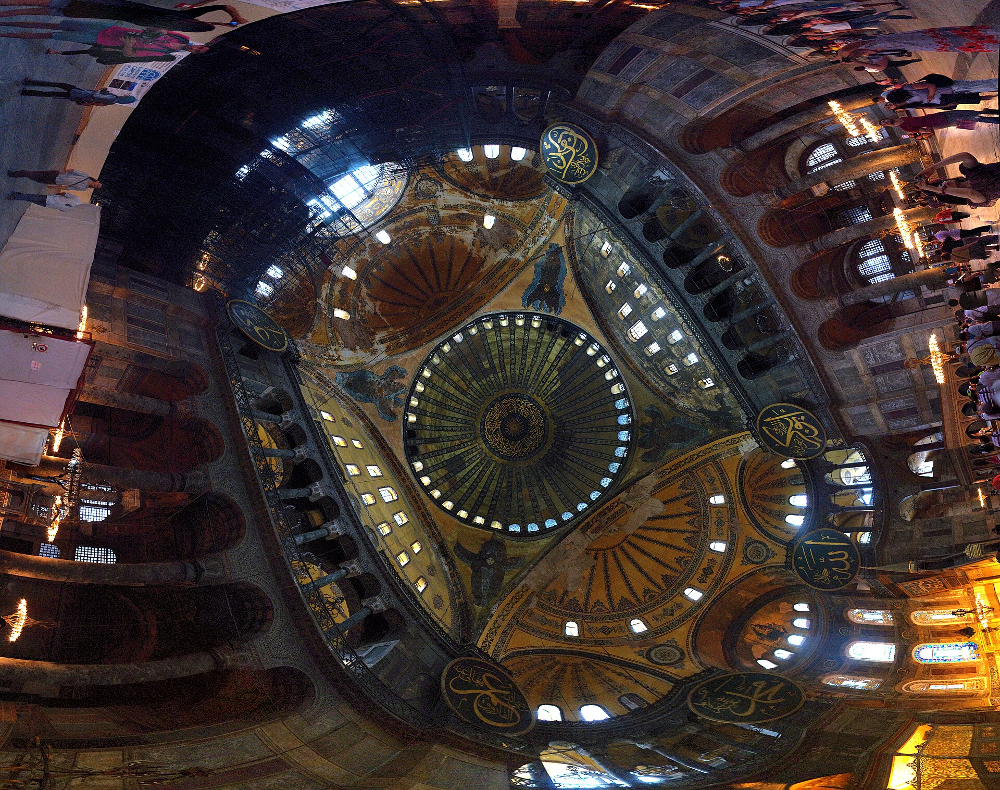

**Figure: Interior panorama of Hagia Sophia, emphasizing its central dome and layered reflecting surfaces.**

*Source and license:* Ronan Reinart, [Wikimedia Commons file record](https://commons.wikimedia.org/wiki/File:Hagia_Sophia_Interior_Panorama.jpg), [CC BY-SA 3.0](https://creativecommons.org/licenses/by-sa/3.0/). Reproduced without alteration except scaling.

Hamilton Mausoleum, shown in the following figure, is famous for an exceptionally persistent echo. Its circular plan, hard surfaces, and domed ceiling create a compact but highly reflective system. The image is a reminder that long audible persistence does not require cathedral-scale floor area; geometry and absorption are decisive. In verbx, compare a smooth long RT60 preset with a sparse repeating-echo design. The latter may better communicate the perceptual identity of a space in which discrete returns remain audible before the response becomes diffuse.

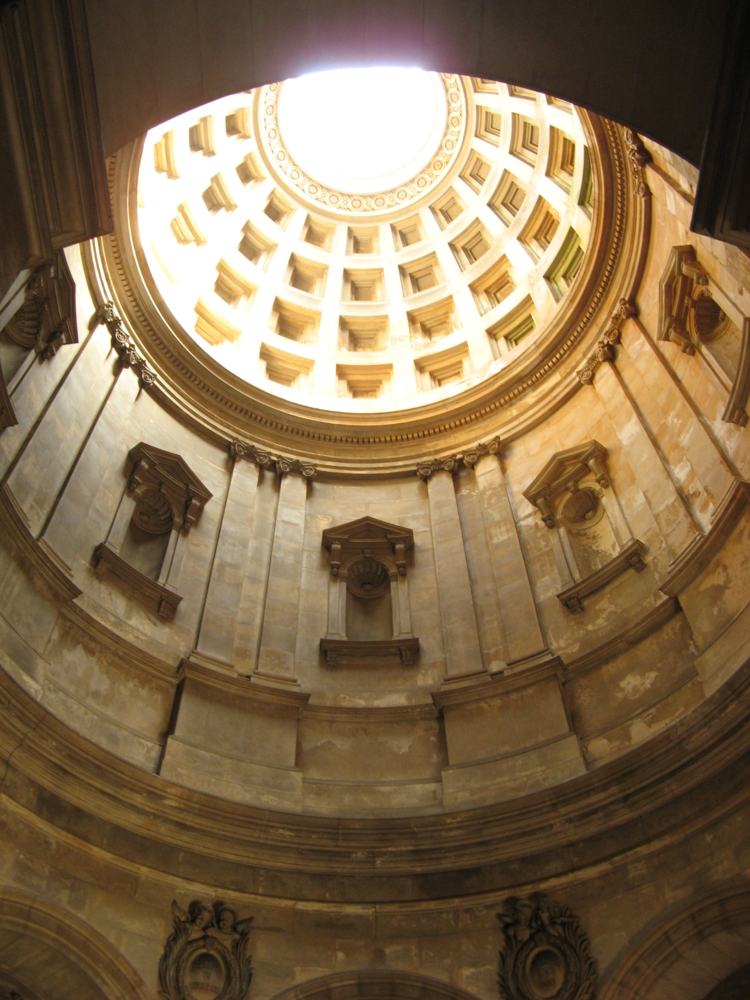

**Figure: Interior of Hamilton Mausoleum, a hard circular volume associated with an unusually persistent echo.**

*Source and license:* Supergolden, [Wikimedia Commons file record](https://commons.wikimedia.org/wiki/File:Hamilton_Mausoleum_Interior.jpg), [CC BY-SA 3.0](https://creativecommons.org/licenses/by-sa/3.0/). Reproduced without alteration except scaling.

The Inchindown oil-storage tunnel in the following figure leads toward enormous underground tanks known for extremely long decay. The narrow passage in the photograph is not itself the full resonant tank, but it conveys the scale, hard boundaries, and isolation of the complex. Long-tail rendering must be bounded operationally: estimate output duration before processing, communicate progress, and distinguish a one-hour RT60 parameter from an infinite or frozen mode. Musically, use such spaces as evolving instruments rather than default rooms; a single impulse can occupy an entire phrase or section.

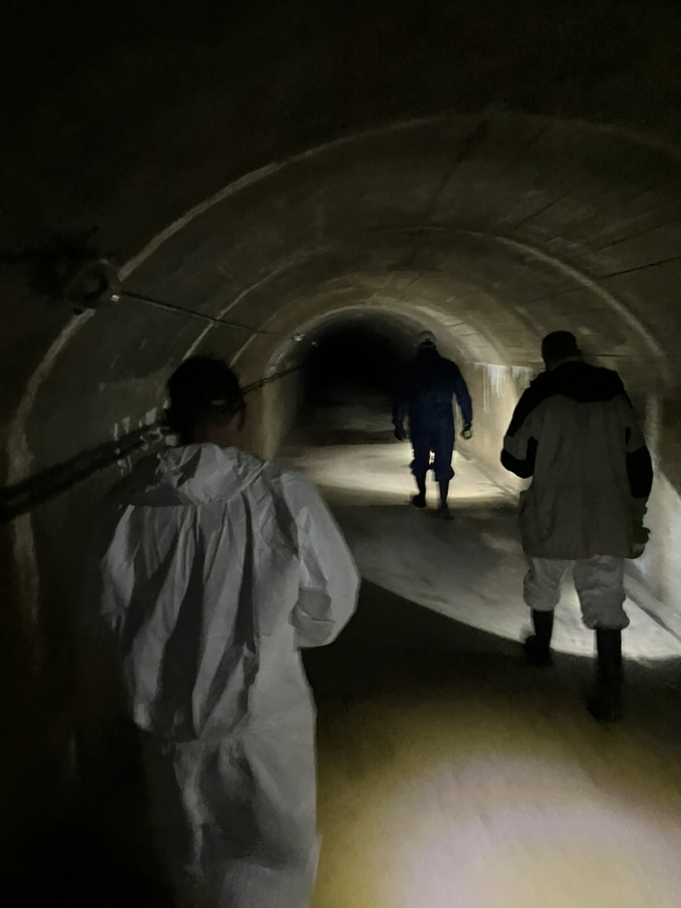

**Figure: Access tunnel in the Inchindown underground oil-storage complex, whose large hard tanks are associated with exceptionally long reverberation.**

*Source and license:* Dave Thompson, [Wikimedia Commons file record](https://commons.wikimedia.org/wiki/File:Inchindown_Oil_Tanks_Tunnel_-_geograph.org.uk_-_7584066.jpg), [CC BY-SA 2.0](https://creativecommons.org/licenses/by-sa/2.0/). Reproduced without alteration except scaling.

The following figure shows the interior of a hand-hewn grain silo on Cockatoo Island. Unlike a finished concert hall, the cavity exposes rough stone and an irregular section. Those surfaces can scatter high frequencies while the enclosed volume supports resonant buildup. A grain-silo-inspired reverb should therefore avoid the generic equation of “industrial” with metallic brightness. Start from a dark, uneven decay, add a few strong early paths, and audition percussive material for flutter or ringing. The result can be intimate and strange even when the nominal decay is not extreme.

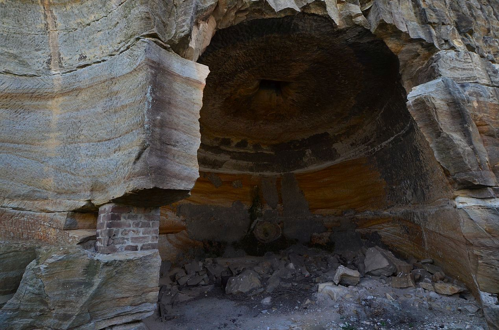

**Figure: Hand-hewn interior of a Cockatoo Island grain silo, with rough stone boundaries and an irregular resonant cavity.**

*Source and license:* Harryp2, [Wikimedia Commons file record](https://commons.wikimedia.org/wiki/File:Cockatoo_Island_convict_grain_silo.jpg), [CC BY-SA 4.0](https://creativecommons.org/licenses/by-sa/4.0/). Reproduced without alteration except scaling.

York Minster's nave in the following figure completes the architectural sequence with a broad frontal view. The image reveals strong axial depth, tall lateral boundaries, and extensive overhead volume while retaining visually complex scattering surfaces. Use it to separate three controls that are often collapsed: apparent source distance, room width, and decay time. More pre-delay can bring a source forward even in a long tail; stronger lateral early energy can widen the room without lengthening it; and multiband decay can preserve warmth without sacrificing consonant clarity.


**Figure: Nave of York Minster, viewed along its principal axis with lateral and overhead reflection regions clearly visible.**

*Source and license:* Michael D. Beckwith, [Wikimedia Commons file record](https://commons.wikimedia.org/wiki/File:York_Minster_Nave.jpg), [CC0 1.0](https://creativecommons.org/publicdomain/zero/1.0/). Reproduced without alteration except scaling.

#### Mechanical and Laboratory Reverberation

The EMT 140 in the following figure makes plate reverberation physically legible. An electromechanical driver excites a large suspended steel plate, pickups capture its vibration, and damping changes the decay. The device is not a miniature room; it is a distributed resonant surface whose dense modal response produces a smooth, characteristic tail. When designing a plate-like algorithm, prioritize rapid density growth, controlled low-frequency behavior, and a bright but non-grainy decay. The photograph also explains why a classic plate occupies substantial physical space even though a plug-in reduces it to a few controls.

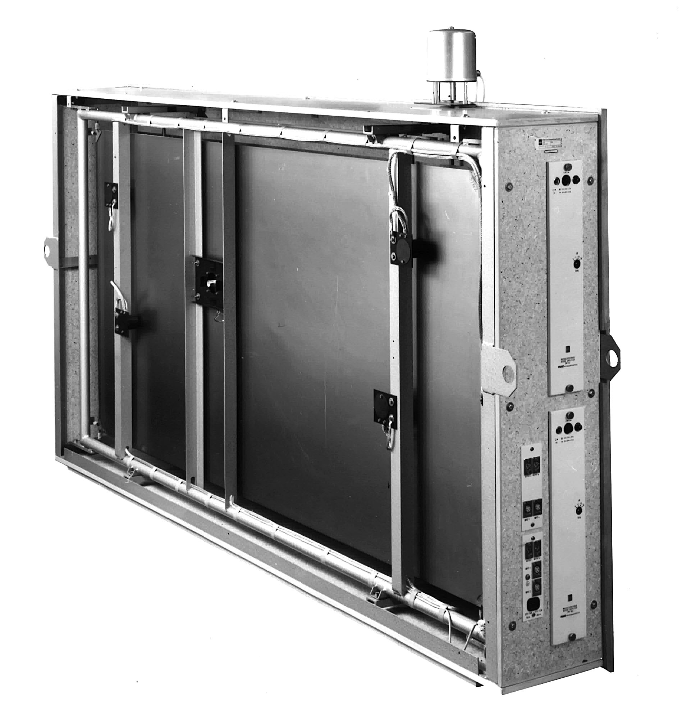

**Figure: EMT 140 plate reverberator, showing the large framed steel-plate assembly used to create dense artificial decay.**

*Source and license:* EMT-Archiv-Lahr, [Wikimedia Commons file record](https://commons.wikimedia.org/wiki/File:EMT_140.jpg), [CC BY-SA 4.0](https://creativecommons.org/licenses/by-sa/4.0/). Reproduced without alteration except scaling.

The following figure removes the enclosure from a spring-reverb tank so its transducers and parallel springs are visible. A driver launches torsional waves into the springs; reflections, dispersion, and coupling produce the familiar lively, sometimes “drippy” response. Spring behavior is strongly source-dependent: impulsive guitar or percussion reveals boing and chirp, while sustained material can become a diffuse halo. A digital model should expose enough control over dispersion, damping, and nonlinear drive to move between subtle coloration and obvious effect rather than treating every spring as one fixed preset.

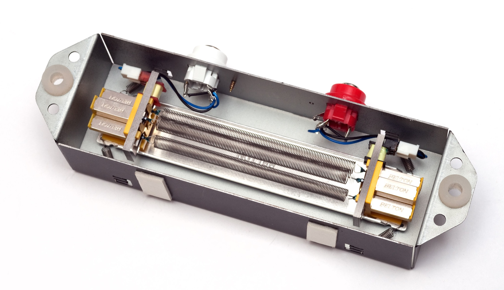

**Figure: Open spring-reverb tank with parallel springs, input driver, and output pickup visible.**

*Source and license:* Ashley Pomeroy, [Wikimedia Commons file record](https://commons.wikimedia.org/wiki/File:Spring_Reverb_8325.jpg), [CC BY-SA 4.0](https://creativecommons.org/licenses/by-sa/4.0/). Reproduced without alteration except scaling.

The compact Doepfer A-199 spring assembly in the following figure shows how the same principle scales into modular synthesis. The mechanical element is modest, but feedback routing, equalization, and excitation level can turn it into a playable resonator. This suggests a productive plug-in design principle: physical-model parameters should remain available on an Expert page while performance macros expose musically stable combinations. For a spring preset, map one macro to input drive and damping together, another to feedback and tone, and retain a safety limiter because resonant feedback can rise rapidly.

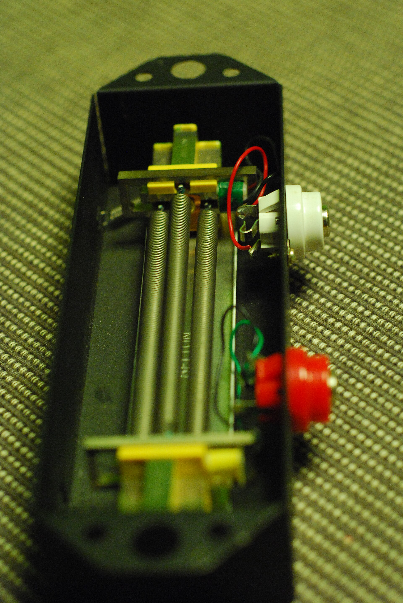

**Figure: Compact spring-reverb assembly for a Doepfer A-199 modular-synthesizer module.**

*Source and license:* GeschnittenBrot, [Wikimedia Commons file record](https://commons.wikimedia.org/wiki/File:Spring_reverb_for_Doepfer_A-199.jpg), [CC BY-SA 2.0](https://creativecommons.org/licenses/by-sa/2.0/). Reproduced without alteration except scaling.

The following figure identifies an O. C. Electronics Folded-Line reverberation device from its exterior label. Folded acoustic or mechanical paths pursue a familiar engineering goal: obtain a longer effective propagation path inside a compact enclosure. The label is visually modest, but it introduces an important conceptual bridge from physical delay lines to digital delay networks. In both cases, topology determines recurrence. A model becomes more convincing when delays, feedback gains, filtering, and coupling are treated as a system rather than as independent decorative controls.

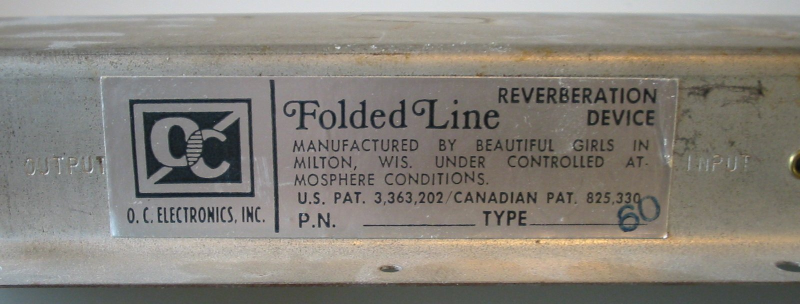

**Figure: Exterior identification label of an O. C. Electronics Folded-Line reverberation device.**

*Source and license:* Grebe, [Wikimedia Commons file record](https://commons.wikimedia.org/wiki/File:Reverb-6.jpg), [CC BY-SA 3.0](https://creativecommons.org/licenses/by-sa/3.0/). Reproduced without alteration except scaling.

The opened device in the following figure reveals the internal folded element alluded to by the label. This paired view is useful because it distinguishes product description from mechanism. In a digital feedback delay network, long physical paths become sample delays, junction behavior becomes a mixing matrix, and losses become filters and gains. Yet the physical object still teaches restraint: a small number of purposeful paths can create a strong identity. More delay lines are not automatically better if their lengths and couplings produce audible regularity or unstable buildup.

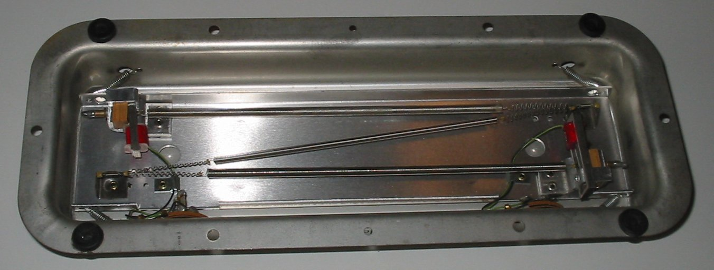

**Figure: Interior of an O. C. Electronics Folded-Line reverberation device, exposing its compact folded propagation element.**

*Source and license:* Grebe, [Wikimedia Commons file record](https://commons.wikimedia.org/wiki/File:Reverb-4.jpg), [CC BY-SA 3.0](https://creativecommons.org/licenses/by-sa/3.0/). Reproduced without alteration except scaling.

The TU Dresden echo chamber in the following figure is an intentionally reflective acoustic room. Irregularly oriented panels disrupt simple parallel-wall paths and help distribute energy through many directions. Such a chamber is useful for material measurements and for generating dense reverberant fields under controlled conditions. The image clarifies why diffusion is not synonymous with decay: scattering changes the direction and density of reflections, while absorption and volume primarily govern energy loss. In verbx, adjust diffusion while holding RT60 constant to hear that distinction directly.

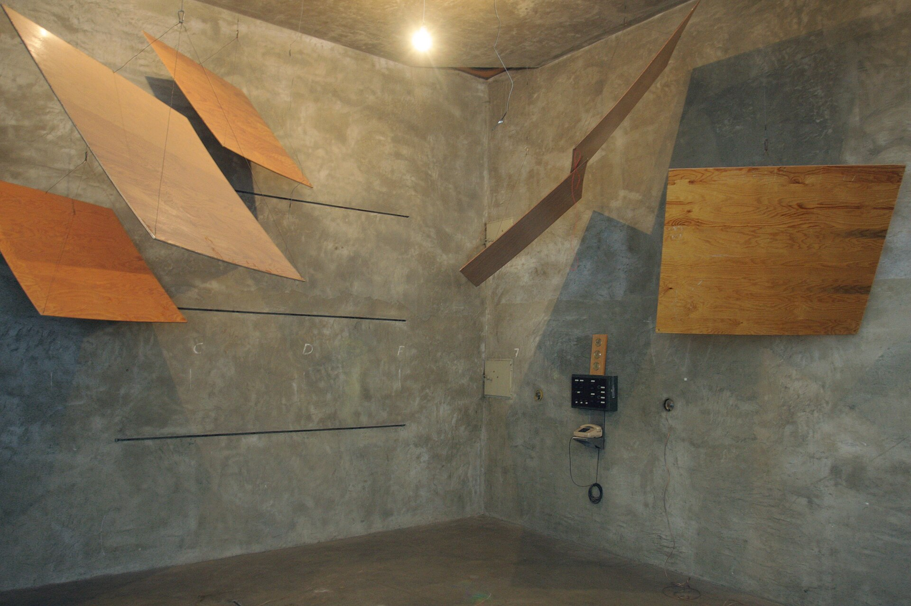

**Figure: Acoustic echo chamber at TU Dresden, with hard boundaries and angled scattering panels.**

*Source and license:* Henry Muhlpfordt, [Wikimedia Commons file record](https://commons.wikimedia.org/wiki/File:Hallraum_TU_Dresden_2009-06-21.jpg), [CC BY-SA 3.0](https://creativecommons.org/licenses/by-sa/3.0/). Reproduced without alteration except scaling.

The following figure shows the horn room of a reverberant acoustic test facility. This is not a musical echo chamber: its powerful horns create controlled high-level diffuse sound fields for aerospace testing. The distinction is instructive. Reverb metrics describe the response of a source-room-receiver system, so source directivity, bandwidth, level, and measurement position matter. A room that is excellent for qualification testing may be unusable for music, while its measurement discipline remains valuable. When validating an algorithm, specify stimulus, level, sample rate, channel geometry, and analysis window rather than reporting RT60 alone.

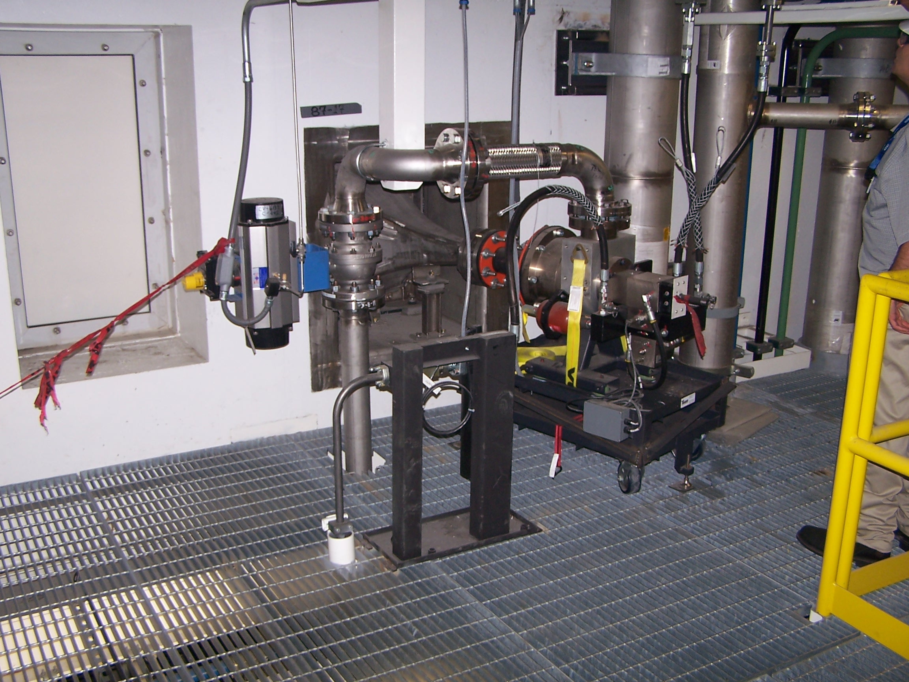

**Figure: Horn room in a reverberant acoustic test facility, where high-output sources excite a controlled diffuse field.**

*Source and license:* Illudium Pu-36, [Wikimedia Commons file record](https://commons.wikimedia.org/wiki/File:RATF_Horn_Room.JPG), [CC BY-SA 3.0](https://creativecommons.org/licenses/by-sa/3.0/). Reproduced without alteration except scaling.

The IETR chamber in the following figure is an electromagnetic reverberation chamber, not an audio room. It belongs here as a carefully labeled comparative image: angled conducting surfaces and stirring structures create a statistically distributed field for radio-frequency measurements. The analogy to acoustic diffusion is conceptually useful, but the wave impedances, boundary conditions, transducers, and frequency scales are different. Keeping that boundary explicit is good scientific practice. The shared lesson is that a “diffuse field” is an experimental objective produced by geometry, source behavior, and averaging, not a visual style or a single reverb knob.

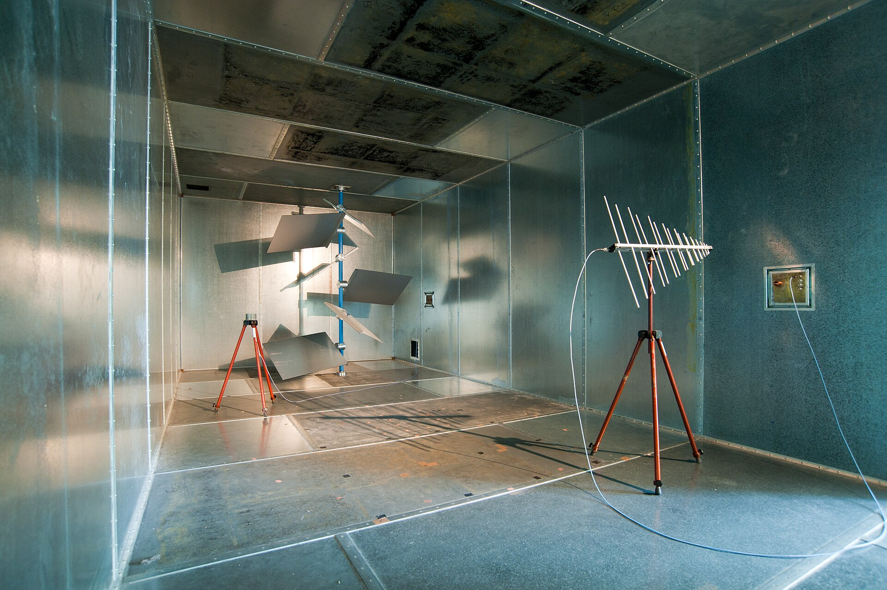

**Figure: Electromagnetic reverberation chamber at IETR, included as a labeled cross-domain comparison rather than an acoustic reverb room.**

*Source and license:* Manuamador, [Wikimedia Commons file record](https://commons.wikimedia.org/wiki/File:Reverberation_chamber.jpg), [CC BY-SA 3.0](https://creativecommons.org/licenses/by-sa/3.0/). Reproduced without alteration except scaling.

#### Reuse and Verification

The repository copies are layout derivatives only: they have been rendered from source PDFs where noted, resized, or recompressed without creative alteration. Public-domain and CC0 images may be reused under their source statements. Creative Commons images retain their individual attribution and share-alike requirements; the surrounding verbx text and software do not replace those licenses. Before republishing an image outside this guide, follow its source-page link and verify the current file history, jurisdictional notice, attribution wording, and license version. The checked-in attribution ledger records the exact local filename used by the build so later replacements cannot silently inherit an unrelated credit.

### Musical Examples

The musical examples in this section use synthetic study recordings shipped in
`examples/audio/`. They are not excerpts from the named historical works discussed in
the listening appendix. Each sonogram plots time in seconds along the horizontal axis,
frequency in hertz on a logarithmic vertical axis, and level in decibels relative to
the loudest time-frequency cell. Light gold marks stronger energy; dark green marks
weaker energy. A sonogram cannot replace listening, but it makes note overlap, spectral
decay, and sustained resonances visible. Every paired figure uses one shared time scale
from zero to the longer recording's endpoint. When the shorter recording ends, its panel
continues at the –80 dB floor instead of stretching the source to fill the plot.

#### Listening Method: Compare Dry, Wet-Only, and Context

For every example, make three passes. First hear the dry source and mark attacks,
releases, rests, and registral changes. Then hear the wet-only return and ask what the
space is doing as an independent musical layer. Finally hear the mix and decide whether
the return supports or contradicts the source. A tail can be beautiful alone and still
damage a phrase by masking its next attack.

Monitor at a stable level. Long tails invite level creep because their peaks are often
lower than the dry source while their integrated energy is high. Compare at matched
loudness, leave headroom, and listen through the final decay rather than stopping at
the last written note. The end of the tail is part of the example.

#### Example 1: The Click Reveals the Room

An impulse is the most analytical source because it contains no phrase to hide the
response. The dry click below occupies a narrow time slice across a broad frequency
range. Its reverberated version reveals pre-delay, early clusters, the transition to a
dense field, and the final frequency-dependent decay. Listen to the shipped
[`dry_click.wav`](examples/audio/dry_click.wav) and
[`dry_click_reverbed.wav`](examples/audio/dry_click_reverbed.wav) before studying the
figure.

The sonogram below makes the room's temporal spreading visible. The dry event is nearly
vertical; the wet event extends horizontally as reflected energy persists.


**Figure: Dry click compared with its reverberated response.**

**How to read this figure.** The click's broadband stripe is an excitation, not a
musical pitch. In the reverberated panel, later vertical traces indicate discrete
reflections; the smoother horizontal fade is the late field. If the late field shows
isolated horizontal ridges, the algorithm is emphasizing modes. If the entire panel
stays uniformly bright, the return may be too dense or too compressed. A good design
need not look perfectly smooth, but visible structures should correspond to an intended
sonic character rather than accidental ringing.

Use the click when changing matrix family, allpass count, or delay distribution. It is
less forgiving than music and quickly exposes flutter, repeated periods, and abrupt
gates. Then return to music: a technically smooth click response is only useful if the
result serves phrasing.

#### Example 2: Piano or Harmonic Phrase in a Hall

A chordal phrase tests harmonic continuity. Short room settings add body around each
attack; hall settings connect notes across releases and rests. The direct signal must
remain intelligible enough that the harmony changes when the player changes it, not one
beat later. This tension is central to piano, harp, mallet percussion, and plucked
strings.

The paired sonograms below compare the shipped dry musical phrase with its hall render.
The same harmonic ridges appear in both panels, but the hall connects them and extends
the final cadence beyond the source.


**Figure: Harmonic phrase before and after hall reverberation.**

**How to read this figure.** In the dry panel, each chord has a clear left edge and a
visible release. In the hall panel, the ridges continue between attacks, especially in
the low-middle register. That continuation is musical glue until it obscures harmonic
rhythm. The darker high-frequency area near the end shows damping: upper partials leave
before lower energy. If every band decayed equally, the hall would tend to sound bright
and synthetic; if lows persisted far longer, cadences could become muddy.

Reproduce a controlled version with:

```bash
verbx render examples/audio/realistic_music_dry.wav /tmp/music_hall.wav \
  --engine algo --rt60 2.4 --pre-delay-ms 24 \
  --wet 0.38 --dry 0.78 --fdn-lines 16 --fdn-matrix hadamard \
  --lowcut 90 --highcut 11000 --target-peak-dbfs -1
```

For a Romantic cadence, increase RT60 before increasing wet level. For a contrapuntal
passage, reduce wet level and length, or use ducking so each attack remains legible.
Treat pre-delay as phrasing space: 20–35 ms can separate the hammer or pluck from the
room without making the response feel like a discrete echo.

#### Example 3: Drums, Early Reflections, and Groove

Percussion makes the difference between early reflections and late decay obvious. Early
energy changes apparent drum size and room boundary; late energy determines how long
the groove occupies the mix. A short, bright room can make a snare feel larger without
smearing the kick pattern. A cathedral tail can turn the same rhythm into overlapping
waves whose accents are defined by the return rather than the source.

The following sonograms compare a dry drum pattern and a room render. The attacks remain
vertical and separately readable, while low-level energy fills the gaps.


**Figure: Drum transients before and after a short room response.**

**How to read this figure.** The dry panel has dark space between attacks. The room
panel retains vertical transients but adds short horizontal fans after them. Those fans
are long enough to supply body and short enough to preserve subdivision. Watch the
low-frequency region: excessive persistence there can make a kick drum appear longer
without sounding more spacious. A return high-pass filter often improves groove more
effectively than shortening the entire RT60.

Try a compact room and a tempo-related pre-delay:

```bash
verbx render examples/audio/realistic_drums_dry.wav /tmp/drums_room.wav \
  --engine algo --rt60 0.85 --pre-delay 1/64 --bpm 120 \
  --wet 0.26 --dry 0.88 --fdn-lines 8 --fdn-matrix circulant \
  --lowcut 140 --highcut 9000
```

The note-value pre-delay makes the experiment repeatable at a new tempo. Do not assume
that synchronizing always sounds better: a slightly non-metric onset can keep the room
from reinforcing every beat in the same way.

#### Example 4: Cathedral-Scale Percussion

Very long percussion reverb changes the hierarchy of events. The first strike excites
a field that is still active when later strikes arrive. Each new attack is therefore
both a source event and a modulation of an existing texture. In a physical cathedral,
architectural asymmetry and air absorption prevent perfect repetition. In an algorithm,
matrix choice and time variation must perform some of that work.

The sonogram below shows the shipped cathedral drum study. Broad attacks enter a field
whose low and middle bands remain active for many seconds.


**Figure: Percussion rendered through an eight-second Hadamard FDN cathedral.**

**How to read this figure.** Vertical energy identifies new strikes; horizontal clouds
show accumulated room memory. Notice that successive attacks do not reset the field.
They add energy to frequencies already decaying. The result can create a slow harmonic
rhythm unrelated to the written drum rhythm. This is why long percussion reverbs often
benefit from lower wet level, greater high-frequency damping, and automation that
allows selected accents to enter the long return.

This listening problem appears dramatically in Berlioz's *Grande Messe des morts* (1837) and
in antiphonal repertory designed for large architecture: distance and decay become
orchestration. A production need not imitate a specific church to learn the lesson.
Send only structural attacks to the longest return and let smaller notes articulate the
foreground.

#### Example 5: Voice, Consonants, and Vowels

Voice contains two different reverb tests. Consonants are short, often broadband, and
carry intelligibility. Vowels are sustained, harmonic, and carry pitch and identity.
A return that flatters vowels can mask consonants; a setting optimized for speech
clarity may feel too dry for lyric singing.

The paired sonograms below show dry speech and a room render. Read the short upper-band
bursts as consonant activity and the horizontal harmonic stacks as vowels.


**Figure: Speech articulation before and after room reverberation.**

**How to read this figure.** The room extends vowel bands and places a low-level veil
after consonant bursts. Intelligibility decreases when that veil is still strong at the
next consonant. Pre-delay can protect the initial consonant; ducking can protect every
active syllable; high-frequency damping can prevent sibilance from turning into a
persistent hiss. None of those changes requires abandoning a long lyrical tail.

For a vocal send, start with:

```bash
verbx render vocal.wav /tmp/vocal_space.wav \
  --engine algo --rt60 2.8 --pre-delay-ms 32 \
  --wet 0.42 --dry 0.78 --duck --duck-attack 12 --duck-release 260 \
  --duck-strength 0.72 --duck-floor 0.20 --lowcut 160 --highcut 9500
```

The release time is a musical control. A short release lets the tail rise between
syllables; a longer release waits for the end of a line. Automate return level at phrase
ends rather than forcing one static setting to solve every word.

#### Example 6: Plate-Like Brightness on Speech and Singing

A plate-like reverb is dense early, smooth, and often bright. It does not need to
convince the listener that the singer occupies a literal metal plate. Its musical role
is to extend the voice without introducing obvious room geometry. Circulant and other
regular FDN matrices can approach this character when delay distribution, diffusion,
and damping are carefully controlled.

The single sonogram below shows the shipped plate speech study. Sibilant energy spreads
into a fine upper-band tail while vowels remain stronger lower in the spectrum.


**Figure: Speech rendered through a bright circulant-FDN plate study.**

**How to read this figure.** The upper spectrum remains active after several consonants,
but it does not dominate the complete tail. A bright return feels polished when that
energy is diffuse; it feels brittle when isolated high-frequency modes ring. Compare
the visual smoothness with what you hear. A sonogram may show continuous energy while
the ear still detects a metallic repetition, especially on headphones.

Plate-like returns work well as a second vocal layer. Keep a darker room or chamber for
depth, then add the bright plate at lower level for sustain. The two returns should have
different onset and decay profiles; duplicating the same timing merely raises level.

#### Example 7: Sparse Music and the Composition of Silence

Sparse music reveals the full envelope of every return. A single note is followed by a
field, then by the field's disappearance. The listener can hear modulation, modal
beating, noise-floor behavior, and the exact moment the processor closes or truncates.
In dense music these details hide under new events; in sparse music they become form.

The upper panel below is a sparse-note room study, while the lower panel is a phase-drum
study. Together they show how the same idea of “space” must behave differently when
silence is structural versus when pulse is continuous.


**Figure: Sparse-note room behavior compared with a dense phase-rhythm field.**

**How to read this figure.** In the sparse panel, each note owns a visible decay region;
the dark gaps are compositional material. An abrupt cutoff would be obvious. In the
rhythmic panel, repeated attacks create nearly continuous energy, so the return is judged
by groove, masking, and spectral accumulation instead. The same RT60 number has
different consequences because the excitation density differs.

The practical lesson is to set reverb while hearing the actual event density. A preset
auditioned on sustained pads says little about its behavior on isolated piano harmonics.
For music in the orbit of Morton Feldman's spacious pacing, let the tail complete its
gesture. For repeating-process textures, decide whether the room should reveal the
process or fuse it into a single surface.

#### Example 8: Antiphony, Choir, and Architectural Counterpoint

Thomas Tallis's *Spem in alium* (c. 1570) and Giovanni Gabrieli's *In ecclesiis* (c. 1615) demonstrate that
space can participate in counterpoint. Groups answer across distance; reflections bind
the ensemble while directional differences preserve identity. A stereo reverb can
suggest some of this behavior, but an immersive or multichannel design can make
direction and decay independent compositional parameters.

Begin by separating source groups before adding reverb. Give each group a distinct send
level, pre-delay, or early-reflection pattern while sharing a coherent late field. If
every group receives an unrelated complete room, the image may become wide but cease to
feel like one architecture. If every group receives an identical mono return, the
counterpoint may collapse toward the center.

A useful exercise is to route four phrase groups into one long FDN, vary only their
input projections or channel positions, and keep the late feedback network common. The
shared tail supplies architectural identity; the distinct injections preserve
antiphonal placement. At cadences, automate the longest return upward only after the
last consonant so the room completes the formal punctuation.

#### Example 9: Drone, Organ Pedal, and Slow Harmonic Time

Sustained sources do not reveal RT60 directly because they keep feeding the room. They
reveal spectral equilibrium: which bands accumulate, which modes beat, and whether the
network remains stationary or slowly evolves. Organ pedals, bowed tones, feedback
guitar, and electronic drones can expose a one-decibel imbalance that short sources
never reveal.

The paired sonograms below compare a layered ambient study and a long-form drone study.
The horizontal bands make slow changes visible; the important information is not only
how long energy lasts, but how its distribution changes while the source continues.


**Figure: Two sustained musical textures viewed across slow harmonic time.**

**How to read this figure.** Persistent horizontal ridges represent stable harmonic or
modal energy. Changes in brightness reveal entries, exits, or spectral drift. A reverb
on this material should avoid pinning the entire texture to a few accidental resonances.
Time-varying matrices, slight modulation, or tonal correction can distribute energy
without turning the return into an obvious chorus.

In repertoire such as Ligeti's *Lux Aeterna* (1966) or Messiaen's *Et exspecto resurrectionem
mortuorum*, spectral mass, register, and architectural decay shape the listener's sense
of time. For an electronic analogue, automate matrix motion more slowly than the phrase
rate. Fast motion reads as modulation; slow motion reads as a changing room.

#### Example 10: Recirculation as Musical Form

Repeatedly feeding a recording back through a room or a reverb gradually replaces the
source's detailed spectrum with the resonances of the system. Alvin Lucier's *I Am
Sitting in a Room* makes this transformation the complete form. Tape-loop and delay
practices create related processes: the return is not decoration but a memory that
re-enters the next generation.

The sonograms below compare a tape-loop-style study and a room-recirculation study. Both
show source detail consolidating into longer spectral bands.


**Figure: Recirculation processes that turn a source into a resonant field.**

**How to read this figure.** Early in each panel, attacks and pitch changes remain
distinct. Later, selected bands become dominant because every pass reinforces the same
system. A perfectly neutral loop would preserve the source indefinitely, but musical
recirculation depends on selective memory. The engineering task is to make that
selection intentional and bounded.

With verbx, `--repeat` performs sequential reprocessing. Start conservatively, render
to floating point, and measure every generation:

```bash
verbx render source.wav /tmp/room_generation.wav \
  --engine algo --rt60 3.5 --repeat 5 --wet 0.86 --dry 0.14 \
  --fdn-lines 16 --fdn-matrix hadamard --lowcut 80 \
  --out-format float32 --json-out /tmp/room_generation.json
```

The JSON sidecar is part of the composition record. It lets another listener reproduce
the transformation rather than relying on a screenshot of controls.

#### Example 11: Dense Guitar and Deep-Listening Fields

Dense broadband material and slowly unfolding spatial material can both fill a
sonogram, but they challenge reverb differently. A dense guitar field may already
contain distortion, modulation, and layered delays; a new long return can reduce depth
by filling every remaining gap. A deep-listening texture may leave more room for the
reverb to reveal low-level spatial changes.

The paired sonograms below show these contrasting fields. The upper panel is dense and
continuous; the lower panel contains more visible internal movement and open regions.


**Figure: Dense production field compared with a spacious deep-listening study.**

**How to read this figure.** In the dense panel, added reverb changes envelope and width
more readily than it reveals a new room; there is little unoccupied spectrum. In the
lower panel, the return can articulate trajectories and decays. Use this comparison to
decide whether a source needs more duration or merely a different spatial envelope.

For dense material, automate narrow throws, filter the return aggressively, or place
only selected stems in the longest space. For sparse spatial material, preserve dynamic
range and inspect the noise floor: the quietest part of the tail may be where motion is
most audible.

#### Example 12: Shimmer as Register, Not Glitter

Shimmer pitch-shifts part of the wet field and feeds or blends it back into the return.
The obvious octave-up setting can sound decorative when used continuously, but it
becomes compositional when treated as register. A low source can seed a high sustained
line; an upper melody can generate a halo that changes harmony at phrase boundaries.

The sonogram below shows the shipped shimmer study. New energy appears above the source
bands and persists through the tail.


**Figure: Octave-shifted feedback extending a musical phrase into the upper register.**

**How to read this figure.** Compare the bright upper ridges with the lower source
energy that excites them. Shimmer is not a broadband treble boost: it creates new
frequency relationships. Excess feedback makes these upper bands accumulate and can
change the harmony. A low-cut before the pitch shifter prevents bass energy from
producing a crowded octave layer; a high-cut after it can soften alias-like brightness.

```bash
verbx render music.wav /tmp/music_shimmer.wav \
  --engine algo --rt60 10 --wet 0.78 --dry 0.34 \
  --shimmer --shimmer-semitones 12 --shimmer-mix 0.34 \
  --shimmer-feedback 0.68 --shimmer-lowcut 280 --shimmer-highcut 12000 \
  --target-peak-dbfs -2
```

Write the shimmer entry into the arrangement. Bring it in for one cadence, a bridge,
or the final resonance rather than leaving it at one level for the entire piece.

#### Example 13: Freeze and the Harmonic Field

Freeze captures a segment and sustains it through a near-static or very long loop. The
source segment becomes the “instrument body” of the frozen field. A capture containing
one clean interval tends to remain legible; a capture spanning a chord change can
create beating or harmonic ambiguity. The best capture point is therefore a musical
decision, not just a technical one.

The following sonogram shows the shipped frozen-music study. It extends for more than
half a minute, making the gradual loss and redistribution of energy easy to see.


**Figure: A captured musical interval sustained as a near-infinite reverberant field.**

**How to read this figure.** The strongest initial excitation sits at the left, but
stable harmonic bands continue across much of the panel. Their slow decline distinguishes
this bounded freeze from a perfectly lossless loop. A truly infinite mode must still
manage DC, denormals, modulation, and output level; “infinite” describes sustain intent,
not permission for uncontrolled numerical growth.

Compose a transition by freezing the last harmony of one section, changing the dry
material underneath it, and releasing the field only after the new harmony has become
stable. The listener hears the previous section as literal acoustic memory.

#### Example 14: Send/Return Reverb as Counterpoint

Insert reverb and send/return reverb encourage different musical thinking. An insert
asks how a processor transforms one track. A send asks what independent spatial layer
several sources contribute to. The return can have its own dynamics, automation,
equalization, and formal entrances.

The Mermaid signal-flow figure below shows the dry and wet paths as parallel musical
voices. The return is intentionally labeled as counterpoint rather than residue.

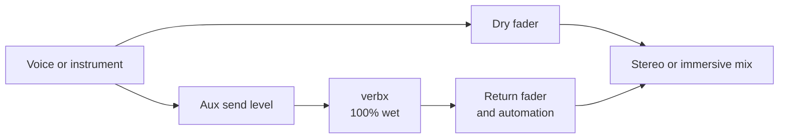
```mermaid
%% verbx-static: docs/assets/reverb_primer/10_musical_send_return.png
flowchart LR
    S["Voice or instrument"] --> D["Dry fader"]
    S --> A["Aux send level"]
    A --> V["verbx<br/>100% wet"]
    V --> R["Return fader<br/>and automation"]
    D --> M["Stereo or immersive mix"]
    R --> M
```

**Figure: Musical send and return treated as parallel articulation and spatial counterpoint.**

**How to read this figure.** The dry fader controls foreground articulation. The aux
send controls how much each source excites the shared space. The return fader controls
the room as a layer after all excitations have combined. Automating the send changes
what enters memory; automating the return changes how much of that memory is heard.
Those gestures are not equivalent. A post-phrase send throw produces a different tail
than raising a return that has been accumulating all along.

### DSP Overview

Digital reverberation begins with an impulse response $h[n]$: the output produced by a
unit impulse. For a linear time-invariant system, any input $x[n]$ produces

$$
y[n] = x[n] * h[n] = \sum_{k=-\infty}^{\infty} x[k]h[n-k].
$$

Convolution reverb stores or synthesizes $h[n]$ and evaluates that sum efficiently.
Algorithmic reverb builds a recursive system whose impulse response emerges from delay,
filter, and feedback operations. Both approaches can produce excellent results. Their
differences concern control, memory, latency, time variation, and the kinds of spaces
they make easy to design.

The detailed diagrams in this section use the implementation-level graph grammar found
in Julius O. Smith's [Schroeder Reverberators](https://ccrma.stanford.edu/~jos/pasp/Schroeder_Reverberators.html):
rectangular transfer blocks, named branch signals, explicit gains and delays, summing
junctions, and output matrices. The figures are original verbx diagrams with independent
example values. Read arrows as signal paths, $z^{-M}$ as a delay of $M$ samples, circles
as sums, and a returning path as state that will affect a future output sample.

#### Discrete-Time Foundations: Samples, Delays, and State

A digital reverberator does not manipulate a continuous acoustic field directly. It
updates a finite collection of numbers at the sample rate. If the sample rate is $f_s$
hertz, sample $n$ occurs at time

$$
t_n = \frac{n}{f_s}.
$$

One sample therefore represents $1/f_s$ seconds. At 48 kHz, a 1 ms delay contains 48
samples; at 192 kHz, the same physical delay contains 192 samples. The acoustic time is
unchanged, but memory use and the number of arithmetic operations both increase. This
distinction matters when a preset is moved between sample rates: delays expressed in
samples must be recalculated from their intended duration rather than copied unchanged.

The elementary delay operator is

$$
D_M(z)=z^{-M},
$$

which means “return the sample written $M$ updates earlier.” In code, that operation is
usually a circular buffer with one write pointer and one or more read pointers. The
buffer is state: its contents summarize enough of the past to determine future output.
Recursive reverberators contain many such state variables, so a parameter change can
affect audio written before the change as well as audio arriving afterward.

Three implementation scales should remain conceptually separate:

| Scale | Typical unit | What it controls |
|---|---:|---|
| Sample | samples or microseconds | Delay indexing, interpolation, phase, and causality |
| Block | frames or milliseconds | Host scheduling, FFT partitions, automation updates, and latency |
| Musical event | beats or seconds | Pre-delay, buildup, phrase overlap, and audible decay |

A robust design converts user-facing time values into sample-domain state once per
block or parameter event, then performs the inner audio loop without allocations. It
also records which quantities are sample-rate dependent. A 2.4-second RT60 is a physical
target; a 1,499-sample comb delay is a topology choice tied to one sample rate.

#### Difference Equations, Transfer Functions, and Impulse Responses

A digital filter is a rule that maps an input sample sequence to an output sample
sequence. A finite impulse response (FIR) filter uses a finite weighted history of the
input. An infinite impulse response (IIR) filter also uses previous outputs, so energy
can recirculate indefinitely in the mathematical model. Causality requires the present
output to depend only on present and past information. Linearity permits superposition,
and time invariance means that delaying an input delays its response without changing
the response's shape. Those properties make convolution, transfer functions, and
pole-zero analysis available as mutually consistent descriptions.

The general scalar, causal, linear difference equation is

$$
y[n]=\sum_{k=0}^{P} b_k x[n-k]-\sum_{k=1}^{Q}a_k y[n-k],
$$

with feedforward coefficients $b_k$ and feedback coefficients $a_k$. Its transfer
function is the rational polynomial

$$
H(z)=\frac{\sum_{k=0}^{P}b_kz^{-k}}
           {1+\sum_{k=1}^{Q}a_kz^{-k}}
     =\frac{B(z)}{A(z)}.
$$

Zeros are roots of $B(z)$; poles are roots of $A(z)$. A zero suppresses a complex
sinusoidal component at its angle and radius, while a pole describes a natural mode
that the system can sustain after excitation. For real-valued coefficients, non-real
roots occur in complex-conjugate pairs. Repeated roots have multiplicity, which changes
the envelope multiplying the corresponding exponential mode.

A block diagram, a difference equation, and a transfer function describe the same
linear time-invariant system from different viewpoints. Consider

$$
y[n]=x[n]+g\,y[n-M].
$$

The difference equation is closest to code: read one delayed value, multiply by $g$,
add the current input, and write the result. Taking the $z$ transform gives

$$
Y(z)=X(z)+g z^{-M}Y(z),
$$

and therefore

$$
H(z)=\frac{Y(z)}{X(z)}=\frac{1}{1-gz^{-M}}.
$$

Expanding the denominator as a geometric series gives

$$
H(z)=1+gz^{-M}+g^2z^{-2M}+g^3z^{-3M}+\cdots,
$$

which is the $z$-domain statement of the audible echo train. This three-way translation
is a useful debugging method. If a diagram suggests one sign, the equation another, and
the impulse response a third, the implementation is not merely “voiced differently”;
one representation is wrong.

#### Solving Higher-Order Characteristic Equations

Finding the poles of a high-order reverberator is an algebra problem with numerical
consequences. Multiplying a denominator expressed in $z^{-1}$ by a sufficient power of
$z$ produces an ordinary polynomial. Equivalently, substitute $u=z^{-1}$, solve for
$u$, and invert each nonzero root. Closed-form quadratic formulas remain useful for
second-order sections, but production reverberators routinely create orders for which
closed forms are unwieldy or do not exist in radicals.

For a monic polynomial

$$
p(z)=z^Q+c_{Q-1}z^{Q-1}+\cdots+c_1z+c_0,
$$

the roots are the eigenvalues of its companion matrix

$$
\boldsymbol{K}=
\begin{bmatrix}
0&0&\cdots&0&-c_0\\
1&0&\cdots&0&-c_1\\
0&1&\cdots&0&-c_2\\
\vdots&\vdots&\ddots&\vdots&\vdots\\
0&0&\cdots&1&-c_{Q-1}
\end{bmatrix},
\qquad
p(z)=\det(z\boldsymbol{I}-\boldsymbol{K}).
$$

This linear-algebra formulation connects filter analysis to robust eigenvalue
algorithms. It also explains why polynomial roots can be ill conditioned: a small
coefficient perturbation can move a cluster of nearly repeated roots substantially.
Implement long filters as cascaded first- and second-order sections when possible,
compute roots in double precision, pair conjugates explicitly, and verify the frequency
response after reconstruction. In a feedback network, inspect eigenvalues of the state
transition or a suitable polynomial eigenvalue linearization rather than multiplying
large sparse delay polynomials by hand.

#### Poles, Stability, and Decay

The poles of a recursive filter describe the modes that can continue after the input
stops. For the feedback comb, the pole condition is

$$
z^M=g.
$$

There are $M$ roots distributed around the complex plane. Their angles determine modal
frequencies, while their common radius is $|g|^{1/M}$. Poles near the unit circle decay
slowly; poles outside it grow. The practical stability requirement $|g|<1$ is therefore
not an arbitrary range check but a statement that every circulation must lose energy.

An FDN replaces one scalar pole family with the roots of a matrix-delay characteristic
equation. The same geometric intuition survives: delay lengths distribute modal angles,
the feedback matrix couples modes, and loop filters pull pole radii inward by
frequency-dependent amounts. RT60 is a perceptual summary of those radii, not a complete
description of the pole pattern. Two networks can share the same fitted RT60 while one
rings at several exposed frequencies and the other decays smoothly.

For extreme decay times, stability margin becomes an audible design parameter. A target
of 360 seconds places loop gains extraordinarily close to unity. Parameter interpolation,
filter normalization, matrix orthogonality, denormal handling, and limiter placement all
matter because a tiny systematic gain error can persist through thousands of loops.

#### Echo Density, Modal Density, and Mixing Time

Echo density asks how many distinguishable arrivals occur in a time interval. Modal
density asks how many resonant modes occupy a frequency interval. They are related but
not interchangeable. A signal can have many temporal arrivals yet retain colored modes,
or have many modes but a conspicuously sparse onset.

The early response is usually nonstationary: arrivals become more frequent as reflection
order increases. After a mixing time, individual paths are no longer the useful mental
model and the response behaves statistically. A digital design recreates this transition
with tapped delays, nested diffusers, scattering, or an FDN whose recirculations rapidly
multiply path combinations. The goal is not maximum density at sample zero. The goal is
the right density trajectory for the apparent source distance and enclosure size.

Use a click to hear temporal sparsity and a sustained chord to hear modal sparsity. On
the click, listen for flutter and repeated gaps. On the chord, listen for stable tones
that outlive neighboring partials. Increasing allpass depth may solve the first problem
without solving the second; changing delays or feedback topology may solve the second
without producing a convincing onset.

#### Feedback Comb Filters: Duration and Modes

A feedback comb filter delays its output, scales it, and adds it back to the input. Its
transfer function is

$$
H_{\mathrm{comb}}(z) = \frac{1}{1-gz^{-M}},
$$

where $M$ is delay in samples and $g$ is feedback gain. An impulse produces repetitions
every $M$ samples with amplitudes $1, g, g^2, \ldots$. In frequency, those repetitions
form a regularly spaced modal pattern. One comb therefore sounds colored; several combs
with carefully chosen delays can create a richer decay.

The diagram below exposes the feedback path that creates both duration and coloration.

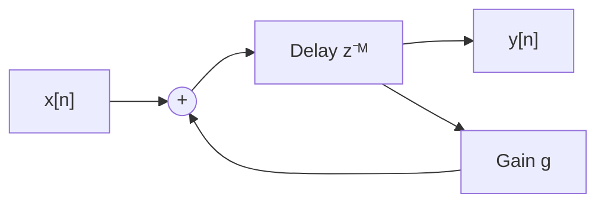
```mermaid
%% verbx-static: docs/assets/reverb_primer/03_feedback_comb_filter.png
flowchart LR
    X["x[n]"] --> S(("+"))
    S --> D["Delay z⁻ᴹ"]
    D --> Y["y[n]"]
    D --> G["Gain g"]
    G --> S
```

**Figure: Feedback comb filter with delay length $M$ and loop gain $g$.**

**How to read this figure.** Every trip around the loop adds $M$ samples of time and a
factor of $g$. If $|g|<1$, the loop decays; if $|g|=1$, it is theoretically lossless;
if $|g|>1$, it grows. Real implementations also require damping, DC control, and
protection against finite-precision problems. The spacing $f_s/M$ between modes is as
important as nominal RT60. Several delay lengths should avoid obvious common periods
unless a pitched or resonant effect is intended.

The expanded flowgraph below labels the internal write signal and places the transfer
function beside the loop. It is the form to use when translating the structure into a
sample-by-sample difference equation or checking which sample is multiplied by $g$.


**Figure: Implementation-level feedback comb flowgraph with an explicit internal state, $M$-sample delay, loop gain, and transfer function.**

**How to read this flowgraph.** The summing junction forms $w[n]$ from the new input and
the attenuated delayed output. The delay emits $y[n]=w[n-M]$; that value branches to the
external output and to gain $g$ before returning to the sum. Following one impulse around
the lower return path explains the sequence at $0,M,2M,\ldots$ samples. The drawing also
distinguishes the signal stored in memory, $w[n]$, from the signal currently leaving the
delay, $y[n]$, a distinction that prevents common indexing mistakes in implementations.

The following pole-zero diagram turns the comb equation into geometry. The drawing uses
$M=12$ only to keep individual modes legible; a practical delay contains many more
samples and therefore many more poles. The same rule survives at every order.

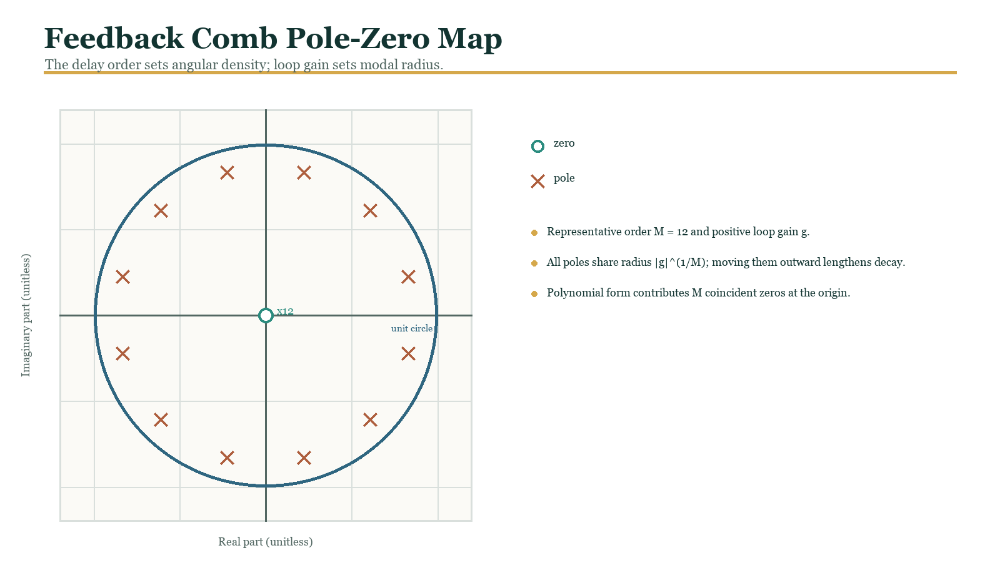

**Figure: Unit-circle pole-zero map for a representative feedback comb, showing twelve equal-radius poles and twelve coincident zeros at the origin.**

Each solution of $z^M=g$ contributes one pole. The angular spacing is $2\pi/M$, while
the radius is $|g|^{1/M}$. Raising $g$ moves every cross toward the unit circle and
lengthens all modal decays together. A negative $g$ rotates the pole family by
$\pi/M$. The zeros at the origin appear after polynomializing the causal transfer
function; they do not cancel the resonant pole ring.

For a target $T_{60}$ and a delay duration $d=M/f_s$ seconds, the loop gain is

$$
g = 10^{-3d/T_{60}}.
$$

At extreme RT60 values, $g$ approaches one. Small numerical or spectral errors then
circulate for a long time, which is why internal precision and loop conditioning matter
more at 360 seconds than at 1.2 seconds.

#### Schroeder Allpass Filters: Density Without Magnitude Coloration

An allpass filter changes phase while maintaining a flat ideal magnitude response. A
common Schroeder form is

$$
H_{\mathrm{AP}}(z) = \frac{-g + z^{-M}}{1-gz^{-M}}.
$$

Its direct and delayed paths cancel the comb-like magnitude coloration that the feedback
loop would otherwise introduce. In time, however, an impulse becomes a pattern of
decaying echoes. Serial allpasses can therefore increase echo density before the signal
enters a longer late-field network.

The Mermaid diagram below separates feedforward and feedback paths. The signs matter:
the topology is not simply a comb with a dry mix.

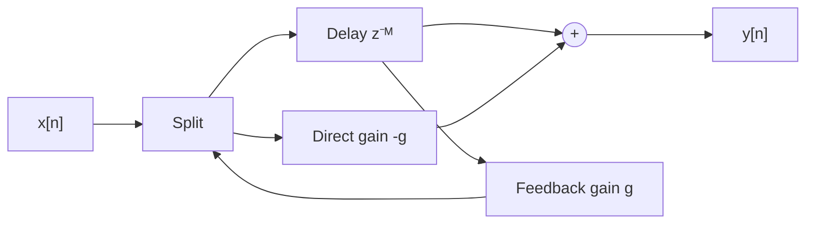
```mermaid
%% verbx-static: docs/assets/reverb_primer/04_schroeder_allpass.png
flowchart LR
    X["x[n]"] --> P["Split"]
    P --> D["Delay z⁻ᴹ"]
    P --> N["Direct gain -g"]
    D --> S(("+"))
    N --> S
    D --> G["Feedback gain g"]
    G --> P
    S --> Y["y[n]"]
```

**Figure: Schroeder allpass diffuser with matched feedforward and feedback coefficients.**

**How to read this figure.** The delay and feedback create a decaying echo sequence;
the direct coefficient corrects the magnitude response. “Flat magnitude” does not mean
“inaudible.” Phase structure, transient spreading, delay length, and coefficient still
change timbre and spatial impression. Very large $g$ values produce long diffusion
patterns that may sound metallic; small values scatter less energy. The allpass chain
must be judged as an onset-design tool, not merely by its frequency response.

The implementation graph below separates the allpass's two sums. This makes the signs
and the shared delayed state visible, which is essential when comparing the transfer
function with code or tracing an impulse by hand.


**Figure: Implementation-level Schroeder allpass flowgraph with explicit feedforward and feedback coefficient paths.**

**How to read this flowgraph.** The left sum creates the delay-line write value
$w[n]=x[n]+g\,w[n-M]$. The right sum combines the delayed state with the negative direct
branch, producing $y[n]=w[n-M]-g\,w[n]$. The same coefficient magnitude therefore appears
in two different roles: positive feedback sustains the echo sequence, while negative
feedforward corrects its magnitude response. Swapping a sign changes the topology and can
turn a diffuser into a colored or unstable structure even though every block still looks
plausible in isolation.

The reciprocal structure is easiest to see in the following unit-circle plot. It uses a
reduced delay order so the individual reciprocal pairs can be inspected rather than
merging into a continuous ring.

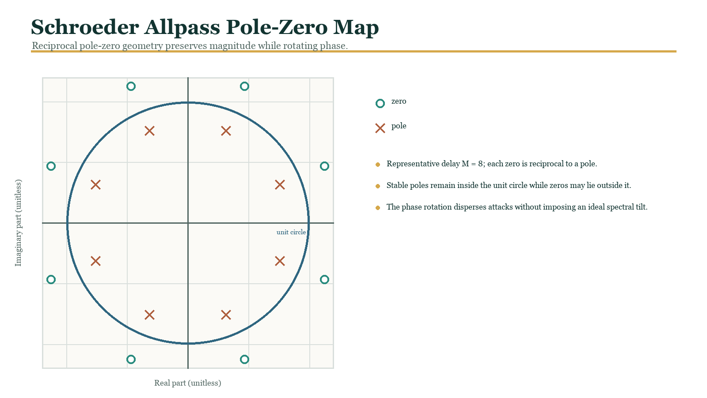

**Figure: Unit-circle pole-zero map for a Schroeder allpass, with stable interior poles and reciprocal exterior zeros.**

For every pole $p_k$, the corresponding allpass zero lies at $1/p_k^*$. On the unit
circle, numerator and denominator magnitudes therefore match even though their phases
do not. The exterior zeros do not make the causal filter unstable because stability is
governed by poles. They do make the system non-minimum-phase, which is precisely how the
network can redistribute transient energy in time while preserving ideal magnitude.

#### Allpass Networks: From Echoes to a Diffuse Excitation

One allpass creates a recognizable pattern. Several allpasses with mutually awkward
delay lengths multiply the number of arrivals. If the stages are too similar, the
patterns line up and produce periodicity. If there are too many stages or too much
feedback, the attack loses definition before the late field begins.

The serial network below shows the conceptual progression from one impulse to a dense
excitation. Each stage is short compared with the final RT60.

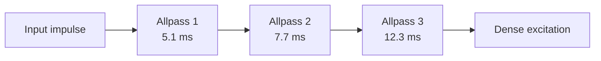
```mermaid
%% verbx-static: docs/assets/reverb_primer/05_allpass_diffusion_network.png
flowchart LR
    X["Input impulse"] --> A1["Allpass 1<br/>5.1 ms"]
    A1 --> A2["Allpass 2<br/>7.7 ms"]
    A2 --> A3["Allpass 3<br/>12.3 ms"]
    A3 --> U["Dense excitation"]
```

**Figure: Serial allpass network used to build early echo density.**

**How to read this figure.** Every box expands the number of time-domain arrivals while
approximately preserving spectral magnitude. The listed delays are illustrative, not
universal defaults. Percussion may need fewer stages so the attack remains crisp; a
synthetic pad can tolerate more diffusion. In verbx, allpass diffusion is a front-end
stage. It prepares energy for the FDN rather than carrying the complete decay alone.

#### The Schroeder Reverberator

The classic Schroeder architecture places several feedback comb filters in parallel,
sums them, and follows the sum with serial allpasses. The combs supply a long response;
the allpasses increase density. This structure established the vocabulary of digital
reverb and remains useful because it is efficient, understandable, and musical.

The signal flow below shows the canonical division of labor. It is a family of designs,
not one immutable set of delay values.

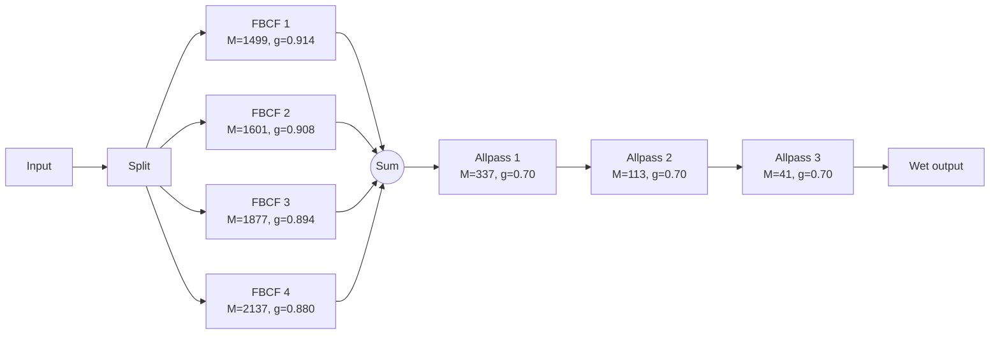
```mermaid
%% verbx-static: docs/assets/reverb_primer/02_schroeder_reverberator.png
flowchart LR
    X["Input"] --> S["Split"]
    S --> C1["FBCF 1<br/>M=1499, g=0.914"]
    S --> C2["FBCF 2<br/>M=1601, g=0.908"]
    S --> C3["FBCF 3<br/>M=1877, g=0.894"]
    S --> C4["FBCF 4<br/>M=2137, g=0.880"]
    C1 --> M(("Sum"))
    C2 --> M
    C3 --> M
    C4 --> M
    M --> A1["Allpass 1<br/>M=337, g=0.70"]
    A1 --> A2["Allpass 2<br/>M=113, g=0.70"]
    A2 --> A3["Allpass 3<br/>M=41, g=0.70"]
    A3 --> Y["Wet output"]
```

**Figure: Classic Schroeder reverberator with parallel combs and serial allpasses.**

**How to read this figure.** The explicit branch labels show one illustrative 48 kHz,
2.4-second design, not verbx defaults. Each comb delay $M$ establishes a different modal
spacing, while its loop gain $g$ calibrates how quickly that branch decays. The summing
bus recombines all four independent tails. Three short serial allpasses then increase
echo density without intentionally changing magnitude response. Coloration remains
possible because each comb has a regular modal series and because the branches do not
exchange energy. Moorer-style extensions add early reflections and frequency-dependent
damping. Modern FDNs generalize the feedback relationship so every delay line can
exchange energy with every other line.

The parameterized flowgraph below expands the canonical blocks into a traceable example.
Its delays and gains demonstrate the notation rather than prescribe verbx defaults; the
four output rows also show how one reverberator state can feed a multichannel matrix.


**Figure: Parameterized Schroeder-style reverberator with serial allpasses, four parallel feedback combs, named branch signals, and a four-channel output matrix.**

**How to read this flowgraph.** Start at `RevIn` and move through three short allpasses,
whose unequal sample delays progressively scatter the onset. The vertical bus then sends
the same diffuse excitation to four feedback comb filters. Each comb lists a delay $N$
and a gain calculated for the illustrated 2.4-second target at 48 kHz. Their named outputs
$x_1$ through $x_4$ enter a normalized Hadamard matrix, whose signed combinations produce
four related but decorrelated outputs. The graph therefore exposes three distinct design
layers: onset diffusion, late modal duration, and spatial projection.

The following reduced-order modal map combines several unequal comb rings and an
illustrative allpass zero family. It is not a root plot of the exact printed delays,
whose thousands of points would obscure the structure at book scale.

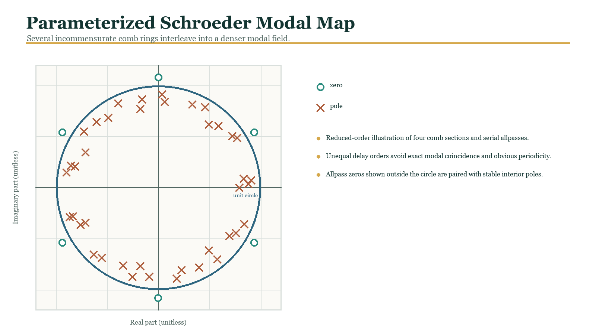

**Figure: Reduced-order unit-circle map of a parameterized Schroeder reverberator, showing interleaved comb-pole rings and reciprocal allpass zeros.**

Each comb contributes a regular ring, but unequal orders and radii interleave those
rings. The allpasses add pole-zero pairs whose magnitude effects cancel ideally while
their phase effects accumulate. Coincident or nearly coincident poles predict exposed
ringing; a more even angular distribution predicts smoother modal coverage. Because
parallel branch transfer functions add, the final transmission zeros also depend on
branch gains and summation, not only on the zeros drawn for individual stages.

The Schroeder design remains an excellent teaching instrument. Bypass its allpasses and
hear the comb modes. Restore one stage at a time and hear density increase. Change one
delay until it shares a common divisor with another and hear periodicity emerge. These
experiments turn abstract topology into an audible vocabulary.

#### Feedback Delay Networks: Coupled Modal Systems

An $N$-line Feedback Delay Network replaces independent comb feedback with a vector
loop. Each delay line produces one state component. A matrix mixes those components
before they are written back, allowing energy to move throughout the network. Input and
output projections determine how the source excites modes and how the listener receives
them.

A simplified state description is

$$
\boldsymbol{s}[n+1] = \boldsymbol{G}\boldsymbol{M}\boldsymbol{D}(z)\boldsymbol{s}[n]
                  + \boldsymbol{B}x[n],
$$

$$
y[n] = \boldsymbol{C}^{\mathsf T}\boldsymbol{D}(z)\boldsymbol{s}[n] + d\,x[n],
$$

where $\boldsymbol{D}(z)$ is the bank of unequal delays, $\boldsymbol{M}$ is the feedback
matrix, $\boldsymbol{G}$ contains decay gains or filters, $\boldsymbol{B}$ injects the source,
and $\boldsymbol{C}$ projects the state to output channels.

The Mermaid diagram below makes the vector feedback loop explicit.

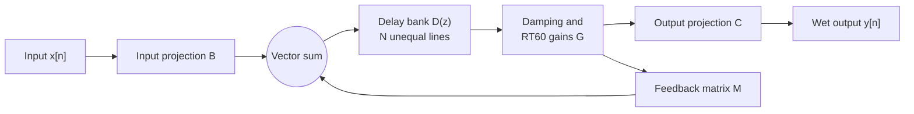
```mermaid
%% verbx-static: docs/assets/reverb_primer/06_fdn_signal_flow.png
flowchart LR
    X["Input x[n]"] --> B["Input projection B"]
    B --> S(("Vector sum"))
    S --> D["Delay bank D(z)<br/>N unequal lines"]
    D --> F["Damping and<br/>RT60 gains G"]
    F --> C["Output projection C"]
    C --> Y["Wet output y[n]"]
    F --> M["Feedback matrix M"]
    M --> S
```

**Figure: Feedback Delay Network with vector delay state and matrix feedback.**

**How to read this figure.** The delay bank defines modal timing; the gain and damping
stage defines loss; the matrix defines how energy exchanges among lines. Those roles
interact but are independently designable. An orthonormal matrix preserves vector
energy before damping, making RT60 calibration tractable. A poor input projection may
leave some modes weakly excited; a poor output projection may overemphasize others.
High line count alone does not guarantee a smooth reverb.

The expanded FDN flowgraph below opens the vector blocks into four representative delay
rows and shows both the recirculating state and the separate output tap. The four rows
stand for an arbitrary $N$-line network, not a four-line limit.


**Figure: Expanded FDN flowgraph with input projection, unequal delay lines, per-line damping, RT60 gains, unitary feedback matrix, and output projection.**

**How to read this flowgraph.** Projection $\boldsymbol{B}$ distributes the scalar input into
the vector sum. Each row delays one state component by $m_i$ samples and filters it with
$H_i(z)$. The gain block $\boldsymbol{G}$ calibrates loss, after which unitary matrix
$\boldsymbol{M}$ redistributes energy before the vector returns to the input sum. Output
projection $\boldsymbol{C}^{\mathsf T}$ observes the delayed state without replacing the
feedback path. That separation lets a designer change stereo or immersive presentation
without changing the poles that govern the late decay.

The following pole-zero figure presents a reduced-order FDN modal projection. Unlike a
single comb, an FDN does not generally decompose into one obvious ring per delay line;
its coupled characteristic equation mixes delay, matrix, and loop-filter terms.

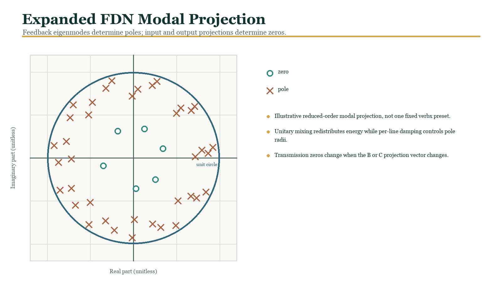

**Figure: Illustrative unit-circle modal projection of an expanded FDN, with coupled poles and projection-dependent transmission zeros.**

The crosses represent eigenmodes of a stable, damped coupled state. Their unequal radii
stand for frequency-dependent and line-dependent loss. The circles are transmission
zeros for one illustrative input-output projection. Replacing $\boldsymbol{B}$ or
$\boldsymbol{C}$ changes those zeros and the observed color, while leaving the internal
state poles unchanged. Replacing $\boldsymbol{M}$ or a loop filter can move the poles
themselves, so those changes require renewed stability analysis.

verbx exposes several matrix families because they create different exchange patterns.
Hadamard mixing is dense and uniform. Householder mixing is efficient and structured.
Circulant and elliptic families have interpretable eigenstructure. Random orthogonal
matrices reduce obvious regularity. Graph-derived matrices make connectivity a design
parameter. Time-varying unitary matrices alter the modal basis slowly while retaining
controlled loop energy.

#### The Five Independent Design Coordinates of an FDN

It is tempting to identify an FDN by line count alone, but five coordinate systems act
together: delay timing, feedback coupling, loop loss, input excitation, and output
observation. Figure below places those choices around the recursive state. Changing any
one can alter the result even when the other four are held fixed.

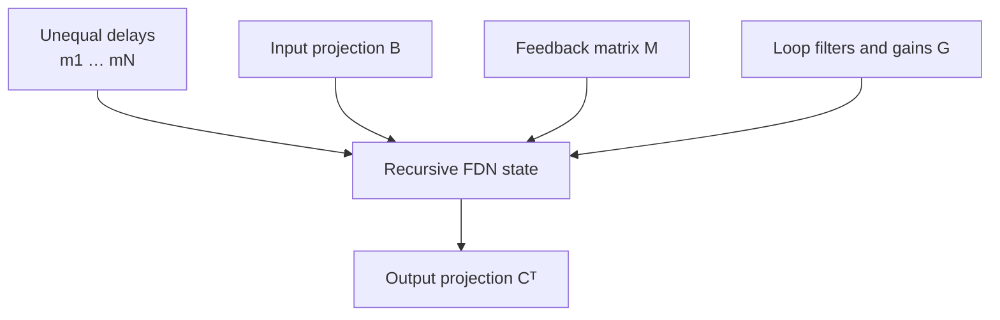
```mermaid
%% verbx-static: docs/assets/reverb_primer/30_fdn_design_coordinates.png
flowchart TB
    D["Unequal delays<br/>m1 … mN"] --> S["Recursive FDN state"]
    B["Input projection B"] --> S
    M["Feedback matrix M"] --> S
    G["Loop filters and gains G"] --> S
    S --> C["Output projection Cᵀ"]
```

**Figure: Five design coordinates that jointly determine an FDN late field.**

**How to read this figure.** The central state is not itself a sound-quality control.
The delay set gives the state its temporal memory; the matrix redistributes that memory;
the loop filters decide what survives; the input vector decides which modal combinations
are excited; and the output vector decides which combinations are observed. This is why
changing only $\boldsymbol{C}$ can alter stereo width without moving the network's poles,
whereas changing $\boldsymbol{M}$ can alter both modal structure and energy exchange.

The five coordinates suggest a disciplined design order:

1. Choose delay durations for the desired scale and modal distribution.
2. Choose a feedback matrix with known energy behavior.
3. Calibrate broadband or multiband loop loss from the target decay.
4. Choose an input projection that excites the state without privileged lines.
5. Choose output projections that create the required channel image and fold-down.

Randomizing all five at once may produce an interesting preset, but it makes a failure
difficult to diagnose. A controlled listening comparison changes one coordinate at a
time and uses the same impulse, chord, level, and output projection.

#### Delay-Set Design and Number-Theoretic Structure

Each delay line contributes a recurrence period and a family of modes. Equal or simply
related delays cause recirculating paths to coincide; the network then reveals a common
period as flutter, pitched ringing, or cyclic stereo motion. Pairwise coprime lengths
are a useful starting heuristic, but primality alone does not guarantee a good network.
The complete coupled pole pattern also depends on the matrix, gains, and projections.

For a line of $m_i$ samples, the uncoupled comb spacing is approximately

$$
\Delta f_i=\frac{f_s}{m_i}.
$$

Longer delays create closer modes and slower recurrence. Shorter delays create wider
spacing and faster buildup. A practical set spans a modest range around a size target
rather than clustering at one length. Excessive spread can make branches decay with
perceptibly different granularity even when their RT60 gains are calibrated correctly.

Delay selection should satisfy several constraints at once:

| Constraint | Purpose | Failure symptom |
|---|---|---|
| No zero or sub-sample line | Preserve causality and valid memory access | Instability or duplicated direct sound |
| Few shared factors | Reduce coincident recurrences | Flutter or rhythmic ringing |
| Bounded minimum delay | Limit high modal spacing | Audible isolated modes |
| Bounded maximum delay | Control buildup and memory | Late, disconnected tail onset |
| Sample-rate rescaling | Preserve physical durations | Preset changes size with sample rate |

When a sample-rate conversion rounds several durations to nearby integers, recheck the
set rather than assuming its number-theoretic relationships survived. Deterministic
rounding and a stored seed make the resulting topology reproducible.

#### Feedback Matrices, Energy, and Eigenstructure

If the matrix is orthonormal,

$$
\boldsymbol{M}^{\mathsf T}\boldsymbol{M}=\boldsymbol{I},
$$

then it preserves Euclidean vector energy before loop loss. This separation is valuable:
the matrix controls redistribution while $\boldsymbol{G}$ controls decay. A matrix need not
be dense to be lossless, and a dense matrix is not automatically well conditioned.

The spectral radius

$$
\rho(\boldsymbol{A})=\max_k |\lambda_k(\boldsymbol{A})|
$$

provides one stability check for a frequency-independent state transition
$\boldsymbol{A}$. With delays and loop filters, the complete condition is frequency
dependent, but the intuition remains: no recirculating eigenmode may receive net gain
at any frequency. Numerical verification should therefore sweep the loop filters as
well as checking the nominal matrix.

| Matrix family | Coupling character | Useful reason to choose it |
|---|---|---|
| Hadamard | Dense, balanced signed mixing | Predictable diffusion and efficient transforms |
| Householder | Structured global reflection | Low arithmetic cost with full-state interaction |
| Circulant | Translation-invariant row structure | Controlled eigenstructure and repeatable color |
| Random orthogonal | Irregular dense coupling | Reduced visible symmetry with energy preservation |
| Sparse graph-derived | Local or clustered exchange | Deliberate pathways and unusual spatial textures |
| Time-varying unitary | Slowly changing modal basis | Reduced stationary ringing in long exposed tails |

Orthonormality is a starting condition, not a listening verdict. A lossless matrix can
still align poorly with a delay set or projection vector. Conversely, a deliberately
structured matrix may be musically useful precisely because it does not erase every
pathway at once.

#### Input and Output Projections

The input projection $\boldsymbol{B}$ distributes source energy among delay lines. A vector
with one nonzero entry excites the network from one point; a dense balanced vector begins
with broader excitation. Multiple input channels use a matrix whose columns describe
distinct injection patterns. Those columns should be normalized so adding channels does
not silently increase loop energy.

The output projection $\boldsymbol{C}^{\mathsf T}$ observes the state. It can be changed
without changing the internal recurrence, which makes projection a powerful spatial
design layer. Left and right vectors should share the same late history while weighting
components differently enough to avoid mono duplication. Immersive outputs extend the
same principle to side, rear, and height channels.

Projection quality is measured as well as heard. Inspect channel RMS balance,
cross-correlation, interchannel coherence by frequency, and mono fold-down. A return can
sound impressively wide in isolation yet collapse unevenly or lose low-frequency energy
when summed. Normalized signed projections usually provide a safer starting point than
independent random reverbs per channel.

#### Frequency-Dependent Decay in an FDN

Real materials absorb frequency bands differently, and air attenuates high frequencies
more strongly over long paths. A convincing room therefore rarely has one RT60 at every
frequency. In an FDN, loop filters can approximate a desired decay curve. The challenge
is to shape loss without compromising stability or creating obvious filter resonances
inside the feedback loop.

The multiband signal flow below shows low, middle, and high losses before energy returns
to the feedback matrix.

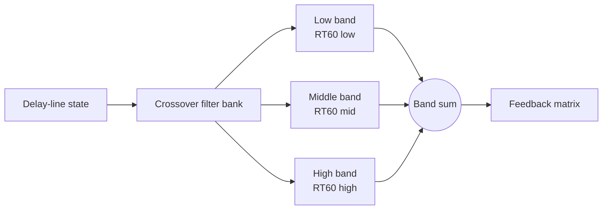
```mermaid
%% verbx-static: docs/assets/reverb_primer/07_multiband_fdn.png
flowchart LR
    S["Delay-line state"] --> X["Crossover filter bank"]
    X --> L["Low band<br/>RT60 low"]
    X --> M["Middle band<br/>RT60 mid"]
    X --> H["High band<br/>RT60 high"]
    L --> A(("Band sum"))
    M --> A
    H --> A
    A --> F["Feedback matrix"]
```

**Figure: Frequency-dependent FDN loop with independent low, middle, and high decay targets.**

**How to read this figure.** Every band travels around the same spatial topology but
loses a different amount of energy. A longer low-band RT60 adds warmth and weight; too
much produces mud or a persistent pitched floor. A short high-band RT60 suggests soft
materials or long air paths; too short makes the room dull and detached. Crossovers
must be smooth because their errors recirculate.

The line-level graph below zooms into one FDN damping block. It makes the decay-gain
calculation explicit for each band before the three paths are recombined.


**Figure: One multiband FDN loop-filter row with low-, middle-, and high-band filters and independently calibrated decay gains.**

**How to read this flowgraph.** State component $s_i[n]$ is split among three complementary
filters. Each branch receives a gain of the form $10^{-3d_i/T_{60,b}}$, where $d_i$ is the
delay-line duration and $T_{60,b}$ is the target for band $b$. The sum reconstructs one
conditioned state component before matrix mixing. Calibrating gain from each line's own
duration is important: applying one coefficient to unequal delays gives those lines
different decay times and distorts the intended spectral envelope.

The following modal plot shows how three decay targets become families of pole radii.
The outer family represents the slowest band and the inner family the fastest.

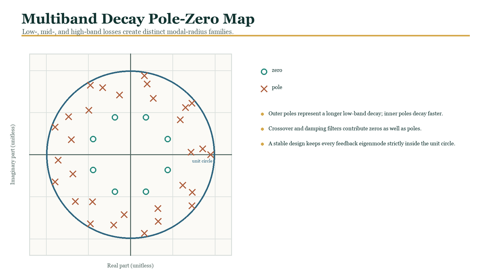

**Figure: Unit-circle pole-zero map for multiband feedback damping, with separate low-, middle-, and high-band pole-radius families.**

Band filters contribute their own poles and zeros, and the surrounding delay network
replicates their influence across many modes. Stability must therefore be checked on the
complete loop, not inferred from three scalar gains alone. A smooth target decay curve
should produce a smooth radial transition with frequency; abrupt radial clusters can
become audible as bands that detach from one another during the tail.

```bash
verbx render music.wav /tmp/multiband_hall.wav \
  --engine algo --rt60 3.0 --fdn-rt60-low 4.2 \
  --fdn-rt60-mid 3.0 --fdn-rt60-high 1.7 \
  --fdn-xover-low-hz 260 --fdn-xover-high-hz 4200 \
  --fdn-lines 24 --fdn-matrix random_orthogonal --wet 0.45 --dry 0.72
```

Listen after the source stops. During the phrase, masking may hide a low-frequency
problem that becomes obvious only in the final decay.

#### Moving Delays, Fractional Reads, and Interpolation

A delay specified in milliseconds rarely lands on an integer sample, and a modulated
delay changes continuously. If its desired length is $d[n]$ samples, the processor reads
the circular buffer at a fractional position. Writing

$$
d[n]=M[n]+\mu[n], \qquad 0\leq\mu[n]<1,
$$

separates the integer offset $M[n]$ from fractional part $\mu[n]$. Linear interpolation
uses the two neighboring samples:

$$
y[n]=(1-\mu[n])x[n-M[n]]+\mu[n]x[n-M[n]-1].
$$

It is inexpensive and continuous, but its magnitude response changes with fractional
position. Higher-order Lagrange interpolation improves high-frequency magnitude
accuracy. A Thiran allpass interpolator prioritizes phase and delay accuracy while
maintaining unit magnitude. The right choice depends on whether the moving read is a
creative chorus-like voice, a subtle anti-ringing modulation, or a precision physical
delay.

Figure below separates the audio-rate memory path from the slower control path. They
meet only at the interpolated read head.

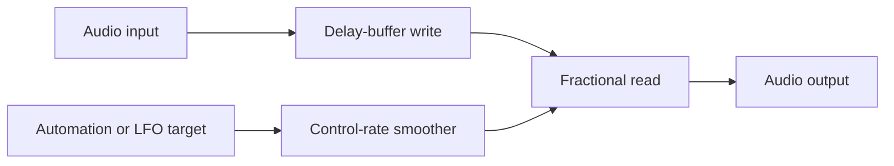
```mermaid
%% verbx-static: docs/assets/reverb_primer/29_modulated_delay_control.png
flowchart LR
    X["Audio input"] --> W["Delay-buffer write"]
    W --> R["Fractional read"]
    R --> Y["Audio output"]
    P["Automation or LFO target"] --> S["Control-rate smoother"]
    S --> R
```

**Figure: Separate audio and control paths for a smoothly modulated fractional delay.**

**How to read this figure.** Audio is written into circular memory at the sample rate.
The target delay arrives from automation or an oscillator, passes through a smoother,
and controls the read position. The smoother prevents a discontinuous pointer jump;
the interpolator reconstructs a continuous value between stored samples. Neither block
is optional when the delay moves during audible output.

A changing delay introduces pitch shift because the read head moves relative to the
write head. Slow shallow motion can decorrelate modes without calling attention to
itself. Fast or deep motion becomes chorus, vibrato, or Doppler-like sweep. In an FDN,
different lines should not move in lockstep unless coherent pitch motion is intended.
The total modulation must also respect minimum and maximum delay bounds so the read head
never crosses invalid memory or overtakes the write head.

#### Parameter Smoothing and Host Automation

Hosts can deliver a new parameter target once per block, at sample offsets within a
block, or at irregular GUI rates. Applying a discontinuous target directly to a gain,
delay, filter coefficient, or matrix can create clicks or temporarily invalidate a
stable design. A one-pole smoother is

$$
p[n]=a\,p[n-1]+(1-a)p_{\mathrm{target}}[n],
$$

with

$$
a=e^{-1/(\tau f_s)},
$$

where $\tau$ is a smoothing time constant. Linear ramps are also useful when an exact
arrival time matters. Gains may be smoothed in decibels or amplitude depending on the
desired perceptual trajectory; frequencies are often smoother in logarithmic space;
RT60 is best mapped through a bounded logarithmic parameter before loop gains are
recalculated.

Recursive parameters need special care. Interpolating directly between two unrelated
orthogonal matrices does not generally remain orthogonal. Safer strategies interpolate
a constrained rotation, crossfade between complete networks, or update through a
factorization whose intermediate states preserve the required energy property. Similar
care applies to loop-filter coefficients: every intermediate filter must remain stable,
not only the endpoints.

Smoothing has a musical cost. A 500 ms ramp is click-free but can miss a sixteenth-note
gesture; a 1 ms ramp may preserve timing but reveal zippering on a 360-second tail.
Document smoothing times as part of the DSP contract and test automation at different
host block sizes.

#### Early Reflections and the Early-to-Late Transition

Early reflections carry geometry. Their delays and directions communicate source
distance, nearby boundaries, and room shape before the late field becomes statistically
dense. A tapped delay line can render a designed pattern; an image-source or ray-tracing
model can derive paths from geometry; a measured IR can supply the complete onset.

Each early tap can be represented as

$$
y_q[n]=a_q\,F_q(z)x[n-m_q],
$$

where $m_q$ is path delay, $a_q$ is spreading and reflection loss, and $F_q(z)$ models
frequency-dependent boundary absorption. Multichannel rendering adds a directional
projection for each path. The tap list should not merely be randomized: arrival order,
level decay, spectral darkening, and lateral distribution jointly establish a plausible
enclosure.

The handoff to the late field is a crossfade in statistical description, not necessarily
one literal splice sample. If the FDN begins too early and too densely, the source seems
embedded in an abstract wash. If it begins too late, the early response sounds like a
cluster of echoes followed by a separate effect. Match energy, spectrum, spatial width,
and density across a transition region.

#### Convolution and Partitioned FFT Processing

Convolution reverb uses an impulse response measured in a real room or designed by a
synthesis process. Direct time-domain convolution costs more as the IR grows. FFT
convolution turns long convolution into blockwise multiplication in the frequency
domain. Partitioning the IR lets a processor use small early blocks for latency and
larger later blocks for efficiency.

The Mermaid diagram below shows uniformly or nonuniformly partitioned overlap-save at a
conceptual level. Exact scheduling varies by implementation.

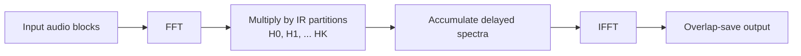
```mermaid
%% verbx-static: docs/assets/reverb_primer/08_partitioned_convolution.png
flowchart LR
    X["Input audio blocks"] --> F["FFT"]
    F --> P["Multiply by IR partitions<br/>H0, H1, ... HK"]
    P --> S["Accumulate delayed spectra"]
    S --> I["IFFT"]
    I --> O["Overlap-save output"]
```

**Figure: Partitioned FFT convolution path for a long impulse response.**

**How to read this figure.** The input is transformed once per block. Each IR partition
multiplies a correspondingly delayed input spectrum; the products are accumulated and
transformed back. The first partition determines a large part of algorithmic latency.
Longer partitions improve efficiency but increase buffering. Convolution reproduces the
captured linear response exactly within numerical and routing limits, but ordinary
convolution cannot continuously change that response without interpolation or a new IR.

For an FIR of length $L$, direct convolution evaluates

$$
y[n]=\sum_{k=0}^{L-1}h[k]x[n-k],
$$

which costs $L$ multiply-accumulates per output sample. A two-second mono IR at 192 kHz
contains 384,000 taps; direct evaluation is therefore wasteful even before multichannel
routing. FFT convolution groups samples into blocks and uses the convolution theorem,

$$
Y_r[k]=X_r[k]H[k],
$$

where $r$ identifies a processing block and $k$ an FFT bin. The apparent simplicity of
that multiplication hides the scheduler that aligns past input spectra with every IR
partition.

In overlap-save processing, the FFT length must include enough historical samples to
avoid circular-convolution contamination. The invalid prefix is discarded and only the
new valid samples are emitted. The implementation must define whether reported latency
includes host buffering, input accumulation, FFT scheduling, and output staging; “zero
latency convolution” usually means that an initial direct or very small partition is
processed before larger tail partitions, not that no buffering exists anywhere.

Uniform and nonuniform partitioning trade simplicity against efficiency:

| Partition plan | Latency behavior | Computational behavior |
|---|---|---|
| Uniform small blocks | Low and constant | Many FFTs for the complete tail |
| Uniform large blocks | Higher and constant | Better throughput for long IRs |
| Direct head plus FFT tail | Very low onset latency | More scheduler complexity |
| Geometrically growing blocks | Small early, efficient late | Multiple FFT sizes and deadlines |

A practical nonuniform design might process the first few milliseconds directly, the
next region in 64- or 128-sample partitions, and the distant tail in progressively
larger blocks. Late partitions have more wall-clock time before their contribution is
needed, so they can be computed less frequently without delaying the direct onset.

#### Matrix Convolution and Immersive Routing

A multichannel IR is a matrix of filters. For $M$ inputs and $N$ outputs,

$$
Y_j(z)=\sum_{i=1}^{M}H_{ji}(z)X_i(z), \qquad j=1,\ldots,N.
$$

The off-diagonal filters are not optional decoration: they encode cross-channel energy
that helps a measured room feel coherent. A stereo-to-Atmos bed renderer may require
many simultaneous convolution paths, so partition spectra should be shared and batched
rather than invoking an unrelated mono convolver for every route.

Channel metadata is part of the DSP. A mathematically correct matrix with incorrect
ordering can send left energy to a height channel or swap ambisonic components. Tests
should use labeled impulses, one active input at a time, and verify arrival time, level,
and polarity at every output. Fold-down and binaural decode tests reveal errors that may
be hard to identify while monitoring the full array.

#### Impulse-Response Conditioning

An IR often needs preparation before it becomes a production filter. Remove unintended
leading silence while preserving true propagation delay. Remove DC, but do not erase a
legitimate very-low-frequency room mode. Apply fades only where measurement noise or a
truncation edge would otherwise circulate. Normalize according to the intended contract:
peak normalization preserves headroom, energy normalization supports comparable wet
levels, and neither reproduces an absolute acoustic calibration by itself.

Sample-rate conversion must use sufficient stop-band attenuation because any resampling
artifact becomes part of every processed signal. Channel lengths should be aligned, and
metadata should record sample rate, channel order, direct-arrival position, normalization
policy, and provenance. An IR library without these facts may sound useful but is not a
reproducible measurement collection.

Choose convolution when the identity of a measured space matters. Choose algorithmic
FDN processing when RT60, matrix motion, modulation, or extreme duration must change
during the sound. Hybrid workflows often use a short measured early response followed
by an algorithmic late field.

#### Measuring and Capturing an Acoustic Impulse Response

An acoustic impulse response is not simply a recording made in a reverberant room. It is
an estimate of the transfer path from a specified source position to a specified receiver
position under documented conditions. Move the loudspeaker, microphone, furniture, doors,
audience, or temperature and the measured system changes. A useful capture therefore
records geometry and calibration alongside audio: room and session identifier, date,
source and microphone coordinates, orientation, height, transducers, interface, gain,
sample rate, atmosphere, occupancy, and every processing step.

Several excitation methods are practical:

| Excitation | Strength | Principal limitation |
|---|---|---|
| Acoustic impulse, such as a balloon or starter pistol | Fast, intuitive, portable | Limited repeatability, spectrum, and signal-to-noise ratio |
| Loudspeaker-driven electrical pulse | Known timing and polarity | High peak demand and possible loudspeaker nonlinearity |
| Maximum-length sequence or other pseudorandom noise | Efficient averaging for an LTI system | Nonlinear distortion folds into the estimate |
| Linear sine sweep | Controlled spectrum and level | Harmonic distortion is not separated as cleanly in time |
| Exponential sine sweep | High energy across the band and nonlinear separation | Requires careful inverse filtering and clock discipline |
| Program material or ambient excitation | Measures the occupied operating condition | Usually underdetermined and difficult to reproduce |

A balloon pop can be excellent for scouting positions, but a calibrated exponential sine
sweep is usually the stronger archival measurement because it distributes energy over
seconds instead of demanding one extreme peak. Repeat each source-receiver pair at least
twice. If the recovered responses disagree, diagnose motion, clipping, clock drift, noise,
or time variance before averaging them. Measure the background noise separately and leave
headroom in the playback, microphone, preamplifier, and converter stages.

The measurement chain is

$$
s(t)\longrightarrow\text{D/A}\longrightarrow\text{loudspeaker and room}
\longrightarrow\text{microphone}\longrightarrow\text{A/D}\longrightarrow r(t).
$$

For an approximately linear, time-invariant room and measurement chain,

$$
r(t)=s(t)*h(t)+v(t),
$$

where $s(t)$ is the known excitation, $h(t)$ is the desired impulse response, and $v(t)$
contains background and electronic noise. A loopback channel recorded beside the
microphone channel reveals playback latency and clock behavior. Calibrated absolute sound
pressure is valuable for research, but a production IR may instead retain relative level
and document its later normalization.

#### Deconvolving a Sine Sweep

Deconvolution removes the known excitation from the recorded response. In the frequency
domain, the noise-free ideal would be $H(f)=R(f)/S(f)$. Direct division is fragile wherever
$S(f)$ is small, so a regularized estimate is safer:

$$
\widehat{H}(f)=\frac{R(f)S^*(f)}{|S(f)|^2+\lambda(f)}.
$$

Here $S^*(f)$ is the complex conjugate and $\lambda(f)$ limits noise amplification. The
regularizer can follow a measured noise spectrum rather than remaining constant. Transform
$\widehat{H}(f)$ back to time, identify the direct arrival, and inspect the pre-arrival
region: substantial energy before the causal response often indicates synchronization,
windowing, or inverse-filter error.

An exponential sweep from $f_1$ to $f_2$ over duration $T$ can be written

$$
s(t)=\sin\!\left[
2\pi f_1\frac{T}{\ln(f_2/f_1)}
\left(e^{t\ln(f_2/f_1)/T}-1\right)
\right],\qquad 0\leq t\leq T.
$$

Apply short fades at both ends to avoid discontinuities, play the sweep through the source,
and record enough silence afterward to contain the complete room tail. The inverse filter
is a time-reversed sweep with the amplitude correction required by the logarithmic time-to-
frequency mapping. Convolving the recording with that inverse compresses the swept energy
into the linear room response. Frequency-domain regularization and the time-domain inverse
filter are two views of the same system-identification operation.

#### The Farina Exponential-Sweep Method

Angelo Farina's exponential-sweep method is especially valuable because a weakly nonlinear
playback and capture chain does not place every distortion product on top of the linear IR.
After deconvolution, the $k$th harmonic response is displaced from the main linear response
by

$$
\Delta t_k=T\frac{\ln k}{\ln(f_2/f_1)}.
$$

With the usual inverse-filter convention, higher-order harmonic responses appear earlier
than the principal linear response. They can be windowed and inspected separately instead
of contaminating the room estimate as they do in many pseudorandom measurements. This does
not make the room perfectly time invariant or the transducers perfectly separable; it
makes nonlinear contamination visible and measurable. Use a sweep long enough for adequate
low-frequency energy, but not so long that audience movement, ventilation cycles, wind, or
temperature drift violates the stationary-system assumption.

A disciplined Farina session follows this sequence:

1. Calibrate playback level and verify that the complete chain remains below clipping.
2. Record the microphone and electrical loopback channels at one unchanged sample clock.
3. Play an exponentially swept sine with onset and endpoint fades.
4. Continue recording through the required decay and noise-floor interval.
5. Deconvolve with the matched inverse sweep or a regularized frequency-domain equivalent.
6. Separate the earlier harmonic responses from the later linear response before trimming.
7. Repeat the measurement and compare direct arrival, polarity, spectrum, decay, and noise.
8. Preserve the raw sweep, raw capture, inverse filter, recovered IR, and metadata together.

Farina's AES paper provides the canonical derivation and nonlinear-separation framework;
the complete citation appears as reference CV6 in Appendix C.

#### Preparing the Recovered IR for verbx

verbx does not presently control a measurement loudspeaker or record and deconvolve a sweep
inside the CLI. Capture and deconvolution should be performed in a measurement application,
DAW, or validated scientific script. The recovered WAV can then enter the reproducible
verbx inspection and production path:

```bash
verbx ir analyze measured_room_raw.wav --json-out measured_room_raw.analysis.json

verbx ir process measured_room_raw.wav measured_room_ready.wav \
  --lowcut 20 --highcut 22000 --normalize peak --peak-dbfs -1

verbx render source.wav source_in_measured_room.wav \
  --engine conv --ir measured_room_ready.wav \
  --json-out source_in_measured_room.analysis.json
```

Do not normalize away information before deciding what the library promises. An absolute,
calibrated IR and a peak-normalized production IR serve different purposes. Preserve the
raw direct-arrival delay if source distance must remain authentic; remove or shorten it if
the IR will be placed behind an independent pre-delay control. Retain enough tail to reach
the measured noise floor, then use a gentle terminal fade rather than a hard truncation.
For arrays and immersive captures, measure and label every source-receiver route, preserve
one common time origin, and test the matrix with one active input channel at a time.

#### Hybrid Reverberation: Geometry First, Statistics Later

A hybrid processor uses the representation best suited to each time region. A measured,
image-source, or ray-traced response supplies direct and early paths. A recursive network
supplies the late field at a fraction of the storage cost and remains continuously
controllable. Figure below shows both branches rejoining before one spatial projection.

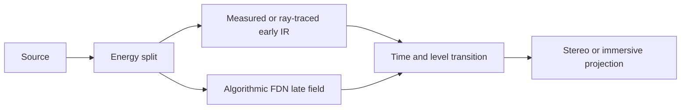
```mermaid
%% verbx-static: docs/assets/reverb_primer/32_hybrid_early_late_reverb.png
flowchart LR
    X["Source"] --> S["Energy split"]
    S --> E["Measured or ray-traced early IR"]
    S --> L["Algorithmic FDN late field"]
    E --> J["Time and level transition"]
    L --> J
    J --> D["Stereo or immersive projection"]
```

**Figure: Hybrid reverberator combining geometrical early energy with an algorithmic late field.**

**How to read this figure.** The upper branch preserves identifiable paths and directional
cues. The lower branch turns diffuse energy into a controllable recursive tail. The join
is responsible for matching arrival density, spectrum, energy, and spatial character;
the final decoder presents one coherent room rather than two stacked effects.

Hybrid calibration begins by selecting a transition interval, then matching the late
network to the measured energy-decay slope and spectrum around that interval. Excite the
FDN with a decorrelated version of the final early energy rather than an unrelated dry
copy when continuity matters. Preserve deterministic seeds so a rebuilt hybrid IR does
not change every time documentation, tests, or presets are regenerated.

#### Measuring Decay with Backward Integration

RT60 should be measured from the response, not assumed from a parameter label. Schroeder
backward integration estimates the energy remaining after time index $n$:

$$
E[n]=\sum_{k=n}^{L-1}h^2[k].
$$

The normalized energy-decay curve is

$$
L_E[n]=10\log_{10}\!\left(\frac{E[n]}{E[0]}\right).
$$

A straight line is fitted over a valid decay interval and extrapolated to –60 dB. EDT
typically fits 0 to –10 dB; $T_{20}$ uses –5 to –25 dB; $T_{30}$ uses –5 to –35 dB. Those labels
describe fitting windows, not the amount of audio that must literally reach –60 dB.
Agreement among estimates suggests a reasonably exponential decay. Large disagreement
may reveal multiple slopes, a noisy tail, gating, or a source that was not impulsive.

Figure below traces the complete analysis path from response samples to reported
metrics. Every transformation should preserve enough metadata to explain a failed fit.

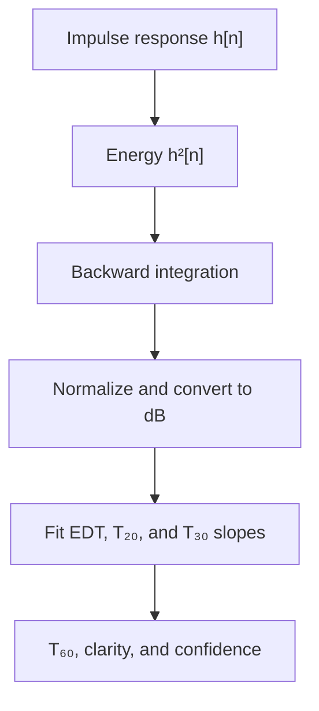
```mermaid
%% verbx-static: docs/assets/reverb_primer/31_energy_decay_measurement.png
flowchart TB
    H["Impulse response h[n]"] --> Q["Energy h²[n]"]
    Q --> I["Backward integration"]
    I --> D["Normalize and convert to dB"]
    D --> F["Fit EDT, T₂₀, and T₃₀ slopes"]
    F --> R["T₆₀, clarity, and confidence"]
```

**Figure: Measurement pipeline from an impulse response to fitted reverberation metrics.**

**How to read this figure.** Squaring removes polarity and produces instantaneous energy.
Backward integration accumulates all future energy at each time. Decibel normalization
turns exponential decay into an approximately straight line. The fitter selects only
valid dynamic ranges and reports both estimates and confidence instead of forcing one
number from an inadequate tail.

Noise-floor handling is essential. Once integrated room energy approaches integrated
background noise, the curve bends and a naive regression overestimates decay. A robust
analyzer estimates the noise floor, limits the fitting range, reports the achieved
dynamic range, and refuses a $T_{30}$ estimate when 30 reliable decibels are unavailable.
Band-limited measurements should also report filter center frequencies and bandwidths.

Decay time is only one descriptor. Clarity compares early and late energy:

$$
C_t=10\log_{10}\!\left(
\frac{\sum_{n=0}^{n_t}h^2[n]}
{\sum_{n=n_t+1}^{L-1}h^2[n]}
\right),
$$

where $t$ is commonly 50 ms for speech or 80 ms for music. Definition $D_{50}$ expresses
the first 50 ms as a fraction of total energy, and center time $T_s$ measures the energy-
weighted temporal centroid. These metrics can disagree productively: a room may have a
long RT60 yet retain useful clarity because its direct and early energy is strong.

#### Numerical Precision, Denormals, and State Safety

Recursive reverberators magnify small implementation choices because state circulates.
Double precision reduces accumulated coefficient and summation error, especially when
loop gains approach one, but it does not excuse unstable filters or an energy-increasing
matrix. Every processing format still needs explicit bounds and failure behavior.

Subnormal floating-point values can appear near the end of a long decay. Some processors
handle them slowly; others flush them to zero. A reverb can avoid pathological tails by
using supported flush-to-zero modes, adding an inaudible terminating rule below a defined
threshold, or proving that the target platform handles denormals efficiently. The policy
must not create a visible gate at normal listening levels.

State safety includes:

- finite-value checks at control boundaries rather than expensive checks on every sample;
- bounded delay indices and validated circular-buffer lengths;
- stable intermediate coefficients throughout automation ramps;
- deterministic reset behavior for transport starts, sample-rate changes, and preset loads;
- explicit handling of NaN and infinity before they enter recursive memory;
- limiter and loudness stages outside the FDN loop unless nonlinear feedback is intentional.

A limiter inside the recursive loop changes the system into a nonlinear reverberator.
That may be a creative instrument, but its RT60 formula and superposition assumptions no
longer apply. A safety limiter after wet/dry mixing controls delivery level without
rewriting the late-field poles.

#### Realtime Scheduling and End-to-End Latency

The audio callback has a deadline: one host block must finish before the device needs the
next block. If the block contains $B$ samples at sample rate $f_s$, its wall-clock budget
is

$$
T_{\mathrm{block}}=\frac{B}{f_s}.
$$

At 192 kHz, a 64-sample block allows only 0.333 ms. CPU averages are insufficient; the
worst callback matters. File I/O, memory allocation, locks, console output, JSON writing,
and device discovery do not belong in that deadline.

End-to-end monitoring latency includes input conversion and safety buffers, host input
buffering, plug-in delay, host output buffering, and output conversion. An algorithmic
FDN can add zero samples of lookahead while the complete system still has several blocks
of latency. Partitioned convolution may add one partition or use a direct head to reduce
its reported delay. A limiter with lookahead adds its own explicit samples. Report these
components separately so users can distinguish DSP latency from device configuration.

Block-size invariance is a release requirement. Rendering the same deterministic input
with 32-, 64-, 256-, and 1,024-sample blocks should not change steady parameters, decay
calibration, or automation timing beyond documented interpolation rules. Differences
often reveal state reset errors, block-rate smoothing, or FFT partition misalignment.

#### Verification: Close the Loop Between Math and Listening

No single test establishes reverb quality. An impulse exposes topology, a burst exposes
buildup, a sine sweep exposes linear response, a sustained chord exposes modes, speech
exposes masking, percussion exposes density, and a long silence exposes numerical decay.
Figure below organizes these probes into a repeatable engineering loop.

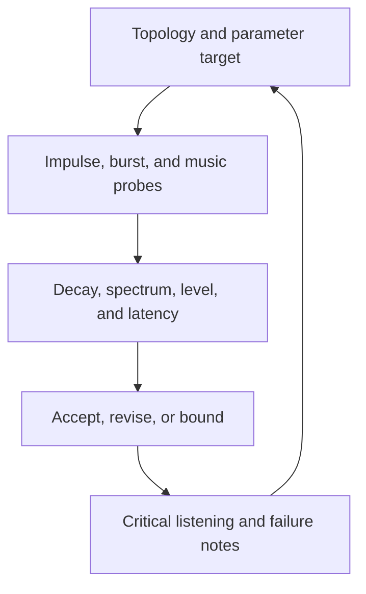
```mermaid
%% verbx-static: docs/assets/reverb_primer/33_dsp_validation_loop.png
flowchart TB
    D["Topology and parameter target"] --> P["Impulse, burst, and music probes"]
    P --> M["Decay, spectrum, level, and latency"]
    M --> A["Accept, revise, or bound"]
    A --> L["Critical listening and failure notes"]
    L --> D
```

**Figure: Closed DSP validation loop connecting deterministic probes, measurements, and listening.**

**How to read this figure.** A design target creates deterministic renders. Analysis
compares those renders with numerical bounds. Listening identifies perceptual failures
that one metric cannot summarize. The decision either accepts the design, constrains its
valid range, or feeds a specific failure back into topology and parameter choices.

A minimal verification matrix includes:

| Probe | Measure | Listen for |
|---|---|---|
| Unit impulse | Peak, first arrival, RT60, decay linearity | Flutter, isolated echoes, abrupt ending |
| Log sweep | Magnitude and phase response | Narrow resonances and spectral tilt |
| Sustained sine or chord | Mode balance and stationarity | Ringing, beating, unintended chorus |
| Percussion | Echo-density growth and peak headroom | Attack loss, groove smear, pumping |
| Speech | C50, intelligibility, wet envelope | Consonant masking and sibilant tails |
| Silence after excitation | DC, denormals, final energy | Noise growth, gate, failure to terminate |
| Multichannel impulses | Route matrix and correlation | Swaps, polarity errors, weak fold-down |

The JSON report is evidence, not decoration. Store sample rate, block size, seed,
topology, matrix family, delay set, smoothing policy, output format, measured latency,
decay estimates, and warnings. A listening observation becomes actionable when another
developer can recreate the exact state that produced it.

#### The Complete verbx Algorithmic Path

verbx separates onset design, diffusion, late-field recursion, creative transformation,
and output safety. That separation is one reason the processor remains controllable at
extreme settings. Pre-delay does not need to be hidden inside FDN delays; shimmer does
not need to destabilize the core matrix; loudness and limiting can remain outside the
reverberation state.

The complete Mermaid overview below shows the major stages. Optional blocks can be
bypassed, but their order is intentional.

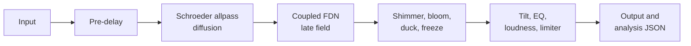
```mermaid
%% verbx-static: docs/assets/reverb_primer/09_verbx_hybrid_path.png
flowchart LR
    X["Input"] --> P["Pre-delay"]
    P --> A["Schroeder allpass<br/>diffusion"]
    A --> F["Coupled FDN<br/>late field"]
    F --> C["Shimmer, bloom,<br/>duck, freeze"]
    C --> T["Tilt, EQ,<br/>loudness, limiter"]
    T --> Y["Output and<br/>analysis JSON"]
```

**Figure: Complete verbx algorithmic path from source onset to analyzed output.**

**How to read this figure.** The first two stages control when and how the room begins.
The FDN controls long-term energy exchange. Creative blocks reinterpret the wet field.
Post-processing controls presentation and delivery without changing the internal decay
calibration. The analysis sidecar records what happened. Because the stages are
separate, a user can design a natural two-second room and a 120-second harmonic cloud
with the same conceptual vocabulary.

### A History of Artificial Reverberation: Architectural, Mechanical, Electrical, Electromechanical, and Digital

Artificial reverberation is often narrated as a clean progression from echo chamber to plate, spring, digital rack unit, convolution plug-in, and neural model. The actual history is more complicated and more useful. Old technologies did not disappear when new ones arrived. They became colors, workflows, metaphors, and algorithm names. A twenty-first-century producer may place a sampled room before a modeled plate, route that result into a feedback delay network, and automate it like a dub engineer performing a spring and tape echo. The signal chain contains several eras at once.

This history therefore follows ideas as much as products. Every reverberator must answer four questions. **Where is energy stored?** A room stores it in propagating air waves and boundary interactions; a plate stores it in bending waves; a spring stores it in dispersive torsional and transverse motion; a delay network stores it in memory. **How is the stored energy mixed?** Architecture, transducers, matrices, scattering junctions, and modulation all redistribute it. **How is energy lost?** Air, surfaces, mechanical damping, filters, quantization, and feedback gains determine decay. **How does a user control the result?** Moving microphones, changing damping pads, selecting programs, editing parameters, loading an impulse response, or conditioning a model are historically different interfaces to the same design problem.

The term *artificial* also requires care. A purpose-built chamber produces physically real acoustic reverberation, but it is artificial with respect to the recorded performance because the dry or partly dry signal is sent into the chamber after capture. A plate and spring are physical resonators, but they do not reproduce a room literally. An algorithm can be designed from room statistics without tracing one building. Convolution can reproduce a measured linear response while remaining unable to reproduce source directivity, listener motion, nonlinear vibration, changing occupancy, or the complete three-dimensional field. The relevant distinction is not real versus fake. It is what system is being excited, what response is retained, and what artistic control is gained.

The chronology below is organized into overlapping regimes:

- **architectural and acoustical practice**, in which performers, microphones, loudspeakers, and rooms create the response;
- **mechanical and electromechanical storage**, in which pipes, plates, springs, drums, and other structures replace a full room;
- **electrical and electronic networks**, in which filters, delays, feedback, switching, and modulation synthesize decay;
- **digital computation**, in which memory and arithmetic implement algorithms, measured responses, physical models, and learned systems;
- **software and spatial systems**, in which many reverberators coexist inside a session and can be automated, distributed, rendered, or trained.

These regimes overlap because engineers keep useful limitations. A plate's bright onset, a spring's chirp, an early digital unit's sparse modulation, and a chamber's irregular decay remain desirable precisely because they are not interchangeable. The history of reverberation is the history of turning constraints into recognizable musical behavior.

#### Architecture Before the Effect Send

Before recording, reverberation could not be separated from the event that produced it. A singer, drum, organ, or ensemble excited a space; performers and listeners heard the direct sound and reflections as one event. Musical practice adapted to that inseparability. Long decays supported sustained chant and large harmonic masses but punished rapid articulation. Antiphonal writing turned distance and delayed response into counterpoint. Organs were voiced for buildings, and orchestral balances developed in relation to halls, stages, shells, and occupied seats.

Architecture supplied all of the operations later reverberators would imitate: delay through propagation, level loss through spreading and absorption, spectral change at boundaries, diffusion through ornament and irregular geometry, and recursive mixing through repeated reflection. Yet architecture did not offer a single global “reverb amount.” A listener's experience depended on source position, directivity, receiver position, orientation, occupancy, temperature, and frequency. Moving a choir changed the response. Opening a curtain changed the response. Filling a hall changed the response. The “preset” was a physical arrangement.

Figure 2-33 presents St. Mark's Basilica in Venice as an instructive historical model. Its coupled volumes, hard surfaces, galleries, and separated performance positions help explain why spatial exchange and reverberant fusion could become compositional resources long before electronic media.


**Figure: St. Mark's Basilica as an architectural reverberator and spatial-performance instrument.** The photograph shows layered arches, galleries, domes, columns, and reflective finishes. These features create multiple propagation paths rather than one uniform decay. Separated ensembles can remain locally identifiable while sharing a common late field.

*Source and license:* Andrek02, [Wikimedia Commons](https://commons.wikimedia.org/wiki/File:Interni_basilica_san_Marco_01.jpg), CC0 1.0.

The acoustic recording era of the late nineteenth and early twentieth centuries did not preserve such fields transparently. Horns and diaphragms coupled performers mechanically to cutting systems. Recording balance depended on physical distance from the horn, and the capture geometry strongly favored direct energy. Engineers had little opportunity to add a separate response after recording. They could choose a resonant room, place performers strategically, or exploit the recording chain's own resonances, but reverberation remained entangled with capture.

This limitation produced a recurring historical desire: capture intelligibility and balance under controlled conditions, then restore a convincing or artistically useful sense of space afterward. Every artificial-reverb technology answers that desire differently. The chamber externalizes it into another room. The plate and spring compress it into mechanical structures. The digital reverberator abstracts it into delays and coefficients. The plug-in multiplies it across tracks and sessions.

#### Resonant Spaces Recruited as Devices

Once microphones, electrical amplification, loudspeakers, mixing, and rerecording became practical, a room could become an outboard processor. A feed from a console drove a loudspeaker in a reflective enclosure; one or more microphones captured the room's response; the engineer returned that signal to the mix. The basic send-and-return topology still governs modern reverb buses. What changed was that the “effect unit” occupied architectural space and required transducers at both ends.

Early chambers were not always designed from scratch. Bathrooms, stairwells, hallways, basements, tanks, and storage spaces could be evaluated by ear. A useful chamber needed sufficient isolation, a controllable loudspeaker and microphone arrangement, low noise, and a decay that added complexity without obvious flutter or dominant modes. Surface treatment could be adjusted, but the chamber's fundamental size and geometry remained fixed. Engineers changed apparent character by moving the loudspeaker, moving microphones, changing microphone patterns, equalizing the send or return, and combining more than one pickup.

Accounts of Bill Putnam's work on the Harmonicats' *Peg o' My Heart* in 1947 are often used to mark an early artistic milestone in record-production chamber reverb. The exact priority claim matters less than the workflow it represents: a recorded signal was deliberately sent into a separate reflective room, captured, and blended as an authored layer. By the 1950s, purpose-built chambers became prestige infrastructure in major studios. Capitol's underground chambers, for example, treated architecture as a repeatable part of the recording system rather than an accidental bathroom effect. The [AES Reverb Collection](https://aes2.org/community/aes-committees/aes-historical-committee/aes-e-library-collections/) places chamber design alongside spring, plate, algorithmic, and perceptual research, emphasizing that chamber history belongs inside audio engineering rather than outside it.

Unusual spaces demonstrate why chamber selection was an empirical art. Figure 2-34 shows a hand-hewn grain silo on Cockatoo Island. It was not built as studio equipment, but its hard boundaries and irregular geometry illustrate the class of resonant enclosure that engineers and artists have repeatedly recruited for recording, playback, and impulse-response capture.


**Figure: A grain silo as an accidental reverberator.** Rough stone, a long enclosed volume, and nonuniform boundaries produce a response unlike a polished studio chamber. Such spaces can yield strong low-frequency modes, discrete early paths, and a late field whose texture is inseparable from construction irregularities.

*Source and license:* Harryp2, [Wikimedia Commons](https://commons.wikimedia.org/wiki/File:Cockatoo_Island_convict_grain_silo.jpg), CC BY-SA 4.0.

The chamber made several production ideas explicit. First, **dry and wet became separable assets**. The dry performance could remain intelligible while the chamber return was filtered, compressed, faded, or muted. Second, **one space could unify many sources**. Vocal, percussion, and instrumental sends could excite the same chamber and acquire shared decay statistics. Third, **space became routable**. A console's auxiliary system determined which events entered the room and when. Fourth, **reverb became recordable independent of performance**. Engineers could print wet stems or rerecord the response.

The cost was operational. A chamber consumed real estate and required isolation from traffic, ventilation, electrical hum, and studio activity. It could not instantly become a different size. Microphone self-noise and amplifier noise accumulated in the return. Low-frequency modes and flutter had to be managed physically or electronically. A chamber could be exceptional, but it was not portable, cheap, or infinitely reproducible.

Figure 2-35 shows the TU Dresden echo chamber as a purpose-built acoustic instrument. Its nonparallel elements and reflective surfaces are visible evidence that chamber reverberation is designed through geometry rather than by selecting a room-name label.


**Figure: TU Dresden purpose-built acoustic echo chamber.** Irregularly oriented panels and hard boundaries promote a complex reflection field and discourage a single dominant flutter path. Loudspeaker and microphone positions turn the enclosure into a send-and-return processor with a physically generated impulse response.

*Source and license:* Henry Muhlpfordt, [Wikimedia Commons](https://commons.wikimedia.org/wiki/File:Hallraum_TU_Dresden_2009-06-21.jpg), CC BY-SA 3.0.

Chambers survived every later technology because they do something difficult to reduce to one algorithm: they combine real transducers, air, boundary vibration, noise, directional radiation, microphone response, and imperfect geometry. Their limitations also create discipline. With one or two chambers, a studio develops a shared spatial identity and engineers learn how send level, equalization, microphone distance, and return compression interact. Unlimited plug-in instances can simulate variety, but they can also remove the productive constraint of a common acoustic world.

#### Pipes, Tubes, and Folded Acoustic Paths

A full room was not the only way to store acoustic energy. Engineers explored pipes, tubes, and folded paths that could delay and recirculate sound in a smaller footprint. Harry F. Olson and John C. Bleazey's 1960 paper [“Synthetic Reverberator”](https://aes.org/publications/elibrary-page/?id=535) described a loudspeaker, pipe, microphone delay unit, and feedback system. The design is historically important because it sits between architectural and electronic thinking. Propagation through air provides delay, transducers convert between domains, and electrical feedback extends the response.

An acoustic delay path is conceptually simple. A pressure wave enters a tube, travels at the speed of sound, reflects or exits, and is captured later. In practice, diameter, length, termination, wall loss, dispersion, and higher-order modes color the signal. Folding the path saves space but introduces bends and junctions. Feedback increases effective decay but also reinforces path resonances. The device therefore does not become a miniature neutral room. It becomes a characteristic resonator whose physical dimensions are audible.

These systems foreshadow digital delay networks. A pipe section behaves like a delay with frequency-dependent loss. A reflection or branch behaves like a scattering junction. A microphone and amplifier supply gain. Feedback creates recursion. The later digital abstraction replaces air and transducers with memory and arithmetic, but the block diagram remains recognizable.

Figure 2-36 presents the exterior identification of an O. C. Electronics Folded-Line reverberation device. Its enclosure hides the propagation path, encouraging the user to treat a mechanical-acoustic structure as outboard equipment.


**Figure: Exterior of a Folded-Line acoustic reverberation device.** The front label identifies the unit while the sound-producing path remains inside the enclosure. This packaging anticipates later rack processors: a complex energy-storage medium is reduced to input, output, and a small control surface.

*Source and license:* Grebe, [Wikimedia Commons](https://commons.wikimedia.org/wiki/File:Reverb-6.jpg), CC BY-SA 3.0.

The interior in Figure 2-37 makes the hidden mechanism visible. The folded structure compresses path length into a cabinet, trading architectural volume for a constrained propagation system.


**Figure: Interior folded acoustic path and transducer assembly.** The image reveals how physical length can be packed into a smaller enclosure. Bends, walls, and coupling elements contribute delay and coloration; they are not incidental packaging around an otherwise abstract algorithm.

*Source and license:* Grebe, [Wikimedia Commons](https://commons.wikimedia.org/wiki/File:Reverb-4.jpg), CC BY-SA 3.0.

Folded lines did not become the dominant studio standard, but their logic survives in digital waveguides, scattering networks, and physical models. They also remind us that “mechanical,” “acoustical,” “electrical,” and “electronic” are not mutually exclusive labels. Many reverberators cross domains. A loudspeaker launches a wave into air; a microphone recovers it; an amplifier feeds it back. A plate uses electrical transducers and mechanical bending waves. A spring uses electrical drive and pickup with mechanical propagation. Historical categories are best understood by the principal storage medium, not by pretending each device belongs to only one technology.

#### Plate Reverberation and the EMT 140

The plate reverberator replaced architectural propagation with bending waves in a tensioned sheet of metal. An input transducer excites the plate, pickups sense vibration at other locations, and damping controls shorten or shape decay. Because bending-wave speed depends on frequency, the response is dispersive. The plate's modal density, boundary conditions, tension, pickup positions, and damping produce a bright, dense character that can suggest space without reproducing one room's geometry.

EMT introduced the EMT 140 in 1957. It became a studio standard because it offered repeatable high-quality reverberation without a dedicated chamber. “Compact” is relative: the plate and frame are large, heavy, sensitive to vibration, and usually isolated in a machine room. Yet the device could be manufactured, installed, serviced, and used across sessions. Its decay could be changed mechanically by moving damping material toward or away from the plate. Stereo variants used multiple pickups to obtain related but distinct returns.

The plate solved several chamber problems while creating a new aesthetic. It did not capture traffic outside the studio. It required much less architectural volume. Its response was available whenever the studio was open. The onset could be dense and flattering on voice, percussion, and orchestral material. At the same time, the plate did not provide a literal sequence of room reflections. It offered a synthetic field whose credibility came from perceptual sufficiency: enough density, smoothness, bandwidth, and decay to create a stable sense of reverberant extension.

Figure 2-38 shows an EMT 140 assembly with its large framed plate, drive and pickup mechanisms, and control hardware. The photograph corrects the modern plug-in user's scale intuition. “Plate” originally meant an industrial electromechanical instrument, not a menu item.


**Figure: EMT 140 plate reverberator.** A steel plate is suspended under tension inside a rigid frame. An electromechanical driver injects energy, pickups recover the distributed vibration, and a damping mechanism changes decay. The large area supports many interacting modes whose dense response became a canonical studio sound.

*Source and license:* EMT-Archiv-Lahr, [Wikimedia Commons](https://commons.wikimedia.org/wiki/File:EMT_140.jpg), CC BY-SA 4.0.

The plate's historical importance extends beyond its recordings. It established a durable user category. Engineers learned that a useful reverberator need not claim to be a hall. A plate could be selected because its attack, density, brightness, and decay supported a source. Later digital units named “plate” programs not because their delay networks contained metal, but because the label communicated a family of temporal and spectral expectations.

Digital plate models developed along three broad paths. Algorithmic designs imitate rapid density growth, frequency-dependent decay, and characteristic diffusion without solving a plate equation. Physical models discretize bending-wave behavior or use modal and waveguide approximations. Convolution captures one setting as an impulse response. Learned models can interpolate or reproduce nonlinear and time-varying details from examples. Each preserves a different part of the instrument. The [AES Reverb Collection](https://aes2.org/community/aes-committees/aes-historical-committee/aes-e-library-collections/) explicitly connects historical plate hardware with later digital emulation research, while recent DSP-informed neural work models plate and spring behavior as structured rather than generic effects.

The practical lesson is historical and technical. “Plate” is not one transfer function. Individual units differ; pickup combinations differ; damping settings differ; maintenance and mounting differ. A modern plate preset should be evaluated by response, not by name. Listen for how quickly density forms, whether transients acquire a metallic edge, how upper frequencies decay, whether stereo channels feel related without collapsing, and how the return behaves under compression. Those are the inherited design questions that made the EMT 140 influential.

#### Springs: Portable Reverberation Becomes an Instrument

Spring reverberation stores energy in one or more metal springs rather than a plate or room. A driver converts an electrical input into mechanical motion; waves travel along the spring, reflect at its ends and discontinuities, disperse, and reach one or more pickups. Multiple springs, differing lengths, deliberate imperfections, and mechanical coupling raise echo density and complicate the response. The system is compact enough to fit inside an organ, amplifier, rack unit, or pedal enclosure.

Laurens Hammond's 1939 patent application, published as [US 2,230,836](https://patents.google.com/patent/US2230836A/en), described a system intended to increase reverberation time and simulate the repeated sound of a large enclosure in an electrical musical instrument. The patent is historically useful because it frames the spring not merely as an effect but as compensation for an instrument removed from the architecture associated with its acoustic relatives. An electric organ could acquire sustained environmental response without occupying a cathedral.

The spring's physics ensures that this response is not neutral. Torsional and transverse modes propagate differently; wave speed varies with frequency; reflections at terminations create chirps and repeated structures; transducers impose bandwidth limits; shock can produce the famous crash. Designers use multiple springs and coupling arrangements to increase complexity, but the result retains a recognizable dispersive fingerprint. That fingerprint became a musical language rather than a defect to be eliminated.

Figure 2-39 shows the drive and pickup region of a Gibbs Special Products reverberation unit associated with Hammond's electromechanical tradition. The visible coils, magnetic structures, spring terminations, and mounting assembly demonstrate how a patented physical principle became a serviceable component inside electronic instruments.

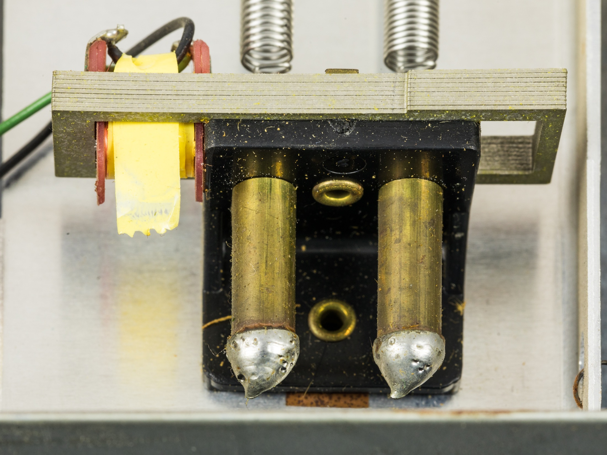

**Figure: Transducer and spring coupling inside a Hammond/Gibbs electromechanical reverberation unit.** The close-up exposes coils, magnetic assemblies, spring terminations, and supporting metalwork. Reverberation is stored mechanically, but electrical drive and pickup make the structure part of the organ's signal path.

*Source and license:* Raimond Spekking, [Wikimedia Commons](https://commons.wikimedia.org/wiki/File:Solina_NL-110_-_Electronic_organ_-_Gibbs_Special_Products_Corporation_Reverberation_Unit-49883.jpg), CC BY-SA 4.0.

Spring reverb entered guitar culture through amplifiers and standalone units, where it interacted with pickups, tubes, loudspeakers, performance dynamics, and stage volume. The Fender Reverb Unit introduced in the early 1960s made “dwell,” tone, and mix performable controls. Dwell changed how strongly the tank was excited, which affected both level and apparent behavior. Tone shaped the wet path. Mix balanced direct and returned sound. These controls remain conceptually important because they separate excitation, timbre, and blend instead of reducing the effect to one amount.

Figure 2-40 presents the rear chassis of a standalone Fender reverb unit. Its exposed tubes, transformers, connectors, wiring, and cabinet construction show that spring reverberation had become musician-operated amplification gear, not only studio infrastructure.

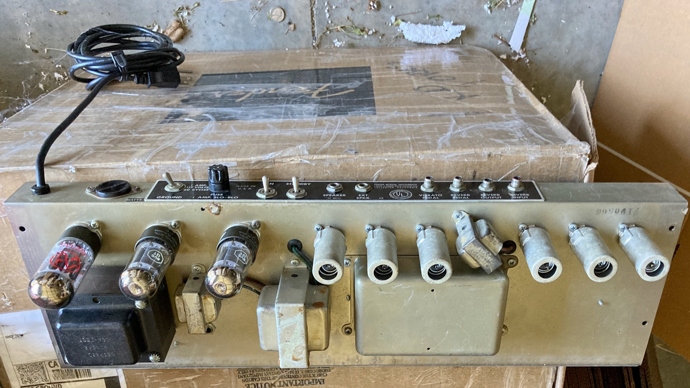

**Figure: Rear chassis view of a Fender standalone spring-reverb unit.** Tubes, transformers, connectors, wiring, and the long cabinet are visible from the service side. The unit helped make reverberation part of instrumental articulation: picking dynamics and dwell determine how forcefully the spring system is excited.

*Source and license:* Bill Abbott, [Wikimedia Commons](https://commons.wikimedia.org/wiki/File:Fender_reverb_musical_amplifier_IMG_3564_%2852453556602%29.jpg), CC BY-SA 2.0.

Surf guitar foregrounded the spring's splash, brightness, and transient response. Dub engineers later used springs as part of a performative mixing system with tape echo, filtering, feedback, muting, and fader movement. In both cases the device was not judged by how closely it reproduced a concert hall. Its identity came from the relation between attack and mechanical tail. A picked note or snare hit could trigger a burst whose chirp and density occupied rhythmic space.

Figure 2-41 removes the surrounding product enclosure so the parallel springs, input driver, and output pickup can be inspected directly. This visible signal path explains why spring emulations must model more than an exponential decay.


**Figure: Open spring-reverb tank showing driver, springs, and pickup.** Several suspended springs provide related propagation paths. Mechanical terminations and transducer coupling generate dispersion, repeated arrivals, limited bandwidth, and sensitivity to physical shock.

*Source and license:* Ashley Pomeroy, [Wikimedia Commons](https://commons.wikimedia.org/wiki/File:Spring_Reverb_8325.jpg), CC BY-SA 4.0.

The spring also demonstrates how technologies migrate across scale. The large studio chamber became a plate; the plate's principle of distributed mechanical storage became a compact spring assembly; the spring assembly later became a digital algorithm, convolution response, and learned model. Yet physical springs remain in production because no simulation eliminates the attraction of directly exciting a resonant object.

Figure 2-42 shows a modern modular-synthesizer spring assembly. The physical tank is still separated from the control electronics, preserving a design lineage in which voltage and code prepare and recover a process that occurs in metal.


**Figure: Compact spring assembly for a modular-synthesizer reverberator.** The tank remains an external mechanical memory while the module provides drive, recovery, feedback, and level control. Contemporary modular practice can patch the wet signal back into filters, oscillators, or controlled feedback networks.

*Source and license:* GeschnittenBrot, [Wikimedia Commons](https://commons.wikimedia.org/wiki/File:Spring_reverb_for_Doepfer_A-199.jpg), CC BY-SA 2.0.

Other electromechanical devices explored vibrating membranes, foils, drums, wires, rotating magnetic media, and hybrid acoustic paths. Oil-can delays and magnetic drum systems are often discussed with echo rather than reverb, but the distinction becomes blurry when many recirculating repeats, filtering, and diffusion fuse perceptually. Tape delay likewise supplied controllable time and feedback before affordable digital memory. Engineers could build pseudo-reverberant textures by combining several tape heads or machines, changing speed, filtering returns, and feeding one delay into another.

The key transition is conceptual: a reverberant response does not require a literal room if a system can produce enough delayed, attenuated, spectrally evolving, and mutually complicated copies. Mechanical devices proved that alternative storage media could create convincing or musically valuable persistence. Electronic and digital systems would separate those copies from physical propagation and make their timing programmable.

#### From Electromechanical Media to Delay-and-Feedback Abstraction

Figure 2-43 places a Dynacord DRS-78 digital reverberator beside a VRS-23 “vertical reverb.” The pairing is historically valuable because two design regimes share one photograph. One stores and processes response through electronic and digital means; the other belongs to the family of compact physical reverberators. Studios did not move from one era to another overnight. They compared, layered, and retained devices according to sound.

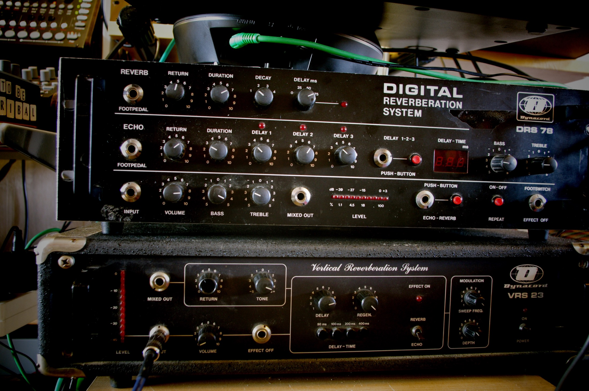

**Figure: Dynacord digital and physical reverberators side by side.** The DRS-78 and VRS-23 embody overlapping approaches to artificial decay. Their coexistence shows that digital adoption expanded the palette rather than immediately erasing mechanical media.

*Source and license:* Mikael Altemark, [Wikimedia Commons](https://commons.wikimedia.org/wiki/File:Dynacord_DRS-78_Digital_Reverb,_Dynacord_VRS-23_Vertical_Reverb._%282015-03-01_10.53.01_by_mikael_altemark%29.jpg), CC BY 2.0.

Analog electronic delay was historically difficult. A long audio-band delay requires storage, and pure resistor-capacitor networks change phase without supplying room-scale delay economically. Magnetic tape, rotating media, acoustic paths, and later bucket-brigade devices provided time at the cost of noise, bandwidth, stability, or modulation artifacts. Each imperfection shaped use. Tape delay darkened and compressed repeats. Mechanical paths rang. Bucket-brigade delays traded bandwidth against delay length and clock noise. Reverb designs often embraced these losses because real reverberant energy also becomes darker and less coherent over time.

The abstract building blocks were nevertheless becoming clear: delayed branches, attenuation, filtering, summation, and feedback. Harry Olson and John Bleazey's pipe-based synthetic reverberator made that abstraction visible across acoustic and electrical domains. Manfred R. Schroeder and Benjamin F. Logan's 1961 paper [“‘Colorless’ Artificial Reverberation”](https://secure.aes.org/forum/pubs/journal/?elib=465) addressed two central faults of delay-loop systems: comb-filter coloration and insufficient echo density. Cascaded allpass filters could increase density while maintaining an approximately flat magnitude response, and parallel feedback comb filters could establish decaying recirculation.

Schroeder's [1961 convention paper](https://secure.aes.org/forum/pubs/conventions/?elib=343) described natural-sounding artificial reverberation produced by electronic means and even discussed an ambiophonic, three-dimensional extension. The historical significance is not that one topology solved reverberation forever. It is that reverberator design became a problem that could be reasoned about using transfer functions, delay statistics, echo density, coloration, and perception. The room was no longer the only explanatory model.

The familiar Schroeder architecture used several parallel feedback comb filters followed by serial allpass diffusers. The comb section built duration through recursion. The allpass section increased temporal complexity. Prime or mutually incommensurate delays reduced obvious common periods. Frequency-dependent feedback shortened high-frequency decay. The topology was computationally economical and theoretically legible, but sparse or poorly chosen settings produced metallic modes, flutter, and audible periodicity.

James A. Moorer's late-1970s work added more explicit early reflections, low-pass behavior in feedback loops, and design detail informed by room responses. Later structures distributed state through feedback matrices, nested allpasses, scattering junctions, velvet-noise sequences, time variation, and multiband decay. Stautner and Puckette's early-1980s work on digital reverberation connected multichannel output with matrix feedback. Jean-Marc Jot and Antoine Chaigne formalized design methods that separated desired decay behavior from a lossless feedback structure. Julius O. Smith's work on digital waveguides and lossless scattering provided a broader physical and mathematical vocabulary.

Barry Blesser's 2001 synthesis, [“An Interdisciplinary Synthesis of Reverberation Viewpoints”](https://secure.aes.org/forum/pubs/journal/?elib=10176), argues that artificial reverberation is understood best where perceptual metrics, room statistics, musical culture, and studio practice intersect. That observation explains the historical endurance of nonliteral devices. An algorithm need not reproduce every path in a room if it creates the temporal and spectral statistics from which listeners construct a useful sense of space. Conversely, a mathematically elegant network can fail if its modes, density, onset, or spatial behavior violate perceptual expectations.

#### The First Commercial Digital Reverberators

Digital reverberation required converters, memory, arithmetic, control logic, and enough throughput to update a long recursive system at audio rate. In the 1970s these resources were expensive and limited. Early commercial units therefore encoded design judgment in hardware. Memory size constrained delay lengths. Word length shaped noise and headroom. Processor speed constrained filter count and modulation. Converter quality shaped bandwidth and transient response. Those limits did not merely reduce fidelity; they helped define recognizable products.

The EMT 250, introduced in 1976, is widely recognized as the first commercial digital reverberator. Barry Blesser's historical account identifies his role in developing the system, and EMT's contemporary [Courier 26](https://tile.loc.gov/storage-services/master/mbrs/recording_preservation/manuals/EMT%20Courier%2026%20%28June%201976%29.pdf) documents the electronic reverberator in its original period. The freestanding unit used lever-like controls and supported reverberation plus delay, chorus, and related effects. Its furniture-like form made digital computation tactile: engineers could shape time without navigating a general-purpose computer.

The EMT 250 did not imitate the appearance of the EMT 140. This difference symbolizes the change in medium. The plate exposed a large mechanical storage system. The digital unit could hide its state in memory and present only parameters. Decay time could change without moving a damper across steel. Delay and modulation could become separate programs. Recalling a sound increasingly meant restoring numbers rather than recreating microphone positions or mechanical settings.

Lexicon's path began with digital delay technology. Its own Pantheon manual recounts the Delta-T 101 delay and David Griesinger's development work that led to the Lexicon 224. Introduced at the end of the 1970s, the 224 paired a processor with a remote control surface whose sliders and program selection made sophisticated algorithms accessible from the console. The unit's influence came from a combination of sound and interface. Engineers could choose room, hall, plate, and related programs, then alter decay, pre-delay, crossover behavior, and other musically legible dimensions.

The 224's algorithms were not neutral simulations. Limited memory and arithmetic encouraged carefully modulated structures whose density and pitch motion became part of the sound. The result could feel lush because modulation prevented static resonances and because frequency-dependent behavior was tuned by ear and psychoacoustic judgment. “Digital” did not mean transparent. It meant that coloration could be authored in code and repeated across units.

AMS developed digital delay and reverberation as another distinct lineage. The company's [official history](https://www.ams-neve.com/our-story/ams-history/) traces its formation in 1976 and early digital products. The [RMX16 documentation](https://www.ams-neve.com/outboard/500-series-range/ams-rmx16/) describes the original 1982 unit as the first microprocessor-controlled, full-bandwidth digital reverberator. Its programs, including nonlinear and gated responses, became tightly associated with 1980s production because they transformed the envelope of reverberation rather than merely extending decay.

Figure 2-44 shows a working studio rack containing a Lexicon 200, AMS RMX16, and Lexicon PCM42 delay. The image is more historically truthful than an isolated museum portrait: landmark processors lived beside delays, compressors, patchbays, and console sends, where engineers combined them into systems.

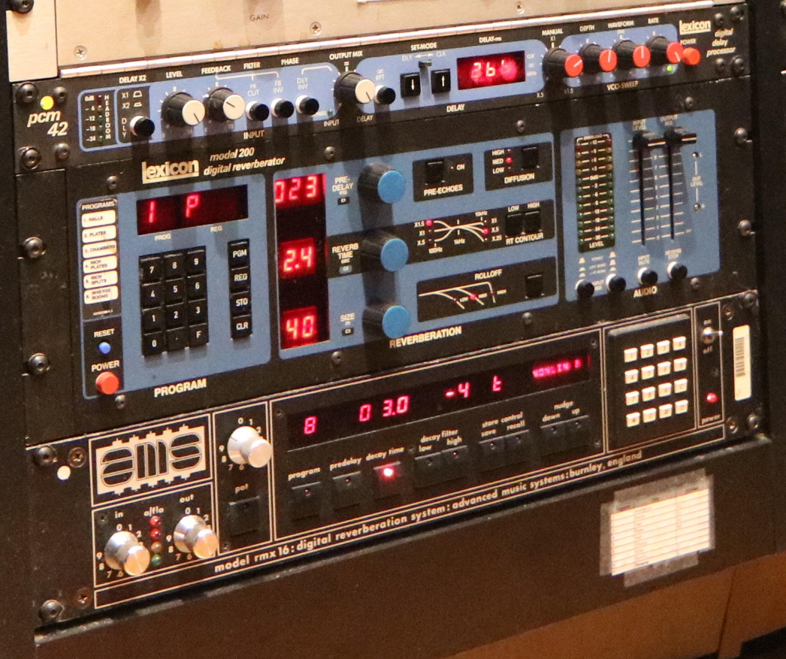

**Figure: Early digital reverberation and delay processors in studio context.** The Lexicon 200 and AMS RMX16 occupy adjacent rack space with a PCM42 delay. Their proximity reflects an era in which delay, pitch change, gated envelopes, and reverberation were patched together as complementary production tools.

*Source and license:* The Blackbird Academy, [Wikimedia Commons](https://commons.wikimedia.org/wiki/File:Blackbird_Studio_B_control_room_-_Gear_racks_with_bantam_patchbay,_compressors,_digital_reverbs,_EQs,_etc._IMG_9981_-_Blackbird_Studio_-_Phil_Madeira,_Nov._16-18,_2021_-_The_Blackbird_Academy_%282021-11-15_17.16.15%29_%28cropped%29.jpg), CC BY-SA 2.0.

Gated and nonlinear programs demonstrate that digital reverberation quickly escaped the goal of invisible realism. A gate could stop a dense response before its natural exponential decay. A nonlinear program could hold or reshape energy before terminating. Used on drums, these envelopes magnified attack and apparent room size while protecting rhythmic space. The effect became part of arrangement and genre. The processor did not ask “what room is this?” so much as “what energy envelope should follow this event?”

The first digital generation also made programmability a studio asset. A chamber could be photographed and documented, but its exact sound depended on physical setup. A digital unit could store or recall programs, though early recall was not always complete by modern standards. Studios could exchange settings, manufacturers could issue updates, and recognizable algorithms could appear across recordings. Presets became part of production vocabulary.

#### Affordable Racks and the Democratization of Digital Space

High-end digital reverberators initially belonged to major studios, broadcasters, and institutions. During the 1980s, integrated circuits, memory, converters, and manufacturing improved enough for smaller rack units to reach project studios, touring systems, keyboard rigs, and home recordists. This shift changed production practice as much as sound. A studio no longer needed a chamber, plate, or flagship remote-controlled processor to place several artificial spaces in one arrangement.

Affordable units often exposed fewer editable parameters and used lower-cost converters, restricted bandwidth, short programs, and compact displays. These constraints became aesthetic markers. Grainy tails, audible modulation, narrow bandwidth, and abrupt program envelopes could make a source sit in a mix precisely because the return did not resemble unprocessed high-fidelity audio. A producer could choose a small box for its attack and texture rather than apologize for it as a compromised hall.

Alesis's MIDIVerb family represents this democratization. MIDI control connected effects to increasingly automated studios, while preset-oriented operation let users move quickly among rooms, plates, gates, and special effects. Figure 2-45 shows the original MIDIVerb as a compact front-panel device. Its scale contrasts sharply with the EMT plate and freestanding EMT 250.

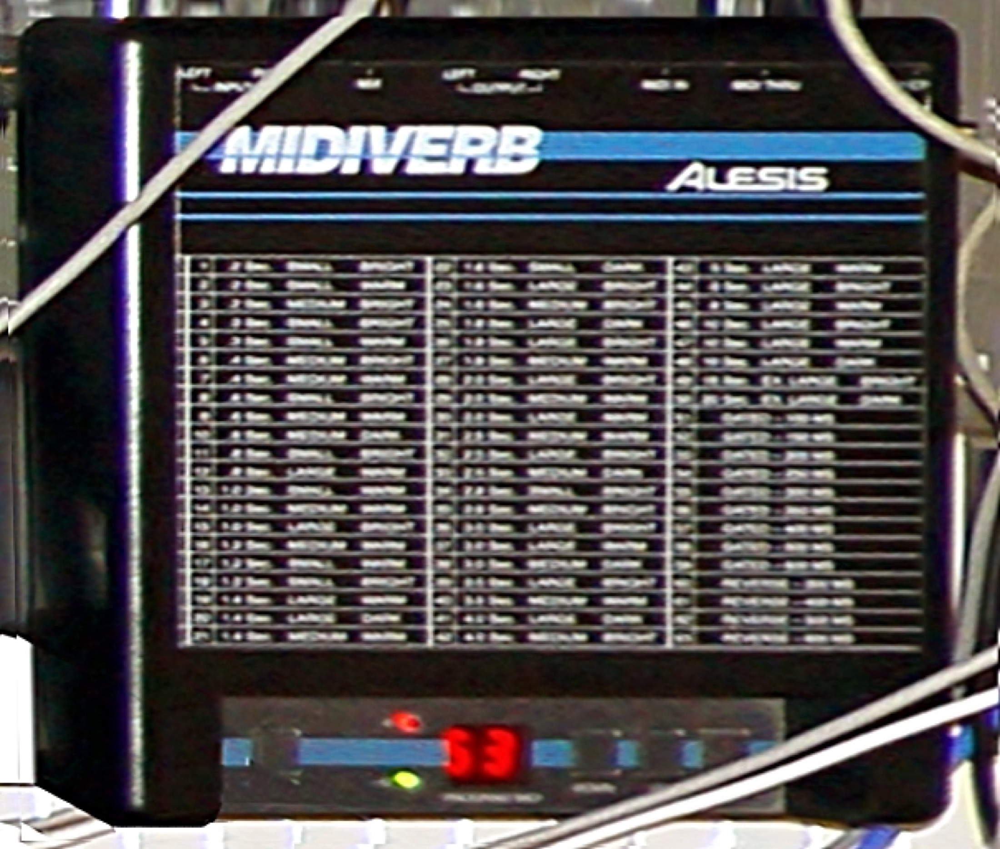

**Figure: Alesis MIDIVerb and the project-studio digital transition.** A compact rack format, program display, and small control set made digital reverberation portable and affordable. Preset identity became more prominent as a large internal algorithm was represented by a number and a few controls.

*Source and license:* Brandon Daniel and Clusternote, [Wikimedia Commons](https://commons.wikimedia.org/wiki/File:Alesis_MIDIVerb.jpg), CC BY-SA 2.0.

Yamaha's REV and SPX families likewise helped turn digital effects into routine infrastructure. The SPX90, introduced in the mid-1980s, combined reverberation with delay, pitch change, modulation, gating, and other utilities in a one-rack-space unit. Its gated and reverse-style programs became production signatures, but its broader importance was functional integration. One processor could solve several session problems and could be repatched as the arrangement changed.

Figure 2-46 shows a Yamaha SPX90 and Alesis Microverb III inside a working rack. The photograph documents the practical ecosystem of the era: effects shared space with patching, conversion, synthesis, and other studio utilities.

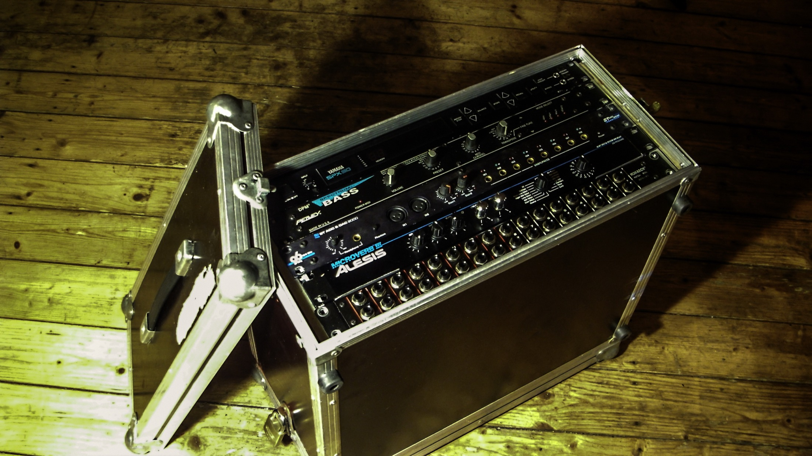

**Figure: Yamaha SPX90 and Alesis Microverb III in project-studio use.** The one-rack-space format compresses processing and control into a standardized physical unit. Multiple affordable processors allowed different sources to receive distinct spaces rather than compete for one chamber or plate.

*Source and license:* Klara Kopf, [Wikimedia Commons](https://commons.wikimedia.org/wiki/File:Effects_rack_-_Yamaha_SPX90,_Peavey_DPM_Spectrum_Bass,_ST_Audio_ADC%26DAC2000,_Alesis_Microverb_III,_patchbay_-_Doomsday_Studio_%282015-04-03_21.08.00_by_Klara_Kopf%29.jpg), CC BY 2.0.

More available processors encouraged layered spatial production. A short ambience could give drums body; a plate could support a vocal; a longer hall could connect strings or synthesizers; a gated program could appear only at structural accents. This was not merely “more reverb.” It was orchestration by decay family. Different sends and returns occupied different temporal and spectral roles.

The risk was fragmentation. If every source received an unrelated preset, the mix could lose a common acoustic logic. Skilled engineers often created hierarchy: one principal room or plate established shared space, while secondary devices supplied character or special events. That strategy remains valuable in a DAW with unlimited instances. Historical scarcity taught engineers to distinguish an environmental field from decorative effects.

#### Multi-Effects, Pitch, Modulation, and Impossible Rooms

Digital memory allowed reverberation to interact with pitch shifting, delay, modulation, filtering, and dynamics inside one programmable system. Eventide's Harmonizer lineage made pitch and delay central studio resources; later multi-effects units such as the H3000 exposed patchable structures and algorithms whose spatial results could be deliberately unreal. A pitch-shifted feedback path could rise or fall indefinitely. Modulated delays could widen and animate a tail. Reverse and multitap patterns could imply spaces that no architecture would produce.

Figure 2-47 presents an Eventide H3000 SE. Its dense front panel and program structure represent a move from a dedicated “room simulator” toward a general spatial and timbral computer.

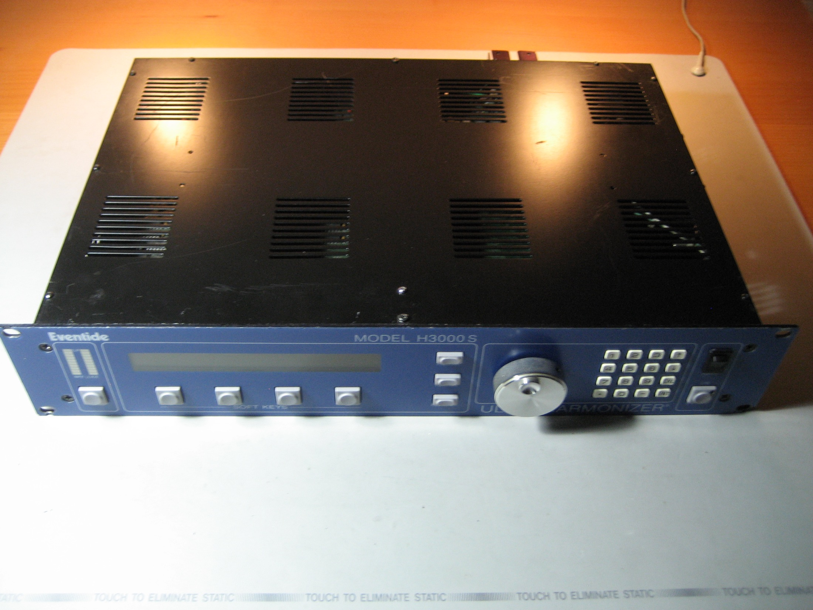

**Figure: Eventide H3000 SE as a programmable multi-effects environment.** Reverb, delay, pitch transformation, modulation, and feedback can participate in one patch. The device helped normalize the idea that a reverberant tail could change pitch, move, or behave as a synthetic voice.

*Source and license:* John R. Southern, [Wikimedia Commons](https://commons.wikimedia.org/wiki/File:Eventide_H3000_SE_Ultra-Harmonizer.jpg), CC BY-SA 2.0.

This branch of history leads directly to shimmer, resonant cloud, freeze, reverse, and granular reverbs. Shimmer commonly feeds a pitch-shifted interval into a long decay so each circulation adds transformed harmonic energy. Freeze raises loop gain toward unity or replaces the decay process with a sustaining spectral state. Granular reverberation distributes short windows across time, pitch, and space rather than relying only on recursive delay lines. These effects inherit the send-and-return concept but no longer claim that the return is a passive environment.

The distinction between reverb and instrument becomes unstable. If feedback is automated, the return has phrasing. If pitch changes on each circulation, it has harmonic motion. If a freeze preserves one chord under the next, it has memory at the level of form. If a spatial trajectory moves only the tail, it has counterpoint independent of the source. The technology's history therefore expands from acoustic simulation to composition with persistent signal state.

#### Algorithmic Maturity in the 1990s and 2000s

As processing power and memory increased, high-end algorithmic systems could support more delay lines, more elaborate modulation, multiband decay, denser early-reflection patterns, and multichannel output. Lexicon's 480L, PCM series, 960L, and related families represented different scales of that development. Quantec, TC Electronic, Sony, Yamaha, Eventide, and other manufacturers pursued distinct balances of realism, density, spatial behavior, control, and coloration.

Algorithm design also became more systematic. Feedback delay networks used a matrix to couple many delay lines. If the matrix preserved energy and loop filters imposed the desired frequency-dependent loss, decay time could be designed with greater independence from mixing topology. Modulation reduced static modes but had to avoid audible pitch wandering. Early and late fields could be separated. Output matrices and decorrelation could generate stereo or surround fields from shared internal state.

Jean-Marc Jot's work is central to this transition because it treats perceptual decay specification, energy-preserving mixing, and correction of modal response as related design tasks. Rather than tuning every feedback gain by trial, a designer can derive gains from desired decay times. Rather than accept the uncolored ideal as sufficient, correction filters can compensate for irregular mode distribution. The FDN becomes a framework within which different matrices, delays, filters, and modulators create families of reverberators.

Figure 2-48 shows a later studio rack containing Lexicon PCM 90, Alex, and Vortex processors with a Sony HR-MP5. The image illustrates diversification within digital effects: dedicated and multi-effects units coexisted, and a studio's “digital reverb” was often a collection of algorithms with different generations and control philosophies.

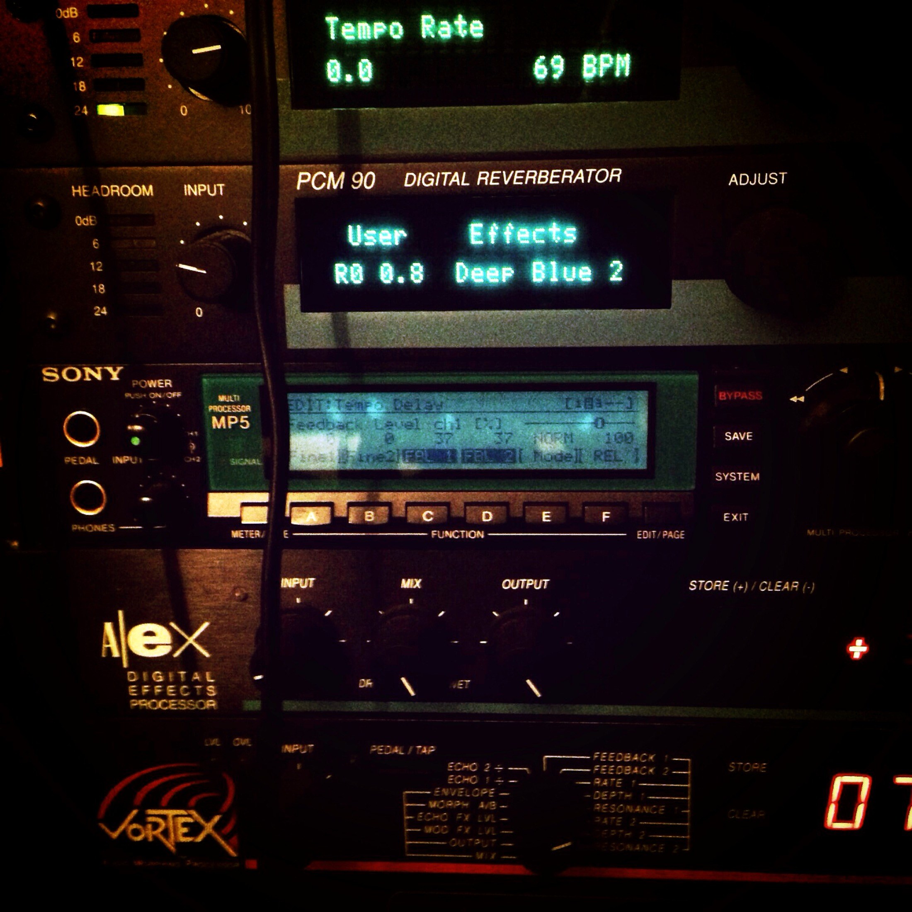

**Figure: Later digital-reverb and multi-effects families in a studio rack.** Several processors provide overlapping but nonidentical rooms, plates, delays, modulation, and special effects. Algorithmic identity increasingly belongs to software and firmware even when it remains housed in dedicated hardware.

*Source and license:* fr4dd, [Wikimedia Commons](https://commons.wikimedia.org/wiki/File:Outboard_-_Lexicon_PCM_90,_SONY_HR-MP5,_Lexicon_Alex,_Lexicon_Vortex_%28photo_by_fr4dd%29.jpg), CC BY 2.0.

Surround production changed the output problem. A stereo reverberator could create width through two decorrelated returns, but cinema and multichannel music needed stable energy around a larger array. Simply copying one tail into every channel raised level and correlation without producing convincing envelopment. Multichannel algorithms used additional output taps, matrices, decorrelation, and directional early patterns. The internal network could remain shared so the room felt coherent, while outputs sampled that state differently.

This development anticipates today's immersive distinction among source, early field, late bed, and special objects. The late field often benefits from broad statistical continuity. Early reflections may remain connected to source direction. A designed effect may move separately. Modern systems can render many channels, but the fundamental problem remains the historical one: distribute stored energy so listeners hear one intentional environment rather than unrelated echoes.

#### Convolution and the Impulse-Response Archive

Algorithmic reverberators generate an impulse response from a recursive structure. Convolution reverberators store or load an impulse response and apply it to new audio. If the measured system is linear and time invariant, the response captures its complete input-output behavior for the measured source, receiver, channels, level, and state. This made it possible to bring specific halls, churches, chambers, plates, springs, loudspeakers, and signal chains into software.

Convolution theory is old, but long real-time audio convolution was computationally expensive. Fast Fourier transforms, partitioned convolution, efficient memory, and general-purpose processors made long responses practical. Uniform and nonuniform partitioning allowed a short first partition to preserve low latency while larger later partitions handled the long tail efficiently. Multichannel and matrix convolution extended the idea from one input-output pair to many directional paths.

Impulse-response measurement became its own craft. A pistol shot or balloon burst provides a simple excitation but limited repeatability and signal-to-noise ratio. Maximum-length sequences and swept sinusoids improve energy distribution and allow deconvolution. Exponential sine sweeps can separate harmonic-distortion responses in time. Microphone directivity, source radiation, position, clock stability, ambient noise, and truncation all affect the captured asset.

Convolution changed the status of historical hardware. An EMT plate, spring tank, chamber, or rare digital unit could be sampled and distributed as data. This preservation is powerful but partial. One impulse response captures one setting and one linearized state. It does not necessarily capture level-dependent transducer behavior, mechanical shock, modulation that changes from pass to pass, moving dampers, time-varying converters, or the performative act of driving feedback. Libraries can sample many settings, but a finite collection remains different from a continuously controllable physical system.

Convolution also changed architectural memory. A space could be documented before renovation, closure, or demolition. Researchers could compare positions and layouts. Film and game production could place dry sources into measured environments. Musicians could use a grain silo, mausoleum, tunnel, or cathedral as a portable response. The ethics of that portability matter: an impulse response is both technical data and a representation of a place. Documentation should identify source, receiver, date, equipment, channel convention, license, and processing rather than treating every downloaded WAV as anonymous raw material.

#### Native Plug-ins and the End of One-Reverb Scarcity

As DAWs and native processors became powerful enough for real-time effects, reverberation moved from shared hardware into software instances. Early plug-ins reproduced familiar categories because users already understood room, hall, plate, spring, chamber, and gated programs. Over time, software interfaces exposed deeper structures: early-reflection editors, multiband decay, modulation matrices, impulse-response browsers, surround routing, freeze, pitch feedback, and graphical decay displays.

The economic change was profound. A hardware studio might own one plate, one chamber, and several digital boxes. A DAW could instantiate dozens of reverbs, automate every parameter, save them with the session, render offline at higher quality, and exchange presets instantly. The effect became abundant. This abundance enabled detailed sound design but weakened the default discipline of a shared return.

Native processing also separated algorithm from dedicated hardware. A classic topology could be reimplemented, modeled, extended, or combined with another method. Some plug-ins emulate a particular unit including converters and bandwidth. Others reproduce only broad behavior. Others use classic names for entirely new networks. Historical literacy helps users distinguish these claims. A “224-style hall,” a sampled 224 program, and a circuit-plus-algorithm model are different products even if their preset browsers use similar language.

Automation turned reverb into a time-varying arrangement layer. Engineers could change decay by section, move early reflections, switch impulse responses, duck returns from source activity, or freeze selected moments. Offline rendering removed realtime constraints for extreme tails and large matrices. At the same time, parameter smoothing, state recall, denormal handling, and plug-in delay compensation became engineering requirements that mechanical devices never faced in the same form.

#### Reverb Leaves the Rack: Pedals and Modular Systems

Digital signal processors eventually became small and efficient enough for floor pedals and modular-synthesizer modules. This migration changed who performed the reverb and when. A rack return is often controlled by an engineer after capture. A pedal is touched by the performer, placed before or after distortion, and incorporated into technique. A modular reverb can receive control voltage, audio-rate modulation, and feedback from an open patch.

Figure 2-49 shows the Make Noise Erbe-Verb in a Eurorack context. Its many continuous controls present reverberation as a voltage-controllable synthesis process rather than a fixed room selector.

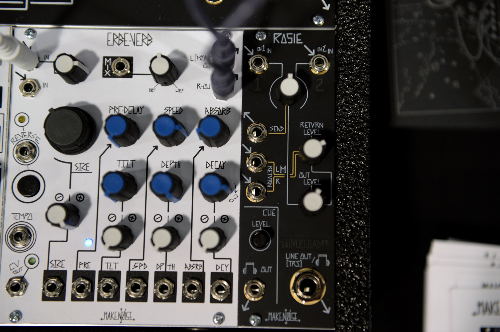

**Figure: Voltage-controlled digital reverberation in a modular system.** The Erbe-Verb exposes size, decay, modulation, absorption, tilt, and other dimensions to manual and control-voltage change. The reverb can become an actively modulated voice inside a patch.

*Source and license:* Brandon Daniel, [Wikimedia Commons](https://commons.wikimedia.org/wiki/File:Make_Noise_-_Erbe-Verb,_Rosie_-_2014_NAMM_Show.jpg), CC BY-SA 2.0.

Continuous control revives an older physical intuition. Moving a plate damper changed decay mechanically; changing a chamber microphone changed perspective; striking a spring changed its state. Modular control makes analogous changes electronic and repeatable, though rapid modulation can create pitch, zipper noise, or instability if the algorithm is not designed for it. The control surface therefore reveals whether a reverb is a static processor with interpolated parameters or a genuinely time-varying instrument.

Figure 2-50 shows the TC Electronic Nova Reverb pedal. Its display, preset architecture, and knobs compress studio-style digital processing into a performance format.

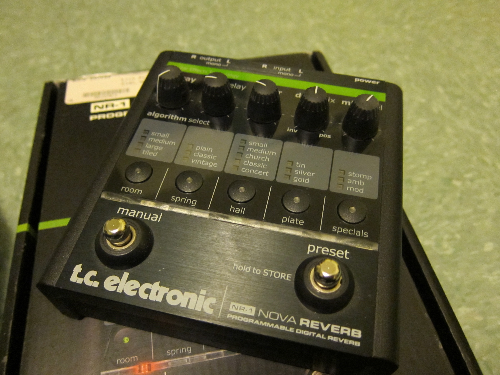

**Figure: Programmable digital reverberation as a performance pedal.** Room families and editable parameters are placed at the musician's feet. Reverb can be changed between songs, driven into amplifiers, or positioned within a chain whose distortion and dynamics alter the return.

*Source and license:* Oldangelmidnight, [Wikimedia Commons](https://commons.wikimedia.org/wiki/File:T.c._electronic_NR-1_Nova_Reverb_-_Programmable_Digital_Reverb.jpg), CC BY-SA 2.0.

Pedal and modular culture also encouraged hybrid categories: shimmer, black-hole, bloom, cloud, swell, lofi, granular, and spectral reverbs. These names describe gestures and textures more than architecture. They continue the 1980s move toward program identity, but with far more continuous control. The word *reverb* now covers any system in which sound leaves a temporally extended, spatially suggestive, or recursively transformed memory.

#### Measurement Rooms, Spatial Audio, and Immersive Reverberation

Artificial reverberation has always depended on measurement, even when design was guided primarily by ear. Decay curves, frequency response, echo density, noise, distortion, and spatial correlation help distinguish a useful field from ringing or instability. Reverberation chambers used in acoustics and aerospace testing push the physical principle toward controlled diffuse excitation. Their purpose may be material testing, source-power measurement, or qualification rather than music, but they reveal the engineering ideal of statistically distributed energy.

Figure 2-51 shows a Reverberant Acoustic Test Facility horn room. High-output horns excite a large reflective volume so equipment can be exposed to intense diffuse acoustic energy. The image expands the history beyond studio effects: a reverberant field can be a measurement environment, a stress condition, and a designed laboratory tool.


**Figure: High-level reverberant acoustic test facility.** Horns inject controlled energy into a reflective enclosure intended to build a strong distributed field. The room demonstrates reverberation as an engineered test condition rather than a musical aftereffect.

*Source and license:* Illudium Pu-36, [Wikimedia Commons](https://commons.wikimedia.org/wiki/File:RATF_Horn_Room.JPG), CC BY-SA 3.0.

Spatial audio adds direction to the historical questions of storage, mixing, and loss. A mono chamber return captures one source-to-microphone path. Stereo adds related viewpoints. Surround and Ambisonic measurements preserve more directional information. Matrix impulse responses can map several sources to several outputs. Object-based production may keep direct sources independent while placing diffuse reverberation in a bed and special reflected gestures on objects.

The computational burden grows quickly. An $M$-input, $N$-output convolution contains $MN$ impulse responses. A high-order Ambisonic field contains many spherical-harmonic channels. Binaural rendering requires head-related filters and may update with head motion. A dynamic listener or source invalidates the assumption that one fixed impulse response describes the scene. Interpolation among measured responses, geometric simulation, wave methods, and hybrid late-field algorithms address different parts of the problem.

Ray tracing and image-source methods return the history to architecture, but now geometry is data. A CAD model can produce candidate reflection paths; material coefficients attenuate and filter them; source and receiver directivity determine path weights. Geometric acoustics is efficient at frequencies where wavelengths are small relative to surfaces, but it does not naturally capture low-frequency wave behavior or diffraction without extensions. Full wave methods can model those effects at much greater cost. Hybrid room renderers often calculate early paths geometrically and hand the late field to a statistical algorithm.

The most convincing immersive result may therefore combine several historical media: measured early reflections, a ray-traced directional pattern, an FDN late field, modeled plate coloration, and binaural or loudspeaker rendering. The layers are not redundant. Each handles the part of the response for which its assumptions are useful.

#### Extreme Spaces and the Cultural Memory of Decay

Some spaces become historically important because their decay exceeds ordinary expectations. Hamilton Mausoleum was long associated with an exceptionally extended echo. Tanks, tunnels, silos, cisterns, and industrial chambers attract musicians because their modes and long paths turn isolated events into large-form material. Digital capture allows these spaces to circulate as impulse responses, but the fascination begins with bodily experience: a sound continues after its source has stopped, returning from a structure too large or irregular to apprehend at once.

Figure 2-52 presents Hamilton Mausoleum as the final photographic anchor in this history. Its hard circular enclosure illustrates why extraordinary decay is both an acoustic measurement and a cultural story.


**Figure: Hamilton Mausoleum and the cultural imagination of extreme reverberation.** Hard curved boundaries and a large enclosed volume support long, conspicuous returns. Such sites motivate measurement, composition, impulse-response capture, and the design of digital “impossible space” presets.

*Source and license:* Supergolden, [Wikimedia Commons](https://commons.wikimedia.org/wiki/File:Hamilton_Mausoleum_Interior.jpg), CC BY-SA 3.0.

Extreme digital settings extend this cultural idea beyond physical construction. A 360-second or 3,600-second decay does not describe a conventional occupied room. It describes controlled memory. The same stability rules still apply: loop gain must remain bounded, low-frequency accumulation must be managed, modulation must avoid runaway pitch or phase behavior, and the output must preserve headroom. History helps interpret the control. An “infinite” mode descends from chamber recirculation, tape feedback, sustained springs, and digital loop gain, but it becomes a new compositional category when the tail outlives phrases and sections.

#### Physical Modeling, Machine Learning, and the Current Hybrid Era

Physical modeling attempts to preserve causal structure. Digital waveguides model traveling waves and scattering. Finite-difference and finite-element methods discretize wave equations. Modal synthesis represents a resonator as decaying modes. Plate and spring models reproduce dispersion and damping rather than only matching one output recording. These methods can expose physically meaningful parameters, but they require computational choices and boundary assumptions that shape the result.

Machine learning introduces another representation: a model estimates a mapping from dry audio and controls to reverberant output, or from a reverberant signal to a less reverberant target. A network may learn a black-box effect from examples, predict room parameters, generate impulse responses, interpolate among spaces, estimate material absorption, or assist dereverberation. DSP-informed models constrain the architecture so delays, filters, convolution, or physical states remain explicit. The research on modeling plate and spring reverberation with DSP-informed neural networks is historically revealing because it does not replace the old mechanisms conceptually; it embeds their structure in a trainable system.

Learned reverberation raises new archival questions. A convolution library can identify the exact impulse response used. A neural model may summarize thousands of responses in weights that are difficult to interpret. Training data may contain rooms, hardware, performances, or licenses that need documentation. A model can generalize between measured conditions, but it can also invent plausible response without preserving one place. Provenance, evaluation, deterministic inference, and disclosure become part of reverb engineering.

The strongest current systems are often hybrid. A geometric model predicts early arrival directions. A learned estimator infers materials or room dimensions. An FDN produces a stable late field. Convolution supplies a measured device onset. Neural residual processing adds time-varying detail. A renderer distributes the result to loudspeakers or headphones. This is not a failure to choose one method. It is the mature recognition that “reverberation” contains several physically and perceptually distinct tasks.

#### A Condensed Timeline

The following timeline should be read as overlapping milestones rather than replacement dates:

- **Before electrical recording:** architecture, performer placement, and listener position determine reverberation inseparably from the event.
- **Early electrical era:** microphones, amplifiers, loudspeakers, mixers, and rerecording make separate send-and-return rooms possible.
- **1930s–1950s:** improvised and purpose-built echo chambers turn architecture into studio outboard equipment.
- **1939–1941:** Laurens Hammond's spring-reverberation patent establishes a compact electromechanical method for extending an electrical instrument's decay.
- **1940s–1960s:** chambers, springs, magnetic delays, tubes, pipes, and other physical systems coexist in broadcast, organ, studio, and instrument design.
- **1957:** the EMT 140 plate offers dense, controllable electromechanical reverberation without a dedicated room.
- **1960–1961:** Olson and Bleazey describe a synthetic pipe-and-feedback reverberator; Schroeder and Logan formalize comb and allpass approaches to density and coloration.
- **1970s:** digital delay, memory, converters, and real-time arithmetic become sufficient for commercial programmable reverberation.
- **1976:** the EMT 250 establishes a landmark commercial digital reverberator with tactile control.
- **Late 1970s:** Lexicon's 224 lineage brings influential modulated algorithms and remote-console operation into major studios.
- **Early 1980s:** AMS RMX16, Yamaha REV systems, Quantec, and other processors expand full-bandwidth, program-oriented, and multichannel possibilities.
- **Mid-to-late 1980s:** SPX, MIDIVerb, Microverb, PCM, and other compact racks make multiple digital spaces practical outside elite studios.
- **1990s:** higher processing power supports more elaborate modulation, FDNs, multiband decay, surround output, and native software effects.
- **Late 1990s–2000s:** practical long convolution and growing impulse-response libraries make measured spaces and devices portable.
- **2000s–2010s:** native plug-ins, pedals, and modular DSP multiply instances, automation, hybrid algorithms, and performable control.
- **2010s–present:** immersive rendering, large convolution matrices, geometric simulation, neural models, and Audio AI connect reverberation to spatial computing and data-driven production.

#### How to Listen Historically

A useful history is audible. Compare technologies with the same dry sources at matched loudness and similar nominal decay. Use a click for onset and density, speech for consonant masking, snare for transient envelope, piano for harmonic overlap, and a sustained chord for modulation and modal stability. Do not attempt to force every device to the same bandwidth or exact $T_{60}$ if doing so removes its identity.

Listen in layers. First isolate the wet signal. Identify pre-delay, initial burst, discrete repetitions, density growth, tonal change, pitch motion, noise, and termination. Then restore the dry source and judge distance, blend, intelligibility, and groove. Finally place the return inside a complete arrangement. A plate that sounds bright alone may position a vocal perfectly. A realistic hall may disappear under dense instrumentation. A cheap early digital program may create a superior drum envelope because its limited bandwidth protects the mix.

The historical comparison should ask what each medium makes easy:

- A **chamber** makes transducer, air, geometry, and shared spatial identity unavoidable.
- A **plate** makes dense bright extension and mechanical damping easy.
- A **spring** makes compact dispersive splash and performative excitation easy.
- A **tape or magnetic delay system** makes recirculation, saturation, and progressive bandwidth loss easy.
- A **Schroeder or FDN algorithm** makes continuous parameter control, modulation, multiband decay, and extreme duration easy.
- A **convolution engine** makes one measured linear response repeatable and portable.
- A **physical model** makes causal material or geometry parameters available.
- A **learned model** makes interpolation and data-conditioned behavior possible, while demanding stronger provenance and evaluation.

No category owns realism. A chamber can sound unnatural if badly miked. A plate can feel more appropriate than a sampled hall. A sparse digital algorithm can sound synthetic and still be musically exact. A convolution response can be physically measured yet spatially wrong for a new source position. A neural model can be statistically convincing while obscuring what place or device it represents. The correct question is always: which cues survive, which are transformed, and what role does that transformation play in the music?

#### Historical Lessons for verbx

verbx inherits this entire history rather than selecting one winner. Its convolution engine belongs to the impulse-response tradition. Its algorithmic engine belongs to Schroeder, Moorer, FDN, scattering, and modulation traditions. Its extreme tails inherit feedback practice. Its reverse, gate, shimmer, freeze, ducking, and automation controls inherit studio techniques that treated the return as an arrangement layer. Its multichannel and Ambisonic features extend the long search for convincing spatial distribution. Its analysis and JSON reporting answer a newer requirement: make complex processing reproducible and machine-readable.

This inheritance creates obligations. Preset names should not substitute for documented behavior. A “plate” should explain what plate-like features are being modeled. A “chamber” should not imply a measured building unless an impulse response and provenance support that claim. Extreme feedback must be bounded. Sample-rate changes must preserve intended delay times. Multichannel routing must declare channel order. Neural augmentation must record model and data provenance. Historical vocabulary is useful only when it clarifies rather than markets.

Artificial reverberation developed by moving acoustic memory from architecture into rooms used as processors, then into vibrating matter, magnetic and electronic delay, digital memory, software, spatial metadata, and learned representations. At every stage, engineers exchanged one set of constraints for another. The chamber offered physical complexity but little portability. The plate offered density but not literal geometry. The spring offered compactness with dispersion. Early digital units offered control under severe memory limits. Convolution offered specificity under fixed-state assumptions. Plug-ins offered abundance at the risk of incoherence. Neural systems offer interpolation at the risk of opacity.

The history matters because those tradeoffs are still present in every reverb decision. Choosing a technology means choosing how energy will be stored, mixed, lost, controlled, documented, and heard. A great reverberator does not erase its medium. It makes the medium musically intelligible.

#### Sources and Further Historical Reading

The technical and historical claims in this section should be read alongside the book's research bibliography. Particularly useful starting points are Olson and Bleazey's [“Synthetic Reverberator”](https://aes.org/publications/elibrary-page/?id=535), Schroeder and Logan's [“‘Colorless’ Artificial Reverberation”](https://secure.aes.org/forum/pubs/journal/?elib=465), Schroeder's [“Natural Sounding Artificial Reverberation”](https://secure.aes.org/forum/pubs/conventions/?elib=343), Blesser's [“An Interdisciplinary Synthesis of Reverberation Viewpoints”](https://secure.aes.org/forum/pubs/journal/?elib=10176), the [AES historical Reverb Collection](https://aes2.org/community/aes-committees/aes-historical-committee/aes-e-library-collections/), Laurens Hammond's [spring-reverberation patent](https://patents.google.com/patent/US2230836A/en), EMT's 1976 [Courier 26](https://tile.loc.gov/storage-services/master/mbrs/recording_preservation/manuals/EMT%20Courier%2026%20%28June%201976%29.pdf), [Lexicon's product-history account](https://lexiconpro.com/en/product_documents/pantheon_manual_180246bpdf), and [AMS's company history](https://www.ams-neve.com/our-story/ams-history/). The peer-reviewed survey [“A History of Audio Effects”](https://doi.org/10.3390/app10030791) provides a broader effects chronology, while the current research bibliography documents FDN, convolution, spatial, physical-modeling, and neural developments in depth.

### Why verbx Sounds Different

No single feature explains a reverb's sound. What matters is how precision, topology,
delay distribution, diffusion, spectral loss, time variation, dynamics, and routing
interact. verbx is designed to keep those dimensions explicit rather than compressing
them into one “size” macro.

#### Exact Long-Tail Gain Calibration

For delay line $i$ with duration $d_i$ seconds and target $T_{60}$, verbx computes

$$
g_i = 10^{-3d_i/T_{60}}.
$$

Every line receives a gain appropriate to its own delay. A single shared gain would make
longer lines decay differently from shorter lines and would distort the modal envelope.
At short RT60 values the error may pass unnoticed. At 120 or 360 seconds, it becomes a
slow drift in balance that the ear hears as coloration.

The algorithmic path uses 64-bit internal precision for the long-lived state. When loop
gains approach one, rounding error persists for many circulations. Double precision does
not make an unstable design stable, but it preserves the intended loss and reduces the
chance that the tail becomes a numerical artifact before it becomes silence.

#### Matrix Family as a Musical Texture Control

The feedback matrix is not a cosmetic option. It determines how state components
exchange energy. A dense uniform matrix can make the field smooth and neutral; a sparse
or graph-derived matrix can preserve more audible pathways; a slowly time-varying matrix
can reduce stationary ringing and create subtle motion.

Audition matrix families with a click, then with a sparse chord, then with a dense mix.
The click reveals periodicity. The chord reveals modal coloration. The dense mix reveals
whether motion becomes blur. Keep RT60, delay count, damping, and wet level fixed so the
comparison isolates topology.

```bash
for matrix in hadamard householder circulant random_orthogonal tv_unitary; do
  verbx render examples/audio/dry_click.wav "/tmp/click_${matrix}.wav" \
    --engine algo --rt60 8 --wet 1 --dry 0 \
    --fdn-lines 16 --fdn-matrix "$matrix" --no-progress
done
```

The best matrix is source-dependent. Uniformity is valuable for exposed classical
material; controlled irregularity can be expressive on electronic percussion; slow
motion can keep a minute-long tail alive without obvious pitch modulation.

#### Diffusion Is an Envelope, Not a Quality Score

“More diffusion” is often treated as “better reverb,” but diffusion changes the attack
of the wet field. A dense immediate onset can support vocals and pads while softening
percussion. A slower buildup can preserve transients and imply a larger volume. The
correct density is the one that makes the room speak at the right moment in the phrase.

Use allpass stages and bloom deliberately. Allpasses scatter the excitation before it
enters the late field. Bloom shapes how the wet envelope rises. They can create related
perceptions through different mechanisms. If an attack feels detached, reduce pre-delay
or accelerate buildup. If it loses definition, reduce front-end diffusion before
shortening the entire tail.

#### Time Variation Without Obvious Chorus

Stationary delay networks have stationary modes. On a sustained source, those modes can
emerge as metallic pitches. Modulation and time-varying unitary matrices distribute
energy across changing modal bases. The design goal is often to move slowly enough that
the listener hears a living space rather than a pitch effect.

`--fdn-tv-rate-hz` controls update rate and `--fdn-tv-depth` controls how far the matrix
moves from its base state. At 0.05–0.3 Hz, motion unfolds over several seconds. That is
appropriate for long ambient tails. Faster rates can become audible animation and may
be exactly right for sound design.

```bash
verbx render drone.wav /tmp/drone_moving_room.wav \
  --engine algo --rt60 45 --fdn-lines 32 --fdn-matrix tv_unitary \
  --fdn-tv-rate-hz 0.12 --fdn-tv-depth 0.08 \
  --wet 0.88 --dry 0.18 --target-peak-dbfs -2
```

#### Extreme RT60 as a New Compositional Dimension

At 0.4 seconds, reverb behaves like surface and room size. At four seconds, it becomes
phrase overlap and architectural scale. At forty seconds, it becomes harmonic memory.
At 360 seconds, it becomes a slow layer whose beginning and end may belong to different
sections of a piece. At 3600 seconds, “room simulation” is no longer the useful metaphor.
The processor is a bounded recursive instrument.

Long duration changes orchestration. Low notes occupy more future time because their
energy often decays slowly. Dense chords accumulate until the field approaches a
spectral average. Silence becomes the only way to hear internal evolution. A composer
must decide what is allowed to enter the field, not merely how much of it is returned.

Start extreme experiments with floating-point output and conservative wet gain:

```bash
verbx render source.wav /tmp/extreme_field.wav \
  --engine algo --rt60 120 --wet 0.82 --dry 0.12 \
  --fdn-lines 32 --fdn-matrix tv_unitary \
  --fdn-tv-rate-hz 0.08 --fdn-tv-depth 0.06 \
  --lowcut 70 --target-peak-dbfs -3 --out-format float32 \
  --json-out /tmp/extreme_field.json
```

Do not judge the result after ten seconds. Render enough silence to hear the tail's
middle and end. Long-tail quality includes how the field leaves, not only how it begins.

#### Damping, Air, and the Meaning of Warmth

Warmth is not simply a low-pass filter after the reverb. Post-EQ changes what the
listener hears; in-loop damping changes what continues to circulate. A high-frequency
component removed inside the loop cannot return on the next pass. Over time, this
creates a changing spectrum similar to repeated interaction with absorptive surfaces.

Use post-EQ for mix placement and loop damping for decay design. If the return is bright
at the onset but should darken naturally, loop filtering is appropriate. If the decay
is correct but conflicts with a vocal, post-EQ may solve the mix without changing room
behavior. Multiband RT60 targets make this distinction explicit.

#### Ducking and the Separation of Space from Articulation

Ducking attenuates the wet field while the source is active and releases it into gaps.
It allows a long decay to coexist with clear foreground articulation. This is not merely
a corrective technique. The release envelope can become rhythmic counterpoint: the
room inhales after each phrase.

Set attack fast enough to protect the transient but not so fast that the return clicks
or pumps unnaturally. Set release in relation to syllable, beat, or phrase. A 120 ms
release may create a rhythmic pulse on drums; 400 ms may wait for a vocal line to open.
The floor parameter leaves a minimum ambience so the source does not appear to jump
between dry and wet rooms.

#### Shimmer, Bloom, Freeze, and Reverse as Re-Compositions of the Tail

Shimmer changes register. Bloom changes onset envelope. Freeze changes finite decay into
sustain. Reverse changes the direction of the energy envelope so the room anticipates
an event rather than remembering it. These modes are most convincing when written into
the musical form.

Use shimmer at a harmonic pivot, bloom before an orchestral entrance, freeze across a
section boundary, or reverse reverb as an anacrusis into one important word. When every
event receives every transformation, the special behavior becomes a static texture.
When selected events receive it, reverb becomes orchestration.

#### Gated Reverse Reverb: A Room That Arrives, Then Vanishes

Gated reverse reverb combines two envelope operations. Reverse reverb makes wet energy
rise toward a destination transient; a gate or explicitly drawn gain window limits that
rise to a deliberate interval and closes it at, just before, or just after the transient.
The result is not simply a backward tail. It is a bounded anticipatory gesture with a
composed beginning, trajectory, and ending. Silence around the gesture is part of the
effect.

Three related processes should not be confused:

- **Forward gated reverb** begins after the dry event and truncates the normal decay.
- **Ungated reverse reverb** swells into the event but may expose a long, noisy, or
  harmonically indiscriminate lead-in.
- **Gated reverse reverb** swells toward the event only inside a controlled pre-event
  window, then closes decisively enough to articulate the arrival.

Gate placement determines the result. A gate before the reverb controls which dry events
excite the processor, but the accepted events can still generate complete tails. A gate
after the wet processor shapes the audible reverberant field itself and creates the
characteristic abrupt boundary. For the canonical effect, key the detector from the dry
source while applying gain reduction only to a 100-percent-wet return. Keep the dry
transient on a separate path.

For a true offline construction, isolate the destination event, reverse it, render a wet
tail, reverse the wet render, trim it to the desired lead time, and align its maximum or
chosen cutoff with the original event. Then shape the printed return with clip gain or a
linked gate. This two-reversal method has access to future context and can create a
genuinely noncausal anticipation. It is the reference against which realtime
approximations should be judged.

The current verbx plug-in Reverse button is intentionally different: it is a
zero-lookahead, transient-triggered reverse-style swell. It cannot emit sound before a
transient that the host has not delivered. To create a true gated anticipation with the
current plug-in, print the wet Reverse return, move that stem earlier, and gate or draw
its envelope in the DAW. A future bounded-capture implementation could automate this
operation by buffering a fixed window, but its latency would be at least the active
capture duration and would have to be reported to the host.

Tempo provides a useful first estimate for the reverse window. For tempo $B$ in beats per
minute and a lead spanning $N$ beats,

$$
T_{\mathrm{lead}}=\frac{60N}{B}\ \text{seconds}.
$$

At 120 BPM, an eighth-note lead is 250 ms, a quarter-note lead is 500 ms, and a half-note
lead is 1 second. These values establish metrical intent rather than final sound. Start
the wet window 5 to 30 ms late or early relative to the grid when consonants, bow noise,
or drum attacks require a more convincing perceptual landing.

A practical vocal setup uses a 500 to 1,500 ms wet print, high-pass filtering near 120 to
250 Hz, and a gate that closes between 10 ms before and 30 ms after the dry consonant.
Drums usually tolerate shorter windows, stronger low-mid energy, and a harder close.
Pads, cymbals, and orchestral transitions can use several beats, but the gate should
still reveal a clear formal boundary rather than merely hiding the beginning of a long
wash. A 5 to 20 ms terminal fade prevents a digital click while retaining the sensation
of an abrupt cutoff.

Threshold alone is rarely sufficient. Expose or automate lead duration, detector source,
attack, hold, release, hysteresis, range, wet bandwidth, and endpoint offset. Hysteresis
prevents a noisy reverse tail from chattering around threshold. Range lets a small room
residue survive instead of forcing absolute silence. A sidechain high-pass filter keeps
plosives and kick energy from opening the gate prematurely, while a low-pass filter can
make the approach dark and leave the destination transient spectrally unobstructed.

For stereo and immersive work, derive one gate envelope from a linked detector and apply
it coherently to all wet channels. Independent channel gates can make the image twitch,
collapse, or arrive from the wrong direction as thresholds are crossed at different
times. The reverse field may widen or move during its approach, but its endpoint should
remain stable under stereo fold-down and binaural rendering. Keep LFE empty unless the
gesture specifically requires low-frequency impact, and inspect bass-managed monitoring
before assuming low-frequency wet energy was written into LFE.

Common failures are diagnostic. If the arrival sounds late, align the envelope endpoint
rather than the file boundary. If the dry attack loses force, close the wet gate earlier,
shorten the terminal fade, or reduce energy between 2 and 6 kHz. If the swell chatters,
increase hysteresis or replace level detection with a drawn window. If every phrase feels
predicted, reserve the effect for structural entrances, withheld downbeats, cadences, and
selected words. Gated reverse reverb is strongest when it changes musical causality for
one event, then returns silence to the foreground.

#### Multichannel Routing and the Shape of the Late Field

Stereo width is only one spatial dimension. In multichannel work, early energy can
localize toward the source while late energy expands to sides, rear, or height. A true
$M\times N$ convolution matrix can preserve measured cross-channel relationships. An
algorithmic FDN can project one internal state into several output channels with
decorrelated but coherent returns.

Avoid creating width by independent random reverbs on every channel. The result may be
decorrelated yet lack one shared acoustic identity. Prefer a common feedback state with
carefully designed input and output projections. Verify fold-down behavior, channel
correlation, and level after decoding.

The stereo projection flowgraph below shows a shared eight-component FDN state feeding
two different signed projection vectors. It also keeps dry/wet summing outside the
recursive state so mix automation cannot alter decay stability.


**Figure: Stereo output projection from a shared eight-line FDN state through normalized signed vectors and independent dry-wet output mixers.**

**How to read this flowgraph.** Every state component contributes to both wet channels,
but the signs in $\boldsymbol{C}_L^{\mathsf T}$ and $\boldsymbol{C}_R^{\mathsf T}$ differ. The
channels therefore share one decay history while emphasizing different modal
combinations. Normalization prevents channel count or coefficient choice from creating
an unintended level jump. The final mixers add the projected wet signals to their dry
counterparts after recursion, preserving one acoustic identity and predictable fold-down
behavior.

The following unit-circle map separates what is shared from what is channel-specific.
The internal pole ring belongs to the common FDN state, while the plotted zeros represent
one output projection; the other channel generally has a different zero pattern.

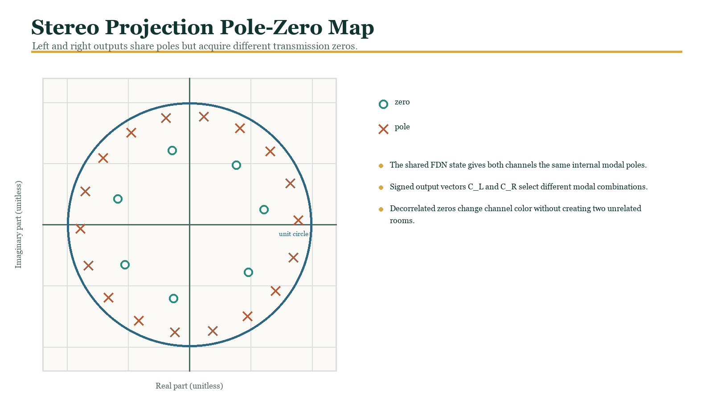

**Figure: Unit-circle map for stereo FDN projection, with shared modal poles and output-dependent transmission zeros.**

Changing $\boldsymbol{C}_L$ and $\boldsymbol{C}_R$ alters which modes cancel at each
output without constructing two unrelated acoustic systems. This is the linear-systems
reason signed projections can create width while preserving a coherent room. Mono
fold-down combines the two transfer numerators, so it must be checked explicitly: a
left-right zero that sounds spacious in stereo can become a broad cancellation after
summation.

### The Science and DSP of Dereverberation

Dereverberation asks a harder question than reverberation synthesis. A reverb processor
starts with a comparatively clean signal and a known algorithm or impulse response;
dereverberation starts with only the mixture that reached a microphone and tries to infer
which part belonged to the source before the room prolonged it. The dry performance, room
response, source position, microphone response, background noise, and often even the number
of active sources are unknown. Many different combinations of those latent quantities can
produce nearly the same recording. Dereverberation is therefore an **ill-posed inverse
problem**, not a literal undo button.

That distinction sets the standard for honest use. A successful processor can reduce late
energy, restore temporal contrast, improve speech intelligibility, and make a close source
feel less distant. It cannot generally recover the exact pressure waveform that would have
been recorded in an anechoic chamber. The most useful scientific question is consequently
not “Did all reverb disappear?” but “Which acoustic component was estimated, under which
assumptions, at what cost in distortion, spatial fidelity, and latency?”

#### The Forward Acoustic Model

For one stationary source and one microphone, the standard discrete-time model is

$$
y[n] = \sum_{q=0}^{L_h-1} h[q]x[n-q] + v[n]
     = (h*x)[n] + v[n],
$$

where $x[n]$ is the unknown dry source, $h[n]$ is the room impulse response, $v[n]$ is
additive noise, and $y[n]$ is the observed microphone signal. The convolution is long:
a 1.5 s response at 48 kHz contains 72,000 samples before accounting for an even longer
noise floor. With $S$ sources and $M$ microphones, the model becomes

$$
y_m[n] = \sum_{s=1}^{S}(h_{m,s}*x_s)[n] + v_m[n],
\qquad m = 1,\ldots,M.
$$

Every source-to-microphone path has its own response $h_{m,s}[n]$. If a talker moves, a
door opens, or a handheld microphone rotates, that response is time varying rather than a
fixed convolution. The familiar linear time-invariant model remains valuable, but its
limits should be visible whenever a method is evaluated on real capture.

For dereverberation, the room response is commonly partitioned at an early/late boundary
$n_e$:

$$
h[n] = h_{\mathrm{early}}[n] + h_{\mathrm{late}}[n],
$$

$$
y[n] = x_{\mathrm{early}}[n] + r_{\mathrm{late}}[n] + v[n].
$$

Here $x_{\mathrm{early}}[n]=(h_{\mathrm{early}}*x)[n]$ is usually the desired signal,
not merely the mathematically dry source. It retains the direct arrival and a short early
window because those components support loudness, localization, source width, and
naturalness. The interference term $r_{\mathrm{late}}[n]$ contains delayed replicas that
smear later phonemes, notes, and transients. The boundary is task dependent: speech
systems often preserve tens of milliseconds, while music restoration may preserve more
of a room's early signature.

The following figure places the unknown quantities around the one observation actually
available to a blind estimator. Its non-linear layout is important: neither the room nor
the source lies in a simple known processing chain at restoration time.

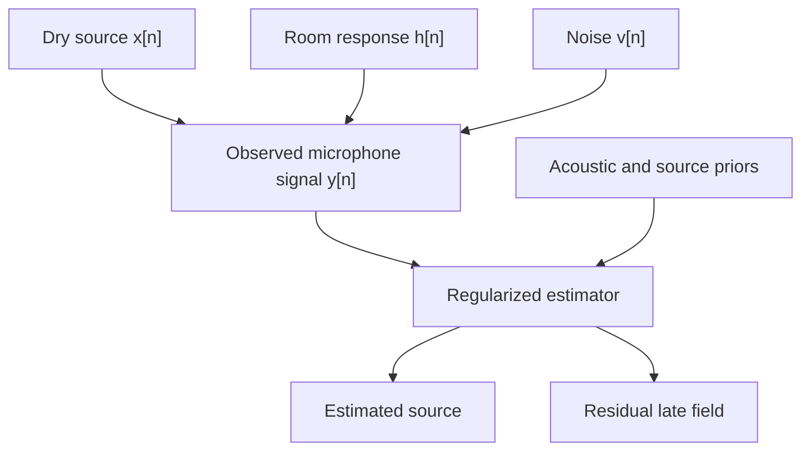
```mermaid
%% verbx-static: docs/assets/reverb_primer/34_dereverb_inverse_problem.png
flowchart TB
    X["Dry source x[n]"] --> Y["Observed microphone signal y[n]"]
    H["Room response h[n]"] --> Y
    V["Noise v[n]"] --> Y
    Y --> E["Regularized estimator"]
    P["Acoustic and source priors"] --> E
    E --> XH["Estimated source"]
    E --> R["Residual late field"]
```

**Figure: Dereverberation formulated as inference of a dry or early source from a reverberant, noisy observation using acoustic assumptions and regularization.**

**How to read this figure.** The upper paths describe physical capture; the lower paths
describe inference. Only $y[n]$ is observed. A processor must supply assumptions about
decay, source statistics, sparsity, spatial covariance, or training data before it can
separate an estimate from the residual. Stronger assumptions can produce stronger
suppression, but they also create stronger failure modes when the recording violates them.

#### Why Exact Inverse Filtering Usually Fails

If $h[n]$ were perfectly known, one might propose the inverse filter
$G(z)=1/H(z)$ so that $G(z)H(z)=1$. Three problems make that expression a poor general
solution. First, measured room responses contain deep spectral notches. Dividing by a
small $|H(e^{j\omega})|$ gives enormous gain and amplifies microphone noise, quantization,
and response-estimation error. Second, a room response is commonly nonminimum phase. Its
inverse may be unstable if zeros lie outside the unit circle, or noncausal if a stable
inverse is constructed by moving energy before the direct arrival. Third, a room response
is position specific. A filter that inverts one source/receiver pair can worsen a signal
captured a few centimeters away.

A regularized frequency-domain inverse makes the compromise explicit:

$$
G_{\lambda}(e^{j\omega}) =
\frac{H^*(e^{j\omega})}
{|H(e^{j\omega})|^2 + \lambda(\omega)}.
$$

When $|H|^2$ is large relative to $\lambda$, the expression approaches an inverse. Near
a notch, the regularizer prevents explosive gain. The function $\lambda(\omega)$ may
encode expected noise, uncertainty, perceptual weighting, or a hard robustness floor.
This is closely related to Wiener deconvolution, where the regularizer is a ratio of noise
and source power spectra. It also exposes the unavoidable bias/variance tradeoff: more
regularization leaves more room coloration; less regularization may reduce coloration on
one measurement while producing noise and instability elsewhere.

Multichannel inverse filtering can be better conditioned because several microphone paths
need not share the same zeros. The multiple-input/output inverse theorem method seeks FIR
filters whose combined channel response approximates a delayed impulse. Miyoshi and
Kaneda's formulation is foundational here. Yet it still needs measured or estimated room
responses, accurate channel synchronization, and a sufficiently stationary geometry.
It is best understood as **room-response equalization or shortening with known transfer
functions**, not as a universal blind dereverberator.

Blind methods avoid claiming that $h[n]$ is known. They estimate only a useful component:
late-reverberant power, a delayed linear prediction, a time-frequency mask, a spatial
filter, or a learned mapping. This narrower goal is why practical dereverberation can work
despite the impossibility of exact blind inversion.

#### Statistical Science of the Late Field

After sufficient mixing time, a room's late field is often approximated as diffuse,
noise-like, and exponentially decaying. If $T_{60}$ is the reverberation time, an idealized
amplitude envelope is

$$
a(t)=10^{-3t/T_{60}},
$$

and its energy envelope is

$$
a^2(t)=10^{-6t/T_{60}}=e^{-t/\tau_E},
\qquad
\tau_E=\frac{T_{60}}{6\ln 10}.
$$

This does not say that every late sample follows a smooth exponential. Individual samples
remain stochastic and interference produces fluctuations. The claim is about expected
energy over an ensemble or local time-frequency region. Real rooms also decay at different
rates by frequency, and low-frequency modes may violate diffuse-field assumptions
entirely. Erkelens and Heusdens model this frequency dependence explicitly; Habets develops
the statistical framework into practical late-reverberation estimators.

In an STFT indexed by frequency bin $k$ and frame $l$, write

$$
Y_{k,l}=X_{k,l}+R_{k,l}+V_{k,l}.
$$

A simple late-power tracker uses delayed observations as evidence for energy that may still
be arriving from earlier source frames:

$$
\widehat{\lambda}_{r,k,l}
=\alpha_k\widehat{\lambda}_{r,k,l-1}
+(1-\alpha_k)c_k|Y_{k,l-D}|^2.
$$

The delay $D$ protects the direct and early portion; the coefficient $\alpha_k$ smooths
the estimate; $c_k$ maps delayed energy to an expected residual according to decay rate.
A longer $T_{60}$ implies slower forgetting. Frequency-dependent $\alpha_k$ or $c_k$
allows a bright room, dark room, or strongly modal low end to be represented more honestly
than one broadband constant.

This model fails predictably. A sustained organ tone looks like persistent source energy
and persistent late energy at once. A noise burst can be mistaken for a diffuse tail. A
new note arriving while the old note decays violates the simple delayed-cause narrative.
Nonstationary background noise biases the tail estimate upward. These are not merely tuning
problems; they are ambiguities in the evidence. A robust implementation therefore bounds
gain, smooths estimates, preserves a residual floor, and reports its assumptions.

#### Spectral Suppression and Wiener Estimation

Once desired and late-reverberant power estimates are available, a Wiener-style gain can
be formed as

$$
G_{k,l}^{\mathrm W}
=\frac{\widehat{\lambda}_{x,k,l}}
{\widehat{\lambda}_{x,k,l}+\widehat{\lambda}_{r,k,l}
+\widehat{\lambda}_{v,k,l}}
=\frac{\xi_{k,l}}{1+\xi_{k,l}},
$$

where $\xi_{k,l}$ is an a priori desired-to-interference ratio. The estimate is
$\widehat{X}_{k,l}=G_{k,l}^{\mathrm W}Y_{k,l}$. A spectral-subtraction alternative uses

$$
|\widehat{X}_{k,l}|^p
=\max\!\left(
|Y_{k,l}|^p-\beta\widehat{\lambda}_{r,k,l},
G_{\min}^{p}|Y_{k,l}|^p
\right),
$$

with $p=1$ for magnitude subtraction or $p=2$ for power subtraction. The oversubtraction
factor $\beta$ controls aggressiveness and $G_{\min}$ prevents complete spectral holes.
Both families normally reuse the observed phase because estimating clean phase is much
harder. That phase reuse is one reason a strongly processed signal can remain smeared or
phaselike even after its magnitude envelope looks cleaner.

The following figure shows the estimator as two evidence paths meeting at a bounded gain,
rather than as a magical “remove room” block.

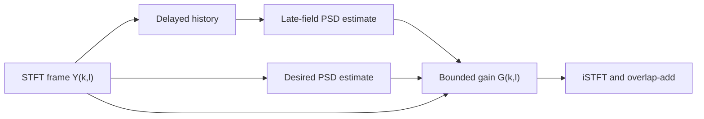
```mermaid
%% verbx-static: docs/assets/reverb_primer/35_statistical_dereverb_estimator.png
flowchart LR
    Y["STFT frame Y(k,l)"] --> D["Delayed history"]
    D --> R["Late-field PSD estimate"]
    Y --> X["Desired PSD estimate"]
    R --> G["Bounded gain G(k,l)"]
    X --> G
    Y --> G
    G --> O["iSTFT and overlap-add"]
```

**Figure: Statistical late-reverberation suppression using delayed spectral evidence, desired-signal evidence, a bounded time-frequency gain, and overlap-add resynthesis.**

**How to read this figure.** The upper branch estimates interference from past frames;
the lower branch estimates what should survive now. Their ratio drives the gain. The
unprocessed STFT also reaches the gain because suppression scales observed complex bins
rather than synthesizing an unrelated waveform. Resynthesis must use a compatible window
and hop so the overlap-add sum remains level and free of modulation.

The engineering details determine whether the equations sound acceptable. Frequency-only
smoothing reduces isolated “musical noise” tones but can blur narrow harmonics. Time
smoothing reduces pumping but lets late energy leak through attacks. A gain floor protects
room tone and consonant texture but limits maximum reduction. Attack/release asymmetry can
open quickly for new direct sound while closing slowly on the estimated tail. Stereo-linked
gains protect the image; independent gains can remove more channel-specific energy but make
a centered source wander.

This is the family implemented by the current `verbx dereverb` command and the live
dereverb front end. It is a deterministic STFT late-tail suppressor with `wiener` and
`spectral_sub` gain laws. It is **not** currently a WPE solver, measured-RIR inverse, source
separator, or neural dry-signal generator. The distinction matters when interpreting its
controls:

| verbx control | Estimation role | Audible risk when pushed |
|---|---|---|
| `--strength` | Scales estimated late-field removal | Hollow tone, transient thinning, modulation |
| `--floor` | Sets $G_{\min}$, the minimum residual gain | Higher values leave tail; lower values expose musical noise |
| `--window-ms` | Sets time/frequency analysis resolution | Long windows smear attacks; short windows weaken bass resolution |
| `--hop-ms` | Sets estimator update and overlap cadence | Large hops make gains coarse; incompatible hops fail validation |
| `--tail-ms` | Sets the late-energy tracking horizon | Too long mistakes sustain for room; too short misses slow decay |
| `--pre-emphasis` | Changes weighting before estimation | Excess values exaggerate sibilance and sensor noise |
| `--max-atten-db` | Caps maximum suppression | A high cap increases artifacts; a low cap limits clarity gain |
| `--stereo-link` | Couples channel gain decisions | Linking preserves image but may retain asymmetric room energy |
| `--mix` | Blends processed and latency-aligned original | Partial mix restores naturalness and some reverberation |

The safest strategy is to begin with moderate strength, a nonzero floor, and a partial
mix. Increase reduction while listening to sibilants, cymbal decays, piano attacks, and
stereo ambience, not only to steady vowels. A setting that improves a spectrogram may
still damage musical phrasing.

#### Delayed Linear Prediction and WPE

Weighted prediction error (WPE) approaches late reverberation from a different direction.
Instead of estimating a scalar late-power spectrum and attenuating bins, it models late
reverberation as a delayed linear prediction from prior STFT frames. The key insight is that
the direct and early components belong close to the current source event, while the late
field remains correlated with older microphone observations.

For $M$ microphones, stack the current observations into
$\boldsymbol{y}_{t,f}\in\mathbb{C}^{M}$. Construct a delayed history vector
$\overline{\boldsymbol{y}}_{t-\Delta,f}$ from $K$ prediction taps beginning $\Delta$
frames in the past. A selected output channel can then be modeled as

$$
Y_{t,f}=X_{t,f}+
\boldsymbol{g}_f^{\mathsf H}
\overline{\boldsymbol{y}}_{t-\Delta,f},
$$

so the dereverberated estimate is the prediction error

$$
\widehat{X}_{t,f}=Y_{t,f}-
\boldsymbol{g}_f^{\mathsf H}
\overline{\boldsymbol{y}}_{t-\Delta,f}.
$$

The prediction delay $\Delta$ is not an implementation nuisance. It defines what the
algorithm protects. If $\Delta$ is too small, the predictor explains and subtracts direct
or useful early energy. Attacks become dull and source color changes. If $\Delta$ is too
large, a portion of harmful late energy lies outside the model and survives. Prediction
order $K$ similarly trades model capacity against computation, adaptation speed, and
overfitting.

Ordinary least squares is biased toward high-energy frames. WPE assumes that the desired
speech or source coefficient is a zero-mean complex Gaussian with time-varying variance
$\lambda_{t,f}$ and minimizes

$$
J_f(\boldsymbol{g}_f)=
\sum_t
\frac{
\left|Y_{t,f}-\boldsymbol{g}_f^{\mathsf H}
\overline{\boldsymbol{y}}_{t-\Delta,f}\right|^2
}{\lambda_{t,f}}.
$$

For fixed variances this is weighted least squares. For fixed predictor coefficients, the
residual supplies an updated variance estimate. Batch WPE alternates those steps, usually
for several iterations. The inverse-variance weighting prevents high-power source frames
from dominating the filter and arises naturally from maximum-likelihood estimation under
the time-varying Gaussian model described by Nakatani and colleagues.

Define the weighted covariance and cross-correlation

$$
\boldsymbol{R}_f=
\sum_t\frac{
\overline{\boldsymbol{y}}_{t-\Delta,f}
\overline{\boldsymbol{y}}_{t-\Delta,f}^{\mathsf H}}
{\lambda_{t,f}},
\qquad
\boldsymbol{p}_f=
\sum_t\frac{
\overline{\boldsymbol{y}}_{t-\Delta,f}Y_{t,f}^*}
{\lambda_{t,f}}.
$$

Then $\boldsymbol{g}_f=\boldsymbol{R}_f^{-1}\boldsymbol{p}_f$, although a numerical
implementation should solve the linear system rather than form an explicit inverse.
Diagonal loading, condition-number checks, and finite-value guards are essential when the
history is poorly excited or channels are nearly redundant.

The following figure separates WPE's undelayed reference, delayed predictor, and iterative
variance path. That feedback relation is the reason WPE is more than a fixed comb-cancellation
filter.

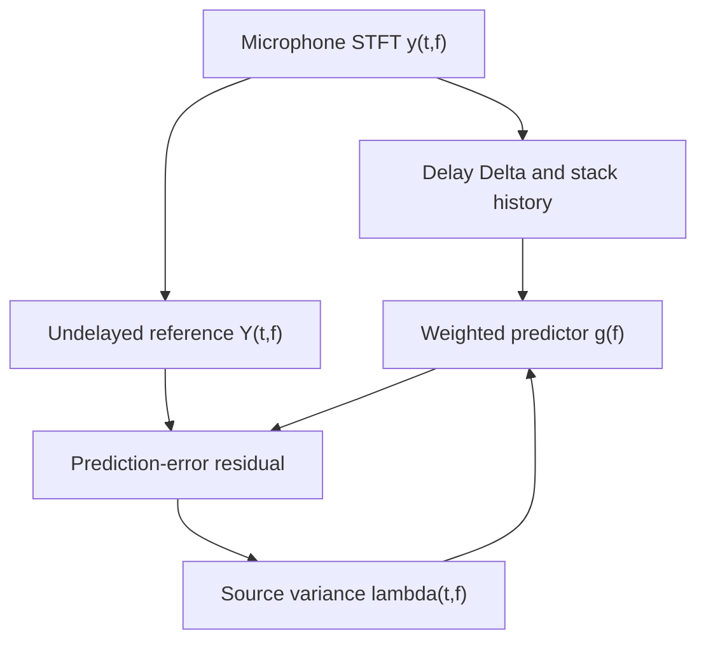
```mermaid
%% verbx-static: docs/assets/reverb_primer/36_wpe_prediction_loop.png
flowchart TB
    Y["Microphone STFT y(t,f)"] --> H["Delay Delta and stack history"]
    H --> P["Weighted predictor g(f)"]
    Y --> U["Undelayed reference Y(t,f)"]
    U --> E["Prediction-error residual"]
    P --> E
    E --> L["Source variance lambda(t,f)"]
    L --> P
```

**Figure: WPE delayed-prediction topology in which past multichannel frames estimate the late field, the current reference supplies the desired event, and residual variance reweights the predictor.**

**How to read this figure.** The middle horizontal route predicts late energy from frames
older than $\Delta$; the upper route protects the undelayed observation; the lower route
closes the statistical iteration. Subtraction occurs only after delayed prediction, so
the topology explicitly distinguishes a current onset from its older reverberant history.

Single-channel WPE can work because one channel still contains temporal predictability,
but multichannel WPE has a richer basis and can exploit spatial diversity. Batch WPE sees
the whole utterance and can iterate toward a strong estimate; online WPE must update
statistics recursively and accept an adaptation lag. Recursive least squares, recursive
covariance updates, or Kalman formulations reduce memory and delay but introduce forgetting
factors and tracking tradeoffs. Caroselli and colleagues demonstrate adaptive WPE for
large-scale recognition, while Nakatani and Kinoshita formulate frame-by-frame low-latency
joint processing.

WPE also has characteristic failure modes. A predictor can suppress sustained harmonic
material because periodic music is itself predictable. Rapid movement invalidates its
filter before adaptation catches up. Background noise corrupts covariance and variance
estimates. Very long filters become computationally expensive: for each frequency, the
history dimension grows with $MK$, and a dense solve scales steeply with that dimension.
Practical systems therefore regularize, limit order, update less frequently than every
sample, and sometimes estimate source variance with a neural network.

#### Multichannel Spatial Dereverberation

Multiple microphones do more than provide more samples. They observe different mixtures
of the same direct source and reflected field. Direct sound from a compact source has a
structured steering vector; a sufficiently diffuse late field has a different spatial
covariance; directional interferers differ again. Spatial filtering can exploit those
differences even when their spectra overlap.

For STFT observation vector $\boldsymbol{y}_{t,f}$, the spatial covariance is

$$
\boldsymbol{R}_{yy,f}=
\mathbb{E}\{\boldsymbol{y}_{t,f}\boldsymbol{y}_{t,f}^{\mathsf H}\}.
$$

If a desired steering vector $\boldsymbol{d}_f$ and interference covariance
$\boldsymbol{R}_{vv,f}$ are available, an MVDR beamformer uses

$$
\boldsymbol{w}_{\mathrm{MVDR},f}=
\frac{\boldsymbol{R}_{vv,f}^{-1}\boldsymbol{d}_f}
{\boldsymbol{d}_f^{\mathsf H}\boldsymbol{R}_{vv,f}^{-1}\boldsymbol{d}_f}.
$$

The denominator enforces unity response in the desired direction while minimizing output
power attributed to interference. A multichannel Wiener filter relaxes the distortionless
constraint to minimize mean-square error. Weighted power minimization distortionless
response (WPD) convolutional beamforming unifies delayed dereverberation and spatial
filtering in one spatio-temporal objective.

These methods are complementary rather than interchangeable. WPE attacks temporal
predictability in the late tail. Beamforming attacks spatial directions and covariance
structure. Applying WPE before a spatial filter can shorten the effective response and
improve covariance estimates; joint formulations can avoid a suboptimal fixed cascade.
Drude and colleagues report that integrating WPE with neural beamforming outperforms the
standalone components in their far-field recognition experiments. That result is evidence
for the tested conditions, not a promise that every musical array recording benefits from
the same ordering.

The following figure shows the two evidence streams that a serious multichannel system
must maintain: calibrated geometry and spatial statistics above, delayed temporal
prediction below.

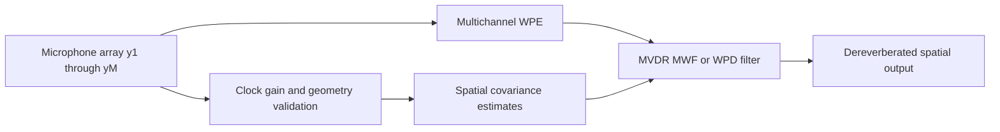
```mermaid
%% verbx-static: docs/assets/reverb_primer/37_multichannel_dereverb_stack.png
flowchart LR
    A["Microphone array y1 through yM"] --> C["Clock gain and geometry validation"]
    A --> W["Multichannel WPE"]
    C --> R["Spatial covariance estimates"]
    W --> B["MVDR MWF or WPD filter"]
    R --> B
    B --> O["Dereverberated spatial output"]
```

**Figure: A multichannel dereverberation stack combining array calibration, delayed late-tail prediction, spatial covariance estimation, and distortion-controlled beamforming.**

**How to read this figure.** The lower path shortens temporal reverberation; the upper path
describes array geometry and spatial energy. The spatial filter needs both. A channel-count
increase is not automatically useful: unsynchronized clocks, mismatched gains, unknown
microphone positions, or poor aperture can make the additional covariance unreliable.

For music and immersive production, the target output also needs definition. Collapsing a
concert recording to one beamformed channel may improve speechlike clarity while destroying
ensemble width and hall envelopment. A stereo or Ambisonic dereverberator should preserve
interchannel level, time, phase, and diffuseness cues intentionally. Gains may be linked,
estimated in a mid/side basis, or constrained by a multichannel target covariance. Every
choice decides which part of “the room” is unwanted and which part is artistic evidence.

#### Neural and Hybrid Methods

Neural dereverberation learns a mapping from reverberant observations to a chosen target.
The model may estimate a complex ratio mask, desired magnitude, clean waveform, room
response, source variance for WPE, or spatial covariance for beamforming. Architectures
include convolutional and recurrent networks, temporal convolutional networks,
transformers, complex-valued mask estimators, and waveform-domain encoder/decoders.

Supervision makes the target question unavoidable. An anechoic target asks the model to
remove both early and late room energy. An “early” target preserves the response up to a
chosen boundary. A close-microphone target includes that microphone's coloration and
bleed. A studio stem may contain processing absent from the distant observation. These are
different inverse problems. Training labels that silently mix them teach inconsistent
behavior.

Neural systems can use source regularities unavailable to blind statistical estimators.
A speech model learns phonetic and harmonic structure; a music model can learn attacks,
sustain, and instrument spectra. That prior can reconstruct plausible detail after severe
smearing. It can also hallucinate plausible but incorrect consonants, suppress unfamiliar
instruments, or imprint the training corpus's room and microphone biases. For archival,
forensic, scientific, and classical-music work, plausibility is not equivalent to fidelity.

Hybrid systems keep an interpretable acoustic core and learn the hard statistics around it.
A network may estimate $\lambda_{t,f}$ for WPE, generate masks for covariance estimation,
predict $T_{60}$ and direct-to-reverberant ratio, or synthesize a virtual second channel for
multichannel WPE. Yang and Chang's virtual acoustic channel expansion is one example;
neural-network-assisted Kalman WPE is another. These designs can retain a known prediction
topology while improving source/noise discrimination.

Real-time neural deployment adds constraints beyond model accuracy. Look-ahead, receptive
field, frame accumulation, accelerator transfer, dynamic allocation, denormal handling,
and worst-case execution time all affect audio safety. A model reporting a small arithmetic
cost can still miss a callback deadline because of memory traffic or runtime scheduling.
Any future neural `verbx` mode should publish model identity, target definition, causal
context, algorithmic delay, hardware, confidence, and deterministic fallback behavior in
its JSON report.

#### Psychoacoustics: What Should Be Removed?

The ear does not classify all reflections as damage. Early lateral reflections can increase
apparent source width and support intelligibility; a moderate room response can make speech
or music sound natural. Late energy is more likely to fill temporal gaps, reduce modulation
depth, mask following consonants, and fuse successive notes. But listeners also adapt to a
room, and context changes perceived reverberance. The perceptually optimal estimate is often
an early response, not an anechoic signal.

Speech illustrates temporal masking clearly. Energy from a vowel extends into the weaker
consonant that follows it. The consonant may still exist physically, yet its contrast is
reduced by the vowel's late field. Dereverberation restores modulation depth by attenuating
that older energy. Music complicates the rule: the same overlap may be legato, resonance,
or orchestration rather than interference. A piano pedal and a cathedral tail both prolong
energy, but only one is a room response. An estimator driven only by predictability can
damage both.

Direct-to-reverberant ratio (DRR), early-to-late ratio, clarity $C_{50}$ or $C_{80}$, and
modulation transfer describe different perceptual axes from $T_{60}$. Two recordings can
share one decay time while one has a strong direct onset and the other sounds distant.
Reducing $T_{60}$ alone does not guarantee restored presence. Conversely, increasing the
early-to-late ratio by suppressing only late energy may improve clarity without changing
the fitted slope of the residual decay very much.

Tsilfidis and Mourjopoulos explicitly connect late suppression to perceptual reverberation
modeling. Their work supports a product principle: the goal should be selective reduction
of harmful audible late energy, not maximizing numerical attenuation. The best setting is
often the lowest strength that reveals articulation without advertising the processor.

#### Artifacts and the Quality Frontier

Dereverberation sits on a Pareto frontier. More late-tail reduction normally increases at
least one cost: coloration, transient damage, background-noise modulation, spatial change,
or latency. There is no single strength value that optimizes every source and task.

| Artifact | DSP cause | Diagnostic source | Conservative remedy |
|---|---|---|---|
| Musical noise | Isolated time-frequency gains fluctuate around estimation errors | Sustained noise, cymbal tail, breath | Raise floor; smooth gains; reduce strength |
| Phasiness | Observed phase is retained while magnitude changes rapidly | Solo voice, strings, stereo room tone | Increase time smoothing; use partial mix |
| Transient erosion | Predictor or long window treats onset energy as late field | Castanets, piano, consonants | Shorten window; protect delay; reduce order or strength |
| Spectral holes | Oversubtraction drives narrow bins near zero | Harmonic sweep, pink noise | Cap attenuation; use Wiener gain; raise floor |
| Pumping | Tail estimate follows source envelope too directly | Speech pauses, kick pattern | Lengthen release/tracker; reduce strength |
| Image wobble | Channels receive unrelated gain trajectories | Centered mono source in stereo ambience | Link gains or constrain spatial covariance |
| Noise breathing | Noise is classified as source in one frame and late field in another | HVAC, preamp hiss, location bed | Estimate noise separately; retain stable floor |
| Comb coloration | Inaccurate inverse or prediction cancels correlated direct energy | Sweeps, sustained vowels | Increase regularization or prediction delay |
| Over-dry isolation | Useful early room cues are removed with the tail | Chamber music, location dialogue | Preserve early target; lower mix or strength |

Listening tests should include bypass matched for loudness. Dereverberated output often
sounds “better” simply because transients become louder or average level changes. Match
integrated loudness and peak headroom before judging clarity. Also audition the residual
$y[n]-\widehat{x}[n]$. A good residual should sound predominantly like diffuse late energy;
recognizable dry words, melody, or attacks reveal source cancellation.

#### Causality, Adaptation, and End-to-End Latency

Offline algorithms may inspect future samples, estimate statistics over a complete file,
iterate until convergence, and use zero-phase filtering. A real-time processor must commit
to output before that future exists. “Real-time” only means processing keeps pace; it does
not mean zero latency. The end-to-end monitoring delay is approximately

$$
L_{\mathrm{total}}=
L_{\mathrm{ADC}}+L_{\mathrm{input\ buffer}}+L_{\mathrm{analysis}}
+L_{\mathrm{algorithm}}+L_{\mathrm{output\ buffer}}+L_{\mathrm{DAC}},
$$

plus any operating-system safety offsets, resampling, aggregate-device buffering, plugin
host compensation, and wireless transport. A dereverberator can control only part of this
sum.

For an STFT processor, a causal window of $N$ samples must be filled before its complete
spectrum is available. A centered STFT adds future look-ahead and is unsuitable for strict
live monitoring unless that delay is accepted. Overlap-add emits updates every hop $H$,
while driver callbacks arrive in blocks of $B$ samples. If $B$ is not compatible with $H$,
the implementation needs an internal adapter or must reject the configuration. `verbx`
currently chooses fail-fast validation for the live dereverb path: the block size must be
divisible by the resolved hop size.

At 48 kHz, a 12 ms window is approximately 576 samples and a 4 ms hop is approximately
192 samples. A 384-sample callback block contains two complete hops. This does **not** imply
that total acoustic round-trip latency is exactly 12 ms or 8 ms. Driver input/output
buffers and converter safety offsets remain device dependent, and the analysis/resynthesis
implementation can add a window-related delay. The trustworthy measurement is a physical
loopback: feed a pulse through the complete input, processor, host, and output chain; record
both the reference and return; find their sample offset; repeat under realistic load; and
report median plus worst case.

WPE introduces a second time scale: statistical adaptation. A causal WPE output may have a
small signal-path delay while its covariance and source variance need many frames to become
reliable. After a source moves or speech begins, quality ramps toward steady state. That
adaptation lag is not always counted as algorithmic latency, but it affects perceived
responsiveness and should be reported. Neural methods similarly separate look-ahead from
state warm-up and accelerator scheduling.

Low latency and deep suppression conflict. Short windows react quickly but have broad
frequency bins, making low-frequency decay harder to distinguish. Short predictors adapt
quickly but model less of the tail. Small smoothers preserve attacks but allow estimate
variance to modulate the output. A live preset should be judged under deadline pressure and
dropout monitoring, not only by processing a file faster than its duration.

#### Evaluating Dereverberation Scientifically

No one metric establishes success. Evaluation should combine acoustic quantities,
signal-reconstruction metrics, downstream task performance, artifact measures, and
controlled listening. Each answers a different question.

**Paired intrusive evaluation** is possible when a dry or early target is known and aligned.
Synthetic tests convolve a clean source with measured or simulated room responses, then
compare the estimate with the original target. Scale-invariant signal-to-distortion ratio
(SI-SDR) measures reconstruction after removing a scalar gain ambiguity, but it can punish
benign spatial or equalization differences and reward solutions that do not sound natural.
Short-time objective intelligibility (STOI) and perceptual evaluation of speech quality
(PESQ) are speech oriented; neither should be treated as a music-quality score.

**Non-intrusive evaluation** is needed for ordinary recordings with no dry reference. The
speech-to-reverberation modulation energy ratio (SRMR) uses modulation spectra to estimate
reverberation-related smearing. Blind $T_{60}$, DRR, or early-to-late estimators can compare
before and after, but processing may violate the statistical model used by the estimator.
An algorithm can “game” a proxy by reshaping modulation or spectral energy without restoring
the source. Non-intrusive values are evidence, not ground truth.

**Room-acoustic evaluation** is strongest when an impulse response is available. Backward
Schroeder integration yields an energy-decay curve from which EDT, $T_{20}$, and $T_{30}$
can be fitted. Clarity indices compare early and late energy:

$$
C_{t_e}=10\log_{10}
\frac{\int_0^{t_e}h^2(t)\,dt}
{\int_{t_e}^{\infty}h^2(t)\,dt},
$$

with $t_e=50$ ms commonly used for speech and $t_e=80$ ms for music. A dereverberator aimed
at late suppression should normally increase early-to-late clarity, though its output is
not itself a pristine room impulse response if the method is nonlinear or signal dependent.

**Task evaluation** asks whether the processing helps the intended system. For distant
speech recognition, report word error rate across rooms, distances, speakers, and noise
conditions. The REVERB Challenge established paired simulated and real-room test conditions
and made clear that enhancement scores and recognition outcomes need not rank systems in
the same order. For dialogue editing, test transcription and listener effort. For source
separation, test leakage and source fidelity. For music, use trained listeners and include
transient, sustained, sparse, dense, mono, stereo, and immersive material.

**Listening evaluation** should be randomized, loudness matched, and preferably hidden.
A MUSHRA-style panel can include reverberant input, one or more estimates, the known early
target when available, and an intentionally poor anchor. Ask separate questions for
reverberation reduction, speech clarity, timbral fidelity, spatial stability, transient
quality, and overall preference. A single “quality” score hides the tradeoff the experiment
is meant to expose.

Every report should preserve the input hash, sample rate, channel layout, algorithm and
version, complete parameters, random seed if any, processing mode, machine, wall-clock
speed, algorithmic delay, measured loopback delay when relevant, and metric definitions.
Without that provenance, small score differences are not reproducible science.

#### A Reproducible verbx Workflow

Start by preserving the original and measuring what can be measured honestly. For program
audio, label blind room estimates as estimates rather than treating them like measured IR
parameters:

```bash
verbx analyze location_dialogue.wav --input-kind program --edr --room \
  --json-out reports/location_dialogue.before.json
```

Render a conservative Wiener pass to 32-bit floating-point WAV and preserve a structured
processing report:

```bash
verbx dereverb location_dialogue.wav location_dialogue.dereverb.wav \
  --mode wiener --strength 0.75 --floor 0.08 \
  --window-ms 20 --hop-ms 5 --tail-ms 120 \
  --pre-emphasis 0.15 --mix 0.9 --out-subtype float32 \
  --json-out reports/location_dialogue.dereverb.json
```

Analyze the result separately so processing metadata and measured output evidence remain
distinct records:

```bash
verbx analyze location_dialogue.dereverb.wav --input-kind program --edr --room \
  --json-out reports/location_dialogue.after.json
```

Then make at least three loudness-matched auditions: bypass, conservative processing, and
a deliberately stronger setting. The stronger setting identifies the artifact boundary;
it is not automatically the deliverable. Listen to the residual as well as the output.
For stereo material, compare linked and unlinked behavior while watching a phase-correlation
or vectorscope display.

For live monitoring, begin with a device list and use wired input/output paths:

```bash
verbx realtime --list-devices
```

```bash
verbx realtime --live-mode dereverb \
  --input-device "Built-in Microphone" --output-device "Headphones" \
  --sample-rate 48000 --block-size 384 \
  --dereverb-mode wiener --dereverb-strength 0.75 \
  --dereverb-floor 0.08 --dereverb-window-ms 12 \
  --dereverb-hop-ms 4 --dereverb-tail-ms 90 \
  --dereverb-max-atten-db 15 --dereverb-stereo-link
```

Measure physical round-trip delay before performance use. Bluetooth devices can add far
more latency than the DSP and should not be used to characterize the processor. If a DAW
hosts the plugin path, measure that host and buffer configuration rather than transferring
a standalone CLI number to it.

The experiment matrix below is more informative than searching for one universal preset:

| Dimension | Minimum useful conditions | What it reveals |
|---|---|---|
| Source | Speech, percussion, piano, sustained strings, dense mix | Source-prior and transient failures |
| Room | Short dry room, medium room, long diffuse hall, modal small room | Model mismatch and decay tracking |
| Distance | Near, medium, far | DRR dependence |
| Noise | Quiet, stationary noise, changing noise | Tail/noise confusion |
| Channels | Mono, stereo linked, stereo independent | Spatial stability |
| Strength | Bypass, conservative, nominal, stress | Artifact frontier |
| Mode | Wiener, spectral subtraction | Gain-law dependence |
| Metric | Clarity, blind decay, residual, listening, task score | Agreement and disagreement between evidence |

#### Limits, Safety, and Claims

Dereverberation cannot separate every process that prolongs sound. Instrument resonance,
sustain pedal, chorus, delay, compression release, distortion, audience noise, and the
room may overlap. A single microphone provides no label saying which decay is artistic.
Aggressive processing of a mastered recording can remove intentional production ambience
and expose edits or noise that the ambience masked.

The processor also cannot repair clipping, recover bandwidth removed before capture, or
infer a unique dry waveform from a fully smeared mixture. It may improve intelligibility
without making audio studio-dry, or make audio sound drier while decreasing fidelity. Those
outcomes are not contradictions because “reverberation amount,” “clarity,” and
“reconstruction accuracy” are different dimensions.

For forensic or evidentiary use, retain the original, process only a copy, preserve hashes
and parameters, and describe the method as enhancement rather than recovery of fact. For
machine-learning datasets, keep dry/reverberant pairing and train/validation/test room
separation intact; otherwise room leakage can make a model appear to generalize. For
archival music, prefer reversible conservative passes and document the artistic decision.

The current `verbx` implementation should therefore be described precisely as deterministic
spectral late-tail suppression. Its controls are designed to expose the reduction/artifact
tradeoff and produce machine-readable reports. WPE, multichannel convolutional beamforming,
measured inverse filtering, and neural restoration are discussed here because they define
the scientific field and roadmap, not because the CLI silently substitutes those methods.

#### Selected Primary Literature

The following works are ordered alphabetically by first author. Appendix C contains the
guide's larger annotated bibliography and cross-references [PE3], [PE4], [PE9], [SR1], and
related room-acoustic sources.

Allen, J. B.; Berkley, D. A. “Image method for efficiently simulating small-room
acoustics.” *The Journal of the Acoustical Society of America* 65(4): 943–950. DOI:
[10.1121/1.382599](https://doi.org/10.1121/1.382599), 1979.

Caroselli, J.; Shafran, I.; Narayanan, A.; Rose, R. “Adaptive multichannel
dereverberation for automatic speech recognition.” *Proceedings of Interspeech 2017*:
3877–3881. DOI:
[10.21437/Interspeech.2017-1791](https://doi.org/10.21437/Interspeech.2017-1791), 2017.

Drude, L.; Boeddeker, C.; Heymann, J.; Haeb-Umbach, R.; Kinoshita, K.; Delcroix, M.;
Nakatani, T. “Integrating neural network based beamforming and weighted prediction error
dereverberation.” *Proceedings of Interspeech 2018*: 3043–3047. DOI:
[10.21437/Interspeech.2018-2196](https://doi.org/10.21437/Interspeech.2018-2196), 2018.

Erkelens, J. S.; Heusdens, R. “A statistical room impulse response model with frequency
dependent reverberation time for single-microphone late reverberation suppression.”
*Proceedings of Interspeech 2011*: 2273–2276. DOI:
[10.21437/Interspeech.2011-82](https://doi.org/10.21437/Interspeech.2011-82), 2011.

Falk, T. H.; Zheng, C.; Chan, W.-Y. “A non-intrusive quality and intelligibility measure
of reverberant and dereverberated speech.” *IEEE Transactions on Audio, Speech, and
Language Processing* 18(7): 1766–1774. DOI:
[10.1109/TASL.2010.2052247](https://doi.org/10.1109/TASL.2010.2052247), 2010.

Habets, E. A. P. “Speech dereverberation using statistical reverberation models.” In
Naylor, P. A.; Gaubitch, N. D., eds., *Speech Dereverberation*: 57–93. DOI:
[10.1007/978-1-84996-056-4_3](https://doi.org/10.1007/978-1-84996-056-4_3), 2010.

Habets, E. A. P.; Gannot, S.; Cohen, I. “Late reverberant spectral variance estimation
based on a statistical model.” *IEEE Signal Processing Letters* 16(9): 770–773. DOI:
[10.1109/LSP.2009.2024796](https://doi.org/10.1109/LSP.2009.2024796), 2009.

Kinoshita, K.; Delcroix, M.; Gannot, S.; Habets, E. A. P.; Haeb-Umbach, R.; Kellermann,
W.; Leutnant, V.; Maas, R.; Nakatani, T.; Raj, B.; Sehr, A.; Yoshioka, T. “A summary of
the REVERB challenge: state-of-the-art and remaining challenges in reverberant speech
processing research.” *EURASIP Journal on Advances in Signal Processing* 2016: 7. DOI:
[10.1186/s13634-016-0306-6](https://doi.org/10.1186/s13634-016-0306-6), 2016.

Miyoshi, M.; Kaneda, Y. “Inverse filtering of room acoustics.” *IEEE Transactions on
Acoustics, Speech, and Signal Processing* 36(2): 145–152. DOI:
[10.1109/29.1509](https://doi.org/10.1109/29.1509), 1988.

Nakatani, T.; Kinoshita, K. “Simultaneous denoising and dereverberation for low-latency
applications using frame-by-frame online unified convolutional beamformer.” *Proceedings
of Interspeech 2019*: 111–115. DOI:
[10.21437/Interspeech.2019-1286](https://doi.org/10.21437/Interspeech.2019-1286), 2019.

Nakatani, T.; Yoshioka, T.; Kinoshita, K.; Miyoshi, M.; Juang, B.-H. “Speech
dereverberation based on variance-normalized delayed linear prediction.” *IEEE
Transactions on Audio, Speech, and Language Processing* 18(7): 1717–1731. DOI:
[10.1109/TASL.2010.2052251](https://doi.org/10.1109/TASL.2010.2052251), 2010.

Naylor, P. A.; Gaubitch, N. D., eds. *Speech Dereverberation*. London: Springer. DOI:
[10.1007/978-1-84996-056-4](https://doi.org/10.1007/978-1-84996-056-4), 2010.

Tsilfidis, A.; Mourjopoulos, J. “Blind single-channel suppression of late reverberation
based on perceptual reverberation modeling.” *The Journal of the Acoustical Society of
America* 129(3): 1439–1451. DOI:
[10.1121/1.3533690](https://doi.org/10.1121/1.3533690), 2011.

Yang, J.-Y.; Chang, J.-H. “Virtual acoustic channel expansion based on neural networks
for weighted prediction error-based speech dereverberation.” *Proceedings of Interspeech
2020*: 3930–3934. DOI:
[10.21437/Interspeech.2020-1553](https://doi.org/10.21437/Interspeech.2020-1553), 2020.

Yoshioka, T.; Nakatani, T. “Generalization of multi-channel linear prediction methods for
blind MIMO impulse response shortening.” *IEEE Transactions on Audio, Speech, and Language
Processing* 20(10): 2707–2720. DOI:
[10.1109/TASL.2012.2210879](https://doi.org/10.1109/TASL.2012.2210879), 2012.

### A Thirty-Minute Reverb Laboratory

The following laboratory turns the chapter into an audible sequence. Use headphones
and loudspeakers if possible; keep output level fixed; preserve every render and JSON
sidecar.

#### Minute 0–5: Identify the Three Regions

Render the dry click through a one-second room at 100 percent wet. Mark direct onset,
the first visible reflections, and the point where individual arrivals become a dense
tail. Change only pre-delay and repeat. The late decay should remain similar while the
relationship between source and room changes.

#### Minute 5–10: Isolate Diffusion

Render a rimshot or click with zero, two, four, and eight allpass stages. Keep RT60 and
matrix fixed. Listen for loss of attack definition, flutter reduction, and buildup
speed. Choose the lowest stage count that supplies the density the source needs.

#### Minute 10–15: Compare Matrix Families

Use a sparse major seventh chord and an eight-second tail. Compare Hadamard, circulant,
random orthogonal, and time-varying unitary matrices. Write three adjectives for each
without looking at the option name. Then inspect sonograms and ask whether visible
modal ridges agree with what you heard.

#### Minute 15–20: Design Frequency-Dependent Decay

Set low, middle, and high RT60 values equal. Then shorten only the high band; next,
lengthen only the low band. Listen through the complete final tail. The point is not to
find a universal curve but to learn how decay spectrum changes perceived material and
scale.

#### Minute 20–25: Make the Return a Musical Voice

Put verbx on a 100 percent wet auxiliary return. Send only the final note of every
four-bar phrase. Then leave the send constant and automate the return instead. Compare
the two gestures. One controls what the room remembers; the other controls when the
memory is revealed.

#### Minute 25–30: Enter Extreme Time Safely

Render one stable chord into a 60-second time-varying FDN. Leave at least 90 seconds of
silence after the source. Write floating-point audio and a JSON report. Inspect peak,
integrated loudness, DC offset, and the final 20 seconds. Increase RT60 only after the
tail is spectrally and numerically controlled.

### Practical Listening Checklist

- **Onset:** Does the room begin with the source, behind it, or as a separate echo?
- **Density:** Can individual repetitions be heard after they should have fused?
- **Color:** Which bands survive longest, and is that survival musically useful?
- **Modes:** Do stable pitches emerge that were not structurally important in the source?
- **Width:** Does the return enlarge the image without weakening the center or fold-down?
- **Dynamics:** Does the tail mask attacks, words, or harmonic changes?
- **Motion:** Does time variation feel architectural, chorused, or unstable?
- **Ending:** Does the tail reach silence gracefully, gate abruptly, or expose noise and DC?
- **Form:** Is reverb supporting a phrase, connecting sections, or functioning as its own layer?
- **Evidence:** Can the render be reproduced from its command, preset, seed, and JSON report?

### Summary: Reverb as Memory

Reverb is the memory of an acoustic or synthetic system. Direct sound tells the listener
what happened; early reflections tell where it happened; the late field tells how the
space continues to respond. In music, that memory can reinforce articulation, connect
harmony, enlarge orchestration, preserve a past section, or become a new sustained
instrument.

verbx sounds different because it does not reduce this behavior to one size control. It
exposes the topology and timing that create density, the matrix that exchanges energy,
the filters that shape decay, the projections that create spatial output, and the
creative processes that reinterpret the field. At ordinary settings, those controls
design rooms, chambers, halls, and plates. At extreme settings, they design musical
time.

---

## Core Concepts

### Algorithmic vs. Convolution

**For beginners:** Algorithmic reverb synthesizes the space from scratch using delay networks and filters. It does not need an external file, responds instantly to parameter changes, and can produce decay times no physical room could sustain. Convolution reverb applies a pre-recorded impulse response – a measurement of what a specific room does to a click – to your audio. The result sounds like the space where the IR was recorded.

**For experts:** The algorithmic engine in verbx uses a Schroeder allpass diffusion stage feeding a fully coupled $N$-line FDN with configurable feedback matrix. Convolution uses uniformly-partitioned overlap-save FFT with optional CUDA acceleration via CuPy. The two engines share the same pre-delay, shimmer, freeze, ducking, bloom, tilt, loudness, and spatial stages. Use `--engine auto` and verbx selects based on whether an IR is present.

Choose algorithmic when you want extreme lengths, animated or time-varying decay, spaces that do not exist, low storage overhead. Choose convolution when you want: the character of a specific real or designed space, exact linear reproduction of an IR, or multichannel matrix routing from a measured space.

### RT60

**For beginners:** RT60 is the time required for reverberant sound energy to fall by
60 dB after the source stops. That is a decrease to one millionth of the starting energy,
or one thousandth of the starting pressure amplitude. A short RT60 makes events separate
quickly and usually improves articulation. A long RT60 joins events into a continuous
field and can enlarge, soften, or obscure musical detail. RT60 describes the slope of a
decay; it does not by itself describe how loud the reverb is, how soon it begins, whether
it is bright or dark, or how wide the return sounds.

A small treated room may have an RT60 below 0.4 s. Many production rooms occupy roughly
0.3–0.8 s, concert halls often lie near 1.5–2.5 s at mid frequencies, and very large stone
spaces can sustain substantially longer decays. These are orientation ranges rather than
presets or universal targets. Occupancy, frequency, source/receiver position, geometry,
and measurement method all matter. The verbx analyzer can represent estimates from 0.01 s
to 3600 s; the current render and IR-synthesis controls accept targets from 0.1 s to 3600 s.
That span moves continuously from tight acoustic control to deliberately nonphysical musical
sustain without pretending that every extreme is a plausible architectural room.

#### Decibels, Energy, and the Meaning of “60”

The decibel is logarithmic. For pressure or sample amplitude $p(t)$ relative to reference
$p_0$, level is

$$
L_p(t)=20\log_{10}\!\left(\frac{|p(t)|}{|p_0|}\right)\ \mathrm{dB}.
$$

For energy $E(t)$ relative to $E_0$, level is

$$
L_E(t)=10\log_{10}\!\left(\frac{E(t)}{E_0}\right)\ \mathrm{dB}.
$$

An amplitude ratio of $10^{-3}$ and an energy ratio of $10^{-6}$ therefore both represent
–60 dB. This is why RT60 is sometimes described as a thousandfold pressure reduction and
sometimes as a millionfold energy reduction. The statements are equivalent, provided the
reader knows which physical quantity is being discussed.

An ideal exponential amplitude envelope can be written

$$
p_{\mathrm{env}}(t)=p_0e^{-t/\tau_A},
$$

where $\tau_A$ is an amplitude time constant. Requiring a –60 dB amplitude change at
$t=T_{60}$ gives

$$
\tau_A=\frac{T_{60}}{3\ln 10}.
$$

The corresponding energy time constant is half as long:

$$
\tau_E=\frac{T_{60}}{6\ln 10}.
$$

On a decibel-versus-time graph, an ideal exponential is a straight line with slope

$$
s=-\frac{60}{T_{60}}\ \mathrm{dB/s}.
$$

Thus a 2 s decay falls at –30 dB/s, while an 8 s decay falls at –7.5 dB/s. Doubling RT60
halves the magnitude of the decay slope; it does not merely append a fixed amount of audio
to the tail.

Figure 3-1 compares four ideal decay families on one time axis. It provides the visual
reference for interpreting RT60 as a slope rather than as a cutoff point.

#### From Room Physics to Reverberation Time

In a statistical diffuse-field model, Sabine's relation estimates reverberation time from
room volume and equivalent absorption area:

$$
T_{60}\approx 0.161\frac{V}{A},
\qquad
A=\sum_j\alpha_jS_j,
$$

where $V$ is volume in cubic meters, $S_j$ is surface area in square meters, and
$\alpha_j$ is the dimensionless absorption coefficient of surface $j$. The constant
0.161 has units that make the result seconds under ordinary SI assumptions. More volume
stores more acoustic energy; more absorption removes a larger fraction at each encounter.

Sabine's approximation is strongest when absorption is modest and distributed, the field
is sufficiently diffuse, and source/receiver positions sample the room representatively.
For larger average absorption, Eyring's form accounts for the finite fractional loss more
directly:

$$
T_{60}\approx
0.161\frac{V}{-S\ln(1-\overline{\alpha})},
$$

where $S$ is total surface area and $\overline{\alpha}$ is area-weighted mean absorption.
Neither equation predicts every seat, low-frequency mode, coupled chamber, or strongly
directional geometry. They are statistical models of ensemble energy, not substitutes for
a measured impulse response or wave simulation.

Absorption is frequency dependent. Carpet, curtains, occupied seating, air, porous panels,
wood, and masonry do not remove all frequencies equally. A room consequently has an RT60
curve $T_{60}(f)$ rather than one complete scalar. Published room values should identify
octave or one-third-octave bands, occupancy, excitation, microphone arrangement, and the
estimator used. A single broadband number is useful only when its compression of that
curve is acknowledged.


**Figure: Ideal RT60 decay families showing relative decay level in decibels against time after excitation in seconds.**

**How to read Figure 3-1.** Every curve begins at the same normalized level. The 1.2 s
curve reaches –60 dB first and then remains at the displayed floor; the 8 s curve is still
decaying at the right edge. A real response does not become exactly silent at $T_{60}$.
The –60 dB crossing is a reference on an extrapolated or measured slope, while audibility
depends on source level, spectrum, masking, and the playback noise floor.

#### RT60 Inside a Feedback Delay Network

For experts, RT60 drives per-line gain calibration in a unitary or approximately
energy-preserving feedback delay network. If line $i$ has delay $d_i$ seconds and scalar
feedback magnitude $g_i$, it circulates approximately $T_{60}/d_i$ times during one target
decay. Requiring the accumulated amplitude to reach $10^{-3}$ gives

$$
g_i = 10^{-\frac{3d_i}{T_{60}}}
$$

or, for a line of $m_i$ samples at sample rate $F_s$,

$$
g_i=10^{-\frac{3m_i}{F_sT_{60}}}.
$$

Shorter delays traverse their loop more often and therefore require gains closer to one for
the same total decay. Using one identical gain on unequal delays creates unequal modal
decay rates. Calibrating each line by its duration is what turns a set of dissimilar delays
into one approximate broadband RT60 target.

This derivation assumes that the feedback matrix preserves energy. For an exactly unitary
matrix $\boldsymbol{M}$, $\boldsymbol{M}^{\mathsf H}\boldsymbol{M}=\boldsymbol{I}$, so
loss can be assigned primarily by diagonal gains or filters. A nonunitary matrix can contain
growing or shrinking eigenmodes even when every individual $g_i$ looks reasonable. Stability
depends on the complete loop operator: its spectral radius must remain below one for a
strictly decaying linear system.

At very long RT60 values, $g_i$ approaches one. Numerical precision, denormals, DC leakage,
nonlinear stages, modulation interpolation, and tiny matrix-normalization errors become
audible over time. A network that survives a five-second impulse test may drift during a
ten-minute tail. Extreme values therefore require floating-point headroom, DC blocking,
bounded modulation, long-duration stress renders, and analysis of the final segment rather
than only the onset.

#### Measuring RT60 from an Impulse Response

An acoustician rarely waits for a recorded decay to become exactly 60 dB quieter and then
reads a stopwatch. The bottom of a measured response may already be masked by ventilation,
electrical noise, audience movement, quantization, or microphone self-noise. Instead, the
usual procedure estimates the slope over a clean part of an energy decay curve and
extrapolates that line to –60 dB. The reported RT60 is therefore often a model fitted to a
smaller observed range, not a literal uninterrupted observation of all 60 dB.

Let $h(t)$ be a measured room impulse response. Schroeder backward integration forms the
remaining energy after time $t$:

$$
E(t)=\int_t^{\infty}h^2(\tau)\,d\tau.
$$

For sampled audio with final sample $N-1$, the corresponding cumulative sum is

$$
E[n]=\sum_{k=n}^{N-1}h^2[k].
$$

Normalizing by the value at the direct arrival and converting to decibels gives the energy
decay curve, or EDC:

$$
L_E[n]=10\log_{10}\!\left(\frac{E[n]}{E[n_0]}\right)\ \mathrm{dB},
$$

where $n_0$ marks the chosen decay onset. Backward integration smooths individual peaks and
turns a noisy-looking impulse response into a generally descending energy trajectory. It
does not eliminate measurement noise; because the integral includes every later sample, a
stationary noise floor eventually bends the curve away from its true room-decay slope.

Three conventional estimators use different portions of the EDC:

| Estimator | Fitted decay interval | Extrapolation to $T_{60}$ |
|---|---:|---:|
| EDT | $0$ to $-10$ dB | fitted time multiplied by $6$ |
| $T_{20}$ | $-5$ to $-25$ dB | fitted time multiplied by $3$ |
| $T_{30}$ | $-5$ to $-35$ dB | fitted time multiplied by $2$ |

Early decay time, or EDT, emphasizes the first audible release after excitation and often
tracks perceived reverberance more closely than a deep late-tail fit. T20 gives a robust
estimate when only about 20 dB of clean decay is available. T30 uses more of the response
and is preferable when the measurement has sufficient dynamic range. All three become RT60
estimates by extending the fitted straight line, so a value called “T20” is not a 20-second
quantity and does not mean that the room fell by 60 dB during the measured 20 dB interval.

Figure 3-2 places the three regression windows on one idealized EDC. The shared axis makes
clear that changing estimators changes the evidence used for the fit, not the definition of
the final 60 dB decay target.

A trustworthy implementation must make several decisions before fitting a line:

1. **Locate the onset.** Leading silence must not become part of the decay. For an impulse
   response, the strongest plausible direct event is a useful anchor; for program audio,
   peak alignment is only a diagnostic approximation because later source energy may still
   be arriving.
2. **Estimate the noise floor.** The final portion of the capture provides a noise estimate,
   but it can also contain a genuine long tail. Automatic methods must distinguish a stable
   noise plateau from slowly decaying acoustic energy and report uncertainty when they
   cannot.
3. **Choose a usable range.** A regression boundary below the noise-intersection point makes
   the EDC look artificially shallow. A boundary too near the onset may instead fit early
   geometry rather than late statistical decay.
4. **Assess linearity.** A high coefficient of determination, $R^2$, supports a single-slope
   model. A low value may indicate poor signal-to-noise ratio, multiple slopes, flutter,
   source contamination, or a genuinely nonexponential room.
5. **Preserve alternatives.** EDT, T20, T30, fit range, $R^2$, and noise floor should be
   retained together. Reporting only the selected RT60 hides the evidence needed to judge
   whether that selection is acoustically meaningful.

Uncertainty is not an optional footnote to this process. Small changes in onset, filter
bandwidth, or noise compensation can move a fitted boundary and therefore change the
extrapolated result by more than the visible difference in the measured interval. Repeated
captures reveal this sensitivity better than extra decimal places. For a venue survey,
report the estimator and spread across positions; for a synthesized IR, hold the random seed,
sample rate, output length, and analysis settings constant. For either case, interpret a
reported value such as 2.37 s as an estimate produced by a stated procedure, not proof that
the underlying acoustic field has one perfectly uniform decay constant.

verbx follows this evidence-preserving approach. `verbx analyze` aligns the strongest event,
constructs the backward-integrated EDC, computes EDT, T20, and T30 where their fit windows
are usable, and selects the deepest reliable fit as the broadband estimate. Its JSON report
also carries fit quality, usable decay range, noise-floor information, input classification,
and confidence. This is especially important for machine-learning datasets: a scalar label
without its estimator, confidence, and measurement context can turn a physically ambiguous
capture into falsely precise training data.


**Figure: Schroeder energy decay curve with the EDT, T20, and T30 regression windows marked against time after excitation in seconds.**

**How to read Figure 3-2.** The horizontal axis is elapsed time after the direct event, and
the vertical axis is normalized remaining energy in decibels. EDT begins at the top of the
decay and is therefore sensitive to early reflections and the transition into the late
field. T20 and T30 exclude the first 5 dB so the direct event and the earliest reflection
pattern have less leverage. T30 reaches deepest and can be the most representative late
estimate, but only if its –35 dB boundary remains safely above the noise-contaminated bend.

#### Frequency-Dependent and Multiband Decay

A room does not have one decay envelope shared perfectly by every frequency. Air absorption
increases toward high frequencies; porous treatment may act mainly above a transition band;
panel and membrane absorbers can shorten selected low-frequency resonances; and walls,
seating, scenery, people, and openings all have frequency-dependent losses. For that reason,
room-acoustic reports commonly estimate $T_{60}(f)$ in octave or one-third-octave bands.

The same idea applies to artificial reverberation. If the desired decay at angular frequency
$\omega$ is $T_{60}(\omega)$, then a delay line of duration $d_i$ needs an approximate loop
filter magnitude

$$
\left|G_i\!\left(e^{j\omega}\right)\right|
=10^{-\frac{3d_i}{T_{60}(\omega)}}.
$$

This relation converts a decay-time curve into a loss-per-circulation curve. The loop filter
is not merely an equalizer placed after the reverb. A post-EQ changes the level of a band at
every instant by the same proportion; a feedback-loop filter changes that band's slope over
time. A bright onset followed by a progressively dark tail therefore requires frequency-
dependent loop loss, not just a dark output filter.

In practice, a small set of bands is easier to control and often more musically legible than
an unrestricted curve. verbx exposes low-, mid-, and high-band decay targets with two
crossovers. The broadband `--rt60` remains the central reference, while
`--fdn-rt60-low`, `--fdn-rt60-mid`, and `--fdn-rt60-high` explicitly shape the bands.
`--fdn-xover-low-hz` and `--fdn-xover-high-hz` locate their transitions. A compact
`--fdn-rt60-tilt` control skews low and high decay around the middle when a three-number
specification would interrupt a production workflow.

Figure 3-3 compares three bandwise decays that share a direct event but diverge as loop loss
accumulates. It is the visual distinction between warmth caused by persistent low-frequency
energy and simple bass boost.

Different spectral profiles imply different musical spaces. A low band that lasts modestly
longer than the middle can suggest occupied halls, timber, or massive architecture. An
excessively long low band can mask bass articulation and expose sparse FDN modes as pitched
ringing. A short high band usually sounds natural because air and soft materials absorb high
frequencies efficiently; an unusually long high band creates gloss, shimmer, or a synthetic
metallic halo. The crossover locations matter because they decide whether a decay change
affects fundamental weight, vocal presence, consonant detail, or only air.

Multiband estimates require care. Bandpass filters have finite temporal support and can
lengthen an apparent decay, especially in narrow low-frequency bands. Very low bands may
contain only a few room modes, violating the diffuse-field assumption behind a straight EDC.
A credible report should therefore list band centers, bandwidths, filter design, fit windows,
and confidence rather than presenting a smooth colored curve as exact ground truth.


**Figure: Low-, mid-, and high-frequency reverberation decay levels in decibels against time after excitation in seconds.**

**How to read Figure 3-3.** At the left edge, all bands are normalized to the same level.
The high band then falls fastest, the mid band defines the nominal body of the tail, and the
low band persists longest. Their vertical separation grows with time because their slopes,
not merely their initial gains, differ. If the high curve were shifted downward but remained
parallel to the low curve, the result would be equalization rather than frequency-dependent
RT60.

#### Non-Diffuse Rooms, Modes, and Coupled Slopes

The ideal RT60 line assumes a sufficiently mixed field with approximately exponential energy
loss. Real spaces can depart from that model in instructive ways. Below a room's transition
region, individual modes dominate. Each mode has its own frequency, spatial pattern, and
damping rate, so moving a microphone by a fraction of a wavelength can change the apparent
low-frequency decay. A broadband average can look acceptable while one note rings for much
longer than neighboring notes.

Flutter echo is another departure. Repeated reflections between nearly parallel surfaces
create identifiable arrivals rather than a smooth statistical tail. The total energy may
decline, but a line fitted through the average does not describe the audible periodicity.
Strong focusing, galleries, under-balcony regions, directional sources, and highly localized
absorption likewise make decay depend on position and direction.

Coupled rooms can produce a double-slope EDC. Energy in the primary volume falls quickly at
first; energy stored in a secondary chamber then leaks back and supports a slower late tail.
In such a response, EDT may be short, T20 intermediate, and T30 long. That disagreement is
not necessarily a software defect. It can be evidence that one exponential is an inadequate
description of the space. The same behavior is musically useful in artificial reverb: a
clear initial release followed by a quiet, persistent halo can preserve articulation while
still enlarging phrase endings.

For synthesis, modal density and decay time must be designed together. Raising RT60 does not
create more modes; it only lets existing modes remain audible longer. A sparse network with
a long target can expose its delay-line frequencies. Increasing line count, choosing
incommensurate delays, using an energy-preserving mixing matrix, adding diffusion, and
applying subtle modulation all help distribute energy. These operations should not be used
to conceal instability. The late field must remain bounded before coloration or motion is
judged artistically.

#### RT60 Is Not Wetness, Distance, or Clarity

Several controls can all make a reverb seem “more,” but they answer different questions:

| Quantity | Question it answers | Principal audible consequence |
|---|---|---|
| RT60 | How steeply does late energy decay? | persistence and phrase overlap |
| Wet level | How loud is the processed return? | effect prominence |
| Pre-delay | How long before the late field begins? | source separation and apparent scale |
| DRR | How strong is direct sound relative to reverb? | apparent distance |
| $C_{50}$ or $C_{80}$ | How much energy arrives early versus late? | speech or musical clarity |
| EDT | How quickly does the first part release? | perceived immediate reverberance |
| Spectral RT60 | Which frequency bands persist? | warmth, brightness, and masking |

A 6 s tail at –30 dB wet level can be subtler than a 1 s room mixed loudly. A long pre-delay
can keep a vocal intelligible even when the late field is extensive. Conversely, a short
RT60 with dense early reflections and low DRR can push a source far behind the loudspeakers.
This is why preset names such as “large,” “distant,” or “lush” cannot be reduced to one
decay-time value.

Clarity metrics also depend on an impulse response's time origin. $C_{80}$ compares energy
before and after 80 ms, while $C_{50}$ uses a 50 ms boundary more closely associated with
speech. If the direct arrival is misidentified, both ratios become misleading. On complete
music rather than an isolated impulse response, ongoing source energy crosses those windows,
so verbx labels such results as program-audio estimates rather than room measurements.

#### Extreme RT60, Freeze, and Infinite-Style Behavior

Finite RT60 and freeze are related but not identical. A finite 3600 s target still specifies
a negative slope of –0.0167 dB/s. In exact arithmetic it eventually decays. A freeze mode
instead aims for a loop magnitude of one, or introduces recirculation that replaces lost
energy, so the state can persist without the usual exponential release. The former is a very
long decay; the latter changes the system's operating condition.

As $T_{60}$ grows, the difference between stable and marginal becomes numerically tiny. For
a 50 ms delay, the scalar gain is about 0.944 at $T_{60}=6$ s, but about 0.999904 at
$T_{60}=3600$ s. A normalization error, nonlinear makeup gain, or interpolation overshoot
on the order of that remaining margin can change a slow decay into growth. Extreme settings
therefore deserve peak monitoring, output limiting, DC rejection, and long-horizon tests.

Offline rendering introduces a second issue: the requested decay can be much longer than the
source. Writing an hour-scale tail for a short test impulse is usually not what a user means,
and constructing an equally long proxy impulse response can look like a hung process. Use
`--dry-run` to inspect estimated work before an extreme render, choose output duration
deliberately, and treat freeze as a performance mode or bounded sound-design operation rather
than as permission to allocate an unbounded file.

Figure 3-4 contrasts a normal stable decay, an extremely slow finite decay, an idealized
freeze, and an unstable trajectory. The distinction is central to safe long-tail design.


**Figure: Stable, near-infinite, frozen, and unstable reverberation-state levels against elapsed time in seconds.**

**How to read Figure 3-4.** The ordinary stable curve slopes visibly downward. The
near-infinite curve also descends, but so slowly that a short display can make it look flat.
The freeze trajectory remains approximately constant after capture and is intentionally
marginal. The unstable trajectory rises; even slow growth is unacceptable because repeated
feedback eventually exhausts headroom. The plot should be read as a stability taxonomy, not
as a claim that finite-precision freeze can remain mathematically constant forever.

#### Musical Time and RT60

Reverberation time is measured in seconds, but composers and producers hear its interaction
with beats, gestures, rests, and harmonic rhythm. At tempo $B$ beats per minute, one beat
lasts

$$
T_{\mathrm{beat}}=\frac{60}{B}\ \mathrm{s}.
$$

In 4/4 meter, a four-beat bar lasts

$$
T_{\mathrm{bar}}=\frac{240}{B}\ \mathrm{s}.
$$

These equations do not imply that RT60 must equal a note value. They provide a grid for
asking where the tail should sit when the next attack, harmony, or rest arrives. At 120 BPM,
a beat is 0.5 s and a bar is 2 s. An RT60 of 2 s reaches –60 dB at the next bar line under
the ideal model, but it is already down –15 dB after one beat. Whether that feels connected
depends on wet level, spectrum, source density, and masking.

For an ideal decay, the level change after interval $t$ is

$$
\Delta L(t)=-60\frac{t}{T_{60}}\ \mathrm{dB}.
$$

Rearranging gives a useful compositional design equation. If the tail should be $D$ decibels
below its onset when the next event arrives after $t$ seconds, choose

$$
T_{60}=\frac{60t}{D}.
$$

For example, placing the tail about –20 dB below onset at a 1.5 s phrase boundary suggests
$T_{60}=4.5$ s. This is a starting point, not a loudness guarantee, because the source may
continue feeding the reverb and frequency bands may decay at different rates.

Short RT60 values can articulate rhythm by giving each transient a compact acoustic frame.
Long values can bind separate attacks into a sustained harmonic field, making rests active
rather than empty. A long low-frequency decay can retain harmonic roots across chord changes;
a long high-frequency decay can carry attacks and noise into the next phrase. Pre-delay can
preserve the edge of a note before that field arrives, while ducking can let the tail expand
only after the source leaves space.

The most reliable musical method is comparative listening at matched wet loudness. Render
three adjacent RT60 values, normalize only for monitoring, and compare the release at exact
phrase boundaries. Listen once for articulation, once for harmonic contamination, once for
stereo or immersive envelopment, and once at low playback level. A tail that sounds
spectacular in solo may occupy every rest in an arrangement; a tail that seems too quiet in
solo may be correct in context.

#### Practical verbx Workflows

Begin with a single broadband target and preserve enough dry signal to hear how attacks
separate from the room:

```bash
verbx render in.wav out.wav --engine algo --rt60 2.4 --wet 0.30 --dry 0.80
```

Then shape spectral persistence inside the feedback network rather than relying only on
output equalization:

```bash
verbx render in.wav out_multiband.wav --engine algo --rt60 3.3 \
  --fdn-rt60-low 5.5 --fdn-rt60-mid 3.3 --fdn-rt60-high 1.7 \
  --fdn-xover-low-hz 250 --fdn-xover-high-hz 4000 \
  --wet 0.36 --dry 0.78
```

Generate a deterministic impulse response when the decay itself is the research object.
The output length is explicit, so repeated runs remain bounded and comparable:

```bash
verbx ir gen study_hall.wav --mode fdn --length 8 --rt60 2.4 --seed 42
```

Measure that response and retain both the human-readable summary and machine-readable
evidence:

```bash
verbx analyze study_hall.wav --input-kind ir --edr --room \
  --json-out reports/study_hall.analysis.json
```

For a complete music recording, identify it as program audio so clarity and decay results
are not mistaken for standards-style room measurements:

```bash
verbx analyze wet_mix.wav --input-kind program --lufs \
  --json-out reports/wet_mix.analysis.json
```

A useful validation sequence is to synthesize an 8 s IR with a 2.4 s target, analyze it,
and compare EDT, T20, T30, and bandwise estimates. Do not require every value to equal 2.4 s
to many decimal places. The early-reflection region, finite file length, frequency shaping,
filter transients, stochastic variation, and regression windows all affect measured values.
Instead, specify tolerances, hold the seed and sample rate constant, and investigate systematic
bias separately from random variation.

When analyzing a physical room, capture multiple source/receiver positions and repeat the
measurement. Report the median and spread in each band. One beautifully smooth response can
be less representative than several imperfect responses that reveal seat-to-seat variation.
For production preset matching, preserve the original IR, its analysis JSON, the verbx
version, and the exact command alongside the derived preset.

#### Common Interpretation Failures

**“The meter says 2 s, so the room is completely described.”** A scalar RT60 omits spectral
shape, early reflections, direct-to-reverberant ratio, spatial distribution, modulation, and
nonexponential behavior. Treat it as one coordinate in a larger acoustic description.

**“T30 is always better than T20.”** T30 uses a deeper range only when that range is clean.
If the noise floor intrudes before –35 dB, the apparently more comprehensive estimator can
be less trustworthy than T20.

**“A longer RT60 should sound louder.”** RT60 controls slope. Wet gain controls return level.
Compare decays at matched loudness before attributing prominence to persistence.

**“Post-EQ creates multiband decay.”** Post-EQ changes spectral balance; loop filtering
changes spectral decay slope. Both can be useful, but they are not interchangeable.

**“A straight fit proves a diffuse room.”** A limited window can be straight even when the
full response contains modes, double slopes, or directional behavior. Inspect the EDC, the
fit interval, bandwise results, and multiple positions.

**“A one-hour RT60 is the same as infinite reverb.”** One has a very small negative slope;
the other attempts persistent state. Their stability, rendering, automation, and safety
requirements differ.

#### Selected Primary Literature

The following sources provide a compact path from physical reverberation theory through
measurement and digital synthesis. Entries are alphabetical by first author.

Eyring, C. F. “Reverberation Time in ‘Dead’ Rooms.” *The Journal of the Acoustical Society
of America* 1(2A): 217–241. DOI:
[10.1121/1.1915175](https://doi.org/10.1121/1.1915175), 1930.

Jot, J.-M. “An Analysis/Synthesis Approach to Real-Time Artificial Reverberation.”
*Proceedings of the IEEE International Conference on Acoustics, Speech, and Signal
Processing*: II-221–II-224. DOI:
[10.1109/ICASSP.1992.226080](https://doi.org/10.1109/ICASSP.1992.226080), 1992.

Jot, J.-M.; Chaigne, A. “Maximally Diffusive Yet Efficient Feedback Delay Networks for
Artificial Reverberation.” *IEEE Signal Processing Letters* 4(9): 260–263. DOI:
[10.1109/97.623041](https://doi.org/10.1109/97.623041), 1997.

Lundeby, A.; Vigran, T. E.; Bietz, H.; Vorländer, M. “Uncertainties of Measurements in Room
Acoustics.” *Acustica* 81: 344–355, 1995.

Schroeder, M. R. “New Method of Measuring Reverberation Time.” *The Journal of the
Acoustical Society of America* 37(3): 409–412. DOI:
[10.1121/1.1909343](https://doi.org/10.1121/1.1909343), 1965.

Xiang, N. “Generalization of Sabine's Reverberation Theory.” *The Journal of the Acoustical
Society of America* 148(2): R5–R6. DOI:
[10.1121/10.0001806](https://doi.org/10.1121/10.0001806), 2020.


### Impulse Responses

**For beginners:** An impulse response (IR) is a recording of what a space does to a single perfect click. When you convolve your audio with an IR, your audio sounds like it was played in that space. verbx can use IR files from external libraries, or generate its own synthetic IRs in four modes. You do not need an IR to use verbx – the algorithmic engine works without one.

**For experts:** verbx IR synthesis runs in four modes. `fdn` constructs a tail from the same FDN core used in algorithmic rendering, with configurable matrix family and decay parameters. `stochastic` generates exponentially-decayed filtered noise, shaped to match an RT60 curve. `modal` synthesizes a bank of tuned resonators – useful for musically-pitched spaces or physically-inspired objects. `hybrid` combines FDN late field with stochastic early reflections and optional modal resonator coloration. All modes use deterministic content-hash caching so repeated generation with the same parameters retrieves from cache rather than recomputing. The cache is keyed on mode, all synthesis parameters, seed, sample rate, channels, and length.

### Wet/Dry Mix

**For beginners:** `--wet` controls how much reverb you hear; `--dry` controls how much of the original unprocessed signal you keep. Most reverb uses are parallel – you blend the two. Start with `--wet 0.2 --dry 0.8` for subtle room feel and increase wet for more spaciousness. A setting of `--wet 1.0 --dry 0.0` is fully wet with no dry signal – often used in freeze or ambient texture work where you want the reverb itself as the sound.

**For experts:** verbx allows wet values above 1.0 for deliberate creative overdriving of the wet bus prior to the final mix. This is intentional and distinct from a gain error – it allows the reverb field to dominate with headroom for the loudness and limiter stages downstream to manage levels. Both `--wet` and `--dry` are valid automation targets: you can write time-varying lanes that sweep wet depth over the duration of a render, useful for automating reverb throws or level-responsive gating.

---

## The Engines

### Algorithmic Engine (`--engine algo`)

The algorithmic engine synthesizes reverb without an impulse response file. It is well suited for extreme tail lengths, evolving or modulated spaces, and creative applications where physical accuracy is not the goal.

**What it sounds like:** Smooth, dense, fully controllable. At short RT60 values (under 3 seconds) it behaves like a believable room. As RT60 increases past 20–30 seconds, it transitions into something entirely non-physical – a sustained shimmer of harmonic energy that can evolve slowly over minutes. The matrix family is the main texture control: Hadamard produces a more uniform, neutral tail; `tv_unitary` adds slow decorrelation motion; `graph` with ring topology sounds regular and periodic; `random` sounds unpredictable.

**Signal flow:**

```
input
  └─ pre-delay (z⁻ᴺᵖʳᵉ)
       └─ allpass diffusion (K stages)
            └─ FDN feedback loop
                 ├─ delay bank (N lines, z⁻ᴺⁱ)
                 ├─ per-line conditioning D_i(z)  [damping + DC block]
                 ├─ RT60 gain G  [diagonal, per-line]
                 ├─ feedback matrix M  [orthonormal family]
                 ├─ optional DFM micro-delays
                 └─ optional link filter
            └─ wet projection
  └─ dry signal
       └─ wet/dry mix → shimmer → bloom/tilt/EQ → loudness → output
```

Delay notation: $z^{-N}$ means an integer-sample delay of $N$ samples.

**FDN mechanics:** At each sample, the FDN reads from $N$ delay lines, applies per-line damping and DC blocking, multiplies by the gain diagonal $\boldsymbol{G}$, multiplies by the feedback matrix $\boldsymbol{M}$, adds the injected excitation from the diffusion stage, and writes back to the delays. The matrix $\boldsymbol{M}$ must be orthonormal (or nearly so) to preserve energy over long tails; verbx orthonormalizes all matrix families before use. The state update is:

$$
\boldsymbol{y}[n] = \boldsymbol{D}\!\left(\boldsymbol{x}_{\mathrm{fb}}[n]\right)
$$

$$
\boldsymbol{x}_{\mathrm{fb}}[n+1] = \boldsymbol{G}\boldsymbol{M}\boldsymbol{y}[n] + \boldsymbol{u}[n]
$$

where:

- $n$ is the discrete-time sample index.
- $\boldsymbol{x}_{\mathrm{fb}}[n]$ is the feedback-state vector before loop conditioning.
- $\boldsymbol{y}[n]$ is the conditioned state after $\boldsymbol{D}(\cdot)$.
- $\boldsymbol{D}(\cdot)$ is per-line loop conditioning (damping + DC blocking).
- $\boldsymbol{G}$ is the diagonal RT60 gain matrix with entries $g_i$.
- $\boldsymbol{M}$ is the orthonormal feedback mixing matrix.
- $\boldsymbol{u}[n]$ is the post-diffusion excitation injected into the loop.

**FDN gain calibration:** For delay line $i$ with period $d_i$ seconds and target decay $T_{60}$:

$$
g_i = 10^{-\frac{3d_i}{T_{60}}}
$$

Shorter delay lines require gains closer to 1.0. This is computed per line so different delay lengths in the same network all decay toward the same target RT60.

**Matrix families:**

| Matrix | Sound character | Math note |
|---|---|---|
| `hadamard` | Even, neutral density | $N \times N$ Walsh-Hadamard; valid for power-of-2 line counts |
| `householder` | Similar to Hadamard, slightly more uniform | Householder reflection matrix |
| `random_orthogonal` | Unpredictable coloration | QR decomposition of random normal matrix |
| `circulant` | Periodic, regular resonance | Diagonalized by DFT; controlled frequency-domain structure |
| `elliptic` | Weighted energy distribution | Elliptic rotation-based coupling |
| `tv_unitary` | Slowly evolving, reduced metallic ringing | Time-varying orthonormal update at `--fdn-tv-rate-hz` Hz |
| `graph` | Topology-controlled pair mixing | Staged edge interactions over ring/path/star/random graph |
| `sdn_hybrid` | Geometry-inspired directional scatter | Scattering delay network coupling approach |

**Key parameters:**

| Parameter | Range | What it does | Expert note |
|---|---|---|---|
| `--rt60` | 0.1–3600 | Decay time target (seconds) | Drives per-line gain via $g_i = 10^{-3d_i/T_{60}}$ |
| `--fdn-lines` | 2–64 | Number of delay lines | Higher line counts increase tail density; above 32 the returns diminish |
| `--fdn-matrix` | see above | Feedback mixing topology | Controls tail texture and energy diffusion pattern |
| `--allpass-stages` | 0–16 | Early diffusion stages | 4–10 is typical; 0 disables diffusion entirely |
| `--allpass-gain` | ±0.99 | Allpass coefficient | Per-stage or broadcast; must stay inside unit circle |
| `--comb-cloud` | flag | Optional pre-FDN comb bank | Adds metallic/dense coloration before the late field |
| `--comb-cloud-mix` | 0–1 | Comb-cloud blend amount | Start around `0.2` before increasing line count/feedback |
| `--damping` | 0–1 | HF rolloff in feedback loop | Higher values darken the tail faster |
| `--fdn-rt60-tilt` | –1 to 1 | Low/high decay skew | Positive = longer lows, shorter highs |
| `--fdn-link-filter` | none/lowpass/highpass | In-loop spectral shaping | Shapes the spectral flow on feedback edges |
| `--fdn-tv-rate-hz` | 0–5 | Time-varying matrix update rate | Active only with `tv_unitary`; slow rates reduce ringing |
| `--mod-depth-ms` | 0–10 | Delay modulation depth | Small values suppress metallic resonances |
| `--width` | 0–2 | Stereo spread | Increases decorrelation between channels |
| `--fdn-sparse` | flag | Sparse pair-mixing topology | Higher apparent order at lower compute cost |
| `--fdn-cascade` | flag | Nested FDN injection | Secondary network feeds early density into primary |
| `--unsafe-self-oscillate` | flag | UNSAFE above-unity feedback mode | Algorithmic engine only; for intentional self-oscillation |
| `--unsafe-loop-gain` | 0.01–1.25 | UNSAFE feedback gain scale | Use `>1.0` to drive oscillation |

---

### Spring and Plate Models (`--algo-model`)

`--algo-model spring` and `--algo-model plate` are two constrained voices of
the algorithmic engine. They are useful when the musical reference is an
electro-mechanical reverb rather than a literal room: guitar tanks, compact
combo-amp springs, vocal plates, snare plates, and bright dense returns. They
are deterministic signal-processing models by default, not sampled devices.
`--electromechanical-solver modal-fe` additionally provides a bounded offline
modal finite-element approximation. Neither mode is a calibration of a
particular spring pan or metal plate. That distinction matters. A physical device has transducer nonlinearity, mechanical
coupling, mounting loss, noise, pickup placement, and unit-to-unit variation;
verbx deliberately keeps the render reproducible and exposes an auditable
parameter set instead.

Select a model explicitly:

```bash
# Short, splashy guitar-style return.
verbx render guitar.wav guitar_spring.wav \
  --engine algo --algo-model spring --rt60 1.8 \
  --pre-delay-ms 8 --damping 0.70 --wet 0.45 --dry 0.80

# Dense vocal plate. Use dry=0 when this is an auxiliary/send return.
verbx render vocal.wav vocal_plate.wav \
  --engine algo --algo-model plate --rt60 3.2 \
  --pre-delay-ms 14 --damping 0.28 --width 1.35 --wet 1 --dry 0
```

The presets `classic_spring` and `bright_plate` provide conservative starting
points. Explicit command-line values still document the intended musical
choice, but the model also protects its identity by applying topology bounds.
For example, spring keeps short delays, a four-line circulant late field,
limited allpass gain, and a minimum amount of motion and damping. Plate uses a
larger, denser, brighter diffusion configuration. They should not be treated
as arbitrary FDN presets with every underlying topology switch exposed.

#### The Physical Reference

An ideal stretched spring supports longitudinal and torsional wave families.
Unlike the ideal string equation, their propagation is visibly dispersive: the
group delay depends on frequency, so a transient turns into a succession of
frequency-dependent arrivals. A useful conceptual model writes the phase as

$$
\phi(\omega) = \omega\tau_0 + \alpha\omega^2,
$$

where $\tau_0$ is a nominal transit time and $\alpha$ is a dispersion term.
The group delay is the derivative of phase,

$$
\tau_g(\omega) = \frac{d\phi}{d\omega} = \tau_0 + 2\alpha\omega.
$$

Higher frequencies therefore arrive at a different time from lower
frequencies. Real tanks also contain repeated reflections, coupling between
multiple springs, and losses at the input/output transducers. A modal view of
the response is

$$
H_{\mathrm{spring}}(\omega) =
\sum_{m=1}^{M}\frac{b_m}{\omega_m^2 - \omega^2 + j\,2\zeta_m\omega_m\omega},
$$

with modal frequencies $\omega_m$, damping ratios $\zeta_m$, and pickup/input
weights $b_m$. The irregular mode spacing and frequency-dependent decay are
why physical springs can sound "boingy," splashy, or metallic rather than like
a small room.

A plate is a thin two-dimensional elastic structure. In an ideal isotropic
plate, flexural-wave angular frequency has approximately quadratic dependence
on wavenumber:

$$
\omega = \sqrt{\frac{D}{\rho h}}\,k^2,
\qquad
D = \frac{E h^3}{12(1-\nu^2)},
$$

where $E$ is Young's modulus, $\rho$ density, $h$ thickness, $\nu$ Poisson's
ratio, and $D$ flexural rigidity. A rectangular plate has a mode family often
approximated by

$$
f_{mn} \propto
\left(\frac{m^2}{L_x^2} + \frac{n^2}{L_y^2}\right),
$$

for integer mode indices $(m,n)$ and plate dimensions $L_x,L_y$. Many closely
spaced modes, distributed damping, and multiple pickup paths create the
characteristically dense, bright, smooth plate tail. The equations describe
the physical reference, not an assertion that verbx solves a plate boundary
value problem sample by sample.

#### What verbx Actually Computes

Both models remain inside the stable algorithmic framework. Each delay line
uses the same RT60-calibrated feedback gain

$$
g_i = 10^{-3d_i/T_{60}},
$$

where $d_i$ is the line delay in seconds and $T_{60}$ is `--rt60`. This keeps
the decay target interpretable even when the timbre is deliberately
electro-mechanical. The feedback network mixes delay states with a matrix
$\boldsymbol{M}$ and applies damping inside the loop:

$$
\boldsymbol{x}[n+1] = \boldsymbol{G}\boldsymbol{M}
\boldsymbol{D}(z)\boldsymbol{x}[n] + \boldsymbol{u}[n].
$$

Here $\boldsymbol{D}(z)$ is the frequency-shaping loop filter and
$\boldsymbol{u}[n]$ is the diffused input. Because damping is in the feedback
path, it changes the decay spectrum rather than merely equalizing the output.

Allpass diffusion supplies echo-density growth without changing the magnitude
response of an ideal section. A representative delay-allpass form is

$$
A(z) = \frac{a + z^{-N}}{1 + a z^{-N}},
\qquad |a| < 1,
$$

where $N$ is a delay in samples and $a$ controls the phase/echo pattern. In
practice a cascade of sections and short feedback delays creates a dense
colored onset before the late field takes over. Small delay modulation changes
the effective delay according to

$$
d_i[n] = d_i + \Delta d_i\sin(2\pi f_m n/f_s),
$$

where $\Delta d_i$ is `--mod-depth-ms`, $f_m$ is `--mod-rate-hz`, and $f_s$ is
sample rate. It is a controlled decorrelation device, not a mechanical model
of spring tension changing in real time.

The resulting parameter maps are intentionally practical:

| Model | Fixed character | Main controls to use | Controls deliberately constrained |
|---|---|---|---|
| `spring` | Short, irregular, darkened and moving return | `--rt60`, `--pre-delay-ms`, `--damping`, `--wet`, `--dry`, `--width` | Four-line circulant field; short delay set; allpass stages limited to 3-5; allpass gain no higher than 0.58; modulation no lower than 1.8 ms / 0.35 Hz; damping no lower than 0.58 |
| `plate` | Dense, bright, smooth late field | `--rt60`, `--pre-delay-ms`, `--damping`, `--width`, `--wet`, `--dry` | At least eight FDN lines; Hadamard mixing; at least eight allpass stages; allpass gain at least 0.72; modulation no lower than 0.7 ms / 0.12 Hz; damping no higher than 0.38 |

`--fdn-lines`, `--fdn-matrix`, and `--comb-delays-ms` are intentionally poor
spring/plate controls because the selected model establishes those topology
choices. Use `--engine algo --algo-model fdn` when manual FDN topology design
is the actual goal.

#### Physical-Proxy CLI Controls

Spring is a multi-element model. `--spring-count` selects how many elements
are active (1 to 8); each repeatable `--spring` option describes one element.
The specification is a comma-separated list of `key=value` pairs:

```bash
verbx render guitar.wav multi_spring.wav --engine algo --algo-model spring \
  --spring-count 3 \
  --spring length_m=0.32,mass_g=20,diameter_mm=0.85,compliance_mm_n=0.45,tension_n=8,damping=0.60 \
  --spring length_m=0.46,mass_g=31,diameter_mm=1.15,compliance_mm_n=0.70,tension_n=5,damping=0.67 \
  --spring length_m=0.64,mass_g=50,diameter_mm=1.55,compliance_mm_n=1.10,tension_n=3,damping=0.76 \
  --rt60 2.1 --wet 0.48 --dry 0.78
```

Each spring accepts `length_m`, `mass_g`, `diameter_mm`, `compliance_mm_n`,
`tension_n`, and `damping`. If fewer specifications than `--spring-count` are
provided, the remaining elements use the documented defaults. The parser
rejects unknown keys, non-positive physical values, and damping outside 0 to 1.
Changing length, mass, compliance, or tension changes the derived transit
delays; diameter and compliance also influence the bounded decorrelation
profile. These values are proxies used to establish a reproducible synthetic
topology, not a calibration of a particular commercial spring tank.

Plate controls expose the dimensions and material proxies used to derive its
delay-density scale:

```bash
verbx render vocal.wav large_plate.wav --engine algo --algo-model plate \
  --plate-width-m 2.7 --plate-height-m 1.7 --plate-thickness-mm 0.8 \
  --plate-density-kg-m3 7850 --plate-youngs-gpa 200 \
  --plate-poisson-ratio 0.29 --plate-tension-n 600 \
  --plate-pickup-x 0.18 --plate-pickup-y 0.76 \
  --rt60 3.8 --wet 1 --dry 0
```

`--plate-width-m`, `--plate-height-m`, `--plate-thickness-mm`,
`--plate-density-kg-m3`, `--plate-youngs-gpa`, and `--plate-poisson-ratio`
form the flexural-rigidity proxy. `--plate-tension-n` adds a bounded tension
term. `--plate-pickup-x` and `--plate-pickup-y` are normalized coordinates
between 0 and 1 that influence pickup asymmetry. These options are valid for
every render for stable configuration files, but they only affect the selected
spring or plate model.

#### Modal Finite-Element Solver

For an explicit offline structural response, set
`--electromechanical-solver modal-fe`. This replaces the FDN proxy return with
a synthesized modal impulse response. It is bounded for repeatable renders:
spring chains allow 4 through 128 lumped nodes and plate grids allow 4 through
32 nodes per axis. `--spring-fe-modes` and `--plate-fe-modes` retain up to 128 modes; the
render report records the active post-Nyquist mode range.

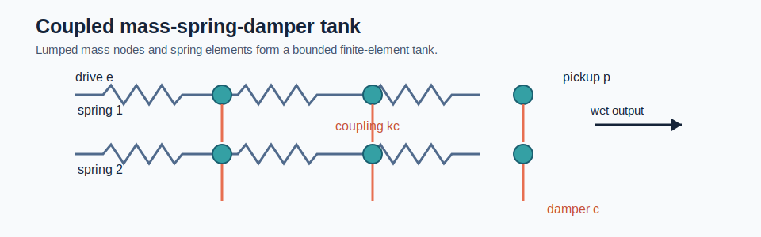

```bash
verbx render guitar.wav guitar_tank_fe.wav --engine algo --algo-model spring \
  --electromechanical-solver modal-fe --spring-count 3 \
  --spring-fe-nodes 36 --spring-fe-modes 48 --spring-fe-coupling 0.14 \
  --spring-fe-loss 0.42 --rt60 2.0 --wet 0.55 --dry 0.75

verbx render vocal.wav plate_fe.wav --engine algo --algo-model plate \
  --electromechanical-solver modal-fe --plate-fe-nx 20 --plate-fe-ny 14 \
  --plate-fe-modes 72 --plate-fe-loss 0.18 \
  --plate-pickup-x 0.18 --plate-pickup-y 0.76 --rt60 3.4 --wet 1 --dry 0
```

For a spring, verbx assembles a block mass matrix $\boldsymbol{M}$ and a
tridiagonal chain stiffness matrix $\boldsymbol{K}$. Multi-spring tanks add a
small coupling stiffness between adjacent chains. Normal modes solve

$$
\boldsymbol{K}\boldsymbol{q}_r = \lambda_r\boldsymbol{M}\boldsymbol{q}_r,
\qquad \omega_r = \sqrt{\lambda_r}.
$$

The driven/pickup impulse response is a causal sum of damped modes,

$$
h(t) = \sum_r \frac{(\boldsymbol{p}^{T}\boldsymbol{q}_r)
(\boldsymbol{q}_r^{T}\boldsymbol{e})}{\omega_{d,r}}
e^{-\sigma_r t}\sin(\omega_{d,r}t),
$$

where $\boldsymbol{e}$ is the input weight and $\boldsymbol{p}$ the pickup.
RT60 sets $\sigma=3\ln(10)/T_{60}$; `--spring-fe-loss` increases high-mode
loss and `--spring-fe-coupling` controls adjacent-spring coupling.

At element level, the spring displacement vector follows the familiar
mass-spring-damper equation

$$
\boldsymbol{M}\ddot{\boldsymbol{x}}
+ \boldsymbol{C}\dot{\boldsymbol{x}}
+ \boldsymbol{K}\boldsymbol{x}
= \boldsymbol{e}u(t).
$$

For a chain with $N$ nodes, verbx assigns node mass
$m_i=m_{\mathrm{total}}/N$ and segment stiffness
$k_s=(N-1)/c_{\mathrm{total}}$, where $c_{\mathrm{total}}$ is the requested
compliance in metres per newton. The tridiagonal stiffness block is assembled
from $k_s[1,-1;-1,1]$ element contributions and a driven-end clamp.
The solver does not time-step a stiff system sample by sample: it projects the
system into normal modes and applies the stable modal decay $e^{-\sigma_rt}$.
That retains a mass-spring-damper resonance structure without making the
offline render sensitive to an integration step size.

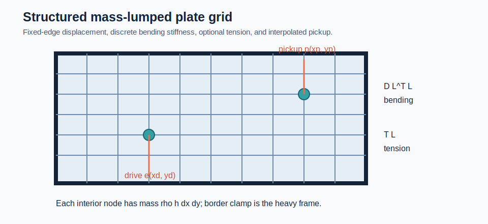

The plate solver uses a structured, mass-lumped clamped grid. Its stiffness is
the discrete thin-plate bending term plus optional membrane tension,

$$
\boldsymbol{K}=D\boldsymbol{L}^{T}\boldsymbol{L}+T\boldsymbol{L},
\qquad M_{ii}=\rho h\Delta x\Delta y,
$$

where $\boldsymbol{L}$ is the positive finite-difference Laplacian and
$D=Eh^3/[12(1-\nu^2)]$. `--plate-fe-nx`, `--plate-fe-ny`, and
`--plate-fe-modes` trade computation for detail; `--plate-fe-loss` gives
higher modes stronger decay. The input is fixed off-centre while
`--plate-pickup-x/y` select a bilinearly interpolated pickup. This is a
deterministic research/sound-design solver, not a fixture, transducer, or
hardware-nonlinearity calibration.

#### Practical Design and Measurement

For an insert, retain dry signal and keep wet level modest. For a send/return,
render 100 percent wet and blend in the DAW or later command stage. Spring
usually benefits from a short RT60 and darker damping; plate usually benefits
from a longer RT60, low damping, and a pre-delay that lets consonants or drum
attacks survive.

```bash
# Parallel guitar spring: leave the attack clear.
verbx render guitar.wav guitar_spring_parallel.wav \
  --engine algo --algo-model spring --rt60 1.4 --wet 0.32 --dry 0.90 \
  --pre-delay-ms 5 --damping 0.76

# Fully wet snare plate for later bus processing.
verbx render snare.wav snare_plate_return.wav \
  --engine algo --algo-model plate --rt60 1.6 --wet 1 --dry 0 \
  --pre-delay-ms 10 --damping 0.22 --width 1.5
```

Use `verbx analyze` on a rendered wet return to compare EDT, T20/T30, spectral
centroid, and clarity across parameter variations. Those measurements describe
the generated signal, not a certification that it matches a particular hardware
unit. Preserve the command, verbx version, and JSON report when a sound becomes
part of a production or a dataset.

---

### Convolution Engine (`--engine conv`)

The convolution engine filters audio through an impulse response. Use it when you want the character of a specific space – measured or synthesized – applied exactly.

**What it sounds like:** The output has the exact spectral and temporal character of the IR. A measured cathedral IR makes everything sound like it was played in that cathedral. A verbx-generated hybrid IR sounds like a designed space tuned to your specifications. Self-convolution (`--self-convolve`) smears a sound with its own spectral envelope – a different kind of effect.

**Partitioned convolution:** For long IRs, direct time-domain convolution is impractical. verbx uses uniformly-partitioned overlap-save convolution in the frequency domain:

$$
Y_k(\omega) = \sum_{p=0}^{P-1} X_{k-p}(\omega)\,H_p(\omega)
$$

where:

- $k$ is the current processing frame index.
- $\omega$ is frequency-bin index in the FFT domain.
- $P$ is the number of IR partitions.
- $X_{k-p}(\omega)$ is the stored input spectrum for frame $k-p$.
- $H_p(\omega)$ is the precomputed spectrum of IR partition $p$.
- $Y_k(\omega)$ is the accumulated output spectrum for frame $k$.

`--partition-size` controls the partition length: larger partitions reduce per-block FFT overhead but increase latency and peak memory. 16384–65536 samples is a practical range for offline rendering. With CuPy installed and `--device cuda`, the FFT multiply accumulation runs on GPU.

**Streaming vs. in-memory:** verbx automatically uses streaming convolution (low peak RAM) when the render is simple: engine conv, no repeat, no freeze, no normalization stages, no post-processing effects. All other combinations fall back to full-buffer processing. If RAM is a concern for very long IRs, keep the render chain minimal.

**Multichannel routing:** For $M$ input channels and $N$ output channels:

$$
y_o[n] = \sum_{i=0}^{M-1} \left(x_i * h_{i,o}\right)[n]
$$

where:

- $M$ is input-channel count and $N$ is output-channel count.
- $x_i[n]$ is input channel $i$.
- $h_{i,o}[n]$ is the IR from input channel $i$ to output channel $o$.
- $y_o[n]$ is output channel $o$.
- $*$ denotes linear convolution.

The IR file must contain $M \times N$ channels packed in output-major order (channel index $oM + i$) or input-major order ($iN + o$). Set `--ir-matrix-layout output-major` or `input-major` accordingly. Wrong packing order produces valid audio but semantically incorrect routing; verify with `verbx analyze` on the output.

**Key parameters:**

| Parameter | Range/values | What it does | Expert note |
|---|---|---|---|
| `--ir` | file path | Impulse response to apply | WAV, FLAC, AIFF, OGG, CAF all supported |
| `--partition-size` | 1024–131072 | FFT block size | Larger = more throughput, higher latency |
| `--tail-limit` | seconds | Cap IR tail at this length | Useful to bound compute on long IRs in batch |
| `--ir-normalize` | peak/rms/none | IR level normalization | `peak` is safest for predictable headroom |
| `--ir-matrix-layout` | output-major/input-major | Multichannel channel packing | Must match how the IR was created |
| `--ir-blend` | file path | Second IR for render-time blending | Repeatable; blend alpha automatable |
| `--ir-blend-mode` | linear/equal-power/spectral/envelope-aware | Blend algorithm | `envelope-aware` preserves early reflection character independently from late tail |
| `--self-convolve` | flag | Input file is its own IR | Spectral smearing / texture effect |
| `--device` | auto/cpu/cuda/mps | Compute backend | CUDA requires CuPy; MPS uses Apple Silicon profile |

---

## Impulse Response Synthesis

verbx generates its own IRs in four synthesis modes. The complete parameter reference is in [docs/IR_SYNTHESIS.md](docs/IR_SYNTHESIS.md). The IR toolchain is accessible via `verbx ir gen`, or triggered inline during render with `--ir-gen`.

A larger curated IR set is available in [`IRs/library/`](IRs/library/) with
folder-sorted buckets by length (`tiny`, `short`, `medium`, `long`) and mode
(`fdn`, `stochastic`, `modal`, `hybrid`), plus deterministic metadata in
`IRs/library/manifest.json`.

**Synthesis modes:**

| Mode | Character | Best for |
|---|---|---|
| `fdn` | Smooth, configurable, FDN-consistent | Spaces that match your algorithmic render topology |
| `stochastic` | Diffuse, noise-shaped, natural-sounding | Neutral halls, rooms, generic reverbs |
| `modal` | Resonant, tonal, pitched | Metal objects, tuned rooms, experimental textures |
| `hybrid` | Stochastic early + FDN late + optional modal resonator | Most general use; strong default |

**Common use case table:**

| Goal | Mode | Key flags |
|---|---|---|
| Neutral hall, natural decay | `stochastic` | `--rt60 3.0 --damping 0.4` |
| Match your FDN render topology | `fdn` | Same `--fdn-lines`, `--fdn-matrix` as render |
| Musical, pitched resonances | `modal` | `--f0 "64 Hz" --modal-count 40` |
| General cinematic space | `hybrid` | `--length 120 --seed 42` |
| Analyze and match audio source | `hybrid` | `--analyze-input source.wav` |

Generated IRs are cached by content hash + parameters. Repeated calls with the same settings return from cache instantly.

```bash
verbx ir gen my_space.wav --mode hybrid --length 120 --rt60 8.0 --seed 42
verbx ir analyze my_space.wav --json-out my_space_analysis.json
verbx ir morph space_A.wav space_B.wav blended.wav --mode equal-power --alpha 0.5
```

---

## Effects and Post-Processing

### Shimmer

Shimmer pitch-shifts the reverb tail (typically up an octave) and blends it back into the wet signal. The result is a bright, harmonically rich coloration that works well on pads, sustained notes, and ambient textures. The `--shimmer-feedback` parameter is the one most people get wrong: above around 0.85, the feedback loop builds exponentially. This is not a bug – it is the intended mechanism for extreme infinite-rise textures – but it requires either a tail limit, loudness targeting, or deliberate management to avoid runaway gain.

Safe mode clamps `--shimmer-feedback` to `0.98`. For intentional self-oscillation in the algorithmic path, enable `--unsafe-self-oscillate` and use `--unsafe-loop-gain > 1.0` (for example `1.03`).

```bash
--shimmer --shimmer-semitones 12 --shimmer-mix 0.35 --shimmer-feedback 0.70
--shimmer-lowcut 300 --shimmer-highcut 12000    # control frequency range of shimmer layer
```

### Comb Cloud

`--comb-cloud` inserts a separate bank of decorrelated feedback comb filters between the diffusion stage and the main FDN late field. It is an optional color mode for when you want extra density, metallic haze, or exaggerated spatial smear without redefining the core FDN topology. The point is texture, not neutrality.

Use it when the base algorithmic tail feels too smooth or too well-behaved:

- plates and metallic chambers
- sci-fi interiors and synthetic spaces
- frozen, haunted, or intentionally "wrong" ambience
- pre-shimmer thickening before harmonic coloration

Start conservatively. `--comb-cloud-mix 0.15–0.35` is usually enough. Higher `--comb-cloud-feedback` values push the sound toward ringing and resonant buildup.

```bash
--comb-cloud --comb-cloud-count 24 --comb-cloud-feedback 0.35 --comb-cloud-mix 0.25
--comb-cloud-delays-ms 6,9,13,17,23,29,37,49   # optional custom cloud spacing
```

Practical tip: comb cloud and shimmer solve different problems. Comb cloud thickens and roughens the time structure; shimmer adds pitched harmonic content. If the reverb feels sterile, try comb cloud first. If it feels emotionally flat, try shimmer.

### Freeze / Repeat

`--freeze` locks onto a segment of audio (defined by `--start` and `--end` in seconds) and loops it through the reverb engine with an equal-power crossfade at loop boundaries. This produces sustained, near-static textures. `--repeat N` runs the full render chain N times sequentially, each pass using the output of the previous as input – an iterative reprocessing that progressively imprints the room resonance on the source. Classic application: Alvin Lucier's *I Am Sitting in a Room* (1969) technique.

Use `--output-peak-norm input` with repeat chains to keep levels stable across passes.

### Ducking

`--duck` is the reverb effect most mix engineers do not use until they hear it. It attenuates the reverb output while the source signal is active, then lets the tail bloom in the gaps. The effect keeps the dry signal clean and articulate while the reverb is still long and spacious. Especially effective on drums, vocals, and anything with rhythmic transients.

```bash
--duck --duck-attack 15 --duck-release 250 --duck-strength 0.9 --duck-floor 0.18
```

Attack controls how quickly the reverb ducks when signal appears; release controls how quickly it recovers. Shorter release times give a punchier, more gated feel. `--duck-strength` controls how deep the wet attenuation goes, while `--duck-floor` keeps some reverb present even at the deepest point of the pump.

### Bloom

`--bloom N` emphasizes the slow build-up phase of the wet field, creating a cinematic swell effect where the reverb tail rises rather than immediately decaying. Values between 1.5 and 3.0 are perceptible as a rise before the decay plateau. Higher values push into dramatic orchestral-swell territory. It operates on the spectral envelope of the wet output and is distinct from simple gain automation.

Use `--bloom-mix` when you want the bloom time constant from `--bloom` but a more restrained or more exaggerated blend than the automatic scaling would choose.

### Tilt EQ

`--tilt N` applies a broadband spectral tilt to the wet field. Positive values (try 1.0–3.0) brighten the reverb tail; negative values darken it. This is a post-wet control, so it does not affect the dry signal or the decay mathematics – it only shapes the perceptual tone of the reverb output. Combine with `--lowcut` and `--highcut` for more specific frequency management.

`--tilt-pivot-hz` moves the tonal fulcrum of that tilt, while `--lowcut-order` and `--highcut-order` let you choose gentler or steeper post-wet filter slopes.

---

## Spatial and Surround

For most uses, stereo output is all you need. Multichannel processing becomes relevant when you are delivering to a surround format, working in Ambisonics, or routing reverb through a spatial bus.

For a complete treatment of channel beds, height layers, Ambisonics, Dolby Atmos beds and objects, binaural monitoring, DAW handoff, deliverables, and immersive QC, read [Immersive Reverb, Surround Sound, and Dolby Atmos](docs/IMMERSIVE_AUDIO.md). The chapter includes signal-flow diagrams, routing recipes, and a precise account of what verbx can and cannot author today.

**Channel layouts:**

| Layout | Channels | Use case |
|---|---|---|
| `mono` | 1 | Mono sources or mono IR processing |
| `stereo` | 2 | Standard stereo output |
| `LCR` | 3 | Left/Center/Right film format |
| `5.1` | 6 | Standard surround |
| `7.1` | 8 | Expanded surround |
| `7.1.2` | 10 | Standard Atmos bed or fixed-channel immersive bus |
| `7.1.4` | 12 | Common Atmos monitoring/render layout; not the default Atmos bed |
| `7.2.4` | 13 | 7-bed + dual-LFE + 4-top layout |
| `8.0` | 8 | 8-channel bed without dedicated LFE |
| `16.0` | 16 | Large-format discrete bed |
| `64.4` | 68 | High-density immersive bed + top layer |

Use `--input-layout` and `--output-layout` to declare channel semantics explicitly. Without them, verbx uses channel count alone, which can produce ambiguous routing for formats above stereo.

**Atmos boundary:** verbx writes channel-based WAVE files, Ambisonic material, matrix-routed convolution outputs, JSON analysis, and handoff manifests. It does not currently author Dolby object trajectories, per-object binaural metadata, or a native ADM BWF/DAMF master. Prepare bed and object stems in verbx, then perform object assignment, metadata authoring, endpoint rendering, and master export in an Atmos-capable DAW and the Dolby Atmos Renderer.

The distinction between a bed and a monitoring layout matters. Dolby’s standard bed is 7.1.2, while 7.1.4 commonly describes a loudspeaker render with four independently fed height speakers. verbx currently labels channels 9–10 of its symbolic `7.1.2` layout `Ltf/Rtf`; a Dolby bed expects `Ltm/Rtm` in those positions. Verify and explicitly map those channels at handoff rather than relying on channel count.

For large immersive outputs (`16.0`, `64.4`), set `--ir-route-map` explicitly when the IR is mono or channel-matched to the input. Recommended defaults:

- `--ir-route-map broadcast` for mono/channel-matched IRs
- `--ir-route-map full` for matrix-packed $M \times N$ IRs

Other formats are also easy to support: the routing and DSP paths already operate on arbitrary channel counts, and new symbolic layout names are straightforward to add when you need explicit semantics.

**Ambisonics:** verbx supports First-Order Ambisonics (FOA) with ACN channel ordering and SN3D/N3D/FuMa normalization. Use `--ambi-order 1` to declare FOA mode. `--ambi-encode-from stereo` encodes a stereo input into FOA before processing; `--ambi-decode-to stereo` decodes back out after. `--ambi-rotate-yaw-deg` applies rotation in the Ambisonics domain – useful for spatial orientation of the reverb field relative to a listener position. FUMA is FOA-only; ACN with SN3D is the standard workflow for most Ambisonics toolchains.

**IR matrix routing for surround:** If your IR file contains $M \times N$ channels (for $M$ input and $N$ output channels), declare the packing order with `--ir-matrix-layout`. Output-major packing stores all inputs for output 0 first, then all inputs for output 1, etc. (channel index $oM + i$). Input-major stores all outputs for input 0 first (channel index $iN + o$). A 5.1 input to 5.1 output full-matrix IR has 36 channels; a diagonal (same IR per channel) has 6. The routing is explicit: verbx does not guess.

---

## Loudness and Metering

Most audio delivered for broadcast, streaming, or film needs to hit a loudness target. EBU R128 / ITU-R BS.1770 defines integrated loudness in LUFS (Loudness Units relative to Full Scale). The practical difference between targeting –23 LUFS for broadcast and –14 LUFS for streaming can be over 9 dB of apparent level – enough to sound completely wrong in one context if mastered for the other.

verbx has a full loudness pipeline:

- **`--target-lufs N`** measures integrated loudness and scales to the target. Applies after the reverb processing stage.
- **`--target-peak-dbfs N`** enforces a peak ceiling. Use with `--true-peak` for inter-sample peak checking (required for formats that will be transcoded, as codec interpolation can raise peaks above the stored sample values). Sample peak (`--sample-peak`) is sufficient for archival.
- **`--output-peak-norm [input|target|full-scale]`** is a final-stage peak fit applied after all other processing: `input` matches the input file's peak, `target` uses an explicit dBFS value, `full-scale` normalizes to near 0 dBFS.
- **Soft limiter:** enabled by default as a final safety stage. Disable with `--no-limiter` when you want to pass raw dynamics to a downstream limiter in your chain.

The loudness and peak stages are intentionally separate because they serve different goals. Loudness targeting is about program-level normalization. Peak ceiling is about short-term safety. Do not conflate them.

True-peak detection uses oversampled measurement (ITU-R BS.1770). The difference between a sample peak of –0.1 dBFS and a true peak of +0.4 dBFS is invisible in sample-domain inspection but will cause clipping in AAC, MP3, and most streaming codecs. Use `--true-peak --target-peak-dbfs -1` for any output that will be transcoded.

Week 3 delivery sanity checks now fail fast when an explicit limiter threshold is above the limiter ceiling, because that silently collapses the useful gain-reduction range. Explicit container choices also need matching extensions: use `.w64` with `--output-container w64`, `.rf64` with `--output-container rf64`, or leave `--output-container auto` on when you want verbx to infer the container.

Ready-to-run delivery examples:

```bash
# Broadcast/streaming-safe limiter and peak-normalized output
verbx render in.wav out_limited.wav --preset limiter-broadcast-safe \
  --output-peak-norm target --output-peak-target-dbfs -1

# Bounded long-tail delivery with an explicit W64 container
verbx render in.wav out_long.w64 --preset delivery-long-tail-safe \
  --output-container w64 --tail-limit 12
```

---

## Automation and Modulation

The automation system lets you change reverb parameters over the duration of a render – wet depth, RT60, room size, decay tilt, IR blend position, and more – without editing the audio manually. This is useful for: reverb throws (sudden wet increase on a vocal), automated room size sweeps during a sound design cue, feature-reactive ducking where loudness in the source drives reverb depth, and batch augmentation where different parameter curves are applied to each variant.

**Automation lanes via file or inline points:**
```bash
# Sweep RT60 from 0.8s to 10s over 15 seconds
verbx render in.wav out.wav --engine algo \
  --automation-point "rt60:0.0:0.8:linear" \
  --automation-point "rt60:15.0:10.0:linear"

# From a JSON automation file
verbx render in.wav out.wav --automation-file automation.json
```

**Automation targets include:** `wet`, `dry`, `gain-db`, `rt60`, `damping`, `room-size`, `room-size-macro`, `clarity-macro`, `warmth-macro`, `envelopment-macro`, `fdn-rt60-tilt`, `fdn-tonal-correction-strength`, `ir-blend-alpha` (requires `--ir-blend`).

**Feature vector lanes** drive automation from frame-level audio analysis of the source signal. A "feature vector" is a time-series of per-frame descriptors extracted from audio: loudness, transient strength, spectral centroid, spectral flatness, harmonic ratio, MFCCs, formant spread, rhythm pulse, and more. You map these onto render targets with weight, curve shape (linear, smoothstep, power), and hysteresis:

```bash
# Wet depth tracks loudness and transients in the source
verbx render in.wav out.wav --engine conv --ir hall.wav \
  --feature-vector-lane "target=wet,source=loudness_norm,weight=0.70,curve=smoothstep,combine=replace" \
  --feature-vector-lane "target=wet,source=transient_strength,weight=0.30,curve=power,curve_amount=1.4,combine=add" \
  --feature-vector-trace-out trace.csv
```

Use `--feature-guide GUIDE.wav` to drive feature extraction from a separate audio file rather than the render input – a sidechain-style workflow.

**Modulation bus** provides LFO and envelope sources for simple periodic or input-reactive variation without needing a full automation file:
```bash
--mod-target mix --mod-min 0.1 --mod-max 0.9 \
  --mod-source "lfo:sine:0.07:1.0*0.7" \
  --mod-source "env:20:350*0.4"
```

Source syntax: `lfo:<shape>:<rate_hz>[:depth[:phase_deg]][*weight]` | `env[:attack_ms[:release_ms]][*weight]` | `audio-env:<path>[:attack_ms[:release_ms]][*weight]` | `const:<value>[*weight]`

---

## CLI Reference

Canonical help snapshots live in
[`docs/CLI_REFERENCE.md`](docs/CLI_REFERENCE.md). This README section is a
curated quick-reference for common switches.

### verbx render

`verbx render INFILE OUTFILE [options]`

#### Engine and Room Behavior

| Switch | Range | What it does | Expert note |
|---|---|---|---|
| `--engine` | algo/conv/auto | Reverb engine | `auto` picks `conv` if IR present, else `algo` |
| `--rt60` | 0.1–3600 | Decay time (seconds) | Per-line gain via $g_i = 10^{-3d_i/T_{60}}$ |
| `--wet` | 0–∞ | Wet signal level | Values >1.0 overdrive wet bus intentionally |
| `--dry` | 0–1 | Dry signal level | |
| `--pre-delay-ms` | 0–500 | Reverb onset delay (ms) | |
| `--pre-delay` | e.g. `1/8D` | Musical note-value pre-delay | Requires `--bpm` |
| `--bpm` | float | Tempo for note-based pre-delay | |
| `--damping` | 0–1 | HF decay rate in feedback | Higher = darker tail |
| `--width` | 0–2 | Stereo decorrelation | |
| `--allpass-stages` | 0–16 | Diffusion stage count | |
| `--allpass-gain` | ±0.99 | Per-stage allpass coefficient | Comma-separated per-stage list accepted |
| `--comb-cloud` | flag | Enable optional pre-FDN comb-cloud coloration | Separate color stage; default off |
| `--comb-cloud-count` | 1–128 | Generated comb-cloud line count | Higher = denser, more colored |
| `--comb-cloud-feedback` | 0–0.95 | Comb-cloud feedback amount | Higher = more ringing / metallicity |
| `--comb-cloud-mix` | 0–1 | Blend between diffusion output and comb-cloud output | 0.15–0.35 is a strong starting range |
| `--comb-cloud-delays-ms` | comma list | Custom comb-cloud delay list in ms | Auto-enables comb cloud |
| `--comb-cloud-seed` | int | Deterministic comb-cloud seed | Changes generated spacing/decorrelation |
| `--fdn-lines` | 2–64 | Delay line count | |
| `--fdn-matrix` | see table above | Feedback matrix family | |
| `--fdn-tv-rate-hz` | 0–5 | TV-unitary update rate | `tv_unitary` only |
| `--fdn-tv-depth` | 0–1 | TV-unitary blend depth | `tv_unitary` only |
| `--fdn-matrix-morph-to` | matrix family | Target matrix for gradual morphing | Morphs from `--fdn-matrix` to target |
| `--fdn-matrix-morph-seconds` | seconds | Matrix morph duration | Requires `--fdn-matrix-morph-to` |
| `--fdn-dfm-delays-ms` | float | DFM micro-delay size | One value or one per line |
| `--fdn-sparse` | flag | Sparse pair-mixing topology | Exclusive with `tv_unitary` and `graph` |
| `--fdn-sparse-degree` | 1–8 | Pair-mixing stages | |
| `--fdn-link-filter` | none/lowpass/highpass | In-loop spectral shaping | |
| `--fdn-link-filter-hz` | Hz | Link filter cutoff | |
| `--fdn-rt60-tilt` | –1 to 1 | Low/high RT skew | Positive = longer lows |
| `--fdn-tonal-correction-strength` | 0–1 | Decay-color equalization | Track C control |
| `--fdn-cascade` | flag | Nested FDN injection | |
| `--fdn-graph-topology` | ring/path/star/random | Graph topology | `graph` matrix only |
| `--fdn-spatial-coupling-mode` | none/adjacent/front_rear/bed_top/all_to_all | Channel wet-bus coupling | |
| `--fdn-nonlinearity` | none/tanh/softclip | In-loop saturation | Keep blend low: 0.05–0.25 |
| `--beast-mode` | 1–100 | Parameter multiplier | 2–5 for heavier ambience, 10+ for extreme |

#### RT60 and Multiband Decay

| Switch | Range | What it does |
|---|---|---|
| `--fdn-rt60-low` | seconds | Low-band RT60 target |
| `--fdn-rt60-mid` | seconds | Mid-band RT60 target |
| `--fdn-rt60-high` | seconds | High-band RT60 target |
| `--fdn-xover-low-hz` | Hz | Low/mid crossover |
| `--fdn-xover-high-hz` | Hz | Mid/high crossover |

#### Convolution and IR Routing

| Switch | Values | What it does |
|---|---|---|
| `--ir` | file path | External IR for convolution |
| `--ir-normalize` | peak/rms/none | IR normalization before convolution |
| `--ir-matrix-layout` | output-major/input-major | Multichannel IR channel packing |
| `--ir-route-map` | auto/diagonal/broadcast/full | Channel routing strategy |
| `--partition-size` | int | FFT partition size |
| `--tail-limit` | seconds | Cap convolution tail |
| `--self-convolve` | flag | Use input as its own IR |
| `--ir-blend` | file path | Blend a second IR at render time (repeatable) |
| `--ir-blend-mix` | 0–1 | Blend coefficient(s) |
| `--ir-blend-mode` | linear/equal-power/spectral/envelope-aware | Blend algorithm |
| `--ir-gen` | flag | Auto-generate IR before render |
| `--ir-gen-mode` | fdn/stochastic/modal/hybrid | IR synthesis mode |
| `--ir-gen-length` | seconds | Generated IR duration |
| `--ir-gen-seed` | int | Deterministic seed |

#### Spatial

| Switch | Values | What it does |
|---|---|---|
| `--input-layout` | auto/mono/stereo/LCR/5.1/7.1/7.1.2/7.1.4/7.2.4/8.0/16.0/64.4 | Input channel semantics |
| `--output-layout` | auto/mono/stereo/LCR/5.1/7.1/7.1.2/7.1.4/7.2.4/8.0/16.0/64.4 | Output channel semantics |
| `--ambi-order` | 0–7 | Ambisonics order (1 = FOA) |
| `--ambi-normalization` | auto/sn3d/n3d/fuma | Normalization convention |
| `--channel-order` | auto/acn/fuma | Channel ordering convention |
| `--ambi-encode-from` | none/mono/stereo | Encode to FOA before render |
| `--ambi-decode-to` | none/stereo | Decode from Ambisonics after render |
| `--ambi-rotate-yaw-deg` | degrees | Yaw rotation in Ambisonics domain |

#### Effects

| Switch | Values | What it does |
|---|---|---|
| `--shimmer` | flag | Enable shimmer (pitch-shifted reverb coloration) |
| `--shimmer-semitones` | semitones | Pitch shift amount |
| `--shimmer-mix` | 0–1 | Shimmer blend |
| `--shimmer-feedback` | 0–1.25 | Shimmer feedback (>0.85 = rising; >0.98 requires unsafe mode) |
| `--unsafe-self-oscillate` | flag | UNSAFE: allow above-unity feedback in algorithmic mode |
| `--unsafe-loop-gain` | 0.01–1.25 | UNSAFE algorithmic loop-gain scale (`>1.0` for self-oscillation) |
| `--shimmer-spatial` | flag | Enable multichannel shimmer decorrelation | Useful for immersive beds |
| `--shimmer-spread-cents` | cents | Per-channel shimmer detune spread | Used with `--shimmer-spatial` |
| `--shimmer-decorrelation-ms` | ms | Per-channel shimmer delay spread | Used with `--shimmer-spatial` |
| `--duck` | flag | Enable sidechain ducking |
| `--duck-attack` | ms | Ducking attack time |
| `--duck-release` | ms | Ducking release time |
| `--duck-strength` | 0–1 | Ducking depth | Higher values carve more space for the dry signal |
| `--duck-floor` | 0–1 | Minimum wet gain during ducking | Keeps ambience present while pumping |
| `--bloom` | 0–5 | Wet field build-up emphasis |
| `--bloom-mix` | 0–1 | Bloom blend override | Auto-derived from `--bloom` when omitted |
| `--lowcut` | Hz | Post-wet high-pass filter |
| `--lowcut-order` | 1–8 | High-pass slope order | Higher = steeper low-frequency cleanup |
| `--highcut` | Hz | Post-wet low-pass filter |
| `--highcut-order` | 1–8 | Low-pass slope order | Higher = steeper top-end damping |
| `--tilt` | dB/oct | Post-wet spectral tilt |
| `--tilt-pivot-hz` | Hz | Tilt pivot frequency | Moves the tonal hinge point of the tilt EQ |
| `--freeze` | flag | Loop a segment through the engine |
| `--start` | seconds | Freeze segment start |
| `--end` | seconds | Freeze segment end |
| `--repeat` | int | Repeat render passes |

#### Loudness and Output

| Switch | Values | What it does |
|---|---|---|
| `--target-lufs` | LUFS | Integrated loudness target |
| `--target-peak-dbfs` | dBFS | Peak ceiling |
| `--true-peak` / `--sample-peak` | flag | Peak detection mode |
| `--limiter` / `--no-limiter` | flag | Final safety limiter |
| `--normalize-stage` | none/post/per-pass | When normalization applies |
| `--output-peak-norm` | none/input/target/full-scale | Final peak fit |
| `--quality-preset` | sd/md/hd | Output-definition preset (`sd`=44.1 kHz PCM16, `md`=48 kHz PCM24, `hd`=192 kHz float32 default) |
| `--out-subtype` | auto/float32/float64/pcm16/pcm24/pcm32 | Output file bit depth (overrides preset subtype) |
| `--target-sr` | Hz | Render/output sample-rate conversion (overrides preset sample rate) |
| `--output-container` | auto/wav/w64/rf64 | Output container selection | `auto` upgrades long WAV renders to W64 |
| `--tail-stop-threshold-db` | dBFS | Tail detector threshold for write completion | Lower = longer retained tail |
| `--tail-stop-hold-ms` | ms | Explicit final zero-hold duration | Click-safe fade-out plus hard-zero ending |
| `--tail-stop-metric` | peak/rms | Tail detector metric | RMS is smoother, peak is stricter |

When `--target-sr` differs from the input file rate, `verbx render` performs
deterministic internal resampling and writes the output at the requested rate.

#### Execution and Reporting

| Switch | Values | What it does |
|---|---|---|
| `--device` | auto/cpu/cuda/mps | Compute backend |
| `--threads` | int | CPU thread count hint |
| `--algo-stream` | flag | Algorithmic proxy-IR streaming mode | Memory-friendly for very long renders |
| `--algo-proxy-ir-max-seconds` | seconds | Maximum proxy-IR duration | Used with `--algo-stream` |
| `--algo-gpu-proxy` | flag | Route algo proxy through CUDA convolution | Requires `--algo-stream --device cuda` |
| `--dry-run` | flag | Validate config without writing audio |
| `--auto-fit` | none/speech/music/drums/ambient | Apply profile-derived starting values | Respects explicit CLI overrides |
| `--preset` | name or `room:WxDxH/material` | Apply named preset or geometry-derived room baseline |
| `--lucky N` | int | Generate N randomized variants |
| `--frames-out` | path | Per-frame metrics CSV |
| `--analysis-out` | path | JSON analysis report path |
| `--repro-bundle` | flag | Write reproducibility bundle |
| `--quiet` | flag | Suppress console summary |
| `--silent` | flag | Suppress all output including analysis JSON |

---

### Early Reflection Geometry (Render)

| Switch | Values | What it does |
|---|---|---|
| `--er-geometry` | flag | Enable first-order image-source early reflections before main engine |
| `--er-room-dims-m` | `L,W,H` | Room dimensions (meters) |
| `--er-source-pos-m` | `x,y,z` | Source position (meters) |
| `--er-listener-pos-m` | `x,y,z` | Listener position (meters) |
| `--er-absorption` | 0.0–0.99 | Wall absorption coefficient |
| `--er-material` | anechoic/dead/studio/hall/stone | Preset absorption profile |

---

### verbx ir

```bash
verbx ir gen OUT_IR.wav [options]          # synthesize an IR
verbx ir analyze IR_FILE.wav              # measure RT60, EDT, spectral decay
verbx ir process IN_IR.wav OUT_IR.wav     # shape existing IR (EQ, normalize, tilt)
verbx ir morph IR_A.wav IR_B.wav OUT.wav  # blend two IRs
verbx ir morph-sweep IR_A.wav IR_B.wav OUT_DIR  # alpha-timeline sweep with QA artifacts
verbx ir fit INFILE.wav OUT_IR.wav        # fit an IR to match source audio
verbx ir sofa-info FILE.sofa              # inspect SOFA conventions/dimensions
verbx ir sofa-extract FILE.sofa OUT.wav   # extract FIR matrix for convolution renders
```

**`ir gen` key flags:** `--mode [fdn|stochastic|modal|hybrid]`, `--length`, `--rt60`, `--damping`, `--seed`, `--sr`, `--channels`, `--er-count`, `--diffusion`, `--fdn-lines`, `--fdn-matrix`, `--resonator`, `--resonator-mix`, `--analyze-input`, `--harmonic-align-strength`, `--f0`

**`ir morph` key flags:** `--mode [linear|equal-power|spectral|envelope-aware]`, `--alpha`, `--early-ms`, `--early-alpha`, `--late-alpha`, `--align-decay`, `--phase-coherence`, `--mismatch-policy [coerce|strict]`

**`ir morph-sweep` key flags:** Same as morph plus `--alpha-start`, `--alpha-end`, `--alpha-steps`, `--workers`, `--retries`, `--checkpoint-file`, `--resume`, `--qa-json-out`, `--qa-csv-out`

**`ir sofa-extract` key flags:** `--measurement-index`, `--emitter-index`, `--target-sr`, `--normalize [none|peak|rms]`, `--strict`

---

### verbx realtime

`verbx realtime [options]`

Realtime mode is currently a preview/audition path. `--engine conv` streams a
real IR directly; `--engine algo` renders a static proxy IR once, then runs the
live monitor through the streaming convolution engine. That means you get live
device routing and stable tails today, without pretending the full offline
automation surface is callback-safe yet. In other words: convolution settings
act live, while algorithmic settings shape the startup proxy IR that the live
convolver uses for the session. It now also supports a dedicated low-latency
live dereverb path, either standalone or chained in front of the reverb engine.

**Transport and device routing**

| Switch | Values | What it does |
|---|---|---|
| `--live-mode` | reverb/dereverb/dereverb-reverb | Choose reverb only, dereverb only, or dereverb feeding the live reverb path |
| `--engine` | auto/conv/algo | Live engine mode. `auto` chooses convolution when `--ir` is present, else algorithmic proxy |
| `--ir` | file path | IR source for realtime convolution |
| `--input-device` | index or substring | Select live input device |
| `--output-device` | index or substring | Select live output device |
| `--list-devices` | flag | Print available realtime devices and exit |
| `--sample-rate` | Hz | Live stream sample rate |
| `--block-size` | samples | Driver callback block size |
| `--partition-size` | samples | Convolution partition size used in the live processor |
| `--input-channels` | int | Processor input width. Defaults to mono/stereo, or to the length of `--input-channel-map` |
| `--input-channel-map` | comma-separated 1-based ints | Select and reorder hardware input channels, for example `1,3` or `1,3,5,7` |
| `--output-channels` | int | Processor output width. Defaults to processor width, or to the length of `--output-channel-map` |
| `--output-channel-map` | comma-separated 1-based ints | Select and reorder hardware output channels that receive processor outputs |
| `--duration` | seconds | Stop automatically after N seconds; omit for Ctrl-C run |
| `--quiet` | flag | Reduce console output |

**Low-latency live dereverb**

| Switch | Values | What it does |
|---|---|---|
| `--dereverb-mode` | wiener/spectral_sub | Realtime dereverb kernel |
| `--dereverb-strength` | 0–2 | How aggressively late energy is suppressed |
| `--dereverb-floor` | 0–1 | Minimum residual gain floor |
| `--dereverb-window-ms` / `--dereverb-hop-ms` | ms / ms | Short STFT analysis window and hop for the live dereverb path |
| `--dereverb-tail-ms` | ms | Exponential late-tail tracking horizon |
| `--dereverb-pre-emphasis` | 0–0.98 | Optional pre-emphasis before spectral processing |
| `--dereverb-mix` | 0–1 | Blend between dereverbed and latency-aligned dry signal |
| `--dereverb-max-atten-db` | dB | Clamp the maximum spectral attenuation |
| `--dereverb-stereo-link` | flag | Link stereo gain decisions to reduce image wobble |
| `--dereverb-input-gain-db` / `--dereverb-output-gain-db` | dB / dB | Trim into and out of the live dereverb processor |

**Realtime mix and proxy-room controls**

| Switch | Values | What it does |
|---|---|---|
| `--wet` / `--dry` | 0–1 | Live wet/dry mix in the convolver |
| `--rt60` | seconds | Algorithmic proxy decay time |
| `--pre-delay-ms` | ms | Algorithmic proxy pre-delay |
| `--damping` | 0–1 | Algorithmic proxy damping |
| `--width` | 0–2 | Algorithmic proxy stereo width |
| `--mod-depth-ms` / `--mod-rate-hz` | ms / Hz | Proxy delay modulation depth and rate |
| `--freeze` | flag | Realtime algo only: approximate infinite sustain via a long self-sustaining proxy tail |
| `--algo-proxy-ir-max-seconds` | seconds | Upper bound on startup proxy IR render length |
| `--lowcut` / `--highcut` / `--tilt` | Hz / dB tilt | Shape the startup proxy IR spectrum before live convolution |

**FDN topology and feedback options**

| Switch | Values | What it does |
|---|---|---|
| `--fdn-lines` | 1–64 | Proxy FDN line count |
| `--fdn-matrix` | hadamard/householder/random_orthogonal/circulant/elliptic/tv_unitary/graph/sdn_hybrid | Proxy matrix family |
| `--fdn-tv-rate-hz` / `--fdn-tv-depth` | Hz / amount | Time-varying matrix motion for supported FDNs |
| `--fdn-dfm-delays-ms` | comma-separated ms | Delay-feedback modulation taps |
| `--fdn-sparse` / `--fdn-sparse-degree` | flag / int | Sparse feedback wiring and degree |
| `--fdn-cascade` and friends | flag / scalars | Enable cascaded/nested FDN behavior |
| `--fdn-rt60-low` / `--mid` / `--high` | seconds | Multiband RT60 targets |
| `--fdn-rt60-tilt` | –1 to 1 | Tilt the decay profile across bands |
| `--fdn-link-filter*` | mode / Hz / mix | Filter energy in the feedback links |
| `--fdn-graph-topology` / `--fdn-graph-degree` / `--fdn-graph-seed` | topology / int / int | Graph-based FDN layout controls |
| `--fdn-matrix-morph-to` / `--fdn-matrix-morph-seconds` | matrix / seconds | Morph between matrix families during proxy synthesis |
| `--fdn-spatial-coupling-mode` / `--strength` | mode / 0–1 | Immersive cross-cluster coupling |
| `--fdn-nonlinearity*` | mode / amount / drive | Nonlinear feedback coloration |

**Diffusion, shimmer, and perceptual macros**

| Switch | Values | What it does |
|---|---|---|
| `--allpass-stages` | 0–64 | Diffusion depth |
| `--allpass-gain` | float or comma-separated list | Shared or per-stage diffusion coefficient(s) |
| `--allpass-delays-ms` | comma-separated ms | Custom allpass delay times |
| `--comb-delays-ms` | comma-separated ms | Custom FDN/comb delay times |
| `--shimmer` and `--shimmer-*` | flag / scalars | Startup proxy shimmer block with pitch, mix, feedback, filters, spatial spread |
| `--room-size-macro` / `--clarity-macro` / `--warmth-macro` / `--envelopment-macro` | –1 to 1 | Jot-inspired perceptual macro controls |
| `--algo-decorrelation-front` / `--rear` / `--top` | 0–1 | Extra proxy decorrelation for immersive layouts |
| `--unsafe-self-oscillate` / `--unsafe-loop-gain` | flag / scalar | Deliberately allow runaway feedback behavior when you really mean it |

Notes:

- `--live-mode dereverb` ignores reverb-engine startup options and runs only the low-latency dereverb processor.
- `--live-mode dereverb-reverb` runs the same dereverb front-end first, then feeds the selected live reverb engine.
- Live dereverb currently supports mono or stereo processor widths.
- `--block-size` must be divisible by the resolved dereverb hop size. At 48 kHz with `--dereverb-hop-ms 4`, safe values include `192`, `384`, and `576`.
- When `--engine conv` is used with `--ir`, algorithmic proxy flags are rejected instead of being silently ignored.
- Realtime `--freeze` is not the offline segment-freeze processor. It is a live-preview approximation built on a long self-sustaining proxy IR.
- Channel maps are 1-based hardware channel numbers. If you pass `--input-channel-map 1,3`, processor input 1 comes from hardware input 1 and processor input 2 comes from hardware input 3.
- Channel-count switches must match the length of the corresponding channel map when both are provided.
- The exhaustive help for every switch lives in [`docs/CLI_REFERENCE.md`](docs/CLI_REFERENCE.md).

Examples:

```bash
verbx realtime --engine algo \
  --input-device "Built-in Microphone" \
  --output-device "Headphones" \
  --sample-rate 48000 --block-size 256 \
  --input-channel-map 1,3 --output-channel-map 1,2,5,6 \
  --rt60 24 --freeze --shimmer \
  --fdn-matrix tv-unitary --fdn-tv-rate-hz 0.35 --fdn-tv-depth 0.12 \
  --fdn-graph-topology star --fdn-sparse --fdn-cascade \
  --lowcut 120 --highcut 9000 --tilt 1.5
```

```bash
verbx realtime --live-mode dereverb \
  --input-device "Built-in Microphone" \
  --output-device "Headphones" \
  --sample-rate 48000 --block-size 384 \
  --dereverb-mode wiener \
  --dereverb-strength 0.85 --dereverb-floor 0.05 \
  --dereverb-window-ms 12 --dereverb-hop-ms 4 --dereverb-tail-ms 90 \
  --dereverb-pre-emphasis 0.2 --dereverb-mix 1.0 \
  --dereverb-max-atten-db 18 --dereverb-stereo-link
```

```bash
verbx realtime --live-mode dereverb-reverb --engine algo \
  --input-device "Built-in Microphone" \
  --output-device "Headphones" \
  --sample-rate 48000 --block-size 384 \
  --dereverb-mode spectral_sub --dereverb-strength 0.9 \
  --dereverb-window-ms 12 --dereverb-hop-ms 4 \
  --rt60 12 --wet 0.55 --dry 0.45 \
  --fdn-matrix tv-unitary --fdn-tv-rate-hz 0.25 --fdn-tv-depth 0.08
```

---

### verbx analyze

`verbx analyze INFILE [options]`

Extracts reverb and general audio metrics directly from WAV, FLAC, AIFF, OGG,
CAF, and other libsndfile-supported files. Reverb analysis is enabled by
default. The analyzer aligns the strongest event, builds a backward-integrated
Schroeder energy-decay curve, fits EDT/T20/T30 slopes, and selects the deepest
reliable fit as its broadband RT60 estimate.

Analyze a captured impulse response and write a machine-readable report:

```bash
verbx analyze hall_ir.wav --input-kind ir --edr --room \
  --json-out reports/hall_ir.analysis.json
```

Analyze a reverberant music or field recording while explicitly qualifying the
result as a program-audio estimate:

```bash
verbx analyze wet_mix.wav --input-kind program --lufs \
  --direct-window-ms 3.0 --json-out reports/wet_mix.analysis.json
```

The default reverb block reports selected RT60 plus EDT, T20, T30, decay-fit
$R^2$, usable decay range, noise floor, $C_{50}$, $C_{80}$, $D_{50}$, center
time, direct-to-reverberant ratio, early IACC, input classification, and a
confidence score. `--input-kind auto` distinguishes IR-like signals from
program audio; use `ir` or `program` when you know the source type. Clarity,
definition, and DRR are conventional room-acoustic quantities for an impulse
response. On program audio they are peak-aligned diagnostic estimates, not a
standards-compliant room measurement.

Key flags:

- `--reverb` / `--no-reverb`: enable or suppress the default broadband reverb-metric block.
- `--input-kind auto, ir, program`: select automatic classification, an impulse response, or program audio.
- `--direct-window-ms N`: set the direct-sound window used for the DRR estimate; default `2.5` ms.
- `--lufs`: add integrated LUFS, true peak, and LRA.
- `--edr`: add frequency-dependent RT60 estimates via Schroeder backward integration.
- `--room`: add estimated dimensions, volume, absorption, critical distance, class, and confidence.
- `--frames-out path`: write per-frame CSV with time-varying descriptors.
- `--json-out path`: atomically write an `analyze-report-v1` JSON report with source metadata, settings, and all metrics.
- `--ambi-order N`: add Ambisonics spatial metrics for HOA assets.

For a compact legacy feature-only run, use `verbx analyze in.wav --no-reverb`.

---

### verbx room-model

```bash
verbx room-model --dims-m 6,8,3
verbx room-model --rt60 1.6 --material hall --json-out room.json
```

Use this when you want a physically grounded sanity check before rendering.
`verbx room-model` either inspects an explicit rectangular room geometry or
infers one from RT60 plus an absorption/material assumption. It reports volume,
surface area, direct-path pre-delay, aspect ratios, Bolt-style proportion
warnings, and writes JSON when requested.

If you already know the dimensions and want to jump straight to a render, you
can skip the inspection step and use the matching render shorthand:

```bash
verbx render in.wav out.wav --preset room:6x8x3/hall
```

| Switch | Values | What it does |
|---|---|---|
| `--dims-m` | `width,depth,height` | Inspect an explicit rectangular room |
| `--rt60` | seconds | Infer room dimensions from RT60 plus absorption |
| `--absorption` | 0.01–0.99 | Override the mean absorption used for RT60 inversion |
| `--material` | preset name | Use a wall material preset when `--absorption` is omitted |
| `--source-pos-m` | `x,y,z` meters | Source position inside the room |
| `--listener-pos-m` | `x,y,z` meters | Listener position inside the room |
| `--json-out` | path | Write the full geometry payload as JSON |

---

### verbx dereverb

`verbx dereverb INFILE OUTFILE [options]`

Deterministic spectral late-tail suppression for existing recordings.

| Switch | Values | What it does |
|---|---|---|
| `--mode` | wiener/spectral_sub | Suppression algorithm |
| `--strength` | 0–2 | Reverberant suppression amount |
| `--floor` | 0–1 | Residual floor to reduce musical-noise artifacts |
| `--window-ms` | ms | STFT analysis window |
| `--hop-ms` | ms | STFT hop size (must be smaller than window) |
| `--tail-ms` | ms | Late-field smoothing horizon |
| `--pre-emphasis` | 0–0.98 | Optional HF emphasis before suppression |
| `--mix` | 0–1 | Blend of processed output |
| `--out-subtype` | auto/float32/float64/pcm16/pcm24/pcm32 | Output encoding |
| `--json-out` | path | Write structured dereverb report |

---

### verbx batch

```bash
verbx batch template > manifest.json           # generate manifest skeleton
verbx batch render manifest.json --jobs 8      # parallel render
verbx batch augment-template > augment.json    # generate augmentation manifest
verbx batch augment-profiles                   # list built-in profiles
verbx batch augment augment.json --jobs 8      # generate training dataset
```

**Batch render flags:** `--jobs`, `--schedule [fifo|shortest-first|longest-first]`, `--retries`, `--continue-on-error`, `--checkpoint-file`, `--resume`, `--dry-run`

**Batch augment flags:** Built-in profiles `asr-reverb-v1`, `music-reverb-v1`, `drums-room-v1`. Key flags: `--copy-dry`, `--dataset-card-out`, `--metrics-csv-out`, `--qa-bundle-out`, `--provenance-hash`, `--verify-split-isolation`

---

### Other Commands

```bash
verbx suggest INFILE      # analysis-driven starter settings for your specific audio
verbx realtime --list-devices   # list selectable live audio devices
verbx realtime --engine algo --input-device 0 --output-device 3   # live preview
verbx realtime --live-mode dereverb --input-device 0 --output-device 3   # live low-latency dereverb
verbx render in.wav out.wav --preset room:6x8x3/hall   # geometry-derived room baseline
verbx render in.wav out_warm.wav --preset warm-chamber   # one of 280 generated style/space presets
verbx render in.wav out_shimmer.wav --preset shimmer-cathedral   # expansive shimmer preset
verbx render in.wav out_limited.wav --preset limiter-broadcast-safe   # limiter-safe delivery preset
verbx render in.wav out_long.w64 --preset delivery-long-tail-safe --output-container w64   # bounded long-tail W64 delivery
verbx room-model --rt60 1.8 --material hall   # infer a plausible room geometry
verbx dereverb in.wav out_dry.wav --mode wiener --strength 0.85 --json-out dereverb.json   # suppress late reverberation from an existing recording
verbx presets             # list built-in presets
verbx presets --show cathedral_extreme   # inspect preset parameters
verbx presets --show warm-chamber   # inspect generated style/space presets
verbx presets --show limiter-broadcast-safe   # inspect limiter/output delivery defaults
verbx quickstart          # copy-paste workflows for first-run scenarios
verbx quickstart --verify --strict       # startup readiness check (useful before demos)
verbx doctor              # platform/acceleration diagnostics
verbx doctor --json-out doctor.json      # machine-readable diagnostics for issue reports
verbx version             # package version string
verbx cache info          # inspect IR cache
verbx cache clear         # clear IR cache
```

---

## Recipes

### Beginner Recipes

**Subtle room glue – keeps everything sounding like it was recorded together:**
```bash
verbx render mix_bus.wav glued.wav --engine algo --rt60 0.8 --wet 0.15 --dry 0.9 --pre-delay-ms 12
```

**Natural vocal hall – spacious without washing the lyrics:**
```bash
verbx render vocals.wav vocals_hall.wav --engine algo \
  --rt60 2.2 --wet 0.28 --dry 0.78 --pre-delay-ms 22 --lowcut 200 --highcut 10000
```

**Drums with ducking – tail blooms between hits, never clutters transients:**
```bash
verbx render drums.wav drums_room.wav --engine algo \
  --rt60 1.4 --wet 0.55 --dry 0.6 --duck --duck-attack 10 --duck-release 180
```

**Convolution from a free IR library – real space character:**
```bash
verbx render piano.wav piano_conv.wav --engine conv --ir hall_ir.wav --ir-normalize peak --wet 0.5 --dry 0.7
```

**Tempo-synced pre-delay – reverb onset lines up with the beat:**
```bash
verbx render snare.wav snare_delay.wav --engine algo --pre-delay 1/8D --bpm 128 --rt60 1.8 --wet 0.45
```

**Loudness-safe delivery – hits –16 LUFS with –1 dBTP ceiling:**
```bash
verbx render master.wav delivered.wav --engine algo --rt60 2.0 --wet 0.2 \
  --target-lufs -16 --true-peak --target-peak-dbfs -1
```

---

### Production Recipes

**Broadcast dialogue room – natural placement, EBU R128 compliant:**
```bash
verbx render dialogue.wav dialogue_room.wav --engine conv \
  --ir small_room_ir.wav --wet 0.25 --dry 0.85 --pre-delay-ms 8 \
  --lowcut 150 --highcut 9000 --target-lufs -23 --true-peak --target-peak-dbfs -1
```

**Film score hall – wide, clear, cinematic:**
```bash
verbx render strings.wav strings_hall.wav \
  --engine conv --ir large_hall_ir.wav \
  --wet 0.65 --dry 0.55 --pre-delay 1/16 --bpm 72 \
  --width 1.2 --bloom 1.8 --tilt 1.0 \
  --lowcut 80 --target-lufs -20 --target-peak-dbfs -1.5
```

**Gated drum space – 1980s aesthetic, punchy tail that cuts off:**
```bash
verbx render drums.wav drums_gated.wav --engine conv \
  --ir plate_short.wav --ir-normalize peak --tail-limit 1.2 \
  --wet 0.75 --dry 0.4 --highcut 9000 --target-peak-dbfs -1
```

**Dub chamber send – high-wet parallel texture, bandwidth controlled:**
```bash
verbx render snare_send.wav dub_chamber.wav --engine conv \
  --ir spring_ir.wav --repeat 2 --wet 0.95 --dry 0.05 \
  --lowcut 180 --highcut 4500 --tilt -2.0 --output-peak-norm input
```

**Sparse hall for piano or choir – depth without obscuring articulation:**
```bash
verbx render piano.wav piano_hall.wav --engine conv --ir hall_ir.wav \
  --pre-delay 1/16 --bpm 60 --wet 0.55 --dry 0.7 \
  --lowcut 120 --highcut 11000 --target-lufs -20 --target-peak-dbfs -1
```

**Cathedral vocal/organ – long, immersive, cinematic:**
```bash
verbx render choir.wav choir_cathedral.wav --engine conv \
  --ir cathedral_ir.wav --wet 0.82 --dry 0.35 --rt60 90 \
  --lowcut 70 --highcut 10000 --target-lufs -21 --true-peak --target-peak-dbfs -1
```

**Track D IR blend – morphing between two hall characters during render:**
```bash
verbx render in.wav morphed.wav --engine conv --ir hall_A.wav \
  --ir-blend hall_B.wav --ir-blend-mix 0.6 --ir-blend-mode envelope-aware \
  --ir-blend-early-ms 60 --automation-point "ir-blend-alpha:0.0:0.0" \
  --automation-point "ir-blend-alpha:30.0:1.0"
```

**AI dataset batch – augmentation with split isolation and metrics:**
```bash
verbx batch augment augment_manifest.json --profile asr-reverb-v1 \
  --jobs 8 --copy-dry --verify-split-isolation \
  --metrics-csv-out out/metrics.csv --dataset-card-out out/DATASET_CARD.md \
  --qa-bundle-out out/qa_bundle.json --provenance-hash
```

---

### Experimental Recipes

Eight approaches from the experimental music tradition. Rendered demos for all of these are
in [`examples/audio/`](examples/audio/).

---

**Alvin Lucier – *I Am Sitting in a Room* (1969)** (iterative room resonance accumulation)

Each pass imprints the room's modal resonances more deeply. After 12–20 passes, only the
resonant frequencies of the virtual room survive – the original speech is gone.

```bash
mkdir passes && cp voice.wav passes/pass_00.wav && current="passes/pass_00.wav"
for i in $(seq 1 20); do
  next=$(printf "passes/pass_%02d.wav" "$i")
  verbx render "$current" "$next" --engine algo --rt60 4.5 \
    --wet 1.0 --dry 0.0 --fdn-lines 16 --fdn-matrix hadamard \
    --lowcut 60 --no-progress
  current="$next"
done
# Quick single-command version (7 passes baked in):
verbx render voice.wav lucier_7pass.wav --engine algo --rt60 4.5 \
  --wet 1.0 --dry 0.0 --repeat 7 --fdn-lines 16 --fdn-matrix hadamard --lowcut 60
```

---

**Brian Eno – *Discreet Music* (1975) / Ambient series** (endless ambient tail)

Decay so long the source dissolves. The wet signal becomes the room's breath.

```bash
verbx render input.wav eno_ambient.wav --engine algo --rt60 12.0 \
  --wet 0.92 --dry 0.08 --damping 0.25 --pre-delay-ms 35 \
  --fdn-lines 16 --fdn-matrix hadamard --lowcut 50 \
  --target-lufs -22 --target-peak-dbfs -2
```

---

**Pauline Oliveros – *Deep Listening* (1989)** (cave-scale resonance)

Inspired by Oliveros's work in underground cisterns. Very low damping lets every frequency
sustain; 32-line FDN produces the lateral complexity of stone architecture.

```bash
verbx render drone.wav deep_listening.wav --engine algo --rt60 18.0 \
  --wet 0.95 --dry 0.10 --fdn-lines 32 --fdn-matrix hadamard \
  --pre-delay-ms 55 --damping 0.15 --lowcut 30 \
  --target-lufs -24 --target-peak-dbfs -2
# For a 240-second synthesized IR version:
verbx render drone.wav deep_ir.wav --ir-gen --ir-gen-mode hybrid \
  --ir-gen-length 240 --ir-gen-seed 108 --engine conv \
  --wet 0.9 --dry 0.15 --target-lufs -24 --target-peak-dbfs -2
```

---

**Robert Fripp / Eno – Frippertronics tape-loop accumulation**

Shimmer feedback builds over each block. At 0.78, the octave layer accumulates like a tape
recirculation loop growing denser with each pass.

```bash
verbx render guitar.wav frippertronics.wav --engine algo --rt60 8.0 \
  --wet 0.82 --dry 0.28 --fdn-lines 16 --fdn-matrix hadamard \
  --shimmer --shimmer-semitones 12 --shimmer-mix 0.45 --shimmer-feedback 0.78 \
  --pre-delay-ms 25 --target-peak-dbfs -2
# Iterative version – 12 passes with gradual timbral drift:
mkdir fripp && cp guitar.wav fripp/pass_00.wav && current="fripp/pass_00.wav"
for i in $(seq 1 12); do
  next=$(printf "fripp/pass_%02d.wav" "$i")
  verbx render "$current" "$next" --engine algo --rt60 8.0 \
    --wet 0.82 --dry 0.12 --shimmer --shimmer-semitones 12 \
    --shimmer-feedback 0.78 --no-progress
  current="$next"
done
```

---

**Shoegaze / My Bloody Valentine – wall of sound** (dense shimmer wash)

Freeze a guitar sustain, then bury it in octave shimmer and a circulant FDN. The circulant
matrix produces the smeared, tonally undifferentiated density that defines the genre.

```bash
verbx render guitar.wav shoegaze.wav --engine algo \
  --freeze --start 1.0 --end 2.4 \
  --shimmer --shimmer-semitones 12 --shimmer-mix 0.55 --shimmer-feedback 0.72 \
  --rt60 5.0 --wet 0.88 --dry 0.22 --fdn-matrix circulant --lowcut 80 \
  --width 1.4 --target-peak-dbfs -2
```

---

**Steve Reich – phase minimalism** (tight rhythmic room)

Short RT60 with a circulant diffusion matrix keeps individual hits distinct while adding
spatial depth. The circulant matrix's circular delay structure creates subtle comb filtering
that complements phase-shifted rhythmic material.

```bash
verbx render percussion.wav reich_room.wav --engine algo --rt60 0.7 \
  --wet 0.55 --dry 0.50 --fdn-lines 8 --fdn-matrix circulant \
  --pre-delay-ms 18 --damping 0.6 --lowcut 60
```

---

**Eliane Radigue – *ADNOS* (1973–1974) / drone electronics** (near-infinite sustain)

At RT60=45s with wet=0.97, the dry signal is almost entirely subsumed. Radigue's aesthetic
is about sound that has been in the room so long it has become the room.

```bash
verbx render drone.wav radigue.wav --engine algo --rt60 45.0 \
  --wet 0.97 --dry 0.05 --fdn-lines 32 --fdn-matrix hadamard \
  --damping 0.10 --lowcut 20 --target-lufs -28 --target-peak-dbfs -2
```

---

**Morton Feldman – late period** (contemplative sparse space)

Feldman's late works often feature long silences and isolated events in large, reflective
spaces. Medium RT60, restrained wet level, allpass diffusion, no shimmer.

```bash
verbx render piano.wav feldman.wav --engine algo --rt60 3.8 \
  --wet 0.52 --dry 0.52 --fdn-lines 8 --fdn-matrix circulant \
  --pre-delay-ms 30 --damping 0.50 --allpass-stages 4 \
  --target-lufs -26 --target-peak-dbfs -2
```

---

**Self-convolution texture smear** – signal convolved with itself:
```bash
verbx render input.wav self_convolved.wav --self-convolve \
  --beast-mode 12 --partition-size 16384 --normalize-stage none
```

**Feature-reactive reverb depth** – wet depth tracks source loudness in real time:
```bash
verbx render in.wav reactive.wav --engine conv --ir hall.wav \
  --feature-vector-lane "target=wet,source=loudness_norm,weight=0.70,curve=smoothstep,combine=replace" \
  --feature-vector-lane "target=wet,source=transient_strength,weight=0.30,combine=add" \
  --feature-vector-frame-ms 40 --feature-vector-trace-out trace.csv
```

**Lucky mode exploration** – 12 randomized wild variants from one source:
```bash
verbx render in.wav out/lucky.wav --lucky 12 --lucky-out-dir out/lucky_set --lucky-seed 2026 --no-progress
```

---

### Workflow Recipes

**Batch parallel render from a manifest:**
```bash
verbx batch template > manifest.json      # edit manifest.json with your jobs
verbx batch render manifest.json --jobs 8 --schedule longest-first --retries 1 \
  --checkpoint-file manifest.checkpoint.json
# interrupted? resume from where it stopped:
verbx batch render manifest.json --jobs 8 --resume --checkpoint-file manifest.checkpoint.json
```

**IR sweep QA – morph between two IRs with quality metrics:**
```bash
verbx ir morph-sweep ir_a.wav ir_b.wav out/sweep \
  --alpha-start 0.0 --alpha-end 1.0 --alpha-steps 9 \
  --workers 4 --retries 1 --mismatch-policy strict \
  --checkpoint-file out/sweep.checkpoint.json \
  --qa-json-out out/sweep_summary.json --qa-csv-out out/sweep_metrics.csv
```

**Generate a bank of 25 varied IRs:**
```bash
./scripts/generate_ir_bank.sh IRs/bank_25 25 flac
# or with explicit Python control:
./scripts/generate_ir_bank.py --out IRs/bank_25 --count 25 --sr 48000 --channels 2 --format flac
```

**Generate a large folder-sorted IR library (varying lengths):**
```bash
uv run python scripts/generate_ir_library.py \
  --out IRs/library --sr 12000 --channels 2 --format flac --seeds-per-shape 1
```

**Pre-render validation – catch config errors before a long job:**
```bash
verbx render long_input.wav output.wav --engine algo --rt60 180 --fdn-lines 32 --dry-run
# prints resolved config, estimated output duration, device selection – no audio written
```

---

## Performance and Acceleration

Performance in a reverberation system is not one number. A renderer can finish an hour of
audio quickly yet still be unsuitable for live use; a plug-in can meet every callback
deadline while taking longer than an offline batch renderer to export the same program;
and a GPU can increase total throughput while adding enough transfer and scheduling delay
to make a small realtime job worse. Before selecting a device, thread count, block size,
or partition size, define which constraint actually matters.

Four budgets govern most verbx workloads. **Throughput** asks how much audio can be
processed per unit of wall time. **Deadline safety** asks whether every realtime block
finishes before the device or host needs it. **Latency** asks how long a signal takes to
travel from input to audible output. **Memory** asks whether state, impulse responses,
FFT partitions, temporary buffers, and output can remain resident without paging or
exhausting the machine. These budgets interact, but they are not interchangeable.
Increasing a convolution partition can improve throughput while increasing buffering;
adding worker threads can shorten a batch while making callback timing less predictable;
and moving an operation to a GPU can reduce arithmetic time while increasing transfer
latency and peak memory.

The first useful offline measure is the realtime factor

$$
R_{\mathrm{tf}}=\frac{t_{\mathrm{process}}}{t_{\mathrm{audio}}},
$$

where $t_{\mathrm{process}}$ is elapsed processing time and $t_{\mathrm{audio}}$ is the
duration of the input plus any deliberately rendered tail. A value below $1$ means the
job ran faster than realtime; $0.25$ means four seconds of audio were produced per second
of wall time. This ratio is meaningful only when the test states engine, sample rate,
channel count, output duration, precision, IR length, device, and enabled stages. A short
mono file at 48 kHz and a twelve-channel file at 192 kHz are not comparable workloads.

Realtime processing requires a stricter measure. For block size $B$ samples and sample
rate $F_s$, the nominal callback interval is

$$
T_{\mathrm{block}}=\frac{B}{F_s}.
$$

At 48 kHz, a 256-sample block provides about 5.33 ms; at 192 kHz the same block provides
about 1.33 ms. The processor must complete every block within that interval after allowing
for host work, driver overhead, competing plug-ins, display updates, and operating-system
jitter. Average callback time is therefore inadequate evidence. Measure high percentiles
and the maximum, count deadline misses, and retain safety headroom. One 8 ms callback in
an otherwise fast performance can still produce an audible dropout.

### A Cost Model for Algorithmic Reverb

An algorithmic reverberator pays for work per sample. Delay reads and writes, damping
filters, allpass stages, modulation, interpolation, and wet projections scale roughly with
the number of delay lines and output channels. A dense $L\times L$ feedback matrix has a
naive multiplication cost proportional to $L^2$ per sample, while Hadamard,
Householder, circulant, sparse, or otherwise structured transforms can reduce that cost or
improve memory locality. Increasing FDN line count usually raises echo density and modal
complexity, but it also enlarges state, matrix work, and cache pressure.

RT60 by itself does not make an FDN callback proportionally more expensive. A 3-second and
a 300-second decay can use the same delay topology and number of operations per sample;
the feedback gains differ. Long RT60 does, however, affect the amount of audio an offline
render must write when the requested tail is allowed to continue. It also raises the cost
of validation because stability, noise growth, limiting, and end behavior must be observed
over a longer duration. Distinguish **cost per sample** from **number of samples emitted**.

Sample rate and channel layout are direct multipliers. Moving from 48 kHz to 192 kHz
quadruples the number of sample updates for the same duration before accounting for any
larger delay storage, resampling, or oversampling filters. Moving from stereo to 7.1.4 can
increase input and output projection work, file bandwidth, analysis cost, and memory even
when the internal feedback state remains shared. High sample rate and high channel count
should therefore be justified by delivery, measurement, or processing requirements rather
than treated as cost-free quality switches.

### A Cost Model for Convolution

Direct convolution of an input with an impulse response of $M$ samples requires work
proportional to $M$ for every output sample and becomes impractical for long rooms. FFT
convolution changes the dominant operation into transforms and complex products over
blocks. Partitioned convolution divides the IR into bounded segments so processing can
begin before the entire response has been evaluated and so repeated transforms can be
reused.

Partition size controls a three-way trade. Small partitions reduce the amount of audio
that must be buffered before the first result, but they perform transforms more often and
increase scheduling overhead. Large partitions amortize FFT work and often improve
offline throughput, but they require larger temporary arrays, produce coarser progress
increments, and are unsuitable when low algorithmic latency is required. Hybrid
partitioning can use short early partitions and progressively larger late partitions,
matching computational effort to the perceptual importance and timing of the response.

Matrix convolution multiplies this problem by routing density. A full $M\times N$ IR
bank contains one response for each input-output pair. Diagonal, sparse, symmetric, or
shared-tail structures can reduce computation and storage, but only when the omitted
cross-channel paths are acoustically and artistically acceptable. “Use the GPU” does not
solve an unnecessarily dense routing model; representation remains the first
optimization.

### Realtime Deadlines and Offline Throughput

Offline rendering can batch work, reorder jobs, use large buffers, wait for JIT
compilation, and allow temporary load spikes as long as the final artifact is correct.
Realtime processing cannot. Its callback must avoid filesystem access, unbounded
allocation, locks, device synchronization, compilation, and any operation whose duration
depends unpredictably on external state. Preparation belongs before playback; bounded DSP
belongs inside the callback.

This distinction explains why the fastest offline setting is not automatically the best
realtime setting. A 65,536-sample FFT partition may process a long IR efficiently in a
batch but would imply an unacceptable buffering interval in a live monitor path. Eight
workers may saturate a workstation during corpus generation but compete destructively
with an audio host. A progress display or spectrum analyzer can be cheap on average yet
cause jitter if it performs transforms or allocations on the callback thread.

End-to-end monitored latency includes more than verbx DSP. Input conversion, device
buffers, host safety buffers, block adaptation, resampling, lookahead, convolution
partitioning, output conversion, and acoustic propagation all contribute. Performance
optimization should report which component changed. Reducing render wall time does not
necessarily reduce monitored latency, and lowering one internal buffer may expose the
system to underruns elsewhere.

### Memory Traffic, Locality, and Precision

Modern audio workloads are often limited by movement of data rather than arithmetic.
Delay states, FFT arrays, channel matrices, analysis frames, and output buffers compete for
cache and memory bandwidth. Contiguous arrays, predictable access, reused workspaces, and
structured transforms can matter more than reducing a small number of scalar operations.
An algorithm that allocates a fresh array per block may benchmark adequately on a short
file and collapse under a long multichannel render because allocation and cache churn
dominate.

verbx performs its principal Python DSP in `float64` internally and converts at the output
boundary. That choice provides numerical margin for long feedback paths, analysis fits,
and repeated transformations, but doubles sample storage relative to `float32` and can
reduce SIMD width or GPU occupancy. Output subtype does not retroactively change the cost
of internal processing. Writing `float32` instead of `float64` reduces file bandwidth and
storage, while the internal engine retains its declared precision.

Peak memory matters as much as final file size. A long IR may be modest on disk yet expand
into multiple complex spectra, channel-route copies, overlap buffers, and temporary
results. Streaming is the preferred response when stages permit it: process bounded audio
chunks, retain only necessary state, and write incrementally. Stages requiring global
normalization, complete-file analysis, reversal, or nonlocal transformation may force an
additional pass or larger retained state. The pipeline should state that consequence
rather than silently abandoning streaming.

### Acceleration Is a Hierarchy

Optimization should proceed from semantics outward. First remove unnecessary work: avoid
unused channels, redundant resampling, duplicate analysis, excessive tail duration, and
dense routes that do not contribute to the deliverable. Next select an algorithm whose
complexity matches the task. Then improve data layout and reuse. Only after those steps
should implementation accelerators such as vectorized kernels, JIT compilation,
multithreading, MPS profiles, or CUDA be evaluated.

CPU vectorization and JIT compilation are especially effective for persistent inner loops
with predictable array shapes. Their startup cost can be visible on the first job, so
benchmarks should separate cold and warm runs. Multithreading helps when independent
channels, files, variants, or partitions provide enough work to amortize scheduling. It
hurts when jobs are too small, memory bandwidth is already saturated, or nested libraries
create more threads than physical cores can execute efficiently.

GPU acceleration has a break-even point. Data must be transferred, kernels dispatched,
and results synchronized. Long convolution, large channel matrices, and repeated batches
can provide enough arithmetic intensity to repay that overhead. A small FDN block usually
cannot. Keep data resident across multiple operations when possible, avoid transfers per
audio block, and benchmark the complete pipeline rather than an isolated kernel. A fast
GPU FFT followed by repeated host-device copies may be slower than a well-localized CPU
path.

Fallback behavior is part of performance correctness. A requested accelerator that is
unavailable should produce a visible status and machine-readable report field. Silent
fallback can invalidate a benchmark, surprise a batch deadline, or conceal that a
deployment is running a different path than the development workstation. Record resolved
device, library availability, thread count, and effective processing mode with every
serious measurement.

### Benchmarking as Reproducible Evidence

A useful benchmark controls the variables that materially change cost. Record verbx
version and commit, operating system, processor and accelerator, memory, Python and
library versions, engine, sample rate, channel layout, input duration, rendered-tail
duration, IR duration and route count, block or partition size, thread count, precision,
and every enabled post-process. Use the same input assets and warm-up policy across runs.
Report median and dispersion over repeated trials rather than selecting the fastest run.

For offline work, retain elapsed time, realtime factor, peak resident memory, output size,
and if relevant energy consumption. For realtime work, retain callback mean, high
percentiles, maximum, deadline misses, host block size, reported algorithmic latency, and
the amount of unused deadline headroom. For batch work, retain total makespan, per-job
distribution, retry count, checkpoint overhead, and the degree to which short jobs leave
workers idle near the end.

Do not optimize against silence or a single impulse alone. Those signals are valuable for
correctness but can bypass content-dependent detectors, limiters, modulation, sparse
paths, or denormal behavior. Include transient material, sustained low-frequency energy,
dense program audio, silence after excitation, and multichannel cases. Confirm output
equivalence or declared tolerance after every optimization; a faster render with changed
decay, gain, routing, or numerical stability is a different algorithm, not a free speedup.

### Musical Quality and Engineering Tradeoffs

Performance settings are audible when they alter topology, partition timing, modulation,
precision, channel routing, or the amount of tail rendered. The correct goal is not the
highest accelerator utilization. It is the least expensive configuration that preserves
the required musical behavior and delivery evidence. A preview may use fewer FDN lines or
a shorter IR while composition decisions are fluid; the final render can restore the
approved topology. A live performer may prefer moderate quality with large callback
headroom over a nominally superior mode that risks interruption.

Treat quality reduction as an authored choice. State which dimension changes: echo
density, bandwidth, modulation smoothness, spatial order, IR length, oversampling, or
analysis depth. Level-match comparisons and listen to exposed tails, sparse transients,
fold-downs, and section boundaries. Some reductions disappear in a dense mix while others
damage exactly the silence or sustained decay that gives the music its form.

The practical sequence is therefore: define the delivery and latency requirement,
measure a representative baseline, identify the dominant cost, change one layer at a
time, verify sonic and numerical equivalence, and retain the benchmark report. Device
selection comes near the end of that sequence, not at the beginning.

### Current Acceleration Paths

**CPU (default):** All processing. Algorithmic FDN path benefits from `numba` when installed – install with `pip install numba` and verbx uses JIT-compiled inner loops automatically. Check with `verbx doctor`.

**Apple Silicon (MPS):** `--device mps` uses the MPS profile for the algorithmic path. The convolution FFT runs on CPU (NumPy/SciPy). Threading helps: `--threads 8` is a good starting point for M-series chips. Apple Silicon is well-suited for the algorithmic engine; the memory bandwidth advantage shows on high line count FDN renders.

**CUDA:** `--device cuda` enables GPU-accelerated partitioned FFT convolution via CuPy. Install with `pip install cupy-cuda12x` (match your CUDA version). The algorithmic engine does not benefit from CUDA – it runs on CPU regardless. CUDA acceleration is most valuable for long-IR convolution with large files. If CuPy is unavailable, verbx falls back to CPU silently.

**Block size and partition size:** `--block-size` controls the algorithmic engine's internal block size – larger blocks can improve throughput at the cost of responsiveness per block. `--partition-size` controls convolution FFT partition length – the main tuning knob for convolution throughput. Larger partitions reduce per-block overhead but increase peak memory. For offline rendering, 16384–65536 is a good range. For very long IRs (120s+), larger partition sizes (65536) often give better throughput.

**Streaming convolution** engages automatically for simple conv renders (no normalization, no post-effects, no freeze, `--repeat 1`). Peak RAM use scales with partition size rather than IR length in this mode.

**Numba:** When installed, verbx automatically JIT-compiles the FDN inner loop for the algorithmic engine. First render with a new configuration takes a few extra seconds to compile; subsequent renders at the same parameters are significantly faster. To verify it is active: `verbx doctor --json-out doctor.json` and check `numba_available`.

---

### Render Performance Baseline

This directory tracks a small deterministic benchmark suite for CI comparison.

#### What it measures

`scripts/benchmark_render_baseline.py` runs four representative scenarios:

- `algo_short_room`: short algorithmic render (production-style room settings).
- `algo_long_tail_130s`: long-tail algorithmic regression fixture (`RT60=130s`).
- `conv_matrix_stereo`: matrix-routed stereo convolution regression fixture.
- `conv_target_sr_192k`: convolution render with integrated `--target-sr 192000`
  sample-rate conversion path.

The benchmark emits:

- wall-clock elapsed seconds,
- output duration seconds,
- realtime factor (`output_seconds / elapsed_seconds`),
- comparison against baseline reference/budget values.

#### Baseline file

`ci_baseline.json` defines per-scenario:

- `reference_seconds`: expected reference runtime.
- `max_seconds`: soft budget threshold for obvious regressions.

#### Run locally

```bash
uv run python scripts/benchmark_render_baseline.py \
  --baseline docs/benchmarks/ci_baseline.json \
  --json-out docs/benchmarks/latest_report.json \
  --compare-threshold 3.0
```

To fail locally on detected regressions:

```bash
uv run python scripts/benchmark_render_baseline.py \
  --baseline docs/benchmarks/ci_baseline.json \
  --json-out docs/benchmarks/latest_report.json \
  --compare-threshold 3.0 \
  --fail-on-regression
```

#### CI integration

The `perf-baseline` CI job runs this script on `ubuntu-latest` and uploads the
JSON report artifact for trend inspection and release triage.

## DSP Architecture

For contributors and people who want to understand the signal chain in code.

**Module map:**

| Path | Contents |
|---|---|
| `src/verbx/commands/` | Public command modules and Typer registration surfaces |
| `src/verbx/cli.py` | Shared CLI validation, config assembly, and helper/report logic |
| `src/verbx/core/algo_reverb.py` | Algorithmic FDN engine |
| `src/verbx/core/conv_reverb.py` | Partitioned FFT convolution engine |
| `src/verbx/core/pipeline.py` | Render orchestration, stage ordering |
| `src/verbx/core/loudness.py` | LUFS targeting, true-peak, limiter |
| `src/verbx/core/shimmer.py` | Shimmer, bloom, ducking, tilt |
| `src/verbx/core/tempo.py` | Note-value pre-delay parsing |
| `src/verbx/analysis/` | Frame extraction, EDR, Ambisonics metrics |
| `src/verbx/ir/` | IR synthesis modes, shaping, morphing, fitting, cache |
| `src/verbx/io/` | Audio I/O, progress reporting |

**Signal chain (algorithmic engine):**

```
input audio
  │
  ├─ [dry path] ──────────────────────────────────────────┐
  │                                                        │
  └─ pre-delay (z⁻ᴺ)                                       │
       └─ allpass diffusion (stages 1..K)                  │
            └─ [optional] comb cloud                        │
                 └─ FDN core                                │
                      ├─ delay bank (lines 1..N)           │
                      ├─ loop conditioning D(z)            │
                      ├─ RT60 gain matrix G                │
                      ├─ feedback matrix M [orthonormal]   │
                      ├─ [optional] DFM micro-delays       │
                      ├─ [optional] link filter            │
                      └─ [optional] in-loop nonlinearity   │
            └─ wet projection                              │
                 └─ shimmer / bloom / duck / tilt / EQ ───┤
                                                           │
  wet/dry mix ◄──────────────────────────────────────────┘
       └─ loudness stage (LUFS / peak / limiter)
            └─ final peak normalization
                 └─ audio write
                      └─ analysis JSON + frames CSV
```

Notation: $z^{-N}$ denotes an integer-sample delay of $N$ samples, $K$ is
allpass-stage count, and $N$ (in `lines 1..N`) is FDN delay-line count.

**Precision:** All DSP – FDN state updates, FFT operations, allpass filters, automation curves, feature vectors, analysis metrics – runs in `float64` internally. Output is downcast at write time according to `--out-subtype`. `verbx render` defaults to HD output (`192000 Hz`, `float32`) unless overridden by `--quality-preset`, `--target-sr`, or `--out-subtype`.

**Key design decisions:**
- Per-line gain calibration (not global feedback gain) lets all delay lines, regardless of length, track the same RT60 target. This is essential for stable long tails.
- Orthonormalization of all matrix families before use prevents energy accumulation in high-feedback topologies.
- Automation evaluation uses a slew limiter and deadband guard in addition to smoothing to prevent abrupt control jumps and high-frequency control chatter in block-mode evaluation.
- The IR cache uses a content hash (audio samples + metadata) rather than file path, so the same IR content at a different path still hits cache.

---

## Contributors

- Colby Leider, PhD (creator and maintainer)
- Full contributors graph: [github.com/TheColby/verbx/graphs/contributors](https://github.com/TheColby/verbx/graphs/contributors)

---

## Contributing

See [CONTRIBUTING.md](CONTRIBUTING.md) for the full guide. Quick start:

```bash
hatch env create
hatch run lint      # ruff check
hatch run typecheck # pyright strict
hatch run test      # pytest
```

`uv` alternative:
```bash
uv sync --extra dev
uv run ruff check . && uv run pyright && uv run pytest
```

Report security issues via [SECURITY.md](SECURITY.md). See [CODE_OF_CONDUCT.md](CODE_OF_CONDUCT.md).

---

## References and Further Reading

Full bibliography: [docs/REFERENCES.md](docs/REFERENCES.md)

Key book:

- **Pirkle (2019)** – *[Designing Audio Effect Plugins in C++: For AAX, AU, and VST3 with DSP Theory](https://www.routledge.com/Designing-Audio-Effect-Plugins-in-C-For-AAX-AU-and-VST3-with-DSP-Theory/Pirkle/p/book/9781138591899)*, 2nd ed., Routledge. Recommended companion reading for plug-in anatomy, API-independent DSP cores, host integration, parameter handling, GUI design, and the implementation of delay, reverb, and dynamics processors.

Key papers:


- **Gardner (1998)** – "Reverberation algorithms." Practical implementation guide covering partitioned convolution, early reflections, and late field design.
- **Jot (1992)** – "An analysis/synthesis approach to real-time artificial reverberation." Extends FDN theory to frequency-dependent decay, the basis for multiband RT60 control.
- **Jot & Chaigne (1991)** – "Digital delay networks for designing artificial reverberators." Introduced the Feedback Delay Network in its modern form; directly informs the gain calibration formula used in verbx.
- **Schroeder (1962)** – "Natural sounding artificial reverberation." The foundational work on allpass and comb filter reverb structures that forms the basis for most algorithmic reverb design.
- **Smith (1985)** – "A new approach to digital reverberation using closed waveguide networks." Scattering Delay Networks – a physical wave propagation model distinct from the FDN approach; informs the `sdn_hybrid` matrix family.
- **Valimaki et al. (2012)** – "Fifty years of artificial reverberation." Survey paper; an accessible overview of the full history of algorithmic reverb from Schroeder to modern approaches.


Additional guides in `docs/`:
- [Consolidated user guide](docs/USERGUIDE.md) and `USERGUIDE.pdf` – README plus user-facing docs/tips in one manual
- [CLI reference](docs/CLI_REFERENCE.md) – machine-generated `--help` snapshots for all command groups
- [IR synthesis guide](docs/IR_SYNTHESIS.md) – complete parameter reference for all synthesis modes
- [AI augmentation guide](docs/AI_AUGMENTATION.md) – dataset generation workflow documentation
- [Schema reference](docs/SCHEMA_REFERENCE.md) – JSON/CSV formats for manifests and automation
- [Dataset augmentation notebook](examples/dataset_augmentation.ipynb) – Python API workflow for ML pipelines
- [IR morph QA guide](docs/IR_MORPH_QA.md) – morph-sweep QA artifacts and CI integration
- [Benchmark baseline guide](docs/benchmarks/README.md) – CI/runtime comparison workflow
- [Extreme cookbook](docs/EXTREME_COOKBOOK.md) – 100 additional workflow examples
- [SOFA interoperability note](docs/SOFA_FEASIBILITY.md) – shipped `sofa-info` / `sofa-extract` workflow and current constraints
- [Launch example parity checker](scripts/check_launch_examples.py) – verifies canonical launch commands stay mirrored across docs/man pages

---

## License

See [LICENSE](LICENSE).

v0.9.0 - current release (public alpha). See [CHANGELOG.md](CHANGELOG.md) for version history.


\newpage

<!-- docs/IMMERSIVE_AUDIO.md -->

# Immersive Reverb, Surround Sound, and Dolby Atmos

Immersive audio is not simply stereo with more loudspeakers. It is the deliberate composition, capture, synthesis, organization, and reproduction of an acoustic world around a listener. That world may be represented as fixed output channels, as a listener-centered sound field, as audio objects accompanied by position metadata, or as a hybrid of all three. Each representation makes a different promise. A channel promises a destination. A scene promises a field that can be decoded. An object promises an element whose position and other rendering instructions can survive until a later stage. None of those promises, by itself, guarantees that the result will feel large, coherent, natural, dramatic, or musically necessary.

Reverberation is where the differences become impossible to ignore. A dry point source can often be moved from one representation to another without immediately exposing every assumption in the signal path. A reverberant field cannot. It contains hundreds or thousands of temporally ordered cues: direct sound, first arrivals, lateral reflections, overhead returns, diffuse buildup, frequency-dependent decay, modulation, directional asymmetry, and noise. It may be compact enough to reinforce a single performer or broad enough to define the apparent architecture of an entire work. A tail can remain tied to a loudspeaker channel, rotate as an Ambisonic scene, spread through a fixed bed, follow an object, or be decomposed into several layers that use different representations. The choice changes not only where the effect is heard, but what kind of space the listener believes is present.

This chapter treats immersive reverb as both an engineering system and a musical material. The engineering problem is to preserve channel meaning, timing, level, phase, metadata, and translation across devices and renderers. The musical problem is to decide what the space is doing. Does it bind an ensemble into one body? Separate simultaneous layers? Reveal a distant source? Extend a cadence? Turn a room into a rhythmic instrument? Make an electronic sound feel architectural? Move a listener between intimacy and monumentality? A technically valid multichannel file can fail every one of those musical tests, while a restrained two-layer design can create a convincing three-dimensional world.

**Space is a relationship, not a decoration.** A reverb does not sit behind a source as an interchangeable background. It changes the apparent relationship among source, room, listener, and time. Early energy can move a source backward without reducing its fader. Lateral energy can broaden an ensemble without spreading every dry channel. A high, diffuse decay can enlarge a room while a focused direct signal preserves intimacy. A long tail can connect phrases, but it can also erase rhythm and harmony. In immersive production these relationships become directional: the listener can hear a source in front, reflections at the sides, a dome above, and a decaying field behind. The result is not one position plus one effect. It is a coordinated percept assembled from partially independent cues.

**Four nested fields.** It is useful to imagine every immersive-reverb design as four nested fields. The first is the **source field**: the dry or lightly processed event, including its width, directivity, motion, and distance cues. The second is the **early field**: the first reflections that describe nearby boundaries, reinforce localization, and establish scale. The third is the **late field**: the dense energy that carries reverberance, spectral decay, envelopment, and the memory of the room. The fourth is the **reproduction field**: the loudspeakers, headphones, decoder, renderer, room, and listener through which the other three fields are interpreted. A mix may be carefully authored in the first three fields and still fail because the fourth field folds channels incorrectly, applies unknown bass management, or produces a binaural image unlike the loudspeaker render.

These fields should not be assumed to share one geometry. A close vocal may remain nearly monophonic while its early reflections occupy the front hemisphere and its late field wraps around the listener. A percussion object may circle overhead while its reverb stays stationary, making the motion readable against a stable environment. An orchestral bed may be broad and fixed while one reverse-reverb gesture crosses the ceiling as an object. Conversely, a sound field captured in Ambisonics may rotate as a coherent whole, preserving the relationship among direct and reverberant energy. The appropriate design depends on whether source motion, room stability, listener orientation, or endpoint translation carries the musical priority.

**A long history before loudspeaker formats.** Immersive thinking predates electronic audio. Antiphonal practice used separated ensembles and reflective architecture to make location audible as form. Thomas Tallis's *Spem in alium* (c. 1570) distributes forty voices among eight choirs; Giovanni Gabrieli's *In ecclesiis* (c. 1615) turns spatially separated forces and the long decay of a Venetian basilica into compositional structure. Later concert works and electroacoustic practices made placement, trajectory, and environmental response increasingly explicit. Karlheinz Stockhausen's *Gruppen* (1955–1957) and *Kontakte* (1958–1960), Iannis Xenakis's *Persephassa* (1969), and site-specific sound installations do not merely add ambience to otherwise complete musical objects. They organize musical identity through distance, direction, circulation, and the transformation of sound by space.

The lesson for contemporary production is not that every mix should imitate a cathedral or a mid-century multichannel concert. It is that spatial organization can carry counterpoint, orchestration, rhythm, and form. A response moving among groups can become a phrase. A shared decay can turn unrelated sources into one ensemble. A sudden collapse from a large field to a dry center can mark a structural boundary more strongly than an equalizer or level change. A static overhead halo can make a harmony feel suspended, while a moving overhead object can pull attention toward its trajectory. The same controls therefore have acoustic, perceptual, and compositional consequences.

**The perceptual foundation.** Human spatial hearing does not reconstruct a perfect geometric map from audio. It combines incomplete and sometimes contradictory evidence. Interaural time differences contribute strongly to horizontal localization at lower frequencies; interaural level differences become increasingly important as the head shadows higher-frequency sound. Spectral shaping by the pinnae helps distinguish elevation and front from back. The precedence effect lets an early arrival dominate localization while later related arrivals contribute width and room impression. Direct-to-reverberant ratio, high-frequency loss, and onset structure contribute to distance. Interaural coherence and the direction of early and late energy influence apparent source width and listener envelopment.

Reverberation can reinforce or destabilize every one of those cues. Highly correlated copies sent to many channels may become louder without becoming enveloping. Excessive decorrelation may create width but detach the room from the source or damage a fold-down. Strong overhead transients may read as discrete sources rather than architecture. A bright rear tail may pull attention backward. A center-heavy diffuse return may narrow the front image and mask dialogue. A field that feels continuous on loudspeakers may become inside-the-head or tonally altered through a generic binaural renderer. Immersive mixing is therefore not the pursuit of maximum difference among channels. It is the design of differences that remain perceptually related.

**Reverberation occupies time as well as space.** A useful spatial decision cannot be separated from the signal's temporal structure. Pre-delay determines whether the source remains distinct before the field begins. Early-reflection timing suggests scale and boundary distance. Echo density determines when isolated events fuse into a late field. Frequency-dependent decay governs how harmony and orchestration accumulate. Modulation can prevent metallic stagnation, but too much movement can destabilize localization and pitch. Ducking can preserve articulation during a phrase and let the environment bloom between gestures. A freeze can turn one instant into a sustained spatial object, but it also changes the system from a decaying room model into a controlled feedback instrument.

In music, the relevant time scale may be a transient, a beat, a phrase, or an entire section. A 2.5-second decay is not intrinsically long or short. It may be transparent around sparse attacks and destructive around dense repeated notes. A 40-millisecond pre-delay can clarify one vocal tempo and create an unwanted flam at another. A rear reflection arriving after a rhythmic subdivision may sound like a response rather than a room. The best immersive settings are therefore evaluated against musical density, tempo, register, articulation, and formal role, not selected from room names alone.

**Authoring and rendering are different acts.** Authoring describes intent in a representation: channel assignments, object positions, Ambisonic components, automation, routing, and metadata. Rendering turns that representation into signals for an endpoint. In a fixed-channel workflow, much of the rendering decision is committed during the mix. In Ambisonics, a decoder maps the stored scene to loudspeakers or headphones. In Dolby Atmos, the Renderer combines a 7.1.2 bed, objects, and metadata to produce a target-specific loudspeaker or binaural presentation. A 7.1.4 WAV is therefore one possible rendered speaker feed, not a substitute for an editable bed-and-object master.

This distinction matters because two listeners may receive different channel signals from the same authored session. A large Atmos room, a soundbar, stereo loudspeakers, and binaural headphones cannot reproduce identical physical fields. The production goal is not sample-for-sample identity among endpoints. It is preservation of hierarchy and intention: the lead remains legible, the room retains scale, a featured trajectory remains meaningful, low-frequency energy remains controlled, and the work does not collapse when height or rear resolution is reduced.

**Beds, objects, and scenes are musical resources.** A bed is not a lesser form reserved for material that did not deserve an object. It is often the best representation for a broad, stable, statistically diffuse field. An object is not valuable merely because it can move. A stationary object may preserve a precise location or binaural instruction that a bed cannot express. An Ambisonic scene is not an Atmos bed with different channel labels; it is a basis representation that can rotate and decode as a field. A hybrid production can use all of these deliberately: a front-anchored dry source, a bed-based late field, an Ambisonic environmental stem decoded for the session, and one object carrying a reverse or frozen effect.

The artistic discipline lies in assigning each layer the least complicated representation that preserves its purpose. If a diffuse tail should remain stable around the listener, making twelve animated objects may add routing and translation risk without adding meaning. If a reflected gesture must pass from a side wall to a rear balcony, a fixed bed may erase the event. If head rotation must transform a captured environment coherently, decoding a scene into a fixed print too early may discard useful information. Representation should follow the perceptual job.

**Monitoring is part of the instrument.** An immersive mix cannot be understood from meters and channel names alone. Loudspeaker geometry, calibration, room response, screen or console reflections, head position, decoder settings, and bass management all affect judgment. Height channels that are too loud can make ordinary reflections feel like effects. Rear loudspeakers that are too close can exaggerate decorrelation. An untreated monitoring room can impose its own decay on every authored room. Headphones remove loudspeaker-room interaction but depend on binaural rendering and individual anatomy.

For that reason, translation checks must begin before the mix is finished. Listen to the discrete target layout, a binaural render, stereo, and at least one reduced surround format. Check at calibrated working level and quietly. Inspect each channel and stem in isolation, but make decisions in the complete render. Verify channel identity with impulses or spoken labels. Compare bass-managed and full-range behavior when possible. A spatial effect that survives only one premium monitoring configuration is not necessarily wrong, but its limitation must be intentional and documented.

**The role of verbx.** This chapter explains those distinctions and turns them into practical verbx workflows. It covers conventional surround, height layouts, Ambisonics, binaural monitoring, Dolby Atmos beds and objects, reverb routing, DAW handoff, deliverables, and quality control. verbx is particularly useful before and around the final immersive authoring stage: it can design algorithmic fields, apply matrix impulse responses, create discrete wet stems, process Ambisonic material within documented limits, generate channel-identification and analysis evidence, and preserve reproducible settings in machine-readable reports.

The present product boundary must remain plain: **verbx can generate and process discrete multichannel audio, Ambisonic material, matrix-routed convolution, and machine-readable handoff evidence; it does not currently author Dolby object metadata or create an ADM BWF, DAMF, or IMF IAB master.** Use an Atmos-capable DAW and the Dolby Atmos Renderer for that final authoring stage. A JSON sidecar can describe intended routing and preserve provenance, but it does not become embedded Dolby metadata simply because it accompanies a multichannel file.

**Questions this chapter will answer.** By the end of the chapter, the reader should be able to:

- distinguish channel-based, scene-based, and object-based representations without treating their channel counts as interchangeable;
- explain why a standard Atmos bed is 7.1.2 even when monitoring uses a 7.1.4 loudspeaker array;
- separate source position, early-reflection geometry, late-field envelopment, and endpoint rendering into controllable layers;
- decide when a reverb belongs in a bed, on an object, in an Ambisonic scene, or across a hybrid routing design;
- map and verify multichannel files by semantic channel label rather than by count alone;
- preserve intelligibility, transient definition, low-frequency headroom, and musical hierarchy while increasing envelopment;
- evaluate interchannel correlation, fold-down behavior, binaural translation, and loudspeaker translation as related but nonidentical tests;
- document the difference between an editable immersive master, a bed or object stem, and a speaker-channel re-render;
- use verbx to create reproducible spatial assets without claiming metadata or mastering capabilities it does not provide.

**A disciplined listening method.** Begin every immersive-reverb study with the smallest useful source: a spoken phrase, a single percussion hit, a sustained chord, and a short musical excerpt. First listen to the dry source and identify its natural width, onset, register, and phrase rhythm. Next audition early reflections alone and ask whether they change direction, distance, or scale. Then audition the late field alone and listen for density, spectral decay, modulation, and directional balance. Restore the complete mix and decide whether the source and room feel causally connected. Finally, compare the main loudspeaker render, binaural, stereo, and a reduced layout at matched loudness. This sequence makes faults diagnosable. It also prevents the excitement of “more speakers” from concealing a field that is merely louder, less coherent, or less musical.

The goal is not to prescribe one spatial aesthetic. Naturalism, heightened realism, impossible architecture, mobile electronic counterpoint, and deliberately exposed artificial reverb are all valid. The goal is to make the signal path legible enough that a mix decision remains a mix decision, rather than becoming an accidental consequence of channel order, renderer behavior, bass management, or a mistaken assumption about what a file contains. Immersive production becomes tractable when representation, perception, musical function, and delivery are treated as one connected design problem.

## 1. Three Ways to Describe Space

Before choosing a loudspeaker layout or creating a reverb return, a production must decide what kind of spatial information it intends to preserve. Channel-based, scene-based, and object-based audio are often introduced as competing formats, but that framing is misleading. They are three different contracts between authoring and playback. Each contract answers a different question, stores a different kind of information, and postpones a different set of decisions until rendering.

A **channel-based contract** says, in effect, “send this waveform to this named destination.” The destination may be Left, Center, Right Surround, or Left Top Middle. The signal can be inspected directly and the route is easy to understand, but the author has committed to an assumed reproduction geometry. A **scene-based contract** says, “this set of components describes a sound field around a reference point.” It postpones loudspeaker assignment to a decoder and allows operations such as rotation to act on the field as a whole. An **object-based contract** says, “this waveform is an element with rendering instructions.” It postpones endpoint-specific panning so the same object can be interpreted for a large loudspeaker array, a smaller system, stereo, or binaural headphones.

The contracts are not interchangeable because the numbers in their channels do not mean the same thing. Four FOA channels are not four loudspeaker feeds. Ten channels in a 7.1.2 bed are not ten arbitrary tracks. A mono object is not merely a mono channel placed in a larger file. Each representation requires conventions concerning order, normalization, coordinate systems, labels, metadata, and decoding. Losing those conventions can produce a file that opens successfully and sounds plausible while being spatially wrong.

This is especially important for reverberation because a reverberant response contains relationships among directions. Suppose a singer stands in front of a listener in a tall hall. The direct sound arrives from the front. Early reflections may arrive from the front wall, side walls, floor, and ceiling at different times and spectra. The late field may become broadly diffuse but remain brighter above or decay longer behind. There are several valid ways to represent that event:

- A channel-based render can send the direct signal to the front, distribute early reflections among named loudspeakers, and place the late field in side, rear, and height channels.
- A scene-based render can encode the directional field into spherical-harmonic components and allow a decoder to reconstruct it for the available endpoint.
- An object-based session can keep the singer as an object, place a broad late return in a bed, and reserve separate objects for a featured reflection or moving effect.
- A hybrid can combine all three after deliberate conversion and monitoring, provided that each layer's conventions remain explicit.

These approaches can produce similar experiences in one room, but they are not the same asset. The channel render has already committed to feeds. The scene retains a listener-centered field that may be rotated or decoded differently. The object session retains selected source elements and metadata for a renderer. If only the final loudspeaker feed is delivered, the earlier flexibility cannot be recovered reliably from channel count alone.

**Representation is not transport.** WAV, BWF, CAF, and other containers can carry channel audio, but the container does not establish the complete spatial semantics by itself. A multichannel WAV may contain a standard layout, an Ambisonic scene, an arbitrary stem pack, or a speaker re-render. Labels and metadata may be incomplete, ignored, or interpreted differently by software. A filename such as `mix_7.1.4.wav` communicates intent to a human but does not prove channel order or mastering status. Reliable workflows carry an explicit channel map, format convention, sample rate, reference level, processing history, and intended next stage alongside the audio.

**Representation is not perception.** A mathematically correct object position does not guarantee stable localization. A high-order scene does not guarantee envelopment. A twelve-channel print does not guarantee height. Perception depends on the rendering method, loudspeaker geometry, binaural filters, room, listener, source spectrum, timing, and competing signals. A diffuse reverb may feel broader from a modest channel bed than from many highly correlated objects. A sparse reflection may localize more clearly as one object than as energy spread through an elaborate scene. Format capability sets the available vocabulary; arrangement and signal design determine whether that vocabulary communicates.

**Representation is not musical function.** The same source may need different treatment at different moments. A lead voice can begin as a stable front object, merge into a bed-based choral field, and leave behind a rotating Ambisonic texture rendered into the session. A percussion hit can remain fixed while only its reflected image travels. A room can stay stationary as sources move through it, or the entire scene can rotate with a listener in virtual reality. Choosing a representation is therefore comparable to choosing orchestration: it determines which relationships are easy to articulate, which are expensive, and which are no longer editable after commitment.

When evaluating the three models, ask five questions before asking how many channels are available:

1. What must remain editable at the final authoring stage: loudspeaker feeds, the complete field, or individual source positions?
2. Must the environment rotate with head or camera orientation, or should it remain fixed in the playback room?
3. Is the reverb a stable shared architecture, a source-attached effect, a moving compositional gesture, or several layers with different jobs?
4. Which endpoints matter, and what hierarchy must survive when spatial resolution is reduced?
5. What metadata and channel conventions can the production preserve and verify from render to delivery?

The safest workflow begins with meaning and ends with channel count, not the reverse. Name the source, early field, late field, and special-effect layers. State whether each layer is fixed, listener-centered, or renderer-positioned. Choose a representation for each. Only then choose a bus width, file layout, or object count. This order prevents a common failure in immersive sessions: building an impressive routing graph first and discovering later that no one can explain which parts of the graph carry the room, which carry a speaker print, and which remain editable.

Hybrid workflows are normal because real productions contain more than one spatial job. A bed can provide continuous environmental glue. Objects can preserve important sources and designed gestures. A scene can carry a captured ambience or rotate coherently before being decoded into the authoring environment. The requirement is not ideological purity. It is controlled conversion. Every conversion should state what information is retained, what is committed, and what cannot be reconstructed afterward.

The following three subsections examine the contracts separately. Read them as choices about deferred decisions rather than as a hierarchy of sophistication. Channel-based audio offers directness. Scene-based audio offers field operations and decoder independence. Object-based audio offers endpoint-aware source rendering. The most advanced production is not the one that uses the greatest number of objects or the highest Ambisonic order. It is the one whose representation remains aligned with perception, musical intention, and delivery from the first routing decision to the last listener.

### 1.1 Channel-based audio

A channel-based signal assigns each waveform to a named destination such as Left, Center, Right, Left Surround, or Left Top Front. Stereo, 5.1, 7.1, and a discrete 7.1.4 speaker feed are channel-based formats. Their strengths are directness and predictability: if the playback system honors the labels, the Left Surround signal reaches the left-surround path. Their limitation is that the mix is bound to the assumed loudspeaker geometry. Translating a 7.1.4 print to headphones or a smaller room requires a downmix or a separate renderer.

Channel-based reverb is often the most stable choice for an enveloping late field. A diffuse return can occupy side, rear, and height channels while dry anchors remain in front. The return does not need to carry a moving trajectory; it needs a carefully designed covariance pattern, spectral balance, and decay envelope.

### 1.2 Scene-based audio

Scene-based systems describe a sound field around a listening point. Ambisonics is the most familiar example. Instead of storing one channel per loudspeaker, it stores spherical-harmonic components. A decoder then maps those components to the available loudspeaker array or to binaural headphones. First-Order Ambisonics (FOA) uses four components; higher orders increase spatial resolution at the cost of more channels and more demanding capture, processing, and decoding.

A scene can be rotated without reauthoring every loudspeaker feed. This makes Ambisonics useful for virtual reality, 360-degree video, game ambience, acoustic documentation, and portable reverberant fields. It is not the same as Dolby Atmos object metadata. Converting an Ambisonic scene into an Atmos session requires a render or a deliberate object/bed authoring step, not a channel-label rename.

### 1.3 Object-based audio

An object combines an audio signal with metadata describing where and how it should render. Position, divergence or size, and binaural behavior may vary over time. The final loudspeaker feeds are computed by a renderer for the target endpoint. That target might be a 7.1.4 room, 5.1, stereo, a soundbar, or binaural headphones.

Object audio is especially valuable when a sound must occupy a precise or moving location that a fixed bed cannot address independently. It is not automatically better for every reverb return. A dense, statistically diffuse late field often belongs in a bed because it should envelop rather than announce a point source. A featured reverse tail, rotating shimmer, or isolated reflection can be an excellent object because its trajectory is part of the composition.

## 2. Reading Surround and Height Layout Names

The notation `7.1.4` counts three groups: seven ear-level full-range channels, one low-frequency-effects channel, and four height channels. It says nothing by itself about whether the signal is a monitoring render, a DAW bus, a codec output, or an authored bed. Context matters.

| Name | Nominal contents | Typical role |
|---|---:|---|
| `2.0` | Left, Right | Stereo delivery or monitoring |
| `5.1` | Five full-range channels plus LFE | Broadcast, film, home-theater surround |
| `7.1` | Seven full-range channels plus LFE | Expanded side/rear surround |
| `7.1.2` | 7.1 plus two height channels | Standard Dolby Atmos bed; also a fixed-channel immersive bus |
| `7.1.4` | 7.1 plus four height channels | Common Atmos monitoring and speaker-render layout; **not** the default Atmos bed |
| `7.2.4` | Seven ear-level, two LFE, four height | Installation or custom discrete layout; not a standard Atmos bed name |
| FOA | Four spherical-harmonic components | Portable first-order scene representation |

The distinction is easier to see spatially. Figure 1 compares the ten fixed channels of a 7.1.2 bed with a 7.1.4 monitoring array. The Renderer may distribute bed and object energy among all available loudspeakers; the presence of four physical top loudspeakers does not turn the source bed into 7.1.4.

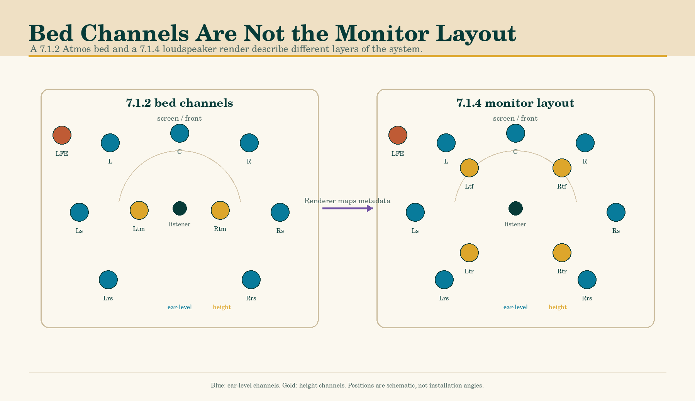

**Figure: Bed channels versus monitor channels.** The left plan shows the standard 7.1.2 bed concept: eight channels at or around ear level, including LFE, and two top-middle channels. The right plan shows a common 7.1.4 monitoring arrangement with separate front-top and rear-top loudspeakers. The positions are conceptual rather than installation specifications; use the room-design guidance appropriate to the renderer, room, and delivery contract.

### 2.1 Channel order is part of the format

For a standard Dolby 7.1.2 bed, Dolby documents the SMPTE order as `L, R, C, LFE, Ls, Rs, Lrs, Rrs, Ltm, Rtm`. Channel count alone cannot establish that order. A ten-channel WAV could contain the same signals in a different sequence and sound dramatically wrong while still opening successfully.

verbx currently uses the symbolic `7.1.2` labels `L, R, C, LFE, Ls, Rs, Lrs, Rrs, Ltf, Rtf`. Therefore, when preparing a verbx `7.1.2` file for an Atmos bed, **verify and explicitly map channels 9 and 10 to the Renderer’s `Ltm` and `Rtm` inputs**. The labels are not interchangeable merely because the channel count agrees. This is a handoff requirement, not a sonic preference.

Use a spoken channel-identification file or short, non-overlapping impulses before trusting a complex mix. A successful import proves only that the container is readable; it does not prove semantic routing.

## 3. Dolby Atmos Architecture

Dolby Atmos separates audio into beds and objects, then delegates endpoint-specific channel generation to a Renderer. According to Dolby’s current professional documentation, a typical music workflow uses one 7.1.2 bed and may use up to 118 objects within a system supporting up to 128 input paths. The exact available count can depend on how stereo objects and beds consume paths.

The bed carries fixed-channel material. It is appropriate for stems whose spatial role is broad and stable: an orchestral room, diffuse crowd, ensemble ambience, or reverberant field. Objects carry audio plus metadata. They are appropriate for a featured source or effect whose authored position, size, motion, or binaural behavior must survive downstream rendering.

Figure 2 shows why an Atmos master cannot be reduced to a 7.1.4 WAV. The bed, object signals, and metadata enter the Renderer separately. It can then derive multiple channel and binaural re-renders from one authored master.

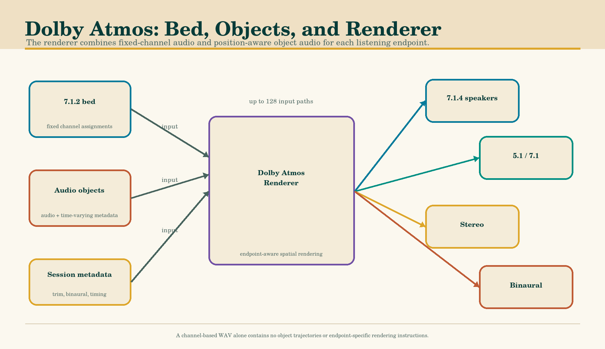

**Figure: Dolby Atmos bed/object rendering architecture.** Fixed-channel bed audio, object audio with trajectories, and session metadata remain distinct until the Renderer. The Renderer combines them according to the target endpoint, producing outputs such as 7.1.4, 5.1, stereo, or binaural. A conventional multichannel WAV represents one channel render; it does not carry the complete object-based authoring model shown here.

### 3.1 Why the 7.1.2 bed does not reach every speaker independently

The standard bed provides a stable immersive foundation, but it does not offer separate fixed channels for every possible width or top-front/top-rear location. When a sound needs an independently addressable location outside the bed’s fixed destinations, author it as an object. This is one reason a hybrid mix is normal: the bed supplies continuity and envelopment while objects supply location-specific detail.

### 3.2 Objects are not moving tracks by default

An object may remain stationary for an entire piece. The useful property is not motion itself; it is that the Renderer receives a position and can translate it to each endpoint. Excessive motion can shrink perceived scale, distract from musical phrasing, or produce unstable binaural images. Reserve motion for an audible purpose.

### 3.3 The Renderer is part of the instrument

In object-based production, monitoring is already a render. A pan decision heard over 7.1.4 loudspeakers and the corresponding binaural result are two interpretations of the same metadata. Neither should be treated as a disposable preview. The production process must listen through the intended render paths early enough that translation problems can inform the mix.

## 4. Reverb as an Immersive Layer

In stereo production, reverb is often introduced as an effect that places a source
farther away, makes it larger, or supplies a pleasing tail. Those descriptions remain
useful in immersive production, but they are incomplete. Once sound can arrive from the
front, sides, rear, and height plane, reverberation becomes one of the principal means by
which the mix establishes a continuous acoustic world among otherwise separate channels
and objects. It tells the listener not only how long energy persists, but also where the
boundaries of the imagined environment might be, whether sources share that environment,
how the environment changes with direction, and whether a spatial event belongs to a
source, to a room, or to the form of the music itself.

The central idea of this section is therefore simple: **immersive reverb is spatial
orchestration, not speaker filling**. Sending the same stereo return to more loudspeakers
does not automatically create a larger or more convincing room. It may merely increase
level, duplicate correlation, weaken localization, and produce a fold-down that is louder
or more hollow than the immersive monitor. A persuasive field requires differentiated
roles. Some energy should preserve the source's direction. Some should describe nearby
surfaces. Some should detach from the source and envelop the listener. A small amount may
occupy the height plane, while a designed effect may travel independently as an object.
The channels become meaningful when those roles are composed rather than populated.

This change in perspective is important because a listener does not perceive twelve
independent reverbs when listening to a 7.1.4 presentation. The listener usually perceives
sources, distances, enclosing surfaces, openings, reflections, and one or more fields of
resonant energy. The production task is to make many electrical paths support a smaller
number of coherent perceptual causes. If every channel has unrelated timing, color, and
modulation, the result may be wide but cease to sound like one place. If every channel is
identical, the result may be stable but collapse toward a loud, correlated image. The
useful region lies between those extremes: enough difference to create direction and
envelopment, enough shared behavior to imply a common acoustic system.

Three functional categories help organize that region. A **source-bound return** follows
the identity and location of a particular voice, instrument, or effect. Its early
reflections may move when the source moves, and its pre-delay and direct-to-reverberant
ratio help establish the source's apparent distance. An **environment-bound return**
belongs to the scene rather than to one emitter. It supplies the persistent late field,
room tone, spectral decay, and enveloping continuity that allow several sources to sound
as though they inhabit the same architecture. A **gesture-bound return** is explicitly
compositional: a reverse swell, frozen harmony, rotating shimmer, isolated echo, or tail
that crosses the listener at a formal boundary. These categories can share DSP, but they
should not be routed or automated as though they perform the same job.

The distinction also clarifies when to use a bed and when to use an object. A diffuse,
stable late field often works well in a bed because its purpose is continuous enclosure,
not point localization. A bed gives that field dependable relationships to the front,
sides, rear, and available height channels while leaving the Renderer responsible for
endpoint translation. A featured reflection or moving tail can work better as an object
because its position, size, and trajectory are part of the authored gesture. Treating the
entire room as a swarm of objects can make a stable environment difficult to maintain;
treating every special effect as part of one fixed bed can make its path vague or
impossible to preserve. Hybrid routing is not a compromise here. It is often the clearest
expression of the underlying perceptual design.

Early and late energy deserve separate attention within either representation. Early
reflections are sparse enough to influence localization, distance, apparent source width,
and the inferred position of nearby surfaces. Their timing and direction can tell the
listener that a source is near a front wall, deep on a stage, beneath a high ceiling, or
close to one side of an enclosure. The late field has a different task. As reflection
density rises, individual paths fuse into a statistical field whose decay, spectrum,
modulation, and directional balance determine envelopment and room continuity. Routing
one undivided reverb signal everywhere sacrifices this distinction. Separating the early
and late paths allows the mix to keep a source legible in front while its sustained energy
opens around and above the listener.

Interchannel relationship is as important as level. Two channels can have the same RMS
level and frequency response while producing very different spatial impressions because
their waveforms are correlated differently over time and frequency. Perfect copies tend
to reinforce a fixed image and can create large level changes when summed. Completely
unrelated returns may enlarge the field but weaken the sense that all channels describe
one room. Effective decorrelation varies delay, phase, diffusion state, or modulation while
preserving a related envelope and tonal trajectory. In other words, the channels need not
contain the same samples, but they should appear to obey the same acoustic history.

Height requires especially deliberate treatment. Overhead loudspeakers are conspicuous
resources, and it is tempting to prove that they are active by feeding them a bright,
continuous copy of the return. Natural vertical extent is often subtler. Ceiling and upper
volume reflections may arrive later, contain less transient definition, or decay with a
different spectrum than lateral energy. A restrained height layer can increase apparent
volume without pulling the room away from the source. Conversely, a clearly localized
overhead tail can be powerful when it is intended as a musical event. The crucial question
is not whether the top channels contain reverb; it is whether their energy explains the
space or articulates a purposeful gesture.

The most dependable design process begins with hierarchy rather than channel count. First,
establish the dry anchors and decide which sources must remain locatable. Second, build a
late field that supplies convincing enclosure at a conservative level. Third, add early
reflection patterns that establish source distance and architectural orientation without
competing with direct attacks. Fourth, tune front, side, rear, and height relationships,
listening for one coherent environment rather than maximum activity. Fifth, add objects or
automation only where movement, reversal, freezing, or spectral transformation has a
specific formal purpose. Finally, print and evaluate every required endpoint. This order
keeps decorative motion from masking a weak room model and keeps an impressive loudspeaker
demonstration from becoming the only version that works.

Endpoint translation must be considered during design, not after approval. A lateral field
that feels smooth over loudspeakers may become diffuse or externalized poorly in binaural.
A dramatic rear event may fold into the front image in stereo. Highly anticorrelated side
energy may sound expansive discretely but lose body when downmixed. None of these outcomes
means that immersive reverb should be reduced to stereo-safe sameness. It means that the
production needs a stated hierarchy: which localization, depth, envelopment, spectral, and
formal cues are essential, and which may simplify as spatial resolution decreases. The
Renderer is part of that instrument, so loudspeaker, binaural, and fold-down monitoring
belong inside the creative loop.

Measurement supports this work but does not replace listening. Channel peaks, loudness,
correlation, energy decay, spectral balance, and impulse-response plots can reveal routing
errors or unstable accumulation. They cannot decide whether a rear bloom completes a
phrase, whether the center remains emotionally present, or whether height turns a room
into an effect. A disciplined evaluation alternates between isolated paths and the complete
mix, between static and automated passages, and between target endpoints. It also checks
silence and tail completion: immersive systems can hide low-level buildup across many
channels until a long pause, downmix, or limiter exposes it.

With that framework in place, the detailed controls become easier to interpret. Front
energy establishes anchor and connection; side and rear energy establish lateral and
backward enclosure; height energy establishes vertical extent or a designed overhead
gesture; LFE requires a separate editorial decision; and decorrelation determines whether
these regions combine as one field. The following subsections examine those responsibilities
individually, while the routing topology below shows how verbx can keep early definition,
diffuse bed energy, and special object returns separate long enough to make each decision
audible and reversible.

Reverb contributes several perceptually distinct cues:

- Early reflections communicate apparent room size, source distance, surface placement, and localization.
- The late field communicates envelopment, decay, density, spectral absorption, and the persistence of the acoustic environment.
- Direction-dependent decay communicates architecture: a tall reflective space may retain energy above the listener while side energy damps sooner.
- Interchannel covariance controls whether the field feels broad, stable, phasey, collapsed, or detached.
- Modulation and diffusion determine whether discrete echoes fuse into a field or remain audible as patterns.

Treating all of those cues as one twelve-channel send leaves musical control on the table. Figure 3 presents a more useful topology. It divides the effect into early definition, a diffuse bed return, and an optional designed object return.

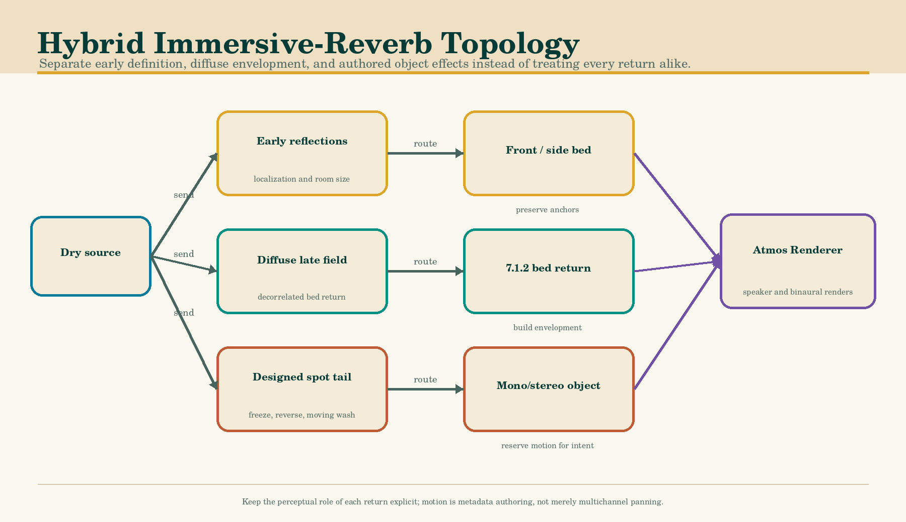

**Figure: Hybrid immersive-reverb topology.** A dry source feeds three sends with different perceptual jobs. Early reflections reinforce front and side localization; the diffuse late field enters a stable 7.1.2 bed return; and a special reverse, freeze, or moving tail is returned as a mono or stereo object. The Renderer combines those paths for loudspeaker and binaural endpoints. This separation prevents decorative motion from destabilizing the entire room impression.

### 4.1 Front channels and the center anchor

The center channel is powerful because it can create a stable screen or stage anchor. It is also easy to overload. Sending a highly correlated reverb return equally to Left, Center, and Right can build a narrow, level-heavy front image. For dialogue and lead vocals, begin with less late-field energy in Center than in Left/Right and surrounds. Preserve intelligibility with front-weighted early reflections, predelay, ducking, or spectral shaping rather than by eliminating all spatial response.

### 4.2 Side and rear channels

Side channels often carry the strongest envelopment cue because they stimulate lateral perception. Rear channels can extend depth, but excessive rear level can pull attention behind the listener or make the room feel detached from the source. A robust late field is usually decorrelated rather than copied. Identical tails in every channel may collapse during downmixing and can produce comb filtering or unstable images.

### 4.3 Height channels

Height should communicate vertical extent, overhead reflections, or a deliberate compositional gesture. Simply duplicating the bed return into top channels raises level without necessarily creating elevation. Consider later or spectrally different overhead energy, independent decorrelation, and a controlled height-to-bed ratio. In many natural rooms, the top field can be smoother and less transient-rich than the direct and early-reflection field.

Four-top monitoring gives a renderer more ways to express front-to-rear height movement, but a standard 7.1.2 bed still supplies only two fixed top-middle channels. Use objects if a return must be explicitly top-front, top-rear, or moving along the ceiling.

### 4.4 LFE is not bass management

The LFE channel is a creative effects channel, not the destination for all low-frequency content. Bass management is a monitoring-system function that redirects low frequencies from main channels according to crossover settings. A large reverb tail can already reach the subwoofer through bass management without being sent to LFE.

As a default, keep diffuse reverb out of LFE unless there is a clear artistic or delivery reason. Uncontrolled low-frequency decay consumes headroom, masks rhythm, and may translate unpredictably across systems. If LFE reverb is intentional, high-pass or band-limit it, monitor the LFE channel directly, and check the full-range re-render separately from a bass-managed room.

### 4.5 Decorrelation without disconnection

Immersive width requires difference among channels, but random difference is not automatically coherent. Useful decorrelation preserves a shared decay envelope and tonal identity while varying delay, modulation phase, diffusion state, or allpass structure. The goal is a single room observed from many directions, not twelve unrelated reverbs.

verbx exposes front, rear, and top decorrelation controls so these regions can be tuned independently. Start conservatively, then compare the discrete layout, stereo fold-down, and binaural render. If the immersive version sounds expansive but the stereo version becomes hollow, the channel relationships are too antagonistic.

## 5. What verbx Can Produce Today

The following boundary is intentionally explicit.

| Capability | Current status | Meaning for an Atmos workflow |
|---|---|---|
| Discrete multichannel WAVE rendering | Supported | Produce bed candidates, speaker prints, wet stems, and channel-identification files |
| Named input/output layouts | Supported | Declare routing intent for common layouts rather than relying only on channel count |
| Matrix convolution | Supported | Route each input independently to one or more output channels with an explicitly packed IR matrix |
| Algorithmic spatial decorrelation | Supported | Shape front, rear, and top late-field relationships |
| FOA encode, rotate, and stereo decode | Supported with documented constraints | Prepare or process a scene-based field before a separate Atmos authoring stage |
| Higher-order Ambisonic validation and channel-order metadata | Supported where documented by the CLI | Keep scene conventions explicit during handoff |
| JSON analysis and handoff manifests | Supported | Record channels, routing, settings, and QC evidence alongside audio |
| Dolby object trajectories and size automation | Not currently authored | Create these in an Atmos-capable DAW |
| Per-object Dolby binaural metadata | Not currently authored | Set and audition this in the DAW/Renderer |
| Native ADM BWF, DAMF, or IMF IAB master | Not currently written | Export or record the master through the Dolby Atmos Renderer or an integrated authoring environment |
| Dolby certification or delivery approval | Not implied | Follow the current distributor, label, broadcaster, studio, and Dolby requirements |

A JSON sidecar can be extremely useful, but it is documentation rather than embedded Dolby metadata. Renaming a sidecar or adding the letters “ADM” to a filename does not create the required BWF metadata chunk. Likewise, a 7.1.4 WAV is a speaker-channel render, not an editable object master.

## 6. Practical verbx Recipes

The commands below prepare audio for immersive sessions. They do not bypass the authoring and Renderer stages.

### 6.1 Create a 7.1.2 wet-bed candidate

Render a discrete ten-channel return, then explicitly map the final two channels during DAW import:

```bash
verbx render source.wav wet_712.wav \
  --engine algo \
  --output-layout 7.1.2 \
  --rt60 2.8 \
  --predelay 28 \
  --algo-decorrelation-front 0.22 \
  --algo-decorrelation-rear 0.48 \
  --algo-decorrelation-top 0.62 \
  --wet 1.0 --dry 0.0 \
  --json-out wet_712.analysis.json
```

On import, confirm `L, R, C, LFE, Ls, Rs, Lrs, Rrs` and remap verbx `Ltf, Rtf` to the intended Atmos bed `Ltm, Rtm` inputs. Do not infer the map from file width alone.

### 6.2 Create a 7.1.4 speaker print

Use this when a twelve-channel file is specifically required for monitoring, installation playback, or comparison. Do not call it an Atmos master:

```bash
verbx render source.wav wet_714_print.wav \
  --engine algo \
  --output-layout 7.1.4 \
  --rt60 3.6 \
  --algo-decorrelation-front 0.20 \
  --algo-decorrelation-rear 0.52 \
  --algo-decorrelation-top 0.70 \
  --wet 1.0 --dry 0.0 \
  --json-out wet_714_print.analysis.json
```

Name the file with `_print`, `_rerender`, or another unambiguous label so nobody mistakes it for a bed/object master.

### 6.3 Prepare a featured object-return stem

A special tail can remain mono or stereo until Atmos authoring. This preserves the DAW’s ability to attach object metadata:

```bash
verbx render vocal_throw.wav vocal_reverse_object.wav \
  --engine algo \
  --reverse \
  --rt60 6.5 \
  --predelay 90 \
  --wet 1.0 --dry 0.0 \
  --output-layout mono \
  --json-out vocal_reverse_object.analysis.json
```

Import the result, assign it to an object, then author the static position or trajectory while listening through the Renderer. A stereo effect may consume two object paths; use stereo only when its internal width is essential.

### 6.4 Process an FOA field

For a scene-based intermediate, keep ordering and normalization explicit:

```bash
verbx render stereo_room.wav room_foa.wav \
  --ambi-order 1 \
  --channel-order acn \
  --ambi-encode-from stereo \
  --ambi-rotate-yaw-deg 25 \
  --output-layout auto \
  --json-out room_foa.analysis.json
```

FOA is useful when rotation and portable scene decoding matter more than sharply isolated positions. To use it in Atmos, decode or spatialize it through a compatible plug-in or DAW workflow and audition the resulting bed/object assignment. Do not relabel the four channels as an Atmos bed.

### 6.5 Use a full matrix IR

A true multichannel room response can encode direction-dependent coupling. For $M$ inputs and $N$ outputs, a full matrix contains $M N$ impulse responses. The file packing order must match `--ir-matrix-layout`:

```bash
verbx render input_51.wav room_matrix_714.wav \
  --input-layout 5.1 \
  --output-layout 7.1.4 \
  --ir concert_hall_6x12.wav \
  --ir-route-map full \
  --ir-matrix-layout output-major \
  --wet 1.0 --dry 0.0 \
  --json-out room_matrix_714.analysis.json
```

Before using a large matrix in a mix, test one input at a time. Confirm that front impulses create the intended early and late energy, rear inputs do not swap, top outputs are truly top outputs, and no LFE row is populated unintentionally.

## 7. Bed, Object, and Hybrid Reverb Strategies

### 7.1 Bed return

A bed return is the safest default for a shared acoustic environment. Route multiple sources to one immersive reverb, preserve a coherent decay law, and use channel-dependent decorrelation to create width. This approach conserves object paths and keeps the room stable as sources move.

For orchestral or ensemble work, the bed can establish the hall while dry and early-reflection cues retain stage placement. For dialogue, a subtle bed can match production ambience or establish scene scale without attaching the entire room to a moving actor object.

### 7.2 Object return

An object return is useful when the reverb itself is a featured event. Examples include a freeze that rises above the listener, a reverse tail that approaches from the rear, a single reflection that traces a wall, or a transition wash that grows from near to far. Render the audio effect in verbx, then perform the object authoring in the Atmos environment.

Avoid making every source’s complete late field a separate moving object. The result can consume paths, complicate metadata, and make the perceived room chase the dry source. In real rooms, direct sound localizes strongly while the late field becomes increasingly diffuse.

### 7.3 Hybrid return

The hybrid strategy uses a shared bed for the ordinary room and one or more objects for exceptional cues. It scales well because the bed carries statistical density while objects remain sparse and meaningful. It also translates more gracefully: if a dramatic object changes character in binaural, the foundational room remains intact.

### 7.4 Stem architecture

A practical immersive session might contain:

- `Room_ER_front`: early reflections emphasizing front and side channels.
- `Room_late_712`: diffuse 7.1.2 bed return.
- `Vocal_throw_mono`: mono special-effect stem assigned to an object.
- `Orchestra_halo_stereo`: stereo height effect assigned as a stereo object or deliberately spread into the bed.
- `LFE_effect`: separately managed, intentional LFE-only content if required.
- `Room_QC`: channel-identification impulses and the associated JSON report, excluded from the final program.

Use names that describe both acoustic function and spatial role. “BigVerb12” is less useful than “HallLate_712Bed” when the session is reopened six months later.

## 8. DAW and Renderer Handoff

### 8.1 Integrated-renderer workflow

In an integrated environment such as Logic Pro, assign tracks and returns to the bed or to objects, place Atmos-aware processing in the correct part of the signal path, and monitor through the project’s Dolby Atmos plug-in. Apple documents an important signal-flow distinction: processing before the Atmos plug-in operates on the bed path, while processing after it affects monitoring and channel-based bounces rather than the exported object master. Verify the current application behavior rather than assuming an ordinary surround-master insert model.

Export an ADM BWF only from the supported spatial-audio export path. Apple describes that export as containing bed audio, object audio, object pan automation, and metadata. A normal multichannel bounce is a channel-based render and serves a different purpose.

### 8.2 External-renderer workflow

With a separate Dolby Atmos Renderer, route each bed channel and object path to its assigned Renderer input. Confirm sample rate, frame rate, synchronization, input assignment, and monitoring return before mixing. Record or export the required master through the Renderer workflow, then generate re-renders and QC material from that same authoritative master.

### 8.3 Handoff package

A strong handoff includes more than audio:

- Clearly named mono, stereo, and multichannel WAV files.
- A channel-order document for every file wider than stereo.
- Sample rate, bit depth, start time, frame rate where applicable, and exact duration.
- A verbx JSON report containing processing parameters and measured properties.
- Dry references when the receiving mixer may need to revise the effect.
- A short text note identifying bed candidates, object candidates, and speaker prints.
- Channel-identification impulses or spoken IDs for nonstandard layouts.
- The expected Atmos authoring environment and Renderer version, when contractually relevant.

Do not place a speaker print and an object-master candidate in the same folder with nearly identical names. Make semantic differences visible at a glance.

## 9. Monitoring and Translation

No single playback path proves an immersive master. A 7.1.4 room reveals image placement and envelopment; 5.1 reveals whether height-dependent balances survive; stereo reveals center buildup, phase cancellation, and overall hierarchy; binaural reveals renderer-dependent externalization, elevation, and near/far behavior.

Figure 4 frames monitoring as a loop. The same authoritative master feeds each re-render. Differences that damage the musical intent return to the source session for correction; they are not patched independently into unrelated exports.

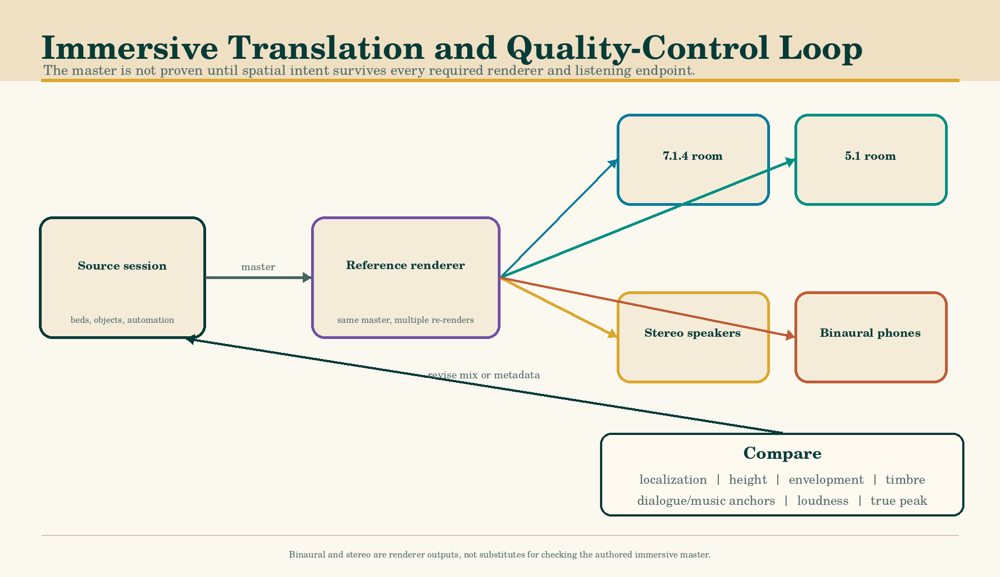

**Figure: Immersive translation and quality-control loop.** The authored beds, objects, and automation feed one reference Renderer. Four representative endpoints reveal different failure modes: 7.1.4 tests the intended room image, 5.1 exposes reliance on height, stereo tests hierarchy and phase interaction, and binaural tests headphone localization and metadata behavior. Observations return to the source session so the master remains the single source of truth.

### 9.1 Loudspeaker-room checks

An immersive room should be calibrated, time-aligned, and level-matched according to the applicable standard and facility procedure. Check that monitoring bass management is understood and repeatable. A subwoofer response problem can be misdiagnosed as an LFE-mix problem; a mistimed height speaker can be misdiagnosed as poor elevation metadata.

Walk the room after the reference-position pass. The mix need not be identical in every seat, but catastrophic localization jumps, comb filtering, or disappearing returns reveal fragile channel relationships.

### 9.2 Stereo checks

Listen for excessive front-center buildup, loss of ambience, hollow tonal balance, and transient smearing. A diffuse field can become quieter in stereo because decorrelated channels partially cancel or because the renderer applies conservative downmix coefficients. Correct the spatial design, not merely the stereo file, unless the delivery contract explicitly calls for a separately mastered stereo version.

### 9.3 Binaural checks

Binaural rendering depends on the Renderer’s head-related transfer functions and object metadata. A height cue that is obvious over loudspeakers may become subtle over headphones; a large diffuse bed may sound internalized; a near object may become distractingly intimate. Check several good headphones and avoid making decisions from a single consumer spatializer layered on top of the reference Renderer.

When supported, per-object binaural modes such as Off, Near, Mid, and Far affect perceived distance. These modes are metadata decisions, not substitutions for acoustic predelay, direct-to-reverberant ratio, spectral damping, or early-reflection design.

### 9.4 Renderer and consumer-device differences

Soundbars, televisions, headphones, mobile devices, and theatrical systems may use different rendering strategies. The correct response is not to optimize for every device independently. Establish a defensible reference master, test the required official re-renders, and investigate only repeatable failures that compromise intent.

## 10. Ambisonics and Atmos Are Complementary

Ambisonics represents a listener-centered field; Atmos represents beds and objects for endpoint rendering. Both can describe immersion, but their coordinate systems and production assumptions differ.

| Question | Ambisonics | Dolby Atmos |
|---|---|---|
| What is stored? | Spherical-harmonic scene components | Bed channels, object audio, and metadata |
| Primary strength | Rotation and layout-independent scene decoding | Authored object placement plus broad endpoint ecosystem |
| Spatial resolution | Increases with Ambisonic order | Depends on object/bed authoring and endpoint renderer |
| Typical reverb use | Portable room field or environmental ambience | Bed ambience plus optional object effects |
| Headphone output | Binaural decode of the scene | Renderer binaural output with object metadata behavior |
| Conversion | Requires decoding or compatible spatialization | Requires an authoring decision, not relabeling |

An Ambisonic room recording can become an excellent Atmos ambience after deliberate decoding and routing. One option is to decode it to a 7.1.2 bed. Another is to use an Ambisonic-capable spatializer that feeds an Atmos-compatible path. A third is to separate salient directional events as objects while retaining the diffuse field in the bed. Choose based on the scene, not on the desire to maximize the number of moving icons.

## 11. Deliverables and File Types

The final file format determines what remains editable and what metadata travels with the audio.

### 11.1 Multichannel WAVE

A conventional multichannel WAVE file carries discrete PCM channels and container metadata. It can be a bed candidate, a loudspeaker print, a re-render, an installation master, or a stem. It does not inherently carry Atmos object trajectories. Channel labels and order must be documented and verified.

### 11.2 ADM BWF

An ADM BWF combines PCM audio with Audio Definition Model metadata in a Broadcast Wave container. Dolby and Apple describe it as an interchange master capable of carrying bed and object audio with the associated metadata. It is not a consumer listening file and should not be confused with a normal multichannel bounce. Dolby notes that changes to an imported ADM BWF are generally made in the originating authoring application rather than edited as if it were a native Renderer session.

### 11.3 DAMF

A Dolby Atmos Master File set is the Renderer’s native master representation, commonly involving `.atmos`, `.audio`, and `.metadata` files. It supports continuing work in the Renderer-oriented ecosystem and can be preferable when an editable Renderer master is required.

### 11.4 IMF IAB

IMF Immersive Audio Bitstream packages are associated with interoperable mastering and distribution workflows. Use them only when required by the delivery specification and generated through the appropriate toolchain.

Figure 5 marks the practical boundary. verbx creates audio assets and evidence on the left; the Atmos DAW and Renderer author spatial metadata and master formats on the right.

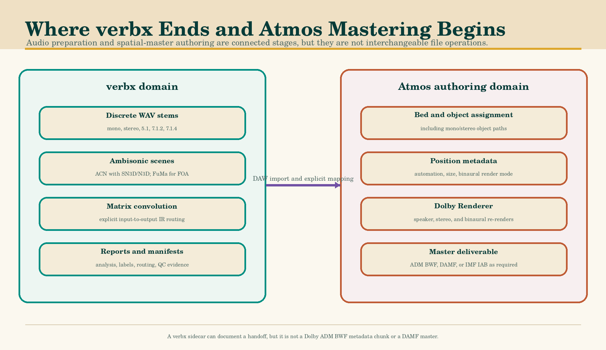

**Figure: verbx-to-Atmos delivery boundary.** verbx can create discrete stems, Ambisonic scenes, matrix-convolved outputs, and reports that make a handoff reproducible. The receiving Atmos session assigns beds and objects, writes trajectories and binaural metadata, renders endpoints, and produces the required ADM BWF, DAMF, or IMF IAB master. The arrow represents explicit DAW import and mapping, not an automatic file conversion.

## 12. Immersive Quality-Control Checklist

### 12.1 Before authoring

- Confirm every source file’s sample rate, bit depth, duration, start point, and channel count.
- Read the verbx JSON report and compare it with the filename and handoff note.
- Run a channel-identification file through the exact import route.
- Verify whether a wide file is a bed candidate, a speaker print, an Ambisonic scene, or a matrix IR output.
- Confirm that no limiter, normalizer, or loudness stage was applied accidentally to a wet stem.

### 12.2 During Atmos authoring

- Verify 7.1.2 bed order as `L, R, C, LFE, Ls, Rs, Lrs, Rrs, Ltm, Rtm` at the Renderer boundary.
- Solo every bed channel and object input at least once.
- Confirm mono versus stereo object assignments and path consumption.
- Inspect object position, size, motion, and binaural metadata for unintended automation.
- Check whether master-bus processing affects the bed, the monitor render, the exported master, or some combination.
- Monitor both full-range and LFE paths without conflating LFE with bass management.

### 12.3 Before delivery

- Verify or record the final master through the authoritative Renderer workflow.
- Play the master from beginning to end in the Renderer rather than checking only a DAW bounce.
- Check all contractually required re-renders, including stereo and binaural where applicable.
- Measure loudness and true peak on the deliverables required by the recipient; do not assume one target for every platform.
- Confirm sync, frame rate, program start, tail duration, and end-of-file behavior.
- Compare the delivered master’s metadata and duration with the source session.
- Preserve the source session, Renderer master, verbx reports, and delivery notes together.

## 13. Creative Spatial-Reverb Recipes

### 13.1 Natural hall around a front ensemble

Keep direct sound and the strongest early reflections in the front stage. Build the late field primarily in side, rear, and top bed channels with moderate decorrelation. Use less Center late energy than Left/Right unless the production calls for a tightly anchored acoustic. Confirm that stereo retains warmth without turning cloudy.

### 13.2 Intimate vocal with an overhead halo

Keep the vocal itself anchored. Send a filtered, predelayed wet stem to a stereo object or to carefully controlled top energy. The halo should respond to phrasing rather than run continuously at the same level. Duck the return during consonants and let it recover into rests. In binaural, compare Near, Mid, and Far metadata choices with the acoustic predelay; they solve different distance cues.

### 13.3 Percussion room with stable transients

Use short front and side early reflections to establish room size. Feed the late field after enough predelay to preserve attacks. Increase rear/top decorrelation more than front decorrelation. Keep low-frequency decay shorter than midrange decay, and avoid LFE unless a specific impact effect requires it.

### 13.4 Reverse transition over the listener

Render a mono or stereo reverse-reverb stem in verbx. Author it as an object that moves only during the transition, then resolves into a stable bed or dry source. Check the movement over 7.1.4 and binaural; simplify the trajectory if headphone localization becomes erratic.

### 13.5 Exterior-to-interior scene change

Automate the acoustic architecture rather than merely raising wet level. Begin with sparse, low-density exterior reflections. Introduce enclosed early reflections as the threshold is crossed, then lengthen and darken the late field. Keep the shared environment in the bed and reserve objects for reflections tied to visible architectural events.

### 13.6 Infinite or frozen field

A frozen field can occupy a bed when it represents an environment, or an object when it behaves as a featured musical entity. Watch low-frequency accumulation and interchannel correlation. A stationary, diffuse freeze often feels larger than a freeze that continuously circles the listener.

## 14. Common Failure Modes

### “The height disappears in stereo.”

Height is not a separate axis in two-channel playback. The Renderer must express it through spectral, timing, level, and binaural cues. Strengthen the compositional hierarchy and test the reference binaural render; do not simply add top channels to the stereo mix.

### “The 7.1.4 file imported, so the Atmos master is finished.”

It is a channel-based speaker print. It does not contain editable object trajectories or the complete Atmos master metadata. Import stems into an Atmos authoring environment and create the required master there.

### “The top-front and top-rear channels are silent in my bed.”

A standard 7.1.2 bed supplies top-middle channels, not four independently addressable top channels. The Renderer maps the bed into the monitoring layout. Use objects for independently authored top-front or top-rear content.

### “The room sounds huge over speakers but phasey on headphones.”

Reduce antagonistic decorrelation, inspect copied channels, and compare the Renderer’s binaural output without an additional consumer spatializer. Keep the shared decay envelope coherent even when channel details differ.

### “The subwoofer is full of reverb although LFE is empty.”

That can be normal bass management. Full-range bed channels contain low frequencies that the monitor controller redirects below its crossover. Solo LFE and inspect the monitoring configuration before changing the mix.

### “Channels 9 and 10 sound too far forward.”

Check the handoff map. verbx’s current symbolic `7.1.2` utility layout labels those channels `Ltf/Rtf`, whereas a Dolby bed expects `Ltm/Rtm`. Map them explicitly and verify with identification signals.

### “The ADM BWF does not reflect my last monitor-chain EQ.”

Determine where the processing sits relative to the Atmos authoring and Renderer path. Monitoring or post-render processing may affect a channel bounce without changing the exported object master. Use the DAW’s official signal-flow documentation and re-export from the authoritative session.

## 15. Recommended Official Reading

The following primary documentation is arranged alphabetically by organization:

- **Apple.** [Export a spatial audio project as an ADM BWF file in Logic Pro](https://support.apple.com/guide/logicpro/export-a-spatial-audio-project-dolby-atmos-lgcp258ed132/mac). Explains the difference between an object-based spatial export and a conventional channel bounce.
- **Apple.** [Monitor a Spatial Audio mix in Logic Pro](https://support.apple.com/en-lamr/guide/logicpro/lgcp179f27c1/mac). Describes speaker, stereo, and binaural monitoring formats.
- **Apple.** [Use beds and objects in Logic Pro](https://support.apple.com/en-mide/guide/logicpro/lgcp73f9b9ac/mac). Covers integrated bed/object assignment and path limits.
- **Dolby.** [Dolby Atmos Renderer](https://professional.dolby.com/product/dolby-atmos-content-creation/dolby-atmos-renderer/). Product-level description of bed/object rendering, master creation, and re-renders.
- **Dolby.** [How do I QC my Dolby Atmos mix?](https://professionalsupport.dolby.com/s/article/How-do-I-QC-my-Dolby-Atmos-mix). Emphasizes master verification in the Renderer and delivery-specific requirements.
- **Dolby.** [Overview of Dolby Atmos Master File Formats](https://professionalsupport.dolby.com/s/article/Overview-of-Dolby-Atmos-Master-File-Formats). Compares ADM BWF, DAMF, and IMF IAB roles.
- **Dolby.** [What are Beds and Objects in Dolby Atmos?](https://professionalsupport.dolby.com/s/article/What-are-Beds-and-Objects-in-Dolby-Atmos). Defines the default 7.1.2 bed and object workflow.
- **Dolby.** [What channel order should be used for assigning bed audio to the Renderer?](https://professionalsupport.dolby.com/s/article/What-channel-order-should-be-used-for-assigning-bed-audio-to-the-Renderer). Gives the SMPTE 7.1.2 bed order used at the Renderer boundary.
- **International Telecommunication Union.** [Recommendation ITU-R BS.2051: Advanced sound system for programme production](https://www.itu.int/dms_pubrec/itu-r/rec/bs/R-REC-BS.2051-2-201807-S%21%21PDF-E.pdf). Defines reference loudspeaker-layout concepts for advanced sound systems.

Specifications, application behavior, and distributor requirements change. Treat these links and the recipient’s current delivery document as authoritative for a production, and treat this chapter as an engineering and creative workflow guide.


\newpage

<!-- docs/INTRODUCTORY_BLOCK_DIAGRAMS.md -->

# System Orientation Through Block Diagrams

This chapter is a visual map of the signal paths, state boundaries, and evidence loops used throughout verbx. Read each diagram from left to right, then use the paragraph beneath it to identify what may happen in realtime, what must be prepared off-thread, and what should be preserved in a report.

## The complete verbx workflow

The figure below introduces **The complete verbx workflow**. Every workflow begins with an identified source and ends with both an audible artifact and machine-readable evidence. Read it from left to right before using the detailed boundary notes beneath the visual.


**Figure: The complete verbx workflow.** The arrows indicate processing or evidence flow, not elapsed-time scale. Every box names a boundary at which parameters, latency, channel identity, or provenance should be checked.

## Algorithmic render path

The figure below introduces **Algorithmic render path**. The algorithmic engine separates arrival cues, density growth, sustained decay, and delivery processing. Read it from left to right before using the detailed boundary notes beneath the visual.


**Figure: Algorithmic render path.** The arrows indicate processing or evidence flow, not elapsed-time scale. Every box names a boundary at which parameters, latency, channel identity, or provenance should be checked.

## Convolution render path

The figure below introduces **Convolution render path**. Partitioned convolution trades a small fixed scheduling delay for efficient processing of long and multichannel impulse responses. Read it from left to right before using the detailed boundary notes beneath the visual.


**Figure: Convolution render path.** The arrows indicate processing or evidence flow, not elapsed-time scale. Every box names a boundary at which parameters, latency, channel identity, or provenance should be checked.

## Realtime callback boundary

The figure below introduces **Realtime callback boundary**. The callback path must remain bounded and allocation-free; preparation, file access, and reporting belong outside it. Read it from left to right before using the detailed boundary notes beneath the visual.


**Figure: Realtime callback boundary.** The arrows indicate processing or evidence flow, not elapsed-time scale. Every box names a boundary at which parameters, latency, channel identity, or provenance should be checked.

## End-to-end latency stack

The figure below introduces **End-to-end latency stack**. Perceived realtime latency is the sum of device buffers, host scheduling, algorithmic lookahead, and physical propagation. Read it from left to right before using the detailed boundary notes beneath the visual.


**Figure: End-to-end latency stack.** The arrows indicate processing or evidence flow, not elapsed-time scale. Every box names a boundary at which parameters, latency, channel identity, or provenance should be checked.

## Reverb event anatomy

The figure below introduces **Reverb event anatomy**. A useful listening model treats reverberation as an ordered event rather than a single wet signal. Read it from left to right before using the detailed boundary notes beneath the visual.


**Figure: Reverb event anatomy.** The arrows indicate processing or evidence flow, not elapsed-time scale. Every box names a boundary at which parameters, latency, channel identity, or provenance should be checked.

## RT60 control hierarchy

The figure below introduces **RT60 control hierarchy**. Coarse and fine controls establish time scale while frequency-dependent decay and freeze determine how energy persists. Read it from left to right before using the detailed boundary notes beneath the visual.


**Figure: RT60 control hierarchy.** The arrows indicate processing or evidence flow, not elapsed-time scale. Every box names a boundary at which parameters, latency, channel identity, or provenance should be checked.

## FDN feedback loop

The figure below introduces **FDN feedback loop**. Delay lengths create modes; filters set color; the matrix disperses energy; calibrated gain establishes decay. Read it from left to right before using the detailed boundary notes beneath the visual.


**Figure: FDN feedback loop.** The arrows indicate processing or evidence flow, not elapsed-time scale. Every box names a boundary at which parameters, latency, channel identity, or provenance should be checked.

## Impulse-response lifecycle

The figure below introduces **Impulse-response lifecycle**. An impulse response is an auditable asset whose provenance and preparation affect every convolution result. Read it from left to right before using the detailed boundary notes beneath the visual.


**Figure: Impulse-response lifecycle.** The arrows indicate processing or evidence flow, not elapsed-time scale. Every box names a boundary at which parameters, latency, channel identity, or provenance should be checked.

## Dereverberation path

The figure below introduces **Dereverberation path**. Dereverberation balances late-energy reduction against speech, transient, and ambience preservation. Read it from left to right before using the detailed boundary notes beneath the visual.


**Figure: Dereverberation path.** The arrows indicate processing or evidence flow, not elapsed-time scale. Every box names a boundary at which parameters, latency, channel identity, or provenance should be checked.

## Dynamics around reverb

The figure below introduces **Dynamics around reverb**. Ducking creates foreground space before a limiter protects the combined output and meters verify the result. Read it from left to right before using the detailed boundary notes beneath the visual.


**Figure: Dynamics around reverb.** The arrows indicate processing or evidence flow, not elapsed-time scale. Every box names a boundary at which parameters, latency, channel identity, or provenance should be checked.

## Spatial routing

The figure below introduces **Spatial routing**. Channel identity must remain explicit from source through room processing and final reproduction. Read it from left to right before using the detailed boundary notes beneath the visual.


**Figure: Spatial routing.** The arrows indicate processing or evidence flow, not elapsed-time scale. Every box names a boundary at which parameters, latency, channel identity, or provenance should be checked.

## Automation contract

The figure below introduces **Automation contract**. Automation is safest when parsed and validated off-thread, then applied deterministically at block boundaries. Read it from left to right before using the detailed boundary notes beneath the visual.


**Figure: Automation contract.** The arrows indicate processing or evidence flow, not elapsed-time scale. Every box names a boundary at which parameters, latency, channel identity, or provenance should be checked.

## Analysis evidence chain

The figure below introduces **Analysis evidence chain**. Analysis becomes operational evidence when measurements, policy thresholds, warnings, and provenance share one report. Read it from left to right before using the detailed boundary notes beneath the visual.


**Figure: Analysis evidence chain.** The arrows indicate processing or evidence flow, not elapsed-time scale. Every box names a boundary at which parameters, latency, channel identity, or provenance should be checked.

## Preset lifecycle

The figure below introduces **Preset lifecycle**. A preset is more than values: it needs intent, compatibility metadata, calibrated auditioning, and deterministic recall. Read it from left to right before using the detailed boundary notes beneath the visual.


**Figure: Preset lifecycle.** The arrows indicate processing or evidence flow, not elapsed-time scale. Every box names a boundary at which parameters, latency, channel identity, or provenance should be checked.

## Plug-in host contract

The figure below introduces **Plug-in host contract**. AUv3 and VST3 integration wrap the same DSP in host-specific state, layout, and lifecycle contracts. Read it from left to right before using the detailed boundary notes beneath the visual.


**Figure: Plug-in host contract.** The arrows indicate processing or evidence flow, not elapsed-time scale. Every box names a boundary at which parameters, latency, channel identity, or provenance should be checked.

## Regression workflow

The figure below introduces **Regression workflow**. Deterministic fixtures make audible and numerical drift discoverable before release. Read it from left to right before using the detailed boundary notes beneath the visual.


**Figure: Regression workflow.** The arrows indicate processing or evidence flow, not elapsed-time scale. Every box names a boundary at which parameters, latency, channel identity, or provenance should be checked.

## Learning loop

The figure below introduces **Learning loop**. The textbook exercises use repeated prediction, experiment, measurement, and critical listening to connect controls with perception. Read it from left to right before using the detailed boundary notes beneath the visual.


**Figure: Learning loop.** The arrows indicate processing or evidence flow, not elapsed-time scale. Every box names a boundary at which parameters, latency, channel identity, or provenance should be checked.


\newpage

<!-- docs/CLI_REFERENCE.md -->

# CLI Reference

This file is generated from live CLI help output via `scripts/generate_cli_reference.py`.
Do not edit manually.

## `verbx --help`

```text

 Usage: root [OPTIONS] COMMAND [ARGS]...

 Extreme reverb CLI with scalable DSP architecture.

╭─ Options ────────────────────────────────────────────────────────────────────╮
│ --help          Show this message and exit.                                  │
╰──────────────────────────────────────────────────────────────────────────────╯
╭─ Commands ───────────────────────────────────────────────────────────────────╮
│ realtime    Run realtime duplex monitoring with selectable input/output      │
│             devices.                                                         │
│ room-model  Inspect a room geometry or infer one from RT60 and absorption.   │
│ version     Print CLI/package version.                                       │
│ quickstart  Print minimal copy/paste commands for first successful renders.  │
│ doctor      Print runtime diagnostics for launch-day troubleshooting.        │
│ analyze     Analyze an audio file and print a summary table.                 │
│ compare     Side-by-side comparison of two audio files.                      │
│ presets     Print available presets or one preset payload.                   │
│ suggest     Suggest practical render defaults from input analysis.           │
│ render                                                                       │
│ dereverb                                                                     │
│ ir          Impulse response workflows.                                      │
│ cache       IR cache inspection and cleanup.                                 │
│ batch       Batch manifest generation and rendering.                         │
│ immersive   Immersive production interoperability workflows.                 │
╰──────────────────────────────────────────────────────────────────────────────╯
```

## `verbx render --help`

```text

 Usage: root render [OPTIONS] {infile} {outfile}

╭─ Arguments ──────────────────────────────────────────────────────────────────╮
│ *    infile       <path>  [required]                                         │
│ *    outfile      <path>  [required]                                         │
╰──────────────────────────────────────────────────────────────────────────────╯
╭─ Options ────────────────────────────────────────────────────────────────────╮
│ --preset                                 <str>             Named preset      │
│                                                            baseline (see     │
│                                                            `verbx presets`)  │
│                                                            or dynamic room   │
│                                                            shorthand         │
│                                                            `room:<width>x<d… │
│                                                            Explicitly        │
│                                                            supplied CLI      │
│                                                            options override  │
│                                                            preset values.    │
│ --auto-fit                               <none|speech|mus  Apply             │
│                                          ic|drums|ambient  target-oriented   │
│                                          >                 heuristic         │
│                                                            profile: none,    │
│                                                            speech, music,    │
│                                                            drums, ambient.   │
│                                                            [default: none]   │
│ --engine                                 <conv|algo|ism-f  Engine: conv,     │
│                                          dn|auto>          algo, ism-fdn, or │
│                                                            auto.             │
│                                                            [default: auto]   │
│ --algo-model                             <str>             Algorithmic       │
│                                                            topology: fdn,    │
│                                                            spring, or plate  │
│                                                            (algorithmic      │
│                                                            render path       │
│                                                            only).            │
│                                                            [default: fdn]    │
│ --spring-count                           <int range>       Number of spring  │
│                                          [1<=x<=8]         elements used by  │
│                                                            --algo-model      │
│                                                            spring.           │
│                                                            [default: 1]      │
│ --spring                                 <str>             Repeatable spring │
│                                                            specification:    │
│                                                            length_m=0.45,ma… │
│ --electromechani…                        <str>             Spring/plate      │
│                                                            solver: proxy     │
│                                                            (fast FDN voice)  │
│                                                            or modal-fe       │
│                                                            (offline          │
│                                                            structural        │
│                                                            modes).           │
│                                                            [default: proxy]  │
│ --spring-fe-nodes                        <int range>       [default: 24]     │
│                                          [4<=x<=128]                         │
│ --spring-fe-modes                        <int range>       [default: 24]     │
│                                          [1<=x<=128]                         │
│ --spring-fe-coup…                        <float range>     [default: 0.08]   │
│                                          [0.0<=x<=1.0]                       │
│ --spring-fe-loss                         <float range>     [default: 0.3]    │
│                                          [0.0<=x<=2.0]                       │
│ --plate-width-m                          <float range>     [default: 1.8]    │
│                                          [x>=0.1]                            │
│ --plate-height-m                         <float range>     [default: 1.2]    │
│                                          [x>=0.1]                            │
│ --plate-thicknes…                        <float range>     [default: 0.6]    │
│                                          [x>=0.01]                           │
│ --plate-density-…                        <float range>     [default: 7850.0] │
│                                          [x>=1.0]                            │
│ --plate-youngs-g…                        <float range>     [default: 200.0]  │
│                                          [x>=0.1]                            │
│ --plate-poisson-…                        <float range>     [default: 0.29]   │
│                                          [0.0<=x<=0.49]                      │
│ --plate-tension-n                        <float range>     [default: 0.0]    │
│                                          [x>=0.0]                            │
│ --plate-pickup-x                         <float range>     [default: 0.72]   │
│                                          [0.0<=x<=1.0]                       │
│ --plate-pickup-y                         <float range>     [default: 0.38]   │
│                                          [0.0<=x<=1.0]                       │
│ --plate-fe-nx                            <int range>       [default: 12]     │
│                                          [4<=x<=32]                          │
│ --plate-fe-ny                            <int range>       [default: 8]      │
│                                          [4<=x<=32]                          │
│ --plate-fe-modes                         <int range>       [default: 32]     │
│                                          [1<=x<=128]                         │
│ --plate-fe-loss                          <float range>     [default: 0.24]   │
│                                          [0.0<=x<=2.0]                       │
│ --rt60                                   <float range>     [default: 60.0]   │
│                                          [0.1<=x<=3600.0]                    │
│ --wet                                    <float range>     [default: 0.8]    │
│                                          [0.0<=x<=1.0]                       │
│ --dry                                    <float range>     [default: 0.2]    │
│                                          [0.0<=x<=1.0]                       │
│ --repeat                                 <int range>       [default: 1]      │
│                                          [x>=1]                              │
│ --freeze                                                   Enable freeze     │
│                                                            segment mode.     │
│ --start                                  <float range>                       │
│                                          [x>=0.0]                            │
│ --end                                    <float range>                       │
│                                          [x>=0.0]                            │
│ --pre-delay-ms                           <float range>     [default: 20.0]   │
│                                          [x>=0.0]                            │
│ --pre-delay                              <str>                               │
│ --bpm                                    <float range>                       │
│                                          [x>=1.0]                            │
│ --damping                                <float range>     [default: 0.45]   │
│                                          [0.0<=x<=1.0]                       │
│ --width                                  <float range>     [default: 1.0]    │
│                                          [0.0<=x<=2.0]                       │
│ --mod-depth-ms                           <float range>     [default: 2.0]    │
│                                          [x>=0.0]                            │
│ --mod-rate-hz                            <float range>     [default: 0.1]    │
│                                          [x>=0.0]                            │
│ --mod-target                             <none|mix|wet|ga  Dynamic parameter │
│                                          in-db>            target: none,     │
│                                                            mix/wet, or       │
│                                                            gain-db.          │
│                                                            [default: none]   │
│ --mod-source                             <str>             Repeatable        │
│                                                            modulation source │
│                                                            spec. Examples:   │
│                                                            lfo:sine:0.08:1.… │
│                                                            env:20:350,       │
│                                                            audio-env:sidech… │
│                                                            const:0.5.        │
│ --mod-route                              <str>             Repeatable        │
│                                                            advanced route:   │
│                                                            <target>:<min>:<… │
│                                                            (target:          │
│                                                            mix|wet|gain-db). │
│ --mod-min                                <float>           Minimum mapped    │
│                                                            value for the     │
│                                                            modulation        │
│                                                            target.           │
│                                                            [default: 0.0]    │
│ --mod-max                                <float>           Maximum mapped    │
│                                                            value for the     │
│                                                            modulation        │
│                                                            target.           │
│                                                            [default: 1.0]    │
│ --mod-combine                            <sum|avg|max>     How multiple      │
│                                                            sources are       │
│                                                            combined: sum,    │
│                                                            avg, or max.      │
│                                                            [default: sum]    │
│ --mod-smooth-ms                          <float range>     One-pole          │
│                                          [x>=0.0]          smoothing time    │
│                                                            for modulation    │
│                                                            control signals.  │
│                                                            [default: 20.0]   │
│ --allpass-stages                         <int range>       Number of         │
│                                          [0<=x<=64]        Schroeder allpass │
│                                                            diffusion stages  │
│                                                            (0 disables       │
│                                                            diffusion).       │
│                                                            [default: 6]      │
│ --allpass-gain                           <str>             Allpass gain. Use │
│                                                            one value (e.g.   │
│                                                            0.7) for all      │
│                                                            stages, or a      │
│                                                            comma-separated   │
│                                                            list (e.g.        │
│                                                            0.72,0.70,0.68,0… │
│                                                            for per-stage     │
│                                                            gains.            │
│                                                            [default: 0.7]    │
│ --allpass-delays…                        <str>             Optional          │
│                                                            comma-separated   │
│                                                            allpass delay     │
│                                                            list in           │
│                                                            milliseconds.     │
│                                                            Example:          │
│                                                            5,7,11,17,23,29   │
│ --comb-delays-ms                         <str>             Optional          │
│                                                            comma-separated   │
│                                                            FDN comb-like     │
│                                                            delay list in     │
│                                                            milliseconds.     │
│                                                            Example:          │
│                                                            31,37,41,43,47,5… │
│ --comb-cloud         --no-comb-cloud                       Enable an         │
│                                                            optional pre-FDN  │
│                                                            cloud of          │
│                                                            decorrelated      │
│                                                            feedback comb     │
│                                                            filters.          │
│                                                            [default:         │
│                                                            no-comb-cloud]    │
│ --comb-cloud-cou…                        <int range>       Number of comb    │
│                                          [1<=x<=128]       filters generated │
│                                                            for the optional  │
│                                                            comb cloud.       │
│                                                            [default: 24]     │
│ --comb-cloud-fee…                        <float range>     Feedback amount   │
│                                          [0.0<=x<=0.95]    used by the       │
│                                                            optional comb     │
│                                                            cloud (0..0.95).  │
│                                                            [default: 0.35]   │
│ --comb-cloud-mix                         <float range>     Blend from        │
│                                          [0.0<=x<=1.0]     diffusion output  │
│                                                            into comb-cloud   │
│                                                            color output      │
│                                                            (0..1).           │
│                                                            [default: 0.25]   │
│ --comb-cloud-del…                        <str>             Optional          │
│                                                            comma-separated   │
│                                                            delay list in     │
│                                                            milliseconds for  │
│                                                            the comb cloud.   │
│                                                            Providing this    │
│                                                            auto-enables the  │
│                                                            mode.             │
│ --comb-cloud-seed                        <int>             Deterministic     │
│                                                            seed used when    │
│                                                            generating the    │
│                                                            optional comb     │
│                                                            cloud.            │
│                                                            [default: 2026]   │
│ --fdn-lines                              <int range>       FDN line count    │
│                                          [1<=x<=64]        used when         │
│                                                            --comb-delays-ms  │
│                                                            is not provided.  │
│                                                            [default: 8]      │
│ --fdn-matrix                             <str>             FDN matrix        │
│                                                            topology:         │
│                                                            hadamard,         │
│                                                            householder,      │
│                                                            random_orthogona… │
│                                                            circulant,        │
│                                                            elliptic,         │
│                                                            tv_unitary,       │
│                                                            graph, or         │
│                                                            sdn_hybrid.       │
│                                                            Default resolves  │
│                                                            to hadamard.      │
│                                                            [default: auto]   │
│ --fdn-tv-rate-hz                         <float range>     Block-rate update │
│                                          [x>=0.0]          speed for         │
│                                                            --fdn-matrix      │
│                                                            tv_unitary (Hz).  │
│                                                            [default: 0.0]    │
│ --fdn-tv-depth                           <float range>     Blend depth for   │
│                                          [0.0<=x<=1.0]     --fdn-matrix      │
│                                                            tv_unitary        │
│                                                            (0..1).           │
│                                                            [default: 0.0]    │
│ --fdn-dfm-delays…                        <str>             Optional          │
│                                                            delay-feedback-m… │
│                                                            delays in         │
│                                                            milliseconds.     │
│                                                            Provide one value │
│                                                            for broadcast or  │
│                                                            one per FDN line. │
│ --fdn-sparse         --no-fdn-sparse                       Enable sparse     │
│                                                            high-order FDN    │
│                                                            pair-mixing mode. │
│                                                            [default:         │
│                                                            no-fdn-sparse]    │
│ --fdn-sparse-deg…                        <int range>       Number of sparse  │
│                                          [1<=x<=16]        pair-mixing       │
│                                                            stages used when  │
│                                                            --fdn-sparse is   │
│                                                            enabled.          │
│                                                            [default: 2]      │
│ --fdn-cascade        --no-fdn-cascade                      Enable            │
│                                                            nested/cascaded   │
│                                                            FDN mode (small   │
│                                                            fast network into │
│                                                            late network).    │
│                                                            [default:         │
│                                                            no-fdn-cascade]   │
│ --fdn-cascade-mix                        <float range>     Injection amount  │
│                                          [0.0<=x<=1.0]     from nested FDN   │
│                                                            into the main     │
│                                                            late-field        │
│                                                            network (0..1).   │
│                                                            [default: 0.35]   │
│ --fdn-cascade-de…                        <float range>     Delay scaling for │
│                                          [0.2<=x<=1.0]     nested FDN        │
│                                                            relative to       │
│                                                            primary FDN       │
│                                                            delays            │
│                                                            (0.2..1.0).       │
│                                                            [default: 0.5]    │
│ --fdn-cascade-rt…                        <float range>     RT60 ratio for    │
│                                          [0.1<=x<=1.0]     nested FDN        │
│                                                            relative to       │
│                                                            --rt60            │
│                                                            (0.1..1.0).       │
│                                                            [default: 0.55]   │
│ --fdn-rt60-low                           <float range>     Low-band RT60     │
│                                          [0.1<=x<=3600.0]  target for        │
│                                                            multiband FDN     │
│                                                            decay shaping     │
│                                                            (seconds).        │
│ --fdn-rt60-mid                           <float range>     Mid-band RT60     │
│                                          [0.1<=x<=3600.0]  target for        │
│                                                            multiband FDN     │
│                                                            decay shaping     │
│                                                            (seconds).        │
│ --fdn-rt60-high                          <float range>     High-band RT60    │
│                                          [0.1<=x<=3600.0]  target for        │
│                                                            multiband FDN     │
│                                                            decay shaping     │
│                                                            (seconds).        │
│ --fdn-rt60-tilt                          <float range>     Jot-style         │
│                                          [-1.0<=x<=1.0]    low/high RT skew  │
│                                                            around mid band   │
│                                                            (-1..1). Positive │
│                                                            extends low-band  │
│                                                            decay and         │
│                                                            shortens highs.   │
│                                                            [default: 0.0]    │
│ --fdn-tonal-corr…                        <float range>     Track C tonal     │
│                                          [0.0<=x<=1.0]     correction        │
│                                                            strength for      │
│                                                            multiband/tilted  │
│                                                            FDN response      │
│                                                            (0..1). Higher    │
│                                                            values apply      │
│                                                            stronger          │
│                                                            decay-color       │
│                                                            equalization.     │
│                                                            [default: 0.0]    │
│ --fdn-xover-low-…                        <float range>     Low/mid crossover │
│                                          [x>=20.0]         frequency used by │
│                                                            multiband FDN     │
│                                                            decay shaping.    │
│                                                            [default: 250.0]  │
│ --fdn-xover-high…                        <float range>     Mid/high          │
│                                          [x>=100.0]        crossover         │
│                                                            frequency used by │
│                                                            multiband FDN     │
│                                                            decay shaping.    │
│                                                            [default: 4000.0] │
│ --fdn-link-filter                        <str>             Feedback-link     │
│                                                            filter mode       │
│                                                            inside the FDN    │
│                                                            matrix path:      │
│                                                            none, lowpass, or │
│                                                            highpass.         │
│                                                            [default: none]   │
│ --fdn-link-filte…                        <float range>     Cutoff frequency  │
│                                          [x>=20.0]         used by           │
│                                                            --fdn-link-filter │
│                                                            (Hz).             │
│                                                            [default: 2500.0] │
│ --fdn-link-filte…                        <float range>     Wet mix of        │
│                                          [0.0<=x<=1.0]     feedback-link     │
│                                                            filter processing │
│                                                            (0..1).           │
│                                                            [default: 1.0]    │
│ --fdn-graph-topo…                        <str>             Graph topology    │
│                                                            for --fdn-matrix  │
│                                                            graph: ring,      │
│                                                            path, star, or    │
│                                                            random.           │
│                                                            [default: ring]   │
│ --fdn-graph-degr…                        <int range>       Graph             │
│                                          [1<=x<=32]        neighborhood/con… │
│                                                            degree for        │
│                                                            --fdn-matrix      │
│                                                            graph.            │
│                                                            [default: 2]      │
│ --fdn-graph-seed                         <int>             Deterministic     │
│                                                            seed used to      │
│                                                            build             │
│                                                            graph-structured  │
│                                                            FDN pairings.     │
│                                                            [default: 2026]   │
│ --fdn-matrix-mor…                        <str>             Optional target   │
│                                                            matrix family for │
│                                                            gradual           │
│                                                            feedback-matrix   │
│                                                            morphing.         │
│ --fdn-matrix-mor…                        <float range>     Duration          │
│                                          [x>=0.0]          (seconds) for     │
│                                                            matrix morph from │
│                                                            --fdn-matrix to   │
│                                                            --fdn-matrix-mor… │
│                                                            [default: 0.0]    │
│ --fdn-spatial-co…                        <none|adjacent|f  Directional       │
│                                          ront_rear|bed_to  wet-bus coupling  │
│                                          p|all_to_all>     mode: none,       │
│                                                            adjacent,         │
│                                                            front_rear,       │
│                                                            bed_top,          │
│                                                            all_to_all.       │
│                                                            [default: none]   │
│ --fdn-spatial-co…                        <float range>     Wet-bus           │
│                                          [0.0<=x<=1.0]     directional       │
│                                                            coupling amount   │
│                                                            (0..1).           │
│                                                            [default: 0.0]    │
│ --fdn-nonlineari…                        <none|tanh|softc  Optional in-loop  │
│                                          lip>              nonlinearity:     │
│                                                            none, tanh, or    │
│                                                            softclip.         │
│                                                            [default: none]   │
│ --fdn-nonlineari…                        <float range>     Blend amount for  │
│                                          [0.0<=x<=1.0]     in-loop           │
│                                                            nonlinearity      │
│                                                            shaping (0..1).   │
│                                                            [default: 0.0]    │
│ --fdn-nonlineari…                        <float range>     Drive multiplier  │
│                                          [0.1<=x<=8.0]     for in-loop       │
│                                                            nonlinearity      │
│                                                            shaping.          │
│                                                            [default: 1.0]    │
│ --room-size-macro                        <float range>     Perceptual        │
│                                          [-1.0<=x<=1.0]    room-size macro   │
│                                                            (-1..1) mapped to │
│                                                            decay-time and    │
│                                                            spacing behavior. │
│                                                            [default: 0.0]    │
│ --clarity-macro                          <float range>     Perceptual        │
│                                          [-1.0<=x<=1.0]    clarity macro     │
│                                                            (-1..1) mapped to │
│                                                            decay, damping,   │
│                                                            and wet balance.  │
│                                                            [default: 0.0]    │
│ --warmth-macro                           <float range>     Perceptual warmth │
│                                          [-1.0<=x<=1.0]    macro (-1..1)     │
│                                                            mapped to damping │
│                                                            and spectral      │
│                                                            decay tilt.       │
│                                                            [default: 0.0]    │
│ --envelopment-ma…                        <float range>     Perceptual        │
│                                          [-1.0<=x<=1.0]    envelopment macro │
│                                                            (-1..1) mapped to │
│                                                            width/decorrelat… │
│                                                            emphasis.         │
│                                                            [default: 0.0]    │
│ --beast-mode                             <int range>       Scales core       │
│                                          [1<=x<=100]       reverb parameters │
│                                                            by an intensity   │
│                                                            multiplier        │
│                                                            (1-100) to push   │
│                                                            denser, longer,   │
│                                                            freeze-like       │
│                                                            tails.            │
│                                                            [default: 1]      │
│ --ir                                     <path>                              │
│ --ir-blend                               <path>            Repeatable        │
│                                                            additional IR     │
│                                                            path for          │
│                                                            render-time       │
│                                                            convolution       │
│                                                            blending.         │
│                                                            Requires          │
│                                                            convolution       │
│                                                            render path.      │
│ --ir-blend-mix                           <float range>     Repeatable blend  │
│                                          [0.0<=x<=1.0]     coefficient for   │
│                                                            each --ir-blend   │
│                                                            IR (0..1).        │
│                                                            Provide one value │
│                                                            to broadcast to   │
│                                                            all blend IRs.    │
│ --ir-blend-mode                          <str>             IR blend morph    │
│                                                            mode: linear,     │
│                                                            equal-power,      │
│                                                            spectral, or      │
│                                                            envelope-aware.   │
│                                                            [default:         │
│                                                            equal-power]      │
│ --ir-blend-early…                        <float range>     Early/late split  │
│                                          [x>=0.0]          time (ms) used by │
│                                                            envelope-aware    │
│                                                            and split         │
│                                                            blending modes.   │
│                                                            [default: 80.0]   │
│ --ir-blend-early…                        <float range>     Optional override │
│                                          [0.0<=x<=1.0]     alpha for         │
│                                                            early-reflection  │
│                                                            blend region.     │
│ --ir-blend-late-…                        <float range>     Optional override │
│                                          [0.0<=x<=1.0]     alpha for         │
│                                                            late-tail blend   │
│                                                            region.           │
│ --ir-blend-align…    --no-ir-blend-a…                      Enable RT60       │
│                                                            alignment before  │
│                                                            morphing to       │
│                                                            stabilize blend   │
│                                                            trajectories.     │
│                                                            [default:         │
│                                                            ir-blend-align-d… │
│ --ir-blend-phase…                        <float range>     Phase-coherence   │
│                                          [0.0<=x<=1.0]     safeguard         │
│                                                            strength for      │
│                                                            spectral/envelop… │
│                                                            blending.         │
│                                                            [default: 0.75]   │
│ --ir-blend-spect…                        <int range>       Frequency         │
│                                          [0<=x<=128]       smoothing radius  │
│                                                            (FFT bins) used   │
│                                                            by spectral blend │
│                                                            modes.            │
│                                                            [default: 3]      │
│ --ir-blend-misma…                        <coerce|strict>   Mismatch behavior │
│                                                            for blend-source  │
│                                                            sample-rate/chan… │
│                                                            differences:      │
│                                                            coerce            │
│                                                            (resample/align)  │
│                                                            or strict (fail). │
│                                                            [default: coerce] │
│ --ir-blend-cache…                        <str>             Cache directory   │
│                                                            for               │
│                                                            blended/morphed   │
│                                                            IR artifacts used │
│                                                            by render         │
│                                                            workflow.         │
│                                                            [default:         │
│                                                            .verbx_cache/ir_… │
│ --self-convolve                                            Use INFILE as its │
│                                                            own IR and force  │
│                                                            fast partitioned  │
│                                                            convolution       │
│                                                            (equivalent to    │
│                                                            --engine conv     │
│                                                            --ir INFILE).     │
│ --ir-route-map                           <str>             Convolution       │
│                                                            route-map mode:   │
│                                                            auto, diagonal,   │
│                                                            broadcast, or     │
│                                                            full.             │
│                                                            [default: auto]   │
│ --input-layout                           <auto|mono|stere  Input signal      │
│                                          o|LCR|5.1|7.1|7.  channel layout:   │
│                                          1.2|7.1.4|7.2.4|  auto, mono,       │
│                                          8.0|16.0|64.4>    stereo, LCR, 5.1, │
│                                                            7.1, 7.1.2,       │
│                                                            7.1.4, 7.2.4,     │
│                                                            8.0, 16.0, 64.4   │
│                                                            [default: auto]   │
│ --output-layout                          <auto|mono|stere  Output signal     │
│                                          o|LCR|5.1|7.1|7.  channel layout:   │
│                                          1.2|7.1.4|7.2.4|  auto, mono,       │
│                                          8.0|16.0|64.4>    stereo, LCR, 5.1, │
│                                                            7.1, 7.1.2,       │
│                                                            7.1.4, 7.2.4,     │
│                                                            8.0, 16.0, 64.4   │
│                                                            [default: auto]   │
│ --ir-normalize                           <peak|rms|none>   [default: peak]   │
│ --ir-matrix-layo…                        <output-major|in  [default:         │
│                                          put-major>        output-major]     │
│ --conv-route-sta…                        <str>             Convolution       │
│                                                            trajectory start  │
│                                                            position (index   │
│                                                            or alias, e.g.    │
│                                                            left, rear-left). │
│ --conv-route-end                         <str>             Convolution       │
│                                                            trajectory end    │
│                                                            position (index   │
│                                                            or alias).        │
│ --conv-route-cur…                        <str>             Convolution       │
│                                                            trajectory curve: │
│                                                            linear or         │
│                                                            equal-power.      │
│                                                            [default:         │
│                                                            equal-power]      │
│ --ambi-order                             <int range>       Ambisonics order  │
│                                          [0<=x<=7]         (0 disables       │
│                                                            Ambisonics-speci… │
│                                                            processing).      │
│                                                            [default: 0]      │
│ --ambi-normaliza…                        <auto|sn3d|n3d|f  Ambisonics        │
│                                          uma>              normalization     │
│                                                            convention: auto, │
│                                                            sn3d, n3d, or     │
│                                                            fuma.             │
│                                                            [default: auto]   │
│ --channel-order                          <auto|acn|fuma>   Ambisonics        │
│                                                            channel order     │
│                                                            convention: auto, │
│                                                            acn, or fuma.     │
│                                                            [default: auto]   │
│ --ambi-encode-fr…                        <none|mono|stere  Encode input bus  │
│                                          o>                into FOA before   │
│                                                            render: none,     │
│                                                            mono, or stereo.  │
│                                                            [default: none]   │
│ --ambi-decode-to                         <none|stereo>     Decode Ambisonics │
│                                                            output after      │
│                                                            render: none or   │
│                                                            stereo.           │
│                                                            [default: none]   │
│ --ambi-rotate-ya…                        <float>           Listener yaw      │
│                                                            rotation in       │
│                                                            degrees applied   │
│                                                            in Ambisonic      │
│                                                            domain.           │
│                                                            [default: 0.0]    │
│ --algo-front-var…                        <float range>     Algorithmic       │
│                                          [0.0<=x<=1.0]     surround          │
│                                                            decorrelation     │
│                                                            variance for      │
│                                                            front channels.   │
│                                                            [default: 0.0]    │
│ --algo-rear-vari…                        <float range>     Algorithmic       │
│                                          [0.0<=x<=1.0]     surround          │
│                                                            decorrelation     │
│                                                            variance for rear │
│                                                            channels.         │
│                                                            [default: 0.0]    │
│ --algo-top-varia…                        <float range>     Algorithmic       │
│                                          [0.0<=x<=1.0]     surround          │
│                                                            decorrelation     │
│                                                            variance for top  │
│                                                            channels.         │
│                                                            [default: 0.0]    │
│ --tail-limit                             <float range>                       │
│                                          [x>=0.0]                            │
│ --tail-stop-thre…                        <float range>     Tail completion   │
│                                          [-240.0<=x<=0.0]  threshold in dBFS │
│                                                            used for final    │
│                                                            zero-tail         │
│                                                            writeout.         │
│                                                            [default: -120.0] │
│ --tail-stop-hold…                        <float range>     Explicit          │
│                                          [x>=0.0]          zero-hold         │
│                                                            duration appended │
│                                                            after tail        │
│                                                            completion.       │
│                                                            [default: 10.0]   │
│ --tail-stop-metr…                        <peak|rms>        Tail stop         │
│                                                            detector metric:  │
│                                                            peak or rms.      │
│                                                            [default: peak]   │
│ --threads                                <int range>                         │
│                                          [x>=1]                              │
│ --device                                 <auto|cpu|cuda|m  Compute device    │
│                                          ps>               preference: auto, │
│                                                            cpu, cuda, or mps │
│                                                            (Apple Silicon).  │
│                                                            [default: auto]   │
│ --algo-stream        --no-algo-stream                      Use               │
│                                                            algorithmic-to-c… │
│                                                            proxy streaming   │
│                                                            path for long     │
│                                                            algorithmic       │
│                                                            renders.          │
│                                                            [default:         │
│                                                            no-algo-stream]   │
│ --algo-proxy-ir-…                        <float range>     Maximum proxy-IR  │
│                                          [x>=1.0]          duration used by  │
│                                                            --algo-stream.    │
│                                                            [default: 120.0]  │
│ --algo-gpu-proxy     --no-algo-gpu-p…                      Route algorithmic │
│                                                            render through    │
│                                                            proxy convolution │
│                                                            path to leverage  │
│                                                            CUDA convolution. │
│                                                            [default:         │
│                                                            no-algo-gpu-prox… │
│ --partition-size                         <int range>       [default: 16384]  │
│                                          [x>=256]                            │
│ --quality-preset                         <str>             Output-definition │
│                                                            preset: sd=44.1   │
│                                                            kHz PCM16, md=48  │
│                                                            kHz PCM24, hd=192 │
│                                                            kHz float32       │
│                                                            (default).        │
│                                                            Explicit          │
│                                                            --target-sr/--ou… │
│                                                            override.         │
│                                                            [default: hd]     │
│ --target-sr                              <int range>       Optional          │
│                                          [x>=1]            output/render     │
│                                                            sample rate (Hz). │
│                                                            Input is          │
│                                                            resampled         │
│                                                            internally if     │
│                                                            needed.           │
│ --ir-gen                                                                     │
│ --ir-gen-mode                            <fdn|stochastic|  [default: hybrid] │
│                                          modal|hybrid>                       │
│ --ir-gen-length                          <float range>     [default: 60.0]   │
│                                          [x>=0.1]                            │
│ --ir-gen-seed                            <int>             [default: 0]      │
│ --ir-gen-cache-d…                        <str>             [default:         │
│                                                            .verbx_cache/irs] │
│ --block-size                             <int range>       [default: 4096]   │
│                                          [x>=256]                            │
│ --target-lufs                            <float>                             │
│ --target-peak-db…                        <float>                             │
│ --true-peak          --sample-peak                         [default:         │
│                                                            true-peak]        │
│ --limiter            --no-limiter                          [default:         │
│                                                            limiter]          │
│ --limiter-mode                           <tanh|arctan|sof  Limiter transfer  │
│                                          tsign|hard>       curve: tanh,      │
│                                                            arctan, softsign, │
│                                                            or hard.          │
│                                                            [default: tanh]   │
│ --limiter-detect                         <peak|rms>        Limiter detector  │
│                                                            mode: peak or     │
│                                                            rms.              │
│                                                            [default: peak]   │
│ --limiter-thresh…                        <float>           Limiter onset     │
│                                                            threshold in      │
│                                                            dBFS. Defaults to │
│                                                            the active peak   │
│                                                            target/ceiling.   │
│ --limiter-ceilin…                        <float>           Limiter output    │
│                                                            ceiling in dBFS.  │
│                                                            Defaults to the   │
│                                                            active peak       │
│                                                            target or -1      │
│                                                            dBFS.             │
│ --limiter-knee-db                        <float range>     [default: 6.0]    │
│                                          [x>=0.0]                            │
│ --limiter-drive                          <float range>     [default: 1.0]    │
│                                          [x>=1e-06]                          │
│ --limiter-mix                            <float range>     [default: 1.0]    │
│                                          [0.0<=x<=1.0]                       │
│ --limiter-attack…                        <float range>     [default: 0.5]    │
│                                          [x>=0.0]                            │
│ --limiter-releas…                        <float range>     [default: 80.0]   │
│                                          [x>=0.0]                            │
│ --limiter-lookah…                        <float range>     [default: 1.5]    │
│                                          [x>=0.0]                            │
│ --limiter-stereo…    --no-limiter-st…                      Link channels in  │
│                                                            the limiter       │
│                                                            detector to       │
│                                                            preserve stereo   │
│                                                            image.            │
│                                                            [default:         │
│                                                            limiter-stereo-l… │
│ --limiter-oversa…                        <int range>       [default: 2]      │
│                                          [1<=x<=16]                          │
│ --limiter-pre-ga…                        <float range>     [default: 0.0]    │
│                                          [-48.0<=x<=48.0]                    │
│ --limiter-post-g…                        <float range>     [default: 0.0]    │
│                                          [-48.0<=x<=48.0]                    │
│ --limiter-dc-blo…    --no-limiter-dc…                      Apply a gentle DC │
│                                                            blocker before    │
│                                                            limiter           │
│                                                            detection.        │
│                                                            [default:         │
│                                                            no-limiter-dc-bl… │
│ --normalize-stage                        <none|post|per-p  [default: post]   │
│                                          ass>                                │
│ --repeat-target-…                        <float>                             │
│ --repeat-target-…                        <float>                             │
│ --out-subtype                            <auto|float32|fl  Output file       │
│                                          oat64|pcm16|pcm2  subtype. Internal │
│                                          4|pcm32>          DSP runs in       │
│                                                            float64           │
│                                                            regardless of     │
│                                                            container         │
│                                                            subtype; use      │
│                                                            float64/float32/… │
│                                                            per delivery      │
│                                                            needs.            │
│                                                            [default: auto]   │
│ --output-contain…                        <auto|wav|w64|rf  Output container  │
│                                          64>               mode: auto, wav,  │
│                                                            w64, or rf64.     │
│                                                            [default: auto]   │
│ --output-peak-no…                        <none|input|targ  Final peak        │
│                                          et|full-scale>    normalization     │
│                                                            mode: none, input │
│                                                            peak match,       │
│                                                            explicit target,  │
│                                                            or full-scale.    │
│                                                            [default: none]   │
│ --output-peak-ta…                        <float>           Target dBFS used  │
│                                                            when              │
│                                                            --output-peak-no… │
│                                                            target is         │
│                                                            selected.         │
│ --shimmer                                                                    │
│ --shimmer-semito…                        <float>           [default: 12.0]   │
│ --shimmer-mix                            <float range>     [default: 0.25]   │
│                                          [0.0<=x<=1.0]                       │
│ --shimmer-feedba…                        <float range>     [default: 0.35]   │
│                                          [0.0<=x<=1.25]                      │
│ --shimmer-highcut                        <float range>     [default:         │
│                                          [x>=10.0]         10000.0]          │
│ --shimmer-lowcut                         <float range>     [default: 300.0]  │
│                                          [x>=10.0]                           │
│ --shimmer-spatial    --no-shimmer-sp…                      Enable            │
│                                                            multichannel      │
│                                                            shimmer spatial   │
│                                                            decorrelation.    │
│                                                            [default:         │
│                                                            no-shimmer-spati… │
│ --shimmer-spread…                        <float range>     Per-channel       │
│                                          [x>=0.0]          shimmer detune    │
│                                                            spread in cents   │
│                                                            (multichannel).   │
│                                                            [default: 8.0]    │
│ --shimmer-decorr…                        <float range>     Per-channel       │
│                                          [x>=0.0]          shimmer delay     │
│                                                            spread in         │
│                                                            milliseconds.     │
│                                                            [default: 1.5]    │
│ --er-geometry        --no-er-geometry                      Enable            │
│                                                            first-order       │
│                                                            image-source      │
│                                                            early-reflection  │
│                                                            pre-stage.        │
│                                                            [default:         │
│                                                            no-er-geometry]   │
│ --ism-order                              <int range>       Maximum           │
│                                          [0<=x<=6]         image-source      │
│                                                            reflection order  │
│                                                            for --engine      │
│                                                            ism-fdn or        │
│                                                            --er-geometry.    │
│                                                            [default: 1]      │
│ --er-room-dims-m                         <str>             Room dimensions   │
│                                                            in meters: L,W,H  │
│                                                            [default: 10,7,3] │
│ --er-source-pos-m                        <str>             Source position   │
│                                                            in meters: x,y,z  │
│                                                            [default:         │
│                                                            2,2,1.5]          │
│ --er-listener-po…                        <str>             Listener position │
│                                                            in meters: x,y,z  │
│                                                            [default:         │
│                                                            5,3.5,1.5]        │
│ --er-absorption                          <float range>     Wall absorption   │
│                                          [0.0<=x<=0.99]    coefficient for   │
│                                                            early-reflection  │
│                                                            stage.            │
│                                                            [default: 0.35]   │
│ --er-material                            <str>             Early-reflection  │
│                                                            material preset:  │
│                                                            anechoic, dead,   │
│                                                            studio, hall,     │
│                                                            stone, or custom. │
│                                                            [default: studio] │
│ --unsafe-self-os…    --safe-no-self-…                      UNSAFE: permit    │
│                                                            feedback-path     │
│                                                            gains above unity │
│                                                            in algorithmic    │
│                                                            mode for          │
│                                                            self-oscillating  │
│                                                            tails.            │
│                                                            [default:         │
│                                                            safe-no-self-osc… │
│ --unsafe-loop-ga…                        <float range>     UNSAFE loop-gain  │
│                                          [0.01<=x<=1.25]   scale used with   │
│                                                            --unsafe-self-os… │
│                                                            Values >1.0       │
│                                                            encourage         │
│                                                            self-oscillation. │
│                                                            [default: 1.02]   │
│ --duck                                                                       │
│ --duck-attack                            <float range>     [default: 20.0]   │
│                                          [x>=0.1]                            │
│ --duck-release                           <float range>     [default: 350.0]  │
│                                          [x>=0.1]                            │
│ --duck-strength                          <float range>     How strongly the  │
│                                          [0.0<=x<=1.0]     wet field is      │
│                                                            attenuated when   │
│                                                            the sidechain     │
│                                                            rises.            │
│                                                            [default: 0.75]   │
│ --duck-floor                             <float range>     Minimum wet gain  │
│                                          [0.0<=x<=1.0]     held during       │
│                                                            ducking; useful   │
│                                                            for softer        │
│                                                            pumping.          │
│                                                            [default: 0.0]    │
│ --bloom                                  <float range>     [default: 0.0]    │
│                                          [x>=0.0]                            │
│ --bloom-mix                              <float range>     Override bloom    │
│                                          [0.0<=x<=1.0]     blend amount.     │
│                                                            Default           │
│                                                            auto-scales from  │
│                                                            --bloom.          │
│ --lowcut                                 <float range>                       │
│                                          [x>=10.0]                           │
│ --lowcut-order                           <int range>       Butterworth order │
│                                          [1<=x<=8]         used by the       │
│                                                            post-wet          │
│                                                            high-pass filter. │
│                                                            [default: 2]      │
│ --highcut                                <float range>                       │
│                                          [x>=10.0]                           │
│ --highcut-order                          <int range>       Butterworth order │
│                                          [1<=x<=8]         used by the       │
│                                                            post-wet low-pass │
│                                                            filter.           │
│                                                            [default: 2]      │
│ --tilt                                   <float>           [default: 0.0]    │
│ --tilt-pivot-hz                          <float range>     Pivot frequency   │
│                                          [x>=20.0]         used by the       │
│                                                            post-wet tilt EQ. │
│                                                            [default: 1000.0] │
│ --automation-file                        <path>            JSON/CSV          │
│                                                            automation lanes  │
│                                                            used for          │
│                                                            time-varying      │
│                                                            render control.   │
│ --automation-mode                        <auto|sample|blo  Automation        │
│                                          ck>               evaluation mode:  │
│                                                            auto, sample, or  │
│                                                            block.            │
│                                                            [default: auto]   │
│ --automation-blo…                        <float range>     Control block     │
│                                          [x>=0.1]          size in           │
│                                                            milliseconds when │
│                                                            automation mode   │
│                                                            is block.         │
│                                                            [default: 20.0]   │
│ --automation-smo…                        <float range>     Default smoothing │
│                                          [x>=0.0]          time (ms) applied │
│                                                            to automation     │
│                                                            lanes.            │
│                                                            [default: 20.0]   │
│ --automation-sle…                        <float range>     Optional max      │
│                                          [x>=0.0]          control slew as   │
│                                                            target-range      │
│                                                            fraction per      │
│                                                            second; 0/None    │
│                                                            disables slew     │
│                                                            guard.            │
│ --automation-dea…                        <float range>     Optional control  │
│                                          [0.0<=x<=1.0]     deadband as       │
│                                                            target-range      │
│                                                            fraction; small   │
│                                                            changes below     │
│                                                            threshold are     │
│                                                            suppressed.       │
│                                                            [default: 0.0]    │
│ --automation-cla…                        <str>             Clamp override in │
│                                                            target:min:max    │
│                                                            format            │
│                                                            (repeatable).     │
│ --automation-poi…                        <str>             Inline automation │
│                                                            control point in  │
│                                                            target:time_s:va… │
│                                                            format            │
│                                                            (repeatable).     │
│ --automation-tra…                        <str>             Optional CSV path │
│                                                            for resolved      │
│                                                            sample-level      │
│                                                            automation        │
│                                                            curves.           │
│ --feature-vector…                        <str>             Feature-vector    │
│                                                            mapping lane      │
│                                                            (repeatable).     │
│                                                            Format:           │
│                                                            target=<target>,… │
│ --feature-vector…                        <float range>     Frame size used   │
│                                          [x>=1.0]          for               │
│                                                            feature-vector    │
│                                                            extraction (ms).  │
│                                                            [default: 40.0]   │
│ --feature-vector…                        <float range>     Hop size used for │
│                                          [x>=1.0]          feature-vector    │
│                                                            extraction (ms).  │
│                                                            [default: 20.0]   │
│ --feature-guide                          <path>            Optional external │
│                                                            guide audio used  │
│                                                            for               │
│                                                            feature-vector    │
│                                                            extraction        │
│                                                            instead of INFILE │
│                                                            (Track B external │
│                                                            feature-guide     │
│                                                            ingest).          │
│ --feature-guide-…                        <align|strict>    Mismatch policy   │
│                                                            for               │
│                                                            --feature-guide   │
│                                                            relative to       │
│                                                            render context:   │
│                                                            align             │
│                                                            (deterministic    │
│                                                            resample +        │
│                                                            hold/trim +       │
│                                                            mixdown) or       │
│                                                            strict.           │
│                                                            [default: align]  │
│ --feature-vector…                        <str>             Optional CSV path │
│                                                            for               │
│                                                            feature+parameter │
│                                                            trace exports.    │
│ --frames-out                             <str>                               │
│ --analysis-out                           <str>                               │
│ --lucky                                  <int range>       Generate N wild   │
│                                          [1<=x<=500]       random renders    │
│                                                            from one input    │
│                                                            using randomized  │
│                                                            parameters.       │
│                                                            Outputs are       │
│                                                            written to        │
│                                                            --lucky-out-dir   │
│                                                            (or OUTFILE       │
│                                                            parent by         │
│                                                            default).         │
│ --lucky-out-dir                          <path>            Output directory  │
│                                                            used when --lucky │
│                                                            is enabled.       │
│ --lucky-seed                             <int>             Optional          │
│                                                            deterministic     │
│                                                            seed for --lucky  │
│                                                            render            │
│                                                            generation.       │
│ --quiet                                                    Suppress console  │
│                                                            summary tables    │
│                                                            while still       │
│                                                            writing output    │
│                                                            and analysis      │
│                                                            artifacts.        │
│ --verbosity                              <int range>       Console detail    │
│                                          [0<=x<=2]         level: 0=minimal  │
│                                                            summary,          │
│                                                            1=summary +       │
│                                                            output features   │
│                                                            (default), 2=also │
│                                                            include input     │
│                                                            feature table.    │
│                                                            [default: 1]      │
│ --silent                                                   Disable analysis  │
│                                                            JSON generation   │
│                                                            and console       │
│                                                            output.           │
│ --dry-run                                                  Validate inputs   │
│                                                            and print         │
│                                                            resolved render   │
│                                                            plan without      │
│                                                            writing audio.    │
│ --repro-bundle                                             Write a           │
│                                                            reproducibility/… │
│                                                            JSON bundle next  │
│                                                            to OUTFILE.       │
│ --repro-bundle-o…                        <path>            Optional explicit │
│                                                            path for          │
│                                                            reproducibility/… │
│                                                            JSON bundle.      │
│ --failure-report…                        <path>            Optional JSON     │
│                                                            report path       │
│                                                            populated when    │
│                                                            render execution  │
│                                                            fails.            │
│ --progress           --no-progress                         [default:         │
│                                                            progress]         │
│ --json-out                               <path>            Optional path to  │
│                                                            write the full    │
│                                                            render report as  │
│                                                            JSON.             │
│ --help                                                     Show this message │
│                                                            and exit.         │
╰──────────────────────────────────────────────────────────────────────────────╯
```

## `verbx realtime --help`

```text

 Usage: root realtime [OPTIONS]

 Run realtime duplex monitoring with selectable input/output devices.

╭─ Options ────────────────────────────────────────────────────────────────────╮
│ --live-mode                              <reverb|dereverb  Realtime          │
│                                          |dereverb-reverb  processing mode:  │
│                                          >                 reverb only,      │
│                                                            dereverb only, or │
│                                                            dereverb feeding  │
│                                                            the live reverb   │
│                                                            path.             │
│                                                            [default: reverb] │
│ --engine                                 <auto|conv|algo>  Realtime engine:  │
│                                                            convolution IR,   │
│                                                            or algorithmic    │
│                                                            proxy rendered    │
│                                                            into a live       │
│                                                            convolver.        │
│                                                            [default: auto]   │
│ --ir                                     <path>            Impulse response  │
│                                                            path for realtime │
│                                                            convolution mode. │
│ --input-device                           <str>             Input device      │
│                                                            index or          │
│                                                            case-insensitive  │
│                                                            name substring.   │
│ --output-device                          <str>             Output device     │
│                                                            index or          │
│                                                            case-insensitive  │
│                                                            name substring.   │
│ --list-devices                                             List available    │
│                                                            realtime audio    │
│                                                            devices and exit. │
│ --sample-rate                            <int range>       [default: 48000]  │
│                                          [x>=8000]                           │
│ --block-size                             <int range>       [default: 512]    │
│                                          [x>=64]                             │
│ --partition-size                         <int range>       [default: 2048]   │
│                                          [x>=256]                            │
│ --input-channels                         <int range>       Requested live    │
│                                          [x>=1]            input channel     │
│                                                            count. Defaults   │
│                                                            to mono or stereo │
│                                                            depending on      │
│                                                            device.           │
│ --input-channel-…                        <str>             Comma-separated   │
│                                                            1-based hardware  │
│                                                            input channels to │
│                                                            feed the          │
│                                                            processor, for    │
│                                                            example 1,3 or    │
│                                                            1,3,5,7.          │
│ --output-channels                        <int range>       Requested live    │
│                                          [x>=1]            output channel    │
│                                                            count. Defaults   │
│                                                            to the            │
│                                                            processor's       │
│                                                            natural output    │
│                                                            width.            │
│ --output-channel…                        <str>             Comma-separated   │
│                                                            1-based hardware  │
│                                                            output channels   │
│                                                            that receive      │
│                                                            processor         │
│                                                            outputs, in       │
│                                                            order.            │
│ --duration                               <float range>     Optional duration │
│                                          [x>=0.0]          in seconds. Omit  │
│                                                            to run until      │
│                                                            Ctrl-C.           │
│ --dereverb-mode                          <wiener|spectral  Low-latency       │
│                                          _sub>             dereverb kernel   │
│                                                            used by           │
│                                                            --live-mode       │
│                                                            dereverb*.        │
│                                                            [default: wiener] │
│ --dereverb-stren…                        <float range>     [default: 0.7]    │
│                                          [0.0<=x<=2.0]                       │
│ --dereverb-floor                         <float range>     [default: 0.08]   │
│                                          [1e-06<=x<=1.0]                     │
│ --dereverb-windo…                        <float range>     [default: 16.0]   │
│                                          [x>=2.0]                            │
│ --dereverb-hop-ms                        <float range>     [default: 8.0]    │
│                                          [x>=1.0]                            │
│ --dereverb-tail-…                        <float range>     [default: 120.0]  │
│                                          [x>=10.0]                           │
│ --dereverb-pre-e…                        <float range>     [default: 0.0]    │
│                                          [0.0<=x<=0.98]                      │
│ --dereverb-mix                           <float range>     [default: 1.0]    │
│                                          [0.0<=x<=1.0]                       │
│ --dereverb-max-a…                        <float range>     [default: 18.0]   │
│                                          [0.0<=x<=48.0]                      │
│ --dereverb-stere…    --no-dereverb-s…                      Link stereo gain  │
│                                                            decisions to      │
│                                                            reduce image      │
│                                                            wobble.           │
│                                                            [default:         │
│                                                            dereverb-stereo-… │
│ --dereverb-input…                        <float range>     [default: 0.0]    │
│                                          [-24.0<=x<=24.0]                    │
│ --dereverb-outpu…                        <float range>     [default: 0.0]    │
│                                          [-24.0<=x<=24.0]                    │
│ --dereverb-windo…                        <str>             Live dereverb     │
│                                                            analysis window   │
│                                                            family (hann,     │
│                                                            hamming,          │
│                                                            blackman, kaiser, │
│                                                            dpss, tukey,      │
│                                                            chebwin, and many │
│                                                            more).            │
│                                                            [default: hann]   │
│ --dereverb-synth…                        <str>             Optional live     │
│                                                            dereverb          │
│                                                            synthesis window  │
│                                                            family. Defaults  │
│                                                            to the analysis   │
│                                                            window.           │
│ --dereverb-windo…    --dereverb-wind…                      Use symmetric     │
│                                                            instead of        │
│                                                            periodic live     │
│                                                            dereverb windows. │
│                                                            [default:         │
│                                                            dereverb-window-… │
│ --dereverb-windo…                        <float range>     [default: 0.5]    │
│                                          [x>=0.0]                            │
│ --dereverb-windo…                        <float range>     [default: 14.0]   │
│                                          [x>=0.0]                            │
│ --dereverb-windo…                        <float range>     [default: 2.5]    │
│                                          [x>=1e-06]                          │
│ --dereverb-windo…                        <float range>     [default: 1.5]    │
│                                          [x>=1e-06]                          │
│ --dereverb-windo…                        <float range>     [default: 100.0]  │
│                                          [x>=0.001]                          │
│ --dereverb-windo…                        <int range>       [default: 4]      │
│                                          [x>=2]                              │
│ --dereverb-windo…                        <float range>     [default: 2.5]    │
│                                          [x>=0.001]                          │
│ --dereverb-windo…                        <float range>     [default: 3.0]    │
│                                          [x>=1e-06]                          │
│ --dereverb-windo…                        <str>             Optional          │
│                                                            comma-separated   │
│                                                            weights for       │
│                                                            general_cosine    │
│                                                            live dereverb     │
│                                                            windows.          │
│ --wet                                    <float range>     [default: 0.8]    │
│                                          [0.0<=x<=1.0]                       │
│ --dry                                    <float range>     [default: 0.2]    │
│                                          [0.0<=x<=1.0]                       │
│ --rt60                                   <float range>     [default: 6.0]    │
│                                          [x>=0.1]                            │
│ --pre-delay-ms                           <float range>     [default: 20.0]   │
│                                          [x>=0.0]                            │
│ --damping                                <float range>     [default: 0.45]   │
│                                          [0.0<=x<=1.0]                       │
│ --width                                  <float range>     [default: 1.0]    │
│                                          [0.0<=x<=2.0]                       │
│ --mod-depth-ms                           <float range>     [default: 2.0]    │
│                                          [x>=0.0]                            │
│ --mod-rate-hz                            <float range>     [default: 0.1]    │
│                                          [x>=0.0]                            │
│ --fdn-lines                              <int range>       [default: 8]      │
│                                          [1<=x<=64]                          │
│ --fdn-matrix                             <str>             Algorithmic proxy │
│                                                            matrix for        │
│                                                            realtime --engine │
│                                                            algo.             │
│                                                            [default:         │
│                                                            hadamard]         │
│ --fdn-tv-rate-hz                         <float range>     [default: 0.0]    │
│                                          [x>=0.0]                            │
│ --fdn-tv-depth                           <float range>     [default: 0.0]    │
│                                          [x>=0.0]                            │
│ --fdn-dfm-delays…                        <str>             Comma-separated   │
│                                                            delay-feedback    │
│                                                            modulation taps   │
│                                                            in milliseconds.  │
│ --fdn-sparse                                                                 │
│ --fdn-sparse-deg…                        <int range>       [default: 2]      │
│                                          [1<=x<=16]                          │
│ --fdn-cascade                                                                │
│ --fdn-cascade-mix                        <float range>     [default: 0.35]   │
│                                          [0.0<=x<=1.0]                       │
│ --fdn-cascade-de…                        <float range>     [default: 0.5]    │
│                                          [0.2<=x<=1.0]                       │
│ --fdn-cascade-rt…                        <float range>     [default: 0.55]   │
│                                          [0.1<=x<=1.0]                       │
│ --fdn-rt60-low                           <float range>                       │
│                                          [x>=0.1]                            │
│ --fdn-rt60-mid                           <float range>                       │
│                                          [x>=0.1]                            │
│ --fdn-rt60-high                          <float range>                       │
│                                          [x>=0.1]                            │
│ --fdn-rt60-tilt                          <float range>     [default: 0.0]    │
│                                          [-1.0<=x<=1.0]                      │
│ --fdn-tonal-corr…                        <float range>     [default: 0.0]    │
│                                          [0.0<=x<=1.0]                       │
│ --fdn-xover-low-…                        <float range>     [default: 250.0]  │
│                                          [x>=10.0]                           │
│ --fdn-xover-high…                        <float range>     [default: 4000.0] │
│                                          [x>=10.0]                           │
│ --fdn-link-filter                        <none|lowpass|hi  [default: none]   │
│                                          ghpass>                             │
│ --fdn-link-filte…                        <float range>     [default: 2500.0] │
│                                          [x>=10.0]                           │
│ --fdn-link-filte…                        <float range>     [default: 1.0]    │
│                                          [0.0<=x<=1.0]                       │
│ --fdn-graph-topo…                        <ring|path|star|  [default: ring]   │
│                                          random>                             │
│ --fdn-graph-degr…                        <int range>       [default: 2]      │
│                                          [1<=x<=16]                          │
│ --fdn-graph-seed                         <int>             [default: 2026]   │
│ --fdn-matrix-mor…                        <str>             Optional second   │
│                                                            FDN matrix family │
│                                                            for gradual       │
│                                                            morphing.         │
│ --fdn-matrix-mor…                        <float range>     [default: 0.0]    │
│                                          [x>=0.0]                            │
│ --fdn-spatial-co…                        <none|adjacent|f  [default: none]   │
│                                          ront_rear|bed_to                    │
│                                          p|all_to_all>                       │
│ --fdn-spatial-co…                        <float range>     [default: 0.0]    │
│                                          [0.0<=x<=1.0]                       │
│ --fdn-nonlineari…                        <none|tanh|softc  [default: none]   │
│                                          lip>                                │
│ --fdn-nonlineari…                        <float range>     [default: 0.0]    │
│                                          [0.0<=x<=1.0]                       │
│ --fdn-nonlineari…                        <float range>     [default: 1.0]    │
│                                          [0.1<=x<=8.0]                       │
│ --room-size-macro                        <float range>     [default: 0.0]    │
│                                          [-1.0<=x<=1.0]                      │
│ --clarity-macro                          <float range>     [default: 0.0]    │
│                                          [-1.0<=x<=1.0]                      │
│ --warmth-macro                           <float range>     [default: 0.0]    │
│                                          [-1.0<=x<=1.0]                      │
│ --envelopment-ma…                        <float range>     [default: 0.0]    │
│                                          [-1.0<=x<=1.0]                      │
│ --algo-decorrela…                        <float range>     [default: 0.0]    │
│                                          [0.0<=x<=1.0]                       │
│ --algo-decorrela…                        <float range>     [default: 0.0]    │
│                                          [0.0<=x<=1.0]                       │
│ --algo-decorrela…                        <float range>     [default: 0.0]    │
│                                          [0.0<=x<=1.0]                       │
│ --allpass-stages                         <int range>       [default: 6]      │
│                                          [0<=x<=64]                          │
│ --allpass-gain                           <str>             Single allpass    │
│                                                            gain or           │
│                                                            comma-separated   │
│                                                            per-stage gains.  │
│                                                            [default: 0.7]    │
│ --allpass-delays…                        <str>             Comma-separated   │
│                                                            diffusion delays  │
│                                                            in milliseconds.  │
│ --comb-delays-ms                         <str>             Comma-separated   │
│                                                            FDN/comb delay    │
│                                                            taps in           │
│                                                            milliseconds.     │
│ --freeze                                                   Realtime algo     │
│                                                            only: approximate │
│                                                            a frozen-space    │
│                                                            sustain by        │
│                                                            forcing a long    │
│                                                            near-infinite     │
│                                                            proxy tail.       │
│ --shimmer                                                                    │
│ --shimmer-semito…                        <float>           [default: 12.0]   │
│ --shimmer-mix                            <float range>     [default: 0.25]   │
│                                          [0.0<=x<=1.0]                       │
│ --shimmer-feedba…                        <float range>     [default: 0.35]   │
│                                          [0.0<=x<=1.25]                      │
│ --shimmer-highcut                        <float range>                       │
│                                          [x>=10.0]                           │
│ --shimmer-lowcut                         <float range>                       │
│                                          [x>=10.0]                           │
│ --shimmer-spatial                                                            │
│ --shimmer-spread…                        <float range>     [default: 8.0]    │
│                                          [x>=0.0]                            │
│ --shimmer-decorr…                        <float range>     [default: 1.5]    │
│                                          [x>=0.0]                            │
│ --unsafe-self-os…                                                            │
│ --unsafe-loop-ga…                        <float range>     [default: 1.02]   │
│                                          [x>=0.001]                          │
│ --algo-proxy-ir-…                        <float range>     Maximum rendered  │
│                                          [x>=0.1]          proxy IR duration │
│                                                            used by realtime  │
│                                                            --engine algo.    │
│                                                            [default: 120.0]  │
│ --lowcut                                 <float range>                       │
│                                          [x>=10.0]                           │
│ --highcut                                <float range>                       │
│                                          [x>=10.0]                           │
│ --tilt                                   <float range>     [default: 0.0]    │
│                                          [-18.0<=x<=18.0]                    │
│ --json-out                               <path>            Optional path for │
│                                                            a                 │
│                                                            machine-readable  │
│                                                            realtime session  │
│                                                            report JSON.      │
│ --quiet                                                    Reduce console    │
│                                                            output.           │
│ --help                                                     Show this message │
│                                                            and exit.         │
╰──────────────────────────────────────────────────────────────────────────────╯
```

## `verbx room-model --help`

```text

 Usage: root room-model [OPTIONS]

 Inspect a room geometry or infer one from RT60 and absorption.

╭─ Options ────────────────────────────────────────────────────────────────────╮
│ --dims-m                <str>                      Explicit room dimensions  │
│                                                    as width,depth,height in  │
│                                                    meters.                   │
│ --rt60                  <float range> [x>=0.05]    Infer a rectangular room  │
│                                                    from RT60 plus            │
│                                                    absorption/material       │
│                                                    assumptions.              │
│ --absorption            <float range>              Mean absorption           │
│                         [0.01<=x<=0.99]            coefficient used with     │
│                                                    --rt60 inference.         │
│ --material              <str>                      Material preset for wall  │
│                                                    absorption when           │
│                                                    --absorption is not       │
│                                                    given.                    │
│                                                    [default: studio]         │
│ --source-pos-m          <str>                      Source position as x,y,z  │
│                                                    in meters.                │
│                                                    [default: 2.0,2.0,1.5]    │
│ --listener-pos-m        <str>                      Listener position as      │
│                                                    x,y,z in meters.          │
│                                                    [default: 5.0,3.5,1.5]    │
│ --json-out              <path>                     Optional path to write    │
│                                                    the full room-model       │
│                                                    payload as JSON.          │
│ --help                                             Show this message and     │
│                                                    exit.                     │
╰──────────────────────────────────────────────────────────────────────────────╯
```

## `verbx analyze --help`

```text

 Usage: root analyze [OPTIONS] {infile}

 Analyze an audio file and print a summary table.

╭─ Arguments ──────────────────────────────────────────────────────────────────╮
│ *    infile      <path>  [required]                                          │
╰──────────────────────────────────────────────────────────────────────────────╯
╭─ Options ────────────────────────────────────────────────────────────────────╮
│ --json-out                            <path>                                 │
│ --reverb               --no-reverb                       Include             │
│                                                          peak-aligned        │
│                                                          RT60/EDT/T20/T30,   │
│                                                          clarity,            │
│                                                          definition,         │
│                                                          center-time, DRR,   │
│                                                          confidence, and     │
│                                                          early-IACC metrics. │
│                                                          [default: reverb]   │
│ --input-kind                          <str>              Reverb-analysis     │
│                                                          source model: auto, │
│                                                          ir, or program.     │
│                                                          [default: auto]     │
│ --direct-window-ms                    <float range>      Direct-sound        │
│                                       [0.1<=x<=100.0]    integration window  │
│                                                          used for the DRR    │
│                                                          estimate.           │
│                                                          [default: 2.5]      │
│ --lufs                                                   Include             │
│                                                          LUFS/true-peak/LRA  │
│                                                          metrics.            │
│ --edr                                                    Include EDR (Energy │
│                                                          Decay Relief)       │
│                                                          summary metrics.    │
│ --frames-out                          <path>                                 │
│ --ambi-order                          <int range>        Enable Ambisonics   │
│                                       [0<=x<=7]          spatial metrics for │
│                                                          the given order.    │
│                                                          [default: 0]        │
│ --ambi-normalizati…                   <auto|sn3d|n3d|fu  Ambisonics          │
│                                       ma>                normalization       │
│                                                          convention for      │
│                                                          analysis mode.      │
│                                                          [default: auto]     │
│ --channel-order                       <auto|acn|fuma>    Ambisonics channel  │
│                                                          order convention    │
│                                                          for analysis mode.  │
│                                                          [default: auto]     │
│ --room                                                   Estimate room size, │
│                                                          dimensions,         │
│                                                          absorption,         │
│                                                          critical distance,  │
│                                                          and class from the  │
│                                                          signal's            │
│                                                          reverberant decay   │
│                                                          characteristics.    │
│                                                          Works best on       │
│                                                          reverberant         │
│                                                          recordings or       │
│                                                          rendered impulse    │
│                                                          responses.          │
│ --help                                                   Show this message   │
│                                                          and exit.           │
╰──────────────────────────────────────────────────────────────────────────────╯
```

## `verbx suggest --help`

```text

 Usage: root suggest [OPTIONS] {infile}

 Suggest practical render defaults from input analysis.

╭─ Arguments ──────────────────────────────────────────────────────────────────╮
│ *    infile      <path>  [required]                                          │
╰──────────────────────────────────────────────────────────────────────────────╯
╭─ Options ────────────────────────────────────────────────────────────────────╮
│ --pin         <path>  Write suggested parameters as a JSON preset file.      │
│ --help                Show this message and exit.                            │
╰──────────────────────────────────────────────────────────────────────────────╯
```

## `verbx quickstart --help`

```text

 Usage: root quickstart [OPTIONS]

 Print minimal copy/paste commands for first successful renders.

╭─ Options ────────────────────────────────────────────────────────────────────╮
│ --verify                       Run startup readiness checks for first-run    │
│                                confidence.                                   │
│ --strict                       Exit non-zero when --verify finds one or more │
│                                failed checks.                                │
│ --json-out             <path>  Optional path to write quickstart             │
│                                verification/smoke JSON.                      │
│ --smoke-test                   Run a tiny end-to-end render smoke test with  │
│                                synthetic input audio.                        │
│ --smoke-out-dir        <path>  Optional output directory for smoke-test      │
│                                artifacts.                                    │
│ --help                         Show this message and exit.                   │
╰──────────────────────────────────────────────────────────────────────────────╯
```

## `verbx doctor --help`

```text

 Usage: root doctor [OPTIONS]

 Print runtime diagnostics for launch-day troubleshooting.

╭─ Options ────────────────────────────────────────────────────────────────────╮
│ --json-out                 <path>  Optional path to write machine-readable   │
│                                    diagnostics JSON.                         │
│ --strict                           Exit non-zero when startup checks fail.   │
│ --render-smoke-test                Run a tiny end-to-end render smoke test   │
│                                    after diagnostics.                        │
│ --smoke-out-dir            <path>  Optional output directory for doctor      │
│                                    smoke-test artifacts.                     │
│ --help                             Show this message and exit.               │
╰──────────────────────────────────────────────────────────────────────────────╯
```

## `verbx presets --help`

```text

 Usage: root presets [OPTIONS]

 Print available presets or one preset payload.

╭─ Options ────────────────────────────────────────────────────────────────────╮
│ --show            <str>  Show resolved values for one preset.                │
│ --validate        <str>  Validate a preset's fields against RenderConfig and │
│                          report any errors.                                  │
│ --help                   Show this message and exit.                         │
╰──────────────────────────────────────────────────────────────────────────────╯
```

## `verbx version --help`

```text

 Usage: root version [OPTIONS]

 Print CLI/package version.

╭─ Options ────────────────────────────────────────────────────────────────────╮
│ --help          Show this message and exit.                                  │
╰──────────────────────────────────────────────────────────────────────────────╯
```

## `verbx ir --help`

```text

 Usage: root ir [OPTIONS] COMMAND [ARGS]...

 Impulse response workflows.

╭─ Options ────────────────────────────────────────────────────────────────────╮
│ --help          Show this message and exit.                                  │
╰──────────────────────────────────────────────────────────────────────────────╯
╭─ Commands ───────────────────────────────────────────────────────────────────╮
│ gen                                                                          │
│ analyze                                                                      │
│ sofa-info                                                                    │
│ sofa-extract                                                                 │
│ trace                                                                        │
│ process                                                                      │
│ morph                                                                        │
│ morph-sweep                                                                  │
│ fit                                                                          │
╰──────────────────────────────────────────────────────────────────────────────╯
```

## `verbx ir gen --help`

```text

 Usage: root ir gen [OPTIONS] {out_ir}

╭─ Arguments ──────────────────────────────────────────────────────────────────╮
│ *    out_ir      <path>  [required]                                          │
╰──────────────────────────────────────────────────────────────────────────────╯
╭─ Options ────────────────────────────────────────────────────────────────────╮
│ --format                                 <auto|wav|flac|a  [default: auto]   │
│                                          iff|aif|ogg|caf>                    │
│ --mode                                   <fdn|stochastic|  [default: hybrid] │
│                                          modal|hybrid>                       │
│ --length                                 <float range>     [default: 60.0]   │
│                                          [x>=0.1]                            │
│ --sr                                     <int range>       [default: 48000]  │
│                                          [x>=8000]                           │
│ --channels                               <int range>       [default: 2]      │
│                                          [x>=1]                              │
│ --seed                                   <int>             [default: 0]      │
│ --rt60                                   <float range>                       │
│                                          [0.1<=x<=3600.0]                    │
│ --rt60-low                               <float range>                       │
│                                          [0.1<=x<=3600.0]                    │
│ --rt60-high                              <float range>                       │
│                                          [0.1<=x<=3600.0]                    │
│ --damping                                <float range>     [default: 0.4]    │
│                                          [0.0<=x<=1.0]                       │
│ --lowcut                                 <float range>                       │
│                                          [x>=10.0]                           │
│ --highcut                                <float range>                       │
│                                          [x>=10.0]                           │
│ --tilt                                   <float>           [default: 0.0]    │
│ --normalize                              <none|peak|rms>   [default: peak]   │
│ --peak-dbfs                              <float>           [default: -1.0]   │
│ --target-lufs                            <float>                             │
│ --true-peak          --sample-peak                         [default:         │
│                                                            true-peak]        │
│ --er-count                               <int range>       [default: 24]     │
│                                          [x>=0]                              │
│ --er-max-delay-ms                        <float range>     [default: 90.0]   │
│                                          [x>=1.0]                            │
│ --er-decay-shape                         <str>             [default: exp]    │
│ --er-stereo-width                        <float range>     [default: 1.0]    │
│                                          [0.0<=x<=2.0]                       │
│ --er-room                                <float range>     [default: 1.0]    │
│                                          [x>=0.1]                            │
│ --diffusion                              <float range>     [default: 0.5]    │
│                                          [0.0<=x<=1.0]                       │
│ --mod-depth-ms                           <float range>     [default: 1.5]    │
│                                          [x>=0.0]                            │
│ --mod-rate-hz                            <float range>     [default: 0.12]   │
│                                          [x>=0.0]                            │
│ --density                                <float range>     [default: 1.0]    │
│                                          [x>=0.01]                           │
│ --tuning                                 <str>             [default: A4=440] │
│ --modal-count                            <int range>       [default: 48]     │
│                                          [x>=1]                              │
│ --modal-q-min                            <float range>     [default: 5.0]    │
│                                          [x>=0.5]                            │
│ --modal-q-max                            <float range>     [default: 60.0]   │
│                                          [x>=0.5]                            │
│ --modal-spread-c…                        <float range>     [default: 5.0]    │
│                                          [x>=0.0]                            │
│ --modal-low-hz                           <float range>     [default: 80.0]   │
│                                          [x>=20.0]                           │
│ --modal-high-hz                          <float range>     [default:         │
│                                          [x>=50.0]         12000.0]          │
│ --fdn-lines                              <int range>       [default: 8]      │
│                                          [x>=1]                              │
│ --fdn-matrix                             <str>             FDN matrix        │
│                                                            topology:         │
│                                                            hadamard,         │
│                                                            householder,      │
│                                                            random_orthogona… │
│                                                            circulant,        │
│                                                            elliptic,         │
│                                                            tv_unitary,       │
│                                                            graph, or         │
│                                                            sdn_hybrid.       │
│                                                            [default:         │
│                                                            hadamard]         │
│ --fdn-tv-rate-hz                         <float range>     Block-rate update │
│                                          [x>=0.0]          speed for         │
│                                                            --fdn-matrix      │
│                                                            tv_unitary (Hz).  │
│                                                            [default: 0.0]    │
│ --fdn-tv-depth                           <float range>     Blend depth for   │
│                                          [0.0<=x<=1.0]     --fdn-matrix      │
│                                                            tv_unitary        │
│                                                            (0..1).           │
│                                                            [default: 0.0]    │
│ --fdn-dfm-delays…                        <str>             Optional          │
│                                                            delay-feedback-m… │
│                                                            delays in         │
│                                                            milliseconds.     │
│                                                            Provide one value │
│                                                            for broadcast or  │
│                                                            one per FDN line. │
│ --fdn-sparse         --no-fdn-sparse                       Enable sparse     │
│                                                            high-order FDN    │
│                                                            pair-mixing mode. │
│                                                            [default:         │
│                                                            no-fdn-sparse]    │
│ --fdn-sparse-deg…                        <int range>       Number of sparse  │
│                                          [1<=x<=16]        pair-mixing       │
│                                                            stages used when  │
│                                                            --fdn-sparse is   │
│                                                            enabled.          │
│                                                            [default: 2]      │
│ --fdn-cascade        --no-fdn-cascade                      Enable            │
│                                                            nested/cascaded   │
│                                                            FDN mode (small   │
│                                                            fast network into │
│                                                            late network).    │
│                                                            [default:         │
│                                                            no-fdn-cascade]   │
│ --fdn-cascade-mix                        <float range>     Injection amount  │
│                                          [0.0<=x<=1.0]     from nested FDN   │
│                                                            into the main     │
│                                                            late-field        │
│                                                            network (0..1).   │
│                                                            [default: 0.35]   │
│ --fdn-cascade-de…                        <float range>     Delay scaling for │
│                                          [0.2<=x<=1.0]     nested FDN        │
│                                                            relative to       │
│                                                            primary FDN       │
│                                                            delays            │
│                                                            (0.2..1.0).       │
│                                                            [default: 0.5]    │
│ --fdn-cascade-rt…                        <float range>     RT60 ratio for    │
│                                          [0.1<=x<=1.0]     nested FDN        │
│                                                            relative to       │
│                                                            --rt60            │
│                                                            (0.1..1.0).       │
│                                                            [default: 0.55]   │
│ --fdn-rt60-low                           <float range>     Low-band RT60     │
│                                          [0.1<=x<=3600.0]  target for        │
│                                                            multiband FDN     │
│                                                            decay shaping     │
│                                                            (seconds).        │
│ --fdn-rt60-mid                           <float range>     Mid-band RT60     │
│                                          [0.1<=x<=3600.0]  target for        │
│                                                            multiband FDN     │
│                                                            decay shaping     │
│                                                            (seconds).        │
│ --fdn-rt60-high                          <float range>     High-band RT60    │
│                                          [0.1<=x<=3600.0]  target for        │
│                                                            multiband FDN     │
│                                                            decay shaping     │
│                                                            (seconds).        │
│ --fdn-rt60-tilt                          <float range>     Jot-style         │
│                                          [-1.0<=x<=1.0]    low/high RT skew  │
│                                                            around mid band   │
│                                                            (-1..1). Positive │
│                                                            extends low-band  │
│                                                            decay and         │
│                                                            shortens highs.   │
│                                                            [default: 0.0]    │
│ --fdn-tonal-corr…                        <float range>     Track C tonal     │
│                                          [0.0<=x<=1.0]     correction        │
│                                                            strength for      │
│                                                            multiband/tilted  │
│                                                            FDN response      │
│                                                            (0..1). Higher    │
│                                                            values apply      │
│                                                            stronger          │
│                                                            decay-color       │
│                                                            equalization.     │
│                                                            [default: 0.0]    │
│ --fdn-xover-low-…                        <float range>     Low/mid crossover │
│                                          [x>=20.0]         frequency used by │
│                                                            multiband FDN     │
│                                                            decay shaping.    │
│                                                            [default: 250.0]  │
│ --fdn-xover-high…                        <float range>     Mid/high          │
│                                          [x>=100.0]        crossover         │
│                                                            frequency used by │
│                                                            multiband FDN     │
│                                                            decay shaping.    │
│                                                            [default: 4000.0] │
│ --fdn-link-filter                        <str>             Feedback-link     │
│                                                            filter mode       │
│                                                            inside the FDN    │
│                                                            matrix path:      │
│                                                            none, lowpass, or │
│                                                            highpass.         │
│                                                            [default: none]   │
│ --fdn-link-filte…                        <float range>     Cutoff frequency  │
│                                          [x>=20.0]         used by           │
│                                                            --fdn-link-filter │
│                                                            (Hz).             │
│                                                            [default: 2500.0] │
│ --fdn-link-filte…                        <float range>     Wet mix of        │
│                                          [0.0<=x<=1.0]     feedback-link     │
│                                                            filter processing │
│                                                            (0..1).           │
│                                                            [default: 1.0]    │
│ --fdn-graph-topo…                        <str>             Graph topology    │
│                                                            for --fdn-matrix  │
│                                                            graph: ring,      │
│                                                            path, star, or    │
│                                                            random.           │
│                                                            [default: ring]   │
│ --fdn-graph-degr…                        <int range>       Graph             │
│                                          [1<=x<=32]        neighborhood/con… │
│                                                            degree for        │
│                                                            --fdn-matrix      │
│                                                            graph.            │
│                                                            [default: 2]      │
│ --fdn-graph-seed                         <int>             Deterministic     │
│                                                            seed used to      │
│                                                            build             │
│                                                            graph-structured  │
│                                                            FDN pairings.     │
│                                                            [default: 2026]   │
│ --fdn-spatial-co…                        <none|adjacent|f  Directional       │
│                                          ront_rear|bed_to  wet-bus coupling  │
│                                          p|all_to_all>     mode: none,       │
│                                                            adjacent,         │
│                                                            front_rear,       │
│                                                            bed_top,          │
│                                                            all_to_all.       │
│                                                            [default: none]   │
│ --fdn-spatial-co…                        <float range>     Wet-bus           │
│                                          [0.0<=x<=1.0]     directional       │
│                                                            coupling amount   │
│                                                            (0..1).           │
│                                                            [default: 0.0]    │
│ --fdn-nonlineari…                        <none|tanh|softc  Optional in-loop  │
│                                          lip>              nonlinearity:     │
│                                                            none, tanh, or    │
│                                                            softclip.         │
│                                                            [default: none]   │
│ --fdn-nonlineari…                        <float range>     Blend amount for  │
│                                          [0.0<=x<=1.0]     in-loop           │
│                                                            nonlinearity      │
│                                                            shaping (0..1).   │
│                                                            [default: 0.0]    │
│ --fdn-nonlineari…                        <float range>     Drive multiplier  │
│                                          [0.1<=x<=8.0]     for in-loop       │
│                                                            nonlinearity      │
│                                                            shaping.          │
│                                                            [default: 1.0]    │
│ --room-size-macro                        <float range>     Perceptual        │
│                                          [-1.0<=x<=1.0]    room-size macro   │
│                                                            (-1..1) mapped to │
│                                                            decay-time and    │
│                                                            spacing behavior. │
│                                                            [default: 0.0]    │
│ --clarity-macro                          <float range>     Perceptual        │
│                                          [-1.0<=x<=1.0]    clarity macro     │
│                                                            (-1..1) mapped to │
│                                                            decay, damping,   │
│                                                            and wet balance.  │
│                                                            [default: 0.0]    │
│ --warmth-macro                           <float range>     Perceptual warmth │
│                                          [-1.0<=x<=1.0]    macro (-1..1)     │
│                                                            mapped to damping │
│                                                            and spectral      │
│                                                            decay tilt.       │
│                                                            [default: 0.0]    │
│ --envelopment-ma…                        <float range>     Perceptual        │
│                                          [-1.0<=x<=1.0]    envelopment macro │
│                                                            (-1..1) mapped to │
│                                                            width/decorrelat… │
│                                                            emphasis.         │
│                                                            [default: 0.0]    │
│ --fdn-stereo-inj…                        <float range>     [default: 1.0]    │
│                                          [0.0<=x<=1.0]                       │
│ --f0                                     <str>             e.g. 64, 64Hz, or │
│                                                            64 Hz             │
│ --analyze-input                          <path>            Input audio to    │
│                                                            estimate          │
│                                                            fundamentals/har… │
│                                                            for IR tuning     │
│ --harmonic-align…                        <float range>     [default: 0.75]   │
│                                          [0.0<=x<=1.0]                       │
│ --resonator          --no-resonator                        Enable            │
│                                                            Modalys-inspired  │
│                                                            physical          │
│                                                            modal-bank        │
│                                                            late-tail         │
│                                                            coloration.       │
│                                                            [default:         │
│                                                            no-resonator]     │
│ --resonator-mix                          <float range>     [default: 0.35]   │
│                                          [0.0<=x<=1.0]                       │
│ --resonator-modes                        <int range>       [default: 32]     │
│                                          [x>=1]                              │
│ --resonator-q-min                        <float range>     [default: 8.0]    │
│                                          [x>=0.5]                            │
│ --resonator-q-max                        <float range>     [default: 90.0]   │
│                                          [x>=0.5]                            │
│ --resonator-low-…                        <float range>     [default: 50.0]   │
│                                          [x>=20.0]                           │
│ --resonator-high…                        <float range>     [default: 9000.0] │
│                                          [x>=30.0]                           │
│ --resonator-late…                        <float range>     [default: 80.0]   │
│                                          [x>=0.0]                            │
│ --cache-dir                              <str>             [default:         │
│                                                            .verbx_cache/irs] │
│ --lucky                                  <int range>       Generate N        │
│                                          [1<=x<=500]       randomized IR     │
│                                                            files from one    │
│                                                            base setup.       │
│                                                            Outputs are       │
│                                                            written to        │
│                                                            --lucky-out-dir   │
│                                                            (or OUT_IR parent │
│                                                            by default).      │
│ --lucky-out-dir                          <path>            Output directory  │
│                                                            used when --lucky │
│                                                            is enabled.       │
│ --lucky-seed                             <int>             Optional          │
│                                                            deterministic     │
│                                                            seed for --lucky  │
│                                                            IR generation.    │
│ --silent                                                                     │
│ --help                                                     Show this message │
│                                                            and exit.         │
╰──────────────────────────────────────────────────────────────────────────────╯
```

## `verbx ir analyze --help`

```text

 Usage: root ir analyze [OPTIONS] {ir_file}

╭─ Arguments ──────────────────────────────────────────────────────────────────╮
│ *    ir_file      <path>  [required]                                         │
╰──────────────────────────────────────────────────────────────────────────────╯
╭─ Options ────────────────────────────────────────────────────────────────────╮
│ --json-out        <path>                                                     │
│ --help                    Show this message and exit.                        │
╰──────────────────────────────────────────────────────────────────────────────╯
```

## `verbx ir process --help`

```text

 Usage: root ir process [OPTIONS] {in_ir} {out_ir}

╭─ Arguments ──────────────────────────────────────────────────────────────────╮
│ *    in_ir       <path>  [required]                                          │
│ *    out_ir      <path>  [required]                                          │
╰──────────────────────────────────────────────────────────────────────────────╯
╭─ Options ────────────────────────────────────────────────────────────────────╮
│ --damping                           <float range>        [default: 0.4]      │
│                                     [0.0<=x<=1.0]                            │
│ --lowcut                            <float range>                            │
│                                     [x>=10.0]                                │
│ --highcut                           <float range>                            │
│                                     [x>=10.0]                                │
│ --tilt                              <float>              [default: 0.0]      │
│ --normalize                         <none|peak|rms>      [default: peak]     │
│ --peak-dbfs                         <float>              [default: -1.0]     │
│ --target-lufs                       <float>                                  │
│ --true-peak        --sample-peak                         [default:           │
│                                                          true-peak]          │
│ --lucky                             <int range>          Generate N          │
│                                     [1<=x<=500]          randomized          │
│                                                          processed IR files  │
│                                                          from one input IR.  │
│                                                          Outputs are written │
│                                                          to --lucky-out-dir  │
│                                                          (or OUT_IR parent   │
│                                                          by default).        │
│ --lucky-out-dir                     <path>               Output directory    │
│                                                          used when --lucky   │
│                                                          is enabled.         │
│ --lucky-seed                        <int>                Optional            │
│                                                          deterministic seed  │
│                                                          for --lucky IR      │
│                                                          processing.         │
│ --silent                                                                     │
│ --help                                                   Show this message   │
│                                                          and exit.           │
╰──────────────────────────────────────────────────────────────────────────────╯
```

## `verbx ir morph --help`

```text

 Usage: root ir morph [OPTIONS] {ir_a} {ir_b} {out_ir}

╭─ Arguments ──────────────────────────────────────────────────────────────────╮
│ *    ir_a        <path>  [required]                                          │
│ *    ir_b        <path>  [required]                                          │
│ *    out_ir      <path>  [required]                                          │
╰──────────────────────────────────────────────────────────────────────────────╯
╭─ Options ────────────────────────────────────────────────────────────────────╮
│ --mode                                   <str>             Morph mode:       │
│                                                            linear,           │
│                                                            equal-power,      │
│                                                            spectral, or      │
│                                                            envelope-aware.   │
│                                                            [default:         │
│                                                            equal-power]      │
│ --alpha                                  <float range>     [default: 0.5]    │
│                                          [0.0<=x<=1.0]                       │
│ --early-ms                               <float range>     Early/late split  │
│                                          [x>=0.0]          used by           │
│                                                            split/envelope-a… │
│                                                            morphing (ms).    │
│                                                            [default: 80.0]   │
│ --early-alpha                            <float range>     Optional alpha    │
│                                          [0.0<=x<=1.0]     override for      │
│                                                            early-reflection  │
│                                                            region.           │
│ --late-alpha                             <float range>     Optional alpha    │
│                                          [0.0<=x<=1.0]     override for      │
│                                                            late-tail region. │
│ --align-decay        --no-align-decay                      Align decay       │
│                                                            profiles before   │
│                                                            morphing for      │
│                                                            stable RT         │
│                                                            trajectories.     │
│                                                            [default:         │
│                                                            align-decay]      │
│ --phase-coherence                        <float range>     Phase-coherence   │
│                                          [0.0<=x<=1.0]     safeguard         │
│                                                            strength for      │
│                                                            spectral          │
│                                                            morphing.         │
│                                                            [default: 0.75]   │
│ --spectral-smoot…                        <int range>       Frequency         │
│                                          [0<=x<=128]       smoothing radius  │
│                                                            (FFT bins) used   │
│                                                            by spectral       │
│                                                            modes.            │
│                                                            [default: 3]      │
│ --mismatch-policy                        <coerce|strict>   Mismatch behavior │
│                                                            for               │
│                                                            sample-rate/chan… │
│                                                            differences:      │
│                                                            coerce (align) or │
│                                                            strict (fail).    │
│                                                            [default: coerce] │
│ --target-sr                              <int range>       Optional target   │
│                                          [x>=1]            sample rate for   │
│                                                            morph processing  │
│                                                            and output.       │
│ --cache-dir                              <str>             [default:         │
│                                                            .verbx_cache/ir_… │
│ --silent                                                                     │
│ --help                                                     Show this message │
│                                                            and exit.         │
╰──────────────────────────────────────────────────────────────────────────────╯
```

## `verbx ir morph-sweep --help`

```text

 Usage: root ir morph-sweep [OPTIONS] {ir_a} {ir_b} {out_dir}

╭─ Arguments ──────────────────────────────────────────────────────────────────╮
│ *    ir_a         <path>  [required]                                         │
│ *    ir_b         <path>  [required]                                         │
│ *    out_dir      <path>  [required]                                         │
╰──────────────────────────────────────────────────────────────────────────────╯
╭─ Options ────────────────────────────────────────────────────────────────────╮
│ --mode                                   <str>             Morph mode:       │
│                                                            linear,           │
│                                                            equal-power,      │
│                                                            spectral, or      │
│                                                            envelope-aware.   │
│                                                            [default:         │
│                                                            equal-power]      │
│ --alpha                                  <float range>     Explicit alpha    │
│                                          [0.0<=x<=1.0]     point. Repeat to  │
│                                                            define custom     │
│                                                            sweep timeline.   │
│ --alpha-start                            <float range>     [default: 0.0]    │
│                                          [0.0<=x<=1.0]                       │
│ --alpha-end                              <float range>     [default: 1.0]    │
│                                          [0.0<=x<=1.0]                       │
│ --alpha-steps                            <int range>       [default: 9]      │
│                                          [2<=x<=257]                         │
│ --out-prefix                             <str>             Output filename   │
│                                                            prefix for        │
│                                                            generated sweep   │
│                                                            IR files.         │
│                                                            [default: morph]  │
│ --early-ms                               <float range>     [default: 80.0]   │
│                                          [x>=0.0]                            │
│ --early-alpha                            <float range>                       │
│                                          [0.0<=x<=1.0]                       │
│ --late-alpha                             <float range>                       │
│                                          [0.0<=x<=1.0]                       │
│ --align-decay        --no-align-decay                      Align decay       │
│                                                            profiles before   │
│                                                            morphing for      │
│                                                            stable RT         │
│                                                            trajectories.     │
│                                                            [default:         │
│                                                            align-decay]      │
│ --phase-coherence                        <float range>     [default: 0.75]   │
│                                          [0.0<=x<=1.0]                       │
│ --spectral-smoot…                        <int range>       [default: 3]      │
│                                          [0<=x<=128]                         │
│ --mismatch-policy                        <coerce|strict>   Mismatch behavior │
│                                                            for               │
│                                                            sample-rate/chan… │
│                                                            differences:      │
│                                                            coerce (align) or │
│                                                            strict (fail).    │
│                                                            [default: coerce] │
│ --target-sr                              <int range>                         │
│                                          [x>=1]                              │
│ --cache-dir                              <str>             [default:         │
│                                                            .verbx_cache/ir_… │
│ --workers                                <int range>       0 = auto          │
│                                          [x>=0]            [default: 0]      │
│ --schedule                               <fifo|shortest-f  [default:         │
│                                          irst|longest-fir  longest-first]    │
│                                          st>                                 │
│ --retries                                <int range>       [default: 0]      │
│                                          [x>=0]                              │
│ --continue-on-er…    --fail-fast                           [default:         │
│                                                            fail-fast]        │
│ --fail-if-any-fa…    --allow-failed                        Exit non-zero     │
│                                                            when any sweep    │
│                                                            step fails.       │
│                                                            [default:         │
│                                                            fail-if-any-fail… │
│ --checkpoint-file                        <path>            Optional          │
│                                                            checkpoint JSON   │
│                                                            path for          │
│                                                            resume-safe sweep │
│                                                            execution.        │
│ --resume                                                   Resume from       │
│                                                            --checkpoint-fil… │
│ --qa-json-out                            <path>            Summary JSON      │
│                                                            output path       │
│                                                            (default:         │
│                                                            <out_dir>/morph_… │
│ --qa-csv-out                             <path>            Per-step QA       │
│                                                            metrics CSV path  │
│                                                            (default:         │
│                                                            <out_dir>/morph_… │
│ --silent                                                                     │
│ --help                                                     Show this message │
│                                                            and exit.         │
╰──────────────────────────────────────────────────────────────────────────────╯
```

## `verbx ir fit --help`

```text

 Usage: root ir fit [OPTIONS] {infile} {out_ir}

╭─ Arguments ──────────────────────────────────────────────────────────────────╮
│ *    infile      <path>  [required]                                          │
│ *    out_ir      <path>  [required]                                          │
╰──────────────────────────────────────────────────────────────────────────────╯
╭─ Options ────────────────────────────────────────────────────────────────────╮
│ --top-k                                 <int range>        [default: 3]      │
│                                         [x>=1]                               │
│ --base-mode                             <fdn|stochastic|m  [default: hybrid] │
│                                         odal|hybrid>                         │
│ --length                                <float range>      [default: 60.0]   │
│                                         [x>=0.1]                             │
│ --seed                                  <int>              [default: 0]      │
│ --candidate-pool                        <int range>        [default: 12]     │
│                                         [x>=1]                               │
│ --fit-workers                           <int range>        0 = auto          │
│                                         [x>=0]             [default: 0]      │
│ --analyze-tuning    --no-analyze-tu…                       [default:         │
│                                                            analyze-tuning]   │
│ --cache-dir                             <str>              [default:         │
│                                                            .verbx_cache/irs] │
│ --help                                                     Show this message │
│                                                            and exit.         │
╰──────────────────────────────────────────────────────────────────────────────╯
```

## `verbx batch --help`

```text

 Usage: root batch [OPTIONS] COMMAND [ARGS]...

 Batch manifest generation and rendering.

╭─ Options ────────────────────────────────────────────────────────────────────╮
│ --help          Show this message and exit.                                  │
╰──────────────────────────────────────────────────────────────────────────────╯
╭─ Commands ───────────────────────────────────────────────────────────────────╮
│ template                                                                     │
│ augment-template                                                             │
│ augment-profiles                                                             │
│ augment                                                                      │
│ render                                                                       │
╰──────────────────────────────────────────────────────────────────────────────╯
```

## `verbx batch template --help`

```text

 Usage: root batch template [OPTIONS]

╭─ Options ────────────────────────────────────────────────────────────────────╮
│ --help          Show this message and exit.                                  │
╰──────────────────────────────────────────────────────────────────────────────╯
```

## `verbx batch augment-template --help`

```text

 Usage: root batch augment-template [OPTIONS]

╭─ Options ────────────────────────────────────────────────────────────────────╮
│ --help          Show this message and exit.                                  │
╰──────────────────────────────────────────────────────────────────────────────╯
```

## `verbx batch augment-profiles --help`

```text

 Usage: root batch augment-profiles [OPTIONS]

╭─ Options ────────────────────────────────────────────────────────────────────╮
│ --json          Emit profile definitions as JSON instead of a table.         │
│ --help          Show this message and exit.                                  │
╰──────────────────────────────────────────────────────────────────────────────╯
```

## `verbx batch augment --help`

```text

 Usage: root batch augment [OPTIONS] {manifest}

╭─ Arguments ──────────────────────────────────────────────────────────────────╮
│ *    manifest      <path>  [required]                                        │
╰──────────────────────────────────────────────────────────────────────────────╯
╭─ Options ────────────────────────────────────────────────────────────────────╮
│ --output-root                            <path>            Override output   │
│                                                            root directory    │
│                                                            from manifest.    │
│ --profile                                <str>             Optional profile  │
│                                                            override (for     │
│                                                            quick profile A/B │
│                                                            against one       │
│                                                            manifest).        │
│ --seed                                   <int>             Optional          │
│                                                            deterministic     │
│                                                            seed override.    │
│ --variants-per-i…                        <int range>       Optional          │
│                                          [1<=x<=500]       variants-per-sou… │
│                                                            override.         │
│ --write-analysis     --no-write-anal…                      Override manifest │
│                                                            write_analysis    │
│                                                            behavior.         │
│ --copy-dry           --no-copy-dry                         Copy clean source │
│                                                            files into output │
│                                                            tree (paired      │
│                                                            dry/wet dataset   │
│                                                            layout).          │
│                                                            [default:         │
│                                                            no-copy-dry]      │
│ --verify-split-i…    --allow-split-o…                      Require one       │
│                                                            source id/input   │
│                                                            file to belong to │
│                                                            exactly one split │
│                                                            (prevents         │
│                                                            train/val/test    │
│                                                            leakage).         │
│                                                            [default:         │
│                                                            verify-split-iso… │
│ --jobs                                   <int range>       0 = auto          │
│                                          [x>=0]            [default: 0]      │
│ --schedule                               <fifo|shortest-f  [default:         │
│                                          irst|longest-fir  longest-first]    │
│                                          st>                                 │
│ --retries                                <int range>       [default: 0]      │
│                                          [x>=0]                              │
│ --continue-on-er…    --fail-fast                           [default:         │
│                                                            fail-fast]        │
│ --fail-if-any-fa…    --allow-failed                        Exit non-zero     │
│                                                            when any          │
│                                                            augmentation      │
│                                                            render fails.     │
│                                                            [default:         │
│                                                            fail-if-any-fail… │
│ --dry-run                                                                    │
│ --jsonl-out                              <path>            Path for dataset  │
│                                                            metadata JSONL    │
│                                                            (default:         │
│                                                            <output_root>/au… │
│ --summary-out                            <path>            Path for run      │
│                                                            summary JSON      │
│                                                            (default:         │
│                                                            <output_root>/au… │
│ --dataset-card-o…                        <path>            Optional Markdown │
│                                                            dataset-card path │
│                                                            for ML dataset    │
│                                                            documentation.    │
│ --metrics-csv-out                        <path>            Optional CSV path │
│                                                            for per-output    │
│                                                            acoustic          │
│                                                            features.         │
│ --metrics-includ…    --metrics-fast                        Include           │
│                                                            LUFS/true-peak/L… │
│                                                            in metrics CSV    │
│                                                            export (slower).  │
│                                                            [default:         │
│                                                            metrics-fast]     │
│ --qa-bundle-out                          <path>            Optional QA       │
│                                                            bundle JSON path  │
│                                                            (default:         │
│                                                            <output_root>/au… │
│ --baseline-summa…                        <path>            Optional prior    │
│                                                            augmentation      │
│                                                            summary/QA bundle │
│                                                            JSON used for     │
│                                                            regeneration      │
│                                                            deltas.           │
│ --provenance-hash    --no-provenance…                      Emit              │
│                                                            deterministic     │
│                                                            provenance hash   │
│                                                            over manifest     │
│                                                            payload + source  │
│                                                            signatures.       │
│                                                            [default:         │
│                                                            no-provenance-ha… │
│ --help                                                     Show this message │
│                                                            and exit.         │
╰──────────────────────────────────────────────────────────────────────────────╯
```

## `verbx batch render --help`

```text

 Usage: root batch render [OPTIONS] {manifest}

╭─ Arguments ──────────────────────────────────────────────────────────────────╮
│ *    manifest      <path>  [required]                                        │
╰──────────────────────────────────────────────────────────────────────────────╯
╭─ Options ────────────────────────────────────────────────────────────────────╮
│ --jobs                                <int range> [x>=0]  0 = auto           │
│                                                           [default: 0]       │
│ --schedule                            <fifo|shortest-fir  [default:          │
│                                       st|longest-first>   longest-first]     │
│ --retries                             <int range> [x>=0]  [default: 0]       │
│ --continue-on-error    --fail-fast                        [default:          │
│                                                           fail-fast]         │
│ --checkpoint-file                     <path>              Optional           │
│                                                           checkpoint file    │
│                                                           used to persist    │
│                                                           per-job completion │
│                                                           state.             │
│ --resume                                                  Resume from        │
│                                                           --checkpoint-file  │
│                                                           and skip already   │
│                                                           completed jobs.    │
│ --dry-run                                                                    │
│ --lucky                               <int range>         For each manifest  │
│                                       [1<=x<=500]         job, generate N    │
│                                                           wild random render │
│                                                           variants. Outputs  │
│                                                           are written to     │
│                                                           --lucky-out-dir    │
│                                                           (or each job       │
│                                                           OUTFILE parent by  │
│                                                           default).          │
│ --lucky-out-dir                       <path>              Output directory   │
│                                                           used when --lucky  │
│                                                           is enabled.        │
│ --lucky-seed                          <int>               Optional           │
│                                                           deterministic seed │
│                                                           for --lucky batch  │
│                                                           generation.        │
│ --progress-json                       <path>              Append one JSONL   │
│                                                           line per completed │
│                                                           job to this file.  │
│                                                           Each line contains │
│                                                           index, outfile,    │
│                                                           success,           │
│                                                           duration_seconds,  │
│                                                           and error.         │
│ --help                                                    Show this message  │
│                                                           and exit.          │
╰──────────────────────────────────────────────────────────────────────────────╯
```

## `verbx immersive --help`

```text

 Usage: root immersive [OPTIONS] COMMAND [ARGS]...

 Immersive production interoperability workflows.

╭─ Options ────────────────────────────────────────────────────────────────────╮
│ --help          Show this message and exit.                                  │
╰──────────────────────────────────────────────────────────────────────────────╯
╭─ Commands ───────────────────────────────────────────────────────────────────╮
│ template                                                                     │
│ handoff                                                                      │
│ qc                                                                           │
│ queue     Distributed immersive queue workflows.                             │
╰──────────────────────────────────────────────────────────────────────────────╯
```

## `verbx immersive template --help`

```text

 Usage: root immersive template [OPTIONS]

╭─ Options ────────────────────────────────────────────────────────────────────╮
│ --help          Show this message and exit.                                  │
╰──────────────────────────────────────────────────────────────────────────────╯
```

## `verbx immersive handoff --help`

```text

 Usage: root immersive handoff [OPTIONS] {scene_file} {out_dir}

╭─ Arguments ──────────────────────────────────────────────────────────────────╮
│ *    scene_file      <path>  [required]                                      │
│ *    out_dir         <path>  [required]                                      │
╰──────────────────────────────────────────────────────────────────────────────╯
╭─ Options ────────────────────────────────────────────────────────────────────╮
│ --strict    --warn-only      Fail if policy/QC errors are detected.          │
│                              [default: strict]                               │
│ --help                       Show this message and exit.                     │
╰──────────────────────────────────────────────────────────────────────────────╯
```

## `verbx immersive qc --help`

```text

 Usage: root immersive qc [OPTIONS] {infile}

╭─ Arguments ──────────────────────────────────────────────────────────────────╮
│ *    infile      <path>  [required]                                          │
╰──────────────────────────────────────────────────────────────────────────────╯
╭─ Options ────────────────────────────────────────────────────────────────────╮
│ --layout                      <str>                  Channel layout hint:    │
│                                                      auto, mono, stereo,     │
│                                                      lcr, 5.1, 7.1, 7.1.2,   │
│                                                      7.1.4, 7.2.4, 8.0,      │
│                                                      16.0, 64.4              │
│                                                      [default: auto]         │
│ --target-lufs                 <float>                [default: -18.0]        │
│ --lufs-tolerance              <float range>          [default: 3.0]          │
│                               [x>=0.0]                                       │
│ --max-true-peak-dbfs          <float>                [default: -1.0]         │
│ --max-fold-down-delta…        <float range>          [default: 4.0]          │
│                               [x>=0.0]                                       │
│ --min-channel-occupan…        <float range>          [default: 0.34]         │
│                               [0.0<=x<=1.0]                                  │
│ --occupancy-threshold…        <float>                [default: -45.0]        │
│ --json-out                    <path>                 Optional output path    │
│                                                      for QC JSON payload.    │
│ --fail-on-violation                                  Exit with code 2 when   │
│                                                      any QC gate fails.      │
│ --help                                               Show this message and   │
│                                                      exit.                   │
╰──────────────────────────────────────────────────────────────────────────────╯
```

## `verbx immersive queue --help`

```text

 Usage: root immersive queue [OPTIONS] COMMAND [ARGS]...

 Distributed immersive queue workflows.

╭─ Options ────────────────────────────────────────────────────────────────────╮
│ --help          Show this message and exit.                                  │
╰──────────────────────────────────────────────────────────────────────────────╯
╭─ Commands ───────────────────────────────────────────────────────────────────╮
│ template                                                                     │
│ status                                                                       │
│ worker                                                                       │
╰──────────────────────────────────────────────────────────────────────────────╯
```

## `verbx immersive queue template --help`

```text

 Usage: root immersive queue template [OPTIONS]

╭─ Options ────────────────────────────────────────────────────────────────────╮
│ --help          Show this message and exit.                                  │
╰──────────────────────────────────────────────────────────────────────────────╯
```

## `verbx immersive queue status --help`

```text

 Usage: root immersive queue status [OPTIONS] {queue_file}

╭─ Arguments ──────────────────────────────────────────────────────────────────╮
│ *    queue_file      <path>  [required]                                      │
╰──────────────────────────────────────────────────────────────────────────────╯
╭─ Options ────────────────────────────────────────────────────────────────────╮
│ --help          Show this message and exit.                                  │
╰──────────────────────────────────────────────────────────────────────────────╯
```

## `verbx immersive queue worker --help`

```text

 Usage: root immersive queue worker [OPTIONS] {queue_file}

╭─ Arguments ──────────────────────────────────────────────────────────────────╮
│ *    queue_file      <path>  [required]                                      │
╰──────────────────────────────────────────────────────────────────────────────╯
╭─ Options ────────────────────────────────────────────────────────────────────╮
│ --worker-id                           <str>               Worker identifier. │
│                                                           Defaults to host   │
│                                                           PID-based value.   │
│ --heartbeat-dir                       <path>              Directory for      │
│                                                           per-worker         │
│                                                           heartbeat JSON     │
│                                                           files.             │
│                                                           [default:          │
│                                                           .verbx_queue_hear… │
│ --poll-ms                             <int range>         [default: 800]     │
│                                       [x>=50]                                │
│ --max-jobs                            <int range> [x>=0]  0 = run until      │
│                                                           queue drain        │
│                                                           [default: 0]       │
│ --stale-claim-seco…                   <float range>       [default: 120.0]   │
│                                       [x>=1.0]                               │
│ --continue-on-error    --fail-fast                        [default:          │
│                                                           continue-on-error] │
│ --fail-if-any-fail…                                       Exit with code 2   │
│                                                           if any queue jobs  │
│                                                           end in failed      │
│                                                           state.             │
│ --help                                                    Show this message  │
│                                                           and exit.          │
╰──────────────────────────────────────────────────────────────────────────────╯
```


\newpage

<!-- docs/EXTREME_COOKBOOK.md -->

# verbx Extreme Workflow Cookbook (with 100 Recipes)

A high-intensity command library for experimental and large-space reverb design in `verbx`. This is not a beginner tutorial – it is a working reference for sound designers, composers, and engineers who want to push the tool into territory where things get genuinely strange. Some of these sounds are useful. Some are purely destructive. All of them are instructive.

---

## Before You Start

**What should `in.wav` be?**

Almost anything works, but the most interesting results come from material with transient information – percussive hits, short melodic phrases, spoken words, field recordings with attack. Sustained drones and pads tend to disappear into long tails. Heavily compressed material loses dynamic articulation in the freeze and bloom passes. A single piano note, a snare hit, a short spoken syllable, a plucked string – these are ideal starting points.

For multichannel recipes (sections 8), replace `in.wav` with `in_5p1.wav` or `in_7p1.wav` as noted. These should be properly interleaved multichannel files, not summed stereo.

**How to read the commands**

Every recipe is a single shell command. Arguments with `--` are named flags. Numeric values follow directly after the flag name. File paths are relative to wherever you run the command from. If you want to run these from a different directory, adjust the paths accordingly.

The output folder must exist before you run anything:

```bash
mkdir -p out
```

**What do the output files mean?**

Each output file is named with a three-digit index and a short descriptor. The index matches the recipe number. The descriptor is a rough hint at what parameter dominated the result. `verbx render` defaults to HD output (`192000 Hz`, `float32` WAV) unless overridden. Use `--quality-preset sd|md|hd`, `--target-sr`, and/or `--out-subtype` to set delivery format explicitly. Loudness normalization is applied at the output stage unless you explicitly disable it.

**A note on headphones vs. speakers**

Wide-field and shimmer recipes will behave very differently on headphones vs. speakers. Multichannel outputs need a properly configured monitoring chain. Several of the self-convolution recipes produce subsonic energy that is inaudible on small speakers but will stress subwoofers and some headphone amplifiers. You have been warned.

---

## Building Blocks

Before diving into the extremes, here are the six commands worth understanding deeply. Everything else in this cookbook is a variation or combination of these.

```bash
# 1. Simplest possible algo reverb – 10 seconds of decay, mostly wet
verbx render in.wav out/block_01_algo.wav --engine algo --rt60 10 --wet 0.9 --dry 0.1

# 2. Convolution with a real IR – the cleanest path to a convincing space
verbx render in.wav out/block_02_conv.wav --engine conv --ir hall.wav

# 3. Freeze – grabs a slice of the audio and holds it as an infinite pad
verbx render in.wav out/block_03_freeze.wav --freeze --start 1 --end 2

# 4. Shimmer – pitch-shifted feedback that creates the classic ethereal octave shimmer
verbx render in.wav out/block_04_shimmer.wav --engine algo --shimmer --shimmer-semitones 12

# 5. Self-convolution – uses the audio as its own impulse response (things escalate fast)
verbx render in.wav out/block_05_self.wav --self-convolve

# 6. Lucky mode – randomizes parameters and generates multiple variations at once
verbx render in.wav out/block_06_lucky.wav --lucky 5 --lucky-out-dir out/lucky_block
```

These six commands are the grammar. The 100 recipes below are the sentences.

---

## Public Alpha Musical Reference Workflows

These five recipes are the canonical musical examples used in the public alpha
launch narrative. They are maintained in `README.md` and mirrored here so they
do not drift.

**1) Alvin Lucier / *I Am Sitting in a Room* (1969) (iterative room resonance)**
```bash
verbx render voice.wav lucier_7pass.wav --engine algo --rt60 4.5 \
  --wet 1.0 --dry 0.0 --repeat 7 --fdn-lines 16 --fdn-matrix hadamard --lowcut 60
```

**2) Brian Eno / *Discreet Music* (1975) (ambient loopbed)**
```bash
verbx render input.wav eno_ambient.wav --engine algo --rt60 12.0 \
  --wet 0.92 --dry 0.08 --damping 0.25 --pre-delay-ms 35 \
  --fdn-lines 16 --fdn-matrix hadamard --lowcut 50 \
  --target-lufs -22 --target-peak-dbfs -2
```

**3) Pauline Oliveros / *Deep Listening* (1989) (extended drone-space)**
```bash
verbx render drone.wav deep_listening.wav --engine algo --rt60 18.0 \
  --wet 0.95 --dry 0.10 --fdn-lines 32 --fdn-matrix hadamard \
  --pre-delay-ms 55 --damping 0.15 --lowcut 30 \
  --target-lufs -24 --target-peak-dbfs -2
```

**4) Frippertronics-style tape-loop accumulation**
```bash
verbx render guitar.wav frippertronics.wav --engine algo --rt60 8.0 \
  --wet 0.82 --dry 0.28 --fdn-lines 16 --fdn-matrix hadamard \
  --shimmer --shimmer-semitones 12 --shimmer-mix 0.45 --shimmer-feedback 0.78 \
  --pre-delay-ms 25 --target-peak-dbfs -2
```

**5) Shoegaze reverse-wash (freeze + shimmer)**
```bash
verbx render guitar.wav shoegaze.wav --engine algo \
  --freeze --start 1.0 --end 2.4 \
  --shimmer --shimmer-semitones 12 --shimmer-mix 0.55 --shimmer-feedback 0.72 \
  --rt60 5.0 --wet 0.88 --dry 0.22 --fdn-matrix circulant --lowcut 80 \
  --width 1.4 --target-peak-dbfs -2
```

---

## How to Listen Critically

This section sits between the building blocks and the recipes because the way you listen matters as much as the settings you use.

**For algorithmic reverbs (section 1):** Listen for the density of the diffusion network. A well-tuned algo reverb should feel like a continuous fog rather than a series of distinct echoes. Listen for colorations in the decay – most algo engines have a characteristic tone that emerges around 3–6 seconds of tail. High `--beast-mode` values will push the feedback networks toward instability; you will hear this as a shift from smooth decay to a kind of churning or fluttering texture.

**For freeze and repeat chains (section 2):** The transition point between the frozen segment and the incoming signal is the interesting moment. Listen for phase artifacts at loop boundaries, for build-up of low-mid energy across repeats, and for how the freeze interacts with the original signal's wet/dry balance. Repeat chains tend to accumulate energy – listen for how normalization (or its absence) shapes the perceived loudness arc.

**For convolution (section 3):** The first 50ms of a convolution reverb contains the early reflections, which define the perceived size of the space. The tail defines the character. Listen to them separately by shortening and extending `--tail-limit`. A good IR should feel like moving the source into a real space; a bad IR will sound like filtering. Partition size affects latency but not sound quality in offline rendering – in these recipes it primarily affects CPU allocation.

**For self-convolution (section 4):** This is mathematically interesting and sonically extreme. The audio is convolved with itself, which has the effect of squaring the spectral envelope. Peaks in the original spectrum become dramatically exaggerated. Quiet passages become very quiet. Loud passages become overwhelming. The result is often described as "the audio eating itself." Listen for the spectral imbalance this creates, and for how `--tilt` can be used to correct or exaggerate it.

**For shimmer, duck, and bloom (section 5):** Shimmer is additive – it adds pitched content that was not there before. Duck is subtractive – it removes the reverb tail while the dry signal is present. Bloom is temporal – it delays the onset of the reverb buildup. Listen to each in isolation before combining them. When all three are active simultaneously (recipe 50), the result is layered enough that you should listen to it at least three times: once for the dry signal, once for the reverb tail, once for the shimmer layer.

**For self-generated IRs (section 7):** The most useful skill when working with synthetic IRs is learning to distinguish the IR's character from the reverb engine's character. Process the same input with different IRs and compare. A stochastic IR will produce a different kind of density than an FDN IR even if the RT60 is identical.

---

## Section 1: Algorithmic Extremes (Recipes 1–10)

Algorithmic reverb builds synthetic spaces using networks of delay lines, all-pass filters, and feedback matrices – no recorded impulse required. This makes it fast to iterate and infinitely malleable, but it also means the "space" it simulates is fundamentally fictional. That is its power. In film post, algo reverbs are used for sci-fi environments, supernatural spaces, and any situation where the reverb needs to be emotionally correct rather than acoustically accurate. In electronic music, they are the texture underneath ambient pads, the wash behind a snare, the infinite hallway a note disappears into.

The `--beast-mode` flag increases the density and complexity of the internal diffusion network. Low values (1–4) are broadly useful. Values above 8 begin to produce audible coloration. Values above 12 are genuinely unstable on some inputs and will produce results that range from magnificent to unusable.

---

### Recipe 1: Two-Minute Diffusion Field
```bash
verbx render in.wav out/001_algo_long.wav --engine algo --rt60 120 --wet 0.95 --dry 0.1 --beast-mode 6
```
_What it sounds like:_ A two-minute reverb tail that utterly swallows the source. The original signal is barely audible.

_DSP note:_ RT60 of 120 seconds means the energy takes two full minutes to decay by 60dB. Combined with `--beast-mode 6`, the diffusion network is running at higher complexity, producing a very smooth, dense tail. At `--wet 0.95`, you are hearing almost exclusively the reverberant field.

---

### Recipe 2: Lightless Cavern
```bash
verbx render in.wav out/002_algo_dark.wav --engine algo --rt60 90 --damping 0.9 --wet 0.9 --dry 0.15
```
_What it sounds like:_ A very long, very dark reverb – like shouting into a large cave and hearing the sound transform into low-frequency mush.

_DSP note:_ `--damping 0.9` applies frequency-dependent attenuation to the high frequencies on each feedback pass through the reverb network. High damping values simulate absorptive surfaces (heavy drapes, acoustic foam, water). The result is a reverb that loses its high-frequency content exponentially faster than its low-frequency content.

---

### Recipe 3: Beyond-the-Speakers Width
```bash
verbx render in.wav out/003_algo_wide.wav --engine algo --rt60 75 --width 2.0 --wet 0.85 --dry 0.2
```
_What it sounds like:_ An expansive stereo reverb where the tail feels wider than the speakers. Sounds placed at center appear to spread outward as they decay.

_DSP note:_ `--width 2.0` applies a Mid-Side matrix transform to the stereo output of the reverb, scaling the Side component. Values above 1.0 exaggerate the stereo difference signal. This can produce phantom imaging that extends beyond the speaker baseline. Listen on headphones for the full effect – and be aware that mono compatibility degrades as width increases.

---

### Recipe 4: Twenty-Second Breathing Tail
```bash
verbx render in.wav out/004_algo_mod_slow.wav --engine algo --rt60 80 --mod-depth-ms 12 --mod-rate-hz 0.05
```
_What it sounds like:_ A subtly breathing reverb, almost alive. The tail slowly warps over time. Works well for sustained material.

_DSP note:_ The modulation LFO at 0.05 Hz has a period of 20 seconds. It is modulating the delay lengths in the reverb network by up to 12ms, which creates gentle pitch and timing variations in the late reverb field. This is the mechanism behind the characteristic "swimming" quality of classic hardware reverbs like the Lexicon 224.

---

### Recipe 5: Seasick Modulation
```bash
verbx render in.wav out/005_algo_mod_fast.wav --engine algo --rt60 65 --mod-depth-ms 8 --mod-rate-hz 1.2
```
_What it sounds like:_ A chorusing, slightly seasick reverb. The tail has a metallic shimmer that is different from the shimmer flag – this one is caused by interference patterns in the modulated delays.

_DSP note:_ At 1.2 Hz with 8ms depth, the modulation is fast enough to produce audible sideband frequencies. The interaction between the modulation rate and the delay network produces beating artifacts that some ears read as pleasant chorus and others read as instability. At higher depths it crosses into vibrato territory.

---

### Recipe 6: Delayed Reverb Cloud
```bash
verbx render in.wav out/006_algo_predelay_cloud.wav --engine algo --rt60 70 --pre-delay-ms 220 --wet 0.9
```
_What it sounds like:_ The source plays, there is a noticeable gap of silence, then a massive reverb cloud arrives. Very dramatic. Works extremely well with vocals and solo instruments.

_DSP note:_ 220ms pre-delay is well above the Haas threshold (~30ms), meaning the brain perceives the reverb tail as a distinct echo event rather than as spatial information. This is a widely used production technique for creating "space" without burying the source in reverb. The gap also allows transient information from the dry signal to remain fully articulate.

---

### Recipe 7: Double-Pass Diffusion Splash
```bash
verbx render in.wav out/007_algo_splash.wav --engine algo --rt60 45 --beast-mode 10 --repeat 2
```
_What it sounds like:_ A dense, complex reverb splash that repeats twice. The beast-mode density combined with repetition creates a layered wash.

_DSP note:_ `--repeat 2` runs the render pipeline twice and stacks the outputs. At `--beast-mode 10`, the diffusion network is at high complexity, so each pass through adds a distinct but related layer of dense reflection patterns.

---

### Recipe 8: Three-Minute Wet Abyss
```bash
verbx render in.wav out/008_algo_massive.wav --engine algo --rt60 180 --wet 1.0 --dry 0.0 --beast-mode 12
```
_What it sounds like:_ The source disappears completely. What remains is three minutes of dense, evolving reverb that has almost no relationship to what went in. Use headphones. This one is genuinely terrifying at volume.

_DSP note:_ `--wet 1.0 --dry 0.0` eliminates the direct signal path entirely. Combined with a 180-second RT60 and beast-mode 12, the reverb network is operating at high feedback complexity with an enormous decay envelope. The output is essentially a synthetic texture derived from the input's early moments. On spectrally complex input, this is often beautiful. On input with strong low-frequency content, it will rumble and build in unexpected ways.

> **Expert note:** At RT60 values this extreme, the reverb network is operating at the edge of stability. The internal feedback matrix is nominally convergent, but floating-point accumulation over very long tails can still produce low-level artifacts that surface in the noise floor of spectral analysis tools. In verbx this occurs in 64-bit (`float64`) internal DSP, which substantially lowers numerical drift versus single-precision paths.

---

### Recipe 9: Airy Bright Expanse
```bash
verbx render in.wav out/009_algo_air.wav --engine algo --rt60 50 --damping 0.2 --highcut 18000 --tilt 3
```
_What it sounds like:_ A bright, airy reverb. The tail sparkles. Good on acoustic instruments and vocals where you want presence, not darkness.

_DSP note:_ Low damping (0.2) preserves high-frequency content across feedback passes, producing a reverb tail that retains treble energy. `--tilt 3` applies a gentle high-shelf tilt to the output, further emphasizing the air frequencies above 4kHz.

---

### Recipe 10: Low-Frequency Mud Chamber
```bash
verbx render in.wav out/010_algo_mud.wav --engine algo --rt60 110 --lowcut 30 --highcut 1800 --tilt -5
```
_What it sounds like:_ A thick, dark, low-mid reverb that eliminates almost all high-frequency content. Like being inside a concrete room full of water.

_DSP note:_ The combined effect of `--highcut 1800` and `--tilt -5` aggressively attenuates frequencies above 1.8kHz. The result is a reverb that exists almost entirely in the 30–1800Hz band. Long RT60 in this band produces the characteristic "mud" of untreated room reverb. Useful for horror sound design, industrial textures, and sub-bass reinforcement.

---

## How to Listen: Freeze and Repeat

Freeze is distinct from reverb – it is not a space simulation, it is a temporal manipulation. When you freeze a segment, you are extracting a window of audio and playing it back as a loop. The quality of the loop (smoothness, phase coherence, the presence or absence of click artifacts) depends on the nature of the source material at the freeze point. Sustained tones freeze cleanly. Transients at the freeze boundary create artifacts that can be used deliberately.

Repeat chains stack the entire render output and re-process it. This accumulates artifacts, saturates the frequency response, and gradually transforms the material. Listen to how each repeat changes the spectral balance, and notice whether normalization is fighting the accumulation or allowing it.

---

## Section 2: Freeze and Repeat Chains (Recipes 11–20)

Freeze workflows are central to ambient music production and sound design for picture. The ability to hold a moment of audio indefinitely – creating a synthetic drone from a single phrase, or sustaining a room ambience between cuts – is one of the more practically useful things `verbx` does. Repeat chains go further, iterating the reverb process multiple times and creating layered, progressively transformed textures. In scoring, this is used to build tension by accumulating reverberant energy. In experimental music, it is used to watch a source material destroy itself through repeated convolution.

---

### Recipe 11: Triple Short Freeze
```bash
verbx render in.wav out/011_freeze_short.wav --freeze --start 2 --end 3 --repeat 3 --engine algo
```
_What it sounds like:_ A one-second window of the source audio frozen and repeated three times through an algo reverb. You will hear the source phrase briefly, then a looped, reverberant version of it.

_DSP note:_ `--start 2 --end 3` extracts the audio between the 2-second and 3-second marks. This window is looped internally and then passed through the reverb engine. The algo engine processes the frozen loop, so the reverb is applied to the looped content rather than to the original recording.

---

### Recipe 12: Wide Four-Pass Freeze
```bash
verbx render in.wav out/012_freeze_wide.wav --freeze --start 4 --end 6 --repeat 4 --width 1.8
```
_What it sounds like:_ A two-second freeze, widened dramatically, repeated four times. The stereo image expands with each repeat.

_DSP note:_ Width processing at 1.8 applied to a frozen loop will amplify any stereo differences present in the extracted window. If the source is mono, the width processing will apply decorrelation to create artificial stereo spread, which accumulates across the four repeat passes.

---

### Recipe 13: High-Density Freeze Cascade
```bash
verbx render in.wav out/013_freeze_beast.wav --freeze --start 1 --end 2.2 --repeat 5 --beast-mode 14
```
_What it sounds like:_ A beast-mode freeze – dense, complex, with five passes of increasingly saturated reverb. The original source becomes unrecognizable by pass three.

_DSP note:_ Beast-mode 14 pushes the diffusion network into high-complexity territory. Applied to a freeze loop, each repeat pass processes an already-reverberant signal through a high-density network, compounding the diffusion and creating what is effectively reverb-of-reverb.

---

### Recipe 14: Dark Frozen Loop
```bash
verbx render in.wav out/014_freeze_dark.wav --freeze --start 3 --end 5 --repeat 3 --damping 0.85 --tilt -4
```
_What it sounds like:_ A dark, muffled freeze. The repeated passes become progressively more low-frequency dominated. Good for horror, industrial, or ominous ambient textures.

_DSP note:_ High damping combined with negative tilt stacks two separate high-frequency attenuation mechanisms. Damping reduces HF within the reverb feedback loop; tilt applies a static EQ shelf to the output. Over three repeat passes, the cumulative HF loss is significant.

---

### Recipe 15: Frozen Shimmer Cloud
```bash
verbx render in.wav out/015_freeze_shimmer.wav --freeze --start 2.5 --end 4 --repeat 2 --shimmer
```
_What it sounds like:_ A frozen segment with shimmering pitched overtones that build across two repeat passes. The shimmer adds an octave-up harmonic that makes the loop feel larger and more cinematic.

_DSP note:_ The shimmer algorithm pitch-shifts the reverb signal up by 12 semitones (default) and feeds it back into the reverb input with a configurable mix level. Applied to a freeze loop, this creates a self-sustaining harmonic layer that re-enters the loop on each repeat.

---

### Recipe 16: Six-Pass Algorithmic Accumulation
```bash
verbx render in.wav out/016_repeat_algo.wav --engine algo --rt60 55 --repeat 6 --normalize-stage per-pass
```
_What it sounds like:_ Six passes of algo reverb, each normalized independently. The loudness stays consistent but the texture becomes progressively denser and more complex.

_DSP note:_ `--normalize-stage per-pass` applies normalization at the output of each repeat iteration before passing it into the next. This prevents the accumulation from causing clipping, but it also means the normalization gain changes between passes, which can introduce subtle level-stepping artifacts on very short repeat segments.

---

### Recipe 17: Four-Pass Convolution Hall
```bash
verbx render in.wav out/017_repeat_conv.wav --engine conv --ir hall.wav --repeat 4 --normalize-stage per-pass
```
_What it sounds like:_ Four convolution passes with a hall IR. The space expands with each pass – by pass four, the room sounds enormous.

_DSP note:_ Convolving the output of a convolution with the same IR is mathematically equivalent to squaring the transfer function of the impulse response (approximately). This causes the early reflections to multiply and the tail to extend non-linearly. The result is a reverb that grows beyond what the original IR's RT60 would suggest.

---

### Recipe 18: Repeated Ducked Tail
```bash
verbx render in.wav out/018_repeat_duck.wav --engine algo --repeat 5 --duck --duck-attack 5 --duck-release 800
```
_What it sounds like:_ The dry signal punches through cleanly, then the reverb blooms afterward. Across five repeats, the duck-and-bloom pattern becomes a rhythmic feature of the texture.

_DSP note:_ Duck is a sidechain-style gain reduction applied to the wet signal when the dry signal is above a threshold. `--duck-attack 5` means the attenuation engages very quickly (5ms), protecting the transient. `--duck-release 800` means the attenuation releases slowly (800ms), giving the reverb a long fade-in after each transient. Combined with repeat, this creates a forward-moving texture that maintains rhythmic articulation.

---

### Recipe 19: Four-Pass Bloom
```bash
verbx render in.wav out/019_repeat_bloom.wav --engine algo --repeat 4 --bloom 4.5 --wet 0.95
```
_What it sounds like:_ The reverb builds slowly rather than appearing instantly. Over four repeats, the bloom tail becomes the dominant sound – a slow, rising wash.

_DSP note:_ Bloom delays the onset of the reverb density curve. A bloom value of 4.5 means the reverb takes 4.5 seconds to reach its full diffusion density. On repeat pass one, you hear a slow build. On subsequent passes, the input to each pass already contains reverberant energy, which the bloom curve then delays further – producing increasingly stretched decay envelopes.

---

### Recipe 20: Deep Noise-Floor Cathedral
```bash
verbx render in.wav out/020_repeat_floor.wav --engine algo --rt60 140 --repeat 3 --target-lufs -26
```
_What it sounds like:_ Three passes of a very long reverb, normalized to a broadcast-appropriate loudness level. Useful as a bed or texture layer.

_DSP note:_ `--target-lufs -26` is roughly the integrated loudness target for film broadcast (–24 LUFS) plus a 2dB headroom buffer. Applying this to a three-pass, 140-second reverb tail ensures the output is at a known loudness level suitable for mixing into a larger context without additional gain staging.

---

## How to Listen: Convolution Modes

Convolution reverb is multiplication in the frequency domain – the spectrum of the input is multiplied by the spectrum of the impulse response. This makes it inherently linear and phase-coherent in a way that algorithmic reverbs are not. What you hear in a convolution reverb is literally what was captured in the IR, faithfully reproduced. The quality of the output is bounded by the quality of the IR. A noisy or poorly captured IR will produce a noisy reverb. A pristine IR from a great acoustic space will produce something that sounds like the real thing.

The interesting edge cases come from using IRs that are not captured from real spaces – synthetic IRs, self-convolution, matrix IRs for multichannel formats. In these cases, convolution stops being a space simulator and becomes a spectral transformation tool.

---

## Section 3: Convolution Heavy Modes (Recipes 21–30)

Convolution is the workhorse of post-production reverb. It is what music supervisors use when they need a score to sound like it was performed in a specific church. It is what sound designers use when they need a gunshot to sound like it happened in a parking garage rather than a foley stage. The goal is accuracy and plausibility, and when it works well, it is invisible.

The recipes in this section push convolution into less conventional territory – matrix IRs for multichannel, extremely large or small partition sizes, truncated tails, and combination with other processing.

---

### Recipe 21: Large-Partition Hall
```bash
verbx render in.wav out/021_conv_hall.wav --engine conv --ir hall.wav --partition-size 32768
```
_What it sounds like:_ A clean hall reverb with a large FFT partition. Sounds like a real concert hall.

_DSP note:_ Partition-based convolution divides the IR into blocks that are convolved separately and summed. Larger partition sizes reduce CPU load at the cost of increased latency (in real-time contexts). In offline rendering, the partition size primarily affects memory allocation and processing chunk size – a partition of 32768 samples at 48kHz represents about 682ms per block.

---

### Recipe 22: Peak-Normalized Plate
```bash
verbx render in.wav out/022_conv_plate.wav --engine conv --ir plate.wav --ir-normalize peak
```
_What it sounds like:_ A plate reverb character – dense, bright, fast-building. Classic on vocals and snare.

_DSP note:_ `--ir-normalize peak` normalizes the impulse response to its peak sample value before convolution. This ensures consistent output levels regardless of how the IR was captured. Without normalization, the loudness of the convolution output depends entirely on the amplitude of the IR, which varies between recordings.

---

### Recipe 23: Extended Church Tail
```bash
verbx render in.wav out/023_conv_church.wav --engine conv --ir church.wav --tail-limit 150
```
_What it sounds like:_ A church reverb capped at 150 seconds. Long, but not infinite.

_DSP note:_ `--tail-limit 150` truncates the IR at 150 seconds and applies a fade-out at the truncation point. Church IRs can run very long (some cathedrals have RT60s exceeding 10 seconds), and limiting the tail reduces both file size and processing time without significantly affecting the perceptual character of the early reverb.

---

### Recipe 24: Mono IR Across the Field
```bash
verbx render in.wav out/024_conv_mono_to_all.wav --engine conv --ir mono_ir.wav --wet 0.9 --dry 0.2
```
_What it sounds like:_ A stereo input processed with a mono IR. The reverb will be mono-width, which can sound narrower than expected.

_DSP note:_ When a mono IR is used on a stereo input, `verbx` applies the IR to each channel independently. The resulting reverb is correlated (identical in both channels) rather than decorrelated. This is technically correct but may sound narrower than a stereo IR. Some engineers prefer this for dialogue processing where reverb width should match the source.

---

### Recipe 25: Output-Major Surround Matrix
```bash
verbx render in.wav out/025_conv_surround.wav --engine conv --ir matrix_5p1.wav --ir-matrix-layout output-major
```
_What it sounds like:_ A multichannel convolution where each output channel gets its own IR. Requires a multichannel IR file.

_DSP note:_ Output-major matrix layout means the IR file is organized so that the first group of channels represents the IR for output channel 1 from all inputs, the second group for output channel 2, and so on. This is the format used when you want each output speaker to have a distinct reverb tail derived from all inputs.

---

### Recipe 26: Input-Major Surround Matrix
```bash
verbx render in.wav out/026_conv_input_major.wav --engine conv --ir matrix_5p1.wav --ir-matrix-layout input-major
```
_What it sounds like:_ The same multichannel convolution, but with the IR channels interpreted differently. The output will be different from recipe 25 even with the same IR file.

_DSP note:_ Input-major layout means the IR file is organized so that the first group of channels represents the IR for input channel 1 to all outputs, the second group for input channel 2, etc. The two layout modes are equivalent for symmetric IRs but produce different results for asymmetric multichannel IRs. Which is "correct" depends on how the IR was captured and exported.

---

### Recipe 27: High-Throughput Hall Convolution
```bash
verbx render in.wav out/027_conv_fast.wav --engine conv --ir hall.wav --partition-size 65536 --normalize-stage none
```
_What it sounds like:_ A hall reverb with the largest partition size and no output normalization. Results in faster offline processing but potentially louder or quieter output depending on the IR.

_DSP note:_ Disabling normalization with `--normalize-stage none` passes the raw convolution output to the file. If the IR has a high amplitude and the input is also loud, the output can clip. This is intentional in certain mastering and sound design contexts where you want the raw convolution result without any gain adjustment.

---

### Recipe 28: Triple Dense Hall
```bash
verbx render in.wav out/028_conv_dense.wav --engine conv --ir hall.wav --repeat 3 --beast-mode 5
```
_What it sounds like:_ Three convolution passes with beast-mode density. The hall becomes impossibly dense – more reflection than room.

_DSP note:_ Beast-mode applied to a convolution engine increases the density of the convolution kernel by internal upsampling and interpolation of the IR. Combined with three repeat passes, the result is a reverb that has far more dense reflections than the original hall IR would suggest.

---

### Recipe 29: Twenty-Second Trimmed Hall
```bash
verbx render in.wav out/029_conv_trimmed.wav --engine conv --ir hall.wav --tail-limit 20
```
_What it sounds like:_ A very short hall reverb – you get the early reflections and room character but almost none of the tail. Sounds like a large room with very absorptive surfaces.

_DSP note:_ Truncating the IR at 20 seconds cuts most of the reverberation tail while preserving the crucial early reflection structure that defines the perceived size and shape of the space. This is useful when you want spatial information but not acoustic congestion in a mix.

---

### Recipe 30: Full-Tail Input-Peak Match
```bash
verbx render in.wav out/030_conv_fulltail.wav --engine conv --ir hall.wav --output-peak-norm input
```
_What it sounds like:_ A full hall reverb normalized so that its peak matches the peak of the input file. This ensures a predictable output level.

_DSP note:_ `--output-peak-norm input` measures the peak amplitude of the input file and applies gain to the output so that both share the same peak level. This is a reference-based normalization approach, useful for comparative listening where you want multiple output files at matched levels.

---

## Section 4: Self-Convolution and Feedback Smear (Recipes 31–40)

Self-convolution is where things get genuinely experimental. Using the audio as its own impulse response creates a spectral feedback loop – the signal's frequency peaks are amplified and its nulls are deepened, producing a transformation that is related to but distinct from the source. It is not a reverb in any conventional sense. It is more like the audio reflecting itself into a new shape.

This section is primarily useful for experimental sound design, academic study, and extreme texture generation. In production contexts, the output is rarely usable without subsequent processing, but as a raw material generator it is remarkable. The sounds here have appeared in horror films, industrial music, and electroacoustic composition.

---

### Recipe 31: Raw Self-Convolution
```bash
verbx render in.wav out/031_self_base.wav --self-convolve --normalize-stage none
```
_What it sounds like:_ The source convolved with itself. Spectral peaks become dominant. The result sounds like an exaggerated, smeared version of the original.

_DSP note:_ Self-convolution in the frequency domain squares the magnitude spectrum and doubles the phase. The squared magnitude means that any spectral peak becomes a more prominent peak, and any spectral trough becomes a deeper trough. The phase doubling causes phase alignment differences that create comb filtering when compared with the original. No normalization means the output level will vary dramatically depending on the input spectrum.

---

### Recipe 32: High-Density Self-Convolution
```bash
verbx render in.wav out/032_self_beast.wav --self-convolve --beast-mode 20 --normalize-stage none
```
_What it sounds like:_ Self-convolution at extreme beast-mode. Do not play this loud without listening at low volume first.

_DSP note:_ Beast-mode 20 is at the upper end of the useful range. Applied to self-convolution, it adds multiple additional feedback paths through the diffusion network, each of which processes the already-self-convolved signal. The cumulative effect can produce output levels orders of magnitude above the input. `--normalize-stage none` means these levels are uncontrolled.

> **Expert note:** Self-convolution at high beast-mode values is computationally similar to running a feedback network with gain slightly above unity. In a real-time context this would cause unbounded growth (infinite clipping). In offline rendering, the process terminates when the tail reaches the end of the computed buffer, so the output is finite, but the energy distribution within that buffer may be extremely non-uniform. Spectral analysis of the output is informative – you will see the input's spectral peaks raised to extreme prominence.

---

### Recipe 33: Two-Hundred-Second Self Tail
```bash
verbx render in.wav out/033_self_longtail.wav --self-convolve --tail-limit 200 --partition-size 32768
```
_What it sounds like:_ A very long self-convolution tail. The smeared version of the source continues for over three minutes.

_DSP note:_ Self-convolution produces a signal whose duration is approximately twice the duration of the input. `--tail-limit 200` extends the computed output to 200 seconds, allowing the self-convolved tail to fully develop. The large partition size handles the long convolution kernel efficiently.

---

### Recipe 34: Bright Self-Convolution
```bash
verbx render in.wav out/034_self_bright.wav --self-convolve --tilt 5 --highcut 18000
```
_What it sounds like:_ A self-convolution biased toward high frequencies. Sounds metallic, glassy, sometimes resembling granular synthesis.

_DSP note:_ Self-convolution tends to bias toward whichever spectral region has the highest energy in the source. `--tilt 5` pre-emphasizes the high frequencies before the convolution operation, which means the squared spectrum will have an even stronger high-frequency component in the output. The hard cut at 18kHz prevents aliased content from contaminating the output.

---

### Recipe 35: Dark Self-Convolution
```bash
verbx render in.wav out/035_self_dark.wav --self-convolve --tilt -6 --highcut 2500
```
_What it sounds like:_ A dark self-convolution. The result is dominated by low-to-mid frequencies. Sounds like a monster or machine dreaming.

_DSP note:_ `--tilt -6` and `--highcut 2500` together severely limit the bandwidth before and after the self-convolution. The squared low-frequency spectrum produces a dense, rumbling texture with very little high-frequency content. Apply EQ and saturation downstream to shape this into something usable.

---

### Recipe 36: Ducked Self-Convolution
```bash
verbx render in.wav out/036_self_duck.wav --self-convolve --duck --duck-attack 3 --duck-release 600
```
_What it sounds like:_ Self-convolution with the dry signal punching through the self-convolved wash. The articulation of the original is preserved within the smeared texture.

_DSP note:_ Ducking applied to self-convolution uses the dry signal as the sidechain to attenuate the self-convolved output. This is unusual because the "wet" signal being ducked is derived from the same source as the sidechain. The result depends heavily on the timing relationship between the dry transients and the smeared output. Fast attack (3ms) means the duck engages almost immediately with each transient.

---

### Recipe 37: Shimmering Self-Convolution
```bash
verbx render in.wav out/037_self_shimmer.wav --self-convolve --shimmer --shimmer-mix 0.55
```
_What it sounds like:_ Self-convolution with an octave-up harmonic layer. Sounds enormous and harmonically complex.

_DSP note:_ Shimmer applied to the output of self-convolution adds a pitch-shifted copy of the already-spectrally-extreme self-convolved signal. At 0.55 mix, the shimmer layer is almost as loud as the self-convolved base. The harmonic content of the shimmer is a pitch-shifted version of the squared spectrum, which can create unusual harmonic relationships.

---

### Recipe 38: Triple Self-Convolution
```bash
verbx render in.wav out/038_self_repeat.wav --self-convolve --repeat 3 --normalize-stage per-pass
```
_What it sounds like:_ Three passes of self-convolution. The first pass is already extreme; the second and third are increasingly abstract.

_DSP note:_ Each repeat pass uses the output of the previous pass as the input to the next self-convolution. Mathematically, this raises the original spectrum to the power of $2^{n}$ (where $n$ is the pass number). By pass three, the spectral peaks are at $2^{3} = 8$ times their original prominence (in log scale, +18dB relative to the original spectral balance). Per-pass normalization prevents clipping between passes.

---

### Recipe 39: Loudness-Targeted Self-Convolution
```bash
verbx render in.wav out/039_self_loud.wav --self-convolve --target-lufs -16 --target-peak-dbfs -1
```
_What it sounds like:_ Self-convolution normalized to streaming-loudness standards. Useful when the self-convolve output needs to be delivered at a calibrated level.

_DSP note:_ –16 LUFS is approximately the target for music streaming platforms. Combined with –1 dBFS true peak headroom, this configuration takes the unpredictable amplitude of self-convolution output and brings it to a usable, deliverable level. The nature of the sound is unchanged; only the gain is adjusted.

---

### Recipe 40: Beast-Mode Self-Consumption
```bash
verbx render in.wav out/040_self_huge.wav --self-convolve --beast-mode 40 --repeat 2
```
_What it sounds like:_ Beast-mode 40, two repeat passes of self-convolution. This is at the theoretical limit of what the engine can compute in a reasonable time. The output is unpredictable. Back up your input first.

_DSP note:_ Beast-mode 40 is at the edge of numerical stability for most input signals. Combined with two repeat passes of self-convolution, the internal state of the engine accumulates floating-point error at a rate that can produce sub-audible noise floors that are louder than the intended output. This is extreme use and is documented here for completeness, not as a recommended workflow.

---

## Section 5: Shimmer, Comb Cloud, Ducking, Bloom, and Tilt (Recipes 41–50)

These five tools are the texture controls. Shimmer adds pitched content. Comb cloud adds time-domain metallic density. Duck subtracts. Bloom delays and builds. Tilt tilts. Each has a clear sonic function that can be grasped immediately, but the interesting work happens at the intersections – when comb cloud roughens a pristine FDN tail, when shimmer feeds into a bloomed reverb, or when duck is combined with slow attack times and long tails.

In film scoring, shimmer is used to signal memory, transcendence, or altered states. Comb cloud is good for synthetic chambers, haunted-metal interiors, and any space that should feel a little unstable before the late field smooths out. Duck is ubiquitous in dialogue-heavy mixes where reverb would otherwise obscure speech. Bloom simulates the acoustic behavior of large spaces where diffuse reflections arrive after the direct sound. Tilt shapes the perceived brightness of a space to match the scene.

Quick comb-cloud starter:

```bash
verbx render in.wav out/comb_cloud_plate.wav --engine algo --rt60 4.5 \
  --comb-cloud --comb-cloud-count 28 --comb-cloud-feedback 0.38 --comb-cloud-mix 0.24 \
  --fdn-lines 12 --fdn-matrix hadamard
```

_What it sounds like:_ A slightly metallic, plate-adjacent haze ahead of the main tail.

_DSP note:_ Comb cloud sits before the late FDN. It changes the excitation entering the network rather than replacing the FDN itself, so you get extra grain and density without throwing away the core RT60 calibration and matrix behavior.

---

### Recipe 41: Octave Shimmer
```bash
verbx render in.wav out/041_shimmer_oct.wav --engine algo --shimmer --shimmer-semitones 12 --shimmer-mix 0.35
```
_What it sounds like:_ The classic shimmer reverb – an octave above the source, feeding back into the reverb tail. Recognizable from ambient music, film scores, and certain synthesizer patches.

_DSP note:_ Shimmer works by pitch-shifting the reverb output up by the specified number of semitones and feeding it back into the reverb input with the specified mix level. At 12 semitones (one octave), the feedback loop creates a self-sustaining harmonic layer that grows proportionally to the reverb's RT60. At 0.35 mix, it is present but not dominant.

---

### Recipe 42: Two-Octave Feedback Shimmer
```bash
verbx render in.wav out/042_shimmer_double.wav --engine algo --shimmer --shimmer-semitones 24 --shimmer-feedback 0.8
```
_What it sounds like:_ Two octaves up, with very high feedback. The shimmer dominates the reverb completely. Sounds angelic or catastrophic depending on the source material.

_DSP note:_ `--shimmer-feedback 0.8` means the pitch-shifted signal is re-injected at 80% of its output level on each pass through the feedback loop. At two octaves, this produces an extremely bright, self-sustaining shimmer that can outlast the reverb tail itself. On input with strong low-frequency content, the two-octave shift brings bass frequencies into the midrange, which can produce unexpectedly clear harmonic content in the shimmer.

---

### Recipe 43: Perfect-Fifth Shimmer
```bash
verbx render in.wav out/043_shimmer_fifth.wav --engine algo --shimmer --shimmer-semitones 7 --shimmer-mix 0.5
```
_What it sounds like:_ A shimmer a perfect fifth above the source. Less obviously "shimmer-y" than the octave version, more harmonically complex. Try this on minor-key source material for interesting results.

_DSP note:_ Seven semitones is a perfect fifth in equal temperament. The pitch ratio is $2^{7/12} \approx 1.498$, very close to the just-intonation ratio of 3:2 (1.5). The slight deviation from pure tuning creates slow beating between the shimmer and source harmonics, which contributes to the characteristic "movement" of shimmer reverb.

---

### Recipe 44: Hard Reverb Ducking
```bash
verbx render in.wav out/044_duck_hard.wav --engine algo --duck --duck-attack 2 --duck-release 900
```
_What it sounds like:_ The reverb ducks hard and fast when the source is present, then blooms slowly afterward. Classic dialogue-reverb behavior.

_DSP note:_ 2ms attack means the sidechain engages almost instantaneously – essentially every transient in the source will cause the reverb to duck. 900ms release means the reverb takes nearly a second to fully return after the source falls below the threshold. This is a deliberate choice to keep the reverb audible only in pauses and phrase endings, which is standard practice in narrative dialogue mixing.

---

### Recipe 45: Soft Reverb Ducking
```bash
verbx render in.wav out/045_duck_soft.wav --engine algo --duck --duck-attack 60 --duck-release 180
```
_What it sounds like:_ A gentle, subtle duck. The reverb barely moves. Good for music where you want slight movement without obvious pumping.

_DSP note:_ 60ms attack is slow enough that transients pass through before the duck engages, which means percussive events do not cause sudden reverb dips. 180ms release is fast enough that the reverb returns before the next transient arrives (assuming material above ~160 BPM). The result is a slow, gentle breathing motion in the reverb rather than a clearly audible pumping effect.

---

### Recipe 46: Five-Second Bloom
```bash
verbx render in.wav out/046_bloom_long.wav --engine algo --bloom 5 --rt60 90
```
_What it sounds like:_ A reverb that takes five seconds to reach full density. For the first few seconds after the source, you hear a thin, distant reflection; then the full reverb gradually fills in.

_DSP note:_ Bloom shapes the density envelope of the early reverb diffusion. A bloom value of 5 seconds means the all-pass diffuser network is fed input progressively over the first five seconds rather than all at once. The mathematical model is an exponential ramp of the diffusion feedback coefficient from 0 to its nominal value over the bloom duration.

---

### Recipe 47: Blooming Shimmer
```bash
verbx render in.wav out/047_bloom_shimmer.wav --engine algo --bloom 3 --shimmer --shimmer-mix 0.4
```
_What it sounds like:_ A reverb that builds slowly into a shimmer cloud. The shimmer layer arrives as the reverb density fills in. Very cinematic.

_DSP note:_ Because shimmer feeds into the reverb input, the bloom envelope affects how the shimmer builds as well. In the first three seconds, there is very little shimmer because there is very little reverb density to pitch-shift. As the density grows, the shimmer grows with it. This creates a natural swell that feels less mechanical than fixed shimmer.

---

### Recipe 48: Upward Spectral Tilt
```bash
verbx render in.wav out/048_tilt_up.wav --engine algo --tilt 6 --lowcut 120
```
_What it sounds like:_ A bright, clear reverb with the low frequencies removed. Useful on source material where the reverb tail would otherwise accumulate low-mid energy.

_DSP note:_ `--tilt 6` applies a +6dB/octave high-shelf tilt to the reverb output, progressively boosting frequencies as they increase. Combined with `--lowcut 120`, which removes everything below 120Hz, the result is a reverb that exists almost entirely in the mid-to-high frequency range.

---

### Recipe 49: Downward Spectral Tilt
```bash
verbx render in.wav out/049_tilt_down.wav --engine algo --tilt -6 --highcut 4500
```
_What it sounds like:_ A dark reverb with a strong low-frequency bias. The tail rumbles and warms. Good for thunder, drums, and low-frequency sound design.

_DSP note:_ `--tilt -6` applies a –6 dB/octave downward slope, attenuating frequencies as they increase. Combined with `--highcut 4500`, which removes everything above 4.5kHz, the result is a reverb confined to the bass and low-mid range.

---

### Recipe 50: Duck-Bloom-Shimmer Combination
```bash
verbx render in.wav out/050_combo_extreme.wav --engine algo --duck --bloom 4 --tilt 4 --shimmer --beast-mode 8
```
_What it sounds like:_ Everything at once. Duck, bloom, shimmer, tilt, and high beast-mode. This is not a subtle reverb. It is a feature.

_DSP note:_ The signal chain here is complex: the source is passed into the algo engine with beast-mode 8 diffusion, then bloom shapes the density buildup over 4 seconds, then shimmer adds a pitch-shifted layer into the reverb feedback, then tilt tilts the output toward brightness, then duck dynamically attenuates the entire wet signal when the dry source is present. Each of these processes interacts with the others. You will likely need to A/B this against a simpler configuration to hear what each element is contributing.

> **Expert note:** When combining duck and bloom, be aware that the duck sidechain is typically keyed from the dry input, not the wet output. This means the duck engages based on the source dynamics, while the bloom is shaping the reverb density based on elapsed time. In cases where the source has a slow attack (strings, pads), the duck may not engage strongly enough to prevent reverb buildup during the bloom phase, resulting in a more forward reverb than expected. Adjust duck threshold to compensate.

---

## Section 6: Loudness and Output Format (Recipes 51–60)

Loudness normalization is one of those topics that sounds boring until you work in a context where it matters – and then it is everything. Streaming platforms, broadcast, cinema, and immersive audio all have different integrated loudness targets, true peak limits, and gating rules. This section covers the practical configurations for common delivery requirements, as well as the edge cases where you want no normalization at all.

Output format matters more than most engineers think. Float32 preserves more dynamic range than PCM24 in intermediate processing stages. Float64 is belt-and-suspenders overkill for most work but useful when accumulating multiple processing passes. These recipes cover the full range.

---

### Recipe 51: Quiet Streaming Loudness
```bash
verbx render in.wav out/051_lufs_24.wav --target-lufs -24 --target-peak-dbfs -2
```
_What it sounds like:_ Output normalized to –24 LUFS integrated loudness with –2 dBFS peak limit. This is a conservative broadcast target.

_DSP note:_ Integrated LUFS measurement gates silence and weights frequencies according to the ITU-R BS.1770 loudness model (which de-emphasizes very low and very high frequencies relative to mid frequencies). The measurement reflects perceived loudness rather than signal amplitude. –24 LUFS is the US broadcast standard; the European standard is –23 LUFS.

---

### Recipe 52: Loud True-Peak Master
```bash
verbx render in.wav out/052_lufs_18.wav --target-lufs -18 --target-peak-dbfs -1 --true-peak
```
_What it sounds like:_ Music streaming target loudness with true peak limiting. Appropriate for Spotify, Apple Music, and similar platforms.

_DSP note:_ True peak measurement uses oversampled analysis (typically 4x) to detect inter-sample peaks that sample-level measurement would miss. An inter-sample peak of –1 dBFS can produce a true peak well above 0 dBFS after digital-to-analog conversion, causing clipping in the playback chain. `--true-peak` engages a true peak limiter that accounts for this.

---

### Recipe 53: Sample-Peak Ceiling
```bash
verbx render in.wav out/053_sample_peak.wav --target-peak-dbfs -0.5 --sample-peak
```
_What it sounds like:_ Peak normalized to –0.5 dBFS at the sample level. This is a basic peak normalization without loudness weighting.

_DSP note:_ Sample peak normalization finds the single loudest sample in the file and applies uniform gain to bring it to the specified level. It ignores loudness perception entirely – a file that is –0.5 dBFS peak could be at –35 LUFS (very quiet) or –8 LUFS (very loud) depending on its dynamic range. Use this when you need predictable amplitude, not predictable loudness.

---

### Recipe 54: Per-Pass Loudness Control
```bash
verbx render in.wav out/054_per_pass.wav --repeat 4 --normalize-stage per-pass --repeat-target-lufs -22
```
_What it sounds like:_ Four repeat passes, each normalized to –22 LUFS before the next pass begins. The loudness remains consistent across passes but the texture accumulates.

_DSP note:_ `--repeat-target-lufs -22` sets the per-pass loudness target independently from any output-stage loudness target. This is useful for repeat chains where you want to prevent energy accumulation from causing clipping in intermediate passes while still having the final output normalized differently at the output stage.

---

### Recipe 55: Unrestricted Tail Without Limiting
```bash
verbx render in.wav out/055_no_limiter.wav --engine algo --rt60 70 --no-limiter
```
_What it sounds like:_ Reverb output with no peak limiting. The output can exceed 0 dBFS. You need a float-format output file or downstream clipping control for this to be useful.

_DSP note:_ The `--no-limiter` flag bypasses the output-stage limiter and leaves the raw reverb output at its natural amplitude. On inputs with strong transients, the reverb energy can accumulate to levels well above 0 dBFS. This is only appropriate for intermediate processing stages where the output will be further processed before final delivery.

---

### Recipe 56: 192 kHz Float32 Convolution
```bash
verbx render in.wav out/056_float32.wav --engine conv --ir hall.wav --target-sr 192000 --out-subtype float32
```
_What it sounds like:_ Hall convolution rendered to 32-bit float WAV. Transparent and suitable for further processing.

_DSP note:_ Float32 encoding provides approximately 24 bits of dynamic range at any given magnitude, with the advantage that the encoding range is not fixed – levels above 0 dBFS are representable without clipping. This makes float32 ideal for intermediate processing files. The cost is slightly larger files than PCM24 for equivalent audible quality. Here, `--target-sr 192000` performs deterministic internal sample-rate conversion during render.

---

### Recipe 57: Float64 Convolution Master
```bash
verbx render in.wav out/057_float64.wav --engine conv --ir hall.wav --out-subtype float64
```
_What it sounds like:_ Hall convolution rendered to 64-bit double float WAV. Identical in audible quality to float32 for most material.

_DSP note:_ Float64 provides approximately 52 bits of mantissa precision. The audible difference from float32 is essentially nonexistent for any material that remains in a normal dynamic range. Float64 is primarily useful for accumulation-heavy operations (many repeat passes, self-convolution chains) where floating-point rounding errors in float32 could accumulate to audible levels. For single-pass renders, float32 is sufficient.

---

### Recipe 58: 24-Bit PCM Delivery
```bash
verbx render in.wav out/058_pcm24.wav --engine conv --ir hall.wav --out-subtype pcm24
```
_What it sounds like:_ Hall convolution rendered to 24-bit integer PCM. The standard delivery format for most professional audio workflows.

_DSP note:_ PCM24 provides a fixed dynamic range of approximately 144dB theoretical, 120dB practical. It cannot represent values above 0 dBFS without clipping. Unlike float formats, clipping in PCM24 is hard – the value wraps or clips at the encoding limit. For final delivery files, PCM24 is usually appropriate. For intermediate processing, prefer float32 or float64.

---

### Recipe 59: Input-Referenced Peak Normalization
```bash
verbx render in.wav out/059_peak_input.wav --engine algo --output-peak-norm input
```
_What it sounds like:_ The reverb output is gain-adjusted so its peak matches the peak of the input file. Useful for comparative listening.

_DSP note:_ `--output-peak-norm input` measures the peak sample amplitude of the input file (`in.wav`) and applies the gain necessary to bring the output to the same peak level. This is reference-relative normalization – the output level is defined by the input level rather than by an absolute target. Useful when batch-processing variations and wanting all outputs at consistent relative levels.

---

### Recipe 60: Fixed Target Peak Normalization
```bash
verbx render in.wav out/060_peak_target.wav --engine algo --output-peak-norm target --output-peak-target-dbfs -9
```
_What it sounds like:_ The reverb output is peak-normalized to a specific absolute level of –9 dBFS.

_DSP note:_ `--output-peak-norm target` enables absolute peak normalization, and `--output-peak-target-dbfs -9` sets the target. –9 dBFS is a common bus-level target for mixing – it provides substantial headroom for subsequent processing while keeping the signal well above the noise floor. This is different from LUFS normalization: –9 dBFS peak does not guarantee any particular loudness.

---

## Section 7: Synthetic IR Generation (Recipes 61–70)

Generating synthetic impulse responses is where `verbx` overlaps with acoustic modeling. Rather than measuring a real space, these commands synthesize IRs from mathematical models – Feedback Delay Networks, stochastic noise models, and modal synthesis. The results range from plausible-but-not-real-sounding rooms to completely abstract spectral transformers.

The practical value of synthetic IRs is flexibility: you can tune the RT60, the modal density, the fundamental resonant frequency, and the reflection pattern, all without access to a real space. For science fiction and fantasy sound design, this is invaluable. For electronic music, it allows creating reverbs that are tuned to the key of the track. For theatrical foley, it allows matching a reverb exactly to the visual environment.

The workflow in recipes 61–70 forms a complete IR generation and processing pipeline: generate, process, analyze, then use.

---

### Recipe 61: Hybrid Synthetic Space
```bash
verbx ir gen out/061_ir_hybrid.wav --mode hybrid --length 120 --seed 61
```
_What it sounds like:_ An IR for a synthetic room with hybrid early-reflection and statistical-tail modeling. Sounds plausible but not identifiably real.

_DSP note:_ Hybrid mode combines a deterministic early-reflection model (which generates discrete room reflections based on a shoe-box room approximation) with a statistical late-reverberation model (which uses a filtered noise model for the tail). The seed ensures reproducibility – the same seed and parameters will always produce the same IR.

---

### Recipe 62: Twelve-Line FDN Impulse
```bash
verbx ir gen out/062_ir_fdn.wav --mode fdn --length 180 --fdn-lines 12 --seed 62
```
_What it sounds like:_ An FDN-derived IR. Dense, smooth, mathematically perfect in its diffusion. Does not sound like a real room but sounds like a very convincing synthetic space.

_DSP note:_ Feedback Delay Networks use a matrix of delay lines with a feedback matrix (usually unitary, to preserve energy). 12 FDN lines produces a dense, highly decorrelated late-reverb tail. The Hadamard or Householder matrix typically used for the feedback connections ensures maximum decorrelation with minimal computation. The resulting IR captures the FDN's impulse response rather than running the FDN in real time.

---

### Recipe 63: Dense Stochastic Tail
```bash
verbx ir gen out/063_ir_stochastic.wav --mode stochastic --length 240 --density 1.8 --seed 63
```
_What it sounds like:_ A stochastic IR – the late reverb tail is synthesized from a filtered and shaped noise burst. Density 1.8 produces a very dense, continuous tail.

_DSP note:_ Stochastic IR synthesis models the late-field reverberation as an exponentially decaying noise process, shaped by a target spectral envelope. Density 1.8 controls the number of reflections per unit time in the early part of the stochastic model. Higher density values produce smoother, more "diffuse" reverb, while lower values produce grainier, more textured tails.

---

### Recipe 64: Ninety-Six-Mode Resonator Bank
```bash
verbx ir gen out/064_ir_modal.wav --mode modal --length 90 --modal-count 96 --seed 64
```
_What it sounds like:_ A modal IR – synthesized from 96 resonant modes. Depending on the source material, you will hear clear resonant frequencies in the reverb tail.

_DSP note:_ Modal synthesis generates an IR as a sum of decaying sinusoids, each at a different frequency (mode) with a different amplitude and decay rate. 96 modes is relatively dense – individual modes may not be distinguishable. At lower mode counts (8–16), the individual resonances are clearly audible and the "room" sounds like a resonator rather than a space.

---

### Recipe 65: Tuned 64 Hz Modal Space
```bash
verbx ir gen out/065_ir_tuned.wav --mode modal --length 120 --f0 64Hz --seed 65
```
_What it sounds like:_ A modal IR tuned to a fundamental frequency of 64Hz (roughly a C2). The reverb will reinforce pitches harmonically related to C2.

_DSP note:_ Setting `--f0 64Hz` anchors the modal synthesis so that the lowest-frequency mode is at 64Hz, and subsequent modes are placed at harmonically related frequencies (or near-harmonic distributions, depending on the mode generation algorithm). This creates a reverb that colors the source material based on its harmonic relationship to C2. For music in C, this is complementary; for music in other keys, it can create tension or harmonic muddiness.

---

### Recipe 66: Input-Informed Hybrid IR
```bash
verbx ir gen out/066_ir_from_input.wav --mode hybrid --analyze-input in.wav --seed 66
```
_What it sounds like:_ A synthetic IR derived from the spectral and dynamic characteristics of the input file itself. The reverb will have a character that is somehow "related" to the source.

_DSP note:_ `--analyze-input` extracts the spectral envelope, dynamic range, and tempo/transient information from the input file and uses this to shape the IR synthesis parameters. The result is an IR that resonates sympathetically with the source material. This is useful for creating reverbs that feel "organic" to a specific piece of music or audio.

---

### Recipe 67: Hybrid Resonator IR
```bash
verbx ir gen out/067_ir_resonator.wav --mode hybrid --resonator --resonator-mix 0.6 --seed 67
```
_What it sounds like:_ A hybrid IR with additional resonator modes mixed in at 60%. The tail has clear resonant peaks that color whatever is processed through it.

_DSP note:_ The resonator adds a set of high-Q bandpass filters to the IR synthesis chain. `--resonator-mix 0.6` blends the resonator output with the base hybrid IR at 60%. The resonant frequencies are determined by the mode generation algorithm and the seed. This is closer to a comb filter or spring reverb character than a room reverb.

---

### Recipe 68: Darkened Peak-Normalized IR
```bash
verbx ir process out/067_ir_resonator.wav out/068_ir_processed.wav --tilt -4 --normalize peak
```
_What it sounds like:_ The resonator IR processed with a dark tilt and peak normalized. Ready to use as a dark, resonant convolution IR.

_DSP note:_ IR processing applies DSP to the impulse response itself rather than to the output of the reverb. Tilting an IR by –4 dB/octave means the convolution will produce a dark, bass-heavy reverb regardless of what the source material sounds like. Peak normalizing the IR ensures consistent output levels when the IR is used in recipe 70.

---

### Recipe 69: Machine-Readable IR Analysis
```bash
verbx ir analyze out/068_ir_processed.wav --json-out out/069_ir_analysis.json
```
_What it sounds like:_ This produces no audio – it generates a JSON analysis report of the processed IR.

_DSP note:_ IR analysis typically measures RT20, RT30, RT60 (derived from the decay curve), early decay time, clarity (C50, C80), and spectral centroid as a function of time. This data is useful for predicting how the IR will behave as a reverb and for comparing multiple IRs quantitatively. The JSON output can be imported into analysis or visualization tools.

---

### Recipe 70: Custom-IR Double Render
```bash
verbx render in.wav out/070_ir_render.wav --engine conv --ir out/068_ir_processed.wav --repeat 2
```
_What it sounds like:_ The input processed with the custom IR we generated and processed in recipes 67–68, repeated twice. This completes the synthetic IR pipeline.

_DSP note:_ This is the payoff of the IR generation workflow. The convolution engine uses the processed synthetic IR as if it were a measured room IR. Two repeat passes mean the input is convolved twice with the resonant, dark-tilted synthetic IR, producing a dense, colored reverb with the resonator's character amplified.

---

## How to Listen: Spatial and Multichannel

Multichannel listening requires a properly calibrated monitoring chain. Without it, you cannot judge the spatial balance of a 5.1 or 7.1 render – you are listening to a subset of the output. If you are working on multichannel material without a multichannel monitor system, use a downmix for reference, but always verify critical decisions on proper playback.

For the algorithmic multichannel recipes, pay attention to the relationship between the center channel and the surrounds. In ambience and reverb for picture, the surrounds are typically at a lower level than the fronts. Over-reverberant surrounds are one of the most common mixing errors in immersive audio.

---

## Section 8: Multichannel and Spatial Processing (Recipes 71–80)

Multichannel reverb is a workflow unto itself. The spatial distribution of reverb energy – which sounds arrive from which directions, how the early reflections establish the size and shape of the space, how the late field wraps around the listener – is as important as the RT60 or the dry/wet balance. Bad multichannel reverb sounds like stereo reverb playing from four speakers. Good multichannel reverb sounds like being inside a space.

In cinema mixing, the surround channels carry ambient reverb and environmental information; the front channels carry the action and dialogue. The LFE carries bass and sub-bass reverb energy. The workflow for managing these independently in convolution is through matrix IRs – a different impulse response for each output channel.

---

### Recipe 71: 5.1 Matrix Convolution
```bash
verbx render in_5p1.wav out/071_5p1_conv.wav --engine conv --ir ir_5p1_matrix.wav --ir-matrix-layout output-major
```
_What it sounds like:_ A 5.1 convolution reverb with a properly configured matrix IR. Each output channel gets its own reverb character derived from the appropriate IR channel.

_DSP note:_ Output-major layout: the IR file contains IR channels ordered as (IR for output L from all inputs), (IR for output R from all inputs), (IR for output C from all inputs), and so on. This is the standard layout for most multichannel IR libraries captured with separate microphone positions.

---

### Recipe 72: 7.1 Matrix Convolution
```bash
verbx render in_7p1.wav out/072_7p1_conv.wav --engine conv --ir ir_7p1_matrix.wav --ir-matrix-layout output-major
```
_What it sounds like:_ The same as recipe 71 but for 7.1 – eight output channels. The additional side channels extend the envelopment around the listener.

_DSP note:_ 7.1 requires an IR with at least 8 channels (or a matrix of 8 output IRs). The side-surround channels in 7.1 typically receive IRs with slightly later direct energy and more diffuse early reflections than the rear surrounds, creating a front-to-back sense of depth.

---

### Recipe 73: Wide 5.1 Algorithmic Hall
```bash
verbx render in_5p1.wav out/073_5p1_algo.wav --engine algo --rt60 85 --width 1.6
```
_What it sounds like:_ A 5.1 algorithmic reverb. Faster to compute than convolution and more flexible for creative work.

_DSP note:_ Algorithmic multichannel reverb applies the reverb engine independently or jointly across the output channels, depending on the engine's internal architecture. Width at 1.6 in a 5.1 context affects the spread between left and right channels but does not directly control the front-to-back depth, which is managed by the engine's channel assignment logic.

---

### Recipe 74: Three-Pass 7.1 Beast Field
```bash
verbx render in_7p1.wav out/074_7p1_algo_beast.wav --engine algo --beast-mode 12 --repeat 3
```
_What it sounds like:_ High-density algo reverb on a 7.1 input, with three repeat passes. Very dense, enveloping. Not for dialogue – this is for music or texture.

_DSP note:_ Beast-mode 12 in multichannel increases the diffusion network complexity proportionally across channels. Three repeat passes in 7.1 produce a very large output file. Ensure you have sufficient storage before running this recipe.

---

### Recipe 75: Frozen 5.1 Moment
```bash
verbx render in_5p1.wav out/075_5p1_freeze.wav --engine algo --freeze --start 3 --end 4.5 --repeat 2
```
_What it sounds like:_ A frozen 5.1 pad extracted from the 3–4.5 second range, repeated twice. Creates a multichannel ambient drone.

_DSP note:_ Freeze in multichannel mode extracts the specified window from all channels simultaneously, maintaining the spatial coherence of the frozen segment. The frozen loop, when processed through the algo reverb, produces a reverberant pad that preserves the original spatial distribution of the source material.

---

### Recipe 76: 7.1 Shimmer Field
```bash
verbx render in_7p1.wav out/076_7p1_shimmer.wav --engine algo --shimmer --shimmer-mix 0.45
```
_What it sounds like:_ Shimmer on 7.1. The pitch-shifted layer fills the entire surround field. Very immersive, slightly overwhelming on material with strong low-frequency content.

_DSP note:_ The shimmer feedback path in multichannel wraps around all channels. The pitch-shifted output from any given channel feeds back into all channels based on the internal routing matrix. This means shimmer in multichannel is not simply the stereo shimmer experience multiplied – it has a distinct spatial character because the feedback paths are longer and more complex.

---

### Recipe 77: Broadcast-Loudness 5.1 Render
```bash
verbx render in_5p1.wav out/077_5p1_target.wav --target-lufs -23 --target-peak-dbfs -2
```
_What it sounds like:_ 5.1 loudness normalization to the European broadcast standard (–23 LUFS) with –2 dBFS peak limit.

_DSP note:_ Integrated LUFS for multichannel uses the channel-weighting defined in ITU-R BS.1770, which applies –1.5 dB attenuation to surround channels (Ls, Rs) in the loudness measurement. This means a 5.1 mix at –23 LUFS measured will have higher actual SPL in the surrounds than a stereo mix at the same measured loudness value. Be aware of this when comparing multichannel and stereo versions.

---

### Recipe 78: Float32 Full-Scale 7.1 Render
```bash
verbx render in_7p1.wav out/078_7p1_fullscale.wav --output-peak-norm full-scale --out-subtype float32
```
_What it sounds like:_ 7.1 output normalized to full scale in float32 format. Every bit of dynamic range used.

_DSP note:_ `--output-peak-norm full-scale` applies gain to bring the loudest sample in the entire multichannel file to 0 dBFS. In float32, this is representable without clipping. This is an intermediate processing format – do not deliver float32 full-scale as a final output without confirming the downstream system can handle it.

---

### Recipe 79: Twelve-Second 5.1 Tail
```bash
verbx render in_5p1.wav out/079_5p1_tailcap.wav --engine conv --ir ir_5p1_matrix.wav --tail-limit 12
```
_What it sounds like:_ A 5.1 convolution reverb with a 12-second tail cap. Short enough that the surround field does not overwhelm the dry signal.

_DSP note:_ 12 seconds is generous for most indoor spaces but short for cathedrals and large outdoors captures. Truncating at 12 seconds in multichannel reduces processing time significantly for long IRs. The fade-out applied at the truncation point should be long enough to avoid a click but short enough not to audibly shorten the perceived tail.

---

### Recipe 80: Four-Minute 7.1 Tail
```bash
verbx render in_7p1.wav out/080_7p1_longtail.wav --engine conv --ir ir_7p1_matrix.wav --tail-limit 240
```
_What it sounds like:_ A 7.1 convolution with a four-minute tail cap. This is a large file and a long render. The surround field will sustain for an extremely long time.

_DSP note:_ 240-second tail-limit on an 8-channel 48kHz float32 file is approximately 7.5GB of output. Monitor disk space. The long tail is primarily useful for theatrical contexts where the reverb needs to sustain through a long pause or for ambisonic processing where the tail contributes to a sense of space even at very low levels.

---

## Section 9: Analysis, Suggestion, and Batch Tools (Recipes 81–90)

The analysis and batch tools are where `verbx` starts to function as a production pipeline rather than a single-render tool. These commands are less dramatic than the extremes in sections 1–8, but they are often more useful in practice. Understanding what your audio contains before applying reverb is good engineering. Batching a large set of renders with known parameters is how you scale up to feature-length projects.

The `suggest` command is worth studying – it uses analysis of the input to generate parameter recommendations, which can be a useful starting point for creative decisions or a sanity check on aggressive settings.

---

### Recipe 81: Dotted-Eighth Pre-Delay at 96 BPM
```bash
verbx render in.wav out/081_predelay_8d.wav --pre-delay 1/8D --bpm 96 --engine algo
```
_What it sounds like:_ The reverb is delayed by a dotted eighth note at 96 BPM (approximately 469ms). The reverb arrives on the off-beat, which can create a rhythmic push-pull effect.

_DSP note:_ Tempo-synced pre-delay uses the BPM value to calculate the delay in milliseconds. A dotted eighth at 96 BPM = (60000 / 96) * 1.5 / 2 ≈ 469ms. This pre-delay duration means the reverb onset aligns with the dotted eighth note position. At 96 BPM, this falls between beats in a way that complements the rhythm without fighting it.

---

### Recipe 82: Sixteenth-Triplet Pre-Delay at 132 BPM
```bash
verbx render in.wav out/082_predelay_triplet.wav --pre-delay 1/16T --bpm 132 --engine algo
```
_What it sounds like:_ Pre-delay synced to a sixteenth-note triplet at 132 BPM. The reverb arrives in an unusual rhythmic position – syncopated and slightly off-center.

_DSP note:_ A sixteenth-note triplet at 132 BPM = (60000 / 132) / 4 * (2/3) ≈ 75.8ms. This is within the Haas fusion zone (above 30ms), so it may or may not be perceived as a distinct echo – the perception depends on the source material and the reverb level.

---

### Recipe 83: LUFS and EDR JSON Analysis
```bash
verbx analyze in.wav --lufs --edr --json-out out/083_analysis.json
```
_What it sounds like:_ No audio output. Produces a JSON file with integrated loudness (LUFS) and early decay rate (EDR) measurements of the input file.

_DSP note:_ EDR (Energy Decay Relief) is a time-frequency representation of how energy decays across the frequency spectrum. It is calculated from the short-time power spectral density as a function of time. High EDR at a specific frequency means that frequency decays more slowly than others – this identifies resonant problems in room recordings and helps predict where synthetic reverbs will be tonally uneven.

---

### Recipe 84: Framewise EDR Export
```bash
verbx analyze in.wav --frames-out out/084_frames.csv --edr
```
_What it sounds like:_ No audio output. Produces a CSV file with per-frame EDR measurements. Suitable for import into data analysis or visualization tools.

_DSP note:_ Per-frame analysis provides time-resolved measurement at the frame rate defined by the analysis window size (typically 512 or 1024 samples). The CSV format is useful for plotting or further analysis in Python, R, or MATLAB. The EDR frames show how the energy decay distribution changes over time – useful for identifying time-varying resonances in long recordings.

---

### Recipe 85: Input-Aware Parameter Suggestions
```bash
verbx suggest in.wav
```
_What it sounds like:_ No audio output. Prints parameter suggestions to the console based on analysis of the input file.

_DSP note:_ The suggestion engine analyzes the input's dynamic range, spectral centroid, transient density, and estimated RT60 (if the input contains room ambience), then recommends `--rt60`, `--damping`, `--pre-delay-ms`, and `--wet`/`--dry` values appropriate to the input's character. These are starting points, not definitive recommendations. Use them to anchor your creative decisions, then adjust from there.

---

### Recipe 86: Batch Manifest Template
```bash
verbx batch template > out/086_manifest.json
```
_What it sounds like:_ No audio output. Generates a template batch manifest JSON file.

_DSP note:_ The manifest file defines a list of render jobs with all parameters specified. The template contains example entries for each engine type and common parameter configurations. Edit the manifest to define your actual batch before running recipes 87–88.

---

### Recipe 87: Longest-First Parallel Batch
```bash
verbx batch render manifest.json --jobs 8 --schedule longest-first --retries 1
```
_What it sounds like:_ Executes all renders defined in manifest.json using 8 parallel workers, processing the longest renders first, with one retry on failure.

_DSP note:_ `--schedule longest-first` is a work-stealing heuristic that prioritizes long renders early so that parallel workers remain active throughout the batch. If you schedule shortest-first, you may complete many small renders quickly but then have only one long render running at the end, leaving 7 workers idle. Longest-first minimizes total wall-clock time for heterogeneous batches.

---

### Recipe 88: Shortest-First Batch Dry Run
```bash
verbx batch render manifest.json --jobs 4 --schedule shortest-first --dry-run
```
_What it sounds like:_ No audio output. Dry run – prints what would be rendered without executing anything.

_DSP note:_ Always run `--dry-run` first on a new manifest to verify that all paths are correct and all parameters are valid before committing to a long batch render. The dry-run output shows the resolved parameters for each job, including any defaults that will be applied, which makes it easy to spot configuration errors.

---

### Recipe 89: Cache Inventory
```bash
verbx cache info
```
_What it sounds like:_ No audio output. Prints information about the convolution cache – what is cached, how large, when last accessed.

_DSP note:_ `verbx` caches partitioned IR FFTs to avoid recomputing them on repeated renders with the same IR. The cache is particularly valuable for batch renders where the same IR is used across many jobs. Cache entries include the IR file path, partition size, sample rate, and the cached FFT data. Stale cache entries (from modified IRs) are detected by file modification time.

---

### Recipe 90: Cache Cleanup
```bash
verbx cache clear
```
_What it sounds like:_ No audio output. Clears the convolution cache.

_DSP note:_ Clearing the cache forces recomputation of IR FFTs on the next render. Do this after modifying IR files that you have previously used, or when disk space is constrained. The cache is stored in a platform-specific location (typically in the user's application data directory). Cache clearing does not affect output files or manifests.

---

## Section 10: Lucky-Mode Wildcards (Recipes 91–100)

Lucky mode is what happens when you hand the parameter space to the engine and say "find something interesting." It randomizes settings within configured bounds and generates a specified number of variations in a single run. It is not random in the degenerate sense – the parameter space is constrained to avoid unlistenable results – but it covers territory you would not explore by hand.

The practical value of lucky mode is speed of discovery. When you do not know what you want, running lucky with a good seed can surface directions you would not have chosen deliberately. The seed is important: fix it for reproducibility, vary it for exploration. Documenting seeds that produce interesting results is worth doing – a single seed number represents an entire family of related variations.

Lucky mode is also useful at the end of a project when you think you are done. Run a lucky set on your primary source material. One of the variations will be better than what you have. This is not always true. But it is true often enough to make the practice worthwhile.

---

### Recipe 91: Five Lucky Variations
```bash
verbx render in.wav out/lucky.wav --lucky 5 --lucky-out-dir out/lucky_01
```
_What it sounds like:_ Five random variations of the input with randomized parameters, written to the `out/lucky_01` directory.

_DSP note:_ Without `--lucky-seed`, each run produces different results. Lucky mode randomizes within safe parameter ranges – RT60 is bounded to prevent extremely short or extremely long tails, beast-mode is bounded to avoid instability, wet/dry ratios are biased toward useful mixes. The five files are numbered and can be compared directly.

---

### Recipe 92: Ten Seeded Lucky Variations
```bash
verbx render in.wav out/lucky.wav --lucky 10 --lucky-out-dir out/lucky_02 --lucky-seed 2026
```
_What it sounds like:_ Ten variations with a fixed seed. Running this command again will produce identical outputs. Use this when you want to share a specific lucky set with collaborators.

_DSP note:_ The seed initializes the pseudo-random number generator used for parameter selection. A fixed seed ensures deterministic parameter sampling, meaning the same `--lucky-seed` on the same input file will always produce the same output files. Vary the seed to explore different families of variations.

---

### Recipe 93: Twenty-Five Device-Aware Variations
```bash
verbx render in.wav out/lucky.wav --lucky 25 --lucky-out-dir out/lucky_03 --device auto
```
_What it sounds like:_ Twenty-five variations with automatic GPU/CPU device selection for rendering. If a GPU is available, it will be used; otherwise falls back to CPU.

_DSP note:_ `--device auto` allows `verbx` to select the most efficient compute device. For convolution-heavy lucky sets, GPU acceleration can significantly reduce render time. For algo-only sets, the difference is less pronounced. The device selection is made once at the start of the batch and applied to all 25 renders.

---

### Recipe 94: Headless Fifty-Variation Run
```bash
verbx render in.wav out/lucky.wav --lucky 50 --lucky-out-dir out/lucky_04 --no-progress
```
_What it sounds like:_ Fifty variations with progress output suppressed. This is designed for batch environments where terminal output is logged.

_DSP note:_ `--no-progress` disables the progress bar and per-file status output. In CI/CD pipelines, Docker containers, or other environments where terminal control codes cause issues in log output, suppressing progress is important for log readability. Output errors and warnings are still printed.

---

### Recipe 95: Eight Algorithmic Wildcards
```bash
verbx render in.wav out/lucky.wav --lucky 8 --lucky-out-dir out/lucky_05 --engine algo
```
_What it sounds like:_ Eight algorithmic reverb variations. Lucky mode constrained to the algo engine – no convolution.

_DSP note:_ Constraining lucky mode to a specific engine narrows the parameter space and produces a more consistent set of variations. All eight files will share the same engine character (algo diffusion) but vary in RT60, modulation, beast-mode, pre-delay, and other algo-specific parameters.

---

### Recipe 96: Eight Convolution Wildcards
```bash
verbx render in.wav out/lucky.wav --lucky 8 --lucky-out-dir out/lucky_06 --engine conv --ir hall.wav
```
_What it sounds like:_ Eight convolution variations using the hall IR. Lucky mode varies the convolution parameters – partition size, tail limit, repeat, normalization – rather than the IR itself.

_DSP note:_ When lucky mode is constrained to the conv engine with a specific IR, the randomization applies to the processing around the convolution: pre-delay, wet/dry balance, tail truncation, repeat count, and loudness. The hall IR's character is consistent across all eight; the variations represent different ways of using that IR.

---

### Recipe 97: Twelve Self-Convolution Wildcards
```bash
verbx render in.wav out/lucky.wav --lucky 12 --lucky-out-dir out/lucky_07 --self-convolve
```
_What it sounds like:_ Twelve self-convolution variations. Wild. Some will be unusable; some will be remarkable. The variance is higher in self-convolve lucky mode than in any other configuration.

_DSP note:_ Self-convolve lucky mode varies the beast-mode level, tilt, tail limit, shimmer parameters, and repeat count within ranges that produce interesting results rather than simply clipped noise. That said, the signal path for self-convolution is inherently less stable than algo or conv modes, so the variance between "good" and "bad" outputs is higher. Plan to audition all 12.

---

### Recipe 98: Loudness-Matched Lucky Set
```bash
verbx render in.wav out/lucky.wav --lucky 15 --lucky-out-dir out/lucky_08 --target-lufs -20
```
_What it sounds like:_ Fifteen variations, each normalized to –20 LUFS. All outputs are at a consistent loudness, making A/B comparison easier.

_DSP note:_ Applying `--target-lufs` to lucky mode normalizes each output independently after rendering. This is useful for comparative listening because the loudness differences between variations are removed, allowing you to evaluate the texture and character rather than the level. –20 LUFS is a comfortable listening level for extended auditioning.

---

### Recipe 99: Thirty Float32 Variations
```bash
verbx render in.wav out/lucky.wav --lucky 30 --lucky-out-dir out/lucky_09 --out-subtype float32
```
_What it sounds like:_ Thirty float32 variations. The float format preserves headroom for downstream processing – useful if you plan to layer or process the lucky outputs further.

_DSP note:_ Using float32 for lucky output means you do not need to worry about clipping during the render – the format accommodates values above 0 dBFS. This is particularly useful with self-convolve and beast-mode combinations in lucky mode, where the amplitude is less predictable. Process and normalize at the final stage of your signal chain rather than at the lucky render stage.

---

### Recipe 100: Hundred-Variation Reproducibility Stress Test
```bash
verbx render in.wav out/lucky.wav --lucky 100 --lucky-out-dir out/lucky_10 --lucky-seed 404
```
_What it sounds like:_ One hundred variations, fixed seed 404. The largest single lucky run in this cookbook. Expect a long render time and a large directory.

_DSP note:_ A 100-variation lucky set with a fixed seed is a complete exploration of one corner of the parameter space. With seed 404, the parameter sampling will explore the same 100 points in the parameter space every time. This is useful as a reference set – a known, reproducible collection of 100 reverb treatments for a given input. At 48kHz stereo float32, even 60-second outputs will total several gigabytes. Plan accordingly.

> **Expert note:** The seed 404 is not special. But it is documented here as a reference: if you run recipe 100 on the same input file and do not get the same output, something has changed in the parameter sampling algorithm, the random number generator implementation, or the engine version. Treat the output of seed 404 as a regression test for reproducibility.

---

## Notes for Large Runs

Start with a small lucky count (3–5) to confirm runtime and output size before committing to a 50 or 100-variation run.

Use `--no-progress` in log-friendly batch environments. The progress bar uses terminal control codes that corrupt plain-text logs.

Fix `--lucky-seed` whenever reproducibility matters. Document the seed alongside the source file and any post-processing applied.

Monitor storage. Long tails, high repeat counts, and multichannel outputs in float format accumulate quickly. A batch of 100 stereo float32 files at 3 minutes each is approximately 34GB at 48kHz.

The `verbx cache info` and `verbx cache clear` commands (recipes 89–90) are useful before and after large batch runs. Clear the cache if disk space is constrained; leave it in place if you will be reusing the same IRs across multiple batches.

When a run produces something you want to keep, immediately rename the output file out of the numbered sequence. The output directory will be overwritten if you rerun the batch with the same output path.


\newpage

<!-- docs/PLUGIN_GUIDE.md -->

# VERBX AUv3/VST3 Plug-in Handbook

This handbook describes the VERBX plug-in direction, the native foundation that
already exists, and the operational practices required to turn that foundation
into a dependable AU, AUv3, VST3, and standalone product. It is deliberately
honest about maturity. The repository contains a tested parameter manifest, a
realtime context boundary, a guarded C++17/JUCE shell, state serialization, and
a realtime spectrum-overlay component, a complete initial control dock, and an
allocation-free mono/stereo Schroeder reverb with real wet-path oversampling.
It is a usable native engine, but not yet the final multichannel architecture.
The full-screen
image below is the approved visual target and a live design-prototype capture,
not a screenshot of a shipping binary.


The next image is an actual capture of the compiled JUCE standalone editor.
Its input is muted by the host, so the post-DSP trace sits at the analyzer floor;
the logarithmic frequency grid and overlaid display are production C++ rather
than browser-prototype artwork.


The next image is generated directly from the compiled editor interaction
smoke test. Expert mode keeps every continuous parameter available as both a
dial and a precision fader, retains the realtime analyzer, and adds five
four-way selector banks. These selectors write existing host state rather than
creating hidden or decorative settings.


## 1. Product Intent

VERBX is designed as a spatial architecture instrument rather than a generic
reverb with a decorative room picture. Geometry, decay, imaging, dynamics, and
quality status should be readable at a glance. The front panel must remain
playable even though the underlying engine has a deep parameter surface. That
leads to three control layers:

- A performance layer for the controls a musician or mixer reaches for during
  playback: pre-delay, room size, RT60 coarse and fine, damping, width,
  diffusion, wet, dry, Freeze, Reverse, and quality.
- An expert layer that currently provides linked precision control and safe
  macros for quality, width, decay, mix routing, and tail character; future FDN
  topology, modulation, dynamics, and geometry controls land only after those
  behaviors are realtime-safe and stable.
- An automation layer for parameters that a host can recall and automate even
  when they are not continuously visible on the main page.

The plug-in must never imply that visual complexity is equivalent to acoustic
accuracy. A geometry display is useful only when it corresponds to validated
room metadata, an early-reflection model, or a deterministic imported asset.
The display should state whether it is showing a parametric room, a DXF-derived
profile, a measured impulse response, or an illustrative preview.

### Recommended Companion Text

Will C. Pirkle's *[Designing Audio Effect Plugins in C++: For AAX, AU, and VST3
with DSP Theory](https://www.routledge.com/Designing-Audio-Effect-Plugins-in-C-For-AAX-AU-and-VST3-with-DSP-Theory/Pirkle/p/book/9781138591899)*,
2nd edition (Routledge, 2019), is the recommended companion text for this
handbook. Its treatment of plug-in anatomy, an API-independent processing core,
host wrappers, parameters, GUI design, delay structures, reverberation, and
dynamics provides a useful engineering vocabulary for the boundaries described
here. VERBX does not adopt Pirkle's example framework wholesale: its C realtime
contract, JUCE adapter, parameter manifest, state format, analyzer telemetry,
and validation matrix remain repository-specific designs. Readers should use
the book for the broader implementation discipline and this handbook for the
exact VERBX contracts.

## 2. What Exists In The Repository

The first foundation slice is intentionally narrow and testable:

- `verbx_c_core` is a reusable C11 static library target.
- `plugin_params.h` defines twelve stable initial parameters and the quality
  choices.
- `plugin_params.c` implements deterministic clamping and logarithmic RT60
  coarse/fine mapping from 0.01 seconds to 360 seconds.
- `plugin_realtime.h` defines host configuration, realtime parameters, status,
  context lifecycle, latency accessors, and processing entry points.
- `plugin_realtime.c` validates host configuration, allocates persistent state
  only during preparation, and provides bounded mono/stereo Schroeder processing
  with pre-delay, room scale, RT60, damping, diffusion, width, wet/dry, Freeze,
  and a zero-lookahead reverse-style swell. Continuous controls use 20 ms
  smoothing inside the native state so host automation does not zipper. Host,
  2x, 4x, and Target quality modes execute that wet network at the reported
  internal rate without callback allocation.
- `native/verbx_plugin` contains the guarded JUCE shell for AU, AUv3, VST3, and
  standalone targets.
- The processor caches atomic parameter pointers during construction so the
  callback reads values without rebuilding strings or searching parameter maps.
- The resizable editor includes a post-DSP spectrum overlay. A fixed SPSC ring
  carries mono output snapshots off the callback; the message thread performs
  an 8192-point Hann FFT at 30 visual frames per second, with logarithmic
  frequency spacing, release smoothing, and a decaying peak trace.
- Perform and Expert are native JUCE pages. Expert contains nine linked rotary
  controls, nine precision faders, the live analyzer, and twenty selector
  buttons; all write the existing APVTS host state.
- The complete initial twelve-parameter surface is attached to host automation,
  with compact musical units and a live effective-RT60 readout.

This boundary is valuable even before the reverb DSP is connected. Host code,
parameter identity, state recall, bus negotiation, callback constraints, and
latency reporting can be stabilized independently of the sound engine.

## 3. Building The Plug-in Foundation

Default repository configuration does not require JUCE:

```bash
cmake -S native/verbx_plugin -B build/native/verbx_plugin
```

The configure output should say that `VERBX_ENABLE_JUCE_PLUGIN` is off. This is
the supported path for contributors who only need the C core or Python CLI.

When JUCE is installed as a discoverable CMake package, enable the actual host
targets:

```bash
cmake -S native/verbx_plugin -B build/native/verbx_plugin-juce \
  -DVERBX_ENABLE_JUCE_PLUGIN=ON
cmake --build build/native/verbx_plugin-juce --config Release
```

For a JUCE source checkout, add
`-DVERBX_JUCE_SOURCE_DIR=/path/to/JUCE` to the configure command.

The enabled target requests AU, AUv3, VST3, and Standalone formats. A successful
compile is only the beginning of validation. The resulting formats must be
scanned, instantiated, automated, saved, reopened, and stress-tested in their
actual hosts before compatibility is claimed.

## 4. Signal And Ownership Boundaries

The plug-in has three architectural layers. The host shell owns format-specific
lifecycle, buses, state, parameters, editor creation, and host latency
notification. The adapter maps host blocks and normalized automation into the
native realtime contract. The DSP core owns audio behavior and must remain
testable without a DAW.


The audio callback is a hard boundary. It must not parse DXF, open files, update
the preset browser, allocate variable-sized containers, rebuild parameter IDs,
take UI locks, or wait for background work. Large assets are prepared away from
the callback and swapped through bounded, versioned handles. Telemetry flows in
the opposite direction through compact snapshots that the editor may poll.

## 5. Precision And Sample Rate

The DAW controls project sample rate. VERBX cannot force a host session to 192
kHz. The default quality choice, Target 192 kHz, selects the smallest integer
factor whose internal rate reaches or exceeds 192 kHz. At a 48 kHz host rate
this is 4x/192 kHz; at 96 kHz it is 2x/192 kHz; at 44.1 kHz it is 5x/220.5 kHz;
and at 192 kHz or above it does not increase the rate. Host, 2x, and 4x select
their exact factors. The wet network uses causal linear interpolation and
box-filter decimation, while the dry path retains the original host samples.
Quality changes allocate and prepare away from the callback, then cross the
processor boundary through a nonblocking atomic guard.

The initial callback contract uses 32-bit float because that is the common
native exchange type for AU/VST processing and keeps bandwidth bounded. This
does not forbid double-precision accumulators, offline float64 rendering, or a
future double-precision host path. Precision claims should always distinguish
host buffer format, internal state precision, oversampled processing rate, and
file-render output format.


## 6. RT60 Coarse And Fine

One linear knob cannot offer useful control from 0.01 seconds to 360 seconds.
The coarse control therefore maps normalized automation logarithmically:

```text
coarse = exp(log(0.01) + normalized * (log(360.0) - log(0.01)))
fine_ratio = exp(log(1.20) * bipolar_fine)
effective = clamp(coarse * fine_ratio, 0.01, 360.0)
```

The fine control provides a plus-or-minus 20 percent log-space trim. It remains
musically useful around a short booth, a medium hall, and an enormous ambient
tail. The effective value shown by the editor is authoritative; the coarse knob
position alone is not.

Freeze is separate from maximum RT60. Freeze changes the energy behavior of the
network and needs its own smoothing and safety semantics. Reverse is also a
separate mode because it introduces a fundamentally different envelope and may
require buffering and reported latency.


## 7. Initial Parameter Reference

The first manifest contains twelve parameters. Their IDs are intended to remain
stable once released because DAW automation and saved sessions depend on them.

| Parameter ID | User meaning | Initial range | Default | Realtime note |
| --- | --- | --- | --- | --- |
| `pre_delay_ms` | Gap before the reverberant field | 0 to 1000 ms | 18 ms | Delay changes require smoothing or crossfade |
| `room_size` | Macro geometry/scale control | 0 to 1 | 0.72 | Must not resize unbounded memory in callback |
| `rt60_coarse` | Logarithmic decay position | 0 to 1 | 0.50 | Maps to 0.01 to 360 seconds |
| `rt60_fine` | Bipolar log trim | –1 to 1 | 0 | Applies about plus/minus 20 percent |
| `damping` | High-frequency decay loss | 0 to 0.98 | 0.41 | Coefficients need stable interpolation |
| `width` | Stereo/spatial spread | 0 to 2 | 1.35 | Check mono and correlation behavior |
| `diffusion` | Echo-density macro | 0 to 1 | 0.65 | Structural changes may need a safe transition |
| `wet` | Processed contribution | 0 to 1 | 0.62 | Use a deliberate mix law |
| `dry` | Direct contribution | 0 to 1 | 0.78 | Preserve gain staging and bypass behavior |
| `freeze` | Infinite/sustaining mode | off/on | off | Separate energy-state transition |
| `reverse` | Reverse-envelope mode | off/on | off | Buffering and latency must be explicit |
| `quality_mode` | Internal rate policy | Host/2x/4x/Target | Target | Reprepare outside callback when needed |

## 8. State, Presets, And Session Recall

The JUCE shell serializes its parameter tree into host state. A production
version also needs an explicit schema version, migration rules, asset identity,
and diagnostics for partial restoration. A preset should not silently become a
different sound because a geometry file moved or an IR cache was regenerated.

Small deterministic data belongs in host state. Large DXF files, measured IRs,
and generated spatial assets should normally be referenced by a stable identity
plus a content hash. The state can embed a compact fallback profile when that is
small enough. Missing assets should produce a visible warning and a safe known
sound, not silence, noise, or an unexplained default room.

## 9. Geometry And DXF

DXF import is an offline preparation workflow. Parsing, topology repair, ray
generation, acceleration-structure construction, and IR synthesis must not run
inside the audio callback. The realtime side consumes a validated bounded
profile: room dimensions, material identifiers, source/listener transforms,
early-reflection taps, spatial metadata, and optional prepared IR partitions.

The visual theater should show provenance. Labels such as `Parametric Room`,
`Imported DXF Profile`, `Measured IR`, or `Illustrative View` prevent the user
from confusing a decorative image with a physical simulation. Geometry edits
can be staged in the editor and committed through a background preparation job;
the audio thread receives the finished immutable result through a safe swap.


## 10. Latency

Total plug-in latency may include block adaptation, oversampling filters,
lookahead dynamics, convolution partitions, and reverse-reverb buffering. The
processor must report the exact stable value to the host whenever a mode changes
the processing graph. If latency cannot change safely during playback, the UI
should state that the change will apply on transport stop or reprepare.


The current realtime reverb and causal oversampling path report zero frames:
they do not buffer future host samples. That value must change when a
latency-producing filter, convolution partition, or bounded reverse-lookahead
stage lands. The live status display distinguishes host and internal rates,
factor, block size, and algorithmic latency. Device I/O and end-to-end monitored
latency remain separate measurements.

## 11. Realtime Safety

The callback should perform bounded arithmetic, pointer traversal, atomic loads,
and DSP over memory prepared in advance. It should avoid filesystem access,
logging, UI calls, mutex acquisition, heap allocation, and operations whose
runtime grows unpredictably with external assets. Denormal handling, NaN/Inf
containment, and explicit channel/block bounds are part of the audio contract.


Parameter smoothing is not cosmetic. Abrupt pre-delay, damping, mix, and matrix
changes can click or destabilize feedback. Each parameter needs a declared
transition strategy: sample ramp, coefficient interpolation, dual-engine
crossfade, transport-gated reprepare, or intentionally discrete switch.

## 12. Freeze And Reverse

Freeze should enter and leave with controlled energy. The production algorithm
must define whether input injection stops, decay gains approach unity, damping
continues, modulation remains active, and limiter protection stays engaged. A
freeze button is not permission for unbounded gain.


Reverse needs an explicit latency model. A true reverse response requires future
context, pre-rendered material, or a bounded capture window. The UI should show
the active window and reported latency. If a low-latency approximation is
offered, it must be named as an approximation rather than presented as identical
to offline reverse rendering.


### Gated Reverse Reverb

Gated reverse reverb is a reverse or reverse-style wet field constrained by a
gate or authored gain window. The gate belongs after the wet processor when the
goal is to shape the audible tail. Placing it before the reverb only decides
which dry events excite the network; it does not truncate the resulting field.
Key the post-wet gate from the dry source, keep the plug-in return 100 percent
wet, and leave the destination transient on its uncompromised dry path.

The current Reverse parameter is a zero-lookahead musical approximation. It
detects a transient and raises the wet envelope after that event; it cannot
anticipate audio that has not reached the callback. For a true pre-event gated
reverse effect, print the wet return, move it earlier so its endpoint meets the
destination transient, then apply a host gate or clip-gain window. A future
capture-window mode must report at least the window duration as algorithmic
latency and must never allocate, seek, or resize its buffer in the callback.

Useful controls for a production gated mode include lead duration, endpoint
offset, detector source, detector filtering, threshold, hysteresis, attack,
hold, release, range, and channel linking. A 5 to 20 ms terminal fade prevents a
click without erasing the abrupt boundary. Tempo synchronization should derive
the lead duration from $T_{\mathrm{lead}}=60N/B$, where $N$ is the selected beat
span and $B$ is tempo in beats per minute.

Stereo and multichannel gates should normally share one detector and one gain
envelope. Independent thresholds can make the image jump as channels close at
different samples. Verify endpoint localization, stereo fold-down, binaural
rendering, and host delay compensation. The UI must label the current
zero-lookahead behavior separately from any future buffered or offline mode so
users never mistake a bloom for a physically reversed response.

## 13. Loudness, Ducking, And Limiting

The limiter is a safety layer, not a substitute for stable feedback design.
Meters should distinguish input, wet return, output, gain reduction, true peak,
and any safety attenuation. Ducking should expose detector source, attack,
release, range, and whether the dry path participates.

Host bypass semantics matter. A hard host bypass may skip internal tails, while
an effect bypass parameter can preserve or drain them. The product must define
both behaviors and test them in every supported format.

## 14. Bus Layouts And Spatial Formats

The foundation accepts matched mono or stereo main buses. Production expansion
should proceed through explicit layouts rather than accepting arbitrary channel
counts. Stereo, 5.1, 7.1, 7.1.4, and ambisonic modes have different routing,
normalization, and host metadata requirements. A layout is supported only after
processing, state recall, metering, and host scanning have been validated.


## 15. Editor And Accessibility

The full-screen design is dense, so hierarchy is essential. Keyboard focus,
screen-reader labels, scalable text, high-contrast status colors, and a compact
window mode should be designed alongside custom drawing. A parameter remains
usable when its decorative visualization is disabled.

Telemetry should be rate-limited and decoupled from audio. The editor reads
snapshots; it does not interrogate mutable DSP structures. Closing the editor
must not change the sound or CPU behavior of the processor.

The implemented spectrum overlay follows that rule: the callback only writes
post-DSP mono samples into a fixed lock-free ring and drops new analyzer samples
if the display falls behind. The editor drains that ring, windows and transforms
8192 samples, smooths the dB response, and paints the fill and peak paths at 30
Hz. No FFT, path allocation, repaint, or UI lock occurs on the audio thread.

### Expert Control Matrix

Select **Expert** in the editor header to replace the visual performance
console with a dense precision workspace. The top row contains nine rotary
controls and the center matrix contains nine linked horizontal faders. Each
dial/fader pair is attached to the same APVTS parameter, so moving either
control updates host automation, the other control, saved state, and the DSP.
The spectrum analyzer remains visible while editing.

The five selector banks each provide four native buttons:

- **Quality** writes Host, 2x, 4x, or Target 192 kHz policy.
- **Width Matrix** writes calibrated Mono, Natural, Wide, or Ultra width.
- **Decay Range** writes logarithmic Tight, Room, or Hall RT60 values; Freeze
  also writes the separate Freeze state.
- **Mix Routing** writes matched Dry, Insert, Parallel, or Send dry/wet pairs.
- **Tail Character** writes matched damping/diffusion pairs for Clean, Warm,
  Dark, or Air behavior.

Selector highlighting follows current host parameter values. If automation or
manual editing creates a value that does not exactly match a macro, the bank
clears its highlight rather than claiming a preset that is no longer active.
This makes the selector state descriptive, not authoritative.

Numeric entry uses the units shown by the control. Enter pre-delay in
milliseconds, RT60 directly in seconds, and Room Size, RT60 Fine, Damping,
Width, Diffusion, Wet, and Dry as percentages. RT60 seconds are inverted through
the logarithmic 0.01-to-360-second mapping; for example, typing `4.8 s` produces
an effective 4.8-second decay rather than treating 4.8 as a normalized value.
RT60 Fine uses its displayed plus-or-minus 20 percent scale. Click a dial arc
for immediate positioning, drag vertically for precision, use the mouse wheel
for increments, or double-click to restore the declared parameter default.

## 16. Compatibility Claims

The repository currently provides build scaffolding, not a published host
compatibility matrix. A format name in CMake means that JUCE can generate that
target when dependencies and platform tools are available. It does not mean the
binary has passed scanning and session-recall tests in every DAW.

Compatibility statements should name plug-in format, CPU architecture,
operating-system version, host/version, sample rate, block size, bus layout,
and validation date. Results from a standalone build do not substitute for an
AUv3 sandbox test or VST3 host scan.

## 17. Validation Commands

The native foundation can be checked without JUCE:

```bash
cmake -S native/verbx_c -B build/native/verbx_c-plan
cmake --build build/native/verbx_c-plan
ctest --test-dir build/native/verbx_c-plan --output-on-failure
uv run pytest tests/test_native_scaffold.py -q
./scripts/build_verbx_c.sh --clean --doctor
cmake -S native/verbx_plugin -B build/native/verbx_plugin-plan
```

These checks verify the C boundary, direct-build alignment, native render
regressions, and JUCE-disabled configure path. They do not compile or validate a
JUCE-enabled plug-in when JUCE is absent.

## 18. Reading The Operational Cards

The remainder of this handbook is organized as one-page cards. They are not
compatibility certifications or fixed presets. They are repeatable starting
points, automation studies, validation procedures, and troubleshooting drills.
Record the plug-in build, host, sample rate, block size, channel layout, and
asset hashes whenever a card is used for a formal test.

## 19. Production Starting-Point Cards

### 19.1 Lead vocal

**Production card: Lead vocal in Tight room**

- Intent: preserve consonants and front-of-mix intelligibility.
- Space character: dense early cues and a controlled short tail.
- Starting macros: room size 0.28, damping 0.20, diffusion 0.52, wet 0.28.
- Pre-delay working range: 18 to 45 ms.
- Modes: Reverse off; Freeze off.

Begin with the dry lead vocal at a calibrated monitoring level. Establish the direct image first, then raise the wet return until dense early cues and a controlled short tail is audible without replacing the source. The initial macro values are coordinates, not a preset guarantee. Adjust RT60 coarse by ear, use RT60 fine for the last proportional correction, and read the effective seconds display rather than inferring time from knob angle.

For this source, watch sibilance and center stability. Compare the processed signal in stereo and mono, then bypass at matched loudness. If the room becomes impressive only when it is louder, correct gain before evaluating tone. Check the first reflection region separately from the late field: pre-delay and early geometry govern separation, while damping, diffusion, and RT60 govern how the tail occupies the arrangement.

Record host rate, quality mode, block size, layout, effective RT60, reported latency, and peak reduction. If an imported geometry profile is involved, record its content hash. Save a user preset only after reopening the session and confirming that parameters, mode buttons, and assets recall identically.


\newpage

**Production card: Lead vocal in Studio chamber**

- Intent: preserve consonants and front-of-mix intelligibility.
- Space character: a smooth useful chamber with moderate width.
- Starting macros: room size 0.42, damping 0.34, diffusion 0.64, wet 0.38.
- Pre-delay working range: 18 to 45 ms.
- Modes: Reverse off; Freeze off.

Begin with the dry lead vocal at a calibrated monitoring level. Establish the direct image first, then raise the wet return until a smooth useful chamber with moderate width is audible without replacing the source. The initial macro values are coordinates, not a preset guarantee. Adjust RT60 coarse by ear, use RT60 fine for the last proportional correction, and read the effective seconds display rather than inferring time from knob angle.

For this source, watch sibilance and center stability. Compare the processed signal in stereo and mono, then bypass at matched loudness. If the room becomes impressive only when it is louder, correct gain before evaluating tone. Check the first reflection region separately from the late field: pre-delay and early geometry govern separation, while damping, diffusion, and RT60 govern how the tail occupies the arrangement.

Record host rate, quality mode, block size, layout, effective RT60, reported latency, and peak reduction. If an imported geometry profile is involved, record its content hash. Save a user preset only after reopening the session and confirming that parameters, mode buttons, and assets recall identically.


\newpage

**Production card: Lead vocal in Scoring stage**

- Intent: preserve consonants and front-of-mix intelligibility.
- Space character: clear source distance and a broad late field.
- Starting macros: room size 0.58, damping 0.46, diffusion 0.72, wet 0.44.
- Pre-delay working range: 18 to 45 ms.
- Modes: Reverse off; Freeze off.

Begin with the dry lead vocal at a calibrated monitoring level. Establish the direct image first, then raise the wet return until clear source distance and a broad late field is audible without replacing the source. The initial macro values are coordinates, not a preset guarantee. Adjust RT60 coarse by ear, use RT60 fine for the last proportional correction, and read the effective seconds display rather than inferring time from knob angle.

For this source, watch sibilance and center stability. Compare the processed signal in stereo and mono, then bypass at matched loudness. If the room becomes impressive only when it is louder, correct gain before evaluating tone. Check the first reflection region separately from the late field: pre-delay and early geometry govern separation, while damping, diffusion, and RT60 govern how the tail occupies the arrangement.

Record host rate, quality mode, block size, layout, effective RT60, reported latency, and peak reduction. If an imported geometry profile is involved, record its content hash. Save a user preset only after reopening the session and confirming that parameters, mode buttons, and assets recall identically.


\newpage

**Production card: Lead vocal in Concert hall**

- Intent: preserve consonants and front-of-mix intelligibility.
- Space character: a long integrated decay with stable imaging.
- Starting macros: room size 0.68, damping 0.52, diffusion 0.78, wet 0.50.
- Pre-delay working range: 18 to 45 ms.
- Modes: Reverse off; Freeze off.

Begin with the dry lead vocal at a calibrated monitoring level. Establish the direct image first, then raise the wet return until a long integrated decay with stable imaging is audible without replacing the source. The initial macro values are coordinates, not a preset guarantee. Adjust RT60 coarse by ear, use RT60 fine for the last proportional correction, and read the effective seconds display rather than inferring time from knob angle.

For this source, watch sibilance and center stability. Compare the processed signal in stereo and mono, then bypass at matched loudness. If the room becomes impressive only when it is louder, correct gain before evaluating tone. Check the first reflection region separately from the late field: pre-delay and early geometry govern separation, while damping, diffusion, and RT60 govern how the tail occupies the arrangement.

Record host rate, quality mode, block size, layout, effective RT60, reported latency, and peak reduction. If an imported geometry profile is involved, record its content hash. Save a user preset only after reopening the session and confirming that parameters, mode buttons, and assets recall identically.


\newpage

**Production card: Lead vocal in Stone cathedral**

- Intent: preserve consonants and front-of-mix intelligibility.
- Space character: slow spectral decay and monumental scale.
- Starting macros: room size 0.78, damping 0.38, diffusion 0.84, wet 0.58.
- Pre-delay working range: 18 to 45 ms.
- Modes: Reverse off; Freeze off.

Begin with the dry lead vocal at a calibrated monitoring level. Establish the direct image first, then raise the wet return until slow spectral decay and monumental scale is audible without replacing the source. The initial macro values are coordinates, not a preset guarantee. Adjust RT60 coarse by ear, use RT60 fine for the last proportional correction, and read the effective seconds display rather than inferring time from knob angle.

For this source, watch sibilance and center stability. Compare the processed signal in stereo and mono, then bypass at matched loudness. If the room becomes impressive only when it is louder, correct gain before evaluating tone. Check the first reflection region separately from the late field: pre-delay and early geometry govern separation, while damping, diffusion, and RT60 govern how the tail occupies the arrangement.

Record host rate, quality mode, block size, layout, effective RT60, reported latency, and peak reduction. If an imported geometry profile is involved, record its content hash. Save a user preset only after reopening the session and confirming that parameters, mode buttons, and assets recall identically.


\newpage

**Production card: Lead vocal in Plate-like field**

- Intent: preserve consonants and front-of-mix intelligibility.
- Space character: fast diffusion with less geometric localization.
- Starting macros: room size 0.48, damping 0.62, diffusion 0.88, wet 0.46.
- Pre-delay working range: 18 to 45 ms.
- Modes: Reverse off; Freeze off.

Begin with the dry lead vocal at a calibrated monitoring level. Establish the direct image first, then raise the wet return until fast diffusion with less geometric localization is audible without replacing the source. The initial macro values are coordinates, not a preset guarantee. Adjust RT60 coarse by ear, use RT60 fine for the last proportional correction, and read the effective seconds display rather than inferring time from knob angle.

For this source, watch sibilance and center stability. Compare the processed signal in stereo and mono, then bypass at matched loudness. If the room becomes impressive only when it is louder, correct gain before evaluating tone. Check the first reflection region separately from the late field: pre-delay and early geometry govern separation, while damping, diffusion, and RT60 govern how the tail occupies the arrangement.

Record host rate, quality mode, block size, layout, effective RT60, reported latency, and peak reduction. If an imported geometry profile is involved, record its content hash. Save a user preset only after reopening the session and confirming that parameters, mode buttons, and assets recall identically.


\newpage

**Production card: Lead vocal in Reverse chamber**

- Intent: preserve consonants and front-of-mix intelligibility.
- Space character: a bounded reverse envelope with explicit latency.
- Starting macros: room size 0.50, damping 0.45, diffusion 0.70, wet 0.52.
- Pre-delay working range: 18 to 45 ms.
- Modes: Reverse on; Freeze off.

Begin with the dry lead vocal at a calibrated monitoring level. Establish the direct image first, then raise the wet return until a bounded reverse envelope with explicit latency is audible without replacing the source. The initial macro values are coordinates, not a preset guarantee. Adjust RT60 coarse by ear, use RT60 fine for the last proportional correction, and read the effective seconds display rather than inferring time from knob angle.

For this source, watch sibilance and center stability. Compare the processed signal in stereo and mono, then bypass at matched loudness. If the room becomes impressive only when it is louder, correct gain before evaluating tone. Check the first reflection region separately from the late field: pre-delay and early geometry govern separation, while damping, diffusion, and RT60 govern how the tail occupies the arrangement.

Record host rate, quality mode, block size, layout, effective RT60, reported latency, and peak reduction. If an imported geometry profile is involved, record its content hash. Save a user preset only after reopening the session and confirming that parameters, mode buttons, and assets recall identically.


\newpage

**Production card: Lead vocal in Frozen architecture**

- Intent: preserve consonants and front-of-mix intelligibility.
- Space character: a sustained field entered and exited safely.
- Starting macros: room size 0.72, damping 0.44, diffusion 0.82, wet 0.66.
- Pre-delay working range: 18 to 45 ms.
- Modes: Reverse off; Freeze prepared/on.

Begin with the dry lead vocal at a calibrated monitoring level. Establish the direct image first, then raise the wet return until a sustained field entered and exited safely is audible without replacing the source. The initial macro values are coordinates, not a preset guarantee. Adjust RT60 coarse by ear, use RT60 fine for the last proportional correction, and read the effective seconds display rather than inferring time from knob angle.

For this source, watch sibilance and center stability. Compare the processed signal in stereo and mono, then bypass at matched loudness. If the room becomes impressive only when it is louder, correct gain before evaluating tone. Check the first reflection region separately from the late field: pre-delay and early geometry govern separation, while damping, diffusion, and RT60 govern how the tail occupies the arrangement.

Record host rate, quality mode, block size, layout, effective RT60, reported latency, and peak reduction. If an imported geometry profile is involved, record its content hash. Save a user preset only after reopening the session and confirming that parameters, mode buttons, and assets recall identically.


\newpage

### 19.2 Spoken word

**Production card: Spoken word in Tight room**

- Intent: add believable room cues without masking language.
- Space character: dense early cues and a controlled short tail.
- Starting macros: room size 0.28, damping 0.20, diffusion 0.52, wet 0.28.
- Pre-delay working range: 8 to 28 ms.
- Modes: Reverse off; Freeze off.

Begin with the dry spoken word at a calibrated monitoring level. Establish the direct image first, then raise the wet return until dense early cues and a controlled short tail is audible without replacing the source. The initial macro values are coordinates, not a preset guarantee. Adjust RT60 coarse by ear, use RT60 fine for the last proportional correction, and read the effective seconds display rather than inferring time from knob angle.

For this source, check breaths, plosives, and noise-floor lift. Compare the processed signal in stereo and mono, then bypass at matched loudness. If the room becomes impressive only when it is louder, correct gain before evaluating tone. Check the first reflection region separately from the late field: pre-delay and early geometry govern separation, while damping, diffusion, and RT60 govern how the tail occupies the arrangement.

Record host rate, quality mode, block size, layout, effective RT60, reported latency, and peak reduction. If an imported geometry profile is involved, record its content hash. Save a user preset only after reopening the session and confirming that parameters, mode buttons, and assets recall identically.


\newpage

**Production card: Spoken word in Studio chamber**

- Intent: add believable room cues without masking language.
- Space character: a smooth useful chamber with moderate width.
- Starting macros: room size 0.42, damping 0.34, diffusion 0.64, wet 0.38.
- Pre-delay working range: 8 to 28 ms.
- Modes: Reverse off; Freeze off.

Begin with the dry spoken word at a calibrated monitoring level. Establish the direct image first, then raise the wet return until a smooth useful chamber with moderate width is audible without replacing the source. The initial macro values are coordinates, not a preset guarantee. Adjust RT60 coarse by ear, use RT60 fine for the last proportional correction, and read the effective seconds display rather than inferring time from knob angle.

For this source, check breaths, plosives, and noise-floor lift. Compare the processed signal in stereo and mono, then bypass at matched loudness. If the room becomes impressive only when it is louder, correct gain before evaluating tone. Check the first reflection region separately from the late field: pre-delay and early geometry govern separation, while damping, diffusion, and RT60 govern how the tail occupies the arrangement.

Record host rate, quality mode, block size, layout, effective RT60, reported latency, and peak reduction. If an imported geometry profile is involved, record its content hash. Save a user preset only after reopening the session and confirming that parameters, mode buttons, and assets recall identically.


\newpage

**Production card: Spoken word in Scoring stage**

- Intent: add believable room cues without masking language.
- Space character: clear source distance and a broad late field.
- Starting macros: room size 0.58, damping 0.46, diffusion 0.72, wet 0.44.
- Pre-delay working range: 8 to 28 ms.
- Modes: Reverse off; Freeze off.

Begin with the dry spoken word at a calibrated monitoring level. Establish the direct image first, then raise the wet return until clear source distance and a broad late field is audible without replacing the source. The initial macro values are coordinates, not a preset guarantee. Adjust RT60 coarse by ear, use RT60 fine for the last proportional correction, and read the effective seconds display rather than inferring time from knob angle.

For this source, check breaths, plosives, and noise-floor lift. Compare the processed signal in stereo and mono, then bypass at matched loudness. If the room becomes impressive only when it is louder, correct gain before evaluating tone. Check the first reflection region separately from the late field: pre-delay and early geometry govern separation, while damping, diffusion, and RT60 govern how the tail occupies the arrangement.

Record host rate, quality mode, block size, layout, effective RT60, reported latency, and peak reduction. If an imported geometry profile is involved, record its content hash. Save a user preset only after reopening the session and confirming that parameters, mode buttons, and assets recall identically.


\newpage

**Production card: Spoken word in Concert hall**

- Intent: add believable room cues without masking language.
- Space character: a long integrated decay with stable imaging.
- Starting macros: room size 0.68, damping 0.52, diffusion 0.78, wet 0.50.
- Pre-delay working range: 8 to 28 ms.
- Modes: Reverse off; Freeze off.

Begin with the dry spoken word at a calibrated monitoring level. Establish the direct image first, then raise the wet return until a long integrated decay with stable imaging is audible without replacing the source. The initial macro values are coordinates, not a preset guarantee. Adjust RT60 coarse by ear, use RT60 fine for the last proportional correction, and read the effective seconds display rather than inferring time from knob angle.

For this source, check breaths, plosives, and noise-floor lift. Compare the processed signal in stereo and mono, then bypass at matched loudness. If the room becomes impressive only when it is louder, correct gain before evaluating tone. Check the first reflection region separately from the late field: pre-delay and early geometry govern separation, while damping, diffusion, and RT60 govern how the tail occupies the arrangement.

Record host rate, quality mode, block size, layout, effective RT60, reported latency, and peak reduction. If an imported geometry profile is involved, record its content hash. Save a user preset only after reopening the session and confirming that parameters, mode buttons, and assets recall identically.


\newpage

**Production card: Spoken word in Stone cathedral**

- Intent: add believable room cues without masking language.
- Space character: slow spectral decay and monumental scale.
- Starting macros: room size 0.78, damping 0.38, diffusion 0.84, wet 0.58.
- Pre-delay working range: 8 to 28 ms.
- Modes: Reverse off; Freeze off.

Begin with the dry spoken word at a calibrated monitoring level. Establish the direct image first, then raise the wet return until slow spectral decay and monumental scale is audible without replacing the source. The initial macro values are coordinates, not a preset guarantee. Adjust RT60 coarse by ear, use RT60 fine for the last proportional correction, and read the effective seconds display rather than inferring time from knob angle.

For this source, check breaths, plosives, and noise-floor lift. Compare the processed signal in stereo and mono, then bypass at matched loudness. If the room becomes impressive only when it is louder, correct gain before evaluating tone. Check the first reflection region separately from the late field: pre-delay and early geometry govern separation, while damping, diffusion, and RT60 govern how the tail occupies the arrangement.

Record host rate, quality mode, block size, layout, effective RT60, reported latency, and peak reduction. If an imported geometry profile is involved, record its content hash. Save a user preset only after reopening the session and confirming that parameters, mode buttons, and assets recall identically.


\newpage

**Production card: Spoken word in Plate-like field**

- Intent: add believable room cues without masking language.
- Space character: fast diffusion with less geometric localization.
- Starting macros: room size 0.48, damping 0.62, diffusion 0.88, wet 0.46.
- Pre-delay working range: 8 to 28 ms.
- Modes: Reverse off; Freeze off.

Begin with the dry spoken word at a calibrated monitoring level. Establish the direct image first, then raise the wet return until fast diffusion with less geometric localization is audible without replacing the source. The initial macro values are coordinates, not a preset guarantee. Adjust RT60 coarse by ear, use RT60 fine for the last proportional correction, and read the effective seconds display rather than inferring time from knob angle.

For this source, check breaths, plosives, and noise-floor lift. Compare the processed signal in stereo and mono, then bypass at matched loudness. If the room becomes impressive only when it is louder, correct gain before evaluating tone. Check the first reflection region separately from the late field: pre-delay and early geometry govern separation, while damping, diffusion, and RT60 govern how the tail occupies the arrangement.

Record host rate, quality mode, block size, layout, effective RT60, reported latency, and peak reduction. If an imported geometry profile is involved, record its content hash. Save a user preset only after reopening the session and confirming that parameters, mode buttons, and assets recall identically.


\newpage

**Production card: Spoken word in Reverse chamber**

- Intent: add believable room cues without masking language.
- Space character: a bounded reverse envelope with explicit latency.
- Starting macros: room size 0.50, damping 0.45, diffusion 0.70, wet 0.52.
- Pre-delay working range: 8 to 28 ms.
- Modes: Reverse on; Freeze off.

Begin with the dry spoken word at a calibrated monitoring level. Establish the direct image first, then raise the wet return until a bounded reverse envelope with explicit latency is audible without replacing the source. The initial macro values are coordinates, not a preset guarantee. Adjust RT60 coarse by ear, use RT60 fine for the last proportional correction, and read the effective seconds display rather than inferring time from knob angle.

For this source, check breaths, plosives, and noise-floor lift. Compare the processed signal in stereo and mono, then bypass at matched loudness. If the room becomes impressive only when it is louder, correct gain before evaluating tone. Check the first reflection region separately from the late field: pre-delay and early geometry govern separation, while damping, diffusion, and RT60 govern how the tail occupies the arrangement.

Record host rate, quality mode, block size, layout, effective RT60, reported latency, and peak reduction. If an imported geometry profile is involved, record its content hash. Save a user preset only after reopening the session and confirming that parameters, mode buttons, and assets recall identically.


\newpage

**Production card: Spoken word in Frozen architecture**

- Intent: add believable room cues without masking language.
- Space character: a sustained field entered and exited safely.
- Starting macros: room size 0.72, damping 0.44, diffusion 0.82, wet 0.66.
- Pre-delay working range: 8 to 28 ms.
- Modes: Reverse off; Freeze prepared/on.

Begin with the dry spoken word at a calibrated monitoring level. Establish the direct image first, then raise the wet return until a sustained field entered and exited safely is audible without replacing the source. The initial macro values are coordinates, not a preset guarantee. Adjust RT60 coarse by ear, use RT60 fine for the last proportional correction, and read the effective seconds display rather than inferring time from knob angle.

For this source, check breaths, plosives, and noise-floor lift. Compare the processed signal in stereo and mono, then bypass at matched loudness. If the room becomes impressive only when it is louder, correct gain before evaluating tone. Check the first reflection region separately from the late field: pre-delay and early geometry govern separation, while damping, diffusion, and RT60 govern how the tail occupies the arrangement.

Record host rate, quality mode, block size, layout, effective RT60, reported latency, and peak reduction. If an imported geometry profile is involved, record its content hash. Save a user preset only after reopening the session and confirming that parameters, mode buttons, and assets recall identically.


\newpage

### 19.3 Drum kit

**Production card: Drum kit in Tight room**

- Intent: build size while preserving transient geometry.
- Space character: dense early cues and a controlled short tail.
- Starting macros: room size 0.28, damping 0.20, diffusion 0.52, wet 0.28.
- Pre-delay working range: 4 to 24 ms.
- Modes: Reverse off; Freeze off.

Begin with the dry drum kit at a calibrated monitoring level. Establish the direct image first, then raise the wet return until dense early cues and a controlled short tail is audible without replacing the source. The initial macro values are coordinates, not a preset guarantee. Adjust RT60 coarse by ear, use RT60 fine for the last proportional correction, and read the effective seconds display rather than inferring time from knob angle.

For this source, check kick definition and snare tail density. Compare the processed signal in stereo and mono, then bypass at matched loudness. If the room becomes impressive only when it is louder, correct gain before evaluating tone. Check the first reflection region separately from the late field: pre-delay and early geometry govern separation, while damping, diffusion, and RT60 govern how the tail occupies the arrangement.

Record host rate, quality mode, block size, layout, effective RT60, reported latency, and peak reduction. If an imported geometry profile is involved, record its content hash. Save a user preset only after reopening the session and confirming that parameters, mode buttons, and assets recall identically.


\newpage

**Production card: Drum kit in Studio chamber**

- Intent: build size while preserving transient geometry.
- Space character: a smooth useful chamber with moderate width.
- Starting macros: room size 0.42, damping 0.34, diffusion 0.64, wet 0.38.
- Pre-delay working range: 4 to 24 ms.
- Modes: Reverse off; Freeze off.

Begin with the dry drum kit at a calibrated monitoring level. Establish the direct image first, then raise the wet return until a smooth useful chamber with moderate width is audible without replacing the source. The initial macro values are coordinates, not a preset guarantee. Adjust RT60 coarse by ear, use RT60 fine for the last proportional correction, and read the effective seconds display rather than inferring time from knob angle.

For this source, check kick definition and snare tail density. Compare the processed signal in stereo and mono, then bypass at matched loudness. If the room becomes impressive only when it is louder, correct gain before evaluating tone. Check the first reflection region separately from the late field: pre-delay and early geometry govern separation, while damping, diffusion, and RT60 govern how the tail occupies the arrangement.

Record host rate, quality mode, block size, layout, effective RT60, reported latency, and peak reduction. If an imported geometry profile is involved, record its content hash. Save a user preset only after reopening the session and confirming that parameters, mode buttons, and assets recall identically.


\newpage

**Production card: Drum kit in Scoring stage**

- Intent: build size while preserving transient geometry.
- Space character: clear source distance and a broad late field.
- Starting macros: room size 0.58, damping 0.46, diffusion 0.72, wet 0.44.
- Pre-delay working range: 4 to 24 ms.
- Modes: Reverse off; Freeze off.

Begin with the dry drum kit at a calibrated monitoring level. Establish the direct image first, then raise the wet return until clear source distance and a broad late field is audible without replacing the source. The initial macro values are coordinates, not a preset guarantee. Adjust RT60 coarse by ear, use RT60 fine for the last proportional correction, and read the effective seconds display rather than inferring time from knob angle.

For this source, check kick definition and snare tail density. Compare the processed signal in stereo and mono, then bypass at matched loudness. If the room becomes impressive only when it is louder, correct gain before evaluating tone. Check the first reflection region separately from the late field: pre-delay and early geometry govern separation, while damping, diffusion, and RT60 govern how the tail occupies the arrangement.

Record host rate, quality mode, block size, layout, effective RT60, reported latency, and peak reduction. If an imported geometry profile is involved, record its content hash. Save a user preset only after reopening the session and confirming that parameters, mode buttons, and assets recall identically.


\newpage

**Production card: Drum kit in Concert hall**

- Intent: build size while preserving transient geometry.
- Space character: a long integrated decay with stable imaging.
- Starting macros: room size 0.68, damping 0.52, diffusion 0.78, wet 0.50.
- Pre-delay working range: 4 to 24 ms.
- Modes: Reverse off; Freeze off.

Begin with the dry drum kit at a calibrated monitoring level. Establish the direct image first, then raise the wet return until a long integrated decay with stable imaging is audible without replacing the source. The initial macro values are coordinates, not a preset guarantee. Adjust RT60 coarse by ear, use RT60 fine for the last proportional correction, and read the effective seconds display rather than inferring time from knob angle.

For this source, check kick definition and snare tail density. Compare the processed signal in stereo and mono, then bypass at matched loudness. If the room becomes impressive only when it is louder, correct gain before evaluating tone. Check the first reflection region separately from the late field: pre-delay and early geometry govern separation, while damping, diffusion, and RT60 govern how the tail occupies the arrangement.

Record host rate, quality mode, block size, layout, effective RT60, reported latency, and peak reduction. If an imported geometry profile is involved, record its content hash. Save a user preset only after reopening the session and confirming that parameters, mode buttons, and assets recall identically.


\newpage

**Production card: Drum kit in Stone cathedral**

- Intent: build size while preserving transient geometry.
- Space character: slow spectral decay and monumental scale.
- Starting macros: room size 0.78, damping 0.38, diffusion 0.84, wet 0.58.
- Pre-delay working range: 4 to 24 ms.
- Modes: Reverse off; Freeze off.

Begin with the dry drum kit at a calibrated monitoring level. Establish the direct image first, then raise the wet return until slow spectral decay and monumental scale is audible without replacing the source. The initial macro values are coordinates, not a preset guarantee. Adjust RT60 coarse by ear, use RT60 fine for the last proportional correction, and read the effective seconds display rather than inferring time from knob angle.

For this source, check kick definition and snare tail density. Compare the processed signal in stereo and mono, then bypass at matched loudness. If the room becomes impressive only when it is louder, correct gain before evaluating tone. Check the first reflection region separately from the late field: pre-delay and early geometry govern separation, while damping, diffusion, and RT60 govern how the tail occupies the arrangement.

Record host rate, quality mode, block size, layout, effective RT60, reported latency, and peak reduction. If an imported geometry profile is involved, record its content hash. Save a user preset only after reopening the session and confirming that parameters, mode buttons, and assets recall identically.


\newpage

**Production card: Drum kit in Plate-like field**

- Intent: build size while preserving transient geometry.
- Space character: fast diffusion with less geometric localization.
- Starting macros: room size 0.48, damping 0.62, diffusion 0.88, wet 0.46.
- Pre-delay working range: 4 to 24 ms.
- Modes: Reverse off; Freeze off.

Begin with the dry drum kit at a calibrated monitoring level. Establish the direct image first, then raise the wet return until fast diffusion with less geometric localization is audible without replacing the source. The initial macro values are coordinates, not a preset guarantee. Adjust RT60 coarse by ear, use RT60 fine for the last proportional correction, and read the effective seconds display rather than inferring time from knob angle.

For this source, check kick definition and snare tail density. Compare the processed signal in stereo and mono, then bypass at matched loudness. If the room becomes impressive only when it is louder, correct gain before evaluating tone. Check the first reflection region separately from the late field: pre-delay and early geometry govern separation, while damping, diffusion, and RT60 govern how the tail occupies the arrangement.

Record host rate, quality mode, block size, layout, effective RT60, reported latency, and peak reduction. If an imported geometry profile is involved, record its content hash. Save a user preset only after reopening the session and confirming that parameters, mode buttons, and assets recall identically.


\newpage

**Production card: Drum kit in Reverse chamber**

- Intent: build size while preserving transient geometry.
- Space character: a bounded reverse envelope with explicit latency.
- Starting macros: room size 0.50, damping 0.45, diffusion 0.70, wet 0.52.
- Pre-delay working range: 4 to 24 ms.
- Modes: Reverse on; Freeze off.

Begin with the dry drum kit at a calibrated monitoring level. Establish the direct image first, then raise the wet return until a bounded reverse envelope with explicit latency is audible without replacing the source. The initial macro values are coordinates, not a preset guarantee. Adjust RT60 coarse by ear, use RT60 fine for the last proportional correction, and read the effective seconds display rather than inferring time from knob angle.

For this source, check kick definition and snare tail density. Compare the processed signal in stereo and mono, then bypass at matched loudness. If the room becomes impressive only when it is louder, correct gain before evaluating tone. Check the first reflection region separately from the late field: pre-delay and early geometry govern separation, while damping, diffusion, and RT60 govern how the tail occupies the arrangement.

Record host rate, quality mode, block size, layout, effective RT60, reported latency, and peak reduction. If an imported geometry profile is involved, record its content hash. Save a user preset only after reopening the session and confirming that parameters, mode buttons, and assets recall identically.


\newpage

**Production card: Drum kit in Frozen architecture**

- Intent: build size while preserving transient geometry.
- Space character: a sustained field entered and exited safely.
- Starting macros: room size 0.72, damping 0.44, diffusion 0.82, wet 0.66.
- Pre-delay working range: 4 to 24 ms.
- Modes: Reverse off; Freeze prepared/on.

Begin with the dry drum kit at a calibrated monitoring level. Establish the direct image first, then raise the wet return until a sustained field entered and exited safely is audible without replacing the source. The initial macro values are coordinates, not a preset guarantee. Adjust RT60 coarse by ear, use RT60 fine for the last proportional correction, and read the effective seconds display rather than inferring time from knob angle.

For this source, check kick definition and snare tail density. Compare the processed signal in stereo and mono, then bypass at matched loudness. If the room becomes impressive only when it is louder, correct gain before evaluating tone. Check the first reflection region separately from the late field: pre-delay and early geometry govern separation, while damping, diffusion, and RT60 govern how the tail occupies the arrangement.

Record host rate, quality mode, block size, layout, effective RT60, reported latency, and peak reduction. If an imported geometry profile is involved, record its content hash. Save a user preset only after reopening the session and confirming that parameters, mode buttons, and assets recall identically.


\newpage

### 19.4 Piano

**Production card: Piano in Tight room**

- Intent: support sustain without blurring note attacks.
- Space character: dense early cues and a controlled short tail.
- Starting macros: room size 0.28, damping 0.20, diffusion 0.52, wet 0.28.
- Pre-delay working range: 12 to 40 ms.
- Modes: Reverse off; Freeze off.

Begin with the dry piano at a calibrated monitoring level. Establish the direct image first, then raise the wet return until dense early cues and a controlled short tail is audible without replacing the source. The initial macro values are coordinates, not a preset guarantee. Adjust RT60 coarse by ear, use RT60 fine for the last proportional correction, and read the effective seconds display rather than inferring time from knob angle.

For this source, listen for low-mid modal buildup. Compare the processed signal in stereo and mono, then bypass at matched loudness. If the room becomes impressive only when it is louder, correct gain before evaluating tone. Check the first reflection region separately from the late field: pre-delay and early geometry govern separation, while damping, diffusion, and RT60 govern how the tail occupies the arrangement.

Record host rate, quality mode, block size, layout, effective RT60, reported latency, and peak reduction. If an imported geometry profile is involved, record its content hash. Save a user preset only after reopening the session and confirming that parameters, mode buttons, and assets recall identically.


\newpage

**Production card: Piano in Studio chamber**

- Intent: support sustain without blurring note attacks.
- Space character: a smooth useful chamber with moderate width.
- Starting macros: room size 0.42, damping 0.34, diffusion 0.64, wet 0.38.
- Pre-delay working range: 12 to 40 ms.
- Modes: Reverse off; Freeze off.

Begin with the dry piano at a calibrated monitoring level. Establish the direct image first, then raise the wet return until a smooth useful chamber with moderate width is audible without replacing the source. The initial macro values are coordinates, not a preset guarantee. Adjust RT60 coarse by ear, use RT60 fine for the last proportional correction, and read the effective seconds display rather than inferring time from knob angle.

For this source, listen for low-mid modal buildup. Compare the processed signal in stereo and mono, then bypass at matched loudness. If the room becomes impressive only when it is louder, correct gain before evaluating tone. Check the first reflection region separately from the late field: pre-delay and early geometry govern separation, while damping, diffusion, and RT60 govern how the tail occupies the arrangement.

Record host rate, quality mode, block size, layout, effective RT60, reported latency, and peak reduction. If an imported geometry profile is involved, record its content hash. Save a user preset only after reopening the session and confirming that parameters, mode buttons, and assets recall identically.


\newpage

**Production card: Piano in Scoring stage**

- Intent: support sustain without blurring note attacks.
- Space character: clear source distance and a broad late field.
- Starting macros: room size 0.58, damping 0.46, diffusion 0.72, wet 0.44.
- Pre-delay working range: 12 to 40 ms.
- Modes: Reverse off; Freeze off.

Begin with the dry piano at a calibrated monitoring level. Establish the direct image first, then raise the wet return until clear source distance and a broad late field is audible without replacing the source. The initial macro values are coordinates, not a preset guarantee. Adjust RT60 coarse by ear, use RT60 fine for the last proportional correction, and read the effective seconds display rather than inferring time from knob angle.

For this source, listen for low-mid modal buildup. Compare the processed signal in stereo and mono, then bypass at matched loudness. If the room becomes impressive only when it is louder, correct gain before evaluating tone. Check the first reflection region separately from the late field: pre-delay and early geometry govern separation, while damping, diffusion, and RT60 govern how the tail occupies the arrangement.

Record host rate, quality mode, block size, layout, effective RT60, reported latency, and peak reduction. If an imported geometry profile is involved, record its content hash. Save a user preset only after reopening the session and confirming that parameters, mode buttons, and assets recall identically.


\newpage

**Production card: Piano in Concert hall**

- Intent: support sustain without blurring note attacks.
- Space character: a long integrated decay with stable imaging.
- Starting macros: room size 0.68, damping 0.52, diffusion 0.78, wet 0.50.
- Pre-delay working range: 12 to 40 ms.
- Modes: Reverse off; Freeze off.

Begin with the dry piano at a calibrated monitoring level. Establish the direct image first, then raise the wet return until a long integrated decay with stable imaging is audible without replacing the source. The initial macro values are coordinates, not a preset guarantee. Adjust RT60 coarse by ear, use RT60 fine for the last proportional correction, and read the effective seconds display rather than inferring time from knob angle.

For this source, listen for low-mid modal buildup. Compare the processed signal in stereo and mono, then bypass at matched loudness. If the room becomes impressive only when it is louder, correct gain before evaluating tone. Check the first reflection region separately from the late field: pre-delay and early geometry govern separation, while damping, diffusion, and RT60 govern how the tail occupies the arrangement.

Record host rate, quality mode, block size, layout, effective RT60, reported latency, and peak reduction. If an imported geometry profile is involved, record its content hash. Save a user preset only after reopening the session and confirming that parameters, mode buttons, and assets recall identically.


\newpage

**Production card: Piano in Stone cathedral**

- Intent: support sustain without blurring note attacks.
- Space character: slow spectral decay and monumental scale.
- Starting macros: room size 0.78, damping 0.38, diffusion 0.84, wet 0.58.
- Pre-delay working range: 12 to 40 ms.
- Modes: Reverse off; Freeze off.

Begin with the dry piano at a calibrated monitoring level. Establish the direct image first, then raise the wet return until slow spectral decay and monumental scale is audible without replacing the source. The initial macro values are coordinates, not a preset guarantee. Adjust RT60 coarse by ear, use RT60 fine for the last proportional correction, and read the effective seconds display rather than inferring time from knob angle.

For this source, listen for low-mid modal buildup. Compare the processed signal in stereo and mono, then bypass at matched loudness. If the room becomes impressive only when it is louder, correct gain before evaluating tone. Check the first reflection region separately from the late field: pre-delay and early geometry govern separation, while damping, diffusion, and RT60 govern how the tail occupies the arrangement.

Record host rate, quality mode, block size, layout, effective RT60, reported latency, and peak reduction. If an imported geometry profile is involved, record its content hash. Save a user preset only after reopening the session and confirming that parameters, mode buttons, and assets recall identically.


\newpage

**Production card: Piano in Plate-like field**

- Intent: support sustain without blurring note attacks.
- Space character: fast diffusion with less geometric localization.
- Starting macros: room size 0.48, damping 0.62, diffusion 0.88, wet 0.46.
- Pre-delay working range: 12 to 40 ms.
- Modes: Reverse off; Freeze off.

Begin with the dry piano at a calibrated monitoring level. Establish the direct image first, then raise the wet return until fast diffusion with less geometric localization is audible without replacing the source. The initial macro values are coordinates, not a preset guarantee. Adjust RT60 coarse by ear, use RT60 fine for the last proportional correction, and read the effective seconds display rather than inferring time from knob angle.

For this source, listen for low-mid modal buildup. Compare the processed signal in stereo and mono, then bypass at matched loudness. If the room becomes impressive only when it is louder, correct gain before evaluating tone. Check the first reflection region separately from the late field: pre-delay and early geometry govern separation, while damping, diffusion, and RT60 govern how the tail occupies the arrangement.

Record host rate, quality mode, block size, layout, effective RT60, reported latency, and peak reduction. If an imported geometry profile is involved, record its content hash. Save a user preset only after reopening the session and confirming that parameters, mode buttons, and assets recall identically.


\newpage

**Production card: Piano in Reverse chamber**

- Intent: support sustain without blurring note attacks.
- Space character: a bounded reverse envelope with explicit latency.
- Starting macros: room size 0.50, damping 0.45, diffusion 0.70, wet 0.52.
- Pre-delay working range: 12 to 40 ms.
- Modes: Reverse on; Freeze off.

Begin with the dry piano at a calibrated monitoring level. Establish the direct image first, then raise the wet return until a bounded reverse envelope with explicit latency is audible without replacing the source. The initial macro values are coordinates, not a preset guarantee. Adjust RT60 coarse by ear, use RT60 fine for the last proportional correction, and read the effective seconds display rather than inferring time from knob angle.

For this source, listen for low-mid modal buildup. Compare the processed signal in stereo and mono, then bypass at matched loudness. If the room becomes impressive only when it is louder, correct gain before evaluating tone. Check the first reflection region separately from the late field: pre-delay and early geometry govern separation, while damping, diffusion, and RT60 govern how the tail occupies the arrangement.

Record host rate, quality mode, block size, layout, effective RT60, reported latency, and peak reduction. If an imported geometry profile is involved, record its content hash. Save a user preset only after reopening the session and confirming that parameters, mode buttons, and assets recall identically.


\newpage

**Production card: Piano in Frozen architecture**

- Intent: support sustain without blurring note attacks.
- Space character: a sustained field entered and exited safely.
- Starting macros: room size 0.72, damping 0.44, diffusion 0.82, wet 0.66.
- Pre-delay working range: 12 to 40 ms.
- Modes: Reverse off; Freeze prepared/on.

Begin with the dry piano at a calibrated monitoring level. Establish the direct image first, then raise the wet return until a sustained field entered and exited safely is audible without replacing the source. The initial macro values are coordinates, not a preset guarantee. Adjust RT60 coarse by ear, use RT60 fine for the last proportional correction, and read the effective seconds display rather than inferring time from knob angle.

For this source, listen for low-mid modal buildup. Compare the processed signal in stereo and mono, then bypass at matched loudness. If the room becomes impressive only when it is louder, correct gain before evaluating tone. Check the first reflection region separately from the late field: pre-delay and early geometry govern separation, while damping, diffusion, and RT60 govern how the tail occupies the arrangement.

Record host rate, quality mode, block size, layout, effective RT60, reported latency, and peak reduction. If an imported geometry profile is involved, record its content hash. Save a user preset only after reopening the session and confirming that parameters, mode buttons, and assets recall identically.


\newpage

### 19.5 Acoustic guitar

**Production card: Acoustic guitar in Tight room**

- Intent: add depth without combing the direct image.
- Space character: dense early cues and a controlled short tail.
- Starting macros: room size 0.28, damping 0.20, diffusion 0.52, wet 0.28.
- Pre-delay working range: 10 to 32 ms.
- Modes: Reverse off; Freeze off.

Begin with the dry acoustic guitar at a calibrated monitoring level. Establish the direct image first, then raise the wet return until dense early cues and a controlled short tail is audible without replacing the source. The initial macro values are coordinates, not a preset guarantee. Adjust RT60 coarse by ear, use RT60 fine for the last proportional correction, and read the effective seconds display rather than inferring time from knob angle.

For this source, check pick articulation and mono fold-down. Compare the processed signal in stereo and mono, then bypass at matched loudness. If the room becomes impressive only when it is louder, correct gain before evaluating tone. Check the first reflection region separately from the late field: pre-delay and early geometry govern separation, while damping, diffusion, and RT60 govern how the tail occupies the arrangement.

Record host rate, quality mode, block size, layout, effective RT60, reported latency, and peak reduction. If an imported geometry profile is involved, record its content hash. Save a user preset only after reopening the session and confirming that parameters, mode buttons, and assets recall identically.


\newpage

**Production card: Acoustic guitar in Studio chamber**

- Intent: add depth without combing the direct image.
- Space character: a smooth useful chamber with moderate width.
- Starting macros: room size 0.42, damping 0.34, diffusion 0.64, wet 0.38.
- Pre-delay working range: 10 to 32 ms.
- Modes: Reverse off; Freeze off.

Begin with the dry acoustic guitar at a calibrated monitoring level. Establish the direct image first, then raise the wet return until a smooth useful chamber with moderate width is audible without replacing the source. The initial macro values are coordinates, not a preset guarantee. Adjust RT60 coarse by ear, use RT60 fine for the last proportional correction, and read the effective seconds display rather than inferring time from knob angle.

For this source, check pick articulation and mono fold-down. Compare the processed signal in stereo and mono, then bypass at matched loudness. If the room becomes impressive only when it is louder, correct gain before evaluating tone. Check the first reflection region separately from the late field: pre-delay and early geometry govern separation, while damping, diffusion, and RT60 govern how the tail occupies the arrangement.

Record host rate, quality mode, block size, layout, effective RT60, reported latency, and peak reduction. If an imported geometry profile is involved, record its content hash. Save a user preset only after reopening the session and confirming that parameters, mode buttons, and assets recall identically.


\newpage

**Production card: Acoustic guitar in Scoring stage**

- Intent: add depth without combing the direct image.
- Space character: clear source distance and a broad late field.
- Starting macros: room size 0.58, damping 0.46, diffusion 0.72, wet 0.44.
- Pre-delay working range: 10 to 32 ms.
- Modes: Reverse off; Freeze off.

Begin with the dry acoustic guitar at a calibrated monitoring level. Establish the direct image first, then raise the wet return until clear source distance and a broad late field is audible without replacing the source. The initial macro values are coordinates, not a preset guarantee. Adjust RT60 coarse by ear, use RT60 fine for the last proportional correction, and read the effective seconds display rather than inferring time from knob angle.

For this source, check pick articulation and mono fold-down. Compare the processed signal in stereo and mono, then bypass at matched loudness. If the room becomes impressive only when it is louder, correct gain before evaluating tone. Check the first reflection region separately from the late field: pre-delay and early geometry govern separation, while damping, diffusion, and RT60 govern how the tail occupies the arrangement.

Record host rate, quality mode, block size, layout, effective RT60, reported latency, and peak reduction. If an imported geometry profile is involved, record its content hash. Save a user preset only after reopening the session and confirming that parameters, mode buttons, and assets recall identically.


\newpage

**Production card: Acoustic guitar in Concert hall**

- Intent: add depth without combing the direct image.
- Space character: a long integrated decay with stable imaging.
- Starting macros: room size 0.68, damping 0.52, diffusion 0.78, wet 0.50.
- Pre-delay working range: 10 to 32 ms.
- Modes: Reverse off; Freeze off.

Begin with the dry acoustic guitar at a calibrated monitoring level. Establish the direct image first, then raise the wet return until a long integrated decay with stable imaging is audible without replacing the source. The initial macro values are coordinates, not a preset guarantee. Adjust RT60 coarse by ear, use RT60 fine for the last proportional correction, and read the effective seconds display rather than inferring time from knob angle.

For this source, check pick articulation and mono fold-down. Compare the processed signal in stereo and mono, then bypass at matched loudness. If the room becomes impressive only when it is louder, correct gain before evaluating tone. Check the first reflection region separately from the late field: pre-delay and early geometry govern separation, while damping, diffusion, and RT60 govern how the tail occupies the arrangement.

Record host rate, quality mode, block size, layout, effective RT60, reported latency, and peak reduction. If an imported geometry profile is involved, record its content hash. Save a user preset only after reopening the session and confirming that parameters, mode buttons, and assets recall identically.


\newpage

**Production card: Acoustic guitar in Stone cathedral**

- Intent: add depth without combing the direct image.
- Space character: slow spectral decay and monumental scale.
- Starting macros: room size 0.78, damping 0.38, diffusion 0.84, wet 0.58.
- Pre-delay working range: 10 to 32 ms.
- Modes: Reverse off; Freeze off.

Begin with the dry acoustic guitar at a calibrated monitoring level. Establish the direct image first, then raise the wet return until slow spectral decay and monumental scale is audible without replacing the source. The initial macro values are coordinates, not a preset guarantee. Adjust RT60 coarse by ear, use RT60 fine for the last proportional correction, and read the effective seconds display rather than inferring time from knob angle.

For this source, check pick articulation and mono fold-down. Compare the processed signal in stereo and mono, then bypass at matched loudness. If the room becomes impressive only when it is louder, correct gain before evaluating tone. Check the first reflection region separately from the late field: pre-delay and early geometry govern separation, while damping, diffusion, and RT60 govern how the tail occupies the arrangement.

Record host rate, quality mode, block size, layout, effective RT60, reported latency, and peak reduction. If an imported geometry profile is involved, record its content hash. Save a user preset only after reopening the session and confirming that parameters, mode buttons, and assets recall identically.


\newpage

**Production card: Acoustic guitar in Plate-like field**

- Intent: add depth without combing the direct image.
- Space character: fast diffusion with less geometric localization.
- Starting macros: room size 0.48, damping 0.62, diffusion 0.88, wet 0.46.
- Pre-delay working range: 10 to 32 ms.
- Modes: Reverse off; Freeze off.

Begin with the dry acoustic guitar at a calibrated monitoring level. Establish the direct image first, then raise the wet return until fast diffusion with less geometric localization is audible without replacing the source. The initial macro values are coordinates, not a preset guarantee. Adjust RT60 coarse by ear, use RT60 fine for the last proportional correction, and read the effective seconds display rather than inferring time from knob angle.

For this source, check pick articulation and mono fold-down. Compare the processed signal in stereo and mono, then bypass at matched loudness. If the room becomes impressive only when it is louder, correct gain before evaluating tone. Check the first reflection region separately from the late field: pre-delay and early geometry govern separation, while damping, diffusion, and RT60 govern how the tail occupies the arrangement.

Record host rate, quality mode, block size, layout, effective RT60, reported latency, and peak reduction. If an imported geometry profile is involved, record its content hash. Save a user preset only after reopening the session and confirming that parameters, mode buttons, and assets recall identically.


\newpage

**Production card: Acoustic guitar in Reverse chamber**

- Intent: add depth without combing the direct image.
- Space character: a bounded reverse envelope with explicit latency.
- Starting macros: room size 0.50, damping 0.45, diffusion 0.70, wet 0.52.
- Pre-delay working range: 10 to 32 ms.
- Modes: Reverse on; Freeze off.

Begin with the dry acoustic guitar at a calibrated monitoring level. Establish the direct image first, then raise the wet return until a bounded reverse envelope with explicit latency is audible without replacing the source. The initial macro values are coordinates, not a preset guarantee. Adjust RT60 coarse by ear, use RT60 fine for the last proportional correction, and read the effective seconds display rather than inferring time from knob angle.

For this source, check pick articulation and mono fold-down. Compare the processed signal in stereo and mono, then bypass at matched loudness. If the room becomes impressive only when it is louder, correct gain before evaluating tone. Check the first reflection region separately from the late field: pre-delay and early geometry govern separation, while damping, diffusion, and RT60 govern how the tail occupies the arrangement.

Record host rate, quality mode, block size, layout, effective RT60, reported latency, and peak reduction. If an imported geometry profile is involved, record its content hash. Save a user preset only after reopening the session and confirming that parameters, mode buttons, and assets recall identically.


\newpage

**Production card: Acoustic guitar in Frozen architecture**

- Intent: add depth without combing the direct image.
- Space character: a sustained field entered and exited safely.
- Starting macros: room size 0.72, damping 0.44, diffusion 0.82, wet 0.66.
- Pre-delay working range: 10 to 32 ms.
- Modes: Reverse off; Freeze prepared/on.

Begin with the dry acoustic guitar at a calibrated monitoring level. Establish the direct image first, then raise the wet return until a sustained field entered and exited safely is audible without replacing the source. The initial macro values are coordinates, not a preset guarantee. Adjust RT60 coarse by ear, use RT60 fine for the last proportional correction, and read the effective seconds display rather than inferring time from knob angle.

For this source, check pick articulation and mono fold-down. Compare the processed signal in stereo and mono, then bypass at matched loudness. If the room becomes impressive only when it is louder, correct gain before evaluating tone. Check the first reflection region separately from the late field: pre-delay and early geometry govern separation, while damping, diffusion, and RT60 govern how the tail occupies the arrangement.

Record host rate, quality mode, block size, layout, effective RT60, reported latency, and peak reduction. If an imported geometry profile is involved, record its content hash. Save a user preset only after reopening the session and confirming that parameters, mode buttons, and assets recall identically.


\newpage

### 19.6 Electric guitar

**Production card: Electric guitar in Tight room**

- Intent: place the cabinet in a designed environment.
- Space character: dense early cues and a controlled short tail.
- Starting macros: room size 0.28, damping 0.20, diffusion 0.52, wet 0.28.
- Pre-delay working range: 6 to 30 ms.
- Modes: Reverse off; Freeze off.

Begin with the dry electric guitar at a calibrated monitoring level. Establish the direct image first, then raise the wet return until dense early cues and a controlled short tail is audible without replacing the source. The initial macro values are coordinates, not a preset guarantee. Adjust RT60 coarse by ear, use RT60 fine for the last proportional correction, and read the effective seconds display rather than inferring time from knob angle.

For this source, watch upper-mid glare in the return. Compare the processed signal in stereo and mono, then bypass at matched loudness. If the room becomes impressive only when it is louder, correct gain before evaluating tone. Check the first reflection region separately from the late field: pre-delay and early geometry govern separation, while damping, diffusion, and RT60 govern how the tail occupies the arrangement.

Record host rate, quality mode, block size, layout, effective RT60, reported latency, and peak reduction. If an imported geometry profile is involved, record its content hash. Save a user preset only after reopening the session and confirming that parameters, mode buttons, and assets recall identically.


\newpage

**Production card: Electric guitar in Studio chamber**

- Intent: place the cabinet in a designed environment.
- Space character: a smooth useful chamber with moderate width.
- Starting macros: room size 0.42, damping 0.34, diffusion 0.64, wet 0.38.
- Pre-delay working range: 6 to 30 ms.
- Modes: Reverse off; Freeze off.

Begin with the dry electric guitar at a calibrated monitoring level. Establish the direct image first, then raise the wet return until a smooth useful chamber with moderate width is audible without replacing the source. The initial macro values are coordinates, not a preset guarantee. Adjust RT60 coarse by ear, use RT60 fine for the last proportional correction, and read the effective seconds display rather than inferring time from knob angle.

For this source, watch upper-mid glare in the return. Compare the processed signal in stereo and mono, then bypass at matched loudness. If the room becomes impressive only when it is louder, correct gain before evaluating tone. Check the first reflection region separately from the late field: pre-delay and early geometry govern separation, while damping, diffusion, and RT60 govern how the tail occupies the arrangement.

Record host rate, quality mode, block size, layout, effective RT60, reported latency, and peak reduction. If an imported geometry profile is involved, record its content hash. Save a user preset only after reopening the session and confirming that parameters, mode buttons, and assets recall identically.


\newpage

**Production card: Electric guitar in Scoring stage**

- Intent: place the cabinet in a designed environment.
- Space character: clear source distance and a broad late field.
- Starting macros: room size 0.58, damping 0.46, diffusion 0.72, wet 0.44.
- Pre-delay working range: 6 to 30 ms.
- Modes: Reverse off; Freeze off.

Begin with the dry electric guitar at a calibrated monitoring level. Establish the direct image first, then raise the wet return until clear source distance and a broad late field is audible without replacing the source. The initial macro values are coordinates, not a preset guarantee. Adjust RT60 coarse by ear, use RT60 fine for the last proportional correction, and read the effective seconds display rather than inferring time from knob angle.

For this source, watch upper-mid glare in the return. Compare the processed signal in stereo and mono, then bypass at matched loudness. If the room becomes impressive only when it is louder, correct gain before evaluating tone. Check the first reflection region separately from the late field: pre-delay and early geometry govern separation, while damping, diffusion, and RT60 govern how the tail occupies the arrangement.

Record host rate, quality mode, block size, layout, effective RT60, reported latency, and peak reduction. If an imported geometry profile is involved, record its content hash. Save a user preset only after reopening the session and confirming that parameters, mode buttons, and assets recall identically.


\newpage

**Production card: Electric guitar in Concert hall**

- Intent: place the cabinet in a designed environment.
- Space character: a long integrated decay with stable imaging.
- Starting macros: room size 0.68, damping 0.52, diffusion 0.78, wet 0.50.
- Pre-delay working range: 6 to 30 ms.
- Modes: Reverse off; Freeze off.

Begin with the dry electric guitar at a calibrated monitoring level. Establish the direct image first, then raise the wet return until a long integrated decay with stable imaging is audible without replacing the source. The initial macro values are coordinates, not a preset guarantee. Adjust RT60 coarse by ear, use RT60 fine for the last proportional correction, and read the effective seconds display rather than inferring time from knob angle.

For this source, watch upper-mid glare in the return. Compare the processed signal in stereo and mono, then bypass at matched loudness. If the room becomes impressive only when it is louder, correct gain before evaluating tone. Check the first reflection region separately from the late field: pre-delay and early geometry govern separation, while damping, diffusion, and RT60 govern how the tail occupies the arrangement.

Record host rate, quality mode, block size, layout, effective RT60, reported latency, and peak reduction. If an imported geometry profile is involved, record its content hash. Save a user preset only after reopening the session and confirming that parameters, mode buttons, and assets recall identically.


\newpage

**Production card: Electric guitar in Stone cathedral**

- Intent: place the cabinet in a designed environment.
- Space character: slow spectral decay and monumental scale.
- Starting macros: room size 0.78, damping 0.38, diffusion 0.84, wet 0.58.
- Pre-delay working range: 6 to 30 ms.
- Modes: Reverse off; Freeze off.

Begin with the dry electric guitar at a calibrated monitoring level. Establish the direct image first, then raise the wet return until slow spectral decay and monumental scale is audible without replacing the source. The initial macro values are coordinates, not a preset guarantee. Adjust RT60 coarse by ear, use RT60 fine for the last proportional correction, and read the effective seconds display rather than inferring time from knob angle.

For this source, watch upper-mid glare in the return. Compare the processed signal in stereo and mono, then bypass at matched loudness. If the room becomes impressive only when it is louder, correct gain before evaluating tone. Check the first reflection region separately from the late field: pre-delay and early geometry govern separation, while damping, diffusion, and RT60 govern how the tail occupies the arrangement.

Record host rate, quality mode, block size, layout, effective RT60, reported latency, and peak reduction. If an imported geometry profile is involved, record its content hash. Save a user preset only after reopening the session and confirming that parameters, mode buttons, and assets recall identically.


\newpage

**Production card: Electric guitar in Plate-like field**

- Intent: place the cabinet in a designed environment.
- Space character: fast diffusion with less geometric localization.
- Starting macros: room size 0.48, damping 0.62, diffusion 0.88, wet 0.46.
- Pre-delay working range: 6 to 30 ms.
- Modes: Reverse off; Freeze off.

Begin with the dry electric guitar at a calibrated monitoring level. Establish the direct image first, then raise the wet return until fast diffusion with less geometric localization is audible without replacing the source. The initial macro values are coordinates, not a preset guarantee. Adjust RT60 coarse by ear, use RT60 fine for the last proportional correction, and read the effective seconds display rather than inferring time from knob angle.

For this source, watch upper-mid glare in the return. Compare the processed signal in stereo and mono, then bypass at matched loudness. If the room becomes impressive only when it is louder, correct gain before evaluating tone. Check the first reflection region separately from the late field: pre-delay and early geometry govern separation, while damping, diffusion, and RT60 govern how the tail occupies the arrangement.

Record host rate, quality mode, block size, layout, effective RT60, reported latency, and peak reduction. If an imported geometry profile is involved, record its content hash. Save a user preset only after reopening the session and confirming that parameters, mode buttons, and assets recall identically.


\newpage

**Production card: Electric guitar in Reverse chamber**

- Intent: place the cabinet in a designed environment.
- Space character: a bounded reverse envelope with explicit latency.
- Starting macros: room size 0.50, damping 0.45, diffusion 0.70, wet 0.52.
- Pre-delay working range: 6 to 30 ms.
- Modes: Reverse on; Freeze off.

Begin with the dry electric guitar at a calibrated monitoring level. Establish the direct image first, then raise the wet return until a bounded reverse envelope with explicit latency is audible without replacing the source. The initial macro values are coordinates, not a preset guarantee. Adjust RT60 coarse by ear, use RT60 fine for the last proportional correction, and read the effective seconds display rather than inferring time from knob angle.

For this source, watch upper-mid glare in the return. Compare the processed signal in stereo and mono, then bypass at matched loudness. If the room becomes impressive only when it is louder, correct gain before evaluating tone. Check the first reflection region separately from the late field: pre-delay and early geometry govern separation, while damping, diffusion, and RT60 govern how the tail occupies the arrangement.

Record host rate, quality mode, block size, layout, effective RT60, reported latency, and peak reduction. If an imported geometry profile is involved, record its content hash. Save a user preset only after reopening the session and confirming that parameters, mode buttons, and assets recall identically.


\newpage

**Production card: Electric guitar in Frozen architecture**

- Intent: place the cabinet in a designed environment.
- Space character: a sustained field entered and exited safely.
- Starting macros: room size 0.72, damping 0.44, diffusion 0.82, wet 0.66.
- Pre-delay working range: 6 to 30 ms.
- Modes: Reverse off; Freeze prepared/on.

Begin with the dry electric guitar at a calibrated monitoring level. Establish the direct image first, then raise the wet return until a sustained field entered and exited safely is audible without replacing the source. The initial macro values are coordinates, not a preset guarantee. Adjust RT60 coarse by ear, use RT60 fine for the last proportional correction, and read the effective seconds display rather than inferring time from knob angle.

For this source, watch upper-mid glare in the return. Compare the processed signal in stereo and mono, then bypass at matched loudness. If the room becomes impressive only when it is louder, correct gain before evaluating tone. Check the first reflection region separately from the late field: pre-delay and early geometry govern separation, while damping, diffusion, and RT60 govern how the tail occupies the arrangement.

Record host rate, quality mode, block size, layout, effective RT60, reported latency, and peak reduction. If an imported geometry profile is involved, record its content hash. Save a user preset only after reopening the session and confirming that parameters, mode buttons, and assets recall identically.


\newpage

### 19.7 Strings

**Production card: Strings in Tight room**

- Intent: extend bow sustain and ensemble width.
- Space character: dense early cues and a controlled short tail.
- Starting macros: room size 0.28, damping 0.20, diffusion 0.52, wet 0.28.
- Pre-delay working range: 16 to 55 ms.
- Modes: Reverse off; Freeze off.

Begin with the dry strings at a calibrated monitoring level. Establish the direct image first, then raise the wet return until dense early cues and a controlled short tail is audible without replacing the source. The initial macro values are coordinates, not a preset guarantee. Adjust RT60 coarse by ear, use RT60 fine for the last proportional correction, and read the effective seconds display rather than inferring time from knob angle.

For this source, check section localization and high decay. Compare the processed signal in stereo and mono, then bypass at matched loudness. If the room becomes impressive only when it is louder, correct gain before evaluating tone. Check the first reflection region separately from the late field: pre-delay and early geometry govern separation, while damping, diffusion, and RT60 govern how the tail occupies the arrangement.

Record host rate, quality mode, block size, layout, effective RT60, reported latency, and peak reduction. If an imported geometry profile is involved, record its content hash. Save a user preset only after reopening the session and confirming that parameters, mode buttons, and assets recall identically.


\newpage

**Production card: Strings in Studio chamber**

- Intent: extend bow sustain and ensemble width.
- Space character: a smooth useful chamber with moderate width.
- Starting macros: room size 0.42, damping 0.34, diffusion 0.64, wet 0.38.
- Pre-delay working range: 16 to 55 ms.
- Modes: Reverse off; Freeze off.

Begin with the dry strings at a calibrated monitoring level. Establish the direct image first, then raise the wet return until a smooth useful chamber with moderate width is audible without replacing the source. The initial macro values are coordinates, not a preset guarantee. Adjust RT60 coarse by ear, use RT60 fine for the last proportional correction, and read the effective seconds display rather than inferring time from knob angle.

For this source, check section localization and high decay. Compare the processed signal in stereo and mono, then bypass at matched loudness. If the room becomes impressive only when it is louder, correct gain before evaluating tone. Check the first reflection region separately from the late field: pre-delay and early geometry govern separation, while damping, diffusion, and RT60 govern how the tail occupies the arrangement.

Record host rate, quality mode, block size, layout, effective RT60, reported latency, and peak reduction. If an imported geometry profile is involved, record its content hash. Save a user preset only after reopening the session and confirming that parameters, mode buttons, and assets recall identically.


\newpage

**Production card: Strings in Scoring stage**

- Intent: extend bow sustain and ensemble width.
- Space character: clear source distance and a broad late field.
- Starting macros: room size 0.58, damping 0.46, diffusion 0.72, wet 0.44.
- Pre-delay working range: 16 to 55 ms.
- Modes: Reverse off; Freeze off.

Begin with the dry strings at a calibrated monitoring level. Establish the direct image first, then raise the wet return until clear source distance and a broad late field is audible without replacing the source. The initial macro values are coordinates, not a preset guarantee. Adjust RT60 coarse by ear, use RT60 fine for the last proportional correction, and read the effective seconds display rather than inferring time from knob angle.

For this source, check section localization and high decay. Compare the processed signal in stereo and mono, then bypass at matched loudness. If the room becomes impressive only when it is louder, correct gain before evaluating tone. Check the first reflection region separately from the late field: pre-delay and early geometry govern separation, while damping, diffusion, and RT60 govern how the tail occupies the arrangement.

Record host rate, quality mode, block size, layout, effective RT60, reported latency, and peak reduction. If an imported geometry profile is involved, record its content hash. Save a user preset only after reopening the session and confirming that parameters, mode buttons, and assets recall identically.


\newpage

**Production card: Strings in Concert hall**

- Intent: extend bow sustain and ensemble width.
- Space character: a long integrated decay with stable imaging.
- Starting macros: room size 0.68, damping 0.52, diffusion 0.78, wet 0.50.
- Pre-delay working range: 16 to 55 ms.
- Modes: Reverse off; Freeze off.

Begin with the dry strings at a calibrated monitoring level. Establish the direct image first, then raise the wet return until a long integrated decay with stable imaging is audible without replacing the source. The initial macro values are coordinates, not a preset guarantee. Adjust RT60 coarse by ear, use RT60 fine for the last proportional correction, and read the effective seconds display rather than inferring time from knob angle.

For this source, check section localization and high decay. Compare the processed signal in stereo and mono, then bypass at matched loudness. If the room becomes impressive only when it is louder, correct gain before evaluating tone. Check the first reflection region separately from the late field: pre-delay and early geometry govern separation, while damping, diffusion, and RT60 govern how the tail occupies the arrangement.

Record host rate, quality mode, block size, layout, effective RT60, reported latency, and peak reduction. If an imported geometry profile is involved, record its content hash. Save a user preset only after reopening the session and confirming that parameters, mode buttons, and assets recall identically.


\newpage

**Production card: Strings in Stone cathedral**

- Intent: extend bow sustain and ensemble width.
- Space character: slow spectral decay and monumental scale.
- Starting macros: room size 0.78, damping 0.38, diffusion 0.84, wet 0.58.
- Pre-delay working range: 16 to 55 ms.
- Modes: Reverse off; Freeze off.

Begin with the dry strings at a calibrated monitoring level. Establish the direct image first, then raise the wet return until slow spectral decay and monumental scale is audible without replacing the source. The initial macro values are coordinates, not a preset guarantee. Adjust RT60 coarse by ear, use RT60 fine for the last proportional correction, and read the effective seconds display rather than inferring time from knob angle.

For this source, check section localization and high decay. Compare the processed signal in stereo and mono, then bypass at matched loudness. If the room becomes impressive only when it is louder, correct gain before evaluating tone. Check the first reflection region separately from the late field: pre-delay and early geometry govern separation, while damping, diffusion, and RT60 govern how the tail occupies the arrangement.

Record host rate, quality mode, block size, layout, effective RT60, reported latency, and peak reduction. If an imported geometry profile is involved, record its content hash. Save a user preset only after reopening the session and confirming that parameters, mode buttons, and assets recall identically.


\newpage

**Production card: Strings in Plate-like field**

- Intent: extend bow sustain and ensemble width.
- Space character: fast diffusion with less geometric localization.
- Starting macros: room size 0.48, damping 0.62, diffusion 0.88, wet 0.46.
- Pre-delay working range: 16 to 55 ms.
- Modes: Reverse off; Freeze off.

Begin with the dry strings at a calibrated monitoring level. Establish the direct image first, then raise the wet return until fast diffusion with less geometric localization is audible without replacing the source. The initial macro values are coordinates, not a preset guarantee. Adjust RT60 coarse by ear, use RT60 fine for the last proportional correction, and read the effective seconds display rather than inferring time from knob angle.

For this source, check section localization and high decay. Compare the processed signal in stereo and mono, then bypass at matched loudness. If the room becomes impressive only when it is louder, correct gain before evaluating tone. Check the first reflection region separately from the late field: pre-delay and early geometry govern separation, while damping, diffusion, and RT60 govern how the tail occupies the arrangement.

Record host rate, quality mode, block size, layout, effective RT60, reported latency, and peak reduction. If an imported geometry profile is involved, record its content hash. Save a user preset only after reopening the session and confirming that parameters, mode buttons, and assets recall identically.


\newpage

**Production card: Strings in Reverse chamber**

- Intent: extend bow sustain and ensemble width.
- Space character: a bounded reverse envelope with explicit latency.
- Starting macros: room size 0.50, damping 0.45, diffusion 0.70, wet 0.52.
- Pre-delay working range: 16 to 55 ms.
- Modes: Reverse on; Freeze off.

Begin with the dry strings at a calibrated monitoring level. Establish the direct image first, then raise the wet return until a bounded reverse envelope with explicit latency is audible without replacing the source. The initial macro values are coordinates, not a preset guarantee. Adjust RT60 coarse by ear, use RT60 fine for the last proportional correction, and read the effective seconds display rather than inferring time from knob angle.

For this source, check section localization and high decay. Compare the processed signal in stereo and mono, then bypass at matched loudness. If the room becomes impressive only when it is louder, correct gain before evaluating tone. Check the first reflection region separately from the late field: pre-delay and early geometry govern separation, while damping, diffusion, and RT60 govern how the tail occupies the arrangement.

Record host rate, quality mode, block size, layout, effective RT60, reported latency, and peak reduction. If an imported geometry profile is involved, record its content hash. Save a user preset only after reopening the session and confirming that parameters, mode buttons, and assets recall identically.


\newpage

**Production card: Strings in Frozen architecture**

- Intent: extend bow sustain and ensemble width.
- Space character: a sustained field entered and exited safely.
- Starting macros: room size 0.72, damping 0.44, diffusion 0.82, wet 0.66.
- Pre-delay working range: 16 to 55 ms.
- Modes: Reverse off; Freeze prepared/on.

Begin with the dry strings at a calibrated monitoring level. Establish the direct image first, then raise the wet return until a sustained field entered and exited safely is audible without replacing the source. The initial macro values are coordinates, not a preset guarantee. Adjust RT60 coarse by ear, use RT60 fine for the last proportional correction, and read the effective seconds display rather than inferring time from knob angle.

For this source, check section localization and high decay. Compare the processed signal in stereo and mono, then bypass at matched loudness. If the room becomes impressive only when it is louder, correct gain before evaluating tone. Check the first reflection region separately from the late field: pre-delay and early geometry govern separation, while damping, diffusion, and RT60 govern how the tail occupies the arrangement.

Record host rate, quality mode, block size, layout, effective RT60, reported latency, and peak reduction. If an imported geometry profile is involved, record its content hash. Save a user preset only after reopening the session and confirming that parameters, mode buttons, and assets recall identically.


\newpage

### 19.8 Synth pad

**Production card: Synth pad in Tight room**

- Intent: turn sustained harmony into an evolving field.
- Space character: dense early cues and a controlled short tail.
- Starting macros: room size 0.28, damping 0.20, diffusion 0.52, wet 0.28.
- Pre-delay working range: 0 to 40 ms.
- Modes: Reverse off; Freeze off.

Begin with the dry synth pad at a calibrated monitoring level. Establish the direct image first, then raise the wet return until dense early cues and a controlled short tail is audible without replacing the source. The initial macro values are coordinates, not a preset guarantee. Adjust RT60 coarse by ear, use RT60 fine for the last proportional correction, and read the effective seconds display rather than inferring time from knob angle.

For this source, watch feedback energy and stereo correlation. Compare the processed signal in stereo and mono, then bypass at matched loudness. If the room becomes impressive only when it is louder, correct gain before evaluating tone. Check the first reflection region separately from the late field: pre-delay and early geometry govern separation, while damping, diffusion, and RT60 govern how the tail occupies the arrangement.

Record host rate, quality mode, block size, layout, effective RT60, reported latency, and peak reduction. If an imported geometry profile is involved, record its content hash. Save a user preset only after reopening the session and confirming that parameters, mode buttons, and assets recall identically.


\newpage

**Production card: Synth pad in Studio chamber**

- Intent: turn sustained harmony into an evolving field.
- Space character: a smooth useful chamber with moderate width.
- Starting macros: room size 0.42, damping 0.34, diffusion 0.64, wet 0.38.
- Pre-delay working range: 0 to 40 ms.
- Modes: Reverse off; Freeze off.

Begin with the dry synth pad at a calibrated monitoring level. Establish the direct image first, then raise the wet return until a smooth useful chamber with moderate width is audible without replacing the source. The initial macro values are coordinates, not a preset guarantee. Adjust RT60 coarse by ear, use RT60 fine for the last proportional correction, and read the effective seconds display rather than inferring time from knob angle.

For this source, watch feedback energy and stereo correlation. Compare the processed signal in stereo and mono, then bypass at matched loudness. If the room becomes impressive only when it is louder, correct gain before evaluating tone. Check the first reflection region separately from the late field: pre-delay and early geometry govern separation, while damping, diffusion, and RT60 govern how the tail occupies the arrangement.

Record host rate, quality mode, block size, layout, effective RT60, reported latency, and peak reduction. If an imported geometry profile is involved, record its content hash. Save a user preset only after reopening the session and confirming that parameters, mode buttons, and assets recall identically.


\newpage

**Production card: Synth pad in Scoring stage**

- Intent: turn sustained harmony into an evolving field.
- Space character: clear source distance and a broad late field.
- Starting macros: room size 0.58, damping 0.46, diffusion 0.72, wet 0.44.
- Pre-delay working range: 0 to 40 ms.
- Modes: Reverse off; Freeze off.

Begin with the dry synth pad at a calibrated monitoring level. Establish the direct image first, then raise the wet return until clear source distance and a broad late field is audible without replacing the source. The initial macro values are coordinates, not a preset guarantee. Adjust RT60 coarse by ear, use RT60 fine for the last proportional correction, and read the effective seconds display rather than inferring time from knob angle.

For this source, watch feedback energy and stereo correlation. Compare the processed signal in stereo and mono, then bypass at matched loudness. If the room becomes impressive only when it is louder, correct gain before evaluating tone. Check the first reflection region separately from the late field: pre-delay and early geometry govern separation, while damping, diffusion, and RT60 govern how the tail occupies the arrangement.

Record host rate, quality mode, block size, layout, effective RT60, reported latency, and peak reduction. If an imported geometry profile is involved, record its content hash. Save a user preset only after reopening the session and confirming that parameters, mode buttons, and assets recall identically.


\newpage

**Production card: Synth pad in Concert hall**

- Intent: turn sustained harmony into an evolving field.
- Space character: a long integrated decay with stable imaging.
- Starting macros: room size 0.68, damping 0.52, diffusion 0.78, wet 0.50.
- Pre-delay working range: 0 to 40 ms.
- Modes: Reverse off; Freeze off.

Begin with the dry synth pad at a calibrated monitoring level. Establish the direct image first, then raise the wet return until a long integrated decay with stable imaging is audible without replacing the source. The initial macro values are coordinates, not a preset guarantee. Adjust RT60 coarse by ear, use RT60 fine for the last proportional correction, and read the effective seconds display rather than inferring time from knob angle.

For this source, watch feedback energy and stereo correlation. Compare the processed signal in stereo and mono, then bypass at matched loudness. If the room becomes impressive only when it is louder, correct gain before evaluating tone. Check the first reflection region separately from the late field: pre-delay and early geometry govern separation, while damping, diffusion, and RT60 govern how the tail occupies the arrangement.

Record host rate, quality mode, block size, layout, effective RT60, reported latency, and peak reduction. If an imported geometry profile is involved, record its content hash. Save a user preset only after reopening the session and confirming that parameters, mode buttons, and assets recall identically.


\newpage

**Production card: Synth pad in Stone cathedral**

- Intent: turn sustained harmony into an evolving field.
- Space character: slow spectral decay and monumental scale.
- Starting macros: room size 0.78, damping 0.38, diffusion 0.84, wet 0.58.
- Pre-delay working range: 0 to 40 ms.
- Modes: Reverse off; Freeze off.

Begin with the dry synth pad at a calibrated monitoring level. Establish the direct image first, then raise the wet return until slow spectral decay and monumental scale is audible without replacing the source. The initial macro values are coordinates, not a preset guarantee. Adjust RT60 coarse by ear, use RT60 fine for the last proportional correction, and read the effective seconds display rather than inferring time from knob angle.

For this source, watch feedback energy and stereo correlation. Compare the processed signal in stereo and mono, then bypass at matched loudness. If the room becomes impressive only when it is louder, correct gain before evaluating tone. Check the first reflection region separately from the late field: pre-delay and early geometry govern separation, while damping, diffusion, and RT60 govern how the tail occupies the arrangement.

Record host rate, quality mode, block size, layout, effective RT60, reported latency, and peak reduction. If an imported geometry profile is involved, record its content hash. Save a user preset only after reopening the session and confirming that parameters, mode buttons, and assets recall identically.


\newpage

**Production card: Synth pad in Plate-like field**

- Intent: turn sustained harmony into an evolving field.
- Space character: fast diffusion with less geometric localization.
- Starting macros: room size 0.48, damping 0.62, diffusion 0.88, wet 0.46.
- Pre-delay working range: 0 to 40 ms.
- Modes: Reverse off; Freeze off.

Begin with the dry synth pad at a calibrated monitoring level. Establish the direct image first, then raise the wet return until fast diffusion with less geometric localization is audible without replacing the source. The initial macro values are coordinates, not a preset guarantee. Adjust RT60 coarse by ear, use RT60 fine for the last proportional correction, and read the effective seconds display rather than inferring time from knob angle.

For this source, watch feedback energy and stereo correlation. Compare the processed signal in stereo and mono, then bypass at matched loudness. If the room becomes impressive only when it is louder, correct gain before evaluating tone. Check the first reflection region separately from the late field: pre-delay and early geometry govern separation, while damping, diffusion, and RT60 govern how the tail occupies the arrangement.

Record host rate, quality mode, block size, layout, effective RT60, reported latency, and peak reduction. If an imported geometry profile is involved, record its content hash. Save a user preset only after reopening the session and confirming that parameters, mode buttons, and assets recall identically.


\newpage

**Production card: Synth pad in Reverse chamber**

- Intent: turn sustained harmony into an evolving field.
- Space character: a bounded reverse envelope with explicit latency.
- Starting macros: room size 0.50, damping 0.45, diffusion 0.70, wet 0.52.
- Pre-delay working range: 0 to 40 ms.
- Modes: Reverse on; Freeze off.

Begin with the dry synth pad at a calibrated monitoring level. Establish the direct image first, then raise the wet return until a bounded reverse envelope with explicit latency is audible without replacing the source. The initial macro values are coordinates, not a preset guarantee. Adjust RT60 coarse by ear, use RT60 fine for the last proportional correction, and read the effective seconds display rather than inferring time from knob angle.

For this source, watch feedback energy and stereo correlation. Compare the processed signal in stereo and mono, then bypass at matched loudness. If the room becomes impressive only when it is louder, correct gain before evaluating tone. Check the first reflection region separately from the late field: pre-delay and early geometry govern separation, while damping, diffusion, and RT60 govern how the tail occupies the arrangement.

Record host rate, quality mode, block size, layout, effective RT60, reported latency, and peak reduction. If an imported geometry profile is involved, record its content hash. Save a user preset only after reopening the session and confirming that parameters, mode buttons, and assets recall identically.


\newpage

**Production card: Synth pad in Frozen architecture**

- Intent: turn sustained harmony into an evolving field.
- Space character: a sustained field entered and exited safely.
- Starting macros: room size 0.72, damping 0.44, diffusion 0.82, wet 0.66.
- Pre-delay working range: 0 to 40 ms.
- Modes: Reverse off; Freeze prepared/on.

Begin with the dry synth pad at a calibrated monitoring level. Establish the direct image first, then raise the wet return until a sustained field entered and exited safely is audible without replacing the source. The initial macro values are coordinates, not a preset guarantee. Adjust RT60 coarse by ear, use RT60 fine for the last proportional correction, and read the effective seconds display rather than inferring time from knob angle.

For this source, watch feedback energy and stereo correlation. Compare the processed signal in stereo and mono, then bypass at matched loudness. If the room becomes impressive only when it is louder, correct gain before evaluating tone. Check the first reflection region separately from the late field: pre-delay and early geometry govern separation, while damping, diffusion, and RT60 govern how the tail occupies the arrangement.

Record host rate, quality mode, block size, layout, effective RT60, reported latency, and peak reduction. If an imported geometry profile is involved, record its content hash. Save a user preset only after reopening the session and confirming that parameters, mode buttons, and assets recall identically.


\newpage

### 19.9 Percussion

**Production card: Percussion in Tight room**

- Intent: create rhythmic depth around short impulses.
- Space character: dense early cues and a controlled short tail.
- Starting macros: room size 0.28, damping 0.20, diffusion 0.52, wet 0.28.
- Pre-delay working range: 2 to 22 ms.
- Modes: Reverse off; Freeze off.

Begin with the dry percussion at a calibrated monitoring level. Establish the direct image first, then raise the wet return until dense early cues and a controlled short tail is audible without replacing the source. The initial macro values are coordinates, not a preset guarantee. Adjust RT60 coarse by ear, use RT60 fine for the last proportional correction, and read the effective seconds display rather than inferring time from knob angle.

For this source, check early reflections against tempo. Compare the processed signal in stereo and mono, then bypass at matched loudness. If the room becomes impressive only when it is louder, correct gain before evaluating tone. Check the first reflection region separately from the late field: pre-delay and early geometry govern separation, while damping, diffusion, and RT60 govern how the tail occupies the arrangement.

Record host rate, quality mode, block size, layout, effective RT60, reported latency, and peak reduction. If an imported geometry profile is involved, record its content hash. Save a user preset only after reopening the session and confirming that parameters, mode buttons, and assets recall identically.


\newpage

**Production card: Percussion in Studio chamber**

- Intent: create rhythmic depth around short impulses.
- Space character: a smooth useful chamber with moderate width.
- Starting macros: room size 0.42, damping 0.34, diffusion 0.64, wet 0.38.
- Pre-delay working range: 2 to 22 ms.
- Modes: Reverse off; Freeze off.

Begin with the dry percussion at a calibrated monitoring level. Establish the direct image first, then raise the wet return until a smooth useful chamber with moderate width is audible without replacing the source. The initial macro values are coordinates, not a preset guarantee. Adjust RT60 coarse by ear, use RT60 fine for the last proportional correction, and read the effective seconds display rather than inferring time from knob angle.

For this source, check early reflections against tempo. Compare the processed signal in stereo and mono, then bypass at matched loudness. If the room becomes impressive only when it is louder, correct gain before evaluating tone. Check the first reflection region separately from the late field: pre-delay and early geometry govern separation, while damping, diffusion, and RT60 govern how the tail occupies the arrangement.

Record host rate, quality mode, block size, layout, effective RT60, reported latency, and peak reduction. If an imported geometry profile is involved, record its content hash. Save a user preset only after reopening the session and confirming that parameters, mode buttons, and assets recall identically.


\newpage

**Production card: Percussion in Scoring stage**

- Intent: create rhythmic depth around short impulses.
- Space character: clear source distance and a broad late field.
- Starting macros: room size 0.58, damping 0.46, diffusion 0.72, wet 0.44.
- Pre-delay working range: 2 to 22 ms.
- Modes: Reverse off; Freeze off.

Begin with the dry percussion at a calibrated monitoring level. Establish the direct image first, then raise the wet return until clear source distance and a broad late field is audible without replacing the source. The initial macro values are coordinates, not a preset guarantee. Adjust RT60 coarse by ear, use RT60 fine for the last proportional correction, and read the effective seconds display rather than inferring time from knob angle.

For this source, check early reflections against tempo. Compare the processed signal in stereo and mono, then bypass at matched loudness. If the room becomes impressive only when it is louder, correct gain before evaluating tone. Check the first reflection region separately from the late field: pre-delay and early geometry govern separation, while damping, diffusion, and RT60 govern how the tail occupies the arrangement.

Record host rate, quality mode, block size, layout, effective RT60, reported latency, and peak reduction. If an imported geometry profile is involved, record its content hash. Save a user preset only after reopening the session and confirming that parameters, mode buttons, and assets recall identically.


\newpage

**Production card: Percussion in Concert hall**

- Intent: create rhythmic depth around short impulses.
- Space character: a long integrated decay with stable imaging.
- Starting macros: room size 0.68, damping 0.52, diffusion 0.78, wet 0.50.
- Pre-delay working range: 2 to 22 ms.
- Modes: Reverse off; Freeze off.

Begin with the dry percussion at a calibrated monitoring level. Establish the direct image first, then raise the wet return until a long integrated decay with stable imaging is audible without replacing the source. The initial macro values are coordinates, not a preset guarantee. Adjust RT60 coarse by ear, use RT60 fine for the last proportional correction, and read the effective seconds display rather than inferring time from knob angle.

For this source, check early reflections against tempo. Compare the processed signal in stereo and mono, then bypass at matched loudness. If the room becomes impressive only when it is louder, correct gain before evaluating tone. Check the first reflection region separately from the late field: pre-delay and early geometry govern separation, while damping, diffusion, and RT60 govern how the tail occupies the arrangement.

Record host rate, quality mode, block size, layout, effective RT60, reported latency, and peak reduction. If an imported geometry profile is involved, record its content hash. Save a user preset only after reopening the session and confirming that parameters, mode buttons, and assets recall identically.


\newpage

**Production card: Percussion in Stone cathedral**

- Intent: create rhythmic depth around short impulses.
- Space character: slow spectral decay and monumental scale.
- Starting macros: room size 0.78, damping 0.38, diffusion 0.84, wet 0.58.
- Pre-delay working range: 2 to 22 ms.
- Modes: Reverse off; Freeze off.

Begin with the dry percussion at a calibrated monitoring level. Establish the direct image first, then raise the wet return until slow spectral decay and monumental scale is audible without replacing the source. The initial macro values are coordinates, not a preset guarantee. Adjust RT60 coarse by ear, use RT60 fine for the last proportional correction, and read the effective seconds display rather than inferring time from knob angle.

For this source, check early reflections against tempo. Compare the processed signal in stereo and mono, then bypass at matched loudness. If the room becomes impressive only when it is louder, correct gain before evaluating tone. Check the first reflection region separately from the late field: pre-delay and early geometry govern separation, while damping, diffusion, and RT60 govern how the tail occupies the arrangement.

Record host rate, quality mode, block size, layout, effective RT60, reported latency, and peak reduction. If an imported geometry profile is involved, record its content hash. Save a user preset only after reopening the session and confirming that parameters, mode buttons, and assets recall identically.


\newpage

**Production card: Percussion in Plate-like field**

- Intent: create rhythmic depth around short impulses.
- Space character: fast diffusion with less geometric localization.
- Starting macros: room size 0.48, damping 0.62, diffusion 0.88, wet 0.46.
- Pre-delay working range: 2 to 22 ms.
- Modes: Reverse off; Freeze off.

Begin with the dry percussion at a calibrated monitoring level. Establish the direct image first, then raise the wet return until fast diffusion with less geometric localization is audible without replacing the source. The initial macro values are coordinates, not a preset guarantee. Adjust RT60 coarse by ear, use RT60 fine for the last proportional correction, and read the effective seconds display rather than inferring time from knob angle.

For this source, check early reflections against tempo. Compare the processed signal in stereo and mono, then bypass at matched loudness. If the room becomes impressive only when it is louder, correct gain before evaluating tone. Check the first reflection region separately from the late field: pre-delay and early geometry govern separation, while damping, diffusion, and RT60 govern how the tail occupies the arrangement.

Record host rate, quality mode, block size, layout, effective RT60, reported latency, and peak reduction. If an imported geometry profile is involved, record its content hash. Save a user preset only after reopening the session and confirming that parameters, mode buttons, and assets recall identically.


\newpage

**Production card: Percussion in Reverse chamber**

- Intent: create rhythmic depth around short impulses.
- Space character: a bounded reverse envelope with explicit latency.
- Starting macros: room size 0.50, damping 0.45, diffusion 0.70, wet 0.52.
- Pre-delay working range: 2 to 22 ms.
- Modes: Reverse on; Freeze off.

Begin with the dry percussion at a calibrated monitoring level. Establish the direct image first, then raise the wet return until a bounded reverse envelope with explicit latency is audible without replacing the source. The initial macro values are coordinates, not a preset guarantee. Adjust RT60 coarse by ear, use RT60 fine for the last proportional correction, and read the effective seconds display rather than inferring time from knob angle.

For this source, check early reflections against tempo. Compare the processed signal in stereo and mono, then bypass at matched loudness. If the room becomes impressive only when it is louder, correct gain before evaluating tone. Check the first reflection region separately from the late field: pre-delay and early geometry govern separation, while damping, diffusion, and RT60 govern how the tail occupies the arrangement.

Record host rate, quality mode, block size, layout, effective RT60, reported latency, and peak reduction. If an imported geometry profile is involved, record its content hash. Save a user preset only after reopening the session and confirming that parameters, mode buttons, and assets recall identically.


\newpage

**Production card: Percussion in Frozen architecture**

- Intent: create rhythmic depth around short impulses.
- Space character: a sustained field entered and exited safely.
- Starting macros: room size 0.72, damping 0.44, diffusion 0.82, wet 0.66.
- Pre-delay working range: 2 to 22 ms.
- Modes: Reverse off; Freeze prepared/on.

Begin with the dry percussion at a calibrated monitoring level. Establish the direct image first, then raise the wet return until a sustained field entered and exited safely is audible without replacing the source. The initial macro values are coordinates, not a preset guarantee. Adjust RT60 coarse by ear, use RT60 fine for the last proportional correction, and read the effective seconds display rather than inferring time from knob angle.

For this source, check early reflections against tempo. Compare the processed signal in stereo and mono, then bypass at matched loudness. If the room becomes impressive only when it is louder, correct gain before evaluating tone. Check the first reflection region separately from the late field: pre-delay and early geometry govern separation, while damping, diffusion, and RT60 govern how the tail occupies the arrangement.

Record host rate, quality mode, block size, layout, effective RT60, reported latency, and peak reduction. If an imported geometry profile is involved, record its content hash. Save a user preset only after reopening the session and confirming that parameters, mode buttons, and assets recall identically.


\newpage

### 19.10 Field recording

**Production card: Field recording in Tight room**

- Intent: recontextualize a scene without losing its anchors.
- Space character: dense early cues and a controlled short tail.
- Starting macros: room size 0.28, damping 0.20, diffusion 0.52, wet 0.28.
- Pre-delay working range: 0 to 60 ms.
- Modes: Reverse off; Freeze off.

Begin with the dry field recording at a calibrated monitoring level. Establish the direct image first, then raise the wet return until dense early cues and a controlled short tail is audible without replacing the source. The initial macro values are coordinates, not a preset guarantee. Adjust RT60 coarse by ear, use RT60 fine for the last proportional correction, and read the effective seconds display rather than inferring time from knob angle.

For this source, compare spectral floor and spatial plausibility. Compare the processed signal in stereo and mono, then bypass at matched loudness. If the room becomes impressive only when it is louder, correct gain before evaluating tone. Check the first reflection region separately from the late field: pre-delay and early geometry govern separation, while damping, diffusion, and RT60 govern how the tail occupies the arrangement.

Record host rate, quality mode, block size, layout, effective RT60, reported latency, and peak reduction. If an imported geometry profile is involved, record its content hash. Save a user preset only after reopening the session and confirming that parameters, mode buttons, and assets recall identically.


\newpage

**Production card: Field recording in Studio chamber**

- Intent: recontextualize a scene without losing its anchors.
- Space character: a smooth useful chamber with moderate width.
- Starting macros: room size 0.42, damping 0.34, diffusion 0.64, wet 0.38.
- Pre-delay working range: 0 to 60 ms.
- Modes: Reverse off; Freeze off.

Begin with the dry field recording at a calibrated monitoring level. Establish the direct image first, then raise the wet return until a smooth useful chamber with moderate width is audible without replacing the source. The initial macro values are coordinates, not a preset guarantee. Adjust RT60 coarse by ear, use RT60 fine for the last proportional correction, and read the effective seconds display rather than inferring time from knob angle.

For this source, compare spectral floor and spatial plausibility. Compare the processed signal in stereo and mono, then bypass at matched loudness. If the room becomes impressive only when it is louder, correct gain before evaluating tone. Check the first reflection region separately from the late field: pre-delay and early geometry govern separation, while damping, diffusion, and RT60 govern how the tail occupies the arrangement.

Record host rate, quality mode, block size, layout, effective RT60, reported latency, and peak reduction. If an imported geometry profile is involved, record its content hash. Save a user preset only after reopening the session and confirming that parameters, mode buttons, and assets recall identically.


\newpage

**Production card: Field recording in Scoring stage**

- Intent: recontextualize a scene without losing its anchors.
- Space character: clear source distance and a broad late field.
- Starting macros: room size 0.58, damping 0.46, diffusion 0.72, wet 0.44.
- Pre-delay working range: 0 to 60 ms.
- Modes: Reverse off; Freeze off.

Begin with the dry field recording at a calibrated monitoring level. Establish the direct image first, then raise the wet return until clear source distance and a broad late field is audible without replacing the source. The initial macro values are coordinates, not a preset guarantee. Adjust RT60 coarse by ear, use RT60 fine for the last proportional correction, and read the effective seconds display rather than inferring time from knob angle.

For this source, compare spectral floor and spatial plausibility. Compare the processed signal in stereo and mono, then bypass at matched loudness. If the room becomes impressive only when it is louder, correct gain before evaluating tone. Check the first reflection region separately from the late field: pre-delay and early geometry govern separation, while damping, diffusion, and RT60 govern how the tail occupies the arrangement.

Record host rate, quality mode, block size, layout, effective RT60, reported latency, and peak reduction. If an imported geometry profile is involved, record its content hash. Save a user preset only after reopening the session and confirming that parameters, mode buttons, and assets recall identically.


\newpage

**Production card: Field recording in Concert hall**

- Intent: recontextualize a scene without losing its anchors.
- Space character: a long integrated decay with stable imaging.
- Starting macros: room size 0.68, damping 0.52, diffusion 0.78, wet 0.50.
- Pre-delay working range: 0 to 60 ms.
- Modes: Reverse off; Freeze off.

Begin with the dry field recording at a calibrated monitoring level. Establish the direct image first, then raise the wet return until a long integrated decay with stable imaging is audible without replacing the source. The initial macro values are coordinates, not a preset guarantee. Adjust RT60 coarse by ear, use RT60 fine for the last proportional correction, and read the effective seconds display rather than inferring time from knob angle.

For this source, compare spectral floor and spatial plausibility. Compare the processed signal in stereo and mono, then bypass at matched loudness. If the room becomes impressive only when it is louder, correct gain before evaluating tone. Check the first reflection region separately from the late field: pre-delay and early geometry govern separation, while damping, diffusion, and RT60 govern how the tail occupies the arrangement.

Record host rate, quality mode, block size, layout, effective RT60, reported latency, and peak reduction. If an imported geometry profile is involved, record its content hash. Save a user preset only after reopening the session and confirming that parameters, mode buttons, and assets recall identically.


\newpage

**Production card: Field recording in Stone cathedral**

- Intent: recontextualize a scene without losing its anchors.
- Space character: slow spectral decay and monumental scale.
- Starting macros: room size 0.78, damping 0.38, diffusion 0.84, wet 0.58.
- Pre-delay working range: 0 to 60 ms.
- Modes: Reverse off; Freeze off.

Begin with the dry field recording at a calibrated monitoring level. Establish the direct image first, then raise the wet return until slow spectral decay and monumental scale is audible without replacing the source. The initial macro values are coordinates, not a preset guarantee. Adjust RT60 coarse by ear, use RT60 fine for the last proportional correction, and read the effective seconds display rather than inferring time from knob angle.

For this source, compare spectral floor and spatial plausibility. Compare the processed signal in stereo and mono, then bypass at matched loudness. If the room becomes impressive only when it is louder, correct gain before evaluating tone. Check the first reflection region separately from the late field: pre-delay and early geometry govern separation, while damping, diffusion, and RT60 govern how the tail occupies the arrangement.

Record host rate, quality mode, block size, layout, effective RT60, reported latency, and peak reduction. If an imported geometry profile is involved, record its content hash. Save a user preset only after reopening the session and confirming that parameters, mode buttons, and assets recall identically.


\newpage

**Production card: Field recording in Plate-like field**

- Intent: recontextualize a scene without losing its anchors.
- Space character: fast diffusion with less geometric localization.
- Starting macros: room size 0.48, damping 0.62, diffusion 0.88, wet 0.46.
- Pre-delay working range: 0 to 60 ms.
- Modes: Reverse off; Freeze off.

Begin with the dry field recording at a calibrated monitoring level. Establish the direct image first, then raise the wet return until fast diffusion with less geometric localization is audible without replacing the source. The initial macro values are coordinates, not a preset guarantee. Adjust RT60 coarse by ear, use RT60 fine for the last proportional correction, and read the effective seconds display rather than inferring time from knob angle.

For this source, compare spectral floor and spatial plausibility. Compare the processed signal in stereo and mono, then bypass at matched loudness. If the room becomes impressive only when it is louder, correct gain before evaluating tone. Check the first reflection region separately from the late field: pre-delay and early geometry govern separation, while damping, diffusion, and RT60 govern how the tail occupies the arrangement.

Record host rate, quality mode, block size, layout, effective RT60, reported latency, and peak reduction. If an imported geometry profile is involved, record its content hash. Save a user preset only after reopening the session and confirming that parameters, mode buttons, and assets recall identically.


\newpage

**Production card: Field recording in Reverse chamber**

- Intent: recontextualize a scene without losing its anchors.
- Space character: a bounded reverse envelope with explicit latency.
- Starting macros: room size 0.50, damping 0.45, diffusion 0.70, wet 0.52.
- Pre-delay working range: 0 to 60 ms.
- Modes: Reverse on; Freeze off.

Begin with the dry field recording at a calibrated monitoring level. Establish the direct image first, then raise the wet return until a bounded reverse envelope with explicit latency is audible without replacing the source. The initial macro values are coordinates, not a preset guarantee. Adjust RT60 coarse by ear, use RT60 fine for the last proportional correction, and read the effective seconds display rather than inferring time from knob angle.

For this source, compare spectral floor and spatial plausibility. Compare the processed signal in stereo and mono, then bypass at matched loudness. If the room becomes impressive only when it is louder, correct gain before evaluating tone. Check the first reflection region separately from the late field: pre-delay and early geometry govern separation, while damping, diffusion, and RT60 govern how the tail occupies the arrangement.

Record host rate, quality mode, block size, layout, effective RT60, reported latency, and peak reduction. If an imported geometry profile is involved, record its content hash. Save a user preset only after reopening the session and confirming that parameters, mode buttons, and assets recall identically.


\newpage

**Production card: Field recording in Frozen architecture**

- Intent: recontextualize a scene without losing its anchors.
- Space character: a sustained field entered and exited safely.
- Starting macros: room size 0.72, damping 0.44, diffusion 0.82, wet 0.66.
- Pre-delay working range: 0 to 60 ms.
- Modes: Reverse off; Freeze prepared/on.

Begin with the dry field recording at a calibrated monitoring level. Establish the direct image first, then raise the wet return until a sustained field entered and exited safely is audible without replacing the source. The initial macro values are coordinates, not a preset guarantee. Adjust RT60 coarse by ear, use RT60 fine for the last proportional correction, and read the effective seconds display rather than inferring time from knob angle.

For this source, compare spectral floor and spatial plausibility. Compare the processed signal in stereo and mono, then bypass at matched loudness. If the room becomes impressive only when it is louder, correct gain before evaluating tone. Check the first reflection region separately from the late field: pre-delay and early geometry govern separation, while damping, diffusion, and RT60 govern how the tail occupies the arrangement.

Record host rate, quality mode, block size, layout, effective RT60, reported latency, and peak reduction. If an imported geometry profile is involved, record its content hash. Save a user preset only after reopening the session and confirming that parameters, mode buttons, and assets recall identically.


\newpage

## 20. Automation Study Cards

### 20.1 Pre-Delay

**Automation card: Pre-Delay: Slow rise**

- Host parameter: `pre_delay_ms`.
- Motion: move from the lower setting to the upper setting over eight or more bars.
- Primary observation: separates the direct event from the room onset.
- Transition requirement: use a ramp or delay-line crossfade.

Write the slow rise move in the host, close the editor, and play it twice. The second pass must match the first because automation belongs to the processor, not the visible UI. Reopen the editor and verify that the visual control follows without feeding values back into the host. Repeat after saving and reopening the project.

Listen at the beginning, during the transition, and after the value settles. This movement reveals zipper noise and coefficient discontinuities. Use an impulse, sustained tone, and representative music because each exposes a different failure mode. Inspect output for clicks, NaN/Inf, unexpected gain, channel asymmetry, and a latency change that was not reported.

Document whether the control is continuously smooth, crossfaded, or intentionally discrete. If a safe implementation requires reprepare, the host-visible value may update immediately while audio waits for a declared boundary; the status strip must make that pending state clear. Automation compatibility is not complete until touch, latch, read, trim, undo, and session recall have all been exercised.


\newpage

**Automation card: Pre-Delay: Slow fall**

- Host parameter: `pre_delay_ms`.
- Motion: return gradually toward the dry or compact state.
- Primary observation: separates the direct event from the room onset.
- Transition requirement: use a ramp or delay-line crossfade.

Write the slow fall move in the host, close the editor, and play it twice. The second pass must match the first because automation belongs to the processor, not the visible UI. Reopen the editor and verify that the visual control follows without feeding values back into the host. Repeat after saving and reopening the project.

Listen at the beginning, during the transition, and after the value settles. This movement tests whether stored energy decays naturally. Use an impulse, sustained tone, and representative music because each exposes a different failure mode. Inspect output for clicks, NaN/Inf, unexpected gain, channel asymmetry, and a latency change that was not reported.

Document whether the control is continuously smooth, crossfaded, or intentionally discrete. If a safe implementation requires reprepare, the host-visible value may update immediately while audio waits for a declared boundary; the status strip must make that pending state clear. Automation compatibility is not complete until touch, latch, read, trim, undo, and session recall have all been exercised.


\newpage

**Automation card: Pre-Delay: Tempo pulse**

- Host parameter: `pre_delay_ms`.
- Motion: alternate two musically useful values on a bar or phrase boundary.
- Primary observation: separates the direct event from the room onset.
- Transition requirement: use a ramp or delay-line crossfade.

Write the tempo pulse move in the host, close the editor, and play it twice. The second pass must match the first because automation belongs to the processor, not the visible UI. Reopen the editor and verify that the visual control follows without feeding values back into the host. Repeat after saving and reopening the project.

Listen at the beginning, during the transition, and after the value settles. This movement tests repeatability and transition timing. Use an impulse, sustained tone, and representative music because each exposes a different failure mode. Inspect output for clicks, NaN/Inf, unexpected gain, channel asymmetry, and a latency change that was not reported.

Document whether the control is continuously smooth, crossfaded, or intentionally discrete. If a safe implementation requires reprepare, the host-visible value may update immediately while audio waits for a declared boundary; the status strip must make that pending state clear. Automation compatibility is not complete until touch, latch, read, trim, undo, and session recall have all been exercised.


\newpage

**Automation card: Pre-Delay: Scene switch**

- Host parameter: `pre_delay_ms`.
- Motion: change once at an arrangement boundary and hold.
- Primary observation: separates the direct event from the room onset.
- Transition requirement: use a ramp or delay-line crossfade.

Write the scene switch move in the host, close the editor, and play it twice. The second pass must match the first because automation belongs to the processor, not the visible UI. Reopen the editor and verify that the visual control follows without feeding values back into the host. Repeat after saving and reopening the project.

Listen at the beginning, during the transition, and after the value settles. This movement tests state recall and discrete transition behavior. Use an impulse, sustained tone, and representative music because each exposes a different failure mode. Inspect output for clicks, NaN/Inf, unexpected gain, channel asymmetry, and a latency change that was not reported.

Document whether the control is continuously smooth, crossfaded, or intentionally discrete. If a safe implementation requires reprepare, the host-visible value may update immediately while audio waits for a declared boundary; the status strip must make that pending state clear. Automation compatibility is not complete until touch, latch, read, trim, undo, and session recall have all been exercised.


\newpage

### 20.2 Room Size

**Automation card: Room Size: Slow rise**

- Host parameter: `room_size`.
- Motion: move from the lower setting to the upper setting over eight or more bars.
- Primary observation: changes perceived scale and reflection spacing.
- Transition requirement: stage structural changes outside the callback.

Write the slow rise move in the host, close the editor, and play it twice. The second pass must match the first because automation belongs to the processor, not the visible UI. Reopen the editor and verify that the visual control follows without feeding values back into the host. Repeat after saving and reopening the project.

Listen at the beginning, during the transition, and after the value settles. This movement reveals zipper noise and coefficient discontinuities. Use an impulse, sustained tone, and representative music because each exposes a different failure mode. Inspect output for clicks, NaN/Inf, unexpected gain, channel asymmetry, and a latency change that was not reported.

Document whether the control is continuously smooth, crossfaded, or intentionally discrete. If a safe implementation requires reprepare, the host-visible value may update immediately while audio waits for a declared boundary; the status strip must make that pending state clear. Automation compatibility is not complete until touch, latch, read, trim, undo, and session recall have all been exercised.


\newpage

**Automation card: Room Size: Slow fall**

- Host parameter: `room_size`.
- Motion: return gradually toward the dry or compact state.
- Primary observation: changes perceived scale and reflection spacing.
- Transition requirement: stage structural changes outside the callback.

Write the slow fall move in the host, close the editor, and play it twice. The second pass must match the first because automation belongs to the processor, not the visible UI. Reopen the editor and verify that the visual control follows without feeding values back into the host. Repeat after saving and reopening the project.

Listen at the beginning, during the transition, and after the value settles. This movement tests whether stored energy decays naturally. Use an impulse, sustained tone, and representative music because each exposes a different failure mode. Inspect output for clicks, NaN/Inf, unexpected gain, channel asymmetry, and a latency change that was not reported.

Document whether the control is continuously smooth, crossfaded, or intentionally discrete. If a safe implementation requires reprepare, the host-visible value may update immediately while audio waits for a declared boundary; the status strip must make that pending state clear. Automation compatibility is not complete until touch, latch, read, trim, undo, and session recall have all been exercised.


\newpage

**Automation card: Room Size: Tempo pulse**

- Host parameter: `room_size`.
- Motion: alternate two musically useful values on a bar or phrase boundary.
- Primary observation: changes perceived scale and reflection spacing.
- Transition requirement: stage structural changes outside the callback.

Write the tempo pulse move in the host, close the editor, and play it twice. The second pass must match the first because automation belongs to the processor, not the visible UI. Reopen the editor and verify that the visual control follows without feeding values back into the host. Repeat after saving and reopening the project.

Listen at the beginning, during the transition, and after the value settles. This movement tests repeatability and transition timing. Use an impulse, sustained tone, and representative music because each exposes a different failure mode. Inspect output for clicks, NaN/Inf, unexpected gain, channel asymmetry, and a latency change that was not reported.

Document whether the control is continuously smooth, crossfaded, or intentionally discrete. If a safe implementation requires reprepare, the host-visible value may update immediately while audio waits for a declared boundary; the status strip must make that pending state clear. Automation compatibility is not complete until touch, latch, read, trim, undo, and session recall have all been exercised.


\newpage

**Automation card: Room Size: Scene switch**

- Host parameter: `room_size`.
- Motion: change once at an arrangement boundary and hold.
- Primary observation: changes perceived scale and reflection spacing.
- Transition requirement: stage structural changes outside the callback.

Write the scene switch move in the host, close the editor, and play it twice. The second pass must match the first because automation belongs to the processor, not the visible UI. Reopen the editor and verify that the visual control follows without feeding values back into the host. Repeat after saving and reopening the project.

Listen at the beginning, during the transition, and after the value settles. This movement tests state recall and discrete transition behavior. Use an impulse, sustained tone, and representative music because each exposes a different failure mode. Inspect output for clicks, NaN/Inf, unexpected gain, channel asymmetry, and a latency change that was not reported.

Document whether the control is continuously smooth, crossfaded, or intentionally discrete. If a safe implementation requires reprepare, the host-visible value may update immediately while audio waits for a declared boundary; the status strip must make that pending state clear. Automation compatibility is not complete until touch, latch, read, trim, undo, and session recall have all been exercised.


\newpage

### 20.3 RT60 Coarse

**Automation card: RT60 Coarse: Slow rise**

- Host parameter: `rt60_coarse`.
- Motion: move from the lower setting to the upper setting over eight or more bars.
- Primary observation: moves through the full logarithmic decay range.
- Transition requirement: display the effective seconds value.

Write the slow rise move in the host, close the editor, and play it twice. The second pass must match the first because automation belongs to the processor, not the visible UI. Reopen the editor and verify that the visual control follows without feeding values back into the host. Repeat after saving and reopening the project.

Listen at the beginning, during the transition, and after the value settles. This movement reveals zipper noise and coefficient discontinuities. Use an impulse, sustained tone, and representative music because each exposes a different failure mode. Inspect output for clicks, NaN/Inf, unexpected gain, channel asymmetry, and a latency change that was not reported.

Document whether the control is continuously smooth, crossfaded, or intentionally discrete. If a safe implementation requires reprepare, the host-visible value may update immediately while audio waits for a declared boundary; the status strip must make that pending state clear. Automation compatibility is not complete until touch, latch, read, trim, undo, and session recall have all been exercised.


\newpage

**Automation card: RT60 Coarse: Slow fall**

- Host parameter: `rt60_coarse`.
- Motion: return gradually toward the dry or compact state.
- Primary observation: moves through the full logarithmic decay range.
- Transition requirement: display the effective seconds value.

Write the slow fall move in the host, close the editor, and play it twice. The second pass must match the first because automation belongs to the processor, not the visible UI. Reopen the editor and verify that the visual control follows without feeding values back into the host. Repeat after saving and reopening the project.

Listen at the beginning, during the transition, and after the value settles. This movement tests whether stored energy decays naturally. Use an impulse, sustained tone, and representative music because each exposes a different failure mode. Inspect output for clicks, NaN/Inf, unexpected gain, channel asymmetry, and a latency change that was not reported.

Document whether the control is continuously smooth, crossfaded, or intentionally discrete. If a safe implementation requires reprepare, the host-visible value may update immediately while audio waits for a declared boundary; the status strip must make that pending state clear. Automation compatibility is not complete until touch, latch, read, trim, undo, and session recall have all been exercised.


\newpage

**Automation card: RT60 Coarse: Tempo pulse**

- Host parameter: `rt60_coarse`.
- Motion: alternate two musically useful values on a bar or phrase boundary.
- Primary observation: moves through the full logarithmic decay range.
- Transition requirement: display the effective seconds value.

Write the tempo pulse move in the host, close the editor, and play it twice. The second pass must match the first because automation belongs to the processor, not the visible UI. Reopen the editor and verify that the visual control follows without feeding values back into the host. Repeat after saving and reopening the project.

Listen at the beginning, during the transition, and after the value settles. This movement tests repeatability and transition timing. Use an impulse, sustained tone, and representative music because each exposes a different failure mode. Inspect output for clicks, NaN/Inf, unexpected gain, channel asymmetry, and a latency change that was not reported.

Document whether the control is continuously smooth, crossfaded, or intentionally discrete. If a safe implementation requires reprepare, the host-visible value may update immediately while audio waits for a declared boundary; the status strip must make that pending state clear. Automation compatibility is not complete until touch, latch, read, trim, undo, and session recall have all been exercised.


\newpage

**Automation card: RT60 Coarse: Scene switch**

- Host parameter: `rt60_coarse`.
- Motion: change once at an arrangement boundary and hold.
- Primary observation: moves through the full logarithmic decay range.
- Transition requirement: display the effective seconds value.

Write the scene switch move in the host, close the editor, and play it twice. The second pass must match the first because automation belongs to the processor, not the visible UI. Reopen the editor and verify that the visual control follows without feeding values back into the host. Repeat after saving and reopening the project.

Listen at the beginning, during the transition, and after the value settles. This movement tests state recall and discrete transition behavior. Use an impulse, sustained tone, and representative music because each exposes a different failure mode. Inspect output for clicks, NaN/Inf, unexpected gain, channel asymmetry, and a latency change that was not reported.

Document whether the control is continuously smooth, crossfaded, or intentionally discrete. If a safe implementation requires reprepare, the host-visible value may update immediately while audio waits for a declared boundary; the status strip must make that pending state clear. Automation compatibility is not complete until touch, latch, read, trim, undo, and session recall have all been exercised.


\newpage

### 20.4 RT60 Fine

**Automation card: RT60 Fine: Slow rise**

- Host parameter: `rt60_fine`.
- Motion: move from the lower setting to the upper setting over eight or more bars.
- Primary observation: trims decay proportionally around the coarse value.
- Transition requirement: keep zero as the exact neutral point.

Write the slow rise move in the host, close the editor, and play it twice. The second pass must match the first because automation belongs to the processor, not the visible UI. Reopen the editor and verify that the visual control follows without feeding values back into the host. Repeat after saving and reopening the project.

Listen at the beginning, during the transition, and after the value settles. This movement reveals zipper noise and coefficient discontinuities. Use an impulse, sustained tone, and representative music because each exposes a different failure mode. Inspect output for clicks, NaN/Inf, unexpected gain, channel asymmetry, and a latency change that was not reported.

Document whether the control is continuously smooth, crossfaded, or intentionally discrete. If a safe implementation requires reprepare, the host-visible value may update immediately while audio waits for a declared boundary; the status strip must make that pending state clear. Automation compatibility is not complete until touch, latch, read, trim, undo, and session recall have all been exercised.


\newpage

**Automation card: RT60 Fine: Slow fall**

- Host parameter: `rt60_fine`.
- Motion: return gradually toward the dry or compact state.
- Primary observation: trims decay proportionally around the coarse value.
- Transition requirement: keep zero as the exact neutral point.

Write the slow fall move in the host, close the editor, and play it twice. The second pass must match the first because automation belongs to the processor, not the visible UI. Reopen the editor and verify that the visual control follows without feeding values back into the host. Repeat after saving and reopening the project.

Listen at the beginning, during the transition, and after the value settles. This movement tests whether stored energy decays naturally. Use an impulse, sustained tone, and representative music because each exposes a different failure mode. Inspect output for clicks, NaN/Inf, unexpected gain, channel asymmetry, and a latency change that was not reported.

Document whether the control is continuously smooth, crossfaded, or intentionally discrete. If a safe implementation requires reprepare, the host-visible value may update immediately while audio waits for a declared boundary; the status strip must make that pending state clear. Automation compatibility is not complete until touch, latch, read, trim, undo, and session recall have all been exercised.


\newpage

**Automation card: RT60 Fine: Tempo pulse**

- Host parameter: `rt60_fine`.
- Motion: alternate two musically useful values on a bar or phrase boundary.
- Primary observation: trims decay proportionally around the coarse value.
- Transition requirement: keep zero as the exact neutral point.

Write the tempo pulse move in the host, close the editor, and play it twice. The second pass must match the first because automation belongs to the processor, not the visible UI. Reopen the editor and verify that the visual control follows without feeding values back into the host. Repeat after saving and reopening the project.

Listen at the beginning, during the transition, and after the value settles. This movement tests repeatability and transition timing. Use an impulse, sustained tone, and representative music because each exposes a different failure mode. Inspect output for clicks, NaN/Inf, unexpected gain, channel asymmetry, and a latency change that was not reported.

Document whether the control is continuously smooth, crossfaded, or intentionally discrete. If a safe implementation requires reprepare, the host-visible value may update immediately while audio waits for a declared boundary; the status strip must make that pending state clear. Automation compatibility is not complete until touch, latch, read, trim, undo, and session recall have all been exercised.


\newpage

**Automation card: RT60 Fine: Scene switch**

- Host parameter: `rt60_fine`.
- Motion: change once at an arrangement boundary and hold.
- Primary observation: trims decay proportionally around the coarse value.
- Transition requirement: keep zero as the exact neutral point.

Write the scene switch move in the host, close the editor, and play it twice. The second pass must match the first because automation belongs to the processor, not the visible UI. Reopen the editor and verify that the visual control follows without feeding values back into the host. Repeat after saving and reopening the project.

Listen at the beginning, during the transition, and after the value settles. This movement tests state recall and discrete transition behavior. Use an impulse, sustained tone, and representative music because each exposes a different failure mode. Inspect output for clicks, NaN/Inf, unexpected gain, channel asymmetry, and a latency change that was not reported.

Document whether the control is continuously smooth, crossfaded, or intentionally discrete. If a safe implementation requires reprepare, the host-visible value may update immediately while audio waits for a declared boundary; the status strip must make that pending state clear. Automation compatibility is not complete until touch, latch, read, trim, undo, and session recall have all been exercised.


\newpage

### 20.5 Damping

**Automation card: Damping: Slow rise**

- Host parameter: `damping`.
- Motion: move from the lower setting to the upper setting over eight or more bars.
- Primary observation: changes high-frequency persistence.
- Transition requirement: interpolate stable filter coefficients.

Write the slow rise move in the host, close the editor, and play it twice. The second pass must match the first because automation belongs to the processor, not the visible UI. Reopen the editor and verify that the visual control follows without feeding values back into the host. Repeat after saving and reopening the project.

Listen at the beginning, during the transition, and after the value settles. This movement reveals zipper noise and coefficient discontinuities. Use an impulse, sustained tone, and representative music because each exposes a different failure mode. Inspect output for clicks, NaN/Inf, unexpected gain, channel asymmetry, and a latency change that was not reported.

Document whether the control is continuously smooth, crossfaded, or intentionally discrete. If a safe implementation requires reprepare, the host-visible value may update immediately while audio waits for a declared boundary; the status strip must make that pending state clear. Automation compatibility is not complete until touch, latch, read, trim, undo, and session recall have all been exercised.


\newpage

**Automation card: Damping: Slow fall**

- Host parameter: `damping`.
- Motion: return gradually toward the dry or compact state.
- Primary observation: changes high-frequency persistence.
- Transition requirement: interpolate stable filter coefficients.

Write the slow fall move in the host, close the editor, and play it twice. The second pass must match the first because automation belongs to the processor, not the visible UI. Reopen the editor and verify that the visual control follows without feeding values back into the host. Repeat after saving and reopening the project.

Listen at the beginning, during the transition, and after the value settles. This movement tests whether stored energy decays naturally. Use an impulse, sustained tone, and representative music because each exposes a different failure mode. Inspect output for clicks, NaN/Inf, unexpected gain, channel asymmetry, and a latency change that was not reported.

Document whether the control is continuously smooth, crossfaded, or intentionally discrete. If a safe implementation requires reprepare, the host-visible value may update immediately while audio waits for a declared boundary; the status strip must make that pending state clear. Automation compatibility is not complete until touch, latch, read, trim, undo, and session recall have all been exercised.


\newpage

**Automation card: Damping: Tempo pulse**

- Host parameter: `damping`.
- Motion: alternate two musically useful values on a bar or phrase boundary.
- Primary observation: changes high-frequency persistence.
- Transition requirement: interpolate stable filter coefficients.

Write the tempo pulse move in the host, close the editor, and play it twice. The second pass must match the first because automation belongs to the processor, not the visible UI. Reopen the editor and verify that the visual control follows without feeding values back into the host. Repeat after saving and reopening the project.

Listen at the beginning, during the transition, and after the value settles. This movement tests repeatability and transition timing. Use an impulse, sustained tone, and representative music because each exposes a different failure mode. Inspect output for clicks, NaN/Inf, unexpected gain, channel asymmetry, and a latency change that was not reported.

Document whether the control is continuously smooth, crossfaded, or intentionally discrete. If a safe implementation requires reprepare, the host-visible value may update immediately while audio waits for a declared boundary; the status strip must make that pending state clear. Automation compatibility is not complete until touch, latch, read, trim, undo, and session recall have all been exercised.


\newpage

**Automation card: Damping: Scene switch**

- Host parameter: `damping`.
- Motion: change once at an arrangement boundary and hold.
- Primary observation: changes high-frequency persistence.
- Transition requirement: interpolate stable filter coefficients.

Write the scene switch move in the host, close the editor, and play it twice. The second pass must match the first because automation belongs to the processor, not the visible UI. Reopen the editor and verify that the visual control follows without feeding values back into the host. Repeat after saving and reopening the project.

Listen at the beginning, during the transition, and after the value settles. This movement tests state recall and discrete transition behavior. Use an impulse, sustained tone, and representative music because each exposes a different failure mode. Inspect output for clicks, NaN/Inf, unexpected gain, channel asymmetry, and a latency change that was not reported.

Document whether the control is continuously smooth, crossfaded, or intentionally discrete. If a safe implementation requires reprepare, the host-visible value may update immediately while audio waits for a declared boundary; the status strip must make that pending state clear. Automation compatibility is not complete until touch, latch, read, trim, undo, and session recall have all been exercised.


\newpage

### 20.6 Width

**Automation card: Width: Slow rise**

- Host parameter: `width`.
- Motion: move from the lower setting to the upper setting over eight or more bars.
- Primary observation: changes lateral energy and correlation.
- Transition requirement: monitor mono compatibility during movement.

Write the slow rise move in the host, close the editor, and play it twice. The second pass must match the first because automation belongs to the processor, not the visible UI. Reopen the editor and verify that the visual control follows without feeding values back into the host. Repeat after saving and reopening the project.

Listen at the beginning, during the transition, and after the value settles. This movement reveals zipper noise and coefficient discontinuities. Use an impulse, sustained tone, and representative music because each exposes a different failure mode. Inspect output for clicks, NaN/Inf, unexpected gain, channel asymmetry, and a latency change that was not reported.

Document whether the control is continuously smooth, crossfaded, or intentionally discrete. If a safe implementation requires reprepare, the host-visible value may update immediately while audio waits for a declared boundary; the status strip must make that pending state clear. Automation compatibility is not complete until touch, latch, read, trim, undo, and session recall have all been exercised.


\newpage

**Automation card: Width: Slow fall**

- Host parameter: `width`.
- Motion: return gradually toward the dry or compact state.
- Primary observation: changes lateral energy and correlation.
- Transition requirement: monitor mono compatibility during movement.

Write the slow fall move in the host, close the editor, and play it twice. The second pass must match the first because automation belongs to the processor, not the visible UI. Reopen the editor and verify that the visual control follows without feeding values back into the host. Repeat after saving and reopening the project.

Listen at the beginning, during the transition, and after the value settles. This movement tests whether stored energy decays naturally. Use an impulse, sustained tone, and representative music because each exposes a different failure mode. Inspect output for clicks, NaN/Inf, unexpected gain, channel asymmetry, and a latency change that was not reported.

Document whether the control is continuously smooth, crossfaded, or intentionally discrete. If a safe implementation requires reprepare, the host-visible value may update immediately while audio waits for a declared boundary; the status strip must make that pending state clear. Automation compatibility is not complete until touch, latch, read, trim, undo, and session recall have all been exercised.


\newpage

**Automation card: Width: Tempo pulse**

- Host parameter: `width`.
- Motion: alternate two musically useful values on a bar or phrase boundary.
- Primary observation: changes lateral energy and correlation.
- Transition requirement: monitor mono compatibility during movement.

Write the tempo pulse move in the host, close the editor, and play it twice. The second pass must match the first because automation belongs to the processor, not the visible UI. Reopen the editor and verify that the visual control follows without feeding values back into the host. Repeat after saving and reopening the project.

Listen at the beginning, during the transition, and after the value settles. This movement tests repeatability and transition timing. Use an impulse, sustained tone, and representative music because each exposes a different failure mode. Inspect output for clicks, NaN/Inf, unexpected gain, channel asymmetry, and a latency change that was not reported.

Document whether the control is continuously smooth, crossfaded, or intentionally discrete. If a safe implementation requires reprepare, the host-visible value may update immediately while audio waits for a declared boundary; the status strip must make that pending state clear. Automation compatibility is not complete until touch, latch, read, trim, undo, and session recall have all been exercised.


\newpage

**Automation card: Width: Scene switch**

- Host parameter: `width`.
- Motion: change once at an arrangement boundary and hold.
- Primary observation: changes lateral energy and correlation.
- Transition requirement: monitor mono compatibility during movement.

Write the scene switch move in the host, close the editor, and play it twice. The second pass must match the first because automation belongs to the processor, not the visible UI. Reopen the editor and verify that the visual control follows without feeding values back into the host. Repeat after saving and reopening the project.

Listen at the beginning, during the transition, and after the value settles. This movement tests state recall and discrete transition behavior. Use an impulse, sustained tone, and representative music because each exposes a different failure mode. Inspect output for clicks, NaN/Inf, unexpected gain, channel asymmetry, and a latency change that was not reported.

Document whether the control is continuously smooth, crossfaded, or intentionally discrete. If a safe implementation requires reprepare, the host-visible value may update immediately while audio waits for a declared boundary; the status strip must make that pending state clear. Automation compatibility is not complete until touch, latch, read, trim, undo, and session recall have all been exercised.


\newpage

### 20.7 Diffusion

**Automation card: Diffusion: Slow rise**

- Host parameter: `diffusion`.
- Motion: move from the lower setting to the upper setting over eight or more bars.
- Primary observation: changes echo-density buildup.
- Transition requirement: crossfade when topology must change.

Write the slow rise move in the host, close the editor, and play it twice. The second pass must match the first because automation belongs to the processor, not the visible UI. Reopen the editor and verify that the visual control follows without feeding values back into the host. Repeat after saving and reopening the project.

Listen at the beginning, during the transition, and after the value settles. This movement reveals zipper noise and coefficient discontinuities. Use an impulse, sustained tone, and representative music because each exposes a different failure mode. Inspect output for clicks, NaN/Inf, unexpected gain, channel asymmetry, and a latency change that was not reported.

Document whether the control is continuously smooth, crossfaded, or intentionally discrete. If a safe implementation requires reprepare, the host-visible value may update immediately while audio waits for a declared boundary; the status strip must make that pending state clear. Automation compatibility is not complete until touch, latch, read, trim, undo, and session recall have all been exercised.


\newpage

**Automation card: Diffusion: Slow fall**

- Host parameter: `diffusion`.
- Motion: return gradually toward the dry or compact state.
- Primary observation: changes echo-density buildup.
- Transition requirement: crossfade when topology must change.

Write the slow fall move in the host, close the editor, and play it twice. The second pass must match the first because automation belongs to the processor, not the visible UI. Reopen the editor and verify that the visual control follows without feeding values back into the host. Repeat after saving and reopening the project.

Listen at the beginning, during the transition, and after the value settles. This movement tests whether stored energy decays naturally. Use an impulse, sustained tone, and representative music because each exposes a different failure mode. Inspect output for clicks, NaN/Inf, unexpected gain, channel asymmetry, and a latency change that was not reported.

Document whether the control is continuously smooth, crossfaded, or intentionally discrete. If a safe implementation requires reprepare, the host-visible value may update immediately while audio waits for a declared boundary; the status strip must make that pending state clear. Automation compatibility is not complete until touch, latch, read, trim, undo, and session recall have all been exercised.


\newpage

**Automation card: Diffusion: Tempo pulse**

- Host parameter: `diffusion`.
- Motion: alternate two musically useful values on a bar or phrase boundary.
- Primary observation: changes echo-density buildup.
- Transition requirement: crossfade when topology must change.

Write the tempo pulse move in the host, close the editor, and play it twice. The second pass must match the first because automation belongs to the processor, not the visible UI. Reopen the editor and verify that the visual control follows without feeding values back into the host. Repeat after saving and reopening the project.

Listen at the beginning, during the transition, and after the value settles. This movement tests repeatability and transition timing. Use an impulse, sustained tone, and representative music because each exposes a different failure mode. Inspect output for clicks, NaN/Inf, unexpected gain, channel asymmetry, and a latency change that was not reported.

Document whether the control is continuously smooth, crossfaded, or intentionally discrete. If a safe implementation requires reprepare, the host-visible value may update immediately while audio waits for a declared boundary; the status strip must make that pending state clear. Automation compatibility is not complete until touch, latch, read, trim, undo, and session recall have all been exercised.


\newpage

**Automation card: Diffusion: Scene switch**

- Host parameter: `diffusion`.
- Motion: change once at an arrangement boundary and hold.
- Primary observation: changes echo-density buildup.
- Transition requirement: crossfade when topology must change.

Write the scene switch move in the host, close the editor, and play it twice. The second pass must match the first because automation belongs to the processor, not the visible UI. Reopen the editor and verify that the visual control follows without feeding values back into the host. Repeat after saving and reopening the project.

Listen at the beginning, during the transition, and after the value settles. This movement tests state recall and discrete transition behavior. Use an impulse, sustained tone, and representative music because each exposes a different failure mode. Inspect output for clicks, NaN/Inf, unexpected gain, channel asymmetry, and a latency change that was not reported.

Document whether the control is continuously smooth, crossfaded, or intentionally discrete. If a safe implementation requires reprepare, the host-visible value may update immediately while audio waits for a declared boundary; the status strip must make that pending state clear. Automation compatibility is not complete until touch, latch, read, trim, undo, and session recall have all been exercised.


\newpage

### 20.8 Wet

**Automation card: Wet: Slow rise**

- Host parameter: `wet`.
- Motion: move from the lower setting to the upper setting over eight or more bars.
- Primary observation: sets processed contribution.
- Transition requirement: choose and document the mix law.

Write the slow rise move in the host, close the editor, and play it twice. The second pass must match the first because automation belongs to the processor, not the visible UI. Reopen the editor and verify that the visual control follows without feeding values back into the host. Repeat after saving and reopening the project.

Listen at the beginning, during the transition, and after the value settles. This movement reveals zipper noise and coefficient discontinuities. Use an impulse, sustained tone, and representative music because each exposes a different failure mode. Inspect output for clicks, NaN/Inf, unexpected gain, channel asymmetry, and a latency change that was not reported.

Document whether the control is continuously smooth, crossfaded, or intentionally discrete. If a safe implementation requires reprepare, the host-visible value may update immediately while audio waits for a declared boundary; the status strip must make that pending state clear. Automation compatibility is not complete until touch, latch, read, trim, undo, and session recall have all been exercised.


\newpage

**Automation card: Wet: Slow fall**

- Host parameter: `wet`.
- Motion: return gradually toward the dry or compact state.
- Primary observation: sets processed contribution.
- Transition requirement: choose and document the mix law.

Write the slow fall move in the host, close the editor, and play it twice. The second pass must match the first because automation belongs to the processor, not the visible UI. Reopen the editor and verify that the visual control follows without feeding values back into the host. Repeat after saving and reopening the project.

Listen at the beginning, during the transition, and after the value settles. This movement tests whether stored energy decays naturally. Use an impulse, sustained tone, and representative music because each exposes a different failure mode. Inspect output for clicks, NaN/Inf, unexpected gain, channel asymmetry, and a latency change that was not reported.

Document whether the control is continuously smooth, crossfaded, or intentionally discrete. If a safe implementation requires reprepare, the host-visible value may update immediately while audio waits for a declared boundary; the status strip must make that pending state clear. Automation compatibility is not complete until touch, latch, read, trim, undo, and session recall have all been exercised.


\newpage

**Automation card: Wet: Tempo pulse**

- Host parameter: `wet`.
- Motion: alternate two musically useful values on a bar or phrase boundary.
- Primary observation: sets processed contribution.
- Transition requirement: choose and document the mix law.

Write the tempo pulse move in the host, close the editor, and play it twice. The second pass must match the first because automation belongs to the processor, not the visible UI. Reopen the editor and verify that the visual control follows without feeding values back into the host. Repeat after saving and reopening the project.

Listen at the beginning, during the transition, and after the value settles. This movement tests repeatability and transition timing. Use an impulse, sustained tone, and representative music because each exposes a different failure mode. Inspect output for clicks, NaN/Inf, unexpected gain, channel asymmetry, and a latency change that was not reported.

Document whether the control is continuously smooth, crossfaded, or intentionally discrete. If a safe implementation requires reprepare, the host-visible value may update immediately while audio waits for a declared boundary; the status strip must make that pending state clear. Automation compatibility is not complete until touch, latch, read, trim, undo, and session recall have all been exercised.


\newpage

**Automation card: Wet: Scene switch**

- Host parameter: `wet`.
- Motion: change once at an arrangement boundary and hold.
- Primary observation: sets processed contribution.
- Transition requirement: choose and document the mix law.

Write the scene switch move in the host, close the editor, and play it twice. The second pass must match the first because automation belongs to the processor, not the visible UI. Reopen the editor and verify that the visual control follows without feeding values back into the host. Repeat after saving and reopening the project.

Listen at the beginning, during the transition, and after the value settles. This movement tests state recall and discrete transition behavior. Use an impulse, sustained tone, and representative music because each exposes a different failure mode. Inspect output for clicks, NaN/Inf, unexpected gain, channel asymmetry, and a latency change that was not reported.

Document whether the control is continuously smooth, crossfaded, or intentionally discrete. If a safe implementation requires reprepare, the host-visible value may update immediately while audio waits for a declared boundary; the status strip must make that pending state clear. Automation compatibility is not complete until touch, latch, read, trim, undo, and session recall have all been exercised.


\newpage

### 20.9 Dry

**Automation card: Dry: Slow rise**

- Host parameter: `dry`.
- Motion: move from the lower setting to the upper setting over eight or more bars.
- Primary observation: sets direct contribution.
- Transition requirement: preserve bypass and gain staging.

Write the slow rise move in the host, close the editor, and play it twice. The second pass must match the first because automation belongs to the processor, not the visible UI. Reopen the editor and verify that the visual control follows without feeding values back into the host. Repeat after saving and reopening the project.

Listen at the beginning, during the transition, and after the value settles. This movement reveals zipper noise and coefficient discontinuities. Use an impulse, sustained tone, and representative music because each exposes a different failure mode. Inspect output for clicks, NaN/Inf, unexpected gain, channel asymmetry, and a latency change that was not reported.

Document whether the control is continuously smooth, crossfaded, or intentionally discrete. If a safe implementation requires reprepare, the host-visible value may update immediately while audio waits for a declared boundary; the status strip must make that pending state clear. Automation compatibility is not complete until touch, latch, read, trim, undo, and session recall have all been exercised.


\newpage

**Automation card: Dry: Slow fall**

- Host parameter: `dry`.
- Motion: return gradually toward the dry or compact state.
- Primary observation: sets direct contribution.
- Transition requirement: preserve bypass and gain staging.

Write the slow fall move in the host, close the editor, and play it twice. The second pass must match the first because automation belongs to the processor, not the visible UI. Reopen the editor and verify that the visual control follows without feeding values back into the host. Repeat after saving and reopening the project.

Listen at the beginning, during the transition, and after the value settles. This movement tests whether stored energy decays naturally. Use an impulse, sustained tone, and representative music because each exposes a different failure mode. Inspect output for clicks, NaN/Inf, unexpected gain, channel asymmetry, and a latency change that was not reported.

Document whether the control is continuously smooth, crossfaded, or intentionally discrete. If a safe implementation requires reprepare, the host-visible value may update immediately while audio waits for a declared boundary; the status strip must make that pending state clear. Automation compatibility is not complete until touch, latch, read, trim, undo, and session recall have all been exercised.


\newpage

**Automation card: Dry: Tempo pulse**

- Host parameter: `dry`.
- Motion: alternate two musically useful values on a bar or phrase boundary.
- Primary observation: sets direct contribution.
- Transition requirement: preserve bypass and gain staging.

Write the tempo pulse move in the host, close the editor, and play it twice. The second pass must match the first because automation belongs to the processor, not the visible UI. Reopen the editor and verify that the visual control follows without feeding values back into the host. Repeat after saving and reopening the project.

Listen at the beginning, during the transition, and after the value settles. This movement tests repeatability and transition timing. Use an impulse, sustained tone, and representative music because each exposes a different failure mode. Inspect output for clicks, NaN/Inf, unexpected gain, channel asymmetry, and a latency change that was not reported.

Document whether the control is continuously smooth, crossfaded, or intentionally discrete. If a safe implementation requires reprepare, the host-visible value may update immediately while audio waits for a declared boundary; the status strip must make that pending state clear. Automation compatibility is not complete until touch, latch, read, trim, undo, and session recall have all been exercised.


\newpage

**Automation card: Dry: Scene switch**

- Host parameter: `dry`.
- Motion: change once at an arrangement boundary and hold.
- Primary observation: sets direct contribution.
- Transition requirement: preserve bypass and gain staging.

Write the scene switch move in the host, close the editor, and play it twice. The second pass must match the first because automation belongs to the processor, not the visible UI. Reopen the editor and verify that the visual control follows without feeding values back into the host. Repeat after saving and reopening the project.

Listen at the beginning, during the transition, and after the value settles. This movement tests state recall and discrete transition behavior. Use an impulse, sustained tone, and representative music because each exposes a different failure mode. Inspect output for clicks, NaN/Inf, unexpected gain, channel asymmetry, and a latency change that was not reported.

Document whether the control is continuously smooth, crossfaded, or intentionally discrete. If a safe implementation requires reprepare, the host-visible value may update immediately while audio waits for a declared boundary; the status strip must make that pending state clear. Automation compatibility is not complete until touch, latch, read, trim, undo, and session recall have all been exercised.


\newpage

### 20.10 Freeze

**Automation card: Freeze: Slow rise**

- Host parameter: `freeze`.
- Motion: move from the lower setting to the upper setting over eight or more bars.
- Primary observation: changes network energy behavior.
- Transition requirement: use a debounced, smoothed mode transition.

Write the slow rise move in the host, close the editor, and play it twice. The second pass must match the first because automation belongs to the processor, not the visible UI. Reopen the editor and verify that the visual control follows without feeding values back into the host. Repeat after saving and reopening the project.

Listen at the beginning, during the transition, and after the value settles. This movement reveals zipper noise and coefficient discontinuities. Use an impulse, sustained tone, and representative music because each exposes a different failure mode. Inspect output for clicks, NaN/Inf, unexpected gain, channel asymmetry, and a latency change that was not reported.

Document whether the control is continuously smooth, crossfaded, or intentionally discrete. If a safe implementation requires reprepare, the host-visible value may update immediately while audio waits for a declared boundary; the status strip must make that pending state clear. Automation compatibility is not complete until touch, latch, read, trim, undo, and session recall have all been exercised.


\newpage

**Automation card: Freeze: Slow fall**

- Host parameter: `freeze`.
- Motion: return gradually toward the dry or compact state.
- Primary observation: changes network energy behavior.
- Transition requirement: use a debounced, smoothed mode transition.

Write the slow fall move in the host, close the editor, and play it twice. The second pass must match the first because automation belongs to the processor, not the visible UI. Reopen the editor and verify that the visual control follows without feeding values back into the host. Repeat after saving and reopening the project.

Listen at the beginning, during the transition, and after the value settles. This movement tests whether stored energy decays naturally. Use an impulse, sustained tone, and representative music because each exposes a different failure mode. Inspect output for clicks, NaN/Inf, unexpected gain, channel asymmetry, and a latency change that was not reported.

Document whether the control is continuously smooth, crossfaded, or intentionally discrete. If a safe implementation requires reprepare, the host-visible value may update immediately while audio waits for a declared boundary; the status strip must make that pending state clear. Automation compatibility is not complete until touch, latch, read, trim, undo, and session recall have all been exercised.


\newpage

**Automation card: Freeze: Tempo pulse**

- Host parameter: `freeze`.
- Motion: alternate two musically useful values on a bar or phrase boundary.
- Primary observation: changes network energy behavior.
- Transition requirement: use a debounced, smoothed mode transition.

Write the tempo pulse move in the host, close the editor, and play it twice. The second pass must match the first because automation belongs to the processor, not the visible UI. Reopen the editor and verify that the visual control follows without feeding values back into the host. Repeat after saving and reopening the project.

Listen at the beginning, during the transition, and after the value settles. This movement tests repeatability and transition timing. Use an impulse, sustained tone, and representative music because each exposes a different failure mode. Inspect output for clicks, NaN/Inf, unexpected gain, channel asymmetry, and a latency change that was not reported.

Document whether the control is continuously smooth, crossfaded, or intentionally discrete. If a safe implementation requires reprepare, the host-visible value may update immediately while audio waits for a declared boundary; the status strip must make that pending state clear. Automation compatibility is not complete until touch, latch, read, trim, undo, and session recall have all been exercised.


\newpage

**Automation card: Freeze: Scene switch**

- Host parameter: `freeze`.
- Motion: change once at an arrangement boundary and hold.
- Primary observation: changes network energy behavior.
- Transition requirement: use a debounced, smoothed mode transition.

Write the scene switch move in the host, close the editor, and play it twice. The second pass must match the first because automation belongs to the processor, not the visible UI. Reopen the editor and verify that the visual control follows without feeding values back into the host. Repeat after saving and reopening the project.

Listen at the beginning, during the transition, and after the value settles. This movement tests state recall and discrete transition behavior. Use an impulse, sustained tone, and representative music because each exposes a different failure mode. Inspect output for clicks, NaN/Inf, unexpected gain, channel asymmetry, and a latency change that was not reported.

Document whether the control is continuously smooth, crossfaded, or intentionally discrete. If a safe implementation requires reprepare, the host-visible value may update immediately while audio waits for a declared boundary; the status strip must make that pending state clear. Automation compatibility is not complete until touch, latch, read, trim, undo, and session recall have all been exercised.


\newpage

### 20.11 Reverse

**Automation card: Reverse: Slow rise**

- Host parameter: `reverse`.
- Motion: move from the lower setting to the upper setting over eight or more bars.
- Primary observation: changes the envelope and buffering model.
- Transition requirement: report added latency before activation.

Write the slow rise move in the host, close the editor, and play it twice. The second pass must match the first because automation belongs to the processor, not the visible UI. Reopen the editor and verify that the visual control follows without feeding values back into the host. Repeat after saving and reopening the project.

Listen at the beginning, during the transition, and after the value settles. This movement reveals zipper noise and coefficient discontinuities. Use an impulse, sustained tone, and representative music because each exposes a different failure mode. Inspect output for clicks, NaN/Inf, unexpected gain, channel asymmetry, and a latency change that was not reported.

Document whether the control is continuously smooth, crossfaded, or intentionally discrete. If a safe implementation requires reprepare, the host-visible value may update immediately while audio waits for a declared boundary; the status strip must make that pending state clear. Automation compatibility is not complete until touch, latch, read, trim, undo, and session recall have all been exercised.


\newpage

**Automation card: Reverse: Slow fall**

- Host parameter: `reverse`.
- Motion: return gradually toward the dry or compact state.
- Primary observation: changes the envelope and buffering model.
- Transition requirement: report added latency before activation.

Write the slow fall move in the host, close the editor, and play it twice. The second pass must match the first because automation belongs to the processor, not the visible UI. Reopen the editor and verify that the visual control follows without feeding values back into the host. Repeat after saving and reopening the project.

Listen at the beginning, during the transition, and after the value settles. This movement tests whether stored energy decays naturally. Use an impulse, sustained tone, and representative music because each exposes a different failure mode. Inspect output for clicks, NaN/Inf, unexpected gain, channel asymmetry, and a latency change that was not reported.

Document whether the control is continuously smooth, crossfaded, or intentionally discrete. If a safe implementation requires reprepare, the host-visible value may update immediately while audio waits for a declared boundary; the status strip must make that pending state clear. Automation compatibility is not complete until touch, latch, read, trim, undo, and session recall have all been exercised.


\newpage

**Automation card: Reverse: Tempo pulse**

- Host parameter: `reverse`.
- Motion: alternate two musically useful values on a bar or phrase boundary.
- Primary observation: changes the envelope and buffering model.
- Transition requirement: report added latency before activation.

Write the tempo pulse move in the host, close the editor, and play it twice. The second pass must match the first because automation belongs to the processor, not the visible UI. Reopen the editor and verify that the visual control follows without feeding values back into the host. Repeat after saving and reopening the project.

Listen at the beginning, during the transition, and after the value settles. This movement tests repeatability and transition timing. Use an impulse, sustained tone, and representative music because each exposes a different failure mode. Inspect output for clicks, NaN/Inf, unexpected gain, channel asymmetry, and a latency change that was not reported.

Document whether the control is continuously smooth, crossfaded, or intentionally discrete. If a safe implementation requires reprepare, the host-visible value may update immediately while audio waits for a declared boundary; the status strip must make that pending state clear. Automation compatibility is not complete until touch, latch, read, trim, undo, and session recall have all been exercised.


\newpage

**Automation card: Reverse: Scene switch**

- Host parameter: `reverse`.
- Motion: change once at an arrangement boundary and hold.
- Primary observation: changes the envelope and buffering model.
- Transition requirement: report added latency before activation.

Write the scene switch move in the host, close the editor, and play it twice. The second pass must match the first because automation belongs to the processor, not the visible UI. Reopen the editor and verify that the visual control follows without feeding values back into the host. Repeat after saving and reopening the project.

Listen at the beginning, during the transition, and after the value settles. This movement tests state recall and discrete transition behavior. Use an impulse, sustained tone, and representative music because each exposes a different failure mode. Inspect output for clicks, NaN/Inf, unexpected gain, channel asymmetry, and a latency change that was not reported.

Document whether the control is continuously smooth, crossfaded, or intentionally discrete. If a safe implementation requires reprepare, the host-visible value may update immediately while audio waits for a declared boundary; the status strip must make that pending state clear. Automation compatibility is not complete until touch, latch, read, trim, undo, and session recall have all been exercised.


\newpage

### 20.12 Quality

**Automation card: Quality: Slow rise**

- Host parameter: `quality_mode`.
- Motion: move from the lower setting to the upper setting over eight or more bars.
- Primary observation: selects the internal rate policy.
- Transition requirement: apply through a safe reprepare boundary.

Write the slow rise move in the host, close the editor, and play it twice. The second pass must match the first because automation belongs to the processor, not the visible UI. Reopen the editor and verify that the visual control follows without feeding values back into the host. Repeat after saving and reopening the project.

Listen at the beginning, during the transition, and after the value settles. This movement reveals zipper noise and coefficient discontinuities. Use an impulse, sustained tone, and representative music because each exposes a different failure mode. Inspect output for clicks, NaN/Inf, unexpected gain, channel asymmetry, and a latency change that was not reported.

Document whether the control is continuously smooth, crossfaded, or intentionally discrete. If a safe implementation requires reprepare, the host-visible value may update immediately while audio waits for a declared boundary; the status strip must make that pending state clear. Automation compatibility is not complete until touch, latch, read, trim, undo, and session recall have all been exercised.


\newpage

**Automation card: Quality: Slow fall**

- Host parameter: `quality_mode`.
- Motion: return gradually toward the dry or compact state.
- Primary observation: selects the internal rate policy.
- Transition requirement: apply through a safe reprepare boundary.

Write the slow fall move in the host, close the editor, and play it twice. The second pass must match the first because automation belongs to the processor, not the visible UI. Reopen the editor and verify that the visual control follows without feeding values back into the host. Repeat after saving and reopening the project.

Listen at the beginning, during the transition, and after the value settles. This movement tests whether stored energy decays naturally. Use an impulse, sustained tone, and representative music because each exposes a different failure mode. Inspect output for clicks, NaN/Inf, unexpected gain, channel asymmetry, and a latency change that was not reported.

Document whether the control is continuously smooth, crossfaded, or intentionally discrete. If a safe implementation requires reprepare, the host-visible value may update immediately while audio waits for a declared boundary; the status strip must make that pending state clear. Automation compatibility is not complete until touch, latch, read, trim, undo, and session recall have all been exercised.


\newpage

**Automation card: Quality: Tempo pulse**

- Host parameter: `quality_mode`.
- Motion: alternate two musically useful values on a bar or phrase boundary.
- Primary observation: selects the internal rate policy.
- Transition requirement: apply through a safe reprepare boundary.

Write the tempo pulse move in the host, close the editor, and play it twice. The second pass must match the first because automation belongs to the processor, not the visible UI. Reopen the editor and verify that the visual control follows without feeding values back into the host. Repeat after saving and reopening the project.

Listen at the beginning, during the transition, and after the value settles. This movement tests repeatability and transition timing. Use an impulse, sustained tone, and representative music because each exposes a different failure mode. Inspect output for clicks, NaN/Inf, unexpected gain, channel asymmetry, and a latency change that was not reported.

Document whether the control is continuously smooth, crossfaded, or intentionally discrete. If a safe implementation requires reprepare, the host-visible value may update immediately while audio waits for a declared boundary; the status strip must make that pending state clear. Automation compatibility is not complete until touch, latch, read, trim, undo, and session recall have all been exercised.


\newpage

**Automation card: Quality: Scene switch**

- Host parameter: `quality_mode`.
- Motion: change once at an arrangement boundary and hold.
- Primary observation: selects the internal rate policy.
- Transition requirement: apply through a safe reprepare boundary.

Write the scene switch move in the host, close the editor, and play it twice. The second pass must match the first because automation belongs to the processor, not the visible UI. Reopen the editor and verify that the visual control follows without feeding values back into the host. Repeat after saving and reopening the project.

Listen at the beginning, during the transition, and after the value settles. This movement tests state recall and discrete transition behavior. Use an impulse, sustained tone, and representative music because each exposes a different failure mode. Inspect output for clicks, NaN/Inf, unexpected gain, channel asymmetry, and a latency change that was not reported.

Document whether the control is continuously smooth, crossfaded, or intentionally discrete. If a safe implementation requires reprepare, the host-visible value may update immediately while audio waits for a declared boundary; the status strip must make that pending state clear. Automation compatibility is not complete until touch, latch, read, trim, undo, and session recall have all been exercised.


\newpage

## 21. Quality And Latency Cards

**Quality card 1: 44100 Hz, Host, 64 frames**

- Host rate: 44100 Hz.
- Quality policy: Host: no intentional internal rate multiplication.
- Expected internal-rate contract: 44100 Hz.
- Host block duration: 1.451 ms before device and plug-in latency.

Prepare the processor at this exact rate and maximum block size. Confirm that the internal-rate accessor matches the policy and that no multiplication overflow or invalid mode is accepted. Process zero, one, nominal, and maximum-length blocks. Then vary the actual callback length below the declared maximum to model hosts that use nonuniform final blocks.

Measure CPU with the editor closed and open. Separate the active resampling cost from FDN topology, modulation, telemetry, and drawing. A high quality mode may be intentionally expensive, but it must not silently fall back. Confirm the live internal-rate and factor status after each change. If the system cannot sustain the target, show a warning and let the user choose a lower mode.

Measure algorithmic plug-in latency with an impulse and compare it with the reported frame count. Do not add device input/output latency to the value reported to the DAW. For live monitoring, separately estimate end-to-end latency from device buffers, host safety buffers, block duration, and plug-in processing. Save all measurements with architecture, operating system, host version, and build commit.


\newpage

**Quality card 2: 44100 Hz, Host, 512 frames**

- Host rate: 44100 Hz.
- Quality policy: Host: no intentional internal rate multiplication.
- Expected internal-rate contract: 44100 Hz.
- Host block duration: 11.610 ms before device and plug-in latency.

Prepare the processor at this exact rate and maximum block size. Confirm that the internal-rate accessor matches the policy and that no multiplication overflow or invalid mode is accepted. Process zero, one, nominal, and maximum-length blocks. Then vary the actual callback length below the declared maximum to model hosts that use nonuniform final blocks.

Measure CPU with the editor closed and open. Separate the active resampling cost from FDN topology, modulation, telemetry, and drawing. A high quality mode may be intentionally expensive, but it must not silently fall back. Confirm the live internal-rate and factor status after each change. If the system cannot sustain the target, show a warning and let the user choose a lower mode.

Measure algorithmic plug-in latency with an impulse and compare it with the reported frame count. Do not add device input/output latency to the value reported to the DAW. For live monitoring, separately estimate end-to-end latency from device buffers, host safety buffers, block duration, and plug-in processing. Save all measurements with architecture, operating system, host version, and build commit.


\newpage

**Quality card 3: 44100 Hz, 2x, 64 frames**

- Host rate: 44100 Hz.
- Quality policy: 2x: twice the host rate.
- Expected internal-rate contract: 88200 Hz.
- Host block duration: 1.451 ms before device and plug-in latency.

Prepare the processor at this exact rate and maximum block size. Confirm that the internal-rate accessor matches the policy and that no multiplication overflow or invalid mode is accepted. Process zero, one, nominal, and maximum-length blocks. Then vary the actual callback length below the declared maximum to model hosts that use nonuniform final blocks.

Measure CPU with the editor closed and open. Separate the active resampling cost from FDN topology, modulation, telemetry, and drawing. A high quality mode may be intentionally expensive, but it must not silently fall back. Confirm the live internal-rate and factor status after each change. If the system cannot sustain the target, show a warning and let the user choose a lower mode.

Measure algorithmic plug-in latency with an impulse and compare it with the reported frame count. Do not add device input/output latency to the value reported to the DAW. For live monitoring, separately estimate end-to-end latency from device buffers, host safety buffers, block duration, and plug-in processing. Save all measurements with architecture, operating system, host version, and build commit.


\newpage

**Quality card 4: 44100 Hz, 2x, 512 frames**

- Host rate: 44100 Hz.
- Quality policy: 2x: twice the host rate.
- Expected internal-rate contract: 88200 Hz.
- Host block duration: 11.610 ms before device and plug-in latency.

Prepare the processor at this exact rate and maximum block size. Confirm that the internal-rate accessor matches the policy and that no multiplication overflow or invalid mode is accepted. Process zero, one, nominal, and maximum-length blocks. Then vary the actual callback length below the declared maximum to model hosts that use nonuniform final blocks.

Measure CPU with the editor closed and open. Separate the active resampling cost from FDN topology, modulation, telemetry, and drawing. A high quality mode may be intentionally expensive, but it must not silently fall back. Confirm the live internal-rate and factor status after each change. If the system cannot sustain the target, show a warning and let the user choose a lower mode.

Measure algorithmic plug-in latency with an impulse and compare it with the reported frame count. Do not add device input/output latency to the value reported to the DAW. For live monitoring, separately estimate end-to-end latency from device buffers, host safety buffers, block duration, and plug-in processing. Save all measurements with architecture, operating system, host version, and build commit.


\newpage

**Quality card 5: 44100 Hz, 4x, 64 frames**

- Host rate: 44100 Hz.
- Quality policy: 4x: four times the host rate.
- Expected internal-rate contract: 176400 Hz.
- Host block duration: 1.451 ms before device and plug-in latency.

Prepare the processor at this exact rate and maximum block size. Confirm that the internal-rate accessor matches the policy and that no multiplication overflow or invalid mode is accepted. Process zero, one, nominal, and maximum-length blocks. Then vary the actual callback length below the declared maximum to model hosts that use nonuniform final blocks.

Measure CPU with the editor closed and open. Separate the active resampling cost from FDN topology, modulation, telemetry, and drawing. A high quality mode may be intentionally expensive, but it must not silently fall back. Confirm the live internal-rate and factor status after each change. If the system cannot sustain the target, show a warning and let the user choose a lower mode.

Measure algorithmic plug-in latency with an impulse and compare it with the reported frame count. Do not add device input/output latency to the value reported to the DAW. For live monitoring, separately estimate end-to-end latency from device buffers, host safety buffers, block duration, and plug-in processing. Save all measurements with architecture, operating system, host version, and build commit.


\newpage

**Quality card 6: 44100 Hz, 4x, 512 frames**

- Host rate: 44100 Hz.
- Quality policy: 4x: four times the host rate.
- Expected internal-rate contract: 176400 Hz.
- Host block duration: 11.610 ms before device and plug-in latency.

Prepare the processor at this exact rate and maximum block size. Confirm that the internal-rate accessor matches the policy and that no multiplication overflow or invalid mode is accepted. Process zero, one, nominal, and maximum-length blocks. Then vary the actual callback length below the declared maximum to model hosts that use nonuniform final blocks.

Measure CPU with the editor closed and open. Separate the active resampling cost from FDN topology, modulation, telemetry, and drawing. A high quality mode may be intentionally expensive, but it must not silently fall back. Confirm the live internal-rate and factor status after each change. If the system cannot sustain the target, show a warning and let the user choose a lower mode.

Measure algorithmic plug-in latency with an impulse and compare it with the reported frame count. Do not add device input/output latency to the value reported to the DAW. For live monitoring, separately estimate end-to-end latency from device buffers, host safety buffers, block duration, and plug-in processing. Save all measurements with architecture, operating system, host version, and build commit.


\newpage

**Quality card 7: 44100 Hz, Target 192 kHz, 64 frames**

- Host rate: 44100 Hz.
- Quality policy: Target 192 kHz: the smallest integer factor reaching at least 192 kHz.
- Expected internal-rate contract: 220500 Hz.
- Host block duration: 1.451 ms before device and plug-in latency.

Prepare the processor at this exact rate and maximum block size. Confirm that the internal-rate accessor matches the policy and that no multiplication overflow or invalid mode is accepted. Process zero, one, nominal, and maximum-length blocks. Then vary the actual callback length below the declared maximum to model hosts that use nonuniform final blocks.

Measure CPU with the editor closed and open. Separate the active resampling cost from FDN topology, modulation, telemetry, and drawing. A high quality mode may be intentionally expensive, but it must not silently fall back. Confirm the live internal-rate and factor status after each change. If the system cannot sustain the target, show a warning and let the user choose a lower mode.

Measure algorithmic plug-in latency with an impulse and compare it with the reported frame count. Do not add device input/output latency to the value reported to the DAW. For live monitoring, separately estimate end-to-end latency from device buffers, host safety buffers, block duration, and plug-in processing. Save all measurements with architecture, operating system, host version, and build commit.


\newpage

**Quality card 8: 44100 Hz, Target 192 kHz, 512 frames**

- Host rate: 44100 Hz.
- Quality policy: Target 192 kHz: the smallest integer factor reaching at least 192 kHz.
- Expected internal-rate contract: 220500 Hz.
- Host block duration: 11.610 ms before device and plug-in latency.

Prepare the processor at this exact rate and maximum block size. Confirm that the internal-rate accessor matches the policy and that no multiplication overflow or invalid mode is accepted. Process zero, one, nominal, and maximum-length blocks. Then vary the actual callback length below the declared maximum to model hosts that use nonuniform final blocks.

Measure CPU with the editor closed and open. Separate the active resampling cost from FDN topology, modulation, telemetry, and drawing. A high quality mode may be intentionally expensive, but it must not silently fall back. Confirm the live internal-rate and factor status after each change. If the system cannot sustain the target, show a warning and let the user choose a lower mode.

Measure algorithmic plug-in latency with an impulse and compare it with the reported frame count. Do not add device input/output latency to the value reported to the DAW. For live monitoring, separately estimate end-to-end latency from device buffers, host safety buffers, block duration, and plug-in processing. Save all measurements with architecture, operating system, host version, and build commit.


\newpage

**Quality card 9: 48000 Hz, Host, 64 frames**

- Host rate: 48000 Hz.
- Quality policy: Host: no intentional internal rate multiplication.
- Expected internal-rate contract: 48000 Hz.
- Host block duration: 1.333 ms before device and plug-in latency.

Prepare the processor at this exact rate and maximum block size. Confirm that the internal-rate accessor matches the policy and that no multiplication overflow or invalid mode is accepted. Process zero, one, nominal, and maximum-length blocks. Then vary the actual callback length below the declared maximum to model hosts that use nonuniform final blocks.

Measure CPU with the editor closed and open. Separate the active resampling cost from FDN topology, modulation, telemetry, and drawing. A high quality mode may be intentionally expensive, but it must not silently fall back. Confirm the live internal-rate and factor status after each change. If the system cannot sustain the target, show a warning and let the user choose a lower mode.

Measure algorithmic plug-in latency with an impulse and compare it with the reported frame count. Do not add device input/output latency to the value reported to the DAW. For live monitoring, separately estimate end-to-end latency from device buffers, host safety buffers, block duration, and plug-in processing. Save all measurements with architecture, operating system, host version, and build commit.


\newpage

**Quality card 10: 48000 Hz, Host, 512 frames**

- Host rate: 48000 Hz.
- Quality policy: Host: no intentional internal rate multiplication.
- Expected internal-rate contract: 48000 Hz.
- Host block duration: 10.667 ms before device and plug-in latency.

Prepare the processor at this exact rate and maximum block size. Confirm that the internal-rate accessor matches the policy and that no multiplication overflow or invalid mode is accepted. Process zero, one, nominal, and maximum-length blocks. Then vary the actual callback length below the declared maximum to model hosts that use nonuniform final blocks.

Measure CPU with the editor closed and open. Separate the active resampling cost from FDN topology, modulation, telemetry, and drawing. A high quality mode may be intentionally expensive, but it must not silently fall back. Confirm the live internal-rate and factor status after each change. If the system cannot sustain the target, show a warning and let the user choose a lower mode.

Measure algorithmic plug-in latency with an impulse and compare it with the reported frame count. Do not add device input/output latency to the value reported to the DAW. For live monitoring, separately estimate end-to-end latency from device buffers, host safety buffers, block duration, and plug-in processing. Save all measurements with architecture, operating system, host version, and build commit.


\newpage

**Quality card 11: 48000 Hz, 2x, 64 frames**

- Host rate: 48000 Hz.
- Quality policy: 2x: twice the host rate.
- Expected internal-rate contract: 96000 Hz.
- Host block duration: 1.333 ms before device and plug-in latency.

Prepare the processor at this exact rate and maximum block size. Confirm that the internal-rate accessor matches the policy and that no multiplication overflow or invalid mode is accepted. Process zero, one, nominal, and maximum-length blocks. Then vary the actual callback length below the declared maximum to model hosts that use nonuniform final blocks.

Measure CPU with the editor closed and open. Separate the active resampling cost from FDN topology, modulation, telemetry, and drawing. A high quality mode may be intentionally expensive, but it must not silently fall back. Confirm the live internal-rate and factor status after each change. If the system cannot sustain the target, show a warning and let the user choose a lower mode.

Measure algorithmic plug-in latency with an impulse and compare it with the reported frame count. Do not add device input/output latency to the value reported to the DAW. For live monitoring, separately estimate end-to-end latency from device buffers, host safety buffers, block duration, and plug-in processing. Save all measurements with architecture, operating system, host version, and build commit.


\newpage

**Quality card 12: 48000 Hz, 2x, 512 frames**

- Host rate: 48000 Hz.
- Quality policy: 2x: twice the host rate.
- Expected internal-rate contract: 96000 Hz.
- Host block duration: 10.667 ms before device and plug-in latency.

Prepare the processor at this exact rate and maximum block size. Confirm that the internal-rate accessor matches the policy and that no multiplication overflow or invalid mode is accepted. Process zero, one, nominal, and maximum-length blocks. Then vary the actual callback length below the declared maximum to model hosts that use nonuniform final blocks.

Measure CPU with the editor closed and open. Separate the active resampling cost from FDN topology, modulation, telemetry, and drawing. A high quality mode may be intentionally expensive, but it must not silently fall back. Confirm the live internal-rate and factor status after each change. If the system cannot sustain the target, show a warning and let the user choose a lower mode.

Measure algorithmic plug-in latency with an impulse and compare it with the reported frame count. Do not add device input/output latency to the value reported to the DAW. For live monitoring, separately estimate end-to-end latency from device buffers, host safety buffers, block duration, and plug-in processing. Save all measurements with architecture, operating system, host version, and build commit.


\newpage

**Quality card 13: 48000 Hz, 4x, 64 frames**

- Host rate: 48000 Hz.
- Quality policy: 4x: four times the host rate.
- Expected internal-rate contract: 192000 Hz.
- Host block duration: 1.333 ms before device and plug-in latency.

Prepare the processor at this exact rate and maximum block size. Confirm that the internal-rate accessor matches the policy and that no multiplication overflow or invalid mode is accepted. Process zero, one, nominal, and maximum-length blocks. Then vary the actual callback length below the declared maximum to model hosts that use nonuniform final blocks.

Measure CPU with the editor closed and open. Separate the active resampling cost from FDN topology, modulation, telemetry, and drawing. A high quality mode may be intentionally expensive, but it must not silently fall back. Confirm the live internal-rate and factor status after each change. If the system cannot sustain the target, show a warning and let the user choose a lower mode.

Measure algorithmic plug-in latency with an impulse and compare it with the reported frame count. Do not add device input/output latency to the value reported to the DAW. For live monitoring, separately estimate end-to-end latency from device buffers, host safety buffers, block duration, and plug-in processing. Save all measurements with architecture, operating system, host version, and build commit.


\newpage

**Quality card 14: 48000 Hz, 4x, 512 frames**

- Host rate: 48000 Hz.
- Quality policy: 4x: four times the host rate.
- Expected internal-rate contract: 192000 Hz.
- Host block duration: 10.667 ms before device and plug-in latency.

Prepare the processor at this exact rate and maximum block size. Confirm that the internal-rate accessor matches the policy and that no multiplication overflow or invalid mode is accepted. Process zero, one, nominal, and maximum-length blocks. Then vary the actual callback length below the declared maximum to model hosts that use nonuniform final blocks.

Measure CPU with the editor closed and open. Separate the active resampling cost from FDN topology, modulation, telemetry, and drawing. A high quality mode may be intentionally expensive, but it must not silently fall back. Confirm the live internal-rate and factor status after each change. If the system cannot sustain the target, show a warning and let the user choose a lower mode.

Measure algorithmic plug-in latency with an impulse and compare it with the reported frame count. Do not add device input/output latency to the value reported to the DAW. For live monitoring, separately estimate end-to-end latency from device buffers, host safety buffers, block duration, and plug-in processing. Save all measurements with architecture, operating system, host version, and build commit.


\newpage

**Quality card 15: 48000 Hz, Target 192 kHz, 64 frames**

- Host rate: 48000 Hz.
- Quality policy: Target 192 kHz: the smallest integer factor reaching at least 192 kHz.
- Expected internal-rate contract: 192000 Hz.
- Host block duration: 1.333 ms before device and plug-in latency.

Prepare the processor at this exact rate and maximum block size. Confirm that the internal-rate accessor matches the policy and that no multiplication overflow or invalid mode is accepted. Process zero, one, nominal, and maximum-length blocks. Then vary the actual callback length below the declared maximum to model hosts that use nonuniform final blocks.

Measure CPU with the editor closed and open. Separate the active resampling cost from FDN topology, modulation, telemetry, and drawing. A high quality mode may be intentionally expensive, but it must not silently fall back. Confirm the live internal-rate and factor status after each change. If the system cannot sustain the target, show a warning and let the user choose a lower mode.

Measure algorithmic plug-in latency with an impulse and compare it with the reported frame count. Do not add device input/output latency to the value reported to the DAW. For live monitoring, separately estimate end-to-end latency from device buffers, host safety buffers, block duration, and plug-in processing. Save all measurements with architecture, operating system, host version, and build commit.


\newpage

**Quality card 16: 48000 Hz, Target 192 kHz, 512 frames**

- Host rate: 48000 Hz.
- Quality policy: Target 192 kHz: the smallest integer factor reaching at least 192 kHz.
- Expected internal-rate contract: 192000 Hz.
- Host block duration: 10.667 ms before device and plug-in latency.

Prepare the processor at this exact rate and maximum block size. Confirm that the internal-rate accessor matches the policy and that no multiplication overflow or invalid mode is accepted. Process zero, one, nominal, and maximum-length blocks. Then vary the actual callback length below the declared maximum to model hosts that use nonuniform final blocks.

Measure CPU with the editor closed and open. Separate the active resampling cost from FDN topology, modulation, telemetry, and drawing. A high quality mode may be intentionally expensive, but it must not silently fall back. Confirm the live internal-rate and factor status after each change. If the system cannot sustain the target, show a warning and let the user choose a lower mode.

Measure algorithmic plug-in latency with an impulse and compare it with the reported frame count. Do not add device input/output latency to the value reported to the DAW. For live monitoring, separately estimate end-to-end latency from device buffers, host safety buffers, block duration, and plug-in processing. Save all measurements with architecture, operating system, host version, and build commit.


\newpage

**Quality card 17: 96000 Hz, Host, 64 frames**

- Host rate: 96000 Hz.
- Quality policy: Host: no intentional internal rate multiplication.
- Expected internal-rate contract: 96000 Hz.
- Host block duration: 0.667 ms before device and plug-in latency.

Prepare the processor at this exact rate and maximum block size. Confirm that the internal-rate accessor matches the policy and that no multiplication overflow or invalid mode is accepted. Process zero, one, nominal, and maximum-length blocks. Then vary the actual callback length below the declared maximum to model hosts that use nonuniform final blocks.

Measure CPU with the editor closed and open. Separate the active resampling cost from FDN topology, modulation, telemetry, and drawing. A high quality mode may be intentionally expensive, but it must not silently fall back. Confirm the live internal-rate and factor status after each change. If the system cannot sustain the target, show a warning and let the user choose a lower mode.

Measure algorithmic plug-in latency with an impulse and compare it with the reported frame count. Do not add device input/output latency to the value reported to the DAW. For live monitoring, separately estimate end-to-end latency from device buffers, host safety buffers, block duration, and plug-in processing. Save all measurements with architecture, operating system, host version, and build commit.


\newpage

**Quality card 18: 96000 Hz, Host, 512 frames**

- Host rate: 96000 Hz.
- Quality policy: Host: no intentional internal rate multiplication.
- Expected internal-rate contract: 96000 Hz.
- Host block duration: 5.333 ms before device and plug-in latency.

Prepare the processor at this exact rate and maximum block size. Confirm that the internal-rate accessor matches the policy and that no multiplication overflow or invalid mode is accepted. Process zero, one, nominal, and maximum-length blocks. Then vary the actual callback length below the declared maximum to model hosts that use nonuniform final blocks.

Measure CPU with the editor closed and open. Separate the active resampling cost from FDN topology, modulation, telemetry, and drawing. A high quality mode may be intentionally expensive, but it must not silently fall back. Confirm the live internal-rate and factor status after each change. If the system cannot sustain the target, show a warning and let the user choose a lower mode.

Measure algorithmic plug-in latency with an impulse and compare it with the reported frame count. Do not add device input/output latency to the value reported to the DAW. For live monitoring, separately estimate end-to-end latency from device buffers, host safety buffers, block duration, and plug-in processing. Save all measurements with architecture, operating system, host version, and build commit.


\newpage

**Quality card 19: 96000 Hz, 2x, 64 frames**

- Host rate: 96000 Hz.
- Quality policy: 2x: twice the host rate.
- Expected internal-rate contract: 192000 Hz.
- Host block duration: 0.667 ms before device and plug-in latency.

Prepare the processor at this exact rate and maximum block size. Confirm that the internal-rate accessor matches the policy and that no multiplication overflow or invalid mode is accepted. Process zero, one, nominal, and maximum-length blocks. Then vary the actual callback length below the declared maximum to model hosts that use nonuniform final blocks.

Measure CPU with the editor closed and open. Separate the active resampling cost from FDN topology, modulation, telemetry, and drawing. A high quality mode may be intentionally expensive, but it must not silently fall back. Confirm the live internal-rate and factor status after each change. If the system cannot sustain the target, show a warning and let the user choose a lower mode.

Measure algorithmic plug-in latency with an impulse and compare it with the reported frame count. Do not add device input/output latency to the value reported to the DAW. For live monitoring, separately estimate end-to-end latency from device buffers, host safety buffers, block duration, and plug-in processing. Save all measurements with architecture, operating system, host version, and build commit.


\newpage

**Quality card 20: 96000 Hz, 2x, 512 frames**

- Host rate: 96000 Hz.
- Quality policy: 2x: twice the host rate.
- Expected internal-rate contract: 192000 Hz.
- Host block duration: 5.333 ms before device and plug-in latency.

Prepare the processor at this exact rate and maximum block size. Confirm that the internal-rate accessor matches the policy and that no multiplication overflow or invalid mode is accepted. Process zero, one, nominal, and maximum-length blocks. Then vary the actual callback length below the declared maximum to model hosts that use nonuniform final blocks.

Measure CPU with the editor closed and open. Separate the active resampling cost from FDN topology, modulation, telemetry, and drawing. A high quality mode may be intentionally expensive, but it must not silently fall back. Confirm the live internal-rate and factor status after each change. If the system cannot sustain the target, show a warning and let the user choose a lower mode.

Measure algorithmic plug-in latency with an impulse and compare it with the reported frame count. Do not add device input/output latency to the value reported to the DAW. For live monitoring, separately estimate end-to-end latency from device buffers, host safety buffers, block duration, and plug-in processing. Save all measurements with architecture, operating system, host version, and build commit.


\newpage

**Quality card 21: 96000 Hz, 4x, 64 frames**

- Host rate: 96000 Hz.
- Quality policy: 4x: four times the host rate.
- Expected internal-rate contract: 384000 Hz.
- Host block duration: 0.667 ms before device and plug-in latency.

Prepare the processor at this exact rate and maximum block size. Confirm that the internal-rate accessor matches the policy and that no multiplication overflow or invalid mode is accepted. Process zero, one, nominal, and maximum-length blocks. Then vary the actual callback length below the declared maximum to model hosts that use nonuniform final blocks.

Measure CPU with the editor closed and open. Separate the active resampling cost from FDN topology, modulation, telemetry, and drawing. A high quality mode may be intentionally expensive, but it must not silently fall back. Confirm the live internal-rate and factor status after each change. If the system cannot sustain the target, show a warning and let the user choose a lower mode.

Measure algorithmic plug-in latency with an impulse and compare it with the reported frame count. Do not add device input/output latency to the value reported to the DAW. For live monitoring, separately estimate end-to-end latency from device buffers, host safety buffers, block duration, and plug-in processing. Save all measurements with architecture, operating system, host version, and build commit.


\newpage

**Quality card 22: 96000 Hz, 4x, 512 frames**

- Host rate: 96000 Hz.
- Quality policy: 4x: four times the host rate.
- Expected internal-rate contract: 384000 Hz.
- Host block duration: 5.333 ms before device and plug-in latency.

Prepare the processor at this exact rate and maximum block size. Confirm that the internal-rate accessor matches the policy and that no multiplication overflow or invalid mode is accepted. Process zero, one, nominal, and maximum-length blocks. Then vary the actual callback length below the declared maximum to model hosts that use nonuniform final blocks.

Measure CPU with the editor closed and open. Separate the active resampling cost from FDN topology, modulation, telemetry, and drawing. A high quality mode may be intentionally expensive, but it must not silently fall back. Confirm the live internal-rate and factor status after each change. If the system cannot sustain the target, show a warning and let the user choose a lower mode.

Measure algorithmic plug-in latency with an impulse and compare it with the reported frame count. Do not add device input/output latency to the value reported to the DAW. For live monitoring, separately estimate end-to-end latency from device buffers, host safety buffers, block duration, and plug-in processing. Save all measurements with architecture, operating system, host version, and build commit.


\newpage

**Quality card 23: 96000 Hz, Target 192 kHz, 64 frames**

- Host rate: 96000 Hz.
- Quality policy: Target 192 kHz: the smallest integer factor reaching at least 192 kHz.
- Expected internal-rate contract: 192000 Hz.
- Host block duration: 0.667 ms before device and plug-in latency.

Prepare the processor at this exact rate and maximum block size. Confirm that the internal-rate accessor matches the policy and that no multiplication overflow or invalid mode is accepted. Process zero, one, nominal, and maximum-length blocks. Then vary the actual callback length below the declared maximum to model hosts that use nonuniform final blocks.

Measure CPU with the editor closed and open. Separate the active resampling cost from FDN topology, modulation, telemetry, and drawing. A high quality mode may be intentionally expensive, but it must not silently fall back. Confirm the live internal-rate and factor status after each change. If the system cannot sustain the target, show a warning and let the user choose a lower mode.

Measure algorithmic plug-in latency with an impulse and compare it with the reported frame count. Do not add device input/output latency to the value reported to the DAW. For live monitoring, separately estimate end-to-end latency from device buffers, host safety buffers, block duration, and plug-in processing. Save all measurements with architecture, operating system, host version, and build commit.


\newpage

**Quality card 24: 96000 Hz, Target 192 kHz, 512 frames**

- Host rate: 96000 Hz.
- Quality policy: Target 192 kHz: the smallest integer factor reaching at least 192 kHz.
- Expected internal-rate contract: 192000 Hz.
- Host block duration: 5.333 ms before device and plug-in latency.

Prepare the processor at this exact rate and maximum block size. Confirm that the internal-rate accessor matches the policy and that no multiplication overflow or invalid mode is accepted. Process zero, one, nominal, and maximum-length blocks. Then vary the actual callback length below the declared maximum to model hosts that use nonuniform final blocks.

Measure CPU with the editor closed and open. Separate the active resampling cost from FDN topology, modulation, telemetry, and drawing. A high quality mode may be intentionally expensive, but it must not silently fall back. Confirm the live internal-rate and factor status after each change. If the system cannot sustain the target, show a warning and let the user choose a lower mode.

Measure algorithmic plug-in latency with an impulse and compare it with the reported frame count. Do not add device input/output latency to the value reported to the DAW. For live monitoring, separately estimate end-to-end latency from device buffers, host safety buffers, block duration, and plug-in processing. Save all measurements with architecture, operating system, host version, and build commit.


\newpage

**Quality card 25: 192000 Hz, Host, 64 frames**

- Host rate: 192000 Hz.
- Quality policy: Host: no intentional internal rate multiplication.
- Expected internal-rate contract: 192000 Hz.
- Host block duration: 0.333 ms before device and plug-in latency.

Prepare the processor at this exact rate and maximum block size. Confirm that the internal-rate accessor matches the policy and that no multiplication overflow or invalid mode is accepted. Process zero, one, nominal, and maximum-length blocks. Then vary the actual callback length below the declared maximum to model hosts that use nonuniform final blocks.

Measure CPU with the editor closed and open. Separate the active resampling cost from FDN topology, modulation, telemetry, and drawing. A high quality mode may be intentionally expensive, but it must not silently fall back. Confirm the live internal-rate and factor status after each change. If the system cannot sustain the target, show a warning and let the user choose a lower mode.

Measure algorithmic plug-in latency with an impulse and compare it with the reported frame count. Do not add device input/output latency to the value reported to the DAW. For live monitoring, separately estimate end-to-end latency from device buffers, host safety buffers, block duration, and plug-in processing. Save all measurements with architecture, operating system, host version, and build commit.


\newpage

**Quality card 26: 192000 Hz, Host, 512 frames**

- Host rate: 192000 Hz.
- Quality policy: Host: no intentional internal rate multiplication.
- Expected internal-rate contract: 192000 Hz.
- Host block duration: 2.667 ms before device and plug-in latency.

Prepare the processor at this exact rate and maximum block size. Confirm that the internal-rate accessor matches the policy and that no multiplication overflow or invalid mode is accepted. Process zero, one, nominal, and maximum-length blocks. Then vary the actual callback length below the declared maximum to model hosts that use nonuniform final blocks.

Measure CPU with the editor closed and open. Separate the active resampling cost from FDN topology, modulation, telemetry, and drawing. A high quality mode may be intentionally expensive, but it must not silently fall back. Confirm the live internal-rate and factor status after each change. If the system cannot sustain the target, show a warning and let the user choose a lower mode.

Measure algorithmic plug-in latency with an impulse and compare it with the reported frame count. Do not add device input/output latency to the value reported to the DAW. For live monitoring, separately estimate end-to-end latency from device buffers, host safety buffers, block duration, and plug-in processing. Save all measurements with architecture, operating system, host version, and build commit.


\newpage

**Quality card 27: 192000 Hz, 2x, 64 frames**

- Host rate: 192000 Hz.
- Quality policy: 2x: twice the host rate.
- Expected internal-rate contract: 384000 Hz.
- Host block duration: 0.333 ms before device and plug-in latency.

Prepare the processor at this exact rate and maximum block size. Confirm that the internal-rate accessor matches the policy and that no multiplication overflow or invalid mode is accepted. Process zero, one, nominal, and maximum-length blocks. Then vary the actual callback length below the declared maximum to model hosts that use nonuniform final blocks.

Measure CPU with the editor closed and open. Separate the active resampling cost from FDN topology, modulation, telemetry, and drawing. A high quality mode may be intentionally expensive, but it must not silently fall back. Confirm the live internal-rate and factor status after each change. If the system cannot sustain the target, show a warning and let the user choose a lower mode.

Measure algorithmic plug-in latency with an impulse and compare it with the reported frame count. Do not add device input/output latency to the value reported to the DAW. For live monitoring, separately estimate end-to-end latency from device buffers, host safety buffers, block duration, and plug-in processing. Save all measurements with architecture, operating system, host version, and build commit.


\newpage

**Quality card 28: 192000 Hz, 2x, 512 frames**

- Host rate: 192000 Hz.
- Quality policy: 2x: twice the host rate.
- Expected internal-rate contract: 384000 Hz.
- Host block duration: 2.667 ms before device and plug-in latency.

Prepare the processor at this exact rate and maximum block size. Confirm that the internal-rate accessor matches the policy and that no multiplication overflow or invalid mode is accepted. Process zero, one, nominal, and maximum-length blocks. Then vary the actual callback length below the declared maximum to model hosts that use nonuniform final blocks.

Measure CPU with the editor closed and open. Separate the active resampling cost from FDN topology, modulation, telemetry, and drawing. A high quality mode may be intentionally expensive, but it must not silently fall back. Confirm the live internal-rate and factor status after each change. If the system cannot sustain the target, show a warning and let the user choose a lower mode.

Measure algorithmic plug-in latency with an impulse and compare it with the reported frame count. Do not add device input/output latency to the value reported to the DAW. For live monitoring, separately estimate end-to-end latency from device buffers, host safety buffers, block duration, and plug-in processing. Save all measurements with architecture, operating system, host version, and build commit.


\newpage

**Quality card 29: 192000 Hz, 4x, 64 frames**

- Host rate: 192000 Hz.
- Quality policy: 4x: four times the host rate.
- Expected internal-rate contract: 768000 Hz.
- Host block duration: 0.333 ms before device and plug-in latency.

Prepare the processor at this exact rate and maximum block size. Confirm that the internal-rate accessor matches the policy and that no multiplication overflow or invalid mode is accepted. Process zero, one, nominal, and maximum-length blocks. Then vary the actual callback length below the declared maximum to model hosts that use nonuniform final blocks.

Measure CPU with the editor closed and open. Separate the active resampling cost from FDN topology, modulation, telemetry, and drawing. A high quality mode may be intentionally expensive, but it must not silently fall back. Confirm the live internal-rate and factor status after each change. If the system cannot sustain the target, show a warning and let the user choose a lower mode.

Measure algorithmic plug-in latency with an impulse and compare it with the reported frame count. Do not add device input/output latency to the value reported to the DAW. For live monitoring, separately estimate end-to-end latency from device buffers, host safety buffers, block duration, and plug-in processing. Save all measurements with architecture, operating system, host version, and build commit.


\newpage

**Quality card 30: 192000 Hz, 4x, 512 frames**

- Host rate: 192000 Hz.
- Quality policy: 4x: four times the host rate.
- Expected internal-rate contract: 768000 Hz.
- Host block duration: 2.667 ms before device and plug-in latency.

Prepare the processor at this exact rate and maximum block size. Confirm that the internal-rate accessor matches the policy and that no multiplication overflow or invalid mode is accepted. Process zero, one, nominal, and maximum-length blocks. Then vary the actual callback length below the declared maximum to model hosts that use nonuniform final blocks.

Measure CPU with the editor closed and open. Separate the active resampling cost from FDN topology, modulation, telemetry, and drawing. A high quality mode may be intentionally expensive, but it must not silently fall back. Confirm the live internal-rate and factor status after each change. If the system cannot sustain the target, show a warning and let the user choose a lower mode.

Measure algorithmic plug-in latency with an impulse and compare it with the reported frame count. Do not add device input/output latency to the value reported to the DAW. For live monitoring, separately estimate end-to-end latency from device buffers, host safety buffers, block duration, and plug-in processing. Save all measurements with architecture, operating system, host version, and build commit.


\newpage

**Quality card 31: 192000 Hz, Target 192 kHz, 64 frames**

- Host rate: 192000 Hz.
- Quality policy: Target 192 kHz: the smallest integer factor reaching at least 192 kHz.
- Expected internal-rate contract: 192000 Hz.
- Host block duration: 0.333 ms before device and plug-in latency.

Prepare the processor at this exact rate and maximum block size. Confirm that the internal-rate accessor matches the policy and that no multiplication overflow or invalid mode is accepted. Process zero, one, nominal, and maximum-length blocks. Then vary the actual callback length below the declared maximum to model hosts that use nonuniform final blocks.

Measure CPU with the editor closed and open. Separate the active resampling cost from FDN topology, modulation, telemetry, and drawing. A high quality mode may be intentionally expensive, but it must not silently fall back. Confirm the live internal-rate and factor status after each change. If the system cannot sustain the target, show a warning and let the user choose a lower mode.

Measure algorithmic plug-in latency with an impulse and compare it with the reported frame count. Do not add device input/output latency to the value reported to the DAW. For live monitoring, separately estimate end-to-end latency from device buffers, host safety buffers, block duration, and plug-in processing. Save all measurements with architecture, operating system, host version, and build commit.


\newpage

**Quality card 32: 192000 Hz, Target 192 kHz, 512 frames**

- Host rate: 192000 Hz.
- Quality policy: Target 192 kHz: the smallest integer factor reaching at least 192 kHz.
- Expected internal-rate contract: 192000 Hz.
- Host block duration: 2.667 ms before device and plug-in latency.

Prepare the processor at this exact rate and maximum block size. Confirm that the internal-rate accessor matches the policy and that no multiplication overflow or invalid mode is accepted. Process zero, one, nominal, and maximum-length blocks. Then vary the actual callback length below the declared maximum to model hosts that use nonuniform final blocks.

Measure CPU with the editor closed and open. Separate the active resampling cost from FDN topology, modulation, telemetry, and drawing. A high quality mode may be intentionally expensive, but it must not silently fall back. Confirm the live internal-rate and factor status after each change. If the system cannot sustain the target, show a warning and let the user choose a lower mode.

Measure algorithmic plug-in latency with an impulse and compare it with the reported frame count. Do not add device input/output latency to the value reported to the DAW. For live monitoring, separately estimate end-to-end latency from device buffers, host safety buffers, block duration, and plug-in processing. Save all measurements with architecture, operating system, host version, and build commit.


\newpage

## 22. Host Validation Cards

### 22.1 Scan and instantiate

**Validation card: Standalone: Scan and instantiate**

- Surface: the JUCE standalone wrapper.
- Goal: confirm the format scans, loads, and creates a stable processor/editor pair.
- Context emphasis: device setup and callback behavior without DAW compensation.
- Status: protocol only until a dated result is recorded.

Start from a clean build and a new host project. Record the exact binary path, architecture, signature state, plug-in format, host version, and VERBX commit. Perform the scan and instantiate procedure first at 48 kHz with a moderate block, then repeat at the lowest-latency and highest-quality settings intended for support.

Use deterministic test audio and save the host project before changing anything else. Reopen it in a fresh host process. Compare parameter values, effective RT60, quality mode, Freeze/Reverse state, reported latency, bus layout, and asset identity. Capture the host scan or validation log when behavior differs from standalone.

Mark the result pass, fail, or blocked. A pass names the tested environment and does not imply universal compatibility. A fail includes the smallest reproduction and whether the processor degraded to safe pass-through, bypass, silence, or an error. A blocked result states the missing tool, entitlement, SDK, device, or host access without converting absence of evidence into a compatibility claim.


\newpage

**Validation card: Desktop AU: Scan and instantiate**

- Surface: an Audio Unit host.
- Goal: confirm the format scans, loads, and creates a stable processor/editor pair.
- Context emphasis: Apple scanning, state, buses, and latency notification.
- Status: protocol only until a dated result is recorded.

Start from a clean build and a new host project. Record the exact binary path, architecture, signature state, plug-in format, host version, and VERBX commit. Perform the scan and instantiate procedure first at 48 kHz with a moderate block, then repeat at the lowest-latency and highest-quality settings intended for support.

Use deterministic test audio and save the host project before changing anything else. Reopen it in a fresh host process. Compare parameter values, effective RT60, quality mode, Freeze/Reverse state, reported latency, bus layout, and asset identity. Capture the host scan or validation log when behavior differs from standalone.

Mark the result pass, fail, or blocked. A pass names the tested environment and does not imply universal compatibility. A fail includes the smallest reproduction and whether the processor degraded to safe pass-through, bypass, silence, or an error. A blocked result states the missing tool, entitlement, SDK, device, or host access without converting absence of evidence into a compatibility claim.


\newpage

**Validation card: AUv3: Scan and instantiate**

- Surface: an AUv3-capable sandboxed host.
- Goal: confirm the format scans, loads, and creates a stable processor/editor pair.
- Context emphasis: sandbox lifecycle, resources, and compact-window behavior.
- Status: protocol only until a dated result is recorded.

Start from a clean build and a new host project. Record the exact binary path, architecture, signature state, plug-in format, host version, and VERBX commit. Perform the scan and instantiate procedure first at 48 kHz with a moderate block, then repeat at the lowest-latency and highest-quality settings intended for support.

Use deterministic test audio and save the host project before changing anything else. Reopen it in a fresh host process. Compare parameter values, effective RT60, quality mode, Freeze/Reverse state, reported latency, bus layout, and asset identity. Capture the host scan or validation log when behavior differs from standalone.

Mark the result pass, fail, or blocked. A pass names the tested environment and does not imply universal compatibility. A fail includes the smallest reproduction and whether the processor degraded to safe pass-through, bypass, silence, or an error. A blocked result states the missing tool, entitlement, SDK, device, or host access without converting absence of evidence into a compatibility claim.


\newpage

**Validation card: VST3: Scan and instantiate**

- Surface: a VST3 host.
- Goal: confirm the format scans, loads, and creates a stable processor/editor pair.
- Context emphasis: component/controller state, scanning, and automation identity.
- Status: protocol only until a dated result is recorded.

Start from a clean build and a new host project. Record the exact binary path, architecture, signature state, plug-in format, host version, and VERBX commit. Perform the scan and instantiate procedure first at 48 kHz with a moderate block, then repeat at the lowest-latency and highest-quality settings intended for support.

Use deterministic test audio and save the host project before changing anything else. Reopen it in a fresh host process. Compare parameter values, effective RT60, quality mode, Freeze/Reverse state, reported latency, bus layout, and asset identity. Capture the host scan or validation log when behavior differs from standalone.

Mark the result pass, fail, or blocked. A pass names the tested environment and does not imply universal compatibility. A fail includes the smallest reproduction and whether the processor degraded to safe pass-through, bypass, silence, or an error. A blocked result states the missing tool, entitlement, SDK, device, or host access without converting absence of evidence into a compatibility claim.


\newpage

### 22.2 Parameter automation

**Validation card: Standalone: Parameter automation**

- Surface: the JUCE standalone wrapper.
- Goal: write, read, trim, suspend, and replay every exposed parameter.
- Context emphasis: device setup and callback behavior without DAW compensation.
- Status: protocol only until a dated result is recorded.

Start from a clean build and a new host project. Record the exact binary path, architecture, signature state, plug-in format, host version, and VERBX commit. Perform the parameter automation procedure first at 48 kHz with a moderate block, then repeat at the lowest-latency and highest-quality settings intended for support.

Use deterministic test audio and save the host project before changing anything else. Reopen it in a fresh host process. Compare parameter values, effective RT60, quality mode, Freeze/Reverse state, reported latency, bus layout, and asset identity. Capture the host scan or validation log when behavior differs from standalone.

Mark the result pass, fail, or blocked. A pass names the tested environment and does not imply universal compatibility. A fail includes the smallest reproduction and whether the processor degraded to safe pass-through, bypass, silence, or an error. A blocked result states the missing tool, entitlement, SDK, device, or host access without converting absence of evidence into a compatibility claim.


\newpage

**Validation card: Desktop AU: Parameter automation**

- Surface: an Audio Unit host.
- Goal: write, read, trim, suspend, and replay every exposed parameter.
- Context emphasis: Apple scanning, state, buses, and latency notification.
- Status: protocol only until a dated result is recorded.

Start from a clean build and a new host project. Record the exact binary path, architecture, signature state, plug-in format, host version, and VERBX commit. Perform the parameter automation procedure first at 48 kHz with a moderate block, then repeat at the lowest-latency and highest-quality settings intended for support.

Use deterministic test audio and save the host project before changing anything else. Reopen it in a fresh host process. Compare parameter values, effective RT60, quality mode, Freeze/Reverse state, reported latency, bus layout, and asset identity. Capture the host scan or validation log when behavior differs from standalone.

Mark the result pass, fail, or blocked. A pass names the tested environment and does not imply universal compatibility. A fail includes the smallest reproduction and whether the processor degraded to safe pass-through, bypass, silence, or an error. A blocked result states the missing tool, entitlement, SDK, device, or host access without converting absence of evidence into a compatibility claim.


\newpage

**Validation card: AUv3: Parameter automation**

- Surface: an AUv3-capable sandboxed host.
- Goal: write, read, trim, suspend, and replay every exposed parameter.
- Context emphasis: sandbox lifecycle, resources, and compact-window behavior.
- Status: protocol only until a dated result is recorded.

Start from a clean build and a new host project. Record the exact binary path, architecture, signature state, plug-in format, host version, and VERBX commit. Perform the parameter automation procedure first at 48 kHz with a moderate block, then repeat at the lowest-latency and highest-quality settings intended for support.

Use deterministic test audio and save the host project before changing anything else. Reopen it in a fresh host process. Compare parameter values, effective RT60, quality mode, Freeze/Reverse state, reported latency, bus layout, and asset identity. Capture the host scan or validation log when behavior differs from standalone.

Mark the result pass, fail, or blocked. A pass names the tested environment and does not imply universal compatibility. A fail includes the smallest reproduction and whether the processor degraded to safe pass-through, bypass, silence, or an error. A blocked result states the missing tool, entitlement, SDK, device, or host access without converting absence of evidence into a compatibility claim.


\newpage

**Validation card: VST3: Parameter automation**

- Surface: a VST3 host.
- Goal: write, read, trim, suspend, and replay every exposed parameter.
- Context emphasis: component/controller state, scanning, and automation identity.
- Status: protocol only until a dated result is recorded.

Start from a clean build and a new host project. Record the exact binary path, architecture, signature state, plug-in format, host version, and VERBX commit. Perform the parameter automation procedure first at 48 kHz with a moderate block, then repeat at the lowest-latency and highest-quality settings intended for support.

Use deterministic test audio and save the host project before changing anything else. Reopen it in a fresh host process. Compare parameter values, effective RT60, quality mode, Freeze/Reverse state, reported latency, bus layout, and asset identity. Capture the host scan or validation log when behavior differs from standalone.

Mark the result pass, fail, or blocked. A pass names the tested environment and does not imply universal compatibility. A fail includes the smallest reproduction and whether the processor degraded to safe pass-through, bypass, silence, or an error. A blocked result states the missing tool, entitlement, SDK, device, or host access without converting absence of evidence into a compatibility claim.


\newpage

### 22.3 State recall

**Validation card: Standalone: State recall**

- Surface: the JUCE standalone wrapper.
- Goal: save, close, reopen, and compare all parameters and asset identities.
- Context emphasis: device setup and callback behavior without DAW compensation.
- Status: protocol only until a dated result is recorded.

Start from a clean build and a new host project. Record the exact binary path, architecture, signature state, plug-in format, host version, and VERBX commit. Perform the state recall procedure first at 48 kHz with a moderate block, then repeat at the lowest-latency and highest-quality settings intended for support.

Use deterministic test audio and save the host project before changing anything else. Reopen it in a fresh host process. Compare parameter values, effective RT60, quality mode, Freeze/Reverse state, reported latency, bus layout, and asset identity. Capture the host scan or validation log when behavior differs from standalone.

Mark the result pass, fail, or blocked. A pass names the tested environment and does not imply universal compatibility. A fail includes the smallest reproduction and whether the processor degraded to safe pass-through, bypass, silence, or an error. A blocked result states the missing tool, entitlement, SDK, device, or host access without converting absence of evidence into a compatibility claim.


\newpage

**Validation card: Desktop AU: State recall**

- Surface: an Audio Unit host.
- Goal: save, close, reopen, and compare all parameters and asset identities.
- Context emphasis: Apple scanning, state, buses, and latency notification.
- Status: protocol only until a dated result is recorded.

Start from a clean build and a new host project. Record the exact binary path, architecture, signature state, plug-in format, host version, and VERBX commit. Perform the state recall procedure first at 48 kHz with a moderate block, then repeat at the lowest-latency and highest-quality settings intended for support.

Use deterministic test audio and save the host project before changing anything else. Reopen it in a fresh host process. Compare parameter values, effective RT60, quality mode, Freeze/Reverse state, reported latency, bus layout, and asset identity. Capture the host scan or validation log when behavior differs from standalone.

Mark the result pass, fail, or blocked. A pass names the tested environment and does not imply universal compatibility. A fail includes the smallest reproduction and whether the processor degraded to safe pass-through, bypass, silence, or an error. A blocked result states the missing tool, entitlement, SDK, device, or host access without converting absence of evidence into a compatibility claim.


\newpage

**Validation card: AUv3: State recall**

- Surface: an AUv3-capable sandboxed host.
- Goal: save, close, reopen, and compare all parameters and asset identities.
- Context emphasis: sandbox lifecycle, resources, and compact-window behavior.
- Status: protocol only until a dated result is recorded.

Start from a clean build and a new host project. Record the exact binary path, architecture, signature state, plug-in format, host version, and VERBX commit. Perform the state recall procedure first at 48 kHz with a moderate block, then repeat at the lowest-latency and highest-quality settings intended for support.

Use deterministic test audio and save the host project before changing anything else. Reopen it in a fresh host process. Compare parameter values, effective RT60, quality mode, Freeze/Reverse state, reported latency, bus layout, and asset identity. Capture the host scan or validation log when behavior differs from standalone.

Mark the result pass, fail, or blocked. A pass names the tested environment and does not imply universal compatibility. A fail includes the smallest reproduction and whether the processor degraded to safe pass-through, bypass, silence, or an error. A blocked result states the missing tool, entitlement, SDK, device, or host access without converting absence of evidence into a compatibility claim.


\newpage

**Validation card: VST3: State recall**

- Surface: a VST3 host.
- Goal: save, close, reopen, and compare all parameters and asset identities.
- Context emphasis: component/controller state, scanning, and automation identity.
- Status: protocol only until a dated result is recorded.

Start from a clean build and a new host project. Record the exact binary path, architecture, signature state, plug-in format, host version, and VERBX commit. Perform the state recall procedure first at 48 kHz with a moderate block, then repeat at the lowest-latency and highest-quality settings intended for support.

Use deterministic test audio and save the host project before changing anything else. Reopen it in a fresh host process. Compare parameter values, effective RT60, quality mode, Freeze/Reverse state, reported latency, bus layout, and asset identity. Capture the host scan or validation log when behavior differs from standalone.

Mark the result pass, fail, or blocked. A pass names the tested environment and does not imply universal compatibility. A fail includes the smallest reproduction and whether the processor degraded to safe pass-through, bypass, silence, or an error. A blocked result states the missing tool, entitlement, SDK, device, or host access without converting absence of evidence into a compatibility claim.


\newpage

### 22.4 Latency compensation

**Validation card: Standalone: Latency compensation**

- Surface: the JUCE standalone wrapper.
- Goal: measure impulse alignment and compare it with the reported frame count.
- Context emphasis: device setup and callback behavior without DAW compensation.
- Status: protocol only until a dated result is recorded.

Start from a clean build and a new host project. Record the exact binary path, architecture, signature state, plug-in format, host version, and VERBX commit. Perform the latency compensation procedure first at 48 kHz with a moderate block, then repeat at the lowest-latency and highest-quality settings intended for support.

Use deterministic test audio and save the host project before changing anything else. Reopen it in a fresh host process. Compare parameter values, effective RT60, quality mode, Freeze/Reverse state, reported latency, bus layout, and asset identity. Capture the host scan or validation log when behavior differs from standalone.

Mark the result pass, fail, or blocked. A pass names the tested environment and does not imply universal compatibility. A fail includes the smallest reproduction and whether the processor degraded to safe pass-through, bypass, silence, or an error. A blocked result states the missing tool, entitlement, SDK, device, or host access without converting absence of evidence into a compatibility claim.


\newpage

**Validation card: Desktop AU: Latency compensation**

- Surface: an Audio Unit host.
- Goal: measure impulse alignment and compare it with the reported frame count.
- Context emphasis: Apple scanning, state, buses, and latency notification.
- Status: protocol only until a dated result is recorded.

Start from a clean build and a new host project. Record the exact binary path, architecture, signature state, plug-in format, host version, and VERBX commit. Perform the latency compensation procedure first at 48 kHz with a moderate block, then repeat at the lowest-latency and highest-quality settings intended for support.

Use deterministic test audio and save the host project before changing anything else. Reopen it in a fresh host process. Compare parameter values, effective RT60, quality mode, Freeze/Reverse state, reported latency, bus layout, and asset identity. Capture the host scan or validation log when behavior differs from standalone.

Mark the result pass, fail, or blocked. A pass names the tested environment and does not imply universal compatibility. A fail includes the smallest reproduction and whether the processor degraded to safe pass-through, bypass, silence, or an error. A blocked result states the missing tool, entitlement, SDK, device, or host access without converting absence of evidence into a compatibility claim.


\newpage

**Validation card: AUv3: Latency compensation**

- Surface: an AUv3-capable sandboxed host.
- Goal: measure impulse alignment and compare it with the reported frame count.
- Context emphasis: sandbox lifecycle, resources, and compact-window behavior.
- Status: protocol only until a dated result is recorded.

Start from a clean build and a new host project. Record the exact binary path, architecture, signature state, plug-in format, host version, and VERBX commit. Perform the latency compensation procedure first at 48 kHz with a moderate block, then repeat at the lowest-latency and highest-quality settings intended for support.

Use deterministic test audio and save the host project before changing anything else. Reopen it in a fresh host process. Compare parameter values, effective RT60, quality mode, Freeze/Reverse state, reported latency, bus layout, and asset identity. Capture the host scan or validation log when behavior differs from standalone.

Mark the result pass, fail, or blocked. A pass names the tested environment and does not imply universal compatibility. A fail includes the smallest reproduction and whether the processor degraded to safe pass-through, bypass, silence, or an error. A blocked result states the missing tool, entitlement, SDK, device, or host access without converting absence of evidence into a compatibility claim.


\newpage

**Validation card: VST3: Latency compensation**

- Surface: a VST3 host.
- Goal: measure impulse alignment and compare it with the reported frame count.
- Context emphasis: component/controller state, scanning, and automation identity.
- Status: protocol only until a dated result is recorded.

Start from a clean build and a new host project. Record the exact binary path, architecture, signature state, plug-in format, host version, and VERBX commit. Perform the latency compensation procedure first at 48 kHz with a moderate block, then repeat at the lowest-latency and highest-quality settings intended for support.

Use deterministic test audio and save the host project before changing anything else. Reopen it in a fresh host process. Compare parameter values, effective RT60, quality mode, Freeze/Reverse state, reported latency, bus layout, and asset identity. Capture the host scan or validation log when behavior differs from standalone.

Mark the result pass, fail, or blocked. A pass names the tested environment and does not imply universal compatibility. A fail includes the smallest reproduction and whether the processor degraded to safe pass-through, bypass, silence, or an error. A blocked result states the missing tool, entitlement, SDK, device, or host access without converting absence of evidence into a compatibility claim.


\newpage

### 22.5 Bus negotiation

**Validation card: Standalone: Bus negotiation**

- Surface: the JUCE standalone wrapper.
- Goal: exercise supported mono/stereo layouts and reject unsupported layouts clearly.
- Context emphasis: device setup and callback behavior without DAW compensation.
- Status: protocol only until a dated result is recorded.

Start from a clean build and a new host project. Record the exact binary path, architecture, signature state, plug-in format, host version, and VERBX commit. Perform the bus negotiation procedure first at 48 kHz with a moderate block, then repeat at the lowest-latency and highest-quality settings intended for support.

Use deterministic test audio and save the host project before changing anything else. Reopen it in a fresh host process. Compare parameter values, effective RT60, quality mode, Freeze/Reverse state, reported latency, bus layout, and asset identity. Capture the host scan or validation log when behavior differs from standalone.

Mark the result pass, fail, or blocked. A pass names the tested environment and does not imply universal compatibility. A fail includes the smallest reproduction and whether the processor degraded to safe pass-through, bypass, silence, or an error. A blocked result states the missing tool, entitlement, SDK, device, or host access without converting absence of evidence into a compatibility claim.


\newpage

**Validation card: Desktop AU: Bus negotiation**

- Surface: an Audio Unit host.
- Goal: exercise supported mono/stereo layouts and reject unsupported layouts clearly.
- Context emphasis: Apple scanning, state, buses, and latency notification.
- Status: protocol only until a dated result is recorded.

Start from a clean build and a new host project. Record the exact binary path, architecture, signature state, plug-in format, host version, and VERBX commit. Perform the bus negotiation procedure first at 48 kHz with a moderate block, then repeat at the lowest-latency and highest-quality settings intended for support.

Use deterministic test audio and save the host project before changing anything else. Reopen it in a fresh host process. Compare parameter values, effective RT60, quality mode, Freeze/Reverse state, reported latency, bus layout, and asset identity. Capture the host scan or validation log when behavior differs from standalone.

Mark the result pass, fail, or blocked. A pass names the tested environment and does not imply universal compatibility. A fail includes the smallest reproduction and whether the processor degraded to safe pass-through, bypass, silence, or an error. A blocked result states the missing tool, entitlement, SDK, device, or host access without converting absence of evidence into a compatibility claim.


\newpage

**Validation card: AUv3: Bus negotiation**

- Surface: an AUv3-capable sandboxed host.
- Goal: exercise supported mono/stereo layouts and reject unsupported layouts clearly.
- Context emphasis: sandbox lifecycle, resources, and compact-window behavior.
- Status: protocol only until a dated result is recorded.

Start from a clean build and a new host project. Record the exact binary path, architecture, signature state, plug-in format, host version, and VERBX commit. Perform the bus negotiation procedure first at 48 kHz with a moderate block, then repeat at the lowest-latency and highest-quality settings intended for support.

Use deterministic test audio and save the host project before changing anything else. Reopen it in a fresh host process. Compare parameter values, effective RT60, quality mode, Freeze/Reverse state, reported latency, bus layout, and asset identity. Capture the host scan or validation log when behavior differs from standalone.

Mark the result pass, fail, or blocked. A pass names the tested environment and does not imply universal compatibility. A fail includes the smallest reproduction and whether the processor degraded to safe pass-through, bypass, silence, or an error. A blocked result states the missing tool, entitlement, SDK, device, or host access without converting absence of evidence into a compatibility claim.


\newpage

**Validation card: VST3: Bus negotiation**

- Surface: a VST3 host.
- Goal: exercise supported mono/stereo layouts and reject unsupported layouts clearly.
- Context emphasis: component/controller state, scanning, and automation identity.
- Status: protocol only until a dated result is recorded.

Start from a clean build and a new host project. Record the exact binary path, architecture, signature state, plug-in format, host version, and VERBX commit. Perform the bus negotiation procedure first at 48 kHz with a moderate block, then repeat at the lowest-latency and highest-quality settings intended for support.

Use deterministic test audio and save the host project before changing anything else. Reopen it in a fresh host process. Compare parameter values, effective RT60, quality mode, Freeze/Reverse state, reported latency, bus layout, and asset identity. Capture the host scan or validation log when behavior differs from standalone.

Mark the result pass, fail, or blocked. A pass names the tested environment and does not imply universal compatibility. A fail includes the smallest reproduction and whether the processor degraded to safe pass-through, bypass, silence, or an error. A blocked result states the missing tool, entitlement, SDK, device, or host access without converting absence of evidence into a compatibility claim.


\newpage

### 22.6 Transport changes

**Validation card: Standalone: Transport changes**

- Surface: the JUCE standalone wrapper.
- Goal: start, stop, loop, seek, and change tempo without corrupting the tail.
- Context emphasis: device setup and callback behavior without DAW compensation.
- Status: protocol only until a dated result is recorded.

Start from a clean build and a new host project. Record the exact binary path, architecture, signature state, plug-in format, host version, and VERBX commit. Perform the transport changes procedure first at 48 kHz with a moderate block, then repeat at the lowest-latency and highest-quality settings intended for support.

Use deterministic test audio and save the host project before changing anything else. Reopen it in a fresh host process. Compare parameter values, effective RT60, quality mode, Freeze/Reverse state, reported latency, bus layout, and asset identity. Capture the host scan or validation log when behavior differs from standalone.

Mark the result pass, fail, or blocked. A pass names the tested environment and does not imply universal compatibility. A fail includes the smallest reproduction and whether the processor degraded to safe pass-through, bypass, silence, or an error. A blocked result states the missing tool, entitlement, SDK, device, or host access without converting absence of evidence into a compatibility claim.


\newpage

**Validation card: Desktop AU: Transport changes**

- Surface: an Audio Unit host.
- Goal: start, stop, loop, seek, and change tempo without corrupting the tail.
- Context emphasis: Apple scanning, state, buses, and latency notification.
- Status: protocol only until a dated result is recorded.

Start from a clean build and a new host project. Record the exact binary path, architecture, signature state, plug-in format, host version, and VERBX commit. Perform the transport changes procedure first at 48 kHz with a moderate block, then repeat at the lowest-latency and highest-quality settings intended for support.

Use deterministic test audio and save the host project before changing anything else. Reopen it in a fresh host process. Compare parameter values, effective RT60, quality mode, Freeze/Reverse state, reported latency, bus layout, and asset identity. Capture the host scan or validation log when behavior differs from standalone.

Mark the result pass, fail, or blocked. A pass names the tested environment and does not imply universal compatibility. A fail includes the smallest reproduction and whether the processor degraded to safe pass-through, bypass, silence, or an error. A blocked result states the missing tool, entitlement, SDK, device, or host access without converting absence of evidence into a compatibility claim.


\newpage

**Validation card: AUv3: Transport changes**

- Surface: an AUv3-capable sandboxed host.
- Goal: start, stop, loop, seek, and change tempo without corrupting the tail.
- Context emphasis: sandbox lifecycle, resources, and compact-window behavior.
- Status: protocol only until a dated result is recorded.

Start from a clean build and a new host project. Record the exact binary path, architecture, signature state, plug-in format, host version, and VERBX commit. Perform the transport changes procedure first at 48 kHz with a moderate block, then repeat at the lowest-latency and highest-quality settings intended for support.

Use deterministic test audio and save the host project before changing anything else. Reopen it in a fresh host process. Compare parameter values, effective RT60, quality mode, Freeze/Reverse state, reported latency, bus layout, and asset identity. Capture the host scan or validation log when behavior differs from standalone.

Mark the result pass, fail, or blocked. A pass names the tested environment and does not imply universal compatibility. A fail includes the smallest reproduction and whether the processor degraded to safe pass-through, bypass, silence, or an error. A blocked result states the missing tool, entitlement, SDK, device, or host access without converting absence of evidence into a compatibility claim.


\newpage

**Validation card: VST3: Transport changes**

- Surface: a VST3 host.
- Goal: start, stop, loop, seek, and change tempo without corrupting the tail.
- Context emphasis: component/controller state, scanning, and automation identity.
- Status: protocol only until a dated result is recorded.

Start from a clean build and a new host project. Record the exact binary path, architecture, signature state, plug-in format, host version, and VERBX commit. Perform the transport changes procedure first at 48 kHz with a moderate block, then repeat at the lowest-latency and highest-quality settings intended for support.

Use deterministic test audio and save the host project before changing anything else. Reopen it in a fresh host process. Compare parameter values, effective RT60, quality mode, Freeze/Reverse state, reported latency, bus layout, and asset identity. Capture the host scan or validation log when behavior differs from standalone.

Mark the result pass, fail, or blocked. A pass names the tested environment and does not imply universal compatibility. A fail includes the smallest reproduction and whether the processor degraded to safe pass-through, bypass, silence, or an error. A blocked result states the missing tool, entitlement, SDK, device, or host access without converting absence of evidence into a compatibility claim.


\newpage

### 22.7 Sample-rate changes

**Validation card: Standalone: Sample-rate changes**

- Surface: the JUCE standalone wrapper.
- Goal: reprepare at each supported host rate without stale buffers or status.
- Context emphasis: device setup and callback behavior without DAW compensation.
- Status: protocol only until a dated result is recorded.

Start from a clean build and a new host project. Record the exact binary path, architecture, signature state, plug-in format, host version, and VERBX commit. Perform the sample-rate changes procedure first at 48 kHz with a moderate block, then repeat at the lowest-latency and highest-quality settings intended for support.

Use deterministic test audio and save the host project before changing anything else. Reopen it in a fresh host process. Compare parameter values, effective RT60, quality mode, Freeze/Reverse state, reported latency, bus layout, and asset identity. Capture the host scan or validation log when behavior differs from standalone.

Mark the result pass, fail, or blocked. A pass names the tested environment and does not imply universal compatibility. A fail includes the smallest reproduction and whether the processor degraded to safe pass-through, bypass, silence, or an error. A blocked result states the missing tool, entitlement, SDK, device, or host access without converting absence of evidence into a compatibility claim.


\newpage

**Validation card: Desktop AU: Sample-rate changes**

- Surface: an Audio Unit host.
- Goal: reprepare at each supported host rate without stale buffers or status.
- Context emphasis: Apple scanning, state, buses, and latency notification.
- Status: protocol only until a dated result is recorded.

Start from a clean build and a new host project. Record the exact binary path, architecture, signature state, plug-in format, host version, and VERBX commit. Perform the sample-rate changes procedure first at 48 kHz with a moderate block, then repeat at the lowest-latency and highest-quality settings intended for support.

Use deterministic test audio and save the host project before changing anything else. Reopen it in a fresh host process. Compare parameter values, effective RT60, quality mode, Freeze/Reverse state, reported latency, bus layout, and asset identity. Capture the host scan or validation log when behavior differs from standalone.

Mark the result pass, fail, or blocked. A pass names the tested environment and does not imply universal compatibility. A fail includes the smallest reproduction and whether the processor degraded to safe pass-through, bypass, silence, or an error. A blocked result states the missing tool, entitlement, SDK, device, or host access without converting absence of evidence into a compatibility claim.


\newpage

**Validation card: AUv3: Sample-rate changes**

- Surface: an AUv3-capable sandboxed host.
- Goal: reprepare at each supported host rate without stale buffers or status.
- Context emphasis: sandbox lifecycle, resources, and compact-window behavior.
- Status: protocol only until a dated result is recorded.

Start from a clean build and a new host project. Record the exact binary path, architecture, signature state, plug-in format, host version, and VERBX commit. Perform the sample-rate changes procedure first at 48 kHz with a moderate block, then repeat at the lowest-latency and highest-quality settings intended for support.

Use deterministic test audio and save the host project before changing anything else. Reopen it in a fresh host process. Compare parameter values, effective RT60, quality mode, Freeze/Reverse state, reported latency, bus layout, and asset identity. Capture the host scan or validation log when behavior differs from standalone.

Mark the result pass, fail, or blocked. A pass names the tested environment and does not imply universal compatibility. A fail includes the smallest reproduction and whether the processor degraded to safe pass-through, bypass, silence, or an error. A blocked result states the missing tool, entitlement, SDK, device, or host access without converting absence of evidence into a compatibility claim.


\newpage

**Validation card: VST3: Sample-rate changes**

- Surface: a VST3 host.
- Goal: reprepare at each supported host rate without stale buffers or status.
- Context emphasis: component/controller state, scanning, and automation identity.
- Status: protocol only until a dated result is recorded.

Start from a clean build and a new host project. Record the exact binary path, architecture, signature state, plug-in format, host version, and VERBX commit. Perform the sample-rate changes procedure first at 48 kHz with a moderate block, then repeat at the lowest-latency and highest-quality settings intended for support.

Use deterministic test audio and save the host project before changing anything else. Reopen it in a fresh host process. Compare parameter values, effective RT60, quality mode, Freeze/Reverse state, reported latency, bus layout, and asset identity. Capture the host scan or validation log when behavior differs from standalone.

Mark the result pass, fail, or blocked. A pass names the tested environment and does not imply universal compatibility. A fail includes the smallest reproduction and whether the processor degraded to safe pass-through, bypass, silence, or an error. A blocked result states the missing tool, entitlement, SDK, device, or host access without converting absence of evidence into a compatibility claim.


\newpage

### 22.8 Editor lifecycle

**Validation card: Standalone: Editor lifecycle**

- Surface: the JUCE standalone wrapper.
- Goal: open, resize, close, and reopen the editor while audio remains unchanged.
- Context emphasis: device setup and callback behavior without DAW compensation.
- Status: protocol only until a dated result is recorded.

Start from a clean build and a new host project. Record the exact binary path, architecture, signature state, plug-in format, host version, and VERBX commit. Perform the editor lifecycle procedure first at 48 kHz with a moderate block, then repeat at the lowest-latency and highest-quality settings intended for support.

Use deterministic test audio and save the host project before changing anything else. Reopen it in a fresh host process. Compare parameter values, effective RT60, quality mode, Freeze/Reverse state, reported latency, bus layout, and asset identity. Capture the host scan or validation log when behavior differs from standalone.

Mark the result pass, fail, or blocked. A pass names the tested environment and does not imply universal compatibility. A fail includes the smallest reproduction and whether the processor degraded to safe pass-through, bypass, silence, or an error. A blocked result states the missing tool, entitlement, SDK, device, or host access without converting absence of evidence into a compatibility claim.


\newpage

**Validation card: Desktop AU: Editor lifecycle**

- Surface: an Audio Unit host.
- Goal: open, resize, close, and reopen the editor while audio remains unchanged.
- Context emphasis: Apple scanning, state, buses, and latency notification.
- Status: protocol only until a dated result is recorded.

Start from a clean build and a new host project. Record the exact binary path, architecture, signature state, plug-in format, host version, and VERBX commit. Perform the editor lifecycle procedure first at 48 kHz with a moderate block, then repeat at the lowest-latency and highest-quality settings intended for support.

Use deterministic test audio and save the host project before changing anything else. Reopen it in a fresh host process. Compare parameter values, effective RT60, quality mode, Freeze/Reverse state, reported latency, bus layout, and asset identity. Capture the host scan or validation log when behavior differs from standalone.

Mark the result pass, fail, or blocked. A pass names the tested environment and does not imply universal compatibility. A fail includes the smallest reproduction and whether the processor degraded to safe pass-through, bypass, silence, or an error. A blocked result states the missing tool, entitlement, SDK, device, or host access without converting absence of evidence into a compatibility claim.


\newpage

**Validation card: AUv3: Editor lifecycle**

- Surface: an AUv3-capable sandboxed host.
- Goal: open, resize, close, and reopen the editor while audio remains unchanged.
- Context emphasis: sandbox lifecycle, resources, and compact-window behavior.
- Status: protocol only until a dated result is recorded.

Start from a clean build and a new host project. Record the exact binary path, architecture, signature state, plug-in format, host version, and VERBX commit. Perform the editor lifecycle procedure first at 48 kHz with a moderate block, then repeat at the lowest-latency and highest-quality settings intended for support.

Use deterministic test audio and save the host project before changing anything else. Reopen it in a fresh host process. Compare parameter values, effective RT60, quality mode, Freeze/Reverse state, reported latency, bus layout, and asset identity. Capture the host scan or validation log when behavior differs from standalone.

Mark the result pass, fail, or blocked. A pass names the tested environment and does not imply universal compatibility. A fail includes the smallest reproduction and whether the processor degraded to safe pass-through, bypass, silence, or an error. A blocked result states the missing tool, entitlement, SDK, device, or host access without converting absence of evidence into a compatibility claim.


\newpage

**Validation card: VST3: Editor lifecycle**

- Surface: a VST3 host.
- Goal: open, resize, close, and reopen the editor while audio remains unchanged.
- Context emphasis: component/controller state, scanning, and automation identity.
- Status: protocol only until a dated result is recorded.

Start from a clean build and a new host project. Record the exact binary path, architecture, signature state, plug-in format, host version, and VERBX commit. Perform the editor lifecycle procedure first at 48 kHz with a moderate block, then repeat at the lowest-latency and highest-quality settings intended for support.

Use deterministic test audio and save the host project before changing anything else. Reopen it in a fresh host process. Compare parameter values, effective RT60, quality mode, Freeze/Reverse state, reported latency, bus layout, and asset identity. Capture the host scan or validation log when behavior differs from standalone.

Mark the result pass, fail, or blocked. A pass names the tested environment and does not imply universal compatibility. A fail includes the smallest reproduction and whether the processor degraded to safe pass-through, bypass, silence, or an error. A blocked result states the missing tool, entitlement, SDK, device, or host access without converting absence of evidence into a compatibility claim.


\newpage

## 23. Troubleshooting Cards

**Troubleshooting card 1: The plug-in does not appear after scanning**

- Symptom: The plug-in does not appear after scanning.
- Likely causes: the binary is in the wrong format location, failed validation, or was built for the wrong architecture.
- First recovery: inspect the host scan log, confirm architecture and format, then rescan a clean build.

Preserve evidence before changing the system. Record the build commit, plug-in format, host/version, sample rate, block size, bus layout, quality mode, effective RT60, asset hashes, and the exact action that triggered the problem. Save scanner output, host logs, and a minimal project when available; do not include private project audio unless it is necessary and authorized.

Reduce the case methodically. Disable imported assets, use matched mono or stereo, return automation to static values, select Host quality, and test a short RT60 with conservative wet/dry gain. Change one condition at a time. If pass-through succeeds but reverb fails, the shell and bus path are probably intact; if scanning fails, DSP parameter changes are unlikely to matter.

After the root cause is fixed, add a regression below the DAW whenever possible. Parameter mapping, prepare validation, block bounds, state serialization, and deterministic DSP belong in automated tests. Keep the host reproduction as a format-specific smoke test. Update the visible status message so the next failure is diagnosable without a debugger.


\newpage

**Troubleshooting card 2: The editor opens but audio is dry**

- Symptom: The editor opens but audio is dry.
- Likely causes: wet gain is down, routing state is stale, or the prepared DSP context failed.
- First recovery: confirm Wet/Dry values, live internal-rate status, and host logs before treating this as a scanner fault.

Preserve evidence before changing the system. Record the build commit, plug-in format, host/version, sample rate, block size, bus layout, quality mode, effective RT60, asset hashes, and the exact action that triggered the problem. Save scanner output, host logs, and a minimal project when available; do not include private project audio unless it is necessary and authorized.

Reduce the case methodically. Disable imported assets, use matched mono or stereo, return automation to static values, select Host quality, and test a short RT60 with conservative wet/dry gain. Change one condition at a time. If pass-through succeeds but reverb fails, the shell and bus path are probably intact; if scanning fails, DSP parameter changes are unlikely to matter.

After the root cause is fixed, add a regression below the DAW whenever possible. Parameter mapping, prepare validation, block bounds, state serialization, and deterministic DSP belong in automated tests. Keep the host reproduction as a format-specific smoke test. Update the visible status message so the next failure is diagnosable without a debugger.


\newpage

**Troubleshooting card 3: Automation recalls the wrong control**

- Symptom: Automation recalls the wrong control.
- Likely causes: a parameter ID or version changed after a session was saved.
- First recovery: compare manifest IDs and restore stable identifiers; never repair this by reordering blindly.

Preserve evidence before changing the system. Record the build commit, plug-in format, host/version, sample rate, block size, bus layout, quality mode, effective RT60, asset hashes, and the exact action that triggered the problem. Save scanner output, host logs, and a minimal project when available; do not include private project audio unless it is necessary and authorized.

Reduce the case methodically. Disable imported assets, use matched mono or stereo, return automation to static values, select Host quality, and test a short RT60 with conservative wet/dry gain. Change one condition at a time. If pass-through succeeds but reverb fails, the shell and bus path are probably intact; if scanning fails, DSP parameter changes are unlikely to matter.

After the root cause is fixed, add a regression below the DAW whenever possible. Parameter mapping, prepare validation, block bounds, state serialization, and deterministic DSP belong in automated tests. Keep the host reproduction as a format-specific smoke test. Update the visible status message so the next failure is diagnosable without a debugger.


\newpage

**Troubleshooting card 4: A preset opens with missing geometry**

- Symptom: A preset opens with missing geometry.
- Likely causes: the referenced DXF/profile asset moved or its hash changed.
- First recovery: locate the exact asset, verify its hash, or use the stored bounded fallback profile.

Preserve evidence before changing the system. Record the build commit, plug-in format, host/version, sample rate, block size, bus layout, quality mode, effective RT60, asset hashes, and the exact action that triggered the problem. Save scanner output, host logs, and a minimal project when available; do not include private project audio unless it is necessary and authorized.

Reduce the case methodically. Disable imported assets, use matched mono or stereo, return automation to static values, select Host quality, and test a short RT60 with conservative wet/dry gain. Change one condition at a time. If pass-through succeeds but reverb fails, the shell and bus path are probably intact; if scanning fails, DSP parameter changes are unlikely to matter.

After the root cause is fixed, add a regression below the DAW whenever possible. Parameter mapping, prepare validation, block bounds, state serialization, and deterministic DSP belong in automated tests. Keep the host reproduction as a format-specific smoke test. Update the visible status message so the next failure is diagnosable without a debugger.


\newpage

**Troubleshooting card 5: CPU rises sharply at 48 kHz**

- Symptom: CPU rises sharply at 48 kHz.
- Likely causes: Target 192 kHz implies a 4x internal-rate goal.
- First recovery: compare Host and 2x modes, increase block size, and record the quality tradeoff.

Preserve evidence before changing the system. Record the build commit, plug-in format, host/version, sample rate, block size, bus layout, quality mode, effective RT60, asset hashes, and the exact action that triggered the problem. Save scanner output, host logs, and a minimal project when available; do not include private project audio unless it is necessary and authorized.

Reduce the case methodically. Disable imported assets, use matched mono or stereo, return automation to static values, select Host quality, and test a short RT60 with conservative wet/dry gain. Change one condition at a time. If pass-through succeeds but reverb fails, the shell and bus path are probably intact; if scanning fails, DSP parameter changes are unlikely to matter.

After the root cause is fixed, add a regression below the DAW whenever possible. Parameter mapping, prepare validation, block bounds, state serialization, and deterministic DSP belong in automated tests. Keep the host reproduction as a format-specific smoke test. Update the visible status message so the next failure is diagnosable without a debugger.


\newpage

**Troubleshooting card 6: CPU rises at 192 kHz**

- Symptom: CPU rises at 192 kHz.
- Likely causes: the host is already processing a very high sample rate.
- First recovery: use Host mode and reduce expensive topology before changing musical controls.

Preserve evidence before changing the system. Record the build commit, plug-in format, host/version, sample rate, block size, bus layout, quality mode, effective RT60, asset hashes, and the exact action that triggered the problem. Save scanner output, host logs, and a minimal project when available; do not include private project audio unless it is necessary and authorized.

Reduce the case methodically. Disable imported assets, use matched mono or stereo, return automation to static values, select Host quality, and test a short RT60 with conservative wet/dry gain. Change one condition at a time. If pass-through succeeds but reverb fails, the shell and bus path are probably intact; if scanning fails, DSP parameter changes are unlikely to matter.

After the root cause is fixed, add a regression below the DAW whenever possible. Parameter mapping, prepare validation, block bounds, state serialization, and deterministic DSP belong in automated tests. Keep the host reproduction as a format-specific smoke test. Update the visible status message so the next failure is diagnosable without a debugger.


\newpage

**Troubleshooting card 7: The host reports no latency**

- Symptom: The host reports no latency.
- Likely causes: the current causal reverb/oversampling graph is intentionally zero-lookahead or a later buffering graph did not notify the host.
- First recovery: measure with an impulse and compare the result with the status accessor.

Preserve evidence before changing the system. Record the build commit, plug-in format, host/version, sample rate, block size, bus layout, quality mode, effective RT60, asset hashes, and the exact action that triggered the problem. Save scanner output, host logs, and a minimal project when available; do not include private project audio unless it is necessary and authorized.

Reduce the case methodically. Disable imported assets, use matched mono or stereo, return automation to static values, select Host quality, and test a short RT60 with conservative wet/dry gain. Change one condition at a time. If pass-through succeeds but reverb fails, the shell and bus path are probably intact; if scanning fails, DSP parameter changes are unlikely to matter.

After the root cause is fixed, add a regression below the DAW whenever possible. Parameter mapping, prepare validation, block bounds, state serialization, and deterministic DSP belong in automated tests. Keep the host reproduction as a format-specific smoke test. Update the visible status message so the next failure is diagnosable without a debugger.


\newpage

**Troubleshooting card 8: Reverse feels late**

- Symptom: Reverse feels late.
- Likely causes: reverse processing requires a capture or lookahead window.
- First recovery: verify the declared reverse window and host delay compensation.

Preserve evidence before changing the system. Record the build commit, plug-in format, host/version, sample rate, block size, bus layout, quality mode, effective RT60, asset hashes, and the exact action that triggered the problem. Save scanner output, host logs, and a minimal project when available; do not include private project audio unless it is necessary and authorized.

Reduce the case methodically. Disable imported assets, use matched mono or stereo, return automation to static values, select Host quality, and test a short RT60 with conservative wet/dry gain. Change one condition at a time. If pass-through succeeds but reverb fails, the shell and bus path are probably intact; if scanning fails, DSP parameter changes are unlikely to matter.

After the root cause is fixed, add a regression below the DAW whenever possible. Parameter mapping, prepare validation, block bounds, state serialization, and deterministic DSP belong in automated tests. Keep the host reproduction as a format-specific smoke test. Update the visible status message so the next failure is diagnosable without a debugger.


\newpage

**Troubleshooting card 9: Freeze gets louder over time**

- Symptom: Freeze gets louder over time.
- Likely causes: feedback energy is above a stable bound or input injection remains active.
- First recovery: disengage safely, lower the stored energy, and inspect freeze gain and limiter reduction.

Preserve evidence before changing the system. Record the build commit, plug-in format, host/version, sample rate, block size, bus layout, quality mode, effective RT60, asset hashes, and the exact action that triggered the problem. Save scanner output, host logs, and a minimal project when available; do not include private project audio unless it is necessary and authorized.

Reduce the case methodically. Disable imported assets, use matched mono or stereo, return automation to static values, select Host quality, and test a short RT60 with conservative wet/dry gain. Change one condition at a time. If pass-through succeeds but reverb fails, the shell and bus path are probably intact; if scanning fails, DSP parameter changes are unlikely to matter.

After the root cause is fixed, add a regression below the DAW whenever possible. Parameter mapping, prepare validation, block bounds, state serialization, and deterministic DSP belong in automated tests. Keep the host reproduction as a format-specific smoke test. Update the visible status message so the next failure is diagnosable without a debugger.


\newpage

**Troubleshooting card 10: Freeze clicks when toggled**

- Symptom: Freeze clicks when toggled.
- Likely causes: the mode changes coefficients or injection abruptly.
- First recovery: add a state transition ramp or dual-path crossfade and retest at full-scale impulses.

Preserve evidence before changing the system. Record the build commit, plug-in format, host/version, sample rate, block size, bus layout, quality mode, effective RT60, asset hashes, and the exact action that triggered the problem. Save scanner output, host logs, and a minimal project when available; do not include private project audio unless it is necessary and authorized.

Reduce the case methodically. Disable imported assets, use matched mono or stereo, return automation to static values, select Host quality, and test a short RT60 with conservative wet/dry gain. Change one condition at a time. If pass-through succeeds but reverb fails, the shell and bus path are probably intact; if scanning fails, DSP parameter changes are unlikely to matter.

After the root cause is fixed, add a regression below the DAW whenever possible. Parameter mapping, prepare validation, block bounds, state serialization, and deterministic DSP belong in automated tests. Keep the host reproduction as a format-specific smoke test. Update the visible status message so the next failure is diagnosable without a debugger.


\newpage

**Troubleshooting card 11: The tail disappears on bypass**

- Symptom: The tail disappears on bypass.
- Likely causes: the host uses hard bypass and skips processing.
- First recovery: offer a tail-preserving effect bypass parameter and document the host bypass behavior.

Preserve evidence before changing the system. Record the build commit, plug-in format, host/version, sample rate, block size, bus layout, quality mode, effective RT60, asset hashes, and the exact action that triggered the problem. Save scanner output, host logs, and a minimal project when available; do not include private project audio unless it is necessary and authorized.

Reduce the case methodically. Disable imported assets, use matched mono or stereo, return automation to static values, select Host quality, and test a short RT60 with conservative wet/dry gain. Change one condition at a time. If pass-through succeeds but reverb fails, the shell and bus path are probably intact; if scanning fails, DSP parameter changes are unlikely to matter.

After the root cause is fixed, add a regression below the DAW whenever possible. Parameter mapping, prepare validation, block bounds, state serialization, and deterministic DSP belong in automated tests. Keep the host reproduction as a format-specific smoke test. Update the visible status message so the next failure is diagnosable without a debugger.


\newpage

**Troubleshooting card 12: The image collapses in mono**

- Symptom: The image collapses in mono.
- Likely causes: width or decorrelation has produced excessive anti-correlation.
- First recovery: reduce width, check early/late balance, and validate the mono sum.

Preserve evidence before changing the system. Record the build commit, plug-in format, host/version, sample rate, block size, bus layout, quality mode, effective RT60, asset hashes, and the exact action that triggered the problem. Save scanner output, host logs, and a minimal project when available; do not include private project audio unless it is necessary and authorized.

Reduce the case methodically. Disable imported assets, use matched mono or stereo, return automation to static values, select Host quality, and test a short RT60 with conservative wet/dry gain. Change one condition at a time. If pass-through succeeds but reverb fails, the shell and bus path are probably intact; if scanning fails, DSP parameter changes are unlikely to matter.

After the root cause is fixed, add a regression below the DAW whenever possible. Parameter mapping, prepare validation, block bounds, state serialization, and deterministic DSP belong in automated tests. Keep the host reproduction as a format-specific smoke test. Update the visible status message so the next failure is diagnosable without a debugger.


\newpage

**Troubleshooting card 13: The output contains denormal CPU spikes**

- Symptom: The output contains denormal CPU spikes.
- Likely causes: very small feedback values are entering slow floating-point paths.
- First recovery: enable denormal protection and test long decays into digital silence.

Preserve evidence before changing the system. Record the build commit, plug-in format, host/version, sample rate, block size, bus layout, quality mode, effective RT60, asset hashes, and the exact action that triggered the problem. Save scanner output, host logs, and a minimal project when available; do not include private project audio unless it is necessary and authorized.

Reduce the case methodically. Disable imported assets, use matched mono or stereo, return automation to static values, select Host quality, and test a short RT60 with conservative wet/dry gain. Change one condition at a time. If pass-through succeeds but reverb fails, the shell and bus path are probably intact; if scanning fails, DSP parameter changes are unlikely to matter.

After the root cause is fixed, add a regression below the DAW whenever possible. Parameter mapping, prepare validation, block bounds, state serialization, and deterministic DSP belong in automated tests. Keep the host reproduction as a format-specific smoke test. Update the visible status message so the next failure is diagnosable without a debugger.


\newpage

**Troubleshooting card 14: The output contains NaN or Inf**

- Symptom: The output contains NaN or Inf.
- Likely causes: unstable feedback, invalid coefficients, or corrupted state reached the DSP.
- First recovery: mute safely, capture diagnostics, clamp inputs, and fix the originating invariant.

Preserve evidence before changing the system. Record the build commit, plug-in format, host/version, sample rate, block size, bus layout, quality mode, effective RT60, asset hashes, and the exact action that triggered the problem. Save scanner output, host logs, and a minimal project when available; do not include private project audio unless it is necessary and authorized.

Reduce the case methodically. Disable imported assets, use matched mono or stereo, return automation to static values, select Host quality, and test a short RT60 with conservative wet/dry gain. Change one condition at a time. If pass-through succeeds but reverb fails, the shell and bus path are probably intact; if scanning fails, DSP parameter changes are unlikely to matter.

After the root cause is fixed, add a regression below the DAW whenever possible. Parameter mapping, prepare validation, block bounds, state serialization, and deterministic DSP belong in automated tests. Keep the host reproduction as a format-specific smoke test. Update the visible status message so the next failure is diagnosable without a debugger.


\newpage

**Troubleshooting card 15: Changing room size causes a click**

- Symptom: Changing room size causes a click.
- Likely causes: delay topology changed without a transition.
- First recovery: prepare the new network off-thread and crossfade bounded states.

Preserve evidence before changing the system. Record the build commit, plug-in format, host/version, sample rate, block size, bus layout, quality mode, effective RT60, asset hashes, and the exact action that triggered the problem. Save scanner output, host logs, and a minimal project when available; do not include private project audio unless it is necessary and authorized.

Reduce the case methodically. Disable imported assets, use matched mono or stereo, return automation to static values, select Host quality, and test a short RT60 with conservative wet/dry gain. Change one condition at a time. If pass-through succeeds but reverb fails, the shell and bus path are probably intact; if scanning fails, DSP parameter changes are unlikely to matter.

After the root cause is fixed, add a regression below the DAW whenever possible. Parameter mapping, prepare validation, block bounds, state serialization, and deterministic DSP belong in automated tests. Keep the host reproduction as a format-specific smoke test. Update the visible status message so the next failure is diagnosable without a debugger.


\newpage

**Troubleshooting card 16: Changing quality interrupts playback**

- Symptom: Changing quality interrupts playback.
- Likely causes: the internal processing graph requires reprepare.
- First recovery: apply quality changes at a declared safe boundary and show pending status.

Preserve evidence before changing the system. Record the build commit, plug-in format, host/version, sample rate, block size, bus layout, quality mode, effective RT60, asset hashes, and the exact action that triggered the problem. Save scanner output, host logs, and a minimal project when available; do not include private project audio unless it is necessary and authorized.

Reduce the case methodically. Disable imported assets, use matched mono or stereo, return automation to static values, select Host quality, and test a short RT60 with conservative wet/dry gain. Change one condition at a time. If pass-through succeeds but reverb fails, the shell and bus path are probably intact; if scanning fails, DSP parameter changes are unlikely to matter.

After the root cause is fixed, add a regression below the DAW whenever possible. Parameter mapping, prepare validation, block bounds, state serialization, and deterministic DSP belong in automated tests. Keep the host reproduction as a format-specific smoke test. Update the visible status message so the next failure is diagnosable without a debugger.


\newpage

**Troubleshooting card 17: Meters freeze when the editor closes**

- Symptom: Meters freeze when the editor closes.
- Likely causes: telemetry ownership is incorrectly coupled to the editor.
- First recovery: keep DSP telemetry independent and let the editor subscribe only while visible.

Preserve evidence before changing the system. Record the build commit, plug-in format, host/version, sample rate, block size, bus layout, quality mode, effective RT60, asset hashes, and the exact action that triggered the problem. Save scanner output, host logs, and a minimal project when available; do not include private project audio unless it is necessary and authorized.

Reduce the case methodically. Disable imported assets, use matched mono or stereo, return automation to static values, select Host quality, and test a short RT60 with conservative wet/dry gain. Change one condition at a time. If pass-through succeeds but reverb fails, the shell and bus path are probably intact; if scanning fails, DSP parameter changes are unlikely to matter.

After the root cause is fixed, add a regression below the DAW whenever possible. Parameter mapping, prepare validation, block bounds, state serialization, and deterministic DSP belong in automated tests. Keep the host reproduction as a format-specific smoke test. Update the visible status message so the next failure is diagnosable without a debugger.


\newpage

**Troubleshooting card 18: Closing the editor changes CPU**

- Symptom: Closing the editor changes CPU.
- Likely causes: visualization work or DSP ownership is attached to editor lifetime.
- First recovery: separate processor state from the editor and repeat the lifecycle test.

Preserve evidence before changing the system. Record the build commit, plug-in format, host/version, sample rate, block size, bus layout, quality mode, effective RT60, asset hashes, and the exact action that triggered the problem. Save scanner output, host logs, and a minimal project when available; do not include private project audio unless it is necessary and authorized.

Reduce the case methodically. Disable imported assets, use matched mono or stereo, return automation to static values, select Host quality, and test a short RT60 with conservative wet/dry gain. Change one condition at a time. If pass-through succeeds but reverb fails, the shell and bus path are probably intact; if scanning fails, DSP parameter changes are unlikely to matter.

After the root cause is fixed, add a regression below the DAW whenever possible. Parameter mapping, prepare validation, block bounds, state serialization, and deterministic DSP belong in automated tests. Keep the host reproduction as a format-specific smoke test. Update the visible status message so the next failure is diagnosable without a debugger.


\newpage

**Troubleshooting card 19: A DAW project reopens silently**

- Symptom: A DAW project reopens silently.
- Likely causes: state restoration failed or a required asset was unavailable.
- First recovery: load a safe default audibly, show a blocking status, and preserve diagnostic metadata.

Preserve evidence before changing the system. Record the build commit, plug-in format, host/version, sample rate, block size, bus layout, quality mode, effective RT60, asset hashes, and the exact action that triggered the problem. Save scanner output, host logs, and a minimal project when available; do not include private project audio unless it is necessary and authorized.

Reduce the case methodically. Disable imported assets, use matched mono or stereo, return automation to static values, select Host quality, and test a short RT60 with conservative wet/dry gain. Change one condition at a time. If pass-through succeeds but reverb fails, the shell and bus path are probably intact; if scanning fails, DSP parameter changes are unlikely to matter.

After the root cause is fixed, add a regression below the DAW whenever possible. Parameter mapping, prepare validation, block bounds, state serialization, and deterministic DSP belong in automated tests. Keep the host reproduction as a format-specific smoke test. Update the visible status message so the next failure is diagnosable without a debugger.


\newpage

**Troubleshooting card 20: Wet and dry at unity clip**

- Symptom: Wet and dry at unity clip.
- Likely causes: the mix law sums correlated paths above full scale.
- First recovery: choose equal-power or gain-compensated behavior and expose output safety metering.

Preserve evidence before changing the system. Record the build commit, plug-in format, host/version, sample rate, block size, bus layout, quality mode, effective RT60, asset hashes, and the exact action that triggered the problem. Save scanner output, host logs, and a minimal project when available; do not include private project audio unless it is necessary and authorized.

Reduce the case methodically. Disable imported assets, use matched mono or stereo, return automation to static values, select Host quality, and test a short RT60 with conservative wet/dry gain. Change one condition at a time. If pass-through succeeds but reverb fails, the shell and bus path are probably intact; if scanning fails, DSP parameter changes are unlikely to matter.

After the root cause is fixed, add a regression below the DAW whenever possible. Parameter mapping, prepare validation, block bounds, state serialization, and deterministic DSP belong in automated tests. Keep the host reproduction as a format-specific smoke test. Update the visible status message so the next failure is diagnosable without a debugger.


\newpage

**Troubleshooting card 21: Pre-delay automation flanges**

- Symptom: Pre-delay automation flanges.
- Likely causes: a moving delay is being read without an intentional interpolation strategy.
- First recovery: crossfade read heads or constrain automation to safe transitions.

Preserve evidence before changing the system. Record the build commit, plug-in format, host/version, sample rate, block size, bus layout, quality mode, effective RT60, asset hashes, and the exact action that triggered the problem. Save scanner output, host logs, and a minimal project when available; do not include private project audio unless it is necessary and authorized.

Reduce the case methodically. Disable imported assets, use matched mono or stereo, return automation to static values, select Host quality, and test a short RT60 with conservative wet/dry gain. Change one condition at a time. If pass-through succeeds but reverb fails, the shell and bus path are probably intact; if scanning fails, DSP parameter changes are unlikely to matter.

After the root cause is fixed, add a regression below the DAW whenever possible. Parameter mapping, prepare validation, block bounds, state serialization, and deterministic DSP belong in automated tests. Keep the host reproduction as a format-specific smoke test. Update the visible status message so the next failure is diagnosable without a debugger.


\newpage

**Troubleshooting card 22: High damping sounds unstable**

- Symptom: High damping sounds unstable.
- Likely causes: filter coefficients approach an unsafe limit at the active internal rate.
- First recovery: bound the coefficient domain and test every quality mode.

Preserve evidence before changing the system. Record the build commit, plug-in format, host/version, sample rate, block size, bus layout, quality mode, effective RT60, asset hashes, and the exact action that triggered the problem. Save scanner output, host logs, and a minimal project when available; do not include private project audio unless it is necessary and authorized.

Reduce the case methodically. Disable imported assets, use matched mono or stereo, return automation to static values, select Host quality, and test a short RT60 with conservative wet/dry gain. Change one condition at a time. If pass-through succeeds but reverb fails, the shell and bus path are probably intact; if scanning fails, DSP parameter changes are unlikely to matter.

After the root cause is fixed, add a regression below the DAW whenever possible. Parameter mapping, prepare validation, block bounds, state serialization, and deterministic DSP belong in automated tests. Keep the host reproduction as a format-specific smoke test. Update the visible status message so the next failure is diagnosable without a debugger.


\newpage

**Troubleshooting card 23: The host rejects the channel layout**

- Symptom: The host rejects the channel layout.
- Likely causes: input and output buses are mismatched or unsupported.
- First recovery: request matched mono/stereo for the foundation and log the rejected layout clearly.

Preserve evidence before changing the system. Record the build commit, plug-in format, host/version, sample rate, block size, bus layout, quality mode, effective RT60, asset hashes, and the exact action that triggered the problem. Save scanner output, host logs, and a minimal project when available; do not include private project audio unless it is necessary and authorized.

Reduce the case methodically. Disable imported assets, use matched mono or stereo, return automation to static values, select Host quality, and test a short RT60 with conservative wet/dry gain. Change one condition at a time. If pass-through succeeds but reverb fails, the shell and bus path are probably intact; if scanning fails, DSP parameter changes are unlikely to matter.

After the root cause is fixed, add a regression below the DAW whenever possible. Parameter mapping, prepare validation, block bounds, state serialization, and deterministic DSP belong in automated tests. Keep the host reproduction as a format-specific smoke test. Update the visible status message so the next failure is diagnosable without a debugger.


\newpage

**Troubleshooting card 24: The screenshot and editor differ**

- Symptom: The screenshot and editor differ.
- Likely causes: the screenshot is the visual design target while the JUCE editor remains a scaffold.
- First recovery: use the maturity statement and track UI implementation separately from DSP readiness.

Preserve evidence before changing the system. Record the build commit, plug-in format, host/version, sample rate, block size, bus layout, quality mode, effective RT60, asset hashes, and the exact action that triggered the problem. Save scanner output, host logs, and a minimal project when available; do not include private project audio unless it is necessary and authorized.

Reduce the case methodically. Disable imported assets, use matched mono or stereo, return automation to static values, select Host quality, and test a short RT60 with conservative wet/dry gain. Change one condition at a time. If pass-through succeeds but reverb fails, the shell and bus path are probably intact; if scanning fails, DSP parameter changes are unlikely to matter.

After the root cause is fixed, add a regression below the DAW whenever possible. Parameter mapping, prepare validation, block bounds, state serialization, and deterministic DSP belong in automated tests. Keep the host reproduction as a format-specific smoke test. Update the visible status message so the next failure is diagnosable without a debugger.


\newpage

## 24. Preset Design Cards

### 24.1 Rooms

**Preset card: Rooms / Intimate**

- Family identity: natural early cues and controlled short decay.
- Variant direction: keep pre-delay and width restrained; prioritize direct connection.
- Macro anchors: room size 0.20, damping 0.40, diffusion 0.55.
- Required metadata: schema, build, author, description, tags, quality policy, layout, and asset identity.

Design the preset at a calibrated level with at least speech, drums, harmonic music, and an impulse. Set coarse RT60 for the family scale, then use fine RT60 to place the decay precisely. Match output loudness before comparing variants. A useful preset should communicate its intent without depending on a hidden gain advantage.

Decide whether quality mode belongs to the preset or remains a user/global preference. If it is stored, explain the CPU implication. Freeze and Reverse must be deliberately authored, never inherited accidentally from the previous preset. Geometry and IR assets need content hashes and a clear fallback behavior when unavailable.

Save, reload, and compare the preset in standalone plus each supported plug-in format. Confirm that host automation remains mapped to the same parameter IDs after preset changes. Add search tags that describe source, scale, material, brightness, motion, and special modes. Do not publish a compatibility or physical-accuracy claim that the preset metadata cannot support.


\newpage

**Preset card: Rooms / Open**

- Family identity: natural early cues and controlled short decay.
- Variant direction: increase width and early/late separation while preserving center focus.
- Macro anchors: room size 0.20, damping 0.40, diffusion 0.55.
- Required metadata: schema, build, author, description, tags, quality policy, layout, and asset identity.

Design the preset at a calibrated level with at least speech, drums, harmonic music, and an impulse. Set coarse RT60 for the family scale, then use fine RT60 to place the decay precisely. Match output loudness before comparing variants. A useful preset should communicate its intent without depending on a hidden gain advantage.

Decide whether quality mode belongs to the preset or remains a user/global preference. If it is stored, explain the CPU implication. Freeze and Reverse must be deliberately authored, never inherited accidentally from the previous preset. Geometry and IR assets need content hashes and a clear fallback behavior when unavailable.

Save, reload, and compare the preset in standalone plus each supported plug-in format. Confirm that host automation remains mapped to the same parameter IDs after preset changes. Add search tags that describe source, scale, material, brightness, motion, and special modes. Do not publish a compatibility or physical-accuracy claim that the preset metadata cannot support.


\newpage

**Preset card: Rooms / Dark**

- Family identity: natural early cues and controlled short decay.
- Variant direction: increase damping and reduce high-frequency persistence.
- Macro anchors: room size 0.20, damping 0.40, diffusion 0.55.
- Required metadata: schema, build, author, description, tags, quality policy, layout, and asset identity.

Design the preset at a calibrated level with at least speech, drums, harmonic music, and an impulse. Set coarse RT60 for the family scale, then use fine RT60 to place the decay precisely. Match output loudness before comparing variants. A useful preset should communicate its intent without depending on a hidden gain advantage.

Decide whether quality mode belongs to the preset or remains a user/global preference. If it is stored, explain the CPU implication. Freeze and Reverse must be deliberately authored, never inherited accidentally from the previous preset. Geometry and IR assets need content hashes and a clear fallback behavior when unavailable.

Save, reload, and compare the preset in standalone plus each supported plug-in format. Confirm that host automation remains mapped to the same parameter IDs after preset changes. Add search tags that describe source, scale, material, brightness, motion, and special modes. Do not publish a compatibility or physical-accuracy claim that the preset metadata cannot support.


\newpage

**Preset card: Rooms / Infinite**

- Family identity: natural early cues and controlled short decay.
- Variant direction: prepare a safe Freeze transition and conservative output protection.
- Macro anchors: room size 0.20, damping 0.40, diffusion 0.55.
- Required metadata: schema, build, author, description, tags, quality policy, layout, and asset identity.

Design the preset at a calibrated level with at least speech, drums, harmonic music, and an impulse. Set coarse RT60 for the family scale, then use fine RT60 to place the decay precisely. Match output loudness before comparing variants. A useful preset should communicate its intent without depending on a hidden gain advantage.

Decide whether quality mode belongs to the preset or remains a user/global preference. If it is stored, explain the CPU implication. Freeze and Reverse must be deliberately authored, never inherited accidentally from the previous preset. Geometry and IR assets need content hashes and a clear fallback behavior when unavailable.

Save, reload, and compare the preset in standalone plus each supported plug-in format. Confirm that host automation remains mapped to the same parameter IDs after preset changes. Add search tags that describe source, scale, material, brightness, motion, and special modes. Do not publish a compatibility or physical-accuracy claim that the preset metadata cannot support.


\newpage

### 24.2 Chambers

**Preset card: Chambers / Intimate**

- Family identity: dense useful depth around voices and instruments.
- Variant direction: keep pre-delay and width restrained; prioritize direct connection.
- Macro anchors: room size 0.38, damping 0.52, diffusion 0.68.
- Required metadata: schema, build, author, description, tags, quality policy, layout, and asset identity.

Design the preset at a calibrated level with at least speech, drums, harmonic music, and an impulse. Set coarse RT60 for the family scale, then use fine RT60 to place the decay precisely. Match output loudness before comparing variants. A useful preset should communicate its intent without depending on a hidden gain advantage.

Decide whether quality mode belongs to the preset or remains a user/global preference. If it is stored, explain the CPU implication. Freeze and Reverse must be deliberately authored, never inherited accidentally from the previous preset. Geometry and IR assets need content hashes and a clear fallback behavior when unavailable.

Save, reload, and compare the preset in standalone plus each supported plug-in format. Confirm that host automation remains mapped to the same parameter IDs after preset changes. Add search tags that describe source, scale, material, brightness, motion, and special modes. Do not publish a compatibility or physical-accuracy claim that the preset metadata cannot support.


\newpage

**Preset card: Chambers / Open**

- Family identity: dense useful depth around voices and instruments.
- Variant direction: increase width and early/late separation while preserving center focus.
- Macro anchors: room size 0.38, damping 0.52, diffusion 0.68.
- Required metadata: schema, build, author, description, tags, quality policy, layout, and asset identity.

Design the preset at a calibrated level with at least speech, drums, harmonic music, and an impulse. Set coarse RT60 for the family scale, then use fine RT60 to place the decay precisely. Match output loudness before comparing variants. A useful preset should communicate its intent without depending on a hidden gain advantage.

Decide whether quality mode belongs to the preset or remains a user/global preference. If it is stored, explain the CPU implication. Freeze and Reverse must be deliberately authored, never inherited accidentally from the previous preset. Geometry and IR assets need content hashes and a clear fallback behavior when unavailable.

Save, reload, and compare the preset in standalone plus each supported plug-in format. Confirm that host automation remains mapped to the same parameter IDs after preset changes. Add search tags that describe source, scale, material, brightness, motion, and special modes. Do not publish a compatibility or physical-accuracy claim that the preset metadata cannot support.


\newpage

**Preset card: Chambers / Dark**

- Family identity: dense useful depth around voices and instruments.
- Variant direction: increase damping and reduce high-frequency persistence.
- Macro anchors: room size 0.38, damping 0.52, diffusion 0.68.
- Required metadata: schema, build, author, description, tags, quality policy, layout, and asset identity.

Design the preset at a calibrated level with at least speech, drums, harmonic music, and an impulse. Set coarse RT60 for the family scale, then use fine RT60 to place the decay precisely. Match output loudness before comparing variants. A useful preset should communicate its intent without depending on a hidden gain advantage.

Decide whether quality mode belongs to the preset or remains a user/global preference. If it is stored, explain the CPU implication. Freeze and Reverse must be deliberately authored, never inherited accidentally from the previous preset. Geometry and IR assets need content hashes and a clear fallback behavior when unavailable.

Save, reload, and compare the preset in standalone plus each supported plug-in format. Confirm that host automation remains mapped to the same parameter IDs after preset changes. Add search tags that describe source, scale, material, brightness, motion, and special modes. Do not publish a compatibility or physical-accuracy claim that the preset metadata cannot support.


\newpage

**Preset card: Chambers / Infinite**

- Family identity: dense useful depth around voices and instruments.
- Variant direction: prepare a safe Freeze transition and conservative output protection.
- Macro anchors: room size 0.38, damping 0.52, diffusion 0.68.
- Required metadata: schema, build, author, description, tags, quality policy, layout, and asset identity.

Design the preset at a calibrated level with at least speech, drums, harmonic music, and an impulse. Set coarse RT60 for the family scale, then use fine RT60 to place the decay precisely. Match output loudness before comparing variants. A useful preset should communicate its intent without depending on a hidden gain advantage.

Decide whether quality mode belongs to the preset or remains a user/global preference. If it is stored, explain the CPU implication. Freeze and Reverse must be deliberately authored, never inherited accidentally from the previous preset. Geometry and IR assets need content hashes and a clear fallback behavior when unavailable.

Save, reload, and compare the preset in standalone plus each supported plug-in format. Confirm that host automation remains mapped to the same parameter IDs after preset changes. Add search tags that describe source, scale, material, brightness, motion, and special modes. Do not publish a compatibility or physical-accuracy claim that the preset metadata cannot support.


\newpage

### 24.3 Halls

**Preset card: Halls / Intimate**

- Family identity: integrated long decay with stable source localization.
- Variant direction: keep pre-delay and width restrained; prioritize direct connection.
- Macro anchors: room size 0.58, damping 0.64, diffusion 0.76.
- Required metadata: schema, build, author, description, tags, quality policy, layout, and asset identity.

Design the preset at a calibrated level with at least speech, drums, harmonic music, and an impulse. Set coarse RT60 for the family scale, then use fine RT60 to place the decay precisely. Match output loudness before comparing variants. A useful preset should communicate its intent without depending on a hidden gain advantage.

Decide whether quality mode belongs to the preset or remains a user/global preference. If it is stored, explain the CPU implication. Freeze and Reverse must be deliberately authored, never inherited accidentally from the previous preset. Geometry and IR assets need content hashes and a clear fallback behavior when unavailable.

Save, reload, and compare the preset in standalone plus each supported plug-in format. Confirm that host automation remains mapped to the same parameter IDs after preset changes. Add search tags that describe source, scale, material, brightness, motion, and special modes. Do not publish a compatibility or physical-accuracy claim that the preset metadata cannot support.


\newpage

**Preset card: Halls / Open**

- Family identity: integrated long decay with stable source localization.
- Variant direction: increase width and early/late separation while preserving center focus.
- Macro anchors: room size 0.58, damping 0.64, diffusion 0.76.
- Required metadata: schema, build, author, description, tags, quality policy, layout, and asset identity.

Design the preset at a calibrated level with at least speech, drums, harmonic music, and an impulse. Set coarse RT60 for the family scale, then use fine RT60 to place the decay precisely. Match output loudness before comparing variants. A useful preset should communicate its intent without depending on a hidden gain advantage.

Decide whether quality mode belongs to the preset or remains a user/global preference. If it is stored, explain the CPU implication. Freeze and Reverse must be deliberately authored, never inherited accidentally from the previous preset. Geometry and IR assets need content hashes and a clear fallback behavior when unavailable.

Save, reload, and compare the preset in standalone plus each supported plug-in format. Confirm that host automation remains mapped to the same parameter IDs after preset changes. Add search tags that describe source, scale, material, brightness, motion, and special modes. Do not publish a compatibility or physical-accuracy claim that the preset metadata cannot support.


\newpage

**Preset card: Halls / Dark**

- Family identity: integrated long decay with stable source localization.
- Variant direction: increase damping and reduce high-frequency persistence.
- Macro anchors: room size 0.58, damping 0.64, diffusion 0.76.
- Required metadata: schema, build, author, description, tags, quality policy, layout, and asset identity.

Design the preset at a calibrated level with at least speech, drums, harmonic music, and an impulse. Set coarse RT60 for the family scale, then use fine RT60 to place the decay precisely. Match output loudness before comparing variants. A useful preset should communicate its intent without depending on a hidden gain advantage.

Decide whether quality mode belongs to the preset or remains a user/global preference. If it is stored, explain the CPU implication. Freeze and Reverse must be deliberately authored, never inherited accidentally from the previous preset. Geometry and IR assets need content hashes and a clear fallback behavior when unavailable.

Save, reload, and compare the preset in standalone plus each supported plug-in format. Confirm that host automation remains mapped to the same parameter IDs after preset changes. Add search tags that describe source, scale, material, brightness, motion, and special modes. Do not publish a compatibility or physical-accuracy claim that the preset metadata cannot support.


\newpage

**Preset card: Halls / Infinite**

- Family identity: integrated long decay with stable source localization.
- Variant direction: prepare a safe Freeze transition and conservative output protection.
- Macro anchors: room size 0.58, damping 0.64, diffusion 0.76.
- Required metadata: schema, build, author, description, tags, quality policy, layout, and asset identity.

Design the preset at a calibrated level with at least speech, drums, harmonic music, and an impulse. Set coarse RT60 for the family scale, then use fine RT60 to place the decay precisely. Match output loudness before comparing variants. A useful preset should communicate its intent without depending on a hidden gain advantage.

Decide whether quality mode belongs to the preset or remains a user/global preference. If it is stored, explain the CPU implication. Freeze and Reverse must be deliberately authored, never inherited accidentally from the previous preset. Geometry and IR assets need content hashes and a clear fallback behavior when unavailable.

Save, reload, and compare the preset in standalone plus each supported plug-in format. Confirm that host automation remains mapped to the same parameter IDs after preset changes. Add search tags that describe source, scale, material, brightness, motion, and special modes. Do not publish a compatibility or physical-accuracy claim that the preset metadata cannot support.


\newpage

### 24.4 Plates

**Preset card: Plates / Intimate**

- Family identity: fast diffusion and bright sustained density.
- Variant direction: keep pre-delay and width restrained; prioritize direct connection.
- Macro anchors: room size 0.44, damping 0.72, diffusion 0.86.
- Required metadata: schema, build, author, description, tags, quality policy, layout, and asset identity.

Design the preset at a calibrated level with at least speech, drums, harmonic music, and an impulse. Set coarse RT60 for the family scale, then use fine RT60 to place the decay precisely. Match output loudness before comparing variants. A useful preset should communicate its intent without depending on a hidden gain advantage.

Decide whether quality mode belongs to the preset or remains a user/global preference. If it is stored, explain the CPU implication. Freeze and Reverse must be deliberately authored, never inherited accidentally from the previous preset. Geometry and IR assets need content hashes and a clear fallback behavior when unavailable.

Save, reload, and compare the preset in standalone plus each supported plug-in format. Confirm that host automation remains mapped to the same parameter IDs after preset changes. Add search tags that describe source, scale, material, brightness, motion, and special modes. Do not publish a compatibility or physical-accuracy claim that the preset metadata cannot support.


\newpage

**Preset card: Plates / Open**

- Family identity: fast diffusion and bright sustained density.
- Variant direction: increase width and early/late separation while preserving center focus.
- Macro anchors: room size 0.44, damping 0.72, diffusion 0.86.
- Required metadata: schema, build, author, description, tags, quality policy, layout, and asset identity.

Design the preset at a calibrated level with at least speech, drums, harmonic music, and an impulse. Set coarse RT60 for the family scale, then use fine RT60 to place the decay precisely. Match output loudness before comparing variants. A useful preset should communicate its intent without depending on a hidden gain advantage.

Decide whether quality mode belongs to the preset or remains a user/global preference. If it is stored, explain the CPU implication. Freeze and Reverse must be deliberately authored, never inherited accidentally from the previous preset. Geometry and IR assets need content hashes and a clear fallback behavior when unavailable.

Save, reload, and compare the preset in standalone plus each supported plug-in format. Confirm that host automation remains mapped to the same parameter IDs after preset changes. Add search tags that describe source, scale, material, brightness, motion, and special modes. Do not publish a compatibility or physical-accuracy claim that the preset metadata cannot support.


\newpage

**Preset card: Plates / Dark**

- Family identity: fast diffusion and bright sustained density.
- Variant direction: increase damping and reduce high-frequency persistence.
- Macro anchors: room size 0.44, damping 0.72, diffusion 0.86.
- Required metadata: schema, build, author, description, tags, quality policy, layout, and asset identity.

Design the preset at a calibrated level with at least speech, drums, harmonic music, and an impulse. Set coarse RT60 for the family scale, then use fine RT60 to place the decay precisely. Match output loudness before comparing variants. A useful preset should communicate its intent without depending on a hidden gain advantage.

Decide whether quality mode belongs to the preset or remains a user/global preference. If it is stored, explain the CPU implication. Freeze and Reverse must be deliberately authored, never inherited accidentally from the previous preset. Geometry and IR assets need content hashes and a clear fallback behavior when unavailable.

Save, reload, and compare the preset in standalone plus each supported plug-in format. Confirm that host automation remains mapped to the same parameter IDs after preset changes. Add search tags that describe source, scale, material, brightness, motion, and special modes. Do not publish a compatibility or physical-accuracy claim that the preset metadata cannot support.


\newpage

**Preset card: Plates / Infinite**

- Family identity: fast diffusion and bright sustained density.
- Variant direction: prepare a safe Freeze transition and conservative output protection.
- Macro anchors: room size 0.44, damping 0.72, diffusion 0.86.
- Required metadata: schema, build, author, description, tags, quality policy, layout, and asset identity.

Design the preset at a calibrated level with at least speech, drums, harmonic music, and an impulse. Set coarse RT60 for the family scale, then use fine RT60 to place the decay precisely. Match output loudness before comparing variants. A useful preset should communicate its intent without depending on a hidden gain advantage.

Decide whether quality mode belongs to the preset or remains a user/global preference. If it is stored, explain the CPU implication. Freeze and Reverse must be deliberately authored, never inherited accidentally from the previous preset. Geometry and IR assets need content hashes and a clear fallback behavior when unavailable.

Save, reload, and compare the preset in standalone plus each supported plug-in format. Confirm that host automation remains mapped to the same parameter IDs after preset changes. Add search tags that describe source, scale, material, brightness, motion, and special modes. Do not publish a compatibility or physical-accuracy claim that the preset metadata cannot support.


\newpage

### 24.5 Architectures

**Preset card: Architectures / Intimate**

- Family identity: geometry-led spaces with explicit source/listener context.
- Variant direction: keep pre-delay and width restrained; prioritize direct connection.
- Macro anchors: room size 0.66, damping 0.56, diffusion 0.78.
- Required metadata: schema, build, author, description, tags, quality policy, layout, and asset identity.

Design the preset at a calibrated level with at least speech, drums, harmonic music, and an impulse. Set coarse RT60 for the family scale, then use fine RT60 to place the decay precisely. Match output loudness before comparing variants. A useful preset should communicate its intent without depending on a hidden gain advantage.

Decide whether quality mode belongs to the preset or remains a user/global preference. If it is stored, explain the CPU implication. Freeze and Reverse must be deliberately authored, never inherited accidentally from the previous preset. Geometry and IR assets need content hashes and a clear fallback behavior when unavailable.

Save, reload, and compare the preset in standalone plus each supported plug-in format. Confirm that host automation remains mapped to the same parameter IDs after preset changes. Add search tags that describe source, scale, material, brightness, motion, and special modes. Do not publish a compatibility or physical-accuracy claim that the preset metadata cannot support.


\newpage

**Preset card: Architectures / Open**

- Family identity: geometry-led spaces with explicit source/listener context.
- Variant direction: increase width and early/late separation while preserving center focus.
- Macro anchors: room size 0.66, damping 0.56, diffusion 0.78.
- Required metadata: schema, build, author, description, tags, quality policy, layout, and asset identity.

Design the preset at a calibrated level with at least speech, drums, harmonic music, and an impulse. Set coarse RT60 for the family scale, then use fine RT60 to place the decay precisely. Match output loudness before comparing variants. A useful preset should communicate its intent without depending on a hidden gain advantage.

Decide whether quality mode belongs to the preset or remains a user/global preference. If it is stored, explain the CPU implication. Freeze and Reverse must be deliberately authored, never inherited accidentally from the previous preset. Geometry and IR assets need content hashes and a clear fallback behavior when unavailable.

Save, reload, and compare the preset in standalone plus each supported plug-in format. Confirm that host automation remains mapped to the same parameter IDs after preset changes. Add search tags that describe source, scale, material, brightness, motion, and special modes. Do not publish a compatibility or physical-accuracy claim that the preset metadata cannot support.


\newpage

**Preset card: Architectures / Dark**

- Family identity: geometry-led spaces with explicit source/listener context.
- Variant direction: increase damping and reduce high-frequency persistence.
- Macro anchors: room size 0.66, damping 0.56, diffusion 0.78.
- Required metadata: schema, build, author, description, tags, quality policy, layout, and asset identity.

Design the preset at a calibrated level with at least speech, drums, harmonic music, and an impulse. Set coarse RT60 for the family scale, then use fine RT60 to place the decay precisely. Match output loudness before comparing variants. A useful preset should communicate its intent without depending on a hidden gain advantage.

Decide whether quality mode belongs to the preset or remains a user/global preference. If it is stored, explain the CPU implication. Freeze and Reverse must be deliberately authored, never inherited accidentally from the previous preset. Geometry and IR assets need content hashes and a clear fallback behavior when unavailable.

Save, reload, and compare the preset in standalone plus each supported plug-in format. Confirm that host automation remains mapped to the same parameter IDs after preset changes. Add search tags that describe source, scale, material, brightness, motion, and special modes. Do not publish a compatibility or physical-accuracy claim that the preset metadata cannot support.


\newpage

**Preset card: Architectures / Infinite**

- Family identity: geometry-led spaces with explicit source/listener context.
- Variant direction: prepare a safe Freeze transition and conservative output protection.
- Macro anchors: room size 0.66, damping 0.56, diffusion 0.78.
- Required metadata: schema, build, author, description, tags, quality policy, layout, and asset identity.

Design the preset at a calibrated level with at least speech, drums, harmonic music, and an impulse. Set coarse RT60 for the family scale, then use fine RT60 to place the decay precisely. Match output loudness before comparing variants. A useful preset should communicate its intent without depending on a hidden gain advantage.

Decide whether quality mode belongs to the preset or remains a user/global preference. If it is stored, explain the CPU implication. Freeze and Reverse must be deliberately authored, never inherited accidentally from the previous preset. Geometry and IR assets need content hashes and a clear fallback behavior when unavailable.

Save, reload, and compare the preset in standalone plus each supported plug-in format. Confirm that host automation remains mapped to the same parameter IDs after preset changes. Add search tags that describe source, scale, material, brightness, motion, and special modes. Do not publish a compatibility or physical-accuracy claim that the preset metadata cannot support.


\newpage

### 24.6 Experimental

**Preset card: Experimental / Intimate**

- Family identity: reverse, freeze, and exaggerated spatial behavior.
- Variant direction: keep pre-delay and width restrained; prioritize direct connection.
- Macro anchors: room size 0.76, damping 0.48, diffusion 0.82.
- Required metadata: schema, build, author, description, tags, quality policy, layout, and asset identity.

Design the preset at a calibrated level with at least speech, drums, harmonic music, and an impulse. Set coarse RT60 for the family scale, then use fine RT60 to place the decay precisely. Match output loudness before comparing variants. A useful preset should communicate its intent without depending on a hidden gain advantage.

Decide whether quality mode belongs to the preset or remains a user/global preference. If it is stored, explain the CPU implication. Freeze and Reverse must be deliberately authored, never inherited accidentally from the previous preset. Geometry and IR assets need content hashes and a clear fallback behavior when unavailable.

Save, reload, and compare the preset in standalone plus each supported plug-in format. Confirm that host automation remains mapped to the same parameter IDs after preset changes. Add search tags that describe source, scale, material, brightness, motion, and special modes. Do not publish a compatibility or physical-accuracy claim that the preset metadata cannot support.


\newpage

**Preset card: Experimental / Open**

- Family identity: reverse, freeze, and exaggerated spatial behavior.
- Variant direction: increase width and early/late separation while preserving center focus.
- Macro anchors: room size 0.76, damping 0.48, diffusion 0.82.
- Required metadata: schema, build, author, description, tags, quality policy, layout, and asset identity.

Design the preset at a calibrated level with at least speech, drums, harmonic music, and an impulse. Set coarse RT60 for the family scale, then use fine RT60 to place the decay precisely. Match output loudness before comparing variants. A useful preset should communicate its intent without depending on a hidden gain advantage.

Decide whether quality mode belongs to the preset or remains a user/global preference. If it is stored, explain the CPU implication. Freeze and Reverse must be deliberately authored, never inherited accidentally from the previous preset. Geometry and IR assets need content hashes and a clear fallback behavior when unavailable.

Save, reload, and compare the preset in standalone plus each supported plug-in format. Confirm that host automation remains mapped to the same parameter IDs after preset changes. Add search tags that describe source, scale, material, brightness, motion, and special modes. Do not publish a compatibility or physical-accuracy claim that the preset metadata cannot support.


\newpage

**Preset card: Experimental / Dark**

- Family identity: reverse, freeze, and exaggerated spatial behavior.
- Variant direction: increase damping and reduce high-frequency persistence.
- Macro anchors: room size 0.76, damping 0.48, diffusion 0.82.
- Required metadata: schema, build, author, description, tags, quality policy, layout, and asset identity.

Design the preset at a calibrated level with at least speech, drums, harmonic music, and an impulse. Set coarse RT60 for the family scale, then use fine RT60 to place the decay precisely. Match output loudness before comparing variants. A useful preset should communicate its intent without depending on a hidden gain advantage.

Decide whether quality mode belongs to the preset or remains a user/global preference. If it is stored, explain the CPU implication. Freeze and Reverse must be deliberately authored, never inherited accidentally from the previous preset. Geometry and IR assets need content hashes and a clear fallback behavior when unavailable.

Save, reload, and compare the preset in standalone plus each supported plug-in format. Confirm that host automation remains mapped to the same parameter IDs after preset changes. Add search tags that describe source, scale, material, brightness, motion, and special modes. Do not publish a compatibility or physical-accuracy claim that the preset metadata cannot support.


\newpage

**Preset card: Experimental / Infinite**

- Family identity: reverse, freeze, and exaggerated spatial behavior.
- Variant direction: prepare a safe Freeze transition and conservative output protection.
- Macro anchors: room size 0.76, damping 0.48, diffusion 0.82.
- Required metadata: schema, build, author, description, tags, quality policy, layout, and asset identity.

Design the preset at a calibrated level with at least speech, drums, harmonic music, and an impulse. Set coarse RT60 for the family scale, then use fine RT60 to place the decay precisely. Match output loudness before comparing variants. A useful preset should communicate its intent without depending on a hidden gain advantage.

Decide whether quality mode belongs to the preset or remains a user/global preference. If it is stored, explain the CPU implication. Freeze and Reverse must be deliberately authored, never inherited accidentally from the previous preset. Geometry and IR assets need content hashes and a clear fallback behavior when unavailable.

Save, reload, and compare the preset in standalone plus each supported plug-in format. Confirm that host automation remains mapped to the same parameter IDs after preset changes. Add search tags that describe source, scale, material, brightness, motion, and special modes. Do not publish a compatibility or physical-accuracy claim that the preset metadata cannot support.


\newpage

## 25. Parameter Interaction Cards

**Interaction card 1: Pre-Delay with Room Size**

- Parameters: `pre_delay_ms` and `room_size`.
- First role: separates the direct event from the room onset.
- Second role: changes perceived scale and reflection spacing.
- Transition rules: use a ramp or delay-line crossfade; stage structural changes outside the callback.

Hold Room Size at its default and sweep Pre-Delay through a conservative, musical range. Return to default, then reverse the roles. Finally test a diagonal move in which both values rise and an opposing move in which one rises while the other falls. This separates each control's independent contribution from the interaction that users will actually hear in automation and preset changes.

Use an impulse to reveal timing and topology, sustained noise to reveal spectral balance, speech to reveal intelligibility, and music to reveal masking. Match output loudness between states. Watch correlation, peak level, limiter reduction, effective RT60, latency, and CPU. If the pair changes a structural property, verify that the adapter stages or crossfades the new state instead of mutating unbounded DSP storage in the callback.

Save all four corners plus the center as host states and reopen them in a fresh process. Parameter identity must remain stable regardless of registration order. If one control is discrete, host automation should not imply a smooth intermediate sound that the DSP cannot provide. Document clamping and pending-reprepare behavior in both the parameter text and status strip.


\newpage

**Interaction card 2: Pre-Delay with RT60 Coarse**

- Parameters: `pre_delay_ms` and `rt60_coarse`.
- First role: separates the direct event from the room onset.
- Second role: moves through the full logarithmic decay range.
- Transition rules: use a ramp or delay-line crossfade; display the effective seconds value.

Hold RT60 Coarse at its default and sweep Pre-Delay through a conservative, musical range. Return to default, then reverse the roles. Finally test a diagonal move in which both values rise and an opposing move in which one rises while the other falls. This separates each control's independent contribution from the interaction that users will actually hear in automation and preset changes.

Use an impulse to reveal timing and topology, sustained noise to reveal spectral balance, speech to reveal intelligibility, and music to reveal masking. Match output loudness between states. Watch correlation, peak level, limiter reduction, effective RT60, latency, and CPU. If the pair changes a structural property, verify that the adapter stages or crossfades the new state instead of mutating unbounded DSP storage in the callback.

Save all four corners plus the center as host states and reopen them in a fresh process. Parameter identity must remain stable regardless of registration order. If one control is discrete, host automation should not imply a smooth intermediate sound that the DSP cannot provide. Document clamping and pending-reprepare behavior in both the parameter text and status strip.


\newpage

**Interaction card 3: Pre-Delay with RT60 Fine**

- Parameters: `pre_delay_ms` and `rt60_fine`.
- First role: separates the direct event from the room onset.
- Second role: trims decay proportionally around the coarse value.
- Transition rules: use a ramp or delay-line crossfade; keep zero as the exact neutral point.

Hold RT60 Fine at its default and sweep Pre-Delay through a conservative, musical range. Return to default, then reverse the roles. Finally test a diagonal move in which both values rise and an opposing move in which one rises while the other falls. This separates each control's independent contribution from the interaction that users will actually hear in automation and preset changes.

Use an impulse to reveal timing and topology, sustained noise to reveal spectral balance, speech to reveal intelligibility, and music to reveal masking. Match output loudness between states. Watch correlation, peak level, limiter reduction, effective RT60, latency, and CPU. If the pair changes a structural property, verify that the adapter stages or crossfades the new state instead of mutating unbounded DSP storage in the callback.

Save all four corners plus the center as host states and reopen them in a fresh process. Parameter identity must remain stable regardless of registration order. If one control is discrete, host automation should not imply a smooth intermediate sound that the DSP cannot provide. Document clamping and pending-reprepare behavior in both the parameter text and status strip.


\newpage

**Interaction card 4: Pre-Delay with Damping**

- Parameters: `pre_delay_ms` and `damping`.
- First role: separates the direct event from the room onset.
- Second role: changes high-frequency persistence.
- Transition rules: use a ramp or delay-line crossfade; interpolate stable filter coefficients.

Hold Damping at its default and sweep Pre-Delay through a conservative, musical range. Return to default, then reverse the roles. Finally test a diagonal move in which both values rise and an opposing move in which one rises while the other falls. This separates each control's independent contribution from the interaction that users will actually hear in automation and preset changes.

Use an impulse to reveal timing and topology, sustained noise to reveal spectral balance, speech to reveal intelligibility, and music to reveal masking. Match output loudness between states. Watch correlation, peak level, limiter reduction, effective RT60, latency, and CPU. If the pair changes a structural property, verify that the adapter stages or crossfades the new state instead of mutating unbounded DSP storage in the callback.

Save all four corners plus the center as host states and reopen them in a fresh process. Parameter identity must remain stable regardless of registration order. If one control is discrete, host automation should not imply a smooth intermediate sound that the DSP cannot provide. Document clamping and pending-reprepare behavior in both the parameter text and status strip.


\newpage

**Interaction card 5: Pre-Delay with Width**

- Parameters: `pre_delay_ms` and `width`.
- First role: separates the direct event from the room onset.
- Second role: changes lateral energy and correlation.
- Transition rules: use a ramp or delay-line crossfade; monitor mono compatibility during movement.

Hold Width at its default and sweep Pre-Delay through a conservative, musical range. Return to default, then reverse the roles. Finally test a diagonal move in which both values rise and an opposing move in which one rises while the other falls. This separates each control's independent contribution from the interaction that users will actually hear in automation and preset changes.

Use an impulse to reveal timing and topology, sustained noise to reveal spectral balance, speech to reveal intelligibility, and music to reveal masking. Match output loudness between states. Watch correlation, peak level, limiter reduction, effective RT60, latency, and CPU. If the pair changes a structural property, verify that the adapter stages or crossfades the new state instead of mutating unbounded DSP storage in the callback.

Save all four corners plus the center as host states and reopen them in a fresh process. Parameter identity must remain stable regardless of registration order. If one control is discrete, host automation should not imply a smooth intermediate sound that the DSP cannot provide. Document clamping and pending-reprepare behavior in both the parameter text and status strip.


\newpage

**Interaction card 6: Pre-Delay with Diffusion**

- Parameters: `pre_delay_ms` and `diffusion`.
- First role: separates the direct event from the room onset.
- Second role: changes echo-density buildup.
- Transition rules: use a ramp or delay-line crossfade; crossfade when topology must change.

Hold Diffusion at its default and sweep Pre-Delay through a conservative, musical range. Return to default, then reverse the roles. Finally test a diagonal move in which both values rise and an opposing move in which one rises while the other falls. This separates each control's independent contribution from the interaction that users will actually hear in automation and preset changes.

Use an impulse to reveal timing and topology, sustained noise to reveal spectral balance, speech to reveal intelligibility, and music to reveal masking. Match output loudness between states. Watch correlation, peak level, limiter reduction, effective RT60, latency, and CPU. If the pair changes a structural property, verify that the adapter stages or crossfades the new state instead of mutating unbounded DSP storage in the callback.

Save all four corners plus the center as host states and reopen them in a fresh process. Parameter identity must remain stable regardless of registration order. If one control is discrete, host automation should not imply a smooth intermediate sound that the DSP cannot provide. Document clamping and pending-reprepare behavior in both the parameter text and status strip.


\newpage

**Interaction card 7: Pre-Delay with Wet**

- Parameters: `pre_delay_ms` and `wet`.
- First role: separates the direct event from the room onset.
- Second role: sets processed contribution.
- Transition rules: use a ramp or delay-line crossfade; choose and document the mix law.

Hold Wet at its default and sweep Pre-Delay through a conservative, musical range. Return to default, then reverse the roles. Finally test a diagonal move in which both values rise and an opposing move in which one rises while the other falls. This separates each control's independent contribution from the interaction that users will actually hear in automation and preset changes.

Use an impulse to reveal timing and topology, sustained noise to reveal spectral balance, speech to reveal intelligibility, and music to reveal masking. Match output loudness between states. Watch correlation, peak level, limiter reduction, effective RT60, latency, and CPU. If the pair changes a structural property, verify that the adapter stages or crossfades the new state instead of mutating unbounded DSP storage in the callback.

Save all four corners plus the center as host states and reopen them in a fresh process. Parameter identity must remain stable regardless of registration order. If one control is discrete, host automation should not imply a smooth intermediate sound that the DSP cannot provide. Document clamping and pending-reprepare behavior in both the parameter text and status strip.


\newpage

**Interaction card 8: Pre-Delay with Dry**

- Parameters: `pre_delay_ms` and `dry`.
- First role: separates the direct event from the room onset.
- Second role: sets direct contribution.
- Transition rules: use a ramp or delay-line crossfade; preserve bypass and gain staging.

Hold Dry at its default and sweep Pre-Delay through a conservative, musical range. Return to default, then reverse the roles. Finally test a diagonal move in which both values rise and an opposing move in which one rises while the other falls. This separates each control's independent contribution from the interaction that users will actually hear in automation and preset changes.

Use an impulse to reveal timing and topology, sustained noise to reveal spectral balance, speech to reveal intelligibility, and music to reveal masking. Match output loudness between states. Watch correlation, peak level, limiter reduction, effective RT60, latency, and CPU. If the pair changes a structural property, verify that the adapter stages or crossfades the new state instead of mutating unbounded DSP storage in the callback.

Save all four corners plus the center as host states and reopen them in a fresh process. Parameter identity must remain stable regardless of registration order. If one control is discrete, host automation should not imply a smooth intermediate sound that the DSP cannot provide. Document clamping and pending-reprepare behavior in both the parameter text and status strip.


\newpage

**Interaction card 9: Pre-Delay with Freeze**

- Parameters: `pre_delay_ms` and `freeze`.
- First role: separates the direct event from the room onset.
- Second role: changes network energy behavior.
- Transition rules: use a ramp or delay-line crossfade; use a debounced, smoothed mode transition.

Hold Freeze at its default and sweep Pre-Delay through a conservative, musical range. Return to default, then reverse the roles. Finally test a diagonal move in which both values rise and an opposing move in which one rises while the other falls. This separates each control's independent contribution from the interaction that users will actually hear in automation and preset changes.

Use an impulse to reveal timing and topology, sustained noise to reveal spectral balance, speech to reveal intelligibility, and music to reveal masking. Match output loudness between states. Watch correlation, peak level, limiter reduction, effective RT60, latency, and CPU. If the pair changes a structural property, verify that the adapter stages or crossfades the new state instead of mutating unbounded DSP storage in the callback.

Save all four corners plus the center as host states and reopen them in a fresh process. Parameter identity must remain stable regardless of registration order. If one control is discrete, host automation should not imply a smooth intermediate sound that the DSP cannot provide. Document clamping and pending-reprepare behavior in both the parameter text and status strip.


\newpage

**Interaction card 10: Pre-Delay with Reverse**

- Parameters: `pre_delay_ms` and `reverse`.
- First role: separates the direct event from the room onset.
- Second role: changes the envelope and buffering model.
- Transition rules: use a ramp or delay-line crossfade; report added latency before activation.

Hold Reverse at its default and sweep Pre-Delay through a conservative, musical range. Return to default, then reverse the roles. Finally test a diagonal move in which both values rise and an opposing move in which one rises while the other falls. This separates each control's independent contribution from the interaction that users will actually hear in automation and preset changes.

Use an impulse to reveal timing and topology, sustained noise to reveal spectral balance, speech to reveal intelligibility, and music to reveal masking. Match output loudness between states. Watch correlation, peak level, limiter reduction, effective RT60, latency, and CPU. If the pair changes a structural property, verify that the adapter stages or crossfades the new state instead of mutating unbounded DSP storage in the callback.

Save all four corners plus the center as host states and reopen them in a fresh process. Parameter identity must remain stable regardless of registration order. If one control is discrete, host automation should not imply a smooth intermediate sound that the DSP cannot provide. Document clamping and pending-reprepare behavior in both the parameter text and status strip.


\newpage

**Interaction card 11: Pre-Delay with Quality**

- Parameters: `pre_delay_ms` and `quality_mode`.
- First role: separates the direct event from the room onset.
- Second role: selects the internal rate policy.
- Transition rules: use a ramp or delay-line crossfade; apply through a safe reprepare boundary.

Hold Quality at its default and sweep Pre-Delay through a conservative, musical range. Return to default, then reverse the roles. Finally test a diagonal move in which both values rise and an opposing move in which one rises while the other falls. This separates each control's independent contribution from the interaction that users will actually hear in automation and preset changes.

Use an impulse to reveal timing and topology, sustained noise to reveal spectral balance, speech to reveal intelligibility, and music to reveal masking. Match output loudness between states. Watch correlation, peak level, limiter reduction, effective RT60, latency, and CPU. If the pair changes a structural property, verify that the adapter stages or crossfades the new state instead of mutating unbounded DSP storage in the callback.

Save all four corners plus the center as host states and reopen them in a fresh process. Parameter identity must remain stable regardless of registration order. If one control is discrete, host automation should not imply a smooth intermediate sound that the DSP cannot provide. Document clamping and pending-reprepare behavior in both the parameter text and status strip.


\newpage

**Interaction card 12: Room Size with RT60 Coarse**

- Parameters: `room_size` and `rt60_coarse`.
- First role: changes perceived scale and reflection spacing.
- Second role: moves through the full logarithmic decay range.
- Transition rules: stage structural changes outside the callback; display the effective seconds value.

Hold RT60 Coarse at its default and sweep Room Size through a conservative, musical range. Return to default, then reverse the roles. Finally test a diagonal move in which both values rise and an opposing move in which one rises while the other falls. This separates each control's independent contribution from the interaction that users will actually hear in automation and preset changes.

Use an impulse to reveal timing and topology, sustained noise to reveal spectral balance, speech to reveal intelligibility, and music to reveal masking. Match output loudness between states. Watch correlation, peak level, limiter reduction, effective RT60, latency, and CPU. If the pair changes a structural property, verify that the adapter stages or crossfades the new state instead of mutating unbounded DSP storage in the callback.

Save all four corners plus the center as host states and reopen them in a fresh process. Parameter identity must remain stable regardless of registration order. If one control is discrete, host automation should not imply a smooth intermediate sound that the DSP cannot provide. Document clamping and pending-reprepare behavior in both the parameter text and status strip.


\newpage

**Interaction card 13: Room Size with RT60 Fine**

- Parameters: `room_size` and `rt60_fine`.
- First role: changes perceived scale and reflection spacing.
- Second role: trims decay proportionally around the coarse value.
- Transition rules: stage structural changes outside the callback; keep zero as the exact neutral point.

Hold RT60 Fine at its default and sweep Room Size through a conservative, musical range. Return to default, then reverse the roles. Finally test a diagonal move in which both values rise and an opposing move in which one rises while the other falls. This separates each control's independent contribution from the interaction that users will actually hear in automation and preset changes.

Use an impulse to reveal timing and topology, sustained noise to reveal spectral balance, speech to reveal intelligibility, and music to reveal masking. Match output loudness between states. Watch correlation, peak level, limiter reduction, effective RT60, latency, and CPU. If the pair changes a structural property, verify that the adapter stages or crossfades the new state instead of mutating unbounded DSP storage in the callback.

Save all four corners plus the center as host states and reopen them in a fresh process. Parameter identity must remain stable regardless of registration order. If one control is discrete, host automation should not imply a smooth intermediate sound that the DSP cannot provide. Document clamping and pending-reprepare behavior in both the parameter text and status strip.


\newpage

**Interaction card 14: Room Size with Damping**

- Parameters: `room_size` and `damping`.
- First role: changes perceived scale and reflection spacing.
- Second role: changes high-frequency persistence.
- Transition rules: stage structural changes outside the callback; interpolate stable filter coefficients.

Hold Damping at its default and sweep Room Size through a conservative, musical range. Return to default, then reverse the roles. Finally test a diagonal move in which both values rise and an opposing move in which one rises while the other falls. This separates each control's independent contribution from the interaction that users will actually hear in automation and preset changes.

Use an impulse to reveal timing and topology, sustained noise to reveal spectral balance, speech to reveal intelligibility, and music to reveal masking. Match output loudness between states. Watch correlation, peak level, limiter reduction, effective RT60, latency, and CPU. If the pair changes a structural property, verify that the adapter stages or crossfades the new state instead of mutating unbounded DSP storage in the callback.

Save all four corners plus the center as host states and reopen them in a fresh process. Parameter identity must remain stable regardless of registration order. If one control is discrete, host automation should not imply a smooth intermediate sound that the DSP cannot provide. Document clamping and pending-reprepare behavior in both the parameter text and status strip.


\newpage

**Interaction card 15: Room Size with Width**

- Parameters: `room_size` and `width`.
- First role: changes perceived scale and reflection spacing.
- Second role: changes lateral energy and correlation.
- Transition rules: stage structural changes outside the callback; monitor mono compatibility during movement.

Hold Width at its default and sweep Room Size through a conservative, musical range. Return to default, then reverse the roles. Finally test a diagonal move in which both values rise and an opposing move in which one rises while the other falls. This separates each control's independent contribution from the interaction that users will actually hear in automation and preset changes.

Use an impulse to reveal timing and topology, sustained noise to reveal spectral balance, speech to reveal intelligibility, and music to reveal masking. Match output loudness between states. Watch correlation, peak level, limiter reduction, effective RT60, latency, and CPU. If the pair changes a structural property, verify that the adapter stages or crossfades the new state instead of mutating unbounded DSP storage in the callback.

Save all four corners plus the center as host states and reopen them in a fresh process. Parameter identity must remain stable regardless of registration order. If one control is discrete, host automation should not imply a smooth intermediate sound that the DSP cannot provide. Document clamping and pending-reprepare behavior in both the parameter text and status strip.


\newpage

**Interaction card 16: Room Size with Diffusion**

- Parameters: `room_size` and `diffusion`.
- First role: changes perceived scale and reflection spacing.
- Second role: changes echo-density buildup.
- Transition rules: stage structural changes outside the callback; crossfade when topology must change.

Hold Diffusion at its default and sweep Room Size through a conservative, musical range. Return to default, then reverse the roles. Finally test a diagonal move in which both values rise and an opposing move in which one rises while the other falls. This separates each control's independent contribution from the interaction that users will actually hear in automation and preset changes.

Use an impulse to reveal timing and topology, sustained noise to reveal spectral balance, speech to reveal intelligibility, and music to reveal masking. Match output loudness between states. Watch correlation, peak level, limiter reduction, effective RT60, latency, and CPU. If the pair changes a structural property, verify that the adapter stages or crossfades the new state instead of mutating unbounded DSP storage in the callback.

Save all four corners plus the center as host states and reopen them in a fresh process. Parameter identity must remain stable regardless of registration order. If one control is discrete, host automation should not imply a smooth intermediate sound that the DSP cannot provide. Document clamping and pending-reprepare behavior in both the parameter text and status strip.


\newpage

**Interaction card 17: Room Size with Wet**

- Parameters: `room_size` and `wet`.
- First role: changes perceived scale and reflection spacing.
- Second role: sets processed contribution.
- Transition rules: stage structural changes outside the callback; choose and document the mix law.

Hold Wet at its default and sweep Room Size through a conservative, musical range. Return to default, then reverse the roles. Finally test a diagonal move in which both values rise and an opposing move in which one rises while the other falls. This separates each control's independent contribution from the interaction that users will actually hear in automation and preset changes.

Use an impulse to reveal timing and topology, sustained noise to reveal spectral balance, speech to reveal intelligibility, and music to reveal masking. Match output loudness between states. Watch correlation, peak level, limiter reduction, effective RT60, latency, and CPU. If the pair changes a structural property, verify that the adapter stages or crossfades the new state instead of mutating unbounded DSP storage in the callback.

Save all four corners plus the center as host states and reopen them in a fresh process. Parameter identity must remain stable regardless of registration order. If one control is discrete, host automation should not imply a smooth intermediate sound that the DSP cannot provide. Document clamping and pending-reprepare behavior in both the parameter text and status strip.


\newpage

**Interaction card 18: Room Size with Dry**

- Parameters: `room_size` and `dry`.
- First role: changes perceived scale and reflection spacing.
- Second role: sets direct contribution.
- Transition rules: stage structural changes outside the callback; preserve bypass and gain staging.

Hold Dry at its default and sweep Room Size through a conservative, musical range. Return to default, then reverse the roles. Finally test a diagonal move in which both values rise and an opposing move in which one rises while the other falls. This separates each control's independent contribution from the interaction that users will actually hear in automation and preset changes.

Use an impulse to reveal timing and topology, sustained noise to reveal spectral balance, speech to reveal intelligibility, and music to reveal masking. Match output loudness between states. Watch correlation, peak level, limiter reduction, effective RT60, latency, and CPU. If the pair changes a structural property, verify that the adapter stages or crossfades the new state instead of mutating unbounded DSP storage in the callback.

Save all four corners plus the center as host states and reopen them in a fresh process. Parameter identity must remain stable regardless of registration order. If one control is discrete, host automation should not imply a smooth intermediate sound that the DSP cannot provide. Document clamping and pending-reprepare behavior in both the parameter text and status strip.


\newpage

**Interaction card 19: Room Size with Freeze**

- Parameters: `room_size` and `freeze`.
- First role: changes perceived scale and reflection spacing.
- Second role: changes network energy behavior.
- Transition rules: stage structural changes outside the callback; use a debounced, smoothed mode transition.

Hold Freeze at its default and sweep Room Size through a conservative, musical range. Return to default, then reverse the roles. Finally test a diagonal move in which both values rise and an opposing move in which one rises while the other falls. This separates each control's independent contribution from the interaction that users will actually hear in automation and preset changes.

Use an impulse to reveal timing and topology, sustained noise to reveal spectral balance, speech to reveal intelligibility, and music to reveal masking. Match output loudness between states. Watch correlation, peak level, limiter reduction, effective RT60, latency, and CPU. If the pair changes a structural property, verify that the adapter stages or crossfades the new state instead of mutating unbounded DSP storage in the callback.

Save all four corners plus the center as host states and reopen them in a fresh process. Parameter identity must remain stable regardless of registration order. If one control is discrete, host automation should not imply a smooth intermediate sound that the DSP cannot provide. Document clamping and pending-reprepare behavior in both the parameter text and status strip.


\newpage

**Interaction card 20: Room Size with Reverse**

- Parameters: `room_size` and `reverse`.
- First role: changes perceived scale and reflection spacing.
- Second role: changes the envelope and buffering model.
- Transition rules: stage structural changes outside the callback; report added latency before activation.

Hold Reverse at its default and sweep Room Size through a conservative, musical range. Return to default, then reverse the roles. Finally test a diagonal move in which both values rise and an opposing move in which one rises while the other falls. This separates each control's independent contribution from the interaction that users will actually hear in automation and preset changes.

Use an impulse to reveal timing and topology, sustained noise to reveal spectral balance, speech to reveal intelligibility, and music to reveal masking. Match output loudness between states. Watch correlation, peak level, limiter reduction, effective RT60, latency, and CPU. If the pair changes a structural property, verify that the adapter stages or crossfades the new state instead of mutating unbounded DSP storage in the callback.

Save all four corners plus the center as host states and reopen them in a fresh process. Parameter identity must remain stable regardless of registration order. If one control is discrete, host automation should not imply a smooth intermediate sound that the DSP cannot provide. Document clamping and pending-reprepare behavior in both the parameter text and status strip.


\newpage

**Interaction card 21: Room Size with Quality**

- Parameters: `room_size` and `quality_mode`.
- First role: changes perceived scale and reflection spacing.
- Second role: selects the internal rate policy.
- Transition rules: stage structural changes outside the callback; apply through a safe reprepare boundary.

Hold Quality at its default and sweep Room Size through a conservative, musical range. Return to default, then reverse the roles. Finally test a diagonal move in which both values rise and an opposing move in which one rises while the other falls. This separates each control's independent contribution from the interaction that users will actually hear in automation and preset changes.

Use an impulse to reveal timing and topology, sustained noise to reveal spectral balance, speech to reveal intelligibility, and music to reveal masking. Match output loudness between states. Watch correlation, peak level, limiter reduction, effective RT60, latency, and CPU. If the pair changes a structural property, verify that the adapter stages or crossfades the new state instead of mutating unbounded DSP storage in the callback.

Save all four corners plus the center as host states and reopen them in a fresh process. Parameter identity must remain stable regardless of registration order. If one control is discrete, host automation should not imply a smooth intermediate sound that the DSP cannot provide. Document clamping and pending-reprepare behavior in both the parameter text and status strip.


\newpage

**Interaction card 22: RT60 Coarse with RT60 Fine**

- Parameters: `rt60_coarse` and `rt60_fine`.
- First role: moves through the full logarithmic decay range.
- Second role: trims decay proportionally around the coarse value.
- Transition rules: display the effective seconds value; keep zero as the exact neutral point.

Hold RT60 Fine at its default and sweep RT60 Coarse through a conservative, musical range. Return to default, then reverse the roles. Finally test a diagonal move in which both values rise and an opposing move in which one rises while the other falls. This separates each control's independent contribution from the interaction that users will actually hear in automation and preset changes.

Use an impulse to reveal timing and topology, sustained noise to reveal spectral balance, speech to reveal intelligibility, and music to reveal masking. Match output loudness between states. Watch correlation, peak level, limiter reduction, effective RT60, latency, and CPU. If the pair changes a structural property, verify that the adapter stages or crossfades the new state instead of mutating unbounded DSP storage in the callback.

Save all four corners plus the center as host states and reopen them in a fresh process. Parameter identity must remain stable regardless of registration order. If one control is discrete, host automation should not imply a smooth intermediate sound that the DSP cannot provide. Document clamping and pending-reprepare behavior in both the parameter text and status strip.


\newpage

**Interaction card 23: RT60 Coarse with Damping**

- Parameters: `rt60_coarse` and `damping`.
- First role: moves through the full logarithmic decay range.
- Second role: changes high-frequency persistence.
- Transition rules: display the effective seconds value; interpolate stable filter coefficients.

Hold Damping at its default and sweep RT60 Coarse through a conservative, musical range. Return to default, then reverse the roles. Finally test a diagonal move in which both values rise and an opposing move in which one rises while the other falls. This separates each control's independent contribution from the interaction that users will actually hear in automation and preset changes.

Use an impulse to reveal timing and topology, sustained noise to reveal spectral balance, speech to reveal intelligibility, and music to reveal masking. Match output loudness between states. Watch correlation, peak level, limiter reduction, effective RT60, latency, and CPU. If the pair changes a structural property, verify that the adapter stages or crossfades the new state instead of mutating unbounded DSP storage in the callback.

Save all four corners plus the center as host states and reopen them in a fresh process. Parameter identity must remain stable regardless of registration order. If one control is discrete, host automation should not imply a smooth intermediate sound that the DSP cannot provide. Document clamping and pending-reprepare behavior in both the parameter text and status strip.


\newpage

**Interaction card 24: RT60 Coarse with Width**

- Parameters: `rt60_coarse` and `width`.
- First role: moves through the full logarithmic decay range.
- Second role: changes lateral energy and correlation.
- Transition rules: display the effective seconds value; monitor mono compatibility during movement.

Hold Width at its default and sweep RT60 Coarse through a conservative, musical range. Return to default, then reverse the roles. Finally test a diagonal move in which both values rise and an opposing move in which one rises while the other falls. This separates each control's independent contribution from the interaction that users will actually hear in automation and preset changes.

Use an impulse to reveal timing and topology, sustained noise to reveal spectral balance, speech to reveal intelligibility, and music to reveal masking. Match output loudness between states. Watch correlation, peak level, limiter reduction, effective RT60, latency, and CPU. If the pair changes a structural property, verify that the adapter stages or crossfades the new state instead of mutating unbounded DSP storage in the callback.

Save all four corners plus the center as host states and reopen them in a fresh process. Parameter identity must remain stable regardless of registration order. If one control is discrete, host automation should not imply a smooth intermediate sound that the DSP cannot provide. Document clamping and pending-reprepare behavior in both the parameter text and status strip.


\newpage

**Interaction card 25: RT60 Coarse with Diffusion**

- Parameters: `rt60_coarse` and `diffusion`.
- First role: moves through the full logarithmic decay range.
- Second role: changes echo-density buildup.
- Transition rules: display the effective seconds value; crossfade when topology must change.

Hold Diffusion at its default and sweep RT60 Coarse through a conservative, musical range. Return to default, then reverse the roles. Finally test a diagonal move in which both values rise and an opposing move in which one rises while the other falls. This separates each control's independent contribution from the interaction that users will actually hear in automation and preset changes.

Use an impulse to reveal timing and topology, sustained noise to reveal spectral balance, speech to reveal intelligibility, and music to reveal masking. Match output loudness between states. Watch correlation, peak level, limiter reduction, effective RT60, latency, and CPU. If the pair changes a structural property, verify that the adapter stages or crossfades the new state instead of mutating unbounded DSP storage in the callback.

Save all four corners plus the center as host states and reopen them in a fresh process. Parameter identity must remain stable regardless of registration order. If one control is discrete, host automation should not imply a smooth intermediate sound that the DSP cannot provide. Document clamping and pending-reprepare behavior in both the parameter text and status strip.


\newpage

**Interaction card 26: RT60 Coarse with Wet**

- Parameters: `rt60_coarse` and `wet`.
- First role: moves through the full logarithmic decay range.
- Second role: sets processed contribution.
- Transition rules: display the effective seconds value; choose and document the mix law.

Hold Wet at its default and sweep RT60 Coarse through a conservative, musical range. Return to default, then reverse the roles. Finally test a diagonal move in which both values rise and an opposing move in which one rises while the other falls. This separates each control's independent contribution from the interaction that users will actually hear in automation and preset changes.

Use an impulse to reveal timing and topology, sustained noise to reveal spectral balance, speech to reveal intelligibility, and music to reveal masking. Match output loudness between states. Watch correlation, peak level, limiter reduction, effective RT60, latency, and CPU. If the pair changes a structural property, verify that the adapter stages or crossfades the new state instead of mutating unbounded DSP storage in the callback.

Save all four corners plus the center as host states and reopen them in a fresh process. Parameter identity must remain stable regardless of registration order. If one control is discrete, host automation should not imply a smooth intermediate sound that the DSP cannot provide. Document clamping and pending-reprepare behavior in both the parameter text and status strip.


\newpage

**Interaction card 27: RT60 Coarse with Dry**

- Parameters: `rt60_coarse` and `dry`.
- First role: moves through the full logarithmic decay range.
- Second role: sets direct contribution.
- Transition rules: display the effective seconds value; preserve bypass and gain staging.

Hold Dry at its default and sweep RT60 Coarse through a conservative, musical range. Return to default, then reverse the roles. Finally test a diagonal move in which both values rise and an opposing move in which one rises while the other falls. This separates each control's independent contribution from the interaction that users will actually hear in automation and preset changes.

Use an impulse to reveal timing and topology, sustained noise to reveal spectral balance, speech to reveal intelligibility, and music to reveal masking. Match output loudness between states. Watch correlation, peak level, limiter reduction, effective RT60, latency, and CPU. If the pair changes a structural property, verify that the adapter stages or crossfades the new state instead of mutating unbounded DSP storage in the callback.

Save all four corners plus the center as host states and reopen them in a fresh process. Parameter identity must remain stable regardless of registration order. If one control is discrete, host automation should not imply a smooth intermediate sound that the DSP cannot provide. Document clamping and pending-reprepare behavior in both the parameter text and status strip.


\newpage

**Interaction card 28: RT60 Coarse with Freeze**

- Parameters: `rt60_coarse` and `freeze`.
- First role: moves through the full logarithmic decay range.
- Second role: changes network energy behavior.
- Transition rules: display the effective seconds value; use a debounced, smoothed mode transition.

Hold Freeze at its default and sweep RT60 Coarse through a conservative, musical range. Return to default, then reverse the roles. Finally test a diagonal move in which both values rise and an opposing move in which one rises while the other falls. This separates each control's independent contribution from the interaction that users will actually hear in automation and preset changes.

Use an impulse to reveal timing and topology, sustained noise to reveal spectral balance, speech to reveal intelligibility, and music to reveal masking. Match output loudness between states. Watch correlation, peak level, limiter reduction, effective RT60, latency, and CPU. If the pair changes a structural property, verify that the adapter stages or crossfades the new state instead of mutating unbounded DSP storage in the callback.

Save all four corners plus the center as host states and reopen them in a fresh process. Parameter identity must remain stable regardless of registration order. If one control is discrete, host automation should not imply a smooth intermediate sound that the DSP cannot provide. Document clamping and pending-reprepare behavior in both the parameter text and status strip.


\newpage

**Interaction card 29: RT60 Coarse with Reverse**

- Parameters: `rt60_coarse` and `reverse`.
- First role: moves through the full logarithmic decay range.
- Second role: changes the envelope and buffering model.
- Transition rules: display the effective seconds value; report added latency before activation.

Hold Reverse at its default and sweep RT60 Coarse through a conservative, musical range. Return to default, then reverse the roles. Finally test a diagonal move in which both values rise and an opposing move in which one rises while the other falls. This separates each control's independent contribution from the interaction that users will actually hear in automation and preset changes.

Use an impulse to reveal timing and topology, sustained noise to reveal spectral balance, speech to reveal intelligibility, and music to reveal masking. Match output loudness between states. Watch correlation, peak level, limiter reduction, effective RT60, latency, and CPU. If the pair changes a structural property, verify that the adapter stages or crossfades the new state instead of mutating unbounded DSP storage in the callback.

Save all four corners plus the center as host states and reopen them in a fresh process. Parameter identity must remain stable regardless of registration order. If one control is discrete, host automation should not imply a smooth intermediate sound that the DSP cannot provide. Document clamping and pending-reprepare behavior in both the parameter text and status strip.


\newpage

**Interaction card 30: RT60 Coarse with Quality**

- Parameters: `rt60_coarse` and `quality_mode`.
- First role: moves through the full logarithmic decay range.
- Second role: selects the internal rate policy.
- Transition rules: display the effective seconds value; apply through a safe reprepare boundary.

Hold Quality at its default and sweep RT60 Coarse through a conservative, musical range. Return to default, then reverse the roles. Finally test a diagonal move in which both values rise and an opposing move in which one rises while the other falls. This separates each control's independent contribution from the interaction that users will actually hear in automation and preset changes.

Use an impulse to reveal timing and topology, sustained noise to reveal spectral balance, speech to reveal intelligibility, and music to reveal masking. Match output loudness between states. Watch correlation, peak level, limiter reduction, effective RT60, latency, and CPU. If the pair changes a structural property, verify that the adapter stages or crossfades the new state instead of mutating unbounded DSP storage in the callback.

Save all four corners plus the center as host states and reopen them in a fresh process. Parameter identity must remain stable regardless of registration order. If one control is discrete, host automation should not imply a smooth intermediate sound that the DSP cannot provide. Document clamping and pending-reprepare behavior in both the parameter text and status strip.


\newpage

**Interaction card 31: RT60 Fine with Damping**

- Parameters: `rt60_fine` and `damping`.
- First role: trims decay proportionally around the coarse value.
- Second role: changes high-frequency persistence.
- Transition rules: keep zero as the exact neutral point; interpolate stable filter coefficients.

Hold Damping at its default and sweep RT60 Fine through a conservative, musical range. Return to default, then reverse the roles. Finally test a diagonal move in which both values rise and an opposing move in which one rises while the other falls. This separates each control's independent contribution from the interaction that users will actually hear in automation and preset changes.

Use an impulse to reveal timing and topology, sustained noise to reveal spectral balance, speech to reveal intelligibility, and music to reveal masking. Match output loudness between states. Watch correlation, peak level, limiter reduction, effective RT60, latency, and CPU. If the pair changes a structural property, verify that the adapter stages or crossfades the new state instead of mutating unbounded DSP storage in the callback.

Save all four corners plus the center as host states and reopen them in a fresh process. Parameter identity must remain stable regardless of registration order. If one control is discrete, host automation should not imply a smooth intermediate sound that the DSP cannot provide. Document clamping and pending-reprepare behavior in both the parameter text and status strip.


\newpage

**Interaction card 32: RT60 Fine with Width**

- Parameters: `rt60_fine` and `width`.
- First role: trims decay proportionally around the coarse value.
- Second role: changes lateral energy and correlation.
- Transition rules: keep zero as the exact neutral point; monitor mono compatibility during movement.

Hold Width at its default and sweep RT60 Fine through a conservative, musical range. Return to default, then reverse the roles. Finally test a diagonal move in which both values rise and an opposing move in which one rises while the other falls. This separates each control's independent contribution from the interaction that users will actually hear in automation and preset changes.

Use an impulse to reveal timing and topology, sustained noise to reveal spectral balance, speech to reveal intelligibility, and music to reveal masking. Match output loudness between states. Watch correlation, peak level, limiter reduction, effective RT60, latency, and CPU. If the pair changes a structural property, verify that the adapter stages or crossfades the new state instead of mutating unbounded DSP storage in the callback.

Save all four corners plus the center as host states and reopen them in a fresh process. Parameter identity must remain stable regardless of registration order. If one control is discrete, host automation should not imply a smooth intermediate sound that the DSP cannot provide. Document clamping and pending-reprepare behavior in both the parameter text and status strip.


\newpage

**Interaction card 33: RT60 Fine with Diffusion**

- Parameters: `rt60_fine` and `diffusion`.
- First role: trims decay proportionally around the coarse value.
- Second role: changes echo-density buildup.
- Transition rules: keep zero as the exact neutral point; crossfade when topology must change.

Hold Diffusion at its default and sweep RT60 Fine through a conservative, musical range. Return to default, then reverse the roles. Finally test a diagonal move in which both values rise and an opposing move in which one rises while the other falls. This separates each control's independent contribution from the interaction that users will actually hear in automation and preset changes.

Use an impulse to reveal timing and topology, sustained noise to reveal spectral balance, speech to reveal intelligibility, and music to reveal masking. Match output loudness between states. Watch correlation, peak level, limiter reduction, effective RT60, latency, and CPU. If the pair changes a structural property, verify that the adapter stages or crossfades the new state instead of mutating unbounded DSP storage in the callback.

Save all four corners plus the center as host states and reopen them in a fresh process. Parameter identity must remain stable regardless of registration order. If one control is discrete, host automation should not imply a smooth intermediate sound that the DSP cannot provide. Document clamping and pending-reprepare behavior in both the parameter text and status strip.


\newpage

**Interaction card 34: RT60 Fine with Wet**

- Parameters: `rt60_fine` and `wet`.
- First role: trims decay proportionally around the coarse value.
- Second role: sets processed contribution.
- Transition rules: keep zero as the exact neutral point; choose and document the mix law.

Hold Wet at its default and sweep RT60 Fine through a conservative, musical range. Return to default, then reverse the roles. Finally test a diagonal move in which both values rise and an opposing move in which one rises while the other falls. This separates each control's independent contribution from the interaction that users will actually hear in automation and preset changes.

Use an impulse to reveal timing and topology, sustained noise to reveal spectral balance, speech to reveal intelligibility, and music to reveal masking. Match output loudness between states. Watch correlation, peak level, limiter reduction, effective RT60, latency, and CPU. If the pair changes a structural property, verify that the adapter stages or crossfades the new state instead of mutating unbounded DSP storage in the callback.

Save all four corners plus the center as host states and reopen them in a fresh process. Parameter identity must remain stable regardless of registration order. If one control is discrete, host automation should not imply a smooth intermediate sound that the DSP cannot provide. Document clamping and pending-reprepare behavior in both the parameter text and status strip.


\newpage

**Interaction card 35: RT60 Fine with Dry**

- Parameters: `rt60_fine` and `dry`.
- First role: trims decay proportionally around the coarse value.
- Second role: sets direct contribution.
- Transition rules: keep zero as the exact neutral point; preserve bypass and gain staging.

Hold Dry at its default and sweep RT60 Fine through a conservative, musical range. Return to default, then reverse the roles. Finally test a diagonal move in which both values rise and an opposing move in which one rises while the other falls. This separates each control's independent contribution from the interaction that users will actually hear in automation and preset changes.

Use an impulse to reveal timing and topology, sustained noise to reveal spectral balance, speech to reveal intelligibility, and music to reveal masking. Match output loudness between states. Watch correlation, peak level, limiter reduction, effective RT60, latency, and CPU. If the pair changes a structural property, verify that the adapter stages or crossfades the new state instead of mutating unbounded DSP storage in the callback.

Save all four corners plus the center as host states and reopen them in a fresh process. Parameter identity must remain stable regardless of registration order. If one control is discrete, host automation should not imply a smooth intermediate sound that the DSP cannot provide. Document clamping and pending-reprepare behavior in both the parameter text and status strip.


\newpage

**Interaction card 36: RT60 Fine with Freeze**

- Parameters: `rt60_fine` and `freeze`.
- First role: trims decay proportionally around the coarse value.
- Second role: changes network energy behavior.
- Transition rules: keep zero as the exact neutral point; use a debounced, smoothed mode transition.

Hold Freeze at its default and sweep RT60 Fine through a conservative, musical range. Return to default, then reverse the roles. Finally test a diagonal move in which both values rise and an opposing move in which one rises while the other falls. This separates each control's independent contribution from the interaction that users will actually hear in automation and preset changes.

Use an impulse to reveal timing and topology, sustained noise to reveal spectral balance, speech to reveal intelligibility, and music to reveal masking. Match output loudness between states. Watch correlation, peak level, limiter reduction, effective RT60, latency, and CPU. If the pair changes a structural property, verify that the adapter stages or crossfades the new state instead of mutating unbounded DSP storage in the callback.

Save all four corners plus the center as host states and reopen them in a fresh process. Parameter identity must remain stable regardless of registration order. If one control is discrete, host automation should not imply a smooth intermediate sound that the DSP cannot provide. Document clamping and pending-reprepare behavior in both the parameter text and status strip.


\newpage

**Interaction card 37: RT60 Fine with Reverse**

- Parameters: `rt60_fine` and `reverse`.
- First role: trims decay proportionally around the coarse value.
- Second role: changes the envelope and buffering model.
- Transition rules: keep zero as the exact neutral point; report added latency before activation.

Hold Reverse at its default and sweep RT60 Fine through a conservative, musical range. Return to default, then reverse the roles. Finally test a diagonal move in which both values rise and an opposing move in which one rises while the other falls. This separates each control's independent contribution from the interaction that users will actually hear in automation and preset changes.

Use an impulse to reveal timing and topology, sustained noise to reveal spectral balance, speech to reveal intelligibility, and music to reveal masking. Match output loudness between states. Watch correlation, peak level, limiter reduction, effective RT60, latency, and CPU. If the pair changes a structural property, verify that the adapter stages or crossfades the new state instead of mutating unbounded DSP storage in the callback.

Save all four corners plus the center as host states and reopen them in a fresh process. Parameter identity must remain stable regardless of registration order. If one control is discrete, host automation should not imply a smooth intermediate sound that the DSP cannot provide. Document clamping and pending-reprepare behavior in both the parameter text and status strip.


\newpage

**Interaction card 38: RT60 Fine with Quality**

- Parameters: `rt60_fine` and `quality_mode`.
- First role: trims decay proportionally around the coarse value.
- Second role: selects the internal rate policy.
- Transition rules: keep zero as the exact neutral point; apply through a safe reprepare boundary.

Hold Quality at its default and sweep RT60 Fine through a conservative, musical range. Return to default, then reverse the roles. Finally test a diagonal move in which both values rise and an opposing move in which one rises while the other falls. This separates each control's independent contribution from the interaction that users will actually hear in automation and preset changes.

Use an impulse to reveal timing and topology, sustained noise to reveal spectral balance, speech to reveal intelligibility, and music to reveal masking. Match output loudness between states. Watch correlation, peak level, limiter reduction, effective RT60, latency, and CPU. If the pair changes a structural property, verify that the adapter stages or crossfades the new state instead of mutating unbounded DSP storage in the callback.

Save all four corners plus the center as host states and reopen them in a fresh process. Parameter identity must remain stable regardless of registration order. If one control is discrete, host automation should not imply a smooth intermediate sound that the DSP cannot provide. Document clamping and pending-reprepare behavior in both the parameter text and status strip.


\newpage

**Interaction card 39: Damping with Width**

- Parameters: `damping` and `width`.
- First role: changes high-frequency persistence.
- Second role: changes lateral energy and correlation.
- Transition rules: interpolate stable filter coefficients; monitor mono compatibility during movement.

Hold Width at its default and sweep Damping through a conservative, musical range. Return to default, then reverse the roles. Finally test a diagonal move in which both values rise and an opposing move in which one rises while the other falls. This separates each control's independent contribution from the interaction that users will actually hear in automation and preset changes.

Use an impulse to reveal timing and topology, sustained noise to reveal spectral balance, speech to reveal intelligibility, and music to reveal masking. Match output loudness between states. Watch correlation, peak level, limiter reduction, effective RT60, latency, and CPU. If the pair changes a structural property, verify that the adapter stages or crossfades the new state instead of mutating unbounded DSP storage in the callback.

Save all four corners plus the center as host states and reopen them in a fresh process. Parameter identity must remain stable regardless of registration order. If one control is discrete, host automation should not imply a smooth intermediate sound that the DSP cannot provide. Document clamping and pending-reprepare behavior in both the parameter text and status strip.


\newpage

**Interaction card 40: Damping with Diffusion**

- Parameters: `damping` and `diffusion`.
- First role: changes high-frequency persistence.
- Second role: changes echo-density buildup.
- Transition rules: interpolate stable filter coefficients; crossfade when topology must change.

Hold Diffusion at its default and sweep Damping through a conservative, musical range. Return to default, then reverse the roles. Finally test a diagonal move in which both values rise and an opposing move in which one rises while the other falls. This separates each control's independent contribution from the interaction that users will actually hear in automation and preset changes.

Use an impulse to reveal timing and topology, sustained noise to reveal spectral balance, speech to reveal intelligibility, and music to reveal masking. Match output loudness between states. Watch correlation, peak level, limiter reduction, effective RT60, latency, and CPU. If the pair changes a structural property, verify that the adapter stages or crossfades the new state instead of mutating unbounded DSP storage in the callback.

Save all four corners plus the center as host states and reopen them in a fresh process. Parameter identity must remain stable regardless of registration order. If one control is discrete, host automation should not imply a smooth intermediate sound that the DSP cannot provide. Document clamping and pending-reprepare behavior in both the parameter text and status strip.


\newpage

**Interaction card 41: Damping with Wet**

- Parameters: `damping` and `wet`.
- First role: changes high-frequency persistence.
- Second role: sets processed contribution.
- Transition rules: interpolate stable filter coefficients; choose and document the mix law.

Hold Wet at its default and sweep Damping through a conservative, musical range. Return to default, then reverse the roles. Finally test a diagonal move in which both values rise and an opposing move in which one rises while the other falls. This separates each control's independent contribution from the interaction that users will actually hear in automation and preset changes.

Use an impulse to reveal timing and topology, sustained noise to reveal spectral balance, speech to reveal intelligibility, and music to reveal masking. Match output loudness between states. Watch correlation, peak level, limiter reduction, effective RT60, latency, and CPU. If the pair changes a structural property, verify that the adapter stages or crossfades the new state instead of mutating unbounded DSP storage in the callback.

Save all four corners plus the center as host states and reopen them in a fresh process. Parameter identity must remain stable regardless of registration order. If one control is discrete, host automation should not imply a smooth intermediate sound that the DSP cannot provide. Document clamping and pending-reprepare behavior in both the parameter text and status strip.


\newpage

**Interaction card 42: Damping with Dry**

- Parameters: `damping` and `dry`.
- First role: changes high-frequency persistence.
- Second role: sets direct contribution.
- Transition rules: interpolate stable filter coefficients; preserve bypass and gain staging.

Hold Dry at its default and sweep Damping through a conservative, musical range. Return to default, then reverse the roles. Finally test a diagonal move in which both values rise and an opposing move in which one rises while the other falls. This separates each control's independent contribution from the interaction that users will actually hear in automation and preset changes.

Use an impulse to reveal timing and topology, sustained noise to reveal spectral balance, speech to reveal intelligibility, and music to reveal masking. Match output loudness between states. Watch correlation, peak level, limiter reduction, effective RT60, latency, and CPU. If the pair changes a structural property, verify that the adapter stages or crossfades the new state instead of mutating unbounded DSP storage in the callback.

Save all four corners plus the center as host states and reopen them in a fresh process. Parameter identity must remain stable regardless of registration order. If one control is discrete, host automation should not imply a smooth intermediate sound that the DSP cannot provide. Document clamping and pending-reprepare behavior in both the parameter text and status strip.


\newpage

**Interaction card 43: Damping with Freeze**

- Parameters: `damping` and `freeze`.
- First role: changes high-frequency persistence.
- Second role: changes network energy behavior.
- Transition rules: interpolate stable filter coefficients; use a debounced, smoothed mode transition.

Hold Freeze at its default and sweep Damping through a conservative, musical range. Return to default, then reverse the roles. Finally test a diagonal move in which both values rise and an opposing move in which one rises while the other falls. This separates each control's independent contribution from the interaction that users will actually hear in automation and preset changes.

Use an impulse to reveal timing and topology, sustained noise to reveal spectral balance, speech to reveal intelligibility, and music to reveal masking. Match output loudness between states. Watch correlation, peak level, limiter reduction, effective RT60, latency, and CPU. If the pair changes a structural property, verify that the adapter stages or crossfades the new state instead of mutating unbounded DSP storage in the callback.

Save all four corners plus the center as host states and reopen them in a fresh process. Parameter identity must remain stable regardless of registration order. If one control is discrete, host automation should not imply a smooth intermediate sound that the DSP cannot provide. Document clamping and pending-reprepare behavior in both the parameter text and status strip.


\newpage

**Interaction card 44: Damping with Reverse**

- Parameters: `damping` and `reverse`.
- First role: changes high-frequency persistence.
- Second role: changes the envelope and buffering model.
- Transition rules: interpolate stable filter coefficients; report added latency before activation.

Hold Reverse at its default and sweep Damping through a conservative, musical range. Return to default, then reverse the roles. Finally test a diagonal move in which both values rise and an opposing move in which one rises while the other falls. This separates each control's independent contribution from the interaction that users will actually hear in automation and preset changes.

Use an impulse to reveal timing and topology, sustained noise to reveal spectral balance, speech to reveal intelligibility, and music to reveal masking. Match output loudness between states. Watch correlation, peak level, limiter reduction, effective RT60, latency, and CPU. If the pair changes a structural property, verify that the adapter stages or crossfades the new state instead of mutating unbounded DSP storage in the callback.

Save all four corners plus the center as host states and reopen them in a fresh process. Parameter identity must remain stable regardless of registration order. If one control is discrete, host automation should not imply a smooth intermediate sound that the DSP cannot provide. Document clamping and pending-reprepare behavior in both the parameter text and status strip.


\newpage

**Interaction card 45: Damping with Quality**

- Parameters: `damping` and `quality_mode`.
- First role: changes high-frequency persistence.
- Second role: selects the internal rate policy.
- Transition rules: interpolate stable filter coefficients; apply through a safe reprepare boundary.

Hold Quality at its default and sweep Damping through a conservative, musical range. Return to default, then reverse the roles. Finally test a diagonal move in which both values rise and an opposing move in which one rises while the other falls. This separates each control's independent contribution from the interaction that users will actually hear in automation and preset changes.

Use an impulse to reveal timing and topology, sustained noise to reveal spectral balance, speech to reveal intelligibility, and music to reveal masking. Match output loudness between states. Watch correlation, peak level, limiter reduction, effective RT60, latency, and CPU. If the pair changes a structural property, verify that the adapter stages or crossfades the new state instead of mutating unbounded DSP storage in the callback.

Save all four corners plus the center as host states and reopen them in a fresh process. Parameter identity must remain stable regardless of registration order. If one control is discrete, host automation should not imply a smooth intermediate sound that the DSP cannot provide. Document clamping and pending-reprepare behavior in both the parameter text and status strip.


\newpage

**Interaction card 46: Width with Diffusion**

- Parameters: `width` and `diffusion`.
- First role: changes lateral energy and correlation.
- Second role: changes echo-density buildup.
- Transition rules: monitor mono compatibility during movement; crossfade when topology must change.

Hold Diffusion at its default and sweep Width through a conservative, musical range. Return to default, then reverse the roles. Finally test a diagonal move in which both values rise and an opposing move in which one rises while the other falls. This separates each control's independent contribution from the interaction that users will actually hear in automation and preset changes.

Use an impulse to reveal timing and topology, sustained noise to reveal spectral balance, speech to reveal intelligibility, and music to reveal masking. Match output loudness between states. Watch correlation, peak level, limiter reduction, effective RT60, latency, and CPU. If the pair changes a structural property, verify that the adapter stages or crossfades the new state instead of mutating unbounded DSP storage in the callback.

Save all four corners plus the center as host states and reopen them in a fresh process. Parameter identity must remain stable regardless of registration order. If one control is discrete, host automation should not imply a smooth intermediate sound that the DSP cannot provide. Document clamping and pending-reprepare behavior in both the parameter text and status strip.


\newpage

**Interaction card 47: Width with Wet**

- Parameters: `width` and `wet`.
- First role: changes lateral energy and correlation.
- Second role: sets processed contribution.
- Transition rules: monitor mono compatibility during movement; choose and document the mix law.

Hold Wet at its default and sweep Width through a conservative, musical range. Return to default, then reverse the roles. Finally test a diagonal move in which both values rise and an opposing move in which one rises while the other falls. This separates each control's independent contribution from the interaction that users will actually hear in automation and preset changes.

Use an impulse to reveal timing and topology, sustained noise to reveal spectral balance, speech to reveal intelligibility, and music to reveal masking. Match output loudness between states. Watch correlation, peak level, limiter reduction, effective RT60, latency, and CPU. If the pair changes a structural property, verify that the adapter stages or crossfades the new state instead of mutating unbounded DSP storage in the callback.

Save all four corners plus the center as host states and reopen them in a fresh process. Parameter identity must remain stable regardless of registration order. If one control is discrete, host automation should not imply a smooth intermediate sound that the DSP cannot provide. Document clamping and pending-reprepare behavior in both the parameter text and status strip.


\newpage

**Interaction card 48: Width with Dry**

- Parameters: `width` and `dry`.
- First role: changes lateral energy and correlation.
- Second role: sets direct contribution.
- Transition rules: monitor mono compatibility during movement; preserve bypass and gain staging.

Hold Dry at its default and sweep Width through a conservative, musical range. Return to default, then reverse the roles. Finally test a diagonal move in which both values rise and an opposing move in which one rises while the other falls. This separates each control's independent contribution from the interaction that users will actually hear in automation and preset changes.

Use an impulse to reveal timing and topology, sustained noise to reveal spectral balance, speech to reveal intelligibility, and music to reveal masking. Match output loudness between states. Watch correlation, peak level, limiter reduction, effective RT60, latency, and CPU. If the pair changes a structural property, verify that the adapter stages or crossfades the new state instead of mutating unbounded DSP storage in the callback.

Save all four corners plus the center as host states and reopen them in a fresh process. Parameter identity must remain stable regardless of registration order. If one control is discrete, host automation should not imply a smooth intermediate sound that the DSP cannot provide. Document clamping and pending-reprepare behavior in both the parameter text and status strip.


\newpage

**Interaction card 49: Width with Freeze**

- Parameters: `width` and `freeze`.
- First role: changes lateral energy and correlation.
- Second role: changes network energy behavior.
- Transition rules: monitor mono compatibility during movement; use a debounced, smoothed mode transition.

Hold Freeze at its default and sweep Width through a conservative, musical range. Return to default, then reverse the roles. Finally test a diagonal move in which both values rise and an opposing move in which one rises while the other falls. This separates each control's independent contribution from the interaction that users will actually hear in automation and preset changes.

Use an impulse to reveal timing and topology, sustained noise to reveal spectral balance, speech to reveal intelligibility, and music to reveal masking. Match output loudness between states. Watch correlation, peak level, limiter reduction, effective RT60, latency, and CPU. If the pair changes a structural property, verify that the adapter stages or crossfades the new state instead of mutating unbounded DSP storage in the callback.

Save all four corners plus the center as host states and reopen them in a fresh process. Parameter identity must remain stable regardless of registration order. If one control is discrete, host automation should not imply a smooth intermediate sound that the DSP cannot provide. Document clamping and pending-reprepare behavior in both the parameter text and status strip.


\newpage

**Interaction card 50: Width with Reverse**

- Parameters: `width` and `reverse`.
- First role: changes lateral energy and correlation.
- Second role: changes the envelope and buffering model.
- Transition rules: monitor mono compatibility during movement; report added latency before activation.

Hold Reverse at its default and sweep Width through a conservative, musical range. Return to default, then reverse the roles. Finally test a diagonal move in which both values rise and an opposing move in which one rises while the other falls. This separates each control's independent contribution from the interaction that users will actually hear in automation and preset changes.

Use an impulse to reveal timing and topology, sustained noise to reveal spectral balance, speech to reveal intelligibility, and music to reveal masking. Match output loudness between states. Watch correlation, peak level, limiter reduction, effective RT60, latency, and CPU. If the pair changes a structural property, verify that the adapter stages or crossfades the new state instead of mutating unbounded DSP storage in the callback.

Save all four corners plus the center as host states and reopen them in a fresh process. Parameter identity must remain stable regardless of registration order. If one control is discrete, host automation should not imply a smooth intermediate sound that the DSP cannot provide. Document clamping and pending-reprepare behavior in both the parameter text and status strip.


\newpage

**Interaction card 51: Width with Quality**

- Parameters: `width` and `quality_mode`.
- First role: changes lateral energy and correlation.
- Second role: selects the internal rate policy.
- Transition rules: monitor mono compatibility during movement; apply through a safe reprepare boundary.

Hold Quality at its default and sweep Width through a conservative, musical range. Return to default, then reverse the roles. Finally test a diagonal move in which both values rise and an opposing move in which one rises while the other falls. This separates each control's independent contribution from the interaction that users will actually hear in automation and preset changes.

Use an impulse to reveal timing and topology, sustained noise to reveal spectral balance, speech to reveal intelligibility, and music to reveal masking. Match output loudness between states. Watch correlation, peak level, limiter reduction, effective RT60, latency, and CPU. If the pair changes a structural property, verify that the adapter stages or crossfades the new state instead of mutating unbounded DSP storage in the callback.

Save all four corners plus the center as host states and reopen them in a fresh process. Parameter identity must remain stable regardless of registration order. If one control is discrete, host automation should not imply a smooth intermediate sound that the DSP cannot provide. Document clamping and pending-reprepare behavior in both the parameter text and status strip.


\newpage

**Interaction card 52: Diffusion with Wet**

- Parameters: `diffusion` and `wet`.
- First role: changes echo-density buildup.
- Second role: sets processed contribution.
- Transition rules: crossfade when topology must change; choose and document the mix law.

Hold Wet at its default and sweep Diffusion through a conservative, musical range. Return to default, then reverse the roles. Finally test a diagonal move in which both values rise and an opposing move in which one rises while the other falls. This separates each control's independent contribution from the interaction that users will actually hear in automation and preset changes.

Use an impulse to reveal timing and topology, sustained noise to reveal spectral balance, speech to reveal intelligibility, and music to reveal masking. Match output loudness between states. Watch correlation, peak level, limiter reduction, effective RT60, latency, and CPU. If the pair changes a structural property, verify that the adapter stages or crossfades the new state instead of mutating unbounded DSP storage in the callback.

Save all four corners plus the center as host states and reopen them in a fresh process. Parameter identity must remain stable regardless of registration order. If one control is discrete, host automation should not imply a smooth intermediate sound that the DSP cannot provide. Document clamping and pending-reprepare behavior in both the parameter text and status strip.


\newpage

**Interaction card 53: Diffusion with Dry**

- Parameters: `diffusion` and `dry`.
- First role: changes echo-density buildup.
- Second role: sets direct contribution.
- Transition rules: crossfade when topology must change; preserve bypass and gain staging.

Hold Dry at its default and sweep Diffusion through a conservative, musical range. Return to default, then reverse the roles. Finally test a diagonal move in which both values rise and an opposing move in which one rises while the other falls. This separates each control's independent contribution from the interaction that users will actually hear in automation and preset changes.

Use an impulse to reveal timing and topology, sustained noise to reveal spectral balance, speech to reveal intelligibility, and music to reveal masking. Match output loudness between states. Watch correlation, peak level, limiter reduction, effective RT60, latency, and CPU. If the pair changes a structural property, verify that the adapter stages or crossfades the new state instead of mutating unbounded DSP storage in the callback.

Save all four corners plus the center as host states and reopen them in a fresh process. Parameter identity must remain stable regardless of registration order. If one control is discrete, host automation should not imply a smooth intermediate sound that the DSP cannot provide. Document clamping and pending-reprepare behavior in both the parameter text and status strip.


\newpage

**Interaction card 54: Diffusion with Freeze**

- Parameters: `diffusion` and `freeze`.
- First role: changes echo-density buildup.
- Second role: changes network energy behavior.
- Transition rules: crossfade when topology must change; use a debounced, smoothed mode transition.

Hold Freeze at its default and sweep Diffusion through a conservative, musical range. Return to default, then reverse the roles. Finally test a diagonal move in which both values rise and an opposing move in which one rises while the other falls. This separates each control's independent contribution from the interaction that users will actually hear in automation and preset changes.

Use an impulse to reveal timing and topology, sustained noise to reveal spectral balance, speech to reveal intelligibility, and music to reveal masking. Match output loudness between states. Watch correlation, peak level, limiter reduction, effective RT60, latency, and CPU. If the pair changes a structural property, verify that the adapter stages or crossfades the new state instead of mutating unbounded DSP storage in the callback.

Save all four corners plus the center as host states and reopen them in a fresh process. Parameter identity must remain stable regardless of registration order. If one control is discrete, host automation should not imply a smooth intermediate sound that the DSP cannot provide. Document clamping and pending-reprepare behavior in both the parameter text and status strip.


\newpage

**Interaction card 55: Diffusion with Reverse**

- Parameters: `diffusion` and `reverse`.
- First role: changes echo-density buildup.
- Second role: changes the envelope and buffering model.
- Transition rules: crossfade when topology must change; report added latency before activation.

Hold Reverse at its default and sweep Diffusion through a conservative, musical range. Return to default, then reverse the roles. Finally test a diagonal move in which both values rise and an opposing move in which one rises while the other falls. This separates each control's independent contribution from the interaction that users will actually hear in automation and preset changes.

Use an impulse to reveal timing and topology, sustained noise to reveal spectral balance, speech to reveal intelligibility, and music to reveal masking. Match output loudness between states. Watch correlation, peak level, limiter reduction, effective RT60, latency, and CPU. If the pair changes a structural property, verify that the adapter stages or crossfades the new state instead of mutating unbounded DSP storage in the callback.

Save all four corners plus the center as host states and reopen them in a fresh process. Parameter identity must remain stable regardless of registration order. If one control is discrete, host automation should not imply a smooth intermediate sound that the DSP cannot provide. Document clamping and pending-reprepare behavior in both the parameter text and status strip.


\newpage

**Interaction card 56: Diffusion with Quality**

- Parameters: `diffusion` and `quality_mode`.
- First role: changes echo-density buildup.
- Second role: selects the internal rate policy.
- Transition rules: crossfade when topology must change; apply through a safe reprepare boundary.

Hold Quality at its default and sweep Diffusion through a conservative, musical range. Return to default, then reverse the roles. Finally test a diagonal move in which both values rise and an opposing move in which one rises while the other falls. This separates each control's independent contribution from the interaction that users will actually hear in automation and preset changes.

Use an impulse to reveal timing and topology, sustained noise to reveal spectral balance, speech to reveal intelligibility, and music to reveal masking. Match output loudness between states. Watch correlation, peak level, limiter reduction, effective RT60, latency, and CPU. If the pair changes a structural property, verify that the adapter stages or crossfades the new state instead of mutating unbounded DSP storage in the callback.

Save all four corners plus the center as host states and reopen them in a fresh process. Parameter identity must remain stable regardless of registration order. If one control is discrete, host automation should not imply a smooth intermediate sound that the DSP cannot provide. Document clamping and pending-reprepare behavior in both the parameter text and status strip.


\newpage

**Interaction card 57: Wet with Dry**

- Parameters: `wet` and `dry`.
- First role: sets processed contribution.
- Second role: sets direct contribution.
- Transition rules: choose and document the mix law; preserve bypass and gain staging.

Hold Dry at its default and sweep Wet through a conservative, musical range. Return to default, then reverse the roles. Finally test a diagonal move in which both values rise and an opposing move in which one rises while the other falls. This separates each control's independent contribution from the interaction that users will actually hear in automation and preset changes.

Use an impulse to reveal timing and topology, sustained noise to reveal spectral balance, speech to reveal intelligibility, and music to reveal masking. Match output loudness between states. Watch correlation, peak level, limiter reduction, effective RT60, latency, and CPU. If the pair changes a structural property, verify that the adapter stages or crossfades the new state instead of mutating unbounded DSP storage in the callback.

Save all four corners plus the center as host states and reopen them in a fresh process. Parameter identity must remain stable regardless of registration order. If one control is discrete, host automation should not imply a smooth intermediate sound that the DSP cannot provide. Document clamping and pending-reprepare behavior in both the parameter text and status strip.


\newpage

**Interaction card 58: Wet with Freeze**

- Parameters: `wet` and `freeze`.
- First role: sets processed contribution.
- Second role: changes network energy behavior.
- Transition rules: choose and document the mix law; use a debounced, smoothed mode transition.

Hold Freeze at its default and sweep Wet through a conservative, musical range. Return to default, then reverse the roles. Finally test a diagonal move in which both values rise and an opposing move in which one rises while the other falls. This separates each control's independent contribution from the interaction that users will actually hear in automation and preset changes.

Use an impulse to reveal timing and topology, sustained noise to reveal spectral balance, speech to reveal intelligibility, and music to reveal masking. Match output loudness between states. Watch correlation, peak level, limiter reduction, effective RT60, latency, and CPU. If the pair changes a structural property, verify that the adapter stages or crossfades the new state instead of mutating unbounded DSP storage in the callback.

Save all four corners plus the center as host states and reopen them in a fresh process. Parameter identity must remain stable regardless of registration order. If one control is discrete, host automation should not imply a smooth intermediate sound that the DSP cannot provide. Document clamping and pending-reprepare behavior in both the parameter text and status strip.


\newpage

**Interaction card 59: Wet with Reverse**

- Parameters: `wet` and `reverse`.
- First role: sets processed contribution.
- Second role: changes the envelope and buffering model.
- Transition rules: choose and document the mix law; report added latency before activation.

Hold Reverse at its default and sweep Wet through a conservative, musical range. Return to default, then reverse the roles. Finally test a diagonal move in which both values rise and an opposing move in which one rises while the other falls. This separates each control's independent contribution from the interaction that users will actually hear in automation and preset changes.

Use an impulse to reveal timing and topology, sustained noise to reveal spectral balance, speech to reveal intelligibility, and music to reveal masking. Match output loudness between states. Watch correlation, peak level, limiter reduction, effective RT60, latency, and CPU. If the pair changes a structural property, verify that the adapter stages or crossfades the new state instead of mutating unbounded DSP storage in the callback.

Save all four corners plus the center as host states and reopen them in a fresh process. Parameter identity must remain stable regardless of registration order. If one control is discrete, host automation should not imply a smooth intermediate sound that the DSP cannot provide. Document clamping and pending-reprepare behavior in both the parameter text and status strip.


\newpage

**Interaction card 60: Wet with Quality**

- Parameters: `wet` and `quality_mode`.
- First role: sets processed contribution.
- Second role: selects the internal rate policy.
- Transition rules: choose and document the mix law; apply through a safe reprepare boundary.

Hold Quality at its default and sweep Wet through a conservative, musical range. Return to default, then reverse the roles. Finally test a diagonal move in which both values rise and an opposing move in which one rises while the other falls. This separates each control's independent contribution from the interaction that users will actually hear in automation and preset changes.

Use an impulse to reveal timing and topology, sustained noise to reveal spectral balance, speech to reveal intelligibility, and music to reveal masking. Match output loudness between states. Watch correlation, peak level, limiter reduction, effective RT60, latency, and CPU. If the pair changes a structural property, verify that the adapter stages or crossfades the new state instead of mutating unbounded DSP storage in the callback.

Save all four corners plus the center as host states and reopen them in a fresh process. Parameter identity must remain stable regardless of registration order. If one control is discrete, host automation should not imply a smooth intermediate sound that the DSP cannot provide. Document clamping and pending-reprepare behavior in both the parameter text and status strip.


\newpage

**Interaction card 61: Dry with Freeze**

- Parameters: `dry` and `freeze`.
- First role: sets direct contribution.
- Second role: changes network energy behavior.
- Transition rules: preserve bypass and gain staging; use a debounced, smoothed mode transition.

Hold Freeze at its default and sweep Dry through a conservative, musical range. Return to default, then reverse the roles. Finally test a diagonal move in which both values rise and an opposing move in which one rises while the other falls. This separates each control's independent contribution from the interaction that users will actually hear in automation and preset changes.

Use an impulse to reveal timing and topology, sustained noise to reveal spectral balance, speech to reveal intelligibility, and music to reveal masking. Match output loudness between states. Watch correlation, peak level, limiter reduction, effective RT60, latency, and CPU. If the pair changes a structural property, verify that the adapter stages or crossfades the new state instead of mutating unbounded DSP storage in the callback.

Save all four corners plus the center as host states and reopen them in a fresh process. Parameter identity must remain stable regardless of registration order. If one control is discrete, host automation should not imply a smooth intermediate sound that the DSP cannot provide. Document clamping and pending-reprepare behavior in both the parameter text and status strip.


\newpage

**Interaction card 62: Dry with Reverse**

- Parameters: `dry` and `reverse`.
- First role: sets direct contribution.
- Second role: changes the envelope and buffering model.
- Transition rules: preserve bypass and gain staging; report added latency before activation.

Hold Reverse at its default and sweep Dry through a conservative, musical range. Return to default, then reverse the roles. Finally test a diagonal move in which both values rise and an opposing move in which one rises while the other falls. This separates each control's independent contribution from the interaction that users will actually hear in automation and preset changes.

Use an impulse to reveal timing and topology, sustained noise to reveal spectral balance, speech to reveal intelligibility, and music to reveal masking. Match output loudness between states. Watch correlation, peak level, limiter reduction, effective RT60, latency, and CPU. If the pair changes a structural property, verify that the adapter stages or crossfades the new state instead of mutating unbounded DSP storage in the callback.

Save all four corners plus the center as host states and reopen them in a fresh process. Parameter identity must remain stable regardless of registration order. If one control is discrete, host automation should not imply a smooth intermediate sound that the DSP cannot provide. Document clamping and pending-reprepare behavior in both the parameter text and status strip.


\newpage

**Interaction card 63: Dry with Quality**

- Parameters: `dry` and `quality_mode`.
- First role: sets direct contribution.
- Second role: selects the internal rate policy.
- Transition rules: preserve bypass and gain staging; apply through a safe reprepare boundary.

Hold Quality at its default and sweep Dry through a conservative, musical range. Return to default, then reverse the roles. Finally test a diagonal move in which both values rise and an opposing move in which one rises while the other falls. This separates each control's independent contribution from the interaction that users will actually hear in automation and preset changes.

Use an impulse to reveal timing and topology, sustained noise to reveal spectral balance, speech to reveal intelligibility, and music to reveal masking. Match output loudness between states. Watch correlation, peak level, limiter reduction, effective RT60, latency, and CPU. If the pair changes a structural property, verify that the adapter stages or crossfades the new state instead of mutating unbounded DSP storage in the callback.

Save all four corners plus the center as host states and reopen them in a fresh process. Parameter identity must remain stable regardless of registration order. If one control is discrete, host automation should not imply a smooth intermediate sound that the DSP cannot provide. Document clamping and pending-reprepare behavior in both the parameter text and status strip.


\newpage

**Interaction card 64: Freeze with Reverse**

- Parameters: `freeze` and `reverse`.
- First role: changes network energy behavior.
- Second role: changes the envelope and buffering model.
- Transition rules: use a debounced, smoothed mode transition; report added latency before activation.

Hold Reverse at its default and sweep Freeze through a conservative, musical range. Return to default, then reverse the roles. Finally test a diagonal move in which both values rise and an opposing move in which one rises while the other falls. This separates each control's independent contribution from the interaction that users will actually hear in automation and preset changes.

Use an impulse to reveal timing and topology, sustained noise to reveal spectral balance, speech to reveal intelligibility, and music to reveal masking. Match output loudness between states. Watch correlation, peak level, limiter reduction, effective RT60, latency, and CPU. If the pair changes a structural property, verify that the adapter stages or crossfades the new state instead of mutating unbounded DSP storage in the callback.

Save all four corners plus the center as host states and reopen them in a fresh process. Parameter identity must remain stable regardless of registration order. If one control is discrete, host automation should not imply a smooth intermediate sound that the DSP cannot provide. Document clamping and pending-reprepare behavior in both the parameter text and status strip.


\newpage

**Interaction card 65: Freeze with Quality**

- Parameters: `freeze` and `quality_mode`.
- First role: changes network energy behavior.
- Second role: selects the internal rate policy.
- Transition rules: use a debounced, smoothed mode transition; apply through a safe reprepare boundary.

Hold Quality at its default and sweep Freeze through a conservative, musical range. Return to default, then reverse the roles. Finally test a diagonal move in which both values rise and an opposing move in which one rises while the other falls. This separates each control's independent contribution from the interaction that users will actually hear in automation and preset changes.

Use an impulse to reveal timing and topology, sustained noise to reveal spectral balance, speech to reveal intelligibility, and music to reveal masking. Match output loudness between states. Watch correlation, peak level, limiter reduction, effective RT60, latency, and CPU. If the pair changes a structural property, verify that the adapter stages or crossfades the new state instead of mutating unbounded DSP storage in the callback.

Save all four corners plus the center as host states and reopen them in a fresh process. Parameter identity must remain stable regardless of registration order. If one control is discrete, host automation should not imply a smooth intermediate sound that the DSP cannot provide. Document clamping and pending-reprepare behavior in both the parameter text and status strip.


\newpage

**Interaction card 66: Reverse with Quality**

- Parameters: `reverse` and `quality_mode`.
- First role: changes the envelope and buffering model.
- Second role: selects the internal rate policy.
- Transition rules: report added latency before activation; apply through a safe reprepare boundary.

Hold Quality at its default and sweep Reverse through a conservative, musical range. Return to default, then reverse the roles. Finally test a diagonal move in which both values rise and an opposing move in which one rises while the other falls. This separates each control's independent contribution from the interaction that users will actually hear in automation and preset changes.

Use an impulse to reveal timing and topology, sustained noise to reveal spectral balance, speech to reveal intelligibility, and music to reveal masking. Match output loudness between states. Watch correlation, peak level, limiter reduction, effective RT60, latency, and CPU. If the pair changes a structural property, verify that the adapter stages or crossfades the new state instead of mutating unbounded DSP storage in the callback.

Save all four corners plus the center as host states and reopen them in a fresh process. Parameter identity must remain stable regardless of registration order. If one control is discrete, host automation should not imply a smooth intermediate sound that the DSP cannot provide. Document clamping and pending-reprepare behavior in both the parameter text and status strip.


\newpage

## 26. Monitoring And Audition Cards

### 26.1 Lead vocal

**Audition card: Lead vocal on Nearfield monitors**

- Source: Lead vocal.
- Monitoring context: Nearfield monitors.
- Judgment goal: judge center focus, depth layers, and low-mid buildup at a calibrated position.
- Useful pre-delay range: 18 to 45 ms.

Choose a short phrase that contains both sparse and dense moments. Calibrate the dry path, add the plug-in at unity host gain, and set a moderate room before comparing. The artistic objective is to preserve consonants and front-of-mix intelligibility. Toggle matched-loudness bypass and keep the transport loop long enough to hear the tail complete rather than restarting it at every bar.

In this monitoring context, judge center focus, depth layers, and low-mid buildup at a calibrated position. For lead vocal, watch sibilance and center stability. Check the direct onset, early-reflection zone, modal buildup, late decay, and final noise floor as separate listening events. Repeat with the editor closed to ensure visual telemetry does not alter processing or CPU enough to change the result.

Record monitor chain, playback level, room correction, host rate, block size, quality mode, bus layout, and effective RT60. A headphone finding does not automatically predict speaker translation, and a mono pass does not prove immersive routing. Promote a preset only after it survives at least two complementary monitoring contexts and a reopened-session check.


\newpage

**Audition card: Lead vocal on Headphones**

- Source: Lead vocal.
- Monitoring context: Headphones.
- Judgment goal: inspect modulation, tail texture, and left/right discontinuities without room masking.
- Useful pre-delay range: 18 to 45 ms.

Choose a short phrase that contains both sparse and dense moments. Calibrate the dry path, add the plug-in at unity host gain, and set a moderate room before comparing. The artistic objective is to preserve consonants and front-of-mix intelligibility. Toggle matched-loudness bypass and keep the transport loop long enough to hear the tail complete rather than restarting it at every bar.

In this monitoring context, inspect modulation, tail texture, and left/right discontinuities without room masking. For lead vocal, watch sibilance and center stability. Check the direct onset, early-reflection zone, modal buildup, late decay, and final noise floor as separate listening events. Repeat with the editor closed to ensure visual telemetry does not alter processing or CPU enough to change the result.

Record monitor chain, playback level, room correction, host rate, block size, quality mode, bus layout, and effective RT60. A headphone finding does not automatically predict speaker translation, and a mono pass does not prove immersive routing. Promote a preset only after it survives at least two complementary monitoring contexts and a reopened-session check.


\newpage

**Audition card: Lead vocal on Mono sum**

- Source: Lead vocal.
- Monitoring context: Mono sum.
- Judgment goal: expose anti-correlation, combing, and source loss caused by excessive width.
- Useful pre-delay range: 18 to 45 ms.

Choose a short phrase that contains both sparse and dense moments. Calibrate the dry path, add the plug-in at unity host gain, and set a moderate room before comparing. The artistic objective is to preserve consonants and front-of-mix intelligibility. Toggle matched-loudness bypass and keep the transport loop long enough to hear the tail complete rather than restarting it at every bar.

In this monitoring context, expose anti-correlation, combing, and source loss caused by excessive width. For lead vocal, watch sibilance and center stability. Check the direct onset, early-reflection zone, modal buildup, late decay, and final noise floor as separate listening events. Repeat with the editor closed to ensure visual telemetry does not alter processing or CPU enough to change the result.

Record monitor chain, playback level, room correction, host rate, block size, quality mode, bus layout, and effective RT60. A headphone finding does not automatically predict speaker translation, and a mono pass does not prove immersive routing. Promote a preset only after it survives at least two complementary monitoring contexts and a reopened-session check.


\newpage

**Audition card: Lead vocal on Low-level playback**

- Source: Lead vocal.
- Monitoring context: Low-level playback.
- Judgment goal: test whether the space remains legible without relying on loudness.
- Useful pre-delay range: 18 to 45 ms.

Choose a short phrase that contains both sparse and dense moments. Calibrate the dry path, add the plug-in at unity host gain, and set a moderate room before comparing. The artistic objective is to preserve consonants and front-of-mix intelligibility. Toggle matched-loudness bypass and keep the transport loop long enough to hear the tail complete rather than restarting it at every bar.

In this monitoring context, test whether the space remains legible without relying on loudness. For lead vocal, watch sibilance and center stability. Check the direct onset, early-reflection zone, modal buildup, late decay, and final noise floor as separate listening events. Repeat with the editor closed to ensure visual telemetry does not alter processing or CPU enough to change the result.

Record monitor chain, playback level, room correction, host rate, block size, quality mode, bus layout, and effective RT60. A headphone finding does not automatically predict speaker translation, and a mono pass does not prove immersive routing. Promote a preset only after it survives at least two complementary monitoring contexts and a reopened-session check.


\newpage

### 26.2 Spoken word

**Audition card: Spoken word on Nearfield monitors**

- Source: Spoken word.
- Monitoring context: Nearfield monitors.
- Judgment goal: judge center focus, depth layers, and low-mid buildup at a calibrated position.
- Useful pre-delay range: 8 to 28 ms.

Choose a short phrase that contains both sparse and dense moments. Calibrate the dry path, add the plug-in at unity host gain, and set a moderate room before comparing. The artistic objective is to add believable room cues without masking language. Toggle matched-loudness bypass and keep the transport loop long enough to hear the tail complete rather than restarting it at every bar.

In this monitoring context, judge center focus, depth layers, and low-mid buildup at a calibrated position. For spoken word, check breaths, plosives, and noise-floor lift. Check the direct onset, early-reflection zone, modal buildup, late decay, and final noise floor as separate listening events. Repeat with the editor closed to ensure visual telemetry does not alter processing or CPU enough to change the result.

Record monitor chain, playback level, room correction, host rate, block size, quality mode, bus layout, and effective RT60. A headphone finding does not automatically predict speaker translation, and a mono pass does not prove immersive routing. Promote a preset only after it survives at least two complementary monitoring contexts and a reopened-session check.


\newpage

**Audition card: Spoken word on Headphones**

- Source: Spoken word.
- Monitoring context: Headphones.
- Judgment goal: inspect modulation, tail texture, and left/right discontinuities without room masking.
- Useful pre-delay range: 8 to 28 ms.

Choose a short phrase that contains both sparse and dense moments. Calibrate the dry path, add the plug-in at unity host gain, and set a moderate room before comparing. The artistic objective is to add believable room cues without masking language. Toggle matched-loudness bypass and keep the transport loop long enough to hear the tail complete rather than restarting it at every bar.

In this monitoring context, inspect modulation, tail texture, and left/right discontinuities without room masking. For spoken word, check breaths, plosives, and noise-floor lift. Check the direct onset, early-reflection zone, modal buildup, late decay, and final noise floor as separate listening events. Repeat with the editor closed to ensure visual telemetry does not alter processing or CPU enough to change the result.

Record monitor chain, playback level, room correction, host rate, block size, quality mode, bus layout, and effective RT60. A headphone finding does not automatically predict speaker translation, and a mono pass does not prove immersive routing. Promote a preset only after it survives at least two complementary monitoring contexts and a reopened-session check.


\newpage

**Audition card: Spoken word on Mono sum**

- Source: Spoken word.
- Monitoring context: Mono sum.
- Judgment goal: expose anti-correlation, combing, and source loss caused by excessive width.
- Useful pre-delay range: 8 to 28 ms.

Choose a short phrase that contains both sparse and dense moments. Calibrate the dry path, add the plug-in at unity host gain, and set a moderate room before comparing. The artistic objective is to add believable room cues without masking language. Toggle matched-loudness bypass and keep the transport loop long enough to hear the tail complete rather than restarting it at every bar.

In this monitoring context, expose anti-correlation, combing, and source loss caused by excessive width. For spoken word, check breaths, plosives, and noise-floor lift. Check the direct onset, early-reflection zone, modal buildup, late decay, and final noise floor as separate listening events. Repeat with the editor closed to ensure visual telemetry does not alter processing or CPU enough to change the result.

Record monitor chain, playback level, room correction, host rate, block size, quality mode, bus layout, and effective RT60. A headphone finding does not automatically predict speaker translation, and a mono pass does not prove immersive routing. Promote a preset only after it survives at least two complementary monitoring contexts and a reopened-session check.


\newpage

**Audition card: Spoken word on Low-level playback**

- Source: Spoken word.
- Monitoring context: Low-level playback.
- Judgment goal: test whether the space remains legible without relying on loudness.
- Useful pre-delay range: 8 to 28 ms.

Choose a short phrase that contains both sparse and dense moments. Calibrate the dry path, add the plug-in at unity host gain, and set a moderate room before comparing. The artistic objective is to add believable room cues without masking language. Toggle matched-loudness bypass and keep the transport loop long enough to hear the tail complete rather than restarting it at every bar.

In this monitoring context, test whether the space remains legible without relying on loudness. For spoken word, check breaths, plosives, and noise-floor lift. Check the direct onset, early-reflection zone, modal buildup, late decay, and final noise floor as separate listening events. Repeat with the editor closed to ensure visual telemetry does not alter processing or CPU enough to change the result.

Record monitor chain, playback level, room correction, host rate, block size, quality mode, bus layout, and effective RT60. A headphone finding does not automatically predict speaker translation, and a mono pass does not prove immersive routing. Promote a preset only after it survives at least two complementary monitoring contexts and a reopened-session check.


\newpage

### 26.3 Drum kit

**Audition card: Drum kit on Nearfield monitors**

- Source: Drum kit.
- Monitoring context: Nearfield monitors.
- Judgment goal: judge center focus, depth layers, and low-mid buildup at a calibrated position.
- Useful pre-delay range: 4 to 24 ms.

Choose a short phrase that contains both sparse and dense moments. Calibrate the dry path, add the plug-in at unity host gain, and set a moderate room before comparing. The artistic objective is to build size while preserving transient geometry. Toggle matched-loudness bypass and keep the transport loop long enough to hear the tail complete rather than restarting it at every bar.

In this monitoring context, judge center focus, depth layers, and low-mid buildup at a calibrated position. For drum kit, check kick definition and snare tail density. Check the direct onset, early-reflection zone, modal buildup, late decay, and final noise floor as separate listening events. Repeat with the editor closed to ensure visual telemetry does not alter processing or CPU enough to change the result.

Record monitor chain, playback level, room correction, host rate, block size, quality mode, bus layout, and effective RT60. A headphone finding does not automatically predict speaker translation, and a mono pass does not prove immersive routing. Promote a preset only after it survives at least two complementary monitoring contexts and a reopened-session check.


\newpage

**Audition card: Drum kit on Headphones**

- Source: Drum kit.
- Monitoring context: Headphones.
- Judgment goal: inspect modulation, tail texture, and left/right discontinuities without room masking.
- Useful pre-delay range: 4 to 24 ms.

Choose a short phrase that contains both sparse and dense moments. Calibrate the dry path, add the plug-in at unity host gain, and set a moderate room before comparing. The artistic objective is to build size while preserving transient geometry. Toggle matched-loudness bypass and keep the transport loop long enough to hear the tail complete rather than restarting it at every bar.

In this monitoring context, inspect modulation, tail texture, and left/right discontinuities without room masking. For drum kit, check kick definition and snare tail density. Check the direct onset, early-reflection zone, modal buildup, late decay, and final noise floor as separate listening events. Repeat with the editor closed to ensure visual telemetry does not alter processing or CPU enough to change the result.

Record monitor chain, playback level, room correction, host rate, block size, quality mode, bus layout, and effective RT60. A headphone finding does not automatically predict speaker translation, and a mono pass does not prove immersive routing. Promote a preset only after it survives at least two complementary monitoring contexts and a reopened-session check.


\newpage

**Audition card: Drum kit on Mono sum**

- Source: Drum kit.
- Monitoring context: Mono sum.
- Judgment goal: expose anti-correlation, combing, and source loss caused by excessive width.
- Useful pre-delay range: 4 to 24 ms.

Choose a short phrase that contains both sparse and dense moments. Calibrate the dry path, add the plug-in at unity host gain, and set a moderate room before comparing. The artistic objective is to build size while preserving transient geometry. Toggle matched-loudness bypass and keep the transport loop long enough to hear the tail complete rather than restarting it at every bar.

In this monitoring context, expose anti-correlation, combing, and source loss caused by excessive width. For drum kit, check kick definition and snare tail density. Check the direct onset, early-reflection zone, modal buildup, late decay, and final noise floor as separate listening events. Repeat with the editor closed to ensure visual telemetry does not alter processing or CPU enough to change the result.

Record monitor chain, playback level, room correction, host rate, block size, quality mode, bus layout, and effective RT60. A headphone finding does not automatically predict speaker translation, and a mono pass does not prove immersive routing. Promote a preset only after it survives at least two complementary monitoring contexts and a reopened-session check.


\newpage

**Audition card: Drum kit on Low-level playback**

- Source: Drum kit.
- Monitoring context: Low-level playback.
- Judgment goal: test whether the space remains legible without relying on loudness.
- Useful pre-delay range: 4 to 24 ms.

Choose a short phrase that contains both sparse and dense moments. Calibrate the dry path, add the plug-in at unity host gain, and set a moderate room before comparing. The artistic objective is to build size while preserving transient geometry. Toggle matched-loudness bypass and keep the transport loop long enough to hear the tail complete rather than restarting it at every bar.

In this monitoring context, test whether the space remains legible without relying on loudness. For drum kit, check kick definition and snare tail density. Check the direct onset, early-reflection zone, modal buildup, late decay, and final noise floor as separate listening events. Repeat with the editor closed to ensure visual telemetry does not alter processing or CPU enough to change the result.

Record monitor chain, playback level, room correction, host rate, block size, quality mode, bus layout, and effective RT60. A headphone finding does not automatically predict speaker translation, and a mono pass does not prove immersive routing. Promote a preset only after it survives at least two complementary monitoring contexts and a reopened-session check.


\newpage

### 26.4 Piano

**Audition card: Piano on Nearfield monitors**

- Source: Piano.
- Monitoring context: Nearfield monitors.
- Judgment goal: judge center focus, depth layers, and low-mid buildup at a calibrated position.
- Useful pre-delay range: 12 to 40 ms.

Choose a short phrase that contains both sparse and dense moments. Calibrate the dry path, add the plug-in at unity host gain, and set a moderate room before comparing. The artistic objective is to support sustain without blurring note attacks. Toggle matched-loudness bypass and keep the transport loop long enough to hear the tail complete rather than restarting it at every bar.

In this monitoring context, judge center focus, depth layers, and low-mid buildup at a calibrated position. For piano, listen for low-mid modal buildup. Check the direct onset, early-reflection zone, modal buildup, late decay, and final noise floor as separate listening events. Repeat with the editor closed to ensure visual telemetry does not alter processing or CPU enough to change the result.

Record monitor chain, playback level, room correction, host rate, block size, quality mode, bus layout, and effective RT60. A headphone finding does not automatically predict speaker translation, and a mono pass does not prove immersive routing. Promote a preset only after it survives at least two complementary monitoring contexts and a reopened-session check.


\newpage

**Audition card: Piano on Headphones**

- Source: Piano.
- Monitoring context: Headphones.
- Judgment goal: inspect modulation, tail texture, and left/right discontinuities without room masking.
- Useful pre-delay range: 12 to 40 ms.

Choose a short phrase that contains both sparse and dense moments. Calibrate the dry path, add the plug-in at unity host gain, and set a moderate room before comparing. The artistic objective is to support sustain without blurring note attacks. Toggle matched-loudness bypass and keep the transport loop long enough to hear the tail complete rather than restarting it at every bar.

In this monitoring context, inspect modulation, tail texture, and left/right discontinuities without room masking. For piano, listen for low-mid modal buildup. Check the direct onset, early-reflection zone, modal buildup, late decay, and final noise floor as separate listening events. Repeat with the editor closed to ensure visual telemetry does not alter processing or CPU enough to change the result.

Record monitor chain, playback level, room correction, host rate, block size, quality mode, bus layout, and effective RT60. A headphone finding does not automatically predict speaker translation, and a mono pass does not prove immersive routing. Promote a preset only after it survives at least two complementary monitoring contexts and a reopened-session check.


\newpage

**Audition card: Piano on Mono sum**

- Source: Piano.
- Monitoring context: Mono sum.
- Judgment goal: expose anti-correlation, combing, and source loss caused by excessive width.
- Useful pre-delay range: 12 to 40 ms.

Choose a short phrase that contains both sparse and dense moments. Calibrate the dry path, add the plug-in at unity host gain, and set a moderate room before comparing. The artistic objective is to support sustain without blurring note attacks. Toggle matched-loudness bypass and keep the transport loop long enough to hear the tail complete rather than restarting it at every bar.

In this monitoring context, expose anti-correlation, combing, and source loss caused by excessive width. For piano, listen for low-mid modal buildup. Check the direct onset, early-reflection zone, modal buildup, late decay, and final noise floor as separate listening events. Repeat with the editor closed to ensure visual telemetry does not alter processing or CPU enough to change the result.

Record monitor chain, playback level, room correction, host rate, block size, quality mode, bus layout, and effective RT60. A headphone finding does not automatically predict speaker translation, and a mono pass does not prove immersive routing. Promote a preset only after it survives at least two complementary monitoring contexts and a reopened-session check.


\newpage

**Audition card: Piano on Low-level playback**

- Source: Piano.
- Monitoring context: Low-level playback.
- Judgment goal: test whether the space remains legible without relying on loudness.
- Useful pre-delay range: 12 to 40 ms.

Choose a short phrase that contains both sparse and dense moments. Calibrate the dry path, add the plug-in at unity host gain, and set a moderate room before comparing. The artistic objective is to support sustain without blurring note attacks. Toggle matched-loudness bypass and keep the transport loop long enough to hear the tail complete rather than restarting it at every bar.

In this monitoring context, test whether the space remains legible without relying on loudness. For piano, listen for low-mid modal buildup. Check the direct onset, early-reflection zone, modal buildup, late decay, and final noise floor as separate listening events. Repeat with the editor closed to ensure visual telemetry does not alter processing or CPU enough to change the result.

Record monitor chain, playback level, room correction, host rate, block size, quality mode, bus layout, and effective RT60. A headphone finding does not automatically predict speaker translation, and a mono pass does not prove immersive routing. Promote a preset only after it survives at least two complementary monitoring contexts and a reopened-session check.


\newpage

### 26.5 Acoustic guitar

**Audition card: Acoustic guitar on Nearfield monitors**

- Source: Acoustic guitar.
- Monitoring context: Nearfield monitors.
- Judgment goal: judge center focus, depth layers, and low-mid buildup at a calibrated position.
- Useful pre-delay range: 10 to 32 ms.

Choose a short phrase that contains both sparse and dense moments. Calibrate the dry path, add the plug-in at unity host gain, and set a moderate room before comparing. The artistic objective is to add depth without combing the direct image. Toggle matched-loudness bypass and keep the transport loop long enough to hear the tail complete rather than restarting it at every bar.

In this monitoring context, judge center focus, depth layers, and low-mid buildup at a calibrated position. For acoustic guitar, check pick articulation and mono fold-down. Check the direct onset, early-reflection zone, modal buildup, late decay, and final noise floor as separate listening events. Repeat with the editor closed to ensure visual telemetry does not alter processing or CPU enough to change the result.

Record monitor chain, playback level, room correction, host rate, block size, quality mode, bus layout, and effective RT60. A headphone finding does not automatically predict speaker translation, and a mono pass does not prove immersive routing. Promote a preset only after it survives at least two complementary monitoring contexts and a reopened-session check.


\newpage

**Audition card: Acoustic guitar on Headphones**

- Source: Acoustic guitar.
- Monitoring context: Headphones.
- Judgment goal: inspect modulation, tail texture, and left/right discontinuities without room masking.
- Useful pre-delay range: 10 to 32 ms.

Choose a short phrase that contains both sparse and dense moments. Calibrate the dry path, add the plug-in at unity host gain, and set a moderate room before comparing. The artistic objective is to add depth without combing the direct image. Toggle matched-loudness bypass and keep the transport loop long enough to hear the tail complete rather than restarting it at every bar.

In this monitoring context, inspect modulation, tail texture, and left/right discontinuities without room masking. For acoustic guitar, check pick articulation and mono fold-down. Check the direct onset, early-reflection zone, modal buildup, late decay, and final noise floor as separate listening events. Repeat with the editor closed to ensure visual telemetry does not alter processing or CPU enough to change the result.

Record monitor chain, playback level, room correction, host rate, block size, quality mode, bus layout, and effective RT60. A headphone finding does not automatically predict speaker translation, and a mono pass does not prove immersive routing. Promote a preset only after it survives at least two complementary monitoring contexts and a reopened-session check.


\newpage

**Audition card: Acoustic guitar on Mono sum**

- Source: Acoustic guitar.
- Monitoring context: Mono sum.
- Judgment goal: expose anti-correlation, combing, and source loss caused by excessive width.
- Useful pre-delay range: 10 to 32 ms.

Choose a short phrase that contains both sparse and dense moments. Calibrate the dry path, add the plug-in at unity host gain, and set a moderate room before comparing. The artistic objective is to add depth without combing the direct image. Toggle matched-loudness bypass and keep the transport loop long enough to hear the tail complete rather than restarting it at every bar.

In this monitoring context, expose anti-correlation, combing, and source loss caused by excessive width. For acoustic guitar, check pick articulation and mono fold-down. Check the direct onset, early-reflection zone, modal buildup, late decay, and final noise floor as separate listening events. Repeat with the editor closed to ensure visual telemetry does not alter processing or CPU enough to change the result.

Record monitor chain, playback level, room correction, host rate, block size, quality mode, bus layout, and effective RT60. A headphone finding does not automatically predict speaker translation, and a mono pass does not prove immersive routing. Promote a preset only after it survives at least two complementary monitoring contexts and a reopened-session check.


\newpage

**Audition card: Acoustic guitar on Low-level playback**

- Source: Acoustic guitar.
- Monitoring context: Low-level playback.
- Judgment goal: test whether the space remains legible without relying on loudness.
- Useful pre-delay range: 10 to 32 ms.

Choose a short phrase that contains both sparse and dense moments. Calibrate the dry path, add the plug-in at unity host gain, and set a moderate room before comparing. The artistic objective is to add depth without combing the direct image. Toggle matched-loudness bypass and keep the transport loop long enough to hear the tail complete rather than restarting it at every bar.

In this monitoring context, test whether the space remains legible without relying on loudness. For acoustic guitar, check pick articulation and mono fold-down. Check the direct onset, early-reflection zone, modal buildup, late decay, and final noise floor as separate listening events. Repeat with the editor closed to ensure visual telemetry does not alter processing or CPU enough to change the result.

Record monitor chain, playback level, room correction, host rate, block size, quality mode, bus layout, and effective RT60. A headphone finding does not automatically predict speaker translation, and a mono pass does not prove immersive routing. Promote a preset only after it survives at least two complementary monitoring contexts and a reopened-session check.


\newpage

### 26.6 Electric guitar

**Audition card: Electric guitar on Nearfield monitors**

- Source: Electric guitar.
- Monitoring context: Nearfield monitors.
- Judgment goal: judge center focus, depth layers, and low-mid buildup at a calibrated position.
- Useful pre-delay range: 6 to 30 ms.

Choose a short phrase that contains both sparse and dense moments. Calibrate the dry path, add the plug-in at unity host gain, and set a moderate room before comparing. The artistic objective is to place the cabinet in a designed environment. Toggle matched-loudness bypass and keep the transport loop long enough to hear the tail complete rather than restarting it at every bar.

In this monitoring context, judge center focus, depth layers, and low-mid buildup at a calibrated position. For electric guitar, watch upper-mid glare in the return. Check the direct onset, early-reflection zone, modal buildup, late decay, and final noise floor as separate listening events. Repeat with the editor closed to ensure visual telemetry does not alter processing or CPU enough to change the result.

Record monitor chain, playback level, room correction, host rate, block size, quality mode, bus layout, and effective RT60. A headphone finding does not automatically predict speaker translation, and a mono pass does not prove immersive routing. Promote a preset only after it survives at least two complementary monitoring contexts and a reopened-session check.


\newpage

**Audition card: Electric guitar on Headphones**

- Source: Electric guitar.
- Monitoring context: Headphones.
- Judgment goal: inspect modulation, tail texture, and left/right discontinuities without room masking.
- Useful pre-delay range: 6 to 30 ms.

Choose a short phrase that contains both sparse and dense moments. Calibrate the dry path, add the plug-in at unity host gain, and set a moderate room before comparing. The artistic objective is to place the cabinet in a designed environment. Toggle matched-loudness bypass and keep the transport loop long enough to hear the tail complete rather than restarting it at every bar.

In this monitoring context, inspect modulation, tail texture, and left/right discontinuities without room masking. For electric guitar, watch upper-mid glare in the return. Check the direct onset, early-reflection zone, modal buildup, late decay, and final noise floor as separate listening events. Repeat with the editor closed to ensure visual telemetry does not alter processing or CPU enough to change the result.

Record monitor chain, playback level, room correction, host rate, block size, quality mode, bus layout, and effective RT60. A headphone finding does not automatically predict speaker translation, and a mono pass does not prove immersive routing. Promote a preset only after it survives at least two complementary monitoring contexts and a reopened-session check.


\newpage

**Audition card: Electric guitar on Mono sum**

- Source: Electric guitar.
- Monitoring context: Mono sum.
- Judgment goal: expose anti-correlation, combing, and source loss caused by excessive width.
- Useful pre-delay range: 6 to 30 ms.

Choose a short phrase that contains both sparse and dense moments. Calibrate the dry path, add the plug-in at unity host gain, and set a moderate room before comparing. The artistic objective is to place the cabinet in a designed environment. Toggle matched-loudness bypass and keep the transport loop long enough to hear the tail complete rather than restarting it at every bar.

In this monitoring context, expose anti-correlation, combing, and source loss caused by excessive width. For electric guitar, watch upper-mid glare in the return. Check the direct onset, early-reflection zone, modal buildup, late decay, and final noise floor as separate listening events. Repeat with the editor closed to ensure visual telemetry does not alter processing or CPU enough to change the result.

Record monitor chain, playback level, room correction, host rate, block size, quality mode, bus layout, and effective RT60. A headphone finding does not automatically predict speaker translation, and a mono pass does not prove immersive routing. Promote a preset only after it survives at least two complementary monitoring contexts and a reopened-session check.


\newpage

**Audition card: Electric guitar on Low-level playback**

- Source: Electric guitar.
- Monitoring context: Low-level playback.
- Judgment goal: test whether the space remains legible without relying on loudness.
- Useful pre-delay range: 6 to 30 ms.

Choose a short phrase that contains both sparse and dense moments. Calibrate the dry path, add the plug-in at unity host gain, and set a moderate room before comparing. The artistic objective is to place the cabinet in a designed environment. Toggle matched-loudness bypass and keep the transport loop long enough to hear the tail complete rather than restarting it at every bar.

In this monitoring context, test whether the space remains legible without relying on loudness. For electric guitar, watch upper-mid glare in the return. Check the direct onset, early-reflection zone, modal buildup, late decay, and final noise floor as separate listening events. Repeat with the editor closed to ensure visual telemetry does not alter processing or CPU enough to change the result.

Record monitor chain, playback level, room correction, host rate, block size, quality mode, bus layout, and effective RT60. A headphone finding does not automatically predict speaker translation, and a mono pass does not prove immersive routing. Promote a preset only after it survives at least two complementary monitoring contexts and a reopened-session check.


\newpage

### 26.7 Strings

**Audition card: Strings on Nearfield monitors**

- Source: Strings.
- Monitoring context: Nearfield monitors.
- Judgment goal: judge center focus, depth layers, and low-mid buildup at a calibrated position.
- Useful pre-delay range: 16 to 55 ms.

Choose a short phrase that contains both sparse and dense moments. Calibrate the dry path, add the plug-in at unity host gain, and set a moderate room before comparing. The artistic objective is to extend bow sustain and ensemble width. Toggle matched-loudness bypass and keep the transport loop long enough to hear the tail complete rather than restarting it at every bar.

In this monitoring context, judge center focus, depth layers, and low-mid buildup at a calibrated position. For strings, check section localization and high decay. Check the direct onset, early-reflection zone, modal buildup, late decay, and final noise floor as separate listening events. Repeat with the editor closed to ensure visual telemetry does not alter processing or CPU enough to change the result.

Record monitor chain, playback level, room correction, host rate, block size, quality mode, bus layout, and effective RT60. A headphone finding does not automatically predict speaker translation, and a mono pass does not prove immersive routing. Promote a preset only after it survives at least two complementary monitoring contexts and a reopened-session check.


\newpage

**Audition card: Strings on Headphones**

- Source: Strings.
- Monitoring context: Headphones.
- Judgment goal: inspect modulation, tail texture, and left/right discontinuities without room masking.
- Useful pre-delay range: 16 to 55 ms.

Choose a short phrase that contains both sparse and dense moments. Calibrate the dry path, add the plug-in at unity host gain, and set a moderate room before comparing. The artistic objective is to extend bow sustain and ensemble width. Toggle matched-loudness bypass and keep the transport loop long enough to hear the tail complete rather than restarting it at every bar.

In this monitoring context, inspect modulation, tail texture, and left/right discontinuities without room masking. For strings, check section localization and high decay. Check the direct onset, early-reflection zone, modal buildup, late decay, and final noise floor as separate listening events. Repeat with the editor closed to ensure visual telemetry does not alter processing or CPU enough to change the result.

Record monitor chain, playback level, room correction, host rate, block size, quality mode, bus layout, and effective RT60. A headphone finding does not automatically predict speaker translation, and a mono pass does not prove immersive routing. Promote a preset only after it survives at least two complementary monitoring contexts and a reopened-session check.


\newpage

**Audition card: Strings on Mono sum**

- Source: Strings.
- Monitoring context: Mono sum.
- Judgment goal: expose anti-correlation, combing, and source loss caused by excessive width.
- Useful pre-delay range: 16 to 55 ms.

Choose a short phrase that contains both sparse and dense moments. Calibrate the dry path, add the plug-in at unity host gain, and set a moderate room before comparing. The artistic objective is to extend bow sustain and ensemble width. Toggle matched-loudness bypass and keep the transport loop long enough to hear the tail complete rather than restarting it at every bar.

In this monitoring context, expose anti-correlation, combing, and source loss caused by excessive width. For strings, check section localization and high decay. Check the direct onset, early-reflection zone, modal buildup, late decay, and final noise floor as separate listening events. Repeat with the editor closed to ensure visual telemetry does not alter processing or CPU enough to change the result.

Record monitor chain, playback level, room correction, host rate, block size, quality mode, bus layout, and effective RT60. A headphone finding does not automatically predict speaker translation, and a mono pass does not prove immersive routing. Promote a preset only after it survives at least two complementary monitoring contexts and a reopened-session check.


\newpage

**Audition card: Strings on Low-level playback**

- Source: Strings.
- Monitoring context: Low-level playback.
- Judgment goal: test whether the space remains legible without relying on loudness.
- Useful pre-delay range: 16 to 55 ms.

Choose a short phrase that contains both sparse and dense moments. Calibrate the dry path, add the plug-in at unity host gain, and set a moderate room before comparing. The artistic objective is to extend bow sustain and ensemble width. Toggle matched-loudness bypass and keep the transport loop long enough to hear the tail complete rather than restarting it at every bar.

In this monitoring context, test whether the space remains legible without relying on loudness. For strings, check section localization and high decay. Check the direct onset, early-reflection zone, modal buildup, late decay, and final noise floor as separate listening events. Repeat with the editor closed to ensure visual telemetry does not alter processing or CPU enough to change the result.

Record monitor chain, playback level, room correction, host rate, block size, quality mode, bus layout, and effective RT60. A headphone finding does not automatically predict speaker translation, and a mono pass does not prove immersive routing. Promote a preset only after it survives at least two complementary monitoring contexts and a reopened-session check.


\newpage

### 26.8 Synth pad

**Audition card: Synth pad on Nearfield monitors**

- Source: Synth pad.
- Monitoring context: Nearfield monitors.
- Judgment goal: judge center focus, depth layers, and low-mid buildup at a calibrated position.
- Useful pre-delay range: 0 to 40 ms.

Choose a short phrase that contains both sparse and dense moments. Calibrate the dry path, add the plug-in at unity host gain, and set a moderate room before comparing. The artistic objective is to turn sustained harmony into an evolving field. Toggle matched-loudness bypass and keep the transport loop long enough to hear the tail complete rather than restarting it at every bar.

In this monitoring context, judge center focus, depth layers, and low-mid buildup at a calibrated position. For synth pad, watch feedback energy and stereo correlation. Check the direct onset, early-reflection zone, modal buildup, late decay, and final noise floor as separate listening events. Repeat with the editor closed to ensure visual telemetry does not alter processing or CPU enough to change the result.

Record monitor chain, playback level, room correction, host rate, block size, quality mode, bus layout, and effective RT60. A headphone finding does not automatically predict speaker translation, and a mono pass does not prove immersive routing. Promote a preset only after it survives at least two complementary monitoring contexts and a reopened-session check.


\newpage

**Audition card: Synth pad on Headphones**

- Source: Synth pad.
- Monitoring context: Headphones.
- Judgment goal: inspect modulation, tail texture, and left/right discontinuities without room masking.
- Useful pre-delay range: 0 to 40 ms.

Choose a short phrase that contains both sparse and dense moments. Calibrate the dry path, add the plug-in at unity host gain, and set a moderate room before comparing. The artistic objective is to turn sustained harmony into an evolving field. Toggle matched-loudness bypass and keep the transport loop long enough to hear the tail complete rather than restarting it at every bar.

In this monitoring context, inspect modulation, tail texture, and left/right discontinuities without room masking. For synth pad, watch feedback energy and stereo correlation. Check the direct onset, early-reflection zone, modal buildup, late decay, and final noise floor as separate listening events. Repeat with the editor closed to ensure visual telemetry does not alter processing or CPU enough to change the result.

Record monitor chain, playback level, room correction, host rate, block size, quality mode, bus layout, and effective RT60. A headphone finding does not automatically predict speaker translation, and a mono pass does not prove immersive routing. Promote a preset only after it survives at least two complementary monitoring contexts and a reopened-session check.


\newpage

**Audition card: Synth pad on Mono sum**

- Source: Synth pad.
- Monitoring context: Mono sum.
- Judgment goal: expose anti-correlation, combing, and source loss caused by excessive width.
- Useful pre-delay range: 0 to 40 ms.

Choose a short phrase that contains both sparse and dense moments. Calibrate the dry path, add the plug-in at unity host gain, and set a moderate room before comparing. The artistic objective is to turn sustained harmony into an evolving field. Toggle matched-loudness bypass and keep the transport loop long enough to hear the tail complete rather than restarting it at every bar.

In this monitoring context, expose anti-correlation, combing, and source loss caused by excessive width. For synth pad, watch feedback energy and stereo correlation. Check the direct onset, early-reflection zone, modal buildup, late decay, and final noise floor as separate listening events. Repeat with the editor closed to ensure visual telemetry does not alter processing or CPU enough to change the result.

Record monitor chain, playback level, room correction, host rate, block size, quality mode, bus layout, and effective RT60. A headphone finding does not automatically predict speaker translation, and a mono pass does not prove immersive routing. Promote a preset only after it survives at least two complementary monitoring contexts and a reopened-session check.


\newpage

**Audition card: Synth pad on Low-level playback**

- Source: Synth pad.
- Monitoring context: Low-level playback.
- Judgment goal: test whether the space remains legible without relying on loudness.
- Useful pre-delay range: 0 to 40 ms.

Choose a short phrase that contains both sparse and dense moments. Calibrate the dry path, add the plug-in at unity host gain, and set a moderate room before comparing. The artistic objective is to turn sustained harmony into an evolving field. Toggle matched-loudness bypass and keep the transport loop long enough to hear the tail complete rather than restarting it at every bar.

In this monitoring context, test whether the space remains legible without relying on loudness. For synth pad, watch feedback energy and stereo correlation. Check the direct onset, early-reflection zone, modal buildup, late decay, and final noise floor as separate listening events. Repeat with the editor closed to ensure visual telemetry does not alter processing or CPU enough to change the result.

Record monitor chain, playback level, room correction, host rate, block size, quality mode, bus layout, and effective RT60. A headphone finding does not automatically predict speaker translation, and a mono pass does not prove immersive routing. Promote a preset only after it survives at least two complementary monitoring contexts and a reopened-session check.


\newpage

### 26.9 Percussion

**Audition card: Percussion on Nearfield monitors**

- Source: Percussion.
- Monitoring context: Nearfield monitors.
- Judgment goal: judge center focus, depth layers, and low-mid buildup at a calibrated position.
- Useful pre-delay range: 2 to 22 ms.

Choose a short phrase that contains both sparse and dense moments. Calibrate the dry path, add the plug-in at unity host gain, and set a moderate room before comparing. The artistic objective is to create rhythmic depth around short impulses. Toggle matched-loudness bypass and keep the transport loop long enough to hear the tail complete rather than restarting it at every bar.

In this monitoring context, judge center focus, depth layers, and low-mid buildup at a calibrated position. For percussion, check early reflections against tempo. Check the direct onset, early-reflection zone, modal buildup, late decay, and final noise floor as separate listening events. Repeat with the editor closed to ensure visual telemetry does not alter processing or CPU enough to change the result.

Record monitor chain, playback level, room correction, host rate, block size, quality mode, bus layout, and effective RT60. A headphone finding does not automatically predict speaker translation, and a mono pass does not prove immersive routing. Promote a preset only after it survives at least two complementary monitoring contexts and a reopened-session check.


\newpage

**Audition card: Percussion on Headphones**

- Source: Percussion.
- Monitoring context: Headphones.
- Judgment goal: inspect modulation, tail texture, and left/right discontinuities without room masking.
- Useful pre-delay range: 2 to 22 ms.

Choose a short phrase that contains both sparse and dense moments. Calibrate the dry path, add the plug-in at unity host gain, and set a moderate room before comparing. The artistic objective is to create rhythmic depth around short impulses. Toggle matched-loudness bypass and keep the transport loop long enough to hear the tail complete rather than restarting it at every bar.

In this monitoring context, inspect modulation, tail texture, and left/right discontinuities without room masking. For percussion, check early reflections against tempo. Check the direct onset, early-reflection zone, modal buildup, late decay, and final noise floor as separate listening events. Repeat with the editor closed to ensure visual telemetry does not alter processing or CPU enough to change the result.

Record monitor chain, playback level, room correction, host rate, block size, quality mode, bus layout, and effective RT60. A headphone finding does not automatically predict speaker translation, and a mono pass does not prove immersive routing. Promote a preset only after it survives at least two complementary monitoring contexts and a reopened-session check.


\newpage

**Audition card: Percussion on Mono sum**

- Source: Percussion.
- Monitoring context: Mono sum.
- Judgment goal: expose anti-correlation, combing, and source loss caused by excessive width.
- Useful pre-delay range: 2 to 22 ms.

Choose a short phrase that contains both sparse and dense moments. Calibrate the dry path, add the plug-in at unity host gain, and set a moderate room before comparing. The artistic objective is to create rhythmic depth around short impulses. Toggle matched-loudness bypass and keep the transport loop long enough to hear the tail complete rather than restarting it at every bar.

In this monitoring context, expose anti-correlation, combing, and source loss caused by excessive width. For percussion, check early reflections against tempo. Check the direct onset, early-reflection zone, modal buildup, late decay, and final noise floor as separate listening events. Repeat with the editor closed to ensure visual telemetry does not alter processing or CPU enough to change the result.

Record monitor chain, playback level, room correction, host rate, block size, quality mode, bus layout, and effective RT60. A headphone finding does not automatically predict speaker translation, and a mono pass does not prove immersive routing. Promote a preset only after it survives at least two complementary monitoring contexts and a reopened-session check.


\newpage

**Audition card: Percussion on Low-level playback**

- Source: Percussion.
- Monitoring context: Low-level playback.
- Judgment goal: test whether the space remains legible without relying on loudness.
- Useful pre-delay range: 2 to 22 ms.

Choose a short phrase that contains both sparse and dense moments. Calibrate the dry path, add the plug-in at unity host gain, and set a moderate room before comparing. The artistic objective is to create rhythmic depth around short impulses. Toggle matched-loudness bypass and keep the transport loop long enough to hear the tail complete rather than restarting it at every bar.

In this monitoring context, test whether the space remains legible without relying on loudness. For percussion, check early reflections against tempo. Check the direct onset, early-reflection zone, modal buildup, late decay, and final noise floor as separate listening events. Repeat with the editor closed to ensure visual telemetry does not alter processing or CPU enough to change the result.

Record monitor chain, playback level, room correction, host rate, block size, quality mode, bus layout, and effective RT60. A headphone finding does not automatically predict speaker translation, and a mono pass does not prove immersive routing. Promote a preset only after it survives at least two complementary monitoring contexts and a reopened-session check.


\newpage

### 26.10 Field recording

**Audition card: Field recording on Nearfield monitors**

- Source: Field recording.
- Monitoring context: Nearfield monitors.
- Judgment goal: judge center focus, depth layers, and low-mid buildup at a calibrated position.
- Useful pre-delay range: 0 to 60 ms.

Choose a short phrase that contains both sparse and dense moments. Calibrate the dry path, add the plug-in at unity host gain, and set a moderate room before comparing. The artistic objective is to recontextualize a scene without losing its anchors. Toggle matched-loudness bypass and keep the transport loop long enough to hear the tail complete rather than restarting it at every bar.

In this monitoring context, judge center focus, depth layers, and low-mid buildup at a calibrated position. For field recording, compare spectral floor and spatial plausibility. Check the direct onset, early-reflection zone, modal buildup, late decay, and final noise floor as separate listening events. Repeat with the editor closed to ensure visual telemetry does not alter processing or CPU enough to change the result.

Record monitor chain, playback level, room correction, host rate, block size, quality mode, bus layout, and effective RT60. A headphone finding does not automatically predict speaker translation, and a mono pass does not prove immersive routing. Promote a preset only after it survives at least two complementary monitoring contexts and a reopened-session check.


\newpage

**Audition card: Field recording on Headphones**

- Source: Field recording.
- Monitoring context: Headphones.
- Judgment goal: inspect modulation, tail texture, and left/right discontinuities without room masking.
- Useful pre-delay range: 0 to 60 ms.

Choose a short phrase that contains both sparse and dense moments. Calibrate the dry path, add the plug-in at unity host gain, and set a moderate room before comparing. The artistic objective is to recontextualize a scene without losing its anchors. Toggle matched-loudness bypass and keep the transport loop long enough to hear the tail complete rather than restarting it at every bar.

In this monitoring context, inspect modulation, tail texture, and left/right discontinuities without room masking. For field recording, compare spectral floor and spatial plausibility. Check the direct onset, early-reflection zone, modal buildup, late decay, and final noise floor as separate listening events. Repeat with the editor closed to ensure visual telemetry does not alter processing or CPU enough to change the result.

Record monitor chain, playback level, room correction, host rate, block size, quality mode, bus layout, and effective RT60. A headphone finding does not automatically predict speaker translation, and a mono pass does not prove immersive routing. Promote a preset only after it survives at least two complementary monitoring contexts and a reopened-session check.


\newpage

**Audition card: Field recording on Mono sum**

- Source: Field recording.
- Monitoring context: Mono sum.
- Judgment goal: expose anti-correlation, combing, and source loss caused by excessive width.
- Useful pre-delay range: 0 to 60 ms.

Choose a short phrase that contains both sparse and dense moments. Calibrate the dry path, add the plug-in at unity host gain, and set a moderate room before comparing. The artistic objective is to recontextualize a scene without losing its anchors. Toggle matched-loudness bypass and keep the transport loop long enough to hear the tail complete rather than restarting it at every bar.

In this monitoring context, expose anti-correlation, combing, and source loss caused by excessive width. For field recording, compare spectral floor and spatial plausibility. Check the direct onset, early-reflection zone, modal buildup, late decay, and final noise floor as separate listening events. Repeat with the editor closed to ensure visual telemetry does not alter processing or CPU enough to change the result.

Record monitor chain, playback level, room correction, host rate, block size, quality mode, bus layout, and effective RT60. A headphone finding does not automatically predict speaker translation, and a mono pass does not prove immersive routing. Promote a preset only after it survives at least two complementary monitoring contexts and a reopened-session check.


\newpage

**Audition card: Field recording on Low-level playback**

- Source: Field recording.
- Monitoring context: Low-level playback.
- Judgment goal: test whether the space remains legible without relying on loudness.
- Useful pre-delay range: 0 to 60 ms.

Choose a short phrase that contains both sparse and dense moments. Calibrate the dry path, add the plug-in at unity host gain, and set a moderate room before comparing. The artistic objective is to recontextualize a scene without losing its anchors. Toggle matched-loudness bypass and keep the transport loop long enough to hear the tail complete rather than restarting it at every bar.

In this monitoring context, test whether the space remains legible without relying on loudness. For field recording, compare spectral floor and spatial plausibility. Check the direct onset, early-reflection zone, modal buildup, late decay, and final noise floor as separate listening events. Repeat with the editor closed to ensure visual telemetry does not alter processing or CPU enough to change the result.

Record monitor chain, playback level, room correction, host rate, block size, quality mode, bus layout, and effective RT60. A headphone finding does not automatically predict speaker translation, and a mono pass does not prove immersive routing. Promote a preset only after it survives at least two complementary monitoring contexts and a reopened-session check.


\newpage

## 27. Asset Lifecycle Cards

### 27.1 DXF room shell

**Asset card: DXF room shell: Import**

- Asset: DXF room shell.
- Lifecycle stage: Import.
- Stage objective: read and normalize the external representation away from the audio callback.
- Identity fields: geometry topology, units, transforms, and source/listener coordinates.

Perform this stage on a worker or management thread, never from the realtime callback. Bound file size, element count, channel count, duration, and memory before allocating the prepared representation. Normalize paths and units without losing the original provenance. Error messages should identify the invalid field and preserve enough context for a support bundle.

Compute a deterministic content hash after canonicalization and include a schema/version identifier. Cache keys must include every input that changes realtime output. Two assets with the same display name are not interchangeable. When preparation succeeds, publish an immutable handle through a bounded swap; retire the previous handle only after the audio thread can no longer reference it.

Test missing, moved, corrupted, oversized, unsupported, and version-mismatched cases. Host state should remain loadable even when the external asset does not. The processor may use a compact embedded fallback or safe default, but it must show that substitution. Never conceal an asset failure behind an unrelated room preset or silently regenerate nondeterministic content.


\newpage

**Asset card: DXF room shell: Validate**

- Asset: DXF room shell.
- Lifecycle stage: Validate.
- Stage objective: reject malformed, unbounded, unsupported, or ambiguous content with field-specific errors.
- Identity fields: geometry topology, units, transforms, and source/listener coordinates.

Perform this stage on a worker or management thread, never from the realtime callback. Bound file size, element count, channel count, duration, and memory before allocating the prepared representation. Normalize paths and units without losing the original provenance. Error messages should identify the invalid field and preserve enough context for a support bundle.

Compute a deterministic content hash after canonicalization and include a schema/version identifier. Cache keys must include every input that changes realtime output. Two assets with the same display name are not interchangeable. When preparation succeeds, publish an immutable handle through a bounded swap; retire the previous handle only after the audio thread can no longer reference it.

Test missing, moved, corrupted, oversized, unsupported, and version-mismatched cases. Host state should remain loadable even when the external asset does not. The processor may use a compact embedded fallback or safe default, but it must show that substitution. Never conceal an asset failure behind an unrelated room preset or silently regenerate nondeterministic content.


\newpage

**Asset card: DXF room shell: Prepare and cache**

- Asset: DXF room shell.
- Lifecycle stage: Prepare and cache.
- Stage objective: produce an immutable realtime-ready representation with a deterministic key.
- Identity fields: geometry topology, units, transforms, and source/listener coordinates.

Perform this stage on a worker or management thread, never from the realtime callback. Bound file size, element count, channel count, duration, and memory before allocating the prepared representation. Normalize paths and units without losing the original provenance. Error messages should identify the invalid field and preserve enough context for a support bundle.

Compute a deterministic content hash after canonicalization and include a schema/version identifier. Cache keys must include every input that changes realtime output. Two assets with the same display name are not interchangeable. When preparation succeeds, publish an immutable handle through a bounded swap; retire the previous handle only after the audio thread can no longer reference it.

Test missing, moved, corrupted, oversized, unsupported, and version-mismatched cases. Host state should remain loadable even when the external asset does not. The processor may use a compact embedded fallback or safe default, but it must show that substitution. Never conceal an asset failure behind an unrelated room preset or silently regenerate nondeterministic content.


\newpage

**Asset card: DXF room shell: Recall**

- Asset: DXF room shell.
- Lifecycle stage: Recall.
- Stage objective: resolve the exact asset by identity and degrade safely when it is unavailable.
- Identity fields: geometry topology, units, transforms, and source/listener coordinates.

Perform this stage on a worker or management thread, never from the realtime callback. Bound file size, element count, channel count, duration, and memory before allocating the prepared representation. Normalize paths and units without losing the original provenance. Error messages should identify the invalid field and preserve enough context for a support bundle.

Compute a deterministic content hash after canonicalization and include a schema/version identifier. Cache keys must include every input that changes realtime output. Two assets with the same display name are not interchangeable. When preparation succeeds, publish an immutable handle through a bounded swap; retire the previous handle only after the audio thread can no longer reference it.

Test missing, moved, corrupted, oversized, unsupported, and version-mismatched cases. Host state should remain loadable even when the external asset does not. The processor may use a compact embedded fallback or safe default, but it must show that substitution. Never conceal an asset failure behind an unrelated room preset or silently regenerate nondeterministic content.


\newpage

### 27.2 Early-reflection profile

**Asset card: Early-reflection profile: Import**

- Asset: Early-reflection profile.
- Lifecycle stage: Import.
- Stage objective: read and normalize the external representation away from the audio callback.
- Identity fields: bounded tap times, gains, directions, and profile version.

Perform this stage on a worker or management thread, never from the realtime callback. Bound file size, element count, channel count, duration, and memory before allocating the prepared representation. Normalize paths and units without losing the original provenance. Error messages should identify the invalid field and preserve enough context for a support bundle.

Compute a deterministic content hash after canonicalization and include a schema/version identifier. Cache keys must include every input that changes realtime output. Two assets with the same display name are not interchangeable. When preparation succeeds, publish an immutable handle through a bounded swap; retire the previous handle only after the audio thread can no longer reference it.

Test missing, moved, corrupted, oversized, unsupported, and version-mismatched cases. Host state should remain loadable even when the external asset does not. The processor may use a compact embedded fallback or safe default, but it must show that substitution. Never conceal an asset failure behind an unrelated room preset or silently regenerate nondeterministic content.


\newpage

**Asset card: Early-reflection profile: Validate**

- Asset: Early-reflection profile.
- Lifecycle stage: Validate.
- Stage objective: reject malformed, unbounded, unsupported, or ambiguous content with field-specific errors.
- Identity fields: bounded tap times, gains, directions, and profile version.

Perform this stage on a worker or management thread, never from the realtime callback. Bound file size, element count, channel count, duration, and memory before allocating the prepared representation. Normalize paths and units without losing the original provenance. Error messages should identify the invalid field and preserve enough context for a support bundle.

Compute a deterministic content hash after canonicalization and include a schema/version identifier. Cache keys must include every input that changes realtime output. Two assets with the same display name are not interchangeable. When preparation succeeds, publish an immutable handle through a bounded swap; retire the previous handle only after the audio thread can no longer reference it.

Test missing, moved, corrupted, oversized, unsupported, and version-mismatched cases. Host state should remain loadable even when the external asset does not. The processor may use a compact embedded fallback or safe default, but it must show that substitution. Never conceal an asset failure behind an unrelated room preset or silently regenerate nondeterministic content.


\newpage

**Asset card: Early-reflection profile: Prepare and cache**

- Asset: Early-reflection profile.
- Lifecycle stage: Prepare and cache.
- Stage objective: produce an immutable realtime-ready representation with a deterministic key.
- Identity fields: bounded tap times, gains, directions, and profile version.

Perform this stage on a worker or management thread, never from the realtime callback. Bound file size, element count, channel count, duration, and memory before allocating the prepared representation. Normalize paths and units without losing the original provenance. Error messages should identify the invalid field and preserve enough context for a support bundle.

Compute a deterministic content hash after canonicalization and include a schema/version identifier. Cache keys must include every input that changes realtime output. Two assets with the same display name are not interchangeable. When preparation succeeds, publish an immutable handle through a bounded swap; retire the previous handle only after the audio thread can no longer reference it.

Test missing, moved, corrupted, oversized, unsupported, and version-mismatched cases. Host state should remain loadable even when the external asset does not. The processor may use a compact embedded fallback or safe default, but it must show that substitution. Never conceal an asset failure behind an unrelated room preset or silently regenerate nondeterministic content.


\newpage

**Asset card: Early-reflection profile: Recall**

- Asset: Early-reflection profile.
- Lifecycle stage: Recall.
- Stage objective: resolve the exact asset by identity and degrade safely when it is unavailable.
- Identity fields: bounded tap times, gains, directions, and profile version.

Perform this stage on a worker or management thread, never from the realtime callback. Bound file size, element count, channel count, duration, and memory before allocating the prepared representation. Normalize paths and units without losing the original provenance. Error messages should identify the invalid field and preserve enough context for a support bundle.

Compute a deterministic content hash after canonicalization and include a schema/version identifier. Cache keys must include every input that changes realtime output. Two assets with the same display name are not interchangeable. When preparation succeeds, publish an immutable handle through a bounded swap; retire the previous handle only after the audio thread can no longer reference it.

Test missing, moved, corrupted, oversized, unsupported, and version-mismatched cases. Host state should remain loadable even when the external asset does not. The processor may use a compact embedded fallback or safe default, but it must show that substitution. Never conceal an asset failure behind an unrelated room preset or silently regenerate nondeterministic content.


\newpage

### 27.3 Measured impulse response

**Asset card: Measured impulse response: Import**

- Asset: Measured impulse response.
- Lifecycle stage: Import.
- Stage objective: read and normalize the external representation away from the audio callback.
- Identity fields: sample rate, channels, trim, normalization, provenance, and checksum.

Perform this stage on a worker or management thread, never from the realtime callback. Bound file size, element count, channel count, duration, and memory before allocating the prepared representation. Normalize paths and units without losing the original provenance. Error messages should identify the invalid field and preserve enough context for a support bundle.

Compute a deterministic content hash after canonicalization and include a schema/version identifier. Cache keys must include every input that changes realtime output. Two assets with the same display name are not interchangeable. When preparation succeeds, publish an immutable handle through a bounded swap; retire the previous handle only after the audio thread can no longer reference it.

Test missing, moved, corrupted, oversized, unsupported, and version-mismatched cases. Host state should remain loadable even when the external asset does not. The processor may use a compact embedded fallback or safe default, but it must show that substitution. Never conceal an asset failure behind an unrelated room preset or silently regenerate nondeterministic content.


\newpage

**Asset card: Measured impulse response: Validate**

- Asset: Measured impulse response.
- Lifecycle stage: Validate.
- Stage objective: reject malformed, unbounded, unsupported, or ambiguous content with field-specific errors.
- Identity fields: sample rate, channels, trim, normalization, provenance, and checksum.

Perform this stage on a worker or management thread, never from the realtime callback. Bound file size, element count, channel count, duration, and memory before allocating the prepared representation. Normalize paths and units without losing the original provenance. Error messages should identify the invalid field and preserve enough context for a support bundle.

Compute a deterministic content hash after canonicalization and include a schema/version identifier. Cache keys must include every input that changes realtime output. Two assets with the same display name are not interchangeable. When preparation succeeds, publish an immutable handle through a bounded swap; retire the previous handle only after the audio thread can no longer reference it.

Test missing, moved, corrupted, oversized, unsupported, and version-mismatched cases. Host state should remain loadable even when the external asset does not. The processor may use a compact embedded fallback or safe default, but it must show that substitution. Never conceal an asset failure behind an unrelated room preset or silently regenerate nondeterministic content.


\newpage

**Asset card: Measured impulse response: Prepare and cache**

- Asset: Measured impulse response.
- Lifecycle stage: Prepare and cache.
- Stage objective: produce an immutable realtime-ready representation with a deterministic key.
- Identity fields: sample rate, channels, trim, normalization, provenance, and checksum.

Perform this stage on a worker or management thread, never from the realtime callback. Bound file size, element count, channel count, duration, and memory before allocating the prepared representation. Normalize paths and units without losing the original provenance. Error messages should identify the invalid field and preserve enough context for a support bundle.

Compute a deterministic content hash after canonicalization and include a schema/version identifier. Cache keys must include every input that changes realtime output. Two assets with the same display name are not interchangeable. When preparation succeeds, publish an immutable handle through a bounded swap; retire the previous handle only after the audio thread can no longer reference it.

Test missing, moved, corrupted, oversized, unsupported, and version-mismatched cases. Host state should remain loadable even when the external asset does not. The processor may use a compact embedded fallback or safe default, but it must show that substitution. Never conceal an asset failure behind an unrelated room preset or silently regenerate nondeterministic content.


\newpage

**Asset card: Measured impulse response: Recall**

- Asset: Measured impulse response.
- Lifecycle stage: Recall.
- Stage objective: resolve the exact asset by identity and degrade safely when it is unavailable.
- Identity fields: sample rate, channels, trim, normalization, provenance, and checksum.

Perform this stage on a worker or management thread, never from the realtime callback. Bound file size, element count, channel count, duration, and memory before allocating the prepared representation. Normalize paths and units without losing the original provenance. Error messages should identify the invalid field and preserve enough context for a support bundle.

Compute a deterministic content hash after canonicalization and include a schema/version identifier. Cache keys must include every input that changes realtime output. Two assets with the same display name are not interchangeable. When preparation succeeds, publish an immutable handle through a bounded swap; retire the previous handle only after the audio thread can no longer reference it.

Test missing, moved, corrupted, oversized, unsupported, and version-mismatched cases. Host state should remain loadable even when the external asset does not. The processor may use a compact embedded fallback or safe default, but it must show that substitution. Never conceal an asset failure behind an unrelated room preset or silently regenerate nondeterministic content.


\newpage

### 27.4 Generated impulse response

**Asset card: Generated impulse response: Import**

- Asset: Generated impulse response.
- Lifecycle stage: Import.
- Stage objective: read and normalize the external representation away from the audio callback.
- Identity fields: generator version, seed, parameters, output format, and checksum.

Perform this stage on a worker or management thread, never from the realtime callback. Bound file size, element count, channel count, duration, and memory before allocating the prepared representation. Normalize paths and units without losing the original provenance. Error messages should identify the invalid field and preserve enough context for a support bundle.

Compute a deterministic content hash after canonicalization and include a schema/version identifier. Cache keys must include every input that changes realtime output. Two assets with the same display name are not interchangeable. When preparation succeeds, publish an immutable handle through a bounded swap; retire the previous handle only after the audio thread can no longer reference it.

Test missing, moved, corrupted, oversized, unsupported, and version-mismatched cases. Host state should remain loadable even when the external asset does not. The processor may use a compact embedded fallback or safe default, but it must show that substitution. Never conceal an asset failure behind an unrelated room preset or silently regenerate nondeterministic content.


\newpage

**Asset card: Generated impulse response: Validate**

- Asset: Generated impulse response.
- Lifecycle stage: Validate.
- Stage objective: reject malformed, unbounded, unsupported, or ambiguous content with field-specific errors.
- Identity fields: generator version, seed, parameters, output format, and checksum.

Perform this stage on a worker or management thread, never from the realtime callback. Bound file size, element count, channel count, duration, and memory before allocating the prepared representation. Normalize paths and units without losing the original provenance. Error messages should identify the invalid field and preserve enough context for a support bundle.

Compute a deterministic content hash after canonicalization and include a schema/version identifier. Cache keys must include every input that changes realtime output. Two assets with the same display name are not interchangeable. When preparation succeeds, publish an immutable handle through a bounded swap; retire the previous handle only after the audio thread can no longer reference it.

Test missing, moved, corrupted, oversized, unsupported, and version-mismatched cases. Host state should remain loadable even when the external asset does not. The processor may use a compact embedded fallback or safe default, but it must show that substitution. Never conceal an asset failure behind an unrelated room preset or silently regenerate nondeterministic content.


\newpage

**Asset card: Generated impulse response: Prepare and cache**

- Asset: Generated impulse response.
- Lifecycle stage: Prepare and cache.
- Stage objective: produce an immutable realtime-ready representation with a deterministic key.
- Identity fields: generator version, seed, parameters, output format, and checksum.

Perform this stage on a worker or management thread, never from the realtime callback. Bound file size, element count, channel count, duration, and memory before allocating the prepared representation. Normalize paths and units without losing the original provenance. Error messages should identify the invalid field and preserve enough context for a support bundle.

Compute a deterministic content hash after canonicalization and include a schema/version identifier. Cache keys must include every input that changes realtime output. Two assets with the same display name are not interchangeable. When preparation succeeds, publish an immutable handle through a bounded swap; retire the previous handle only after the audio thread can no longer reference it.

Test missing, moved, corrupted, oversized, unsupported, and version-mismatched cases. Host state should remain loadable even when the external asset does not. The processor may use a compact embedded fallback or safe default, but it must show that substitution. Never conceal an asset failure behind an unrelated room preset or silently regenerate nondeterministic content.


\newpage

**Asset card: Generated impulse response: Recall**

- Asset: Generated impulse response.
- Lifecycle stage: Recall.
- Stage objective: resolve the exact asset by identity and degrade safely when it is unavailable.
- Identity fields: generator version, seed, parameters, output format, and checksum.

Perform this stage on a worker or management thread, never from the realtime callback. Bound file size, element count, channel count, duration, and memory before allocating the prepared representation. Normalize paths and units without losing the original provenance. Error messages should identify the invalid field and preserve enough context for a support bundle.

Compute a deterministic content hash after canonicalization and include a schema/version identifier. Cache keys must include every input that changes realtime output. Two assets with the same display name are not interchangeable. When preparation succeeds, publish an immutable handle through a bounded swap; retire the previous handle only after the audio thread can no longer reference it.

Test missing, moved, corrupted, oversized, unsupported, and version-mismatched cases. Host state should remain loadable even when the external asset does not. The processor may use a compact embedded fallback or safe default, but it must show that substitution. Never conceal an asset failure behind an unrelated room preset or silently regenerate nondeterministic content.


\newpage

### 27.5 Material library

**Asset card: Material library: Import**

- Asset: Material library.
- Lifecycle stage: Import.
- Stage objective: read and normalize the external representation away from the audio callback.
- Identity fields: stable material IDs, absorption bands, scattering values, and revision.

Perform this stage on a worker or management thread, never from the realtime callback. Bound file size, element count, channel count, duration, and memory before allocating the prepared representation. Normalize paths and units without losing the original provenance. Error messages should identify the invalid field and preserve enough context for a support bundle.

Compute a deterministic content hash after canonicalization and include a schema/version identifier. Cache keys must include every input that changes realtime output. Two assets with the same display name are not interchangeable. When preparation succeeds, publish an immutable handle through a bounded swap; retire the previous handle only after the audio thread can no longer reference it.

Test missing, moved, corrupted, oversized, unsupported, and version-mismatched cases. Host state should remain loadable even when the external asset does not. The processor may use a compact embedded fallback or safe default, but it must show that substitution. Never conceal an asset failure behind an unrelated room preset or silently regenerate nondeterministic content.


\newpage

**Asset card: Material library: Validate**

- Asset: Material library.
- Lifecycle stage: Validate.
- Stage objective: reject malformed, unbounded, unsupported, or ambiguous content with field-specific errors.
- Identity fields: stable material IDs, absorption bands, scattering values, and revision.

Perform this stage on a worker or management thread, never from the realtime callback. Bound file size, element count, channel count, duration, and memory before allocating the prepared representation. Normalize paths and units without losing the original provenance. Error messages should identify the invalid field and preserve enough context for a support bundle.

Compute a deterministic content hash after canonicalization and include a schema/version identifier. Cache keys must include every input that changes realtime output. Two assets with the same display name are not interchangeable. When preparation succeeds, publish an immutable handle through a bounded swap; retire the previous handle only after the audio thread can no longer reference it.

Test missing, moved, corrupted, oversized, unsupported, and version-mismatched cases. Host state should remain loadable even when the external asset does not. The processor may use a compact embedded fallback or safe default, but it must show that substitution. Never conceal an asset failure behind an unrelated room preset or silently regenerate nondeterministic content.


\newpage

**Asset card: Material library: Prepare and cache**

- Asset: Material library.
- Lifecycle stage: Prepare and cache.
- Stage objective: produce an immutable realtime-ready representation with a deterministic key.
- Identity fields: stable material IDs, absorption bands, scattering values, and revision.

Perform this stage on a worker or management thread, never from the realtime callback. Bound file size, element count, channel count, duration, and memory before allocating the prepared representation. Normalize paths and units without losing the original provenance. Error messages should identify the invalid field and preserve enough context for a support bundle.

Compute a deterministic content hash after canonicalization and include a schema/version identifier. Cache keys must include every input that changes realtime output. Two assets with the same display name are not interchangeable. When preparation succeeds, publish an immutable handle through a bounded swap; retire the previous handle only after the audio thread can no longer reference it.

Test missing, moved, corrupted, oversized, unsupported, and version-mismatched cases. Host state should remain loadable even when the external asset does not. The processor may use a compact embedded fallback or safe default, but it must show that substitution. Never conceal an asset failure behind an unrelated room preset or silently regenerate nondeterministic content.


\newpage

**Asset card: Material library: Recall**

- Asset: Material library.
- Lifecycle stage: Recall.
- Stage objective: resolve the exact asset by identity and degrade safely when it is unavailable.
- Identity fields: stable material IDs, absorption bands, scattering values, and revision.

Perform this stage on a worker or management thread, never from the realtime callback. Bound file size, element count, channel count, duration, and memory before allocating the prepared representation. Normalize paths and units without losing the original provenance. Error messages should identify the invalid field and preserve enough context for a support bundle.

Compute a deterministic content hash after canonicalization and include a schema/version identifier. Cache keys must include every input that changes realtime output. Two assets with the same display name are not interchangeable. When preparation succeeds, publish an immutable handle through a bounded swap; retire the previous handle only after the audio thread can no longer reference it.

Test missing, moved, corrupted, oversized, unsupported, and version-mismatched cases. Host state should remain loadable even when the external asset does not. The processor may use a compact embedded fallback or safe default, but it must show that substitution. Never conceal an asset failure behind an unrelated room preset or silently regenerate nondeterministic content.


\newpage

### 27.6 Preset bank

**Asset card: Preset bank: Import**

- Asset: Preset bank.
- Lifecycle stage: Import.
- Stage objective: read and normalize the external representation away from the audio callback.
- Identity fields: parameter schema, author metadata, tags, asset references, and migration version.

Perform this stage on a worker or management thread, never from the realtime callback. Bound file size, element count, channel count, duration, and memory before allocating the prepared representation. Normalize paths and units without losing the original provenance. Error messages should identify the invalid field and preserve enough context for a support bundle.

Compute a deterministic content hash after canonicalization and include a schema/version identifier. Cache keys must include every input that changes realtime output. Two assets with the same display name are not interchangeable. When preparation succeeds, publish an immutable handle through a bounded swap; retire the previous handle only after the audio thread can no longer reference it.

Test missing, moved, corrupted, oversized, unsupported, and version-mismatched cases. Host state should remain loadable even when the external asset does not. The processor may use a compact embedded fallback or safe default, but it must show that substitution. Never conceal an asset failure behind an unrelated room preset or silently regenerate nondeterministic content.


\newpage

**Asset card: Preset bank: Validate**

- Asset: Preset bank.
- Lifecycle stage: Validate.
- Stage objective: reject malformed, unbounded, unsupported, or ambiguous content with field-specific errors.
- Identity fields: parameter schema, author metadata, tags, asset references, and migration version.

Perform this stage on a worker or management thread, never from the realtime callback. Bound file size, element count, channel count, duration, and memory before allocating the prepared representation. Normalize paths and units without losing the original provenance. Error messages should identify the invalid field and preserve enough context for a support bundle.

Compute a deterministic content hash after canonicalization and include a schema/version identifier. Cache keys must include every input that changes realtime output. Two assets with the same display name are not interchangeable. When preparation succeeds, publish an immutable handle through a bounded swap; retire the previous handle only after the audio thread can no longer reference it.

Test missing, moved, corrupted, oversized, unsupported, and version-mismatched cases. Host state should remain loadable even when the external asset does not. The processor may use a compact embedded fallback or safe default, but it must show that substitution. Never conceal an asset failure behind an unrelated room preset or silently regenerate nondeterministic content.


\newpage

**Asset card: Preset bank: Prepare and cache**

- Asset: Preset bank.
- Lifecycle stage: Prepare and cache.
- Stage objective: produce an immutable realtime-ready representation with a deterministic key.
- Identity fields: parameter schema, author metadata, tags, asset references, and migration version.

Perform this stage on a worker or management thread, never from the realtime callback. Bound file size, element count, channel count, duration, and memory before allocating the prepared representation. Normalize paths and units without losing the original provenance. Error messages should identify the invalid field and preserve enough context for a support bundle.

Compute a deterministic content hash after canonicalization and include a schema/version identifier. Cache keys must include every input that changes realtime output. Two assets with the same display name are not interchangeable. When preparation succeeds, publish an immutable handle through a bounded swap; retire the previous handle only after the audio thread can no longer reference it.

Test missing, moved, corrupted, oversized, unsupported, and version-mismatched cases. Host state should remain loadable even when the external asset does not. The processor may use a compact embedded fallback or safe default, but it must show that substitution. Never conceal an asset failure behind an unrelated room preset or silently regenerate nondeterministic content.


\newpage

**Asset card: Preset bank: Recall**

- Asset: Preset bank.
- Lifecycle stage: Recall.
- Stage objective: resolve the exact asset by identity and degrade safely when it is unavailable.
- Identity fields: parameter schema, author metadata, tags, asset references, and migration version.

Perform this stage on a worker or management thread, never from the realtime callback. Bound file size, element count, channel count, duration, and memory before allocating the prepared representation. Normalize paths and units without losing the original provenance. Error messages should identify the invalid field and preserve enough context for a support bundle.

Compute a deterministic content hash after canonicalization and include a schema/version identifier. Cache keys must include every input that changes realtime output. Two assets with the same display name are not interchangeable. When preparation succeeds, publish an immutable handle through a bounded swap; retire the previous handle only after the audio thread can no longer reference it.

Test missing, moved, corrupted, oversized, unsupported, and version-mismatched cases. Host state should remain loadable even when the external asset does not. The processor may use a compact embedded fallback or safe default, but it must show that substitution. Never conceal an asset failure behind an unrelated room preset or silently regenerate nondeterministic content.


\newpage

### 27.7 Telemetry configuration

**Asset card: Telemetry configuration: Import**

- Asset: Telemetry configuration.
- Lifecycle stage: Import.
- Stage objective: read and normalize the external representation away from the audio callback.
- Identity fields: meter rates, history lengths, visualization channels, and safety bounds.

Perform this stage on a worker or management thread, never from the realtime callback. Bound file size, element count, channel count, duration, and memory before allocating the prepared representation. Normalize paths and units without losing the original provenance. Error messages should identify the invalid field and preserve enough context for a support bundle.

Compute a deterministic content hash after canonicalization and include a schema/version identifier. Cache keys must include every input that changes realtime output. Two assets with the same display name are not interchangeable. When preparation succeeds, publish an immutable handle through a bounded swap; retire the previous handle only after the audio thread can no longer reference it.

Test missing, moved, corrupted, oversized, unsupported, and version-mismatched cases. Host state should remain loadable even when the external asset does not. The processor may use a compact embedded fallback or safe default, but it must show that substitution. Never conceal an asset failure behind an unrelated room preset or silently regenerate nondeterministic content.


\newpage

**Asset card: Telemetry configuration: Validate**

- Asset: Telemetry configuration.
- Lifecycle stage: Validate.
- Stage objective: reject malformed, unbounded, unsupported, or ambiguous content with field-specific errors.
- Identity fields: meter rates, history lengths, visualization channels, and safety bounds.

Perform this stage on a worker or management thread, never from the realtime callback. Bound file size, element count, channel count, duration, and memory before allocating the prepared representation. Normalize paths and units without losing the original provenance. Error messages should identify the invalid field and preserve enough context for a support bundle.

Compute a deterministic content hash after canonicalization and include a schema/version identifier. Cache keys must include every input that changes realtime output. Two assets with the same display name are not interchangeable. When preparation succeeds, publish an immutable handle through a bounded swap; retire the previous handle only after the audio thread can no longer reference it.

Test missing, moved, corrupted, oversized, unsupported, and version-mismatched cases. Host state should remain loadable even when the external asset does not. The processor may use a compact embedded fallback or safe default, but it must show that substitution. Never conceal an asset failure behind an unrelated room preset or silently regenerate nondeterministic content.


\newpage

**Asset card: Telemetry configuration: Prepare and cache**

- Asset: Telemetry configuration.
- Lifecycle stage: Prepare and cache.
- Stage objective: produce an immutable realtime-ready representation with a deterministic key.
- Identity fields: meter rates, history lengths, visualization channels, and safety bounds.

Perform this stage on a worker or management thread, never from the realtime callback. Bound file size, element count, channel count, duration, and memory before allocating the prepared representation. Normalize paths and units without losing the original provenance. Error messages should identify the invalid field and preserve enough context for a support bundle.

Compute a deterministic content hash after canonicalization and include a schema/version identifier. Cache keys must include every input that changes realtime output. Two assets with the same display name are not interchangeable. When preparation succeeds, publish an immutable handle through a bounded swap; retire the previous handle only after the audio thread can no longer reference it.

Test missing, moved, corrupted, oversized, unsupported, and version-mismatched cases. Host state should remain loadable even when the external asset does not. The processor may use a compact embedded fallback or safe default, but it must show that substitution. Never conceal an asset failure behind an unrelated room preset or silently regenerate nondeterministic content.


\newpage

**Asset card: Telemetry configuration: Recall**

- Asset: Telemetry configuration.
- Lifecycle stage: Recall.
- Stage objective: resolve the exact asset by identity and degrade safely when it is unavailable.
- Identity fields: meter rates, history lengths, visualization channels, and safety bounds.

Perform this stage on a worker or management thread, never from the realtime callback. Bound file size, element count, channel count, duration, and memory before allocating the prepared representation. Normalize paths and units without losing the original provenance. Error messages should identify the invalid field and preserve enough context for a support bundle.

Compute a deterministic content hash after canonicalization and include a schema/version identifier. Cache keys must include every input that changes realtime output. Two assets with the same display name are not interchangeable. When preparation succeeds, publish an immutable handle through a bounded swap; retire the previous handle only after the audio thread can no longer reference it.

Test missing, moved, corrupted, oversized, unsupported, and version-mismatched cases. Host state should remain loadable even when the external asset does not. The processor may use a compact embedded fallback or safe default, but it must show that substitution. Never conceal an asset failure behind an unrelated room preset or silently regenerate nondeterministic content.


\newpage

### 27.8 HRTF or SOFA set

**Asset card: HRTF or SOFA set: Import**

- Asset: HRTF or SOFA set.
- Lifecycle stage: Import.
- Stage objective: read and normalize the external representation away from the audio callback.
- Identity fields: convention, receiver/emitter indices, coordinate system, sample rate, and license.

Perform this stage on a worker or management thread, never from the realtime callback. Bound file size, element count, channel count, duration, and memory before allocating the prepared representation. Normalize paths and units without losing the original provenance. Error messages should identify the invalid field and preserve enough context for a support bundle.

Compute a deterministic content hash after canonicalization and include a schema/version identifier. Cache keys must include every input that changes realtime output. Two assets with the same display name are not interchangeable. When preparation succeeds, publish an immutable handle through a bounded swap; retire the previous handle only after the audio thread can no longer reference it.

Test missing, moved, corrupted, oversized, unsupported, and version-mismatched cases. Host state should remain loadable even when the external asset does not. The processor may use a compact embedded fallback or safe default, but it must show that substitution. Never conceal an asset failure behind an unrelated room preset or silently regenerate nondeterministic content.


\newpage

**Asset card: HRTF or SOFA set: Validate**

- Asset: HRTF or SOFA set.
- Lifecycle stage: Validate.
- Stage objective: reject malformed, unbounded, unsupported, or ambiguous content with field-specific errors.
- Identity fields: convention, receiver/emitter indices, coordinate system, sample rate, and license.

Perform this stage on a worker or management thread, never from the realtime callback. Bound file size, element count, channel count, duration, and memory before allocating the prepared representation. Normalize paths and units without losing the original provenance. Error messages should identify the invalid field and preserve enough context for a support bundle.

Compute a deterministic content hash after canonicalization and include a schema/version identifier. Cache keys must include every input that changes realtime output. Two assets with the same display name are not interchangeable. When preparation succeeds, publish an immutable handle through a bounded swap; retire the previous handle only after the audio thread can no longer reference it.

Test missing, moved, corrupted, oversized, unsupported, and version-mismatched cases. Host state should remain loadable even when the external asset does not. The processor may use a compact embedded fallback or safe default, but it must show that substitution. Never conceal an asset failure behind an unrelated room preset or silently regenerate nondeterministic content.


\newpage

**Asset card: HRTF or SOFA set: Prepare and cache**

- Asset: HRTF or SOFA set.
- Lifecycle stage: Prepare and cache.
- Stage objective: produce an immutable realtime-ready representation with a deterministic key.
- Identity fields: convention, receiver/emitter indices, coordinate system, sample rate, and license.

Perform this stage on a worker or management thread, never from the realtime callback. Bound file size, element count, channel count, duration, and memory before allocating the prepared representation. Normalize paths and units without losing the original provenance. Error messages should identify the invalid field and preserve enough context for a support bundle.

Compute a deterministic content hash after canonicalization and include a schema/version identifier. Cache keys must include every input that changes realtime output. Two assets with the same display name are not interchangeable. When preparation succeeds, publish an immutable handle through a bounded swap; retire the previous handle only after the audio thread can no longer reference it.

Test missing, moved, corrupted, oversized, unsupported, and version-mismatched cases. Host state should remain loadable even when the external asset does not. The processor may use a compact embedded fallback or safe default, but it must show that substitution. Never conceal an asset failure behind an unrelated room preset or silently regenerate nondeterministic content.


\newpage

**Asset card: HRTF or SOFA set: Recall**

- Asset: HRTF or SOFA set.
- Lifecycle stage: Recall.
- Stage objective: resolve the exact asset by identity and degrade safely when it is unavailable.
- Identity fields: convention, receiver/emitter indices, coordinate system, sample rate, and license.

Perform this stage on a worker or management thread, never from the realtime callback. Bound file size, element count, channel count, duration, and memory before allocating the prepared representation. Normalize paths and units without losing the original provenance. Error messages should identify the invalid field and preserve enough context for a support bundle.

Compute a deterministic content hash after canonicalization and include a schema/version identifier. Cache keys must include every input that changes realtime output. Two assets with the same display name are not interchangeable. When preparation succeeds, publish an immutable handle through a bounded swap; retire the previous handle only after the audio thread can no longer reference it.

Test missing, moved, corrupted, oversized, unsupported, and version-mismatched cases. Host state should remain loadable even when the external asset does not. The processor may use a compact embedded fallback or safe default, but it must show that substitution. Never conceal an asset failure behind an unrelated room preset or silently regenerate nondeterministic content.


\newpage

## 28. Release Readiness Cards

### 28.1 Scanning

**Release card: macOS AU: Scanning**

- Target: macOS AU.
- Target scope: desktop Audio Unit hosts and Apple validation tooling.
- Readiness area: clean install, discovery, validation logs, duplicate IDs, and rescan behavior.
- Evidence required: dated environment, build commit, result, and retained logs/artifacts.

Run this gate from a clean release candidate rather than a developer build directory. Confirm architecture, optimization, symbols policy, bundle identity, version, and parameter schema. Use a new host project plus a reopened representative project. Record both success and the exact unsupported configurations so release notes can be precise.

A pass requires observable evidence: scanner output, deterministic render comparison, state round-trip, measured latency, performance trace, accessibility result, installer receipt, or documentation review as appropriate. A warning is not a pass unless it is explicitly accepted and documented. A failure must block the compatibility claim even if another format succeeds on the same machine.

After fixing a failure, rerun the focused reproduction and the neighboring gates most likely to regress. Keep host-specific checks above a larger automated native test base so common DSP and state failures are found before format testing. Archive the final matrix with the release tag and publish only the subset of environments actually validated.


\newpage

**Release card: macOS AUv3: Scanning**

- Target: macOS AUv3.
- Target scope: sandboxed extension lifecycle and AUv3-capable hosts.
- Readiness area: clean install, discovery, validation logs, duplicate IDs, and rescan behavior.
- Evidence required: dated environment, build commit, result, and retained logs/artifacts.

Run this gate from a clean release candidate rather than a developer build directory. Confirm architecture, optimization, symbols policy, bundle identity, version, and parameter schema. Use a new host project plus a reopened representative project. Record both success and the exact unsupported configurations so release notes can be precise.

A pass requires observable evidence: scanner output, deterministic render comparison, state round-trip, measured latency, performance trace, accessibility result, installer receipt, or documentation review as appropriate. A warning is not a pass unless it is explicitly accepted and documented. A failure must block the compatibility claim even if another format succeeds on the same machine.

After fixing a failure, rerun the focused reproduction and the neighboring gates most likely to regress. Keep host-specific checks above a larger automated native test base so common DSP and state failures are found before format testing. Archive the final matrix with the release tag and publish only the subset of environments actually validated.


\newpage

**Release card: VST3: Scanning**

- Target: VST3.
- Target scope: VST3 scanning, component/controller state, and supported desktop hosts.
- Readiness area: clean install, discovery, validation logs, duplicate IDs, and rescan behavior.
- Evidence required: dated environment, build commit, result, and retained logs/artifacts.

Run this gate from a clean release candidate rather than a developer build directory. Confirm architecture, optimization, symbols policy, bundle identity, version, and parameter schema. Use a new host project plus a reopened representative project. Record both success and the exact unsupported configurations so release notes can be precise.

A pass requires observable evidence: scanner output, deterministic render comparison, state round-trip, measured latency, performance trace, accessibility result, installer receipt, or documentation review as appropriate. A warning is not a pass unless it is explicitly accepted and documented. A failure must block the compatibility claim even if another format succeeds on the same machine.

After fixing a failure, rerun the focused reproduction and the neighboring gates most likely to regress. Keep host-specific checks above a larger automated native test base so common DSP and state failures are found before format testing. Archive the final matrix with the release tag and publish only the subset of environments actually validated.


\newpage

### 28.2 State

**Release card: macOS AU: State**

- Target: macOS AU.
- Target scope: desktop Audio Unit hosts and Apple validation tooling.
- Readiness area: project recall, preset migration, asset identity, defaults, and corrupted-state recovery.
- Evidence required: dated environment, build commit, result, and retained logs/artifacts.

Run this gate from a clean release candidate rather than a developer build directory. Confirm architecture, optimization, symbols policy, bundle identity, version, and parameter schema. Use a new host project plus a reopened representative project. Record both success and the exact unsupported configurations so release notes can be precise.

A pass requires observable evidence: scanner output, deterministic render comparison, state round-trip, measured latency, performance trace, accessibility result, installer receipt, or documentation review as appropriate. A warning is not a pass unless it is explicitly accepted and documented. A failure must block the compatibility claim even if another format succeeds on the same machine.

After fixing a failure, rerun the focused reproduction and the neighboring gates most likely to regress. Keep host-specific checks above a larger automated native test base so common DSP and state failures are found before format testing. Archive the final matrix with the release tag and publish only the subset of environments actually validated.


\newpage

**Release card: macOS AUv3: State**

- Target: macOS AUv3.
- Target scope: sandboxed extension lifecycle and AUv3-capable hosts.
- Readiness area: project recall, preset migration, asset identity, defaults, and corrupted-state recovery.
- Evidence required: dated environment, build commit, result, and retained logs/artifacts.

Run this gate from a clean release candidate rather than a developer build directory. Confirm architecture, optimization, symbols policy, bundle identity, version, and parameter schema. Use a new host project plus a reopened representative project. Record both success and the exact unsupported configurations so release notes can be precise.

A pass requires observable evidence: scanner output, deterministic render comparison, state round-trip, measured latency, performance trace, accessibility result, installer receipt, or documentation review as appropriate. A warning is not a pass unless it is explicitly accepted and documented. A failure must block the compatibility claim even if another format succeeds on the same machine.

After fixing a failure, rerun the focused reproduction and the neighboring gates most likely to regress. Keep host-specific checks above a larger automated native test base so common DSP and state failures are found before format testing. Archive the final matrix with the release tag and publish only the subset of environments actually validated.


\newpage

**Release card: VST3: State**

- Target: VST3.
- Target scope: VST3 scanning, component/controller state, and supported desktop hosts.
- Readiness area: project recall, preset migration, asset identity, defaults, and corrupted-state recovery.
- Evidence required: dated environment, build commit, result, and retained logs/artifacts.

Run this gate from a clean release candidate rather than a developer build directory. Confirm architecture, optimization, symbols policy, bundle identity, version, and parameter schema. Use a new host project plus a reopened representative project. Record both success and the exact unsupported configurations so release notes can be precise.

A pass requires observable evidence: scanner output, deterministic render comparison, state round-trip, measured latency, performance trace, accessibility result, installer receipt, or documentation review as appropriate. A warning is not a pass unless it is explicitly accepted and documented. A failure must block the compatibility claim even if another format succeeds on the same machine.

After fixing a failure, rerun the focused reproduction and the neighboring gates most likely to regress. Keep host-specific checks above a larger automated native test base so common DSP and state failures are found before format testing. Archive the final matrix with the release tag and publish only the subset of environments actually validated.


\newpage

### 28.3 Audio

**Release card: macOS AU: Audio**

- Target: macOS AU.
- Target scope: desktop Audio Unit hosts and Apple validation tooling.
- Readiness area: silence, impulses, full-scale signals, long tails, NaN/Inf containment, and channel integrity.
- Evidence required: dated environment, build commit, result, and retained logs/artifacts.

Run this gate from a clean release candidate rather than a developer build directory. Confirm architecture, optimization, symbols policy, bundle identity, version, and parameter schema. Use a new host project plus a reopened representative project. Record both success and the exact unsupported configurations so release notes can be precise.

A pass requires observable evidence: scanner output, deterministic render comparison, state round-trip, measured latency, performance trace, accessibility result, installer receipt, or documentation review as appropriate. A warning is not a pass unless it is explicitly accepted and documented. A failure must block the compatibility claim even if another format succeeds on the same machine.

After fixing a failure, rerun the focused reproduction and the neighboring gates most likely to regress. Keep host-specific checks above a larger automated native test base so common DSP and state failures are found before format testing. Archive the final matrix with the release tag and publish only the subset of environments actually validated.


\newpage

**Release card: macOS AUv3: Audio**

- Target: macOS AUv3.
- Target scope: sandboxed extension lifecycle and AUv3-capable hosts.
- Readiness area: silence, impulses, full-scale signals, long tails, NaN/Inf containment, and channel integrity.
- Evidence required: dated environment, build commit, result, and retained logs/artifacts.

Run this gate from a clean release candidate rather than a developer build directory. Confirm architecture, optimization, symbols policy, bundle identity, version, and parameter schema. Use a new host project plus a reopened representative project. Record both success and the exact unsupported configurations so release notes can be precise.

A pass requires observable evidence: scanner output, deterministic render comparison, state round-trip, measured latency, performance trace, accessibility result, installer receipt, or documentation review as appropriate. A warning is not a pass unless it is explicitly accepted and documented. A failure must block the compatibility claim even if another format succeeds on the same machine.

After fixing a failure, rerun the focused reproduction and the neighboring gates most likely to regress. Keep host-specific checks above a larger automated native test base so common DSP and state failures are found before format testing. Archive the final matrix with the release tag and publish only the subset of environments actually validated.


\newpage

**Release card: VST3: Audio**

- Target: VST3.
- Target scope: VST3 scanning, component/controller state, and supported desktop hosts.
- Readiness area: silence, impulses, full-scale signals, long tails, NaN/Inf containment, and channel integrity.
- Evidence required: dated environment, build commit, result, and retained logs/artifacts.

Run this gate from a clean release candidate rather than a developer build directory. Confirm architecture, optimization, symbols policy, bundle identity, version, and parameter schema. Use a new host project plus a reopened representative project. Record both success and the exact unsupported configurations so release notes can be precise.

A pass requires observable evidence: scanner output, deterministic render comparison, state round-trip, measured latency, performance trace, accessibility result, installer receipt, or documentation review as appropriate. A warning is not a pass unless it is explicitly accepted and documented. A failure must block the compatibility claim even if another format succeeds on the same machine.

After fixing a failure, rerun the focused reproduction and the neighboring gates most likely to regress. Keep host-specific checks above a larger automated native test base so common DSP and state failures are found before format testing. Archive the final matrix with the release tag and publish only the subset of environments actually validated.


\newpage

### 28.4 Automation

**Release card: macOS AU: Automation**

- Target: macOS AU.
- Target scope: desktop Audio Unit hosts and Apple validation tooling.
- Readiness area: all write/read modes, undo, copy, parameter identity, and editor synchronization.
- Evidence required: dated environment, build commit, result, and retained logs/artifacts.

Run this gate from a clean release candidate rather than a developer build directory. Confirm architecture, optimization, symbols policy, bundle identity, version, and parameter schema. Use a new host project plus a reopened representative project. Record both success and the exact unsupported configurations so release notes can be precise.

A pass requires observable evidence: scanner output, deterministic render comparison, state round-trip, measured latency, performance trace, accessibility result, installer receipt, or documentation review as appropriate. A warning is not a pass unless it is explicitly accepted and documented. A failure must block the compatibility claim even if another format succeeds on the same machine.

After fixing a failure, rerun the focused reproduction and the neighboring gates most likely to regress. Keep host-specific checks above a larger automated native test base so common DSP and state failures are found before format testing. Archive the final matrix with the release tag and publish only the subset of environments actually validated.


\newpage

**Release card: macOS AUv3: Automation**

- Target: macOS AUv3.
- Target scope: sandboxed extension lifecycle and AUv3-capable hosts.
- Readiness area: all write/read modes, undo, copy, parameter identity, and editor synchronization.
- Evidence required: dated environment, build commit, result, and retained logs/artifacts.

Run this gate from a clean release candidate rather than a developer build directory. Confirm architecture, optimization, symbols policy, bundle identity, version, and parameter schema. Use a new host project plus a reopened representative project. Record both success and the exact unsupported configurations so release notes can be precise.

A pass requires observable evidence: scanner output, deterministic render comparison, state round-trip, measured latency, performance trace, accessibility result, installer receipt, or documentation review as appropriate. A warning is not a pass unless it is explicitly accepted and documented. A failure must block the compatibility claim even if another format succeeds on the same machine.

After fixing a failure, rerun the focused reproduction and the neighboring gates most likely to regress. Keep host-specific checks above a larger automated native test base so common DSP and state failures are found before format testing. Archive the final matrix with the release tag and publish only the subset of environments actually validated.


\newpage

**Release card: VST3: Automation**

- Target: VST3.
- Target scope: VST3 scanning, component/controller state, and supported desktop hosts.
- Readiness area: all write/read modes, undo, copy, parameter identity, and editor synchronization.
- Evidence required: dated environment, build commit, result, and retained logs/artifacts.

Run this gate from a clean release candidate rather than a developer build directory. Confirm architecture, optimization, symbols policy, bundle identity, version, and parameter schema. Use a new host project plus a reopened representative project. Record both success and the exact unsupported configurations so release notes can be precise.

A pass requires observable evidence: scanner output, deterministic render comparison, state round-trip, measured latency, performance trace, accessibility result, installer receipt, or documentation review as appropriate. A warning is not a pass unless it is explicitly accepted and documented. A failure must block the compatibility claim even if another format succeeds on the same machine.

After fixing a failure, rerun the focused reproduction and the neighboring gates most likely to regress. Keep host-specific checks above a larger automated native test base so common DSP and state failures are found before format testing. Archive the final matrix with the release tag and publish only the subset of environments actually validated.


\newpage

### 28.5 Latency

**Release card: macOS AU: Latency**

- Target: macOS AU.
- Target scope: desktop Audio Unit hosts and Apple validation tooling.
- Readiness area: reported frames, impulse measurement, mode changes, compensation, and transport boundaries.
- Evidence required: dated environment, build commit, result, and retained logs/artifacts.

Run this gate from a clean release candidate rather than a developer build directory. Confirm architecture, optimization, symbols policy, bundle identity, version, and parameter schema. Use a new host project plus a reopened representative project. Record both success and the exact unsupported configurations so release notes can be precise.

A pass requires observable evidence: scanner output, deterministic render comparison, state round-trip, measured latency, performance trace, accessibility result, installer receipt, or documentation review as appropriate. A warning is not a pass unless it is explicitly accepted and documented. A failure must block the compatibility claim even if another format succeeds on the same machine.

After fixing a failure, rerun the focused reproduction and the neighboring gates most likely to regress. Keep host-specific checks above a larger automated native test base so common DSP and state failures are found before format testing. Archive the final matrix with the release tag and publish only the subset of environments actually validated.


\newpage

**Release card: macOS AUv3: Latency**

- Target: macOS AUv3.
- Target scope: sandboxed extension lifecycle and AUv3-capable hosts.
- Readiness area: reported frames, impulse measurement, mode changes, compensation, and transport boundaries.
- Evidence required: dated environment, build commit, result, and retained logs/artifacts.

Run this gate from a clean release candidate rather than a developer build directory. Confirm architecture, optimization, symbols policy, bundle identity, version, and parameter schema. Use a new host project plus a reopened representative project. Record both success and the exact unsupported configurations so release notes can be precise.

A pass requires observable evidence: scanner output, deterministic render comparison, state round-trip, measured latency, performance trace, accessibility result, installer receipt, or documentation review as appropriate. A warning is not a pass unless it is explicitly accepted and documented. A failure must block the compatibility claim even if another format succeeds on the same machine.

After fixing a failure, rerun the focused reproduction and the neighboring gates most likely to regress. Keep host-specific checks above a larger automated native test base so common DSP and state failures are found before format testing. Archive the final matrix with the release tag and publish only the subset of environments actually validated.


\newpage

**Release card: VST3: Latency**

- Target: VST3.
- Target scope: VST3 scanning, component/controller state, and supported desktop hosts.
- Readiness area: reported frames, impulse measurement, mode changes, compensation, and transport boundaries.
- Evidence required: dated environment, build commit, result, and retained logs/artifacts.

Run this gate from a clean release candidate rather than a developer build directory. Confirm architecture, optimization, symbols policy, bundle identity, version, and parameter schema. Use a new host project plus a reopened representative project. Record both success and the exact unsupported configurations so release notes can be precise.

A pass requires observable evidence: scanner output, deterministic render comparison, state round-trip, measured latency, performance trace, accessibility result, installer receipt, or documentation review as appropriate. A warning is not a pass unless it is explicitly accepted and documented. A failure must block the compatibility claim even if another format succeeds on the same machine.

After fixing a failure, rerun the focused reproduction and the neighboring gates most likely to regress. Keep host-specific checks above a larger automated native test base so common DSP and state failures are found before format testing. Archive the final matrix with the release tag and publish only the subset of environments actually validated.


\newpage

### 28.6 Performance

**Release card: macOS AU: Performance**

- Target: macOS AU.
- Target scope: desktop Audio Unit hosts and Apple validation tooling.
- Readiness area: CPU, memory, denormals, editor cost, quality modes, and long-session stability.
- Evidence required: dated environment, build commit, result, and retained logs/artifacts.

Run this gate from a clean release candidate rather than a developer build directory. Confirm architecture, optimization, symbols policy, bundle identity, version, and parameter schema. Use a new host project plus a reopened representative project. Record both success and the exact unsupported configurations so release notes can be precise.

A pass requires observable evidence: scanner output, deterministic render comparison, state round-trip, measured latency, performance trace, accessibility result, installer receipt, or documentation review as appropriate. A warning is not a pass unless it is explicitly accepted and documented. A failure must block the compatibility claim even if another format succeeds on the same machine.

After fixing a failure, rerun the focused reproduction and the neighboring gates most likely to regress. Keep host-specific checks above a larger automated native test base so common DSP and state failures are found before format testing. Archive the final matrix with the release tag and publish only the subset of environments actually validated.


\newpage

**Release card: macOS AUv3: Performance**

- Target: macOS AUv3.
- Target scope: sandboxed extension lifecycle and AUv3-capable hosts.
- Readiness area: CPU, memory, denormals, editor cost, quality modes, and long-session stability.
- Evidence required: dated environment, build commit, result, and retained logs/artifacts.

Run this gate from a clean release candidate rather than a developer build directory. Confirm architecture, optimization, symbols policy, bundle identity, version, and parameter schema. Use a new host project plus a reopened representative project. Record both success and the exact unsupported configurations so release notes can be precise.

A pass requires observable evidence: scanner output, deterministic render comparison, state round-trip, measured latency, performance trace, accessibility result, installer receipt, or documentation review as appropriate. A warning is not a pass unless it is explicitly accepted and documented. A failure must block the compatibility claim even if another format succeeds on the same machine.

After fixing a failure, rerun the focused reproduction and the neighboring gates most likely to regress. Keep host-specific checks above a larger automated native test base so common DSP and state failures are found before format testing. Archive the final matrix with the release tag and publish only the subset of environments actually validated.


\newpage

**Release card: VST3: Performance**

- Target: VST3.
- Target scope: VST3 scanning, component/controller state, and supported desktop hosts.
- Readiness area: CPU, memory, denormals, editor cost, quality modes, and long-session stability.
- Evidence required: dated environment, build commit, result, and retained logs/artifacts.

Run this gate from a clean release candidate rather than a developer build directory. Confirm architecture, optimization, symbols policy, bundle identity, version, and parameter schema. Use a new host project plus a reopened representative project. Record both success and the exact unsupported configurations so release notes can be precise.

A pass requires observable evidence: scanner output, deterministic render comparison, state round-trip, measured latency, performance trace, accessibility result, installer receipt, or documentation review as appropriate. A warning is not a pass unless it is explicitly accepted and documented. A failure must block the compatibility claim even if another format succeeds on the same machine.

After fixing a failure, rerun the focused reproduction and the neighboring gates most likely to regress. Keep host-specific checks above a larger automated native test base so common DSP and state failures are found before format testing. Archive the final matrix with the release tag and publish only the subset of environments actually validated.


\newpage

### 28.7 Editor

**Release card: macOS AU: Editor**

- Target: macOS AU.
- Target scope: desktop Audio Unit hosts and Apple validation tooling.
- Readiness area: resize, scale, accessibility, keyboard focus, reopen, telemetry, and headless processing.
- Evidence required: dated environment, build commit, result, and retained logs/artifacts.

Run this gate from a clean release candidate rather than a developer build directory. Confirm architecture, optimization, symbols policy, bundle identity, version, and parameter schema. Use a new host project plus a reopened representative project. Record both success and the exact unsupported configurations so release notes can be precise.

A pass requires observable evidence: scanner output, deterministic render comparison, state round-trip, measured latency, performance trace, accessibility result, installer receipt, or documentation review as appropriate. A warning is not a pass unless it is explicitly accepted and documented. A failure must block the compatibility claim even if another format succeeds on the same machine.

After fixing a failure, rerun the focused reproduction and the neighboring gates most likely to regress. Keep host-specific checks above a larger automated native test base so common DSP and state failures are found before format testing. Archive the final matrix with the release tag and publish only the subset of environments actually validated.


\newpage

**Release card: macOS AUv3: Editor**

- Target: macOS AUv3.
- Target scope: sandboxed extension lifecycle and AUv3-capable hosts.
- Readiness area: resize, scale, accessibility, keyboard focus, reopen, telemetry, and headless processing.
- Evidence required: dated environment, build commit, result, and retained logs/artifacts.

Run this gate from a clean release candidate rather than a developer build directory. Confirm architecture, optimization, symbols policy, bundle identity, version, and parameter schema. Use a new host project plus a reopened representative project. Record both success and the exact unsupported configurations so release notes can be precise.

A pass requires observable evidence: scanner output, deterministic render comparison, state round-trip, measured latency, performance trace, accessibility result, installer receipt, or documentation review as appropriate. A warning is not a pass unless it is explicitly accepted and documented. A failure must block the compatibility claim even if another format succeeds on the same machine.

After fixing a failure, rerun the focused reproduction and the neighboring gates most likely to regress. Keep host-specific checks above a larger automated native test base so common DSP and state failures are found before format testing. Archive the final matrix with the release tag and publish only the subset of environments actually validated.


\newpage

**Release card: VST3: Editor**

- Target: VST3.
- Target scope: VST3 scanning, component/controller state, and supported desktop hosts.
- Readiness area: resize, scale, accessibility, keyboard focus, reopen, telemetry, and headless processing.
- Evidence required: dated environment, build commit, result, and retained logs/artifacts.

Run this gate from a clean release candidate rather than a developer build directory. Confirm architecture, optimization, symbols policy, bundle identity, version, and parameter schema. Use a new host project plus a reopened representative project. Record both success and the exact unsupported configurations so release notes can be precise.

A pass requires observable evidence: scanner output, deterministic render comparison, state round-trip, measured latency, performance trace, accessibility result, installer receipt, or documentation review as appropriate. A warning is not a pass unless it is explicitly accepted and documented. A failure must block the compatibility claim even if another format succeeds on the same machine.

After fixing a failure, rerun the focused reproduction and the neighboring gates most likely to regress. Keep host-specific checks above a larger automated native test base so common DSP and state failures are found before format testing. Archive the final matrix with the release tag and publish only the subset of environments actually validated.


\newpage

### 28.8 Distribution

**Release card: macOS AU: Distribution**

- Target: macOS AU.
- Target scope: desktop Audio Unit hosts and Apple validation tooling.
- Readiness area: bundle contents, architecture slices, signing, notarization, installer, and uninstall.
- Evidence required: dated environment, build commit, result, and retained logs/artifacts.

Run this gate from a clean release candidate rather than a developer build directory. Confirm architecture, optimization, symbols policy, bundle identity, version, and parameter schema. Use a new host project plus a reopened representative project. Record both success and the exact unsupported configurations so release notes can be precise.

A pass requires observable evidence: scanner output, deterministic render comparison, state round-trip, measured latency, performance trace, accessibility result, installer receipt, or documentation review as appropriate. A warning is not a pass unless it is explicitly accepted and documented. A failure must block the compatibility claim even if another format succeeds on the same machine.

After fixing a failure, rerun the focused reproduction and the neighboring gates most likely to regress. Keep host-specific checks above a larger automated native test base so common DSP and state failures are found before format testing. Archive the final matrix with the release tag and publish only the subset of environments actually validated.


\newpage

**Release card: macOS AUv3: Distribution**

- Target: macOS AUv3.
- Target scope: sandboxed extension lifecycle and AUv3-capable hosts.
- Readiness area: bundle contents, architecture slices, signing, notarization, installer, and uninstall.
- Evidence required: dated environment, build commit, result, and retained logs/artifacts.

Run this gate from a clean release candidate rather than a developer build directory. Confirm architecture, optimization, symbols policy, bundle identity, version, and parameter schema. Use a new host project plus a reopened representative project. Record both success and the exact unsupported configurations so release notes can be precise.

A pass requires observable evidence: scanner output, deterministic render comparison, state round-trip, measured latency, performance trace, accessibility result, installer receipt, or documentation review as appropriate. A warning is not a pass unless it is explicitly accepted and documented. A failure must block the compatibility claim even if another format succeeds on the same machine.

After fixing a failure, rerun the focused reproduction and the neighboring gates most likely to regress. Keep host-specific checks above a larger automated native test base so common DSP and state failures are found before format testing. Archive the final matrix with the release tag and publish only the subset of environments actually validated.


\newpage

**Release card: VST3: Distribution**

- Target: VST3.
- Target scope: VST3 scanning, component/controller state, and supported desktop hosts.
- Readiness area: bundle contents, architecture slices, signing, notarization, installer, and uninstall.
- Evidence required: dated environment, build commit, result, and retained logs/artifacts.

Run this gate from a clean release candidate rather than a developer build directory. Confirm architecture, optimization, symbols policy, bundle identity, version, and parameter schema. Use a new host project plus a reopened representative project. Record both success and the exact unsupported configurations so release notes can be precise.

A pass requires observable evidence: scanner output, deterministic render comparison, state round-trip, measured latency, performance trace, accessibility result, installer receipt, or documentation review as appropriate. A warning is not a pass unless it is explicitly accepted and documented. A failure must block the compatibility claim even if another format succeeds on the same machine.

After fixing a failure, rerun the focused reproduction and the neighboring gates most likely to regress. Keep host-specific checks above a larger automated native test base so common DSP and state failures are found before format testing. Archive the final matrix with the release tag and publish only the subset of environments actually validated.


\newpage

### 28.9 Diagnostics

**Release card: macOS AU: Diagnostics**

- Target: macOS AU.
- Target scope: desktop Audio Unit hosts and Apple validation tooling.
- Readiness area: status messages, support bundle, crash context, asset hashes, and privacy review.
- Evidence required: dated environment, build commit, result, and retained logs/artifacts.

Run this gate from a clean release candidate rather than a developer build directory. Confirm architecture, optimization, symbols policy, bundle identity, version, and parameter schema. Use a new host project plus a reopened representative project. Record both success and the exact unsupported configurations so release notes can be precise.

A pass requires observable evidence: scanner output, deterministic render comparison, state round-trip, measured latency, performance trace, accessibility result, installer receipt, or documentation review as appropriate. A warning is not a pass unless it is explicitly accepted and documented. A failure must block the compatibility claim even if another format succeeds on the same machine.

After fixing a failure, rerun the focused reproduction and the neighboring gates most likely to regress. Keep host-specific checks above a larger automated native test base so common DSP and state failures are found before format testing. Archive the final matrix with the release tag and publish only the subset of environments actually validated.


\newpage

**Release card: macOS AUv3: Diagnostics**

- Target: macOS AUv3.
- Target scope: sandboxed extension lifecycle and AUv3-capable hosts.
- Readiness area: status messages, support bundle, crash context, asset hashes, and privacy review.
- Evidence required: dated environment, build commit, result, and retained logs/artifacts.

Run this gate from a clean release candidate rather than a developer build directory. Confirm architecture, optimization, symbols policy, bundle identity, version, and parameter schema. Use a new host project plus a reopened representative project. Record both success and the exact unsupported configurations so release notes can be precise.

A pass requires observable evidence: scanner output, deterministic render comparison, state round-trip, measured latency, performance trace, accessibility result, installer receipt, or documentation review as appropriate. A warning is not a pass unless it is explicitly accepted and documented. A failure must block the compatibility claim even if another format succeeds on the same machine.

After fixing a failure, rerun the focused reproduction and the neighboring gates most likely to regress. Keep host-specific checks above a larger automated native test base so common DSP and state failures are found before format testing. Archive the final matrix with the release tag and publish only the subset of environments actually validated.


\newpage

**Release card: VST3: Diagnostics**

- Target: VST3.
- Target scope: VST3 scanning, component/controller state, and supported desktop hosts.
- Readiness area: status messages, support bundle, crash context, asset hashes, and privacy review.
- Evidence required: dated environment, build commit, result, and retained logs/artifacts.

Run this gate from a clean release candidate rather than a developer build directory. Confirm architecture, optimization, symbols policy, bundle identity, version, and parameter schema. Use a new host project plus a reopened representative project. Record both success and the exact unsupported configurations so release notes can be precise.

A pass requires observable evidence: scanner output, deterministic render comparison, state round-trip, measured latency, performance trace, accessibility result, installer receipt, or documentation review as appropriate. A warning is not a pass unless it is explicitly accepted and documented. A failure must block the compatibility claim even if another format succeeds on the same machine.

After fixing a failure, rerun the focused reproduction and the neighboring gates most likely to regress. Keep host-specific checks above a larger automated native test base so common DSP and state failures are found before format testing. Archive the final matrix with the release tag and publish only the subset of environments actually validated.


\newpage

### 28.10 Documentation

**Release card: macOS AU: Documentation**

- Target: macOS AU.
- Target scope: desktop Audio Unit hosts and Apple validation tooling.
- Readiness area: build status, supported hosts, limitations, examples, screenshots, and release notes.
- Evidence required: dated environment, build commit, result, and retained logs/artifacts.

Run this gate from a clean release candidate rather than a developer build directory. Confirm architecture, optimization, symbols policy, bundle identity, version, and parameter schema. Use a new host project plus a reopened representative project. Record both success and the exact unsupported configurations so release notes can be precise.

A pass requires observable evidence: scanner output, deterministic render comparison, state round-trip, measured latency, performance trace, accessibility result, installer receipt, or documentation review as appropriate. A warning is not a pass unless it is explicitly accepted and documented. A failure must block the compatibility claim even if another format succeeds on the same machine.

After fixing a failure, rerun the focused reproduction and the neighboring gates most likely to regress. Keep host-specific checks above a larger automated native test base so common DSP and state failures are found before format testing. Archive the final matrix with the release tag and publish only the subset of environments actually validated.


\newpage

**Release card: macOS AUv3: Documentation**

- Target: macOS AUv3.
- Target scope: sandboxed extension lifecycle and AUv3-capable hosts.
- Readiness area: build status, supported hosts, limitations, examples, screenshots, and release notes.
- Evidence required: dated environment, build commit, result, and retained logs/artifacts.

Run this gate from a clean release candidate rather than a developer build directory. Confirm architecture, optimization, symbols policy, bundle identity, version, and parameter schema. Use a new host project plus a reopened representative project. Record both success and the exact unsupported configurations so release notes can be precise.

A pass requires observable evidence: scanner output, deterministic render comparison, state round-trip, measured latency, performance trace, accessibility result, installer receipt, or documentation review as appropriate. A warning is not a pass unless it is explicitly accepted and documented. A failure must block the compatibility claim even if another format succeeds on the same machine.

After fixing a failure, rerun the focused reproduction and the neighboring gates most likely to regress. Keep host-specific checks above a larger automated native test base so common DSP and state failures are found before format testing. Archive the final matrix with the release tag and publish only the subset of environments actually validated.


\newpage

**Release card: VST3: Documentation**

- Target: VST3.
- Target scope: VST3 scanning, component/controller state, and supported desktop hosts.
- Readiness area: build status, supported hosts, limitations, examples, screenshots, and release notes.
- Evidence required: dated environment, build commit, result, and retained logs/artifacts.

Run this gate from a clean release candidate rather than a developer build directory. Confirm architecture, optimization, symbols policy, bundle identity, version, and parameter schema. Use a new host project plus a reopened representative project. Record both success and the exact unsupported configurations so release notes can be precise.

A pass requires observable evidence: scanner output, deterministic render comparison, state round-trip, measured latency, performance trace, accessibility result, installer receipt, or documentation review as appropriate. A warning is not a pass unless it is explicitly accepted and documented. A failure must block the compatibility claim even if another format succeeds on the same machine.

After fixing a failure, rerun the focused reproduction and the neighboring gates most likely to regress. Keep host-specific checks above a larger automated native test base so common DSP and state failures are found before format testing. Archive the final matrix with the release tag and publish only the subset of environments actually validated.


\newpage

## 29. Spatial Bus Validation Cards

### 29.1 Mono

**Bus card: Mono: Algorithmic**

- Layout: Mono: one matched input and output channel with no hidden stereo assumptions.
- Processing mode: Algorithmic: the core FDN/diffuser path with matched input/output layout.
- Foundation status: mono/stereo only; larger layouts are future validation protocols.
- Required probes: per-channel impulses, correlated program, decorrelated program, silence, and full-scale safety input.

Ask the host for the exact layout and verify the channel order exposed to the processor. Reject unsupported or mismatched buses before processing. Run a labeled impulse through each input separately and inspect every output, reported channel label, meter, and serialized layout field. Hidden stereo assumptions are especially dangerous when expanding to center, surround, height, or ambisonic channels.

Measure gain and latency per channel. Confirm that wet/dry, bypass, Freeze, Reverse, limiter, and telemetry follow the declared routing policy. Fold down through an agreed reference path where relevant, but do not use a fold-down to conceal incorrect native output routing. LFE injection, height decorrelation, and ambisonic normalization require explicit policies rather than inherited defaults.

Save and reopen the host project, then change to another supported layout and back. Reprepare must release or resize channel-dependent state outside the callback. If the requested layout cannot be restored, show a clear status and select a safe behavior. Do not claim a spatial format from a visually correct meter alone; channel-accurate audio and metadata are the authority.


\newpage

**Bus card: Mono: Reverse**

- Layout: Mono: one matched input and output channel with no hidden stereo assumptions.
- Processing mode: Reverse: the bounded reverse window, channel alignment, and reported latency.
- Foundation status: mono/stereo only; larger layouts are future validation protocols.
- Required probes: per-channel impulses, correlated program, decorrelated program, silence, and full-scale safety input.

Ask the host for the exact layout and verify the channel order exposed to the processor. Reject unsupported or mismatched buses before processing. Run a labeled impulse through each input separately and inspect every output, reported channel label, meter, and serialized layout field. Hidden stereo assumptions are especially dangerous when expanding to center, surround, height, or ambisonic channels.

Measure gain and latency per channel. Confirm that wet/dry, bypass, Freeze, Reverse, limiter, and telemetry follow the declared routing policy. Fold down through an agreed reference path where relevant, but do not use a fold-down to conceal incorrect native output routing. LFE injection, height decorrelation, and ambisonic normalization require explicit policies rather than inherited defaults.

Save and reopen the host project, then change to another supported layout and back. Reprepare must release or resize channel-dependent state outside the callback. If the requested layout cannot be restored, show a clear status and select a safe behavior. Do not claim a spatial format from a visually correct meter alone; channel-accurate audio and metadata are the authority.


\newpage

**Bus card: Mono: Freeze**

- Layout: Mono: one matched input and output channel with no hidden stereo assumptions.
- Processing mode: Freeze: sustained energy, channel stability, exit behavior, and safety limiting.
- Foundation status: mono/stereo only; larger layouts are future validation protocols.
- Required probes: per-channel impulses, correlated program, decorrelated program, silence, and full-scale safety input.

Ask the host for the exact layout and verify the channel order exposed to the processor. Reject unsupported or mismatched buses before processing. Run a labeled impulse through each input separately and inspect every output, reported channel label, meter, and serialized layout field. Hidden stereo assumptions are especially dangerous when expanding to center, surround, height, or ambisonic channels.

Measure gain and latency per channel. Confirm that wet/dry, bypass, Freeze, Reverse, limiter, and telemetry follow the declared routing policy. Fold down through an agreed reference path where relevant, but do not use a fold-down to conceal incorrect native output routing. LFE injection, height decorrelation, and ambisonic normalization require explicit policies rather than inherited defaults.

Save and reopen the host project, then change to another supported layout and back. Reprepare must release or resize channel-dependent state outside the callback. If the requested layout cannot be restored, show a clear status and select a safe behavior. Do not claim a spatial format from a visually correct meter alone; channel-accurate audio and metadata are the authority.


\newpage

**Bus card: Mono: Geometry or IR**

- Layout: Mono: one matched input and output channel with no hidden stereo assumptions.
- Processing mode: Geometry or IR: prepared spatial assets, channel metadata, and deterministic fallback.
- Foundation status: mono/stereo only; larger layouts are future validation protocols.
- Required probes: per-channel impulses, correlated program, decorrelated program, silence, and full-scale safety input.

Ask the host for the exact layout and verify the channel order exposed to the processor. Reject unsupported or mismatched buses before processing. Run a labeled impulse through each input separately and inspect every output, reported channel label, meter, and serialized layout field. Hidden stereo assumptions are especially dangerous when expanding to center, surround, height, or ambisonic channels.

Measure gain and latency per channel. Confirm that wet/dry, bypass, Freeze, Reverse, limiter, and telemetry follow the declared routing policy. Fold down through an agreed reference path where relevant, but do not use a fold-down to conceal incorrect native output routing. LFE injection, height decorrelation, and ambisonic normalization require explicit policies rather than inherited defaults.

Save and reopen the host project, then change to another supported layout and back. Reprepare must release or resize channel-dependent state outside the callback. If the requested layout cannot be restored, show a clear status and select a safe behavior. Do not claim a spatial format from a visually correct meter alone; channel-accurate audio and metadata are the authority.


\newpage

### 29.2 Stereo

**Bus card: Stereo: Algorithmic**

- Layout: Stereo: matched left/right buses, stable center, width, correlation, and mono fold-down.
- Processing mode: Algorithmic: the core FDN/diffuser path with matched input/output layout.
- Foundation status: mono/stereo only; larger layouts are future validation protocols.
- Required probes: per-channel impulses, correlated program, decorrelated program, silence, and full-scale safety input.

Ask the host for the exact layout and verify the channel order exposed to the processor. Reject unsupported or mismatched buses before processing. Run a labeled impulse through each input separately and inspect every output, reported channel label, meter, and serialized layout field. Hidden stereo assumptions are especially dangerous when expanding to center, surround, height, or ambisonic channels.

Measure gain and latency per channel. Confirm that wet/dry, bypass, Freeze, Reverse, limiter, and telemetry follow the declared routing policy. Fold down through an agreed reference path where relevant, but do not use a fold-down to conceal incorrect native output routing. LFE injection, height decorrelation, and ambisonic normalization require explicit policies rather than inherited defaults.

Save and reopen the host project, then change to another supported layout and back. Reprepare must release or resize channel-dependent state outside the callback. If the requested layout cannot be restored, show a clear status and select a safe behavior. Do not claim a spatial format from a visually correct meter alone; channel-accurate audio and metadata are the authority.


\newpage

**Bus card: Stereo: Reverse**

- Layout: Stereo: matched left/right buses, stable center, width, correlation, and mono fold-down.
- Processing mode: Reverse: the bounded reverse window, channel alignment, and reported latency.
- Foundation status: mono/stereo only; larger layouts are future validation protocols.
- Required probes: per-channel impulses, correlated program, decorrelated program, silence, and full-scale safety input.

Ask the host for the exact layout and verify the channel order exposed to the processor. Reject unsupported or mismatched buses before processing. Run a labeled impulse through each input separately and inspect every output, reported channel label, meter, and serialized layout field. Hidden stereo assumptions are especially dangerous when expanding to center, surround, height, or ambisonic channels.

Measure gain and latency per channel. Confirm that wet/dry, bypass, Freeze, Reverse, limiter, and telemetry follow the declared routing policy. Fold down through an agreed reference path where relevant, but do not use a fold-down to conceal incorrect native output routing. LFE injection, height decorrelation, and ambisonic normalization require explicit policies rather than inherited defaults.

Save and reopen the host project, then change to another supported layout and back. Reprepare must release or resize channel-dependent state outside the callback. If the requested layout cannot be restored, show a clear status and select a safe behavior. Do not claim a spatial format from a visually correct meter alone; channel-accurate audio and metadata are the authority.


\newpage

**Bus card: Stereo: Freeze**

- Layout: Stereo: matched left/right buses, stable center, width, correlation, and mono fold-down.
- Processing mode: Freeze: sustained energy, channel stability, exit behavior, and safety limiting.
- Foundation status: mono/stereo only; larger layouts are future validation protocols.
- Required probes: per-channel impulses, correlated program, decorrelated program, silence, and full-scale safety input.

Ask the host for the exact layout and verify the channel order exposed to the processor. Reject unsupported or mismatched buses before processing. Run a labeled impulse through each input separately and inspect every output, reported channel label, meter, and serialized layout field. Hidden stereo assumptions are especially dangerous when expanding to center, surround, height, or ambisonic channels.

Measure gain and latency per channel. Confirm that wet/dry, bypass, Freeze, Reverse, limiter, and telemetry follow the declared routing policy. Fold down through an agreed reference path where relevant, but do not use a fold-down to conceal incorrect native output routing. LFE injection, height decorrelation, and ambisonic normalization require explicit policies rather than inherited defaults.

Save and reopen the host project, then change to another supported layout and back. Reprepare must release or resize channel-dependent state outside the callback. If the requested layout cannot be restored, show a clear status and select a safe behavior. Do not claim a spatial format from a visually correct meter alone; channel-accurate audio and metadata are the authority.


\newpage

**Bus card: Stereo: Geometry or IR**

- Layout: Stereo: matched left/right buses, stable center, width, correlation, and mono fold-down.
- Processing mode: Geometry or IR: prepared spatial assets, channel metadata, and deterministic fallback.
- Foundation status: mono/stereo only; larger layouts are future validation protocols.
- Required probes: per-channel impulses, correlated program, decorrelated program, silence, and full-scale safety input.

Ask the host for the exact layout and verify the channel order exposed to the processor. Reject unsupported or mismatched buses before processing. Run a labeled impulse through each input separately and inspect every output, reported channel label, meter, and serialized layout field. Hidden stereo assumptions are especially dangerous when expanding to center, surround, height, or ambisonic channels.

Measure gain and latency per channel. Confirm that wet/dry, bypass, Freeze, Reverse, limiter, and telemetry follow the declared routing policy. Fold down through an agreed reference path where relevant, but do not use a fold-down to conceal incorrect native output routing. LFE injection, height decorrelation, and ambisonic normalization require explicit policies rather than inherited defaults.

Save and reopen the host project, then change to another supported layout and back. Reprepare must release or resize channel-dependent state outside the callback. If the requested layout cannot be restored, show a clear status and select a safe behavior. Do not claim a spatial format from a visually correct meter alone; channel-accurate audio and metadata are the authority.


\newpage

### 29.3 5.1

**Bus card: 5.1: Algorithmic**

- Layout: 5.1: explicit L/R/C/LFE/Ls/Rs routing and a declared LFE policy.
- Processing mode: Algorithmic: the core FDN/diffuser path with matched input/output layout.
- Foundation status: mono/stereo only; larger layouts are future validation protocols.
- Required probes: per-channel impulses, correlated program, decorrelated program, silence, and full-scale safety input.

Ask the host for the exact layout and verify the channel order exposed to the processor. Reject unsupported or mismatched buses before processing. Run a labeled impulse through each input separately and inspect every output, reported channel label, meter, and serialized layout field. Hidden stereo assumptions are especially dangerous when expanding to center, surround, height, or ambisonic channels.

Measure gain and latency per channel. Confirm that wet/dry, bypass, Freeze, Reverse, limiter, and telemetry follow the declared routing policy. Fold down through an agreed reference path where relevant, but do not use a fold-down to conceal incorrect native output routing. LFE injection, height decorrelation, and ambisonic normalization require explicit policies rather than inherited defaults.

Save and reopen the host project, then change to another supported layout and back. Reprepare must release or resize channel-dependent state outside the callback. If the requested layout cannot be restored, show a clear status and select a safe behavior. Do not claim a spatial format from a visually correct meter alone; channel-accurate audio and metadata are the authority.


\newpage

**Bus card: 5.1: Reverse**

- Layout: 5.1: explicit L/R/C/LFE/Ls/Rs routing and a declared LFE policy.
- Processing mode: Reverse: the bounded reverse window, channel alignment, and reported latency.
- Foundation status: mono/stereo only; larger layouts are future validation protocols.
- Required probes: per-channel impulses, correlated program, decorrelated program, silence, and full-scale safety input.

Ask the host for the exact layout and verify the channel order exposed to the processor. Reject unsupported or mismatched buses before processing. Run a labeled impulse through each input separately and inspect every output, reported channel label, meter, and serialized layout field. Hidden stereo assumptions are especially dangerous when expanding to center, surround, height, or ambisonic channels.

Measure gain and latency per channel. Confirm that wet/dry, bypass, Freeze, Reverse, limiter, and telemetry follow the declared routing policy. Fold down through an agreed reference path where relevant, but do not use a fold-down to conceal incorrect native output routing. LFE injection, height decorrelation, and ambisonic normalization require explicit policies rather than inherited defaults.

Save and reopen the host project, then change to another supported layout and back. Reprepare must release or resize channel-dependent state outside the callback. If the requested layout cannot be restored, show a clear status and select a safe behavior. Do not claim a spatial format from a visually correct meter alone; channel-accurate audio and metadata are the authority.


\newpage

**Bus card: 5.1: Freeze**

- Layout: 5.1: explicit L/R/C/LFE/Ls/Rs routing and a declared LFE policy.
- Processing mode: Freeze: sustained energy, channel stability, exit behavior, and safety limiting.
- Foundation status: mono/stereo only; larger layouts are future validation protocols.
- Required probes: per-channel impulses, correlated program, decorrelated program, silence, and full-scale safety input.

Ask the host for the exact layout and verify the channel order exposed to the processor. Reject unsupported or mismatched buses before processing. Run a labeled impulse through each input separately and inspect every output, reported channel label, meter, and serialized layout field. Hidden stereo assumptions are especially dangerous when expanding to center, surround, height, or ambisonic channels.

Measure gain and latency per channel. Confirm that wet/dry, bypass, Freeze, Reverse, limiter, and telemetry follow the declared routing policy. Fold down through an agreed reference path where relevant, but do not use a fold-down to conceal incorrect native output routing. LFE injection, height decorrelation, and ambisonic normalization require explicit policies rather than inherited defaults.

Save and reopen the host project, then change to another supported layout and back. Reprepare must release or resize channel-dependent state outside the callback. If the requested layout cannot be restored, show a clear status and select a safe behavior. Do not claim a spatial format from a visually correct meter alone; channel-accurate audio and metadata are the authority.


\newpage

**Bus card: 5.1: Geometry or IR**

- Layout: 5.1: explicit L/R/C/LFE/Ls/Rs routing and a declared LFE policy.
- Processing mode: Geometry or IR: prepared spatial assets, channel metadata, and deterministic fallback.
- Foundation status: mono/stereo only; larger layouts are future validation protocols.
- Required probes: per-channel impulses, correlated program, decorrelated program, silence, and full-scale safety input.

Ask the host for the exact layout and verify the channel order exposed to the processor. Reject unsupported or mismatched buses before processing. Run a labeled impulse through each input separately and inspect every output, reported channel label, meter, and serialized layout field. Hidden stereo assumptions are especially dangerous when expanding to center, surround, height, or ambisonic channels.

Measure gain and latency per channel. Confirm that wet/dry, bypass, Freeze, Reverse, limiter, and telemetry follow the declared routing policy. Fold down through an agreed reference path where relevant, but do not use a fold-down to conceal incorrect native output routing. LFE injection, height decorrelation, and ambisonic normalization require explicit policies rather than inherited defaults.

Save and reopen the host project, then change to another supported layout and back. Reprepare must release or resize channel-dependent state outside the callback. If the requested layout cannot be restored, show a clear status and select a safe behavior. Do not claim a spatial format from a visually correct meter alone; channel-accurate audio and metadata are the authority.


\newpage

### 29.4 7.1

**Bus card: 7.1: Algorithmic**

- Layout: 7.1: side/rear separation, normalization, and host channel-order verification.
- Processing mode: Algorithmic: the core FDN/diffuser path with matched input/output layout.
- Foundation status: mono/stereo only; larger layouts are future validation protocols.
- Required probes: per-channel impulses, correlated program, decorrelated program, silence, and full-scale safety input.

Ask the host for the exact layout and verify the channel order exposed to the processor. Reject unsupported or mismatched buses before processing. Run a labeled impulse through each input separately and inspect every output, reported channel label, meter, and serialized layout field. Hidden stereo assumptions are especially dangerous when expanding to center, surround, height, or ambisonic channels.

Measure gain and latency per channel. Confirm that wet/dry, bypass, Freeze, Reverse, limiter, and telemetry follow the declared routing policy. Fold down through an agreed reference path where relevant, but do not use a fold-down to conceal incorrect native output routing. LFE injection, height decorrelation, and ambisonic normalization require explicit policies rather than inherited defaults.

Save and reopen the host project, then change to another supported layout and back. Reprepare must release or resize channel-dependent state outside the callback. If the requested layout cannot be restored, show a clear status and select a safe behavior. Do not claim a spatial format from a visually correct meter alone; channel-accurate audio and metadata are the authority.


\newpage

**Bus card: 7.1: Reverse**

- Layout: 7.1: side/rear separation, normalization, and host channel-order verification.
- Processing mode: Reverse: the bounded reverse window, channel alignment, and reported latency.
- Foundation status: mono/stereo only; larger layouts are future validation protocols.
- Required probes: per-channel impulses, correlated program, decorrelated program, silence, and full-scale safety input.

Ask the host for the exact layout and verify the channel order exposed to the processor. Reject unsupported or mismatched buses before processing. Run a labeled impulse through each input separately and inspect every output, reported channel label, meter, and serialized layout field. Hidden stereo assumptions are especially dangerous when expanding to center, surround, height, or ambisonic channels.

Measure gain and latency per channel. Confirm that wet/dry, bypass, Freeze, Reverse, limiter, and telemetry follow the declared routing policy. Fold down through an agreed reference path where relevant, but do not use a fold-down to conceal incorrect native output routing. LFE injection, height decorrelation, and ambisonic normalization require explicit policies rather than inherited defaults.

Save and reopen the host project, then change to another supported layout and back. Reprepare must release or resize channel-dependent state outside the callback. If the requested layout cannot be restored, show a clear status and select a safe behavior. Do not claim a spatial format from a visually correct meter alone; channel-accurate audio and metadata are the authority.


\newpage

**Bus card: 7.1: Freeze**

- Layout: 7.1: side/rear separation, normalization, and host channel-order verification.
- Processing mode: Freeze: sustained energy, channel stability, exit behavior, and safety limiting.
- Foundation status: mono/stereo only; larger layouts are future validation protocols.
- Required probes: per-channel impulses, correlated program, decorrelated program, silence, and full-scale safety input.

Ask the host for the exact layout and verify the channel order exposed to the processor. Reject unsupported or mismatched buses before processing. Run a labeled impulse through each input separately and inspect every output, reported channel label, meter, and serialized layout field. Hidden stereo assumptions are especially dangerous when expanding to center, surround, height, or ambisonic channels.

Measure gain and latency per channel. Confirm that wet/dry, bypass, Freeze, Reverse, limiter, and telemetry follow the declared routing policy. Fold down through an agreed reference path where relevant, but do not use a fold-down to conceal incorrect native output routing. LFE injection, height decorrelation, and ambisonic normalization require explicit policies rather than inherited defaults.

Save and reopen the host project, then change to another supported layout and back. Reprepare must release or resize channel-dependent state outside the callback. If the requested layout cannot be restored, show a clear status and select a safe behavior. Do not claim a spatial format from a visually correct meter alone; channel-accurate audio and metadata are the authority.


\newpage

**Bus card: 7.1: Geometry or IR**

- Layout: 7.1: side/rear separation, normalization, and host channel-order verification.
- Processing mode: Geometry or IR: prepared spatial assets, channel metadata, and deterministic fallback.
- Foundation status: mono/stereo only; larger layouts are future validation protocols.
- Required probes: per-channel impulses, correlated program, decorrelated program, silence, and full-scale safety input.

Ask the host for the exact layout and verify the channel order exposed to the processor. Reject unsupported or mismatched buses before processing. Run a labeled impulse through each input separately and inspect every output, reported channel label, meter, and serialized layout field. Hidden stereo assumptions are especially dangerous when expanding to center, surround, height, or ambisonic channels.

Measure gain and latency per channel. Confirm that wet/dry, bypass, Freeze, Reverse, limiter, and telemetry follow the declared routing policy. Fold down through an agreed reference path where relevant, but do not use a fold-down to conceal incorrect native output routing. LFE injection, height decorrelation, and ambisonic normalization require explicit policies rather than inherited defaults.

Save and reopen the host project, then change to another supported layout and back. Reprepare must release or resize channel-dependent state outside the callback. If the requested layout cannot be restored, show a clear status and select a safe behavior. Do not claim a spatial format from a visually correct meter alone; channel-accurate audio and metadata are the authority.


\newpage

### 29.5 7.1.4

**Bus card: 7.1.4: Algorithmic**

- Layout: 7.1.4: bed plus height routing, elevation behavior, and immersive meter coverage.
- Processing mode: Algorithmic: the core FDN/diffuser path with matched input/output layout.
- Foundation status: mono/stereo only; larger layouts are future validation protocols.
- Required probes: per-channel impulses, correlated program, decorrelated program, silence, and full-scale safety input.

Ask the host for the exact layout and verify the channel order exposed to the processor. Reject unsupported or mismatched buses before processing. Run a labeled impulse through each input separately and inspect every output, reported channel label, meter, and serialized layout field. Hidden stereo assumptions are especially dangerous when expanding to center, surround, height, or ambisonic channels.

Measure gain and latency per channel. Confirm that wet/dry, bypass, Freeze, Reverse, limiter, and telemetry follow the declared routing policy. Fold down through an agreed reference path where relevant, but do not use a fold-down to conceal incorrect native output routing. LFE injection, height decorrelation, and ambisonic normalization require explicit policies rather than inherited defaults.

Save and reopen the host project, then change to another supported layout and back. Reprepare must release or resize channel-dependent state outside the callback. If the requested layout cannot be restored, show a clear status and select a safe behavior. Do not claim a spatial format from a visually correct meter alone; channel-accurate audio and metadata are the authority.


\newpage

**Bus card: 7.1.4: Reverse**

- Layout: 7.1.4: bed plus height routing, elevation behavior, and immersive meter coverage.
- Processing mode: Reverse: the bounded reverse window, channel alignment, and reported latency.
- Foundation status: mono/stereo only; larger layouts are future validation protocols.
- Required probes: per-channel impulses, correlated program, decorrelated program, silence, and full-scale safety input.

Ask the host for the exact layout and verify the channel order exposed to the processor. Reject unsupported or mismatched buses before processing. Run a labeled impulse through each input separately and inspect every output, reported channel label, meter, and serialized layout field. Hidden stereo assumptions are especially dangerous when expanding to center, surround, height, or ambisonic channels.

Measure gain and latency per channel. Confirm that wet/dry, bypass, Freeze, Reverse, limiter, and telemetry follow the declared routing policy. Fold down through an agreed reference path where relevant, but do not use a fold-down to conceal incorrect native output routing. LFE injection, height decorrelation, and ambisonic normalization require explicit policies rather than inherited defaults.

Save and reopen the host project, then change to another supported layout and back. Reprepare must release or resize channel-dependent state outside the callback. If the requested layout cannot be restored, show a clear status and select a safe behavior. Do not claim a spatial format from a visually correct meter alone; channel-accurate audio and metadata are the authority.


\newpage

**Bus card: 7.1.4: Freeze**

- Layout: 7.1.4: bed plus height routing, elevation behavior, and immersive meter coverage.
- Processing mode: Freeze: sustained energy, channel stability, exit behavior, and safety limiting.
- Foundation status: mono/stereo only; larger layouts are future validation protocols.
- Required probes: per-channel impulses, correlated program, decorrelated program, silence, and full-scale safety input.

Ask the host for the exact layout and verify the channel order exposed to the processor. Reject unsupported or mismatched buses before processing. Run a labeled impulse through each input separately and inspect every output, reported channel label, meter, and serialized layout field. Hidden stereo assumptions are especially dangerous when expanding to center, surround, height, or ambisonic channels.

Measure gain and latency per channel. Confirm that wet/dry, bypass, Freeze, Reverse, limiter, and telemetry follow the declared routing policy. Fold down through an agreed reference path where relevant, but do not use a fold-down to conceal incorrect native output routing. LFE injection, height decorrelation, and ambisonic normalization require explicit policies rather than inherited defaults.

Save and reopen the host project, then change to another supported layout and back. Reprepare must release or resize channel-dependent state outside the callback. If the requested layout cannot be restored, show a clear status and select a safe behavior. Do not claim a spatial format from a visually correct meter alone; channel-accurate audio and metadata are the authority.


\newpage

**Bus card: 7.1.4: Geometry or IR**

- Layout: 7.1.4: bed plus height routing, elevation behavior, and immersive meter coverage.
- Processing mode: Geometry or IR: prepared spatial assets, channel metadata, and deterministic fallback.
- Foundation status: mono/stereo only; larger layouts are future validation protocols.
- Required probes: per-channel impulses, correlated program, decorrelated program, silence, and full-scale safety input.

Ask the host for the exact layout and verify the channel order exposed to the processor. Reject unsupported or mismatched buses before processing. Run a labeled impulse through each input separately and inspect every output, reported channel label, meter, and serialized layout field. Hidden stereo assumptions are especially dangerous when expanding to center, surround, height, or ambisonic channels.

Measure gain and latency per channel. Confirm that wet/dry, bypass, Freeze, Reverse, limiter, and telemetry follow the declared routing policy. Fold down through an agreed reference path where relevant, but do not use a fold-down to conceal incorrect native output routing. LFE injection, height decorrelation, and ambisonic normalization require explicit policies rather than inherited defaults.

Save and reopen the host project, then change to another supported layout and back. Reprepare must release or resize channel-dependent state outside the callback. If the requested layout cannot be restored, show a clear status and select a safe behavior. Do not claim a spatial format from a visually correct meter alone; channel-accurate audio and metadata are the authority.


\newpage

### 29.6 First-order ambisonics

**Bus card: First-order ambisonics: Algorithmic**

- Layout: First-order ambisonics: ACN/SN3D ordering, rotation behavior, and decoder-independent energy.
- Processing mode: Algorithmic: the core FDN/diffuser path with matched input/output layout.
- Foundation status: mono/stereo only; larger layouts are future validation protocols.
- Required probes: per-channel impulses, correlated program, decorrelated program, silence, and full-scale safety input.

Ask the host for the exact layout and verify the channel order exposed to the processor. Reject unsupported or mismatched buses before processing. Run a labeled impulse through each input separately and inspect every output, reported channel label, meter, and serialized layout field. Hidden stereo assumptions are especially dangerous when expanding to center, surround, height, or ambisonic channels.

Measure gain and latency per channel. Confirm that wet/dry, bypass, Freeze, Reverse, limiter, and telemetry follow the declared routing policy. Fold down through an agreed reference path where relevant, but do not use a fold-down to conceal incorrect native output routing. LFE injection, height decorrelation, and ambisonic normalization require explicit policies rather than inherited defaults.

Save and reopen the host project, then change to another supported layout and back. Reprepare must release or resize channel-dependent state outside the callback. If the requested layout cannot be restored, show a clear status and select a safe behavior. Do not claim a spatial format from a visually correct meter alone; channel-accurate audio and metadata are the authority.


\newpage

**Bus card: First-order ambisonics: Reverse**

- Layout: First-order ambisonics: ACN/SN3D ordering, rotation behavior, and decoder-independent energy.
- Processing mode: Reverse: the bounded reverse window, channel alignment, and reported latency.
- Foundation status: mono/stereo only; larger layouts are future validation protocols.
- Required probes: per-channel impulses, correlated program, decorrelated program, silence, and full-scale safety input.

Ask the host for the exact layout and verify the channel order exposed to the processor. Reject unsupported or mismatched buses before processing. Run a labeled impulse through each input separately and inspect every output, reported channel label, meter, and serialized layout field. Hidden stereo assumptions are especially dangerous when expanding to center, surround, height, or ambisonic channels.

Measure gain and latency per channel. Confirm that wet/dry, bypass, Freeze, Reverse, limiter, and telemetry follow the declared routing policy. Fold down through an agreed reference path where relevant, but do not use a fold-down to conceal incorrect native output routing. LFE injection, height decorrelation, and ambisonic normalization require explicit policies rather than inherited defaults.

Save and reopen the host project, then change to another supported layout and back. Reprepare must release or resize channel-dependent state outside the callback. If the requested layout cannot be restored, show a clear status and select a safe behavior. Do not claim a spatial format from a visually correct meter alone; channel-accurate audio and metadata are the authority.


\newpage

**Bus card: First-order ambisonics: Freeze**

- Layout: First-order ambisonics: ACN/SN3D ordering, rotation behavior, and decoder-independent energy.
- Processing mode: Freeze: sustained energy, channel stability, exit behavior, and safety limiting.
- Foundation status: mono/stereo only; larger layouts are future validation protocols.
- Required probes: per-channel impulses, correlated program, decorrelated program, silence, and full-scale safety input.

Ask the host for the exact layout and verify the channel order exposed to the processor. Reject unsupported or mismatched buses before processing. Run a labeled impulse through each input separately and inspect every output, reported channel label, meter, and serialized layout field. Hidden stereo assumptions are especially dangerous when expanding to center, surround, height, or ambisonic channels.

Measure gain and latency per channel. Confirm that wet/dry, bypass, Freeze, Reverse, limiter, and telemetry follow the declared routing policy. Fold down through an agreed reference path where relevant, but do not use a fold-down to conceal incorrect native output routing. LFE injection, height decorrelation, and ambisonic normalization require explicit policies rather than inherited defaults.

Save and reopen the host project, then change to another supported layout and back. Reprepare must release or resize channel-dependent state outside the callback. If the requested layout cannot be restored, show a clear status and select a safe behavior. Do not claim a spatial format from a visually correct meter alone; channel-accurate audio and metadata are the authority.


\newpage

**Bus card: First-order ambisonics: Geometry or IR**

- Layout: First-order ambisonics: ACN/SN3D ordering, rotation behavior, and decoder-independent energy.
- Processing mode: Geometry or IR: prepared spatial assets, channel metadata, and deterministic fallback.
- Foundation status: mono/stereo only; larger layouts are future validation protocols.
- Required probes: per-channel impulses, correlated program, decorrelated program, silence, and full-scale safety input.

Ask the host for the exact layout and verify the channel order exposed to the processor. Reject unsupported or mismatched buses before processing. Run a labeled impulse through each input separately and inspect every output, reported channel label, meter, and serialized layout field. Hidden stereo assumptions are especially dangerous when expanding to center, surround, height, or ambisonic channels.

Measure gain and latency per channel. Confirm that wet/dry, bypass, Freeze, Reverse, limiter, and telemetry follow the declared routing policy. Fold down through an agreed reference path where relevant, but do not use a fold-down to conceal incorrect native output routing. LFE injection, height decorrelation, and ambisonic normalization require explicit policies rather than inherited defaults.

Save and reopen the host project, then change to another supported layout and back. Reprepare must release or resize channel-dependent state outside the callback. If the requested layout cannot be restored, show a clear status and select a safe behavior. Do not claim a spatial format from a visually correct meter alone; channel-accurate audio and metadata are the authority.


\newpage

## 30. Parameter Signal-Test Cards

### 30.1 Pre-Delay

**Signal-test card: Pre-Delay with Digital silence**

- Parameter: `pre_delay_ms`: separates the direct event from the room onset.
- Signal: Digital silence.
- Observation goal: detect denormals, stale buffers, uninitialized state, and noise-floor growth.
- Required transition behavior: use a ramp or delay-line crossfade.

Prepare matched mono and stereo contexts at 48 kHz, then repeat the focused failure case at 44.1, 96, and 192 kHz. Process the digital silence first with Pre-Delay at default, then at minimum, midpoint, and maximum or each discrete choice. Capture output, status, effective RT60, latency, peak, and channel count. The same input and state must produce the same output within the declared numerical tolerance.

Automate one slow transition and one abrupt host change while the signal is active. The test is intended to detect denormals, stale buffers, uninitialized state, and noise-floor growth. Listen and inspect samples around the transition. A click, non-finite value, unexplained latency jump, channel mismatch, or value-dependent memory allocation is a defect even when musical program material masks it.

Run with the editor closed and open, then save and reopen the host project before repeating the endpoint cases. Compare standalone, AU/AUv3, and VST3 only after the native result is stable. Store small deterministic outputs as golden fixtures where practical; store metrics and hashes for long outputs. Add the smallest failing case to automated coverage and keep the host project as a format smoke test.


\newpage

**Signal-test card: Pre-Delay with Single-sample impulse**

- Parameter: `pre_delay_ms`: separates the direct event from the room onset.
- Signal: Single-sample impulse.
- Observation goal: reveal latency, early reflections, channel routing, and deterministic tail shape.
- Required transition behavior: use a ramp or delay-line crossfade.

Prepare matched mono and stereo contexts at 48 kHz, then repeat the focused failure case at 44.1, 96, and 192 kHz. Process the single-sample impulse first with Pre-Delay at default, then at minimum, midpoint, and maximum or each discrete choice. Capture output, status, effective RT60, latency, peak, and channel count. The same input and state must produce the same output within the declared numerical tolerance.

Automate one slow transition and one abrupt host change while the signal is active. The test is intended to reveal latency, early reflections, channel routing, and deterministic tail shape. Listen and inspect samples around the transition. A click, non-finite value, unexplained latency jump, channel mismatch, or value-dependent memory allocation is a defect even when musical program material masks it.

Run with the editor closed and open, then save and reopen the host project before repeating the endpoint cases. Compare standalone, AU/AUv3, and VST3 only after the native result is stable. Store small deterministic outputs as golden fixtures where practical; store metrics and hashes for long outputs. Add the smallest failing case to automated coverage and keep the host project as a format smoke test.


\newpage

**Signal-test card: Pre-Delay with Full-scale alternating impulses**

- Parameter: `pre_delay_ms`: separates the direct event from the room onset.
- Signal: Full-scale alternating impulses.
- Observation goal: stress headroom, limiter response, mode transitions, and sign symmetry.
- Required transition behavior: use a ramp or delay-line crossfade.

Prepare matched mono and stereo contexts at 48 kHz, then repeat the focused failure case at 44.1, 96, and 192 kHz. Process the full-scale alternating impulses first with Pre-Delay at default, then at minimum, midpoint, and maximum or each discrete choice. Capture output, status, effective RT60, latency, peak, and channel count. The same input and state must produce the same output within the declared numerical tolerance.

Automate one slow transition and one abrupt host change while the signal is active. The test is intended to stress headroom, limiter response, mode transitions, and sign symmetry. Listen and inspect samples around the transition. A click, non-finite value, unexplained latency jump, channel mismatch, or value-dependent memory allocation is a defect even when musical program material masks it.

Run with the editor closed and open, then save and reopen the host project before repeating the endpoint cases. Compare standalone, AU/AUv3, and VST3 only after the native result is stable. Store small deterministic outputs as golden fixtures where practical; store metrics and hashes for long outputs. Add the smallest failing case to automated coverage and keep the host project as a format smoke test.


\newpage

**Signal-test card: Pre-Delay with 80 Hz sine**

- Parameter: `pre_delay_ms`: separates the direct event from the room onset.
- Signal: 80 Hz sine.
- Observation goal: expose low-frequency decay, modulation, modal buildup, and channel phase differences.
- Required transition behavior: use a ramp or delay-line crossfade.

Prepare matched mono and stereo contexts at 48 kHz, then repeat the focused failure case at 44.1, 96, and 192 kHz. Process the 80 hz sine first with Pre-Delay at default, then at minimum, midpoint, and maximum or each discrete choice. Capture output, status, effective RT60, latency, peak, and channel count. The same input and state must produce the same output within the declared numerical tolerance.

Automate one slow transition and one abrupt host change while the signal is active. The test is intended to expose low-frequency decay, modulation, modal buildup, and channel phase differences. Listen and inspect samples around the transition. A click, non-finite value, unexplained latency jump, channel mismatch, or value-dependent memory allocation is a defect even when musical program material masks it.

Run with the editor closed and open, then save and reopen the host project before repeating the endpoint cases. Compare standalone, AU/AUv3, and VST3 only after the native result is stable. Store small deterministic outputs as golden fixtures where practical; store metrics and hashes for long outputs. Add the smallest failing case to automated coverage and keep the host project as a format smoke test.


\newpage

**Signal-test card: Pre-Delay with 8 kHz sine**

- Parameter: `pre_delay_ms`: separates the direct event from the room onset.
- Signal: 8 kHz sine.
- Observation goal: expose damping, interpolation, aliasing, and high-frequency stability.
- Required transition behavior: use a ramp or delay-line crossfade.

Prepare matched mono and stereo contexts at 48 kHz, then repeat the focused failure case at 44.1, 96, and 192 kHz. Process the 8 khz sine first with Pre-Delay at default, then at minimum, midpoint, and maximum or each discrete choice. Capture output, status, effective RT60, latency, peak, and channel count. The same input and state must produce the same output within the declared numerical tolerance.

Automate one slow transition and one abrupt host change while the signal is active. The test is intended to expose damping, interpolation, aliasing, and high-frequency stability. Listen and inspect samples around the transition. A click, non-finite value, unexplained latency jump, channel mismatch, or value-dependent memory allocation is a defect even when musical program material masks it.

Run with the editor closed and open, then save and reopen the host project before repeating the endpoint cases. Compare standalone, AU/AUv3, and VST3 only after the native result is stable. Store small deterministic outputs as golden fixtures where practical; store metrics and hashes for long outputs. Add the smallest failing case to automated coverage and keep the host project as a format smoke test.


\newpage

**Signal-test card: Pre-Delay with Pink noise burst**

- Parameter: `pre_delay_ms`: separates the direct event from the room onset.
- Signal: Pink noise burst.
- Observation goal: show broadband spectral decay, gain behavior, and early/late balance.
- Required transition behavior: use a ramp or delay-line crossfade.

Prepare matched mono and stereo contexts at 48 kHz, then repeat the focused failure case at 44.1, 96, and 192 kHz. Process the pink noise burst first with Pre-Delay at default, then at minimum, midpoint, and maximum or each discrete choice. Capture output, status, effective RT60, latency, peak, and channel count. The same input and state must produce the same output within the declared numerical tolerance.

Automate one slow transition and one abrupt host change while the signal is active. The test is intended to show broadband spectral decay, gain behavior, and early/late balance. Listen and inspect samples around the transition. A click, non-finite value, unexplained latency jump, channel mismatch, or value-dependent memory allocation is a defect even when musical program material masks it.

Run with the editor closed and open, then save and reopen the host project before repeating the endpoint cases. Compare standalone, AU/AUv3, and VST3 only after the native result is stable. Store small deterministic outputs as golden fixtures where practical; store metrics and hashes for long outputs. Add the smallest failing case to automated coverage and keep the host project as a format smoke test.


\newpage

**Signal-test card: Pre-Delay with Dry speech phrase**

- Parameter: `pre_delay_ms`: separates the direct event from the room onset.
- Signal: Dry speech phrase.
- Observation goal: test intelligibility, sibilance, plosives, pre-delay, and ducking behavior.
- Required transition behavior: use a ramp or delay-line crossfade.

Prepare matched mono and stereo contexts at 48 kHz, then repeat the focused failure case at 44.1, 96, and 192 kHz. Process the dry speech phrase first with Pre-Delay at default, then at minimum, midpoint, and maximum or each discrete choice. Capture output, status, effective RT60, latency, peak, and channel count. The same input and state must produce the same output within the declared numerical tolerance.

Automate one slow transition and one abrupt host change while the signal is active. The test is intended to test intelligibility, sibilance, plosives, pre-delay, and ducking behavior. Listen and inspect samples around the transition. A click, non-finite value, unexplained latency jump, channel mismatch, or value-dependent memory allocation is a defect even when musical program material masks it.

Run with the editor closed and open, then save and reopen the host project before repeating the endpoint cases. Compare standalone, AU/AUv3, and VST3 only after the native result is stable. Store small deterministic outputs as golden fixtures where practical; store metrics and hashes for long outputs. Add the smallest failing case to automated coverage and keep the host project as a format smoke test.


\newpage

**Signal-test card: Pre-Delay with Transient drum loop**

- Parameter: `pre_delay_ms`: separates the direct event from the room onset.
- Signal: Transient drum loop.
- Observation goal: test attack preservation, density buildup, tempo interaction, and peak safety.
- Required transition behavior: use a ramp or delay-line crossfade.

Prepare matched mono and stereo contexts at 48 kHz, then repeat the focused failure case at 44.1, 96, and 192 kHz. Process the transient drum loop first with Pre-Delay at default, then at minimum, midpoint, and maximum or each discrete choice. Capture output, status, effective RT60, latency, peak, and channel count. The same input and state must produce the same output within the declared numerical tolerance.

Automate one slow transition and one abrupt host change while the signal is active. The test is intended to test attack preservation, density buildup, tempo interaction, and peak safety. Listen and inspect samples around the transition. A click, non-finite value, unexplained latency jump, channel mismatch, or value-dependent memory allocation is a defect even when musical program material masks it.

Run with the editor closed and open, then save and reopen the host project before repeating the endpoint cases. Compare standalone, AU/AUv3, and VST3 only after the native result is stable. Store small deterministic outputs as golden fixtures where practical; store metrics and hashes for long outputs. Add the smallest failing case to automated coverage and keep the host project as a format smoke test.


\newpage

**Signal-test card: Pre-Delay with Sustained harmonic pad**

- Parameter: `pre_delay_ms`: separates the direct event from the room onset.
- Signal: Sustained harmonic pad.
- Observation goal: test modulation smoothness, correlation, freeze energy, and long-term stability.
- Required transition behavior: use a ramp or delay-line crossfade.

Prepare matched mono and stereo contexts at 48 kHz, then repeat the focused failure case at 44.1, 96, and 192 kHz. Process the sustained harmonic pad first with Pre-Delay at default, then at minimum, midpoint, and maximum or each discrete choice. Capture output, status, effective RT60, latency, peak, and channel count. The same input and state must produce the same output within the declared numerical tolerance.

Automate one slow transition and one abrupt host change while the signal is active. The test is intended to test modulation smoothness, correlation, freeze energy, and long-term stability. Listen and inspect samples around the transition. A click, non-finite value, unexplained latency jump, channel mismatch, or value-dependent memory allocation is a defect even when musical program material masks it.

Run with the editor closed and open, then save and reopen the host project before repeating the endpoint cases. Compare standalone, AU/AUv3, and VST3 only after the native result is stable. Store small deterministic outputs as golden fixtures where practical; store metrics and hashes for long outputs. Add the smallest failing case to automated coverage and keep the host project as a format smoke test.


\newpage

**Signal-test card: Pre-Delay with Sixty-second tail capture**

- Parameter: `pre_delay_ms`: separates the direct event from the room onset.
- Signal: Sixty-second tail capture.
- Observation goal: test memory stability, decay completion, noise floor, and repeatability.
- Required transition behavior: use a ramp or delay-line crossfade.

Prepare matched mono and stereo contexts at 48 kHz, then repeat the focused failure case at 44.1, 96, and 192 kHz. Process the sixty-second tail capture first with Pre-Delay at default, then at minimum, midpoint, and maximum or each discrete choice. Capture output, status, effective RT60, latency, peak, and channel count. The same input and state must produce the same output within the declared numerical tolerance.

Automate one slow transition and one abrupt host change while the signal is active. The test is intended to test memory stability, decay completion, noise floor, and repeatability. Listen and inspect samples around the transition. A click, non-finite value, unexplained latency jump, channel mismatch, or value-dependent memory allocation is a defect even when musical program material masks it.

Run with the editor closed and open, then save and reopen the host project before repeating the endpoint cases. Compare standalone, AU/AUv3, and VST3 only after the native result is stable. Store small deterministic outputs as golden fixtures where practical; store metrics and hashes for long outputs. Add the smallest failing case to automated coverage and keep the host project as a format smoke test.


\newpage

### 30.2 Room Size

**Signal-test card: Room Size with Digital silence**

- Parameter: `room_size`: changes perceived scale and reflection spacing.
- Signal: Digital silence.
- Observation goal: detect denormals, stale buffers, uninitialized state, and noise-floor growth.
- Required transition behavior: stage structural changes outside the callback.

Prepare matched mono and stereo contexts at 48 kHz, then repeat the focused failure case at 44.1, 96, and 192 kHz. Process the digital silence first with Room Size at default, then at minimum, midpoint, and maximum or each discrete choice. Capture output, status, effective RT60, latency, peak, and channel count. The same input and state must produce the same output within the declared numerical tolerance.

Automate one slow transition and one abrupt host change while the signal is active. The test is intended to detect denormals, stale buffers, uninitialized state, and noise-floor growth. Listen and inspect samples around the transition. A click, non-finite value, unexplained latency jump, channel mismatch, or value-dependent memory allocation is a defect even when musical program material masks it.

Run with the editor closed and open, then save and reopen the host project before repeating the endpoint cases. Compare standalone, AU/AUv3, and VST3 only after the native result is stable. Store small deterministic outputs as golden fixtures where practical; store metrics and hashes for long outputs. Add the smallest failing case to automated coverage and keep the host project as a format smoke test.


\newpage

**Signal-test card: Room Size with Single-sample impulse**

- Parameter: `room_size`: changes perceived scale and reflection spacing.
- Signal: Single-sample impulse.
- Observation goal: reveal latency, early reflections, channel routing, and deterministic tail shape.
- Required transition behavior: stage structural changes outside the callback.

Prepare matched mono and stereo contexts at 48 kHz, then repeat the focused failure case at 44.1, 96, and 192 kHz. Process the single-sample impulse first with Room Size at default, then at minimum, midpoint, and maximum or each discrete choice. Capture output, status, effective RT60, latency, peak, and channel count. The same input and state must produce the same output within the declared numerical tolerance.

Automate one slow transition and one abrupt host change while the signal is active. The test is intended to reveal latency, early reflections, channel routing, and deterministic tail shape. Listen and inspect samples around the transition. A click, non-finite value, unexplained latency jump, channel mismatch, or value-dependent memory allocation is a defect even when musical program material masks it.

Run with the editor closed and open, then save and reopen the host project before repeating the endpoint cases. Compare standalone, AU/AUv3, and VST3 only after the native result is stable. Store small deterministic outputs as golden fixtures where practical; store metrics and hashes for long outputs. Add the smallest failing case to automated coverage and keep the host project as a format smoke test.


\newpage

**Signal-test card: Room Size with Full-scale alternating impulses**

- Parameter: `room_size`: changes perceived scale and reflection spacing.
- Signal: Full-scale alternating impulses.
- Observation goal: stress headroom, limiter response, mode transitions, and sign symmetry.
- Required transition behavior: stage structural changes outside the callback.

Prepare matched mono and stereo contexts at 48 kHz, then repeat the focused failure case at 44.1, 96, and 192 kHz. Process the full-scale alternating impulses first with Room Size at default, then at minimum, midpoint, and maximum or each discrete choice. Capture output, status, effective RT60, latency, peak, and channel count. The same input and state must produce the same output within the declared numerical tolerance.

Automate one slow transition and one abrupt host change while the signal is active. The test is intended to stress headroom, limiter response, mode transitions, and sign symmetry. Listen and inspect samples around the transition. A click, non-finite value, unexplained latency jump, channel mismatch, or value-dependent memory allocation is a defect even when musical program material masks it.

Run with the editor closed and open, then save and reopen the host project before repeating the endpoint cases. Compare standalone, AU/AUv3, and VST3 only after the native result is stable. Store small deterministic outputs as golden fixtures where practical; store metrics and hashes for long outputs. Add the smallest failing case to automated coverage and keep the host project as a format smoke test.


\newpage

**Signal-test card: Room Size with 80 Hz sine**

- Parameter: `room_size`: changes perceived scale and reflection spacing.
- Signal: 80 Hz sine.
- Observation goal: expose low-frequency decay, modulation, modal buildup, and channel phase differences.
- Required transition behavior: stage structural changes outside the callback.

Prepare matched mono and stereo contexts at 48 kHz, then repeat the focused failure case at 44.1, 96, and 192 kHz. Process the 80 hz sine first with Room Size at default, then at minimum, midpoint, and maximum or each discrete choice. Capture output, status, effective RT60, latency, peak, and channel count. The same input and state must produce the same output within the declared numerical tolerance.

Automate one slow transition and one abrupt host change while the signal is active. The test is intended to expose low-frequency decay, modulation, modal buildup, and channel phase differences. Listen and inspect samples around the transition. A click, non-finite value, unexplained latency jump, channel mismatch, or value-dependent memory allocation is a defect even when musical program material masks it.

Run with the editor closed and open, then save and reopen the host project before repeating the endpoint cases. Compare standalone, AU/AUv3, and VST3 only after the native result is stable. Store small deterministic outputs as golden fixtures where practical; store metrics and hashes for long outputs. Add the smallest failing case to automated coverage and keep the host project as a format smoke test.


\newpage

**Signal-test card: Room Size with 8 kHz sine**

- Parameter: `room_size`: changes perceived scale and reflection spacing.
- Signal: 8 kHz sine.
- Observation goal: expose damping, interpolation, aliasing, and high-frequency stability.
- Required transition behavior: stage structural changes outside the callback.

Prepare matched mono and stereo contexts at 48 kHz, then repeat the focused failure case at 44.1, 96, and 192 kHz. Process the 8 khz sine first with Room Size at default, then at minimum, midpoint, and maximum or each discrete choice. Capture output, status, effective RT60, latency, peak, and channel count. The same input and state must produce the same output within the declared numerical tolerance.

Automate one slow transition and one abrupt host change while the signal is active. The test is intended to expose damping, interpolation, aliasing, and high-frequency stability. Listen and inspect samples around the transition. A click, non-finite value, unexplained latency jump, channel mismatch, or value-dependent memory allocation is a defect even when musical program material masks it.

Run with the editor closed and open, then save and reopen the host project before repeating the endpoint cases. Compare standalone, AU/AUv3, and VST3 only after the native result is stable. Store small deterministic outputs as golden fixtures where practical; store metrics and hashes for long outputs. Add the smallest failing case to automated coverage and keep the host project as a format smoke test.


\newpage

**Signal-test card: Room Size with Pink noise burst**

- Parameter: `room_size`: changes perceived scale and reflection spacing.
- Signal: Pink noise burst.
- Observation goal: show broadband spectral decay, gain behavior, and early/late balance.
- Required transition behavior: stage structural changes outside the callback.

Prepare matched mono and stereo contexts at 48 kHz, then repeat the focused failure case at 44.1, 96, and 192 kHz. Process the pink noise burst first with Room Size at default, then at minimum, midpoint, and maximum or each discrete choice. Capture output, status, effective RT60, latency, peak, and channel count. The same input and state must produce the same output within the declared numerical tolerance.

Automate one slow transition and one abrupt host change while the signal is active. The test is intended to show broadband spectral decay, gain behavior, and early/late balance. Listen and inspect samples around the transition. A click, non-finite value, unexplained latency jump, channel mismatch, or value-dependent memory allocation is a defect even when musical program material masks it.

Run with the editor closed and open, then save and reopen the host project before repeating the endpoint cases. Compare standalone, AU/AUv3, and VST3 only after the native result is stable. Store small deterministic outputs as golden fixtures where practical; store metrics and hashes for long outputs. Add the smallest failing case to automated coverage and keep the host project as a format smoke test.


\newpage

**Signal-test card: Room Size with Dry speech phrase**

- Parameter: `room_size`: changes perceived scale and reflection spacing.
- Signal: Dry speech phrase.
- Observation goal: test intelligibility, sibilance, plosives, pre-delay, and ducking behavior.
- Required transition behavior: stage structural changes outside the callback.

Prepare matched mono and stereo contexts at 48 kHz, then repeat the focused failure case at 44.1, 96, and 192 kHz. Process the dry speech phrase first with Room Size at default, then at minimum, midpoint, and maximum or each discrete choice. Capture output, status, effective RT60, latency, peak, and channel count. The same input and state must produce the same output within the declared numerical tolerance.

Automate one slow transition and one abrupt host change while the signal is active. The test is intended to test intelligibility, sibilance, plosives, pre-delay, and ducking behavior. Listen and inspect samples around the transition. A click, non-finite value, unexplained latency jump, channel mismatch, or value-dependent memory allocation is a defect even when musical program material masks it.

Run with the editor closed and open, then save and reopen the host project before repeating the endpoint cases. Compare standalone, AU/AUv3, and VST3 only after the native result is stable. Store small deterministic outputs as golden fixtures where practical; store metrics and hashes for long outputs. Add the smallest failing case to automated coverage and keep the host project as a format smoke test.


\newpage

**Signal-test card: Room Size with Transient drum loop**

- Parameter: `room_size`: changes perceived scale and reflection spacing.
- Signal: Transient drum loop.
- Observation goal: test attack preservation, density buildup, tempo interaction, and peak safety.
- Required transition behavior: stage structural changes outside the callback.

Prepare matched mono and stereo contexts at 48 kHz, then repeat the focused failure case at 44.1, 96, and 192 kHz. Process the transient drum loop first with Room Size at default, then at minimum, midpoint, and maximum or each discrete choice. Capture output, status, effective RT60, latency, peak, and channel count. The same input and state must produce the same output within the declared numerical tolerance.

Automate one slow transition and one abrupt host change while the signal is active. The test is intended to test attack preservation, density buildup, tempo interaction, and peak safety. Listen and inspect samples around the transition. A click, non-finite value, unexplained latency jump, channel mismatch, or value-dependent memory allocation is a defect even when musical program material masks it.

Run with the editor closed and open, then save and reopen the host project before repeating the endpoint cases. Compare standalone, AU/AUv3, and VST3 only after the native result is stable. Store small deterministic outputs as golden fixtures where practical; store metrics and hashes for long outputs. Add the smallest failing case to automated coverage and keep the host project as a format smoke test.


\newpage

**Signal-test card: Room Size with Sustained harmonic pad**

- Parameter: `room_size`: changes perceived scale and reflection spacing.
- Signal: Sustained harmonic pad.
- Observation goal: test modulation smoothness, correlation, freeze energy, and long-term stability.
- Required transition behavior: stage structural changes outside the callback.

Prepare matched mono and stereo contexts at 48 kHz, then repeat the focused failure case at 44.1, 96, and 192 kHz. Process the sustained harmonic pad first with Room Size at default, then at minimum, midpoint, and maximum or each discrete choice. Capture output, status, effective RT60, latency, peak, and channel count. The same input and state must produce the same output within the declared numerical tolerance.

Automate one slow transition and one abrupt host change while the signal is active. The test is intended to test modulation smoothness, correlation, freeze energy, and long-term stability. Listen and inspect samples around the transition. A click, non-finite value, unexplained latency jump, channel mismatch, or value-dependent memory allocation is a defect even when musical program material masks it.

Run with the editor closed and open, then save and reopen the host project before repeating the endpoint cases. Compare standalone, AU/AUv3, and VST3 only after the native result is stable. Store small deterministic outputs as golden fixtures where practical; store metrics and hashes for long outputs. Add the smallest failing case to automated coverage and keep the host project as a format smoke test.


\newpage

**Signal-test card: Room Size with Sixty-second tail capture**

- Parameter: `room_size`: changes perceived scale and reflection spacing.
- Signal: Sixty-second tail capture.
- Observation goal: test memory stability, decay completion, noise floor, and repeatability.
- Required transition behavior: stage structural changes outside the callback.

Prepare matched mono and stereo contexts at 48 kHz, then repeat the focused failure case at 44.1, 96, and 192 kHz. Process the sixty-second tail capture first with Room Size at default, then at minimum, midpoint, and maximum or each discrete choice. Capture output, status, effective RT60, latency, peak, and channel count. The same input and state must produce the same output within the declared numerical tolerance.

Automate one slow transition and one abrupt host change while the signal is active. The test is intended to test memory stability, decay completion, noise floor, and repeatability. Listen and inspect samples around the transition. A click, non-finite value, unexplained latency jump, channel mismatch, or value-dependent memory allocation is a defect even when musical program material masks it.

Run with the editor closed and open, then save and reopen the host project before repeating the endpoint cases. Compare standalone, AU/AUv3, and VST3 only after the native result is stable. Store small deterministic outputs as golden fixtures where practical; store metrics and hashes for long outputs. Add the smallest failing case to automated coverage and keep the host project as a format smoke test.


\newpage

### 30.3 RT60 Coarse

**Signal-test card: RT60 Coarse with Digital silence**

- Parameter: `rt60_coarse`: moves through the full logarithmic decay range.
- Signal: Digital silence.
- Observation goal: detect denormals, stale buffers, uninitialized state, and noise-floor growth.
- Required transition behavior: display the effective seconds value.

Prepare matched mono and stereo contexts at 48 kHz, then repeat the focused failure case at 44.1, 96, and 192 kHz. Process the digital silence first with RT60 Coarse at default, then at minimum, midpoint, and maximum or each discrete choice. Capture output, status, effective RT60, latency, peak, and channel count. The same input and state must produce the same output within the declared numerical tolerance.

Automate one slow transition and one abrupt host change while the signal is active. The test is intended to detect denormals, stale buffers, uninitialized state, and noise-floor growth. Listen and inspect samples around the transition. A click, non-finite value, unexplained latency jump, channel mismatch, or value-dependent memory allocation is a defect even when musical program material masks it.

Run with the editor closed and open, then save and reopen the host project before repeating the endpoint cases. Compare standalone, AU/AUv3, and VST3 only after the native result is stable. Store small deterministic outputs as golden fixtures where practical; store metrics and hashes for long outputs. Add the smallest failing case to automated coverage and keep the host project as a format smoke test.


\newpage

**Signal-test card: RT60 Coarse with Single-sample impulse**

- Parameter: `rt60_coarse`: moves through the full logarithmic decay range.
- Signal: Single-sample impulse.
- Observation goal: reveal latency, early reflections, channel routing, and deterministic tail shape.
- Required transition behavior: display the effective seconds value.

Prepare matched mono and stereo contexts at 48 kHz, then repeat the focused failure case at 44.1, 96, and 192 kHz. Process the single-sample impulse first with RT60 Coarse at default, then at minimum, midpoint, and maximum or each discrete choice. Capture output, status, effective RT60, latency, peak, and channel count. The same input and state must produce the same output within the declared numerical tolerance.

Automate one slow transition and one abrupt host change while the signal is active. The test is intended to reveal latency, early reflections, channel routing, and deterministic tail shape. Listen and inspect samples around the transition. A click, non-finite value, unexplained latency jump, channel mismatch, or value-dependent memory allocation is a defect even when musical program material masks it.

Run with the editor closed and open, then save and reopen the host project before repeating the endpoint cases. Compare standalone, AU/AUv3, and VST3 only after the native result is stable. Store small deterministic outputs as golden fixtures where practical; store metrics and hashes for long outputs. Add the smallest failing case to automated coverage and keep the host project as a format smoke test.


\newpage

**Signal-test card: RT60 Coarse with Full-scale alternating impulses**

- Parameter: `rt60_coarse`: moves through the full logarithmic decay range.
- Signal: Full-scale alternating impulses.
- Observation goal: stress headroom, limiter response, mode transitions, and sign symmetry.
- Required transition behavior: display the effective seconds value.

Prepare matched mono and stereo contexts at 48 kHz, then repeat the focused failure case at 44.1, 96, and 192 kHz. Process the full-scale alternating impulses first with RT60 Coarse at default, then at minimum, midpoint, and maximum or each discrete choice. Capture output, status, effective RT60, latency, peak, and channel count. The same input and state must produce the same output within the declared numerical tolerance.

Automate one slow transition and one abrupt host change while the signal is active. The test is intended to stress headroom, limiter response, mode transitions, and sign symmetry. Listen and inspect samples around the transition. A click, non-finite value, unexplained latency jump, channel mismatch, or value-dependent memory allocation is a defect even when musical program material masks it.

Run with the editor closed and open, then save and reopen the host project before repeating the endpoint cases. Compare standalone, AU/AUv3, and VST3 only after the native result is stable. Store small deterministic outputs as golden fixtures where practical; store metrics and hashes for long outputs. Add the smallest failing case to automated coverage and keep the host project as a format smoke test.


\newpage

**Signal-test card: RT60 Coarse with 80 Hz sine**

- Parameter: `rt60_coarse`: moves through the full logarithmic decay range.
- Signal: 80 Hz sine.
- Observation goal: expose low-frequency decay, modulation, modal buildup, and channel phase differences.
- Required transition behavior: display the effective seconds value.

Prepare matched mono and stereo contexts at 48 kHz, then repeat the focused failure case at 44.1, 96, and 192 kHz. Process the 80 hz sine first with RT60 Coarse at default, then at minimum, midpoint, and maximum or each discrete choice. Capture output, status, effective RT60, latency, peak, and channel count. The same input and state must produce the same output within the declared numerical tolerance.

Automate one slow transition and one abrupt host change while the signal is active. The test is intended to expose low-frequency decay, modulation, modal buildup, and channel phase differences. Listen and inspect samples around the transition. A click, non-finite value, unexplained latency jump, channel mismatch, or value-dependent memory allocation is a defect even when musical program material masks it.

Run with the editor closed and open, then save and reopen the host project before repeating the endpoint cases. Compare standalone, AU/AUv3, and VST3 only after the native result is stable. Store small deterministic outputs as golden fixtures where practical; store metrics and hashes for long outputs. Add the smallest failing case to automated coverage and keep the host project as a format smoke test.


\newpage

**Signal-test card: RT60 Coarse with 8 kHz sine**

- Parameter: `rt60_coarse`: moves through the full logarithmic decay range.
- Signal: 8 kHz sine.
- Observation goal: expose damping, interpolation, aliasing, and high-frequency stability.
- Required transition behavior: display the effective seconds value.

Prepare matched mono and stereo contexts at 48 kHz, then repeat the focused failure case at 44.1, 96, and 192 kHz. Process the 8 khz sine first with RT60 Coarse at default, then at minimum, midpoint, and maximum or each discrete choice. Capture output, status, effective RT60, latency, peak, and channel count. The same input and state must produce the same output within the declared numerical tolerance.

Automate one slow transition and one abrupt host change while the signal is active. The test is intended to expose damping, interpolation, aliasing, and high-frequency stability. Listen and inspect samples around the transition. A click, non-finite value, unexplained latency jump, channel mismatch, or value-dependent memory allocation is a defect even when musical program material masks it.

Run with the editor closed and open, then save and reopen the host project before repeating the endpoint cases. Compare standalone, AU/AUv3, and VST3 only after the native result is stable. Store small deterministic outputs as golden fixtures where practical; store metrics and hashes for long outputs. Add the smallest failing case to automated coverage and keep the host project as a format smoke test.


\newpage

**Signal-test card: RT60 Coarse with Pink noise burst**

- Parameter: `rt60_coarse`: moves through the full logarithmic decay range.
- Signal: Pink noise burst.
- Observation goal: show broadband spectral decay, gain behavior, and early/late balance.
- Required transition behavior: display the effective seconds value.

Prepare matched mono and stereo contexts at 48 kHz, then repeat the focused failure case at 44.1, 96, and 192 kHz. Process the pink noise burst first with RT60 Coarse at default, then at minimum, midpoint, and maximum or each discrete choice. Capture output, status, effective RT60, latency, peak, and channel count. The same input and state must produce the same output within the declared numerical tolerance.

Automate one slow transition and one abrupt host change while the signal is active. The test is intended to show broadband spectral decay, gain behavior, and early/late balance. Listen and inspect samples around the transition. A click, non-finite value, unexplained latency jump, channel mismatch, or value-dependent memory allocation is a defect even when musical program material masks it.

Run with the editor closed and open, then save and reopen the host project before repeating the endpoint cases. Compare standalone, AU/AUv3, and VST3 only after the native result is stable. Store small deterministic outputs as golden fixtures where practical; store metrics and hashes for long outputs. Add the smallest failing case to automated coverage and keep the host project as a format smoke test.


\newpage

**Signal-test card: RT60 Coarse with Dry speech phrase**

- Parameter: `rt60_coarse`: moves through the full logarithmic decay range.
- Signal: Dry speech phrase.
- Observation goal: test intelligibility, sibilance, plosives, pre-delay, and ducking behavior.
- Required transition behavior: display the effective seconds value.

Prepare matched mono and stereo contexts at 48 kHz, then repeat the focused failure case at 44.1, 96, and 192 kHz. Process the dry speech phrase first with RT60 Coarse at default, then at minimum, midpoint, and maximum or each discrete choice. Capture output, status, effective RT60, latency, peak, and channel count. The same input and state must produce the same output within the declared numerical tolerance.

Automate one slow transition and one abrupt host change while the signal is active. The test is intended to test intelligibility, sibilance, plosives, pre-delay, and ducking behavior. Listen and inspect samples around the transition. A click, non-finite value, unexplained latency jump, channel mismatch, or value-dependent memory allocation is a defect even when musical program material masks it.

Run with the editor closed and open, then save and reopen the host project before repeating the endpoint cases. Compare standalone, AU/AUv3, and VST3 only after the native result is stable. Store small deterministic outputs as golden fixtures where practical; store metrics and hashes for long outputs. Add the smallest failing case to automated coverage and keep the host project as a format smoke test.


\newpage

**Signal-test card: RT60 Coarse with Transient drum loop**

- Parameter: `rt60_coarse`: moves through the full logarithmic decay range.
- Signal: Transient drum loop.
- Observation goal: test attack preservation, density buildup, tempo interaction, and peak safety.
- Required transition behavior: display the effective seconds value.

Prepare matched mono and stereo contexts at 48 kHz, then repeat the focused failure case at 44.1, 96, and 192 kHz. Process the transient drum loop first with RT60 Coarse at default, then at minimum, midpoint, and maximum or each discrete choice. Capture output, status, effective RT60, latency, peak, and channel count. The same input and state must produce the same output within the declared numerical tolerance.

Automate one slow transition and one abrupt host change while the signal is active. The test is intended to test attack preservation, density buildup, tempo interaction, and peak safety. Listen and inspect samples around the transition. A click, non-finite value, unexplained latency jump, channel mismatch, or value-dependent memory allocation is a defect even when musical program material masks it.

Run with the editor closed and open, then save and reopen the host project before repeating the endpoint cases. Compare standalone, AU/AUv3, and VST3 only after the native result is stable. Store small deterministic outputs as golden fixtures where practical; store metrics and hashes for long outputs. Add the smallest failing case to automated coverage and keep the host project as a format smoke test.


\newpage

**Signal-test card: RT60 Coarse with Sustained harmonic pad**

- Parameter: `rt60_coarse`: moves through the full logarithmic decay range.
- Signal: Sustained harmonic pad.
- Observation goal: test modulation smoothness, correlation, freeze energy, and long-term stability.
- Required transition behavior: display the effective seconds value.

Prepare matched mono and stereo contexts at 48 kHz, then repeat the focused failure case at 44.1, 96, and 192 kHz. Process the sustained harmonic pad first with RT60 Coarse at default, then at minimum, midpoint, and maximum or each discrete choice. Capture output, status, effective RT60, latency, peak, and channel count. The same input and state must produce the same output within the declared numerical tolerance.

Automate one slow transition and one abrupt host change while the signal is active. The test is intended to test modulation smoothness, correlation, freeze energy, and long-term stability. Listen and inspect samples around the transition. A click, non-finite value, unexplained latency jump, channel mismatch, or value-dependent memory allocation is a defect even when musical program material masks it.

Run with the editor closed and open, then save and reopen the host project before repeating the endpoint cases. Compare standalone, AU/AUv3, and VST3 only after the native result is stable. Store small deterministic outputs as golden fixtures where practical; store metrics and hashes for long outputs. Add the smallest failing case to automated coverage and keep the host project as a format smoke test.


\newpage

**Signal-test card: RT60 Coarse with Sixty-second tail capture**

- Parameter: `rt60_coarse`: moves through the full logarithmic decay range.
- Signal: Sixty-second tail capture.
- Observation goal: test memory stability, decay completion, noise floor, and repeatability.
- Required transition behavior: display the effective seconds value.

Prepare matched mono and stereo contexts at 48 kHz, then repeat the focused failure case at 44.1, 96, and 192 kHz. Process the sixty-second tail capture first with RT60 Coarse at default, then at minimum, midpoint, and maximum or each discrete choice. Capture output, status, effective RT60, latency, peak, and channel count. The same input and state must produce the same output within the declared numerical tolerance.

Automate one slow transition and one abrupt host change while the signal is active. The test is intended to test memory stability, decay completion, noise floor, and repeatability. Listen and inspect samples around the transition. A click, non-finite value, unexplained latency jump, channel mismatch, or value-dependent memory allocation is a defect even when musical program material masks it.

Run with the editor closed and open, then save and reopen the host project before repeating the endpoint cases. Compare standalone, AU/AUv3, and VST3 only after the native result is stable. Store small deterministic outputs as golden fixtures where practical; store metrics and hashes for long outputs. Add the smallest failing case to automated coverage and keep the host project as a format smoke test.


\newpage

### 30.4 RT60 Fine

**Signal-test card: RT60 Fine with Digital silence**

- Parameter: `rt60_fine`: trims decay proportionally around the coarse value.
- Signal: Digital silence.
- Observation goal: detect denormals, stale buffers, uninitialized state, and noise-floor growth.
- Required transition behavior: keep zero as the exact neutral point.

Prepare matched mono and stereo contexts at 48 kHz, then repeat the focused failure case at 44.1, 96, and 192 kHz. Process the digital silence first with RT60 Fine at default, then at minimum, midpoint, and maximum or each discrete choice. Capture output, status, effective RT60, latency, peak, and channel count. The same input and state must produce the same output within the declared numerical tolerance.

Automate one slow transition and one abrupt host change while the signal is active. The test is intended to detect denormals, stale buffers, uninitialized state, and noise-floor growth. Listen and inspect samples around the transition. A click, non-finite value, unexplained latency jump, channel mismatch, or value-dependent memory allocation is a defect even when musical program material masks it.

Run with the editor closed and open, then save and reopen the host project before repeating the endpoint cases. Compare standalone, AU/AUv3, and VST3 only after the native result is stable. Store small deterministic outputs as golden fixtures where practical; store metrics and hashes for long outputs. Add the smallest failing case to automated coverage and keep the host project as a format smoke test.


\newpage

**Signal-test card: RT60 Fine with Single-sample impulse**

- Parameter: `rt60_fine`: trims decay proportionally around the coarse value.
- Signal: Single-sample impulse.
- Observation goal: reveal latency, early reflections, channel routing, and deterministic tail shape.
- Required transition behavior: keep zero as the exact neutral point.

Prepare matched mono and stereo contexts at 48 kHz, then repeat the focused failure case at 44.1, 96, and 192 kHz. Process the single-sample impulse first with RT60 Fine at default, then at minimum, midpoint, and maximum or each discrete choice. Capture output, status, effective RT60, latency, peak, and channel count. The same input and state must produce the same output within the declared numerical tolerance.

Automate one slow transition and one abrupt host change while the signal is active. The test is intended to reveal latency, early reflections, channel routing, and deterministic tail shape. Listen and inspect samples around the transition. A click, non-finite value, unexplained latency jump, channel mismatch, or value-dependent memory allocation is a defect even when musical program material masks it.

Run with the editor closed and open, then save and reopen the host project before repeating the endpoint cases. Compare standalone, AU/AUv3, and VST3 only after the native result is stable. Store small deterministic outputs as golden fixtures where practical; store metrics and hashes for long outputs. Add the smallest failing case to automated coverage and keep the host project as a format smoke test.


\newpage

**Signal-test card: RT60 Fine with Full-scale alternating impulses**

- Parameter: `rt60_fine`: trims decay proportionally around the coarse value.
- Signal: Full-scale alternating impulses.
- Observation goal: stress headroom, limiter response, mode transitions, and sign symmetry.
- Required transition behavior: keep zero as the exact neutral point.

Prepare matched mono and stereo contexts at 48 kHz, then repeat the focused failure case at 44.1, 96, and 192 kHz. Process the full-scale alternating impulses first with RT60 Fine at default, then at minimum, midpoint, and maximum or each discrete choice. Capture output, status, effective RT60, latency, peak, and channel count. The same input and state must produce the same output within the declared numerical tolerance.

Automate one slow transition and one abrupt host change while the signal is active. The test is intended to stress headroom, limiter response, mode transitions, and sign symmetry. Listen and inspect samples around the transition. A click, non-finite value, unexplained latency jump, channel mismatch, or value-dependent memory allocation is a defect even when musical program material masks it.

Run with the editor closed and open, then save and reopen the host project before repeating the endpoint cases. Compare standalone, AU/AUv3, and VST3 only after the native result is stable. Store small deterministic outputs as golden fixtures where practical; store metrics and hashes for long outputs. Add the smallest failing case to automated coverage and keep the host project as a format smoke test.


\newpage

**Signal-test card: RT60 Fine with 80 Hz sine**

- Parameter: `rt60_fine`: trims decay proportionally around the coarse value.
- Signal: 80 Hz sine.
- Observation goal: expose low-frequency decay, modulation, modal buildup, and channel phase differences.
- Required transition behavior: keep zero as the exact neutral point.

Prepare matched mono and stereo contexts at 48 kHz, then repeat the focused failure case at 44.1, 96, and 192 kHz. Process the 80 hz sine first with RT60 Fine at default, then at minimum, midpoint, and maximum or each discrete choice. Capture output, status, effective RT60, latency, peak, and channel count. The same input and state must produce the same output within the declared numerical tolerance.

Automate one slow transition and one abrupt host change while the signal is active. The test is intended to expose low-frequency decay, modulation, modal buildup, and channel phase differences. Listen and inspect samples around the transition. A click, non-finite value, unexplained latency jump, channel mismatch, or value-dependent memory allocation is a defect even when musical program material masks it.

Run with the editor closed and open, then save and reopen the host project before repeating the endpoint cases. Compare standalone, AU/AUv3, and VST3 only after the native result is stable. Store small deterministic outputs as golden fixtures where practical; store metrics and hashes for long outputs. Add the smallest failing case to automated coverage and keep the host project as a format smoke test.


\newpage

**Signal-test card: RT60 Fine with 8 kHz sine**

- Parameter: `rt60_fine`: trims decay proportionally around the coarse value.
- Signal: 8 kHz sine.
- Observation goal: expose damping, interpolation, aliasing, and high-frequency stability.
- Required transition behavior: keep zero as the exact neutral point.

Prepare matched mono and stereo contexts at 48 kHz, then repeat the focused failure case at 44.1, 96, and 192 kHz. Process the 8 khz sine first with RT60 Fine at default, then at minimum, midpoint, and maximum or each discrete choice. Capture output, status, effective RT60, latency, peak, and channel count. The same input and state must produce the same output within the declared numerical tolerance.

Automate one slow transition and one abrupt host change while the signal is active. The test is intended to expose damping, interpolation, aliasing, and high-frequency stability. Listen and inspect samples around the transition. A click, non-finite value, unexplained latency jump, channel mismatch, or value-dependent memory allocation is a defect even when musical program material masks it.

Run with the editor closed and open, then save and reopen the host project before repeating the endpoint cases. Compare standalone, AU/AUv3, and VST3 only after the native result is stable. Store small deterministic outputs as golden fixtures where practical; store metrics and hashes for long outputs. Add the smallest failing case to automated coverage and keep the host project as a format smoke test.


\newpage

**Signal-test card: RT60 Fine with Pink noise burst**

- Parameter: `rt60_fine`: trims decay proportionally around the coarse value.
- Signal: Pink noise burst.
- Observation goal: show broadband spectral decay, gain behavior, and early/late balance.
- Required transition behavior: keep zero as the exact neutral point.

Prepare matched mono and stereo contexts at 48 kHz, then repeat the focused failure case at 44.1, 96, and 192 kHz. Process the pink noise burst first with RT60 Fine at default, then at minimum, midpoint, and maximum or each discrete choice. Capture output, status, effective RT60, latency, peak, and channel count. The same input and state must produce the same output within the declared numerical tolerance.

Automate one slow transition and one abrupt host change while the signal is active. The test is intended to show broadband spectral decay, gain behavior, and early/late balance. Listen and inspect samples around the transition. A click, non-finite value, unexplained latency jump, channel mismatch, or value-dependent memory allocation is a defect even when musical program material masks it.

Run with the editor closed and open, then save and reopen the host project before repeating the endpoint cases. Compare standalone, AU/AUv3, and VST3 only after the native result is stable. Store small deterministic outputs as golden fixtures where practical; store metrics and hashes for long outputs. Add the smallest failing case to automated coverage and keep the host project as a format smoke test.


\newpage

**Signal-test card: RT60 Fine with Dry speech phrase**

- Parameter: `rt60_fine`: trims decay proportionally around the coarse value.
- Signal: Dry speech phrase.
- Observation goal: test intelligibility, sibilance, plosives, pre-delay, and ducking behavior.
- Required transition behavior: keep zero as the exact neutral point.

Prepare matched mono and stereo contexts at 48 kHz, then repeat the focused failure case at 44.1, 96, and 192 kHz. Process the dry speech phrase first with RT60 Fine at default, then at minimum, midpoint, and maximum or each discrete choice. Capture output, status, effective RT60, latency, peak, and channel count. The same input and state must produce the same output within the declared numerical tolerance.

Automate one slow transition and one abrupt host change while the signal is active. The test is intended to test intelligibility, sibilance, plosives, pre-delay, and ducking behavior. Listen and inspect samples around the transition. A click, non-finite value, unexplained latency jump, channel mismatch, or value-dependent memory allocation is a defect even when musical program material masks it.

Run with the editor closed and open, then save and reopen the host project before repeating the endpoint cases. Compare standalone, AU/AUv3, and VST3 only after the native result is stable. Store small deterministic outputs as golden fixtures where practical; store metrics and hashes for long outputs. Add the smallest failing case to automated coverage and keep the host project as a format smoke test.


\newpage

**Signal-test card: RT60 Fine with Transient drum loop**

- Parameter: `rt60_fine`: trims decay proportionally around the coarse value.
- Signal: Transient drum loop.
- Observation goal: test attack preservation, density buildup, tempo interaction, and peak safety.
- Required transition behavior: keep zero as the exact neutral point.

Prepare matched mono and stereo contexts at 48 kHz, then repeat the focused failure case at 44.1, 96, and 192 kHz. Process the transient drum loop first with RT60 Fine at default, then at minimum, midpoint, and maximum or each discrete choice. Capture output, status, effective RT60, latency, peak, and channel count. The same input and state must produce the same output within the declared numerical tolerance.

Automate one slow transition and one abrupt host change while the signal is active. The test is intended to test attack preservation, density buildup, tempo interaction, and peak safety. Listen and inspect samples around the transition. A click, non-finite value, unexplained latency jump, channel mismatch, or value-dependent memory allocation is a defect even when musical program material masks it.

Run with the editor closed and open, then save and reopen the host project before repeating the endpoint cases. Compare standalone, AU/AUv3, and VST3 only after the native result is stable. Store small deterministic outputs as golden fixtures where practical; store metrics and hashes for long outputs. Add the smallest failing case to automated coverage and keep the host project as a format smoke test.


\newpage

**Signal-test card: RT60 Fine with Sustained harmonic pad**

- Parameter: `rt60_fine`: trims decay proportionally around the coarse value.
- Signal: Sustained harmonic pad.
- Observation goal: test modulation smoothness, correlation, freeze energy, and long-term stability.
- Required transition behavior: keep zero as the exact neutral point.

Prepare matched mono and stereo contexts at 48 kHz, then repeat the focused failure case at 44.1, 96, and 192 kHz. Process the sustained harmonic pad first with RT60 Fine at default, then at minimum, midpoint, and maximum or each discrete choice. Capture output, status, effective RT60, latency, peak, and channel count. The same input and state must produce the same output within the declared numerical tolerance.

Automate one slow transition and one abrupt host change while the signal is active. The test is intended to test modulation smoothness, correlation, freeze energy, and long-term stability. Listen and inspect samples around the transition. A click, non-finite value, unexplained latency jump, channel mismatch, or value-dependent memory allocation is a defect even when musical program material masks it.

Run with the editor closed and open, then save and reopen the host project before repeating the endpoint cases. Compare standalone, AU/AUv3, and VST3 only after the native result is stable. Store small deterministic outputs as golden fixtures where practical; store metrics and hashes for long outputs. Add the smallest failing case to automated coverage and keep the host project as a format smoke test.


\newpage

**Signal-test card: RT60 Fine with Sixty-second tail capture**

- Parameter: `rt60_fine`: trims decay proportionally around the coarse value.
- Signal: Sixty-second tail capture.
- Observation goal: test memory stability, decay completion, noise floor, and repeatability.
- Required transition behavior: keep zero as the exact neutral point.

Prepare matched mono and stereo contexts at 48 kHz, then repeat the focused failure case at 44.1, 96, and 192 kHz. Process the sixty-second tail capture first with RT60 Fine at default, then at minimum, midpoint, and maximum or each discrete choice. Capture output, status, effective RT60, latency, peak, and channel count. The same input and state must produce the same output within the declared numerical tolerance.

Automate one slow transition and one abrupt host change while the signal is active. The test is intended to test memory stability, decay completion, noise floor, and repeatability. Listen and inspect samples around the transition. A click, non-finite value, unexplained latency jump, channel mismatch, or value-dependent memory allocation is a defect even when musical program material masks it.

Run with the editor closed and open, then save and reopen the host project before repeating the endpoint cases. Compare standalone, AU/AUv3, and VST3 only after the native result is stable. Store small deterministic outputs as golden fixtures where practical; store metrics and hashes for long outputs. Add the smallest failing case to automated coverage and keep the host project as a format smoke test.


\newpage

### 30.5 Damping

**Signal-test card: Damping with Digital silence**

- Parameter: `damping`: changes high-frequency persistence.
- Signal: Digital silence.
- Observation goal: detect denormals, stale buffers, uninitialized state, and noise-floor growth.
- Required transition behavior: interpolate stable filter coefficients.

Prepare matched mono and stereo contexts at 48 kHz, then repeat the focused failure case at 44.1, 96, and 192 kHz. Process the digital silence first with Damping at default, then at minimum, midpoint, and maximum or each discrete choice. Capture output, status, effective RT60, latency, peak, and channel count. The same input and state must produce the same output within the declared numerical tolerance.

Automate one slow transition and one abrupt host change while the signal is active. The test is intended to detect denormals, stale buffers, uninitialized state, and noise-floor growth. Listen and inspect samples around the transition. A click, non-finite value, unexplained latency jump, channel mismatch, or value-dependent memory allocation is a defect even when musical program material masks it.

Run with the editor closed and open, then save and reopen the host project before repeating the endpoint cases. Compare standalone, AU/AUv3, and VST3 only after the native result is stable. Store small deterministic outputs as golden fixtures where practical; store metrics and hashes for long outputs. Add the smallest failing case to automated coverage and keep the host project as a format smoke test.


\newpage

**Signal-test card: Damping with Single-sample impulse**

- Parameter: `damping`: changes high-frequency persistence.
- Signal: Single-sample impulse.
- Observation goal: reveal latency, early reflections, channel routing, and deterministic tail shape.
- Required transition behavior: interpolate stable filter coefficients.

Prepare matched mono and stereo contexts at 48 kHz, then repeat the focused failure case at 44.1, 96, and 192 kHz. Process the single-sample impulse first with Damping at default, then at minimum, midpoint, and maximum or each discrete choice. Capture output, status, effective RT60, latency, peak, and channel count. The same input and state must produce the same output within the declared numerical tolerance.

Automate one slow transition and one abrupt host change while the signal is active. The test is intended to reveal latency, early reflections, channel routing, and deterministic tail shape. Listen and inspect samples around the transition. A click, non-finite value, unexplained latency jump, channel mismatch, or value-dependent memory allocation is a defect even when musical program material masks it.

Run with the editor closed and open, then save and reopen the host project before repeating the endpoint cases. Compare standalone, AU/AUv3, and VST3 only after the native result is stable. Store small deterministic outputs as golden fixtures where practical; store metrics and hashes for long outputs. Add the smallest failing case to automated coverage and keep the host project as a format smoke test.


\newpage

**Signal-test card: Damping with Full-scale alternating impulses**

- Parameter: `damping`: changes high-frequency persistence.
- Signal: Full-scale alternating impulses.
- Observation goal: stress headroom, limiter response, mode transitions, and sign symmetry.
- Required transition behavior: interpolate stable filter coefficients.

Prepare matched mono and stereo contexts at 48 kHz, then repeat the focused failure case at 44.1, 96, and 192 kHz. Process the full-scale alternating impulses first with Damping at default, then at minimum, midpoint, and maximum or each discrete choice. Capture output, status, effective RT60, latency, peak, and channel count. The same input and state must produce the same output within the declared numerical tolerance.

Automate one slow transition and one abrupt host change while the signal is active. The test is intended to stress headroom, limiter response, mode transitions, and sign symmetry. Listen and inspect samples around the transition. A click, non-finite value, unexplained latency jump, channel mismatch, or value-dependent memory allocation is a defect even when musical program material masks it.

Run with the editor closed and open, then save and reopen the host project before repeating the endpoint cases. Compare standalone, AU/AUv3, and VST3 only after the native result is stable. Store small deterministic outputs as golden fixtures where practical; store metrics and hashes for long outputs. Add the smallest failing case to automated coverage and keep the host project as a format smoke test.


\newpage

**Signal-test card: Damping with 80 Hz sine**

- Parameter: `damping`: changes high-frequency persistence.
- Signal: 80 Hz sine.
- Observation goal: expose low-frequency decay, modulation, modal buildup, and channel phase differences.
- Required transition behavior: interpolate stable filter coefficients.

Prepare matched mono and stereo contexts at 48 kHz, then repeat the focused failure case at 44.1, 96, and 192 kHz. Process the 80 hz sine first with Damping at default, then at minimum, midpoint, and maximum or each discrete choice. Capture output, status, effective RT60, latency, peak, and channel count. The same input and state must produce the same output within the declared numerical tolerance.

Automate one slow transition and one abrupt host change while the signal is active. The test is intended to expose low-frequency decay, modulation, modal buildup, and channel phase differences. Listen and inspect samples around the transition. A click, non-finite value, unexplained latency jump, channel mismatch, or value-dependent memory allocation is a defect even when musical program material masks it.

Run with the editor closed and open, then save and reopen the host project before repeating the endpoint cases. Compare standalone, AU/AUv3, and VST3 only after the native result is stable. Store small deterministic outputs as golden fixtures where practical; store metrics and hashes for long outputs. Add the smallest failing case to automated coverage and keep the host project as a format smoke test.


\newpage

**Signal-test card: Damping with 8 kHz sine**

- Parameter: `damping`: changes high-frequency persistence.
- Signal: 8 kHz sine.
- Observation goal: expose damping, interpolation, aliasing, and high-frequency stability.
- Required transition behavior: interpolate stable filter coefficients.

Prepare matched mono and stereo contexts at 48 kHz, then repeat the focused failure case at 44.1, 96, and 192 kHz. Process the 8 khz sine first with Damping at default, then at minimum, midpoint, and maximum or each discrete choice. Capture output, status, effective RT60, latency, peak, and channel count. The same input and state must produce the same output within the declared numerical tolerance.

Automate one slow transition and one abrupt host change while the signal is active. The test is intended to expose damping, interpolation, aliasing, and high-frequency stability. Listen and inspect samples around the transition. A click, non-finite value, unexplained latency jump, channel mismatch, or value-dependent memory allocation is a defect even when musical program material masks it.

Run with the editor closed and open, then save and reopen the host project before repeating the endpoint cases. Compare standalone, AU/AUv3, and VST3 only after the native result is stable. Store small deterministic outputs as golden fixtures where practical; store metrics and hashes for long outputs. Add the smallest failing case to automated coverage and keep the host project as a format smoke test.


\newpage

**Signal-test card: Damping with Pink noise burst**

- Parameter: `damping`: changes high-frequency persistence.
- Signal: Pink noise burst.
- Observation goal: show broadband spectral decay, gain behavior, and early/late balance.
- Required transition behavior: interpolate stable filter coefficients.

Prepare matched mono and stereo contexts at 48 kHz, then repeat the focused failure case at 44.1, 96, and 192 kHz. Process the pink noise burst first with Damping at default, then at minimum, midpoint, and maximum or each discrete choice. Capture output, status, effective RT60, latency, peak, and channel count. The same input and state must produce the same output within the declared numerical tolerance.

Automate one slow transition and one abrupt host change while the signal is active. The test is intended to show broadband spectral decay, gain behavior, and early/late balance. Listen and inspect samples around the transition. A click, non-finite value, unexplained latency jump, channel mismatch, or value-dependent memory allocation is a defect even when musical program material masks it.

Run with the editor closed and open, then save and reopen the host project before repeating the endpoint cases. Compare standalone, AU/AUv3, and VST3 only after the native result is stable. Store small deterministic outputs as golden fixtures where practical; store metrics and hashes for long outputs. Add the smallest failing case to automated coverage and keep the host project as a format smoke test.


\newpage

**Signal-test card: Damping with Dry speech phrase**

- Parameter: `damping`: changes high-frequency persistence.
- Signal: Dry speech phrase.
- Observation goal: test intelligibility, sibilance, plosives, pre-delay, and ducking behavior.
- Required transition behavior: interpolate stable filter coefficients.

Prepare matched mono and stereo contexts at 48 kHz, then repeat the focused failure case at 44.1, 96, and 192 kHz. Process the dry speech phrase first with Damping at default, then at minimum, midpoint, and maximum or each discrete choice. Capture output, status, effective RT60, latency, peak, and channel count. The same input and state must produce the same output within the declared numerical tolerance.

Automate one slow transition and one abrupt host change while the signal is active. The test is intended to test intelligibility, sibilance, plosives, pre-delay, and ducking behavior. Listen and inspect samples around the transition. A click, non-finite value, unexplained latency jump, channel mismatch, or value-dependent memory allocation is a defect even when musical program material masks it.

Run with the editor closed and open, then save and reopen the host project before repeating the endpoint cases. Compare standalone, AU/AUv3, and VST3 only after the native result is stable. Store small deterministic outputs as golden fixtures where practical; store metrics and hashes for long outputs. Add the smallest failing case to automated coverage and keep the host project as a format smoke test.


\newpage

**Signal-test card: Damping with Transient drum loop**

- Parameter: `damping`: changes high-frequency persistence.
- Signal: Transient drum loop.
- Observation goal: test attack preservation, density buildup, tempo interaction, and peak safety.
- Required transition behavior: interpolate stable filter coefficients.

Prepare matched mono and stereo contexts at 48 kHz, then repeat the focused failure case at 44.1, 96, and 192 kHz. Process the transient drum loop first with Damping at default, then at minimum, midpoint, and maximum or each discrete choice. Capture output, status, effective RT60, latency, peak, and channel count. The same input and state must produce the same output within the declared numerical tolerance.

Automate one slow transition and one abrupt host change while the signal is active. The test is intended to test attack preservation, density buildup, tempo interaction, and peak safety. Listen and inspect samples around the transition. A click, non-finite value, unexplained latency jump, channel mismatch, or value-dependent memory allocation is a defect even when musical program material masks it.

Run with the editor closed and open, then save and reopen the host project before repeating the endpoint cases. Compare standalone, AU/AUv3, and VST3 only after the native result is stable. Store small deterministic outputs as golden fixtures where practical; store metrics and hashes for long outputs. Add the smallest failing case to automated coverage and keep the host project as a format smoke test.


\newpage

**Signal-test card: Damping with Sustained harmonic pad**

- Parameter: `damping`: changes high-frequency persistence.
- Signal: Sustained harmonic pad.
- Observation goal: test modulation smoothness, correlation, freeze energy, and long-term stability.
- Required transition behavior: interpolate stable filter coefficients.

Prepare matched mono and stereo contexts at 48 kHz, then repeat the focused failure case at 44.1, 96, and 192 kHz. Process the sustained harmonic pad first with Damping at default, then at minimum, midpoint, and maximum or each discrete choice. Capture output, status, effective RT60, latency, peak, and channel count. The same input and state must produce the same output within the declared numerical tolerance.

Automate one slow transition and one abrupt host change while the signal is active. The test is intended to test modulation smoothness, correlation, freeze energy, and long-term stability. Listen and inspect samples around the transition. A click, non-finite value, unexplained latency jump, channel mismatch, or value-dependent memory allocation is a defect even when musical program material masks it.

Run with the editor closed and open, then save and reopen the host project before repeating the endpoint cases. Compare standalone, AU/AUv3, and VST3 only after the native result is stable. Store small deterministic outputs as golden fixtures where practical; store metrics and hashes for long outputs. Add the smallest failing case to automated coverage and keep the host project as a format smoke test.


\newpage

**Signal-test card: Damping with Sixty-second tail capture**

- Parameter: `damping`: changes high-frequency persistence.
- Signal: Sixty-second tail capture.
- Observation goal: test memory stability, decay completion, noise floor, and repeatability.
- Required transition behavior: interpolate stable filter coefficients.

Prepare matched mono and stereo contexts at 48 kHz, then repeat the focused failure case at 44.1, 96, and 192 kHz. Process the sixty-second tail capture first with Damping at default, then at minimum, midpoint, and maximum or each discrete choice. Capture output, status, effective RT60, latency, peak, and channel count. The same input and state must produce the same output within the declared numerical tolerance.

Automate one slow transition and one abrupt host change while the signal is active. The test is intended to test memory stability, decay completion, noise floor, and repeatability. Listen and inspect samples around the transition. A click, non-finite value, unexplained latency jump, channel mismatch, or value-dependent memory allocation is a defect even when musical program material masks it.

Run with the editor closed and open, then save and reopen the host project before repeating the endpoint cases. Compare standalone, AU/AUv3, and VST3 only after the native result is stable. Store small deterministic outputs as golden fixtures where practical; store metrics and hashes for long outputs. Add the smallest failing case to automated coverage and keep the host project as a format smoke test.


\newpage

### 30.6 Width

**Signal-test card: Width with Digital silence**

- Parameter: `width`: changes lateral energy and correlation.
- Signal: Digital silence.
- Observation goal: detect denormals, stale buffers, uninitialized state, and noise-floor growth.
- Required transition behavior: monitor mono compatibility during movement.

Prepare matched mono and stereo contexts at 48 kHz, then repeat the focused failure case at 44.1, 96, and 192 kHz. Process the digital silence first with Width at default, then at minimum, midpoint, and maximum or each discrete choice. Capture output, status, effective RT60, latency, peak, and channel count. The same input and state must produce the same output within the declared numerical tolerance.

Automate one slow transition and one abrupt host change while the signal is active. The test is intended to detect denormals, stale buffers, uninitialized state, and noise-floor growth. Listen and inspect samples around the transition. A click, non-finite value, unexplained latency jump, channel mismatch, or value-dependent memory allocation is a defect even when musical program material masks it.

Run with the editor closed and open, then save and reopen the host project before repeating the endpoint cases. Compare standalone, AU/AUv3, and VST3 only after the native result is stable. Store small deterministic outputs as golden fixtures where practical; store metrics and hashes for long outputs. Add the smallest failing case to automated coverage and keep the host project as a format smoke test.


\newpage

**Signal-test card: Width with Single-sample impulse**

- Parameter: `width`: changes lateral energy and correlation.
- Signal: Single-sample impulse.
- Observation goal: reveal latency, early reflections, channel routing, and deterministic tail shape.
- Required transition behavior: monitor mono compatibility during movement.

Prepare matched mono and stereo contexts at 48 kHz, then repeat the focused failure case at 44.1, 96, and 192 kHz. Process the single-sample impulse first with Width at default, then at minimum, midpoint, and maximum or each discrete choice. Capture output, status, effective RT60, latency, peak, and channel count. The same input and state must produce the same output within the declared numerical tolerance.

Automate one slow transition and one abrupt host change while the signal is active. The test is intended to reveal latency, early reflections, channel routing, and deterministic tail shape. Listen and inspect samples around the transition. A click, non-finite value, unexplained latency jump, channel mismatch, or value-dependent memory allocation is a defect even when musical program material masks it.

Run with the editor closed and open, then save and reopen the host project before repeating the endpoint cases. Compare standalone, AU/AUv3, and VST3 only after the native result is stable. Store small deterministic outputs as golden fixtures where practical; store metrics and hashes for long outputs. Add the smallest failing case to automated coverage and keep the host project as a format smoke test.


\newpage

**Signal-test card: Width with Full-scale alternating impulses**

- Parameter: `width`: changes lateral energy and correlation.
- Signal: Full-scale alternating impulses.
- Observation goal: stress headroom, limiter response, mode transitions, and sign symmetry.
- Required transition behavior: monitor mono compatibility during movement.

Prepare matched mono and stereo contexts at 48 kHz, then repeat the focused failure case at 44.1, 96, and 192 kHz. Process the full-scale alternating impulses first with Width at default, then at minimum, midpoint, and maximum or each discrete choice. Capture output, status, effective RT60, latency, peak, and channel count. The same input and state must produce the same output within the declared numerical tolerance.

Automate one slow transition and one abrupt host change while the signal is active. The test is intended to stress headroom, limiter response, mode transitions, and sign symmetry. Listen and inspect samples around the transition. A click, non-finite value, unexplained latency jump, channel mismatch, or value-dependent memory allocation is a defect even when musical program material masks it.

Run with the editor closed and open, then save and reopen the host project before repeating the endpoint cases. Compare standalone, AU/AUv3, and VST3 only after the native result is stable. Store small deterministic outputs as golden fixtures where practical; store metrics and hashes for long outputs. Add the smallest failing case to automated coverage and keep the host project as a format smoke test.


\newpage

**Signal-test card: Width with 80 Hz sine**

- Parameter: `width`: changes lateral energy and correlation.
- Signal: 80 Hz sine.
- Observation goal: expose low-frequency decay, modulation, modal buildup, and channel phase differences.
- Required transition behavior: monitor mono compatibility during movement.

Prepare matched mono and stereo contexts at 48 kHz, then repeat the focused failure case at 44.1, 96, and 192 kHz. Process the 80 hz sine first with Width at default, then at minimum, midpoint, and maximum or each discrete choice. Capture output, status, effective RT60, latency, peak, and channel count. The same input and state must produce the same output within the declared numerical tolerance.

Automate one slow transition and one abrupt host change while the signal is active. The test is intended to expose low-frequency decay, modulation, modal buildup, and channel phase differences. Listen and inspect samples around the transition. A click, non-finite value, unexplained latency jump, channel mismatch, or value-dependent memory allocation is a defect even when musical program material masks it.

Run with the editor closed and open, then save and reopen the host project before repeating the endpoint cases. Compare standalone, AU/AUv3, and VST3 only after the native result is stable. Store small deterministic outputs as golden fixtures where practical; store metrics and hashes for long outputs. Add the smallest failing case to automated coverage and keep the host project as a format smoke test.


\newpage

**Signal-test card: Width with 8 kHz sine**

- Parameter: `width`: changes lateral energy and correlation.
- Signal: 8 kHz sine.
- Observation goal: expose damping, interpolation, aliasing, and high-frequency stability.
- Required transition behavior: monitor mono compatibility during movement.

Prepare matched mono and stereo contexts at 48 kHz, then repeat the focused failure case at 44.1, 96, and 192 kHz. Process the 8 khz sine first with Width at default, then at minimum, midpoint, and maximum or each discrete choice. Capture output, status, effective RT60, latency, peak, and channel count. The same input and state must produce the same output within the declared numerical tolerance.

Automate one slow transition and one abrupt host change while the signal is active. The test is intended to expose damping, interpolation, aliasing, and high-frequency stability. Listen and inspect samples around the transition. A click, non-finite value, unexplained latency jump, channel mismatch, or value-dependent memory allocation is a defect even when musical program material masks it.

Run with the editor closed and open, then save and reopen the host project before repeating the endpoint cases. Compare standalone, AU/AUv3, and VST3 only after the native result is stable. Store small deterministic outputs as golden fixtures where practical; store metrics and hashes for long outputs. Add the smallest failing case to automated coverage and keep the host project as a format smoke test.


\newpage

**Signal-test card: Width with Pink noise burst**

- Parameter: `width`: changes lateral energy and correlation.
- Signal: Pink noise burst.
- Observation goal: show broadband spectral decay, gain behavior, and early/late balance.
- Required transition behavior: monitor mono compatibility during movement.

Prepare matched mono and stereo contexts at 48 kHz, then repeat the focused failure case at 44.1, 96, and 192 kHz. Process the pink noise burst first with Width at default, then at minimum, midpoint, and maximum or each discrete choice. Capture output, status, effective RT60, latency, peak, and channel count. The same input and state must produce the same output within the declared numerical tolerance.

Automate one slow transition and one abrupt host change while the signal is active. The test is intended to show broadband spectral decay, gain behavior, and early/late balance. Listen and inspect samples around the transition. A click, non-finite value, unexplained latency jump, channel mismatch, or value-dependent memory allocation is a defect even when musical program material masks it.

Run with the editor closed and open, then save and reopen the host project before repeating the endpoint cases. Compare standalone, AU/AUv3, and VST3 only after the native result is stable. Store small deterministic outputs as golden fixtures where practical; store metrics and hashes for long outputs. Add the smallest failing case to automated coverage and keep the host project as a format smoke test.


\newpage

**Signal-test card: Width with Dry speech phrase**

- Parameter: `width`: changes lateral energy and correlation.
- Signal: Dry speech phrase.
- Observation goal: test intelligibility, sibilance, plosives, pre-delay, and ducking behavior.
- Required transition behavior: monitor mono compatibility during movement.

Prepare matched mono and stereo contexts at 48 kHz, then repeat the focused failure case at 44.1, 96, and 192 kHz. Process the dry speech phrase first with Width at default, then at minimum, midpoint, and maximum or each discrete choice. Capture output, status, effective RT60, latency, peak, and channel count. The same input and state must produce the same output within the declared numerical tolerance.

Automate one slow transition and one abrupt host change while the signal is active. The test is intended to test intelligibility, sibilance, plosives, pre-delay, and ducking behavior. Listen and inspect samples around the transition. A click, non-finite value, unexplained latency jump, channel mismatch, or value-dependent memory allocation is a defect even when musical program material masks it.

Run with the editor closed and open, then save and reopen the host project before repeating the endpoint cases. Compare standalone, AU/AUv3, and VST3 only after the native result is stable. Store small deterministic outputs as golden fixtures where practical; store metrics and hashes for long outputs. Add the smallest failing case to automated coverage and keep the host project as a format smoke test.


\newpage

**Signal-test card: Width with Transient drum loop**

- Parameter: `width`: changes lateral energy and correlation.
- Signal: Transient drum loop.
- Observation goal: test attack preservation, density buildup, tempo interaction, and peak safety.
- Required transition behavior: monitor mono compatibility during movement.

Prepare matched mono and stereo contexts at 48 kHz, then repeat the focused failure case at 44.1, 96, and 192 kHz. Process the transient drum loop first with Width at default, then at minimum, midpoint, and maximum or each discrete choice. Capture output, status, effective RT60, latency, peak, and channel count. The same input and state must produce the same output within the declared numerical tolerance.

Automate one slow transition and one abrupt host change while the signal is active. The test is intended to test attack preservation, density buildup, tempo interaction, and peak safety. Listen and inspect samples around the transition. A click, non-finite value, unexplained latency jump, channel mismatch, or value-dependent memory allocation is a defect even when musical program material masks it.

Run with the editor closed and open, then save and reopen the host project before repeating the endpoint cases. Compare standalone, AU/AUv3, and VST3 only after the native result is stable. Store small deterministic outputs as golden fixtures where practical; store metrics and hashes for long outputs. Add the smallest failing case to automated coverage and keep the host project as a format smoke test.


\newpage

**Signal-test card: Width with Sustained harmonic pad**

- Parameter: `width`: changes lateral energy and correlation.
- Signal: Sustained harmonic pad.
- Observation goal: test modulation smoothness, correlation, freeze energy, and long-term stability.
- Required transition behavior: monitor mono compatibility during movement.

Prepare matched mono and stereo contexts at 48 kHz, then repeat the focused failure case at 44.1, 96, and 192 kHz. Process the sustained harmonic pad first with Width at default, then at minimum, midpoint, and maximum or each discrete choice. Capture output, status, effective RT60, latency, peak, and channel count. The same input and state must produce the same output within the declared numerical tolerance.

Automate one slow transition and one abrupt host change while the signal is active. The test is intended to test modulation smoothness, correlation, freeze energy, and long-term stability. Listen and inspect samples around the transition. A click, non-finite value, unexplained latency jump, channel mismatch, or value-dependent memory allocation is a defect even when musical program material masks it.

Run with the editor closed and open, then save and reopen the host project before repeating the endpoint cases. Compare standalone, AU/AUv3, and VST3 only after the native result is stable. Store small deterministic outputs as golden fixtures where practical; store metrics and hashes for long outputs. Add the smallest failing case to automated coverage and keep the host project as a format smoke test.


\newpage

**Signal-test card: Width with Sixty-second tail capture**

- Parameter: `width`: changes lateral energy and correlation.
- Signal: Sixty-second tail capture.
- Observation goal: test memory stability, decay completion, noise floor, and repeatability.
- Required transition behavior: monitor mono compatibility during movement.

Prepare matched mono and stereo contexts at 48 kHz, then repeat the focused failure case at 44.1, 96, and 192 kHz. Process the sixty-second tail capture first with Width at default, then at minimum, midpoint, and maximum or each discrete choice. Capture output, status, effective RT60, latency, peak, and channel count. The same input and state must produce the same output within the declared numerical tolerance.

Automate one slow transition and one abrupt host change while the signal is active. The test is intended to test memory stability, decay completion, noise floor, and repeatability. Listen and inspect samples around the transition. A click, non-finite value, unexplained latency jump, channel mismatch, or value-dependent memory allocation is a defect even when musical program material masks it.

Run with the editor closed and open, then save and reopen the host project before repeating the endpoint cases. Compare standalone, AU/AUv3, and VST3 only after the native result is stable. Store small deterministic outputs as golden fixtures where practical; store metrics and hashes for long outputs. Add the smallest failing case to automated coverage and keep the host project as a format smoke test.


\newpage

### 30.7 Diffusion

**Signal-test card: Diffusion with Digital silence**

- Parameter: `diffusion`: changes echo-density buildup.
- Signal: Digital silence.
- Observation goal: detect denormals, stale buffers, uninitialized state, and noise-floor growth.
- Required transition behavior: crossfade when topology must change.

Prepare matched mono and stereo contexts at 48 kHz, then repeat the focused failure case at 44.1, 96, and 192 kHz. Process the digital silence first with Diffusion at default, then at minimum, midpoint, and maximum or each discrete choice. Capture output, status, effective RT60, latency, peak, and channel count. The same input and state must produce the same output within the declared numerical tolerance.

Automate one slow transition and one abrupt host change while the signal is active. The test is intended to detect denormals, stale buffers, uninitialized state, and noise-floor growth. Listen and inspect samples around the transition. A click, non-finite value, unexplained latency jump, channel mismatch, or value-dependent memory allocation is a defect even when musical program material masks it.

Run with the editor closed and open, then save and reopen the host project before repeating the endpoint cases. Compare standalone, AU/AUv3, and VST3 only after the native result is stable. Store small deterministic outputs as golden fixtures where practical; store metrics and hashes for long outputs. Add the smallest failing case to automated coverage and keep the host project as a format smoke test.


\newpage

**Signal-test card: Diffusion with Single-sample impulse**

- Parameter: `diffusion`: changes echo-density buildup.
- Signal: Single-sample impulse.
- Observation goal: reveal latency, early reflections, channel routing, and deterministic tail shape.
- Required transition behavior: crossfade when topology must change.

Prepare matched mono and stereo contexts at 48 kHz, then repeat the focused failure case at 44.1, 96, and 192 kHz. Process the single-sample impulse first with Diffusion at default, then at minimum, midpoint, and maximum or each discrete choice. Capture output, status, effective RT60, latency, peak, and channel count. The same input and state must produce the same output within the declared numerical tolerance.

Automate one slow transition and one abrupt host change while the signal is active. The test is intended to reveal latency, early reflections, channel routing, and deterministic tail shape. Listen and inspect samples around the transition. A click, non-finite value, unexplained latency jump, channel mismatch, or value-dependent memory allocation is a defect even when musical program material masks it.

Run with the editor closed and open, then save and reopen the host project before repeating the endpoint cases. Compare standalone, AU/AUv3, and VST3 only after the native result is stable. Store small deterministic outputs as golden fixtures where practical; store metrics and hashes for long outputs. Add the smallest failing case to automated coverage and keep the host project as a format smoke test.


\newpage

**Signal-test card: Diffusion with Full-scale alternating impulses**

- Parameter: `diffusion`: changes echo-density buildup.
- Signal: Full-scale alternating impulses.
- Observation goal: stress headroom, limiter response, mode transitions, and sign symmetry.
- Required transition behavior: crossfade when topology must change.

Prepare matched mono and stereo contexts at 48 kHz, then repeat the focused failure case at 44.1, 96, and 192 kHz. Process the full-scale alternating impulses first with Diffusion at default, then at minimum, midpoint, and maximum or each discrete choice. Capture output, status, effective RT60, latency, peak, and channel count. The same input and state must produce the same output within the declared numerical tolerance.

Automate one slow transition and one abrupt host change while the signal is active. The test is intended to stress headroom, limiter response, mode transitions, and sign symmetry. Listen and inspect samples around the transition. A click, non-finite value, unexplained latency jump, channel mismatch, or value-dependent memory allocation is a defect even when musical program material masks it.

Run with the editor closed and open, then save and reopen the host project before repeating the endpoint cases. Compare standalone, AU/AUv3, and VST3 only after the native result is stable. Store small deterministic outputs as golden fixtures where practical; store metrics and hashes for long outputs. Add the smallest failing case to automated coverage and keep the host project as a format smoke test.


\newpage

**Signal-test card: Diffusion with 80 Hz sine**

- Parameter: `diffusion`: changes echo-density buildup.
- Signal: 80 Hz sine.
- Observation goal: expose low-frequency decay, modulation, modal buildup, and channel phase differences.
- Required transition behavior: crossfade when topology must change.

Prepare matched mono and stereo contexts at 48 kHz, then repeat the focused failure case at 44.1, 96, and 192 kHz. Process the 80 hz sine first with Diffusion at default, then at minimum, midpoint, and maximum or each discrete choice. Capture output, status, effective RT60, latency, peak, and channel count. The same input and state must produce the same output within the declared numerical tolerance.

Automate one slow transition and one abrupt host change while the signal is active. The test is intended to expose low-frequency decay, modulation, modal buildup, and channel phase differences. Listen and inspect samples around the transition. A click, non-finite value, unexplained latency jump, channel mismatch, or value-dependent memory allocation is a defect even when musical program material masks it.

Run with the editor closed and open, then save and reopen the host project before repeating the endpoint cases. Compare standalone, AU/AUv3, and VST3 only after the native result is stable. Store small deterministic outputs as golden fixtures where practical; store metrics and hashes for long outputs. Add the smallest failing case to automated coverage and keep the host project as a format smoke test.


\newpage

**Signal-test card: Diffusion with 8 kHz sine**

- Parameter: `diffusion`: changes echo-density buildup.
- Signal: 8 kHz sine.
- Observation goal: expose damping, interpolation, aliasing, and high-frequency stability.
- Required transition behavior: crossfade when topology must change.

Prepare matched mono and stereo contexts at 48 kHz, then repeat the focused failure case at 44.1, 96, and 192 kHz. Process the 8 khz sine first with Diffusion at default, then at minimum, midpoint, and maximum or each discrete choice. Capture output, status, effective RT60, latency, peak, and channel count. The same input and state must produce the same output within the declared numerical tolerance.

Automate one slow transition and one abrupt host change while the signal is active. The test is intended to expose damping, interpolation, aliasing, and high-frequency stability. Listen and inspect samples around the transition. A click, non-finite value, unexplained latency jump, channel mismatch, or value-dependent memory allocation is a defect even when musical program material masks it.

Run with the editor closed and open, then save and reopen the host project before repeating the endpoint cases. Compare standalone, AU/AUv3, and VST3 only after the native result is stable. Store small deterministic outputs as golden fixtures where practical; store metrics and hashes for long outputs. Add the smallest failing case to automated coverage and keep the host project as a format smoke test.


\newpage

**Signal-test card: Diffusion with Pink noise burst**

- Parameter: `diffusion`: changes echo-density buildup.
- Signal: Pink noise burst.
- Observation goal: show broadband spectral decay, gain behavior, and early/late balance.
- Required transition behavior: crossfade when topology must change.

Prepare matched mono and stereo contexts at 48 kHz, then repeat the focused failure case at 44.1, 96, and 192 kHz. Process the pink noise burst first with Diffusion at default, then at minimum, midpoint, and maximum or each discrete choice. Capture output, status, effective RT60, latency, peak, and channel count. The same input and state must produce the same output within the declared numerical tolerance.

Automate one slow transition and one abrupt host change while the signal is active. The test is intended to show broadband spectral decay, gain behavior, and early/late balance. Listen and inspect samples around the transition. A click, non-finite value, unexplained latency jump, channel mismatch, or value-dependent memory allocation is a defect even when musical program material masks it.

Run with the editor closed and open, then save and reopen the host project before repeating the endpoint cases. Compare standalone, AU/AUv3, and VST3 only after the native result is stable. Store small deterministic outputs as golden fixtures where practical; store metrics and hashes for long outputs. Add the smallest failing case to automated coverage and keep the host project as a format smoke test.


\newpage

**Signal-test card: Diffusion with Dry speech phrase**

- Parameter: `diffusion`: changes echo-density buildup.
- Signal: Dry speech phrase.
- Observation goal: test intelligibility, sibilance, plosives, pre-delay, and ducking behavior.
- Required transition behavior: crossfade when topology must change.

Prepare matched mono and stereo contexts at 48 kHz, then repeat the focused failure case at 44.1, 96, and 192 kHz. Process the dry speech phrase first with Diffusion at default, then at minimum, midpoint, and maximum or each discrete choice. Capture output, status, effective RT60, latency, peak, and channel count. The same input and state must produce the same output within the declared numerical tolerance.

Automate one slow transition and one abrupt host change while the signal is active. The test is intended to test intelligibility, sibilance, plosives, pre-delay, and ducking behavior. Listen and inspect samples around the transition. A click, non-finite value, unexplained latency jump, channel mismatch, or value-dependent memory allocation is a defect even when musical program material masks it.

Run with the editor closed and open, then save and reopen the host project before repeating the endpoint cases. Compare standalone, AU/AUv3, and VST3 only after the native result is stable. Store small deterministic outputs as golden fixtures where practical; store metrics and hashes for long outputs. Add the smallest failing case to automated coverage and keep the host project as a format smoke test.


\newpage

**Signal-test card: Diffusion with Transient drum loop**

- Parameter: `diffusion`: changes echo-density buildup.
- Signal: Transient drum loop.
- Observation goal: test attack preservation, density buildup, tempo interaction, and peak safety.
- Required transition behavior: crossfade when topology must change.

Prepare matched mono and stereo contexts at 48 kHz, then repeat the focused failure case at 44.1, 96, and 192 kHz. Process the transient drum loop first with Diffusion at default, then at minimum, midpoint, and maximum or each discrete choice. Capture output, status, effective RT60, latency, peak, and channel count. The same input and state must produce the same output within the declared numerical tolerance.

Automate one slow transition and one abrupt host change while the signal is active. The test is intended to test attack preservation, density buildup, tempo interaction, and peak safety. Listen and inspect samples around the transition. A click, non-finite value, unexplained latency jump, channel mismatch, or value-dependent memory allocation is a defect even when musical program material masks it.

Run with the editor closed and open, then save and reopen the host project before repeating the endpoint cases. Compare standalone, AU/AUv3, and VST3 only after the native result is stable. Store small deterministic outputs as golden fixtures where practical; store metrics and hashes for long outputs. Add the smallest failing case to automated coverage and keep the host project as a format smoke test.


\newpage

**Signal-test card: Diffusion with Sustained harmonic pad**

- Parameter: `diffusion`: changes echo-density buildup.
- Signal: Sustained harmonic pad.
- Observation goal: test modulation smoothness, correlation, freeze energy, and long-term stability.
- Required transition behavior: crossfade when topology must change.

Prepare matched mono and stereo contexts at 48 kHz, then repeat the focused failure case at 44.1, 96, and 192 kHz. Process the sustained harmonic pad first with Diffusion at default, then at minimum, midpoint, and maximum or each discrete choice. Capture output, status, effective RT60, latency, peak, and channel count. The same input and state must produce the same output within the declared numerical tolerance.

Automate one slow transition and one abrupt host change while the signal is active. The test is intended to test modulation smoothness, correlation, freeze energy, and long-term stability. Listen and inspect samples around the transition. A click, non-finite value, unexplained latency jump, channel mismatch, or value-dependent memory allocation is a defect even when musical program material masks it.

Run with the editor closed and open, then save and reopen the host project before repeating the endpoint cases. Compare standalone, AU/AUv3, and VST3 only after the native result is stable. Store small deterministic outputs as golden fixtures where practical; store metrics and hashes for long outputs. Add the smallest failing case to automated coverage and keep the host project as a format smoke test.


\newpage

**Signal-test card: Diffusion with Sixty-second tail capture**

- Parameter: `diffusion`: changes echo-density buildup.
- Signal: Sixty-second tail capture.
- Observation goal: test memory stability, decay completion, noise floor, and repeatability.
- Required transition behavior: crossfade when topology must change.

Prepare matched mono and stereo contexts at 48 kHz, then repeat the focused failure case at 44.1, 96, and 192 kHz. Process the sixty-second tail capture first with Diffusion at default, then at minimum, midpoint, and maximum or each discrete choice. Capture output, status, effective RT60, latency, peak, and channel count. The same input and state must produce the same output within the declared numerical tolerance.

Automate one slow transition and one abrupt host change while the signal is active. The test is intended to test memory stability, decay completion, noise floor, and repeatability. Listen and inspect samples around the transition. A click, non-finite value, unexplained latency jump, channel mismatch, or value-dependent memory allocation is a defect even when musical program material masks it.

Run with the editor closed and open, then save and reopen the host project before repeating the endpoint cases. Compare standalone, AU/AUv3, and VST3 only after the native result is stable. Store small deterministic outputs as golden fixtures where practical; store metrics and hashes for long outputs. Add the smallest failing case to automated coverage and keep the host project as a format smoke test.


\newpage

### 30.8 Wet

**Signal-test card: Wet with Digital silence**

- Parameter: `wet`: sets processed contribution.
- Signal: Digital silence.
- Observation goal: detect denormals, stale buffers, uninitialized state, and noise-floor growth.
- Required transition behavior: choose and document the mix law.

Prepare matched mono and stereo contexts at 48 kHz, then repeat the focused failure case at 44.1, 96, and 192 kHz. Process the digital silence first with Wet at default, then at minimum, midpoint, and maximum or each discrete choice. Capture output, status, effective RT60, latency, peak, and channel count. The same input and state must produce the same output within the declared numerical tolerance.

Automate one slow transition and one abrupt host change while the signal is active. The test is intended to detect denormals, stale buffers, uninitialized state, and noise-floor growth. Listen and inspect samples around the transition. A click, non-finite value, unexplained latency jump, channel mismatch, or value-dependent memory allocation is a defect even when musical program material masks it.

Run with the editor closed and open, then save and reopen the host project before repeating the endpoint cases. Compare standalone, AU/AUv3, and VST3 only after the native result is stable. Store small deterministic outputs as golden fixtures where practical; store metrics and hashes for long outputs. Add the smallest failing case to automated coverage and keep the host project as a format smoke test.


\newpage

**Signal-test card: Wet with Single-sample impulse**

- Parameter: `wet`: sets processed contribution.
- Signal: Single-sample impulse.
- Observation goal: reveal latency, early reflections, channel routing, and deterministic tail shape.
- Required transition behavior: choose and document the mix law.

Prepare matched mono and stereo contexts at 48 kHz, then repeat the focused failure case at 44.1, 96, and 192 kHz. Process the single-sample impulse first with Wet at default, then at minimum, midpoint, and maximum or each discrete choice. Capture output, status, effective RT60, latency, peak, and channel count. The same input and state must produce the same output within the declared numerical tolerance.

Automate one slow transition and one abrupt host change while the signal is active. The test is intended to reveal latency, early reflections, channel routing, and deterministic tail shape. Listen and inspect samples around the transition. A click, non-finite value, unexplained latency jump, channel mismatch, or value-dependent memory allocation is a defect even when musical program material masks it.

Run with the editor closed and open, then save and reopen the host project before repeating the endpoint cases. Compare standalone, AU/AUv3, and VST3 only after the native result is stable. Store small deterministic outputs as golden fixtures where practical; store metrics and hashes for long outputs. Add the smallest failing case to automated coverage and keep the host project as a format smoke test.


\newpage

**Signal-test card: Wet with Full-scale alternating impulses**

- Parameter: `wet`: sets processed contribution.
- Signal: Full-scale alternating impulses.
- Observation goal: stress headroom, limiter response, mode transitions, and sign symmetry.
- Required transition behavior: choose and document the mix law.

Prepare matched mono and stereo contexts at 48 kHz, then repeat the focused failure case at 44.1, 96, and 192 kHz. Process the full-scale alternating impulses first with Wet at default, then at minimum, midpoint, and maximum or each discrete choice. Capture output, status, effective RT60, latency, peak, and channel count. The same input and state must produce the same output within the declared numerical tolerance.

Automate one slow transition and one abrupt host change while the signal is active. The test is intended to stress headroom, limiter response, mode transitions, and sign symmetry. Listen and inspect samples around the transition. A click, non-finite value, unexplained latency jump, channel mismatch, or value-dependent memory allocation is a defect even when musical program material masks it.

Run with the editor closed and open, then save and reopen the host project before repeating the endpoint cases. Compare standalone, AU/AUv3, and VST3 only after the native result is stable. Store small deterministic outputs as golden fixtures where practical; store metrics and hashes for long outputs. Add the smallest failing case to automated coverage and keep the host project as a format smoke test.


\newpage

**Signal-test card: Wet with 80 Hz sine**

- Parameter: `wet`: sets processed contribution.
- Signal: 80 Hz sine.
- Observation goal: expose low-frequency decay, modulation, modal buildup, and channel phase differences.
- Required transition behavior: choose and document the mix law.

Prepare matched mono and stereo contexts at 48 kHz, then repeat the focused failure case at 44.1, 96, and 192 kHz. Process the 80 hz sine first with Wet at default, then at minimum, midpoint, and maximum or each discrete choice. Capture output, status, effective RT60, latency, peak, and channel count. The same input and state must produce the same output within the declared numerical tolerance.

Automate one slow transition and one abrupt host change while the signal is active. The test is intended to expose low-frequency decay, modulation, modal buildup, and channel phase differences. Listen and inspect samples around the transition. A click, non-finite value, unexplained latency jump, channel mismatch, or value-dependent memory allocation is a defect even when musical program material masks it.

Run with the editor closed and open, then save and reopen the host project before repeating the endpoint cases. Compare standalone, AU/AUv3, and VST3 only after the native result is stable. Store small deterministic outputs as golden fixtures where practical; store metrics and hashes for long outputs. Add the smallest failing case to automated coverage and keep the host project as a format smoke test.


\newpage

**Signal-test card: Wet with 8 kHz sine**

- Parameter: `wet`: sets processed contribution.
- Signal: 8 kHz sine.
- Observation goal: expose damping, interpolation, aliasing, and high-frequency stability.
- Required transition behavior: choose and document the mix law.

Prepare matched mono and stereo contexts at 48 kHz, then repeat the focused failure case at 44.1, 96, and 192 kHz. Process the 8 khz sine first with Wet at default, then at minimum, midpoint, and maximum or each discrete choice. Capture output, status, effective RT60, latency, peak, and channel count. The same input and state must produce the same output within the declared numerical tolerance.

Automate one slow transition and one abrupt host change while the signal is active. The test is intended to expose damping, interpolation, aliasing, and high-frequency stability. Listen and inspect samples around the transition. A click, non-finite value, unexplained latency jump, channel mismatch, or value-dependent memory allocation is a defect even when musical program material masks it.

Run with the editor closed and open, then save and reopen the host project before repeating the endpoint cases. Compare standalone, AU/AUv3, and VST3 only after the native result is stable. Store small deterministic outputs as golden fixtures where practical; store metrics and hashes for long outputs. Add the smallest failing case to automated coverage and keep the host project as a format smoke test.


\newpage

**Signal-test card: Wet with Pink noise burst**

- Parameter: `wet`: sets processed contribution.
- Signal: Pink noise burst.
- Observation goal: show broadband spectral decay, gain behavior, and early/late balance.
- Required transition behavior: choose and document the mix law.

Prepare matched mono and stereo contexts at 48 kHz, then repeat the focused failure case at 44.1, 96, and 192 kHz. Process the pink noise burst first with Wet at default, then at minimum, midpoint, and maximum or each discrete choice. Capture output, status, effective RT60, latency, peak, and channel count. The same input and state must produce the same output within the declared numerical tolerance.

Automate one slow transition and one abrupt host change while the signal is active. The test is intended to show broadband spectral decay, gain behavior, and early/late balance. Listen and inspect samples around the transition. A click, non-finite value, unexplained latency jump, channel mismatch, or value-dependent memory allocation is a defect even when musical program material masks it.

Run with the editor closed and open, then save and reopen the host project before repeating the endpoint cases. Compare standalone, AU/AUv3, and VST3 only after the native result is stable. Store small deterministic outputs as golden fixtures where practical; store metrics and hashes for long outputs. Add the smallest failing case to automated coverage and keep the host project as a format smoke test.


\newpage

**Signal-test card: Wet with Dry speech phrase**

- Parameter: `wet`: sets processed contribution.
- Signal: Dry speech phrase.
- Observation goal: test intelligibility, sibilance, plosives, pre-delay, and ducking behavior.
- Required transition behavior: choose and document the mix law.

Prepare matched mono and stereo contexts at 48 kHz, then repeat the focused failure case at 44.1, 96, and 192 kHz. Process the dry speech phrase first with Wet at default, then at minimum, midpoint, and maximum or each discrete choice. Capture output, status, effective RT60, latency, peak, and channel count. The same input and state must produce the same output within the declared numerical tolerance.

Automate one slow transition and one abrupt host change while the signal is active. The test is intended to test intelligibility, sibilance, plosives, pre-delay, and ducking behavior. Listen and inspect samples around the transition. A click, non-finite value, unexplained latency jump, channel mismatch, or value-dependent memory allocation is a defect even when musical program material masks it.

Run with the editor closed and open, then save and reopen the host project before repeating the endpoint cases. Compare standalone, AU/AUv3, and VST3 only after the native result is stable. Store small deterministic outputs as golden fixtures where practical; store metrics and hashes for long outputs. Add the smallest failing case to automated coverage and keep the host project as a format smoke test.


\newpage

**Signal-test card: Wet with Transient drum loop**

- Parameter: `wet`: sets processed contribution.
- Signal: Transient drum loop.
- Observation goal: test attack preservation, density buildup, tempo interaction, and peak safety.
- Required transition behavior: choose and document the mix law.

Prepare matched mono and stereo contexts at 48 kHz, then repeat the focused failure case at 44.1, 96, and 192 kHz. Process the transient drum loop first with Wet at default, then at minimum, midpoint, and maximum or each discrete choice. Capture output, status, effective RT60, latency, peak, and channel count. The same input and state must produce the same output within the declared numerical tolerance.

Automate one slow transition and one abrupt host change while the signal is active. The test is intended to test attack preservation, density buildup, tempo interaction, and peak safety. Listen and inspect samples around the transition. A click, non-finite value, unexplained latency jump, channel mismatch, or value-dependent memory allocation is a defect even when musical program material masks it.

Run with the editor closed and open, then save and reopen the host project before repeating the endpoint cases. Compare standalone, AU/AUv3, and VST3 only after the native result is stable. Store small deterministic outputs as golden fixtures where practical; store metrics and hashes for long outputs. Add the smallest failing case to automated coverage and keep the host project as a format smoke test.


\newpage

**Signal-test card: Wet with Sustained harmonic pad**

- Parameter: `wet`: sets processed contribution.
- Signal: Sustained harmonic pad.
- Observation goal: test modulation smoothness, correlation, freeze energy, and long-term stability.
- Required transition behavior: choose and document the mix law.

Prepare matched mono and stereo contexts at 48 kHz, then repeat the focused failure case at 44.1, 96, and 192 kHz. Process the sustained harmonic pad first with Wet at default, then at minimum, midpoint, and maximum or each discrete choice. Capture output, status, effective RT60, latency, peak, and channel count. The same input and state must produce the same output within the declared numerical tolerance.

Automate one slow transition and one abrupt host change while the signal is active. The test is intended to test modulation smoothness, correlation, freeze energy, and long-term stability. Listen and inspect samples around the transition. A click, non-finite value, unexplained latency jump, channel mismatch, or value-dependent memory allocation is a defect even when musical program material masks it.

Run with the editor closed and open, then save and reopen the host project before repeating the endpoint cases. Compare standalone, AU/AUv3, and VST3 only after the native result is stable. Store small deterministic outputs as golden fixtures where practical; store metrics and hashes for long outputs. Add the smallest failing case to automated coverage and keep the host project as a format smoke test.


\newpage

**Signal-test card: Wet with Sixty-second tail capture**

- Parameter: `wet`: sets processed contribution.
- Signal: Sixty-second tail capture.
- Observation goal: test memory stability, decay completion, noise floor, and repeatability.
- Required transition behavior: choose and document the mix law.

Prepare matched mono and stereo contexts at 48 kHz, then repeat the focused failure case at 44.1, 96, and 192 kHz. Process the sixty-second tail capture first with Wet at default, then at minimum, midpoint, and maximum or each discrete choice. Capture output, status, effective RT60, latency, peak, and channel count. The same input and state must produce the same output within the declared numerical tolerance.

Automate one slow transition and one abrupt host change while the signal is active. The test is intended to test memory stability, decay completion, noise floor, and repeatability. Listen and inspect samples around the transition. A click, non-finite value, unexplained latency jump, channel mismatch, or value-dependent memory allocation is a defect even when musical program material masks it.

Run with the editor closed and open, then save and reopen the host project before repeating the endpoint cases. Compare standalone, AU/AUv3, and VST3 only after the native result is stable. Store small deterministic outputs as golden fixtures where practical; store metrics and hashes for long outputs. Add the smallest failing case to automated coverage and keep the host project as a format smoke test.


\newpage

### 30.9 Dry

**Signal-test card: Dry with Digital silence**

- Parameter: `dry`: sets direct contribution.
- Signal: Digital silence.
- Observation goal: detect denormals, stale buffers, uninitialized state, and noise-floor growth.
- Required transition behavior: preserve bypass and gain staging.

Prepare matched mono and stereo contexts at 48 kHz, then repeat the focused failure case at 44.1, 96, and 192 kHz. Process the digital silence first with Dry at default, then at minimum, midpoint, and maximum or each discrete choice. Capture output, status, effective RT60, latency, peak, and channel count. The same input and state must produce the same output within the declared numerical tolerance.

Automate one slow transition and one abrupt host change while the signal is active. The test is intended to detect denormals, stale buffers, uninitialized state, and noise-floor growth. Listen and inspect samples around the transition. A click, non-finite value, unexplained latency jump, channel mismatch, or value-dependent memory allocation is a defect even when musical program material masks it.

Run with the editor closed and open, then save and reopen the host project before repeating the endpoint cases. Compare standalone, AU/AUv3, and VST3 only after the native result is stable. Store small deterministic outputs as golden fixtures where practical; store metrics and hashes for long outputs. Add the smallest failing case to automated coverage and keep the host project as a format smoke test.


\newpage

**Signal-test card: Dry with Single-sample impulse**

- Parameter: `dry`: sets direct contribution.
- Signal: Single-sample impulse.
- Observation goal: reveal latency, early reflections, channel routing, and deterministic tail shape.
- Required transition behavior: preserve bypass and gain staging.

Prepare matched mono and stereo contexts at 48 kHz, then repeat the focused failure case at 44.1, 96, and 192 kHz. Process the single-sample impulse first with Dry at default, then at minimum, midpoint, and maximum or each discrete choice. Capture output, status, effective RT60, latency, peak, and channel count. The same input and state must produce the same output within the declared numerical tolerance.

Automate one slow transition and one abrupt host change while the signal is active. The test is intended to reveal latency, early reflections, channel routing, and deterministic tail shape. Listen and inspect samples around the transition. A click, non-finite value, unexplained latency jump, channel mismatch, or value-dependent memory allocation is a defect even when musical program material masks it.

Run with the editor closed and open, then save and reopen the host project before repeating the endpoint cases. Compare standalone, AU/AUv3, and VST3 only after the native result is stable. Store small deterministic outputs as golden fixtures where practical; store metrics and hashes for long outputs. Add the smallest failing case to automated coverage and keep the host project as a format smoke test.


\newpage

**Signal-test card: Dry with Full-scale alternating impulses**

- Parameter: `dry`: sets direct contribution.
- Signal: Full-scale alternating impulses.
- Observation goal: stress headroom, limiter response, mode transitions, and sign symmetry.
- Required transition behavior: preserve bypass and gain staging.

Prepare matched mono and stereo contexts at 48 kHz, then repeat the focused failure case at 44.1, 96, and 192 kHz. Process the full-scale alternating impulses first with Dry at default, then at minimum, midpoint, and maximum or each discrete choice. Capture output, status, effective RT60, latency, peak, and channel count. The same input and state must produce the same output within the declared numerical tolerance.

Automate one slow transition and one abrupt host change while the signal is active. The test is intended to stress headroom, limiter response, mode transitions, and sign symmetry. Listen and inspect samples around the transition. A click, non-finite value, unexplained latency jump, channel mismatch, or value-dependent memory allocation is a defect even when musical program material masks it.

Run with the editor closed and open, then save and reopen the host project before repeating the endpoint cases. Compare standalone, AU/AUv3, and VST3 only after the native result is stable. Store small deterministic outputs as golden fixtures where practical; store metrics and hashes for long outputs. Add the smallest failing case to automated coverage and keep the host project as a format smoke test.


\newpage

**Signal-test card: Dry with 80 Hz sine**

- Parameter: `dry`: sets direct contribution.
- Signal: 80 Hz sine.
- Observation goal: expose low-frequency decay, modulation, modal buildup, and channel phase differences.
- Required transition behavior: preserve bypass and gain staging.

Prepare matched mono and stereo contexts at 48 kHz, then repeat the focused failure case at 44.1, 96, and 192 kHz. Process the 80 hz sine first with Dry at default, then at minimum, midpoint, and maximum or each discrete choice. Capture output, status, effective RT60, latency, peak, and channel count. The same input and state must produce the same output within the declared numerical tolerance.

Automate one slow transition and one abrupt host change while the signal is active. The test is intended to expose low-frequency decay, modulation, modal buildup, and channel phase differences. Listen and inspect samples around the transition. A click, non-finite value, unexplained latency jump, channel mismatch, or value-dependent memory allocation is a defect even when musical program material masks it.

Run with the editor closed and open, then save and reopen the host project before repeating the endpoint cases. Compare standalone, AU/AUv3, and VST3 only after the native result is stable. Store small deterministic outputs as golden fixtures where practical; store metrics and hashes for long outputs. Add the smallest failing case to automated coverage and keep the host project as a format smoke test.


\newpage

**Signal-test card: Dry with 8 kHz sine**

- Parameter: `dry`: sets direct contribution.
- Signal: 8 kHz sine.
- Observation goal: expose damping, interpolation, aliasing, and high-frequency stability.
- Required transition behavior: preserve bypass and gain staging.

Prepare matched mono and stereo contexts at 48 kHz, then repeat the focused failure case at 44.1, 96, and 192 kHz. Process the 8 khz sine first with Dry at default, then at minimum, midpoint, and maximum or each discrete choice. Capture output, status, effective RT60, latency, peak, and channel count. The same input and state must produce the same output within the declared numerical tolerance.

Automate one slow transition and one abrupt host change while the signal is active. The test is intended to expose damping, interpolation, aliasing, and high-frequency stability. Listen and inspect samples around the transition. A click, non-finite value, unexplained latency jump, channel mismatch, or value-dependent memory allocation is a defect even when musical program material masks it.

Run with the editor closed and open, then save and reopen the host project before repeating the endpoint cases. Compare standalone, AU/AUv3, and VST3 only after the native result is stable. Store small deterministic outputs as golden fixtures where practical; store metrics and hashes for long outputs. Add the smallest failing case to automated coverage and keep the host project as a format smoke test.


\newpage

**Signal-test card: Dry with Pink noise burst**

- Parameter: `dry`: sets direct contribution.
- Signal: Pink noise burst.
- Observation goal: show broadband spectral decay, gain behavior, and early/late balance.
- Required transition behavior: preserve bypass and gain staging.

Prepare matched mono and stereo contexts at 48 kHz, then repeat the focused failure case at 44.1, 96, and 192 kHz. Process the pink noise burst first with Dry at default, then at minimum, midpoint, and maximum or each discrete choice. Capture output, status, effective RT60, latency, peak, and channel count. The same input and state must produce the same output within the declared numerical tolerance.

Automate one slow transition and one abrupt host change while the signal is active. The test is intended to show broadband spectral decay, gain behavior, and early/late balance. Listen and inspect samples around the transition. A click, non-finite value, unexplained latency jump, channel mismatch, or value-dependent memory allocation is a defect even when musical program material masks it.

Run with the editor closed and open, then save and reopen the host project before repeating the endpoint cases. Compare standalone, AU/AUv3, and VST3 only after the native result is stable. Store small deterministic outputs as golden fixtures where practical; store metrics and hashes for long outputs. Add the smallest failing case to automated coverage and keep the host project as a format smoke test.


\newpage

**Signal-test card: Dry with Dry speech phrase**

- Parameter: `dry`: sets direct contribution.
- Signal: Dry speech phrase.
- Observation goal: test intelligibility, sibilance, plosives, pre-delay, and ducking behavior.
- Required transition behavior: preserve bypass and gain staging.

Prepare matched mono and stereo contexts at 48 kHz, then repeat the focused failure case at 44.1, 96, and 192 kHz. Process the dry speech phrase first with Dry at default, then at minimum, midpoint, and maximum or each discrete choice. Capture output, status, effective RT60, latency, peak, and channel count. The same input and state must produce the same output within the declared numerical tolerance.

Automate one slow transition and one abrupt host change while the signal is active. The test is intended to test intelligibility, sibilance, plosives, pre-delay, and ducking behavior. Listen and inspect samples around the transition. A click, non-finite value, unexplained latency jump, channel mismatch, or value-dependent memory allocation is a defect even when musical program material masks it.

Run with the editor closed and open, then save and reopen the host project before repeating the endpoint cases. Compare standalone, AU/AUv3, and VST3 only after the native result is stable. Store small deterministic outputs as golden fixtures where practical; store metrics and hashes for long outputs. Add the smallest failing case to automated coverage and keep the host project as a format smoke test.


\newpage

**Signal-test card: Dry with Transient drum loop**

- Parameter: `dry`: sets direct contribution.
- Signal: Transient drum loop.
- Observation goal: test attack preservation, density buildup, tempo interaction, and peak safety.
- Required transition behavior: preserve bypass and gain staging.

Prepare matched mono and stereo contexts at 48 kHz, then repeat the focused failure case at 44.1, 96, and 192 kHz. Process the transient drum loop first with Dry at default, then at minimum, midpoint, and maximum or each discrete choice. Capture output, status, effective RT60, latency, peak, and channel count. The same input and state must produce the same output within the declared numerical tolerance.

Automate one slow transition and one abrupt host change while the signal is active. The test is intended to test attack preservation, density buildup, tempo interaction, and peak safety. Listen and inspect samples around the transition. A click, non-finite value, unexplained latency jump, channel mismatch, or value-dependent memory allocation is a defect even when musical program material masks it.

Run with the editor closed and open, then save and reopen the host project before repeating the endpoint cases. Compare standalone, AU/AUv3, and VST3 only after the native result is stable. Store small deterministic outputs as golden fixtures where practical; store metrics and hashes for long outputs. Add the smallest failing case to automated coverage and keep the host project as a format smoke test.


\newpage

**Signal-test card: Dry with Sustained harmonic pad**

- Parameter: `dry`: sets direct contribution.
- Signal: Sustained harmonic pad.
- Observation goal: test modulation smoothness, correlation, freeze energy, and long-term stability.
- Required transition behavior: preserve bypass and gain staging.

Prepare matched mono and stereo contexts at 48 kHz, then repeat the focused failure case at 44.1, 96, and 192 kHz. Process the sustained harmonic pad first with Dry at default, then at minimum, midpoint, and maximum or each discrete choice. Capture output, status, effective RT60, latency, peak, and channel count. The same input and state must produce the same output within the declared numerical tolerance.

Automate one slow transition and one abrupt host change while the signal is active. The test is intended to test modulation smoothness, correlation, freeze energy, and long-term stability. Listen and inspect samples around the transition. A click, non-finite value, unexplained latency jump, channel mismatch, or value-dependent memory allocation is a defect even when musical program material masks it.

Run with the editor closed and open, then save and reopen the host project before repeating the endpoint cases. Compare standalone, AU/AUv3, and VST3 only after the native result is stable. Store small deterministic outputs as golden fixtures where practical; store metrics and hashes for long outputs. Add the smallest failing case to automated coverage and keep the host project as a format smoke test.


\newpage

**Signal-test card: Dry with Sixty-second tail capture**

- Parameter: `dry`: sets direct contribution.
- Signal: Sixty-second tail capture.
- Observation goal: test memory stability, decay completion, noise floor, and repeatability.
- Required transition behavior: preserve bypass and gain staging.

Prepare matched mono and stereo contexts at 48 kHz, then repeat the focused failure case at 44.1, 96, and 192 kHz. Process the sixty-second tail capture first with Dry at default, then at minimum, midpoint, and maximum or each discrete choice. Capture output, status, effective RT60, latency, peak, and channel count. The same input and state must produce the same output within the declared numerical tolerance.

Automate one slow transition and one abrupt host change while the signal is active. The test is intended to test memory stability, decay completion, noise floor, and repeatability. Listen and inspect samples around the transition. A click, non-finite value, unexplained latency jump, channel mismatch, or value-dependent memory allocation is a defect even when musical program material masks it.

Run with the editor closed and open, then save and reopen the host project before repeating the endpoint cases. Compare standalone, AU/AUv3, and VST3 only after the native result is stable. Store small deterministic outputs as golden fixtures where practical; store metrics and hashes for long outputs. Add the smallest failing case to automated coverage and keep the host project as a format smoke test.


\newpage

### 30.10 Freeze

**Signal-test card: Freeze with Digital silence**

- Parameter: `freeze`: changes network energy behavior.
- Signal: Digital silence.
- Observation goal: detect denormals, stale buffers, uninitialized state, and noise-floor growth.
- Required transition behavior: use a debounced, smoothed mode transition.

Prepare matched mono and stereo contexts at 48 kHz, then repeat the focused failure case at 44.1, 96, and 192 kHz. Process the digital silence first with Freeze at default, then at minimum, midpoint, and maximum or each discrete choice. Capture output, status, effective RT60, latency, peak, and channel count. The same input and state must produce the same output within the declared numerical tolerance.

Automate one slow transition and one abrupt host change while the signal is active. The test is intended to detect denormals, stale buffers, uninitialized state, and noise-floor growth. Listen and inspect samples around the transition. A click, non-finite value, unexplained latency jump, channel mismatch, or value-dependent memory allocation is a defect even when musical program material masks it.

Run with the editor closed and open, then save and reopen the host project before repeating the endpoint cases. Compare standalone, AU/AUv3, and VST3 only after the native result is stable. Store small deterministic outputs as golden fixtures where practical; store metrics and hashes for long outputs. Add the smallest failing case to automated coverage and keep the host project as a format smoke test.


\newpage

**Signal-test card: Freeze with Single-sample impulse**

- Parameter: `freeze`: changes network energy behavior.
- Signal: Single-sample impulse.
- Observation goal: reveal latency, early reflections, channel routing, and deterministic tail shape.
- Required transition behavior: use a debounced, smoothed mode transition.

Prepare matched mono and stereo contexts at 48 kHz, then repeat the focused failure case at 44.1, 96, and 192 kHz. Process the single-sample impulse first with Freeze at default, then at minimum, midpoint, and maximum or each discrete choice. Capture output, status, effective RT60, latency, peak, and channel count. The same input and state must produce the same output within the declared numerical tolerance.

Automate one slow transition and one abrupt host change while the signal is active. The test is intended to reveal latency, early reflections, channel routing, and deterministic tail shape. Listen and inspect samples around the transition. A click, non-finite value, unexplained latency jump, channel mismatch, or value-dependent memory allocation is a defect even when musical program material masks it.

Run with the editor closed and open, then save and reopen the host project before repeating the endpoint cases. Compare standalone, AU/AUv3, and VST3 only after the native result is stable. Store small deterministic outputs as golden fixtures where practical; store metrics and hashes for long outputs. Add the smallest failing case to automated coverage and keep the host project as a format smoke test.


\newpage

**Signal-test card: Freeze with Full-scale alternating impulses**

- Parameter: `freeze`: changes network energy behavior.
- Signal: Full-scale alternating impulses.
- Observation goal: stress headroom, limiter response, mode transitions, and sign symmetry.
- Required transition behavior: use a debounced, smoothed mode transition.

Prepare matched mono and stereo contexts at 48 kHz, then repeat the focused failure case at 44.1, 96, and 192 kHz. Process the full-scale alternating impulses first with Freeze at default, then at minimum, midpoint, and maximum or each discrete choice. Capture output, status, effective RT60, latency, peak, and channel count. The same input and state must produce the same output within the declared numerical tolerance.

Automate one slow transition and one abrupt host change while the signal is active. The test is intended to stress headroom, limiter response, mode transitions, and sign symmetry. Listen and inspect samples around the transition. A click, non-finite value, unexplained latency jump, channel mismatch, or value-dependent memory allocation is a defect even when musical program material masks it.

Run with the editor closed and open, then save and reopen the host project before repeating the endpoint cases. Compare standalone, AU/AUv3, and VST3 only after the native result is stable. Store small deterministic outputs as golden fixtures where practical; store metrics and hashes for long outputs. Add the smallest failing case to automated coverage and keep the host project as a format smoke test.


\newpage

**Signal-test card: Freeze with 80 Hz sine**

- Parameter: `freeze`: changes network energy behavior.
- Signal: 80 Hz sine.
- Observation goal: expose low-frequency decay, modulation, modal buildup, and channel phase differences.
- Required transition behavior: use a debounced, smoothed mode transition.

Prepare matched mono and stereo contexts at 48 kHz, then repeat the focused failure case at 44.1, 96, and 192 kHz. Process the 80 hz sine first with Freeze at default, then at minimum, midpoint, and maximum or each discrete choice. Capture output, status, effective RT60, latency, peak, and channel count. The same input and state must produce the same output within the declared numerical tolerance.

Automate one slow transition and one abrupt host change while the signal is active. The test is intended to expose low-frequency decay, modulation, modal buildup, and channel phase differences. Listen and inspect samples around the transition. A click, non-finite value, unexplained latency jump, channel mismatch, or value-dependent memory allocation is a defect even when musical program material masks it.

Run with the editor closed and open, then save and reopen the host project before repeating the endpoint cases. Compare standalone, AU/AUv3, and VST3 only after the native result is stable. Store small deterministic outputs as golden fixtures where practical; store metrics and hashes for long outputs. Add the smallest failing case to automated coverage and keep the host project as a format smoke test.


\newpage

**Signal-test card: Freeze with 8 kHz sine**

- Parameter: `freeze`: changes network energy behavior.
- Signal: 8 kHz sine.
- Observation goal: expose damping, interpolation, aliasing, and high-frequency stability.
- Required transition behavior: use a debounced, smoothed mode transition.

Prepare matched mono and stereo contexts at 48 kHz, then repeat the focused failure case at 44.1, 96, and 192 kHz. Process the 8 khz sine first with Freeze at default, then at minimum, midpoint, and maximum or each discrete choice. Capture output, status, effective RT60, latency, peak, and channel count. The same input and state must produce the same output within the declared numerical tolerance.

Automate one slow transition and one abrupt host change while the signal is active. The test is intended to expose damping, interpolation, aliasing, and high-frequency stability. Listen and inspect samples around the transition. A click, non-finite value, unexplained latency jump, channel mismatch, or value-dependent memory allocation is a defect even when musical program material masks it.

Run with the editor closed and open, then save and reopen the host project before repeating the endpoint cases. Compare standalone, AU/AUv3, and VST3 only after the native result is stable. Store small deterministic outputs as golden fixtures where practical; store metrics and hashes for long outputs. Add the smallest failing case to automated coverage and keep the host project as a format smoke test.


\newpage

**Signal-test card: Freeze with Pink noise burst**

- Parameter: `freeze`: changes network energy behavior.
- Signal: Pink noise burst.
- Observation goal: show broadband spectral decay, gain behavior, and early/late balance.
- Required transition behavior: use a debounced, smoothed mode transition.

Prepare matched mono and stereo contexts at 48 kHz, then repeat the focused failure case at 44.1, 96, and 192 kHz. Process the pink noise burst first with Freeze at default, then at minimum, midpoint, and maximum or each discrete choice. Capture output, status, effective RT60, latency, peak, and channel count. The same input and state must produce the same output within the declared numerical tolerance.

Automate one slow transition and one abrupt host change while the signal is active. The test is intended to show broadband spectral decay, gain behavior, and early/late balance. Listen and inspect samples around the transition. A click, non-finite value, unexplained latency jump, channel mismatch, or value-dependent memory allocation is a defect even when musical program material masks it.

Run with the editor closed and open, then save and reopen the host project before repeating the endpoint cases. Compare standalone, AU/AUv3, and VST3 only after the native result is stable. Store small deterministic outputs as golden fixtures where practical; store metrics and hashes for long outputs. Add the smallest failing case to automated coverage and keep the host project as a format smoke test.


\newpage

**Signal-test card: Freeze with Dry speech phrase**

- Parameter: `freeze`: changes network energy behavior.
- Signal: Dry speech phrase.
- Observation goal: test intelligibility, sibilance, plosives, pre-delay, and ducking behavior.
- Required transition behavior: use a debounced, smoothed mode transition.

Prepare matched mono and stereo contexts at 48 kHz, then repeat the focused failure case at 44.1, 96, and 192 kHz. Process the dry speech phrase first with Freeze at default, then at minimum, midpoint, and maximum or each discrete choice. Capture output, status, effective RT60, latency, peak, and channel count. The same input and state must produce the same output within the declared numerical tolerance.

Automate one slow transition and one abrupt host change while the signal is active. The test is intended to test intelligibility, sibilance, plosives, pre-delay, and ducking behavior. Listen and inspect samples around the transition. A click, non-finite value, unexplained latency jump, channel mismatch, or value-dependent memory allocation is a defect even when musical program material masks it.

Run with the editor closed and open, then save and reopen the host project before repeating the endpoint cases. Compare standalone, AU/AUv3, and VST3 only after the native result is stable. Store small deterministic outputs as golden fixtures where practical; store metrics and hashes for long outputs. Add the smallest failing case to automated coverage and keep the host project as a format smoke test.


\newpage

**Signal-test card: Freeze with Transient drum loop**

- Parameter: `freeze`: changes network energy behavior.
- Signal: Transient drum loop.
- Observation goal: test attack preservation, density buildup, tempo interaction, and peak safety.
- Required transition behavior: use a debounced, smoothed mode transition.

Prepare matched mono and stereo contexts at 48 kHz, then repeat the focused failure case at 44.1, 96, and 192 kHz. Process the transient drum loop first with Freeze at default, then at minimum, midpoint, and maximum or each discrete choice. Capture output, status, effective RT60, latency, peak, and channel count. The same input and state must produce the same output within the declared numerical tolerance.

Automate one slow transition and one abrupt host change while the signal is active. The test is intended to test attack preservation, density buildup, tempo interaction, and peak safety. Listen and inspect samples around the transition. A click, non-finite value, unexplained latency jump, channel mismatch, or value-dependent memory allocation is a defect even when musical program material masks it.

Run with the editor closed and open, then save and reopen the host project before repeating the endpoint cases. Compare standalone, AU/AUv3, and VST3 only after the native result is stable. Store small deterministic outputs as golden fixtures where practical; store metrics and hashes for long outputs. Add the smallest failing case to automated coverage and keep the host project as a format smoke test.


\newpage

**Signal-test card: Freeze with Sustained harmonic pad**

- Parameter: `freeze`: changes network energy behavior.
- Signal: Sustained harmonic pad.
- Observation goal: test modulation smoothness, correlation, freeze energy, and long-term stability.
- Required transition behavior: use a debounced, smoothed mode transition.

Prepare matched mono and stereo contexts at 48 kHz, then repeat the focused failure case at 44.1, 96, and 192 kHz. Process the sustained harmonic pad first with Freeze at default, then at minimum, midpoint, and maximum or each discrete choice. Capture output, status, effective RT60, latency, peak, and channel count. The same input and state must produce the same output within the declared numerical tolerance.

Automate one slow transition and one abrupt host change while the signal is active. The test is intended to test modulation smoothness, correlation, freeze energy, and long-term stability. Listen and inspect samples around the transition. A click, non-finite value, unexplained latency jump, channel mismatch, or value-dependent memory allocation is a defect even when musical program material masks it.

Run with the editor closed and open, then save and reopen the host project before repeating the endpoint cases. Compare standalone, AU/AUv3, and VST3 only after the native result is stable. Store small deterministic outputs as golden fixtures where practical; store metrics and hashes for long outputs. Add the smallest failing case to automated coverage and keep the host project as a format smoke test.


\newpage

**Signal-test card: Freeze with Sixty-second tail capture**

- Parameter: `freeze`: changes network energy behavior.
- Signal: Sixty-second tail capture.
- Observation goal: test memory stability, decay completion, noise floor, and repeatability.
- Required transition behavior: use a debounced, smoothed mode transition.

Prepare matched mono and stereo contexts at 48 kHz, then repeat the focused failure case at 44.1, 96, and 192 kHz. Process the sixty-second tail capture first with Freeze at default, then at minimum, midpoint, and maximum or each discrete choice. Capture output, status, effective RT60, latency, peak, and channel count. The same input and state must produce the same output within the declared numerical tolerance.

Automate one slow transition and one abrupt host change while the signal is active. The test is intended to test memory stability, decay completion, noise floor, and repeatability. Listen and inspect samples around the transition. A click, non-finite value, unexplained latency jump, channel mismatch, or value-dependent memory allocation is a defect even when musical program material masks it.

Run with the editor closed and open, then save and reopen the host project before repeating the endpoint cases. Compare standalone, AU/AUv3, and VST3 only after the native result is stable. Store small deterministic outputs as golden fixtures where practical; store metrics and hashes for long outputs. Add the smallest failing case to automated coverage and keep the host project as a format smoke test.


\newpage

### 30.11 Reverse

**Signal-test card: Reverse with Digital silence**

- Parameter: `reverse`: changes the envelope and buffering model.
- Signal: Digital silence.
- Observation goal: detect denormals, stale buffers, uninitialized state, and noise-floor growth.
- Required transition behavior: report added latency before activation.

Prepare matched mono and stereo contexts at 48 kHz, then repeat the focused failure case at 44.1, 96, and 192 kHz. Process the digital silence first with Reverse at default, then at minimum, midpoint, and maximum or each discrete choice. Capture output, status, effective RT60, latency, peak, and channel count. The same input and state must produce the same output within the declared numerical tolerance.

Automate one slow transition and one abrupt host change while the signal is active. The test is intended to detect denormals, stale buffers, uninitialized state, and noise-floor growth. Listen and inspect samples around the transition. A click, non-finite value, unexplained latency jump, channel mismatch, or value-dependent memory allocation is a defect even when musical program material masks it.

Run with the editor closed and open, then save and reopen the host project before repeating the endpoint cases. Compare standalone, AU/AUv3, and VST3 only after the native result is stable. Store small deterministic outputs as golden fixtures where practical; store metrics and hashes for long outputs. Add the smallest failing case to automated coverage and keep the host project as a format smoke test.


\newpage

**Signal-test card: Reverse with Single-sample impulse**

- Parameter: `reverse`: changes the envelope and buffering model.
- Signal: Single-sample impulse.
- Observation goal: reveal latency, early reflections, channel routing, and deterministic tail shape.
- Required transition behavior: report added latency before activation.

Prepare matched mono and stereo contexts at 48 kHz, then repeat the focused failure case at 44.1, 96, and 192 kHz. Process the single-sample impulse first with Reverse at default, then at minimum, midpoint, and maximum or each discrete choice. Capture output, status, effective RT60, latency, peak, and channel count. The same input and state must produce the same output within the declared numerical tolerance.

Automate one slow transition and one abrupt host change while the signal is active. The test is intended to reveal latency, early reflections, channel routing, and deterministic tail shape. Listen and inspect samples around the transition. A click, non-finite value, unexplained latency jump, channel mismatch, or value-dependent memory allocation is a defect even when musical program material masks it.

Run with the editor closed and open, then save and reopen the host project before repeating the endpoint cases. Compare standalone, AU/AUv3, and VST3 only after the native result is stable. Store small deterministic outputs as golden fixtures where practical; store metrics and hashes for long outputs. Add the smallest failing case to automated coverage and keep the host project as a format smoke test.


\newpage

**Signal-test card: Reverse with Full-scale alternating impulses**

- Parameter: `reverse`: changes the envelope and buffering model.
- Signal: Full-scale alternating impulses.
- Observation goal: stress headroom, limiter response, mode transitions, and sign symmetry.
- Required transition behavior: report added latency before activation.

Prepare matched mono and stereo contexts at 48 kHz, then repeat the focused failure case at 44.1, 96, and 192 kHz. Process the full-scale alternating impulses first with Reverse at default, then at minimum, midpoint, and maximum or each discrete choice. Capture output, status, effective RT60, latency, peak, and channel count. The same input and state must produce the same output within the declared numerical tolerance.

Automate one slow transition and one abrupt host change while the signal is active. The test is intended to stress headroom, limiter response, mode transitions, and sign symmetry. Listen and inspect samples around the transition. A click, non-finite value, unexplained latency jump, channel mismatch, or value-dependent memory allocation is a defect even when musical program material masks it.

Run with the editor closed and open, then save and reopen the host project before repeating the endpoint cases. Compare standalone, AU/AUv3, and VST3 only after the native result is stable. Store small deterministic outputs as golden fixtures where practical; store metrics and hashes for long outputs. Add the smallest failing case to automated coverage and keep the host project as a format smoke test.


\newpage

**Signal-test card: Reverse with 80 Hz sine**

- Parameter: `reverse`: changes the envelope and buffering model.
- Signal: 80 Hz sine.
- Observation goal: expose low-frequency decay, modulation, modal buildup, and channel phase differences.
- Required transition behavior: report added latency before activation.

Prepare matched mono and stereo contexts at 48 kHz, then repeat the focused failure case at 44.1, 96, and 192 kHz. Process the 80 hz sine first with Reverse at default, then at minimum, midpoint, and maximum or each discrete choice. Capture output, status, effective RT60, latency, peak, and channel count. The same input and state must produce the same output within the declared numerical tolerance.

Automate one slow transition and one abrupt host change while the signal is active. The test is intended to expose low-frequency decay, modulation, modal buildup, and channel phase differences. Listen and inspect samples around the transition. A click, non-finite value, unexplained latency jump, channel mismatch, or value-dependent memory allocation is a defect even when musical program material masks it.

Run with the editor closed and open, then save and reopen the host project before repeating the endpoint cases. Compare standalone, AU/AUv3, and VST3 only after the native result is stable. Store small deterministic outputs as golden fixtures where practical; store metrics and hashes for long outputs. Add the smallest failing case to automated coverage and keep the host project as a format smoke test.


\newpage

**Signal-test card: Reverse with 8 kHz sine**

- Parameter: `reverse`: changes the envelope and buffering model.
- Signal: 8 kHz sine.
- Observation goal: expose damping, interpolation, aliasing, and high-frequency stability.
- Required transition behavior: report added latency before activation.

Prepare matched mono and stereo contexts at 48 kHz, then repeat the focused failure case at 44.1, 96, and 192 kHz. Process the 8 khz sine first with Reverse at default, then at minimum, midpoint, and maximum or each discrete choice. Capture output, status, effective RT60, latency, peak, and channel count. The same input and state must produce the same output within the declared numerical tolerance.

Automate one slow transition and one abrupt host change while the signal is active. The test is intended to expose damping, interpolation, aliasing, and high-frequency stability. Listen and inspect samples around the transition. A click, non-finite value, unexplained latency jump, channel mismatch, or value-dependent memory allocation is a defect even when musical program material masks it.

Run with the editor closed and open, then save and reopen the host project before repeating the endpoint cases. Compare standalone, AU/AUv3, and VST3 only after the native result is stable. Store small deterministic outputs as golden fixtures where practical; store metrics and hashes for long outputs. Add the smallest failing case to automated coverage and keep the host project as a format smoke test.


\newpage

**Signal-test card: Reverse with Pink noise burst**

- Parameter: `reverse`: changes the envelope and buffering model.
- Signal: Pink noise burst.
- Observation goal: show broadband spectral decay, gain behavior, and early/late balance.
- Required transition behavior: report added latency before activation.

Prepare matched mono and stereo contexts at 48 kHz, then repeat the focused failure case at 44.1, 96, and 192 kHz. Process the pink noise burst first with Reverse at default, then at minimum, midpoint, and maximum or each discrete choice. Capture output, status, effective RT60, latency, peak, and channel count. The same input and state must produce the same output within the declared numerical tolerance.

Automate one slow transition and one abrupt host change while the signal is active. The test is intended to show broadband spectral decay, gain behavior, and early/late balance. Listen and inspect samples around the transition. A click, non-finite value, unexplained latency jump, channel mismatch, or value-dependent memory allocation is a defect even when musical program material masks it.

Run with the editor closed and open, then save and reopen the host project before repeating the endpoint cases. Compare standalone, AU/AUv3, and VST3 only after the native result is stable. Store small deterministic outputs as golden fixtures where practical; store metrics and hashes for long outputs. Add the smallest failing case to automated coverage and keep the host project as a format smoke test.


\newpage

**Signal-test card: Reverse with Dry speech phrase**

- Parameter: `reverse`: changes the envelope and buffering model.
- Signal: Dry speech phrase.
- Observation goal: test intelligibility, sibilance, plosives, pre-delay, and ducking behavior.
- Required transition behavior: report added latency before activation.

Prepare matched mono and stereo contexts at 48 kHz, then repeat the focused failure case at 44.1, 96, and 192 kHz. Process the dry speech phrase first with Reverse at default, then at minimum, midpoint, and maximum or each discrete choice. Capture output, status, effective RT60, latency, peak, and channel count. The same input and state must produce the same output within the declared numerical tolerance.

Automate one slow transition and one abrupt host change while the signal is active. The test is intended to test intelligibility, sibilance, plosives, pre-delay, and ducking behavior. Listen and inspect samples around the transition. A click, non-finite value, unexplained latency jump, channel mismatch, or value-dependent memory allocation is a defect even when musical program material masks it.

Run with the editor closed and open, then save and reopen the host project before repeating the endpoint cases. Compare standalone, AU/AUv3, and VST3 only after the native result is stable. Store small deterministic outputs as golden fixtures where practical; store metrics and hashes for long outputs. Add the smallest failing case to automated coverage and keep the host project as a format smoke test.


\newpage

**Signal-test card: Reverse with Transient drum loop**

- Parameter: `reverse`: changes the envelope and buffering model.
- Signal: Transient drum loop.
- Observation goal: test attack preservation, density buildup, tempo interaction, and peak safety.
- Required transition behavior: report added latency before activation.

Prepare matched mono and stereo contexts at 48 kHz, then repeat the focused failure case at 44.1, 96, and 192 kHz. Process the transient drum loop first with Reverse at default, then at minimum, midpoint, and maximum or each discrete choice. Capture output, status, effective RT60, latency, peak, and channel count. The same input and state must produce the same output within the declared numerical tolerance.

Automate one slow transition and one abrupt host change while the signal is active. The test is intended to test attack preservation, density buildup, tempo interaction, and peak safety. Listen and inspect samples around the transition. A click, non-finite value, unexplained latency jump, channel mismatch, or value-dependent memory allocation is a defect even when musical program material masks it.

Run with the editor closed and open, then save and reopen the host project before repeating the endpoint cases. Compare standalone, AU/AUv3, and VST3 only after the native result is stable. Store small deterministic outputs as golden fixtures where practical; store metrics and hashes for long outputs. Add the smallest failing case to automated coverage and keep the host project as a format smoke test.


\newpage

**Signal-test card: Reverse with Sustained harmonic pad**

- Parameter: `reverse`: changes the envelope and buffering model.
- Signal: Sustained harmonic pad.
- Observation goal: test modulation smoothness, correlation, freeze energy, and long-term stability.
- Required transition behavior: report added latency before activation.

Prepare matched mono and stereo contexts at 48 kHz, then repeat the focused failure case at 44.1, 96, and 192 kHz. Process the sustained harmonic pad first with Reverse at default, then at minimum, midpoint, and maximum or each discrete choice. Capture output, status, effective RT60, latency, peak, and channel count. The same input and state must produce the same output within the declared numerical tolerance.

Automate one slow transition and one abrupt host change while the signal is active. The test is intended to test modulation smoothness, correlation, freeze energy, and long-term stability. Listen and inspect samples around the transition. A click, non-finite value, unexplained latency jump, channel mismatch, or value-dependent memory allocation is a defect even when musical program material masks it.

Run with the editor closed and open, then save and reopen the host project before repeating the endpoint cases. Compare standalone, AU/AUv3, and VST3 only after the native result is stable. Store small deterministic outputs as golden fixtures where practical; store metrics and hashes for long outputs. Add the smallest failing case to automated coverage and keep the host project as a format smoke test.


\newpage

**Signal-test card: Reverse with Sixty-second tail capture**

- Parameter: `reverse`: changes the envelope and buffering model.
- Signal: Sixty-second tail capture.
- Observation goal: test memory stability, decay completion, noise floor, and repeatability.
- Required transition behavior: report added latency before activation.

Prepare matched mono and stereo contexts at 48 kHz, then repeat the focused failure case at 44.1, 96, and 192 kHz. Process the sixty-second tail capture first with Reverse at default, then at minimum, midpoint, and maximum or each discrete choice. Capture output, status, effective RT60, latency, peak, and channel count. The same input and state must produce the same output within the declared numerical tolerance.

Automate one slow transition and one abrupt host change while the signal is active. The test is intended to test memory stability, decay completion, noise floor, and repeatability. Listen and inspect samples around the transition. A click, non-finite value, unexplained latency jump, channel mismatch, or value-dependent memory allocation is a defect even when musical program material masks it.

Run with the editor closed and open, then save and reopen the host project before repeating the endpoint cases. Compare standalone, AU/AUv3, and VST3 only after the native result is stable. Store small deterministic outputs as golden fixtures where practical; store metrics and hashes for long outputs. Add the smallest failing case to automated coverage and keep the host project as a format smoke test.


\newpage

### 30.12 Quality

**Signal-test card: Quality with Digital silence**

- Parameter: `quality_mode`: selects the internal rate policy.
- Signal: Digital silence.
- Observation goal: detect denormals, stale buffers, uninitialized state, and noise-floor growth.
- Required transition behavior: apply through a safe reprepare boundary.

Prepare matched mono and stereo contexts at 48 kHz, then repeat the focused failure case at 44.1, 96, and 192 kHz. Process the digital silence first with Quality at default, then at minimum, midpoint, and maximum or each discrete choice. Capture output, status, effective RT60, latency, peak, and channel count. The same input and state must produce the same output within the declared numerical tolerance.

Automate one slow transition and one abrupt host change while the signal is active. The test is intended to detect denormals, stale buffers, uninitialized state, and noise-floor growth. Listen and inspect samples around the transition. A click, non-finite value, unexplained latency jump, channel mismatch, or value-dependent memory allocation is a defect even when musical program material masks it.

Run with the editor closed and open, then save and reopen the host project before repeating the endpoint cases. Compare standalone, AU/AUv3, and VST3 only after the native result is stable. Store small deterministic outputs as golden fixtures where practical; store metrics and hashes for long outputs. Add the smallest failing case to automated coverage and keep the host project as a format smoke test.


\newpage

**Signal-test card: Quality with Single-sample impulse**

- Parameter: `quality_mode`: selects the internal rate policy.
- Signal: Single-sample impulse.
- Observation goal: reveal latency, early reflections, channel routing, and deterministic tail shape.
- Required transition behavior: apply through a safe reprepare boundary.

Prepare matched mono and stereo contexts at 48 kHz, then repeat the focused failure case at 44.1, 96, and 192 kHz. Process the single-sample impulse first with Quality at default, then at minimum, midpoint, and maximum or each discrete choice. Capture output, status, effective RT60, latency, peak, and channel count. The same input and state must produce the same output within the declared numerical tolerance.

Automate one slow transition and one abrupt host change while the signal is active. The test is intended to reveal latency, early reflections, channel routing, and deterministic tail shape. Listen and inspect samples around the transition. A click, non-finite value, unexplained latency jump, channel mismatch, or value-dependent memory allocation is a defect even when musical program material masks it.

Run with the editor closed and open, then save and reopen the host project before repeating the endpoint cases. Compare standalone, AU/AUv3, and VST3 only after the native result is stable. Store small deterministic outputs as golden fixtures where practical; store metrics and hashes for long outputs. Add the smallest failing case to automated coverage and keep the host project as a format smoke test.


\newpage

**Signal-test card: Quality with Full-scale alternating impulses**

- Parameter: `quality_mode`: selects the internal rate policy.
- Signal: Full-scale alternating impulses.
- Observation goal: stress headroom, limiter response, mode transitions, and sign symmetry.
- Required transition behavior: apply through a safe reprepare boundary.

Prepare matched mono and stereo contexts at 48 kHz, then repeat the focused failure case at 44.1, 96, and 192 kHz. Process the full-scale alternating impulses first with Quality at default, then at minimum, midpoint, and maximum or each discrete choice. Capture output, status, effective RT60, latency, peak, and channel count. The same input and state must produce the same output within the declared numerical tolerance.

Automate one slow transition and one abrupt host change while the signal is active. The test is intended to stress headroom, limiter response, mode transitions, and sign symmetry. Listen and inspect samples around the transition. A click, non-finite value, unexplained latency jump, channel mismatch, or value-dependent memory allocation is a defect even when musical program material masks it.

Run with the editor closed and open, then save and reopen the host project before repeating the endpoint cases. Compare standalone, AU/AUv3, and VST3 only after the native result is stable. Store small deterministic outputs as golden fixtures where practical; store metrics and hashes for long outputs. Add the smallest failing case to automated coverage and keep the host project as a format smoke test.


\newpage

**Signal-test card: Quality with 80 Hz sine**

- Parameter: `quality_mode`: selects the internal rate policy.
- Signal: 80 Hz sine.
- Observation goal: expose low-frequency decay, modulation, modal buildup, and channel phase differences.
- Required transition behavior: apply through a safe reprepare boundary.

Prepare matched mono and stereo contexts at 48 kHz, then repeat the focused failure case at 44.1, 96, and 192 kHz. Process the 80 hz sine first with Quality at default, then at minimum, midpoint, and maximum or each discrete choice. Capture output, status, effective RT60, latency, peak, and channel count. The same input and state must produce the same output within the declared numerical tolerance.

Automate one slow transition and one abrupt host change while the signal is active. The test is intended to expose low-frequency decay, modulation, modal buildup, and channel phase differences. Listen and inspect samples around the transition. A click, non-finite value, unexplained latency jump, channel mismatch, or value-dependent memory allocation is a defect even when musical program material masks it.

Run with the editor closed and open, then save and reopen the host project before repeating the endpoint cases. Compare standalone, AU/AUv3, and VST3 only after the native result is stable. Store small deterministic outputs as golden fixtures where practical; store metrics and hashes for long outputs. Add the smallest failing case to automated coverage and keep the host project as a format smoke test.


\newpage

**Signal-test card: Quality with 8 kHz sine**

- Parameter: `quality_mode`: selects the internal rate policy.
- Signal: 8 kHz sine.
- Observation goal: expose damping, interpolation, aliasing, and high-frequency stability.
- Required transition behavior: apply through a safe reprepare boundary.

Prepare matched mono and stereo contexts at 48 kHz, then repeat the focused failure case at 44.1, 96, and 192 kHz. Process the 8 khz sine first with Quality at default, then at minimum, midpoint, and maximum or each discrete choice. Capture output, status, effective RT60, latency, peak, and channel count. The same input and state must produce the same output within the declared numerical tolerance.

Automate one slow transition and one abrupt host change while the signal is active. The test is intended to expose damping, interpolation, aliasing, and high-frequency stability. Listen and inspect samples around the transition. A click, non-finite value, unexplained latency jump, channel mismatch, or value-dependent memory allocation is a defect even when musical program material masks it.

Run with the editor closed and open, then save and reopen the host project before repeating the endpoint cases. Compare standalone, AU/AUv3, and VST3 only after the native result is stable. Store small deterministic outputs as golden fixtures where practical; store metrics and hashes for long outputs. Add the smallest failing case to automated coverage and keep the host project as a format smoke test.


\newpage

**Signal-test card: Quality with Pink noise burst**

- Parameter: `quality_mode`: selects the internal rate policy.
- Signal: Pink noise burst.
- Observation goal: show broadband spectral decay, gain behavior, and early/late balance.
- Required transition behavior: apply through a safe reprepare boundary.

Prepare matched mono and stereo contexts at 48 kHz, then repeat the focused failure case at 44.1, 96, and 192 kHz. Process the pink noise burst first with Quality at default, then at minimum, midpoint, and maximum or each discrete choice. Capture output, status, effective RT60, latency, peak, and channel count. The same input and state must produce the same output within the declared numerical tolerance.

Automate one slow transition and one abrupt host change while the signal is active. The test is intended to show broadband spectral decay, gain behavior, and early/late balance. Listen and inspect samples around the transition. A click, non-finite value, unexplained latency jump, channel mismatch, or value-dependent memory allocation is a defect even when musical program material masks it.

Run with the editor closed and open, then save and reopen the host project before repeating the endpoint cases. Compare standalone, AU/AUv3, and VST3 only after the native result is stable. Store small deterministic outputs as golden fixtures where practical; store metrics and hashes for long outputs. Add the smallest failing case to automated coverage and keep the host project as a format smoke test.


\newpage

**Signal-test card: Quality with Dry speech phrase**

- Parameter: `quality_mode`: selects the internal rate policy.
- Signal: Dry speech phrase.
- Observation goal: test intelligibility, sibilance, plosives, pre-delay, and ducking behavior.
- Required transition behavior: apply through a safe reprepare boundary.

Prepare matched mono and stereo contexts at 48 kHz, then repeat the focused failure case at 44.1, 96, and 192 kHz. Process the dry speech phrase first with Quality at default, then at minimum, midpoint, and maximum or each discrete choice. Capture output, status, effective RT60, latency, peak, and channel count. The same input and state must produce the same output within the declared numerical tolerance.

Automate one slow transition and one abrupt host change while the signal is active. The test is intended to test intelligibility, sibilance, plosives, pre-delay, and ducking behavior. Listen and inspect samples around the transition. A click, non-finite value, unexplained latency jump, channel mismatch, or value-dependent memory allocation is a defect even when musical program material masks it.

Run with the editor closed and open, then save and reopen the host project before repeating the endpoint cases. Compare standalone, AU/AUv3, and VST3 only after the native result is stable. Store small deterministic outputs as golden fixtures where practical; store metrics and hashes for long outputs. Add the smallest failing case to automated coverage and keep the host project as a format smoke test.


\newpage

**Signal-test card: Quality with Transient drum loop**

- Parameter: `quality_mode`: selects the internal rate policy.
- Signal: Transient drum loop.
- Observation goal: test attack preservation, density buildup, tempo interaction, and peak safety.
- Required transition behavior: apply through a safe reprepare boundary.

Prepare matched mono and stereo contexts at 48 kHz, then repeat the focused failure case at 44.1, 96, and 192 kHz. Process the transient drum loop first with Quality at default, then at minimum, midpoint, and maximum or each discrete choice. Capture output, status, effective RT60, latency, peak, and channel count. The same input and state must produce the same output within the declared numerical tolerance.

Automate one slow transition and one abrupt host change while the signal is active. The test is intended to test attack preservation, density buildup, tempo interaction, and peak safety. Listen and inspect samples around the transition. A click, non-finite value, unexplained latency jump, channel mismatch, or value-dependent memory allocation is a defect even when musical program material masks it.

Run with the editor closed and open, then save and reopen the host project before repeating the endpoint cases. Compare standalone, AU/AUv3, and VST3 only after the native result is stable. Store small deterministic outputs as golden fixtures where practical; store metrics and hashes for long outputs. Add the smallest failing case to automated coverage and keep the host project as a format smoke test.


\newpage

**Signal-test card: Quality with Sustained harmonic pad**

- Parameter: `quality_mode`: selects the internal rate policy.
- Signal: Sustained harmonic pad.
- Observation goal: test modulation smoothness, correlation, freeze energy, and long-term stability.
- Required transition behavior: apply through a safe reprepare boundary.

Prepare matched mono and stereo contexts at 48 kHz, then repeat the focused failure case at 44.1, 96, and 192 kHz. Process the sustained harmonic pad first with Quality at default, then at minimum, midpoint, and maximum or each discrete choice. Capture output, status, effective RT60, latency, peak, and channel count. The same input and state must produce the same output within the declared numerical tolerance.

Automate one slow transition and one abrupt host change while the signal is active. The test is intended to test modulation smoothness, correlation, freeze energy, and long-term stability. Listen and inspect samples around the transition. A click, non-finite value, unexplained latency jump, channel mismatch, or value-dependent memory allocation is a defect even when musical program material masks it.

Run with the editor closed and open, then save and reopen the host project before repeating the endpoint cases. Compare standalone, AU/AUv3, and VST3 only after the native result is stable. Store small deterministic outputs as golden fixtures where practical; store metrics and hashes for long outputs. Add the smallest failing case to automated coverage and keep the host project as a format smoke test.


\newpage

**Signal-test card: Quality with Sixty-second tail capture**

- Parameter: `quality_mode`: selects the internal rate policy.
- Signal: Sixty-second tail capture.
- Observation goal: test memory stability, decay completion, noise floor, and repeatability.
- Required transition behavior: apply through a safe reprepare boundary.

Prepare matched mono and stereo contexts at 48 kHz, then repeat the focused failure case at 44.1, 96, and 192 kHz. Process the sixty-second tail capture first with Quality at default, then at minimum, midpoint, and maximum or each discrete choice. Capture output, status, effective RT60, latency, peak, and channel count. The same input and state must produce the same output within the declared numerical tolerance.

Automate one slow transition and one abrupt host change while the signal is active. The test is intended to test memory stability, decay completion, noise floor, and repeatability. Listen and inspect samples around the transition. A click, non-finite value, unexplained latency jump, channel mismatch, or value-dependent memory allocation is a defect even when musical program material masks it.

Run with the editor closed and open, then save and reopen the host project before repeating the endpoint cases. Compare standalone, AU/AUv3, and VST3 only after the native result is stable. Store small deterministic outputs as golden fixtures where practical; store metrics and hashes for long outputs. Add the smallest failing case to automated coverage and keep the host project as a format smoke test.


\newpage

## 31. Parameter Regression-Triage Cards

### 31.1 Pre-Delay

**Triage card: Pre-Delay: Audio safety**

- Parameter: `pre_delay_ms`: separates the direct event from the room onset.
- Failure class: Audio safety.
- Scope: clicks, instability, non-finite output, runaway gain, channel corruption, or unreported latency.
- Expected transition: use a ramp or delay-line crossfade.

Freeze the failing build and capture a minimal deterministic reproduction before changing code. Record format, host, architecture, sample rate, block size, layout, quality mode, previous and current parameter values, transport state, reported latency, and whether the editor was open. Preserve the smallest audio fixture, state blob, automation lane, or screenshot needed to demonstrate the regression.

Classify severity by outcome rather than by code size. For audio safety, determine whether the failure can damage audio, corrupt a project, break recall, defeat automation, or merely reduce clarity. Compare the C manifest, realtime context, JUCE parameter object, serialized state, and displayed value to find the first boundary where `pre_delay_ms` diverges from its contract.

Fix the lowest shared layer that owns the invariant, then add a native regression before repeating format-specific smoke tests. Verify minimum, default, maximum, out-of-range, automated, saved, and reopened cases. Update status text or documentation when the behavior is intentionally constrained. Close triage only when the original project is recovered or a migration path is documented and tested.


\newpage

**Triage card: Pre-Delay: State and automation**

- Parameter: `pre_delay_ms`: separates the direct event from the room onset.
- Failure class: State and automation.
- Scope: wrong recall, parameter-ID drift, host-write mismatch, migration loss, or format disagreement.
- Expected transition: use a ramp or delay-line crossfade.

Freeze the failing build and capture a minimal deterministic reproduction before changing code. Record format, host, architecture, sample rate, block size, layout, quality mode, previous and current parameter values, transport state, reported latency, and whether the editor was open. Preserve the smallest audio fixture, state blob, automation lane, or screenshot needed to demonstrate the regression.

Classify severity by outcome rather than by code size. For state and automation, determine whether the failure can damage audio, corrupt a project, break recall, defeat automation, or merely reduce clarity. Compare the C manifest, realtime context, JUCE parameter object, serialized state, and displayed value to find the first boundary where `pre_delay_ms` diverges from its contract.

Fix the lowest shared layer that owns the invariant, then add a native regression before repeating format-specific smoke tests. Verify minimum, default, maximum, out-of-range, automated, saved, and reopened cases. Update status text or documentation when the behavior is intentionally constrained. Close triage only when the original project is recovered or a migration path is documented and tested.


\newpage

**Triage card: Pre-Delay: User-facing behavior**

- Parameter: `pre_delay_ms`: separates the direct event from the room onset.
- Failure class: User-facing behavior.
- Scope: misleading value text, stale UI, unclear status, inaccessible control, or undocumented transition.
- Expected transition: use a ramp or delay-line crossfade.

Freeze the failing build and capture a minimal deterministic reproduction before changing code. Record format, host, architecture, sample rate, block size, layout, quality mode, previous and current parameter values, transport state, reported latency, and whether the editor was open. Preserve the smallest audio fixture, state blob, automation lane, or screenshot needed to demonstrate the regression.

Classify severity by outcome rather than by code size. For user-facing behavior, determine whether the failure can damage audio, corrupt a project, break recall, defeat automation, or merely reduce clarity. Compare the C manifest, realtime context, JUCE parameter object, serialized state, and displayed value to find the first boundary where `pre_delay_ms` diverges from its contract.

Fix the lowest shared layer that owns the invariant, then add a native regression before repeating format-specific smoke tests. Verify minimum, default, maximum, out-of-range, automated, saved, and reopened cases. Update status text or documentation when the behavior is intentionally constrained. Close triage only when the original project is recovered or a migration path is documented and tested.


\newpage

### 31.2 Room Size

**Triage card: Room Size: Audio safety**

- Parameter: `room_size`: changes perceived scale and reflection spacing.
- Failure class: Audio safety.
- Scope: clicks, instability, non-finite output, runaway gain, channel corruption, or unreported latency.
- Expected transition: stage structural changes outside the callback.

Freeze the failing build and capture a minimal deterministic reproduction before changing code. Record format, host, architecture, sample rate, block size, layout, quality mode, previous and current parameter values, transport state, reported latency, and whether the editor was open. Preserve the smallest audio fixture, state blob, automation lane, or screenshot needed to demonstrate the regression.

Classify severity by outcome rather than by code size. For audio safety, determine whether the failure can damage audio, corrupt a project, break recall, defeat automation, or merely reduce clarity. Compare the C manifest, realtime context, JUCE parameter object, serialized state, and displayed value to find the first boundary where `room_size` diverges from its contract.

Fix the lowest shared layer that owns the invariant, then add a native regression before repeating format-specific smoke tests. Verify minimum, default, maximum, out-of-range, automated, saved, and reopened cases. Update status text or documentation when the behavior is intentionally constrained. Close triage only when the original project is recovered or a migration path is documented and tested.


\newpage

**Triage card: Room Size: State and automation**

- Parameter: `room_size`: changes perceived scale and reflection spacing.
- Failure class: State and automation.
- Scope: wrong recall, parameter-ID drift, host-write mismatch, migration loss, or format disagreement.
- Expected transition: stage structural changes outside the callback.

Freeze the failing build and capture a minimal deterministic reproduction before changing code. Record format, host, architecture, sample rate, block size, layout, quality mode, previous and current parameter values, transport state, reported latency, and whether the editor was open. Preserve the smallest audio fixture, state blob, automation lane, or screenshot needed to demonstrate the regression.

Classify severity by outcome rather than by code size. For state and automation, determine whether the failure can damage audio, corrupt a project, break recall, defeat automation, or merely reduce clarity. Compare the C manifest, realtime context, JUCE parameter object, serialized state, and displayed value to find the first boundary where `room_size` diverges from its contract.

Fix the lowest shared layer that owns the invariant, then add a native regression before repeating format-specific smoke tests. Verify minimum, default, maximum, out-of-range, automated, saved, and reopened cases. Update status text or documentation when the behavior is intentionally constrained. Close triage only when the original project is recovered or a migration path is documented and tested.


\newpage

**Triage card: Room Size: User-facing behavior**

- Parameter: `room_size`: changes perceived scale and reflection spacing.
- Failure class: User-facing behavior.
- Scope: misleading value text, stale UI, unclear status, inaccessible control, or undocumented transition.
- Expected transition: stage structural changes outside the callback.

Freeze the failing build and capture a minimal deterministic reproduction before changing code. Record format, host, architecture, sample rate, block size, layout, quality mode, previous and current parameter values, transport state, reported latency, and whether the editor was open. Preserve the smallest audio fixture, state blob, automation lane, or screenshot needed to demonstrate the regression.

Classify severity by outcome rather than by code size. For user-facing behavior, determine whether the failure can damage audio, corrupt a project, break recall, defeat automation, or merely reduce clarity. Compare the C manifest, realtime context, JUCE parameter object, serialized state, and displayed value to find the first boundary where `room_size` diverges from its contract.

Fix the lowest shared layer that owns the invariant, then add a native regression before repeating format-specific smoke tests. Verify minimum, default, maximum, out-of-range, automated, saved, and reopened cases. Update status text or documentation when the behavior is intentionally constrained. Close triage only when the original project is recovered or a migration path is documented and tested.


\newpage

### 31.3 RT60 Coarse

**Triage card: RT60 Coarse: Audio safety**

- Parameter: `rt60_coarse`: moves through the full logarithmic decay range.
- Failure class: Audio safety.
- Scope: clicks, instability, non-finite output, runaway gain, channel corruption, or unreported latency.
- Expected transition: display the effective seconds value.

Freeze the failing build and capture a minimal deterministic reproduction before changing code. Record format, host, architecture, sample rate, block size, layout, quality mode, previous and current parameter values, transport state, reported latency, and whether the editor was open. Preserve the smallest audio fixture, state blob, automation lane, or screenshot needed to demonstrate the regression.

Classify severity by outcome rather than by code size. For audio safety, determine whether the failure can damage audio, corrupt a project, break recall, defeat automation, or merely reduce clarity. Compare the C manifest, realtime context, JUCE parameter object, serialized state, and displayed value to find the first boundary where `rt60_coarse` diverges from its contract.

Fix the lowest shared layer that owns the invariant, then add a native regression before repeating format-specific smoke tests. Verify minimum, default, maximum, out-of-range, automated, saved, and reopened cases. Update status text or documentation when the behavior is intentionally constrained. Close triage only when the original project is recovered or a migration path is documented and tested.


\newpage

**Triage card: RT60 Coarse: State and automation**

- Parameter: `rt60_coarse`: moves through the full logarithmic decay range.
- Failure class: State and automation.
- Scope: wrong recall, parameter-ID drift, host-write mismatch, migration loss, or format disagreement.
- Expected transition: display the effective seconds value.

Freeze the failing build and capture a minimal deterministic reproduction before changing code. Record format, host, architecture, sample rate, block size, layout, quality mode, previous and current parameter values, transport state, reported latency, and whether the editor was open. Preserve the smallest audio fixture, state blob, automation lane, or screenshot needed to demonstrate the regression.

Classify severity by outcome rather than by code size. For state and automation, determine whether the failure can damage audio, corrupt a project, break recall, defeat automation, or merely reduce clarity. Compare the C manifest, realtime context, JUCE parameter object, serialized state, and displayed value to find the first boundary where `rt60_coarse` diverges from its contract.

Fix the lowest shared layer that owns the invariant, then add a native regression before repeating format-specific smoke tests. Verify minimum, default, maximum, out-of-range, automated, saved, and reopened cases. Update status text or documentation when the behavior is intentionally constrained. Close triage only when the original project is recovered or a migration path is documented and tested.


\newpage

**Triage card: RT60 Coarse: User-facing behavior**

- Parameter: `rt60_coarse`: moves through the full logarithmic decay range.
- Failure class: User-facing behavior.
- Scope: misleading value text, stale UI, unclear status, inaccessible control, or undocumented transition.
- Expected transition: display the effective seconds value.

Freeze the failing build and capture a minimal deterministic reproduction before changing code. Record format, host, architecture, sample rate, block size, layout, quality mode, previous and current parameter values, transport state, reported latency, and whether the editor was open. Preserve the smallest audio fixture, state blob, automation lane, or screenshot needed to demonstrate the regression.

Classify severity by outcome rather than by code size. For user-facing behavior, determine whether the failure can damage audio, corrupt a project, break recall, defeat automation, or merely reduce clarity. Compare the C manifest, realtime context, JUCE parameter object, serialized state, and displayed value to find the first boundary where `rt60_coarse` diverges from its contract.

Fix the lowest shared layer that owns the invariant, then add a native regression before repeating format-specific smoke tests. Verify minimum, default, maximum, out-of-range, automated, saved, and reopened cases. Update status text or documentation when the behavior is intentionally constrained. Close triage only when the original project is recovered or a migration path is documented and tested.


\newpage

### 31.4 RT60 Fine

**Triage card: RT60 Fine: Audio safety**

- Parameter: `rt60_fine`: trims decay proportionally around the coarse value.
- Failure class: Audio safety.
- Scope: clicks, instability, non-finite output, runaway gain, channel corruption, or unreported latency.
- Expected transition: keep zero as the exact neutral point.

Freeze the failing build and capture a minimal deterministic reproduction before changing code. Record format, host, architecture, sample rate, block size, layout, quality mode, previous and current parameter values, transport state, reported latency, and whether the editor was open. Preserve the smallest audio fixture, state blob, automation lane, or screenshot needed to demonstrate the regression.

Classify severity by outcome rather than by code size. For audio safety, determine whether the failure can damage audio, corrupt a project, break recall, defeat automation, or merely reduce clarity. Compare the C manifest, realtime context, JUCE parameter object, serialized state, and displayed value to find the first boundary where `rt60_fine` diverges from its contract.

Fix the lowest shared layer that owns the invariant, then add a native regression before repeating format-specific smoke tests. Verify minimum, default, maximum, out-of-range, automated, saved, and reopened cases. Update status text or documentation when the behavior is intentionally constrained. Close triage only when the original project is recovered or a migration path is documented and tested.


\newpage

**Triage card: RT60 Fine: State and automation**

- Parameter: `rt60_fine`: trims decay proportionally around the coarse value.
- Failure class: State and automation.
- Scope: wrong recall, parameter-ID drift, host-write mismatch, migration loss, or format disagreement.
- Expected transition: keep zero as the exact neutral point.

Freeze the failing build and capture a minimal deterministic reproduction before changing code. Record format, host, architecture, sample rate, block size, layout, quality mode, previous and current parameter values, transport state, reported latency, and whether the editor was open. Preserve the smallest audio fixture, state blob, automation lane, or screenshot needed to demonstrate the regression.

Classify severity by outcome rather than by code size. For state and automation, determine whether the failure can damage audio, corrupt a project, break recall, defeat automation, or merely reduce clarity. Compare the C manifest, realtime context, JUCE parameter object, serialized state, and displayed value to find the first boundary where `rt60_fine` diverges from its contract.

Fix the lowest shared layer that owns the invariant, then add a native regression before repeating format-specific smoke tests. Verify minimum, default, maximum, out-of-range, automated, saved, and reopened cases. Update status text or documentation when the behavior is intentionally constrained. Close triage only when the original project is recovered or a migration path is documented and tested.


\newpage

**Triage card: RT60 Fine: User-facing behavior**

- Parameter: `rt60_fine`: trims decay proportionally around the coarse value.
- Failure class: User-facing behavior.
- Scope: misleading value text, stale UI, unclear status, inaccessible control, or undocumented transition.
- Expected transition: keep zero as the exact neutral point.

Freeze the failing build and capture a minimal deterministic reproduction before changing code. Record format, host, architecture, sample rate, block size, layout, quality mode, previous and current parameter values, transport state, reported latency, and whether the editor was open. Preserve the smallest audio fixture, state blob, automation lane, or screenshot needed to demonstrate the regression.

Classify severity by outcome rather than by code size. For user-facing behavior, determine whether the failure can damage audio, corrupt a project, break recall, defeat automation, or merely reduce clarity. Compare the C manifest, realtime context, JUCE parameter object, serialized state, and displayed value to find the first boundary where `rt60_fine` diverges from its contract.

Fix the lowest shared layer that owns the invariant, then add a native regression before repeating format-specific smoke tests. Verify minimum, default, maximum, out-of-range, automated, saved, and reopened cases. Update status text or documentation when the behavior is intentionally constrained. Close triage only when the original project is recovered or a migration path is documented and tested.


\newpage

### 31.5 Damping

**Triage card: Damping: Audio safety**

- Parameter: `damping`: changes high-frequency persistence.
- Failure class: Audio safety.
- Scope: clicks, instability, non-finite output, runaway gain, channel corruption, or unreported latency.
- Expected transition: interpolate stable filter coefficients.

Freeze the failing build and capture a minimal deterministic reproduction before changing code. Record format, host, architecture, sample rate, block size, layout, quality mode, previous and current parameter values, transport state, reported latency, and whether the editor was open. Preserve the smallest audio fixture, state blob, automation lane, or screenshot needed to demonstrate the regression.

Classify severity by outcome rather than by code size. For audio safety, determine whether the failure can damage audio, corrupt a project, break recall, defeat automation, or merely reduce clarity. Compare the C manifest, realtime context, JUCE parameter object, serialized state, and displayed value to find the first boundary where `damping` diverges from its contract.

Fix the lowest shared layer that owns the invariant, then add a native regression before repeating format-specific smoke tests. Verify minimum, default, maximum, out-of-range, automated, saved, and reopened cases. Update status text or documentation when the behavior is intentionally constrained. Close triage only when the original project is recovered or a migration path is documented and tested.


\newpage

**Triage card: Damping: State and automation**

- Parameter: `damping`: changes high-frequency persistence.
- Failure class: State and automation.
- Scope: wrong recall, parameter-ID drift, host-write mismatch, migration loss, or format disagreement.
- Expected transition: interpolate stable filter coefficients.

Freeze the failing build and capture a minimal deterministic reproduction before changing code. Record format, host, architecture, sample rate, block size, layout, quality mode, previous and current parameter values, transport state, reported latency, and whether the editor was open. Preserve the smallest audio fixture, state blob, automation lane, or screenshot needed to demonstrate the regression.

Classify severity by outcome rather than by code size. For state and automation, determine whether the failure can damage audio, corrupt a project, break recall, defeat automation, or merely reduce clarity. Compare the C manifest, realtime context, JUCE parameter object, serialized state, and displayed value to find the first boundary where `damping` diverges from its contract.

Fix the lowest shared layer that owns the invariant, then add a native regression before repeating format-specific smoke tests. Verify minimum, default, maximum, out-of-range, automated, saved, and reopened cases. Update status text or documentation when the behavior is intentionally constrained. Close triage only when the original project is recovered or a migration path is documented and tested.


\newpage

**Triage card: Damping: User-facing behavior**

- Parameter: `damping`: changes high-frequency persistence.
- Failure class: User-facing behavior.
- Scope: misleading value text, stale UI, unclear status, inaccessible control, or undocumented transition.
- Expected transition: interpolate stable filter coefficients.

Freeze the failing build and capture a minimal deterministic reproduction before changing code. Record format, host, architecture, sample rate, block size, layout, quality mode, previous and current parameter values, transport state, reported latency, and whether the editor was open. Preserve the smallest audio fixture, state blob, automation lane, or screenshot needed to demonstrate the regression.

Classify severity by outcome rather than by code size. For user-facing behavior, determine whether the failure can damage audio, corrupt a project, break recall, defeat automation, or merely reduce clarity. Compare the C manifest, realtime context, JUCE parameter object, serialized state, and displayed value to find the first boundary where `damping` diverges from its contract.

Fix the lowest shared layer that owns the invariant, then add a native regression before repeating format-specific smoke tests. Verify minimum, default, maximum, out-of-range, automated, saved, and reopened cases. Update status text or documentation when the behavior is intentionally constrained. Close triage only when the original project is recovered or a migration path is documented and tested.


\newpage

### 31.6 Width

**Triage card: Width: Audio safety**

- Parameter: `width`: changes lateral energy and correlation.
- Failure class: Audio safety.
- Scope: clicks, instability, non-finite output, runaway gain, channel corruption, or unreported latency.
- Expected transition: monitor mono compatibility during movement.

Freeze the failing build and capture a minimal deterministic reproduction before changing code. Record format, host, architecture, sample rate, block size, layout, quality mode, previous and current parameter values, transport state, reported latency, and whether the editor was open. Preserve the smallest audio fixture, state blob, automation lane, or screenshot needed to demonstrate the regression.

Classify severity by outcome rather than by code size. For audio safety, determine whether the failure can damage audio, corrupt a project, break recall, defeat automation, or merely reduce clarity. Compare the C manifest, realtime context, JUCE parameter object, serialized state, and displayed value to find the first boundary where `width` diverges from its contract.

Fix the lowest shared layer that owns the invariant, then add a native regression before repeating format-specific smoke tests. Verify minimum, default, maximum, out-of-range, automated, saved, and reopened cases. Update status text or documentation when the behavior is intentionally constrained. Close triage only when the original project is recovered or a migration path is documented and tested.


\newpage

**Triage card: Width: State and automation**

- Parameter: `width`: changes lateral energy and correlation.
- Failure class: State and automation.
- Scope: wrong recall, parameter-ID drift, host-write mismatch, migration loss, or format disagreement.
- Expected transition: monitor mono compatibility during movement.

Freeze the failing build and capture a minimal deterministic reproduction before changing code. Record format, host, architecture, sample rate, block size, layout, quality mode, previous and current parameter values, transport state, reported latency, and whether the editor was open. Preserve the smallest audio fixture, state blob, automation lane, or screenshot needed to demonstrate the regression.

Classify severity by outcome rather than by code size. For state and automation, determine whether the failure can damage audio, corrupt a project, break recall, defeat automation, or merely reduce clarity. Compare the C manifest, realtime context, JUCE parameter object, serialized state, and displayed value to find the first boundary where `width` diverges from its contract.

Fix the lowest shared layer that owns the invariant, then add a native regression before repeating format-specific smoke tests. Verify minimum, default, maximum, out-of-range, automated, saved, and reopened cases. Update status text or documentation when the behavior is intentionally constrained. Close triage only when the original project is recovered or a migration path is documented and tested.


\newpage

**Triage card: Width: User-facing behavior**

- Parameter: `width`: changes lateral energy and correlation.
- Failure class: User-facing behavior.
- Scope: misleading value text, stale UI, unclear status, inaccessible control, or undocumented transition.
- Expected transition: monitor mono compatibility during movement.

Freeze the failing build and capture a minimal deterministic reproduction before changing code. Record format, host, architecture, sample rate, block size, layout, quality mode, previous and current parameter values, transport state, reported latency, and whether the editor was open. Preserve the smallest audio fixture, state blob, automation lane, or screenshot needed to demonstrate the regression.

Classify severity by outcome rather than by code size. For user-facing behavior, determine whether the failure can damage audio, corrupt a project, break recall, defeat automation, or merely reduce clarity. Compare the C manifest, realtime context, JUCE parameter object, serialized state, and displayed value to find the first boundary where `width` diverges from its contract.

Fix the lowest shared layer that owns the invariant, then add a native regression before repeating format-specific smoke tests. Verify minimum, default, maximum, out-of-range, automated, saved, and reopened cases. Update status text or documentation when the behavior is intentionally constrained. Close triage only when the original project is recovered or a migration path is documented and tested.


\newpage

### 31.7 Diffusion

**Triage card: Diffusion: Audio safety**

- Parameter: `diffusion`: changes echo-density buildup.
- Failure class: Audio safety.
- Scope: clicks, instability, non-finite output, runaway gain, channel corruption, or unreported latency.
- Expected transition: crossfade when topology must change.

Freeze the failing build and capture a minimal deterministic reproduction before changing code. Record format, host, architecture, sample rate, block size, layout, quality mode, previous and current parameter values, transport state, reported latency, and whether the editor was open. Preserve the smallest audio fixture, state blob, automation lane, or screenshot needed to demonstrate the regression.

Classify severity by outcome rather than by code size. For audio safety, determine whether the failure can damage audio, corrupt a project, break recall, defeat automation, or merely reduce clarity. Compare the C manifest, realtime context, JUCE parameter object, serialized state, and displayed value to find the first boundary where `diffusion` diverges from its contract.

Fix the lowest shared layer that owns the invariant, then add a native regression before repeating format-specific smoke tests. Verify minimum, default, maximum, out-of-range, automated, saved, and reopened cases. Update status text or documentation when the behavior is intentionally constrained. Close triage only when the original project is recovered or a migration path is documented and tested.


\newpage

**Triage card: Diffusion: State and automation**

- Parameter: `diffusion`: changes echo-density buildup.
- Failure class: State and automation.
- Scope: wrong recall, parameter-ID drift, host-write mismatch, migration loss, or format disagreement.
- Expected transition: crossfade when topology must change.

Freeze the failing build and capture a minimal deterministic reproduction before changing code. Record format, host, architecture, sample rate, block size, layout, quality mode, previous and current parameter values, transport state, reported latency, and whether the editor was open. Preserve the smallest audio fixture, state blob, automation lane, or screenshot needed to demonstrate the regression.

Classify severity by outcome rather than by code size. For state and automation, determine whether the failure can damage audio, corrupt a project, break recall, defeat automation, or merely reduce clarity. Compare the C manifest, realtime context, JUCE parameter object, serialized state, and displayed value to find the first boundary where `diffusion` diverges from its contract.

Fix the lowest shared layer that owns the invariant, then add a native regression before repeating format-specific smoke tests. Verify minimum, default, maximum, out-of-range, automated, saved, and reopened cases. Update status text or documentation when the behavior is intentionally constrained. Close triage only when the original project is recovered or a migration path is documented and tested.


\newpage

**Triage card: Diffusion: User-facing behavior**

- Parameter: `diffusion`: changes echo-density buildup.
- Failure class: User-facing behavior.
- Scope: misleading value text, stale UI, unclear status, inaccessible control, or undocumented transition.
- Expected transition: crossfade when topology must change.

Freeze the failing build and capture a minimal deterministic reproduction before changing code. Record format, host, architecture, sample rate, block size, layout, quality mode, previous and current parameter values, transport state, reported latency, and whether the editor was open. Preserve the smallest audio fixture, state blob, automation lane, or screenshot needed to demonstrate the regression.

Classify severity by outcome rather than by code size. For user-facing behavior, determine whether the failure can damage audio, corrupt a project, break recall, defeat automation, or merely reduce clarity. Compare the C manifest, realtime context, JUCE parameter object, serialized state, and displayed value to find the first boundary where `diffusion` diverges from its contract.

Fix the lowest shared layer that owns the invariant, then add a native regression before repeating format-specific smoke tests. Verify minimum, default, maximum, out-of-range, automated, saved, and reopened cases. Update status text or documentation when the behavior is intentionally constrained. Close triage only when the original project is recovered or a migration path is documented and tested.


\newpage

### 31.8 Wet

**Triage card: Wet: Audio safety**

- Parameter: `wet`: sets processed contribution.
- Failure class: Audio safety.
- Scope: clicks, instability, non-finite output, runaway gain, channel corruption, or unreported latency.
- Expected transition: choose and document the mix law.

Freeze the failing build and capture a minimal deterministic reproduction before changing code. Record format, host, architecture, sample rate, block size, layout, quality mode, previous and current parameter values, transport state, reported latency, and whether the editor was open. Preserve the smallest audio fixture, state blob, automation lane, or screenshot needed to demonstrate the regression.

Classify severity by outcome rather than by code size. For audio safety, determine whether the failure can damage audio, corrupt a project, break recall, defeat automation, or merely reduce clarity. Compare the C manifest, realtime context, JUCE parameter object, serialized state, and displayed value to find the first boundary where `wet` diverges from its contract.

Fix the lowest shared layer that owns the invariant, then add a native regression before repeating format-specific smoke tests. Verify minimum, default, maximum, out-of-range, automated, saved, and reopened cases. Update status text or documentation when the behavior is intentionally constrained. Close triage only when the original project is recovered or a migration path is documented and tested.


\newpage

**Triage card: Wet: State and automation**

- Parameter: `wet`: sets processed contribution.
- Failure class: State and automation.
- Scope: wrong recall, parameter-ID drift, host-write mismatch, migration loss, or format disagreement.
- Expected transition: choose and document the mix law.

Freeze the failing build and capture a minimal deterministic reproduction before changing code. Record format, host, architecture, sample rate, block size, layout, quality mode, previous and current parameter values, transport state, reported latency, and whether the editor was open. Preserve the smallest audio fixture, state blob, automation lane, or screenshot needed to demonstrate the regression.

Classify severity by outcome rather than by code size. For state and automation, determine whether the failure can damage audio, corrupt a project, break recall, defeat automation, or merely reduce clarity. Compare the C manifest, realtime context, JUCE parameter object, serialized state, and displayed value to find the first boundary where `wet` diverges from its contract.

Fix the lowest shared layer that owns the invariant, then add a native regression before repeating format-specific smoke tests. Verify minimum, default, maximum, out-of-range, automated, saved, and reopened cases. Update status text or documentation when the behavior is intentionally constrained. Close triage only when the original project is recovered or a migration path is documented and tested.


\newpage

**Triage card: Wet: User-facing behavior**

- Parameter: `wet`: sets processed contribution.
- Failure class: User-facing behavior.
- Scope: misleading value text, stale UI, unclear status, inaccessible control, or undocumented transition.
- Expected transition: choose and document the mix law.

Freeze the failing build and capture a minimal deterministic reproduction before changing code. Record format, host, architecture, sample rate, block size, layout, quality mode, previous and current parameter values, transport state, reported latency, and whether the editor was open. Preserve the smallest audio fixture, state blob, automation lane, or screenshot needed to demonstrate the regression.

Classify severity by outcome rather than by code size. For user-facing behavior, determine whether the failure can damage audio, corrupt a project, break recall, defeat automation, or merely reduce clarity. Compare the C manifest, realtime context, JUCE parameter object, serialized state, and displayed value to find the first boundary where `wet` diverges from its contract.

Fix the lowest shared layer that owns the invariant, then add a native regression before repeating format-specific smoke tests. Verify minimum, default, maximum, out-of-range, automated, saved, and reopened cases. Update status text or documentation when the behavior is intentionally constrained. Close triage only when the original project is recovered or a migration path is documented and tested.


\newpage

### 31.9 Dry

**Triage card: Dry: Audio safety**

- Parameter: `dry`: sets direct contribution.
- Failure class: Audio safety.
- Scope: clicks, instability, non-finite output, runaway gain, channel corruption, or unreported latency.
- Expected transition: preserve bypass and gain staging.

Freeze the failing build and capture a minimal deterministic reproduction before changing code. Record format, host, architecture, sample rate, block size, layout, quality mode, previous and current parameter values, transport state, reported latency, and whether the editor was open. Preserve the smallest audio fixture, state blob, automation lane, or screenshot needed to demonstrate the regression.

Classify severity by outcome rather than by code size. For audio safety, determine whether the failure can damage audio, corrupt a project, break recall, defeat automation, or merely reduce clarity. Compare the C manifest, realtime context, JUCE parameter object, serialized state, and displayed value to find the first boundary where `dry` diverges from its contract.

Fix the lowest shared layer that owns the invariant, then add a native regression before repeating format-specific smoke tests. Verify minimum, default, maximum, out-of-range, automated, saved, and reopened cases. Update status text or documentation when the behavior is intentionally constrained. Close triage only when the original project is recovered or a migration path is documented and tested.


\newpage

**Triage card: Dry: State and automation**

- Parameter: `dry`: sets direct contribution.
- Failure class: State and automation.
- Scope: wrong recall, parameter-ID drift, host-write mismatch, migration loss, or format disagreement.
- Expected transition: preserve bypass and gain staging.

Freeze the failing build and capture a minimal deterministic reproduction before changing code. Record format, host, architecture, sample rate, block size, layout, quality mode, previous and current parameter values, transport state, reported latency, and whether the editor was open. Preserve the smallest audio fixture, state blob, automation lane, or screenshot needed to demonstrate the regression.

Classify severity by outcome rather than by code size. For state and automation, determine whether the failure can damage audio, corrupt a project, break recall, defeat automation, or merely reduce clarity. Compare the C manifest, realtime context, JUCE parameter object, serialized state, and displayed value to find the first boundary where `dry` diverges from its contract.

Fix the lowest shared layer that owns the invariant, then add a native regression before repeating format-specific smoke tests. Verify minimum, default, maximum, out-of-range, automated, saved, and reopened cases. Update status text or documentation when the behavior is intentionally constrained. Close triage only when the original project is recovered or a migration path is documented and tested.


\newpage

**Triage card: Dry: User-facing behavior**

- Parameter: `dry`: sets direct contribution.
- Failure class: User-facing behavior.
- Scope: misleading value text, stale UI, unclear status, inaccessible control, or undocumented transition.
- Expected transition: preserve bypass and gain staging.

Freeze the failing build and capture a minimal deterministic reproduction before changing code. Record format, host, architecture, sample rate, block size, layout, quality mode, previous and current parameter values, transport state, reported latency, and whether the editor was open. Preserve the smallest audio fixture, state blob, automation lane, or screenshot needed to demonstrate the regression.

Classify severity by outcome rather than by code size. For user-facing behavior, determine whether the failure can damage audio, corrupt a project, break recall, defeat automation, or merely reduce clarity. Compare the C manifest, realtime context, JUCE parameter object, serialized state, and displayed value to find the first boundary where `dry` diverges from its contract.

Fix the lowest shared layer that owns the invariant, then add a native regression before repeating format-specific smoke tests. Verify minimum, default, maximum, out-of-range, automated, saved, and reopened cases. Update status text or documentation when the behavior is intentionally constrained. Close triage only when the original project is recovered or a migration path is documented and tested.


\newpage

### 31.10 Freeze

**Triage card: Freeze: Audio safety**

- Parameter: `freeze`: changes network energy behavior.
- Failure class: Audio safety.
- Scope: clicks, instability, non-finite output, runaway gain, channel corruption, or unreported latency.
- Expected transition: use a debounced, smoothed mode transition.

Freeze the failing build and capture a minimal deterministic reproduction before changing code. Record format, host, architecture, sample rate, block size, layout, quality mode, previous and current parameter values, transport state, reported latency, and whether the editor was open. Preserve the smallest audio fixture, state blob, automation lane, or screenshot needed to demonstrate the regression.

Classify severity by outcome rather than by code size. For audio safety, determine whether the failure can damage audio, corrupt a project, break recall, defeat automation, or merely reduce clarity. Compare the C manifest, realtime context, JUCE parameter object, serialized state, and displayed value to find the first boundary where `freeze` diverges from its contract.

Fix the lowest shared layer that owns the invariant, then add a native regression before repeating format-specific smoke tests. Verify minimum, default, maximum, out-of-range, automated, saved, and reopened cases. Update status text or documentation when the behavior is intentionally constrained. Close triage only when the original project is recovered or a migration path is documented and tested.


\newpage

**Triage card: Freeze: State and automation**

- Parameter: `freeze`: changes network energy behavior.
- Failure class: State and automation.
- Scope: wrong recall, parameter-ID drift, host-write mismatch, migration loss, or format disagreement.
- Expected transition: use a debounced, smoothed mode transition.

Freeze the failing build and capture a minimal deterministic reproduction before changing code. Record format, host, architecture, sample rate, block size, layout, quality mode, previous and current parameter values, transport state, reported latency, and whether the editor was open. Preserve the smallest audio fixture, state blob, automation lane, or screenshot needed to demonstrate the regression.

Classify severity by outcome rather than by code size. For state and automation, determine whether the failure can damage audio, corrupt a project, break recall, defeat automation, or merely reduce clarity. Compare the C manifest, realtime context, JUCE parameter object, serialized state, and displayed value to find the first boundary where `freeze` diverges from its contract.

Fix the lowest shared layer that owns the invariant, then add a native regression before repeating format-specific smoke tests. Verify minimum, default, maximum, out-of-range, automated, saved, and reopened cases. Update status text or documentation when the behavior is intentionally constrained. Close triage only when the original project is recovered or a migration path is documented and tested.


\newpage

**Triage card: Freeze: User-facing behavior**

- Parameter: `freeze`: changes network energy behavior.
- Failure class: User-facing behavior.
- Scope: misleading value text, stale UI, unclear status, inaccessible control, or undocumented transition.
- Expected transition: use a debounced, smoothed mode transition.

Freeze the failing build and capture a minimal deterministic reproduction before changing code. Record format, host, architecture, sample rate, block size, layout, quality mode, previous and current parameter values, transport state, reported latency, and whether the editor was open. Preserve the smallest audio fixture, state blob, automation lane, or screenshot needed to demonstrate the regression.

Classify severity by outcome rather than by code size. For user-facing behavior, determine whether the failure can damage audio, corrupt a project, break recall, defeat automation, or merely reduce clarity. Compare the C manifest, realtime context, JUCE parameter object, serialized state, and displayed value to find the first boundary where `freeze` diverges from its contract.

Fix the lowest shared layer that owns the invariant, then add a native regression before repeating format-specific smoke tests. Verify minimum, default, maximum, out-of-range, automated, saved, and reopened cases. Update status text or documentation when the behavior is intentionally constrained. Close triage only when the original project is recovered or a migration path is documented and tested.


\newpage

### 31.11 Reverse

**Triage card: Reverse: Audio safety**

- Parameter: `reverse`: changes the envelope and buffering model.
- Failure class: Audio safety.
- Scope: clicks, instability, non-finite output, runaway gain, channel corruption, or unreported latency.
- Expected transition: report added latency before activation.

Freeze the failing build and capture a minimal deterministic reproduction before changing code. Record format, host, architecture, sample rate, block size, layout, quality mode, previous and current parameter values, transport state, reported latency, and whether the editor was open. Preserve the smallest audio fixture, state blob, automation lane, or screenshot needed to demonstrate the regression.

Classify severity by outcome rather than by code size. For audio safety, determine whether the failure can damage audio, corrupt a project, break recall, defeat automation, or merely reduce clarity. Compare the C manifest, realtime context, JUCE parameter object, serialized state, and displayed value to find the first boundary where `reverse` diverges from its contract.

Fix the lowest shared layer that owns the invariant, then add a native regression before repeating format-specific smoke tests. Verify minimum, default, maximum, out-of-range, automated, saved, and reopened cases. Update status text or documentation when the behavior is intentionally constrained. Close triage only when the original project is recovered or a migration path is documented and tested.


\newpage

**Triage card: Reverse: State and automation**

- Parameter: `reverse`: changes the envelope and buffering model.
- Failure class: State and automation.
- Scope: wrong recall, parameter-ID drift, host-write mismatch, migration loss, or format disagreement.
- Expected transition: report added latency before activation.

Freeze the failing build and capture a minimal deterministic reproduction before changing code. Record format, host, architecture, sample rate, block size, layout, quality mode, previous and current parameter values, transport state, reported latency, and whether the editor was open. Preserve the smallest audio fixture, state blob, automation lane, or screenshot needed to demonstrate the regression.

Classify severity by outcome rather than by code size. For state and automation, determine whether the failure can damage audio, corrupt a project, break recall, defeat automation, or merely reduce clarity. Compare the C manifest, realtime context, JUCE parameter object, serialized state, and displayed value to find the first boundary where `reverse` diverges from its contract.

Fix the lowest shared layer that owns the invariant, then add a native regression before repeating format-specific smoke tests. Verify minimum, default, maximum, out-of-range, automated, saved, and reopened cases. Update status text or documentation when the behavior is intentionally constrained. Close triage only when the original project is recovered or a migration path is documented and tested.


\newpage

**Triage card: Reverse: User-facing behavior**

- Parameter: `reverse`: changes the envelope and buffering model.
- Failure class: User-facing behavior.
- Scope: misleading value text, stale UI, unclear status, inaccessible control, or undocumented transition.
- Expected transition: report added latency before activation.

Freeze the failing build and capture a minimal deterministic reproduction before changing code. Record format, host, architecture, sample rate, block size, layout, quality mode, previous and current parameter values, transport state, reported latency, and whether the editor was open. Preserve the smallest audio fixture, state blob, automation lane, or screenshot needed to demonstrate the regression.

Classify severity by outcome rather than by code size. For user-facing behavior, determine whether the failure can damage audio, corrupt a project, break recall, defeat automation, or merely reduce clarity. Compare the C manifest, realtime context, JUCE parameter object, serialized state, and displayed value to find the first boundary where `reverse` diverges from its contract.

Fix the lowest shared layer that owns the invariant, then add a native regression before repeating format-specific smoke tests. Verify minimum, default, maximum, out-of-range, automated, saved, and reopened cases. Update status text or documentation when the behavior is intentionally constrained. Close triage only when the original project is recovered or a migration path is documented and tested.


\newpage

### 31.12 Quality

**Triage card: Quality: Audio safety**

- Parameter: `quality_mode`: selects the internal rate policy.
- Failure class: Audio safety.
- Scope: clicks, instability, non-finite output, runaway gain, channel corruption, or unreported latency.
- Expected transition: apply through a safe reprepare boundary.

Freeze the failing build and capture a minimal deterministic reproduction before changing code. Record format, host, architecture, sample rate, block size, layout, quality mode, previous and current parameter values, transport state, reported latency, and whether the editor was open. Preserve the smallest audio fixture, state blob, automation lane, or screenshot needed to demonstrate the regression.

Classify severity by outcome rather than by code size. For audio safety, determine whether the failure can damage audio, corrupt a project, break recall, defeat automation, or merely reduce clarity. Compare the C manifest, realtime context, JUCE parameter object, serialized state, and displayed value to find the first boundary where `quality_mode` diverges from its contract.

Fix the lowest shared layer that owns the invariant, then add a native regression before repeating format-specific smoke tests. Verify minimum, default, maximum, out-of-range, automated, saved, and reopened cases. Update status text or documentation when the behavior is intentionally constrained. Close triage only when the original project is recovered or a migration path is documented and tested.


\newpage

**Triage card: Quality: State and automation**

- Parameter: `quality_mode`: selects the internal rate policy.
- Failure class: State and automation.
- Scope: wrong recall, parameter-ID drift, host-write mismatch, migration loss, or format disagreement.
- Expected transition: apply through a safe reprepare boundary.

Freeze the failing build and capture a minimal deterministic reproduction before changing code. Record format, host, architecture, sample rate, block size, layout, quality mode, previous and current parameter values, transport state, reported latency, and whether the editor was open. Preserve the smallest audio fixture, state blob, automation lane, or screenshot needed to demonstrate the regression.

Classify severity by outcome rather than by code size. For state and automation, determine whether the failure can damage audio, corrupt a project, break recall, defeat automation, or merely reduce clarity. Compare the C manifest, realtime context, JUCE parameter object, serialized state, and displayed value to find the first boundary where `quality_mode` diverges from its contract.

Fix the lowest shared layer that owns the invariant, then add a native regression before repeating format-specific smoke tests. Verify minimum, default, maximum, out-of-range, automated, saved, and reopened cases. Update status text or documentation when the behavior is intentionally constrained. Close triage only when the original project is recovered or a migration path is documented and tested.


\newpage

**Triage card: Quality: User-facing behavior**

- Parameter: `quality_mode`: selects the internal rate policy.
- Failure class: User-facing behavior.
- Scope: misleading value text, stale UI, unclear status, inaccessible control, or undocumented transition.
- Expected transition: apply through a safe reprepare boundary.

Freeze the failing build and capture a minimal deterministic reproduction before changing code. Record format, host, architecture, sample rate, block size, layout, quality mode, previous and current parameter values, transport state, reported latency, and whether the editor was open. Preserve the smallest audio fixture, state blob, automation lane, or screenshot needed to demonstrate the regression.

Classify severity by outcome rather than by code size. For user-facing behavior, determine whether the failure can damage audio, corrupt a project, break recall, defeat automation, or merely reduce clarity. Compare the C manifest, realtime context, JUCE parameter object, serialized state, and displayed value to find the first boundary where `quality_mode` diverges from its contract.

Fix the lowest shared layer that owns the invariant, then add a native regression before repeating format-specific smoke tests. Verify minimum, default, maximum, out-of-range, automated, saved, and reopened cases. Update status text or documentation when the behavior is intentionally constrained. Close triage only when the original project is recovered or a migration path is documented and tested.


\newpage

## 32. Closing Checklist

Before calling a VERBX plug-in build production-ready, confirm:

- the JUCE-enabled targets compile for every claimed architecture and format;
- parameter IDs and state migrations are frozen and tested;
- the realtime DSP replaces pass-through and has deterministic golden tests;
- callback code is allocation-free, lock-free, bounded, and NaN-safe;
- latency is measured and reported for every processing mode;
- sample-rate, block-size, layout, bypass, and transport changes are tested;
- Freeze and Reverse have explicit energy, transition, and latency semantics;
- geometry and IR assets are prepared outside the callback and recalled by hash;
- the production editor implements the visual target accessibly and without affecting sound;
- every host compatibility claim names a dated tested environment; and
- installers, signatures, notarization, scanning, crash recovery, and support bundles are complete.

The current stateful oversampled reverb makes these obligations visible and testable. The next major milestone is bounded-lookahead reverse processing with exact host latency notification, followed by multichannel layouts and a dated compatibility matrix.


\newpage

<!-- docs/IR_SYNTHESIS.md -->

# IR Synthesis – A Dual-Layer Reference

> Version: v0.7.7 (public alpha)

This document is written for two readers at once. The plain-English sections
give you enough to use the tool effectively without reading source code. The
technical sections go deep – modal decay math, FDN topology, stochastic density
shaping, morph blend modes – and assume you know what a Schroeder allpass is and
roughly why it matters. Skip what you don't need.

---

## 1. What Is an Impulse Response?

### Plain English

Clap your hands once in a cathedral. The sound you hear after that single clap
— all those echoes, the wash, the way it slowly dies away – that is the room's
impulse response. It is the room's acoustic fingerprint.

Convolution reverb works by capturing that fingerprint as a digital audio file
and mathematically "stamping" it onto whatever audio you feed in. The result
sounds like the audio was recorded in that room. It is not simulation, it is
multiplication in the frequency domain – and it sounds convincing because it
uses real (or carefully synthesized) physics.

verbx does not require you to record a real room. It synthesizes IRs from
scratch, with deterministic parameters, so you get the same result every time
from the same seed.

### For DSP Engineers

An impulse response $h[n]$ completely characterizes a linear time-invariant (LTI)
system. In the context of room acoustics, convolution reverb computes:

$$
y[n] = (x * h)[n] = \sum_k x[k]\,h[n-k]
$$

which in practice is implemented as OLA or OLS partitioned convolution to keep
block latency manageable. verbx's IR synthesis produces $h[n]$ directly, bypassing
any physical measurement chain. The goal is parametric control rather than
physical accuracy.

All internal DSP runs in float64. Output subtype (float32, float64, PCM-16/24)
is a container choice at export time and does not affect synthesis precision.
The output is always normalized (peak or RMS/LUFS depending on config) before
writing.

RT60 is defined in the Sabine sense: the time for the sound pressure level to
decay by 60 dB. Internally verbx resolves $T_{60}$ into per-mode envelope time
constants via:

$$
\tau = \frac{T_{60}}{\ln(10^6)} = \frac{T_{60}}{13.816}
$$

which gives the exponential decay envelope $e^{-t/\tau}$ used across modes.

---

## 2. The Four Synthesis Modes

### 2a. `fdn` – Feedback Delay Network

#### What it sounds like

Dense, smooth, algorithmic reverb. Think classic hardware reverb units from the
1980s – less "room" character, more "sound in space." Works well for clean
ambience that sits behind a mix without calling attention to itself. The
modulation options add subtle pitch shimmer that keeps it from sounding static.

#### How it works

The FDN is the workhorse of algorithmic reverb. The architecture is a set of $N$
delay lines connected in a feedback loop through a mixing matrix $M$:

$$
\begin{aligned}
s[n] &= M\,s[n-d] + b\,x[n] \\
y[n] &= c^{\mathsf T}s[n]
\end{aligned}
$$

where $d$ is the vector of delay lengths (in samples), $b$ is the input gains, and
$c$ is the output tap weights. For the loop to be stable and lossless, $M$ must be
unitary or near-unitary – verbx supports Hadamard matrices (default) and
random orthogonal matrices. The Hadamard construction at order $N$ is efficient
($\mathcal{O}(N \log N)$ multiply) and guarantees perfect echo density growth.

Delay line lengths are chosen to be mutually coprime (no shared factors) to
maximize echo density. The default `fdn_lines = 8` gives 8 delay lines; going
to 16 significantly increases diffusion at the cost of memory and compute.

The FDN includes optional time-varying modulation (`fdn_tv_rate_hz`,
`fdn_tv_depth`): each delay line length is sinusoidally modulated at an
individually offset rate derived from the master rate. This breaks up metallic
resonances at the cost of LTI purity – the output is no longer strictly an IR
of a fixed system, but the artifact is perceptually benign at low modulation
depths.

Three-band RT60 control (`fdn_rt60_low`, `fdn_rt60_mid`, `fdn_rt60_high`) is
implemented as per-band absorption shelving filters inserted in each feedback
loop – similar in spirit to the Jot-Chaigne absorptive FDN. Low-frequency RT60
is typically longer than mid in real rooms; setting `fdn_rt60_low` slightly
above `fdn_rt60_mid` makes the tail feel more physical.

Graph topology options (`ring`, `random`) control how the $N$ delay lines
interconnect before the full mixing matrix is applied. Ring is the classic
single-loop structure; random graph with degree $k$ introduces $k$ cross-connections
per node and increases early diffusion at the cost of slightly less predictable
echo pattern.

The cascade FDN option (`fdn_cascade`) chains two FDN stages at different delay
scales, with the second stage fed by the first at a ratio of `fdn_cascade_delay_scale`.
This is loosely analogous to Griesinger's nested FDN and significantly increases
low-frequency density without proportionally increasing the delay buffer size.

**Known limitation:** The FDN IR is rendered by impulse-exciting the network and
reading $N \times L$ output samples, where $L$ is the requested IR length. For very long IRs (120s at 48kHz)
this is about 5.76e9 operations – non-trivial. Sparse mode (`fdn_sparse`) reduces
this by zeroing low-magnitude delay connections, with controllable degree.

---

### 2b. `stochastic` – Noise-Shaped Diffuse Tail

#### What it sounds like

Pure reverb wash with no discrete echoes and no tonal coloration. Sounds like
the late tail of a large space – a long, smooth decay. Useful as a bed when you
want pure texture without any pitched character. Can sound a bit thin on its own
(there is no direct sound energy), but as a component in hybrid mode it provides
exactly what it promises: texture.

#### How it works

Stochastic synthesis generates band-limited noise shaped by a smooth exponential
envelope. The core idea is that a diffuse reverb tail, at sufficient echo density,
is perceptually indistinguishable from exponentially decaying noise filtered to
match the room's frequency-dependent absorption. This is the statistical basis
for Gardner's observation that above roughly 2000 echoes/second the ear cannot
resolve individual reflections.

The implementation generates a Gaussian noise vector of the full IR length,
applies a per-channel decorrelation (different seed offsets per channel), then
multiplies by an RT60 envelope:

$$
h[n] = \operatorname{noise}[n] \, e^{-n/(f_s \tau)}
$$

where $\tau = \frac{T_{60}}{\ln(10^6)}$. The `diffusion` parameter controls a frequency-
domain shaping pass: values above 0.5 increasingly smooth the spectral envelope
toward white (flat), while lower values allow more spectral irregularity to
persist, giving a slightly colored tail that can sound more like a real room.

The `density` parameter scales the RMS of the noise before the envelope is
applied. It does not change the decay shape, only the apparent "thickness" of
the tail. At density > 1.0 the tail can clip before normalization, which is
intentional – normalization re-scales – but very high density values will pull
the effective noise floor up and reduce dynamic range in the output.

Band control (`rt60_low`, `rt60_high`): when these differ, the stochastic tail
interpolates between two exponential envelopes across frequency using a
crossover filter. This approximates frequency-dependent absorption without a
full filter-per-sample approach.

---

### 2c. `modal` – Decaying Modal Resonator Bank

#### What it sounds like

Pitched, tonal, resonant – like a metal plate, a wine glass, or a very live
tiled room. Modes ring at specific frequencies, giving reverb a musical quality
that can either blend into pitched content or clash with it depending on tuning.
Excellent for designed reverbs on melodic material when you want the space to
have harmonic relationship to the source.

#### How it works

Each mode is an exponentially decaying sinusoid:

$$
h_k[n] = A_k \sin\!\left(2\pi f_k n/f_s + \phi_k\right) e^{-n/\tau_k}
$$

with amplitude $A_k$, frequency $f_k$, phase $\phi_k$, and time constant $\tau_k$. The
bank sums $N$ such modes:

$$
h[n] = \frac{1}{\sqrt{N}} \sum_{k=1}^{N} h_k[n] + \epsilon \,\operatorname{noise\_bed}[n]
$$

The $1/\sqrt{N}$ normalization keeps total energy approximately constant regardless
of modal count, which is the right thing to do (amplitude does not add linearly
for uncorrelated modes – RMS does).

Frequencies are sampled log-uniformly between `modal_low_hz` and `modal_high_hz`:

$$
f_k = \exp\!\left(U[\log(f_{\mathrm{low}}), \log(f_{\mathrm{high}})]\right)
$$

This is the correct distribution for musical pitch perception – equal intervals
on a log scale correspond to equal musical intervals. Linear uniform sampling
would cluster modes near `modal_high_hz` perceptually.

The $Q$-to-$\tau$ relationship follows standard resonator theory:

$$
\tau_q = \frac{Q}{\pi f_k}
$$

but verbx blends this with the global RT60 target:

$$
\begin{aligned}
\tau_{\mathrm{RT}} &= \frac{T_{60}}{6.91} \\
\tau_k &= \min\!\left(\max(\tau_q, 0.01), \max(2\tau_{\mathrm{RT}}, 0.03)\right)
\end{aligned}
$$

This clipping prevents individual modes from ringing dramatically longer than
the RT60 budget, which would otherwise create audible individual tones at the
end of the tail – a problem that sounds terrible and is hard to fix after the
fact. In practice you can push `modal_q_max` to 200 or higher if you want
those long-ringing tones intentionally (bells, chimes), just know the IR will
have frequency-domain spikes that may interact poorly with the source material
unless tuned deliberately.

Harmonic alignment (`--f0`, `--analyze-input`) nudges mode frequencies toward
integer multiples of a fundamental using `tune_frequency_to_targets()`. The
`align_strength` parameter (0–1) linearly interpolates each mode's sampled
frequency toward the nearest harmonic target. At strength 1.0, all modes
collapse to exact harmonics – a fully pitched comb. At 0.0, no alignment.
Values around 0.5–0.7 give a nice blend of harmonic coloration without the
artificiality of a pure comb filter.

An air noise bed at amplitude $0.02\,r_{\mathrm{RMS}}$ is added to prevent the IR from
being spectrally empty between modal peaks. Without it, convolution with
broadband content can reveal the gaps as spectral dips.

**Stereo:** each mode is panned independently using equal-power panning:
$L = \sqrt{0.5(1-p)}$ and $R = \sqrt{0.5(1+p)}$, where $p$ is pan position.
For $C>2$ channels, additional channels receive the mono sum scaled by $1/C$. Not ideal for
surround, but functional for stereo and tolerable for LCR.

---

### 2d. `hybrid` – The Mode You Will Actually Use

#### What it sounds like

Combines discrete early echoes (the "slap" you hear in the first 50–120ms)
with a blended late tail. The early reflections give spatial cues – your brain
uses them to estimate room size and shape. The late tail does the wash. Together
they sound more like a real room than any single mode alone.

In practice, hybrid is what you actually want for most work. The other modes
are useful for sound design extremes (very pure algorithmic color, pitched modal
effects) or as components you mix yourself. Hybrid handles general-purpose
reverb production well.

#### How it works

Hybrid generation follows a four-step pipeline:

1. Generate early reflections (see Section 3)
2. Generate three late-tail components independently: stochastic (seed + 11),
   modal (seed + 17, half the modal count), FDN (seed + 23)
3. Blend the three tails with fixed weights:

$$
h_{\mathrm{tail}} = 0.55\,h_{\mathrm{stoch}} + 0.25\,h_{\mathrm{modal}} + 0.20\,h_{\mathrm{FDN}}
$$

4. Add early reflections by overlap-add into the first er_max_delay_ms samples

The seed offsets (+11, +17, +23) are not magic numbers – they just ensure the
three RNGs produce independent sequences from the same user seed. The blending
weights (0.55/0.25/0.20) were chosen empirically: stochastic dominates because
it produces the smoothest late tail, modal adds tonal character, FDN adds
algorithmic density structure. These weights are fixed in the current release;
future versions may expose them as parameters.

The post-blend pipeline applies globally: harmonic alignment, optional Modalys
resonator layer, then IR shaping (filters, normalization). So tuning flags like
`--f0` and `--resonator` work across all modes, not just modal.

---

## 3. Early Reflections

### Perceptual Role

Early reflections – the first 5–80ms or so after the direct sound – are the
most important part of reverb for spatial perception. They are what lets you
tell a bathroom from a concert hall even before the tail arrives. They carry
IACC (interaural cross-correlation) cues that localize you in space, and their
density and timing pattern gives a strong sense of room size.

The direct sound is always present at sample 0 (amplitude 1.0 per channel) as
a convolution anchor – this is the Kronecker delta that initiates the impulse
response and ensures the convolution engine sees a properly calibrated gain
reference.

### Stochastic Cloud Implementation

Early reflections in verbx are a sparse, deterministic stochastic cloud rather
than a geometric ray-tracing approximation. This is a deliberate choice: geometric
computation would require room dimensions and surface materials as inputs, adding
complexity with limited benefit for non-realistic spaces.

The generator (`generate_early_reflections`) places `er_count` taps into a
buffer of length `er_max_delay_ms` samples. Each tap's delay is sampled uniformly
over [1, max_delay_samples]:

$$
d_k \sim U\!\left[1, \left\lfloor \frac{t_{\max} f_s}{1000} \right\rfloor \right]
$$

Amplitude follows one of three decay laws indexed by `er_decay_shape`:

$$
\begin{aligned}
\text{linear:}\quad & amp = 1 - \left(\frac{\mathrm{delay}}{\mathrm{max\_delay}}\right) \\
\text{sqrt:}\quad & amp = \sqrt{\max\!\left(10^{-6}, 1 - \frac{\mathrm{delay}}{\mathrm{max\_delay}}\right)} \\
\text{exp:}\quad & amp = \exp\!\left(-3.2 \frac{\mathrm{delay}}{\mathrm{max\_delay}}\right)
\end{aligned}
$$

Here $d_k$ is tap $k$'s delay in samples, $t_{\max}$ is the `er_max_delay_ms`
control, and $f_s$ is sample rate in hertz. The exponential law (default)
corresponds to a room with absorption coefficient
around 0.2 uniformly distributed, which is plausible for a moderately live space.
The sqrt law gives a slower initial roll-off and is useful for very live spaces
like stairwells. Linear is rarely what you want but is there for completeness.

The raw decay amplitude is then multiplied by a uniform random jitter in
[0.35, 1.0] and by `er_room` (clipped to [0.1, 3.0]):

$$
a_k = q(d_k)\,r_{\mathrm{ER}}\,U[0.35, 1.0]
$$

Here $a_k$ is tap amplitude, $q(d_k)$ is the selected decay law, and
$r_{\mathrm{ER}}$ is the `er_room` value. The `er_room` parameter is loosely a room-size proxy: values > 1.0 increase
reflection amplitude, making the space feel more reverberant; values < 1.0
create a drier early field.

Stereo width is applied as pan spread per tap. Pan $p_k$ is sampled from
$U[\text{–}1, 1]$ and
scaled by `er_stereo_width`. Left/right amplitudes use a simple linear pan law
(not equal-power) because the taps are sparse enough that the distinction
matters less than in dense diffuse material:

$$
\begin{aligned}
L_k &= 0.5\,a_k\left(2 - \max(0, p_k)\right) \\
R_k &= 0.5\,a_k\left(2 + \min(0, p_k)\right)
\end{aligned}
$$

For er_stereo_width = 0.0, all taps are center-panned (mono ER). For 1.0,
full ±1.0 pan range. For 2.0, panning can exceed the unit range, intentionally
widening beyond the speaker base – useful for envelopment effects but beware
mono compatibility.

One thing I would change in a future version: the tap delays should ideally be
constrained to avoid clustering (e.g., via Poisson process sampling or minimum
inter-tap spacing). Uniform sampling occasionally produces bunches of taps
at similar delays that create audible comb-filter artifacts on transient material.
For now, setting `er_count` to 16–24 rather than 64 reduces this risk.

---

## 4. IR Morphing

### What It Does

Morphing takes two existing IRs – say, a small room and a large hall – and
interpolates between them to create a new IR that has characteristics of both.
You control the blend position with `--alpha` (0.0 = first IR, 1.0 = second IR,
0.5 = midpoint). The cache means repeated morphs at the same parameters are
instantaneous.

This is useful in production when you want to automate a sense of space expanding
or contracting across a section of a piece, or when you have two reference IRs
and want something "between" them tonally.

### Blend Modes

Three blend modes are available via `--mode`:

**`linear`**

Simple time-domain weighted sum:

$$
h_{\mathrm{out}}[n] = (1-\alpha) h_A[n] + \alpha h_B[n]
$$

Fast but acoustically naive. If $A$ and $B$ have different RT60 values, the
crossfaded IR will have a decay shape that is neither $A$'s nor $B$'s – it will
be a linear interpolation of amplitudes, which for exponential decays means
the instantaneous decay rate changes non-monotonically with $\alpha$. At
$\alpha=0.5$ between a 1s and 4s RT60, you get approximately a 2s decay, but the shape
has a kink where the two envelopes cross. For subtle blends ($\alpha<0.2$
or $\alpha>0.8$) this is usually fine.

**`spectral`**

Blend in the frequency domain:

$$
H_{\mathrm{out}}[k] = (1-\alpha) H_A[k] + \alpha H_B[k]
$$

where $H_A$ and $H_B$ are the FFTs of the respective IRs (zero-padded to avoid
circular convolution artifacts on the way back). This preserves the spectral
shape of each source more faithfully than time-domain blending. Particularly
useful when the two IRs have different frequency-dependent coloration (one
bright, one dark) and you want to smoothly interpolate that color.

Phase handling: the implementation blends complex spectra, not magnitude-only.
If $A$ and $B$ have substantially different phase responses (which real IRs almost
always do), the interpolated phase can produce notches in the output. The
`--align-decay` flag pre-aligns the energy onset of both IRs before blending,
which partially mitigates this.

**`envelope-aware`**

The most sophisticated option and the one I would recommend as a starting point
for serious work. It estimates the temporal energy envelope of each IR, blends
the envelopes separately, then re-modulates the blended spectral content. This
is loosely analogous to the approach in Cross-Synthesis of exponential decays.

Specifically:

1. Compute short-time energy envelopes $E_A[t]$ and $E_B[t]$ via squared Hilbert
   analytic signal or RMS-over-window (current implementation uses the latter
   at 10ms windows for speed)
2. Interpolate envelopes:

   $$
   E_{\mathrm{out}}[t] = (1-\alpha) E_A[t] + \alpha E_B[t]
   $$

3. Generate late tail by blending at the spectral level with envelope correction:
   scale $H_{\mathrm{out}}[k]$ such that the resulting time-domain signal matches
   $E_{\mathrm{out}}[t]$

Morph quality diagnostics are reported in the metadata: RT60 drift
($|T_{60,\mathrm{out}}-T_{60,\mathrm{expected}}|$ in seconds) and spectral distance
(log-spectral deviation in dB between $H_{\mathrm{out}}$ and the target interpolated spectrum). Use these
to detect degenerate morphs before committing them to a batch render.

---

## 5. The Cache

### Why It Matters

Generating a 120-second hybrid IR at 48kHz involves several million floating-
point operations across three independently synthesized late tails plus early
reflections. That takes a couple of seconds on a modern CPU. If you are running
a batch of 50 renders that all use the same IR parameters, regenerating it every
time is wasteful and slows iteration.

The cache stores both the audio and a metadata sidecar, so a cache hit is just
a file read – negligible latency.

### How the Hash Key Works

The cache key is a 16-character hex prefix of SHA-256 applied to the
JSON-serialized `IRGenConfig` dataclass:

    payload = asdict(config)
    payload["_schema"] = "verbx-ir-v0.4"
    text = json.dumps(payload, sort_keys=True, separators=(",", ":"))
    key = sha256(text.encode("utf-8")).hexdigest()[:16]

Every field of `IRGenConfig` contributes to the hash – `mode`, `length`, `sr`,
`channels`, `seed`, `rt60`, all FDN topology flags, all modal parameters, all
resonator settings, tuning, normalization target, everything. Changing any
single field produces a different hash and therefore a different cache entry.

The schema version string `"verbx-ir-v0.4"` is a namespace guard. When the
IRGenConfig schema changes in a breaking way (field added, removed, or renamed),
bump this version string. All existing cache entries will become unreachable
(not deleted, just miss) and will be regenerated on next access. This is
intentional: it avoids silent stale-cache bugs at the cost of some wasted disk
space during version transitions.

Cache files live at:

    .verbx_cache/irs/<hash>.wav
    .verbx_cache/irs/<hash>.meta.json

The metadata JSON contains the full config, version, seed, and IR metrics
(RT60 measured, spectral centroid, etc.) as computed by `analyze_ir()`.

Management:

```bash
hatch run verbx cache info    # show size, entry count, oldest/newest
hatch run verbx cache clear   # remove all cached IR files
```

Note: `cache clear` is non-reversible. If you have long IRs cached that took
significant time to generate, consider archiving them before clearing.

---

## 6. Quick Start Recipes

### Wash / Ambient Bed (120s)

For pad layers, atmospheric beds, tape-delay washout. Long RT60, high diffusion,
gentle early reflections. Peak normalization at –1 dBFS leaves headroom for
downstream summing.

```bash
hatch run verbx ir gen irs/wash_120.wav \
  --mode hybrid --length 120 --rt60 95 --damping 0.45 \
  --diffusion 0.7 --density 1.2 --er-count 32 --er-max-delay-ms 120 \
  --normalize peak --peak-dbfs -1
```

### Cinematic Hybrid

Good starting point for score and sound design work. Moderate length, gentle
low-frequency roll-off, subtle modulation to avoid static digital quality.
`--tilt 1.5` tilts the spectrum slightly darker (positive tilt = more low end).

```bash
hatch run verbx ir gen irs/cinematic_hybrid.wav \
  --mode hybrid --length 75 --rt60 60 --tilt 1.5 --lowcut 80 --highcut 12000 \
  --er-room 1.3 --er-stereo-width 1.2 --mod-depth-ms 2.0 --mod-rate-hz 0.1
```

### Pitched Modal – Tuned Resonance

For pitched instruments where you want the room to harmonize with the source.
Set `--f0` to the root note of your key. High $Q$ range (7–90) gives a mix of
short and long-ringing modes. Increase `--modal-count` for denser resonance.

```bash
hatch run verbx ir gen irs/pitched_modal.wav \
  --mode modal --length 45 --rt60 35 --seed 99 --tuning A4=432 \
  --modal-count 64 --modal-q-min 7 --modal-q-max 90 \
  --modal-low-hz 60 --modal-high-hz 9000 --modal-spread-cents 8
```

### Resonator-Colored Hybrid (Modalys-Inspired)

The Modalys resonator layer sits on top of the hybrid tail starting at
`--resonator-late-start-ms`. Good for adding physical resonance character
to an otherwise smooth hybrid – think the body resonance of a large wooden
instrument or a tuned metal plate. `--resonator-mix 0.38` is a conservative
setting; go to 0.6+ for obviously colored effects.

```bash
hatch run verbx ir gen irs/resonator_hybrid.wav \
  --mode hybrid --length 90 --rt60 70 --seed 33 \
  --resonator --resonator-mix 0.38 --resonator-modes 24 \
  --resonator-q-min 10 --resonator-q-max 120 \
  --resonator-low-hz 80 --resonator-high-hz 7000 \
  --resonator-late-start-ms 90 --f0 "64 Hz"
```

### Batch Render

```bash
hatch run verbx batch template > manifest.json
hatch run verbx batch render manifest.json --jobs 4
```

### Tempo-Synced Pre-Delay

```bash
hatch run verbx render in.wav out.wav --pre-delay 1/8D --bpm 120
```

Supported note forms: `1/4`, `1/8D` (dotted), `1/8T` (triplet), or raw seconds
(`0.125`).

### Morph Two IRs

```bash
hatch run verbx ir morph irs/hall_A.wav irs/hall_B.wav irs/hall_AB.wav \
  --mode envelope-aware --alpha 0.6 --early-ms 80 --align-decay
```

### Auto-Tune IR to Source Analysis

Analyzes the source file's detected fundamentals and harmonic content, then
aligns modal frequencies accordingly. Useful when you want the reverb to
reinforce the harmonic content of a specific instrument recording.

```bash
hatch run verbx ir gen irs/tuned_from_input.wav \
  --mode hybrid --analyze-input source.wav
```

---

## 7. Choosing Parameters for Specific Acoustic Spaces

This section is opinionated. These are starting points, not prescriptions.

### Small Live Room (drum room, bathroom)

Characteristics: short RT60 (0.3–0.8s), dense early reflections with hard
flutter risk, bright spectral character, strong IACC asymmetry.

```bash
--mode hybrid --length 3 --rt60 0.5 \
--er-count 48 --er-max-delay-ms 30 --er-decay-shape exp \
--er-room 0.8 --damping 0.6 --diffusion 0.4 \
--highcut 14000 --lowcut 100
```

Keep `er_count` high and `er_max_delay_ms` short. The dense early cloud in
a small room is the defining character – do not cut corners here. Low `--rt60`
with moderate `--damping` will give you that tight, controlled sound.

### Medium Hall (recital hall, 300–800 seats)

The "bread and butter" reverb space. RT60 around 1.5–2.0s mid, slightly
longer at low frequencies.

```bash
--mode hybrid --length 6 --rt60 1.8 \
--fdn-rt60-low 2.2 --fdn-rt60-mid 1.8 --fdn-rt60-high 1.2 \
--er-count 28 --er-max-delay-ms 60 --er-room 1.0 \
--damping 0.35 --diffusion 0.6 --tilt 0.5
```

The three-band RT60 control is worth using here. Real halls have longer bass
decay – it is the signature of mass and volume. Skipping this makes algorithmic
reverb sound synthetic quickly.

### Cathedral / Large Church

Long RT60, extreme low-frequency prolongation, relatively sparse early
reflections (the room geometry produces long inter-reflection paths), heavy
high-frequency absorption.

```bash
--mode hybrid --length 30 --rt60 7 \
--fdn-rt60-low 9.5 --fdn-rt60-high 4.5 \
--er-count 18 --er-max-delay-ms 110 --er-room 1.2 \
--damping 0.5 --diffusion 0.75 --density 0.9 \
--lowcut 40 --highcut 10000 --tilt 2.0
```

High `--tilt` darkens the spectrum to match the heavy air absorption over
long distances. With a 30-second IR the cache becomes practically essential.

### Metal Plate / Physical Resonator

Not a room at all – a physical resonator with well-defined modal structure.
The modal mode is the right tool here, not hybrid.

```bash
--mode modal --length 8 --rt60 5 \
--modal-count 96 --modal-q-min 40 --modal-q-max 400 \
--modal-low-hz 200 --modal-high-hz 16000 \
--modal-spread-cents 3 --f0 "220 Hz"
```

High $Q$ values (40–400) give the long, singing ring of plate reverb. The very
narrow `--modal-spread-cents 3` keeps modes tightly clustered around harmonic
targets for a more pitched character. Lower $Q$ (5–15) at wider spread approaches
spring reverb.

### Infinite / Frozen Pad

Not physically realistic, obviously, but useful as a creative tool – the IR
never really decays. Very long length with high RT60 relative to length.

```bash
--mode stochastic --length 120 --rt60 180 \
--diffusion 0.85 --density 0.8 --damping 0.15
```

The RT60 exceeding the IR length means the decay envelope never reaches –60 dB
within the buffer – the tail is essentially flat. Combined with high diffusion
you get a dense, white-ish wash. Works well convolved with a long pad or a
heavily sustained note.

---

## 8. Expert Reference: Implementation Notes, Limitations, Future Work

### Precision

All synthesis arrays are `np.float64` throughout. The `AudioArray` type alias
is `npt.NDArray[np.float64]`. Normalization and shaping are also f64. Conversion
to f32 or integer PCM happens only at the `sf.write()` call in
`write_ir_artifacts()` and `generate_or_load_cached_ir()`. If you are loading
cached IRs programmatically, always request `dtype="float64"` in `sf.read()` —
this is what the library does internally, but third-party code may not.

### Determinism Guarantees

Given identical `IRGenConfig`, `generate_ir()` will produce bit-identical output
across runs on the same platform and NumPy version. The RNG throughout is
`numpy.random.default_rng(seed)` (PCG64), not the legacy `np.random` global
state. Cross-platform determinism (x86 vs. ARM) is not formally guaranteed
because of potential FPU differences in transcendental function evaluation
(specifically `np.exp` and `np.sin` on long arrays). In practice, for seeds
used in production it has not been an issue, but do not rely on cross-platform
bit-identity for regression tests.

### Hybrid Blend Weights

The fixed weights `(0.55 stoch, 0.25 modal, 0.20 fdn)` in hybrid mode are the
result of listening tests with speech and music material. They are hard-coded.
If you need different weights, the cleanest approach is to generate the three
components separately (using the three individual modes with appropriate seeds)
and mix them externally. This is more verbose but gives full control.

### The Resonator Layer

`apply_modalys_resonator_layer()` is not a faithful Modalys physical simulation
— the name is aspirational. It is a second modal bank applied as a late-tail
coloration on top of the synthesized IR, with a soft gate that only activates
after `resonator_late_start_ms`. The gate is not hard-gated but uses a smooth
fade-in envelope over approximately 20ms to avoid clicks. The resonator bank
shares the same harmonic alignment infrastructure as the main modal mode, so
`--f0` and `--analyze-input` targets propagate through to it.

### Known Limitations

**No perceptual diffusion modeling.** The FDN diffusion is purely algorithmic;
there is no Schroeder allpass diffuser chain in the current release. Adding one
(e.g., a series of 4–6 allpass sections before the FDN input) would improve
early echo density at short RT60 settings. This is on the roadmap.

**Uniform reflection time sampling.** As noted in Section 3, uniform tap-time
sampling in the early reflections module occasionally produces clusters. A
Poisson-disk or minimum-interval constraint would give more physically plausible
tap spacing.

**Spectral morph phase interpolation.** The `spectral` blend mode blends complex
spectra, meaning phase interpolation is linear in the complex plane, which can
produce magnitude notches at the midpoint. A magnitude-only blend with phase
selection (or phase interpolation via circular statistics) would be more robust.

**FDN IR length.** Very long FDN IRs (60s+) are slow to generate because the
FDN must be simulated sample-by-sample (or block-by-block). There is no shortcut
for a time-varying FDN – you cannot analytically compute its IR without running
the network. The cache makes this practical for production use, but the first
generation of a long FDN IR takes wall-clock time proportional to IR length.

**Channel count > 2.** The modal panner for channels > 2 distributes all
extra channels as mono sum / ch, which is not proper ambisonic or surround
panning. Do not use verbx-synthesized IRs for surround production without
verifying the channel assignments match your downstream decoder expectations.

### Roadmap Alignment (v0.7.5)

From the R3 milestones:

- `R3.1 cache determinism`: cross-sample-rate cache lookup with canonical
  resampling. An IR generated at 96kHz should be retrievable (with a quality
  warning) by a 48kHz render job without full regeneration.

- `R3.2 operational QA`: morph diagnostic artifacts – small reference renders
  that can be compared against golden files in CI. The morph metadata already
  includes RT60 drift and spectral distance; R3.2 formalizes the acceptance
  thresholds.

- `R3.3 failure safety`: retry/resume logic for long morph batches that fail
  mid-job. Currently a failed morph job leaves partial output; R3.3 will add
  a checkpoint file and graceful resume.

When updating `ir morph` or render-time `--ir-blend` behavior, keep this
document, the CLI switch tables in `README.md`, and `docs/REFERENCES.md`
source links in sync.

### References

For the DSP foundations underlying this implementation:


- Gardner, W. G. (1992). A realtime multichannel room simulation system.
  JASA.
- Griesinger, D. (1996). Spaciousness and envelopment in musical acoustics.
  AES 101st Convention.
- Jot, J.-M. & Chaigne, A. (1991). Digital delay networks for designing
  artificial reverberators. AES 90th Convention.
- Schlecht, S. J. & Habets, E. A. P. (2017). On lossless feedback delay
  networks. IEEE Transactions on Signal Processing.
- Valimaki, V. et al. (2012). Fifty years of artificial reverberation.
  IEEE Transactions on Audio, Speech, and Language Processing.


See `docs/REFERENCES.md` for full citation list including Modalys and
convolution engine references.


\newpage

<!-- docs/AI_AUGMENTATION.md -->

# AI Research and Data Augmentation

`verbx` is both a production reverb system and a deterministic acoustic-data generator. The
same controls used to design a vocal plate, a drum room, or a long diffuse field can create
reproducible variations for Audio AI and machine-learning research. Chapter 11 explains how
to turn that capability into defensible datasets, how to avoid leakage, how to select labels,
how to audit a regeneration, and how to evaluate whether augmentation improves a model
rather than merely increasing the number of files.

The implementation boundary is important. `verbx batch augment` renders audio and emits
lineage, summary, quality, and provenance artifacts. It does **not** train a neural network,
choose a loss function, license source material, or prove that synthetic rooms transfer to
recorded rooms. Those responsibilities remain with the researcher or production team. The
goal is a reliable acoustic layer that can be connected to PyTorch, JAX, TensorFlow, scikit-learn,
or a custom training system without hiding how each example was made.

## The acoustic dataset as an evidence chain

An audio file alone is not a research dataset. A useful example also needs a stable source
identity, a split assignment, a label policy, a resolved render configuration, a generation
status, and enough provenance to reconstruct the plan. Figure 11-1 shows the full chain. The
audio corpus and evidence bundle travel together into the model experiment; the held-out
evaluation then tests whether the learned behavior survives new sources and rooms.

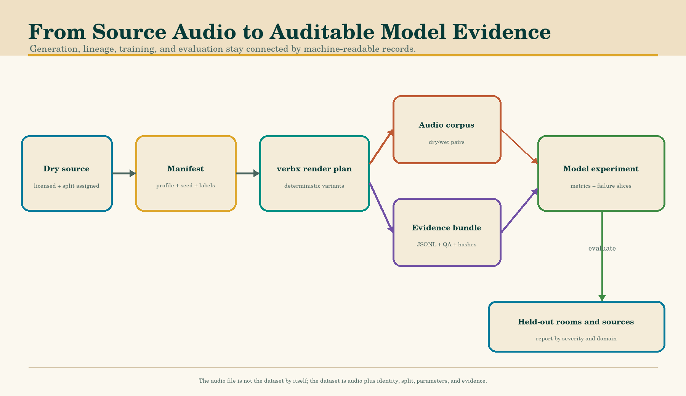

**Figure: The Chapter 11 evidence chain. A source file enters only after licensing and split assignment. The manifest records profile, seed, labels, and overrides; verbx expands that description into deterministic render plans. Audio outputs and machine-readable evidence are separate products of one generation event, and both are required to interpret a model result.**

This chain supports four distinct claims, which should not be confused:

- **Generation reproducibility:** the same manifest, seed, source bytes, and software behavior
  expand to the same plan.
- **Dataset identity:** a provenance digest identifies the canonical manifest and source-file
  signatures used for one corpus generation.
- **Experiment reproducibility:** model code, dependencies, initialization, optimizer state,
  hardware behavior, and training order are also recorded outside verbx.
- **Scientific validity:** the evaluation design demonstrates that the synthetic variation
  represents the deployment problem closely enough to improve a relevant outcome.

The first two claims are directly supported by verbx. The latter two require an experiment
protocol. A hash can prove that two teams started from the same bytes; it cannot prove that
their room distribution was realistic or that their metric captures musical quality.

## Signal model and the unit of augmentation

For a time-invariant room model, a reverberant observation may be written as

$$
y_c[n] = \sum_{q=1}^{Q} \sum_{m=0}^{M-1} h_{cq}[m]x_q[n-m] + v_c[n],
$$

where $x_q[n]$ is source channel $q$, $h_{cq}[m]$ is the room or effect response from source
channel $q$ to output channel $c$, and $v_c[n]$ is additive interference. An algorithmic
reverberator does not need to materialize one fixed $h_{cq}[m]$ internally; it may generate the
same class of response with delay lines, filters, modulation, and feedback state. For dataset
design, the important object is the **resolved transformation**: the source identity, parameter
vector, seed, output format, and success state that produced $y_c[n]$.

A single manifest job is a source-level declaration. If a job requests $K$ variants, verbx
creates $K$ descendant plans. For source index $i$ and zero-based variant index $k$, the current
seed rule is deterministic:

$$
s_{i,k} = s_0 + 100003i + k,
$$

where $s_0$ is the manifest seed. This rule keeps variants reproducible and separates the
pseudorandom stream of one source from its neighbors. The per-variant JSONL record stores the
resolved seed, profile, archetype, output path, labels, tags, source metadata, render
configuration, attempts, duration, and error state.

### Labels generated by control and labels measured from audio

Chapter 11 distinguishes three label classes:

1. **Control labels** are parameters requested from the renderer, such as configured RT60,
   wet gain, damping, pre-delay, FDN matrix, and line count.
2. **Measured labels** are quantities estimated from the rendered waveform, such as an RT60
   estimate, early-to-late ratio, spectral centroid, stereo coherence, or integrated loudness.
3. **Semantic labels** describe the source or task, such as speaker, instrument, genre, room
   class, language, recording session, or production role.

A configured RT60 is not automatically the same as an RT60 estimated from program material.
The source may stop before a full decay is observable, the direct signal may dominate, and a
frequency-dependent or modulated tail may not fit one broadband exponential. Use control labels
for known-generation supervision and measured labels for waveform evidence. If a model predicts
physical room quantities, validate those targets against measured impulse responses rather than
assuming that a renderer control is a calibrated architectural measurement.

## Split first, augment second

The most damaging augmentation error is often not a bad parameter range; it is leakage. If an
utterance, singer, song, stem, session, room, or impulse response contributes descendants to
both training and test sets, the model can recognize shared content instead of learning robust
acoustics. The score may improve while real-world generalization becomes worse.

Figure 11-2 illustrates the safe order. Assign a source group to train, validation, or test once,
then keep every dry copy and every reverberant descendant inside that boundary. The default
`--verify-split-isolation` guard rejects a repeated source ID or resolved input path that appears
in more than one split.

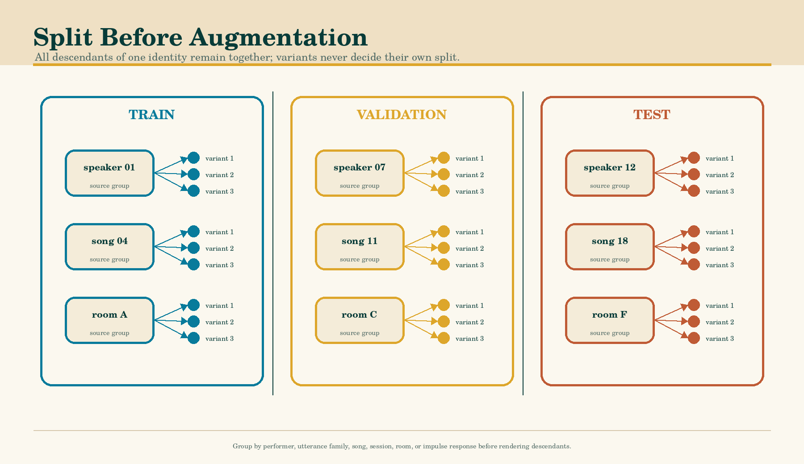

**Figure: Split-before-augmentation design. Each source group produces several variants, but no arrow crosses a split boundary. In real corpora, the grouping key may need to represent a performer, song, session, room, microphone setup, or impulse response rather than merely a file path. The built-in guard catches repeated IDs and paths; the research manifest must encode the larger identity correctly.**

### Choose the leakage unit for the task

| Task | Minimum grouping unit | Stronger held-out unit | Typical hidden leakage |
|---|---|---|---|
| ASR or keyword spotting | utterance family | speaker and recording session | adjacent cuts from one take |
| Speaker recognition | speaker | speaker plus room/session | the same room noise in every split |
| Music tagging | full recording | artist, album, or production session | excerpts from one master |
| Source separation | song and stem set | artist or multitrack session | mixtures sharing the same stems |
| Drum transcription | performance take | drummer, kit, and room | duplicated one-shots |
| Room estimation | source recording | physical room and microphone geometry | multiple positions from one room |
| Dereverberation | clean source | source identity plus room response | one dry target convolved many ways |
| Acoustic retrieval | recording event | site and capture session | repeated ambience beds |

`--allow-split-overlap` exists for intentional experiments, such as measuring room transfer while
holding linguistic content constant. It should be an explicit exception documented in the
dataset card, not a convenient way around a validation error. When overlap is allowed, report
exactly which identity is shared and which factor remains held out.

## Supervision geometries

The same rendered output can serve different learning problems, but each problem needs a
different target. Figure 11-3 maps one dry-to-wet render onto five common supervision choices.
Design the target before generation; otherwise a large corpus may be unusable because the
necessary dry pair, parameter field, or grouping key was not preserved.

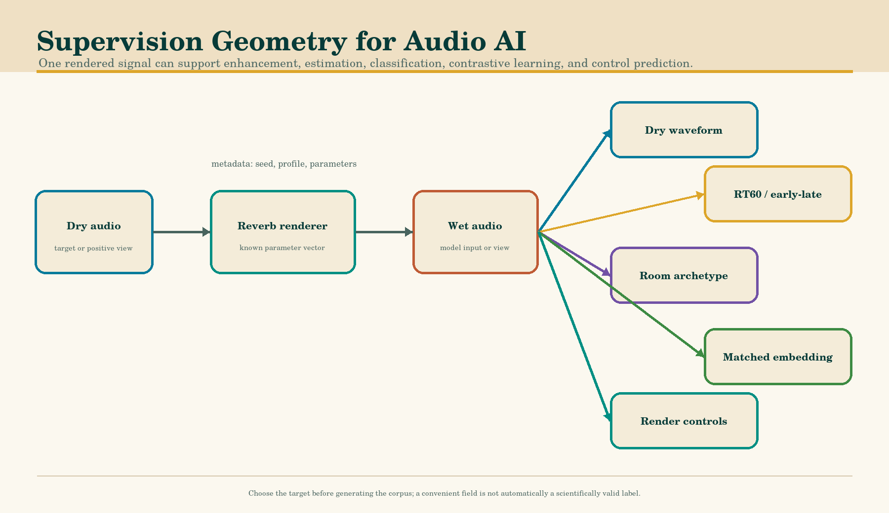

**Figure: Supervision geometry for Audio AI. Paired enhancement uses the dry waveform as the target. Estimation uses known controls or measured metrics. Classification uses a defensible room archetype or semantic category. Contrastive learning treats related acoustic views as positives. Neural control prediction maps audio back to a renderer parameter vector. One file may participate in several tasks, but the validity of each target must be argued separately.**

### Paired waveform supervision

Use `--copy-dry` when every wet output needs an accessible clean reference. This geometry suits
dereverberation, enhancement, room transfer, and objective waveform comparisons. Preserve exact
alignment: a model trained with sample losses or short-time Fourier transform losses should not
be forced to learn an accidental trim, delay, or resampling difference. For tails that extend
beyond the dry signal, define whether the target is padded dry audio, a fixed analysis window,
or a loss mask that excludes unsupported time regions.

### Scalar and vector regression

Known render controls can supervise RT60, pre-delay, wet depth, damping, width, FDN topology,
or a composite parameter vector. Use bounded or transformed targets where the geometry warrants
it. RT60 covers orders of magnitude, so $\log T_{60}$ often produces a better-conditioned
regression target than raw seconds. Circular angles need periodic losses; categorical matrices
need classification or embeddings rather than pretending their names form a numeric scale.

### Framewise targets

Time-varying room estimation, adaptive dereverberation, and online control models require targets
aligned to frames rather than one label per file. The current augmentation manifest records one
resolved render configuration per variant. If parameters are automated within a render, archive
the automation file and derive the target timeline with the same frame origin, hop size, and
sample rate used by the model. Never interpolate categorical topology changes as if they were
continuous values.

### Contrastive and metric learning

Two descendants of one source can be a positive pair when the goal is content invariance, while
descendants from different sources can be negatives. That choice is reversed for room retrieval,
where recordings sharing an acoustic transformation may be positives even when their content
differs. Declare whether the embedding should preserve content, performer identity, room,
production style, or some factorized combination. A contrastive pipeline without an explicit
invariance statement tends to learn the easiest shared artifact.

### Multi-task learning

Multi-task models can jointly predict acoustic parameters, source labels, and a restored waveform.
This may regularize a representation, but it also couples label quality. A noisy broadband RT60
estimate can damage an otherwise useful enhancement objective. Record loss weights, target
normalization, missing-label masks, and task-specific validation metrics so that one aggregate
loss does not conceal a failed head.

## Audio AI task map

Figure 11-4 summarizes the main applications supported by a deterministic acoustic generator.
The map is intentionally broader than dereverberation: reverberation changes intelligibility,
source separation, instrument recognition, scene identity, retrieval, and creative control.

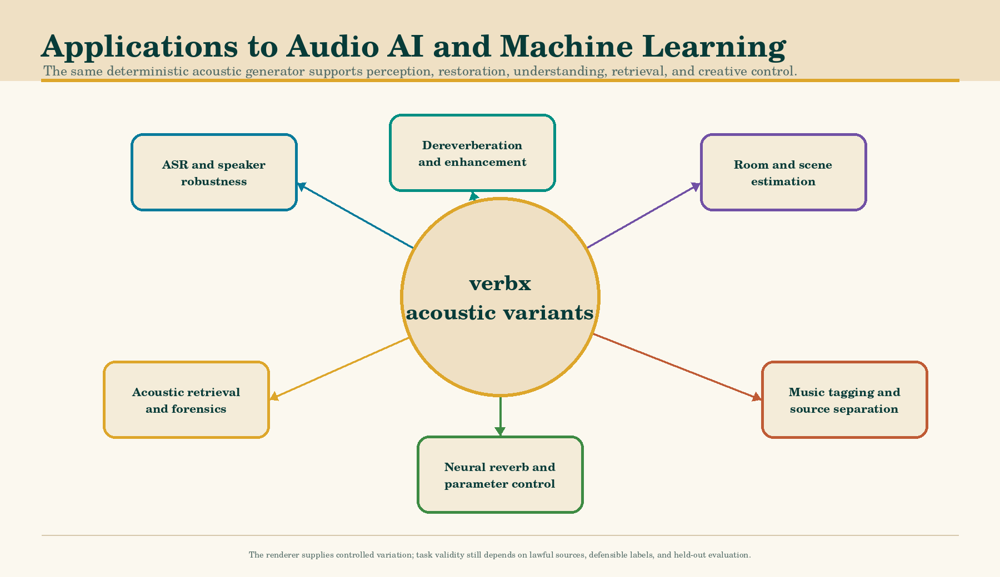

**Figure: Applications to Audio AI and machine learning. The central renderer supplies controlled acoustic variants. The surrounding tasks use those variants differently: some seek invariance to room, some estimate the room, some remove it, and some learn to reproduce or control it. A corpus designed for one arrow should not be assumed valid for all others.**

The task-to-evidence matrix in Figure 11-5 makes those differences operational. A held-out room
dimension is important for every task, but dry pairs, analysis metrics, and listening tests have
different priority depending on the model objective.

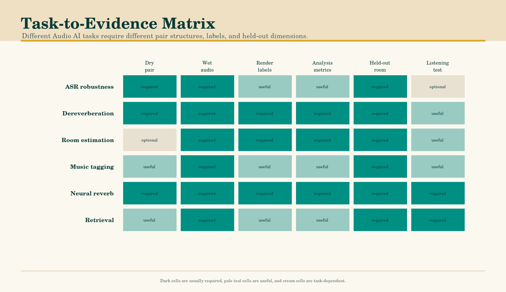

**Figure: Task-to-evidence matrix. Dark cells indicate evidence that is usually required, pale cells indicate useful support, and cream cells are task-dependent. Neural reverb design requires both technical and perceptual evidence; ASR robustness may be validated primarily by recognition performance, while dereverberation also needs paired targets and artifact review.**

## Built-in profile families

`verbx` currently ships three profile families. A profile first samples an archetype according
to its weight, then samples numeric parameters uniformly inside that archetype's bounds and
categorical parameters uniformly from its allowed choices. Integer ranges, including FDN line
counts, include both endpoints. Job-level options override sampled values, and manifest defaults
override the profile before job-specific overrides are applied.

Figure 11-6 plots the outer RT60 and pre-delay envelopes. These rectangles show the union of a
profile's archetype ranges, not a probability density. The archetype weights and internal bounds
determine the actual distribution.

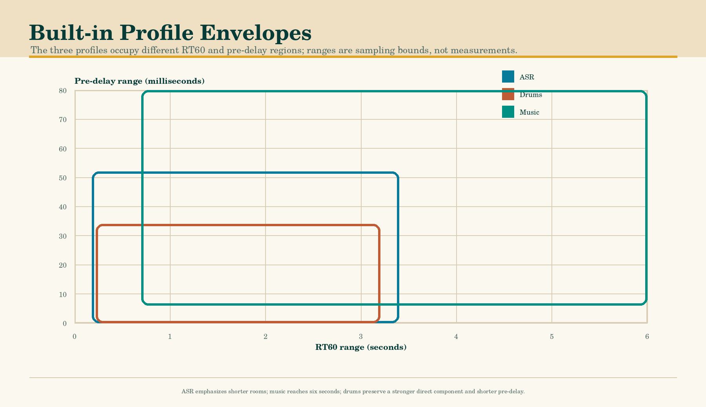

**Figure: Outer parameter envelopes of the three built-in profiles. The ASR family spans approximately 0.18–3.40 seconds and 0–52 milliseconds; the drum family emphasizes 0.22–3.20 seconds and 0–34 milliseconds; the music family extends to 6.00 seconds and 80 milliseconds. Other dimensions such as wet/dry balance, damping, width, matrix family, and FDN line count are sampled jointly through the selected archetype.**

### `asr-reverb-v1`

This profile favors speech robustness with three archetypes:

| Archetype | Weight | RT60 (s) | Pre-delay (ms) | Wet | Dry | FDN lines |
|---|---:|---:|---:|---:|---:|---:|
| booth | 0.34 | 0.18–0.65 | 0–12 | 0.10–0.28 | 0.82–1.00 | 6–10 |
| room | 0.43 | 0.45–1.65 | 4–24 | 0.18–0.42 | 0.72–1.00 | 8–14 |
| hall | 0.23 | 1.40–3.40 | 18–52 | 0.28–0.58 | 0.62–0.92 | 10–18 |

Use it for ASR, keyword spotting, speaker models, speech embeddings, and speech-oriented room
estimation. It does not add background noise by itself. If deployment includes HVAC, street,
crowd, or device noise, add a separately seeded noise stage and record signal-to-noise ratio as
another factor. Keep the room and noise seeds independent so they can be ablated.

### `music-reverb-v1`

This profile allows broader stereo width, longer tails, and wetter balances:

| Archetype | Weight | RT60 (s) | Pre-delay (ms) | Wet | Dry | FDN lines |
|---|---:|---:|---:|---:|---:|---:|
| plate | 0.32 | 0.70–2.20 | 6–22 | 0.24–0.50 | 0.62–0.92 | 8–16 |
| chamber | 0.38 | 1.30–3.10 | 12–42 | 0.28–0.60 | 0.54–0.88 | 10–20 |
| long hall | 0.30 | 2.60–6.00 | 24–80 | 0.34–0.72 | 0.40–0.78 | 12–24 |

Use it for music tagging, instrument recognition, source separation, acoustic-style retrieval,
mix translation, and neural effect control. The profile describes production-like algorithmic
spaces, not an unbiased survey of physical rooms. A serious transfer study should reserve
measured room impulse responses, real studio returns, or independent plug-ins for evaluation.

### `drums-room-v1`

This profile retains a stronger direct component and shorter pre-delay for transient-rich material:

| Archetype | Weight | RT60 (s) | Pre-delay (ms) | Wet | Dry | FDN lines |
|---|---:|---:|---:|---:|---:|---:|
| tight room | 0.52 | 0.22–0.95 | 0–10 | 0.12–0.34 | 0.84–1.00 | 6–12 |
| studio room | 0.33 | 0.62–1.70 | 4–18 | 0.22–0.46 | 0.68–0.96 | 8–16 |
| arena | 0.15 | 1.50–3.20 | 12–34 | 0.28–0.58 | 0.52–0.86 | 10–20 |

Use it for onset detection, beat tracking, drum transcription, drum replacement, groove
classification, and transient-aware separation. If the target task depends on close-mic bleed,
overhead geometry, or kit-piece directionality, those factors require multitrack or spatial data
beyond a single rendered mix.

### Profile selection is a hypothesis

A built-in profile is a documented starting distribution, not a universal truth. Before a large
run, compare its generated metrics with a small deployment sample. If real speech rooms cluster
around shorter RT60 values than the profile, or production music contains brighter plate tails,
change the manifest overrides or create a balanced mixture of runs. Record the difference as a
dataset version rather than silently editing a prior manifest.

## Manifest design

Generate a current template rather than copying an old blog post or help transcript:

```bash
verbx batch augment-template > augment_manifest.json
verbx batch augment-profiles --json > augmentation_profiles.json
```

A practical manifest can mix source-level metadata, job-specific labels, and controlled
overrides while leaving most acoustic variation to the profile:

```json
{
  "version": "0.7",
  "dataset_name": "studio_voice_rooms_v1",
  "profile": "asr-reverb-v1",
  "seed": 20260716,
  "variants_per_input": 6,
  "output_root": "out/studio_voice_rooms_v1",
  "write_analysis": true,
  "default_options": {
    "engine": "algo",
    "target_sr": 48000,
    "output_subtype": "float32",
    "normalize_stage": "none",
    "output_peak_norm": "input"
  },
  "jobs": [
    {
      "id": "voice_session_001_take_04",
      "infile": "data/clean/session_001/take_04.wav",
      "split": "train",
      "label": "soprano",
      "tags": ["voice", "sustained", "studio"],
      "variants": 8,
      "metadata": {
        "performer_id": "performer_014",
        "session_id": "session_001",
        "language": "it"
      }
    },
    {
      "id": "voice_session_019_take_02",
      "infile": "data/clean/session_019/take_02.wav",
      "split": "test",
      "label": "baritone",
      "tags": ["voice", "transient", "studio"],
      "variants": 8,
      "options": {
        "rt60": 2.4,
        "pre_delay_ms": 36.0
      },
      "metadata": {
        "performer_id": "performer_031",
        "session_id": "session_019",
        "language": "en"
      }
    }
  ]
}
```

The second job fixes RT60 and pre-delay, but other profile dimensions still vary. This is useful
for a controlled slice, although it changes the joint distribution. If the intent is a fully
fixed acoustic condition, override every relevant parameter or generate an explicit batch render
manifest instead of assuming that two controls determine the room.

### Manifest field responsibilities

| Field | Scope | Research use |
|---|---|---|
| `dataset_name` | corpus | stable human-readable dataset identity |
| `profile` | corpus or CLI override | named acoustic sampling family |
| `seed` | corpus or CLI override | root of deterministic variant seeds |
| `variants_per_input` | corpus, job, or CLI | default descendant count |
| `output_root` | corpus or CLI | destination tree |
| `write_analysis` | corpus or CLI | per-output analysis sidecars |
| `default_options` | corpus | shared render configuration |
| `jobs[].id` | source | leakage guard and lineage key |
| `jobs[].split` | source | train, validation, test, or custom split |
| `jobs[].label` | source | primary class label |
| `jobs[].tags` | source | searchable secondary categories |
| `jobs[].metadata` | source | task-specific structured context |
| `jobs[].options` | source | acoustic overrides for one source group |

Paths relative to the manifest resolve from the manifest directory. Output extensions may be
WAV, FLAC, AIFF, OGG, or CAF. For training pipelines that depend on exact floating-point samples,
prefer WAV float32 and preserve the generated file rather than transcoding it later.

## Plan, smoke test, then render

Large augmentation should be a staged operation. First inspect the expanded plan without writing
audio:

```bash
verbx batch augment augment_manifest.json \
  --dry-run \
  --copy-dry \
  --jobs 8 \
  --schedule longest-first
```

The dry run validates paths, split isolation, profile selection, source identities, output
collisions, and descendant counts. It also makes the scale visible before storage is consumed.
Next, run a small manifest containing at least one source from every split and label family.
Listen to dry/wet pairs, inspect the JSONL rows, and verify that a training loader can parse the
output tree. Only then expand to the complete corpus.

A production run with the full evidence set is:

```bash
verbx batch augment augment_manifest.json \
  --jobs 8 \
  --schedule longest-first \
  --retries 1 \
  --copy-dry \
  --write-analysis \
  --dataset-card-out out/studio_voice_rooms_v1/DATASET_CARD.md \
  --metrics-csv-out out/studio_voice_rooms_v1/metrics.csv \
  --metrics-include-loudness \
  --qa-bundle-out out/studio_voice_rooms_v1/qa_bundle.json \
  --provenance-hash \
  --summary-out out/studio_voice_rooms_v1/summary.json \
  --jsonl-out out/studio_voice_rooms_v1/records.jsonl
```

`--metrics-include-loudness` adds slower loudness, true-peak, and loudness-range analysis. Use
`--metrics-fast` for exploratory runs. Keep fail-fast behavior while establishing a pipeline.
For unattended generation, `--continue-on-error` can preserve successful work, but leave
`--fail-if-any-failed` enabled so orchestration still receives a nonzero result when any example
failed.

## Output artifacts and directory contract

Rendered audio is written under `<output_root>/<split>/`. The filename includes a source index,
sanitized source ID, sampled archetype, and one-based variant number. With `--copy-dry`, the dry
source is copied once per source group into the same split tree. Analysis sidecars, when enabled,
are stored under `<output_root>/analysis/`.

The main machine-readable artifacts are:

- **`augmentation_manifest.jsonl`:** one record per planned variant, including paths, labels,
  tags, source metadata, profile, archetype, seed, resolved render configuration, success,
  attempts, duration, and error.
- **`augmentation_summary.json`:** aggregate planned, successful, failed, source, split, label,
  archetype, and tag counts plus scheduling context and output paths.
- **`augmentation_qa_bundle.json`:** split-level acoustic summaries, split-by-label counts, and
  optional baseline deltas.
- **Dataset card:** Markdown identity, generation settings, split distributions, parameter
  envelope, and links to evidence artifacts.
- **Metrics CSV:** per-output acoustic features suitable for plotting, filtering, or joining to
  experiment results.
- **Provenance entry:** canonical manifest hash, source signatures, source count, and combined
  SHA-256 dataset-generation identity.

Treat JSONL as the authoritative join table. Training code should not infer labels by parsing a
filename when the same information exists as a typed field. Filenames are convenient for humans;
records are safer for schema evolution.

## Corpus size and storage planning

If $N$ source jobs each request $K$ variants, the wet-output count is

$$
N_{\mathrm{wet}} = \sum_{i=1}^{N} K_i,
$$

which reduces to $NK$ when every job uses the same count. Figure 11-7 shows this multiplicative
growth for two, four, and eight variants per source. Dry copies add at most one file per source;
analysis sidecars can add one file per wet output.

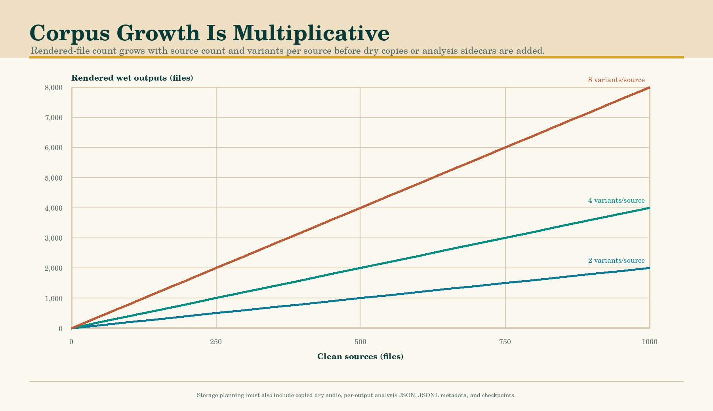

**Figure: Corpus growth in files. One thousand sources produce 2,000, 4,000, or 8,000 wet outputs at two, four, or eight variants per source. The chart excludes dry copies, analysis JSON, metadata, checkpoints, and model-ready feature caches. Audio duration and sample format determine bytes, so file count is only the first storage estimate.**

For uncompressed floating-point audio, a rough payload estimate is

$$
B \approx f_s \cdot T \cdot C \cdot \frac{b}{8},
$$

where $f_s$ is sample rate in hertz, $T$ is duration in seconds, $C$ is channel count, and $b$ is
bits per sample. Add filesystem overhead and account for tails that extend the output duration.
At 192 kHz, stereo float32 audio consumes four times the sample payload of 48 kHz stereo float32
audio. Use the sample rate required by the model and target deployment; the book's 192 kHz
production default is not automatically the right dataset default.

### Shard by evidence boundary, not arbitrary file count

When a corpus must be sharded, keep all descendants of a source together and store a shard-level
index containing source IDs and record hashes. This prevents a downstream loader from assigning
related variants to different distributed workers in ways that accidentally alter sampling
balance. Preserve a global JSONL manifest even when audio is packed into tar archives, object
storage, or a feature database.

## Quality gates

A successful process exit means the renderer completed; it does not mean every output is suitable
for training. Figure 11-8 presents a quality funnel. Each stage may exclude examples, and every
exclusion should be recorded rather than silently deleting a file.

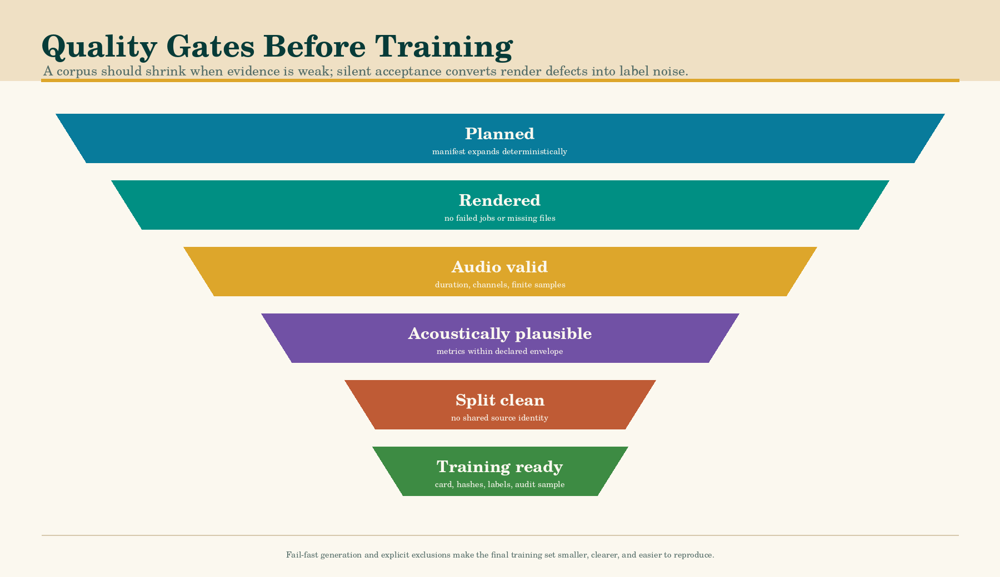

**Figure: Quality-gate funnel. The widest stage is the deterministic plan. Render failures, invalid audio, implausible metrics, split contamination, or incomplete evidence reduce the set. The final training-ready corpus is intentionally narrower and carries its dataset card, hashes, labels, and an audited listening sample.**

### Gate 1: plan integrity

- Every input exists and resolves to the intended file.
- Every source ID is stable, unique at the chosen grouping level, and isolated by split.
- No output path equals an input path.
- Variant counts, output format, target sample rate, and profile match the experiment plan.
- Dataset and manifest versions are immutable once a run begins.

### Gate 2: render integrity

- Planned count equals successful count unless a documented exclusion policy applies.
- Failed rows include an actionable error and are not fed to training.
- Retries are reported; repeated transient failures may indicate storage or resource pressure.
- Output duration is compatible with the model loader and tail policy.

### Gate 3: audio integrity

- Samples are finite and channel counts are expected.
- Files are not silent, truncated, unexpectedly clipped, or encoded in a surprise subtype.
- Sample rate and frame count match the JSONL or analysis metadata.
- Dry/wet pairs share the intended alignment and source identity.

### Gate 4: acoustic plausibility

The metrics CSV and QA bundle can summarize `rt60_estimate_seconds`,
`early_late_ratio_db`, `stereo_width`, `stereo_coherence`, `spectral_centroid`,
`spectral_flatness`, `dynamic_range`, and `lufs_integrated` by split. These are diagnostic
features, not universal pass criteria. Build thresholds from the declared profile and task. A
wide stereo field may be correct for music and invalid for a mono ASR experiment.

### Gate 5: human audit

Listen to a stratified sample from every split, archetype, severity bucket, and source class.
Include the shortest and longest RT60, driest and wettest mix, narrowest and widest image, and
every categorical FDN matrix. Record audible defects with the JSONL `augment_index` so they can
be traced to the exact plan.

## Regeneration and distribution drift

Re-running a corpus with a new source inventory or profile can preserve technical success while
changing class balance. Pass a prior summary or QA bundle with `--baseline-summary` to compute
split-level and global count and ratio deltas. Figure 11-9 shows how those deltas should be read.

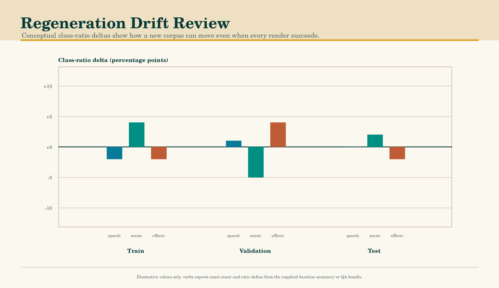

**Figure: Conceptual regeneration-drift review. Bars above zero indicate a larger class share than the baseline; bars below zero indicate a smaller share. The plotted values are illustrative, not verbx measurements. The actual QA bundle reports exact current, baseline, count-delta, ratio, and ratio-delta fields for every label represented in each split.**

Use the baseline comparison for more than class labels. Preserve a compact external report for
parameter histograms, duration, source language, performer, instrument, and room identity. The
current QA bundle gives min, max, and mean for supported acoustic metrics; downstream notebooks
can join the metrics CSV for quantiles, histograms, and two-sample tests.

Do not compare only global totals. A stable overall soprano/baritone ratio can conceal a test set
that lost most baritone examples. Review every split independently, then review interaction slices
such as label by archetype or source type by severity.

## Application protocols

### ASR, keyword spotting, and speech embeddings

Begin with `asr-reverb-v1`, preserve transcripts and speaker IDs in `metadata`, and group by
speaker or session before augmentation. Report word error rate or task error separately for dry,
short, medium, and long reverberation. Include a clean-only training baseline, an augmented model,
and a matched-size baseline that repeats clean examples so gains cannot be attributed only to
more optimizer steps.

For streaming ASR, test the exact chunk and state policy used at deployment. Long tails cross
chunk boundaries and interact with endpointing. A model that performs well on isolated files may
fail when reverb state continues across speech segments.

### Speaker recognition and diarization

The desired representation should preserve speaker identity while discarding room. Put all audio
from one speaker in one split, and check whether microphones or sessions form shortcuts. Evaluate
same-speaker trials across different rooms and different-speaker trials inside the same room. If
the model improves only when room and speaker remain correlated, augmentation has reinforced the
wrong cue.

### Dereverberation and speech enhancement

Use copied dry targets and record whether the wet input includes only reverb or also noise. Keep
reverb-only, noise-only, and combined conditions as separate ablations. Evaluate waveform or
spectral error, intelligibility or recognition performance, and artifact rate. A model can reduce
late energy while introducing musical noise, transient holes, phase distortion, or an unnaturally
close voice. Human listening remains necessary.

For causal models, restrict the receptive field and algorithmic latency in the experiment report.
An offline network with future context is not a valid baseline for a low-latency realtime product.

### Blind RT60, DRR, and early-to-late estimation

Use log-scaled RT60 targets and report errors by phonetic or musical content, duration, and
severity. Joint prediction of RT60 and early-to-late ratio can expose contradictory estimates.
Compare control labels with waveform-derived metrics, but do not train and evaluate on the same
estimator's output without acknowledging circularity.

The blind-estimation literature in Appendix C includes work by Deng, Mack, Habets, Xiong,
Goetze, Kollmeier, Lollmann, Brendel, Kellermann, and others. Use those methods to define
non-neural and neural baselines rather than comparing only against a mean predictor.

### Music tagging and instrument recognition

Use `music-reverb-v1`, but split by recording or artist before cutting excerpts. Preserve genre,
instrument, artist, album, session, and production metadata when lawful. Report whether the model
becomes invariant to room while retaining production-relevant style. For tasks where reverb is
part of the label, complete invariance may be undesirable.

Musical examples require special caution because algorithmic reverb can change onset density,
harmonic masking, stereo width, and perceived tempo. Test percussive, sustained, sparse, and dense
material separately. A tagging model may improve on sustained instruments while losing transient
classification accuracy.

### Music source separation

Apply reverb at the correct point in the mixture graph. Reverberating the final mix teaches a
different problem from reverberating stems independently before summation. Real productions may
share one room across sources, use separate sends, or combine close and room microphones. Encode
the intended geometry and keep stems, mixtures, dry targets, and render records synchronized.

Evaluate scale-invariant distortion metrics only alongside perceptual and spatial checks. A
separator can achieve a better scalar score by narrowing stereo ambience or discarding a late
tail that belongs musically to the source.

### Drum transcription and onset detection

Use `drums-room-v1` and preserve onset labels at the dry-signal timeline. Confirm whether pre-delay
or rendering changes effective alignment for the feature extractor. Report performance by kit
piece, velocity, density, room archetype, and RT60. Long arena variants are a useful stress slice,
but they should not dominate training unless deployment contains similar spaces.

### Acoustic scene classification and room retrieval

For scene classification, room is evidence rather than nuisance. Use different source content in
the same acoustic class so the model cannot identify a scene from one repeated signal. For room
retrieval, define positives by room or parameter neighborhood and negatives by acoustically
distinct rooms. Reserve real measured rooms as a transfer test whenever possible.

### Neural reverb, matching, and parameter inference

A neural reverb may predict audio directly, predict verbx controls, or learn a residual around a
deterministic renderer. Parameter prediction preserves an interpretable interface but inherits
the renderer's model class. Audio prediction can represent more detail but is harder to constrain
and validate. A hybrid model can predict early reflections or spectral corrections while verbx
provides a stable late field.

Evaluate parameter error, waveform behavior, stability under automation, and blinded musical
preference. Two parameter vectors can sound similar, and a low parameter error can sound worse
than a different vector that matches the perceptual target.

### Generative audio and controllable music systems

Reverb augmentation can teach a generator to separate musical content from production space or
to condition on spatial intent. Preserve dry and wet versions when rights permit, and use clear
conditioning fields such as `room_archetype`, `rt60_seconds`, `pre_delay_ms`, and `wet_depth`.
Do not label a synthetic long hall as a specific real venue. If text prompts are generated, state
that they describe a renderer condition rather than a measured site.

### Audio forensics and recording provenance

Reverberation carries information about recording environment, but synthetic augmentation can
also create shortcuts. A forensic model may learn verbx's matrix families instead of general room
structure. Hold out the complete generator family, test on measured recordings, and avoid claims
about authenticity based only on synthetic validation. The provenance hash documents the
augmentation corpus; it is not a forensic watermark in the rendered audio.

## Evaluation as a grid, not one score

Model performance should be conditioned on both source novelty and room novelty. Figure 11-10
defines a practical evaluation grid. Every cell should report the task metric and sample count;
the unseen-source, unseen-room cells are usually the most informative transfer test.

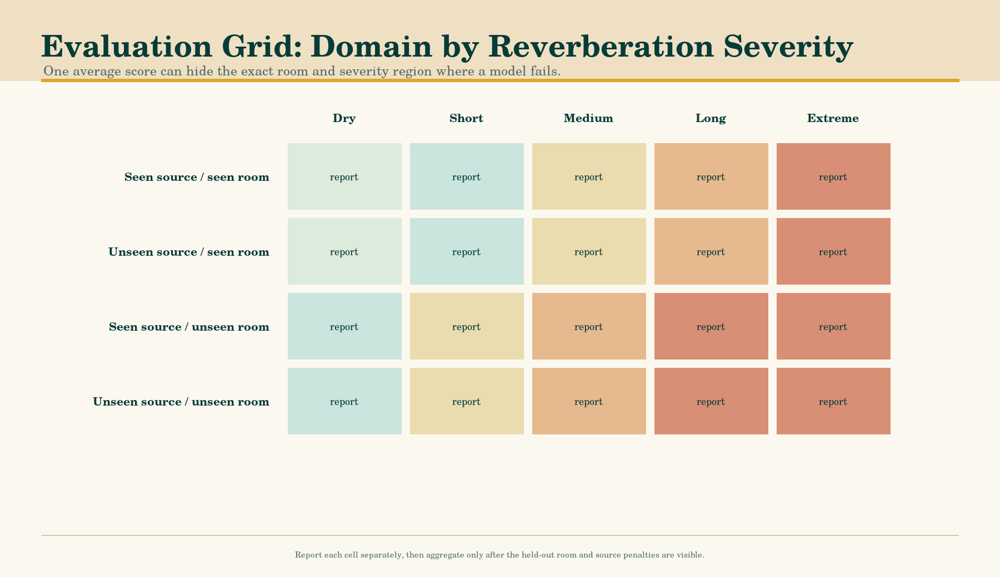

**Figure: Domain-by-severity evaluation grid. Columns progress from dry through increasingly severe reverberation, while rows separate seen and unseen source/room combinations. The colors indicate increasing challenge, not measured performance. Report individual cells before any weighted mean so failures in unseen long or extreme rooms remain visible.**

### Severity buckets

Define severity before examining model results. A speech study might use dry, short below 0.6
seconds, medium 0.6–1.5 seconds, long 1.5–3.0 seconds, and extreme above 3.0 seconds. A music
study may need different boundaries and additional wet-depth or early-to-late bins. Store the
bucket rule in experiment configuration, not only in plotting code.

### Task metrics

| Task | Primary metric examples | Required companion analysis |
|---|---|---|
| ASR | word or character error rate | error by speaker, room, duration, and severity |
| Keyword spotting | false accept/reject, area under curve | threshold stability by room |
| Dereverberation | spectral/waveform distance, recognition score | artifact listening and latency |
| Room estimation | log-RT60 error, DRR error, class accuracy | calibration and confidence intervals |
| Separation | source distortion or perceptual score | stereo image and tail preservation |
| Music tagging | macro F1 or mean average precision | artist/session leakage audit |
| Retrieval | recall at rank, mean reciprocal rank | room-held-out and generator-held-out tests |
| Neural reverb | control error, spectral/decay distance | blinded preference and stability |

Use paired statistical tests when the same evaluation examples are processed by two systems.
Bootstrap over the correct independent unit: speakers for speaker-held-out ASR, songs for music,
or rooms for room-transfer studies. Bootstrapping thousands of correlated variants as though they
were independent produces confidence intervals that are too narrow.

## Ablation studies

An augmentation study should isolate which acoustic variation helps. Figure 11-11 gives a five-run
ladder: no augmentation, decay only, decay plus distance cue, the full algorithmic profile, and a
full profile evaluated with measured-room holdout.

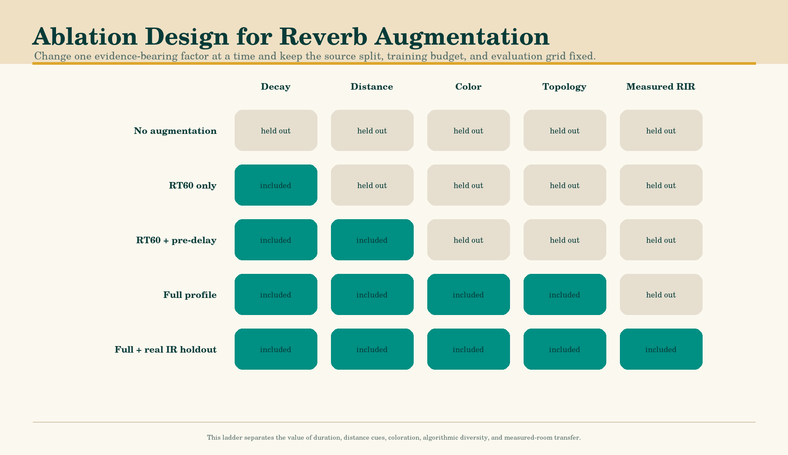

**Figure: Reverb-augmentation ablation ladder. Each row adds one evidence-bearing family while source splits, training budget, model architecture, and evaluation grid remain fixed. The final row introduces measured room impulse responses as a transfer condition rather than treating synthetic success as the endpoint.**

A complete ablation table should include:

- clean-only training with matched optimizer steps;
- duplicated-clean training with matched example count;
- one-factor RT60 augmentation;
- RT60 plus pre-delay or early/late control;
- full profile variation;
- profile variation without matrix diversity;
- profile variation without stereo-width variation;
- an independent convolution or measured-RIR condition;
- an unseen generator or plug-in condition;
- deployment recordings when rights and privacy permit.

Keep seeds fixed across comparable runs so the source and archetype sequence changes only where
the ablation requires it. If removing a factor changes the number of files, match training steps
or sampling weights. Report both the best checkpoint and a predefined selection rule to avoid
choosing a different favorable epoch for every condition.

## Reproducibility and provenance

`--provenance-hash` canonicalizes the JSON manifest when possible, computes signatures for unique
source files, includes their resolved paths and audio metadata, and combines those records with
the planned record count. Figure 11-12 shows how that dataset-generation identity relates to the
downstream experiment report.

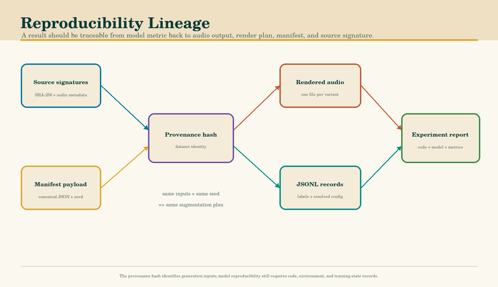

**Figure: Reproducibility lineage. Source SHA-256 signatures and canonical manifest content form the dataset-generation identity. Rendered audio and JSONL records feed an experiment report that must additionally preserve code, environment, model configuration, and metrics. The verbx hash establishes generation inputs; it does not by itself capture every training variable.**

Archive the following together:

1. the exact source manifest;
2. the exported profile definitions;
3. JSONL records and summary JSON;
4. QA bundle, metrics CSV, and dataset card;
5. provenance payload and source-access policy;
6. verbx version and installation lockfile;
7. training configuration, code commit, environment, and random seeds;
8. evaluation inventory and exclusion list;
9. plots generated from immutable evidence tables;
10. a short listening audit with stable variant IDs.

Absolute source paths are included in current signatures for local reproducibility. When sharing
a dataset externally, publish a path-remapping policy or content-addressed source registry rather
than assuming another machine has the same directory layout. Do not publish private paths or
source bytes that the dataset license forbids.

## TensorFlow and PyTorch integration

verbx should sit at a clearly defined boundary in a machine-learning input pipeline.
There are two valid patterns. A **materialized pipeline** renders WAV files and manifests
before training. An **on-the-fly pipeline** renders or convolves inside a dataset worker.
Materialization costs storage but makes every waveform inspectable, cacheable, and exactly
repeatable. On-the-fly augmentation saves storage and can expose a model to more variants,
but it complicates worker safety, distributed determinism, performance, and postmortem
analysis. Use materialized data for validation and test even when training is dynamic.

The governing rule is

$$
\mathcal{D}_{\mathrm{train}}^{(e)}=A(\mathcal{D}_{\mathrm{train}}, e, s),\qquad
\mathcal{D}_{\mathrm{val}}'=A(\mathcal{D}_{\mathrm{val}}, s_{\mathrm{val}}),\qquad
\mathcal{D}_{\mathrm{test}}'=A(\mathcal{D}_{\mathrm{test}}, s_{\mathrm{test}}),
$$

where epoch $e$ may change training variants, while validation and test seeds remain
fixed. The clean source split must be created before $A$ is applied. No recording,
speaker, session, musical stem family, room capture, or generated IR family designated as
a leakage group may cross that boundary.

### A split-safe materialized workflow

1. Assign immutable `source_id`, `group_id`, and `split` fields to the clean corpus.
2. Freeze the split ledger in version control or content-addressed object storage.
3. Assign disjoint room or IR families when room generalization is an evaluation target.
4. Plan augmentation from the frozen ledger and write the planned JSONL manifest.
5. Smoke-render a small stratified sample and run audio, label, and tail checks.
6. Render training variants, then render one fixed validation and test matrix.
7. Hash every output and join acoustic analysis fields back into the manifest.
8. Train from the manifest rather than rediscovering labels from directory names.
9. Report clean, seen-room, unseen-room, and severity-bucket metrics separately.

For a dereverberation model, each row should retain the dry target, reverberant input,
IR identifier, direct-arrival convention, wet/dry policy, output gain, and seed. For ASR,
the transcript remains attached to the dry source identity while room metadata describes
the transformed observation. For music tasks, stems from one multitrack session usually
belong to one leakage group even when their filenames differ.

### PyTorch `Dataset` and `DataLoader`

The simplest robust PyTorch design reads a verbx JSONL manifest and returns already
materialized paths. The dataset object does not invoke a subprocess in `__getitem__`, so
worker restarts cannot create partial files or race for one output path.

```python
import json
from pathlib import Path

import soundfile as sf
import torch
from torch.utils.data import Dataset


class VerbxManifestDataset(Dataset):
    def __init__(self, manifest_path: str, split: str):
        rows = [json.loads(line) for line in Path(manifest_path).read_text().splitlines()]
        self.rows = [row for row in rows if row["split"] == split]

    def __len__(self):
        return len(self.rows)

    def __getitem__(self, index):
        row = self.rows[index]
        audio, sample_rate = sf.read(row["output_path"], dtype="float32", always_2d=True)
        waveform = torch.from_numpy(audio.T.copy())
        target = torch.tensor(row["target"], dtype=torch.long)
        return waveform, sample_rate, target, row["source_id"], row["room_id"]
```

Use a collate function that pads or crops waveforms deliberately and returns a valid-
sample mask. Do not silently truncate long reverb tails if the task depends on decay.
With `DistributedSampler`, shard rows after loading the fixed manifest, call
`sampler.set_epoch(e)` for training order, and keep validation order fixed. Seed each
worker from a run seed, rank, worker identifier, and epoch when any residual online
randomness remains.

For on-the-fly training, prefer an in-process convolution or Python API over spawning the
CLI for every item. Load IRs once per worker, bound the cache, derive the variant seed from
`hash(source_id, epoch, global_seed)`, and return the chosen parameters with the waveform.
Never overwrite the source manifest with epoch-specific values. Record enough seed state
to regenerate a failed or unusually informative example later.

### TensorFlow `tf.data`

TensorFlow follows the same evidence contract. Construct the dataset from manifest
columns, shard deterministically in distributed jobs, decode audio, and batch with an
explicit shape policy.

```python
import json
from pathlib import Path

import tensorflow as tf

rows = [json.loads(line) for line in Path("manifests/augmented.jsonl").read_text().splitlines()]
train_rows = [row for row in rows if row["split"] == "train"]

paths = [row["output_path"] for row in train_rows]
labels = [row["target"] for row in train_rows]
dataset = tf.data.Dataset.from_tensor_slices((paths, labels))

options = tf.data.Options()
options.experimental_deterministic = True
dataset = dataset.with_options(options)

def decode(path, label):
    audio_bytes = tf.io.read_file(path)
    waveform, sample_rate = tf.audio.decode_wav(audio_bytes, desired_channels=-1)
    return waveform, sample_rate, label

dataset = dataset.map(decode, num_parallel_calls=tf.data.AUTOTUNE, deterministic=True)
dataset = dataset.padded_batch(16, padded_shapes=([None, None], [], []))
dataset = dataset.prefetch(tf.data.AUTOTUNE)
```

`tf.py_function` can wrap Python DSP, but it weakens graph portability, shape inference,
and accelerator input optimization. Use it only for training-time experiments whose
reproducibility and throughput have been measured. A stronger production path renders
with verbx ahead of time or exports tensors into sharded TFRecord files while retaining
the original JSONL provenance ledger.

### Validation, test, and challenge matrices

A single random reverberant test set cannot answer whether a model generalizes. Freeze a
matrix with meaningful axes:

| Axis | Example buckets |
|---|---|
| Room identity | seen room, unseen measured room, unseen synthesized family |
| Decay | dry, short, medium, long, extreme |
| Direct-to-reverberant ratio | foreground, balanced, distant |
| Noise | clean, stationary, transient, competing speech |
| Device | matched microphone, unseen microphone, codec path |
| Spatial layout | mono, stereo, array, binaural or immersive fold-down |

Keep a clean test condition in the same report. For ASR, report word error rate by each
cell and the relative degradation from clean. For dereverberation, combine signal metrics
with acoustic estimates such as residual RT60, DRR change, spectral distortion, and
listening tests. For tagging or separation, inspect class or source-specific failures;
reverberation can alter instruments with sparse attacks more than sustained ones.

### Caching, distributed workers, and failure recovery

Hash the transformation specification, source content, verbx version, and IR content into
one cache key. A filename alone is not sufficient because a file may be replaced in place.
Write to a temporary path, validate the container and expected duration, then atomically
publish the completed artifact. In a multi-worker render farm, acquire work from immutable
manifest rows and make retries idempotent.

For PyTorch Distributed Data Parallel, JAX, TensorFlow MultiWorkerMirroredStrategy, or TPU
input services, avoid letting each rank invent a different interpretation of the split.
Distribute the same frozen manifest and shard by stable row index or source group. Measure
input-stall time, cache hit rate, augmentation CPU time, storage throughput, and accelerator
utilization together. A theoretically rich online augmenter that starves the model can
reduce effective experimental coverage compared with a simpler pre-rendered corpus.

### Preventing augmentation leakage

Augmentation leakage has several forms. A dry utterance and its reverberant copy in
different splits is direct leakage. Two excerpts from one recording session can leak the
same speaker, noise floor, and microphone. Two IRs measured in the same room can leak room
identity even when filenames differ. Two synthesized IRs created from one parameter seed
family can leak generator fingerprints. The split ledger must therefore name the unit of
independence appropriate to the scientific claim.

When evaluating unseen-room robustness, hold out room families before generating any
variants. When evaluating a neural reverb estimator, hold out both source recordings and
IR families. When training generative audio, audit whether wet tails reveal copyrighted or
sensitive source material beyond the intended crop. A defensible result states not only
the framework and model but also exactly what was isolated between training, validation,
and test.

## Scaling and operational behavior

### Parallel workers

`--jobs 0` selects an automatic worker count. Explicit worker counts are better for controlled
benchmarks. Rendering can become limited by CPU, memory bandwidth, storage throughput, or file
creation rather than arithmetic alone. Measure end-to-end examples per second and error rate,
not only processor utilization.

### Scheduling

`longest-first` is the default and often reduces the tail of mixed-duration runs by starting
expensive jobs early. `shortest-first` provides quick early outputs and can be useful for smoke
tests. `fifo` preserves manifest order. Scheduling should not change variant content, but it can
change completion order, resource pressure, and which files exist when an interrupted run stops.

### Retries and failures

Retries are appropriate for transient filesystem or resource failures, not deterministic invalid
configuration. A repeated success after retry should remain visible in `attempts`. If a render
fails because the input is corrupt, fix or exclude the source with a recorded reason rather than
raising retry count.

### Analysis cost

Per-output waveform analysis can be a substantial second pass. Use fast metrics during parameter
development, then enable loudness metrics for the release corpus. If a downstream feature
extractor already computes equivalent quantities, decide which implementation is authoritative
and compare a sample before discarding verbx metrics.

### Versioning

Use immutable dataset names such as `speech_rooms_v1` and `speech_rooms_v2`, not a mutable `latest`
directory. A regeneration with different sources, profile bounds, verbx version, sample rate, or
label policy is a new dataset version even if filenames are similar. Preserve baseline summaries
so drift is reviewable.

## Lawful and ethical dataset practice

Synthetic acoustics do not remove the obligations attached to source audio. Confirm rights for
reproduction, transformation, model training, and distribution separately. A license that permits
listening or research access may not permit publishing augmented copies. Dataset cards should name
the source license category, access restrictions, retention policy, and whether dry audio is
redistributed or must be reconstructed by an authorized user.

For speech, protect identity and sensitive content. Avoid embedding personal names or private
paths in public metadata. For music, preserve attribution and do not imply that a synthetic room
is part of the original recording. For cultural or site-specific recordings, document consent and
context rather than treating acoustic variation as detached raw material.

Bias can enter through both content and acoustics. Speaker demographics, languages, genres,
instruments, recording devices, rooms, and production conventions may be unequally represented.
An apparently balanced label table can still put one population mostly in long rooms or noisy
conditions. Audit intersections, not only marginal counts.

## Failure modes and corrective actions

**The validation score is excellent, but deployment is poor.** Check performer, song, session,
room, and generator leakage. Add an unseen-room and unseen-generator test. Verify that excerpts
from the same master did not cross splits.

**The model predicts the archetype but not real room behavior.** It may recognize matrix color or
profile-specific parameter correlations. Hold out matrix families, use measured RIRs, and compare
against another renderer.

**Dereverberation sounds phasey despite better metrics.** Add spatial, transient, and listening
criteria. Confirm dry/wet alignment. Reduce reliance on a pointwise waveform loss that punishes
perceptually acceptable phase differences.

**RT60 regression fails on short clips.** The clip may contain insufficient decay evidence.
Stratify by duration and source activity, use confidence targets, or exclude windows without an
observable decay interval.

**Class balance changed after regeneration.** Compare the QA bundle to the baseline, inspect
split-specific ratio deltas, and version the corpus. Do not repair only the global total.

**The corpus is too large to iterate.** Build a miniature manifest that preserves every split,
label, archetype, and severity bucket. Validate loaders and metrics there before the release run.

**Two machines create different model results from the same corpus.** Confirm audio and JSONL
hashes first, then inspect training dependencies, nondeterministic kernels, data-loader order,
precision, and checkpoint selection. Dataset determinism and optimizer determinism are separate.

**A profile override unexpectedly narrows variation.** Remember the precedence order: sampled
profile values are followed by manifest defaults and then job-specific options. An override fixes
that field for all affected descendants.

## A reproducible research protocol

The following protocol turns Chapter 11 into an experiment that can be reviewed by another team.

1. **State the deployment question.** Name the source domain, acoustic domain, realtime or offline
   constraint, and primary outcome.
2. **Declare the independent unit.** Choose speaker, song, session, room, or another grouping key.
3. **Freeze source splits.** Save the source inventory before rendering any variant.
4. **Choose supervision.** Specify dry pairs, control labels, measured labels, semantic labels,
   and any framewise targets.
5. **Export profile definitions.** Archive `verbx batch augment-profiles --json` with the study.
6. **Write the manifest.** Include stable IDs, lawful metadata, tags, and immutable dataset name.
7. **Dry-run the plan.** Review counts, paths, split isolation, and parameter overrides.
8. **Render a stratified smoke set.** Exercise every split, class, archetype, format, and loader.
9. **Run the full corpus.** Emit JSONL, summary, QA, metrics, dataset card, and provenance.
10. **Apply quality gates.** Record exclusions by `augment_index` and preserve the pre-filter table.
11. **Train matched baselines.** Match source split, optimizer budget, and checkpoint selection.
12. **Evaluate the full grid.** Report unseen sources, unseen rooms, and severity buckets.
13. **Perform ablations.** Isolate decay, distance, color, topology, and real-room transfer.
14. **Listen.** Audit restoration and creative tasks with randomized, level-matched examples.
15. **Publish evidence.** Include code commit, environment, manifest, hashes, and limitations.

## Chapter 11 checklist

- [ ] Source rights cover transformation, training, and intended distribution.
- [ ] The split unit matches the scientific claim.
- [ ] Every descendant remains in its parent source split.
- [ ] Control, measured, and semantic labels are distinguished.
- [ ] A dry-run count and storage estimate were reviewed.
- [ ] A stratified smoke corpus passed loader and listening checks.
- [ ] JSONL, summary, QA, metrics, card, and provenance outputs are archived.
- [ ] Failed or excluded examples retain stable IDs and reasons.
- [ ] Baselines match training budget and source inventory.
- [ ] Evaluation includes unseen sources and unseen rooms.
- [ ] Metrics are reported by severity and important intersection slices.
- [ ] At least one independent renderer or measured-room condition tests transfer.
- [ ] Creative or restorative outputs receive a blinded listening audit.
- [ ] Dataset and experiment versions are immutable and citable.

## Literature bridge

Appendix C, Section 7 collects machine-learning and blind-estimation literature directly relevant
to this chapter. It includes CRNN-based online RT60 estimation, joint RT60 and early-to-late
estimation, late-reverberation PSD estimation with denoising autoencoders, room-aware speech
models, reverberation-controllable voice conversion, and non-neural maximum-likelihood baselines.
Appendix C, Section 8 adds speech intelligibility and room-acoustic context. Those papers should
guide baseline selection and failure analysis; the verbx profile families are generation tools,
not substitutes for the literature or for measured-room evaluation.

The central principle is simple: augmentation is useful when it changes the training evidence in
a controlled way and the improvement survives a genuinely new acoustic domain. More files are
not the objective. Better, auditable generalization is.


\newpage

<!-- docs/SCHEMA_REFERENCE.md -->

# verbx Schema Reference

JSON and CSV format specifications for batch manifests and automation files.

_Current as of v0.9.0._

Notes for `v0.7.7`:

- Batch manifests map to the offline `verbx render` surface.
- Realtime device selection (`verbx realtime`, `--input-device`, `--output-device`)
  is CLI/session state and is not represented in these schemas.
- Render reports are produced internally by a typed `RenderReport` object, but
  the written JSON remains backward-compatible dictionary-style output.

---

## Batch Manifest (`batch.json` / `batch.jsonl`)

Used with `verbx batch render --manifest <file>`.

### JSON format

```json
{
  "version": "0.5",
  "jobs": [
    {
      "infile": "path/to/dry.wav",
      "outfile": "path/to/wet.wav",
      "options": {
        "engine": "algo",
        "rt60": 2.5,
        "wet": 0.7,
        "dry": 0.3,
        "pre_delay_ms": 20,
        "fdn_lines": 16,
        "target_sr": 192000,
        "output_subtype": "float32"
      }
    }
  ]
}
```

### JSONL format (newline-delimited)

One job object per line (no wrapping object, no `"jobs"` key):

```jsonl
{"infile": "dry/kick.wav", "outfile": "wet/kick.wav", "options": {"engine": "algo", "rt60": 0.4}}
{"infile": "dry/snare.wav", "outfile": "wet/snare.wav", "options": {"engine": "algo", "rt60": 0.8}}
```

### Job object fields

| Field | Type | Required | Description |
|---|---|---|---|
| `infile` | string | yes | Path to the dry input audio file |
| `outfile` | string | yes | Path for the processed output file |
| `options` | object | no | Any `verbx render` option as a key/value pair |

`options` keys map directly to `RenderConfig` fields. All keys are optional – unset fields use defaults. Boolean flags use JSON booleans (`true`/`false`).

**Common options:**

| Option | Type | Default | Range |
|---|---|---|---|
| `engine` | string | `"auto"` | `"algo"`, `"conv"`, `"ism-fdn"`, `"auto"` |
| `algo_model` | string | `"fdn"` | `"fdn"`, `"spring"`, `"plate"` |
| `electromechanical_solver` | string | `"proxy"` | `"proxy"` or offline structural `"modal-fe"` |
| `spring_fe_nodes` / `spring_fe_modes` | integer | `24` / `24` | Nodes `4..128`; modes `1..128` |
| `spring_fe_coupling` / `spring_fe_loss` | number | `0.08` / `0.30` | `0..1` coupling; `0..2` high-mode loss |
| `plate_fe_nx` / `plate_fe_ny` / `plate_fe_modes` | integer | `12` / `8` / `32` | Grid dimensions `4..32`; modes `1..128` |
| `plate_fe_loss` | number | `0.24` | Frequency-dependent modal loss `0..2` |
| `rt60` | number | `60.0` | `0.1` – `3600.0` |
| `wet` | number | `0.8` | `0.0` – `1.0` |
| `dry` | number | `0.2` | `0.0` – `1.0` |
| `pre_delay_ms` | number | `20.0` | `0` – `500` |
| `fdn_lines` | integer | `8` | `1` – `64` |
| `fdn_matrix` | string | `"hadamard"` | `"hadamard"`, `"householder"`, `"random_orthogonal"`, `"circulant"`, `"elliptic"`, `"tv_unitary"`, `"graph"`, `"sdn_hybrid"` |
| `shimmer` | boolean | `false` | – |
| `shimmer_semitones` | number | `12` | `–24` – `24` |
| `shimmer_mix` | number | `0.25` | `0.0` – `1.0` |
| `shimmer_feedback` | number | `0.35` | `0.0` – `0.98` (safe), up to `1.25` with `unsafe_self_oscillate=true` |
| `unsafe_self_oscillate` | boolean | `false` | Enables unsafe above-unity feedback path in algorithmic mode |
| `unsafe_loop_gain` | number | `1.02` | `> 1.0` for intentional self-oscillation (`<= 1.25`) |
| `auto_fit` | string | `"none"` | `"none"`, `"speech"`, `"music"`, `"drums"`, `"ambient"` |
| `fdn_matrix_morph_to` | string/null | `null` | Optional matrix morph target family |
| `fdn_matrix_morph_seconds` | number | `0.0` | `>= 0.0` |
| `tail_stop_threshold_db` | number | `–120.0` | `–240.0` – `0.0` |
| `tail_stop_hold_ms` | number | `10.0` | `>= 0.0` |
| `tail_stop_metric` | string | `"peak"` | `"peak"`, `"rms"` |
| `algo_stream` | boolean | `false` | Enable algorithmic proxy streaming path |
| `algo_proxy_ir_max_seconds` | number | `120.0` | `> 0.0` |
| `algo_gpu_proxy` | boolean | `false` | Use CUDA convolution backend for proxy streaming |
| `output_subtype` | string | `"auto"` | `"auto"`, `"float32"`, `"float64"`, `"pcm16"`, `"pcm24"`, `"pcm32"` |
| `output_container` | string | `"auto"` | `"auto"`, `"wav"`, `"w64"`, `"rf64"` |
| `target_sr` | integer | `null` | `>= 1` (Hz; `null` uses input sample rate) |
| `lowcut` | number | `null` | Hz; `null` = disabled |
| `highcut` | number | `null` | Hz; `null` = disabled |
| `shimmer_spatial` | boolean | `false` | Enable multichannel shimmer decorrelation |
| `shimmer_spread_cents` | number | `8.0` | `>= 0.0` |
| `shimmer_decorrelation_ms` | number | `1.5` | `>= 0.0` |
| `er_geometry` | boolean | `false` | Enable first-order image-source early reflections |
| `er_room_dims_m` | array[3] | `[10.0, 7.0, 3.0]` | Positive room dimensions (meters) |
| `er_source_pos_m` | array[3] | `[2.0, 2.0, 1.5]` | Source position (meters) |
| `er_listener_pos_m` | array[3] | `[5.0, 3.5, 1.5]` | Listener position (meters) |
| `er_absorption` | number | `0.35` | `0.0` – `0.99` |
| `er_material` | string | `"studio"` | Material preset name |
| `repeat` | integer | `1` | `1` – `100` |

Generate a template with: `verbx batch template`

---

## Automation File (`.json` or `.csv`)

Used with `verbx render --automation-file <file>`.

### JSON format

```json
{
  "mode": "block",
  "block_ms": 20.0,
  "lanes": [
    {
      "target": "wet",
      "type": "breakpoints",
      "interp": "linear",
      "points": [
        {"time": 0.0, "value": 0.2},
        {"time": 5.0, "value": 0.9},
        {"time": 10.0, "value": 0.5}
      ]
    },
    {
      "target": "rt60",
      "type": "lfo",
      "shape": "sine",
      "rate_hz": 0.1,
      "depth": 0.4,
      "center": 2.0
    }
  ]
}
```

### Top-level fields

| Field | Type | Default | Description |
|---|---|---|---|
| `mode` | string | `"block"` | `"block"` (control-rate) or `"sample"` (sample-rate) |
| `block_ms` | number | `20.0` | Control block size in ms (when `mode = "block"`) |
| `lanes` | array | required | List of automation lane objects |

### Lane types

#### `breakpoints` – interpolated envelope

```json
{
  "target": "wet",
  "type": "breakpoints",
  "interp": "linear",
  "combine": "replace",
  "points": [
    {"time": 0.0, "value": 0.3},
    {"time": 4.0, "value": 0.9}
  ]
}
```

| Field | Type | Default | Description |
|---|---|---|---|
| `target` | string | required | Automation target name (see below) |
| `type` | string | required | `"breakpoints"` |
| `interp` | string | `"linear"` | Interpolation mode (see below) |
| `combine` | string | `"replace"` | How to merge with prior lanes for same target |
| `points` | array | required | Array of `{"time": seconds, "value": float}` |

**Interpolation modes:** `linear`, `hold`, `step`, `smooth`, `smoothstep`, `exp` / `exponential`

**Combine modes:** `replace`, `add`, `multiply`

#### `lfo` – low-frequency oscillator

```json
{
  "target": "damping",
  "type": "lfo",
  "shape": "sine",
  "rate_hz": 0.25,
  "depth": 0.3,
  "center": 0.5,
  "phase_deg": 0.0
}
```

| Field | Type | Default | Description |
|---|---|---|---|
| `target` | string | required | Automation target name |
| `type` | string | required | `"lfo"` |
| `shape` | string | `"sine"` | `"sine"`, `"triangle"`, `"square"`, `"sawtooth"`, `"random"` |
| `rate_hz` | number | `1.0` | Oscillation frequency in Hz |
| `depth` | number | `0.5` | Peak deviation from center (±depth) |
| `center` | number | `0.5` | Center value |
| `phase_deg` | number | `0.0` | Starting phase in degrees |

#### `segments` – piecewise constant/linear segments

```json
{
  "target": "gain-db",
  "type": "segments",
  "segments": [
    {"start": 0.0, "end": 2.0, "value": -6.0, "interp": "hold"},
    {"start": 2.0, "end": 5.0, "value": 0.0,  "interp": "linear"},
    {"start": 5.0, "end": 8.0, "value": -12.0, "interp": "smooth"}
  ]
}
```

### CSV format

```csv
target,time_s,value,interp
wet,0.0,0.2,linear
wet,5.0,0.8,linear
wet,10.0,0.5,linear
rt60,0.0,1.0,smooth
rt60,8.0,4.0,smooth
```

Required columns: `target`, `time_s`, `value`. Optional: `interp`.

### Automation targets

| Target | Domain | Range | Description |
|---|---|---|---|
| `wet` | post | 0.0 – 1.0 | Wet mix level |
| `dry` | post | 0.0 – 1.0 | Dry mix level |
| `gain-db` | post | –48.0 – 24.0 | Output gain in dB |
| `rt60` | engine | 0.1 – 3600.0 | Reverberation time in seconds |
| `damping` | engine | 0.0 – 1.0 | High-frequency damping |
| `room-size` | engine | 0.25 – 4.0 | Room size scalar |
| `room-size-macro` | engine | –1.0 – 1.0 | Room size macro (normalized) |
| `clarity-macro` | engine | –1.0 – 1.0 | Clarity macro |
| `warmth-macro` | engine | –1.0 – 1.0 | Warmth macro |
| `envelopment-macro` | engine | –1.0 – 1.0 | Envelopment macro |
| `fdn-rt60-tilt` | engine | –1.0 – 1.0 | FDN RT60 spectral tilt |
| `fdn-rt60-low` | engine | 0.1 – 3600.0 | Low-band RT60 target |
| `fdn-rt60-mid` | engine | 0.1 – 3600.0 | Mid-band RT60 target |
| `fdn-rt60-high` | engine | 0.1 – 3600.0 | High-band RT60 target |
| `fdn-xover-low-hz` | engine | 20.0 – 20000.0 | Low/mid crossover |
| `fdn-xover-high-hz` | engine | 20.0 – 20000.0 | Mid/high crossover |
| `fdn-tonal-correction-strength` | engine | 0.0 – 1.0 | Tonal correction amount |
| `ir-blend-alpha` | conv | 0.0 – 1.0 | IR morph blend (convolution engine) |

**Aliases:** Most targets accept common shorthand – e.g. `t60` → `rt60`, `gain` → `gain-db`, `room` → `room-size`, `blend-alpha` → `ir-blend-alpha`.

---

## Analysis Output (`verbx analyze --json-out`)

JSON produced by `verbx analyze --json-out <file>`.

```json
{
  "schema": "analyze-report-v1",
  "source": {
    "path": "/absolute/path/hall_ir.wav",
    "sample_rate_hz": 48000,
    "channels": 2,
    "frames": 241536,
    "duration_seconds": 5.032
  },
  "analysis": {
    "reverb": true,
    "input_kind": "ir",
    "direct_window_ms": 2.5,
    "loudness": false,
    "edr": true,
    "room": false,
    "ambi_order": 0,
    "ambi_normalization": "auto",
    "channel_order": "auto"
  },
  "sample_rate": 48000,
  "channels": 2,
  "metrics": {
    "duration": 5.032,
    "reverb_rt60_seconds": 1.842,
    "reverb_rt60_fit": "t30",
    "reverb_decay_fit_r2": 0.994,
    "reverb_c80_db": 1.73,
    "reverb_confidence": "high",
    "...": "..."
  }
}
```

`sample_rate` and `channels` remain at the top level for compatibility with the
pre-v1 shape. New readers should use `source`. Metric values are floats except
for classification, fit-method, interpretation, and confidence fields.

### Default reverb fields

| Key | Unit/values | Description |
|---|---|---|
| `reverb_rt60_seconds` | s | Selected broadband RT60 estimate; T30 preferred, then T20, then EDT |
| `reverb_rt60_fit` | `t30`, `t20`, `edt`, `none` | Regression window selected for RT60 |
| `reverb_edt_seconds` | s | Early Decay Time extrapolated from 0 to –10 dB |
| `reverb_t20_seconds` | s | RT60 extrapolated from the –5 to –25 dB fit |
| `reverb_t30_seconds` | s | RT60 extrapolated from the –5 to –35 dB fit |
| `reverb_decay_fit_r2` | 0–1 | Coefficient of determination for the selected decay fit |
| `reverb_decay_range_db` | dB | Peak-to-tail-noise range available in the file |
| `reverb_noise_floor_dbfs` | dBFS | RMS level of the final ten percent of the peak-aligned tail |
| `reverb_c50_db` | dB | $C_{50}$ early/late energy ratio at 50 ms |
| `reverb_c80_db` | dB | $C_{80}$ early/late energy ratio at 80 ms |
| `reverb_d50_percent` | % | $D_{50}$ energy arriving in the first 50 ms |
| `reverb_center_time_ms` | ms | Energy-weighted temporal center of the response |
| `reverb_direct_to_reverberant_db` | dB | Direct-window energy versus the remaining tail |
| `reverb_iacc_early` | 0–1 | Maximum early L/R cross-correlation within ±1 ms |
| `reverb_decay_start_seconds` | s | Strongest-event location used to align the decay |
| `reverb_tail_duration_seconds` | s | Available signal duration after decay alignment |
| `reverb_input_kind` | `impulse_response`, `program_audio` | Resolved source classification |
| `reverb_interpretation` | string | Indicates room-acoustic or program-audio interpretation |
| `reverb_confidence_score` | 0–1 | Composite fit, range, duration, and source-suitability score |
| `reverb_confidence` | `high`, `medium`, `low` | Human-readable confidence label |

These fields are present by default. Pass `--no-reverb` to omit them. For
program audio, the analyzer reports peak-aligned estimates; standards-oriented
clarity, definition, DRR, and RT measurements require a suitable impulse
response and controlled measurement procedure.

---

## Room Size Estimate (`--room` flag on `verbx analyze` / `verbx compare`)

When `--room` is passed the analysis output includes the following additional
keys (all prefixed `room_`):

### Numeric fields (float)

| Key | Unit | Description |
|---|---|---|
| `room_rt60_s` | s | Best RT60 estimate used as sizing input (mid-band preferred) |
| `room_rt60_low_s` | s | EDR RT60 estimate for the low band (20–250 Hz) |
| `room_rt60_mid_s` | s | EDR RT60 estimate for the mid band (250–2 000 Hz) |
| `room_rt60_high_s` | s | EDR RT60 estimate for the high band (2 000 Hz+) |
| `room_volume_m3` | m³ | Primary volume estimate (Sabine/Eyring blend) |
| `room_volume_m3_sabine` | m³ | Sabine-only volume estimate |
| `room_volume_m3_eyring` | m³ | Eyring-only volume estimate |
| `room_volume_m3_low` | m³ | Conservative lower bound (−30 %) |
| `room_volume_m3_high` | m³ | Conservative upper bound (+30 %) |
| `room_dim_width_m` | m | Estimated room width (shortest horizontal dimension) |
| `room_dim_depth_m` | m | Estimated room depth (1.25 × width) |
| `room_dim_height_m` | m | Estimated room height (0.62 × width) |
| `room_surface_area_m2` | m² | Total surface area of the estimated rectangular box |
| `room_mean_absorption` | – | Estimated mean absorption coefficient [0, 1] |
| `room_critical_distance_m` | m | Schroeder critical distance (direct = reverberant field) |
| `room_confidence_score` | – | Numeric confidence rating [0, 1] |

### String fields

| Key | Values | Description |
|---|---|---|
| `room_class` | `"closet"` `"small"` `"medium"` `"large"` `"very_large"` `"cathedral"` `"unknown"` | Qualitative room size label |
| `room_estimation_method` | `"sabine"` `"eyring"` `"none"` | Formula used for primary volume |
| `room_confidence` | `"high"` `"medium"` `"low"` | Qualitative confidence rating |

### Room class thresholds

| Class | Approx. volume | Approx. RT60 |
|---|---|---|
| `closet` | < 8 m³ | < 0.12 s |
| `small` | 8–50 m³ | 0.12–0.35 s |
| `medium` | 50–250 m³ | 0.35–0.80 s |
| `large` | 250–1 500 m³ | 0.80–2.0 s |
| `very_large` | 1 500–10 000 m³ | 2.0–5.0 s |
| `cathedral` | > 10 000 m³ | > 5.0 s |

### Example

```bash
verbx analyze my_reverb.wav --room --json-out room_report.json
```

```json
{
  "sample_rate": 48000,
  "channels": 2,
  "metrics": {
    "room_rt60_s": 1.42,
    "room_volume_m3": 320.5,
    "room_volume_m3_low": 224.4,
    "room_volume_m3_high": 416.7,
    "room_dim_width_m": 7.38,
    "room_dim_depth_m": 9.22,
    "room_dim_height_m": 4.58,
    "room_surface_area_m2": 271.2,
    "room_mean_absorption": 0.175,
    "room_critical_distance_m": 1.94,
    "room_class": "large",
    "room_estimation_method": "sabine",
    "room_confidence": "high",
    "room_confidence_score": 0.8,
    "...": "..."
  }
}
```

---

## Compare Report (`verbx compare --json-out`)

JSON produced by `verbx compare FILE_A FILE_B --json-out <file>`.

```json
{
  "schema": "compare-report-v1",
  "file_a": "/path/to/dry.wav",
  "file_b": "/path/to/wet.wav",
  "sample_rate_a": 48000,
  "sample_rate_b": 48000,
  "channels_a": 2,
  "channels_b": 2,
  "metrics_a": { "rms": 0.12, "..." : "..." },
  "metrics_b": { "rms": 0.18, "...": "..." },
  "delta": { "rms": 0.06, "...": "..." }
}
```

`delta` only includes keys whose values are numeric (`float`) in both files —
string-valued fields like `room_class` are present in `metrics_a`/`metrics_b`
but omitted from `delta`.

---

## Inline automation (`--automation-point`)

For simple one-off control points without a file:

```
verbx render in.wav out.wav \
  --automation-point wet:0.0:0.2:linear \
  --automation-point wet:5.0:0.9:linear \
  --automation-point rt60:0.0:1.5
```

Format: `target:time_s:value[:interp]`

- `target` – automation target name
- `time_s` – time in seconds (float)
- `value` – parameter value (float)
- `interp` – interpolation mode (optional, default `linear`)


\newpage

<!-- docs/IR_MORPH_QA.md -->

# IR Morph QA Guide

`verbx ir morph-sweep` is the Track D regression command for batch IR morph
analysis across deterministic alpha timelines.

## What it solves

- Generates one morphed IR per alpha step.
- Emits machine-readable QA artifacts (`CSV` + summary `JSON`).
- Supports long-run robustness via retries, checkpointing, and resume.
- Reuses deterministic cache artifacts for faster reruns and reproducibility.

## Quick start

```bash
verbx ir morph-sweep ir_a.wav ir_b.wav out/morph_sweep \
  --alpha-start 0.0 \
  --alpha-end 1.0 \
  --alpha-steps 9 \
  --workers 4 \
  --retries 1 \
  --checkpoint-file out/morph_sweep.checkpoint.json
```

## Explicit timeline example

```bash
verbx ir morph-sweep ir_a.wav ir_b.wav out/morph_sweep \
  --alpha 0.0 \
  --alpha 0.1 \
  --alpha 0.25 \
  --alpha 0.5 \
  --alpha 0.75 \
  --alpha 1.0 \
  --qa-json-out out/custom_summary.json \
  --qa-csv-out out/custom_metrics.csv
```

## Failure and resume workflow

```bash
# first pass
verbx ir morph-sweep ir_a.wav ir_b.wav out/morph_sweep \
  --alpha-start 0 --alpha-end 1 --alpha-steps 17 \
  --checkpoint-file out/morph.checkpoint.json \
  --retries 2 \
  --continue-on-error \
  --allow-failed

# resume pass
verbx ir morph-sweep ir_a.wav ir_b.wav out/morph_sweep \
  --alpha-start 0 --alpha-end 1 --alpha-steps 17 \
  --checkpoint-file out/morph.checkpoint.json \
  --resume
```

## Artifacts

- Sweep outputs:
  - `<out_dir>/<prefix>_<index>_aNNN.wav`
- Metrics CSV:
  - default `<out_dir>/morph_sweep_metrics.csv`
- Summary JSON:
  - default `<out_dir>/morph_sweep_summary.json`
- Optional checkpoint JSON:
  - path from `--checkpoint-file`

## Key metrics

The per-step CSV includes objective quality indicators:

- `rt60_drift_s`
- `early_late_drift_db`
- `spectral_distance_db`
- `interchannel_coherence_delta`

Use these fields to build regression gates and detect perceptual drift across
future code changes.


\newpage

<!-- docs/SOFA_FEASIBILITY.md -->

# SOFA Import Feasibility (v0.7.x Evaluation)

_Date: March 27, 2026_

## Status

`v0.7.7` ships a narrow MVP:

- `verbx ir sofa-info FILE.sofa`
- `verbx ir sofa-extract FILE.sofa OUT.wav`

This implements the recommended first step from this feasibility analysis:
deterministic extraction of SOFA FIR data into explicit WAV matrices for the
existing convolution engine.

## Summary

SOFA import is technically feasible in `verbx`, but should land as a scoped
interoperability feature in a future `0.7.x` patch (not as a broad, implicit
"load any SOFA and hope" path).

Recommended first scope:

- Support **FIR-based SimpleFreeFieldHRIR / SingleRoomMIMO** style datasets.
- Convert selected SOFA views into explicit `M x N` IR matrices compatible with
  existing `--ir-matrix-layout` and `--ir-route-map` behavior.
- Preserve deterministic render metadata (source file hash, selected listener
  position, emitter index, and conversion options) in analysis JSON.

## Why It Fits `verbx`

- Convolution engine already supports general matrix routing and long IR tails.
- Internal DSP is `float64`, which is appropriate for high-order FIR datasets.
- Existing schema/provenance infrastructure can capture deterministic SOFA
  conversion context.

## Constraints and Risks

1. **Convention diversity:** SOFA is a container + convention family, not one
   single structure. Different datasets expose different required fields.
2. **Coordinate interpretation:** listener/source orientation and units can
   drift across datasets; a silent mismatch gives valid but wrong routing.
3. **Channel explosion:** HOA or dense directional sets can exceed practical
   realtime/offline budgets if mapped naively.
4. **Resampling policy:** sample-rate mismatch must be deterministic and
   explicit (`strict` vs `coerce` style, mirroring IR blend policies).
5. **Dependency footprint:** adding HDF5 stack must remain optional and
   isolated from baseline install paths.

## Proposed Integration Shape

### CLI Surface (future)

- `verbx ir sofa-info FILE.sofa`
  - Prints convention, sample rate, dimensions, emitter/listener counts,
    available positions, and FIR length.
- `verbx ir sofa-extract FILE.sofa OUT.wav [options]`
  - Exports selected FIR set to an explicit WAV matrix for reuse with existing
    convolution render flow.
  - Options:
    - `--listener-index`, `--emitter-index`, `--azimuth`, `--elevation`
    - `--sample-rate` (optional deterministic resample)
    - `--layout-map` (maps output channels to known layout tokens)
    - `--strict` (fail on unsupported convention/metadata mismatch)

### Data Model

- Keep SOFA parsing and extraction in `verbx.ir` domain.
- Treat exported WAV matrix as canonical render input for `verbx render`.
- Store extraction metadata sidecar JSON for reproducibility.

## Dependency Strategy

- Optional extra only (example): `pip install "verbx[sofa]"`.
- Preferred lightweight read path:
  - `h5py` for container access
  - small in-repo convention validator for supported conventions
- No hard dependency on SOFA stack for default install.

## Validation Plan (future patch)

1. Golden fixture tests using tiny SOFA samples:
   - convention detection
   - index/position selection
   - deterministic WAV export hash
2. Route parity tests:
   - extracted matrix renders match expected channel counts/layouts
3. Failure-path tests:
   - unsupported convention
   - missing required variables
   - strict mismatch behavior

## Recommendation

Proceed with a narrow SOFA MVP focused on **deterministic extraction to explicit
IR matrices**, then expand convention coverage incrementally. This matches
`verbx` architecture and avoids destabilizing the current public-alpha surface.

## References


- AES69 (SOFA standard family): <https://www.aes.org/publications/standards/search.cfm?docID=99>
- SOFA project: <https://www.sofaconventions.org/>


\newpage

<!-- docs/FIGURES.md -->

# Illustrated Guide

This chapter collects the visual reference material used throughout the guide: signal-flow diagrams, graphs of key DSP tradeoffs, analysis dashboards, and topology sketches. Every quantitative axis is labeled with a unit; conceptual scales are explicitly marked as normalized or categorical. The figures are generated with `python3 scripts/generate_userguide_figures.py`, and this chapter is generated with `python3 scripts/generate_figure_guide.py`, so the PDF can be rebuilt reproducibly.

## System Flow

The figure below introduces **End-to-end render signal flow**. The complete render path from source file through validation, DSP, post-processing, and report output. Boxes, arrows, and spatial placement communicate topology and sequence; their dimensions are schematic and not measurements. It has no numeric axes because it is a structural diagram rather than a measurement plot.


**Figure 1: End-to-end render signal flow.**

Read the figure from the labeled input or independent dimension toward the reported response, then compare color, slope, area, or stage order as appropriate. Its practical purpose is to make the relevant verbx control or engineering tradeoff easier to predict before listening: abrupt changes suggest sensitive settings, broad regions suggest forgiving settings, and converging traces suggest conditions that should sound or measure similarly. Unless the figure explicitly prints measured values, the geometry is an explanatory model rather than a benchmark from a specific audio file. Use `verbx analyze` and its JSON report when exact values are needed for a render, device, room, or regression test.

The figure below introduces **Realtime latency budget by block size**. The duration contributed by one audio block at 48 kHz, before driver and algorithmic buffering are added. Bar height encodes the quantity on the vertical axis, while each horizontal category identifies a tested or illustrative condition. The horizontal axis is **Audio block size (frames at 48 kHz)** and the vertical axis is **One-block duration (ms)**.


**Figure 2: Realtime latency budget by block size.**

Read the figure from the labeled input or independent dimension toward the reported response, then compare color, slope, area, or stage order as appropriate. Its practical purpose is to make the relevant verbx control or engineering tradeoff easier to predict before listening: abrupt changes suggest sensitive settings, broad regions suggest forgiving settings, and converging traces suggest conditions that should sound or measure similarly. Unless the figure explicitly prints measured values, the geometry is an explanatory model rather than a benchmark from a specific audio file. Use `verbx analyze` and its JSON report when exact values are needed for a render, device, room, or regression test.

The figure below introduces **CLI command map**. The primary command families arranged around the verbx executable. Boxes, arrows, and spatial placement communicate topology and sequence; their dimensions are schematic and not measurements. It has no numeric axes because it is a structural diagram rather than a measurement plot.


**Figure 18: CLI command map.**

Read the figure from the labeled input or independent dimension toward the reported response, then compare color, slope, area, or stage order as appropriate. Its practical purpose is to make the relevant verbx control or engineering tradeoff easier to predict before listening: abrupt changes suggest sensitive settings, broad regions suggest forgiving settings, and converging traces suggest conditions that should sound or measure similarly. Unless the figure explicitly prints measured values, the geometry is an explanatory model rather than a benchmark from a specific audio file. Use `verbx analyze` and its JSON report when exact values are needed for a render, device, room, or regression test.

The figure below introduces **Analysis JSON structure**. The top-level input, metrics, render, and warning groups in a machine-readable sidecar. Boxes, arrows, and spatial placement communicate topology and sequence; their dimensions are schematic and not measurements. It has no numeric axes because it is a structural diagram rather than a measurement plot.


**Figure 22: Analysis JSON structure.**

Read the figure from the labeled input or independent dimension toward the reported response, then compare color, slope, area, or stage order as appropriate. Its practical purpose is to make the relevant verbx control or engineering tradeoff easier to predict before listening: abrupt changes suggest sensitive settings, broad regions suggest forgiving settings, and converging traces suggest conditions that should sound or measure similarly. Unless the figure explicitly prints measured values, the geometry is an explanatory model rather than a benchmark from a specific audio file. Use `verbx analyze` and its JSON report when exact values are needed for a render, device, room, or regression test.

## Reverb Physics and Analysis

The figure below introduces **$T_{60}$ decay families**. Idealized decay slopes for several nominal reverberation times, each reaching a 60 dB loss at its labeled $T_{60}$. The colored traces share one coordinate system so their slopes, crossings, and endpoints can be compared directly. The horizontal axis is **Time after excitation (s)** and the vertical axis is **Relative decay level (dB)**.


**Figure 3: $T_{60}$ decay families.**

Read the figure from the labeled input or independent dimension toward the reported response, then compare color, slope, area, or stage order as appropriate. Its practical purpose is to make the relevant verbx control or engineering tradeoff easier to predict before listening: abrupt changes suggest sensitive settings, broad regions suggest forgiving settings, and converging traces suggest conditions that should sound or measure similarly. Unless the figure explicitly prints measured values, the geometry is an explanatory model rather than a benchmark from a specific audio file. Use `verbx analyze` and its JSON report when exact values are needed for a render, device, room, or regression test.

The figure below introduces **Energy decay curve fitting windows**. The EDT, $T_{20}$, and $T_{30}$ regression regions used to estimate decay from different portions of an energy decay curve. The colored traces share one coordinate system so their slopes, crossings, and endpoints can be compared directly. The horizontal axis is **Normalized decay time (0–1)** and the vertical axis is **Energy decay level (dB)**.


**Figure 4: Energy decay curve fitting windows.**

Read the figure from the labeled input or independent dimension toward the reported response, then compare color, slope, area, or stage order as appropriate. Its practical purpose is to make the relevant verbx control or engineering tradeoff easier to predict before listening: abrupt changes suggest sensitive settings, broad regions suggest forgiving settings, and converging traces suggest conditions that should sound or measure similarly. Unless the figure explicitly prints measured values, the geometry is an explanatory model rather than a benchmark from a specific audio file. Use `verbx analyze` and its JSON report when exact values are needed for a render, device, room, or regression test.

The figure below introduces **Frequency-dependent decay bands**. Low-, mid-, and high-frequency tails with different nominal decay constants. The colored traces share one coordinate system so their slopes, crossings, and endpoints can be compared directly. The horizontal axis is **Time after excitation (s)** and the vertical axis is **Relative band level (linear, 0–1)**.


**Figure 9: Frequency-dependent decay bands.**

Read the figure from the labeled input or independent dimension toward the reported response, then compare color, slope, area, or stage order as appropriate. Its practical purpose is to make the relevant verbx control or engineering tradeoff easier to predict before listening: abrupt changes suggest sensitive settings, broad regions suggest forgiving settings, and converging traces suggest conditions that should sound or measure similarly. Unless the figure explicitly prints measured values, the geometry is an explanatory model rather than a benchmark from a specific audio file. Use `verbx analyze` and its JSON report when exact values are needed for a render, device, room, or regression test.

The figure below introduces **Room size inference curves**. Sabine-style volume estimates across $T_{60}$ for three assumed mean absorption coefficients. The colored traces share one coordinate system so their slopes, crossings, and endpoints can be compared directly. The horizontal axis is **Measured $T_{60}$ (s)** and the vertical axis is **Estimated room volume (m³)**.


**Figure 16: Room size inference curves.**

Read the figure from the labeled input or independent dimension toward the reported response, then compare color, slope, area, or stage order as appropriate. Its practical purpose is to make the relevant verbx control or engineering tradeoff easier to predict before listening: abrupt changes suggest sensitive settings, broad regions suggest forgiving settings, and converging traces suggest conditions that should sound or measure similarly. Unless the figure explicitly prints measured values, the geometry is an explanatory model rather than a benchmark from a specific audio file. Use `verbx analyze` and its JSON report when exact values are needed for a render, device, room, or regression test.

The figure below introduces **Analysis metrics dashboard**. A compact view of representative $T_{60}$, DRR, $C_{80}$, peak, LUFS, and EDT fields emitted to JSON. Each card reports a separate metric with its own printed unit, so card size and position do not encode magnitude. It has no numeric axes because it is a structural diagram rather than a measurement plot.


**Figure 17: Analysis metrics dashboard.**

Read the figure from the labeled input or independent dimension toward the reported response, then compare color, slope, area, or stage order as appropriate. Its practical purpose is to make the relevant verbx control or engineering tradeoff easier to predict before listening: abrupt changes suggest sensitive settings, broad regions suggest forgiving settings, and converging traces suggest conditions that should sound or measure similarly. Unless the figure explicitly prints measured values, the geometry is an explanatory model rather than a benchmark from a specific audio file. Use `verbx analyze` and its JSON report when exact values are needed for a render, device, room, or regression test.

## Algorithms and Processing

The figure below introduces **Feedback matrix texture heatmap**. A 16 by 16 orthogonal feedback matrix illustrating weak and strong coupling among FDN delay lines. Each cell combines one horizontal and one vertical condition; color encodes the third quantity named in the scale label. The horizontal axis is **Destination delay line (index)** and the vertical axis is **Source delay line (index)**. The color or radial scale reports **Absolute coupling coefficient (0–1)**.


**Figure 5: Feedback matrix texture heatmap.**

Read the figure from the labeled input or independent dimension toward the reported response, then compare color, slope, area, or stage order as appropriate. Its practical purpose is to make the relevant verbx control or engineering tradeoff easier to predict before listening: abrupt changes suggest sensitive settings, broad regions suggest forgiving settings, and converging traces suggest conditions that should sound or measure similarly. Unless the figure explicitly prints measured values, the geometry is an explanatory model rather than a benchmark from a specific audio file. Use `verbx analyze` and its JSON report when exact values are needed for a render, device, room, or regression test.

The figure below introduces **Partitioned convolution layout**. An impulse response divided into progressively larger FFT partitions to balance latency and throughput. Boxes, arrows, and spatial placement communicate topology and sequence; their dimensions are schematic and not measurements. It has no numeric axes because it is a structural diagram rather than a measurement plot.


**Figure 11: Partitioned convolution layout.**

Read the figure from the labeled input or independent dimension toward the reported response, then compare color, slope, area, or stage order as appropriate. Its practical purpose is to make the relevant verbx control or engineering tradeoff easier to predict before listening: abrupt changes suggest sensitive settings, broad regions suggest forgiving settings, and converging traces suggest conditions that should sound or measure similarly. Unless the figure explicitly prints measured values, the geometry is an explanatory model rather than a benchmark from a specific audio file. Use `verbx analyze` and its JSON report when exact values are needed for a render, device, room, or regression test.

The figure below introduces **IR morphing blend space**. A conceptual interpolation triangle connecting room, plate, and cathedral impulse-response families. Points and paths occupy a two-dimensional design space; proximity indicates similar states, not physical distance. The horizontal axis is **Blend coordinate $A$ (normalized, 0–1)** and the vertical axis is **Blend coordinate $B$ (normalized, 0–1)**.


**Figure 12: IR morphing blend space.**

Read the figure from the labeled input or independent dimension toward the reported response, then compare color, slope, area, or stage order as appropriate. Its practical purpose is to make the relevant verbx control or engineering tradeoff easier to predict before listening: abrupt changes suggest sensitive settings, broad regions suggest forgiving settings, and converging traces suggest conditions that should sound or measure similarly. Unless the figure explicitly prints measured values, the geometry is an explanatory model rather than a benchmark from a specific audio file. Use `verbx analyze` and its JSON report when exact values are needed for a render, device, room, or regression test.

The figure below introduces **Shimmer feedback path**. The pitch-shift, diffusion, and feedback loop that turns late energy into a sustained harmonic layer. Boxes, arrows, and spatial placement communicate topology and sequence; their dimensions are schematic and not measurements. It has no numeric axes because it is a structural diagram rather than a measurement plot.


**Figure 15: Shimmer feedback path.**

Read the figure from the labeled input or independent dimension toward the reported response, then compare color, slope, area, or stage order as appropriate. Its practical purpose is to make the relevant verbx control or engineering tradeoff easier to predict before listening: abrupt changes suggest sensitive settings, broad regions suggest forgiving settings, and converging traces suggest conditions that should sound or measure similarly. Unless the figure explicitly prints measured values, the geometry is an explanatory model rather than a benchmark from a specific audio file. Use `verbx analyze` and its JSON report when exact values are needed for a render, device, room, or regression test.

The figure below introduces **Infinite-style reverb tail behavior**. Ordinary, extreme, and freeze-like tail energy compared over normalized time. The colored traces share one coordinate system so their slopes, crossings, and endpoints can be compared directly. The horizontal axis is **Normalized elapsed time (0–1)** and the vertical axis is **Relative tail energy (linear, 0–1)**.


**Figure 24: Infinite-style reverb tail behavior.**

Read the figure from the labeled input or independent dimension toward the reported response, then compare color, slope, area, or stage order as appropriate. Its practical purpose is to make the relevant verbx control or engineering tradeoff easier to predict before listening: abrupt changes suggest sensitive settings, broad regions suggest forgiving settings, and converging traces suggest conditions that should sound or measure similarly. Unless the figure explicitly prints measured values, the geometry is an explanatory model rather than a benchmark from a specific audio file. Use `verbx analyze` and its JSON report when exact values are needed for a render, device, room, or regression test.

## Controls and Tradeoffs

The figure below introduces **Analysis window function shapes**. Hann, Blackman, Kaiser, and Tukey tapers plotted over a common normalized frame. The colored traces share one coordinate system so their slopes, crossings, and endpoints can be compared directly. The horizontal axis is **Normalized sample position (0–1)** and the vertical axis is **Window amplitude (linear, 0–1)**.


**Figure 6: Analysis window function shapes.**

Read the figure from the labeled input or independent dimension toward the reported response, then compare color, slope, area, or stage order as appropriate. Its practical purpose is to make the relevant verbx control or engineering tradeoff easier to predict before listening: abrupt changes suggest sensitive settings, broad regions suggest forgiving settings, and converging traces suggest conditions that should sound or measure similarly. Unless the figure explicitly prints measured values, the geometry is an explanatory model rather than a benchmark from a specific audio file. Use `verbx analyze` and its JSON report when exact values are needed for a render, device, room, or regression test.

The figure below introduces **Limiter transfer curves**. Hard, soft-knee, and transparent limiting laws compared around the ceiling region. The colored traces share one coordinate system so their slopes, crossings, and endpoints can be compared directly. The horizontal axis is **Input level (dBFS)** and the vertical axis is **Output level (dBFS)**.


**Figure 7: Limiter transfer curves.**

Read the figure from the labeled input or independent dimension toward the reported response, then compare color, slope, area, or stage order as appropriate. Its practical purpose is to make the relevant verbx control or engineering tradeoff easier to predict before listening: abrupt changes suggest sensitive settings, broad regions suggest forgiving settings, and converging traces suggest conditions that should sound or measure similarly. Unless the figure explicitly prints measured values, the geometry is an explanatory model rather than a benchmark from a specific audio file. Use `verbx analyze` and its JSON report when exact values are needed for a render, device, room, or regression test.

The figure below introduces **Reverb ducking envelope**. Dry-source activity and the resulting attenuation of the wet return over an eight-second example. The colored traces share one coordinate system so their slopes, crossings, and endpoints can be compared directly. The horizontal axis is **Time (s)** and the vertical axis is **Relative signal level (linear, 0–1)**.


**Figure 8: Reverb ducking envelope.**

Read the figure from the labeled input or independent dimension toward the reported response, then compare color, slope, area, or stage order as appropriate. Its practical purpose is to make the relevant verbx control or engineering tradeoff easier to predict before listening: abrupt changes suggest sensitive settings, broad regions suggest forgiving settings, and converging traces suggest conditions that should sound or measure similarly. Unless the figure explicitly prints measured values, the geometry is an explanatory model rather than a benchmark from a specific audio file. Use `verbx analyze` and its JSON report when exact values are needed for a render, device, room, or regression test.

The figure below introduces **Dereverb strength versus artifact tradeoff**. The competing trends of clarity, naturalness, and aggregate usefulness as reduction strength increases. The colored traces share one coordinate system so their slopes, crossings, and endpoints can be compared directly. The horizontal axis is **Dereverb amount (%)** and the vertical axis is **Perceptual score (normalized, 0–1)**.


**Figure 10: Dereverb strength versus artifact tradeoff.**

Read the figure from the labeled input or independent dimension toward the reported response, then compare color, slope, area, or stage order as appropriate. Its practical purpose is to make the relevant verbx control or engineering tradeoff easier to predict before listening: abrupt changes suggest sensitive settings, broad regions suggest forgiving settings, and converging traces suggest conditions that should sound or measure similarly. Unless the figure explicitly prints measured values, the geometry is an explanatory model rather than a benchmark from a specific audio file. Use `verbx analyze` and its JSON report when exact values are needed for a render, device, room, or regression test.

The figure below introduces **Block size CPU and latency tradeoff**. Normalized scheduling pressure and block latency plotted against common audio buffer sizes. The colored traces share one coordinate system so their slopes, crossings, and endpoints can be compared directly. The horizontal axis is **Audio block size (frames)** and the vertical axis is **Normalized cost or latency (0–1)**.


**Figure 21: Block size CPU and latency tradeoff.**

Read the figure from the labeled input or independent dimension toward the reported response, then compare color, slope, area, or stage order as appropriate. Its practical purpose is to make the relevant verbx control or engineering tradeoff easier to predict before listening: abrupt changes suggest sensitive settings, broad regions suggest forgiving settings, and converging traces suggest conditions that should sound or measure similarly. Unless the figure explicitly prints measured values, the geometry is an explanatory model rather than a benchmark from a specific audio file. Use `verbx analyze` and its JSON report when exact values are needed for a render, device, room, or regression test.

The figure below introduces **Preset design radar**. A five-axis profile for time, tone, width, motion, and safety. Each spoke is a named category and distance from the center is the normalized radial score. The color or radial scale reports **Normalized parameter amount (0–1)**.


**Figure 23: Preset design radar.**

Read the figure from the labeled input or independent dimension toward the reported response, then compare color, slope, area, or stage order as appropriate. Its practical purpose is to make the relevant verbx control or engineering tradeoff easier to predict before listening: abrupt changes suggest sensitive settings, broad regions suggest forgiving settings, and converging traces suggest conditions that should sound or measure similarly. Unless the figure explicitly prints measured values, the geometry is an explanatory model rather than a benchmark from a specific audio file. Use `verbx analyze` and its JSON report when exact values are needed for a render, device, room, or regression test.

## Spatial and Library Views

The figure below introduces **Spatial layout families**. Listener-centered stereo, 5.1, and 7.1.4 speaker arrangements. Boxes, arrows, and spatial placement communicate topology and sequence; their dimensions are schematic and not measurements. It has no numeric axes because it is a structural diagram rather than a measurement plot.


**Figure 13: Spatial layout families.**

Read the figure from the labeled input or independent dimension toward the reported response, then compare color, slope, area, or stage order as appropriate. Its practical purpose is to make the relevant verbx control or engineering tradeoff easier to predict before listening: abrupt changes suggest sensitive settings, broad regions suggest forgiving settings, and converging traces suggest conditions that should sound or measure similarly. Unless the figure explicitly prints measured values, the geometry is an explanatory model rather than a benchmark from a specific audio file. Use `verbx analyze` and its JSON report when exact values are needed for a render, device, room, or regression test.

The figure below introduces **Ambisonics order channel growth**. The quadratic channel-count growth produced by the three-dimensional Ambisonics relation $(N + 1)^{2}$. Bar height encodes the quantity on the vertical axis, while each horizontal category identifies a tested or illustrative condition. The horizontal axis is **Ambisonics order $N$ (integer)** and the vertical axis is **Channel count (channels)**.


**Figure 14: Ambisonics order channel growth.**

Read the figure from the labeled input or independent dimension toward the reported response, then compare color, slope, area, or stage order as appropriate. Its practical purpose is to make the relevant verbx control or engineering tradeoff easier to predict before listening: abrupt changes suggest sensitive settings, broad regions suggest forgiving settings, and converging traces suggest conditions that should sound or measure similarly. Unless the figure explicitly prints measured values, the geometry is an explanatory model rather than a benchmark from a specific audio file. Use `verbx analyze` and its JSON report when exact values are needed for a render, device, room, or regression test.

The figure below introduces **IR library coverage grid**. Duration families crossed with synthesis methods, with four impulse responses represented per cell. Each cell combines one horizontal and one vertical condition; color encodes the third quantity named in the scale label. The horizontal axis is **Synthesis family (category)** and the vertical axis is **Duration family (category)**. The color or radial scale reports **Impulse responses (count/cell)**.


**Figure 20: IR library coverage grid.**

Read the figure from the labeled input or independent dimension toward the reported response, then compare color, slope, area, or stage order as appropriate. Its practical purpose is to make the relevant verbx control or engineering tradeoff easier to predict before listening: abrupt changes suggest sensitive settings, broad regions suggest forgiving settings, and converging traces suggest conditions that should sound or measure similarly. Unless the figure explicitly prints measured values, the geometry is an explanatory model rather than a benchmark from a specific audio file. Use `verbx analyze` and its JSON report when exact values are needed for a render, device, room, or regression test.

The figure below introduces **Reference corpus shape**. The relative sizes of the curated implementation bibliography and extended discovery index. Bar height encodes the quantity on the vertical axis, while each horizontal category identifies a tested or illustrative condition. The horizontal axis is **Reference collection (category)** and the vertical axis is **Bibliography entries (count)**.


**Figure 19: Reference corpus shape.**

Read the figure from the labeled input or independent dimension toward the reported response, then compare color, slope, area, or stage order as appropriate. Its practical purpose is to make the relevant verbx control or engineering tradeoff easier to predict before listening: abrupt changes suggest sensitive settings, broad regions suggest forgiving settings, and converging traces suggest conditions that should sound or measure similarly. Unless the figure explicitly prints measured values, the geometry is an explanatory model rather than a benchmark from a specific audio file. Use `verbx analyze` and its JSON report when exact values are needed for a render, device, room, or regression test.

## Additional Diagnostics and Design Graphs

The figure below introduces **Early Reflection Timing**. Tap spacing sketches perceived room geometry before the late field blooms. Vertical events and the envelope are positioned against a common time base, making onset, hold, and decay relationships visible. The horizontal axis is **Time after direct sound (ms)** and the vertical axis is **Reflection amplitude (dBFS)**.


**Figure 25: Early Reflection Timing.**

Read the figure from the labeled input or independent dimension toward the reported response, then compare color, slope, area, or stage order as appropriate. Its practical purpose is to make the relevant verbx control or engineering tradeoff easier to predict before listening: abrupt changes suggest sensitive settings, broad regions suggest forgiving settings, and converging traces suggest conditions that should sound or measure similarly. Unless the figure explicitly prints measured values, the geometry is an explanatory model rather than a benchmark from a specific audio file. Use `verbx analyze` and its JSON report when exact values are needed for a render, device, room, or regression test.

The figure below introduces **Pre-Delay Perception**. A few milliseconds can separate source presence from room size. The trace shows how the vertical response changes as the horizontal control or measurement advances. The horizontal axis is **Pre-delay (ms)** and the vertical axis is **Perceived source-room separation (normalized, 0–1)**.


**Figure 26: Pre-Delay Perception.**

Read the figure from the labeled input or independent dimension toward the reported response, then compare color, slope, area, or stage order as appropriate. Its practical purpose is to make the relevant verbx control or engineering tradeoff easier to predict before listening: abrupt changes suggest sensitive settings, broad regions suggest forgiving settings, and converging traces suggest conditions that should sound or measure similarly. Unless the figure explicitly prints measured values, the geometry is an explanatory model rather than a benchmark from a specific audio file. Use `verbx analyze` and its JSON report when exact values are needed for a render, device, room, or regression test.

The figure below introduces **Diffusion Build-Up**. Dense tails emerge as echo density crosses the fusion threshold. The trace shows how the vertical response changes as the horizontal control or measurement advances. The horizontal axis is **Time after excitation (ms)** and the vertical axis is **Echo density (reflections/s)**.


**Figure 27: Diffusion Build-Up.**

Read the figure from the labeled input or independent dimension toward the reported response, then compare color, slope, area, or stage order as appropriate. Its practical purpose is to make the relevant verbx control or engineering tradeoff easier to predict before listening: abrupt changes suggest sensitive settings, broad regions suggest forgiving settings, and converging traces suggest conditions that should sound or measure similarly. Unless the figure explicitly prints measured values, the geometry is an explanatory model rather than a benchmark from a specific audio file. Use `verbx analyze` and its JSON report when exact values are needed for a render, device, room, or regression test.

The figure below introduces **Damping EQ Targets**. Low, mid, and high shelves shape the perceived material of a room. The colored traces share one coordinate system so their slopes, crossings, and endpoints can be compared directly. The horizontal axis is **Frequency (Hz)** and the vertical axis is **Relative damping gain (dB)**.


**Figure 28: Damping EQ Targets.**

Read the figure from the labeled input or independent dimension toward the reported response, then compare color, slope, area, or stage order as appropriate. Its practical purpose is to make the relevant verbx control or engineering tradeoff easier to predict before listening: abrupt changes suggest sensitive settings, broad regions suggest forgiving settings, and converging traces suggest conditions that should sound or measure similarly. Unless the figure explicitly prints measured values, the geometry is an explanatory model rather than a benchmark from a specific audio file. Use `verbx analyze` and its JSON report when exact values are needed for a render, device, room, or regression test.

The figure below introduces **Modulation Depth Safety**. Depth and rate interact: motion is useful until pitch smear takes over. Each cell combines one horizontal and one vertical condition; color encodes the third quantity named in the scale label. The horizontal axis is **Modulation rate (Hz)** and the vertical axis is **Modulation depth (ms)**. The color or radial scale reports **Artifact risk (normalized, 0–1)**.


**Figure 29: Modulation Depth Safety.**

Read the figure from the labeled input or independent dimension toward the reported response, then compare color, slope, area, or stage order as appropriate. Its practical purpose is to make the relevant verbx control or engineering tradeoff easier to predict before listening: abrupt changes suggest sensitive settings, broad regions suggest forgiving settings, and converging traces suggest conditions that should sound or measure similarly. Unless the figure explicitly prints measured values, the geometry is an explanatory model rather than a benchmark from a specific audio file. Use `verbx analyze` and its JSON report when exact values are needed for a render, device, room, or regression test.

The figure below introduces **Stereo Width Correlation**. Width controls should preserve mono safety while expanding ambience. The trace shows how the vertical response changes as the horizontal control or measurement advances. The horizontal axis is **Stereo width (%)** and the vertical axis is **Inter-channel correlation (unitless, –1 to +1)**.


**Figure 30: Stereo Width Correlation.**

Read the figure from the labeled input or independent dimension toward the reported response, then compare color, slope, area, or stage order as appropriate. Its practical purpose is to make the relevant verbx control or engineering tradeoff easier to predict before listening: abrupt changes suggest sensitive settings, broad regions suggest forgiving settings, and converging traces suggest conditions that should sound or measure similarly. Unless the figure explicitly prints measured values, the geometry is an explanatory model rather than a benchmark from a specific audio file. Use `verbx analyze` and its JSON report when exact values are needed for a render, device, room, or regression test.

The figure below introduces **Haas Zone**. Tiny left/right delays can widen image before becoming discrete echoes. Colored regions divide the horizontal quantity into operational or perceptual regimes rather than implying a continuous measured response. The horizontal axis is **Inter-channel delay (ms)** and the vertical axis is **Perceptual region (category)**.


**Figure 31: Haas Zone.**

Read the figure from the labeled input or independent dimension toward the reported response, then compare color, slope, area, or stage order as appropriate. Its practical purpose is to make the relevant verbx control or engineering tradeoff easier to predict before listening: abrupt changes suggest sensitive settings, broad regions suggest forgiving settings, and converging traces suggest conditions that should sound or measure similarly. Unless the figure explicitly prints measured values, the geometry is an explanatory model rather than a benchmark from a specific audio file. Use `verbx analyze` and its JSON report when exact values are needed for a render, device, room, or regression test.

The figure below introduces **Gate Tail Shapes**. Classic gated reverb depends on hold, release, and threshold timing. Vertical events and the envelope are positioned against a common time base, making onset, hold, and decay relationships visible. The horizontal axis is **Time after transient (ms)** and the vertical axis is **Wet level (dBFS)**.


**Figure 32: Gate Tail Shapes.**

Read the figure from the labeled input or independent dimension toward the reported response, then compare color, slope, area, or stage order as appropriate. Its practical purpose is to make the relevant verbx control or engineering tradeoff easier to predict before listening: abrupt changes suggest sensitive settings, broad regions suggest forgiving settings, and converging traces suggest conditions that should sound or measure similarly. Unless the figure explicitly prints measured values, the geometry is an explanatory model rather than a benchmark from a specific audio file. Use `verbx analyze` and its JSON report when exact values are needed for a render, device, room, or regression test.

The figure below introduces **Reverse Reverb Envelope**. Reverse tails rise into the transient instead of decaying away from it. The trace shows how the vertical response changes as the horizontal control or measurement advances. The horizontal axis is **Time before transient (ms)** and the vertical axis is **Wet envelope level (linear, 0–1)**.


**Figure 33: Reverse Reverb Envelope.**

Read the figure from the labeled input or independent dimension toward the reported response, then compare color, slope, area, or stage order as appropriate. Its practical purpose is to make the relevant verbx control or engineering tradeoff easier to predict before listening: abrupt changes suggest sensitive settings, broad regions suggest forgiving settings, and converging traces suggest conditions that should sound or measure similarly. Unless the figure explicitly prints measured values, the geometry is an explanatory model rather than a benchmark from a specific audio file. Use `verbx analyze` and its JSON report when exact values are needed for a render, device, room, or regression test.

The figure below introduces **Spectral Tilt Analyzer**. Broadband tilt gives a fast visual clue for dark versus bright renders. The colored traces share one coordinate system so their slopes, crossings, and endpoints can be compared directly. The horizontal axis is **Frequency (Hz)** and the vertical axis is **Spectral magnitude (dBFS)**.


**Figure 34: Spectral Tilt Analyzer.**

Read the figure from the labeled input or independent dimension toward the reported response, then compare color, slope, area, or stage order as appropriate. Its practical purpose is to make the relevant verbx control or engineering tradeoff easier to predict before listening: abrupt changes suggest sensitive settings, broad regions suggest forgiving settings, and converging traces suggest conditions that should sound or measure similarly. Unless the figure explicitly prints measured values, the geometry is an explanatory model rather than a benchmark from a specific audio file. Use `verbx analyze` and its JSON report when exact values are needed for a render, device, room, or regression test.

The figure below introduces **Loudness Normalization Path**. Peak, RMS, and LUFS views catch different gain staging problems. Bar height encodes the quantity on the vertical axis, while each horizontal category identifies a tested or illustrative condition. The horizontal axis is **Normalization method (category)** and the vertical axis is **Target or measured level (dB)**.


**Figure 35: Loudness Normalization Path.**

Read the figure from the labeled input or independent dimension toward the reported response, then compare color, slope, area, or stage order as appropriate. Its practical purpose is to make the relevant verbx control or engineering tradeoff easier to predict before listening: abrupt changes suggest sensitive settings, broad regions suggest forgiving settings, and converging traces suggest conditions that should sound or measure similarly. Unless the figure explicitly prints measured values, the geometry is an explanatory model rather than a benchmark from a specific audio file. Use `verbx analyze` and its JSON report when exact values are needed for a render, device, room, or regression test.

The figure below introduces **Sample Rate Cost**. Higher sample rates improve bandwidth at a predictable CPU cost. Bar height encodes the quantity on the vertical axis, while each horizontal category identifies a tested or illustrative condition. The horizontal axis is **Sample rate (kHz)** and the vertical axis is **Relative CPU cost (%)**.


**Figure 36: Sample Rate Cost.**

Read the figure from the labeled input or independent dimension toward the reported response, then compare color, slope, area, or stage order as appropriate. Its practical purpose is to make the relevant verbx control or engineering tradeoff easier to predict before listening: abrupt changes suggest sensitive settings, broad regions suggest forgiving settings, and converging traces suggest conditions that should sound or measure similarly. Unless the figure explicitly prints measured values, the geometry is an explanatory model rather than a benchmark from a specific audio file. Use `verbx analyze` and its JSON report when exact values are needed for a render, device, room, or regression test.

The figure below introduces **Oversampling Alias Guard**. Limiter oversampling moves foldback artifacts away from the audible band. The colored traces share one coordinate system so their slopes, crossings, and endpoints can be compared directly. The horizontal axis is **Frequency (kHz)** and the vertical axis is **Alias energy (dBFS)**.


**Figure 37: Oversampling Alias Guard.**

Read the figure from the labeled input or independent dimension toward the reported response, then compare color, slope, area, or stage order as appropriate. Its practical purpose is to make the relevant verbx control or engineering tradeoff easier to predict before listening: abrupt changes suggest sensitive settings, broad regions suggest forgiving settings, and converging traces suggest conditions that should sound or measure similarly. Unless the figure explicitly prints measured values, the geometry is an explanatory model rather than a benchmark from a specific audio file. Use `verbx analyze` and its JSON report when exact values are needed for a render, device, room, or regression test.

The figure below introduces **Lookahead Limiter Timing**. Lookahead catches peaks before gain reduction becomes audible pumping. Vertical events and the envelope are positioned against a common time base, making onset, hold, and decay relationships visible. The horizontal axis is **Time relative to peak (ms)** and the vertical axis is **Gain reduction (dB)**.


**Figure 38: Lookahead Limiter Timing.**

Read the figure from the labeled input or independent dimension toward the reported response, then compare color, slope, area, or stage order as appropriate. Its practical purpose is to make the relevant verbx control or engineering tradeoff easier to predict before listening: abrupt changes suggest sensitive settings, broad regions suggest forgiving settings, and converging traces suggest conditions that should sound or measure similarly. Unless the figure explicitly prints measured values, the geometry is an explanatory model rather than a benchmark from a specific audio file. Use `verbx analyze` and its JSON report when exact values are needed for a render, device, room, or regression test.

The figure below introduces **Dry/Wet Crossfade Laws**. Linear, equal-power, and DJ-style blends feel different near the center. The colored traces share one coordinate system so their slopes, crossings, and endpoints can be compared directly. The horizontal axis is **Dry/wet control (%)** and the vertical axis is **Channel gain (linear, 0–1)**.


**Figure 39: Dry/Wet Crossfade Laws.**

Read the figure from the labeled input or independent dimension toward the reported response, then compare color, slope, area, or stage order as appropriate. Its practical purpose is to make the relevant verbx control or engineering tradeoff easier to predict before listening: abrupt changes suggest sensitive settings, broad regions suggest forgiving settings, and converging traces suggest conditions that should sound or measure similarly. Unless the figure explicitly prints measured values, the geometry is an explanatory model rather than a benchmark from a specific audio file. Use `verbx analyze` and its JSON report when exact values are needed for a render, device, room, or regression test.

The figure below introduces **IR Trim Finder**. Trim logic balances silence removal against preserving natural onset. Vertical events and the envelope are positioned against a common time base, making onset, hold, and decay relationships visible. The horizontal axis is **Time in impulse response (ms)** and the vertical axis is **IR amplitude (dBFS)**.


**Figure 40: IR Trim Finder.**

Read the figure from the labeled input or independent dimension toward the reported response, then compare color, slope, area, or stage order as appropriate. Its practical purpose is to make the relevant verbx control or engineering tradeoff easier to predict before listening: abrupt changes suggest sensitive settings, broad regions suggest forgiving settings, and converging traces suggest conditions that should sound or measure similarly. Unless the figure explicitly prints measured values, the geometry is an explanatory model rather than a benchmark from a specific audio file. Use `verbx analyze` and its JSON report when exact values are needed for a render, device, room, or regression test.

The figure below introduces **Silence Detector Thresholds**. Noise floors and thresholds decide where batch processing can skip work. The trace shows how the vertical response changes as the horizontal control or measurement advances. The horizontal axis is **Detector threshold (dBFS)** and the vertical axis is **Detected activity (%)**.


**Figure 41: Silence Detector Thresholds.**

Read the figure from the labeled input or independent dimension toward the reported response, then compare color, slope, area, or stage order as appropriate. Its practical purpose is to make the relevant verbx control or engineering tradeoff easier to predict before listening: abrupt changes suggest sensitive settings, broad regions suggest forgiving settings, and converging traces suggest conditions that should sound or measure similarly. Unless the figure explicitly prints measured values, the geometry is an explanatory model rather than a benchmark from a specific audio file. Use `verbx analyze` and its JSON report when exact values are needed for a render, device, room, or regression test.

The figure below introduces **Batch Render Throughput**. Parallel workers help until IO and memory pressure dominate. Bar height encodes the quantity on the vertical axis, while each horizontal category identifies a tested or illustrative condition. The horizontal axis is **Parallel workers (count)** and the vertical axis is **Render throughput (files/min)**.


**Figure 42: Batch Render Throughput.**

Read the figure from the labeled input or independent dimension toward the reported response, then compare color, slope, area, or stage order as appropriate. Its practical purpose is to make the relevant verbx control or engineering tradeoff easier to predict before listening: abrupt changes suggest sensitive settings, broad regions suggest forgiving settings, and converging traces suggest conditions that should sound or measure similarly. Unless the figure explicitly prints measured values, the geometry is an explanatory model rather than a benchmark from a specific audio file. Use `verbx analyze` and its JSON report when exact values are needed for a render, device, room, or regression test.

The figure below introduces **Cache Hit Savings**. Reusable analysis and IR material turn repeated renders into fast paths. Bar height encodes the quantity on the vertical axis, while each horizontal category identifies a tested or illustrative condition. The horizontal axis is **Cache condition (category)** and the vertical axis is **Elapsed processing time (%)**.


**Figure 43: Cache Hit Savings.**

Read the figure from the labeled input or independent dimension toward the reported response, then compare color, slope, area, or stage order as appropriate. Its practical purpose is to make the relevant verbx control or engineering tradeoff easier to predict before listening: abrupt changes suggest sensitive settings, broad regions suggest forgiving settings, and converging traces suggest conditions that should sound or measure similarly. Unless the figure explicitly prints measured values, the geometry is an explanatory model rather than a benchmark from a specific audio file. Use `verbx analyze` and its JSON report when exact values are needed for a render, device, room, or regression test.

The figure below introduces **Native Parity Slice**. A narrow deterministic slice keeps Python and native engines aligned. Boxes and arrows show order and dependency. Their position and size are schematic and carry no numeric scale. It has no numeric axes because it is a structural diagram rather than a measurement plot.


**Figure 44: Native Parity Slice.**

Read the figure from the labeled input or independent dimension toward the reported response, then compare color, slope, area, or stage order as appropriate. Its practical purpose is to make the relevant verbx control or engineering tradeoff easier to predict before listening: abrupt changes suggest sensitive settings, broad regions suggest forgiving settings, and converging traces suggest conditions that should sound or measure similarly. Unless the figure explicitly prints measured values, the geometry is an explanatory model rather than a benchmark from a specific audio file. Use `verbx analyze` and its JSON report when exact values are needed for a render, device, room, or regression test.

The figure below introduces **Test Matrix Coverage**. Golden audio, CLI smoke, realtime, and docs checks cover different risks. Each cell combines one horizontal and one vertical condition; color encodes the third quantity named in the scale label. The horizontal axis is **Test family (category)** and the vertical axis is **Platform or engine (category)**. The color or radial scale reports **Coverage (%)**.


**Figure 45: Test Matrix Coverage.**

Read the figure from the labeled input or independent dimension toward the reported response, then compare color, slope, area, or stage order as appropriate. Its practical purpose is to make the relevant verbx control or engineering tradeoff easier to predict before listening: abrupt changes suggest sensitive settings, broad regions suggest forgiving settings, and converging traces suggest conditions that should sound or measure similarly. Unless the figure explicitly prints measured values, the geometry is an explanatory model rather than a benchmark from a specific audio file. Use `verbx analyze` and its JSON report when exact values are needed for a render, device, room, or regression test.

The figure below introduces **Preset Morph Trajectory**. Morph paths should move smoothly through perceptual control space. Points and paths occupy a two-dimensional design space; proximity indicates similar states, not physical distance. The horizontal axis is **Timbral brightness (normalized, 0–1)** and the vertical axis is **Spatial width (normalized, 0–1)**.


**Figure 46: Preset Morph Trajectory.**

Read the figure from the labeled input or independent dimension toward the reported response, then compare color, slope, area, or stage order as appropriate. Its practical purpose is to make the relevant verbx control or engineering tradeoff easier to predict before listening: abrupt changes suggest sensitive settings, broad regions suggest forgiving settings, and converging traces suggest conditions that should sound or measure similarly. Unless the figure explicitly prints measured values, the geometry is an explanatory model rather than a benchmark from a specific audio file. Use `verbx analyze` and its JSON report when exact values are needed for a render, device, room, or regression test.

The figure below introduces **Realtime Dropout Risk**. CPU load, block size, and driver buffers define the danger zone. Each cell combines one horizontal and one vertical condition; color encodes the third quantity named in the scale label. The horizontal axis is **Audio block size (frames)** and the vertical axis is **Callback CPU load (%)**. The color or radial scale reports **Dropout risk (normalized, 0–1)**.


**Figure 47: Realtime Dropout Risk.**

Read the figure from the labeled input or independent dimension toward the reported response, then compare color, slope, area, or stage order as appropriate. Its practical purpose is to make the relevant verbx control or engineering tradeoff easier to predict before listening: abrupt changes suggest sensitive settings, broad regions suggest forgiving settings, and converging traces suggest conditions that should sound or measure similarly. Unless the figure explicitly prints measured values, the geometry is an explanatory model rather than a benchmark from a specific audio file. Use `verbx analyze` and its JSON report when exact values are needed for a render, device, room, or regression test.

The figure below introduces **Release Readiness Dashboard**. The release gate is healthiest when docs, tests, render, and realtime agree. Each spoke is a named category and distance from the center is the normalized radial score. The color or radial scale reports **Completion score (normalized, 0–1)**.


**Figure 48: Release Readiness Dashboard.**

Read the figure from the labeled input or independent dimension toward the reported response, then compare color, slope, area, or stage order as appropriate. Its practical purpose is to make the relevant verbx control or engineering tradeoff easier to predict before listening: abrupt changes suggest sensitive settings, broad regions suggest forgiving settings, and converging traces suggest conditions that should sound or measure similarly. Unless the figure explicitly prints measured values, the geometry is an explanatory model rather than a benchmark from a specific audio file. Use `verbx analyze` and its JSON report when exact values are needed for a render, device, room, or regression test.

## Extended Figure Atlas

The figure below introduces **Comb Filter Notches**. Short delays carve predictable notches that can make tails metallic. The colored traces share one coordinate system so their slopes, crossings, and endpoints can be compared directly. The horizontal axis is **Frequency (Hz)** and the vertical axis is **Magnitude response (dB)**.


**Figure 49: Comb Filter Notches.**

Read the figure from the labeled input or independent dimension toward the reported response, then compare color, slope, area, or stage order as appropriate. Its practical purpose is to make the relevant verbx control or engineering tradeoff easier to predict before listening: abrupt changes suggest sensitive settings, broad regions suggest forgiving settings, and converging traces suggest conditions that should sound or measure similarly. Unless the figure explicitly prints measured values, the geometry is an explanatory model rather than a benchmark from a specific audio file. Use `verbx analyze` and its JSON report when exact values are needed for a render, device, room, or regression test.

The figure below introduces **Allpass Diffuser Response**. Allpass stages preserve energy while scrambling phase and timing. The trace shows how the vertical response changes as the horizontal control or measurement advances. The horizontal axis is **Frequency (Hz)** and the vertical axis is **Group delay (ms)**.


**Figure 50: Allpass Diffuser Response.**

Read the figure from the labeled input or independent dimension toward the reported response, then compare color, slope, area, or stage order as appropriate. Its practical purpose is to make the relevant verbx control or engineering tradeoff easier to predict before listening: abrupt changes suggest sensitive settings, broad regions suggest forgiving settings, and converging traces suggest conditions that should sound or measure similarly. Unless the figure explicitly prints measured values, the geometry is an explanatory model rather than a benchmark from a specific audio file. Use `verbx analyze` and its JSON report when exact values are needed for a render, device, room, or regression test.

The figure below introduces **FDN Delay Distribution**. Prime-ish delay spacing avoids obvious repeating echo patterns. Bar height encodes the quantity on the vertical axis, while each horizontal category identifies a tested or illustrative condition. The horizontal axis is **FDN delay line (index)** and the vertical axis is **Delay length (samples)**.


**Figure 51: FDN Delay Distribution.**

Read the figure from the labeled input or independent dimension toward the reported response, then compare color, slope, area, or stage order as appropriate. Its practical purpose is to make the relevant verbx control or engineering tradeoff easier to predict before listening: abrupt changes suggest sensitive settings, broad regions suggest forgiving settings, and converging traces suggest conditions that should sound or measure similarly. Unless the figure explicitly prints measured values, the geometry is an explanatory model rather than a benchmark from a specific audio file. Use `verbx analyze` and its JSON report when exact values are needed for a render, device, room, or regression test.

The figure below introduces **Modal Density Growth**. Large rooms pack more resonances into each octave. The trace shows how the vertical response changes as the horizontal control or measurement advances. The horizontal axis is **Frequency (Hz)** and the vertical axis is **Modes per octave (count)**.


**Figure 52: Modal Density Growth.**

Read the figure from the labeled input or independent dimension toward the reported response, then compare color, slope, area, or stage order as appropriate. Its practical purpose is to make the relevant verbx control or engineering tradeoff easier to predict before listening: abrupt changes suggest sensitive settings, broad regions suggest forgiving settings, and converging traces suggest conditions that should sound or measure similarly. Unless the figure explicitly prints measured values, the geometry is an explanatory model rather than a benchmark from a specific audio file. Use `verbx analyze` and its JSON report when exact values are needed for a render, device, room, or regression test.

The figure below introduces **Schroeder Frequency Estimate**. Below the transition band, individual modes matter more. Colored regions divide the horizontal quantity into operational or perceptual regimes rather than implying a continuous measured response. The horizontal axis is **Frequency (Hz)** and the vertical axis is **Acoustic behavior (category)**.


**Figure 53: Schroeder Frequency Estimate.**

Read the figure from the labeled input or independent dimension toward the reported response, then compare color, slope, area, or stage order as appropriate. Its practical purpose is to make the relevant verbx control or engineering tradeoff easier to predict before listening: abrupt changes suggest sensitive settings, broad regions suggest forgiving settings, and converging traces suggest conditions that should sound or measure similarly. Unless the figure explicitly prints measured values, the geometry is an explanatory model rather than a benchmark from a specific audio file. Use `verbx analyze` and its JSON report when exact values are needed for a render, device, room, or regression test.

The figure below introduces **Air Absorption Roll-Off**. Long bright tails need damping to avoid synthetic glare. The colored traces share one coordinate system so their slopes, crossings, and endpoints can be compared directly. The horizontal axis is **Frequency (Hz)** and the vertical axis is **Air attenuation (dB/m)**.


**Figure 54: Air Absorption Roll-Off.**

Read the figure from the labeled input or independent dimension toward the reported response, then compare color, slope, area, or stage order as appropriate. Its practical purpose is to make the relevant verbx control or engineering tradeoff easier to predict before listening: abrupt changes suggest sensitive settings, broad regions suggest forgiving settings, and converging traces suggest conditions that should sound or measure similarly. Unless the figure explicitly prints measured values, the geometry is an explanatory model rather than a benchmark from a specific audio file. Use `verbx analyze` and its JSON report when exact values are needed for a render, device, room, or regression test.

The figure below introduces **Material Absorption Map**. Wall, carpet, curtain, and glass assumptions shape decay by band. Each cell combines one horizontal and one vertical condition; color encodes the third quantity named in the scale label. The horizontal axis is **Frequency band (Hz)** and the vertical axis is **Surface material (category)**. The color or radial scale reports **Absorption coefficient (0–1)**.


**Figure 55: Material Absorption Map.**

Read the figure from the labeled input or independent dimension toward the reported response, then compare color, slope, area, or stage order as appropriate. Its practical purpose is to make the relevant verbx control or engineering tradeoff easier to predict before listening: abrupt changes suggest sensitive settings, broad regions suggest forgiving settings, and converging traces suggest conditions that should sound or measure similarly. Unless the figure explicitly prints measured values, the geometry is an explanatory model rather than a benchmark from a specific audio file. Use `verbx analyze` and its JSON report when exact values are needed for a render, device, room, or regression test.

The figure below introduces **Early Late Balance**. Presence comes from early energy; envelopment comes from late energy. Bar height encodes the quantity on the vertical axis, while each horizontal category identifies a tested or illustrative condition. The horizontal axis is **Energy component (category)** and the vertical axis is **Relative energy (%)**.


**Figure 56: Early Late Balance.**

Read the figure from the labeled input or independent dimension toward the reported response, then compare color, slope, area, or stage order as appropriate. Its practical purpose is to make the relevant verbx control or engineering tradeoff easier to predict before listening: abrupt changes suggest sensitive settings, broad regions suggest forgiving settings, and converging traces suggest conditions that should sound or measure similarly. Unless the figure explicitly prints measured values, the geometry is an explanatory model rather than a benchmark from a specific audio file. Use `verbx analyze` and its JSON report when exact values are needed for a render, device, room, or regression test.

The figure below introduces **Source Distance Cue**. Distance changes direct-to-reverberant balance before it changes tone. The trace shows how the vertical response changes as the horizontal control or measurement advances. The horizontal axis is **Source distance (m)** and the vertical axis is **Direct-to-reverberant ratio (dB)**.


**Figure 57: Source Distance Cue.**

Read the figure from the labeled input or independent dimension toward the reported response, then compare color, slope, area, or stage order as appropriate. Its practical purpose is to make the relevant verbx control or engineering tradeoff easier to predict before listening: abrupt changes suggest sensitive settings, broad regions suggest forgiving settings, and converging traces suggest conditions that should sound or measure similarly. Unless the figure explicitly prints measured values, the geometry is an explanatory model rather than a benchmark from a specific audio file. Use `verbx analyze` and its JSON report when exact values are needed for a render, device, room, or regression test.

The figure below introduces **Mic Pattern Pickup**. Cardioid, omni, and figure-eight captures feed the room differently. The colored traces share one coordinate system so their slopes, crossings, and endpoints can be compared directly. The horizontal axis is **Arrival angle (degrees)** and the vertical axis is **Relative microphone sensitivity (dB)**.


**Figure 58: Mic Pattern Pickup.**

Read the figure from the labeled input or independent dimension toward the reported response, then compare color, slope, area, or stage order as appropriate. Its practical purpose is to make the relevant verbx control or engineering tradeoff easier to predict before listening: abrupt changes suggest sensitive settings, broad regions suggest forgiving settings, and converging traces suggest conditions that should sound or measure similarly. Unless the figure explicitly prints measured values, the geometry is an explanatory model rather than a benchmark from a specific audio file. Use `verbx analyze` and its JSON report when exact values are needed for a render, device, room, or regression test.

The figure below introduces **Sidechain Detector Modes**. Peak and RMS detectors react on different musical timescales. The colored traces share one coordinate system so their slopes, crossings, and endpoints can be compared directly. The horizontal axis is **Time after onset (ms)** and the vertical axis is **Detector envelope (linear, 0–1)**.


**Figure 59: Sidechain Detector Modes.**

Read the figure from the labeled input or independent dimension toward the reported response, then compare color, slope, area, or stage order as appropriate. Its practical purpose is to make the relevant verbx control or engineering tradeoff easier to predict before listening: abrupt changes suggest sensitive settings, broad regions suggest forgiving settings, and converging traces suggest conditions that should sound or measure similarly. Unless the figure explicitly prints measured values, the geometry is an explanatory model rather than a benchmark from a specific audio file. Use `verbx analyze` and its JSON report when exact values are needed for a render, device, room, or regression test.

The figure below introduces **Ducking Release Families**. Release curvature decides whether ambience breathes or pumps. The colored traces share one coordinate system so their slopes, crossings, and endpoints can be compared directly. The horizontal axis is **Time after sidechain release (ms)** and the vertical axis is **Wet gain (dB)**.


**Figure 60: Ducking Release Families.**

Read the figure from the labeled input or independent dimension toward the reported response, then compare color, slope, area, or stage order as appropriate. Its practical purpose is to make the relevant verbx control or engineering tradeoff easier to predict before listening: abrupt changes suggest sensitive settings, broad regions suggest forgiving settings, and converging traces suggest conditions that should sound or measure similarly. Unless the figure explicitly prints measured values, the geometry is an explanatory model rather than a benchmark from a specific audio file. Use `verbx analyze` and its JSON report when exact values are needed for a render, device, room, or regression test.

The figure below introduces **Limiter Knee Families**. Knee width trades transparent onset against strict peak containment. The colored traces share one coordinate system so their slopes, crossings, and endpoints can be compared directly. The horizontal axis is **Input level relative to threshold (dB)** and the vertical axis is **Output level (dBFS)**.


**Figure 61: Limiter Knee Families.**

Read the figure from the labeled input or independent dimension toward the reported response, then compare color, slope, area, or stage order as appropriate. Its practical purpose is to make the relevant verbx control or engineering tradeoff easier to predict before listening: abrupt changes suggest sensitive settings, broad regions suggest forgiving settings, and converging traces suggest conditions that should sound or measure similarly. Unless the figure explicitly prints measured values, the geometry is an explanatory model rather than a benchmark from a specific audio file. Use `verbx analyze` and its JSON report when exact values are needed for a render, device, room, or regression test.

The figure below introduces **True Peak Margin**. Inter-sample peaks make safety margin useful even when samples look safe. Vertical events and the envelope are positioned against a common time base, making onset, hold, and decay relationships visible. The horizontal axis is **Time around sample peak (µs)** and the vertical axis is **Signal level (dBFS)**.


**Figure 62: True Peak Margin.**

Read the figure from the labeled input or independent dimension toward the reported response, then compare color, slope, area, or stage order as appropriate. Its practical purpose is to make the relevant verbx control or engineering tradeoff easier to predict before listening: abrupt changes suggest sensitive settings, broad regions suggest forgiving settings, and converging traces suggest conditions that should sound or measure similarly. Unless the figure explicitly prints measured values, the geometry is an explanatory model rather than a benchmark from a specific audio file. Use `verbx analyze` and its JSON report when exact values are needed for a render, device, room, or regression test.

The figure below introduces **LUFS Integration Windows**. Momentary, short-term, and integrated loudness answer different questions. Vertical events and the envelope are positioned against a common time base, making onset, hold, and decay relationships visible. The horizontal axis is **Program time (s)** and the vertical axis is **Integrated loudness (LUFS)**.


**Figure 63: LUFS Integration Windows.**

Read the figure from the labeled input or independent dimension toward the reported response, then compare color, slope, area, or stage order as appropriate. Its practical purpose is to make the relevant verbx control or engineering tradeoff easier to predict before listening: abrupt changes suggest sensitive settings, broad regions suggest forgiving settings, and converging traces suggest conditions that should sound or measure similarly. Unless the figure explicitly prints measured values, the geometry is an explanatory model rather than a benchmark from a specific audio file. Use `verbx analyze` and its JSON report when exact values are needed for a render, device, room, or regression test.

The figure below introduces **Crest Factor Map**. Transient-heavy inputs need different limiter behavior from pads. Each cell combines one horizontal and one vertical condition; color encodes the third quantity named in the scale label. The horizontal axis is **RMS level (dBFS)** and the vertical axis is **Peak level (dBFS)**. The color or radial scale reports **Crest factor (dB)**.


**Figure 64: Crest Factor Map.**

Read the figure from the labeled input or independent dimension toward the reported response, then compare color, slope, area, or stage order as appropriate. Its practical purpose is to make the relevant verbx control or engineering tradeoff easier to predict before listening: abrupt changes suggest sensitive settings, broad regions suggest forgiving settings, and converging traces suggest conditions that should sound or measure similarly. Unless the figure explicitly prints measured values, the geometry is an explanatory model rather than a benchmark from a specific audio file. Use `verbx analyze` and its JSON report when exact values are needed for a render, device, room, or regression test.

The figure below introduces **Transient Preservation**. Dereverb should reduce tail energy without flattening attack detail. Vertical events and the envelope are positioned against a common time base, making onset, hold, and decay relationships visible. The horizontal axis is **Time around transient (ms)** and the vertical axis is **Signal amplitude (linear, –1 to +1)**.


**Figure 65: Transient Preservation.**

Read the figure from the labeled input or independent dimension toward the reported response, then compare color, slope, area, or stage order as appropriate. Its practical purpose is to make the relevant verbx control or engineering tradeoff easier to predict before listening: abrupt changes suggest sensitive settings, broad regions suggest forgiving settings, and converging traces suggest conditions that should sound or measure similarly. Unless the figure explicitly prints measured values, the geometry is an explanatory model rather than a benchmark from a specific audio file. Use `verbx analyze` and its JSON report when exact values are needed for a render, device, room, or regression test.

The figure below introduces **Dereverb Mask Strength**. Mask aggressiveness governs the speech-cleanup versus artifact tradeoff. The trace shows how the vertical response changes as the horizontal control or measurement advances. The horizontal axis is **Dereverb mask strength (%)** and the vertical axis is **Artifact or suppression score (normalized, 0–1)**.


**Figure 66: Dereverb Mask Strength.**

Read the figure from the labeled input or independent dimension toward the reported response, then compare color, slope, area, or stage order as appropriate. Its practical purpose is to make the relevant verbx control or engineering tradeoff easier to predict before listening: abrupt changes suggest sensitive settings, broad regions suggest forgiving settings, and converging traces suggest conditions that should sound or measure similarly. Unless the figure explicitly prints measured values, the geometry is an explanatory model rather than a benchmark from a specific audio file. Use `verbx analyze` and its JSON report when exact values are needed for a render, device, room, or regression test.

The figure below introduces **Spectral Gate Residuals**. Residual maps reveal where dereverb is leaving flutter or musical noise. Each cell combines one horizontal and one vertical condition; color encodes the third quantity named in the scale label. The horizontal axis is **Time (s)** and the vertical axis is **Frequency (Hz)**. The color or radial scale reports **Residual magnitude (dBFS)**.


**Figure 67: Spectral Gate Residuals.**

Read the figure from the labeled input or independent dimension toward the reported response, then compare color, slope, area, or stage order as appropriate. Its practical purpose is to make the relevant verbx control or engineering tradeoff easier to predict before listening: abrupt changes suggest sensitive settings, broad regions suggest forgiving settings, and converging traces suggest conditions that should sound or measure similarly. Unless the figure explicitly prints measured values, the geometry is an explanatory model rather than a benchmark from a specific audio file. Use `verbx analyze` and its JSON report when exact values are needed for a render, device, room, or regression test.

The figure below introduces **Noise Floor Tracking**. Slow floor estimates avoid chasing quiet reverb as if it were noise. The trace shows how the vertical response changes as the horizontal control or measurement advances. The horizontal axis is **Program time (s)** and the vertical axis is **Estimated noise floor (dBFS)**.


**Figure 68: Noise Floor Tracking.**

Read the figure from the labeled input or independent dimension toward the reported response, then compare color, slope, area, or stage order as appropriate. Its practical purpose is to make the relevant verbx control or engineering tradeoff easier to predict before listening: abrupt changes suggest sensitive settings, broad regions suggest forgiving settings, and converging traces suggest conditions that should sound or measure similarly. Unless the figure explicitly prints measured values, the geometry is an explanatory model rather than a benchmark from a specific audio file. Use `verbx analyze` and its JSON report when exact values are needed for a render, device, room, or regression test.

The figure below introduces **Multichannel Routing Matrix**. Channel maps keep immersive and stereo renders auditable. Each cell combines one horizontal and one vertical condition; color encodes the third quantity named in the scale label. The horizontal axis is **Input channel (index)** and the vertical axis is **Output channel (index)**. The color or radial scale reports **Routing gain (dB)**.


**Figure 69: Multichannel Routing Matrix.**

Read the figure from the labeled input or independent dimension toward the reported response, then compare color, slope, area, or stage order as appropriate. Its practical purpose is to make the relevant verbx control or engineering tradeoff easier to predict before listening: abrupt changes suggest sensitive settings, broad regions suggest forgiving settings, and converging traces suggest conditions that should sound or measure similarly. Unless the figure explicitly prints measured values, the geometry is an explanatory model rather than a benchmark from a specific audio file. Use `verbx analyze` and its JSON report when exact values are needed for a render, device, room, or regression test.

The figure below introduces **Ambisonic Decode Spread**. Decode spread converts abstract soundfield order into speaker energy. Points and paths occupy a two-dimensional design space; proximity indicates similar states, not physical distance. The horizontal axis is **Speaker azimuth (degrees)** and the vertical axis is **Speaker elevation (degrees)**. The color or radial scale reports **Relative decode energy (0–1)**.


**Figure 70: Ambisonic Decode Spread.**

Read the figure from the labeled input or independent dimension toward the reported response, then compare color, slope, area, or stage order as appropriate. Its practical purpose is to make the relevant verbx control or engineering tradeoff easier to predict before listening: abrupt changes suggest sensitive settings, broad regions suggest forgiving settings, and converging traces suggest conditions that should sound or measure similarly. Unless the figure explicitly prints measured values, the geometry is an explanatory model rather than a benchmark from a specific audio file. Use `verbx analyze` and its JSON report when exact values are needed for a render, device, room, or regression test.

The figure below introduces **Binaural HRTF Blend**. HRTF blending needs smooth interpolation across azimuth and elevation. Points and paths occupy a two-dimensional design space; proximity indicates similar states, not physical distance. The horizontal axis is **Source azimuth (degrees)** and the vertical axis is **Source elevation (degrees)**. The color or radial scale reports **HRTF blend weight (0–1)**.


**Figure 71: Binaural HRTF Blend.**

Read the figure from the labeled input or independent dimension toward the reported response, then compare color, slope, area, or stage order as appropriate. Its practical purpose is to make the relevant verbx control or engineering tradeoff easier to predict before listening: abrupt changes suggest sensitive settings, broad regions suggest forgiving settings, and converging traces suggest conditions that should sound or measure similarly. Unless the figure explicitly prints measured values, the geometry is an explanatory model rather than a benchmark from a specific audio file. Use `verbx analyze` and its JSON report when exact values are needed for a render, device, room, or regression test.

The figure below introduces **Loudspeaker Layouts: Plan and Elevation**. Nominal channel bearings for stereo, 5.1, and 7.1.4, with the immersive height layer shown separately. Listener-centered plan views encode nominal azimuth, while the separate side elevation distinguishes bed and height layers. It has no numeric axes because it is a structural diagram rather than a measurement plot.


**Figure 72: Loudspeaker Layouts: Plan and Elevation.**

Read each plan with front at the top and the listener at the center. Blue marks identify front and center bed channels, teal marks identify side and rear bed channels, and gold marks identify overhead channels. Radial lines indicate nominal bearing only; they are not cables or signal-flow paths. The elevation inset shows why the four height channels cannot be understood from azimuth alone, while the separate LFE key emphasizes that the subwoofer channel has no prescribed bearing. These angles are explanatory nominal placements; use the applicable monitoring standard and room-calibration procedure for installation.

The figure below introduces **IR Capture Checklist**. Capture quality depends on sweep level, silence, trim, and calibration. Boxes and arrows show order and dependency. Their position and size are schematic and carry no numeric scale. It has no numeric axes because it is a structural diagram rather than a measurement plot.


**Figure 73: IR Capture Checklist.**

Read the figure from the labeled input or independent dimension toward the reported response, then compare color, slope, area, or stage order as appropriate. Its practical purpose is to make the relevant verbx control or engineering tradeoff easier to predict before listening: abrupt changes suggest sensitive settings, broad regions suggest forgiving settings, and converging traces suggest conditions that should sound or measure similarly. Unless the figure explicitly prints measured values, the geometry is an explanatory model rather than a benchmark from a specific audio file. Use `verbx analyze` and its JSON report when exact values are needed for a render, device, room, or regression test.

The figure below introduces **Sweep Deconvolution Path**. Measured IRs move through sweep, inverse filter, trim, and normalize steps. Boxes and arrows show order and dependency. Their position and size are schematic and carry no numeric scale. It has no numeric axes because it is a structural diagram rather than a measurement plot.


**Figure 74: Sweep Deconvolution Path.**

Read the figure from the labeled input or independent dimension toward the reported response, then compare color, slope, area, or stage order as appropriate. Its practical purpose is to make the relevant verbx control or engineering tradeoff easier to predict before listening: abrupt changes suggest sensitive settings, broad regions suggest forgiving settings, and converging traces suggest conditions that should sound or measure similarly. Unless the figure explicitly prints measured values, the geometry is an explanatory model rather than a benchmark from a specific audio file. Use `verbx analyze` and its JSON report when exact values are needed for a render, device, room, or regression test.

The figure below introduces **IR Tail Trim Decision**. Trim should stop after useful decay, not after the first low-energy valley. Vertical events and the envelope are positioned against a common time base, making onset, hold, and decay relationships visible. The horizontal axis is **Time in impulse response (s)** and the vertical axis is **IR decay level (dBFS)**.


**Figure 75: IR Tail Trim Decision.**

Read the figure from the labeled input or independent dimension toward the reported response, then compare color, slope, area, or stage order as appropriate. Its practical purpose is to make the relevant verbx control or engineering tradeoff easier to predict before listening: abrupt changes suggest sensitive settings, broad regions suggest forgiving settings, and converging traces suggest conditions that should sound or measure similarly. Unless the figure explicitly prints measured values, the geometry is an explanatory model rather than a benchmark from a specific audio file. Use `verbx analyze` and its JSON report when exact values are needed for a render, device, room, or regression test.

The figure below introduces **IR Normalization Modes**. Peak, energy, and loudness normalization each preserve a different invariant. Bar height encodes the quantity on the vertical axis, while each horizontal category identifies a tested or illustrative condition. The horizontal axis is **Normalization mode (category)** and the vertical axis is **Resulting reference level (dB)**.


**Figure 76: IR Normalization Modes.**

Read the figure from the labeled input or independent dimension toward the reported response, then compare color, slope, area, or stage order as appropriate. Its practical purpose is to make the relevant verbx control or engineering tradeoff easier to predict before listening: abrupt changes suggest sensitive settings, broad regions suggest forgiving settings, and converging traces suggest conditions that should sound or measure similarly. Unless the figure explicitly prints measured values, the geometry is an explanatory model rather than a benchmark from a specific audio file. Use `verbx analyze` and its JSON report when exact values are needed for a render, device, room, or regression test.

The figure below introduces **Convolution Partition Plan**. Small early partitions and larger late partitions balance CPU and latency. Vertical events and the envelope are positioned against a common time base, making onset, hold, and decay relationships visible. The horizontal axis is **IR time offset (samples)** and the vertical axis is **Partition size (samples)**.


**Figure 77: Convolution Partition Plan.**

Read the figure from the labeled input or independent dimension toward the reported response, then compare color, slope, area, or stage order as appropriate. Its practical purpose is to make the relevant verbx control or engineering tradeoff easier to predict before listening: abrupt changes suggest sensitive settings, broad regions suggest forgiving settings, and converging traces suggest conditions that should sound or measure similarly. Unless the figure explicitly prints measured values, the geometry is an explanatory model rather than a benchmark from a specific audio file. Use `verbx analyze` and its JSON report when exact values are needed for a render, device, room, or regression test.

The figure below introduces **FFT Size Efficiency**. FFT cost rises in steps, so partition sizes should sit on friendly powers. Bar height encodes the quantity on the vertical axis, while each horizontal category identifies a tested or illustrative condition. The horizontal axis is **FFT size (samples)** and the vertical axis is **Relative processing cost (%)**.


**Figure 78: FFT Size Efficiency.**

Read the figure from the labeled input or independent dimension toward the reported response, then compare color, slope, area, or stage order as appropriate. Its practical purpose is to make the relevant verbx control or engineering tradeoff easier to predict before listening: abrupt changes suggest sensitive settings, broad regions suggest forgiving settings, and converging traces suggest conditions that should sound or measure similarly. Unless the figure explicitly prints measured values, the geometry is an explanatory model rather than a benchmark from a specific audio file. Use `verbx analyze` and its JSON report when exact values are needed for a render, device, room, or regression test.

The figure below introduces **SIMD Batch Shape**. Native kernels are fastest when channel and frame batches align cleanly. Each cell combines one horizontal and one vertical condition; color encodes the third quantity named in the scale label. The horizontal axis is **Frame batch size (frames)** and the vertical axis is **Channel batch size (channels)**. The color or radial scale reports **SIMD utilization (%)**.


**Figure 79: SIMD Batch Shape.**

Read the figure from the labeled input or independent dimension toward the reported response, then compare color, slope, area, or stage order as appropriate. Its practical purpose is to make the relevant verbx control or engineering tradeoff easier to predict before listening: abrupt changes suggest sensitive settings, broad regions suggest forgiving settings, and converging traces suggest conditions that should sound or measure similarly. Unless the figure explicitly prints measured values, the geometry is an explanatory model rather than a benchmark from a specific audio file. Use `verbx analyze` and its JSON report when exact values are needed for a render, device, room, or regression test.

The figure below introduces **Memory Bandwidth Pressure**. Long tails can become bandwidth-bound before they become math-bound. The trace shows how the vertical response changes as the horizontal control or measurement advances. The horizontal axis is **Impulse-response duration (s)** and the vertical axis is **Memory bandwidth (GB/s)**.


**Figure 80: Memory Bandwidth Pressure.**

Read the figure from the labeled input or independent dimension toward the reported response, then compare color, slope, area, or stage order as appropriate. Its practical purpose is to make the relevant verbx control or engineering tradeoff easier to predict before listening: abrupt changes suggest sensitive settings, broad regions suggest forgiving settings, and converging traces suggest conditions that should sound or measure similarly. Unless the figure explicitly prints measured values, the geometry is an explanatory model rather than a benchmark from a specific audio file. Use `verbx analyze` and its JSON report when exact values are needed for a render, device, room, or regression test.

The figure below introduces **Thread Pool Scaling**. More workers help until contention and IO erase the gain. Bar height encodes the quantity on the vertical axis, while each horizontal category identifies a tested or illustrative condition. The horizontal axis is **Worker threads (count)** and the vertical axis is **Speedup (× realtime)**.


**Figure 81: Thread Pool Scaling.**

Read the figure from the labeled input or independent dimension toward the reported response, then compare color, slope, area, or stage order as appropriate. Its practical purpose is to make the relevant verbx control or engineering tradeoff easier to predict before listening: abrupt changes suggest sensitive settings, broad regions suggest forgiving settings, and converging traces suggest conditions that should sound or measure similarly. Unless the figure explicitly prints measured values, the geometry is an explanatory model rather than a benchmark from a specific audio file. Use `verbx analyze` and its JSON report when exact values are needed for a render, device, room, or regression test.

The figure below introduces **Realtime Callback Budget**. Audio callbacks need headroom below the hard deadline. Vertical events and the envelope are positioned against a common time base, making onset, hold, and decay relationships visible. The horizontal axis is **Callback time (ms)** and the vertical axis is **Budget use (%)**.


**Figure 82: Realtime Callback Budget.**

Read the figure from the labeled input or independent dimension toward the reported response, then compare color, slope, area, or stage order as appropriate. Its practical purpose is to make the relevant verbx control or engineering tradeoff easier to predict before listening: abrupt changes suggest sensitive settings, broad regions suggest forgiving settings, and converging traces suggest conditions that should sound or measure similarly. Unless the figure explicitly prints measured values, the geometry is an explanatory model rather than a benchmark from a specific audio file. Use `verbx analyze` and its JSON report when exact values are needed for a render, device, room, or regression test.

The figure below introduces **XRuns By Block Size**. Dropout risk falls with buffer size but latency rises in exchange. The trace shows how the vertical response changes as the horizontal control or measurement advances. The horizontal axis is **Audio block size (frames)** and the vertical axis is **XRuns (count/hour)**.


**Figure 83: XRuns By Block Size.**

Read the figure from the labeled input or independent dimension toward the reported response, then compare color, slope, area, or stage order as appropriate. Its practical purpose is to make the relevant verbx control or engineering tradeoff easier to predict before listening: abrupt changes suggest sensitive settings, broad regions suggest forgiving settings, and converging traces suggest conditions that should sound or measure similarly. Unless the figure explicitly prints measured values, the geometry is an explanatory model rather than a benchmark from a specific audio file. Use `verbx analyze` and its JSON report when exact values are needed for a render, device, room, or regression test.

The figure below introduces **Device Buffer Stack**. Round-trip latency is the sum of API, driver, hardware, and DSP buffers. Boxes and arrows show order and dependency. Their position and size are schematic and carry no numeric scale. It has no numeric axes because it is a structural diagram rather than a measurement plot.


**Figure 84: Device Buffer Stack.**

Read the figure from the labeled input or independent dimension toward the reported response, then compare color, slope, area, or stage order as appropriate. Its practical purpose is to make the relevant verbx control or engineering tradeoff easier to predict before listening: abrupt changes suggest sensitive settings, broad regions suggest forgiving settings, and converging traces suggest conditions that should sound or measure similarly. Unless the figure explicitly prints measured values, the geometry is an explanatory model rather than a benchmark from a specific audio file. Use `verbx analyze` and its JSON report when exact values are needed for a render, device, room, or regression test.

The figure below introduces **CLI Option Families**. Render, analysis, IR, limiter, realtime, and batch flags cluster by job. Each spoke is a named category and distance from the center is the normalized radial score. The color or radial scale reports **Option coverage (normalized, 0–1)**.


**Figure 85: CLI Option Families.**

Read the figure from the labeled input or independent dimension toward the reported response, then compare color, slope, area, or stage order as appropriate. Its practical purpose is to make the relevant verbx control or engineering tradeoff easier to predict before listening: abrupt changes suggest sensitive settings, broad regions suggest forgiving settings, and converging traces suggest conditions that should sound or measure similarly. Unless the figure explicitly prints measured values, the geometry is an explanatory model rather than a benchmark from a specific audio file. Use `verbx analyze` and its JSON report when exact values are needed for a render, device, room, or regression test.

The figure below introduces **Preset Taxonomy**. Presets should be searchable by space, tone, motion, and safety intent. Each cell combines one horizontal and one vertical condition; color encodes the third quantity named in the scale label. The horizontal axis is **Preset attribute (category)** and the vertical axis is **Preset family (category)**. The color or radial scale reports **Library density (presets/cell)**.


**Figure 86: Preset Taxonomy.**

Read the figure from the labeled input or independent dimension toward the reported response, then compare color, slope, area, or stage order as appropriate. Its practical purpose is to make the relevant verbx control or engineering tradeoff easier to predict before listening: abrupt changes suggest sensitive settings, broad regions suggest forgiving settings, and converging traces suggest conditions that should sound or measure similarly. Unless the figure explicitly prints measured values, the geometry is an explanatory model rather than a benchmark from a specific audio file. Use `verbx analyze` and its JSON report when exact values are needed for a render, device, room, or regression test.

The figure below introduces **JSON Schema Coverage**. Schema fields make render results machine-checkable across releases. Each cell combines one horizontal and one vertical condition; color encodes the third quantity named in the scale label. The horizontal axis is **Schema field group (category)** and the vertical axis is **Command (category)**. The color or radial scale reports **Fields implemented (%)**.


**Figure 87: JSON Schema Coverage.**

Read the figure from the labeled input or independent dimension toward the reported response, then compare color, slope, area, or stage order as appropriate. Its practical purpose is to make the relevant verbx control or engineering tradeoff easier to predict before listening: abrupt changes suggest sensitive settings, broad regions suggest forgiving settings, and converging traces suggest conditions that should sound or measure similarly. Unless the figure explicitly prints measured values, the geometry is an explanatory model rather than a benchmark from a specific audio file. Use `verbx analyze` and its JSON report when exact values are needed for a render, device, room, or regression test.

The figure below introduces **Analysis Regression Bands**. Metric tolerances should be tight where outputs are deterministic. Colored regions divide the horizontal quantity into operational or perceptual regimes rather than implying a continuous measured response. The horizontal axis is **Regression metric (category)** and the vertical axis is **Allowed deviation (%)**.


**Figure 88: Analysis Regression Bands.**

Read the figure from the labeled input or independent dimension toward the reported response, then compare color, slope, area, or stage order as appropriate. Its practical purpose is to make the relevant verbx control or engineering tradeoff easier to predict before listening: abrupt changes suggest sensitive settings, broad regions suggest forgiving settings, and converging traces suggest conditions that should sound or measure similarly. Unless the figure explicitly prints measured values, the geometry is an explanatory model rather than a benchmark from a specific audio file. Use `verbx analyze` and its JSON report when exact values are needed for a render, device, room, or regression test.

The figure below introduces **Golden Audio Drift**. Golden fixtures reveal unexpected changes in gain, tail, or spectrum. The colored traces share one coordinate system so their slopes, crossings, and endpoints can be compared directly. The horizontal axis is **Frequency (Hz)** and the vertical axis is **Golden-output drift (dB)**.


**Figure 89: Golden Audio Drift.**

Read the figure from the labeled input or independent dimension toward the reported response, then compare color, slope, area, or stage order as appropriate. Its practical purpose is to make the relevant verbx control or engineering tradeoff easier to predict before listening: abrupt changes suggest sensitive settings, broad regions suggest forgiving settings, and converging traces suggest conditions that should sound or measure similarly. Unless the figure explicitly prints measured values, the geometry is an explanatory model rather than a benchmark from a specific audio file. Use `verbx analyze` and its JSON report when exact values are needed for a render, device, room, or regression test.

The figure below introduces **Documentation Build Pipeline**. Markdown, figures, Pandoc, LaTeX, and PDF checks form one reproducible chain. Boxes and arrows show order and dependency. Their position and size are schematic and carry no numeric scale. It has no numeric axes because it is a structural diagram rather than a measurement plot.


**Figure 90: Documentation Build Pipeline.**

Read the figure from the labeled input or independent dimension toward the reported response, then compare color, slope, area, or stage order as appropriate. Its practical purpose is to make the relevant verbx control or engineering tradeoff easier to predict before listening: abrupt changes suggest sensitive settings, broad regions suggest forgiving settings, and converging traces suggest conditions that should sound or measure similarly. Unless the figure explicitly prints measured values, the geometry is an explanatory model rather than a benchmark from a specific audio file. Use `verbx analyze` and its JSON report when exact values are needed for a render, device, room, or regression test.

The figure below introduces **Table Wrap Stress Test**. Long CLI options and URLs need wrapping before they hit the page edge. Each cell combines one horizontal and one vertical condition; color encodes the third quantity named in the scale label. The horizontal axis is **Table column width (characters)** and the vertical axis is **Content length (characters)**. The color or radial scale reports **Overflow risk (normalized, 0–1)**.


**Figure 91: Table Wrap Stress Test.**

Read the figure from the labeled input or independent dimension toward the reported response, then compare color, slope, area, or stage order as appropriate. Its practical purpose is to make the relevant verbx control or engineering tradeoff easier to predict before listening: abrupt changes suggest sensitive settings, broad regions suggest forgiving settings, and converging traces suggest conditions that should sound or measure similarly. Unless the figure explicitly prints measured values, the geometry is an explanatory model rather than a benchmark from a specific audio file. Use `verbx analyze` and its JSON report when exact values are needed for a render, device, room, or regression test.

The figure below introduces **Reference Annotation Flow**. Curated notes, extended entries, and cross-links serve different readers. Boxes and arrows show order and dependency. Their position and size are schematic and carry no numeric scale. It has no numeric axes because it is a structural diagram rather than a measurement plot.


**Figure 92: Reference Annotation Flow.**

Read the figure from the labeled input or independent dimension toward the reported response, then compare color, slope, area, or stage order as appropriate. Its practical purpose is to make the relevant verbx control or engineering tradeoff easier to predict before listening: abrupt changes suggest sensitive settings, broad regions suggest forgiving settings, and converging traces suggest conditions that should sound or measure similarly. Unless the figure explicitly prints measured values, the geometry is an explanatory model rather than a benchmark from a specific audio file. Use `verbx analyze` and its JSON report when exact values are needed for a render, device, room, or regression test.

The figure below introduces **Citation Corpus Growth**. Reference expansion should grow breadth without diluting implementation guidance. Bar height encodes the quantity on the vertical axis, while each horizontal category identifies a tested or illustrative condition. The horizontal axis is **Documentation release (version index)** and the vertical axis is **References (count)**.


**Figure 93: Citation Corpus Growth.**

Read the figure from the labeled input or independent dimension toward the reported response, then compare color, slope, area, or stage order as appropriate. Its practical purpose is to make the relevant verbx control or engineering tradeoff easier to predict before listening: abrupt changes suggest sensitive settings, broad regions suggest forgiving settings, and converging traces suggest conditions that should sound or measure similarly. Unless the figure explicitly prints measured values, the geometry is an explanatory model rather than a benchmark from a specific audio file. Use `verbx analyze` and its JSON report when exact values are needed for a render, device, room, or regression test.

The figure below introduces **Release Branch Flow**. Feature, docs, CI, tag, and package steps should stay visible. Boxes and arrows show order and dependency. Their position and size are schematic and carry no numeric scale. It has no numeric axes because it is a structural diagram rather than a measurement plot.


**Figure 94: Release Branch Flow.**

Read the figure from the labeled input or independent dimension toward the reported response, then compare color, slope, area, or stage order as appropriate. Its practical purpose is to make the relevant verbx control or engineering tradeoff easier to predict before listening: abrupt changes suggest sensitive settings, broad regions suggest forgiving settings, and converging traces suggest conditions that should sound or measure similarly. Unless the figure explicitly prints measured values, the geometry is an explanatory model rather than a benchmark from a specific audio file. Use `verbx analyze` and its JSON report when exact values are needed for a render, device, room, or regression test.

The figure below introduces **Homebrew Formula Refresh**. Version, checksum, bottle, and audit checks keep installs boring. Boxes and arrows show order and dependency. Their position and size are schematic and carry no numeric scale. It has no numeric axes because it is a structural diagram rather than a measurement plot.


**Figure 95: Homebrew Formula Refresh.**

Read the figure from the labeled input or independent dimension toward the reported response, then compare color, slope, area, or stage order as appropriate. Its practical purpose is to make the relevant verbx control or engineering tradeoff easier to predict before listening: abrupt changes suggest sensitive settings, broad regions suggest forgiving settings, and converging traces suggest conditions that should sound or measure similarly. Unless the figure explicitly prints measured values, the geometry is an explanatory model rather than a benchmark from a specific audio file. Use `verbx analyze` and its JSON report when exact values are needed for a render, device, room, or regression test.

The figure below introduces **Platform Support Grid**. macOS, Linux, and Windows support differs across audio backends. Each cell combines one horizontal and one vertical condition; color encodes the third quantity named in the scale label. The horizontal axis is **Feature or backend (category)** and the vertical axis is **Operating system (category)**. The color or radial scale reports **Support state (category)**.


**Figure 96: Platform Support Grid.**

Read the figure from the labeled input or independent dimension toward the reported response, then compare color, slope, area, or stage order as appropriate. Its practical purpose is to make the relevant verbx control or engineering tradeoff easier to predict before listening: abrupt changes suggest sensitive settings, broad regions suggest forgiving settings, and converging traces suggest conditions that should sound or measure similarly. Unless the figure explicitly prints measured values, the geometry is an explanatory model rather than a benchmark from a specific audio file. Use `verbx analyze` and its JSON report when exact values are needed for a render, device, room, or regression test.

The figure below introduces **Error Message Quality**. Good CLI errors name the bad input, likely cause, and next command. Each spoke is a named category and distance from the center is the normalized radial score. The color or radial scale reports **Quality score (normalized, 0–1)**.


**Figure 97: Error Message Quality.**

Read the figure from the labeled input or independent dimension toward the reported response, then compare color, slope, area, or stage order as appropriate. Its practical purpose is to make the relevant verbx control or engineering tradeoff easier to predict before listening: abrupt changes suggest sensitive settings, broad regions suggest forgiving settings, and converging traces suggest conditions that should sound or measure similarly. Unless the figure explicitly prints measured values, the geometry is an explanatory model rather than a benchmark from a specific audio file. Use `verbx analyze` and its JSON report when exact values are needed for a render, device, room, or regression test.

The figure below introduces **User Workflow Map**. Explore, render, analyze, compare, and automate form the core loop. Boxes and arrows show order and dependency. Their position and size are schematic and carry no numeric scale. It has no numeric axes because it is a structural diagram rather than a measurement plot.


**Figure 98: User Workflow Map.**

Read the figure from the labeled input or independent dimension toward the reported response, then compare color, slope, area, or stage order as appropriate. Its practical purpose is to make the relevant verbx control or engineering tradeoff easier to predict before listening: abrupt changes suggest sensitive settings, broad regions suggest forgiving settings, and converging traces suggest conditions that should sound or measure similarly. Unless the figure explicitly prints measured values, the geometry is an explanatory model rather than a benchmark from a specific audio file. Use `verbx analyze` and its JSON report when exact values are needed for a render, device, room, or regression test.

The figure below introduces **Feature Maturity Radar**. Stable, beta, experimental, and roadmap features need distinct labeling. Each spoke is a named category and distance from the center is the normalized radial score. The color or radial scale reports **Maturity score (normalized, 0–1)**.


**Figure 99: Feature Maturity Radar.**

Read the figure from the labeled input or independent dimension toward the reported response, then compare color, slope, area, or stage order as appropriate. Its practical purpose is to make the relevant verbx control or engineering tradeoff easier to predict before listening: abrupt changes suggest sensitive settings, broad regions suggest forgiving settings, and converging traces suggest conditions that should sound or measure similarly. Unless the figure explicitly prints measured values, the geometry is an explanatory model rather than a benchmark from a specific audio file. Use `verbx analyze` and its JSON report when exact values are needed for a render, device, room, or regression test.

The figure below introduces **End-to-End Confidence Map**. The full system is healthiest when audio, docs, tests, and packaging align. Each cell combines one horizontal and one vertical condition; color encodes the third quantity named in the scale label. The horizontal axis is **Subsystem (category)** and the vertical axis is **Verification layer (category)**. The color or radial scale reports **Confidence score (normalized, 0–1)**.


**Figure 100: End-to-End Confidence Map.**

Read the figure from the labeled input or independent dimension toward the reported response, then compare color, slope, area, or stage order as appropriate. Its practical purpose is to make the relevant verbx control or engineering tradeoff easier to predict before listening: abrupt changes suggest sensitive settings, broad regions suggest forgiving settings, and converging traces suggest conditions that should sound or measure similarly. Unless the figure explicitly prints measured values, the geometry is an explanatory model rather than a benchmark from a specific audio file. Use `verbx analyze` and its JSON report when exact values are needed for a render, device, room, or regression test.


\newpage

<!-- docs/MUSICAL_PIECES_APPENDIX.md -->

# Important Musical Pieces

This appendix is a practical listening canon for engineers, musicians, researchers, and plug-in designers working with reverberation. It is not a ranking and it is not a general history of Western music. Every selection uses architecture, resonance, echo, spatial placement, room tone, feedback, or artificial ambience as audible musical material: the reverberation changes rhythm, form, harmony, orchestration, drama, or the listener's sense of place.

Dates identify the composition, completion, premiere, or commercially released recording most relevant to the discussion; sources sometimes differ when a work evolved across several versions. Listen to more than one performance where possible. A dry studio transfer, a reverberant concert recording, a remaster, and an immersive remix may present substantially different evidence.

## How to Use This Appendix

For each work, listen once without analysis. On the second pass, mark the direct sound, first audible reflection, apparent room size, decay color, stereo or multichannel motion, and moments when ambience becomes an instrument rather than a background. On a third pass, build a short verbx study using your own source material. The aim is not to counterfeit a copyrighted recording; it is to isolate and understand an acoustic or production principle.

When a named recording is central to the entry, use that recording or a documented reissue. When the composition itself is central, compare performances made in contrasting rooms. Level-match comparisons, protect your monitoring, and remember that streaming normalization can conceal large differences in crest factor and perceived depth.

## Architecture as an Instrument

**Thomas Tallis, *Spem in alium* (c. 1570).** Forty independent voices arranged in eight choirs make location part of the counterpoint. Listen for waves of activity passing between groups and for the moment when the full ensemble turns many local sources into one enveloping field. In verbx, route eight stem groups to slightly different early-reflection, pre-delay, and width settings while keeping one coherent late decay.

**Giovanni Gabrieli, *In ecclesiis* (c. 1615).** Gabrieli's separated vocal and instrumental groups exploit the delayed answers and blended sustain of a large Venetian church. Listen for the alternation between intelligible local gestures and the collective halo that joins them. Recreate the principle with several buses: distinct pre-delays and positions for each ensemble, shared low-frequency decay, and conservative high-frequency damping.

**Hector Berlioz, *Grande Messe des morts* (1837).** The work's multiple brass groups and very large forces turn distance and direction into orchestration. Listen to how remote attacks retain identity while their decays merge with the central ensemble. A useful verbx study places four brass-like sources around a listener, varies direct-to-reverberant ratio rather than level alone, and checks whether the combined low end remains controlled.

**Charles Ives, *The Unanswered Question* (1906; revised later).** Ives separates sustained strings, a questioning trumpet, and increasingly agitated winds into different physical and conceptual layers. Listen for how distance stabilizes the strings while the foreground groups remain sharply profiled. Model the three ensembles with different room sends and early-reflection densities instead of putting one global reverb across the mix.

**Ralph Vaughan Williams, *Fantasia on a Theme by Thomas Tallis* (1910).** A large string orchestra, a smaller antiphonal group, and a quartet create depth through changing ensemble scale. Listen for transitions where apparent distance changes without a conventional fade. In verbx, compare level automation with DRR automation: move a string stem backward by reducing direct energy and lengthening its early-reflection pattern while leaving musical dynamics intact.

**Olivier Messiaen, *Et exspecto resurrectionem mortuorum* (1964).** Monumental wind and percussion sonorities are written to activate a large resonant space, with silence functioning as part of the decay. Listen through the rests rather than treating them as empty time. Build a study with sparse gong or tam-tam attacks, long multiband decay, and enough headroom that each tail can be heard to disappear naturally.

## Recorded Space and Tape-Era Studio Craft

**Les Paul and Mary Ford, *How High the Moon* (1951).** Layering, close recording, speed manipulation, and repeated parts create an impossible studio ensemble whose space is assembled rather than documented. Listen for the contrast between intimate vocal presence and the depth implied by overdubs. Use a short room, narrow slap, and different pre-delays per layer; avoid one wash that flattens the arrangement.

**Elvis Presley, *Mystery Train* (1955).** The Sun recording's slapback makes a compact performance feel rhythmically larger without suggesting a concert hall. Listen to the repeat as a second attack that locks to the groove. In verbx, begin with one short repeat, little diffusion, limited bandwidth, and no long tail; move the delay by a few milliseconds to hear how quickly pocket becomes clutter.

**The Ronettes, *Be My Baby* (1963).** The production combines dense orchestration and echo-chamber return into a unified wall while preserving the lead vocal's authority. Listen for ambience that thickens sustained energy more than transient detail. Test parallel chamber returns with strong filtering and compression, then compare a single long algorithmic preset against several shorter, differently colored returns.

**The Beach Boys, *Good Vibrations* (1966).** Contrasting modules, instruments, and recording spaces are edited into a coherent form. Listen for changes in depth as part of the arrangement, not merely changes in instrumentation. Build several scene presets with matched loudness but different pre-delay, width, and decay color, then automate scene changes at structural boundaries rather than continuously morphing everything.

**The Beatles, *Tomorrow Never Knows* (1966).** Tape loops, compression, rotating-speaker color, and studio effects dissolve the boundary between performance and environment. Listen for moving layers whose apparent spaces are not mutually consistent yet remain compositionally clear. A verbx exercise uses multiple effect returns with different bandwidths and modulation rates, each ducked by a different source family.

**Led Zeppelin, *When the Levee Breaks* (1971).** The drum sound demonstrates how a stairwell, distant microphones, compression, and delay can turn a performance into an architectural event. Listen to the separation between the initial hit and the enormous room response. Approximate the relationship with a transient-preserving dry path, a dark long room, modest pre-delay, and aggressive return compression rather than excessive wet percentage.

## Electroacoustic Space and Feedback

**Karlheinz Stockhausen, *Gesang der Jünglinge* (1955–1956).** Electronic sound and a recorded boy's voice move through a multichannel field, making trajectory and location structural parameters. Listen for timbral transitions that are reinforced by spatial transitions. In verbx, distribute several related source transformations around an ambisonic or surround layout and preserve common spectral landmarks so motion reads as continuity rather than random panning.

**Karlheinz Stockhausen, *Gruppen* (1955–1957).** Three orchestras with three conductors surround the audience and exchange blocks of tempo, density, and color. Listen for mass moving between ensembles and for events that only make sense as spatial simultaneities. Use three buses with independent early fields and a shared late field; automate source-group routing rather than relying only on a master-width control.

**Edgard Varèse, *Poème électronique* (1958).** Conceived for the Philips Pavilion, the work binds electronic montage to a purpose-built architectural and loudspeaker environment. Listen for abrupt scale changes, trajectories, and sound masses that imply spaces larger or stranger than the playback room. Create a sequence of short rendered scenes using sharply contrasting IRs, then crossfade only where the composition calls for continuity.

**Karlheinz Stockhausen, *Kontakte* (1958–1960).** Electronic gestures rotate, accelerate, and transform while percussion and piano connect synthetic and acoustic time. Listen to spatial movement as a form of articulation. A useful study maps one modulation source to position, brightness, and pre-delay with different depths, producing related motion without making every parameter trace the same curve.

**Iannis Xenakis, *Persephassa* (1969).** Six percussionists surround the audience, allowing rhythmic patterns to become rotations and distributed masses. Listen for speed inferred from sequential attacks rather than from a continuously moving source. Recreate the principle with six discrete positions, very short directional early reflections, and a common late field that does not blur the attack order.

**Alvin Lucier, *I am sitting in a room* (1969).** Repeated recording and playback progressively reinforce room modes until speech becomes resonant pattern. The room is the filter and the iterative process is the form; the definitive concept is documented in the [Lovely Music album notes](https://www.lovely.com/albumnotes/notes1013cd.html). Reproduce the experiment safely with a short spoken phrase, bounded feedback or repeated offline renders, peak normalization between generations, and a JSON record of spectral change.

## Dub, Echo, and the Mixing Desk as Performance Instrument

**Augustus Pablo and King Tubby, *King Tubby Meets Rockers Uptown* (1974).** Dropouts, spring-like reverberation, filtered echo, and sudden restoration of the rhythm section turn the mix into a live arrangement. Listen for negative space: the effect is powerful because elements disappear. Build a verbx automation pass that mutes sends and sources decisively, then introduces short colored tails only on selected phrases.

**Lee Scratch Perry and the Upsetters, *Dread Lion* (1976).** The production treats percussion, bass, noise, and reverberant fragments as inhabitants of a mutable environment. Listen for returns that change tone and apparent distance over time. Use feedback filtering, modulation, and return saturation, but cap feedback and peak level so instability remains expressive rather than destructive.

**Augustus Pablo, *East of the River Nile* (1977).** Melodica tone, bass, and spacious rhythm demonstrate how a narrow lead can float above a deep, economical foundation. Listen for the lead's delayed shadows and the restraint of the low-frequency ambience. In verbx, high-pass the long return, keep bass largely direct, and use a darker short echo to support the lead without widening every element.

**Scientist, *Dance of the Vampires* (1981).** Extreme dropouts and animated effect throws make the studio feel like a changing stage. Listen for the way echo feedback is performed in phrases rather than left at one setting. Record automation for send level, feedback, and damping as separate gestures; use limiter telemetry to identify throws that approach unsafe accumulation.

**Grace Jones, *Walking in the Rain* (1981).** The Compass Point production uses disciplined space around bass, drums, guitar, voice, and atmospheric detail. Listen to how depth comes from selective ambience and arrangement gaps rather than from a uniformly wet mix. Rebuild the hierarchy with different decay times for voice and percussion, leaving the bass center dry and stable.

**The Orb, *Little Fluffy Clouds* (1990).** Ambient collage, speech, loops, and dub-derived delays create a large but rhythmically legible environment. Listen for repeated fragments that become landmarks inside a slowly changing field. Use tempo-related echoes feeding a long dark reverb, then automate return EQ so repetition recedes without merely becoming quieter.

## Minimalism, Ambient Music, and Slow Decay

**Terry Riley, *Poppy Nogood and the Phantom Band* (1967–1969).** Repetition and tape-delay accumulation create lines that remember their recent past. Listen for the point where echo stops reading as accompaniment and becomes counterpoint. Build a bounded delay-reverb loop with gradual filtering, then compare a fixed feedback value with a carefully performed feedback envelope.

**Brian Eno, *Discreet Music* (1975).** Long tape-delay systems and sparse source material establish a process that can unfold without conventional foreground development. Listen for change at the scale of minutes and for the musical value of near-stasis. In verbx, use deterministic modulation, a long but finite RT60, conservative high-frequency content, and a one-minute analysis window rather than judging from a five-second excerpt.

**Steve Reich, *Music for 18 Musicians* (1976).** Pulsation, resonance, and gradual harmonic change make ensemble blend and room support essential. Listen to how mallet attacks remain distinct while voices and sustained instruments connect the harmony. Test medium decay with substantial pre-delay, then shorten only the high-band RT60 until rhythmic detail survives without making the ensemble feel dry.

**Brian Eno, *1/1* (1978), from *Ambient 1: Music for Airports* (1978).** Sparse piano events leave enough time for decay to become part of the phrase. Listen for the threshold between identifiable note, reflected note, and continuous atmosphere. Render the same piano pattern through several RT60 values at matched loudness; compare how note density changes the maximum usable decay.

**Harold Budd and Brian Eno, *First Light* (1980).** Soft piano attacks and a luminous sustained field demonstrate how damping and modulation can imply depth without drawing attention to an effect. Listen to the stability of the center and the gentle motion at the edges. Use a dark early field, slow low-depth modulation, and equal-power wet/dry control; check mono compatibility before increasing width.

**Aphex Twin, *#3 (Rhubarb)* (1994).** A simple harmonic surface becomes emotionally specific through blur, detuning, noise, and very long ambience. Listen for pitch identity surviving inside a nearly continuous tail. In verbx, start with a finite extreme RT60, reduce high-frequency damping gradually, and use a limiter with slow release to contain rare build-ups without making the pad pump.

## Gated, Digital, and Alternative Production Spaces

**Peter Gabriel, *Intruder* (1980).** The famous drum environment uses a gated ambience that makes room sound terminate as an arranged event. Listen for the explosive onset and unnaturally decisive end. In verbx, tune gate hold and release before increasing wet level, and compare a hard gate with a shaped downward expander so the tail remains forceful without clicking.

**Phil Collins, *In the Air Tonight* (1981).** The late drum entrance turns a production technique into a structural revelation. Listen to the dry, restrained opening as preparation for the gated impact. Build two complete scenes rather than one automated preset: an intimate vocal environment and a protected high-headroom drum environment, then switch at the arrangement boundary.

**Kate Bush, *Running Up That Hill* (1985).** Layered drums, synthesizers, voice, and controlled digital space create scale without losing rhythmic insistence. Listen for how ambience supports sustained material while percussion remains forward. Use multiband decay and ducking keyed from the main pulse; release the ducking slowly enough that the field blooms between attacks.

**Cocteau Twins, *Carolyn's Fingers* (1988).** Guitar processing and vocal ambience produce a dense, luminous surface in which source identity is suggestive rather than literal. Listen for several depths coexisting inside the same wide image. Use parallel shimmer, chorus-like modulation, and dark reverb returns at low individual levels; bypass each return to verify that no single layer carries the entire illusion.

**My Bloody Valentine, *To Here Knows When* (1991).** Pitch motion, reverse-like envelopes, distortion, and diffuse ambience collapse guitar and room into one unstable texture. Listen for attack ambiguity and slow spectral movement. Experiment with reverse reverb before distortion, then reverse the order; preserve a dry or lightly processed anchor so the texture remains intelligible at high density.

**Talk Talk, *After the Flood* (1991).** Performance dynamics, sustained organ, amplified noise, and studio space produce a huge field that still feels physically inhabited. Listen to the contrast between near-silence and saturation. Use automation to change send topology and return color across sections, retaining wide dynamic range instead of normalizing every passage to a constant loudness.

## Advanced Concert Spatialization

**Jonathan Harvey, *Mortuos Plango, Vivos Voco* (1980).** Bell spectra and a boy's voice are analyzed, transformed, and projected through an eight-channel electronic space. Listen for movement that follows spectral identity rather than mimicking a traveling point source. Build related IR or resonator states from one spectral family and move between them with smooth, phase-conscious interpolation.

**Pierre Boulez, *Répons* (1981–1984).** Soloists, ensemble, live electronics, and loudspeaker placement create call-and-response across physical and transformed spaces. Listen to the distinction between a player's local sound and its electronic continuation around the hall. Design separate early and late spatial paths, report their latency explicitly, and test whether transformed responses remain rhythmically attached to the initiating gesture.

**Luigi Nono, *Prometeo: Tragedia dell'ascolto* (1981–1984).** Nono's "tragedy of listening" distributes performers and live electronics through an acoustic structure conceived with the venue; IRCAM documents the 1984 San Lorenzo premiere and four instrumental groups in its [work record](https://ressources.ircam.fr/fr/work/prometeo). Listen for fragile sounds whose location and audibility demand attention. Use low-noise sources, subtle movement, and calibrated monitoring rather than exaggerated effects.

**Kaija Saariaho, *Lichtbogen* (1986).** Instrumental color and live electronics evolve as a continuous spectral and spatial fabric. Listen for transitions where electronic extension is difficult to separate from instrumental resonance. In verbx, derive damping, modulation, and spatial-width automation from one slow control curve, but scale each destination differently to avoid obvious lockstep motion.

**Georg Friedrich Haas, *in vain* (2000).** Spectral harmony, tuning, darkness, and performance space alter the listener's orientation even without a conventional electronic reverb concept. Listen for beating patterns and apparent depth created by frequency relationships. Use this as a warning against treating every spatial sensation as an effect: compare true room processing with dry microtonal clusters before adding modulation.

**Olga Neuwirth, *Le Encantadas o le avventure nel mare delle meraviglie* (2015).** The work imports a modeled acoustic memory of Venice's San Lorenzo into another venue and distributes performers as an archipelago; IRCAM describes the virtual acoustic and spatial conception in its [work presentation](https://medias.ircam.fr/en/media/xbe47e6). Compare physical and simulated place as compositional material. A verbx study can morph between measured or synthetic IRs while logging the exact interpolation path.

## Contemporary Depth, Texture, and Immersion

**Oneohtrix Point Never, *Chrome Country* (2013).** Synthetic voices, keyboard sonorities, and expanding ambience make scale feel unstable and cinematic. Listen for the transition from recognizable source to overwhelming field. Automate decay and spectral tilt together, then use loudness matching to determine whether the perceived expansion comes from space or simply from level.

**Holly Herndon, *Chorus* (2014).** Processed voices and digitally fragmented space make the studio feel both intimate and distributed. Listen for micro-edits that retain a shared acoustic identity. Use short convolution states on individual fragments and a common algorithmic tail on the group, balancing local discontinuity against global coherence.

**Björk, *Family* (2015).** Strings, voice, electronics, and deep spatial perspective turn emotional distance into arrangement. Listen for the voice moving between exposed presence and a larger enveloping environment. Build a dual-engine vocal path with a precise early field and a separately automated late field; avoid using width as a substitute for depth.

**Burial, *Archangel* (2007).** Vocal fragments, vinyl-like noise, filtered percussion, and cavernous returns create an imagined nocturnal city. Listen for ambience that carries environmental identity while transients remain deliberately incomplete. Use band-limited reverbs, irregular pre-delay, and low-level noise as separate layers, then verify that the rhythm still reads when the long return is muted.

**Grouper, *Heavy Water / I'd Rather Be Sleeping* (2008).** Voice and guitar sit inside a dense veil where noise, sustain, and room-like blur are inseparable. Listen for intelligibility arriving in flashes rather than remaining constant. In verbx, combine moderate reverb with source-side filtering and saturation; an extreme RT60 alone will usually sound cleaner and less integrated than the reference principle.

**FKA twigs, *cellophane* (2019).** Exposed vocal detail, piano, silence, and carefully scaled ambience make every decay psychologically legible. Listen for how little processing is required when arrangement leaves genuine space. Start with an almost dry vocal, add a quiet long return with substantial pre-delay, and automate only selected phrase endings rather than maintaining a constant wet bed.

## Recording and YouTube Citations

Links below identify the exact performance, master, or reference upload used for the listening note. **Official** means an artist, label, catalog, or automated Topic channel; **institutional** means an orchestra, broadcaster, ensemble, festival, or university channel. **Reference upload** means no stable first-party full recording was located on YouTube during this edition's link audit. Availability and territorial access can change.

### Architecture as an Instrument

- Tallis, Thomas. *Spem in alium* (c. 1570). Harry Christophers, live concert. AVROTROS Klassiek, institutional video. [YouTube](https://www.youtube.com/watch?v=QmH1nZSGIyY).
- Gabrieli, Giovanni. *In ecclesiis* (c. 1615). Camerata Nova. Concert-performance reference upload. [YouTube](https://www.youtube.com/watch?v=mcfdtdQHvfQ).
- Berlioz, Hector. *Grande Messe des morts* (1837). WDR Radio Choir and WDR Symphony Orchestra. ARD Klassik, institutional video. [YouTube](https://www.youtube.com/watch?v=HofoFYxqIgU).
- Ives, Charles. *The Unanswered Question* (1906; revised later). Frankfurt Radio Symphony; Andrés Orozco-Estrada. Institutional video. [YouTube](https://www.youtube.com/watch?v=WBiL0VEttZw).
- Vaughan Williams, Ralph. *Fantasia on a Theme by Thomas Tallis* (1910). Kristiansand Symphony Orchestra; Tabita Berglund. Institutional video. [YouTube](https://www.youtube.com/watch?v=vcFZ-Fwj6lI).
- Messiaen, Olivier. *Et exspecto resurrectionem mortuorum* (1964). North Texas Wind Symphony; Eugene Migliaro Corporon, 2013. Institutional video. [YouTube](https://www.youtube.com/watch?v=nwRx8iEVwbY).

### Recorded Space and Tape-Era Studio Craft

- Les Paul and Mary Ford. *How High the Moon* (1951). Remastered catalog recording. Mary Ford Topic channel, official audio. [YouTube](https://www.youtube.com/watch?v=R_MU_tywFlM).
- Presley, Elvis. *Mystery Train* (1955). Elvis Presley channel, official audio. [YouTube](https://www.youtube.com/watch?v=njw2oB8oRTs).
- The Ronettes. *Be My Baby* (1963). The Ronettes channel, official audio. [YouTube](https://www.youtube.com/watch?v=jSPpbOGnFgk).
- The Beach Boys. *Good Vibrations* (1966). The Beach Boys channel, official catalog audio. [YouTube](https://www.youtube.com/watch?v=jkPyB-g3asI).
- The Beatles. *Tomorrow Never Knows* (1966). The Beatles channel, official audio. [YouTube](https://www.youtube.com/watch?v=m4BuziKGMy4).
- Led Zeppelin. *When the Levee Breaks* (1971). Led Zeppelin channel, official audio. [YouTube](https://www.youtube.com/watch?v=JM3fodiK9rY).

### Electroacoustic Space and Feedback

- Stockhausen, Karlheinz. *Gesang der Jünglinge* (1955–1956). Fonurgia Nuova, reference transfer. [YouTube](https://www.youtube.com/watch?v=nffOJXcJCDg). See also the [Stockhausen complete-edition catalog](https://www.stockhausencds.com/) for the authoritative edition.
- Stockhausen, Karlheinz. *Gruppen* (1955–1957). Ensemble intercontemporain, institutional performance. [YouTube](https://www.youtube.com/watch?v=34_SfP7ZCXA).
- Varèse, Edgard. *Poème électronique* (1958). Sebastian Ars Acoustica, reference transfer. [YouTube](https://www.youtube.com/watch?v=JLDbBqHCslw).
- Stockhausen, Karlheinz. *Kontakte* (1958–1960). Ensemble Musikfabrik, institutional performance. [YouTube](https://www.youtube.com/watch?v=nbdmzSeFy_Y).
- Xenakis, Iannis. *Persephassa* (1969). University of Toronto Percussion, institutional performance. [YouTube](https://www.youtube.com/watch?v=kTw8gxvTA20).
- Lucier, Alvin. *I am sitting in a room* (1969). Reference upload of the recorded work. [YouTube](https://www.youtube.com/watch?v=fAxHlLK3Oyk). Recording history and procedure: [Lovely Music album notes](https://www.lovely.com/albumnotes/notes1013cd.html).

### Dub, Echo, and the Mixing Desk

- Augustus Pablo and King Tubby. *King Tubby Meets Rockers Uptown* (1974). King Tubby Topic channel, official catalog audio. [YouTube](https://www.youtube.com/watch?v=oxAl3Jijs20).
- Lee “Scratch” Perry and the Upsetters. *Dread Lion* (1976). Lee “Scratch” Perry Topic channel, official catalog audio. [YouTube](https://www.youtube.com/watch?v=0ZuBTxyXZYs).
- Augustus Pablo. *East of the River Nile* (1977). Augustus Pablo Topic channel, official catalog audio. [YouTube](https://www.youtube.com/watch?v=sDHVOQG4PYU).
- Scientist. *Dance of the Vampires* (1981). Reference transfer. [YouTube](https://www.youtube.com/watch?v=thJZHtrWYfg).
- Jones, Grace. *Walking in the Rain* (1981). Grace Jones Topic channel, official catalog audio. [YouTube](https://www.youtube.com/watch?v=en02WmlSPLY).
- The Orb. *Little Fluffy Clouds* (1990). The Orb channel, official catalog audio. [YouTube](https://www.youtube.com/watch?v=KNfjpmvbQG0).

### Minimalism, Ambient Music, and Slow Decay

- Riley, Terry. *Poppy Nogood and the Phantom Band* (1967–1969). Reference transfer. [YouTube](https://www.youtube.com/watch?v=HsykERwiR2o).
- Eno, Brian. *Discreet Music* (1975). 2004 remaster; Brian Eno channel, official audio. [YouTube](https://www.youtube.com/watch?v=tLZtnadL1s0).
- Reich, Steve. *Music for 18 Musicians* (1976). Eighth Blackbird and guests; Vic Firth institutional performance. [YouTube](https://www.youtube.com/watch?v=ZXJWO2FQ16c).
- Eno, Brian. *1/1* (1978), from *Ambient 1: Music for Airports*. 2004 remaster; Brian Eno channel, official audio. [YouTube](https://www.youtube.com/watch?v=LKZ3fGR2SDY).
- Budd, Harold, and Brian Eno. *First Light* (1980). 2004 remaster; Harold Budd Topic channel, official audio. [YouTube](https://www.youtube.com/watch?v=cOWJq88uAiQ).
- Aphex Twin. *#3 (Rhubarb)* (1994), from *Selected Ambient Works Volume II*. Aphex Twin channel, official audio. [YouTube](https://www.youtube.com/watch?v=75O11W5EZAU).

### Gated, Digital, and Alternative Production Spaces

- Gabriel, Peter. *Intruder* (1980). Peter Gabriel channel, official audio. [YouTube](https://www.youtube.com/watch?v=xvAmj3k3Imc).
- Collins, Phil. *In the Air Tonight* (1981). Phil Collins channel, official music video. [YouTube](https://www.youtube.com/watch?v=YkADj0TPrJA).
- Bush, Kate. *Running Up That Hill (A Deal with God)* (1985). 2018 remaster; Kate Bush channel, official audio. [YouTube](https://www.youtube.com/watch?v=HYwNM1t9ltI).
- Cocteau Twins. *Carolyn's Fingers* (1988). Cocteau Twins channel, official video. [YouTube](https://www.youtube.com/watch?v=NhGoZLudKyk).
- My Bloody Valentine. *To Here Knows When* (1991). Official music video distributed by UPROXX Indie Mixtape. [YouTube](https://www.youtube.com/watch?v=xdHS1sbV5xw).
- Talk Talk. *After the Flood* (1991). Talk Talk band channel, catalog audio. [YouTube](https://www.youtube.com/watch?v=5KDS4u8-D4Q).

### Advanced Concert Spatialization

- Harvey, Jonathan. *Mortuos Plango, Vivos Voco* (1980). Jonathan Harvey Topic channel, official catalog audio. [YouTube](https://www.youtube.com/watch?v=0T-H-fVlHE0).
- Boulez, Pierre. *Répons* (1981–1984). Ensemble intercontemporain; Matthias Pintscher. Institutional performance. [YouTube](https://www.youtube.com/watch?v=OQE5TYnD58k).
- Nono, Luigi. *Prometeo: Tragedia dell'ascolto* (1981–1984). New Music Ostrava, reference performance. [YouTube](https://www.youtube.com/watch?v=joteZTLpHdE). Work and premiere record: [IRCAM](https://ressources.ircam.fr/fr/work/prometeo).
- Saariaho, Kaija. *Lichtbogen* (1986). Wellesz Theatre, reference performance. [YouTube](https://www.youtube.com/watch?v=hQQ9-yuQf9c).
- Haas, Georg Friedrich. *in vain* (2000). Argento Chamber Ensemble; Michel Galante. Ensemble performance. [YouTube](https://www.youtube.com/watch?v=ZAwvWLVfSkM).
- Neuwirth, Olga. *Le Encantadas o le avventure nel mare delle meraviglie* (2015). Ensemble intercontemporain; Holland Festival 2016, institutional performance. [YouTube](https://www.youtube.com/watch?v=dvtz8OzUXu8). Virtual-acoustic documentation: [IRCAM](https://medias.ircam.fr/en/media/xbe47e6).

### Contemporary Depth, Texture, and Immersion

- Oneohtrix Point Never. *Chrome Country* (2013). Oneohtrix Point Never channel, official audio. [YouTube](https://www.youtube.com/watch?v=1737WkBPs5o).
- Herndon, Holly. *Chorus* (2014). RVNG Intl., official video. [YouTube](https://www.youtube.com/watch?v=nHujh3yA3BE).
- Björk. *Family* (2015). One Little Independent/One Little Indian Jukebox, label audio. [YouTube](https://www.youtube.com/watch?v=wcMwXUiOaSc).
- Burial. *Archangel* (2007). Hyperdub, label upload. [YouTube](https://www.youtube.com/watch?v=8k_f2QK77ew).
- Grouper. *Heavy Water / I'd Rather Be Sleeping* (2008). Grouper Topic channel, official catalog audio. [YouTube](https://www.youtube.com/watch?v=OLR9oEnYLxs).
- FKA twigs. *cellophane* (2019). FKA twigs channel, official video. [YouTube](https://www.youtube.com/watch?v=YkLjqFpBh84).

## Comparative Listening Exercises

1. **One source, six eras.** Render the same eight-bar vocal or percussion phrase using slapback, chamber, dub throw, gated room, ambient tail, and contemporary sparse vocal settings. Loudness-match all versions and record the parameters in JSON.
2. **Architecture versus algorithm.** Compare a measured church or hall IR with an algorithmic preset at the same broadband RT60. Note differences in early-reflection pattern, modal coloration, stereo stability, and high-band decay.
3. **Depth without width.** Keep the output mono while changing pre-delay, DRR, damping, and early density. Restore stereo only after the front-to-back hierarchy works.
4. **Silence as orchestration.** Choose a sparse work from this appendix and reproduce its spacing with your own material. Do not add ambience until the dry arrangement leaves enough time for a decay to be heard.
5. **Finite versus frozen.** Compare a 30-second finite decay, a 360-second extreme decay, and freeze. Measure peak growth and spectral accumulation over at least one minute.
6. **Version audit.** Compare two recordings or mixes of the same composition. Document which differences arise from performance venue, microphone distance, mix decisions, mastering, or playback format.

## Documentation Sources

The listening notes are interpretive and intentionally avoid reproducing lyrics or score text. Work dates and technical framing were checked against composer, publisher, label, and institutional documentation where available. Particularly useful primary or specialist records include the [Stockhausen complete-edition catalog](https://www.stockhausencds.com/), the [Lovely Music notes for Lucier's *I am sitting in a room* (1969)](https://www.lovely.com/albumnotes/notes1013cd.html), IRCAM's [*Prometeo: Tragedia dell'ascolto* (1981–1984) record](https://ressources.ircam.fr/fr/work/prometeo), and IRCAM's account of the virtual San Lorenzo acoustic in [*Le Encantadas o le avventure nel mare delle meraviglie* (2015)](https://medias.ircam.fr/en/media/xbe47e6).


\newpage

<!-- docs/MUSICAL_PIECES_EXPANSION.md -->

## Expanded Listening Canon

The following 192 additions broaden the appendix across sacred, orchestral, jazz, popular, ambient, theater, installation, environmental, game, and contemporary immersive practices. Piece and album titles are italicized throughout. Each entry pairs a listening cue with a practical study prompt. Links open a stable YouTube catalog search so readers can select an authorized or territorially available recording; recording-specific citations in the preceding section and the primary documentation below remain the preferred references where supplied. For broader biographical and professional context on women in American music, consult Kristine H. Burns's edited two-volume *Women and Music in America Since 1900: An Encyclopedia* (2002), cited in the research bibliography.

### Curated Listening Routes

- **Architecture and choir.** Begin with *Spem in alium* (c. 1570), *Miserere mei, Deus* (c. 1638), *Passio* (1982), *The Forty Part Motet* (2001), and *Kits Beach Soundwalk* (1989) to compare written spatial design, recorded architecture, installation, and narrated place.
- **Rhythm and short space.** Move from *Mystery Train* (1955) through *King Tubby Meets Rockers Uptown* (1974), *Quadrant Dub I* (1994), *Welcome to the Terrordome* (1990), and *Dream House* (2013) to hear when reflection becomes pulse, syncopation, or masking.
- **Long decay and near-stasis.** Compare *Apparition de l'église éternelle* (1932), *Schlingen-Blängen* (1974), *Deep Listening* (1989), *Jetsun Mila* (1986), *The Sacrificial Code* (2019), and *#3 (Rhubarb)* (1994) at matched monitoring level.
- **Voice and psychological distance.** Trace the changing foreground in *A Change Is Gonna Come* (1964), *Amazing Grace* (1972), *Where Will I Be* (1995), *Roads* (1994), *cellophane* (2019), and *when the party's over* (2018).
- **Movement and immersion.** Study *Kontakte* (1958–1960), *Persephassa* (1969), *Répons* (1981–1984), *Le Encantadas o le avventure nel mare delle meraviglie* (2015), *Movement 6* (2021), and *Billions* (2022) with explicit attention to trajectory and envelopment.
- **Environment as form.** Hear *Presque rien No. 1* (1970), *Music for Wilderness Lake* (1979), *A Sound Map of the Hudson River* (1982), *Kits Beach Soundwalk* (1989), *Vatnajökull* (2003), and *Aquaculture* (2010) as composed relationships among listener, place, microphone, and playback room.

### Sacred Resonance And Ritual

**Guillaume de Machaut, *Messe de Nostre Dame* (c. 1365).** from *polyphonic mass*. Track how long stone-room sustain joins successive voices without erasing their independent entries. [YouTube catalog search](https://www.youtube.com/results?search_query=Guillaume+de+Machaut+Messe+de+Nostre+Dame+official).

> **Study prompt.** Rebuild one 20–30 second spatial gesture from *Messe de Nostre Dame* (c. 1365) with original material, then preserve the exact render command and JSON report.

**Gregorio Allegri, *Miserere mei, Deus* (c. 1638).** from *choral work*. Compare distant solo-group height with the grounded main choir and listen for architecture acting as an antiphonal mixer. [YouTube catalog search](https://www.youtube.com/results?search_query=Gregorio+Allegri+Miserere+mei%2C+Deus+official).

> **Study prompt.** Match the apparent depth of *Miserere mei, Deus* (c. 1638) with convolution and algorithmic engines at equal loudness; compare pre-delay, direct-to-reverberant ratio, and high-band decay.

**J. S. Bach, *St Matthew Passion* (1727).** from *oratorio*. Use contrasting recordings to separate compositional double-choir space from venue and microphone perspective. [YouTube catalog search](https://www.youtube.com/results?search_query=J.+S.+Bach+St+Matthew+Passion+official).

> **Study prompt.** Create dry, early-only, late-only, and complete reconstructions of one cue from *St Matthew Passion* (1727); identify which path carries its spatial identity.

**Anton Bruckner, *Locus iste* (1869).** from *motet*. Notice how rests expose the room and how harmonic arrivals briefly convert decay into part of the chord. [YouTube catalog search](https://www.youtube.com/results?search_query=Anton+Bruckner+Locus+iste+official).

> **Study prompt.** Analyze a lawful excerpt or an original reconstruction of *Locus iste* (1869) with `verbx analyze`; compare audible decay with broadband and frequency-dependent measurements.

**Arvo Pärt, *Passio* (1982).** from *ECM New Series recording*. Study how narrow dynamics, sustained tones, and silence make the recording acoustic an active formal layer. [YouTube catalog search](https://www.youtube.com/results?search_query=Arvo+P%C3%A4rt+Passio+official).

> **Study prompt.** Translate the spatial premise of *Passio* (1982) to mono, stereo, and surround; document which distance and envelopment cues survive each layout.

**John Tavener, *The Protecting Veil* (1988).** from *cello and strings*. Listen for solo-cello presence floating ahead of a slowly changing orchestral halo. [YouTube catalog search](https://www.youtube.com/results?search_query=John+Tavener+The+Protecting+Veil+official).

> **Study prompt.** Automate only one spatial parameter across a short form inspired by *The Protecting Veil* (1988); test whether the form remains legible without level automation.

**Giovanni Gabrieli, *In ecclesiis* (c. 1615).** from *Sacrae symphoniae II*. Separated vocal and instrumental choirs turn architectural distance into contrapuntal punctuation, with rests leaving the basilica-sized response fully exposed. [YouTube catalog search](https://www.youtube.com/results?search_query=Giovanni+Gabrieli+In+ecclesiis+official).

> **Study prompt.** Rebuild one 20–30 second spatial gesture from *In ecclesiis* (c. 1615) with original material, then preserve the exact render command and JSON report.

**Wolfgang Amadeus Mozart, *Ave verum corpus, K. 618* (1791).** from *motet*. Compact phrases and soft orchestration reveal how a modest sacred work can acquire scale from blended choral onset and restrained decay. [YouTube catalog search](https://www.youtube.com/results?search_query=Wolfgang+Amadeus+Mozart+Ave+verum+corpus%2C+K.+618+official).

> **Study prompt.** Match the apparent depth of *Ave verum corpus, K. 618* (1791) with convolution and algorithmic engines at equal loudness; compare pre-delay, direct-to-reverberant ratio, and high-band decay.

**Hector Berlioz, *Grande Messe des morts* (1837).** from *Requiem*. Widely separated brass groups and massed forces make direction, propagation, and long decay part of the written ceremonial drama. [YouTube catalog search](https://www.youtube.com/results?search_query=Hector+Berlioz+Grande+Messe+des+morts+official).

> **Study prompt.** Create dry, early-only, late-only, and complete reconstructions of one cue from *Grande Messe des morts* (1837); identify which path carries its spatial identity.

**Sergei Rachmaninoff, *All-Night Vigil* (1915).** from *choral cycle*. Low bass fundamentals, close semitone motion, and sustained vowels test whether a room supports harmonic fusion without masking inner voices. [YouTube catalog search](https://www.youtube.com/results?search_query=Sergei+Rachmaninoff+All-Night+Vigil+official).

> **Study prompt.** Analyze a lawful excerpt or an original reconstruction of *All-Night Vigil* (1915) with `verbx analyze`; compare audible decay with broadband and frequency-dependent measurements.

**Igor Stravinsky, *Symphony of Psalms* (1930).** from *choral symphony*. Dry rhythmic blocks alternate with resonant choral planes, making articulation and collective bloom equally important to the work's ritual character. [YouTube catalog search](https://www.youtube.com/results?search_query=Igor+Stravinsky+Symphony+of+Psalms+official).

> **Study prompt.** Translate the spatial premise of *Symphony of Psalms* (1930) to mono, stereo, and surround; document which distance and envelopment cues survive each layout.

**Olivier Messiaen, *Et exspecto resurrectionem mortuorum* (1964).** from *orchestral work*. Gongs, winds, and silence exploit long architectural decay as measured continuation, especially when attacks are allowed to vanish completely before the next event. [YouTube catalog search](https://www.youtube.com/results?search_query=Olivier+Messiaen+Et+exspecto+resurrectionem+mortuorum+official).

> **Study prompt.** Automate only one spatial parameter across a short form inspired by *Et exspecto resurrectionem mortuorum* (1964); test whether the form remains legible without level automation.

### Orchestral Depth And Concert-Hall Scale

**Gustav Mahler, *Symphony No. 2* (1894).** from *symphony*. Map offstage and distant events against close orchestral attacks, especially during the final movement's expanding scale. [YouTube catalog search](https://www.youtube.com/results?search_query=Gustav+Mahler+Symphony+No.+2+official).

> **Study prompt.** Rebuild one 20–30 second spatial gesture from *Symphony No. 2* (1894) with original material, then preserve the exact render command and JSON report.

**Claude Debussy, *La mer* (1905).** from *orchestral work*. Follow how orchestral color, hall bloom, and dynamic shaping create depth without fixed foreground/background roles. [YouTube catalog search](https://www.youtube.com/results?search_query=Claude+Debussy+La+mer+official).

> **Study prompt.** Match the apparent depth of *La mer* (1905) with convolution and algorithmic engines at equal loudness; compare pre-delay, direct-to-reverberant ratio, and high-band decay.

**Gustav Holst, *Neptune, the Mystic* (1916).** from *The Planets*. The disappearing offstage chorus is a model for level, distance, filtering, and decay acting as one continuous gesture. [YouTube catalog search](https://www.youtube.com/results?search_query=Gustav+Holst+Neptune%2C+the+Mystic+official).

> **Study prompt.** Create dry, early-only, late-only, and complete reconstructions of one cue from *Neptune, the Mystic* (1916); identify which path carries its spatial identity.

**Maurice Ravel, *Daphnis et Chloé, Suite No. 2* (1913).** from *ballet suite*. Compare transient woodwind detail with the broad chorus and string field at the sunrise climax. [YouTube catalog search](https://www.youtube.com/results?search_query=Maurice+Ravel+Daphnis+et+Chlo%C3%A9%2C+Suite+No.+2+official).

> **Study prompt.** Analyze a lawful excerpt or an original reconstruction of *Daphnis et Chloé, Suite No. 2* (1913) with `verbx analyze`; compare audible decay with broadband and frequency-dependent measurements.

**Benjamin Britten, *War Requiem* (1962).** from *requiem*. Separate chamber, orchestral, and distant ceremonial layers by apparent location as well as orchestration. [YouTube catalog search](https://www.youtube.com/results?search_query=Benjamin+Britten+War+Requiem+official).

> **Study prompt.** Translate the spatial premise of *War Requiem* (1962) to mono, stereo, and surround; document which distance and envelopment cues survive each layout.

**György Ligeti, *Lontano* (1967).** from *orchestral work*. Dense micropolyphony provides a reference for diffusion build-up whose source identities remain barely perceptible. [YouTube catalog search](https://www.youtube.com/results?search_query=Gy%C3%B6rgy+Ligeti+Lontano+official).

> **Study prompt.** Automate only one spatial parameter across a short form inspired by *Lontano* (1967); test whether the form remains legible without level automation.

**Hector Berlioz, *Symphonie fantastique* (1830).** from *symphony*. Extreme orchestral contrasts expose how hall return can enlarge distant bells and brass while preserving the nervous detail of strings and percussion. [YouTube catalog search](https://www.youtube.com/results?search_query=Hector+Berlioz+Symphonie+fantastique+official).

> **Study prompt.** Rebuild one 20–30 second spatial gesture from *Symphonie fantastique* (1830) with original material, then preserve the exact render command and JSON report.

**Charles Ives, *The Unanswered Question* (1906; revised later).** from *orchestral work*. Spatially separated strings, trumpet, and winds demonstrate that distance can distinguish simultaneous musical roles more clearly than timbre alone. [YouTube catalog search](https://www.youtube.com/results?search_query=Charles+Ives+The+Unanswered+Question+official).

> **Study prompt.** Match the apparent depth of *The Unanswered Question* (1906; revised later) with convolution and algorithmic engines at equal loudness; compare pre-delay, direct-to-reverberant ratio, and high-band decay.

**Ralph Vaughan Williams, *Fantasia on a Theme by Thomas Tallis* (1910).** from *string orchestra*. Divided string groups and antiphonal placement create nested depth planes whose apparent boundaries expand and contract with register and dynamics. [YouTube catalog search](https://www.youtube.com/results?search_query=Ralph+Vaughan+Williams+Fantasia+on+a+Theme+by+Thomas+Tallis+official).

> **Study prompt.** Create dry, early-only, late-only, and complete reconstructions of one cue from *Fantasia on a Theme by Thomas Tallis* (1910); identify which path carries its spatial identity.

**Ottorino Respighi, *Pines of Rome* (1924).** from *symphonic poem*. Offstage instruments, organ pedal, recorded birds, and monumental brass make the final spatial expansion a model of cumulative depth orchestration. [YouTube catalog search](https://www.youtube.com/results?search_query=Ottorino+Respighi+Pines+of+Rome+official).

> **Study prompt.** Analyze a lawful excerpt or an original reconstruction of *Pines of Rome* (1924) with `verbx analyze`; compare audible decay with broadband and frequency-dependent measurements.

**Witold Lutosławski, *Livre pour orchestre* (1968).** from *orchestral work*. Controlled aleatory distributes transient detail across the ensemble, offering a demanding test for clarity during rapid changes in density and apparent width. [YouTube catalog search](https://www.youtube.com/results?search_query=Witold+Lutos%C5%82awski+Livre+pour+orchestre+official).

> **Study prompt.** Translate the spatial premise of *Livre pour orchestre* (1968) to mono, stereo, and surround; document which distance and envelopment cues survive each layout.

**Kaija Saariaho, *Orion* (2002).** from *orchestral work*. Spectral orchestration and sustained resonance make instrumental color appear to move through foreground, haze, and distant radiance. [YouTube catalog search](https://www.youtube.com/results?search_query=Kaija+Saariaho+Orion+official).

> **Study prompt.** Automate only one spatial parameter across a short form inspired by *Orion* (2002); test whether the form remains legible without level automation.

### Jazz Rooms And Engineered Intimacy

**Miles Davis, *So What* (1959).** from *Kind of Blue*. Use the studio's restrained ambience to study depth that does not announce itself as an effect. [YouTube catalog search](https://www.youtube.com/results?search_query=Miles+Davis+So+What+official).

> **Study prompt.** Rebuild one 20–30 second spatial gesture from *So What* (1959) with original material, then preserve the exact render command and JSON report.

**Bill Evans Trio, *Waltz for Debby* (1961).** on *Waltz for Debby* (1961). Audience, room, and trio occupy one acoustic scene; note how venue sound supplies scale without obscuring touch. [YouTube catalog search](https://www.youtube.com/results?search_query=Bill+Evans+Trio+Waltz+for+Debby+official).

> **Study prompt.** Match the apparent depth of *Waltz for Debby* (1961) with convolution and algorithmic engines at equal loudness; compare pre-delay, direct-to-reverberant ratio, and high-band decay.

**John Coltrane, *A Love Supreme, Part I: Acknowledgement* (1965).** from *A Love Supreme*. Listen for cohesive room tone around forceful close detail and a rhythm section with stable depth. [YouTube catalog search](https://www.youtube.com/results?search_query=John+Coltrane+A+Love+Supreme%2C+Part+I%3A+Acknowledgement+official).

> **Study prompt.** Create dry, early-only, late-only, and complete reconstructions of one cue from *A Love Supreme, Part I: Acknowledgement* (1965); identify which path carries its spatial identity.

**Miles Davis, *In a Silent Way / It's About That Time* (1969).** from *In a Silent Way*. Edits, electric timbres, and sustained studio space turn ambience into continuity across assembled performances. [YouTube catalog search](https://www.youtube.com/results?search_query=Miles+Davis+In+a+Silent+Way+%2F+It%27s+About+That+Time+official).

> **Study prompt.** Analyze a lawful excerpt or an original reconstruction of *In a Silent Way / It's About That Time* (1969) with `verbx analyze`; compare audible decay with broadband and frequency-dependent measurements.

**Alice Coltrane, *Journey in Satchidananda* (1971).** on *Journey in Satchidananda* (1971). Harp resonance, drone, percussion, and studio ambience create layered sustain with distinct spectral zones. [YouTube catalog search](https://www.youtube.com/results?search_query=Alice+Coltrane+Journey+in+Satchidananda+official).

> **Study prompt.** Translate the spatial premise of *Journey in Satchidananda* (1971) to mono, stereo, and surround; document which distance and envelopment cues survive each layout.

**Jan Garbarek and The Hilliard Ensemble, *Parce mihi Domine* (1994).** from *Officium*. The saxophone and vocal ensemble demonstrate how one large church can preserve separate source distances. [YouTube catalog search](https://www.youtube.com/results?search_query=Jan+Garbarek+and+The+Hilliard+Ensemble+Parce+mihi+Domine+official).

> **Study prompt.** Automate only one spatial parameter across a short form inspired by *Parce mihi Domine* (1994); test whether the form remains legible without level automation.

**Duke Ellington, *Diminuendo and Crescendo in Blue* (1937).** from *orchestral jazz work*. Compare studio and live versions to hear how audience, stage leakage, and room excitation transform the same long-form crescendo. [YouTube catalog search](https://www.youtube.com/results?search_query=Duke+Ellington+Diminuendo+and+Crescendo+in+Blue+official).

> **Study prompt.** Rebuild one 20–30 second spatial gesture from *Diminuendo and Crescendo in Blue* (1937) with original material, then preserve the exact render command and JSON report.

**Thelonious Monk, *'Round Midnight* (1944).** from *jazz standard*. Sparse attacks and deliberate rests reveal the recording room around piano resonance while leaving harmonic ambiguity intact. [YouTube catalog search](https://www.youtube.com/results?search_query=Thelonious+Monk+%27Round+Midnight+official).

> **Study prompt.** Match the apparent depth of *'Round Midnight* (1944) with convolution and algorithmic engines at equal loudness; compare pre-delay, direct-to-reverberant ratio, and high-band decay.

**Charles Mingus, *Goodbye Pork Pie Hat* (1959).** from *Mingus Ah Um*. Closely voiced horns, bass, and drums share a warm studio field whose cohesion depends on decay color more than conspicuous wetness. [YouTube catalog search](https://www.youtube.com/results?search_query=Charles+Mingus+Goodbye+Pork+Pie+Hat+official).

> **Study prompt.** Create dry, early-only, late-only, and complete reconstructions of one cue from *Goodbye Pork Pie Hat* (1959); identify which path carries its spatial identity.

**Keith Jarrett, *The Köln Concert, Part I* (1975).** from *The Köln Concert*. Piano, performer sounds, audience, and hall response form one continuous document in which resonant sustain guides improvisational pacing. [YouTube catalog search](https://www.youtube.com/results?search_query=Keith+Jarrett+The+K%C3%B6ln+Concert%2C+Part+I+official).

> **Study prompt.** Analyze a lawful excerpt or an original reconstruction of *The Köln Concert, Part I* (1975) with `verbx analyze`; compare audible decay with broadband and frequency-dependent measurements.

**Pat Metheny Group, *Are You Going with Me?* (1982).** from *Offramp*. Sustained guitar, synth, percussion, and long returns demonstrate how electronic jazz can maintain a stable center inside a panoramic field. [YouTube catalog search](https://www.youtube.com/results?search_query=Pat+Metheny+Group+Are+You+Going+with+Me%3F+official).

> **Study prompt.** Translate the spatial premise of *Are You Going with Me?* (1982) to mono, stereo, and surround; document which distance and envelopment cues survive each layout.

**Nils Petter Molvær, *Khmer* (1997).** on *Khmer* (1997). Muted trumpet remains physically present against electronically extended drums and atmosphere, creating deliberate tension between intimacy and landscape. [YouTube catalog search](https://www.youtube.com/results?search_query=Nils+Petter+Molv%C3%A6r+Khmer+official).

> **Study prompt.** Automate only one spatial parameter across a short form inspired by *Khmer* (1997); test whether the form remains legible without level automation.

### Studio Architecture And Iconic Production

**Roy Orbison, *In Dreams* (1963).** on *In Dreams* (1963). Orchestral build and chamber-like return increase scale while Orbison's voice remains the fixed perceptual anchor. [YouTube catalog search](https://www.youtube.com/results?search_query=Roy+Orbison+In+Dreams+official).

> **Study prompt.** Rebuild one 20–30 second spatial gesture from *In Dreams* (1963) with original material, then preserve the exact render command and JSON report.

**Patsy Cline, *Crazy* (1961).** from *Showcase*. A controlled plate-or-chamber halo supports vocal sustain without moving the singer behind the ensemble. [YouTube catalog search](https://www.youtube.com/results?search_query=Patsy+Cline+Crazy+official).

> **Study prompt.** Match the apparent depth of *Crazy* (1961) with convolution and algorithmic engines at equal loudness; compare pre-delay, direct-to-reverberant ratio, and high-band decay.

**Pink Floyd, *Echoes* (1971).** from *Meddle*. Treat the work as a catalog of synthetic distance, feedback, panning, and long-form transitions between acoustic worlds. [YouTube catalog search](https://www.youtube.com/results?search_query=Pink+Floyd+Echoes+official).

> **Study prompt.** Create dry, early-only, late-only, and complete reconstructions of one cue from *Echoes* (1971); identify which path carries its spatial identity.

**David Bowie, *Heroes* (1977).** on *Heroes* (1977). The vocal microphone-gate arrangement links performance intensity to apparent room size and should be studied dynamically. [YouTube catalog search](https://www.youtube.com/results?search_query=David+Bowie+Heroes+official).

> **Study prompt.** Analyze a lawful excerpt or an original reconstruction of *Heroes* (1977) with `verbx analyze`; compare audible decay with broadband and frequency-dependent measurements.

**Prince and the Revolution, *Purple Rain* (1984).** on *Purple Rain* (1984). Arena scale comes from performance, audience, delays, and long returns whose energy is carefully limited around the lead. [YouTube catalog search](https://www.youtube.com/results?search_query=Prince+and+the+Revolution+Purple+Rain+official).

> **Study prompt.** Translate the spatial premise of *Purple Rain* (1984) to mono, stereo, and surround; document which distance and envelopment cues survive each layout.

**U2, *A Sort of Homecoming* (1984).** from *The Unforgettable Fire*. Diffuse guitar and drum spaces show how modulation and ambience can bind a mix while preserving propulsion. [YouTube catalog search](https://www.youtube.com/results?search_query=U2+A+Sort+of+Homecoming+official).

> **Study prompt.** Automate only one spatial parameter across a short form inspired by *A Sort of Homecoming* (1984); test whether the form remains legible without level automation.

**The Ronettes, *Be My Baby* (1963).** from *Presenting the Fabulous Ronettes Featuring Veronica*. Chamber reverberation, layered percussion, and dense orchestration show how a mono production can imply enormous depth through spectral and dynamic hierarchy. [YouTube catalog search](https://www.youtube.com/results?search_query=The+Ronettes+Be+My+Baby+official).

> **Study prompt.** Rebuild one 20–30 second spatial gesture from *Be My Baby* (1963) with original material, then preserve the exact render command and JSON report.

**The Beatles, *A Day in the Life* (1967).** from *Sgt. Pepper's Lonely Hearts Club Band*. Contrasting vocal spaces and orchestral transitions make studio acoustics an explicit formal boundary between otherwise discontinuous sections. [YouTube catalog search](https://www.youtube.com/results?search_query=The+Beatles+A+Day+in+the+Life+official).

> **Study prompt.** Match the apparent depth of *A Day in the Life* (1967) with convolution and algorithmic engines at equal loudness; compare pre-delay, direct-to-reverberant ratio, and high-band decay.

**Led Zeppelin, *When the Levee Breaks* (1971).** from *Led Zeppelin IV*. The stairwell drum sound is a canonical lesson in distant microphones, compression, pre-delay, and a room response that becomes the groove's principal instrument. [YouTube catalog search](https://www.youtube.com/results?search_query=Led+Zeppelin+When+the+Levee+Breaks+official).

> **Study prompt.** Create dry, early-only, late-only, and complete reconstructions of one cue from *When the Levee Breaks* (1971); identify which path carries its spatial identity.

**Kate Bush, *Running Up That Hill (A Deal with God)* (1985).** from *Hounds of Love*. Gated and layered drum ambience supports a driving pulse while voice and synthesizers occupy independently controlled depth planes. [YouTube catalog search](https://www.youtube.com/results?search_query=Kate+Bush+Running+Up+That+Hill+%28A+Deal+with+God%29+official).

> **Study prompt.** Analyze a lawful excerpt or an original reconstruction of *Running Up That Hill (A Deal with God)* (1985) with `verbx analyze`; compare audible decay with broadband and frequency-dependent measurements.

**My Bloody Valentine, *To Here Knows When* (1991).** from *Loveless* (1991). Reverse envelopes, diffuse guitars, and obscured attacks replace ordinary room cues with a continuously suspended synthetic space. [YouTube catalog search](https://www.youtube.com/results?search_query=My+Bloody+Valentine+To+Here+Knows+When+official).

> **Study prompt.** Translate the spatial premise of *To Here Knows When* (1991) to mono, stereo, and surround; document which distance and envelopment cues survive each layout.

**Björk, *Jóga* (1997).** from *Homogenic*. Close voice, electronic percussion, strings, and volcanic-scale ambience demonstrate how abrupt depth contrast can intensify a song without weakening diction. [YouTube catalog search](https://www.youtube.com/results?search_query=Bj%C3%B6rk+J%C3%B3ga+official).

> **Study prompt.** Automate only one spatial parameter across a short form inspired by *Jóga* (1997); test whether the form remains legible without level automation.

### Ambient Continuums And Decaying Form

**Tangerine Dream, *Phaedra* (1974).** on *Phaedra* (1974). Sequenced pulses and evolving electronic clouds offer a test for separating repeated attacks from a continuously moving field. [YouTube catalog search](https://www.youtube.com/results?search_query=Tangerine+Dream+Phaedra+official).

> **Study prompt.** Rebuild one 20–30 second spatial gesture from *Phaedra* (1974) with original material, then preserve the exact render command and JSON report.

**Laraaji, *Meditation No. 1* (1980).** from *Ambient 3: Day of Radiance*. Bright struck transients accumulate into a harmonically dense tail that tests damping and feedback stability. [YouTube catalog search](https://www.youtube.com/results?search_query=Laraaji+Meditation+No.+1+official).

> **Study prompt.** Match the apparent depth of *Meditation No. 1* (1980) with convolution and algorithmic engines at equal loudness; compare pre-delay, direct-to-reverberant ratio, and high-band decay.

**Biosphere, *Poa Alpina* (1997).** from *Substrata*. Environmental scale is implied through filtered layers and quiet returns rather than a single identifiable room. [YouTube catalog search](https://www.youtube.com/results?search_query=Biosphere+Poa+Alpina+official).

> **Study prompt.** Create dry, early-only, late-only, and complete reconstructions of one cue from *Poa Alpina* (1997); identify which path carries its spatial identity.

**Stars of the Lid, *Requiem for Dying Mothers, Part 2* (2001).** from *The Tired Sounds of Stars of the Lid*. Slow orchestral layers demonstrate how several long envelopes can overlap without uncontrolled low-mid buildup. [YouTube catalog search](https://www.youtube.com/results?search_query=Stars+of+the+Lid+Requiem+for+Dying+Mothers%2C+Part+2+official).

> **Study prompt.** Analyze a lawful excerpt or an original reconstruction of *Requiem for Dying Mothers, Part 2* (2001) with `verbx analyze`; compare audible decay with broadband and frequency-dependent measurements.

**William Basinski, *d|p 1.1* (2002).** from *The Disintegration Loops*. Loop decay makes spectral loss and accumulating noise part of form, useful for comparing finite tail and degradation models. [YouTube catalog search](https://www.youtube.com/results?search_query=William+Basinski+d%7Cp+1.1+official).

> **Study prompt.** Translate the spatial premise of *d|p 1.1* (2002) to mono, stereo, and surround; document which distance and envelopment cues survive each layout.

**Tim Hecker, *In the Fog II* (2011).** from *Ravedeath, 1972*. Distortion, organ-like sustain, and unstable depth show why reverb color cannot be separated from source processing. [YouTube catalog search](https://www.youtube.com/results?search_query=Tim+Hecker+In+the+Fog+II+official).

> **Study prompt.** Automate only one spatial parameter across a short form inspired by *In the Fog II* (2011); test whether the form remains legible without level automation.

**Brian Eno, *Discreet Music* (1975).** on *Discreet Music* (1975). Slow tape-system evolution makes feedback, delay, and gradual spectral change audible as compositional process rather than decorative ambience. [YouTube catalog search](https://www.youtube.com/results?search_query=Brian+Eno+Discreet+Music+official).

> **Study prompt.** Rebuild one 20–30 second spatial gesture from *Discreet Music* (1975) with original material, then preserve the exact render command and JSON report.

**Harold Budd and Brian Eno, *First Light* (1980).** from *The Plateaux of Mirror*. Soft piano attacks enter a diffuse electronic field whose decay blurs clock time while preserving each note's harmonic consequence. [YouTube catalog search](https://www.youtube.com/results?search_query=Harold+Budd+and+Brian+Eno+First+Light+official).

> **Study prompt.** Match the apparent depth of *First Light* (1980) with convolution and algorithmic engines at equal loudness; compare pre-delay, direct-to-reverberant ratio, and high-band decay.

**Aphex Twin, *#3 (Rhubarb)* (1994).** from *Selected Ambient Works Volume II*. A nearly static harmonic loop reveals minute changes in tail color, noise, and beating that become perceptually large over repeated listening. [YouTube catalog search](https://www.youtube.com/results?search_query=Aphex+Twin+%233+%28Rhubarb%29+official).

> **Study prompt.** Create dry, early-only, late-only, and complete reconstructions of one cue from *#3 (Rhubarb)* (1994); identify which path carries its spatial identity.

**Gas, *Königsforst 1* (1998).** from *Königsforst*. Buried orchestral loops and a distant pulse make the virtual environment feel deep even when no discrete source has a stable location. [YouTube catalog search](https://www.youtube.com/results?search_query=Gas+K%C3%B6nigsforst+1+official).

> **Study prompt.** Analyze a lawful excerpt or an original reconstruction of *Königsforst 1* (1998) with `verbx analyze`; compare audible decay with broadband and frequency-dependent measurements.

**Loscil, *Endless Falls* (2010).** on *Endless Falls* (2010). Rain, low-frequency beds, and restrained tonal events offer a study in separating environmental texture from synthesized late-field energy. [YouTube catalog search](https://www.youtube.com/results?search_query=Loscil+Endless+Falls+official).

> **Study prompt.** Translate the spatial premise of *Endless Falls* (2010) to mono, stereo, and surround; document which distance and envelopment cues survive each layout.

**Sarah Davachi, *For Voice* (2020).** from *Cantus, Descant*. Organ-like sustain and narrow-band beating expose how playback-room modes interact with slowly changing electronic spectra. [YouTube catalog search](https://www.youtube.com/results?search_query=Sarah+Davachi+For+Voice+official).

> **Study prompt.** Automate only one spatial parameter across a short form inspired by *For Voice* (2020); test whether the form remains legible without level automation.

### Dub, Trip-Hop, And Vocal Depth

**Public Enemy, *Welcome to the Terrordome* (1990).** from *Fear of a Black Planet*. Dense sampling demonstrates selective short-space placement where a global long tail would destroy rhythmic hierarchy. [YouTube catalog search](https://www.youtube.com/results?search_query=Public+Enemy+Welcome+to+the+Terrordome+official).

> **Study prompt.** Rebuild one 20–30 second spatial gesture from *Welcome to the Terrordome* (1990) with original material, then preserve the exact render command and JSON report.

**Massive Attack, *Teardrop* (1998).** from *Mezzanine*. The vocal occupies an intimate center while percussion and tonal beds imply a larger dark enclosure. [YouTube catalog search](https://www.youtube.com/results?search_query=Massive+Attack+Teardrop+official).

> **Study prompt.** Match the apparent depth of *Teardrop* (1998) with convolution and algorithmic engines at equal loudness; compare pre-delay, direct-to-reverberant ratio, and high-band decay.

**Portishead, *Roads* (1994).** from *Dummy*. Sparse arrangement makes the scale and automation of vocal and string ambience unusually exposed. [YouTube catalog search](https://www.youtube.com/results?search_query=Portishead+Roads+official).

> **Study prompt.** Create dry, early-only, late-only, and complete reconstructions of one cue from *Roads* (1994); identify which path carries its spatial identity.

**Radiohead, *Pyramid Song* (2001).** from *Amnesiac*. Piano resonance, voice, strings, and delayed percussion establish multiple depth planes that converge near climaxes. [YouTube catalog search](https://www.youtube.com/results?search_query=Radiohead+Pyramid+Song+official).

> **Study prompt.** Analyze a lawful excerpt or an original reconstruction of *Pyramid Song* (2001) with `verbx analyze`; compare audible decay with broadband and frequency-dependent measurements.

**James Blake, *Limit to Your Love* (2010).** from *James Blake*. Extreme contrast between dry intimacy, sub-bass energy, and expanding vocal space is a lesson in spectral headroom. [YouTube catalog search](https://www.youtube.com/results?search_query=James+Blake+Limit+to+Your+Love+official).

> **Study prompt.** Translate the spatial premise of *Limit to Your Love* (2010) to mono, stereo, and surround; document which distance and envelopment cues survive each layout.

**Frank Ocean, *Seigfried* (2016).** from *Blonde*. Shifting voice layers and quiet environmental tails create psychological distance with very low effect visibility. [YouTube catalog search](https://www.youtube.com/results?search_query=Frank+Ocean+Seigfried+official).

> **Study prompt.** Automate only one spatial parameter across a short form inspired by *Seigfried* (2016); test whether the form remains legible without level automation.

**Lee 'Scratch' Perry and the Upsetters, *Dub Revolution* (1973).** from *Blackboard Jungle Dub*. Mutes, spring-like splashes, filtering, and feedback demonstrate that the wet return can function as an improvising answer rather than a fixed background. [YouTube catalog search](https://www.youtube.com/results?search_query=Lee+%27Scratch%27+Perry+and+the+Upsetters+Dub+Revolution+official).

> **Study prompt.** Rebuild one 20–30 second spatial gesture from *Dub Revolution* (1973) with original material, then preserve the exact render command and JSON report.

**Augustus Pablo, *King Tubby Meets Rockers Uptown* (1974).** from *King Tubbys Meets Rockers Uptown*. Melodica phrases and rhythm fragments trigger sharply timed echoes whose decay becomes counterpoint inside the groove. [YouTube catalog search](https://www.youtube.com/results?search_query=Augustus+Pablo+King+Tubby+Meets+Rockers+Uptown+official).

> **Study prompt.** Match the apparent depth of *King Tubby Meets Rockers Uptown* (1974) with convolution and algorithmic engines at equal loudness; compare pre-delay, direct-to-reverberant ratio, and high-band decay.

**Grace Jones, *Nightclubbing* (1981).** on *Nightclubbing* (1981). Dry rhythmic authority coexists with selective vocal and instrumental depth, illustrating how restraint makes occasional spatial expansion more powerful. [YouTube catalog search](https://www.youtube.com/results?search_query=Grace+Jones+Nightclubbing+official).

> **Study prompt.** Create dry, early-only, late-only, and complete reconstructions of one cue from *Nightclubbing* (1981); identify which path carries its spatial identity.

**Cocteau Twins, *Heaven or Las Vegas* (1990).** on *Heaven or Las Vegas* (1990). Layered guitar and voice use modulation and bright diffusion to create a wide field that remains buoyant instead of collapsing into masking. [YouTube catalog search](https://www.youtube.com/results?search_query=Cocteau+Twins+Heaven+or+Las+Vegas+official).

> **Study prompt.** Analyze a lawful excerpt or an original reconstruction of *Heaven or Las Vegas* (1990) with `verbx analyze`; compare audible decay with broadband and frequency-dependent measurements.

**Tricky, *Hell Is Round the Corner* (1995).** from *Maxinquaye*. Whisper-close voices sit against a darker sampled environment, making low-level ambience and spectral contrast carry psychological distance. [YouTube catalog search](https://www.youtube.com/results?search_query=Tricky+Hell+Is+Round+the+Corner+official).

> **Study prompt.** Translate the spatial premise of *Hell Is Round the Corner* (1995) to mono, stereo, and surround; document which distance and envelopment cues survive each layout.

**FKA twigs, *cellophane* (2019).** from *Magdalene*. An exposed vocal, piano resonance, and carefully delayed blooms demonstrate how a nearly empty arrangement can support radical changes in emotional scale. [YouTube catalog search](https://www.youtube.com/results?search_query=FKA+twigs+cellophane+official).

> **Study prompt.** Automate only one spatial parameter across a short form inspired by *cellophane* (2019); test whether the form remains legible without level automation.

### Screen, Installation, And Game Worlds

**Bernard Herrmann, *Scene d'Amour* (1958).** from *Vertigo*. Orchestral surges and scoring-stage depth link harmonic recurrence with a powerful sense of spatial return. [YouTube catalog search](https://www.youtube.com/results?search_query=Bernard+Herrmann+Scene+d%27Amour+official).

> **Study prompt.** Rebuild one 20–30 second spatial gesture from *Scene d'Amour* (1958) with original material, then preserve the exact render command and JSON report.

**György Ligeti, *Lux Aeterna* (1966).** from *2001: A Space Odyssey soundtrack context*. The choral field demonstrates how dense voices and long room decay can become an apparently source-less texture. [YouTube catalog search](https://www.youtube.com/results?search_query=Gy%C3%B6rgy+Ligeti+Lux+Aeterna+official).

> **Study prompt.** Match the apparent depth of *Lux Aeterna* (1966) with convolution and algorithmic engines at equal loudness; compare pre-delay, direct-to-reverberant ratio, and high-band decay.

**Vangelis, *Blade Runner Blues* (1982).** from *Blade Runner*. Synth sustain, saxophone, city-like ambience, and delay construct a space larger than any visible room. [YouTube catalog search](https://www.youtube.com/results?search_query=Vangelis+Blade+Runner+Blues+official).

> **Study prompt.** Create dry, early-only, late-only, and complete reconstructions of one cue from *Blade Runner Blues* (1982); identify which path carries its spatial identity.

**Angelo Badalamenti, *Laura Palmer's Theme* (1990).** from *Twin Peaks*. Foreground keyboard attacks and a dark orchestral halo show how reverberation can signal emotional scale changes. [YouTube catalog search](https://www.youtube.com/results?search_query=Angelo+Badalamenti+Laura+Palmer%27s+Theme+official).

> **Study prompt.** Analyze a lawful excerpt or an original reconstruction of *Laura Palmer's Theme* (1990) with `verbx analyze`; compare audible decay with broadband and frequency-dependent measurements.

**John Williams, *Theme from Jurassic Park* (1993).** from *Jurassic Park*. The scoring-stage image balances monumental brass and strings with intelligible inner detail at very high density. [YouTube catalog search](https://www.youtube.com/results?search_query=John+Williams+Theme+from+Jurassic+Park+official).

> **Study prompt.** Translate the spatial premise of *Theme from Jurassic Park* (1993) to mono, stereo, and surround; document which distance and envelopment cues survive each layout.

**Martin O'Donnell and Michael Salvatori, *A Walk in the Woods* (2001).** from *Halo: Original Soundtrack*. Choral and synthetic layers demonstrate a game-space aesthetic that remains readable under repeated playback and combat effects. [YouTube catalog search](https://www.youtube.com/results?search_query=Martin+O%27Donnell+and+Michael+Salvatori+A+Walk+in+the+Woods+official).

> **Study prompt.** Automate only one spatial parameter across a short form inspired by *A Walk in the Woods* (2001); test whether the form remains legible without level automation.

**Austin Wintory, *Nascence* (2012).** from *Journey*. The score's gradual spatial expansion offers a model for automating envelopment as a narrative parameter. [YouTube catalog search](https://www.youtube.com/results?search_query=Austin+Wintory+Nascence+official).

> **Study prompt.** Rebuild one 20–30 second spatial gesture from *Nascence* (2012) with original material, then preserve the exact render command and JSON report.

**Jerry Goldsmith, *Main Title from Alien* (1979).** from *Alien*. Orchestral timbre and scoring-stage depth suggest a vast hostile environment before image-specific effects define the fictional space. [YouTube catalog search](https://www.youtube.com/results?search_query=Jerry+Goldsmith+Main+Title+from+Alien+official).

> **Study prompt.** Match the apparent depth of *Main Title from Alien* (1979) with convolution and algorithmic engines at equal loudness; compare pre-delay, direct-to-reverberant ratio, and high-band decay.

**Wendy Carlos and Rachel Elkind, *Main Title from The Shining* (1980).** from *The Shining*. Electronic sustain, chant-like material, and low-frequency bloom create architectural dread through slow spectral motion rather than realistic room simulation. [YouTube catalog search](https://www.youtube.com/results?search_query=Wendy+Carlos+and+Rachel+Elkind+Main+Title+from+The+Shining+official).

> **Study prompt.** Create dry, early-only, late-only, and complete reconstructions of one cue from *Main Title from The Shining* (1980); identify which path carries its spatial identity.

**Akira Yamaoka, *Theme of Laura* (2001).** from *Silent Hill 2*. Guitar, drums, and grainy atmosphere balance song-like immediacy with the unstable environmental identity of a psychological game world. [YouTube catalog search](https://www.youtube.com/results?search_query=Akira+Yamaoka+Theme+of+Laura+official).

> **Study prompt.** Analyze a lawful excerpt or an original reconstruction of *Theme of Laura* (2001) with `verbx analyze`; compare audible decay with broadband and frequency-dependent measurements.

**Jeremy Soule, *Secunda* (2011).** from *The Elder Scrolls V: Skyrim*. Quiet piano and orchestral haze are designed to coexist with changing gameplay ambience, offering a model for depth that tolerates interruption and repetition. [YouTube catalog search](https://www.youtube.com/results?search_query=Jeremy+Soule+Secunda+official).

> **Study prompt.** Translate the spatial premise of *Secunda* (2011) to mono, stereo, and surround; document which distance and envelopment cues survive each layout.

**Hildur Guðnadóttir, *Bridge of Death* (2019).** from *Chernobyl*. Cello-derived textures, noise, and industrial resonance blur the line between score, environment, and imagined physical danger. [YouTube catalog search](https://www.youtube.com/results?search_query=Hildur+Gu%C3%B0nad%C3%B3ttir+Bridge+of+Death+official).

> **Study prompt.** Automate only one spatial parameter across a short form inspired by *Bridge of Death* (2019); test whether the form remains legible without level automation.

### Contemporary Immersive Production

**SOPHIE, *Is It Cold in the Water?* (2018).** from *Oil of Every Pearl's Un-Insides*. Hyper-detailed dry events and enormous synthetic depth shifts reveal the expressive value of abrupt spatial discontinuity. [YouTube catalog search](https://www.youtube.com/results?search_query=SOPHIE+Is+It+Cold+in+the+Water%3F+official).

> **Study prompt.** Rebuild one 20–30 second spatial gesture from *Is It Cold in the Water?* (2018) with original material, then preserve the exact render command and JSON report.

**Billie Eilish, *when the party's over* (2018).** from *WHEN WE ALL FALL ASLEEP, WHERE DO WE GO?*. Close vocal layers and restrained long returns show how arrangement can make subtle reverb feel immense. [YouTube catalog search](https://www.youtube.com/results?search_query=Billie+Eilish+when+the+party%27s+over+official).

> **Study prompt.** Match the apparent depth of *when the party's over* (2018) with convolution and algorithmic engines at equal loudness; compare pre-delay, direct-to-reverberant ratio, and high-band decay.

**Jon Hopkins, *Luminous Beings* (2018).** from *Singularity*. Pulsing detail and expanding harmonic clouds invite analysis of modulation, stereo correlation, and long-tail density. [YouTube catalog search](https://www.youtube.com/results?search_query=Jon+Hopkins+Luminous+Beings+official).

> **Study prompt.** Create dry, early-only, late-only, and complete reconstructions of one cue from *Luminous Beings* (2018); identify which path carries its spatial identity.

**Floating Points, Pharoah Sanders, and the London Symphony Orchestra, *Movement 6* (2021).** from *Promises*. A recurring electronic figure, saxophone, and orchestra share a slowly changing field without losing their independent depths. [YouTube catalog search](https://www.youtube.com/results?search_query=Floating+Points%2C+Pharoah+Sanders%2C+and+the+London+Symphony+Orchestra+Movement+6+official).

> **Study prompt.** Analyze a lawful excerpt or an original reconstruction of *Movement 6* (2021) with `verbx analyze`; compare audible decay with broadband and frequency-dependent measurements.

**Caroline Polachek, *Billions* (2022).** from *Desire, I Want to Turn Into You*. Layered voice, percussion, and choral scale demonstrate precise contrast between intimate articulation and spectacular bloom. [YouTube catalog search](https://www.youtube.com/results?search_query=Caroline+Polachek+Billions+official).

> **Study prompt.** Translate the spatial premise of *Billions* (2022) to mono, stereo, and surround; document which distance and envelopment cues survive each layout.

**Hans Zimmer, *Paul's Dream* (2021).** from *Dune*. Voice, percussion, synthetic low end, and immense multichannel scale demonstrate how immersive reverberation can imply geography and ritual simultaneously. [YouTube catalog search](https://www.youtube.com/results?search_query=Hans+Zimmer+Paul%27s+Dream+official).

> **Study prompt.** Automate only one spatial parameter across a short form inspired by *Paul's Dream* (2021); test whether the form remains legible without level automation.

**Nicolas Jaar, *Space Is Only Noise If You Can See* (2011).** from *Space Is Only Noise*. Speech, pulses, close detail, and oblique room cues make negative space and changing perspective central to the track's identity. [YouTube catalog search](https://www.youtube.com/results?search_query=Nicolas+Jaar+Space+Is+Only+Noise+If+You+Can+See+official).

> **Study prompt.** Rebuild one 20–30 second spatial gesture from *Space Is Only Noise If You Can See* (2011) with original material, then preserve the exact render command and JSON report.

**Oneohtrix Point Never, *Chrome Country* (2013).** from *R Plus Seven*. Synthetic choir, bright transients, and sudden depth changes turn familiar reverberant signs into unstable digital architecture. [YouTube catalog search](https://www.youtube.com/results?search_query=Oneohtrix+Point+Never+Chrome+Country+official).

> **Study prompt.** Match the apparent depth of *Chrome Country* (2013) with convolution and algorithmic engines at equal loudness; compare pre-delay, direct-to-reverberant ratio, and high-band decay.

**Holly Herndon, *Chorus* (2014).** from *Platform*. Distributed vocal fragments and machine-cut ambience expose the expressive boundary between spatial continuity and frame-level interruption. [YouTube catalog search](https://www.youtube.com/results?search_query=Holly+Herndon+Chorus+official).

> **Study prompt.** Create dry, early-only, late-only, and complete reconstructions of one cue from *Chorus* (2014); identify which path carries its spatial identity.

**Björk, *Black Lake* (2015).** from *Vulnicura*. Voice, strings, electronics, and long-form spatial expansion create a dramatic landscape whose scale changes with the emotional argument. [YouTube catalog search](https://www.youtube.com/results?search_query=Bj%C3%B6rk+Black+Lake+official).

> **Study prompt.** Analyze a lawful excerpt or an original reconstruction of *Black Lake* (2015) with `verbx analyze`; compare audible decay with broadband and frequency-dependent measurements.

**Arooj Aftab, *Mohabbat* (2021).** from *Vulture Prince*. The voice remains poised and intimate while harp, strings, and subtle returns construct a deep, slow-moving nocturnal field. [YouTube catalog search](https://www.youtube.com/results?search_query=Arooj+Aftab+Mohabbat+official).

> **Study prompt.** Translate the spatial premise of *Mohabbat* (2021) to mono, stereo, and surround; document which distance and envelopment cues survive each layout.

**Beyoncé, *VIRGO'S GROOVE* (2022).** from *Renaissance*. Dense vocal arrangement, groove, and immersive release formats invite comparison of front-focused clarity with enveloping production detail. [YouTube catalog search](https://www.youtube.com/results?search_query=Beyonc%C3%A9+VIRGO%27S+GROOVE+official).

> **Study prompt.** Automate only one spatial parameter across a short form inspired by *VIRGO'S GROOVE* (2022); test whether the form remains legible without level automation.

### Early Music, Organ, And Monumental Acoustics

**Hildegard von Bingen, *O vis aeternitatis* (c. 1151).** from *A Feather on the Breath of God*. Follow the monophonic line into the room and distinguish melodic continuation from architectural sustain. [YouTube catalog search](https://www.youtube.com/results?search_query=Hildegard+von+Bingen+O+vis+aeternitatis+official).

> **Study prompt.** Rebuild one 20–30 second spatial gesture from *O vis aeternitatis* (c. 1151) with original material, then preserve the exact render command and JSON report.

**Pérotin, *Viderunt omnes* (c. 1198).** from *Perotin*. Hear how sustained lower voices and measured upper parts use cathedral decay as a harmonic joining mechanism. [YouTube catalog search](https://www.youtube.com/results?search_query=P%C3%A9rotin+Viderunt+omnes+official).

> **Study prompt.** Match the apparent depth of *Viderunt omnes* (c. 1198) with convolution and algorithmic engines at equal loudness; compare pre-delay, direct-to-reverberant ratio, and high-band decay.

**Heinrich Schütz, *Saul, Saul, was verfolgst du mich?* (1650).** from *Symphoniae sacrae III*. Antiphonal calls, rests, and sharply profiled consonants reveal how a large room can become part of rhetorical timing. [YouTube catalog search](https://www.youtube.com/results?search_query=Heinrich+Sch%C3%BCtz+Saul%2C+Saul%2C+was+verfolgst+du+mich%3F+official).

> **Study prompt.** Create dry, early-only, late-only, and complete reconstructions of one cue from *Saul, Saul, was verfolgst du mich?* (1650); identify which path carries its spatial identity.

**J. S. Bach, *Passacaglia and Fugue in C minor, BWV 582* (c. 1710).** Track the repeated bass through registration changes and ask when the building reinforces structure rather than merely adding grandeur. [YouTube catalog search](https://www.youtube.com/results?search_query=J.+S.+Bach+Passacaglia+and+Fugue+in+C+minor%2C+BWV+582+official).

> **Study prompt.** Analyze a lawful excerpt or an original reconstruction of *Passacaglia and Fugue in C minor, BWV 582* (c. 1710) with `verbx analyze`; compare audible decay with broadband and frequency-dependent measurements.

**Olivier Messiaen, *Apparition de l'église éternelle* (1932).** The slow crescendo and decrescendo turn organ, low-frequency room modes, and silence into one monumental envelope. [YouTube catalog search](https://www.youtube.com/results?search_query=Olivier+Messiaen+Apparition+de+l%27%C3%A9glise+%C3%A9ternelle+official).

> **Study prompt.** Translate the spatial premise of *Apparition de l'église éternelle* (1932) to mono, stereo, and surround; document which distance and envelopment cues survive each layout.

**Charlemagne Palestine, *Schlingen-Blängen* (1974).** on *Schlingen-Blängen* (1974). Sustained organ overtones expose beating, modal reinforcement, and the point at which the room seems to continue the instrument. [YouTube catalog search](https://www.youtube.com/results?search_query=Charlemagne+Palestine+Schlingen-Bl%C3%A4ngen+official).

> **Study prompt.** Automate only one spatial parameter across a short form inspired by *Schlingen-Blängen* (1974); test whether the form remains legible without level automation.

**Guillaume Dufay, *Nuper rosarum flores* (1436).** from *motet*. Proportional form and ceremonial placement invite listeners to separate claims about architectural symbolism from directly audible spatial organization. [YouTube catalog search](https://www.youtube.com/results?search_query=Guillaume+Dufay+Nuper+rosarum+flores+official).

> **Study prompt.** Rebuild one 20–30 second spatial gesture from *Nuper rosarum flores* (1436) with original material, then preserve the exact render command and JSON report.

**Johannes Ockeghem, *Missa prolationum* (c. 1470).** from *cyclic mass*. Canonic voices at different mensural relationships require a resonant acoustic that blends sonority without erasing independent temporal layers. [YouTube catalog search](https://www.youtube.com/results?search_query=Johannes+Ockeghem+Missa+prolationum+official).

> **Study prompt.** Match the apparent depth of *Missa prolationum* (c. 1470) with convolution and algorithmic engines at equal loudness; compare pre-delay, direct-to-reverberant ratio, and high-band decay.

**Thomas Tallis, *If ye love me* (c. 1540).** from *motet*. Clear syllabic writing provides a controlled reference for consonant intelligibility and harmonic warmth in contrasting church acoustics. [YouTube catalog search](https://www.youtube.com/results?search_query=Thomas+Tallis+If+ye+love+me+official).

> **Study prompt.** Create dry, early-only, late-only, and complete reconstructions of one cue from *If ye love me* (c. 1540); identify which path carries its spatial identity.

**Charles-Marie Widor, *Symphony for Organ No. 5: Toccata* (1879).** from *organ symphony*. Repeated manual figures and sustained pedal energy expose low-frequency decay, registration-dependent masking, and the building's contribution to apparent power. [YouTube catalog search](https://www.youtube.com/results?search_query=Charles-Marie+Widor+Symphony+for+Organ+No.+5%3A+Toccata+official).

> **Study prompt.** Analyze a lawful excerpt or an original reconstruction of *Symphony for Organ No. 5: Toccata* (1879) with `verbx analyze`; compare audible decay with broadband and frequency-dependent measurements.

**César Franck, *Choral No. 3 in A minor* (1890).** from *Trois chorals*. Dense chromatic harmony and organ sustain reveal when reverberation reinforces phrase architecture and when it obscures harmonic rhythm. [YouTube catalog search](https://www.youtube.com/results?search_query=C%C3%A9sar+Franck+Choral+No.+3+in+A+minor+official).

> **Study prompt.** Translate the spatial premise of *Choral No. 3 in A minor* (1890) to mono, stereo, and surround; document which distance and envelopment cues survive each layout.

**György Ligeti, *Volumina* (1962).** Clusters, changing wind pressure, and massive spectral blocks activate the organ and room as one nonlinear, slowly decaying instrument. [YouTube catalog search](https://www.youtube.com/results?search_query=Gy%C3%B6rgy+Ligeti+Volumina+official).

> **Study prompt.** Automate only one spatial parameter across a short form inspired by *Volumina* (1962); test whether the form remains legible without level automation.

### Opera, Theater, And Staged Distance

**Claudio Monteverdi, *L'Orfeo: Toccata and Prologue* (1607).** from *L'Orfeo*. Compare ceremonial brass projection with the prologue's vocal presence and note how contrasting spaces establish the drama before the plot advances. [YouTube catalog search](https://www.youtube.com/results?search_query=Claudio+Monteverdi+L%27Orfeo%3A+Toccata+and+Prologue+official).

> **Study prompt.** Rebuild one 20–30 second spatial gesture from *L'Orfeo: Toccata and Prologue* (1607) with original material, then preserve the exact render command and JSON report.

**Wolfgang Amadeus Mozart, *Don Giovanni: Commendatore Scene* (1787).** from *Don Giovanni*. The confrontation uses register, orchestration, stage position, and hall scale to turn apparent distance into supernatural authority. [YouTube catalog search](https://www.youtube.com/results?search_query=Wolfgang+Amadeus+Mozart+Don+Giovanni%3A+Commendatore+Scene+official).

> **Study prompt.** Match the apparent depth of *Don Giovanni: Commendatore Scene* (1787) with convolution and algorithmic engines at equal loudness; compare pre-delay, direct-to-reverberant ratio, and high-band decay.

**Richard Wagner, *Parsifal: Transformation Music* (1882).** from *Parsifal*. Listen for orchestral continuity making the imagined room appear to change size while the musical pulse remains suspended. [YouTube catalog search](https://www.youtube.com/results?search_query=Richard+Wagner+Parsifal%3A+Transformation+Music+official).

> **Study prompt.** Create dry, early-only, late-only, and complete reconstructions of one cue from *Parsifal: Transformation Music* (1882); identify which path carries its spatial identity.

**Luciano Berio, *Coro* (1975–1976).** on *Coro* (1975–1976). Singers paired with instruments create a distributed ensemble in which local timbres and collective resonance continually exchange roles. [YouTube catalog search](https://www.youtube.com/results?search_query=Luciano+Berio+Coro+official).

> **Study prompt.** Analyze a lawful excerpt or an original reconstruction of *Coro* (1975–1976) with `verbx analyze`; compare audible decay with broadband and frequency-dependent measurements.

**Unsuk Chin, *Alice in Wonderland* (2007).** on *Alice in Wonderland* (2007). Rapid changes of scale and orchestral perspective demonstrate how abrupt spatial contrast can support theatrical surrealism. [YouTube catalog search](https://www.youtube.com/results?search_query=Unsuk+Chin+Alice+in+Wonderland+official).

> **Study prompt.** Translate the spatial premise of *Alice in Wonderland* (2007) to mono, stereo, and surround; document which distance and envelopment cues survive each layout.

**Michel van der Aa, *Sunken Garden* (2013).** on *Sunken Garden* (2013). Live voices, orchestra, electronics, and film-derived space invite a comparison between visible location and heard location. [YouTube catalog search](https://www.youtube.com/results?search_query=Michel+van+der+Aa+Sunken+Garden+official).

> **Study prompt.** Automate only one spatial parameter across a short form inspired by *Sunken Garden* (2013); test whether the form remains legible without level automation.

**Henry Purcell, *Dido and Aeneas: Dido's Lament* (1689).** from *Dido and Aeneas*. A grounded bass and exposed vocal line let hall decay extend grief without displacing the singer from the dramatic foreground. [YouTube catalog search](https://www.youtube.com/results?search_query=Henry+Purcell+Dido+and+Aeneas%3A+Dido%27s+Lament+official).

> **Study prompt.** Rebuild one 20–30 second spatial gesture from *Dido and Aeneas: Dido's Lament* (1689) with original material, then preserve the exact render command and JSON report.

**Giuseppe Verdi, *Messa da Requiem: Dies irae* (1874).** from *Messa da Requiem*. Explosive chorus and bass drum alternate with near-silence, making room recovery time and dynamic headroom essential to the theatrical effect. [YouTube catalog search](https://www.youtube.com/results?search_query=Giuseppe+Verdi+Messa+da+Requiem%3A+Dies+irae+official).

> **Study prompt.** Match the apparent depth of *Messa da Requiem: Dies irae* (1874) with convolution and algorithmic engines at equal loudness; compare pre-delay, direct-to-reverberant ratio, and high-band decay.

**Giacomo Puccini, *Tosca: Te Deum* (1900).** from *Tosca*. Processional layers, bells, chorus, organ, and solo voice build a convincing vertical hierarchy within a single stage and pit perspective. [YouTube catalog search](https://www.youtube.com/results?search_query=Giacomo+Puccini+Tosca%3A+Te+Deum+official).

> **Study prompt.** Create dry, early-only, late-only, and complete reconstructions of one cue from *Tosca: Te Deum* (1900); identify which path carries its spatial identity.

**Benjamin Britten, *Peter Grimes: Four Sea Interludes* (1945).** from *Peter Grimes*. Orchestral depth and changing spectral weather translate an unseen environment into the psychological space surrounding the drama. [YouTube catalog search](https://www.youtube.com/results?search_query=Benjamin+Britten+Peter+Grimes%3A+Four+Sea+Interludes+official).

> **Study prompt.** Analyze a lawful excerpt or an original reconstruction of *Peter Grimes: Four Sea Interludes* (1945) with `verbx analyze`; compare audible decay with broadband and frequency-dependent measurements.

**Kaija Saariaho, *L'Amour de loin* (2000).** on *L'Amour de loin* (2000). Orchestra and electronics mediate literal and emotional distance, making unattainable proximity the opera's central spatial condition. [YouTube catalog search](https://www.youtube.com/results?search_query=Kaija+Saariaho+L%27Amour+de+loin+official).

> **Study prompt.** Translate the spatial premise of *L'Amour de loin* (2000) to mono, stereo, and surround; document which distance and envelopment cues survive each layout.

**George Benjamin, *Written on Skin* (2012).** on *Written on Skin* (2012). Transparent orchestration and sharply controlled resonance permit sudden shifts between narrated distance, immediate violence, and suspended time. [YouTube catalog search](https://www.youtube.com/results?search_query=George+Benjamin+Written+on+Skin+official).

> **Study prompt.** Automate only one spatial parameter across a short form inspired by *Written on Skin* (2012); test whether the form remains legible without level automation.

### Resonant Instruments And Chamber Scale

**Claude Debussy, *La cathédrale engloutie* (1910).** from *Préludes, Book I*. Pedal, register, and dynamics make a piano imply architecture; identify which depth cues exist before any recorded-room contribution. [YouTube catalog search](https://www.youtube.com/results?search_query=Claude+Debussy+La+cath%C3%A9drale+engloutie+official).

> **Study prompt.** Rebuild one 20–30 second spatial gesture from *La cathédrale engloutie* (1910) with original material, then preserve the exact render command and JSON report.

**John Cage, *In a Landscape* (1948).** on *In a Landscape* (1948). A limited pitch field and gentle attack make pedal resonance and room decay audible as part of the piece's continuity. [YouTube catalog search](https://www.youtube.com/results?search_query=John+Cage+In+a+Landscape+official).

> **Study prompt.** Match the apparent depth of *In a Landscape* (1948) with convolution and algorithmic engines at equal loudness; compare pre-delay, direct-to-reverberant ratio, and high-band decay.

**Morton Feldman, *Rothko Chapel* (1971).** on *Rothko Chapel* (1971). Sparse attacks, voices, viola, and percussion leave the listener enough time to hear each resonance change the color of the next event. [YouTube catalog search](https://www.youtube.com/results?search_query=Morton+Feldman+Rothko+Chapel+official).

> **Study prompt.** Create dry, early-only, late-only, and complete reconstructions of one cue from *Rothko Chapel* (1971); identify which path carries its spatial identity.

**George Crumb, *The Phantom Gondolier* (1972).** from *Makrokosmos, Volume I*. Extended piano techniques and vocalized sound create several apparent distances inside one instrument. [YouTube catalog search](https://www.youtube.com/results?search_query=George+Crumb+The+Phantom+Gondolier+official).

> **Study prompt.** Analyze a lawful excerpt or an original reconstruction of *The Phantom Gondolier* (1972) with `verbx analyze`; compare audible decay with broadband and frequency-dependent measurements.

**Ryuichi Sakamoto, *andata* (2017).** from *async*. Piano, mechanical detail, and electronic atmosphere balance tactile proximity against a broad, unstable background field. [YouTube catalog search](https://www.youtube.com/results?search_query=Ryuichi+Sakamoto+andata+official).

> **Study prompt.** Translate the spatial premise of *andata* (2017) to mono, stereo, and surround; document which distance and envelopment cues survive each layout.

**Kali Malone, *Spectacle of Ritual* (2019).** from *The Sacrificial Code* (2019). Organ tuning and patient voice leading expose slow interference patterns that can be mistaken for modulation or moving reflections. [YouTube catalog search](https://www.youtube.com/results?search_query=Kali+Malone+Spectacle+of+Ritual+official).

> **Study prompt.** Automate only one spatial parameter across a short form inspired by *Spectacle of Ritual* (2019); test whether the form remains legible without level automation.

**Ludwig van Beethoven, *Piano Sonata No. 14 in C-sharp minor, Op. 27 No. 2* (1801).** from *piano sonata*. Repeated accompaniment and long pedal invite comparison between notated resonance, instrument decay, and the room's added harmonic blur. [YouTube catalog search](https://www.youtube.com/results?search_query=Ludwig+van+Beethoven+Piano+Sonata+No.+14+in+C-sharp+minor%2C+Op.+27+No.+2+official).

> **Study prompt.** Rebuild one 20–30 second spatial gesture from *Piano Sonata No. 14 in C-sharp minor, Op. 27 No. 2* (1801) with original material, then preserve the exact render command and JSON report.

**Frédéric Chopin, *Prelude in E minor, Op. 28 No. 4* (1839).** from *prelude*. Sparse attacks and changing inner voices make even a short room response consequential to harmonic pacing and cadential silence. [YouTube catalog search](https://www.youtube.com/results?search_query=Fr%C3%A9d%C3%A9ric+Chopin+Prelude+in+E+minor%2C+Op.+28+No.+4+official).

> **Study prompt.** Match the apparent depth of *Prelude in E minor, Op. 28 No. 4* (1839) with convolution and algorithmic engines at equal loudness; compare pre-delay, direct-to-reverberant ratio, and high-band decay.

**Maurice Ravel, *Ondine* (1908).** from *Gaspard de la nuit*. Rapid figuration, pedal, and register create a liquid halo whose clarity depends on balancing instrumental resonance against room decay. [YouTube catalog search](https://www.youtube.com/results?search_query=Maurice+Ravel+Ondine+official).

> **Study prompt.** Create dry, early-only, late-only, and complete reconstructions of one cue from *Ondine* (1908); identify which path carries its spatial identity.

**Tōru Takemitsu, *Rain Tree Sketch II* (1992).** from *piano work*. Isolated sonorities and carefully weighted silence allow every decay to function as orchestration and formal punctuation. [YouTube catalog search](https://www.youtube.com/results?search_query=T%C5%8Dru+Takemitsu+Rain+Tree+Sketch+II+official).

> **Study prompt.** Analyze a lawful excerpt or an original reconstruction of *Rain Tree Sketch II* (1992) with `verbx analyze`; compare audible decay with broadband and frequency-dependent measurements.

**John Luther Adams, *The Farthest Place* (2001).** from *piano work*. Layered resonance and spacious pacing make the piano suggest an environment while retaining the physical detail of hammer and string. [YouTube catalog search](https://www.youtube.com/results?search_query=John+Luther+Adams+The+Farthest+Place+official).

> **Study prompt.** Translate the spatial premise of *The Farthest Place* (2001) to mono, stereo, and surround; document which distance and envelopment cues survive each layout.

**Nils Frahm, *Says* (2013).** from *Spaces*. A repeating synthesizer figure grows into a wide live field, providing a clear example of envelopment increasing while musical material remains economical. [YouTube catalog search](https://www.youtube.com/results?search_query=Nils+Frahm+Says+official).

> **Study prompt.** Automate only one spatial parameter across a short form inspired by *Says* (2013); test whether the form remains legible without level automation.

### Experimental Voice, Installation, And Feedback

**Pauline Oliveros, Stuart Dempster, and Panaiotis, *Lear* (1989).** from *Deep Listening* (1989). The Fort Worden cistern's extraordinary decay turns each performed sound into material for the next gesture. [YouTube catalog search](https://www.youtube.com/results?search_query=Pauline+Oliveros%2C+Stuart+Dempster%2C+and+Panaiotis+Lear+official). [Pauline Oliveros discography](https://www.paulineoliveros.us/disco.html).

> **Study prompt.** Rebuild one 20–30 second spatial gesture from *Lear* (1989) with original material, then preserve the exact render command and JSON report.

**Meredith Monk, *Gotham Lullaby* (1981).** from *Dolmen Music*. Layered vocal resonance demonstrates how timbre, vowel, and recording space can create depth without conventional orchestration. [YouTube catalog search](https://www.youtube.com/results?search_query=Meredith+Monk+Gotham+Lullaby+official). [Artist recording catalog](https://meredithmonk.org/store/cds).

> **Study prompt.** Match the apparent depth of *Gotham Lullaby* (1981) with convolution and algorithmic engines at equal loudness; compare pre-delay, direct-to-reverberant ratio, and high-band decay.

**Janet Cardiff, *The Forty Part Motet* (2001).** from *sound installation*. Forty individually recorded voices on forty loudspeakers let the listener move physically through Tallis's counterpoint. [YouTube catalog search](https://www.youtube.com/results?search_query=Janet+Cardiff+The+Forty+Part+Motet+official). [Artist installation record](https://cardiffmiller.com/installations/the-forty-part-motet/).

> **Study prompt.** Create dry, early-only, late-only, and complete reconstructions of one cue from *The Forty Part Motet* (2001); identify which path carries its spatial identity.

**Maryanne Amacher, *Head Rhythm 1 and Plaything 2* (1999).** from *Sound Characters (Making the Third Ear)*. High-level spectral interactions challenge the boundary between reproduced sound, room response, and listener-generated auditory phenomena. [YouTube catalog search](https://www.youtube.com/results?search_query=Maryanne+Amacher+Head+Rhythm+1+and+Plaything+2+official).

> **Study prompt.** Analyze a lawful excerpt or an original reconstruction of *Head Rhythm 1 and Plaything 2* (1999) with `verbx analyze`; compare audible decay with broadband and frequency-dependent measurements.

**Ellen Fullman and Okkyung Lee, *The Air Around Her, Part I* (2018).** from *The Air Around Her*. Long strings and cello activate architectural scale through sustained partials, beating, and slowly changing excitation. [YouTube catalog search](https://www.youtube.com/results?search_query=Ellen+Fullman+and+Okkyung+Lee+The+Air+Around+Her%2C+Part+I+official). [Long String Instrument documentation](https://www.ellenfullman.com/about).

> **Study prompt.** Translate the spatial premise of *The Air Around Her, Part I* (2018) to mono, stereo, and surround; document which distance and envelopment cues survive each layout.

**Éliane Radigue, *Jetsun Mila* (1986).** on *Jetsun Mila* (1986). Nearly static electronic layers reward close listening to minute spectral drift and the playback room's own contribution. [YouTube catalog search](https://www.youtube.com/results?search_query=%C3%89liane+Radigue+Jetsun+Mila+official).

> **Study prompt.** Automate only one spatial parameter across a short form inspired by *Jetsun Mila* (1986); test whether the form remains legible without level automation.

**Steve Reich, *Come Out* (1966).** from *tape work*. Phase divergence transforms one recorded voice from intelligible speech into rhythm, spectrum, and a virtual field of multiplying sources. [YouTube catalog search](https://www.youtube.com/results?search_query=Steve+Reich+Come+Out+official).

> **Study prompt.** Rebuild one 20–30 second spatial gesture from *Come Out* (1966) with original material, then preserve the exact render command and JSON report.

**Cathy Berberian, *Stripsody* (1966).** from *solo vocal work*. Rapid shifts among vocal characters test whether acoustic support preserves theatrical articulation without homogenizing timbre. [YouTube catalog search](https://www.youtube.com/results?search_query=Cathy+Berberian+Stripsody+official).

> **Study prompt.** Match the apparent depth of *Stripsody* (1966) with convolution and algorithmic engines at equal loudness; compare pre-delay, direct-to-reverberant ratio, and high-band decay.

**Joan La Barbara, *Circular Song* (1975).** from *Voice Is the Original Instrument*. Continuous breath, multiphonics, and resonant vocal technique complicate the distinction between source sustain and added reverberation. [YouTube catalog search](https://www.youtube.com/results?search_query=Joan+La+Barbara+Circular+Song+official).

> **Study prompt.** Create dry, early-only, late-only, and complete reconstructions of one cue from *Circular Song* (1975); identify which path carries its spatial identity.

**Robert Ashley, *Automatic Writing* (1979).** on *Automatic Writing* (1979). Whispered speech, electronics, and close-room ambiguity create an unstable boundary between private utterance and environmental sound. [YouTube catalog search](https://www.youtube.com/results?search_query=Robert+Ashley+Automatic+Writing+official).

> **Study prompt.** Analyze a lawful excerpt or an original reconstruction of *Automatic Writing* (1979) with `verbx analyze`; compare audible decay with broadband and frequency-dependent measurements.

**Trevor Wishart, *Vox 5* (1986).** from *VOX Cycle*. Continuous transformation between voice and synthetic resonance offers a reference for spaces whose apparent material changes with the source. [YouTube catalog search](https://www.youtube.com/results?search_query=Trevor+Wishart+Vox+5+official).

> **Study prompt.** Translate the spatial premise of *Vox 5* (1986) to mono, stereo, and surround; document which distance and envelopment cues survive each layout.

**Pamela Z, *An In* (1998).** from *A Delay Is Better*. Live voice, looping, and delay build contrapuntal layers whose intelligibility depends on precise timing and selective spectral space. [YouTube catalog search](https://www.youtube.com/results?search_query=Pamela+Z+An+In+official).

> **Study prompt.** Automate only one spatial parameter across a short form inspired by *An In* (1998); test whether the form remains legible without level automation.

### Soul, Gospel, Country, And Vocal Presence

**Sam Cooke, *A Change Is Gonna Come* (1964).** from *Ain't That Good News*. The lead remains intimate while strings and chamber-like depth expand the emotional horizon around it. [YouTube catalog search](https://www.youtube.com/results?search_query=Sam+Cooke+A+Change+Is+Gonna+Come+official).

> **Study prompt.** Rebuild one 20–30 second spatial gesture from *A Change Is Gonna Come* (1964) with original material, then preserve the exact render command and JSON report.

**Aretha Franklin, *Amazing Grace* (1972).** on *Amazing Grace* (1972). The live church recording joins solo voice, congregation, choir, and room response into one continuously changing performance system. [YouTube catalog search](https://www.youtube.com/results?search_query=Aretha+Franklin+Amazing+Grace+official).

> **Study prompt.** Match the apparent depth of *Amazing Grace* (1972) with convolution and algorithmic engines at equal loudness; compare pre-delay, direct-to-reverberant ratio, and high-band decay.

**Daniel Lanois, *The Maker* (1989).** from *Acadie*. Percussion, voice, guitar, and dark ambience occupy distinct layers that remain legible despite a strongly atmospheric mix. [YouTube catalog search](https://www.youtube.com/results?search_query=Daniel+Lanois+The+Maker+official).

> **Study prompt.** Create dry, early-only, late-only, and complete reconstructions of one cue from *The Maker* (1989); identify which path carries its spatial identity.

**Chris Isaak, *Wicked Game* (1989).** from *Heart Shaped World*. A close vocal and highly spacious guitar show how two sources can imply different rooms without breaking the song's unity. [YouTube catalog search](https://www.youtube.com/results?search_query=Chris+Isaak+Wicked+Game+official).

> **Study prompt.** Analyze a lawful excerpt or an original reconstruction of *Wicked Game* (1989) with `verbx analyze`; compare audible decay with broadband and frequency-dependent measurements.

**Emmylou Harris, *Where Will I Be* (1995).** from *Wrecking Ball*. Diffuse production enlarges the voice and instruments while preserving consonants, pulse, and a stable emotional foreground. [YouTube catalog search](https://www.youtube.com/results?search_query=Emmylou+Harris+Where+Will+I+Be+official).

> **Study prompt.** Translate the spatial premise of *Where Will I Be* (1995) to mono, stereo, and surround; document which distance and envelopment cues survive each layout.

**Weyes Blood, *Movies* (2019).** from *Titanic Rising*. The arrangement moves from intimate electronic detail toward orchestral bloom, making depth growth part of the song's form. [YouTube catalog search](https://www.youtube.com/results?search_query=Weyes+Blood+Movies+official).

> **Study prompt.** Automate only one spatial parameter across a short form inspired by *Movies* (2019); test whether the form remains legible without level automation.

**Elvis Presley, *Blue Moon* (1954).** from *Elvis Presley*. A distant, wavering vocal return contrasts with sparse accompaniment, making early studio echo part of the singer's vulnerable persona. [YouTube catalog search](https://www.youtube.com/results?search_query=Elvis+Presley+Blue+Moon+official).

> **Study prompt.** Rebuild one 20–30 second spatial gesture from *Blue Moon* (1954) with original material, then preserve the exact render command and JSON report.

**The Staple Singers, *I'll Take You There* (1972).** from *Be Altitude: Respect Yourself*. Economical groove and vocal call-and-response show how a compact ambience can support communal energy without softening rhythmic edges. [YouTube catalog search](https://www.youtube.com/results?search_query=The+Staple+Singers+I%27ll+Take+You+There+official).

> **Study prompt.** Match the apparent depth of *I'll Take You There* (1972) with convolution and algorithmic engines at equal loudness; compare pre-delay, direct-to-reverberant ratio, and high-band decay.

**Dolly Parton, *I Will Always Love You* (1974).** from *Jolene*. A direct lead vocal and restrained instrumental field demonstrate how subtle depth can preserve narrative intimacy at emotional peaks. [YouTube catalog search](https://www.youtube.com/results?search_query=Dolly+Parton+I+Will+Always+Love+You+official).

> **Study prompt.** Create dry, early-only, late-only, and complete reconstructions of one cue from *I Will Always Love You* (1974); identify which path carries its spatial identity.

**Bruce Springsteen, *I'm on Fire* (1984).** from *Born in the U.S.A.*. Quiet voice, short percussion, and nocturnal ambience create psychological distance through low-level detail rather than spectacular decay. [YouTube catalog search](https://www.youtube.com/results?search_query=Bruce+Springsteen+I%27m+on+Fire+official).

> **Study prompt.** Analyze a lawful excerpt or an original reconstruction of *I'm on Fire* (1984) with `verbx analyze`; compare audible decay with broadband and frequency-dependent measurements.

**Cowboy Junkies, *Sweet Jane* (1988).** from *The Trinity Session*. A single ambisonic microphone in a resonant church captures performers and architecture as one scene, making placement inseparable from balance. [YouTube catalog search](https://www.youtube.com/results?search_query=Cowboy+Junkies+Sweet+Jane+official).

> **Study prompt.** Translate the spatial premise of *Sweet Jane* (1988) to mono, stereo, and surround; document which distance and envelopment cues survive each layout.

**Lucinda Williams, *Right in Time* (1998).** from *Car Wheels on a Gravel Road*. Voice and band combine dryness, slap-like depth, and controlled sustain to keep lyrical presence inside a textured roots production. [YouTube catalog search](https://www.youtube.com/results?search_query=Lucinda+Williams+Right+in+Time+official).

> **Study prompt.** Automate only one spatial parameter across a short form inspired by *Right in Time* (1998); test whether the form remains legible without level automation.

### Heavy Music, Post-Rock, And Overwhelming Scale

**Swans, *The Sound* (1996).** from *Soundtracks for the Blind*. Long crescendos and saturated layers test whether a large field can grow without losing its central pulse and harmonic direction. [YouTube catalog search](https://www.youtube.com/results?search_query=Swans+The+Sound+official).

> **Study prompt.** Rebuild one 20–30 second spatial gesture from *The Sound* (1996) with original material, then preserve the exact render command and JSON report.

**Sigur Rós, *Svefn-g-englar* (1999).** from *Ágætis byrjun*. Bowed guitar, voice, and spacious drums demonstrate how slow attacks and long tails can remain rhythmically articulate. [YouTube catalog search](https://www.youtube.com/results?search_query=Sigur+R%C3%B3s+Svefn-g-englar+official).

> **Study prompt.** Match the apparent depth of *Svefn-g-englar* (1999) with convolution and algorithmic engines at equal loudness; compare pre-delay, direct-to-reverberant ratio, and high-band decay.

**Godspeed You! Black Emperor, *Storm* (2000).** from *Lift Your Skinny Fists Like Antennas to Heaven*. Ensemble accumulation and changing recording perspective make apparent room size rise with musical intensity. [YouTube catalog search](https://www.youtube.com/results?search_query=Godspeed+You%21+Black+Emperor+Storm+official).

> **Study prompt.** Create dry, early-only, late-only, and complete reconstructions of one cue from *Storm* (2000); identify which path carries its spatial identity.

**Boris, *Flood III* (2000).** from *Flood*. Distortion and extended decay fuse into a dense continuum whose clarity depends on spectral allocation rather than dryness. [YouTube catalog search](https://www.youtube.com/results?search_query=Boris+Flood+III+official).

> **Study prompt.** Analyze a lawful excerpt or an original reconstruction of *Flood III* (2000) with `verbx analyze`; compare audible decay with broadband and frequency-dependent measurements.

**Sunn O))), *It Took the Night to Believe* (2005).** from *Black One*. Low-frequency sustain and enormous apparent volume reveal how room modes, distortion, and feedback can become orchestration. [YouTube catalog search](https://www.youtube.com/results?search_query=Sunn+O%29%29%29+It+Took+the+Night+to+Believe+official).

> **Study prompt.** Translate the spatial premise of *It Took the Night to Believe* (2005) to mono, stereo, and surround; document which distance and envelopment cues survive each layout.

**Deafheaven, *Dream House* (2013).** from *Sunbather*. Fast drums and wide guitar fields provide a difficult test of transient preservation inside a bright, high-density wash. [YouTube catalog search](https://www.youtube.com/results?search_query=Deafheaven+Dream+House+official).

> **Study prompt.** Automate only one spatial parameter across a short form inspired by *Dream House* (2013); test whether the form remains legible without level automation.

**Black Sabbath, *Black Sabbath* (1970).** on *Black Sabbath* (1970). Rain, tolling bell, sparse guitar, and long decay establish dread before the ensemble's weight arrives, making environment part of the riff's meaning. [YouTube catalog search](https://www.youtube.com/results?search_query=Black+Sabbath+Black+Sabbath+official).

> **Study prompt.** Rebuild one 20–30 second spatial gesture from *Black Sabbath* (1970) with original material, then preserve the exact render command and JSON report.

**Joy Division, *Atmosphere* (1980).** from *Licht und Blindheit*. Distant drums, baritone voice, and synthetic haze turn production depth into the song's defining emotional architecture. [YouTube catalog search](https://www.youtube.com/results?search_query=Joy+Division+Atmosphere+official).

> **Study prompt.** Match the apparent depth of *Atmosphere* (1980) with convolution and algorithmic engines at equal loudness; compare pre-delay, direct-to-reverberant ratio, and high-band decay.

**Talk Talk, *After the Flood* (1991).** from *Laughing Stock*. Organ, guitar distortion, room tone, and dynamic restraint create scale through accumulated resonance rather than continuous loudness. [YouTube catalog search](https://www.youtube.com/results?search_query=Talk+Talk+After+the+Flood+official).

> **Study prompt.** Create dry, early-only, late-only, and complete reconstructions of one cue from *After the Flood* (1991); identify which path carries its spatial identity.

**Slowdive, *When the Sun Hits* (1993).** from *Souvlaki*. Vocal intimacy and broad guitar wash demonstrate how midrange density can remain emotionally legible when attacks and tails overlap. [YouTube catalog search](https://www.youtube.com/results?search_query=Slowdive+When+the+Sun+Hits+official).

> **Study prompt.** Analyze a lawful excerpt or an original reconstruction of *When the Sun Hits* (1993) with `verbx analyze`; compare audible decay with broadband and frequency-dependent measurements.

**Mogwai, *Mogwai Fear Satan* (1997).** from *Mogwai Young Team*. A long crescendo moves from exposed instrumental room to saturated mass, revealing how decay strategy must change with level and density. [YouTube catalog search](https://www.youtube.com/results?search_query=Mogwai+Mogwai+Fear+Satan+official).

> **Study prompt.** Translate the spatial premise of *Mogwai Fear Satan* (1997) to mono, stereo, and surround; document which distance and envelopment cues survive each layout.

**Cult of Luna, *Vicarious Redemption* (2013).** from *Vertikal*. Layered guitars, electronics, and drums construct industrial scale while alternating narrow pressure with wide, high-density release. [YouTube catalog search](https://www.youtube.com/results?search_query=Cult+of+Luna+Vicarious+Redemption+official).

> **Study prompt.** Automate only one spatial parameter across a short form inspired by *Vicarious Redemption* (2013); test whether the form remains legible without level automation.

### Dub Techno And Electronic Depth

**Basic Channel, *Quadrant Dub I* (1994).** from *Quadrant Dub*. Filtered chords and delay create a room whose boundaries are defined by repetition, noise, and spectral erosion rather than early reflections. [YouTube catalog search](https://www.youtube.com/results?search_query=Basic+Channel+Quadrant+Dub+I+official).

> **Study prompt.** Rebuild one 20–30 second spatial gesture from *Quadrant Dub I* (1994) with original material, then preserve the exact render command and JSON report.

**Rhythm & Sound with Cornel Campbell, *King in My Empire* (2001).** on *King in My Empire* (2001). Voice and rhythm remain centered while echoes recede into a dark, slowly modulated field. [YouTube catalog search](https://www.youtube.com/results?search_query=Rhythm+%26+Sound+with+Cornel+Campbell+King+in+My+Empire+official).

> **Study prompt.** Match the apparent depth of *King in My Empire* (2001) with convolution and algorithmic engines at equal loudness; compare pre-delay, direct-to-reverberant ratio, and high-band decay.

**Deepchord Presents Echospace, *First Point of Aries* (2007).** from *The Coldest Season*. Layered delays, hiss, and diffuse chords make depth emerge from many low-contrast events rather than one obvious tail. [YouTube catalog search](https://www.youtube.com/results?search_query=Deepchord+Presents+Echospace+First+Point+of+Aries+official).

> **Study prompt.** Create dry, early-only, late-only, and complete reconstructions of one cue from *First Point of Aries* (2007); identify which path carries its spatial identity.

**Actress, *Hubble* (2010).** from *Splazsh*. Unstable transients and murky perspective show how partial obscurity can function as groove and timbral identity. [YouTube catalog search](https://www.youtube.com/results?search_query=Actress+Hubble+official).

> **Study prompt.** Analyze a lawful excerpt or an original reconstruction of *Hubble* (2010) with `verbx analyze`; compare audible decay with broadband and frequency-dependent measurements.

**Andy Stott, *Numb* (2012).** from *Luxury Problems*. A distant voice and heavy low-frequency structure demonstrate how spectral separation can support radically different apparent distances. [YouTube catalog search](https://www.youtube.com/results?search_query=Andy+Stott+Numb+official).

> **Study prompt.** Translate the spatial premise of *Numb* (2012) to mono, stereo, and surround; document which distance and envelopment cues survive each layout.

**Kelly Lee Owens, *Arthur* (2017).** from *Kelly Lee Owens*. Pulses, voice fragments, and expanding returns create movement by changing envelopment while the center remains restrained. [YouTube catalog search](https://www.youtube.com/results?search_query=Kelly+Lee+Owens+Arthur+official).

> **Study prompt.** Automate only one spatial parameter across a short form inspired by *Arthur* (2017); test whether the form remains legible without level automation.

**Maurizio, *M4* (1995).** from *M-Series*. A restrained pulse and slowly changing chord return demonstrate how filtering and feedback can imply vast depth with very few events. [YouTube catalog search](https://www.youtube.com/results?search_query=Maurizio+M4+official).

> **Study prompt.** Rebuild one 20–30 second spatial gesture from *M4* (1995) with original material, then preserve the exact render command and JSON report.

**Porter Ricks, *Port Gentil* (1996).** from *Biokinetics*. Submerged transients and pressure-like modulation make the field feel physical even when ordinary source and room boundaries disappear. [YouTube catalog search](https://www.youtube.com/results?search_query=Porter+Ricks+Port+Gentil+official).

> **Study prompt.** Match the apparent depth of *Port Gentil* (1996) with convolution and algorithmic engines at equal loudness; compare pre-delay, direct-to-reverberant ratio, and high-band decay.

**Pole, *Fahren* (1998).** from *CD 1*. Clicks, bass, and unstable delay reveal how faults and residual noise can articulate the edges of a synthetic acoustic. [YouTube catalog search](https://www.youtube.com/results?search_query=Pole+Fahren+official).

> **Study prompt.** Create dry, early-only, late-only, and complete reconstructions of one cue from *Fahren* (1998); identify which path carries its spatial identity.

**Burial, *Archangel* (2007).** from *Untrue*. Pitch-shifted voice, rain-like noise, and displaced percussion create an urban depth field from fragments rather than continuous reverberation. [YouTube catalog search](https://www.youtube.com/results?search_query=Burial+Archangel+official).

> **Study prompt.** Analyze a lawful excerpt or an original reconstruction of *Archangel* (2007) with `verbx analyze`; compare audible decay with broadband and frequency-dependent measurements.

**Yagya, *Rigning One* (2009).** from *Rigning*. Rain and soft chord pulses maintain multiple time scales, allowing listeners to compare environmental continuity with musical decay. [YouTube catalog search](https://www.youtube.com/results?search_query=Yagya+Rigning+One+official).

> **Study prompt.** Translate the spatial premise of *Rigning One* (2009) to mono, stereo, and surround; document which distance and envelopment cues survive each layout.

**Vladislav Delay, *Kuopio* (2012).** on *Kuopio* (2012). Irregular echo, clipped events, and broad low-frequency motion challenge assumptions that depth requires smooth or naturalistic late fields. [YouTube catalog search](https://www.youtube.com/results?search_query=Vladislav+Delay+Kuopio+official).

> **Study prompt.** Automate only one spatial parameter across a short form inspired by *Kuopio* (2012); test whether the form remains legible without level automation.

### Soundscape Composition And Environmental Scale

**Luc Ferrari, *Presque rien No. 1: Le Lever du jour au bord de la mer* (1970).** from *Presque Rien*. A recorded place unfolds as composition, making source distance, perspective, and time of day primary musical parameters. [YouTube catalog search](https://www.youtube.com/results?search_query=Luc+Ferrari+Presque+rien+No.+1%3A+Le+Lever+du+jour+au+bord+de+la+mer+official).

> **Study prompt.** Rebuild one 20–30 second spatial gesture from *Presque rien No. 1: Le Lever du jour au bord de la mer* (1970) with original material, then preserve the exact render command and JSON report.

**R. Murray Schafer, *Music for Wilderness Lake* (1979).** from *environmental work*. Trombonists positioned around a lake use propagation delay and landscape reflection as literal parts of ensemble timing. [YouTube catalog search](https://www.youtube.com/results?search_query=R.+Murray+Schafer+Music+for+Wilderness+Lake+official).

> **Study prompt.** Match the apparent depth of *Music for Wilderness Lake* (1979) with convolution and algorithmic engines at equal loudness; compare pre-delay, direct-to-reverberant ratio, and high-band decay.

**Annea Lockwood, *A Sound Map of the Hudson River* (1982).** on *A Sound Map of the Hudson River* (1982). Changing water textures and recording perspectives construct a long-form portrait whose spaces are real yet editorially composed. [YouTube catalog search](https://www.youtube.com/results?search_query=Annea+Lockwood+A+Sound+Map+of+the+Hudson+River+official). [Composer work catalog](https://www.annealockwood.com/compositions/).

> **Study prompt.** Create dry, early-only, late-only, and complete reconstructions of one cue from *A Sound Map of the Hudson River* (1982); identify which path carries its spatial identity.

**Hildegard Westerkamp, *Kits Beach Soundwalk* (1989).** from *Transformations*. Voice, city, water, and microscopic shoreline sounds shift scale through recording perspective and studio transformation. [YouTube catalog search](https://www.youtube.com/results?search_query=Hildegard+Westerkamp+Kits+Beach+Soundwalk+official). [Composer work page](https://www.hildegardwesterkamp.ca/sound/comp/3/kitsbeach/).

> **Study prompt.** Analyze a lawful excerpt or an original reconstruction of *Kits Beach Soundwalk* (1989) with `verbx analyze`; compare audible decay with broadband and frequency-dependent measurements.

**Chris Watson, *Vatnajökull* (2003).** from *Weather Report*. Time-compressed glacier recordings turn environmental change into an eighteen-minute spectral and spatial trajectory. [YouTube catalog search](https://www.youtube.com/results?search_query=Chris+Watson+Vatnaj%C3%B6kull+official). [Artist release notes](https://chriswatson.net/2003/08/02/to47-weather-report/).

> **Study prompt.** Translate the spatial premise of *Vatnajökull* (2003) to mono, stereo, and surround; document which distance and envelopment cues survive each layout.

**Jana Winderen, *Aquaculture* (2010).** from *Energy Field*. Hydrophones reveal underwater activity whose unfamiliar source cues require the listener to infer scale from spectrum and motion. [YouTube catalog search](https://www.youtube.com/results?search_query=Jana+Winderen+Aquaculture+official). [Artist release notes](https://www.janawinderen.com/releases/energy-field).

> **Study prompt.** Automate only one spatial parameter across a short form inspired by *Aquaculture* (2010); test whether the form remains legible without level automation.

**Pierre Schaeffer, *Étude aux chemins de fer* (1948).** from *Cinq études de bruits*. Recorded trains are reorganized so perspective, mechanical rhythm, and captured environment become compositional parameters independent of their original scene. [YouTube catalog search](https://www.youtube.com/results?search_query=Pierre+Schaeffer+%C3%89tude+aux+chemins+de+fer+official).

> **Study prompt.** Rebuild one 20–30 second spatial gesture from *Étude aux chemins de fer* (1948) with original material, then preserve the exact render command and JSON report.

**Iannis Xenakis, *Bohor* (1962).** from *electroacoustic work*. Dense metallic spectra and sustained energy create a virtual enclosure whose scale changes with playback level, speaker spacing, and room response. [YouTube catalog search](https://www.youtube.com/results?search_query=Iannis+Xenakis+Bohor+official).

> **Study prompt.** Match the apparent depth of *Bohor* (1962) with convolution and algorithmic engines at equal loudness; compare pre-delay, direct-to-reverberant ratio, and high-band decay.

**Francisco López, *La Selva* (1998).** on *La Selva* (1998). Rainforest recordings remove visual explanation and foreground the listener's changing inference of distance, density, and biological activity. [YouTube catalog search](https://www.youtube.com/results?search_query=Francisco+L%C3%B3pez+La+Selva+official).

> **Study prompt.** Create dry, early-only, late-only, and complete reconstructions of one cue from *La Selva* (1998); identify which path carries its spatial identity.

**Toshiya Tsunoda, *Scenery from a Lighthouse* (2003).** on *Scenery from a Lighthouse* (2003). Vibration and environmental detail expose transmission through structures, making contact resonance as important as airborne perspective. [YouTube catalog search](https://www.youtube.com/results?search_query=Toshiya+Tsunoda+Scenery+from+a+Lighthouse+official).

> **Study prompt.** Analyze a lawful excerpt or an original reconstruction of *Scenery from a Lighthouse* (2003) with `verbx analyze`; compare audible decay with broadband and frequency-dependent measurements.

**Peter Cusack, *Sounds from Dangerous Places* (2012).** on *Sounds from Dangerous Places* (2012). Recordings from environmentally damaged sites ask how audible place, documentation, and political context alter the interpretation of acoustic space. [YouTube catalog search](https://www.youtube.com/results?search_query=Peter+Cusack+Sounds+from+Dangerous+Places+official).

> **Study prompt.** Translate the spatial premise of *Sounds from Dangerous Places* (2012) to mono, stereo, and surround; document which distance and envelopment cues survive each layout.

**Lawrence English, *Cruel Optimism* (2017).** on *Cruel Optimism* (2017). Field recordings, voice, and dense electronic layers move between recognizable environment and overwhelming abstraction without a fixed listening distance. [YouTube catalog search](https://www.youtube.com/results?search_query=Lawrence+English+Cruel+Optimism+official).

> **Study prompt.** Automate only one spatial parameter across a short form inspired by *Cruel Optimism* (2017); test whether the form remains legible without level automation.

## Selected Primary Documentation

These creator and institutional pages document works whose site, installation, release, or recording history is especially important to the listening note. The list is alphabetical by creator.

- Annea Lockwood. *A Sound Map of the Hudson River* (1982). [Composer work catalog](https://www.annealockwood.com/compositions/).
- Chris Watson. *Vatnajökull* (2003). [Artist release notes](https://chriswatson.net/2003/08/02/to47-weather-report/).
- Ellen Fullman and Okkyung Lee. *The Air Around Her, Part I* (2018). [Long String Instrument documentation](https://www.ellenfullman.com/about).
- Hildegard Westerkamp. *Kits Beach Soundwalk* (1989). [Composer work page](https://www.hildegardwesterkamp.ca/sound/comp/3/kitsbeach/).
- Jana Winderen. *Aquaculture* (2010). [Artist release notes](https://www.janawinderen.com/releases/energy-field).
- Janet Cardiff. *The Forty Part Motet* (2001). [Artist installation record](https://cardiffmiller.com/installations/the-forty-part-motet/).
- Meredith Monk. *Gotham Lullaby* (1981). [Artist recording catalog](https://meredithmonk.org/store/cds).
- Pauline Oliveros, Stuart Dempster, and Panaiotis. *Lear* (1989). [Pauline Oliveros discography](https://www.paulineoliveros.us/disco.html).

\newpage

## Appendix A Listening Record

Use one record for each focused comparison. The aim is to preserve enough evidence that another reader can repeat the listening conditions, understand the inference, and rebuild the spatial principle without copying the recording.

- **Source and version.** Record the work, performer, release, mix or remaster, playback service or physical medium, and the exact passage studied. Note when a catalog search led to a different recording than the one described in the entry.
- **Playback conditions.** Record sample rate, channel layout, loudspeaker or headphone system, listening level, room, normalization state, and whether any host spatialization or room correction was active.
- **Spatial event map.** Mark direct attacks, first audible reflections, echo clusters, late-field blooms, gates, feedback gestures, movement, and silence. Use elapsed time in seconds so observations can be checked without reproducing lyrics or score text.
- **Measured evidence.** Save `verbx analyze` JSON for lawful source material or for the reconstruction. Separate measured quantities from perceptual descriptions, and do not present program-material RT60 estimates as calibrated room measurements.
- **Reconstruction.** Preserve the dry source, exact command or plug-in state, random seed where relevant, output format, and one deliberately contrasting render. State which property was held constant during the comparison.
- **Listening judgment.** Describe what the reverberation contributes to rhythm, form, harmony, orchestration, drama, or place. End by naming one parameter that mattered less than expected and one interaction that mattered more.

**Two-pass reconstruction protocol.**

1. **Establish the baseline.** Trim a short original source, set conservative monitor gain, and render a dry reference. Write a prediction for apparent size, distance, decay color, and movement before choosing an engine or preset.
2. **Build controlled layers.** Create early-only and late-only versions before the complete reconstruction. Change one parameter family at a time, level-match every comparison, and keep at least one intentionally wrong version that makes the role of the target cue easier to hear.
3. **Test without labels.** Randomize the dry reference, reconstruction, and contrasting render. Ask at least one listener to rank distance, clarity, envelopment, and musical fit without seeing the settings. Record disagreement rather than averaging it away.
4. **Archive the evidence.** Save audio hashes, commands or plug-in state, reports, routing notes, and a short conclusion. If the study uses a commercial recording for listening, archive only bibliographic and timing information unless distribution rights permit more.

A complete record should fit on this page. It is evidence for critical listening, not a claim that one preset or metric explains the artistic result. The strongest conclusion names the audible interaction, the controlled comparison that exposed it, and the limit beyond which the reconstruction stopped serving the music.


\newpage

<!-- docs/HOMEWORK_ASSIGNMENTS.md -->

# Educational Exercises and Project Assignments

These projects form a progressive laboratory course in reverberation, spatial audio, realtime systems, critical listening, musical composition, and reproducible audio engineering. Twenty-four projects are explicitly composition-centered, and every technical exercise may be adapted to original musical material. Each assignment is scoped for one book page; instructors may treat it as a weekly laboratory, combine adjacent projects, or select a focused sequence.

## Assessment Framework

Evaluate every submission on prediction, method, evidence, listening judgment, reproducibility, and clarity. Unless a project states otherwise, students should retain source audio, exact commands, parameter or preset state, analysis JSON, plots, and a short reflection distinguishing observation from interpretation.

\newpage

## Project 1: Calibrate a Natural Room

**Central concepts:** RT60, pre-delay, early/late balance.

**Design brief.** Create three believable rooms for speech, percussion, and strings from one dry recording. Begin with a written prediction that names the expected audible and measurable changes. Use controlled source material and alter one principal variable at a time before combining controls.

**Procedure.** Establish a dry baseline and one conservative reference render. Create at least five documented variants spanning the useful range, including one deliberately poor or unstable case when safe. Loudness-match comparisons, preserve deterministic seeds where applicable, and record effective settings rather than relying on command history alone.

**Evidence package.** Submit the source and rendered excerpts, exact runnable commands, preset or automation files, analysis JSON, a compact comparison table, and one labeled figure. Include listening conditions, sample rate, channel layout, block or partition size, software revision, and any warnings produced by verbx.

**Questions for the report.** Which prediction was confirmed? Which result contradicted the model? What changed perceptually before a standard metric changed? Where does the preferred setting sit relative to a technical failure boundary? Name one confound and design a follow-up that isolates it.

**Completion standard.** Another student must be able to reproduce the central result from the submitted materials. Conclusions must cite both measured evidence and level-matched critical listening; screenshots alone are not evidence.

**Extension.** Repeat the decisive comparison with a contrasting source, room, sample rate, or reproduction layout and explain which conclusions generalize.

```{=latex}
\vfill
\verbxFigureLead{Project 1 laboratory cycle: Calibrate a Natural Room}
\verbxAssignmentPlate{1}{Calibrate a Natural Room}
\verbxFigureCaption{Project 1 laboratory cycle: Calibrate a Natural Room}
```

\newpage

## Project 2: Map the Reverb Event

**Central concepts:** direct sound, early reflections, late decay.

**Design brief.** Annotate arrival times and energy regions in an impulse response and in a rendered waveform. Begin with a written prediction that names the expected audible and measurable changes. Use controlled source material and alter one principal variable at a time before combining controls.

**Procedure.** Establish a dry baseline and one conservative reference render. Create at least five documented variants spanning the useful range, including one deliberately poor or unstable case when safe. Loudness-match comparisons, preserve deterministic seeds where applicable, and record effective settings rather than relying on command history alone.

**Evidence package.** Submit the source and rendered excerpts, exact runnable commands, preset or automation files, analysis JSON, a compact comparison table, and one labeled figure. Include listening conditions, sample rate, channel layout, block or partition size, software revision, and any warnings produced by verbx.

**Questions for the report.** Which prediction was confirmed? Which result contradicted the model? What changed perceptually before a standard metric changed? Where does the preferred setting sit relative to a technical failure boundary? Name one confound and design a follow-up that isolates it.

**Completion standard.** Another student must be able to reproduce the central result from the submitted materials. Conclusions must cite both measured evidence and level-matched critical listening; screenshots alone are not evidence.

**Extension.** Repeat the decisive comparison with a contrasting source, room, sample rate, or reproduction layout and explain which conclusions generalize.

```{=latex}
\vfill
\verbxFigureLead{Project 2 laboratory cycle: Map the Reverb Event}
\verbxAssignmentPlate{2}{Map the Reverb Event}
\verbxFigureCaption{Project 2 laboratory cycle: Map the Reverb Event}
```

\newpage

## Project 3: Coarse and Fine RT60 Laboratory

**Central concepts:** logarithmic control and parameter resolution.

**Design brief.** Measure how coarse and fine controls distribute useful adjustment over 0.01 to 360 seconds. Begin with a written prediction that names the expected audible and measurable changes. Use controlled source material and alter one principal variable at a time before combining controls.

**Procedure.** Establish a dry baseline and one conservative reference render. Create at least five documented variants spanning the useful range, including one deliberately poor or unstable case when safe. Loudness-match comparisons, preserve deterministic seeds where applicable, and record effective settings rather than relying on command history alone.

**Evidence package.** Submit the source and rendered excerpts, exact runnable commands, preset or automation files, analysis JSON, a compact comparison table, and one labeled figure. Include listening conditions, sample rate, channel layout, block or partition size, software revision, and any warnings produced by verbx.

**Questions for the report.** Which prediction was confirmed? Which result contradicted the model? What changed perceptually before a standard metric changed? Where does the preferred setting sit relative to a technical failure boundary? Name one confound and design a follow-up that isolates it.

**Completion standard.** Another student must be able to reproduce the central result from the submitted materials. Conclusions must cite both measured evidence and level-matched critical listening; screenshots alone are not evidence.

**Extension.** Repeat the decisive comparison with a contrasting source, room, sample rate, or reproduction layout and explain which conclusions generalize.

```{=latex}
\vfill
\verbxFigureLead{Project 3 laboratory cycle: Coarse and Fine RT60 Laboratory}
\verbxAssignmentPlate{3}{Coarse and Fine RT60 Laboratory}
\verbxFigureCaption{Project 3 laboratory cycle: Coarse and Fine RT60 Laboratory}
```

\newpage

## Project 4: Frequency-Dependent Decay

**Central concepts:** multiband RT60 and damping.

**Design brief.** Design warm, neutral, and bright tails with equal broadband RT60 but different band decay. Begin with a written prediction that names the expected audible and measurable changes. Use controlled source material and alter one principal variable at a time before combining controls.

**Procedure.** Establish a dry baseline and one conservative reference render. Create at least five documented variants spanning the useful range, including one deliberately poor or unstable case when safe. Loudness-match comparisons, preserve deterministic seeds where applicable, and record effective settings rather than relying on command history alone.

**Evidence package.** Submit the source and rendered excerpts, exact runnable commands, preset or automation files, analysis JSON, a compact comparison table, and one labeled figure. Include listening conditions, sample rate, channel layout, block or partition size, software revision, and any warnings produced by verbx.

**Questions for the report.** Which prediction was confirmed? Which result contradicted the model? What changed perceptually before a standard metric changed? Where does the preferred setting sit relative to a technical failure boundary? Name one confound and design a follow-up that isolates it.

**Completion standard.** Another student must be able to reproduce the central result from the submitted materials. Conclusions must cite both measured evidence and level-matched critical listening; screenshots alone are not evidence.

**Extension.** Repeat the decisive comparison with a contrasting source, room, sample rate, or reproduction layout and explain which conclusions generalize.

```{=latex}
\vfill
\verbxFigureLead{Project 4 laboratory cycle: Frequency-Dependent Decay}
\verbxAssignmentPlate{4}{Frequency-Dependent Decay}
\verbxFigureCaption{Project 4 laboratory cycle: Frequency-Dependent Decay}
```

\newpage

## Project 5: Pre-Delay and Apparent Distance

**Central concepts:** depth cues and source separation.

**Design brief.** Hold loudness constant while testing whether pre-delay changes foreground placement. Begin with a written prediction that names the expected audible and measurable changes. Use controlled source material and alter one principal variable at a time before combining controls.

**Procedure.** Establish a dry baseline and one conservative reference render. Create at least five documented variants spanning the useful range, including one deliberately poor or unstable case when safe. Loudness-match comparisons, preserve deterministic seeds where applicable, and record effective settings rather than relying on command history alone.

**Evidence package.** Submit the source and rendered excerpts, exact runnable commands, preset or automation files, analysis JSON, a compact comparison table, and one labeled figure. Include listening conditions, sample rate, channel layout, block or partition size, software revision, and any warnings produced by verbx.

**Questions for the report.** Which prediction was confirmed? Which result contradicted the model? What changed perceptually before a standard metric changed? Where does the preferred setting sit relative to a technical failure boundary? Name one confound and design a follow-up that isolates it.

**Completion standard.** Another student must be able to reproduce the central result from the submitted materials. Conclusions must cite both measured evidence and level-matched critical listening; screenshots alone are not evidence.

**Extension.** Repeat the decisive comparison with a contrasting source, room, sample rate, or reproduction layout and explain which conclusions generalize.

```{=latex}
\vfill
\verbxFigureLead{Project 5 laboratory cycle: Pre-Delay and Apparent Distance}
\verbxAssignmentPlate{5}{Pre-Delay and Apparent Distance}
\verbxFigureCaption{Project 5 laboratory cycle: Pre-Delay and Apparent Distance}
```

\newpage

## Project 6: Early-Reflection Geometry

**Central concepts:** room dimensions and directional cues.

**Design brief.** Compare compact, wide, and tall reflection patterns using the same late field. Begin with a written prediction that names the expected audible and measurable changes. Use controlled source material and alter one principal variable at a time before combining controls.

**Procedure.** Establish a dry baseline and one conservative reference render. Create at least five documented variants spanning the useful range, including one deliberately poor or unstable case when safe. Loudness-match comparisons, preserve deterministic seeds where applicable, and record effective settings rather than relying on command history alone.

**Evidence package.** Submit the source and rendered excerpts, exact runnable commands, preset or automation files, analysis JSON, a compact comparison table, and one labeled figure. Include listening conditions, sample rate, channel layout, block or partition size, software revision, and any warnings produced by verbx.

**Questions for the report.** Which prediction was confirmed? Which result contradicted the model? What changed perceptually before a standard metric changed? Where does the preferred setting sit relative to a technical failure boundary? Name one confound and design a follow-up that isolates it.

**Completion standard.** Another student must be able to reproduce the central result from the submitted materials. Conclusions must cite both measured evidence and level-matched critical listening; screenshots alone are not evidence.

**Extension.** Repeat the decisive comparison with a contrasting source, room, sample rate, or reproduction layout and explain which conclusions generalize.

```{=latex}
\vfill
\verbxFigureLead{Project 6 laboratory cycle: Early-Reflection Geometry}
\verbxAssignmentPlate{6}{Early-Reflection Geometry}
\verbxFigureCaption{Project 6 laboratory cycle: Early-Reflection Geometry}
```

\newpage

## Project 7: Diffusion Build-Up

**Central concepts:** echo density and allpass structure.

**Design brief.** Find the transition from discrete echoes to a smooth field for three source types. Begin with a written prediction that names the expected audible and measurable changes. Use controlled source material and alter one principal variable at a time before combining controls.

**Procedure.** Establish a dry baseline and one conservative reference render. Create at least five documented variants spanning the useful range, including one deliberately poor or unstable case when safe. Loudness-match comparisons, preserve deterministic seeds where applicable, and record effective settings rather than relying on command history alone.

**Evidence package.** Submit the source and rendered excerpts, exact runnable commands, preset or automation files, analysis JSON, a compact comparison table, and one labeled figure. Include listening conditions, sample rate, channel layout, block or partition size, software revision, and any warnings produced by verbx.

**Questions for the report.** Which prediction was confirmed? Which result contradicted the model? What changed perceptually before a standard metric changed? Where does the preferred setting sit relative to a technical failure boundary? Name one confound and design a follow-up that isolates it.

**Completion standard.** Another student must be able to reproduce the central result from the submitted materials. Conclusions must cite both measured evidence and level-matched critical listening; screenshots alone are not evidence.

**Extension.** Repeat the decisive comparison with a contrasting source, room, sample rate, or reproduction layout and explain which conclusions generalize.

```{=latex}
\vfill
\verbxFigureLead{Project 7 laboratory cycle: Diffusion Build-Up}
\verbxAssignmentPlate{7}{Diffusion Build-Up}
\verbxFigureCaption{Project 7 laboratory cycle: Diffusion Build-Up}
```

\newpage

## Project 8: FDN Matrix Listening Test

**Central concepts:** feedback matrices and modal texture.

**Design brief.** Blind-compare matrix families under matched delay lengths, RT60, and output level. Begin with a written prediction that names the expected audible and measurable changes. Use controlled source material and alter one principal variable at a time before combining controls.

**Procedure.** Establish a dry baseline and one conservative reference render. Create at least five documented variants spanning the useful range, including one deliberately poor or unstable case when safe. Loudness-match comparisons, preserve deterministic seeds where applicable, and record effective settings rather than relying on command history alone.

**Evidence package.** Submit the source and rendered excerpts, exact runnable commands, preset or automation files, analysis JSON, a compact comparison table, and one labeled figure. Include listening conditions, sample rate, channel layout, block or partition size, software revision, and any warnings produced by verbx.

**Questions for the report.** Which prediction was confirmed? Which result contradicted the model? What changed perceptually before a standard metric changed? Where does the preferred setting sit relative to a technical failure boundary? Name one confound and design a follow-up that isolates it.

**Completion standard.** Another student must be able to reproduce the central result from the submitted materials. Conclusions must cite both measured evidence and level-matched critical listening; screenshots alone are not evidence.

**Extension.** Repeat the decisive comparison with a contrasting source, room, sample rate, or reproduction layout and explain which conclusions generalize.

```{=latex}
\vfill
\verbxFigureLead{Project 8 laboratory cycle: FDN Matrix Listening Test}
\verbxAssignmentPlate{8}{FDN Matrix Listening Test}
\verbxFigureCaption{Project 8 laboratory cycle: FDN Matrix Listening Test}
```

\newpage

## Project 9: Delay-Line Distribution

**Central concepts:** mode spacing and metallic coloration.

**Design brief.** Construct prime, randomized, and clustered delay sets and relate spectra to listening notes. Begin with a written prediction that names the expected audible and measurable changes. Use controlled source material and alter one principal variable at a time before combining controls.

**Procedure.** Establish a dry baseline and one conservative reference render. Create at least five documented variants spanning the useful range, including one deliberately poor or unstable case when safe. Loudness-match comparisons, preserve deterministic seeds where applicable, and record effective settings rather than relying on command history alone.

**Evidence package.** Submit the source and rendered excerpts, exact runnable commands, preset or automation files, analysis JSON, a compact comparison table, and one labeled figure. Include listening conditions, sample rate, channel layout, block or partition size, software revision, and any warnings produced by verbx.

**Questions for the report.** Which prediction was confirmed? Which result contradicted the model? What changed perceptually before a standard metric changed? Where does the preferred setting sit relative to a technical failure boundary? Name one confound and design a follow-up that isolates it.

**Completion standard.** Another student must be able to reproduce the central result from the submitted materials. Conclusions must cite both measured evidence and level-matched critical listening; screenshots alone are not evidence.

**Extension.** Repeat the decisive comparison with a contrasting source, room, sample rate, or reproduction layout and explain which conclusions generalize.

```{=latex}
\vfill
\verbxFigureLead{Project 9 laboratory cycle: Delay-Line Distribution}
\verbxAssignmentPlate{9}{Delay-Line Distribution}
\verbxFigureCaption{Project 9 laboratory cycle: Delay-Line Distribution}
```

\newpage

## Project 10: Compose with Infinite Sustain

**Project mode:** Musical composition and production.

**Central concepts:** freeze as harmonic memory, voice-leading, and density control.

**Design brief.** Compose a miniature in which captured tails become sustained harmonic material rather than background ambience. State the intended musical function before processing, make an initial sketch, and preserve an unprocessed version so every spatial decision can be evaluated as part of the composition.

**Procedure.** Write a two- to three-minute piece in three connected sections. Introduce a compact motif or chord field, capture at least three freeze states at structurally important moments, and release or filter them so each frozen layer changes the harmony or orchestration. Print separate dry, ordinary-wet, and frozen-return stems; leave deliberate rests so listeners can hear how the room memory develops. Test every sustained state for peak growth and spectral crowding before the final render.

**Evidence package.** Submit a stereo or multichannel master, dry and return stems, a one-page formal or score map marking every capture and release, exact commands or plug-in automation, presets, analysis JSON, and a labeled spectrogram or energy plot. Identify the pitch content retained by each frozen state and document the safety settings that keep it stable.

**Questions for the report.** When does a frozen tail become a musical voice rather than an effect? How does each capture alter the perceived harmony, density, or meter? Which register accumulates fastest, and what compositional decision solves that buildup without merely turning the return down?

**Completion standard.** The piece must make at least three clearly intentional freeze gestures that participate in voice-leading or form. A listener should be able to describe the harmonic function of the sustained material, and the full-duration render must remain stable and unclipped.

**Extension.** Adapt the piece for realtime performance, assigning capture, release, damping, and clear actions to playable controls; document a recovery gesture for an accidental or unstable freeze.

```{=latex}
\vfill
\verbxFigureLead{Project 10 laboratory cycle: Compose with Infinite Sustain}
\verbxAssignmentPlate{10}{Compose with Infinite Sustain}
\verbxFigureCaption{Project 10 laboratory cycle: Compose with Infinite Sustain}
```

\newpage

## Project 11: Reverse-Reverb Phrase Study

**Project mode:** Musical composition and production.

**Central concepts:** anacrusis, envelope reversal, and transition timing.

**Design brief.** Compose phrase-leading reverse tails whose arrivals articulate pickups, cadences, and formal boundaries. State the intended musical function before processing, make an initial sketch, and preserve an unprocessed version so every spatial decision can be evaluated as part of the composition.

**Procedure.** Choose a tempo and compose a 60- to 90-second solo, vocal, or chamber etude with at least four reverse-reverb anticipations. Place one before an opening entrance, one across an internal phrase boundary, one at a cadence, and one that deliberately misdirects the listener. Align each swell to the destination attack in beats or milliseconds, then vary duration, spectral emphasis, and wet level without moving the performed note.

**Evidence package.** Submit the score or annotated timeline, dry and processed masters, isolated reverse-return stems, exact commands or automation, and a table relating tempo subdivisions to swell durations. Include analysis JSON and one labeled waveform showing the destination transient and at least two reverse envelopes.

**Questions for the report.** Which swells sound like pickups, crescendos, breaths, or causal impossibilities? How early can the destination be predicted without weakening surprise? Does the reverse gesture reinforce the meter, create a cross-rhythm, or suspend pulse?

**Completion standard.** At least four reverse events must have distinct phrase functions, land accurately, and preserve the destination transient. The musical result must still read as a coherent composition when the reverse-return stem is muted, while the processed version must reveal a stronger formal design.

**Extension.** Recompose one passage so the reverse tail supplies the only audible preparation for a silent or omitted destination note.

```{=latex}
\vfill
\verbxFigureLead{Project 11 laboratory cycle: Reverse-Reverb Phrase Study}
\verbxAssignmentPlate{11}{Reverse-Reverb Phrase Study}
\verbxFigureCaption{Project 11 laboratory cycle: Reverse-Reverb Phrase Study}
```

\newpage

## Project 12: Shimmer Canon and Harmonic Field

**Project mode:** Musical composition and production.

**Central concepts:** pitch-shifted feedback, canonic imitation, and spectral register.

**Design brief.** Write a canonic miniature in which shimmer intervals extend a limited pitch collection into a controlled harmonic field. State the intended musical function before processing, make an initial sketch, and preserve an unprocessed version so every spatial decision can be evaluated as part of the composition.

**Procedure.** Limit the source to a five- to seven-note pitch collection and write a two-minute canon for two or more voices. Choose two shimmer intervals, such as an octave and a fifth, and assign each a formal role. Introduce voices one at a time, automate feedback and damping to move from sparse imitation to a shared harmonic cloud, and reserve the brightest register for a single structural climax.

**Evidence package.** Submit a notated score or piano-roll reduction, dry voices, shimmer returns, final master, pitch-interval map, presets or automation, analysis JSON, and a labeled time-frequency plot. Mark every point at which the feedback path creates a pitch not present in the performed material.

**Questions for the report.** Does the shimmer field preserve the canon or dissolve it? Which generated partials function as harmony, orchestration, or noise? How do feedback, damping, and source register change the perceived consonance of the same transposition interval?

**Completion standard.** The piece must demonstrate intelligible imitation, purposeful harmonic expansion, and a controlled spectral climax without runaway high-frequency energy. Both shimmer intervals must be identifiable by ear or convincingly justified in the analysis.

**Extension.** Create a second realization using a non-octave interval and revise the source pitch collection so the feedback field remains harmonically coherent.

```{=latex}
\vfill
\verbxFigureLead{Project 12 laboratory cycle: Shimmer Canon and Harmonic Field}
\verbxAssignmentPlate{12}{Shimmer Canon and Harmonic Field}
\verbxFigureCaption{Project 12 laboratory cycle: Shimmer Canon and Harmonic Field}
```

\newpage

## Project 13: Ducked-Reverb Rhythmic Counterpoint

**Project mode:** Musical composition and production.

**Central concepts:** sidechain rhythm, negative space, and call-and-response.

**Design brief.** Compose a groove in which the wet return answers the dry material with clearly perceived rhythmic counterpoint. State the intended musical function before processing, make an initial sketch, and preserve an unprocessed version so every spatial decision can be evaluated as part of the composition.

**Procedure.** Compose a 24- to 32-bar groove with a dry foreground line and a reverb return designed as its answering voice. Build three sections using release times related to contrasting subdivisions, such as eighth notes, dotted eighths, and quarter-note triplets. Shape the source rhythm and its rests so the return articulates syncopations rather than merely filling gaps; retain one passage where ducking is bypassed for comparison.

**Evidence package.** Submit a tempo map, rhythmic reduction of dry attacks and wet responses, dry and return stems, bypass comparison, final master, exact ducking and reverb settings, analysis JSON, and a labeled envelope plot covering at least two bars.

**Questions for the report.** Where does the return behave like echo, sustain, or a separate contrapuntal layer? Which release relationship strengthens the groove, and which creates metric ambiguity? How much source silence is required before the wet rhythm becomes independently legible?

**Completion standard.** The wet return must produce three audibly different rhythmic roles while the foreground remains intelligible. At least one section must create a convincing call-and-response pattern that disappears when ducking is bypassed.

**Extension.** Arrange the return as a second percussion part for live players, then compare the performed and signal-processed counterpoints.

```{=latex}
\vfill
\verbxFigureLead{Project 13 laboratory cycle: Ducked-Reverb Rhythmic Counterpoint}
\verbxAssignmentPlate{13}{Ducked-Reverb Rhythmic Counterpoint}
\verbxFigureCaption{Project 13 laboratory cycle: Ducked-Reverb Rhythmic Counterpoint}
```

\newpage

## Project 14: Limiter Transparency

**Central concepts:** lookahead, knee, release, and true peak.

**Design brief.** Protect an extreme wet mix while minimizing transient flattening and pumping. Begin with a written prediction that names the expected audible and measurable changes. Use controlled source material and alter one principal variable at a time before combining controls.

**Procedure.** Establish a dry baseline and one conservative reference render. Create at least five documented variants spanning the useful range, including one deliberately poor or unstable case when safe. Loudness-match comparisons, preserve deterministic seeds where applicable, and record effective settings rather than relying on command history alone.

**Evidence package.** Submit the source and rendered excerpts, exact runnable commands, preset or automation files, analysis JSON, a compact comparison table, and one labeled figure. Include listening conditions, sample rate, channel layout, block or partition size, software revision, and any warnings produced by verbx.

**Questions for the report.** Which prediction was confirmed? Which result contradicted the model? What changed perceptually before a standard metric changed? Where does the preferred setting sit relative to a technical failure boundary? Name one confound and design a follow-up that isolates it.

**Completion standard.** Another student must be able to reproduce the central result from the submitted materials. Conclusions must cite both measured evidence and level-matched critical listening; screenshots alone are not evidence.

**Extension.** Repeat the decisive comparison with a contrasting source, room, sample rate, or reproduction layout and explain which conclusions generalize.

```{=latex}
\vfill
\verbxFigureLead{Project 14 laboratory cycle: Limiter Transparency}
\verbxAssignmentPlate{14}{Limiter Transparency}
\verbxFigureCaption{Project 14 laboratory cycle: Limiter Transparency}
```

\newpage

## Project 15: Convolution Partition Plan

**Central concepts:** latency versus throughput.

**Design brief.** Select partition sizes for live monitoring, music production, and offline archival rendering. Begin with a written prediction that names the expected audible and measurable changes. Use controlled source material and alter one principal variable at a time before combining controls.

**Procedure.** Establish a dry baseline and one conservative reference render. Create at least five documented variants spanning the useful range, including one deliberately poor or unstable case when safe. Loudness-match comparisons, preserve deterministic seeds where applicable, and record effective settings rather than relying on command history alone.

**Evidence package.** Submit the source and rendered excerpts, exact runnable commands, preset or automation files, analysis JSON, a compact comparison table, and one labeled figure. Include listening conditions, sample rate, channel layout, block or partition size, software revision, and any warnings produced by verbx.

**Questions for the report.** Which prediction was confirmed? Which result contradicted the model? What changed perceptually before a standard metric changed? Where does the preferred setting sit relative to a technical failure boundary? Name one confound and design a follow-up that isolates it.

**Completion standard.** Another student must be able to reproduce the central result from the submitted materials. Conclusions must cite both measured evidence and level-matched critical listening; screenshots alone are not evidence.

**Extension.** Repeat the decisive comparison with a contrasting source, room, sample rate, or reproduction layout and explain which conclusions generalize.

```{=latex}
\vfill
\verbxFigureLead{Project 15 laboratory cycle: Convolution Partition Plan}
\verbxAssignmentPlate{15}{Convolution Partition Plan}
\verbxFigureCaption{Project 15 laboratory cycle: Convolution Partition Plan}
```

\newpage

## Project 16: Impulse-Response Capture

**Central concepts:** sweeps, deconvolution, and noise.

**Design brief.** Plan and document a repeatable room capture with calibration and failure checks. Begin with a written prediction that names the expected audible and measurable changes. Use controlled source material and alter one principal variable at a time before combining controls.

**Procedure.** Establish a dry baseline and one conservative reference render. Create at least five documented variants spanning the useful range, including one deliberately poor or unstable case when safe. Loudness-match comparisons, preserve deterministic seeds where applicable, and record effective settings rather than relying on command history alone.

**Evidence package.** Submit the source and rendered excerpts, exact runnable commands, preset or automation files, analysis JSON, a compact comparison table, and one labeled figure. Include listening conditions, sample rate, channel layout, block or partition size, software revision, and any warnings produced by verbx.

**Questions for the report.** Which prediction was confirmed? Which result contradicted the model? What changed perceptually before a standard metric changed? Where does the preferred setting sit relative to a technical failure boundary? Name one confound and design a follow-up that isolates it.

**Completion standard.** Another student must be able to reproduce the central result from the submitted materials. Conclusions must cite both measured evidence and level-matched critical listening; screenshots alone are not evidence.

**Extension.** Repeat the decisive comparison with a contrasting source, room, sample rate, or reproduction layout and explain which conclusions generalize.

```{=latex}
\vfill
\verbxFigureLead{Project 16 laboratory cycle: Impulse-Response Capture}
\verbxAssignmentPlate{16}{Impulse-Response Capture}
\verbxFigureCaption{Project 16 laboratory cycle: Impulse-Response Capture}
```

\newpage

## Project 17: IR Editing and Provenance

**Central concepts:** trim, normalize, resample, and hash.

**Design brief.** Prepare an IR library while preserving source identity and reversible processing metadata. Begin with a written prediction that names the expected audible and measurable changes. Use controlled source material and alter one principal variable at a time before combining controls.

**Procedure.** Establish a dry baseline and one conservative reference render. Create at least five documented variants spanning the useful range, including one deliberately poor or unstable case when safe. Loudness-match comparisons, preserve deterministic seeds where applicable, and record effective settings rather than relying on command history alone.

**Evidence package.** Submit the source and rendered excerpts, exact runnable commands, preset or automation files, analysis JSON, a compact comparison table, and one labeled figure. Include listening conditions, sample rate, channel layout, block or partition size, software revision, and any warnings produced by verbx.

**Questions for the report.** Which prediction was confirmed? Which result contradicted the model? What changed perceptually before a standard metric changed? Where does the preferred setting sit relative to a technical failure boundary? Name one confound and design a follow-up that isolates it.

**Completion standard.** Another student must be able to reproduce the central result from the submitted materials. Conclusions must cite both measured evidence and level-matched critical listening; screenshots alone are not evidence.

**Extension.** Repeat the decisive comparison with a contrasting source, room, sample rate, or reproduction layout and explain which conclusions generalize.

```{=latex}
\vfill
\verbxFigureLead{Project 17 laboratory cycle: IR Editing and Provenance}
\verbxAssignmentPlate{17}{IR Editing and Provenance}
\verbxFigureCaption{Project 17 laboratory cycle: IR Editing and Provenance}
```

\newpage

## Project 18: Morphing-Space Miniature

**Project mode:** Musical composition and production.

**Central concepts:** IR interpolation, formal trajectory, and perceptual continuity.

**Design brief.** Compose a miniature whose formal sections are defined by a continuous journey between contrasting spaces. State the intended musical function before processing, make an initial sketch, and preserve an unprocessed version so every spatial decision can be evaluated as part of the composition.

**Procedure.** Select three contrasting impulse responses that suggest intimate, public, and impossible spaces. Compose a two- to four-minute miniature with an opening, transition, and arrival whose spatial trajectory is as deliberate as its harmonic trajectory. Build at least five reproducible morph states, include one continuous transition lasting a complete phrase, and avoid changing orchestration during one decisive morph so the space itself carries the form.

**Evidence package.** Submit the score or formal timeline, source and final audio, isolated wet stem, all IRs with provenance and hashes, morph settings, analysis JSON, and a labeled plot of morph position against musical time. Provide short listening annotations for every state and discontinuity check.

**Questions for the report.** Can listeners identify formal change before they identify the new room? Which acoustic attributes interpolate smoothly, and which appear to switch categories? Does the same harmony acquire a different function when its apparent architecture changes?

**Completion standard.** The spatial trajectory must create a perceptible beginning, transformation, and destination without relying only on level fades. IR provenance must be complete, all five states reproducible, and no unintended click or timbral discontinuity may remain.

**Extension.** Reverse the spatial journey while preserving the notes and durations, then explain which aspects of the musical form also seem reversed.

```{=latex}
\vfill
\verbxFigureLead{Project 18 laboratory cycle: Morphing-Space Miniature}
\verbxAssignmentPlate{18}{Morphing-Space Miniature}
\verbxFigureCaption{Project 18 laboratory cycle: Morphing-Space Miniature}
```

\newpage

## Project 19: Dereverberation Tradeoff

**Central concepts:** late-energy suppression and artifacts.

**Design brief.** Build a strength sweep and select an operating point from measured and blind-listening evidence. Begin with a written prediction that names the expected audible and measurable changes. Use controlled source material and alter one principal variable at a time before combining controls.

**Procedure.** Establish a dry baseline and one conservative reference render. Create at least five documented variants spanning the useful range, including one deliberately poor or unstable case when safe. Loudness-match comparisons, preserve deterministic seeds where applicable, and record effective settings rather than relying on command history alone.

**Evidence package.** Submit the source and rendered excerpts, exact runnable commands, preset or automation files, analysis JSON, a compact comparison table, and one labeled figure. Include listening conditions, sample rate, channel layout, block or partition size, software revision, and any warnings produced by verbx.

**Questions for the report.** Which prediction was confirmed? Which result contradicted the model? What changed perceptually before a standard metric changed? Where does the preferred setting sit relative to a technical failure boundary? Name one confound and design a follow-up that isolates it.

**Completion standard.** Another student must be able to reproduce the central result from the submitted materials. Conclusions must cite both measured evidence and level-matched critical listening; screenshots alone are not evidence.

**Extension.** Repeat the decisive comparison with a contrasting source, room, sample rate, or reproduction layout and explain which conclusions generalize.

```{=latex}
\vfill
\verbxFigureLead{Project 19 laboratory cycle: Dereverberation Tradeoff}
\verbxAssignmentPlate{19}{Dereverberation Tradeoff}
\verbxFigureCaption{Project 19 laboratory cycle: Dereverberation Tradeoff}
```

\newpage

## Project 20: Speech Intelligibility Study

**Central concepts:** DRR, clarity, and spectral masking.

**Design brief.** Compare natural reverb, dereverberation, and re-reverberation for spoken material. Begin with a written prediction that names the expected audible and measurable changes. Use controlled source material and alter one principal variable at a time before combining controls.

**Procedure.** Establish a dry baseline and one conservative reference render. Create at least five documented variants spanning the useful range, including one deliberately poor or unstable case when safe. Loudness-match comparisons, preserve deterministic seeds where applicable, and record effective settings rather than relying on command history alone.

**Evidence package.** Submit the source and rendered excerpts, exact runnable commands, preset or automation files, analysis JSON, a compact comparison table, and one labeled figure. Include listening conditions, sample rate, channel layout, block or partition size, software revision, and any warnings produced by verbx.

**Questions for the report.** Which prediction was confirmed? Which result contradicted the model? What changed perceptually before a standard metric changed? Where does the preferred setting sit relative to a technical failure boundary? Name one confound and design a follow-up that isolates it.

**Completion standard.** Another student must be able to reproduce the central result from the submitted materials. Conclusions must cite both measured evidence and level-matched critical listening; screenshots alone are not evidence.

**Extension.** Repeat the decisive comparison with a contrasting source, room, sample rate, or reproduction layout and explain which conclusions generalize.

```{=latex}
\vfill
\verbxFigureLead{Project 20 laboratory cycle: Speech Intelligibility Study}
\verbxAssignmentPlate{20}{Speech Intelligibility Study}
\verbxFigureCaption{Project 20 laboratory cycle: Speech Intelligibility Study}
```

\newpage

## Project 21: Realtime Latency Audit

**Central concepts:** device, host, DSP, and acoustic delay.

**Design brief.** Measure round-trip latency and reconcile it with the predicted buffer stack. Begin with a written prediction that names the expected audible and measurable changes. Use controlled source material and alter one principal variable at a time before combining controls.

**Procedure.** Establish a dry baseline and one conservative reference render. Create at least five documented variants spanning the useful range, including one deliberately poor or unstable case when safe. Loudness-match comparisons, preserve deterministic seeds where applicable, and record effective settings rather than relying on command history alone.

**Evidence package.** Submit the source and rendered excerpts, exact runnable commands, preset or automation files, analysis JSON, a compact comparison table, and one labeled figure. Include listening conditions, sample rate, channel layout, block or partition size, software revision, and any warnings produced by verbx.

**Questions for the report.** Which prediction was confirmed? Which result contradicted the model? What changed perceptually before a standard metric changed? Where does the preferred setting sit relative to a technical failure boundary? Name one confound and design a follow-up that isolates it.

**Completion standard.** Another student must be able to reproduce the central result from the submitted materials. Conclusions must cite both measured evidence and level-matched critical listening; screenshots alone are not evidence.

**Extension.** Repeat the decisive comparison with a contrasting source, room, sample rate, or reproduction layout and explain which conclusions generalize.

```{=latex}
\vfill
\verbxFigureLead{Project 21 laboratory cycle: Realtime Latency Audit}
\verbxAssignmentPlate{21}{Realtime Latency Audit}
\verbxFigureCaption{Project 21 laboratory cycle: Realtime Latency Audit}
```

\newpage

## Project 22: Realtime Failure Injection

**Central concepts:** xruns, overload, and recovery.

**Design brief.** Stress block size and quality modes while recording dropout thresholds and recovery behavior. Begin with a written prediction that names the expected audible and measurable changes. Use controlled source material and alter one principal variable at a time before combining controls.

**Procedure.** Establish a dry baseline and one conservative reference render. Create at least five documented variants spanning the useful range, including one deliberately poor or unstable case when safe. Loudness-match comparisons, preserve deterministic seeds where applicable, and record effective settings rather than relying on command history alone.

**Evidence package.** Submit the source and rendered excerpts, exact runnable commands, preset or automation files, analysis JSON, a compact comparison table, and one labeled figure. Include listening conditions, sample rate, channel layout, block or partition size, software revision, and any warnings produced by verbx.

**Questions for the report.** Which prediction was confirmed? Which result contradicted the model? What changed perceptually before a standard metric changed? Where does the preferred setting sit relative to a technical failure boundary? Name one confound and design a follow-up that isolates it.

**Completion standard.** Another student must be able to reproduce the central result from the submitted materials. Conclusions must cite both measured evidence and level-matched critical listening; screenshots alone are not evidence.

**Extension.** Repeat the decisive comparison with a contrasting source, room, sample rate, or reproduction layout and explain which conclusions generalize.

```{=latex}
\vfill
\verbxFigureLead{Project 22 laboratory cycle: Realtime Failure Injection}
\verbxAssignmentPlate{22}{Realtime Failure Injection}
\verbxFigureCaption{Project 22 laboratory cycle: Realtime Failure Injection}
```

\newpage

## Project 23: Spatial Automation as Musical Form

**Project mode:** Musical composition and production.

**Central concepts:** timeline interpolation, depth dramaturgy, and deterministic state.

**Design brief.** Compose a work in which automated depth, width, and decay create the principal large-scale form. State the intended musical function before processing, make an initial sketch, and preserve an unprocessed version so every spatial decision can be evaluated as part of the composition.

**Procedure.** Compose a three- to five-minute work whose primary form is a trajectory through foreground, middle distance, enclosure, and release. Automate at least four spatial variables, including RT60, pre-delay, wet/dry balance, and width or position, but introduce them in stages so their musical functions remain audible. Render the same automation at multiple block sizes and preserve a fixed seed wherever the engine permits.

**Evidence package.** Submit the master, dry and wet stems, score or formal map, automation data, preset state, exact renders at two or more block sizes, analysis JSON, and a labeled multivariable timeline. Include null or difference measurements and listening notes for any block-boundary discrepancy.

**Questions for the report.** Which spatial parameter acts most like orchestration, harmony, dynamics, or tempo? Can a listener hear the formal return when the notes do not recur? Where does smooth automation obscure a boundary that a discrete change would articulate more effectively?

**Completion standard.** The composition must contain at least four clearly perceived spatial states and one convincing formal return created principally by automation. Repeated renders must satisfy the documented reproducibility tolerance or explain every divergence.

**Extension.** Produce a second version in which performers, rather than a fixed timeline, trigger the same spatial form from musical cues.

```{=latex}
\vfill
\verbxFigureLead{Project 23 laboratory cycle: Spatial Automation as Musical Form}
\verbxAssignmentPlate{23}{Spatial Automation as Musical Form}
\verbxFigureCaption{Project 23 laboratory cycle: Spatial Automation as Musical Form}
```

\newpage

## Project 24: Compose a Reverb-Preset Etude

**Project mode:** Musical composition and production.

**Central concepts:** semantic preset design, variation, and timbral orchestration.

**Design brief.** Design a related preset family and compose an etude whose sections reveal each preset's distinct musical role. State the intended musical function before processing, make an initial sketch, and preserve an unprocessed version so every spatial decision can be evaluated as part of the composition.

**Procedure.** Design a family of six related reverb presets organized around musical functions such as pulse, veil, chamber, bloom, fracture, and horizon. Compose a 90-second etude in six short sections using the same source ensemble throughout; each section must make one preset necessary to its articulation, harmony, or texture. Constrain shared parameters so the family sounds related, and vary only the dimensions needed for each role.

**Evidence package.** Submit the six presets with semantic descriptions, the score or session timeline, dry and wet stems, final master, a parameter-difference table, recall-test results, analysis JSON, and one labeled comparison figure. Include a blind naming trial showing whether listeners can connect sound and intended role.

**Questions for the report.** Which preset names predict musical behavior rather than generic mood? What invariant makes the collection sound like one family? Can a preset remain distinctive when source register, density, or tempo changes?

**Completion standard.** All six presets must recall deterministically, remain distinguishable under loudness-matched listening, and perform a different compositional function in the etude. Names and descriptions must allow another musician to choose an appropriate preset without seeing its parameter values.

**Extension.** Orchestrate the etude for a contrasting ensemble and revise no more than two parameters per preset to preserve the family identity.

```{=latex}
\vfill
\verbxFigureLead{Project 24 laboratory cycle: Compose a Reverb-Preset Etude}
\verbxAssignmentPlate{24}{Compose a Reverb-Preset Etude}
\verbxFigureCaption{Project 24 laboratory cycle: Compose a Reverb-Preset Etude}
```

\newpage

## Project 25: Loudness-Matched Evaluation

**Central concepts:** LUFS, peak, and perceptual bias.

**Design brief.** Compare six reverb designs only after integrated loudness and peak constraints are matched. Begin with a written prediction that names the expected audible and measurable changes. Use controlled source material and alter one principal variable at a time before combining controls.

**Procedure.** Establish a dry baseline and one conservative reference render. Create at least five documented variants spanning the useful range, including one deliberately poor or unstable case when safe. Loudness-match comparisons, preserve deterministic seeds where applicable, and record effective settings rather than relying on command history alone.

**Evidence package.** Submit the source and rendered excerpts, exact runnable commands, preset or automation files, analysis JSON, a compact comparison table, and one labeled figure. Include listening conditions, sample rate, channel layout, block or partition size, software revision, and any warnings produced by verbx.

**Questions for the report.** Which prediction was confirmed? Which result contradicted the model? What changed perceptually before a standard metric changed? Where does the preferred setting sit relative to a technical failure boundary? Name one confound and design a follow-up that isolates it.

**Completion standard.** Another student must be able to reproduce the central result from the submitted materials. Conclusions must cite both measured evidence and level-matched critical listening; screenshots alone are not evidence.

**Extension.** Repeat the decisive comparison with a contrasting source, room, sample rate, or reproduction layout and explain which conclusions generalize.

```{=latex}
\vfill
\verbxFigureLead{Project 25 laboratory cycle: Loudness-Matched Evaluation}
\verbxAssignmentPlate{25}{Loudness-Matched Evaluation}
\verbxFigureCaption{Project 25 laboratory cycle: Loudness-Matched Evaluation}
```

\newpage

## Project 26: Stereo Width Without Phase Damage

**Central concepts:** correlation and mono compatibility.

**Design brief.** Increase envelopment while maintaining a documented mono fold-down target. Begin with a written prediction that names the expected audible and measurable changes. Use controlled source material and alter one principal variable at a time before combining controls.

**Procedure.** Establish a dry baseline and one conservative reference render. Create at least five documented variants spanning the useful range, including one deliberately poor or unstable case when safe. Loudness-match comparisons, preserve deterministic seeds where applicable, and record effective settings rather than relying on command history alone.

**Evidence package.** Submit the source and rendered excerpts, exact runnable commands, preset or automation files, analysis JSON, a compact comparison table, and one labeled figure. Include listening conditions, sample rate, channel layout, block or partition size, software revision, and any warnings produced by verbx.

**Questions for the report.** Which prediction was confirmed? Which result contradicted the model? What changed perceptually before a standard metric changed? Where does the preferred setting sit relative to a technical failure boundary? Name one confound and design a follow-up that isolates it.

**Completion standard.** Another student must be able to reproduce the central result from the submitted materials. Conclusions must cite both measured evidence and level-matched critical listening; screenshots alone are not evidence.

**Extension.** Repeat the decisive comparison with a contrasting source, room, sample rate, or reproduction layout and explain which conclusions generalize.

```{=latex}
\vfill
\verbxFigureLead{Project 26 laboratory cycle: Stereo Width Without Phase Damage}
\verbxAssignmentPlate{26}{Stereo Width Without Phase Damage}
\verbxFigureCaption{Project 26 laboratory cycle: Stereo Width Without Phase Damage}
```

\newpage

## Project 27: Multichannel Bus Verification

**Central concepts:** channel identity and matrix routing.

**Design brief.** Use labeled impulses to prove every input-to-output route in a surround configuration. Begin with a written prediction that names the expected audible and measurable changes. Use controlled source material and alter one principal variable at a time before combining controls.

**Procedure.** Establish a dry baseline and one conservative reference render. Create at least five documented variants spanning the useful range, including one deliberately poor or unstable case when safe. Loudness-match comparisons, preserve deterministic seeds where applicable, and record effective settings rather than relying on command history alone.

**Evidence package.** Submit the source and rendered excerpts, exact runnable commands, preset or automation files, analysis JSON, a compact comparison table, and one labeled figure. Include listening conditions, sample rate, channel layout, block or partition size, software revision, and any warnings produced by verbx.

**Questions for the report.** Which prediction was confirmed? Which result contradicted the model? What changed perceptually before a standard metric changed? Where does the preferred setting sit relative to a technical failure boundary? Name one confound and design a follow-up that isolates it.

**Completion standard.** Another student must be able to reproduce the central result from the submitted materials. Conclusions must cite both measured evidence and level-matched critical listening; screenshots alone are not evidence.

**Extension.** Repeat the decisive comparison with a contrasting source, room, sample rate, or reproduction layout and explain which conclusions generalize.

```{=latex}
\vfill
\verbxFigureLead{Project 27 laboratory cycle: Multichannel Bus Verification}
\verbxAssignmentPlate{27}{Multichannel Bus Verification}
\verbxFigureCaption{Project 27 laboratory cycle: Multichannel Bus Verification}
```

\newpage

## Project 28: Ambisonic Rotational Counterpoint

**Project mode:** Musical composition and production.

**Central concepts:** scene representation, spatial imitation, and decoding.

**Design brief.** Compose a multi-voice texture whose contrapuntal identities remain clear while their spatial trajectories rotate and exchange positions. State the intended musical function before processing, make an initial sketch, and preserve an unprocessed version so every spatial decision can be evaluated as part of the composition.

**Procedure.** Write a two- to four-minute three- or four-voice contrapuntal texture and encode it as a first-order Ambisonic scene. Give each voice a recurring spatial motif, then compose one imitative rotation, one exchange of positions, one stationary pedal against moving voices, and one global scene rotation. Decode to at least two playback formats and retain a binaural or stereo reference.

**Evidence package.** Submit the score, FOA master, decoded versions, isolated voices, trajectory diagram, channel-order and normalization settings, exact commands, analysis JSON, and labeled level or localization checks. Document every intended spatial invariant before comparing decoders.

**Questions for the report.** Which contrapuntal identities survive rotation because of timbre, rhythm, register, or location? When does motion clarify imitation, and when does it compete with voice-leading? What remains invariant across decoders, and what is reproduction-dependent?

**Completion standard.** The spatial motifs and at least three contrapuntal events must remain intelligible in both decodes, channel conventions must be verified, and global rotation must preserve the documented level relationships within tolerance.

**Extension.** Create a performance version in which one spatial voice follows a live conductor or performer while the remaining trajectories stay deterministic.

```{=latex}
\vfill
\verbxFigureLead{Project 28 laboratory cycle: Ambisonic Rotational Counterpoint}
\verbxAssignmentPlate{28}{Ambisonic Rotational Counterpoint}
\verbxFigureCaption{Project 28 laboratory cycle: Ambisonic Rotational Counterpoint}
```

\newpage

## Project 29: Room-Model Inversion

**Central concepts:** Sabine estimates and geometric constraints.

**Design brief.** Infer plausible dimensions and absorption from RT60, then explain non-unique solutions. Begin with a written prediction that names the expected audible and measurable changes. Use controlled source material and alter one principal variable at a time before combining controls.

**Procedure.** Establish a dry baseline and one conservative reference render. Create at least five documented variants spanning the useful range, including one deliberately poor or unstable case when safe. Loudness-match comparisons, preserve deterministic seeds where applicable, and record effective settings rather than relying on command history alone.

**Evidence package.** Submit the source and rendered excerpts, exact runnable commands, preset or automation files, analysis JSON, a compact comparison table, and one labeled figure. Include listening conditions, sample rate, channel layout, block or partition size, software revision, and any warnings produced by verbx.

**Questions for the report.** Which prediction was confirmed? Which result contradicted the model? What changed perceptually before a standard metric changed? Where does the preferred setting sit relative to a technical failure boundary? Name one confound and design a follow-up that isolates it.

**Completion standard.** Another student must be able to reproduce the central result from the submitted materials. Conclusions must cite both measured evidence and level-matched critical listening; screenshots alone are not evidence.

**Extension.** Repeat the decisive comparison with a contrasting source, room, sample rate, or reproduction layout and explain which conclusions generalize.

```{=latex}
\vfill
\verbxFigureLead{Project 29 laboratory cycle: Room-Model Inversion}
\verbxAssignmentPlate{29}{Room-Model Inversion}
\verbxFigureCaption{Project 29 laboratory cycle: Room-Model Inversion}
```

\newpage

## Project 30: Ray-Traced Early Field Proposal

**Central concepts:** CAD geometry, materials, and validation.

**Design brief.** Specify a DXF-to-reflection prototype with assumptions, error bounds, and listening tests. Begin with a written prediction that names the expected audible and measurable changes. Use controlled source material and alter one principal variable at a time before combining controls.

**Procedure.** Establish a dry baseline and one conservative reference render. Create at least five documented variants spanning the useful range, including one deliberately poor or unstable case when safe. Loudness-match comparisons, preserve deterministic seeds where applicable, and record effective settings rather than relying on command history alone.

**Evidence package.** Submit the source and rendered excerpts, exact runnable commands, preset or automation files, analysis JSON, a compact comparison table, and one labeled figure. Include listening conditions, sample rate, channel layout, block or partition size, software revision, and any warnings produced by verbx.

**Questions for the report.** Which prediction was confirmed? Which result contradicted the model? What changed perceptually before a standard metric changed? Where does the preferred setting sit relative to a technical failure boundary? Name one confound and design a follow-up that isolates it.

**Completion standard.** Another student must be able to reproduce the central result from the submitted materials. Conclusions must cite both measured evidence and level-matched critical listening; screenshots alone are not evidence.

**Extension.** Repeat the decisive comparison with a contrasting source, room, sample rate, or reproduction layout and explain which conclusions generalize.

```{=latex}
\vfill
\verbxFigureLead{Project 30 laboratory cycle: Ray-Traced Early Field Proposal}
\verbxAssignmentPlate{30}{Ray-Traced Early Field Proposal}
\verbxFigureCaption{Project 30 laboratory cycle: Ray-Traced Early Field Proposal}
```

\newpage

## Project 31: Machine-Readable Evidence

**Central concepts:** analysis JSON and schema stability.

**Design brief.** Design a report consumed by a regression script without parsing human progress text. Begin with a written prediction that names the expected audible and measurable changes. Use controlled source material and alter one principal variable at a time before combining controls.

**Procedure.** Establish a dry baseline and one conservative reference render. Create at least five documented variants spanning the useful range, including one deliberately poor or unstable case when safe. Loudness-match comparisons, preserve deterministic seeds where applicable, and record effective settings rather than relying on command history alone.

**Evidence package.** Submit the source and rendered excerpts, exact runnable commands, preset or automation files, analysis JSON, a compact comparison table, and one labeled figure. Include listening conditions, sample rate, channel layout, block or partition size, software revision, and any warnings produced by verbx.

**Questions for the report.** Which prediction was confirmed? Which result contradicted the model? What changed perceptually before a standard metric changed? Where does the preferred setting sit relative to a technical failure boundary? Name one confound and design a follow-up that isolates it.

**Completion standard.** Another student must be able to reproduce the central result from the submitted materials. Conclusions must cite both measured evidence and level-matched critical listening; screenshots alone are not evidence.

**Extension.** Repeat the decisive comparison with a contrasting source, room, sample rate, or reproduction layout and explain which conclusions generalize.

```{=latex}
\vfill
\verbxFigureLead{Project 31 laboratory cycle: Machine-Readable Evidence}
\verbxAssignmentPlate{31}{Machine-Readable Evidence}
\verbxFigureCaption{Project 31 laboratory cycle: Machine-Readable Evidence}
```

\newpage

## Project 32: Native Plug-in Parity Slice

**Central concepts:** C++ DSP, host state, and deterministic comparison.

**Design brief.** Port one narrow feature and prove parity against the Python reference. Begin with a written prediction that names the expected audible and measurable changes. Use controlled source material and alter one principal variable at a time before combining controls.

**Procedure.** Establish a dry baseline and one conservative reference render. Create at least five documented variants spanning the useful range, including one deliberately poor or unstable case when safe. Loudness-match comparisons, preserve deterministic seeds where applicable, and record effective settings rather than relying on command history alone.

**Evidence package.** Submit the source and rendered excerpts, exact runnable commands, preset or automation files, analysis JSON, a compact comparison table, and one labeled figure. Include listening conditions, sample rate, channel layout, block or partition size, software revision, and any warnings produced by verbx.

**Questions for the report.** Which prediction was confirmed? Which result contradicted the model? What changed perceptually before a standard metric changed? Where does the preferred setting sit relative to a technical failure boundary? Name one confound and design a follow-up that isolates it.

**Completion standard.** Another student must be able to reproduce the central result from the submitted materials. Conclusions must cite both measured evidence and level-matched critical listening; screenshots alone are not evidence.

**Extension.** Repeat the decisive comparison with a contrasting source, room, sample rate, or reproduction layout and explain which conclusions generalize.

```{=latex}
\vfill
\verbxFigureLead{Project 32 laboratory cycle: Native Plug-in Parity Slice}
\verbxAssignmentPlate{32}{Native Plug-in Parity Slice}
\verbxFigureCaption{Project 32 laboratory cycle: Native Plug-in Parity Slice}
```

\newpage

## Project 33: Original Spatial Composition

**Project mode:** Musical composition and production.

**Central concepts:** original composition, spatial form, and integrated engineering practice.

**Design brief.** Create an original multichannel work in which reverberation is indispensable to the composition's harmony, rhythm, gesture, or form. State the intended musical function before processing, make an initial sketch, and preserve an unprocessed version so every spatial decision can be evaluated as part of the composition.

**Procedure.** Compose and produce an original five- to eight-minute work for stereo, binaural, Ambisonic, or loudspeaker-array presentation. State a compositional thesis explaining how reverberation governs at least two domains among harmony, rhythm, gesture, orchestration, memory, and large-scale form. Develop the work through sketches, controlled listening comparisons, and a final production that integrates algorithmic or convolution reverb, automation, dynamics, and spatial routing without treating the room as a last-stage decoration.

**Evidence package.** Submit the final master and required playback derivatives, score or detailed formal map, dry and processed stems, presets, automation, impulse responses with provenance, exact commands, analysis JSON, plots, technical rider, and a reproducibility manifest with software revision and hashes. Include a five- to eight-minute presentation or written commentary that connects specific audible moments to the compositional thesis.

**Questions for the report.** What musical information exists only because of the designed acoustic? Where does the room act as instrument, ensemble, transition, or memory? Which technical constraint produced the strongest creative decision, and which apparently impressive effect was removed because it weakened the piece?

**Completion standard.** The work must be compositionally complete, technically deliverable, and reproducible by another student. Independent listeners must be able to identify at least two intended spatial-form events, and the submitted evidence must demonstrate stable levels, correct routing, and deliberate control of accumulated energy.

**Extension.** Prepare a concert or installation realization for a different reproduction system and write an adaptation note distinguishing musical invariants from venue-specific decisions.

```{=latex}
\vfill
\verbxFigureLead{Project 33 laboratory cycle: Original Spatial Composition}
\verbxAssignmentPlate{33}{Original Spatial Composition}
\verbxFigureCaption{Project 33 laboratory cycle: Original Spatial Composition}
```

\newpage

## Project 34: Harmonic Pedals from Decay

**Project mode:** Musical composition and production.

**Central concepts:** crossfaded tails, harmonic memory, and voice-leading.

**Design brief.** Compose a harmonic sequence in which each decaying room becomes a pedal tone beneath the next sonority. State the intended musical function before processing, make an initial sketch, and preserve an unprocessed version so every spatial decision can be evaluated as part of the composition.

**Procedure.** Write a two- to three-minute progression of at least six sonorities. Render or automate each chord so its tail crosses into the next harmony, then decide whether the retained tones act as common tones, suspensions, dissonant pedals, or harmonic foreshadowing. Include one passage where the dry attack disappears and the listener hears only overlapping decays; control register and damping so the accumulated harmony remains intentional.

**Evidence package.** Submit the score or harmonic reduction, dry attacks, isolated tails, final master, exact settings, analysis JSON, and a labeled pitch-versus-time map showing the six transitions. Mark every retained pitch and explain whether it belongs to the departing chord, arriving chord, or neither.

**Questions for the report.** When does a decaying chord stop belonging to its source? Which crossings strengthen voice-leading, and which create unwanted harmonic mud? Can the room anticipate a harmony before any dry instrument plays it?

**Completion standard.** All six transitions must have a stated harmonic function, and at least three must be distinguishable in blind listening. The tails must remain stable, pitched enough to support the analysis, and free of accidental low-mid accumulation.

**Extension.** Reharmonize the piece while preserving every reverb print, treating the original tails as fixed contrapuntal material.

```{=latex}
\vfill
\verbxFigureLead{Project 34 laboratory cycle: Harmonic Pedals from Decay}
\verbxAssignmentPlate{34}{Harmonic Pedals from Decay}
\verbxFigureCaption{Project 34 laboratory cycle: Harmonic Pedals from Decay}
```

\newpage

## Project 35: Tempo-Synchronized Decay Canon

**Project mode:** Musical composition and production.

**Central concepts:** tempo ratios, RT60, meter, and imitation.

**Design brief.** Write a canon whose tail lengths articulate changing subdivisions and metric relationships. State the intended musical function before processing, make an initial sketch, and preserve an unprocessed version so every spatial decision can be evaluated as part of the composition.

**Procedure.** Choose a tempo and derive three decay targets from beat subdivisions or multiples, such as an eighth note, dotted quarter, and two measures. Compose a two-minute canon that moves through the three time scales, then introduce one metric modulation while preserving an audible decay ratio. Compare mathematically exact RT60 values with nearby values selected by ear and keep level constant.

**Evidence package.** Submit the score, tempo map, decay calculations, dry and processed stems, exact automation or commands, analysis JSON, and a labeled timeline connecting entries, beat values, and measured decay. Include one click-referenced excerpt for timing verification and one musical master without click.

**Questions for the report.** Do listeners hear tail duration as meter, articulation, or texture? Which ratios remain perceptible without a click? When does mathematically synchronized decay sound less musical than a deliberately offset value?

**Completion standard.** The canon must present three clearly contrasting time scales and one convincing metric transition. Calculated and measured values must be documented, and the chosen musical deviations must be justified by listening rather than convenience.

**Extension.** Repeat the canon at a new tempo while preserving proportional decay relationships, then compare whether the same ratios retain their character.

```{=latex}
\vfill
\verbxFigureLead{Project 35 laboratory cycle: Tempo-Synchronized Decay Canon}
\verbxAssignmentPlate{35}{Tempo-Synchronized Decay Canon}
\verbxFigureCaption{Project 35 laboratory cycle: Tempo-Synchronized Decay Canon}
```

\newpage

## Project 36: Antiphonal Virtual Architecture

**Project mode:** Musical composition and production.

**Central concepts:** call-and-response, early reflections, and contrasting rooms.

**Design brief.** Compose for two virtual ensembles whose phrases and rooms answer one another across an imagined architecture. State the intended musical function before processing, make an initial sketch, and preserve an unprocessed version so every spatial decision can be evaluated as part of the composition.

**Procedure.** Compose a three-minute antiphonal work for two source groups. Give each group a contrasting virtual room, early-reflection pattern, and distance, then write six exchanges that evolve from literal call-and-response to overlap and interruption. Include one moment when the rooms exchange ensembles and one shared cadence in a third, unifying space.

**Evidence package.** Submit the score, isolated ensemble stems, isolated room returns, final master, room diagrams, presets or commands, analysis JSON, and a labeled formal map of the six exchanges. Document apparent direction, pre-delay, and early-to-late balance for every architectural state.

**Questions for the report.** Does architecture clarify ensemble identity as strongly as orchestration? What changes when a phrase moves into the other group's room? How does the shared final space alter the perceived social or dramatic relationship?

**Completion standard.** Listeners must identify the two virtual ensembles and the room exchange without seeing the session. The shared cadence must sound like a meaningful architectural convergence, not a global wetness increase.

**Extension.** Adapt the work for two live groups placed in a real venue and redesign the virtual rooms around the venue's measured response.

```{=latex}
\vfill
\verbxFigureLead{Project 36 laboratory cycle: Antiphonal Virtual Architecture}
\verbxAssignmentPlate{36}{Antiphonal Virtual Architecture}
\verbxFigureCaption{Project 36 laboratory cycle: Antiphonal Virtual Architecture}
```

\newpage

## Project 37: Multiband Tail Orchestration

**Project mode:** Musical composition and production.

**Central concepts:** register, frequency-dependent decay, and instrumental balance.

**Design brief.** Orchestrate low, middle, and high registers with different decay profiles that function as independent musical layers. State the intended musical function before processing, make an initial sketch, and preserve an unprocessed version so every spatial decision can be evaluated as part of the composition.

**Procedure.** Compose for three registral layers using contrasting low-, mid-, and high-frequency decay. Begin with solo introductions that establish each layer, then combine them in a dense central section and redistribute the tails during a coda. Keep broadband RT60 or overall loudness sufficiently controlled that the form is created by spectral decay rather than simple level growth.

**Evidence package.** Submit a score or register chart, dry and band-isolated wet stems, final master, multiband settings, analysis JSON, and labeled decay curves for all three regions. Include a short orchestration note explaining which instruments leave spectral room for which tails.

**Questions for the report.** Which register reads as sustain, halo, or masking? Can a high-frequency tail articulate form without sounding merely bright? How does source orchestration need to change when the room occupies part of the spectrum?

**Completion standard.** All three decay layers must perform distinct musical roles and remain audible in the combined section. Measured curves must support the intended hierarchy, and the final mix must avoid uncontrolled low-frequency carryover.

**Extension.** Invert the decay orchestration so the shortest and longest bands exchange roles while the written notes remain unchanged.

```{=latex}
\vfill
\verbxFigureLead{Project 37 laboratory cycle: Multiband Tail Orchestration}
\verbxAssignmentPlate{37}{Multiband Tail Orchestration}
\verbxFigureCaption{Project 37 laboratory cycle: Multiband Tail Orchestration}
```

\newpage

## Project 38: Percussive Reflection Groove

**Project mode:** Musical composition and production.

**Central concepts:** early-reflection timing, transient rhythm, and groove.

**Design brief.** Build a percussion study in which discrete early reflections supply notated offbeats, flams, and polyrhythms. State the intended musical function before processing, make an initial sketch, and preserve an unprocessed version so every spatial decision can be evaluated as part of the composition.

**Procedure.** Record or synthesize a dry kit of at least five transient sounds. Configure early reflections to create flams, offbeats, tuplets, or short polyrhythms, then compose a 32-bar study in which those reflections provide an audible secondary percussion part. Use four sections: establishment, displacement, densification, and release; reserve the late tail for color rather than rhythmic definition.

**Evidence package.** Submit the dry one-shots, notated attack-and-reflection grid, dry and early-field stems, final master, exact settings, analysis JSON, and a labeled waveform over two representative bars. Distinguish performed attacks from generated reflections in the notation.

**Questions for the report.** Which reflections fuse into timbre, and which separate into rhythm? How does source articulation change perceived reflection timing? At what density does the virtual percussion part lose groove and become diffuse ambience?

**Completion standard.** The reflection part must create at least three reproducible rhythmic figures and remain intelligible without excessive late reverb. A listener must be able to tap or transcribe one generated pattern from the wet stem alone.

**Extension.** Arrange the generated reflection part for a live percussionist and compare timing, groove, and timbre with the signal-processed version.

```{=latex}
\vfill
\verbxFigureLead{Project 38 laboratory cycle: Percussive Reflection Groove}
\verbxAssignmentPlate{38}{Percussive Reflection Groove}
\verbxFigureCaption{Project 38 laboratory cycle: Percussive Reflection Groove}
```

\newpage

## Project 39: Vocal Space Dramaturgy

**Project mode:** Musical composition and production.

**Central concepts:** narrative distance, intimacy, and spatial automation.

**Design brief.** Compose a song or spoken scene whose emotional arc is carried by changing vocal distance and enclosure. State the intended musical function before processing, make an initial sketch, and preserve an unprocessed version so every spatial decision can be evaluated as part of the composition.

**Procedure.** Write and record a three- to four-minute song, monologue, or dramatic scene with at least five vocal distance states. Map those states to a narrative arc that includes intimacy, withdrawal, confrontation, memory, and return. Coordinate pre-delay, early reflections, damping, width, and wet level with performance and arrangement rather than automating every parameter together.

**Evidence package.** Submit the text or score, dry vocal, wet return, final mix, five-state cue sheet, automation, presets, analysis JSON, and a labeled distance timeline. Include intelligibility notes from at least two listeners and identify every word intentionally obscured or exposed.

**Questions for the report.** Which acoustic cue most strongly changes the speaker's apparent psychological distance? When does a large room imply power rather than remoteness? Can a return to intimacy be heard without reducing overall loudness?

**Completion standard.** All five narrative states must be perceptually distinct while essential text remains intelligible. Spatial changes must coincide with dramatic decisions, and the final return must recall the opening state without simply copying it.

**Extension.** Create a binaural version in which apparent location and head-relative perspective reinforce the same dramatic arc.

```{=latex}
\vfill
\verbxFigureLead{Project 39 laboratory cycle: Vocal Space Dramaturgy}
\verbxAssignmentPlate{39}{Vocal Space Dramaturgy}
\verbxFigureCaption{Project 39 laboratory cycle: Vocal Space Dramaturgy}
```

\newpage

## Project 40: Dub Send Performance

**Project mode:** Musical composition and production.

**Central concepts:** reverb throws, feedback, mute gestures, and live form.

**Design brief.** Perform a mix in which manually played sends and returns become an improvising instrumental part. State the intended musical function before processing, make an initial sketch, and preserve an unprocessed version so every spatial decision can be evaluated as part of the composition.

**Procedure.** Prepare four contrasting stems and perform a three- to five-minute live dub mix using reverb sends, mutes, feedback, damping, freeze, and return level as playable gestures. Define a cue structure but leave room for improvisation. Rehearse safe maximum feedback, create at least eight intentional throws, and include one recovery from a deliberately over-dense texture.

**Evidence package.** Submit the source stems, unedited performance, final edited version if used, control map, cue sheet, presets, analysis JSON, and a labeled gesture timeline. Document peak and spectral behavior around the densest throw and explain the recovery strategy.

**Questions for the report.** Which controls behave most like instrumental articulation? How does performance timing differ from drawing automation? What makes a throw feel responsive to the source rather than pasted onto it?

**Completion standard.** The performance must contain eight identifiable send gestures, one controlled feedback build, and one musical recovery without clipping or panic muting. The cue structure must be repeatable while allowing meaningful variation between takes.

**Extension.** Perform the piece with another musician controlling source arrangement while you control the spatial instrument; document the shared cue vocabulary.

```{=latex}
\vfill
\verbxFigureLead{Project 40 laboratory cycle: Dub Send Performance}
\verbxAssignmentPlate{40}{Dub Send Performance}
\verbxFigureCaption{Project 40 laboratory cycle: Dub Send Performance}
```

\newpage

## Project 41: Silence and Cadential Decay

**Project mode:** Musical composition and production.

**Central concepts:** rests, phrase endings, and composed resonance.

**Design brief.** Write a sequence of cadences in which measured silence and audible decay complete, delay, or contradict closure. State the intended musical function before processing, make an initial sketch, and preserve an unprocessed version so every spatial decision can be evaluated as part of the composition.

**Procedure.** Compose twelve short phrase endings for one ensemble. Vary harmonic closure, articulation, RT60, damping, and the notated silence that follows so the room completes, delays, questions, or erases each cadence. Sequence the endings into a two- to three-minute form in which silence has measured duration and at least one decay is interrupted before its natural end.

**Evidence package.** Submit the score with notated rests and tail cues, dry phrases, wet returns, final sequence, decay measurements, analysis JSON, and a labeled comparison of all twelve endings. Include listener judgments of closure strength without revealing the intended categories.

**Questions for the report.** Where does the cadence end: at the attack, release, threshold crossing, or next entrance? Can an unresolved harmony feel closed because its room disappears? How much silence is needed for a long decay to become structural rather than decorative?

**Completion standard.** At least four distinct closure functions must be recognized by listeners, and every rest must be compositionally justified. The interrupted decay must sound intentional and alter the formal reading of its phrase.

**Extension.** Perform the sequence in a reverberant real room and rewrite the notated silences to incorporate its natural decay.

```{=latex}
\vfill
\verbxFigureLead{Project 41 laboratory cycle: Silence and Cadential Decay}
\verbxAssignmentPlate{41}{Silence and Cadential Decay}
\verbxFigureCaption{Project 41 laboratory cycle: Silence and Cadential Decay}
```

\newpage

## Project 42: Room-Swap Theme and Variations

**Project mode:** Musical composition and production.

**Central concepts:** variation form, orchestration, and acoustic identity.

**Design brief.** Create a theme and four variations whose musical characters emerge from contrasting room designs. State the intended musical function before processing, make an initial sketch, and preserve an unprocessed version so every spatial decision can be evaluated as part of the composition.

**Procedure.** Compose a concise theme and four variations for the same core ensemble. Assign each variation a room identity such as chamber, hall, plate-like studio, or impossible synthetic space. Preserve the theme's notes in the first pass, then reorchestrate articulation, register, density, and tempo only where the room demands a musical response.

**Evidence package.** Submit the theme and four scores or timelines, dry common-source comparison, final variations, presets or IRs, analysis JSON, and a parameter-and-orchestration matrix. Include a blind test asking listeners to match each room with its intended variation character.

**Questions for the report.** How much musical character comes from room identity before notes change? Which reorchestrations are genuinely required by decay or clarity? Does an impossible room suggest formal possibilities unavailable to an acoustic model?

**Completion standard.** All four variations must remain recognizably related while presenting distinct acoustic characters. At least three room-to-character matches must exceed chance in the listening test, and every orchestration change must cite an acoustic reason.

**Extension.** Create a fifth variation by morphing continuously through the four spaces while holding orchestration fixed.

```{=latex}
\vfill
\verbxFigureLead{Project 42 laboratory cycle: Room-Swap Theme and Variations}
\verbxAssignmentPlate{42}{Room-Swap Theme and Variations}
\verbxFigureCaption{Project 42 laboratory cycle: Room-Swap Theme and Variations}
```

\newpage

## Project 43: Site-Specific IR Portrait

**Project mode:** Musical composition and production.

**Central concepts:** impulse-response capture, resonance, and place.

**Design brief.** Capture or document a real acoustic and compose a portrait that responds to its measured modes, clarity, and decay. State the intended musical function before processing, make an initial sketch, and preserve an unprocessed version so every spatial decision can be evaluated as part of the composition.

**Procedure.** Capture a room impulse response or select a thoroughly documented local IR, then analyze its resonances, clarity, noise floor, and decay. Compose a three- to five-minute portrait that features at least two measured traits: one may be embraced as material and one may be countered through orchestration or timing. Include an unprocessed field recording or contextual sound if appropriate and ethically permissible.

**Evidence package.** Submit the raw and prepared IR, provenance, photographs or diagram when permitted, hashes, analysis JSON, measured plots, score or timeline, dry and convolved stems, and final master. Explain every edit made to the IR and retain a reversible preparation chain.

**Questions for the report.** Which audible traits belong uniquely to this place? Does convolution preserve identity when the source is unrelated to the site? What ethical, practical, or historical context should accompany an acoustic portrait?

**Completion standard.** The composition must make two measured site traits musically perceptible, and the IR provenance must permit another student to reproduce the result. Preparation may improve usability but must not erase the documented identity of the capture.

**Extension.** Present the piece in the captured location or simulate that return, then analyze the interaction between real and convolved acoustics.

```{=latex}
\vfill
\verbxFigureLead{Project 43 laboratory cycle: Site-Specific IR Portrait}
\verbxAssignmentPlate{43}{Site-Specific IR Portrait}
\verbxFigureCaption{Project 43 laboratory cycle: Site-Specific IR Portrait}
```

\newpage

## Project 44: Modulated-Reverb Timbre Study

**Project mode:** Musical composition and production.

**Central concepts:** modulation rate, depth, pitch stability, and color.

**Design brief.** Compose a timbral etude in which reverb modulation changes orchestral color without obscuring pitch or pulse. State the intended musical function before processing, make an initial sketch, and preserve an unprocessed version so every spatial decision can be evaluated as part of the composition.

**Procedure.** Choose two sustained and two transient sources, then compose a two-minute timbral etude with three modulation regimes: nearly static, gently animated, and deliberately unstable. Control modulation rate, depth, diffusion, and damping independently; introduce each regime in isolation before layering them. Preserve one pitched passage as a reference for detecting unwanted chorusing or intonation drift.

**Evidence package.** Submit source stems, wet-only stems, final master, modulation settings, analysis JSON, and labeled spectrogram and stereo-correlation plots. Include listening notes that distinguish motion, pitch change, density, and width rather than grouping them as a single impression.

**Questions for the report.** When does modulation read as room movement, ensemble size, chorus, or pitch instability? Which source envelopes reveal modulation most clearly? Can motion increase without widening the image?

**Completion standard.** The three regimes must be perceptually distinct and technically stable, and the reference passage must retain acceptable pitch clarity. The composition must use modulation to articulate form rather than cycling continuously without purpose.

**Extension.** Map modulation depth to a performer-controlled gesture and compare deterministic automation with embodied timing.

```{=latex}
\vfill
\verbxFigureLead{Project 44 laboratory cycle: Modulated-Reverb Timbre Study}
\verbxAssignmentPlate{44}{Modulated-Reverb Timbre Study}
\verbxFigureCaption{Project 44 laboratory cycle: Modulated-Reverb Timbre Study}
```

\newpage

## Project 45: Spatial Fugue Across Rooms

**Project mode:** Musical composition and production.

**Central concepts:** fugal process, room identity, and moving perspective.

**Design brief.** Write a fugue whose entries retain contrapuntal identity while migrating among distinct acoustic spaces. State the intended musical function before processing, make an initial sketch, and preserve an unprocessed version so every spatial decision can be evaluated as part of the composition.

**Procedure.** Write a three- or four-voice fugue or fugal exposition in which each subject entry begins in a recognizable room. As episodes develop, migrate voices between rooms, exchange apparent foreground and background, and include one stretto whose density is clarified by spatial separation. End with either convergence into one room or permanent architectural divergence.

**Evidence package.** Submit the score, isolated voices and room returns, final master, room-assignment map, routing or automation, analysis JSON, and a labeled trajectory diagram. Mark subject, answer, countersubject, episodes, migrations, and the spatial strategy used in the stretto.

**Questions for the report.** Can room identity function like instrumentation in a fugue? Which migrations preserve voice identity, and which deliberately destabilize it? Does spatial separation clarify counterpoint better than level or register changes?

**Completion standard.** Listeners must follow at least three subject entries and identify the major room migration. The stretto must remain contrapuntally intelligible, and the ending's architectural decision must support the harmonic and formal outcome.

**Extension.** Decode the work for a contrasting playback format and revise only spatial routing, not notes, to restore the intended contrapuntal clarity.

```{=latex}
\vfill
\verbxFigureLead{Project 45 laboratory cycle: Spatial Fugue Across Rooms}
\verbxAssignmentPlate{45}{Spatial Fugue Across Rooms}
\verbxFigureCaption{Project 45 laboratory cycle: Spatial Fugue Across Rooms}
```

\newpage

## Project 46: Adaptive Reverb Cue

**Project mode:** Musical composition and production.

**Central concepts:** interactive states, seamless transitions, and narrative space.

**Design brief.** Compose a modular cue whose reverb responds coherently to three imagined game or installation states. State the intended musical function before processing, make an initial sketch, and preserve an unprocessed version so every spatial decision can be evaluated as part of the composition.

**Procedure.** Design three interactive states for an imagined game, installation, or performance: exploration, tension, and transformation. Compose modular stems that can recombine vertically and horizontally, then create reverb states and transition rules that preserve tails across state changes without exposing clicks or implausible room resets. Demonstrate at least six non-linear transitions, including a rapid reversal.

**Evidence package.** Submit all stems, state diagram, transition rules, preset and automation data, six transition renders, final demonstration, analysis JSON, and a labeled latency and tail-continuity report. Identify which parameters interpolate, switch, freeze, or wait for a musical boundary.

**Questions for the report.** What acoustic information must persist for a world to feel continuous? When should a narrative state override physical plausibility? Which transition sounds convincing in isolation but fails after repeated interactive use?

**Completion standard.** All six transitions must be click-free, musically coherent, and reproducible in arbitrary order. The rapid reversal must preserve intelligible state identity, and no transition may depend on a single fixed timeline.

**Extension.** Build a simple live controller or scripted simulator that chooses states unpredictably and record a five-minute emergent performance.

```{=latex}
\vfill
\verbxFigureLead{Project 46 laboratory cycle: Adaptive Reverb Cue}
\verbxAssignmentPlate{46}{Adaptive Reverb Cue}
\verbxFigureCaption{Project 46 laboratory cycle: Adaptive Reverb Cue}
```

\newpage

## Project 47: Reverb-Orchestrated Song

**Project mode:** Musical composition and production.

**Central concepts:** sectional contrast, vocal clarity, and send orchestration.

**Design brief.** Produce an original song whose verse, chorus, and bridge use distinct but related spatial orchestrations. State the intended musical function before processing, make an initial sketch, and preserve an unprocessed version so every spatial decision can be evaluated as part of the composition.

**Procedure.** Write and produce an original song with verse, chorus, bridge, and final return. Design a related spatial orchestration for each section using send hierarchy, pre-delay, decay, width, ducking, and selective effects rather than one global preset. Keep the lead intelligible, give at least two supporting instruments independent depth roles, and make the final return transform an earlier space.

**Evidence package.** Submit the song chart or score, dry multitrack or grouped stems, wet returns, final mix, section-by-section send map, presets and automation, analysis JSON, and labeled loudness, clarity, and correlation comparisons. Include a vocal-up and instrumental reference for translation checks.

**Questions for the report.** Which section becomes larger because of arrangement, and which because of room design? How does pre-delay preserve lyrical focus at the largest moment? What makes the final return feel remembered rather than repeated?

**Completion standard.** Verse, chorus, bridge, and final return must have distinct but related spatial identities. The vocal must remain intelligible, mono compatibility must meet the stated target, and the spatial orchestration must survive at least two playback systems.

**Extension.** Create an alternate mix that reverses the expected scale hierarchy, making the verse enormous and chorus intimate without weakening the song's form.

```{=latex}
\vfill
\verbxFigureLead{Project 47 laboratory cycle: Reverb-Orchestrated Song}
\verbxAssignmentPlate{47}{Reverb-Orchestrated Song}
\verbxFigureCaption{Project 47 laboratory cycle: Reverb-Orchestrated Song}
```

\newpage

## Project 48: Portfolio Capstone: Spatial Composition Cycle

**Project mode:** Musical composition and production.

**Central concepts:** portfolio curation, extended form, and production delivery.

**Design brief.** Create a multi-movement spatial composition cycle that synthesizes at least three earlier compositional techniques. State the intended musical function before processing, make an initial sketch, and preserve an unprocessed version so every spatial decision can be evaluated as part of the composition.

**Procedure.** Create an eight- to twelve-minute cycle of at least three connected movements. Synthesize three or more earlier techniques, including one harmonic or rhythmic process, one spatial-form process, and one realtime or interactive process. Establish recurring musical material and a recurring acoustic identity, then transform both across the cycle. Workshop sketches, conduct blind listening checks, and prepare a final concert, installation, or release-ready master.

**Evidence package.** Submit the complete cycle, movement stems, score or detailed formal document, presets, automation, IR provenance, exact commands, analysis JSON, technical rider, playback derivatives, and a reproducibility manifest with hashes. Include a portfolio commentary connecting specific audible moments to earlier exercises and explaining revisions made after listening tests.

**Questions for the report.** What unifies the cycle when rooms, media, or techniques change? Which spatial process became genuinely compositional, and which remained production support? How does the final movement reinterpret acoustic material introduced earlier?

**Completion standard.** The cycle must be compositionally complete, technically deliverable, and reproducible by another student. Independent listeners must recognize at least two recurring spatial ideas, all playback formats must pass routing and level checks, and the commentary must demonstrate substantive revision rather than feature accumulation.

**Extension.** Adapt the cycle to a new venue or medium and document which musical-spatial relationships are invariant and which require recomposition.

```{=latex}
\vfill
\verbxFigureLead{Project 48 laboratory cycle: Portfolio Capstone: Spatial Composition Cycle}
\verbxAssignmentPlate{48}{Portfolio Capstone: Spatial Composition Cycle}
\verbxFigureCaption{Project 48 laboratory cycle: Portfolio Capstone: Spatial Composition Cycle}
```


\newpage

<!-- docs/REFERENCES.md -->

# Research Papers and References

Focused bibliography for extreme reverberation DSP and reverberation research in general (algorithmic reverb, FDN, convolution/IR, late-field modeling, and room reverberation metrics).

Pruned from the broader bibliography on 2026-03-01 to keep only reverb-centric papers.

Total entries: 1,064 (164 curated and primary-source entries + 900 extended Crossref entries)

Within each topical section, entries are alphabetized by first-author surname. Records
without credited authors sort under "Unknown authors."

---

## Sources for Chapter Epigraphs

The chapter-opening quotations are brief literary and musical interludes rather than
technical evidence. Public-domain echo passages by Addison, Longfellow, Milton, Moore,
Pope, Saxe, Shakespeare, and Shelley are collected with work attributions on the
[Wikiquote Echo page](https://en.wikiquote.org/wiki/Echo). Pauline Oliveros's account of
using cardboard tubes, contact amplification, and a bathtub for reverberation appears in
her [American Mavericks interview](https://musicmavericks.publicradio.org/features/interview_oliveros.html).
The separate Oliveros observation about vertical space and hearing a sound's tail is
linked through the [quotation record supplied for this edition](https://www.azquotes.com/quote/1543324?ref=reverberation).
The Johnny Thunders epigraph is included as an attributed popular quotation supplied for
this edition; it is not used to support a technical claim. Frank Speller's observation
about the long reverberation during his Westminster Abbey recital is likewise included as an
attributed recollection supplied for this edition.

---

## Where to Start

If you are new to reverb DSP and want to understand the intellectual lineage of this tool,
start with these seven papers, listed alphabetically by first author. The notes suggest a
useful reading sequence; everything else in the bibliography builds on, extends, or argues
with what these establish.

**1. Jot and Chaigne (1997) – Maximally diffusive yet efficient FDN** ([entry 95](#entry-95))

The pivot point between classic Schroeder-style structures and modern FDN design. Jot formalized the feedback delay network as a matrix + delay system, gave a clean stability condition, and showed how to design the feedback matrix for maximum diffusion. This paper is the reason every serious reverb plugin since the late 1990s has an "FDN" somewhere inside it.

**2. Rocchesso and Smith (1997) – Circulant and elliptic FDN families** ([entry 96](#entry-96))

Published the same year as Jot-Chaigne and essential reading alongside it. Rocchesso and Smith worked out the eigenvalue structure of feedback matrices, explained why some matrix designs produce audible resonances, and gave concrete construction rules for matrices that avoid them. The circulant family they describe remains a go-to for large-order FDNs.

**3. Schlecht and Habets (2015) – Time-varying feedback matrices** ([entry 39](#entry-39))

Identifies the modal ringing problem that plagues fixed-matrix FDNs (you hear it as metallic "flutter" on transients) and proposes time-varying rotation of the feedback matrix as the solution. This is the theoretical grounding for verbx's reactive-control stream. Dense math, but the payoff is real.

**4. Schlecht and Habets (2019) – Dense Reverberation with Delay Feedback Matrices** ([entry 29](#entry-29))

The most recent of the mandatory reads. Introduces the delay-feedback matrix concept, which lets you pack feedback directly into the delay topology rather than separating the two. Yields higher echo density for a given compute budget. The paper that shapes verbx's next-generation topology expansion.

**5. Schroeder (1961) – Further Progress with Colorless Artificial Reverberation** ([entry 97](#entry-97))

The immediate follow-up, published the same year. Refines the allpass topology and introduces the parallel-comb / series-allpass architecture that became the canonical "Schroeder reverberator." The coloration problems it leaves unsolved are exactly what motivated everything in the FDN section below.

**6. Schroeder and Logan (1961) – "Colorless" artificial reverberation** ([entry 98](#entry-98))

This is the paper that launched a thousand reverb plugins. Schroeder identified the two fundamental primitives – the comb filter and the allpass filter – and showed how to combine them to produce a plausible diffuse tail without coloring the sound. Almost every algorithmic reverb written in the six decades since has either implemented these ideas directly or consciously departed from them. Read this before anything else.

**7. Valimaki et al. (2012) – Fifty Years of Artificial Reverberation** ([entry 59](#entry-59))

A historical survey connecting mechanical, algorithmic, convolution, and perceptual reverberation.

---

## Key Results Reference

Quick-lookup table of the equations you will cite most often during development. These are not derivations – follow the source links for those.

| Result | Formula | Source | Notes |
|---|---|---|---|
| **Sabine equation** | $T_{60}=0.161V/A$, where $A=\sum_i S_i\alpha_i$ | Sabine (1900), summarized in [RA2](#entry-ra2), [RA3](#entry-ra3), and [RA5](#entry-ra5) | Assumes perfectly diffuse field. Breaks down in rooms with non-uniform absorption or very low average absorption coefficient. Over-predicts $T_{60}$ in dead rooms. |
| **Eyring correction** | $T_{60}=0.161V/[-S\ln(1-\bar{\alpha})]$ | Eyring (1930), see [RA2](#entry-ra2) and [RA5](#entry-ra5) | More accurate when average absorption is high ($\bar{\alpha}>0.3$). Reduces to Sabine in the limit of low absorption. |
| **FDN gain calibration** | $g_i = 10^{-3d_i/T_{60}}$ per delay line, where $d_i$ is delay length in seconds | Jot and Chaigne (1997), entry [95](#entry-95); Schlecht and Habets (2015), entry [39](#entry-39) | Applied per-band when using frequency-dependent absorption filters on the delay outputs. This is the central calibration formula for matching a target RT60. |
| **EDT definition** | Early Decay Time = time for first 10 dB of decay on the energy decay curve, extrapolated to 60 dB | ISO 3382-1; summarized in entry [80](#entry-80) | EDT correlates better with perceived liveness than RT60 in spaces with non-exponential decay. |
| **C80 (Clarity)** | $C_{80} = 10 \log_{10}\!\left(\frac{\int_{0}^{80\,\mathrm{ms}} h^{2}(t)\,dt}{\int_{80\,\mathrm{ms}}^{\infty} h^{2}(t)\,dt}\right)\,\mathrm{dB}$ | ISO 3382-1; see entry [80](#entry-80) | Ratio of early to late energy, 80 ms threshold. Positive values indicate clear/direct sound; negative values indicate reverberant/muddy. |
| **D50 (Definition)** | $D_{50} = \frac{\int_{0}^{50\,\mathrm{ms}} h^{2}(t)\,dt}{\int_{0}^{\infty} h^{2}(t)\,dt}$ | ISO 3382-1; see entry [80](#entry-80) | Fraction of total energy arriving in first 50 ms. Ranges 0–1; higher values correlate with better speech intelligibility. Uses 50 ms threshold versus C80's 80 ms. |

---

## Roadmap Citation Index (v0.7.0 Completion Program)

### By stream

- `Stream R1 (reactive control hardening)`:
  [Schlecht and Habets (2015): time-varying FDN matrices](#ref-fdn-tv-matrix-2015),
  [Valimaki et al. (2012): fifty years of artificial reverberation](#ref-reverb-survey-2012)
- `Stream R2 (perceptual/Jot-inspired calibration)`:
  [Jot and Chaigne (1997): maximally diffusive FDN](#ref-jot-chaigne-1997),
  [Valimaki et al. (2012): fifty years of artificial reverberation](#ref-reverb-survey-2012)
- `Stream R3 (IR morph productionization)`:
  [Valimaki et al. (2012): fifty years of artificial reverberation](#ref-reverb-survey-2012)
- `Stream R4 (next-generation topology expansion)`:
  [Rocchesso and Smith (1997): circulant/elliptic FDN families](#ref-fdn-circulant-elliptic-1997),
  [Schlecht and Habets (2019): delay feedback matrices](#ref-fdn-delay-feedback-2019)

### Core canonical links


- [Rocchesso and Smith (1997): circulant/elliptic FDN families](#ref-fdn-circulant-elliptic-1997)
- [Schlecht and Habets (2015): time-varying FDN matrices](#ref-fdn-tv-matrix-2015)
- [Schlecht and Habets (2019): delay feedback matrices](#ref-fdn-delay-feedback-2019)
- [Valimaki et al. (2012): fifty years of artificial reverberation](#ref-reverb-survey-2012)


---

## Section 1: Foundational Works

The papers every reverb developer must read. These define the vocabulary, the fundamental structures, and the problems that all subsequent work attempts to solve.

**[F48]** Audfray, R.; Jot, Jean-Marc (2019). Reverberation Loudness Model for Mixed-Reality Audio. *Audio Eng. Soc. Conference on Headphone Technology*. Source: [Primary source](https://www.aes.org/e-lib/browse.cfm?elib=20515)

**[F11]** Dahl, Luke; Jot, Jean-Marc (2000). A Reverberator Based on Absorbent All-Pass Filters. *Proceedings of the COST G-6 Conference on Digital Audio Effects*. Source: [DAFx paper](https://ccrma.stanford.edu/~lukedahl/pdfs/Dahl%2CJot-AbsorbentAllPassReverbs-Dafx2000.pdf)

> Annotation: Extends the all-pass primitive with frequency-dependent absorption, yielding a compact route to spectrally shaped decay that is directly relevant to multiband RT60 control.

**[F12]** Funkhouser, Thomas; Jot, Jean-Marc; Tsingos, Nicolas (2003). Survey of Methods for Modeling Sound Propagation in Interactive Virtual Environment Systems. *Presence: Teleoperators and Virtual Environments*. Source: [Author manuscript](https://www.cs.princeton.edu/~funk/presence03.pdf)

> Annotation: Places algorithmic reverberation within the broader problem of interactive sound propagation, including geometry, visibility, diffraction, and real-time rendering budgets.

**[F13]** Jot, Jean-Marc; Chaigne, Antoine (1991). Digital Delay Networks for Designing Artificial Reverberators. *90th Convention of the Audio Engineering Society*. Source: [AES E-Library paper](https://aes.org/publications/elibrary-page/?id=5663)

> Annotation: Introduces the digital delay network design viewpoint that precedes the formal FDN treatment and establishes practical relationships among delay structure, modal density, stability, and decay.

**[F14]** Jot, Jean-Marc (1992). An Analysis/Synthesis Approach to Real-Time Artificial Reverberation. *1992 IEEE International Conference on Acoustics, Speech, and Signal Processing*. DOI: [10.1109/icassp.1992.226080](https://doi.org/10.1109/icassp.1992.226080)

> Annotation: Develops the analysis and resynthesis framework behind perceptually meaningful, frequency-dependent reverberation control and the energy-decay-relief representation.

**[F15]** Jot, Jean-Marc (1992). Étude et réalisation d'un spatialisateur de sons par modèles physiques et perceptifs. *Télécom Paris Doctoral Dissertation*. Source: [Télécom Paris record](https://telecom-paris.focus.ip-paris.fr/permalink/f/c4io41/33IMT_ILS49294)

> Annotation: Provides the broad physical and perceptual foundation for Jot's later work on artificial reverberation, distance rendering, and spatialization.

**[F35]** Jot, Jean-Marc (1992). Étude et réalisation d'un spatialisateur de sons par modèles physiques et perceptifs. *Telecom Paris doctoral dissertation*. Source: [Primary source](https://telecom-paris.focus.ip-paris.fr/permalink/f/c4io41/33IMT_ILS49294)

**[F16]** Jot, Jean-Marc; Warusfel, Olivier; Kahle, Eckhard; Mein, Michel (1993). Binaural Concert Hall Simulation in Real Time. *IEEE Workshop on Applications of Signal Processing to Audio and Acoustics*. Source: [IRCAM paper](https://architexte.ircam.fr/textes/Jot93a/index.html)

> Annotation: Demonstrates an early real-time union of room response modeling and binaural reproduction, anticipating modern headphone-based architectural auralization.

**[F17]** Jot, Jean-Marc; Larcher, Véronique; Warusfel, Olivier (1995). Digital Signal Processing Issues in the Context of Binaural and Transaural Stereophony. *98th Convention of the Audio Engineering Society*. Source: [AES E-Library paper](https://aes.org/publications/elibrary-page/?id=7786)

> Annotation: Examines the filtering, equalization, and rendering constraints that arise when reverberant spatial scenes must survive binaural or transaural playback.

**[F39]** Jot, Jean-Marc; Warusfel, O. (1995). Le Spatialisateur. *GRAME Conf. "Le Son et L'Espace"*. Source: [Primary source](http://dh7.free.fr/oldProject/LNE98/Plus/ARTC2.HTM)

**[F55]** Jot, Jean-Marc; et al. (1995). Method to simulate the acoustical quality of a room and associated audio-digital processor. *Issued patent family: US 5,812,674*. Source: [Patent record](https://patents.google.com/patent/US5812674)

**[F18]** Jot, Jean-Marc; Warusfel, Olivier (1995). Spat~: A Spatial Processor for Musicians and Sound Engineers. *CIARM 1995*. Source: [IRCAM paper](https://articles.ircam.fr/textes/Jot95a/)

> Annotation: Documents the production-facing spatial processor that translated perceptual room and source descriptors into controls usable by musicians and engineers.

**[F40]** Jot, Jean-Marc; Caulkins, T.; Gottfried, R. (1995). Spat: Introduction. *IRCAM technical report*. Source: [Primary source](http://support.ircam.fr/docs/spat/3.0/spat-3-intro/co/spat-3-intro.html)

**[F41]** Jot, Jean-Marc; Caulkins, T.; Gottfried, R. (1995). Spat: Reference Manual. *IRCAM technical report*. Source: [Primary source](https://support.ircam.fr/docs/spat/3.0/spat-3-ref/co/spat-3.html)

**[F19]** Jot, Jean-Marc; Vandernoot, Guillaume; Warusfel, Olivier (1996). Analysis and Synthesis of Room Reverberation in the Time and Frequency Domains: Application to the Restoration of Room Impulse Responses Corrupted by Measurement Noise. *The Journal of the Acoustical Society of America*. DOI: [10.1121/1.415793](https://doi.org/10.1121/1.415793)

> Annotation: Connects time-frequency decay analysis to restoration of noisy measured impulse responses, a key bridge between room analysis, dereverberation, and synthetic tail reconstruction.

**[F20]** Jot, Jean-Marc (1996). Synthesizing 3-D Sound Scenes in Audio or Multimedia Production and Interactive Human-Computer Interfaces. *Fifth Conference on Interface to Real and Virtual Worlds*. Source: [IRCAM paper](https://articles.ircam.fr/textes/Jot96a/)

> Annotation: Frames room effects as part of an interactive sound-scene model rather than as an isolated insert effect, clarifying the role of source distance and environment.

**[F22]** Jot, Jean-Marc; Cerveau, Laurent; Warusfel, Olivier (1997). Analysis and Synthesis of Room Reverberation Based on a Statistical Time-Frequency Model. *103rd Convention of the Audio Engineering Society*. Source: [AES E-Library paper 4629](https://aes.org/publications/elibrary-page/?id=7150)

> Annotation: Formalizes statistical time-frequency room-decay modeling and shows how measured decay behavior can drive a controllable synthetic reverberator.

**[F21]** Jot, Jean-Marc (1997). Efficient Models for Reverberation and Distance Rendering in Computer Music and Virtual Audio Reality. *International Computer Music Conference*. Source: [ICMC paper](https://hdl.handle.net/2027/spo.bbp2372.1997.064)

> Annotation: Presents efficient perceptual models for coupled reverberation and distance, emphasizing control dimensions that remain musically useful under real-time constraints.

<a id="entry-95"></a><a id="ref-jot-chaigne-1997"></a>
**[F4]** Jot, Jean-Marc; Chaigne, Antoine (1997). Maximally diffusive yet efficient feedback delay networks for artificial reverberation. *IEEE Signal Processing Letters*. DOI: [10.1109/97.623041](https://doi.org/10.1109/97.623041)

> Annotation: The paper that unified the FDN framework and gave practitioners the tools to actually design good reverbs rather than accidentally stumbling into them. Provides the stability condition, the diffuseness criterion, and the RT60 calibration formula that verbx uses directly.

**[F23]** Jot, Jean-Marc; Wardle, Scott; Larcher, Véronique (1998). Approaches to Binaural Synthesis. *105th Convention of the Audio Engineering Society*. Source: [AES E-Library paper](https://aes.org/publications/elibrary-page/?id=8319)

> Annotation: Surveys practical binaural synthesis strategies and their tradeoffs, supplying essential context for headphone delivery of reverberant and spatial audio.

**[F56]** Jot, Jean-Marc; et al. (1998). Environmental reverberation processor. *Issued patent family: US 6,188,769; US 6,917,686; US 7,561,699*. Source: [Patent record](https://patents.google.com/patent/US6188769)

**[F25]** Jot, Jean-Marc; Larcher, Véronique; Pernaux, Jean-Marie (1999). A Comparative Study of 3-D Audio Encoding and Rendering Techniques. *16th International Conference of the Audio Engineering Society*. Source: [AES E-Library paper](https://aes.org/publications/elibrary-page/?id=8029)

> Annotation: Compares spatial encoding and rendering families, helping distinguish scene representation from the loudspeaker or headphone renderer that ultimately presents the reverberant field.

**[F24]** Jot, Jean-Marc (1999). Real-Time Spatial Processing of Sounds for Music, Multimedia and Interactive Human-Computer Interfaces. *Multimedia Systems*. DOI: [10.1007/s005300050111](https://doi.org/10.1007/s005300050111)

> Annotation: Synthesizes the perceptual and computational architecture of a general-purpose spatial audio processor, including reverberation as an environmental cue.

**[F26]** Jot, Jean-Marc (2000). Advanced Audio BIFS: Environmental Spatialization of Audio in MPEG-4 Version 2. *108th Convention of the Audio Engineering Society*. Source: [MIT presentation](https://sound.media.mit.edu/resources/mpeg4/audio/general/aes108_5-Spatialization.pdf)

> Annotation: Shows how environmental audio parameters can be embedded in a standardized interactive scene description, an early precedent for portable object-based reverb metadata.

**[F42]** Jot, Jean-Marc (2000). Efficient Models for Interactive Environmental Audio Spatialization. *DAFx International Conf. Digital Audio Effects*. Source: [Primary source](https://drive.google.com/open?id=1PlhdX75ejnwxPTvz6lY44Nou81zZPaGj)

**[F58]** Jot, Jean-Marc; et al. (2000). Reverberation processor based on absorbent all-pass filters. *Issued patent family: US 7,149,314*. Source: [Patent record](https://patents.google.com/patent/US7149314)

**[F57]** Jot, Jean-Marc; et al. (2000). Reverberation processor for interactive audio applications. *Issued patent family: US 6,978,027*. Source: [Patent record](https://patents.google.com/patent/US6978027)

**[F59]** Jot, Jean-Marc; et al. (2001). Method and apparatus for the simulation of complex audio environments. *Issued patent family: US 7,099,482*. Source: [Patent record](https://patents.google.com/patent/US7099482)

**[F43]** Jot, Jean-Marc (2001). Perceptual and Statistical Models for Virtual Audio Environments. *ACM Campfire: Acoustic Rendering for Virtual Environments*. Source: [Official bibliography](https://sites.google.com/site/jmmjot/)

**[F28]** Jot, Jean-Marc; Walsh, Michael; Philp, Andrew (2006). Binaural Simulation of Complex Acoustic Scenes for Interactive Audio. *121st Convention of the Audio Engineering Society*. Source: [AES E-Library paper](https://aes.org/publications/elibrary-page/?id=13784)

> Annotation: Applies binaural rendering to complex interactive scenes where source directivity, room response, and listener motion must remain coherent in real time.

**[F27]** Jot, Jean-Marc; Trivi, Jean-Marc (2006). Scene Description Model and Rendering Engine for Interactive Virtual Acoustics. *120th Convention of the Audio Engineering Society*. Source: [AES E-Library paper](https://aes.org/publications/elibrary-page/?id=13464)

> Annotation: Separates the acoustic scene model from its renderer, a useful architectural pattern for verbx presets, automation, game-audio integration, and future room-geometry engines.

**[F29]** Jot, Jean-Marc; Walsh, Michael (2010). Center-Channel Processing in Virtual 3-D Audio Reproduction over Headphones or Loudspeakers. *128th Convention of the Audio Engineering Society*. Source: [AES E-Library paper](https://aes.org/publications/elibrary-page/?id=13783)

> Annotation: Addresses center-image stability across headphone and loudspeaker virtualizers, a practical concern when reverberation and spatial widening alter localization cues.

**[F60]** Jot, Jean-Marc; et al. (2010). Spatial audio encoding and reproduction of diffuse sound. *Issued patent family: US 8,908,874; US 9,042,565; US 9,728,181*. Source: [Patent record](https://patents.google.com/patent/US8908874)

**[F61]** Jot, Jean-Marc; et al. (2011). Direct-diffuse decomposition. *Issued patent family: US 9,253,574*. Source: [Patent record](https://patents.google.com/patent/US9253574)

**[F62]** Jot, Jean-Marc; et al. (2012). System and method for estimating a reverberation time. *Issued patent family: US 9,386,373*. Source: [Patent record](https://patents.google.com/patent/US9386373)

**[F30]** Jot, Jean-Marc; Smith, Brett; Thompson, Jonathan (2015). Dialog Control and Enhancement in Object-Based Audio Systems. *139th Convention of the Audio Engineering Society*. Source: [AES E-Library paper](https://aes.org/publications/elibrary-page/?id=17914)

> Annotation: Explains how object-based rendering can preserve user control over dialog level and clarity, including interactions with ambient and reverberant components.

**[F31]** Jot, Jean-Marc (2015). Proportional Parametric Equalizers: Application to Digital Reverberation and Environmental Audio Processing. *139th Convention of the Audio Engineering Society*. Source: [AES E-Library paper](https://aes.org/publications/elibrary-page/?id=17916)

> Annotation: Develops efficient proportional parametric equalization structures for controllable spectral decay and environmental filtering in real-time reverberators.

**[F32]** Jot, Jean-Marc; Lee, Keun Sup (2016). Augmented Reality Headphone Environment Rendering. *AES International Conference on Audio for Virtual and Augmented Reality*. Source: [AES E-Library paper](https://aes.org/publications/elibrary-page/?id=18506)

> Annotation: Treats reverberation as a congruence problem between real and virtual environments, with implications for room adaptation, externalization, and mixed-reality headphone rendering.

**[F44]** Jot, Jean-Marc (2016). Environmental Audio Effects in Games, VR and AR. *Audio Eng. Soc. 61st Conf.: Audio for Games*. Source: [Official bibliography](https://sites.google.com/site/jmmjot/)

**[F45]** Jot, Jean-Marc (2017). Augmented Reality Headphone Reverberation. *Seminar at IRCAM, Paris*. Source: [Primary source](https://medias.ircam.fr/xe09f44)

**[F46]** Jot, Jean-Marc (2017). Augmented Reality Headphone Reverberation. *DSP Seminar at CCRMA, Stanford Univ*. Source: [Primary source](https://ccrma.stanford.edu/events/augmented-reality-headphone-reverberation)

**[F36]** Jot, Jean-Marc (2017). Efficient Reverberation Rendering for Complex Interactive Audio Scenes. *DAFx International Conf. Digital Audio Effects*. Source: [Primary source](http://www.dafx17.eca.ed.ac.uk/Keynotes.html#tut1)

**[F47]** Jot, Jean-Marc (2017). Room-Adaptive Headphone 3D Audio. *143rd Conv. Audio Engineering Society*. Source: [Primary source](https://drive.google.com/open?id=0B2kyO7cVzntaZWFtUlNHUEJfcDQ)

**[F64]** Jot, Jean-Marc; et al. (2018). Reverberation gain normalization. *Issued patent family: US 10,810,992; US 11,250,834; US 12,008,982*. Source: [Patent record](https://patents.google.com/patent/US10810992)

**[F63]** Jot, Jean-Marc; et al. (2018). Spatial audio for interactive audio environments. *Issued patent family: US 10,735,884; US 10,863,300; US 10,952,010; US 11,770,671; US 12,294,852*. Source: [Patent record](https://patents.google.com/patent/US10735884B2)

**[F67]** Jot, Jean-Marc; et al. (2019). Environment acoustics persistence. *Published patent application: US 2021/0176588, WO 2021/113781*. Source: [Patent record](https://patents.google.com/patent/US20210176588)

**[F66]** Jot, Jean-Marc; et al. (2019). Mixed reality virtual reverberation. *Published patent application: US 2021/0084357*. Source: [Patent record](https://patents.google.com/patent/US20210084357)

**[F65]** Jot, Jean-Marc; et al. (2019). Reverberation fingerprint estimation. *Issued patent family: US 11,304,017, US 11,540,072, US 12,149,896*. Source: [Patent record](https://patents.google.com/patent/US12149896B2/en?oq=US+12%2c149%2c896)

**[F33]** Jot, Jean-Marc; Audfray, Rémi; Hertensteiner, Mark; Schmidt, Brian (2021). Rendering Spatial Sound for Interoperable Experiences in the Audio Metaverse. *International Conference on Immersive and 3D Audio*. DOI: [10.48550/arXiv.2109.12471](https://doi.org/10.48550/arXiv.2109.12471)

> Annotation: Proposes interoperable six-degree-of-freedom scene and rendering abstractions that combine object audio with room reverberation, reflectors, obstacles, and acoustic propagation solvers.

**[F49]** Jot, Jean-Marc; Audfray, R.; Hertensteiner, M. (2021). Spatial Audio Rendering for Interoperable XR Applications in the Audio Metaverse. *151st Conv. Audio Engineering Society*. Source: [Primary source](https://sched.co/mKSQ)

**[F50]** Jot, Jean-Marc (2023). 6-DoF Spatial Audio Rendering of Complex Scenes. *154th Conv. Audio Engineering Society*. Source: [Primary source](https://sched.co/1Ko9N)

**[F34]** Jot, Jean-Marc; Carpentier, Thibaut; Warusfel, Olivier (2023). Perceptually Motivated Spatial Audio Scene Description and Rendering for 6-DoF Immersive Music Experiences. *2023 Immersive and 3D Audio: From Architecture to Automotive*. Source: [IEEE Xplore record](https://ieeexplore.ieee.org/document/10289196)

> Annotation: Returns Jot's perceptual-control framework to immersive music, specifying scene and renderer concepts for navigable six-degree-of-freedom listening experiences.

**[F68]** Jot, Jean-Marc; et al. (2023). Spatial audio scene description and rendering. *Published patent application: WO 2025/054331*. Source: [Patent record](https://patents.google.com/patent/WO2025054331A1/en?oq=2025%2f054331)

**[F38]** Jot, Jean-Marc (2024). On the Spatial Perception of Concurrent Free-Field and Diffuse-Field Components of a Sound Event. *NYU Immersive Audio Group meeting*. Source: [Primary source](https://drive.google.com/file/d/1f5_on8FdwvwwGy7YtKf5G2epaG90E7P-)

**[F51]** Jot, Jean-Marc; Carpentier, T.; Warusfel, O. (2025). Creating and distributing immersive audio: from IRCAM Spat to Acoustic Objects. *158th Conv. Audio Engineering Society*. Source: [Primary source](https://sched.co/222g9)

**[F52]** Jot, Jean-Marc; Treanor, G.; Carpentier, T.; Warusfel, O. (2025). Creating and distributing immersive audio: from IRCAM Spat to Acoustic Objects. *Stanford CCRMA guest lecture*. Source: [Primary source](https://ccrma.stanford.edu/events/jean-marc-jot-creating-and-distributing-immersive-audio-ircam-spat-acoustic-objects)

**[F54]** Jot, Jean-Marc; Carpentier, T.; Warusfel, O. (2026). Creating and distributing immersive audio experiences. *in Immersive Sound, Volume II: The Design and Practice of Binaural and Multi-Channel Experiences*. Source: [Primary source](https://www.routledge.com/Immersive-Sound-Volume-II-The-Design-and-Practice-of-Binaural-and-Multi-Channel-Experiences/Roginska-Geluso/p/book/9780367259464)

**[F53]** Jot, Jean-Marc; Cohen, M. (2026). Spatial Sound Rendering for Audio Augmented Reality. *in Augmented Reality: Situated Spatial Synergy*. Source: [Primary source](https://www.intechopen.com/chapters/1219737)

**[F37]** Murgai, P.; Rau, M.; Jot, Jean-Marc (2017). Blind Estimation of the Reverberation Fingerprint of Unknown Acoustic Environments. *143rd Conv. Audio Engineering Society*. Source: [Primary source](http://www.aes.org/e-lib/browse.cfm?elib=19302)

**[F8]** Polack, Jean-Dominique (2025). Revisiting reverberation. *Acta Acustica*. DOI: [10.1051/aacus/2025010](https://doi.org/10.1051/aacus/2025010)

> Annotation: A senior researcher's reassessment of the theoretical assumptions behind classical reverberation theory. Worth reading for the perspective it offers on what the Sabine/Eyring/FDN frameworks do and do not capture.

**[F7]** Reiss, Joshua D.; McPherson, Andrew P. (2026). Reverberation. *Audio Effects*. DOI: [10.1201/9781003593942-10](https://doi.org/10.1201/9781003593942-10)

> Annotation: A current textbook chapter that surveys the state of practical reverb algorithm design. Useful as a pedagogical introduction before diving into the primary literature above.

<a id="entry-96"></a><a id="ref-fdn-circulant-elliptic-1997"></a>
**[F3]** Rocchesso, D.; Smith, J.O. (1997). Circulant and elliptic feedback delay networks for artificial reverberation. *IEEE Transactions on Speech and Audio Processing*. DOI: [10.1109/89.554269](https://doi.org/10.1109/89.554269)

> Annotation: Works out the eigenvalue structure of feedback matrices in detail and explains exactly why naive matrix choices cause audible modal ringing. Introduces the circulant family of matrices, which remain a practical default for large FDN orders. Indispensable alongside Jot-Chaigne.

<a id="entry-98"></a>
**[F1]** Schroeder, M.R.; Logan, B.F. (1961). "Colorless" artificial reverberation. *IRE Transactions on Audio*. DOI: [10.1109/tau.1961.1166351](https://doi.org/10.1109/tau.1961.1166351)

> Annotation: The founding document of algorithmic reverberation. Introduces parallel comb filters followed by series allpass sections as a way to produce high echo density without coloring the spectrum. Every subsequent algorithmic reverb either implements this architecture or explicitly departs from it. Read this first.

<a id="entry-97"></a>
**[F2]** Schroeder, M.R. (1961). Further Progress with Colorless Artificial Reverberation. *The Journal of the Acoustical Society of America*. DOI: [10.1121/1.1936895](https://doi.org/10.1121/1.1936895)

> Annotation: The companion paper published the same year, refining the allpass topology. Together with the IRE paper above, this establishes the canonical Schroeder reverberator that hardware units of the 1970s and virtually every software reverb through the 1990s was built on.

**[F9]** Theodore, Michael (2004). Altiverb Reverberation Software. *Computer Music Journal*. DOI: [10.1162/comj.2004.28.2.101](https://doi.org/10.1162/comj.2004.28.2.101)

> Annotation: A practitioner's account of the first commercially successful high-quality convolution reverb plugin. Important context for understanding where the convolution approach succeeded over algorithmic approaches, and what trade-offs it brought.

**[F6]** Unknown authors (1955). Artificial reverberation. *Journal of the Institution of Electrical Engineers*. DOI: [10.1049/jiee-3.1955.0135](https://doi.org/10.1049/jiee-3.1955.0135)

> Annotation: Pre-Schroeder documentation of early tape and mechanical approaches to artificial reverberation. Useful historical context for understanding what Schroeder's 1961 papers were responding to.

**[F10]** Unknown authors (2021). The Role of Modal Excitation in Colorless Reverberation. *2021 24th International Conference on Digital Audio Effects (DAFx)*. DOI: [10.23919/dafx51585.2021.9768217](https://doi.org/10.23919/dafx51585.2021.9768217)

> Annotation: Returns to Schroeder's original "colorless" criterion and examines it through the lens of modal analysis. Explains the precise mechanism by which poorly designed delay networks produce coloration, which is the problem verbx's time-varying matrix stream addresses.

<a id="entry-59"></a><a id="ref-reverb-survey-2012"></a>
**[F5]** Valimaki, V.; Parker, J.D.; Savioja, L.; et al. (2012). Fifty Years of Artificial Reverberation. *IEEE Transactions on Audio, Speech, and Language Processing*. DOI: [10.1109/tasl.2012.2189567](https://doi.org/10.1109/tasl.2012.2189567)

> Annotation: The definitive survey of the field from Schroeder's original papers through convolution and perceptual approaches. The single most useful reference document for a reverb developer. If you understand everything in this paper you understand the intellectual foundation of the entire discipline.

---

## Section 2: Feedback Delay Networks

FDN theory, stability conditions, matrix design, and time-varying extensions. This is the core algorithmic section for verbx.

**[FDN5]** Koontz, Warren L. (2013). Artificial reverberation using multi-port acoustic elements. *Proceedings of Meetings on Acoustics*. DOI: [10.1121/1.4854696](https://doi.org/10.1121/1.4854696)

> Annotation: Proposes multi-port acoustic element networks as an alternative FDN-like architecture. Useful as a conceptual reference for exploring topologies beyond the standard scattering-matrix formulation.

**[FDN2]** Schlecht, S.J.; Habets, E.A.P. (2015). Simulation of Room Reverberation Using a Feedback Delay Network. *Acoustics Australia*. DOI: [10.1007/s40857-015-0005-8](https://doi.org/10.1007/s40857-015-0005-8)

> Annotation: Companion paper to [FDN1], covering implementation details of the full FDN simulation pipeline including frequency-dependent absorption and the gain calibration workflow. More accessible than the JASA paper; read this alongside it.

<a id="entry-39"></a><a id="ref-fdn-tv-matrix-2015"></a>
**[FDN1]** Schlecht, S.J.; Habets, E.A.P. (2015). Time-varying feedback matrices in feedback delay networks and their application in artificial reverberation. *The Journal of the Acoustical Society of America*. DOI: [10.1121/1.4928394](https://doi.org/10.1121/1.4928394)

> Annotation: Proves that slowly rotating the feedback matrix breaks up the fixed modal structure that causes metallic flutter in fixed-matrix FDNs, without destabilizing the network or significantly changing the statistical RT60. The theoretical basis for Stream R1.

<a id="entry-29"></a><a id="ref-fdn-delay-feedback-2019"></a>
**[FDN3]** Schlecht, S.J.; Habets, E.A.P. (2019). Dense Reverberation with Delay Feedback Matrices. *2019 IEEE Workshop on Applications of Signal Processing to Audio and Acoustics (WASPAA)*. DOI: [10.1109/waspaa.2019.8937284](https://doi.org/10.1109/waspaa.2019.8937284)

> Annotation: Introduces delay-feedback matrices, which embed the feedback network directly into the delay topology rather than treating the delay and feedback stages as separate. Achieves higher echo density per unit of computation. This is the architectural foundation for verbx's Stream R4 topology expansion.

**[FDN4]** Unknown authors (2024). Active Acoustics with a Phase Cancelling Modal Reverberator. *Journal of the Audio Engineering Society*. DOI: [10.17743/jaes.2022.0171](https://doi.org/10.17743/jaes.2022.0171)

> Annotation: Applies modal reverberator theory to active acoustic systems. Useful for understanding how FDN structures can be used to synthesize or suppress specific room modes, which informs edge cases in verbx's reactive control design.

---

## Section 3: Convolution and IR Processing

Partitioned FFT convolution, impulse response measurement, and IR morphing. The theoretical backbone for verbx's Stream R3.

**[CV3]** Arcas, Kevin; Chaigne, Antoine (2010). On the quality of plate reverberation. *Applied Acoustics*. DOI: [10.1016/j.apacoust.2009.07.013](https://doi.org/10.1016/j.apacoust.2009.07.013)

> Annotation: Analyzes plate reverb physically and identifies the spectral characteristics that distinguish high-quality plate IRs from poor ones. Useful as a reference when evaluating morphed or synthesized IRs against physical ground truth.

**[CV1]** Ducasse, Éric; Rodriguez, Samuel; Bonnet, Marc (2026). Early-reverberation imaging functions for bounded elastic domains. *Acta Acustica*. DOI: [10.1051/aacus/2025069](https://doi.org/10.1051/aacus/2025069)

> Annotation: Develops imaging functions for early reflections from bounded elastic surfaces. Relevant to physically-grounded IR construction and to understanding what the early-reflection part of a measured IR actually encodes about room geometry.

**[CV6]** Farina, Angelo (2000). Simultaneous Measurement of Impulse Response and Distortion with a Swept-Sine Technique. *108th AES Convention*. Source: [AES E-Library record](https://secure.aes.org/forum/pubs/conventions/?elib=10211)

> Annotation: Establishes the exponential swept-sine method used to recover a high-signal-to-noise linear impulse response while separating harmonic distortion responses in time. It is foundational for reproducible room, loudspeaker, and electroacoustic-system capture.

**[CV4]** Mechel, Fridolin (2012). Reverberation with Mirror Sources. *Room Acoustical Fields*. DOI: [10.1007/978-3-642-22356-3_17](https://doi.org/10.1007/978-3-642-22356-3_17)

> Annotation: Textbook chapter on image-source methods for computing room impulse responses. The image-source approach is the classical alternative to FDN for early reflections; understanding it illuminates the trade-offs in hybrid reverb architectures.

**[CV5]** Schneiderwind, Christian; De Sena, Enzo; Neidhardt, Annika (2026). Perceptual effects of modified late reverberation and reverberation time in auditory augmented reality in two rooms. *Acta Acustica*. DOI: [10.1051/aacus/2026012](https://doi.org/10.1051/aacus/2026012)

> Annotation: Examines what happens perceptually when you modify the late tail of a measured IR independently of the early part. Directly relevant to IR morphing workflows – establishes the perceptual independence of early and late portions and the threshold above which manipulation becomes detectable.

**[CV2]** Unknown authors (2008). Room Impulse Responses, Decay Curves and Reverberation Times. *Formulas of Acoustics*. DOI: [10.1007/978-3-540-76833-3_262](https://doi.org/10.1007/978-3-540-76833-3_262)

> Annotation: Reference-book treatment of the mathematical relationship between the room impulse response and the energy decay curve. Essential grounding for anyone implementing EDC analysis or RT60 estimation from measured IRs.

---

## Section 4: Room Acoustics Fundamentals

RT60, energy decay curves, Sabine/Eyring theory, and the physics of reverberant fields. These papers establish the physical quantities that verbx's algorithms attempt to match, measure, and explain to users. They are the backbone references for verbx's analysis JSON, room-model warnings, preset calibration, and documentation around when a single reverberation-time value is or is not enough.

**[RA14]** Berger, Russ (2011). From Sports Arena to Sanctuary: Taming a Texas-Sized Reverberation Time. *Acoustics Today*. DOI: [10.1121/1.3576192](https://doi.org/10.1121/1.3576192)

> Annotation: Practitioner case study of a space with exceptionally long RT60. Context entry useful for anchoring intuition about what multi-second reverberation actually sounds like in a physical space. It helps translate abstract values such as 6, 10, or more seconds of decay into practical consequences for speech, music, crowd noise, and treatment strategy, which is useful when documenting verbx's extreme-tail and infinite-style modes.

**[RA20]** Clow, S (2023). Sound Insulation Testing: Sensitivity to Reverberation Time: T30 v T20. *Autumn Conference Acoustics 2003*. DOI: [10.25144/18162](https://doi.org/10.25144/18162)

> Context entry. Compares T20 and T30 evaluation windows for building acoustics measurements. Peripheral to reverb synthesis but relevant to RT60 measurement methodology. It supports exposing multiple decay-window estimates in analysis because different windows can disagree when the noise floor, curvature, or early decay behavior contaminates a simple full-tail fit.

**[RA15]** Diaz, Cesar; Pedrero, Antonio (2005). The reverberation time of furnished rooms in dwellings. *Applied Acoustics*. DOI: [10.1016/j.apacoust.2004.12.002](https://doi.org/10.1016/j.apacoust.2004.12.002)

> Annotation: Measurement study of RT60 in typical furnished domestic rooms. Useful reference for the short-RT60 end of verbx's operating range. This anchors small-room presets in measured domestic conditions rather than only studio or concert-hall ideals, and it is helpful for explaining why living-room reverberation usually needs early-reflection realism and spectral coloration more than a long, obvious tail.

**[RA18]** Dunham, J (2023). Comparing Measured Sound Strength to Theory as a Function of Reverberation Time and Room Volume. *Auditorium Acoustics 2023*. DOI: [10.25144/15977](https://doi.org/10.25144/15977)

> Context entry. Empirical validation of the relationship between room volume, RT60, and sound strength. Background context. This is relevant to gain staging and apparent distance because a longer or larger room is not only a longer tail; it also changes perceived loudness, source support, and the balance between direct and reverberant energy.

**[RA9]** Fay, Michael W. (2019). Reverberation time slope ratio. *The Journal of the Acoustical Society of America*. DOI: [10.1121/1.5136901](https://doi.org/10.1121/1.5136901)

> Annotation: Proposes the slope ratio as a diagnostic for non-exponential decay curves, which arise whenever a room has coupled sub-spaces or highly non-uniform absorption. Relevant to detecting cases where a single RT60 number is insufficient. This is useful for future analysis reports because it suggests a compact way to flag curved or multi-stage decay behavior instead of silently fitting one straight line to a tail that does not behave exponentially.

**[RA12]** Granzotto, Nicola; Caniato, Marco (2023). Influence of not homogeneous absorption on reverberation time. *2023 Immersive and 3D Audio: from Architecture to Automotive (I3DA)*. DOI: [10.1109/i3da57090.2023.10289246](https://doi.org/10.1109/i3da57090.2023.10289246)

> Annotation: Quantifies the error in RT60 prediction when absorption is spatially non-uniform. This is the regime where Sabine and Eyring both fail. Relevant to understanding the boundaries of the physical models verbx targets, especially for rooms with heavy treatment on one surface, audience absorption, curtains, or irregular furnishing. It motivates warnings around overconfident physical estimates when absorption cannot reasonably be treated as evenly distributed.

**[RA13]** Jones, Douglas R. (2011). Reverberation and Time Response. *Sound of Worship*. DOI: [10.1016/b978-0-240-81339-4.00021-1](https://doi.org/10.1016/b978-0-240-81339-4.00021-1)

> Annotation: Applied treatment of reverberation in large worship spaces. Context entry for understanding design targets at extreme RT60 values that verbx is built to reproduce. It provides a real architectural setting for long-decay presets, where the goal is not merely "more tail" but a musically and verbally usable balance among warmth, clarity, spaciousness, and intelligibility.

<a id="entry-ra2"></a>
**[RA2]** Kuttruff, Heinrich; Vorländer, Michael (2024). Reverberation and steady-state energy density. *Room Acoustics*. DOI: [10.1201/9781003389873-5](https://doi.org/10.1201/9781003389873-5)

> Annotation: Current edition textbook chapter on statistical room acoustics theory. The definitive modern treatment of Sabine and Eyring theory, with careful attention to the diffuse-field assumption and where it fails. This is the main reference for deciding when verbx should present a physical room estimate confidently and when it should warn that geometry, absorption distribution, or source/listener placement makes the model only approximate.

**[RA11]** Nowoswiat, Artur; Olechowska, Marcelina (2016). Investigation Studies on the Application of Reverberation Time. *Archives of Acoustics*. DOI: [10.1515/aoa-2016-0002](https://doi.org/10.1515/aoa-2016-0002)

> Annotation: Empirical study comparing different RT60 measurement protocols and their agreement across room types. Useful calibration context. It supports treating RT60 as a measured quantity with method-dependent uncertainty, which matters for verbx when comparing T20, T30, EDT, and fitted full-tail estimates in automated analysis output.

**[RA7]** Pan, Jie (2004). Invited Review Paper: The Physics of Reverberation. *Building Acoustics*. DOI: [10.1260/1351010041494746](https://doi.org/10.1260/1351010041494746)

> Annotation: A clear physics-first treatment of how reverberant fields form, covering both the modal and geometric views. Useful for developers who want to understand why the simple RT60 model is an approximation. It is a good conceptual anchor for the split between early reflections, modal coloration, and late diffuse decay, which maps directly onto verbx controls such as early level, density, modulation, and tail shaping.

**[RA10]** Prato, Andrea; Casassa, Federico; Schiavi, Alessandro (2016). Reverberation time measurements in non-diffuse acoustic field by the modal reverberation time. *Applied Acoustics*. DOI: [10.1016/j.apacoust.2016.03.041](https://doi.org/10.1016/j.apacoust.2016.03.041)

> Annotation: Addresses RT60 measurement in non-diffuse fields by separating individual modal contributions. Relevant context for understanding why blind estimation algorithms struggle in small rooms. The modal framing also helps explain low-frequency artifacts in synthesized or measured IRs: a short room can have individual resonances that dominate perceived decay even when the broadband RT60 looks plausible.

**[RA16]** Schnitta, Bonnie (2013). Achieving optimal reverberation time in a room, using newly patented tuning tubes. *Proceedings of Meetings on Acoustics*. DOI: [10.1121/1.4801071](https://doi.org/10.1121/1.4801071)

> Context entry. Describes physical treatment of reverberation time; tangential to algorithmic approaches. It remains useful as a reminder that algorithmic controls model only part of a larger acoustic design problem: real spaces use absorbers, resonators, diffusers, and tunable devices to change decay behavior in ways that can be uneven across frequency and position.

**[RA17]** Stephenson, UM (2023). On the Influence of Ceiling and Audience Profile on the Reverberation Time and Other Room Acoustical Parameters. *Auditorium Acoustics 2008*. DOI: [10.25144/17526](https://doi.org/10.25144/17526)

> Context entry. Geometric acoustics study of audience and ceiling geometry effects on RT60. Background context for physical room modeling. It reinforces that audience layout and architectural geometry can change decay and clarity in ways that are not captured by volume and average absorption alone, which matters for any future room-parameter import or venue-style preset work.

**[RA8]** Tohyama, Mikio (2011). Reverberation Sound in Rooms. *Signals and Communication Technology*. DOI: [10.1007/978-3-642-20122-6_11](https://doi.org/10.1007/978-3-642-20122-6_11)

> Annotation: Signal-processing perspective on room reverberation, bridging acoustic theory and DSP formulations. Useful for practitioners who are more comfortable with z-domain analysis than with acoustic physics. This helps connect room-acoustic quantities to filters, feedback structures, and impulse-response manipulation, making it a natural reference for the implementation side of algorithmic reverb and dereverberation.

<a id="entry-ra3"></a>
**[RA3]** Unknown authors (2002). Reverberation and steady state energy density. *Room Acoustics*. DOI: [10.1201/9781482286632-9](https://doi.org/10.1201/9781482286632-9)

> Annotation: Earlier edition of the Kuttruff treatment. Included because some derivations presented here are clearer than in the updated edition. It is useful as a companion reading source for implementation notes because the older presentation makes several intermediate assumptions more explicit, which helps when translating textbook acoustics into deterministic code paths and test fixtures.

<a id="entry-80"></a>
**[RA1]** Unknown authors (2008). Room Impulse Responses, Decay Curves and Reverberation Times. *Formulas of Acoustics*. DOI: [10.1007/978-3-540-76833-3_262](https://doi.org/10.1007/978-3-540-76833-3_262)

> Annotation: The primary reference for the EDT, C80, and D50 definitions given in the Key Results Reference table above. The formulas here are the ones used in verbx's metric computation layer. It also provides the bridge between an impulse response as raw samples and an energy decay curve as an interpretable acoustic object, which is why it is the practical starting point for validating analysis JSON, preset reports, and user-facing room clarity summaries.

<a id="entry-ra5"></a>
**[RA5]** Unknown authors (2010). Deriving the Reverberation Time Equation. *Acoustics and Psychoacoustics*. DOI: [10.1016/b978-0-240-52175-6.00014-4](https://doi.org/10.1016/b978-0-240-52175-6.00014-4)

> Annotation: Companion derivation to [RA4], covering the wideband case. Read before [RA4]. It gives the simplest path from room volume and absorption to a single reverberation-time estimate, making it a useful baseline for docs, examples, and tests before adding frequency-dependent materials or per-band correction curves.

**[RA4]** Unknown authors (2010). Deriving the Reverberation Time Equation for Different Frequencies and Surfaces. *Acoustics and Psychoacoustics*. DOI: [10.1016/b978-0-240-52175-6.00015-6](https://doi.org/10.1016/b978-0-240-52175-6.00015-6)

> Annotation: Pedagogical derivation of frequency-dependent RT60, showing explicitly how absorption coefficients vary with frequency and how this produces frequency-dependent decay. The basis for verbx's per-band RT60 calibration. This reference is especially important for explaining why low, mid, and high bands should not be forced to share the same decay target, and why a preset can be technically correct only if its spectral tail shape matches the intended room material behavior.

**[RA19]** Walker, R (2024). Microprocessor Controlled Equipment for the Measurement of Reverberation Time. *Acoustics '82*. DOI: [10.25144/23148](https://doi.org/10.25144/23148)

> Context entry. Historical document on early automated RT60 measurement hardware. Included for completeness. It gives useful historical perspective on why reverberation-time measurement became standardized around repeatable excitation, decay capture, and fitted windows, which parallels verbx's emphasis on deterministic analysis output rather than subjective labeling alone.

**[RA6]** Xiang, Ning (2020). Generalization of Sabine's reverberation theory. *The Journal of the Acoustical Society of America*. DOI: [10.1121/10.0001806](https://doi.org/10.1121/10.0001806)

> Annotation: Extends the Sabine framework to non-diffuse rooms using statistical energy analysis. Useful for understanding where the simple T60 prediction fails and what a more complete physical model needs to account for. For verbx, this supports the design choice to expose diagnostics rather than just a number: non-diffuse behavior can make the decay curve bend, split, or depend strongly on source and receiver position.

---

## Section 4A: Archaeoacoustics and Chichén Itzá

**[AA1]** Declercq, Nico F.; Degrieck, Joris; Briers, Rudy; Leroy, Oswald (2004). A theoretical study of special acoustic effects caused by the staircase of the El Castillo pyramid at the Maya ruins of Chichen-Itza in Mexico. *The Journal of the Acoustical Society of America 116(6): 3328–3335*. DOI: [10.1121/1.1764833](https://doi.org/10.1121/1.1764833)

> Annotation: Compares measured chirped echoes with diffraction simulations and demonstrates the strong influence of the incident pulse. The paper provides the main physical account of why a handclap returned by El Castillo's periodic stairway can resemble a quetzal call.

**[AA2]** Garza, Clara; Medina, Andrés; Padilla, Pablo; Ramos, Alejandro; Zalaquett, Francisca (2008). Arqueoacústica maya. La necesidad del estudio sistemático de efectos acústicos en sitios arqueológicos. *Estudios de Cultura Maya 32*. Source: [SciELO full text](https://www.scielo.org.mx/scielo.php?pid=S0185-25742008000200003&script=sci_arttext)

> Annotation: Places the Chichén Itzá chirped echo inside a systematic framework joining physical acoustics, mathematical modeling, perception, and archaeological interpretation. Especially valuable for separating measurable effects from still-unresolved claims about ancient design intent.

---

## Section 5: Spatial Audio and Ambisonics

**[SP2]** Betlehem, T.; Poletti, M.A. (2009). Sound field reproduction around a scatterer in reverberation. *2009 IEEE International Conference on Acoustics, Speech and Signal Processing*. DOI: [10.1109/icassp.2009.4959527](https://doi.org/10.1109/icassp.2009.4959527)

> Annotation: Addresses the problem of reproducing a reverberant sound field in the presence of a scattering object. Relevant context for spatial rendering of reverb in immersive systems. It highlights that the listener, playback setup, and objects in the field can alter the reproduced reverberant image, which is important background for Ambisonic, binaural, or multichannel render modes.

**[SP1]** Corey, J (2010). Spatial Attributes and Reverberation. *Audio Production and Critical Listening*. DOI: [10.1016/b978-0-240-81295-3.00003-4](https://doi.org/10.1016/b978-0-240-81295-3.00003-4)

> Annotation: Textbook chapter on how reverberation interacts with spatial audio perception, covering apparent source width, listener envelopment, and their relationship to early vs. late energy. Grounding for verbx's spatial output design. It is especially useful for separating "longer" from "larger": a reverb can increase depth, width, and immersion without simply increasing RT60, so spatial presets need independent control over early reflections, late-field decorrelation, and wet image spread.

**[SP3]** Ren Gang; Shivaswamy, S. H.; Roessner, S.; et al. (2013). An additional "Depth" of reverberation helps content stand out: Media content emphasis using audio reverberation effect. *2013 IEEE International Conference on Consumer Electronics (ICCE)*. DOI: [10.1109/icce.2013.6486811](https://doi.org/10.1109/icce.2013.6486811)

> Annotation: Explores the use of selective reverberation as a production tool for creating depth and emphasis in consumer audio. Useful framing for understanding how reverb functions as a mixing tool rather than purely a simulation. For verbx documentation, this supports creative features such as ducking, depth automation, and source-specific wetness because those controls are production decisions as much as acoustic-model decisions.

**[SP4]** Zhan Haoke; Cai Zhiming; Yuan Bingcheng (2008). Space-time ODN suppressing reverberation method. *2008 9th International Conference on Signal Processing*. DOI: [10.1109/icosp.2008.4697671](https://doi.org/10.1109/icosp.2008.4697671)

> Context entry. Dereverberation from a spatial signal processing perspective. Included for conceptual contrast with synthesis approaches. It gives a useful inverse-problem counterpoint to verbx's render path: the same spatial cues that help a reverb feel enveloping can be exploited or suppressed when the goal is clarity, separation, or reduced late energy.

---

## Section 6: Perceptual Studies

How humans perceive reverberation: thresholds of detection, preference curves, and the perceptual dimensions of reverberant spaces. These papers inform which parameters verbx needs to control precisely and which it can treat as second-order. They are also the references behind documentation language that distinguishes measured correctness from perceptual usefulness, since a numerically accurate RT60 does not always guarantee the listener hears the intended space.

**[PE6]** Blasinski, Lukasz; Felcyn, Jan; Kocinski, Jedrzej (2024). Perception of reverberation length in rooms with reverberation enhancement systems. *The Journal of the Acoustical Society of America*. DOI: [10.1121/10.0026485](https://doi.org/10.1121/10.0026485)

> Annotation: Studies the just-noticeable difference for RT60 changes in rooms with active enhancement systems. Directly relevant to calibrating the resolution of verbx's RT60 control. It helps determine sensible CLI step sizes, UI increments, and preset spacing so the tool does not imply precision that listeners cannot reliably perceive, while still preserving fine control for measurement and regression testing.

**[PE9]** Erkelens, Jan S.; Heusdens, Richard (2011). A statistical room impulse response model with frequency dependent reverberation time for single-microphone late reverberation suppression. *Interspeech 2011*. DOI: [10.21437/interspeech.2011-82](https://doi.org/10.21437/interspeech.2011-82)

> Annotation: Derives a statistical model of the RIR late field that explicitly captures frequency-dependent decay. The model's assumptions are directly relevant to how verbx represents the decay filter bank. It is also a useful cross-reference between perceptual and statistical modeling: the late field can be compactly parameterized, but the usefulness of that parameterization depends on how well it predicts audible late reverberation.

**[PE2]** Javed, Hamza A.; Naylor, Patrick A. (2015). An extended reverberation decay tail metric as a measure of perceived late reverberation. *2015 23rd European Signal Processing Conference (EUSIPCO)*. DOI: [10.1109/eusipco.2015.7362546](https://doi.org/10.1109/eusipco.2015.7362546)

> Annotation: Proposes a metric that correlates more closely with the perceived extent of late reverberation than RT60 alone. Useful for evaluating whether a verbx preset sounds as long as its nominal RT60 suggests it should. This matters for long-tail and infinite-style modes, where the perceptual impression of lingering energy can diverge from the fitted decay time because spectral balance, masking, and late-field texture all influence audibility.

**[PE7]** Ninounakis, TJ; Davies, WJ (2024). The Perception of Small Changes in Reverberation Time within Recording Studio Control Rooms. *Reproduced Sound 1998*. DOI: [10.25144/18947](https://doi.org/10.25144/18947)

> Annotation: Measures perceptual thresholds for RT60 change in a professional monitoring environment. Complements [PE6] with studio-context data. This is valuable because control-room listening emphasizes small changes, translation, and repeatable monitoring conditions, so it gives a stricter perceptual reference than casual playback or large-room listening.

**[PE8]** Strother, TEN; Davies, WJ (2023). Is There a Relationship Between Pitch Perception and Individual Preference of Concert Hall Reverberation Time?. *Acoustics 2023*. DOI: [10.25144/16625](https://doi.org/10.25144/16625)

> Context entry. Investigates individual differences in preferred RT60. Peripheral to algorithm design; relevant to preset design philosophy. It supports keeping verbx presets adjustable rather than presenting one "correct" concert-hall or studio value, because preference can depend on listener, source material, pitch range, musical style, and listening task.

**[PE4]** Tsilfidis, Alexandros; Mourjopoulos, John (2009). Perceptually-motivated selective suppression of late reverberation. *2009 16th International Conference on Digital Signal Processing*. DOI: [10.1109/icdsp.2009.5201165](https://doi.org/10.1109/icdsp.2009.5201165)

> Annotation: Earlier version of the work above; contains some derivations that the 2011 paper abbreviates. It is useful as a supplementary implementation reference because conference versions often expose the signal model and algorithmic tradeoffs more directly, making it easier to compare perceptual late-tail suppression with verbx's deterministic render and realtime controls.

**[PE3]** Tsilfidis, Alexandros; Mourjopoulos, John (2011). Blind single-channel suppression of late reverberation based on perceptual reverberation modeling. *The Journal of the Acoustical Society of America*. DOI: [10.1121/1.3533690](https://doi.org/10.1121/1.3533690)

> Annotation: Develops a perceptual model of late reverberation and uses it to drive a suppression algorithm. The perceptual model itself, especially how the ear weights late energy, is the relevant contribution for verbx's design. It helps frame dereverberation and reverb reduction as selective control of perceptually harmful energy rather than blanket tail removal, which is important for low-latency real-time behavior.

**[PE5]** Watkins, Anthony J. (2005). Listening in real-room reverberation: Effects of extrinsic context. *Auditory Signal Processing*. DOI: [10.1007/0-387-27045-0_52](https://doi.org/10.1007/0-387-27045-0_52)

> Annotation: Psychoacoustic study on how listeners adapt to reverberation over time and how prior context affects the perception of a reverberant signal. Explains why very long reverb tails can become perceptually transparent under sustained exposure. This is important for preset evaluation because an effect that sounds dramatic in isolation may feel natural after adaptation, while a subtle change may be obvious in an A/B comparison.

**[PE1]** Zahorik, Pavel (2004). Perceptual scaling of room reverberation. *The Journal of the Acoustical Society of America*. DOI: [10.1121/1.4784535](https://doi.org/10.1121/1.4784535)

> Annotation: Maps the perceptual space of reverberation using multidimensional scaling, identifying the primary perceptual dimensions, roughly decay time and reverberance character. Fundamental to understanding which physical parameters predict subjective quality. It is a key reason verbx should expose grouped controls and presets around perceptual outcomes such as clarity, bloom, distance, and room size rather than only offering raw acoustic variables.

---

## Section 7: Machine Learning and Blind Estimation

CRNN-based RT60 estimation, neural dereverberation, and related machine learning approaches. Relevant to verbx's analysis pipeline, especially future work around blind room inference, automatic preset suggestion, dereverb assistance, and confidence scoring. These entries also provide baseline methods that can be compared against deterministic estimators before verbx grows heavier neural dependencies.

**[ML6]** Ai, Yang; Wang, Xin; Yamagishi, Junichi; et al. (2020). Reverberation Modeling for Source-Filter-Based Neural Vocoder. *Interspeech 2020*. DOI: [10.21437/interspeech.2020-1613](https://doi.org/10.21437/interspeech.2020-1613)

> Annotation: Embeds a reverberation model inside a neural vocoder. Demonstrates how differentiable reverb models can be combined with neural speech synthesis. Relevant to any future verbx neural extensions. It is not part of the current deterministic core, but it frames a possible future where reverb parameters remain interpretable while being optimized or predicted inside a learned speech pipeline.

**[ML8]** Andrijasevic, Andrea (2020). Effect of phoneme variations on blind reverberation time estimation. *Acta Acustica*. DOI: [10.1051/aacus/2020001](https://doi.org/10.1051/aacus/2020001)

> Annotation: Examines how the phonetic content of speech affects the accuracy of blind RT60 estimators. Useful for understanding failure modes and the range of conditions over which blind estimators can be trusted. It supports surfacing caveats in analysis JSON, since voiced vowels, fricatives, pauses, and transient-rich material may provide very different evidence for decay fitting.

**[ML5]** Choi, Yeonjong; Xie, Chao; Toda, Tomoki (2023). Reverberation-Controllable Voice Conversion Using Reverberation Time Estimator. *INTERSPEECH 2023*. DOI: [10.21437/interspeech.2023-1356](https://doi.org/10.21437/interspeech.2023-1356)

> Annotation: Uses an RT60 estimator as a conditioning signal inside a voice conversion network to control the reverberation of synthesized speech. Demonstrates an end-to-end neural approach to RT60-conditioned synthesis that is architecturally adjacent to verbx's generative modes. The key design lesson is that estimated acoustics can become controllable latent variables, opening a path from analysis to automatic matching, transfer, or preset generation.

**[ML1]** Deng, Shuwen; Mack, Wolfgang; Habets, Emanuel A.P. (2020). Online Blind Reverberation Time Estimation Using CRNNs. *Interspeech 2020*. DOI: [10.21437/interspeech.2020-2156](https://doi.org/10.21437/interspeech.2020-2156)

> Annotation: Demonstrates that a convolutional-recurrent neural network can estimate RT60 reliably from a single speech channel in real time. Sets the state of the art for the blind estimation problem that verbx's analysis mode needs to solve. It is a useful benchmark for future low-latency analysis because it treats estimation as an online problem, where window size, model state, and update cadence all affect end-to-end responsiveness.

**[ML7]** Kodrasi, Ina; Bourlard, Herve (2018). Single-channel Late Reverberation Power Spectral Density Estimation Using Denoising Autoencoders. *Interspeech 2018*. DOI: [10.21437/interspeech.2018-1660](https://doi.org/10.21437/interspeech.2018-1660)

> Annotation: Uses a denoising autoencoder to estimate the power spectral density of the late reverberant field. The estimated late-field PSD is then usable for suppression or analysis. Methodologically relevant to verbx's analysis pipeline because late-field energy is exactly the component that must be separated from direct sound, noise, and early reflections when reporting dereverb strength or residual tail.

**[ML4]** Lollmann, Heinrich W.; Brendel, Andreas; Kellermann, Walter (2018). Efficient ML-Estimator for Blind Reverberation Time Estimation. *2018 26th European Signal Processing Conference (EUSIPCO)*. DOI: [10.23919/eusipco.2018.8553001](https://doi.org/10.23919/eusipco.2018.8553001)

> Annotation: Maximum-likelihood formulation for blind RT60 estimation with a focus on computational efficiency. A strong non-neural baseline to compare CRNN approaches against. This is important for the 0.7.x stabilization track because deterministic, lightweight estimators are easier to ship, test, and run in CLI or realtime contexts than model-backed systems with larger dependencies.

**[ML11]** Ma, Changxue; Shi, Guangji (2012). Reverberation time estimation based on multidelay acoustic echo cancellation. *2012 International Conference on Audio, Language and Image Processing*. DOI: [10.1109/icalip.2012.6376617](https://doi.org/10.1109/icalip.2012.6376617)

> Context entry. Exploits an existing echo cancellation framework to derive RT60 estimates. Alternative estimation strategy for completeness. It is useful as a reminder that reverberation estimates can emerge from adjacent real-time systems, not only from offline IR analysis, which may matter if verbx later integrates with capture, monitoring, or conferencing workflows.

**[ML2]** Mack, Wolfgang; Deng, Shuwen; Habets, Emanuel A.P. (2020). Single-Channel Blind Direct-to-Reverberation Ratio Estimation Using Masking. *Interspeech 2020*. DOI: [10.21437/interspeech.2020-2171](https://doi.org/10.21437/interspeech.2020-2171)

> Annotation: Companion paper to [ML1], estimating the direct-to-reverberant ratio rather than RT60. DRR is the perceptually critical parameter for how "wet" a signal sounds, distinct from how long the tail is. For verbx, this points toward richer analysis output: RT60 can describe decay duration, but DRR and early-to-late balance describe distance, clarity, and apparent source presence.

**[ML13]** Malik, Hafiz; Farid, Hany (2010). Audio forensics from acoustic reverberation. *2010 IEEE International Conference on Acoustics, Speech and Signal Processing*. DOI: [10.1109/icassp.2010.5495479](https://doi.org/10.1109/icassp.2010.5495479)

> Context entry. Forensic identification of recording environments from reverberation. Companion study to [ML12]. This supports the broader idea that reverberation carries scene information, so analysis features in verbx should preserve details useful for matching, comparison, and provenance rather than collapsing everything into a single wet/dry description.

**[ML12]** Malik, Hafiz; Zhao, Hong (2012). Recording environment identification using acoustic reverberation. *2012 IEEE International Conference on Acoustics, Speech and Signal Processing (ICASSP)*. DOI: [10.1109/icassp.2012.6288258](https://doi.org/10.1109/icassp.2012.6288258)

> Context entry. Uses reverberation signatures to fingerprint recording environments. Tangential but provides perspective on what makes each room's impulse response distinctive. It helps explain why room matching is more than matching RT60: spectral coloration, early reflection pattern, and decay structure can identify a space even when broad statistics look similar.

**[ML10]** Prodeus, Arkadiy (2015). Parameter optimization of the single channel late reverberation suppression technique. *2015 IEEE 35th International Conference on Electronics and Nanotechnology (ELNANO)*. DOI: [10.1109/elnano.2015.7146889](https://doi.org/10.1109/elnano.2015.7146889)

> Context entry. Optimization of suppression filter parameters in a statistical dereverberation framework. Earlier work by the same author as [ML9]. It provides background for tuning dereverb options such as reduction amount, smoothing, and artifact control, where overly aggressive settings may improve measured tail reduction while hurting speech naturalness.

**[ML9]** Prodeus, Arkadiy (2017). Late reverberation reduction and blind reverberation time measurement for automatic speech recognition. *2017 IEEE First Ukraine Conference on Electrical and Computer Engineering (UKRCON)*. DOI: [10.1109/ukrcon.2017.8100319](https://doi.org/10.1109/ukrcon.2017.8100319)

> Context entry. Combines blind RT60 estimation with late-reverb suppression for ASR. Context for understanding the estimation-then-suppression pipeline architecture. It is relevant to verbx's real-time dereverberation path because it treats measurement and processing as a coupled loop: estimation quality affects suppression strength, and suppression artifacts affect downstream speech recognition or intelligibility.

**[ML3]** Xiong, Feifei; Goetze, Stefan; Kollmeier, Birger; et al. (2019). Joint Estimation of Reverberation Time and Early-To-Late Reverberation Ratio From Single-Channel Speech Signals. *IEEE/ACM Transactions on Audio, Speech, and Language Processing*. DOI: [10.1109/taslp.2018.2877894](https://doi.org/10.1109/taslp.2018.2877894)

> Annotation: Estimates RT60 and early-to-late ratio simultaneously from a single microphone. The joint approach avoids the error propagation that plagues sequential estimators and is worth evaluating for verbx's blind analysis mode. It also suggests a product-level direction: when verbx reports room character, it should estimate related acoustic quantities together and expose confidence or consistency checks instead of presenting each metric as isolated truth.

**[ML14]** Zheng, Chenxi; Chan, Wai-Yip (2013). Late reverberation suppression using MMSE modulation spectral estimation. *Interspeech 2013*. DOI: [10.21437/interspeech.2013-718](https://doi.org/10.21437/interspeech.2013-718)

> Context entry. MMSE estimator operating in the modulation spectrum domain for late reverb suppression. Useful for understanding the modulation-domain perspective on reverberation. It adds another lens for dereverberation design because late reverb smears temporal modulation, so suppression can be evaluated not only by decay curves but also by how well it restores speech envelope contrast.

---

## Section 8: Speech and Room Acoustics

Papers on speech intelligibility in reverberant environments, dereverberation for ASR, and vocal effects in reverberant spaces. These are more peripherally related to verbx's core synthesis and analysis functions, but they matter for judging whether a reverb is useful, harmful, or stylistically appropriate. They support future intelligibility-aware modes, speech-oriented presets, QA metrics, and dereverb settings that prioritize clarity instead of only reducing measured tail energy.

**[SR8]** Arai, Takayuki (2006). Preprocessing speech against reverberation. *The Journal of the Acoustical Society of America*. DOI: [10.1121/1.4781210](https://doi.org/10.1121/1.4781210)

> Context entry. Signal processing approaches to pre-filtering speech before transmission through reverberant environments. Inverse problem perspective on the synthesis work. It is conceptually useful for verbx because adding reverb and preparing speech to survive reverb are mirror-image tasks, both concerned with how temporal envelopes and spectral cues survive a room response.

**[SR13]** Barnett, P (2024). Study of Word Score Test Results to Determine the Robust Components of Speech Subject to Noise and Reverberation. *Reproduced Sound 1998*. DOI: [10.25144/18937](https://doi.org/10.25144/18937)

> Context entry. Word intelligibility scoring under combined noise and reverberation. Included for completeness. It is relevant to future test design because real-world speech problems often involve both noise and late reflection, so an evaluation corpus that varies only reverb may miss important interaction effects.

**[SR14]** Bottalico, Pasquale; Graetzer, Simone; Hunter, Eric (2016). Effect of reverberation time on vocal fatigue. *Speech Prosody 2016*. DOI: [10.21437/speechprosody.2016-101](https://doi.org/10.21437/speechprosody.2016-101)

> Context entry. Studies how room RT60 affects talker vocal effort and fatigue. Peripheral to reverb synthesis; human factors context. It reminds us that room acoustics affect performers and speakers as well as listeners; for simulated environments, this can matter when designing presets for narration, voiceover, classroom, worship, or rehearsal contexts.

**[SR19]** Choi, Jae; Kim, Jeunghun; Kang, Shin Jae; et al. (2015). Reverberation-robust acoustic indoor localization. *Interspeech 2015*. DOI: [10.21437/interspeech.2015-678](https://doi.org/10.21437/interspeech.2015-678)

> Context entry. Room localization from reverberant acoustic signals. Tangential to synthesis; relevant to analysis. It reinforces that reverberation contains spatial and environmental information, so analysis tools can potentially infer room properties, device position, or capture context when enough cues survive in the signal.

**[SR1]** Habets, Emanuel A. P. (2010). Speech Dereverberation Using Statistical Reverberation Models. *Signals and Communication Technology*. DOI: [10.1007/978-1-84996-056-4_3](https://doi.org/10.1007/978-1-84996-056-4_3)

> Annotation: Comprehensive chapter on statistical approaches to single-channel dereverberation. The statistical models of the late reverberant field described here inform verbx's internal representations of the reverberant tail. It is the central speech-dereverb reference in this bibliography because it connects room impulse response assumptions, late-tail statistics, suppression filters, and the practical artifacts that appear when trying to remove reverberation from a single channel.

**[SR12]** Hodoshima, Nao; Arai, Takayuki; Kurisu, Kiyohiro (2012). Intelligibility of speech spoken in noise/reverberation for older adults in reverberant environments. *Interspeech 2012*. DOI: [10.21437/interspeech.2012-415](https://doi.org/10.21437/interspeech.2012-415)

> Context entry. Earlier Hodoshima et al. study on older listener intelligibility. Part of a research series. It helps establish continuity across population-specific speech studies and supports documenting that dereverb or clarity presets may be especially valuable for accessibility, education, and public-address style material.

**[SR11]** Hodoshima, Nao (2019). Effects of Urgent Speech and Congruent/Incongruent Text on Speech Intelligibility in Noise and Reverberation. *Interspeech 2019*. DOI: [10.21437/interspeech.2019-1902](https://doi.org/10.21437/interspeech.2019-1902)

> Context entry. Cognitive factors in speech intelligibility under reverberation. Peripheral to DSP design. It broadens the interpretation of "clarity" beyond acoustics alone, showing that urgency, text congruence, attention, and linguistic context can interact with room effects in ways that purely signal-level metrics may miss.

**[SR10]** Hodoshima, Nao (2024). Effects of talker and playback rate of reverberation-induced speech on speech intelligibility of older adults. *Interspeech 2024*. DOI: [10.21437/interspeech.2024-1721](https://doi.org/10.21437/interspeech.2024-1721)

> Context entry. Speech intelligibility study focusing on older listeners in reverberant conditions. Peripheral to DSP design; population-specific psychoacoustic data. It is useful for accessibility-oriented thinking because reverberation that feels acceptable to one listener group may disproportionately reduce intelligibility for another, especially when playback rate and talker characteristics vary.

**[SR6]** Kocinski, Jedrzej; Ozimek, Edward (2016). Speech Recognition in an Enclosure with a Long Reverberation Time. *Archives of Acoustics*. DOI: [10.1515/aoa-2016-0025](https://doi.org/10.1515/aoa-2016-0025)

> Context entry. Empirical study of intelligibility at long RT60 values. Relevant to understanding perceptual consequences of the extreme reverberation times verbx targets. It provides speech-focused grounding for why enormous tails should often be paired with ducking, predelay, spectral shaping, or clarity-preserving options when the source is spoken word rather than sustained music.

**[SR5]** Leclere, Thibaud; Lavandier, Mathieu; Culling, John F. (2015). Speech intelligibility prediction in reverberation: Towards an integrated model of speech transmission, spatial unmasking, and binaural de-reverberation. *The Journal of the Acoustical Society of America*. DOI: [10.1121/1.4921028](https://doi.org/10.1121/1.4921028)

> Context entry. Integrated model of speech intelligibility in reverberation incorporating binaural effects. Background context for understanding the perceptual impact of long RT60 on speech. It shows that spatial hearing and binaural unmasking can change intelligibility outcomes, which matters when comparing mono, stereo, binaural, and multichannel reverberation or dereverberation modes.

**[SR22]** Li, Xuan; Ma, Xiaochuan; Hou, Chaohuan (2008). Broadband DOA Estimation by Beamforming with Suppression of Reverberation. *2008 Congress on Image and Signal Processing*. DOI: [10.1109/cisp.2008.550](https://doi.org/10.1109/cisp.2008.550)

> Context entry. Broadband DOA estimation compensating for reverberation. Spatial processing context. It supports the broader analysis roadmap around multichannel and spatial features, where reverberation is not just a nuisance but a structured part of the observed sound field.

**[SR4]** Nishiura, Takanobu; Fukumori, Takahiro (2011). Suitable Reverberation Criteria for Distant-talking Speech Recognition. *Speech Technologies*. DOI: [10.5772/18937](https://doi.org/10.5772/18937)

> Context entry. Identifies which room acoustics metrics best predict ASR accuracy. Establishes C80 and DRR as more predictive than RT60 alone for intelligibility in ASR contexts. This is a strong reason for verbx analysis reports to include clarity and direct/reverberant metrics alongside RT60, especially when users are processing dialogue, conferencing audio, lectures, or datasets for recognition systems.

**[SR20]** Pang, Cheng; Zhang, Jie; Liu, Hong (2015). Direction of arrival estimation based on reverberation weighting and noise error estimator. *Interspeech 2015*. DOI: [10.21437/interspeech.2015-681](https://doi.org/10.21437/interspeech.2015-681)

> Context entry. DOA estimation using reverberation structure. Spatial analysis context; peripheral to verbx. It is useful background for multichannel analysis because direction estimates can be biased or stabilized by reverberant energy depending on the method, array geometry, and late-field assumptions.

**[SR17]** Peddinti, Vijayaditya; Chen, Guoguo; Povey, Daniel; et al. (2015). Reverberation robust acoustic modeling using i-vectors with time delay neural networks. *Interspeech 2015*. DOI: [10.21437/interspeech.2015-527](https://doi.org/10.21437/interspeech.2015-527)

> Context entry. ASR robustness to reverberation using TDNN-based acoustic models. Neural ASR context; tangential to synthesis. It supports data-generation and benchmarking use cases where verbx could produce controlled reverberant examples for testing whether recognition models remain stable across room conditions.

**[SR23]** Peng, Jianxin (2015). Chinese Syllable and Phoneme Identification in Noise and Reverberation. *Archives of Acoustics*. DOI: [10.2478/aoa-2014-0052](https://doi.org/10.2478/aoa-2014-0052)

> Context entry. Language-specific phoneme intelligibility under reverberation. Peripheral to DSP design. It is included because reverberation can affect phoneme classes differently, and language-specific corpora may reveal clarity failures that broad acoustic metrics or English-only tests do not capture.

**[SR16]** Petkov, Petko N.; Braunschweiler, Norbert; Stylianou, Yannis (2016). Automated Pause Insertion for Improved Intelligibility Under Reverberation. *Interspeech 2016*. DOI: [10.21437/interspeech.2016-960](https://doi.org/10.21437/interspeech.2016-960)

> Context entry. Modifies speech rhythm to improve intelligibility in reverberant conditions. Peripheral to synthesis. It is useful for product thinking because not every reverb-related clarity problem must be solved by tail suppression; spacing, pauses, articulation, and source preprocessing can also improve intelligibility in reverberant playback.

**[SR15]** Petkov, Petko N.; Stylianou, Yannis (2016). Generalizing Steady State Suppression for Enhanced Intelligibility Under Reverberation. *Interspeech 2016*. DOI: [10.21437/interspeech.2016-1026](https://doi.org/10.21437/interspeech.2016-1026)

> Context entry. Signal processing method for intelligibility enhancement in reverberant conditions. Included for completeness. It provides another example of improving intelligibility without necessarily reconstructing a perfectly dry signal, which is an important distinction for practical dereverberation controls that trade naturalness against clarity.

**[SR18]** Raut, Chandra Kant; Nishimoto, Takuya; Sagayama, Shigeki (2005). Model adaptation by state splitting of HMM for long reverberation. *Interspeech 2005*. DOI: [10.21437/interspeech.2005-157](https://doi.org/10.21437/interspeech.2005-157)

> Context entry. HMM adaptation for reverberant ASR. Historical ASR context. It shows the long-running nature of the reverberant speech problem and gives older-model context for why modern neural systems still benefit from controlled room simulation and reverberation-aware training data.

**[SR7]** Rennies, Jan; Brand, Thomas; Kollmeier, Birger (2011). Prediction of binaural intelligibility level differences in reverberation. *Interspeech 2011*. DOI: [10.21437/interspeech.2011-10](https://doi.org/10.21437/interspeech.2011-10)

> Context entry. Binaural intelligibility model predictions in reverberant conditions. Background reference for spatial dereverberation contexts. It supports the idea that a spatial reverb or dereverb mode should preserve useful interaural cues where possible, because apparent clarity can depend on binaural separation and not only on mono energy decay.

**[SR2]** Saijo, Kohei; Wichern, Gordon; Germain, Francois G.; et al. (2024). Enhanced Reverberation as Supervision for Unsupervised Speech Separation. *Interspeech 2024*. DOI: [10.21437/interspeech.2024-1241](https://doi.org/10.21437/interspeech.2024-1241)

> Context entry. Uses added reverberation as a data augmentation strategy for training speech separation models. Relevant for understanding how verbx might be used as a data synthesis tool. It supports a secondary use case where verbx is not only an effects processor but also a controllable corpus generator for robust speech, separation, or ASR experiments.

**[SR21]** Saric, Zoran; Jovicic, Slobodan (2003). Adaptive beamforming in room with reverberation. *8th European Conference on Speech Communication and Technology (Eurospeech 2003)*. DOI: [10.21437/eurospeech.2003-218](https://doi.org/10.21437/eurospeech.2003-218)

> Context entry. Beamforming in reverberant rooms. Spatial processing context. It provides a classic multichannel counterpoint to single-channel dereverberation, reminding readers that spatial filtering can reject some reverberant energy but is constrained by room reflections, array aperture, and source movement.

**[SR3]** Sehr, Armin; Kellermann, Walter (2008). New Results for Feature-Domain Reverberation Modeling. *2008 Hands-Free Speech Communication and Microphone Arrays*. DOI: [10.1109/hscma.2008.4538713](https://doi.org/10.1109/hscma.2008.4538713)

> Context entry. Feature-domain reverberation model for robust ASR. Peripheral to synthesis but relevant to understanding how reverb distorts feature representations. It helps explain why dereverberation quality cannot be judged only by waveform similarity: downstream feature spaces may amplify or ignore different kinds of smearing, coloration, and late-energy bias.

**[SR9]** Tsilfidis, Alexandros; Mourjopoulos, John (2011). Blind single-channel suppression of late reverberation based on perceptual reverberation modeling. *The Journal of the Acoustical Society of America*. (Also listed as [PE3])

> Annotation: Cross-listed perceptual dereverberation reference. In the speech section, its main value is showing that late-tail suppression can be guided by audibility and speech clarity rather than by raw energy reduction alone. This keeps the bibliography connected across perceptual modeling, dereverb design, and real-time speech use cases.

**[SR25]** Unknown authors (1995). Fichera, I (2020). the Accuracy of Reverberation Time Predictions for General Teaching Spaces. *Acoustics 2020*. DOI: [10.25144/13333](https://doi.org/10.25144/13333)

> Context entry. Validation of RT60 prediction formulas in classroom environments. Context for applied room acoustics. It connects reverberation prediction to teaching spaces, where clarity and learning outcomes make acoustic estimates socially consequential rather than merely technical.

**[SR24]** Unknown authors (2008). Reverberation Assessment in Audioband Speech Signals for Telepresence Systems. *Proceedings of the International Conference on Signal Processing and Multimedia Applications*. DOI: [10.5220/0001936602570262](https://doi.org/10.5220/0001936602570262)

> Context entry. Reverberation metrics for telepresence audio quality assessment. Peripheral context. It is relevant to practical deployments where users care about communication quality, echoic coloration, fatigue, and perceived professionalism rather than architectural realism alone.

---

## Section 9: Underwater and Non-Room Reverberation

Papers whose "reverberation" subject matter refers to underwater acoustics, seabed scattering, structural media, musicology, or other domains unrelated to architectural room acoustics. Included because they were in the source bibliography; they have no direct bearing on verbx's current design. Retained for bibliographic completeness, search disambiguation, and to make clear which references should not be used as evidence for room-reverb DSP decisions.

**[UW2]** Chotiros, Nicholas (2012). Non-Rayleigh reverberation statistics. *The Journal of the Acoustical Society of America*. DOI: [10.1121/1.4708991](https://doi.org/10.1121/1.4708991)

> Context entry. Statistical characterization of underwater backscatter. Retained for completeness. It is useful mostly as a vocabulary boundary marker: similar statistical language appears in room acoustics, but the physical scattering mechanisms and operating assumptions are different from architectural reverberation.

**[UW9]** Guo, Yongqiang; Che, Weiqiu (2010). Reverberation-Ray Matrix Analysis of Acoustic Waves in Multilayered Anisotropic Structures. *Acoustic Waves*. DOI: [10.5772/9788](https://doi.org/10.5772/9788)

> Context entry. Reverberation-ray matrix method for layered elastic media. Structural acoustics domain; retained for completeness. It is another example where "reverberation" describes repeated wave interaction in a medium, but the target domain is not listener-room perception or audio-effect synthesis.

**[UW5]** Harrison, Chris (2009). Reverberation versus time or reverberation versus range? A definitive relationship. *The Journal of the Acoustical Society of America*. DOI: [10.1121/1.3248705](https://doi.org/10.1121/1.3248705)

> Context entry. Underwater reverberation decay modeling. Retained for completeness. Its time-versus-range framing belongs to sonar and propagation analysis, not room impulse response synthesis, so it is cataloged here as an adjacent but non-authoritative use of the word reverberation.

**[UW3]** Katsnelson, Boris; Petnikov, Valery; Lynch, James (2011). Low-Frequency Bottom Reverberation in Shallow Water. *Fundamentals of Shallow Water Acoustics*. DOI: [10.1007/978-1-4419-9777-7_6](https://doi.org/10.1007/978-1-4419-9777-7_6)

> Context entry. Shallow water bottom reverberation. Domain is underwater acoustics; retained for completeness only. It documents a non-room meaning of late returned acoustic energy and helps prevent accidental overextension of underwater decay or scattering models into verbx's room-oriented DSP.

**[UW6]** LePage, Kevin D. (2009). High-frequency broadband coherent reverberation predictions for the reverberation modeling workshop. *The Journal of the Acoustical Society of America*. DOI: [10.1121/1.3248711](https://doi.org/10.1121/1.3248711)

> Context entry. Underwater high-frequency reverberation modeling workshop proceedings. Retained for completeness. It is useful only for bibliography hygiene and terminology separation; verbx should continue to rely on room-acoustic and speech-acoustic references for implementation decisions.

**[UW4]** Oh (2015). Low-Frequency Normal Mode Reverberation Model. *The Journal of the Acoustical Society of Korea*. DOI: [10.7776/ask.2015.34.3.184](https://doi.org/10.7776/ask.2015.34.3.184)

> Context entry. Normal mode model for low-frequency underwater reverberation. Domain is underwater acoustics; retained for completeness only. The normal-mode framing is physically interesting but not directly applicable to ordinary room reverberation controls, except as a broad reminder that low-frequency propagation can be strongly modal in many acoustic systems.

**[UW10]** Paul, Joanna (2025). Amplification, Reverberation, and Distortion. *Music as Classical Reception*. DOI: [10.1093/9780198958024.003.0012](https://doi.org/10.1093/9780198958024.003.0012)

> Context entry. Musicological analysis of reverberation as aesthetic phenomenon. Not DSP; retained for completeness. It may be useful for cultural or aesthetic framing, but it should not be cited for algorithm design, measurement formulas, or real-time processing behavior.

**[UW1]** Preston, John R.; Abraham, Douglas A.; Yang, Jie (2014). Non-stationary reverberation observations from the shallow water TREX13 reverberation experiments using the FORA triplet array. *The Journal of the Acoustical Society of America*. DOI: [10.1121/1.4900079](https://doi.org/10.1121/1.4900079)

> Context entry. Shallow-water acoustic reverberation measurements. Domain is underwater acoustics; retained for completeness only. The term "reverberation" here refers to environmental backscatter and propagation effects rather than enclosed-room decay, so it should not be used to justify verbx room modeling choices.

**[UW8]** Tang, Dajun (2013). Issues in reverberation modeling. *The Journal of the Acoustical Society of America*. DOI: [10.1121/1.4831447](https://doi.org/10.1121/1.4831447)

> Context entry. Underwater reverberation modeling issues review. Retained for completeness. It remains in the bibliography to avoid silently dropping source material, but it should be treated as out of scope for room-size, RT60, dereverb, and algorithmic reverb documentation.

**[UW7]** Thorsos, Eric I.; Perkins, John S. (2007). Reverberation modeling issues highlighted by the first Reverberation Modeling Workshop. *The Journal of the Acoustical Society of America*. DOI: [10.1121/1.2943047](https://doi.org/10.1121/1.2943047)

> Context entry. Summary of the first underwater acoustic reverberation modeling workshop. Retained for completeness. It helps identify a separate modeling community with different validation tasks, datasets, and physical assumptions than the architectural and production-audio problems verbx addresses.

---

## Section 9A: Music History and Reference Works

Reference works used to establish biographical, historical, and professional context for the musical catalog and educational chapters.

<a id="ref-burns-women-music-2002"></a>
**[BOOK1]** Burns, Kristine H., ed. (2002). Women and Music in America Since 1900: An Encyclopedia. *Greenwood Press, Westport, CT; 2 vols.; ISBN 978-1-57356-267-6*. Source: [American Library Association](https://www.ala.org/winner/women-and-music-america-1900-encyclopedia)

> Annotation: This wide-ranging reference documents women as composers, performers, educators, producers, technologists, and institutional leaders across twentieth-century American music. It provides historical context for the guide's listening catalog and helps connect production techniques with the people and professional communities that developed and used them.

---

---

---

## Section 10: Extended Crossref Literature Index

This unannotated discovery index adds 900 Crossref-derived references to the 164 curated and primary-source entries above, bringing the guide bibliography to 1,064 total entries.

The entries below are intentionally not treated as vetted design authority. They are included to make the PDF a much broader literature map for reverberation, dereverberation, spatial audio, room acoustics, and related acoustic measurement work. Use the annotated sections above for canonical implementation guidance.

Source: Crossref Works API metadata, generated May 22, 2026.

Discovery queries:

- Room reverberation and room acoustics: `room acoustics reverberation time RT60`
- Artificial reverberation and FDNs: `artificial reverberation feedback delay network`
- Impulse responses and convolution reverb: `room impulse response convolution reverberation`
- Speech dereverberation and clarity: `speech dereverberation reverberation direct-to-reverberant ratio`
- Spatial audio and Ambisonics: `spatial audio ambisonics reverberation auralization`
- Perceptual reverberation: `perception reverberation listener envelopment clarity`
- Auralization and virtual acoustics: `auralization virtual acoustics reverberation`
- Acoustic measurement and decay metrics: `energy decay curve reverberation time acoustic measurement`
- Acoustic simulation and image-source models: `image source method room acoustic simulation reverberation`
- Late reverberation modeling: `late reverberation statistical model acoustic signal processing`

### Extended Bibliography Entries


#### Room reverberation and room acoustics

**[XREF0459]** Abd-Elbasseer, Mohamed; Kh Mohamed, Hatem (2021). Performance Evaluation and Effectiveness of the Reverberation Room. *Sound&Vibration*. DOI: [10.32604/sv.2021.09417](https://doi.org/10.32604/sv.2021.09417)

**[XREF0696]** Abolhasannejad, Vahideh; Golmohammadi, Rostam; Aliabadi, Mohsen; et al. (2018). An image-based method for non-contact and dynamic room acoustics analysis. *Applied Acoustics*. DOI: [10.1016/j.apacoust.2018.05.018](https://doi.org/10.1016/j.apacoust.2018.05.018)

**[XREF0462]** Accolti, Ernesto; di Sciascio, Fernando (2017). Room acoustics: Idealized field and real field considerations. *Proceedings of Meetings on Acoustics*. DOI: [10.1121/2.0000795](https://doi.org/10.1121/2.0000795)

**[XREF0251]** Accolti, Ernesto; di Sciascio, Fernando (2021). On the use of time windows for the determination of sound strength parameter G from uncalibrated room impulse responses measurements. *Applied Acoustics*. DOI: [10.1016/j.apacoust.2021.108023](https://doi.org/10.1016/j.apacoust.2021.108023)

**[XREF0871]** Accolti, Ernesto; Gimenez, Javier; Vorländer, Michael (2023). Uncertainties of room acoustics simulation due to directivity data of musical instruments. *Unspecified venue*. DOI: [10.36227/techrxiv.20858596.v3](https://doi.org/10.36227/techrxiv.20858596.v3)

**[XREF0873]** Accolti, Ernesto; Gimenez, Javier; Vorländer, Michael (2023). Uncertainties of room acoustics simulation due to directivity data of musical instruments. *Unspecified venue*. DOI: [10.36227/techrxiv.20858596.v2](https://doi.org/10.36227/techrxiv.20858596.v2)

**[XREF0900]** Accolti, Ernesto; Gimenez, Javier; Vorländer, Michael (2023). Uncertainties of room acoustics simulation due to directivity data of musical instruments. *Unspecified venue*. DOI: [10.36227/techrxiv.20858596](https://doi.org/10.36227/techrxiv.20858596)

**[XREF0314]** Achdjian, Hossep; Bustillo, Julien; Arciniegas, Andres; et al. (2018). Contact surface fraction evaluation between aluminium and polymer using acoustic reverberation. *Applied Acoustics*. DOI: [10.1016/j.apacoust.2018.07.016](https://doi.org/10.1016/j.apacoust.2018.07.016)

**[XREF0788]** Adelman-Larsen, Niels W. (2017). Amplified music and variable acoustics—Shorter reverberation times at low frequencies. *The Journal of the Acoustical Society of America*. DOI: [10.1121/1.4988599](https://doi.org/10.1121/1.4988599)

**[XREF0087]** Adelman-Larsen, Niels Werner; Jeong, Cheol-Ho; Støfringsdal, Bård (2018). Investigation on acceptable reverberation time at various frequency bands in halls that present amplified music. *Applied Acoustics*. DOI: [10.1016/j.apacoust.2017.07.005](https://doi.org/10.1016/j.apacoust.2017.07.005)

**[XREF0579]** Ågren, Anders (1992). The design and evaluation of a hemi-anechoic engine test room. *Applied Acoustics*. DOI: [10.1016/0003-682x(92)90024-m](https://doi.org/10.1016/0003-682x(92)90024-m)

**[XREF0890]** Ahnert, Wolfgang; Noy, Dirk (2022). Room Acoustics and Sound System Design. *Sound Reinforcement for Audio Engineers*. DOI: [10.4324/9781003220268-2](https://doi.org/10.4324/9781003220268-2)

**[XREF0876]** Aitchison, G. J. (1965). Measurement of Reverberation Time. *American Journal of Physics*. DOI: [10.1119/1.1971726](https://doi.org/10.1119/1.1971726)

**[XREF0564]** Aknin, Achille; Badeau, Roland (2021). Stochastic Reverberation Model with a Frequency Dependent Attenuation. *2021 IEEE Workshop on Applications of Signal Processing to Audio and Acoustics (WASPAA)*. DOI: [10.1109/waspaa52581.2021.9632792](https://doi.org/10.1109/waspaa52581.2021.9632792)

**[XREF0057]** Al-bayyar, Zinah; Kitapci, Kivanc (2022). Effects of reverberation time and sound source composition on sense of place constructs. *Applied Acoustics*. DOI: [10.1016/j.apacoust.2021.108427](https://doi.org/10.1016/j.apacoust.2021.108427)

**[XREF0515]** Alarcão, D.; Coelho, J. L. Bento (2003). Lambertian Enclosures – A First Step towards Fast Room Acoustics Simulation. *Building Acoustics*. DOI: [10.1260/135101003765184807](https://doi.org/10.1260/135101003765184807)

**[XREF0701]** Alarcão, Diogo; Inácio, Octávio (2022). Determination of room acoustic parameters using spherical beamforming – The example of Lisbon’s Garrett Hall. *Applied Acoustics*. DOI: [10.1016/j.apacoust.2022.108734](https://doi.org/10.1016/j.apacoust.2022.108734)

**[XREF0635]** Alary, B.; Politis, A. (2022). A Dataset for Location- and Direction-Dependent Reverberation Analysis. *Proceedings of the 10th Convention of the European Acoustics Association Forum Acusticum 2023*. DOI: [10.61782/fa.2023.0833](https://doi.org/10.61782/fa.2023.0833)

**[XREF0770]** Aletta, Francesco; Kang, Jian (2020). Historical Acoustics: Relationships between People and Sound over Time. *Acoustics*. DOI: [10.3390/acoustics2010009](https://doi.org/10.3390/acoustics2010009)

**[XREF0573]** Algargoosh, Alaa; Navvab, Mojtaba; Granzow, John (2022). A method for analyzing room modal response using auralization. *Applied Acoustics*. DOI: [10.1016/j.apacoust.2022.108859](https://doi.org/10.1016/j.apacoust.2022.108859)

**[XREF0678]** Allen, J. B. (1982). Effects of small room reverberation on subjective preference. *The Journal of the Acoustical Society of America*. DOI: [10.1121/1.2019478](https://doi.org/10.1121/1.2019478)

**[XREF0773]** Allen, Jont Brandon (1979). Method and apparatus for cancelling room reverberation and noise pickup. *The Journal of the Acoustical Society of America*. DOI: [10.1121/1.382584](https://doi.org/10.1121/1.382584)

**[XREF0150]** Alpkocak, Adil; Sis, Malik (2010). Computing Impulse Response of Room Acoustics Using the Ray-Tracing Method in Time Domain. *Archives of Acoustics*. DOI: [10.2478/v10168-010-0039-8](https://doi.org/10.2478/v10168-010-0039-8)

**[XREF0239]** Álvarez, Julián; Graus, Ramon; Martín-Nieva, Helena (2025). A historical overview of Higini Arau’s proposal for calculating reverberation time (1988). *Proceedings of the 11th Convention of the European Acoustics Association Forum Acusticum / EuroNoise 2025*. DOI: [10.61782/fa.2025.0012](https://doi.org/10.61782/fa.2025.0012)

**[XREF0472]** Amador, Emmanuel; Miry, Celine; Bouyge, Nicolas (2014). Compatible susceptibility measurements in fully anechoic room and reverberation chamber. *2014 International Symposium on Electromagnetic Compatibility*. DOI: [10.1109/emceurope.2014.6931024](https://doi.org/10.1109/emceurope.2014.6931024)

**[XREF0347]** Andrieu, Guillaume (2020). Frequency and time-domain performance assessment of vibrating intrinsic reverberation chambers. *Electromagnetic Reverberation Chambers: Recent advances and innovative applications*. DOI: [10.1049/sbew544e_ch3](https://doi.org/10.1049/sbew544e_ch3)

**[XREF0802]** Aralikatti, Rohith; Boeddeker, Christoph; Wichern, Gordon; et al. (2023). Reverberation as Supervision For Speech Separation. *ICASSP 2023: 2023 IEEE International Conference on Acoustics, Speech and Signal Processing (ICASSP)*. DOI: [10.1109/icassp49357.2023.10095022](https://doi.org/10.1109/icassp49357.2023.10095022)

**[XREF0062]** Arau, Higini (1997). Variation of the Reverberation Time of Places of Public Assembly with Audience Size. *Building Acoustics*. DOI: [10.1177/1351010x9700400202](https://doi.org/10.1177/1351010x9700400202)

**[XREF0628]** Arau-Puchades, Higini (2012). Sound Pressure Levels in Rooms: A Study of Steady State Intensity, Total Sound Level, Reverberation Distance, a New Discussion of Steady State Intensity and other Experimental Formulae. *Building Acoustics*. DOI: [10.1260/1351-010x.19.3.205](https://doi.org/10.1260/1351-010x.19.3.205)

**[XREF0803]** Arau-Puchades, Higini (2012). The Refurbishment of the Orchestra Rehearsal Room of the Great Theater of Liceu. *Building Acoustics*. DOI: [10.1260/1351-010x.19.1.45](https://doi.org/10.1260/1351-010x.19.1.45)

**[XREF0427]** Arau-Puchades, Higini; Berardi, Umberto (2013). The reverberation radius in an enclosure with asymmetrical absorption distribution. *Proceedings of Meetings on Acoustics*. DOI: [10.1121/1.4800909](https://doi.org/10.1121/1.4800909)

**[XREF0042]** Aretz, Marc; Orlowski, Raf (2009). Sound strength and reverberation time in small concert halls. *Applied Acoustics*. DOI: [10.1016/j.apacoust.2009.02.001](https://doi.org/10.1016/j.apacoust.2009.02.001)

**[XREF0253]** Aretz, Marc; Orlowski, Raf (2010). Balancing Sound Strength and Reverberation Time in Small Concert Halls by Means of Variable Acoustics. *Noise & Vibration Worldwide*. DOI: [10.1260/0957-4565.41.8.11](https://doi.org/10.1260/0957-4565.41.8.11)

**[XREF0157]** Aretz, Marc; Orlowski, Raf (2011). Balancing sound strength and reverberation time in small concert halls by means of variable acoustics. *Noise Notes*. DOI: [10.1260/1475-4738.10.1.3](https://doi.org/10.1260/1475-4738.10.1.3)

**[XREF0126]** Arnela, Marc; Burbano-Escolà, Ricardo; Scoczynski Ribeiro, Rodrigo; et al. (2025). Reverberation time and random-incidence sound absorption measured in the audible and ultrasonic ranges with an omnidirectional parametric loudspeaker. *Applied Acoustics*. DOI: [10.1016/j.apacoust.2024.110414](https://doi.org/10.1016/j.apacoust.2024.110414)

**[XREF0721]** Atkins, Joshua; West, James E. (2015). Spatial Audio and Room Acoustics. *Acoustics, Information, and Communication*. DOI: [10.1007/978-3-319-05660-9_1](https://doi.org/10.1007/978-3-319-05660-9_1)

**[XREF0879]** Austin, Beth; Cheer, Jordan (2025). Experimental implementation of an actively controlled tuned vibration absorber using piezoelectric actuators. *Proceedings of Meetings on Acoustics*. DOI: [10.1121/2.0002056](https://doi.org/10.1121/2.0002056)

**[XREF0008]** Avis, MR; Darlington, P (2024). Modifying Low Frequency Room Acoustics 1: Local Active De-Reverberation. *RS 11*. DOI: [10.25144/20135](https://doi.org/10.25144/20135)

**[XREF0487]** Aydin, Aybar; Baran, Vlad; Zhang, Kathleen Ying-Ying; et al. (2024). A real-world Lexicon 960L reverberation chamber: Simulating a hardware reverberation unit in virtual acoustics. *The Journal of the Acoustical Society of America*. DOI: [10.1121/10.0027047](https://doi.org/10.1121/10.0027047)

**[XREF0358]** Ayr, Ubaldo; Martellotta, Francesco; Rospi, Gianluca (2017). A method for the low frequency qualification of reverberation test rooms using a validated finite element model. *Applied Acoustics*. DOI: [10.1016/j.apacoust.2016.09.001](https://doi.org/10.1016/j.apacoust.2016.09.001)

**[XREF0448]** Azad, H (2023). Ali Qapu: Persian Historical Music Room. *Auditorium Acoustics 2008*. DOI: [10.25144/17495](https://doi.org/10.25144/17495)

**[XREF0426]** Azad, Hassan; Meyer, Julie; Siebein, Gary; et al. (2019). The Effects of Adding Pyramidal and Convex Diffusers on Room Acoustic Parameters in a Small Non-Diffuse Room. *Acoustics*. DOI: [10.3390/acoustics1030037](https://doi.org/10.3390/acoustics1030037)

**[XREF0711]** Baade, Peter K.; Maling, Jr., George C. (1998). Technical note: Reverberation room qualification using multitone signals. *Noise Control Engineering Journal*. DOI: [10.3397/1.2828451](https://doi.org/10.3397/1.2828451)

**[XREF0017]** Baker, M. (1974). An automatic reverberation time measuring system. *Applied Acoustics*. DOI: [10.1016/0003-682x(74)90035-8](https://doi.org/10.1016/0003-682x(74)90035-8)

**[XREF0388]** Balint, Jamilla (2023). Measuring Sound Absorption: The Hundred-Year Debate on the Reverberation Chamber Method. *Acoustics Today*. DOI: [10.1121/at.2023.19.3.13](https://doi.org/10.1121/at.2023.19.3.13)

**[XREF0404]** Bamba, A.; Joseph, W.; Plets, D.; et al. (2011). Assessment of reverberation time by two measurement systems for room electromagnetics analysis. *2011 IEEE International Symposium on Antennas and Propagation (APSURSI)*. DOI: [10.1109/aps.2011.5997191](https://doi.org/10.1109/aps.2011.5997191)

**[XREF0421]** Barbar, Steve (2023). Electronic architecture—Improving room acoustics using time variant electro-acoustic systems. *The Journal of the Acoustical Society of America*. DOI: [10.1121/10.0018330](https://doi.org/10.1121/10.0018330)

**[XREF0207]** Barbaresi, L.; Pettoni Possenti, V.; Scrosati, C. (2024). On the influence of reference reverberation time on façade sound insulation measurements. *Proceedings of the 10th Convention of the European Acoustics Association Forum Acusticum 2023*. DOI: [10.61782/fa.2023.0319](https://doi.org/10.61782/fa.2023.0319)

**[XREF0445]** Barron, M (2023). Auditorium Acoustics: a Room Acoustician's Perspective. *Reproduced Sound 2007*. DOI: [10.25144/17744](https://doi.org/10.25144/17744)

**[XREF0670]** Barron, M (2024). Current Developments in Analogue Acoustic Modelling. *Room Acoustics with Emphasis on Electroacoustics 1979*. DOI: [10.25144/23453](https://doi.org/10.25144/23453)

**[XREF0254]** Barron, Randall F. (2002). Room Acoustics. *Industrial Noise Control and Acoustics*. DOI: [10.1201/9780203910085-7](https://doi.org/10.1201/9780203910085-7)

**[XREF0073]** Bartel, Thomas W.; Magrab, Edward B. (1976). Measurement of reverberation time in the National Bureau of Standards reverberation room. *The Journal of the Acoustical Society of America*. DOI: [10.1121/1.2003434](https://doi.org/10.1121/1.2003434)

**[XREF0380]** Bartel, Thomas W (1977). Interactive computer program for the determination of reverberation time. *Unspecified venue*. DOI: [10.6028/nbs.ir.77-1383](https://doi.org/10.6028/nbs.ir.77-1383)

**[XREF0736]** Bastien, Corto; Ernoult, Augustin; Fritz, Claudia (2025). Modeling the intonation profile of a recorder. *Proceedings of Meetings on Acoustics*. DOI: [10.1121/2.0002181](https://doi.org/10.1121/2.0002181)

**[XREF0219]** Battaglia, Paul (2017). Speech recognition in reverberation and background chatter. *Proceedings of Meetings on Acoustics*. DOI: [10.1121/2.0000668](https://doi.org/10.1121/2.0000668)

**[XREF0872]** Baumeister, K. J. (1986). Reverberation Effects on Directionality and Response of Stationary Monopole and Dipole Sources in a Wind Tunnel. *Journal of Vibration and Acoustics*. DOI: [10.1115/1.3269307](https://doi.org/10.1115/1.3269307)

**[XREF0031]** Bean, L.W. (1989). Direct measurement of reverberation time with a sound level meter. *Applied Acoustics*. DOI: [10.1016/0003-682x(89)90056-x](https://doi.org/10.1016/0003-682x(89)90056-x)

**[XREF0009]** Belanger, Zackery (2021). Beyond reverberation time: Toward a new geometric approach to room acoustics. *The Journal of the Acoustical Society of America*. DOI: [10.1121/10.0007826](https://doi.org/10.1121/10.0007826)

**[XREF0059]** Benedetto, G.; Brosio, E.; Spagnolo, R. (1981). The effect of stationary diffusers in the measurement of sound absorption coefficients in a reverberation room: An experimental study. *Applied Acoustics*. DOI: [10.1016/0003-682x(81)90044-x](https://doi.org/10.1016/0003-682x(81)90044-x)

**[XREF0306]** Benedetto, Giuliana; Spagnolo, Renato (1983). A method for correcting the reverberation times of enclosures as a function of humidity and temperature. *Applied Acoustics*. DOI: [10.1016/0003-682x(83)90013-0](https://doi.org/10.1016/0003-682x(83)90013-0)

**[XREF0595]** Berdahl, Edgar; Niemeyer, Gunter; Smith III, Julius O. (2010). A physically motivated room reverberation enhancement system that is stable in any (passive) room.. *The Journal of the Acoustical Society of America*. DOI: [10.1121/1.3383487](https://doi.org/10.1121/1.3383487)

**[XREF0076]** Berzborn, Marco; Vorländer, Michael (2025). Stochastic Variational Inference of Directional Decay Times in a Reverberation Room. *Proceedings of the 11th Convention of the European Acoustics Association Forum Acusticum / EuroNoise 2025*. DOI: [10.61782/fa.2025.0830](https://doi.org/10.61782/fa.2025.0830)

**[XREF0798]** Besnier, Philippe (2022). Statistics of electromagnetic reverberation chambers and their simulation through time domain modeling. *Advanced Time Domain Modeling for Electrical Engineering*. DOI: [10.1049/sbew550e_ch14](https://doi.org/10.1049/sbew550e_ch14)

**[XREF0714]** Bietz, Heinrich; Wittstock, Volker (2025). Combining absorption coefficient measurements in reverberation rooms with different volumes. *Proceedings of the 11th Convention of the European Acoustics Association Forum Acusticum / EuroNoise 2025*. DOI: [10.61782/fa.2025.0211](https://doi.org/10.61782/fa.2025.0211)

**[XREF0084]** Bilbao, Stefan; Hamilton, Brian (2016). Passive time-domain numerical designs for room acoustics simulation. *Proceedings of Meetings on Acoustics*. DOI: [10.1121/2.0000460](https://doi.org/10.1121/2.0000460)

**[XREF0743]** Bilbao, Stefan; Hamilton, Brian (2017). Directional source modeling in wave-based room acoustics simulation. *2017 IEEE Workshop on Applications of Signal Processing to Audio and Acoustics (WASPAA)*. DOI: [10.1109/waspaa.2017.8170007](https://doi.org/10.1109/waspaa.2017.8170007)

**[XREF0419]** Bilbao, Stefan; Hamilton, Brian (2019). Passive volumetric time domain simulation for room acoustics applications. *The Journal of the Acoustical Society of America*. DOI: [10.1121/1.5095876](https://doi.org/10.1121/1.5095876)

**[XREF0005]** Billon, A.; Picaut, J.; Sakout, A. (2008). Prediction of the reverberation time in high absorbent room using a modified-diffusion model. *Applied Acoustics*. DOI: [10.1016/j.apacoust.2007.03.001](https://doi.org/10.1016/j.apacoust.2007.03.001)

**[XREF0033]** Bjor, Ole-Herman; Hognestad, Hårek (1979). A method for automatic reverberation time measurement. *Applied Acoustics*. DOI: [10.1016/0003-682x(79)90034-3](https://doi.org/10.1016/0003-682x(79)90034-3)

**[XREF0731]** Blacodon, Daniel; Bulté, Jean (2013). De-reverberation of a closed test section of a wind tunnel with a multi microphones cepstral method. *Proceedings of Meetings on Acoustics*. DOI: [10.1121/1.4801387](https://doi.org/10.1121/1.4801387)

**[XREF0412]** Blanck, Michael W. (1976). Qualification of a 300 Cubic Metre Reverberation Room. *Noise Control Engineering*. DOI: [10.3397/1.2832041](https://doi.org/10.3397/1.2832041)

**[XREF0289]** Blasinski, L.; Kociński, J. (2024). Perception of reverberation length in rooms with Active Acoustics Enhancement Systems. *Proceedings of the 10th Convention of the European Acoustics Association Forum Acusticum 2023*. DOI: [10.61782/fa.2023.0235](https://doi.org/10.61782/fa.2023.0235)

**[XREF0870]** Boning, W; Bassuet, A (2023). From the Sound Up Reverse-Engineering Room Shapes from Acoustic Signatures. *Auditorium Acoustics 2015*. DOI: [10.25144/16948](https://doi.org/10.25144/16948)

**[XREF0887]** Boning, W; Bassuet, A (2023). From the Sound Up Reverse-Engineering Room Shapes from Acoustic Signatures. *Auditorium Acoustics 2015*. DOI: [10.25144/16185](https://doi.org/10.25144/16185)

**[XREF0719]** Boothroyd, Arthur (2003). Hearing aids and room acoustics. *The Hearing Journal*. DOI: [10.1097/01.hj.0000292914.14697.ba](https://doi.org/10.1097/01.hj.0000292914.14697.ba)

**[XREF0363]** Bork, I (2023). Simulation and Measurement of Auditorium Acoustics: the Round Robins on Room Acoustical Simulation. *Auditorium Acoustics 2002*. DOI: [10.25144/18317](https://doi.org/10.25144/18317)

**[XREF0543]** Borkowski, Bartłomiej; Pluta, Marek (2015). Automated Measurement System for Room Acoustics – an Initial Feasibility Study. *Archives of Acoustics*. DOI: [10.1515/aoa-2015-0043](https://doi.org/10.1515/aoa-2015-0043)

**[XREF0015]** Bottalico, Pasquale; Graetzer, Simone; Hunter, Eric J. (2016). Speech accommodation to room acoustics: Reverberation time and clarity. *Journal of the Acoustical Society of America*. DOI: [10.1121/1.4949779](https://doi.org/10.1121/1.4949779)

**[XREF0374]** Boucher, Matthew; Rychtarikova, Monika; Zelem, Lukas; et al. (2019). Reverberation time and audibility in phased geometrical acoustics using plane or spherical wave reflection coefficients. *The Journal of the Acoustical Society of America*. DOI: [10.1121/1.5101840](https://doi.org/10.1121/1.5101840)

**[XREF0425]** Boucher, Matthew A.; Rychtarikova, Monika; Zelem, Lukáš; et al. (2019). Reverberation time and audibility in phased geometrical acoustics using plane or spherical wave reflection coefficients. *The Journal of the Acoustical Society of America*. DOI: [10.1121/1.5095862](https://doi.org/10.1121/1.5095862)

**[XREF0860]** Bovo, R; Ciorba, A; Abenante, L; et al. (2023). Effects of Classroom Noise &#38; Reverberation on the Speech Perception of Bilingual Children Learning in Their Second Language. *Spring Conference Acoustics 2008*. DOI: [10.25144/17598](https://doi.org/10.25144/17598)

**[XREF0138]** Braat-Eggen, Ella; Poll, Marijke Keus v.d.; Hornikx, Maarten; et al. (2019). Auditory distraction in open-plan study environments: Effects of background speech and reverberation time on a collaboration task. *Applied Acoustics*. DOI: [10.1016/j.apacoust.2019.04.038](https://doi.org/10.1016/j.apacoust.2019.04.038)

**[XREF0585]** Bradley, David; Adelgren, Jacob; Müller-Trapet, Markus; et al. (2013). Effect of boundary diffusers in a reverberation chamber: Preliminary investigation. *Proceedings of Meetings on Acoustics*. DOI: [10.1121/1.4862775](https://doi.org/10.1121/1.4862775)

**[XREF0772]** Bradley, David T.; Wang, Lily M. (2009). Quantifying the Double Slope Effect in Coupled Volume Room Systems. *Building Acoustics*. DOI: [10.1260/135101009788913275](https://doi.org/10.1260/135101009788913275)

**[XREF0378]** Bradley, David T.; Müller-Trapet, Markus; Adelgren, Jacob; et al. (2014). Comparison of Hanging Panels and Boundary Diffusers in a Reverberation Chamber. *Building Acoustics*. DOI: [10.1260/1351-010x.21.2.145](https://doi.org/10.1260/1351-010x.21.2.145)

**[XREF0334]** Bradley, J.S. (2011). Review of objective room acoustics measures and future needs. *Applied Acoustics*. DOI: [10.1016/j.apacoust.2011.04.004](https://doi.org/10.1016/j.apacoust.2011.04.004)

**[XREF0170]** Bradley, JS (2023). Using Room Acoustics Measures to Understand a Large Room and Sound Reinforcement System. *Auditorium Acoustics 2011*. DOI: [10.25144/16844](https://doi.org/10.25144/16844)

**[XREF0665]** Brandão, Eric; Santos, Edna S.O.; Melo, Viviane S.G.; et al. (2022). On the performance investigation of distinct algorithms for room acoustics simulation. *Applied Acoustics*. DOI: [10.1016/j.apacoust.2021.108484](https://doi.org/10.1016/j.apacoust.2021.108484)

**[XREF0460]** Brandewie, Eugene; Zahorik, Pavel (2012). Adaptation to Room Acoustics Using the Modified Rhyme Test. *Proceedings of Meetings on Acoustics*. DOI: [10.1121/1.4738498](https://doi.org/10.1121/1.4738498)

**[XREF0866]** Branski, Adam; Kocan-Krawczyk, Anna; Predka, Edyta (2017). An Influence of the Wall Acoustic Impedance on the Room Acoustics. The Exact Solution. *Archives of Acoustics*. DOI: [10.1515/aoa-2017-0070](https://doi.org/10.1515/aoa-2017-0070)

**[XREF0238]** Bredvei, Ø; Tronstad, TV; Nielsen, JL (2023). Telepresence Room Acoustics. *Auditorium Acoustics 2008*. DOI: [10.25144/17518](https://doi.org/10.25144/17518)

**[XREF0615]** Bridger, Joseph; Stewart, Noral; Farbo, Aaron (2007). Lessons learned from room acoustics design and investigation (especially from using EASE room acoustics software) in our consulting practice. *The Journal of the Acoustical Society of America*. DOI: [10.1121/1.4782185](https://doi.org/10.1121/1.4782185)

**[XREF0855]** Brinkmann, Fabian; Aspöck, Lukas; Ackermann, David; et al. (2021). A benchmark for room acoustical simulation. Concept and database. *Applied Acoustics*. DOI: [10.1016/j.apacoust.2020.107867](https://doi.org/10.1016/j.apacoust.2020.107867)

**[XREF0494]** Brixen, Eddy B. (2011). Room Acoustics Measures. *Audio Metering*. DOI: [10.1016/b978-0-240-81467-4.10031-0](https://doi.org/10.1016/b978-0-240-81467-4.10031-0)

**[XREF0839]** Brooks, Bennett M. (2005). The feasibility of noise and reverberation control for good acoustics in classrooms. *The Journal of the Acoustical Society of America*. DOI: [10.1121/1.4788388](https://doi.org/10.1121/1.4788388)

**[XREF0287]** Broyles, Jonathan Michael; Rusk, Zane Tyler (2023). Predicting the reverberation time of concert halls by use of a random forest regression model. *Proceedings of Meetings on Acoustics*. DOI: [10.1121/2.0001751](https://doi.org/10.1121/2.0001751)

**[XREF0752]** Brutti, Alessio; Matassoni, Marco (2014). On the use of Early-To-Late Reverberation ratio for ASR in reverberant environments. *2014 IEEE International Conference on Acoustics, Speech and Signal Processing (ICASSP)*. DOI: [10.1109/icassp.2014.6854481](https://doi.org/10.1109/icassp.2014.6854481)

**[XREF0437]** Buen, A; Strand, L (2023). Room Acoustics in the Scene Ii in the New Oslo Opera and the Ridehuset: Two Variable Acoustics Coupled Space Venues. *Auditorium Acoustics 2008*. DOI: [10.25144/17482](https://doi.org/10.25144/17482)

**[XREF0636]** Buggè, Valentina; Shtrepi, Louena; Nocerino, Giovanni; et al. (2025). Integrating design, acoustic performance and fabrication: the case of the acoustic optimization of a meeting room. *Proceedings of Meetings on Acoustics*. DOI: [10.1121/2.0002236](https://doi.org/10.1121/2.0002236)

**[XREF0575]** Bullard, Chad; Lentz, Jennifer (2024). Auditory brightness in room reverberation. *The Journal of the Acoustical Society of America*. DOI: [10.1121/10.0027603](https://doi.org/10.1121/10.0027603)

**[XREF0055]** Bullard, Chad; Lentz, Jennifer J. (2024). Auditory brightness perception changes in room reverberation. *Proceedings of Meetings on Acoustics*. DOI: [10.1121/2.0002237](https://doi.org/10.1121/2.0002237)

**[XREF0710]** Burd, A N (1974). Room Acoustics. *Physics Bulletin*. DOI: [10.1088/0031-9112/25/8/033](https://doi.org/10.1088/0031-9112/25/8/033)

**[XREF0151]** Burgess, M.A.; Utley, W.A. (1985). Reverberation times in British living rooms. *Applied Acoustics*. DOI: [10.1016/0003-682x(85)90055-6](https://doi.org/10.1016/0003-682x(85)90055-6)

**[XREF0318]** Byoung-gi Lee; JongSuk Choi; Daijin Kim; et al. (2010). Verification of sound source localization in reverberation room and its real time adaptation using visual information. *2010 IEEE Workshop on Advanced Robotics and its Social Impacts*. DOI: [10.1109/arso.2010.5679699](https://doi.org/10.1109/arso.2010.5679699)

**[XREF0156]** Cabrera, Densil; Xun, Jianyang; Guski, Martin (2016). Calculating Reverberation Time from Impulse Responses: A Comparison of Software Implementations. *Acoustics Australia*. DOI: [10.1007/s40857-016-0055-6](https://doi.org/10.1007/s40857-016-0055-6)

**[XREF0093]** Campbell, Murray (2001). Reverberation time. *Oxford Music Online*. DOI: [10.1093/gmo/9781561592630.article.23282](https://doi.org/10.1093/gmo/9781561592630.article.23282)

**[XREF0410]** Campo, Nicola; Rissone, Paolo; Toderi, Marco (2000). Adaptive pyramid tracing: a new technique for room acoustics. *Applied Acoustics*. DOI: [10.1016/s0003-682x(99)00072-9](https://doi.org/10.1016/s0003-682x(99)00072-9)

**[XREF0539]** Canfield-Dafilou, Elliot K.; Yusuf, Suhail; Rau, Mark (2025). Acoustics of sympathetic strings in a sarangi. *Proceedings of Meetings on Acoustics*. DOI: [10.1121/2.0002280](https://doi.org/10.1121/2.0002280)

**[XREF0193]** Caniato, Marco; Bettarello, Federica (2025). From Theory to Reality: Assessing Predictive Models for Reverberation Time in Built Environments. *Proceedings of the 11th Convention of the European Acoustics Association Forum Acusticum / EuroNoise 2025*. DOI: [10.61782/fa.2025.0418](https://doi.org/10.61782/fa.2025.0418)

**[XREF0857]** Cansu, Nicole; Öhlund Wistbacka, Greta; Holmqvist-Jämsén, Sofia; et al. (2025). Speaker’s comfort and vocal effort in different room acoustic conditions: A controlled field experiment in a university lecture room. *Building Acoustics*. DOI: [10.1177/1351010x251364493](https://doi.org/10.1177/1351010x251364493)

**[XREF0647]** Cao, Feng; Zhang, Xuegang; Han, Jing; et al. (2021). Experimental Analysis of Statistical Property of Low Frequency Reverberation Envelope in Shallow Water. *2021 OES China Ocean Acoustics (COA)*. DOI: [10.1109/coa50123.2021.9520013](https://doi.org/10.1109/coa50123.2021.9520013)

**[XREF0407]** Cao, Huanzhi; Cai, Zhiming (2016). A binning method based on split-beam array to suppress reverberation. *2016 IEEE/OES China Ocean Acoustics (COA)*. DOI: [10.1109/coa.2016.7535667](https://doi.org/10.1109/coa.2016.7535667)

**[XREF0527]** Cardoso Soares, Murilo; Brandão Carneiro, Eric; Aizik Tenenbaum, Roberto; et al. (2022). Low-frequency room acoustical simulation of a small room with BEM and complex-valued surface impedances. *Applied Acoustics*. DOI: [10.1016/j.apacoust.2021.108570](https://doi.org/10.1016/j.apacoust.2021.108570)

**[XREF0444]** Carey, William M.; Pierce, Allan D. (2012). Sound speed, pulse spreading and reverberation in muddy bubbly sediments. *Proceedings of Meetings on Acoustics*. DOI: [10.1121/1.3693533](https://doi.org/10.1121/1.3693533)

**[XREF0514]** Castañeda, Eduardo Méndez (1994). Computer-based system for reverberation room design. *The Journal of the Acoustical Society of America*. DOI: [10.1121/1.411050](https://doi.org/10.1121/1.411050)

**[XREF0291]** Cecchi, S.; Romoli, L.; Carini, A.; et al. (2014). A multichannel and multiple position adaptive room response equalizer in warped domain: Real-time implementation and performance evaluation. *Applied Acoustics*. DOI: [10.1016/j.apacoust.2014.02.011](https://doi.org/10.1016/j.apacoust.2014.02.011)

**[XREF0748]** Cerdá, S.; Giménez, A.; Romero, J.; et al. (2009). Room acoustical parameters: A factor analysis approach. *Applied Acoustics*. DOI: [10.1016/j.apacoust.2008.01.001](https://doi.org/10.1016/j.apacoust.2008.01.001)

**[XREF0850]** Cha, Changhyok; Lee, Hyojin; Jeong, Daeup (2024). Measurements of sound absorption coefficients of raked audience seating in a rectangular scale model room. *Applied Acoustics*. DOI: [10.1016/j.apacoust.2024.109872](https://doi.org/10.1016/j.apacoust.2024.109872)

**[XREF0376]** Chakraborty, Rupayan; Nadeu, Climent (2013). Real-time multi-microphone recognition of simultaneous sounds in a room environment. *2013 IEEE International Conference on Acoustics, Speech and Signal Processing*. DOI: [10.1109/icassp.2013.6639359](https://doi.org/10.1109/icassp.2013.6639359)

**[XREF0283]** Champagne, B.; Bedard, S.; Stephenne, A. (1996). Performance of time-delay estimation in the presence of room reverberation. *IEEE Transactions on Speech and Audio Processing*. DOI: [10.1109/89.486067](https://doi.org/10.1109/89.486067)

**[XREF0858]** Chang, Po-Rong; Lin, C. G.; Yeh, Bao-Fuh (1994). Inverse filtering of a loudspeaker and room acoustics using time-delay neural networks. *The Journal of the Acoustical Society of America*. DOI: [10.1121/1.409959](https://doi.org/10.1121/1.409959)

**[XREF0068]** Chen, Qiu; Ou, Dayi (2021). The effects of classroom reverberation time and traffic noise on English listening comprehension of Chinese university students. *Applied Acoustics*. DOI: [10.1016/j.apacoust.2021.108082](https://doi.org/10.1016/j.apacoust.2021.108082)

**[XREF0022]** Chen, Yung-Hsiang; Chen, Kuo-Tsai; Chaing, Yan-Hua (1996). Plate-damping measurements in a single reverberation room. *Applied Acoustics*. DOI: [10.1016/0003-682x(95)00052-b](https://doi.org/10.1016/0003-682x(95)00052-b)

**[XREF0205]** Cheng, Jing-Jing; Zhang, Xiao-Pai; Liu, Yan; et al. (2017). Two Methods of Measuring Reverberation Time and Sound Absorption Coefficient in Reverberation Room. *Materials in Environmental Engineering*. DOI: [10.1515/9783110516623-135](https://doi.org/10.1515/9783110516623-135)

**[XREF0791]** Chin-Bing, Stanley A.; Murphy, Joseph E. (1994). Computer model simulations of reverberation from the ARSRP acoustics experiment. *The Journal of the Acoustical Society of America*. DOI: [10.1121/1.410736](https://doi.org/10.1121/1.410736)

**[XREF0220]** Cho, Hannah (2024). Neural Network Architectures for Simulating Time-Varying Room Acoustics. *2024 Conference on AI, Science, Engineering, and Technology (AIxSET)*. DOI: [10.1109/aixset62544.2024.00052](https://doi.org/10.1109/aixset62544.2024.00052)

**[XREF0786]** Cho, Wan-Ho; Ih, Jeong-Guon; Katsumata, Tomohisa; et al. (2018). Best practice for positioning sound absorbers at room surface. *Applied Acoustics*. DOI: [10.1016/j.apacoust.2017.08.015](https://doi.org/10.1016/j.apacoust.2017.08.015)

**[XREF0709]** Chu, Kevin; Throckmorton, Chandra; Collins, Leslie; et al. (2018). Using machine learning to mitigate the effects of reverberation and noise in cochlear implants. *Proceedings of Meetings on Acoustics*. DOI: [10.1121/2.0000905](https://doi.org/10.1121/2.0000905)

**[XREF0295]** Chu, Kevin; Collins, Leslie; Mainsah, Boyla (2022). Suppressing reverberation in cochlear implant stimulus patterns using time-frequency masks based on phoneme groups. *Proceedings of Meetings on Acoustics*. DOI: [10.1121/2.0001698](https://doi.org/10.1121/2.0001698)

**[XREF0602]** Chu, W. T. (1978). Pure-tone measurements in a reverberation room. *The Journal of the Acoustical Society of America*. DOI: [10.1121/1.2004370](https://doi.org/10.1121/1.2004370)

**[XREF0827]** Chu, W. T. (1982). Near and farfield transfer-function technique for reverberation room response studies. *The Journal of the Acoustical Society of America*. DOI: [10.1121/1.2019759](https://doi.org/10.1121/1.2019759)

**[XREF0869]** Chu, W. T. (1985). Room response measurements in a reverberation chamber containing a rotating diffuser. *The Journal of the Acoustical Society of America*. DOI: [10.1121/1.392195](https://doi.org/10.1121/1.392195)

**[XREF0221]** Chu, W.T. (1990). Impulse-response and reverberation-decay measurements made by using a periodic pseudorandom sequence. *Applied Acoustics*. DOI: [10.1016/0003-682x(90)90018-p](https://doi.org/10.1016/0003-682x(90)90018-p)

**[XREF0792]** Chu, Wing T. (1998). Reverberation room qualification using the m-sequence as multitone signals. *The Journal of the Acoustical Society of America*. DOI: [10.1121/1.424496](https://doi.org/10.1121/1.424496)

**[XREF0479]** Chun, I; Rafaely, B; Joseph, P (2023). Investigation of the Broadband Spatial Correlation in a Large Reverberation Chamber. *Past, Present and Future Acoustics and EPSRC Day*. DOI: [10.25144/18211](https://doi.org/10.25144/18211)

**[XREF0140]** Ćirić, D.; Puljizević, M.; Pantić, A.; et al. (2022). Energy Decay Curve Deviation in the Absorption Coefficient Measurement in a Small Reverberation Room. *Proceedings of the 10th Convention of the European Acoustics Association Forum Acusticum 2023*. DOI: [10.61782/fa.2023.0891](https://doi.org/10.61782/fa.2023.0891)

**[XREF0815]** Ćirić, Dejan G.; Milošević, Miroslava A. (2005). Optimal Determination of the Truncation Point of Room Impulse Responses. *Building Acoustics*. DOI: [10.1260/1351010053499216](https://doi.org/10.1260/1351010053499216)

**[XREF0699]** Ćirić, Dejan G.; Janković, Marko (2018). Correction of room impulse response truncation based on a nonlinear decay model. *Applied Acoustics*. DOI: [10.1016/j.apacoust.2017.11.018](https://doi.org/10.1016/j.apacoust.2017.11.018)

**[XREF0174]** Clarke, Joseph L. (2015). Catacoustic Enchantment: The Romantic Conception of Reverberation. *Grey Room*. DOI: [10.1162/grey_a_00175](https://doi.org/10.1162/grey_a_00175)

**[XREF0029]** Coleman, P; Jackson, PJB (2024). Planarity Analysis of Room Acoustics for Object-Based Reverberation. *24th International Conference on Sound and Vibration 2017, London Calling*. DOI: [10.25144/24452](https://doi.org/10.25144/24452)

**[XREF0759]** Cops, A.; Soubrier, D. (1988). Sound transmission loss of glass and windows in laboratories with different room design. *Applied Acoustics*. DOI: [10.1016/0003-682x(88)90061-8](https://doi.org/10.1016/0003-682x(88)90061-8)

**[XREF0021]** Cops, A.; Vanhaecht, J.; Leppens, K. (1995). Sound absorption in a reverberation room: Causes of discrepancies on measurement results. *Applied Acoustics*. DOI: [10.1016/0003-682x(95)00029-9](https://doi.org/10.1016/0003-682x(95)00029-9)

**[XREF0069]** Costa-Felix, Rodrigo P.B. (2016). Measurement Precision Under Repeatability Conditions of a Batch of Sound Power Assessment for Blenders in Reverberation Room. *Archives of Acoustics*. DOI: [10.1515/aoa-2016-0057](https://doi.org/10.1515/aoa-2016-0057)

**[XREF0370]** Cotana, Franco (2000). An improved room acoustic model. *Applied Acoustics*. DOI: [10.1016/s0003-682x(99)00074-2](https://doi.org/10.1016/s0003-682x(99)00074-2)

**[XREF0676]** Cowell, R (2024). Some Practical Aspects of Sound Conditioning. *Room Acoustics with Emphasis on Electroacoustics 1979*. DOI: [10.25144/23455](https://doi.org/10.25144/23455)

**[XREF0856]** COX, TJ (2024). Room Acoustics Diffusers: Pyramids and Wedges. *24th International Conference on Sound and Vibration 2017, London Calling*. DOI: [10.25144/24657](https://doi.org/10.25144/24657)

**[XREF0505]** Crighton, D. G.; Dowling, A. P.; Williams, J. E. Ffowcs; et al. (1992). Reverberation. *Modern Methods in Analytical Acoustics*. DOI: [10.1007/978-1-4471-0399-8_22](https://doi.org/10.1007/978-1-4471-0399-8_22)

**[XREF0584]** Cucharero, Jose; Hänninen, Tuomas; Lokki, Tapio (2019). Influence of Sound-Absorbing Material Placement on Room Acoustical Parameters. *Acoustics*. DOI: [10.3390/acoustics1030038](https://doi.org/10.3390/acoustics1030038)

**[XREF0468]** Culver, R.L.; McDaniel, S.T. (1991). Bistatic ocean surface reverberation simulation. *[Proceedings] ICASSP 91: 1991 International Conference on Acoustics, Speech, and Signal Processing*. DOI: [10.1109/icassp.1991.150715](https://doi.org/10.1109/icassp.1991.150715)

**[XREF0463]** D’Antonio, Peter; Cox, Trevor J. (2002). The development and use of the diffusion scattering coefficients in room modeling software: The effect of diffuse reflections on reverberation time. *The Journal of the Acoustical Society of America*. DOI: [10.1121/1.4778120](https://doi.org/10.1121/1.4778120)

**[XREF0867]** Dance, S.M.; Shield, B.M. (1999). Modelling of sound fields in enclosed spaces with absorbent room surfaces. Part I: performance spaces. *Applied Acoustics*. DOI: [10.1016/s0003-682x(98)00064-4](https://doi.org/10.1016/s0003-682x(98)00064-4)

**[XREF0863]** Dance, S.M.; Shield, B.M. (2000). Modelling of sound fields in enclosed spaces with absorbent room surfaces Part II. Absorptive panels. *Applied Acoustics*. DOI: [10.1016/s0003-682x(00)00011-6](https://doi.org/10.1016/s0003-682x(00)00011-6)

**[XREF0826]** Dance, S.M; Shield, B.M (2000). Modelling of sound fields in enclosed spaces with absorbent room surfaces Part III. Barriers. *Applied Acoustics*. DOI: [10.1016/s0003-682x(00)00012-8](https://doi.org/10.1016/s0003-682x(00)00012-8)

**[XREF0846]** Darabundit, Champ C.; Chatziioannou, Vasileios; Scavone, Gary (2025). Mapping woodwind playability using measurement based physical models. *Proceedings of Meetings on Acoustics*. DOI: [10.1121/2.0002112](https://doi.org/10.1121/2.0002112)

**[XREF0804]** Darlington, P; Avis, MR (2024). Modifying Low Frequency Room Acoustics 2: Global Control using Active Absorbers. *RS 11*. DOI: [10.25144/20137](https://doi.org/10.25144/20137)

**[XREF0762]** Davy, J.L. (1981). The relative variance of the transmission function of a reverberation room. *Journal of Sound and Vibration*. DOI: [10.1016/s0022-460x(81)80044-2](https://doi.org/10.1016/s0022-460x(81)80044-2)

**[XREF0742]** Davy, J.L. (1986). The ensemble variance of random noise in a reverberation room. *Journal of Sound and Vibration*. DOI: [10.1016/s0022-460x(86)80113-4](https://doi.org/10.1016/s0022-460x(86)80113-4)

**[XREF0574]** Davy, J.L.; Davern, W.A.; Dubout, P. (1989). Qualification of room diffusion for absorption measurements. *Applied Acoustics*. DOI: [10.1016/0003-682x(89)90092-3](https://doi.org/10.1016/0003-682x(89)90092-3)

**[XREF0197]** de Haas, Kevin; Schutte, Michael; Ewert, Stephan (2025). Real-time Virtual Environment and Room Acoustics Simulator. *Proceedings of the 11th Convention of the European Acoustics Association Forum Acusticum / EuroNoise 2025*. DOI: [10.61782/fa.2025.0729](https://doi.org/10.61782/fa.2025.0729)

**[XREF0691]** de la Prida, Daniel; Pedrero, Antonio; Azpicueta-Ruiz, Luis Antonio; et al. (2021). Listening tests in room acoustics: Comparison of overall difference protocols regarding operational power. *Applied Acoustics*. DOI: [10.1016/j.apacoust.2021.108186](https://doi.org/10.1016/j.apacoust.2021.108186)

**[XREF0333]** de Leon, Phillip L.; Trevizo, Audrey L. (2007). Speaker Identification in the Presence of Room Reverberation. *2007 Biometrics Symposium*. DOI: [10.1109/bcc.2007.4430533](https://doi.org/10.1109/bcc.2007.4430533)

**[XREF0442]** de M. Prego, Thiago; de Lima, Amaro A.; Zambrano-Lopez, Rafael; et al. (2015). Blind estimators for reverberation time and direct-to-reverberant energy ratio using subband speech decomposition. *2015 IEEE Workshop on Applications of Signal Processing to Audio and Acoustics (WASPAA)*. DOI: [10.1109/waspaa.2015.7336954](https://doi.org/10.1109/waspaa.2015.7336954)

**[XREF0662]** Dedousis, G; Bakogiannis, K; Andreopoulou, A; et al. (2023). Room Acoustics Mismatches of Rehearsal Spaces and Concert Halls and Their Impact on Music Performance. *Auditorium Acoustics 2023*. DOI: [10.25144/15985](https://doi.org/10.25144/15985)

**[XREF0807]** Defrance, G; Daudet, L; Polack, J-D (2023). Characterizing Sound Sources for Room-Acoustical Measurements. *Auditorium Acoustics 2008*. DOI: [10.25144/17491](https://doi.org/10.25144/17491)

**[XREF0439]** Defrance, Guillaume; Polack, Jean-Dominique (2015). Estimating the Crossover Time Within Room Impulse Responses. *Acoustics, Information, and Communication*. DOI: [10.1007/978-3-319-05660-9_4](https://doi.org/10.1007/978-3-319-05660-9_4)

**[XREF0673]** Degraeve, Andy; Pissoort, Davy (2016). Study of the effectiveness of spatially EM-diverse redundant systems under reverberation room conditions. *2016 IEEE International Symposium on Electromagnetic Compatibility (EMC)*. DOI: [10.1109/isemc.2016.7571676](https://doi.org/10.1109/isemc.2016.7571676)

**[XREF0582]** Dekker, H. (1974). EDGE effect measurements in a reverberation room. *Journal of Sound and Vibration*. DOI: [10.1016/s0022-460x(74)80164-1](https://doi.org/10.1016/s0022-460x(74)80164-1)

**[XREF0214]** Delsasso, L. P.; Leonard, R. W.; Knudsen, V. O. (1966). Reverberation-Room Acoustics. II: Effects of Absorptive Floor, Suspended Ceiling Panels, and Diffusers on Speech and Music. *The Journal of the Acoustical Society of America*. DOI: [10.1121/1.1943131](https://doi.org/10.1121/1.1943131)

**[XREF0202]** Denison, Michael H.; Anderson, Brian E. (2018). Time reversal acoustics applied to rooms of various reverberation times. *The Journal of the Acoustical Society of America*. DOI: [10.1121/1.5080560](https://doi.org/10.1121/1.5080560)

**[XREF0569]** Deželak, Ferdinand; Čurović, Luka; Čudina, Mirko (2016). Determination of the sound energy level of a gunshot and its applications in room acoustics. *Applied Acoustics*. DOI: [10.1016/j.apacoust.2015.12.001](https://doi.org/10.1016/j.apacoust.2015.12.001)

**[XREF0811]** Dibble, K (2024). Single Figure Transmission Loss Ratings for De-Mountable Room Partitions: Are They Workable?. *Acoustics '88*. DOI: [10.25144/21787](https://doi.org/10.25144/21787)

**[XREF0563]** Dick, David A.; Vigeant, Michelle C. (2016). A comparison of measured room acoustics metrics using a spherical microphone array and conventional methods. *Applied Acoustics*. DOI: [10.1016/j.apacoust.2016.01.008](https://doi.org/10.1016/j.apacoust.2016.01.008)

**[XREF0830]** Didier, Paul; Van hoorickx, Cédric; Reynders, Edwin (2021). An optimization method for reverberation room design. *INTER-NOISE and NOISE-CON Congress and Conference Proceedings*. DOI: [10.3397/in-2021-2118](https://doi.org/10.3397/in-2021-2118)

**[XREF0371]** Didier, Paul; Van hoorickx, Cédric; Reynders, Edwin P.B. (2022). Numerical study of the accuracy and reproducibility of sound absorption measurements in reverberation rooms at low frequencies. *Applied Acoustics*. DOI: [10.1016/j.apacoust.2022.109047](https://doi.org/10.1016/j.apacoust.2022.109047)

**[XREF0312]** Didier, Paul; Van hoorickx, Cédric; Reynders, Edwin (2024). Reverberation Room Design Optimisation for Low-Frequency Diffuse Sound Absorption Testing. *Unspecified venue*. DOI: [10.2139/ssrn.4737589](https://doi.org/10.2139/ssrn.4737589)

**[XREF0020]** Didier, Paul; Van hoorickx, Cédric; Reynders, Edwin P.B. (2025). Reverberation room design optimisation for low-frequency diffuse sound absorption testing. *Applied Acoustics*. DOI: [10.1016/j.apacoust.2024.110311](https://doi.org/10.1016/j.apacoust.2024.110311)

**[XREF0232]** Diether, Salomon; Bruderer, Lukas; Streich, Andreas; et al. (2015). Efficient blind estimation of subband reverberation time from speech in non-diffuse environments. *2015 IEEE International Conference on Acoustics, Speech and Signal Processing (ICASSP)*. DOI: [10.1109/icassp.2015.7178068](https://doi.org/10.1109/icassp.2015.7178068)

**[XREF0018]** Dikshit, H.K.; Dikshit, K.D. (1979). Holographic measurement of reverberation time. *Applied Acoustics*. DOI: [10.1016/0003-682x(79)90036-7](https://doi.org/10.1016/0003-682x(79)90036-7)

**[XREF0805]** Don; Davis, Carolyn (2010). Large Room Acoustics. *Audio Engineering Explained- for professional audio recording*. DOI: [10.1016/b978-0-240-81273-1.00017-7](https://doi.org/10.1016/b978-0-240-81273-1.00017-7)

**[XREF0775]** Dougherty, Robert P.; Fonseca, William D’Andrea; Gerges, Samir N. Y. (2008). Beamforming in Reflecting Environments: An Experiment in a Reverberation Chamber. *ASME 2008 Noise Control and Acoustics Division Conference*. DOI: [10.1115/ncad2008-73020](https://doi.org/10.1115/ncad2008-73020)

**[XREF0002]** Dragonetti, Raffaele; Ianniello, Carmine; Romano, Rosario A. (2009). Reverberation time measurement by the product of two room impulse responses. *Applied Acoustics*. DOI: [10.1016/j.apacoust.2007.12.001](https://doi.org/10.1016/j.apacoust.2007.12.001)

**[XREF0129]** Drechsler, Stefan; Stephenson, Uwe M. (2013). The effect of edge caused diffusion on the reverberation time: A semi analytical approach. *Proceedings of Meetings on Acoustics*. DOI: [10.1121/1.4799960](https://doi.org/10.1121/1.4799960)

**[XREF0485]** Duangpummet, Suradej; Karnjana, Jessada; Kongprawechnon, Waree; et al. (2022). Blind estimation of speech transmission index and room acoustic parameters based on the extended model of room impulse response. *Applied Acoustics*. DOI: [10.1016/j.apacoust.2021.108372](https://doi.org/10.1016/j.apacoust.2021.108372)

**[XREF0177]** Duanqi, Xiang; Zheng, Wang; Jinjing, Chen (1991). Acoustic design of a reverberation chamber. *Applied Acoustics*. DOI: [10.1016/0003-682x(91)90050-o](https://doi.org/10.1016/0003-682x(91)90050-o)

**[XREF0641]** Duarte, EAC; Moorhouse, A (2023). An Alternative to Reverberation Time Measurement for Sound Insulation Testing. *See it Hear!*. DOI: [10.25144/17635](https://doi.org/10.25144/17635)

**[XREF0581]** Dujourdy, H; Toulemonde, T (2023). Rebuilding of an Orchestra Rehearsal Room Comparison Between Objective and Perceptive Measurements for Room Acoustic Predictions. *Auditorium Acoustics 2015*. DOI: [10.25144/16142](https://doi.org/10.25144/16142)

**[XREF0006]** Dumortier, Baldwin; Vincent, Emmanuel (2014). Blind RT60 estimation robust across room sizes and source distances. *2014 IEEE International Conference on Acoustics, Speech and Signal Processing (ICASSP)*. DOI: [10.1109/icassp.2014.6854592](https://doi.org/10.1109/icassp.2014.6854592)

**[XREF0755]** Dunbar, J. Y.; LeBel, C. J. (1951). Room Reverberation Study by Ultra Speed Recording. *The Journal of the Acoustical Society of America*. DOI: [10.1121/1.1917352](https://doi.org/10.1121/1.1917352)

**[XREF0263]** Dunham, Joshua R. (2023). Comparing measured sound strength to theory as a function of reverberation time and room volume. *The Journal of the Acoustical Society of America*. DOI: [10.1121/10.0018160](https://doi.org/10.1121/10.0018160)

**[XREF0046]** Eargle, John M. (1994). Estimation of Room Constant When Room Volume and Reverberation Time are Known. *Electroacoustical Reference Data*. DOI: [10.1007/978-1-4615-2027-6_27](https://doi.org/10.1007/978-1-4615-2027-6_27)

**[XREF0092]** Eargle, John M. (1994). Estimation of Total Absorption When Room Volume and Reverberation Time are Known. *Electroacoustical Reference Data*. DOI: [10.1007/978-1-4615-2027-6_26](https://doi.org/10.1007/978-1-4615-2027-6_26)

**[XREF0779]** Eargle, John M. (1994). Optimum Reverberation Time as a Function of Frequency. *Electroacoustical Reference Data*. DOI: [10.1007/978-1-4615-2027-6_147](https://doi.org/10.1007/978-1-4615-2027-6_147)

**[XREF0075]** Eargle, John M. (1994). Optimum Reverberation Time as a Function of Room Volume and Usage. *Electroacoustical Reference Data*. DOI: [10.1007/978-1-4615-2027-6_146](https://doi.org/10.1007/978-1-4615-2027-6_146)

**[XREF0749]** Eastland, Grant C.; Buck, William C. (2016). Reverberation characterization inside an anechoic test chamber at the Weapon Sonar Test Facility at NUWC Division Keyport. *Proceedings of Meetings on Acoustics*. DOI: [10.1121/2.0000508](https://doi.org/10.1121/2.0000508)

**[XREF0215]** Eaton, James; Gaubitch, Nikolay D.; Naylor, Patrick A. (2013). Noise-robust reverberation time estimation using spectral decay distributions with reduced computational cost. *2013 IEEE International Conference on Acoustics, Speech and Signal Processing*. DOI: [10.1109/icassp.2013.6637629](https://doi.org/10.1109/icassp.2013.6637629)

**[XREF0540]** Ebbitt, Gordon L. (2000). Reverberation room for acoustical testing. *The Journal of the Acoustical Society of America*. DOI: [10.1121/1.428382](https://doi.org/10.1121/1.428382)

**[XREF0685]** Economou, P; Economou, C; Charalampous, P (2024). Beyond Sabine: Investigating the Acoustical Phenomenon of Reverberation using Room Modal Decay. *24th International Conference on Sound and Vibration 2017, London Calling*. DOI: [10.25144/24456](https://doi.org/10.25144/24456)

**[XREF0464]** Edwards, Nicholas A. (1983). Music performance acoustics and room shape: An investigation employing an images model of room acoustics. *The Journal of the Acoustical Society of America*. DOI: [10.1121/1.2021178](https://doi.org/10.1121/1.2021178)

**[XREF0292]** Elkhateeb, Ahmed (2019). What should the reverberation inside a masjid be?. *Worship Sound Spaces*. DOI: [10.4324/9780429279782-6](https://doi.org/10.4324/9780429279782-6)

**[XREF0406]** Elliott, A. (2019). Measurement of in-room impact noise reduction. *Applied Acoustics*. DOI: [10.1016/j.apacoust.2018.12.020](https://doi.org/10.1016/j.apacoust.2018.12.020)

**[XREF0666]** Ellis, Dale D.; Franklin, J. B. (1987). The Importance of Hybrid Ray Paths, Bottom Loss, and Facet Reflection on Ocean Bottom Reverberation. *Progress in Underwater Acoustics*. DOI: [10.1007/978-1-4613-1871-2_10](https://doi.org/10.1007/978-1-4613-1871-2_10)

**[XREF0420]** Ellis, Dale D.; Hefner, Brian T.; Tang, Dajun; et al. (2021). A look at reverberation and target echo on a vertical array during the Target and Reverberation Experiment. *Proceedings of Meetings on Acoustics*. DOI: [10.1121/2.0001521](https://doi.org/10.1121/2.0001521)

**[XREF0136]** Ellis, Dale D.; Yang, Jie (2021). Comparison of range-dependent reverberation model predictions with array data from the 2013 Target and Reverberation Experiment. *Proceedings of Meetings on Acoustics*. DOI: [10.1121/2.0001499](https://doi.org/10.1121/2.0001499)

**[XREF0440]** Ellison, S; Poletti, M (2023). Control of Room Acoustic Parameters by the Variable Room Acoustics System (Vras). *Improving the Listening Experience*. DOI: [10.25144/18059](https://doi.org/10.25144/18059)

**[XREF0606]** Ellison, S; Poletti, M (2024). Variable Room Acoustics System Philosophy and Application. *Reproduced Sound 2000*. DOI: [10.25144/18679](https://doi.org/10.25144/18679)

**[XREF0060]** Embrechts, Jean-Jacques (2013). The contributions of pairs of parallel surfaces in a simple analytical model of room reverberation. *Proceedings of Meetings on Acoustics*. DOI: [10.1121/1.4798979](https://doi.org/10.1121/1.4798979)

**[XREF0032]** Embrechts, Jean-Jacques (2014). A Geometrical Acoustics Approach Linking Surface Scattering and Reverberation in Room Acoustics. *Acta Acustica united with Acustica*. DOI: [10.3813/aaa.918766](https://doi.org/10.3813/aaa.918766)

**[XREF0111]** Erkelens, Jan S.; Heusdens, Richard (2010). Noise and late-reverberation suppression in time-varying acoustical environments. *2010 IEEE International Conference on Acoustics, Speech and Signal Processing*. DOI: [10.1109/icassp.2010.5495178](https://doi.org/10.1109/icassp.2010.5495178)

**[XREF0763]** Ermann, Michael (2005). Coupled Volumes: Secondary Room Reverberance and the Double-Sloped Decay of Concert Halls. *Building Acoustics*. DOI: [10.1260/135101005774353069](https://doi.org/10.1260/135101005774353069)

**[XREF0134]** Escolano, José; Spa, Carlos; Garriga, Adán; et al. (2013). Removal of afterglow effects in 2-D discrete-time room acoustics simulations. *Applied Acoustics*. DOI: [10.1016/j.apacoust.2012.12.012](https://doi.org/10.1016/j.apacoust.2012.12.012)

**[XREF0841]** Evans, T. Brandon (2022). Echoes in the capitol, echoes in history: architectural acoustics, media archaeology, and the infrapolitics of reverberation. *Sound Studies*. DOI: [10.1080/20551940.2022.2058765](https://doi.org/10.1080/20551940.2022.2058765)

**[XREF0738]** Exton, P; Marshall, H (2023). The Room Acoustic Design of the Guangzhou Opera House. *Auditorium Acoustics 2011*. DOI: [10.25144/16853](https://doi.org/10.25144/16853)

**[XREF0065]** Farhat, Youssef; Bustillo, Julien; Achdjian, Hossep; et al. (2022). Acoustic reverberation time determination in solid medium. *Applied Acoustics*. DOI: [10.1016/j.apacoust.2022.108958](https://doi.org/10.1016/j.apacoust.2022.108958)

**[XREF0116]** Fasllija, E.; Yilmazer, S. (2024). Measurement of the absorption coefficient of inhomogeneous Micro-Perforated Panels in a Small-Scale Reverberation Room. *Proceedings of the 10th Convention of the European Acoustics Association Forum Acusticum 2023*. DOI: [10.61782/fa.2023.0943](https://doi.org/10.61782/fa.2023.0943)

**[XREF0127]** Feistel, Stefan; Ahnert, Wolfgang (2025). Complex acoustic simulations in real time. *Proceedings of Meetings on Acoustics*. DOI: [10.1121/2.0002187](https://doi.org/10.1121/2.0002187)

**[XREF0571]** Felis, Józef; Flach, Artur; Kamisiński, Tadeusz (2012). Testing of a Device for Positioning Measuring Microphones in Anechoic and Reverberation Chambers. *Archives of Acoustics*. DOI: [10.2478/v10168-012-0032-5](https://doi.org/10.2478/v10168-012-0032-5)

**[XREF0645]** Feuillade, C (2023). Babinet's Principle in Acoustics a Time-Domain Reappraisal. *Acoustics 2023*. DOI: [10.25144/16579](https://doi.org/10.25144/16579)

**[XREF0013]** Filho, José Nivaldo Sarinho; Thomazelli, Rodolfo; Masiero, Bruno Sanches (2025). Optimizing low-frequency reverberation in a critical listening room. *Proceedings of Meetings on Acoustics*. DOI: [10.1121/2.0002068](https://doi.org/10.1121/2.0002068)

**[XREF0532]** Fink, Daniel (2024). A comprehensive new definition of Noise. *Proceedings of Meetings on Acoustics*. DOI: [10.1121/2.0002057](https://doi.org/10.1121/2.0002057)

**[XREF0408]** Fleming, Patrick H. (2024). The Historical Building and Room Acoustics of the Stockholm Public Library (1925–28, 1931–32). *Acoustics*. DOI: [10.3390/acoustics6030041](https://doi.org/10.3390/acoustics6030041)

**[XREF0024]** Fothergill, L.C. (1982). An investigation of simple methods for assessing reverberation time. *Applied Acoustics*. DOI: [10.1016/0003-682x(82)90012-3](https://doi.org/10.1016/0003-682x(82)90012-3)

**[XREF0823]** Foulkes, Timothy (2013). Coping with curves in room design. *Proceedings of Meetings on Acoustics*. DOI: [10.1121/1.4801403](https://doi.org/10.1121/1.4801403)

**[XREF0783]** Frank, Scott D.; Ivakin, Anatoliy N. (2017). Estimating the influence of ice thickness and elasticity on long-range narrow-band reverberation in an Arctic environment. *Proceedings of Meetings on Acoustics*. DOI: [10.1121/2.0000595](https://doi.org/10.1121/2.0000595)

**[XREF0842]** Frank, Scott D.; Ivakin, Anatoliy N. (2018). Low-frequency reverberation estimates based on elastic parabolic equation solutions for free-surface and ice-covered Arctic environments. *Proceedings of Meetings on Acoustics*. DOI: [10.1121/2.0000990](https://doi.org/10.1121/2.0000990)

**[XREF0242]** Fuchs, H.V; Zha, X; Pommerer, M (2000). Qualifying freefield and reverberation rooms for frequencies below 100 Hz. *Applied Acoustics*. DOI: [10.1016/s0003-682x(99)00038-9](https://doi.org/10.1016/s0003-682x(99)00038-9)

**[XREF0757]** Furue, Yoshihiro (1990). Sound propagation from the inside to the outside of a room through an aperture. *Applied Acoustics*. DOI: [10.1016/0003-682x(90)90057-2](https://doi.org/10.1016/0003-682x(90)90057-2)

**[XREF0101]** G.S., Pushpalatha; Shivaputra; N., Mohan Kumar (2012). Spectrogram Study of Echo and Reverberation– A Novel Approach to Reduce Echo and Reverberation in Room Acoustics. *Lecture Notes of the Institute for Computer Sciences, Social Informatics and Telecommunications Engineering*. DOI: [10.1007/978-3-642-32573-1_36](https://doi.org/10.1007/978-3-642-32573-1_36)

**[XREF0070]** Galbrun, Laurent; Kitapci, Kivanc (2014). Accuracy of speech transmission index predictions based on the reverberation time and signal-to-noise ratio. *Applied Acoustics*. DOI: [10.1016/j.apacoust.2014.02.001](https://doi.org/10.1016/j.apacoust.2014.02.001)

**[XREF0722]** Galbrun, Laurent; Kitapci, Kivanc (2016). Speech intelligibility of English, Polish, Arabic and Mandarin under different room acoustic conditions. *Applied Acoustics*. DOI: [10.1016/j.apacoust.2016.07.003](https://doi.org/10.1016/j.apacoust.2016.07.003)

**[XREF0612]** Gan, Woon Siong (2021). Application of Time-Reversal Acoustics to Seismic Exploration. *Time Reversal Acoustics*. DOI: [10.1007/978-981-16-3235-8_13](https://doi.org/10.1007/978-981-16-3235-8_13)

**[XREF0724]** Gan, Woon Siong (2021). Application of Time-Reversal Acoustics to Signal Processing and Underwater Communications. *Time Reversal Acoustics*. DOI: [10.1007/978-981-16-3235-8_12](https://doi.org/10.1007/978-981-16-3235-8_12)

**[XREF0702]** Gan, Woon Siong (2021). Application of Time-Reversal Acoustics to Ultrasound Non-destructive Testing. *Time Reversal Acoustics*. DOI: [10.1007/978-981-16-3235-8_14](https://doi.org/10.1007/978-981-16-3235-8_14)

**[XREF0475]** Gan, Woon Siong (2021). Linear Time-Reversal Acoustics. *Time Reversal Acoustics*. DOI: [10.1007/978-981-16-3235-8_3](https://doi.org/10.1007/978-981-16-3235-8_3)

**[XREF0750]** Gan, Woon Siong (2021). Non-reciprocal Acoustics. *Time Reversal Acoustics*. DOI: [10.1007/978-981-16-3235-8_5](https://doi.org/10.1007/978-981-16-3235-8_5)

**[XREF0470]** Gan, Woon Siong (2021). Nonlinear Time-Reversal Acoustics. *Time Reversal Acoustics*. DOI: [10.1007/978-981-16-3235-8_4](https://doi.org/10.1007/978-981-16-3235-8_4)

**[XREF0511]** Gan, Woon Siong (2021). Time-Reversal Acoustics and Superresolution. *Time Reversal Acoustics*. DOI: [10.1007/978-981-16-3235-8_8](https://doi.org/10.1007/978-981-16-3235-8_8)

**[XREF0064]** Ganapathy, Sriram; Pelecanos, Jason; Omar, Mohamed Kamal (2011). Feature normalization for speaker verification in room reverberation. *2011 IEEE International Conference on Acoustics, Speech and Signal Processing (ICASSP)*. DOI: [10.1109/icassp.2011.5947438](https://doi.org/10.1109/icassp.2011.5947438)

**[XREF0667]** Gang, Ren; Bocko, Mark F.; Headlam, Dave (2010). Reverberation features identification from music recordings using the discrete wavelet transform. *2010 IEEE International Conference on Acoustics, Speech and Signal Processing*. DOI: [10.1109/icassp.2010.5496094](https://doi.org/10.1109/icassp.2010.5496094)

**[XREF0521]** GAO, T. F.; Shang, E. C. (2006). The Optimum Source Depth Distribution for Reverberation Inversion in a Shallow-Water Waveguide. *Theoretical and Computational Acoustics 2005*. DOI: [10.1142/9789812772602_0006](https://doi.org/10.1142/9789812772602_0006)

**[XREF0599]** García-Barrios, Guillermo; Latorre Iglesias, Eduardo; Gutiérrez-Arriola, Juana M.; et al. (2023). Exploiting spatial diversity for increasing the robustness of sound source localization systems against reverberation. *Applied Acoustics*. DOI: [10.1016/j.apacoust.2022.109138](https://doi.org/10.1016/j.apacoust.2022.109138)

**[XREF0682]** Gastmeier, William J. (2024). Teaching concepts of acoustics in air—Part 3, reverberation. *The Journal of the Acoustical Society of America*. DOI: [10.1121/10.0027120](https://doi.org/10.1121/10.0027120)

**[XREF0777]** Ge, H. L.; Zhao, H. F.; Gong, X. Y.; et al. (2004). Bottom reflection phase shift parameter inversion from reverberation and propagation data. *Theoretical and Computational Acoustics 2003*. DOI: [10.1142/9789812702609_0010](https://doi.org/10.1142/9789812702609_0010)

**[XREF0723]** Gelfand, S. A. (1977). Room reverberation effects on recognition of some consonant features. *The Journal of the Acoustical Society of America*. DOI: [10.1121/1.2016388](https://doi.org/10.1121/1.2016388)

**[XREF0325]** Gelvez-Barrera, Tatiana; Leclere, Quentin; Nicolas, Barbara; et al. (2025). Time-domain Beamforming for Room Acoustics Analysis based on Reverberant Field Estimation. *ICASSP 2025: 2025 IEEE International Conference on Acoustics, Speech and Signal Processing (ICASSP)*. DOI: [10.1109/icassp49660.2025.10889527](https://doi.org/10.1109/icassp49660.2025.10889527)

**[XREF0203]** Gething, MR (2024). Computer Simulation of Reverberation from a One Dimensional Seabed. *Scattering Phenomena in Underwater Acoustics 1985*. DOI: [10.25144/23566](https://doi.org/10.25144/23566)

**[XREF0482]** Gibbs, B. (2010). Collected Papers in Building Acoustics: Room Acoustics and Environmental Noise. *Noise Control Engineering Journal*. DOI: [10.3397/1.3491149](https://doi.org/10.3397/1.3491149)

**[XREF0545]** Gilbert, E. (1982). Reverberation between concentric spheres. *IEEE Transactions on Acoustics, Speech, and Signal Processing*. DOI: [10.1109/tassp.1982.1163889](https://doi.org/10.1109/tassp.1982.1163889)

**[XREF0212]** Gilford, C.L.S. (1974). Room acoustics. *Applied Acoustics*. DOI: [10.1016/0003-682x(74)90019-x](https://doi.org/10.1016/0003-682x(74)90019-x)

**[XREF0542]** Gillespie, David (2025). Quantitative comparison of various cajon models. *Proceedings of Meetings on Acoustics*. DOI: [10.1121/2.0002060](https://doi.org/10.1121/2.0002060)

**[XREF0847]** Giordano, Nicholas (2025). An approach to describing sound production at the mouth of a wind instrument. *Proceedings of Meetings on Acoustics*. DOI: [10.1121/2.0002168](https://doi.org/10.1121/2.0002168)

**[XREF0650]** Giordano, Nicholas (2025). Structure of air flow near a woodwind tone hole. *Proceedings of Meetings on Acoustics*. DOI: [10.1121/2.0002054](https://doi.org/10.1121/2.0002054)

**[XREF0154]** Giri, Ritwik; Seltzer, Michael L.; Droppo, Jasha; et al. (2015). Improving speech recognition in reverberation using a room-aware deep neural network and multi-task learning. *2015 IEEE International Conference on Acoustics, Speech and Signal Processing (ICASSP)*. DOI: [10.1109/icassp.2015.7178925](https://doi.org/10.1109/icassp.2015.7178925)

**[XREF0359]** Giuliano, H.G.; Velis, A.G.; Méndez, A.M. (1996). The reverberation chamber at the Laboratorio de Acústica y Luminotecnia of the Comisión de Investigaciones Científicas. *Applied Acoustics*. DOI: [10.1016/0003-682x(95)00054-d](https://doi.org/10.1016/0003-682x(95)00054-d)

**[XREF0686]** Godfrey, Richard D.; Feth, Lawrence L.; Winch, Peter (2011). Benchmark measurements of noise, reverberation time, and an estimate of speech intelligibility in a representative operating room at Nationwide Children's Hospital in Columbus, Ohio. *The Journal of the Acoustical Society of America*. DOI: [10.1121/1.3654263](https://doi.org/10.1121/1.3654263)

**[XREF0864]** Goehle, Geoff; Cowen, Benjamin (2025). Out of background distribution detection for sonar imagery using variational autoencoding. *Proceedings of Meetings on Acoustics*. DOI: [10.1121/2.0002222](https://doi.org/10.1121/2.0002222)

**[XREF0379]** Goertner, Jean A. (1980). Computer Model Predictions of Ocean Basin Reverberation for Large Underwater Explosions. *Bottom-Interacting Ocean Acoustics*. DOI: [10.1007/978-1-4684-9051-0_40](https://doi.org/10.1007/978-1-4684-9051-0_40)

**[XREF0681]** Goldhahn, Ryan; Hickman, Granger; Krolik, Jeffery L. (2007). Waveguide Invariant Reverberation Mitigation for Active Sonar. *2007 IEEE International Conference on Acoustics, Speech and Signal Processing: ICASSP '07*. DOI: [10.1109/icassp.2007.366392](https://doi.org/10.1109/icassp.2007.366392)

**[XREF0056]** Gómez Escobar, V.; Barrigón Morillas, J.M. (2015). Analysis of intelligibility and reverberation time recommendations in educational rooms. *Applied Acoustics*. DOI: [10.1016/j.apacoust.2015.03.001](https://doi.org/10.1016/j.apacoust.2015.03.001)

**[XREF0201]** Gotz, Philipp; Tuna, Cagdas; Walther, Andreas; et al. (2022). Blind Reverberation Time Estimation in Dynamic Acoustic Conditions. *ICASSP 2022: 2022 IEEE International Conference on Acoustics, Speech and Signal Processing (ICASSP)*. DOI: [10.1109/icassp43922.2022.9746457](https://doi.org/10.1109/icassp43922.2022.9746457)

**[XREF0100]** Gou, Wenbo; Liang, Hong; Li, Hui; et al. (2026). Shallow water reverberation suppression based on a time-frequency patch tensor model for broadband active sonar systems. *Applied Acoustics*. DOI: [10.1016/j.apacoust.2025.111144](https://doi.org/10.1016/j.apacoust.2025.111144)

**[XREF0323]** Goydke, Hans (1997). New international standards for building and room acoustics. *Applied Acoustics*. DOI: [10.1016/s0003-682x(97)00045-5](https://doi.org/10.1016/s0003-682x(97)00045-5)

**[XREF0587]** Gramez, Abdelghani; Boubenider, Fouad (2017). Acoustic comfort evaluation for a conference room: A case study. *Applied Acoustics*. DOI: [10.1016/j.apacoust.2016.11.014](https://doi.org/10.1016/j.apacoust.2016.11.014)

**[XREF0627]** Greenberg, J.E.; Zurek, P.M. (1991). Adaptive Beamformer Performance In Reverberation. *Final Program and Paper Summaries 1991 IEEE ASSP Workshop on Applications of Signal Processing to Audio and Acoustics*. DOI: [10.1109/aspaa.1991.634121](https://doi.org/10.1109/aspaa.1991.634121)

**[XREF0520]** Greenblatt, Aaron B.; Abel, Jonathan S.; Berners, David P. (2010). A hybrid reverberation crossfading technique. *2010 IEEE International Conference on Acoustics, Speech and Signal Processing*. DOI: [10.1109/icassp.2010.5495753](https://doi.org/10.1109/icassp.2010.5495753)

**[XREF0198]** Griesinger, D (2024). Further Investigation into the Loudness of Running Reverberation. *Opera and Concert Hall Acoustics 1995*. DOI: [10.25144/20019](https://doi.org/10.25144/20019)

**[XREF0367]** Gualtierotti; Climescu-Haulica; Pal (2002). Likelihood ratio detection of signals on reverberation noise. *IEEE International Conference on Acoustics Speech and Signal Processing*. DOI: [10.1109/icassp.2002.1006061](https://doi.org/10.1109/icassp.2002.1006061)

**[XREF0604]** Gualtierotti, A.F.; Climescu-Haulica, A.; Pal, M.D. (2002). Likelihood ratio detection of signals on reverberation noise. *IEEE International Conference on Acoustics Speech and Signal Processing*. DOI: [10.1109/icassp.2002.5744920](https://doi.org/10.1109/icassp.2002.5744920)

**[XREF0044]** Guidorzi, Paolo; Pompoli, Francesco; Bonfiglio, Paolo; et al. (2020). A newly developed low-cost 3D acoustic positioning system: Description and application in a reverberation room. *Applied Acoustics*. DOI: [10.1016/j.apacoust.2019.107127](https://doi.org/10.1016/j.apacoust.2019.107127)

**[XREF0107]** Guillen, Ignacio; Llopis, Ana; Uris, Antonio (2002). Adequate Reverberation Time for Brass Band Auditoriums. *The International Journal of Acoustics and Vibration*. DOI: [10.20855/ijav.2002.7.2109](https://doi.org/10.20855/ijav.2002.7.2109)

**[XREF0727]** Gulsrud, TE (2023). Variation of Energy-Based Room Acoustic Parameters Withing a Multipurpose Hall. *Auditorium Acoustics 2002*. DOI: [10.25144/18335](https://doi.org/10.25144/18335)

**[XREF0446]** Guoqiang, Guo; Yixin, Yang; Chao, Sun (2008). Time Reversal Echo-to-reverberation Enhancement with Reverberation Nulling Constraints Based on Waveguide Invariant. *OCEANS 2008: MTS/IEEE Kobe Techno-Ocean*. DOI: [10.1109/oceanskobe.2008.4531093](https://doi.org/10.1109/oceanskobe.2008.4531093)

**[XREF0544]** Hacıhabiboğlu, Hüseyin; Murtagh, Fionn (2008). Perceptual simplification for model-based binaural room auralisation. *Applied Acoustics*. DOI: [10.1016/j.apacoust.2007.02.006](https://doi.org/10.1016/j.apacoust.2007.02.006)

**[XREF0433]** Halmrast, T; Buen, A (2023). Simplified Room Acoustic Measurements. *Auditorium Acoustics 2008*. DOI: [10.25144/17523](https://doi.org/10.25144/17523)

**[XREF0102]** Hamilton, Brian (2021). 2pCA2: Tutorial on finite-difference time-domain (FDTD) methods for room acoustics simulation. *Unspecified venue*. DOI: [10.26226/morressier.606f15dd30a2e980041f2468](https://doi.org/10.26226/morressier.606f15dd30a2e980041f2468)

**[XREF0338]** Hamilton, Brian; Bilbao, Stefan (2021). Time-domain modeling of wave-based room acoustics including viscothermal and relaxation effects in air. *JASA Express Letters*. DOI: [10.1121/10.0006298](https://doi.org/10.1121/10.0006298)

**[XREF0469]** Hamilton, Brian (2021). Tutorial on finite-difference time-domain (FDTD) methods for room acoustics simulation. *The Journal of the Acoustical Society of America*. DOI: [10.1121/10.0004614](https://doi.org/10.1121/10.0004614)

**[XREF0733]** Hansen, Colin H. (2007). Room Acoustics. *Handbook of Noise and Vibration Control*. DOI: [10.1002/9780470209707.ch103](https://doi.org/10.1002/9780470209707.ch103)

**[XREF0043]** Hanyu, Toshiki (2025). A novel algorithm for generating spatial reverberation based on room acoustics and room shape complexity. *The Journal of the Acoustical Society of America*. DOI: [10.1121/10.0040014](https://doi.org/10.1121/10.0040014)

**[XREF0262]** Harkness, Edward L. (1972). An Architect's Guide for the Direct Design of Reverberation Time and Room Volume for the Concert Hall. *Architectural Science Review*. DOI: [10.1080/00038628.1972.9696312](https://doi.org/10.1080/00038628.1972.9696312)

**[XREF0874]** Harris, Richard W.; Goldstein, David P. (1979). Effects of Room Reverberation upon Hearing Aid Quality Judgments. *International Journal of Audiology*. DOI: [10.3109/00206097909081527](https://doi.org/10.3109/00206097909081527)

**[XREF0167]** Harrison, CH; Robins, AJ (2024). Reverberation Stimulation for Sonar Systems Assessment. *Recent Developments in Underwater Acoustics*. DOI: [10.25144/18845](https://doi.org/10.25144/18845)

**[XREF0508]** Harrison, Chris H. (2005). Fast Bistatic Signal-To-Reverberation-Ratio Calculation. *Journal of Computational Acoustics*. DOI: [10.1142/s0218396x05002669](https://doi.org/10.1142/s0218396x05002669)

**[XREF0252]** Hartmann, William (2024). The effect of reverberation time on the spatial relationships between interaural differences in a room. *The Journal of the Acoustical Society of America*. DOI: [10.1121/10.0035047](https://doi.org/10.1121/10.0035047)

**[XREF0881]** Hashemgeloogerdi, Sahar; Braun, Sebastian (2020). Joint Beamforming and Reverberation Cancellation Using a Constrained Kalman Filter With Multichannel Linear Prediction. *ICASSP 2020: 2020 IEEE International Conference on Acoustics, Speech and Signal Processing (ICASSP)*. DOI: [10.1109/icassp40776.2020.9053785](https://doi.org/10.1109/icassp40776.2020.9053785)

**[XREF0028]** Hastings, Mardi C.; Godfrey, Richard D. (1997). Reverberation Room Survey and Qualification According to ASTM C 423. *Noise Control and Acoustics*. DOI: [10.1115/imece1997-1032](https://doi.org/10.1115/imece1997-1032)

**[XREF0822]** Hazrati, Oldooz; Ghaffarzadegan, Shabnam; Hansen, John H.L. (2015). Leveraging automatic speech recognition in cochlear implants for improved speech intelligibility under reverberation. *2015 IEEE International Conference on Acoustics, Speech and Signal Processing (ICASSP)*. DOI: [10.1109/icassp.2015.7178941](https://doi.org/10.1109/icassp.2015.7178941)

**[XREF0351]** Heap, NW; Oldham, DJ (2025). A Room Simulation System for Architectural Education. *Auditorium Acoustics and Electro-Acoustics 1982*. DOI: [10.25144/24861](https://doi.org/10.25144/24861)

**[XREF0280]** Heerema, Nelson; Hodgson, Murray (1999). Empirical models for predicting noise levels, reverberation times and fitting densities in industrial workrooms. *Applied Acoustics*. DOI: [10.1016/s0003-682x(98)00037-1](https://doi.org/10.1016/s0003-682x(98)00037-1)

**[XREF0522]** Herrmann, Björn (2025). eLife Assessment: Listening to the room: disrupting activity of dorsolateral prefrontal cortex impairs learning of room acoustics in human listeners. *Unspecified venue*. DOI: [10.7554/elife.107041.1.sa5](https://doi.org/10.7554/elife.107041.1.sa5)

**[XREF0236]** Hioka, Yusuke; Tang, Jen W.; Wan, Jacky (2016). Effect of adding artificial reverberation to speech-like masking sound. *Applied Acoustics*. DOI: [10.1016/j.apacoust.2016.07.014](https://doi.org/10.1016/j.apacoust.2016.07.014)

**[XREF0235]** Hirayama, Takashi (1958). 3010) Reverberation Time of Coupled Room (No. 2)(Scientific Basis of Planning Building). *Transactions of the Architectural Institute of Japan*. DOI: [10.3130/aijsaxx.60.2.0_37](https://doi.org/10.3130/aijsaxx.60.2.0_37)

**[XREF0260]** Hirayama, Takashi; Torii, Masayuki; Yasuoka, Masato (1961). 3018) Reverberation Time of Coupled Room(Scientific Basis of Planning Building). *Transactions of the Architectural Institute of Japan*. DOI: [10.3130/aijsaxx.69.2.0_65](https://doi.org/10.3130/aijsaxx.69.2.0_65)

**[XREF0510]** Hjøbjerg, K (2024). Objective Room Acoustical Parameters using 2-CHANNEL Analysis. *Acoustics '86*. DOI: [10.25144/22165](https://doi.org/10.25144/22165)

**[XREF0851]** Hocquette, Lucas; Coleman, Philip; Roskam, Frederic (2025). Acoustic reflection parameterization based on the spatial decomposition method. *Proceedings of Meetings on Acoustics*. DOI: [10.1121/2.0002037](https://doi.org/10.1121/2.0002037)

**[XREF0484]** Hodgson, M (2024). Dummy-Head Recording. *Room Acoustics with Emphasis on Electroacoustics 1979*. DOI: [10.25144/23454](https://doi.org/10.25144/23454)

**[XREF0184]** Hodgson, Murray (2001). Empirical Prediction of Speech Levels and Reverberation in Classrooms. *Building Acoustics*. DOI: [10.1260/1351010011501696](https://doi.org/10.1260/1351010011501696)

**[XREF0187]** Hodoshima, Nao; Arai, Takayuki; Svensson, Peter (2006). The effect of a preprocessing approach improving speech intelligibility in reverberation considering a public-address system and room acoustics. *The Journal of the Acoustical Society of America*. DOI: [10.1121/1.4781481](https://doi.org/10.1121/1.4781481)

**[XREF0660]** Holmer, C. I. (1974). Introduction to Workshop Session on Reverberation Room Qualification. *The Journal of the Acoustical Society of America*. DOI: [10.1121/1.3437459](https://doi.org/10.1121/1.3437459)

**[XREF0265]** Honghu, Zhang; Jia, Yan; Jianxin, Peng (2019). Chinese speech intelligibility of elderly people in environments combining reverberation and noise. *Applied Acoustics*. DOI: [10.1016/j.apacoust.2019.02.002](https://doi.org/10.1016/j.apacoust.2019.02.002)

**[XREF0473]** Hoover, K. Anthony; Ellison, Steve (2013). Electronically variable room acoustics: motivations and challenges. *Proceedings of Meetings on Acoustics*. DOI: [10.1121/1.4800309](https://doi.org/10.1121/1.4800309)

**[XREF0155]** Hopper, H; Thompson, D; Holland, K (2023). Reverberation Enhancement in Music Practice Rooms. *Acoustics 2011*. DOI: [10.25144/17063](https://doi.org/10.25144/17063)

**[XREF0474]** Hopper, Hugh; Thompson, David; Holland, Keith (2011). The effect of reverberation enhancement on the diffusion of the sound field. *Proceedings of Meetings on Acoustics*. DOI: [10.1121/1.3664340](https://doi.org/10.1121/1.3664340)

**[XREF0658]** Hoshi, Kazuma; Hanyu, Toshiki (2014). Theoretical Modeling of Room Shape for Ray Tracing Simulation. *Building Acoustics*. DOI: [10.1260/1351-010x.21.1.21](https://doi.org/10.1260/1351-010x.21.1.21)

**[XREF0718]** Hou, Qiannan; Wu, Jinrong; Zhang, Jianlan; et al. (2016). Effect of pulse length on low frequency average reverberation intensity in shallow water waveguide. *2016 IEEE/OES China Ocean Acoustics (COA)*. DOI: [10.1109/coa.2016.7535830](https://doi.org/10.1109/coa.2016.7535830)

**[XREF0144]** Houtsma, Adrianus J. (2008). Noise and Reverberation Reduction in Post Chapel Activity Room. *Unspecified venue*. DOI: [10.21236/ada491523](https://doi.org/10.21236/ada491523)

**[XREF0524]** Howarth, M.J; Lam, Y.W (2000). An assessment of the accuracy of a hybrid room acoustics model with surface diffusion facility. *Applied Acoustics*. DOI: [10.1016/s0003-682x(99)00059-6](https://doi.org/10.1016/s0003-682x(99)00059-6)

**[XREF0178]** Huang, Wuqiong; Peng, Jianxin; Xie, Tinghui (2023). Study on Chinese Speech Intelligibility Under Different Low-Frequency Characteristics of Reverberation Time Using a Hybrid Method. *Archives of Acoustics*. DOI: [10.24425/aoa.2023.145229](https://doi.org/10.24425/aoa.2023.145229)

**[XREF0541]** Hudson, R.R. (1973). The reduction of camera fan noise in a photoprint room. *Applied Acoustics*. DOI: [10.1016/0003-682x(73)90013-3](https://doi.org/10.1016/0003-682x(73)90013-3)

**[XREF0161]** Huisman, WHT (2024). Reverberation and Attenuation by Trees: Measured and Modelled. *Spring Conference: Acoustics '89*. DOI: [10.25144/21624](https://doi.org/10.25144/21624)

**[XREF0336]** Hursky, Paul; Abawi, Ahmad T. (2013). Reverberation modeling on graphics processing units (GPUs). *Proceedings of Meetings on Acoustics*. DOI: [10.1121/1.4800712](https://doi.org/10.1121/1.4800712)

**[XREF0169]** Hyrkas, Jeremy; Smyth, Tamara (2025). Vibrato suppression by time-varying delay and spectral magnitude demodulation. *Proceedings of Meetings on Acoustics*. DOI: [10.1121/2.0002182](https://doi.org/10.1121/2.0002182)

**[XREF0001]** Ianniello, C. (1981). Walk away method versus reverberation time method in determining the room constant. *Applied Acoustics*. DOI: [10.1016/0003-682x(81)90010-4](https://doi.org/10.1016/0003-682x(81)90010-4)

**[XREF0233]** Iglehart, F. (2024). Proposed Revision of Reverberation Time by International Code Council for Classrooms with Children deaf/hard of Hearing. *Proceedings of the 10th Convention of the European Acoustics Association Forum Acusticum 2023*. DOI: [10.61782/fa.2023.0362](https://doi.org/10.61782/fa.2023.0362)

**[XREF0313]** Ikpekha, Oshoke Wil; Simms, Mark (2025). Effect of Acoustic Absorber Type and Size on Sound Absorption of Porous Materials in a Full-Scale Reverberation Chamber. *Acoustics*. DOI: [10.3390/acoustics7010003](https://doi.org/10.3390/acoustics7010003)

**[XREF0423]** Isakson, Marcia J.; Chotiros, Nicholas P.; Piper, James N.; et al. (2015). Acoustic scattering from a sandy seabed at the target and reverberation experiment 2013 (TREX13). *2015 IEEE/OES Acoustics in Underwater Geosciences Symposium (RIO Acoustics)*. DOI: [10.1109/rioacoustics.2015.7473615](https://doi.org/10.1109/rioacoustics.2015.7473615)

**[XREF0016]** Izumi, Yuto; Otani, Makoto (2021). Relation between Direction-of-Arrival distribution of reflected sounds in late reverberation and room characteristics: Geometrical acoustics investigation. *Applied Acoustics*. DOI: [10.1016/j.apacoust.2020.107805](https://doi.org/10.1016/j.apacoust.2020.107805)

**[XREF0758]** Jackson, Miranda; Scavone, Gary (2025). A study of impedance of brass instruments and mouthpieces. *Proceedings of Meetings on Acoustics*. DOI: [10.1121/2.0002165](https://doi.org/10.1121/2.0002165)

**[XREF0344]** James, Adrian (2020). Uncertainty in Room Acoustics Measurements. *Uncertainty in Acoustics*. DOI: [10.1201/9780429470622-6](https://doi.org/10.1201/9780429470622-6)

**[XREF0657]** Jariwala, Rushi; Upadhyaya, Ishan; George, Nithin V. (2017). Robust equalizer design for adaptive room impulse response compensation. *Applied Acoustics*. DOI: [10.1016/j.apacoust.2017.04.004](https://doi.org/10.1016/j.apacoust.2017.04.004)

**[XREF0716]** Javed, Hamza A.; Cauchi, Benjamin; Doclo, Simon; et al. (2017). Measuring, modelling and predicting perceived reverberation. *2017 IEEE International Conference on Acoustics, Speech and Signal Processing (ICASSP)*. DOI: [10.1109/icassp.2017.7952182](https://doi.org/10.1109/icassp.2017.7952182)

**[XREF0396]** Jemmott, Colin W.; Stevens, William K. (2011). The impact of reverberation on active sonar optimum frequency. *Proceedings of Meetings on Acoustics*. DOI: [10.1121/1.3611429](https://doi.org/10.1121/1.3611429)

**[XREF0279]** Jeong, Cheol Ho; Brunskog, Jonas; Jacobsen, Finn (2013). Room acoustic transition time based on reflection overlap. *Proceedings of Meetings on Acoustics*. DOI: [10.1121/1.4798991](https://doi.org/10.1121/1.4798991)

**[XREF0889]** Jeong, Cheol-Ho (2016). Kurtosis of room impulse responses as a diffuseness measure for reverberation chambers. *The Journal of the Acoustical Society of America*. DOI: [10.1121/1.4949365](https://doi.org/10.1121/1.4949365)

**[XREF0631]** Jeong, Daeup; Fricke, Fergus R. (2000). Frequency perception as a measure of room acoustic quality. *Applied Acoustics*. DOI: [10.1016/s0003-682x(99)00032-8](https://doi.org/10.1016/s0003-682x(99)00032-8)

**[XREF0882]** Jeong, Jeong-Ho (2018). Effect of Directivity and Position of Sound Source When Measure Reverberation Time for the Correction of Receiving Room. *Transactions of the Korean Society for Noise and Vibration Engineering*. DOI: [10.5050/ksnve.2018.28.4.388](https://doi.org/10.5050/ksnve.2018.28.4.388)

**[XREF0455]** Jin, Wenyu (2016). Adaptive reverberation cancelation for multizone soundfield reproduction using sparse methods. *2016 IEEE International Conference on Acoustics, Speech and Signal Processing (ICASSP)*. DOI: [10.1109/icassp.2016.7471727](https://doi.org/10.1109/icassp.2016.7471727)

**[XREF0679]** Jobnes, AJ; Barnett, PW (2024). Assisted Resonance in Practice. *Room Acoustics with Emphasis on Electroacoustics 1979*. DOI: [10.25144/23450](https://doi.org/10.25144/23450)

**[XREF0790]** Johnson, Roger P. (1963). Effects of Room Geometry on Reverberation Measurements of Absorption Coefficients. *The Journal of the Acoustical Society of America*. DOI: [10.1121/1.2142675](https://doi.org/10.1121/1.2142675)

**[XREF0795]** Johnston, William; Godakawela, Janith; Sharma, Bhisham (2025). Gradient fibro-porous materials for tailored sound absorption. *Proceedings of Meetings on Acoustics*. DOI: [10.1121/2.0002148](https://doi.org/10.1121/2.0002148)

**[XREF0556]** Jones, Doug (2008). Small Room Acoustics. *Handbook for Sound Engineers*. DOI: [10.1016/b978-0-240-80969-4.50010-9](https://doi.org/10.1016/b978-0-240-80969-4.50010-9)

**[XREF0624]** Jones, Doug; Sumoro, Hadi (2025). Small Room Acoustics. *Handbook for Sound Engineers*. DOI: [10.4324/9781003430292-4](https://doi.org/10.4324/9781003430292-4)

**[XREF0045]** Jones, PE (2024). Revision of ISO R354: Measurement of Absorption Coefficients in a Reverberation Room. *Recent Advances in British and International Standardisation in Building Acoustics 1980*. DOI: [10.25144/23322](https://doi.org/10.25144/23322)

**[XREF0271]** Jordan, V.L. (1969). Room acoustics and architectural acoustics development in recent years. *Applied Acoustics*. DOI: [10.1016/0003-682x(69)90032-2](https://doi.org/10.1016/0003-682x(69)90032-2)

**[XREF0145]** Jot, J.-M. (1992). An analysis/synthesis approach to real-time artificial reverberation. *[Proceedings] ICASSP-92: 1992 IEEE International Conference on Acoustics, Speech, and Signal Processing*. DOI: [10.1109/icassp.1992.226080](https://doi.org/10.1109/icassp.1992.226080)

**[XREF0243]** Jot, Jean-Marc; Vandernoot, Guillaume; Warusfel, Olivier (1996). Analysis and synthesis of room reverberation in the time and frequency domains—Application to the restoration of room impulse responses corrupted by measurement noise.. *The Journal of the Acoustical Society of America*. DOI: [10.1121/1.415793](https://doi.org/10.1121/1.415793)

**[XREF0516]** Jungmann, Jan Ole; Mazur, Radoslaw; Mertins, Alfred (2014). Joint time-domain reshaping and frequency-domain equalization of room impulse responses. *2014 IEEE International Conference on Acoustics, Speech and Signal Processing (ICASSP)*. DOI: [10.1109/icassp.2014.6854885](https://doi.org/10.1109/icassp.2014.6854885)

**[XREF0430]** Jungmann, Jan Ole; Mazur, Radoslaw; Mertins, Alfred (2015). Joint time- and frequency-domain reshaping of room impulse responses. *2015 IEEE International Conference on Acoustics, Speech and Signal Processing (ICASSP)*. DOI: [10.1109/icassp.2015.7178066](https://doi.org/10.1109/icassp.2015.7178066)

**[XREF0787]** Kahle, Eckhard (2013). Room Acoustical Quality of Concert Halls: Perceptual Factors and Acoustic Criteria – Return from Experience. *Building Acoustics*. DOI: [10.1260/1351-010x.20.4.265](https://doi.org/10.1260/1351-010x.20.4.265)

**[XREF0896]** Kalinova, Klara (2023). The Application of Nanofibrous Resonant Membranes for Room Acoustics. *Nanomaterials*. DOI: [10.3390/nano13061115](https://doi.org/10.3390/nano13061115)

**[XREF0821]** Kamble, Madhu R.; Patil, Hemant A. (2019). Analysis of Reverberation via Teager Energy Features for Replay Spoof Speech Detection. *ICASSP 2019: 2019 IEEE International Conference on Acoustics, Speech and Signal Processing (ICASSP)*. DOI: [10.1109/icassp.2019.8683830](https://doi.org/10.1109/icassp.2019.8683830)

**[XREF0820]** Kamisiński, Tadeusz; Brawata, Krzysztof; Pilch, Adam; et al. (2012). Test Signal Selection for Determining the Sound Scattering Coefficient in a Reverberation Chamber. *Archives of Acoustics*. DOI: [10.2478/v10168-012-0051-2](https://doi.org/10.2478/v10168-012-0051-2)

**[XREF0369]** Kanev, N. G. (2013). Reverberation in a trapezoidal room. *Acoustical Physics*. DOI: [10.1134/s1063771013050102](https://doi.org/10.1134/s1063771013050102)

**[XREF0131]** Kang, Shengxian; Mak, Cheuk Ming; Ou, Dayi; et al. (2023). Effects of speech intelligibility and reverberation time on the serial recall task in Chinese open-plan offices: A laboratory study. *Applied Acoustics*. DOI: [10.1016/j.apacoust.2023.109378](https://doi.org/10.1016/j.apacoust.2023.109378)

**[XREF0189]** Karami, Mohsen; Shafieian, Masoumeh (2013). The Effect of Television Decors on the Change of Reverberation Time of the Studio. *Open Journal of Acoustics*. DOI: [10.4236/oja.2013.32005](https://doi.org/10.4236/oja.2013.32005)

**[XREF0195]** Karampatzakis, P (2023). Connection Between Iconography and Reverberation Performance of Byzantine Temples Experimental Investigation. *Auditorium Acoustics 2023*. DOI: [10.25144/16283](https://doi.org/10.25144/16283)

**[XREF0674]** Kates, James M. (2001). Room reverberation effects in hearing aid feedback cancellation. *The Journal of the Acoustical Society of America*. DOI: [10.1121/1.1332379](https://doi.org/10.1121/1.1332379)

**[XREF0829]** Katz, Brian F. G. (2004). International Round Robin on Room Acoustical Impulse Response Analysis Software 2004. *Acoustics Research Letters Online*. DOI: [10.1121/1.1758239](https://doi.org/10.1121/1.1758239)

**[XREF0630]** Kaufinger, Philip G.; Gokani, Chirag A.; Hamilton, Mark F. (2025). Creative ways to study for an acoustics qualifying exam. *Proceedings of Meetings on Acoustics*. DOI: [10.1121/2.0002106](https://doi.org/10.1121/2.0002106)

**[XREF0080]** Kawata, Makito; Tsuruta-Hamamura, Mariko; Hasegawa, Hiroshi (2023). Assessment of speech transmission index and reverberation time in standardized English as a foreign language test rooms. *Applied Acoustics*. DOI: [10.1016/j.apacoust.2022.109093](https://doi.org/10.1016/j.apacoust.2022.109093)

**[XREF0434]** Kawata, Makito; Tsuruta-Hamamura, Mariko; Hasegawa, Hiroshi (2023). Influence of Test Room Acoustics on Non-Native Listeners’ Standardized Test Performance. *Acoustics*. DOI: [10.3390/acoustics5040066](https://doi.org/10.3390/acoustics5040066)

**[XREF0385]** Kawczinski, Kimberly; Fujioka, Takako; Canfield-Dafilou, Elliot K.; et al. (2020). Perceptual similarity and scaling of room reverberation features: Decay time and wet-dry ratio. *The Journal of the Acoustical Society of America*. DOI: [10.1121/1.5147643](https://doi.org/10.1121/1.5147643)

**[XREF0228]** Kelly, Ian J.; Boland, Francis M. (2014). Randomness and the reverberation time, RT60, of acoustic responses. *2014 IEEE International Conference on Acoustics, Speech and Signal Processing (ICASSP)*. DOI: [10.1109/icassp.2014.6855204](https://doi.org/10.1109/icassp.2014.6855204)

**[XREF0098]** Kendrick, Paul; Shiers, Nicola; Conetta, Robert; et al. (2012). Blind estimation of reverberation time in classrooms and hospital wards. *Applied Acoustics*. DOI: [10.1016/j.apacoust.2012.02.010](https://doi.org/10.1016/j.apacoust.2012.02.010)

**[XREF0761]** Kennedy, David R.; Saint, Lester D. (1968). Reverberation-Room Testing of Space-Vehicle Structures. *The Journal of the Acoustical Society of America*. DOI: [10.1121/1.1970504](https://doi.org/10.1121/1.1970504)

**[XREF0506]** Keränen, Jukka; Hongisto, Valtteri; Radun, Jenni (2026). Room Acoustic Differences Between Enclosed and Open Learning Spaces. *Acoustics*. DOI: [10.3390/acoustics8010017](https://doi.org/10.3390/acoustics8010017)

**[XREF0375]** Kessler, Ralph (2026). Immersive acoustics and reverberation. *Immersive Sound Volume II*. DOI: [10.4324/9780429297526-9](https://doi.org/10.4324/9780429297526-9)

**[XREF0534]** Kim, JungSu; Lee, JinHak; Choi, YoungJi; et al. (2012). The Effect of an Edge on the Measured Scattering Coefficients in a Reverberation Chamber Based on ISO 17497-1. *Building Acoustics*. DOI: [10.1260/1351-010x.19.1.13](https://doi.org/10.1260/1351-010x.19.1.13)

**[XREF0768]** King, Richard L.; Leonard, Brett; Howie, Will; et al. (2016). Real Rooms vs. Artificial Reverberation: An evaluation of actual source audio vs. artificial ambience. *Proceedings of Meetings on Acoustics*. DOI: [10.1121/2.0000515](https://doi.org/10.1121/2.0000515)

**[XREF0840]** Kinoshita, Keisuke; Nakatani, Tomohiro; Miyoshi, Masato (2010). Blind upmix of stereo music signals using multi-step linear prediction based reverberation extraction. *2010 IEEE International Conference on Acoustics, Speech and Signal Processing*. DOI: [10.1109/icassp.2010.5496234](https://doi.org/10.1109/icassp.2010.5496234)

**[XREF0386]** Kirszenstein, J. (1984). An image source computer model for room acoustics analysis and electroacoustic simulation. *Applied Acoustics*. DOI: [10.1016/0003-682x(84)90011-2](https://doi.org/10.1016/0003-682x(84)90011-2)

**[XREF0816]** Kistler, W.M. (1999). Time-slicing: a model for cerebellar function based on synchronization, reverberation, and time windows. *9th International Conference on Artificial Neural Networks: ICANN '99*. DOI: [10.1049/cp:19991165](https://doi.org/10.1049/cp:19991165)

**[XREF0797]** Kistler, Werner M. (2001). Time-slicing: A model for cerebellar function based on synchronization, reverberation, and time windows. *Neurocomputing*. DOI: [10.1016/s0925-2312(01)00497-0](https://doi.org/10.1016/s0925-2312(01)00497-0)

**[XREF0892]** Kiyohara, Kenji; Furuya, Ken’ichi; Kaneda, Yutaka (2002). Sweeping echoes perceived in a regularly shaped reverberation room. *The Journal of the Acoustical Society of America*. DOI: [10.1121/1.1433808](https://doi.org/10.1121/1.1433808)

**[XREF0397]** Klasco, Michael (1992). Computer modeling and auralization in room acoustics: An overview on computer models for room acoustics. *The Journal of the Acoustical Society of America*. DOI: [10.1121/1.404929](https://doi.org/10.1121/1.404929)

**[XREF0476]** Kleckner, Jeff A.; Kolano, Richard A. (2005). Reverberation Room Sound System Loudspeaker Selection. *SAE Technical Paper Series*. DOI: [10.4271/2005-01-2442](https://doi.org/10.4271/2005-01-2442)

**[XREF0765]** Knight, Derrick P. (2018). Testing the limits of reverberation room qualification standard AHRI 220. *The Journal of the Acoustical Society of America*. DOI: [10.1121/1.5036205](https://doi.org/10.1121/1.5036205)

**[XREF0181]** Knudsen, V. O.; Delsasso, L. P.; Leonard, R. W. (1966). Reverberation-Room Acoustics. I: Effects of Absorptive Floor, Suspended Ceiling Panels, and Diffusers on Decay Curves. *The Journal of the Acoustical Society of America*. DOI: [10.1121/1.1943130](https://doi.org/10.1121/1.1943130)

**[XREF0104]** Knudsen, V. O.; Delsasso, L. P.; Leonard, R. W. (1967). Reverberation-Room Acoustics—Effects of Various Boundary Conditions. *The Journal of the Acoustical Society of America*. DOI: [10.1121/1.1910703](https://doi.org/10.1121/1.1910703)

**[XREF0732]** Kobayashi, Y (2000). Joint time-frequency analysis on neuronal reverberation. *Neuroscience Research*. DOI: [10.1016/s0168-0102(00)81753-8](https://doi.org/10.1016/s0168-0102(00)81753-8)

**[XREF0570]** Kocan-Krawczyk, Anna; Brański, Adam (2018). A Rough Estimation of Acoustics of the Cuboidal Room with Impedance Walls. *Archives of Acoustics*. DOI: [10.24425/122370](https://doi.org/10.24425/122370)

**[XREF0862]** Kodrasi, Ina; Doclo, Simon (2017). Multi-Channel late reverberation power spectral density estimation based on nuclear norm minimization. *2017 IEEE Workshop on Applications of Signal Processing to Audio and Acoustics (WASPAA)*. DOI: [10.1109/waspaa.2017.8170003](https://doi.org/10.1109/waspaa.2017.8170003)

**[XREF0849]** Kodrasi, Ina; Doclo, Simon (2018). Joint Late Reverberation and Noise Power Spectral Density Estimation in a Spatially Homogeneous Noise Field. *2018 IEEE International Conference on Acoustics, Speech and Signal Processing (ICASSP)*. DOI: [10.1109/icassp.2018.8462142](https://doi.org/10.1109/icassp.2018.8462142)

**[XREF0764]** Kolano, Richard; Abhyankar, Sanjay; Martin, Thomas (2013). Restoring and Upgrading of a Ford Motor Company Reverberation Room Test Suite. *SAE Technical Paper Series*. DOI: [10.4271/2013-01-1960](https://doi.org/10.4271/2013-01-1960)

**[XREF0888]** Kolano, Richard A.; Kleckner, Jeff A. (1997). Verification of a Miniature Reverberation Room for Sound Absorption Measurements Using Corner Microphone Technique. *SAE Technical Paper Series*. DOI: [10.4271/971895](https://doi.org/10.4271/971895)

**[XREF0588]** Kolano, Richard A.; Kleckner, Jeff A. (2003). Audio Engineering Principles for Reverberation Room Sound Systems. *SAE Technical Paper Series*. DOI: [10.4271/2003-01-1678](https://doi.org/10.4271/2003-01-1678)

**[XREF0610]** Kolano, Richard A.; Brown, Darren J. (2017). Upgrading a Large Reverberation Room to Meet AHRI 220. *SAE Technical Paper Series*. DOI: [10.4271/2017-01-1896](https://doi.org/10.4271/2017-01-1896)

**[XREF0137]** Kolarik, Andrew J; Pardhan, Shahina; Cirstea, Silvia; et al. (2013). Using Acoustic Information to Perceive Room Size: Effects of Blindness, Room Reverberation Time, and Stimulus. *Perception*. DOI: [10.1068/p7555](https://doi.org/10.1068/p7555)

**[XREF0301]** Korany, Noha (2008). Factors affecting sound coloration perceived due to room reverberation. *2008 National Radio Science Conference*. DOI: [10.1109/nrsc.2008.4542362](https://doi.org/10.1109/nrsc.2008.4542362)

**[XREF0672]** Kotarbińska, E. (1988). How to calculate the efficiency of an acoustic barrier in a flat room. *Applied Acoustics*. DOI: [10.1016/0003-682x(88)90010-2](https://doi.org/10.1016/0003-682x(88)90010-2)

**[XREF0596]** Koyama, Shoichi; Daudet, Laurent (2017). Comparison of reverberation models for sparse sound field decomposition. *2017 IEEE Workshop on Applications of Signal Processing to Audio and Acoustics (WASPAA)*. DOI: [10.1109/waspaa.2017.8170026](https://doi.org/10.1109/waspaa.2017.8170026)

**[XREF0416]** Kozlowski, Piotr Z. (2018). How to Adjust Room Acoustics to Multifunctional Use at Music Venues. *2018 Joint Conference: Acoustics*. DOI: [10.1109/acoustics.2018.8502383](https://doi.org/10.1109/acoustics.2018.8502383)

**[XREF0007]** Kraszewski, Jarosław (2012). Computing Reverberation Time in a 3D Room Model Using a Finite Difference Method Applied for the Diffusion Equation. *Archives of Acoustics*. DOI: [10.2478/v10168-012-0023-6](https://doi.org/10.2478/v10168-012-0023-6)

**[XREF0583]** Kulowski, A. (1982). Relationship between impulse response and other types of room acoustical responses. *Applied Acoustics*. DOI: [10.1016/0003-682x(82)90011-1](https://doi.org/10.1016/0003-682x(82)90011-1)

**[XREF0885]** Kulowski, Andrzej (2022). Do Leonardo Da Vinci’s Drawings, Room Acoustics And Radio Astronomy Have Anything In Common?. *Unspecified venue*. DOI: [10.21203/rs.3.rs-1206026/v1](https://doi.org/10.21203/rs.3.rs-1206026/v1)

**[XREF0619]** Kumar, Krishna; George, Nithin V. (2020). A generalized maximum correntropy criterion based robust sparse adaptive room equalization. *Applied Acoustics*. DOI: [10.1016/j.apacoust.2019.107036](https://doi.org/10.1016/j.apacoust.2019.107036)

**[XREF0173]** Kuttruff, H (2023). Retrospective Room Acoustics. *Spring Conference Acoustics 2005*. DOI: [10.25144/17912](https://doi.org/10.25144/17912)

**[XREF0891]** Kuttruff, Heinrich; Akustik, Institut für Technische; Aachen, Technische Hochschule; et al. (1973). Room Acoustics. *Unspecified venue*. DOI: [10.4324/9780203186237](https://doi.org/10.4324/9780203186237)

**[XREF0226]** Kuttruff, Heinrich (2002). Room Acoustics. *Unspecified venue*. DOI: [10.1201/9781482286632](https://doi.org/10.1201/9781482286632)

**[XREF0311]** Kuttruff, Heinrich; Mommertz, Eckard (2013). Room Acoustics. *Handbook of Engineering Acoustics*. DOI: [10.1007/978-3-540-69460-1_10](https://doi.org/10.1007/978-3-540-69460-1_10)

**[XREF0481]** Kuttruff, Heinrich (2016). Design considerations and design procedures. *Room Acoustics*. DOI: [10.1201/9781315372150-9](https://doi.org/10.1201/9781315372150-9)

**[XREF0431]** Kuttruff, Heinrich (2016). Electroacoustical systems in rooms. *Room Acoustics*. DOI: [10.1201/9781315372150-10](https://doi.org/10.1201/9781315372150-10)

**[XREF0095]** Kuttruff, Heinrich (2016). Geometrical room acoustics. *Room Acoustics*. DOI: [10.1201/9781315372150-4](https://doi.org/10.1201/9781315372150-4)

**[XREF0115]** Kuttruff, Heinrich (2016). Measuring techniques in room acoustics. *Room Acoustics*. DOI: [10.1201/9781315372150-8](https://doi.org/10.1201/9781315372150-8)

**[XREF0398]** Kuttruff, Heinrich (2016). Reflection and scattering. *Room Acoustics*. DOI: [10.1201/9781315372150-2](https://doi.org/10.1201/9781315372150-2)

**[XREF0004]** Kuttruff, Heinrich (2016). Reverberation and steady-state energy density. *Room Acoustics*. DOI: [10.1201/9781315372150-5](https://doi.org/10.1201/9781315372150-5)

**[XREF0234]** Kuttruff, Heinrich (2016). Room Acoustics. *Unspecified venue*. DOI: [10.1201/9781315372150](https://doi.org/10.1201/9781315372150)

**[XREF0671]** Kuttruff, Heinrich (2016). Some facts on sound waves, sources and hearing. *Room Acoustics*. DOI: [10.1201/9781315372150-1](https://doi.org/10.1201/9781315372150-1)

**[XREF0483]** Kuttruff, Heinrich (2016). Sound absorption and sound absorbers. *Room Acoustics*. DOI: [10.1201/9781315372150-6](https://doi.org/10.1201/9781315372150-6)

**[XREF0247]** Kuttruff, Heinrich (2016). Sound waves in a room. *Room Acoustics*. DOI: [10.1201/9781315372150-3](https://doi.org/10.1201/9781315372150-3)

**[XREF0096]** Kuttruff, Heinrich (2016). Subjective room acoustics. *Room Acoustics*. DOI: [10.1201/9781315372150-7](https://doi.org/10.1201/9781315372150-7)

**[XREF0620]** Kuttruff, Heinrich; Vorländer, Michael (2024). Design considerations and design procedures. *Room Acoustics*. DOI: [10.1201/9781003389873-9](https://doi.org/10.1201/9781003389873-9)

**[XREF0531]** Kuttruff, Heinrich; Vorländer, Michael (2024). Electroacoustical systems in rooms. *Room Acoustics*. DOI: [10.1201/9781003389873-11](https://doi.org/10.1201/9781003389873-11)

**[XREF0114]** Kuttruff, Heinrich; Vorländer, Michael (2024). Geometrical room acoustics. *Room Acoustics*. DOI: [10.1201/9781003389873-4](https://doi.org/10.1201/9781003389873-4)

**[XREF0133]** Kuttruff, Heinrich; Vorländer, Michael (2024). Measuring techniques in room acoustics. *Room Acoustics*. DOI: [10.1201/9781003389873-8](https://doi.org/10.1201/9781003389873-8)

**[XREF0441]** Kuttruff, Heinrich; Vorländer, Michael (2024). Prediction models. *Room Acoustics*. DOI: [10.1201/9781003389873-10](https://doi.org/10.1201/9781003389873-10)

**[XREF0490]** Kuttruff, Heinrich; Vorländer, Michael (2024). Reflection and scattering. *Room Acoustics*. DOI: [10.1201/9781003389873-2](https://doi.org/10.1201/9781003389873-2)

**[XREF0299]** Kuttruff, Heinrich; Vorländer, Michael (2024). Room Acoustics. *Unspecified venue*. DOI: [10.1201/9781003389873](https://doi.org/10.1201/9781003389873)

**[XREF0812]** Kuttruff, Heinrich; Vorländer, Michael (2024). Some facts on sound waves, sources, and hearing. *Room Acoustics*. DOI: [10.1201/9781003389873-1](https://doi.org/10.1201/9781003389873-1)

**[XREF0623]** Kuttruff, Heinrich; Vorländer, Michael (2024). Sound absorption and sound absorbers. *Room Acoustics*. DOI: [10.1201/9781003389873-6](https://doi.org/10.1201/9781003389873-6)

**[XREF0300]** Kuttruff, Heinrich; Vorländer, Michael (2024). Sound waves in a room. *Room Acoustics*. DOI: [10.1201/9781003389873-3](https://doi.org/10.1201/9781003389873-3)

**[XREF0113]** Kuttruff, Heinrich; Vorländer, Michael (2024). Subjective room acoustics. *Room Acoustics*. DOI: [10.1201/9781003389873-7](https://doi.org/10.1201/9781003389873-7)

**[XREF0629]** Labia, Laura; Shtrepi, Louena; Astolfi, Arianna (2020). Improved Room Acoustics Quality in Meeting Rooms: Investigation on the Optimal Configurations of Sound-Absorptive and Sound-Diffusive Panels. *Acoustics*. DOI: [10.3390/acoustics2030025](https://doi.org/10.3390/acoustics2030025)

**[XREF0074]** Lai, Joseph C.S.; Qi, Dan (1993). Sound transmission loss measurements using the sound intensity technique Part 1: The effects of reverberation time. *Applied Acoustics*. DOI: [10.1016/0003-682x(93)90091-j](https://doi.org/10.1016/0003-682x(93)90091-j)

**[XREF0213]** Lam, Y.W. (1992). Room acoustics. *Applied Acoustics*. DOI: [10.1016/0003-682x(92)90060-6](https://doi.org/10.1016/0003-682x(92)90060-6)

**[XREF0405]** LAM, YW (2024). On the Parameters Controlling Diffusion Calculation in a Hybrid Computer Model for Room Acoustics Prediction. *Acoustics 94*. DOI: [10.25144/20247](https://doi.org/10.25144/20247)

**[XREF0695]** Lang, M. A.; Rennie, J. M. (1981). Qualification of a 94-Cubic Metre Reverberation Room Under ANS S1.21. *Noise Control Engineering*. DOI: [10.3397/1.2832187](https://doi.org/10.3397/1.2832187)

**[XREF0559]** Lautenbach, Margriet (2011). Diffusivity of diffusers in the reverberation room. *The Journal of the Acoustical Society of America*. DOI: [10.1121/1.3654428](https://doi.org/10.1121/1.3654428)

**[XREF0780]** Lautenbach, Margriet; Vercammen, Martijn (2013). Can we use the standard deviation of the reverberation time to describe diffusion in a reverberation chamber?. *The Journal of the Acoustical Society of America*. DOI: [10.1121/1.4805676](https://doi.org/10.1121/1.4805676)

**[XREF0061]** Lautenbach, Margriet R.; Vercammen, Martijn L. (2013). Can we use the standard deviation of the reverberation time to describe diffusion in a reverberation chamber?. *Proceedings of Meetings on Acoustics*. DOI: [10.1121/1.4800319](https://doi.org/10.1121/1.4800319)

**[XREF0296]** Lautenbach, Margriet R. (2025). Room acoustics for classical halls, practice, theory and music: Nobody knows the sound of a C80. *Proceedings of Meetings on Acoustics*. DOI: [10.1121/2.0002325](https://doi.org/10.1121/2.0002325)

**[XREF0465]** Lawless, MS; Vigeant, MC (2023). Investigation of the Effects of Room Acoustics Stimuli on Reward Regions in the Brain. *Auditorium Acoustics 2015*. DOI: [10.25144/16164](https://doi.org/10.25144/16164)

**[XREF0342]** LeBlanc, Lévy; Gauthier, Philippe-Aubert; Berry, Alain (2019). A method to virtually extend reverberation time of measured impulse responses without losing room coloration. *The Journal of the Acoustical Society of America*. DOI: [10.1121/1.5137186](https://doi.org/10.1121/1.5137186)

**[XREF0108]** Leccese, Francesco; Rocca, Michele; Salvadori, Giacomo (2018). Fast estimation of Speech Transmission Index using the Reverberation Time: Comparison between predictive equations for educational rooms of different sizes. *Applied Acoustics*. DOI: [10.1016/j.apacoust.2018.05.019](https://doi.org/10.1016/j.apacoust.2018.05.019)

**[XREF0697]** Lee, Doheon; Cabrera, Densil (2009). Basic Considerations for Loudness-Based Analysis of Room Impulse Responses. *Building Acoustics*. DOI: [10.1260/135101009788066500](https://doi.org/10.1260/135101009788066500)

**[XREF0326]** Lee, Doheon; Cabrera, Densil (2010). Effect of listening level and background noise on the subjective decay rate of room impulse responses: Using time-varying loudness to model reverberance. *Applied Acoustics*. DOI: [10.1016/j.apacoust.2010.04.005](https://doi.org/10.1016/j.apacoust.2010.04.005)

**[XREF0035]** Lee, Hyojin; Jeong, Daeup (2025). The effect of changes in the configuration of a slatted ceiling on reverberation and clarity in a room. *Applied Acoustics*. DOI: [10.1016/j.apacoust.2025.110693](https://doi.org/10.1016/j.apacoust.2025.110693)

**[XREF0491]** LEE, Keunhwa; CHU, Youngmin; Seong, Woojae (2013). Geometrical Ray-Bundle Reverberation Modeling. *Journal of Computational Acoustics*. DOI: [10.1142/s0218396x13500112](https://doi.org/10.1142/s0218396x13500112)

**[XREF0286]** Lee, Sang-Kwon; Park, Jin-Ho (2002). Reverberation time measurement of a structure or a room using modified wavelet transform. *The Journal of the Acoustical Society of America*. DOI: [10.1121/1.4779772](https://doi.org/10.1121/1.4779772)

**[XREF0341]** Lee, Sang-Kwon; Lee, Min-Sung (2004). Reverberation time measurement for an acoustic room with low value of BT by utilizing wavelet transform. *Journal of Sound and Vibration*. DOI: [10.1016/j.jsv.2003.10.020](https://doi.org/10.1016/j.jsv.2003.10.020)

**[XREF0649]** Leferink, Frank B. J.; Puylaert, Ben R. M. (1993). Accurate Shielding Effectiveness Measurements Using a Reverberation Room. *10th International Zurich Symposium and Technical Exhibition on Electromagnetic Compatibility*. DOI: [10.23919/emc.1993.10781188](https://doi.org/10.23919/emc.1993.10781188)

**[XREF0180]** Legrand, Olivier; Sornette, Didier (1990). Test of Sabine’s reverberation time in ergodic auditoriums within geometrical acoustics. *The Journal of the Acoustical Society of America*. DOI: [10.1121/1.399736](https://doi.org/10.1121/1.399736)

**[XREF0027]** Lehmann, Eric A.; Johansson, Anders M.; Nordholm, Sven (2007). Reverberation-Time Prediction Method for Room Impulse Responses Simulated with the Image-Source Model. *2007 IEEE Workshop on Applications of Signal Processing to Audio and Acoustics*. DOI: [10.1109/aspaa.2007.4392980](https://doi.org/10.1109/aspaa.2007.4392980)

**[XREF0467]** Lehnert, Hilmar; Blauert, Jens (1992). Principles of binaural room simulation. *Applied Acoustics*. DOI: [10.1016/0003-682x(92)90049-x](https://doi.org/10.1016/0003-682x(92)90049-x)

**[XREF0230]** Leonard, Brett; King, Richard L.; Sikora, Grzegorz (2013). Interaction between critical listening environment acoustics and listener reverberation preference. *Proceedings of Meetings on Acoustics*. DOI: [10.1121/1.4799258](https://doi.org/10.1121/1.4799258)

**[XREF0162]** Leśna, P.; Skrodzka, E. (2010). Subjective Evaluation of Classroom Acoustics by Teenagers vs. Reverberation Time. *Acta Physica Polonica A*. DOI: [10.12693/aphyspola.118.115](https://doi.org/10.12693/aphyspola.118.115)

**[XREF0415]** Lewers, T. (1993). A combined beam tracing and radiatn exchange computer model of room acoustics. *Applied Acoustics*. DOI: [10.1016/0003-682x(93)90049-c](https://doi.org/10.1016/0003-682x(93)90049-c)

**[XREF0555]** Lewitz, JA (2024). Electroacoustics in 'Surround' Halls. *Room Acoustics with Emphasis on Electroacoustics 1979*. DOI: [10.25144/23452](https://doi.org/10.25144/23452)

**[XREF0833]** Li, Junfeng; Xia, Risheng; Yan, Yonghong (2012). A hybrid approach for simulation of room reverberation. *The Journal of the Acoustical Society of America*. DOI: [10.1121/1.4707996](https://doi.org/10.1121/1.4707996)

**[XREF0248]** Li, Song; Schlieper, Roman; Peissig, Jurgen (2019). A Hybrid Method for Blind Estimation of Frequency Dependent Reverberation Time Using Speech Signals. *ICASSP 2019: 2019 IEEE International Conference on Acoustics, Speech and Signal Processing (ICASSP)*. DOI: [10.1109/icassp.2019.8682661](https://doi.org/10.1109/icassp.2019.8682661)

**[XREF0190]** Li, Yue; Meyer, Julie; Lokki, Tapio; et al. (2022). Benchmarking of finite-difference time-domain method and fast multipole boundary element method for room acoustics. *Applied Acoustics*. DOI: [10.1016/j.apacoust.2022.108662](https://doi.org/10.1016/j.apacoust.2022.108662)

**[XREF0278]** Li, Yue; Meyer, Julie; Lokki, Tapio; et al. (2022). Corrigendum to “Benchmarking of finite-difference time-domain method and fast multipole boundary element method for room acoustics” [Appl. Acoust. 191 (2022) 108662]. *Applied Acoustics*. DOI: [10.1016/j.apacoust.2022.108789](https://doi.org/10.1016/j.apacoust.2022.108789)

**[XREF0644]** Li, Zhiyu; Yue, Xinwen; Zhao, Shenghui; et al. (2026). Multimodal Deep Learning Method for Real-Time Spatial Room Impulse Response Computing. *ICASSP 2026: 2026 IEEE International Conference on Acoustics, Speech and Signal Processing (ICASSP)*. DOI: [10.1109/icassp55912.2026.11463810](https://doi.org/10.1109/icassp55912.2026.11463810)

**[XREF0324]** Lim, Felicia; Naylor, Patrick A.; Thomas, Mark R. P.; et al. (2015). Acoustic blur kernel with sliding window for blind estimation of reverberation time. *2015 IEEE Workshop on Applications of Signal Processing to Audio and Acoustics (WASPAA)*. DOI: [10.1109/waspaa.2015.7336904](https://doi.org/10.1109/waspaa.2015.7336904)

**[XREF0164]** Lim, Felicia; Thomas, Mark R. P.; Tashev, Ivan J. (2015). Blur kernel estimation approach to blind reverberation time estimation. *2015 IEEE International Conference on Acoustics, Speech and Signal Processing (ICASSP)*. DOI: [10.1109/icassp.2015.7177928](https://doi.org/10.1109/icassp.2015.7177928)

**[XREF0461]** LIM, H; Imran, M; Jeon, JY (2023). Spatial Decomposition and Beamforming for Predicting 3D Room Acoustics in Concert Halls. *Auditorium Acoustics 2015*. DOI: [10.25144/16143](https://doi.org/10.25144/16143)

**[XREF0597]** Lin, Hejie; Bengisu, Turgay; Mourelatos, Zissimos P. (2021). Room Acoustics and Acoustical Partitions. *Lecture Notes on Acoustics and Noise Control*. DOI: [10.1007/978-3-030-88213-6_10](https://doi.org/10.1007/978-3-030-88213-6_10)

**[XREF0185]** Liu, Xin; Jing, Xiaodong (2026). An inverse method for source identification in rectangular waveguides with reverberation. *Applied Acoustics*. DOI: [10.1016/j.apacoust.2025.111209](https://doi.org/10.1016/j.apacoust.2025.111209)

**[XREF0706]** Liu, Yangfan; Bolton, J. Stuart (2013). The use of equivalent source models for reduced order simulation in room acoustics. *Proceedings of Meetings on Acoustics*. DOI: [10.1121/1.4800912](https://doi.org/10.1121/1.4800912)

**[XREF0443]** Liu, Ye; Huang, Zhi-ping; Su, Shao-jing; et al. (2012). AR model whitening and signal detection based on GLD algorithm in the non-Gaussian reverberation. *Applied Acoustics*. DOI: [10.1016/j.apacoust.2012.05.002](https://doi.org/10.1016/j.apacoust.2012.05.002)

**[XREF0302]** Liu, Yuji; Tong, Feng; Zhong, Shuanglian; et al. (2021). Reverberation aware deep learning for environment tolerant microphone array DOA estimation. *Applied Acoustics*. DOI: [10.1016/j.apacoust.2021.108337](https://doi.org/10.1016/j.apacoust.2021.108337)

**[XREF0048]** Ljung, Robert; Kjellberg, Anders (2009). Long Reverberation Time Decreases Recall of Spoken Information. *Building Acoustics*. DOI: [10.1260/135101009790291273](https://doi.org/10.1260/135101009790291273)

**[XREF0656]** Lollmann, Heinrich W.; Vary, Peter (2009). A blind speech enhancement algorithm for the suppression of late reverberation and noise. *2009 IEEE International Conference on Acoustics, Speech and Signal Processing*. DOI: [10.1109/icassp.2009.4960502](https://doi.org/10.1109/icassp.2009.4960502)

**[XREF0165]** Lollmann, Heinrich W.; Vary, Peter (2011). Estimation of the frequency dependent reverberation time by means of warped filter-banks. *2011 IEEE International Conference on Acoustics, Speech and Signal Processing (ICASSP)*. DOI: [10.1109/icassp.2011.5946402](https://doi.org/10.1109/icassp.2011.5946402)

**[XREF0390]** Lopez, Jose J.; Navarro, Juan M.; Carnicero, Diego; et al. (2013). Some comments about graphic processing unit (GPU) architectures applied to finite-difference time-domain (FDTD) room acoustics simulation: Present and future trends. *Proceedings of Meetings on Acoustics*. DOI: [10.1121/1.4800576](https://doi.org/10.1121/1.4800576)

**[XREF0708]** López, Matthew (2024). Reverberation. *Reverberation*. DOI: [10.5040/9780571395231.00000004](https://doi.org/10.5040/9780571395231.00000004)

**[XREF0730]** Lopez, Nicolas; Grenier, Yves; Richard, Gael; et al. (2014). Single channel reverberation suppression based on sparse linear prediction. *2014 IEEE International Conference on Acoustics, Speech and Signal Processing (ICASSP)*. DOI: [10.1109/icassp.2014.6854591](https://doi.org/10.1109/icassp.2014.6854591)

**[XREF0767]** López, Paula Sánchez; Callens, Paul; Cernak, Milos (2021). A Universal Deep Room Acoustics Estimator. *2021 IEEE Workshop on Applications of Signal Processing to Audio and Acoustics (WASPAA)*. DOI: [10.1109/waspaa52581.2021.9632738](https://doi.org/10.1109/waspaa52581.2021.9632738)

**[XREF0601]** Lucus, Megan N.; Goshorn, Edward L.; Kemker, Brett E. (2010). Ambient noise levels and reverberation times in Mississippi school rooms. *Proceedings of Meetings on Acoustics*. DOI: [10.1121/1.3556447](https://doi.org/10.1121/1.3556447)

**[XREF0895]** Luizard, P; Katz, BFG (2023). Coupled Volume Multi-Slope Room Impulse Responses: a Quantitative Analysis Method. *Auditorium Acoustics 2011*. DOI: [10.25144/16852](https://doi.org/10.25144/16852)

**[XREF0546]** Lunkov, Andrey A.; Mihnyuk, Aleksandr N.; Malykhin, Andrey Yu. (2016). Effect of internal waves on interference pattern of bottom reverberation. *Proceedings of Meetings on Acoustics*. DOI: [10.1121/2.0000160](https://doi.org/10.1121/2.0000160)

**[XREF0330]** Lüthi, G.; Desarnaulds, V. (2022). Reverberation time in sports halls: Analysis of a large database of in-situ measurements and simulations according to absorption positions. *Proceedings of the 10th Convention of the European Acoustics Association Forum Acusticum 2023*. DOI: [10.61782/fa.2023.0571](https://doi.org/10.61782/fa.2023.0571)

**[XREF0566]** Maa, Dah-You (1994). Sound field in a room and its active noise control. *Applied Acoustics*. DOI: [10.1016/0003-682x(94)90064-7](https://doi.org/10.1016/0003-682x(94)90064-7)

**[XREF0819]** Maas, Roland; Habets, Emanuel A.P.; Sehr, Armin; et al. (2012). On the application of reverberation suppression to robust speech recognition. *2012 IEEE International Conference on Acoustics, Speech and Signal Processing (ICASSP)*. DOI: [10.1109/icassp.2012.6287875](https://doi.org/10.1109/icassp.2012.6287875)

**[XREF0725]** Maas, Roland; Thippur, Akshaya; Sehr, Armin; et al. (2013). An uncertainty decoding approach to noise- and reverberation-robust speech recognition. *2013 IEEE International Conference on Acoustics, Speech and Signal Processing*. DOI: [10.1109/icassp.2013.6639098](https://doi.org/10.1109/icassp.2013.6639098)

**[XREF0592]** Macadam, J.A. (1976). The measurement of sound radiation from room surfaces in lightweight buildings. *Applied Acoustics*. DOI: [10.1016/0003-682x(76)90002-5](https://doi.org/10.1016/0003-682x(76)90002-5)

**[XREF0639]** Maciejewski, Matthew (2026). Single-Microphone Audio Point Source Discriminative Localization from Reverberation Late Tail Estimation. *ICASSP 2026: 2026 IEEE International Conference on Acoustics, Speech and Signal Processing (ICASSP)*. DOI: [10.1109/icassp55912.2026.11461520](https://doi.org/10.1109/icassp55912.2026.11461520)

**[XREF0663]** Mackenzie, RK; Mackenzie, CM (2024). Masking Sound: Current Research. *Room Acoustics with Emphasis on Electroacoustics 1979*. DOI: [10.25144/23456](https://doi.org/10.25144/23456)

**[XREF0810]** Maempel, Hans-Joachim; Jentsch, Matthias (2013). Auditory and Visual Contribution to Egocentric Distance and Room Size Perception. *Building Acoustics*. DOI: [10.1260/1351-010x.20.4.383](https://doi.org/10.1260/1351-010x.20.4.383)

**[XREF0825]** Maluski, Sophie; Gibbs, Barry (1998). Variation of Sound Level Difference in Dwellings Due to Room Modal Characteristics. *Building Acoustics*. DOI: [10.1177/1351010x9800500406](https://doi.org/10.1177/1351010x9800500406)

**[XREF0269]** Manik, Dhanesh N. (2017). Room Acoustics. *Vibro-Acoustics*. DOI: [10.1201/9781315156729-8](https://doi.org/10.1201/9781315156729-8)

**[XREF0717]** Mapp, Peter (1998). Studio and Control Room Acoustics. *Audio and Hi-Fi Handbook*. DOI: [10.1016/b978-0-08-054564-6.50007-0](https://doi.org/10.1016/b978-0-08-054564-6.50007-0)

**[XREF0593]** Marbjerg, Gerd; Brunskog, Jonas; Jeong, Cheol-Ho (2018). The difficulties of simulating the acoustics of an empty rectangular room with an absorbing ceiling. *Applied Acoustics*. DOI: [10.1016/j.apacoust.2018.06.017](https://doi.org/10.1016/j.apacoust.2018.06.017)

**[XREF0051]** Marín, Albert; Giménez, Alicia (1996). Determination of the reverberation time in any point of a closed room by a physico-mathematical model based on geometric acoustics. *The Journal of the Acoustical Society of America*. DOI: [10.1121/1.416094](https://doi.org/10.1121/1.416094)

**[XREF0297]** Markovic, Milos; Olesen, Søren K.; Hammershoi, Dorte (2013). Three-dimensional point-cloud room model for room acoustics simulations. *Proceedings of Meetings on Acoustics*. DOI: [10.1121/1.4800237](https://doi.org/10.1121/1.4800237)

**[XREF0449]** Markovic, Milos; Geiger, Jurgen (2017). Reverberation-based feature extraction for acoustic scene classification. *2017 IEEE International Conference on Acoustics, Speech and Signal Processing (ICASSP)*. DOI: [10.1109/icassp.2017.7952262](https://doi.org/10.1109/icassp.2017.7952262)

**[XREF0053]** Marsch, Jürgen; Pörschmann, Christoph (2000). Frequency dependent control of reverberation time for auditory virtual environments. *Applied Acoustics*. DOI: [10.1016/s0003-682x(99)00073-0](https://doi.org/10.1016/s0003-682x(99)00073-0)

**[XREF0128]** Martell-Villalpando, Jacques; Martínez-Borquez, Alejandro; Ibarra-Zarate, David I. (2025). Evaluating a scale model reverberation room for Sound Absorption Coefficient measurements: A cost-effective alternative. *Proceedings of Meetings on Acoustics*. DOI: [10.1121/2.0002026](https://doi.org/10.1121/2.0002026)

**[XREF0552]** Martin, N.; Mars, J.; Martin, J.; et al. (1995). A Capon's time-octave representation application in room acoustics. *IEEE Transactions on Signal Processing*. DOI: [10.1109/78.403343](https://doi.org/10.1109/78.403343)

**[XREF0875]** Martin, V.; Picinali, L. (2024). Comparing Online vs. Lab-based Experimental Approaches for the Perceptual Evaluation of Artificial Reverberation. *Proceedings of the 10th Convention of the European Acoustics Association Forum Acusticum 2023*. DOI: [10.61782/fa.2023.0312](https://doi.org/10.61782/fa.2023.0312)

**[XREF0099]** Masovic, Drasko; Oguc, Mete (2012). Low frequency measurements in building acoustics &#x2014; Analysis of reverberation time field Measurement results. *2012 20th Telecommunications Forum (TELFOR)*. DOI: [10.1109/telfor.2012.6419437](https://doi.org/10.1109/telfor.2012.6419437)

**[XREF0651]** Massé, Pierre; Carpentier, Thibaut; Warusfel, Olivier; et al. (2020). Denoising Directional Room Impulse Responses with Spatially Anisotropic Late Reverberation Tails. *Applied Sciences*. DOI: [10.3390/app10031033](https://doi.org/10.3390/app10031033)

**[XREF0848]** Matusiak, Ewa; Chatziioannou, Vasileios; van Walstijn, Maarten (2025). A refined bow-string interaction model considering hysteresis. *Proceedings of Meetings on Acoustics*. DOI: [10.1121/2.0002120](https://doi.org/10.1121/2.0002120)

**[XREF0740]** May, Lloyd; Farzaneh, Nima; Das, Orchisama; et al. (2025). Comparison of Impulse Response Generation Methods for a Simple Shoebox-Shaped Room. *Acoustics*. DOI: [10.3390/acoustics7030056](https://doi.org/10.3390/acoustics7030056)

**[XREF0703]** McCammon, Diana F. (1993). Time and Angle Spreading from Rough Sediments. *Ocean Reverberation*. DOI: [10.1007/978-94-011-2078-4_17](https://doi.org/10.1007/978-94-011-2078-4_17)

**[XREF0626]** McDermott, Barbara; Allen, Jont (1976). Perceptual factors of small room reverberation. *The Journal of the Acoustical Society of America*. DOI: [10.1121/1.2003645](https://doi.org/10.1121/1.2003645)

**[XREF0669]** McDermott, Scott D. (2025). Accuracy of audio attenuation in 3D audio libraries. *Proceedings of Meetings on Acoustics*. DOI: [10.1121/2.0002134](https://doi.org/10.1121/2.0002134)

**[XREF0209]** McLoughlin, Ian; Lee, Jeannie S.; Atmosukarto, Indriyati (2024). Single channel AI speech reverberation time modification for room dimension matching. *2024 IEEE International Symposium on Mixed and Augmented Reality Adjunct (ISMAR-Adjunct)*. DOI: [10.1109/ismar-adjunct64951.2024.00125](https://doi.org/10.1109/ismar-adjunct64951.2024.00125)

**[XREF0557]** McMullan, R. (1983). Room Acoustics. *Environmental Science in Building*. DOI: [10.1007/978-1-349-06279-9_11](https://doi.org/10.1007/978-1-349-06279-9_11)

**[XREF0558]** McMullan, R. (1989). Room Acoustics. *Environmental Science in Building*. DOI: [10.1007/978-1-349-19896-2_11](https://doi.org/10.1007/978-1-349-19896-2_11)

**[XREF0550]** McMullan, R. (1992). Room Acoustics. *Environmental Science in Building*. DOI: [10.1007/978-1-349-22169-1_11](https://doi.org/10.1007/978-1-349-22169-1_11)

**[XREF0553]** McMullan, Randall (1998). Room Acoustics. *Environmental Science in Building*. DOI: [10.1007/978-1-349-14811-0_11](https://doi.org/10.1007/978-1-349-14811-0_11)

**[XREF0533]** McMullan, Randall (2018). Room Acoustics. *Environmental Science in Building*. DOI: [10.1057/978-1-137-60545-0_10](https://doi.org/10.1057/978-1-137-60545-0_10)

**[XREF0365]** McQuillan, Jacob; van Walstijn, Maarten; Parker, Julian D.; et al. (2022). Experimental investigation of the driving mechanism in spring reverberation tanks. *Proceedings of Meetings on Acoustics*. DOI: [10.1121/2.0001662](https://doi.org/10.1121/2.0001662)

**[XREF0011]** Mealings, Kiri (2019). Validation of the SoundOut Room Acoustics Analyzer App for Classrooms: A New Method for Self-Assessment of Noise Levels and Reverberation Time in Schools. *Acoustics Australia*. DOI: [10.1007/s40857-019-00166-1](https://doi.org/10.1007/s40857-019-00166-1)

**[XREF0268]** Mealings, Kiri (2022). Classroom acoustics and cognition: A review of the effects of noise and reverberation on primary school children’s attention and memory. *Building Acoustics*. DOI: [10.1177/1351010x221104892](https://doi.org/10.1177/1351010x221104892)

**[XREF0003]** Meissner, Mirosław (2008). Influence of wall absorption on low-frequency dependence of reverberation time in room of irregular shape. *Applied Acoustics*. DOI: [10.1016/j.apacoust.2007.02.004](https://doi.org/10.1016/j.apacoust.2007.02.004)

**[XREF0614]** Meissner, Mirosław (2013). Analytical and numerical study of acoustic intensity field in irregularly shaped room. *Applied Acoustics*. DOI: [10.1016/j.apacoust.2012.11.009](https://doi.org/10.1016/j.apacoust.2012.11.009)

**[XREF0123]** Meissner, Mirosław (2017). Acoustics of small rectangular rooms: Analytical and numerical determination of reverberation parameters. *Applied Acoustics*. DOI: [10.1016/j.apacoust.2017.01.020](https://doi.org/10.1016/j.apacoust.2017.01.020)

**[XREF0085]** Meissner, Mirosław; Zieliński, Tomasz G. (2022). Impact of Wall Impedance Phase Angle on Indoor Sound Field and Reverberation Parameters Derived from Room Impulse Response. *Archives of Acoustics*. DOI: [10.24425/aoa.2022.142008](https://doi.org/10.24425/aoa.2022.142008)

**[XREF0274]** Meissner, Miroslaw (2008). Low frequency evaluation of steady-state pressure distribution and reverberation time in two-room coupled system. *The Journal of the Acoustical Society of America*. DOI: [10.1121/1.2935910](https://doi.org/10.1121/1.2935910)

**[XREF0310]** Meyer, Erwin; Neumann, Ernst-Georg (1972). Room Acoustics. *Physical and Applied Acoustics*. DOI: [10.1016/b978-0-12-493150-3.50008-4](https://doi.org/10.1016/b978-0-12-493150-3.50008-4)

**[XREF0345]** Meyer, J (2023). The St Michaelis Church in LÜNEBERG: an Example for Changing Room Acoustics. *Auditorium Acoustics 2008*. DOI: [10.25144/17498](https://doi.org/10.25144/17498)

**[XREF0343]** Meyer, Jürgen (2009). Foundations of Room Acoustics. *Acoustics and the Performance of Music*. DOI: [10.1007/978-0-387-09517-2_5](https://doi.org/10.1007/978-0-387-09517-2_5)

**[XREF0894]** Meynial, X; Lissek, H (2024). Active Reflectors for Room Acoustics. *The Legacy of the 20th Century and beyond 2000*. DOI: [10.25144/18803](https://doi.org/10.25144/18803)

**[XREF0457]** Meynial, X; Polack, J-D; Dodd, G; et al. (2024). All-Scale Room Acoustics Measurements with Midas. *Acoustics, Architecture and Auditoria 1992*. DOI: [10.25144/20720](https://doi.org/10.25144/20720)

**[XREF0687]** Mi, Huan; Kearney, Gavin; Daffern, Helena (2022). Impact Thresholds of Parameters of Binaural Room Impulse Responses (BRIRs) on Perceptual Reverberation. *Applied Sciences*. DOI: [10.3390/app12062823](https://doi.org/10.3390/app12062823)

**[XREF0782]** Miao, F. X.; Sun, Guojun; Pao, Y. H. (2009). Vibration Mode Analysis of Frames by the Method of Reverberation Ray Matrix. *Journal of Vibration and Acoustics*. DOI: [10.1115/1.3147127](https://doi.org/10.1115/1.3147127)

**[XREF0094]** Miguez, D; Farrell, O; Samami, K; et al. (2023). Application of Dynamic Substructuring and in Situ Blocked Force Method for Structure Borne Noise Prediction in a Reverberation Room. *Acoustics 2019*. DOI: [10.25144/15339](https://doi.org/10.25144/15339)

**[XREF0039]** Mijić, M. (1994). Gun-to-noise differences in the dwelling rooms reverberation time measurement. *Applied Acoustics*. DOI: [10.1016/0003-682x(94)90069-8](https://doi.org/10.1016/0003-682x(94)90069-8)

**[XREF0082]** Mikulski, Witold; Radosz, Jan (2011). Acoustics of Classrooms in Primary Schools: Results of the Reverberation Time and the Speech Transmission Index Assessments in Selected Buildings. *Archives of Acoustics*. DOI: [10.2478/v10168-011-0052-6](https://doi.org/10.2478/v10168-011-0052-6)

**[XREF0525]** Miles, Ronald N. (2020). Geometrical Room Acoustics. *Mechanical Engineering Series*. DOI: [10.1007/978-3-030-22676-3_8](https://doi.org/10.1007/978-3-030-22676-3_8)

**[XREF0537]** Miles, Ronald N. (2024). Geometrical Room Acoustics. *Mechanical Engineering Series*. DOI: [10.1007/978-3-031-33009-4_8](https://doi.org/10.1007/978-3-031-33009-4_8)

**[XREF0535]** Miller, Thomas E. (2015). Real time bottom reverberation simulation in deep and shallow ocean environments. *Unspecified venue*. DOI: [10.1575/1912/7723](https://doi.org/10.1575/1912/7723)

**[XREF0747]** Milo, Alessia; Einarsson, Jóhannes F.; Einarsson, Úlfur; et al. (2023). Treble Auralizer: a real time Web Audio Engine enabling 3DoF auralization of simulated room acoustics designs. *2023 Immersive and 3D Audio: from Architecture to Automotive (I3DA)*. DOI: [10.1109/i3da57090.2023.10289386](https://doi.org/10.1109/i3da57090.2023.10289386)

**[XREF0586]** Mironovs, Deniss (2025). Linking Speech Clarity, Reverberation, And Distance For Classroom Design Optimization. *Proceedings of the 11th Convention of the European Acoustics Association Forum Acusticum / EuroNoise 2025*. DOI: [10.61782/fa.2025.0521](https://doi.org/10.61782/fa.2025.0521)

**[XREF0655]** Missoni, Fulvio; Poole, Katarina C.; Picinali, Lorenzo; et al. (2025). Effects of auditory distance cues and reverberation on spatial perception and listening strategies. *npj Acoustics*. DOI: [10.1038/s44384-025-00027-4](https://doi.org/10.1038/s44384-025-00027-4)

**[XREF0613]** Mitra, Vikramjit; Tsiartas, Andreas; Shriberg, Elizabeth (2016). Noise and reverberation effects on depression detection from speech. *2016 IEEE International Conference on Acoustics, Speech and Signal Processing (ICASSP)*. DOI: [10.1109/icassp.2016.7472788](https://doi.org/10.1109/icassp.2016.7472788)

**[XREF0877]** Miyoshi, M.; Kaneda, Y. (1988). Inverse filtering of room acoustics. *IEEE Transactions on Acoustics, Speech, and Signal Processing*. DOI: [10.1109/29.1509](https://doi.org/10.1109/29.1509)

**[XREF0072]** Mleczko, Dominik; Wszołek, Tadeusz (2019). Effect of Diffusing Elements in a Reverberation Room on the Results of Airborne Sound Insulation Laboratory Measurements. *Archives of Acoustics*. DOI: [10.24425/aoa.2019.129729](https://doi.org/10.24425/aoa.2019.129729)

**[XREF0608]** Mleczko, Dominik (2025). The influence of diffuser configuration in a reverberation room on sound absorption coefficient measurements. *MATERIAŁY Budowlane*. DOI: [10.15199/33.2025.08.25](https://doi.org/10.15199/33.2025.08.25)

**[XREF0726]** Mo, Dongpeng; Gao, Bo; Song, Wenhua; et al. (2021). Doppler Effect Analysis of Bottom Reverberation for a Moving Platform in Shallow Water. *2021 OES China Ocean Acoustics (COA)*. DOI: [10.1109/coa50123.2021.9519994](https://doi.org/10.1109/coa50123.2021.9519994)

**[XREF0223]** Mo, Fangshuo (2015). Reverberation decay functions for narrow bands obtained from filtered time-windowed room impulse responses. *The Journal of the Acoustical Society of America*. DOI: [10.1121/1.4921287](https://doi.org/10.1121/1.4921287)

**[XREF0796]** Moller, H; Blasinski, L (2023). Room Acoustic Measurements in Halls with Electro-Acoustic Enhancement Systems. *Auditorium Acoustics 2023*. DOI: [10.25144/16002](https://doi.org/10.25144/16002)

**[XREF0853]** Mondet, Boris; Brunskog, Jonas; Jeong, Cheol-Ho; et al. (2020). From absorption to impedance: Enhancing boundary conditions in room acoustic simulations. *Applied Acoustics*. DOI: [10.1016/j.apacoust.2019.04.034](https://doi.org/10.1016/j.apacoust.2019.04.034)

**[XREF0078]** Montoya, Juan C. (2017). Comparison and analysis of the methods defined by ASTM standard E2235-04, ISO 3382-2-2008, and EASE acoustical modeling software to determine reverberation time RT60 in ordinary rooms. *The Journal of the Acoustical Society of America*. DOI: [10.1121/1.5014159](https://doi.org/10.1121/1.5014159)

**[XREF0349]** Moore, J. E. (1978). Room Acoustics. *Design for Good Acoustics and Noise Control*. DOI: [10.1007/978-1-349-16035-8_4](https://doi.org/10.1007/978-1-349-16035-8_4)

**[XREF0828]** Mores, Robert; Bader, Rolf; Linke, Simon (2025). The khaen of the Hmong people in Northern Laos. *Proceedings of Meetings on Acoustics*. DOI: [10.1121/2.0002077](https://doi.org/10.1121/2.0002077)

**[XREF0689]** Morgenstern, Hai; Rafaely, Boaz (2013). Enhanced spatial analysis of room acoustics using acoustic multiple-input multiple-output (MIMO) systems. *Proceedings of Meetings on Acoustics*. DOI: [10.1121/1.4798988](https://doi.org/10.1121/1.4798988)

**[XREF0186]** Mornington-West, A; Bray, JA (2024). Acoustic Reverberation Kit: a New Tool, to Assist in Acoustic Measurements. *Acoustics '84 (Microprocessor and Computer Applications in Acoustics)*. DOI: [10.25144/22563](https://doi.org/10.25144/22563)

**[XREF0261]** Möser, Michael (2004). Fundamentals of Room Acoustics. *Engineering Acoustics*. DOI: [10.1007/978-3-662-05391-1_7](https://doi.org/10.1007/978-3-662-05391-1_7)

**[XREF0372]** Möser, Michael (2009). Fundamentals of room acoustics. *Engineering Acoustics*. DOI: [10.1007/978-3-540-92723-5_7](https://doi.org/10.1007/978-3-540-92723-5_7)

**[XREF0117]** Moses, N. (1973). Electronically controlled high intensity reverberation chamber. *Applied Acoustics*. DOI: [10.1016/0003-682x(73)90006-6](https://doi.org/10.1016/0003-682x(73)90006-6)

**[XREF0688]** Mukae, Shunichi; Okuzono, Takeshi; Sakagami, Kimihiro (2022). On the Robustness and Efficiency of the Plane-Wave-Enriched FEM with Variable q-Approach on the 2D Room Acoustics Problem. *Acoustics*. DOI: [10.3390/acoustics4010004](https://doi.org/10.3390/acoustics4010004)

**[XREF0529]** Munshi, A.S. (1992). Equalizability of room acoustics. *[Proceedings] ICASSP-92: 1992 IEEE International Conference on Acoustics, Speech, and Signal Processing*. DOI: [10.1109/icassp.1992.226081](https://doi.org/10.1109/icassp.1992.226081)

**[XREF0143]** Murphy, Damian T.; Southern, Alex; Savioja, Lauri (2014). Source excitation strategies for obtaining impulse responses in finite difference time domain room acoustics simulation. *Applied Acoustics*. DOI: [10.1016/j.apacoust.2014.02.010](https://doi.org/10.1016/j.apacoust.2014.02.010)

**[XREF0883]** Murphy, DT; Howard, DM (2024). Room Acoustics Modelling using Digital Waveguide Mesh Structures. *RS 17 Measuring, Modelling or Muddling!*. DOI: [10.25144/18521](https://doi.org/10.25144/18521)

**[XREF0845]** Nagase, Ryudo; Oishi, Kunio; Furukawa, Toshihiro (2014). Performance of cepstrum-based deconvolution for DOA estimation in the presence of room reverberation. *2014 IEEE 3rd Global Conference on Consumer Electronics (GCCE)*. DOI: [10.1109/gcce.2014.7031207](https://doi.org/10.1109/gcce.2014.7031207)

**[XREF0050]** Nakamura, Satoshi; Shikano, Kiyohiro (1997). Room acoustics and reverberation: impact on hands-free recognition. *5th European Conference on Speech Communication and Technology (Eurospeech 1997)*. DOI: [10.21437/eurospeech.1997-629](https://doi.org/10.21437/eurospeech.1997-629)

**[XREF0384]** Nakatani, Tomohiro; Yoshioka, Takuya; Kinoshita, Keisuke; et al. (2009). Real-time speech enhancement in noisy reverberant multi-talker environments based on a location-independent room acoustics model. *2009 IEEE International Conference on Acoustics, Speech and Signal Processing*. DOI: [10.1109/icassp.2009.4959539](https://doi.org/10.1109/icassp.2009.4959539)

**[XREF0250]** Nam, Hyeonuk; Park, Yong-Hwa (2025). Coherence-based phonemic analysis on the effect of reverberation to practical automatic speech recognition. *Applied Acoustics*. DOI: [10.1016/j.apacoust.2024.110233](https://doi.org/10.1016/j.apacoust.2024.110233)

**[XREF0634]** Namvar Arefi, Hossein; Ghiasi, Seyyed Mohammad Amin; Ghaffari, Seyyede Mahshid; et al. (2014). Conference Room Reverberation Time Correction Using Helmholtz Resonators Lined with Absorbers. *Shock and Vibration*. DOI: [10.1155/2014/472524](https://doi.org/10.1155/2014/472524)

**[XREF0040]** Nannariello, Joseph; Fricke, Fergus (1999). The prediction of reverberation time using neural network analysis. *Applied Acoustics*. DOI: [10.1016/s0003-682x(98)00081-4](https://doi.org/10.1016/s0003-682x(98)00081-4)

**[XREF0052]** Nannariello, Joseph; Fricke, Fergus (2002). The Prediction of Reverberation Time Using Optimal Neural Networks. *Building Acoustics*. DOI: [10.1260/135101002761035717](https://doi.org/10.1260/135101002761035717)

**[XREF0176]** Napolin, Julie Beth (2020). Reprise: Reverberation, Circumambience, and Form-Seeking Sound (Absalom, Absalom!). *The Fact of Resonance*. DOI: [10.5422/fordham/9780823288175.003.0008](https://doi.org/10.5422/fordham/9780823288175.003.0008)

**[XREF0852]** Nargolkar, Ishan; Vijayan, Kiran (2025). Coupled hydrodynamic-structural analysis on reuseable launch vehicle landing on barge. *Proceedings of Meetings on Acoustics*. DOI: [10.1121/2.0002061](https://doi.org/10.1121/2.0002061)

**[XREF0208]** Nassiri, Parvin; Shalkouhi, Pedram Jafari (2011). Technical Note: Measurement of Background Noise Level and Prediction of Reverberation Time in University Classrooms. *The International Journal of Acoustics and Vibration*. DOI: [10.20855/ijav.2011.16.1273](https://doi.org/10.20855/ijav.2011.16.1273)

**[XREF0424]** Naylor, G.M. (1993). ODEON—Another hybrid room acoustical model. *Applied Acoustics*. DOI: [10.1016/0003-682x(93)90047-a](https://doi.org/10.1016/0003-682x(93)90047-a)

**[XREF0509]** Neal, MT; Vigeant, MC (2023). Subjective Study on Listener Envelopment using Hybrid Room Acoustics Simulation and Higher Order Ambisonics Reproduction. *Auditorium Acoustics 2015*. DOI: [10.25144/16165](https://doi.org/10.25144/16165)

**[XREF0600]** Nestoras, Christos; Dance, Stephen (2013). The Interrelationship between Room Acoustics Parameters as Measured in University Classrooms Using Four Source Configurations. *Building Acoustics*. DOI: [10.1260/1351-010x.20.1.43](https://doi.org/10.1260/1351-010x.20.1.43)

**[XREF0083]** Neubauer, Reinhard O. (2001). Estimation of Reverberation Time in Rectangular Rooms with Non-Uniformly Distributed Absorption Using a Modified Fitzroy Equation. *Building Acoustics*. DOI: [10.1260/1351010011501786](https://doi.org/10.1260/1351010011501786)

**[XREF0675]** Newell, Philip (2007). Room acoustics and means of control. *Recording Studio Design*. DOI: [10.1016/b978-0-240-52086-5.50010-2](https://doi.org/10.1016/b978-0-240-52086-5.50010-2)

**[XREF0664]** Newell, Philip (2012). Room Acoustics and Means of Control. *Recording Studio Design*. DOI: [10.1016/b978-0-240-52240-1.00004-1](https://doi.org/10.1016/b978-0-240-52240-1.00004-1)

**[XREF0196]** Newell, PR; Holland, KR; Hidley, T (2024). Control Room Reverberation Is Unwanted Noise. *Reproduced Sound 1994*. DOI: [10.25144/20276](https://doi.org/10.25144/20276)

**[XREF0517]** Nie, Ruixin; Liu, Xionghou; Sun, Chao; et al. (2021). Multi-ping Reverberation Suppression Combined with Spatial Continuity of Target Motion. *2021 OES China Ocean Acoustics (COA)*. DOI: [10.1109/coa50123.2021.9520050](https://doi.org/10.1109/coa50123.2021.9520050)

**[XREF0305]** Nielsen, Sofus Birkedal; Celestinos, Adrian (2008). Improving room acoustics at low frequencies with multiple loudspeakers and time based room correction. *The Journal of the Acoustical Society of America*. DOI: [10.1121/1.2932925](https://doi.org/10.1121/1.2932925)

**[XREF0377]** Nikolic, I; Bjor, O-H (2023). Building and Room Acoustics Measurements with Sine-Sweep Technique. *Autumn Conference Acoustics 2003*. DOI: [10.25144/18144](https://doi.org/10.25144/18144)

**[XREF0659]** Nikunen, Joonas; Virtanen, Tuomas (2018). Estimation of Time-Varying Room Impulse Responses of Multiple Sound Sources from Observed Mixture and Isolated Source Signals. *2018 IEEE International Conference on Acoustics, Speech and Signal Processing (ICASSP)*. DOI: [10.1109/icassp.2018.8462535](https://doi.org/10.1109/icassp.2018.8462535)

**[XREF0264]** Nimura, Tadamoto; Kido, Ken'iti (1956). Effect of Sound Reinforcement System in a Room on the Reverberation Time and Clearness. *The Journal of the Acoustical Society of America*. DOI: [10.1121/1.1918298](https://doi.org/10.1121/1.1918298)

**[XREF0038]** Nowoświat, Artur; Olechowska, Marcelina (2016). Fast estimation of speech transmission index using the reverberation time. *Applied Acoustics*. DOI: [10.1016/j.apacoust.2015.09.001](https://doi.org/10.1016/j.apacoust.2015.09.001)

**[XREF0049]** Nowoświat, Artur; Olechowska, Marcelina; Ślusarek, Jan (2016). Prediction of reverberation time using the residual minimization method. *Applied Acoustics*. DOI: [10.1016/j.apacoust.2015.12.024](https://doi.org/10.1016/j.apacoust.2015.12.024)

**[XREF0088]** Nowoświat, Artur; Olechowska, Marcelina (2017). Estimation of Reverberation Time in Classrooms Using the Residual Minimization Method. *Archives of Acoustics*. DOI: [10.1515/aoa-2017-0065](https://doi.org/10.1515/aoa-2017-0065)

**[XREF0103]** Nowoświat, Artur; Olechowska, Marcelina; Marchacz, Michał (2020). The effect of acoustical remedies changing the reverberation time for different frequencies in a dome used for worship: A case study. *Applied Acoustics*. DOI: [10.1016/j.apacoust.2019.107143](https://doi.org/10.1016/j.apacoust.2019.107143)

**[XREF0081]** Nowoświat, Artur; Olechowska, Marcelina (2022). Experimental Validation of the Model of Reverberation Time Prediction in a Room. *Buildings*. DOI: [10.3390/buildings12030347](https://doi.org/10.3390/buildings12030347)

**[XREF0019]** Nowoświat, Artur (2022). Impact of Temperature and Relative Humidity on Reverberation Time in a Reverberation Room. *Buildings*. DOI: [10.3390/buildings12081282](https://doi.org/10.3390/buildings12081282)

**[XREF0120]** Nozaki, Kotoyo; Ikeda, Yusuke; Oikawa, Yasuhiro; et al. (2018). Blind reverberation energy estimation using exponential averaging with attack and release time constants for hearing aids. *Applied Acoustics*. DOI: [10.1016/j.apacoust.2018.08.010](https://doi.org/10.1016/j.apacoust.2018.08.010)

**[XREF0625]** Nwankwo, Oliver O.; Szary, Marek L. (1996). Calibrating Reverberation Room for Accurate Material Sound Absorption Measurements. *SAE Technical Paper Series*. DOI: [10.4271/960191](https://doi.org/10.4271/960191)

**[XREF0728]** Oksanen, Sami; Parker, Julian; Politis, Archontis; et al. (2013). A directional diffuse reverberation model for excavated tunnels in rock. *2013 IEEE International Conference on Acoustics, Speech and Signal Processing*. DOI: [10.1109/icassp.2013.6637727](https://doi.org/10.1109/icassp.2013.6637727)

**[XREF0854]** Okubo, Hiroyuki; Otani, Masamichi; Ikezawa, Ryo; et al. (2001). A system for measuring the directional room acoustical parameters. *Applied Acoustics*. DOI: [10.1016/s0003-682x(00)00056-6](https://doi.org/10.1016/s0003-682x(00)00056-6)

**[XREF0578]** Okuzono, Takeshi; Otsuru, Toru; Tomiku, Reiji; et al. (2014). A finite-element method using dispersion reduced spline elements for room acoustics simulation. *Applied Acoustics*. DOI: [10.1016/j.apacoust.2013.12.010](https://doi.org/10.1016/j.apacoust.2013.12.010)

**[XREF0789]** Okuzono, Takeshi; Sakagami, Kimihiro (2015). A finite-element formulation for room acoustics simulation with microperforated panel sound absorbing structures: Verification with electro-acoustical equivalent circuit theory and wave theory. *Applied Acoustics*. DOI: [10.1016/j.apacoust.2015.02.012](https://doi.org/10.1016/j.apacoust.2015.02.012)

**[XREF0683]** Okuzono, Takeshi; Otsuru, Toru; Sakagami, Kimihiro (2015). Applicability of an explicit time-domain finite-element method on room acoustics simulation. *Acoustical Science and Technology*. DOI: [10.1250/ast.36.377](https://doi.org/10.1250/ast.36.377)

**[XREF0172]** Okuzono, Takeshi; Yoshida, Takumi; Sakagami, Kimihiro; et al. (2016). An explicit time-domain finite element method for room acoustics simulations: Comparison of the performance with implicit methods. *Applied Acoustics*. DOI: [10.1016/j.apacoust.2015.10.027](https://doi.org/10.1016/j.apacoust.2015.10.027)

**[XREF0272]** Okuzono, Takeshi; Yoshida, Takumi; Sakagami, Kimihiro (2021). Efficiency of room acoustic simulations with time-domain FEM including frequency-dependent absorbing boundary conditions: Comparison with frequency-domain FEM. *Applied Acoustics*. DOI: [10.1016/j.apacoust.2021.108212](https://doi.org/10.1016/j.apacoust.2021.108212)

**[XREF0135]** Oldham, DJ (2024). Reverberation Reinforcement by Means of Electro-Acoustic Coupling. *Acoustics '79*. DOI: [10.25144/23470](https://doi.org/10.25144/23470)

**[XREF0071]** Olsson, Jörgen; Linderholt, Andreas; Jarnerö, Kirsi; et al. (2023). Incremental use of FFT as a solution for low BT-product reverberation time measurements. *Applied Acoustics*. DOI: [10.1016/j.apacoust.2022.109191](https://doi.org/10.1016/j.apacoust.2022.109191)

**[XREF0838]** Olynyk, D.; Northwood, T. D. (1964). Comparison of Reverberation-Room and Impedance-Tube Absorption Measurements. *The Journal of the Acoustical Society of America*. DOI: [10.1121/1.1919339](https://doi.org/10.1121/1.1919339)

**[XREF0364]** Otshudi, L; Guilhot, JP; Charles, JL (2024). Overview of Techniques for Measuring Impulse Response in Room Acoustics. *Acoustics '88*. DOI: [10.25144/21794](https://doi.org/10.25144/21794)

**[XREF0414]** Ouis, D (1999). Scattering by a barrier in a room. *Applied Acoustics*. DOI: [10.1016/s0003-682x(98)00014-0](https://doi.org/10.1016/s0003-682x(98)00014-0)

**[XREF0216]** Özgenel, Çağlar Fırat; Sorguç, Arzu Gönenç (2012). A New Method of Curve Fitting for Calculation of Reverberation Time From Impulse Responses With Insufficient Length. *ASME 2012 Noise Control and Acoustics Division Conference*. DOI: [10.1115/ncad2012-1349](https://doi.org/10.1115/ncad2012-1349)

**[XREF0616]** Ozimek, E.; Rutkowski, L. (1989). Deformation of frequency modulated (FM) signals propagating in a room. *Applied Acoustics*. DOI: [10.1016/0003-682x(89)90055-8](https://doi.org/10.1016/0003-682x(89)90055-8)

**[XREF0700]** Pallet, D.S.; Bartel, T.W.; Voorhees, C.R. (1976). Recent Reverberation Room Qualification Studies at the National Bureau of Standards. *Noise Control Engineering*. DOI: [10.3397/1.2832038](https://doi.org/10.3397/1.2832038)

**[XREF0010]** Pallett, D.S.; Pierce, E.T.; Toth, D.D. (1976). A small-scale multi-purpose reverberation room. *Applied Acoustics*. DOI: [10.1016/0003-682x(76)90010-4](https://doi.org/10.1016/0003-682x(76)90010-4)

**[XREF0014]** Pan, Lili; Zhao, Yuezhe; Gao, Jianliang (2020). Factors influencing scattering coefficient measurement accuracy in scaled reverberation room. *Applied Acoustics*. DOI: [10.1016/j.apacoust.2019.107072](https://doi.org/10.1016/j.apacoust.2019.107072)

**[XREF0340]** Papadakis, Nikos; Stavroulakis, Georgios E. (2015). Time domain finite element method for the calculation of impulse response of enclosed spaces. Room acoustics application. *AIP Conference Proceedings*. DOI: [10.1063/1.4939430](https://doi.org/10.1063/1.4939430)

**[XREF0859]** Papadopoulos, Christos I. (2001). Redistribution of the low frequency acoustic modes of a room: a finite element-based optimisation method. *Applied Acoustics*. DOI: [10.1016/s0003-682x(01)00002-0](https://doi.org/10.1016/s0003-682x(01)00002-0)

**[XREF0774]** Parada, Pablo Peso; Sharma, Dushyant; Naylor, Patrick A. (2014). Non-intrusive estimation of the level of reverberation in speech. *2014 IEEE International Conference on Acoustics, Speech and Signal Processing (ICASSP)*. DOI: [10.1109/icassp.2014.6854497](https://doi.org/10.1109/icassp.2014.6854497)

**[XREF0844]** Passero, Carolina Reich Marcon; Zannin, Paulo Henrique Trombetta (2010). Statistical comparison of reverberation times measured by the integrated impulse response and interrupted noise methods, computationally simulated with ODEON software, and calculated by Sabine, Eyring and Arau-Puchades’ formulas. *Applied Acoustics*. DOI: [10.1016/j.apacoust.2010.07.003](https://doi.org/10.1016/j.apacoust.2010.07.003)

**[XREF0642]** Patchett, Brian (2021). Modeling time reversal focusing amplitudes in a reverberation chamber using a modal summation approach.. *Unspecified venue*. DOI: [10.26226/morressier.606f15dd30a2e980041f240b](https://doi.org/10.26226/morressier.606f15dd30a2e980041f240b)

**[XREF0801]** Paulo, Joel Preto; Martins, Carlos Rodrigues; Bento Coelho, J.L. (2009). A hybrid MLS technique for room impulse response estimation. *Applied Acoustics*. DOI: [10.1016/j.apacoust.2008.07.007](https://doi.org/10.1016/j.apacoust.2008.07.007)

**[XREF0572]** Pawlak, Alan; Lee, Hyunkook (2026). Spatial segmentation of impulse response for room reflection analysis and auralization. *Applied Acoustics*. DOI: [10.1016/j.apacoust.2026.111303](https://doi.org/10.1016/j.apacoust.2026.111303)

**[XREF0199]** Pearse, J; Healy, A (2023). Design Construction and Commissioning of a Reverberation Room. *Inter-Noise 2022*. DOI: [10.25144/14769](https://doi.org/10.25144/14769)

**[XREF0741]** Pearse, John; Healey, Aaron (2023). Design, construction and commissioning of a reverberation room. *INTER-NOISE and NOISE-CON Congress and Conference Proceedings*. DOI: [10.3397/in_2022_0287](https://doi.org/10.3397/in_2022_0287)

**[XREF0454]** Peer, Itai; Rafaely, Boaz; Zigel, Yaniv (2008). Reverberation matching for speaker recognition. *2008 IEEE International Conference on Acoustics, Speech and Signal Processing*. DOI: [10.1109/icassp.2008.4518738](https://doi.org/10.1109/icassp.2008.4518738)

**[XREF0054]** Peer, Itai; Rafaely, Boaz; Zigel, Yaniv (2008). Room Acoustics Parameters Affecting Speaker Recognition Degradation Under Reverberation. *2008 Hands-Free Speech Communication and Microphone Arrays*. DOI: [10.1109/hscma.2008.4538705](https://doi.org/10.1109/hscma.2008.4538705)

**[XREF0273]** Pei, Xingyuan; Ma, Xiaochuan; Li, Xuan; et al. (2024). Underwater reverberation suppression method by the symmetry of signal and centrosymmetric arrays. *Applied Acoustics*. DOI: [10.1016/j.apacoust.2024.109986](https://doi.org/10.1016/j.apacoust.2024.109986)

**[XREF0793]** Pelzer, Soenke; Vorländer, Michael (2013). Inversion of a room acoustics model for the determination of acoustical surface properties in enclosed spaces. *Proceedings of Meetings on Acoustics*. DOI: [10.1121/1.4800297](https://doi.org/10.1121/1.4800297)

**[XREF0450]** Peng Jianxin; Peng, Jiang (2018). The Effects of the Noise and Reverberation on the Working Memory Span of Children. *Archives of Acoustics*. DOI: [10.24425/118087](https://doi.org/10.24425/118087)

**[XREF0818]** Pennock, Rachael; Rallapalli, Varsha; Souza, Pamela (2025). Language environment analysis precision in real-world environments. *Proceedings of Meetings on Acoustics*. DOI: [10.1121/2.0002075](https://doi.org/10.1121/2.0002075)

**[XREF0030]** Pereira, Andreia; Gaspar, Anna; Godinho, Luís; et al. (2026). Influence of Sound Scattering on the Reverberation Time of a Shoebox Auditorium Using Room Acoustics Modelling. *Applied Sciences*. DOI: [10.3390/app16041960](https://doi.org/10.3390/app16041960)

**[XREF0158]** Petkov, Petko N.; Stylianou, Yannis (2017). Adaptive gain control and time warp for enhanced speech intelligibility under reverberation. *2017 IEEE International Conference on Acoustics, Speech and Signal Processing (ICASSP)*. DOI: [10.1109/icassp.2017.7952244](https://doi.org/10.1109/icassp.2017.7952244)

**[XREF0638]** Petrick, Rico; Unoki, Masashi; Mittal, Anish; et al. (2008). A comprehensive study on the effects of room reverberation on fundamental frequency estimation. *Interspeech 2008*. DOI: [10.21437/interspeech.2008-30](https://doi.org/10.21437/interspeech.2008-30)

**[XREF0402]** Pierce, Allan D. (2019). Room Acoustics. *Acoustics*. DOI: [10.1007/978-3-030-11214-1_6](https://doi.org/10.1007/978-3-030-11214-1_6)

**[XREF0418]** Pihl, Jörgen (2011). Mid Frequency Bottom-Interacting Sound Propagation and Reverberation in the Baltic. *The Open Acoustics Journal*. DOI: [10.2174/1874837601104010001](https://doi.org/10.2174/1874837601104010001)

**[XREF0453]** Polack, Jean-Dominique (1993). Playing billiards in the concert hall: The mathematical foundations of geometrical room acoustics. *Applied Acoustics*. DOI: [10.1016/0003-682x(93)90054-a](https://doi.org/10.1016/0003-682x(93)90054-a)

**[XREF0403]** Poletti, M. A. (2011). Active Acoustic Systems for the Control of Room Acoustics. *Building Acoustics*. DOI: [10.1260/1351-010x.18.3-4.237](https://doi.org/10.1260/1351-010x.18.3-4.237)

**[XREF0785]** Porcinai, Emanuele; Lepa, Steffen; Klein, Paula; et al. (2025). Stage acoustics for chamber music ensembles: a laboratory study with auralised rooms. *Proceedings of Meetings on Acoustics*. DOI: [10.1121/2.0002166](https://doi.org/10.1121/2.0002166)

**[XREF0781]** Pörschmann, Christoph; Stade, Philipp; Arend, Johannes M. (2017). Binaural auralization of proposed room modifications based on measured omnidirectional room impulse responses. *Proceedings of Meetings on Acoustics*. DOI: [10.1121/2.0000622](https://doi.org/10.1121/2.0000622)

**[XREF0159]** Postma, Bart N.J. (2013). A History of the Use of Time Intervals after the Direct Sound in Concert Hall Design before the Reverberation Formula of Sabine Became Generally Accepted. *Building Acoustics*. DOI: [10.1260/1351-010x.20.2.157](https://doi.org/10.1260/1351-010x.20.2.157)

**[XREF0502]** Postma, Barteld; Green, Evan; Kahle, Eckhard; et al. (2021). Pre-Sabine Room Acoustic Guidelines on Audience Rake, Stage Acoustics, and Dimension Ratios. *Acoustics*. DOI: [10.3390/acoustics3020017](https://doi.org/10.3390/acoustics3020017)

**[XREF0580]** Postma, Barteld N. J.; Katz, Brian F. G. (2020). Forum—Pre-Sabine room acoustic assumptions on reverberation and their influence on room acoustic design. *The Journal of the Acoustical Society of America*. DOI: [10.1121/10.0001082](https://doi.org/10.1121/10.0001082)

**[XREF0362]** Prawda, K.; Schlecht, S.; Välimäki, V. (2022). Time Variance in Measured Room Impulse Responses. *Proceedings of the 10th Convention of the European Acoustics Association Forum Acusticum 2023*. DOI: [10.61782/fa.2023.0398](https://doi.org/10.61782/fa.2023.0398)

**[XREF0594]** Preston, John (2014). Some results from the very shallow water TREX13 reverberation experiments using the Five Octave Research Array triplet module. *Proceedings of Meetings on Acoustics*. DOI: [10.1121/1.4866141](https://doi.org/10.1121/1.4866141)

**[XREF0771]** Prinn, Albert; Xu, Zeyu; Habets, Emanuël (2025). Measures of validation for computational room acoustics. *Proceedings of the 11th Convention of the European Acoustics Association Forum Acusticum / EuroNoise 2025*. DOI: [10.61782/fa.2025.0554](https://doi.org/10.61782/fa.2025.0554)

**[XREF0499]** Prinn, Albert; Badeau, Roland (2025). Verification of statistical wave field theory reverberation time predictions. *Unspecified venue*. DOI: [10.2139/ssrn.5865382](https://doi.org/10.2139/ssrn.5865382)

**[XREF0307]** Prinn, Albert G. (2023). A Review of Finite Element Methods for Room Acoustics. *Acoustics*. DOI: [10.3390/acoustics5020022](https://doi.org/10.3390/acoustics5020022)

**[XREF0077]** Prinn, Albert G.; Tuna, Çağdaş; Walther, Andreas; et al. (2025). A study of the spatial non-uniformity of reverberation time at low frequencies. *Applied Acoustics*. DOI: [10.1016/j.apacoust.2024.110220](https://doi.org/10.1016/j.apacoust.2024.110220)

**[XREF0037]** Prinn, Albert G.; Badeau, Roland (2026). Verification of statistical wave field theory reverberation time predictions. *Applied Acoustics*. DOI: [10.1016/j.apacoust.2026.111337](https://doi.org/10.1016/j.apacoust.2026.111337)

**[XREF0843]** Prokofieva, E (2023). Effect of Presence of Furnishings in Designed and Measured Reverberation Time in School Spaces. *Inter-Noise 2022*. DOI: [10.25144/14780](https://doi.org/10.25144/14780)

**[XREF0067]** Putra, Jouvan Chandra Pratama; Rahmaniar, Irna; Rabiyanti (2018). Evaluation of reverberation time of class room. *AIP Conference Proceedings*. DOI: [10.1063/1.5042898](https://doi.org/10.1063/1.5042898)

**[XREF0217]** Putri, Tabita Febriawaty Kartika; Setyowati, Erni (2023). Reverberation Time Improvement in the Worship Room of Palihan Javanese Christian Church. *Journal of Architectural Research and Design Studies*. DOI: [10.20885/jars.vol7.iss2.art3](https://doi.org/10.20885/jars.vol7.iss2.art3)

**[XREF0119]** Puyana-Romero, Virginia; Núñez-Solano, Daniel; Hernández Molina, Ricardo; et al. (2020). Reverberation time measurements of a neonatal incubator. *Applied Acoustics*. DOI: [10.1016/j.apacoust.2020.107374](https://doi.org/10.1016/j.apacoust.2020.107374)

**[XREF0692]** Puyana-Romero, Virginia; Nuñez-Solano, Daniel; Hernández-Molina, Ricardo; et al. (2025). Designing for Neonates’ Wellness: Differences in the Reverberation Time Between an Incubator Located in an Open Unit and in a Private Room of a NICU. *Buildings*. DOI: [10.3390/buildings15091411](https://doi.org/10.3390/buildings15091411)

**[XREF0690]** Qin, Feng; Chen, Jiangping; Chen, Zhijiu (2006). Acoustic characterization and prediction for fan-duct-plenum-room integrations. *Applied Acoustics*. DOI: [10.1016/j.apacoust.2005.06.006](https://doi.org/10.1016/j.apacoust.2005.06.006)

**[XREF0498]** Qiu, Wenhao; Wang, Gang (2025). DRR-based acoustic detection model for estimating room shape. *Applied Acoustics*. DOI: [10.1016/j.apacoust.2024.110216](https://doi.org/10.1016/j.apacoust.2024.110216)

**[XREF0206]** Qu, Sichao; Yang, Min; Xu, Yunfei; et al. (2023). Reverberation time control by acoustic metamaterials in a small room. *Building and Environment*. DOI: [10.1016/j.buildenv.2023.110753](https://doi.org/10.1016/j.buildenv.2023.110753)

**[XREF0837]** Raimond, A.; Watkins, A. J. (2009). Factors affecting a loudness asymmetry in real-room reverberation.. *The Journal of the Acoustical Society of America*. DOI: [10.1121/1.3249220](https://doi.org/10.1121/1.3249220)

**[XREF0834]** Raimond, Andrew; Watkins, Anthony (2012). Loudness asymmetry in real-room reverberation: cross-band effects. *The Journal of the Acoustical Society of America*. DOI: [10.1121/1.4709017](https://doi.org/10.1121/1.4709017)

**[XREF0836]** Rajapaksha, Tilak; Qiu, Xiaojun; Cheng, Eva; et al. (2016). Geometrical room geometry estimation from room impulse responses. *2016 IEEE International Conference on Acoustics, Speech and Signal Processing (ICASSP)*. DOI: [10.1109/icassp.2016.7471691](https://doi.org/10.1109/icassp.2016.7471691)

**[XREF0240]** Ratnam, Rama; Jones, Douglas L.; Wheeler, Bruce C.; et al. (2003). Online estimation of room reverberation time. *The Journal of the Acoustical Society of America*. DOI: [10.1121/1.4780517](https://doi.org/10.1121/1.4780517)

**[XREF0654]** Rau, Mark; Scavone, Gary (2025). Vibration measurements comparing the contrabass and octobass. *Proceedings of Meetings on Acoustics*. DOI: [10.1121/2.0002152](https://doi.org/10.1121/2.0002152)

**[XREF0148]** Ren, Gang; Bocko, Mark; Headlam, Dave (2010). Blind Deconvolution of Quadratic Time-Frequency Representations of Musical Signals for Reverberation Feature Extraction. *Proceedings of Meetings on Acoustics*. DOI: [10.1121/1.3567151](https://doi.org/10.1121/1.3567151)

**[XREF0813]** Ren, Gang; Bocko, Mark; Headlam, Dave (2010). Statistical Spectrogram Modeling and Analysis for Blind Estimation of Room Acoustics from Musical Recordings. *Proceedings of Meetings on Acoustics*. DOI: [10.1121/1.3560897](https://doi.org/10.1121/1.3560897)

**[XREF0486]** Reynders, Edwin P.B.; Van den Wyngaert, Jan; Verlinden, Marie; et al. (2024). Development and performance assessment of sound absorbing chandeliers for reverberation control and improved verbal communication in large rooms. *Applied Acoustics*. DOI: [10.1016/j.apacoust.2024.109874](https://doi.org/10.1016/j.apacoust.2024.109874)

**[XREF0222]** Ribay, Guillemette; de Rosny, Julien; Fink, Mathias (2005). Time reversal of noise sources in a reverberation room. *The Journal of the Acoustical Society of America*. DOI: [10.1121/1.1886385](https://doi.org/10.1121/1.1886385)

**[XREF0607]** Rindel, Jens Holger (2017). Introduction to room acoustics. *Sound Insulation in Buildings*. DOI: [10.1201/9781351228206-5](https://doi.org/10.1201/9781351228206-5)

**[XREF0141]** Rittenschober, Thomas; Decloux, Antoine (2025). Robust 3D Localisation of Anomalies in Reverberation Time Signals. *Proceedings of the 11th Convention of the European Acoustics Association Forum Acusticum / EuroNoise 2025*. DOI: [10.61782/fa.2025.0754](https://doi.org/10.61782/fa.2025.0754)

**[XREF0182]** Rodríguez, Orlando Camargo (2023). Scattering and Reverberation. *Fundamentals of Underwater Acoustics*. DOI: [10.1007/978-3-031-31319-6_9](https://doi.org/10.1007/978-3-031-31319-6_9)

**[XREF0737]** Romanenko, G; Vorländer, M (2023). Employment of Spherical Wave Reflection Coefficient in Room Acoustics. *Research Symposium 2003*. DOI: [10.25144/18102](https://doi.org/10.25144/18102)

**[XREF0809]** Romero, J; Fazenda, B; Atmoko, H (2023). Characterisation of Small Room Acoustics for Audio Production. *Reproduced Sound 2009*. DOI: [10.25144/17458](https://doi.org/10.25144/17458)

**[XREF0132]** Ronsse, Lauren M.; Wang, Lily M. (2009). Effects of room reverberation time and receiver position on measured binaural room impulse responses.. *The Journal of the Acoustical Society of America*. DOI: [10.1121/1.4783280](https://doi.org/10.1121/1.4783280)

**[XREF0808]** Rose, Jay (2008). Microphones and Room Acoustics. *Producing Great Sound for Film and Video*. DOI: [10.1016/b978-0-240-80970-0.50016-3](https://doi.org/10.1016/b978-0-240-80970-0.50016-3)

**[XREF0794]** Rutkowski, Leon (1996). A comparison of the frequency modulation transfer function with the modulation transfer function in a Room. *Applied Acoustics*. DOI: [10.1016/s0003-682x(96)00028-x](https://doi.org/10.1016/s0003-682x(96)00028-x)

**[XREF0591]** Rychtáriková, Monika; Bogaert, Tim van den; Vermeir, Gerrit; et al. (2011). Perceptual validation of virtual room acoustics: Sound localisation and speech understanding. *Applied Acoustics*. DOI: [10.1016/j.apacoust.2010.11.012](https://doi.org/10.1016/j.apacoust.2010.11.012)

**[XREF0241]** Saarelma, J; Greco, G (2023). Sound Field Visualization using the Finite-Difference Time-Domain Method and Measured Spatial Room Impulse Responses. *Auditorium Acoustics 2015*. DOI: [10.25144/16155](https://doi.org/10.25144/16155)

**[XREF0429]** Saarelma, Jukka; Savioja, Lauri (2019). Spatial analysis of modal time evolution in room acoustics. *The Journal of the Acoustical Society of America*. DOI: [10.1121/1.5087997](https://doi.org/10.1121/1.5087997)

**[XREF0147]** Sadjadi, Seyed Omid; Boril, Hynek; Hansen, John H.L. (2012). A comparison of front-end compensation strategies for robust LVCSR under room reverberation and increased vocal effort. *2012 IEEE International Conference on Acoustics, Speech and Signal Processing (ICASSP)*. DOI: [10.1109/icassp.2012.6288968](https://doi.org/10.1109/icassp.2012.6288968)

**[XREF0523]** Sadjadi, Seyed Omid; Hansen, John H.L. (2012). Blind reverberation mitigation for robust speaker identification. *2012 IEEE International Conference on Acoustics, Speech and Signal Processing (ICASSP)*. DOI: [10.1109/icassp.2012.6288851](https://doi.org/10.1109/icassp.2012.6288851)

**[XREF0605]** Saji, Akira; Tanno, Keita; Huang, Jie (2011). Creation 3D sound by using HRTF with Room reverberation. *Principles And Applications Of Spatial Hearing*. DOI: [10.1142/9789814299312_0043](https://doi.org/10.1142/9789814299312_0043)

**[XREF0290]** Sakagami, Kimihiro; Uyama, Toru; Morimoto, Masayuki; et al. (2005). Prediction of the reverberation absorption coefficient of finite-size membrane absorbers. *Applied Acoustics*. DOI: [10.1016/j.apacoust.2004.02.006](https://doi.org/10.1016/j.apacoust.2004.02.006)

**[XREF0091]** Sakamoto, Noriaki; Otsuru, Toru; Tomiku, Reiji; et al. (2018). Reproducibility of sound absorption and surface impedance of materials measured in a reverberation room using ensemble averaging technique with a pressure-velocity sensor and improved calibration. *Applied Acoustics*. DOI: [10.1016/j.apacoust.2018.08.009](https://doi.org/10.1016/j.apacoust.2018.08.009)

**[XREF0086]** Samarasinghe, Prasanga N.; Abhayapala, Thushara D. (2017). Blind estimation of directional properties of room reverberation using a spherical microphone array. *2017 IEEE International Conference on Acoustics, Speech and Signal Processing (ICASSP)*. DOI: [10.1109/icassp.2017.7952176](https://doi.org/10.1109/icassp.2017.7952176)

**[XREF0106]** Santos, Joao F.; Peters, Nils; Falk, Tiago H. (2013). Towards blind reverberation time estimation for non-speech signals. *Proceedings of Meetings on Acoustics*. DOI: [10.1121/1.4800598](https://doi.org/10.1121/1.4800598)

**[XREF0893]** Sarinho Filho, José N.; Thomazelli, Rodolfo; Masiero, Bruno (2025). Optimizing low-frequency reverberation in a critical listening room. *The Journal of the Acoustical Society of America*. DOI: [10.1121/10.0037837](https://doi.org/10.1121/10.0037837)

**[XREF0832]** Sasaoka, Jun; Kawai, Keiji (2025). An attempt to apply the element-free Galerkin method to room acoustics simulation. *Proceedings of Meetings on Acoustics*. DOI: [10.1121/2.0002034](https://doi.org/10.1121/2.0002034)

**[XREF0350]** Savioja, Lauri (2020). Simulation-Based Auralization of Room Acoustics. *Acoustics Today*. DOI: [10.1121/at.2020.16.4.48](https://doi.org/10.1121/at.2020.16.4.48)

**[XREF0089]** Schiildt, Christian; Handel, Peter (2013). Blind low-complexity estimation of reverberation time. *2013 IEEE Workshop on Applications of Signal Processing to Audio and Acoustics*. DOI: [10.1109/waspaa.2013.6701875](https://doi.org/10.1109/waspaa.2013.6701875)

**[XREF0565]** Schneider, Martin; Kellermann, Walter (2013). Large-scale Multiple Input/Multiple Output system identification in room acoustics. *Proceedings of Meetings on Acoustics*. DOI: [10.1121/1.4801402](https://doi.org/10.1121/1.4801402)

**[XREF0192]** Schnitta, Bonnie (2013). Achieving optimal reverberation time in a room, using newly patented tuning tubes. *The Journal of the Acoustical Society of America*. DOI: [10.1121/1.4806188](https://doi.org/10.1121/1.4806188)

**[XREF0153]** Schnitta, Bonnie; Mittendorf, Steve (2013). Reduction in reverberation time, resulting from a unique acoustic treatment behind the final surface layer of drywall. *Proceedings of Meetings on Acoustics*. DOI: [10.1121/1.4801405](https://doi.org/10.1121/1.4801405)

**[XREF0831]** Schoder, Stefan (2024). Physics-Informed Neural Networks for Modal Wave Field Predictions in 3D Room Acoustics. *Unspecified venue*. DOI: [10.20944/preprints202411.1848.v1](https://doi.org/10.20944/preprints202411.1848.v1)

**[XREF0200]** Schroeder, M. R.; Gerlach, R. (1974). Diffusion, Room Shape, and Absorber Location: Influence on Reverberation Time. *The Journal of the Acoustical Society of America*. DOI: [10.1121/1.3437322](https://doi.org/10.1121/1.3437322)

**[XREF0210]** Schroeder, M. R.; Gerlach, R. (1974). Diffusion, room shape and absorber location—influence on reverberation time. *The Journal of the Acoustical Society of America*. DOI: [10.1121/1.1903424](https://doi.org/10.1121/1.1903424)

**[XREF0817]** Schroeder, Manfred R. (1980). Acoustics in human communications: Room acoustics, music, and speech. *The Journal of the Acoustical Society of America*. DOI: [10.1121/1.384628](https://doi.org/10.1121/1.384628)

**[XREF0130]** Schuldt, Christian; Handel, Peter (2015). Noise robust integration for blind and non-blind reverberation time estimation. *2015 IEEE International Conference on Acoustics, Speech and Signal Processing (ICASSP)*. DOI: [10.1109/icassp.2015.7177931](https://doi.org/10.1109/icassp.2015.7177931)

**[XREF0361]** Schultz, Theodore J. (1980). Reverberation time in occupied concert halls calculated from measured reverberation time in unoccupied halls. *The Journal of the Acoustical Society of America*. DOI: [10.1121/1.2018427](https://doi.org/10.1121/1.2018427)

**[XREF0227]** Schultz, Theodore J. (1980). Room acoustics. *Applied Acoustics*. DOI: [10.1016/0003-682x(80)90032-8](https://doi.org/10.1016/0003-682x(80)90032-8)

**[XREF0878]** Schwarz, Andreas; Reindl, Klaus; Kellermann, Walter (2012). A two-channel reverberation suppression scheme based on blind signal separation and wiener filtering. *2012 IEEE International Conference on Acoustics, Speech and Signal Processing (ICASSP)*. DOI: [10.1109/icassp.2012.6287830](https://doi.org/10.1109/icassp.2012.6287830)

**[XREF0609]** Sehr, Armin; Maas, Roland; Kellermann, Walter (2011). Frame-wise HMM adaptation using state-dependent reverberation estimates. *2011 IEEE International Conference on Acoustics, Speech and Signal Processing (ICASSP)*. DOI: [10.1109/icassp.2011.5947600](https://doi.org/10.1109/icassp.2011.5947600)

**[XREF0751]** Sekiguchi, Katsuaki; Kimura, Sho (1991). Calculation of sound field in a room by finite sound ray integration method. *Applied Acoustics*. DOI: [10.1016/0003-682x(91)90053-h](https://doi.org/10.1016/0003-682x(91)90053-h)

**[XREF0183]** Senoussaoui, Mohammed; Santos, Joao F.; Falk, Tiago H. (2017). Speech temporal dynamics fusion approaches for noise-robust reverberation time estimation. *2017 IEEE International Conference on Acoustics, Speech and Signal Processing (ICASSP)*. DOI: [10.1109/icassp.2017.7953217](https://doi.org/10.1109/icassp.2017.7953217)

**[XREF0353]** Shabtai, Noam R.; Rafaely, Boaz; Zigel, Yaniv (2011). The effect of reverberation on the performance of cepstral mean subtraction in speaker verification. *Applied Acoustics*. DOI: [10.1016/j.apacoust.2010.09.009](https://doi.org/10.1016/j.apacoust.2010.09.009)

**[XREF0041]** Shalkouhi, P. Jafari (2009). Classroom Reverberation Time Based on the Sabine Equation. *Building Acoustics*. DOI: [10.1260/135101009790291255](https://doi.org/10.1260/135101009790291255)

**[XREF0411]** Shalkouhi, P. Jafari; Hodgson, Murray (2012). Comments on “Empirical Prediction of Speech Levels and Reverberation in Classrooms” [Build Acoust, 8(1), 1–14, 2001]. *Building Acoustics*. DOI: [10.1260/1351-010x.19.2.139](https://doi.org/10.1260/1351-010x.19.2.139)

**[XREF0677]** Sheaffer, Jonathan; Webb, Craig; Fazenda, Bruno M. (2013). Modelling binaural receivers in finite difference simulation of room acoustics. *Proceedings of Meetings on Acoustics*. DOI: [10.1121/1.4800195](https://doi.org/10.1121/1.4800195)

**[XREF0357]** Shelton, J; Dufournet, D (2024). Short Reverberation Time Measurement. *Windermere at Stratford*. DOI: [10.25144/18826](https://doi.org/10.25144/18826)

**[XREF0337]** Shen, Justin; Duraiswami, Ramani (2020). Data-driven feedback delay network construction for real-time virtual room acoustics. *Proceedings of the 15th International Audio Mostly Conference*. DOI: [10.1145/3411109.3411145](https://doi.org/10.1145/3411109.3411145)

**[XREF0715]** Shen, X (2004). Optimization of the locations of the loudspeaker and absorption material in a small room. *Applied Acoustics*. DOI: [10.1016/s0003-682x(04)00034-9](https://doi.org/10.1016/s0003-682x(04)00034-9)

**[XREF0712]** Shi, Liheng; Lin, Ju (2024). Renovation of the reverberation room at Ocean University of China based on ODEON simulation. *Sound & Vibration*. DOI: [10.59400/sv1680](https://doi.org/10.59400/sv1680)

**[XREF0142]** Shijin, Chen; Yuxuan, Zhang; Sheng, Yan; et al. (2021). A Novel Reverberation Mitigation Method Based On MIMO Sonar Space-Time Adaptive Processing. *2021 OES China Ocean Acoustics (COA)*. DOI: [10.1109/coa50123.2021.9519907](https://doi.org/10.1109/coa50123.2021.9519907)

**[XREF0622]** Shtrepi, Louena; Astolfi, Arianna; Rychtáriková, Monika (2014). The Influence of a Volume Scale-Factor on Scattering Coefficient Effects in Room Acoustics. *Building Acoustics*. DOI: [10.1260/1351-010x.21.2.153](https://doi.org/10.1260/1351-010x.21.2.153)

**[XREF0034]** Shtrepi, Louena; Prato, Andrea (2020). Towards a sustainable approach for sound absorption assessment of building materials: Validation of small-scale reverberation room measurements. *Applied Acoustics*. DOI: [10.1016/j.apacoust.2020.107304](https://doi.org/10.1016/j.apacoust.2020.107304)

**[XREF0633]** Sibo, Li; Rui, Guo; Dianlun, Zhang; et al. (2024). Low False-Alarm Active Sonar Detection under Strong Reverberation. *2024 OES China Ocean Acoustics (COA)*. DOI: [10.1109/coa58979.2024.10723477](https://doi.org/10.1109/coa58979.2024.10723477)

**[XREF0294]** Silaban, Yessy Christanti; Setyowati, Erni; Hardiman, Gagoek (2018). The Effects of Acoustic Material as Absorption Material for Music Room Design by Using Reverberation Time Graph. *Advanced Science Letters*. DOI: [10.1166/asl.2018.13168](https://doi.org/10.1166/asl.2018.13168)

**[XREF0603]** Simon, Blake; Isakson, Marcia; Ballard, Megan (2018). Modeling acoustic wave propagation and reverberation in an ice covered environment using finite element analysis. *Proceedings of Meetings on Acoustics*. DOI: [10.1121/2.0000842](https://doi.org/10.1121/2.0000842)

**[XREF0066]** Sinal, Özgün; Yilmazer, Semiha (2018). Effects of perceived singing effort on classical singers’ reverberation time preferences towards music practice rooms. *Applied Acoustics*. DOI: [10.1016/j.apacoust.2018.02.013](https://doi.org/10.1016/j.apacoust.2018.02.013)

**[XREF0497]** Skålevik, M (2023). Music, Room, Two Ears, Design and Paradigms. *Auditorium Acoustics 2023*. DOI: [10.25144/16029](https://doi.org/10.25144/16029)

**[XREF0680]** Skålevik, M (2023). Room Acoustic Parameters and Their Distribution over Concert Hall Seats. *Auditorium Acoustics 2008*. DOI: [10.25144/17515](https://doi.org/10.25144/17515)

**[XREF0026]** Skarlatos, Dimitris (1994). A time series approach on reverberation of large enclosures. *Applied Acoustics*. DOI: [10.1016/0003-682x(94)90002-7](https://doi.org/10.1016/0003-682x(94)90002-7)

**[XREF0760]** Sorenson, Steve (1997). Steady State Reverberation Time Measurement. *SAE Technical Paper Series*. DOI: [10.4271/972032](https://doi.org/10.4271/972032)

**[XREF0105]** Spa, Carlos; Garriga, Adan; Escolano, Jose (2010). Impedance boundary conditions for pseudo-spectral time-domain methods in room acoustics. *Applied Acoustics*. DOI: [10.1016/j.apacoust.2009.11.015](https://doi.org/10.1016/j.apacoust.2009.11.015)

**[XREF0886]** Støfringsdal, B (2023). Integrated Room Acoustic and Electro-Acoustic Design: the Concert Venue at Rockheim, Norway. *Auditorium Acoustics 2011*. DOI: [10.25144/16821](https://doi.org/10.25144/16821)

**[XREF0452]** Staffeldt, Henrik (1993). Modelling of room acoustics and loudspeakers in JBL's complex array design program CADP2. *Applied Acoustics*. DOI: [10.1016/0003-682x(93)90050-g](https://doi.org/10.1016/0003-682x(93)90050-g)

**[XREF0109]** Stanzial, Domenico (1990). On the equation for reverberation time in acoustics. *The Journal of the Acoustical Society of America*. DOI: [10.1121/1.2028829](https://doi.org/10.1121/1.2028829)

**[XREF0204]** Stauskis, V. J. (1998). The late reverberation time as a new criteria for the evaluation of hall acoustics. *The Journal of the Acoustical Society of America*. DOI: [10.1121/1.421707](https://doi.org/10.1121/1.421707)

**[XREF0704]** Steinmetz, Christian J.; Ithapu, Vamsi Krishna; Calamia, Paul (2021). Filtered Noise Shaping for Time Domain Room Impulse Response Estimation from Reverberant Speech. *2021 IEEE Workshop on Applications of Signal Processing to Audio and Acoustics (WASPAA)*. DOI: [10.1109/waspaa52581.2021.9632680](https://doi.org/10.1109/waspaa52581.2021.9632680)

**[XREF0270]** Stephenson, Uwe Martin (2006). Analytical derivation of a formula for the reduction of computation time by the voxel crossing technique used in room acoustical simulation. *Applied Acoustics*. DOI: [10.1016/j.apacoust.2006.01.005](https://doi.org/10.1016/j.apacoust.2006.01.005)

**[XREF0754]** Stewart, Noral D.; Montano, Walter (2025). Before the decibel, acoustical measurements – physical, aural, electrical. *Proceedings of Meetings on Acoustics*. DOI: [10.1121/2.0002079](https://doi.org/10.1121/2.0002079)

**[XREF0023]** Strøm, S.; Krokstad, A.; Sørsdal, S.; et al. (1986). Design of room acoustics and a MCR reverberation system for Bjergsted concert hall in Stavanger. *Applied Acoustics*. DOI: [10.1016/0003-682x(86)90040-x](https://doi.org/10.1016/0003-682x(86)90040-x)

**[XREF0121]** Strasser, Helmut; Gruen, Kristina; Koch, Werner (2000). Office acoustics: Analyzing reverberation time and subjective evaluation. *Occupational Ergonomics*. DOI: [10.3233/oer-2000-2201](https://doi.org/10.3233/oer-2000-2201)

**[XREF0899]** SU, S (2023). Harnessing Generative AI Exploring the Synergy of Chatgpt and Grasshopper for Room Acoustic Design. *Acoustics 2023*. DOI: [10.25144/16620](https://doi.org/10.25144/16620)

**[XREF0194]** Sudarsono, Anugrah S.; Merthayasa, I. G. N.; Suprijanto (2015). Comparison between psycho-acoustics and physio-acoustic measurement to determine optimum reverberation time of pentatonic angklung music concert hall. *AIP Conference Proceedings*. DOI: [10.1063/1.4930753](https://doi.org/10.1063/1.4930753)

**[XREF0458]** Sumarac-Pavlovic, Dragana; Mijic, Miomir; Kurtovic, Husnija (2008). A simple impulse sound source for measurements in room acoustics. *Applied Acoustics*. DOI: [10.1016/j.apacoust.2006.11.003](https://doi.org/10.1016/j.apacoust.2006.11.003)

**[XREF0698]** Summers, Jason (2011). Effects of surface scattering and room shape on the correspondence between statistical- and geometrical-acoustics model predictions.. *Proceedings of Meetings on Acoustics*. DOI: [10.1121/1.3626897](https://doi.org/10.1121/1.3626897)

**[XREF0047]** Sun, Haitao; Sang, Xiangrui (2025). The Study on Scattering Coefficient Measurement Using a “Spark Train” in a Scaled Reverberation Room. *Acoustics Australia*. DOI: [10.1007/s40857-025-00372-0](https://doi.org/10.1007/s40857-025-00372-0)

**[XREF0276]** Szłapa, Piotr; Boroń, Marta; Zachara, Jolanta; et al. (2016). A Comparison of Handgun Shots, Balloon Bursts, and a Compressor Nozzle Hiss as Sound Sources for Reverberation Time Assessment. *Archives of Acoustics*. DOI: [10.1515/aoa-2016-0065](https://doi.org/10.1515/aoa-2016-0065)

**[XREF0652]** Szeląg, Agata; Zastawnik, Marcin (2025). Issues in the Design and Validation of Coupled Reverberation Roomsfor Testing Acoustic Insulation of Building Partitions. *Archives of Acoustics*. DOI: [10.24425/aoa.2025.153646](https://doi.org/10.24425/aoa.2025.153646)

**[XREF0554]** Szymanski, Jeff (2008). Small Room Acoustics. *Handbook for Sound Engineers*. DOI: [10.1016/b978-0-240-80969-4.50009-2](https://doi.org/10.1016/b978-0-240-80969-4.50009-2)

**[XREF0036]** Tahara, Y; Miyajima, T (1998). A New Approach to Optimum Reverberation Time Characteristics. *Applied Acoustics*. DOI: [10.1016/s0003-682x(97)00072-8](https://doi.org/10.1016/s0003-682x(97)00072-8)

**[XREF0489]** Talbot-Smith, Michael (1990). Room acoustics. *Broadcast Sound Technology*. DOI: [10.1016/b978-0-408-05442-3.50011-x](https://doi.org/10.1016/b978-0-408-05442-3.50011-x)

**[XREF0436]** Talbot-Smith, Michael (2023). Room acoustics. *Broadcast Sound Technology*. DOI: [10.4324/9781003460510-5](https://doi.org/10.4324/9781003460510-5)

**[XREF0611]** Talebzadeh, Arezoo (2024). Need for an inclusive approach in soundscape research. *Proceedings of Meetings on Acoustics*. DOI: [10.1121/2.0002214](https://doi.org/10.1121/2.0002214)

**[XREF0125]** Talmon, Ronen; Habets, Emanuel A. P. (2013). Blind reverberation time estimation by intrinsic modeling of reverberant speech. *2013 IEEE International Conference on Acoustics, Speech and Signal Processing*. DOI: [10.1109/icassp.2013.6637628](https://doi.org/10.1109/icassp.2013.6637628)

**[XREF0224]** Tanaka, Toshiaki; Hama, Yoshinori; Nakamura, Yoshiyuki; et al. (2003). Time and spatial coherency of bottom reverberation. *The Journal of the Marine Acoustics Society of Japan*. DOI: [10.3135/jmasj.30.189](https://doi.org/10.3135/jmasj.30.189)

**[XREF0568]** Tardini, Virginia; Fratoni, Giulia; D’Orazio, Dario (2025). National Standards on Classroom Acoustics: Key descriptors and global perspectives. *Proceedings of Meetings on Acoustics*. DOI: [10.1121/2.0002062](https://doi.org/10.1121/2.0002062)

**[XREF0693]** Thomas, Mark R. P.; Tashev, Ivan J.; Lim, Felicia; et al. (2014). Optimal beamforming as a time domain equalization problem with application to room acoustics. *2014 14th International Workshop on Acoustic Signal Enhancement (IWAENC)*. DOI: [10.1109/iwaenc.2014.6953341](https://doi.org/10.1109/iwaenc.2014.6953341)

**[XREF0166]** Thompson, Stephen C. (2025). Results from a time-domain clarinet model: articulation and changing notes. *Proceedings of Meetings on Acoustics*. DOI: [10.1121/2.0002140](https://doi.org/10.1121/2.0002140)

**[XREF0661]** Thomson, DJ; Brooke, GH; Hamm, C; et al. (2023). A Spectral Decomposition Procedure for Determining the Fields at the Boundaries in a Pe-Based Reverberation Model. *Seabed and Sediment Acoustics 2015*. DOI: [10.25144/16039](https://doi.org/10.25144/16039)

**[XREF0549]** Thydal, Tobias; Pind, Finnur; Jeong, Cheol-Ho; et al. (2021). Experimental validation and uncertainty quantification in wave-based computational room acoustics. *Applied Acoustics*. DOI: [10.1016/j.apacoust.2021.107939](https://doi.org/10.1016/j.apacoust.2021.107939)

**[XREF0897]** Tian, Jiayong (2010). Comparison Between Reverberation-Ray Matrix, Reverberation-Transfer Matrix, and Generalized Reverberation Matrix. *Wave Propagation in Materials for Modern Applications*. DOI: [10.5772/6847](https://doi.org/10.5772/6847)

**[XREF0246]** Tkaczyk, Viktoria (2015). The Shot Is Fired Unheard: Sigmund Exner and the Physiology of Reverberation. *Grey Room*. DOI: [10.1162/grey_a_00179](https://doi.org/10.1162/grey_a_00179)

**[XREF0244]** Todorovic, Dejan; Mihajlovic, Mirjana; Ristanovic, Ivana; et al. (2012). The influence of the reverberation time on the distribution of sound field in critical listening room at low frequencies. *2012 20th Telecommunications Forum (TELFOR)*. DOI: [10.1109/telfor.2012.6419436](https://doi.org/10.1109/telfor.2012.6419436)

**[XREF0729]** Tohyama, Mikio (2008). Room Transfer Function. *Handbook of Signal Processing in Acoustics*. DOI: [10.1007/978-0-387-30441-0_75](https://doi.org/10.1007/978-0-387-30441-0_75)

**[XREF0231]** Tohyama, Mikio (2020). Room reverberation theory and transfer function. *Acoustic Signals and Hearing*. DOI: [10.1016/b978-0-12-816391-7.00014-0](https://doi.org/10.1016/b978-0-12-816391-7.00014-0)

**[XREF0713]** Tomiku, Reiji; Sakamoto, Shinichi; Okamoto, Noriko; et al. (2014). Room Acoustics Simlation. *Computational Simulation in Architectural and Environmental Acoustics*. DOI: [10.1007/978-4-431-54454-8_6](https://doi.org/10.1007/978-4-431-54454-8_6)

**[XREF0466]** Toole, Floyd (2025). Room Acoustics and Acoustical Devices. *Sound Reproduction*. DOI: [10.4324/9781003477495-13](https://doi.org/10.4324/9781003477495-13)

**[XREF0646]** Toyoda, Emi; Sakamoto, Shinichi; Tachibana, Hideki (2004). Effects of room shape and diffusing treatment on the measurement of sound absorption coefficient in a reverberation room. *Acoustical Science and Technology*. DOI: [10.1250/ast.25.255](https://doi.org/10.1250/ast.25.255)

**[XREF0327]** Toyota, Yasuhisa; Komoda, Motoo; Beckmann, Daniel; et al. (2020). Reverberation Time, Other Metrics, and Underlying Goals. *Concert Halls by Nagata Acoustics*. DOI: [10.1007/978-3-030-42450-3_37](https://doi.org/10.1007/978-3-030-42450-3_37)

**[XREF0432]** Tronchin, Lamberto (2021). Variability of room acoustic parameters with thermo-hygrometric conditions. *Applied Acoustics*. DOI: [10.1016/j.apacoust.2021.107933](https://doi.org/10.1016/j.apacoust.2021.107933)

**[XREF0285]** Tsui, Chung Y.; Voorhees, Carl R.; Yang, Jackson C.S. (1976). The design of small reverberation chambers for transmission loss measurement. *Applied Acoustics*. DOI: [10.1016/0003-682x(76)90015-3](https://doi.org/10.1016/0003-682x(76)90015-3)

**[XREF0492]** Tudoce, Juliette; Reserbat-Plantey, Antoine; Lewenstein, Maciej; et al. (2025). Quantum-inspired reverberation using Feedback Delay Network. *Proceedings of Meetings on Acoustics*. DOI: [10.1121/2.0002128](https://doi.org/10.1121/2.0002128)

**[XREF0012]** Tzekakis, E. (1988). Reverberation time prediction software. *Applied Acoustics*. DOI: [10.1016/0003-682x(88)90072-2](https://doi.org/10.1016/0003-682x(88)90072-2)

**[XREF0898]** Ueno, Kanako; Kopco, Norbert; Shinn-Cunningham, Barbara (2006). Calibration of consonant perception in room reverberation. *The Journal of the Acoustical Society of America*. DOI: [10.1121/1.4781472](https://doi.org/10.1121/1.4781472)

**[XREF0480]** Unknown authors (1963). BS 3638: 1963. Method for the measurement of sound absorption coefficients (ISO) in a reverberation room. *Ultrasonics*. DOI: [10.1016/0041-624x(63)90182-3](https://doi.org/10.1016/0041-624x(63)90182-3)

**[XREF0778]** Unknown authors (1973). Digital time series analysis. *Applied Acoustics*. DOI: [10.1016/0003-682x(73)90017-0](https://doi.org/10.1016/0003-682x(73)90017-0)

**[XREF0179]** Unknown authors (1977). Chapter 8 Reverberation. *Elsevier Oceanography Series*. DOI: [10.1016/s0422-9894(08)70582-8](https://doi.org/10.1016/s0422-9894(08)70582-8)

**[XREF0422]** Unknown authors (1993). Auralisation in binaural room simulation—An example of implementation. *Applied Acoustics*. DOI: [10.1016/0003-682x(93)90068-h](https://doi.org/10.1016/0003-682x(93)90068-h)

**[XREF0090]** Unknown authors (1993). Auralisation of reverberation enhancement systems. *Applied Acoustics*. DOI: [10.1016/0003-682x(93)90073-f](https://doi.org/10.1016/0003-682x(93)90073-f)

**[XREF0536]** Unknown authors (1993). Computer simulation technique regarding distribution of early reflections for room acoustical design. *Applied Acoustics*. DOI: [10.1016/0003-682x(93)90070-m](https://doi.org/10.1016/0003-682x(93)90070-m)

**[XREF0245]** Unknown authors (1993). Electroacoustic simulation of listening room acoustics. *Applied Acoustics*. DOI: [10.1016/0003-682x(93)90061-a](https://doi.org/10.1016/0003-682x(93)90061-a)

**[XREF0139]** Unknown authors (1993). Simulating reverberation enhancement systems using the CATT-acoustic program. *Applied Acoustics*. DOI: [10.1016/0003-682x(93)90072-e](https://doi.org/10.1016/0003-682x(93)90072-e)

**[XREF0360]** Unknown authors (2002). Characterisation of subjective effects. *Room Acoustics*. DOI: [10.1201/9781482286632-11](https://doi.org/10.1201/9781482286632-11)

**[XREF0394]** Unknown authors (2002). Design considerations and design procedures. *Room Acoustics*. DOI: [10.1201/9781482286632-13](https://doi.org/10.1201/9781482286632-13)

**[XREF0356]** Unknown authors (2002). Electroacoustic installations in rooms. *Room Acoustics*. DOI: [10.1201/9781482286632-14](https://doi.org/10.1201/9781482286632-14)

**[XREF0079]** Unknown authors (2002). Geometrical room acoustics. *Room Acoustics*. DOI: [10.1201/9781482286632-8](https://doi.org/10.1201/9781482286632-8)

**[XREF0266]** Unknown authors (2002). Introduction. *Room Acoustics*. DOI: [10.1201/9781482286632-4](https://doi.org/10.1201/9781482286632-4)

**[XREF0097]** Unknown authors (2002). Measuring techniques in room acoustics. *Room Acoustics*. DOI: [10.1201/9781482286632-12](https://doi.org/10.1201/9781482286632-12)

**[XREF0321]** Unknown authors (2002). Reflection and scattering. *Room Acoustics*. DOI: [10.1201/9781482286632-6](https://doi.org/10.1201/9781482286632-6)

**[XREF0303]** Unknown authors (2002). Room Acoustics. *Dekker Mechanical Engineering*. DOI: [10.1201/9780203910085.ch7](https://doi.org/10.1201/9780203910085.ch7)

**[XREF0562]** Unknown authors (2002). Some facts on sound waves, sources and hearing. *Room Acoustics*. DOI: [10.1201/9781482286632-5](https://doi.org/10.1201/9781482286632-5)

**[XREF0391]** Unknown authors (2002). Sound absorption and sound absorbers. *Room Acoustics*. DOI: [10.1201/9781482286632-10](https://doi.org/10.1201/9781482286632-10)

**[XREF0598]** Unknown authors (2002). The sound field in a closed space (wave theory). *Room Acoustics*. DOI: [10.1201/9781482286632-7](https://doi.org/10.1201/9781482286632-7)

**[XREF0865]** Unknown authors (2003). Reverberation unit. *Oxford Music Online*. DOI: [10.1093/gmo/9781561592630.article.j376900](https://doi.org/10.1093/gmo/9781561592630.article.j376900)

**[XREF0393]** Unknown authors (2004). Room acoustics. *Building Services Engineering*. DOI: [10.4324/9780203563434-18](https://doi.org/10.4324/9780203563434-18)

**[XREF0191]** Unknown authors (2006). Room acoustics. *Acoustics*. DOI: [10.1201/b16958-14](https://doi.org/10.1201/b16958-14)

**[XREF0328]** Unknown authors (2007). Room acoustics. *Building Services Engineering*. DOI: [10.4324/9780203962992-22](https://doi.org/10.4324/9780203962992-22)

**[XREF0399]** Unknown authors (2008). 4 Room acoustics. *Introduction to Architectural Science*. DOI: [10.4324/9780080878942-25](https://doi.org/10.4324/9780080878942-25)

**[XREF0259]** Unknown authors (2008). Geometrical Room Acoustics in Parallelepipeds. *Formulas of Acoustics*. DOI: [10.1007/978-3-540-76833-3_258](https://doi.org/10.1007/978-3-540-76833-3_258)

**[XREF0478]** Unknown authors (2008). Other Room Acoustical Parameters. *Formulas of Acoustics*. DOI: [10.1007/978-3-540-76833-3_263](https://doi.org/10.1007/978-3-540-76833-3_263)

**[XREF0218]** Unknown authors (2008). Statistical Room Acoustics. *Formulas of Acoustics*. DOI: [10.1007/978-3-540-76833-3_259](https://doi.org/10.1007/978-3-540-76833-3_259)

**[XREF0267]** Unknown authors (2009). International Symposium on Room Acoustics. *Building Acoustics*. DOI: [10.1260/135101009788913248](https://doi.org/10.1260/135101009788913248)

**[XREF0339]** Unknown authors (2009). Reverberation Time. *Encyclopedia of Neuroscience*. DOI: [10.1007/978-3-540-29678-2_5133](https://doi.org/10.1007/978-3-540-29678-2_5133)

**[XREF0255]** Unknown authors (2009). Room acoustics. *Acoustics and Sound Insulation*. DOI: [10.11129/detail.9783034614733.12](https://doi.org/10.11129/detail.9783034614733.12)

**[XREF0282]** Unknown authors (2009). Room Acoustics. *Building Acoustics and Vibration*. DOI: [10.1142/9789812838346_0009](https://doi.org/10.1142/9789812838346_0009)

**[XREF0547]** Unknown authors (2009). Room Acoustics. *Spon's Mechanical and Electrical Services Price Book 2010*. DOI: [10.1201/9781482285505-46](https://doi.org/10.1201/9781482285505-46)

**[XREF0551]** Unknown authors (2009). Room Acoustics. *Spon's Mechanical and Electrical Services Price Book 2010*. DOI: [10.1201/9781482285505-15](https://doi.org/10.1201/9781482285505-15)

**[XREF0293]** Unknown authors (2009). Room Acoustics, Fifth Edition. *Unspecified venue*. DOI: [10.4324/9780203876374](https://doi.org/10.4324/9780203876374)

**[XREF0348]** Unknown authors (2010). International Symposium on Room Acoustics Melbourne August 29–31 2010. *Building Acoustics*. DOI: [10.1260/1351-010x.17.1.87](https://doi.org/10.1260/1351-010x.17.1.87)

**[XREF0160]** Unknown authors (2010). Reverberation. *Underwater Acoustics*. DOI: [10.1002/9780470665244.ch8](https://doi.org/10.1002/9780470665244.ch8)

**[XREF0496]** Unknown authors (2011). Room Acoustics. *Building Science*. DOI: [10.1002/9781444392333.ch10](https://doi.org/10.1002/9781444392333.ch10)

**[XREF0352]** Unknown authors (2012). Large Room Acoustics. *Audio Engineering Explained*. DOI: [10.4324/9780240812748-28](https://doi.org/10.4324/9780240812748-28)

**[XREF0355]** Unknown authors (2012). Large Room Acoustics. *Sound System Engineering*. DOI: [10.4324/9780080959603-11](https://doi.org/10.4324/9780080959603-11)

**[XREF0477]** Unknown authors (2012). Room Acoustics and Means of Control. *Recording Studio Design*. DOI: [10.4324/9780240522418-13](https://doi.org/10.4324/9780240522418-13)

**[XREF0322]** Unknown authors (2012). Room Acoustics Measures. *Audio Metering*. DOI: [10.4324/9780240814681-35](https://doi.org/10.4324/9780240814681-35)

**[XREF0354]** Unknown authors (2012). Small Room Acoustics. *Sound System Engineering*. DOI: [10.4324/9780080959603-12](https://doi.org/10.4324/9780080959603-12)

**[XREF0382]** Unknown authors (2013). Large Room Acoustics. *Sound System Engineering 4e*. DOI: [10.4324/9780240818474-16](https://doi.org/10.4324/9780240818474-16)

**[XREF0621]** Unknown authors (2013). Microphones and Room Acoustics. *Producing Great Sound for Film and Video*. DOI: [10.4324/9780080569666-6](https://doi.org/10.4324/9780080569666-6)

**[XREF0124]** Unknown authors (2013). Noises and Reverberation. *Sonar and Underwater Acoustics*. DOI: [10.1002/9781118600580.ch3](https://doi.org/10.1002/9781118600580.ch3)

**[XREF0175]** Unknown authors (2013). Room acoustics. *Acoustics and Noise Control*. DOI: [10.4324/9781315847146-13](https://doi.org/10.4324/9781315847146-13)

**[XREF0319]** Unknown authors (2013). Room acoustics. *Building Services Engineering*. DOI: [10.4324/9780203121320-24](https://doi.org/10.4324/9780203121320-24)

**[XREF0504]** Unknown authors (2013). Room acoustics and means of control. *Recording Studio Design*. DOI: [10.4324/9780080556055-12](https://doi.org/10.4324/9780080556055-12)

**[XREF0507]** Unknown authors (2013). Room acoustics and means of control. *Recording Studio Design*. DOI: [10.4324/9780080474151-11](https://doi.org/10.4324/9780080474151-11)

**[XREF0392]** Unknown authors (2013). Small Room Acoustics. *Handbook for Sound Engineers*. DOI: [10.4324/9780080927619-13](https://doi.org/10.4324/9780080927619-13)

**[XREF0395]** Unknown authors (2013). Small Room Acoustics. *Sound System Engineering 4e*. DOI: [10.4324/9780240818474-17](https://doi.org/10.4324/9780240818474-17)

**[XREF0447]** Unknown authors (2014). 6 Requirements for good room acoustics. *Environmental Science*. DOI: [10.4324/9781315838205-13](https://doi.org/10.4324/9781315838205-13)

**[XREF0211]** Unknown authors (2014). Modeling of room acoustics. *Acoustics of Small Rooms*. DOI: [10.1201/b16866-17](https://doi.org/10.1201/b16866-17)

**[XREF0561]** Unknown authors (2014). Physics of small room sound fields. *Acoustics of Small Rooms*. DOI: [10.1201/b16866-2](https://doi.org/10.1201/b16866-2)

**[XREF0495]** Unknown authors (2014). Physics of small room soundelds. *Acoustics of Small Rooms*. DOI: [10.1201/b16866-5](https://doi.org/10.1201/b16866-5)

**[XREF0438]** Unknown authors (2014). Room Acoustics. *Acoustic Analyses Using Matlab and Ansys*. DOI: [10.1201/b17825-13](https://doi.org/10.1201/b17825-13)

**[XREF0225]** Unknown authors (2014). Room Acoustics, Fifth Edition. *Unspecified venue*. DOI: [10.1201/9781482266450](https://doi.org/10.1201/9781482266450)

**[XREF0146]** Unknown authors (2015). Room Acoustics. *Building Acoustics*. DOI: [10.1201/b18219-10](https://doi.org/10.1201/b18219-10)

**[XREF0188]** Unknown authors (2015). The Building Block of Reverberation. *Acoustics of Multi-Use Performing Arts Centers*. DOI: [10.1201/b18997-6](https://doi.org/10.1201/b18997-6)

**[XREF0229]** Unknown authors (2015). The Building Block of Reverberation. *Acoustics of Multi-Use Performing Arts Centers*. DOI: [10.1201/b18997-4](https://doi.org/10.1201/b18997-4)

**[XREF0503]** Unknown authors (2016). Chapter 10 Electroacoustical systems in rooms. *Room Acoustics*. DOI: [10.1201/9781315372150-11](https://doi.org/10.1201/9781315372150-11)

**[XREF0526]** Unknown authors (2016). Reverberation time, dreaming and the capacity to dream. *The Work of Psychoanalysis*. DOI: [10.4324/9781315658803-10](https://doi.org/10.4324/9781315658803-10)

**[XREF0493]** Unknown authors (2016). Room acoustics. *Flooring Volume 1*. DOI: [10.11129/9783955533021-007](https://doi.org/10.11129/9783955533021-007)

**[XREF0501]** Unknown authors (2017). Room Acoustics and Means of Control. *Recording Studio Design*. DOI: [10.4324/9781315675367-4](https://doi.org/10.4324/9781315675367-4)

**[XREF0530]** Unknown authors (2019). Room Acoustics. *The SAGE Encyclopedia of Human Communication Sciences and Disorders*. DOI: [10.4135/9781483380810.n530](https://doi.org/10.4135/9781483380810.n530)

**[XREF0329]** Unknown authors (2020). Reprise: Reverberation, Circumambience, and Form-Seeking Sound (Absalom, Absalom!). *The Fact of Resonance*. DOI: [10.1515/9780823288199-009](https://doi.org/10.1515/9780823288199-009)

**[XREF0435]** Unknown authors (2020). Room Acoustics. *Fundamental Physics of Sound*. DOI: [10.1142/9789811222603_0009](https://doi.org/10.1142/9789811222603_0009)

**[XREF0304]** Unknown authors (2021). Room Acoustics. *Basics Sound Insulation*. DOI: [10.1515/9783035622010-006](https://doi.org/10.1515/9783035622010-006)

**[XREF0824]** Unknown authors (2022). Book reviews: Room Acoustics: Design and Modeling; Array Signal Processing: Concepts and Techniques; Acoustics in Building Rehabilitation; and Virtual Experiments in Mechanical Vibrations: Structural Dynamics and Signal Processing. *Unspecified venue*. DOI: [10.55753/aev.v37e54.201](https://doi.org/10.55753/aev.v37e54.201)

**[XREF0734]** Unknown authors (2023). Review: Room Acoustics of Mycelium Textiles – the Myx Sail at the Danish Design Museum – R0/PR2. *Unspecified venue*. DOI: [10.1017/btd.2024.2.pr2](https://doi.org/10.1017/btd.2024.2.pr2)

**[XREF0735]** Unknown authors (2023). Review: Room Acoustics of Mycelium Textiles – the Myx Sail at the Danish Design Museum – R0/PR3. *Unspecified venue*. DOI: [10.1017/btd.2024.2.pr3](https://doi.org/10.1017/btd.2024.2.pr3)

**[XREF0257]** Unknown authors (2024). Acoustics of Enclosures. *Acoustics of Fluid Media 1*. DOI: [10.1002/9781394325580.ch10](https://doi.org/10.1002/9781394325580.ch10)

**[XREF0548]** Unknown authors (2024). Room Acoustics. *Encyclopedia of Computer Graphics and Games*. DOI: [10.1007/978-3-031-23161-2_301022](https://doi.org/10.1007/978-3-031-23161-2_301022)

**[XREF0298]** Unknown authors (2024). Room Acoustics with Emphasis on Electroacoustics 1979. *Unspecified venue*. DOI: [10.25144/23449](https://doi.org/10.25144/23449)

**[XREF0512]** Unknown authors (2025). Reviewer #1 (Public review): Listening to the room: disrupting activity of dorsolateral prefrontal cortex impairs learning of room acoustics in human listeners. *Unspecified venue*. DOI: [10.7554/elife.107041.1.sa4](https://doi.org/10.7554/elife.107041.1.sa4)

**[XREF0518]** Unknown authors (2025). Reviewer #2 (Public review): Listening to the room: disrupting activity of dorsolateral prefrontal cortex impairs learning of room acoustics in human listeners. *Unspecified venue*. DOI: [10.7554/elife.107041.1.sa3](https://doi.org/10.7554/elife.107041.1.sa3)

**[XREF0538]** Unknown authors (2025). Reviewer #3 (Public review): Listening to the room: disrupting activity of dorsolateral prefrontal cortex impairs learning of room acoustics in human listeners. *Unspecified venue*. DOI: [10.7554/elife.107041.1.sa2](https://doi.org/10.7554/elife.107041.1.sa2)

**[XREF0519]** Unknown authors (2025). Reviewer #4 (Public review): Listening to the room: disrupting activity of dorsolateral prefrontal cortex impairs learning of room acoustics in human listeners. *Unspecified venue*. DOI: [10.7554/elife.107041.1.sa1](https://doi.org/10.7554/elife.107041.1.sa1)

**[XREF0653]** VAN DEN Berg, JH (2024). Effects of Measures to Decrease the Reverberation Time in Shipbuilding Halls. *Inter.Noise 1983*. DOI: [10.25144/22859](https://doi.org/10.25144/22859)

**[XREF0387]** Van der Harten, Arthur (2011). Customized Room Acoustics Simulations Using Scripting Interfaces. *Proceedings of Meetings on Acoustics*. DOI: [10.1121/1.3602460](https://doi.org/10.1121/1.3602460)

**[XREF0806]** van der Harten, Arthur; Kahn, David (2025). Recent practice in the design of rehearsal rooms. *Proceedings of Meetings on Acoustics*. DOI: [10.1121/2.0002192](https://doi.org/10.1121/2.0002192)

**[XREF0776]** Van Hirtum, A.; Fujiso, Y. (2012). Insulation room for aero-acoustic experiments at moderate Reynolds and low Mach numbers. *Applied Acoustics*. DOI: [10.1016/j.apacoust.2011.06.014](https://doi.org/10.1016/j.apacoust.2011.06.014)

**[XREF0249]** van Zyl, Marise; Wright, Matthew; Fujioka, Takako (2025). Virtual acoustics, real adjustments: Leveraging virtual reality to investigate how room acoustics affect music performance. *Proceedings of Meetings on Acoustics*. DOI: [10.1121/2.0002206](https://doi.org/10.1121/2.0002206)

**[XREF0383]** Vian, Jean-Paul; Martin, Jacques (1992). Binaural room acoustics simulation: Practical uses and applications. *Applied Acoustics*. DOI: [10.1016/0003-682x(92)90050-3](https://doi.org/10.1016/0003-682x(92)90050-3)

**[XREF0281]** Vlahou, Eleni; Ueno, Kanako; Shinn-Cunningham, Barbara G.; et al. (2020). Calibration of consonant perception to room reverberation. *Unspecified venue*. DOI: [10.1101/2020.09.01.277590](https://doi.org/10.1101/2020.09.01.277590)

**[XREF0308]** Vorländer, M.; Mechel, F. P. (2004). Room Acoustics. *Formulas of Acoustics*. DOI: [10.1007/978-3-662-07296-7_12](https://doi.org/10.1007/978-3-662-07296-7_12)

**[XREF0171]** Vorlander, M (2021). News from Room Acoustics. *Acoustics 2021*. DOI: [10.25144/13755](https://doi.org/10.25144/13755)

**[XREF0513]** Vorländer, Michael (1997). Recent Progress in Room Acoustical Computer Simulations. *Building Acoustics*. DOI: [10.1177/1351010x9700400401](https://doi.org/10.1177/1351010x9700400401)

**[XREF0451]** Walchand, Kiran P. Kamble; Walchand, Manik K. Chavan (2017). Endorsement to audio recorded in different acoustic environment with feature as reverberation time with blind reverberation time estimation method. *2017 International Conference on Big Data, IoT and Data Science (BID)*. DOI: [10.1109/bid.2017.8336573](https://doi.org/10.1109/bid.2017.8336573)

**[XREF0720]** Walker, Bruce E.; Sepmeyer, Ludwig W. (1983). Acoustics of coupled spaces relative to assisted reverberation. *The Journal of the Acoustical Society of America*. DOI: [10.1121/1.2021180](https://doi.org/10.1121/1.2021180)

**[XREF0648]** Walther, Klaus (1961). The Upper Limits for the Reverberation Time of Reverberation Chambers for Acoustic and Electromagnetic Waves. *The Journal of the Acoustical Society of America*. DOI: [10.1121/1.1908598](https://doi.org/10.1121/1.1908598)

**[XREF0258]** Wang, Cheng; Zhu, Guangping; Mao, Yuqing; et al. (2024). A Bayesian framework-based method for suppressing reverberation in moving target detection. *Applied Acoustics*. DOI: [10.1016/j.apacoust.2024.110141](https://doi.org/10.1016/j.apacoust.2024.110141)

**[XREF0488]** Wang, Cheng; Zhu, Guangping; Yin, Jingwei (2024). Moving Target Detection in Reverberation Background with Iterative Reweighted Least Squares Scheme. *2024 OES China Ocean Acoustics (COA)*. DOI: [10.1109/coa58979.2024.10723421](https://doi.org/10.1109/coa58979.2024.10723421)

**[XREF0118]** Wang, DeLiang (2012). Sequential Organization and Room Reverberation for Speech Segregation. *Unspecified venue*. DOI: [10.21236/ada567198](https://doi.org/10.21236/ada567198)

**[XREF0868]** Wang, Huiqing; Sihar, Indra; Pagán Muñoz, Raúl; et al. (2019). Room acoustics modelling in the time-domain with the nodal discontinuous Galerkin method. *The Journal of the Acoustical Society of America*. DOI: [10.1121/1.5096154](https://doi.org/10.1121/1.5096154)

**[XREF0694]** Wang, Huiqing; Hornikx, Maarten (2020). Time-domain impedance boundary condition modeling with the discontinuous Galerkin method for room acoustics simulations. *The Journal of the Acoustical Society of America*. DOI: [10.1121/10.0001128](https://doi.org/10.1121/10.0001128)

**[XREF0744]** Wang, J.H.; Pai, C.S. (2003). Subjective and objective verifications of the inverse functions of binaural room impulse responses. *Applied Acoustics*. DOI: [10.1016/s0003-682x(03)00105-1](https://doi.org/10.1016/s0003-682x(03)00105-1)

**[XREF0237]** Wang, Maofa; Wu, Shengjie; Guo, Shengming; et al. (2021). Study on an anti-reverberation method based on PCI-SVM. *Applied Acoustics*. DOI: [10.1016/j.apacoust.2021.108189](https://doi.org/10.1016/j.apacoust.2021.108189)

**[XREF0389]** Wang, Shuping; Zhong, Jiaxin; Qiu, Xiaojun; et al. (2020). A note on using panel diffusers to improve sound field diffusivity in reverberation rooms below 100 Hz. *Applied Acoustics*. DOI: [10.1016/j.apacoust.2020.107471](https://doi.org/10.1016/j.apacoust.2020.107471)

**[XREF0409]** Wang, Song-Yung; Chang, Feng-Cheng; Lin, Far-Ching (2005). The amount of wooden material in a closed room and its effect on the reverberation time. *Journal of Wood Science*. DOI: [10.1007/s10086-004-0680-9](https://doi.org/10.1007/s10086-004-0680-9)

**[XREF0428]** Ward, Joel; Lokki, Tapio (2025). Church acoustics: ease and difficulty in choral singing. *Proceedings of Meetings on Acoustics*. DOI: [10.1121/2.0002081](https://doi.org/10.1121/2.0002081)

**[XREF0632]** Warnock, A. C. C. (1979). Sound decays in a reverberation room. *The Journal of the Acoustical Society of America*. DOI: [10.1121/1.2017817](https://doi.org/10.1121/1.2017817)

**[XREF0766]** Warnock, A. C. C. (1983). Influence of reverberation room volume on measured absorption coefficients. *The Journal of the Acoustical Society of America*. DOI: [10.1121/1.2021069](https://doi.org/10.1121/1.2021069)

**[XREF0637]** Warnock, Alf (2000). Qualifying a reverberation room for sound absorption measurements. *The Journal of the Acoustical Society of America*. DOI: [10.1121/1.4743111](https://doi.org/10.1121/1.4743111)

**[XREF0884]** Watkins, Anthony; Raimond, Andrew; Makin, Simon (2011). Room reverberation and constancy in sparse noise-vocoded speech.. *The Journal of the Acoustical Society of America*. DOI: [10.1121/1.3587736](https://doi.org/10.1121/1.3587736)

**[XREF0471]** Way, Evelyn (2022). Evaluating the reverberation chamber as a small room: How room dimensions affect the generalization of testing results. *The Journal of the Acoustical Society of America*. DOI: [10.1121/10.0015476](https://doi.org/10.1121/10.0015476)

**[XREF0880]** Webb, Craig J.; Bilbao, Stefan (2011). Computing room acoustics with CUDA: 3D FDTD schemes with boundary losses and viscosity. *2011 IEEE International Conference on Acoustics, Speech and Signal Processing (ICASSP)*. DOI: [10.1109/icassp.2011.5946404](https://doi.org/10.1109/icassp.2011.5946404)

**[XREF0275]** Wen, Jimi Y.C.; Habets, Emanuel A.P.; Naylor, Patrick A. (2008). Blind estimation of reverberation time based on the distribution of signal decay rates. *2008 IEEE International Conference on Acoustics, Speech and Signal Processing*. DOI: [10.1109/icassp.2008.4517613](https://doi.org/10.1109/icassp.2008.4517613)

**[XREF0617]** Wilkie, Hannah; Harrison, Peter M. C. (2024). Reverberation Time and Musical Emotion in Recorded Music Listening. *Unspecified venue*. DOI: [10.31234/osf.io/ecm6x_v1](https://doi.org/10.31234/osf.io/ecm6x_v1)

**[XREF0640]** Wilkie, Hannah; Harrison, Peter M. C. (2024). Reverberation Time and Musical Emotion in Recorded Music Listening. *Unspecified venue*. DOI: [10.31234/osf.io/ecm6x](https://doi.org/10.31234/osf.io/ecm6x)

**[XREF0110]** Williams, Kevin L. (2011). Reverberation, Sediment Acoustics, and Targets-in-the-Environment. *Unspecified venue*. DOI: [10.21236/ada568070](https://doi.org/10.21236/ada568070)

**[XREF0122]** Williams, Kevin L. (2012). Reverberation, Sediment Acoustics, and Targets-in-the-Environment. *Unspecified venue*. DOI: [10.21236/ada575135](https://doi.org/10.21236/ada575135)

**[XREF0112]** Williams, Kevin L. (2014). Reverberation, Sediment Acoustics, and Targets-in-the-Environment. *Unspecified venue*. DOI: [10.21236/ada617897](https://doi.org/10.21236/ada617897)

**[XREF0618]** Wise, R.E.; Maling, Jr., G.C.; Masuda, K. (1976). Qualification of a 230 Cubic Metre Reverberation Room. *Noise Control Engineering*. DOI: [10.3397/1.2832042](https://doi.org/10.3397/1.2832042)

**[XREF0346]** Witew, IB; Vorlander, M (2023). Measurements in Room Acoustics How Good Are We at It. *Auditorium Acoustics 2023*. DOI: [10.25144/16009](https://doi.org/10.25144/16009)

**[XREF0400]** Witew, Ingo; D’Orazio, Dario; Martellotta, Francesco (2025). Editorial: Selected papers on Room Acoustics at Forum Acusticum 2023. *Applied Acoustics*. DOI: [10.1016/j.apacoust.2025.110971](https://doi.org/10.1016/j.apacoust.2025.110971)

**[XREF0745]** Witew, Ingo B. (2022). Measurements in room acoustics. *Unspecified venue*. DOI: [10.30819/5529](https://doi.org/10.30819/5529)

**[XREF0277]** Wittebol, Wouter; Wang, Huiqing; Hornikx, Maarten; et al. (2024). A hybrid room acoustic modeling approach combining image source, acoustic diffusion equation, and time-domain discontinuous Galerkin methods. *Applied Acoustics*. DOI: [10.1016/j.apacoust.2024.110068](https://doi.org/10.1016/j.apacoust.2024.110068)

**[XREF0769]** Worthmann, Brian M.; Dowling, David R. (2016). Nonlinear signal processing techniques for active sonar localization in the shallow ocean with significant environmental uncertainty and reverberation. *Proceedings of Meetings on Acoustics*. DOI: [10.1121/2.0000309](https://doi.org/10.1121/2.0000309)

**[XREF0366]** Wu, J. R.; Gao, T. F.; Shang, E. C. (2025). Reverberation Intensity Decaying in Range-Dependent Waveguide. *Advances in Underwater Acoustics, Structural Acoustics, and Computational Methodologies*. DOI: [10.1142/9789819803408_0026](https://doi.org/10.1142/9789819803408_0026)

**[XREF0705]** Wu, Jianglin; Chen, Yunfei; Jia, Bing; et al. (2021). Analysis of Irregular Characteristics of Reverberation Spectrum in Shallow Sea. *2021 OES China Ocean Acoustics (COA)*. DOI: [10.1109/coa50123.2021.9519986](https://doi.org/10.1109/coa50123.2021.9519986)

**[XREF0320]** Wu, Lifu; Qiu, Xiaojun; Burnett, Ian; et al. (2015). Reverberation time estimation from speech signals based on blind room impulse response identification. *The Journal of the Acoustical Society of America*. DOI: [10.1121/1.4927031](https://doi.org/10.1121/1.4927031)

**[XREF0284]** Wu, Lifu; Qiu, Xiaojun; Burnett, Ian; et al. (2016). Uncertainties of reverberation time estimation via adaptively identified room impulse responses. *The Journal of the Acoustical Society of America*. DOI: [10.1121/1.4943547](https://doi.org/10.1121/1.4943547)

**[XREF0590]** Wu, Xinyang; Horner, Andrew (2025). Learning to rank music mashups. *Proceedings of Meetings on Acoustics*. DOI: [10.1121/2.0002123](https://doi.org/10.1121/2.0002123)

**[XREF0756]** Wyke, Simon Swanström; Svidt, Kjeld; Christensen, Flemming; et al. (2020). Real-Time Evaluation of Room Acoustics using IFC-Based Virtual Reality and Auralization Engines. *CIB W78 Proceedings*. DOI: [10.46421/2706-6568.37.2020.paper020](https://doi.org/10.46421/2706-6568.37.2020.paper020)

**[XREF0309]** Xiang, Ning; Chu, Dezhang (2008). Time-reversed maximal-length sequences for outdoor, underwater sound propagation, and room-acoustic artificial reverberation simulations.. *The Journal of the Acoustical Society of America*. DOI: [10.1121/1.4782726](https://doi.org/10.1121/1.4782726)

**[XREF0589]** Xiang, Ning (2015). Advanced Room-Acoustics Decay Analysis. *Acoustics, Information, and Communication*. DOI: [10.1007/978-3-319-05660-9_3](https://doi.org/10.1007/978-3-319-05660-9_3)

**[XREF0335]** Xiang, Wenjie; Song, Zhongchang; Yang, Wuyi; et al. (2023). Reverberation suppression for detecting underwater moving target based on robust autoencoder. *Applied Acoustics*. DOI: [10.1016/j.apacoust.2023.109301](https://doi.org/10.1016/j.apacoust.2023.109301)

**[XREF0576]** Xiang, Wenjie; Song, Zhongchang; Gao, Zhanyuan; et al. (2025). Application of the robust autoencoder to reduce reverberation and facilitate underwater target tracking. *Applied Acoustics*. DOI: [10.1016/j.apacoust.2024.110303](https://doi.org/10.1016/j.apacoust.2024.110303)

**[XREF0799]** Xiaotian, Zhu; Zhemin, Zhu; Jianchun, Cheng (2004). Using optimized surface modifications to improve low frequency response in a room. *Applied Acoustics*. DOI: [10.1016/j.apacoust.2004.03.002](https://doi.org/10.1016/j.apacoust.2004.03.002)

**[XREF0456]** Xiaotu, Liu (1988). Acoustical standards and guest room isolation in hotels. *Applied Acoustics*. DOI: [10.1016/0003-682x(88)90018-7](https://doi.org/10.1016/0003-682x(88)90018-7)

**[XREF0800]** Xie, Dingding; Wittebol, Wouter; Li, Qi; et al. (2025). A method for extracting an average scattering coefficient for room acoustic modeling. *Applied Acoustics*. DOI: [10.1016/j.apacoust.2025.110604](https://doi.org/10.1016/j.apacoust.2025.110604)

**[XREF0643]** Xie, Yuan; Zou, Tao (2024). Adaptive Time-Frequency Blind Source Separation in High Reverberation and Echo Environments. *Unspecified venue*. DOI: [10.2139/ssrn.4952969](https://doi.org/10.2139/ssrn.4952969)

**[XREF0152]** Xiong, Feifei; Goetze, Stefan; Meyer, Bernd T. (2013). Blind estimation of reverberation time based on spectro-temporal modulation filtering. *2013 IEEE International Conference on Acoustics, Speech and Signal Processing*. DOI: [10.1109/icassp.2013.6637686](https://doi.org/10.1109/icassp.2013.6637686)

**[XREF0373]** Xiong, Feifei; Dong, Minya; Zhou, Kechenying; et al. (2023). Deep Subband Network for Joint Suppression of Echo, Noise and Reverberation in Real-Time Fullband Speech Communication. *ICASSP 2023: 2023 IEEE International Conference on Acoustics, Speech and Signal Processing (ICASSP)*. DOI: [10.1109/icassp49357.2023.10096067](https://doi.org/10.1109/icassp49357.2023.10096067)

**[XREF0317]** Xu, Li-ya; Liao, Bin; Zhang, Hao; et al. (2021). Acoustic localization in ocean reverberation via matrix completion with sensor failure. *Applied Acoustics*. DOI: [10.1016/j.apacoust.2020.107681](https://doi.org/10.1016/j.apacoust.2020.107681)

**[XREF0746]** Xu, Liya; Yang, Kunde; Yang, Qiulong (2019). Geoacoustic Inversion Using Physical–Statistical Bottom Reverberation Model in the Deep Ocean. *Acoustics Australia*. DOI: [10.1007/s40857-019-00164-3](https://doi.org/10.1007/s40857-019-00164-3)

**[XREF0288]** Xu, Shihan; Peng, Jianxin; Xiao, Yi; et al. (2021). The effect of low frequency reverberation on Chinese speech intelligibility in two classrooms. *Applied Acoustics*. DOI: [10.1016/j.apacoust.2021.108241](https://doi.org/10.1016/j.apacoust.2021.108241)

**[XREF0528]** Xuewei Zhang; Yiye Lin; Dong Wang (2015). Lasso-based reverberation suppression in automatic speech Recognition. *2015 IEEE International Conference on Acoustics, Speech and Signal Processing (ICASSP)*. DOI: [10.1109/icassp.2015.7178929](https://doi.org/10.1109/icassp.2015.7178929)

**[XREF0784]** Yadav, Manuj; Cabrera, Densil; Martens, William L. (2012). A system for simulating room acoustical environments for one’s own voice. *Applied Acoustics*. DOI: [10.1016/j.apacoust.2011.10.001](https://doi.org/10.1016/j.apacoust.2011.10.001)

**[XREF0668]** Yahya, M.N.; Otsuru, T.; Tomiku, R.; et al. (2013). A Practical System to Predict the Absorption Coefficient, Dimension and Reverberation Time of Room using GLCM, DVP and Neural Network. *International Journal of Automotive and Mechanical Engineering*. DOI: [10.15282/ijame.8.2013.15.0103](https://doi.org/10.15282/ijame.8.2013.15.0103)

**[XREF0316]** Yan, Jiajun; Zhao, Wenlai; Wu, Yue Ivan; et al. (2023). Indoor sound source localization under reverberation by extracting the features of sample covariance. *Applied Acoustics*. DOI: [10.1016/j.apacoust.2023.109453](https://doi.org/10.1016/j.apacoust.2023.109453)

**[XREF0025]** Yanagisawa, T.; Uemura, T. (1981). Reverberation time measuring system with correlation technique. *Applied Acoustics*. DOI: [10.1016/0003-682x(81)90054-2](https://doi.org/10.1016/0003-682x(81)90054-2)

**[XREF0814]** Yang, Mengyi; Xiang, Ning (2025). Directional perception of reverberance in an acoustically coupled volume system. *Proceedings of Meetings on Acoustics*. DOI: [10.1121/2.0002093](https://doi.org/10.1121/2.0002093)

**[XREF0163]** Yang, Tingting; Kang, Jian (2021). Sound attenuation and reverberation in sequential spaces: An experimental study. *Applied Acoustics*. DOI: [10.1016/j.apacoust.2021.108248](https://doi.org/10.1016/j.apacoust.2021.108248)

**[XREF0332]** Yang, Wonyoung; Hodgson, Murray (2007). Optimum Reverberation for Speech Intelligibility for Normal and Hearing-Impaired Listeners in Realistic Classrooms Using Auralization. *Building Acoustics*. DOI: [10.1260/135101007781998929](https://doi.org/10.1260/135101007781998929)

**[XREF0567]** Yang, Wonyoung; Kwak, Ki-hyun; Yang, Sihoon; et al. (2021). Reverberation times preferred by traditionally trained versus classically trained musicians for overall impression of contemporary gugak orchestras using auralisation techniques. *Applied Acoustics*. DOI: [10.1016/j.apacoust.2021.108150](https://doi.org/10.1016/j.apacoust.2021.108150)

**[XREF0707]** Yatabe, Kohei; Sugahara, Akiko (2022). Convex-optimization-based post-processing for computing room impulse response by frequency-domain FEM. *Applied Acoustics*. DOI: [10.1016/j.apacoust.2022.108988](https://doi.org/10.1016/j.apacoust.2022.108988)

**[XREF0500]** Yeow, K.W. (1979). Room acoustical model of external reverberation. *Journal of Sound and Vibration*. DOI: [10.1016/0022-460x(79)90485-1](https://doi.org/10.1016/0022-460x(79)90485-1)

**[XREF0331]** Ying, Yingzi; MA, LI (2010). Volume Clutter Elimination, Rough Interface Reverberation Suppression, and Target Resonance Convergence in Heterogeneous Media using an Iterative Time Reversal Mirror. *Journal of Computational Acoustics*. DOI: [10.1142/s0218396x10004140](https://doi.org/10.1142/s0218396x10004140)

**[XREF0739]** Yoshida, Takumi; Okuzono, Takeshi; Sakagami, Kimihiro (2018). Numerically stable explicit time-domain finite element method for room acoustics simulation using an equivalent impedance model. *Noise Control Engineering Journal*. DOI: [10.3397/1/376615](https://doi.org/10.3397/1/376615)

**[XREF0417]** Yoshida, Takumi; Okuzono, Takeshi; Sakagami, Kimihiro (2022). A Parallel Dissipation-Free and Dispersion-Optimized Explicit Time-Domain FEM for Large-Scale Room Acoustics Simulation. *Buildings*. DOI: [10.3390/buildings12020105](https://doi.org/10.3390/buildings12020105)

**[XREF0753]** Yoshida, Takumi; Okuzono, Takeshi; Sakagami, Kimihiro (2023). Binaural Auralization of Room Acoustics with a Highly Scalable Wave-Based Acoustics Simulation. *Applied Sciences*. DOI: [10.3390/app13052832](https://doi.org/10.3390/app13052832)

**[XREF0401]** Young, J.D. (2018). Room Acoustics. *Home Studio Mastering*. DOI: [10.4324/9781315180328-4](https://doi.org/10.4324/9781315180328-4)

**[XREF0684]** Yue, Wenrong; Yang, Juan; Xu, Feng; et al. (2021). The Analysis of Reverberation Affected by Tide Changes in Shallow Water. *2021 OES China Ocean Acoustics (COA)*. DOI: [10.1109/coa50123.2021.9520030](https://doi.org/10.1109/coa50123.2021.9520030)

**[XREF0413]** Yuxuan, Zhang; Shijin, Chen; Chengpeng, Hao (2021). A Novel Adaptive Reverberation Suppression Method for Moving Active Sonar. *2021 OES China Ocean Acoustics (COA)*. DOI: [10.1109/coa50123.2021.9520084](https://doi.org/10.1109/coa50123.2021.9520084)

**[XREF0256]** Zeng, Jiazhong; Peng, Jianxin; Zhou, Xiaoming (2021). Investigation on Chinese speech reception threshold of the elderly in noise and reverberation. *Applied Acoustics*. DOI: [10.1016/j.apacoust.2021.108129](https://doi.org/10.1016/j.apacoust.2021.108129)

**[XREF0368]** Zeng, Xiang Yang (2005). An improved broad-spectrum room acoustics model including diffuse reflections. *Applied Acoustics*. DOI: [10.1016/j.apacoust.2005.04.001](https://doi.org/10.1016/j.apacoust.2005.04.001)

**[XREF0577]** Zeng, Xiangyang; Christensen, Claus Lynge; Rindel, Jens Holger (2006). Practical methods to define scattering coefficients in a room acoustics computer model. *Applied Acoustics*. DOI: [10.1016/j.apacoust.2005.12.001](https://doi.org/10.1016/j.apacoust.2005.12.001)

**[XREF0560]** Zhang, Jiping; Wang, Zheming; Ma, Heng; et al. (2021). Field measurement of reverberation time and average absorption of one high-rise building room by road traffic noise penetrating facade. *INTER-NOISE and NOISE-CON Congress and Conference Proceedings*. DOI: [10.3397/in-2021-2248](https://doi.org/10.3397/in-2021-2248)

**[XREF0861]** Zhao, Yan; Wang, DeLiang; Xu, Buye; et al. (2018). Late Reverberation Suppression Using Recurrent Neural Networks with Long Short-Term Memory. *2018 IEEE International Conference on Acoustics, Speech and Signal Processing (ICASSP)*. DOI: [10.1109/icassp.2018.8462275](https://doi.org/10.1109/icassp.2018.8462275)

**[XREF0835]** Zheng, Guangying; Guo, Xiaowei; Zhu, Fangwei; et al. (2024). Analysis of Bottom Reverberation Intensity Under Beam-Controlled Emission Conditions in Deep Water. *Archives of Acoustics*. DOI: [10.24425/aoa.2024.148780](https://doi.org/10.24425/aoa.2024.148780)

**[XREF0058]** Zhou, Fulin; Wang, Bin; Fan, Jun (2016). Simulation study on measuring structural surface impedance in air reverberation room. *2016 IEEE/OES China Ocean Acoustics (COA)*. DOI: [10.1109/coa.2016.7535820](https://doi.org/10.1109/coa.2016.7535820)

**[XREF0149]** Zhou, Rui; Zhu, Wenye; Li, Xiaofei (2023). Speech Dereverberation with a Reverberation Time Shortening Target. *ICASSP 2023: 2023 IEEE International Conference on Acoustics, Speech and Signal Processing (ICASSP)*. DOI: [10.1109/icassp49357.2023.10096164](https://doi.org/10.1109/icassp49357.2023.10096164)

**[XREF0063]** Zhou, Xiaoru; Späh, Moritz; Hengst, Klaudius; et al. (2021). Predicting the reverberation time in rectangular rooms with non-uniform absorption distribution. *Applied Acoustics*. DOI: [10.1016/j.apacoust.2020.107539](https://doi.org/10.1016/j.apacoust.2020.107539)

**[XREF0315]** Zhu, Yunchao; Yang, Kunde; Duan, Rui; et al. (2020). Sparse spatial spectral estimation with heavy sea bottom reverberation in the fractional fourier domain. *Applied Acoustics*. DOI: [10.1016/j.apacoust.2019.107132](https://doi.org/10.1016/j.apacoust.2019.107132)

**[XREF0381]** Zou, Jian; Shen, Yong; Yang, Jianbin; et al. (2006). A note on the prediction method of reverberation absorption coefficient of double layer micro-perforated membrane. *Applied Acoustics*. DOI: [10.1016/j.apacoust.2005.05.004](https://doi.org/10.1016/j.apacoust.2005.05.004)

**[XREF0168]** Zych, D. A.; Earle, Thomas (1980). The use of room reverberation time measurements in physics of music courses. *American Journal of Physics*. DOI: [10.1119/1.12245](https://doi.org/10.1119/1.12245)


\newpage

<!-- docs/FAQ.md -->

# Frequently Asked Questions

This appendix answers the questions most likely to arise while installing, running,
measuring, and integrating verbx. Commands assume a shell in which `verbx` is on the
path. Run `verbx COMMAND --help` whenever the installed version is the final authority
for an option or default.

| If you need to... | Start with... |
|---|---|
| Verify the installation | `verbx doctor --strict` |
| Render a first example | `verbx render in.wav out.wav --preset warm-hall` |
| Inspect an audio file | `verbx analyze out.wav --lufs --edr --room --json-out analysis.json` |
| Find audio devices | `verbx realtime --list-devices` |
| List the preset library | `verbx presets` |
| Diagnose a failed render | `verbx render ... --failure-report-out failure.json` |

## Installation and First Launch

**Q1. How do I verify that verbx is installed correctly?**

Run `verbx version`, followed by `verbx doctor --strict`. For a stronger end-to-end
check, use `verbx doctor --render-smoke-test`; it creates and processes a small test
signal so the command path, audio dependencies, and render pipeline are exercised
together.

**Q2. What should I do if the shell says `verbx: command not found`?**

First, open a new terminal and run `command -v verbx`. If the command prints no path,
add the directory containing the `verbx` executable to your shell's `PATH`. The repository
installer uses `~/.local/bin` by default, so add the following line to `~/.zshrc` on macOS
or to the startup file used by your shell:

```bash
export PATH="$HOME/.local/bin:$PATH"
```

Open another terminal and run `verbx version`. If verbx was installed in a virtual
environment, activate that environment instead. Run `python3 -m verbx version` to check
whether the package is importable even when the `verbx` console command is not visible.

**Q3. Should I install with Homebrew or from the repository?**

Use Homebrew for the simplest supported macOS command-line installation. Use a source
checkout when developing verbx, running the complete test suite, building plug-ins, or
changing documentation. Do not mix two active installations while diagnosing version
or plug-in discovery problems.

**Q4. What does `install.sh` install?**

The repository installer builds the available command-line and native targets and
places supported plug-in bundles in the standard per-user macOS locations. It does not
control a DAW's validation cache, so the host may still require a rescan or restart.
Read the installer summary carefully because unavailable SDKs or formats are reported
rather than silently fabricated.

**Q5. Why does a newly installed plug-in not appear immediately in my DAW?**

Quit and reopen the DAW, request a full plug-in rescan, and verify the bundle with the
host's plug-in manager. On macOS, also confirm that the architecture matches the host
and that quarantine, signing, or validation did not reject the bundle. The manufacturer
name is **Colby Leider**.

**Q6. Can installation diagnostics be saved for support or automation?**

Yes. Use `verbx doctor --json-out doctor.json`. Add `--strict` when a warning should
produce a failing exit status in continuous integration, and add
`--render-smoke-test --smoke-out-dir smoke` when a reproducible audio artifact is useful.

## Choosing and Shaping Reverb

**Q7. When should I choose algorithmic reverb instead of convolution?**

Choose algorithmic reverb for continuously variable decay, modulation, freeze, unusual
feedback structures, and low-memory realtime operation. Choose convolution when a
specific measured or designed impulse response is the sound. A hybrid workflow can use
convolution for early reflections and an algorithmic network for the late field.

**Q8. What does `--engine auto` do?**

Auto selects an engine from the supplied inputs and requested controls. An explicit IR
normally favors convolution; algorithm-only controls favor the algorithmic engine. Use
`--engine algo` or `--engine conv` when reproducibility requires an unambiguous choice.

**Q9. What does RT60 mean?**

RT60 is the estimated time, in seconds, for reverberant energy to decay by 60 dB under
the model's assumptions. It describes a decay slope, not necessarily the exact file
length. Noise floors, frequency dependence, modulation, gates, and freeze can make the
perceived tail differ from the nominal value.

**Q10. Why is RT60 controlled logarithmically?**

Useful decay times span several orders of magnitude, from tight rooms to minute-long
sound-design fields. A logarithmic control gives short decays enough precision while
still reaching extreme values. The plug-in combines coarse and fine controls so broad
changes and exact adjustments are both practical.

**Q11. What is the difference between pre-delay and early reflections?**

Pre-delay is the initial dry-to-reverberant gap. Early reflections are discrete arrivals
that follow and convey room size, source position, and surface geometry. Increasing
pre-delay can preserve articulation without changing the late decay, while changing the
early-reflection pattern changes spatial character.

**Q12. How do damping, filtering, and diffusion differ?**

Damping changes decay as a function of frequency. Input or output filters shape what
enters or leaves the reverberator. Diffusion changes echo density and the audibility of
individual repetitions. A dark but sparse tail and a bright but highly diffuse tail are
therefore both possible.

## Rendering and Output

**Q13. What is a good first render command?**

Start with:

```bash
verbx render in.wav out.wav --engine algo --rt60 2.4 --wet 0.35 --dry 0.8
```

Then change one parameter at a time. Add `--json-out out.report.json` when the settings
and processing summary should travel with the audio.

**Q14. Why can a render with an extremely long RT60 appear to hang?**

The renderer may be generating and writing a tail proportional to the requested decay.
An RT60 of 3,600 seconds is an hour-scale process, not an ordinary room render. Use
freeze for intentional indefinite sustain, or choose a bounded output duration and
watch the current processing status rather than treating elapsed time as a completion
estimate.

**Q15. What is the difference between a very long decay and freeze?**

A very long RT60 still decays. Freeze deliberately approaches lossless recirculation and
is intended for sustained textures. Freeze output must still be bounded during offline
rendering; otherwise there is no natural endpoint at which a complete file can be
written.

**Q16. Can verbx write 32-bit and 64-bit floating-point WAV files?**

Yes, where the selected backend supports the requested subtype. Float32 is the normal
interchange choice; float64 preserves additional numerical precision at the cost of
larger files and reduced compatibility with some software. File precision does not by
itself guarantee that every internal stage or host uses the same precision.

**Q17. How should I prevent clipping in wet renders?**

Leave headroom in both dry and wet paths, especially when long tails accumulate energy.
Use the limiter deliberately rather than as a substitute for gain staging, and inspect
peak, true-peak, and loudness measurements after rendering. A normalized impulse
response can still produce overload when dense material is convolved with it.

**Q18. Which machine-readable render outputs are available?**

Use `--json-out` for the processing report, `--analysis-out` for analysis results,
`--frames-out` for frame-level data, `--repro-bundle` for reproducibility material, and
`--failure-report-out` for structured failure context. `--dry-run` is useful before a
large render because it validates and reports without committing to the full process.

## Realtime Audio and Latency

**Q19. How do I list realtime input and output devices?**

Run `verbx realtime --list-devices`. Then pass the displayed device name or identifier
with `--input-device` and `--output-device`. If a device disappears, close applications
that may hold it exclusively and list devices again.

**Q20. What does end-to-end realtime latency include?**

It includes input conversion and driver buffering, verbx input buffering, algorithm or
partitioned-convolution delay, output buffering, driver scheduling, and output
conversion. The audio block size is only one component. Measure round-trip latency with
a physical loopback when sample-accurate compensation matters.

**Q21. How can I reduce realtime latency?**

Choose a smaller `--block-size`, use an algorithmic engine or a smaller convolution
partition, avoid unnecessary channel expansion, and select a low-latency device driver.
Reduce one setting at a time while checking for xruns. The smallest accepted value is
not necessarily the most reliable value under a real session load.

**Q22. Why do I hear clicks or dropouts at a small block size?**

The processor or driver is missing deadlines. Increase the block size, close competing
audio applications, simplify the routing, reduce expensive analysis displays, or use a
less demanding engine. Stable uninterrupted audio is more important than a nominally
lower buffer that repeatedly underruns.

**Q23. Can realtime mode dereverberate and add reverb in one pass?**

Yes. Select `--live-mode dereverb-reverb` and configure both stages. This is more
computationally demanding than either stage alone, so establish a stable block size with
each stage separately before combining them.

**Q24. How do I save a realtime session report?**

Add `--json-out realtime.json`. The report records the resolved devices, stream format,
buffer choices, mode, and available runtime counters so a session can be compared with
a later run or attached to a bug report.

## AUv3 and VST3 Plug-ins

**Q25. Which sample rate and bit depth does the plug-in use?**

The DAW negotiates the plug-in's sample rate and processing format. The project's
192 kHz, 32-bit float default describes its preferred high-resolution offline policy,
not a request that overrides the host session. A 48 kHz DAW session therefore runs the
plug-in at 48 kHz.

**Q26. Why can a plug-in be discovered but fail to load?**

Discovery only proves that the host found a bundle. Loading can still fail because of
architecture, signing, deployment-target, factory-registration, bus-layout, or state
initialization errors. Check the DAW validation log and run the repository's plug-in
validation commands before changing the GUI.

**Q27. Why does the plug-in appear under Colby Leider rather than verbx?**

DAWs commonly group effects by manufacturer. **Colby Leider** is the manufacturer and
author metadata; **verbx** is the product name. Both fields are intentional and should
remain stable so saved sessions and host catalogs do not split into duplicate entries.

**Q28. What is on the Expert page?**

The Expert page exposes the detailed network, damping, modulation, spatial, dynamics,
and quality controls that would overwhelm the primary performance page. Start from a
preset, make broad changes on the main page, and enter Expert only when a specific
technical adjustment is needed.

**Q29. Does the realtime spectrum analyzer change the sound?**

No. It is a metering overlay fed from the audio path, not an audio processor. Disabling
or reducing its refresh rate should leave the rendered signal unchanged while reducing
GUI work on constrained systems.

**Q30. How should RT60 automation behave in the plug-in?**

The coarse control moves logarithmically across the full 0.01–360 second performance
range, while the fine control trims the current value. Hosts should automate the
normalized parameter smoothly; abrupt jumps in a feedback network may still require
internal smoothing to avoid clicks or unstable energy changes.

## Analysis and Dereverberation

**Q31. How do I extract reverb metrics from an audio file?**

Run:

```bash
verbx analyze recording.wav --reverb --lufs --edr --room --json-out analysis.json
```

Use `--input-kind ir` for a measured impulse response, `--input-kind program` for music
or speech, or `--input-kind auto` when verbx should infer the interpretation.

**Q32. Why do RT60 estimates differ between an impulse response and music?**

An impulse response exposes a direct decay curve. Music and speech contain overlapping
events, changing spectra, dynamics processing, and background noise, so their estimates
are inferential. Treat program-material measurements as descriptive evidence rather
than the same laboratory quantity obtained from a clean excitation and response.

**Q33. What do EDR and frame-level outputs add?**

An energy-decay relief shows decay across both time and frequency, revealing bands that
ring longer than a single broadband RT60 suggests. Frame output preserves local
measurements for plotting, quality control, or downstream research instead of reducing
the file to one summary number.

**Q34. Can verbx estimate room properties from an ordinary recording?**

It can report model-based room indicators with `--room`, but these are estimates, not a
replacement for geometry, calibrated excitation, microphone positions, and atmospheric
conditions. Confidence should decrease when the source is dense, dynamically processed,
or recorded in a noisy environment.

**Q35. What can dereverberation realistically remove?**

Dereverberation can reduce diffuse late energy and improve intelligibility, but it
cannot perfectly recover information masked by reflections or noise. Aggressive settings
may create pumping, spectral holes, or speech artifacts. Compare bypassed and processed
signals at matched loudness and preserve the original recording.

**Q36. How do I start realtime dereverberation safely?**

First verify devices with `verbx realtime --list-devices`. Then run realtime with
`--live-mode dereverb`, conservative reduction, and a stable block size. Monitor speech
transients, noise pumping, CPU deadline misses, and the saved JSON report before adding
a reverb stage.

## Impulse Responses, Geometry, and Spatial Audio

**Q37. How do I discover the impulse-response tools?**

Run `verbx ir --help`. The group includes generation, analysis, SOFA inspection and
extraction, geometry tracing, processing, morphing, sweep creation, and fitting. Run the
selected subcommand with `--help` because its required files and coordinate conventions
are more specific than the top-level summary.

**Q38. Can verbx generate reverberation from a DXF room model?**

The geometry workflow can trace supported DXF room descriptions for early-reflection
and IR work, subject to the documented parser and material limitations. Validate scale,
closed surfaces, source position, receiver position, normals, and units before trusting
the acoustical result. A CAD drawing is not automatically a complete acoustic model.

**Q39. What is a hybrid geometry-plus-algorithmic reverb?**

It uses traced or measured early arrivals for spatial identity and an algorithmic late
field for dense, controllable decay. The handoff must match level, spectrum, direction,
and time so the two parts sound like one room rather than an echo pattern followed by a
separate tail.

**Q40. What is SOFA used for?**

SOFA stores spatially indexed acoustic measurements such as head-related or room impulse
responses. Use `verbx ir sofa-info` to inspect a file and `verbx ir sofa-extract` to
select responses. Confirm coordinate conventions and sample rate before convolution.

**Q41. Does verbx support surround and immersive workflows?**

Yes. The CLI includes multichannel routing, ambisonic analysis, matrix convolution, and
immersive template, handoff, quality-control, and queue workflows. Preserve explicit
channel labels and ordering throughout; a valid channel count does not prove that every
speaker is mapped to the intended position.

**Q42. Does verbx create a finished Dolby Atmos master?**

verbx can prepare, render, inspect, and hand off spatial assets, but final Dolby Atmos
authoring and delivery still belong in a licensed renderer and DAW workflow that meets
the destination specification. Treat verbx reports as technical companions, not as a
replacement for required Dolby validation or deliverables.

## Presets, Reproducibility, and Troubleshooting

**Q43. How do I browse the large preset library?**

Run `verbx presets` to list presets, `verbx presets --show NAME` to inspect one, and
`verbx presets --validate NAME` to validate its resolved data. Start from a descriptive
family rather than auditioning hundreds in arbitrary order, then compare at matched
loudness.

**Q44. How do I make a render reproducible?**

Pin the verbx version, engine, preset or complete option set, random seed where used,
input-file checksum, and output format. Save `--json-out` and `--repro-bundle` artifacts
with the audio. Reproducibility includes the resolved defaults, not merely the switches
typed on the command line.

**Q45. How can I compare two processing choices objectively?**

Use `verbx compare` for supported measurements, then perform a level-matched listening
comparison. Keep the source, trim, output format, and analysis settings identical. A
lower error metric or longer RT60 is not automatically the musically preferred result.

**Q46. What information belongs in a useful bug report?**

Include `verbx version`, operating system and architecture, the exact command, the
smallest shareable input, expected and observed behavior, exit status, doctor JSON,
processing or failure JSON, and relevant DAW validation logs. Remove private paths or
audio only after preserving enough structure to reproduce the defect.

**Q47. When should I clear or inspect the cache?**

Use `verbx cache --help` when stale generated assets, unexpectedly high disk use, or a
version transition points to cached data. Inspect before deleting whenever possible.
Clearing a cache may make the next run slower, but it should not be required for ordinary
parameter changes.

**Q48. What is the safest way to explore extreme settings?**

Lower monitor gain, keep a limiter after the experimental path, render a short excerpt,
use a bounded duration, and save dry-run or failure reports. Feedback, freeze, modulation,
and long decay can accumulate energy unexpectedly. Preserve the dry original and move
from conservative values toward the extreme rather than starting at the maximum.

## Measurement and Impulse-Response Capture

**Q49. Can a handclap be used as an impulse response?**

A handclap is useful for listening and rough scouting, but it is neither spectrally flat
nor precisely repeatable. For an archival IR, use a known loudspeaker excitation and
retain the raw capture, geometry, gain, sample rate, and environmental metadata.

**Q50. When is a balloon pop appropriate?**

A balloon pop is portable and can reveal gross arrival and decay behavior in a large
space. Its directivity, spectrum, peak level, and source position vary from burst to
burst, so compare repeated captures and do not treat it as an absolutely calibrated
source without additional measurement.

**Q51. Why is an exponential sine sweep usually preferred?**

It places sustained energy throughout the measurement band without requiring one
extreme impulse peak. With a matched inverse filter, it provides high signal-to-noise
ratio and separates harmonic distortion responses from the principal linear response.

**Q52. What is deconvolution?**

Deconvolution estimates the unknown room response after a known excitation has passed
through it. It is not simply reversing the recording: it applies the inverse spectral
and phase behavior of the excitation, usually with regularization to avoid amplifying
noise where the sweep has little energy.

**Q53. What does the Farina method add to sweep measurement?**

Farina's exponential swept-sine method maps harmonic distortion products to earlier,
separate time regions after deconvolution. This lets the linear room response be windowed
independently and also provides evidence about loudspeaker or device nonlinearity.

**Q54. How long should the sweep be?**

Longer sweeps improve energy and low-frequency signal-to-noise ratio, but they also
increase sensitivity to motion and time variance. Choose a duration that covers the
required band at safe level, then record silence after the sweep for at least the full
expected decay plus a noise-floor margin.

**Q55. Should I record a loopback channel?**

Yes, when the interface permits it. A simultaneous electrical loopback documents the
actual excitation timing and can expose latency, drift, dropout, or polarity errors that
would otherwise be mistaken for room behavior.

**Q56. How many source and receiver positions are enough?**

One pair describes one transfer path, not the entire room. The necessary grid depends on
whether the goal is one listening position, statistical room characterization, spatial
rendering, or machine-learning coverage. Document every coordinate and avoid averaging
positions that serve different scientific questions.

**Q57. Should the direct-arrival delay remain in the IR?**

Keep it when physical source distance and synchronization are part of the measurement.
Trim or separate it when a production processor supplies independent pre-delay. Record
the original direct-arrival sample either way so the operation can be reversed or audited.

**Q58. Should a measured IR be peak normalized?**

Peak normalization is convenient for production libraries but destroys absolute gain
calibration. Preserve an untouched calibrated master and create a normalized derivative
with the policy and target recorded in metadata.

**Q59. How do I know whether the measured tail is noise?**

Compare repeated captures and a background-noise recording, inspect band-limited energy
decay, and identify where the decay becomes statistically indistinguishable from the
noise floor. A long waveform is not evidence of a long reverberation time if its final
seconds contain only ventilation or preamplifier noise.

**Q60. Can verbx record and deconvolve the sweep itself?**

Not currently. Use a measurement application, DAW, or validated scientific script for
playback, synchronized capture, and deconvolution, then use `verbx ir analyze`,
`verbx ir process`, and convolution rendering for inspection and production.

## Filters, Poles, and Stability

**Q61. What is a digital filter?**

It is a difference equation that maps an input sample sequence to an output sequence.
FIR filters use a finite input history; IIR filters include feedback and can sustain
natural modes after the input stops.

**Q62. What does a pole represent in a reverb?**

A pole represents one natural exponential mode. Its angle corresponds to oscillation
frequency and its radius to decay rate. A field of well-distributed stable poles usually
sounds smoother than a few exposed or nearly coincident modes.

**Q63. What does a zero represent?**

A zero is a frequency-domain cancellation of the observed transfer function. In an FDN,
transmission zeros depend on input and output projection as well as internal topology, so
changing stereo projection can change color without moving the internal poles.

**Q64. Why is the unit circle important?**

For a causal discrete-time IIR system, poles strictly inside the unit circle decay.
Poles on it persist ideally, and poles outside it grow. Finite precision and changing
coefficients require practical stability margin rather than equality at radius one.

**Q65. Why do high-order filters use second-order sections?**

Direct high-order polynomial coefficients can be numerically ill conditioned. Pairing
real roots and complex-conjugate roots into first- and second-order sections improves
coefficient scaling, implementation stability, and diagnostic clarity.

**Q66. Can an allpass have zeros outside the unit circle?**

Yes. A stable allpass keeps its poles inside while placing reciprocal-conjugate zeros
outside. The arrangement preserves ideal magnitude on the unit circle while changing
phase and transient distribution.

**Q67. Why can a stable reverb still sound metallic?**

Stability only guarantees that modes do not grow. Sparse modal angles, repeated delay
relationships, insufficient diffusion, static symmetry, or uneven loop damping can leave
audible tones even when every pole is safely inside the unit circle.

**Q68. How should a 360-second decay be validated?**

Check loop gain and filter response in double precision, render a bounded impulse test,
inspect energy by band, and verify that limiter activity is not hiding growth. Also test
automation and sample-rate changes because tiny coefficient errors persist for many loops.

## Rendering, Formats, and Long Tails

**Q69. Why can a short source create a very large output?**

Output duration includes the source plus the retained tail, and multichannel floating-
point formats multiply storage quickly. Use a dry run and explicit tail policy before
starting an extreme render.

**Q70. When should I use W64 rather than WAV?**

Use W64 when predicted output may exceed ordinary RIFF WAV size limits. Container choice
does not change DSP quality; it changes how safely the file can represent long or highly
multichannel data.

**Q71. Does float32 output reduce internal precision?**

No. verbx processes internally in float64 and converts at export. Float32 is usually
adequate for production interchange, while float64 is useful for research, repeated
offline transforms, and preserving very low-level tails.

**Q72. Why does a render appear to pause during processing?**

Some stages operate on long blocks or complete tails and cannot update a progress bar on
every inner operation. Use current versions with dry-run estimates and status reporting;
if elapsed time exceeds the estimate materially, retain the command and diagnostics for
a reproducible report.

**Q73. How should I render a one-hour RT60 safely?**

Begin with a short source and bounded tail, estimate size, select a large-file container,
and monitor peak growth and disk space. A nominal one-hour RT60 does not require writing
the full theoretical decay if the project only needs a shorter musical window.

**Q74. What is the difference between RT60 and output tail length?**

RT60 is a decay-rate target; tail length is a file boundary. Several RT60 intervals may
be required to reach the chosen noise floor, while a creative render may deliberately
truncate or gate much earlier.

**Q75. Can I process files at 192 kHz?**

Yes, subject to engine, memory, and output-format constraints. Delay buffers, FFT work,
and file size scale with sample rate, so test throughput and resample IRs carefully rather
than assuming a higher rate is free.

**Q76. Why should I retain JSON beside the WAV?**

The WAV preserves audio but not the complete resolved configuration, estimates, warnings,
or analysis. JSON makes the render auditable and lets batch systems distinguish completed,
failed, and policy-rejected outputs without parsing human progress text.

## Plug-ins and DAW Diagnosis

**Q77. Why does the plug-in show under Colby Leider?**

The manufacturer metadata is Colby Leider, so compatible hosts group the AU, AUv3, and
VST3 there. A host may instead sort by category or product name; rescan after replacing a
binary and remove only the host's documented plug-in cache when necessary.

**Q78. Why might Logic reject an Audio Unit that another host sees?**

Logic validates component metadata, architecture, code signing, bus layouts, and runtime
behavior. Inspect `auval` and Logic validation output rather than assuming that appearance
in a component folder proves loadability.

**Q79. Why might Audacity reject a VST3?**

The bundle may be built for an unsupported architecture, installed in the wrong scope,
missing runtime dependencies, or failing initialization. Verify the universal or native
binary, bundle structure, signing, and Audacity's plug-in scan log.

**Q80. Why do plug-in controls sometimes appear to do nothing?**

Confirm the host is sending audio, the wet path is audible, the control is not overridden
by automation, and the parameter attachment reaches DSP state. Test a dramatic setting
such as fully wet with a short decay before diagnosing subtler controls.

**Q81. What belongs on the Expert page?**

Expert controls should expose topology, multiband decay, modulation, diffusion, projection,
limiting, and quality without changing parameter identifiers used by automation. The page
is an alternate view of stable parameters, not a second incompatible processor.

**Q82. Who decides the plug-in sample rate and output bit depth?**

The DAW supplies the processing sample rate and buffer format. The plug-in can use higher
internal precision or oversampling, but final file subtype and delivery sample rate are
selected during the host's bounce or export.

**Q83. How is plug-in latency different from CLI render time?**

Plug-in latency is the sample delay from buffering and algorithms that the host may
compensate. Render time is wall-clock computation. A processor can report low latency yet
consume substantial CPU, or render faster than realtime offline while using a long FFT
partition that would be unsuitable for live monitoring.

**Q84. Why should the analyzer not allocate on the audio thread?**

Dynamic allocation, locks, and GUI calls can miss realtime deadlines. The audio thread
should copy bounded analysis data into a lock-free or carefully synchronized queue, while
the editor performs FFT display work outside the callback.

## Immersive, Surround, and Atmos Workflows

**Q85. Should every surround channel receive the same reverb?**

Usually no. One coherent late field can be projected differently to each output, while
early reflections preserve plausible direction. Identical copies collapse spatially;
unrelated reverbs lose one-room coherence.

**Q86. What should go to LFE?**

LFE is an effects channel, not the automatic bass remainder of every bed channel. Keep
reverb out of LFE unless the production deliberately requires it, and audition through
the intended bass-management path before drawing conclusions.

**Q87. How should height channels be used for reverb?**

Height returns can carry overhead early energy, diffuse late energy, or a deliberate
creative layer. They should support enclosure rather than pulling every source upward;
verify binaural, speaker, and stereo fold-down presentations.

**Q88. What is the difference between a bed and an object?**

A bed has a fixed channel layout, while an object carries audio plus position metadata
for a renderer. verbx can prepare reverberant assets for either path, but final object
authoring and Dolby delivery remain in the authorized production environment.

**Q89. How do I test channel order?**

Render or play one labeled impulse per input channel and verify arrival, level, polarity,
and label at every output. A file that reports twelve channels can still have a dangerous
ordering error.

**Q90. Why does a wide reverb become weak in mono?**

Signed projections or decorrelation can create cancellations when channels sum. Measure
and listen to fold-down during design, and adjust projection, low-frequency correlation,
or wet level rather than treating mono as an afterthought.

**Q91. Can a stereo IR be turned into convincing Atmos reverb automatically?**

It can be distributed creatively, but it does not contain measured height or rear transfer
paths. A convincing expansion requires explicit assumptions, decorrelation, energy
management, and fold-down tests; it should not be described as the original room capture.

## Research, Education, and Dataset Practice

**Q92. Should augmentation happen before or after splitting a dataset?**

Always split clean source groups first. Augmenting first can place the same performance,
speaker, room, or generated-IR family in multiple splits and produce deceptively strong
metrics.

**Q93. Should validation augmentation change every epoch?**

No. Freeze validation and test waveforms or at least their exact seeds and parameters.
Changing them on every evaluation adds measurement noise and makes checkpoint comparisons
ambiguous.

**Q94. When is on-the-fly augmentation appropriate?**

It is useful for training when storage is constrained and deterministic worker behavior
has been engineered. Avoid subprocess creation per example, cache IRs per worker, and
record enough seed state to reproduce any sample.

**Q95. How should TensorFlow users ingest a verbx corpus?**

Read the JSONL manifest, create `tf.data` tensors from explicit paths and labels, use
deterministic mapping for evaluation, and preserve the manifest beside any TFRecord
shards. Directory names should not become the only source of truth.

**Q96. How should PyTorch users ingest a verbx corpus?**

Use a manifest-backed `Dataset`, shard with a distributed sampler, and define padding or
cropping explicitly. Keep validation order fixed and derive any training randomness from
the source identity, epoch, worker, rank, and global seed.

**Q97. What should an unseen-room test contain?**

Hold out complete measured rooms or synthesized room families before augmentation. Report
performance separately for clean, seen-room, unseen-room, and severity buckets so one
aggregate does not hide the generalization failure.

**Q98. How can students verify a pole-zero lesson by ear?**

Render impulses and sustained chords while moving one pole radius or one delay relation at
a time. Compare waveform decay, spectrum, and the unit-circle plot, then explain which
audible change follows from angle, radius, or cancellation.

**Q99. How should a homework render be submitted reproducibly?**

Submit the source citation or permitted source file, exact command or config, verbx
version, output audio, JSON report, and a short listening analysis. A screenshot alone is
not enough to reproduce the result.

**Q100. What is the single best habit for serious verbx work?**

Treat every render as an evidence-producing transformation: preserve the source, specify
the operation, inspect the plan, retain machine-readable results, and listen at matched
level. That habit scales from one musical experiment to a distributed research corpus.


\newpage

<!-- docs/PUBLIC_ALPHA_NOTES.md -->

# Public Alpha Notes (v0.7.7)

_Updated: 2026-04-03_

`verbx` v0.7.7 is a public alpha focused on robust offline rendering,
reproducibility, advanced DSP control, structural cleanup, and initial
realtime duplex auditioning.

## Scope

- Dual-engine render path (`algo`, `conv`, `auto`) with deterministic control
  plane behavior.
- Track C/D automation and IR morph workflows.
- Immersive handoff/QC tooling and AI augmentation workflows.
- Initial realtime duplex monitoring (`verbx realtime`) with selectable input
  and output devices, using direct convolution or an algorithmic proxy IR.

## Known Limitations

- Realtime support is intentionally narrow: `verbx realtime` is for live
  auditioning, not for full offline feature parity or plugin-host workflows.
- Very long tails are intentionally compute-heavy; render time depends strongly
  on hardware and block/partition settings.
- GPU acceleration is most effective for convolution-heavy workloads.
- FOA (`--ambi-order 1`) is the validated Ambisonics path for this alpha.
- Cross-platform floating-point and library differences can introduce tiny
  low-level output deltas for long renders; use reproducibility bundles when
  comparing runs.
- Realtime device support depends on the optional `sounddevice` backend and the
  host audio stack. Confirm device visibility with `verbx realtime --list-devices`.

## Support Channels

- Bugs/regressions: [GitHub Issues](https://github.com/TheColby/verbx/issues)
- Security reports: [GitHub Security Advisory submission](https://github.com/TheColby/verbx/security/advisories/new)
- Release artifacts and announcements: [GitHub Releases](https://github.com/TheColby/verbx/releases)

## What To Include In Bug Reports

- Exact CLI command and full stderr/stdout text.
- `verbx doctor --json-out doctor.json` output.
- `--repro-bundle` output from the failing render.
- For realtime issues: selected `--input-device`, `--output-device`, sample
  rate, block size, and whether `--engine algo` or `--engine conv` was used.
- OS, Python version, and commit/tag.


\newpage

<!-- docs/GLOSSARY.md -->

# Glossary

This colossal glossary defines 574 terms used throughout verbx and the wider literature of acoustics, reverberation, dereverberation, spatial audio, recording, music production, plug-in engineering, measurement, and Audio AI. Definitions are intentionally compact: each establishes the book's working meaning without pretending to replace the cited standards, textbooks, or research papers.

A term may have narrower meanings in a particular standard or discipline. Read units, channel conventions, measurement windows, reference levels, and algorithm settings with the surrounding chapter before comparing results. Acronyms are cross-defined where they are common enough to be encountered independently.

**Alphabetical guide:** [A](#a) · [B](#b) · [C](#c) · [D](#d) · [E](#e) · [F](#f) · [G](#g) · [H](#h) · [I](#i) · [J](#j) · [K](#k) · [L](#l) · [M](#m) · [N](#n) · [O](#o) · [P](#p) · [Q](#q) · [R](#r) · [S](#s) · [T](#t) · [U](#u) · [V](#v) · [W](#w) · [X](#x) · [Y](#y) · [Z](#z)

```{=latex}
\hypertarget{a}{}
\section*{A}
\addcontentsline{toc}{section}{A}
```

**A-weighting.** A frequency weighting that approximates human sensitivity at moderate levels and is commonly used for environmental-noise measurements.

**AB microphone technique.** A spaced-pair recording method in which arrival-time and level differences create stereo width and room impression.

**Absolute threshold of hearing.** The lowest sound pressure level detectable under specified conditions, varying strongly with frequency and listener.

**Absorber.** A material or structure that converts incident acoustic energy into heat rather than returning it as reflection.

**Absorption.** The loss of sound energy when a boundary, object, medium, or treatment prevents a reflection of equal energy.

**Absorption coefficient.** The frequency-dependent fraction of incident acoustic energy absorbed by a surface, usually expressed from zero to one.

**Acoustic camera.** A microphone-array system that estimates and visualizes the direction or location of sound radiation.

**Acoustic clarity.** The perceptual separation of successive sounds, influenced by direct sound, early energy, late decay, and source articulation.

**Acoustic impedance.** The ratio of acoustic pressure to volume velocity or particle velocity at a specified point and frequency.

**Acoustic labyrinth.** A folded passage that lengthens an acoustic path for delay, damping, loudspeaker loading, or artificial reverberation.

**Acoustic mode.** A resonant pressure pattern determined by enclosure geometry, boundary conditions, and the speed of sound.

**Acoustic power.** The rate at which a source emits sound energy, measured in watts and independent of measurement distance in free field.

**Acoustic shadow.** A region receiving reduced direct sound because an obstacle blocks or diffracts propagation.

**Acoustic treatment.** Deliberate use of absorbers, diffusers, resonators, and construction to shape a room's response.

**Acoustics.** The science of sound generation, propagation, interaction, perception, measurement, and control.

**Active acoustics.** Electroacoustic systems that use microphones, processing, and loudspeakers to alter a venue's apparent reverberation or spatial response.

**Active noise control.** Reduction of unwanted sound through a controlled secondary field designed to interfere destructively with the disturbance.

**Adaptive filter.** A filter whose coefficients update from an error criterion, often used for echo cancellation, system identification, or dereverberation.

**Additive synthesis.** Construction of a signal by summing sinusoidal or otherwise elementary components with controlled amplitudes and phases.

**Air absorption.** Frequency-dependent attenuation during propagation through air, strongest at high frequencies and dependent on humidity and temperature.

**Algorithmic latency.** Delay caused by an algorithm's required lookahead, block size, transform, buffering, or internal state rather than hardware transport.

**Algorithmic reverb.** Artificial reverberation produced by delay networks, filters, modulation, and feedback rather than direct convolution with a measured IR.

**Aliasing.** Misrepresentation of frequencies above the Nyquist limit as lower frequencies after sampling or nonlinear processing.

**Allpass diffuser.** An allpass filter used to increase echo density and phase dispersion while approximately preserving magnitude response.

**Allpass filter.** A filter with nominally flat magnitude response and frequency-dependent phase response.

**Ambience.** The audible environmental field surrounding a source, including room tone, reflections, diffuse energy, and distant activity.

**Ambience extraction.** Estimation of diffuse or spatially incoherent content from a recording for remixing, upmixing, or analysis.

**Ambisonics.** A scene-based spatial-audio representation using spherical-harmonic components rather than fixed loudspeaker feeds.

**Amplitude.** The instantaneous or measured magnitude of a signal, wave, coefficient, or oscillation.

**Amplitude envelope.** The time-varying outline of signal magnitude, commonly described by attack, decay, sustain, and release.

**Amplitude modulation.** Multiplication of a signal by a varying gain, producing level motion and potentially upper and lower sidebands.

**Analog-to-digital converter.** Hardware that samples an analog voltage and represents it as digital numbers at a selected rate and resolution.

**Analyzer.** A tool that estimates signal, room, spectral, loudness, spatial, or decay metrics from audio.

**Angular frequency.** Frequency measured in radians per second, written $\omega = 2\pi f$.

**Anisotropy.** Directional dependence in a material, field, room, radiation pattern, or spatial decay.

**Anti-aliasing filter.** A low-pass filter applied before sampling or rate reduction to suppress content above the new Nyquist frequency.

**Antiphony.** Alternation or exchange between separated performers or groups, often using architecture as a compositional spatial parameter.

**Apparent source width.** The perceived lateral extent of a sound source, strongly influenced by early lateral reflections and interaural decorrelation.

**Archaeoacoustics.** Interdisciplinary study of sound, listening, architecture, and human activity at archaeological sites using acoustic measurement, modeling, and cultural evidence.

**Artifact.** An unintended audible or measurable product of processing, encoding, estimation, clipping, modulation, or numerical error.

**Attack.** The onset portion of a sound or the time constant with which a processor responds to increasing level.

**Attenuation.** Reduction in amplitude, power, or level caused by distance, absorption, filtering, gain control, or cancellation.

**Audio buffer.** A block of samples held temporarily for device transfer or processing, contributing directly to realtime latency.

**Audio callback.** A host- or driver-invoked routine that must process a block before the playback deadline without blocking.

**Audio unit.** Apple's plug-in architecture for audio effects, instruments, generators, and music-processing components.

**Auditory masking.** Reduced audibility of one sound because another sound overlaps it in time, frequency, or both.

**Auditory scene analysis.** Perceptual organization of mixed sound into sources, events, streams, and environments.

**Autocorrelation.** Similarity of a signal to delayed copies of itself, useful for detecting periodicity, repetition, and modal structure.

**Automatic gain control.** A system that varies gain to maintain a target level or operating range over time.

**Automation.** Recorded or generated time variation of parameters, routing, gain, states, or events.

**Aux send.** A mixer path that routes a controllable copy of a channel to a shared processor such as reverb.

**Azimuth.** Horizontal angle around a listener or coordinate origin, usually measured in degrees.

```{=latex}
\hypertarget{b}{}
\section*{B}
\addcontentsline{toc}{section}{B}
```

**B-format.** A conventional name for an Ambisonic component signal set before loudspeaker or binaural decoding.

**Back wall.** The room boundary behind the listener, often responsible for strong delayed reflections and low-frequency modal behavior.

**Backward prediction.** Estimation of a sample from future samples, used in some linear-prediction and dereverberation formulations.

**Band-pass filter.** A filter that passes a selected frequency region while attenuating frequencies below and above it.

**Bandlimited signal.** A signal whose spectrum is zero or negligible above a specified maximum frequency.

**Bandwidth.** The frequency span occupied or passed by a signal, filter, channel, mode, or process.

**Batch processing.** Noninteractive execution of the same or parameterized operation across many files or manifest entries.

**Beamforming.** Combining microphone or loudspeaker array elements with delays and weights to emphasize selected directions.

**Beat frequency.** The difference frequency produced when two nearby sinusoids interfere.

**Bell filter.** A parametric equalizer band that boosts or cuts around a center frequency with controlled width.

**Binaural audio.** Two-channel audio designed to reproduce ear-input cues for headphone listening.

**Binaural room impulse response.** An impulse response measured or modeled from a source to the listener's two ears in a room.

**Bit depth.** The number or format of bits used to represent sample amplitude, affecting quantization and dynamic range.

**Block convolution.** Convolution performed on signal blocks, commonly accelerated with FFT methods.

**Block size.** The number of samples processed or transferred at once, trading scheduling margin and efficiency against latency.

**Boundary.** A surface or interface at which an acoustic wave reflects, transmits, absorbs, scatters, or changes medium.

**Boundary element method.** A numerical wave-simulation method that discretizes room or object surfaces rather than the full volume.

**Brightness.** Perceived emphasis of high-frequency energy, influenced by spectrum, transients, decay, and level.

**Brown noise.** Noise with power decreasing approximately $6$ dB per octave, produced by integrating white noise.

**Buffer underrun.** Failure to supply playback samples before the device deadline, typically heard as a click, dropout, or gap.

**Bus.** A mixer signal path that combines, distributes, or processes multiple channels.

**Butterworth filter.** A filter family designed for maximally flat passband magnitude response.

```{=latex}
\hypertarget{c}{}
\section*{C}
\addcontentsline{toc}{section}{C}
```

**C-weighting.** A relatively broad frequency weighting used for high-level sound measurements and peak-oriented assessment.

**Cadence.** A musical arrival or punctuation whose perceived duration can be extended or clarified by reverberation.

**Calibration.** Establishing a known relationship between digital values, electrical signals, acoustic level, distance, or measurement units.

**Cardioid pattern.** A first-order directional pattern with maximum sensitivity forward and a nominal null to the rear.

**Causality.** The requirement that a realtime system's output at a given instant cannot depend on future input.

**Cepstrum.** A transform-domain representation useful for separating source and filter periodicities, detecting echoes, or estimating pitch.

**Channel.** One discrete stream or component of audio within a file, bus, device, spatial format, or processor.

**Channel layout.** The ordered set of channel roles, labels, and positions associated with a multichannel signal.

**Chirp.** A signal whose instantaneous frequency changes over time, often used for system identification and impulse-response measurement.

**Chirped echo.** An echo whose dominant frequency changes over time because geometry, diffraction, dispersion, or a sequence of reflections reorganizes an impulsive source.

**Chorus.** A modulation effect that combines a signal with slowly varying delayed copies to create width and ensemble-like motion.

**Clarity index.** A room metric comparing early to late energy, such as $C_{50}$ for speech or $C_{80}$ for music.

**Clipping.** Nonlinear truncation when a signal exceeds the representable or permitted range.

**Close microphone.** A microphone placed near a source to emphasize direct sound and reduce room contribution.

**Cloud reverb.** A dense, diffuse texture built from many delayed, filtered, modulated, or granular components.

**Cochlear filterbank.** A model of frequency analysis in the inner ear using overlapping auditory bands.

**Codec.** An encoder-decoder system that represents audio for storage or transmission, often with compression.

**Coefficient.** A numerical multiplier controlling a filter, matrix, predictor, transform, or model term.

**Comb filter.** A feedforward or feedback delay filter with regularly spaced spectral peaks and notches.

**Comb-filter coloration.** Audible pitch or hollowness caused by interference between a signal and one or more delayed copies.

**Common-mode signal.** A component shared by multiple channels, often contrasted with differential or side information.

**Complex spectrum.** A frequency-domain representation containing both magnitude and phase information.

**Compression.** Dynamic-range reduction in which gain decreases as signal level rises above a defined region.

**Compressor knee.** The transition shape between uncompressed and compressed gain behavior around threshold.

**Concert hall.** A performance room designed to balance clarity, blend, envelopment, loudness, and musical decay.

**Condenser microphone.** A microphone using a charged capacitive element and impedance-conversion electronics.

**Convolution.** The operation that applies a linear time-invariant system's impulse response to an input signal.

**Convolution matrix.** A set of impulse responses mapping multiple input channels to multiple output channels.

**Convolution reverb.** Reverberation created by convolving audio with measured, synthesized, or designed impulse responses.

**Correlation.** Statistical similarity between signals, channels, time regions, or variables.

**Correlation coefficient.** A normalized measure of linear relationship, typically ranging from minus one to one.

**CPU load.** The fraction of available processor time consumed by computation, scheduling, and data movement.

**Crest factor.** The difference in decibels between a signal's peak level and RMS level.

**Critical band.** A frequency region within which auditory interactions such as masking are especially strong.

**Critical distance.** The source distance at which direct and reverberant sound energies are approximately equal.

**Cross-correlation.** Similarity between two signals as a function of relative delay.

**Crossfade.** A smooth transition created by decreasing one signal while increasing another.

**Crossover.** A set of complementary filters that divides audio into frequency bands for separate processing.

**Crosstalk.** Unwanted leakage or coupling between channels, paths, transducers, or spatial components.

**Cumulative spectral decay.** A three-dimensional display of magnitude versus frequency and time, useful for observing resonant ringing.

**Cutoff frequency.** The reference frequency at which a filter transitions between passband and stopband behavior.

```{=latex}
\hypertarget{d}{}
\section*{D}
\addcontentsline{toc}{section}{D}
```

**Damping.** Frequency-dependent dissipation that reduces resonance amplitude or shortens decay.

**Damping ratio.** A dimensionless measure relating decay to oscillation in a second-order resonant system.

**DAW.** Digital audio workstation software used to record, edit, route, process, automate, and mix audio.

**dBFS.** Decibels relative to digital full scale, where zero denotes the maximum nominal digital peak.

**Decay.** Reduction of sound energy or amplitude after excitation stops.

**Decay curve.** Level or energy plotted against time to characterize reverberation, damping, or release behavior.

**Decay time.** The duration required for a specified drop in level or energy under defined measurement conditions.

**Decibel.** A logarithmic unit expressing a ratio of powers or amplitudes with an appropriate reference.

**Decimation.** Sample-rate reduction after low-pass filtering to prevent aliasing.

**Decoder.** A system that converts an encoded, scene-based, object-based, or compressed representation into playback channels or samples.

**Deconvolution.** Estimation or recovery of an impulse response or source by mathematically undoing convolution under stated assumptions.

**Decorrelation.** Reduction of similarity between channels or signal paths, often used to increase spaciousness and diffusion.

**Delay.** A time shift measured in samples, milliseconds, seconds, or musical duration.

**Delay line.** Memory that stores samples so they can be read after a controlled time interval.

**Delay modulation.** Time variation of delay length, producing pitch change, phase movement, or decorrelation.

**Delay network.** An interconnected system of delays, filters, gains, and matrices used for reverberation or physical modeling.

**Delta function.** An idealized unit impulse with unit area and zero duration, used to define system response.

**Density.** The number or perceptual concentration of reflections, grains, echoes, or events per unit time.

**Dereverberation.** Estimation or recovery of a less reverberant signal from audio containing room reflections and decay.

**Determinism.** Property that identical inputs, parameters, seeds, and environment produce identical outputs.

**Diffuse field.** A statistical sound field with energy arriving approximately uniformly from many directions.

**Diffuse-field equalization.** Spectral correction referenced to the average response of sound arriving from many directions.

**Diffuser.** A surface or processor that redistributes reflected energy across directions or time.

**Diffusion.** The spreading of acoustic or signal energy across directions, delays, channels, or modes.

**Diffusion coefficient.** A measure of how evenly a surface distributes reflected energy over direction relative to a reference.

**Digital signal processing.** Numerical representation, analysis, transformation, generation, and control of sampled signals.

**Digital-to-analog converter.** Hardware that converts digital samples into a continuous electrical signal for playback.

**Direct sound.** Energy traveling from source to receiver without an intervening reflection.

**Direct-to-reverberant ratio.** The energy or level ratio between direct sound and reverberant sound at a receiver.

**Directional microphone.** A microphone whose sensitivity varies with arrival angle.

**Dispersion.** Frequency-dependent propagation speed or spreading that causes components to arrive at different times.

**Distance attenuation.** Reduction in direct level as source-receiver distance increases, modified by geometry and environment.

**Dither.** Low-level noise added before quantization to decorrelate error and preserve small-signal linearity.

**Dolby Atmos.** An immersive-audio ecosystem combining beds, objects, metadata, rendering, and defined delivery formats.

**Doppler shift.** Apparent frequency change caused by relative motion between source and receiver.

**Downmix.** Reduction of a multichannel mix to fewer output channels using specified gains and routing.

**Downsampling.** Conversion to a lower sample rate, normally including anti-alias filtering.

**DRR.** Standard abbreviation for direct-to-reverberant ratio in room-acoustic measurement, analysis, and spatial rendering.

**Dry signal.** The source signal before the reverberation or other parallel effect under discussion.

**Dual-mono.** Two channels processed independently without stereo linking or cross-channel interaction.

**Duck.** To reduce one signal automatically when a key signal is active.

**Ducking reverb.** Reverb whose return level is reduced during source activity and allowed to bloom in gaps.

**Dynamic convolution.** Convolution whose response changes with level, time, state, or an interpolated set of impulse responses.

**Dynamic range.** The span between the lowest useful signal and the highest undistorted or permitted level.

```{=latex}
\hypertarget{e}{}
\section*{E}
\addcontentsline{toc}{section}{E}
```

**Early decay time.** A reverberation estimate derived from the first 10 dB of decay and extrapolated to a 60 dB rate.

**Early reflections.** The first individually structured room reflections arriving after the direct sound.

**Echo.** A delayed sound perceived as a distinguishable repetition rather than fused reverberation.

**Echo cancellation.** Estimation and subtraction of a known echo path, especially in communication systems.

**Echo density.** The number of significant reflections or delayed events per unit time.

**Echo return loss enhancement.** Additional echo reduction achieved by nonlinear post-processing after linear cancellation.

**Eigenfrequency.** A natural resonant frequency associated with a system mode.

**Eigenvalue.** A scalar describing how a matrix transforms a corresponding eigenvector, central to feedback-network stability and decay.

**Eigenvector.** A direction in a vector space whose orientation is preserved by a matrix transformation.

**Elevation.** Vertical angle of a source or loudspeaker relative to the listener or coordinate origin.

**Energy decay curve.** Integrated impulse-response energy plotted backward in time, commonly used to estimate reverberation time.

**Energy-time curve.** Squared impulse-response magnitude plotted against time to reveal direct sound and reflection structure.

**Ensemble effect.** Perceived multiplication or widening produced by small timing, pitch, and level variations among similar signals.

**Envelopment.** Perception of being surrounded by sound, strongly associated with late lateral and diffuse energy.

**Equal-loudness contour.** A curve showing frequency-dependent sound pressure levels judged equally loud.

**Equal-power crossfade.** A crossfade law intended to maintain approximately constant power for uncorrelated signals.

**Equalization.** Frequency-selective gain adjustment used to correct, balance, color, or prepare audio.

**Equivalent continuous level.** The steady level containing the same energy as a varying sound over a stated interval.

**ERB.** Equivalent rectangular bandwidth, a psychoacoustic measure approximating auditory-filter width.

**Excitation signal.** A known signal used to stimulate a system for measurement, modeling, or synthesis.

**Exponential decay.** A decay whose amplitude changes by a constant ratio per unit time and appears linear in decibels.

**External sidechain.** A detector input derived from a signal other than the processor's main input.

```{=latex}
\hypertarget{f}{}
\section*{F}
\addcontentsline{toc}{section}{F}
```

**Fabry-Pérot resonance.** Resonance created by repeated reflections between approximately parallel boundaries.

**Fade-in.** A gradual increase from silence or a lower level to the intended signal level.

**Fade-out.** A gradual reduction from the current level toward silence or a lower level.

**Far field.** A region sufficiently distant from a source that radiation pattern and inverse-distance behavior are approximately established.

**Fast Fourier transform.** An efficient algorithm for computing the discrete Fourier transform and its inverse.

**Feedback.** Routing a portion of a system's output back to its input.

**Feedback delay network.** A reverberator architecture containing multiple delays coupled by a feedback matrix and associated filters.

**Feedback gain.** The multiplier applied in a feedback path, controlling decay rate and stability.

**Feedback matrix.** The matrix that mixes delay outputs back into delay inputs in an FDN.

**FFT bin.** One discrete frequency sample in a discrete Fourier transform.

**FFT convolution.** Efficient convolution using multiplication of spectra from transformed signal blocks and impulse-response partitions.

**Filter.** A system that changes a signal according to frequency, time, phase, level, or statistical structure.

**Filterbank.** A collection of filters that decomposes or reconstructs a signal across frequency bands.

**Finite impulse response filter.** A filter with a response that becomes exactly zero after a finite number of samples.

**Flanging.** A modulation effect created by mixing a signal with a very short varying delay, producing moving comb filtering.

**Flat response.** A response whose magnitude remains approximately constant over a specified frequency range.

**Flutter echo.** Rapid, repetitive reflections between surfaces, heard as buzzing or pitched decay.

**FOA.** First-order Ambisonics, containing four spherical-harmonic components in a complete three-dimensional representation.

**Folded delay line.** A long acoustic or electronic path arranged compactly by folding its geometry or memory access.

**Formant.** A spectral resonance that helps define vowel identity, instrument character, or resonant coloration.

**Forward masking.** Reduced audibility of a sound because a preceding sound temporarily raises its perceptual threshold.

**Fractional delay.** A delay containing a noninteger number of samples, implemented by interpolation or phase methods.

**Frame.** A finite group of samples analyzed or processed together, often with overlap and a window.

**Free field.** An ideal or approximated environment without significant reflections.

**Freeze.** A reverb state that sustains circulating energy by approaching lossless feedback while controlling stability.

**Frequency.** Repetition rate measured in hertz, equal to cycles per second.

**Frequency modulation.** Variation of instantaneous frequency by another signal, producing pitch motion and sidebands.

**Frequency response.** Magnitude and phase behavior of a system as a function of frequency.

**Frequency-dependent decay.** Reverberation in which different frequency bands decay at different rates.

**Frequency-domain processing.** Signal processing performed on spectral representations rather than directly on time samples.

**Full scale.** The maximum nominal magnitude representable by a digital format or signal convention.

```{=latex}
\hypertarget{g}{}
\section*{G}
\addcontentsline{toc}{section}{G}
```

**Gain.** A multiplier or logarithmic level change applied to a signal.

**Gain computer.** The part of a dynamics processor that calculates desired gain from detector level and control parameters.

**Gain reduction.** The amount by which a dynamics processor attenuates a signal relative to unity gain.

**Gated reverb.** Reverberation shaped by a gate or envelope so the decay terminates sooner or more abruptly than naturally.

**Gated reverse reverb.** A reverse or reverse-style wet field restricted to a controlled pre-event or transition window and closed with a gate or authored gain envelope.

**Gaussian noise.** Random noise whose sample amplitudes follow a normal probability distribution.

**Geometric acoustics.** High-frequency room modeling using rays, image sources, or beams rather than full wave equations.

**Geometric spreading.** Reduction of wave intensity as energy expands over a growing area.

**Grain.** A short windowed segment of sound used as an elementary unit in granular processing.

**Granular reverb.** Reverberant texture assembled from overlapping short grains with controlled delay, pitch, envelope, and spatial distribution.

**Group delay.** Negative derivative of phase with respect to angular frequency, interpreted as frequency-dependent envelope delay.

**GUI.** Graphical user interface containing visual controls, meters, displays, navigation, and interaction feedback.

```{=latex}
\hypertarget{h}{}
\section*{H}
\addcontentsline{toc}{section}{H}
```

**Haas effect.** Perceptual localization dominated by the first arrival when a similar delayed sound follows within a short interval.

**Hadamard matrix.** An orthogonal matrix of plus and minus entries often used for efficient energy-preserving diffusion in FDNs.

**Hann window.** A raised-cosine analysis window with zero-valued endpoints and useful spectral-leakage behavior.

**Harmonic distortion.** Added spectral components at integer multiples of input frequencies due to nonlinearity.

**Head tracking.** Measurement of listener orientation or position used to update binaural or immersive rendering.

**Head-related impulse response.** The time-domain response from a spatial source to an ear, including head, torso, and pinna effects.

**Head-related transfer function.** The frequency-domain counterpart of a head-related impulse response.

**Headroom.** Level margin between normal operating peaks and clipping or another hard limit.

**Helmholtz resonator.** A cavity-and-neck system that resonates over a relatively narrow low-frequency region.

**High-pass filter.** A filter that attenuates low frequencies while passing higher frequencies.

**Higher-order Ambisonics.** Ambisonics using spherical-harmonic orders above first order for greater spatial resolution.

**Hilbert transform.** A phase-shifting transform used to form analytic signals, estimate envelopes, or construct quadrature components.

**Histogram.** A count or probability display showing how values are distributed across ranges.

**Hop size.** The sample advance between successive overlapping analysis or synthesis frames.

**Householder matrix.** An orthogonal reflection matrix useful for efficient mixing and diffusion in feedback networks.

**HRTF personalization.** Adapting head-related transfer functions to an individual listener's anatomy or measured responses.

**Hybrid reverb.** A reverberator combining distinct methods, commonly convolutional early reflections with an algorithmic late field.

```{=latex}
\hypertarget{i}{}
\section*{I}
\addcontentsline{toc}{section}{I}
```

**IACC.** Interaural cross-correlation coefficient, a room and spatial metric related to similarity between ear signals.

**IEC.** International Electrotechnical Commission, a standards body responsible for many audio and electroacoustic measurement standards.

**Image-source method.** A geometric room model that replaces specular reflection paths with mirrored virtual sources.

**Immersive audio.** Audio designed to create enveloping three-dimensional experience using channels, objects, scenes, or binaural rendering.

**Impulse.** A brief excitation approximating a unit sample or Dirac delta for testing system response.

**Impulse response.** The output of a system excited by an impulse, fully describing a linear time-invariant system.

**In situ measurement.** Measurement performed in the actual operating environment rather than a laboratory approximation.

**Infinite impulse response filter.** A recursive filter whose theoretical impulse response continues indefinitely.

**Infinite reverb.** A sustained reverb mode in which decay is halted or made extremely long under explicit stability controls.

**Initial time-delay gap.** The interval between direct sound and the first significant reflection.

**Input gain.** Gain applied before the main processing network.

**Input matrix.** A matrix that maps external channels into an internal multichannel or delay-network representation.

**Integrated loudness.** Program loudness accumulated over an interval using gating and frequency weighting defined by a standard.

**Interaural level difference.** Difference in level between the ears, important for horizontal localization at higher frequencies.

**Interaural time difference.** Difference in arrival time between the ears, important for horizontal localization at lower frequencies.

**Interchannel coherence.** Frequency-dependent similarity between channels, often used to characterize diffuseness or spatial image stability.

**Interleaved audio.** Multichannel sample storage in which channel samples alternate within each frame.

**Interpolation.** Estimation of values between known samples, parameters, measurements, or responses.

**Inverse filter.** A filter designed to undo or compensate for another system's response within practical limits.

**Inverse square law.** Free-field intensity decreases with the square of distance from a point source, corresponding to about $6$ dB per distance doubling.

**IR.** Common abbreviation for impulse response in acoustics, convolution, measurement, and digital signal processing.

**ISO 3382.** A family of standards defining room-acoustic measurement procedures and parameters.

**Isotropic field.** A field whose statistical properties are the same in every direction.

```{=latex}
\hypertarget{j}{}
\section*{J}
\addcontentsline{toc}{section}{J}
```

**Jackknife estimate.** A resampling method that estimates bias or variance by systematically omitting observations.

**Jitter.** Unwanted timing variation in sampling, clocks, events, callbacks, or packet arrival.

**JSON report.** A machine-readable structured report using JavaScript Object Notation for metrics, settings, diagnostics, or provenance.

**Just intonation.** Tuning based on simple frequency ratios rather than equal division of the octave.

**Just-noticeable difference.** The smallest change in a parameter or stimulus reliably perceived under defined conditions.

```{=latex}
\hypertarget{k}{}
\section*{K}
\addcontentsline{toc}{section}{K}
```

**K-metering.** A monitoring and metering system relating average level, peak headroom, and calibrated playback.

**Kaiser window.** A parameterized analysis window whose beta value trades main-lobe width against sidelobe suppression.

**Key signal.** The detector signal controlling a sidechain-dependent processor such as a ducker, gate, or compressor.

**Knee.** The region around a dynamics threshold where the input-output curve changes slope.

**Kurtosis.** A statistical measure of distribution tail weight or impulsiveness, sometimes used in audio-event analysis.

```{=latex}
\hypertarget{l}{}
\section*{L}
\addcontentsline{toc}{section}{L}
```

**Lagrange interpolation.** Polynomial interpolation commonly used for fractional-delay filters with controlled time-domain behavior.

**Late field.** The dense reverberant region after early reflections are no longer perceived as isolated events.

**Late lateral energy fraction.** The fraction of late sound energy arriving laterally, associated with listener envelopment.

**Latency.** Elapsed time from an input event or sample to the corresponding output becoming available or audible.

**Latency compensation.** Host or system alignment that delays other paths to match a processor's reported latency.

**Lateral energy fraction.** Ratio of early lateral energy to total early energy, used in concert-hall assessment.

**Leakage.** Unwanted energy escaping between signals, channels, bands, frames, rooms, or spectral bins.

**Least squares.** Optimization that minimizes the sum of squared errors between observations and a model.

**Level.** A logarithmic or linear measure of signal magnitude, power, loudness proxy, or acoustic pressure.

**Limiter.** A dynamics processor intended to prevent peaks from exceeding a ceiling or controlled range.

**Limiter ceiling.** The maximum target output level enforced by a limiter, usually stated in dBFS or dBTP.

**Linear phase.** A phase response proportional to frequency, corresponding to constant group delay.

**Linear prediction.** Modeling a sample as a weighted combination of other samples, widely used in coding, analysis, and dereverberation.

**Linear time-invariant system.** A system satisfying superposition whose behavior does not change over time.

**Linkwitz-Riley crossover.** A crossover family formed from cascaded Butterworth sections so adjacent bands sum flat in phase-aligned conditions.

**Listening position.** The specified receiver location from which spatial balance, calibration, or room response is evaluated.

**Localization.** Perceptual estimation of a sound source's direction, distance, or position.

**Lookahead.** Intentional delay that lets a processor inspect upcoming samples before applying gain or another decision.

**Loop gain.** Product of gains around a feedback path, determining stability and decay.

**Lossless matrix.** A matrix that preserves signal energy, commonly orthogonal or unitary in an FDN.

**Low-frequency extension.** The lowest frequency region a transducer or system reproduces within stated limits.

**Low-pass filter.** A filter that passes low frequencies while attenuating higher frequencies.

**LU.** Loudness unit, representing a relative loudness difference of one decibel under the applicable standard.

**LUFS.** Loudness units relative to full scale, used for standardized program-loudness measurement.

```{=latex}
\hypertarget{m}{}
\section*{M}
\addcontentsline{toc}{section}{M}
```

**Machine learning.** Methods that infer mappings, representations, decisions, or generative behavior from data rather than only explicit rules.

**Magnitude response.** Frequency-dependent amplitude gain of a system, excluding phase information.

**Manifest.** A structured list describing batch inputs, outputs, parameters, labels, seeds, and provenance.

**Masking threshold.** Level below which a sound becomes inaudible because of competing spectral or temporal energy.

**Matrix.** A rectangular numerical array representing channel routing, mixing, transforms, or linear systems.

**Matrix convolution.** Multichannel convolution in which each input-output pair can have its own impulse response.

**Maximum length sequence.** A deterministic pseudorandom binary sequence used for system identification and impulse-response measurement.

**Mean free path.** Average distance traveled by a sound ray between reflections in an enclosure.

**Measurement microphone.** A microphone designed for known, stable, and often approximately flat response.

**Median.** The middle value of an ordered dataset, robust against isolated extreme values.

**Mel scale.** A perceptual frequency scale designed to approximate equal pitch-distance judgments.

**Metadata.** Descriptive information about audio, channels, objects, parameters, rights, measurements, or processing history.

**Metering.** Visual or machine-readable measurement of levels, loudness, peaks, dynamics, spectra, or processing state.

**Mid-side processing.** Stereo processing in the sum-and-difference domain rather than directly on left and right channels.

**Minimum phase.** A causal stable response whose energy is concentrated as early as possible for a given magnitude response.

**Mix.** The combination of multiple sources, channels, buses, and processing paths into a program.

**Modal density.** Number of acoustic modes per unit frequency, generally increasing with frequency and room volume.

**Modal frequency.** Resonant frequency associated with a room or system mode.

**Modal overlap.** Degree to which neighboring resonances overlap in bandwidth, contributing to a smoother statistical response.

**Modulation.** Time variation of amplitude, frequency, phase, delay, filter, matrix, or another parameter.

**Modulation depth.** Maximum excursion of a modulated parameter around its center value.

**Modulation rate.** Frequency or speed at which a modulation source evolves.

**Mono compatibility.** Degree to which a stereo or multichannel signal retains intended balance and timbre when combined to mono.

**Monophonic.** Containing one audio channel or one musical line, depending on context.

**Moving average.** A filter or statistic formed by averaging values over a sliding interval.

**Multiband processing.** Independent or linked processing of frequency regions separated by a filterbank or crossover.

**Multichannel audio.** Audio containing more than two coordinated channels.

**Multirate processing.** Signal processing that uses more than one sample rate within a system.

**Multitap delay.** A delay line read at multiple times, with independent gains, filters, or positions for each tap.

**Music Information Retrieval.** Computational analysis of musical audio, scores, metadata, structure, similarity, or semantics.

**Musical acoustics.** Study of sound production, propagation, perception, and design in musical instruments, voices, rooms, and practices.

**Musical time.** Organization of duration, pulse, meter, phrase, and form, which often governs useful delay and decay choices.

**Mute.** Complete or near-complete attenuation of a signal path.

```{=latex}
\hypertarget{n}{}
\section*{N}
\addcontentsline{toc}{section}{N}
```

**N-channel.** Describing a signal or system with an arbitrary stated number $N$ of channels.

**Natural reverb.** Reverberation generated by a physical acoustic environment rather than an electronic processor.

**Near field.** Region close to a source where pressure and particle velocity behavior is complex and simple far-field laws may not apply.

**Neural audio codec.** A learned encoder-decoder that represents audio with compact latent variables and neural synthesis.

**Neural dereverberation.** Dereverberation performed partly or wholly by a learned model trained on reverberant and target audio.

**Neural impulse response.** An impulse response represented, generated, estimated, or conditioned by a neural model.

**Neural network.** A parameterized layered function trained to model relationships from examples or objectives.

**Noise floor.** Residual background level below which measurements or low-level signal details become unreliable.

**Noise gate.** A dynamics processor that attenuates signals below a threshold according to timing and range controls.

**Noise shaping.** Spectral redistribution of quantization noise, usually moving energy toward less audible regions.

**Nonlinear distortion.** New frequency components or waveform changes produced by a system that does not obey superposition.

**Nonstationarity.** Time variation in a signal's statistical properties, spectrum, level, source, or environment.

**Normalization.** Gain adjustment or numerical scaling to meet a peak, loudness, energy, or representational target.

**Normalized frequency.** Frequency expressed relative to sample rate, Nyquist frequency, or another reference.

**Notch filter.** A narrow stop filter used to attenuate a specific frequency or resonance.

**Nyquist frequency.** Half the sample rate, the highest sinusoidal frequency uniquely representable under ideal sampling assumptions.

```{=latex}
\hypertarget{o}{}
\section*{O}
\addcontentsline{toc}{section}{O}
```

**Object-based audio.** Spatial audio represented as audio objects plus time-varying metadata interpreted by a renderer.

**Octave.** A frequency interval with a ratio of two to one.

**Octave band.** A standardized or practical band whose upper edge is twice its lower edge.

**Offline rendering.** Processing completed without realtime deadlines, allowing arbitrary lookahead, block sizes, and computation time.

**Omnidirectional microphone.** A microphone intended to have approximately equal sensitivity in every direction.

**Onset.** The beginning of an audible event, often detected from rapid changes in energy or spectrum.

**Open Sound Control.** A network-oriented protocol for exchanging structured control messages among musical and media systems.

**Orthogonal matrix.** A real square matrix whose transpose equals its inverse and that preserves Euclidean energy.

**Oscillation.** Repeated variation around an equilibrium, periodic or quasi-periodic in time.

**Output gain.** Gain applied after the principal processing network.

**Output matrix.** A matrix that maps internal channels or delay states to external output channels.

**Overlap-add.** Block-processing method that reconstructs linear convolution by adding overlapping transformed output blocks.

**Overlap-save.** Block-convolution method that discards corrupted circular-convolution samples and retains valid output regions.

**Overload.** Operation beyond a system's level, computational, thermal, bandwidth, or scheduling capacity.

**Oversampling.** Processing at a multiple of the base sample rate to reduce aliasing or improve numerical behavior.

```{=latex}
\hypertarget{p}{}
\section*{P}
\addcontentsline{toc}{section}{P}
```

**Panning.** Distribution of a source among output channels or spatial directions.

**Parallel compression.** Mixing a compressed path with a less compressed path to combine density and transient definition.

**Parallel reverb.** Reverb placed on a return path and blended with the dry signal rather than inserted destructively.

**Parameter.** A controllable numerical, categorical, or boolean value that changes system behavior.

**Parameter smoothing.** Gradual interpolation of parameter changes to avoid clicks, zipper noise, and unstable transitions.

**Partitioned convolution.** FFT convolution that divides a long impulse response into partitions to manage latency and computation.

**Peak hold.** A meter function that retains the maximum observed value for a defined time or until reset.

**Peak level.** Maximum instantaneous or sample magnitude over an interval.

**Peak normalization.** Gain scaling so the largest sample or measured peak reaches a target.

**Perceptual loss.** A training objective based on features or distances intended to correlate with human hearing.

**Perceptual model.** A computational approximation of auditory sensitivity, masking, localization, quality, or preference.

**Phase.** Position within a periodic cycle or the angular component of a complex spectrum.

**Phase cancellation.** Reduction caused by summing signals with opposing phase at some frequencies.

**Phase response.** System-induced phase shift as a function of frequency.

**Phaser.** An effect combining a signal with phase-shifted versions to create moving spectral notches.

**Pink noise.** Noise with approximately equal energy per octave and power decreasing about $3$ dB per octave.

**Pitch.** Perceptual attribute ordering sounds from low to high, related primarily but not exclusively to fundamental frequency.

**Plugin.** A loadable software component that processes, generates, analyzes, or controls audio inside a host.

**Plugin delay compensation.** Host alignment based on latency reported by plug-ins so parallel paths remain synchronized.

**Polar pattern.** Directional sensitivity or radiation shown as magnitude versus angle.

**Pole.** A complex-frequency location where a transfer function becomes unbounded, governing resonance and decay.

**Pre-delay.** Time between dry sound and the onset of a reverberant response.

**Pre-echo.** Energy heard before a transient, caused by symmetric filtering, transform coding, or noncausal processing.

**Prediction error.** Difference between an observed sample or feature and its model prediction.

**Preset.** A named stored configuration of parameters and states.

**Pressure zone microphone.** A microphone designed for placement at a boundary to reduce direct-reflection comb filtering.

**Psychoacoustics.** Scientific study of relationships between physical sound and auditory perception.

**Pumping.** Audible gain movement in dynamics processing caused by detector behavior or excessive gain reduction.

```{=latex}
\hypertarget{q}{}
\section*{Q}
\addcontentsline{toc}{section}{Q}
```

**Q factor.** Ratio of center frequency to bandwidth for a resonance or filter, indicating selectivity.

**Quantization.** Mapping continuous or high-resolution values to a finite set of representable levels.

**Quantization noise.** Error introduced by quantization, often modeled as noise under suitable dithering assumptions.

**Quarter-inch jack.** A common audio connector format used for balanced, unbalanced, insert, instrument, and headphone signals.

**Quaternion rotation.** A numerically robust representation of three-dimensional orientation used in spatial-audio head tracking.

**Quiet zone.** A region designed or controlled to have reduced sound level or improved isolation.

```{=latex}
\hypertarget{r}{}
\section*{R}
\addcontentsline{toc}{section}{R}
```

**Ray tracing.** Geometric simulation that follows many sound paths through reflections, transmission, scattering, and attenuation.

**Real-time factor.** Processing time divided by signal duration; values below one indicate faster-than-realtime offline performance.

**Realtime processing.** Processing that must produce each output before a fixed playback or interaction deadline.

**Receiver.** The microphone, listener, ear, probe, or modeled point at which an acoustic response is evaluated.

**Recursive filter.** A filter that uses previous outputs, giving an impulse response that may continue indefinitely.

**Reference level.** A defined electrical, digital, acoustic, or perceptual level used for calibration and comparison.

**Reflection.** Sound energy returned from a boundary or impedance discontinuity.

**Reflection coefficient.** Complex or energy ratio describing how much incident sound a boundary reflects.

**Reflection density.** Number of reflections arriving per unit time within an impulse response.

**Reflection order.** Number of boundary interactions along a geometric propagation path.

**Release.** The time behavior with which a processor returns toward unity gain or a sound decays after excitation.

**Render.** To calculate and write processed audio, analysis, or an intermediate artifact.

**Reproducibility.** Ability to recreate a result from documented inputs, versions, parameters, seeds, and environment.

**Resampling.** Conversion between sample rates using interpolation and anti-alias filtering.

**Resonance.** Enhanced response near a natural frequency due to energy storage and repeated reinforcement.

**Resonant frequency.** Frequency at which a system exhibits a strong modal response.

**Return channel.** Mixer channel carrying the output of a shared send effect.

**Reverb.** Persistence and blending of sound after excitation due to many reflections or an artificial equivalent.

**Reverb chamber.** A reflective room used to create acoustic reverberation or perform diffuse-field measurements.

**Reverb tail.** The decaying late portion of a reverberant response.

**Reverberance.** Perceived prominence and duration of reverberant energy.

**Reverberation radius.** Another name for critical distance in some room-acoustic contexts.

**Reverberation time.** Time required for sound energy to decay by a specified amount, conventionally 60 dB.

**Reverse reverb.** Reverb whose envelope swells toward an event, commonly created by reversing a source or impulse-response workflow.

**Ringing.** Sustained oscillation after excitation, often caused by high-Q resonance, filtering, or unstable feedback.

**Room correction.** Measurement-guided equalization and sometimes timing control intended to improve playback at selected positions.

**Room impulse response.** Impulse response from a source position to a receiver position within an acoustic environment.

**Room mode.** Standing-wave resonance determined by room dimensions and boundary conditions.

**Room tone.** Background sound of a location without the foreground performance.

**Root mean square.** Square root of mean squared amplitude, used as an energy-related level measure.

**Round-trip latency.** Total delay from input conversion through processing to output conversion and acoustic playback.

**Routing.** Assignment and movement of signals among channels, buses, processors, devices, and outputs.

**RT20.** Reverberation estimate extrapolated from a 20 dB decay segment, often from minus 5 to minus 25 dB.

**RT30.** Reverberation estimate extrapolated from a 30 dB decay segment, often from minus 5 to minus 35 dB.

**RT60.** Time in seconds associated with a 60 dB reverberant decay, measured directly or extrapolated from a shorter reliable slope.

```{=latex}
\hypertarget{s}{}
\section*{S}
\addcontentsline{toc}{section}{S}
```

**Sabine equation.** Statistical relation among room volume, equivalent absorption area, and reverberation time under diffuse-field assumptions.

**Sample.** One discrete-time amplitude value for one channel.

**Sample rate.** Number of samples represented per second, measured in hertz.

**Sample-rate conversion.** Resampling between different rates with appropriate reconstruction and anti-alias filtering.

**Saturation.** Gradual nonlinear limiting that adds harmonics and compresses peaks rather than clipping abruptly.

**Scattering.** Redistribution of reflected sound caused by surface irregularity, geometry, or wavelength-scale structures.

**Scattering coefficient.** Fraction of reflected energy redirected away from the specular direction under a defined measurement method.

**Schroeder frequency.** Approximate transition above which room modes overlap sufficiently for statistical treatment.

**Schroeder integration.** Backward integration of squared impulse-response energy to form an energy decay curve.

**Schroeder reverberator.** Classic architecture using parallel feedback comb filters followed by serial allpass diffusers.

**Score.** Symbolic representation of musical instructions, events, structure, and often spatial or performance information.

**Send.** A routed copy of a channel feeding an auxiliary bus or processor.

**Send level.** Gain determining how much source signal enters a send path.

**Sensitivity.** Change in output, metric, or perception produced by a change in input or parameter.

**Serial processing.** Processing in which one stage's output feeds the next stage's input.

**Shelf filter.** A filter that boosts or cuts frequencies above or below a transition region by an approximately constant amount.

**Shimmer reverb.** Reverb containing pitch-shifted feedback or parallel energy, often emphasizing intervals above the source.

**Short-term loudness.** Loudness measured over a moving interval of about three seconds under common broadcast standards.

**Sidechain.** A signal path used to control a processor's behavior without necessarily appearing in its audio output.

**Signal.** A time-varying quantity carrying audio, control, measurement, or encoded information.

**Signal flow.** Ordered routing and transformation of signals through a system.

**Signal-to-noise ratio.** Ratio of desired signal power to noise power under defined measurement conditions.

**Silence.** Absence of intended sound, not necessarily zero digital samples or zero acoustic energy.

**Sine sweep.** A sinusoid whose frequency changes over time, used for response measurement and system identification.

**Slapback delay.** A single or sparse short echo, usually long enough to be distinct but rhythmically attached to the source.

**Slew rate.** Maximum rate at which a value or signal can change.

**Smoothing.** Reduction of abrupt variation across time, frequency, space, or parameter values.

**SOFA.** Spatially Oriented Format for Acoustics, a standardized container for spatial impulse-response data and metadata.

**Soft clipper.** A nonlinear limiter with a gradual transfer curve near maximum level.

**Sound absorption average.** A single-number average of absorption coefficients over defined octave bands.

**Sound field.** Spatial distribution of acoustic pressure, particle velocity, phase, and energy over time.

**Sound pressure.** Local deviation from ambient pressure caused by a sound wave.

**Sound pressure level.** Logarithmic measure of RMS sound pressure relative to 20 micropascals in air.

**Sound speed.** Propagation speed of an acoustic disturbance, dependent on medium and environmental conditions.

**Source.** A physical, recorded, synthesized, or modeled origin of sound energy.

**Source directivity.** Direction-dependent radiation pattern of a source as a function of frequency.

**Source separation.** Estimation of individual sources or stems from a mixture.

**Spatial aliasing.** Directional artifacts caused by insufficient array sampling, Ambisonic order, or loudspeaker density at a frequency.

**Spatial audio.** Audio in which direction, distance, extent, environment, or motion is represented or rendered.

**Spatial coherence.** Consistency of phase or waveform relationships across positions, channels, or frequency.

**Spatial impression.** Combined percept of apparent source width, envelopment, distance, and room scale.

**Spatialization.** Placement, motion, extent, or environmental rendering of sound in a spatial scene.

**Spectral centroid.** Energy-weighted mean frequency, often correlated with perceived brightness.

**Spectral convergence.** Degree to which an estimated spectrum approaches a target spectrum over iterations or time.

**Spectral decay.** Reduction of energy over time as a function of frequency.

**Spectral envelope.** Smooth curve describing broad spectral shape independent of fine harmonic detail.

**Spectral flux.** Frame-to-frame spectral change, often used for onset detection and activity measurement.

**Spectral leakage.** Spread of sinusoidal energy across DFT bins because the analysis frame does not contain an integer number of periods.

**Spectral subtraction.** Noise- or reverberation-reduction method that subtracts an estimated unwanted magnitude spectrum.

**Spectrogram.** Time-frequency image showing spectral magnitude or power across successive frames.

**Spectrum.** Distribution of signal magnitude, power, phase, or energy over frequency.

**Specular reflection.** Mirror-like reflection in which outgoing angle follows the geometric law of reflection.

**Speech clarity.** Intelligibility-related perception influenced by articulation, direct sound, noise, and early-to-late energy balance.

**Speech transmission index.** Standardized estimate of speech intelligibility based on modulation transfer through noise and reverberation.

**Spherical harmonics.** Orthogonal angular basis functions used to represent three-dimensional sound fields in Ambisonics.

**Spring reverb.** Electromechanical reverberation produced by waves propagating and dispersing along metal springs.

**Standing wave.** Stationary interference pattern formed by opposing waves, producing fixed nodes and antinodes.

**State.** Stored information required for a processor's future output, such as delay contents, filter memories, envelopes, and random generators.

**Stem.** A grouped audio submix intended for independent routing, processing, delivery, or reconstruction.

**Stereo.** Two-channel reproduction or representation conventionally associated with left and right.

**Stereo width.** Perceived or measured lateral spread of a stereo image.

**STFT.** Short-time Fourier transform, a sequence of windowed spectra representing time-varying frequency content.

**Subwoofer.** Loudspeaker designed primarily for low-frequency reproduction.

**Summing.** Combining signals by addition, with gains and routing determining the result.

**Surround sound.** Playback using loudspeakers around the listener to represent direction and envelopment beyond frontal stereo.

**Sustain.** Continued portion of a sound or envelope after onset, or maintenance of reverberant energy in a freeze system.

**Sweet spot.** Listening region in which localization, tonality, timing, and spatial balance meet the intended design.

**System identification.** Estimation of a system model or impulse response from known excitation and observed output.

```{=latex}
\hypertarget{t}{}
\section*{T}
\addcontentsline{toc}{section}{T}
```

**T20.** Common shorthand for a reverberation estimate based on a measured 20 dB decay range.

**T30.** Common shorthand for a reverberation estimate based on a measured 30 dB decay range.

**Tail length.** Rendered or effective duration of a reverberant decay after the source ends.

**Tap.** One read location and gain from a delay line.

**Target curve.** Desired frequency, loudness, decay, or spatial response used to guide correction or optimization.

**Temporal masking.** Reduced audibility of one sound because another occurs shortly before or after it.

**Threshold.** Input level or criterion at which a processor changes state or behavior.

**Timbre.** Perceptual quality distinguishing sounds with similar pitch and loudness through spectrum, envelope, modulation, and noise.

**Time constant.** Parameter describing the rate of exponential response, smoothing, attack, release, or decay.

**Time domain.** Representation of signal amplitude as a function of time or sample index.

**Time stretching.** Changing signal duration without proportionally changing pitch.

**Time variance.** Property of a system whose response changes with absolute time or internal modulation state.

**Time-frequency mask.** A matrix of gains applied to spectral bins over time for separation, enhancement, or dereverberation.

**Toeplitz matrix.** A matrix constant along each diagonal, arising naturally in convolution and linear prediction.

**Tonality.** Degree to which a sound contains stable pitch or narrowband structure rather than noise-like energy.

**Total harmonic distortion.** Ratio of harmonic-distortion energy to fundamental energy under a specified test.

**Transient.** A short, rapidly changing event such as an attack, click, or percussion hit.

**Transient preservation.** Retention of onset definition and peak structure through processing.

**Transmission loss.** Reduction in sound power transmitted through a partition, usually frequency dependent.

**True peak.** Estimated maximum of the reconstructed continuous waveform, which can exceed individual sample peaks.

**Truncation.** Cutting a signal, impulse response, numerical representation, or series to a finite duration or order.

**Tukey window.** A tapered-cosine window with an adjustable flat center region.

**Two-port network.** A system described by input-output variables at two interfaces, useful for electroacoustic and transmission modeling.

```{=latex}
\hypertarget{u}{}
\section*{U}
\addcontentsline{toc}{section}{U}
```

**Uncorrelated signals.** Signals with negligible linear correlation over the measurement interval.

**Underflow.** Numerical result too small for normal representation, potentially becoming denormalized or zero.

**Uniform partitioning.** Partitioned convolution using equal-size impulse-response blocks.

**Unit impulse.** A discrete signal equal to one at one sample and zero elsewhere.

**Unitary matrix.** A complex matrix whose conjugate transpose equals its inverse and that preserves energy.

**Unity gain.** Gain of one, corresponding to zero decibels of level change.

**Upmix.** Creation of a higher-channel-count or more spatial representation from fewer input channels.

**Upsampling.** Conversion to a higher sample rate by interpolation and reconstruction filtering.

**User preset.** A parameter state saved and named by the user rather than shipped as factory content.

```{=latex}
\hypertarget{v}{}
\section*{V}
\addcontentsline{toc}{section}{V}
```

**Validation.** Checking that inputs, parameters, outputs, formats, and invariants meet defined requirements.

**Variance.** Mean squared deviation from a mean, describing statistical spread.

**Vector base amplitude panning.** Loudspeaker panning based on vector gains for a selected speaker basis.

**Velocity microphone.** A pressure-gradient microphone whose output relates to acoustic particle velocity.

**Velvet noise.** Sparse randomized impulse sequence used for efficient decorrelation, diffusion, and reverberation structures.

**Venue.** A physical performance, recording, or playback space with characteristic geometry and acoustics.

**Vibrato.** Periodic or quasi-periodic pitch modulation used expressively in voices, instruments, or processing.

**Virtual acoustics.** Simulation or reproduction of acoustic environments through signal processing and spatial rendering.

**Virtual source.** A perceived or modeled source location not occupied by a physical emitter.

**Visualization.** Graphical representation of signals, spectra, decay, geometry, routing, metrics, or model state.

**Vocoder.** A system that applies spectral-envelope or band-energy information from one signal to another.

**Volume.** Physical enclosure size or a colloquial level control; technical writing should state which meaning is intended.

**VST3.** Steinberg's cross-platform plug-in interface supporting audio processing, instruments, automation, and host integration.

```{=latex}
\hypertarget{w}{}
\section*{W}
\addcontentsline{toc}{section}{W}
```

**WAV.** A RIFF-based audio file container commonly storing PCM or floating-point samples and metadata chunks.

**Wave equation.** Partial differential equation governing propagation of acoustic pressure or related wave quantities.

**Wave field synthesis.** Spatial reproduction method using dense loudspeaker arrays to approximate desired wavefronts over an area.

**Waveguide.** A physical or digital structure that constrains wave propagation along one or more dimensions.

**Wavelength.** Distance traveled by one wave cycle, equal to sound speed divided by frequency.

**Wavelet transform.** Multiresolution analysis using localized basis functions with scale-dependent time-frequency resolution.

**Weighted prediction error.** Multichannel linear-prediction method widely used for blind speech dereverberation.

**Wet signal.** The reverberated or otherwise effect-processed component in a wet-dry mixture.

**Wet-dry mix.** Relative blend of processed and unprocessed signal paths.

**White noise.** Noise with approximately equal power per hertz over the band of interest.

**Window.** A finite weighting function applied to a frame before spectral or statistical analysis.

**Window function.** A named taper such as Hann, Kaiser, or Tukey used to manage frame-edge discontinuities.

**Word clock.** A digital timing reference used to synchronize audio converters and devices at sample rate.

**World-space coordinate.** Position or direction expressed in a shared scene coordinate system rather than a source- or listener-local frame.

**WPE.** Standard abbreviation for weighted prediction error, a widely used multichannel dereverberation method.

```{=latex}
\hypertarget{x}{}
\section*{X}
\addcontentsline{toc}{section}{X}
```

**X-curve.** A cinema monitoring target response defined for calibrated dubbing stages and theaters.

**XLR.** A locking balanced connector family widely used for microphones, line-level audio, and digital interconnection.

**XML.** Extensible Markup Language, a structured text format used by some audio metadata and interchange standards.

**XY microphone technique.** A coincident stereo method using angled directional microphones to encode level differences with strong mono compatibility.

```{=latex}
\hypertarget{y}{}
\section*{Y}
\addcontentsline{toc}{section}{Y}
```

**Yaw.** Rotation around the vertical axis, corresponding approximately to turning the head left or right.

**YIN.** A fundamental-frequency estimation algorithm based on a modified difference function and error control.

**Yule-Walker equations.** Linear equations relating autocorrelation to autoregressive model coefficients.

```{=latex}
\hypertarget{z}{}
\section*{Z}
\addcontentsline{toc}{section}{Z}
```

**Z-transform.** Complex-frequency representation of discrete-time signals and systems used to analyze poles, zeros, and stability.

**Zero crossing.** A point where a waveform changes sign.

**Zero padding.** Appending zeros to a signal or frame to prevent circular wraparound or increase spectral sampling density.

**Zero-latency convolution.** A convolution design whose first partition is processed with no added block delay beyond the host buffer, while later partitions use FFTs.

**Zero-phase filter.** A noncausal offline filter with no phase shift, often implemented by forward-backward processing.

**Zipper noise.** Audible stepping caused by abrupt or insufficiently smoothed parameter changes.

**Zobel network.** An impedance-equalization network used in loudspeaker and analog circuit design.

**Zone.** A defined spatial region assigned distinct playback, measurement, routing, or acoustic behavior.
